Zorin 15 - Tested Hardware & Statistics
---------------------------------------

A project to collect tested hardware configurations for Zorin 15.

Anyone can contribute to this report by the [hw-probe](https://github.com/linuxhw/hw-probe) tool:

    sudo -E hw-probe -all -upload

Please contribute! Especially if your hardware is rare.

This is a report for all computer types. See also reports for [desktops](/Dist/Zorin_15/Desktop/README.md) and [notebooks](/Dist/Zorin_15/Notebook/README.md).

Contents
--------

* [ Test Cases ](#test-cases)

* [ System ](#system)
  - [ Kernel                   ](#kernel)
  - [ Kernel Family            ](#kernel-family)
  - [ Kernel Major Ver.        ](#kernel-major-ver)
  - [ Arch                     ](#arch)
  - [ DE                       ](#de)
  - [ Display Server           ](#display-server)
  - [ Display Manager          ](#display-manager)
  - [ OS Lang                  ](#os-lang)
  - [ Boot Mode                ](#boot-mode)
  - [ Filesystem               ](#filesystem)
  - [ Part. scheme             ](#part-scheme)
  - [ Dual Boot with Linux/BSD ](#dual-boot-with-linuxbsd)
  - [ Dual Boot (Win)          ](#dual-boot-win)

* [ Board ](#board)
  - [ Vendor                   ](#vendor)
  - [ Model                    ](#model)
  - [ Model Family             ](#model-family)
  - [ MFG Year                 ](#mfg-year)
  - [ Form Factor              ](#form-factor)
  - [ Secure Boot              ](#secure-boot)
  - [ Coreboot                 ](#coreboot)
  - [ RAM Size                 ](#ram-size)
  - [ RAM Used                 ](#ram-used)
  - [ Total Drives             ](#total-drives)
  - [ Has CD-ROM               ](#has-cd-rom)
  - [ Has Ethernet             ](#has-ethernet)
  - [ Has WiFi                 ](#has-wifi)
  - [ Has Bluetooth            ](#has-bluetooth)

* [ Location ](#location)
  - [ Country                  ](#country)
  - [ City                     ](#city)

* [ Drives ](#drives)
  - [ Drive Vendor             ](#drive-vendor)
  - [ Drive Model              ](#drive-model)
  - [ HDD Vendor               ](#hdd-vendor)
  - [ SSD Vendor               ](#ssd-vendor)
  - [ Drive Kind               ](#drive-kind)
  - [ Drive Connector          ](#drive-connector)
  - [ Drive Size               ](#drive-size)
  - [ Space Total              ](#space-total)
  - [ Space Used               ](#space-used)
  - [ Malfunc. Drives          ](#malfunc-drives)
  - [ Malfunc. Drive Vendor    ](#malfunc-drive-vendor)
  - [ Malfunc. HDD Vendor      ](#malfunc-hdd-vendor)
  - [ Malfunc. Drive Kind      ](#malfunc-drive-kind)
  - [ Failed Drives            ](#failed-drives)
  - [ Failed Drive Vendor      ](#failed-drive-vendor)
  - [ Drive Status             ](#drive-status)

* [ Storage controller ](#storage-controller)
  - [ Storage Vendor           ](#storage-vendor)
  - [ Storage Model            ](#storage-model)
  - [ Storage Kind             ](#storage-kind)

* [ Processor ](#processor)
  - [ CPU Vendor               ](#cpu-vendor)
  - [ CPU Model                ](#cpu-model)
  - [ CPU Model Family         ](#cpu-model-family)
  - [ CPU Cores                ](#cpu-cores)
  - [ CPU Sockets              ](#cpu-sockets)
  - [ CPU Threads              ](#cpu-threads)
  - [ CPU Op-Modes             ](#cpu-op-modes)
  - [ CPU Microcode            ](#cpu-microcode)
  - [ CPU Microarch            ](#cpu-microarch)

* [ Graphics ](#graphics)
  - [ GPU Vendor               ](#gpu-vendor)
  - [ GPU Model                ](#gpu-model)
  - [ GPU Combo                ](#gpu-combo)
  - [ GPU Driver               ](#gpu-driver)
  - [ GPU Memory               ](#gpu-memory)

* [ Monitor ](#monitor)
  - [ Monitor Vendor           ](#monitor-vendor)
  - [ Monitor Model            ](#monitor-model)
  - [ Monitor Resolution       ](#monitor-resolution)
  - [ Monitor Diagonal         ](#monitor-diagonal)
  - [ Monitor Width            ](#monitor-width)
  - [ Aspect Ratio             ](#aspect-ratio)
  - [ Monitor Area             ](#monitor-area)
  - [ Pixel Density            ](#pixel-density)
  - [ Multiple Monitors        ](#multiple-monitors)

* [ Network ](#network)
  - [ Net Controller Vendor    ](#net-controller-vendor)
  - [ Net Controller Model     ](#net-controller-model)
  - [ Wireless Vendor          ](#wireless-vendor)
  - [ Wireless Model           ](#wireless-model)
  - [ Ethernet Vendor          ](#ethernet-vendor)
  - [ Ethernet Model           ](#ethernet-model)
  - [ Net Controller Kind      ](#net-controller-kind)
  - [ Used Controller          ](#used-controller)
  - [ NICs                     ](#nics)
  - [ IPv6                     ](#ipv6)

* [ Bluetooth ](#bluetooth)
  - [ Bluetooth Vendor         ](#bluetooth-vendor)
  - [ Bluetooth Model          ](#bluetooth-model)

* [ Sound ](#sound)
  - [ Sound Vendor             ](#sound-vendor)
  - [ Sound Model              ](#sound-model)

* [ Memory ](#memory)
  - [ Memory Vendor            ](#memory-vendor)
  - [ Memory Model             ](#memory-model)
  - [ Memory Kind              ](#memory-kind)
  - [ Memory Form Factor       ](#memory-form-factor)
  - [ Memory Size              ](#memory-size)
  - [ Memory Speed             ](#memory-speed)

* [ Printers & scanners ](#printers--scanners)
  - [ Printer Vendor           ](#printer-vendor)
  - [ Printer Model            ](#printer-model)
  - [ Scanner Vendor           ](#scanner-vendor)
  - [ Scanner Model            ](#scanner-model)

* [ Camera ](#camera)
  - [ Camera Vendor            ](#camera-vendor)
  - [ Camera Model             ](#camera-model)

* [ Security ](#security)
  - [ Fingerprint Vendor       ](#fingerprint-vendor)
  - [ Fingerprint Model        ](#fingerprint-model)
  - [ Chipcard Vendor          ](#chipcard-vendor)
  - [ Chipcard Model           ](#chipcard-model)

* [ Unsupported ](#unsupported)
  - [ Unsupported Devices      ](#unsupported-devices)
  - [ Unsupported Device Types ](#unsupported-device-types)

Test Cases
----------

Total: 2538

| Vendor        | Model                       | Form-Factor | Probe                                                      | Date         |
|---------------|-----------------------------|-------------|------------------------------------------------------------|--------------|
| Toshiba       | Satellite A110              | Notebook    | [1d2307c817](https://linux-hardware.org/?probe=1d2307c817) | Dec 16, 2024 |
| Lenovo        | ThinkPad W541 20EF0011IX    | Notebook    | [b0508a61eb](https://linux-hardware.org/?probe=b0508a61eb) | Dec 05, 2024 |
| Lenovo        | ThinkCentre A55 870577G     | Desktop     | [88f7652696](https://linux-hardware.org/?probe=88f7652696) | Dec 03, 2024 |
| HP            | Pavilion g6                 | Notebook    | [5b93f09faa](https://linux-hardware.org/?probe=5b93f09faa) | Nov 15, 2024 |
| HP            | Compaq 6710s (GC014ET#AB... | Notebook    | [f37a3d2488](https://linux-hardware.org/?probe=f37a3d2488) | Nov 11, 2024 |
| HP            | Compaq 6710s (GC014ET#AB... | Notebook    | [59cdfa97ac](https://linux-hardware.org/?probe=59cdfa97ac) | Nov 10, 2024 |
| Acer          | Aspire 5738                 | Notebook    | [d550044553](https://linux-hardware.org/?probe=d550044553) | Oct 19, 2024 |
| HP            | Stream Notebook PC 14       | Notebook    | [bf5f7ae790](https://linux-hardware.org/?probe=bf5f7ae790) | Sep 28, 2024 |
| Acer          | Aspire one                  | Notebook    | [61a3d9531f](https://linux-hardware.org/?probe=61a3d9531f) | Sep 22, 2024 |
| HP            | Pavilion 15                 | Notebook    | [eac3707cd6](https://linux-hardware.org/?probe=eac3707cd6) | Sep 08, 2024 |
| Gigabyte      | A320M-S2H-CF                | Desktop     | [e46b3be7d7](https://linux-hardware.org/?probe=e46b3be7d7) | Sep 05, 2024 |
| Technopc      | TI15N33W                    | Notebook    | [4845d584a3](https://linux-hardware.org/?probe=4845d584a3) | Aug 23, 2024 |
| Lenovo        | ThinkPad W541 20EF0011IX    | Notebook    | [c478363aa1](https://linux-hardware.org/?probe=c478363aa1) | Aug 17, 2024 |
| Lenovo        | ThinkPad W541 20EF0011IX    | Notebook    | [b4deb0d4f1](https://linux-hardware.org/?probe=b4deb0d4f1) | Aug 15, 2024 |
| Lenovo        | ThinkPad W541 20EF0011IX    | Notebook    | [ba3fa007b2](https://linux-hardware.org/?probe=ba3fa007b2) | Aug 13, 2024 |
| Gigabyte      | nForce                      | Desktop     | [8bebac5def](https://linux-hardware.org/?probe=8bebac5def) | Jul 25, 2024 |
| Toshiba       | Satellite L40               | Notebook    | [dac6bed959](https://linux-hardware.org/?probe=dac6bed959) | Jul 23, 2024 |
| Toshiba       | Satellite L40               | Notebook    | [be27198d96](https://linux-hardware.org/?probe=be27198d96) | Jul 23, 2024 |
| IBM           | ThinkPad T40p 2373CG6       | Notebook    | [f9c1ee57fa](https://linux-hardware.org/?probe=f9c1ee57fa) | Jul 06, 2024 |
| IBM           | ThinkPad T40p 2373CG6       | Notebook    | [535ae7d8ae](https://linux-hardware.org/?probe=535ae7d8ae) | Jul 06, 2024 |
| Gateway       | NV57H                       | Notebook    | [5889815ec9](https://linux-hardware.org/?probe=5889815ec9) | May 30, 2024 |
| Medion        | MS-7418                     | Desktop     | [0860506f72](https://linux-hardware.org/?probe=0860506f72) | May 29, 2024 |
| Acer          | TravelMate 4060             | Notebook    | [5bbfc69ef7](https://linux-hardware.org/?probe=5bbfc69ef7) | May 01, 2024 |
| Lenovo        | ThinkCentre M58 7360C12     | Desktop     | [a1a3ba50dd](https://linux-hardware.org/?probe=a1a3ba50dd) | Apr 21, 2024 |
| Toshiba       | NB520                       | Notebook    | [d347b22da0](https://linux-hardware.org/?probe=d347b22da0) | Apr 03, 2024 |
| HP            | 2133                        | Notebook    | [262c68f9a7](https://linux-hardware.org/?probe=262c68f9a7) | Mar 08, 2024 |
| Acer          | Aspire 5310                 | Notebook    | [5a8aa1f2f8](https://linux-hardware.org/?probe=5a8aa1f2f8) | Mar 03, 2024 |
| Dell          | Vostro 1500                 | Notebook    | [a1e50e7852](https://linux-hardware.org/?probe=a1e50e7852) | Feb 28, 2024 |
| Dell          | Vostro 1500                 | Notebook    | [c6a22855f4](https://linux-hardware.org/?probe=c6a22855f4) | Feb 16, 2024 |
| Dell          | Vostro 1500                 | Notebook    | [4941fdca15](https://linux-hardware.org/?probe=4941fdca15) | Feb 07, 2024 |
| Acer          | Aspire 5738                 | Notebook    | [7137d60986](https://linux-hardware.org/?probe=7137d60986) | Feb 02, 2024 |
| HP            | 15 Notebook PC              | Notebook    | [b60abe5c3d](https://linux-hardware.org/?probe=b60abe5c3d) | Feb 01, 2024 |
| HP            | 15 Notebook PC              | Notebook    | [b2f9ce6a03](https://linux-hardware.org/?probe=b2f9ce6a03) | Feb 01, 2024 |
| Lenovo        | Y50-70 20378                | Notebook    | [d146d31a02](https://linux-hardware.org/?probe=d146d31a02) | Jan 20, 2024 |
| HP            | 530 Notebook PC(GU324AA#... | Notebook    | [785d324acb](https://linux-hardware.org/?probe=785d324acb) | Jan 18, 2024 |
| Toshiba       | Satellite P200              | Notebook    | [bda7517862](https://linux-hardware.org/?probe=bda7517862) | Jan 08, 2024 |
| Apple         | Mac-FFE5EF870D7BA81A iMa... | All in one  | [4897e5a806](https://linux-hardware.org/?probe=4897e5a806) | Dec 30, 2023 |
| Packard Be... | EasyNote TN36               | Notebook    | [2b83138160](https://linux-hardware.org/?probe=2b83138160) | Dec 28, 2023 |
| Gateway       | MX3235m                     | Notebook    | [074b414446](https://linux-hardware.org/?probe=074b414446) | Dec 28, 2023 |
| Gateway       | MX3235m                     | Notebook    | [283075fa43](https://linux-hardware.org/?probe=283075fa43) | Dec 28, 2023 |
| Lenovo        | Y50-70 20378                | Notebook    | [07c7da687a](https://linux-hardware.org/?probe=07c7da687a) | Dec 17, 2023 |
| Lenovo        | Y50-70 20378                | Notebook    | [e6ad27a4dd](https://linux-hardware.org/?probe=e6ad27a4dd) | Dec 17, 2023 |
| HP            | 09CCh                       | Desktop     | [e966e2bb97](https://linux-hardware.org/?probe=e966e2bb97) | Dec 15, 2023 |
| HP            | 09CCh                       | Desktop     | [3ef7653874](https://linux-hardware.org/?probe=3ef7653874) | Dec 10, 2023 |
| Dell          | Latitude E5470              | Notebook    | [cea78b64d4](https://linux-hardware.org/?probe=cea78b64d4) | Dec 08, 2023 |
| HP            | Pavilion dv5                | Notebook    | [de192ce8b7](https://linux-hardware.org/?probe=de192ce8b7) | Nov 26, 2023 |
| HP            | Pavilion dv5                | Notebook    | [51fc2d77fc](https://linux-hardware.org/?probe=51fc2d77fc) | Nov 26, 2023 |
| HOUTER        | IPMIP-GS                    | Desktop     | [1daae127f8](https://linux-hardware.org/?probe=1daae127f8) | Nov 23, 2023 |
| ASUSTek       | NODUSM3                     | Desktop     | [ad49ac2316](https://linux-hardware.org/?probe=ad49ac2316) | Nov 07, 2023 |
| Intel         | H61                         | Desktop     | [cb396f193e](https://linux-hardware.org/?probe=cb396f193e) | Oct 26, 2023 |
| Toshiba       | Mobile Intel 4 Series/IC... | Desktop     | [d97f4b5e6f](https://linux-hardware.org/?probe=d97f4b5e6f) | Oct 09, 2023 |
| Dell          | Latitude E5470              | Notebook    | [b1efa66e79](https://linux-hardware.org/?probe=b1efa66e79) | Aug 27, 2023 |
| Lenovo        | ThinkPad L470 W10DG 20JV... | Notebook    | [7726b35ef6](https://linux-hardware.org/?probe=7726b35ef6) | Aug 25, 2023 |
| Dell          | Latitude E5470              | Notebook    | [ca95c6f5bc](https://linux-hardware.org/?probe=ca95c6f5bc) | Aug 19, 2023 |
| HP            | 09CCh                       | Desktop     | [947fb1edcb](https://linux-hardware.org/?probe=947fb1edcb) | Aug 15, 2023 |
| Gigabyte      | H61M-DS2V                   | Desktop     | [a1dccbbd3f](https://linux-hardware.org/?probe=a1dccbbd3f) | Aug 15, 2023 |
| HP            | 09CCh                       | Desktop     | [15bfdf7213](https://linux-hardware.org/?probe=15bfdf7213) | Aug 12, 2023 |
| Dell          | 0HJ054                      | Desktop     | [85ceb83c22](https://linux-hardware.org/?probe=85ceb83c22) | Jul 31, 2023 |
| HP            | 530                         | Notebook    | [3d05ea6c86](https://linux-hardware.org/?probe=3d05ea6c86) | Jul 30, 2023 |
| Lenovo        | Yoga 3 Pro-1370 80HE        | Notebook    | [0a1ef2aa5b](https://linux-hardware.org/?probe=0a1ef2aa5b) | Jul 27, 2023 |
| Lenovo        | Yoga 3 Pro-1370 80HE        | Notebook    | [d4914d5e5d](https://linux-hardware.org/?probe=d4914d5e5d) | Jul 27, 2023 |
| Dell          | Vostro 1500                 | Notebook    | [c57ac4da0a](https://linux-hardware.org/?probe=c57ac4da0a) | Jul 25, 2023 |
| OEM           | Unknown                     | Notebook    | [a45e07b803](https://linux-hardware.org/?probe=a45e07b803) | Jul 23, 2023 |
| HP            | Compaq Presario CQ50        | Notebook    | [1316c533a8](https://linux-hardware.org/?probe=1316c533a8) | Jul 21, 2023 |
| Dell          | Vostro 1500                 | Notebook    | [0c4f8fe4d2](https://linux-hardware.org/?probe=0c4f8fe4d2) | Jul 20, 2023 |
| Positivo      | Mobile                      | Notebook    | [1a6243fc5d](https://linux-hardware.org/?probe=1a6243fc5d) | Jul 18, 2023 |
| Positivo      | Mobile                      | Notebook    | [0c194a9d1d](https://linux-hardware.org/?probe=0c194a9d1d) | Jul 18, 2023 |
| Apple         | Mac-F2238AC8                | All in one  | [11ab455725](https://linux-hardware.org/?probe=11ab455725) | Jul 13, 2023 |
| Apple         | MacBookPro9,2               | Notebook    | [9cab0f6446](https://linux-hardware.org/?probe=9cab0f6446) | Jul 13, 2023 |
| Apple         | MacBookPro9,2               | Notebook    | [c1a6aea2fc](https://linux-hardware.org/?probe=c1a6aea2fc) | Jul 13, 2023 |
| Acer          | EG31M R01-B1                | Desktop     | [dbc5e1d5db](https://linux-hardware.org/?probe=dbc5e1d5db) | Jul 11, 2023 |
| Acer          | EG31M R01-B1                | Desktop     | [12f533494b](https://linux-hardware.org/?probe=12f533494b) | Jul 11, 2023 |
| Dell          | Precision M4700             | Notebook    | [3680e0f79f](https://linux-hardware.org/?probe=3680e0f79f) | Jul 04, 2023 |
| HP            | Compaq 6910p (GR670ET#UU... | Notebook    | [1ca7da939f](https://linux-hardware.org/?probe=1ca7da939f) | Jul 02, 2023 |
| ASUSTek       | K50IJ                       | Notebook    | [8262209249](https://linux-hardware.org/?probe=8262209249) | Jun 30, 2023 |
| Lenovo        | ThinkCentre M91p 4524WAP    | Desktop     | [85eeeb037b](https://linux-hardware.org/?probe=85eeeb037b) | Jun 26, 2023 |
| Lenovo        | ThinkCentre M91p 4524WAP    | Desktop     | [707e7d9862](https://linux-hardware.org/?probe=707e7d9862) | Jun 17, 2023 |
| eMachines     | eMD728                      | Notebook    | [85dd880b0d](https://linux-hardware.org/?probe=85dd880b0d) | Jun 15, 2023 |
| ASUSTek       | K52N                        | Notebook    | [eb2ec7cb3d](https://linux-hardware.org/?probe=eb2ec7cb3d) | Jun 15, 2023 |
| Toshiba       | Mobile Intel 4 Series/IC... | Desktop     | [45696e1d1b](https://linux-hardware.org/?probe=45696e1d1b) | Jun 12, 2023 |
| HP            | Pavilion g7                 | Notebook    | [c599527484](https://linux-hardware.org/?probe=c599527484) | Jun 11, 2023 |
| ASRock        | ALiveDual-eSATA2            | Desktop     | [0f490d3b39](https://linux-hardware.org/?probe=0f490d3b39) | Jun 01, 2023 |
| ASUSTek       | M2V-MX SE                   | Desktop     | [be58596103](https://linux-hardware.org/?probe=be58596103) | May 27, 2023 |
| ASUSTek       | M2V-MX SE                   | Desktop     | [0eedc4211a](https://linux-hardware.org/?probe=0eedc4211a) | May 27, 2023 |
| Fujitsu Si... | AMILO A1645                 | Notebook    | [d825262368](https://linux-hardware.org/?probe=d825262368) | May 16, 2023 |
| Fujitsu Si... | AMILO A1645                 | Notebook    | [18ca79ef29](https://linux-hardware.org/?probe=18ca79ef29) | May 16, 2023 |
| eMachines     | E620                        | Notebook    | [827a81facc](https://linux-hardware.org/?probe=827a81facc) | May 11, 2023 |
| Toshiba       | Satellite M60               | Notebook    | [91437556e8](https://linux-hardware.org/?probe=91437556e8) | May 09, 2023 |
| Toshiba       | Satellite M60               | Notebook    | [39b2bcd3a5](https://linux-hardware.org/?probe=39b2bcd3a5) | May 09, 2023 |
| Fujitsu Si... | LIFEBOOK S6420              | Notebook    | [953d03df07](https://linux-hardware.org/?probe=953d03df07) | May 08, 2023 |
| Fujitsu Si... | LIFEBOOK S6420              | Notebook    | [ee52ca7ce5](https://linux-hardware.org/?probe=ee52ca7ce5) | May 08, 2023 |
| ASUSTek       | P5N73-CM                    | Desktop     | [e64a3c2da5](https://linux-hardware.org/?probe=e64a3c2da5) | May 04, 2023 |
| Acer          | Aspire 5732Z                | Notebook    | [f9868f3430](https://linux-hardware.org/?probe=f9868f3430) | May 04, 2023 |
| ASRock        | G41M-GS                     | Desktop     | [0824a9c571](https://linux-hardware.org/?probe=0824a9c571) | May 01, 2023 |
| Apple         | Mac-F2238AC8                | All in one  | [f0ea43f3fd](https://linux-hardware.org/?probe=f0ea43f3fd) | Apr 26, 2023 |
| Acer          | AOHAPPY                     | Notebook    | [6f32fad8f0](https://linux-hardware.org/?probe=6f32fad8f0) | Apr 24, 2023 |
| Gigabyte      | GA-MA74GM-S2H               | Desktop     | [0cd5599131](https://linux-hardware.org/?probe=0cd5599131) | Apr 22, 2023 |
| Acer          | AOHAPPY                     | Notebook    | [57a7ebf03f](https://linux-hardware.org/?probe=57a7ebf03f) | Apr 21, 2023 |
| HOUTER        | IPMIP-GS                    | Desktop     | [4ef0c7aaaa](https://linux-hardware.org/?probe=4ef0c7aaaa) | Apr 02, 2023 |
| Lenovo        | G500 20236                  | Notebook    | [22d22e0742](https://linux-hardware.org/?probe=22d22e0742) | Apr 01, 2023 |
| Lenovo        | G500 20236                  | Notebook    | [2994622700](https://linux-hardware.org/?probe=2994622700) | Apr 01, 2023 |
| Dell          | 06X1TJ A01                  | Desktop     | [7e99e3d73e](https://linux-hardware.org/?probe=7e99e3d73e) | Mar 28, 2023 |
| Dell          | 0GU083 A00                  | Desktop     | [e577b0129c](https://linux-hardware.org/?probe=e577b0129c) | Mar 26, 2023 |
| HP            | 255 G5                      | Notebook    | [99e2d83974](https://linux-hardware.org/?probe=99e2d83974) | Mar 24, 2023 |
| Acer          | TravelMate 2490             | Notebook    | [5a21a61bef](https://linux-hardware.org/?probe=5a21a61bef) | Mar 19, 2023 |
| Google        | Kip                         | Notebook    | [84b79bf446](https://linux-hardware.org/?probe=84b79bf446) | Mar 19, 2023 |
| Google        | Kip                         | Notebook    | [4e63ea7ac8](https://linux-hardware.org/?probe=4e63ea7ac8) | Mar 19, 2023 |
| HP            | Compaq nc6120 (PY505EA#A... | Notebook    | [2b864d8f97](https://linux-hardware.org/?probe=2b864d8f97) | Mar 12, 2023 |
| HP            | 09CCh                       | Desktop     | [e122b11e42](https://linux-hardware.org/?probe=e122b11e42) | Mar 12, 2023 |
| Dell          | Latitude E5470              | Notebook    | [86adaddcae](https://linux-hardware.org/?probe=86adaddcae) | Mar 12, 2023 |
| Intel         | H61                         | Desktop     | [5650f6d211](https://linux-hardware.org/?probe=5650f6d211) | Mar 11, 2023 |
| Dell          | Latitude E5470              | Notebook    | [e7e23885b7](https://linux-hardware.org/?probe=e7e23885b7) | Mar 11, 2023 |
| HP            | 09CCh                       | Desktop     | [9421be2c59](https://linux-hardware.org/?probe=9421be2c59) | Mar 11, 2023 |
| HP            | Compaq nc6120 (PY505EA#A... | Notebook    | [c8d3cf3a4b](https://linux-hardware.org/?probe=c8d3cf3a4b) | Mar 11, 2023 |
| ASUSTek       | K50IJ                       | Notebook    | [6b906bab7d](https://linux-hardware.org/?probe=6b906bab7d) | Mar 09, 2023 |
| ASUSTek       | K50IJ                       | Notebook    | [cc455dcfac](https://linux-hardware.org/?probe=cc455dcfac) | Mar 08, 2023 |
| ASRock        | Wolfdale1333-D667           | Desktop     | [7dd4939e64](https://linux-hardware.org/?probe=7dd4939e64) | Mar 03, 2023 |
| ASUSTek       | P5QPL-AM                    | Desktop     | [52b68672fc](https://linux-hardware.org/?probe=52b68672fc) | Mar 03, 2023 |
| Dell          | Inspiron N5010              | Notebook    | [480ff87a20](https://linux-hardware.org/?probe=480ff87a20) | Feb 28, 2023 |
| HP            | ENVY 17                     | Notebook    | [61d1252ef3](https://linux-hardware.org/?probe=61d1252ef3) | Feb 28, 2023 |
| Lenovo        | ThinkPad R400 7439W2F       | Notebook    | [2673ce6bd9](https://linux-hardware.org/?probe=2673ce6bd9) | Feb 27, 2023 |
| ASUSTek       | P7H55-M/USB3                | Desktop     | [472721d72c](https://linux-hardware.org/?probe=472721d72c) | Feb 22, 2023 |
| HP            | ENVY 17                     | Notebook    | [ea0b2e63ef](https://linux-hardware.org/?probe=ea0b2e63ef) | Feb 21, 2023 |
| Toshiba       | Satellite L50D-B            | Notebook    | [689c37d3b7](https://linux-hardware.org/?probe=689c37d3b7) | Feb 19, 2023 |
| HP            | ENVY 17                     | Notebook    | [de8af1b249](https://linux-hardware.org/?probe=de8af1b249) | Feb 18, 2023 |
| ASUSTek       | K50IJ                       | Notebook    | [9b35a3205f](https://linux-hardware.org/?probe=9b35a3205f) | Feb 17, 2023 |
| ASUSTek       | K50IJ                       | Notebook    | [a37ac85ec2](https://linux-hardware.org/?probe=a37ac85ec2) | Feb 16, 2023 |
| Gigabyte      | 945GZM-S2                   | Desktop     | [e271dc0c66](https://linux-hardware.org/?probe=e271dc0c66) | Feb 14, 2023 |
| IBM           | ThinkPad T40p 2373CG6       | Notebook    | [a7aa67f64e](https://linux-hardware.org/?probe=a7aa67f64e) | Feb 14, 2023 |
| IBM           | ThinkPad T40p 2373CG6       | Notebook    | [eda645cefe](https://linux-hardware.org/?probe=eda645cefe) | Feb 14, 2023 |
| IBM           | 819046G                     | Desktop     | [a43370bbbd](https://linux-hardware.org/?probe=a43370bbbd) | Feb 11, 2023 |
| TWC           | Unknown                     | Notebook    | [4ea2803396](https://linux-hardware.org/?probe=4ea2803396) | Feb 06, 2023 |
| Unknown       | G41 Series                  | Desktop     | [69d4cb64a2](https://linux-hardware.org/?probe=69d4cb64a2) | Feb 03, 2023 |
| HP            | 09F8h                       | Desktop     | [19339c9512](https://linux-hardware.org/?probe=19339c9512) | Feb 02, 2023 |
| ASUSTek       | K50IJ                       | Notebook    | [c01f530c1c](https://linux-hardware.org/?probe=c01f530c1c) | Jan 31, 2023 |
| ASUSTek       | K50IJ                       | Notebook    | [51c65b48bc](https://linux-hardware.org/?probe=51c65b48bc) | Jan 31, 2023 |
| HP            | 2ADE                        | Desktop     | [b927cb3f98](https://linux-hardware.org/?probe=b927cb3f98) | Jan 24, 2023 |
| AXDIA Inte... | WINPAD V10                  | Notebook    | [dc93e9d9f0](https://linux-hardware.org/?probe=dc93e9d9f0) | Jan 24, 2023 |
| ASUSTek       | A6U                         | Notebook    | [58c040d67c](https://linux-hardware.org/?probe=58c040d67c) | Jan 19, 2023 |
| ASUSTek       | A6U                         | Notebook    | [9156e1c9cd](https://linux-hardware.org/?probe=9156e1c9cd) | Jan 19, 2023 |
| HP            | Pavilion 17                 | Notebook    | [09b186fbf7](https://linux-hardware.org/?probe=09b186fbf7) | Jan 16, 2023 |
| Alienware     | 2                           | Desktop     | [97c74c0c7b](https://linux-hardware.org/?probe=97c74c0c7b) | Jan 15, 2023 |
| Sony          | VGN-SR16GN_B                | Notebook    | [94475e6d4e](https://linux-hardware.org/?probe=94475e6d4e) | Jan 14, 2023 |
| Dell          | 0F0TGN A00                  | Desktop     | [38a44bb08b](https://linux-hardware.org/?probe=38a44bb08b) | Jan 14, 2023 |
| HP            | 18E7                        | Desktop     | [3acf05bf4e](https://linux-hardware.org/?probe=3acf05bf4e) | Jan 14, 2023 |
| Dell          | 0F0TGN A00                  | Desktop     | [dc548d070e](https://linux-hardware.org/?probe=dc548d070e) | Jan 13, 2023 |
| Standard      | X50-V2                      | Desktop     | [69b7593670](https://linux-hardware.org/?probe=69b7593670) | Jan 07, 2023 |
| Lenovo        | IdeaPad 100-15IBY 80MJ      | Notebook    | [cc8d4f6e6d](https://linux-hardware.org/?probe=cc8d4f6e6d) | Jan 06, 2023 |
| Lenovo        | IdeaPad 100-15IBY 80MJ      | Notebook    | [393397e25c](https://linux-hardware.org/?probe=393397e25c) | Jan 06, 2023 |
| Lenovo        | IdeaPad 130-15AST 81H5      | Notebook    | [76f452827f](https://linux-hardware.org/?probe=76f452827f) | Jan 06, 2023 |
| HP            | Pavilion dv6000 (GA131UA... | Notebook    | [115a479990](https://linux-hardware.org/?probe=115a479990) | Jan 05, 2023 |
| Lenovo        | ThinkPad W541 20EF0011IX    | Notebook    | [a2f6a6831a](https://linux-hardware.org/?probe=a2f6a6831a) | Dec 30, 2022 |
| Lenovo        | ThinkPad W541 20EF0011IX    | Notebook    | [3f5a2c6ea1](https://linux-hardware.org/?probe=3f5a2c6ea1) | Dec 30, 2022 |
| HOUTER        | IPMIP-GS                    | Desktop     | [6fddf7d035](https://linux-hardware.org/?probe=6fddf7d035) | Dec 30, 2022 |
| HP            | Pavilion dv6                | Notebook    | [12a8186204](https://linux-hardware.org/?probe=12a8186204) | Dec 30, 2022 |
| HP            | 09CCh                       | Desktop     | [60d8cc87c7](https://linux-hardware.org/?probe=60d8cc87c7) | Dec 20, 2022 |
| Lenovo        | ThinkCentre M91p 4524WAP    | Desktop     | [0d5c4254b7](https://linux-hardware.org/?probe=0d5c4254b7) | Dec 19, 2022 |
| Toshiba       | Satellite L500              | Notebook    | [3258bb06ef](https://linux-hardware.org/?probe=3258bb06ef) | Dec 08, 2022 |
| HP            | Laptop 15s-eq2xxx           | Notebook    | [686afd3c20](https://linux-hardware.org/?probe=686afd3c20) | Dec 02, 2022 |
| HOUTER        | IPMIP-GS                    | Desktop     | [cbc472e6df](https://linux-hardware.org/?probe=cbc472e6df) | Nov 28, 2022 |
| Lenovo        | ThinkCentre M91p 4524WAP    | Desktop     | [51f3e71650](https://linux-hardware.org/?probe=51f3e71650) | Nov 24, 2022 |
| Unknown       | 775i65G                     | Desktop     | [b872a779af](https://linux-hardware.org/?probe=b872a779af) | Nov 12, 2022 |
| HP            | Pavilion dv5000 (EU087EA... | Notebook    | [185c483599](https://linux-hardware.org/?probe=185c483599) | Nov 07, 2022 |
| ASUSTek       | F5V                         | Notebook    | [877e968b61](https://linux-hardware.org/?probe=877e968b61) | Nov 07, 2022 |
| HP            | Pavilion dv5000 (EU087EA... | Notebook    | [d763771ba6](https://linux-hardware.org/?probe=d763771ba6) | Nov 06, 2022 |
| HP            | Pavilion 15                 | Notebook    | [8552c17b28](https://linux-hardware.org/?probe=8552c17b28) | Nov 01, 2022 |
| Lenovo        | ThinkPad T460 20FMS7DA00    | Notebook    | [861aaf5a99](https://linux-hardware.org/?probe=861aaf5a99) | Oct 29, 2022 |
| Phoenix/Si... | M7x0S                       | Notebook    | [8b27fc5eb3](https://linux-hardware.org/?probe=8b27fc5eb3) | Oct 29, 2022 |
| Dell          | Inspiron 1525               | Notebook    | [742bf13a9f](https://linux-hardware.org/?probe=742bf13a9f) | Oct 25, 2022 |
| Lenovo        | ThinkPad T520 4243PN7       | Notebook    | [fdca71510b](https://linux-hardware.org/?probe=fdca71510b) | Oct 24, 2022 |
| Dell          | Vostro V13                  | Notebook    | [c7cd7a2ddf](https://linux-hardware.org/?probe=c7cd7a2ddf) | Oct 21, 2022 |
| Dell          | Vostro V13                  | Notebook    | [43eb559763](https://linux-hardware.org/?probe=43eb559763) | Oct 21, 2022 |
| Standard      | X50-V2                      | Desktop     | [fbcfd56903](https://linux-hardware.org/?probe=fbcfd56903) | Oct 11, 2022 |
| Dell          | Inspiron 1200               | Notebook    | [45c46e1b91](https://linux-hardware.org/?probe=45c46e1b91) | Oct 08, 2022 |
| Apple         | Mac-942B59F58194171B iMa... | All in one  | [5c00e1dddc](https://linux-hardware.org/?probe=5c00e1dddc) | Oct 06, 2022 |
| Toshiba       | Satellite L500              | Notebook    | [29c7a43356](https://linux-hardware.org/?probe=29c7a43356) | Oct 06, 2022 |
| ASUSTek       | R11CX                       | Notebook    | [fb6e1d3652](https://linux-hardware.org/?probe=fb6e1d3652) | Oct 03, 2022 |
| ASUSTek       | R11CX                       | Notebook    | [f0bc5f49a4](https://linux-hardware.org/?probe=f0bc5f49a4) | Oct 03, 2022 |
| HP            | 1632                        | Desktop     | [0f9387690b](https://linux-hardware.org/?probe=0f9387690b) | Oct 01, 2022 |
| Dell          | Inspiron 1200               | Notebook    | [32dd972d77](https://linux-hardware.org/?probe=32dd972d77) | Sep 29, 2022 |
| Apple         | Mac-F4208EC8 PVT            | Mini pc     | [62d808a3e5](https://linux-hardware.org/?probe=62d808a3e5) | Sep 28, 2022 |
| Acer          | Aspire SW5-012              | Notebook    | [ed8f3f7403](https://linux-hardware.org/?probe=ed8f3f7403) | Sep 25, 2022 |
| Dell          | Latitude D610               | Notebook    | [47e0f0fa27](https://linux-hardware.org/?probe=47e0f0fa27) | Sep 19, 2022 |
| Lenovo        | ThinkPad 11e 20DAS09U00     | Notebook    | [81bd748796](https://linux-hardware.org/?probe=81bd748796) | Sep 19, 2022 |
| Dell          | Latitude D610               | Notebook    | [df13ed7396](https://linux-hardware.org/?probe=df13ed7396) | Sep 18, 2022 |
| Dell          | Latitude D630               | Notebook    | [b898e91e58](https://linux-hardware.org/?probe=b898e91e58) | Sep 15, 2022 |
| HP            | EliteBook 820 G2            | Notebook    | [199f191441](https://linux-hardware.org/?probe=199f191441) | Sep 14, 2022 |
| HP            | Pavilion dv6000 (RP986EA... | Notebook    | [f20de20683](https://linux-hardware.org/?probe=f20de20683) | Sep 11, 2022 |
| ECS           | Iris8                       | Desktop     | [dcfb9e172d](https://linux-hardware.org/?probe=dcfb9e172d) | Sep 11, 2022 |
| ECS           | Iris8                       | Desktop     | [29bc0560b4](https://linux-hardware.org/?probe=29bc0560b4) | Sep 10, 2022 |
| Lenovo        | IdeaPad S130-11IGM 81J1     | Notebook    | [7c3cdfba24](https://linux-hardware.org/?probe=7c3cdfba24) | Sep 08, 2022 |
| Intel         | SKYBAY                      | Desktop     | [b667cf66e8](https://linux-hardware.org/?probe=b667cf66e8) | Sep 07, 2022 |
| Intel         | powered classmate PC        | Notebook    | [ed36baccf9](https://linux-hardware.org/?probe=ed36baccf9) | Aug 31, 2022 |
| HP            | ProBook 6470b               | Notebook    | [2cbe458c94](https://linux-hardware.org/?probe=2cbe458c94) | Aug 30, 2022 |
| Lenovo        | IdeaPad S130-11IGM 81J1     | Notebook    | [01416789ab](https://linux-hardware.org/?probe=01416789ab) | Aug 21, 2022 |
| HP            | Pavilion dv9700             | Notebook    | [7c3e324e4f](https://linux-hardware.org/?probe=7c3e324e4f) | Aug 16, 2022 |
| Gigabyte      | 970A-DS3P                   | Desktop     | [47632d043c](https://linux-hardware.org/?probe=47632d043c) | Aug 14, 2022 |
| HP            | Pavilion 15                 | Notebook    | [462769d45e](https://linux-hardware.org/?probe=462769d45e) | Aug 11, 2022 |
| Dell          | Latitude D630               | Notebook    | [3650f52bba](https://linux-hardware.org/?probe=3650f52bba) | Aug 11, 2022 |
| IP3 Tech      | AB1                         | Mini pc     | [1db65c598c](https://linux-hardware.org/?probe=1db65c598c) | Aug 10, 2022 |
| Acer          | Aspire 9410                 | Notebook    | [0d433f48f4](https://linux-hardware.org/?probe=0d433f48f4) | Aug 05, 2022 |
| Fujitsu Si... | AMILO Li1705                | Notebook    | [af83e534ff](https://linux-hardware.org/?probe=af83e534ff) | Aug 04, 2022 |
| Toshiba       | Satellite P205              | Notebook    | [8ed745a2dc](https://linux-hardware.org/?probe=8ed745a2dc) | Aug 03, 2022 |
| HP            | Compaq 6730s                | Notebook    | [5d805b2f5e](https://linux-hardware.org/?probe=5d805b2f5e) | Jul 31, 2022 |
| Dell          | Inspiron 1525               | Notebook    | [6c43e1dfd6](https://linux-hardware.org/?probe=6c43e1dfd6) | Jul 22, 2022 |
| Dell          | MXG061                      | Notebook    | [9301162b93](https://linux-hardware.org/?probe=9301162b93) | Jul 18, 2022 |
| HP            | ENVY 17                     | Notebook    | [bc1e8b41a5](https://linux-hardware.org/?probe=bc1e8b41a5) | Jul 17, 2022 |
| HP            | Compaq nx6310 (EY589ES#A... | Notebook    | [613395d2cf](https://linux-hardware.org/?probe=613395d2cf) | Jul 13, 2022 |
| Lenovo        | IdeaPad 1 14IGL05 81VU      | Notebook    | [9e604c2dcc](https://linux-hardware.org/?probe=9e604c2dcc) | Jul 12, 2022 |
| Fujitsu Si... | AMILO L Series              | Notebook    | [410cd1aeec](https://linux-hardware.org/?probe=410cd1aeec) | Jul 08, 2022 |
| Lenovo        | ThinkPad E570 20H50047US    | Notebook    | [f11f4826ba](https://linux-hardware.org/?probe=f11f4826ba) | Jul 08, 2022 |
| Lenovo        | ThinkPad E570 20H50047US    | Notebook    | [50e02d8554](https://linux-hardware.org/?probe=50e02d8554) | Jul 08, 2022 |
| ASUSTek       | K70IC                       | Notebook    | [baa2ddeb5a](https://linux-hardware.org/?probe=baa2ddeb5a) | Jul 08, 2022 |
| Lenovo        | 3098 0B98401 PRO            | Desktop     | [830b5c1c8d](https://linux-hardware.org/?probe=830b5c1c8d) | Jul 07, 2022 |
| ASUSTek       | M3A78-EM                    | Desktop     | [426bb60e88](https://linux-hardware.org/?probe=426bb60e88) | Jul 04, 2022 |
| Gigabyte      | EP45-DS3                    | Desktop     | [bc316ca4cb](https://linux-hardware.org/?probe=bc316ca4cb) | Jul 02, 2022 |
| ASUSTek       | ZenBook UX392FN_UX392FN     | Notebook    | [b4699ba106](https://linux-hardware.org/?probe=b4699ba106) | Jun 30, 2022 |
| Dell          | 0HJ054                      | Desktop     | [bb9d7a3a58](https://linux-hardware.org/?probe=bb9d7a3a58) | Jun 30, 2022 |
| Dell          | Latitude E6400              | Notebook    | [df93b48c3c](https://linux-hardware.org/?probe=df93b48c3c) | Jun 28, 2022 |
| Lenovo        | 3098 0B98401 PRO            | Desktop     | [9923c241d9](https://linux-hardware.org/?probe=9923c241d9) | Jun 27, 2022 |
| Acer          | Aspire A315-42              | Notebook    | [57d9c7c28a](https://linux-hardware.org/?probe=57d9c7c28a) | Jun 24, 2022 |
| Dell          | Latitude E6400              | Notebook    | [6198dd2784](https://linux-hardware.org/?probe=6198dd2784) | Jun 22, 2022 |
| HP            | Pavilion Notebook           | Notebook    | [551da1dbb6](https://linux-hardware.org/?probe=551da1dbb6) | Jun 20, 2022 |
| Foxconn       | Irvine HP P/N               | Desktop     | [551f18d133](https://linux-hardware.org/?probe=551f18d133) | Jun 11, 2022 |
| MSI           | Z97 XPOWER AC               | Desktop     | [dd5c7a981a](https://linux-hardware.org/?probe=dd5c7a981a) | May 29, 2022 |
| Gigabyte      | A320M-S2H-CF                | Desktop     | [293f5586bd](https://linux-hardware.org/?probe=293f5586bd) | May 25, 2022 |
| Acer          | TravelMate 5320             | Notebook    | [4d7e13024d](https://linux-hardware.org/?probe=4d7e13024d) | May 19, 2022 |
| Dell          | 08HPGT A01                  | Desktop     | [aa8b5a4aec](https://linux-hardware.org/?probe=aa8b5a4aec) | May 17, 2022 |
| Dell          | 08HPGT A01                  | Desktop     | [4b277b05bb](https://linux-hardware.org/?probe=4b277b05bb) | May 17, 2022 |
| HP            | 2ADE                        | Desktop     | [77c2ea750b](https://linux-hardware.org/?probe=77c2ea750b) | May 17, 2022 |
| HP            | Pavilion 17                 | Notebook    | [a3f1fe480c](https://linux-hardware.org/?probe=a3f1fe480c) | May 14, 2022 |
| Foxconn       | LIMA                        | Desktop     | [fc4662a00e](https://linux-hardware.org/?probe=fc4662a00e) | May 09, 2022 |
| Maxtone       | HIS-G41L V1.1               | Desktop     | [ce61ffd777](https://linux-hardware.org/?probe=ce61ffd777) | May 02, 2022 |
| Maxtone       | HIS-G41L V1.1               | Desktop     | [63fc1199bc](https://linux-hardware.org/?probe=63fc1199bc) | May 01, 2022 |
| Fujitsu Si... | ESPRIMO Mobile V5535        | Notebook    | [5d02fb20c7](https://linux-hardware.org/?probe=5d02fb20c7) | Apr 29, 2022 |
| Lenovo        | ThinkPad L412 440332U       | Notebook    | [6616ce20ee](https://linux-hardware.org/?probe=6616ce20ee) | Apr 28, 2022 |
| MSI           | MS-6701                     | Desktop     | [8853d92523](https://linux-hardware.org/?probe=8853d92523) | Apr 26, 2022 |
| MSI           | MS-6701                     | Desktop     | [0bde2af604](https://linux-hardware.org/?probe=0bde2af604) | Apr 26, 2022 |
| Gigabyte      | A320M-S2H-CF                | Desktop     | [9b742eb785](https://linux-hardware.org/?probe=9b742eb785) | Apr 20, 2022 |
| HP            | Notebook                    | Notebook    | [b746d96b41](https://linux-hardware.org/?probe=b746d96b41) | Apr 19, 2022 |
| Dell          | Latitude E6410              | Notebook    | [391866815a](https://linux-hardware.org/?probe=391866815a) | Apr 17, 2022 |
| Packard Be... | EasyNote TN36               | Notebook    | [23936e29bb](https://linux-hardware.org/?probe=23936e29bb) | Apr 15, 2022 |
| Packard Be... | EasyNote TN36               | Notebook    | [ae514187f2](https://linux-hardware.org/?probe=ae514187f2) | Apr 15, 2022 |
| HP            | Laptop 14-cm0xxx            | Notebook    | [d6463e4014](https://linux-hardware.org/?probe=d6463e4014) | Apr 14, 2022 |
| Pegatron      | 2A99h                       | Desktop     | [0d208bc673](https://linux-hardware.org/?probe=0d208bc673) | Apr 13, 2022 |
| Pegatron      | 2A99h                       | Desktop     | [7a31392de4](https://linux-hardware.org/?probe=7a31392de4) | Apr 13, 2022 |
| HP            | Presario C500 (GF852EA#A... | Notebook    | [b14e9c5694](https://linux-hardware.org/?probe=b14e9c5694) | Apr 08, 2022 |
| Lenovo        | ThinkPad R61 8933W4F        | Notebook    | [4864fcdfa0](https://linux-hardware.org/?probe=4864fcdfa0) | Apr 07, 2022 |
| Gigabyte      | 945PL-S3                    | Desktop     | [ef7f30cc40](https://linux-hardware.org/?probe=ef7f30cc40) | Apr 07, 2022 |
| ECS           | Livermore                   | Desktop     | [afafdb72a7](https://linux-hardware.org/?probe=afafdb72a7) | Apr 06, 2022 |
| ECS           | Livermore                   | Desktop     | [d801396140](https://linux-hardware.org/?probe=d801396140) | Apr 02, 2022 |
| ASUSTek       | P5GD1 PRO                   | Desktop     | [9156c67116](https://linux-hardware.org/?probe=9156c67116) | Apr 01, 2022 |
| Biostar       | P4M90-M7A Ver:1.0           | Desktop     | [9cd4056356](https://linux-hardware.org/?probe=9cd4056356) | Mar 28, 2022 |
| Panasonic     | CF-31ACJAXPM                | Notebook    | [c90a918208](https://linux-hardware.org/?probe=c90a918208) | Mar 28, 2022 |
| ASUSTek       | K70IC                       | Notebook    | [977e15d60c](https://linux-hardware.org/?probe=977e15d60c) | Mar 28, 2022 |
| Acer          | Aspire 3690                 | Notebook    | [76139c48e8](https://linux-hardware.org/?probe=76139c48e8) | Mar 25, 2022 |
| Biostar       | P4M90-M7A Ver:1.0           | Desktop     | [fc2b611797](https://linux-hardware.org/?probe=fc2b611797) | Mar 25, 2022 |
| BGH e-Nova    | Unknown                     | Notebook    | [408be10e82](https://linux-hardware.org/?probe=408be10e82) | Mar 22, 2022 |
| Acer          | Unknown                     | Notebook    | [3c80f8700c](https://linux-hardware.org/?probe=3c80f8700c) | Mar 19, 2022 |
| Toshiba       | Satellite M505              | Notebook    | [924c539075](https://linux-hardware.org/?probe=924c539075) | Mar 12, 2022 |
| Dell          | Inspiron MM061              | Notebook    | [ad5413d163](https://linux-hardware.org/?probe=ad5413d163) | Mar 06, 2022 |
| HP            | ProBook 445 G7              | Notebook    | [b0b810cf14](https://linux-hardware.org/?probe=b0b810cf14) | Mar 04, 2022 |
| Lenovo        | ThinkCentre M91p 4524WAP    | Desktop     | [1d01e4616b](https://linux-hardware.org/?probe=1d01e4616b) | Mar 03, 2022 |
| Gigabyte      | A320M-S2H-CF                | Desktop     | [a94729eaf7](https://linux-hardware.org/?probe=a94729eaf7) | Mar 01, 2022 |
| HP            | 255 G5                      | Notebook    | [050e7b02e7](https://linux-hardware.org/?probe=050e7b02e7) | Feb 28, 2022 |
| Gigabyte      | GA-990FXA-D3                | Desktop     | [67943c7786](https://linux-hardware.org/?probe=67943c7786) | Feb 27, 2022 |
| Gigabyte      | GA-990FXA-D3                | Desktop     | [badbd8817c](https://linux-hardware.org/?probe=badbd8817c) | Feb 27, 2022 |
| Lenovo        | ThinkPad Edge E540 20C60... | Notebook    | [d5c0be1b13](https://linux-hardware.org/?probe=d5c0be1b13) | Feb 27, 2022 |
| ASUSTek       | S500CA                      | Notebook    | [db6a143f17](https://linux-hardware.org/?probe=db6a143f17) | Feb 27, 2022 |
| Fujitsu       | FARQ0200GZ                  | Notebook    | [a309120953](https://linux-hardware.org/?probe=a309120953) | Feb 26, 2022 |
| ASUSTek       | S500CA                      | Notebook    | [d8941a4a85](https://linux-hardware.org/?probe=d8941a4a85) | Feb 25, 2022 |
| IBM           | 819046G                     | Desktop     | [54b0798b76](https://linux-hardware.org/?probe=54b0798b76) | Feb 22, 2022 |
| HP            | 2140                        | Notebook    | [ad18e8d0b3](https://linux-hardware.org/?probe=ad18e8d0b3) | Feb 22, 2022 |
| HP            | 2140                        | Notebook    | [e0757f087f](https://linux-hardware.org/?probe=e0757f087f) | Feb 22, 2022 |
| Sony          | VPCEH3L1E                   | Notebook    | [4fa6aebb55](https://linux-hardware.org/?probe=4fa6aebb55) | Feb 21, 2022 |
| HP            | Notebook                    | Notebook    | [aee3f5ce0b](https://linux-hardware.org/?probe=aee3f5ce0b) | Feb 18, 2022 |
| ATI           | BONEFISH                    | Notebook    | [caa7c41c75](https://linux-hardware.org/?probe=caa7c41c75) | Feb 17, 2022 |
| Lenovo        | ThinkPad T61 6458CTO        | Notebook    | [9081d7a51d](https://linux-hardware.org/?probe=9081d7a51d) | Feb 17, 2022 |
| Lenovo        | ThinkPad T61 6458CTO        | Notebook    | [4f0437053f](https://linux-hardware.org/?probe=4f0437053f) | Feb 17, 2022 |
| Acer          | K8VM800MAE                  | Desktop     | [e4505f1541](https://linux-hardware.org/?probe=e4505f1541) | Feb 17, 2022 |
| Acer          | K8VM800MAE                  | Desktop     | [ac2f1dab87](https://linux-hardware.org/?probe=ac2f1dab87) | Feb 17, 2022 |
| ASUSTek       | A88XM-PLUS                  | Desktop     | [3a6147e5db](https://linux-hardware.org/?probe=3a6147e5db) | Feb 16, 2022 |
| HP            | Compaq 6910p (GR670ET#UU... | Notebook    | [f21dcf572e](https://linux-hardware.org/?probe=f21dcf572e) | Feb 13, 2022 |
| HP            | Compaq 6910p (GR670ET#UU... | Notebook    | [7f07e2a9da](https://linux-hardware.org/?probe=7f07e2a9da) | Feb 13, 2022 |
| Dell          | Inspiron 1525               | Notebook    | [3db88da0ec](https://linux-hardware.org/?probe=3db88da0ec) | Feb 13, 2022 |
| Dell          | Inspiron 1545               | Notebook    | [feafacf00d](https://linux-hardware.org/?probe=feafacf00d) | Feb 13, 2022 |
| HP            | 255 G5                      | Notebook    | [a030b8f406](https://linux-hardware.org/?probe=a030b8f406) | Feb 13, 2022 |
| HP            | Compaq 6530b (NA755ES#AB... | Notebook    | [5bc4fdcfb0](https://linux-hardware.org/?probe=5bc4fdcfb0) | Feb 13, 2022 |
| Dell          | Inspiron 1545               | Notebook    | [00d31012f1](https://linux-hardware.org/?probe=00d31012f1) | Feb 12, 2022 |
| Dell          | 0GM819                      | Desktop     | [bdd485de00](https://linux-hardware.org/?probe=bdd485de00) | Feb 10, 2022 |
| Acer          | Aspire 5600                 | Notebook    | [35dd7239e3](https://linux-hardware.org/?probe=35dd7239e3) | Feb 06, 2022 |
| Acer          | Aspire 5600                 | Notebook    | [4d2723a19e](https://linux-hardware.org/?probe=4d2723a19e) | Feb 06, 2022 |
| ASUSTek       | H110M-CS/BR                 | Desktop     | [f4319bd379](https://linux-hardware.org/?probe=f4319bd379) | Feb 05, 2022 |
| Dell          | 0DN075                      | Desktop     | [eb385877ae](https://linux-hardware.org/?probe=eb385877ae) | Feb 05, 2022 |
| Gigabyte      | H81M-S2V                    | Desktop     | [4c9a0cdddb](https://linux-hardware.org/?probe=4c9a0cdddb) | Feb 03, 2022 |
| BenQ          | Joybook Lite U121           | Notebook    | [28f254dd8d](https://linux-hardware.org/?probe=28f254dd8d) | Feb 02, 2022 |
| Toshiba       | Satellite Pro C660          | Notebook    | [8be575e86a](https://linux-hardware.org/?probe=8be575e86a) | Feb 01, 2022 |
| Lenovo        | IdeaPad S130-11IGM 81J1     | Notebook    | [7db720ba39](https://linux-hardware.org/?probe=7db720ba39) | Feb 01, 2022 |
| Gigabyte      | M68MT-D3                    | Desktop     | [8818e2647a](https://linux-hardware.org/?probe=8818e2647a) | Jan 29, 2022 |
| ASUSTek       | H110M-CS/BR                 | Desktop     | [a3f76dfb23](https://linux-hardware.org/?probe=a3f76dfb23) | Jan 29, 2022 |
| HP            | 0B4Ch D                     | Desktop     | [e498058bd8](https://linux-hardware.org/?probe=e498058bd8) | Jan 28, 2022 |
| Intel         | DH55TC AAE70932-302         | Desktop     | [d66879ebac](https://linux-hardware.org/?probe=d66879ebac) | Jan 27, 2022 |
| Dell          | Inspiron 5567               | Notebook    | [0e47f03d64](https://linux-hardware.org/?probe=0e47f03d64) | Jan 24, 2022 |
| Toshiba       | Satellite Pro C660          | Notebook    | [49c83041f3](https://linux-hardware.org/?probe=49c83041f3) | Jan 24, 2022 |
| Gigabyte      | M68MT-D3                    | Desktop     | [9f01c8b5ba](https://linux-hardware.org/?probe=9f01c8b5ba) | Jan 21, 2022 |
| Shuttle       | FB62                        | Desktop     | [01c9cc70b3](https://linux-hardware.org/?probe=01c9cc70b3) | Jan 20, 2022 |
| Toshiba       | Satellite M505              | Notebook    | [9356dfa5a9](https://linux-hardware.org/?probe=9356dfa5a9) | Jan 20, 2022 |
| WinSome       | A14C .B005                  | Notebook    | [d685b78944](https://linux-hardware.org/?probe=d685b78944) | Jan 19, 2022 |
| Lenovo        | ThinkCentre M91p 4524WAP    | Desktop     | [bb0d1c1c68](https://linux-hardware.org/?probe=bb0d1c1c68) | Jan 19, 2022 |
| TWC           | Unknown                     | Notebook    | [85a8fd2cf1](https://linux-hardware.org/?probe=85a8fd2cf1) | Jan 18, 2022 |
| Dell          | Inspiron 5567               | Notebook    | [4b51693e30](https://linux-hardware.org/?probe=4b51693e30) | Jan 17, 2022 |
| TWC           | Unknown                     | Notebook    | [d4cc69cea7](https://linux-hardware.org/?probe=d4cc69cea7) | Jan 16, 2022 |
| Dell          | Inspiron 1545               | Notebook    | [a6c2013bf1](https://linux-hardware.org/?probe=a6c2013bf1) | Jan 15, 2022 |
| Lenovo        | ThinkCentre M91p 4524WAP    | Desktop     | [ce5b35b77b](https://linux-hardware.org/?probe=ce5b35b77b) | Jan 10, 2022 |
| Phitronics    | P33G                        | Desktop     | [d21245c1ea](https://linux-hardware.org/?probe=d21245c1ea) | Jan 09, 2022 |
| eMachines     | G625                        | Notebook    | [1c60347748](https://linux-hardware.org/?probe=1c60347748) | Jan 07, 2022 |
| Shuttle       | FB62                        | Desktop     | [704df008d5](https://linux-hardware.org/?probe=704df008d5) | Jan 06, 2022 |
| Shuttle       | FB62                        | Desktop     | [2da02c481d](https://linux-hardware.org/?probe=2da02c481d) | Jan 06, 2022 |
| Apple         | Mac-35C5E08120C7EEAF Mac... | Mini pc     | [b05f843820](https://linux-hardware.org/?probe=b05f843820) | Jan 06, 2022 |
| Packard Be... | EasyNote MZ35               | Notebook    | [63281c8766](https://linux-hardware.org/?probe=63281c8766) | Jan 06, 2022 |
| Packard Be... | EasyNote MZ35               | Notebook    | [205f3bc0b9](https://linux-hardware.org/?probe=205f3bc0b9) | Jan 06, 2022 |
| Dell          | 096JG8 A01                  | Desktop     | [fecf0d29c7](https://linux-hardware.org/?probe=fecf0d29c7) | Jan 05, 2022 |
| ASUSTek       | NODUSM3                     | Desktop     | [88f0b2e09a](https://linux-hardware.org/?probe=88f0b2e09a) | Jan 05, 2022 |
| Toshiba       | Satellite Pro C660          | Notebook    | [4d080d5d7a](https://linux-hardware.org/?probe=4d080d5d7a) | Jan 03, 2022 |
| eMachines     | G625                        | Notebook    | [03810742ed](https://linux-hardware.org/?probe=03810742ed) | Jan 03, 2022 |
| Lenovo        | ThinkPad T540p 20BFS5630... | Notebook    | [e1e090d622](https://linux-hardware.org/?probe=e1e090d622) | Jan 02, 2022 |
| eMachines     | G625                        | Notebook    | [e3f96637bb](https://linux-hardware.org/?probe=e3f96637bb) | Jan 02, 2022 |
| Lenovo        | ThinkPad X1 1294BL5         | Notebook    | [2cd6f5fbb0](https://linux-hardware.org/?probe=2cd6f5fbb0) | Jan 01, 2022 |
| HP            | 3031h                       | Desktop     | [cc5f90a5be](https://linux-hardware.org/?probe=cc5f90a5be) | Jan 01, 2022 |
| HP            | Unknown                     | Notebook    | [acd2b01673](https://linux-hardware.org/?probe=acd2b01673) | Dec 31, 2021 |
| HP            | Unknown                     | Notebook    | [8f2ecbe94d](https://linux-hardware.org/?probe=8f2ecbe94d) | Dec 31, 2021 |
| Dell          | Latitude D420               | Notebook    | [3caac63d5f](https://linux-hardware.org/?probe=3caac63d5f) | Dec 31, 2021 |
| HP            | ZBook 15u G3                | Notebook    | [e220b55c78](https://linux-hardware.org/?probe=e220b55c78) | Dec 30, 2021 |
| HP            | Pavilion dv6700             | Notebook    | [ce62bcd9b0](https://linux-hardware.org/?probe=ce62bcd9b0) | Dec 28, 2021 |
| HP            | 255 G5                      | Notebook    | [0bf7bc5435](https://linux-hardware.org/?probe=0bf7bc5435) | Dec 28, 2021 |
| HP            | Laptop 14-dk1xxx            | Notebook    | [31fbadcc88](https://linux-hardware.org/?probe=31fbadcc88) | Dec 28, 2021 |
| Packard Be... | MCP73VT-PM                  | Desktop     | [c4f47dca10](https://linux-hardware.org/?probe=c4f47dca10) | Dec 27, 2021 |
| HP            | ZBook 15u G3                | Notebook    | [f770dacb13](https://linux-hardware.org/?probe=f770dacb13) | Dec 25, 2021 |
| Acer          | Aspire 5250                 | Notebook    | [bef8e4334a](https://linux-hardware.org/?probe=bef8e4334a) | Dec 23, 2021 |
| Lenovo        | IdeaPad S130-11IGM 81J1     | Notebook    | [8f7a53f316](https://linux-hardware.org/?probe=8f7a53f316) | Dec 20, 2021 |
| Unknown       | Unknown                     | Desktop     | [86f9e26389](https://linux-hardware.org/?probe=86f9e26389) | Dec 19, 2021 |
| Unknown       | Unknown                     | Desktop     | [0b6e5a76bf](https://linux-hardware.org/?probe=0b6e5a76bf) | Dec 19, 2021 |
| Dell          | 0MN1TX A01                  | Desktop     | [312bd0bfd8](https://linux-hardware.org/?probe=312bd0bfd8) | Dec 18, 2021 |
| Quanta        | MW1/HW1                     | Notebook    | [06bcb3603d](https://linux-hardware.org/?probe=06bcb3603d) | Dec 17, 2021 |
| Samsung       | 355V4C/356V4C/3445VC/354... | Notebook    | [b9908b0aa8](https://linux-hardware.org/?probe=b9908b0aa8) | Dec 12, 2021 |
| HP            | Notebook                    | Notebook    | [97e434f4aa](https://linux-hardware.org/?probe=97e434f4aa) | Dec 11, 2021 |
| HP            | 3047h                       | Desktop     | [b389ca7104](https://linux-hardware.org/?probe=b389ca7104) | Dec 08, 2021 |
| Packard Be... | EasyNote MH35               | Notebook    | [c5dd11f2bd](https://linux-hardware.org/?probe=c5dd11f2bd) | Dec 08, 2021 |
| Packard Be... | EasyNote MH35               | Notebook    | [87a83af447](https://linux-hardware.org/?probe=87a83af447) | Dec 08, 2021 |
| INTELBRAS     | IE-G41T-M7                  | Desktop     | [ff7f8750ea](https://linux-hardware.org/?probe=ff7f8750ea) | Dec 05, 2021 |
| Dell          | 0GY6Y8 A03                  | Desktop     | [4d2767bbdc](https://linux-hardware.org/?probe=4d2767bbdc) | Dec 04, 2021 |
| Lenovo        | S10-3                       | Notebook    | [19cd43f2f7](https://linux-hardware.org/?probe=19cd43f2f7) | Nov 29, 2021 |
| Dell          | Inspiron 14-3452            | Notebook    | [b0fb64bf16](https://linux-hardware.org/?probe=b0fb64bf16) | Nov 27, 2021 |
| Lenovo        | ThinkPad T460 20FMS7DA00    | Notebook    | [c23b71e54e](https://linux-hardware.org/?probe=c23b71e54e) | Nov 27, 2021 |
| HP            | Pavilion g7                 | Notebook    | [e8dcea99ad](https://linux-hardware.org/?probe=e8dcea99ad) | Nov 26, 2021 |
| Toshiba       | Satellite L750              | Notebook    | [836cf1ca10](https://linux-hardware.org/?probe=836cf1ca10) | Nov 25, 2021 |
| Toshiba       | Satellite L750              | Notebook    | [827e07a075](https://linux-hardware.org/?probe=827e07a075) | Nov 24, 2021 |
| Acer          | Spin SP513-53N              | Convertible | [db2f01559f](https://linux-hardware.org/?probe=db2f01559f) | Nov 22, 2021 |
| Gigabyte      | H57M-USB3                   | Desktop     | [97409a8d1c](https://linux-hardware.org/?probe=97409a8d1c) | Nov 22, 2021 |
| Gigabyte      | H57M-USB3                   | Desktop     | [e0e4ee802a](https://linux-hardware.org/?probe=e0e4ee802a) | Nov 22, 2021 |
| Gigabyte      | X470 AORUS GAMING 7 WIFI... | Desktop     | [c239a2a68f](https://linux-hardware.org/?probe=c239a2a68f) | Nov 21, 2021 |
| Gigabyte      | X470 AORUS GAMING 7 WIFI... | Desktop     | [f9ca6a2f97](https://linux-hardware.org/?probe=f9ca6a2f97) | Nov 21, 2021 |
| ASUSTek       | P5PL2-E                     | Desktop     | [00ec0123c5](https://linux-hardware.org/?probe=00ec0123c5) | Nov 20, 2021 |
| Fujitsu Si... | AMILO Li1705                | Notebook    | [397611b48d](https://linux-hardware.org/?probe=397611b48d) | Nov 20, 2021 |
| ASUSTek       | P5PL2-E                     | Desktop     | [12db2d9ccc](https://linux-hardware.org/?probe=12db2d9ccc) | Nov 19, 2021 |
| Lenovo        | ThinkPad X1 1294BL5         | Notebook    | [d543e2cd80](https://linux-hardware.org/?probe=d543e2cd80) | Nov 19, 2021 |
| HP            | Pavilion dv7                | Notebook    | [33202c35ad](https://linux-hardware.org/?probe=33202c35ad) | Nov 19, 2021 |
| HP            | Pavilion dv7                | Notebook    | [66ec298a1c](https://linux-hardware.org/?probe=66ec298a1c) | Nov 18, 2021 |
| Gigabyte      | VM900M                      | Desktop     | [80536ac6e5](https://linux-hardware.org/?probe=80536ac6e5) | Nov 16, 2021 |
| Gigabyte      | VM900M                      | Desktop     | [7cd9a0a1ca](https://linux-hardware.org/?probe=7cd9a0a1ca) | Nov 16, 2021 |
| Lenovo        | IdeaPad S130-11IGM 81J1     | Notebook    | [641218d2e6](https://linux-hardware.org/?probe=641218d2e6) | Nov 16, 2021 |
| HP            | Pavilion dv9500             | Notebook    | [bef50ae82a](https://linux-hardware.org/?probe=bef50ae82a) | Nov 15, 2021 |
| HP            | Compaq nx8220 (PG801ET#A... | Notebook    | [60c7204131](https://linux-hardware.org/?probe=60c7204131) | Nov 14, 2021 |
| Dell          | 0UY253 A00                  | Desktop     | [274a0a6b16](https://linux-hardware.org/?probe=274a0a6b16) | Nov 14, 2021 |
| HP            | EliteBook x360 1040 G6      | Convertible | [a887aae273](https://linux-hardware.org/?probe=a887aae273) | Nov 12, 2021 |
| Samsung       | 370E4K                      | Notebook    | [f076dae1f9](https://linux-hardware.org/?probe=f076dae1f9) | Nov 12, 2021 |
| Medion        | P8610                       | Notebook    | [122043c04d](https://linux-hardware.org/?probe=122043c04d) | Nov 08, 2021 |
| Medion        | P8610                       | Notebook    | [4d519680a1](https://linux-hardware.org/?probe=4d519680a1) | Nov 07, 2021 |
| ASUSTek       | K42F                        | Notebook    | [a0fc0b335f](https://linux-hardware.org/?probe=a0fc0b335f) | Nov 07, 2021 |
| MAXDATA       | ECO4000IW                   | Notebook    | [5a5fb011c7](https://linux-hardware.org/?probe=5a5fb011c7) | Nov 06, 2021 |
| Apple         | MacBookAir4,1               | Notebook    | [01eb7627e2](https://linux-hardware.org/?probe=01eb7627e2) | Nov 06, 2021 |
| Dell          | XPS M1330                   | Notebook    | [3fcb1bf591](https://linux-hardware.org/?probe=3fcb1bf591) | Nov 06, 2021 |
| ASRock        | 970M Pro3                   | Desktop     | [6da9b773d5](https://linux-hardware.org/?probe=6da9b773d5) | Nov 03, 2021 |
| Gigabyte      | B450 AORUS M                | Desktop     | [0b2266e44a](https://linux-hardware.org/?probe=0b2266e44a) | Nov 03, 2021 |
| Pegatron      | IPPCR-SS                    | Desktop     | [0179d16327](https://linux-hardware.org/?probe=0179d16327) | Nov 02, 2021 |
| Intel         | HURONRIVER                  | Notebook    | [5ded89b4a5](https://linux-hardware.org/?probe=5ded89b4a5) | Nov 02, 2021 |
| Lenovo        | ThinkPad X1 1294BL5         | Notebook    | [e18dd8b896](https://linux-hardware.org/?probe=e18dd8b896) | Nov 01, 2021 |
| Gigabyte      | A320M-S2H-CF                | Desktop     | [e52e9002d0](https://linux-hardware.org/?probe=e52e9002d0) | Oct 31, 2021 |
| Toshiba       | Satellite U400              | Notebook    | [abcf2eee75](https://linux-hardware.org/?probe=abcf2eee75) | Oct 27, 2021 |
| Intel         | DH67CL AAG10212-210         | Desktop     | [541092026f](https://linux-hardware.org/?probe=541092026f) | Oct 26, 2021 |
| HP            | 1850                        | Desktop     | [e8c750c4b9](https://linux-hardware.org/?probe=e8c750c4b9) | Oct 25, 2021 |
| MSI           | Z77A-GD65                   | Desktop     | [947cdfd30b](https://linux-hardware.org/?probe=947cdfd30b) | Oct 24, 2021 |
| Acer          | Acadia V1.42                | Notebook    | [01122f69f4](https://linux-hardware.org/?probe=01122f69f4) | Oct 23, 2021 |
| Acer          | Acadia V1.42                | Notebook    | [11b24034fc](https://linux-hardware.org/?probe=11b24034fc) | Oct 23, 2021 |
| HP            | 255 G5                      | Notebook    | [02e4b753ca](https://linux-hardware.org/?probe=02e4b753ca) | Oct 22, 2021 |
| HP            | 2B0C MVB,A                  | All in one  | [46a74b74fc](https://linux-hardware.org/?probe=46a74b74fc) | Oct 22, 2021 |
| Dell          | 0GDG8Y A00                  | Desktop     | [a4bf9808a8](https://linux-hardware.org/?probe=a4bf9808a8) | Oct 21, 2021 |
| HP            | EliteBook 8460p             | Notebook    | [24535d9a4b](https://linux-hardware.org/?probe=24535d9a4b) | Oct 20, 2021 |
| HP            | EliteBook 8460p             | Notebook    | [cf78694aa7](https://linux-hardware.org/?probe=cf78694aa7) | Oct 20, 2021 |
| Dell          | System XPS 15Z              | Notebook    | [751ffeefa0](https://linux-hardware.org/?probe=751ffeefa0) | Oct 20, 2021 |
| HP            | Presario CQ42               | Notebook    | [d82c04d026](https://linux-hardware.org/?probe=d82c04d026) | Oct 19, 2021 |
| Dell          | 0PU052                      | Desktop     | [1bb0034b64](https://linux-hardware.org/?probe=1bb0034b64) | Oct 19, 2021 |
| Acer          | Aspire ES1-531              | Notebook    | [a7058244ce](https://linux-hardware.org/?probe=a7058244ce) | Oct 16, 2021 |
| Dell          | Inspiron N5010              | Notebook    | [eca5c4cbf7](https://linux-hardware.org/?probe=eca5c4cbf7) | Oct 15, 2021 |
| HP            | 09E8h                       | Desktop     | [7faca26f13](https://linux-hardware.org/?probe=7faca26f13) | Oct 14, 2021 |
| HP            | 09E8h                       | Desktop     | [5013f5686b](https://linux-hardware.org/?probe=5013f5686b) | Oct 14, 2021 |
| HP            | Laptop 15-da0xxx            | Notebook    | [3054954ea5](https://linux-hardware.org/?probe=3054954ea5) | Oct 14, 2021 |
| Dell          | Inspiron N5010              | Notebook    | [2495309045](https://linux-hardware.org/?probe=2495309045) | Oct 14, 2021 |
| HP            | Laptop 15-da0xxx            | Notebook    | [dd3b21ba26](https://linux-hardware.org/?probe=dd3b21ba26) | Oct 14, 2021 |
| Dell          | Inspiron N5050              | Notebook    | [1dd1c022a2](https://linux-hardware.org/?probe=1dd1c022a2) | Oct 13, 2021 |
| Dell          | Inspiron N5050              | Notebook    | [8866975539](https://linux-hardware.org/?probe=8866975539) | Oct 13, 2021 |
| Lenovo        | Yoga 510-14ISK 80S7         | Convertible | [350d402895](https://linux-hardware.org/?probe=350d402895) | Oct 13, 2021 |
| American M... | 255/259 Series              | Notebook    | [e8761321aa](https://linux-hardware.org/?probe=e8761321aa) | Oct 13, 2021 |
| Acer          | Aspire E1-572               | Notebook    | [dc154fe7c0](https://linux-hardware.org/?probe=dc154fe7c0) | Oct 13, 2021 |
| ASUSTek       | N61Jv                       | Notebook    | [0e300bafe8](https://linux-hardware.org/?probe=0e300bafe8) | Oct 12, 2021 |
| Unknown       | Unknown                     | Desktop     | [3598241674](https://linux-hardware.org/?probe=3598241674) | Oct 10, 2021 |
| Toshiba       | Satellite Pro C660          | Notebook    | [14a96b5cec](https://linux-hardware.org/?probe=14a96b5cec) | Oct 10, 2021 |
| Acer          | TravelMate 2400             | Notebook    | [34d9be1b4a](https://linux-hardware.org/?probe=34d9be1b4a) | Oct 10, 2021 |
| Acer          | TravelMate 2400             | Notebook    | [4895b20211](https://linux-hardware.org/?probe=4895b20211) | Oct 09, 2021 |
| HP            | Laptop 15-db0xxx            | Notebook    | [a49c0e5d41](https://linux-hardware.org/?probe=a49c0e5d41) | Oct 08, 2021 |
| Sony          | VPCEA20FB                   | Notebook    | [de4d94232e](https://linux-hardware.org/?probe=de4d94232e) | Oct 07, 2021 |
| Sony          | VPCEA20FB                   | Notebook    | [52e6abba3c](https://linux-hardware.org/?probe=52e6abba3c) | Oct 07, 2021 |
| Matsushita... | CF-19CHB23BE                | Notebook    | [7024487bcd](https://linux-hardware.org/?probe=7024487bcd) | Oct 07, 2021 |
| ASUSTek       | P7H55-M SI                  | Desktop     | [704043deab](https://linux-hardware.org/?probe=704043deab) | Oct 06, 2021 |
| HP            | 2B0C MVB,A                  | All in one  | [b411cfd959](https://linux-hardware.org/?probe=b411cfd959) | Oct 04, 2021 |
| ASUSTek       | TUF Gaming Z590-PLUS WIF... | Desktop     | [f72bc27861](https://linux-hardware.org/?probe=f72bc27861) | Oct 03, 2021 |
| ASUSTek       | TUF Gaming Z590-PLUS WIF... | Desktop     | [5904ce7230](https://linux-hardware.org/?probe=5904ce7230) | Oct 03, 2021 |
| Acer          | AOD255                      | Notebook    | [79fa37e2d3](https://linux-hardware.org/?probe=79fa37e2d3) | Sep 30, 2021 |
| Lenovo        | ThinkPad Edge E531 68852... | Notebook    | [4cd46a616f](https://linux-hardware.org/?probe=4cd46a616f) | Sep 29, 2021 |
| Lenovo        | SHARKBAY NOK                | Desktop     | [ec5453ee8c](https://linux-hardware.org/?probe=ec5453ee8c) | Sep 28, 2021 |
| Digibras      | NH4CU53                     | Notebook    | [f0615abf72](https://linux-hardware.org/?probe=f0615abf72) | Sep 27, 2021 |
| Biostar       | P4M89-M7B Ver:1.0           | Desktop     | [c499580572](https://linux-hardware.org/?probe=c499580572) | Sep 26, 2021 |
| HP            | 0A80h                       | Desktop     | [b939bfa24c](https://linux-hardware.org/?probe=b939bfa24c) | Sep 25, 2021 |
| Biostar       | P4M89-M7B Ver:1.0           | Desktop     | [e540393e87](https://linux-hardware.org/?probe=e540393e87) | Sep 25, 2021 |
| Toshiba       | Satellite C50-B             | Notebook    | [0914aeed54](https://linux-hardware.org/?probe=0914aeed54) | Sep 25, 2021 |
| Lenovo        | ThinkPad T440s 20ARS1070... | Notebook    | [c77dd4d1b4](https://linux-hardware.org/?probe=c77dd4d1b4) | Sep 23, 2021 |
| Philco        | 14F                         | Notebook    | [093b9632e8](https://linux-hardware.org/?probe=093b9632e8) | Sep 23, 2021 |
| Dell          | Inspiron 6000               | Notebook    | [f48bad44cd](https://linux-hardware.org/?probe=f48bad44cd) | Sep 22, 2021 |
| ASUSTek       | UX430UAR                    | Notebook    | [57d695a843](https://linux-hardware.org/?probe=57d695a843) | Sep 21, 2021 |
| Unknown       | G31T-M7                     | Desktop     | [7dcab46660](https://linux-hardware.org/?probe=7dcab46660) | Sep 20, 2021 |
| HP            | ProBook 4540s               | Notebook    | [ccac6a82ca](https://linux-hardware.org/?probe=ccac6a82ca) | Sep 20, 2021 |
| Fujitsu Si... | AMILO M7440D                | Notebook    | [e23f21b9b4](https://linux-hardware.org/?probe=e23f21b9b4) | Sep 19, 2021 |
| Fujitsu Si... | AMILO M7440D                | Notebook    | [bce3e66350](https://linux-hardware.org/?probe=bce3e66350) | Sep 19, 2021 |
| JOOYON        | IPM41-D3G                   | Desktop     | [54cc0ff25b](https://linux-hardware.org/?probe=54cc0ff25b) | Sep 17, 2021 |
| Positivo      | Mobile                      | Notebook    | [6f701d72fd](https://linux-hardware.org/?probe=6f701d72fd) | Sep 17, 2021 |
| Unknown       | G31T-M7                     | Desktop     | [54c45c2abb](https://linux-hardware.org/?probe=54c45c2abb) | Sep 16, 2021 |
| Acer          | AZ1100                      | All in one  | [6a428a166a](https://linux-hardware.org/?probe=6a428a166a) | Sep 16, 2021 |
| Acer          | AZ1100                      | All in one  | [e4f070935b](https://linux-hardware.org/?probe=e4f070935b) | Sep 16, 2021 |
| HP            | 0A64h                       | Desktop     | [edcb77e9a1](https://linux-hardware.org/?probe=edcb77e9a1) | Sep 15, 2021 |
| ASUSTek       | F5SL                        | Notebook    | [e6e93168a6](https://linux-hardware.org/?probe=e6e93168a6) | Sep 15, 2021 |
| Toshiba       | Satellite Pro C850-1H8      | Notebook    | [ea23c035b2](https://linux-hardware.org/?probe=ea23c035b2) | Sep 15, 2021 |
| HP            | EliteBook 6930p             | Notebook    | [8f38de340d](https://linux-hardware.org/?probe=8f38de340d) | Sep 15, 2021 |
| Lenovo        | ThinkPad T460 20FMS7DA00    | Notebook    | [445f079c6d](https://linux-hardware.org/?probe=445f079c6d) | Sep 15, 2021 |
| HP            | 0B40h                       | Desktop     | [c48744b986](https://linux-hardware.org/?probe=c48744b986) | Sep 14, 2021 |
| eMachines     | EL1352                      | Desktop     | [f9df6297b5](https://linux-hardware.org/?probe=f9df6297b5) | Sep 12, 2021 |
| JOOYON        | IPM41-D3G                   | Desktop     | [4f8d90f8ef](https://linux-hardware.org/?probe=4f8d90f8ef) | Sep 12, 2021 |
| Lenovo        | ThinkPad T61 765818U        | Notebook    | [7bae831cdf](https://linux-hardware.org/?probe=7bae831cdf) | Sep 12, 2021 |
| Dell          | 0GDG8Y A00                  | Desktop     | [70e6485466](https://linux-hardware.org/?probe=70e6485466) | Sep 11, 2021 |
| Acer          | Lugano M                    | Notebook    | [5c114a6e41](https://linux-hardware.org/?probe=5c114a6e41) | Sep 11, 2021 |
| Acer          | Aspire 5020                 | Notebook    | [54ddef7aa7](https://linux-hardware.org/?probe=54ddef7aa7) | Sep 11, 2021 |
| Acer          | Aspire 5020                 | Notebook    | [8c00427976](https://linux-hardware.org/?probe=8c00427976) | Sep 11, 2021 |
| Acer          | Aspire 3610                 | Notebook    | [fc6953a3f9](https://linux-hardware.org/?probe=fc6953a3f9) | Sep 10, 2021 |
| Gigabyte      | 970A-DS3P                   | Desktop     | [303cc5e8d6](https://linux-hardware.org/?probe=303cc5e8d6) | Sep 10, 2021 |
| HP            | ProBook 6460b               | Notebook    | [b0f0eaf216](https://linux-hardware.org/?probe=b0f0eaf216) | Sep 09, 2021 |
| Pendo Indu... | PNDFWXUFD11BLK6             | Notebook    | [06d0750e6e](https://linux-hardware.org/?probe=06d0750e6e) | Sep 08, 2021 |
| Acer          | Aspire 3610                 | Notebook    | [3ab0387498](https://linux-hardware.org/?probe=3ab0387498) | Sep 08, 2021 |
| Dell          | Inspiron 1010               | Notebook    | [ee05ebef50](https://linux-hardware.org/?probe=ee05ebef50) | Sep 07, 2021 |
| Dell          | Inspiron 1010               | Notebook    | [8805be4e5c](https://linux-hardware.org/?probe=8805be4e5c) | Sep 07, 2021 |
| Lenovo        | ThinkPad T61 765818U        | Notebook    | [df384e1ab4](https://linux-hardware.org/?probe=df384e1ab4) | Sep 06, 2021 |
| Lenovo        | Yoga 530-14ARR 81H9         | Convertible | [ce822e1caa](https://linux-hardware.org/?probe=ce822e1caa) | Sep 06, 2021 |
| ASUSTek       | M2N-E                       | Desktop     | [1b02673a1a](https://linux-hardware.org/?probe=1b02673a1a) | Sep 06, 2021 |
| GPD           | MicroPC                     | Notebook    | [d0ffed23be](https://linux-hardware.org/?probe=d0ffed23be) | Sep 05, 2021 |
| ASUSTek       | K8N                         | Desktop     | [224c8289b1](https://linux-hardware.org/?probe=224c8289b1) | Sep 05, 2021 |
| Unknown       | T3 MRD                      | Notebook    | [0687d6609d](https://linux-hardware.org/?probe=0687d6609d) | Sep 03, 2021 |
| Dell          | Latitude D630               | Notebook    | [6b4af154d5](https://linux-hardware.org/?probe=6b4af154d5) | Sep 03, 2021 |
| Acer          | Aspire 9410                 | Notebook    | [d6632fcd8b](https://linux-hardware.org/?probe=d6632fcd8b) | Sep 02, 2021 |
| ASRock        | B550 Phantom Gaming 4       | Desktop     | [ff69ae3970](https://linux-hardware.org/?probe=ff69ae3970) | Sep 01, 2021 |
| Intel         | D865GLC AAC28906-407        | Desktop     | [5936f5b3ba](https://linux-hardware.org/?probe=5936f5b3ba) | Sep 01, 2021 |
| HP            | 530                         | Notebook    | [cc7cc97ae3](https://linux-hardware.org/?probe=cc7cc97ae3) | Aug 31, 2021 |
| Dell          | 0GM819                      | Desktop     | [7a17c1970d](https://linux-hardware.org/?probe=7a17c1970d) | Aug 31, 2021 |
| HP            | 530                         | Notebook    | [20bf2422fc](https://linux-hardware.org/?probe=20bf2422fc) | Aug 31, 2021 |
| ASUSTek       | P7H55-M SI                  | Desktop     | [462a181df0](https://linux-hardware.org/?probe=462a181df0) | Aug 30, 2021 |
| ASUSTek       | X55U                        | Notebook    | [b37f7fdf24](https://linux-hardware.org/?probe=b37f7fdf24) | Aug 30, 2021 |
| ASUSTek       | P7H55-M SI                  | Desktop     | [2f9f7d43ad](https://linux-hardware.org/?probe=2f9f7d43ad) | Aug 30, 2021 |
| Dell          | 0GY6Y8 A03                  | Desktop     | [4d30a11af1](https://linux-hardware.org/?probe=4d30a11af1) | Aug 29, 2021 |
| Acer          | Aspire 8920                 | Notebook    | [8a006e9280](https://linux-hardware.org/?probe=8a006e9280) | Aug 28, 2021 |
| Packard Be... | MCP73VT-PM                  | Desktop     | [c9ed90c1a7](https://linux-hardware.org/?probe=c9ed90c1a7) | Aug 27, 2021 |
| ASUSTek       | 1001PX                      | Notebook    | [1b8954cf9f](https://linux-hardware.org/?probe=1b8954cf9f) | Aug 27, 2021 |
| Lenovo        | ThinkPad R61e 7650ELU       | Notebook    | [7c29fad093](https://linux-hardware.org/?probe=7c29fad093) | Aug 26, 2021 |
| ASRock        | G31M-GS                     | Desktop     | [c9ed7c2d8a](https://linux-hardware.org/?probe=c9ed7c2d8a) | Aug 26, 2021 |
| Lenovo        | ThinkPad SL510 28752NG      | Notebook    | [285a023dd8](https://linux-hardware.org/?probe=285a023dd8) | Aug 26, 2021 |
| ASUSTek       | UX430UAR                    | Notebook    | [88f301b39f](https://linux-hardware.org/?probe=88f301b39f) | Aug 26, 2021 |
| HP            | Mini 110-3100               | Notebook    | [2bca9a30ab](https://linux-hardware.org/?probe=2bca9a30ab) | Aug 25, 2021 |
| ASUSTek       | P5G41T-M LX3                | Desktop     | [4908383621](https://linux-hardware.org/?probe=4908383621) | Aug 25, 2021 |
| Dell          | Inspiron 6000               | Notebook    | [f4ae3e605a](https://linux-hardware.org/?probe=f4ae3e605a) | Aug 24, 2021 |
| Gigabyte      | EP45-DS3                    | Desktop     | [a2a6e3ee32](https://linux-hardware.org/?probe=a2a6e3ee32) | Aug 24, 2021 |
| Gigabyte      | H87M-HD3                    | Desktop     | [b39ebeca56](https://linux-hardware.org/?probe=b39ebeca56) | Aug 23, 2021 |
| Samsung       | 340XAA/350XAA/550XAA        | Notebook    | [ab8a4f01d9](https://linux-hardware.org/?probe=ab8a4f01d9) | Aug 22, 2021 |
| Panasonic     | CF-31JEGAX1M                | Notebook    | [c5acecef3a](https://linux-hardware.org/?probe=c5acecef3a) | Aug 22, 2021 |
| HP            | 1632                        | Desktop     | [52a448c332](https://linux-hardware.org/?probe=52a448c332) | Aug 22, 2021 |
| HP            | Compaq Presario CQ61        | Notebook    | [c7c1d06954](https://linux-hardware.org/?probe=c7c1d06954) | Aug 21, 2021 |
| Unknown       | Unknown                     | Desktop     | [7406e49c18](https://linux-hardware.org/?probe=7406e49c18) | Aug 21, 2021 |
| ASRock        | A320M-HDV R4.0              | Desktop     | [42a7ad3cb2](https://linux-hardware.org/?probe=42a7ad3cb2) | Aug 21, 2021 |
| Positivo      | Mobile                      | Notebook    | [e4a47e39b6](https://linux-hardware.org/?probe=e4a47e39b6) | Aug 21, 2021 |
| Positivo      | POS-MIH61CF                 | Desktop     | [aaa1640628](https://linux-hardware.org/?probe=aaa1640628) | Aug 20, 2021 |
| Samsung       | RV419                       | Notebook    | [ba6f454b7d](https://linux-hardware.org/?probe=ba6f454b7d) | Aug 20, 2021 |
| Samsung       | N150                        | Notebook    | [86914b23ac](https://linux-hardware.org/?probe=86914b23ac) | Aug 19, 2021 |
| Positivo      | Q232A                       | Notebook    | [f76d2dc489](https://linux-hardware.org/?probe=f76d2dc489) | Aug 19, 2021 |
| ECS           | A960M-MV                    | Desktop     | [684f50eff8](https://linux-hardware.org/?probe=684f50eff8) | Aug 18, 2021 |
| HP            | ProBook 4430s               | Notebook    | [0235e3c344](https://linux-hardware.org/?probe=0235e3c344) | Aug 18, 2021 |
| Lenovo        | IdeaPad S540-14API 81NH     | Notebook    | [5ab0429d85](https://linux-hardware.org/?probe=5ab0429d85) | Aug 17, 2021 |
| HP            | ENVY 17                     | Notebook    | [7c9143912d](https://linux-hardware.org/?probe=7c9143912d) | Aug 17, 2021 |
| HP            | 8430 1000                   | All in one  | [38088141ff](https://linux-hardware.org/?probe=38088141ff) | Aug 17, 2021 |
| ASUSTek       | X441SA                      | Notebook    | [f23d4d50be](https://linux-hardware.org/?probe=f23d4d50be) | Aug 16, 2021 |
| Itautec       | Infoway                     | Notebook    | [f66edac6bd](https://linux-hardware.org/?probe=f66edac6bd) | Aug 16, 2021 |
| Itautec       | Infoway                     | Notebook    | [94c198d530](https://linux-hardware.org/?probe=94c198d530) | Aug 16, 2021 |
| Wiltronic     | Maximus IV                  | Convertible | [fcd665c1a0](https://linux-hardware.org/?probe=fcd665c1a0) | Aug 15, 2021 |
| ASUSTek       | P5G41T-M LX3                | Desktop     | [2aa00ea596](https://linux-hardware.org/?probe=2aa00ea596) | Aug 15, 2021 |
| HP            | Pavilion 17                 | Notebook    | [b628f70687](https://linux-hardware.org/?probe=b628f70687) | Aug 15, 2021 |
| Dell          | 096JG8 A01                  | Desktop     | [64f4c407c6](https://linux-hardware.org/?probe=64f4c407c6) | Aug 14, 2021 |
| SiS           | M672 Board SI94B-20+SI96... | Notebook    | [8268c73ee9](https://linux-hardware.org/?probe=8268c73ee9) | Aug 14, 2021 |
| HP            | Pavilion g7                 | Notebook    | [cf766b8d76](https://linux-hardware.org/?probe=cf766b8d76) | Aug 13, 2021 |
| Quanta        | QL5 TBD                     | Notebook    | [be465dec60](https://linux-hardware.org/?probe=be465dec60) | Aug 13, 2021 |
| MSI           | MS-7309                     | Desktop     | [2d726fe8ea](https://linux-hardware.org/?probe=2d726fe8ea) | Aug 13, 2021 |
| Toshiba       | Satellite L505D             | Notebook    | [b7b43a605d](https://linux-hardware.org/?probe=b7b43a605d) | Aug 12, 2021 |
| Toshiba       | Satellite L505D             | Notebook    | [8560337601](https://linux-hardware.org/?probe=8560337601) | Aug 12, 2021 |
| Acer          | Aspire 8920                 | Notebook    | [9ac1d0a471](https://linux-hardware.org/?probe=9ac1d0a471) | Aug 12, 2021 |
| Toshiba       | STI 910121                  | Desktop     | [2754eead70](https://linux-hardware.org/?probe=2754eead70) | Aug 11, 2021 |
| Lenovo        | Z50-70 20354                | Notebook    | [1eba114602](https://linux-hardware.org/?probe=1eba114602) | Aug 11, 2021 |
| Lenovo        | Z50-70 20354                | Notebook    | [a31c1f0fda](https://linux-hardware.org/?probe=a31c1f0fda) | Aug 11, 2021 |
| HP            | Pavilion dv6700             | Notebook    | [ebf6b956cb](https://linux-hardware.org/?probe=ebf6b956cb) | Aug 10, 2021 |
| Apple         | MacBookPro7,1               | Notebook    | [da4107ffc3](https://linux-hardware.org/?probe=da4107ffc3) | Aug 10, 2021 |
| Samsung       | RV419                       | Notebook    | [66823b7d4d](https://linux-hardware.org/?probe=66823b7d4d) | Aug 10, 2021 |
| MSI           | MAG B550 TOMAHAWK           | Desktop     | [d914912052](https://linux-hardware.org/?probe=d914912052) | Aug 09, 2021 |
| MSI           | MAG B550 TOMAHAWK           | Desktop     | [31f5694698](https://linux-hardware.org/?probe=31f5694698) | Aug 08, 2021 |
| ASUSTek       | X51R                        | Notebook    | [1d1aad3900](https://linux-hardware.org/?probe=1d1aad3900) | Aug 08, 2021 |
| Dell          | Inspiron 3521               | Notebook    | [d0814fcb72](https://linux-hardware.org/?probe=d0814fcb72) | Aug 08, 2021 |
| Acer          | Extensa 5220                | Notebook    | [c2e39c0d39](https://linux-hardware.org/?probe=c2e39c0d39) | Aug 07, 2021 |
| HP            | Compaq 2510p                | Notebook    | [ea3c7d2fe2](https://linux-hardware.org/?probe=ea3c7d2fe2) | Aug 07, 2021 |
| HP            | Compaq 2510p                | Notebook    | [31449a4b42](https://linux-hardware.org/?probe=31449a4b42) | Aug 07, 2021 |
| Dell          | Inspiron 3421               | Notebook    | [dc8767625f](https://linux-hardware.org/?probe=dc8767625f) | Aug 07, 2021 |
| Acer          | Extensa 5220                | Notebook    | [b0da636247](https://linux-hardware.org/?probe=b0da636247) | Aug 07, 2021 |
| Dell          | Inspiron 3421               | Notebook    | [52f396865d](https://linux-hardware.org/?probe=52f396865d) | Aug 07, 2021 |
| Positivo      | CHT14B                      | Notebook    | [c8d89d2cde](https://linux-hardware.org/?probe=c8d89d2cde) | Aug 06, 2021 |
| Acer          | Aspire E5-575               | Notebook    | [9d4f584337](https://linux-hardware.org/?probe=9d4f584337) | Aug 06, 2021 |
| Lenovo        | ThinkPad T61 6468AE2        | Notebook    | [58f1efa783](https://linux-hardware.org/?probe=58f1efa783) | Aug 06, 2021 |
| Dell          | Latitude E5500              | Notebook    | [0688139a45](https://linux-hardware.org/?probe=0688139a45) | Aug 04, 2021 |
| Lenovo        | ThinkPad T61 6465CTO        | Notebook    | [d93258840e](https://linux-hardware.org/?probe=d93258840e) | Aug 04, 2021 |
| ASUSTek       | ZenBook UX433FN_UX433FN     | Notebook    | [1b40831803](https://linux-hardware.org/?probe=1b40831803) | Aug 04, 2021 |
| Pegatron      | 2AB6                        | Desktop     | [79dffb5346](https://linux-hardware.org/?probe=79dffb5346) | Jul 31, 2021 |
| Gigabyte      | 970A-DS3P                   | Desktop     | [a8abc9f29f](https://linux-hardware.org/?probe=a8abc9f29f) | Jul 29, 2021 |
| ASUSTek       | M2N68-AM Plus               | Desktop     | [0033aa7340](https://linux-hardware.org/?probe=0033aa7340) | Jul 28, 2021 |
| ASUSTek       | M2N68-AM Plus               | Desktop     | [af9bf0e1ff](https://linux-hardware.org/?probe=af9bf0e1ff) | Jul 27, 2021 |
| Acer          | Extensa 5220                | Notebook    | [e8b82c756d](https://linux-hardware.org/?probe=e8b82c756d) | Jul 26, 2021 |
| Acer          | Extensa 5220                | Notebook    | [82ae089b21](https://linux-hardware.org/?probe=82ae089b21) | Jul 26, 2021 |
| ASUSTek       | P5KC                        | Desktop     | [38dd8e10c7](https://linux-hardware.org/?probe=38dd8e10c7) | Jul 26, 2021 |
| ASUSTek       | P5G41T-M LX3                | Desktop     | [85fddcd068](https://linux-hardware.org/?probe=85fddcd068) | Jul 26, 2021 |
| Medion        | Unknown                     | Notebook    | [021ba4d5b5](https://linux-hardware.org/?probe=021ba4d5b5) | Jul 25, 2021 |
| Xi3           | 401-0001-303 303            | Desktop     | [0f9e40f5fc](https://linux-hardware.org/?probe=0f9e40f5fc) | Jul 25, 2021 |
| Medion        | Unknown                     | Notebook    | [e9c5e99e0b](https://linux-hardware.org/?probe=e9c5e99e0b) | Jul 25, 2021 |
| HP            | Compaq CQ58                 | Notebook    | [96df68c59e](https://linux-hardware.org/?probe=96df68c59e) | Jul 25, 2021 |
| Gigabyte      | B460M DS3H                  | Desktop     | [c989b48f08](https://linux-hardware.org/?probe=c989b48f08) | Jul 24, 2021 |
| Dell          | Latitude 5480               | Notebook    | [1b32299688](https://linux-hardware.org/?probe=1b32299688) | Jul 24, 2021 |
| HP            | Notebook                    | Notebook    | [71959b30db](https://linux-hardware.org/?probe=71959b30db) | Jul 23, 2021 |
| Samsung       | 355V4C/355V4X/355V5C/355... | Notebook    | [8d72c96d15](https://linux-hardware.org/?probe=8d72c96d15) | Jul 23, 2021 |
| ASUSTek       | P7H55-USB3                  | Desktop     | [cd727a9f3d](https://linux-hardware.org/?probe=cd727a9f3d) | Jul 22, 2021 |
| Dell          | 0427JK A00                  | Desktop     | [3e66028cf8](https://linux-hardware.org/?probe=3e66028cf8) | Jul 22, 2021 |
| Dell          | Inspiron N5010              | Notebook    | [4a76f84bf5](https://linux-hardware.org/?probe=4a76f84bf5) | Jul 22, 2021 |
| Lenovo        | Y70-70 Touch 80DU           | Notebook    | [36fb0f3df5](https://linux-hardware.org/?probe=36fb0f3df5) | Jul 16, 2021 |
| Sony          | SVE14A2V1EW                 | Notebook    | [2b1ce53eca](https://linux-hardware.org/?probe=2b1ce53eca) | Jul 16, 2021 |
| HP            | 250 G7 Notebook PC          | Notebook    | [846febb191](https://linux-hardware.org/?probe=846febb191) | Jul 14, 2021 |
| Dell          | 0M9KCM A00                  | Desktop     | [162b090056](https://linux-hardware.org/?probe=162b090056) | Jul 14, 2021 |
| HP            | EliteBook 820 G2            | Notebook    | [8c035c3e82](https://linux-hardware.org/?probe=8c035c3e82) | Jul 14, 2021 |
| ASUSTek       | G50V                        | Notebook    | [ec1ddd4644](https://linux-hardware.org/?probe=ec1ddd4644) | Jul 11, 2021 |
| Samsung       | N145P/N250P/N260P           | Notebook    | [e60ff3401a](https://linux-hardware.org/?probe=e60ff3401a) | Jul 11, 2021 |
| ASUSTek       | TUF Gaming X570-PLUS        | Desktop     | [9765ba93ab](https://linux-hardware.org/?probe=9765ba93ab) | Jul 10, 2021 |
| Dell          | 0427JK A00                  | Desktop     | [82c73cf6be](https://linux-hardware.org/?probe=82c73cf6be) | Jul 09, 2021 |
| Sony          | VPCEH16EA                   | Notebook    | [189be303f7](https://linux-hardware.org/?probe=189be303f7) | Jul 09, 2021 |
| Sony          | VPCEH16EA                   | Notebook    | [c93e5aee87](https://linux-hardware.org/?probe=c93e5aee87) | Jul 08, 2021 |
| HP            | 255 G7 Notebook PC          | Notebook    | [b543fedfd0](https://linux-hardware.org/?probe=b543fedfd0) | Jul 08, 2021 |
| Dell          | 0M9KCM A00                  | Desktop     | [5bcc11cd03](https://linux-hardware.org/?probe=5bcc11cd03) | Jul 08, 2021 |
| Lenovo        | IdeaPad 330-15AST 81D6      | Notebook    | [508ac5b4d5](https://linux-hardware.org/?probe=508ac5b4d5) | Jul 07, 2021 |
| Gigabyte      | M61PME-S2                   | Desktop     | [8c1e919c7b](https://linux-hardware.org/?probe=8c1e919c7b) | Jul 07, 2021 |
| Sony          | VPCSB25FB                   | Notebook    | [6de928a758](https://linux-hardware.org/?probe=6de928a758) | Jul 07, 2021 |
| ASUSTek       | K30AD_M31AD_M51AD_M32AD     | Desktop     | [fe78759b7d](https://linux-hardware.org/?probe=fe78759b7d) | Jul 07, 2021 |
| Acer          | Aspire X3950                | Desktop     | [1ff3961dca](https://linux-hardware.org/?probe=1ff3961dca) | Jul 06, 2021 |
| HP            | 0A80h                       | Desktop     | [1d3b01bec4](https://linux-hardware.org/?probe=1d3b01bec4) | Jul 06, 2021 |
| Gigabyte      | G31M-S2C                    | Desktop     | [7756be5173](https://linux-hardware.org/?probe=7756be5173) | Jul 06, 2021 |
| Gigabyte      | G31M-S2C                    | Desktop     | [9282eabbef](https://linux-hardware.org/?probe=9282eabbef) | Jul 06, 2021 |
| Gateway       | MX8711                      | Notebook    | [185e86b37e](https://linux-hardware.org/?probe=185e86b37e) | Jul 06, 2021 |
| Dell          | 0T10XW A00                  | Desktop     | [38235d3567](https://linux-hardware.org/?probe=38235d3567) | Jul 05, 2021 |
| Gigabyte      | GA-78LMT-USB3               | Desktop     | [a05f25993e](https://linux-hardware.org/?probe=a05f25993e) | Jul 04, 2021 |
| Gigabyte      | GA-78LMT-USB3               | Desktop     | [b839aa5520](https://linux-hardware.org/?probe=b839aa5520) | Jul 03, 2021 |
| Acer          | Aspire A515-45              | Notebook    | [42249c6e47](https://linux-hardware.org/?probe=42249c6e47) | Jul 02, 2021 |
| ASUSTek       | A58M-A/BR                   | Desktop     | [2215ebf487](https://linux-hardware.org/?probe=2215ebf487) | Jul 02, 2021 |
| Lenovo        | SHARKBAY SDK0E50510 WIN     | Desktop     | [88044da394](https://linux-hardware.org/?probe=88044da394) | Jul 01, 2021 |
| Gigabyte      | 8IPE1000-G/L                | Desktop     | [0301b9707b](https://linux-hardware.org/?probe=0301b9707b) | Jun 29, 2021 |
| ASUSTek       | Z170-P D3                   | Desktop     | [a0a2c651ab](https://linux-hardware.org/?probe=a0a2c651ab) | Jun 29, 2021 |
| HP            | Pavilion dv6700             | Notebook    | [93c6a703a7](https://linux-hardware.org/?probe=93c6a703a7) | Jun 27, 2021 |
| HP            | Pavilion dv6700             | Notebook    | [f7e407b14c](https://linux-hardware.org/?probe=f7e407b14c) | Jun 27, 2021 |
| Acer          | EG43LMK                     | Desktop     | [5df39d6ba0](https://linux-hardware.org/?probe=5df39d6ba0) | Jun 26, 2021 |
| ASUSTek       | K54HR                       | Notebook    | [8fcbeb49c1](https://linux-hardware.org/?probe=8fcbeb49c1) | Jun 26, 2021 |
| Sony          | VPCSB16FG                   | Notebook    | [ead356e548](https://linux-hardware.org/?probe=ead356e548) | Jun 24, 2021 |
| ASUSTek       | VivoBook 15_ASUS Laptop ... | Notebook    | [f3430744d8](https://linux-hardware.org/?probe=f3430744d8) | Jun 24, 2021 |
| Dell          | 0427JK A00                  | Desktop     | [d9270ab2c1](https://linux-hardware.org/?probe=d9270ab2c1) | Jun 23, 2021 |
| HP            | EliteBook x360 1040 G6      | Convertible | [67ad5cb330](https://linux-hardware.org/?probe=67ad5cb330) | Jun 22, 2021 |
| Lenovo        | ThinkCentre M70e 0830WK7    | Desktop     | [ef51073699](https://linux-hardware.org/?probe=ef51073699) | Jun 22, 2021 |
| HP            | Laptop 15-da0xxx            | Notebook    | [77fba11f44](https://linux-hardware.org/?probe=77fba11f44) | Jun 21, 2021 |
| Lenovo        | G40-30 80FY                 | Notebook    | [114ba38c36](https://linux-hardware.org/?probe=114ba38c36) | Jun 20, 2021 |
| Positivo      | POS-MI945AA                 | Desktop     | [e255c00c8a](https://linux-hardware.org/?probe=e255c00c8a) | Jun 19, 2021 |
| Lenovo        | G40-30 80FY                 | Notebook    | [0cb7e73af9](https://linux-hardware.org/?probe=0cb7e73af9) | Jun 19, 2021 |
| Wistron       | ProLiant ML110 G5           | Desktop     | [bc2d293d15](https://linux-hardware.org/?probe=bc2d293d15) | Jun 18, 2021 |
| Wistron       | ProLiant ML110 G5           | Desktop     | [ef21ac93c3](https://linux-hardware.org/?probe=ef21ac93c3) | Jun 18, 2021 |
| Dell          | Precision 7520              | Notebook    | [9b19302ca7](https://linux-hardware.org/?probe=9b19302ca7) | Jun 18, 2021 |
| Dell          | 0F6X5P A00                  | Desktop     | [4f957170f1](https://linux-hardware.org/?probe=4f957170f1) | Jun 16, 2021 |
| Dell          | 0F6X5P A00                  | Desktop     | [9b0c004cd8](https://linux-hardware.org/?probe=9b0c004cd8) | Jun 16, 2021 |
| Dell          | Inspiron N4010              | Notebook    | [d385bb7617](https://linux-hardware.org/?probe=d385bb7617) | Jun 15, 2021 |
| Dell          | Inspiron N4010              | Notebook    | [be79fbc95c](https://linux-hardware.org/?probe=be79fbc95c) | Jun 15, 2021 |
| Apple         | Mac-77F17D7DA9285301 iMa... | All in one  | [064a49e346](https://linux-hardware.org/?probe=064a49e346) | Jun 15, 2021 |
| Apple         | Mac-77F17D7DA9285301 iMa... | All in one  | [fcf3b71433](https://linux-hardware.org/?probe=fcf3b71433) | Jun 15, 2021 |
| Unknown       | Unknown                     | Desktop     | [6defc2c42b](https://linux-hardware.org/?probe=6defc2c42b) | Jun 14, 2021 |
| Unknown       | Unknown                     | Desktop     | [03c0890c33](https://linux-hardware.org/?probe=03c0890c33) | Jun 14, 2021 |
| HP            | 2129                        | Desktop     | [d33501d092](https://linux-hardware.org/?probe=d33501d092) | Jun 13, 2021 |
| Dell          | 02YYK5 A01                  | Desktop     | [74a4b076a9](https://linux-hardware.org/?probe=74a4b076a9) | Jun 13, 2021 |
| Shuttle       | FH61R                       | Desktop     | [c7bf67e0ec](https://linux-hardware.org/?probe=c7bf67e0ec) | Jun 13, 2021 |
| Samsung       | N150/N210/N220              | Notebook    | [8e03d52f53](https://linux-hardware.org/?probe=8e03d52f53) | Jun 12, 2021 |
| HP            | 0A64h                       | Desktop     | [cd257e99d6](https://linux-hardware.org/?probe=cd257e99d6) | Jun 12, 2021 |
| Lenovo        | Unknown                     | Notebook    | [108d3cba46](https://linux-hardware.org/?probe=108d3cba46) | Jun 10, 2021 |
| HP            | Stream Notebook             | Notebook    | [806c24449c](https://linux-hardware.org/?probe=806c24449c) | Jun 09, 2021 |
| Biostar       | TA870+                      | Desktop     | [c86568a140](https://linux-hardware.org/?probe=c86568a140) | Jun 09, 2021 |
| HCL Infosy... | HCL ME Laptop               | Notebook    | [0aaf1b69bc](https://linux-hardware.org/?probe=0aaf1b69bc) | Jun 08, 2021 |
| Dell          | Latitude E6520              | Notebook    | [04a7f10801](https://linux-hardware.org/?probe=04a7f10801) | Jun 08, 2021 |
| Lenovo        | G40-30 80FY                 | Notebook    | [b2fe748178](https://linux-hardware.org/?probe=b2fe748178) | Jun 08, 2021 |
| MSI           | A68HM-E33 V2                | Desktop     | [10ccc894a1](https://linux-hardware.org/?probe=10ccc894a1) | Jun 07, 2021 |
| Sony          | VGN-BX51VN                  | Notebook    | [debf4b3290](https://linux-hardware.org/?probe=debf4b3290) | Jun 06, 2021 |
| ASUSTek       | Q524UQ                      | Notebook    | [442c1c8b06](https://linux-hardware.org/?probe=442c1c8b06) | Jun 05, 2021 |
| Intel         | DG31GL AAE33912-200         | Desktop     | [1b0aa26214](https://linux-hardware.org/?probe=1b0aa26214) | Jun 05, 2021 |
| Dell          | 06NWYK A01                  | Desktop     | [b2411c10e0](https://linux-hardware.org/?probe=b2411c10e0) | Jun 04, 2021 |
| HP            | Pavilion dv5                | Notebook    | [94cfdbc88f](https://linux-hardware.org/?probe=94cfdbc88f) | Jun 03, 2021 |
| Intel         | DG31GL AAE33912-200         | Desktop     | [f9ec7fb220](https://linux-hardware.org/?probe=f9ec7fb220) | Jun 03, 2021 |
| Unknown       | Unknown                     | Notebook    | [3ce5819b57](https://linux-hardware.org/?probe=3ce5819b57) | Jun 02, 2021 |
| Apple         | MacBookPro12,1              | Notebook    | [f7f5736b13](https://linux-hardware.org/?probe=f7f5736b13) | Jun 01, 2021 |
| Sony          | VGN-BX51VN                  | Notebook    | [055903703c](https://linux-hardware.org/?probe=055903703c) | Jun 01, 2021 |
| Toshiba       | Satellite M70               | Notebook    | [67580c50df](https://linux-hardware.org/?probe=67580c50df) | Jun 01, 2021 |
| Acer          | Aspire 3100                 | Notebook    | [d38f5b09d2](https://linux-hardware.org/?probe=d38f5b09d2) | Jun 01, 2021 |
| Acer          | Aspire 3100                 | Notebook    | [fbcd23ac31](https://linux-hardware.org/?probe=fbcd23ac31) | May 31, 2021 |
| ASRock        | B450M-HDV R4.0              | Desktop     | [0f7555a7bd](https://linux-hardware.org/?probe=0f7555a7bd) | May 30, 2021 |
| Toshiba       | Satellite P300              | Notebook    | [feb13460e8](https://linux-hardware.org/?probe=feb13460e8) | May 30, 2021 |
| Toshiba       | Satellite P300              | Notebook    | [8b5034adc9](https://linux-hardware.org/?probe=8b5034adc9) | May 30, 2021 |
| Lenovo        | G40-30 80FY                 | Notebook    | [eb9aaa55ea](https://linux-hardware.org/?probe=eb9aaa55ea) | May 30, 2021 |
| Shuttle       | SH55J V10                   | Desktop     | [8240168c32](https://linux-hardware.org/?probe=8240168c32) | May 28, 2021 |
| HP            | 8054                        | Desktop     | [cdf6d69f38](https://linux-hardware.org/?probe=cdf6d69f38) | May 28, 2021 |
| AWOW          | Book10-N34                  | Tablet      | [902ad35db3](https://linux-hardware.org/?probe=902ad35db3) | May 27, 2021 |
| Dell          | Inspiron 3521               | Notebook    | [9fc71241e6](https://linux-hardware.org/?probe=9fc71241e6) | May 26, 2021 |
| Lenovo        | G40-30 80FY                 | Notebook    | [0c3e0e8293](https://linux-hardware.org/?probe=0c3e0e8293) | May 26, 2021 |
| ARIMA         | W351UI                      | Notebook    | [6cbffa9177](https://linux-hardware.org/?probe=6cbffa9177) | May 25, 2021 |
| Dell          | Latitude D520               | Notebook    | [7a817a0426](https://linux-hardware.org/?probe=7a817a0426) | May 25, 2021 |
| HP            | Pavilion dv6700             | Notebook    | [b30d13bbba](https://linux-hardware.org/?probe=b30d13bbba) | May 25, 2021 |
| HP            | 8054                        | Desktop     | [bcd64c3695](https://linux-hardware.org/?probe=bcd64c3695) | May 25, 2021 |
| Gigabyte      | GA-MA74GM-S2                | Desktop     | [a348b29a71](https://linux-hardware.org/?probe=a348b29a71) | May 25, 2021 |
| ASUSTek       | UX31A                       | Notebook    | [edeed3b99b](https://linux-hardware.org/?probe=edeed3b99b) | May 23, 2021 |
| ASUSTek       | UX31A                       | Notebook    | [7f750ead39](https://linux-hardware.org/?probe=7f750ead39) | May 23, 2021 |
| Google        | Candy                       | Notebook    | [f6b5b1fd81](https://linux-hardware.org/?probe=f6b5b1fd81) | May 23, 2021 |
| ASUSTek       | X540YA                      | Notebook    | [369ebd51b8](https://linux-hardware.org/?probe=369ebd51b8) | May 23, 2021 |
| ASRock        | A320M-HD                    | Desktop     | [8ee79771d4](https://linux-hardware.org/?probe=8ee79771d4) | May 22, 2021 |
| ASUSTek       | F5N                         | Notebook    | [414786c3d5](https://linux-hardware.org/?probe=414786c3d5) | May 22, 2021 |
| Dell          | Inspiron 3521               | Notebook    | [ef65e1a0f7](https://linux-hardware.org/?probe=ef65e1a0f7) | May 21, 2021 |
| ASRock        | A320M-HD                    | Desktop     | [ce92979262](https://linux-hardware.org/?probe=ce92979262) | May 21, 2021 |
| Dell          | Latitude E7240              | Notebook    | [9e790ba3f0](https://linux-hardware.org/?probe=9e790ba3f0) | May 21, 2021 |
| Samsung       | DeskTop System              | Desktop     | [5f7fa12392](https://linux-hardware.org/?probe=5f7fa12392) | May 21, 2021 |
| Samsung       | DeskTop System              | Desktop     | [4591d38397](https://linux-hardware.org/?probe=4591d38397) | May 21, 2021 |
| HP            | 802F                        | Desktop     | [88fa80f493](https://linux-hardware.org/?probe=88fa80f493) | May 20, 2021 |
| HP            | 255 G5                      | Notebook    | [cbd6a96f91](https://linux-hardware.org/?probe=cbd6a96f91) | May 20, 2021 |
| ASUSTek       | T100TA                      | Notebook    | [bca3c06314](https://linux-hardware.org/?probe=bca3c06314) | May 20, 2021 |
| ASUSTek       | T100TA                      | Notebook    | [f232d2395d](https://linux-hardware.org/?probe=f232d2395d) | May 19, 2021 |
| Dell          | G5 5587                     | Notebook    | [39be80ad79](https://linux-hardware.org/?probe=39be80ad79) | May 19, 2021 |
| HUAWEI        | BOHK-WAX9X                  | Notebook    | [d9592ead1e](https://linux-hardware.org/?probe=d9592ead1e) | May 18, 2021 |
| Gigabyte      | H110-D3A-CF                 | Desktop     | [8993d6b2c9](https://linux-hardware.org/?probe=8993d6b2c9) | May 16, 2021 |
| Lenovo        | IdeaPad 330-15AST 81D6      | Notebook    | [bc6920fa56](https://linux-hardware.org/?probe=bc6920fa56) | May 16, 2021 |
| HP            | 435                         | Notebook    | [65bbde1e13](https://linux-hardware.org/?probe=65bbde1e13) | May 16, 2021 |
| HP            | 435                         | Notebook    | [fe5a82cf02](https://linux-hardware.org/?probe=fe5a82cf02) | May 16, 2021 |
| HP            | Pavilion x360 Convertibl... | Convertible | [03065735ff](https://linux-hardware.org/?probe=03065735ff) | May 15, 2021 |
| ASUSTek       | M2N-MX SE Plus              | Desktop     | [a31ac61c4b](https://linux-hardware.org/?probe=a31ac61c4b) | May 15, 2021 |
| ASUSTek       | K54C                        | Notebook    | [af86f8b1ed](https://linux-hardware.org/?probe=af86f8b1ed) | May 14, 2021 |
| HP            | Pavilion x360 Convertibl... | Convertible | [713c416c24](https://linux-hardware.org/?probe=713c416c24) | May 14, 2021 |
| Dell          | Inspiron 14-3467            | Notebook    | [511f638394](https://linux-hardware.org/?probe=511f638394) | May 14, 2021 |
| MSI           | A68HM-E33 V2                | Desktop     | [fe0008fa30](https://linux-hardware.org/?probe=fe0008fa30) | May 14, 2021 |
| Acer          | V5-131                      | Notebook    | [d78c3cc207](https://linux-hardware.org/?probe=d78c3cc207) | May 14, 2021 |
| ASUSTek       | P5W DH Deluxe               | Desktop     | [66e5011d45](https://linux-hardware.org/?probe=66e5011d45) | May 13, 2021 |
| ASUSTek       | P5W DH Deluxe               | Desktop     | [0f34bf0050](https://linux-hardware.org/?probe=0f34bf0050) | May 13, 2021 |
| Dell          | Inspiron 1525               | Notebook    | [22f4b67d9b](https://linux-hardware.org/?probe=22f4b67d9b) | May 12, 2021 |
| HP            | 0AA8h                       | Desktop     | [05a670078d](https://linux-hardware.org/?probe=05a670078d) | May 12, 2021 |
| Dell          | Inspiron 7520               | Notebook    | [fdf52a6676](https://linux-hardware.org/?probe=fdf52a6676) | May 11, 2021 |
| Samsung       | RF712                       | Notebook    | [a3624b29fa](https://linux-hardware.org/?probe=a3624b29fa) | May 11, 2021 |
| Samsung       | RF712                       | Notebook    | [652fb28adb](https://linux-hardware.org/?probe=652fb28adb) | May 11, 2021 |
| ASUSTek       | TUF Gaming Z490-PLUS        | Desktop     | [7fcd5a81a0](https://linux-hardware.org/?probe=7fcd5a81a0) | May 11, 2021 |
| ASUSTek       | TUF Gaming Z490-PLUS        | Desktop     | [2fb86d5263](https://linux-hardware.org/?probe=2fb86d5263) | May 11, 2021 |
| Lenovo        | Unknown                     | Desktop     | [a7113d0b62](https://linux-hardware.org/?probe=a7113d0b62) | May 11, 2021 |
| HP            | ProBook 4510s               | Notebook    | [dbdd169cb4](https://linux-hardware.org/?probe=dbdd169cb4) | May 10, 2021 |
| Dell          | 0X2MKR A00                  | All in one  | [0e09b99fc0](https://linux-hardware.org/?probe=0e09b99fc0) | May 10, 2021 |
| Dell          | Inspiron 14-3467            | Notebook    | [2fd207a33d](https://linux-hardware.org/?probe=2fd207a33d) | May 10, 2021 |
| MSI           | B250M PRO-VDH               | Desktop     | [62c8feddc5](https://linux-hardware.org/?probe=62c8feddc5) | May 09, 2021 |
| Fujitsu       | FMVNF40UK                   | Notebook    | [8648b42278](https://linux-hardware.org/?probe=8648b42278) | May 09, 2021 |
| Dell          | Inspiron 14-3467            | Notebook    | [173baf5fdb](https://linux-hardware.org/?probe=173baf5fdb) | May 09, 2021 |
| ASUSTek       | PRIME B250M-A               | Desktop     | [753357ca18](https://linux-hardware.org/?probe=753357ca18) | May 08, 2021 |
| ASRock        | N68-S                       | Desktop     | [ca240bb5bd](https://linux-hardware.org/?probe=ca240bb5bd) | May 08, 2021 |
| Lenovo        | Yoga Book C930 ZA3S         | Convertible | [6f018f175e](https://linux-hardware.org/?probe=6f018f175e) | May 06, 2021 |
| Toshiba       | Satellite P200              | Notebook    | [5fff6be5f0](https://linux-hardware.org/?probe=5fff6be5f0) | May 05, 2021 |
| Gigabyte      | H81M-S2V                    | Desktop     | [57c9671690](https://linux-hardware.org/?probe=57c9671690) | May 05, 2021 |
| Gigabyte      | H81M-S2V                    | Desktop     | [36d4d5ea8f](https://linux-hardware.org/?probe=36d4d5ea8f) | May 05, 2021 |
| Samsung       | RV411/RV511/E3511/S3511/... | Notebook    | [0c612ea2a3](https://linux-hardware.org/?probe=0c612ea2a3) | May 04, 2021 |
| Lenovo        | 406822U                     | Notebook    | [68080373ce](https://linux-hardware.org/?probe=68080373ce) | May 03, 2021 |
| Lenovo        | 406822U                     | Notebook    | [5d498a42cc](https://linux-hardware.org/?probe=5d498a42cc) | May 03, 2021 |
| ASUSTek       | X540SA                      | Notebook    | [0f79fb429b](https://linux-hardware.org/?probe=0f79fb429b) | May 02, 2021 |
| Acer          | Aspire 5538                 | Notebook    | [b01066567a](https://linux-hardware.org/?probe=b01066567a) | May 02, 2021 |
| MSI           | 2A9C                        | Desktop     | [db1be00449](https://linux-hardware.org/?probe=db1be00449) | May 02, 2021 |
| Acer          | Aspire 5538                 | Notebook    | [39c929202c](https://linux-hardware.org/?probe=39c929202c) | May 02, 2021 |
| Acer          | AOD255E                     | Notebook    | [202573d3f1](https://linux-hardware.org/?probe=202573d3f1) | May 02, 2021 |
| Lenovo        | ThinkPad T460 20FMS7DA00    | Notebook    | [21666fb8b5](https://linux-hardware.org/?probe=21666fb8b5) | May 01, 2021 |
| TrekStor      | Notebook Slim S130          | Notebook    | [3ee0251799](https://linux-hardware.org/?probe=3ee0251799) | May 01, 2021 |
| ASUSTek       | PRIME B250M-A               | Desktop     | [d20fdbecdb](https://linux-hardware.org/?probe=d20fdbecdb) | May 01, 2021 |
| HP            | ENVY Notebook               | Notebook    | [00123e7e27](https://linux-hardware.org/?probe=00123e7e27) | May 01, 2021 |
| Lenovo        | SKYBAY SDK0J40705 WIN 34... | Desktop     | [7743b27212](https://linux-hardware.org/?probe=7743b27212) | Apr 30, 2021 |
| Positivo      | S14CT01                     | Notebook    | [d6ad6f67a7](https://linux-hardware.org/?probe=d6ad6f67a7) | Apr 30, 2021 |
| Dell          | Latitude D630               | Notebook    | [ce166d946d](https://linux-hardware.org/?probe=ce166d946d) | Apr 30, 2021 |
| NEC Comput... | PC-VY25AACZ9                | Notebook    | [dc22e810b4](https://linux-hardware.org/?probe=dc22e810b4) | Apr 29, 2021 |
| Itautec       | Infoway                     | Notebook    | [01e1f5151c](https://linux-hardware.org/?probe=01e1f5151c) | Apr 28, 2021 |
| HP            | 0AA8h                       | Desktop     | [5c4fd824be](https://linux-hardware.org/?probe=5c4fd824be) | Apr 28, 2021 |
| HP            | 0AA8h                       | Desktop     | [4db2c25cef](https://linux-hardware.org/?probe=4db2c25cef) | Apr 28, 2021 |
| Dell          | 02YYK5 A01                  | Desktop     | [bd1254fe8d](https://linux-hardware.org/?probe=bd1254fe8d) | Apr 28, 2021 |
| Fujitsu       | LIFEBOOK U772               | Notebook    | [e2c74983d8](https://linux-hardware.org/?probe=e2c74983d8) | Apr 28, 2021 |
| Pegatron      | 2AD3                        | Desktop     | [7f9c809a1d](https://linux-hardware.org/?probe=7f9c809a1d) | Apr 28, 2021 |
| Lenovo        | 31900058 STD                | Desktop     | [b0c02d52c9](https://linux-hardware.org/?probe=b0c02d52c9) | Apr 27, 2021 |
| Lenovo        | 31900058 STD                | Desktop     | [ede4ef1dad](https://linux-hardware.org/?probe=ede4ef1dad) | Apr 27, 2021 |
| Lenovo        | ThinkPad X131e 3372A14      | Notebook    | [3c79681783](https://linux-hardware.org/?probe=3c79681783) | Apr 26, 2021 |
| ASUSTek       | Maximus VII RANGER          | Desktop     | [e6db3b7986](https://linux-hardware.org/?probe=e6db3b7986) | Apr 26, 2021 |
| Acer          | Aspire E5-523               | Notebook    | [7acc074ffd](https://linux-hardware.org/?probe=7acc074ffd) | Apr 26, 2021 |
| Acer          | Aspire E5-523               | Notebook    | [349b8662d9](https://linux-hardware.org/?probe=349b8662d9) | Apr 26, 2021 |
| ASRock        | B550M Steel Legend          | Desktop     | [e2125b5e62](https://linux-hardware.org/?probe=e2125b5e62) | Apr 26, 2021 |
| Unknown       | 4CoreDX90-VSTA              | Desktop     | [6410827a2f](https://linux-hardware.org/?probe=6410827a2f) | Apr 25, 2021 |
| Unknown       | 4CoreDX90-VSTA              | Desktop     | [a8c42b2d94](https://linux-hardware.org/?probe=a8c42b2d94) | Apr 25, 2021 |
| MSI           | A75A-G55                    | Desktop     | [085f17910f](https://linux-hardware.org/?probe=085f17910f) | Apr 24, 2021 |
| ASRock        | G41M-VS3                    | Desktop     | [599315872a](https://linux-hardware.org/?probe=599315872a) | Apr 24, 2021 |
| ASUSTek       | ROG Zephyrus M15 GU502LV... | Notebook    | [4cffaa3991](https://linux-hardware.org/?probe=4cffaa3991) | Apr 23, 2021 |
| Acer          | Unknown                     | Notebook    | [cd6b0eabe2](https://linux-hardware.org/?probe=cd6b0eabe2) | Apr 23, 2021 |
| Acer          | Aspire 5333                 | Notebook    | [c6227d5004](https://linux-hardware.org/?probe=c6227d5004) | Apr 23, 2021 |
| Toshiba       | IS 1422                     | Notebook    | [f52456fce9](https://linux-hardware.org/?probe=f52456fce9) | Apr 22, 2021 |
| Toshiba       | IS 1422                     | Notebook    | [9443f68502](https://linux-hardware.org/?probe=9443f68502) | Apr 22, 2021 |
| Samsung       | 550XCJ/550XCR               | Notebook    | [2a2a56b6d4](https://linux-hardware.org/?probe=2a2a56b6d4) | Apr 22, 2021 |
| ASUSTek       | ZenBook UX331FA_UX331FA     | Notebook    | [d8340c053a](https://linux-hardware.org/?probe=d8340c053a) | Apr 22, 2021 |
| Packard Be... | EasyNote_BU45               | Notebook    | [7d3e06e670](https://linux-hardware.org/?probe=7d3e06e670) | Apr 21, 2021 |
| Packard Be... | EasyNote_BU45               | Notebook    | [c97faabab8](https://linux-hardware.org/?probe=c97faabab8) | Apr 21, 2021 |
| Dell          | 0HD5W2 A01                  | Desktop     | [14f5b0daaf](https://linux-hardware.org/?probe=14f5b0daaf) | Apr 19, 2021 |
| Dell          | Latitude D620               | Notebook    | [116568909e](https://linux-hardware.org/?probe=116568909e) | Apr 19, 2021 |
| MSI           | X399 GAMING PRO CARBON A... | Desktop     | [f1d84c2d34](https://linux-hardware.org/?probe=f1d84c2d34) | Apr 18, 2021 |
| Microsoft     | Surface Laptop Go           | Tablet      | [d34ecf1b95](https://linux-hardware.org/?probe=d34ecf1b95) | Apr 18, 2021 |
| Gigabyte      | A320M-S2H-CF                | Desktop     | [dbc571160d](https://linux-hardware.org/?probe=dbc571160d) | Apr 18, 2021 |
| ASUSTek       | B150 PRO GAMING D3          | Desktop     | [5a72089fcc](https://linux-hardware.org/?probe=5a72089fcc) | Apr 17, 2021 |
| HC            | HCAR357-MI V1.0             | Desktop     | [32f62b91ef](https://linux-hardware.org/?probe=32f62b91ef) | Apr 17, 2021 |
| Dell          | Latitude D520               | Notebook    | [4e8b58ab28](https://linux-hardware.org/?probe=4e8b58ab28) | Apr 16, 2021 |
| Acer          | Aspire 5333                 | Notebook    | [2171d74173](https://linux-hardware.org/?probe=2171d74173) | Apr 15, 2021 |
| Acer          | Aspire 5333                 | Notebook    | [dd4fee2ece](https://linux-hardware.org/?probe=dd4fee2ece) | Apr 15, 2021 |
| Lenovo        | IdeaCentre K330             | Desktop     | [daf1de2c2a](https://linux-hardware.org/?probe=daf1de2c2a) | Apr 15, 2021 |
| Toshiba       | Satellite C55-A             | Notebook    | [6670c58f24](https://linux-hardware.org/?probe=6670c58f24) | Apr 15, 2021 |
| Dell          | Inspiron 5759               | Notebook    | [7fcec2352e](https://linux-hardware.org/?probe=7fcec2352e) | Apr 15, 2021 |
| HP            | Pavilion dv5                | Notebook    | [901dd6f4bc](https://linux-hardware.org/?probe=901dd6f4bc) | Apr 14, 2021 |
| Toshiba       | Satellite C55-A             | Notebook    | [7862f9a6e6](https://linux-hardware.org/?probe=7862f9a6e6) | Apr 14, 2021 |
| Apple         | Mac-F42386C8 PVT            | All in one  | [6cc145348c](https://linux-hardware.org/?probe=6cc145348c) | Apr 11, 2021 |
| Toshiba       | Satellite P200              | Notebook    | [f6b3c134f2](https://linux-hardware.org/?probe=f6b3c134f2) | Apr 11, 2021 |
| HP            | EliteBook 850 G5            | Notebook    | [8351e652e0](https://linux-hardware.org/?probe=8351e652e0) | Apr 11, 2021 |
| AMD           | Inagua CRB                  | Desktop     | [8f12c8050f](https://linux-hardware.org/?probe=8f12c8050f) | Apr 11, 2021 |
| Dell          | Latitude D620               | Notebook    | [f0eb74cd27](https://linux-hardware.org/?probe=f0eb74cd27) | Apr 11, 2021 |
| Dell          | Latitude D620               | Notebook    | [599e543d6b](https://linux-hardware.org/?probe=599e543d6b) | Apr 11, 2021 |
| Gigabyte      | B75M-D3V                    | Desktop     | [e99429099b](https://linux-hardware.org/?probe=e99429099b) | Apr 10, 2021 |
| NEC Comput... | PC-VY25AACZ9                | Notebook    | [24f7a90612](https://linux-hardware.org/?probe=24f7a90612) | Apr 10, 2021 |
| Lenovo        | ThinkPad W540 20BHS1MX00    | Notebook    | [762a1d15ab](https://linux-hardware.org/?probe=762a1d15ab) | Apr 09, 2021 |
| Toshiba       | dynabook R731/E             | Notebook    | [108510a130](https://linux-hardware.org/?probe=108510a130) | Apr 08, 2021 |
| Lenovo        | IdeaPad Slim 1-14AST-05 ... | Notebook    | [cdf6743f68](https://linux-hardware.org/?probe=cdf6743f68) | Apr 08, 2021 |
| Positivo      | Mobile                      | Notebook    | [340616710c](https://linux-hardware.org/?probe=340616710c) | Apr 07, 2021 |
| Toshiba       | QOSMIO X300                 | Notebook    | [7f3b22129c](https://linux-hardware.org/?probe=7f3b22129c) | Apr 07, 2021 |
| Toshiba       | QOSMIO X300                 | Notebook    | [c1e66d512d](https://linux-hardware.org/?probe=c1e66d512d) | Apr 07, 2021 |
| Unknown       | DH61BR G32662-203           | Desktop     | [5ade6cc464](https://linux-hardware.org/?probe=5ade6cc464) | Apr 06, 2021 |
| Unknown       | DH61BR G32662-203           | Desktop     | [81fe29e1f4](https://linux-hardware.org/?probe=81fe29e1f4) | Apr 06, 2021 |
| HP            | 15                          | Notebook    | [69d2aa2538](https://linux-hardware.org/?probe=69d2aa2538) | Apr 05, 2021 |
| ASUSTek       | Z170-A                      | Desktop     | [e06e6b98d6](https://linux-hardware.org/?probe=e06e6b98d6) | Apr 05, 2021 |
| ASUSTek       | Z170-A                      | Desktop     | [b45b1c9c54](https://linux-hardware.org/?probe=b45b1c9c54) | Apr 05, 2021 |
| HP            | EliteBook Folio 9480m       | Notebook    | [c878c10e7b](https://linux-hardware.org/?probe=c878c10e7b) | Apr 03, 2021 |
| Gigabyte      | AERO 15-SA                  | Notebook    | [b162082414](https://linux-hardware.org/?probe=b162082414) | Apr 03, 2021 |
| Intel         | DG41MJ AAE54659-206         | Desktop     | [d7673aebbf](https://linux-hardware.org/?probe=d7673aebbf) | Apr 02, 2021 |
| Acer          | Predator G3610              | Desktop     | [58f942e8c3](https://linux-hardware.org/?probe=58f942e8c3) | Apr 02, 2021 |
| Compaq        | Presario CQ-17              | Notebook    | [d1ae1543d9](https://linux-hardware.org/?probe=d1ae1543d9) | Apr 02, 2021 |
| HP            | Stream Notebook PC 11       | Notebook    | [a2a25ee9ac](https://linux-hardware.org/?probe=a2a25ee9ac) | Apr 02, 2021 |
| HP            | Stream Notebook PC 11       | Notebook    | [bb9c9dc740](https://linux-hardware.org/?probe=bb9c9dc740) | Apr 01, 2021 |
| Dell          | 0GWHMW A01                  | Desktop     | [95e63df251](https://linux-hardware.org/?probe=95e63df251) | Mar 31, 2021 |
| HP            | Laptop 15-dw1xxx            | Notebook    | [276153c011](https://linux-hardware.org/?probe=276153c011) | Mar 31, 2021 |
| HP            | Laptop 15-dw1xxx            | Notebook    | [7dc5cad98d](https://linux-hardware.org/?probe=7dc5cad98d) | Mar 31, 2021 |
| Gigabyte      | AERO 15-SA                  | Notebook    | [26957c118d](https://linux-hardware.org/?probe=26957c118d) | Mar 30, 2021 |
| Toshiba       | QOSMIO F50                  | Notebook    | [d9d565847f](https://linux-hardware.org/?probe=d9d565847f) | Mar 29, 2021 |
| MSI           | B250M MORTAR                | Desktop     | [58329aa9f7](https://linux-hardware.org/?probe=58329aa9f7) | Mar 29, 2021 |
| HP            | ProBook 4540s               | Notebook    | [94b1064fc6](https://linux-hardware.org/?probe=94b1064fc6) | Mar 28, 2021 |
| HP            | ProBook 4540s               | Notebook    | [c6e6b05536](https://linux-hardware.org/?probe=c6e6b05536) | Mar 28, 2021 |
| ASUSTek       | X200CA                      | Notebook    | [fd66b80491](https://linux-hardware.org/?probe=fd66b80491) | Mar 28, 2021 |
| Gigabyte      | AERO 15-SA                  | Notebook    | [536dfb993f](https://linux-hardware.org/?probe=536dfb993f) | Mar 28, 2021 |
| Lenovo        | ThinkPad T430s 2356DH2      | Notebook    | [86d756fb89](https://linux-hardware.org/?probe=86d756fb89) | Mar 27, 2021 |
| Lenovo        | ThinkPad E15 Gen 2 20T8S... | Notebook    | [327b8352df](https://linux-hardware.org/?probe=327b8352df) | Mar 27, 2021 |
| MSI           | B250M MORTAR                | Desktop     | [7bf436d1fd](https://linux-hardware.org/?probe=7bf436d1fd) | Mar 27, 2021 |
| MSI           | MS-A912 200                 | All in one  | [24b782cfdd](https://linux-hardware.org/?probe=24b782cfdd) | Mar 26, 2021 |
| HP            | Mini 110-1100               | Notebook    | [05039f09e2](https://linux-hardware.org/?probe=05039f09e2) | Mar 26, 2021 |
| HP            | Mini 110-1100               | Notebook    | [5192a10f03](https://linux-hardware.org/?probe=5192a10f03) | Mar 26, 2021 |
| ASUSTek       | 1011PX                      | Notebook    | [3d23090e46](https://linux-hardware.org/?probe=3d23090e46) | Mar 26, 2021 |
| HP            | Compaq Presario CQ61        | Notebook    | [58db0eef1f](https://linux-hardware.org/?probe=58db0eef1f) | Mar 25, 2021 |
| Gigabyte      | F2A88XM-HD3P                | Desktop     | [aab9ef0b36](https://linux-hardware.org/?probe=aab9ef0b36) | Mar 24, 2021 |
| MSI           | MS-A912 200                 | All in one  | [9d0ab9ce9f](https://linux-hardware.org/?probe=9d0ab9ce9f) | Mar 23, 2021 |
| Medion        | MS-7646                     | Desktop     | [b5d6b375f2](https://linux-hardware.org/?probe=b5d6b375f2) | Mar 21, 2021 |
| Lenovo        | ThinkPad L470 20J4000LGE    | Notebook    | [125911ba8d](https://linux-hardware.org/?probe=125911ba8d) | Mar 21, 2021 |
| Apple         | MacBookPro5,4               | Notebook    | [e1ff6cd3c6](https://linux-hardware.org/?probe=e1ff6cd3c6) | Mar 20, 2021 |
| ASUSTek       | X555LD                      | Notebook    | [cf0c496200](https://linux-hardware.org/?probe=cf0c496200) | Mar 20, 2021 |
| HP            | ProBook 470 G1              | Notebook    | [7358a0ab88](https://linux-hardware.org/?probe=7358a0ab88) | Mar 20, 2021 |
| HP            | ProBook 470 G1              | Notebook    | [9a754ec32f](https://linux-hardware.org/?probe=9a754ec32f) | Mar 20, 2021 |
| Lenovo        | ThinkPad T420 41786UU       | Notebook    | [3965832137](https://linux-hardware.org/?probe=3965832137) | Mar 20, 2021 |
| Gigabyte      | H110-D3A-CF                 | Desktop     | [3a935344f1](https://linux-hardware.org/?probe=3a935344f1) | Mar 20, 2021 |
| Dell          | Dimension E521              | Desktop     | [5b40d0affe](https://linux-hardware.org/?probe=5b40d0affe) | Mar 19, 2021 |
| Dell          | Dimension E521              | Desktop     | [ba2b49690b](https://linux-hardware.org/?probe=ba2b49690b) | Mar 18, 2021 |
| Dell          | Latitude D610               | Notebook    | [faaf3b4f3d](https://linux-hardware.org/?probe=faaf3b4f3d) | Mar 18, 2021 |
| Dell          | 0M858N A01                  | Desktop     | [6ddb3dd318](https://linux-hardware.org/?probe=6ddb3dd318) | Mar 17, 2021 |
| Pegatron      | 2ACD                        | Desktop     | [4614f28db7](https://linux-hardware.org/?probe=4614f28db7) | Mar 15, 2021 |
| Panasonic     | CF-31JEGAX1M                | Notebook    | [4636e611d8](https://linux-hardware.org/?probe=4636e611d8) | Mar 14, 2021 |
| Gigabyte      | GA-MA78GM-US2H              | Desktop     | [0f6037a19e](https://linux-hardware.org/?probe=0f6037a19e) | Mar 14, 2021 |
| Lenovo        | ThinkPad Edge E531 68852... | Notebook    | [9707772e02](https://linux-hardware.org/?probe=9707772e02) | Mar 13, 2021 |
| Acer          | Aspire 5610Z                | Notebook    | [ba43bff53e](https://linux-hardware.org/?probe=ba43bff53e) | Mar 13, 2021 |
| ASUSTek       | E402SA                      | Notebook    | [eec3171b5f](https://linux-hardware.org/?probe=eec3171b5f) | Mar 13, 2021 |
| ASUSTek       | P5P43TD                     | Desktop     | [f0539d32a3](https://linux-hardware.org/?probe=f0539d32a3) | Mar 13, 2021 |
| ASUSTek       | P5P43TD                     | Desktop     | [b3f2fab399](https://linux-hardware.org/?probe=b3f2fab399) | Mar 13, 2021 |
| ASUSTek       | TUF Gaming FX505DU_FX505... | Notebook    | [85703241b5](https://linux-hardware.org/?probe=85703241b5) | Mar 13, 2021 |
| MSI           | GX60 1AC                    | Notebook    | [774db4f685](https://linux-hardware.org/?probe=774db4f685) | Mar 12, 2021 |
| AZW           | U57                         | Mini pc     | [7840462c30](https://linux-hardware.org/?probe=7840462c30) | Mar 12, 2021 |
| Dell          | 0CXTWJ A00                  | All in one  | [5c781b927f](https://linux-hardware.org/?probe=5c781b927f) | Mar 12, 2021 |
| ASUSTek       | M5A99FX PRO R2.0            | Desktop     | [c4237133e9](https://linux-hardware.org/?probe=c4237133e9) | Mar 10, 2021 |
| Hometech      | ELITE TAB 10                | Notebook    | [8bfad5d181](https://linux-hardware.org/?probe=8bfad5d181) | Mar 09, 2021 |
| Fujitsu       | LIFEBOOK AH531/GFO          | Notebook    | [8a0395042b](https://linux-hardware.org/?probe=8a0395042b) | Mar 08, 2021 |
| Toshiba       | Satellite P300-17Q          | Notebook    | [72b5282501](https://linux-hardware.org/?probe=72b5282501) | Mar 08, 2021 |
| Gateway       | NV55C                       | Notebook    | [3f5377a2de](https://linux-hardware.org/?probe=3f5377a2de) | Mar 08, 2021 |
| Alienware     | 0H869M A00                  | Desktop     | [28760e307c](https://linux-hardware.org/?probe=28760e307c) | Mar 08, 2021 |
| Gigabyte      | GA-MA69VM-S2                | Desktop     | [3fa7fe2918](https://linux-hardware.org/?probe=3fa7fe2918) | Mar 08, 2021 |
| Acer          | Aspire 5735                 | Notebook    | [cde827bd2e](https://linux-hardware.org/?probe=cde827bd2e) | Mar 07, 2021 |
| Acer          | Aspire 5735                 | Notebook    | [9730b9273d](https://linux-hardware.org/?probe=9730b9273d) | Mar 07, 2021 |
| Acer          | Predator G3610              | Desktop     | [49b3263bb1](https://linux-hardware.org/?probe=49b3263bb1) | Mar 07, 2021 |
| Dell          | 0RD203                      | Desktop     | [3a9c112992](https://linux-hardware.org/?probe=3a9c112992) | Mar 07, 2021 |
| Dell          | 0RD203                      | Desktop     | [00a7560365](https://linux-hardware.org/?probe=00a7560365) | Mar 07, 2021 |
| HP            | 8457                        | Mini pc     | [c15e7f2a47](https://linux-hardware.org/?probe=c15e7f2a47) | Mar 06, 2021 |
| Gigabyte      | B450 I AORUS PRO WIFI-CF    | Desktop     | [273cda0045](https://linux-hardware.org/?probe=273cda0045) | Mar 05, 2021 |
| HP            | 255 G7 Notebook PC          | Notebook    | [f5600011bb](https://linux-hardware.org/?probe=f5600011bb) | Mar 05, 2021 |
| HP            | 255 G7 Notebook PC          | Notebook    | [19e8d1a155](https://linux-hardware.org/?probe=19e8d1a155) | Mar 05, 2021 |
| Unknown       | Unknown                     | Tablet      | [315c09fd74](https://linux-hardware.org/?probe=315c09fd74) | Mar 04, 2021 |
| Toshiba       | Satellite U920t             | Notebook    | [26b9e489aa](https://linux-hardware.org/?probe=26b9e489aa) | Mar 04, 2021 |
| IBM           | 8172W5K                     | Desktop     | [2b1eed5f2c](https://linux-hardware.org/?probe=2b1eed5f2c) | Mar 02, 2021 |
| Positivo      | POS-MIG31AG                 | Desktop     | [de72249cdc](https://linux-hardware.org/?probe=de72249cdc) | Mar 02, 2021 |
| Dell          | 0K216C                      | Desktop     | [1f4fb8cc42](https://linux-hardware.org/?probe=1f4fb8cc42) | Mar 02, 2021 |
| Dell          | 0PU052                      | Desktop     | [3839b34d2b](https://linux-hardware.org/?probe=3839b34d2b) | Mar 01, 2021 |
| Dell          | 0K216C                      | Desktop     | [edbaf73f30](https://linux-hardware.org/?probe=edbaf73f30) | Feb 28, 2021 |
| Toshiba       | Satellite NB10t-A           | Notebook    | [c1c084e42c](https://linux-hardware.org/?probe=c1c084e42c) | Feb 28, 2021 |
| Lenovo        | IdeaPad L340-15API 81LW     | Notebook    | [dfc0744775](https://linux-hardware.org/?probe=dfc0744775) | Feb 28, 2021 |
| Multilaser    | PC024                       | Notebook    | [abaddb333b](https://linux-hardware.org/?probe=abaddb333b) | Feb 27, 2021 |
| Multilaser    | PC024                       | Notebook    | [54e46489ac](https://linux-hardware.org/?probe=54e46489ac) | Feb 27, 2021 |
| Gigabyte      | Z77X-UD3H                   | Desktop     | [6f49c2288d](https://linux-hardware.org/?probe=6f49c2288d) | Feb 27, 2021 |
| Gigabyte      | Z77X-UD3H                   | Desktop     | [fd2bf42cc7](https://linux-hardware.org/?probe=fd2bf42cc7) | Feb 27, 2021 |
| MSI           | MPG Z490 GAMING PLUS        | Desktop     | [d2f0487234](https://linux-hardware.org/?probe=d2f0487234) | Feb 27, 2021 |
| HP            | Compaq 6510b (GR690ET#AB... | Notebook    | [b9b8fa550a](https://linux-hardware.org/?probe=b9b8fa550a) | Feb 26, 2021 |
| HP            | Compaq 6510b (GR690ET#AB... | Notebook    | [4529dc90b2](https://linux-hardware.org/?probe=4529dc90b2) | Feb 26, 2021 |
| ASUSTek       | M2A-MX                      | Desktop     | [38f069f44b](https://linux-hardware.org/?probe=38f069f44b) | Feb 26, 2021 |
| ASUSTek       | X555LD                      | Notebook    | [665cf4701a](https://linux-hardware.org/?probe=665cf4701a) | Feb 25, 2021 |
| Dell          | Inspiron 3543               | Notebook    | [cfc4c1a529](https://linux-hardware.org/?probe=cfc4c1a529) | Feb 24, 2021 |
| ASUSTek       | X751SJ                      | Notebook    | [81295695f3](https://linux-hardware.org/?probe=81295695f3) | Feb 24, 2021 |
| MSI           | Z97 XPOWER AC               | Desktop     | [c627833398](https://linux-hardware.org/?probe=c627833398) | Feb 23, 2021 |
| Intel         | DG45ID AAE27729-310         | Desktop     | [0935f61041](https://linux-hardware.org/?probe=0935f61041) | Feb 23, 2021 |
| Dell          | Inspiron 3543               | Notebook    | [6b53f592ed](https://linux-hardware.org/?probe=6b53f592ed) | Feb 22, 2021 |
| HP            | ZBook 17 G2                 | Notebook    | [7213996a6e](https://linux-hardware.org/?probe=7213996a6e) | Feb 22, 2021 |
| Samsung       | 370E4K                      | Notebook    | [9d25cf824e](https://linux-hardware.org/?probe=9d25cf824e) | Feb 20, 2021 |
| Dell          | Inspiron 7737               | Notebook    | [ffaf611204](https://linux-hardware.org/?probe=ffaf611204) | Feb 20, 2021 |
| ASUSTek       | K52N                        | Notebook    | [0139461f57](https://linux-hardware.org/?probe=0139461f57) | Feb 19, 2021 |
| Gigabyte      | B460M DS3H                  | Desktop     | [fe95f7aef8](https://linux-hardware.org/?probe=fe95f7aef8) | Feb 19, 2021 |
| ASUSTek       | U36SD                       | Notebook    | [981c7e8da7](https://linux-hardware.org/?probe=981c7e8da7) | Feb 19, 2021 |
| ASUSTek       | X550ZA                      | Notebook    | [503250e6f1](https://linux-hardware.org/?probe=503250e6f1) | Feb 19, 2021 |
| HP            | 255 G5                      | Notebook    | [2ffdcec174](https://linux-hardware.org/?probe=2ffdcec174) | Feb 19, 2021 |
| HP            | 86F3 00100                  | All in one  | [a444431ab4](https://linux-hardware.org/?probe=a444431ab4) | Feb 18, 2021 |
| ASUSTek       | P7P55D-E LX                 | Desktop     | [55170d3db9](https://linux-hardware.org/?probe=55170d3db9) | Feb 18, 2021 |
| Pegatron      | NARRA5                      | Desktop     | [4618dd21fe](https://linux-hardware.org/?probe=4618dd21fe) | Feb 17, 2021 |
| Dell          | XPS 13 9333                 | Notebook    | [0166a2e7b9](https://linux-hardware.org/?probe=0166a2e7b9) | Feb 17, 2021 |
| Dell          | XPS 13 9333                 | Notebook    | [4e08aeb5c5](https://linux-hardware.org/?probe=4e08aeb5c5) | Feb 17, 2021 |
| MSI           | B450M PRO-VDH               | Desktop     | [5fdc562401](https://linux-hardware.org/?probe=5fdc562401) | Feb 16, 2021 |
| MSI           | B450M PRO-VDH               | Desktop     | [cca1ddda94](https://linux-hardware.org/?probe=cca1ddda94) | Feb 16, 2021 |
| Dell          | 0200DY A03                  | Desktop     | [b0f9340f5c](https://linux-hardware.org/?probe=b0f9340f5c) | Feb 15, 2021 |
| HP            | Compaq Presario CQ61        | Notebook    | [e72ebb6663](https://linux-hardware.org/?probe=e72ebb6663) | Feb 14, 2021 |
| Toshiba       | Satellite L855              | Notebook    | [941b946e5e](https://linux-hardware.org/?probe=941b946e5e) | Feb 14, 2021 |
| Toshiba       | Satellite L855              | Notebook    | [4cfe29288e](https://linux-hardware.org/?probe=4cfe29288e) | Feb 14, 2021 |
| ASUSTek       | VivoBook_ASUSLaptop X512... | Notebook    | [622900874e](https://linux-hardware.org/?probe=622900874e) | Feb 14, 2021 |
| ASRock        | B450M-HDV R4.0              | Desktop     | [fd9c733ca2](https://linux-hardware.org/?probe=fd9c733ca2) | Feb 14, 2021 |
| ASRock        | N68C-S                      | Desktop     | [5c775cdfce](https://linux-hardware.org/?probe=5c775cdfce) | Feb 14, 2021 |
| HP            | Pavilion dv6000 (RR398EA... | Notebook    | [2b5732689b](https://linux-hardware.org/?probe=2b5732689b) | Feb 13, 2021 |
| HP            | Pavilion dv6000 (RR398EA... | Notebook    | [0005b66219](https://linux-hardware.org/?probe=0005b66219) | Feb 13, 2021 |
| Gigabyte      | B450 I AORUS PRO WIFI-CF    | Desktop     | [bbc90d233b](https://linux-hardware.org/?probe=bbc90d233b) | Feb 13, 2021 |
| ASUSTek       | PRIME B360-PLUS             | Desktop     | [6a47cb6e65](https://linux-hardware.org/?probe=6a47cb6e65) | Feb 13, 2021 |
| Dell          | 0200DY A03                  | Desktop     | [7c242f4e40](https://linux-hardware.org/?probe=7c242f4e40) | Feb 13, 2021 |
| HP            | ENVY 15                     | Notebook    | [ab6ef5e4cf](https://linux-hardware.org/?probe=ab6ef5e4cf) | Feb 12, 2021 |
| HP            | Compaq Presario CQ61        | Notebook    | [bcf179fa51](https://linux-hardware.org/?probe=bcf179fa51) | Feb 12, 2021 |
| ASUSTek       | X510UAR                     | Notebook    | [e194fe9742](https://linux-hardware.org/?probe=e194fe9742) | Feb 12, 2021 |
| HUAWEI        | BOHK-WAX9X                  | Notebook    | [c7c4c6fe88](https://linux-hardware.org/?probe=c7c4c6fe88) | Feb 11, 2021 |
| Lenovo        | MAHOBAY Win8 STD MM DPK ... | Desktop     | [8999187095](https://linux-hardware.org/?probe=8999187095) | Feb 10, 2021 |
| Lenovo        | ThinkPad T440s 20ARS1070... | Notebook    | [b14a3d0adb](https://linux-hardware.org/?probe=b14a3d0adb) | Feb 09, 2021 |
| Acer          | Spin SP515-51N              | Convertible | [cf6164516e](https://linux-hardware.org/?probe=cf6164516e) | Feb 08, 2021 |
| NEC Comput... | PC-VY12FBHEW                | Notebook    | [c65bc992c6](https://linux-hardware.org/?probe=c65bc992c6) | Feb 08, 2021 |
| ASUSTek       | PRIME Z370-A                | Desktop     | [b58275d29b](https://linux-hardware.org/?probe=b58275d29b) | Feb 08, 2021 |
| Dell          | Inspiron 1012               | Notebook    | [e5ec198a6d](https://linux-hardware.org/?probe=e5ec198a6d) | Feb 07, 2021 |
| HP            | Stream Laptop 11-y0XX       | Notebook    | [1a6227c6cf](https://linux-hardware.org/?probe=1a6227c6cf) | Feb 07, 2021 |
| Toshiba       | Satellite Pro L550          | Notebook    | [b6870f2fea](https://linux-hardware.org/?probe=b6870f2fea) | Feb 07, 2021 |
| Lenovo        | ThinkPad R61 8943DKG        | Notebook    | [fd7beeb674](https://linux-hardware.org/?probe=fd7beeb674) | Feb 06, 2021 |
| Lenovo        | ThinkPad R61 8943DKG        | Notebook    | [6a3c7e3263](https://linux-hardware.org/?probe=6a3c7e3263) | Feb 06, 2021 |
| Foxconn       | 2AA9                        | Desktop     | [f345ae2db5](https://linux-hardware.org/?probe=f345ae2db5) | Feb 06, 2021 |
| Acer          | TravelMate 6592             | Notebook    | [9b2c049705](https://linux-hardware.org/?probe=9b2c049705) | Feb 06, 2021 |
| Microsoft     | Surface 3                   | Tablet      | [2b55730d0b](https://linux-hardware.org/?probe=2b55730d0b) | Feb 05, 2021 |
| HP            | Pavilion Laptop 15-cs0xx... | Notebook    | [067995d50f](https://linux-hardware.org/?probe=067995d50f) | Feb 05, 2021 |
| Unknown       | ARCELIK ANB 573 D SR        | Notebook    | [7ef8639d95](https://linux-hardware.org/?probe=7ef8639d95) | Feb 04, 2021 |
| Unknown       | ARCELIK ANB 573 D SR        | Notebook    | [70b60f77cc](https://linux-hardware.org/?probe=70b60f77cc) | Feb 04, 2021 |
| Lenovo        | G560 0679                   | Notebook    | [ebf2298ba0](https://linux-hardware.org/?probe=ebf2298ba0) | Feb 04, 2021 |
| Dell          | Latitude E6400              | Notebook    | [99e1f46388](https://linux-hardware.org/?probe=99e1f46388) | Feb 03, 2021 |
| HP            | EliteBook 2560p             | Notebook    | [f741035d0d](https://linux-hardware.org/?probe=f741035d0d) | Feb 02, 2021 |
| Dell          | Latitude D520               | Notebook    | [038841ada5](https://linux-hardware.org/?probe=038841ada5) | Feb 02, 2021 |
| HP            | 2ADE                        | Desktop     | [2ee5093250](https://linux-hardware.org/?probe=2ee5093250) | Feb 02, 2021 |
| ASUSTek       | VivoBook_ASUSLaptop X512... | Notebook    | [2dd10bb86f](https://linux-hardware.org/?probe=2dd10bb86f) | Feb 01, 2021 |
| HP            | G42                         | Notebook    | [532d273aec](https://linux-hardware.org/?probe=532d273aec) | Feb 01, 2021 |
| Lenovo        | ThinkPad Edge E531 68852... | Notebook    | [18ceaaebaf](https://linux-hardware.org/?probe=18ceaaebaf) | Feb 01, 2021 |
| Lenovo        | ThinkPad Edge E531 68852... | Notebook    | [90149b2d99](https://linux-hardware.org/?probe=90149b2d99) | Feb 01, 2021 |
| Gigabyte      | B450M DS3H-CF               | Desktop     | [f3dbe33c7c](https://linux-hardware.org/?probe=f3dbe33c7c) | Feb 01, 2021 |
| Dell          | 0C27VV A00                  | Desktop     | [6c44704d47](https://linux-hardware.org/?probe=6c44704d47) | Jan 31, 2021 |
| ASUSTek       | X555LD                      | Notebook    | [eb3be3f63f](https://linux-hardware.org/?probe=eb3be3f63f) | Jan 31, 2021 |
| Sony          | VGN-AR630E                  | Notebook    | [2e155fc628](https://linux-hardware.org/?probe=2e155fc628) | Jan 31, 2021 |
| ASUSTek       | B85M-E                      | Desktop     | [09183ba425](https://linux-hardware.org/?probe=09183ba425) | Jan 31, 2021 |
| Panasonic     | CF-30K3PAZN2                | Notebook    | [9a9c09f250](https://linux-hardware.org/?probe=9a9c09f250) | Jan 30, 2021 |
| ASUSTek       | P7P55D-E LX                 | Desktop     | [dcfcadb84a](https://linux-hardware.org/?probe=dcfcadb84a) | Jan 30, 2021 |
| ASUSTek       | P7P55D-E LX                 | Desktop     | [99c7263b04](https://linux-hardware.org/?probe=99c7263b04) | Jan 30, 2021 |
| Panasonic     | CF-30K3PAZN2                | Notebook    | [a1b4116c85](https://linux-hardware.org/?probe=a1b4116c85) | Jan 30, 2021 |
| ASUSTek       | U36SD                       | Notebook    | [5267c17fbb](https://linux-hardware.org/?probe=5267c17fbb) | Jan 30, 2021 |
| HP            | Pavilion zd8000 (PW934EA... | Notebook    | [640a4d1741](https://linux-hardware.org/?probe=640a4d1741) | Jan 29, 2021 |
| Olidata       | U40SI1                      | Notebook    | [60dd97276a](https://linux-hardware.org/?probe=60dd97276a) | Jan 28, 2021 |
| Olidata       | U40SI1                      | Notebook    | [cca9468e85](https://linux-hardware.org/?probe=cca9468e85) | Jan 28, 2021 |
| ASUSTek       | U36SD                       | Notebook    | [15288996d1](https://linux-hardware.org/?probe=15288996d1) | Jan 28, 2021 |
| Lenovo        | ThinkPad X240 20AM006KMN    | Notebook    | [7c40d08353](https://linux-hardware.org/?probe=7c40d08353) | Jan 28, 2021 |
| Acer          | Aspire E1-570G              | Notebook    | [19e6d6afd7](https://linux-hardware.org/?probe=19e6d6afd7) | Jan 28, 2021 |
| Toshiba       | Satellite L500              | Notebook    | [f9341665f3](https://linux-hardware.org/?probe=f9341665f3) | Jan 27, 2021 |
| Dell          | Latitude E5470              | Notebook    | [72db68119a](https://linux-hardware.org/?probe=72db68119a) | Jan 27, 2021 |
| Gigabyte      | G41M-Combo                  | Desktop     | [a85f6c4759](https://linux-hardware.org/?probe=a85f6c4759) | Jan 27, 2021 |
| ASUSTek       | ZenBook UX433FN_UX433FN     | Notebook    | [00f0257410](https://linux-hardware.org/?probe=00f0257410) | Jan 27, 2021 |
| HP            | ZBook 17 G6                 | Notebook    | [63c3d95bd5](https://linux-hardware.org/?probe=63c3d95bd5) | Jan 27, 2021 |
| Dell          | Latitude D630               | Notebook    | [efc4256a09](https://linux-hardware.org/?probe=efc4256a09) | Jan 26, 2021 |
| Dell          | Latitude E6400              | Notebook    | [91be1b1bd7](https://linux-hardware.org/?probe=91be1b1bd7) | Jan 26, 2021 |
| Lenovo        | SHARKBAY NOK                | Desktop     | [4e52d174c9](https://linux-hardware.org/?probe=4e52d174c9) | Jan 26, 2021 |
| Acer          | Aspire E1-570G              | Notebook    | [f8f4880823](https://linux-hardware.org/?probe=f8f4880823) | Jan 26, 2021 |
| ASUSTek       | TUF B360M-PLUS GAMING/BR    | Desktop     | [b8b7fd3f20](https://linux-hardware.org/?probe=b8b7fd3f20) | Jan 25, 2021 |
| Toshiba       | Satellite L635              | Notebook    | [ca6d27fd9c](https://linux-hardware.org/?probe=ca6d27fd9c) | Jan 24, 2021 |
| Apple         | Mac-27ADBB7B4CEE8E61 iMa... | All in one  | [de29897632](https://linux-hardware.org/?probe=de29897632) | Jan 23, 2021 |
| Lenovo        | MAHOBAY Win8 STD MM DPK ... | Desktop     | [64b170a0ff](https://linux-hardware.org/?probe=64b170a0ff) | Jan 23, 2021 |
| ASUSTek       | ZenBook UX433FN_UX433FN     | Notebook    | [158b3578e3](https://linux-hardware.org/?probe=158b3578e3) | Jan 23, 2021 |
| Unknown       | Unknown                     | Notebook    | [0c6628ea31](https://linux-hardware.org/?probe=0c6628ea31) | Jan 23, 2021 |
| Dell          | Latitude E6400              | Notebook    | [fc052ebe8f](https://linux-hardware.org/?probe=fc052ebe8f) | Jan 23, 2021 |
| Gigabyte      | B450M DS3H-CF               | Desktop     | [0dc84304c0](https://linux-hardware.org/?probe=0dc84304c0) | Jan 22, 2021 |
| Apple         | MacBookPro11,1              | Notebook    | [b27a2d92e2](https://linux-hardware.org/?probe=b27a2d92e2) | Jan 22, 2021 |
| ASUSTek       | M4N68T-M LE                 | Desktop     | [b5c6a734f2](https://linux-hardware.org/?probe=b5c6a734f2) | Jan 21, 2021 |
| ASUSTek       | PN50                        | Mini pc     | [f124b7e7bb](https://linux-hardware.org/?probe=f124b7e7bb) | Jan 21, 2021 |
| ASUSTek       | PN50                        | Mini pc     | [a0db065ae8](https://linux-hardware.org/?probe=a0db065ae8) | Jan 21, 2021 |
| Lenovo        | ThinkCentre M90 5485W2H     | Desktop     | [4765bdb0d2](https://linux-hardware.org/?probe=4765bdb0d2) | Jan 20, 2021 |
| Sony          | SVE14A2V1EW                 | Notebook    | [baaf829145](https://linux-hardware.org/?probe=baaf829145) | Jan 20, 2021 |
| ASRock        | Z97 Extreme4                | Desktop     | [87b97328a8](https://linux-hardware.org/?probe=87b97328a8) | Jan 20, 2021 |
| Dell          | Latitude E5430 non-vPro     | Notebook    | [db6d4d3deb](https://linux-hardware.org/?probe=db6d4d3deb) | Jan 20, 2021 |
| ASUSTek       | Acacia                      | Desktop     | [1ec9e34121](https://linux-hardware.org/?probe=1ec9e34121) | Jan 18, 2021 |
| HP            | ProBook 6560b               | Notebook    | [4771c30f72](https://linux-hardware.org/?probe=4771c30f72) | Jan 18, 2021 |
| Lenovo        | ThinkPad X220 4290NC9       | Notebook    | [f90fbc6c88](https://linux-hardware.org/?probe=f90fbc6c88) | Jan 18, 2021 |
| Dell          | Latitude E5430 non-vPro     | Notebook    | [1dfeaa1b83](https://linux-hardware.org/?probe=1dfeaa1b83) | Jan 17, 2021 |
| Toshiba       | Satellite L850-1HP          | Notebook    | [1e0aa7f353](https://linux-hardware.org/?probe=1e0aa7f353) | Jan 17, 2021 |
| Toshiba       | Satellite U920t             | Notebook    | [566f573caf](https://linux-hardware.org/?probe=566f573caf) | Jan 17, 2021 |
| Itautec       | Infoway a7420               | Notebook    | [d32d9bf816](https://linux-hardware.org/?probe=d32d9bf816) | Jan 16, 2021 |
| Quanta        | MW1/HW1                     | Notebook    | [ebab0a47f8](https://linux-hardware.org/?probe=ebab0a47f8) | Jan 16, 2021 |
| Lenovo        | 370C SDK0J40700 WIN 3258... | All in one  | [e678313d40](https://linux-hardware.org/?probe=e678313d40) | Jan 15, 2021 |
| Unknown       | Unknown                     | Notebook    | [1fddcd5f95](https://linux-hardware.org/?probe=1fddcd5f95) | Jan 15, 2021 |
| Lenovo        | V145-15AST 81MT             | Notebook    | [ecaaa0fccb](https://linux-hardware.org/?probe=ecaaa0fccb) | Jan 14, 2021 |
| Unknown       | Unknown                     | Desktop     | [85c5454ed1](https://linux-hardware.org/?probe=85c5454ed1) | Jan 14, 2021 |
| Lenovo        | ThinkPad Edge E530 3259A... | Notebook    | [e7ef3a9e86](https://linux-hardware.org/?probe=e7ef3a9e86) | Jan 14, 2021 |
| HP            | 834F                        | Desktop     | [c849bbc95a](https://linux-hardware.org/?probe=c849bbc95a) | Jan 14, 2021 |
| MiTAC         | E220 6A7                    | Desktop     | [0d75e5ba34](https://linux-hardware.org/?probe=0d75e5ba34) | Jan 14, 2021 |
| IP3 Tech      | AB1                         | Mini pc     | [511b8b9080](https://linux-hardware.org/?probe=511b8b9080) | Jan 13, 2021 |
| HP            | Presario V6000 (GF814EA#... | Notebook    | [1cb2345540](https://linux-hardware.org/?probe=1cb2345540) | Jan 12, 2021 |
| HP            | Compaq 6730s                | Notebook    | [71a2587c96](https://linux-hardware.org/?probe=71a2587c96) | Jan 12, 2021 |
| Lenovo        | ThinkPad X1 Carbon 3rd 2... | Notebook    | [b30b783683](https://linux-hardware.org/?probe=b30b783683) | Jan 12, 2021 |
| Dell          | Inspiron 3521               | Notebook    | [2e84869a9a](https://linux-hardware.org/?probe=2e84869a9a) | Jan 11, 2021 |
| Shuttle       | FG45 V10                    | Desktop     | [267e7c47d6](https://linux-hardware.org/?probe=267e7c47d6) | Jan 11, 2021 |
| ASUSTek       | P5K SE                      | Desktop     | [d0353b806e](https://linux-hardware.org/?probe=d0353b806e) | Jan 10, 2021 |
| ASUSTek       | P5K SE                      | Desktop     | [32891b789b](https://linux-hardware.org/?probe=32891b789b) | Jan 10, 2021 |
| Samsung       | 305E4A/305E5A/305E7A        | Notebook    | [a8a6e06472](https://linux-hardware.org/?probe=a8a6e06472) | Jan 10, 2021 |
| Apple         | Mac-35C5E08120C7EEAF Mac... | Mini pc     | [26d768f03e](https://linux-hardware.org/?probe=26d768f03e) | Jan 10, 2021 |
| HP            | Pavilion Gaming Laptop 1... | Notebook    | [9088e2aaad](https://linux-hardware.org/?probe=9088e2aaad) | Jan 09, 2021 |
| ASUSTek       | P5G41T-M LX                 | Desktop     | [4db19bc22f](https://linux-hardware.org/?probe=4db19bc22f) | Jan 09, 2021 |
| MSI           | G41M-P28                    | Desktop     | [fd37a435f8](https://linux-hardware.org/?probe=fd37a435f8) | Jan 09, 2021 |

...

See full list of test cases in the file [Test_Cases.md](</Dist/Zorin_15/All/Test_Cases.md>).

System
------

Kernel
------

Version of the Linux kernel

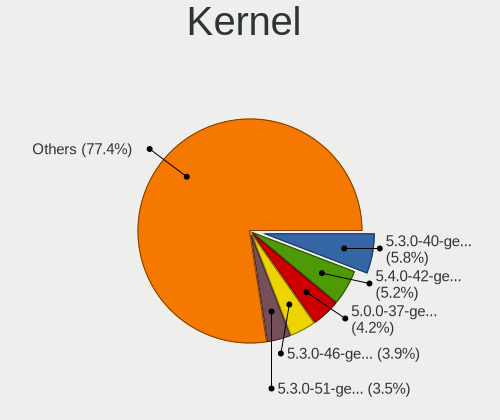

| Version           | Computers | Percent |
|-------------------|-----------|---------|
| 5.3.0-40-generic  | 110       | 5.84%   |
| 5.4.0-42-generic  | 98        | 5.2%    |
| 5.0.0-37-generic  | 79        | 4.2%    |
| 5.3.0-46-generic  | 73        | 3.88%   |
| 5.3.0-51-generic  | 65        | 3.45%   |
| 5.4.0-47-generic  | 62        | 3.29%   |
| 5.3.0-53-generic  | 54        | 2.87%   |
| 5.4.0-58-generic  | 53        | 2.81%   |
| 5.3.0-42-generic  | 52        | 2.76%   |
| 5.4.0-45-generic  | 49        | 2.6%    |
| 5.4.0-48-generic  | 48        | 2.55%   |
| 5.4.0-72-generic  | 46        | 2.44%   |
| 5.4.0-65-generic  | 46        | 2.44%   |
| 5.4.0-80-generic  | 40        | 2.12%   |
| 5.4.0-150-generic | 38        | 2.02%   |
| 5.3.0-62-generic  | 38        | 2.02%   |
| 5.3.0-28-generic  | 36        | 1.91%   |
| 5.4.0-81-generic  | 34        | 1.81%   |
| 5.4.0-54-generic  | 33        | 1.75%   |
| 5.3.0-59-generic  | 33        | 1.75%   |
| 5.4.0-66-generic  | 32        | 1.7%    |
| 5.4.0-73-generic  | 31        | 1.65%   |
| 5.4.0-52-generic  | 31        | 1.65%   |
| 4.18.0-21-generic | 29        | 1.54%   |
| 5.4.0-74-generic  | 28        | 1.49%   |
| 5.4.0-70-generic  | 28        | 1.49%   |
| 5.3.0-45-generic  | 28        | 1.49%   |
| 5.4.0-77-generic  | 25        | 1.33%   |
| 4.18.0-25-generic | 25        | 1.33%   |
| 5.4.0-91-generic  | 21        | 1.12%   |
| 5.4.0-87-generic  | 21        | 1.12%   |
| 5.4.0-56-generic  | 21        | 1.12%   |
| 5.0.0-36-generic  | 21        | 1.12%   |
| 4.18.0-22-generic | 20        | 1.06%   |
| 5.4.0-89-generic  | 18        | 0.96%   |
| 5.3.0-61-generic  | 17        | 0.9%    |
| 5.4.0-90-generic  | 16        | 0.85%   |
| 5.4.0-64-generic  | 16        | 0.85%   |
| 5.4.0-51-generic  | 15        | 0.8%    |
| 5.4.0-62-generic  | 14        | 0.74%   |

Kernel Family
-------------

Linux kernel without a distro release

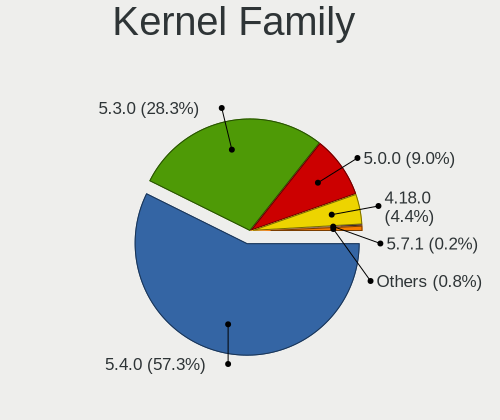

| Version | Computers | Percent |
|---------|-----------|---------|
| 5.4.0   | 985       | 57.33%  |
| 5.3.0   | 487       | 28.35%  |
| 5.0.0   | 154       | 8.96%   |
| 4.18.0  | 76        | 4.42%   |
| 5.7.1   | 3         | 0.17%   |
| 5.7.0   | 2         | 0.12%   |
| 5.6.0   | 2         | 0.12%   |
| 5.9.12  | 1         | 0.06%   |
| 5.9.0   | 1         | 0.06%   |
| 5.8.5   | 1         | 0.06%   |
| 5.8.0   | 1         | 0.06%   |
| 5.7.17  | 1         | 0.06%   |
| 5.4.1   | 1         | 0.06%   |
| 5.15.0  | 1         | 0.06%   |
| 5.10.35 | 1         | 0.06%   |
| 5.10.16 | 1         | 0.06%   |

Kernel Major Ver.
-----------------

Linux kernel major version

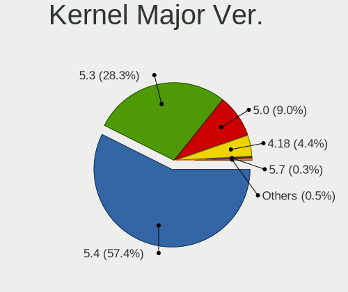

| Version | Computers | Percent |
|---------|-----------|---------|
| 5.4     | 986       | 57.39%  |
| 5.3     | 487       | 28.35%  |
| 5.0     | 154       | 8.96%   |
| 4.18    | 76        | 4.42%   |
| 5.7     | 6         | 0.35%   |
| 5.9     | 2         | 0.12%   |
| 5.8     | 2         | 0.12%   |
| 5.6     | 2         | 0.12%   |
| 5.10    | 2         | 0.12%   |
| 5.15    | 1         | 0.06%   |

Arch
----

OS architecture (x86_64, i586, etc.)

| Name   | Computers | Percent |
|--------|-----------|---------|
| x86_64 | 1331      | 79.89%  |
| i686   | 335       | 20.11%  |

DE
--

Desktop Environment

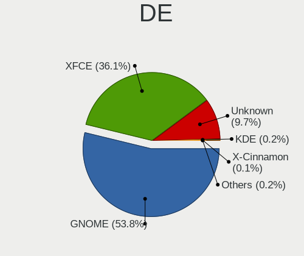

| Name       | Computers | Percent |
|------------|-----------|---------|
| GNOME      | 909       | 53.79%  |
| XFCE       | 610       | 36.09%  |
| Unknown    | 164       | 9.7%    |
| KDE        | 3         | 0.18%   |
| X-Cinnamon | 1         | 0.06%   |
| Unity      | 1         | 0.06%   |
| MATE       | 1         | 0.06%   |
| KDE5       | 1         | 0.06%   |

Display Server
--------------

X11 or Wayland

| Name    | Computers | Percent |
|---------|-----------|---------|
| X11     | 1554      | 92.34%  |
| Unknown | 105       | 6.24%   |
| Wayland | 24        | 1.43%   |

Display Manager
---------------

SDDM, LightDM, etc.

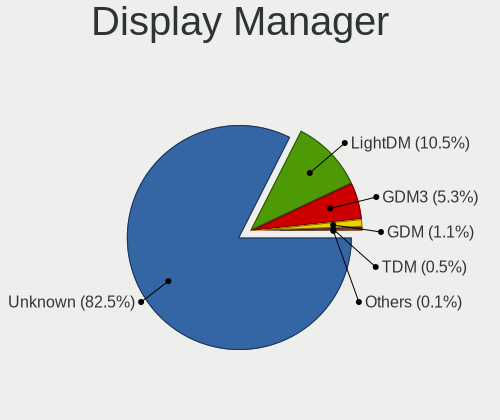

| Name    | Computers | Percent |
|---------|-----------|---------|
| Unknown | 1402      | 82.47%  |
| LightDM | 179       | 10.53%  |
| GDM3    | 90        | 5.29%   |
| GDM     | 19        | 1.12%   |
| TDM     | 9         | 0.53%   |
| SDDM    | 1         | 0.06%   |

OS Lang
-------

Language

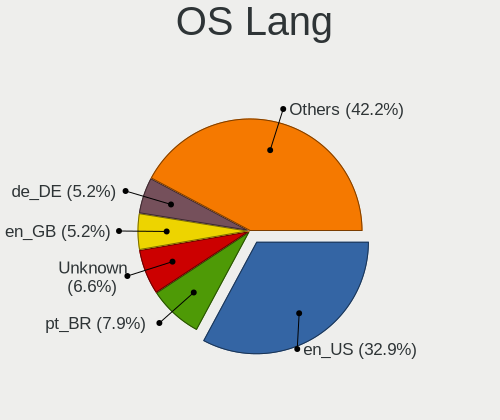

| Lang    | Computers | Percent |
|---------|-----------|---------|
| en_US   | 551       | 32.86%  |
| pt_BR   | 132       | 7.87%   |
| Unknown | 110       | 6.56%   |
| en_GB   | 88        | 5.25%   |
| de_DE   | 88        | 5.25%   |
| it_IT   | 71        | 4.23%   |
| en_IN   | 51        | 3.04%   |
| en_CA   | 51        | 3.04%   |
| es_ES   | 41        | 2.44%   |
| fr_FR   | 38        | 2.27%   |
| pl_PL   | 34        | 2.03%   |
| es_AR   | 31        | 1.85%   |
| pt_PT   | 26        | 1.55%   |
| C       | 26        | 1.55%   |
| nl_NL   | 23        | 1.37%   |
| es_MX   | 23        | 1.37%   |
| ru_RU   | 22        | 1.31%   |
| en_AU   | 21        | 1.25%   |
| cs_CZ   | 21        | 1.25%   |
| en_ZA   | 17        | 1.01%   |
| tr_TR   | 13        | 0.78%   |
| sv_SE   | 13        | 0.78%   |
| es_CL   | 13        | 0.78%   |
| hu_HU   | 12        | 0.72%   |
| es_CO   | 12        | 0.72%   |
| fr_CA   | 11        | 0.66%   |
| de_AT   | 10        | 0.6%    |
| ja_JP   | 9         | 0.54%   |
| el_GR   | 9         | 0.54%   |
| es_PE   | 8         | 0.48%   |
| en_NZ   | 8         | 0.48%   |
| da_DK   | 7         | 0.42%   |
| ro_RO   | 6         | 0.36%   |
| en_PH   | 6         | 0.36%   |
| ru_UA   | 5         | 0.3%    |
| nl_BE   | 5         | 0.3%    |
| bg_BG   | 5         | 0.3%    |
| sl_SI   | 4         | 0.24%   |
| de_CH   | 4         | 0.24%   |
| sr_RS   | 3         | 0.18%   |

Boot Mode
---------

EFI or BIOS

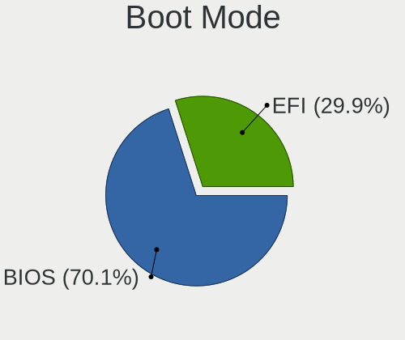

| Mode | Computers | Percent |
|------|-----------|---------|
| BIOS | 1181      | 70.09%  |
| EFI  | 504       | 29.91%  |

Filesystem
----------

Type of filesystem

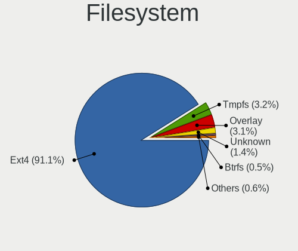

| Type    | Computers | Percent |
|---------|-----------|---------|
| Ext4    | 1534      | 91.09%  |
| Tmpfs   | 54        | 3.21%   |
| Overlay | 53        | 3.15%   |
| Unknown | 24        | 1.43%   |
| Btrfs   | 9         | 0.53%   |
| Ext2    | 8         | 0.48%   |
| Ext3    | 2         | 0.12%   |

Part. scheme
------------

Scheme of partitioning

| Type    | Computers | Percent |
|---------|-----------|---------|
| Unknown | 1599      | 95.18%  |
| MBR     | 45        | 2.68%   |
| GPT     | 36        | 2.14%   |

Dual Boot with Linux/BSD
------------------------

Hosting more than one Linux/BSD

| Dual boot | Computers | Percent |
|-----------|-----------|---------|
| No        | 1501      | 89.35%  |
| Yes       | 179       | 10.65%  |

Dual Boot (Win)
---------------

Hosting Linux and Windows

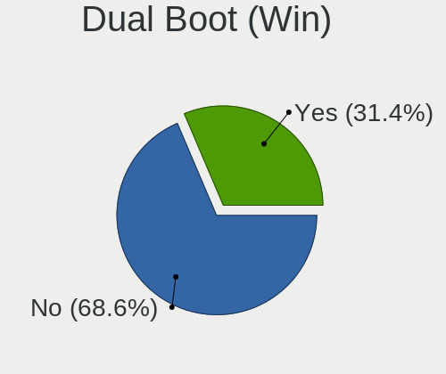

| Dual boot | Computers | Percent |
|-----------|-----------|---------|
| No        | 1158      | 68.6%   |
| Yes       | 530       | 31.4%   |

Board
-----

Vendor
------

Motherboard manufacturer

| Name                | Computers | Percent |
|---------------------|-----------|---------|
| Hewlett-Packard     | 314       | 18.86%  |
| Dell                | 210       | 12.61%  |
| ASUSTek Computer    | 205       | 12.31%  |
| Lenovo              | 173       | 10.39%  |
| Acer                | 114       | 6.85%   |
| Gigabyte Technology | 81        | 4.86%   |
| Toshiba             | 73        | 4.38%   |
| ASRock              | 49        | 2.94%   |
| MSI                 | 44        | 2.64%   |
| Apple               | 35        | 2.1%    |
| Samsung Electronics | 28        | 1.68%   |
| Intel               | 26        | 1.56%   |
| Unknown             | 24        | 1.44%   |
| Sony                | 21        | 1.26%   |
| Pegatron            | 16        | 0.96%   |
| Fujitsu Siemens     | 14        | 0.84%   |
| Fujitsu             | 14        | 0.84%   |
| ECS                 | 14        | 0.84%   |
| Positivo            | 13        | 0.78%   |
| Packard Bell        | 13        | 0.78%   |
| Medion              | 11        | 0.66%   |
| Gateway             | 8         | 0.48%   |
| Foxconn             | 8         | 0.48%   |
| eMachines           | 8         | 0.48%   |
| AMI                 | 7         | 0.42%   |
| Panasonic           | 6         | 0.36%   |
| Alienware           | 6         | 0.36%   |
| Semp Toshiba        | 5         | 0.3%    |
| IBM                 | 5         | 0.3%    |
| HUAWEI              | 5         | 0.3%    |
| Biostar             | 5         | 0.3%    |
| Shuttle             | 4         | 0.24%   |
| Notebook            | 4         | 0.24%   |
| NEC Computers       | 4         | 0.24%   |
| Google              | 4         | 0.24%   |
| Quanta              | 3         | 0.18%   |
| Itautec             | 3         | 0.18%   |
| Insyde              | 3         | 0.18%   |
| Ematic              | 3         | 0.18%   |
| Clevo               | 3         | 0.18%   |

Model
-----

Motherboard model

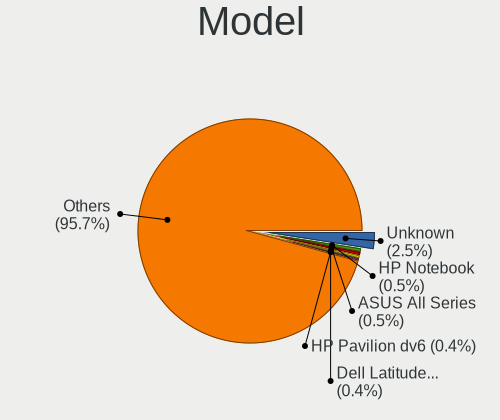

| Name                         | Computers | Percent |
|------------------------------|-----------|---------|
| Unknown                      | 41        | 2.46%   |
| HP Notebook                  | 9         | 0.54%   |
| ASUS All Series              | 8         | 0.48%   |
| HP Pavilion dv6              | 7         | 0.42%   |
| Dell Latitude D630           | 6         | 0.36%   |
| Positivo Mobile              | 5         | 0.3%    |
| HP Pavilion dv7              | 5         | 0.3%    |
| HP Pavilion dv6700           | 5         | 0.3%    |
| HP Pavilion 15               | 5         | 0.3%    |
| HP 530                       | 5         | 0.3%    |
| Dell Latitude E6410          | 5         | 0.3%    |
| Dell Latitude E6400          | 5         | 0.3%    |
| Dell Inspiron 1545           | 5         | 0.3%    |
| Toshiba Satellite C660       | 4         | 0.24%   |
| HP Pavilion g7               | 4         | 0.24%   |
| HP Laptop 15-bw0xx           | 4         | 0.24%   |
| HP Compaq Presario CQ61      | 4         | 0.24%   |
| HP 15                        | 4         | 0.24%   |
| Gigabyte A320M-S2H           | 4         | 0.24%   |
| Gigabyte 970A-DS3P           | 4         | 0.24%   |
| Dell Inspiron 1525           | 4         | 0.24%   |
| Acer Aspire one              | 4         | 0.24%   |
| Toshiba Satellite L500       | 3         | 0.18%   |
| Toshiba Satellite C55-A      | 3         | 0.18%   |
| Samsung 340XAA/350XAA/550XAA | 3         | 0.18%   |
| Packard Bell EasyNote TJ65   | 3         | 0.18%   |
| MSI MS-7721                  | 3         | 0.18%   |
| Lenovo MIIX 320-10ICR 80XF   | 3         | 0.18%   |
| HUAWEI BOHK-WAX9X            | 3         | 0.18%   |
| HP ProBook 4540s             | 3         | 0.18%   |
| HP Pavilion Notebook         | 3         | 0.18%   |
| HP Pavilion g6               | 3         | 0.18%   |
| HP Pavilion dv5              | 3         | 0.18%   |
| HP Pavilion 17               | 3         | 0.18%   |
| HP EliteBook 8460p           | 3         | 0.18%   |
| HP EliteBook 840 G1          | 3         | 0.18%   |
| HP EliteBook 6930p           | 3         | 0.18%   |
| HP Compaq Presario CQ60      | 3         | 0.18%   |
| Dell OptiPlex 9020           | 3         | 0.18%   |
| Dell OptiPlex 780            | 3         | 0.18%   |

Model Family
------------

Motherboard model prefix

| Name                  | Computers | Percent |
|-----------------------|-----------|---------|
| Dell Inspiron         | 75        | 4.5%    |
| HP Pavilion           | 74        | 4.44%   |
| Acer Aspire           | 73        | 4.38%   |
| Toshiba Satellite     | 64        | 3.84%   |
| Lenovo ThinkPad       | 56        | 3.36%   |
| HP Compaq             | 54        | 3.24%   |
| Dell Latitude         | 51        | 3.06%   |
| Unknown               | 41        | 2.46%   |
| Lenovo IdeaPad        | 40        | 2.4%    |
| Dell OptiPlex         | 32        | 1.92%   |
| HP EliteBook          | 30        | 1.8%    |
| HP ProBook            | 25        | 1.5%    |
| Lenovo ThinkCentre    | 20        | 1.2%    |
| HP Laptop             | 18        | 1.08%   |
| Dell Vostro           | 15        | 0.9%    |
| Dell Precision        | 12        | 0.72%   |
| Packard Bell EasyNote | 11        | 0.66%   |
| HP Presario           | 10        | 0.6%    |
| Lenovo Yoga           | 9         | 0.54%   |
| HP Notebook           | 9         | 0.54%   |
| Fujitsu Siemens AMILO | 8         | 0.48%   |
| ASUS All              | 8         | 0.48%   |
| HP Mini               | 7         | 0.42%   |
| HP ENVY               | 7         | 0.42%   |
| HP 530                | 7         | 0.42%   |
| Fujitsu ESPRIMO       | 7         | 0.42%   |
| Dell XPS              | 7         | 0.42%   |
| ASUS TUF              | 7         | 0.42%   |
| HP Stream             | 6         | 0.36%   |
| HP 255                | 6         | 0.36%   |
| ASUS ROG              | 6         | 0.36%   |
| ASUS PRIME            | 6         | 0.36%   |
| Acer Veriton          | 6         | 0.36%   |
| Positivo Mobile       | 5         | 0.3%    |
| HP ZBook              | 5         | 0.3%    |
| HP 15                 | 5         | 0.3%    |
| ASUS VivoBook         | 5         | 0.3%    |
| Acer TravelMate       | 5         | 0.3%    |
| Lenovo MIIX           | 4         | 0.24%   |
| Gigabyte A320M-S2H    | 4         | 0.24%   |

MFG Year
--------

Motherboard manufacture year

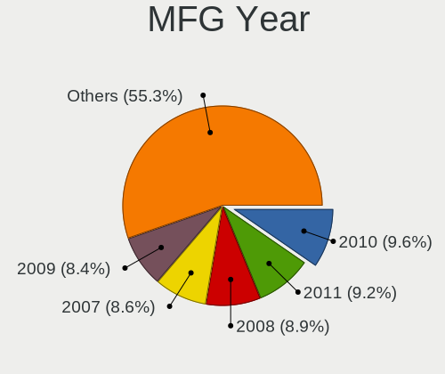

| Year    | Computers | Percent |
|---------|-----------|---------|
| 2010    | 160       | 9.61%   |
| 2011    | 153       | 9.19%   |
| 2008    | 148       | 8.89%   |
| 2007    | 143       | 8.59%   |
| 2009    | 140       | 8.41%   |
| 2013    | 123       | 7.39%   |
| 2012    | 121       | 7.27%   |
| 2018    | 103       | 6.19%   |
| 2014    | 100       | 6.01%   |
| 2017    | 91        | 5.47%   |
| 2015    | 73        | 4.38%   |
| 2016    | 67        | 4.02%   |
| 2006    | 67        | 4.02%   |
| 2019    | 65        | 3.9%    |
| 2005    | 54        | 3.24%   |
| 2020    | 33        | 1.98%   |
| 2021    | 7         | 0.42%   |
| 2004    | 7         | 0.42%   |
| 2003    | 3         | 0.18%   |
| Unknown | 3         | 0.18%   |
| 2002    | 2         | 0.12%   |
| 2023    | 1         | 0.06%   |
| 2022    | 1         | 0.06%   |

Form Factor
-----------

Physical design of the computer

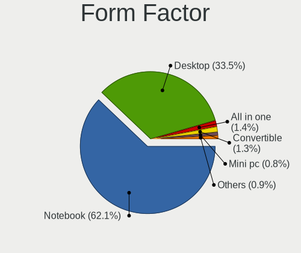

| Name        | Computers | Percent |
|-------------|-----------|---------|
| Notebook    | 1034      | 62.1%   |
| Desktop     | 557       | 33.45%  |
| All in one  | 24        | 1.44%   |
| Convertible | 22        | 1.32%   |
| Mini pc     | 13        | 0.78%   |
| Tablet      | 12        | 0.72%   |
| Server      | 3         | 0.18%   |

Secure Boot
-----------

Enabled or disabled

| State    | Computers | Percent |
|----------|-----------|---------|
| Disabled | 1575      | 94.37%  |
| Enabled  | 94        | 5.63%   |

Coreboot
--------

Have coreboot on board

| Used | Computers | Percent |
|------|-----------|---------|
| No   | 1660      | 99.7%   |
| Yes  | 5         | 0.3%    |

RAM Size
--------

Total RAM memory

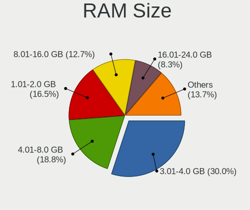

| Size in GB  | Computers | Percent |
|-------------|-----------|---------|
| 3.01-4.0    | 507       | 30.02%  |
| 4.01-8.0    | 317       | 18.77%  |
| 1.01-2.0    | 278       | 16.46%  |
| 8.01-16.0   | 215       | 12.73%  |
| 16.01-24.0  | 140       | 8.29%   |
| 2.01-3.0    | 98        | 5.8%    |
| 0.51-1.0    | 77        | 4.56%   |
| 32.01-64.0  | 42        | 2.49%   |
| 64.01-256.0 | 8         | 0.47%   |
| 24.01-32.0  | 7         | 0.41%   |

RAM Used
--------

Used RAM memory

| Used GB    | Computers | Percent |
|------------|-----------|---------|
| 1.01-2.0   | 867       | 48.41%  |
| 2.01-3.0   | 356       | 19.88%  |
| 0.51-1.0   | 297       | 16.58%  |
| 3.01-4.0   | 144       | 8.04%   |
| 4.01-8.0   | 92        | 5.14%   |
| 0.01-0.5   | 20        | 1.12%   |
| 8.01-16.0  | 14        | 0.78%   |
| 16.01-24.0 | 1         | 0.06%   |

Total Drives
------------

Number of drives on board

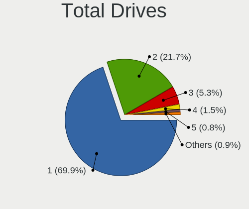

| Drives | Computers | Percent |
|--------|-----------|---------|
| 1      | 1189      | 69.86%  |
| 2      | 370       | 21.74%  |
| 3      | 90        | 5.29%   |
| 4      | 25        | 1.47%   |
| 5      | 13        | 0.76%   |
| 0      | 8         | 0.47%   |
| 6      | 3         | 0.18%   |
| 7      | 2         | 0.12%   |
| 10     | 1         | 0.06%   |
| 8      | 1         | 0.06%   |

Has CD-ROM
----------

Has CD-ROM on board

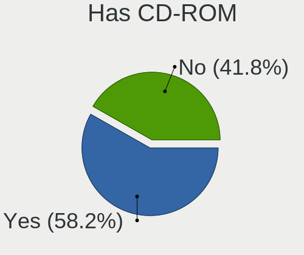

| Presented | Computers | Percent |
|-----------|-----------|---------|
| Yes       | 976       | 58.23%  |
| No        | 700       | 41.77%  |

Has Ethernet
------------

Has Ethernet on board

| Presented | Computers | Percent |
|-----------|-----------|---------|
| Yes       | 1523      | 91.36%  |
| No        | 144       | 8.64%   |

Has WiFi
--------

Has WiFi module

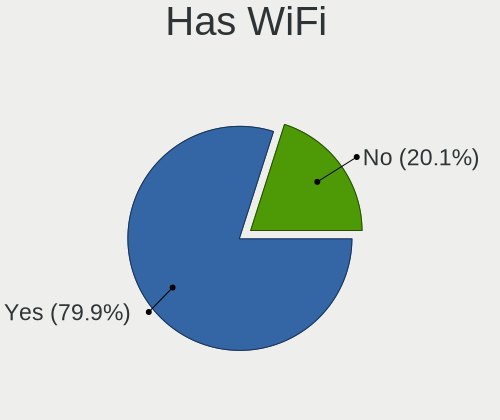

| Presented | Computers | Percent |
|-----------|-----------|---------|
| Yes       | 1337      | 79.92%  |
| No        | 336       | 20.08%  |

Has Bluetooth
-------------

Has Bluetooth module

| Presented | Computers | Percent |
|-----------|-----------|---------|
| No        | 956       | 56.87%  |
| Yes       | 725       | 43.13%  |

Location
--------

Country
-------

Geographic location (country)

| Country      | Computers | Percent |
|--------------|-----------|---------|
| USA          | 345       | 20.65%  |
| Brazil       | 152       | 9.1%    |
| Germany      | 111       | 6.64%   |
| UK           | 97        | 5.8%    |
| Italy        | 74        | 4.43%   |
| Canada       | 69        | 4.13%   |
| India        | 57        | 3.41%   |
| France       | 45        | 2.69%   |
| Spain        | 42        | 2.51%   |
| Netherlands  | 39        | 2.33%   |
| Argentina    | 37        | 2.21%   |
| Poland       | 35        | 2.09%   |
| Mexico       | 30        | 1.8%    |
| Portugal     | 29        | 1.74%   |
| Australia    | 25        | 1.5%    |
| Czechia      | 24        | 1.44%   |
| Indonesia    | 23        | 1.38%   |
| Sweden       | 22        | 1.32%   |
| South Africa | 21        | 1.26%   |
| Greece       | 20        | 1.2%    |
| Romania      | 19        | 1.14%   |
| Russia       | 17        | 1.02%   |
| Colombia     | 16        | 0.96%   |
| Switzerland  | 15        | 0.9%    |
| Chile        | 14        | 0.84%   |
| Turkey       | 13        | 0.78%   |
| Serbia       | 13        | 0.78%   |
| New Zealand  | 13        | 0.78%   |
| Austria      | 13        | 0.78%   |
| Hungary      | 12        | 0.72%   |
| Bulgaria     | 12        | 0.72%   |
| Philippines  | 11        | 0.66%   |
| Japan        | 11        | 0.66%   |
| Denmark      | 11        | 0.66%   |
| Ukraine      | 10        | 0.6%    |
| Peru         | 10        | 0.6%    |
| Belgium      | 10        | 0.6%    |
| Norway       | 8         | 0.48%   |
| Egypt        | 8         | 0.48%   |
| Thailand     | 7         | 0.42%   |

City
----

Geographic location (city)

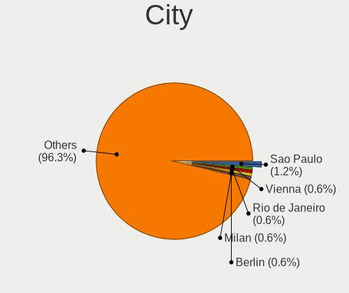

| City           | Computers | Percent |
|----------------|-----------|---------|
| Sao Paulo      | 21        | 1.2%    |
| Vienna         | 11        | 0.63%   |
| Rio de Janeiro | 11        | 0.63%   |
| Milan          | 11        | 0.63%   |
| Berlin         | 11        | 0.63%   |
| Johannesburg   | 10        | 0.57%   |
| Toronto        | 9         | 0.51%   |
| Auckland       | 9         | 0.51%   |
| Athens         | 9         | 0.51%   |
| Zurich         | 8         | 0.46%   |
| Warsaw         | 8         | 0.46%   |
| Rome           | 8         | 0.46%   |
| Perth          | 8         | 0.46%   |
| Buenos Aires   | 8         | 0.46%   |
| Sydney         | 7         | 0.4%    |
| Prague         | 7         | 0.4%    |
| Montreal       | 7         | 0.4%    |
| Madrid         | 7         | 0.4%    |
| Istanbul       | 7         | 0.4%    |
| Cairo          | 7         | 0.4%    |
| Bengaluru      | 7         | 0.4%    |
| Belgrade       | 7         | 0.4%    |
| Sofia          | 6         | 0.34%   |
| Nairobi        | 6         | 0.34%   |
| Munich         | 6         | 0.34%   |
| Mexico City    | 6         | 0.34%   |
| Bucharest      | 6         | 0.34%   |
| Bogot        | 6         | 0.34%   |
| Amman          | 6         | 0.34%   |
| The Hague      | 5         | 0.29%   |
| Stockholm      | 5         | 0.29%   |
| Seattle        | 5         | 0.29%   |
| Salvador       | 5         | 0.29%   |
| Portland       | 5         | 0.29%   |
| Paris          | 5         | 0.29%   |
| Lisbon         | 5         | 0.29%   |
| Lima           | 5         | 0.29%   |
| Joao Pessoa    | 5         | 0.29%   |
| Denver         | 5         | 0.29%   |
| Dayton         | 5         | 0.29%   |

Drives
------

Drive Vendor
------------

Hard drive vendors

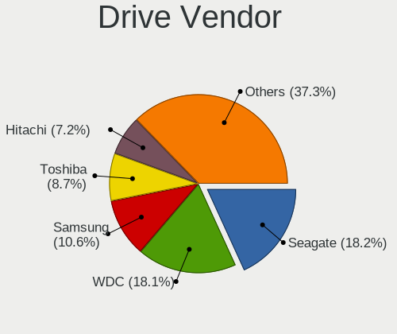

| Vendor                    | Computers | Drives | Percent |
|---------------------------|-----------|--------|---------|
| Seagate                   | 382       | 495    | 18.16%  |
| WDC                       | 381       | 478    | 18.12%  |
| Samsung Electronics       | 223       | 307    | 10.6%   |
| Toshiba                   | 182       | 216    | 8.65%   |
| Hitachi                   | 151       | 173    | 7.18%   |
| Unknown                   | 128       | 186    | 6.09%   |
| Kingston                  | 102       | 123    | 4.85%   |
| SanDisk                   | 82        | 102    | 3.9%    |
| Crucial                   | 45        | 53     | 2.14%   |
| HGST                      | 41        | 50     | 1.95%   |
| Intel                     | 34        | 41     | 1.62%   |
| Maxtor                    | 30        | 43     | 1.43%   |
| Fujitsu                   | 30        | 31     | 1.43%   |
| China                     | 19        | 21     | 0.9%    |
| Phison                    | 17        | 27     | 0.81%   |
| A-DATA Technology         | 16        | 16     | 0.76%   |
| Apple                     | 15        | 15     | 0.71%   |
| SK hynix                  | 14        | 18     | 0.67%   |
| PNY                       | 14        | 18     | 0.67%   |
| Intenso                   | 13        | 15     | 0.62%   |
| Micron Technology         | 11        | 13     | 0.52%   |
| Transcend                 | 10        | 14     | 0.48%   |
| SPCC                      | 10        | 12     | 0.48%   |
| OCZ                       | 10        | 11     | 0.48%   |
| Patriot                   | 9         | 17     | 0.43%   |
| Micron/Crucial Technology | 8         | 9      | 0.38%   |
| LITEON                    | 8         | 11     | 0.38%   |
| SABRENT                   | 7         | 7      | 0.33%   |
| JMicron Technology        | 6         | 9      | 0.29%   |
| Hewlett-Packard           | 6         | 9      | 0.29%   |
| Corsair                   | 5         | 6      | 0.24%   |
| Team                      | 4         | 4      | 0.19%   |
| TCSUNBOW                  | 4         | 4      | 0.19%   |
| LITEONIT                  | 4         | 4      | 0.19%   |
| GOODRAM                   | 4         | 4      | 0.19%   |
| Silicon Motion            | 3         | 4      | 0.14%   |
| Plextor                   | 3         | 3      | 0.14%   |
| Leven                     | 3         | 3      | 0.14%   |
| ASMT                      | 3         | 3      | 0.14%   |
| Apacer                    | 3         | 3      | 0.14%   |

Drive Model
-----------

Hard drive models

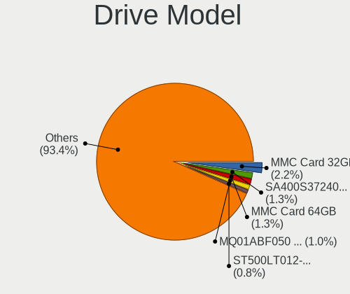

| Model                               | Computers | Percent |
|-------------------------------------|-----------|---------|
| Unknown MMC Card  32GB              | 49        | 2.2%    |
| Kingston SA400S37240G 240GB SSD     | 29        | 1.3%    |
| Unknown MMC Card  64GB              | 28        | 1.26%   |
| Toshiba MQ01ABF050 500GB            | 23        | 1.03%   |
| Seagate ST500LT012-1DG142 500GB     | 18        | 0.81%   |
| Seagate ST500DM002-1BD142 500GB     | 17        | 0.76%   |
| Kingston SA400S37480G 480GB SSD     | 17        | 0.76%   |
| Seagate ST3500418AS 500GB           | 14        | 0.63%   |
| Seagate ST1000DM010-2EP102 1TB      | 14        | 0.63%   |
| Kingston SA400S37120G 120GB SSD     | 14        | 0.63%   |
| Unknown MMC Card  128GB             | 13        | 0.58%   |
| Seagate ST1000LM035-1RK172 1TB      | 13        | 0.58%   |
| Seagate ST9500325AS 500GB           | 12        | 0.54%   |
| Crucial CT240BX500SSD1 240GB        | 12        | 0.54%   |
| Unknown MMC Card  16GB              | 11        | 0.49%   |
| Toshiba DT01ACA100 1TB              | 11        | 0.49%   |
| Seagate ST1000LM024 HN-M101MBB 1TB  | 11        | 0.49%   |
| Samsung SSD 850 EVO 500GB           | 11        | 0.49%   |
| Kingston SV300S37A120G 120GB SSD    | 11        | 0.49%   |
| Hitachi HTS545032B9A300 320GB       | 11        | 0.49%   |
| Seagate ST500LM012 HN-M500MBB 500GB | 10        | 0.45%   |
| Samsung SSD 860 EVO 500GB           | 10        | 0.45%   |
| HGST HTS725050A7E630 500GB          | 10        | 0.45%   |
| WDC WDS240G2G0A-00JH30 240GB SSD    | 9         | 0.4%    |
| Toshiba MQ04ABF100 1TB              | 9         | 0.4%    |
| Toshiba MQ01ABD100 1TB              | 9         | 0.4%    |
| Samsung SSD 860 EVO 250GB           | 9         | 0.4%    |
| Samsung NVMe SSD Drive 512GB        | 9         | 0.4%    |
| Samsung NVMe SSD Drive 500GB        | 9         | 0.4%    |
| Samsung NVMe SSD Drive 256GB        | 9         | 0.4%    |
| Samsung HM160HI 160GB               | 9         | 0.4%    |
| Hitachi HTS543232A7A384 320GB       | 9         | 0.4%    |
| Seagate ST9250315AS 250GB           | 8         | 0.36%   |
| Seagate ST1000DM003-1ER162 1TB      | 8         | 0.36%   |
| WDC WD10EZEX-08WN4A0 1TB            | 7         | 0.31%   |
| Unknown SD/MMC/MS PRO 128GB         | 7         | 0.31%   |
| Seagate ST31000528AS 1TB            | 7         | 0.31%   |
| Samsung SSD 850 EVO 250GB           | 7         | 0.31%   |
| Samsung HM321HI 320GB               | 7         | 0.31%   |
| Crucial CT500MX500SSD1 500GB        | 7         | 0.31%   |

HDD Vendor
----------

Hard disk drive vendors

| Vendor              | Computers | Drives | Percent |
|---------------------|-----------|--------|---------|
| Seagate             | 377       | 485    | 29.73%  |
| WDC                 | 356       | 441    | 28.08%  |
| Toshiba             | 166       | 198    | 13.09%  |
| Hitachi             | 151       | 173    | 11.91%  |
| Samsung Electronics | 79        | 104    | 6.23%   |
| HGST                | 41        | 50     | 3.23%   |
| Fujitsu             | 30        | 31     | 2.37%   |
| Maxtor              | 28        | 41     | 2.21%   |
| Apple               | 8         | 8      | 0.63%   |
| Unknown             | 7         | 12     | 0.55%   |
| SABRENT             | 7         | 7      | 0.55%   |
| JMicron Technology  | 4         | 7      | 0.32%   |
| ASMT                | 3         | 3      | 0.24%   |
| XrayDisk            | 2         | 2      | 0.16%   |
| TO Exter            | 2         | 3      | 0.16%   |
| IBM/Hitachi         | 2         | 3      | 0.16%   |
| Hewlett-Packard     | 2         | 5      | 0.16%   |
| External            | 1         | 1      | 0.08%   |
| ExcelStor           | 1         | 1      | 0.08%   |
| ASMT109x            | 1         | 2      | 0.08%   |

SSD Vendor
----------

Solid state drive vendors

| Vendor              | Computers | Drives | Percent |
|---------------------|-----------|--------|---------|
| Samsung Electronics | 108       | 149    | 18.88%  |
| Kingston            | 95        | 115    | 16.61%  |
| SanDisk             | 59        | 72     | 10.31%  |
| Crucial             | 45        | 53     | 7.87%   |
| WDC                 | 30        | 37     | 5.24%   |
| Intel               | 25        | 29     | 4.37%   |
| China               | 18        | 20     | 3.15%   |
| A-DATA Technology   | 16        | 16     | 2.8%    |
| PNY                 | 14        | 18     | 2.45%   |
| Intenso             | 11        | 13     | 1.92%   |
| Transcend           | 10        | 14     | 1.75%   |
| Toshiba             | 10        | 11     | 1.75%   |
| SK hynix            | 10        | 14     | 1.75%   |
| SPCC                | 9         | 11     | 1.57%   |
| Patriot             | 9         | 17     | 1.57%   |
| OCZ                 | 9         | 10     | 1.57%   |
| Micron Technology   | 9         | 11     | 1.57%   |
| LITEON              | 8         | 11     | 1.4%    |
| Apple               | 6         | 6      | 1.05%   |
| Corsair             | 5         | 6      | 0.87%   |
| Team                | 4         | 4      | 0.7%    |
| TCSUNBOW            | 4         | 4      | 0.7%    |
| LITEONIT            | 4         | 4      | 0.7%    |
| GOODRAM             | 4         | 4      | 0.7%    |
| Plextor             | 3         | 3      | 0.52%   |
| Leven               | 3         | 3      | 0.52%   |
| Hewlett-Packard     | 3         | 3      | 0.52%   |
| Apacer              | 3         | 3      | 0.52%   |
| Verbatim            | 2         | 2      | 0.35%   |
| Pioneer             | 2         | 2      | 0.35%   |
| OWC                 | 2         | 3      | 0.35%   |
| Maxtor              | 2         | 2      | 0.35%   |
| KingDian            | 2         | 2      | 0.35%   |
| Gigabyte Technology | 2         | 10     | 0.35%   |
| BHT                 | 2         | 2      | 0.35%   |
| Zheino              | 1         | 1      | 0.17%   |
| USB30               | 1         | 1      | 0.17%   |
| USB3.0              | 1         | 1      | 0.17%   |
| Unknown             | 1         | 1      | 0.17%   |
| TSA                 | 1         | 1      | 0.17%   |

Drive Kind
----------

HDD or SSD

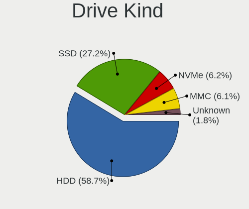

| Kind    | Computers | Drives | Percent |
|---------|-----------|--------|---------|
| HDD     | 1131      | 1577   | 58.66%  |
| SSD     | 525       | 711    | 27.23%  |
| NVMe    | 119       | 155    | 6.17%   |
| MMC     | 118       | 170    | 6.12%   |
| Unknown | 35        | 46     | 1.82%   |

Drive Connector
---------------

SATA, SAS, NVMe, etc.

| Type | Computers | Drives | Percent |
|------|-----------|--------|---------|
| SATA | 1506      | 2240   | 83.43%  |
| NVMe | 118       | 152    | 6.54%   |
| MMC  | 118       | 170    | 6.54%   |
| SAS  | 63        | 97     | 3.49%   |

Drive Size
----------

Size of hard drive

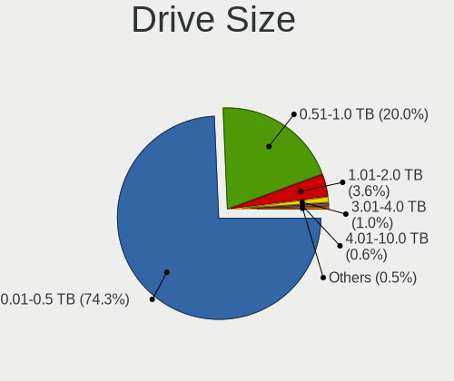

| Size in TB | Computers | Drives | Percent |
|------------|-----------|--------|---------|
| 0.01-0.5   | 1247      | 1684   | 74.31%  |
| 0.51-1.0   | 336       | 459    | 20.02%  |
| 1.01-2.0   | 61        | 87     | 3.64%   |
| 3.01-4.0   | 16        | 34     | 0.95%   |
| 4.01-10.0  | 10        | 11     | 0.6%    |
| 2.01-3.0   | 7         | 12     | 0.42%   |
| 10.01-20.0 | 1         | 1      | 0.06%   |

Space Total
-----------

Amount of disk space available on the file system

| Size in GB     | Computers | Percent |
|----------------|-----------|---------|
| 101-250        | 583       | 33.97%  |
| 251-500        | 411       | 23.95%  |
| 51-100         | 215       | 12.53%  |
| 501-1000       | 178       | 10.37%  |
| 21-50          | 126       | 7.34%   |
| 1-20           | 73        | 4.25%   |
| 1001-2000      | 71        | 4.14%   |
| More than 3000 | 32        | 1.86%   |
| 2001-3000      | 22        | 1.28%   |
| Unknown        | 5         | 0.29%   |

Space Used
----------

Amount of used disk space

| Used GB        | Computers | Percent |
|----------------|-----------|---------|
| 1-20           | 1071      | 60.3%   |
| 21-50          | 279       | 15.71%  |
| 51-100         | 150       | 8.45%   |
| 101-250        | 121       | 6.81%   |
| 251-500        | 73        | 4.11%   |
| 501-1000       | 32        | 1.8%    |
| 1001-2000      | 30        | 1.69%   |
| More than 3000 | 11        | 0.62%   |
| Unknown        | 5         | 0.28%   |
| 2001-3000      | 4         | 0.23%   |

Malfunc. Drives
---------------

Drive models with a malfunction

| Model                                               | Computers | Drives | Percent |
|-----------------------------------------------------|-----------|--------|---------|
| Seagate ST9500325AS 500GB                           | 2         | 2      | 13.33%  |
| WDC WD5000AAKS-00V1A0 500GB                         | 1         | 1      | 6.67%   |
| WDC WD3200BPVT-55ZEST0 320GB                        | 1         | 1      | 6.67%   |
| Toshiba MK5061GSY 500GB                             | 1         | 1      | 6.67%   |
| Seagate ST9320325AS 320GB                           | 1         | 1      | 6.67%   |
| Seagate ST9160314AS 160GB                           | 1         | 1      | 6.67%   |
| Seagate ST9120822AS 120GB                           | 1         | 1      | 6.67%   |
| Seagate ST500LT012-9WS142 500GB                     | 1         | 1      | 6.67%   |
| Micron Technology MTFDDAV256TBN-1AR15ABHA 256GB SSD | 1         | 1      | 6.67%   |
| LITEON CV8-8E128-HP 128GB SSD                       | 1         | 1      | 6.67%   |
| Hitachi HTS545050B9A300 500GB                       | 1         | 1      | 6.67%   |
| Hitachi HTS543280L9SA00 80GB                        | 1         | 1      | 6.67%   |
| Hitachi HTS541616J9SA00 160GB                       | 1         | 1      | 6.67%   |
| Apple HDD HTS541010A9E662 1TB                       | 1         | 1      | 6.67%   |

Malfunc. Drive Vendor
---------------------

Vendors of faulty drives

| Vendor            | Computers | Drives | Percent |
|-------------------|-----------|--------|---------|
| Seagate           | 6         | 6      | 40%     |
| Hitachi           | 3         | 3      | 20%     |
| WDC               | 2         | 2      | 13.33%  |
| Toshiba           | 1         | 1      | 6.67%   |
| Micron Technology | 1         | 1      | 6.67%   |
| LITEON            | 1         | 1      | 6.67%   |
| Apple             | 1         | 1      | 6.67%   |

Malfunc. HDD Vendor
-------------------

Vendors of faulty HDD drives

| Vendor  | Computers | Drives | Percent |
|---------|-----------|--------|---------|
| Seagate | 6         | 6      | 46.15%  |
| Hitachi | 3         | 3      | 23.08%  |
| WDC     | 2         | 2      | 15.38%  |
| Toshiba | 1         | 1      | 7.69%   |
| Apple   | 1         | 1      | 7.69%   |

Malfunc. Drive Kind
-------------------

Kinds of faulty drives

| Kind | Computers | Drives | Percent |
|------|-----------|--------|---------|
| HDD  | 13        | 13     | 86.67%  |
| SSD  | 2         | 2      | 13.33%  |

Failed Drives
-------------

Failed drive models

Zero info for selected period =(

Failed Drive Vendor
-------------------

Failed drive vendors

Zero info for selected period =(

Drive Status
------------

Number of failed and malfunc. drives

| Status   | Computers | Drives | Percent |
|----------|-----------|--------|---------|
| Detected | 1620      | 2601   | 97.18%  |
| Works    | 32        | 43     | 1.92%   |
| Malfunc  | 15        | 15     | 0.9%    |

Storage controller
------------------

Storage Vendor
--------------

Storage controller vendors

| Vendor                           | Computers | Percent |
|----------------------------------|-----------|---------|
| Intel                            | 1174      | 65.73%  |
| AMD                              | 280       | 15.68%  |
| Nvidia                           | 77        | 4.31%   |
| Samsung Electronics              | 46        | 2.58%   |
| Silicon Integrated Systems [SiS] | 33        | 1.85%   |
| JMicron Technology               | 31        | 1.74%   |
| VIA Technologies                 | 27        | 1.51%   |
| Marvell Technology Group         | 19        | 1.06%   |
| SanDisk                          | 18        | 1.01%   |
| Phison Electronics               | 16        | 0.9%    |
| ASMedia Technology               | 15        | 0.84%   |
| Micron/Crucial Technology        | 8         | 0.45%   |
| Kingston Technology Company      | 8         | 0.45%   |
| Toshiba America Info Systems     | 7         | 0.39%   |
| Silicon Image                    | 4         | 0.22%   |
| SK hynix                         | 3         | 0.17%   |
| Silicon Motion                   | 3         | 0.17%   |
| Broadcom / LSI                   | 3         | 0.17%   |
| Union Memory (Shenzhen)          | 2         | 0.11%   |
| Micron Technology                | 2         | 0.11%   |
| KIOXIA                           | 2         | 0.11%   |
| Realtek Semiconductor            | 1         | 0.06%   |
| Promise Technology               | 1         | 0.06%   |
| OCZ Technology Group             | 1         | 0.06%   |
| Lite-On IT Corp. / Plextor       | 1         | 0.06%   |
| Hewlett-Packard                  | 1         | 0.06%   |
| Apple                            | 1         | 0.06%   |
| ADATA Technology                 | 1         | 0.06%   |
| Adaptec                          | 1         | 0.06%   |

Storage Model
-------------

Storage controller models

| Model                                                                                   | Computers | Percent |
|-----------------------------------------------------------------------------------------|-----------|---------|
| AMD FCH SATA Controller [AHCI mode]                                                     | 152       | 6.63%   |
| Intel 82801G (ICH7 Family) IDE Controller                                               | 105       | 4.58%   |
| Intel NM10/ICH7 Family SATA Controller [IDE mode]                                       | 86        | 3.75%   |
| Intel 82801IBM/IEM (ICH9M/ICH9M-E) 4 port SATA Controller [AHCI mode]                   | 80        | 3.49%   |
| Intel 7 Series Chipset Family 6-port SATA Controller [AHCI mode]                        | 76        | 3.31%   |
| Intel Sunrise Point-LP SATA Controller [AHCI mode]                                      | 73        | 3.18%   |
| Intel 6 Series/C200 Series Chipset Family 6 port Mobile SATA AHCI Controller            | 73        | 3.18%   |
| Intel 82801HM/HEM (ICH8M/ICH8M-E) IDE Controller                                        | 65        | 2.83%   |
| Intel 8 Series/C220 Series Chipset Family 6-port SATA Controller 1 [AHCI mode]          | 61        | 2.66%   |
| Intel 82801 Mobile SATA Controller [RAID mode]                                          | 53        | 2.31%   |
| Intel 82801HM/HEM (ICH8M/ICH8M-E) SATA Controller [AHCI mode]                           | 52        | 2.27%   |
| AMD SB7x0/SB8x0/SB9x0 SATA Controller [AHCI mode]                                       | 52        | 2.27%   |
| Intel 8 Series SATA Controller 1 [AHCI mode]                                            | 42        | 1.83%   |
| Intel 82801GBM/GHM (ICH7-M Family) SATA Controller [IDE mode]                           | 40        | 1.74%   |
| AMD SB7x0/SB8x0/SB9x0 IDE Controller                                                    | 40        | 1.74%   |
| AMD SB7x0/SB8x0/SB9x0 SATA Controller [IDE mode]                                        | 37        | 1.61%   |
| Intel 6 Series/C200 Series Chipset Family 6 port Desktop SATA AHCI Controller           | 36        | 1.57%   |
| Silicon Integrated Systems [SiS] 5513 IDE Controller                                    | 33        | 1.44%   |
| Samsung NVMe SSD Controller SM981/PM981/PM983                                           | 29        | 1.26%   |
| Intel SATA Controller [RAID mode]                                                       | 29        | 1.26%   |
| Intel NM10/ICH7 Family SATA Controller [AHCI mode]                                      | 29        | 1.26%   |
| Intel 82801GBM/GHM (ICH7-M Family) SATA Controller [AHCI mode]                          | 29        | 1.26%   |
| Intel 5 Series/3400 Series Chipset 4 port SATA AHCI Controller                          | 29        | 1.26%   |
| Nvidia MCP61 SATA Controller                                                            | 25        | 1.09%   |
| Silicon Integrated Systems [SiS] SATA Controller / IDE mode                             | 24        | 1.05%   |
| Intel Wildcat Point-LP SATA Controller [AHCI Mode]                                      | 22        | 0.96%   |
| Intel 5 Series/3400 Series Chipset 6 port SATA AHCI Controller                          | 22        | 0.96%   |
| VIA VT82C586A/B/VT82C686/A/B/VT823x/A/C PIPC Bus Master IDE                             | 21        | 0.92%   |
| Intel Atom Processor E3800 Series SATA AHCI Controller                                  | 20        | 0.87%   |
| Intel 82801FB/FBM/FR/FW/FRW (ICH6 Family) IDE Controller                                | 19        | 0.83%   |
| Nvidia MCP61 IDE                                                                        | 18        | 0.78%   |
| Intel 82801HM/HEM (ICH8M/ICH8M-E) SATA Controller [IDE mode]                            | 18        | 0.78%   |
| Intel Q170/Q150/B150/H170/H110/Z170/CM236 Chipset SATA Controller [AHCI Mode]           | 17        | 0.74%   |
| Intel Celeron N3350/Pentium N4200/Atom E3900 Series SATA AHCI Controller                | 17        | 0.74%   |
| Intel Atom/Celeron/Pentium Processor x5-E8000/J3xxx/N3xxx Series SATA Controller        | 17        | 0.74%   |
| AMD 400 Series Chipset SATA Controller                                                  | 16        | 0.7%    |
| Intel 82801I (ICH9 Family) 2 port SATA Controller [IDE mode]                            | 15        | 0.65%   |
| Intel 6 Series/C200 Series Chipset Family Desktop SATA Controller (IDE mode, ports 4-5) | 14        | 0.61%   |
| Intel 6 Series/C200 Series Chipset Family Desktop SATA Controller (IDE mode, ports 0-3) | 14        | 0.61%   |
| JMicron JMB363 SATA/IDE Controller                                                      | 13        | 0.57%   |

Storage Kind
------------

Kind of storage controller (IDE, SATA, NVMe, SAS, ...)

| Kind | Computers | Percent |
|------|-----------|---------|
| SATA | 1091      | 57.09%  |
| IDE  | 596       | 31.19%  |
| NVMe | 120       | 6.28%   |
| RAID | 100       | 5.23%   |
| SAS  | 2         | 0.1%    |
| SCSI | 2         | 0.1%    |

Processor
---------

CPU Vendor
----------

Processor vendors

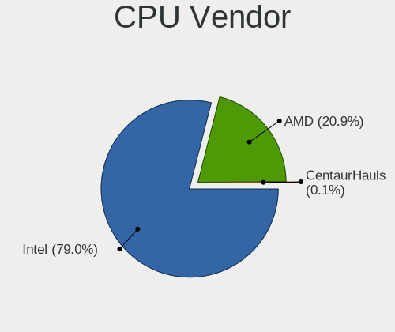

| Vendor       | Computers | Percent |
|--------------|-----------|---------|
| Intel        | 1315      | 78.98%  |
| AMD          | 348       | 20.9%   |
| CentaurHauls | 2         | 0.12%   |

CPU Model
---------

Processor models

| Model                                         | Computers | Percent |
|-----------------------------------------------|-----------|---------|
| Intel Atom x5-Z8350 CPU @ 1.44GHz             | 23        | 1.38%   |
| Intel Pentium 4 CPU 3.00GHz                   | 15        | 0.9%    |
| Intel Core i5-7200U CPU @ 2.50GHz             | 15        | 0.9%    |
| Intel Atom CPU N270 @ 1.60GHz                 | 15        | 0.9%    |
| Intel Core i5-6200U CPU @ 2.30GHz             | 13        | 0.78%   |
| Intel Core i5-2520M CPU @ 2.50GHz             | 13        | 0.78%   |
| Intel Core 2 Duo CPU E8400 @ 3.00GHz          | 13        | 0.78%   |
| Intel Atom CPU N450 @ 1.66GHz                 | 13        | 0.78%   |
| Intel Core i5-2400 CPU @ 3.10GHz              | 12        | 0.72%   |
| Intel Celeron CPU N3350 @ 1.10GHz             | 12        | 0.72%   |
| Intel Atom CPU N455 @ 1.66GHz                 | 12        | 0.72%   |
| Intel Core i3-2310M CPU @ 2.10GHz             | 11        | 0.66%   |
| Intel Core 2 Duo CPU P8400 @ 2.26GHz          | 11        | 0.66%   |
| Intel Celeron CPU N2840 @ 2.16GHz             | 11        | 0.66%   |
| Intel Pentium Dual-Core CPU E5300 @ 2.60GHz   | 9         | 0.54%   |
| Intel Core i5-8250U CPU @ 1.60GHz             | 9         | 0.54%   |
| Intel Core i5-3210M CPU @ 2.50GHz             | 9         | 0.54%   |
| Intel Core i5-2410M CPU @ 2.30GHz             | 9         | 0.54%   |
| Intel Core 2 Duo CPU T7250 @ 2.00GHz          | 9         | 0.54%   |
| Intel Core 2 Duo CPU T6600 @ 2.20GHz          | 9         | 0.54%   |
| Intel Core 2 Duo CPU E7500 @ 2.93GHz          | 9         | 0.54%   |
| Intel Pentium Dual-Core CPU T4400 @ 2.20GHz   | 8         | 0.48%   |
| Intel Core i5-3320M CPU @ 2.60GHz             | 8         | 0.48%   |
| Intel Core 2 Quad CPU Q6600 @ 2.40GHz         | 8         | 0.48%   |
| Intel Core 2 Duo CPU P8700 @ 2.53GHz          | 8         | 0.48%   |
| Intel Core 2 Duo CPU P8600 @ 2.40GHz          | 8         | 0.48%   |
| AMD Ryzen 5 3500U with Radeon Vega Mobile Gfx | 8         | 0.48%   |
| Intel Pentium Dual CPU T3400 @ 2.16GHz        | 7         | 0.42%   |
| Intel Core i7-8565U CPU @ 1.80GHz             | 7         | 0.42%   |
| Intel Core i7-8550U CPU @ 1.80GHz             | 7         | 0.42%   |
| Intel Core i7-7700HQ CPU @ 2.80GHz            | 7         | 0.42%   |
| Intel Core i5-8265U CPU @ 1.60GHz             | 7         | 0.42%   |
| Intel Core i5-2430M CPU @ 2.40GHz             | 7         | 0.42%   |
| Intel Core i3-3217U CPU @ 1.80GHz             | 7         | 0.42%   |
| Intel Core i3-3110M CPU @ 2.40GHz             | 7         | 0.42%   |
| Intel Core 2 Duo CPU T7500 @ 2.20GHz          | 7         | 0.42%   |
| Intel Core 2 Duo CPU T6400 @ 2.00GHz          | 7         | 0.42%   |
| Intel Celeron CPU N3050 @ 1.60GHz             | 7         | 0.42%   |
| Intel Atom x5-Z8300 CPU @ 1.44GHz             | 7         | 0.42%   |
| AMD FX-6300 Six-Core Processor                | 7         | 0.42%   |

CPU Model Family
----------------

Processor model prefix

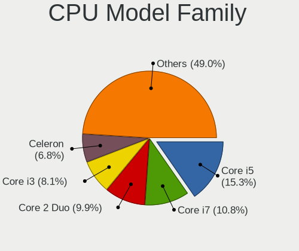

| Model                   | Computers | Percent |
|-------------------------|-----------|---------|
| Intel Core i5           | 256       | 15.34%  |
| Intel Core i7           | 180       | 10.78%  |
| Intel Core 2 Duo        | 165       | 9.89%   |
| Intel Core i3           | 136       | 8.15%   |
| Intel Celeron           | 114       | 6.83%   |
| Intel Atom              | 103       | 6.17%   |
| Intel Pentium Dual-Core | 51        | 3.06%   |
| Intel Pentium           | 50        | 3%      |
| Intel Pentium Dual      | 39        | 2.34%   |
| Intel Genuine           | 38        | 2.28%   |
| Intel Core 2 Quad       | 29        | 1.74%   |
| Intel Pentium 4         | 28        | 1.68%   |
| AMD Ryzen 5             | 28        | 1.68%   |
| AMD A4                  | 26        | 1.56%   |
| Intel Xeon              | 25        | 1.5%    |
| Intel Core 2            | 25        | 1.5%    |
| AMD Athlon 64 X2        | 24        | 1.44%   |
| Intel Pentium M         | 23        | 1.38%   |
| Intel Celeron M         | 23        | 1.38%   |
| AMD Ryzen 7             | 23        | 1.38%   |
| AMD A6                  | 23        | 1.38%   |
| AMD FX                  | 21        | 1.26%   |
| AMD Ryzen 3             | 20        | 1.2%    |
| AMD A8                  | 17        | 1.02%   |
| AMD E                   | 14        | 0.84%   |
| AMD Athlon II X2        | 14        | 0.84%   |
| AMD Sempron             | 13        | 0.78%   |
| Other                   | 9         | 0.54%   |
| AMD Turion 64 X2 Mobile | 9         | 0.54%   |
| AMD E1                  | 9         | 0.54%   |
| AMD Athlon              | 9         | 0.54%   |
| AMD A10                 | 9         | 0.54%   |
| AMD Turion 64 Mobile    | 8         | 0.48%   |
| AMD Phenom II X4        | 8         | 0.48%   |
| AMD Athlon 64           | 7         | 0.42%   |
| Intel Pentium D         | 6         | 0.36%   |
| Intel Celeron Dual-Core | 6         | 0.36%   |
| AMD Mobile Sempron      | 6         | 0.36%   |
| AMD C-50                | 6         | 0.36%   |
| Intel Core Duo          | 5         | 0.3%    |

CPU Cores
---------

Number of processor cores

| Number | Computers | Percent |
|--------|-----------|---------|
| 2      | 968       | 57.96%  |
| 4      | 392       | 23.47%  |
| 1      | 218       | 13.05%  |
| 6      | 40        | 2.4%    |
| 8      | 34        | 2.04%   |
| 3      | 12        | 0.72%   |
| 16     | 2         | 0.12%   |
| 10     | 2         | 0.12%   |
| 20     | 1         | 0.06%   |
| 12     | 1         | 0.06%   |

CPU Sockets
-----------

Number of sockets

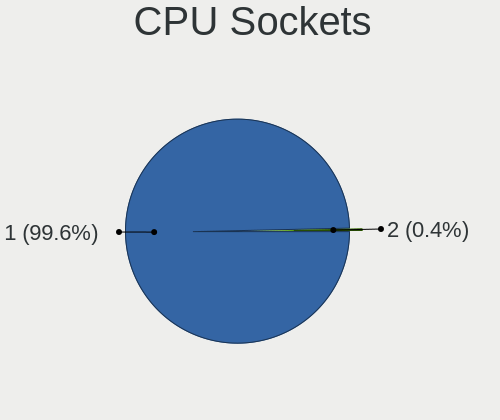

| Number | Computers | Percent |
|--------|-----------|---------|
| 1      | 1659      | 99.64%  |
| 2      | 6         | 0.36%   |

CPU Threads
-----------

Threads per core (Hyper-Threading)

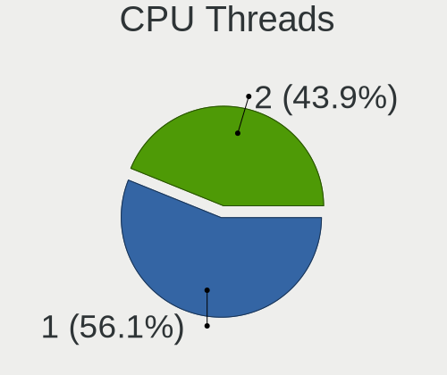

| Number | Computers | Percent |
|--------|-----------|---------|
| 1      | 935       | 56.12%  |
| 2      | 731       | 43.88%  |

CPU Op-Modes
------------

CPU Operation Modes (32-bit, 64-bit)

| Op mode        | Computers | Percent |
|----------------|-----------|---------|
| 32-bit, 64-bit | 1541      | 92.5%   |
| 32-bit         | 123       | 7.38%   |
| Unknown        | 2         | 0.12%   |

CPU Microcode
-------------

Microcode number

| Number     | Computers | Percent |
|------------|-----------|---------|
| Unknown    | 195       | 11.52%  |
| 0x1067a    | 147       | 8.68%   |
| 0x206a7    | 145       | 8.56%   |
| 0x6fd      | 81        | 4.78%   |
| 0x306a9    | 81        | 4.78%   |
| 0x306c3    | 74        | 4.37%   |
| 0x40651    | 45        | 2.66%   |
| 0x20655    | 41        | 2.42%   |
| 0x406e3    | 32        | 1.89%   |
| 0x106ca    | 30        | 1.77%   |
| 0x10676    | 30        | 1.77%   |
| 0x6fb      | 27        | 1.59%   |
| 0x6e8      | 27        | 1.59%   |
| 0x6d8      | 27        | 1.59%   |
| 0x406c4    | 27        | 1.59%   |
| 0x010000c8 | 27        | 1.59%   |
| 0x806e9    | 26        | 1.54%   |
| 0x306d4    | 25        | 1.48%   |
| 0x30678    | 25        | 1.48%   |
| 0x106c2    | 22        | 1.3%    |
| 0x06001119 | 22        | 1.3%    |
| 0x806ea    | 21        | 1.24%   |
| 0x6f6      | 21        | 1.24%   |
| 0x10661    | 21        | 1.24%   |
| 0x906e9    | 18        | 1.06%   |
| 0x506e3    | 18        | 1.06%   |
| 0x406c3    | 17        | 1%      |
| 0x06000852 | 17        | 1%      |
| 0x506c9    | 16        | 0.95%   |
| 0x20652    | 16        | 0.95%   |
| 0x06006705 | 16        | 0.95%   |
| 0x05000119 | 16        | 0.95%   |
| 0x906ea    | 15        | 0.89%   |
| 0x806ec    | 15        | 0.89%   |
| 0x6ec      | 15        | 0.89%   |
| 0x0700010f | 12        | 0.71%   |
| 0x03000027 | 12        | 0.71%   |
| 0x05000029 | 11        | 0.65%   |
| 0xf41      | 10        | 0.59%   |
| 0x08108109 | 10        | 0.59%   |

CPU Microarch
-------------

Microarchitecture

| Name            | Computers | Percent |
|-----------------|-----------|---------|
| Penryn          | 193       | 11.57%  |
| Core            | 169       | 10.13%  |
| SandyBridge     | 148       | 8.87%   |
| Haswell         | 130       | 7.79%   |
| KabyLake        | 115       | 6.89%   |
| Silvermont      | 94        | 5.64%   |
| IvyBridge       | 90        | 5.4%    |
| P6              | 75        | 4.5%    |
| K8 Hammer       | 69        | 4.14%   |
| Westmere        | 68        | 4.08%   |
| Bonnell         | 58        | 3.48%   |
| Skylake         | 55        | 3.3%    |
| K10             | 49        | 2.94%   |
| Piledriver      | 41        | 2.46%   |
| NetBurst        | 39        | 2.34%   |
| Zen+            | 34        | 2.04%   |
| Bobcat          | 28        | 1.68%   |
| Broadwell       | 27        | 1.62%   |
| Zen             | 23        | 1.38%   |
| Excavator       | 22        | 1.32%   |
| Zen 2           | 17        | 1.02%   |
| Goldmont        | 17        | 1.02%   |
| Nehalem         | 15        | 0.9%    |
| Jaguar          | 15        | 0.9%    |
| Puma            | 12        | 0.72%   |
| K10 Llano       | 12        | 0.72%   |
| Goldmont plus   | 10        | 0.6%    |
| Steamroller     | 9         | 0.54%   |
| K8 & K10 hybrid | 9         | 0.54%   |
| CometLake       | 7         | 0.42%   |
| Unknown         | 7         | 0.42%   |
| IceLake         | 4         | 0.24%   |
| Bulldozer       | 4         | 0.24%   |
| Zen 3           | 3         | 0.18%   |

Graphics
--------

GPU Vendor
----------

Vendors of graphics cards

| Vendor                           | Computers | Percent |
|----------------------------------|-----------|---------|
| Intel                            | 956       | 51.87%  |
| AMD                              | 426       | 23.11%  |
| Nvidia                           | 414       | 22.46%  |
| Silicon Integrated Systems [SiS] | 27        | 1.47%   |
| VIA Technologies                 | 15        | 0.81%   |
| Matrox Electronics Systems       | 2         | 0.11%   |
| Trident Microsystems             | 1         | 0.05%   |
| Silicon Motion                   | 1         | 0.05%   |
| ASPEED Technology                | 1         | 0.05%   |

GPU Model
---------

Graphics card models

| Model                                                                                    | Computers | Percent |
|------------------------------------------------------------------------------------------|-----------|---------|
| Intel 2nd Generation Core Processor Family Integrated Graphics Controller                | 111       | 5.58%   |
| Intel Mobile 4 Series Chipset Integrated Graphics Controller                             | 67        | 3.37%   |
| Intel 3rd Gen Core processor Graphics Controller                                         | 65        | 3.27%   |
| Intel Mobile 945GM/GMS/GME, 943/940GML Express Integrated Graphics Controller            | 58        | 2.92%   |
| Intel Atom/Celeron/Pentium Processor x5-E8000/J3xxx/N3xxx Integrated Graphics Controller | 54        | 2.71%   |
| Intel Mobile GM965/GL960 Integrated Graphics Controller (secondary)                      | 47        | 2.36%   |
| Intel Mobile GM965/GL960 Integrated Graphics Controller (primary)                        | 47        | 2.36%   |
| Intel Haswell-ULT Integrated Graphics Controller                                         | 47        | 2.36%   |
| Intel Core Processor Integrated Graphics Controller                                      | 46        | 2.31%   |
| Intel Atom Processor Z36xxx/Z37xxx Series Graphics & Display                             | 40        | 2.01%   |
| Intel Mobile 945GM/GMS, 943/940GML Express Integrated Graphics Controller                | 39        | 1.96%   |
| Intel 4th Gen Core Processor Integrated Graphics Controller                              | 33        | 1.66%   |
| Intel Skylake GT2 [HD Graphics 520]                                                      | 32        | 1.61%   |
| Intel 4 Series Chipset Integrated Graphics Controller                                    | 32        | 1.61%   |
| Intel Atom Processor D4xx/D5xx/N4xx/N5xx Integrated Graphics Controller                  | 31        | 1.56%   |
| Intel HD Graphics 620                                                                    | 30        | 1.51%   |
| Intel Xeon E3-1200 v3/4th Gen Core Processor Integrated Graphics Controller              | 24        | 1.21%   |
| Silicon Integrated Systems [SiS] 771/671 PCIE VGA Display Adapter                        | 23        | 1.16%   |
| Nvidia GK208B [GeForce GT 710]                                                           | 22        | 1.11%   |
| Intel Mobile 945GSE Express Integrated Graphics Controller                               | 21        | 1.06%   |
| Intel HD Graphics 5500                                                                   | 20        | 1.01%   |
| AMD Ellesmere [Radeon RX 470/480/570/570X/580/580X/590]                                  | 20        | 1.01%   |
| AMD Stoney [Radeon R2/R3/R4/R5 Graphics]                                                 | 19        | 0.96%   |
| Intel UHD Graphics 620                                                                   | 18        | 0.9%    |
| AMD Picasso/Raven 2 [Radeon Vega Series / Radeon Vega Mobile Series]                     | 18        | 0.9%    |
| Intel WhiskeyLake-U GT2 [UHD Graphics 620]                                               | 14        | 0.7%    |
| Intel HD Graphics 500                                                                    | 14        | 0.7%    |
| Intel 82G33/G31 Express Integrated Graphics Controller                                   | 14        | 0.7%    |
| AMD Raven Ridge [Radeon Vega Series / Radeon Vega Mobile Series]                         | 14        | 0.7%    |
| Intel Mobile 915GM/GMS/910GML Express Graphics Controller                                | 12        | 0.6%    |
| Intel HD Graphics 630                                                                    | 12        | 0.6%    |
| Intel CoffeeLake-H GT2 [UHD Graphics 630]                                                | 12        | 0.6%    |
| Intel 82945G/GZ Integrated Graphics Controller                                           | 12        | 0.6%    |
| AMD Seymour [Radeon HD 6400M/7400M Series]                                               | 12        | 0.6%    |
| Nvidia GT218 [GeForce 210]                                                               | 11        | 0.55%   |
| AMD Sun XT [Radeon HD 8670A/8670M/8690M / R5 M330 / M430 / Radeon 520 Mobile]            | 11        | 0.55%   |
| Nvidia GF117M [GeForce 610M/710M/810M/820M / GT 620M/625M/630M/720M]                     | 10        | 0.5%    |
| Intel HD Graphics 530                                                                    | 10        | 0.5%    |
| AMD Cedar [Radeon HD 5000/6000/7350/8350 Series]                                         | 10        | 0.5%    |
| Intel GeminiLake [UHD Graphics 600]                                                      | 9         | 0.45%   |

GPU Combo
---------

Combinations of graphics cards

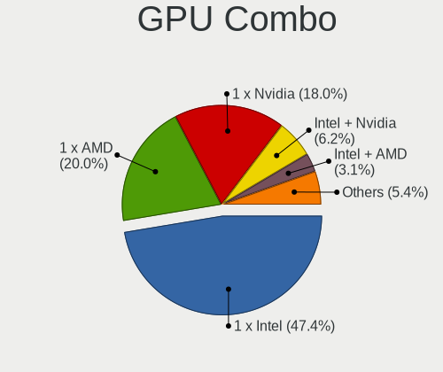

| Name                     | Computers | Percent |
|--------------------------|-----------|---------|
| 1 x Intel                | 792       | 47.37%  |
| 1 x AMD                  | 334       | 19.98%  |
| 1 x Nvidia               | 301       | 18%     |
| Intel + Nvidia           | 103       | 6.16%   |
| Intel + AMD              | 51        | 3.05%   |
| 2 x AMD                  | 33        | 1.97%   |
| 1 x SiS                  | 27        | 1.61%   |
| 1 x VIA                  | 15        | 0.9%    |
| AMD + Nvidia             | 6         | 0.36%   |
| 2 x Nvidia               | 3         | 0.18%   |
| Other                    | 2         | 0.12%   |
| 1 x Matrox               | 2         | 0.12%   |
| 1 x Trident Microsystems | 1         | 0.06%   |
| Nvidia + Silicon Motion  | 1         | 0.06%   |
| Nvidia + ASPEED          | 1         | 0.06%   |

GPU Driver
----------

Free vs proprietary

| Driver      | Computers | Percent |
|-------------|-----------|---------|
| Free        | 1349      | 80.39%  |
| Proprietary | 188       | 11.2%   |
| Unknown     | 141       | 8.4%    |

GPU Memory
----------

Total video memory

| Size in GB | Computers | Percent |
|------------|-----------|---------|
| Unknown    | 1009      | 59.7%   |
| 0.01-0.5   | 312       | 18.46%  |
| 0.51-1.0   | 147       | 8.7%    |
| 1.01-2.0   | 139       | 8.22%   |
| 3.01-4.0   | 45        | 2.66%   |
| 7.01-8.0   | 24        | 1.42%   |
| 5.01-6.0   | 9         | 0.53%   |
| 2.01-3.0   | 3         | 0.18%   |
| 4.01-5.0   | 1         | 0.06%   |
| 8.01-16.0  | 1         | 0.06%   |

Monitor
-------

Monitor Vendor
--------------

Monitor vendors

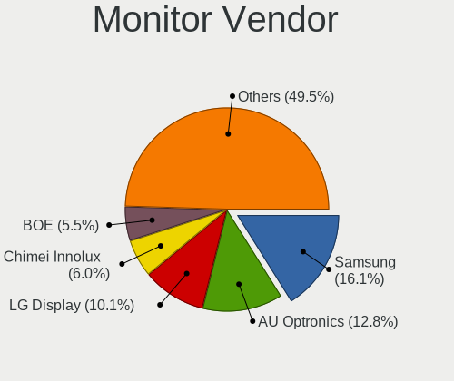

| Vendor                  | Computers | Percent |
|-------------------------|-----------|---------|
| Samsung Electronics     | 248       | 16.09%  |
| AU Optronics            | 197       | 12.78%  |
| LG Display              | 156       | 10.12%  |
| Chimei Innolux          | 93        | 6.04%   |
| BOE                     | 84        | 5.45%   |
| Goldstar                | 66        | 4.28%   |
| Dell                    | 63        | 4.09%   |
| Chi Mei Optoelectronics | 55        | 3.57%   |
| Hewlett-Packard         | 53        | 3.44%   |
| LG Philips              | 43        | 2.79%   |
| Acer                    | 42        | 2.73%   |
| AOC                     | 31        | 2.01%   |
| Apple                   | 28        | 1.82%   |
| InfoVision              | 24        | 1.56%   |
| Ancor Communications    | 24        | 1.56%   |
| Philips                 | 22        | 1.43%   |
| BenQ                    | 21        | 1.36%   |
| Lenovo                  | 20        | 1.3%    |
| Toshiba                 | 16        | 1.04%   |
| ViewSonic               | 15        | 0.97%   |
| LG Electronics          | 15        | 0.97%   |
| HannStar                | 15        | 0.97%   |
| Unknown                 | 14        | 0.91%   |
| Sharp                   | 12        | 0.78%   |
| Sony                    | 10        | 0.65%   |
| CPT                     | 10        | 0.65%   |
| Seiko/Epson             | 8         | 0.52%   |
| Quanta Display          | 8         | 0.52%   |
| Vizio                   | 7         | 0.45%   |
| Eizo                    | 7         | 0.45%   |
| PANDA                   | 6         | 0.39%   |
| NEC Computers           | 5         | 0.32%   |
| LGD                     | 5         | 0.32%   |
| InnoLux Display         | 5         | 0.32%   |
| Iiyama                  | 5         | 0.32%   |
| Gateway                 | 5         | 0.32%   |
| Panasonic               | 4         | 0.26%   |
| Insignia                | 4         | 0.26%   |
| Fujitsu Siemens         | 4         | 0.26%   |
| CVT                     | 4         | 0.26%   |

Monitor Model
-------------

Monitor models

| Model                                                                    | Computers | Percent |
|--------------------------------------------------------------------------|-----------|---------|
| AU Optronics LCD Monitor AUO38ED 1920x1080 344x193mm 15.5-inch           | 15        | 0.95%   |
| Samsung Electronics LCD Monitor SEC5441 1280x800 286x179mm 13.3-inch     | 13        | 0.82%   |
| LG Display LCD Monitor LGD02DC 1366x768 344x194mm 15.5-inch              | 9         | 0.57%   |
| AU Optronics LCD Monitor AUO71EC 1366x768 344x193mm 15.5-inch            | 9         | 0.57%   |
| LG Display LCD Monitor LGD033A 1366x768 340x190mm 15.3-inch              | 7         | 0.44%   |
| HannStar LCD Monitor HSD03E9 1024x600 220x129mm 10.0-inch                | 7         | 0.44%   |
| Chimei Innolux LCD Monitor CMN15DB 1366x768 344x193mm 15.5-inch          | 7         | 0.44%   |
| Samsung Electronics LCD Monitor SEC5541 1366x768 344x193mm 15.5-inch     | 6         | 0.38%   |
| InfoVision LCD Monitor IVO03F4 1920x1080 309x173mm 13.9-inch             | 6         | 0.38%   |
| AU Optronics LCD Monitor AUO123D 1920x1080 309x173mm 13.9-inch           | 6         | 0.38%   |
| Samsung Electronics LCD Monitor SEC3633 1280x800 331x207mm 15.4-inch     | 5         | 0.32%   |
| LG Philips LCD Monitor LPLDB00 1280x800 331x207mm 15.4-inch              | 5         | 0.32%   |
| LG Display LCD Monitor LGD046F 1920x1080 344x194mm 15.5-inch             | 5         | 0.32%   |
| LG Display LCD Monitor LGD02E9 1366x768 309x174mm 14.0-inch              | 5         | 0.32%   |
| Lenovo LCD Monitor LEN40B1 1600x900 344x193mm 15.5-inch                  | 5         | 0.32%   |
| InfoVision LCD Monitor IVO0489 1366x768 256x144mm 11.6-inch              | 5         | 0.32%   |
| Chi Mei Optoelectronics LCD Monitor CMO1526 1280x800 331x207mm 15.4-inch | 5         | 0.32%   |
| Chi Mei Optoelectronics LCD Monitor CMO1007 1024x600 222x125mm 10.0-inch | 5         | 0.32%   |
| BOE LCD Monitor BOE06A5 1366x768 344x194mm 15.5-inch                     | 5         | 0.32%   |
| BOE LCD Monitor BOE06A4 1366x768 344x194mm 15.5-inch                     | 5         | 0.32%   |
| AU Optronics LCD Monitor AUO8174 1280x800 331x207mm 15.4-inch            | 5         | 0.32%   |
| AU Optronics LCD Monitor AUO21EC 1366x768 344x193mm 15.5-inch            | 5         | 0.32%   |
| AU Optronics LCD Monitor AUO20EC 1366x768 344x193mm 15.5-inch            | 5         | 0.32%   |
| AU Optronics LCD Monitor AUO10EC 1366x768 344x193mm 15.5-inch            | 5         | 0.32%   |
| Samsung Electronics LCD Monitor SEC544B 1600x900 382x215mm 17.3-inch     | 4         | 0.25%   |
| Samsung Electronics LCD Monitor SEC4E45 1280x800 331x207mm 15.4-inch     | 4         | 0.25%   |
| Samsung Electronics LCD Monitor SEC3358 1280x800 331x207mm 15.4-inch     | 4         | 0.25%   |
| Samsung Electronics LCD Monitor SEC3345 1280x800 331x207mm 15.4-inch     | 4         | 0.25%   |
| Samsung Electronics LCD Monitor SDC4347 1366x768 344x193mm 15.5-inch     | 4         | 0.25%   |
| Philips PHL 242M8 PHLC253 1920x1080 527x296mm 23.8-inch                  | 4         | 0.25%   |
| LG Philips LCD Monitor LPLBC00 1280x800 331x207mm 15.4-inch              | 4         | 0.25%   |
| InfoVision M140NWR2 R1 IVO057A 1366x768 309x174mm 14.0-inch              | 4         | 0.25%   |
| Chimei Innolux LCD Monitor CMN15E6 1366x768 344x193mm 15.5-inch          | 4         | 0.25%   |
| Chimei Innolux LCD Monitor CMN15C3 1920x1080 344x193mm 15.5-inch         | 4         | 0.25%   |
| Chimei Innolux LCD Monitor CMN1490 1366x768 309x173mm 13.9-inch          | 4         | 0.25%   |
| AU Optronics LCD Monitor AUO61D2 1024x600 222x125mm 10.0-inch            | 4         | 0.25%   |
| AU Optronics LCD Monitor AUO235C 1366x768 256x144mm 11.6-inch            | 4         | 0.25%   |
| AU Optronics LCD Monitor AUO21ED 1920x1080 344x193mm 15.5-inch           | 4         | 0.25%   |
| AU Optronics LCD Monitor AUO2174 1280x800 331x207mm 15.4-inch            | 4         | 0.25%   |
| AU Optronics LCD Monitor AUO193C 1366x768 309x173mm 13.9-inch            | 4         | 0.25%   |

Monitor Resolution
------------------

Monitor screen resolution

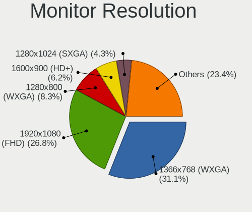

| Resolution         | Computers | Percent |
|--------------------|-----------|---------|
| 1366x768 (WXGA)    | 474       | 31.06%  |
| 1920x1080 (FHD)    | 409       | 26.8%   |
| 1280x800 (WXGA)    | 126       | 8.26%   |
| 1600x900 (HD+)     | 94        | 6.16%   |
| 1280x1024 (SXGA)   | 66        | 4.33%   |
| 1440x900 (WXGA+)   | 64        | 4.19%   |
| 1680x1050 (WSXGA+) | 42        | 2.75%   |
| 3840x2160 (4K)     | 36        | 2.36%   |
| 1024x600           | 36        | 2.36%   |
| 1920x1200 (WUXGA)  | 29        | 1.9%    |
| 1360x768           | 25        | 1.64%   |
| Unknown            | 17        | 1.11%   |
| 2560x1440 (QHD)    | 16        | 1.05%   |
| 1024x768 (XGA)     | 14        | 0.92%   |
| 1280x768           | 7         | 0.46%   |
| 3840x1080          | 6         | 0.39%   |
| 3440x1440          | 6         | 0.39%   |
| 2560x1080          | 6         | 0.39%   |
| 1920x540           | 6         | 0.39%   |
| 2560x1600          | 5         | 0.33%   |
| 5760x1080          | 4         | 0.26%   |
| 2048x1152          | 3         | 0.2%    |
| 1400x1050          | 3         | 0.2%    |
| 1024x576           | 3         | 0.2%    |
| 5760x2160          | 2         | 0.13%   |
| 3200x1800 (QHD+)   | 2         | 0.13%   |
| 3200x1080          | 2         | 0.13%   |
| 1680x945           | 2         | 0.13%   |
| 1600x1200          | 2         | 0.13%   |
| 1152x864           | 2         | 0.13%   |
| 7680x1080          | 1         | 0.07%   |
| 6400x1440          | 1         | 0.07%   |
| 6400x1080          | 1         | 0.07%   |
| 5440x1080          | 1         | 0.07%   |
| 4480x1440          | 1         | 0.07%   |
| 3840x1200          | 1         | 0.07%   |
| 3600x1080          | 1         | 0.07%   |
| 3520x1080          | 1         | 0.07%   |
| 2880x1920          | 1         | 0.07%   |
| 2880x1800          | 1         | 0.07%   |

Monitor Diagonal
----------------

Diagonal size in inches

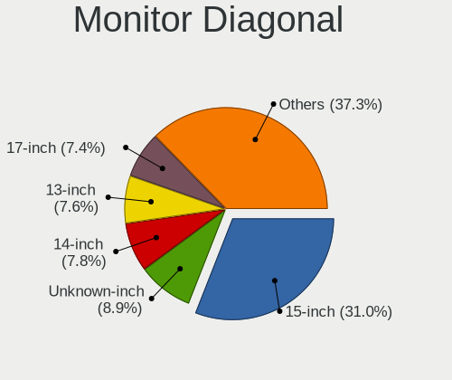

| Inches  | Computers | Percent |
|---------|-----------|---------|
| 15      | 475       | 30.96%  |
| Unknown | 137       | 8.93%   |
| 14      | 120       | 7.82%   |
| 13      | 117       | 7.63%   |
| 17      | 113       | 7.37%   |
| 21      | 59        | 3.85%   |
| 23      | 55        | 3.59%   |
| 19      | 54        | 3.52%   |
| 24      | 51        | 3.32%   |
| 18      | 50        | 3.26%   |
| 27      | 41        | 2.67%   |
| 10      | 40        | 2.61%   |
| 11      | 34        | 2.22%   |
| 20      | 31        | 2.02%   |
| 12      | 23        | 1.5%    |
| 22      | 22        | 1.43%   |
| 31      | 19        | 1.24%   |
| 34      | 12        | 0.78%   |
| 72      | 10        | 0.65%   |
| 40      | 7         | 0.46%   |
| 26      | 7         | 0.46%   |
| 84      | 6         | 0.39%   |
| 54      | 6         | 0.39%   |
| 65      | 4         | 0.26%   |
| 52      | 3         | 0.2%    |
| 46      | 3         | 0.2%    |
| 42      | 3         | 0.2%    |
| 32      | 3         | 0.2%    |
| 16      | 3         | 0.2%    |
| 8       | 3         | 0.2%    |
| 74      | 2         | 0.13%   |
| 49      | 2         | 0.13%   |
| 44      | 2         | 0.13%   |
| 39      | 2         | 0.13%   |
| 36      | 2         | 0.13%   |
| 33      | 2         | 0.13%   |
| 29      | 2         | 0.13%   |
| 60      | 1         | 0.07%   |
| 59      | 1         | 0.07%   |
| 58      | 1         | 0.07%   |

Monitor Width
-------------

Physical width

| Width in mm | Computers | Percent |
|-------------|-----------|---------|
| 301-350     | 676       | 44.39%  |
| 401-500     | 186       | 12.21%  |
| 501-600     | 147       | 9.65%   |
| 201-300     | 144       | 9.46%   |
| Unknown     | 137       | 9%      |
| 351-400     | 131       | 8.6%    |
| 601-700     | 23        | 1.51%   |
| 1001-1500   | 23        | 1.51%   |
| 701-800     | 19        | 1.25%   |
| 1501-2000   | 18        | 1.18%   |
| 801-900     | 10        | 0.66%   |
| 901-1000    | 6         | 0.39%   |
| 101-200     | 3         | 0.2%    |

Aspect Ratio
------------

Proportional relationship between the width and the height

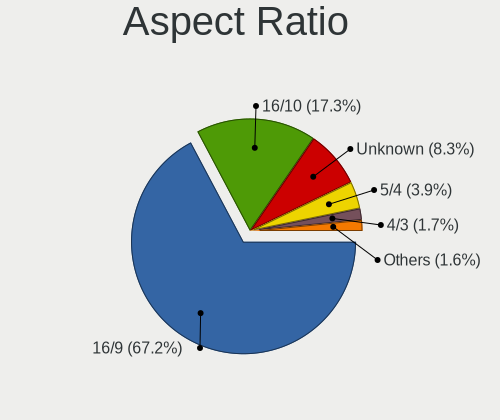

| Ratio   | Computers | Percent |
|---------|-----------|---------|
| 16/9    | 977       | 67.24%  |
| 16/10   | 252       | 17.34%  |
| Unknown | 120       | 8.26%   |
| 5/4     | 57        | 3.92%   |
| 4/3     | 24        | 1.65%   |
| 21/9    | 11        | 0.76%   |
| 3/2     | 5         | 0.34%   |
| 32/9    | 4         | 0.28%   |
| 6/5     | 3         | 0.21%   |

Monitor Area
------------

Area in inch

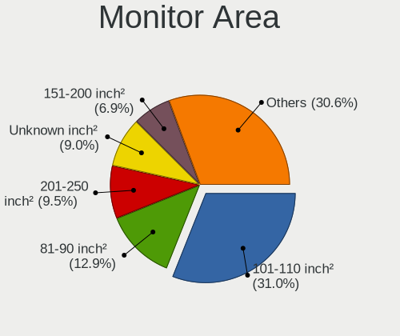

| Area in inch | Computers | Percent |
|----------------|-----------|---------|
| 101-110        | 472       | 31.03%  |
| 81-90          | 196       | 12.89%  |
| 201-250        | 145       | 9.53%   |
| Unknown        | 137       | 9.01%   |
| 151-200        | 105       | 6.9%    |
| 141-150        | 72        | 4.73%   |
| 121-130        | 46        | 3.02%   |
| 301-350        | 42        | 2.76%   |
| 41-50          | 40        | 2.63%   |
| 351-500        | 38        | 2.5%    |
| 131-140        | 38        | 2.5%    |
| More than 1000 | 34        | 2.24%   |
| 51-60          | 34        | 2.24%   |
| 71-80          | 33        | 2.17%   |
| 251-300        | 28        | 1.84%   |
| 501-1000       | 25        | 1.64%   |
| 61-70          | 23        | 1.51%   |
| 91-100         | 7         | 0.46%   |
| 1-40           | 3         | 0.2%    |
| 111-120        | 3         | 0.2%    |

Pixel Density
-------------

Pixels per inch

| Density       | Computers | Percent |
|---------------|-----------|---------|
| 101-120       | 547       | 36.54%  |
| 51-100        | 523       | 34.94%  |
| 121-160       | 218       | 14.56%  |
| Unknown       | 137       | 9.15%   |
| 1-50          | 38        | 2.54%   |
| 161-240       | 28        | 1.87%   |
| More than 240 | 6         | 0.4%    |

Multiple Monitors
-----------------

Total monitors connected

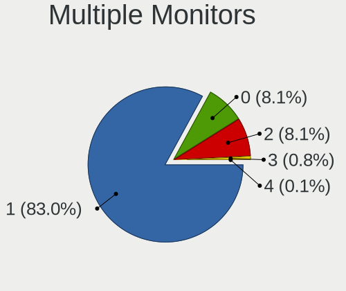

| Total | Computers | Percent |
|-------|-----------|---------|
| 1     | 1408      | 82.97%  |
| 0     | 138       | 8.13%   |
| 2     | 137       | 8.07%   |
| 3     | 13        | 0.77%   |
| 4     | 1         | 0.06%   |

Network
-------

Net Controller Vendor
---------------------

Controller vendors

| Vendor                           | Computers | Percent |
|----------------------------------|-----------|---------|
| Realtek Semiconductor            | 866       | 31.93%  |
| Intel                            | 577       | 21.28%  |
| Qualcomm Atheros                 | 381       | 14.05%  |
| Broadcom                         | 262       | 9.66%   |
| Broadcom Limited                 | 91        | 3.36%   |
| Marvell Technology Group         | 66        | 2.43%   |
| Nvidia                           | 64        | 2.36%   |
| Ralink Technology                | 57        | 2.1%    |
| Ralink                           | 39        | 1.44%   |
| Silicon Integrated Systems [SiS] | 31        | 1.14%   |
| VIA Technologies                 | 23        | 0.85%   |
| TP-Link                          | 22        | 0.81%   |
| D-Link                           | 17        | 0.63%   |
| Samsung Electronics              | 15        | 0.55%   |
| Xiaomi                           | 14        | 0.52%   |
| JMicron Technology               | 14        | 0.52%   |
| D-Link System                    | 13        | 0.48%   |
| Qualcomm Atheros Communications  | 11        | 0.41%   |
| NetGear                          | 11        | 0.41%   |
| MediaTek                         | 9         | 0.33%   |
| Huawei Technologies              | 9         | 0.33%   |
| ASUSTek Computer                 | 9         | 0.33%   |
| Edimax Technology                | 8         | 0.29%   |
| Sierra Wireless                  | 7         | 0.26%   |
| ASIX Electronics                 | 7         | 0.26%   |
| AMD                              | 7         | 0.26%   |
| OPPO Electronics                 | 5         | 0.18%   |
| Motorola PCS                     | 5         | 0.18%   |
| Dell                             | 5         | 0.18%   |
| Micro Star International         | 4         | 0.15%   |
| Hewlett-Packard                  | 4         | 0.15%   |
| DisplayLink                      | 4         | 0.15%   |
| Attansic Technology              | 4         | 0.15%   |
| Sitecom Europe                   | 3         | 0.11%   |
| Qualcomm                         | 3         | 0.11%   |
| Linksys                          | 3         | 0.11%   |
| Davicom Semiconductor            | 3         | 0.11%   |
| Aquantia                         | 3         | 0.11%   |
| ZTE WCDMA Technologies MSM       | 2         | 0.07%   |
| Senao                            | 2         | 0.07%   |

Net Controller Model
--------------------

Controller models

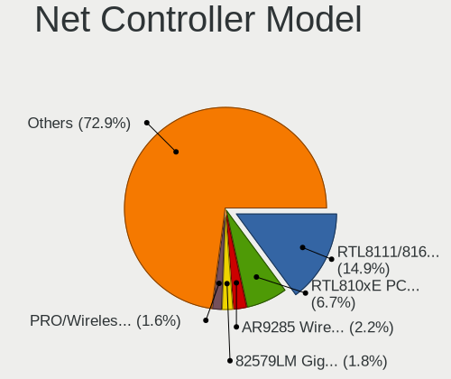

| Model                                                                   | Computers | Percent |
|-------------------------------------------------------------------------|-----------|---------|
| Realtek RTL8111/8168/8211/8411 PCI Express Gigabit Ethernet Controller  | 471       | 14.91%  |
| Realtek RTL810xE PCI Express Fast Ethernet controller                   | 211       | 6.68%   |
| Qualcomm Atheros AR9285 Wireless Network Adapter (PCI-Express)          | 69        | 2.18%   |
| Intel 82579LM Gigabit Network Connection (Lewisville)                   | 57        | 1.8%    |
| Intel PRO/Wireless 3945ABG [Golan] Network Connection                   | 49        | 1.55%   |
| Qualcomm Atheros AR9485 Wireless Network Adapter                        | 47        | 1.49%   |
| Realtek RTL-8100/8101L/8139 PCI Fast Ethernet Adapter                   | 45        | 1.42%   |
| Qualcomm Atheros AR242x / AR542x Wireless Network Adapter (PCI-Express) | 45        | 1.42%   |
| Intel Wireless 7260                                                     | 43        | 1.36%   |
| Qualcomm Atheros QCA9565 / AR9565 Wireless Network Adapter              | 42        | 1.33%   |
| Qualcomm Atheros QCA9377 802.11ac Wireless Network Adapter              | 38        | 1.2%    |
| Broadcom BCM4313 802.11bgn Wireless Network Adapter                     | 37        | 1.17%   |
| Realtek RTL8821CE 802.11ac PCIe Wireless Network Adapter                | 34        | 1.08%   |
| Broadcom BCM4312 802.11b/g LP-PHY                                       | 33        | 1.04%   |
| Ralink MT7601U Wireless Adapter                                         | 30        | 0.95%   |
| Realtek RTL8723BE PCIe Wireless Network Adapter                         | 27        | 0.85%   |
| Realtek RTL8188CE 802.11b/g/n WiFi Adapter                              | 27        | 0.85%   |
| Intel Ethernet Connection I217-LM                                       | 27        | 0.85%   |
| Realtek RTL8188EUS 802.11n Wireless Network Adapter                     | 24        | 0.76%   |
| Intel Wireless 3165                                                     | 24        | 0.76%   |
| Silicon Integrated Systems [SiS] 191 Gigabit Ethernet Adapter           | 23        | 0.73%   |
| Nvidia MCP61 Ethernet                                                   | 23        | 0.73%   |
| Intel Wireless 8265 / 8275                                              | 21        | 0.66%   |
| Intel WiFi Link 5100                                                    | 21        | 0.66%   |
| Intel Centrino Advanced-N 6205 [Taylor Peak]                            | 21        | 0.66%   |
| Broadcom BCM4311 802.11b/g WLAN                                         | 21        | 0.66%   |
| Broadcom BCM43142 802.11b/g/n                                           | 20        | 0.63%   |
| VIA VT6102/VT6103 [Rhine-II]                                            | 19        | 0.6%    |
| Qualcomm Atheros AR8132 Fast Ethernet                                   | 19        | 0.6%    |
| Intel 82801FB/FBM/FR/FW/FRW (ICH6 Family) AC'97 Modem Controller        | 19        | 0.6%    |
| Intel Wireless 7265                                                     | 18        | 0.57%   |
| Intel Wi-Fi 6 AX200                                                     | 18        | 0.57%   |
| Intel PRO/Wireless 4965 AG or AGN [Kedron] Network Connection           | 18        | 0.57%   |
| Broadcom BCM4318 [AirForce One 54g] 802.11g Wireless LAN Controller     | 17        | 0.54%   |
| Intel Wireless 8260                                                     | 16        | 0.51%   |
| Intel 82579V Gigabit Network Connection                                 | 16        | 0.51%   |
| Broadcom BCM4401-B0 100Base-TX                                          | 16        | 0.51%   |
| Realtek RTL88x2bu [AC1200 Techkey]                                      | 15        | 0.47%   |
| Intel Wireless 3160                                                     | 15        | 0.47%   |
| Realtek RTL8191SEvB Wireless LAN Controller                             | 14        | 0.44%   |

Wireless Vendor
---------------

Wireless vendors

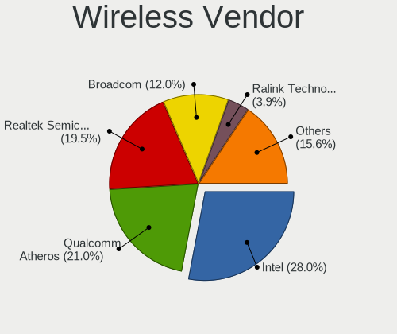

| Vendor                                | Computers | Percent |
|---------------------------------------|-----------|---------|
| Intel                                 | 409       | 27.99%  |
| Qualcomm Atheros                      | 307       | 21.01%  |
| Realtek Semiconductor                 | 285       | 19.51%  |
| Broadcom                              | 175       | 11.98%  |
| Ralink Technology                     | 57        | 3.9%    |
| Broadcom Limited                      | 56        | 3.83%   |
| Ralink                                | 39        | 2.67%   |
| TP-Link                               | 21        | 1.44%   |
| D-Link                                | 17        | 1.16%   |
| Qualcomm Atheros Communications       | 11        | 0.75%   |
| D-Link System                         | 11        | 0.75%   |
| NetGear                               | 10        | 0.68%   |
| Edimax Technology                     | 8         | 0.55%   |
| ASUSTek Computer                      | 8         | 0.55%   |
| Sierra Wireless                       | 7         | 0.48%   |
| Micro Star International              | 4         | 0.27%   |
| Marvell Technology Group              | 4         | 0.27%   |
| Sitecom Europe                        | 3         | 0.21%   |
| MediaTek                              | 3         | 0.21%   |
| Linksys                               | 3         | 0.21%   |
| Senao                                 | 2         | 0.14%   |
| Philips (or NXP)                      | 2         | 0.14%   |
| Microsoft                             | 2         | 0.14%   |
| IMC Networks                          | 2         | 0.14%   |
| Hewlett-Packard                       | 2         | 0.14%   |
| Gemtek                                | 2         | 0.14%   |
| Dell                                  | 2         | 0.14%   |
| Belkin Components                     | 2         | 0.14%   |
| 802.11g Adapter [Linksys WUSB54GC v3] | 2         | 0.14%   |
| ZyDAS                                 | 1         | 0.07%   |
| Xiaomi                                | 1         | 0.07%   |
| Qcom                                  | 1         | 0.07%   |
| Lite-On Technology                    | 1         | 0.07%   |
| Comneon                               | 1         | 0.07%   |

Wireless Model
--------------

Wireless models

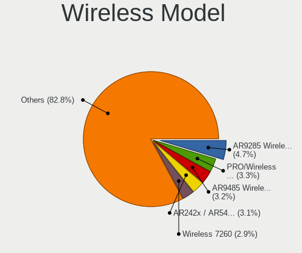

| Model                                                                   | Computers | Percent |
|-------------------------------------------------------------------------|-----------|---------|
| Qualcomm Atheros AR9285 Wireless Network Adapter (PCI-Express)          | 69        | 4.68%   |
| Intel PRO/Wireless 3945ABG [Golan] Network Connection                   | 49        | 3.32%   |
| Qualcomm Atheros AR9485 Wireless Network Adapter                        | 47        | 3.19%   |
| Qualcomm Atheros AR242x / AR542x Wireless Network Adapter (PCI-Express) | 45        | 3.05%   |
| Intel Wireless 7260                                                     | 43        | 2.92%   |
| Qualcomm Atheros QCA9565 / AR9565 Wireless Network Adapter              | 42        | 2.85%   |
| Qualcomm Atheros QCA9377 802.11ac Wireless Network Adapter              | 38        | 2.58%   |
| Broadcom BCM4313 802.11bgn Wireless Network Adapter                     | 37        | 2.51%   |
| Realtek RTL8821CE 802.11ac PCIe Wireless Network Adapter                | 34        | 2.31%   |
| Broadcom BCM4312 802.11b/g LP-PHY                                       | 33        | 2.24%   |
| Ralink MT7601U Wireless Adapter                                         | 30        | 2.04%   |
| Realtek RTL8723BE PCIe Wireless Network Adapter                         | 27        | 1.83%   |
| Realtek RTL8188CE 802.11b/g/n WiFi Adapter                              | 27        | 1.83%   |
| Realtek RTL8188EUS 802.11n Wireless Network Adapter                     | 24        | 1.63%   |
| Intel Wireless 3165                                                     | 24        | 1.63%   |
| Intel Wireless 8265 / 8275                                              | 21        | 1.42%   |
| Intel WiFi Link 5100                                                    | 21        | 1.42%   |
| Intel Centrino Advanced-N 6205 [Taylor Peak]                            | 21        | 1.42%   |
| Broadcom BCM4311 802.11b/g WLAN                                         | 21        | 1.42%   |
| Broadcom BCM43142 802.11b/g/n                                           | 20        | 1.36%   |
| Intel Wireless 7265                                                     | 18        | 1.22%   |
| Intel Wi-Fi 6 AX200                                                     | 18        | 1.22%   |
| Intel PRO/Wireless 4965 AG or AGN [Kedron] Network Connection           | 18        | 1.22%   |
| Broadcom BCM4318 [AirForce One 54g] 802.11g Wireless LAN Controller     | 17        | 1.15%   |
| Intel Wireless 8260                                                     | 16        | 1.09%   |
| Realtek RTL88x2bu [AC1200 Techkey]                                      | 15        | 1.02%   |
| Intel Wireless 3160                                                     | 15        | 1.02%   |
| Realtek RTL8191SEvB Wireless LAN Controller                             | 14        | 0.95%   |
| Qualcomm Atheros AR928X Wireless Network Adapter (PCI-Express)          | 14        | 0.95%   |
| Intel Centrino Wireless-N 1000 [Condor Peak]                            | 14        | 0.95%   |
| Broadcom Limited BCM4312 802.11b/g LP-PHY                               | 14        | 0.95%   |
| Realtek RTL8188FTV 802.11b/g/n 1T1R 2.4G WLAN Adapter                   | 13        | 0.88%   |
| Realtek RTL8188EE Wireless Network Adapter                              | 12        | 0.81%   |
| Realtek 802.11ac NIC                                                    | 12        | 0.81%   |
| Intel PRO/Wireless 2200BG [Calexico2] Network Connection                | 12        | 0.81%   |
| Intel Centrino Wireless-N 2230                                          | 12        | 0.81%   |
| Realtek RTL8822CE 802.11ac PCIe Wireless Network Adapter                | 11        | 0.75%   |
| Realtek RTL8723DE Wireless Network Adapter                              | 11        | 0.75%   |
| Realtek RTL8187B Wireless 802.11g 54Mbps Network Adapter                | 11        | 0.75%   |
| Qualcomm Atheros AR9271 802.11n                                         | 11        | 0.75%   |

Ethernet Vendor
---------------

Ethernet vendors

| Vendor                                 | Computers | Percent |
|----------------------------------------|-----------|---------|
| Realtek Semiconductor                  | 753       | 46.8%   |
| Intel                                  | 309       | 19.2%   |
| Broadcom                               | 117       | 7.27%   |
| Qualcomm Atheros                       | 116       | 7.21%   |
| Nvidia                                 | 64        | 3.98%   |
| Marvell Technology Group               | 62        | 3.85%   |
| Broadcom Limited                       | 39        | 2.42%   |
| Silicon Integrated Systems [SiS]       | 29        | 1.8%    |
| VIA Technologies                       | 23        | 1.43%   |
| JMicron Technology                     | 14        | 0.87%   |
| Xiaomi                                 | 13        | 0.81%   |
| Huawei Technologies                    | 8         | 0.5%    |
| Samsung Electronics                    | 7         | 0.44%   |
| ASIX Electronics                       | 7         | 0.44%   |
| MediaTek                               | 6         | 0.37%   |
| OPPO Electronics                       | 5         | 0.31%   |
| Motorola PCS                           | 5         | 0.31%   |
| DisplayLink                            | 4         | 0.25%   |
| Attansic Technology                    | 4         | 0.25%   |
| Qualcomm                               | 3         | 0.19%   |
| Davicom Semiconductor                  | 3         | 0.19%   |
| Aquantia                               | 3         | 0.19%   |
| D-Link System                          | 2         | 0.12%   |
| Apple                                  | 2         | 0.12%   |
| ZTE WCDMA Technologies MSM             | 1         | 0.06%   |
| vivo                                   | 1         | 0.06%   |
| TP-Link Corporation Limited.           | 1         | 0.06%   |
| TP-Link                                | 1         | 0.06%   |
| T & A Mobile Phones                    | 1         | 0.06%   |
| Sundance Technology Inc / IC Plus      | 1         | 0.06%   |
| Sony Ericsson Mobile Communications AB | 1         | 0.06%   |
| NetGear                                | 1         | 0.06%   |
| GCT Semiconductor                      | 1         | 0.06%   |
| ASUSTek Computer                       | 1         | 0.06%   |
| 3Com                                   | 1         | 0.06%   |

Ethernet Model
--------------

Ethernet models

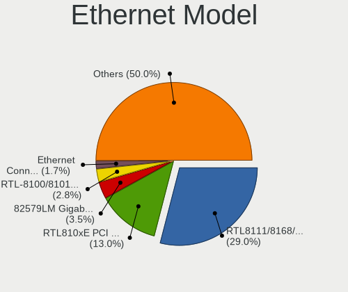

| Model                                                                  | Computers | Percent |
|------------------------------------------------------------------------|-----------|---------|
| Realtek RTL8111/8168/8211/8411 PCI Express Gigabit Ethernet Controller | 471       | 29.02%  |
| Realtek RTL810xE PCI Express Fast Ethernet controller                  | 211       | 13%     |
| Intel 82579LM Gigabit Network Connection (Lewisville)                  | 57        | 3.51%   |
| Realtek RTL-8100/8101L/8139 PCI Fast Ethernet Adapter                  | 45        | 2.77%   |
| Intel Ethernet Connection I217-LM                                      | 27        | 1.66%   |
| Silicon Integrated Systems [SiS] 191 Gigabit Ethernet Adapter          | 23        | 1.42%   |
| Nvidia MCP61 Ethernet                                                  | 23        | 1.42%   |
| VIA VT6102/VT6103 [Rhine-II]                                           | 19        | 1.17%   |
| Qualcomm Atheros AR8132 Fast Ethernet                                  | 19        | 1.17%   |
| Intel 82579V Gigabit Network Connection                                | 16        | 0.99%   |
| Broadcom BCM4401-B0 100Base-TX                                         | 16        | 0.99%   |
| Realtek RTL8153 Gigabit Ethernet Adapter                               | 13        | 0.8%    |
| Marvell Group 88E8040 PCI-E Fast Ethernet Controller                   | 13        | 0.8%    |
| Intel Ethernet Connection I218-LM                                      | 13        | 0.8%    |
| Qualcomm Atheros AR8152 v1.1 Fast Ethernet                             | 12        | 0.74%   |
| Qualcomm Atheros AR8151 v2.0 Gigabit Ethernet                          | 12        | 0.74%   |
| Intel I211 Gigabit Network Connection                                  | 12        | 0.74%   |
| Intel 82567LM-3 Gigabit Network Connection                             | 12        | 0.74%   |
| Intel 82567LM Gigabit Network Connection                               | 12        | 0.74%   |
| Qualcomm Atheros AR8121/AR8113/AR8114 Gigabit or Fast Ethernet         | 11        | 0.68%   |
| Xiaomi Mi/Redmi series (RNDIS)                                         | 10        | 0.62%   |
| Intel 82577LM Gigabit Network Connection                               | 10        | 0.62%   |
| Broadcom NetLink BCM5784M Gigabit Ethernet PCIe                        | 10        | 0.62%   |
| Intel 82566MM Gigabit Network Connection                               | 9         | 0.55%   |
| Intel 82566DM-2 Gigabit Network Connection                             | 9         | 0.55%   |
| Broadcom NetLink BCM5906M Fast Ethernet PCI Express                    | 9         | 0.55%   |
| Broadcom NetLink BCM5787M Gigabit Ethernet PCI Express                 | 9         | 0.55%   |
| Broadcom NetLink BCM57780 Gigabit Ethernet PCIe                        | 9         | 0.55%   |
| Realtek RTL8169 PCI Gigabit Ethernet Controller                        | 8         | 0.49%   |
| Qualcomm Atheros QCA8172 Fast Ethernet                                 | 8         | 0.49%   |
| Qualcomm Atheros AR8161 Gigabit Ethernet                               | 8         | 0.49%   |
| Qualcomm Atheros AR8131 Gigabit Ethernet                               | 8         | 0.49%   |
| Nvidia MCP79 Ethernet                                                  | 8         | 0.49%   |
| Nvidia MCP73 Ethernet                                                  | 8         | 0.49%   |
| Nvidia MCP67 Ethernet                                                  | 8         | 0.49%   |
| Marvell Group 88E8055 PCI-E Gigabit Ethernet Controller                | 8         | 0.49%   |
| Intel PRO/100 VE Network Connection                                    | 8         | 0.49%   |
| Intel Ethernet Connection I219-LM                                      | 8         | 0.49%   |
| Intel 82562ET/EZ/GT/GZ - PRO/100 VE (LOM) Ethernet Controller Mobile   | 8         | 0.49%   |
| Broadcom NetXtreme BCM57766 Gigabit Ethernet PCIe                      | 8         | 0.49%   |

Net Controller Kind
-------------------

Ethernet, WiFi or modem

| Kind     | Computers | Percent |
|----------|-----------|---------|
| Ethernet | 1522      | 52.12%  |
| WiFi     | 1336      | 45.75%  |
| Modem    | 61        | 2.09%   |
| Unknown  | 1         | 0.03%   |

Used Controller
---------------

Currently used network controller

| Kind     | Computers | Percent |
|----------|-----------|---------|
| WiFi     | 1051      | 61.07%  |
| Ethernet | 669       | 38.87%  |
| Modem    | 1         | 0.06%   |

NICs
----

Total network controllers on board

| Total | Computers | Percent |
|-------|-----------|---------|
| 2     | 1036      | 62.11%  |
| 1     | 572       | 34.29%  |
| 0     | 43        | 2.58%   |
| 3     | 16        | 0.96%   |
| 5     | 1         | 0.06%   |

IPv6
----

IPv6 vs IPv4

| Used | Computers | Percent |
|------|-----------|---------|
| No   | 1525      | 90.5%   |
| Yes  | 160       | 9.5%    |

Bluetooth
---------

Bluetooth Vendor
----------------

Controller vendors

| Vendor                          | Computers | Percent |
|---------------------------------|-----------|---------|
| Intel                           | 211       | 28.86%  |
| Qualcomm Atheros Communications | 86        | 11.76%  |
| Realtek Semiconductor           | 75        | 10.26%  |
| Broadcom                        | 69        | 9.44%   |
| Cambridge Silicon Radio         | 38        | 5.2%    |
| Apple                           | 35        | 4.79%   |
| Hewlett-Packard                 | 33        | 4.51%   |
| Dell                            | 32        | 4.38%   |
| Lite-On Technology              | 27        | 3.69%   |
| IMC Networks                    | 21        | 2.87%   |
| Foxconn / Hon Hai               | 20        | 2.74%   |
| Toshiba                         | 12        | 1.64%   |
| ASUSTek Computer                | 10        | 1.37%   |
| Ralink                          | 9         | 1.23%   |
| Alps Electric                   | 9         | 1.23%   |
| Realtek                         | 7         | 0.96%   |
| Foxconn International           | 6         | 0.82%   |
| Dynex                           | 5         | 0.68%   |
| Taiyo Yuden                     | 3         | 0.41%   |
| Ralink Technology               | 3         | 0.41%   |
| Micro Star International        | 3         | 0.41%   |
| SiW                             | 2         | 0.27%   |
| Integrated System Solution      | 2         | 0.27%   |
| Belkin Components               | 2         | 0.27%   |
| Askey Computer                  | 2         | 0.27%   |
| TP-Link                         | 1         | 0.14%   |
| Qcom                            | 1         | 0.14%   |
| Mobile Action Technology        | 1         | 0.14%   |
| MediaTek                        | 1         | 0.14%   |
| Marvell Semiconductor           | 1         | 0.14%   |
| Logitech                        | 1         | 0.14%   |
| Fujitsu                         | 1         | 0.14%   |
| Chicony Electronics             | 1         | 0.14%   |
| Actiontec Electronics           | 1         | 0.14%   |

Bluetooth Model
---------------

Controller models

| Model                                                                               | Computers | Percent |
|-------------------------------------------------------------------------------------|-----------|---------|
| Intel Bluetooth wireless interface                                                  | 126       | 17.21%  |
| Realtek Bluetooth Radio                                                             | 41        | 5.6%    |
| Cambridge Silicon Radio Bluetooth Dongle (HCI mode)                                 | 38        | 5.19%   |
| Qualcomm Atheros  Bluetooth Device                                                  | 37        | 5.05%   |
| Realtek  Bluetooth 4.2 Adapter                                                      | 29        | 3.96%   |
| Intel Bluetooth 9460/9560 Jefferson Peak (JfP)                                      | 21        | 2.87%   |
| HP Bluetooth 2.0 Interface [Broadcom BCM2045]                                       | 20        | 2.73%   |
| Qualcomm Atheros AR3011 Bluetooth                                                   | 17        | 2.32%   |
| Intel AX200 Bluetooth                                                               | 17        | 2.32%   |
| Intel Centrino Bluetooth Wireless Transceiver                                       | 16        | 2.19%   |
| Apple Bluetooth Host Controller                                                     | 14        | 1.91%   |
| Qualcomm Atheros AR3012 Bluetooth 4.0                                               | 11        | 1.5%    |
| Lite-On Atheros AR3012 Bluetooth                                                    | 10        | 1.37%   |
| Broadcom BCM2070 Bluetooth 2.1 + EDR                                                | 10        | 1.37%   |
| Ralink RT3290 Bluetooth                                                             | 9         | 1.23%   |
| Qualcomm Atheros AR9462 Bluetooth                                                   | 9         | 1.23%   |
| Lite-On Qualcomm Atheros QCA9377 Bluetooth                                          | 9         | 1.23%   |
| Intel AX201 Bluetooth                                                               | 9         | 1.23%   |
| Broadcom BCM2045 Bluetooth                                                          | 9         | 1.23%   |
| Intel Wireless-AC 3168 Bluetooth                                                    | 8         | 1.09%   |
| Intel Centrino Advanced-N 6230 Bluetooth adapter                                    | 8         | 1.09%   |
| IMC Networks Bluetooth Radio                                                        | 8         | 1.09%   |
| HP Broadcom 2070 Bluetooth Combo                                                    | 8         | 1.09%   |
| Apple Built-in Bluetooth 2.0+EDR HCI                                                | 8         | 1.09%   |
| Apple Bluetooth USB Host Controller                                                 | 8         | 1.09%   |
| Realtek Bluetooth Radio                                                             | 7         | 0.96%   |
| Dell Wireless 365 Bluetooth                                                         | 7         | 0.96%   |
| Lite-On Bluetooth Device                                                            | 6         | 0.82%   |
| Intel Wireless-AC 9260 Bluetooth Adapter                                            | 6         | 0.82%   |
| IMC Networks Bluetooth Device                                                       | 6         | 0.82%   |
| Foxconn International BCM43142A0 Bluetooth module                                   | 6         | 0.82%   |
| Dell DW375 Bluetooth Module                                                         | 6         | 0.82%   |
| Qualcomm Atheros Bluetooth USB Host Controller                                      | 5         | 0.68%   |
| Foxconn / Hon Hai Foxconn T77H114 BCM2070 [Single-Chip Bluetooth 2.1 + EDR Adapter] | 5         | 0.68%   |
| Dynex Bluetooth 4.0 Adapter [Broadcom, 1.12, BCM20702A0]                            | 5         | 0.68%   |
| Dell Wireless 350 Bluetooth                                                         | 5         | 0.68%   |
| Broadcom BCM43142A0 Bluetooth 4.0                                                   | 5         | 0.68%   |
| Broadcom BCM20702A0 Bluetooth 4.0                                                   | 5         | 0.68%   |
| Broadcom BCM20702A0                                                                 | 5         | 0.68%   |
| Broadcom BCM20702 Bluetooth 4.0 [ThinkPad]                                          | 5         | 0.68%   |

Sound
-----

Sound Vendor
------------

Sound card vendors

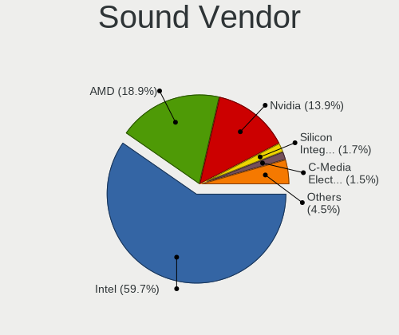

| Vendor                               | Computers | Percent |
|--------------------------------------|-----------|---------|
| Intel                                | 1192      | 59.66%  |
| AMD                                  | 378       | 18.92%  |
| Nvidia                               | 277       | 13.86%  |
| Silicon Integrated Systems [SiS]     | 33        | 1.65%   |
| C-Media Electronics                  | 29        | 1.45%   |
| VIA Technologies                     | 23        | 1.15%   |
| Creative Labs                        | 11        | 0.55%   |
| Logitech                             | 8         | 0.4%    |
| Tenx Technology                      | 6         | 0.3%    |
| Generalplus Technology               | 6         | 0.3%    |
| Creative Technology                  | 4         | 0.2%    |
| JMTek                                | 3         | 0.15%   |
| GN Netcom                            | 3         | 0.15%   |
| Yamaha                               | 2         | 0.1%    |
| Turtle Beach                         | 2         | 0.1%    |
| Texas Instruments                    | 2         | 0.1%    |
| Ensoniq                              | 2         | 0.1%    |
| ZOOM                                 | 1         | 0.05%   |
| Thesycon Systemsoftware & Consulting | 1         | 0.05%   |
| Syntek                               | 1         | 0.05%   |
| Shenzhen Riitek Technology           | 1         | 0.05%   |
| Samsung Electronics                  | 1         | 0.05%   |
| Razer USA                            | 1         | 0.05%   |
| Plantronics                          | 1         | 0.05%   |
| OPPO Electronics                     | 1         | 0.05%   |
| Micronas                             | 1         | 0.05%   |
| Klipsch Audio                        | 1         | 0.05%   |
| Hewlett-Packard                      | 1         | 0.05%   |
| Corsair                              | 1         | 0.05%   |
| Avance Logic                         | 1         | 0.05%   |
| Aureal Semiconductor                 | 1         | 0.05%   |
| Astro Gaming                         | 1         | 0.05%   |
| Apple                                | 1         | 0.05%   |
| AKAI Professional M.I.               | 1         | 0.05%   |

Sound Model
-----------

Sound card models

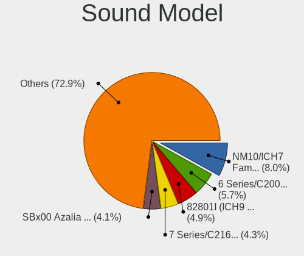

| Model                                                                                             | Computers | Percent |
|---------------------------------------------------------------------------------------------------|-----------|---------|
| Intel NM10/ICH7 Family High Definition Audio Controller                                           | 189       | 8.04%   |
| Intel 6 Series/C200 Series Chipset Family High Definition Audio Controller                        | 134       | 5.7%    |
| Intel 82801I (ICH9 Family) HD Audio Controller                                                    | 116       | 4.94%   |
| Intel 7 Series/C216 Chipset Family High Definition Audio Controller                               | 100       | 4.26%   |
| AMD SBx00 Azalia (Intel HDA)                                                                      | 97        | 4.13%   |
| Intel Sunrise Point-LP HD Audio                                                                   | 87        | 3.7%    |
| Intel 82801H (ICH8 Family) HD Audio Controller                                                    | 76        | 3.23%   |
| AMD FCH Azalia Controller                                                                         | 76        | 3.23%   |
| Intel 5 Series/3400 Series Chipset High Definition Audio                                          | 71        | 3.02%   |
| Intel 8 Series/C220 Series Chipset High Definition Audio Controller                               | 69        | 2.94%   |
| Intel Xeon E3-1200 v3/4th Gen Core Processor HD Audio Controller                                  | 57        | 2.43%   |
| Intel Haswell-ULT HD Audio Controller                                                             | 48        | 2.04%   |
| Intel 8 Series HD Audio Controller                                                                | 48        | 2.04%   |
| AMD Family 17h/19h/1ah HD Audio Controller                                                        | 45        | 1.91%   |
| Nvidia GK208 HDMI/DP Audio Controller                                                             | 36        | 1.53%   |
| AMD Raven/Raven2/Fenghuang HDMI/DP Audio Controller                                               | 30        | 1.28%   |
| AMD Kabini HDMI/DP Audio                                                                          | 29        | 1.23%   |
| Intel Atom Processor Z36xxx/Z37xxx Series High Definition Audio Controller                        | 28        | 1.19%   |
| Intel Broadwell-U Audio Controller                                                                | 26        | 1.11%   |
| Silicon Integrated Systems [SiS] Azalia Audio Controller                                          | 25        | 1.06%   |
| Nvidia GF108 High Definition Audio Controller                                                     | 25        | 1.06%   |
| Intel Wildcat Point-LP High Definition Audio Controller                                           | 25        | 1.06%   |
| Nvidia MCP61 High Definition Audio                                                                | 24        | 1.02%   |
| Nvidia High Definition Audio Controller                                                           | 23        | 0.98%   |
| AMD Family 17h (Models 00h-0fh) HD Audio Controller                                               | 23        | 0.98%   |
| Intel 82801JI (ICH10 Family) HD Audio Controller                                                  | 22        | 0.94%   |
| Intel 82801FB/FBM/FR/FW/FRW (ICH6 Family) AC'97 Audio Controller                                  | 22        | 0.94%   |
| Intel 100 Series/C230 Series Chipset Family HD Audio Controller                                   | 22        | 0.94%   |
| AMD Wrestler HDMI Audio                                                                           | 22        | 0.94%   |
| AMD Family 15h (Models 60h-6fh) Audio Controller                                                  | 22        | 0.94%   |
| Intel Cannon Lake PCH cAVS                                                                        | 21        | 0.89%   |
| Intel Atom/Celeron/Pentium Processor x5-E8000/J3xxx/N3xxx Series High Definition Audio Controller | 21        | 0.89%   |
| AMD Ellesmere HDMI Audio [Radeon RX 470/480 / 570/580/590]                                        | 20        | 0.85%   |
| AMD High Definition Audio Controller                                                              | 19        | 0.81%   |
| AMD Trinity HDMI Audio Controller                                                                 | 18        | 0.77%   |
| Intel Celeron N3350/Pentium N4200/Atom E3900 Series Audio Cluster                                 | 17        | 0.72%   |
| Intel Cannon Point-LP High Definition Audio Controller                                            | 17        | 0.72%   |
| AMD Oland/Hainan/Cape Verde/Pitcairn HDMI Audio [Radeon HD 7000 Series]                           | 16        | 0.68%   |
| Nvidia GP107GL High Definition Audio Controller                                                   | 13        | 0.55%   |
| AMD RV710/730 HDMI Audio [Radeon HD 4000 series]                                                  | 13        | 0.55%   |

Memory
------

Memory Vendor
-------------

Memory module vendors

| Vendor              | Computers | Percent |
|---------------------|-----------|---------|
| SK hynix            | 73        | 21.35%  |
| Unknown             | 69        | 20.18%  |
| Samsung Electronics | 60        | 17.54%  |
| Kingston            | 32        | 9.36%   |
| Micron Technology   | 26        | 7.6%    |
| Crucial             | 11        | 3.22%   |
| Elpida              | 10        | 2.92%   |
| Corsair             | 10        | 2.92%   |
| Nanya Technology    | 9         | 2.63%   |
| Ramaxel Technology  | 8         | 2.34%   |
| G.Skill             | 6         | 1.75%   |
| Qimonda             | 4         | 1.17%   |
| Smart               | 3         | 0.88%   |
| Unknown (ABCD)      | 2         | 0.58%   |
| High Bridge         | 2         | 0.58%   |
| A-DATA Technology   | 2         | 0.58%   |
| Walton Chaintech    | 1         | 0.29%   |
| Transcend           | 1         | 0.29%   |
| Toshiba             | 1         | 0.29%   |
| Team                | 1         | 0.29%   |
| Smart Brazil        | 1         | 0.29%   |
| SHARETRONIC         | 1         | 0.29%   |
| Ramos Technology    | 1         | 0.29%   |
| PNY                 | 1         | 0.29%   |
| Patriot             | 1         | 0.29%   |
| Nayna               | 1         | 0.29%   |
| HBS                 | 1         | 0.29%   |
| CSX                 | 1         | 0.29%   |
| COS Memory          | 1         | 0.29%   |
| Avant               | 1         | 0.29%   |
| ASint Technology    | 1         | 0.29%   |

Memory Model
------------

Memory module models

| Model                                                            | Computers | Percent |
|------------------------------------------------------------------|-----------|---------|
| Samsung RAM M471B5773CHS-CH9 2GB SODIMM DDR3 4199MT/s            | 6         | 1.62%   |
| SK hynix RAM HYMP125S64CP8-S6 2048MB SODIMM DDR2 975MT/s         | 5         | 1.35%   |
| Unknown RAM Module 1GB DIMM SDRAM                                | 4         | 1.08%   |
| SK hynix RAM HMT41GS6BFR8A-PB 8GB SODIMM DDR3 1600MT/s           | 4         | 1.08%   |
| Samsung RAM M471A5244CB0-CTD 4GB SODIMM DDR4 3266MT/s            | 4         | 1.08%   |
| Unknown RAM Module 2GB SODIMM DDR2                               | 3         | 0.81%   |
| SK hynix RAM HYMP125S64CP8-Y5 2GB SODIMM DDR 667MT/s             | 3         | 0.81%   |
| SK hynix RAM HYMP112S64CP6-S6 1GB SODIMM DDR 975MT/s             | 3         | 0.81%   |
| Samsung RAM M471B5273DH0-CH9 4GB SODIMM DDR3 1334MT/s            | 3         | 0.81%   |
| Samsung RAM M471B1G73EB0-YK0 8GB SODIMM DDR3 1600MT/s            | 3         | 0.81%   |
| Samsung RAM M471B1G73DB0-YK0 8GB SODIMM DDR3 1600MT/s            | 3         | 0.81%   |
| Samsung RAM M471A1K43CB1-CRC 8GB SODIMM DDR4 2667MT/s            | 3         | 0.81%   |
| Unknown RAM Module 512MB SODIMM DDR                              | 2         | 0.54%   |
| Unknown RAM Module 2GB SODIMM DDR2 667MT/s                       | 2         | 0.54%   |
| Unknown RAM Module 2GB SODIMM DDR2 533MT/s                       | 2         | 0.54%   |
| Unknown RAM Module 2GB SODIMM DDR                                | 2         | 0.54%   |
| Unknown RAM Module 2GB DIMM 667MT/s                              | 2         | 0.54%   |
| Unknown RAM Module 2048MB SODIMM SDRAM                           | 2         | 0.54%   |
| Unknown RAM Module 2048MB SODIMM DDR2 667MT/s                    | 2         | 0.54%   |
| Unknown RAM Module 2048MB DIMM 800MT/s                           | 2         | 0.54%   |
| Unknown RAM Module 1GB DIMM DDR2                                 | 2         | 0.54%   |
| Unknown RAM Module 1024MB SODIMM DDR2 667MT/s                    | 2         | 0.54%   |
| Unknown RAM Module 1024MB DIMM DDR2 333MT/s                      | 2         | 0.54%   |
| Unknown RAM Module 1024MB DIMM                                   | 2         | 0.54%   |
| Unknown (ABCD) RAM 123456789012345678 2GB SODIMM LPDDR3 2400MT/s | 2         | 0.54%   |
| SK hynix RAM Module 4096MB DIMM DDR3 1066MT/s                    | 2         | 0.54%   |
| SK hynix RAM Module 2GB SODIMM DDR3 1600MT/s                     | 2         | 0.54%   |
| SK hynix RAM Module 2048MB SODIMM DDR3 1066MT/s                  | 2         | 0.54%   |
| SK hynix RAM HMT451S6BFR8A-PB 4096MB SODIMM DDR3 1600MT/s        | 2         | 0.54%   |
| SK hynix RAM HMT351S6CFR8C-PB 4GB SODIMM DDR3 1600MT/s           | 2         | 0.54%   |
| SK hynix RAM HMA851S6CJR6N-VK 4GB Row Of Chips DDR4 2667MT/s     | 2         | 0.54%   |
| SK hynix RAM HMA81GS6JJR8N-VK 8GB SODIMM DDR4 2667MT/s           | 2         | 0.54%   |
| SK hynix RAM HMA81GS6AFR8N-UH 8GB SODIMM DDR4 2667MT/s           | 2         | 0.54%   |
| SK hynix RAM HMA451S6AFR8N-TF 4GB SODIMM DDR4 2133MT/s           | 2         | 0.54%   |
| SK hynix RAM HMA41GS6AFR8N-TF 8GB SODIMM DDR4 2667MT/s           | 2         | 0.54%   |
| SK hynix RAM H5TC4G63AFR_PBA 2GB SODIMM DDR3 1600MT/s            | 2         | 0.54%   |
| Samsung RAM M471B5773DH0-CH9 2GB SODIMM DDR3 1600MT/s            | 2         | 0.54%   |
| Samsung RAM M471A5244CB0-CTD 4GB Row Of Chips DDR4 2667MT/s      | 2         | 0.54%   |
| Ramaxel RAM RMT3170ME68F9F1600 4GB SODIMM DDR3 1600MT/s          | 2         | 0.54%   |
| Ramaxel RAM RMSA3270ME86H9F-2666 4GB SODIMM DDR4 2667MT/s        | 2         | 0.54%   |

Memory Kind
-----------

Memory module kinds

| Kind    | Computers | Percent |
|---------|-----------|---------|
| DDR3    | 124       | 41.2%   |
| DDR4    | 62        | 20.6%   |
| DDR2    | 59        | 19.6%   |
| SDRAM   | 24        | 7.97%   |
| Unknown | 14        | 4.65%   |
| DDR     | 8         | 2.66%   |
| DRAM    | 5         | 1.66%   |
| LPDDR4  | 3         | 1%      |
| LPDDR3  | 2         | 0.66%   |

Memory Form Factor
------------------

Physical design of the memory module

| Name         | Computers | Percent |
|--------------|-----------|---------|
| SODIMM       | 192       | 66.67%  |
| DIMM         | 89        | 30.9%   |
| Row Of Chips | 6         | 2.08%   |
| Chip         | 1         | 0.35%   |

Memory Size
-----------

Memory module size

| Size  | Computers | Percent |
|-------|-----------|---------|
| 2048  | 97        | 28.7%   |
| 4096  | 95        | 28.11%  |
| 8192  | 69        | 20.41%  |
| 1024  | 52        | 15.38%  |
| 16384 | 11        | 3.25%   |
| 512   | 11        | 3.25%   |
| 256   | 2         | 0.59%   |
| 32768 | 1         | 0.3%    |

Memory Speed
------------

Memory module speed

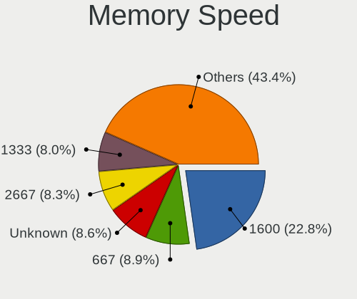

| Speed   | Computers | Percent |
|---------|-----------|---------|
| 1600    | 74        | 22.77%  |
| 667     | 29        | 8.92%   |
| Unknown | 28        | 8.62%   |
| 2667    | 27        | 8.31%   |
| 1333    | 26        | 8%      |
| 1334    | 15        | 4.62%   |
| 800     | 15        | 4.62%   |
| 2133    | 12        | 3.69%   |
| 1066    | 12        | 3.69%   |
| 2400    | 9         | 2.77%   |
| 533     | 9         | 2.77%   |
| 3200    | 8         | 2.46%   |
| 4199    | 7         | 2.15%   |
| 975     | 7         | 2.15%   |
| 3600    | 6         | 1.85%   |
| 3266    | 5         | 1.54%   |
| 2048    | 5         | 1.54%   |
| 400     | 4         | 1.23%   |
| 1067    | 3         | 0.92%   |
| 333     | 3         | 0.92%   |
| 3733    | 2         | 0.62%   |
| 1867    | 2         | 0.62%   |
| 1866    | 2         | 0.62%   |
| 1639    | 2         | 0.62%   |
| 49926   | 1         | 0.31%   |
| 4400    | 1         | 0.31%   |
| 4000    | 1         | 0.31%   |
| 3400    | 1         | 0.31%   |
| 3151    | 1         | 0.31%   |
| 3066    | 1         | 0.31%   |
| 2933    | 1         | 0.31%   |
| 2800    | 1         | 0.31%   |
| 2666    | 1         | 0.31%   |
| 2134    | 1         | 0.31%   |
| 1800    | 1         | 0.31%   |
| 1331    | 1         | 0.31%   |
| 133     | 1         | 0.31%   |

Printers & scanners
-------------------

Printer Vendor
--------------

Printer device vendors

| Vendor              | Computers | Percent |
|---------------------|-----------|---------|
| Hewlett-Packard     | 17        | 28.81%  |
| Canon               | 16        | 27.12%  |
| Brother Industries  | 11        | 18.64%  |
| Seiko Epson         | 7         | 11.86%  |
| Samsung Electronics | 4         | 6.78%   |
| Toshiba TEC         | 1         | 1.69%   |
| STMicroelectronics  | 1         | 1.69%   |
| Ricoh               | 1         | 1.69%   |
| Pantum              | 1         | 1.69%   |

Printer Model
-------------

Printer device models

| Model                                                     | Computers | Percent |
|-----------------------------------------------------------|-----------|---------|
| HP LaserJet Professional P 1102w                          | 2         | 3.39%   |
| HP ENVY 5000 series                                       | 2         | 3.39%   |
| Canon PIXMA MX340                                         | 2         | 3.39%   |
| Canon PIXMA MG2500 Series                                 | 2         | 3.39%   |
| Canon MF4010 series                                       | 2         | 3.39%   |
| Brother HL-2130 series                                    | 2         | 3.39%   |
| Toshiba TEC e-STD120 USB                                  | 1         | 1.69%   |
| STMicroelectronics LED badge -- mini LED display -- 11x44 | 1         | 1.69%   |
| Seiko Epson XP-225 Series                                 | 1         | 1.69%   |
| Seiko Epson WF-2010 Series                                | 1         | 1.69%   |
| Seiko Epson Printer                                       | 1         | 1.69%   |
| Seiko Epson ME 320/330 Series [Stylus SX125]              | 1         | 1.69%   |
| Seiko Epson L365 Series                                   | 1         | 1.69%   |
| Seiko Epson L360 Series                                   | 1         | 1.69%   |
| Seiko Epson L120 Series                                   | 1         | 1.69%   |
| Samsung SCX-3400 Series                                   | 1         | 1.69%   |
| Samsung ML-2010P Mono Laser Printer                       | 1         | 1.69%   |
| Samsung M2070 Series                                      | 1         | 1.69%   |
| Samsung CLX-3300 Series                                   | 1         | 1.69%   |
| Ricoh SP C250SF                                           | 1         | 1.69%   |
| Pantum P2500W series                                      | 1         | 1.69%   |
| HP OfficeJet 3830 series                                  | 1         | 1.69%   |
| HP Laserjet P1505                                         | 1         | 1.69%   |
| HP LaserJet P1102                                         | 1         | 1.69%   |
| HP LaserJet 3050                                          | 1         | 1.69%   |
| HP LaserJet 1020                                          | 1         | 1.69%   |
| HP ENVY 4520 series                                       | 1         | 1.69%   |
| HP Deskjet 4620 series                                    | 1         | 1.69%   |
| HP Deskjet 4610 series                                    | 1         | 1.69%   |
| HP Deskjet 3050A                                          | 1         | 1.69%   |
| HP DeskJet 2700 series                                    | 1         | 1.69%   |
| HP Deskjet 1510                                           | 1         | 1.69%   |
| HP DeskJet 1110 series                                    | 1         | 1.69%   |
| HP Deskjet 1050 J410                                      | 1         | 1.69%   |
| Canon TS5100 series                                       | 1         | 1.69%   |
| Canon TS3100 series                                       | 1         | 1.69%   |
| Canon PIXMA MX490 Series                                  | 1         | 1.69%   |
| Canon PIXMA MG3600 Series                                 | 1         | 1.69%   |
| Canon Pixma iP4500 Printer                                | 1         | 1.69%   |
| Canon MG2100 series                                       | 1         | 1.69%   |

Scanner Vendor
--------------

Scanner device vendors

| Vendor | Computers | Percent |
|--------|-----------|---------|
| Canon  | 4         | 100%    |

Scanner Model
-------------

Scanner device models

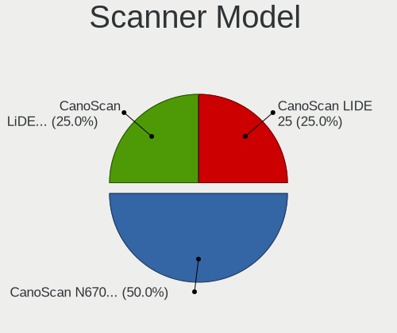

| Model                              | Computers | Percent |
|------------------------------------|-----------|---------|
| Canon CanoScan N670U/N676U/LiDE 20 | 2         | 50%     |
| Canon CanoScan LIDE 25             | 1         | 25%     |
| Canon CanoScan LiDE 200            | 1         | 25%     |

Camera
------

Camera Vendor
-------------

Camera device vendors

| Vendor                                 | Computers | Percent |
|----------------------------------------|-----------|---------|
| Chicony Electronics                    | 227       | 26.12%  |
| Microdia                               | 82        | 9.44%   |
| Suyin                                  | 60        | 6.9%    |
| Realtek Semiconductor                  | 54        | 6.21%   |
| IMC Networks                           | 50        | 5.75%   |
| Bison Electronics                      | 43        | 4.95%   |
| Sunplus Innovation Technology          | 38        | 4.37%   |
| Apple                                  | 34        | 3.91%   |
| Cheng Uei Precision Industry (Foxlink) | 33        | 3.8%    |
| Silicon Motion                         | 25        | 2.88%   |
| Quanta                                 | 23        | 2.65%   |
| Syntek                                 | 18        | 2.07%   |
| Logitech                               | 18        | 2.07%   |
| Alcor Micro                            | 18        | 2.07%   |
| Lite-On Technology                     | 17        | 1.96%   |
| Ricoh                                  | 14        | 1.61%   |
| Acer                                   | 14        | 1.61%   |
| Importek                               | 11        | 1.27%   |
| ALi                                    | 11        | 1.27%   |
| Z-Star Microelectronics                | 9         | 1.04%   |
| Samsung Electronics                    | 9         | 1.04%   |
| Microsoft                              | 8         | 0.92%   |
| OmniVision Technologies                | 6         | 0.69%   |
| GEMBIRD                                | 6         | 0.69%   |
| Cubeternet                             | 4         | 0.46%   |
| Lenovo                                 | 3         | 0.35%   |
| Genesys Logic                          | 3         | 0.35%   |
| Primax Electronics                     | 2         | 0.23%   |
| Pixart Imaging                         | 2         | 0.23%   |
| Luxvisions Innotech Limited            | 2         | 0.23%   |
| LG Electronics                         | 2         | 0.23%   |
| Generalplus Technology                 | 2         | 0.23%   |
| YGTek                                  | 1         | 0.12%   |
| Trust                                  | 1         | 0.12%   |
| Sunplus Technology                     | 1         | 0.12%   |
| Sonix Technology                       | 1         | 0.12%   |
| OPPO Electronics                       | 1         | 0.12%   |
| Novatel Wireless                       | 1         | 0.12%   |
| Novatek Microelectronics               | 1         | 0.12%   |
| Nebraska Furniture Mart                | 1         | 0.12%   |

Camera Model
------------

Camera device models

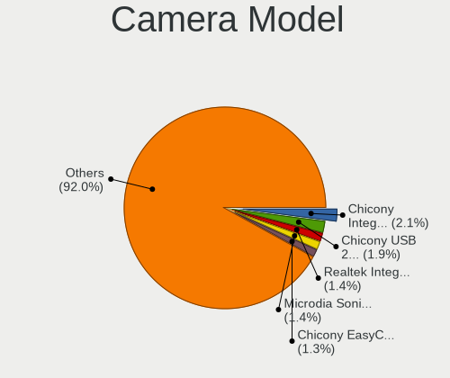

| Model                                                   | Computers | Percent |
|---------------------------------------------------------|-----------|---------|
| Chicony Integrated Camera                               | 18        | 2.06%   |
| Chicony USB 2.0 Camera                                  | 17        | 1.95%   |
| Realtek Integrated_Webcam_HD                            | 12        | 1.38%   |
| Microdia Sonix USB 2.0 Camera                           | 12        | 1.38%   |
| Chicony EasyCamera                                      | 11        | 1.26%   |
| Apple iPhone 5/5C/5S/6/SE/7/8/X/XR                      | 11        | 1.26%   |
| Suyin HP Truevision HD                                  | 10        | 1.15%   |
| Microdia Integrated Webcam                              | 10        | 1.15%   |
| IMC Networks USB2.0 HD UVC WebCam                       | 10        | 1.15%   |
| Chicony HP Truevision HD camera                         | 10        | 1.15%   |
| Suyin Acer/HP Integrated Webcam [CN0314]                | 9         | 1.03%   |
| Samsung Galaxy series, misc. (MTP mode)                 | 9         | 1.03%   |
| Chicony HP Truevision HD                                | 9         | 1.03%   |
| ALi Gateway Webcam                                      | 9         | 1.03%   |
| Sunplus Integrated_Webcam_HD                            | 8         | 0.92%   |
| Realtek Integrated Webcam                               | 8         | 0.92%   |
| Chicony VGA WebCam                                      | 8         | 0.92%   |
| Chicony TOSHIBA Web Camera - HD                         | 8         | 0.92%   |
| Chicony Lenovo EasyCamera                               | 8         | 0.92%   |
| Chicony HP HD Webcam                                    | 8         | 0.92%   |
| Apple FaceTime HD Camera (Built-in)                     | 8         | 0.92%   |
| Apple Built-in iSight                                   | 8         | 0.92%   |
| IMC Networks USB2.0 VGA UVC WebCam                      | 7         | 0.8%    |
| Chicony HP Webcam                                       | 7         | 0.8%    |
| Chicony CNF9055 Toshiba Webcam                          | 7         | 0.8%    |
| Bison Lenovo EasyCamera                                 | 7         | 0.8%    |
| Bison Integrated Camera                                 | 7         | 0.8%    |
| Alcor Micro USB 2.0 Camera                              | 7         | 0.8%    |
| Suyin USB 2.0 Camera                                    | 6         | 0.69%   |
| Quanta HP Webcam                                        | 6         | 0.69%   |
| Quanta HP TrueVision HD Camera                          | 6         | 0.69%   |
| Microdia Laptop_Integrated_Webcam_HD                    | 6         | 0.69%   |
| Microdia Integrated_Webcam_HD                           | 6         | 0.69%   |
| Lite-On Integrated Camera                               | 6         | 0.69%   |
| GEMBIRD Generic UVC 1.00 camera [AppoTech AX2311]       | 6         | 0.69%   |
| Chicony HD WebCam                                       | 6         | 0.69%   |
| Chicony Acer CrystalEye Webcam                          | 6         | 0.69%   |
| Cheng Uei Precision Industry (Foxlink) HP Truevision HD | 6         | 0.69%   |
| Acer Lenovo EasyCamera                                  | 6         | 0.69%   |
| Syntek EasyCamera                                       | 5         | 0.57%   |

Security
--------

Fingerprint Vendor
------------------

Fingerprint sensor vendors

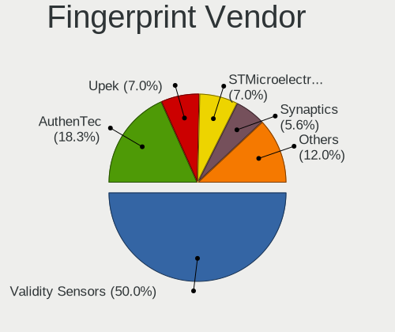

| Vendor                     | Computers | Percent |
|----------------------------|-----------|---------|
| Validity Sensors           | 71        | 50%     |
| AuthenTec                  | 26        | 18.31%  |
| Upek                       | 10        | 7.04%   |
| STMicroelectronics         | 10        | 7.04%   |
| Synaptics                  | 8         | 5.63%   |
| Shenzhen Goodix Technology | 8         | 5.63%   |
| Elan Microelectronics      | 7         | 4.93%   |
| LighTuning Technology      | 2         | 1.41%   |

Fingerprint Model
-----------------

Fingerprint sensor models

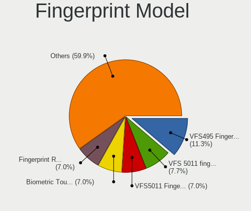

| Model                                                                      | Computers | Percent |
|----------------------------------------------------------------------------|-----------|---------|
| Validity Sensors VFS495 Fingerprint Reader                                 | 16        | 11.27%  |
| Validity Sensors VFS 5011 fingerprint sensor                               | 11        | 7.75%   |
| Validity Sensors VFS5011 Fingerprint Reader                                | 10        | 7.04%   |
| Upek Biometric Touchchip/Touchstrip Fingerprint Sensor                     | 10        | 7.04%   |
| STMicroelectronics Fingerprint Reader                                      | 10        | 7.04%   |
| AuthenTec AES2501 Fingerprint Sensor                                       | 10        | 7.04%   |
| Validity Sensors VFS471 Fingerprint Reader                                 | 9         | 6.34%   |
| Validity Sensors Fingerprint scanner                                       | 6         | 4.23%   |
| Validity Sensors VFS491                                                    | 5         | 3.52%   |
| AuthenTec AES2810                                                          | 5         | 3.52%   |
| AuthenTec AES1600                                                          | 5         | 3.52%   |
| Validity Sensors Swipe Fingerprint Sensor                                  | 4         | 2.82%   |
| Synaptics  WBDI                                                            | 4         | 2.82%   |
| Shenzhen Goodix  Fingerprint Device                                        | 4         | 2.82%   |
| Elan ELAN:Fingerprint                                                      | 4         | 2.82%   |
| Validity Sensors VFS451 Fingerprint Reader                                 | 3         | 2.11%   |
| Synaptics Fingerprint reader [HP G6]                                       | 3         | 2.11%   |
| Shenzhen Goodix Fingerprint Reader                                         | 3         | 2.11%   |
| AuthenTec AES1660 Fingerprint Sensor                                       | 3         | 2.11%   |
| Validity Sensors VFS301 Fingerprint Reader                                 | 2         | 1.41%   |
| Validity Sensors VFS101 Fingerprint Reader                                 | 2         | 1.41%   |
| Elan WBF Fingerprint Sensor                                                | 2         | 1.41%   |
| AuthenTec Fingerprint Sensor                                               | 2         | 1.41%   |
| Validity Sensors VFS7500 Touch Fingerprint Sensor                          | 1         | 0.7%    |
| Validity Sensors Synaptics VFS7552 Touch Fingerprint Sensor with PurePrint | 1         | 0.7%    |
| Validity Sensors Synaptics VFS7552 Touch Fingerprint Sensor                | 1         | 0.7%    |
| Synaptics  WBDI Fingerprint Reader - USB 052                               | 1         | 0.7%    |
| Shenzhen Goodix FingerPrint                                                | 1         | 0.7%    |
| LighTuning Fingerprint Reader                                              | 1         | 0.7%    |
| LighTuning ES603 Swipe Fingerprint Sensor                                  | 1         | 0.7%    |
| Elan ELAN:ARM-M4                                                           | 1         | 0.7%    |
| AuthenTec AES2550 Fingerprint Sensor                                       | 1         | 0.7%    |

Chipcard Vendor
---------------

Chipcard module vendors

| Vendor                | Computers | Percent |
|-----------------------|-----------|---------|
| Broadcom              | 26        | 44.07%  |
| O2 Micro              | 14        | 23.73%  |
| Alcor Micro           | 11        | 18.64%  |
| Lenovo                | 3         | 5.08%   |
| Upek                  | 2         | 3.39%   |
| SCM Microsystems      | 1         | 1.69%   |
| Realtek Semiconductor | 1         | 1.69%   |
| Kobil Systems         | 1         | 1.69%   |

Chipcard Model
--------------

Chipcard module models

| Model                                                                        | Computers | Percent |
|------------------------------------------------------------------------------|-----------|---------|
| Broadcom BCM5880 Secure Applications Processor                               | 15        | 25.42%  |
| Alcor Micro AU9540 Smartcard Reader                                          | 11        | 18.64%  |
| O2 Micro OZ776 CCID Smartcard Reader                                         | 10        | 16.95%  |
| Broadcom BCM5880 Secure Applications Processor with fingerprint swipe sensor | 6         | 10.17%  |
| Broadcom 5880                                                                | 5         | 8.47%   |
| O2 Micro Oz776 SmartCard Reader                                              | 4         | 6.78%   |
| Lenovo Integrated Smart Card Reader                                          | 3         | 5.08%   |
| Upek TouchChip Fingerprint Coprocessor (WBF advanced mode)                   | 2         | 3.39%   |
| SCM Microsystems SCR3340 - ExpressCard54 Smart Card Reader                   | 1         | 1.69%   |
| Realtek Semiconductor Smart Card Reader Interface                            | 1         | 1.69%   |
| Kobil Systems KOBIL Class 3 Reader                                           | 1         | 1.69%   |

Unsupported
-----------

Unsupported Devices
-------------------

Total unsupported devices on board

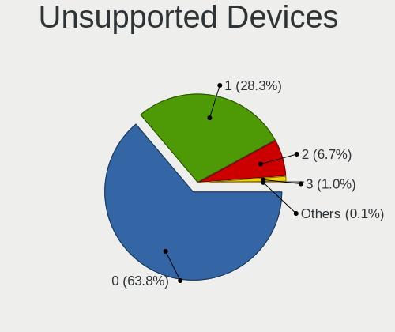

| Total | Computers | Percent |
|-------|-----------|---------|
| 0     | 1080      | 63.83%  |
| 1     | 478       | 28.25%  |
| 2     | 114       | 6.74%   |
| 3     | 17        | 1%      |
| 4     | 2         | 0.12%   |
| 7     | 1         | 0.06%   |

Unsupported Device Types
------------------------

Types of unsupported devices

| Type                     | Computers | Percent |
|--------------------------|-----------|---------|
| Graphics card            | 265       | 36.2%   |
| Fingerprint reader       | 141       | 19.26%  |
| Net/wireless             | 119       | 16.26%  |
| Chipcard                 | 58        | 7.92%   |
| Modem                    | 32        | 4.37%   |
| Communication controller | 23        | 3.14%   |
| Multimedia controller    | 21        | 2.87%   |
| Storage                  | 17        | 2.32%   |
| Flash memory             | 13        | 1.78%   |
| Bluetooth                | 12        | 1.64%   |
| Sound                    | 10        | 1.37%   |
| Camera                   | 7         | 0.96%   |
| Unassigned class         | 5         | 0.68%   |
| Net/ethernet             | 3         | 0.41%   |
| Card reader              | 2         | 0.27%   |
| Storage/raid             | 1         | 0.14%   |
| Storage/nvme             | 1         | 0.14%   |
| Storage/ata              | 1         | 0.14%   |
| Network                  | 1         | 0.14%   |

