Zorin 15 - Tested Hardware & Statistics (Desktops)
--------------------------------------------------

A project to collect tested hardware configurations for Zorin 15.

Anyone can contribute to this report by the [hw-probe](https://github.com/linuxhw/hw-probe) tool:

    sudo -E hw-probe -all -upload

Please submit a probe of your configuration if it's not presented on the page or is rare.

Full-feature report is available here: https://linux-hardware.org/?view=trends

Contents
--------

* [ Test Cases ](#test-cases)

* [ System ](#system)
  - [ Kernel                   ](#kernel)
  - [ Kernel Family            ](#kernel-family)
  - [ Kernel Major Ver.        ](#kernel-major-ver)
  - [ Arch                     ](#arch)
  - [ DE                       ](#de)
  - [ Display Server           ](#display-server)
  - [ Display Manager          ](#display-manager)
  - [ OS Lang                  ](#os-lang)
  - [ Boot Mode                ](#boot-mode)
  - [ Filesystem               ](#filesystem)
  - [ Part. scheme             ](#part-scheme)
  - [ Dual Boot with Linux/BSD ](#dual-boot-with-linuxbsd)
  - [ Dual Boot (Win)          ](#dual-boot-win)

* [ Board ](#board)
  - [ Vendor                   ](#vendor)
  - [ Model                    ](#model)
  - [ Model Family             ](#model-family)
  - [ MFG Year                 ](#mfg-year)
  - [ Form Factor              ](#form-factor)
  - [ Secure Boot              ](#secure-boot)
  - [ Coreboot                 ](#coreboot)
  - [ RAM Size                 ](#ram-size)
  - [ RAM Used                 ](#ram-used)
  - [ Total Drives             ](#total-drives)
  - [ Has CD-ROM               ](#has-cd-rom)
  - [ Has Ethernet             ](#has-ethernet)
  - [ Has WiFi                 ](#has-wifi)
  - [ Has Bluetooth            ](#has-bluetooth)

* [ Location ](#location)
  - [ Country                  ](#country)
  - [ City                     ](#city)

* [ Drives ](#drives)
  - [ Drive Vendor             ](#drive-vendor)
  - [ Drive Model              ](#drive-model)
  - [ HDD Vendor               ](#hdd-vendor)
  - [ SSD Vendor               ](#ssd-vendor)
  - [ Drive Kind               ](#drive-kind)
  - [ Drive Connector          ](#drive-connector)
  - [ Drive Size               ](#drive-size)
  - [ Space Total              ](#space-total)
  - [ Space Used               ](#space-used)
  - [ Malfunc. Drives          ](#malfunc-drives)
  - [ Malfunc. Drive Vendor    ](#malfunc-drive-vendor)
  - [ Malfunc. HDD Vendor      ](#malfunc-hdd-vendor)
  - [ Malfunc. Drive Kind      ](#malfunc-drive-kind)
  - [ Failed Drives            ](#failed-drives)
  - [ Failed Drive Vendor      ](#failed-drive-vendor)
  - [ Drive Status             ](#drive-status)

* [ Storage controller ](#storage-controller)
  - [ Storage Vendor           ](#storage-vendor)
  - [ Storage Model            ](#storage-model)
  - [ Storage Kind             ](#storage-kind)

* [ Processor ](#processor)
  - [ CPU Vendor               ](#cpu-vendor)
  - [ CPU Model                ](#cpu-model)
  - [ CPU Model Family         ](#cpu-model-family)
  - [ CPU Cores                ](#cpu-cores)
  - [ CPU Sockets              ](#cpu-sockets)
  - [ CPU Threads              ](#cpu-threads)
  - [ CPU Op-Modes             ](#cpu-op-modes)
  - [ CPU Microcode            ](#cpu-microcode)
  - [ CPU Microarch            ](#cpu-microarch)

* [ Graphics ](#graphics)
  - [ GPU Vendor               ](#gpu-vendor)
  - [ GPU Model                ](#gpu-model)
  - [ GPU Combo                ](#gpu-combo)
  - [ GPU Driver               ](#gpu-driver)
  - [ GPU Memory               ](#gpu-memory)

* [ Monitor ](#monitor)
  - [ Monitor Vendor           ](#monitor-vendor)
  - [ Monitor Model            ](#monitor-model)
  - [ Monitor Resolution       ](#monitor-resolution)
  - [ Monitor Diagonal         ](#monitor-diagonal)
  - [ Monitor Width            ](#monitor-width)
  - [ Aspect Ratio             ](#aspect-ratio)
  - [ Monitor Area             ](#monitor-area)
  - [ Pixel Density            ](#pixel-density)
  - [ Multiple Monitors        ](#multiple-monitors)

* [ Network ](#network)
  - [ Net Controller Vendor    ](#net-controller-vendor)
  - [ Net Controller Model     ](#net-controller-model)
  - [ Wireless Vendor          ](#wireless-vendor)
  - [ Wireless Model           ](#wireless-model)
  - [ Ethernet Vendor          ](#ethernet-vendor)
  - [ Ethernet Model           ](#ethernet-model)
  - [ Net Controller Kind      ](#net-controller-kind)
  - [ Used Controller          ](#used-controller)
  - [ NICs                     ](#nics)
  - [ IPv6                     ](#ipv6)

* [ Bluetooth ](#bluetooth)
  - [ Bluetooth Vendor         ](#bluetooth-vendor)
  - [ Bluetooth Model          ](#bluetooth-model)

* [ Sound ](#sound)
  - [ Sound Vendor             ](#sound-vendor)
  - [ Sound Model              ](#sound-model)

* [ Memory ](#memory)
  - [ Memory Vendor            ](#memory-vendor)
  - [ Memory Model             ](#memory-model)
  - [ Memory Kind              ](#memory-kind)
  - [ Memory Form Factor       ](#memory-form-factor)
  - [ Memory Size              ](#memory-size)
  - [ Memory Speed             ](#memory-speed)

* [ Printers & scanners ](#printers--scanners)
  - [ Printer Vendor           ](#printer-vendor)
  - [ Printer Model            ](#printer-model)
  - [ Scanner Vendor           ](#scanner-vendor)
  - [ Scanner Model            ](#scanner-model)

* [ Camera ](#camera)
  - [ Camera Vendor            ](#camera-vendor)
  - [ Camera Model             ](#camera-model)

* [ Security ](#security)
  - [ Fingerprint Vendor       ](#fingerprint-vendor)
  - [ Fingerprint Model        ](#fingerprint-model)
  - [ Chipcard Vendor          ](#chipcard-vendor)
  - [ Chipcard Model           ](#chipcard-model)

* [ Unsupported ](#unsupported)
  - [ Unsupported Devices      ](#unsupported-devices)
  - [ Unsupported Device Types ](#unsupported-device-types)

Test Cases
----------

Total: 874

| Vendor        | Model                       | Probe                                                      | Date         |
|---------------|-----------------------------|------------------------------------------------------------|--------------|
| Biostar       | P4M90-M7A Ver:1.0           | [9cd4056356](https://linux-hardware.org/?probe=9cd4056356) | Mar 28, 2022 |
| Biostar       | P4M90-M7A Ver:1.0           | [fc2b611797](https://linux-hardware.org/?probe=fc2b611797) | Mar 25, 2022 |
| Lenovo        | ThinkCentre M91p 4524WAP    | [1d01e4616b](https://linux-hardware.org/?probe=1d01e4616b) | Mar 03, 2022 |
| Gigabyte      | A320M-S2H-CF                | [a94729eaf7](https://linux-hardware.org/?probe=a94729eaf7) | Mar 01, 2022 |
| Gigabyte      | GA-990FXA-D3                | [67943c7786](https://linux-hardware.org/?probe=67943c7786) | Feb 27, 2022 |
| Gigabyte      | GA-990FXA-D3                | [badbd8817c](https://linux-hardware.org/?probe=badbd8817c) | Feb 27, 2022 |
| IBM           | 819046G                     | [54b0798b76](https://linux-hardware.org/?probe=54b0798b76) | Feb 22, 2022 |
| Acer          | K8VM800MAE                  | [e4505f1541](https://linux-hardware.org/?probe=e4505f1541) | Feb 17, 2022 |
| Acer          | K8VM800MAE                  | [ac2f1dab87](https://linux-hardware.org/?probe=ac2f1dab87) | Feb 17, 2022 |
| ASUSTek       | A88XM-PLUS                  | [3a6147e5db](https://linux-hardware.org/?probe=3a6147e5db) | Feb 16, 2022 |
| Dell          | 0GM819                      | [bdd485de00](https://linux-hardware.org/?probe=bdd485de00) | Feb 10, 2022 |
| ASUSTek       | H110M-CS/BR                 | [f4319bd379](https://linux-hardware.org/?probe=f4319bd379) | Feb 05, 2022 |
| ASUSTek       | H110M-CS/BR                 | [6c5369cb37](https://linux-hardware.org/?probe=6c5369cb37) | Feb 05, 2022 |
| Dell          | 0DN075                      | [eb385877ae](https://linux-hardware.org/?probe=eb385877ae) | Feb 05, 2022 |
| Gigabyte      | H81M-S2V                    | [4c9a0cdddb](https://linux-hardware.org/?probe=4c9a0cdddb) | Feb 03, 2022 |
| Gigabyte      | H81M-S2V                    | [0c230b5149](https://linux-hardware.org/?probe=0c230b5149) | Feb 03, 2022 |
| Gigabyte      | M68MT-D3                    | [8818e2647a](https://linux-hardware.org/?probe=8818e2647a) | Jan 29, 2022 |
| ASUSTek       | H110M-CS/BR                 | [a3f76dfb23](https://linux-hardware.org/?probe=a3f76dfb23) | Jan 29, 2022 |
| HP            | 0B4Ch D                     | [e498058bd8](https://linux-hardware.org/?probe=e498058bd8) | Jan 28, 2022 |
| Intel         | DH55TC AAE70932-302         | [d66879ebac](https://linux-hardware.org/?probe=d66879ebac) | Jan 27, 2022 |
| Gigabyte      | M68MT-D3                    | [9f01c8b5ba](https://linux-hardware.org/?probe=9f01c8b5ba) | Jan 21, 2022 |
| Shuttle       | FB62                        | [01c9cc70b3](https://linux-hardware.org/?probe=01c9cc70b3) | Jan 20, 2022 |
| Lenovo        | ThinkCentre M91p 4524WAP    | [bb0d1c1c68](https://linux-hardware.org/?probe=bb0d1c1c68) | Jan 19, 2022 |
| Lenovo        | ThinkCentre M91p 4524WAP    | [ce5b35b77b](https://linux-hardware.org/?probe=ce5b35b77b) | Jan 10, 2022 |
| Phitronics    | P33G                        | [d21245c1ea](https://linux-hardware.org/?probe=d21245c1ea) | Jan 09, 2022 |
| Shuttle       | FB62                        | [704df008d5](https://linux-hardware.org/?probe=704df008d5) | Jan 06, 2022 |
| Shuttle       | FB62                        | [2da02c481d](https://linux-hardware.org/?probe=2da02c481d) | Jan 06, 2022 |
| Dell          | 096JG8 A01                  | [fecf0d29c7](https://linux-hardware.org/?probe=fecf0d29c7) | Jan 05, 2022 |
| ASUSTek       | NODUSM3                     | [88f0b2e09a](https://linux-hardware.org/?probe=88f0b2e09a) | Jan 05, 2022 |
| HP            | 3031h                       | [cc5f90a5be](https://linux-hardware.org/?probe=cc5f90a5be) | Jan 01, 2022 |
| Packard Be... | MCP73VT-PM                  | [c4f47dca10](https://linux-hardware.org/?probe=c4f47dca10) | Dec 27, 2021 |
| Unknown       | Unknown                     | [86f9e26389](https://linux-hardware.org/?probe=86f9e26389) | Dec 19, 2021 |
| Unknown       | Unknown                     | [0b6e5a76bf](https://linux-hardware.org/?probe=0b6e5a76bf) | Dec 19, 2021 |
| Dell          | 0MN1TX A01                  | [312bd0bfd8](https://linux-hardware.org/?probe=312bd0bfd8) | Dec 18, 2021 |
| HP            | 3047h                       | [b389ca7104](https://linux-hardware.org/?probe=b389ca7104) | Dec 08, 2021 |
| INTELBRAS     | IE-G41T-M7                  | [ff7f8750ea](https://linux-hardware.org/?probe=ff7f8750ea) | Dec 05, 2021 |
| Dell          | 0GY6Y8 A03                  | [4d2767bbdc](https://linux-hardware.org/?probe=4d2767bbdc) | Dec 04, 2021 |
| Gigabyte      | H57M-USB3                   | [97409a8d1c](https://linux-hardware.org/?probe=97409a8d1c) | Nov 22, 2021 |
| Gigabyte      | H57M-USB3                   | [e0e4ee802a](https://linux-hardware.org/?probe=e0e4ee802a) | Nov 22, 2021 |
| Gigabyte      | X470 AORUS GAMING 7 WIFI... | [c239a2a68f](https://linux-hardware.org/?probe=c239a2a68f) | Nov 21, 2021 |
| Gigabyte      | X470 AORUS GAMING 7 WIFI... | [f9ca6a2f97](https://linux-hardware.org/?probe=f9ca6a2f97) | Nov 21, 2021 |
| ASUSTek       | P5PL2-E                     | [00ec0123c5](https://linux-hardware.org/?probe=00ec0123c5) | Nov 20, 2021 |
| ASUSTek       | P5PL2-E                     | [12db2d9ccc](https://linux-hardware.org/?probe=12db2d9ccc) | Nov 19, 2021 |
| Gigabyte      | VM900M                      | [80536ac6e5](https://linux-hardware.org/?probe=80536ac6e5) | Nov 16, 2021 |
| Gigabyte      | VM900M                      | [7cd9a0a1ca](https://linux-hardware.org/?probe=7cd9a0a1ca) | Nov 16, 2021 |
| Dell          | 0UY253 A00                  | [274a0a6b16](https://linux-hardware.org/?probe=274a0a6b16) | Nov 14, 2021 |
| ASRock        | 970M Pro3                   | [6da9b773d5](https://linux-hardware.org/?probe=6da9b773d5) | Nov 03, 2021 |
| Gigabyte      | B450 AORUS M                | [0b2266e44a](https://linux-hardware.org/?probe=0b2266e44a) | Nov 03, 2021 |
| Pegatron      | IPPCR-SS                    | [0179d16327](https://linux-hardware.org/?probe=0179d16327) | Nov 02, 2021 |
| Gigabyte      | A320M-S2H-CF                | [e52e9002d0](https://linux-hardware.org/?probe=e52e9002d0) | Oct 31, 2021 |
| Intel         | DH67CL AAG10212-210         | [541092026f](https://linux-hardware.org/?probe=541092026f) | Oct 26, 2021 |
| HP            | 1850                        | [e8c750c4b9](https://linux-hardware.org/?probe=e8c750c4b9) | Oct 25, 2021 |
| MSI           | Z77A-GD65                   | [947cdfd30b](https://linux-hardware.org/?probe=947cdfd30b) | Oct 24, 2021 |
| Dell          | 0GDG8Y A00                  | [a4bf9808a8](https://linux-hardware.org/?probe=a4bf9808a8) | Oct 21, 2021 |
| Dell          | 0PU052                      | [1bb0034b64](https://linux-hardware.org/?probe=1bb0034b64) | Oct 19, 2021 |
| HP            | 09E8h                       | [7faca26f13](https://linux-hardware.org/?probe=7faca26f13) | Oct 14, 2021 |
| HP            | 09E8h                       | [5013f5686b](https://linux-hardware.org/?probe=5013f5686b) | Oct 14, 2021 |
| Unknown       | Unknown                     | [3598241674](https://linux-hardware.org/?probe=3598241674) | Oct 10, 2021 |
| ASUSTek       | P7H55-M SI                  | [704043deab](https://linux-hardware.org/?probe=704043deab) | Oct 06, 2021 |
| ASUSTek       | TUF GAMING Z590-PLUS WIF... | [f72bc27861](https://linux-hardware.org/?probe=f72bc27861) | Oct 03, 2021 |
| ASUSTek       | TUF GAMING Z590-PLUS WIF... | [5904ce7230](https://linux-hardware.org/?probe=5904ce7230) | Oct 03, 2021 |
| Lenovo        | SHARKBAY NOK                | [ec5453ee8c](https://linux-hardware.org/?probe=ec5453ee8c) | Sep 28, 2021 |
| Biostar       | P4M89-M7B Ver:1.0           | [c499580572](https://linux-hardware.org/?probe=c499580572) | Sep 26, 2021 |
| HP            | 0A80h                       | [b939bfa24c](https://linux-hardware.org/?probe=b939bfa24c) | Sep 25, 2021 |
| Biostar       | P4M89-M7B Ver:1.0           | [e540393e87](https://linux-hardware.org/?probe=e540393e87) | Sep 25, 2021 |
| Unknown       | G31T-M7                     | [7dcab46660](https://linux-hardware.org/?probe=7dcab46660) | Sep 20, 2021 |
| JOOYON        | IPM41-D3G                   | [54cc0ff25b](https://linux-hardware.org/?probe=54cc0ff25b) | Sep 17, 2021 |
| Unknown       | G31T-M7                     | [54c45c2abb](https://linux-hardware.org/?probe=54c45c2abb) | Sep 16, 2021 |
| HP            | 0A64h                       | [edcb77e9a1](https://linux-hardware.org/?probe=edcb77e9a1) | Sep 15, 2021 |
| HP            | 0B40h                       | [c48744b986](https://linux-hardware.org/?probe=c48744b986) | Sep 14, 2021 |
| eMachines     | EL1352                      | [f9df6297b5](https://linux-hardware.org/?probe=f9df6297b5) | Sep 12, 2021 |
| JOOYON        | IPM41-D3G                   | [4f8d90f8ef](https://linux-hardware.org/?probe=4f8d90f8ef) | Sep 12, 2021 |
| Dell          | 0GDG8Y A00                  | [70e6485466](https://linux-hardware.org/?probe=70e6485466) | Sep 11, 2021 |
| Gigabyte      | 970A-DS3P                   | [303cc5e8d6](https://linux-hardware.org/?probe=303cc5e8d6) | Sep 10, 2021 |
| ASUSTek       | M2N-E                       | [1b02673a1a](https://linux-hardware.org/?probe=1b02673a1a) | Sep 06, 2021 |
| ASUSTek       | K8N                         | [224c8289b1](https://linux-hardware.org/?probe=224c8289b1) | Sep 05, 2021 |
| ASRock        | B550 Phantom Gaming 4       | [ff69ae3970](https://linux-hardware.org/?probe=ff69ae3970) | Sep 01, 2021 |
| Intel         | D865GLC AAC28906-407        | [5936f5b3ba](https://linux-hardware.org/?probe=5936f5b3ba) | Sep 01, 2021 |
| Dell          | 0GM819                      | [7a17c1970d](https://linux-hardware.org/?probe=7a17c1970d) | Aug 31, 2021 |
| ASUSTek       | P7H55-M SI                  | [462a181df0](https://linux-hardware.org/?probe=462a181df0) | Aug 30, 2021 |
| ASUSTek       | P7H55-M SI                  | [2f9f7d43ad](https://linux-hardware.org/?probe=2f9f7d43ad) | Aug 30, 2021 |
| Dell          | 0GY6Y8 A03                  | [4d30a11af1](https://linux-hardware.org/?probe=4d30a11af1) | Aug 29, 2021 |
| Packard Be... | MCP73VT-PM                  | [c9ed90c1a7](https://linux-hardware.org/?probe=c9ed90c1a7) | Aug 27, 2021 |
| ASRock        | G31M-GS                     | [c9ed7c2d8a](https://linux-hardware.org/?probe=c9ed7c2d8a) | Aug 26, 2021 |
| ASUSTek       | P5G41T-M LX3                | [4908383621](https://linux-hardware.org/?probe=4908383621) | Aug 25, 2021 |
| Gigabyte      | EP45-DS3                    | [a2a6e3ee32](https://linux-hardware.org/?probe=a2a6e3ee32) | Aug 24, 2021 |
| Gigabyte      | H87M-HD3                    | [b39ebeca56](https://linux-hardware.org/?probe=b39ebeca56) | Aug 23, 2021 |
| HP            | 1632                        | [52a448c332](https://linux-hardware.org/?probe=52a448c332) | Aug 22, 2021 |
| HP            | 1632                        | [2a075aff20](https://linux-hardware.org/?probe=2a075aff20) | Aug 22, 2021 |
| Unknown       | Unknown                     | [7406e49c18](https://linux-hardware.org/?probe=7406e49c18) | Aug 21, 2021 |
| ASRock        | A320M-HDV R4.0              | [42a7ad3cb2](https://linux-hardware.org/?probe=42a7ad3cb2) | Aug 21, 2021 |
| ASRock        | A320M-HDV R4.0              | [6f9985a40f](https://linux-hardware.org/?probe=6f9985a40f) | Aug 21, 2021 |
| Positivo      | POS-MIH61CF                 | [aaa1640628](https://linux-hardware.org/?probe=aaa1640628) | Aug 20, 2021 |
| ECS           | A960M-MV                    | [684f50eff8](https://linux-hardware.org/?probe=684f50eff8) | Aug 18, 2021 |
| ASUSTek       | P5G41T-M LX3                | [2aa00ea596](https://linux-hardware.org/?probe=2aa00ea596) | Aug 15, 2021 |
| Dell          | 096JG8 A01                  | [64f4c407c6](https://linux-hardware.org/?probe=64f4c407c6) | Aug 14, 2021 |
| MSI           | MS-7309                     | [2d726fe8ea](https://linux-hardware.org/?probe=2d726fe8ea) | Aug 13, 2021 |
| Toshiba       | STI 910121                  | [2754eead70](https://linux-hardware.org/?probe=2754eead70) | Aug 11, 2021 |
| MSI           | MAG B550 TOMAHAWK           | [d914912052](https://linux-hardware.org/?probe=d914912052) | Aug 09, 2021 |
| MSI           | MAG B550 TOMAHAWK           | [31f5694698](https://linux-hardware.org/?probe=31f5694698) | Aug 08, 2021 |
| Pegatron      | 2AB6                        | [79dffb5346](https://linux-hardware.org/?probe=79dffb5346) | Jul 31, 2021 |
| Gigabyte      | 970A-DS3P                   | [a8abc9f29f](https://linux-hardware.org/?probe=a8abc9f29f) | Jul 29, 2021 |
| ASUSTek       | M2N68-AM Plus               | [0033aa7340](https://linux-hardware.org/?probe=0033aa7340) | Jul 28, 2021 |
| ASUSTek       | M2N68-AM Plus               | [af9bf0e1ff](https://linux-hardware.org/?probe=af9bf0e1ff) | Jul 27, 2021 |
| ASUSTek       | P5KC                        | [38dd8e10c7](https://linux-hardware.org/?probe=38dd8e10c7) | Jul 26, 2021 |
| ASUSTek       | P5G41T-M LX3                | [85fddcd068](https://linux-hardware.org/?probe=85fddcd068) | Jul 26, 2021 |
| Xi3           | 401-0001-303 303            | [0f9e40f5fc](https://linux-hardware.org/?probe=0f9e40f5fc) | Jul 25, 2021 |
| Gigabyte      | B460M DS3H                  | [c989b48f08](https://linux-hardware.org/?probe=c989b48f08) | Jul 24, 2021 |
| ASUSTek       | P7H55-USB3                  | [cd727a9f3d](https://linux-hardware.org/?probe=cd727a9f3d) | Jul 22, 2021 |
| Dell          | 0427JK A00                  | [3e66028cf8](https://linux-hardware.org/?probe=3e66028cf8) | Jul 22, 2021 |
| Dell          | 0M9KCM A00                  | [162b090056](https://linux-hardware.org/?probe=162b090056) | Jul 14, 2021 |
| ASUSTek       | TUF GAMING X570-PLUS        | [9765ba93ab](https://linux-hardware.org/?probe=9765ba93ab) | Jul 10, 2021 |
| Dell          | 0427JK A00                  | [82c73cf6be](https://linux-hardware.org/?probe=82c73cf6be) | Jul 09, 2021 |
| Dell          | 0M9KCM A00                  | [7b5ab7de09](https://linux-hardware.org/?probe=7b5ab7de09) | Jul 08, 2021 |
| Dell          | 0M9KCM A00                  | [5bcc11cd03](https://linux-hardware.org/?probe=5bcc11cd03) | Jul 08, 2021 |
| Gigabyte      | M61PME-S2                   | [8c1e919c7b](https://linux-hardware.org/?probe=8c1e919c7b) | Jul 07, 2021 |
| ASUSTek       | K30AD_M31AD_M51AD_M32AD     | [fe78759b7d](https://linux-hardware.org/?probe=fe78759b7d) | Jul 07, 2021 |
| Acer          | Aspire X3950                | [1ff3961dca](https://linux-hardware.org/?probe=1ff3961dca) | Jul 06, 2021 |
| HP            | 0A80h                       | [1d3b01bec4](https://linux-hardware.org/?probe=1d3b01bec4) | Jul 06, 2021 |
| Gigabyte      | G31M-S2C                    | [7756be5173](https://linux-hardware.org/?probe=7756be5173) | Jul 06, 2021 |
| Gigabyte      | G31M-S2C                    | [9282eabbef](https://linux-hardware.org/?probe=9282eabbef) | Jul 06, 2021 |
| Dell          | 0T10XW A00                  | [38235d3567](https://linux-hardware.org/?probe=38235d3567) | Jul 05, 2021 |
| Gigabyte      | GA-78LMT-USB3               | [a05f25993e](https://linux-hardware.org/?probe=a05f25993e) | Jul 04, 2021 |
| Gigabyte      | GA-78LMT-USB3               | [b839aa5520](https://linux-hardware.org/?probe=b839aa5520) | Jul 03, 2021 |
| ASUSTek       | A58M-A/BR                   | [2215ebf487](https://linux-hardware.org/?probe=2215ebf487) | Jul 02, 2021 |
| Lenovo        | SHARKBAY SDK0E50510 WIN     | [88044da394](https://linux-hardware.org/?probe=88044da394) | Jul 01, 2021 |
| Gigabyte      | 8IPE1000-G/L                | [0301b9707b](https://linux-hardware.org/?probe=0301b9707b) | Jun 29, 2021 |
| ASUSTek       | Z170-P D3                   | [a0a2c651ab](https://linux-hardware.org/?probe=a0a2c651ab) | Jun 29, 2021 |
| Acer          | EG43LMK                     | [5df39d6ba0](https://linux-hardware.org/?probe=5df39d6ba0) | Jun 26, 2021 |
| Dell          | 0427JK A00                  | [d9270ab2c1](https://linux-hardware.org/?probe=d9270ab2c1) | Jun 23, 2021 |
| Lenovo        | Board                       | [ef51073699](https://linux-hardware.org/?probe=ef51073699) | Jun 22, 2021 |
| Positivo      | POS-MI945AA                 | [e255c00c8a](https://linux-hardware.org/?probe=e255c00c8a) | Jun 19, 2021 |
| Wistron       | ProLiant ML110 G5           | [bc2d293d15](https://linux-hardware.org/?probe=bc2d293d15) | Jun 18, 2021 |
| Wistron       | ProLiant ML110 G5           | [ef21ac93c3](https://linux-hardware.org/?probe=ef21ac93c3) | Jun 18, 2021 |
| Dell          | 0F6X5P A00                  | [4f957170f1](https://linux-hardware.org/?probe=4f957170f1) | Jun 16, 2021 |
| Dell          | 0F6X5P A00                  | [9b0c004cd8](https://linux-hardware.org/?probe=9b0c004cd8) | Jun 16, 2021 |
| Unknown       | Unknown                     | [6defc2c42b](https://linux-hardware.org/?probe=6defc2c42b) | Jun 14, 2021 |
| Unknown       | Unknown                     | [03c0890c33](https://linux-hardware.org/?probe=03c0890c33) | Jun 14, 2021 |
| HP            | 2129                        | [d33501d092](https://linux-hardware.org/?probe=d33501d092) | Jun 13, 2021 |
| Dell          | 02YYK5 A01                  | [74a4b076a9](https://linux-hardware.org/?probe=74a4b076a9) | Jun 13, 2021 |
| Shuttle       | FH61R                       | [c7bf67e0ec](https://linux-hardware.org/?probe=c7bf67e0ec) | Jun 13, 2021 |
| HP            | 0A64h                       | [cd257e99d6](https://linux-hardware.org/?probe=cd257e99d6) | Jun 12, 2021 |
| Biostar       | TA870+                      | [c86568a140](https://linux-hardware.org/?probe=c86568a140) | Jun 09, 2021 |
| MSI           | A68HM-E33 V2                | [10ccc894a1](https://linux-hardware.org/?probe=10ccc894a1) | Jun 07, 2021 |
| Intel         | DG31GL AAE33912-200         | [1b0aa26214](https://linux-hardware.org/?probe=1b0aa26214) | Jun 05, 2021 |
| Dell          | 06NWYK A01                  | [b2411c10e0](https://linux-hardware.org/?probe=b2411c10e0) | Jun 04, 2021 |
| Intel         | DG31GL AAE33912-200         | [f9ec7fb220](https://linux-hardware.org/?probe=f9ec7fb220) | Jun 03, 2021 |
| ASRock        | B450M-HDV R4.0              | [0f7555a7bd](https://linux-hardware.org/?probe=0f7555a7bd) | May 30, 2021 |
| Shuttle       | SH55J V10                   | [8240168c32](https://linux-hardware.org/?probe=8240168c32) | May 28, 2021 |
| HP            | 8054                        | [cdf6d69f38](https://linux-hardware.org/?probe=cdf6d69f38) | May 28, 2021 |
| HP            | 8054                        | [bcd64c3695](https://linux-hardware.org/?probe=bcd64c3695) | May 25, 2021 |
| Gigabyte      | GA-MA74GM-S2                | [a348b29a71](https://linux-hardware.org/?probe=a348b29a71) | May 25, 2021 |
| ASRock        | A320M-HD                    | [8ee79771d4](https://linux-hardware.org/?probe=8ee79771d4) | May 22, 2021 |
| ASRock        | A320M-HD                    | [ce92979262](https://linux-hardware.org/?probe=ce92979262) | May 21, 2021 |
| Samsung       | DeskTop System              | [5f7fa12392](https://linux-hardware.org/?probe=5f7fa12392) | May 21, 2021 |
| Samsung       | DeskTop System              | [4591d38397](https://linux-hardware.org/?probe=4591d38397) | May 21, 2021 |
| HP            | 802F                        | [88fa80f493](https://linux-hardware.org/?probe=88fa80f493) | May 20, 2021 |
| Gigabyte      | H110-D3A-CF                 | [8993d6b2c9](https://linux-hardware.org/?probe=8993d6b2c9) | May 16, 2021 |
| ASUSTek       | M2N-MX SE Plus              | [a31ac61c4b](https://linux-hardware.org/?probe=a31ac61c4b) | May 15, 2021 |
| MSI           | A68HM-E33 V2                | [fe0008fa30](https://linux-hardware.org/?probe=fe0008fa30) | May 14, 2021 |
| ASUSTek       | P5W DH Deluxe               | [66e5011d45](https://linux-hardware.org/?probe=66e5011d45) | May 13, 2021 |
| ASUSTek       | P5W DH Deluxe               | [0f34bf0050](https://linux-hardware.org/?probe=0f34bf0050) | May 13, 2021 |
| HP            | 0AA8h                       | [05a670078d](https://linux-hardware.org/?probe=05a670078d) | May 12, 2021 |
| ASUSTek       | TUF GAMING Z490-PLUS        | [7fcd5a81a0](https://linux-hardware.org/?probe=7fcd5a81a0) | May 11, 2021 |
| ASUSTek       | TUF GAMING Z490-PLUS        | [2fb86d5263](https://linux-hardware.org/?probe=2fb86d5263) | May 11, 2021 |
| Lenovo        | Board                       | [a7113d0b62](https://linux-hardware.org/?probe=a7113d0b62) | May 11, 2021 |
| Lenovo        | Board                       | [0fd06d657e](https://linux-hardware.org/?probe=0fd06d657e) | May 11, 2021 |
| MSI           | B250M PRO-VDH               | [62c8feddc5](https://linux-hardware.org/?probe=62c8feddc5) | May 09, 2021 |
| ASUSTek       | PRIME B250M-A               | [753357ca18](https://linux-hardware.org/?probe=753357ca18) | May 08, 2021 |
| ASRock        | N68-S                       | [ca240bb5bd](https://linux-hardware.org/?probe=ca240bb5bd) | May 08, 2021 |
| Gigabyte      | H81M-S2V                    | [57c9671690](https://linux-hardware.org/?probe=57c9671690) | May 05, 2021 |
| Gigabyte      | H81M-S2V                    | [36d4d5ea8f](https://linux-hardware.org/?probe=36d4d5ea8f) | May 05, 2021 |
| MSI           | 2A9C                        | [db1be00449](https://linux-hardware.org/?probe=db1be00449) | May 02, 2021 |
| ASUSTek       | PRIME B250M-A               | [a914083ec9](https://linux-hardware.org/?probe=a914083ec9) | May 01, 2021 |
| ASUSTek       | PRIME B250M-A               | [d20fdbecdb](https://linux-hardware.org/?probe=d20fdbecdb) | May 01, 2021 |
| Lenovo        | SKYBAY SDK0J40705 WIN 34... | [7743b27212](https://linux-hardware.org/?probe=7743b27212) | Apr 30, 2021 |
| HP            | 0AA8h                       | [5c4fd824be](https://linux-hardware.org/?probe=5c4fd824be) | Apr 28, 2021 |
| HP            | 0AA8h                       | [4db2c25cef](https://linux-hardware.org/?probe=4db2c25cef) | Apr 28, 2021 |
| Dell          | 02YYK5 A01                  | [bd1254fe8d](https://linux-hardware.org/?probe=bd1254fe8d) | Apr 28, 2021 |
| Pegatron      | 2AD3                        | [7f9c809a1d](https://linux-hardware.org/?probe=7f9c809a1d) | Apr 28, 2021 |
| Lenovo        | 31900058 STD                | [b0c02d52c9](https://linux-hardware.org/?probe=b0c02d52c9) | Apr 27, 2021 |
| Lenovo        | 31900058 STD                | [ede4ef1dad](https://linux-hardware.org/?probe=ede4ef1dad) | Apr 27, 2021 |
| ASUSTek       | Maximus VII RANGER          | [e6db3b7986](https://linux-hardware.org/?probe=e6db3b7986) | Apr 26, 2021 |
| ASRock        | B550M Steel Legend          | [e2125b5e62](https://linux-hardware.org/?probe=e2125b5e62) | Apr 26, 2021 |
| Unknown       | 4CoreDX90-VSTA              | [6410827a2f](https://linux-hardware.org/?probe=6410827a2f) | Apr 25, 2021 |
| Unknown       | 4CoreDX90-VSTA              | [a8c42b2d94](https://linux-hardware.org/?probe=a8c42b2d94) | Apr 25, 2021 |
| MSI           | A75A-G55                    | [085f17910f](https://linux-hardware.org/?probe=085f17910f) | Apr 24, 2021 |
| ASRock        | G41M-VS3                    | [599315872a](https://linux-hardware.org/?probe=599315872a) | Apr 24, 2021 |
| Dell          | 0HD5W2 A01                  | [14f5b0daaf](https://linux-hardware.org/?probe=14f5b0daaf) | Apr 19, 2021 |
| MSI           | X399 GAMING PRO CARBON A... | [f1d84c2d34](https://linux-hardware.org/?probe=f1d84c2d34) | Apr 18, 2021 |
| Gigabyte      | A320M-S2H-CF                | [dbc571160d](https://linux-hardware.org/?probe=dbc571160d) | Apr 18, 2021 |
| ASUSTek       | B150 PRO GAMING D3          | [5a72089fcc](https://linux-hardware.org/?probe=5a72089fcc) | Apr 17, 2021 |
| HC            | HCAR357-MI V1.0             | [32f62b91ef](https://linux-hardware.org/?probe=32f62b91ef) | Apr 17, 2021 |
| Lenovo        | Board                       | [daf1de2c2a](https://linux-hardware.org/?probe=daf1de2c2a) | Apr 15, 2021 |
| AMD           | Inagua CRB                  | [8f12c8050f](https://linux-hardware.org/?probe=8f12c8050f) | Apr 11, 2021 |
| Gigabyte      | B75M-D3V                    | [e99429099b](https://linux-hardware.org/?probe=e99429099b) | Apr 10, 2021 |
| Unknown       | DH61BR G32662-203           | [5ade6cc464](https://linux-hardware.org/?probe=5ade6cc464) | Apr 06, 2021 |
| Unknown       | DH61BR G32662-203           | [81fe29e1f4](https://linux-hardware.org/?probe=81fe29e1f4) | Apr 06, 2021 |
| ASUSTek       | Z170-A                      | [e06e6b98d6](https://linux-hardware.org/?probe=e06e6b98d6) | Apr 05, 2021 |
| ASUSTek       | Z170-A                      | [b45b1c9c54](https://linux-hardware.org/?probe=b45b1c9c54) | Apr 05, 2021 |
| Intel         | DG41MJ AAE54659-206         | [d7673aebbf](https://linux-hardware.org/?probe=d7673aebbf) | Apr 02, 2021 |
| Acer          | Predator G3610              | [58f942e8c3](https://linux-hardware.org/?probe=58f942e8c3) | Apr 02, 2021 |
| Dell          | 0GWHMW A01                  | [95e63df251](https://linux-hardware.org/?probe=95e63df251) | Mar 31, 2021 |
| MSI           | B250M MORTAR                | [58329aa9f7](https://linux-hardware.org/?probe=58329aa9f7) | Mar 29, 2021 |
| MSI           | B250M MORTAR                | [9642fc270f](https://linux-hardware.org/?probe=9642fc270f) | Mar 28, 2021 |
| MSI           | B250M MORTAR                | [7bf436d1fd](https://linux-hardware.org/?probe=7bf436d1fd) | Mar 27, 2021 |
| Gigabyte      | F2A88XM-HD3P                | [aab9ef0b36](https://linux-hardware.org/?probe=aab9ef0b36) | Mar 24, 2021 |
| Medion        | MS-7646                     | [b5d6b375f2](https://linux-hardware.org/?probe=b5d6b375f2) | Mar 21, 2021 |
| Gigabyte      | H110-D3A-CF                 | [3a935344f1](https://linux-hardware.org/?probe=3a935344f1) | Mar 20, 2021 |
| Dell          | Dimension E521              | [5b40d0affe](https://linux-hardware.org/?probe=5b40d0affe) | Mar 19, 2021 |
| Dell          | Dimension E521              | [bc810249e5](https://linux-hardware.org/?probe=bc810249e5) | Mar 19, 2021 |
| Dell          | Dimension E521              | [ba2b49690b](https://linux-hardware.org/?probe=ba2b49690b) | Mar 18, 2021 |
| Dell          | 0M858N A01                  | [6ddb3dd318](https://linux-hardware.org/?probe=6ddb3dd318) | Mar 17, 2021 |
| Pegatron      | 2ACD                        | [4614f28db7](https://linux-hardware.org/?probe=4614f28db7) | Mar 15, 2021 |
| Gigabyte      | GA-MA78GM-US2H              | [0f6037a19e](https://linux-hardware.org/?probe=0f6037a19e) | Mar 14, 2021 |
| ASUSTek       | P5P43TD                     | [f0539d32a3](https://linux-hardware.org/?probe=f0539d32a3) | Mar 13, 2021 |
| ASUSTek       | P5P43TD                     | [b3f2fab399](https://linux-hardware.org/?probe=b3f2fab399) | Mar 13, 2021 |
| Gigabyte      | H110-D3A-CF                 | [a9176d7973](https://linux-hardware.org/?probe=a9176d7973) | Mar 11, 2021 |
| ASUSTek       | M5A99FX PRO R2.0            | [c4237133e9](https://linux-hardware.org/?probe=c4237133e9) | Mar 10, 2021 |
| Alienware     | 0H869M A00                  | [28760e307c](https://linux-hardware.org/?probe=28760e307c) | Mar 08, 2021 |
| Gigabyte      | GA-MA69VM-S2                | [3fa7fe2918](https://linux-hardware.org/?probe=3fa7fe2918) | Mar 08, 2021 |
| Acer          | Predator G3610              | [49b3263bb1](https://linux-hardware.org/?probe=49b3263bb1) | Mar 07, 2021 |
| Dell          | 0RD203                      | [3a9c112992](https://linux-hardware.org/?probe=3a9c112992) | Mar 07, 2021 |
| Dell          | 0RD203                      | [00a7560365](https://linux-hardware.org/?probe=00a7560365) | Mar 07, 2021 |
| Gigabyte      | B450 I AORUS PRO WIFI-CF    | [273cda0045](https://linux-hardware.org/?probe=273cda0045) | Mar 05, 2021 |
| IBM           | 8172W5K                     | [2b1eed5f2c](https://linux-hardware.org/?probe=2b1eed5f2c) | Mar 02, 2021 |
| Positivo      | POS-MIG31AG                 | [de72249cdc](https://linux-hardware.org/?probe=de72249cdc) | Mar 02, 2021 |
| Dell          | 0K216C                      | [1f4fb8cc42](https://linux-hardware.org/?probe=1f4fb8cc42) | Mar 02, 2021 |
| Dell          | 0PU052                      | [3839b34d2b](https://linux-hardware.org/?probe=3839b34d2b) | Mar 01, 2021 |
| Dell          | 0K216C                      | [edbaf73f30](https://linux-hardware.org/?probe=edbaf73f30) | Feb 28, 2021 |
| Gigabyte      | Z77X-UD3H                   | [6f49c2288d](https://linux-hardware.org/?probe=6f49c2288d) | Feb 27, 2021 |
| Gigabyte      | Z77X-UD3H                   | [fd2bf42cc7](https://linux-hardware.org/?probe=fd2bf42cc7) | Feb 27, 2021 |
| MSI           | MPG Z490 GAMING PLUS        | [d2f0487234](https://linux-hardware.org/?probe=d2f0487234) | Feb 27, 2021 |
| ASUSTek       | M2A-MX                      | [38f069f44b](https://linux-hardware.org/?probe=38f069f44b) | Feb 26, 2021 |
| MSI           | Z97 XPOWER AC               | [c627833398](https://linux-hardware.org/?probe=c627833398) | Feb 23, 2021 |
| Intel         | DG45ID AAE27729-310         | [0935f61041](https://linux-hardware.org/?probe=0935f61041) | Feb 23, 2021 |
| Gigabyte      | B450 I AORUS PRO WIFI-CF    | [35bcca3ac8](https://linux-hardware.org/?probe=35bcca3ac8) | Feb 20, 2021 |
| Gigabyte      | B460M DS3H                  | [fe95f7aef8](https://linux-hardware.org/?probe=fe95f7aef8) | Feb 19, 2021 |
| ASUSTek       | P7P55D-E LX                 | [55170d3db9](https://linux-hardware.org/?probe=55170d3db9) | Feb 18, 2021 |
| Pegatron      | NARRA5                      | [4618dd21fe](https://linux-hardware.org/?probe=4618dd21fe) | Feb 17, 2021 |
| MSI           | B450M PRO-VDH               | [5fdc562401](https://linux-hardware.org/?probe=5fdc562401) | Feb 16, 2021 |
| MSI           | B450M PRO-VDH               | [cca1ddda94](https://linux-hardware.org/?probe=cca1ddda94) | Feb 16, 2021 |
| Dell          | 0200DY A03                  | [b0f9340f5c](https://linux-hardware.org/?probe=b0f9340f5c) | Feb 15, 2021 |
| ASRock        | B450M-HDV R4.0              | [fd9c733ca2](https://linux-hardware.org/?probe=fd9c733ca2) | Feb 14, 2021 |
| ASRock        | N68C-S                      | [5c775cdfce](https://linux-hardware.org/?probe=5c775cdfce) | Feb 14, 2021 |
| Gigabyte      | B450 I AORUS PRO WIFI-CF    | [bbc90d233b](https://linux-hardware.org/?probe=bbc90d233b) | Feb 13, 2021 |
| ASUSTek       | PRIME B360-PLUS             | [6a47cb6e65](https://linux-hardware.org/?probe=6a47cb6e65) | Feb 13, 2021 |
| Dell          | 0200DY A03                  | [7c242f4e40](https://linux-hardware.org/?probe=7c242f4e40) | Feb 13, 2021 |
| Lenovo        | MAHOBAY Win8 STD MM DPK ... | [8999187095](https://linux-hardware.org/?probe=8999187095) | Feb 10, 2021 |
| ASUSTek       | PRIME Z370-A                | [b58275d29b](https://linux-hardware.org/?probe=b58275d29b) | Feb 08, 2021 |
| Foxconn       | 2AA9                        | [f345ae2db5](https://linux-hardware.org/?probe=f345ae2db5) | Feb 06, 2021 |
| HP            | 2ADE                        | [abdbd9d964](https://linux-hardware.org/?probe=abdbd9d964) | Feb 02, 2021 |
| HP            | 2ADE                        | [2ee5093250](https://linux-hardware.org/?probe=2ee5093250) | Feb 02, 2021 |
| Gigabyte      | B450M DS3H-CF               | [f3dbe33c7c](https://linux-hardware.org/?probe=f3dbe33c7c) | Feb 01, 2021 |
| Dell          | 0C27VV A00                  | [6c44704d47](https://linux-hardware.org/?probe=6c44704d47) | Jan 31, 2021 |
| ASUSTek       | B85M-E                      | [09183ba425](https://linux-hardware.org/?probe=09183ba425) | Jan 31, 2021 |
| ASUSTek       | P7P55D-E LX                 | [dcfcadb84a](https://linux-hardware.org/?probe=dcfcadb84a) | Jan 30, 2021 |
| ASUSTek       | P7P55D-E LX                 | [99c7263b04](https://linux-hardware.org/?probe=99c7263b04) | Jan 30, 2021 |
| Gigabyte      | G41M-Combo                  | [a85f6c4759](https://linux-hardware.org/?probe=a85f6c4759) | Jan 27, 2021 |
| Lenovo        | SHARKBAY NOK                | [4e52d174c9](https://linux-hardware.org/?probe=4e52d174c9) | Jan 26, 2021 |
| ASUSTek       | TUF B360M-PLUS GAMING/BR    | [b8b7fd3f20](https://linux-hardware.org/?probe=b8b7fd3f20) | Jan 25, 2021 |
| Lenovo        | MAHOBAY Win8 STD MM DPK ... | [64b170a0ff](https://linux-hardware.org/?probe=64b170a0ff) | Jan 23, 2021 |
| Gigabyte      | B450M DS3H-CF               | [0dc84304c0](https://linux-hardware.org/?probe=0dc84304c0) | Jan 22, 2021 |
| ASUSTek       | M4N68T-M LE                 | [b5c6a734f2](https://linux-hardware.org/?probe=b5c6a734f2) | Jan 21, 2021 |
| Lenovo        | Board                       | [4765bdb0d2](https://linux-hardware.org/?probe=4765bdb0d2) | Jan 20, 2021 |
| ASRock        | Z97 Extreme4                | [87b97328a8](https://linux-hardware.org/?probe=87b97328a8) | Jan 20, 2021 |
| ASUSTek       | Acacia                      | [1ec9e34121](https://linux-hardware.org/?probe=1ec9e34121) | Jan 18, 2021 |
| ASUSTek       | Acacia                      | [cb82128737](https://linux-hardware.org/?probe=cb82128737) | Jan 18, 2021 |
| Gigabyte      | B450 I AORUS PRO WIFI-CF    | [2473a012a8](https://linux-hardware.org/?probe=2473a012a8) | Jan 16, 2021 |
| Unknown       | Unknown                     | [85c5454ed1](https://linux-hardware.org/?probe=85c5454ed1) | Jan 14, 2021 |
| HP            | 834F                        | [c849bbc95a](https://linux-hardware.org/?probe=c849bbc95a) | Jan 14, 2021 |
| MiTAC         | E220 6A7                    | [0d75e5ba34](https://linux-hardware.org/?probe=0d75e5ba34) | Jan 14, 2021 |
| Shuttle       | FG45 V10                    | [267e7c47d6](https://linux-hardware.org/?probe=267e7c47d6) | Jan 11, 2021 |
| ASUSTek       | P5K SE                      | [d0353b806e](https://linux-hardware.org/?probe=d0353b806e) | Jan 10, 2021 |
| ASUSTek       | P5K SE                      | [32891b789b](https://linux-hardware.org/?probe=32891b789b) | Jan 10, 2021 |
| ASUSTek       | P5G41T-M LX                 | [4db19bc22f](https://linux-hardware.org/?probe=4db19bc22f) | Jan 09, 2021 |
| MSI           | G41M-P28                    | [fd37a435f8](https://linux-hardware.org/?probe=fd37a435f8) | Jan 09, 2021 |
| ASUSTek       | P5KPL-AM SE                 | [6164e26717](https://linux-hardware.org/?probe=6164e26717) | Jan 09, 2021 |
| ASUSTek       | M2N-MX SE Plus              | [12a8399ea8](https://linux-hardware.org/?probe=12a8399ea8) | Jan 07, 2021 |
| HP            | 1497                        | [89c87e060b](https://linux-hardware.org/?probe=89c87e060b) | Jan 05, 2021 |
| Gigabyte      | B75M-D3V                    | [9b20fa5f3a](https://linux-hardware.org/?probe=9b20fa5f3a) | Jan 04, 2021 |
| Gigabyte      | B75M-D3V                    | [29a9e9dd7a](https://linux-hardware.org/?probe=29a9e9dd7a) | Jan 04, 2021 |
| MSI           | G41M-P28                    | [dd17d2e141](https://linux-hardware.org/?probe=dd17d2e141) | Jan 04, 2021 |
| ASUSTek       | M2N-MX SE Plus              | [f24f82b6c1](https://linux-hardware.org/?probe=f24f82b6c1) | Jan 04, 2021 |
| ASUSTek       | M2N-MX SE Plus              | [183c76aab8](https://linux-hardware.org/?probe=183c76aab8) | Jan 04, 2021 |
| ASRock        | Z97 Extreme4                | [f7d6c8e379](https://linux-hardware.org/?probe=f7d6c8e379) | Jan 03, 2021 |
| ASRock        | Z97 Extreme4                | [6633fa2565](https://linux-hardware.org/?probe=6633fa2565) | Jan 02, 2021 |
| ASUSTek       | DIRETTO                     | [ab742e4cf2](https://linux-hardware.org/?probe=ab742e4cf2) | Jan 02, 2021 |
| MSI           | G41M-P28                    | [44ae201a42](https://linux-hardware.org/?probe=44ae201a42) | Jan 02, 2021 |
| Intel         | DP965LT AAD41694-209        | [c577103201](https://linux-hardware.org/?probe=c577103201) | Jan 02, 2021 |
| HP            | 2171                        | [3367d296c3](https://linux-hardware.org/?probe=3367d296c3) | Jan 01, 2021 |
| HP            | 2171                        | [e8e0d2bd1f](https://linux-hardware.org/?probe=e8e0d2bd1f) | Jan 01, 2021 |
| Gateway       | G33M05G1 MP                 | [460acf5c52](https://linux-hardware.org/?probe=460acf5c52) | Dec 30, 2020 |
| Gateway       | G33M05G1 MP                 | [945bebb05d](https://linux-hardware.org/?probe=945bebb05d) | Dec 29, 2020 |
| Gigabyte      | H61M-S2P-R3                 | [1bb1099d2e](https://linux-hardware.org/?probe=1bb1099d2e) | Dec 28, 2020 |
| ASUSTek       | P8P67-M PRO                 | [33b473fd04](https://linux-hardware.org/?probe=33b473fd04) | Dec 28, 2020 |
| ASRock        | 960GC-GS FX                 | [324a0faa28](https://linux-hardware.org/?probe=324a0faa28) | Dec 28, 2020 |
| Gigabyte      | B450 I AORUS PRO WIFI-CF    | [a5c3438330](https://linux-hardware.org/?probe=a5c3438330) | Dec 26, 2020 |
| Gigabyte      | H61M-S2P-R3                 | [2fb0c896b0](https://linux-hardware.org/?probe=2fb0c896b0) | Dec 25, 2020 |
| Fujitsu       | D3061-A1 S26361-D3061-A1    | [3cb679217f](https://linux-hardware.org/?probe=3cb679217f) | Dec 25, 2020 |
| Gigabyte      | B450M DS3H-CF               | [6aba9c6a0d](https://linux-hardware.org/?probe=6aba9c6a0d) | Dec 24, 2020 |
| Gigabyte      | B450M DS3H-CF               | [3323693d65](https://linux-hardware.org/?probe=3323693d65) | Dec 24, 2020 |
| MSI           | H81M-P33                    | [73342ba685](https://linux-hardware.org/?probe=73342ba685) | Dec 23, 2020 |
| MSI           | H81M-P33                    | [ce959f9cb1](https://linux-hardware.org/?probe=ce959f9cb1) | Dec 23, 2020 |
| MSI           | B85-G43 GAMING              | [d9523e89f8](https://linux-hardware.org/?probe=d9523e89f8) | Dec 23, 2020 |
| MiTAC         | E220 6A7                    | [e051bc126d](https://linux-hardware.org/?probe=e051bc126d) | Dec 23, 2020 |
| ZOTAC         | Board                       | [a64af30c01](https://linux-hardware.org/?probe=a64af30c01) | Dec 23, 2020 |
| MSI           | Boston                      | [5901ad0392](https://linux-hardware.org/?probe=5901ad0392) | Dec 21, 2020 |
| ASRock        | H81M-GL                     | [218126d732](https://linux-hardware.org/?probe=218126d732) | Dec 21, 2020 |
| ASRock        | G41C-GS                     | [822e9847fc](https://linux-hardware.org/?probe=822e9847fc) | Dec 19, 2020 |
| ASUSTek       | P4P800-E                    | [68d70f6aa0](https://linux-hardware.org/?probe=68d70f6aa0) | Dec 19, 2020 |
| MSI           | B350M BAZOOKA               | [10b55bcb64](https://linux-hardware.org/?probe=10b55bcb64) | Dec 19, 2020 |
| Gigabyte      | H110-D3A-CF                 | [d719626628](https://linux-hardware.org/?probe=d719626628) | Dec 18, 2020 |
| Gigabyte      | H110-D3A-CF                 | [589757bfad](https://linux-hardware.org/?probe=589757bfad) | Dec 18, 2020 |
| ELSA          | P45IA-R2 1048               | [1f9d0ca73d](https://linux-hardware.org/?probe=1f9d0ca73d) | Dec 15, 2020 |
| ELSA          | P45IA-R2 1048               | [a4f63e4d00](https://linux-hardware.org/?probe=a4f63e4d00) | Dec 15, 2020 |
| ASRock        | AB350M-HDV                  | [755da64b4e](https://linux-hardware.org/?probe=755da64b4e) | Dec 14, 2020 |
| ASRock        | AB350 Gaming-ITX/ac         | [d5365561c6](https://linux-hardware.org/?probe=d5365561c6) | Dec 11, 2020 |
| ASUSTek       | P5QD TURBO                  | [5fa9477ba3](https://linux-hardware.org/?probe=5fa9477ba3) | Dec 11, 2020 |
| ASUSTek       | P5QD TURBO                  | [9f8c1a298a](https://linux-hardware.org/?probe=9f8c1a298a) | Dec 11, 2020 |
| ASRock        | G41C-GS                     | [84feb3d2f6](https://linux-hardware.org/?probe=84feb3d2f6) | Dec 10, 2020 |
| ASRock        | G41C-GS                     | [92ad61acb2](https://linux-hardware.org/?probe=92ad61acb2) | Dec 10, 2020 |
| Gigabyte      | H110-D3A-CF                 | [487903a901](https://linux-hardware.org/?probe=487903a901) | Dec 08, 2020 |
| Gigabyte      | H87M-HD3                    | [216f1a6892](https://linux-hardware.org/?probe=216f1a6892) | Dec 08, 2020 |
| Gigabyte      | H87M-HD3                    | [a50bb61c62](https://linux-hardware.org/?probe=a50bb61c62) | Dec 08, 2020 |
| Gigabyte      | H110-D3A-CF                 | [7e754ef7e0](https://linux-hardware.org/?probe=7e754ef7e0) | Dec 08, 2020 |
| Gigabyte      | H110-D3A-CF                 | [6797709a66](https://linux-hardware.org/?probe=6797709a66) | Dec 06, 2020 |
| Gigabyte      | H110-D3A-CF                 | [8d99fe0bc2](https://linux-hardware.org/?probe=8d99fe0bc2) | Dec 06, 2020 |
| Dell          | 0KP561                      | [cbbc323d4c](https://linux-hardware.org/?probe=cbbc323d4c) | Dec 06, 2020 |
| Dell          | 0KP561                      | [070bfb2894](https://linux-hardware.org/?probe=070bfb2894) | Dec 06, 2020 |
| Lenovo        | 30BE SDK0J40697 WIN 3305... | [427497efa0](https://linux-hardware.org/?probe=427497efa0) | Dec 05, 2020 |
| Fujitsu       | D3220-A1 S26361-D3220-A1    | [ba02c398cd](https://linux-hardware.org/?probe=ba02c398cd) | Dec 04, 2020 |
| Acer          | WMCP78M                     | [880ac071b8](https://linux-hardware.org/?probe=880ac071b8) | Dec 04, 2020 |
| Acer          | WMCP78M                     | [b616b220de](https://linux-hardware.org/?probe=b616b220de) | Dec 04, 2020 |
| Lenovo        | Board                       | [4b6e3890ec](https://linux-hardware.org/?probe=4b6e3890ec) | Dec 04, 2020 |
| Lenovo        | Board                       | [991d1adbce](https://linux-hardware.org/?probe=991d1adbce) | Dec 04, 2020 |
| Fujitsu       | D3061-A1 S26361-D3061-A1    | [092528a895](https://linux-hardware.org/?probe=092528a895) | Dec 03, 2020 |
| Lenovo        | Board                       | [0c1cd05e39](https://linux-hardware.org/?probe=0c1cd05e39) | Dec 03, 2020 |
| ASRock        | FM2A75 Pro4+                | [d12dc95e76](https://linux-hardware.org/?probe=d12dc95e76) | Dec 03, 2020 |
| Gigabyte      | H87M-HD3                    | [72fe4852f5](https://linux-hardware.org/?probe=72fe4852f5) | Dec 03, 2020 |
| HP            | 2820h                       | [660de2a3e5](https://linux-hardware.org/?probe=660de2a3e5) | Dec 02, 2020 |
| Philco        | 14A4                        | [2c64de874c](https://linux-hardware.org/?probe=2c64de874c) | Dec 02, 2020 |
| Philco        | 14A4                        | [387d4bea10](https://linux-hardware.org/?probe=387d4bea10) | Dec 02, 2020 |
| Dell          | 0RY007                      | [8762bbb2b6](https://linux-hardware.org/?probe=8762bbb2b6) | Dec 02, 2020 |
| ASUSTek       | M5A78L-M/USB3               | [ef728fc5d7](https://linux-hardware.org/?probe=ef728fc5d7) | Dec 01, 2020 |
| ASRock        | Z97 Extreme6                | [9c98fe9c79](https://linux-hardware.org/?probe=9c98fe9c79) | Dec 01, 2020 |
| Gateway       | G33M05G1 MP                 | [8ec0050494](https://linux-hardware.org/?probe=8ec0050494) | Dec 01, 2020 |
| Intel         | X79 V1.x                    | [cb01d33033](https://linux-hardware.org/?probe=cb01d33033) | Dec 01, 2020 |
| ASUSTek       | P5KPL-CM                    | [ca9077ede2](https://linux-hardware.org/?probe=ca9077ede2) | Nov 27, 2020 |
| Unknown       | G41                         | [a606df50a7](https://linux-hardware.org/?probe=a606df50a7) | Nov 26, 2020 |
| MSI           | Gypsum                      | [22314ebafc](https://linux-hardware.org/?probe=22314ebafc) | Nov 25, 2020 |
| MSI           | Gypsum                      | [fdfd3108bd](https://linux-hardware.org/?probe=fdfd3108bd) | Nov 25, 2020 |
| ASUSTek       | P5KPL-CM                    | [9148a1a402](https://linux-hardware.org/?probe=9148a1a402) | Nov 25, 2020 |
| ASUSTek       | P5KPL-CM                    | [054642cdd4](https://linux-hardware.org/?probe=054642cdd4) | Nov 25, 2020 |
| ASRock        | X370 Professional Gaming    | [8094fde100](https://linux-hardware.org/?probe=8094fde100) | Nov 24, 2020 |
| ASRock        | X370 Professional Gaming    | [2b462b5e18](https://linux-hardware.org/?probe=2b462b5e18) | Nov 24, 2020 |
| Gigabyte      | GA-770TA-UD3                | [a06a1c64ac](https://linux-hardware.org/?probe=a06a1c64ac) | Nov 22, 2020 |
| ASRock        | ConRoeXFire-eSATA2          | [4818c2eae0](https://linux-hardware.org/?probe=4818c2eae0) | Nov 22, 2020 |
| ASRock        | ConRoeXFire-eSATA2          | [b0cee03629](https://linux-hardware.org/?probe=b0cee03629) | Nov 22, 2020 |
| Gigabyte      | H87M-HD3                    | [31d54ba5b3](https://linux-hardware.org/?probe=31d54ba5b3) | Nov 20, 2020 |
| HP            | 304Ah                       | [94ae3f54d1](https://linux-hardware.org/?probe=94ae3f54d1) | Nov 20, 2020 |
| HP            | 304Ah                       | [b2aad1ea8f](https://linux-hardware.org/?probe=b2aad1ea8f) | Nov 20, 2020 |
| Gigabyte      | 970A-DS3P                   | [88e0ee53b6](https://linux-hardware.org/?probe=88e0ee53b6) | Nov 18, 2020 |
| Acer          | EM61SM/EM61PM               | [54b2a67e58](https://linux-hardware.org/?probe=54b2a67e58) | Nov 13, 2020 |
| HP            | 09F8h                       | [41f17bf7fc](https://linux-hardware.org/?probe=41f17bf7fc) | Nov 12, 2020 |
| HP            | 09F8h                       | [879925f102](https://linux-hardware.org/?probe=879925f102) | Nov 12, 2020 |
| ASUSTek       | Acacia                      | [00da4f7c88](https://linux-hardware.org/?probe=00da4f7c88) | Nov 10, 2020 |
| Medion        | MS-7857                     | [762cc97e3b](https://linux-hardware.org/?probe=762cc97e3b) | Nov 06, 2020 |
| Dell          | 0HK980 A01                  | [f821adfa17](https://linux-hardware.org/?probe=f821adfa17) | Nov 04, 2020 |
| Dell          | 0HK980 A01                  | [cfdcac28cc](https://linux-hardware.org/?probe=cfdcac28cc) | Nov 04, 2020 |
| Dell          | 0HK980 A01                  | [e369f5563d](https://linux-hardware.org/?probe=e369f5563d) | Nov 03, 2020 |
| Gigabyte      | AM1M-S2H                    | [b087bebc1e](https://linux-hardware.org/?probe=b087bebc1e) | Nov 03, 2020 |
| Gigabyte      | F2A68HM-H                   | [ec59038f98](https://linux-hardware.org/?probe=ec59038f98) | Nov 02, 2020 |
| Dell          | 07N90W A01                  | [127c1a4946](https://linux-hardware.org/?probe=127c1a4946) | Oct 29, 2020 |
| Gigabyte      | B550 AORUS MASTER           | [871b949fa7](https://linux-hardware.org/?probe=871b949fa7) | Oct 25, 2020 |
| ASUSTek       | TUF B360M-PLUS GAMING/BR    | [e094c9d100](https://linux-hardware.org/?probe=e094c9d100) | Oct 24, 2020 |
| ECS           | MCP61M-M3                   | [6459695e6a](https://linux-hardware.org/?probe=6459695e6a) | Oct 23, 2020 |
| Intel         | X99                         | [53e51e0b25](https://linux-hardware.org/?probe=53e51e0b25) | Oct 22, 2020 |
| Intel         | X99                         | [194038048f](https://linux-hardware.org/?probe=194038048f) | Oct 22, 2020 |
| Lenovo        | SHARKBAY 0B98401 WIN        | [5142bd6587](https://linux-hardware.org/?probe=5142bd6587) | Oct 22, 2020 |
| Dell          | 0HK980 A01                  | [247fdeaec2](https://linux-hardware.org/?probe=247fdeaec2) | Oct 21, 2020 |
| Lenovo        | Board                       | [54a8faab61](https://linux-hardware.org/?probe=54a8faab61) | Oct 20, 2020 |
| SiS Techno... | SiS-661                     | [841ee85bb9](https://linux-hardware.org/?probe=841ee85bb9) | Oct 19, 2020 |
| ASUSTek       | P6X58D-E                    | [5f0bf94d1c](https://linux-hardware.org/?probe=5f0bf94d1c) | Oct 19, 2020 |
| Gigabyte      | GA-MA74GM-S2                | [10a2e03972](https://linux-hardware.org/?probe=10a2e03972) | Oct 19, 2020 |
| ASRock        | Z270 Killer SLI             | [42e012b0e1](https://linux-hardware.org/?probe=42e012b0e1) | Oct 19, 2020 |
| Gigabyte      | GA-78LMT-USB3 SEx           | [50453a3ff1](https://linux-hardware.org/?probe=50453a3ff1) | Oct 17, 2020 |
| Apple         | Mac-F221BEC8                | [6068d6b4be](https://linux-hardware.org/?probe=6068d6b4be) | Oct 15, 2020 |
| ZOTAC         | Unknown                     | [ca4b1c0036](https://linux-hardware.org/?probe=ca4b1c0036) | Oct 14, 2020 |
| ASUSTek       | M5A78L-M LX3                | [1dbe6e7540](https://linux-hardware.org/?probe=1dbe6e7540) | Oct 14, 2020 |
| Lenovo        | Board                       | [c2eb28c9f6](https://linux-hardware.org/?probe=c2eb28c9f6) | Oct 14, 2020 |
| Lenovo        | Board                       | [a829cdeb90](https://linux-hardware.org/?probe=a829cdeb90) | Oct 14, 2020 |
| Gateway       | MS-7399                     | [c75b63eb1a](https://linux-hardware.org/?probe=c75b63eb1a) | Oct 13, 2020 |
| ASUSTek       | M5A97 R2.0                  | [dd64edf5f8](https://linux-hardware.org/?probe=dd64edf5f8) | Oct 11, 2020 |
| Medion        | MS-7681                     | [9eadfdb4d0](https://linux-hardware.org/?probe=9eadfdb4d0) | Oct 09, 2020 |
| ASUSTek       | M4A87TD/USB3                | [6a58f23a74](https://linux-hardware.org/?probe=6a58f23a74) | Oct 07, 2020 |
| ECS           | MCP61M-M3                   | [15897a6642](https://linux-hardware.org/?probe=15897a6642) | Oct 05, 2020 |
| ASUSTek       | P5QL-EM                     | [3da565f16e](https://linux-hardware.org/?probe=3da565f16e) | Oct 05, 2020 |
| Dell          | 0PU052                      | [88ee7bda18](https://linux-hardware.org/?probe=88ee7bda18) | Oct 01, 2020 |
| Intel         | DH55PJ AAE93812-301         | [f6a0fd4389](https://linux-hardware.org/?probe=f6a0fd4389) | Sep 30, 2020 |
| ASUSTek       | ROG Maximus XII FORMULA     | [baf6875e8d](https://linux-hardware.org/?probe=baf6875e8d) | Sep 29, 2020 |
| ASUSTek       | P8H61-M LX                  | [f6ce95194c](https://linux-hardware.org/?probe=f6ce95194c) | Sep 27, 2020 |
| MSI           | MS-7312                     | [6fe2f03579](https://linux-hardware.org/?probe=6fe2f03579) | Sep 26, 2020 |
| MSI           | MS-7312                     | [af9ead3738](https://linux-hardware.org/?probe=af9ead3738) | Sep 26, 2020 |
| Intel         | 945GCT-M                    | [c0ad55286f](https://linux-hardware.org/?probe=c0ad55286f) | Sep 26, 2020 |
| ASRock        | 775i65G                     | [0d0504c1a5](https://linux-hardware.org/?probe=0d0504c1a5) | Sep 24, 2020 |
| ASUSTek       | P5N-D                       | [44d0e240bc](https://linux-hardware.org/?probe=44d0e240bc) | Sep 23, 2020 |
| MSI           | A68HI AC                    | [a2599d7ffb](https://linux-hardware.org/?probe=a2599d7ffb) | Sep 23, 2020 |
| ASUSTek       | P8H77-M PRO                 | [2b3c2ec612](https://linux-hardware.org/?probe=2b3c2ec612) | Sep 22, 2020 |
| ASUSTek       | PRIME Z390-A                | [9ea0f3d77c](https://linux-hardware.org/?probe=9ea0f3d77c) | Sep 22, 2020 |
| ASUSTek       | PRIME Z390-A                | [d21c655eeb](https://linux-hardware.org/?probe=d21c655eeb) | Sep 22, 2020 |
| HP            | 1825                        | [a87a5b9450](https://linux-hardware.org/?probe=a87a5b9450) | Sep 17, 2020 |
| ASUSTek       | P8H61-M LX2                 | [6b0f8a2063](https://linux-hardware.org/?probe=6b0f8a2063) | Sep 16, 2020 |
| ASUSTek       | P8H61-M LX2                 | [048dd53259](https://linux-hardware.org/?probe=048dd53259) | Sep 16, 2020 |
| Foxconn       | 2AAF                        | [b435a34320](https://linux-hardware.org/?probe=b435a34320) | Sep 15, 2020 |
| Foxconn       | ETON                        | [970cfd7db2](https://linux-hardware.org/?probe=970cfd7db2) | Sep 15, 2020 |
| Biostar       | N61PC-M2S                   | [09ab16ff61](https://linux-hardware.org/?probe=09ab16ff61) | Sep 15, 2020 |
| Biostar       | N61PC-M2S                   | [9b7e172bce](https://linux-hardware.org/?probe=9b7e172bce) | Sep 15, 2020 |
| Gigabyte      | Board                       | [e7e89745cd](https://linux-hardware.org/?probe=e7e89745cd) | Sep 14, 2020 |
| Foxconn       | 2AAF                        | [72be8f3cea](https://linux-hardware.org/?probe=72be8f3cea) | Sep 10, 2020 |
| Dell          | 0HY9JP A01                  | [5c1c0c9fcf](https://linux-hardware.org/?probe=5c1c0c9fcf) | Sep 10, 2020 |
| Gigabyte      | A320M-S2H-CF                | [223327c010](https://linux-hardware.org/?probe=223327c010) | Sep 09, 2020 |
| ASRock        | A320M-HD                    | [1bdc29a0e3](https://linux-hardware.org/?probe=1bdc29a0e3) | Sep 09, 2020 |
| ASUSTek       | PRIME Z270-P                | [8a359c201f](https://linux-hardware.org/?probe=8a359c201f) | Sep 08, 2020 |
| ASUSTek       | A55BM-E                     | [01463318ac](https://linux-hardware.org/?probe=01463318ac) | Sep 07, 2020 |
| HP            | 3029h                       | [b341561a73](https://linux-hardware.org/?probe=b341561a73) | Sep 06, 2020 |
| HP            | 3029h                       | [1aa4904ff1](https://linux-hardware.org/?probe=1aa4904ff1) | Sep 06, 2020 |
| ASUSTek       | M4A87TD EVO                 | [4b2b8ed64f](https://linux-hardware.org/?probe=4b2b8ed64f) | Sep 06, 2020 |
| ASRock        | X570 Steel Legend           | [fcc32617ab](https://linux-hardware.org/?probe=fcc32617ab) | Sep 06, 2020 |
| Pegatron      | Maureen                     | [5f77e5da26](https://linux-hardware.org/?probe=5f77e5da26) | Sep 05, 2020 |
| MSI           | 760GM-E51                   | [6db68cb189](https://linux-hardware.org/?probe=6db68cb189) | Sep 04, 2020 |
| Nexcom        | SKLD4-P1                    | [23c5f53c73](https://linux-hardware.org/?probe=23c5f53c73) | Sep 03, 2020 |
| Nexcom        | SKLD4-P1                    | [e27e3df3f3](https://linux-hardware.org/?probe=e27e3df3f3) | Sep 03, 2020 |
| ASUSTek       | M5A97 R2.0                  | [8639b42e78](https://linux-hardware.org/?probe=8639b42e78) | Sep 02, 2020 |
| Gigabyte      | Board                       | [1102743961](https://linux-hardware.org/?probe=1102743961) | Sep 02, 2020 |
| ASRock        | 760GM-HDV                   | [445b280b1a](https://linux-hardware.org/?probe=445b280b1a) | Sep 01, 2020 |
| MSI           | 760GM-E51                   | [c514ab6cc6](https://linux-hardware.org/?probe=c514ab6cc6) | Sep 01, 2020 |
| Gigabyte      | A320M-S2H-CF                | [88e9449008](https://linux-hardware.org/?probe=88e9449008) | Aug 30, 2020 |
| Foxconn       | ETON                        | [3c3c1f1c5b](https://linux-hardware.org/?probe=3c3c1f1c5b) | Aug 29, 2020 |
| Foxconn       | ETON                        | [fdc2349f0e](https://linux-hardware.org/?probe=fdc2349f0e) | Aug 29, 2020 |
| Medion        | MS-7366                     | [ff7271711d](https://linux-hardware.org/?probe=ff7271711d) | Aug 25, 2020 |
| HP            | 0AA4h                       | [e1d187b146](https://linux-hardware.org/?probe=e1d187b146) | Aug 24, 2020 |
| ASUSTek       | M2N68-AM Plus               | [4a0e2f20ed](https://linux-hardware.org/?probe=4a0e2f20ed) | Aug 23, 2020 |
| Gigabyte      | Z170X-Gaming 7              | [9b13901024](https://linux-hardware.org/?probe=9b13901024) | Aug 23, 2020 |
| ASUSTek       | P8H61-M LX                  | [dcc65ae2a7](https://linux-hardware.org/?probe=dcc65ae2a7) | Aug 23, 2020 |
| ASRock        | H61M-HVS                    | [b18b88b955](https://linux-hardware.org/?probe=b18b88b955) | Aug 21, 2020 |
| ASRock        | H61M-HVS                    | [c5563cf252](https://linux-hardware.org/?probe=c5563cf252) | Aug 21, 2020 |
| ASUSTek       | M4A87TD/USB3                | [33bf8a1800](https://linux-hardware.org/?probe=33bf8a1800) | Aug 19, 2020 |
| Lenovo        | Board                       | [ce25b58c15](https://linux-hardware.org/?probe=ce25b58c15) | Aug 18, 2020 |
| ASRock        | B450 Steel Legend           | [ff8b55d6af](https://linux-hardware.org/?probe=ff8b55d6af) | Aug 17, 2020 |
| Lenovo        | Board                       | [317a952c6b](https://linux-hardware.org/?probe=317a952c6b) | Aug 16, 2020 |
| Lenovo        | Board                       | [a58cceda96](https://linux-hardware.org/?probe=a58cceda96) | Aug 16, 2020 |
| Gigabyte      | Board                       | [3239ee82ee](https://linux-hardware.org/?probe=3239ee82ee) | Aug 15, 2020 |
| Gigabyte      | Board                       | [5d14b52f44](https://linux-hardware.org/?probe=5d14b52f44) | Aug 15, 2020 |
| ASUSTek       | P8H61-M LX3 R2.0            | [fd59235192](https://linux-hardware.org/?probe=fd59235192) | Aug 15, 2020 |
| ASUSTek       | P8H77-M PRO                 | [bab7cedeb6](https://linux-hardware.org/?probe=bab7cedeb6) | Aug 15, 2020 |
| Dell          | 0HY9JP A01                  | [c415d30e67](https://linux-hardware.org/?probe=c415d30e67) | Aug 13, 2020 |
| ASUSTek       | GRYPHON Z97 ARMOR EDITIO... | [e0855b4bf3](https://linux-hardware.org/?probe=e0855b4bf3) | Aug 09, 2020 |
| ASUSTek       | PRIME B460M-A               | [0af3102e30](https://linux-hardware.org/?probe=0af3102e30) | Aug 08, 2020 |
| Gigabyte      | H87M-HD3                    | [f22dd35202](https://linux-hardware.org/?probe=f22dd35202) | Aug 07, 2020 |
| Gigabyte      | H310M H x.x                 | [8067b679a3](https://linux-hardware.org/?probe=8067b679a3) | Aug 06, 2020 |
| Gigabyte      | AB350M-D3H-CF               | [a98afd6112](https://linux-hardware.org/?probe=a98afd6112) | Aug 06, 2020 |
| Toshiba       | STI 005038 G31T-M7          | [e13c9ce6fb](https://linux-hardware.org/?probe=e13c9ce6fb) | Aug 04, 2020 |
| Gigabyte      | AB350M-D3H-CF               | [07d1179bc9](https://linux-hardware.org/?probe=07d1179bc9) | Aug 01, 2020 |
| Dell          | 0HN7XN A01                  | [30e0b2e7e7](https://linux-hardware.org/?probe=30e0b2e7e7) | Jul 31, 2020 |
| Gigabyte      | AB350M-D3H-CF               | [0946988847](https://linux-hardware.org/?probe=0946988847) | Jul 31, 2020 |
| Gigabyte      | F2A55M-S1                   | [355600cf2f](https://linux-hardware.org/?probe=355600cf2f) | Jul 30, 2020 |
| Lenovo        | SHARKBAY 0B98401 WIN        | [73571fdcc0](https://linux-hardware.org/?probe=73571fdcc0) | Jul 29, 2020 |
| Foxconn       | ETON                        | [f52df81267](https://linux-hardware.org/?probe=f52df81267) | Jul 29, 2020 |
| ASUSTek       | A68HM-K                     | [3d97268e3c](https://linux-hardware.org/?probe=3d97268e3c) | Jul 29, 2020 |
| Gigabyte      | 970A-D3                     | [30bc79956d](https://linux-hardware.org/?probe=30bc79956d) | Jul 27, 2020 |
| Gigabyte      | 970A-D3                     | [60bef36b06](https://linux-hardware.org/?probe=60bef36b06) | Jul 27, 2020 |
| Gigabyte      | G31M-ES2L                   | [cd9aea2be2](https://linux-hardware.org/?probe=cd9aea2be2) | Jul 25, 2020 |
| ASUSTek       | P8H67-M PRO                 | [b448f96a57](https://linux-hardware.org/?probe=b448f96a57) | Jul 24, 2020 |
| Foxconn       | ETON                        | [9d886493d1](https://linux-hardware.org/?probe=9d886493d1) | Jul 22, 2020 |
| ABIT          | AW9D-MAX                    | [fca26e4a11](https://linux-hardware.org/?probe=fca26e4a11) | Jul 21, 2020 |
| Foxconn       | 2AAF                        | [7e72e63f7d](https://linux-hardware.org/?probe=7e72e63f7d) | Jul 18, 2020 |
| ASUSTek       | M2A-MX                      | [b35aa1c01f](https://linux-hardware.org/?probe=b35aa1c01f) | Jul 16, 2020 |
| ASUSTek       | M5A97 LE R2.0               | [2a545cac20](https://linux-hardware.org/?probe=2a545cac20) | Jul 16, 2020 |
| ASUSTek       | M5A97 LE R2.0               | [7e5966439c](https://linux-hardware.org/?probe=7e5966439c) | Jul 16, 2020 |
| ASUSTek       | P5G41T-M LX2/BR             | [e1e2ca2c0c](https://linux-hardware.org/?probe=e1e2ca2c0c) | Jul 16, 2020 |
| Intel         | D945GTP AAC97841-303        | [207ab6bfc7](https://linux-hardware.org/?probe=207ab6bfc7) | Jul 15, 2020 |
| Gigabyte      | F2A68HM-H                   | [87895d9fa9](https://linux-hardware.org/?probe=87895d9fa9) | Jul 15, 2020 |
| Pegatron      | 2ACB                        | [f2326878af](https://linux-hardware.org/?probe=f2326878af) | Jul 15, 2020 |
| Gigabyte      | X570 UD                     | [dffcf158e7](https://linux-hardware.org/?probe=dffcf158e7) | Jul 12, 2020 |
| Gigabyte      | H87M-HD3                    | [b7b5bf6672](https://linux-hardware.org/?probe=b7b5bf6672) | Jul 10, 2020 |
| Unknown       | Unknown                     | [398053b030](https://linux-hardware.org/?probe=398053b030) | Jul 08, 2020 |
| ECS           | Livermore8                  | [434040dc80](https://linux-hardware.org/?probe=434040dc80) | Jul 08, 2020 |
| MSI           | H61M-P31                    | [0f3d2686fb](https://linux-hardware.org/?probe=0f3d2686fb) | Jul 07, 2020 |
| Dell          | 0VNP2H A00                  | [de21e4bff4](https://linux-hardware.org/?probe=de21e4bff4) | Jul 04, 2020 |
| Gigabyte      | 965P-S3                     | [a1bd9cbad0](https://linux-hardware.org/?probe=a1bd9cbad0) | Jul 03, 2020 |
| Dell          | 0200DY A02                  | [fcc768d660](https://linux-hardware.org/?probe=fcc768d660) | Jul 03, 2020 |
| MSI           | 970A-G46                    | [9518d416ac](https://linux-hardware.org/?probe=9518d416ac) | Jul 03, 2020 |
| Dell          | 0200DY A02                  | [f919408b8e](https://linux-hardware.org/?probe=f919408b8e) | Jul 03, 2020 |
| ASUSTek       | B75M-A                      | [19d715cc29](https://linux-hardware.org/?probe=19d715cc29) | Jul 01, 2020 |
| ASUSTek       | B75M-A                      | [7c902136f4](https://linux-hardware.org/?probe=7c902136f4) | Jul 01, 2020 |
| HP            | 3029h                       | [83bd0d970c](https://linux-hardware.org/?probe=83bd0d970c) | Jun 30, 2020 |
| Lenovo        | MAHOBAY Win8 STD MM DPK ... | [597b6bd7c1](https://linux-hardware.org/?probe=597b6bd7c1) | Jun 30, 2020 |
| ASUSTek       | Puffer                      | [5a6724a6bb](https://linux-hardware.org/?probe=5a6724a6bb) | Jun 29, 2020 |
| Gigabyte      | 965P-S3                     | [cc0925a796](https://linux-hardware.org/?probe=cc0925a796) | Jun 28, 2020 |
| Biostar       | A68N-5000                   | [33f0f081e9](https://linux-hardware.org/?probe=33f0f081e9) | Jun 27, 2020 |
| MSI           | Boston                      | [f911162633](https://linux-hardware.org/?probe=f911162633) | Jun 27, 2020 |
| ECS           | G31T-M7                     | [95eaae406a](https://linux-hardware.org/?probe=95eaae406a) | Jun 27, 2020 |
| MSI           | Boston                      | [3c584bef15](https://linux-hardware.org/?probe=3c584bef15) | Jun 26, 2020 |
| MSI           | B450 GAMING PRO CARBON A... | [120fd84f28](https://linux-hardware.org/?probe=120fd84f28) | Jun 26, 2020 |
| Gigabyte      | 965P-S3                     | [e811eb9589](https://linux-hardware.org/?probe=e811eb9589) | Jun 26, 2020 |
| MSI           | H61M-P31                    | [a0aefb9623](https://linux-hardware.org/?probe=a0aefb9623) | Jun 25, 2020 |
| Inventec      | D CLASS A02                 | [c4c0c498d3](https://linux-hardware.org/?probe=c4c0c498d3) | Jun 23, 2020 |
| HP            | 3646h                       | [1882125d6e](https://linux-hardware.org/?probe=1882125d6e) | Jun 23, 2020 |
| HP            | 1497                        | [2fda25d6a2](https://linux-hardware.org/?probe=2fda25d6a2) | Jun 22, 2020 |
| HP            | 1497                        | [a47bcc975c](https://linux-hardware.org/?probe=a47bcc975c) | Jun 22, 2020 |
| Intel         | DX79SI AAG28808-600         | [9c6a249675](https://linux-hardware.org/?probe=9c6a249675) | Jun 21, 2020 |
| Intel         | DX79SI AAG28808-600         | [a86350872e](https://linux-hardware.org/?probe=a86350872e) | Jun 21, 2020 |
| ASUSTek       | M5A78L/USB3                 | [67c4745d3a](https://linux-hardware.org/?probe=67c4745d3a) | Jun 21, 2020 |
| Gigabyte      | B150M-D3H-CF                | [d59cf3e39f](https://linux-hardware.org/?probe=d59cf3e39f) | Jun 21, 2020 |
| Pegatron      | 2ACB                        | [37b37c6c60](https://linux-hardware.org/?probe=37b37c6c60) | Jun 21, 2020 |
| Pegatron      | 2ACB                        | [9c2f5182a6](https://linux-hardware.org/?probe=9c2f5182a6) | Jun 21, 2020 |
| ECS           | H81H3-MV                    | [d39e7a605d](https://linux-hardware.org/?probe=d39e7a605d) | Jun 20, 2020 |
| ASUSTek       | M5A97 R2.0                  | [d79300ba76](https://linux-hardware.org/?probe=d79300ba76) | Jun 18, 2020 |
| Foxconn       | 2AB7                        | [7c4bca9a4f](https://linux-hardware.org/?probe=7c4bca9a4f) | Jun 18, 2020 |
| Dell          | 054KM3 A01                  | [59451c84ff](https://linux-hardware.org/?probe=59451c84ff) | Jun 17, 2020 |
| Foxconn       | G41MXE/G41MXE-K             | [c05f965fec](https://linux-hardware.org/?probe=c05f965fec) | Jun 17, 2020 |
| Dell          | 054KM3 A01                  | [43c2648d7f](https://linux-hardware.org/?probe=43c2648d7f) | Jun 17, 2020 |
| ASUSTek       | P8P67-M                     | [d07aba1f9c](https://linux-hardware.org/?probe=d07aba1f9c) | Jun 17, 2020 |
| Gigabyte      | CROSS B02                   | [e510d6bf4b](https://linux-hardware.org/?probe=e510d6bf4b) | Jun 16, 2020 |
| Foxconn       | G41MXE/G41MXE-K             | [835aa152dd](https://linux-hardware.org/?probe=835aa152dd) | Jun 16, 2020 |
| HP            | 0B54h D                     | [d77840ef5a](https://linux-hardware.org/?probe=d77840ef5a) | Jun 15, 2020 |
| MSI           | 970A-G46                    | [724efa2b05](https://linux-hardware.org/?probe=724efa2b05) | Jun 15, 2020 |
| Lenovo        | SHARKBAY 0B98401 WIN        | [e23bad65bc](https://linux-hardware.org/?probe=e23bad65bc) | Jun 14, 2020 |
| Gigabyte      | GA-78LMT-USB3               | [358e086ce3](https://linux-hardware.org/?probe=358e086ce3) | Jun 14, 2020 |
| Gigabyte      | GA-78LMT-USB3               | [6700a5b937](https://linux-hardware.org/?probe=6700a5b937) | Jun 14, 2020 |
| Foxconn       | 2AB7                        | [345f9112a1](https://linux-hardware.org/?probe=345f9112a1) | Jun 14, 2020 |
| ECS           | Livermore8                  | [43a7445da6](https://linux-hardware.org/?probe=43a7445da6) | Jun 12, 2020 |
| Intel         | D845GRG AAA81583-300        | [90de626b6d](https://linux-hardware.org/?probe=90de626b6d) | Jun 11, 2020 |
| Intel         | D845GRG AAA81583-300        | [7775d50156](https://linux-hardware.org/?probe=7775d50156) | Jun 11, 2020 |
| MSI           | 0A90                        | [fa39a9a0c6](https://linux-hardware.org/?probe=fa39a9a0c6) | Jun 11, 2020 |
| MSI           | 0A90                        | [747826ea27](https://linux-hardware.org/?probe=747826ea27) | Jun 11, 2020 |
| ASUSTek       | TUF B450-PLUS GAMING        | [524e18fe98](https://linux-hardware.org/?probe=524e18fe98) | Jun 09, 2020 |
| ASUSTek       | TUF B450-PLUS GAMING        | [b143cee87c](https://linux-hardware.org/?probe=b143cee87c) | Jun 09, 2020 |
| Gigabyte      | F2A68HM-H                   | [e8f424ff31](https://linux-hardware.org/?probe=e8f424ff31) | Jun 09, 2020 |
| Gigabyte      | F2A68HM-H                   | [12857735fa](https://linux-hardware.org/?probe=12857735fa) | Jun 09, 2020 |
| ASUSTek       | P5Q-VM DO                   | [346628ed49](https://linux-hardware.org/?probe=346628ed49) | Jun 09, 2020 |
| ASUSTek       | M5A97 R2.0                  | [a1615f709d](https://linux-hardware.org/?probe=a1615f709d) | Jun 07, 2020 |
| ASRock        | B450M Pro4                  | [dd2266a382](https://linux-hardware.org/?probe=dd2266a382) | Jun 07, 2020 |
| ASRock        | P4VM8                       | [6958ec038e](https://linux-hardware.org/?probe=6958ec038e) | Jun 06, 2020 |
| ASUSTek       | A55BM-E                     | [07382dc0c4](https://linux-hardware.org/?probe=07382dc0c4) | Jun 06, 2020 |
| ASRock        | P4VM8                       | [c018c0a70c](https://linux-hardware.org/?probe=c018c0a70c) | Jun 05, 2020 |
| Dell          | 0N4YC8 A00                  | [195c9f0cfd](https://linux-hardware.org/?probe=195c9f0cfd) | Jun 04, 2020 |
| ASRock        | A320M-HDV R4.0              | [5b1664a4bb](https://linux-hardware.org/?probe=5b1664a4bb) | Jun 03, 2020 |
| Lenovo        | 30C9 SDK0J40697 WIN 3305... | [b56fca6b80](https://linux-hardware.org/?probe=b56fca6b80) | Jun 02, 2020 |
| Intel         | DG45ID AAE46743-303         | [a401a76cc7](https://linux-hardware.org/?probe=a401a76cc7) | May 31, 2020 |
| ASRock        | A320M-HDV R4.0              | [c5d60d0373](https://linux-hardware.org/?probe=c5d60d0373) | May 31, 2020 |
| MSI           | A68HM-E33 V2                | [ea48f46d27](https://linux-hardware.org/?probe=ea48f46d27) | May 27, 2020 |
| Intel         | SBC-FITPC2                  | [032a1a34df](https://linux-hardware.org/?probe=032a1a34df) | May 27, 2020 |
| Intel         | SBC-FITPC2                  | [ce9ea5ead8](https://linux-hardware.org/?probe=ce9ea5ead8) | May 26, 2020 |
| Intel         | SBC-FITPC2                  | [0ea4b4d5d4](https://linux-hardware.org/?probe=0ea4b4d5d4) | May 26, 2020 |
| Intel         | SBC-FITPC2                  | [1832ca4d58](https://linux-hardware.org/?probe=1832ca4d58) | May 26, 2020 |
| Intel         | SBC-FITPC2                  | [aef59ca303](https://linux-hardware.org/?probe=aef59ca303) | May 26, 2020 |
| ASUSTek       | P5VD2-MX                    | [524c1edf41](https://linux-hardware.org/?probe=524c1edf41) | May 25, 2020 |
| ASUSTek       | A55BM-E                     | [6d32273098](https://linux-hardware.org/?probe=6d32273098) | May 24, 2020 |
| ASUSTek       | A55BM-E                     | [2031edbb27](https://linux-hardware.org/?probe=2031edbb27) | May 24, 2020 |
| Gigabyte      | B75MS                       | [0a89e7c898](https://linux-hardware.org/?probe=0a89e7c898) | May 24, 2020 |
| Gigabyte      | B75MS                       | [45e89b7d24](https://linux-hardware.org/?probe=45e89b7d24) | May 24, 2020 |
| HP            | 18E7                        | [12e697ae24](https://linux-hardware.org/?probe=12e697ae24) | May 24, 2020 |
| ASRock        | N68C-S UCC                  | [2001de6cd9](https://linux-hardware.org/?probe=2001de6cd9) | May 24, 2020 |
| Gigabyte      | 970A-DS3P                   | [275aa1bafe](https://linux-hardware.org/?probe=275aa1bafe) | May 24, 2020 |
| Gigabyte      | GA-78LMT-S2PT               | [90f3ca9c43](https://linux-hardware.org/?probe=90f3ca9c43) | May 23, 2020 |
| Gigabyte      | 970A-DS3P                   | [cdeccb4436](https://linux-hardware.org/?probe=cdeccb4436) | May 22, 2020 |
| ECS           | A740GM-M                    | [2fc676a203](https://linux-hardware.org/?probe=2fc676a203) | May 22, 2020 |
| ASRock        | 960GC-GS FX                 | [443f5e2835](https://linux-hardware.org/?probe=443f5e2835) | May 22, 2020 |
| MSI           | AMETHYST-M                  | [b22dad141f](https://linux-hardware.org/?probe=b22dad141f) | May 21, 2020 |
| MSI           | AMETHYST-M                  | [cfd86618c2](https://linux-hardware.org/?probe=cfd86618c2) | May 21, 2020 |
| ASUSTek       | P5GC-MX/1333                | [53e1908687](https://linux-hardware.org/?probe=53e1908687) | May 20, 2020 |
| Gigabyte      | GA-MA78G-DS3H               | [8d16a2150c](https://linux-hardware.org/?probe=8d16a2150c) | May 19, 2020 |
| ASUSTek       | F2A85-M PRO                 | [680a98718a](https://linux-hardware.org/?probe=680a98718a) | May 19, 2020 |
| ASUSTek       | F2A85-M PRO                 | [0a1818bac0](https://linux-hardware.org/?probe=0a1818bac0) | May 19, 2020 |
| ASUSTek       | P5QL/EPU                    | [92b1b60d4f](https://linux-hardware.org/?probe=92b1b60d4f) | May 19, 2020 |
| Soyo          | P4IPE                       | [f254b75397](https://linux-hardware.org/?probe=f254b75397) | May 19, 2020 |
| Soyo          | P4IPE                       | [c3716dc8a2](https://linux-hardware.org/?probe=c3716dc8a2) | May 18, 2020 |
| Gigabyte      | Z68MA-D2H-B3                | [b9ae621029](https://linux-hardware.org/?probe=b9ae621029) | May 16, 2020 |
| Gigabyte      | H61M-S1                     | [493ce118d1](https://linux-hardware.org/?probe=493ce118d1) | May 16, 2020 |
| Gigabyte      | H61M-S1                     | [98a86c1397](https://linux-hardware.org/?probe=98a86c1397) | May 15, 2020 |
| ASUSTek       | P5KPL-CM                    | [812daab45f](https://linux-hardware.org/?probe=812daab45f) | May 15, 2020 |
| ASUSTek       | F2A85-M PRO                 | [fe8f4ead98](https://linux-hardware.org/?probe=fe8f4ead98) | May 14, 2020 |
| ASUSTek       | F2A85-M PRO                 | [3edebf56b2](https://linux-hardware.org/?probe=3edebf56b2) | May 13, 2020 |
| Acer          | MCP73O NVIDIA MCP73O        | [25be25d5ee](https://linux-hardware.org/?probe=25be25d5ee) | May 13, 2020 |
| Dell          | 05DN3X A00                  | [e206d656a7](https://linux-hardware.org/?probe=e206d656a7) | May 13, 2020 |
| ECS           | G41T-M                      | [6349e4f073](https://linux-hardware.org/?probe=6349e4f073) | May 13, 2020 |
| Dell          | 0HJ054                      | [27a904303c](https://linux-hardware.org/?probe=27a904303c) | May 09, 2020 |
| Dell          | 0HJ054                      | [03792307f4](https://linux-hardware.org/?probe=03792307f4) | May 09, 2020 |
| Dell          | 0HJ054                      | [5f4c6f0719](https://linux-hardware.org/?probe=5f4c6f0719) | May 09, 2020 |
| Foxconn       | 2AAF                        | [62a67147a3](https://linux-hardware.org/?probe=62a67147a3) | May 05, 2020 |
| Dell          | 0YXT71 A02                  | [421a518f5e](https://linux-hardware.org/?probe=421a518f5e) | May 02, 2020 |
| Dell          | 0YXT71 A02                  | [f734fb76dd](https://linux-hardware.org/?probe=f734fb76dd) | May 02, 2020 |
| Lenovo        | Board                       | [d42ad893b6](https://linux-hardware.org/?probe=d42ad893b6) | May 01, 2020 |
| Pegatron      | 2A99                        | [8dabe1b5d6](https://linux-hardware.org/?probe=8dabe1b5d6) | May 01, 2020 |
| Pegatron      | 2A99                        | [cbe4f00eb5](https://linux-hardware.org/?probe=cbe4f00eb5) | May 01, 2020 |
| Pegatron      | 2A99                        | [1d07b40055](https://linux-hardware.org/?probe=1d07b40055) | May 01, 2020 |
| HP            | 0AE8h C                     | [94f0b85b34](https://linux-hardware.org/?probe=94f0b85b34) | May 01, 2020 |
| Lenovo        | Board                       | [366d3d0483](https://linux-hardware.org/?probe=366d3d0483) | May 01, 2020 |
| ASUSTek       | P5PL2                       | [e0c0ba9cf1](https://linux-hardware.org/?probe=e0c0ba9cf1) | Apr 30, 2020 |
| ASRock        | N68C-S UCC                  | [fc5a0610b7](https://linux-hardware.org/?probe=fc5a0610b7) | Apr 28, 2020 |
| ASRock        | N68C-S UCC                  | [2777d09bb6](https://linux-hardware.org/?probe=2777d09bb6) | Apr 28, 2020 |
| ASRock        | N68C-S UCC                  | [33d573c960](https://linux-hardware.org/?probe=33d573c960) | Apr 28, 2020 |
| Dell          | 0CU409                      | [4f9670da15](https://linux-hardware.org/?probe=4f9670da15) | Apr 26, 2020 |
| Dell          | 0CU409                      | [126e4066c8](https://linux-hardware.org/?probe=126e4066c8) | Apr 26, 2020 |
| ABIT          | IP35 Pro                    | [0465b43386](https://linux-hardware.org/?probe=0465b43386) | Apr 25, 2020 |
| ASUSTek       | P5KPL-AM                    | [7dceeca2dd](https://linux-hardware.org/?probe=7dceeca2dd) | Apr 24, 2020 |
| Gigabyte      | 970A-DS3P                   | [b3a9583301](https://linux-hardware.org/?probe=b3a9583301) | Apr 23, 2020 |
| Gigabyte      | AM1M-S2H                    | [70238ca50c](https://linux-hardware.org/?probe=70238ca50c) | Apr 23, 2020 |
| Gigabyte      | AM1M-S2H                    | [fcb68181d7](https://linux-hardware.org/?probe=fcb68181d7) | Apr 23, 2020 |
| Dell          | 0HJ054                      | [5c8a25898b](https://linux-hardware.org/?probe=5c8a25898b) | Apr 22, 2020 |
| ASUSTek       | M2A-MX                      | [1a52399cac](https://linux-hardware.org/?probe=1a52399cac) | Apr 21, 2020 |
| ASUSTek       | P5Q-VM DO                   | [fc60d56b77](https://linux-hardware.org/?probe=fc60d56b77) | Apr 19, 2020 |
| ABIT          | IP35 Pro                    | [c1d15add68](https://linux-hardware.org/?probe=c1d15add68) | Apr 18, 2020 |
| ASUSTek       | ROG STRIX X399-E GAMING     | [e77ad6aa22](https://linux-hardware.org/?probe=e77ad6aa22) | Apr 18, 2020 |
| ASUSTek       | Z97-AR                      | [77c735475e](https://linux-hardware.org/?probe=77c735475e) | Apr 15, 2020 |
| MSI           | A68HM-E33 V2                | [d88e072663](https://linux-hardware.org/?probe=d88e072663) | Apr 15, 2020 |
| Acer          | Nitro N50-600 V:1.1         | [9215c07605](https://linux-hardware.org/?probe=9215c07605) | Apr 14, 2020 |
| Acer          | Nitro N50-600 V:1.1         | [9fef854e9c](https://linux-hardware.org/?probe=9fef854e9c) | Apr 14, 2020 |
| ASRock        | A320M-HDV R3.0              | [6095aae488](https://linux-hardware.org/?probe=6095aae488) | Apr 14, 2020 |
| ASRock        | A320M-HDV R3.0              | [41f0f05e33](https://linux-hardware.org/?probe=41f0f05e33) | Apr 13, 2020 |
| ECS           | MCP61M-M3                   | [647ce2238f](https://linux-hardware.org/?probe=647ce2238f) | Apr 13, 2020 |
| ECS           | MCP61M-M3                   | [f15d3102c6](https://linux-hardware.org/?probe=f15d3102c6) | Apr 13, 2020 |
| Pegatron      | Narra6                      | [f256bf6555](https://linux-hardware.org/?probe=f256bf6555) | Apr 11, 2020 |
| MSI           | A68HM-E33 V2                | [6277a6ec0b](https://linux-hardware.org/?probe=6277a6ec0b) | Apr 08, 2020 |
| Lenovo        | Tiger Hill                  | [b1393ddb5a](https://linux-hardware.org/?probe=b1393ddb5a) | Apr 08, 2020 |
| Lenovo        | Tiger Hill                  | [122ea8633e](https://linux-hardware.org/?probe=122ea8633e) | Apr 08, 2020 |
| Dell          | 0HY9JP A01                  | [3afcedf368](https://linux-hardware.org/?probe=3afcedf368) | Apr 07, 2020 |
| Gigabyte      | H67M-D2-B3                  | [d9e3975f83](https://linux-hardware.org/?probe=d9e3975f83) | Apr 06, 2020 |
| Dell          | 0KP561                      | [30bc17e0c1](https://linux-hardware.org/?probe=30bc17e0c1) | Apr 06, 2020 |
| Dell          | 0KP561                      | [d6260387a4](https://linux-hardware.org/?probe=d6260387a4) | Apr 06, 2020 |
| Fujitsu       | D3061-A1 S26361-D3061-A1    | [68b232efe4](https://linux-hardware.org/?probe=68b232efe4) | Apr 06, 2020 |
| ASUSTek       | P5Q-VM DO                   | [f1dcc22829](https://linux-hardware.org/?probe=f1dcc22829) | Apr 05, 2020 |
| PCChips       | P49G                        | [57f11f5c76](https://linux-hardware.org/?probe=57f11f5c76) | Apr 04, 2020 |
| PCChips       | P49G                        | [773aedff86](https://linux-hardware.org/?probe=773aedff86) | Apr 04, 2020 |
| Dell          | 06NWYK A01                  | [4229337b5c](https://linux-hardware.org/?probe=4229337b5c) | Apr 02, 2020 |
| ASUSTek       | P5KPL-AM                    | [4db785101b](https://linux-hardware.org/?probe=4db785101b) | Apr 01, 2020 |
| HP            | 1632                        | [660244a3b1](https://linux-hardware.org/?probe=660244a3b1) | Apr 01, 2020 |
| ABIT          | AV8                         | [b996d0c641](https://linux-hardware.org/?probe=b996d0c641) | Mar 31, 2020 |
| Fujitsu       | D3041-A1 S26361-D3041-A1    | [d27ea3ee61](https://linux-hardware.org/?probe=d27ea3ee61) | Mar 30, 2020 |
| Gigabyte      | Z170N-Gaming 5              | [4d21c77b2b](https://linux-hardware.org/?probe=4d21c77b2b) | Mar 30, 2020 |
| Gigabyte      | Z170N-Gaming 5              | [6b1c9f4403](https://linux-hardware.org/?probe=6b1c9f4403) | Mar 30, 2020 |
| ASUSTek       | M2N-E                       | [374938e33e](https://linux-hardware.org/?probe=374938e33e) | Mar 29, 2020 |
| Gigabyte      | GA-78LMT-S2P                | [0120aa60f5](https://linux-hardware.org/?probe=0120aa60f5) | Mar 29, 2020 |
| ASRock        | P43D1600Twins-1394          | [5bfcede830](https://linux-hardware.org/?probe=5bfcede830) | Mar 29, 2020 |
| ASUSTek       | M2N-E                       | [7a234988b2](https://linux-hardware.org/?probe=7a234988b2) | Mar 28, 2020 |
| ASUSTek       | TUF X470-PLUS GAMING        | [2160b3217e](https://linux-hardware.org/?probe=2160b3217e) | Mar 25, 2020 |
| ASUSTek       | TUF X470-PLUS GAMING        | [105f3f7e4b](https://linux-hardware.org/?probe=105f3f7e4b) | Mar 25, 2020 |
| ASRock        | B85M Pro4                   | [ec25a2a206](https://linux-hardware.org/?probe=ec25a2a206) | Mar 25, 2020 |
| ECS           | K8M890M-M                   | [93490e7142](https://linux-hardware.org/?probe=93490e7142) | Mar 24, 2020 |
| ASRock        | N68C-S UCC                  | [e1607c9705](https://linux-hardware.org/?probe=e1607c9705) | Mar 23, 2020 |
| ASRock        | N68C-S UCC                  | [1dfeb9b336](https://linux-hardware.org/?probe=1dfeb9b336) | Mar 23, 2020 |
| ASRock        | N68C-S UCC                  | [a88a9a71a9](https://linux-hardware.org/?probe=a88a9a71a9) | Mar 23, 2020 |
| Gigabyte      | GA-770TA-UD3                | [1202fcbadd](https://linux-hardware.org/?probe=1202fcbadd) | Mar 23, 2020 |
| ASRock        | X570 Taichi                 | [c9edc06f7f](https://linux-hardware.org/?probe=c9edc06f7f) | Mar 20, 2020 |
| Medion        | B360H4-EM V1.0              | [f1f43e0def](https://linux-hardware.org/?probe=f1f43e0def) | Mar 20, 2020 |
| Gigabyte      | AB350-Gaming-CF             | [6b2513855e](https://linux-hardware.org/?probe=6b2513855e) | Mar 19, 2020 |
| PCChips       | P49G                        | [1cedc0a4f7](https://linux-hardware.org/?probe=1cedc0a4f7) | Mar 17, 2020 |
| MSI           | X470 GAMING PLUS            | [4396349f5a](https://linux-hardware.org/?probe=4396349f5a) | Mar 15, 2020 |
| MSI           | X470 GAMING PLUS            | [1d4a17e0b0](https://linux-hardware.org/?probe=1d4a17e0b0) | Mar 15, 2020 |
| Dell          | 0HN7XN A01                  | [867363eb66](https://linux-hardware.org/?probe=867363eb66) | Mar 15, 2020 |
| ASUSTek       | CM6850                      | [c1a5bcb59e](https://linux-hardware.org/?probe=c1a5bcb59e) | Mar 15, 2020 |
| ASUSTek       | IPN73-BA                    | [5efede21e2](https://linux-hardware.org/?probe=5efede21e2) | Mar 15, 2020 |
| ASUSTek       | CM6850                      | [1d8b5643fc](https://linux-hardware.org/?probe=1d8b5643fc) | Mar 15, 2020 |
| ASUSTek       | CM6850                      | [9574ecd632](https://linux-hardware.org/?probe=9574ecd632) | Mar 15, 2020 |
| MSI           | X470 GAMING PLUS            | [73b4a35a3b](https://linux-hardware.org/?probe=73b4a35a3b) | Mar 14, 2020 |
| Dell          | 0HN7XN A01                  | [9eef241af4](https://linux-hardware.org/?probe=9eef241af4) | Mar 14, 2020 |
| MSI           | X470 GAMING PLUS            | [0f3b67bbd0](https://linux-hardware.org/?probe=0f3b67bbd0) | Mar 14, 2020 |
| Pegatron      | DB                          | [20768d0e33](https://linux-hardware.org/?probe=20768d0e33) | Mar 10, 2020 |
| Positivo      | POS-EIBTDB                  | [31ea3af3e0](https://linux-hardware.org/?probe=31ea3af3e0) | Mar 10, 2020 |
| MSI           | MS-7135                     | [8379ec143c](https://linux-hardware.org/?probe=8379ec143c) | Mar 09, 2020 |
| MSI           | MS-7135                     | [50653703d8](https://linux-hardware.org/?probe=50653703d8) | Mar 09, 2020 |
| Acer          | Veriton X275                | [a19716bfc1](https://linux-hardware.org/?probe=a19716bfc1) | Mar 08, 2020 |
| Pegatron      | Benicia                     | [c27aa90095](https://linux-hardware.org/?probe=c27aa90095) | Mar 08, 2020 |
| MSI           | A320M PRO-M2 V2             | [51366f30d7](https://linux-hardware.org/?probe=51366f30d7) | Mar 08, 2020 |
| Biostar       | N61PC-M2S                   | [d05836b07a](https://linux-hardware.org/?probe=d05836b07a) | Mar 08, 2020 |
| Gigabyte      | H61M-DS2                    | [22dd80e73e](https://linux-hardware.org/?probe=22dd80e73e) | Mar 07, 2020 |
| Biostar       | N61PC-M2S                   | [55cf072af6](https://linux-hardware.org/?probe=55cf072af6) | Mar 07, 2020 |
| HP            | 339B                        | [141457d68c](https://linux-hardware.org/?probe=141457d68c) | Mar 06, 2020 |
| HP            | 2B17                        | [af7f44cf00](https://linux-hardware.org/?probe=af7f44cf00) | Mar 06, 2020 |
| ASRock        | X570 Steel Legend           | [f591fd6f3d](https://linux-hardware.org/?probe=f591fd6f3d) | Mar 06, 2020 |
| Pegatron      | Benicia                     | [2319a5b9df](https://linux-hardware.org/?probe=2319a5b9df) | Mar 05, 2020 |
| HP            | 2B17                        | [d4b9f62257](https://linux-hardware.org/?probe=d4b9f62257) | Mar 05, 2020 |
| Fujitsu       | D3041-A1 S26361-D3041-A1    | [ad88b9d524](https://linux-hardware.org/?probe=ad88b9d524) | Mar 04, 2020 |
| HP            | 339B                        | [2bc26d9a1c](https://linux-hardware.org/?probe=2bc26d9a1c) | Mar 03, 2020 |
| ASUSTek       | P5PE-VM                     | [d4016b39b4](https://linux-hardware.org/?probe=d4016b39b4) | Mar 03, 2020 |
| QDI           | P4I865MA                    | [14dd36d514](https://linux-hardware.org/?probe=14dd36d514) | Mar 02, 2020 |
| Dell          | 0N4YC8 A00                  | [f241cfd505](https://linux-hardware.org/?probe=f241cfd505) | Mar 02, 2020 |
| ASUSTek       | P4R800-VM                   | [a348387325](https://linux-hardware.org/?probe=a348387325) | Feb 29, 2020 |
| QDI           | P4I865MA                    | [abdbf93db4](https://linux-hardware.org/?probe=abdbf93db4) | Feb 29, 2020 |
| Gigabyte      | MZBAYAP-D9                  | [e53d3f792d](https://linux-hardware.org/?probe=e53d3f792d) | Feb 29, 2020 |
| Pegatron      | Benicia                     | [52b785fe60](https://linux-hardware.org/?probe=52b785fe60) | Feb 28, 2020 |
| ASUSTek       | P8H61                       | [5b28b44909](https://linux-hardware.org/?probe=5b28b44909) | Feb 28, 2020 |
| ASRock        | 970 Pro3 R2.0               | [e77a0a6719](https://linux-hardware.org/?probe=e77a0a6719) | Feb 27, 2020 |
| Packard Be... | imedia S3720                | [04ba71e930](https://linux-hardware.org/?probe=04ba71e930) | Feb 25, 2020 |
| Gigabyte      | M68MT-S2                    | [6a5c6cf0dc](https://linux-hardware.org/?probe=6a5c6cf0dc) | Feb 23, 2020 |
| ASUSTek       | CG8580                      | [a2755006be](https://linux-hardware.org/?probe=a2755006be) | Feb 22, 2020 |
| ASUSTek       | CG8580                      | [21ee67124b](https://linux-hardware.org/?probe=21ee67124b) | Feb 22, 2020 |
| ASUSTek       | CG8580                      | [ca764ea79e](https://linux-hardware.org/?probe=ca764ea79e) | Feb 22, 2020 |
| Dell          | 0HY9JP A01                  | [ae0ada26bd](https://linux-hardware.org/?probe=ae0ada26bd) | Feb 22, 2020 |
| MSI           | B450 TOMAHAWK               | [e2be196dd3](https://linux-hardware.org/?probe=e2be196dd3) | Feb 21, 2020 |
| MSI           | B450 TOMAHAWK               | [0d6b91e4e1](https://linux-hardware.org/?probe=0d6b91e4e1) | Feb 21, 2020 |
| ASRock        | H81M-ITX/WiFi               | [4b746c7d20](https://linux-hardware.org/?probe=4b746c7d20) | Feb 19, 2020 |
| Pegatron      | Benicia                     | [607c001ed3](https://linux-hardware.org/?probe=607c001ed3) | Feb 16, 2020 |
| ASUSTek       | H81M-A                      | [4267e74d14](https://linux-hardware.org/?probe=4267e74d14) | Feb 13, 2020 |
| Gigabyte      | B450M DS3H-CF               | [24928e9fa8](https://linux-hardware.org/?probe=24928e9fa8) | Feb 11, 2020 |
| Gigabyte      | B450 AORUS M                | [40a6532cf5](https://linux-hardware.org/?probe=40a6532cf5) | Feb 10, 2020 |
| Alienware     | 06G6JW A00                  | [f3eab06bb2](https://linux-hardware.org/?probe=f3eab06bb2) | Feb 10, 2020 |
| ASUSTek       | H61M-K                      | [2dfd7e9f59](https://linux-hardware.org/?probe=2dfd7e9f59) | Feb 10, 2020 |
| MSI           | B450 TOMAHAWK MAX           | [7974f28802](https://linux-hardware.org/?probe=7974f28802) | Feb 08, 2020 |
| MSI           | B450 TOMAHAWK MAX           | [e1cdb8a0fc](https://linux-hardware.org/?probe=e1cdb8a0fc) | Feb 08, 2020 |
| ASUSTek       | H81M-A                      | [d263970407](https://linux-hardware.org/?probe=d263970407) | Feb 07, 2020 |
| Dell          | 09KPNV A00                  | [a242b5b90b](https://linux-hardware.org/?probe=a242b5b90b) | Feb 07, 2020 |
| ASRock        | FM2A75M-HD+                 | [3fdebe8d22](https://linux-hardware.org/?probe=3fdebe8d22) | Feb 06, 2020 |
| HP            | 1998                        | [c2bdaa70cf](https://linux-hardware.org/?probe=c2bdaa70cf) | Feb 04, 2020 |
| Pegatron      | Benicia                     | [077bb98064](https://linux-hardware.org/?probe=077bb98064) | Feb 03, 2020 |
| HP            | 3648h                       | [5af75f8b5f](https://linux-hardware.org/?probe=5af75f8b5f) | Feb 03, 2020 |
| Acer          | H57M01                      | [19a293b841](https://linux-hardware.org/?probe=19a293b841) | Feb 03, 2020 |
| Gigabyte      | 945GCM-S2C                  | [7122f11c2e](https://linux-hardware.org/?probe=7122f11c2e) | Feb 02, 2020 |
| Fujitsu       | D3041-A1 S26361-D3041-A1    | [f9a4ae06a3](https://linux-hardware.org/?probe=f9a4ae06a3) | Jan 31, 2020 |
| Pegatron      | Benicia                     | [4f1897c0de](https://linux-hardware.org/?probe=4f1897c0de) | Jan 29, 2020 |
| Pegatron      | Benicia                     | [7ad790ff7a](https://linux-hardware.org/?probe=7ad790ff7a) | Jan 29, 2020 |
| Dell          | 054KM3 A01                  | [857f976c7f](https://linux-hardware.org/?probe=857f976c7f) | Jan 29, 2020 |
| Dell          | 0HY9JP A01                  | [3af780abb2](https://linux-hardware.org/?probe=3af780abb2) | Jan 29, 2020 |
| Dell          | 054KM3 A01                  | [6aff461993](https://linux-hardware.org/?probe=6aff461993) | Jan 26, 2020 |
| ASUSTek       | P-P5N9300                   | [aaf6fafad6](https://linux-hardware.org/?probe=aaf6fafad6) | Jan 25, 2020 |
| HP            | 18E7                        | [de846e5f4f](https://linux-hardware.org/?probe=de846e5f4f) | Jan 22, 2020 |
| ASRock        | H110M-DGS                   | [e7b2bbeb81](https://linux-hardware.org/?probe=e7b2bbeb81) | Jan 21, 2020 |
| HP            | 09F0h                       | [bff6b4f556](https://linux-hardware.org/?probe=bff6b4f556) | Jan 21, 2020 |
| HP            | 09F0h                       | [ad09a9a9d4](https://linux-hardware.org/?probe=ad09a9a9d4) | Jan 21, 2020 |
| Dell          | 054KM3 A01                  | [f682ad8814](https://linux-hardware.org/?probe=f682ad8814) | Jan 21, 2020 |
| WinFast       | NF4UK8AA                    | [33bf094e83](https://linux-hardware.org/?probe=33bf094e83) | Jan 20, 2020 |
| Gigabyte      | H97M-D3H                    | [5766c0d32a](https://linux-hardware.org/?probe=5766c0d32a) | Jan 19, 2020 |
| Jetway        | 1.0                         | [c8c8069fef](https://linux-hardware.org/?probe=c8c8069fef) | Jan 16, 2020 |
| Gigabyte      | AB350M-DS3H V2-CF           | [c924cce6c4](https://linux-hardware.org/?probe=c924cce6c4) | Jan 16, 2020 |
| AMI           | Cherry Trail CR             | [6055b5511f](https://linux-hardware.org/?probe=6055b5511f) | Jan 15, 2020 |
| ASUSTek       | P5B                         | [149a63defe](https://linux-hardware.org/?probe=149a63defe) | Jan 15, 2020 |
| HP            | 1495                        | [25dd45a7d1](https://linux-hardware.org/?probe=25dd45a7d1) | Jan 15, 2020 |
| HP            | 1495                        | [c46d3b66fb](https://linux-hardware.org/?probe=c46d3b66fb) | Jan 15, 2020 |
| Gigabyte      | B250-HD3-CF                 | [c228f44226](https://linux-hardware.org/?probe=c228f44226) | Jan 14, 2020 |
| Gigabyte      | P55A-UD3                    | [7168fd0137](https://linux-hardware.org/?probe=7168fd0137) | Jan 11, 2020 |
| Gigabyte      | H97M-D3H                    | [7e39118627](https://linux-hardware.org/?probe=7e39118627) | Jan 11, 2020 |
| WinFast       | 761GXK8MC                   | [38fd9cb386](https://linux-hardware.org/?probe=38fd9cb386) | Jan 10, 2020 |
| Gigabyte      | Z170X-Gaming 7              | [674bcbab06](https://linux-hardware.org/?probe=674bcbab06) | Jan 08, 2020 |
| Gigabyte      | Z170X-Gaming 7              | [6f7553f71d](https://linux-hardware.org/?probe=6f7553f71d) | Jan 08, 2020 |
| Lenovo        | Board                       | [bc8e3cec2f](https://linux-hardware.org/?probe=bc8e3cec2f) | Jan 07, 2020 |
| ECS           | P4M800-M                    | [caab4a3b82](https://linux-hardware.org/?probe=caab4a3b82) | Jan 06, 2020 |
| Lenovo        | SHARKBAY NOK                | [53f1ac9906](https://linux-hardware.org/?probe=53f1ac9906) | Jan 04, 2020 |
| Fujitsu       | D3041-A1 S26361-D3041-A1    | [ecf6141388](https://linux-hardware.org/?probe=ecf6141388) | Jan 02, 2020 |
| MSI           | MS-7010                     | [d74ae7fdf2](https://linux-hardware.org/?probe=d74ae7fdf2) | Dec 31, 2019 |
| Fujitsu       | D3223-C1 S26361-D3223-C1    | [18674d7b06](https://linux-hardware.org/?probe=18674d7b06) | Dec 31, 2019 |
| ASRock        | H81M-ITX/WiFi               | [b4fc494391](https://linux-hardware.org/?probe=b4fc494391) | Dec 30, 2019 |
| Dell          | 088DT1 A01                  | [097005061e](https://linux-hardware.org/?probe=097005061e) | Dec 30, 2019 |
| Intel         | DQ45CB AAE30148-303         | [4e93b3e62b](https://linux-hardware.org/?probe=4e93b3e62b) | Dec 26, 2019 |
| Fujitsu       | D3041-A1 S26361-D3041-A1    | [45d2f79356](https://linux-hardware.org/?probe=45d2f79356) | Dec 25, 2019 |
| ASUSTek       | P5B-Deluxe                  | [49bc4a3291](https://linux-hardware.org/?probe=49bc4a3291) | Dec 24, 2019 |
| Acer          | Veriton M275                | [4795bf2a94](https://linux-hardware.org/?probe=4795bf2a94) | Dec 24, 2019 |
| Fujitsu       | D3041-A1 S26361-D3041-A1    | [728135ca86](https://linux-hardware.org/?probe=728135ca86) | Dec 21, 2019 |
| Fujitsu       | D3041-A1 S26361-D3041-A1    | [9a2a404cdb](https://linux-hardware.org/?probe=9a2a404cdb) | Dec 19, 2019 |
| Fujitsu       | D3041-A1 S26361-D3041-A1    | [0123a3b06b](https://linux-hardware.org/?probe=0123a3b06b) | Dec 19, 2019 |
| Fujitsu       | D3041-A1 S26361-D3041-A1    | [67bbeb29a4](https://linux-hardware.org/?probe=67bbeb29a4) | Dec 19, 2019 |
| Fujitsu       | D3223-C1 S26361-D3223-C1    | [84669a36b5](https://linux-hardware.org/?probe=84669a36b5) | Dec 18, 2019 |
| Fujitsu       | D3223-C1 S26361-D3223-C1    | [e87c9c3d58](https://linux-hardware.org/?probe=e87c9c3d58) | Dec 18, 2019 |
| WinFast       | 761GXK8MC                   | [e819949ecb](https://linux-hardware.org/?probe=e819949ecb) | Dec 14, 2019 |
| WinFast       | 761GXK8MC                   | [80934de2eb](https://linux-hardware.org/?probe=80934de2eb) | Dec 14, 2019 |
| WinFast       | 761GXK8MC                   | [e40339b238](https://linux-hardware.org/?probe=e40339b238) | Dec 14, 2019 |
| Dell          | 0M858N A00                  | [b532d7e443](https://linux-hardware.org/?probe=b532d7e443) | Dec 14, 2019 |
| Dell          | 0M858N A00                  | [78e0f97817](https://linux-hardware.org/?probe=78e0f97817) | Dec 14, 2019 |
| Gigabyte      | F2A68HM-S1                  | [2c0e1e641e](https://linux-hardware.org/?probe=2c0e1e641e) | Dec 11, 2019 |
| Dell          | 0VNP2H A01                  | [fac164e5f3](https://linux-hardware.org/?probe=fac164e5f3) | Dec 11, 2019 |
| Gigabyte      | GA-73PVM-S2H                | [8996cebf5b](https://linux-hardware.org/?probe=8996cebf5b) | Dec 10, 2019 |
| Gigabyte      | F2A68HM-S1                  | [87550b3b68](https://linux-hardware.org/?probe=87550b3b68) | Dec 08, 2019 |
| ASRock        | B450M Pro4                  | [a7df8a79e0](https://linux-hardware.org/?probe=a7df8a79e0) | Dec 08, 2019 |
| Dell          | 0M858N A00                  | [a74908ee91](https://linux-hardware.org/?probe=a74908ee91) | Dec 06, 2019 |
| Dell          | 0M858N A00                  | [dc458be8fe](https://linux-hardware.org/?probe=dc458be8fe) | Dec 05, 2019 |
| Gigabyte      | GA-73PVM-S2H                | [9f1614f7fa](https://linux-hardware.org/?probe=9f1614f7fa) | Dec 05, 2019 |
| Gigabyte      | GA-73PVM-S2H                | [1785d7e5d2](https://linux-hardware.org/?probe=1785d7e5d2) | Dec 05, 2019 |
| ASUSTek       | P5B-Deluxe                  | [6bd7363656](https://linux-hardware.org/?probe=6bd7363656) | Nov 30, 2019 |
| Gigabyte      | F2A68HM-S1                  | [44a360aef9](https://linux-hardware.org/?probe=44a360aef9) | Nov 28, 2019 |
| Gigabyte      | F2A55M-HD2                  | [3b1818c06c](https://linux-hardware.org/?probe=3b1818c06c) | Nov 26, 2019 |
| Gigabyte      | GA-MA74GMT-S2               | [6f2de6cd54](https://linux-hardware.org/?probe=6f2de6cd54) | Nov 26, 2019 |
| Gigabyte      | F2A55M-HD2                  | [f9a2a4d6ba](https://linux-hardware.org/?probe=f9a2a4d6ba) | Nov 26, 2019 |
| Gigabyte      | Z97-HD3                     | [3e770677b5](https://linux-hardware.org/?probe=3e770677b5) | Nov 24, 2019 |
| Gigabyte      | Z97-HD3                     | [32bcf4d223](https://linux-hardware.org/?probe=32bcf4d223) | Nov 24, 2019 |
| Gigabyte      | Z97-HD3                     | [0a954db5ed](https://linux-hardware.org/?probe=0a954db5ed) | Nov 24, 2019 |
| ASUSTek       | M5A78L-M/USB3               | [ddc989eb17](https://linux-hardware.org/?probe=ddc989eb17) | Nov 16, 2019 |
| ASUSTek       | M5A78L-M/USB3               | [df6bcc4167](https://linux-hardware.org/?probe=df6bcc4167) | Nov 16, 2019 |
| Gigabyte      | GA-73PVM-S2H                | [6b8473d21f](https://linux-hardware.org/?probe=6b8473d21f) | Nov 15, 2019 |
| HP            | ProLiant ML350 G6           | [8e0c4f7db2](https://linux-hardware.org/?probe=8e0c4f7db2) | Nov 13, 2019 |
| HP            | ProLiant ML350 G6           | [a0909caa50](https://linux-hardware.org/?probe=a0909caa50) | Nov 13, 2019 |
| HP            | ProLiant ML350 G6           | [05c451c685](https://linux-hardware.org/?probe=05c451c685) | Nov 12, 2019 |
| Dell          | 0DT031 A00                  | [44936a50a7](https://linux-hardware.org/?probe=44936a50a7) | Nov 11, 2019 |
| ASUSTek       | M4A785TD-V EVO              | [bc49d0b842](https://linux-hardware.org/?probe=bc49d0b842) | Nov 10, 2019 |
| ASUSTek       | M4A88TD-M EVO               | [891f7e03d0](https://linux-hardware.org/?probe=891f7e03d0) | Nov 10, 2019 |
| Intel         | DQ57TM AAE70931-404         | [3c5baf94f5](https://linux-hardware.org/?probe=3c5baf94f5) | Nov 07, 2019 |
| ASUSTek       | NODUSM3                     | [32f7f650b9](https://linux-hardware.org/?probe=32f7f650b9) | Nov 05, 2019 |
| ASUSTek       | M4A88TD-M EVO               | [953835fc09](https://linux-hardware.org/?probe=953835fc09) | Nov 03, 2019 |
| ASRock        | A55M-HVS                    | [c63b9d3831](https://linux-hardware.org/?probe=c63b9d3831) | Nov 01, 2019 |
| HP            | 2215                        | [46b03d239a](https://linux-hardware.org/?probe=46b03d239a) | Oct 30, 2019 |
| ASUSTek       | M4A88TD-M EVO               | [2e459a054e](https://linux-hardware.org/?probe=2e459a054e) | Oct 30, 2019 |
| ASUSTek       | M4A88TD-M EVO               | [8b59100c4c](https://linux-hardware.org/?probe=8b59100c4c) | Oct 30, 2019 |
| ASUSTek       | M4A88TD-M EVO               | [adfe27a574](https://linux-hardware.org/?probe=adfe27a574) | Oct 30, 2019 |
| ASUSTek       | NODUSM3                     | [77e963699f](https://linux-hardware.org/?probe=77e963699f) | Oct 24, 2019 |
| ASUSTek       | NODUSM3                     | [a4bfdf316c](https://linux-hardware.org/?probe=a4bfdf316c) | Oct 24, 2019 |
| HP            | 09F0h                       | [416d2a031d](https://linux-hardware.org/?probe=416d2a031d) | Oct 24, 2019 |
| ECS           | A785GM-AD3                  | [69dee2c465](https://linux-hardware.org/?probe=69dee2c465) | Oct 10, 2019 |
| Pegatron      | Benicia                     | [4b4babe809](https://linux-hardware.org/?probe=4b4babe809) | Oct 09, 2019 |
| Gigabyte      | AB350M-Gaming 3-CF          | [ce2e3ad9ae](https://linux-hardware.org/?probe=ce2e3ad9ae) | Oct 08, 2019 |
| HP            | 3397                        | [ec39b3f48a](https://linux-hardware.org/?probe=ec39b3f48a) | Sep 27, 2019 |
| ASUSTek       | M4A78-VM                    | [fc5bd8749b](https://linux-hardware.org/?probe=fc5bd8749b) | Sep 17, 2019 |
| Lenovo        | SKYBAY SDK0J40705 WIN 34... | [e8a0b17de8](https://linux-hardware.org/?probe=e8a0b17de8) | Sep 13, 2019 |
| ASRock        | Q1900-ITX                   | [fbffb61b86](https://linux-hardware.org/?probe=fbffb61b86) | Sep 10, 2019 |
| ASRock        | Q1900-ITX                   | [f683158983](https://linux-hardware.org/?probe=f683158983) | Sep 10, 2019 |
| ASUSTek       | H81-PLUS                    | [d185f00f05](https://linux-hardware.org/?probe=d185f00f05) | Sep 08, 2019 |
| Lenovo        | MAHOBAY NOK                 | [be1d448db2](https://linux-hardware.org/?probe=be1d448db2) | Aug 30, 2019 |
| Dell          | 0D28YY A00                  | [7a405e7455](https://linux-hardware.org/?probe=7a405e7455) | Aug 22, 2019 |
| ASRock        | X470 Taichi                 | [b05236c1f1](https://linux-hardware.org/?probe=b05236c1f1) | Aug 19, 2019 |
| Intel         | DX58SO2 AAG10925-207        | [a71ec70bc8](https://linux-hardware.org/?probe=a71ec70bc8) | Aug 18, 2019 |
| ASUSTek       | Rampage Formula             | [35ad6a34c0](https://linux-hardware.org/?probe=35ad6a34c0) | Aug 16, 2019 |
| HP            | 0A5Ch                       | [7bffd403ae](https://linux-hardware.org/?probe=7bffd403ae) | Aug 13, 2019 |
| ASUSTek       | P8Z68-V PRO GEN3            | [a6b3b6fb45](https://linux-hardware.org/?probe=a6b3b6fb45) | Aug 10, 2019 |
| ASUSTek       | P8Z68-V PRO GEN3            | [f8eb77cd0b](https://linux-hardware.org/?probe=f8eb77cd0b) | Aug 10, 2019 |
| ASUSTek       | P8Z68-V PRO GEN3            | [b1e1f405be](https://linux-hardware.org/?probe=b1e1f405be) | Aug 10, 2019 |
| ASUSTek       | P8Z68-V PRO GEN3            | [85ca0ecc41](https://linux-hardware.org/?probe=85ca0ecc41) | Aug 10, 2019 |
| ASUSTek       | P8Z68-V PRO GEN3            | [1751775bc6](https://linux-hardware.org/?probe=1751775bc6) | Aug 09, 2019 |
| ASUSTek       | P8Z68-V PRO GEN3            | [a37487a77b](https://linux-hardware.org/?probe=a37487a77b) | Aug 09, 2019 |
| ASUSTek       | P8Z68-V PRO GEN3            | [979432c013](https://linux-hardware.org/?probe=979432c013) | Aug 09, 2019 |
| ASUSTek       | P8Z68-V PRO GEN3            | [ade2128ef6](https://linux-hardware.org/?probe=ade2128ef6) | Aug 09, 2019 |
| ASUSTek       | P8Z68-V PRO GEN3            | [8a14a14f61](https://linux-hardware.org/?probe=8a14a14f61) | Aug 09, 2019 |
| Dell          | 0RK936                      | [060c60558b](https://linux-hardware.org/?probe=060c60558b) | Aug 08, 2019 |
| Lenovo        | Bantry CRB SDK0J40709 WI... | [0d36c8246a](https://linux-hardware.org/?probe=0d36c8246a) | Aug 06, 2019 |
| ASUSTek       | P8Z68-V PRO GEN3            | [3f18c74c68](https://linux-hardware.org/?probe=3f18c74c68) | Aug 05, 2019 |
| ASUSTek       | P8Z68-V PRO GEN3            | [80282b5dbe](https://linux-hardware.org/?probe=80282b5dbe) | Aug 05, 2019 |
| ASUSTek       | P8Z68-V PRO GEN3            | [9cafbb39e2](https://linux-hardware.org/?probe=9cafbb39e2) | Aug 05, 2019 |
| ASUSTek       | P8Z68-V PRO GEN3            | [11d56cef8f](https://linux-hardware.org/?probe=11d56cef8f) | Aug 05, 2019 |
| ASUSTek       | P8Z68-V PRO GEN3            | [16c69c53ff](https://linux-hardware.org/?probe=16c69c53ff) | Aug 05, 2019 |
| ASUSTek       | P8Z68-V PRO GEN3            | [472872aabd](https://linux-hardware.org/?probe=472872aabd) | Aug 05, 2019 |
| ASUSTek       | P8Z68-V PRO GEN3            | [37704e72bf](https://linux-hardware.org/?probe=37704e72bf) | Aug 05, 2019 |
| ASUSTek       | P8Z68-V PRO GEN3            | [52a21e2dd3](https://linux-hardware.org/?probe=52a21e2dd3) | Aug 05, 2019 |
| ASUSTek       | M2N-MX                      | [97e0e3e7ce](https://linux-hardware.org/?probe=97e0e3e7ce) | Aug 04, 2019 |
| ASUSTek       | M2N-MX                      | [662d4876ce](https://linux-hardware.org/?probe=662d4876ce) | Aug 04, 2019 |
| HP            | 0AA8h                       | [e4137ad45b](https://linux-hardware.org/?probe=e4137ad45b) | Jul 31, 2019 |
| HP            | 0AA8h                       | [de8094dd9c](https://linux-hardware.org/?probe=de8094dd9c) | Jul 31, 2019 |
| HP            | 0AA8h                       | [22921b3801](https://linux-hardware.org/?probe=22921b3801) | Jul 31, 2019 |
| Foxconn       | G41MX/G41MX-K 2.0 1.0       | [497734b7f0](https://linux-hardware.org/?probe=497734b7f0) | Jul 30, 2019 |
| Intel         | D34010WYK H14771-302        | [84e10f6b4c](https://linux-hardware.org/?probe=84e10f6b4c) | Jul 15, 2019 |
| HP            | 3047h                       | [69c510957c](https://linux-hardware.org/?probe=69c510957c) | Jul 10, 2019 |
| ASUSTek       | P5LD2-X/1333                | [7d6812488d](https://linux-hardware.org/?probe=7d6812488d) | Jul 08, 2019 |
| Fujitsu       | D2828-A2 S26361-D2828-A2    | [d8dff6cec0](https://linux-hardware.org/?probe=d8dff6cec0) | Jul 06, 2019 |
| Pegatron      | NARRA5                      | [2157826b54](https://linux-hardware.org/?probe=2157826b54) | Jul 03, 2019 |
| Pegatron      | NARRA5                      | [277d5004d4](https://linux-hardware.org/?probe=277d5004d4) | Jul 03, 2019 |
| Dell          | 0G261D A00                  | [13d30ec9c7](https://linux-hardware.org/?probe=13d30ec9c7) | Jun 30, 2019 |
| Dell          | 0G261D A00                  | [68cf43b792](https://linux-hardware.org/?probe=68cf43b792) | Jun 29, 2019 |
| Dell          | 0G261D A00                  | [4bc356e77f](https://linux-hardware.org/?probe=4bc356e77f) | Jun 29, 2019 |
| HP            | 304Ah                       | [99c6f2f320](https://linux-hardware.org/?probe=99c6f2f320) | Jun 26, 2019 |
| HP            | 304Ah                       | [5c7e5fec70](https://linux-hardware.org/?probe=5c7e5fec70) | Jun 26, 2019 |
| Acer          | Veriton M2631G V:1.0        | [183a936816](https://linux-hardware.org/?probe=183a936816) | Jun 25, 2019 |
| Acer          | Veriton M2631G V:1.0        | [da3682cf63](https://linux-hardware.org/?probe=da3682cf63) | Jun 25, 2019 |
| Fujitsu       | D2828-A2 S26361-D2828-A2    | [30ac23f3b3](https://linux-hardware.org/?probe=30ac23f3b3) | Jun 23, 2019 |
| Lenovo        | 31900006 STD                | [92a61c8b37](https://linux-hardware.org/?probe=92a61c8b37) | Jun 23, 2019 |
| ASUSTek       | H81M-A                      | [dd373074f4](https://linux-hardware.org/?probe=dd373074f4) | Jun 23, 2019 |
| Dell          | 0M9KCM A00                  | [a36e17bc4e](https://linux-hardware.org/?probe=a36e17bc4e) | Jun 21, 2019 |
| Dell          | 0M9KCM A00                  | [e07c830a5e](https://linux-hardware.org/?probe=e07c830a5e) | Jun 21, 2019 |
| Fujitsu       | D2828-A2 S26361-D2828-A2    | [ca162546ee](https://linux-hardware.org/?probe=ca162546ee) | Jun 16, 2019 |
| Acer          | Veriton M2631G V:1.0        | [54c54c6722](https://linux-hardware.org/?probe=54c54c6722) | Jun 16, 2019 |
| Acer          | Veriton M2631G V:1.0        | [2a79bbc472](https://linux-hardware.org/?probe=2a79bbc472) | Jun 15, 2019 |
| Gigabyte      | Z87X-UD4H-CF                | [b189962fa8](https://linux-hardware.org/?probe=b189962fa8) | Jun 14, 2019 |
| Gigabyte      | Z87X-UD4H-CF                | [3166cd0be4](https://linux-hardware.org/?probe=3166cd0be4) | Jun 14, 2019 |
| Lenovo        | Board                       | [29b0070304](https://linux-hardware.org/?probe=29b0070304) | Jun 13, 2019 |
| ASUSTek       | X99-A/USB                   | [d1e49be03d](https://linux-hardware.org/?probe=d1e49be03d) | Jun 11, 2019 |
| ASRock        | N68C-S UCC                  | [ac6b9f6fbe](https://linux-hardware.org/?probe=ac6b9f6fbe) | Jun 11, 2019 |
| Lenovo        | SHARKBAY 0B98401 PRO        | [0aeb179eb6](https://linux-hardware.org/?probe=0aeb179eb6) | Jun 07, 2019 |
| ASRock        | G31M-S                      | [556d0f2ca6](https://linux-hardware.org/?probe=556d0f2ca6) | Jun 06, 2019 |

System
------

Kernel
------

Version of the Linux kernel

| Version               | Desktops | Percent |
|-----------------------|----------|---------|
| 5.3.0-40-generic      | 39       | 6.67%   |
| 5.4.0-42-generic      | 32       | 5.47%   |
| 5.0.0-37-generic      | 28       | 4.79%   |
| 5.4.0-58-generic      | 20       | 3.42%   |
| 5.4.0-72-generic      | 19       | 3.25%   |
| 5.4.0-47-generic      | 19       | 3.25%   |
| 5.3.0-62-generic      | 18       | 3.08%   |
| 5.3.0-51-generic      | 17       | 2.91%   |
| 5.3.0-46-generic      | 17       | 2.91%   |
| 5.4.0-54-generic      | 16       | 2.74%   |
| 5.3.0-59-generic      | 16       | 2.74%   |
| 5.3.0-53-generic      | 16       | 2.74%   |
| 5.4.0-74-generic      | 15       | 2.56%   |
| 5.4.0-65-generic      | 15       | 2.56%   |
| 5.3.0-28-generic      | 15       | 2.56%   |
| 5.4.0-80-generic      | 14       | 2.39%   |
| 5.4.0-66-generic      | 14       | 2.39%   |
| 5.4.0-48-generic      | 14       | 2.39%   |
| 5.3.0-42-generic      | 13       | 2.22%   |
| 5.4.0-81-generic      | 12       | 2.05%   |
| 5.4.0-77-generic      | 12       | 2.05%   |
| 4.18.0-21-generic     | 12       | 2.05%   |
| 5.4.0-56-generic      | 11       | 1.88%   |
| 5.4.0-45-generic      | 10       | 1.71%   |
| 5.4.0-73-generic      | 9        | 1.54%   |
| 5.3.0-45-generic      | 9        | 1.54%   |
| 5.4.0-70-generic      | 8        | 1.37%   |
| 4.18.0-25-generic     | 8        | 1.37%   |
| 5.4.0-60-generic      | 7        | 1.2%    |
| 5.4.0-52-generic      | 7        | 1.2%    |
| 5.4.0-51-generic      | 7        | 1.2%    |
| 5.3.0-61-generic      | 7        | 1.2%    |
| 5.0.0-36-generic      | 7        | 1.2%    |
| 5.0.0-32-generic      | 7        | 1.2%    |
| 4.18.0-22-generic     | 7        | 1.2%    |
| 5.4.0-91-generic      | 6        | 1.03%   |
| 5.4.0-92-generic      | 5        | 0.85%   |
| 5.4.0-89-generic      | 5        | 0.85%   |
| 5.4.0-86-generic      | 5        | 0.85%   |
| 5.0.0-25-generic      | 5        | 0.85%   |
| 5.4.0-90-generic      | 4        | 0.68%   |
| 5.4.0-67-generic      | 4        | 0.68%   |
| 5.4.0-62-generic      | 4        | 0.68%   |
| 5.3.0-26-generic      | 4        | 0.68%   |
| 5.0.0-27-generic      | 4        | 0.68%   |
| 5.0.0-23-generic      | 4        | 0.68%   |
| 5.4.0-99-generic      | 3        | 0.51%   |
| 5.4.0-97-generic      | 3        | 0.51%   |
| 5.4.0-96-generic      | 3        | 0.51%   |
| 5.4.0-87-generic      | 3        | 0.51%   |
| 5.4.0-53-generic      | 3        | 0.51%   |
| 5.4.0-100-generic     | 3        | 0.51%   |
| 5.0.0-31-generic      | 3        | 0.51%   |
| 5.4.0-84-generic      | 2        | 0.34%   |
| 5.4.0-64-generic      | 2        | 0.34%   |
| 5.8.5-xanmod1         | 1        | 0.17%   |
| 5.8.0-33-generic      | 1        | 0.17%   |
| 5.7.17-050717-generic | 1        | 0.17%   |
| 5.7.1-050701-generic  | 1        | 0.17%   |
| 5.7.0-050700-generic  | 1        | 0.17%   |

Kernel Family
-------------

Linux kernel without a distro release

| Version | Desktops | Percent |
|---------|----------|---------|
| 5.4.0   | 285      | 53.37%  |
| 5.3.0   | 157      | 29.4%   |
| 5.0.0   | 59       | 11.05%  |
| 4.18.0  | 27       | 5.06%   |
| 5.8.5   | 1        | 0.19%   |
| 5.8.0   | 1        | 0.19%   |
| 5.7.17  | 1        | 0.19%   |
| 5.7.1   | 1        | 0.19%   |
| 5.7.0   | 1        | 0.19%   |
| 5.15.0  | 1        | 0.19%   |

Kernel Major Ver.
-----------------

Linux kernel major version

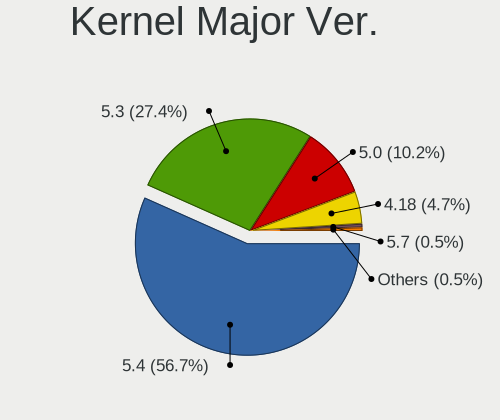

| Version | Desktops | Percent |
|---------|----------|---------|
| 5.4     | 285      | 53.37%  |
| 5.3     | 157      | 29.4%   |
| 5.0     | 59       | 11.05%  |
| 4.18    | 27       | 5.06%   |
| 5.7     | 3        | 0.56%   |
| 5.8     | 2        | 0.37%   |
| 5.15    | 1        | 0.19%   |

Arch
----

OS architecture (x86_64, i586, etc.)

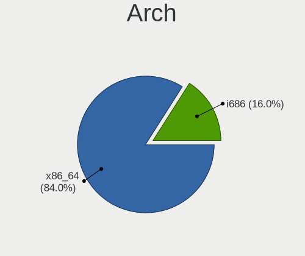

| Name   | Desktops | Percent |
|--------|----------|---------|
| x86_64 | 454      | 87.98%  |
| i686   | 62       | 12.02%  |

DE
--

Desktop Environment

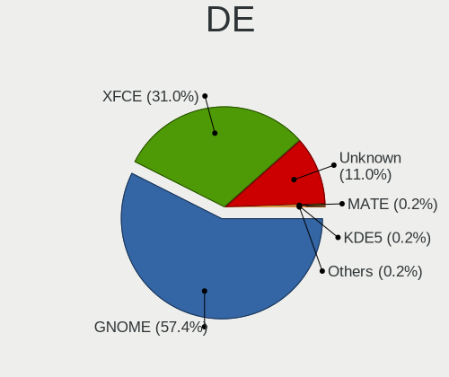

| Name    | Desktops | Percent |
|---------|----------|---------|
| GNOME   | 316      | 59.85%  |
| XFCE    | 148      | 28.03%  |
| Unknown | 63       | 11.93%  |
| KDE     | 1        | 0.19%   |

Display Server
--------------

X11 or Wayland

| Name    | Desktops | Percent |
|---------|----------|---------|
| X11     | 478      | 91.75%  |
| Unknown | 37       | 7.1%    |
| Wayland | 6        | 1.15%   |

Display Manager
---------------

SDDM, LightDM, etc.

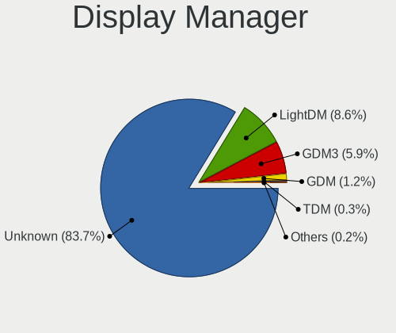

| Name    | Desktops | Percent |
|---------|----------|---------|
| Unknown | 477      | 90.68%  |
| GDM3    | 21       | 3.99%   |
| LightDM | 19       | 3.61%   |
| GDM     | 7        | 1.33%   |
| TDM     | 2        | 0.38%   |

OS Lang
-------

Language

| Lang    | Desktops | Percent |
|---------|----------|---------|
| en_US   | 165      | 31.73%  |
| pt_BR   | 45       | 8.65%   |
| Unknown | 45       | 8.65%   |
| en_GB   | 31       | 5.96%   |
| de_DE   | 30       | 5.77%   |
| en_CA   | 16       | 3.08%   |
| it_IT   | 15       | 2.88%   |
| fr_FR   | 15       | 2.88%   |
| en_IN   | 14       | 2.69%   |
| es_ES   | 12       | 2.31%   |
| es_AR   | 12       | 2.31%   |
| nl_NL   | 10       | 1.92%   |
| pl_PL   | 9        | 1.73%   |
| ru_RU   | 7        | 1.35%   |
| es_MX   | 7        | 1.35%   |
| en_AU   | 7        | 1.35%   |
| sv_SE   | 6        | 1.15%   |
| hu_HU   | 6        | 1.15%   |
| es_CO   | 6        | 1.15%   |
| en_ZA   | 6        | 1.15%   |
| C       | 6        | 1.15%   |
| pt_PT   | 3        | 0.58%   |
| fr_CA   | 3        | 0.58%   |
| es_PE   | 3        | 0.58%   |
| es_CL   | 3        | 0.58%   |
| sr_RS   | 2        | 0.38%   |
| nb_NO   | 2        | 0.38%   |
| en_PH   | 2        | 0.38%   |
| de_CH   | 2        | 0.38%   |
| de_AT   | 2        | 0.38%   |
| cs_CZ   | 2        | 0.38%   |
| bg_BG   | 2        | 0.38%   |
| uk_UA   | 1        | 0.19%   |
| tr_TR   | 1        | 0.19%   |
| th_TH   | 1        | 0.19%   |
| sl_SI   | 1        | 0.19%   |
| ru_UA   | 1        | 0.19%   |
| ro_RO   | 1        | 0.19%   |
| nl_BE   | 1        | 0.19%   |
| ja_JP   | 1        | 0.19%   |
| it_CH   | 1        | 0.19%   |
| id_ID   | 1        | 0.19%   |
| he_IL   | 1        | 0.19%   |
| fr_CH   | 1        | 0.19%   |
| fi_FI   | 1        | 0.19%   |
| eu_ES   | 1        | 0.19%   |
| es_UY   | 1        | 0.19%   |
| es_US   | 1        | 0.19%   |
| es_PY   | 1        | 0.19%   |
| es_NI   | 1        | 0.19%   |
| en_NZ   | 1        | 0.19%   |
| en_IL   | 1        | 0.19%   |
| en_IE   | 1        | 0.19%   |
| en_HK   | 1        | 0.19%   |
| el_GR   | 1        | 0.19%   |
| da_DK   | 1        | 0.19%   |

Boot Mode
---------

EFI or BIOS

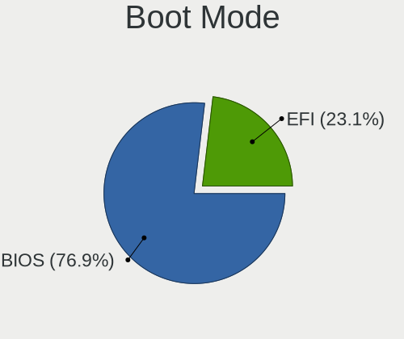

| Mode | Desktops | Percent |
|------|----------|---------|
| BIOS | 395      | 75.96%  |
| EFI  | 125      | 24.04%  |

Filesystem
----------

Type of filesystem

| Type    | Desktops | Percent |
|---------|----------|---------|
| Ext4    | 484      | 93.44%  |
| Overlay | 17       | 3.28%   |
| Unknown | 10       | 1.93%   |
| Ext2    | 3        | 0.58%   |
| Btrfs   | 3        | 0.58%   |
| Ext3    | 1        | 0.19%   |

Part. scheme
------------

Scheme of partitioning

| Type    | Desktops | Percent |
|---------|----------|---------|
| Unknown | 508      | 98.45%  |
| GPT     | 5        | 0.97%   |
| MBR     | 3        | 0.58%   |

Dual Boot with Linux/BSD
------------------------

Hosting more than one Linux/BSD

| Dual boot | Desktops | Percent |
|-----------|----------|---------|
| No        | 446      | 85.6%   |
| Yes       | 75       | 14.4%   |

Dual Boot (Win)
---------------

Hosting Linux and Windows

| Dual boot | Desktops | Percent |
|-----------|----------|---------|
| No        | 305      | 57.55%  |
| Yes       | 225      | 42.45%  |

Board
-----

Vendor
------

Motherboard manufacturer

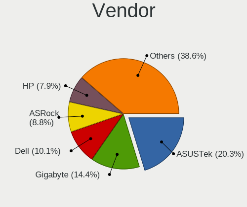

| Name                | Desktops | Percent |
|---------------------|----------|---------|
| ASUSTek Computer    | 107      | 20.74%  |
| Gigabyte Technology | 75       | 14.53%  |
| Dell                | 52       | 10.08%  |
| ASRock              | 46       | 8.91%   |
| Hewlett-Packard     | 42       | 8.14%   |
| MSI                 | 34       | 6.59%   |
| Lenovo              | 26       | 5.04%   |
| Intel               | 20       | 3.88%   |
| Pegatron            | 15       | 2.91%   |
| Acer                | 12       | 2.33%   |
| ECS                 | 11       | 2.13%   |
| Unknown             | 9        | 1.74%   |
| Fujitsu             | 7        | 1.36%   |
| Foxconn             | 6        | 1.16%   |
| Medion              | 5        | 0.97%   |
| Biostar             | 5        | 0.97%   |
| Shuttle             | 4        | 0.78%   |
| Positivo            | 4        | 0.78%   |
| ZOTAC               | 2        | 0.39%   |
| WinFast             | 2        | 0.39%   |
| Semp Toshiba        | 2        | 0.39%   |
| Packard Bell        | 2        | 0.39%   |
| IBM                 | 2        | 0.39%   |
| Gateway             | 2        | 0.39%   |
| Alienware           | 2        | 0.39%   |
| ABIT                | 2        | 0.39%   |
| Xi3                 | 1        | 0.19%   |
| Wistron             | 1        | 0.19%   |
| Soyo                | 1        | 0.19%   |
| SiS Technology      | 1        | 0.19%   |
| Samsung Electronics | 1        | 0.19%   |
| QDI                 | 1        | 0.19%   |
| Phitronics          | 1        | 0.19%   |
| Philco              | 1        | 0.19%   |
| PCChips             | 1        | 0.19%   |
| Nexcom              | 1        | 0.19%   |
| MiTAC               | 1        | 0.19%   |
| JOOYON              | 1        | 0.19%   |
| Jetway              | 1        | 0.19%   |
| Inventec            | 1        | 0.19%   |
| INTELBRAS           | 1        | 0.19%   |
| eMachines           | 1        | 0.19%   |
| ELSA                | 1        | 0.19%   |
| Apple               | 1        | 0.19%   |
| AMI                 | 1        | 0.19%   |
| AMD                 | 1        | 0.19%   |

Model
-----

Motherboard model

| Name                                   | Desktops | Percent |
|----------------------------------------|----------|---------|
| Unknown                                | 10       | 1.94%   |
| ASUS All Series                        | 8        | 1.55%   |
| Gigabyte A320M-S2H                     | 4        | 0.78%   |
| MSI MS-7721                            | 3        | 0.58%   |
| Gigabyte 970A-DS3P                     | 3        | 0.58%   |
| Dell OptiPlex 780                      | 3        | 0.58%   |
| Dell OptiPlex 755                      | 3        | 0.58%   |
| Dell OptiPlex 7010                     | 3        | 0.58%   |
| ASUS M5A97 R2.0                        | 3        | 0.58%   |
| ASRock N68C-S UCC                      | 3        | 0.58%   |
| Semp Toshiba STI                       | 2        | 0.39%   |
| Pegatron NE502AV-ABA a6750t            | 2        | 0.39%   |
| Pegatron 320-1030                      | 2        | 0.39%   |
| MSI MS-7C02                            | 2        | 0.39%   |
| MSI MS-7A38                            | 2        | 0.39%   |
| Lenovo H430 10091                      | 2        | 0.39%   |
| HP Z600 Workstation                    | 2        | 0.39%   |
| HP ProDesk 600 G1 SFF                  | 2        | 0.39%   |
| HP Compaq dc7600 Convertible Minitower | 2        | 0.39%   |
| HP Compaq 8100 Elite SFF PC            | 2        | 0.39%   |
| HP Compaq 6200 Pro MT PC               | 2        | 0.39%   |
| Gigabyte H97M-D3H                      | 2        | 0.39%   |
| Gigabyte GA-78LMT-USB3                 | 2        | 0.39%   |
| Gigabyte F2A68HM-H                     | 2        | 0.39%   |
| Gigabyte B450M DS3H                    | 2        | 0.39%   |
| Gigabyte B450 AORUS M                  | 2        | 0.39%   |
| Gigabyte AM1M-S2H                      | 2        | 0.39%   |
| Fujitsu ESPRIMO P2560                  | 2        | 0.39%   |
| Dell XPS 8940                          | 2        | 0.39%   |
| Dell Vostro 430                        | 2        | 0.39%   |
| Dell Vostro 200                        | 2        | 0.39%   |
| Dell Precision T1600                   | 2        | 0.39%   |
| Dell OptiPlex 990                      | 2        | 0.39%   |
| Dell OptiPlex 9020                     | 2        | 0.39%   |
| Dell OptiPlex 9010                     | 2        | 0.39%   |
| Dell OptiPlex 790                      | 2        | 0.39%   |
| Dell OptiPlex 760                      | 2        | 0.39%   |
| Dell OptiPlex 7040                     | 2        | 0.39%   |
| Dell OptiPlex 380                      | 2        | 0.39%   |
| Dell OptiPlex 330                      | 2        | 0.39%   |
| Dell DM051                             | 2        | 0.39%   |
| Dell Dimension E521                    | 2        | 0.39%   |
| ASUS P5KPL-CM                          | 2        | 0.39%   |
| ASUS P5G41T-M LX3                      | 2        | 0.39%   |
| ASUS M5A78L-M/USB3                     | 2        | 0.39%   |
| ASUS M2N68-AM Plus                     | 2        | 0.39%   |
| ASUS M2N-MX SE Plus                    | 2        | 0.39%   |
| ASUS M2N-E                             | 2        | 0.39%   |
| ASRock X570 Steel Legend               | 2        | 0.39%   |
| ASRock A320M-HDV R4.0                  | 2        | 0.39%   |
| ASRock A320M-HD                        | 2        | 0.39%   |
| ZOTAC Board                            | 1        | 0.19%   |
| Xi3 401-0001-303 303                   | 1        | 0.19%   |
| Wistron ProLiant ML110 G5              | 1        | 0.19%   |
| WinFast NF4UK8AA                       | 1        | 0.19%   |
| WinFast 761GXK8MC                      | 1        | 0.19%   |
| Soyo P4IPE                             | 1        | 0.19%   |
| SiS SiS-661                            | 1        | 0.19%   |
| Shuttle SH61R                          | 1        | 0.19%   |
| Shuttle SH55J                          | 1        | 0.19%   |

Model Family
------------

Motherboard model prefix

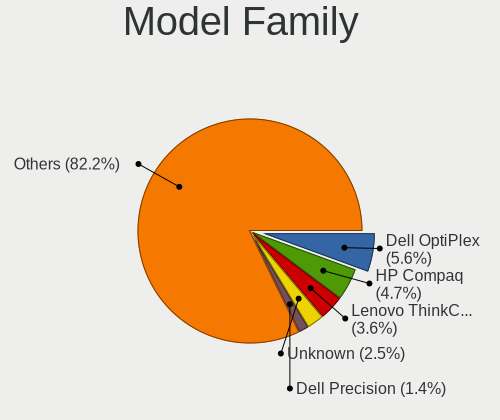

| Name                   | Desktops | Percent |
|------------------------|----------|---------|
| Dell OptiPlex          | 29       | 5.62%   |
| HP Compaq              | 24       | 4.65%   |
| Lenovo ThinkCentre     | 17       | 3.29%   |
| Unknown                | 10       | 1.94%   |
| ASUS All               | 8        | 1.55%   |
| Fujitsu ESPRIMO        | 7        | 1.36%   |
| Dell Precision         | 6        | 1.16%   |
| ASUS PRIME             | 6        | 1.16%   |
| Dell Vostro            | 5        | 0.97%   |
| ASUS TUF               | 5        | 0.97%   |
| Acer Veriton           | 5        | 0.97%   |
| Acer Aspire            | 5        | 0.97%   |
| Gigabyte A320M-S2H     | 4        | 0.78%   |
| Dell Inspiron          | 4        | 0.78%   |
| ASUS P5G41T-M          | 4        | 0.78%   |
| ASUS M5A97             | 4        | 0.78%   |
| ASRock N68C-S          | 4        | 0.78%   |
| MSI MS-7721            | 3        | 0.58%   |
| HP ProDesk             | 3        | 0.58%   |
| HP EliteDesk           | 3        | 0.58%   |
| Gigabyte GA-78LMT-USB3 | 3        | 0.58%   |
| Gigabyte B450          | 3        | 0.58%   |
| Gigabyte 970A-DS3P     | 3        | 0.58%   |
| ASUS M5A78L-M          | 3        | 0.58%   |
| ASUS M2N-MX            | 3        | 0.58%   |
| ASRock X570            | 3        | 0.58%   |
| ASRock A320M-HDV       | 3        | 0.58%   |
| Semp Toshiba STI       | 2        | 0.39%   |
| Pegatron NE502AV-ABA   | 2        | 0.39%   |
| Pegatron 320-1030      | 2        | 0.39%   |
| Packard Bell imedia    | 2        | 0.39%   |
| MSI MS-7C02            | 2        | 0.39%   |
| MSI MS-7A38            | 2        | 0.39%   |
| Lenovo IdeaCentre      | 2        | 0.39%   |
| Lenovo H430            | 2        | 0.39%   |
| HP Z600                | 2        | 0.39%   |
| Gigabyte H97M-D3H      | 2        | 0.39%   |
| Gigabyte F2A68HM-H     | 2        | 0.39%   |
| Gigabyte B450M         | 2        | 0.39%   |
| Gigabyte AM1M-S2H      | 2        | 0.39%   |
| Dell XPS               | 2        | 0.39%   |
| Dell DM051             | 2        | 0.39%   |
| Dell Dimension         | 2        | 0.39%   |
| ASUS ROG               | 2        | 0.39%   |
| ASUS P8P67-M           | 2        | 0.39%   |
| ASUS P8H61-M           | 2        | 0.39%   |
| ASUS P5KPL-CM          | 2        | 0.39%   |
| ASUS P5KPL-AM          | 2        | 0.39%   |
| ASUS M4A87TD           | 2        | 0.39%   |
| ASUS M2N68-AM          | 2        | 0.39%   |
| ASUS M2N-E             | 2        | 0.39%   |
| ASRock Z97             | 2        | 0.39%   |
| ASRock A320M-HD        | 2        | 0.39%   |
| ZOTAC Board            | 1        | 0.19%   |
| Xi3 401-0001-303       | 1        | 0.19%   |
| Wistron ProLiant       | 1        | 0.19%   |
| WinFast NF4UK8AA       | 1        | 0.19%   |
| WinFast 761GXK8MC      | 1        | 0.19%   |
| Soyo P4IPE             | 1        | 0.19%   |
| SiS SiS-661            | 1        | 0.19%   |

MFG Year
--------

Motherboard manufacture year

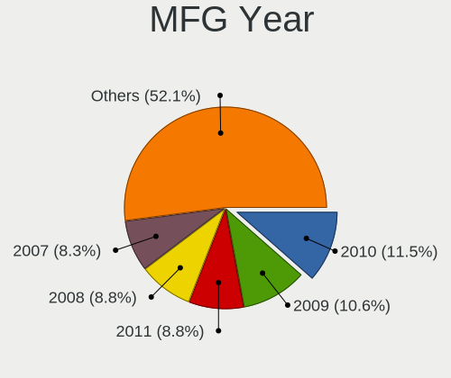

| Year | Desktops | Percent |
|------|----------|---------|
| 2010 | 59       | 11.43%  |
| 2009 | 52       | 10.08%  |
| 2011 | 51       | 9.88%   |
| 2007 | 43       | 8.33%   |
| 2012 | 42       | 8.14%   |
| 2008 | 38       | 7.36%   |
| 2013 | 37       | 7.17%   |
| 2018 | 34       | 6.59%   |
| 2014 | 31       | 6.01%   |
| 2017 | 23       | 4.46%   |
| 2015 | 20       | 3.88%   |
| 2006 | 20       | 3.88%   |
| 2016 | 15       | 2.91%   |
| 2005 | 14       | 2.71%   |
| 2020 | 12       | 2.33%   |
| 2019 | 10       | 1.94%   |
| 2004 | 7        | 1.36%   |
| 2021 | 4        | 0.78%   |
| 2003 | 3        | 0.58%   |
| 2002 | 1        | 0.19%   |

Form Factor
-----------

Physical design of the computer

| Name    | Desktops | Percent |
|---------|----------|---------|
| Desktop | 516      | 100%    |

Secure Boot
-----------

Enabled or disabled

| State    | Desktops | Percent |
|----------|----------|---------|
| Disabled | 504      | 97.3%   |
| Enabled  | 14       | 2.7%    |

Coreboot
--------

Have coreboot on board

| Used | Desktops | Percent |
|------|----------|---------|
| No   | 516      | 100%    |

RAM Size
--------

Total RAM memory

| Size in GB  | Desktops | Percent |
|-------------|----------|---------|
| 3.01-4.0    | 142      | 27%     |
| 8.01-16.0   | 95       | 18.06%  |
| 4.01-8.0    | 85       | 16.16%  |
| 16.01-24.0  | 73       | 13.88%  |
| 1.01-2.0    | 58       | 11.03%  |
| 32.01-64.0  | 26       | 4.94%   |
| 2.01-3.0    | 22       | 4.18%   |
| 0.51-1.0    | 14       | 2.66%   |
| 64.01-256.0 | 7        | 1.33%   |
| 24.01-32.0  | 4        | 0.76%   |

RAM Used
--------

Used RAM memory

| Used GB    | Desktops | Percent |
|------------|----------|---------|
| 1.01-2.0   | 285      | 51.08%  |
| 2.01-3.0   | 103      | 18.46%  |
| 0.51-1.0   | 72       | 12.9%   |
| 3.01-4.0   | 49       | 8.78%   |
| 4.01-8.0   | 30       | 5.38%   |
| 8.01-16.0  | 11       | 1.97%   |
| 0.01-0.5   | 7        | 1.25%   |
| 16.01-24.0 | 1        | 0.18%   |

Total Drives
------------

Number of drives on board

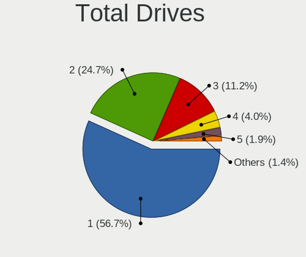

| Drives | Desktops | Percent |
|--------|----------|---------|
| 1      | 297      | 55.41%  |
| 2      | 137      | 25.56%  |
| 3      | 60       | 11.19%  |
| 4      | 23       | 4.29%   |
| 5      | 10       | 1.87%   |
| 6      | 3        | 0.56%   |
| 7      | 2        | 0.37%   |
| 0      | 2        | 0.37%   |
| 10     | 1        | 0.19%   |
| 8      | 1        | 0.19%   |

Has CD-ROM
----------

Has CD-ROM on board

| Presented | Desktops | Percent |
|-----------|----------|---------|
| Yes       | 312      | 60.12%  |
| No        | 207      | 39.88%  |

Has Ethernet
------------

Has Ethernet on board

| Presented | Desktops | Percent |
|-----------|----------|---------|
| Yes       | 510      | 98.84%  |
| No        | 6        | 1.16%   |

Has WiFi
--------

Has WiFi module

| Presented | Desktops | Percent |
|-----------|----------|---------|
| No        | 276      | 52.87%  |
| Yes       | 246      | 47.13%  |

Has Bluetooth
-------------

Has Bluetooth module

| Presented | Desktops | Percent |
|-----------|----------|---------|
| No        | 422      | 80.84%  |
| Yes       | 100      | 19.16%  |

Location
--------

Country
-------

Geographic location (country)

| Country             | Desktops | Percent |
|---------------------|----------|---------|
| USA                 | 121      | 23.4%   |
| Brazil              | 50       | 9.67%   |
| Germany             | 36       | 6.96%   |
| UK                  | 35       | 6.77%   |
| Canada              | 23       | 4.45%   |
| Netherlands         | 16       | 3.09%   |
| India               | 16       | 3.09%   |
| Italy               | 15       | 2.9%    |
| France              | 15       | 2.9%    |
| Argentina           | 14       | 2.71%   |
| Spain               | 13       | 2.51%   |
| Indonesia           | 10       | 1.93%   |
| South Africa        | 8        | 1.55%   |
| Poland              | 8        | 1.55%   |
| Australia           | 8        | 1.55%   |
| Switzerland         | 6        | 1.16%   |
| Sweden              | 6        | 1.16%   |
| Mexico              | 6        | 1.16%   |
| Hungary             | 6        | 1.16%   |
| Greece              | 6        | 1.16%   |
| Colombia            | 6        | 1.16%   |
| Russia              | 5        | 0.97%   |
| Philippines         | 5        | 0.97%   |
| Chile               | 5        | 0.97%   |
| Bulgaria            | 5        | 0.97%   |
| Ukraine             | 4        | 0.77%   |
| Portugal            | 4        | 0.77%   |
| Peru                | 4        | 0.77%   |
| Norway              | 4        | 0.77%   |
| Denmark             | 4        | 0.77%   |
| Pakistan            | 3        | 0.58%   |
| Japan               | 3        | 0.58%   |
| Austria             | 3        | 0.58%   |
| Thailand            | 2        | 0.39%   |
| South Korea         | 2        | 0.39%   |
| Serbia              | 2        | 0.39%   |
| Romania             | 2        | 0.39%   |
| Malaysia            | 2        | 0.39%   |
| Kenya               | 2        | 0.39%   |
| Iran                | 2        | 0.39%   |
| Czechia             | 2        | 0.39%   |
| Belgium             | 2        | 0.39%   |
| Vietnam             | 1        | 0.19%   |
| Venezuela           | 1        | 0.19%   |
| Uruguay             | 1        | 0.19%   |
| Turkey              | 1        | 0.19%   |
| Trinidad and Tobago | 1        | 0.19%   |
| Taiwan              | 1        | 0.19%   |
| Slovenia            | 1        | 0.19%   |
| Saudi Arabia        | 1        | 0.19%   |
| Puerto Rico         | 1        | 0.19%   |
| Paraguay            | 1        | 0.19%   |
| Palestine           | 1        | 0.19%   |
| Nicaragua           | 1        | 0.19%   |
| New Zealand         | 1        | 0.19%   |
| Morocco             | 1        | 0.19%   |
| Kuwait              | 1        | 0.19%   |
| Jordan              | 1        | 0.19%   |
| Israel              | 1        | 0.19%   |
| Ireland             | 1        | 0.19%   |

City
----

Geographic location (city)

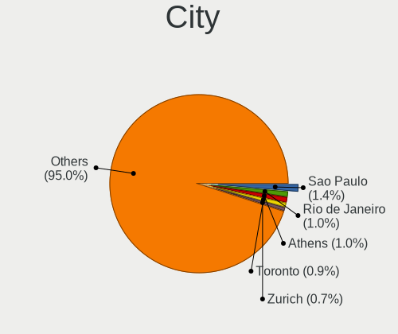

| City                   | Desktops | Percent |
|------------------------|----------|---------|
| Sao Paulo              | 8        | 1.48%   |
| Rio de Janeiro         | 6        | 1.11%   |
| Zurich                 | 4        | 0.74%   |
| London                 | 4        | 0.74%   |
| Caturtunggal           | 4        | 0.74%   |
| Athens                 | 4        | 0.74%   |
| Warsaw                 | 3        | 0.56%   |
| Vienna                 | 3        | 0.56%   |
| Perth                  | 3        | 0.56%   |
| Oscoda                 | 3        | 0.56%   |
| Montreal               | 3        | 0.56%   |
| Milan                  | 3        | 0.56%   |
| Johannesburg           | 3        | 0.56%   |
| Ituzaingo              | 3        | 0.56%   |
| Houston                | 3        | 0.56%   |
| Elgin                  | 3        | 0.56%   |
| Denver                 | 3        | 0.56%   |
| Cape Town              | 3        | 0.56%   |
| Calgary                | 3        | 0.56%   |
| Buenos Aires           | 3        | 0.56%   |
| Budapest               | 3        | 0.56%   |
| Berlin                 | 3        | 0.56%   |
| Bengaluru              | 3        | 0.56%   |
| Yongin-si              | 2        | 0.37%   |
| Wigan                  | 2        | 0.37%   |
| Via del Mar        | 2        | 0.37%   |
| Vincentown             | 2        | 0.37%   |
| Trujillo               | 2        | 0.37%   |
| Toronto                | 2        | 0.37%   |
| Timioara          | 2        | 0.37%   |
| Surabaya               | 2        | 0.37%   |
| Stoke-on-Trent         | 2        | 0.37%   |
| Sofia                  | 2        | 0.37%   |
| Santiago               | 2        | 0.37%   |
| San Francisco          | 2        | 0.37%   |
| Salvador               | 2        | 0.37%   |
| Rotterdam              | 2        | 0.37%   |
| Rome                   | 2        | 0.37%   |
| Puchong Batu Dua Belas | 2        | 0.37%   |
| Paris                  | 2        | 0.37%   |
| Osasco                 | 2        | 0.37%   |
| Orlando                | 2        | 0.37%   |
| Nottingham             | 2        | 0.37%   |
| Manaus                 | 2        | 0.37%   |
| Los Angeles            | 2        | 0.37%   |
| Las Vegas              | 2        | 0.37%   |
| Karachi                | 2        | 0.37%   |
| Ferraz de Vasconcelos  | 2        | 0.37%   |
| DuBois                 | 2        | 0.37%   |
| Dortmund               | 2        | 0.37%   |
| Delhi                  | 2        | 0.37%   |
| Dayton                 | 2        | 0.37%   |
| Cormeilles-en-Parisis  | 2        | 0.37%   |
| Copenhagen             | 2        | 0.37%   |
| Clapham                | 2        | 0.37%   |
| Chuckey                | 2        | 0.37%   |
| Burnaby                | 2        | 0.37%   |
| Breda                  | 2        | 0.37%   |
| Botafogo               | 2        | 0.37%   |
| Bogot              | 2        | 0.37%   |

Drives
------

Drive Vendor
------------

Hard drive vendors

| Vendor                    | Desktops | Drives | Percent |
|---------------------------|----------|--------|---------|
| Seagate                   | 178      | 250    | 22.68%  |
| WDC                       | 175      | 233    | 22.29%  |
| Samsung Electronics       | 99       | 140    | 12.61%  |
| Kingston                  | 49       | 59     | 6.24%   |
| Hitachi                   | 49       | 57     | 6.24%   |
| Toshiba                   | 32       | 48     | 4.08%   |
| Sandisk                   | 30       | 40     | 3.82%   |
| MAXTOR                    | 26       | 37     | 3.31%   |
| Phison                    | 12       | 19     | 1.53%   |
| Intel                     | 11       | 14     | 1.4%    |
| Crucial                   | 11       | 13     | 1.4%    |
| China                     | 9        | 10     | 1.15%   |
| Unknown                   | 8        | 14     | 1.02%   |
| PNY                       | 8        | 10     | 1.02%   |
| OCZ                       | 7        | 8      | 0.89%   |
| SPCC                      | 6        | 7      | 0.76%   |
| Intenso                   | 5        | 8      | 0.64%   |
| Corsair                   | 5        | 6      | 0.64%   |
| A-DATA Technology         | 5        | 5      | 0.64%   |
| Micron/Crucial Technology | 4        | 4      | 0.51%   |
| Transcend                 | 3        | 3      | 0.38%   |
| Patriot                   | 3        | 8      | 0.38%   |
| Micron Technology         | 3        | 4      | 0.38%   |
| HGST                      | 3        | 3      | 0.38%   |
| XrayDisk                  | 2        | 2      | 0.25%   |
| TCSUNBOW                  | 2        | 2      | 0.25%   |
| Silicon Motion            | 2        | 3      | 0.25%   |
| SABRENT                   | 2        | 2      | 0.25%   |
| LITEON                    | 2        | 3      | 0.25%   |
| Leven                     | 2        | 2      | 0.25%   |
| JMicron                   | 2        | 5      | 0.25%   |
| Gigabyte Technology       | 2        | 4      | 0.25%   |
| Apacer                    | 2        | 2      | 0.25%   |
| XPG                       | 1        | 2      | 0.13%   |
| WD MediaMax               | 1        | 1      | 0.13%   |
| Verbatim                  | 1        | 1      | 0.13%   |
| USB3.0                    | 1        | 1      | 0.13%   |
| TSA                       | 1        | 1      | 0.13%   |
| TO Exter                  | 1        | 1      | 0.13%   |
| S3+                       | 1        | 1      | 0.13%   |
| PLEXTOR                   | 1        | 1      | 0.13%   |
| Pioneer                   | 1        | 1      | 0.13%   |
| Mushkin                   | 1        | 1      | 0.13%   |
| Marvell                   | 1        | 1      | 0.13%   |
| LITEONIT                  | 1        | 1      | 0.13%   |
| KingSpec                  | 1        | 1      | 0.13%   |
| Integral                  | 1        | 1      | 0.13%   |
| Hikvision                 | 1        | 1      | 0.13%   |
| Hewlett-Packard           | 1        | 1      | 0.13%   |
| GOODRAM                   | 1        | 1      | 0.13%   |
| G-RAID                    | 1        | 1      | 0.13%   |
| Fujitsu                   | 1        | 1      | 0.13%   |
| External                  | 1        | 1      | 0.13%   |
| ExcelStor                 | 1        | 1      | 0.13%   |
| DREVO                     | 1        | 1      | 0.13%   |
| ASMT109x                  | 1        | 2      | 0.13%   |
| ASMT                      | 1        | 1      | 0.13%   |
| Apple                     | 1        | 1      | 0.13%   |
| AMD-RAID                  | 1        | 2      | 0.13%   |

Drive Model
-----------

Hard drive models

| Model                             | Desktops | Percent |
|-----------------------------------|----------|---------|
| Kingston SA400S37240G 240GB SSD   | 15       | 1.73%   |
| Seagate ST500DM002-1BD142 500GB   | 14       | 1.62%   |
| Seagate ST3500418AS 500GB         | 12       | 1.39%   |
| Seagate ST1000DM010-2EP102 1TB    | 12       | 1.39%   |
| Kingston SA400S37480G 480GB SSD   | 9        | 1.04%   |
| Toshiba DT01ACA100 1TB            | 8        | 0.92%   |
| Seagate ST1000DM003-1ER162 1TB    | 7        | 0.81%   |
| Samsung SSD 860 EVO 500GB         | 7        | 0.81%   |
| Kingston SV300S37A120G 120GB SSD  | 7        | 0.81%   |
| WDC WD10EZEX-08WN4A0 1TB          | 6        | 0.69%   |
| Seagate ST31000528AS 1TB          | 6        | 0.69%   |
| Samsung SSD 850 EVO 500GB         | 6        | 0.69%   |
| Samsung NVMe SSD Drive 500GB      | 6        | 0.69%   |
| Kingston SA400S37120G 120GB SSD   | 6        | 0.69%   |
| WDC WD40EZRZ-00GXCB0 4TB          | 5        | 0.58%   |
| WDC WD20EZRZ-00Z5HB0 2TB          | 5        | 0.58%   |
| Seagate ST1000DM003-1CH162 1TB    | 5        | 0.58%   |
| Hitachi HDS721616PLA380 164GB     | 5        | 0.58%   |
| Toshiba HDWD110 1TB               | 4        | 0.46%   |
| Toshiba DT01ACA200 2TB            | 4        | 0.46%   |
| Seagate ST3250310AS 250GB         | 4        | 0.46%   |
| Seagate ST3160815AS 160GB         | 4        | 0.46%   |
| Seagate ST2000DM001-1ER164 2TB    | 4        | 0.46%   |
| Seagate ST1000DM003-9YN162 1TB    | 4        | 0.46%   |
| Sandisk NVMe SSD Drive 500GB      | 4        | 0.46%   |
| Samsung SSD 850 EVO 250GB         | 4        | 0.46%   |
| Samsung SSD 850 120GB             | 4        | 0.46%   |
| Samsung NVMe SSD Drive 1TB        | 4        | 0.46%   |
| Samsung HD502HI 500GB             | 4        | 0.46%   |
| Samsung HD322HJ 320GB             | 4        | 0.46%   |
| Hitachi HDT722516DLA380 164GB     | 4        | 0.46%   |
| Crucial CT240BX500SSD1 240GB      | 4        | 0.46%   |
| WDC WDS240G2G0A-00JH30 240GB SSD  | 3        | 0.35%   |
| WDC WD5000AZRX-00A8LB0 500GB      | 3        | 0.35%   |
| WDC WD5000AAKX-60U6AA0 500GB      | 3        | 0.35%   |
| WDC WD5000AAKX-07U6AA0 500GB      | 3        | 0.35%   |
| WDC WD5000AAKX-00ERMA0 500GB      | 3        | 0.35%   |
| WDC WD5000AAKX-001CA0 500GB       | 3        | 0.35%   |
| WDC WD40EZRX-00SPEB0 4TB          | 3        | 0.35%   |
| WDC WD3200AAJS-00L7A0 320GB       | 3        | 0.35%   |
| WDC WD10EZEX-00WN4A0 1TB          | 3        | 0.35%   |
| Unknown SD/MMC/MS PRO 32GB        | 3        | 0.35%   |
| Toshiba MK3252GSX 320GB           | 3        | 0.35%   |
| Toshiba DT01ACA050 500GB          | 3        | 0.35%   |
| Seagate ST4000DM000-1F2168 4TB    | 3        | 0.35%   |
| Seagate ST3750528AS 752GB         | 3        | 0.35%   |
| Seagate ST3500413AS 500GB         | 3        | 0.35%   |
| Seagate ST3320418AS 320GB         | 3        | 0.35%   |
| Seagate ST3250318AS 250GB         | 3        | 0.35%   |
| Seagate ST3160023AS 160GB         | 3        | 0.35%   |
| Seagate ST2000DM006-2DM164 2TB    | 3        | 0.35%   |
| SanDisk SDSSDP064G 64GB           | 3        | 0.35%   |
| Samsung SSD 840 EVO 250GB         | 3        | 0.35%   |
| Samsung HD753LJ 752GB             | 3        | 0.35%   |
| Samsung HD642JJ 640GB             | 3        | 0.35%   |
| Samsung HD161HJ 160GB             | 3        | 0.35%   |
| Micron/Crucial NVMe SSD Drive 1TB | 3        | 0.35%   |
| MAXTOR STM380215AS 80GB           | 3        | 0.35%   |
| Hitachi HDS721050CLA362 500GB     | 3        | 0.35%   |
| Hitachi HDS721032CLA362 320GB     | 3        | 0.35%   |

HDD Vendor
----------

Hard disk drive vendors

| Vendor              | Desktops | Drives | Percent |
|---------------------|----------|--------|---------|
| Seagate             | 176      | 248    | 34.85%  |
| WDC                 | 166      | 221    | 32.87%  |
| Hitachi             | 49       | 57     | 9.7%    |
| Samsung Electronics | 46       | 59     | 9.11%   |
| Toshiba             | 30       | 46     | 5.94%   |
| MAXTOR              | 25       | 36     | 4.95%   |
| Unknown             | 3        | 4      | 0.59%   |
| HGST                | 3        | 3      | 0.59%   |
| SABRENT             | 2        | 2      | 0.4%    |
| Fujitsu             | 1        | 1      | 0.2%    |
| ExcelStor           | 1        | 1      | 0.2%    |
| ASMT109x            | 1        | 2      | 0.2%    |
| ASMT                | 1        | 1      | 0.2%    |
| Apple               | 1        | 1      | 0.2%    |

SSD Vendor
----------

Solid state drive vendors

| Vendor              | Desktops | Drives | Percent |
|---------------------|----------|--------|---------|
| Kingston            | 48       | 58     | 20.78%  |
| Samsung Electronics | 44       | 64     | 19.05%  |
| SanDisk             | 24       | 29     | 10.39%  |
| WDC                 | 11       | 12     | 4.76%   |
| Intel               | 11       | 14     | 4.76%   |
| Crucial             | 11       | 13     | 4.76%   |
| PNY                 | 8        | 10     | 3.46%   |
| China               | 8        | 9      | 3.46%   |
| OCZ                 | 6        | 7      | 2.6%    |
| SPCC                | 5        | 6      | 2.16%   |
| Intenso             | 5        | 8      | 2.16%   |
| Corsair             | 5        | 6      | 2.16%   |
| A-DATA Technology   | 5        | 5      | 2.16%   |
| Transcend           | 3        | 3      | 1.3%    |
| Patriot             | 3        | 8      | 1.3%    |
| Micron Technology   | 3        | 4      | 1.3%    |
| Toshiba             | 2        | 2      | 0.87%   |
| TCSUNBOW            | 2        | 2      | 0.87%   |
| LITEON              | 2        | 3      | 0.87%   |
| Leven               | 2        | 2      | 0.87%   |
| JMicron             | 2        | 5      | 0.87%   |
| Gigabyte Technology | 2        | 4      | 0.87%   |
| Apacer              | 2        | 2      | 0.87%   |
| Verbatim            | 1        | 1      | 0.43%   |
| USB3.0              | 1        | 1      | 0.43%   |
| TSA                 | 1        | 1      | 0.43%   |
| TO Exter            | 1        | 1      | 0.43%   |
| S3+                 | 1        | 1      | 0.43%   |
| PLEXTOR             | 1        | 1      | 0.43%   |
| Pioneer             | 1        | 1      | 0.43%   |
| Mushkin             | 1        | 1      | 0.43%   |
| MAXTOR              | 1        | 1      | 0.43%   |
| LITEONIT            | 1        | 1      | 0.43%   |
| KingSpec            | 1        | 1      | 0.43%   |
| Integral            | 1        | 1      | 0.43%   |
| Hikvision           | 1        | 1      | 0.43%   |
| Hewlett-Packard     | 1        | 1      | 0.43%   |
| GOODRAM             | 1        | 1      | 0.43%   |
| DREVO               | 1        | 1      | 0.43%   |
| AMD-RAID            | 1        | 2      | 0.43%   |

Drive Kind
----------

HDD or SSD

| Kind    | Desktops | Drives | Percent |
|---------|----------|--------|---------|
| HDD     | 399      | 682    | 61.1%   |
| SSD     | 197      | 294    | 30.17%  |
| NVMe    | 44       | 62     | 6.74%   |
| Unknown | 11       | 14     | 1.68%   |
| MMC     | 2        | 2      | 0.31%   |

Drive Connector
---------------

SATA, SAS, NVMe, etc.

| Type | Desktops | Drives | Percent |
|------|----------|--------|---------|
| SATA | 496      | 957    | 87.48%  |
| NVMe | 43       | 61     | 7.58%   |
| SAS  | 26       | 34     | 4.59%   |
| MMC  | 2        | 2      | 0.35%   |

Drive Size
----------

Size of hard drive

| Size in TB | Desktops | Drives | Percent |
|------------|----------|--------|---------|
| 0.01-0.5   | 409      | 642    | 65.65%  |
| 0.51-1.0   | 142      | 208    | 22.79%  |
| 1.01-2.0   | 43       | 71     | 6.9%    |
| 3.01-4.0   | 15       | 34     | 2.41%   |
| 2.01-3.0   | 7        | 13     | 1.12%   |
| 4.01-10.0  | 7        | 8      | 1.12%   |

Space Total
-----------

Amount of disk space available on the file system

| Size in GB     | Desktops | Percent |
|----------------|----------|---------|
| 101-250        | 164      | 30.83%  |
| 251-500        | 117      | 21.99%  |
| 501-1000       | 61       | 11.47%  |
| 51-100         | 56       | 10.53%  |
| 21-50          | 36       | 6.77%   |
| 1001-2000      | 35       | 6.58%   |
| 1-20           | 25       | 4.7%    |
| More than 3000 | 21       | 3.95%   |
| 2001-3000      | 16       | 3.01%   |
| Unknown        | 1        | 0.19%   |

Space Used
----------

Amount of used disk space

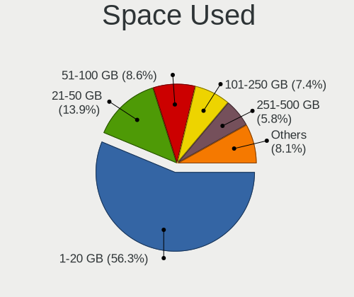

| Used GB        | Desktops | Percent |
|----------------|----------|---------|
| 1-20           | 313      | 56.7%   |
| 21-50          | 75       | 13.59%  |
| 51-100         | 49       | 8.88%   |
| 101-250        | 38       | 6.88%   |
| 251-500        | 31       | 5.62%   |
| 1001-2000      | 20       | 3.62%   |
| 501-1000       | 18       | 3.26%   |
| More than 3000 | 4        | 0.72%   |
| 2001-3000      | 3        | 0.54%   |
| Unknown        | 1        | 0.18%   |

Malfunc. Drives
---------------

Drive models with a malfunction

| Model                       | Desktops | Drives | Percent |
|-----------------------------|----------|--------|---------|
| WDC WD5000AAKS-00V1A0 500GB | 1        | 1      | 100%    |

Malfunc. Drive Vendor
---------------------

Vendors of faulty drives

| Vendor | Desktops | Drives | Percent |
|--------|----------|--------|---------|
| WDC    | 1        | 1      | 100%    |

Malfunc. HDD Vendor
-------------------

Vendors of faulty HDD drives

| Vendor | Desktops | Drives | Percent |
|--------|----------|--------|---------|
| WDC    | 1        | 1      | 100%    |

Malfunc. Drive Kind
-------------------

Kinds of faulty drives

| Kind | Desktops | Drives | Percent |
|------|----------|--------|---------|
| HDD  | 1        | 1      | 100%    |

Failed Drives
-------------

Failed drive models

Zero info for selected period =(

Failed Drive Vendor
-------------------

Failed drive vendors

Zero info for selected period =(

Drive Status
------------

Number of failed and malfunc. drives

| Status   | Desktops | Drives | Percent |
|----------|----------|--------|---------|
| Detected | 504      | 1033   | 97.49%  |
| Works    | 12       | 20     | 2.32%   |
| Malfunc  | 1        | 1      | 0.19%   |

Storage controller
------------------

Storage Vendor
--------------

Storage controller vendors

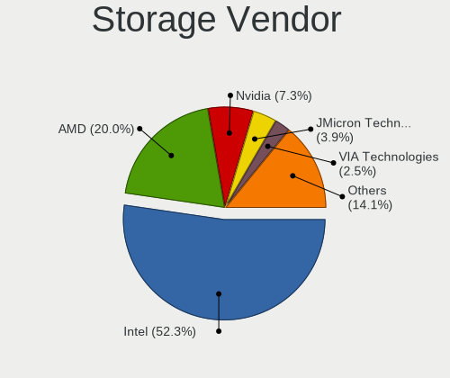

| Vendor                           | Desktops | Percent |
|----------------------------------|----------|---------|
| Intel                            | 324      | 51.51%  |
| AMD                              | 132      | 20.99%  |
| Nvidia                           | 42       | 6.68%   |
| JMicron Technology               | 24       | 3.82%   |
| VIA Technologies                 | 16       | 2.54%   |
| Samsung Electronics              | 16       | 2.54%   |
| Marvell Technology Group         | 16       | 2.54%   |
| ASMedia Technology               | 14       | 2.23%   |
| Phison Electronics               | 13       | 2.07%   |
| Sandisk                          | 7        | 1.11%   |
| Silicon Integrated Systems [SiS] | 4        | 0.64%   |
| Micron/Crucial Technology        | 4        | 0.64%   |
| Silicon Image                    | 3        | 0.48%   |
| Broadcom / LSI                   | 3        | 0.48%   |
| Silicon Motion                   | 2        | 0.32%   |
| Kingston Technology Company      | 2        | 0.32%   |
| Union Memory (Shenzhen)          | 1        | 0.16%   |
| Promise Technology               | 1        | 0.16%   |
| OCZ Technology Group             | 1        | 0.16%   |
| Lite-On IT Corp. / Plextor       | 1        | 0.16%   |
| Hewlett-Packard                  | 1        | 0.16%   |
| ADATA Technology                 | 1        | 0.16%   |
| Adaptec                          | 1        | 0.16%   |

Storage Model
-------------

Storage controller models

| Model                                                                                   | Desktops | Percent |
|-----------------------------------------------------------------------------------------|----------|---------|
| Intel NM10/ICH7 Family SATA Controller [IDE mode]                                       | 64       | 7.05%   |
| AMD FCH SATA Controller [AHCI mode]                                                     | 64       | 7.05%   |
| Intel 82801G (ICH7 Family) IDE Controller                                               | 55       | 6.06%   |
| AMD SB7x0/SB8x0/SB9x0 IDE Controller                                                    | 34       | 3.74%   |
| Intel 6 Series/C200 Series Chipset Family 6 port Desktop SATA AHCI Controller           | 31       | 3.41%   |
| AMD SB7x0/SB8x0/SB9x0 SATA Controller [IDE mode]                                        | 31       | 3.41%   |
| Intel 8 Series/C220 Series Chipset Family 6-port SATA Controller 1 [AHCI mode]          | 30       | 3.3%    |
| Nvidia MCP61 SATA Controller                                                            | 23       | 2.53%   |
| Intel SATA Controller [RAID mode]                                                       | 23       | 2.53%   |
| AMD SB7x0/SB8x0/SB9x0 SATA Controller [AHCI mode]                                       | 20       | 2.2%    |
| Nvidia MCP61 IDE                                                                        | 17       | 1.87%   |
| AMD 400 Series Chipset SATA Controller                                                  | 16       | 1.76%   |
| Intel Q170/Q150/B150/H170/H110/Z170/CM236 Chipset SATA Controller [AHCI Mode]           | 15       | 1.65%   |
| Intel 82801I (ICH9 Family) 2 port SATA Controller [IDE mode]                            | 15       | 1.65%   |
| Intel 6 Series/C200 Series Chipset Family Desktop SATA Controller (IDE mode, ports 4-5) | 13       | 1.43%   |
| Intel 6 Series/C200 Series Chipset Family Desktop SATA Controller (IDE mode, ports 0-3) | 13       | 1.43%   |
| VIA VT82C586A/B/VT82C686/A/B/VT823x/A/C PIPC Bus Master IDE                             | 12       | 1.32%   |
| Intel 82801IR/IO/IH (ICH9R/DO/DH) 4 port SATA Controller [IDE mode]                     | 12       | 1.32%   |
| ASMedia ASM1062 Serial ATA Controller                                                   | 12       | 1.32%   |
| Samsung NVMe SSD Controller SM981/PM981/PM983                                           | 11       | 1.21%   |
| JMicron JMB363 SATA/IDE Controller                                                      | 10       | 1.1%    |
| Intel 82801JI (ICH10 Family) SATA AHCI Controller                                       | 10       | 1.1%    |
| Intel 82801EB/ER (ICH5/ICH5R) IDE Controller                                            | 10       | 1.1%    |
| Intel 5 Series/3400 Series Chipset 4 port SATA IDE Controller                           | 10       | 1.1%    |
| Intel 4 Series Chipset PT IDER Controller                                               | 10       | 1.1%    |
| JMicron JMB368 IDE controller                                                           | 9        | 0.99%   |
| Intel 9 Series Chipset Family SATA Controller [AHCI Mode]                               | 9        | 0.99%   |
| Intel 82801JI (ICH10 Family) 4 port SATA IDE Controller #1                              | 9        | 0.99%   |
| Intel 82801JI (ICH10 Family) 2 port SATA IDE Controller #2                              | 9        | 0.99%   |
| Intel 7 Series/C210 Series Chipset Family 6-port SATA Controller [AHCI mode]            | 9        | 0.99%   |
| Intel 5 Series/3400 Series Chipset 2 port SATA IDE Controller                           | 9        | 0.99%   |
| AMD FCH SATA Controller D                                                               | 9        | 0.99%   |
| Phison E12 NVMe Controller                                                              | 8        | 0.88%   |
| Intel 82Q35 Express PT IDER Controller                                                  | 8        | 0.88%   |
| Nvidia MCP73 IDE Controller                                                             | 7        | 0.77%   |
| Intel 82801IR/IO/IH (ICH9R/DO/DH) 6 port SATA Controller [AHCI mode]                    | 7        | 0.77%   |
| Intel 82801EB (ICH5) SATA Controller                                                    | 7        | 0.77%   |
| Intel 5 Series/3400 Series Chipset 6 port SATA AHCI Controller                          | 7        | 0.77%   |
| AMD 300 Series Chipset SATA Controller                                                  | 7        | 0.77%   |
| VIA VIA VT6420 SATA RAID Controller                                                     | 6        | 0.66%   |
| Intel 82801JD/DO (ICH10 Family) SATA AHCI Controller                                    | 6        | 0.66%   |
| AMD FCH SATA Controller [IDE mode]                                                      | 6        | 0.66%   |
| Intel Cannon Lake PCH SATA AHCI Controller                                              | 5        | 0.55%   |
| AMD FCH IDE Controller                                                                  | 5        | 0.55%   |
| Silicon Integrated Systems [SiS] 5513 IDE Controller                                    | 4        | 0.44%   |
| Samsung NVMe SSD Controller SM961/PM961/SM963                                           | 4        | 0.44%   |
| Phison E16 PCIe4 NVMe Controller                                                        | 4        | 0.44%   |
| Nvidia MCP51 Serial ATA Controller                                                      | 4        | 0.44%   |
| Nvidia GeForce 7100/nForce 630i SATA                                                    | 4        | 0.44%   |
| Intel 82801JD/DO (ICH10 Family) 2-port SATA IDE Controller                              | 4        | 0.44%   |
| Intel 82801H (ICH8 Family) 4 port SATA Controller [IDE mode]                            | 4        | 0.44%   |
| Intel 82801FB/FW (ICH6/ICH6W) SATA Controller                                           | 4        | 0.44%   |
| Intel 7 Series/C210 Series Chipset Family 4-port SATA Controller [IDE mode]             | 4        | 0.44%   |
| Intel 7 Series/C210 Series Chipset Family 2-port SATA Controller [IDE mode]             | 4        | 0.44%   |
| Intel 200 Series PCH SATA controller [AHCI mode]                                        | 4        | 0.44%   |
| AMD 500 Series Chipset SATA Controller                                                  | 4        | 0.44%   |
| VIA VT6415 PATA IDE Host Controller                                                     | 3        | 0.33%   |
| Sandisk WD Black 2018/SN750 / PC SN720 NVMe SSD                                         | 3        | 0.33%   |
| Nvidia MCP55 IDE                                                                        | 3        | 0.33%   |
| Marvell Group 88SE6111/6121 SATA II / PATA Controller                                   | 3        | 0.33%   |

Storage Kind
------------

Kind of storage controller (IDE, SATA, NVMe, SAS, ...)

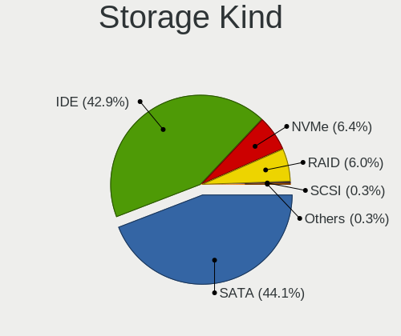

| Kind | Desktops | Percent |
|------|----------|---------|
| SATA | 298      | 45.78%  |
| IDE  | 266      | 40.86%  |
| NVMe | 43       | 6.61%   |
| RAID | 41       | 6.3%    |
| SCSI | 2        | 0.31%   |
| SAS  | 1        | 0.15%   |

Processor
---------

CPU Vendor
----------

Processor vendors

| Vendor | Desktops | Percent |
|--------|----------|---------|
| Intel  | 347      | 67.25%  |
| AMD    | 169      | 32.75%  |

CPU Model
---------

Processor models

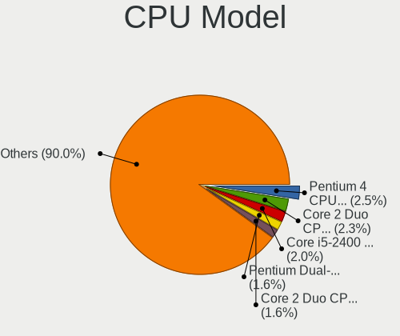

| Model                                       | Desktops | Percent |
|---------------------------------------------|----------|---------|
| Intel Core 2 Duo CPU E8400 @ 3.00GHz        | 13       | 2.5%    |
| Intel Core i5-2400 CPU @ 3.10GHz            | 11       | 2.12%   |
| Intel Pentium 4 CPU 3.00GHz                 | 10       | 1.92%   |
| Intel Pentium Dual-Core CPU E5300 @ 2.60GHz | 7        | 1.35%   |
| Intel Core 2 Quad CPU Q6600 @ 2.40GHz       | 7        | 1.35%   |
| AMD FX-6300 Six-Core Processor              | 7        | 1.35%   |
| Intel Pentium Dual-Core CPU E5700 @ 3.00GHz | 6        | 1.15%   |
| Intel Core 2 Duo CPU E7500 @ 2.93GHz        | 6        | 1.15%   |
| AMD Ryzen 7 2700X Eight-Core Processor      | 6        | 1.15%   |
| Intel Pentium Dual CPU E2220 @ 2.40GHz      | 5        | 0.96%   |
| Intel Core i7-4790 CPU @ 3.60GHz            | 5        | 0.96%   |
| Intel Core i7-2600 CPU @ 3.40GHz            | 5        | 0.96%   |
| Intel Core i5 CPU 650 @ 3.20GHz             | 5        | 0.96%   |
| Intel Core 2 Quad CPU Q8300 @ 2.50GHz       | 5        | 0.96%   |
| AMD Ryzen 3 2200G with Radeon Vega Graphics | 5        | 0.96%   |
| Intel Pentium Dual-Core CPU E5400 @ 2.70GHz | 4        | 0.77%   |
| Intel Pentium Dual CPU E2160 @ 1.80GHz      | 4        | 0.77%   |
| Intel Pentium Dual CPU E2140 @ 1.60GHz      | 4        | 0.77%   |
| Intel Pentium 4 CPU 3.20GHz                 | 4        | 0.77%   |
| Intel Core i7-4790K CPU @ 4.00GHz           | 4        | 0.77%   |
| Intel Core 2 Quad CPU Q9400 @ 2.66GHz       | 4        | 0.77%   |
| Intel Core 2 Duo CPU E8500 @ 3.16GHz        | 4        | 0.77%   |
| Intel Core 2 Duo CPU E6550 @ 2.33GHz        | 4        | 0.77%   |
| Intel Core 2 CPU 6600 @ 2.40GHz             | 4        | 0.77%   |
| AMD Ryzen 7 2700 Eight-Core Processor       | 4        | 0.77%   |
| AMD Ryzen 5 3600 6-Core Processor           | 4        | 0.77%   |
| AMD FX-8350 Eight-Core Processor            | 4        | 0.77%   |
| AMD Athlon II X2 260 Processor              | 4        | 0.77%   |
| AMD Athlon 64 X2 Dual Core Processor 4600+  | 4        | 0.77%   |
| Intel Pentium Dual-Core CPU E5200 @ 2.50GHz | 3        | 0.58%   |
| Intel Pentium Dual CPU E2200 @ 2.20GHz      | 3        | 0.58%   |
| Intel Pentium CPU G3260 @ 3.30GHz           | 3        | 0.58%   |
| Intel Core i7-6700K CPU @ 4.00GHz           | 3        | 0.58%   |
| Intel Core i5-4590 CPU @ 3.30GHz            | 3        | 0.58%   |
| Intel Core i5-4570T CPU @ 2.90GHz           | 3        | 0.58%   |
| Intel Core i5-4460 CPU @ 3.20GHz            | 3        | 0.58%   |
| Intel Core i5-3570 CPU @ 3.40GHz            | 3        | 0.58%   |
| Intel Core i5-2500 CPU @ 3.30GHz            | 3        | 0.58%   |
| Intel Core i5 CPU 750 @ 2.67GHz             | 3        | 0.58%   |
| Intel Core i3-2120 CPU @ 3.30GHz            | 3        | 0.58%   |
| Intel Core i3-2100 CPU @ 3.10GHz            | 3        | 0.58%   |
| Intel Core i3 CPU 550 @ 3.20GHz             | 3        | 0.58%   |
| Intel Core 2 Quad CPU Q9650 @ 3.00GHz       | 3        | 0.58%   |
| Intel Core 2 Quad CPU Q8200 @ 2.33GHz       | 3        | 0.58%   |
| Intel Core 2 Duo CPU E8600 @ 3.33GHz        | 3        | 0.58%   |
| Intel Core 2 Duo CPU E7400 @ 2.80GHz        | 3        | 0.58%   |
| Intel Core 2 Duo CPU E4600 @ 2.40GHz        | 3        | 0.58%   |
| Intel Core 2 CPU 6300 @ 1.86GHz             | 3        | 0.58%   |
| Intel 11th Gen Core i7-11700 @ 2.50GHz      | 3        | 0.58%   |
| AMD FX-8320 Eight-Core Processor            | 3        | 0.58%   |
| AMD Athlon II X2 250 Processor              | 3        | 0.58%   |
| AMD Athlon II X2 220 Processor              | 3        | 0.58%   |
| AMD Athlon 64 X2 Dual Core Processor 5200+  | 3        | 0.58%   |
| AMD A4-6300 APU with Radeon HD Graphics     | 3        | 0.58%   |
| Intel Pentium Dual-Core CPU E6700 @ 3.20GHz | 2        | 0.38%   |
| Intel Pentium Dual CPU E2180 @ 2.00GHz      | 2        | 0.38%   |
| Intel Pentium D CPU 3.00GHz                 | 2        | 0.38%   |
| Intel Pentium D CPU 2.80GHz                 | 2        | 0.38%   |
| Intel Pentium CPU G630 @ 2.70GHz            | 2        | 0.38%   |
| Intel Pentium CPU G3240 @ 3.10GHz           | 2        | 0.38%   |

CPU Model Family
----------------

Processor model prefix

| Model                   | Desktops | Percent |
|-------------------------|----------|---------|
| Intel Core i5           | 70       | 13.49%  |
| Intel Core 2 Duo        | 43       | 8.29%   |
| Intel Core i7           | 41       | 7.9%    |
| Intel Core i3           | 30       | 5.78%   |
| Intel Core 2 Quad       | 28       | 5.39%   |
| Intel Pentium Dual-Core | 22       | 4.24%   |
| Intel Pentium 4         | 21       | 4.05%   |
| AMD FX                  | 20       | 3.85%   |
| Intel Xeon              | 19       | 3.66%   |
| Intel Pentium Dual      | 18       | 3.47%   |
| Intel Pentium           | 17       | 3.28%   |
| AMD Athlon 64 X2        | 17       | 3.28%   |
| Intel Celeron           | 16       | 3.08%   |
| AMD Ryzen 7             | 15       | 2.89%   |
| AMD Ryzen 5             | 14       | 2.7%    |
| AMD Athlon II X2        | 12       | 2.31%   |
| AMD A4                  | 11       | 2.12%   |
| AMD A8                  | 10       | 1.93%   |
| Intel Core 2            | 9        | 1.73%   |
| AMD Ryzen 3             | 9        | 1.73%   |
| AMD Phenom II X4        | 8        | 1.54%   |
| AMD Sempron             | 7        | 1.35%   |
| AMD Athlon              | 6        | 1.16%   |
| AMD Athlon 64           | 5        | 0.96%   |
| AMD A6                  | 5        | 0.96%   |
| Other                   | 4        | 0.77%   |
| Intel Pentium D         | 4        | 0.77%   |
| AMD Phenom II X2        | 4        | 0.77%   |
| AMD Athlon II X4        | 4        | 0.77%   |
| Intel Atom              | 3        | 0.58%   |
| AMD Phenom              | 3        | 0.58%   |
| AMD Athlon II X3        | 3        | 0.58%   |
| AMD A10                 | 3        | 0.58%   |
| Intel Core i9           | 2        | 0.39%   |
| AMD Ryzen Threadripper  | 2        | 0.39%   |
| AMD Phenom II X6        | 2        | 0.39%   |
| AMD E                   | 2        | 0.39%   |
| AMD Athlon Dual Core    | 2        | 0.39%   |
| Intel Pentium Gold      | 1        | 0.19%   |
| Intel Genuine           | 1        | 0.19%   |
| Intel Celeron D         | 1        | 0.19%   |
| AMD Ryzen 9             | 1        | 0.19%   |
| AMD Mobile Athlon 64    | 1        | 0.19%   |
| AMD G                   | 1        | 0.19%   |
| AMD Dual Core Opteron   | 1        | 0.19%   |
| AMD Athlon X4           | 1        | 0.19%   |

CPU Cores
---------

Number of processor cores

| Number | Desktops | Percent |
|--------|----------|---------|
| 2      | 220      | 42.31%  |
| 4      | 179      | 34.42%  |
| 1      | 55       | 10.58%  |
| 6      | 25       | 4.81%   |
| 8      | 24       | 4.62%   |
| 3      | 11       | 2.12%   |
| 16     | 2        | 0.38%   |
| 10     | 2        | 0.38%   |
| 20     | 1        | 0.19%   |
| 12     | 1        | 0.19%   |

CPU Sockets
-----------

Number of sockets

| Number | Desktops | Percent |
|--------|----------|---------|
| 1      | 512      | 99.22%  |
| 2      | 4        | 0.78%   |

CPU Threads
-----------

Threads per core (Hyper-Threading)

| Number | Desktops | Percent |
|--------|----------|---------|
| 1      | 322      | 62.4%   |
| 2      | 194      | 37.6%   |

CPU Op-Modes
------------

CPU Operation Modes (32-bit, 64-bit)

| Op mode        | Desktops | Percent |
|----------------|----------|---------|
| 32-bit, 64-bit | 497      | 96.32%  |
| 32-bit         | 18       | 3.49%   |
| Unknown        | 1        | 0.19%   |

CPU Microcode
-------------

Microcode number

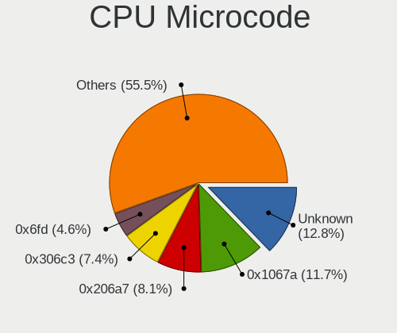

| Number     | Desktops | Percent |
|------------|----------|---------|
| Unknown    | 62       | 11.76%  |
| 0x1067a    | 61       | 11.57%  |
| 0x206a7    | 43       | 8.16%   |
| 0x306c3    | 40       | 7.59%   |
| 0x6fd      | 24       | 4.55%   |
| 0x010000c8 | 21       | 3.98%   |
| 0x306a9    | 17       | 3.23%   |
| 0x06000852 | 16       | 3.04%   |
| 0x506e3    | 15       | 2.85%   |
| 0x6fb      | 14       | 2.66%   |
| 0x06001119 | 13       | 2.47%   |
| 0xf41      | 8        | 1.52%   |
| 0x20655    | 8        | 1.52%   |
| 0x10676    | 8        | 1.52%   |
| 0x0800820d | 8        | 1.52%   |
| 0x906e9    | 7        | 1.33%   |
| 0x6f6      | 7        | 1.33%   |
| 0x06003106 | 7        | 1.33%   |
| 0x106e5    | 6        | 1.14%   |
| 0xf43      | 5        | 0.95%   |
| 0x106a5    | 5        | 0.95%   |
| 0x03000027 | 5        | 0.95%   |
| 0x010000db | 5        | 0.95%   |
| 0xa0655    | 4        | 0.76%   |
| 0x906ea    | 4        | 0.76%   |
| 0x206c2    | 4        | 0.76%   |
| 0x20652    | 4        | 0.76%   |
| 0x0800820c | 4        | 0.76%   |
| 0x0700010f | 4        | 0.76%   |
| 0x0600063e | 4        | 0.76%   |
| 0xf29      | 3        | 0.57%   |
| 0xa0671    | 3        | 0.57%   |
| 0x906ed    | 3        | 0.57%   |
| 0x6f2      | 3        | 0.57%   |
| 0x306f2    | 3        | 0.57%   |
| 0x10677    | 3        | 0.57%   |
| 0x10661    | 3        | 0.57%   |
| 0x08701021 | 3        | 0.57%   |
| 0x08701013 | 3        | 0.57%   |
| 0x08101016 | 3        | 0.57%   |
| 0x0800820b | 3        | 0.57%   |
| 0x010000c7 | 3        | 0.57%   |
| 0x01000083 | 3        | 0.57%   |
| 0xf65      | 2        | 0.38%   |
| 0xf49      | 2        | 0.38%   |
| 0xf47      | 2        | 0.38%   |
| 0xf34      | 2        | 0.38%   |
| 0xf33      | 2        | 0.38%   |
| 0x30678    | 2        | 0.38%   |
| 0x30673    | 2        | 0.38%   |
| 0x0a201009 | 2        | 0.38%   |
| 0x08108109 | 2        | 0.38%   |
| 0x08101013 | 2        | 0.38%   |
| 0x0810100b | 2        | 0.38%   |
| 0x08001138 | 2        | 0.38%   |
| 0x08001137 | 2        | 0.38%   |
| 0x0600611a | 2        | 0.38%   |
| 0x05000119 | 2        | 0.38%   |
| 0x010000dc | 2        | 0.38%   |
| 0xf64      | 1        | 0.19%   |

CPU Microarch
-------------

Microarchitecture

| Name          | Desktops | Percent |
|---------------|----------|---------|
| Penryn        | 75       | 14.48%  |
| Core          | 52       | 10.04%  |
| SandyBridge   | 45       | 8.69%   |
| Haswell       | 45       | 8.69%   |
| K10           | 39       | 7.53%   |
| K8 Hammer     | 31       | 5.98%   |
| Piledriver    | 30       | 5.79%   |
| NetBurst      | 30       | 5.79%   |
| IvyBridge     | 21       | 4.05%   |
| Zen+          | 18       | 3.47%   |
| Westmere      | 17       | 3.28%   |
| Skylake       | 16       | 3.09%   |
| Zen           | 15       | 2.9%    |
| KabyLake      | 15       | 2.9%    |
| Nehalem       | 13       | 2.51%   |
| Zen 2         | 9        | 1.74%   |
| Steamroller   | 7        | 1.35%   |
| Silvermont    | 7        | 1.35%   |
| K10 Llano     | 5        | 0.97%   |
| CometLake     | 5        | 0.97%   |
| Jaguar        | 4        | 0.77%   |
| Bulldozer     | 4        | 0.77%   |
| Bobcat        | 3        | 0.58%   |
| Unknown       | 3        | 0.58%   |
| Zen 3         | 2        | 0.39%   |
| Goldmont plus | 2        | 0.39%   |
| Excavator     | 2        | 0.39%   |
| Bonnell       | 2        | 0.39%   |
| Broadwell     | 1        | 0.19%   |

Graphics
--------

GPU Vendor
----------

Vendors of graphics cards

| Vendor                           | Desktops | Percent |
|----------------------------------|----------|---------|
| Nvidia                           | 197      | 36.35%  |
| AMD                              | 172      | 31.73%  |
| Intel                            | 164      | 30.26%  |
| VIA Technologies                 | 4        | 0.74%   |
| Silicon Integrated Systems [SiS] | 2        | 0.37%   |
| Trident Microsystems             | 1        | 0.18%   |
| Silicon Motion                   | 1        | 0.18%   |
| Matrox Electronics Systems       | 1        | 0.18%   |

GPU Model
---------

Graphics card models

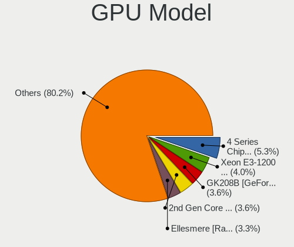

| Model                                                                                    | Desktops | Percent |
|------------------------------------------------------------------------------------------|----------|---------|
| Intel 4 Series Chipset Integrated Graphics Controller                                    | 27       | 4.81%   |
| Intel Xeon E3-1200 v3/4th Gen Core Processor Integrated Graphics Controller              | 24       | 4.28%   |
| Nvidia GK208B [GeForce GT 710]                                                           | 22       | 3.92%   |
| Intel 2nd Generation Core Processor Family Integrated Graphics Controller                | 20       | 3.57%   |
| AMD Ellesmere [Radeon RX 470/480/570/570X/580/580X/590]                                  | 20       | 3.57%   |
| Intel 82G33/G31 Express Integrated Graphics Controller                                   | 13       | 2.32%   |
| Nvidia GT218 [GeForce 210]                                                               | 11       | 1.96%   |
| AMD Cedar [Radeon HD 5000/6000/7350/8350 Series]                                         | 10       | 1.78%   |
| Nvidia GM107 [GeForce GTX 750 Ti]                                                        | 8        | 1.43%   |
| AMD RS780L [Radeon 3000]                                                                 | 8        | 1.43%   |
| Nvidia GK208B [GeForce GT 730]                                                           | 7        | 1.25%   |
| Intel Xeon E3-1200 v2/3rd Gen Core processor Graphics Controller                         | 7        | 1.25%   |
| Intel HD Graphics 530                                                                    | 7        | 1.25%   |
| Intel Core Processor Integrated Graphics Controller                                      | 7        | 1.25%   |
| Intel 82Q35 Express Integrated Graphics Controller                                       | 7        | 1.25%   |
| Intel 82945G/GZ Integrated Graphics Controller                                           | 7        | 1.25%   |
| Nvidia C61 [GeForce 6150SE nForce 430]                                                   | 6        | 1.07%   |
| Intel 82865G Integrated Graphics Controller                                              | 6        | 1.07%   |
| AMD Raven Ridge [Radeon Vega Series / Radeon Vega Mobile Series]                         | 6        | 1.07%   |
| Nvidia G96C [GeForce 9500 GT]                                                            | 5        | 0.89%   |
| Nvidia C61 [GeForce 7025 / nForce 630a]                                                  | 5        | 0.89%   |
| AMD RV620 LE [Radeon HD 3450]                                                            | 5        | 0.89%   |
| AMD Kaveri [Radeon R7 Graphics]                                                          | 5        | 0.89%   |
| Nvidia GP108 [GeForce GT 1030]                                                           | 4        | 0.71%   |
| Nvidia GP107 [GeForce GTX 1050]                                                          | 4        | 0.71%   |
| Nvidia GP107 [GeForce GTX 1050 Ti]                                                       | 4        | 0.71%   |
| Nvidia G94 [GeForce 9600 GT]                                                             | 4        | 0.71%   |
| Intel HD Graphics 630                                                                    | 4        | 0.71%   |
| Intel CometLake-S GT2 [UHD Graphics 630]                                                 | 4        | 0.71%   |
| Intel CoffeeLake-S GT2 [UHD Graphics 630]                                                | 4        | 0.71%   |
| Intel Atom Processor Z36xxx/Z37xxx Series Graphics & Display                             | 4        | 0.71%   |
| Intel 4th Generation Core Processor Family Integrated Graphics Controller                | 4        | 0.71%   |
| AMD Turks XT [Radeon HD 6670/7670]                                                       | 4        | 0.71%   |
| AMD Tobago PRO [Radeon R7 360 / R9 360 OEM]                                              | 4        | 0.71%   |
| AMD RS880 [Radeon HD 4200]                                                               | 4        | 0.71%   |
| AMD Oland PRO [Radeon R7 240/340 / Radeon 520]                                           | 4        | 0.71%   |
| AMD Caicos XT [Radeon HD 7470/8470 / R5 235/310 OEM]                                     | 4        | 0.71%   |
| Nvidia GP104 [GeForce GTX 1070]                                                          | 3        | 0.53%   |
| Nvidia GM206 [GeForce GTX 960]                                                           | 3        | 0.53%   |
| Nvidia GF114 [GeForce GTX 560 Ti]                                                        | 3        | 0.53%   |
| Nvidia GF106GL [Quadro 2000]                                                             | 3        | 0.53%   |
| Nvidia C73 [GeForce 7100 / nForce 630i]                                                  | 3        | 0.53%   |
| Intel Atom/Celeron/Pentium Processor x5-E8000/J3xxx/N3xxx Integrated Graphics Controller | 3        | 0.53%   |
| Intel 82915G/GV/910GL Integrated Graphics Controller                                     | 3        | 0.53%   |
| AMD Trinity [Radeon HD 7560D]                                                            | 3        | 0.53%   |
| AMD Trinity 2 [Radeon HD 7480D]                                                          | 3        | 0.53%   |
| AMD RV710 [Radeon HD 4350/4550]                                                          | 3        | 0.53%   |
| AMD Navi 10 [Radeon RX 5600 OEM/5600 XT / 5700/5700 XT]                                  | 3        | 0.53%   |
| AMD Barts PRO [Radeon HD 6850]                                                           | 3        | 0.53%   |
| AMD Baffin [Radeon RX 550 640SP / RX 560/560X]                                           | 3        | 0.53%   |
| AMD Baffin [Radeon RX 460/560D / Pro 450/455/460/555/555X/560/560X]                      | 3        | 0.53%   |
| VIA Technologies CN896/VN896/P4M900 [Chrome 9 HC]                                        | 2        | 0.36%   |
| Silicon Integrated Systems [SiS] 771/671 PCIE VGA Display Adapter                        | 2        | 0.36%   |
| Nvidia NV43 [GeForce 6600 LE]                                                            | 2        | 0.36%   |
| Nvidia GT218 [GeForce 8400 GS Rev. 3]                                                    | 2        | 0.36%   |
| Nvidia GT216 [GeForce 210]                                                               | 2        | 0.36%   |
| Nvidia GT215 [GeForce GT 240]                                                            | 2        | 0.36%   |
| Nvidia GP106 [GeForce GTX 1060 6GB]                                                      | 2        | 0.36%   |
| Nvidia GM204 [GeForce GTX 970]                                                           | 2        | 0.36%   |
| Nvidia GK208B [GeForce GT 720]                                                           | 2        | 0.36%   |

GPU Combo
---------

Combinations of graphics cards

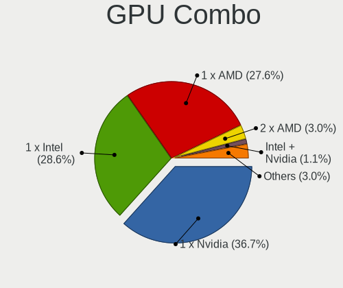

| Name                     | Desktops | Percent |
|--------------------------|----------|---------|
| 1 x Nvidia               | 190      | 36.54%  |
| 1 x AMD                  | 148      | 28.46%  |
| 1 x Intel                | 146      | 28.08%  |
| 2 x AMD                  | 15       | 2.88%   |
| Intel + AMD              | 6        | 1.15%   |
| Intel + Nvidia           | 5        | 0.96%   |
| 1 x VIA                  | 4        | 0.77%   |
| 1 x SiS                  | 2        | 0.38%   |
| 1 x Trident Microsystems | 1        | 0.19%   |
| Nvidia + Silicon Motion  | 1        | 0.19%   |
| 1 x Matrox               | 1        | 0.19%   |
| AMD + Nvidia             | 1        | 0.19%   |

GPU Driver
----------

Free vs proprietary

| Driver      | Desktops | Percent |
|-------------|----------|---------|
| Free        | 366      | 69.98%  |
| Proprietary | 100      | 19.12%  |
| Unknown     | 57       | 10.9%   |

GPU Memory
----------

Total video memory

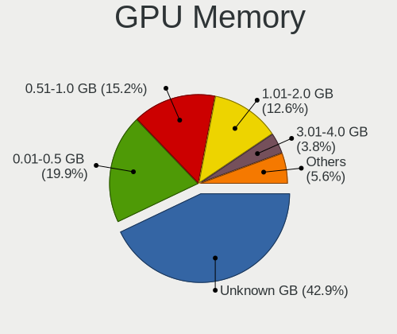

| Size in GB | Desktops | Percent |
|------------|----------|---------|
| Unknown    | 221      | 41.86%  |
| 0.01-0.5   | 104      | 19.7%   |
| 0.51-1.0   | 82       | 15.53%  |
| 1.01-2.0   | 70       | 13.26%  |
| 3.01-4.0   | 21       | 3.98%   |
| 7.01-8.0   | 19       | 3.6%    |
| 5.01-6.0   | 7        | 1.33%   |
| 2.01-3.0   | 2        | 0.38%   |
| 4.01-5.0   | 1        | 0.19%   |
| 8.01-16.0  | 1        | 0.19%   |

Monitor
-------

Monitor Vendor
--------------

Monitor vendors

| Vendor               | Desktops | Percent |
|----------------------|----------|---------|
| Samsung Electronics  | 78       | 16.39%  |
| Dell                 | 49       | 10.29%  |
| Goldstar             | 47       | 9.87%   |
| Hewlett-Packard      | 41       | 8.61%   |
| Acer                 | 33       | 6.93%   |
| AOC                  | 26       | 5.46%   |
| Ancor Communications | 22       | 4.62%   |
| Philips              | 18       | 3.78%   |
| BenQ                 | 17       | 3.57%   |
| ViewSonic            | 13       | 2.73%   |
| LG Electronics       | 13       | 2.73%   |
| Unknown              | 11       | 2.31%   |
| Vizio                | 4        | 0.84%   |
| Toshiba              | 4        | 0.84%   |
| NEC Computers        | 4        | 0.84%   |
| Insignia             | 4        | 0.84%   |
| HannStar             | 4        | 0.84%   |
| CVT                  | 4        | 0.84%   |
| VIZ                  | 3        | 0.63%   |
| Sony                 | 3        | 0.63%   |
| Sharp                | 3        | 0.63%   |
| Sceptre Tech         | 3        | 0.63%   |
| Lenovo               | 3        | 0.63%   |
| KTC                  | 3        | 0.63%   |
| Iiyama               | 3        | 0.63%   |
| Idek Iiyama          | 3        | 0.63%   |
| Gateway              | 3        | 0.63%   |
| Fujitsu Siemens      | 3        | 0.63%   |
| Eizo                 | 3        | 0.63%   |
| Sanyo                | 2        | 0.42%   |
| MSI                  | 2        | 0.42%   |
| Medion               | 2        | 0.42%   |
| Envision             | 2        | 0.42%   |
| ASUSTek Computer     | 2        | 0.42%   |
| ___                  | 1        | 0.21%   |
| Xiaomi               | 1        | 0.21%   |
| Vita                 | 1        | 0.21%   |
| UTV                  | 1        | 0.21%   |
| UMC                  | 1        | 0.21%   |
| TCL                  | 1        | 0.21%   |
| SKY                  | 1        | 0.21%   |
| Sceptre              | 1        | 0.21%   |
| Sangyo               | 1        | 0.21%   |
| RKU                  | 1        | 0.21%   |
| PRI                  | 1        | 0.21%   |
| Plain Tree Systems   | 1        | 0.21%   |
| Pioneer Electronic   | 1        | 0.21%   |
| Packard Bell         | 1        | 0.21%   |
| OPD                  | 1        | 0.21%   |
| ONN                  | 1        | 0.21%   |
| OEM                  | 1        | 0.21%   |
| NUL                  | 1        | 0.21%   |
| Niko                 | 1        | 0.21%   |
| MStar                | 1        | 0.21%   |
| Mi                   | 1        | 0.21%   |
| LSC                  | 1        | 0.21%   |
| Korea Data Systems   | 1        | 0.21%   |
| Konka                | 1        | 0.21%   |
| InfoVision           | 1        | 0.21%   |
| Hyundai ImageQuest   | 1        | 0.21%   |

Monitor Model
-------------

Monitor models

| Model                                                                 | Desktops | Percent |
|-----------------------------------------------------------------------|----------|---------|
| Philips PHL 242M8 PHLC253 1920x1080 527x296mm 23.8-inch               | 4        | 0.79%   |
| Hewlett-Packard 2009 HWP2827 1600x900 442x249mm 20.0-inch             | 3        | 0.59%   |
| Goldstar HD GSM5ACB 1366x768 410x230mm 18.5-inch                      | 3        | 0.59%   |
| VIZ LCD Monitor E320VT 1920x1080                                      | 2        | 0.4%    |
| Unknown LCD Monitor SAMSUNG 3840x2160                                 | 2        | 0.4%    |
| Unknown LCD Monitor AAA LCDTV 1360x768                                | 2        | 0.4%    |
| Samsung Electronics SyncMaster SAM0564 1360x768 410x230mm 18.5-inch   | 2        | 0.4%    |
| Samsung Electronics SMB2430H SAM064E 1920x1080                        | 2        | 0.4%    |
| Samsung Electronics LCD Monitor SyncMaster 1920x1080                  | 2        | 0.4%    |
| Samsung Electronics LCD Monitor SMB1930N 1366x768                     | 2        | 0.4%    |
| Samsung Electronics LCD Monitor SAM07C0 1920x1080 700x390mm 31.5-inch | 2        | 0.4%    |
| Samsung Electronics LCD Monitor SAM0399 1280x720                      | 2        | 0.4%    |
| MSI Optix MAG27C MSI1462 1920x1080 598x336mm 27.0-inch                | 2        | 0.4%    |
| LG Electronics LCD Monitor LG ULTRAWIDE 2560x1080                     | 2        | 0.4%    |
| Hewlett-Packard LCD Monitor P221                                      | 2        | 0.4%    |
| Hewlett-Packard f2105 HWP2655 1680x1050 433x271mm 20.1-inch           | 2        | 0.4%    |
| Goldstar W1943 GSM4BAD 1360x768 406x229mm 18.4-inch                   | 2        | 0.4%    |
| Goldstar W1942 GSM4B70 1440x900 408x255mm 18.9-inch                   | 2        | 0.4%    |
| Goldstar MP59G GSM5B34 1920x1080 480x270mm 21.7-inch                  | 2        | 0.4%    |
| Gateway FPD1730 GWY06C2 1280x1024 359x287mm 18.1-inch                 | 2        | 0.4%    |
| Dell P2012H DEL4079 1600x900 443x249mm 20.0-inch                      | 2        | 0.4%    |
| Dell 1907FP DEL4014 1280x1024 376x301mm 19.0-inch                     | 2        | 0.4%    |
| Dell 1708FP DEL4023 1280x1024 338x270mm 17.0-inch                     | 2        | 0.4%    |
| Dell 1704FPT DEL4004 1280x1024 340x270mm 17.1-inch                    | 2        | 0.4%    |
| CVT CVTE TV CVT0003 1360x768 575x323mm 26.0-inch                      | 2        | 0.4%    |
| BenQ LCD Monitor GW2765 2560x1440                                     | 2        | 0.4%    |
| BenQ LCD Monitor GW2480 1920x1080                                     | 2        | 0.4%    |
| BenQ GL2450H BNQ78A7 1920x1080 531x298mm 24.0-inch                    | 2        | 0.4%    |
| ASUSTek Computer PG349Q AUS343B 3440x1440 798x335mm 34.1-inch         | 2        | 0.4%    |
| AOC 2770 AOC2770 1920x1080 598x336mm 27.0-inch                        | 2        | 0.4%    |
| Ancor Communications VS248 ACI2498 1920x1080 531x299mm 24.0-inch      | 2        | 0.4%    |
| Acer V173 ACR0019 1280x1024 338x270mm 17.0-inch                       | 2        | 0.4%    |
| Acer G226HQL ACR0346 1920x1080 477x268mm 21.5-inch                    | 2        | 0.4%    |
| ___ LCDTV16 ___0101 1360x768                                          | 1        | 0.2%    |
| Xiaomi Mi TV XMD00E1 3840x2160 708x398mm 32.0-inch                    | 1        | 0.2%    |
| Vizio VA19L HDTV10T VIZ0019 1360x768 410x230mm 18.5-inch              | 1        | 0.2%    |
| Vizio E220VA VIZ0070 1920x1080 476x268mm 21.5-inch                    | 1        | 0.2%    |
| Vizio E190VA VIZ0067 1360x768 410x230mm 18.5-inch                     | 1        | 0.2%    |
| Vizio D32h-F0 VIZ1028 1366x768 700x390mm 31.5-inch                    | 1        | 0.2%    |
| VIZ LCD Monitor E220VA                                                | 1        | 0.2%    |
| Vita VT988 VIT03DC 1280x1024 376x301mm 19.0-inch                      | 1        | 0.2%    |
| ViewSonic VX2262wm VSC7821 1680x1050 474x296mm 22.0-inch              | 1        | 0.2%    |
| ViewSonic VG2021wm-2 VSCD91E 1680x1050 433x270mm 20.1-inch            | 1        | 0.2%    |
| ViewSonic VA2432-FHD VSCB639 1920x1080 527x296mm 23.8-inch            | 1        | 0.2%    |
| ViewSonic VA2231 Series VSCBB25 1920x1080 477x268mm 21.5-inch         | 1        | 0.2%    |
| ViewSonic VA2055 Series VSC3C31 1920x1080 435x239mm 19.5-inch         | 1        | 0.2%    |
| ViewSonic VA2026w VSC5020 1680x1050 433x271mm 20.1-inch               | 1        | 0.2%    |
| ViewSonic VA1931 Series VSCAC25 1366x768 410x230mm 18.5-inch          | 1        | 0.2%    |
| ViewSonic VA1913 series VSC1A22 1366x768 410x230mm 18.5-inch          | 1        | 0.2%    |
| ViewSonic VA1903a VSC8A31 1366x768 410x230mm 18.5-inch                | 1        | 0.2%    |
| ViewSonic TD2421 Series VSCE732 1920x1080 521x293mm 23.5-inch         | 1        | 0.2%    |
| ViewSonic LCD Monitor VX2270 SERIES 7680x1080                         | 1        | 0.2%    |
| ViewSonic LCD Monitor VX2270 SERIES                                   | 1        | 0.2%    |
| ViewSonic LCD Monitor VX2262wm 3600x1080                              | 1        | 0.2%    |
| ViewSonic LCD Monitor VX2233wm-1                                      | 1        | 0.2%    |
| ViewSonic LCD Monitor VA2259 Series 1920x1080                         | 1        | 0.2%    |
| UTV MONITOR UTV0030 1920x1080 580x330mm 26.3-inch                     | 1        | 0.2%    |
| Unknown LCD TV 0101 1920x1080 1600x900mm 72.3-inch                    | 1        | 0.2%    |
| Unknown LCD Monitor XXX AAA 1920x1080                                 | 1        | 0.2%    |
| Unknown LCD Monitor Toshiba TSB-TV 1920x1080                          | 1        | 0.2%    |

Monitor Resolution
------------------

Monitor screen resolution

| Resolution         | Desktops | Percent |
|--------------------|----------|---------|
| 1920x1080 (FHD)    | 188      | 39.58%  |
| 1280x1024 (SXGA)   | 54       | 11.37%  |
| 1366x768 (WXGA)    | 35       | 7.37%   |
| 1680x1050 (WSXGA+) | 26       | 5.47%   |
| 1600x900 (HD+)     | 26       | 5.47%   |
| 1440x900 (WXGA+)   | 24       | 5.05%   |
| 1360x768           | 20       | 4.21%   |
| 3840x2160 (4K)     | 16       | 3.37%   |
| Unknown            | 15       | 3.16%   |
| 2560x1440 (QHD)    | 11       | 2.32%   |
| 1920x1200 (WUXGA)  | 9        | 1.89%   |
| 3440x1440          | 6        | 1.26%   |
| 1024x768 (XGA)     | 6        | 1.26%   |
| 3840x1080          | 5        | 1.05%   |
| 1920x540           | 5        | 1.05%   |
| 5760x1080          | 4        | 0.84%   |
| 2560x1080          | 3        | 0.63%   |
| 3200x1080          | 2        | 0.42%   |
| 2048x1152          | 2        | 0.42%   |
| 1600x1200          | 2        | 0.42%   |
| 1152x864           | 2        | 0.42%   |
| 7680x1080          | 1        | 0.21%   |
| 6400x1440          | 1        | 0.21%   |
| 6400x1080          | 1        | 0.21%   |
| 5760x2160          | 1        | 0.21%   |
| 5440x1080          | 1        | 0.21%   |
| 4480x1440          | 1        | 0.21%   |
| 3840x1200          | 1        | 0.21%   |
| 3600x1080          | 1        | 0.21%   |
| 2646x768           | 1        | 0.21%   |
| 2560x1600          | 1        | 0.21%   |
| 2390x899           | 1        | 0.21%   |
| 1360x765           | 1        | 0.21%   |
| 1280x960           | 1        | 0.21%   |
| 1280x720 (HD)      | 1        | 0.21%   |

Monitor Diagonal
----------------

Diagonal size in inches

| Inches  | Desktops | Percent |
|---------|----------|---------|
| Unknown | 100      | 21.37%  |
| 18      | 43       | 9.19%   |
| 19      | 39       | 8.33%   |
| 21      | 38       | 8.12%   |
| 23      | 37       | 7.91%   |
| 27      | 30       | 6.41%   |
| 24      | 29       | 6.2%    |
| 17      | 28       | 5.98%   |
| 20      | 24       | 5.13%   |
| 22      | 17       | 3.63%   |
| 31      | 12       | 2.56%   |
| 15      | 11       | 2.35%   |
| 34      | 8        | 1.71%   |
| 26      | 7        | 1.5%    |
| 40      | 5        | 1.07%   |
| 84      | 4        | 0.85%   |
| 72      | 4        | 0.85%   |
| 54      | 4        | 0.85%   |
| 65      | 2        | 0.43%   |
| 52      | 2        | 0.43%   |
| 42      | 2        | 0.43%   |
| 39      | 2        | 0.43%   |
| 32      | 2        | 0.43%   |
| 16      | 2        | 0.43%   |
| 13      | 2        | 0.43%   |
| 74      | 1        | 0.21%   |
| 60      | 1        | 0.21%   |
| 55      | 1        | 0.21%   |
| 49      | 1        | 0.21%   |
| 47      | 1        | 0.21%   |
| 44      | 1        | 0.21%   |
| 43      | 1        | 0.21%   |
| 37      | 1        | 0.21%   |
| 36      | 1        | 0.21%   |
| 33      | 1        | 0.21%   |
| 30      | 1        | 0.21%   |
| 29      | 1        | 0.21%   |
| 28      | 1        | 0.21%   |
| 14      | 1        | 0.21%   |

Monitor Width
-------------

Physical width

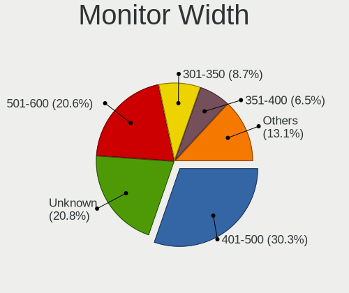

| Width in mm | Desktops | Percent |
|-------------|----------|---------|
| 401-500     | 134      | 29%     |
| Unknown     | 100      | 21.65%  |
| 501-600     | 99       | 21.43%  |
| 301-350     | 39       | 8.44%   |
| 351-400     | 28       | 6.06%   |
| 601-700     | 15       | 3.25%   |
| 701-800     | 12       | 2.6%    |
| 1001-1500   | 12       | 2.6%    |
| 1501-2000   | 9        | 1.95%   |
| 801-900     | 8        | 1.73%   |
| 901-1000    | 4        | 0.87%   |
| 201-300     | 2        | 0.43%   |

Aspect Ratio
------------

Proportional relationship between the width and the height

| Ratio   | Desktops | Percent |
|---------|----------|---------|
| 16/9    | 230      | 51.22%  |
| Unknown | 89       | 19.82%  |
| 16/10   | 56       | 12.47%  |
| 5/4     | 48       | 10.69%  |
| 4/3     | 10       | 2.23%   |
| 21/9    | 8        | 1.78%   |
| 6/5     | 3        | 0.67%   |
| 32/9    | 3        | 0.67%   |
| 3/2     | 2        | 0.45%   |

Monitor Area
------------

Area in inch

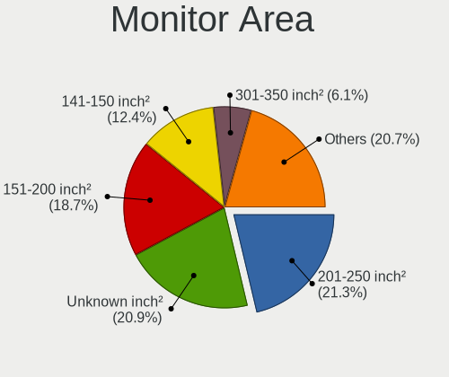

| Area in inch | Desktops | Percent |
|----------------|----------|---------|
| Unknown        | 100      | 21.55%  |
| 201-250        | 94       | 20.26%  |
| 151-200        | 84       | 18.1%   |
| 141-150        | 57       | 12.28%  |
| 301-350        | 30       | 6.47%   |
| 351-500        | 26       | 5.6%    |
| 251-300        | 20       | 4.31%   |
| More than 1000 | 19       | 4.09%   |
| 501-1000       | 15       | 3.23%   |
| 101-110        | 9        | 1.94%   |
| 131-140        | 5        | 1.08%   |
| 111-120        | 2        | 0.43%   |
| 91-100         | 2        | 0.43%   |
| 81-90          | 1        | 0.22%   |

Pixel Density
-------------

Pixels per inch

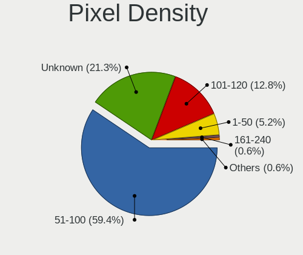

| Density | Desktops | Percent |
|---------|----------|---------|
| 51-100  | 266      | 58.85%  |
| Unknown | 100      | 22.12%  |
| 101-120 | 58       | 12.83%  |
| 1-50    | 22       | 4.87%   |
| 161-240 | 3        | 0.66%   |
| 121-160 | 3        | 0.66%   |

Multiple Monitors
-----------------

Total monitors connected

| Total | Desktops | Percent |
|-------|----------|---------|
| 1     | 427      | 81.02%  |
| 0     | 51       | 9.68%   |
| 2     | 41       | 7.78%   |
| 3     | 7        | 1.33%   |
| 4     | 1        | 0.19%   |

Network
-------

Net Controller Vendor
---------------------

Controller vendors

| Vendor                                | Desktops | Percent |
|---------------------------------------|----------|---------|
| Realtek Semiconductor                 | 294      | 38.03%  |
| Intel                                 | 158      | 20.44%  |
| Qualcomm Atheros                      | 50       | 6.47%   |
| Ralink Technology                     | 39       | 5.05%   |
| Nvidia                                | 34       | 4.4%    |
| Broadcom                              | 32       | 4.14%   |
| Broadcom Limited                      | 19       | 2.46%   |
| Marvell Technology Group              | 16       | 2.07%   |
| VIA Technologies                      | 14       | 1.81%   |
| Ralink                                | 13       | 1.68%   |
| D-Link                                | 13       | 1.68%   |
| D-Link System                         | 10       | 1.29%   |
| TP-Link                               | 8        | 1.03%   |
| NetGear                               | 7        | 0.91%   |
| Xiaomi                                | 5        | 0.65%   |
| Samsung Electronics                   | 5        | 0.65%   |
| Qualcomm Atheros Communications       | 5        | 0.65%   |
| MediaTek                              | 5        | 0.65%   |
| Silicon Integrated Systems [SiS]      | 3        | 0.39%   |
| Qualcomm                              | 3        | 0.39%   |
| Huawei Technologies                   | 3        | 0.39%   |
| ASUSTek Computer                      | 3        | 0.39%   |
| ZTE WCDMA Technologies MSM            | 2        | 0.26%   |
| Sitecom Europe                        | 2        | 0.26%   |
| Senao                                 | 2        | 0.26%   |
| OPPO Electronics                      | 2        | 0.26%   |
| Microsoft                             | 2        | 0.26%   |
| Micro Star International              | 2        | 0.26%   |
| Linksys                               | 2        | 0.26%   |
| Edimax Technology                     | 2        | 0.26%   |
| Aquantia                              | 2        | 0.26%   |
| Apple                                 | 2        | 0.26%   |
| 802.11g Adapter [Linksys WUSB54GC v3] | 2        | 0.26%   |
| Sundance Technology Inc / IC Plus     | 1        | 0.13%   |
| Philips (or NXP)                      | 1        | 0.13%   |
| Motorola                              | 1        | 0.13%   |
| Microchip Technology                  | 1        | 0.13%   |
| JMicron Technology                    | 1        | 0.13%   |
| IMC Networks                          | 1        | 0.13%   |
| Gemtek                                | 1        | 0.13%   |
| GCT Semiconductor                     | 1        | 0.13%   |
| DisplayLink                           | 1        | 0.13%   |
| Belkin Components                     | 1        | 0.13%   |
| ASIX Electronics                      | 1        | 0.13%   |
| 3Com                                  | 1        | 0.13%   |

Net Controller Model
--------------------

Controller models

| Model                                                               | Desktops | Percent |
|---------------------------------------------------------------------|----------|---------|
| Realtek RTL8111/8168/8411 PCI Express Gigabit Ethernet Controller   | 213      | 25.03%  |
| Realtek RTL810xE PCI Express Fast Ethernet controller               | 28       | 3.29%   |
| Nvidia MCP61 Ethernet                                               | 21       | 2.47%   |
| Intel 82579LM Gigabit Network Connection (Lewisville)               | 20       | 2.35%   |
| Ralink MT7601U Wireless Adapter                                     | 16       | 1.88%   |
| Realtek RTL-8100/8101L/8139 PCI Fast Ethernet Adapter               | 14       | 1.65%   |
| Intel I211 Gigabit Network Connection                               | 12       | 1.41%   |
| Intel Ethernet Connection I217-LM                                   | 12       | 1.41%   |
| Realtek RTL8188EUS 802.11n Wireless Network Adapter                 | 11       | 1.29%   |
| Intel 82567LM-3 Gigabit Network Connection                          | 11       | 1.29%   |
| VIA VT6102/VT6103 [Rhine-II]                                        | 10       | 1.18%   |
| Intel 82566DM-2 Gigabit Network Connection                          | 9        | 1.06%   |
| Realtek 802.11n                                                     | 8        | 0.94%   |
| Ralink RT2870/RT3070 Wireless Adapter                               | 8        | 0.94%   |
| Intel 82579V Gigabit Network Connection                             | 8        | 0.94%   |
| Realtek 802.11ac NIC                                                | 7        | 0.82%   |
| Intel Ethernet Connection (2) I219-V                                | 7        | 0.82%   |
| Intel Ethernet Connection (2) I218-V                                | 7        | 0.82%   |
| Realtek RTL88x2bu [AC1200 Techkey]                                  | 6        | 0.71%   |
| Qualcomm Atheros AR9485 Wireless Network Adapter                    | 6        | 0.71%   |
| Nvidia MCP73 Ethernet                                               | 6        | 0.71%   |
| Marvell Group 88E8056 PCI-E Gigabit Ethernet Controller             | 6        | 0.71%   |
| Intel Wi-Fi 6 AX200                                                 | 6        | 0.71%   |
| Realtek RTL8169 PCI Gigabit Ethernet Controller                     | 5        | 0.59%   |
| Qualcomm Atheros AR9271 802.11n                                     | 5        | 0.59%   |
| Qualcomm Atheros Attansic L2 Fast Ethernet                          | 5        | 0.59%   |
| Intel Wireless-AC 9260                                              | 5        | 0.59%   |
| Intel Wireless 8260                                                 | 5        | 0.59%   |
| Intel Wireless 7260                                                 | 5        | 0.59%   |
| Intel Ethernet Connection I217-V                                    | 5        | 0.59%   |
| Intel Ethernet Connection (2) I219-LM                               | 5        | 0.59%   |
| Intel 82578DM Gigabit Network Connection                            | 5        | 0.59%   |
| Intel 82574L Gigabit Network Connection                             | 5        | 0.59%   |
| TP-Link TL-WN823N v2/v3 [Realtek RTL8192EU]                         | 4        | 0.47%   |
| Realtek RTL8188CUS 802.11n WLAN Adapter                             | 4        | 0.47%   |
| Realtek RTL8188CE 802.11b/g/n WiFi Adapter                          | 4        | 0.47%   |
| Realtek RTL8125 2.5GbE Controller                                   | 4        | 0.47%   |
| Ralink RT2501/RT2573 Wireless Adapter                               | 4        | 0.47%   |
| Ralink RT2561/RT61 802.11g PCI                                      | 4        | 0.47%   |
| Qualcomm Atheros Attansic L1 Gigabit Ethernet                       | 4        | 0.47%   |
| Qualcomm Atheros AR8151 v2.0 Gigabit Ethernet                       | 4        | 0.47%   |
| Qualcomm Atheros AR8121/AR8113/AR8114 Gigabit or Fast Ethernet      | 4        | 0.47%   |
| Marvell Group 88E8001 Gigabit Ethernet Controller                   | 4        | 0.47%   |
| Intel NM10/ICH7 Family LAN Controller                               | 4        | 0.47%   |
| Intel Dual Band Wireless-AC 3168NGW [Stone Peak]                    | 4        | 0.47%   |
| Intel Comet Lake PCH CNVi WiFi                                      | 4        | 0.47%   |
| Intel 82562V-2 10/100 Network Connection                            | 4        | 0.47%   |
| Broadcom NetLink BCM57780 Gigabit Ethernet PCIe                     | 4        | 0.47%   |
| Broadcom BCM4318 [AirForce One 54g] 802.11g Wireless LAN Controller | 4        | 0.47%   |
| Xiaomi Mi/Redmi series (RNDIS)                                      | 3        | 0.35%   |
| Samsung Galaxy series, misc. (tethering mode)                       | 3        | 0.35%   |
| Realtek RTL8811AU 802.11a/b/g/n/ac WLAN Adapter                     | 3        | 0.35%   |
| Realtek RTL8192CU 802.11n WLAN Adapter                              | 3        | 0.35%   |
| Realtek RTL8191SU 802.11n WLAN Adapter                              | 3        | 0.35%   |
| Realtek RTL8187 Wireless Adapter                                    | 3        | 0.35%   |
| Realtek RTL-8185 IEEE 802.11a/b/g Wireless LAN Controller           | 3        | 0.35%   |
| Ralink RT5372 Wireless Adapter                                      | 3        | 0.35%   |
| Ralink RT5370 Wireless Adapter                                      | 3        | 0.35%   |
| Ralink RT3572 Wireless Adapter                                      | 3        | 0.35%   |
| Ralink RT3090 Wireless 802.11n 1T/1R PCIe                           | 3        | 0.35%   |

Wireless Vendor
---------------

Wireless vendors

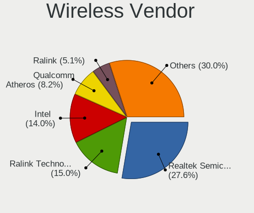

| Vendor                                | Desktops | Percent |
|---------------------------------------|----------|---------|
| Realtek Semiconductor                 | 72       | 26.67%  |
| Intel                                 | 41       | 15.19%  |
| Ralink Technology                     | 39       | 14.44%  |
| Qualcomm Atheros                      | 23       | 8.52%   |
| Ralink                                | 13       | 4.81%   |
| D-Link                                | 13       | 4.81%   |
| Broadcom                              | 10       | 3.7%    |
| D-Link System                         | 9        | 3.33%   |
| TP-Link                               | 8        | 2.96%   |
| NetGear                               | 7        | 2.59%   |
| Broadcom Limited                      | 6        | 2.22%   |
| Qualcomm Atheros Communications       | 5        | 1.85%   |
| Marvell Technology Group              | 3        | 1.11%   |
| Sitecom Europe                        | 2        | 0.74%   |
| Senao                                 | 2        | 0.74%   |
| Microsoft                             | 2        | 0.74%   |
| Micro Star International              | 2        | 0.74%   |
| Linksys                               | 2        | 0.74%   |
| Edimax Technology                     | 2        | 0.74%   |
| ASUSTek Computer                      | 2        | 0.74%   |
| 802.11g Adapter [Linksys WUSB54GC v3] | 2        | 0.74%   |
| Philips (or NXP)                      | 1        | 0.37%   |
| MediaTek                              | 1        | 0.37%   |
| IMC Networks                          | 1        | 0.37%   |
| Gemtek                                | 1        | 0.37%   |
| Belkin Components                     | 1        | 0.37%   |

Wireless Model
--------------

Wireless models

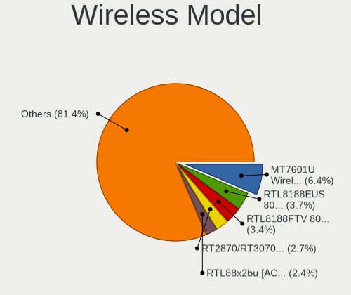

| Model                                                                             | Desktops | Percent |
|-----------------------------------------------------------------------------------|----------|---------|
| Ralink MT7601U Wireless Adapter                                                   | 16       | 5.86%   |
| Realtek RTL8188EUS 802.11n Wireless Network Adapter                               | 11       | 4.03%   |
| Realtek 802.11n                                                                   | 8        | 2.93%   |
| Ralink RT2870/RT3070 Wireless Adapter                                             | 8        | 2.93%   |
| Realtek 802.11ac NIC                                                              | 7        | 2.56%   |
| Realtek RTL88x2bu [AC1200 Techkey]                                                | 6        | 2.2%    |
| Qualcomm Atheros AR9485 Wireless Network Adapter                                  | 6        | 2.2%    |
| Intel Wi-Fi 6 AX200                                                               | 6        | 2.2%    |
| Qualcomm Atheros AR9271 802.11n                                                   | 5        | 1.83%   |
| Intel Wireless-AC 9260                                                            | 5        | 1.83%   |
| Intel Wireless 8260                                                               | 5        | 1.83%   |
| Intel Wireless 7260                                                               | 5        | 1.83%   |
| TP-Link TL-WN823N v2/v3 [Realtek RTL8192EU]                                       | 4        | 1.47%   |
| Realtek RTL8188CUS 802.11n WLAN Adapter                                           | 4        | 1.47%   |
| Realtek RTL8188CE 802.11b/g/n WiFi Adapter                                        | 4        | 1.47%   |
| Ralink RT2501/RT2573 Wireless Adapter                                             | 4        | 1.47%   |
| Ralink RT2561/RT61 802.11g PCI                                                    | 4        | 1.47%   |
| Intel Dual Band Wireless-AC 3168NGW [Stone Peak]                                  | 4        | 1.47%   |
| Intel Comet Lake PCH CNVi WiFi                                                    | 4        | 1.47%   |
| Broadcom BCM4318 [AirForce One 54g] 802.11g Wireless LAN Controller               | 4        | 1.47%   |
| Realtek RTL8811AU 802.11a/b/g/n/ac WLAN Adapter                                   | 3        | 1.1%    |
| Realtek RTL8192CU 802.11n WLAN Adapter                                            | 3        | 1.1%    |
| Realtek RTL8191SU 802.11n WLAN Adapter                                            | 3        | 1.1%    |
| Realtek RTL8187 Wireless Adapter                                                  | 3        | 1.1%    |
| Realtek RTL-8185 IEEE 802.11a/b/g Wireless LAN Controller                         | 3        | 1.1%    |
| Ralink RT5372 Wireless Adapter                                                    | 3        | 1.1%    |
| Ralink RT5370 Wireless Adapter                                                    | 3        | 1.1%    |
| Ralink RT3572 Wireless Adapter                                                    | 3        | 1.1%    |
| Ralink RT3090 Wireless 802.11n 1T/1R PCIe                                         | 3        | 1.1%    |
| Qualcomm Atheros AR922X Wireless Network Adapter                                  | 3        | 1.1%    |
| Qualcomm Atheros AR5212/5213/2414 Wireless Network Adapter                        | 3        | 1.1%    |
| Marvell Group 88w8335 [Libertas] 802.11b/g Wireless                               | 3        | 1.1%    |
| D-Link System DWA-140 RangeBooster N Adapter(rev.B2) [Ralink RT3072]              | 3        | 1.1%    |
| Broadcom Limited BCM4360 802.11ac Wireless Network Adapter                        | 3        | 1.1%    |
| Broadcom BCM4360 802.11ac Wireless Network Adapter                                | 3        | 1.1%    |
| Senao EUB9706 802.11n Wireless Adapter [Ralink RT3072]                            | 2        | 0.73%   |
| Realtek RTL8822BE 802.11a/b/g/n/ac WiFi adapter                                   | 2        | 0.73%   |
| Realtek RTL8821AE 802.11ac PCIe Wireless Network Adapter                          | 2        | 0.73%   |
| Realtek RTL8723BE PCIe Wireless Network Adapter                                   | 2        | 0.73%   |
| Realtek RTL8192EU 802.11b/g/n WLAN Adapter                                        | 2        | 0.73%   |
| Realtek RTL8192CE PCIe Wireless Network Adapter                                   | 2        | 0.73%   |
| Ralink MT7610U ("Archer T2U" 2.4G+5G WLAN Adapter                                 | 2        | 0.73%   |
| Ralink RT5390 Wireless 802.11n 1T/1R PCIe                                         | 2        | 0.73%   |
| Ralink RT2790 Wireless 802.11n 1T/2R PCIe                                         | 2        | 0.73%   |
| Qualcomm Atheros QCA9377 802.11ac Wireless Network Adapter                        | 2        | 0.73%   |
| NetGear WN111(v2) RangeMax Next Wireless [Atheros AR9170+AR9101]                  | 2        | 0.73%   |
| Microsoft Xbox 360 Wireless Adapter                                               | 2        | 0.73%   |
| Micro Star International MS-3871 802.11bgn Wireless Module [Ralink RT8070]        | 2        | 0.73%   |
| Intel Ultimate N WiFi Link 5300                                                   | 2        | 0.73%   |
| Intel Centrino Wireless-N 2230                                                    | 2        | 0.73%   |
| Intel Cannon Lake PCH CNVi WiFi                                                   | 2        | 0.73%   |
| Edimax EW-7811Un 802.11n Wireless Adapter [Realtek RTL8188CUS]                    | 2        | 0.73%   |
| D-Link System DWA-131 802.11n Wireless N Nano Adapter(rev.A1) [Realtek RTL8192SU] | 2        | 0.73%   |
| D-Link DWA-127 Wireless N 150 High-Gain Adapter(rev.A1) [Ralink RT3070]           | 2        | 0.73%   |
| Broadcom Limited BCM4318 [AirForce One 54g] 802.11g Wireless LAN Controller       | 2        | 0.73%   |
| ASUS WL-167G v2 802.11g Adapter [Ralink RT2571W]                                  | 2        | 0.73%   |
| TP-Link TL-WN722N v2/v3 [Realtek RTL8188EUS]                                      | 1        | 0.37%   |
| TP-Link Archer T4U ver.3                                                          | 1        | 0.37%   |
| TP-Link Archer T2U PLUS [RTL8821AU]                                               | 1        | 0.37%   |
| TP-Link AC600 wireless Realtek RTL8811AU [Archer T2U Nano]                        | 1        | 0.37%   |

Ethernet Vendor
---------------

Ethernet vendors

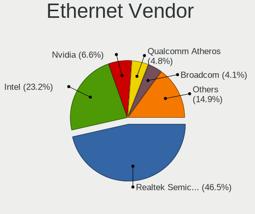

| Vendor                            | Desktops | Percent |
|-----------------------------------|----------|---------|
| Realtek Semiconductor             | 263      | 46.8%   |
| Intel                             | 136      | 24.2%   |
| Nvidia                            | 34       | 6.05%   |
| Qualcomm Atheros                  | 28       | 4.98%   |
| Broadcom                          | 22       | 3.91%   |
| VIA Technologies                  | 14       | 2.49%   |
| Broadcom Limited                  | 14       | 2.49%   |
| Marvell Technology Group          | 13       | 2.31%   |
| Xiaomi                            | 5        | 0.89%   |
| Samsung Electronics               | 5        | 0.89%   |
| MediaTek                          | 4        | 0.71%   |
| Silicon Integrated Systems [SiS]  | 3        | 0.53%   |
| Qualcomm                          | 3        | 0.53%   |
| Huawei Technologies               | 3        | 0.53%   |
| OPPO Electronics                  | 2        | 0.36%   |
| Aquantia                          | 2        | 0.36%   |
| Apple                             | 2        | 0.36%   |
| ZTE WCDMA Technologies MSM        | 1        | 0.18%   |
| Sundance Technology Inc / IC Plus | 1        | 0.18%   |
| JMicron Technology                | 1        | 0.18%   |
| GCT Semiconductor                 | 1        | 0.18%   |
| DisplayLink                       | 1        | 0.18%   |
| D-Link System                     | 1        | 0.18%   |
| ASUSTek Computer                  | 1        | 0.18%   |
| ASIX Electronics                  | 1        | 0.18%   |
| 3Com                              | 1        | 0.18%   |

Ethernet Model
--------------

Ethernet models

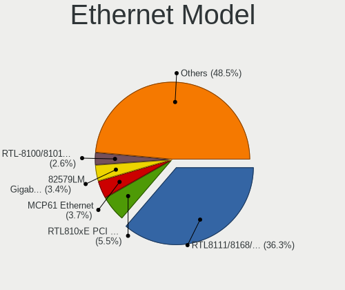

| Model                                                                         | Desktops | Percent |
|-------------------------------------------------------------------------------|----------|---------|
| Realtek RTL8111/8168/8411 PCI Express Gigabit Ethernet Controller             | 213      | 37.17%  |
| Realtek RTL810xE PCI Express Fast Ethernet controller                         | 28       | 4.89%   |
| Nvidia MCP61 Ethernet                                                         | 21       | 3.66%   |
| Intel 82579LM Gigabit Network Connection (Lewisville)                         | 20       | 3.49%   |
| Realtek RTL-8100/8101L/8139 PCI Fast Ethernet Adapter                         | 14       | 2.44%   |
| Intel I211 Gigabit Network Connection                                         | 12       | 2.09%   |
| Intel Ethernet Connection I217-LM                                             | 12       | 2.09%   |
| Intel 82567LM-3 Gigabit Network Connection                                    | 11       | 1.92%   |
| VIA VT6102/VT6103 [Rhine-II]                                                  | 10       | 1.75%   |
| Intel 82566DM-2 Gigabit Network Connection                                    | 9        | 1.57%   |
| Intel 82579V Gigabit Network Connection                                       | 8        | 1.4%    |
| Intel Ethernet Connection (2) I219-V                                          | 7        | 1.22%   |
| Intel Ethernet Connection (2) I218-V                                          | 7        | 1.22%   |
| Nvidia MCP73 Ethernet                                                         | 6        | 1.05%   |
| Marvell Group 88E8056 PCI-E Gigabit Ethernet Controller                       | 6        | 1.05%   |
| Realtek RTL8169 PCI Gigabit Ethernet Controller                               | 5        | 0.87%   |
| Qualcomm Atheros Attansic L2 Fast Ethernet                                    | 5        | 0.87%   |
| Intel Ethernet Connection I217-V                                              | 5        | 0.87%   |
| Intel Ethernet Connection (2) I219-LM                                         | 5        | 0.87%   |
| Intel 82578DM Gigabit Network Connection                                      | 5        | 0.87%   |
| Intel 82574L Gigabit Network Connection                                       | 5        | 0.87%   |
| Realtek RTL8125 2.5GbE Controller                                             | 4        | 0.7%    |
| Qualcomm Atheros Attansic L1 Gigabit Ethernet                                 | 4        | 0.7%    |
| Qualcomm Atheros AR8151 v2.0 Gigabit Ethernet                                 | 4        | 0.7%    |
| Qualcomm Atheros AR8121/AR8113/AR8114 Gigabit or Fast Ethernet                | 4        | 0.7%    |
| Marvell Group 88E8001 Gigabit Ethernet Controller                             | 4        | 0.7%    |
| Intel NM10/ICH7 Family LAN Controller                                         | 4        | 0.7%    |
| Intel 82562V-2 10/100 Network Connection                                      | 4        | 0.7%    |
| Broadcom NetLink BCM57780 Gigabit Ethernet PCIe                               | 4        | 0.7%    |
| Xiaomi Mi/Redmi series (RNDIS)                                                | 3        | 0.52%   |
| Samsung Galaxy series, misc. (tethering mode)                                 | 3        | 0.52%   |
| Qualcomm Atheros AR8131 Gigabit Ethernet                                      | 3        | 0.52%   |
| MediaTek U FEEL                                                               | 3        | 0.52%   |
| Intel 82578DC Gigabit Network Connection                                      | 3        | 0.52%   |
| Intel 82567LF-2 Gigabit Network Connection                                    | 3        | 0.52%   |
| Broadcom NetXtreme BCM5764M Gigabit Ethernet PCIe                             | 3        | 0.52%   |
| Broadcom NetXtreme BCM5761 Gigabit Ethernet PCIe                              | 3        | 0.52%   |
| Broadcom Limited NetXtreme BCM5754 Gigabit Ethernet PCI Express               | 3        | 0.52%   |
| Broadcom Limited NetXtreme BCM5752 Gigabit Ethernet PCI Express               | 3        | 0.52%   |
| VIA VT6105/VT6106S [Rhine-III]                                                | 2        | 0.35%   |
| Silicon Integrated Systems [SiS] SiS900 PCI Fast Ethernet                     | 2        | 0.35%   |
| Samsung GT-I9070 (network tethering, USB debugging enabled)                   | 2        | 0.35%   |
| Qualcomm Redmi Note 7                                                         | 2        | 0.35%   |
| Qualcomm Atheros Killer E2400 Gigabit Ethernet Controller                     | 2        | 0.35%   |
| Qualcomm Atheros AR8161 Gigabit Ethernet                                      | 2        | 0.35%   |
| Qualcomm Atheros AR8152 v2.0 Fast Ethernet                                    | 2        | 0.35%   |
| OPPO RMX2001                                                                  | 2        | 0.35%   |
| Nvidia MCP51 Ethernet Controller                                              | 2        | 0.35%   |
| Nvidia CK804 Ethernet Controller                                              | 2        | 0.35%   |
| Marvell Group 88E8057 PCI-E Gigabit Ethernet Controller                       | 2        | 0.35%   |
| Intel Ethernet Controller I225-V                                              | 2        | 0.35%   |
| Intel Ethernet Connection (7) I219-V                                          | 2        | 0.35%   |
| Intel 82571EB/82571GB Gigabit Ethernet Controller D0/D1 (copper applications) | 2        | 0.35%   |
| Intel 82562EZ 10/100 Ethernet Controller                                      | 2        | 0.35%   |
| Huawei SNE-LX3                                                                | 2        | 0.35%   |
| Broadcom NetXtreme BCM57760 Gigabit Ethernet PCIe                             | 2        | 0.35%   |
| Broadcom Limited NetXtreme BCM5755 Gigabit Ethernet PCI Express               | 2        | 0.35%   |
| Broadcom Limited NetLink BCM5787 Gigabit Ethernet PCI Express                 | 2        | 0.35%   |
| Broadcom BCM4401-B0 100Base-TX                                                | 2        | 0.35%   |
| ZTE WCDMA MSM Android                                                         | 1        | 0.17%   |

Net Controller Kind
-------------------

Ethernet, WiFi or modem

| Kind     | Desktops | Percent |
|----------|----------|---------|
| Ethernet | 510      | 66.93%  |
| WiFi     | 247      | 32.41%  |
| Modem    | 4        | 0.52%   |
| Unknown  | 1        | 0.13%   |

Used Controller
---------------

Currently used network controller

| Kind     | Desktops | Percent |
|----------|----------|---------|
| Ethernet | 393      | 71.07%  |
| WiFi     | 160      | 28.93%  |

NICs
----

Total network controllers on board

| Total | Desktops | Percent |
|-------|----------|---------|
| 1     | 379      | 73.17%  |
| 2     | 126      | 24.32%  |
| 3     | 11       | 2.12%   |
| 5     | 1        | 0.19%   |
| 0     | 1        | 0.19%   |

IPv6
----

IPv6 vs IPv4

| Used | Desktops | Percent |
|------|----------|---------|
| No   | 486      | 93.1%   |
| Yes  | 36       | 6.9%    |

Bluetooth
---------

Bluetooth Vendor
----------------

Controller vendors

| Vendor                          | Desktops | Percent |
|---------------------------------|----------|---------|
| Intel                           | 33       | 32.35%  |
| Cambridge Silicon Radio         | 29       | 28.43%  |
| Broadcom                        | 8        | 7.84%   |
| Qualcomm Atheros Communications | 6        | 5.88%   |
| Realtek Semiconductor           | 4        | 3.92%   |
| IMC Networks                    | 4        | 3.92%   |
| Micro Star International        | 3        | 2.94%   |
| ASUSTek Computer                | 3        | 2.94%   |
| Apple                           | 3        | 2.94%   |
| Integrated System Solution      | 2        | 1.96%   |
| Dynex                           | 2        | 1.96%   |
| Belkin Components               | 2        | 1.96%   |
| Logitech                        | 1        | 0.98%   |
| Hewlett-Packard                 | 1        | 0.98%   |
| Fujitsu                         | 1        | 0.98%   |

Bluetooth Model
---------------

Controller models

| Model                                                 | Desktops | Percent |
|-------------------------------------------------------|----------|---------|
| Cambridge Silicon Radio Bluetooth Dongle (HCI mode)   | 29       | 28.43%  |
| Intel Bluetooth wireless interface                    | 9        | 8.82%   |
| Intel Bluetooth Device                                | 5        | 4.9%    |
| Intel AX201 Bluetooth                                 | 5        | 4.9%    |
| Intel AX200 Bluetooth                                 | 5        | 4.9%    |
| Intel Wireless-AC 3168 Bluetooth                      | 4        | 3.92%   |
| Broadcom BCM20702A0 Bluetooth 4.0                     | 4        | 3.92%   |
| Intel Bluetooth 9460/9560 Jefferson Peak (JfP)        | 3        | 2.94%   |
| IMC Networks Bluetooth Radio                          | 3        | 2.94%   |
| Realtek RTL8821A Bluetooth                            | 2        | 1.96%   |
| Realtek Bluetooth Radio                               | 2        | 1.96%   |
| Qualcomm Atheros  Bluetooth Device                    | 2        | 1.96%   |
| Qualcomm Atheros Bluetooth USB Host Controller        | 2        | 1.96%   |
| Micro Star International Bluetooth Device             | 2        | 1.96%   |
| Intel Centrino Bluetooth Wireless Transceiver         | 2        | 1.96%   |
| Dynex BCM20702A0                                      | 2        | 1.96%   |
| Broadcom BCM92045B3 ROM                               | 2        | 1.96%   |
| Belkin Components F8T065BF Mini Bluetooth 4.0 Adapter | 2        | 1.96%   |
| ASUS Bluetooth Radio                                  | 2        | 1.96%   |
| Apple Bluetooth USB Host Controller                   | 2        | 1.96%   |
| Qualcomm Atheros AR9462 Bluetooth                     | 1        | 0.98%   |
| Qualcomm Atheros AR3011 Bluetooth                     | 1        | 0.98%   |
| Micro Star International Bluetooth Dongle             | 1        | 0.98%   |
| Logitech BT Mini-Receiver (HCI mode)                  | 1        | 0.98%   |
| Integrated System Solution KY-BT100 Bluetooth Adapter | 1        | 0.98%   |
| Integrated System Solution Bluetooth Device           | 1        | 0.98%   |
| IMC Networks Bluetooth Module                         | 1        | 0.98%   |
| HP Bluetooth 2.0 Interface [Broadcom BCM2045]         | 1        | 0.98%   |
| Fujitsu Bluetooth Device                              | 1        | 0.98%   |
| Broadcom Bluetooth dongle                             | 1        | 0.98%   |
| Broadcom BCM2035 Bluetooth dongle                     | 1        | 0.98%   |
| ASUS Broadcom BCM20702A0 Bluetooth                    | 1        | 0.98%   |
| Apple Bluetooth Host Controller                       | 1        | 0.98%   |

Sound
-----

Sound Vendor
------------

Sound card vendors

| Vendor                               | Desktops | Percent |
|--------------------------------------|----------|---------|
| Intel                                | 323      | 42.67%  |
| AMD                                  | 191      | 25.23%  |
| Nvidia                               | 169      | 22.32%  |
| C-Media Electronics                  | 20       | 2.64%   |
| VIA Technologies                     | 12       | 1.59%   |
| Creative Labs                        | 10       | 1.32%   |
| Logitech                             | 6        | 0.79%   |
| Silicon Integrated Systems [SiS]     | 4        | 0.53%   |
| GN Netcom                            | 3        | 0.4%    |
| Generalplus Technology               | 3        | 0.4%    |
| Turtle Beach                         | 2        | 0.26%   |
| JMTek                                | 2        | 0.26%   |
| Ensoniq                              | 2        | 0.26%   |
| Thesycon Systemsoftware & Consulting | 1        | 0.13%   |
| Tenx Technology                      | 1        | 0.13%   |
| Shenzhen Riitek Technology           | 1        | 0.13%   |
| Samsung Electronics                  | 1        | 0.13%   |
| Razer USA                            | 1        | 0.13%   |
| Plantronics                          | 1        | 0.13%   |
| Micronas                             | 1        | 0.13%   |
| Creative Technology                  | 1        | 0.13%   |
| Corsair                              | 1        | 0.13%   |
| Avance Logic                         | 1        | 0.13%   |

Sound Model
-----------

Sound card models

| Model                                                                             | Desktops | Percent |
|-----------------------------------------------------------------------------------|----------|---------|
| Intel NM10/ICH7 Family High Definition Audio Controller                           | 68       | 7.78%   |
| AMD SBx00 Azalia (Intel HDA)                                                      | 53       | 6.06%   |
| Intel 6 Series/C200 Series Chipset Family High Definition Audio Controller        | 48       | 5.49%   |
| Nvidia GK208 HDMI/DP Audio Controller                                             | 32       | 3.66%   |
| Intel 8 Series/C220 Series Chipset High Definition Audio Controller               | 32       | 3.66%   |
| AMD FCH Azalia Controller                                                         | 30       | 3.43%   |
| Intel Xeon E3-1200 v3/4th Gen Core Processor HD Audio Controller                  | 25       | 2.86%   |
| AMD Family 17h (Models 00h-0fh) HD Audio Controller                               | 23       | 2.63%   |
| Nvidia MCP61 High Definition Audio                                                | 22       | 2.52%   |
| Intel 82801I (ICH9 Family) HD Audio Controller                                    | 22       | 2.52%   |
| Intel 82801JI (ICH10 Family) HD Audio Controller                                  | 21       | 2.4%    |
| AMD Ellesmere HDMI Audio [Radeon RX 470/480 / 570/580/590]                        | 20       | 2.29%   |
| Intel 5 Series/3400 Series Chipset High Definition Audio                          | 19       | 2.17%   |
| Intel 100 Series/C230 Series Chipset Family HD Audio Controller                   | 17       | 1.95%   |
| Nvidia High Definition Audio Controller                                           | 16       | 1.83%   |
| Intel 7 Series/C216 Chipset Family High Definition Audio Controller               | 16       | 1.83%   |
| AMD Oland/Hainan/Cape Verde/Pitcairn HDMI Audio [Radeon HD 7000 Series]           | 13       | 1.49%   |
| Intel 82801JD/DO (ICH10 Family) HD Audio Controller                               | 11       | 1.26%   |
| AMD Starship/Matisse HD Audio Controller                                          | 11       | 1.26%   |
| Nvidia GM107 High Definition Audio Controller [GeForce 940MX]                     | 10       | 1.14%   |
| Nvidia GF108 High Definition Audio Controller                                     | 10       | 1.14%   |
| Intel 82801EB/ER (ICH5/ICH5R) AC'97 Audio Controller                              | 10       | 1.14%   |
| AMD Family 17h/19h HD Audio Controller                                            | 10       | 1.14%   |
| Intel 9 Series Chipset Family HD Audio Controller                                 | 9        | 1.03%   |
| AMD Cedar HDMI Audio [Radeon HD 5400/6300/7300 Series]                            | 9        | 1.03%   |
| AMD Caicos HDMI Audio [Radeon HD 6450 / 7450/8450/8490 OEM / R5 230/235/235X OEM] | 9        | 1.03%   |
| Nvidia GP107GL High Definition Audio Controller                                   | 8        | 0.92%   |
| AMD Trinity HDMI Audio Controller                                                 | 8        | 0.92%   |
| AMD RV710/730 HDMI Audio [Radeon HD 4000 series]                                  | 8        | 0.92%   |
| AMD Raven/Raven2/Fenghuang HDMI/DP Audio Controller                               | 8        | 0.92%   |
| AMD Baffin HDMI/DP Audio [Radeon RX 550 640SP / RX 560/560X]                      | 8        | 0.92%   |
| VIA Technologies VT8233/A/8235/8237 AC97 Audio Controller                         | 7        | 0.8%    |
| Nvidia MCP73 High Definition Audio                                                | 7        | 0.8%    |
| Intel 200 Series PCH HD Audio                                                     | 7        | 0.8%    |
| C-Media Electronics CMI8738/CMI8768 PCI Audio                                     | 7        | 0.8%    |
| Intel Cannon Lake PCH cAVS                                                        | 6        | 0.69%   |
| AMD Kaveri HDMI/DP Audio Controller                                               | 6        | 0.69%   |
| VIA Technologies VX900/VT8xxx High Definition Audio Controller                    | 5        | 0.57%   |
| Nvidia GK107 HDMI Audio Controller                                                | 5        | 0.57%   |
| Nvidia GF119 HDMI Audio Controller                                                | 5        | 0.57%   |
| Intel 82801H (ICH8 Family) HD Audio Controller                                    | 5        | 0.57%   |
| AMD Kabini HDMI/DP Audio                                                          | 5        | 0.57%   |
| Nvidia TU116 High Definition Audio Controller                                     | 4        | 0.46%   |
| Nvidia MCP51 High Definition Audio                                                | 4        | 0.46%   |
| Nvidia GP108 High Definition Audio Controller                                     | 4        | 0.46%   |
| Nvidia GP104 High Definition Audio Controller                                     | 4        | 0.46%   |
| Nvidia GM206 High Definition Audio Controller                                     | 4        | 0.46%   |
| Nvidia GF114 HDMI Audio Controller                                                | 4        | 0.46%   |
| Nvidia GF106 High Definition Audio Controller                                     | 4        | 0.46%   |
| Logitech USB Headset H540                                                         | 4        | 0.46%   |
| Intel C610/X99 series chipset HD Audio Controller                                 | 4        | 0.46%   |
| Intel Atom Processor Z36xxx/Z37xxx Series High Definition Audio Controller        | 4        | 0.46%   |
| AMD Turks HDMI Audio [Radeon HD 6500/6600 / 6700M Series]                         | 4        | 0.46%   |
| AMD Tobago HDMI Audio [Radeon R7 360 / R9 360 OEM]                                | 4        | 0.46%   |
| AMD RS780 HDMI Audio [Radeon 3000/3100 / HD 3200/3300]                            | 4        | 0.46%   |
| Nvidia MCP55 High Definition Audio                                                | 3        | 0.34%   |
| Nvidia GT216 HDMI Audio Controller                                                | 3        | 0.34%   |
| Nvidia GP106 High Definition Audio Controller                                     | 3        | 0.34%   |
| Nvidia GM204 High Definition Audio Controller                                     | 3        | 0.34%   |
| Nvidia GK106 HDMI Audio Controller                                                | 3        | 0.34%   |

Memory
------

Memory Vendor
-------------

Memory module vendors

| Vendor              | Desktops | Percent |
|---------------------|----------|---------|
| Unknown             | 29       | 29.29%  |
| Kingston            | 12       | 12.12%  |
| Samsung Electronics | 10       | 10.1%   |
| SK Hynix            | 9        | 9.09%   |
| Corsair             | 9        | 9.09%   |
| Crucial             | 8        | 8.08%   |
| G.Skill             | 6        | 6.06%   |
| Elpida              | 5        | 5.05%   |
| Micron Technology   | 4        | 4.04%   |
| Ramos Technology    | 1        | 1.01%   |
| Ramaxel Technology  | 1        | 1.01%   |
| Qimonda             | 1        | 1.01%   |
| PNY                 | 1        | 1.01%   |
| Patriot             | 1        | 1.01%   |
| CSX                 | 1        | 1.01%   |
| ASint Technology    | 1        | 1.01%   |

Memory Model
------------

Memory module models

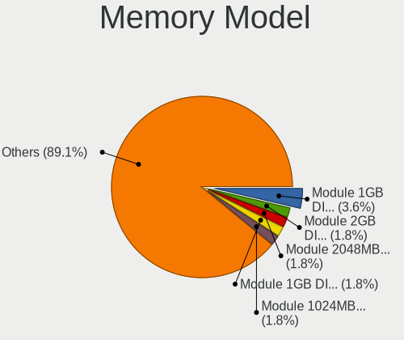

| Model                                                     | Desktops | Percent |
|-----------------------------------------------------------|----------|---------|
| Unknown RAM Module 1GB DIMM SDRAM                         | 4        | 3.77%   |
| Unknown RAM Module 2048MB DIMM 800MT/s                    | 2        | 1.89%   |
| Unknown RAM Module 1GB DIMM DDR2                          | 2        | 1.89%   |
| Unknown RAM Module 1024MB DIMM DDR2 333MT/s               | 2        | 1.89%   |
| Unknown RAM Module 1024MB DIMM                            | 2        | 1.89%   |
| Kingston RAM KCM633-ELC 1024MB DIMM DDR2 2048MT/s         | 2        | 1.89%   |
| Elpida RAM EBJ20UF8BCF0-DJ-F 2GB DIMM DDR3 1333MT/s       | 2        | 1.89%   |
| Crucial RAM BLS4G3D1609DS1S00. 4096MB DIMM DDR3 1600MT/s  | 2        | 1.89%   |
| Unknown RAM Module 8GB DIMM DDR3 1333MT/s                 | 1        | 0.94%   |
| Unknown RAM Module 8192MB DIMM SDRAM                      | 1        | 0.94%   |
| Unknown RAM Module 512MB DIMM 400MT/s                     | 1        | 0.94%   |
| Unknown RAM Module 512MB DIMM 333MT/s                     | 1        | 0.94%   |
| Unknown RAM Module 4GB DIMM DDR3 1333MT/s                 | 1        | 0.94%   |
| Unknown RAM Module 4GB DIMM 1333MT/s                      | 1        | 0.94%   |
| Unknown RAM Module 4096MB DIMM DDR3 1600MT/s              | 1        | 0.94%   |
| Unknown RAM Module 4096MB DIMM DDR3 1333MT/s              | 1        | 0.94%   |
| Unknown RAM Module 4096MB DIMM 667MT/s                    | 1        | 0.94%   |
| Unknown RAM Module 4096MB DIMM                            | 1        | 0.94%   |
| Unknown RAM Module 2GB DIMM SDRAM 800MT/s                 | 1        | 0.94%   |
| Unknown RAM Module 2GB DIMM SDRAM                         | 1        | 0.94%   |
| Unknown RAM Module 2GB DIMM DDR2 800MT/s                  | 1        | 0.94%   |
| Unknown RAM Module 2GB DIMM DDR 667MT/s                   | 1        | 0.94%   |
| Unknown RAM Module 2GB DIMM 800MT/s                       | 1        | 0.94%   |
| Unknown RAM Module 2GB DIMM 667MT/s                       | 1        | 0.94%   |
| Unknown RAM Module 2048MB DIMM DDR3 1066MT/s              | 1        | 0.94%   |
| Unknown RAM Module 2048MB DIMM DDR2 333MT/s               | 1        | 0.94%   |
| Unknown RAM Module 2048MB DIMM                            | 1        | 0.94%   |
| Unknown RAM Module 1024MB DIMM SDRAM                      | 1        | 0.94%   |
| Unknown RAM Module 1024MB DIMM DDR2 533MT/s               | 1        | 0.94%   |
| Unknown RAM Module 1024MB DIMM 800MT/s                    | 1        | 0.94%   |
| SK Hynix RAM HYMP125U64CP8-S6 2GB DIMM DDR2 49926MT/s     | 1        | 0.94%   |
| SK Hynix RAM HYMP112U64CP8-Y5 1GB DIMM DDR2 1639MT/s      | 1        | 0.94%   |
| SK Hynix RAM HMT451U6BFR8C-PB 4096MB DIMM DDR3 1600MT/s   | 1        | 0.94%   |
| SK Hynix RAM HMT451U6AFR8A-PB 4096MB DIMM DDR3 1600MT/s   | 1        | 0.94%   |
| SK Hynix RAM HMT41GU6BFR8C-PB 8GB DIMM DDR3 1600MT/s      | 1        | 0.94%   |
| SK Hynix RAM HMT41GS6AFR8A-PB 8192MB SODIMM DDR3 1600MT/s | 1        | 0.94%   |
| SK Hynix RAM HMT351U6BFR8C-H9 4096MB DIMM DDR3 1333MT/s   | 1        | 0.94%   |
| SK Hynix RAM HMT325U6BFR8C-H9 2048MB DIMM 1333MT/s        | 1        | 0.94%   |
| SK Hynix RAM HMT151R7BFR4C 4GB DIMM DDR3 1333MT/s         | 1        | 0.94%   |
| SK Hynix RAM HMT125U6DFR8C-H9 2048MB DIMM DDR3 1333MT/s   | 1        | 0.94%   |
| Samsung RAM Module 4GB DIMM DDR3 1333MT/s                 | 1        | 0.94%   |
| Samsung RAM M471B5173EB0-YK0 4GB SODIMM DDR3 1600MT/s     | 1        | 0.94%   |
| Samsung RAM M391B5773DH0-CK0 2048MB DIMM DDR3 1600MT/s    | 1        | 0.94%   |
| Samsung RAM M378B5773DH0-CH9 2GB DIMM DDR3 1333MT/s       | 1        | 0.94%   |
| Samsung RAM M378B5773CH0-CH9 2048MB DIMM DDR3 1867MT/s    | 1        | 0.94%   |
| Samsung RAM M378B5673FH0-CH9 2GB DIMM DDR3 1600MT/s       | 1        | 0.94%   |
| Samsung RAM M378B2873FH0-CH9 1024MB DIMM DDR3 1333MT/s    | 1        | 0.94%   |
| Samsung RAM M378A1K43CB2-CTD 8GB DIMM DDR4 3200MT/s       | 1        | 0.94%   |
| Samsung RAM M3 78T2953EZ3-CE6 1024MB DIMM SDRAM 667MT/s   | 1        | 0.94%   |
| Samsung RAM M3 78T2863DZS-CE6 1GB DIMM DDR2 667MT/s       | 1        | 0.94%   |
| Ramos RAM EWB4GB681CA3-16IC 4GB DIMM DDR3 1600MT/s        | 1        | 0.94%   |
| Ramaxel RAM RMR1870EF48E8L1333 2GB DIMM DDR3 1333MT/s     | 1        | 0.94%   |
| Qimonda RAM 64T128000EU2.5C2 1GB DIMM DDR 800MT/s         | 1        | 0.94%   |
| PNY RAM Module 8192MB DIMM DDR3 1333MT/s                  | 1        | 0.94%   |
| Patriot RAM PSD31G133320000000 1024MB DIMM 667MT/s        | 1        | 0.94%   |
| Micron RAM V01D3LF2GB18818813 2GB DIMM 1333MT/s           | 1        | 0.94%   |
| Micron RAM 8HTF12864AZ-800H1 1GB DIMM DDR2 800MT/s        | 1        | 0.94%   |
| Micron RAM 16JTF51264HZ-1G4 4096MB SODIMM DDR3 1066MT/s   | 1        | 0.94%   |
| Micron RAM 16JTF1G64AZ-1G6E1 8GB DIMM DDR3 1600MT/s       | 1        | 0.94%   |
| Kingston RAM KHX3200C16D4/8GX 8GB DIMM DDR4 3533MT/s      | 1        | 0.94%   |

Memory Kind
-----------

Memory module kinds

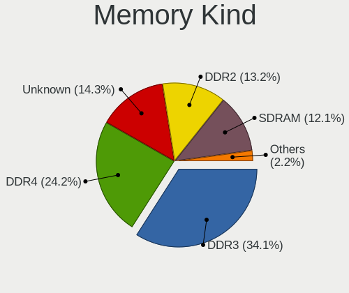

| Kind    | Desktops | Percent |
|---------|----------|---------|
| DDR3    | 31       | 36.05%  |
| DDR4    | 21       | 24.42%  |
| DDR2    | 12       | 13.95%  |
| Unknown | 12       | 13.95%  |
| SDRAM   | 9        | 10.47%  |
| DDR     | 1        | 1.16%   |

Memory Form Factor
------------------

Physical design of the memory module

| Name   | Desktops | Percent |
|--------|----------|---------|
| DIMM   | 80       | 96.39%  |
| SODIMM | 3        | 3.61%   |

Memory Size
-----------

Memory module size

| Size  | Desktops | Percent |
|-------|----------|---------|
| 8192  | 23       | 23.96%  |
| 4096  | 23       | 23.96%  |
| 2048  | 23       | 23.96%  |
| 1024  | 20       | 20.83%  |
| 16384 | 6        | 6.25%   |
| 512   | 1        | 1.04%   |

Memory Speed
------------

Memory module speed

| Speed   | Desktops | Percent |
|---------|----------|---------|
| 1333    | 16       | 17.2%   |
| 1600    | 15       | 16.13%  |
| Unknown | 10       | 10.75%  |
| 800     | 9        | 9.68%   |
| 3200    | 6        | 6.45%   |
| 667     | 5        | 5.38%   |
| 3600    | 4        | 4.3%    |
| 333     | 3        | 3.23%   |
| 3466    | 2        | 2.15%   |
| 3000    | 2        | 2.15%   |
| 2400    | 2        | 2.15%   |
| 2048    | 2        | 2.15%   |
| 1866    | 2        | 2.15%   |
| 1066    | 2        | 2.15%   |
| 49926   | 1        | 1.08%   |
| 4400    | 1        | 1.08%   |
| 3533    | 1        | 1.08%   |
| 3151    | 1        | 1.08%   |
| 2933    | 1        | 1.08%   |
| 2800    | 1        | 1.08%   |
| 2667    | 1        | 1.08%   |
| 2134    | 1        | 1.08%   |
| 2133    | 1        | 1.08%   |
| 1867    | 1        | 1.08%   |
| 1639    | 1        | 1.08%   |
| 533     | 1        | 1.08%   |
| 400     | 1        | 1.08%   |

Printers & scanners
-------------------

Printer Vendor
--------------

Printer device vendors

| Vendor              | Desktops | Percent |
|---------------------|----------|---------|
| Hewlett-Packard     | 10       | 28.57%  |
| Canon               | 9        | 25.71%  |
| Brother Industries  | 8        | 22.86%  |
| Seiko Epson         | 3        | 8.57%   |
| Samsung Electronics | 3        | 8.57%   |
| Ricoh               | 1        | 2.86%   |
| Pantum              | 1        | 2.86%   |

Printer Model
-------------

Printer device models

| Model                                        | Desktops | Percent |
|----------------------------------------------|----------|---------|
| HP ENVY 5000 series                          | 2        | 5.71%   |
| Canon MF4010 series                          | 2        | 5.71%   |
| Brother HL-2130 series                       | 2        | 5.71%   |
| Seiko Epson ME 320/330 Series [Stylus SX125] | 1        | 2.86%   |
| Seiko Epson L222 Series                      | 1        | 2.86%   |
| Seiko Epson L120 Series                      | 1        | 2.86%   |
| Samsung ML-2010P Mono Laser Printer          | 1        | 2.86%   |
| Samsung M2070 Series                         | 1        | 2.86%   |
| Samsung CLX-3300 Series                      | 1        | 2.86%   |
| Ricoh SP C250SF                              | 1        | 2.86%   |
| Pantum P2500W series                         | 1        | 2.86%   |
| HP OfficeJet 3830 series                     | 1        | 2.86%   |
| HP LaserJet Professional P 1102w             | 1        | 2.86%   |
| HP LaserJet P1102                            | 1        | 2.86%   |
| HP LaserJet 3050                             | 1        | 2.86%   |
| HP ENVY 4520 series                          | 1        | 2.86%   |
| HP Deskjet 4620 series                       | 1        | 2.86%   |
| HP Deskjet 3050A                             | 1        | 2.86%   |
| HP Deskjet 1050 J410                         | 1        | 2.86%   |
| Canon TS3100 series                          | 1        | 2.86%   |
| Canon PIXMA MG2500 Series                    | 1        | 2.86%   |
| Canon Pixma iP4500 Printer                   | 1        | 2.86%   |
| Canon LBP810                                 | 1        | 2.86%   |
| Canon iP7200 series                          | 1        | 2.86%   |
| Canon FAXPHONE L80                           | 1        | 2.86%   |
| Canon CanoScan LiDE 300                      | 1        | 2.86%   |
| Brother MFC-J470DW                           | 1        | 2.86%   |
| Brother HL-L2380DW                           | 1        | 2.86%   |
| Brother HL-L2350DW series                    | 1        | 2.86%   |
| Brother HL-L2340D series                     | 1        | 2.86%   |
| Brother HL-52x0 series                       | 1        | 2.86%   |
| Brother DCP-1610W                            | 1        | 2.86%   |

Scanner Vendor
--------------

Scanner device vendors

| Vendor | Desktops | Percent |
|--------|----------|---------|
| Canon  | 2        | 100%    |

Scanner Model
-------------

Scanner device models

| Model                              | Desktops | Percent |
|------------------------------------|----------|---------|
| Canon CanoScan N670U/N676U/LiDE 20 | 1        | 50%     |
| Canon CanoScan LIDE 25             | 1        | 50%     |

Camera
------

Camera Vendor
-------------

Camera device vendors

| Vendor                   | Desktops | Percent |
|--------------------------|----------|---------|
| Logitech                 | 13       | 23.64%  |
| Microsoft                | 6        | 10.91%  |
| Apple                    | 5        | 9.09%   |
| Samsung Electronics      | 4        | 7.27%   |
| Cubeternet               | 4        | 7.27%   |
| Chicony Electronics      | 4        | 7.27%   |
| Microdia                 | 3        | 5.45%   |
| Z-Star Microelectronics  | 2        | 3.64%   |
| IMC Networks             | 2        | 3.64%   |
| Sonix Technology         | 1        | 1.82%   |
| Pixart Imaging           | 1        | 1.82%   |
| Novatel Wireless         | 1        | 1.82%   |
| Novatek Microelectronics | 1        | 1.82%   |
| LG Electronics           | 1        | 1.82%   |
| Jieli Technology         | 1        | 1.82%   |
| Genesys Logic            | 1        | 1.82%   |
| GEMBIRD                  | 1        | 1.82%   |
| AVerMedia Technologies   | 1        | 1.82%   |
| Aveo Technology          | 1        | 1.82%   |
| Arkmicro Technologies    | 1        | 1.82%   |
| Alcor Micro              | 1        | 1.82%   |

Camera Model
------------

Camera device models

| Model                                             | Desktops | Percent |
|---------------------------------------------------|----------|---------|
| Samsung Galaxy series, misc. (MTP mode)           | 4        | 7.27%   |
| Logitech Webcam C270                              | 4        | 7.27%   |
| Apple iPhone 5/5C/5S/6/SE                         | 4        | 7.27%   |
| Microsoft LifeCam HD-3000                         | 2        | 3.64%   |
| Logitech Webcam C250                              | 2        | 3.64%   |
| Logitech HD Pro Webcam C920                       | 2        | 3.64%   |
| Cubeternet GL-UPC822 UVC WebCam                   | 2        | 3.64%   |
| Chicony HP High Definition 1MP Webcam             | 2        | 3.64%   |
| Z-Star Venus USB2.0 Camera                        | 1        | 1.82%   |
| Z-Star Integrated Camera                          | 1        | 1.82%   |
| Sonix USB2.0_Camera                               | 1        | 1.82%   |
| Pixart Imaging GE 1.3 MP MiniCam Pro              | 1        | 1.82%   |
| Novatel Wireless Merlin U740 (non-Vodafone)       | 1        | 1.82%   |
| Novatek HP High Definition 2MP Webcam             | 1        | 1.82%   |
| Microsoft USB3.0 HD CAMERA                        | 1        | 1.82%   |
| Microsoft LifeCam VX-2000                         | 1        | 1.82%   |
| Microsoft LifeCam Studio                          | 1        | 1.82%   |
| Microsoft LifeCam HD-5000                         | 1        | 1.82%   |
| Microdia Sonix USB 2.0 Camera                     | 1        | 1.82%   |
| Microdia MSI Starcam Racer                        | 1        | 1.82%   |
| Microdia Camera                                   | 1        | 1.82%   |
| Logitech Webcam C310                              | 1        | 1.82%   |
| Logitech Webcam B500                              | 1        | 1.82%   |
| Logitech QuickCam Pro 9000                        | 1        | 1.82%   |
| Logitech QuickCam Communicate Deluxe              | 1        | 1.82%   |
| Logitech C922 Pro Stream Webcam                   | 1        | 1.82%   |
| LG AN-VC500 Camera                                | 1        | 1.82%   |
| Jieli USB PHY 2.0                                 | 1        | 1.82%   |
| IMC Networks XHC Camera                           | 1        | 1.82%   |
| IMC Networks USB 2.0 Camera                       | 1        | 1.82%   |
| Genesys Logic USB2.0 UVC PC Camera                | 1        | 1.82%   |
| GEMBIRD Generic UVC 1.00 camera [AppoTech AX2311] | 1        | 1.82%   |
| Cubeternet WebCam                                 | 1        | 1.82%   |
| Cubeternet USB2.0 Camera                          | 1        | 1.82%   |
| Chicony USB 2.0 Camera                            | 1        | 1.82%   |
| Chicony CNF7042                                   | 1        | 1.82%   |
| AVerMedia Live Streamer CAM 313                   | 1        | 1.82%   |
| Aveo USB2.0 Camera                                | 1        | 1.82%   |
| Arkmicro USB2.0 PC CAMERA                         | 1        | 1.82%   |
| Apple iPhone 4S                                   | 1        | 1.82%   |
| Alcor Micro USB 2.0 PC cam                        | 1        | 1.82%   |

Security
--------

Fingerprint Vendor
------------------

Fingerprint sensor vendors

| Vendor                | Desktops | Percent |
|-----------------------|----------|---------|
| LighTuning Technology | 1        | 100%    |

Fingerprint Model
-----------------

Fingerprint sensor models

| Model                                     | Desktops | Percent |
|-------------------------------------------|----------|---------|
| LighTuning ES603 Swipe Fingerprint Sensor | 1        | 100%    |

Chipcard Vendor
---------------

Chipcard module vendors

| Vendor        | Desktops | Percent |
|---------------|----------|---------|
| Kobil Systems | 1        | 50%     |
| Alcor Micro   | 1        | 50%     |

Chipcard Model
--------------

Chipcard module models

| Model                               | Desktops | Percent |
|-------------------------------------|----------|---------|
| Kobil Systems KOBIL Class 3 Reader  | 1        | 50%     |
| Alcor Micro AU9540 Smartcard Reader | 1        | 50%     |

Unsupported
-----------

Unsupported Devices
-------------------

Total unsupported devices on board

| Total | Desktops | Percent |
|-------|----------|---------|
| 0     | 402      | 76.57%  |
| 1     | 105      | 20%     |
| 2     | 15       | 2.86%   |
| 3     | 2        | 0.38%   |
| 4     | 1        | 0.19%   |

Unsupported Device Types
------------------------

Types of unsupported devices

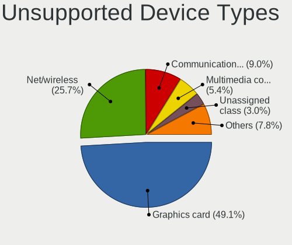

| Type                     | Desktops | Percent |
|--------------------------|----------|---------|
| Graphics card            | 63       | 46.32%  |
| Net/wireless             | 38       | 27.94%  |
| Communication controller | 13       | 9.56%   |
| Multimedia controller    | 9        | 6.62%   |
| Unassigned class         | 5        | 3.68%   |
| Modem                    | 2        | 1.47%   |
| Chipcard                 | 2        | 1.47%   |
| Storage/raid             | 1        | 0.74%   |
| Storage                  | 1        | 0.74%   |
| Sound                    | 1        | 0.74%   |
| Fingerprint reader       | 1        | 0.74%   |

