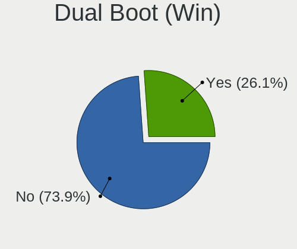
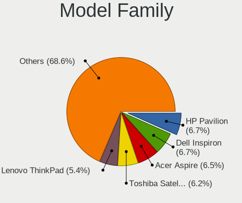
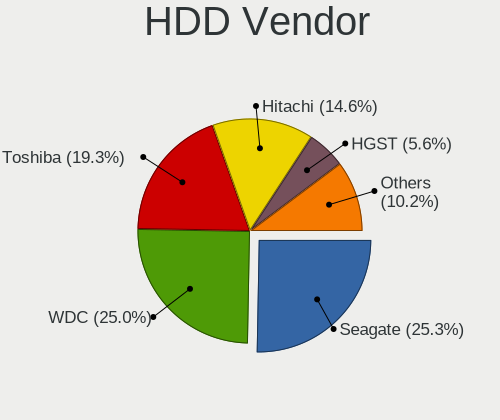
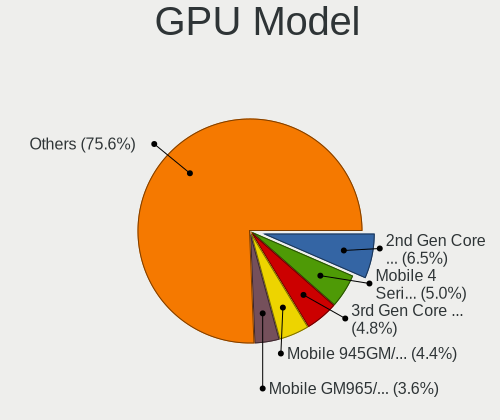
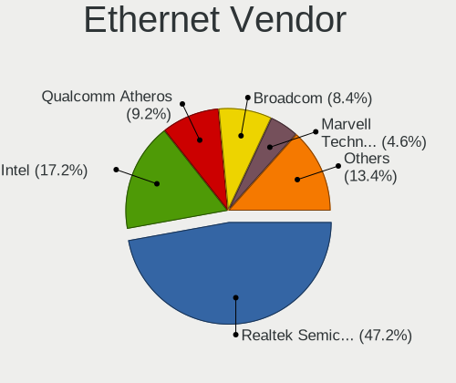
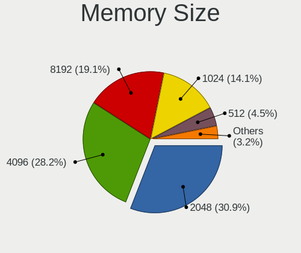
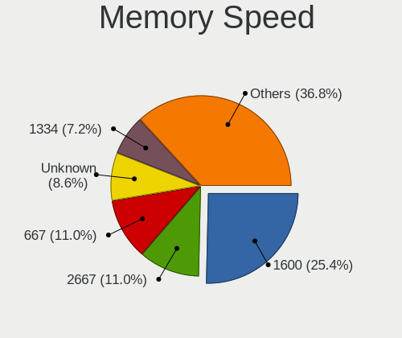

Zorin 15 - Tested Hardware & Statistics (Notebooks)
---------------------------------------------------

A project to collect tested hardware configurations for Zorin 15 (Beta test).

Anyone can contribute to this report by the [hw-probe](https://github.com/linuxhw/hw-probe) tool:

    sudo -E hw-probe -all -upload

Please submit a probe of your configuration if it's not presented on the page or is rare.

Full-feature report is available here: https://linux-hardware.org/?view=trends&rel=zorin-15

Contents
--------

* [ Test Cases ](#test-cases)

* [ System ](#system)
  - [ Kernel                   ](#kernel)
  - [ Kernel Family            ](#kernel-family)
  - [ Kernel Major Ver.        ](#kernel-major-ver)
  - [ Arch                     ](#arch)
  - [ DE                       ](#de)
  - [ Display Server           ](#display-server)
  - [ Display Manager          ](#display-manager)
  - [ OS Lang                  ](#os-lang)
  - [ Boot Mode                ](#boot-mode)
  - [ Filesystem               ](#filesystem)
  - [ Part. scheme             ](#part-scheme)
  - [ Dual Boot with Linux/BSD ](#dual-boot-with-linuxbsd)
  - [ Dual Boot (Win)          ](#dual-boot-win)

* [ Board ](#board)
  - [ Vendor                   ](#vendor)
  - [ Model                    ](#model)
  - [ Model Family             ](#model-family)
  - [ MFG Year                 ](#mfg-year)
  - [ Form Factor              ](#form-factor)
  - [ Secure Boot              ](#secure-boot)
  - [ Coreboot                 ](#coreboot)
  - [ RAM Size                 ](#ram-size)
  - [ RAM Used                 ](#ram-used)
  - [ Total Drives             ](#total-drives)
  - [ Has CD-ROM               ](#has-cd-rom)
  - [ Has Ethernet             ](#has-ethernet)
  - [ Has WiFi                 ](#has-wifi)
  - [ Has Bluetooth            ](#has-bluetooth)

* [ Location ](#location)
  - [ Country                  ](#country)
  - [ City                     ](#city)

* [ Drives ](#drives)
  - [ Drive Vendor             ](#drive-vendor)
  - [ Drive Model              ](#drive-model)
  - [ HDD Vendor               ](#hdd-vendor)
  - [ SSD Vendor               ](#ssd-vendor)
  - [ Drive Kind               ](#drive-kind)
  - [ Drive Connector          ](#drive-connector)
  - [ Drive Size               ](#drive-size)
  - [ Space Total              ](#space-total)
  - [ Space Used               ](#space-used)
  - [ Malfunc. Drives          ](#malfunc-drives)
  - [ Malfunc. Drive Vendor    ](#malfunc-drive-vendor)
  - [ Malfunc. HDD Vendor      ](#malfunc-hdd-vendor)
  - [ Malfunc. Drive Kind      ](#malfunc-drive-kind)
  - [ Failed Drives            ](#failed-drives)
  - [ Failed Drive Vendor      ](#failed-drive-vendor)
  - [ Drive Status             ](#drive-status)

* [ Storage controller ](#storage-controller)
  - [ Storage Vendor           ](#storage-vendor)
  - [ Storage Model            ](#storage-model)
  - [ Storage Kind             ](#storage-kind)

* [ Processor ](#processor)
  - [ CPU Vendor               ](#cpu-vendor)
  - [ CPU Model                ](#cpu-model)
  - [ CPU Model Family         ](#cpu-model-family)
  - [ CPU Cores                ](#cpu-cores)
  - [ CPU Sockets              ](#cpu-sockets)
  - [ CPU Threads              ](#cpu-threads)
  - [ CPU Op-Modes             ](#cpu-op-modes)
  - [ CPU Microcode            ](#cpu-microcode)
  - [ CPU Microarch            ](#cpu-microarch)

* [ Graphics ](#graphics)
  - [ GPU Vendor               ](#gpu-vendor)
  - [ GPU Model                ](#gpu-model)
  - [ GPU Combo                ](#gpu-combo)
  - [ GPU Driver               ](#gpu-driver)
  - [ GPU Memory               ](#gpu-memory)

* [ Monitor ](#monitor)
  - [ Monitor Vendor           ](#monitor-vendor)
  - [ Monitor Model            ](#monitor-model)
  - [ Monitor Resolution       ](#monitor-resolution)
  - [ Monitor Diagonal         ](#monitor-diagonal)
  - [ Monitor Width            ](#monitor-width)
  - [ Aspect Ratio             ](#aspect-ratio)
  - [ Monitor Area             ](#monitor-area)
  - [ Pixel Density            ](#pixel-density)
  - [ Multiple Monitors        ](#multiple-monitors)

* [ Network ](#network)
  - [ Net Controller Vendor    ](#net-controller-vendor)
  - [ Net Controller Model     ](#net-controller-model)
  - [ Wireless Vendor          ](#wireless-vendor)
  - [ Wireless Model           ](#wireless-model)
  - [ Ethernet Vendor          ](#ethernet-vendor)
  - [ Ethernet Model           ](#ethernet-model)
  - [ Net Controller Kind      ](#net-controller-kind)
  - [ Used Controller          ](#used-controller)
  - [ NICs                     ](#nics)
  - [ IPv6                     ](#ipv6)

* [ Bluetooth ](#bluetooth)
  - [ Bluetooth Vendor         ](#bluetooth-vendor)
  - [ Bluetooth Model          ](#bluetooth-model)

* [ Sound ](#sound)
  - [ Sound Vendor             ](#sound-vendor)
  - [ Sound Model              ](#sound-model)

* [ Memory ](#memory)
  - [ Memory Vendor            ](#memory-vendor)
  - [ Memory Model             ](#memory-model)
  - [ Memory Kind              ](#memory-kind)
  - [ Memory Form Factor       ](#memory-form-factor)
  - [ Memory Size              ](#memory-size)
  - [ Memory Speed             ](#memory-speed)

* [ Printers & scanners ](#printers--scanners)
  - [ Printer Vendor           ](#printer-vendor)
  - [ Printer Model            ](#printer-model)
  - [ Scanner Vendor           ](#scanner-vendor)
  - [ Scanner Model            ](#scanner-model)

* [ Camera ](#camera)
  - [ Camera Vendor            ](#camera-vendor)
  - [ Camera Model             ](#camera-model)

* [ Security ](#security)
  - [ Fingerprint Vendor       ](#fingerprint-vendor)
  - [ Fingerprint Model        ](#fingerprint-model)
  - [ Chipcard Vendor          ](#chipcard-vendor)
  - [ Chipcard Model           ](#chipcard-model)

* [ Unsupported ](#unsupported)
  - [ Unsupported Devices      ](#unsupported-devices)
  - [ Unsupported Device Types ](#unsupported-device-types)

Test Cases
----------

| Vendor        | Model                       | Probe                                                      | Date         |
|---------------|-----------------------------|------------------------------------------------------------|--------------|
| HP            | Pavilion g7                 | [cf766b8d76](https://linux-hardware.org/?probe=cf766b8d76) | Aug 13, 2021 |
| LG Electro... | R580-G.BP21P1               | [be465dec60](https://linux-hardware.org/?probe=be465dec60) | Aug 13, 2021 |
| Toshiba       | Satellite L505D             | [b7b43a605d](https://linux-hardware.org/?probe=b7b43a605d) | Aug 12, 2021 |
| Toshiba       | Satellite L505D             | [8560337601](https://linux-hardware.org/?probe=8560337601) | Aug 12, 2021 |
| Acer          | Aspire 8920                 | [9ac1d0a471](https://linux-hardware.org/?probe=9ac1d0a471) | Aug 12, 2021 |
| Lenovo        | Z50-70 20354                | [1eba114602](https://linux-hardware.org/?probe=1eba114602) | Aug 11, 2021 |
| Lenovo        | Z50-70 20354                | [528ab497b2](https://linux-hardware.org/?probe=528ab497b2) | Aug 11, 2021 |
| Lenovo        | Z50-70 20354                | [a31c1f0fda](https://linux-hardware.org/?probe=a31c1f0fda) | Aug 11, 2021 |
| HP            | Pavilion dv6700             | [ebf6b956cb](https://linux-hardware.org/?probe=ebf6b956cb) | Aug 10, 2021 |
| Apple         | MacBookPro7,1               | [da4107ffc3](https://linux-hardware.org/?probe=da4107ffc3) | Aug 10, 2021 |
| Samsung       | RV419                       | [66823b7d4d](https://linux-hardware.org/?probe=66823b7d4d) | Aug 10, 2021 |
| ASUSTek       | X51R                        | [1d1aad3900](https://linux-hardware.org/?probe=1d1aad3900) | Aug 08, 2021 |
| Dell          | Inspiron 3521               | [d0814fcb72](https://linux-hardware.org/?probe=d0814fcb72) | Aug 08, 2021 |
| Acer          | Extensa 5220                | [c2e39c0d39](https://linux-hardware.org/?probe=c2e39c0d39) | Aug 07, 2021 |
| HP            | Compaq 2510p                | [ea3c7d2fe2](https://linux-hardware.org/?probe=ea3c7d2fe2) | Aug 07, 2021 |
| HP            | Compaq 2510p                | [31449a4b42](https://linux-hardware.org/?probe=31449a4b42) | Aug 07, 2021 |
| Dell          | Inspiron 3421               | [dc8767625f](https://linux-hardware.org/?probe=dc8767625f) | Aug 07, 2021 |
| Acer          | Extensa 5220                | [b0da636247](https://linux-hardware.org/?probe=b0da636247) | Aug 07, 2021 |
| Dell          | Inspiron 3421               | [52f396865d](https://linux-hardware.org/?probe=52f396865d) | Aug 07, 2021 |
| Positivo      | CHT14B                      | [c8d89d2cde](https://linux-hardware.org/?probe=c8d89d2cde) | Aug 06, 2021 |
| Acer          | Aspire E5-575               | [9d4f584337](https://linux-hardware.org/?probe=9d4f584337) | Aug 06, 2021 |
| Lenovo        | ThinkPad T61 6468AE2        | [58f1efa783](https://linux-hardware.org/?probe=58f1efa783) | Aug 06, 2021 |
| Dell          | Latitude E5500              | [0688139a45](https://linux-hardware.org/?probe=0688139a45) | Aug 04, 2021 |
| Lenovo        | ThinkPad T61 6465CTO        | [d93258840e](https://linux-hardware.org/?probe=d93258840e) | Aug 04, 2021 |
| ASUSTek       | ZenBook UX433FN_UX433FN     | [1b40831803](https://linux-hardware.org/?probe=1b40831803) | Aug 04, 2021 |
| ASUSTek       | ZenBook UX433FN_UX433FN     | [a7b5b1d518](https://linux-hardware.org/?probe=a7b5b1d518) | Aug 04, 2021 |
| Dell          | Inspiron 3521               | [d32389b4e2](https://linux-hardware.org/?probe=d32389b4e2) | Jul 30, 2021 |
| Acer          | Extensa 5220                | [e8b82c756d](https://linux-hardware.org/?probe=e8b82c756d) | Jul 26, 2021 |
| Acer          | Extensa 5220                | [82ae089b21](https://linux-hardware.org/?probe=82ae089b21) | Jul 26, 2021 |
| Unknown       | MEDION                      | [021ba4d5b5](https://linux-hardware.org/?probe=021ba4d5b5) | Jul 25, 2021 |
| Unknown       | MEDION                      | [5df19c2a06](https://linux-hardware.org/?probe=5df19c2a06) | Jul 25, 2021 |
| Unknown       | MEDION                      | [e9c5e99e0b](https://linux-hardware.org/?probe=e9c5e99e0b) | Jul 25, 2021 |
| HP            | Compaq CQ58                 | [96df68c59e](https://linux-hardware.org/?probe=96df68c59e) | Jul 25, 2021 |
| Dell          | Latitude 5480               | [1b32299688](https://linux-hardware.org/?probe=1b32299688) | Jul 24, 2021 |
| HP            | Notebook                    | [71959b30db](https://linux-hardware.org/?probe=71959b30db) | Jul 23, 2021 |
| Samsung       | 355V4C/355V4X/355V5C/355... | [8d72c96d15](https://linux-hardware.org/?probe=8d72c96d15) | Jul 23, 2021 |
| Dell          | Inspiron N5010              | [4a76f84bf5](https://linux-hardware.org/?probe=4a76f84bf5) | Jul 22, 2021 |
| Dell          | Inspiron 3521               | [68ad133ec2](https://linux-hardware.org/?probe=68ad133ec2) | Jul 17, 2021 |
| Lenovo        | Y70-70 Touch 80DU           | [36fb0f3df5](https://linux-hardware.org/?probe=36fb0f3df5) | Jul 16, 2021 |
| Sony          | SVE14A2V1EW                 | [2b1ce53eca](https://linux-hardware.org/?probe=2b1ce53eca) | Jul 16, 2021 |
| HP            | 250 G7 Notebook PC          | [846febb191](https://linux-hardware.org/?probe=846febb191) | Jul 14, 2021 |
| HP            | EliteBook 820 G2            | [8c035c3e82](https://linux-hardware.org/?probe=8c035c3e82) | Jul 14, 2021 |
| ASUSTek       | G50V                        | [ec1ddd4644](https://linux-hardware.org/?probe=ec1ddd4644) | Jul 11, 2021 |
| Samsung       | N145P/N250P/N260P           | [e60ff3401a](https://linux-hardware.org/?probe=e60ff3401a) | Jul 11, 2021 |
| Sony          | VPCEH16EA                   | [189be303f7](https://linux-hardware.org/?probe=189be303f7) | Jul 09, 2021 |
| Sony          | VPCEH16EA                   | [c93e5aee87](https://linux-hardware.org/?probe=c93e5aee87) | Jul 08, 2021 |
| HP            | 255 G7 Notebook PC          | [b543fedfd0](https://linux-hardware.org/?probe=b543fedfd0) | Jul 08, 2021 |
| Lenovo        | IdeaPad 330-15AST 81D6      | [508ac5b4d5](https://linux-hardware.org/?probe=508ac5b4d5) | Jul 07, 2021 |
| Sony          | VPCSB25FB                   | [6de928a758](https://linux-hardware.org/?probe=6de928a758) | Jul 07, 2021 |
| Gateway       | MX8711                      | [185e86b37e](https://linux-hardware.org/?probe=185e86b37e) | Jul 06, 2021 |
| Acer          | Aspire A515-45              | [42249c6e47](https://linux-hardware.org/?probe=42249c6e47) | Jul 02, 2021 |
| HP            | Pavilion dv6700             | [93c6a703a7](https://linux-hardware.org/?probe=93c6a703a7) | Jun 27, 2021 |
| HP            | Pavilion dv6700             | [f7e407b14c](https://linux-hardware.org/?probe=f7e407b14c) | Jun 27, 2021 |
| ASUSTek       | K54HR                       | [8fcbeb49c1](https://linux-hardware.org/?probe=8fcbeb49c1) | Jun 26, 2021 |
| Sony          | VPCSB16FG                   | [ead356e548](https://linux-hardware.org/?probe=ead356e548) | Jun 24, 2021 |
| ASUSTek       | VivoBook 15_ASUS Laptop ... | [f3430744d8](https://linux-hardware.org/?probe=f3430744d8) | Jun 24, 2021 |
| HP            | Laptop 15-da0xxx            | [77fba11f44](https://linux-hardware.org/?probe=77fba11f44) | Jun 21, 2021 |
| Lenovo        | G40-30 80FY                 | [114ba38c36](https://linux-hardware.org/?probe=114ba38c36) | Jun 20, 2021 |
| Lenovo        | G40-30 80FY                 | [0cb7e73af9](https://linux-hardware.org/?probe=0cb7e73af9) | Jun 19, 2021 |
| Dell          | Precision 7520              | [9b19302ca7](https://linux-hardware.org/?probe=9b19302ca7) | Jun 18, 2021 |
| Dell          | Inspiron N4010              | [d385bb7617](https://linux-hardware.org/?probe=d385bb7617) | Jun 15, 2021 |
| Dell          | Inspiron N4010              | [be79fbc95c](https://linux-hardware.org/?probe=be79fbc95c) | Jun 15, 2021 |
| Samsung       | N150/N210/N220              | [8e03d52f53](https://linux-hardware.org/?probe=8e03d52f53) | Jun 12, 2021 |
| Lenovo        | Unknown                     | [108d3cba46](https://linux-hardware.org/?probe=108d3cba46) | Jun 10, 2021 |
| HP            | Stream Notebook             | [806c24449c](https://linux-hardware.org/?probe=806c24449c) | Jun 09, 2021 |
| HCL Infosy... | HCL ME Laptop               | [0aaf1b69bc](https://linux-hardware.org/?probe=0aaf1b69bc) | Jun 08, 2021 |
| Dell          | Latitude E6520              | [04a7f10801](https://linux-hardware.org/?probe=04a7f10801) | Jun 08, 2021 |
| Lenovo        | G40-30 80FY                 | [b2fe748178](https://linux-hardware.org/?probe=b2fe748178) | Jun 08, 2021 |
| Sony          | VGN-BX51VN                  | [debf4b3290](https://linux-hardware.org/?probe=debf4b3290) | Jun 06, 2021 |
| ASUSTek       | Q524UQ                      | [442c1c8b06](https://linux-hardware.org/?probe=442c1c8b06) | Jun 05, 2021 |
| HP            | Pavilion dv5                | [94cfdbc88f](https://linux-hardware.org/?probe=94cfdbc88f) | Jun 03, 2021 |
| Unknown       | Unknown                     | [3ce5819b57](https://linux-hardware.org/?probe=3ce5819b57) | Jun 02, 2021 |
| Apple         | MacBookPro12,1              | [f7f5736b13](https://linux-hardware.org/?probe=f7f5736b13) | Jun 01, 2021 |
| Sony          | VGN-BX51VN                  | [055903703c](https://linux-hardware.org/?probe=055903703c) | Jun 01, 2021 |
| Toshiba       | Satellite M70               | [67580c50df](https://linux-hardware.org/?probe=67580c50df) | Jun 01, 2021 |
| Acer          | Aspire 3100                 | [d38f5b09d2](https://linux-hardware.org/?probe=d38f5b09d2) | Jun 01, 2021 |
| Acer          | Aspire 3100                 | [fbcd23ac31](https://linux-hardware.org/?probe=fbcd23ac31) | May 31, 2021 |
| Toshiba       | Satellite P300              | [feb13460e8](https://linux-hardware.org/?probe=feb13460e8) | May 30, 2021 |
| Toshiba       | Satellite P300              | [8b5034adc9](https://linux-hardware.org/?probe=8b5034adc9) | May 30, 2021 |
| Lenovo        | G40-30 80FY                 | [eb9aaa55ea](https://linux-hardware.org/?probe=eb9aaa55ea) | May 30, 2021 |
| HP            | Pavilion g7                 | [582c1aa224](https://linux-hardware.org/?probe=582c1aa224) | May 29, 2021 |
| Dell          | Inspiron 3521               | [9fc71241e6](https://linux-hardware.org/?probe=9fc71241e6) | May 26, 2021 |
| Lenovo        | G40-30 80FY                 | [0c3e0e8293](https://linux-hardware.org/?probe=0c3e0e8293) | May 26, 2021 |
| ARIMA         | W351UI                      | [6cbffa9177](https://linux-hardware.org/?probe=6cbffa9177) | May 25, 2021 |
| Dell          | Latitude D520               | [7a817a0426](https://linux-hardware.org/?probe=7a817a0426) | May 25, 2021 |
| HP            | Pavilion dv6700             | [b30d13bbba](https://linux-hardware.org/?probe=b30d13bbba) | May 25, 2021 |
| ASUSTek       | UX31A                       | [edeed3b99b](https://linux-hardware.org/?probe=edeed3b99b) | May 23, 2021 |
| ASUSTek       | UX31A                       | [7f750ead39](https://linux-hardware.org/?probe=7f750ead39) | May 23, 2021 |
| Google        | Candy                       | [f6b5b1fd81](https://linux-hardware.org/?probe=f6b5b1fd81) | May 23, 2021 |
| ASUSTek       | X540YA                      | [369ebd51b8](https://linux-hardware.org/?probe=369ebd51b8) | May 23, 2021 |
| ASUSTek       | F5N                         | [414786c3d5](https://linux-hardware.org/?probe=414786c3d5) | May 22, 2021 |
| Dell          | Inspiron 3521               | [ef65e1a0f7](https://linux-hardware.org/?probe=ef65e1a0f7) | May 21, 2021 |
| Dell          | Latitude E7240              | [9e790ba3f0](https://linux-hardware.org/?probe=9e790ba3f0) | May 21, 2021 |
| Dell          | Latitude E7240              | [7fbfcffd54](https://linux-hardware.org/?probe=7fbfcffd54) | May 21, 2021 |
| HP            | 255 G5                      | [cbd6a96f91](https://linux-hardware.org/?probe=cbd6a96f91) | May 20, 2021 |
| ASUSTek       | T100TA                      | [bca3c06314](https://linux-hardware.org/?probe=bca3c06314) | May 20, 2021 |
| ASUSTek       | T100TA                      | [f232d2395d](https://linux-hardware.org/?probe=f232d2395d) | May 19, 2021 |
| Dell          | G5 5587                     | [39be80ad79](https://linux-hardware.org/?probe=39be80ad79) | May 19, 2021 |
| HUAWEI        | BOHK-WAX9X                  | [d9592ead1e](https://linux-hardware.org/?probe=d9592ead1e) | May 18, 2021 |
| Lenovo        | IdeaPad 330-15AST 81D6      | [bc6920fa56](https://linux-hardware.org/?probe=bc6920fa56) | May 16, 2021 |
| HP            | 435                         | [65bbde1e13](https://linux-hardware.org/?probe=65bbde1e13) | May 16, 2021 |
| HP            | 435                         | [fe5a82cf02](https://linux-hardware.org/?probe=fe5a82cf02) | May 16, 2021 |
| ASUSTek       | K54C                        | [af86f8b1ed](https://linux-hardware.org/?probe=af86f8b1ed) | May 14, 2021 |
| Dell          | Inspiron 14-3467            | [511f638394](https://linux-hardware.org/?probe=511f638394) | May 14, 2021 |
| Acer          | V5-131                      | [d78c3cc207](https://linux-hardware.org/?probe=d78c3cc207) | May 14, 2021 |
| Lenovo        | ThinkPad T440s 20ARS1070... | [e20eb6e1ff](https://linux-hardware.org/?probe=e20eb6e1ff) | May 13, 2021 |
| Dell          | Inspiron 1525               | [22f4b67d9b](https://linux-hardware.org/?probe=22f4b67d9b) | May 12, 2021 |
| Dell          | Inspiron 7520               | [fdf52a6676](https://linux-hardware.org/?probe=fdf52a6676) | May 11, 2021 |
| Samsung       | RF712                       | [a3624b29fa](https://linux-hardware.org/?probe=a3624b29fa) | May 11, 2021 |
| Samsung       | RF712                       | [652fb28adb](https://linux-hardware.org/?probe=652fb28adb) | May 11, 2021 |
| ASUSTek       | K54C                        | [9e994cd1f2](https://linux-hardware.org/?probe=9e994cd1f2) | May 11, 2021 |
| HP            | ProBook 4510s               | [dbdd169cb4](https://linux-hardware.org/?probe=dbdd169cb4) | May 10, 2021 |
| Dell          | Inspiron 14-3467            | [2fd207a33d](https://linux-hardware.org/?probe=2fd207a33d) | May 10, 2021 |
| Fujitsu       | FMVNF40UK                   | [8648b42278](https://linux-hardware.org/?probe=8648b42278) | May 09, 2021 |
| Dell          | Inspiron 14-3467            | [173baf5fdb](https://linux-hardware.org/?probe=173baf5fdb) | May 09, 2021 |
| Toshiba       | Satellite P200              | [5fff6be5f0](https://linux-hardware.org/?probe=5fff6be5f0) | May 05, 2021 |
| Samsung       | RV411/RV511/E3511/S3511/... | [0c612ea2a3](https://linux-hardware.org/?probe=0c612ea2a3) | May 04, 2021 |
| Lenovo        | 406822U                     | [68080373ce](https://linux-hardware.org/?probe=68080373ce) | May 03, 2021 |
| Lenovo        | 406822U                     | [5d498a42cc](https://linux-hardware.org/?probe=5d498a42cc) | May 03, 2021 |
| ASUSTek       | X540SA                      | [0f79fb429b](https://linux-hardware.org/?probe=0f79fb429b) | May 02, 2021 |
| Acer          | Aspire 5538                 | [b01066567a](https://linux-hardware.org/?probe=b01066567a) | May 02, 2021 |
| Acer          | Aspire 5538                 | [39c929202c](https://linux-hardware.org/?probe=39c929202c) | May 02, 2021 |
| Acer          | AOD255E                     | [202573d3f1](https://linux-hardware.org/?probe=202573d3f1) | May 02, 2021 |
| Lenovo        | ThinkPad T460 20FMS7DA00    | [21666fb8b5](https://linux-hardware.org/?probe=21666fb8b5) | May 01, 2021 |
| TrekStor      | Notebook Slim S130          | [3ee0251799](https://linux-hardware.org/?probe=3ee0251799) | May 01, 2021 |
| HP            | ENVY Notebook               | [00123e7e27](https://linux-hardware.org/?probe=00123e7e27) | May 01, 2021 |
| Positivo      | S14CT01                     | [d6ad6f67a7](https://linux-hardware.org/?probe=d6ad6f67a7) | Apr 30, 2021 |
| Dell          | Latitude D630               | [ce166d946d](https://linux-hardware.org/?probe=ce166d946d) | Apr 30, 2021 |
| NEC Comput... | PC-VY25AACZ9                | [dc22e810b4](https://linux-hardware.org/?probe=dc22e810b4) | Apr 29, 2021 |
| Itautec       | Infoway                     | [01e1f5151c](https://linux-hardware.org/?probe=01e1f5151c) | Apr 28, 2021 |
| Fujitsu       | LIFEBOOK U772               | [e2c74983d8](https://linux-hardware.org/?probe=e2c74983d8) | Apr 28, 2021 |
| Lenovo        | ThinkPad X131e 3372A14      | [3c79681783](https://linux-hardware.org/?probe=3c79681783) | Apr 26, 2021 |
| Acer          | Aspire E5-523               | [7acc074ffd](https://linux-hardware.org/?probe=7acc074ffd) | Apr 26, 2021 |
| Acer          | Aspire E5-523               | [349b8662d9](https://linux-hardware.org/?probe=349b8662d9) | Apr 26, 2021 |
| ASUSTek       | ROG Zephyrus M15 GU502LV... | [4cffaa3991](https://linux-hardware.org/?probe=4cffaa3991) | Apr 23, 2021 |
| Acer          | Unknown                     | [cd6b0eabe2](https://linux-hardware.org/?probe=cd6b0eabe2) | Apr 23, 2021 |
| Acer          | Aspire 5333                 | [c6227d5004](https://linux-hardware.org/?probe=c6227d5004) | Apr 23, 2021 |
| Toshiba       | IS 1422                     | [f52456fce9](https://linux-hardware.org/?probe=f52456fce9) | Apr 22, 2021 |
| Toshiba       | IS 1422                     | [9443f68502](https://linux-hardware.org/?probe=9443f68502) | Apr 22, 2021 |
| Samsung       | 550XCJ/550XCR               | [2a2a56b6d4](https://linux-hardware.org/?probe=2a2a56b6d4) | Apr 22, 2021 |
| ASUSTek       | ZenBook UX331FA_UX331FA     | [d8340c053a](https://linux-hardware.org/?probe=d8340c053a) | Apr 22, 2021 |
| Packard Be... | EasyNote_BU45               | [7d3e06e670](https://linux-hardware.org/?probe=7d3e06e670) | Apr 21, 2021 |
| Packard Be... | EasyNote_BU45               | [c97faabab8](https://linux-hardware.org/?probe=c97faabab8) | Apr 21, 2021 |
| Dell          | Latitude D620               | [116568909e](https://linux-hardware.org/?probe=116568909e) | Apr 19, 2021 |
| Dell          | Latitude D520               | [4e8b58ab28](https://linux-hardware.org/?probe=4e8b58ab28) | Apr 16, 2021 |
| Acer          | Aspire 5333                 | [2171d74173](https://linux-hardware.org/?probe=2171d74173) | Apr 15, 2021 |
| Acer          | Aspire 5333                 | [dd4fee2ece](https://linux-hardware.org/?probe=dd4fee2ece) | Apr 15, 2021 |
| Toshiba       | Satellite C55-A             | [6670c58f24](https://linux-hardware.org/?probe=6670c58f24) | Apr 15, 2021 |
| Dell          | Inspiron 5759               | [7fcec2352e](https://linux-hardware.org/?probe=7fcec2352e) | Apr 15, 2021 |
| HP            | Pavilion dv5                | [901dd6f4bc](https://linux-hardware.org/?probe=901dd6f4bc) | Apr 14, 2021 |
| Toshiba       | Satellite C55-A             | [7862f9a6e6](https://linux-hardware.org/?probe=7862f9a6e6) | Apr 14, 2021 |
| Toshiba       | Satellite P200              | [be67fe4734](https://linux-hardware.org/?probe=be67fe4734) | Apr 11, 2021 |
| Toshiba       | Satellite P200              | [f6b3c134f2](https://linux-hardware.org/?probe=f6b3c134f2) | Apr 11, 2021 |
| HP            | EliteBook 850 G5            | [8351e652e0](https://linux-hardware.org/?probe=8351e652e0) | Apr 11, 2021 |
| Dell          | Latitude D620               | [f0eb74cd27](https://linux-hardware.org/?probe=f0eb74cd27) | Apr 11, 2021 |
| Dell          | Latitude D620               | [599e543d6b](https://linux-hardware.org/?probe=599e543d6b) | Apr 11, 2021 |
| NEC Comput... | PC-VY25AACZ9                | [24f7a90612](https://linux-hardware.org/?probe=24f7a90612) | Apr 10, 2021 |
| Lenovo        | ThinkPad W540 20BHS1MX00    | [762a1d15ab](https://linux-hardware.org/?probe=762a1d15ab) | Apr 09, 2021 |
| Toshiba       | dynabook R731/E             | [108510a130](https://linux-hardware.org/?probe=108510a130) | Apr 08, 2021 |
| Lenovo        | IdeaPad Slim 1-14AST-05 ... | [cdf6743f68](https://linux-hardware.org/?probe=cdf6743f68) | Apr 08, 2021 |
| Positivo      | MOBILE                      | [340616710c](https://linux-hardware.org/?probe=340616710c) | Apr 07, 2021 |
| Toshiba       | QOSMIO X300                 | [7f3b22129c](https://linux-hardware.org/?probe=7f3b22129c) | Apr 07, 2021 |
| Toshiba       | QOSMIO X300                 | [c1e66d512d](https://linux-hardware.org/?probe=c1e66d512d) | Apr 07, 2021 |
| HP            | 15                          | [69d2aa2538](https://linux-hardware.org/?probe=69d2aa2538) | Apr 05, 2021 |
| HP            | EliteBook Folio 9480m       | [c878c10e7b](https://linux-hardware.org/?probe=c878c10e7b) | Apr 03, 2021 |
| Gigabyte      | AERO 15-SA                  | [b162082414](https://linux-hardware.org/?probe=b162082414) | Apr 03, 2021 |
| Compaq        | Presario CQ-17              | [d1ae1543d9](https://linux-hardware.org/?probe=d1ae1543d9) | Apr 02, 2021 |
| HP            | Stream Notebook PC 11       | [a2a25ee9ac](https://linux-hardware.org/?probe=a2a25ee9ac) | Apr 02, 2021 |
| HP            | Stream Notebook PC 11       | [bb9c9dc740](https://linux-hardware.org/?probe=bb9c9dc740) | Apr 01, 2021 |
| HP            | Laptop 15-dw1xxx            | [276153c011](https://linux-hardware.org/?probe=276153c011) | Mar 31, 2021 |
| HP            | Laptop 15-dw1xxx            | [7dc5cad98d](https://linux-hardware.org/?probe=7dc5cad98d) | Mar 31, 2021 |
| Gigabyte      | AERO 15-SA                  | [26957c118d](https://linux-hardware.org/?probe=26957c118d) | Mar 30, 2021 |
| Toshiba       | QOSMIO F50                  | [d9d565847f](https://linux-hardware.org/?probe=d9d565847f) | Mar 29, 2021 |
| HP            | ProBook 4540s               | [94b1064fc6](https://linux-hardware.org/?probe=94b1064fc6) | Mar 28, 2021 |
| HP            | ProBook 4540s               | [c6e6b05536](https://linux-hardware.org/?probe=c6e6b05536) | Mar 28, 2021 |
| ASUSTek       | X200CA                      | [fd66b80491](https://linux-hardware.org/?probe=fd66b80491) | Mar 28, 2021 |
| Gigabyte      | AERO 15-SA                  | [536dfb993f](https://linux-hardware.org/?probe=536dfb993f) | Mar 28, 2021 |
| Lenovo        | ThinkPad T430s 2356DH2      | [86d756fb89](https://linux-hardware.org/?probe=86d756fb89) | Mar 27, 2021 |
| Lenovo        | ThinkPad E15 Gen 2 20T8S... | [327b8352df](https://linux-hardware.org/?probe=327b8352df) | Mar 27, 2021 |
| HP            | Mini 110-1100               | [05039f09e2](https://linux-hardware.org/?probe=05039f09e2) | Mar 26, 2021 |
| HP            | Mini 110-1100               | [5192a10f03](https://linux-hardware.org/?probe=5192a10f03) | Mar 26, 2021 |
| ASUSTek       | 1011PX                      | [3d23090e46](https://linux-hardware.org/?probe=3d23090e46) | Mar 26, 2021 |
| HP            | Compaq Presario CQ61        | [58db0eef1f](https://linux-hardware.org/?probe=58db0eef1f) | Mar 25, 2021 |
| NEC Comput... | PC-VY25AACZ9                | [729ef4d91f](https://linux-hardware.org/?probe=729ef4d91f) | Mar 25, 2021 |
| NEC Comput... | PC-VY25AACZ9                | [a092c49f22](https://linux-hardware.org/?probe=a092c49f22) | Mar 25, 2021 |
| Lenovo        | ThinkPad L470 20J4000LGE    | [125911ba8d](https://linux-hardware.org/?probe=125911ba8d) | Mar 21, 2021 |
| Apple         | MacBookPro5,4               | [e1ff6cd3c6](https://linux-hardware.org/?probe=e1ff6cd3c6) | Mar 20, 2021 |
| ASUSTek       | X555LD                      | [cf0c496200](https://linux-hardware.org/?probe=cf0c496200) | Mar 20, 2021 |
| ASUSTek       | X555LD                      | [25834ccc9f](https://linux-hardware.org/?probe=25834ccc9f) | Mar 20, 2021 |
| HP            | ProBook 470 G1              | [7358a0ab88](https://linux-hardware.org/?probe=7358a0ab88) | Mar 20, 2021 |
| HP            | ProBook 470 G1              | [9a754ec32f](https://linux-hardware.org/?probe=9a754ec32f) | Mar 20, 2021 |
| Lenovo        | ThinkPad T420 41786UU       | [3965832137](https://linux-hardware.org/?probe=3965832137) | Mar 20, 2021 |
| Dell          | Latitude D610               | [faaf3b4f3d](https://linux-hardware.org/?probe=faaf3b4f3d) | Mar 18, 2021 |
| NEC Comput... | PC-VY25AACZ9                | [fd9fa3feec](https://linux-hardware.org/?probe=fd9fa3feec) | Mar 15, 2021 |
| NEC Comput... | PC-VY25AACZ9                | [65dc37550e](https://linux-hardware.org/?probe=65dc37550e) | Mar 15, 2021 |
| Panasonic     | CF-31JEGAX1M                | [4636e611d8](https://linux-hardware.org/?probe=4636e611d8) | Mar 14, 2021 |
| Lenovo        | ThinkPad Edge E531 68852... | [9707772e02](https://linux-hardware.org/?probe=9707772e02) | Mar 13, 2021 |
| Acer          | Aspire 5610Z                | [ba43bff53e](https://linux-hardware.org/?probe=ba43bff53e) | Mar 13, 2021 |
| ASUSTek       | E402SA                      | [eec3171b5f](https://linux-hardware.org/?probe=eec3171b5f) | Mar 13, 2021 |
| ASUSTek       | TUF Gaming FX505DU_FX505... | [85703241b5](https://linux-hardware.org/?probe=85703241b5) | Mar 13, 2021 |
| MSI           | GX60 1AC                    | [774db4f685](https://linux-hardware.org/?probe=774db4f685) | Mar 12, 2021 |
| Hometech      | ELITE TAB 10                | [8bfad5d181](https://linux-hardware.org/?probe=8bfad5d181) | Mar 09, 2021 |
| Fujitsu       | LIFEBOOK AH531/GFO          | [8a0395042b](https://linux-hardware.org/?probe=8a0395042b) | Mar 08, 2021 |
| Toshiba       | Satellite P300-17Q          | [72b5282501](https://linux-hardware.org/?probe=72b5282501) | Mar 08, 2021 |
| Gateway       | NV55C                       | [3f5377a2de](https://linux-hardware.org/?probe=3f5377a2de) | Mar 08, 2021 |
| Acer          | Aspire 5735                 | [cde827bd2e](https://linux-hardware.org/?probe=cde827bd2e) | Mar 07, 2021 |
| Acer          | Aspire 5735                 | [9730b9273d](https://linux-hardware.org/?probe=9730b9273d) | Mar 07, 2021 |
| HP            | 255 G7 Notebook PC          | [f5600011bb](https://linux-hardware.org/?probe=f5600011bb) | Mar 05, 2021 |
| HP            | 255 G7 Notebook PC          | [19e8d1a155](https://linux-hardware.org/?probe=19e8d1a155) | Mar 05, 2021 |
| Lenovo        | ThinkPad T440s 20ARS1070... | [0f786e52cb](https://linux-hardware.org/?probe=0f786e52cb) | Mar 05, 2021 |
| Toshiba       | Satellite U920t             | [26b9e489aa](https://linux-hardware.org/?probe=26b9e489aa) | Mar 04, 2021 |
| HP            | 255 G5                      | [6f8d03c3a9](https://linux-hardware.org/?probe=6f8d03c3a9) | Mar 03, 2021 |
| Toshiba       | Satellite NB10t-A           | [c1c084e42c](https://linux-hardware.org/?probe=c1c084e42c) | Feb 28, 2021 |
| Lenovo        | IdeaPad L340-15API 81LW     | [dfc0744775](https://linux-hardware.org/?probe=dfc0744775) | Feb 28, 2021 |
| Multilaser    | PC024                       | [abaddb333b](https://linux-hardware.org/?probe=abaddb333b) | Feb 27, 2021 |
| Multilaser    | PC024                       | [54e46489ac](https://linux-hardware.org/?probe=54e46489ac) | Feb 27, 2021 |
| HP            | Compaq 6510b (GR690ET#AB... | [b9b8fa550a](https://linux-hardware.org/?probe=b9b8fa550a) | Feb 26, 2021 |
| HP            | Compaq 6510b (GR690ET#AB... | [4529dc90b2](https://linux-hardware.org/?probe=4529dc90b2) | Feb 26, 2021 |
| ASUSTek       | X555LD                      | [665cf4701a](https://linux-hardware.org/?probe=665cf4701a) | Feb 25, 2021 |
| Dell          | Inspiron 3543               | [cfc4c1a529](https://linux-hardware.org/?probe=cfc4c1a529) | Feb 24, 2021 |
| ASUSTek       | X751SJ                      | [81295695f3](https://linux-hardware.org/?probe=81295695f3) | Feb 24, 2021 |
| Dell          | Inspiron 3543               | [6b53f592ed](https://linux-hardware.org/?probe=6b53f592ed) | Feb 22, 2021 |
| HP            | ZBook 17 G2                 | [7213996a6e](https://linux-hardware.org/?probe=7213996a6e) | Feb 22, 2021 |
| Samsung       | 370E4K                      | [9d25cf824e](https://linux-hardware.org/?probe=9d25cf824e) | Feb 20, 2021 |
| Dell          | Inspiron 7737               | [ffaf611204](https://linux-hardware.org/?probe=ffaf611204) | Feb 20, 2021 |
| Dell          | Inspiron 7737               | [eada1070d2](https://linux-hardware.org/?probe=eada1070d2) | Feb 20, 2021 |
| ASUSTek       | K52N                        | [0139461f57](https://linux-hardware.org/?probe=0139461f57) | Feb 19, 2021 |
| ASUSTek       | U36SD                       | [981c7e8da7](https://linux-hardware.org/?probe=981c7e8da7) | Feb 19, 2021 |
| ASUSTek       | X550ZA                      | [503250e6f1](https://linux-hardware.org/?probe=503250e6f1) | Feb 19, 2021 |
| HP            | 255 G5                      | [2ffdcec174](https://linux-hardware.org/?probe=2ffdcec174) | Feb 19, 2021 |
| Dell          | XPS 13 9333                 | [0166a2e7b9](https://linux-hardware.org/?probe=0166a2e7b9) | Feb 17, 2021 |
| Dell          | XPS 13 9333                 | [4e08aeb5c5](https://linux-hardware.org/?probe=4e08aeb5c5) | Feb 17, 2021 |
| HP            | Compaq Presario CQ61        | [e72ebb6663](https://linux-hardware.org/?probe=e72ebb6663) | Feb 14, 2021 |
| Toshiba       | Satellite L855              | [941b946e5e](https://linux-hardware.org/?probe=941b946e5e) | Feb 14, 2021 |
| Toshiba       | Satellite L855              | [4cfe29288e](https://linux-hardware.org/?probe=4cfe29288e) | Feb 14, 2021 |
| ASUSTek       | VivoBook_ASUSLaptop X512... | [622900874e](https://linux-hardware.org/?probe=622900874e) | Feb 14, 2021 |
| HP            | Pavilion dv6000 (RR398EA... | [2b5732689b](https://linux-hardware.org/?probe=2b5732689b) | Feb 13, 2021 |
| HP            | Pavilion dv6000 (RR398EA... | [0005b66219](https://linux-hardware.org/?probe=0005b66219) | Feb 13, 2021 |
| HP            | ENVY 15                     | [ab6ef5e4cf](https://linux-hardware.org/?probe=ab6ef5e4cf) | Feb 12, 2021 |
| HP            | Compaq Presario CQ61        | [bcf179fa51](https://linux-hardware.org/?probe=bcf179fa51) | Feb 12, 2021 |
| ASUSTek       | X510UAR                     | [e194fe9742](https://linux-hardware.org/?probe=e194fe9742) | Feb 12, 2021 |
| HUAWEI        | BOHK-WAX9X                  | [c7c4c6fe88](https://linux-hardware.org/?probe=c7c4c6fe88) | Feb 11, 2021 |
| Lenovo        | ThinkPad T440s 20ARS1070... | [b14a3d0adb](https://linux-hardware.org/?probe=b14a3d0adb) | Feb 09, 2021 |
| Acer          | V5-131                      | [8434293097](https://linux-hardware.org/?probe=8434293097) | Feb 09, 2021 |
| NEC Comput... | PC-VY12FBHEW                | [c65bc992c6](https://linux-hardware.org/?probe=c65bc992c6) | Feb 08, 2021 |
| Dell          | Inspiron 1012               | [e5ec198a6d](https://linux-hardware.org/?probe=e5ec198a6d) | Feb 07, 2021 |
| HP            | Stream Laptop 11-y0XX       | [1a6227c6cf](https://linux-hardware.org/?probe=1a6227c6cf) | Feb 07, 2021 |
| Toshiba       | Satellite Pro L550          | [b6870f2fea](https://linux-hardware.org/?probe=b6870f2fea) | Feb 07, 2021 |
| Lenovo        | ThinkPad R61 8943DKG        | [fd7beeb674](https://linux-hardware.org/?probe=fd7beeb674) | Feb 06, 2021 |
| Lenovo        | ThinkPad R61 8943DKG        | [6a3c7e3263](https://linux-hardware.org/?probe=6a3c7e3263) | Feb 06, 2021 |
| Acer          | TravelMate 6592             | [9b2c049705](https://linux-hardware.org/?probe=9b2c049705) | Feb 06, 2021 |
| HP            | Pavilion Laptop 15-cs0xx... | [067995d50f](https://linux-hardware.org/?probe=067995d50f) | Feb 05, 2021 |
| Unknown       | ARCELIK ANB 573 D SR        | [7ef8639d95](https://linux-hardware.org/?probe=7ef8639d95) | Feb 04, 2021 |
| Unknown       | ARCELIK ANB 573 D SR        | [70b60f77cc](https://linux-hardware.org/?probe=70b60f77cc) | Feb 04, 2021 |
| Lenovo        | G560 0679                   | [ebf2298ba0](https://linux-hardware.org/?probe=ebf2298ba0) | Feb 04, 2021 |
| Dell          | Latitude E6400              | [99e1f46388](https://linux-hardware.org/?probe=99e1f46388) | Feb 03, 2021 |
| HP            | EliteBook 2560p             | [f741035d0d](https://linux-hardware.org/?probe=f741035d0d) | Feb 02, 2021 |
| Dell          | Latitude D520               | [038841ada5](https://linux-hardware.org/?probe=038841ada5) | Feb 02, 2021 |
| ASUSTek       | VivoBook_ASUSLaptop X512... | [2dd10bb86f](https://linux-hardware.org/?probe=2dd10bb86f) | Feb 01, 2021 |
| HP            | G42                         | [532d273aec](https://linux-hardware.org/?probe=532d273aec) | Feb 01, 2021 |
| Lenovo        | ThinkPad Edge E531 68852... | [18ceaaebaf](https://linux-hardware.org/?probe=18ceaaebaf) | Feb 01, 2021 |
| Lenovo        | ThinkPad Edge E531 68852... | [90149b2d99](https://linux-hardware.org/?probe=90149b2d99) | Feb 01, 2021 |
| ASUSTek       | X555LD                      | [eb3be3f63f](https://linux-hardware.org/?probe=eb3be3f63f) | Jan 31, 2021 |
| Sony          | VGN-AR630E                  | [2e155fc628](https://linux-hardware.org/?probe=2e155fc628) | Jan 31, 2021 |
| Panasonic     | CF-30K3PAZN2                | [9a9c09f250](https://linux-hardware.org/?probe=9a9c09f250) | Jan 30, 2021 |
| Panasonic     | CF-30K3PAZN2                | [a1b4116c85](https://linux-hardware.org/?probe=a1b4116c85) | Jan 30, 2021 |
| ASUSTek       | U36SD                       | [5267c17fbb](https://linux-hardware.org/?probe=5267c17fbb) | Jan 30, 2021 |
| HP            | Pavilion zd8000 (PW934EA... | [640a4d1741](https://linux-hardware.org/?probe=640a4d1741) | Jan 29, 2021 |
| Olidata       | U40SI1                      | [60dd97276a](https://linux-hardware.org/?probe=60dd97276a) | Jan 28, 2021 |
| Olidata       | U40SI1                      | [cca9468e85](https://linux-hardware.org/?probe=cca9468e85) | Jan 28, 2021 |
| ASUSTek       | U36SD                       | [15288996d1](https://linux-hardware.org/?probe=15288996d1) | Jan 28, 2021 |
| Lenovo        | ThinkPad X240 20AM006KMN    | [7c40d08353](https://linux-hardware.org/?probe=7c40d08353) | Jan 28, 2021 |
| Acer          | Aspire E1-570G              | [19e6d6afd7](https://linux-hardware.org/?probe=19e6d6afd7) | Jan 28, 2021 |
| Toshiba       | Satellite L500              | [f9341665f3](https://linux-hardware.org/?probe=f9341665f3) | Jan 27, 2021 |
| Dell          | Latitude E5470              | [72db68119a](https://linux-hardware.org/?probe=72db68119a) | Jan 27, 2021 |
| ASUSTek       | ZenBook UX433FN_UX433FN     | [00f0257410](https://linux-hardware.org/?probe=00f0257410) | Jan 27, 2021 |
| HP            | ZBook 17 G6                 | [63c3d95bd5](https://linux-hardware.org/?probe=63c3d95bd5) | Jan 27, 2021 |
| Dell          | Latitude D630               | [efc4256a09](https://linux-hardware.org/?probe=efc4256a09) | Jan 26, 2021 |
| Dell          | Latitude E6400              | [91be1b1bd7](https://linux-hardware.org/?probe=91be1b1bd7) | Jan 26, 2021 |
| Acer          | Aspire E1-570G              | [bffb99b092](https://linux-hardware.org/?probe=bffb99b092) | Jan 26, 2021 |
| Acer          | Aspire E1-570G              | [f8f4880823](https://linux-hardware.org/?probe=f8f4880823) | Jan 26, 2021 |
| Toshiba       | Satellite L635              | [ca6d27fd9c](https://linux-hardware.org/?probe=ca6d27fd9c) | Jan 24, 2021 |
| ASUSTek       | ZenBook UX433FN_UX433FN     | [158b3578e3](https://linux-hardware.org/?probe=158b3578e3) | Jan 23, 2021 |
| Unknown       | Unknown                     | [0c6628ea31](https://linux-hardware.org/?probe=0c6628ea31) | Jan 23, 2021 |
| Dell          | Latitude E6400              | [fc052ebe8f](https://linux-hardware.org/?probe=fc052ebe8f) | Jan 23, 2021 |
| Apple         | MacBookPro11,1              | [b27a2d92e2](https://linux-hardware.org/?probe=b27a2d92e2) | Jan 22, 2021 |
| Sony          | SVE14A2V1EW                 | [baaf829145](https://linux-hardware.org/?probe=baaf829145) | Jan 20, 2021 |
| Dell          | Latitude E5430 non-vPro     | [db6d4d3deb](https://linux-hardware.org/?probe=db6d4d3deb) | Jan 20, 2021 |
| HP            | ProBook 6560b               | [4771c30f72](https://linux-hardware.org/?probe=4771c30f72) | Jan 18, 2021 |
| Lenovo        | ThinkPad X220 4290NC9       | [f90fbc6c88](https://linux-hardware.org/?probe=f90fbc6c88) | Jan 18, 2021 |
| Dell          | Latitude E5430 non-vPro     | [1dfeaa1b83](https://linux-hardware.org/?probe=1dfeaa1b83) | Jan 17, 2021 |
| Toshiba       | Satellite L850-1HP          | [1e0aa7f353](https://linux-hardware.org/?probe=1e0aa7f353) | Jan 17, 2021 |
| Toshiba       | Satellite U920t             | [35e0de41d7](https://linux-hardware.org/?probe=35e0de41d7) | Jan 17, 2021 |
| Toshiba       | Satellite U920t             | [566f573caf](https://linux-hardware.org/?probe=566f573caf) | Jan 17, 2021 |
| Itautec       | Infoway a7420               | [d32d9bf816](https://linux-hardware.org/?probe=d32d9bf816) | Jan 16, 2021 |
| Quanta        | MW1/HW1                     | [ebab0a47f8](https://linux-hardware.org/?probe=ebab0a47f8) | Jan 16, 2021 |
| Unknown (D... | Unknown                     | [1fddcd5f95](https://linux-hardware.org/?probe=1fddcd5f95) | Jan 15, 2021 |
| Lenovo        | V145-15AST 81MT             | [ecaaa0fccb](https://linux-hardware.org/?probe=ecaaa0fccb) | Jan 14, 2021 |
| Lenovo        | ThinkPad Edge E530 3259A... | [e7ef3a9e86](https://linux-hardware.org/?probe=e7ef3a9e86) | Jan 14, 2021 |
| HP            | Presario V6000 (GF814EA#... | [1cb2345540](https://linux-hardware.org/?probe=1cb2345540) | Jan 12, 2021 |
| HP            | Compaq 6730s                | [71a2587c96](https://linux-hardware.org/?probe=71a2587c96) | Jan 12, 2021 |
| Lenovo        | ThinkPad X1 Carbon 3rd 2... | [b30b783683](https://linux-hardware.org/?probe=b30b783683) | Jan 12, 2021 |
| Dell          | Inspiron 3521               | [2e84869a9a](https://linux-hardware.org/?probe=2e84869a9a) | Jan 11, 2021 |
| Samsung       | 305E4A/305E5A/305E7A        | [a8a6e06472](https://linux-hardware.org/?probe=a8a6e06472) | Jan 10, 2021 |
| HP            | Pavilion Gaming Laptop 1... | [9088e2aaad](https://linux-hardware.org/?probe=9088e2aaad) | Jan 09, 2021 |
| HP            | Pavilion (EH735UA#ABA)      | [f01f51c47c](https://linux-hardware.org/?probe=f01f51c47c) | Jan 09, 2021 |
| HP            | Pavilion (EH735UA#ABA)      | [d3c610e2b0](https://linux-hardware.org/?probe=d3c610e2b0) | Jan 08, 2021 |
| HP            | 255 G5                      | [e49f09a1d5](https://linux-hardware.org/?probe=e49f09a1d5) | Jan 08, 2021 |
| Acer          | Aspire V5-571               | [1d56503d52](https://linux-hardware.org/?probe=1d56503d52) | Jan 06, 2021 |
| Packard Be... | EasyNote TS11HR             | [ab603b2fe8](https://linux-hardware.org/?probe=ab603b2fe8) | Jan 06, 2021 |
| Dell          | Inspiron M5040              | [1cac82f558](https://linux-hardware.org/?probe=1cac82f558) | Jan 06, 2021 |
| Acer          | Aspire 5100                 | [a009c7e619](https://linux-hardware.org/?probe=a009c7e619) | Jan 05, 2021 |
| HP            | ProBook 6560b               | [0b69385e25](https://linux-hardware.org/?probe=0b69385e25) | Jan 04, 2021 |
| HP            | Pavilion g7                 | [dea98a2e2c](https://linux-hardware.org/?probe=dea98a2e2c) | Jan 04, 2021 |
| ASUSTek       | G74Sx                       | [17e1f90630](https://linux-hardware.org/?probe=17e1f90630) | Jan 04, 2021 |
| HP            | Compaq 6730s                | [00acad5ef5](https://linux-hardware.org/?probe=00acad5ef5) | Jan 03, 2021 |
| HP            | Pavilion g7                 | [12f3858f34](https://linux-hardware.org/?probe=12f3858f34) | Jan 03, 2021 |
| HP            | 250 G5 Notebook PC          | [a79116f681](https://linux-hardware.org/?probe=a79116f681) | Jan 03, 2021 |
| Dell          | XPS 13 9300                 | [0d6592676a](https://linux-hardware.org/?probe=0d6592676a) | Jan 02, 2021 |
| Packard Be... | EasyNote TS11HR             | [343249d2da](https://linux-hardware.org/?probe=343249d2da) | Jan 02, 2021 |
| HP            | 250 G5 Notebook PC          | [393c8ee706](https://linux-hardware.org/?probe=393c8ee706) | Jan 01, 2021 |
| Dell          | Inspiron 3541               | [e194f83f11](https://linux-hardware.org/?probe=e194f83f11) | Jan 01, 2021 |
| Dell          | Inspiron 3541               | [6d747c6598](https://linux-hardware.org/?probe=6d747c6598) | Jan 01, 2021 |
| Panasonic     | CF-31JEGAX1M                | [c0745f5a94](https://linux-hardware.org/?probe=c0745f5a94) | Dec 31, 2020 |
| HP            | ProBook 6560b               | [d6d7748e86](https://linux-hardware.org/?probe=d6d7748e86) | Dec 30, 2020 |
| Dell          | Inspiron 7737               | [494c51dbea](https://linux-hardware.org/?probe=494c51dbea) | Dec 30, 2020 |
| HP            | Compaq Presario CQ61        | [82c51cc214](https://linux-hardware.org/?probe=82c51cc214) | Dec 29, 2020 |
| HP            | Compaq Presario CQ61        | [a28099fd90](https://linux-hardware.org/?probe=a28099fd90) | Dec 29, 2020 |
| BGH           | C46G                        | [e61ae53564](https://linux-hardware.org/?probe=e61ae53564) | Dec 29, 2020 |
| HP            | Pavilion g7                 | [df2771c104](https://linux-hardware.org/?probe=df2771c104) | Dec 28, 2020 |
| Dell          | Inspiron 6000               | [7158c9692c](https://linux-hardware.org/?probe=7158c9692c) | Dec 27, 2020 |
| Insyde        | CherryTrail                 | [3d9eb0babd](https://linux-hardware.org/?probe=3d9eb0babd) | Dec 26, 2020 |
| BGH           | C46G                        | [515be17b75](https://linux-hardware.org/?probe=515be17b75) | Dec 26, 2020 |
| HP            | Mini 110-3100               | [f716ec84db](https://linux-hardware.org/?probe=f716ec84db) | Dec 26, 2020 |
| Dell          | Inspiron 5490               | [25dadb6466](https://linux-hardware.org/?probe=25dadb6466) | Dec 26, 2020 |
| Dell          | Inspiron 5490               | [72bfd374e3](https://linux-hardware.org/?probe=72bfd374e3) | Dec 26, 2020 |
| HP            | 255 G5                      | [0dc71b4d28](https://linux-hardware.org/?probe=0dc71b4d28) | Dec 24, 2020 |
| HP            | 255 G5                      | [61641daa75](https://linux-hardware.org/?probe=61641daa75) | Dec 24, 2020 |
| Acer          | Aspire 5715Z                | [8e6e0fd1c6](https://linux-hardware.org/?probe=8e6e0fd1c6) | Dec 24, 2020 |
| Ematic        | EWT127                      | [c48f491ddd](https://linux-hardware.org/?probe=c48f491ddd) | Dec 24, 2020 |
| HP            | Pavilion Laptop 14-ce3xx... | [d3a90166ed](https://linux-hardware.org/?probe=d3a90166ed) | Dec 23, 2020 |
| NEC Comput... | PC-VY25AACZ9                | [67aa607a3e](https://linux-hardware.org/?probe=67aa607a3e) | Dec 23, 2020 |
| Acer          | Aspire 5738                 | [27df1aad94](https://linux-hardware.org/?probe=27df1aad94) | Dec 22, 2020 |
| Lenovo        | G700 20251                  | [2bf9eaa028](https://linux-hardware.org/?probe=2bf9eaa028) | Dec 22, 2020 |
| HP            | Stream Notebook PC 14       | [515632d3df](https://linux-hardware.org/?probe=515632d3df) | Dec 22, 2020 |
| Dell          | Inspiron M5040              | [92b8392e21](https://linux-hardware.org/?probe=92b8392e21) | Dec 22, 2020 |
| Dell          | Inspiron M5040              | [aa3db87a20](https://linux-hardware.org/?probe=aa3db87a20) | Dec 22, 2020 |
| Dell          | Latitude E6540              | [a210e1c5b0](https://linux-hardware.org/?probe=a210e1c5b0) | Dec 21, 2020 |
| Lenovo        | G700 20251                  | [33926859e5](https://linux-hardware.org/?probe=33926859e5) | Dec 20, 2020 |
| Dell          | Inspiron 6000               | [2cb0530e89](https://linux-hardware.org/?probe=2cb0530e89) | Dec 20, 2020 |
| Acer          | Aspire E1-570G              | [54c4be3905](https://linux-hardware.org/?probe=54c4be3905) | Dec 19, 2020 |
| Acer          | Aspire E1-570G              | [121a7fd35e](https://linux-hardware.org/?probe=121a7fd35e) | Dec 19, 2020 |
| Phoenix/Si... | M720SR                      | [019e901528](https://linux-hardware.org/?probe=019e901528) | Dec 19, 2020 |
| Lenovo        | ThinkPad T460 20FMS7DA00    | [7148c9a870](https://linux-hardware.org/?probe=7148c9a870) | Dec 19, 2020 |
| HP            | 550                         | [43d983a998](https://linux-hardware.org/?probe=43d983a998) | Dec 16, 2020 |
| Dell          | Precision 3520              | [688878db51](https://linux-hardware.org/?probe=688878db51) | Dec 16, 2020 |
| Toshiba       | Satellite L40               | [1ec0f32bdf](https://linux-hardware.org/?probe=1ec0f32bdf) | Dec 14, 2020 |
| HP            | Stream Laptop 11-y0XX       | [ed04aa76f7](https://linux-hardware.org/?probe=ed04aa76f7) | Dec 13, 2020 |
| HP            | Stream Laptop 11-y0XX       | [a45597a09a](https://linux-hardware.org/?probe=a45597a09a) | Dec 13, 2020 |
| ASUSTek       | G74Sx                       | [79afc26e90](https://linux-hardware.org/?probe=79afc26e90) | Dec 13, 2020 |
| Acer          | Aspire ES1-111              | [89f4d8b69a](https://linux-hardware.org/?probe=89f4d8b69a) | Dec 13, 2020 |
| Acer          | Aspire ES1-111              | [d0f8154669](https://linux-hardware.org/?probe=d0f8154669) | Dec 13, 2020 |
| Lenovo        | ThinkPad T440p 20AWS37D0... | [c35140641b](https://linux-hardware.org/?probe=c35140641b) | Dec 13, 2020 |
| NEC Comput... | PC-VY16AWZE4                | [c395763d53](https://linux-hardware.org/?probe=c395763d53) | Dec 12, 2020 |
| Dell          | Inspiron 3737               | [db241e053d](https://linux-hardware.org/?probe=db241e053d) | Dec 11, 2020 |
| HP            | ZBook 17 G5                 | [ca21d7e31d](https://linux-hardware.org/?probe=ca21d7e31d) | Dec 11, 2020 |
| NEC Comput... | PC-VY16AWZE4                | [eb1884e7bd](https://linux-hardware.org/?probe=eb1884e7bd) | Dec 10, 2020 |
| Insyde        | CAVION BASE 8 MS            | [b2a146e87c](https://linux-hardware.org/?probe=b2a146e87c) | Dec 09, 2020 |
| Insyde        | CAVION BASE 8 MS            | [9a210b4ebc](https://linux-hardware.org/?probe=9a210b4ebc) | Dec 09, 2020 |
| HP            | Laptop 15-bw0xx             | [577608cf6f](https://linux-hardware.org/?probe=577608cf6f) | Dec 08, 2020 |
| HP            | Laptop 15-bw0xx             | [f20b348140](https://linux-hardware.org/?probe=f20b348140) | Dec 08, 2020 |
| HP            | ProBook 450 G3              | [68d5e14ae0](https://linux-hardware.org/?probe=68d5e14ae0) | Dec 08, 2020 |
| HP            | Mini 110-1000               | [b0b1659e5a](https://linux-hardware.org/?probe=b0b1659e5a) | Dec 07, 2020 |
| Toshiba       | NB500                       | [fa6b10012f](https://linux-hardware.org/?probe=fa6b10012f) | Dec 06, 2020 |
| HP            | Pavilion dv9700             | [c2e755bbd2](https://linux-hardware.org/?probe=c2e755bbd2) | Dec 06, 2020 |
| HP            | ProBook 450 G3              | [a2e08c9405](https://linux-hardware.org/?probe=a2e08c9405) | Dec 06, 2020 |
| NEC Comput... | PC-VY25AACZ9                | [bb6425b804](https://linux-hardware.org/?probe=bb6425b804) | Dec 06, 2020 |
| HP            | Laptop 15s-eq0xxx           | [31f7a22aab](https://linux-hardware.org/?probe=31f7a22aab) | Dec 04, 2020 |
| HP            | Laptop 15s-eq0xxx           | [411cb199ce](https://linux-hardware.org/?probe=411cb199ce) | Dec 04, 2020 |
| Acer          | V5-131                      | [bfdf441399](https://linux-hardware.org/?probe=bfdf441399) | Dec 03, 2020 |
| HP            | EliteBook 2560p             | [704777ce16](https://linux-hardware.org/?probe=704777ce16) | Dec 03, 2020 |
| Fujitsu       | CELSIUS H710                | [03fea3325c](https://linux-hardware.org/?probe=03fea3325c) | Dec 01, 2020 |
| Fujitsu       | CELSIUS H710                | [1214e804ff](https://linux-hardware.org/?probe=1214e804ff) | Dec 01, 2020 |
| Dell          | Latitude E6410              | [073ae61394](https://linux-hardware.org/?probe=073ae61394) | Nov 30, 2020 |
| HP            | G7000                       | [9596f449f8](https://linux-hardware.org/?probe=9596f449f8) | Nov 30, 2020 |
| HP            | G7000                       | [ae575e12ab](https://linux-hardware.org/?probe=ae575e12ab) | Nov 30, 2020 |
| Notebook      | RIM2020                     | [2b494bfd6c](https://linux-hardware.org/?probe=2b494bfd6c) | Nov 28, 2020 |
| Dell          | Inspiron 15-3552            | [762c5e70ba](https://linux-hardware.org/?probe=762c5e70ba) | Nov 28, 2020 |
| Dell          | Inspiron 15-3552            | [fc13827e05](https://linux-hardware.org/?probe=fc13827e05) | Nov 28, 2020 |
| Dell          | Latitude E6410              | [c17a248879](https://linux-hardware.org/?probe=c17a248879) | Nov 28, 2020 |
| Lenovo        | IdeaPad L340-15IWL 81LG     | [b6570c8388](https://linux-hardware.org/?probe=b6570c8388) | Nov 28, 2020 |
| HP            | 530                         | [8f3bc43ec5](https://linux-hardware.org/?probe=8f3bc43ec5) | Nov 27, 2020 |
| HP            | 530                         | [b062349456](https://linux-hardware.org/?probe=b062349456) | Nov 27, 2020 |
| Notebook      | RIM2020                     | [a8a163c8b0](https://linux-hardware.org/?probe=a8a163c8b0) | Nov 27, 2020 |
| Dell          | Vostro A860                 | [beffd605b7](https://linux-hardware.org/?probe=beffd605b7) | Nov 27, 2020 |
| HP            | 530                         | [4d719de8d0](https://linux-hardware.org/?probe=4d719de8d0) | Nov 26, 2020 |
| Lenovo        | IdeaPad 330-14IKB 81G2      | [4be164a8cb](https://linux-hardware.org/?probe=4be164a8cb) | Nov 26, 2020 |
| HP            | 2000                        | [031b9cf2af](https://linux-hardware.org/?probe=031b9cf2af) | Nov 25, 2020 |
| HP            | Pavilion dv6                | [678f6ed857](https://linux-hardware.org/?probe=678f6ed857) | Nov 24, 2020 |
| eMachines     | eM350                       | [2bafdd62aa](https://linux-hardware.org/?probe=2bafdd62aa) | Nov 23, 2020 |
| eMachines     | eM350                       | [03b9a0de29](https://linux-hardware.org/?probe=03b9a0de29) | Nov 23, 2020 |
| HP            | Presario V6500              | [6950f2532b](https://linux-hardware.org/?probe=6950f2532b) | Nov 23, 2020 |
| HP            | Pavilion Notebook           | [a021bfc757](https://linux-hardware.org/?probe=a021bfc757) | Nov 23, 2020 |
| Lenovo        | IdeaPad 330-14IKB 81G2      | [4accc1011e](https://linux-hardware.org/?probe=4accc1011e) | Nov 23, 2020 |
| HP            | 2000                        | [2090a455f6](https://linux-hardware.org/?probe=2090a455f6) | Nov 23, 2020 |
| HP            | 2000                        | [39c1685ce9](https://linux-hardware.org/?probe=39c1685ce9) | Nov 23, 2020 |
| HP            | Presario V6500              | [f4f30c83df](https://linux-hardware.org/?probe=f4f30c83df) | Nov 23, 2020 |
| ASUSTek       | ROG Zephyrus G14 GA401IV... | [7fe15caabf](https://linux-hardware.org/?probe=7fe15caabf) | Nov 23, 2020 |
| eMachines     | E525                        | [a5c37bf711](https://linux-hardware.org/?probe=a5c37bf711) | Nov 22, 2020 |
| Dell          | Inspiron 3737               | [7dced8b5ca](https://linux-hardware.org/?probe=7dced8b5ca) | Nov 22, 2020 |
| Dell          | Vostro1710                  | [a359187c45](https://linux-hardware.org/?probe=a359187c45) | Nov 22, 2020 |
| Dell          | Vostro1710                  | [748c9cec43](https://linux-hardware.org/?probe=748c9cec43) | Nov 22, 2020 |
| ARIMA         | W622-DCX                    | [07cc1e0952](https://linux-hardware.org/?probe=07cc1e0952) | Nov 22, 2020 |
| ARIMA         | W622-DCX                    | [7388498d54](https://linux-hardware.org/?probe=7388498d54) | Nov 22, 2020 |
| Dell          | Latitude D430               | [77ef794b1d](https://linux-hardware.org/?probe=77ef794b1d) | Nov 21, 2020 |
| Dell          | Latitude D430               | [c028c146b6](https://linux-hardware.org/?probe=c028c146b6) | Nov 21, 2020 |
| Acer          | V5-131                      | [1a017773a1](https://linux-hardware.org/?probe=1a017773a1) | Nov 21, 2020 |
| Dell          | Inspiron 3737               | [80df1af89c](https://linux-hardware.org/?probe=80df1af89c) | Nov 20, 2020 |
| Dell          | Latitude E6410              | [4879940968](https://linux-hardware.org/?probe=4879940968) | Nov 19, 2020 |
| HP            | Pavilion x2 Detachable      | [742f34e12f](https://linux-hardware.org/?probe=742f34e12f) | Nov 19, 2020 |
| Acer          | Aspire 5253                 | [5700a5a6f1](https://linux-hardware.org/?probe=5700a5a6f1) | Nov 19, 2020 |
| Dell          | Latitude E5420              | [816b9060e4](https://linux-hardware.org/?probe=816b9060e4) | Nov 19, 2020 |
| ASUSTek       | ROG Zephyrus G14 GA401IV... | [6e9cf39149](https://linux-hardware.org/?probe=6e9cf39149) | Nov 18, 2020 |
| HP            | Compaq Mini 110c-1100       | [36bc2c3cdf](https://linux-hardware.org/?probe=36bc2c3cdf) | Nov 18, 2020 |
| Acer          | Aspire one                  | [455b9d5ac3](https://linux-hardware.org/?probe=455b9d5ac3) | Nov 17, 2020 |
| Acer          | Aspire E1-570G              | [3ac799a86e](https://linux-hardware.org/?probe=3ac799a86e) | Nov 17, 2020 |
| HP            | Pavilion x2 Detachable      | [14c5b0631b](https://linux-hardware.org/?probe=14c5b0631b) | Nov 17, 2020 |
| Toshiba       | Satellite Pro L550          | [0bd37ae304](https://linux-hardware.org/?probe=0bd37ae304) | Nov 16, 2020 |
| Lenovo        | ThinkPad T460 20FMS7DA00    | [539997bcef](https://linux-hardware.org/?probe=539997bcef) | Nov 16, 2020 |
| HP            | Pavilion dv6                | [b9e6c75b90](https://linux-hardware.org/?probe=b9e6c75b90) | Nov 15, 2020 |
| Dell          | Latitude E5440              | [b010db49f4](https://linux-hardware.org/?probe=b010db49f4) | Nov 15, 2020 |
| Acer          | Aspire 5630                 | [7479658951](https://linux-hardware.org/?probe=7479658951) | Nov 15, 2020 |
| Dell          | Latitude E6410              | [415cdc7c74](https://linux-hardware.org/?probe=415cdc7c74) | Nov 15, 2020 |
| HP            | EliteBook 840 G3            | [ec506b9770](https://linux-hardware.org/?probe=ec506b9770) | Nov 14, 2020 |
| Lenovo        | G550 20023                  | [9d67fb8d8b](https://linux-hardware.org/?probe=9d67fb8d8b) | Nov 13, 2020 |
| Fujitsu Si... | LIFEBOOK E8410              | [d79b3878a5](https://linux-hardware.org/?probe=d79b3878a5) | Nov 13, 2020 |
| Dell          | Latitude E6410              | [11be79ed72](https://linux-hardware.org/?probe=11be79ed72) | Nov 13, 2020 |
| Dell          | Inspiron 1545               | [3a0512d317](https://linux-hardware.org/?probe=3a0512d317) | Nov 13, 2020 |
| Dell          | Inspiron 1545               | [0c78c7bd9e](https://linux-hardware.org/?probe=0c78c7bd9e) | Nov 13, 2020 |
| Lenovo        | ThinkPad T460 20FMS7DA00    | [0470427c68](https://linux-hardware.org/?probe=0470427c68) | Nov 12, 2020 |
| HP            | Pavilion dv5000 (EP413UA... | [d8592798be](https://linux-hardware.org/?probe=d8592798be) | Nov 12, 2020 |
| ASUSTek       | M50Vm                       | [152f954015](https://linux-hardware.org/?probe=152f954015) | Nov 11, 2020 |
| ASUSTek       | M50Vm                       | [46b6e6863b](https://linux-hardware.org/?probe=46b6e6863b) | Nov 11, 2020 |
| HP            | Pavilion dv5                | [8be4ce3c5a](https://linux-hardware.org/?probe=8be4ce3c5a) | Nov 11, 2020 |
| Toshiba       | Satellite C660              | [a5ce6d0206](https://linux-hardware.org/?probe=a5ce6d0206) | Nov 11, 2020 |
| Notebook      | RIM2520                     | [771a897694](https://linux-hardware.org/?probe=771a897694) | Nov 11, 2020 |
| Lenovo        | ThinkPad T460 20FMS7DA00    | [2c5e88fe3a](https://linux-hardware.org/?probe=2c5e88fe3a) | Nov 10, 2020 |
| ASUSTek       | X550CC                      | [cb23a45745](https://linux-hardware.org/?probe=cb23a45745) | Nov 10, 2020 |
| ASUSTek       | X550CC                      | [ccdf1d9de6](https://linux-hardware.org/?probe=ccdf1d9de6) | Nov 10, 2020 |
| HP            | EliteBook 820 G2            | [d57310a957](https://linux-hardware.org/?probe=d57310a957) | Nov 10, 2020 |
| Lenovo        | IdeaPad 100S-14IBR 80R9     | [4c0fec3ac5](https://linux-hardware.org/?probe=4c0fec3ac5) | Nov 09, 2020 |
| Lenovo        | IdeaPad 100S-14IBR 80R9     | [d568aab65e](https://linux-hardware.org/?probe=d568aab65e) | Nov 09, 2020 |
| Lenovo        | S20-30 Touch 20434          | [bbac27d1f0](https://linux-hardware.org/?probe=bbac27d1f0) | Nov 08, 2020 |
| Lenovo        | ThinkPad T530 23595JU       | [2cce5c789a](https://linux-hardware.org/?probe=2cce5c789a) | Nov 08, 2020 |
| HP            | ENVY 15                     | [1fc6315caf](https://linux-hardware.org/?probe=1fc6315caf) | Nov 08, 2020 |
| HP            | ENVY 15                     | [996ca9b894](https://linux-hardware.org/?probe=996ca9b894) | Nov 08, 2020 |
| Dell          | Latitude D520               | [48ca9c477c](https://linux-hardware.org/?probe=48ca9c477c) | Nov 08, 2020 |
| Lenovo        | S20-30 Touch 20434          | [344bc8046a](https://linux-hardware.org/?probe=344bc8046a) | Nov 08, 2020 |
| HP            | Pavilion g6                 | [a1e12ac11a](https://linux-hardware.org/?probe=a1e12ac11a) | Nov 07, 2020 |
| HP            | 15                          | [a322932224](https://linux-hardware.org/?probe=a322932224) | Nov 07, 2020 |
| HP            | Pavilion g6                 | [c9fef7b025](https://linux-hardware.org/?probe=c9fef7b025) | Nov 07, 2020 |
| Toshiba       | Satellite C660              | [d5f99c156c](https://linux-hardware.org/?probe=d5f99c156c) | Nov 07, 2020 |
| Toshiba       | Satellite C660              | [45404bd97a](https://linux-hardware.org/?probe=45404bd97a) | Nov 07, 2020 |
| ASUSTek       | 1001PXD                     | [d50b2e1307](https://linux-hardware.org/?probe=d50b2e1307) | Nov 05, 2020 |
| Dell          | Inspiron 3421               | [e08c38affc](https://linux-hardware.org/?probe=e08c38affc) | Nov 04, 2020 |
| Dell          | Inspiron N7110              | [df14fcf89e](https://linux-hardware.org/?probe=df14fcf89e) | Nov 04, 2020 |
| HP            | Compaq Presario CQ60        | [dd9a86b9e4](https://linux-hardware.org/?probe=dd9a86b9e4) | Nov 04, 2020 |
| HP            | Compaq Presario CQ60        | [04db08c84c](https://linux-hardware.org/?probe=04db08c84c) | Nov 04, 2020 |
| Acer          | Aspire 5742G                | [9bc7704a4f](https://linux-hardware.org/?probe=9bc7704a4f) | Nov 02, 2020 |
| Packard Be... | EasyNote TJ65               | [f4459e22c9](https://linux-hardware.org/?probe=f4459e22c9) | Nov 02, 2020 |
| Acer          | Aspire V5-531               | [8eb2cc2336](https://linux-hardware.org/?probe=8eb2cc2336) | Nov 01, 2020 |
| Acer          | Aspire 5742G                | [214289d932](https://linux-hardware.org/?probe=214289d932) | Oct 29, 2020 |
| HP            | 255 G5                      | [e0fe2872e1](https://linux-hardware.org/?probe=e0fe2872e1) | Oct 29, 2020 |
| HUAWEI        | NBLK-WAX9X                  | [5e797005c4](https://linux-hardware.org/?probe=5e797005c4) | Oct 27, 2020 |
| ASUSTek       | TUF Gaming FX505DT_FX505... | [3e49c517bb](https://linux-hardware.org/?probe=3e49c517bb) | Oct 25, 2020 |
| Acer          | Extensa 5635Z               | [c0b6900751](https://linux-hardware.org/?probe=c0b6900751) | Oct 24, 2020 |
| Toshiba       | Satellite P100              | [60e53b8e68](https://linux-hardware.org/?probe=60e53b8e68) | Oct 22, 2020 |
| Toshiba       | Satellite M70               | [b99abfd9d6](https://linux-hardware.org/?probe=b99abfd9d6) | Oct 21, 2020 |
| Sony          | SVE15115ENB                 | [fb5da6e89d](https://linux-hardware.org/?probe=fb5da6e89d) | Oct 20, 2020 |
| Lenovo        | ThinkPad Edge E540 20C6A... | [9565cc6937](https://linux-hardware.org/?probe=9565cc6937) | Oct 20, 2020 |
| HP            | Notebook                    | [8057d8104a](https://linux-hardware.org/?probe=8057d8104a) | Oct 19, 2020 |
| HP            | Compaq Presario CQ60        | [3b01f6d9e5](https://linux-hardware.org/?probe=3b01f6d9e5) | Oct 19, 2020 |
| HP            | Pavilion dv6                | [6fd2a79436](https://linux-hardware.org/?probe=6fd2a79436) | Oct 18, 2020 |
| ASUSTek       | TUF Gaming FA706IU_TUF70... | [4408c079e4](https://linux-hardware.org/?probe=4408c079e4) | Oct 17, 2020 |
| ASUSTek       | K53BR                       | [11d1b669d5](https://linux-hardware.org/?probe=11d1b669d5) | Oct 17, 2020 |
| Unknown       | Unknown                     | [4b9298725d](https://linux-hardware.org/?probe=4b9298725d) | Oct 17, 2020 |
| HP            | Pavilion Gaming Laptop 1... | [3a3de52609](https://linux-hardware.org/?probe=3a3de52609) | Oct 16, 2020 |
| HP            | Pavilion Gaming Laptop 1... | [7e7adfbb13](https://linux-hardware.org/?probe=7e7adfbb13) | Oct 16, 2020 |
| Dell          | Vostro 3578                 | [aca3bf63fc](https://linux-hardware.org/?probe=aca3bf63fc) | Oct 16, 2020 |
| Lenovo        | ThinkPad T400 64752C3       | [1729f0708e](https://linux-hardware.org/?probe=1729f0708e) | Oct 15, 2020 |
| ASUSTek       | VivoBook_ASUSLaptop X530... | [b572236a74](https://linux-hardware.org/?probe=b572236a74) | Oct 14, 2020 |
| Dell          | Inspiron 15-3567            | [42a82239c5](https://linux-hardware.org/?probe=42a82239c5) | Oct 13, 2020 |
| HP            | Mini 5103                   | [d51f4ebf17](https://linux-hardware.org/?probe=d51f4ebf17) | Oct 13, 2020 |
| HP            | Pavilion Laptop 15-cs0xx... | [6c015911fb](https://linux-hardware.org/?probe=6c015911fb) | Oct 12, 2020 |
| HP            | 2000                        | [36cb1ae33f](https://linux-hardware.org/?probe=36cb1ae33f) | Oct 12, 2020 |
| Lenovo        | IdeaPad L340-15IWL 81LG     | [7f2d533ddf](https://linux-hardware.org/?probe=7f2d533ddf) | Oct 12, 2020 |
| Lenovo        | IdeaPad 110-15ISK 80UD      | [00f264d5ce](https://linux-hardware.org/?probe=00f264d5ce) | Oct 12, 2020 |
| Lenovo        | IdeaPad 110-15ISK 80UD      | [78f452a46b](https://linux-hardware.org/?probe=78f452a46b) | Oct 12, 2020 |
| HP            | Pavilion dv6                | [5b878286a6](https://linux-hardware.org/?probe=5b878286a6) | Oct 10, 2020 |
| Lenovo        | Kona                        | [7490728355](https://linux-hardware.org/?probe=7490728355) | Oct 09, 2020 |
| HP            | Notebook                    | [0d023159fc](https://linux-hardware.org/?probe=0d023159fc) | Oct 08, 2020 |
| HP            | Notebook                    | [60b847baba](https://linux-hardware.org/?probe=60b847baba) | Oct 08, 2020 |
| HP            | Pavilion Notebook           | [8e441f98e8](https://linux-hardware.org/?probe=8e441f98e8) | Oct 08, 2020 |
| ASUSTek       | G60VX                       | [737170838e](https://linux-hardware.org/?probe=737170838e) | Oct 07, 2020 |
| Panasonic     | CF-31JQH7MDM                | [bd9af285fe](https://linux-hardware.org/?probe=bd9af285fe) | Oct 07, 2020 |
| Dell          | Latitude E5470              | [a1ae53e261](https://linux-hardware.org/?probe=a1ae53e261) | Oct 06, 2020 |
| Dell          | Vostro 1510                 | [b2e8cb8306](https://linux-hardware.org/?probe=b2e8cb8306) | Oct 06, 2020 |
| Toshiba       | NB100                       | [0136048af7](https://linux-hardware.org/?probe=0136048af7) | Oct 06, 2020 |
| ASUSTek       | 1015PX                      | [4c53e6b790](https://linux-hardware.org/?probe=4c53e6b790) | Oct 05, 2020 |
| Acer          | AOD260                      | [df3f6056c4](https://linux-hardware.org/?probe=df3f6056c4) | Oct 05, 2020 |
| HP            | Presario C700 (GY219LA#A... | [4154ef951b](https://linux-hardware.org/?probe=4154ef951b) | Oct 03, 2020 |
| HP            | Presario C700 (GY219LA#A... | [322081e0c8](https://linux-hardware.org/?probe=322081e0c8) | Oct 03, 2020 |
| Fujitsu       | LIFEBOOK T730               | [79e7520c34](https://linux-hardware.org/?probe=79e7520c34) | Oct 02, 2020 |
| Fujitsu       | LIFEBOOK T730               | [df7fc1fcdd](https://linux-hardware.org/?probe=df7fc1fcdd) | Oct 02, 2020 |
| ASUSTek       | K54C                        | [b82b607833](https://linux-hardware.org/?probe=b82b607833) | Oct 02, 2020 |
| Toshiba       | Satellite A100              | [05371b4921](https://linux-hardware.org/?probe=05371b4921) | Oct 02, 2020 |
| HUAWEI        | HN-WX9X                     | [2b80873c58](https://linux-hardware.org/?probe=2b80873c58) | Oct 02, 2020 |
| Acer          | Aspire 6930G                | [e68197eded](https://linux-hardware.org/?probe=e68197eded) | Sep 30, 2020 |
| Apple         | MacBook5,2                  | [47c45ae46f](https://linux-hardware.org/?probe=47c45ae46f) | Sep 30, 2020 |
| Acer          | AOD270                      | [4d7f40e97b](https://linux-hardware.org/?probe=4d7f40e97b) | Sep 30, 2020 |
| Apple         | MacBookPro8,1               | [7b095a0a58](https://linux-hardware.org/?probe=7b095a0a58) | Sep 30, 2020 |
| ASUSTek       | K54C                        | [cf39adc51e](https://linux-hardware.org/?probe=cf39adc51e) | Sep 30, 2020 |
| ASUSTek       | K54C                        | [a15a6332bf](https://linux-hardware.org/?probe=a15a6332bf) | Sep 30, 2020 |
| Lenovo        | 3000 N200 0769B6G           | [7e9967fb0e](https://linux-hardware.org/?probe=7e9967fb0e) | Sep 30, 2020 |
| HP            | 530                         | [c330f06c15](https://linux-hardware.org/?probe=c330f06c15) | Sep 30, 2020 |
| HP            | ZBook 17 G2                 | [0d0b182c79](https://linux-hardware.org/?probe=0d0b182c79) | Sep 27, 2020 |
| Dell          | Latitude D630               | [fa947637f9](https://linux-hardware.org/?probe=fa947637f9) | Sep 25, 2020 |
| Samsung       | RV420/RV520/RV720/E3530/... | [fffe9391c2](https://linux-hardware.org/?probe=fffe9391c2) | Sep 25, 2020 |
| Lenovo        | ThinkPad X230 23252EG       | [31e0cd8ca1](https://linux-hardware.org/?probe=31e0cd8ca1) | Sep 24, 2020 |
| Acer          | Extensa 5620                | [2cd43c8065](https://linux-hardware.org/?probe=2cd43c8065) | Sep 24, 2020 |
| HP            | Laptop 15-bw0xx             | [9067f67190](https://linux-hardware.org/?probe=9067f67190) | Sep 24, 2020 |
| Acer          | Swift SF314-42              | [03a2ad0203](https://linux-hardware.org/?probe=03a2ad0203) | Sep 23, 2020 |
| Sony          | VGN-SZ4VWN_X                | [b5f136ce13](https://linux-hardware.org/?probe=b5f136ce13) | Sep 23, 2020 |
| Fujitsu Si... | AMILO Li3710                | [4e11c10492](https://linux-hardware.org/?probe=4e11c10492) | Sep 23, 2020 |
| Fujitsu Si... | AMILO Li3710                | [a5d32c72d2](https://linux-hardware.org/?probe=a5d32c72d2) | Sep 23, 2020 |
| Sony          | VGN-CR120E                  | [8569f91c17](https://linux-hardware.org/?probe=8569f91c17) | Sep 23, 2020 |
| HP            | EliteBook 840 G4            | [adec24022c](https://linux-hardware.org/?probe=adec24022c) | Sep 22, 2020 |
| ASUSTek       | W7J                         | [70078e77fa](https://linux-hardware.org/?probe=70078e77fa) | Sep 22, 2020 |
| Acer          | Swift SF314-42              | [a243f6284c](https://linux-hardware.org/?probe=a243f6284c) | Sep 21, 2020 |
| Dell          | Inspiron 1110               | [01517be2d7](https://linux-hardware.org/?probe=01517be2d7) | Sep 20, 2020 |
| ASUSTek       | G74Sx                       | [76f3c2d574](https://linux-hardware.org/?probe=76f3c2d574) | Sep 20, 2020 |
| AMI           | Cherry Trail CR             | [a1343de48d](https://linux-hardware.org/?probe=a1343de48d) | Sep 20, 2020 |
| Toshiba       | Satellite C660              | [ba30a12748](https://linux-hardware.org/?probe=ba30a12748) | Sep 19, 2020 |
| HP            | ENVY Notebook               | [fab3ee0d2e](https://linux-hardware.org/?probe=fab3ee0d2e) | Sep 19, 2020 |
| Lenovo        | IdeaPad 320S-13IKB 81AK     | [fe11f72b06](https://linux-hardware.org/?probe=fe11f72b06) | Sep 19, 2020 |
| HP            | ProBook 4540s               | [9ca21222f5](https://linux-hardware.org/?probe=9ca21222f5) | Sep 19, 2020 |
| HP            | Compaq Presario C700        | [4e8ba77ee3](https://linux-hardware.org/?probe=4e8ba77ee3) | Sep 18, 2020 |
| HP            | Compaq Presario C700        | [b9b510693c](https://linux-hardware.org/?probe=b9b510693c) | Sep 18, 2020 |
| Acer          | AO722                       | [d4c9b21741](https://linux-hardware.org/?probe=d4c9b21741) | Sep 18, 2020 |
| Toshiba       | NA 1402                     | [e1d38cee7f](https://linux-hardware.org/?probe=e1d38cee7f) | Sep 17, 2020 |
| HP            | Mini 210-1100               | [3b76e02a8f](https://linux-hardware.org/?probe=3b76e02a8f) | Sep 17, 2020 |
| Packard Be... | EasyNote ENTF71BM           | [b6c8ba71e9](https://linux-hardware.org/?probe=b6c8ba71e9) | Sep 17, 2020 |
| Packard Be... | EasyNote ENTF71BM           | [e09802de6b](https://linux-hardware.org/?probe=e09802de6b) | Sep 17, 2020 |
| HP            | Laptop 15-bw0xx             | [ca58f62a6f](https://linux-hardware.org/?probe=ca58f62a6f) | Sep 15, 2020 |
| Dell          | Inspiron 5577               | [17862346f8](https://linux-hardware.org/?probe=17862346f8) | Sep 15, 2020 |
| Acer          | Aspire 7520                 | [d8ae16fc0b](https://linux-hardware.org/?probe=d8ae16fc0b) | Sep 14, 2020 |
| Unknown       | Unknown                     | [2c52151f77](https://linux-hardware.org/?probe=2c52151f77) | Sep 13, 2020 |
| Acer          | AO722                       | [39f920ae53](https://linux-hardware.org/?probe=39f920ae53) | Sep 13, 2020 |
| Dell          | Inspiron 5577               | [dc9d469caf](https://linux-hardware.org/?probe=dc9d469caf) | Sep 12, 2020 |
| ASUSTek       | N750JK                      | [e140f6e3e4](https://linux-hardware.org/?probe=e140f6e3e4) | Sep 12, 2020 |
| Unknown       | Unknown                     | [922d1c2533](https://linux-hardware.org/?probe=922d1c2533) | Sep 11, 2020 |
| Unknown       | Unknown                     | [f56d6dcffd](https://linux-hardware.org/?probe=f56d6dcffd) | Sep 11, 2020 |
| HP            | 530                         | [e0ea19e1dc](https://linux-hardware.org/?probe=e0ea19e1dc) | Sep 10, 2020 |
| HP            | Pavilion dv5                | [f5a369d166](https://linux-hardware.org/?probe=f5a369d166) | Sep 10, 2020 |
| HP            | Pavilion dv5                | [f9f9a9ca5f](https://linux-hardware.org/?probe=f9f9a9ca5f) | Sep 09, 2020 |
| Acer          | Aspire A315-21              | [07fb4fed45](https://linux-hardware.org/?probe=07fb4fed45) | Sep 08, 2020 |
| HP            | 530                         | [8d751d7d91](https://linux-hardware.org/?probe=8d751d7d91) | Sep 07, 2020 |
| Lenovo        | ThinkPad T520 4239CTO       | [fa8846ee61](https://linux-hardware.org/?probe=fa8846ee61) | Sep 07, 2020 |
| Dell          | Inspiron 5577               | [da6490c410](https://linux-hardware.org/?probe=da6490c410) | Sep 06, 2020 |
| Toshiba       | Satellite L855D             | [a14d72d23c](https://linux-hardware.org/?probe=a14d72d23c) | Sep 06, 2020 |
| ASUSTek       | W7J                         | [c505a80ea5](https://linux-hardware.org/?probe=c505a80ea5) | Sep 06, 2020 |
| Dell          | Vostro 3700                 | [c9b764a48b](https://linux-hardware.org/?probe=c9b764a48b) | Sep 05, 2020 |
| Dell          | Inspiron 5537               | [4ddf924081](https://linux-hardware.org/?probe=4ddf924081) | Sep 05, 2020 |
| Dell          | Inspiron 5537               | [23a0e05047](https://linux-hardware.org/?probe=23a0e05047) | Sep 05, 2020 |
| HP            | EliteBook 840 G6            | [4a5bac87d8](https://linux-hardware.org/?probe=4a5bac87d8) | Sep 04, 2020 |
| Dell          | Inspiron N4010              | [59357480b7](https://linux-hardware.org/?probe=59357480b7) | Sep 04, 2020 |
| Toshiba       | Satellite C650D             | [c661cb7e35](https://linux-hardware.org/?probe=c661cb7e35) | Sep 03, 2020 |
| HP            | Laptop 15-bw0xx             | [02c0bf156d](https://linux-hardware.org/?probe=02c0bf156d) | Sep 03, 2020 |
| HP            | Presario CQ57               | [2dcab385bd](https://linux-hardware.org/?probe=2dcab385bd) | Sep 03, 2020 |
| Dell          | Inspiron 3542               | [9661146a6a](https://linux-hardware.org/?probe=9661146a6a) | Sep 02, 2020 |
| Acer          | Aspire one                  | [37b4d70de4](https://linux-hardware.org/?probe=37b4d70de4) | Sep 01, 2020 |
| Toshiba       | Satellite C55-A-16D         | [ffb7e1e547](https://linux-hardware.org/?probe=ffb7e1e547) | Aug 31, 2020 |
| Dell          | Inspiron 15-3567            | [f9903ce5d2](https://linux-hardware.org/?probe=f9903ce5d2) | Aug 31, 2020 |
| Toshiba       | Satellite Pro L550          | [02e28c5706](https://linux-hardware.org/?probe=02e28c5706) | Aug 30, 2020 |
| Apple         | MacBookAir3,1               | [a3168c57ea](https://linux-hardware.org/?probe=a3168c57ea) | Aug 30, 2020 |
| Dell          | Inspiron 1520               | [6d520f3f75](https://linux-hardware.org/?probe=6d520f3f75) | Aug 29, 2020 |
| HP            | Laptop 14-dk1xxx            | [f72e36a4c1](https://linux-hardware.org/?probe=f72e36a4c1) | Aug 28, 2020 |
| Dell          | Inspiron N4010              | [f80559862a](https://linux-hardware.org/?probe=f80559862a) | Aug 27, 2020 |
| Lenovo        | IdeaPad 310-14ISK 80UG      | [a2b597141c](https://linux-hardware.org/?probe=a2b597141c) | Aug 27, 2020 |
| HP            | Pavilion g4                 | [55dec82070](https://linux-hardware.org/?probe=55dec82070) | Aug 26, 2020 |
| Lenovo        | ThinkPad T530 2394BK7       | [de3f00fc50](https://linux-hardware.org/?probe=de3f00fc50) | Aug 26, 2020 |
| Lenovo        | G475 20080                  | [c97ad59308](https://linux-hardware.org/?probe=c97ad59308) | Aug 26, 2020 |
| Lenovo        | IdeaPad Slim 1-14AST-05 ... | [6b7781d4f0](https://linux-hardware.org/?probe=6b7781d4f0) | Aug 25, 2020 |
| Acer          | Aspire one                  | [ea29714624](https://linux-hardware.org/?probe=ea29714624) | Aug 24, 2020 |
| Acer          | Aspire A515-52G             | [86a890eb18](https://linux-hardware.org/?probe=86a890eb18) | Aug 23, 2020 |
| Acer          | Aspire A515-52G             | [5034bf6bc3](https://linux-hardware.org/?probe=5034bf6bc3) | Aug 23, 2020 |
| Dell          | Inspiron MM061              | [a34d3a0236](https://linux-hardware.org/?probe=a34d3a0236) | Aug 22, 2020 |
| Unknown       | Unknown                     | [858431dd69](https://linux-hardware.org/?probe=858431dd69) | Aug 22, 2020 |
| HP            | EliteBook 725 G2            | [f9f5c68624](https://linux-hardware.org/?probe=f9f5c68624) | Aug 22, 2020 |
| Dell          | Inspiron 1545               | [0502d22a6e](https://linux-hardware.org/?probe=0502d22a6e) | Aug 22, 2020 |
| Lenovo        | IdeaPad 300-15ISK 80RS      | [955166808e](https://linux-hardware.org/?probe=955166808e) | Aug 22, 2020 |
| Lenovo        | 4068RZ7                     | [a019743ebe](https://linux-hardware.org/?probe=a019743ebe) | Aug 20, 2020 |
| Lenovo        | 4068RZ7                     | [8b55712014](https://linux-hardware.org/?probe=8b55712014) | Aug 20, 2020 |
| Dell          | Inspiron 1545               | [20a0eaa36a](https://linux-hardware.org/?probe=20a0eaa36a) | Aug 20, 2020 |
| Toshiba       | Satellite L670D             | [746e1de754](https://linux-hardware.org/?probe=746e1de754) | Aug 19, 2020 |
| Unknown       | Unknown                     | [55906c4bf1](https://linux-hardware.org/?probe=55906c4bf1) | Aug 19, 2020 |
| Lenovo        | IdeaPad Slim 1-14AST-05 ... | [47f5ea43b8](https://linux-hardware.org/?probe=47f5ea43b8) | Aug 18, 2020 |
| Lenovo        | IdeaPad Slim 1-14AST-05 ... | [712e524505](https://linux-hardware.org/?probe=712e524505) | Aug 18, 2020 |
| Lenovo        | IdeaPad S130-11IGM 81J1     | [188c3f31c6](https://linux-hardware.org/?probe=188c3f31c6) | Aug 18, 2020 |
| HP            | 530 Notebook PC(GU327AA#... | [55d79e4d6a](https://linux-hardware.org/?probe=55d79e4d6a) | Aug 17, 2020 |
| HP            | 530 Notebook PC(GU327AA#... | [19b6cecfad](https://linux-hardware.org/?probe=19b6cecfad) | Aug 17, 2020 |
| HP            | Stream Laptop 14-ax0XX      | [5faf279c4f](https://linux-hardware.org/?probe=5faf279c4f) | Aug 17, 2020 |
| HP            | Laptop 15-bs0xx             | [45004f5195](https://linux-hardware.org/?probe=45004f5195) | Aug 17, 2020 |
| Medion        | ERAZER X7853 MD60604        | [1216fcc86c](https://linux-hardware.org/?probe=1216fcc86c) | Aug 16, 2020 |
| Medion        | ERAZER X7853 MD60604        | [6be345d7bd](https://linux-hardware.org/?probe=6be345d7bd) | Aug 16, 2020 |
| Samsung       | 400B4B/400B5B/200B4B/200... | [299e17392c](https://linux-hardware.org/?probe=299e17392c) | Aug 15, 2020 |
| Acer          | Aspire one                  | [c2802686dc](https://linux-hardware.org/?probe=c2802686dc) | Aug 15, 2020 |
| Dell          | G5 5505                     | [9d7d4c771b](https://linux-hardware.org/?probe=9d7d4c771b) | Aug 14, 2020 |
| Lenovo        | IdeaPad S145-15IWL 81S9     | [72b1361358](https://linux-hardware.org/?probe=72b1361358) | Aug 13, 2020 |
| Toshiba       | STI NA 1402                 | [d75672b88f](https://linux-hardware.org/?probe=d75672b88f) | Aug 13, 2020 |
| Alienware     | 15                          | [4b1d9f9153](https://linux-hardware.org/?probe=4b1d9f9153) | Aug 13, 2020 |
| Alienware     | 15                          | [dfde91faf2](https://linux-hardware.org/?probe=dfde91faf2) | Aug 13, 2020 |
| NEC Comput... | PC-VY25AACZ9                | [7aa50f99e0](https://linux-hardware.org/?probe=7aa50f99e0) | Aug 13, 2020 |
| Toshiba       | Satellite C650              | [0b2880b414](https://linux-hardware.org/?probe=0b2880b414) | Aug 12, 2020 |
| Dell          | G5 5505                     | [c4a555abaa](https://linux-hardware.org/?probe=c4a555abaa) | Aug 12, 2020 |
| Acer          | Aspire 5715Z                | [c96a3eeac7](https://linux-hardware.org/?probe=c96a3eeac7) | Aug 12, 2020 |
| MSI           | GT72 2PC                    | [464657ada9](https://linux-hardware.org/?probe=464657ada9) | Aug 11, 2020 |
| NEC Comput... | PC-VY25AACZ9                | [a95dcd9354](https://linux-hardware.org/?probe=a95dcd9354) | Aug 11, 2020 |
| Acer          | Aspire 5532                 | [6d1ed17c3a](https://linux-hardware.org/?probe=6d1ed17c3a) | Aug 10, 2020 |
| HP            | 255 G3                      | [4d659eb265](https://linux-hardware.org/?probe=4d659eb265) | Aug 10, 2020 |
| Bluechip C... | Crestline & ICH8M Chipse... | [9b8c4353cc](https://linux-hardware.org/?probe=9b8c4353cc) | Aug 09, 2020 |
| HP            | G62                         | [79f5cf8c86](https://linux-hardware.org/?probe=79f5cf8c86) | Aug 08, 2020 |
| HP            | 14                          | [b7289075c1](https://linux-hardware.org/?probe=b7289075c1) | Aug 08, 2020 |
| Acer          | Aspire 5742G                | [9e136aade0](https://linux-hardware.org/?probe=9e136aade0) | Aug 07, 2020 |
| Dell          | Vostro 15-3568              | [3b1e04b2da](https://linux-hardware.org/?probe=3b1e04b2da) | Aug 07, 2020 |
| Lenovo        | ThinkPad X230 23252EG       | [df9004d133](https://linux-hardware.org/?probe=df9004d133) | Aug 07, 2020 |
| HP            | ProBook 650 G1              | [3790f3b233](https://linux-hardware.org/?probe=3790f3b233) | Aug 07, 2020 |
| Toshiba       | Satellite C55-A             | [8fb6762361](https://linux-hardware.org/?probe=8fb6762361) | Aug 06, 2020 |
| MSI           | GE620/GE620DX/FX620DX/FX... | [b9fddd15e8](https://linux-hardware.org/?probe=b9fddd15e8) | Aug 05, 2020 |
| Toshiba       | Satellite L670D             | [d28122373c](https://linux-hardware.org/?probe=d28122373c) | Aug 05, 2020 |
| Lenovo        | ThinkPad T530 2394BK7       | [2ac44f315b](https://linux-hardware.org/?probe=2ac44f315b) | Aug 05, 2020 |
| Toshiba       | Satellite L670D             | [c204b4536e](https://linux-hardware.org/?probe=c204b4536e) | Aug 05, 2020 |
| HP            | EliteBook 8460p             | [452088e655](https://linux-hardware.org/?probe=452088e655) | Aug 03, 2020 |
| Dell          | Inspiron MP061              | [7355e190ca](https://linux-hardware.org/?probe=7355e190ca) | Aug 03, 2020 |
| HP            | Pavilion g4                 | [4fc16d6e09](https://linux-hardware.org/?probe=4fc16d6e09) | Aug 02, 2020 |
| HP            | Pavilion g4                 | [0b9fc56cd1](https://linux-hardware.org/?probe=0b9fc56cd1) | Aug 02, 2020 |
| Unknown       | Unknown                     | [59c9ce7401](https://linux-hardware.org/?probe=59c9ce7401) | Aug 02, 2020 |
| Dell          | Latitude E5450              | [884ee42c35](https://linux-hardware.org/?probe=884ee42c35) | Aug 01, 2020 |
| NEC Comput... | PC-VY25AACZ9                | [f70de4a51f](https://linux-hardware.org/?probe=f70de4a51f) | Aug 01, 2020 |
| ASUSTek       | GX501VIK                    | [de4780e6e4](https://linux-hardware.org/?probe=de4780e6e4) | Aug 01, 2020 |
| Lenovo        | IdeaPad S145-14IWL 81MU     | [18b9136e87](https://linux-hardware.org/?probe=18b9136e87) | Aug 01, 2020 |
| HP            | G62                         | [1ba7e38fa9](https://linux-hardware.org/?probe=1ba7e38fa9) | Aug 01, 2020 |
| HP            | G62                         | [2c304963c6](https://linux-hardware.org/?probe=2c304963c6) | Jul 31, 2020 |
| Dell          | Inspiron N5050              | [cb18c38bd3](https://linux-hardware.org/?probe=cb18c38bd3) | Jul 30, 2020 |
| Lenovo        | IdeaPad 100S-14IBR 80R9     | [dc8ed0c837](https://linux-hardware.org/?probe=dc8ed0c837) | Jul 30, 2020 |
| HP            | EliteBook 2760p             | [ef84151f18](https://linux-hardware.org/?probe=ef84151f18) | Jul 29, 2020 |
| Lenovo        | IdeaPad 330-14AST 81D5      | [3db826b463](https://linux-hardware.org/?probe=3db826b463) | Jul 29, 2020 |
| Lenovo        | ThinkPad T530 2394BK7       | [3fd417f684](https://linux-hardware.org/?probe=3fd417f684) | Jul 29, 2020 |
| HP            | ProBook 6470b               | [fe3206ee5f](https://linux-hardware.org/?probe=fe3206ee5f) | Jul 28, 2020 |
| Toshiba       | Satellite L670D             | [91a4aad7d7](https://linux-hardware.org/?probe=91a4aad7d7) | Jul 28, 2020 |
| Toshiba       | Satellite L670D             | [10658a729f](https://linux-hardware.org/?probe=10658a729f) | Jul 28, 2020 |
| HP            | 1000                        | [d0cdc87248](https://linux-hardware.org/?probe=d0cdc87248) | Jul 27, 2020 |
| Lenovo        | G560 20042                  | [fb76f0edee](https://linux-hardware.org/?probe=fb76f0edee) | Jul 27, 2020 |
| Acer          | Aspire 5741                 | [6fa0f96d6b](https://linux-hardware.org/?probe=6fa0f96d6b) | Jul 27, 2020 |
| HP            | 1000                        | [36db752887](https://linux-hardware.org/?probe=36db752887) | Jul 26, 2020 |
| Sony          | VPCYB35AB                   | [6cc28f56ff](https://linux-hardware.org/?probe=6cc28f56ff) | Jul 26, 2020 |
| Sony          | VPCYB35AB                   | [4b5b2115c1](https://linux-hardware.org/?probe=4b5b2115c1) | Jul 26, 2020 |
| ASUSTek       | G750JM                      | [9b3a5ac253](https://linux-hardware.org/?probe=9b3a5ac253) | Jul 25, 2020 |
| Dell          | Inspiron 1545               | [57675258c0](https://linux-hardware.org/?probe=57675258c0) | Jul 25, 2020 |
| Compal        | HGL31I                      | [8f7aac30a8](https://linux-hardware.org/?probe=8f7aac30a8) | Jul 25, 2020 |
| Dell          | Latitude E6420              | [0de23594ba](https://linux-hardware.org/?probe=0de23594ba) | Jul 24, 2020 |
| Acer          | Aspire 5750                 | [fbb8795c20](https://linux-hardware.org/?probe=fbb8795c20) | Jul 24, 2020 |
| Lenovo        | IdeaPad 100S-14IBR 80R9     | [c9eb825434](https://linux-hardware.org/?probe=c9eb825434) | Jul 24, 2020 |
| Lenovo        | IdeaPad 100S-14IBR 80R9     | [8dd238e5a1](https://linux-hardware.org/?probe=8dd238e5a1) | Jul 24, 2020 |
| Lenovo        | IdeaPad S145-15API 81V7     | [d65a2f5a5a](https://linux-hardware.org/?probe=d65a2f5a5a) | Jul 24, 2020 |
| HP            | 14                          | [143464e093](https://linux-hardware.org/?probe=143464e093) | Jul 24, 2020 |
| Dell          | Vostro 3460                 | [ecdbc21896](https://linux-hardware.org/?probe=ecdbc21896) | Jul 24, 2020 |
| Acer          | Aspire 5715Z                | [68f23b69e9](https://linux-hardware.org/?probe=68f23b69e9) | Jul 22, 2020 |
| Positivo      | Mobile                      | [b5b4e22b05](https://linux-hardware.org/?probe=b5b4e22b05) | Jul 21, 2020 |
| Dell          | Vostro 15-3568              | [7ef51b8ffe](https://linux-hardware.org/?probe=7ef51b8ffe) | Jul 20, 2020 |
| Dell          | Vostro 15-3568              | [7ba1b7b850](https://linux-hardware.org/?probe=7ba1b7b850) | Jul 19, 2020 |
| Digibras      | NH4CU03                     | [3bad8b713e](https://linux-hardware.org/?probe=3bad8b713e) | Jul 19, 2020 |
| HP            | ElitePad 1000 G2            | [a8871cdcff](https://linux-hardware.org/?probe=a8871cdcff) | Jul 19, 2020 |
| HP            | Notebook                    | [875e3886d1](https://linux-hardware.org/?probe=875e3886d1) | Jul 18, 2020 |
| HP            | ElitePad 1000 G2            | [58738fe100](https://linux-hardware.org/?probe=58738fe100) | Jul 17, 2020 |
| Dell          | Studio 1737                 | [b08787e998](https://linux-hardware.org/?probe=b08787e998) | Jul 17, 2020 |
| Acer          | Aspire 5715Z                | [929559cae0](https://linux-hardware.org/?probe=929559cae0) | Jul 17, 2020 |
| HP            | Laptop 14-dq1xxx            | [1e49fe5909](https://linux-hardware.org/?probe=1e49fe5909) | Jul 16, 2020 |
| Google        | Chell                       | [fb663766c0](https://linux-hardware.org/?probe=fb663766c0) | Jul 16, 2020 |
| Google        | Chell                       | [af33f4bc7b](https://linux-hardware.org/?probe=af33f4bc7b) | Jul 15, 2020 |
| HP            | EliteBook 840 G2            | [a2a8e9d267](https://linux-hardware.org/?probe=a2a8e9d267) | Jul 13, 2020 |
| Sony          | VGN-P11Z_G                  | [7615c6d02b](https://linux-hardware.org/?probe=7615c6d02b) | Jul 11, 2020 |
| Lenovo        | IdeaPad S145-15API 81UT     | [8164d6222a](https://linux-hardware.org/?probe=8164d6222a) | Jul 11, 2020 |
| Lenovo        | IdeaPad S145-15API 81UT     | [478d2b6718](https://linux-hardware.org/?probe=478d2b6718) | Jul 11, 2020 |
| Lenovo        | BP PV CLASSMATE+            | [0e381612fb](https://linux-hardware.org/?probe=0e381612fb) | Jul 11, 2020 |
| Toshiba       | Satellite C660              | [b15da8cdfc](https://linux-hardware.org/?probe=b15da8cdfc) | Jul 11, 2020 |
| HP            | ElitePad 1000 G2            | [b2c793bfb4](https://linux-hardware.org/?probe=b2c793bfb4) | Jul 09, 2020 |
| HP            | ElitePad 1000 G2            | [152f8e9ebd](https://linux-hardware.org/?probe=152f8e9ebd) | Jul 09, 2020 |
| HP            | ElitePad 1000 G2            | [5054174795](https://linux-hardware.org/?probe=5054174795) | Jul 08, 2020 |
| ASUSTek       | GX501VIK                    | [0dc513d440](https://linux-hardware.org/?probe=0dc513d440) | Jul 07, 2020 |
| UMAX          | Visionbook 14Wg Pro         | [5d2b6ed775](https://linux-hardware.org/?probe=5d2b6ed775) | Jul 06, 2020 |
| UMAX          | Visionbook 14Wg Pro         | [ef59c33668](https://linux-hardware.org/?probe=ef59c33668) | Jul 06, 2020 |
| Dell          | Latitude E6520              | [c11c08470c](https://linux-hardware.org/?probe=c11c08470c) | Jul 06, 2020 |
| Dell          | Latitude E6520              | [d3b4a01055](https://linux-hardware.org/?probe=d3b4a01055) | Jul 06, 2020 |
| ECS           | G410                        | [38bad5d8cb](https://linux-hardware.org/?probe=38bad5d8cb) | Jul 05, 2020 |
| Samsung       | N150                        | [76e856e9e9](https://linux-hardware.org/?probe=76e856e9e9) | Jul 04, 2020 |
| Samsung       | N150                        | [cf90fb442b](https://linux-hardware.org/?probe=cf90fb442b) | Jul 04, 2020 |
| Lenovo        | ThinkPad X140e 20BMS00E0... | [ee2280ecd4](https://linux-hardware.org/?probe=ee2280ecd4) | Jul 04, 2020 |
| Toshiba       | Satellite C40-A             | [672cca96fd](https://linux-hardware.org/?probe=672cca96fd) | Jul 04, 2020 |
| Acer          | Aspire 5000                 | [c3722a65f4](https://linux-hardware.org/?probe=c3722a65f4) | Jul 04, 2020 |
| WIPRO         | WIVNB7B1623-0002            | [4669989193](https://linux-hardware.org/?probe=4669989193) | Jul 03, 2020 |
| Acer          | Aspire 5000                 | [d91f2c3af1](https://linux-hardware.org/?probe=d91f2c3af1) | Jul 03, 2020 |
| Dell          | Latitude E6440              | [521818b099](https://linux-hardware.org/?probe=521818b099) | Jul 02, 2020 |
| HP            | ProBook 450 G3              | [cf66568c1a](https://linux-hardware.org/?probe=cf66568c1a) | Jul 01, 2020 |
| HP            | Notebook                    | [1b077e7d7e](https://linux-hardware.org/?probe=1b077e7d7e) | Jun 30, 2020 |
| HP            | G60                         | [2c11d20a74](https://linux-hardware.org/?probe=2c11d20a74) | Jun 29, 2020 |
| Toshiba       | Satellite C645              | [962d89d16d](https://linux-hardware.org/?probe=962d89d16d) | Jun 29, 2020 |
| Toshiba       | Satellite C645              | [bec8895749](https://linux-hardware.org/?probe=bec8895749) | Jun 29, 2020 |
| Toshiba       | Satellite S50-B             | [2e8165ca6a](https://linux-hardware.org/?probe=2e8165ca6a) | Jun 28, 2020 |
| Dell          | Inspiron 1525               | [754b2de717](https://linux-hardware.org/?probe=754b2de717) | Jun 27, 2020 |
| Dell          | Vostro 3450                 | [6ecdf91891](https://linux-hardware.org/?probe=6ecdf91891) | Jun 27, 2020 |
| Alienware     | M17x                        | [4a26920858](https://linux-hardware.org/?probe=4a26920858) | Jun 26, 2020 |
| Toshiba       | Satellite L655              | [d03c7bb948](https://linux-hardware.org/?probe=d03c7bb948) | Jun 26, 2020 |
| Toshiba       | Satellite L655              | [002ace5d32](https://linux-hardware.org/?probe=002ace5d32) | Jun 26, 2020 |
| Acer          | Aspire A515-51              | [636d176056](https://linux-hardware.org/?probe=636d176056) | Jun 25, 2020 |
| Dell          | Latitude E6440              | [1ffde1aa78](https://linux-hardware.org/?probe=1ffde1aa78) | Jun 24, 2020 |
| UMAX          | Visionbook 14Wg Pro         | [a50a75e674](https://linux-hardware.org/?probe=a50a75e674) | Jun 21, 2020 |
| HP            | EliteBook 6930p             | [afcfa0b2bb](https://linux-hardware.org/?probe=afcfa0b2bb) | Jun 21, 2020 |
| Acer          | Aspire S3                   | [431c5f1360](https://linux-hardware.org/?probe=431c5f1360) | Jun 20, 2020 |
| Acer          | Aspire S3                   | [2ecc528f99](https://linux-hardware.org/?probe=2ecc528f99) | Jun 20, 2020 |
| ASUSTek       | TP300LA                     | [a24e3e59e4](https://linux-hardware.org/?probe=a24e3e59e4) | Jun 20, 2020 |
| HP            | Stream Laptop 14-ax0XX      | [c2f7f39a83](https://linux-hardware.org/?probe=c2f7f39a83) | Jun 20, 2020 |
| HP            | ProBook 6470b               | [37be0cfc66](https://linux-hardware.org/?probe=37be0cfc66) | Jun 19, 2020 |
| Lenovo        | G50-30 80G0                 | [d9f9497fd7](https://linux-hardware.org/?probe=d9f9497fd7) | Jun 19, 2020 |
| Qbex          | K131                        | [4f86406fcd](https://linux-hardware.org/?probe=4f86406fcd) | Jun 18, 2020 |
| Toshiba       | Satellite C55D-B            | [8e66b0c5f9](https://linux-hardware.org/?probe=8e66b0c5f9) | Jun 17, 2020 |
| HP            | Pavilion dm1                | [cfa6ec6eee](https://linux-hardware.org/?probe=cfa6ec6eee) | Jun 17, 2020 |
| HP            | Laptop 15-bw0xx             | [b19bfe7909](https://linux-hardware.org/?probe=b19bfe7909) | Jun 16, 2020 |
| HP            | Compaq Mini                 | [bb593c0696](https://linux-hardware.org/?probe=bb593c0696) | Jun 16, 2020 |
| NEC Comput... | PC-VY25AACZ9                | [006200c0c0](https://linux-hardware.org/?probe=006200c0c0) | Jun 16, 2020 |
| NEC Comput... | PC-VY25AACZ9                | [e93673aae9](https://linux-hardware.org/?probe=e93673aae9) | Jun 15, 2020 |
| Dell          | Inspiron 14-3452            | [c83e4c2dd8](https://linux-hardware.org/?probe=c83e4c2dd8) | Jun 15, 2020 |
| Samsung       | N130                        | [4e60aa279e](https://linux-hardware.org/?probe=4e60aa279e) | Jun 14, 2020 |
| HP            | ProBook 6470b               | [f5cc0bfea1](https://linux-hardware.org/?probe=f5cc0bfea1) | Jun 14, 2020 |
| Toshiba       | Satellite C55-A             | [7c435001c2](https://linux-hardware.org/?probe=7c435001c2) | Jun 14, 2020 |
| HP            | EliteBook 6930p             | [521bd09de6](https://linux-hardware.org/?probe=521bd09de6) | Jun 13, 2020 |
| ASUSTek       | K75DE                       | [ab5984d317](https://linux-hardware.org/?probe=ab5984d317) | Jun 13, 2020 |
| ASUSTek       | K75DE                       | [3a77ccc6d1](https://linux-hardware.org/?probe=3a77ccc6d1) | Jun 13, 2020 |
| HP            | ProBook 450 G3              | [7c8e952de0](https://linux-hardware.org/?probe=7c8e952de0) | Jun 12, 2020 |
| HP            | ENVY TS m7                  | [3186cbcb82](https://linux-hardware.org/?probe=3186cbcb82) | Jun 12, 2020 |
| ASUSTek       | UX331UA                     | [064e95c086](https://linux-hardware.org/?probe=064e95c086) | Jun 10, 2020 |
| NEC Comput... | PC-VY25AACZ9                | [16396354a6](https://linux-hardware.org/?probe=16396354a6) | Jun 10, 2020 |
| Apple         | MacBookAir3,1               | [e31264d63b](https://linux-hardware.org/?probe=e31264d63b) | Jun 09, 2020 |
| Apple         | MacBookAir3,1               | [7ebb47dc43](https://linux-hardware.org/?probe=7ebb47dc43) | Jun 09, 2020 |
| Acer          | AOD270                      | [3a0d567ba7](https://linux-hardware.org/?probe=3a0d567ba7) | Jun 09, 2020 |
| HP            | Pavilion Laptop 15-cw0xx... | [27b21d21f9](https://linux-hardware.org/?probe=27b21d21f9) | Jun 09, 2020 |
| Toshiba       | PORTEGE Z20t-C              | [4e2285206e](https://linux-hardware.org/?probe=4e2285206e) | Jun 07, 2020 |
| HP            | Laptop 17-by0xxx            | [95415bf222](https://linux-hardware.org/?probe=95415bf222) | Jun 06, 2020 |
| HP            | Laptop 17-by0xxx            | [9fb0632ef6](https://linux-hardware.org/?probe=9fb0632ef6) | Jun 06, 2020 |
| Fujitsu Si... | LIFEBOOK S7220              | [f3c44830da](https://linux-hardware.org/?probe=f3c44830da) | Jun 06, 2020 |
| Toshiba       | Satellite A100              | [eddce8db1a](https://linux-hardware.org/?probe=eddce8db1a) | Jun 05, 2020 |
| HP            | Pavilion dv6700             | [a53258f04c](https://linux-hardware.org/?probe=a53258f04c) | Jun 05, 2020 |
| ASUSTek       | X555LD                      | [5fcb4e6866](https://linux-hardware.org/?probe=5fcb4e6866) | Jun 03, 2020 |
| Dell          | Latitude XT2                | [5970770ec5](https://linux-hardware.org/?probe=5970770ec5) | Jun 03, 2020 |
| Dell          | Latitude XT2                | [bc35b5f660](https://linux-hardware.org/?probe=bc35b5f660) | Jun 03, 2020 |
| Dell          | Latitude XT2                | [0f863604a4](https://linux-hardware.org/?probe=0f863604a4) | Jun 03, 2020 |
| ASUSTek       | ROG Strix G531GT_G531GT     | [76c2001b93](https://linux-hardware.org/?probe=76c2001b93) | Jun 03, 2020 |
| ASUSTek       | UX331UA                     | [8ca766622f](https://linux-hardware.org/?probe=8ca766622f) | Jun 02, 2020 |
| HP            | EliteBook 8770w             | [9bba8e0daf](https://linux-hardware.org/?probe=9bba8e0daf) | Jun 01, 2020 |
| Lenovo        | ThinkPad W520 42844LG       | [9bc21e2e76](https://linux-hardware.org/?probe=9bc21e2e76) | Jun 01, 2020 |
| Dell          | Vostro 5470                 | [c519aedd88](https://linux-hardware.org/?probe=c519aedd88) | Jun 01, 2020 |
| Acer          | Aspire A315-51              | [b524806f7a](https://linux-hardware.org/?probe=b524806f7a) | May 31, 2020 |
| HP            | Pavilion dv6000 (RP986EA... | [1e4d134edf](https://linux-hardware.org/?probe=1e4d134edf) | May 30, 2020 |
| HP            | 635                         | [4c1e9766eb](https://linux-hardware.org/?probe=4c1e9766eb) | May 30, 2020 |
| HP            | Laptop 15-dw0xxx            | [3717bb5ab4](https://linux-hardware.org/?probe=3717bb5ab4) | May 29, 2020 |
| Notebook      | P570WM                      | [1694f6a1b4](https://linux-hardware.org/?probe=1694f6a1b4) | May 28, 2020 |
| Insyde        | TW36                        | [7038a5c61c](https://linux-hardware.org/?probe=7038a5c61c) | May 28, 2020 |
| Dell          | Inspiron 5480               | [aeaf1790c2](https://linux-hardware.org/?probe=aeaf1790c2) | May 28, 2020 |
| HP            | 635                         | [fec1f36696](https://linux-hardware.org/?probe=fec1f36696) | May 27, 2020 |
| HP            | Stream Laptop 14-ax0XX      | [0508854129](https://linux-hardware.org/?probe=0508854129) | May 27, 2020 |
| Fujitsu Si... | ESPRIMO Mobile V6555        | [e6a298846b](https://linux-hardware.org/?probe=e6a298846b) | May 27, 2020 |
| Dell          | Latitude XT2                | [760d50a6bc](https://linux-hardware.org/?probe=760d50a6bc) | May 26, 2020 |
| Durabook      | S15H                        | [2599b1778a](https://linux-hardware.org/?probe=2599b1778a) | May 26, 2020 |
| Durabook      | S15H                        | [3563afb99e](https://linux-hardware.org/?probe=3563afb99e) | May 26, 2020 |
| Dell          | Inspiron 14-3452            | [33a29d72b1](https://linux-hardware.org/?probe=33a29d72b1) | May 26, 2020 |
| Dell          | Inspiron 14-3452            | [f894499ac3](https://linux-hardware.org/?probe=f894499ac3) | May 26, 2020 |
| Dell          | Inspiron 1440               | [51cbf53227](https://linux-hardware.org/?probe=51cbf53227) | May 26, 2020 |
| HP            | 15                          | [c39075bd80](https://linux-hardware.org/?probe=c39075bd80) | May 25, 2020 |
| Lenovo        | ThinkPad X140e 20BMS00E0... | [38efdd0635](https://linux-hardware.org/?probe=38efdd0635) | May 25, 2020 |
| ASUSTek       | Z450LA                      | [e64dcdf564](https://linux-hardware.org/?probe=e64dcdf564) | May 24, 2020 |
| Lenovo        | ThinkPad X140e 20BMS00E0... | [edc9f5d43a](https://linux-hardware.org/?probe=edc9f5d43a) | May 24, 2020 |
| Acer          | Aspire one                  | [610bb91d45](https://linux-hardware.org/?probe=610bb91d45) | May 23, 2020 |
| ASUSTek       | P552SA                      | [cd07bb014c](https://linux-hardware.org/?probe=cd07bb014c) | May 23, 2020 |
| HP            | Stream Laptop 14-ax0XX      | [43e3fadb97](https://linux-hardware.org/?probe=43e3fadb97) | May 23, 2020 |
| Acer          | Aspire 5755G                | [58e9aedfca](https://linux-hardware.org/?probe=58e9aedfca) | May 23, 2020 |
| Acer          | AOD270                      | [1f0edfd757](https://linux-hardware.org/?probe=1f0edfd757) | May 22, 2020 |
| Lenovo        | V145-15AST 81MT             | [206613fa48](https://linux-hardware.org/?probe=206613fa48) | May 22, 2020 |
| Lenovo        | V145-15AST 81MT             | [6570cd4d9d](https://linux-hardware.org/?probe=6570cd4d9d) | May 22, 2020 |
| HP            | Pavilion (EC436AV#ABA)      | [16430a960e](https://linux-hardware.org/?probe=16430a960e) | May 22, 2020 |
| Acer          | AOD270                      | [e254f3b7e5](https://linux-hardware.org/?probe=e254f3b7e5) | May 22, 2020 |
| Sony          | VGN-AW11Z_B                 | [71a7a9f1f3](https://linux-hardware.org/?probe=71a7a9f1f3) | May 22, 2020 |
| Lenovo        | IdeaPad 120S-14IAP 81A5     | [29131d3d86](https://linux-hardware.org/?probe=29131d3d86) | May 21, 2020 |
| HP            | ZBook 17 G5                 | [81b70e2c63](https://linux-hardware.org/?probe=81b70e2c63) | May 21, 2020 |
| ASUSTek       | 1005P                       | [a2b309ff12](https://linux-hardware.org/?probe=a2b309ff12) | May 21, 2020 |
| HP            | EliteBook 840 G1            | [a39e33b1f4](https://linux-hardware.org/?probe=a39e33b1f4) | May 20, 2020 |
| HP            | EliteBook 840 G1            | [4f773edbaa](https://linux-hardware.org/?probe=4f773edbaa) | May 20, 2020 |
| Dell          | Inspiron 1420               | [1269d54a19](https://linux-hardware.org/?probe=1269d54a19) | May 20, 2020 |
| ASUSTek       | K84L                        | [01c734a603](https://linux-hardware.org/?probe=01c734a603) | May 19, 2020 |
| Acer          | Aspire ES1-711              | [f0d922b2a0](https://linux-hardware.org/?probe=f0d922b2a0) | May 19, 2020 |
| ASUSTek       | K50AB                       | [96ccf326a8](https://linux-hardware.org/?probe=96ccf326a8) | May 19, 2020 |
| Advantec      | CX23200W                    | [3c46531687](https://linux-hardware.org/?probe=3c46531687) | May 18, 2020 |
| HP            | EliteBook 6930p             | [c9c059345d](https://linux-hardware.org/?probe=c9c059345d) | May 18, 2020 |
| HP            | EliteBook 6930p             | [0659c564f2](https://linux-hardware.org/?probe=0659c564f2) | May 17, 2020 |
| Dell          | Latitude E5570              | [7e63fb0312](https://linux-hardware.org/?probe=7e63fb0312) | May 17, 2020 |
| HP            | Presario V5000 (EX096PA#... | [f3c46cc46c](https://linux-hardware.org/?probe=f3c46cc46c) | May 17, 2020 |
| Fujitsu Si... | ESPRIMO Mobile V6555        | [97b8fc8686](https://linux-hardware.org/?probe=97b8fc8686) | May 17, 2020 |
| Fujitsu Si... | ESPRIMO Mobile V6555        | [ccaf6537a8](https://linux-hardware.org/?probe=ccaf6537a8) | May 17, 2020 |
| Lenovo        | Lenovo                      | [ff60458293](https://linux-hardware.org/?probe=ff60458293) | May 17, 2020 |
| Lenovo        | Lenovo                      | [04a22263e1](https://linux-hardware.org/?probe=04a22263e1) | May 17, 2020 |
| Lenovo        | Lenovo                      | [2176e7fb78](https://linux-hardware.org/?probe=2176e7fb78) | May 17, 2020 |
| Samsung       | N150P/N210P/N220P           | [ef94f890dd](https://linux-hardware.org/?probe=ef94f890dd) | May 16, 2020 |
| Acer          | V5-131                      | [9d9e227434](https://linux-hardware.org/?probe=9d9e227434) | May 16, 2020 |
| Acer          | AO722                       | [822175ace8](https://linux-hardware.org/?probe=822175ace8) | May 16, 2020 |
| Samsung       | R425D/R525D                 | [8e54082560](https://linux-hardware.org/?probe=8e54082560) | May 16, 2020 |
| Fujitsu Si... | ESPRIMO Mobile V6555        | [3784b38e25](https://linux-hardware.org/?probe=3784b38e25) | May 16, 2020 |
| Fujitsu Si... | ESPRIMO Mobile V6555        | [abf8542459](https://linux-hardware.org/?probe=abf8542459) | May 16, 2020 |
| ASUSTek       | UX331UA                     | [0a0319493d](https://linux-hardware.org/?probe=0a0319493d) | May 15, 2020 |
| Acer          | Aspire 8943G                | [1b520f3904](https://linux-hardware.org/?probe=1b520f3904) | May 15, 2020 |
| MSI           | GL63 8RD                    | [c291440c2f](https://linux-hardware.org/?probe=c291440c2f) | May 14, 2020 |
| MSI           | GL63 8RD                    | [96120d0ebb](https://linux-hardware.org/?probe=96120d0ebb) | May 14, 2020 |
| HP            | Pavilion dv7                | [d7bfa6ea91](https://linux-hardware.org/?probe=d7bfa6ea91) | May 13, 2020 |
| HP            | Notebook                    | [dbed542e5a](https://linux-hardware.org/?probe=dbed542e5a) | May 12, 2020 |
| Dell          | Latitude E6330              | [7f58dd399d](https://linux-hardware.org/?probe=7f58dd399d) | May 12, 2020 |
| Dell          | Latitude E6330              | [1e167b4d43](https://linux-hardware.org/?probe=1e167b4d43) | May 12, 2020 |
| Dell          | Precision M4800             | [028edf486d](https://linux-hardware.org/?probe=028edf486d) | May 11, 2020 |
| Durabook      | S15H                        | [1a1add4428](https://linux-hardware.org/?probe=1a1add4428) | May 11, 2020 |
| Lenovo        | ThinkPad X240 20AMS72T00    | [e24475b169](https://linux-hardware.org/?probe=e24475b169) | May 11, 2020 |
| Medion        | ERAZER X7853 MD60604        | [adfafba25e](https://linux-hardware.org/?probe=adfafba25e) | May 10, 2020 |
| Lenovo        | ThinkPad E585 20KV0010US    | [43f18a12b0](https://linux-hardware.org/?probe=43f18a12b0) | May 09, 2020 |
| HP            | EliteBook Folio 9480m       | [3956d54072](https://linux-hardware.org/?probe=3956d54072) | May 09, 2020 |
| ASUSTek       | X750JA                      | [d03ab2ced2](https://linux-hardware.org/?probe=d03ab2ced2) | May 08, 2020 |
| Acer          | AOD255                      | [c9feab0ae6](https://linux-hardware.org/?probe=c9feab0ae6) | May 07, 2020 |
| Acer          | AOD255                      | [189b187df9](https://linux-hardware.org/?probe=189b187df9) | May 07, 2020 |
| Acer          | AOD255                      | [685122de57](https://linux-hardware.org/?probe=685122de57) | May 07, 2020 |
| Acer          | AOD255                      | [67a9842a83](https://linux-hardware.org/?probe=67a9842a83) | May 07, 2020 |
| Acer          | AOD255                      | [8f8f4e61eb](https://linux-hardware.org/?probe=8f8f4e61eb) | May 07, 2020 |
| HP            | Pavilion dv7                | [886f774f58](https://linux-hardware.org/?probe=886f774f58) | May 07, 2020 |
| HP            | 15                          | [e4ffb09704](https://linux-hardware.org/?probe=e4ffb09704) | May 07, 2020 |
| Dell          | Vostro 3550                 | [aeb508b54b](https://linux-hardware.org/?probe=aeb508b54b) | May 07, 2020 |
| Acer          | Aspire 5315                 | [eed274f8c5](https://linux-hardware.org/?probe=eed274f8c5) | May 07, 2020 |
| HP            | Compaq 6735s                | [d5aff5abe3](https://linux-hardware.org/?probe=d5aff5abe3) | May 07, 2020 |
| Fujitsu       | LIFEBOOK S752               | [3150f82299](https://linux-hardware.org/?probe=3150f82299) | May 06, 2020 |
| HP            | Laptop 15-rb0xx             | [0d840277dc](https://linux-hardware.org/?probe=0d840277dc) | May 06, 2020 |
| ASUSTek       | T100TA                      | [84f83e4bff](https://linux-hardware.org/?probe=84f83e4bff) | May 06, 2020 |
| ASUSTek       | X302LA                      | [a994852110](https://linux-hardware.org/?probe=a994852110) | May 06, 2020 |
| HP            | Pavilion dv6                | [f1cc639edf](https://linux-hardware.org/?probe=f1cc639edf) | May 04, 2020 |
| Fujitsu       | LIFEBOOK AH531/GFO          | [5e583d58df](https://linux-hardware.org/?probe=5e583d58df) | May 03, 2020 |
| Positivo      | S14CT01                     | [493497d221](https://linux-hardware.org/?probe=493497d221) | May 03, 2020 |
| Positivo      | S14CT01                     | [518301afe9](https://linux-hardware.org/?probe=518301afe9) | May 03, 2020 |
| Dell          | Inspiron 7548               | [b951e05771](https://linux-hardware.org/?probe=b951e05771) | May 03, 2020 |
| Dell          | Latitude E6400              | [a50bb7e32a](https://linux-hardware.org/?probe=a50bb7e32a) | May 03, 2020 |
| Dell          | Inspiron N4050              | [e64e5a4e36](https://linux-hardware.org/?probe=e64e5a4e36) | May 02, 2020 |
| ASUSTek       | UL20A                       | [de8a903a2b](https://linux-hardware.org/?probe=de8a903a2b) | May 01, 2020 |
| HP            | ProBook 450 G2              | [887a19760b](https://linux-hardware.org/?probe=887a19760b) | May 01, 2020 |
| HP            | Pavilion x2 Detachable      | [4b6ec5f44b](https://linux-hardware.org/?probe=4b6ec5f44b) | May 01, 2020 |
| Dell          | Studio 1737                 | [50af5c4e99](https://linux-hardware.org/?probe=50af5c4e99) | May 01, 2020 |
| HP            | EliteBook Folio 9480m       | [41b9926566](https://linux-hardware.org/?probe=41b9926566) | May 01, 2020 |
| Medion        | E5217                       | [a6b33d3a94](https://linux-hardware.org/?probe=a6b33d3a94) | Apr 30, 2020 |
| Acer          | Nitro AN515-42              | [8b9ad27475](https://linux-hardware.org/?probe=8b9ad27475) | Apr 29, 2020 |
| Dixonsxp      | Unknown                     | [e9bf36b6e0](https://linux-hardware.org/?probe=e9bf36b6e0) | Apr 29, 2020 |
| Lenovo        | IdeaPad 330-15IKB 81DC      | [bf1e5c9655](https://linux-hardware.org/?probe=bf1e5c9655) | Apr 29, 2020 |
| HP            | Pavilion dv6                | [887b97f4e8](https://linux-hardware.org/?probe=887b97f4e8) | Apr 28, 2020 |
| Dell          | Inspiron 5570               | [1e1ab08268](https://linux-hardware.org/?probe=1e1ab08268) | Apr 28, 2020 |
| IBM           | ThinkPad X40 2371H4G        | [190737f754](https://linux-hardware.org/?probe=190737f754) | Apr 28, 2020 |
| HP            | Compaq Presario CQ60        | [2539260c46](https://linux-hardware.org/?probe=2539260c46) | Apr 28, 2020 |
| ASUSTek       | T100TA                      | [bebdfd359d](https://linux-hardware.org/?probe=bebdfd359d) | Apr 27, 2020 |
| HP            | Laptop 15-dw0xxx            | [47a44c4ed7](https://linux-hardware.org/?probe=47a44c4ed7) | Apr 26, 2020 |
| ASUSTek       | T100TA                      | [c1abf7906c](https://linux-hardware.org/?probe=c1abf7906c) | Apr 26, 2020 |
| Toshiba       | Satellite L550              | [73f10216d6](https://linux-hardware.org/?probe=73f10216d6) | Apr 25, 2020 |
| HP            | Laptop 15-da0xxx            | [34c85393d6](https://linux-hardware.org/?probe=34c85393d6) | Apr 24, 2020 |
| HP            | 15                          | [54d9c92866](https://linux-hardware.org/?probe=54d9c92866) | Apr 24, 2020 |
| ASUSTek       | UX331UA                     | [634f000249](https://linux-hardware.org/?probe=634f000249) | Apr 24, 2020 |
| ASUSTek       | UX331UA                     | [94be2c2ea7](https://linux-hardware.org/?probe=94be2c2ea7) | Apr 24, 2020 |
| Dell          | Inspiron 15-3567            | [0e9d3a198e](https://linux-hardware.org/?probe=0e9d3a198e) | Apr 24, 2020 |
| Sony          | VGN-AW11Z_B                 | [6a64f15800](https://linux-hardware.org/?probe=6a64f15800) | Apr 23, 2020 |
| Notebook      | N750BU                      | [e3f870729f](https://linux-hardware.org/?probe=e3f870729f) | Apr 23, 2020 |
| ASUSTek       | T100TA                      | [6cd72a2a26](https://linux-hardware.org/?probe=6cd72a2a26) | Apr 23, 2020 |
| Lenovo        | IdeaPad S130-11IGM 81J1     | [f35ddd7bef](https://linux-hardware.org/?probe=f35ddd7bef) | Apr 22, 2020 |
| Lenovo        | IdeaPad S130-11IGM 81J1     | [e6c010695a](https://linux-hardware.org/?probe=e6c010695a) | Apr 22, 2020 |
| Lenovo        | IdeaPad S130-11IGM 81J1     | [53b078eba2](https://linux-hardware.org/?probe=53b078eba2) | Apr 22, 2020 |
| ASUSTek       | X553MA                      | [dabe283d4d](https://linux-hardware.org/?probe=dabe283d4d) | Apr 21, 2020 |
| HP            | Presario V3700              | [0eac5f43d5](https://linux-hardware.org/?probe=0eac5f43d5) | Apr 21, 2020 |
| Dell          | Inspiron 1720               | [5bbab2bc27](https://linux-hardware.org/?probe=5bbab2bc27) | Apr 21, 2020 |
| ASUSTek       | TP300LA                     | [c3f624dcbd](https://linux-hardware.org/?probe=c3f624dcbd) | Apr 20, 2020 |
| HP            | 255 G2                      | [2e24d05e40](https://linux-hardware.org/?probe=2e24d05e40) | Apr 19, 2020 |
| HP            | Pavilion dv1000 (ET735UA... | [6eea6e679b](https://linux-hardware.org/?probe=6eea6e679b) | Apr 19, 2020 |
| HP            | Pavilion dv9500             | [24a912a8a2](https://linux-hardware.org/?probe=24a912a8a2) | Apr 19, 2020 |
| Sony          | VPCEB3M1E                   | [de0457eba6](https://linux-hardware.org/?probe=de0457eba6) | Apr 19, 2020 |
| Dell          | Inspiron 7537               | [58c5b959e4](https://linux-hardware.org/?probe=58c5b959e4) | Apr 19, 2020 |
| HP            | 2133 (FU338EA)              | [d9b0c55ac8](https://linux-hardware.org/?probe=d9b0c55ac8) | Apr 18, 2020 |
| Sony          | VGN-AW11Z_B                 | [c831660ca5](https://linux-hardware.org/?probe=c831660ca5) | Apr 18, 2020 |
| HP            | 2133 (FU338EA)              | [47933a37d6](https://linux-hardware.org/?probe=47933a37d6) | Apr 18, 2020 |
| Lenovo        | IdeaPad 100S-14IBR 80R9     | [45f9fd21d8](https://linux-hardware.org/?probe=45f9fd21d8) | Apr 18, 2020 |
| Gateway       | MX3225                      | [2b23ba49b1](https://linux-hardware.org/?probe=2b23ba49b1) | Apr 18, 2020 |
| Gateway       | MX3225                      | [b3844e839e](https://linux-hardware.org/?probe=b3844e839e) | Apr 18, 2020 |
| Lenovo        | ThinkPad T420 42368H6       | [f65f8c3464](https://linux-hardware.org/?probe=f65f8c3464) | Apr 18, 2020 |
| HP            | 550                         | [078cde1a1b](https://linux-hardware.org/?probe=078cde1a1b) | Apr 18, 2020 |
| Lenovo        | ThinkPad T420 42368H6       | [806064d978](https://linux-hardware.org/?probe=806064d978) | Apr 18, 2020 |
| MSI           | GT72 2PC                    | [25fcea9dec](https://linux-hardware.org/?probe=25fcea9dec) | Apr 18, 2020 |
| AXIOO         | NEON CNW                    | [64edfa7923](https://linux-hardware.org/?probe=64edfa7923) | Apr 18, 2020 |
| ASUSTek       | N46VB                       | [d27bf3c005](https://linux-hardware.org/?probe=d27bf3c005) | Apr 18, 2020 |
| ASUSTek       | N46VB                       | [5d25f725c9](https://linux-hardware.org/?probe=5d25f725c9) | Apr 18, 2020 |
| Sony          | VPCYB35AL                   | [a96bfb28b5](https://linux-hardware.org/?probe=a96bfb28b5) | Apr 18, 2020 |
| ASUSTek       | N46VB                       | [eae7b8a990](https://linux-hardware.org/?probe=eae7b8a990) | Apr 17, 2020 |
| ASUSTek       | N46VB                       | [ab1938abc6](https://linux-hardware.org/?probe=ab1938abc6) | Apr 17, 2020 |
| Clevo         | M7x0S                       | [2dc8a215f6](https://linux-hardware.org/?probe=2dc8a215f6) | Apr 17, 2020 |
| Clevo         | M7x0S                       | [562739a94b](https://linux-hardware.org/?probe=562739a94b) | Apr 17, 2020 |
| Acer          | E1-510                      | [933b2f30b0](https://linux-hardware.org/?probe=933b2f30b0) | Apr 17, 2020 |
| HP            | ProBook 450 G2              | [1ef49ff7a3](https://linux-hardware.org/?probe=1ef49ff7a3) | Apr 17, 2020 |
| HP            | EliteBook 8460p             | [41c3cb6523](https://linux-hardware.org/?probe=41c3cb6523) | Apr 17, 2020 |
| HP            | EliteBook 8460p             | [e5283d7a27](https://linux-hardware.org/?probe=e5283d7a27) | Apr 17, 2020 |
| Sony          | VGN-AW11Z_B                 | [57a0d65d23](https://linux-hardware.org/?probe=57a0d65d23) | Apr 16, 2020 |
| Samsung       | RV410/RV510/S3510/E3510     | [a63c3876d5](https://linux-hardware.org/?probe=a63c3876d5) | Apr 16, 2020 |
| ASUSTek       | T100TA                      | [487d046945](https://linux-hardware.org/?probe=487d046945) | Apr 16, 2020 |
| Dell          | Latitude E6440              | [d2eaa5d809](https://linux-hardware.org/?probe=d2eaa5d809) | Apr 16, 2020 |
| ASUSTek       | S400CA                      | [ddc5a34acb](https://linux-hardware.org/?probe=ddc5a34acb) | Apr 16, 2020 |
| ASUSTek       | S400CA                      | [959d3bcbb2](https://linux-hardware.org/?probe=959d3bcbb2) | Apr 16, 2020 |
| Acer          | Aspire 5580                 | [791259386e](https://linux-hardware.org/?probe=791259386e) | Apr 16, 2020 |
| HP            | Pavilion 17                 | [d54ff69694](https://linux-hardware.org/?probe=d54ff69694) | Apr 16, 2020 |
| HP            | Gaming PC                   | [472ccadaa3](https://linux-hardware.org/?probe=472ccadaa3) | Apr 16, 2020 |
| Lenovo        | IdeaPad 520-15IKB 80YL      | [e2a5957771](https://linux-hardware.org/?probe=e2a5957771) | Apr 15, 2020 |
| Lenovo        | ThinkPad Edge E440 20C50... | [bc9d3d1f9c](https://linux-hardware.org/?probe=bc9d3d1f9c) | Apr 15, 2020 |
| Samsung       | 905S3G/906S3G/915S3G/930... | [7c86e73d6e](https://linux-hardware.org/?probe=7c86e73d6e) | Apr 15, 2020 |
| Dell          | Latitude E5550              | [37d3c8c386](https://linux-hardware.org/?probe=37d3c8c386) | Apr 15, 2020 |
| HP            | 2133 (FU338EA)              | [029ce5169b](https://linux-hardware.org/?probe=029ce5169b) | Apr 15, 2020 |
| Acer          | Aspire 5610Z                | [65a4d9621d](https://linux-hardware.org/?probe=65a4d9621d) | Apr 14, 2020 |
| Dell          | Latitude E6510              | [ca17782e8f](https://linux-hardware.org/?probe=ca17782e8f) | Apr 14, 2020 |
| Dell          | Latitude E6510              | [a276d0e4e8](https://linux-hardware.org/?probe=a276d0e4e8) | Apr 14, 2020 |
| Apple         | MacBookPro10,1              | [37327526d9](https://linux-hardware.org/?probe=37327526d9) | Apr 13, 2020 |
| Nuvision      | L1W6_I1101_G Hampoo Rese... | [0277194797](https://linux-hardware.org/?probe=0277194797) | Apr 13, 2020 |
| Dell          | Latitude E6410              | [54dd58d213](https://linux-hardware.org/?probe=54dd58d213) | Apr 13, 2020 |
| eMachines     | G630                        | [2f15422dcd](https://linux-hardware.org/?probe=2f15422dcd) | Apr 13, 2020 |
| Dell          | Inspiron 3442               | [4d48cc531a](https://linux-hardware.org/?probe=4d48cc531a) | Apr 13, 2020 |
| Dell          | Inspiron 3442               | [ad2f026926](https://linux-hardware.org/?probe=ad2f026926) | Apr 13, 2020 |
| Dell          | Inspiron 3442               | [07a7a6e630](https://linux-hardware.org/?probe=07a7a6e630) | Apr 13, 2020 |
| MSI           | MS-1688                     | [e6a4077b27](https://linux-hardware.org/?probe=e6a4077b27) | Apr 13, 2020 |
| MSI           | MS-1688                     | [d0d5f98071](https://linux-hardware.org/?probe=d0d5f98071) | Apr 12, 2020 |
| Clevo         | D900C Revision D            | [1fb3feea04](https://linux-hardware.org/?probe=1fb3feea04) | Apr 12, 2020 |
| ASUSTek       | X200CA                      | [3c52d09634](https://linux-hardware.org/?probe=3c52d09634) | Apr 12, 2020 |
| HP            | Stream Laptop 14-ax0XX      | [85350a43d3](https://linux-hardware.org/?probe=85350a43d3) | Apr 12, 2020 |
| HP            | Stream Laptop 14-ax0XX      | [0fb509f423](https://linux-hardware.org/?probe=0fb509f423) | Apr 12, 2020 |
| HP            | Stream Laptop 14-ax0XX      | [20eeb3f580](https://linux-hardware.org/?probe=20eeb3f580) | Apr 12, 2020 |
| Ematic        | EW147                       | [4dd070feda](https://linux-hardware.org/?probe=4dd070feda) | Apr 12, 2020 |
| Ematic        | EW147                       | [1176adc6a1](https://linux-hardware.org/?probe=1176adc6a1) | Apr 12, 2020 |
| Lenovo        | V130-15IGM 81HL             | [11251407bd](https://linux-hardware.org/?probe=11251407bd) | Apr 11, 2020 |
| Acer          | One S1002                   | [83314e9687](https://linux-hardware.org/?probe=83314e9687) | Apr 11, 2020 |
| Lenovo        | V130-15IGM 81HL             | [37f223475f](https://linux-hardware.org/?probe=37f223475f) | Apr 11, 2020 |
| HP            | Pavilion 15                 | [2f38c60e21](https://linux-hardware.org/?probe=2f38c60e21) | Apr 11, 2020 |
| HP            | Pavilion 15                 | [5b41ba3e4e](https://linux-hardware.org/?probe=5b41ba3e4e) | Apr 11, 2020 |
| Acer          | Extensa 5620                | [9501d84629](https://linux-hardware.org/?probe=9501d84629) | Apr 11, 2020 |
| Lenovo        | ThinkPad 11e 20DAS0YW00     | [15057e288d](https://linux-hardware.org/?probe=15057e288d) | Apr 11, 2020 |
| Apple         | MacBookAir4,2               | [5f84027e54](https://linux-hardware.org/?probe=5f84027e54) | Apr 11, 2020 |
| Acer          | Aspire 5741G                | [2a4c7dd1d5](https://linux-hardware.org/?probe=2a4c7dd1d5) | Apr 10, 2020 |
| Lenovo        | V130-15IGM 81HL             | [21a5c2580f](https://linux-hardware.org/?probe=21a5c2580f) | Apr 10, 2020 |
| Lenovo        | ThinkPad 11e 20DAS0YW00     | [90ca183e3d](https://linux-hardware.org/?probe=90ca183e3d) | Apr 10, 2020 |
| Samsung       | 905S3G/906S3G/915S3G/930... | [2d92e882fd](https://linux-hardware.org/?probe=2d92e882fd) | Apr 10, 2020 |
| AXIOO         | NEON CNW                    | [b31fc0c0dd](https://linux-hardware.org/?probe=b31fc0c0dd) | Apr 10, 2020 |
| Fujitsu Si... | AMILO PRO V2030             | [67b8c113f9](https://linux-hardware.org/?probe=67b8c113f9) | Apr 10, 2020 |
| Fujitsu Si... | AMILO PRO V2030             | [fde47ff20c](https://linux-hardware.org/?probe=fde47ff20c) | Apr 10, 2020 |
| Fujitsu Si... | AMILO PRO V2030             | [432926e63e](https://linux-hardware.org/?probe=432926e63e) | Apr 10, 2020 |
| Lenovo        | G580 20157                  | [30a8d59bdc](https://linux-hardware.org/?probe=30a8d59bdc) | Apr 09, 2020 |
| Samsung       | 905S3G/906S3G/915S3G/930... | [ba943d4bc5](https://linux-hardware.org/?probe=ba943d4bc5) | Apr 09, 2020 |
| Lenovo        | G580 20157                  | [fc6eaad779](https://linux-hardware.org/?probe=fc6eaad779) | Apr 09, 2020 |
| Lenovo        | IdeaPad 330-14AST 81D5      | [0248492e22](https://linux-hardware.org/?probe=0248492e22) | Apr 08, 2020 |
| Lenovo        | IdeaPad 330-14AST 81D5      | [b19f7181b4](https://linux-hardware.org/?probe=b19f7181b4) | Apr 08, 2020 |
| Gateway       | ML6228                      | [3fd17b9f82](https://linux-hardware.org/?probe=3fd17b9f82) | Apr 08, 2020 |
| Packard Be... | EasyNote TJ65               | [3008be40c7](https://linux-hardware.org/?probe=3008be40c7) | Apr 06, 2020 |
| Lenovo        | ThinkPad T440s 20AQ009HU... | [695389401a](https://linux-hardware.org/?probe=695389401a) | Apr 06, 2020 |
| Toshiba       | Satellite A200              | [b66adc41e3](https://linux-hardware.org/?probe=b66adc41e3) | Apr 05, 2020 |
| Toshiba       | Satellite A200              | [9b9a8bf80f](https://linux-hardware.org/?probe=9b9a8bf80f) | Apr 05, 2020 |
| Toshiba       | Satellite A200              | [59ab95abbb](https://linux-hardware.org/?probe=59ab95abbb) | Apr 05, 2020 |
| Acer          | Aspire 5741G                | [8ea2a664b6](https://linux-hardware.org/?probe=8ea2a664b6) | Apr 05, 2020 |
| Dell          | Latitude E6400              | [5a96047b26](https://linux-hardware.org/?probe=5a96047b26) | Apr 05, 2020 |
| Dell          | Latitude D520               | [69f550a570](https://linux-hardware.org/?probe=69f550a570) | Apr 05, 2020 |
| Toshiba       | Satellite C850D-B810        | [bfa7a5b4b3](https://linux-hardware.org/?probe=bfa7a5b4b3) | Apr 04, 2020 |
| Toshiba       | Satellite C850D-B810        | [d911f2bb34](https://linux-hardware.org/?probe=d911f2bb34) | Apr 04, 2020 |
| Toshiba       | Satellite L450              | [b18b01a081](https://linux-hardware.org/?probe=b18b01a081) | Apr 04, 2020 |
| Acer          | Aspire 5742G                | [c83a4dfe3c](https://linux-hardware.org/?probe=c83a4dfe3c) | Apr 04, 2020 |
| HP            | Mini 5103                   | [c60a2a2852](https://linux-hardware.org/?probe=c60a2a2852) | Apr 04, 2020 |
| Dell          | Inspiron 3179               | [4f8f1dd9c8](https://linux-hardware.org/?probe=4f8f1dd9c8) | Apr 04, 2020 |
| HP            | G62                         | [65f362927c](https://linux-hardware.org/?probe=65f362927c) | Apr 04, 2020 |
| HP            | G62                         | [7c0c376cdf](https://linux-hardware.org/?probe=7c0c376cdf) | Apr 04, 2020 |
| Dell          | Latitude X1                 | [47f2bd6300](https://linux-hardware.org/?probe=47f2bd6300) | Apr 03, 2020 |
| Dell          | Latitude X1                 | [d753de9b00](https://linux-hardware.org/?probe=d753de9b00) | Apr 03, 2020 |
| Acer          | Aspire A315-41              | [ec505d4ab7](https://linux-hardware.org/?probe=ec505d4ab7) | Apr 02, 2020 |
| NEC Comput... | PC-VY24GXZ7A                | [a602b4a98e](https://linux-hardware.org/?probe=a602b4a98e) | Apr 02, 2020 |
| NEC Comput... | PC-VY24GXZ7A                | [bc0996781f](https://linux-hardware.org/?probe=bc0996781f) | Apr 02, 2020 |
| Dell          | Latitude E6410              | [147488a290](https://linux-hardware.org/?probe=147488a290) | Apr 02, 2020 |
| Acer          | Nitro AN515-51              | [d6b01aa670](https://linux-hardware.org/?probe=d6b01aa670) | Apr 01, 2020 |
| Dell          | Latitude E6410              | [766122819f](https://linux-hardware.org/?probe=766122819f) | Apr 01, 2020 |
| Acer          | Extensa 5620                | [8926ac8c1f](https://linux-hardware.org/?probe=8926ac8c1f) | Mar 31, 2020 |
| Acer          | Extensa 5620                | [2cc79b3cc5](https://linux-hardware.org/?probe=2cc79b3cc5) | Mar 31, 2020 |
| Lenovo        | ThinkPad R400 7440WWQ       | [ac4c4ee6d7](https://linux-hardware.org/?probe=ac4c4ee6d7) | Mar 31, 2020 |
| HP            | ProBook 4525s               | [cb0a6c08db](https://linux-hardware.org/?probe=cb0a6c08db) | Mar 31, 2020 |
| Lenovo        | IdeaPad Y570 20091          | [2a38b92cb1](https://linux-hardware.org/?probe=2a38b92cb1) | Mar 31, 2020 |
| ASUSTek       | Strix 17 GL703GE            | [2a761bfaee](https://linux-hardware.org/?probe=2a761bfaee) | Mar 30, 2020 |
| Acer          | Aspire A315-41              | [59c568e03a](https://linux-hardware.org/?probe=59c568e03a) | Mar 30, 2020 |
| Sony          | VPCM13M1E                   | [eb20399d8b](https://linux-hardware.org/?probe=eb20399d8b) | Mar 30, 2020 |
| Acer          | Aspire A315-41              | [592d008d70](https://linux-hardware.org/?probe=592d008d70) | Mar 30, 2020 |
| ASUSTek       | X553MA                      | [47e6377b3b](https://linux-hardware.org/?probe=47e6377b3b) | Mar 30, 2020 |
| ASUSTek       | X553MA                      | [cadae4a0d5](https://linux-hardware.org/?probe=cadae4a0d5) | Mar 30, 2020 |
| ASUSTek       | X553MA                      | [561d99c708](https://linux-hardware.org/?probe=561d99c708) | Mar 30, 2020 |
| ASUSTek       | X553MA                      | [63e00b46e2](https://linux-hardware.org/?probe=63e00b46e2) | Mar 30, 2020 |
| ASUSTek       | 1101HAGG                    | [1ecc8fa4d3](https://linux-hardware.org/?probe=1ecc8fa4d3) | Mar 29, 2020 |
| HP            | Notebook                    | [6d16eabcdb](https://linux-hardware.org/?probe=6d16eabcdb) | Mar 29, 2020 |
| ASUSTek       | 1101HAGG                    | [8d2c258ed7](https://linux-hardware.org/?probe=8d2c258ed7) | Mar 29, 2020 |
| HP            | OMEN by HP Laptop           | [eec0858042](https://linux-hardware.org/?probe=eec0858042) | Mar 29, 2020 |
| Dell          | Inspiron 1520               | [146388e7f0](https://linux-hardware.org/?probe=146388e7f0) | Mar 29, 2020 |
| HP            | ProBook 4525s               | [dc9164d939](https://linux-hardware.org/?probe=dc9164d939) | Mar 28, 2020 |
| ASUSTek       | VivoBook 15_ASUS Laptop ... | [bcbfe2da9a](https://linux-hardware.org/?probe=bcbfe2da9a) | Mar 28, 2020 |
| Samsung       | 305V4A/305V5A/3415VA        | [118b531086](https://linux-hardware.org/?probe=118b531086) | Mar 28, 2020 |
| Samsung       | 305V4A/305V5A/3415VA        | [4d70e47759](https://linux-hardware.org/?probe=4d70e47759) | Mar 28, 2020 |
| Samsung       | 800G5M/800G5W               | [f8a5c21d24](https://linux-hardware.org/?probe=f8a5c21d24) | Mar 28, 2020 |
| HP            | Pavilion g6                 | [cfe67dc8eb](https://linux-hardware.org/?probe=cfe67dc8eb) | Mar 27, 2020 |
| HP            | Pavilion g6                 | [502b653111](https://linux-hardware.org/?probe=502b653111) | Mar 27, 2020 |
| HP            | Pavilion g6                 | [058cce86bb](https://linux-hardware.org/?probe=058cce86bb) | Mar 27, 2020 |
| ASUSTek       | N750JK                      | [172ea4a7d1](https://linux-hardware.org/?probe=172ea4a7d1) | Mar 27, 2020 |
| Dell          | Inspiron 1520               | [0bd42bbb3a](https://linux-hardware.org/?probe=0bd42bbb3a) | Mar 27, 2020 |
| Dell          | Inspiron 5570               | [922814f637](https://linux-hardware.org/?probe=922814f637) | Mar 27, 2020 |
| Dell          | Inspiron 5570               | [b8ac8ae9e4](https://linux-hardware.org/?probe=b8ac8ae9e4) | Mar 27, 2020 |
| HP            | Pavilion 10 TS              | [87484a7033](https://linux-hardware.org/?probe=87484a7033) | Mar 27, 2020 |
| Panasonic     | CF-31ACJAXPM                | [44a7635515](https://linux-hardware.org/?probe=44a7635515) | Mar 27, 2020 |
| eMachines     | eME728                      | [26425bd7a4](https://linux-hardware.org/?probe=26425bd7a4) | Mar 26, 2020 |
| Acer          | Aspire A315-31              | [1755330821](https://linux-hardware.org/?probe=1755330821) | Mar 26, 2020 |
| HP            | Pavilion dv9700             | [7567e3c677](https://linux-hardware.org/?probe=7567e3c677) | Mar 26, 2020 |
| Dell          | Latitude E5440              | [d5e19d53dc](https://linux-hardware.org/?probe=d5e19d53dc) | Mar 25, 2020 |
| MSI           | GE62 6QF                    | [f951247a44](https://linux-hardware.org/?probe=f951247a44) | Mar 25, 2020 |
| HP            | ProBook 6550b               | [9cd41d9853](https://linux-hardware.org/?probe=9cd41d9853) | Mar 25, 2020 |
| Dell          | XPS 15 9560                 | [0f39d105a8](https://linux-hardware.org/?probe=0f39d105a8) | Mar 25, 2020 |
| Dell          | XPS 15 9560                 | [9453dadbd6](https://linux-hardware.org/?probe=9453dadbd6) | Mar 25, 2020 |
| HP            | Pavilion dv5                | [009a4aed18](https://linux-hardware.org/?probe=009a4aed18) | Mar 25, 2020 |
| HP            | Presario C500 (RY510EA#A... | [e69a3bef68](https://linux-hardware.org/?probe=e69a3bef68) | Mar 24, 2020 |
| Toshiba       | Satellite C660              | [38c32074a0](https://linux-hardware.org/?probe=38c32074a0) | Mar 24, 2020 |
| HP            | ZBook 14u G4                | [2843fde2a7](https://linux-hardware.org/?probe=2843fde2a7) | Mar 23, 2020 |
| Dell          | Inspiron 1520               | [5ccfcc44f0](https://linux-hardware.org/?probe=5ccfcc44f0) | Mar 23, 2020 |
| Samsung       | 300E5EV/300E4EV/270E5EV/... | [e274c73209](https://linux-hardware.org/?probe=e274c73209) | Mar 23, 2020 |
| Toshiba       | Satellite L455D             | [1d8583d691](https://linux-hardware.org/?probe=1d8583d691) | Mar 23, 2020 |
| HP            | Pavilion 15                 | [b37a8bd4ff](https://linux-hardware.org/?probe=b37a8bd4ff) | Mar 22, 2020 |
| HP            | Pavilion x2 Detachable      | [27c5f0f340](https://linux-hardware.org/?probe=27c5f0f340) | Mar 22, 2020 |
| Lenovo        | ThinkPad T510 4349AW2       | [e8351b04a1](https://linux-hardware.org/?probe=e8351b04a1) | Mar 22, 2020 |
| HP            | ProBook 6550b               | [08a8d59e31](https://linux-hardware.org/?probe=08a8d59e31) | Mar 22, 2020 |
| Lenovo        | G510 20238                  | [9130b68bf4](https://linux-hardware.org/?probe=9130b68bf4) | Mar 22, 2020 |
| Sony          | SVF15A17CLB                 | [6f9e42f276](https://linux-hardware.org/?probe=6f9e42f276) | Mar 22, 2020 |
| Lenovo        | ThinkPad T510 4349AW2       | [428a0150aa](https://linux-hardware.org/?probe=428a0150aa) | Mar 21, 2020 |
| Samsung       | R519/R719                   | [df651d6929](https://linux-hardware.org/?probe=df651d6929) | Mar 21, 2020 |
| HP            | Pavilion Notebook 15-bc5... | [712dd83a31](https://linux-hardware.org/?probe=712dd83a31) | Mar 21, 2020 |
| HP            | G62                         | [10f3f45b4c](https://linux-hardware.org/?probe=10f3f45b4c) | Mar 21, 2020 |
| HP            | G62                         | [6f4776017d](https://linux-hardware.org/?probe=6f4776017d) | Mar 21, 2020 |
| Lenovo        | IdeaPad Z570 HuronRiver ... | [a2d8924557](https://linux-hardware.org/?probe=a2d8924557) | Mar 21, 2020 |
| Lenovo        | IdeaPad Z570 HuronRiver ... | [35a6f133b6](https://linux-hardware.org/?probe=35a6f133b6) | Mar 21, 2020 |
| Lenovo        | IdeaPad Z570 HuronRiver ... | [4511e5932e](https://linux-hardware.org/?probe=4511e5932e) | Mar 21, 2020 |
| ASUSTek       | F3Sg                        | [149527329c](https://linux-hardware.org/?probe=149527329c) | Mar 20, 2020 |
| Unknown       | Unknown                     | [268c0d4b3e](https://linux-hardware.org/?probe=268c0d4b3e) | Mar 20, 2020 |
| HP            | Pavilion 11 x360 PC         | [fd49842929](https://linux-hardware.org/?probe=fd49842929) | Mar 20, 2020 |
| HP            | Pavilion 11 x360 PC         | [079561668f](https://linux-hardware.org/?probe=079561668f) | Mar 20, 2020 |
| HP            | Pavilion Notebook 15-bc5... | [b67aef950d](https://linux-hardware.org/?probe=b67aef950d) | Mar 19, 2020 |
| HP            | Pavilion Notebook 15-bc5... | [c2b75c6e1a](https://linux-hardware.org/?probe=c2b75c6e1a) | Mar 19, 2020 |
| HP            | Compaq 8510p                | [df003f9b94](https://linux-hardware.org/?probe=df003f9b94) | Mar 19, 2020 |
| HP            | Compaq 8510p                | [6a272fe91c](https://linux-hardware.org/?probe=6a272fe91c) | Mar 19, 2020 |
| HP            | Unknown                     | [0720ac35fc](https://linux-hardware.org/?probe=0720ac35fc) | Mar 19, 2020 |
| HP            | Pavilion Laptop 14-ce0xx... | [a351ec49d6](https://linux-hardware.org/?probe=a351ec49d6) | Mar 19, 2020 |
| HP            | Pavilion Laptop 14-ce0xx... | [824e8de596](https://linux-hardware.org/?probe=824e8de596) | Mar 19, 2020 |
| Dell          | Inspiron 1520               | [e603a6de90](https://linux-hardware.org/?probe=e603a6de90) | Mar 19, 2020 |
| HP            | G42                         | [81475e20fc](https://linux-hardware.org/?probe=81475e20fc) | Mar 19, 2020 |
| Lenovo        | ThinkPad L412 058542G       | [1bc705430b](https://linux-hardware.org/?probe=1bc705430b) | Mar 18, 2020 |
| HP            | Unknown                     | [7ebfd4d205](https://linux-hardware.org/?probe=7ebfd4d205) | Mar 18, 2020 |
| HP            | Pavilion tx1000             | [5f8a15817c](https://linux-hardware.org/?probe=5f8a15817c) | Mar 18, 2020 |
| HP            | Pavilion tx1000             | [76f5c62167](https://linux-hardware.org/?probe=76f5c62167) | Mar 18, 2020 |
| Toshiba       | Satellite L305              | [e3b6115f5e](https://linux-hardware.org/?probe=e3b6115f5e) | Mar 17, 2020 |
| Toshiba       | Satellite L305              | [7d2f3a78fe](https://linux-hardware.org/?probe=7d2f3a78fe) | Mar 17, 2020 |
| Lenovo        | Yoga 300-11IBR 80M1         | [b19ba42878](https://linux-hardware.org/?probe=b19ba42878) | Mar 17, 2020 |
| HP            | ProBook 640 G4              | [9240c255ae](https://linux-hardware.org/?probe=9240c255ae) | Mar 16, 2020 |
| Lenovo        | ThinkPad S3-S440 20AY00B... | [86e1d115b9](https://linux-hardware.org/?probe=86e1d115b9) | Mar 15, 2020 |
| HP            | Pavilion dv9700             | [98979886b3](https://linux-hardware.org/?probe=98979886b3) | Mar 15, 2020 |
| Dell          | Inspiron 6000               | [e81704d568](https://linux-hardware.org/?probe=e81704d568) | Mar 15, 2020 |
| HP            | Pavilion dv9700             | [60bcd3ac92](https://linux-hardware.org/?probe=60bcd3ac92) | Mar 15, 2020 |
| Lenovo        | Y70-70 Touch 80DU           | [6ab7a0c0f5](https://linux-hardware.org/?probe=6ab7a0c0f5) | Mar 15, 2020 |
| ASUSTek       | N750JK                      | [7b51fed304](https://linux-hardware.org/?probe=7b51fed304) | Mar 13, 2020 |
| Dell          | Inspiron 7560               | [bdfbbe481f](https://linux-hardware.org/?probe=bdfbbe481f) | Mar 13, 2020 |
| Acer          | Aspire E1-572G              | [cc8b5532c5](https://linux-hardware.org/?probe=cc8b5532c5) | Mar 12, 2020 |
| HP            | Pavilion dv7                | [61bbb3da8a](https://linux-hardware.org/?probe=61bbb3da8a) | Mar 12, 2020 |
| Acer          | Ferrari 4000                | [a1626355ea](https://linux-hardware.org/?probe=a1626355ea) | Mar 11, 2020 |
| Acer          | Ferrari 4000                | [b894026368](https://linux-hardware.org/?probe=b894026368) | Mar 11, 2020 |
| Acer          | Ferrari 4000                | [fa404be8fd](https://linux-hardware.org/?probe=fa404be8fd) | Mar 11, 2020 |
| Dell          | Latitude E5440              | [7582be2134](https://linux-hardware.org/?probe=7582be2134) | Mar 11, 2020 |
| HP            | ProBook 4320s               | [92478c20d5](https://linux-hardware.org/?probe=92478c20d5) | Mar 11, 2020 |
| ASUSTek       | TAICHI21                    | [608a903011](https://linux-hardware.org/?probe=608a903011) | Mar 11, 2020 |
| Apple         | MacBookPro9,2               | [81823b3c54](https://linux-hardware.org/?probe=81823b3c54) | Mar 11, 2020 |
| Dell          | Latitude XT2                | [bf5cd05553](https://linux-hardware.org/?probe=bf5cd05553) | Mar 10, 2020 |
| Samsung       | N102                        | [40dba99330](https://linux-hardware.org/?probe=40dba99330) | Mar 10, 2020 |
| Apple         | MacBookPro9,2               | [ccde97eb8a](https://linux-hardware.org/?probe=ccde97eb8a) | Mar 10, 2020 |
| Apple         | MacBookPro9,2               | [289d3eb3d3](https://linux-hardware.org/?probe=289d3eb3d3) | Mar 10, 2020 |
| HP            | Compaq 615                  | [20f4720634](https://linux-hardware.org/?probe=20f4720634) | Mar 08, 2020 |
| Dell          | Latitude E5440              | [a03a2405a2](https://linux-hardware.org/?probe=a03a2405a2) | Mar 08, 2020 |
| Lenovo        | ThinkPad T430s 23563RB      | [a011b81975](https://linux-hardware.org/?probe=a011b81975) | Mar 07, 2020 |
| Lenovo        | ThinkPad T430s 23563RB      | [8ce2fe5d52](https://linux-hardware.org/?probe=8ce2fe5d52) | Mar 07, 2020 |
| HP            | EliteBook 840 G2            | [b23a6cc526](https://linux-hardware.org/?probe=b23a6cc526) | Mar 06, 2020 |
| Dixonsxp      | Unknown                     | [d51d943904](https://linux-hardware.org/?probe=d51d943904) | Mar 06, 2020 |
| HP            | Pavilion 11 x360 PC         | [27c2ab2a74](https://linux-hardware.org/?probe=27c2ab2a74) | Mar 05, 2020 |
| HP            | Pavilion 11 x360 PC         | [330524da7c](https://linux-hardware.org/?probe=330524da7c) | Mar 05, 2020 |
| HP            | Pavilion 11 x360 PC         | [e5d46d214b](https://linux-hardware.org/?probe=e5d46d214b) | Mar 05, 2020 |
| HP            | ProBook 4320s               | [96b40c5d0e](https://linux-hardware.org/?probe=96b40c5d0e) | Mar 05, 2020 |
| Lenovo        | Flex 2-15 20405             | [b673427507](https://linux-hardware.org/?probe=b673427507) | Mar 03, 2020 |
| Google        | Gnawty                      | [6f3ac8ce74](https://linux-hardware.org/?probe=6f3ac8ce74) | Mar 01, 2020 |
| Samsung       | 340XAA/350XAA/550XAA        | [5b1e502fce](https://linux-hardware.org/?probe=5b1e502fce) | Mar 01, 2020 |
| Fujitsu Si... | AMILO M1451G Series         | [ae442cc174](https://linux-hardware.org/?probe=ae442cc174) | Feb 26, 2020 |
| Lenovo        | IdeaPad 330-15ARR 81D2      | [9344a74aa9](https://linux-hardware.org/?probe=9344a74aa9) | Feb 26, 2020 |
| ASUSTek       | X555LD                      | [c3ba184dbb](https://linux-hardware.org/?probe=c3ba184dbb) | Feb 25, 2020 |
| HP            | EliteBook 840 G1            | [cd0a628cc6](https://linux-hardware.org/?probe=cd0a628cc6) | Feb 23, 2020 |
| HP            | Pavilion dm1                | [e4a08b8741](https://linux-hardware.org/?probe=e4a08b8741) | Feb 23, 2020 |
| MSI           | GT72 2PC                    | [2314176c88](https://linux-hardware.org/?probe=2314176c88) | Feb 22, 2020 |
| Google        | Enguarde                    | [1b6835ab9d](https://linux-hardware.org/?probe=1b6835ab9d) | Feb 21, 2020 |
| ASUSTek       | GX501VIK                    | [717e762d70](https://linux-hardware.org/?probe=717e762d70) | Feb 20, 2020 |
| Apple         | MacBook4,1                  | [4eb748a8df](https://linux-hardware.org/?probe=4eb748a8df) | Feb 20, 2020 |
| Lenovo        | IdeaPad 330-15ARR 81D2      | [b253180703](https://linux-hardware.org/?probe=b253180703) | Feb 20, 2020 |
| ASUSTek       | GX501VIK                    | [a8d5bc13f9](https://linux-hardware.org/?probe=a8d5bc13f9) | Feb 19, 2020 |
| Lenovo        | IdeaPad 330-15ARR 81D2      | [ad43873fae](https://linux-hardware.org/?probe=ad43873fae) | Feb 19, 2020 |
| HP            | ProBook 4530s               | [639dbf3714](https://linux-hardware.org/?probe=639dbf3714) | Feb 16, 2020 |
| Bak USA Te... | Atlas                       | [faa71e71eb](https://linux-hardware.org/?probe=faa71e71eb) | Feb 16, 2020 |
| ASUSTek       | A6Km                        | [674156522d](https://linux-hardware.org/?probe=674156522d) | Feb 16, 2020 |
| Bak USA Te... | Atlas                       | [0c83137c86](https://linux-hardware.org/?probe=0c83137c86) | Feb 16, 2020 |
| Bak USA Te... | Atlas                       | [15c4b4ee0d](https://linux-hardware.org/?probe=15c4b4ee0d) | Feb 16, 2020 |
| Bak USA Te... | Atlas                       | [d67327054b](https://linux-hardware.org/?probe=d67327054b) | Feb 15, 2020 |
| Bak USA Te... | Atlas                       | [c1049c49c9](https://linux-hardware.org/?probe=c1049c49c9) | Feb 15, 2020 |
| Bak USA Te... | Atlas                       | [f82c7a7577](https://linux-hardware.org/?probe=f82c7a7577) | Feb 14, 2020 |
| Bak USA Te... | Atlas                       | [4e1dd1b730](https://linux-hardware.org/?probe=4e1dd1b730) | Feb 14, 2020 |
| NEC Comput... | PC-VY25AACZ9                | [87e4d3dd9a](https://linux-hardware.org/?probe=87e4d3dd9a) | Feb 14, 2020 |
| Toshiba       | PORTEGE Z30-A               | [897030a5ea](https://linux-hardware.org/?probe=897030a5ea) | Feb 13, 2020 |
| Dell          | Vostro 3550                 | [edfe8875af](https://linux-hardware.org/?probe=edfe8875af) | Feb 12, 2020 |
| IBM           | ThinkPad T43 26688AG        | [ce6973ce12](https://linux-hardware.org/?probe=ce6973ce12) | Feb 12, 2020 |
| Toshiba       | Satellite L55-C             | [acebd8101e](https://linux-hardware.org/?probe=acebd8101e) | Feb 11, 2020 |
| Dell          | Vostro 3750                 | [73e23c8357](https://linux-hardware.org/?probe=73e23c8357) | Feb 11, 2020 |
| ASUSTek       | VivoBook_ASUSLaptop X580... | [91ba437052](https://linux-hardware.org/?probe=91ba437052) | Feb 11, 2020 |
| Toshiba       | PORTEGE Z30-A               | [8b26c24d93](https://linux-hardware.org/?probe=8b26c24d93) | Feb 11, 2020 |
| ASUSTek       | E203NA                      | [09dbcdcddc](https://linux-hardware.org/?probe=09dbcdcddc) | Feb 10, 2020 |
| Lenovo        | IdeaPad 310-15ISK 80SM      | [d9fdcbf4d8](https://linux-hardware.org/?probe=d9fdcbf4d8) | Feb 10, 2020 |
| HUAWEI        | BOHK-WAX9X                  | [10d5285055](https://linux-hardware.org/?probe=10d5285055) | Feb 07, 2020 |
| Lenovo        | ThinkPad T440p 20ANCTO1W... | [d80811a73d](https://linux-hardware.org/?probe=d80811a73d) | Feb 05, 2020 |
| Lenovo        | G505 20240                  | [3208a023bf](https://linux-hardware.org/?probe=3208a023bf) | Feb 04, 2020 |
| Lenovo        | ThinkPad E550 20DF0040US    | [ce3ebef6dc](https://linux-hardware.org/?probe=ce3ebef6dc) | Feb 04, 2020 |
| Samsung       | 305E4A/305E5A/305E7A        | [e9238fd8ed](https://linux-hardware.org/?probe=e9238fd8ed) | Feb 03, 2020 |
| TrekStor      | Notebook Slim S130          | [e0e1b59385](https://linux-hardware.org/?probe=e0e1b59385) | Feb 01, 2020 |
| Acer          | Nitro AN515-42              | [1811818f9f](https://linux-hardware.org/?probe=1811818f9f) | Feb 01, 2020 |
| Acer          | Nitro AN515-42              | [2a79ec1346](https://linux-hardware.org/?probe=2a79ec1346) | Feb 01, 2020 |
| Acer          | Nitro AN515-42              | [a1d38e2afe](https://linux-hardware.org/?probe=a1d38e2afe) | Feb 01, 2020 |
| Acer          | Aspire 5735                 | [e517ff7dc7](https://linux-hardware.org/?probe=e517ff7dc7) | Jan 31, 2020 |
| HP            | Pavilion dv7                | [1359dd6ebc](https://linux-hardware.org/?probe=1359dd6ebc) | Jan 31, 2020 |
| Acer          | Aspire 5336                 | [7827c16291](https://linux-hardware.org/?probe=7827c16291) | Jan 30, 2020 |
| HP            | Pavilion dv6700             | [11b6b91acc](https://linux-hardware.org/?probe=11b6b91acc) | Jan 29, 2020 |
| HP            | Compaq Presario CQ50        | [1e88106854](https://linux-hardware.org/?probe=1e88106854) | Jan 28, 2020 |
| HP            | ProBook 450 G1              | [7393534af1](https://linux-hardware.org/?probe=7393534af1) | Jan 26, 2020 |
| Lenovo        | IdeaPad Z400 Touch VIWZ1    | [7282fec433](https://linux-hardware.org/?probe=7282fec433) | Jan 26, 2020 |
| Toshiba       | Satellite L55-B             | [cbf62518f7](https://linux-hardware.org/?probe=cbf62518f7) | Jan 25, 2020 |
| Lenovo        | IdeaPad 330-15IKB 81DE      | [d84c64a7b4](https://linux-hardware.org/?probe=d84c64a7b4) | Jan 23, 2020 |
| Acer          | AOA150                      | [0b619b41c1](https://linux-hardware.org/?probe=0b619b41c1) | Jan 23, 2020 |
| Lenovo        | IdeaPad N581 7505           | [2d053580c5](https://linux-hardware.org/?probe=2d053580c5) | Jan 22, 2020 |
| Acer          | AOA150                      | [2bba1020f4](https://linux-hardware.org/?probe=2bba1020f4) | Jan 18, 2020 |
| Lenovo        | IdeaPad 330-15IKB 81DE      | [c20e4254c8](https://linux-hardware.org/?probe=c20e4254c8) | Jan 18, 2020 |
| HP            | Split 13 x2 Detachable P... | [508422072e](https://linux-hardware.org/?probe=508422072e) | Jan 17, 2020 |
| HP            | Split 13 x2 Detachable P... | [8ef1114860](https://linux-hardware.org/?probe=8ef1114860) | Jan 17, 2020 |
| Acer          | AOA150                      | [286aa36d50](https://linux-hardware.org/?probe=286aa36d50) | Jan 16, 2020 |
| Acer          | AOA150                      | [041850cdfc](https://linux-hardware.org/?probe=041850cdfc) | Jan 16, 2020 |
| Acer          | AOA150                      | [9b7a0e62bc](https://linux-hardware.org/?probe=9b7a0e62bc) | Jan 16, 2020 |
| Acer          | AOA150                      | [479c699e7d](https://linux-hardware.org/?probe=479c699e7d) | Jan 16, 2020 |
| Lenovo        | V155-15API 81V5             | [62d9f6fd7f](https://linux-hardware.org/?probe=62d9f6fd7f) | Jan 16, 2020 |
| Acer          | AOA150                      | [570e78181f](https://linux-hardware.org/?probe=570e78181f) | Jan 16, 2020 |
| Acer          | AOA150                      | [fe78dbe525](https://linux-hardware.org/?probe=fe78dbe525) | Jan 16, 2020 |
| AMI           | Board                       | [4d89af9f9b](https://linux-hardware.org/?probe=4d89af9f9b) | Jan 16, 2020 |
| Acer          | AOA150                      | [822393626a](https://linux-hardware.org/?probe=822393626a) | Jan 16, 2020 |
| Acer          | AOA150                      | [94fa7756d5](https://linux-hardware.org/?probe=94fa7756d5) | Jan 15, 2020 |
| Toshiba       | Satellite L55-B             | [67b00cee9e](https://linux-hardware.org/?probe=67b00cee9e) | Jan 15, 2020 |
| Acer          | Aspire 5750                 | [b4b48d57a5](https://linux-hardware.org/?probe=b4b48d57a5) | Jan 15, 2020 |
| Lenovo        | V155-15API 81V5             | [7b0192d941](https://linux-hardware.org/?probe=7b0192d941) | Jan 12, 2020 |
| Lenovo        | IdeaPad 100-14IBY 80MH      | [db6935033e](https://linux-hardware.org/?probe=db6935033e) | Jan 11, 2020 |
| Lenovo        | IdeaPad 100-14IBY 80MH      | [c0265e0fd2](https://linux-hardware.org/?probe=c0265e0fd2) | Jan 11, 2020 |
| Samsung       | R710                        | [f9cd84fa75](https://linux-hardware.org/?probe=f9cd84fa75) | Jan 10, 2020 |
| Packard Be... | EasyNote MH36               | [ce56ea59c0](https://linux-hardware.org/?probe=ce56ea59c0) | Jan 06, 2020 |
| Packard Be... | EasyNote MH35               | [219fd394d3](https://linux-hardware.org/?probe=219fd394d3) | Jan 06, 2020 |
| Packard Be... | EasyNote MH35               | [c686755748](https://linux-hardware.org/?probe=c686755748) | Jan 06, 2020 |
| Packard Be... | EasyNote MH36               | [e3390abf19](https://linux-hardware.org/?probe=e3390abf19) | Jan 06, 2020 |
| Packard Be... | EasyNote MH36               | [35d768055a](https://linux-hardware.org/?probe=35d768055a) | Jan 06, 2020 |
| Packard Be... | EasyNote MH36               | [2d39a2c052](https://linux-hardware.org/?probe=2d39a2c052) | Jan 05, 2020 |
| Acer          | Aspire 4752                 | [4e0f6ed499](https://linux-hardware.org/?probe=4e0f6ed499) | Jan 05, 2020 |
| Acer          | Aspire 4752                 | [ef80f122b5](https://linux-hardware.org/?probe=ef80f122b5) | Jan 05, 2020 |
| Toshiba       | Satellite A215              | [47dcd6e7bf](https://linux-hardware.org/?probe=47dcd6e7bf) | Jan 02, 2020 |
| Toshiba       | Satellite A215              | [d631681834](https://linux-hardware.org/?probe=d631681834) | Jan 02, 2020 |
| Toshiba       | Satellite A215              | [746c66b8c6](https://linux-hardware.org/?probe=746c66b8c6) | Jan 02, 2020 |
| Packard Be... | EasyNote MH36               | [f967b7877c](https://linux-hardware.org/?probe=f967b7877c) | Jan 02, 2020 |
| Packard Be... | EasyNote MH36               | [d68bbadfa1](https://linux-hardware.org/?probe=d68bbadfa1) | Jan 01, 2020 |
| HP            | Laptop 15-bw0xx             | [defb99f1cc](https://linux-hardware.org/?probe=defb99f1cc) | Jan 01, 2020 |
| Packard Be... | EasyNote TJ65               | [11c8b385a6](https://linux-hardware.org/?probe=11c8b385a6) | Jan 01, 2020 |
| Dell          | Latitude E6420              | [22ac950018](https://linux-hardware.org/?probe=22ac950018) | Dec 31, 2019 |
| Dell          | Latitude E6420              | [c0dcaf12d6](https://linux-hardware.org/?probe=c0dcaf12d6) | Dec 31, 2019 |
| Packard Be... | EasyNote MH36               | [2e94c86fec](https://linux-hardware.org/?probe=2e94c86fec) | Dec 31, 2019 |
| Lenovo        | V155-15API 81V5             | [72487c3d1b](https://linux-hardware.org/?probe=72487c3d1b) | Dec 31, 2019 |
| Lenovo        | V155-15API 81V5             | [c379f2d81b](https://linux-hardware.org/?probe=c379f2d81b) | Dec 31, 2019 |
| Dell          | Latitude E6420              | [57a24730d1](https://linux-hardware.org/?probe=57a24730d1) | Dec 31, 2019 |
| Samsung       | 340XAA/350XAA/550XAA        | [561a2b1118](https://linux-hardware.org/?probe=561a2b1118) | Dec 31, 2019 |
| Packard Be... | EasyNote MH36               | [ac81f5e5b3](https://linux-hardware.org/?probe=ac81f5e5b3) | Dec 31, 2019 |
| Packard Be... | EasyNote MH36               | [6aa9449017](https://linux-hardware.org/?probe=6aa9449017) | Dec 31, 2019 |
| Packard Be... | EasyNote MH36               | [2acbacb783](https://linux-hardware.org/?probe=2acbacb783) | Dec 30, 2019 |
| Dell          | Latitude D630               | [aa6eee7a18](https://linux-hardware.org/?probe=aa6eee7a18) | Dec 30, 2019 |
| MSI           | GT70                        | [c86693c4ea](https://linux-hardware.org/?probe=c86693c4ea) | Dec 29, 2019 |
| NEC Comput... | PC-LC900HJ                  | [76bec35362](https://linux-hardware.org/?probe=76bec35362) | Dec 29, 2019 |
| HP            | Presario F500 (GL935UA#A... | [974afae9cf](https://linux-hardware.org/?probe=974afae9cf) | Dec 27, 2019 |
| Toshiba       | Satellite L775D             | [936a9682fa](https://linux-hardware.org/?probe=936a9682fa) | Dec 27, 2019 |
| Dell          | Inspiron 5566               | [f0139b5341](https://linux-hardware.org/?probe=f0139b5341) | Dec 26, 2019 |
| Dell          | Latitude E6530              | [813731ab25](https://linux-hardware.org/?probe=813731ab25) | Dec 26, 2019 |
| Lenovo        | V155-15API 81V5             | [c65abd0640](https://linux-hardware.org/?probe=c65abd0640) | Dec 26, 2019 |
| Lenovo        | V155-15API 81V5             | [2c4c5c9c36](https://linux-hardware.org/?probe=2c4c5c9c36) | Dec 26, 2019 |
| Lenovo        | V155-15API 81V5             | [0d5995a5ff](https://linux-hardware.org/?probe=0d5995a5ff) | Dec 26, 2019 |
| Lenovo        | V155-15API 81V5             | [8a74f889ca](https://linux-hardware.org/?probe=8a74f889ca) | Dec 26, 2019 |
| Dell          | Latitude E6530              | [e27a23f80b](https://linux-hardware.org/?probe=e27a23f80b) | Dec 24, 2019 |
| HP            | EliteBook 2540p             | [4663deb0dd](https://linux-hardware.org/?probe=4663deb0dd) | Dec 23, 2019 |
| Unknown       | Unknown                     | [ebb7e1b084](https://linux-hardware.org/?probe=ebb7e1b084) | Dec 22, 2019 |
| AMI           | Cherry Trail FFD            | [c62d47b2a1](https://linux-hardware.org/?probe=c62d47b2a1) | Dec 22, 2019 |
| Unknown       | Unknown                     | [a0cdc78762](https://linux-hardware.org/?probe=a0cdc78762) | Dec 22, 2019 |
| HP            | Laptop 15-db0xxx            | [3b491b92b3](https://linux-hardware.org/?probe=3b491b92b3) | Dec 21, 2019 |
| HP            | EliteBook 2760p             | [6d298da4a5](https://linux-hardware.org/?probe=6d298da4a5) | Dec 20, 2019 |
| Dell          | Latitude E5420              | [4673399116](https://linux-hardware.org/?probe=4673399116) | Dec 19, 2019 |
| Dell          | Inspiron 7520               | [e5cda35a9a](https://linux-hardware.org/?probe=e5cda35a9a) | Dec 16, 2019 |
| Dell          | Latitude E6430              | [39d47c0f09](https://linux-hardware.org/?probe=39d47c0f09) | Dec 16, 2019 |
| Minix         | NEO Z83-4 V1.1              | [c298c38fa6](https://linux-hardware.org/?probe=c298c38fa6) | Dec 16, 2019 |
| HP            | EliteBook 2760p             | [6ca3976164](https://linux-hardware.org/?probe=6ca3976164) | Dec 16, 2019 |
| Minix         | NEO Z83-4 V1.1              | [8de9a4ef47](https://linux-hardware.org/?probe=8de9a4ef47) | Dec 15, 2019 |
| HP            | Compaq nc6220 (PL814AV)     | [a770cf025e](https://linux-hardware.org/?probe=a770cf025e) | Dec 15, 2019 |
| ASUSTek       | ZenBook Pro 15 UX550GDX_... | [f4689330d7](https://linux-hardware.org/?probe=f4689330d7) | Dec 14, 2019 |
| Acer          | Aspire ES1-531              | [0949108352](https://linux-hardware.org/?probe=0949108352) | Dec 14, 2019 |
| ASUSTek       | ZenBook Pro 15 UX550GDX_... | [d651477524](https://linux-hardware.org/?probe=d651477524) | Dec 14, 2019 |
| Dell          | Latitude E6430              | [65ccc430a7](https://linux-hardware.org/?probe=65ccc430a7) | Dec 14, 2019 |
| Lenovo        | IdeaPad Z400 Touch VIWZ1    | [7c53a00cb0](https://linux-hardware.org/?probe=7c53a00cb0) | Dec 12, 2019 |
| Lenovo        | IdeaPad Z400 Touch VIWZ1    | [4b9dba4d4a](https://linux-hardware.org/?probe=4b9dba4d4a) | Dec 12, 2019 |
| NEC Comput... | PC-VY25AACZ9                | [67db0cd3e1](https://linux-hardware.org/?probe=67db0cd3e1) | Dec 12, 2019 |
| MSI           | GT72 2PC                    | [dbe1269ea7](https://linux-hardware.org/?probe=dbe1269ea7) | Dec 11, 2019 |
| MSI           | GL62M 7RDX                  | [b8aa5ef26c](https://linux-hardware.org/?probe=b8aa5ef26c) | Dec 09, 2019 |
| MSI           | GL62M 7RDX                  | [9c863ea710](https://linux-hardware.org/?probe=9c863ea710) | Dec 09, 2019 |
| ASUSTek       | W2P                         | [bae8402d0d](https://linux-hardware.org/?probe=bae8402d0d) | Dec 08, 2019 |
| ASUSTek       | 1001PX                      | [e368a28816](https://linux-hardware.org/?probe=e368a28816) | Dec 04, 2019 |
| Dell          | Studio 1735                 | [586b67318a](https://linux-hardware.org/?probe=586b67318a) | Dec 03, 2019 |
| Dell          | Studio 1735                 | [b90b1732fc](https://linux-hardware.org/?probe=b90b1732fc) | Dec 03, 2019 |
| bq            | Tesla2 W10                  | [d404a738dc](https://linux-hardware.org/?probe=d404a738dc) | Dec 03, 2019 |
| ASUSTek       | X550CC                      | [b2fb796fab](https://linux-hardware.org/?probe=b2fb796fab) | Dec 03, 2019 |
| Lenovo        | IdeaPad 100-15IBD 80QQ      | [5b4aff6fe8](https://linux-hardware.org/?probe=5b4aff6fe8) | Dec 03, 2019 |
| Lenovo        | IdeaPad 100-15IBD 80QQ      | [abeaa01348](https://linux-hardware.org/?probe=abeaa01348) | Dec 03, 2019 |
| HP            | EliteBook 6930p             | [94af8c86b1](https://linux-hardware.org/?probe=94af8c86b1) | Dec 03, 2019 |
| Dell          | Inspiron 15-3567            | [f952dc6f5d](https://linux-hardware.org/?probe=f952dc6f5d) | Dec 03, 2019 |
| Unknown       | Unknown                     | [8b11eb98d3](https://linux-hardware.org/?probe=8b11eb98d3) | Dec 02, 2019 |
| Unknown       | Unknown                     | [cd4af41624](https://linux-hardware.org/?probe=cd4af41624) | Nov 30, 2019 |
| ASUSTek       | 1000H                       | [22b31ccf0f](https://linux-hardware.org/?probe=22b31ccf0f) | Nov 29, 2019 |
| HP            | Pavilion dv6                | [fdc46ce1cd](https://linux-hardware.org/?probe=fdc46ce1cd) | Nov 26, 2019 |
| Dell          | Latitude E6540              | [25a99fe356](https://linux-hardware.org/?probe=25a99fe356) | Nov 25, 2019 |
| Dell          | Latitude E6540              | [fab2125ce9](https://linux-hardware.org/?probe=fab2125ce9) | Nov 25, 2019 |
| Apple         | MacBookPro11,1              | [25987883b0](https://linux-hardware.org/?probe=25987883b0) | Nov 24, 2019 |
| Dell          | Latitude E6520              | [4384225066](https://linux-hardware.org/?probe=4384225066) | Nov 21, 2019 |
| Compal        | Unknown                     | [718c425aa1](https://linux-hardware.org/?probe=718c425aa1) | Nov 19, 2019 |
| Medion        | S6421 MD60702               | [b2abbfcf51](https://linux-hardware.org/?probe=b2abbfcf51) | Nov 16, 2019 |
| Dell          | Latitude E6520              | [5f41cfdbb1](https://linux-hardware.org/?probe=5f41cfdbb1) | Nov 16, 2019 |
| Lenovo        | G710 20252                  | [d11fbec88a](https://linux-hardware.org/?probe=d11fbec88a) | Nov 14, 2019 |
| ASUSTek       | B9440UA                     | [7f6afd4c6b](https://linux-hardware.org/?probe=7f6afd4c6b) | Nov 13, 2019 |
| ASUSTek       | B9440UA                     | [370c185f25](https://linux-hardware.org/?probe=370c185f25) | Nov 13, 2019 |
| ASUSTek       | B9440UA                     | [b6aec97c45](https://linux-hardware.org/?probe=b6aec97c45) | Nov 11, 2019 |
| ASUSTek       | B9440UA                     | [2831200d03](https://linux-hardware.org/?probe=2831200d03) | Nov 11, 2019 |
| ASUSTek       | B9440UA                     | [e1c1659815](https://linux-hardware.org/?probe=e1c1659815) | Nov 11, 2019 |
| ASUSTek       | B9440UA                     | [79c10ef42c](https://linux-hardware.org/?probe=79c10ef42c) | Nov 11, 2019 |
| Alienware     | M14xR1                      | [8be5b82b62](https://linux-hardware.org/?probe=8be5b82b62) | Nov 10, 2019 |
| Lenovo        | G710 20252                  | [21ae1ec676](https://linux-hardware.org/?probe=21ae1ec676) | Nov 10, 2019 |
| HP            | ProBook 6470b               | [ef310ee8d7](https://linux-hardware.org/?probe=ef310ee8d7) | Nov 09, 2019 |
| Lenovo        | IdeaPad 120S-11IAP 81A4     | [e3a70e566b](https://linux-hardware.org/?probe=e3a70e566b) | Nov 07, 2019 |
| Sony          | VPCZ227GG                   | [6e74a95929](https://linux-hardware.org/?probe=6e74a95929) | Oct 23, 2019 |
| HP            | 15                          | [918baa5980](https://linux-hardware.org/?probe=918baa5980) | Oct 22, 2019 |
| Lenovo        | G550 2958                   | [7a2714efe5](https://linux-hardware.org/?probe=7a2714efe5) | Oct 21, 2019 |
| Acer          | Aspire 6930G                | [00dd5c3407](https://linux-hardware.org/?probe=00dd5c3407) | Oct 19, 2019 |
| Samsung       | 305E4A/305E5A/305E7A        | [460d3c193d](https://linux-hardware.org/?probe=460d3c193d) | Oct 18, 2019 |
| AMI           | Cherry Trail CR             | [b0d2ba14cc](https://linux-hardware.org/?probe=b0d2ba14cc) | Oct 17, 2019 |
| AMI           | Cherry Trail CR             | [0a982341da](https://linux-hardware.org/?probe=0a982341da) | Oct 15, 2019 |
| Lenovo        | IdeaPad 330S-15IKB 81F5     | [a605c98275](https://linux-hardware.org/?probe=a605c98275) | Oct 13, 2019 |
| Toshiba       | Satellite A210              | [afeba73834](https://linux-hardware.org/?probe=afeba73834) | Oct 12, 2019 |
| Dell          | Latitude E6430              | [eb05a0d70d](https://linux-hardware.org/?probe=eb05a0d70d) | Oct 11, 2019 |
| Dell          | Latitude E6430              | [3aa2fae20e](https://linux-hardware.org/?probe=3aa2fae20e) | Oct 11, 2019 |
| Dell          | Latitude E6430              | [35e84bfd49](https://linux-hardware.org/?probe=35e84bfd49) | Oct 11, 2019 |
| Toshiba       | Satellite L845              | [f39187603d](https://linux-hardware.org/?probe=f39187603d) | Oct 09, 2019 |
| HP            | ProBook 450 G2              | [b87761d1c1](https://linux-hardware.org/?probe=b87761d1c1) | Oct 07, 2019 |
| Toshiba       | Satellite A210              | [9aa0cba799](https://linux-hardware.org/?probe=9aa0cba799) | Sep 28, 2019 |
| HP            | EliteBook 8560p             | [ea58ac738c](https://linux-hardware.org/?probe=ea58ac738c) | Sep 25, 2019 |
| Toshiba       | Satellite A210              | [e87c4898cc](https://linux-hardware.org/?probe=e87c4898cc) | Sep 21, 2019 |
| Toshiba       | Satellite A210              | [64a6ba8511](https://linux-hardware.org/?probe=64a6ba8511) | Sep 21, 2019 |
| Toshiba       | Satellite A210              | [8017271f37](https://linux-hardware.org/?probe=8017271f37) | Sep 21, 2019 |
| Alienware     | M14xR2                      | [6bf9694a56](https://linux-hardware.org/?probe=6bf9694a56) | Sep 17, 2019 |
| HP            | ProBook 640 G2              | [c4ee36c621](https://linux-hardware.org/?probe=c4ee36c621) | Sep 15, 2019 |
| HP            | 630                         | [8cb4c328bb](https://linux-hardware.org/?probe=8cb4c328bb) | Sep 10, 2019 |
| Lenovo        | Z50-70 20354                | [93800ed65a](https://linux-hardware.org/?probe=93800ed65a) | Sep 06, 2019 |
| Lenovo        | Edge 2-1580 80QF            | [b1950e5bff](https://linux-hardware.org/?probe=b1950e5bff) | Sep 04, 2019 |
| Purism        | Librem 13 v2                | [fa805c25c3](https://linux-hardware.org/?probe=fa805c25c3) | Aug 31, 2019 |
| Fujitsu Si... | ESPRIMO Mobile V5535        | [2a2ba2584f](https://linux-hardware.org/?probe=2a2ba2584f) | Aug 30, 2019 |
| Positivo      | Mobile                      | [7ceaddd485](https://linux-hardware.org/?probe=7ceaddd485) | Aug 29, 2019 |
| Lenovo        | ThinkPad X1 Carbon 2nd 2... | [6821f97b7e](https://linux-hardware.org/?probe=6821f97b7e) | Aug 28, 2019 |
| Dell          | Latitude E5470              | [0652d6a102](https://linux-hardware.org/?probe=0652d6a102) | Aug 26, 2019 |
| HP            | 15                          | [9bafe7cbbc](https://linux-hardware.org/?probe=9bafe7cbbc) | Aug 21, 2019 |
| Acer          | Nitro AN515-42              | [c5d12ef3a9](https://linux-hardware.org/?probe=c5d12ef3a9) | Aug 21, 2019 |
| Lenovo        | IdeaPad Z570 10243VU        | [b668fbf73f](https://linux-hardware.org/?probe=b668fbf73f) | Aug 20, 2019 |
| Panasonic     | CF-SX2JDQZF5                | [6986c9f2d2](https://linux-hardware.org/?probe=6986c9f2d2) | Aug 17, 2019 |
| Dell          | Latitude E6410              | [1ab976aaff](https://linux-hardware.org/?probe=1ab976aaff) | Aug 15, 2019 |
| Toshiba       | Satellite E45t-B            | [156d965d57](https://linux-hardware.org/?probe=156d965d57) | Aug 14, 2019 |
| HP            | 3085B                       | [eeb9f3af7f](https://linux-hardware.org/?probe=eeb9f3af7f) | Aug 11, 2019 |
| Panasonic     | CF-191FYC51M                | [beedf64235](https://linux-hardware.org/?probe=beedf64235) | Aug 11, 2019 |
| Panasonic     | CF-191FYC51M                | [77a0f7454e](https://linux-hardware.org/?probe=77a0f7454e) | Aug 11, 2019 |
| Dell          | Studio XPS 1640             | [549588a8f2](https://linux-hardware.org/?probe=549588a8f2) | Aug 10, 2019 |
| Acer          | Aspire E1-571               | [16eca8b913](https://linux-hardware.org/?probe=16eca8b913) | Aug 09, 2019 |
| Sony          | VPCEH17FG                   | [68a12a9dfa](https://linux-hardware.org/?probe=68a12a9dfa) | Aug 08, 2019 |
| Sony          | VPCEH17FG                   | [f5b54a27c8](https://linux-hardware.org/?probe=f5b54a27c8) | Aug 08, 2019 |
| Lenovo        | ThinkPad T460s 20FAS3J30... | [9ffffef6da](https://linux-hardware.org/?probe=9ffffef6da) | Aug 06, 2019 |
| Ematic        | EWT147                      | [7ccb76ba13](https://linux-hardware.org/?probe=7ccb76ba13) | Aug 06, 2019 |
| Lenovo        | ThinkPad T530 2392APU       | [364e945cdb](https://linux-hardware.org/?probe=364e945cdb) | Aug 04, 2019 |
| Intel         | Crestline & ICH8M Chipse... | [6b7d39e528](https://linux-hardware.org/?probe=6b7d39e528) | Aug 04, 2019 |
| Intel         | Crestline & ICH8M Chipse... | [3ddc525fa7](https://linux-hardware.org/?probe=3ddc525fa7) | Aug 04, 2019 |
| Intel         | Crestline & ICH8M Chipse... | [46e388cd1c](https://linux-hardware.org/?probe=46e388cd1c) | Aug 04, 2019 |
| Intel         | Crestline & ICH8M Chipse... | [12a25c12c5](https://linux-hardware.org/?probe=12a25c12c5) | Aug 04, 2019 |
| Dell          | Inspiron 5521               | [5e78d3fef1](https://linux-hardware.org/?probe=5e78d3fef1) | Jul 29, 2019 |
| Lenovo        | IdeaPad 330-15AST 81D6      | [c61c9e33f6](https://linux-hardware.org/?probe=c61c9e33f6) | Jul 28, 2019 |
| Lenovo        | IdeaPad 330-15AST 81D6      | [d0006f445b](https://linux-hardware.org/?probe=d0006f445b) | Jul 28, 2019 |
| Lenovo        | IdeaPad 110-14IBR 80T6      | [7957c03703](https://linux-hardware.org/?probe=7957c03703) | Jul 28, 2019 |
| HP            | ENVY m6                     | [a978f2ca38](https://linux-hardware.org/?probe=a978f2ca38) | Jul 25, 2019 |
| Dell          | XPS 15 9570                 | [7a9639f003](https://linux-hardware.org/?probe=7a9639f003) | Jul 24, 2019 |
| Dell          | XPS 15 9570                 | [9ca695a346](https://linux-hardware.org/?probe=9ca695a346) | Jul 24, 2019 |
| HP            | EliteBook 840 G1            | [a6a99375a8](https://linux-hardware.org/?probe=a6a99375a8) | Jul 22, 2019 |
| HP            | Pavilion tx1000             | [4a6a073320](https://linux-hardware.org/?probe=4a6a073320) | Jul 22, 2019 |
| TUXEDO        | Unknown                     | [087a8f3344](https://linux-hardware.org/?probe=087a8f3344) | Jul 21, 2019 |
| HP            | Compaq nc6400 (RM100ET#A... | [9f51d8d813](https://linux-hardware.org/?probe=9f51d8d813) | Jul 21, 2019 |
| Dell          | Inspiron 3521               | [b471f52a9a](https://linux-hardware.org/?probe=b471f52a9a) | Jul 20, 2019 |
| HP            | EliteBook 840 G1            | [6b7fcf488f](https://linux-hardware.org/?probe=6b7fcf488f) | Jul 20, 2019 |
| HP            | EliteBook 840 G1            | [3383755a58](https://linux-hardware.org/?probe=3383755a58) | Jul 20, 2019 |
| HP            | EliteBook 840 G1            | [9af22b6c49](https://linux-hardware.org/?probe=9af22b6c49) | Jul 20, 2019 |
| HP            | EliteBook 840 G1            | [b3bb828c5a](https://linux-hardware.org/?probe=b3bb828c5a) | Jul 19, 2019 |
| Apple         | MacBookPro5,1               | [e6f14346be](https://linux-hardware.org/?probe=e6f14346be) | Jul 15, 2019 |
| HP            | Laptop 15-dw0xxx            | [70f1f2130b](https://linux-hardware.org/?probe=70f1f2130b) | Jul 15, 2019 |
| HP            | Pavilion g7                 | [fef9011be9](https://linux-hardware.org/?probe=fef9011be9) | Jul 13, 2019 |
| HP            | Pavilion g7                 | [586d054ba7](https://linux-hardware.org/?probe=586d054ba7) | Jul 13, 2019 |
| Toshiba       | Satellite C55D-A            | [98772b73bb](https://linux-hardware.org/?probe=98772b73bb) | Jul 12, 2019 |
| HP            | Laptop 15-dw0xxx            | [3c4f4aba16](https://linux-hardware.org/?probe=3c4f4aba16) | Jul 09, 2019 |
| Dell          | Inspiron 7520               | [8529fa049a](https://linux-hardware.org/?probe=8529fa049a) | Jul 04, 2019 |
| Dell          | Inspiron 7520               | [3227e98bbe](https://linux-hardware.org/?probe=3227e98bbe) | Jul 04, 2019 |
| Sony          | VPCZ227GG                   | [9109d4a264](https://linux-hardware.org/?probe=9109d4a264) | Jul 03, 2019 |
| HP            | ProBook 450 G4              | [4fb036ba95](https://linux-hardware.org/?probe=4fb036ba95) | Jul 03, 2019 |
| HP            | ProBook 4730s               | [ed98a45d81](https://linux-hardware.org/?probe=ed98a45d81) | Jul 01, 2019 |
| Sony          | SVF1521B1EW                 | [20f5b70678](https://linux-hardware.org/?probe=20f5b70678) | Jun 28, 2019 |
| Dell          | Latitude E7240              | [9cc6b87f3a](https://linux-hardware.org/?probe=9cc6b87f3a) | Jun 25, 2019 |
| ASUSTek       | X541UVK                     | [baf89919e7](https://linux-hardware.org/?probe=baf89919e7) | Jun 24, 2019 |
| ASUSTek       | T300CHI                     | [1211294e7c](https://linux-hardware.org/?probe=1211294e7c) | Jun 23, 2019 |
| Toshiba       | Satellite P755              | [d9fc00d39e](https://linux-hardware.org/?probe=d9fc00d39e) | Jun 17, 2019 |
| Lenovo        | IdeaPad 120S-11IAP 81A4     | [7d66aa72d3](https://linux-hardware.org/?probe=7d66aa72d3) | Jun 10, 2019 |
| ASUSTek       | T102HA                      | [1a0e086ef8](https://linux-hardware.org/?probe=1a0e086ef8) | Jun 10, 2019 |
| HP            | Pavilion tx1000             | [a783eb7140](https://linux-hardware.org/?probe=a783eb7140) | Jun 08, 2019 |
| Toshiba       | Satellite A215              | [08d2d708f8](https://linux-hardware.org/?probe=08d2d708f8) | May 23, 2019 |

System
------

Kernel
------

Version of the Linux kernel

| Version                 | Notebooks | Percent |
|-------------------------|-----------|---------|
| 5.3.0-40-generic        | 68        | 7.3%    |
| 5.4.0-42-generic        | 62        | 6.66%   |
| 5.3.0-46-generic        | 54        | 5.8%    |
| 5.3.0-51-generic        | 48        | 5.16%   |
| 5.0.0-37-generic        | 47        | 5.05%   |
| 5.3.0-53-generic        | 37        | 3.97%   |
| 5.4.0-47-generic        | 36        | 3.87%   |
| 5.3.0-42-generic        | 36        | 3.87%   |
| 5.4.0-58-generic        | 31        | 3.33%   |
| 5.4.0-48-generic        | 31        | 3.33%   |
| 5.4.0-45-generic        | 30        | 3.22%   |
| 5.4.0-65-generic        | 28        | 3.01%   |
| 5.4.0-72-generic        | 23        | 2.47%   |
| 5.4.0-52-generic        | 23        | 2.47%   |
| 5.4.0-80-generic        | 20        | 2.15%   |
| 5.4.0-73-generic        | 20        | 2.15%   |
| 5.4.0-70-generic        | 19        | 2.04%   |
| 5.3.0-62-generic        | 19        | 2.04%   |
| 5.3.0-45-generic        | 18        | 1.93%   |
| 5.4.0-66-generic        | 17        | 1.83%   |
| 5.4.0-54-generic        | 17        | 1.83%   |
| 5.3.0-59-generic        | 17        | 1.83%   |
| 5.3.0-28-generic        | 17        | 1.83%   |
| 4.18.0-25-generic       | 16        | 1.72%   |
| 5.4.0-77-generic        | 14        | 1.5%    |
| 5.4.0-64-generic        | 13        | 1.4%    |
| 5.0.0-36-generic        | 13        | 1.4%    |
| 4.18.0-22-generic       | 12        | 1.29%   |
| 4.18.0-21-generic       | 12        | 1.29%   |
| 5.4.0-74-generic        | 11        | 1.18%   |
| 5.4.0-56-generic        | 11        | 1.18%   |
| 5.3.0-61-generic        | 11        | 1.18%   |
| 5.4.0-53-generic        | 10        | 1.07%   |
| 5.3.0-26-generic        | 9         | 0.97%   |
| 5.4.0-67-generic        | 8         | 0.86%   |
| 5.4.0-62-generic        | 7         | 0.75%   |
| 5.4.0-51-generic        | 7         | 0.75%   |
| 5.0.0-25-generic        | 7         | 0.75%   |
| 5.0.0-23-generic        | 7         | 0.75%   |
| 5.0.0-32-generic        | 6         | 0.64%   |
| 5.0.0-31-generic        | 6         | 0.64%   |
| 5.4.0-60-generic        | 5         | 0.54%   |
| 5.4.0-59-generic        | 4         | 0.43%   |
| 5.0.0-29-generic        | 3         | 0.32%   |
| 5.4.0-71-generic        | 2         | 0.21%   |
| 5.0.0-27-generic        | 2         | 0.21%   |
| 4.18.0-24-generic       | 2         | 0.21%   |
| 5.9.12-050912-generic   | 1         | 0.11%   |
| 5.9.0-rc4+              | 1         | 0.11%   |
| 5.7.1-050701-generic    | 1         | 0.11%   |
| 5.6.0-999-lowlatency    | 1         | 0.11%   |
| 5.6.0-050600rc7-generic | 1         | 0.11%   |
| 5.4.1-050401-generic    | 1         | 0.11%   |
| 5.4.0-58-lowlatency     | 1         | 0.11%   |
| 5.4.0-52-lowlatency     | 1         | 0.11%   |
| 5.4.0-49-generic        | 1         | 0.11%   |
| 5.4.0-44-generic        | 1         | 0.11%   |
| 5.3.0-47-generic        | 1         | 0.11%   |
| 5.10.35-051035-generic  | 1         | 0.11%   |
| 5.10.16-custom          | 1         | 0.11%   |

Kernel Family
-------------

Linux kernel without a distro release

| Version | Notebooks | Percent |
|---------|-----------|---------|
| 5.4.0   | 413       | 47.69%  |
| 5.3.0   | 313       | 36.14%  |
| 5.0.0   | 90        | 10.39%  |
| 4.18.0  | 42        | 4.85%   |
| 5.6.0   | 2         | 0.23%   |
| 5.9.12  | 1         | 0.12%   |
| 5.9.0   | 1         | 0.12%   |
| 5.7.1   | 1         | 0.12%   |
| 5.4.1   | 1         | 0.12%   |
| 5.10.35 | 1         | 0.12%   |
| 5.10.16 | 1         | 0.12%   |

Kernel Major Ver.
-----------------

Linux kernel major version

| Version | Notebooks | Percent |
|---------|-----------|---------|
| 5.4     | 414       | 47.81%  |
| 5.3     | 313       | 36.14%  |
| 5.0     | 90        | 10.39%  |
| 4.18    | 42        | 4.85%   |
| 5.9     | 2         | 0.23%   |
| 5.6     | 2         | 0.23%   |
| 5.10    | 2         | 0.23%   |
| 5.7     | 1         | 0.12%   |

Arch
----

OS architecture (x86_64, i586, etc.)

| Name   | Notebooks | Percent |
|--------|-----------|---------|
| x86_64 | 698       | 83.39%  |
| i686   | 139       | 16.61%  |

DE
--

Desktop Environment

| Name       | Notebooks | Percent |
|------------|-----------|---------|
| GNOME      | 477       | 56.32%  |
| XFCE       | 278       | 32.82%  |
| Unknown    | 88        | 10.39%  |
| KDE        | 2         | 0.24%   |
| X-Cinnamon | 1         | 0.12%   |
| Unity      | 1         | 0.12%   |

Display Server
--------------

X11 or Wayland

| Name    | Notebooks | Percent |
|---------|-----------|---------|
| X11     | 774       | 91.49%  |
| Unknown | 62        | 7.33%   |
| Wayland | 10        | 1.18%   |

Display Manager
---------------

SDDM, LightDM, etc.

| Name    | Notebooks | Percent |
|---------|-----------|---------|
| Unknown | 819       | 97.97%  |
| GDM     | 8         | 0.96%   |
| TDM     | 6         | 0.72%   |
| LightDM | 3         | 0.36%   |

OS Lang
-------

Language

| Lang    | Notebooks | Percent |
|---------|-----------|---------|
| en_US   | 265       | 31.44%  |
| Unknown | 61        | 7.24%   |
| pt_BR   | 59        | 7%      |
| de_DE   | 42        | 4.98%   |
| it_IT   | 40        | 4.74%   |
| en_GB   | 36        | 4.27%   |
| en_IN   | 33        | 3.91%   |
| en_CA   | 29        | 3.44%   |
| pl_PL   | 24        | 2.85%   |
| pt_PT   | 20        | 2.37%   |
| es_ES   | 19        | 2.25%   |
| C       | 17        | 2.02%   |
| fr_FR   | 16        | 1.9%    |
| es_AR   | 14        | 1.66%   |
| ru_RU   | 12        | 1.42%   |
| en_AU   | 12        | 1.42%   |
| cs_CZ   | 12        | 1.42%   |
| tr_TR   | 10        | 1.19%   |
| es_MX   | 9         | 1.07%   |
| nl_NL   | 8         | 0.95%   |
| es_CL   | 8         | 0.95%   |
| ja_JP   | 7         | 0.83%   |
| fr_CA   | 7         | 0.83%   |
| en_ZA   | 6         | 0.71%   |
| sv_SE   | 5         | 0.59%   |
| en_NZ   | 5         | 0.59%   |
| de_AT   | 5         | 0.59%   |
| da_DK   | 5         | 0.59%   |
| ro_RO   | 4         | 0.47%   |
| hu_HU   | 4         | 0.47%   |
| es_PE   | 4         | 0.47%   |
| en_PH   | 4         | 0.47%   |
| el_GR   | 4         | 0.47%   |
| sk_SK   | 3         | 0.36%   |
| ru_UA   | 3         | 0.36%   |
| nl_BE   | 2         | 0.24%   |
| es_VE   | 2         | 0.24%   |
| es_PA   | 2         | 0.24%   |
| es_EC   | 2         | 0.24%   |
| es_CO   | 2         | 0.24%   |
| en_IL   | 2         | 0.24%   |
| de_CH   | 2         | 0.24%   |
| bg_BG   | 2         | 0.24%   |
| sr_RS   | 1         | 0.12%   |
| sl_SI   | 1         | 0.12%   |
| nb_NO   | 1         | 0.12%   |
| ko_KR   | 1         | 0.12%   |
| is_IS   | 1         | 0.12%   |
| id_ID   | 1         | 0.12%   |
| hr_HR   | 1         | 0.12%   |
| fi_FI   | 1         | 0.12%   |
| es_UY   | 1         | 0.12%   |
| es_HN   | 1         | 0.12%   |
| en_ZM   | 1         | 0.12%   |
| en_SG   | 1         | 0.12%   |
| en_IE   | 1         | 0.12%   |
| de_BE   | 1         | 0.12%   |
| bs_BA   | 1         | 0.12%   |

Boot Mode
---------

EFI or BIOS

| Mode | Notebooks | Percent |
|------|-----------|---------|
| BIOS | 570       | 67.3%   |
| EFI  | 277       | 32.7%   |

Filesystem
----------

Type of filesystem

| Type    | Notebooks | Percent |
|---------|-----------|---------|
| Ext4    | 785       | 93.56%  |
| Overlay | 29        | 3.46%   |
| Unknown | 14        | 1.67%   |
| Ext2    | 5         | 0.6%    |
| Btrfs   | 5         | 0.6%    |
| Ext3    | 1         | 0.12%   |

Part. scheme
------------

Scheme of partitioning

| Type    | Notebooks | Percent |
|---------|-----------|---------|
| Unknown | 822       | 98.33%  |
| MBR     | 9         | 1.08%   |
| GPT     | 5         | 0.6%    |

Dual Boot with Linux/BSD
------------------------

Hosting more than one Linux/BSD

| Dual boot | Notebooks | Percent |
|-----------|-----------|---------|
| No        | 766       | 91.08%  |
| Yes       | 75        | 8.92%   |

Dual Boot (Win)
---------------

Hosting Linux and Windows

| Dual boot | Notebooks | Percent |
|-----------|-----------|---------|
| No        | 602       | 71.5%   |
| Yes       | 240       | 28.5%   |

Board
-----

Vendor
------

Motherboard manufacturer

| Name                    | Notebooks | Percent |
|-------------------------|-----------|---------|
| Hewlett-Packard         | 207       | 24.76%  |
| Dell                    | 125       | 14.95%  |
| Lenovo                  | 110       | 13.16%  |
| ASUSTek Computer        | 76        | 9.09%   |
| Acer                    | 71        | 8.49%   |
| Toshiba                 | 57        | 6.82%   |
| Samsung Electronics     | 25        | 2.99%   |
| Sony                    | 18        | 2.15%   |
| Apple                   | 14        | 1.67%   |
| Unknown                 | 11        | 1.32%   |
| Packard Bell            | 8         | 0.96%   |
| MSI                     | 8         | 0.96%   |
| Fujitsu Siemens         | 7         | 0.84%   |
| Positivo                | 6         | 0.72%   |
| Panasonic               | 6         | 0.72%   |
| Fujitsu                 | 6         | 0.72%   |
| HUAWEI                  | 5         | 0.6%    |
| Notebook                | 4         | 0.48%   |
| NEC Computers           | 4         | 0.48%   |
| Gateway                 | 4         | 0.48%   |
| eMachines               | 4         | 0.48%   |
| AMI                     | 4         | 0.48%   |
| Semp Toshiba            | 3         | 0.36%   |
| Medion                  | 3         | 0.36%   |
| Insyde                  | 3         | 0.36%   |
| Google                  | 3         | 0.36%   |
| Ematic                  | 3         | 0.36%   |
| Alienware               | 3         | 0.36%   |
| TrekStor                | 2         | 0.24%   |
| Itautec                 | 2         | 0.24%   |
| IBM                     | 2         | 0.24%   |
| Durabook                | 2         | 0.24%   |
| Clevo                   | 2         | 0.24%   |
| ARIMA                   | 2         | 0.24%   |
| WIPRO                   | 1         | 0.12%   |
| Unknown (D)             | 1         | 0.12%   |
| UMAX                    | 1         | 0.12%   |
| TUXEDO                  | 1         | 0.12%   |
| Quanta                  | 1         | 0.12%   |
| Qbex                    | 1         | 0.12%   |
| Purism                  | 1         | 0.12%   |
| Phoenix/SiS             | 1         | 0.12%   |
| Olidata                 | 1         | 0.12%   |
| Nuvision                | 1         | 0.12%   |
| Multilaser              | 1         | 0.12%   |
| Minix                   | 1         | 0.12%   |
| LG Electronics          | 1         | 0.12%   |
| Intel                   | 1         | 0.12%   |
| Hometech                | 1         | 0.12%   |
| HCL Infosystems Limited | 1         | 0.12%   |
| Gigabyte Technology     | 1         | 0.12%   |
| ECS                     | 1         | 0.12%   |
| Dixonsxp                | 1         | 0.12%   |
| Digibras                | 1         | 0.12%   |
| Compaq                  | 1         | 0.12%   |
| Compal                  | 1         | 0.12%   |
| Bluechip Computer       | 1         | 0.12%   |
| BGH                     | 1         | 0.12%   |
| AXIOO                   | 1         | 0.12%   |
| Advantec                | 1         | 0.12%   |

Model
-----

Motherboard model

| Name                                | Notebooks | Percent |
|-------------------------------------|-----------|---------|
| Unknown                             | 19        | 2.27%   |
| HP Pavilion dv6                     | 6         | 0.72%   |
| HP Notebook                         | 6         | 0.72%   |
| HP Pavilion dv6700                  | 5         | 0.6%    |
| Toshiba Satellite C660              | 4         | 0.48%   |
| HP Pavilion dv7                     | 4         | 0.48%   |
| HP Laptop 15-bw0xx                  | 4         | 0.48%   |
| HP 15                               | 4         | 0.48%   |
| Dell Latitude E6410                 | 4         | 0.48%   |
| Dell Latitude E6400                 | 4         | 0.48%   |
| Dell Latitude D630                  | 4         | 0.48%   |
| Toshiba Satellite C55-A             | 3         | 0.36%   |
| Positivo Mobile                     | 3         | 0.36%   |
| Packard Bell EasyNote TJ65          | 3         | 0.36%   |
| HUAWEI BOHK-WAX9X                   | 3         | 0.36%   |
| HP Pavilion g7                      | 3         | 0.36%   |
| HP Pavilion dv5                     | 3         | 0.36%   |
| HP EliteBook 840 G1                 | 3         | 0.36%   |
| HP EliteBook 6930p                  | 3         | 0.36%   |
| HP Compaq Presario CQ61             | 3         | 0.36%   |
| HP Compaq Presario CQ60             | 3         | 0.36%   |
| HP 530                              | 3         | 0.36%   |
| Dell Latitude D520                  | 3         | 0.36%   |
| Dell Inspiron N4010                 | 3         | 0.36%   |
| Dell Inspiron 7520                  | 3         | 0.36%   |
| Dell Inspiron 3521                  | 3         | 0.36%   |
| Dell Inspiron 1545                  | 3         | 0.36%   |
| Dell Inspiron 1520                  | 3         | 0.36%   |
| Dell Inspiron 15-3567               | 3         | 0.36%   |
| Acer Aspire one                     | 3         | 0.36%   |
| TrekStor Notebook Slim S130         | 2         | 0.24%   |
| Toshiba Satellite M70               | 2         | 0.24%   |
| Toshiba Satellite A215              | 2         | 0.24%   |
| Toshiba Satellite A100              | 2         | 0.24%   |
| Samsung 340XAA/350XAA/550XAA        | 2         | 0.24%   |
| Samsung 305E4A/305E5A/305E7A        | 2         | 0.24%   |
| Positivo S14CT01                    | 2         | 0.24%   |
| Lenovo Z50-70 20354                 | 2         | 0.24%   |
| Lenovo Y70-70 Touch 80DU            | 2         | 0.24%   |
| Lenovo V145-15AST 81MT              | 2         | 0.24%   |
| Lenovo IdeaPad Slim 1-14AST-05 81VS | 2         | 0.24%   |
| Lenovo IdeaPad S130-11IGM 81J1      | 2         | 0.24%   |
| Lenovo IdeaPad 330-15AST 81D6       | 2         | 0.24%   |
| Lenovo IdeaPad 330-14AST 81D5       | 2         | 0.24%   |
| Lenovo IdeaPad 100S-14IBR 80R9      | 2         | 0.24%   |
| Lenovo G40-30 80FY                  | 2         | 0.24%   |
| HP ProBook 4540s                    | 2         | 0.24%   |
| HP ProBook 450 G3                   | 2         | 0.24%   |
| HP ProBook 450 G2                   | 2         | 0.24%   |
| HP Pavilion x2 Detachable           | 2         | 0.24%   |
| HP Pavilion tx1000                  | 2         | 0.24%   |
| HP Pavilion Notebook                | 2         | 0.24%   |
| HP Pavilion Laptop 15-cs0xxx        | 2         | 0.24%   |
| HP Pavilion g6                      | 2         | 0.24%   |
| HP Pavilion dm1                     | 2         | 0.24%   |
| HP Pavilion 15                      | 2         | 0.24%   |
| HP Mini 5103                        | 2         | 0.24%   |
| HP Laptop 15-da0xxx                 | 2         | 0.24%   |
| HP G42                              | 2         | 0.24%   |
| HP ENVY Notebook                    | 2         | 0.24%   |

Model Family
------------

Motherboard model prefix

| Name                     | Notebooks | Percent |
|--------------------------|-----------|---------|
| Dell Inspiron            | 58        | 6.94%   |
| HP Pavilion              | 54        | 6.46%   |
| Toshiba Satellite        | 50        | 5.98%   |
| Acer Aspire              | 50        | 5.98%   |
| Dell Latitude            | 44        | 5.26%   |
| Lenovo ThinkPad          | 41        | 4.9%    |
| Lenovo IdeaPad           | 37        | 4.43%   |
| HP EliteBook             | 25        | 2.99%   |
| HP ProBook               | 20        | 2.39%   |
| HP Compaq                | 19        | 2.27%   |
| Unknown                  | 19        | 2.27%   |
| HP Laptop                | 15        | 1.79%   |
| Dell Vostro              | 10        | 1.2%    |
| Packard Bell EasyNote    | 8         | 0.96%   |
| HP Presario              | 8         | 0.96%   |
| HP Notebook              | 6         | 0.72%   |
| HP Mini                  | 6         | 0.72%   |
| HP ENVY                  | 6         | 0.72%   |
| HP 255                   | 6         | 0.72%   |
| HP Stream                | 5         | 0.6%    |
| ASUS VivoBook            | 5         | 0.6%    |
| HP ZBook                 | 4         | 0.48%   |
| HP 530                   | 4         | 0.48%   |
| HP 15                    | 4         | 0.48%   |
| Fujitsu LIFEBOOK         | 4         | 0.48%   |
| Dell XPS                 | 4         | 0.48%   |
| ASUS ROG                 | 4         | 0.48%   |
| Acer Extensa             | 4         | 0.48%   |
| Positivo Mobile          | 3         | 0.36%   |
| HUAWEI BOHK-WAX9X        | 3         | 0.36%   |
| Fujitsu Siemens AMILO    | 3         | 0.36%   |
| Dell Studio              | 3         | 0.36%   |
| Dell Precision           | 3         | 0.36%   |
| ASUS ZenBook             | 3         | 0.36%   |
| ASUS TUF                 | 3         | 0.36%   |
| TrekStor Notebook        | 2         | 0.24%   |
| Toshiba QOSMIO           | 2         | 0.24%   |
| Toshiba PORTEGE          | 2         | 0.24%   |
| Samsung N150             | 2         | 0.24%   |
| Samsung 340XAA           | 2         | 0.24%   |
| Samsung 305E4A           | 2         | 0.24%   |
| Positivo S14CT01         | 2         | 0.24%   |
| Lenovo Z50-70            | 2         | 0.24%   |
| Lenovo Y70-70            | 2         | 0.24%   |
| Lenovo V145-15AST        | 2         | 0.24%   |
| Lenovo G560              | 2         | 0.24%   |
| Lenovo G550              | 2         | 0.24%   |
| Lenovo G40-30            | 2         | 0.24%   |
| Itautec Infoway          | 2         | 0.24%   |
| IBM ThinkPad             | 2         | 0.24%   |
| HP G42                   | 2         | 0.24%   |
| HP 635                   | 2         | 0.24%   |
| HP 550                   | 2         | 0.24%   |
| HP 250                   | 2         | 0.24%   |
| HP 2000                  | 2         | 0.24%   |
| HP 14                    | 2         | 0.24%   |
| Fujitsu Siemens LIFEBOOK | 2         | 0.24%   |
| Fujitsu Siemens ESPRIMO  | 2         | 0.24%   |
| Durabook S15H            | 2         | 0.24%   |
| Dell G5                  | 2         | 0.24%   |

MFG Year
--------

Motherboard manufacture year

| Year    | Notebooks | Percent |
|---------|-----------|---------|
| 2019    | 99        | 11.84%  |
| 2011    | 82        | 9.81%   |
| 2018    | 79        | 9.45%   |
| 2009    | 70        | 8.37%   |
| 2008    | 65        | 7.78%   |
| 2013    | 55        | 6.58%   |
| 2012    | 51        | 6.1%    |
| 2010    | 51        | 6.1%    |
| 2014    | 46        | 5.5%    |
| 2020    | 42        | 5.02%   |
| 2015    | 41        | 4.9%    |
| 2007    | 41        | 4.9%    |
| 2016    | 37        | 4.43%   |
| 2017    | 34        | 4.07%   |
| 2006    | 23        | 2.75%   |
| 2005    | 14        | 1.67%   |
| 2021    | 5         | 0.6%    |
| Unknown | 1         | 0.12%   |

Form Factor
-----------

Physical design of the computer

| Name     | Notebooks | Percent |
|----------|-----------|---------|
| Notebook | 836       | 100%    |

Secure Boot
-----------

Enabled or disabled

| State    | Notebooks | Percent |
|----------|-----------|---------|
| Disabled | 775       | 92.48%  |
| Enabled  | 63        | 7.52%   |

Coreboot
--------

Have coreboot on board

| Used | Notebooks | Percent |
|------|-----------|---------|
| No   | 832       | 99.52%  |
| Yes  | 4         | 0.48%   |

RAM Size
--------

Total RAM memory

| Size in GB  | Notebooks | Percent |
|-------------|-----------|---------|
| 3.01-4.0    | 274       | 32.54%  |
| 4.01-8.0    | 176       | 20.9%   |
| 1.01-2.0    | 142       | 16.86%  |
| 8.01-16.0   | 99        | 11.76%  |
| 2.01-3.0    | 49        | 5.82%   |
| 16.01-24.0  | 47        | 5.58%   |
| 0.51-1.0    | 43        | 5.11%   |
| 32.01-64.0  | 9         | 1.07%   |
| 24.01-32.0  | 2         | 0.24%   |
| 64.01-256.0 | 1         | 0.12%   |

RAM Used
--------

Used RAM memory

| Used GB   | Notebooks | Percent |
|-----------|-----------|---------|
| 1.01-2.0  | 436       | 49.15%  |
| 2.01-3.0  | 187       | 21.08%  |
| 0.51-1.0  | 131       | 14.77%  |
| 3.01-4.0  | 76        | 8.57%   |
| 4.01-8.0  | 46        | 5.19%   |
| 0.01-0.5  | 8         | 0.9%    |
| 8.01-16.0 | 3         | 0.34%   |

Total Drives
------------

Number of drives on board

| Drives | Notebooks | Percent |
|--------|-----------|---------|
| 1      | 651       | 76.95%  |
| 2      | 167       | 19.74%  |
| 3      | 19        | 2.25%   |
| 4      | 3         | 0.35%   |
| 0      | 3         | 0.35%   |
| 5      | 2         | 0.24%   |
| 6      | 1         | 0.12%   |

Has CD-ROM
----------

Has CD-ROM on board

| Presented | Notebooks | Percent |
|-----------|-----------|---------|
| Yes       | 470       | 56.02%  |
| No        | 369       | 43.98%  |

Has Ethernet
------------

Has Ethernet on board

| Presented | Notebooks | Percent |
|-----------|-----------|---------|
| Yes       | 744       | 88.78%  |
| No        | 94        | 11.22%  |

Has WiFi
--------

Has WiFi module

| Presented | Notebooks | Percent |
|-----------|-----------|---------|
| Yes       | 812       | 97.01%  |
| No        | 25        | 2.99%   |

Has Bluetooth
-------------

Has Bluetooth module

| Presented | Notebooks | Percent |
|-----------|-----------|---------|
| Yes       | 489       | 58.01%  |
| No        | 354       | 41.99%  |

Location
--------

Country
-------

Geographic location (country)

| Country      | Notebooks | Percent |
|--------------|-----------|---------|
| USA          | 155       | 18.47%  |
| Brazil       | 71        | 8.46%   |
| Germany      | 51        | 6.08%   |
| UK           | 42        | 5.01%   |
| Italy        | 41        | 4.89%   |
| Canada       | 40        | 4.77%   |
| India        | 36        | 4.29%   |
| Poland       | 25        | 2.98%   |
| Portugal     | 22        | 2.62%   |
| Spain        | 18        | 2.15%   |
| France       | 18        | 2.15%   |
| Argentina    | 17        | 2.03%   |
| Mexico       | 16        | 1.91%   |
| Czechia      | 15        | 1.79%   |
| Australia    | 15        | 1.79%   |
| Netherlands  | 14        | 1.67%   |
| Romania      | 13        | 1.55%   |
| Indonesia    | 13        | 1.55%   |
| Sweden       | 12        | 1.43%   |
| Turkey       | 10        | 1.19%   |
| Russia       | 10        | 1.19%   |
| Switzerland  | 8         | 0.95%   |
| South Africa | 8         | 0.95%   |
| New Zealand  | 8         | 0.95%   |
| Serbia       | 7         | 0.83%   |
| Japan        | 7         | 0.83%   |
| Greece       | 7         | 0.83%   |
| Chile        | 7         | 0.83%   |
| Austria      | 7         | 0.83%   |
| Philippines  | 6         | 0.72%   |
| Egypt        | 6         | 0.72%   |
| Denmark      | 6         | 0.72%   |
| Bulgaria     | 6         | 0.72%   |
| Ukraine      | 5         | 0.6%    |
| Peru         | 5         | 0.6%    |
| Colombia     | 5         | 0.6%    |
| Belgium      | 5         | 0.6%    |
| Slovakia     | 4         | 0.48%   |
| Norway       | 4         | 0.48%   |
| Kenya        | 4         | 0.48%   |
| Israel       | 4         | 0.48%   |
| Hungary      | 4         | 0.48%   |
| Ecuador      | 4         | 0.48%   |
| UAE          | 3         | 0.36%   |
| Tunisia      | 3         | 0.36%   |
| Thailand     | 3         | 0.36%   |
| Panama       | 3         | 0.36%   |
| Bangladesh   | 3         | 0.36%   |
| Venezuela    | 2         | 0.24%   |
| Sri Lanka    | 2         | 0.24%   |
| South Korea  | 2         | 0.24%   |
| Malaysia     | 2         | 0.24%   |
| Lithuania    | 2         | 0.24%   |
| Ireland      | 2         | 0.24%   |
| Iraq         | 2         | 0.24%   |
| Iran         | 2         | 0.24%   |
| Finland      | 2         | 0.24%   |
| Croatia      | 2         | 0.24%   |
| Zambia       | 1         | 0.12%   |
| Vietnam      | 1         | 0.12%   |

City
----

Geographic location (city)

| City                   | Notebooks | Percent |
|------------------------|-----------|---------|
| So Paulo             | 8         | 0.91%   |
| Milan                  | 7         | 0.79%   |
| Stuttgart              | 6         | 0.68%   |
| Rome                   | 6         | 0.68%   |
| Prague                 | 6         | 0.68%   |
| Lisbon                 | 6         | 0.68%   |
| Vienna                 | 5         | 0.57%   |
| Mexico City            | 5         | 0.57%   |
| Johannesburg           | 5         | 0.57%   |
| Istanbul               | 5         | 0.57%   |
| Delhi                  | 5         | 0.57%   |
| Buenos Aires           | 5         | 0.57%   |
| Zurich                 | 4         | 0.45%   |
| Winnipeg               | 4         | 0.45%   |
| Warsaw                 | 4         | 0.45%   |
| Sydney                 | 4         | 0.45%   |
| Surabaya               | 4         | 0.45%   |
| Sofia                  | 4         | 0.45%   |
| Rio de Janeiro         | 4         | 0.45%   |
| Paris                  | 4         | 0.45%   |
| Nairobi                | 4         | 0.45%   |
| Munich                 | 4         | 0.45%   |
| Montreal               | 4         | 0.45%   |
| Lima                   | 4         | 0.45%   |
| Jakarta                | 4         | 0.45%   |
| Hyderabad              | 4         | 0.45%   |
| Cairo                  | 4         | 0.45%   |
| Bucharest              | 4         | 0.45%   |
| Berlin                 | 4         | 0.45%   |
| Belgrade               | 4         | 0.45%   |
| Auckland               | 4         | 0.45%   |
| Athens                 | 4         | 0.45%   |
| Toronto                | 3         | 0.34%   |
| Stockholm              | 3         | 0.34%   |
| Salvador               | 3         | 0.34%   |
| Portland               | 3         | 0.34%   |
| Perth                  | 3         | 0.34%   |
| Panama City            | 3         | 0.34%   |
| Naples                 | 3         | 0.34%   |
| Miami                  | 3         | 0.34%   |
| Las Vegas              | 3         | 0.34%   |
| Kyiv                   | 3         | 0.34%   |
| Kolkata                | 3         | 0.34%   |
| Kennesaw               | 3         | 0.34%   |
| Joo Pessoa           | 3         | 0.34%   |
| Jaipur                 | 3         | 0.34%   |
| Indore                 | 3         | 0.34%   |
| Hamburg                | 3         | 0.34%   |
| Gdansk                 | 3         | 0.34%   |
| Dsseldorf            | 3         | 0.34%   |
| Davis                  | 3         | 0.34%   |
| Brooklyn               | 3         | 0.34%   |
| Bengaluru              | 3         | 0.34%   |
| Ankara                 | 3         | 0.34%   |
| esk Budjovice    | 2         | 0.23%   |
| Vestal                 | 2         | 0.23%   |
| Venice                 | 2         | 0.23%   |
| Vargem Grande Paulista | 2         | 0.23%   |
| Vancouver              | 2         | 0.23%   |
| Uniontown              | 2         | 0.23%   |

Drives
------

Drive Vendor
------------

Hard drive vendors

| Vendor                    | Notebooks | Drives | Percent |
|---------------------------|-----------|--------|---------|
| WDC                       | 148       | 179    | 15.63%  |
| Seagate                   | 146       | 173    | 15.42%  |
| Toshiba                   | 117       | 133    | 12.35%  |
| Samsung Electronics       | 93        | 124    | 9.82%   |
| Unknown                   | 81        | 110    | 8.55%   |
| Hitachi                   | 77        | 90     | 8.13%   |
| Kingston                  | 41        | 45     | 4.33%   |
| Sandisk                   | 34        | 40     | 3.59%   |
| HGST                      | 29        | 36     | 3.06%   |
| Crucial                   | 25        | 32     | 2.64%   |
| Fujitsu                   | 22        | 22     | 2.32%   |
| Intel                     | 20        | 24     | 2.11%   |
| SK Hynix                  | 10        | 12     | 1.06%   |
| A-DATA Technology         | 8         | 8      | 0.84%   |
| China                     | 6         | 6      | 0.63%   |
| Apple                     | 6         | 6      | 0.63%   |
| Transcend                 | 5         | 13     | 0.53%   |
| Micron Technology         | 5         | 5      | 0.53%   |
| LITEON                    | 5         | 7      | 0.53%   |
| Team                      | 4         | 4      | 0.42%   |
| PNY                       | 4         | 4      | 0.42%   |
| Phison                    | 4         | 5      | 0.42%   |
| Intenso                   | 4         | 4      | 0.42%   |
| SABRENT                   | 3         | 3      | 0.32%   |
| Patriot                   | 3         | 4      | 0.32%   |
| OCZ                       | 3         | 3      | 0.32%   |
| Zheino                    | 2         | 2      | 0.21%   |
| TCSUNBOW                  | 2         | 2      | 0.21%   |
| SPCC                      | 2         | 2      | 0.21%   |
| PLEXTOR                   | 2         | 2      | 0.21%   |
| LITEONIT                  | 2         | 2      | 0.21%   |
| KingDian                  | 2         | 2      | 0.21%   |
| JMicron                   | 2         | 2      | 0.21%   |
| GOODRAM                   | 2         | 2      | 0.21%   |
| ASMT                      | 2         | 2      | 0.21%   |
| Verbatim                  | 1         | 1      | 0.11%   |
| USB30                     | 1         | 1      | 0.11%   |
| TrekStor                  | 1         | 1      | 0.11%   |
| TO Exter                  | 1         | 1      | 0.11%   |
| PNY USB                   | 1         | 1      | 0.11%   |
| Pioneer                   | 1         | 1      | 0.11%   |
| OWC                       | 1         | 1      | 0.11%   |
| moweek                    | 1         | 1      | 0.11%   |
| Micron/Crucial Technology | 1         | 1      | 0.11%   |
| Maxtor                    | 1         | 1      | 0.11%   |
| Kston                     | 1         | 1      | 0.11%   |
| KIOXIA                    | 1         | 1      | 0.11%   |
| Kingmax                   | 1         | 1      | 0.11%   |
| KingFast                  | 1         | 1      | 0.11%   |
| IBM/Hitachi               | 1         | 1      | 0.11%   |
| HUAWEI                    | 1         | 1      | 0.11%   |
| HS-SSD-C100               | 1         | 1      | 0.11%   |
| Hewlett-Packard           | 1         | 1      | 0.11%   |
| faspeed                   | 1         | 1      | 0.11%   |
| EMTEC                     | 1         | 1      | 0.11%   |
| DOGFISH                   | 1         | 1      | 0.11%   |
| Biostar                   | 1         | 1      | 0.11%   |
| BHT                       | 1         | 1      | 0.11%   |
| ASMedia                   | 1         | 2      | 0.11%   |
| Artisan                   | 1         | 1      | 0.11%   |

Drive Model
-----------

Hard drive models

| Model                                | Notebooks | Percent |
|--------------------------------------|-----------|---------|
| Unknown MMC Card  32GB               | 36        | 3.71%   |
| Toshiba MQ01ABF050 500GB             | 19        | 1.96%   |
| Unknown MMC Card  64GB               | 13        | 1.34%   |
| Seagate ST500LT012-1DG142 500GB      | 12        | 1.24%   |
| Seagate ST1000LM035-1RK172 1TB       | 11        | 1.13%   |
| Kingston SA400S37240G 240GB SSD      | 9         | 0.93%   |
| Unknown MMC Card  16GB               | 8         | 0.82%   |
| Toshiba MQ04ABF100 1TB               | 8         | 0.82%   |
| Toshiba MQ01ABD100 1TB               | 8         | 0.82%   |
| Seagate ST500LM012 HN-M500MBB 500GB  | 8         | 0.82%   |
| Seagate ST1000LM024 HN-M101MBB 1TB   | 8         | 0.82%   |
| HGST HTS725050A7E630 500GB           | 8         | 0.82%   |
| Seagate ST9500325AS 500GB            | 7         | 0.72%   |
| Samsung NVMe SSD Drive 512GB         | 7         | 0.72%   |
| Kingston SA400S37480G 480GB SSD      | 7         | 0.72%   |
| Hitachi HTS545032B9A300 320GB        | 7         | 0.72%   |
| Hitachi HTS543232A7A384 320GB        | 7         | 0.72%   |
| Unknown MMC Card  128GB              | 6         | 0.62%   |
| Seagate ST9250315AS 250GB            | 6         | 0.62%   |
| Samsung NVMe SSD Drive 256GB         | 6         | 0.62%   |
| Samsung HM160HI 160GB                | 6         | 0.62%   |
| Kingston SA400S37120G 120GB SSD      | 6         | 0.62%   |
| HGST HTS541010A9E680 1TB             | 6         | 0.62%   |
| Crucial CT240BX500SSD1 240GB         | 6         | 0.62%   |
| WDC WD3200BEVT-22ZCT0 320GB          | 5         | 0.52%   |
| WDC WD10JPVX-60JC3T0 1TB             | 5         | 0.52%   |
| Seagate ST9160314AS 160GB            | 5         | 0.52%   |
| Seagate ST500LT012-9WS142 500GB      | 5         | 0.52%   |
| Samsung SSD 860 EVO 250GB            | 5         | 0.52%   |
| Samsung HM321HI 320GB                | 5         | 0.52%   |
| Intel NVMe SSD Drive 512GB           | 5         | 0.52%   |
| WDC WDS240G2G0A-00JH30 240GB SSD     | 4         | 0.41%   |
| WDC WDS120G2G0A-00JH30 120GB SSD     | 4         | 0.41%   |
| WDC WD1600BEVT-22A23T0 160GB         | 4         | 0.41%   |
| WDC WD10JPVX-60JC3T1 1TB             | 4         | 0.41%   |
| WDC WD10JPVX-22JC3T0 1TB             | 4         | 0.41%   |
| WDC WD10JPCX-24UE4T0 1TB             | 4         | 0.41%   |
| Toshiba MQ01ABD032 320GB             | 4         | 0.41%   |
| Seagate ST9320325AS 320GB            | 4         | 0.41%   |
| Seagate ST500LM021-1KJ152 500GB      | 4         | 0.41%   |
| Seagate ST2000LM007-1R8174 2TB       | 4         | 0.41%   |
| Seagate ST1000LM014-1EJ164 1TB       | 4         | 0.41%   |
| Seagate Expansion 2TB                | 4         | 0.41%   |
| Samsung SSD 850 EVO 500GB            | 4         | 0.41%   |
| Samsung MZ7LN128HAHQ-000L2 128GB SSD | 4         | 0.41%   |
| Hitachi HTS547575A9E384 752GB        | 4         | 0.41%   |
| Hitachi HTS547550A9E384 500GB        | 4         | 0.41%   |
| Hitachi HTS545050A7E380 500GB        | 4         | 0.41%   |
| Hitachi HTS545016B9A300 160GB        | 4         | 0.41%   |
| Hitachi HTS543216L9A300 160GB        | 4         | 0.41%   |
| HGST HTS721010A9E630 1TB             | 4         | 0.41%   |
| HGST HTS545050A7E680 500GB           | 4         | 0.41%   |
| Crucial CT500MX500SSD1 500GB         | 4         | 0.41%   |
| WDC WD5000LPVX-22V0TT0 500GB         | 3         | 0.31%   |
| WDC WD5000BPVT-22HXZT3 500GB         | 3         | 0.31%   |
| WDC WD5000BEVT-22A0RT0 500GB         | 3         | 0.31%   |
| WDC WD3200BPVT-22JJ5T0 320GB         | 3         | 0.31%   |
| WDC WD2500BEVT-22ZCT0 250GB          | 3         | 0.31%   |
| Unknown MMC Card  7GB                | 3         | 0.31%   |
| Unknown MMC Card  4GB                | 3         | 0.31%   |

HDD Vendor
----------

Hard disk drive vendors

| Vendor              | Notebooks | Drives | Percent |
|---------------------|-----------|--------|---------|
| Seagate             | 144       | 168    | 26.72%  |
| WDC                 | 138       | 162    | 25.6%   |
| Toshiba             | 106       | 120    | 19.67%  |
| Hitachi             | 77        | 90     | 14.29%  |
| HGST                | 29        | 36     | 5.38%   |
| Fujitsu             | 22        | 22     | 4.08%   |
| Samsung Electronics | 20        | 25     | 3.71%   |
| TO Exter            | 1         | 1      | 0.19%   |
| IBM/Hitachi         | 1         | 1      | 0.19%   |
| Apple               | 1         | 1      | 0.19%   |

SSD Vendor
----------

Solid state drive vendors

| Vendor              | Notebooks | Drives | Percent |
|---------------------|-----------|--------|---------|
| Samsung Electronics | 55        | 73     | 20.83%  |
| Kingston            | 35        | 38     | 13.26%  |
| SanDisk             | 25        | 29     | 9.47%   |
| Crucial             | 25        | 32     | 9.47%   |
| Intel               | 14        | 15     | 5.3%    |
| WDC                 | 13        | 17     | 4.92%   |
| SK Hynix            | 8         | 10     | 3.03%   |
| A-DATA Technology   | 8         | 8      | 3.03%   |
| Toshiba             | 7         | 8      | 2.65%   |
| China               | 6         | 6      | 2.27%   |
| Transcend           | 5         | 13     | 1.89%   |
| LITEON              | 5         | 7      | 1.89%   |
| Apple               | 5         | 5      | 1.89%   |
| Team                | 4         | 4      | 1.52%   |
| PNY                 | 4         | 4      | 1.52%   |
| Micron Technology   | 4         | 4      | 1.52%   |
| SABRENT             | 3         | 3      | 1.14%   |
| Patriot             | 3         | 4      | 1.14%   |
| OCZ                 | 3         | 3      | 1.14%   |
| Unknown             | 2         | 2      | 0.76%   |
| TCSUNBOW            | 2         | 2      | 0.76%   |
| SPCC                | 2         | 2      | 0.76%   |
| PLEXTOR             | 2         | 2      | 0.76%   |
| LITEONIT            | 2         | 2      | 0.76%   |
| KingDian            | 2         | 2      | 0.76%   |
| JMicron             | 2         | 2      | 0.76%   |
| Intenso             | 2         | 2      | 0.76%   |
| GOODRAM             | 2         | 2      | 0.76%   |
| ASMT                | 2         | 2      | 0.76%   |
| Zheino              | 1         | 1      | 0.38%   |
| Verbatim            | 1         | 1      | 0.38%   |
| USB30               | 1         | 1      | 0.38%   |
| TrekStor            | 1         | 1      | 0.38%   |
| Seagate             | 1         | 1      | 0.38%   |
| PNY USB             | 1         | 1      | 0.38%   |
| Pioneer             | 1         | 1      | 0.38%   |
| OWC                 | 1         | 1      | 0.38%   |
| Maxtor              | 1         | 1      | 0.38%   |
| Kingmax             | 1         | 1      | 0.38%   |
| EMTEC               | 1         | 1      | 0.38%   |
| DOGFISH             | 1         | 1      | 0.38%   |

Drive Kind
----------

HDD or SSD

| Kind    | Notebooks | Drives | Percent |
|---------|-----------|--------|---------|
| HDD     | 530       | 626    | 57.17%  |
| SSD     | 249       | 315    | 26.86%  |
| MMC     | 79        | 107    | 8.52%   |
| NVMe    | 49        | 64     | 5.29%   |
| Unknown | 20        | 25     | 2.16%   |

Drive Connector
---------------

SATA, SAS, NVMe, etc.

| Type | Notebooks | Drives | Percent |
|------|-----------|--------|---------|
| SATA | 746       | 930    | 83.26%  |
| MMC  | 79        | 107    | 8.82%   |
| NVMe | 49        | 64     | 5.47%   |
| SAS  | 22        | 36     | 2.46%   |

Drive Size
----------

Size of hard drive

| Size in TB | Notebooks | Drives | Percent |
|------------|-----------|--------|---------|
| 0.01-0.5   | 609       | 735    | 78.89%  |
| 0.51-1.0   | 148       | 185    | 19.17%  |
| 1.01-2.0   | 13        | 19     | 1.68%   |
| 3.01-4.0   | 1         | 1      | 0.13%   |
| 4.01-10.0  | 1         | 1      | 0.13%   |

Space Total
-----------

Amount of disk space available on the file system

| Size in GB     | Notebooks | Percent |
|----------------|-----------|---------|
| 101-250        | 297       | 34.7%   |
| 251-500        | 217       | 25.35%  |
| 51-100         | 106       | 12.38%  |
| 501-1000       | 85        | 9.93%   |
| 21-50          | 68        | 7.94%   |
| 1-20           | 40        | 4.67%   |
| 1001-2000      | 30        | 3.5%    |
| More than 3000 | 6         | 0.7%    |
| Unknown        | 4         | 0.47%   |
| 2001-3000      | 3         | 0.35%   |

Space Used
----------

Amount of used disk space

| Used GB        | Notebooks | Percent |
|----------------|-----------|---------|
| 1-20           | 551       | 62.4%   |
| 21-50          | 146       | 16.53%  |
| 51-100         | 70        | 7.93%   |
| 101-250        | 57        | 6.46%   |
| 251-500        | 35        | 3.96%   |
| 501-1000       | 9         | 1.02%   |
| 1001-2000      | 6         | 0.68%   |
| More than 3000 | 4         | 0.45%   |
| Unknown        | 4         | 0.45%   |
| 2001-3000      | 1         | 0.11%   |

Malfunc. Drives
---------------

Drive models with a malfunction

| Model                                               | Notebooks | Drives | Percent |
|-----------------------------------------------------|-----------|--------|---------|
| WDC WD3200BPVT-55ZEST0 320GB                        | 1         | 1      | 11.11%  |
| Toshiba MK5061GSY 500GB                             | 1         | 1      | 11.11%  |
| Seagate ST9500325AS 500GB                           | 1         | 1      | 11.11%  |
| Seagate ST9320325AS 320GB                           | 1         | 1      | 11.11%  |
| Seagate ST9160314AS 160GB                           | 1         | 1      | 11.11%  |
| Seagate ST9120822AS 120GB                           | 1         | 1      | 11.11%  |
| Seagate ST500LT012-9WS142 500GB                     | 1         | 1      | 11.11%  |
| Micron Technology MTFDDAV256TBN-1AR15ABHA 256GB SSD | 1         | 1      | 11.11%  |
| Hitachi HTS545050B9A300 500GB                       | 1         | 1      | 11.11%  |

Malfunc. Drive Vendor
---------------------

Vendors of faulty drives

| Vendor            | Notebooks | Drives | Percent |
|-------------------|-----------|--------|---------|
| Seagate           | 5         | 5      | 55.56%  |
| WDC               | 1         | 1      | 11.11%  |
| Toshiba           | 1         | 1      | 11.11%  |
| Micron Technology | 1         | 1      | 11.11%  |
| Hitachi           | 1         | 1      | 11.11%  |

Malfunc. HDD Vendor
-------------------

Vendors of faulty HDD drives

| Vendor  | Notebooks | Drives | Percent |
|---------|-----------|--------|---------|
| Seagate | 5         | 5      | 62.5%   |
| WDC     | 1         | 1      | 12.5%   |
| Toshiba | 1         | 1      | 12.5%   |
| Hitachi | 1         | 1      | 12.5%   |

Malfunc. Drive Kind
-------------------

Kinds of faulty drives

| Kind | Notebooks | Drives | Percent |
|------|-----------|--------|---------|
| HDD  | 8         | 8      | 88.89%  |
| SSD  | 1         | 1      | 11.11%  |

Failed Drives
-------------

Failed drive models

Zero info for selected period =(

Failed Drive Vendor
-------------------

Failed drive vendors

Zero info for selected period =(

Drive Status
------------

Number of failed and malfunc. drives

| Status   | Notebooks | Drives | Percent |
|----------|-----------|--------|---------|
| Detected | 815       | 1112   | 97.37%  |
| Works    | 13        | 16     | 1.55%   |
| Malfunc  | 9         | 9      | 1.08%   |

Storage controller
------------------

Storage Vendor
--------------

Storage controller vendors

| Vendor                           | Notebooks | Percent |
|----------------------------------|-----------|---------|
| Intel                            | 631       | 74.94%  |
| AMD                              | 116       | 13.78%  |
| Samsung Electronics              | 22        | 2.61%   |
| Nvidia                           | 22        | 2.61%   |
| Silicon Integrated Systems [SiS] | 15        | 1.78%   |
| Sandisk                          | 7         | 0.83%   |
| Kingston Technology Company      | 6         | 0.71%   |
| VIA Technologies                 | 5         | 0.59%   |
| Toshiba America Info Systems     | 5         | 0.59%   |
| JMicron Technology               | 4         | 0.48%   |
| Phison Electronics               | 3         | 0.36%   |
| Union Memory (Shenzhen)          | 1         | 0.12%   |
| SK Hynix                         | 1         | 0.12%   |
| Micron/Crucial Technology        | 1         | 0.12%   |
| Micron Technology                | 1         | 0.12%   |
| Marvell Technology Group         | 1         | 0.12%   |
| KIOXIA                           | 1         | 0.12%   |

Storage Model
-------------

Storage controller models

| Model                                                                                  | Notebooks | Percent |
|----------------------------------------------------------------------------------------|-----------|---------|
| AMD FCH SATA Controller [AHCI mode]                                                    | 71        | 7.2%    |
| Intel 7 Series Chipset Family 6-port SATA Controller [AHCI mode]                       | 63        | 6.39%   |
| Intel Sunrise Point-LP SATA Controller [AHCI mode]                                     | 60        | 6.09%   |
| Intel 6 Series/C200 Series Chipset Family 6 port Mobile SATA AHCI Controller           | 60        | 6.09%   |
| Intel 82801IBM/IEM (ICH9M/ICH9M-E) 4 port SATA Controller [AHCI mode]                  | 59        | 5.98%   |
| Intel 82801HM/HEM (ICH8M/ICH8M-E) IDE Controller                                       | 47        | 4.77%   |
| Intel 82801 Mobile SATA Controller [RAID mode]                                         | 45        | 4.56%   |
| Intel 82801HM/HEM (ICH8M/ICH8M-E) SATA Controller [AHCI mode]                          | 37        | 3.75%   |
| Intel 8 Series SATA Controller 1 [AHCI mode]                                           | 36        | 3.65%   |
| Intel 82801GBM/GHM (ICH7-M Family) SATA Controller [IDE mode]                          | 29        | 2.94%   |
| Intel 82801G (ICH7 Family) IDE Controller                                              | 26        | 2.64%   |
| AMD SB7x0/SB8x0/SB9x0 SATA Controller [AHCI mode]                                      | 26        | 2.64%   |
| Intel 5 Series/3400 Series Chipset 4 port SATA AHCI Controller                         | 24        | 2.43%   |
| Intel 8 Series/C220 Series Chipset Family 6-port SATA Controller 1 [AHCI mode]         | 22        | 2.23%   |
| Intel NM10/ICH7 Family SATA Controller [AHCI mode]                                     | 19        | 1.93%   |
| Intel 82801GBM/GHM (ICH7-M Family) SATA Controller [AHCI mode]                         | 19        | 1.93%   |
| Intel Wildcat Point-LP SATA Controller [AHCI Mode]                                     | 18        | 1.83%   |
| Silicon Integrated Systems [SiS] 5513 IDE Controller                                   | 15        | 1.52%   |
| Samsung NVMe SSD Controller SM981/PM981/PM983                                          | 14        | 1.42%   |
| Intel 82801HM/HEM (ICH8M/ICH8M-E) SATA Controller [IDE mode]                           | 14        | 1.42%   |
| Silicon Integrated Systems [SiS] SATA Controller / IDE mode                            | 12        | 1.22%   |
| Intel Atom/Celeron/Pentium Processor x5-E8000/J3xxx/N3xxx Series SATA Controller       | 12        | 1.22%   |
| Intel Atom Processor E3800 Series SATA AHCI Controller                                 | 12        | 1.22%   |
| Intel 5 Series/3400 Series Chipset 6 port SATA AHCI Controller                         | 12        | 1.22%   |
| Intel HM170/QM170 Chipset SATA Controller [AHCI Mode]                                  | 9         | 0.91%   |
| Intel Cannon Lake Mobile PCH SATA AHCI Controller                                      | 9         | 0.91%   |
| Intel Celeron N3350/Pentium N4200/Atom E3900 Series SATA AHCI Controller               | 8         | 0.81%   |
| Intel 82801FBM (ICH6M) SATA Controller                                                 | 8         | 0.81%   |
| AMD IXP SB4x0 IDE Controller                                                           | 8         | 0.81%   |
| Nvidia MCP67 AHCI Controller                                                           | 7         | 0.71%   |
| Intel 82801IBM/IEM (ICH9M/ICH9M-E) 2 port SATA Controller [IDE mode]                   | 7         | 0.71%   |
| Intel 82801FB/FBM/FR/FW/FRW (ICH6 Family) IDE Controller                               | 7         | 0.71%   |
| Nvidia MCP67 IDE Controller                                                            | 6         | 0.61%   |
| Intel NM10/ICH7 Family SATA Controller [IDE mode]                                      | 6         | 0.61%   |
| Intel Celeron/Pentium Silver Processor SATA Controller                                 | 6         | 0.61%   |
| AMD FCH IDE Controller                                                                 | 6         | 0.61%   |
| Intel SSD 660P Series                                                                  | 5         | 0.51%   |
| Intel 7 Series Chipset Family 4-port SATA Controller [IDE mode]                        | 5         | 0.51%   |
| Intel 7 Series Chipset Family 2-port SATA Controller [IDE mode]                        | 5         | 0.51%   |
| Intel 6 Series/C200 Series Chipset Family Mobile SATA Controller (IDE mode, ports 4-5) | 5         | 0.51%   |
| Intel 6 Series/C200 Series Chipset Family Mobile SATA Controller (IDE mode, ports 0-3) | 5         | 0.51%   |
| VIA VT82C586A/B/VT82C686/A/B/VT823x/A/C PIPC Bus Master IDE                            | 4         | 0.41%   |
| Samsung NVMe SSD Controller SM961/PM961/SM963                                          | 4         | 0.41%   |
| Nvidia MCP79 AHCI Controller                                                           | 4         | 0.41%   |
| Nvidia MCP78S [GeForce 8200] SATA Controller (non-AHCI mode)                           | 4         | 0.41%   |
| Nvidia MCP78S [GeForce 8200] IDE                                                       | 4         | 0.41%   |
| Kingston Company U-SNS8154P3 NVMe SSD                                                  | 4         | 0.41%   |
| AMD SB7x0/SB8x0/SB9x0 SATA Controller [IDE mode]                                       | 4         | 0.41%   |
| AMD SB600 Non-Raid-5 SATA                                                              | 4         | 0.41%   |
| AMD SB600 IDE                                                                          | 4         | 0.41%   |
| AMD FCH SATA Controller [IDE mode]                                                     | 4         | 0.41%   |
| Sandisk WD Blue SN550 NVMe SSD                                                         | 3         | 0.3%    |
| Sandisk WD Black SN750 / PC SN730 NVMe SSD                                             | 3         | 0.3%    |
| Nvidia MCP89 SATA Controller (AHCI mode)                                               | 3         | 0.3%    |
| Nvidia MCP51 Serial ATA Controller                                                     | 3         | 0.3%    |
| Nvidia MCP51 IDE                                                                       | 3         | 0.3%    |
| Intel Comet Lake SATA AHCI Controller                                                  | 3         | 0.3%    |
| Intel Cannon Point-LP SATA Controller [AHCI Mode]                                      | 3         | 0.3%    |
| Intel Atom Processor E3800 Series SATA IDE Controller                                  | 3         | 0.3%    |
| AMD SB7x0/SB8x0/SB9x0 IDE Controller                                                   | 3         | 0.3%    |

Storage Kind
------------

Kind of storage controller (IDE, SATA, NVMe, SAS, ...)

| Kind | Notebooks | Percent |
|------|-----------|---------|
| SATA | 611       | 67.07%  |
| IDE  | 203       | 22.28%  |
| NVMe | 50        | 5.49%   |
| RAID | 47        | 5.16%   |

Processor
---------

CPU Vendor
----------

Processor vendors

| Vendor       | Notebooks | Percent |
|--------------|-----------|---------|
| Intel        | 699       | 83.61%  |
| AMD          | 136       | 16.27%  |
| CentaurHauls | 1         | 0.12%   |

CPU Model
---------

Processor models

| Model                                         | Notebooks | Percent |
|-----------------------------------------------|-----------|---------|
| Intel Core i5-7200U CPU @ 2.50GHz             | 14        | 1.67%   |
| Intel Atom CPU N270 @ 1.60GHz                 | 13        | 1.56%   |
| Intel Atom x5-Z8350 CPU @ 1.44GHz             | 11        | 1.32%   |
| Intel Core i5-2520M CPU @ 2.50GHz             | 10        | 1.2%    |
| Intel Core i3-2310M CPU @ 2.10GHz             | 10        | 1.2%    |
| Intel Atom CPU N450 @ 1.66GHz                 | 10        | 1.2%    |
| Intel Core i5-2410M CPU @ 2.30GHz             | 9         | 1.08%   |
| Intel Atom CPU N455 @ 1.66GHz                 | 9         | 1.08%   |
| Intel Core i5-6200U CPU @ 2.30GHz             | 8         | 0.96%   |
| Intel Core 2 Duo CPU T7250 @ 2.00GHz          | 8         | 0.96%   |
| Intel Core 2 Duo CPU P8600 @ 2.40GHz          | 8         | 0.96%   |
| Intel Core i7-7700HQ CPU @ 2.80GHz            | 7         | 0.84%   |
| Intel Core i5-3320M CPU @ 2.60GHz             | 7         | 0.84%   |
| Intel Core i5-3210M CPU @ 2.50GHz             | 7         | 0.84%   |
| Intel Core i5-2430M CPU @ 2.40GHz             | 7         | 0.84%   |
| Intel Core 2 Duo CPU P8700 @ 2.53GHz          | 7         | 0.84%   |
| Intel Celeron CPU N3350 @ 1.10GHz             | 7         | 0.84%   |
| Intel Celeron CPU N2840 @ 2.16GHz             | 7         | 0.84%   |
| AMD Ryzen 5 3500U with Radeon Vega Mobile Gfx | 7         | 0.84%   |
| Intel Core i7-8750H CPU @ 2.20GHz             | 6         | 0.72%   |
| Intel Core i7-8550U CPU @ 1.80GHz             | 6         | 0.72%   |
| Intel Core i7-4600U CPU @ 2.10GHz             | 6         | 0.72%   |
| Intel Core i5-8250U CPU @ 1.60GHz             | 6         | 0.72%   |
| Intel Core i5-4210U CPU @ 1.70GHz             | 6         | 0.72%   |
| Intel Core i3-3217U CPU @ 1.80GHz             | 6         | 0.72%   |
| Intel Core i3 CPU M 380 @ 2.53GHz             | 6         | 0.72%   |
| Intel Core 2 Duo CPU T6600 @ 2.20GHz          | 6         | 0.72%   |
| Intel Core 2 Duo CPU P8400 @ 2.26GHz          | 6         | 0.72%   |
| Intel Celeron N4000 CPU @ 1.10GHz             | 6         | 0.72%   |
| Intel Celeron CPU N3050 @ 1.60GHz             | 6         | 0.72%   |
| Intel Atom x5-Z8300 CPU @ 1.44GHz             | 6         | 0.72%   |
| AMD E-450 APU with Radeon HD Graphics         | 6         | 0.72%   |
| Intel Pentium Dual-Core CPU T4400 @ 2.20GHz   | 5         | 0.6%    |
| Intel Pentium Dual CPU T3400 @ 2.16GHz        | 5         | 0.6%    |
| Intel Core i7-8565U CPU @ 1.80GHz             | 5         | 0.6%    |
| Intel Core i7-6500U CPU @ 2.50GHz             | 5         | 0.6%    |
| Intel Core i7-4510U CPU @ 2.00GHz             | 5         | 0.6%    |
| Intel Core i5-4200U CPU @ 1.60GHz             | 5         | 0.6%    |
| Intel Core i5 CPU M 520 @ 2.40GHz             | 5         | 0.6%    |
| Intel Core i3-7020U CPU @ 2.30GHz             | 5         | 0.6%    |
| Intel Core i3-6006U CPU @ 2.00GHz             | 5         | 0.6%    |
| Intel Core i3 CPU M 370 @ 2.40GHz             | 5         | 0.6%    |
| Intel Core 2 Duo CPU T6500 @ 2.10GHz          | 5         | 0.6%    |
| Intel Core 2 CPU T5500 @ 1.66GHz              | 5         | 0.6%    |
| Intel Celeron CPU 900 @ 2.20GHz               | 5         | 0.6%    |
| AMD Ryzen 3 2200U with Radeon Vega Mobile Gfx | 5         | 0.6%    |
| AMD E1-2100 APU with Radeon HD Graphics       | 5         | 0.6%    |
| Intel Pentium Dual-Core CPU T4500 @ 2.30GHz   | 4         | 0.48%   |
| Intel Pentium Dual-Core CPU T4300 @ 2.10GHz   | 4         | 0.48%   |
| Intel Core i7-4700MQ CPU @ 2.40GHz            | 4         | 0.48%   |
| Intel Core i7-3632QM CPU @ 2.20GHz            | 4         | 0.48%   |
| Intel Core i7-2670QM CPU @ 2.20GHz            | 4         | 0.48%   |
| Intel Core i5-6300U CPU @ 2.40GHz             | 4         | 0.48%   |
| Intel Core i5-5300U CPU @ 2.30GHz             | 4         | 0.48%   |
| Intel Core i5-5200U CPU @ 2.20GHz             | 4         | 0.48%   |
| Intel Core i5-4310U CPU @ 2.00GHz             | 4         | 0.48%   |
| Intel Core i5-4300U CPU @ 1.90GHz             | 4         | 0.48%   |
| Intel Core i3-6100U CPU @ 2.30GHz             | 4         | 0.48%   |
| Intel Core i3-5005U CPU @ 2.00GHz             | 4         | 0.48%   |
| Intel Core i3-4005U CPU @ 1.70GHz             | 4         | 0.48%   |

CPU Model Family
----------------

Processor model prefix

| Model                   | Notebooks | Percent |
|-------------------------|-----------|---------|
| Intel Core i5           | 142       | 16.99%  |
| Intel Core i7           | 118       | 14.11%  |
| Intel Core 2 Duo        | 92        | 11%     |
| Intel Core i3           | 87        | 10.41%  |
| Intel Celeron           | 70        | 8.37%   |
| Intel Atom              | 67        | 8.01%   |
| Intel Pentium           | 27        | 3.23%   |
| Intel Genuine           | 21        | 2.51%   |
| Intel Pentium Dual-Core | 14        | 1.67%   |
| Intel Core 2            | 14        | 1.67%   |
| Intel Pentium Dual      | 13        | 1.56%   |
| AMD A4                  | 13        | 1.56%   |
| Intel Pentium M         | 12        | 1.44%   |
| AMD A6                  | 12        | 1.44%   |
| AMD Ryzen 5             | 11        | 1.32%   |
| AMD E                   | 10        | 1.2%    |
| Intel Celeron M         | 9         | 1.08%   |
| AMD Ryzen 3             | 9         | 1.08%   |
| AMD E1                  | 9         | 1.08%   |
| AMD Turion 64 X2 Mobile | 8         | 0.96%   |
| AMD Turion 64 Mobile    | 6         | 0.72%   |
| AMD Ryzen 7             | 6         | 0.72%   |
| AMD A8                  | 5         | 0.6%    |
| AMD A10                 | 5         | 0.6%    |
| Intel Celeron Dual-Core | 4         | 0.48%   |
| AMD E2                  | 4         | 0.48%   |
| AMD C-50                | 4         | 0.48%   |
| AMD Athlon X2           | 4         | 0.48%   |
| AMD Athlon 64 X2        | 4         | 0.48%   |
| Other                   | 3         | 0.36%   |
| AMD Sempron             | 3         | 0.36%   |
| AMD Mobile Sempron      | 3         | 0.36%   |
| AMD C-60                | 3         | 0.36%   |
| Intel Core Duo          | 2         | 0.24%   |
| AMD Turion Dual-Core    | 2         | 0.24%   |
| AMD Ryzen 9             | 2         | 0.24%   |
| AMD Phenom II           | 2         | 0.24%   |
| Intel Xeon              | 1         | 0.12%   |
| Intel Pentium 4         | 1         | 0.12%   |
| Intel Core m7           | 1         | 0.12%   |
| Intel Core m3           | 1         | 0.12%   |
| Intel Core M            | 1         | 0.12%   |
| Intel Core 2 Quad       | 1         | 0.12%   |
| Intel Core 2 Extreme    | 1         | 0.12%   |
| CentaurHauls VIA C7     | 1         | 0.12%   |
| AMD V120                | 1         | 0.12%   |
| AMD Turion II Dual-Core | 1         | 0.12%   |
| AMD Turion II           | 1         | 0.12%   |
| AMD Quad-Core           | 1         | 0.12%   |
| AMD Athlon II Dual-Core | 1         | 0.12%   |
| AMD Athlon II           | 1         | 0.12%   |
| AMD Athlon 64           | 1         | 0.12%   |
| AMD Athlon              | 1         | 0.12%   |

CPU Cores
---------

Number of processor cores

| Number | Notebooks | Percent |
|--------|-----------|---------|
| 2      | 577       | 69.02%  |
| 4      | 143       | 17.11%  |
| 1      | 97        | 11.6%   |
| 6      | 13        | 1.56%   |
| 8      | 5         | 0.6%    |
| 3      | 1         | 0.12%   |

CPU Sockets
-----------

Number of sockets

| Number | Notebooks | Percent |
|--------|-----------|---------|
| 1      | 836       | 100%    |

CPU Threads
-----------

Threads per core (Hyper-Threading)

| Number | Notebooks | Percent |
|--------|-----------|---------|
| 2      | 428       | 51.2%   |
| 1      | 408       | 48.8%   |

CPU Op-Modes
------------

CPU Operation Modes (32-bit, 64-bit)

| Op mode        | Notebooks | Percent |
|----------------|-----------|---------|
| 32-bit, 64-bit | 780       | 93.19%  |
| 32-bit         | 56        | 6.69%   |
| Unknown        | 1         | 0.12%   |

CPU Microcode
-------------

Microcode number

| Number     | Notebooks | Percent |
|------------|-----------|---------|
| Unknown    | 86        | 10.18%  |
| 0x206a7    | 81        | 9.59%   |
| 0x1067a    | 59        | 6.98%   |
| 0x306a9    | 55        | 6.51%   |
| 0x6fd      | 41        | 4.85%   |
| 0x40651    | 39        | 4.62%   |
| 0x20655    | 27        | 3.2%    |
| 0x406e3    | 25        | 2.96%   |
| 0x306c3    | 25        | 2.96%   |
| 0x106ca    | 22        | 2.6%    |
| 0x806e9    | 20        | 2.37%   |
| 0x306d4    | 20        | 2.37%   |
| 0x10676    | 17        | 2.01%   |
| 0x806ea    | 16        | 1.89%   |
| 0x6e8      | 16        | 1.89%   |
| 0x406c4    | 16        | 1.89%   |
| 0x106c2    | 16        | 1.89%   |
| 0x30678    | 15        | 1.78%   |
| 0x406c3    | 14        | 1.66%   |
| 0x6d8      | 13        | 1.54%   |
| 0x6f6      | 12        | 1.42%   |
| 0x06006705 | 12        | 1.42%   |
| 0x05000119 | 12        | 1.42%   |
| 0x906ea    | 11        | 1.3%    |
| 0x906e9    | 10        | 1.18%   |
| 0x20652    | 10        | 1.18%   |
| 0x10661    | 9         | 1.07%   |
| 0x506c9    | 8         | 0.95%   |
| 0x0700010f | 8         | 0.95%   |
| 0x806ec    | 7         | 0.83%   |
| 0x6ec      | 7         | 0.83%   |
| 0x08108109 | 7         | 0.83%   |
| 0x08108102 | 7         | 0.83%   |
| 0x05000029 | 7         | 0.83%   |
| 0x706a1    | 6         | 0.71%   |
| 0x6fb      | 6         | 0.71%   |
| 0x0810100b | 6         | 0.71%   |
| 0x06001119 | 6         | 0.71%   |
| 0x03000027 | 6         | 0.71%   |
| 0x806eb    | 5         | 0.59%   |
| 0x30673    | 5         | 0.59%   |
| 0x6fa      | 4         | 0.47%   |
| 0x07030105 | 4         | 0.47%   |
| 0x02000057 | 4         | 0.47%   |
| 0x02000032 | 4         | 0.47%   |
| 0x010000c8 | 4         | 0.47%   |
| 0x706e5    | 3         | 0.36%   |
| 0x6f2      | 2         | 0.24%   |
| 0x6d6      | 2         | 0.24%   |
| 0x506e3    | 2         | 0.24%   |
| 0x30661    | 2         | 0.24%   |
| 0x08600104 | 2         | 0.24%   |
| 0x08600102 | 2         | 0.24%   |
| 0x07030106 | 2         | 0.24%   |
| 0x07030104 | 2         | 0.24%   |
| 0x07000110 | 2         | 0.24%   |
| 0x06006704 | 2         | 0.24%   |
| 0xf41      | 1         | 0.12%   |
| 0xa0660    | 1         | 0.12%   |
| 0xa0652    | 1         | 0.12%   |

CPU Microarch
-------------

Microarchitecture

| Name            | Notebooks | Percent |
|-----------------|-----------|---------|
| SandyBridge     | 81        | 9.69%   |
| Penryn          | 81        | 9.69%   |
| Core            | 80        | 9.57%   |
| KabyLake        | 77        | 9.21%   |
| Haswell         | 70        | 8.37%   |
| Silvermont      | 59        | 7.06%   |
| IvyBridge       | 59        | 7.06%   |
| Westmere        | 41        | 4.9%    |
| Bonnell         | 41        | 4.9%    |
| P6              | 38        | 4.55%   |
| Skylake         | 30        | 3.59%   |
| K8 Hammer       | 24        | 2.87%   |
| Broadwell       | 21        | 2.51%   |
| Bobcat          | 20        | 2.39%   |
| Excavator       | 16        | 1.91%   |
| Zen+            | 14        | 1.67%   |
| Jaguar          | 10        | 1.2%    |
| Puma            | 8         | 0.96%   |
| K8 & K10 hybrid | 8         | 0.96%   |
| Goldmont        | 8         | 0.96%   |
| Zen             | 7         | 0.84%   |
| Piledriver      | 7         | 0.84%   |
| K10             | 7         | 0.84%   |
| Zen 2           | 6         | 0.72%   |
| K10 Llano       | 6         | 0.72%   |
| Goldmont plus   | 6         | 0.72%   |
| IceLake         | 3         | 0.36%   |
| Steamroller     | 2         | 0.24%   |
| CometLake       | 2         | 0.24%   |
| Unknown         | 2         | 0.24%   |
| NetBurst        | 1         | 0.12%   |
| Nehalem         | 1         | 0.12%   |

Graphics
--------

GPU Vendor
----------

Vendors of graphics cards

| Vendor                           | Notebooks | Percent |
|----------------------------------|-----------|---------|
| Intel                            | 588       | 60.74%  |
| AMD                              | 195       | 20.14%  |
| Nvidia                           | 166       | 17.15%  |
| Silicon Integrated Systems [SiS] | 14        | 1.45%   |
| VIA Technologies                 | 5         | 0.52%   |

GPU Model
---------

Graphics card models

| Model                                                                                    | Notebooks | Percent |
|------------------------------------------------------------------------------------------|-----------|---------|
| Intel 2nd Generation Core Processor Family Integrated Graphics Controller                | 72        | 6.79%   |
| Intel 3rd Gen Core processor Graphics Controller                                         | 55        | 5.19%   |
| Intel Mobile 4 Series Chipset Integrated Graphics Controller                             | 45        | 4.25%   |
| Intel Mobile 945GM/GMS/GME, 943/940GML Express Integrated Graphics Controller            | 41        | 3.87%   |
| Intel Haswell-ULT Integrated Graphics Controller                                         | 41        | 3.87%   |
| Intel Mobile GM965/GL960 Integrated Graphics Controller (secondary)                      | 34        | 3.21%   |
| Intel Mobile GM965/GL960 Integrated Graphics Controller (primary)                        | 34        | 3.21%   |
| Intel Atom/Celeron/Pentium Processor x5-E8000/J3xxx/N3xxx Integrated Graphics Controller | 34        | 3.21%   |
| Intel Core Processor Integrated Graphics Controller                                      | 32        | 3.02%   |
| Intel 4th Gen Core Processor Integrated Graphics Controller                              | 28        | 2.64%   |
| Intel Skylake GT2 [HD Graphics 520]                                                      | 26        | 2.45%   |
| Intel HD Graphics 620                                                                    | 25        | 2.36%   |
| Intel Atom Processor Z36xxx/Z37xxx Series Graphics & Display                             | 25        | 2.36%   |
| Intel Mobile 945GM/GMS, 943/940GML Express Integrated Graphics Controller                | 24        | 2.26%   |
| Intel Atom Processor D4xx/D5xx/N4xx/N5xx Integrated Graphics Controller                  | 23        | 2.17%   |
| Intel HD Graphics 5500                                                                   | 18        | 1.7%    |
| Intel Mobile 945GSE Express Integrated Graphics Controller                               | 17        | 1.6%    |
| AMD Stoney [Radeon R2/R3/R4/R5 Graphics]                                                 | 15        | 1.42%   |
| Intel UHD Graphics 620                                                                   | 14        | 1.32%   |
| AMD Picasso                                                                              | 14        | 1.32%   |
| Silicon Integrated Systems [SiS] 771/671 PCIE VGA Display Adapter                        | 13        | 1.23%   |
| Intel CoffeeLake-H GT2 [UHD Graphics 630]                                                | 12        | 1.13%   |
| AMD Seymour [Radeon HD 6400M/7400M Series]                                               | 12        | 1.13%   |
| Nvidia GF117M [GeForce 610M/710M/810M/820M / GT 620M/625M/630M/720M]                     | 10        | 0.94%   |
| AMD Sun XT [Radeon HD 8670A/8670M/8690M / R5 M330 / M430 / Radeon 520 Mobile]            | 10        | 0.94%   |
| Intel WhiskeyLake-U GT2 [UHD Graphics 620]                                               | 8         | 0.75%   |
| Intel HD Graphics 630                                                                    | 8         | 0.75%   |
| Nvidia GP107M [GeForce GTX 1050 Mobile]                                                  | 7         | 0.66%   |
| Nvidia GK208M [GeForce GT 740M]                                                          | 7         | 0.66%   |
| Intel HD Graphics 500                                                                    | 7         | 0.66%   |
| AMD Topaz XT [Radeon R7 M260/M265 / M340/M360 / M440/M445 / 530/535 / 620/625 Mobile]    | 7         | 0.66%   |
| AMD Raven Ridge [Radeon Vega Series / Radeon Vega Mobile Series]                         | 7         | 0.66%   |
| Intel Mobile 915GM/GMS/910GML Express Graphics Controller                                | 6         | 0.57%   |
| Intel GeminiLake [UHD Graphics 600]                                                      | 6         | 0.57%   |
| AMD Wrestler [Radeon HD 6320]                                                            | 6         | 0.57%   |
| AMD Renoir                                                                               | 6         | 0.57%   |
| Nvidia GP107M [GeForce GTX 1050 Ti Mobile]                                               | 5         | 0.47%   |
| Nvidia C67 [GeForce 7150M / nForce 630M]                                                 | 5         | 0.47%   |
| AMD Thames [Radeon HD 7500M/7600M Series]                                                | 5         | 0.47%   |
| AMD RV710/M92 [Mobility Radeon HD 4530/4570/545v]                                        | 5         | 0.47%   |
| AMD RS880M [Mobility Radeon HD 4225/4250]                                                | 5         | 0.47%   |
| AMD RS780M [Mobility Radeon HD 3200]                                                     | 5         | 0.47%   |
| AMD Kabini [Radeon HD 8210]                                                              | 5         | 0.47%   |
| Nvidia GP108M [GeForce MX150]                                                            | 4         | 0.38%   |
| Nvidia G96CM [GeForce 9600M GT]                                                          | 4         | 0.38%   |
| Nvidia G72M [Quadro NVS 110M/GeForce Go 7300]                                            | 4         | 0.38%   |
| Nvidia G72M [GeForce Go 7400]                                                            | 4         | 0.38%   |
| Nvidia C77 [GeForce 8200M G]                                                             | 4         | 0.38%   |
| AMD Wrestler [Radeon HD 6310]                                                            | 4         | 0.38%   |
| AMD Wrestler [Radeon HD 6250]                                                            | 4         | 0.38%   |
| AMD RV370/M22 [Mobility Radeon X300]                                                     | 4         | 0.38%   |
| AMD RS480M [Mobility Radeon Xpress 200]                                                  | 4         | 0.38%   |
| AMD Mullins [Radeon R4/R5 Graphics]                                                      | 4         | 0.38%   |
| VIA Technologies CN896/VN896/P4M900 [Chrome 9 HC]                                        | 3         | 0.28%   |
| Nvidia TU116M [GeForce GTX 1660 Ti Mobile]                                               | 3         | 0.28%   |
| Nvidia MCP89 [GeForce 320M]                                                              | 3         | 0.28%   |
| Nvidia GT218M [NVS 3100M]                                                                | 3         | 0.28%   |
| Nvidia GM108M [GeForce 840M]                                                             | 3         | 0.28%   |
| Nvidia GF119M [GeForce GT 520M]                                                          | 3         | 0.28%   |
| Nvidia G98M [GeForce 9200M GS]                                                           | 3         | 0.28%   |

GPU Combo
---------

Combinations of graphics cards

| Name           | Notebooks | Percent |
|----------------|-----------|---------|
| 1 x Intel      | 460       | 54.89%  |
| 1 x AMD        | 135       | 16.11%  |
| Intel + Nvidia | 86        | 10.26%  |
| 1 x Nvidia     | 74        | 8.83%   |
| Intel + AMD    | 41        | 4.89%   |
| 2 x AMD        | 14        | 1.67%   |
| 1 x SiS        | 14        | 1.67%   |
| 1 x VIA        | 5         | 0.6%    |
| AMD + Nvidia   | 5         | 0.6%    |
| Other          | 2         | 0.24%   |
| 2 x Nvidia     | 2         | 0.24%   |

GPU Driver
----------

Free vs proprietary

| Driver      | Notebooks | Percent |
|-------------|-----------|---------|
| Free        | 723       | 86.17%  |
| Proprietary | 67        | 7.99%   |
| Unknown     | 49        | 5.84%   |

GPU Memory
----------

Total video memory

| Size in GB | Notebooks | Percent |
|------------|-----------|---------|
| Unknown    | 554       | 65.72%  |
| 0.01-0.5   | 151       | 17.91%  |
| 1.01-2.0   | 60        | 7.12%   |
| 0.51-1.0   | 51        | 6.05%   |
| 3.01-4.0   | 21        | 2.49%   |
| 7.01-8.0   | 3         | 0.36%   |
| 5.01-6.0   | 2         | 0.24%   |
| 2.01-3.0   | 1         | 0.12%   |

Monitor
-------

Monitor Vendor
--------------

Monitor vendors

| Vendor                  | Notebooks | Percent |
|-------------------------|-----------|---------|
| AU Optronics            | 164       | 20.3%   |
| Samsung Electronics     | 128       | 15.84%  |
| LG Display              | 127       | 15.72%  |
| Chimei Innolux          | 83        | 10.27%  |
| BOE                     | 68        | 8.42%   |
| Chi Mei Optoelectronics | 43        | 5.32%   |
| LG Philips              | 31        | 3.84%   |
| Apple                   | 16        | 1.98%   |
| InfoVision              | 14        | 1.73%   |
| Lenovo                  | 11        | 1.36%   |
| Goldstar                | 11        | 1.36%   |
| Toshiba                 | 10        | 1.24%   |
| Dell                    | 9         | 1.11%   |
| Sharp                   | 7         | 0.87%   |
| HannStar                | 7         | 0.87%   |
| Quanta Display          | 6         | 0.74%   |
| CPT                     | 6         | 0.74%   |
| Seiko/Epson             | 5         | 0.62%   |
| PANDA                   | 5         | 0.62%   |
| InnoLux Display         | 5         | 0.62%   |
| Sony                    | 4         | 0.5%    |
| LGD                     | 4         | 0.5%    |
| Eizo                    | 4         | 0.5%    |
| AOC                     | 4         | 0.5%    |
| Acer                    | 4         | 0.5%    |
| Unknown                 | 3         | 0.37%   |
| Nvidia                  | 3         | 0.37%   |
| Hewlett-Packard         | 3         | 0.37%   |
| ___                     | 2         | 0.25%   |
| ViewSonic               | 2         | 0.25%   |
| Philips                 | 2         | 0.25%   |
| Panasonic               | 2         | 0.25%   |
| Iiyama                  | 2         | 0.25%   |
| Vizio                   | 1         | 0.12%   |
| Vestel Elektronik       | 1         | 0.12%   |
| Vestel                  | 1         | 0.12%   |
| Unknown (AAA)           | 1         | 0.12%   |
| TCL                     | 1         | 0.12%   |
| STD                     | 1         | 0.12%   |
| SKY                     | 1         | 0.12%   |
| MTD                     | 1         | 0.12%   |
| LPL                     | 1         | 0.12%   |
| KLF                     | 1         | 0.12%   |
| Daewoo                  | 1         | 0.12%   |
| cPATH                   | 1         | 0.12%   |
| BenQ                    | 1         | 0.12%   |

Monitor Model
-------------

Monitor models

| Model                                                                                 | Notebooks | Percent |
|---------------------------------------------------------------------------------------|-----------|---------|
| Samsung Electronics LCD Monitor SEC5441 1366x768 344x194mm 15.5-inch                  | 13        | 1.59%   |
| AU Optronics LCD Monitor AUO38ED 1920x1080 340x190mm 15.3-inch                        | 13        | 1.59%   |
| LG Display LCD Monitor LGD02DC 1366x768 344x194mm 15.5-inch                           | 7         | 0.86%   |
| AU Optronics LCD Monitor AUO71EC 1366x768 340x190mm 15.3-inch                         | 7         | 0.86%   |
| LG Display LCD Monitor LGD033A 1366x768 340x190mm 15.3-inch                           | 6         | 0.74%   |
| HannStar LCD Monitor HSD03E9 1024x600 220x129mm 10.0-inch                             | 6         | 0.74%   |
| Chimei Innolux LCD Monitor CMN15DB 1366x768 344x193mm 15.5-inch                       | 6         | 0.74%   |
| AU Optronics LCD Monitor AUO123D 1920x1080 309x173mm 13.9-inch                        | 6         | 0.74%   |
| Samsung Electronics LCD Monitor SEC3633 1280x800 331x207mm 15.4-inch                  | 5         | 0.61%   |
| LG Display LCD Monitor LGD046F 1920x1080 344x194mm 15.5-inch                          | 5         | 0.61%   |
| Lenovo LCD Monitor LEN40B1 1600x900 344x194mm 15.5-inch                               | 5         | 0.61%   |
| InfoVision LCD Monitor IVO03F4 1920x1200 263x164mm 12.2-inch                          | 5         | 0.61%   |
| Chi Mei Optoelectronics LCD Monitor CMO1007 1024x600 222x125mm 10.0-inch              | 5         | 0.61%   |
| BOE LCD Monitor BOE06A5 1366x768 344x194mm 15.5-inch                                  | 5         | 0.61%   |
| AU Optronics LCD Monitor AUO20EC 1366x768 344x193mm 15.5-inch                         | 5         | 0.61%   |
| Samsung Electronics LCD Monitor SEC544B 1600x900 382x214mm 17.2-inch                  | 4         | 0.49%   |
| Samsung Electronics LCD Monitor SDC4347 1366x768 340x190mm 15.3-inch                  | 4         | 0.49%   |
| LG Philips LCD Monitor LPLDB00 1280x800 331x207mm 15.4-inch                           | 4         | 0.49%   |
| InfoVision LCD Monitor IVO0489 1366x768 260x140mm 11.6-inch                           | 4         | 0.49%   |
| BOE LCD Monitor BOE06A4 1366x768 344x194mm 15.5-inch                                  | 4         | 0.49%   |
| AU Optronics LCD Monitor AUO61D2 1024x600 220x130mm 10.1-inch                         | 4         | 0.49%   |
| AU Optronics LCD Monitor AUO235C 1366x768 260x140mm 11.6-inch                         | 4         | 0.49%   |
| AU Optronics LCD Monitor AUO21ED 1920x1080 344x194mm 15.5-inch                        | 4         | 0.49%   |
| AU Optronics LCD Monitor AUO21EC 1366x768 340x190mm 15.3-inch                         | 4         | 0.49%   |
| AU Optronics LCD Monitor AUO10EC 1366x768 340x190mm 15.3-inch                         | 4         | 0.49%   |
| Samsung Electronics LCD Monitor SEC5541 1366x768 344x193mm 15.5-inch                  | 3         | 0.37%   |
| Samsung Electronics LCD Monitor SEC5442 1440x900 367x230mm 17.1-inch                  | 3         | 0.37%   |
| Samsung Electronics LCD Monitor SEC4E45 1280x800 331x207mm 15.4-inch                  | 3         | 0.37%   |
| Samsung Electronics LCD Monitor SEC4351 1366x768 344x194mm 15.5-inch                  | 3         | 0.37%   |
| Samsung Electronics LCD Monitor SEC3150 1366x768 344x193mm 15.5-inch                  | 3         | 0.37%   |
| LG Philips LCD Monitor LPLBC00 1280x800 331x207mm 15.4-inch                           | 3         | 0.37%   |
| LG Display LCD Monitor LGD03AB 1366x768 344x194mm 15.5-inch                           | 3         | 0.37%   |
| LG Display LCD Monitor LGD02E9 1366x768 309x174mm 14.0-inch                           | 3         | 0.37%   |
| LG Display LCD Monitor LGD0250 1366x768 345x194mm 15.6-inch                           | 3         | 0.37%   |
| Chimei Innolux LCD Monitor CMN15E6 1366x768 344x193mm 15.5-inch                       | 3         | 0.37%   |
| Chimei Innolux LCD Monitor CMN15D5 1920x1080 340x190mm 15.3-inch                      | 3         | 0.37%   |
| Chimei Innolux LCD Monitor CMN15AB 1366x768 350x190mm 15.7-inch                       | 3         | 0.37%   |
| Chimei Innolux LCD Monitor CMN14D4 1920x1080 309x173mm 13.9-inch                      | 3         | 0.37%   |
| Chimei Innolux LCD Monitor CMN1490 1366x768 309x173mm 13.9-inch                       | 3         | 0.37%   |
| Chimei Innolux LCD Monitor CMN1487 1366x768 310x170mm 13.9-inch                       | 3         | 0.37%   |
| Chi Mei Optoelectronics LCD Monitor CMO1719 1600x900 382x215mm 17.3-inch              | 3         | 0.37%   |
| Chi Mei Optoelectronics LCD Monitor CMO15A7 1366x768 350x190mm 15.7-inch              | 3         | 0.37%   |
| Chi Mei Optoelectronics LCD Monitor CMO1526 1280x800 331x207mm 15.4-inch              | 3         | 0.37%   |
| BOE LCD Monitor BOE0812 1920x1080 344x194mm 15.5-inch                                 | 3         | 0.37%   |
| BOE LCD Monitor BOE0687 1920x1080 344x193mm 15.5-inch                                 | 3         | 0.37%   |
| BOE LCD Monitor BOE0672 1366x768 344x194mm 15.5-inch                                  | 3         | 0.37%   |
| AU Optronics LCD Monitor AUO733C 1366x768 309x173mm 13.9-inch                         | 3         | 0.37%   |
| AU Optronics LCD Monitor AUO61ED 1920x1080 340x190mm 15.3-inch                        | 3         | 0.37%   |
| AU Optronics LCD Monitor AUO492D 1920x1080 293x165mm 13.2-inch                        | 3         | 0.37%   |
| AU Optronics LCD Monitor AUO313C 1366x768 310x170mm 13.9-inch                         | 3         | 0.37%   |
| AU Optronics LCD Monitor AUO303C 1366x768 309x173mm 13.9-inch                         | 3         | 0.37%   |
| AU Optronics LCD Monitor AUO23ED 1920x1080 344x193mm 15.5-inch                        | 3         | 0.37%   |
| AU Optronics LCD Monitor AUO219D 1920x1080 381x214mm 17.2-inch                        | 3         | 0.37%   |
| AU Optronics LCD Monitor AUO206C 1366x768 277x156mm 12.5-inch                         | 3         | 0.37%   |
| AU Optronics LCD Monitor AUO193C 1366x768 309x173mm 13.9-inch                         | 3         | 0.37%   |
| AU Optronics LCD Monitor AUO11EC 1366x768 344x193mm 15.5-inch                         | 3         | 0.37%   |
| AU Optronics LCD Monitor 1920x1080                                                    | 3         | 0.37%   |
| ___ Monitor ranges (GTF): 48-62Hz V, 14-68kHz H, max dotclock 150MHz ___9000 1440x900 | 2         | 0.25%   |
| Unknown LCDTV16 9000 1360x768 1600x900mm 72.3-inch                                    | 2         | 0.25%   |
| Toshiba LCD Monitor LCD5300 1024x768 287x215mm 14.1-inch                              | 2         | 0.25%   |

Monitor Resolution
------------------

Monitor screen resolution

| Resolution         | Notebooks | Percent |
|--------------------|-----------|---------|
| 1366x768 (WXGA)    | 356       | 44.56%  |
| 1920x1080 (FHD)    | 169       | 21.15%  |
| 1280x800 (WXGA)    | 88        | 11.01%  |
| 1600x900 (HD+)     | 58        | 7.26%   |
| 1024x600           | 29        | 3.63%   |
| 1440x900 (WXGA+)   | 27        | 3.38%   |
| 3840x2160 (4K)     | 13        | 1.63%   |
| 1920x1200 (WUXGA)  | 12        | 1.5%    |
| 1680x1050 (WSXGA+) | 8         | 1%      |
| 1280x768           | 6         | 0.75%   |
| 1280x1024 (SXGA)   | 5         | 0.63%   |
| 1024x768 (XGA)     | 5         | 0.63%   |
| 2560x1600          | 4         | 0.5%    |
| 1360x768           | 3         | 0.38%   |
| 2560x1440 (QHD)    | 2         | 0.25%   |
| 1400x1050          | 2         | 0.25%   |
| 5760x2160          | 1         | 0.13%   |
| 3840x1080          | 1         | 0.13%   |
| 3200x1800 (QHD+)   | 1         | 0.13%   |
| 2880x1800          | 1         | 0.13%   |
| 2560x1080          | 1         | 0.13%   |
| 2288x1287          | 1         | 0.13%   |
| 2160x1440          | 1         | 0.13%   |
| 2048x1152          | 1         | 0.13%   |
| 1680x945           | 1         | 0.13%   |
| 1280x720 (HD)      | 1         | 0.13%   |
| 1024x576           | 1         | 0.13%   |
| Unknown            | 1         | 0.13%   |

Monitor Diagonal
----------------

Diagonal size in inches

| Inches  | Notebooks | Percent |
|---------|-----------|---------|
| 15      | 365       | 45.01%  |
| 13      | 93        | 11.47%  |
| 14      | 91        | 11.22%  |
| 17      | 70        | 8.63%   |
| 11      | 33        | 4.07%   |
| 10      | 31        | 3.82%   |
| Unknown | 26        | 3.21%   |
| 12      | 22        | 2.71%   |
| 24      | 11        | 1.36%   |
| 27      | 10        | 1.23%   |
| 21      | 9         | 1.11%   |
| 23      | 8         | 0.99%   |
| 72      | 5         | 0.62%   |
| 18      | 5         | 0.62%   |
| 22      | 4         | 0.49%   |
| 20      | 4         | 0.49%   |
| 40      | 3         | 0.37%   |
| 31      | 3         | 0.37%   |
| 8       | 3         | 0.37%   |
| 84      | 2         | 0.25%   |
| 74      | 1         | 0.12%   |
| 59      | 1         | 0.12%   |
| 58      | 1         | 0.12%   |
| 54      | 1         | 0.12%   |
| 49      | 1         | 0.12%   |
| 46      | 1         | 0.12%   |
| 44      | 1         | 0.12%   |
| 41      | 1         | 0.12%   |
| 34      | 1         | 0.12%   |
| 33      | 1         | 0.12%   |
| 32      | 1         | 0.12%   |
| 29      | 1         | 0.12%   |
| 19      | 1         | 0.12%   |

Monitor Width
-------------

Physical width

| Width in mm | Notebooks | Percent |
|-------------|-----------|---------|
| 301-350     | 497       | 61.51%  |
| 201-300     | 120       | 14.85%  |
| 351-400     | 85        | 10.52%  |
| 501-600     | 29        | 3.59%   |
| Unknown     | 26        | 3.22%   |
| 401-500     | 23        | 2.85%   |
| 1501-2000   | 8         | 0.99%   |
| 1001-1500   | 5         | 0.62%   |
| 601-700     | 4         | 0.5%    |
| 801-900     | 3         | 0.37%   |
| 701-800     | 3         | 0.37%   |
| 101-200     | 3         | 0.37%   |
| 901-1000    | 2         | 0.25%   |

Aspect Ratio
------------

Proportional relationship between the width and the height

| Ratio   | Notebooks | Percent |
|---------|-----------|---------|
| 16/9    | 591       | 77.97%  |
| 16/10   | 130       | 17.15%  |
| Unknown | 22        | 2.9%    |
| 4/3     | 8         | 1.06%   |
| 5/4     | 4         | 0.53%   |
| 32/9    | 1         | 0.13%   |
| 3/2     | 1         | 0.13%   |
| 21/9    | 1         | 0.13%   |

Monitor Area
------------

Area in inch

| Area in inch | Notebooks | Percent |
|----------------|-----------|---------|
| 101-110        | 364       | 45.11%  |
| 81-90          | 154       | 19.08%  |
| 121-130        | 39        | 4.83%   |
| 51-60          | 33        | 4.09%   |
| 41-50          | 31        | 3.84%   |
| 131-140        | 27        | 3.35%   |
| 71-80          | 26        | 3.22%   |
| Unknown        | 26        | 3.22%   |
| 61-70          | 21        | 2.6%    |
| 201-250        | 21        | 2.6%    |
| More than 1000 | 11        | 1.36%   |
| 301-350        | 10        | 1.24%   |
| 151-200        | 10        | 1.24%   |
| 141-150        | 9         | 1.12%   |
| 351-500        | 7         | 0.87%   |
| 501-1000       | 7         | 0.87%   |
| 251-300        | 4         | 0.5%    |
| 91-100         | 4         | 0.5%    |
| 1-40           | 3         | 0.37%   |

Pixel Density
-------------

Pixels per inch

| Density       | Notebooks | Percent |
|---------------|-----------|---------|
| 101-120       | 375       | 47.23%  |
| 121-160       | 190       | 23.93%  |
| 51-100        | 168       | 21.16%  |
| Unknown       | 26        | 3.27%   |
| 161-240       | 22        | 2.77%   |
| 1-50          | 9         | 1.13%   |
| More than 240 | 4         | 0.5%    |

Multiple Monitors
-----------------

Total monitors connected

| Total | Notebooks | Percent |
|-------|-----------|---------|
| 1     | 714       | 83.9%   |
| 2     | 79        | 9.28%   |
| 0     | 54        | 6.35%   |
| 3     | 4         | 0.47%   |

Network
-------

Net Controller Vendor
---------------------

Controller vendors

| Vendor                                 | Notebooks | Percent |
|----------------------------------------|-----------|---------|
| Realtek Semiconductor                  | 423       | 30.02%  |
| Intel                                  | 316       | 22.43%  |
| Qualcomm Atheros                       | 264       | 18.74%  |
| Broadcom                               | 161       | 11.43%  |
| Broadcom Limited                       | 47        | 3.34%   |
| Marvell Technology Group               | 34        | 2.41%   |
| Nvidia                                 | 19        | 1.35%   |
| Ralink                                 | 18        | 1.28%   |
| Silicon Integrated Systems [SiS]       | 15        | 1.06%   |
| TP-Link                                | 9         | 0.64%   |
| Ralink Technology                      | 8         | 0.57%   |
| JMicron Technology                     | 8         | 0.57%   |
| Xiaomi                                 | 7         | 0.5%    |
| Sierra Wireless                        | 6         | 0.43%   |
| ASUSTek Computer                       | 6         | 0.43%   |
| ASIX Electronics                       | 6         | 0.43%   |
| Dell                                   | 5         | 0.35%   |
| AMD                                    | 5         | 0.35%   |
| VIA Technologies                       | 4         | 0.28%   |
| Samsung Electronics                    | 4         | 0.28%   |
| Motorola PCS                           | 4         | 0.28%   |
| Huawei Technologies                    | 4         | 0.28%   |
| Hewlett-Packard                        | 4         | 0.28%   |
| Edimax Technology                      | 4         | 0.28%   |
| Qualcomm Atheros Communications        | 3         | 0.21%   |
| NetGear                                | 3         | 0.21%   |
| MEDIATEK                               | 3         | 0.21%   |
| Attansic Technology                    | 3         | 0.21%   |
| OPPO                                   | 2         | 0.14%   |
| Micro Star International               | 2         | 0.14%   |
| Davicom Semiconductor                  | 2         | 0.14%   |
| D-Link                                 | 2         | 0.14%   |
| ZyDAS                                  | 1         | 0.07%   |
| T & A Mobile Phones                    | 1         | 0.07%   |
| Sony Ericsson Mobile Communications AB | 1         | 0.07%   |
| Sitecom Europe                         | 1         | 0.07%   |
| Linksys                                | 1         | 0.07%   |
| Ericsson Business Mobile Networks      | 1         | 0.07%   |
| DisplayLink                            | 1         | 0.07%   |
| D-Link System                          | 1         | 0.07%   |

Net Controller Model
--------------------

Controller models

| Model                                                                   | Notebooks | Percent |
|-------------------------------------------------------------------------|-----------|---------|
| Realtek RTL8111/8168/8411 PCI Express Gigabit Ethernet Controller       | 202       | 11.97%  |
| Realtek RTL810xE PCI Express Fast Ethernet controller                   | 140       | 8.3%    |
| Qualcomm Atheros AR9285 Wireless Network Adapter (PCI-Express)          | 55        | 3.26%   |
| Qualcomm Atheros QCA9565 / AR9565 Wireless Network Adapter              | 38        | 2.25%   |
| Intel PRO/Wireless 3945ABG [Golan] Network Connection                   | 38        | 2.25%   |
| Qualcomm Atheros AR9485 Wireless Network Adapter                        | 37        | 2.19%   |
| Intel Wireless 7260                                                     | 32        | 1.9%    |
| Intel 82579LM Gigabit Network Connection (Lewisville)                   | 32        | 1.9%    |
| Qualcomm Atheros QCA9377 802.11ac Wireless Network Adapter              | 31        | 1.84%   |
| Broadcom BCM4313 802.11bgn Wireless Network Adapter                     | 31        | 1.84%   |
| Qualcomm Atheros AR242x / AR542x Wireless Network Adapter (PCI-Express) | 30        | 1.78%   |
| Realtek RTL8821CE 802.11ac PCIe Wireless Network Adapter                | 27        | 1.6%    |
| Broadcom BCM4312 802.11b/g LP-PHY                                       | 27        | 1.6%    |
| Realtek RTL8723BE PCIe Wireless Network Adapter                         | 19        | 1.13%   |
| Intel Centrino Advanced-N 6205 [Taylor Peak]                            | 19        | 1.13%   |
| Realtek RTL8188CE 802.11b/g/n WiFi Adapter                              | 17        | 1.01%   |
| Realtek RTL-8100/8101L/8139 PCI Fast Ethernet Adapter                   | 17        | 1.01%   |
| Intel WiFi Link 5100                                                    | 17        | 1.01%   |
| Intel Wireless 3165                                                     | 16        | 0.95%   |
| Broadcom BCM43142 802.11b/g/n                                           | 16        | 0.95%   |
| Qualcomm Atheros AR8132 Fast Ethernet                                   | 15        | 0.89%   |
| Intel Wireless 8265 / 8275                                              | 14        | 0.83%   |
| Broadcom BCM4311 802.11b/g WLAN                                         | 14        | 0.83%   |
| Silicon Integrated Systems [SiS] 191 Gigabit Ethernet Adapter           | 13        | 0.77%   |
| Intel Wireless 7265                                                     | 13        | 0.77%   |
| Intel Ethernet Connection I218-LM                                       | 13        | 0.77%   |
| Intel Wireless 3160                                                     | 12        | 0.71%   |
| Intel PRO/Wireless 4965 AG or AGN [Kedron] Network Connection           | 12        | 0.71%   |
| Intel Ethernet Connection I217-LM                                       | 11        | 0.65%   |
| Intel Centrino Wireless-N 1000 [Condor Peak]                            | 11        | 0.65%   |
| Realtek RTL8822CE 802.11ac PCIe Wireless Network Adapter                | 10        | 0.59%   |
| Qualcomm Atheros AR8152 v1.1 Fast Ethernet                              | 10        | 0.59%   |
| Intel Centrino Wireless-N 2230                                          | 10        | 0.59%   |
| Intel Centrino Ultimate-N 6300                                          | 10        | 0.59%   |
| Intel 82801FB/FBM/FR/FW/FRW (ICH6 Family) AC'97 Modem Controller        | 10        | 0.59%   |
| Intel 82567LM Gigabit Network Connection                                | 10        | 0.59%   |
| Broadcom BCM4401-B0 100Base-TX                                          | 10        | 0.59%   |
| Realtek RTL8723DE Wireless Network Adapter                              | 9         | 0.53%   |
| Realtek RTL8188EUS 802.11n Wireless Network Adapter                     | 9         | 0.53%   |
| Realtek RTL8153 Gigabit Ethernet Adapter                                | 9         | 0.53%   |
| Qualcomm Atheros QCA6174 802.11ac Wireless Network Adapter              | 9         | 0.53%   |
| Marvell Group 88E8040 PCI-E Fast Ethernet Controller                    | 9         | 0.53%   |
| Intel 82577LM Gigabit Network Connection                                | 9         | 0.53%   |
| Broadcom Limited BCM4312 802.11b/g LP-PHY                               | 9         | 0.53%   |
| Realtek RTL8191SEvB Wireless LAN Controller                             | 8         | 0.47%   |
| Intel PRO/Wireless 5100 AGN [Shiloh] Network Connection                 | 8         | 0.47%   |
| Intel Cannon Lake PCH CNVi WiFi                                         | 8         | 0.47%   |
| Broadcom NetLink BCM5906M Fast Ethernet PCI Express                     | 8         | 0.47%   |
| Broadcom NetLink BCM5784M Gigabit Ethernet PCIe                         | 8         | 0.47%   |
| Realtek RTL8187B Wireless 802.11g 54Mbps Network Adapter                | 7         | 0.41%   |
| Ralink RT3290 Wireless 802.11n 1T/1R PCIe                               | 7         | 0.41%   |
| Qualcomm Atheros QCA8172 Fast Ethernet                                  | 7         | 0.41%   |
| Qualcomm Atheros AR928X Wireless Network Adapter (PCI-Express)          | 7         | 0.41%   |
| Qualcomm Atheros AR8162 Fast Ethernet                                   | 7         | 0.41%   |
| Nvidia MCP67 Ethernet                                                   | 7         | 0.41%   |
| Marvell Group 88E8055 PCI-E Gigabit Ethernet Controller                 | 7         | 0.41%   |
| Intel Wireless 8260                                                     | 7         | 0.41%   |
| Intel Wi-Fi 6 AX200                                                     | 7         | 0.41%   |
| Intel PRO/Wireless 2200BG [Calexico2] Network Connection                | 7         | 0.41%   |
| Intel Ethernet Connection I219-LM                                       | 7         | 0.41%   |

Wireless Vendor
---------------

Wireless vendors

| Vendor                          | Notebooks | Percent |
|---------------------------------|-----------|---------|
| Intel                           | 285       | 32.17%  |
| Qualcomm Atheros                | 224       | 25.28%  |
| Realtek Semiconductor           | 149       | 16.82%  |
| Broadcom                        | 120       | 13.54%  |
| Broadcom Limited                | 36        | 4.06%   |
| Ralink                          | 18        | 2.03%   |
| TP-Link                         | 8         | 0.9%    |
| Ralink Technology               | 8         | 0.9%    |
| Sierra Wireless                 | 6         | 0.68%   |
| ASUSTek Computer                | 6         | 0.68%   |
| Edimax Technology               | 4         | 0.45%   |
| Qualcomm Atheros Communications | 3         | 0.34%   |
| NetGear                         | 3         | 0.34%   |
| Micro Star International        | 2         | 0.23%   |
| MEDIATEK                        | 2         | 0.23%   |
| Hewlett-Packard                 | 2         | 0.23%   |
| Dell                            | 2         | 0.23%   |
| D-Link                          | 2         | 0.23%   |
| ZyDAS                           | 1         | 0.11%   |
| Xiaomi                          | 1         | 0.11%   |
| Sitecom Europe                  | 1         | 0.11%   |
| Linksys                         | 1         | 0.11%   |
| Huawei Technologies             | 1         | 0.11%   |
| D-Link System                   | 1         | 0.11%   |

Wireless Model
--------------

Wireless models

| Model                                                                   | Notebooks | Percent |
|-------------------------------------------------------------------------|-----------|---------|
| Qualcomm Atheros AR9285 Wireless Network Adapter (PCI-Express)          | 55        | 6.16%   |
| Qualcomm Atheros QCA9565 / AR9565 Wireless Network Adapter              | 38        | 4.26%   |
| Intel PRO/Wireless 3945ABG [Golan] Network Connection                   | 38        | 4.26%   |
| Qualcomm Atheros AR9485 Wireless Network Adapter                        | 37        | 4.14%   |
| Intel Wireless 7260                                                     | 32        | 3.58%   |
| Qualcomm Atheros QCA9377 802.11ac Wireless Network Adapter              | 31        | 3.47%   |
| Broadcom BCM4313 802.11bgn Wireless Network Adapter                     | 31        | 3.47%   |
| Qualcomm Atheros AR242x / AR542x Wireless Network Adapter (PCI-Express) | 30        | 3.36%   |
| Realtek RTL8821CE 802.11ac PCIe Wireless Network Adapter                | 27        | 3.02%   |
| Broadcom BCM4312 802.11b/g LP-PHY                                       | 27        | 3.02%   |
| Realtek RTL8723BE PCIe Wireless Network Adapter                         | 19        | 2.13%   |
| Intel Centrino Advanced-N 6205 [Taylor Peak]                            | 19        | 2.13%   |
| Realtek RTL8188CE 802.11b/g/n WiFi Adapter                              | 17        | 1.9%    |
| Intel WiFi Link 5100                                                    | 17        | 1.9%    |
| Intel Wireless 3165                                                     | 16        | 1.79%   |
| Broadcom BCM43142 802.11b/g/n                                           | 16        | 1.79%   |
| Intel Wireless 8265 / 8275                                              | 14        | 1.57%   |
| Broadcom BCM4311 802.11b/g WLAN                                         | 14        | 1.57%   |
| Intel Wireless 7265                                                     | 13        | 1.46%   |
| Intel Wireless 3160                                                     | 12        | 1.34%   |
| Intel PRO/Wireless 4965 AG or AGN [Kedron] Network Connection           | 12        | 1.34%   |
| Intel Centrino Wireless-N 1000 [Condor Peak]                            | 11        | 1.23%   |
| Realtek RTL8822CE 802.11ac PCIe Wireless Network Adapter                | 10        | 1.12%   |
| Intel Centrino Wireless-N 2230                                          | 10        | 1.12%   |
| Intel Centrino Ultimate-N 6300                                          | 10        | 1.12%   |
| Realtek RTL8723DE Wireless Network Adapter                              | 9         | 1.01%   |
| Realtek RTL8188EUS 802.11n Wireless Network Adapter                     | 9         | 1.01%   |
| Qualcomm Atheros QCA6174 802.11ac Wireless Network Adapter              | 9         | 1.01%   |
| Broadcom Limited BCM4312 802.11b/g LP-PHY                               | 9         | 1.01%   |
| Realtek RTL8191SEvB Wireless LAN Controller                             | 8         | 0.9%    |
| Intel PRO/Wireless 5100 AGN [Shiloh] Network Connection                 | 8         | 0.9%    |
| Intel Cannon Lake PCH CNVi WiFi                                         | 8         | 0.9%    |
| Realtek RTL8187B Wireless 802.11g 54Mbps Network Adapter                | 7         | 0.78%   |
| Ralink RT3290 Wireless 802.11n 1T/1R PCIe                               | 7         | 0.78%   |
| Qualcomm Atheros AR928X Wireless Network Adapter (PCI-Express)          | 7         | 0.78%   |
| Intel Wireless 8260                                                     | 7         | 0.78%   |
| Intel Wi-Fi 6 AX200                                                     | 7         | 0.78%   |
| Intel PRO/Wireless 2200BG [Calexico2] Network Connection                | 7         | 0.78%   |
| Broadcom BCM4318 [AirForce One 54g] 802.11g Wireless LAN Controller     | 7         | 0.78%   |
| Realtek RTL8188EE Wireless Network Adapter                              | 6         | 0.67%   |
| Ralink MT7601U Wireless Adapter                                         | 6         | 0.67%   |
| Qualcomm Atheros AR9287 Wireless Network Adapter (PCI-Express)          | 6         | 0.67%   |
| Intel Centrino Advanced-N 6235                                          | 6         | 0.67%   |
| Realtek RTL88x2bu [AC1200 Techkey]                                      | 5         | 0.56%   |
| Qualcomm Atheros AR9462 Wireless Network Adapter                        | 5         | 0.56%   |
| Intel Centrino Advanced-N 6200                                          | 5         | 0.56%   |
| Broadcom BCM43224 802.11a/b/g/n                                         | 5         | 0.56%   |
| Broadcom BCM4322 802.11a/b/g/n Wireless LAN Controller                  | 5         | 0.56%   |
| Realtek RTL8822BE 802.11a/b/g/n/ac WiFi adapter                         | 4         | 0.45%   |
| Realtek 802.11ac NIC                                                    | 4         | 0.45%   |
| Ralink RT3090 Wireless 802.11n 1T/1R PCIe                               | 4         | 0.45%   |
| Intel Dual Band Wireless-AC 3168NGW [Stone Peak]                        | 4         | 0.45%   |
| Intel Centrino Wireless-N 1030 [Rainbow Peak]                           | 4         | 0.45%   |
| Broadcom Limited BCM4352 802.11ac Wireless Network Adapter              | 4         | 0.45%   |
| Broadcom BCM43225 802.11b/g/n                                           | 4         | 0.45%   |
| TP-Link TL-WN823N v2/v3 [Realtek RTL8192EU]                             | 3         | 0.34%   |
| Sierra Wireless MC7750                                                  | 3         | 0.34%   |
| Realtek RTL8812AU 802.11a/b/g/n/ac 2T2R DB WLAN Adapter                 | 3         | 0.34%   |
| Realtek RTL8723BU 802.11b/g/n WLAN Adapter                              | 3         | 0.34%   |
| Realtek 802.11ac WLAN Adapter                                           | 3         | 0.34%   |

Ethernet Vendor
---------------

Ethernet vendors

| Vendor                                 | Notebooks | Percent |
|----------------------------------------|-----------|---------|
| Realtek Semiconductor                  | 370       | 48.37%  |
| Intel                                  | 136       | 17.78%  |
| Qualcomm Atheros                       | 72        | 9.41%   |
| Broadcom                               | 61        | 7.97%   |
| Marvell Technology Group               | 34        | 4.44%   |
| Nvidia                                 | 19        | 2.48%   |
| Silicon Integrated Systems [SiS]       | 14        | 1.83%   |
| Broadcom Limited                       | 13        | 1.7%    |
| JMicron Technology                     | 8         | 1.05%   |
| Xiaomi                                 | 6         | 0.78%   |
| ASIX Electronics                       | 6         | 0.78%   |
| VIA Technologies                       | 4         | 0.52%   |
| Motorola PCS                           | 4         | 0.52%   |
| Samsung Electronics                    | 3         | 0.39%   |
| Huawei Technologies                    | 3         | 0.39%   |
| Attansic Technology                    | 3         | 0.39%   |
| OPPO                                   | 2         | 0.26%   |
| Davicom Semiconductor                  | 2         | 0.26%   |
| TP-Link                                | 1         | 0.13%   |
| T & A Mobile Phones                    | 1         | 0.13%   |
| Sony Ericsson Mobile Communications AB | 1         | 0.13%   |
| MediaTek                               | 1         | 0.13%   |
| DisplayLink                            | 1         | 0.13%   |

Ethernet Model
--------------

Ethernet models

| Model                                                                          | Notebooks | Percent |
|--------------------------------------------------------------------------------|-----------|---------|
| Realtek RTL8111/8168/8411 PCI Express Gigabit Ethernet Controller              | 202       | 26.34%  |
| Realtek RTL810xE PCI Express Fast Ethernet controller                          | 140       | 18.25%  |
| Intel 82579LM Gigabit Network Connection (Lewisville)                          | 32        | 4.17%   |
| Realtek RTL-8100/8101L/8139 PCI Fast Ethernet Adapter                          | 17        | 2.22%   |
| Qualcomm Atheros AR8132 Fast Ethernet                                          | 15        | 1.96%   |
| Silicon Integrated Systems [SiS] 191 Gigabit Ethernet Adapter                  | 13        | 1.69%   |
| Intel Ethernet Connection I218-LM                                              | 13        | 1.69%   |
| Intel Ethernet Connection I217-LM                                              | 11        | 1.43%   |
| Qualcomm Atheros AR8152 v1.1 Fast Ethernet                                     | 10        | 1.3%    |
| Intel 82567LM Gigabit Network Connection                                       | 10        | 1.3%    |
| Broadcom BCM4401-B0 100Base-TX                                                 | 10        | 1.3%    |
| Realtek RTL8153 Gigabit Ethernet Adapter                                       | 9         | 1.17%   |
| Marvell Group 88E8040 PCI-E Fast Ethernet Controller                           | 9         | 1.17%   |
| Intel 82577LM Gigabit Network Connection                                       | 9         | 1.17%   |
| Broadcom NetLink BCM5906M Fast Ethernet PCI Express                            | 8         | 1.04%   |
| Broadcom NetLink BCM5784M Gigabit Ethernet PCIe                                | 8         | 1.04%   |
| Qualcomm Atheros QCA8172 Fast Ethernet                                         | 7         | 0.91%   |
| Qualcomm Atheros AR8162 Fast Ethernet                                          | 7         | 0.91%   |
| Nvidia MCP67 Ethernet                                                          | 7         | 0.91%   |
| Marvell Group 88E8055 PCI-E Gigabit Ethernet Controller                        | 7         | 0.91%   |
| Intel Ethernet Connection I219-LM                                              | 7         | 0.91%   |
| Qualcomm Atheros AR8151 v2.0 Gigabit Ethernet                                  | 6         | 0.78%   |
| Intel PRO/100 VE Network Connection                                            | 6         | 0.78%   |
| Intel Ethernet Connection (3) I218-LM                                          | 6         | 0.78%   |
| Intel 82579V Gigabit Network Connection                                        | 6         | 0.78%   |
| Intel 82566MM Gigabit Network Connection                                       | 6         | 0.78%   |
| Broadcom NetLink BCM5787M Gigabit Ethernet PCI Express                         | 6         | 0.78%   |
| Xiaomi Mi/Redmi series (RNDIS)                                                 | 5         | 0.65%   |
| Qualcomm Atheros AR8121/AR8113/AR8114 Gigabit or Fast Ethernet                 | 5         | 0.65%   |
| Nvidia MCP79 Ethernet                                                          | 5         | 0.65%   |
| JMicron JMC260 PCI Express Fast Ethernet Controller                            | 5         | 0.65%   |
| Broadcom NetLink BCM57785 Gigabit Ethernet PCIe                                | 5         | 0.65%   |
| VIA VT6102/VT6103 [Rhine-II]                                                   | 4         | 0.52%   |
| Qualcomm Atheros Killer E220x Gigabit Ethernet Controller                      | 4         | 0.52%   |
| Qualcomm Atheros AR8152 v2.0 Fast Ethernet                                     | 4         | 0.52%   |
| Qualcomm Atheros AR8131 Gigabit Ethernet                                       | 4         | 0.52%   |
| Nvidia MCP77 Ethernet                                                          | 4         | 0.52%   |
| Motorola PCS MotoG3                                                            | 4         | 0.52%   |
| Intel Ethernet Connection (4) I219-V                                           | 4         | 0.52%   |
| Intel 82573L Gigabit Ethernet Controller                                       | 4         | 0.52%   |
| Intel 82562ET/EZ/GT/GZ - PRO/100 VE (LOM) Ethernet Controller Mobile           | 4         | 0.52%   |
| Broadcom NetXtreme BCM57786 Gigabit Ethernet PCIe                              | 4         | 0.52%   |
| Broadcom NetXtreme BCM5755M Gigabit Ethernet PCI Express                       | 4         | 0.52%   |
| Broadcom NetLink BCM57780 Gigabit Ethernet PCIe                                | 4         | 0.52%   |
| Broadcom Limited BCM4401-B0 100Base-TX                                         | 4         | 0.52%   |
| Qualcomm Atheros QCA8171 Gigabit Ethernet                                      | 3         | 0.39%   |
| Qualcomm Atheros AR8161 Gigabit Ethernet                                       | 3         | 0.39%   |
| Nvidia MCP51 Ethernet Controller                                               | 3         | 0.39%   |
| Marvell Group 88E8042 PCI-E Fast Ethernet Controller                           | 3         | 0.39%   |
| JMicron JMC250 PCI Express Gigabit Ethernet Controller                         | 3         | 0.39%   |
| Huawei JSN-L21                                                                 | 3         | 0.39%   |
| Attansic AR8152 v2.0 Fast Ethernet                                             | 3         | 0.39%   |
| ASIX AX88179 Gigabit Ethernet                                                  | 3         | 0.39%   |
| Samsung GT-I9070 (network tethering, USB debugging enabled)                    | 2         | 0.26%   |
| Qualcomm Atheros Killer E2400 Gigabit Ethernet Controller                      | 2         | 0.26%   |
| OPPO Find X2 Pro                                                               | 2         | 0.26%   |
| Marvell Group Yukon Optima 88E8059 [PCIe Gigabit Ethernet Controller with AVB] | 2         | 0.26%   |
| Marvell Group 88E8071 PCI-E Gigabit Ethernet Controller                        | 2         | 0.26%   |
| Marvell Group 88E8040T PCI-E Fast Ethernet Controller                          | 2         | 0.26%   |
| Marvell Group 88E8038 PCI-E Fast Ethernet Controller                           | 2         | 0.26%   |

Net Controller Kind
-------------------

Ethernet, WiFi or modem

| Kind     | Notebooks | Percent |
|----------|-----------|---------|
| WiFi     | 811       | 51.3%   |
| Ethernet | 743       | 47%     |
| Modem    | 27        | 1.71%   |

Used Controller
---------------

Currently used network controller

| Kind     | Notebooks | Percent |
|----------|-----------|---------|
| WiFi     | 667       | 73.95%  |
| Ethernet | 233       | 25.83%  |
| Modem    | 2         | 0.22%   |

NICs
----

Total network controllers on board

| Total | Notebooks | Percent |
|-------|-----------|---------|
| 2     | 696       | 83.25%  |
| 1     | 111       | 13.28%  |
| 0     | 26        | 3.11%   |
| 3     | 3         | 0.36%   |

IPv6
----

IPv6 vs IPv4

| Used | Notebooks | Percent |
|------|-----------|---------|
| No   | 808       | 96.08%  |
| Yes  | 33        | 3.92%   |

Bluetooth
---------

Bluetooth Vendor
----------------

Controller vendors

| Vendor                          | Notebooks | Percent |
|---------------------------------|-----------|---------|
| Intel                           | 136       | 27.64%  |
| Qualcomm Atheros Communications | 71        | 14.43%  |
| Realtek Semiconductor           | 54        | 10.98%  |
| Broadcom                        | 53        | 10.77%  |
| Dell                            | 26        | 5.28%   |
| Hewlett-Packard                 | 23        | 4.67%   |
| Lite-On Technology              | 22        | 4.47%   |
| Foxconn / Hon Hai               | 18        | 3.66%   |
| IMC Networks                    | 14        | 2.85%   |
| Apple                           | 13        | 2.64%   |
| Toshiba                         | 9         | 1.83%   |
| Alps Electric                   | 8         | 1.63%   |
| Realtek                         | 7         | 1.42%   |
| Ralink                          | 7         | 1.42%   |
| Cambridge Silicon Radio         | 7         | 1.42%   |
| ASUSTek Computer                | 7         | 1.42%   |
| Foxconn International           | 5         | 1.02%   |
| Ralink Technology               | 3         | 0.61%   |
| Taiyo Yuden                     | 2         | 0.41%   |
| Dynex                           | 2         | 0.41%   |
| Askey Computer                  | 2         | 0.41%   |
| Qcom                            | 1         | 0.2%    |
| MediaTek                        | 1         | 0.2%    |
| Chicony Electronics             | 1         | 0.2%    |

Bluetooth Model
---------------

Controller models

| Model                                                                               | Notebooks | Percent |
|-------------------------------------------------------------------------------------|-----------|---------|
| Intel Bluetooth wireless interface                                                  | 89        | 18.05%  |
| Realtek Bluetooth Radio                                                             | 41        | 8.32%   |
| Qualcomm Atheros  Bluetooth Device                                                  | 40        | 8.11%   |
| Intel Centrino Bluetooth Wireless Transceiver                                       | 14        | 2.84%   |
| HP Bluetooth 2.0 Interface [Broadcom BCM2045]                                       | 14        | 2.84%   |
| Lite-On Bluetooth Device                                                            | 12        | 2.43%   |
| Intel Bluetooth 9460/9560 Jefferson Peak (JfP)                                      | 12        | 2.43%   |
| Realtek  Bluetooth 4.2 Adapter                                                      | 11        | 2.23%   |
| Qualcomm Atheros AR3011 Bluetooth                                                   | 11        | 2.23%   |
| Qualcomm Atheros AR3012 Bluetooth 4.0                                               | 10        | 2.03%   |
| Broadcom BCM2045 Bluetooth                                                          | 9         | 1.83%   |
| Lite-On Atheros AR3012 Bluetooth                                                    | 8         | 1.62%   |
| Broadcom BCM2070 Bluetooth 2.1 + EDR                                                | 8         | 1.62%   |
| Realtek Bluetooth Radio                                                             | 7         | 1.42%   |
| Ralink RT3290 Bluetooth                                                             | 7         | 1.42%   |
| Intel AX200 Bluetooth                                                               | 7         | 1.42%   |
| Cambridge Silicon Radio Bluetooth Dongle (HCI mode)                                 | 7         | 1.42%   |
| Intel Centrino Advanced-N 6230 Bluetooth adapter                                    | 6         | 1.22%   |
| HP Broadcom 2070 Bluetooth Combo                                                    | 6         | 1.22%   |
| Dell DW375 Bluetooth Module                                                         | 6         | 1.22%   |
| IMC Networks Bluetooth Radio                                                        | 5         | 1.01%   |
| IMC Networks Bluetooth Device                                                       | 5         | 1.01%   |
| Foxconn International BCM43142A0 Bluetooth module                                   | 5         | 1.01%   |
| Dell Wireless 365 Bluetooth                                                         | 5         | 1.01%   |
| Broadcom BCM20702A0                                                                 | 5         | 1.01%   |
| Broadcom BCM20702 Bluetooth 4.0 [ThinkPad]                                          | 5         | 1.01%   |
| Apple Bluetooth USB Host Controller                                                 | 5         | 1.01%   |
| Apple Bluetooth Host Controller                                                     | 5         | 1.01%   |
| Qualcomm Atheros Bluetooth USB Host Controller                                      | 4         | 0.81%   |
| Intel Wireless-AC 3168 Bluetooth                                                    | 4         | 0.81%   |
| Foxconn / Hon Hai Foxconn T77H114 BCM2070 [Single-Chip Bluetooth 2.1 + EDR Adapter] | 4         | 0.81%   |
| Dell BCM20702A0 Bluetooth Module                                                    | 4         | 0.81%   |
| Broadcom BCM2070 Bluetooth Device                                                   | 4         | 0.81%   |
| Toshiba Bluetooth Device                                                            | 3         | 0.61%   |
| Qualcomm Atheros QCA61x4 Bluetooth 4.0                                              | 3         | 0.61%   |
| Intel Bluetooth Device                                                              | 3         | 0.61%   |
| Foxconn / Hon Hai Bluetooth Device                                                  | 3         | 0.61%   |
| Foxconn / Hon Hai BCM20702A0                                                        | 3         | 0.61%   |
| Dell Wireless 370 Bluetooth Mini-card                                               | 3         | 0.61%   |
| Dell Wireless 360 Bluetooth                                                         | 3         | 0.61%   |
| Dell Wireless 350 Bluetooth                                                         | 3         | 0.61%   |
| Broadcom BCM43142A0 Bluetooth 4.0                                                   | 3         | 0.61%   |
| Broadcom BCM2046 Bluetooth Device                                                   | 3         | 0.61%   |
| ASUS BT-253 Bluetooth Adapter                                                       | 3         | 0.61%   |
| Alps Electric UGTZ4 Bluetooth                                                       | 3         | 0.61%   |
| Toshiba Integrated Bluetooth HCI                                                    | 2         | 0.41%   |
| Realtek RTL8723B Bluetooth                                                          | 2         | 0.41%   |
| Ralink CSR BS8510                                                                   | 2         | 0.41%   |
| Lite-On Broadcom BCM43142A0 Bluetooth Device                                        | 2         | 0.41%   |
| IMC Networks Atheros AR3012 Bluetooth 4.0 Adapter                                   | 2         | 0.41%   |
| HP Bluetooth 1.2 Interface [Broadcom BCM2035]                                       | 2         | 0.41%   |
| Foxconn / Hon Hai Broadcom Bluetooth 2.1 Device                                     | 2         | 0.41%   |
| Foxconn / Hon Hai Bluetooth USB Host Controller                                     | 2         | 0.41%   |
| Foxconn / Hon Hai BCM43142A0                                                        | 2         | 0.41%   |
| Dynex Bluetooth 4.0 Adapter [Broadcom, 1.12, BCM20702A0]                            | 2         | 0.41%   |
| Dell Wireless 355 Bluetooth                                                         | 2         | 0.41%   |
| Broadcom HP Portable SoftSailing                                                    | 2         | 0.41%   |
| Broadcom Bluetooth 2.1 Device                                                       | 2         | 0.41%   |
| Broadcom BCM43142A0 Bluetooth Device                                                | 2         | 0.41%   |
| Broadcom BCM2045B (BDC-2.1)                                                         | 2         | 0.41%   |

Sound
-----

Sound Vendor
------------

Sound card vendors

| Vendor                           | Notebooks | Percent |
|----------------------------------|-----------|---------|
| Intel                            | 647       | 70.94%  |
| AMD                              | 144       | 15.79%  |
| Nvidia                           | 81        | 8.88%   |
| Silicon Integrated Systems [SiS] | 15        | 1.64%   |
| VIA Technologies                 | 5         | 0.55%   |
| C-Media Electronics              | 4         | 0.44%   |
| Tenx Technology                  | 3         | 0.33%   |
| Creative Technology              | 3         | 0.33%   |
| Yamaha                           | 2         | 0.22%   |
| Generalplus Technology           | 2         | 0.22%   |
| ZOOM                             | 1         | 0.11%   |
| Texas Instruments                | 1         | 0.11%   |
| OPPO Electronics                 | 1         | 0.11%   |
| Logitech                         | 1         | 0.11%   |
| Hewlett-Packard                  | 1         | 0.11%   |
| AKAI Professional M.I.           | 1         | 0.11%   |

Sound Model
-----------

Sound card models

| Model                                                                                             | Notebooks | Percent |
|---------------------------------------------------------------------------------------------------|-----------|---------|
| Intel NM10/ICH7 Family High Definition Audio Controller                                           | 76        | 6.88%   |
| Intel 7 Series/C216 Chipset Family High Definition Audio Controller                               | 72        | 6.52%   |
| Intel Sunrise Point-LP HD Audio                                                                   | 70        | 6.34%   |
| Intel 82801I (ICH9 Family) HD Audio Controller                                                    | 70        | 6.34%   |
| Intel 6 Series/C200 Series Chipset Family High Definition Audio Controller                        | 67        | 6.07%   |
| Intel 82801H (ICH8 Family) HD Audio Controller                                                    | 52        | 4.71%   |
| Intel Haswell-ULT HD Audio Controller                                                             | 42        | 3.8%    |
| Intel 8 Series HD Audio Controller                                                                | 42        | 3.8%    |
| Intel 5 Series/3400 Series Chipset High Definition Audio                                          | 42        | 3.8%    |
| AMD FCH Azalia Controller                                                                         | 36        | 3.26%   |
| AMD SBx00 Azalia (Intel HDA)                                                                      | 34        | 3.08%   |
| Intel 8 Series/C220 Series Chipset High Definition Audio Controller                               | 28        | 2.54%   |
| AMD Family 17h (Models 10h-1fh) HD Audio Controller                                               | 28        | 2.54%   |
| Intel Xeon E3-1200 v3/4th Gen Core Processor HD Audio Controller                                  | 27        | 2.45%   |
| Intel Wildcat Point-LP High Definition Audio Controller                                           | 21        | 1.9%    |
| Intel Broadwell-U Audio Controller                                                                | 21        | 1.9%    |
| AMD Raven/Raven2/Fenghuang HDMI/DP Audio Controller                                               | 19        | 1.72%   |
| AMD Kabini HDMI/DP Audio                                                                          | 19        | 1.72%   |
| Intel Atom Processor Z36xxx/Z37xxx Series High Definition Audio Controller                        | 18        | 1.63%   |
| AMD Wrestler HDMI Audio                                                                           | 17        | 1.54%   |
| AMD Family 15h (Models 60h-6fh) Audio Controller                                                  | 16        | 1.45%   |
| Intel Atom/Celeron/Pentium Processor x5-E8000/J3xxx/N3xxx Series High Definition Audio Controller | 15        | 1.36%   |
| AMD High Definition Audio Controller                                                              | 15        | 1.36%   |
| Silicon Integrated Systems [SiS] Azalia Audio Controller                                          | 13        | 1.18%   |
| Intel Cannon Lake PCH cAVS                                                                        | 13        | 1.18%   |
| Nvidia GF108 High Definition Audio Controller                                                     | 11        | 1%      |
| Intel CM238 HD Audio Controller                                                                   | 10        | 0.91%   |
| Intel Cannon Point-LP High Definition Audio Controller                                            | 10        | 0.91%   |
| Intel 82801FB/FBM/FR/FW/FRW (ICH6 Family) AC'97 Audio Controller                                  | 10        | 0.91%   |
| Intel Celeron N3350/Pentium N4200/Atom E3900 Series Audio Cluster                                 | 8         | 0.72%   |
| Nvidia MCP67 High Definition Audio                                                                | 7         | 0.63%   |
| Nvidia High Definition Audio Controller                                                           | 7         | 0.63%   |
| AMD Trinity HDMI Audio Controller                                                                 | 7         | 0.63%   |
| AMD Renoir Radeon High Definition Audio Controller                                                | 7         | 0.63%   |
| Intel Celeron/Pentium Silver Processor High Definition Audio                                      | 6         | 0.54%   |
| AMD BeaverCreek HDMI Audio [Radeon HD 6500D and 6400G-6600G series]                               | 6         | 0.54%   |
| Nvidia TU106 High Definition Audio Controller                                                     | 5         | 0.45%   |
| Nvidia MCP79 High Definition Audio                                                                | 5         | 0.45%   |
| Nvidia GP107GL High Definition Audio Controller                                                   | 5         | 0.45%   |
| AMD IXP SB400 AC'97 Audio Controller                                                              | 5         | 0.45%   |
| Nvidia MCP72XE/MCP72P/MCP78U/MCP78S High Definition Audio                                         | 4         | 0.36%   |
| Nvidia GT216 HDMI Audio Controller                                                                | 4         | 0.36%   |
| Nvidia GK208 HDMI/DP Audio Controller                                                             | 4         | 0.36%   |
| Nvidia GF119 HDMI Audio Controller                                                                | 4         | 0.36%   |
| AMD RV635 HDMI Audio [Radeon HD 3650/3730/3750]                                                   | 4         | 0.36%   |
| AMD RS880 HDMI Audio [Radeon HD 4200 Series]                                                      | 4         | 0.36%   |
| VIA Technologies VX900/VT8xxx High Definition Audio Controller                                    | 3         | 0.27%   |
| Nvidia TU116 High Definition Audio Controller                                                     | 3         | 0.27%   |
| Nvidia MCP89 High Definition Audio                                                                | 3         | 0.27%   |
| Nvidia MCP51 High Definition Audio                                                                | 3         | 0.27%   |
| Nvidia GP104 High Definition Audio Controller                                                     | 3         | 0.27%   |
| Nvidia GK107 HDMI Audio Controller                                                                | 3         | 0.27%   |
| Intel Ice Lake-LP Smart Sound Technology Audio Controller                                         | 3         | 0.27%   |
| Intel Comet Lake PCH-LP cAVS                                                                      | 3         | 0.27%   |
| AMD Turks HDMI Audio [Radeon HD 6500/6600 / 6700M Series]                                         | 3         | 0.27%   |
| AMD RV710/730 HDMI Audio [Radeon HD 4000 series]                                                  | 3         | 0.27%   |
| AMD Oland/Hainan/Cape Verde/Pitcairn HDMI Audio [Radeon HD 7000 Series]                           | 3         | 0.27%   |
| AMD IXP SB4x0 High Definition Audio Controller                                                    | 3         | 0.27%   |
| Yamaha Steinberg UR12                                                                             | 2         | 0.18%   |
| VIA Technologies VT8233/A/8235/8237 AC97 Audio Controller                                         | 2         | 0.18%   |

Memory
------

Memory Vendor
-------------

Memory module vendors

| Vendor              | Notebooks | Percent |
|---------------------|-----------|---------|
| SK Hynix            | 49        | 28.82%  |
| Samsung Electronics | 36        | 21.18%  |
| Unknown             | 25        | 14.71%  |
| Micron Technology   | 15        | 8.82%   |
| Kingston            | 14        | 8.24%   |
| Nanya Technology    | 8         | 4.71%   |
| Ramaxel Technology  | 5         | 2.94%   |
| Elpida              | 4         | 2.35%   |
| Unknown (ABCD)      | 2         | 1.18%   |
| A-DATA Technology   | 2         | 1.18%   |
| Transcend           | 1         | 0.59%   |
| Team                | 1         | 0.59%   |
| SMART Brazil        | 1         | 0.59%   |
| SHARETRONIC         | 1         | 0.59%   |
| Qimonda             | 1         | 0.59%   |
| Nayna               | 1         | 0.59%   |
| High Bridge         | 1         | 0.59%   |
| COS Memory          | 1         | 0.59%   |
| Corsair             | 1         | 0.59%   |
| Avant               | 1         | 0.59%   |

Memory Model
------------

Memory module models

| Model                                                            | Notebooks | Percent |
|------------------------------------------------------------------|-----------|---------|
| Samsung RAM M471B5773CHS-CH9 2GB SODIMM DDR3 4199MT/s            | 6         | 3.24%   |
| SK Hynix RAM HYMP125S64CP8-S6 2GB SODIMM DDR2 975MT/s            | 4         | 2.16%   |
| SK Hynix RAM HMT41GS6BFR8A-PB 8GB SODIMM DDR3 1600MT/s           | 3         | 1.62%   |
| Samsung RAM M471B5273DH0-CH9 4096MB SODIMM DDR3 1334MT/s         | 3         | 1.62%   |
| Samsung RAM M471A1K43CB1-CRC 8GB SODIMM DDR4 2667MT/s            | 3         | 1.62%   |
| Unknown RAM Module 512MB SODIMM DDR                              | 2         | 1.08%   |
| Unknown RAM Module 2GB SODIMM DDR2 667MT/s                       | 2         | 1.08%   |
| Unknown RAM Module 2GB SODIMM DDR                                | 2         | 1.08%   |
| Unknown (ABCD) RAM 123456789012345678 3GB SODIMM LPDDR4 2400MT/s | 2         | 1.08%   |
| SK Hynix RAM Module 4096MB DIMM DDR3 1066MT/s                    | 2         | 1.08%   |
| SK Hynix RAM HYMP125S64CP8-Y5 2048MB SODIMM DDR2 667MT/s         | 2         | 1.08%   |
| SK Hynix RAM HYMP112S64CP6-S6 1024MB SODIMM DDR 975MT/s          | 2         | 1.08%   |
| SK Hynix RAM HMT451S6BFR8A-PB 4GB SODIMM DDR3 1600MT/s           | 2         | 1.08%   |
| SK Hynix RAM HMA851S6CJR6N-VK 4GB Row Of Chips DDR4 2667MT/s     | 2         | 1.08%   |
| SK Hynix RAM HMA81GS6JJR8N-VK 8192MB SODIMM DDR4 2667MT/s        | 2         | 1.08%   |
| SK Hynix RAM HMA81GS6AFR8N-UH 8GB SODIMM DDR4 2667MT/s           | 2         | 1.08%   |
| SK Hynix RAM HMA451S6AFR8N-TF 4GB SODIMM DDR4 2133MT/s           | 2         | 1.08%   |
| Samsung RAM M471B5773DH0-CH9 2GB SODIMM DDR3 1600MT/s            | 2         | 1.08%   |
| Samsung RAM M471B1G73EB0-YK0 8GB SODIMM DDR3 1600MT/s            | 2         | 1.08%   |
| Samsung RAM M471B1G73DB0-YK0 8192MB SODIMM DDR3 1600MT/s         | 2         | 1.08%   |
| Ramaxel RAM RMT3170ME68F9F1600 4096MB SODIMM DDR3 1600MT/s       | 2         | 1.08%   |
| Micron RAM 8KTF51264HZ-1G6E1 4GB SODIMM DDR3 1600MT/s            | 2         | 1.08%   |
| Micron RAM 8JSF25664HZ-1G4D1 2048MB SODIMM DDR3 1334MT/s         | 2         | 1.08%   |
| Kingston RAM 99U5428-018.A00LF 8GB SODIMM DDR3 1600MT/s          | 2         | 1.08%   |
| A-DATA RAM AM1U16BC4P2-B19H 4096MB SODIMM DDR3 1600MT/s          | 2         | 1.08%   |
| Unknown SODIMM 4GB SODIMM DDR2 667MT/s                           | 1         | 0.54%   |
| Unknown SODIMM 2GB SODIMM DDR2 533MT/s                           | 1         | 0.54%   |
| Unknown SODIMM 2048MB SODIMM DDR2 533MT/s                        | 1         | 0.54%   |
| Unknown SODIMM 1GB SODIMM DDR2 533MT/s                           | 1         | 0.54%   |
| Unknown SODIMM 1024MB SODIMM DDR2 533MT/s                        | 1         | 0.54%   |
| Unknown RAM Module 8GB SODIMM DDR3 1600MT/s                      | 1         | 0.54%   |
| Unknown RAM Module 8192MB SODIMM DDR4 2400MT/s                   | 1         | 0.54%   |
| Unknown RAM Module 512MB SODIMM DRAM                             | 1         | 0.54%   |
| Unknown RAM Module 512MB SODIMM DDR2 667MT/s                     | 1         | 0.54%   |
| Unknown RAM Module 4096MB SODIMM DDR3 1333MT/s                   | 1         | 0.54%   |
| Unknown RAM Module 4096MB SODIMM DDR3                            | 1         | 0.54%   |
| Unknown RAM Module 256MB SODIMM DRAM 400MT/s                     | 1         | 0.54%   |
| Unknown RAM Module 2048MB SODIMM SDRAM                           | 1         | 0.54%   |
| Unknown RAM Module 2048MB SODIMM DRAM 667MT/s                    | 1         | 0.54%   |
| Unknown RAM Module 2048MB SODIMM DDR2 800MT/s                    | 1         | 0.54%   |
| Unknown RAM Module 2048MB SODIMM DDR2 667MT/s                    | 1         | 0.54%   |
| Unknown RAM Module 2048MB SODIMM DDR2                            | 1         | 0.54%   |
| Unknown RAM Module 1GB SODIMM DDR2                               | 1         | 0.54%   |
| Unknown RAM Module 1GB SODIMM DDR                                | 1         | 0.54%   |
| Unknown RAM Module 1GB SODIMM 400MT/s                            | 1         | 0.54%   |
| Unknown RAM Module 1024MB SODIMM DRAM 667MT/s                    | 1         | 0.54%   |
| Unknown RAM Module 1024MB SODIMM DRAM 400MT/s                    | 1         | 0.54%   |
| Unknown RAM Module 1024MB SODIMM DDR2 667MT/s                    | 1         | 0.54%   |
| Unknown RAM Module 1024MB SODIMM DDR2 533MT/s                    | 1         | 0.54%   |
| Unknown RAM AS2G833-13GH905 2048MB SODIMM DDR2                   | 1         | 0.54%   |
| Transcend RAM JM1333KSN-4G 4096MB SODIMM DDR3 1334MT/s           | 1         | 0.54%   |
| Team RAM Elite-1600 8GB SODIMM DDR3 1600MT/s                     | 1         | 0.54%   |
| Team RAM Elite-1333 4GB SODIMM DDR3 1334MT/s                     | 1         | 0.54%   |
| SMART Brazil RAM SMS4TDC3C0K0446SCG 4096MB SODIMM DDR4 2667MT/s  | 1         | 0.54%   |
| SK Hynix RAM Module 8GB SODIMM DDR4 2133MT/s                     | 1         | 0.54%   |
| SK Hynix RAM Module 8192MB SODIMM DDR4 2133MT/s                  | 1         | 0.54%   |
| SK Hynix RAM Module 512MB SODIMM DDR2 533MT/s                    | 1         | 0.54%   |
| SK Hynix RAM Module 4GB SODIMM DDR4 2133MT/s                     | 1         | 0.54%   |
| SK Hynix RAM Module 4096MB SODIMM DDR3 1066MT/s                  | 1         | 0.54%   |
| SK Hynix RAM Module 2GB SODIMM DDR3 1066MT/s                     | 1         | 0.54%   |

Memory Kind
-----------

Memory module kinds

| Kind    | Notebooks | Percent |
|---------|-----------|---------|
| DDR3    | 66        | 44.3%   |
| DDR2    | 31        | 20.81%  |
| DDR4    | 27        | 18.12%  |
| SDRAM   | 11        | 7.38%   |
| DDR     | 4         | 2.68%   |
| LPDDR4  | 3         | 2.01%   |
| DRAM    | 3         | 2.01%   |
| LPDDR3  | 2         | 1.34%   |
| Unknown | 2         | 1.34%   |

Memory Form Factor
------------------

Physical design of the memory module

| Name         | Notebooks | Percent |
|--------------|-----------|---------|
| SODIMM       | 134       | 94.37%  |
| Row Of Chips | 5         | 3.52%   |
| DIMM         | 2         | 1.41%   |
| Chip         | 1         | 0.7%    |

Memory Size
-----------

Memory module size

| Size  | Notebooks | Percent |
|-------|-----------|---------|
| 4096  | 52        | 31.14%  |
| 2048  | 50        | 29.94%  |
| 8192  | 30        | 17.96%  |
| 1024  | 23        | 13.77%  |
| 512   | 7         | 4.19%   |
| 16384 | 4         | 2.4%    |
| 256   | 1         | 0.6%    |

Memory Speed
------------

Memory module speed

| Speed   | Notebooks | Percent |
|---------|-----------|---------|
| 1600    | 43        | 26.88%  |
| 2667    | 19        | 11.88%  |
| 667     | 16        | 10%     |
| 1334    | 14        | 8.75%   |
| 2133    | 9         | 5.63%   |
| Unknown | 9         | 5.63%   |
| 4199    | 7         | 4.38%   |
| 1333    | 7         | 4.38%   |
| 2400    | 6         | 3.75%   |
| 1066    | 6         | 3.75%   |
| 533     | 6         | 3.75%   |
| 975     | 5         | 3.13%   |
| 800     | 5         | 3.13%   |
| 2048    | 2         | 1.25%   |
| 400     | 2         | 1.25%   |
| 3733    | 1         | 0.63%   |
| 3200    | 1         | 0.63%   |
| 1639    | 1         | 0.63%   |
| 1067    | 1         | 0.63%   |

Printers & scanners
-------------------

Printer Vendor
--------------

Printer device vendors

| Vendor             | Notebooks | Percent |
|--------------------|-----------|---------|
| Hewlett-Packard    | 5         | 41.67%  |
| Canon              | 3         | 25%     |
| Brother Industries | 2         | 16.67%  |
| STMicroelectronics | 1         | 8.33%   |
| Seiko Epson        | 1         | 8.33%   |

Printer Model
-------------

Printer device models

| Model                                                     | Notebooks | Percent |
|-----------------------------------------------------------|-----------|---------|
| STMicroelectronics LED badge -- mini LED display -- 11x44 | 1         | 8.33%   |
| Seiko Epson PX-105 Series                                 | 1         | 8.33%   |
| HP Laserjet P1505                                         | 1         | 8.33%   |
| HP LaserJet 1020                                          | 1         | 8.33%   |
| HP DeskJet 2700 series                                    | 1         | 8.33%   |
| HP Deskjet 1510                                           | 1         | 8.33%   |
| HP DeskJet 1110 series                                    | 1         | 8.33%   |
| Canon PIXMA MX340                                         | 1         | 8.33%   |
| Canon PIXMA MG3600 Series                                 | 1         | 8.33%   |
| Canon MG2100 series                                       | 1         | 8.33%   |
| Brother MFC-L2730DW series                                | 1         | 8.33%   |
| Brother DCP-T300                                          | 1         | 8.33%   |

Scanner Vendor
--------------

Scanner device vendors

Zero info for selected period =(

Scanner Model
-------------

Scanner device models

Zero info for selected period =(

Camera
------

Camera Vendor
-------------

Camera device vendors

| Vendor                                 | Notebooks | Percent |
|----------------------------------------|-----------|---------|
| Chicony Electronics                    | 182       | 28.48%  |
| Microdia                               | 62        | 9.7%    |
| Realtek Semiconductor                  | 47        | 7.36%   |
| Acer                                   | 45        | 7.04%   |
| Suyin                                  | 43        | 6.73%   |
| IMC Networks                           | 40        | 6.26%   |
| Sunplus Innovation Technology          | 34        | 5.32%   |
| Cheng Uei Precision Industry (Foxlink) | 25        | 3.91%   |
| Silicon Motion                         | 22        | 3.44%   |
| Quanta                                 | 17        | 2.66%   |
| Apple                                  | 14        | 2.19%   |
| Alcor Micro                            | 13        | 2.03%   |
| Syntek                                 | 12        | 1.88%   |
| Ricoh                                  | 12        | 1.88%   |
| Lite-On Technology                     | 12        | 1.88%   |
| Importek                               | 11        | 1.72%   |
| ALi                                    | 8         | 1.25%   |
| Z-Star Microelectronics                | 7         | 1.1%    |
| Samsung Electronics                    | 4         | 0.63%   |
| OmniVision Technologies                | 4         | 0.63%   |
| Logitech                               | 4         | 0.63%   |
| GEMBIRD                                | 3         | 0.47%   |
| Primax Electronics                     | 2         | 0.31%   |
| Genesys Logic                          | 2         | 0.31%   |
| YGTek                                  | 1         | 0.16%   |
| Trust                                  | 1         | 0.16%   |
| Sunplus Technology                     | 1         | 0.16%   |
| Microsoft                              | 1         | 0.16%   |
| Luxvisions Innotech Limited            | 1         | 0.16%   |
| LG Electronics                         | 1         | 0.16%   |
| Lenovo                                 | 1         | 0.16%   |
| Intel                                  | 1         | 0.16%   |
| Generalplus Technology                 | 1         | 0.16%   |
| Foxconn / Hon Hai                      | 1         | 0.16%   |
| Elecom                                 | 1         | 0.16%   |
| Creative Technology                    | 1         | 0.16%   |
| Camera                                 | 1         | 0.16%   |
| 8SSC20F27114V1SR11K1SE2                | 1         | 0.16%   |

Camera Model
------------

Camera device models

| Model                                                          | Notebooks | Percent |
|----------------------------------------------------------------|-----------|---------|
| Chicony Integrated Camera                                      | 16        | 2.5%    |
| Acer Lenovo EasyCamera                                         | 14        | 2.19%   |
| Realtek Integrated_Webcam_HD                                   | 11        | 1.72%   |
| Chicony USB 2.0 Camera                                         | 10        | 1.56%   |
| Chicony EasyCamera                                             | 10        | 1.56%   |
| Microdia Integrated Webcam                                     | 9         | 1.41%   |
| Chicony HP Truevision HD camera                                | 9         | 1.41%   |
| Sunplus Integrated_Webcam_HD                                   | 8         | 1.25%   |
| IMC Networks USB2.0 HD UVC WebCam                              | 8         | 1.25%   |
| Chicony HP HD Webcam                                           | 8         | 1.25%   |
| Suyin HP Truevision HD                                         | 7         | 1.09%   |
| Suyin Acer/HP Integrated Webcam [CN0314]                       | 7         | 1.09%   |
| Realtek Integrated Webcam                                      | 7         | 1.09%   |
| Microdia Sonix USB 2.0 Camera                                  | 7         | 1.09%   |
| Microdia Laptop_Integrated_Webcam_HD                           | 7         | 1.09%   |
| IMC Networks USB2.0 VGA UVC WebCam                             | 7         | 1.09%   |
| Chicony TOSHIBA Web Camera - HD                                | 7         | 1.09%   |
| Chicony Lenovo EasyCamera                                      | 7         | 1.09%   |
| Acer Integrated Camera                                         | 7         | 1.09%   |
| Quanta HP Webcam                                               | 6         | 0.94%   |
| Microdia Integrated_Webcam_HD                                  | 6         | 0.94%   |
| Lite-On Integrated Camera                                      | 6         | 0.94%   |
| Chicony HP Webcam                                              | 6         | 0.94%   |
| Chicony HP TrueVision HD                                       | 6         | 0.94%   |
| Chicony HD WebCam                                              | 6         | 0.94%   |
| ALi Gateway Webcam                                             | 6         | 0.94%   |
| Sunplus HD WebCam                                              | 5         | 0.78%   |
| Chicony VGA WebCam                                             | 5         | 0.78%   |
| Chicony USB2.0 VGA UVC WebCam                                  | 5         | 0.78%   |
| Chicony USB2.0 HD UVC WebCam                                   | 5         | 0.78%   |
| Chicony HP Wide Vision HD Camera                               | 5         | 0.78%   |
| Chicony CNF9055 Toshiba Webcam                                 | 5         | 0.78%   |
| Cheng Uei Precision Industry (Foxlink) HP Truevision HD        | 5         | 0.78%   |
| Apple iPhone 5/5C/5S/6/SE                                      | 5         | 0.78%   |
| Z-Star Webcam                                                  | 4         | 0.63%   |
| Syntek EasyCamera                                              | 4         | 0.63%   |
| Sunplus HP HD Webcam [Fixed]                                   | 4         | 0.63%   |
| Silicon Motion WebCam SCB-0355N                                | 4         | 0.63%   |
| Silicon Motion Web Camera                                      | 4         | 0.63%   |
| Samsung Galaxy A5 (MTP)                                        | 4         | 0.63%   |
| Realtek USB2.0 HD UVC WebCam                                   | 4         | 0.63%   |
| Quanta HP TrueVision HD Camera                                 | 4         | 0.63%   |
| Quanta HD Webcam                                               | 4         | 0.63%   |
| OmniVision OV2640 Webcam                                       | 4         | 0.63%   |
| Importek TOSHIBA Web Camera - HD                               | 4         | 0.63%   |
| IMC Networks ov9734_azurewave_camera                           | 4         | 0.63%   |
| Cheng Uei Precision Industry (Foxlink) Webcam                  | 4         | 0.63%   |
| Cheng Uei Precision Industry (Foxlink) HP TrueVision HD Camera | 4         | 0.63%   |
| Cheng Uei Precision Industry (Foxlink) HP HD Camera            | 4         | 0.63%   |
| Alcor Micro SHUNCCM2MP                                         | 4         | 0.63%   |
| Alcor Micro HP Webcam-101                                      | 4         | 0.63%   |
| Acer EasyCamera                                                | 4         | 0.63%   |
| Sunplus Laptop_Integrated_Webcam_FHD                           | 3         | 0.47%   |
| Silicon Motion Lenovo EasyCamera                               | 3         | 0.47%   |
| Ricoh Integrated Webcam                                        | 3         | 0.47%   |
| Realtek USB2.0 VGA UVC WebCam                                  | 3         | 0.47%   |
| Realtek HP Truevision HD                                       | 3         | 0.47%   |
| Microdia Sony Visual Communication Camera                      | 3         | 0.47%   |
| Microdia Sonix Integrated Webcam                               | 3         | 0.47%   |
| Microdia Laptop_Integrated_Webcam_E4HD                         | 3         | 0.47%   |

Security
--------

Fingerprint Vendor
------------------

Fingerprint sensor vendors

| Vendor                     | Notebooks | Percent |
|----------------------------|-----------|---------|
| Validity Sensors           | 63        | 57.27%  |
| AuthenTec                  | 21        | 19.09%  |
| Upek                       | 8         | 7.27%   |
| STMicroelectronics         | 6         | 5.45%   |
| Shenzhen Goodix Technology | 6         | 5.45%   |
| Synaptics                  | 3         | 2.73%   |
| Elan Microelectronics      | 2         | 1.82%   |
| LighTuning Technology      | 1         | 0.91%   |

Fingerprint Model
-----------------

Fingerprint sensor models

| Model                                                                      | Notebooks | Percent |
|----------------------------------------------------------------------------|-----------|---------|
| Validity Sensors VFS495 Fingerprint Reader                                 | 14        | 12.73%  |
| Validity Sensors VFS 5011 fingerprint sensor                               | 10        | 9.09%   |
| Validity Sensors VFS5011 Fingerprint Reader                                | 9         | 8.18%   |
| Upek Biometric Touchchip/Touchstrip Fingerprint Sensor                     | 8         | 7.27%   |
| Validity Sensors VFS471 Fingerprint Reader                                 | 7         | 6.36%   |
| Validity Sensors Fingerprint scanner                                       | 6         | 5.45%   |
| STMicroelectronics Fingerprint Reader                                      | 6         | 5.45%   |
| AuthenTec AES2501 Fingerprint Sensor                                       | 6         | 5.45%   |
| Validity Sensors VFS491                                                    | 5         | 4.55%   |
| AuthenTec AES1600                                                          | 5         | 4.55%   |
| Validity Sensors Swipe Fingerprint Sensor                                  | 4         | 3.64%   |
| Shenzhen Goodix  Fingerprint Device                                        | 4         | 3.64%   |
| AuthenTec AES2810                                                          | 4         | 3.64%   |
| Validity Sensors VFS451 Fingerprint Reader                                 | 3         | 2.73%   |
| AuthenTec AES1660 Fingerprint Sensor                                       | 3         | 2.73%   |
| Validity Sensors VFS101 Fingerprint Reader                                 | 2         | 1.82%   |
| Elan ELAN:Fingerprint                                                      | 2         | 1.82%   |
| AuthenTec Fingerprint Sensor                                               | 2         | 1.82%   |
| Validity Sensors VFS7500 Touch Fingerprint Sensor                          | 1         | 0.91%   |
| Validity Sensors VFS301 Fingerprint Reader                                 | 1         | 0.91%   |
| Validity Sensors Synaptics VFS7552 Touch Fingerprint Sensor with PurePrint | 1         | 0.91%   |
| Synaptics  WBDI Fingerprint Reader - USB 052                               | 1         | 0.91%   |
| Synaptics  WBDI                                                            | 1         | 0.91%   |
| Synaptics  VFS7552 Touch Fingerprint Sensor with PurePrint                 | 1         | 0.91%   |
| Shenzhen Goodix Fingerprint Reader                                         | 1         | 0.91%   |
| Shenzhen Goodix FingerPrint                                                | 1         | 0.91%   |
| LighTuning Fingerprint Reader                                              | 1         | 0.91%   |
| AuthenTec AES2550 Fingerprint Sensor                                       | 1         | 0.91%   |

Chipcard Vendor
---------------

Chipcard module vendors

| Vendor                | Notebooks | Percent |
|-----------------------|-----------|---------|
| Broadcom              | 22        | 47.83%  |
| O2 Micro              | 10        | 21.74%  |
| Alcor Micro           | 9         | 19.57%  |
| Upek                  | 2         | 4.35%   |
| Lenovo                | 2         | 4.35%   |
| Realtek Semiconductor | 1         | 2.17%   |

Chipcard Model
--------------

Chipcard module models

| Model                                                                        | Notebooks | Percent |
|------------------------------------------------------------------------------|-----------|---------|
| Broadcom BCM5880 Secure Applications Processor                               | 13        | 28.26%  |
| Alcor Micro AU9540 Smartcard Reader                                          | 9         | 19.57%  |
| O2 Micro OZ776 CCID Smartcard Reader                                         | 8         | 17.39%  |
| Broadcom BCM5880 Secure Applications Processor with fingerprint swipe sensor | 5         | 10.87%  |
| Broadcom 5880                                                                | 4         | 8.7%    |
| Upek TouchChip Fingerprint Coprocessor (WBF advanced mode)                   | 2         | 4.35%   |
| O2 Micro Oz776 SmartCard Reader                                              | 2         | 4.35%   |
| Lenovo Integrated Smart Card Reader                                          | 2         | 4.35%   |
| Realtek Semiconductor Smart Card Reader Interface                            | 1         | 2.17%   |

Unsupported
-----------

Unsupported Devices
-------------------

Total unsupported devices on board

| Total | Notebooks | Percent |
|-------|-----------|---------|
| 0     | 534       | 63.2%   |
| 1     | 251       | 29.7%   |
| 2     | 53        | 6.27%   |
| 3     | 5         | 0.59%   |
| 7     | 1         | 0.12%   |
| 4     | 1         | 0.12%   |

Unsupported Device Types
------------------------

Types of unsupported devices

| Type                     | Notebooks | Percent |
|--------------------------|-----------|---------|
| Fingerprint reader       | 109       | 29.7%   |
| Graphics card            | 82        | 22.34%  |
| Net/wireless             | 61        | 16.62%  |
| Chipcard                 | 45        | 12.26%  |
| Storage                  | 14        | 3.81%   |
| Modem                    | 14        | 3.81%   |
| Bluetooth                | 10        | 2.72%   |
| Flash memory             | 7         | 1.91%   |
| Sound                    | 6         | 1.63%   |
| Multimedia controller    | 5         | 1.36%   |
| Camera                   | 5         | 1.36%   |
| Net/ethernet             | 3         | 0.82%   |
| Communication controller | 3         | 0.82%   |
| Card reader              | 2         | 0.54%   |
| Storage/ata              | 1         | 0.27%   |

