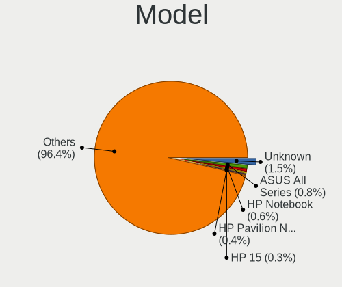
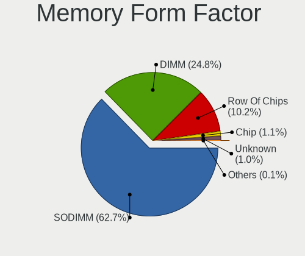
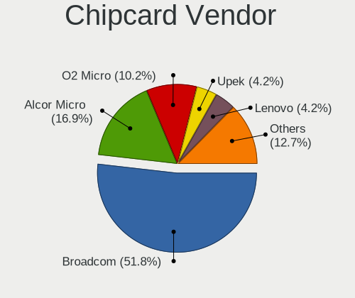

Zorin 16 - Tested Hardware & Statistics
---------------------------------------

A project to collect tested hardware configurations for Zorin 16.

Anyone can contribute to this report by the [hw-probe](https://github.com/linuxhw/hw-probe) tool:

    sudo -E hw-probe -all -upload

Please contribute! Especially if your hardware is rare.

This is a report for all computer types. See also reports for [desktops](/Dist/Zorin_16/Desktop/README.md) and [notebooks](/Dist/Zorin_16/Notebook/README.md).

Contents
--------

* [ Test Cases ](#test-cases)

* [ System ](#system)
  - [ Kernel                   ](#kernel)
  - [ Kernel Family            ](#kernel-family)
  - [ Kernel Major Ver.        ](#kernel-major-ver)
  - [ Arch                     ](#arch)
  - [ DE                       ](#de)
  - [ Display Server           ](#display-server)
  - [ Display Manager          ](#display-manager)
  - [ OS Lang                  ](#os-lang)
  - [ Boot Mode                ](#boot-mode)
  - [ Filesystem               ](#filesystem)
  - [ Part. scheme             ](#part-scheme)
  - [ Dual Boot with Linux/BSD ](#dual-boot-with-linuxbsd)
  - [ Dual Boot (Win)          ](#dual-boot-win)

* [ Board ](#board)
  - [ Vendor                   ](#vendor)
  - [ Model                    ](#model)
  - [ Model Family             ](#model-family)
  - [ MFG Year                 ](#mfg-year)
  - [ Form Factor              ](#form-factor)
  - [ Secure Boot              ](#secure-boot)
  - [ Coreboot                 ](#coreboot)
  - [ RAM Size                 ](#ram-size)
  - [ RAM Used                 ](#ram-used)
  - [ Total Drives             ](#total-drives)
  - [ Has CD-ROM               ](#has-cd-rom)
  - [ Has Ethernet             ](#has-ethernet)
  - [ Has WiFi                 ](#has-wifi)
  - [ Has Bluetooth            ](#has-bluetooth)

* [ Location ](#location)
  - [ Country                  ](#country)
  - [ City                     ](#city)

* [ Drives ](#drives)
  - [ Drive Vendor             ](#drive-vendor)
  - [ Drive Model              ](#drive-model)
  - [ HDD Vendor               ](#hdd-vendor)
  - [ SSD Vendor               ](#ssd-vendor)
  - [ Drive Kind               ](#drive-kind)
  - [ Drive Connector          ](#drive-connector)
  - [ Drive Size               ](#drive-size)
  - [ Space Total              ](#space-total)
  - [ Space Used               ](#space-used)
  - [ Malfunc. Drives          ](#malfunc-drives)
  - [ Malfunc. Drive Vendor    ](#malfunc-drive-vendor)
  - [ Malfunc. HDD Vendor      ](#malfunc-hdd-vendor)
  - [ Malfunc. Drive Kind      ](#malfunc-drive-kind)
  - [ Failed Drives            ](#failed-drives)
  - [ Failed Drive Vendor      ](#failed-drive-vendor)
  - [ Drive Status             ](#drive-status)

* [ Storage controller ](#storage-controller)
  - [ Storage Vendor           ](#storage-vendor)
  - [ Storage Model            ](#storage-model)
  - [ Storage Kind             ](#storage-kind)

* [ Processor ](#processor)
  - [ CPU Vendor               ](#cpu-vendor)
  - [ CPU Model                ](#cpu-model)
  - [ CPU Model Family         ](#cpu-model-family)
  - [ CPU Cores                ](#cpu-cores)
  - [ CPU Sockets              ](#cpu-sockets)
  - [ CPU Threads              ](#cpu-threads)
  - [ CPU Op-Modes             ](#cpu-op-modes)
  - [ CPU Microcode            ](#cpu-microcode)
  - [ CPU Microarch            ](#cpu-microarch)

* [ Graphics ](#graphics)
  - [ GPU Vendor               ](#gpu-vendor)
  - [ GPU Model                ](#gpu-model)
  - [ GPU Combo                ](#gpu-combo)
  - [ GPU Driver               ](#gpu-driver)
  - [ GPU Memory               ](#gpu-memory)

* [ Monitor ](#monitor)
  - [ Monitor Vendor           ](#monitor-vendor)
  - [ Monitor Model            ](#monitor-model)
  - [ Monitor Resolution       ](#monitor-resolution)
  - [ Monitor Diagonal         ](#monitor-diagonal)
  - [ Monitor Width            ](#monitor-width)
  - [ Aspect Ratio             ](#aspect-ratio)
  - [ Monitor Area             ](#monitor-area)
  - [ Pixel Density            ](#pixel-density)
  - [ Multiple Monitors        ](#multiple-monitors)

* [ Network ](#network)
  - [ Net Controller Vendor    ](#net-controller-vendor)
  - [ Net Controller Model     ](#net-controller-model)
  - [ Wireless Vendor          ](#wireless-vendor)
  - [ Wireless Model           ](#wireless-model)
  - [ Ethernet Vendor          ](#ethernet-vendor)
  - [ Ethernet Model           ](#ethernet-model)
  - [ Net Controller Kind      ](#net-controller-kind)
  - [ Used Controller          ](#used-controller)
  - [ NICs                     ](#nics)
  - [ IPv6                     ](#ipv6)

* [ Bluetooth ](#bluetooth)
  - [ Bluetooth Vendor         ](#bluetooth-vendor)
  - [ Bluetooth Model          ](#bluetooth-model)

* [ Sound ](#sound)
  - [ Sound Vendor             ](#sound-vendor)
  - [ Sound Model              ](#sound-model)

* [ Memory ](#memory)
  - [ Memory Vendor            ](#memory-vendor)
  - [ Memory Model             ](#memory-model)
  - [ Memory Kind              ](#memory-kind)
  - [ Memory Form Factor       ](#memory-form-factor)
  - [ Memory Size              ](#memory-size)
  - [ Memory Speed             ](#memory-speed)

* [ Printers & scanners ](#printers--scanners)
  - [ Printer Vendor           ](#printer-vendor)
  - [ Printer Model            ](#printer-model)
  - [ Scanner Vendor           ](#scanner-vendor)
  - [ Scanner Model            ](#scanner-model)

* [ Camera ](#camera)
  - [ Camera Vendor            ](#camera-vendor)
  - [ Camera Model             ](#camera-model)

* [ Security ](#security)
  - [ Fingerprint Vendor       ](#fingerprint-vendor)
  - [ Fingerprint Model        ](#fingerprint-model)
  - [ Chipcard Vendor          ](#chipcard-vendor)
  - [ Chipcard Model           ](#chipcard-model)

* [ Unsupported ](#unsupported)
  - [ Unsupported Devices      ](#unsupported-devices)
  - [ Unsupported Device Types ](#unsupported-device-types)

Test Cases
----------

Total: 3756

| Vendor        | Model                       | Form-Factor | Probe                                                      | Date         |
|---------------|-----------------------------|-------------|------------------------------------------------------------|--------------|
| MSI           | GF63 Thin 11UC              | Notebook    | [b34b3228d3](https://linux-hardware.org/?probe=b34b3228d3) | Feb 01, 2023 |
| Lenovo        | IdeaPad 3 15ADA05 81W1      | Notebook    | [95e019beb2](https://linux-hardware.org/?probe=95e019beb2) | Feb 01, 2023 |
| Dell          | Latitude 7490               | Notebook    | [b2c18d04be](https://linux-hardware.org/?probe=b2c18d04be) | Feb 01, 2023 |
| Dell          | Latitude 7490               | Notebook    | [050126f7f7](https://linux-hardware.org/?probe=050126f7f7) | Feb 01, 2023 |
| MSI           | Raider GE66 12UHS           | Notebook    | [75e83dae8b](https://linux-hardware.org/?probe=75e83dae8b) | Feb 01, 2023 |
| Dell          | Vostro 1520                 | Notebook    | [3fab7107b7](https://linux-hardware.org/?probe=3fab7107b7) | Feb 01, 2023 |
| Acer          | Aspire A315-53              | Notebook    | [d221bc6b8d](https://linux-hardware.org/?probe=d221bc6b8d) | Feb 01, 2023 |
| Dell          | 0D28YY A01                  | Desktop     | [51b04e5d58](https://linux-hardware.org/?probe=51b04e5d58) | Feb 01, 2023 |
| Lenovo        | Yoga 520-14IKB 80X8         | Convertible | [92f6e450b8](https://linux-hardware.org/?probe=92f6e450b8) | Jan 31, 2023 |
| Dell          | Latitude E6540              | Notebook    | [156a047a82](https://linux-hardware.org/?probe=156a047a82) | Jan 31, 2023 |
| ASRock        | H87 Pro4                    | Desktop     | [8a53501060](https://linux-hardware.org/?probe=8a53501060) | Jan 31, 2023 |
| Dell          | Vostro 3700                 | Notebook    | [a663152b7c](https://linux-hardware.org/?probe=a663152b7c) | Jan 31, 2023 |
| Dell          | Vostro 3700                 | Notebook    | [ae3838cc5d](https://linux-hardware.org/?probe=ae3838cc5d) | Jan 31, 2023 |
| Huanan        | X79 INTEL (INTEL Xeon E5... | Desktop     | [2c021665e1](https://linux-hardware.org/?probe=2c021665e1) | Jan 31, 2023 |
| HP            | ENVY x360 Convertible 15... | Convertible | [9bb7eb28ed](https://linux-hardware.org/?probe=9bb7eb28ed) | Jan 31, 2023 |
| HP            | Compaq 6730s                | Notebook    | [1b083e5b64](https://linux-hardware.org/?probe=1b083e5b64) | Jan 31, 2023 |
| HP            | Compaq 6730s                | Notebook    | [ced2899d20](https://linux-hardware.org/?probe=ced2899d20) | Jan 31, 2023 |
| HP            | Pavilion Notebook           | Notebook    | [912213d849](https://linux-hardware.org/?probe=912213d849) | Jan 30, 2023 |
| HP            | Pavilion Notebook           | Notebook    | [456415a23e](https://linux-hardware.org/?probe=456415a23e) | Jan 30, 2023 |
| Dell          | Latitude E6520              | Notebook    | [f042c5966b](https://linux-hardware.org/?probe=f042c5966b) | Jan 30, 2023 |
| HP            | EliteBook 840 G5            | Notebook    | [7b2b210afd](https://linux-hardware.org/?probe=7b2b210afd) | Jan 30, 2023 |
| Lenovo        | ThinkPad T460s 20FAS1F20... | Notebook    | [39b709296b](https://linux-hardware.org/?probe=39b709296b) | Jan 30, 2023 |
| MSI           | H81M-P33                    | Desktop     | [63402c414d](https://linux-hardware.org/?probe=63402c414d) | Jan 30, 2023 |
| HP            | 1791                        | Desktop     | [0cb5402c68](https://linux-hardware.org/?probe=0cb5402c68) | Jan 29, 2023 |
| Lenovo        | MIIX 320-10ICR 80XF         | Tablet      | [56622f5d6c](https://linux-hardware.org/?probe=56622f5d6c) | Jan 29, 2023 |
| Dell          | Inspiron 5770               | Notebook    | [b5612c2501](https://linux-hardware.org/?probe=b5612c2501) | Jan 29, 2023 |
| Lenovo        | IdeaPad Y560                | Notebook    | [47438e081a](https://linux-hardware.org/?probe=47438e081a) | Jan 29, 2023 |
| ASUSTek       | G750JX                      | Notebook    | [d868c23c4b](https://linux-hardware.org/?probe=d868c23c4b) | Jan 29, 2023 |
| Dell          | Precision 5530              | Notebook    | [92399ea8dc](https://linux-hardware.org/?probe=92399ea8dc) | Jan 29, 2023 |
| Lenovo        | IdeaPad Y560                | Notebook    | [621aca8707](https://linux-hardware.org/?probe=621aca8707) | Jan 29, 2023 |
| Lenovo        | IdeaPad Y560                | Notebook    | [55fe252b4e](https://linux-hardware.org/?probe=55fe252b4e) | Jan 29, 2023 |
| Toshiba       | QOSMIO X770                 | Notebook    | [62b104b3d2](https://linux-hardware.org/?probe=62b104b3d2) | Jan 29, 2023 |
| Toshiba       | QOSMIO X770                 | Notebook    | [b7cf9bee5c](https://linux-hardware.org/?probe=b7cf9bee5c) | Jan 28, 2023 |
| Fujitsu       | D3221-A1 S26361-D3221-A1    | Desktop     | [bc4b6513bb](https://linux-hardware.org/?probe=bc4b6513bb) | Jan 28, 2023 |
| MSI           | 760GM-P23                   | Desktop     | [0da956ecde](https://linux-hardware.org/?probe=0da956ecde) | Jan 28, 2023 |
| MSI           | 760GM-P23                   | Desktop     | [e00bd18cc2](https://linux-hardware.org/?probe=e00bd18cc2) | Jan 28, 2023 |
| Dell          | Latitude E5430 non-vPro     | Notebook    | [ae644e258a](https://linux-hardware.org/?probe=ae644e258a) | Jan 28, 2023 |
| Acer          | Swift SF314-511             | Notebook    | [eeaf26e835](https://linux-hardware.org/?probe=eeaf26e835) | Jan 28, 2023 |
| Dell          | Precision 5530              | Notebook    | [a9a54c5b7f](https://linux-hardware.org/?probe=a9a54c5b7f) | Jan 28, 2023 |
| HP            | 843F                        | Desktop     | [5e9a5d2afd](https://linux-hardware.org/?probe=5e9a5d2afd) | Jan 28, 2023 |
| MSI           | PRO H610M-G DDR4            | Desktop     | [ad4f37d5a4](https://linux-hardware.org/?probe=ad4f37d5a4) | Jan 28, 2023 |
| Lenovo        | IdeaPad 3 15ADA05 81W1      | Notebook    | [a6f188ab67](https://linux-hardware.org/?probe=a6f188ab67) | Jan 28, 2023 |
| Apple         | Mac-FFE5EF870D7BA81A iMa... | All in one  | [cf4086f3e4](https://linux-hardware.org/?probe=cf4086f3e4) | Jan 28, 2023 |
| Lenovo        | IdeaPad 3 17ABA7 82RQ       | Notebook    | [57e0449f0f](https://linux-hardware.org/?probe=57e0449f0f) | Jan 28, 2023 |
| HP            | 2B47                        | Desktop     | [cce5f9ec07](https://linux-hardware.org/?probe=cce5f9ec07) | Jan 27, 2023 |
| Dell          | Vostro 1520                 | Notebook    | [b2eb47268c](https://linux-hardware.org/?probe=b2eb47268c) | Jan 27, 2023 |
| ASUSTek       | TUF Gaming X570-PLUS_BR     | Desktop     | [e7b74c9ad4](https://linux-hardware.org/?probe=e7b74c9ad4) | Jan 27, 2023 |
| Dell          | Vostro 1520                 | Notebook    | [6a8408404e](https://linux-hardware.org/?probe=6a8408404e) | Jan 27, 2023 |
| ASRock        | H61M-DGS                    | Desktop     | [825e70e660](https://linux-hardware.org/?probe=825e70e660) | Jan 27, 2023 |
| ASUSTek       | ROG STRIX X670E-I GAMING... | Desktop     | [9d3e931cc1](https://linux-hardware.org/?probe=9d3e931cc1) | Jan 27, 2023 |
| I-Life Dig... | ZED AIR 2 SABMS             | Notebook    | [8bd062dd40](https://linux-hardware.org/?probe=8bd062dd40) | Jan 27, 2023 |
| Dell          | Latitude E7470              | Notebook    | [4245585e75](https://linux-hardware.org/?probe=4245585e75) | Jan 27, 2023 |
| Lenovo        | ThinkPad R61 8918DEG        | Notebook    | [5e0dfe2630](https://linux-hardware.org/?probe=5e0dfe2630) | Jan 27, 2023 |
| Apple         | MacBook8,1                  | Notebook    | [02cd28549c](https://linux-hardware.org/?probe=02cd28549c) | Jan 27, 2023 |
| ASRock        | H87 Pro4                    | Desktop     | [c1427c9b7b](https://linux-hardware.org/?probe=c1427c9b7b) | Jan 26, 2023 |
| HP            | Notebook                    | Notebook    | [4c632128bf](https://linux-hardware.org/?probe=4c632128bf) | Jan 26, 2023 |
| ASUSTek       | TUF Gaming X570-PLUS_BR     | Desktop     | [951bfcd626](https://linux-hardware.org/?probe=951bfcd626) | Jan 26, 2023 |
| Lenovo        | IdeaPad 1 15ADA7 82R1       | Notebook    | [de7bee1cd6](https://linux-hardware.org/?probe=de7bee1cd6) | Jan 26, 2023 |
| Alienware     | M11xR3                      | Notebook    | [634b7f8eb0](https://linux-hardware.org/?probe=634b7f8eb0) | Jan 26, 2023 |
| Lenovo        | ThinkPad R61 8918DEG        | Notebook    | [c29f24d0ca](https://linux-hardware.org/?probe=c29f24d0ca) | Jan 26, 2023 |
| Microsoft     | Surface Pro                 | Tablet      | [756bf12bd7](https://linux-hardware.org/?probe=756bf12bd7) | Jan 25, 2023 |
| ASUSTek       | PRIME B450-PLUS             | Desktop     | [c216d513a0](https://linux-hardware.org/?probe=c216d513a0) | Jan 25, 2023 |
| ASUSTek       | PRIME B450-PLUS             | Desktop     | [06b972165b](https://linux-hardware.org/?probe=06b972165b) | Jan 25, 2023 |
| HP            | 625                         | Notebook    | [06c4fa5119](https://linux-hardware.org/?probe=06c4fa5119) | Jan 25, 2023 |
| Google        | Blorb                       | Notebook    | [adae28c837](https://linux-hardware.org/?probe=adae28c837) | Jan 25, 2023 |
| ASRock        | H61M-DGS                    | Desktop     | [5672937ec6](https://linux-hardware.org/?probe=5672937ec6) | Jan 25, 2023 |
| HP            | EliteBook Folio 9470m       | Notebook    | [5dfd026f77](https://linux-hardware.org/?probe=5dfd026f77) | Jan 25, 2023 |
| Lenovo        | Z51-70 80K6                 | Notebook    | [c083024afa](https://linux-hardware.org/?probe=c083024afa) | Jan 25, 2023 |
| Sony          | SVE1513C5E                  | Notebook    | [48ee443aef](https://linux-hardware.org/?probe=48ee443aef) | Jan 25, 2023 |
| Lenovo        | ThinkPad T470 20HES0PF00    | Notebook    | [61d7aa3ef9](https://linux-hardware.org/?probe=61d7aa3ef9) | Jan 25, 2023 |
| Google        | Kip                         | Notebook    | [b450bb3bcf](https://linux-hardware.org/?probe=b450bb3bcf) | Jan 24, 2023 |
| Google        | Kip                         | Notebook    | [bf5c5ab5e6](https://linux-hardware.org/?probe=bf5c5ab5e6) | Jan 24, 2023 |
| I-Life Dig... | ZED AIR 2 SABMS             | Notebook    | [da316254bb](https://linux-hardware.org/?probe=da316254bb) | Jan 24, 2023 |
| HP            | Laptop 15-dy2xxx            | Notebook    | [af9518a90a](https://linux-hardware.org/?probe=af9518a90a) | Jan 24, 2023 |
| Dell          | Latitude E7470              | Notebook    | [db73b82761](https://linux-hardware.org/?probe=db73b82761) | Jan 24, 2023 |
| Dell          | Latitude E7470              | Notebook    | [6fd520f670](https://linux-hardware.org/?probe=6fd520f670) | Jan 23, 2023 |
| Acer          | Aspire SW5-012              | Notebook    | [247455614c](https://linux-hardware.org/?probe=247455614c) | Jan 23, 2023 |
| HP            | ProBook 440 G5              | Notebook    | [788d350490](https://linux-hardware.org/?probe=788d350490) | Jan 23, 2023 |
| Acer          | RS880M05                    | Desktop     | [c7e3fe60e1](https://linux-hardware.org/?probe=c7e3fe60e1) | Jan 23, 2023 |
| HP            | ENVY x360 Convertible 15... | Convertible | [f72fec3364](https://linux-hardware.org/?probe=f72fec3364) | Jan 23, 2023 |
| Dell          | Latitude E7470              | Notebook    | [525bcdd915](https://linux-hardware.org/?probe=525bcdd915) | Jan 23, 2023 |
| ASUSTek       | T300CHI                     | Notebook    | [bc020f2d3e](https://linux-hardware.org/?probe=bc020f2d3e) | Jan 23, 2023 |
| Acer          | Aspire A315-59              | Notebook    | [20b73bd156](https://linux-hardware.org/?probe=20b73bd156) | Jan 23, 2023 |
| Lenovo        | E51-80 80QB                 | Notebook    | [37073c4323](https://linux-hardware.org/?probe=37073c4323) | Jan 22, 2023 |
| HP            | Pavilion Gaming Laptop 1... | Notebook    | [6d5ca0b2e3](https://linux-hardware.org/?probe=6d5ca0b2e3) | Jan 22, 2023 |
| ASRock        | H61M                        | Desktop     | [f5b1db73f7](https://linux-hardware.org/?probe=f5b1db73f7) | Jan 22, 2023 |
| Packard Be... | EasyNote TE69KB             | Notebook    | [8363dc95c3](https://linux-hardware.org/?probe=8363dc95c3) | Jan 22, 2023 |
| ASUSTek       | P5Q                         | Desktop     | [9e3b6b7075](https://linux-hardware.org/?probe=9e3b6b7075) | Jan 22, 2023 |
| Dell          | Precision M6800             | Notebook    | [a6beff01de](https://linux-hardware.org/?probe=a6beff01de) | Jan 22, 2023 |
| HP            | 625                         | Notebook    | [838d72399b](https://linux-hardware.org/?probe=838d72399b) | Jan 22, 2023 |
| HP            | ENVY x360 Convertible 15... | Convertible | [25013b14a9](https://linux-hardware.org/?probe=25013b14a9) | Jan 22, 2023 |
| HP            | ENVY x360 Convertible 15... | Convertible | [1c3214e8c5](https://linux-hardware.org/?probe=1c3214e8c5) | Jan 22, 2023 |
| Microsoft     | Surface Go 3                | Tablet      | [b47caaf20b](https://linux-hardware.org/?probe=b47caaf20b) | Jan 22, 2023 |
| Lenovo        | V110-15IAP 80TG             | Notebook    | [1707a21fed](https://linux-hardware.org/?probe=1707a21fed) | Jan 22, 2023 |
| Itautec       | Infoway w7430               | Notebook    | [b33318e6e0](https://linux-hardware.org/?probe=b33318e6e0) | Jan 22, 2023 |
| ASUSTek       | TUF Gaming X570-PLUS_BR     | Desktop     | [90ad82dcac](https://linux-hardware.org/?probe=90ad82dcac) | Jan 21, 2023 |
| HP            | 625                         | Notebook    | [9a8a243973](https://linux-hardware.org/?probe=9a8a243973) | Jan 21, 2023 |
| I-Life Dig... | ZED AIR 2 SABMS             | Notebook    | [aa8fbd29c9](https://linux-hardware.org/?probe=aa8fbd29c9) | Jan 21, 2023 |
| Dell          | Inspiron 1525               | Notebook    | [548d331968](https://linux-hardware.org/?probe=548d331968) | Jan 21, 2023 |
| ASUSTek       | X453MA                      | Notebook    | [94b155d9c2](https://linux-hardware.org/?probe=94b155d9c2) | Jan 21, 2023 |
| Chuwi         | GemiBook Pro                | Notebook    | [f52614c5aa](https://linux-hardware.org/?probe=f52614c5aa) | Jan 21, 2023 |
| ASUSTek       | TUF Gaming X570-PLUS_BR     | Desktop     | [9579ec96bc](https://linux-hardware.org/?probe=9579ec96bc) | Jan 21, 2023 |
| Timi          | Mi Notebook Pro             | Notebook    | [1db1382f0b](https://linux-hardware.org/?probe=1db1382f0b) | Jan 21, 2023 |
| HP            | 89B5 A                      | Desktop     | [1b6e288840](https://linux-hardware.org/?probe=1b6e288840) | Jan 21, 2023 |
| Lenovo        | G560 20042                  | Notebook    | [9c78155cfe](https://linux-hardware.org/?probe=9c78155cfe) | Jan 20, 2023 |
| Lenovo        | G560 20042                  | Notebook    | [61e3ee0517](https://linux-hardware.org/?probe=61e3ee0517) | Jan 20, 2023 |
| ASUSTek       | G74Sx                       | Notebook    | [f3af245bf8](https://linux-hardware.org/?probe=f3af245bf8) | Jan 20, 2023 |
| HP            | 843F                        | Desktop     | [07f6efa703](https://linux-hardware.org/?probe=07f6efa703) | Jan 20, 2023 |
| Acer          | Aspire A317-33              | Notebook    | [b7147af4f6](https://linux-hardware.org/?probe=b7147af4f6) | Jan 20, 2023 |
| ASUSTek       | M4A3000E                    | Desktop     | [650236c7cc](https://linux-hardware.org/?probe=650236c7cc) | Jan 19, 2023 |
| Lenovo        | IdeaPad 5 15ITL05 82FG      | Notebook    | [d7344938fb](https://linux-hardware.org/?probe=d7344938fb) | Jan 19, 2023 |
| Lenovo        | IdeaPad 5 15ITL05 82FG      | Notebook    | [9b3bbccece](https://linux-hardware.org/?probe=9b3bbccece) | Jan 19, 2023 |
| ASRock        | B450 Pro4                   | Desktop     | [8131194ea1](https://linux-hardware.org/?probe=8131194ea1) | Jan 19, 2023 |
| ASUSTek       | P7P55D-E                    | Desktop     | [6bc203c6fd](https://linux-hardware.org/?probe=6bc203c6fd) | Jan 19, 2023 |
| Lenovo        | Z51-70 80K6                 | Notebook    | [90746298fc](https://linux-hardware.org/?probe=90746298fc) | Jan 19, 2023 |
| HP            | 843F                        | Desktop     | [83ca70ac2d](https://linux-hardware.org/?probe=83ca70ac2d) | Jan 19, 2023 |
| HP            | ProBook 4740s               | Notebook    | [3392f975ec](https://linux-hardware.org/?probe=3392f975ec) | Jan 19, 2023 |
| Dell          | 0D28YY A01                  | Desktop     | [82b540a137](https://linux-hardware.org/?probe=82b540a137) | Jan 19, 2023 |
| ASUSTek       | M4A3000E                    | Desktop     | [4f8a71f0c5](https://linux-hardware.org/?probe=4f8a71f0c5) | Jan 19, 2023 |
| Acer          | Aspire E5-774G              | Notebook    | [f3ab78c392](https://linux-hardware.org/?probe=f3ab78c392) | Jan 19, 2023 |
| Lenovo        | B51-80 80LM                 | Notebook    | [4908236396](https://linux-hardware.org/?probe=4908236396) | Jan 19, 2023 |
| Lenovo        | B51-80 80LM                 | Notebook    | [9e17ffeecc](https://linux-hardware.org/?probe=9e17ffeecc) | Jan 19, 2023 |
| Lenovo        | V110-15IAP 80TG             | Notebook    | [cfe9a9d924](https://linux-hardware.org/?probe=cfe9a9d924) | Jan 18, 2023 |
| Lenovo        | IdeaPad 330-15AST 81D6      | Notebook    | [7be5d0d09b](https://linux-hardware.org/?probe=7be5d0d09b) | Jan 18, 2023 |
| HP            | 15                          | Notebook    | [cebe1b150e](https://linux-hardware.org/?probe=cebe1b150e) | Jan 18, 2023 |
| Packard Be... | EasyNote TM82               | Notebook    | [49ae8de234](https://linux-hardware.org/?probe=49ae8de234) | Jan 18, 2023 |
| HP            | Pavilion Laptop 15-eh1xx... | Notebook    | [6f91cb09e7](https://linux-hardware.org/?probe=6f91cb09e7) | Jan 18, 2023 |
| Lenovo        | MAHOBAY NO DPK              | Desktop     | [dfac4d4f79](https://linux-hardware.org/?probe=dfac4d4f79) | Jan 17, 2023 |
| Google        | Kip                         | Notebook    | [e74935629a](https://linux-hardware.org/?probe=e74935629a) | Jan 17, 2023 |
| Google        | Kip                         | Notebook    | [558cff5048](https://linux-hardware.org/?probe=558cff5048) | Jan 17, 2023 |
| HP            | Pavilion dv7                | Notebook    | [2efb4b16de](https://linux-hardware.org/?probe=2efb4b16de) | Jan 17, 2023 |
| HP            | 3397                        | Desktop     | [a58c9ac196](https://linux-hardware.org/?probe=a58c9ac196) | Jan 17, 2023 |
| Lenovo        | IdeaPad 100S-11IBY 80R2     | Notebook    | [5ebc1885c3](https://linux-hardware.org/?probe=5ebc1885c3) | Jan 17, 2023 |
| HP            | Spectre x360 Convertible... | Convertible | [d87fb3cf65](https://linux-hardware.org/?probe=d87fb3cf65) | Jan 17, 2023 |
| Fujitsu       | LIFEBOOK T726               | Convertible | [ab8e5c3c70](https://linux-hardware.org/?probe=ab8e5c3c70) | Jan 17, 2023 |
| Lenovo        | ThinkPad S1 Yoga 12 20DL... | Notebook    | [e9e902c625](https://linux-hardware.org/?probe=e9e902c625) | Jan 17, 2023 |
| Lenovo        | ThinkPad S1 Yoga 12 20DL... | Notebook    | [00ebda8ae9](https://linux-hardware.org/?probe=00ebda8ae9) | Jan 17, 2023 |
| Lenovo        | IdeaPad 310-15ABR 80ST      | Notebook    | [473ae331ec](https://linux-hardware.org/?probe=473ae331ec) | Jan 16, 2023 |
| Lenovo        | MAHOBAY NO DPK              | Desktop     | [69b469a6fb](https://linux-hardware.org/?probe=69b469a6fb) | Jan 16, 2023 |
| Wortmann      | Mobile 1524                 | Notebook    | [17fc7e2f75](https://linux-hardware.org/?probe=17fc7e2f75) | Jan 16, 2023 |
| Gigabyte      | EX58-EXTREME                | Desktop     | [bb62149054](https://linux-hardware.org/?probe=bb62149054) | Jan 16, 2023 |
| Medion        | MS-7707                     | Desktop     | [9665ceabf1](https://linux-hardware.org/?probe=9665ceabf1) | Jan 16, 2023 |
| HP            | Pavilion x360 Convertibl... | Convertible | [f4232dc72a](https://linux-hardware.org/?probe=f4232dc72a) | Jan 16, 2023 |
| MSI           | X370 GAMING PRO CARBON      | Desktop     | [3677d8f4e7](https://linux-hardware.org/?probe=3677d8f4e7) | Jan 15, 2023 |
| Lenovo        | G560 0679                   | Notebook    | [26e16a5898](https://linux-hardware.org/?probe=26e16a5898) | Jan 15, 2023 |
| Gigabyte      | M68MT-S2                    | Desktop     | [a728c46633](https://linux-hardware.org/?probe=a728c46633) | Jan 15, 2023 |
| Dell          | Inspiron 7437               | Notebook    | [df8d69926f](https://linux-hardware.org/?probe=df8d69926f) | Jan 15, 2023 |
| Dell          | Inspiron 7437               | Notebook    | [0670d91eb0](https://linux-hardware.org/?probe=0670d91eb0) | Jan 15, 2023 |
| Unknown       | Unknown                     | Desktop     | [a69d4b7b4f](https://linux-hardware.org/?probe=a69d4b7b4f) | Jan 15, 2023 |
| Apple         | MacBookPro5,5               | Notebook    | [2f2fec82c8](https://linux-hardware.org/?probe=2f2fec82c8) | Jan 15, 2023 |
| Tactus        | GeoPad 110                  | Tablet      | [810d937888](https://linux-hardware.org/?probe=810d937888) | Jan 14, 2023 |
| Lenovo        | IdeaPadFlex 15D 20334       | Notebook    | [331b5e3efa](https://linux-hardware.org/?probe=331b5e3efa) | Jan 14, 2023 |
| HP            | EliteBook x360 1030 G3      | Convertible | [e5ab68f182](https://linux-hardware.org/?probe=e5ab68f182) | Jan 14, 2023 |
| ASUSTek       | K75VM                       | Notebook    | [6cd0e1793b](https://linux-hardware.org/?probe=6cd0e1793b) | Jan 14, 2023 |
| Unknown       | Unknown                     | Desktop     | [9cb802849a](https://linux-hardware.org/?probe=9cb802849a) | Jan 14, 2023 |
| Lenovo        | IdeaPadFlex 15D 20334       | Notebook    | [19531b68b1](https://linux-hardware.org/?probe=19531b68b1) | Jan 14, 2023 |
| HP            | EliteBook 745 G5            | Notebook    | [941c62872e](https://linux-hardware.org/?probe=941c62872e) | Jan 14, 2023 |
| HP            | ZBook 17 G3                 | Notebook    | [6c53f137fd](https://linux-hardware.org/?probe=6c53f137fd) | Jan 14, 2023 |
| HP            | Presario F500 (GF795EA#A... | Notebook    | [588148e349](https://linux-hardware.org/?probe=588148e349) | Jan 14, 2023 |
| ASUSTek       | ROG Maximus XI HERO         | Desktop     | [e00028a10c](https://linux-hardware.org/?probe=e00028a10c) | Jan 14, 2023 |
| Apple         | Mac-942B5BF58194151B        | All in one  | [845fca1774](https://linux-hardware.org/?probe=845fca1774) | Jan 14, 2023 |
| HC            | HCAR357-MI V1.0             | Desktop     | [b5f80f8eac](https://linux-hardware.org/?probe=b5f80f8eac) | Jan 14, 2023 |
| Acer          | Swift SF314-511             | Notebook    | [8a4bbb603e](https://linux-hardware.org/?probe=8a4bbb603e) | Jan 14, 2023 |
| Sony          | SVE1513U1ESI                | Notebook    | [d1c4a0dc83](https://linux-hardware.org/?probe=d1c4a0dc83) | Jan 14, 2023 |
| ASUSTek       | ZenBook UX325SA_UM325SA     | Notebook    | [ddf679df3a](https://linux-hardware.org/?probe=ddf679df3a) | Jan 14, 2023 |
| HP            | 0B4Ch D                     | Desktop     | [c5edc9fbc7](https://linux-hardware.org/?probe=c5edc9fbc7) | Jan 14, 2023 |
| Acer          | Swift SF314-511             | Notebook    | [baa87ed4e0](https://linux-hardware.org/?probe=baa87ed4e0) | Jan 13, 2023 |
| Acer          | Swift SF314-511             | Notebook    | [cb94045e18](https://linux-hardware.org/?probe=cb94045e18) | Jan 13, 2023 |
| Fujitsu       | FARQ02010                   | Notebook    | [5d3f5fcee2](https://linux-hardware.org/?probe=5d3f5fcee2) | Jan 13, 2023 |
| ASUSTek       | K93SV                       | Notebook    | [250b4a09a0](https://linux-hardware.org/?probe=250b4a09a0) | Jan 13, 2023 |
| HP            | 3397                        | Desktop     | [baae324548](https://linux-hardware.org/?probe=baae324548) | Jan 13, 2023 |
| Acer          | FRS690L                     | Desktop     | [5b27fe10aa](https://linux-hardware.org/?probe=5b27fe10aa) | Jan 13, 2023 |
| Kiano         | Elegance 13.3               | Notebook    | [2e77ce51b9](https://linux-hardware.org/?probe=2e77ce51b9) | Jan 13, 2023 |
| ASUSTek       | ROG STRIX B350-F GAMING     | Desktop     | [07cedbf55a](https://linux-hardware.org/?probe=07cedbf55a) | Jan 12, 2023 |
| Lenovo        | Yoga 6 13ALC7 82UD          | Convertible | [3d1b3bf218](https://linux-hardware.org/?probe=3d1b3bf218) | Jan 12, 2023 |
| ASUSTek       | TUF Gaming X570-PRO         | Desktop     | [1706cf55cf](https://linux-hardware.org/?probe=1706cf55cf) | Jan 12, 2023 |
| GPU Compan... | GWTC116-2                   | Convertible | [a1c1965381](https://linux-hardware.org/?probe=a1c1965381) | Jan 12, 2023 |
| HP            | Laptop 14-bw0xx             | Notebook    | [0092ec8702](https://linux-hardware.org/?probe=0092ec8702) | Jan 12, 2023 |
| Acer          | Aspire 2920                 | Notebook    | [0766ea34c6](https://linux-hardware.org/?probe=0766ea34c6) | Jan 12, 2023 |
| Lenovo        | IdeaPad Gaming 3 15ARH05... | Notebook    | [fb5857252b](https://linux-hardware.org/?probe=fb5857252b) | Jan 12, 2023 |
| Samsung       | R520/R522/R620              | Notebook    | [78eb96d148](https://linux-hardware.org/?probe=78eb96d148) | Jan 11, 2023 |
| ASUSTek       | H87-PRO                     | Desktop     | [4ac36f25a9](https://linux-hardware.org/?probe=4ac36f25a9) | Jan 11, 2023 |
| Samsung       | R520/R522/R620              | Notebook    | [9dfcb68d9a](https://linux-hardware.org/?probe=9dfcb68d9a) | Jan 11, 2023 |
| Wortmann      | TERRA_MOBILE_1062           | Tablet      | [d363c969bc](https://linux-hardware.org/?probe=d363c969bc) | Jan 10, 2023 |
| Apple         | Mac-77F17D7DA9285301 iMa... | All in one  | [fd9ae626c7](https://linux-hardware.org/?probe=fd9ae626c7) | Jan 10, 2023 |
| Apple         | Mac-77F17D7DA9285301 iMa... | All in one  | [8c41599fdd](https://linux-hardware.org/?probe=8c41599fdd) | Jan 10, 2023 |
| HP            | 843B                        | Desktop     | [ac14cee88f](https://linux-hardware.org/?probe=ac14cee88f) | Jan 10, 2023 |
| HP            | Notebook                    | Notebook    | [8df5d522da](https://linux-hardware.org/?probe=8df5d522da) | Jan 10, 2023 |
| HP            | Notebook                    | Notebook    | [c58dde8021](https://linux-hardware.org/?probe=c58dde8021) | Jan 10, 2023 |
| Dell          | Inspiron 3583               | Notebook    | [cb037b984e](https://linux-hardware.org/?probe=cb037b984e) | Jan 10, 2023 |
| HP            | 843B                        | Desktop     | [e45a20a47f](https://linux-hardware.org/?probe=e45a20a47f) | Jan 10, 2023 |
| HUAWEI        | NBLB-WAX9N                  | Notebook    | [04a9deb0c1](https://linux-hardware.org/?probe=04a9deb0c1) | Jan 10, 2023 |
| Dell          | Inspiron 15-3567            | Notebook    | [5aaaf24b85](https://linux-hardware.org/?probe=5aaaf24b85) | Jan 09, 2023 |
| HP            | Pavilion dv6                | Notebook    | [852e84ccaa](https://linux-hardware.org/?probe=852e84ccaa) | Jan 09, 2023 |
| HP            | Pavilion x360 Convertibl... | Convertible | [d482768ec9](https://linux-hardware.org/?probe=d482768ec9) | Jan 09, 2023 |
| ASUSTek       | M4A88T-M                    | Desktop     | [4c3d063774](https://linux-hardware.org/?probe=4c3d063774) | Jan 09, 2023 |
| Dell          | Latitude E6510              | Notebook    | [28cceb82e3](https://linux-hardware.org/?probe=28cceb82e3) | Jan 09, 2023 |
| Acer          | Aspire A315-53              | Notebook    | [a8f14a8a8e](https://linux-hardware.org/?probe=a8f14a8a8e) | Jan 08, 2023 |
| ASUSTek       | VivoBook_ASUSLaptop X712... | Notebook    | [5bd32eb6f6](https://linux-hardware.org/?probe=5bd32eb6f6) | Jan 08, 2023 |
| ASUSTek       | X555LF                      | Notebook    | [0ff44cdd4f](https://linux-hardware.org/?probe=0ff44cdd4f) | Jan 08, 2023 |
| Lenovo        | IdeaPad 3 17IML05 81WC      | Notebook    | [88ba7d805e](https://linux-hardware.org/?probe=88ba7d805e) | Jan 08, 2023 |
| ASUSTek       | Z170 PRO GAMING/AURA        | Desktop     | [abc1a27105](https://linux-hardware.org/?probe=abc1a27105) | Jan 08, 2023 |
| Lenovo        | IdeaPad 3 17IML05 81WC      | Notebook    | [b5b4c3f6ef](https://linux-hardware.org/?probe=b5b4c3f6ef) | Jan 08, 2023 |
| HP            | 2129                        | Desktop     | [4d6113e60d](https://linux-hardware.org/?probe=4d6113e60d) | Jan 08, 2023 |
| ASRock        | X670E PG Lightning          | Desktop     | [2b3261504f](https://linux-hardware.org/?probe=2b3261504f) | Jan 08, 2023 |
| MSI           | CR62 6M                     | Notebook    | [942ca0f3b3](https://linux-hardware.org/?probe=942ca0f3b3) | Jan 07, 2023 |
| Sony          | VAIO                        | All in one  | [1f521568e1](https://linux-hardware.org/?probe=1f521568e1) | Jan 07, 2023 |
| MAXSUN        | MS-TZZ A320M.2-VH           | Desktop     | [f3e00dc862](https://linux-hardware.org/?probe=f3e00dc862) | Jan 07, 2023 |
| Dell          | Inspiron 5559               | Notebook    | [4c680e9948](https://linux-hardware.org/?probe=4c680e9948) | Jan 07, 2023 |
| HP            | Laptop 17-cp1xxx            | Notebook    | [d699356fd1](https://linux-hardware.org/?probe=d699356fd1) | Jan 07, 2023 |
| HP            | 2B47                        | Desktop     | [8ad8cb5e8f](https://linux-hardware.org/?probe=8ad8cb5e8f) | Jan 06, 2023 |
| Fujitsu       | D3430-A1 S26361-D3430-A1    | Desktop     | [2df76bde47](https://linux-hardware.org/?probe=2df76bde47) | Jan 06, 2023 |
| HP            | Stream Laptop 14-cb1xxx     | Notebook    | [6148bc3313](https://linux-hardware.org/?probe=6148bc3313) | Jan 06, 2023 |
| Multilaser    | PC024                       | Notebook    | [006690ac84](https://linux-hardware.org/?probe=006690ac84) | Jan 06, 2023 |
| Lenovo        | ThinkPad S1 Yoga 20CD003... | Notebook    | [1afcc520de](https://linux-hardware.org/?probe=1afcc520de) | Jan 05, 2023 |
| Lenovo        | V14-IIL 82C4                | Notebook    | [9b828358df](https://linux-hardware.org/?probe=9b828358df) | Jan 05, 2023 |
| Lenovo        | V14-IIL 82C4                | Notebook    | [7cf92f3f43](https://linux-hardware.org/?probe=7cf92f3f43) | Jan 05, 2023 |
| Multilaser    | PC024                       | Notebook    | [8d9a2a1304](https://linux-hardware.org/?probe=8d9a2a1304) | Jan 05, 2023 |
| Dell          | Precision M90               | Notebook    | [b622160555](https://linux-hardware.org/?probe=b622160555) | Jan 05, 2023 |
| HP            | ProBook 4540s               | Notebook    | [6e2638a12e](https://linux-hardware.org/?probe=6e2638a12e) | Jan 04, 2023 |
| Toshiba       | Satellite C50D-B            | Notebook    | [e4bc0d4130](https://linux-hardware.org/?probe=e4bc0d4130) | Jan 04, 2023 |
| Acer          | Aspire V3-772G              | Notebook    | [4ec59dca55](https://linux-hardware.org/?probe=4ec59dca55) | Jan 04, 2023 |
| Sony          | VPCEB3L1E                   | Notebook    | [e8ac8a5d95](https://linux-hardware.org/?probe=e8ac8a5d95) | Jan 04, 2023 |
| Lenovo        | Z51-70 80K6                 | Notebook    | [7fff20462c](https://linux-hardware.org/?probe=7fff20462c) | Jan 03, 2023 |
| Dell          | 0HN7XN A01                  | Desktop     | [e597f176c2](https://linux-hardware.org/?probe=e597f176c2) | Jan 03, 2023 |
| HP            | EliteBook Folio 9470m       | Notebook    | [309e449325](https://linux-hardware.org/?probe=309e449325) | Jan 03, 2023 |
| HP            | Pavilion dv7                | Notebook    | [574f62a8ad](https://linux-hardware.org/?probe=574f62a8ad) | Jan 03, 2023 |
| Dell          | 018D1Y A00                  | Desktop     | [9ba9bcee90](https://linux-hardware.org/?probe=9ba9bcee90) | Jan 03, 2023 |
| Foxconn       | H67S/H61SP                  | Desktop     | [c7684d1f93](https://linux-hardware.org/?probe=c7684d1f93) | Jan 03, 2023 |
| Apple         | MacBookPro12,1              | Notebook    | [ce3dc1998f](https://linux-hardware.org/?probe=ce3dc1998f) | Jan 02, 2023 |
| HP            | EliteBook 2570p             | Notebook    | [fcf5d132a5](https://linux-hardware.org/?probe=fcf5d132a5) | Jan 02, 2023 |
| Apple         | Mac-35C5E08120C7EEAF Mac... | Mini pc     | [f31ae01428](https://linux-hardware.org/?probe=f31ae01428) | Jan 02, 2023 |
| HP            | 8350                        | Desktop     | [3ab0d55a41](https://linux-hardware.org/?probe=3ab0d55a41) | Jan 02, 2023 |
| ASUSTek       | D300TA                      | Desktop     | [f522fa7b4d](https://linux-hardware.org/?probe=f522fa7b4d) | Jan 02, 2023 |
| Acer          | Aspire 4310                 | Notebook    | [e179184ea3](https://linux-hardware.org/?probe=e179184ea3) | Jan 02, 2023 |
| Dell          | Latitude E5440              | Notebook    | [d8b08abf08](https://linux-hardware.org/?probe=d8b08abf08) | Jan 02, 2023 |
| HP            | Pavilion dv6                | Notebook    | [d735200dcf](https://linux-hardware.org/?probe=d735200dcf) | Jan 01, 2023 |
| HP            | EliteBook 850 G3            | Notebook    | [64c803c589](https://linux-hardware.org/?probe=64c803c589) | Jan 01, 2023 |
| Toshiba       | Satellite C50-B             | Notebook    | [b1007671e3](https://linux-hardware.org/?probe=b1007671e3) | Jan 01, 2023 |
| HP            | EliteBook 2760p             | Notebook    | [91741e63eb](https://linux-hardware.org/?probe=91741e63eb) | Jan 01, 2023 |
| ASUSTek       | H87-PRO                     | Desktop     | [f95906c714](https://linux-hardware.org/?probe=f95906c714) | Jan 01, 2023 |
| HP            | EliteBook 2760p             | Notebook    | [6ac462efda](https://linux-hardware.org/?probe=6ac462efda) | Jan 01, 2023 |
| HP            | Victus by Laptop 16-e0xx... | Notebook    | [0360bb01d0](https://linux-hardware.org/?probe=0360bb01d0) | Jan 01, 2023 |
| Dell          | Latitude E5500              | Notebook    | [f04cd8f466](https://linux-hardware.org/?probe=f04cd8f466) | Dec 31, 2022 |
| Dell          | Latitude E5500              | Notebook    | [24a0ca1b65](https://linux-hardware.org/?probe=24a0ca1b65) | Dec 31, 2022 |
| Lenovo        | Yoga 2 13 20344             | Notebook    | [39c9c8aaea](https://linux-hardware.org/?probe=39c9c8aaea) | Dec 31, 2022 |
| Dell          | 0T10XW A00                  | Desktop     | [21638e1dfe](https://linux-hardware.org/?probe=21638e1dfe) | Dec 31, 2022 |
| HP            | Victus by Laptop 16-e0xx... | Notebook    | [9220da7abb](https://linux-hardware.org/?probe=9220da7abb) | Dec 31, 2022 |
| Gigabyte      | G31M-S2C                    | Desktop     | [39f08657f8](https://linux-hardware.org/?probe=39f08657f8) | Dec 31, 2022 |
| Lenovo        | Y520-15IKBN 80WK            | Notebook    | [43f808e1e4](https://linux-hardware.org/?probe=43f808e1e4) | Dec 30, 2022 |
| Gigabyte      | B550 AORUS PRO              | Desktop     | [c8da48f03c](https://linux-hardware.org/?probe=c8da48f03c) | Dec 30, 2022 |
| HP            | EliteBook 2570p             | Notebook    | [b8eccb0fbe](https://linux-hardware.org/?probe=b8eccb0fbe) | Dec 30, 2022 |
| Biostar       | TA970                       | Desktop     | [6a55825894](https://linux-hardware.org/?probe=6a55825894) | Dec 30, 2022 |
| Dell          | Latitude E6540              | Notebook    | [e0e5f33e60](https://linux-hardware.org/?probe=e0e5f33e60) | Dec 30, 2022 |
| Gigabyte      | 970A-DS3P                   | Desktop     | [c841093094](https://linux-hardware.org/?probe=c841093094) | Dec 30, 2022 |
| MSI           | X99A RAIDER                 | Desktop     | [59f6170d5b](https://linux-hardware.org/?probe=59f6170d5b) | Dec 29, 2022 |
| MSI           | Z490-A PRO                  | Desktop     | [e4e5afd812](https://linux-hardware.org/?probe=e4e5afd812) | Dec 29, 2022 |
| ASUSTek       | X540YA                      | Notebook    | [d128cfee28](https://linux-hardware.org/?probe=d128cfee28) | Dec 29, 2022 |
| ASUSTek       | P6T DELUXE V2               | Desktop     | [0d8d6061d7](https://linux-hardware.org/?probe=0d8d6061d7) | Dec 29, 2022 |
| ASUSTek       | P6T DELUXE V2               | Desktop     | [4bda137e99](https://linux-hardware.org/?probe=4bda137e99) | Dec 29, 2022 |
| Dell          | 0KWVT8 A03                  | Desktop     | [7ce6d4b3e3](https://linux-hardware.org/?probe=7ce6d4b3e3) | Dec 29, 2022 |
| Dell          | 0KWVT8 A03                  | Desktop     | [f828f74e07](https://linux-hardware.org/?probe=f828f74e07) | Dec 29, 2022 |
| PCWare        | IPMH61R1                    | Desktop     | [a221946f02](https://linux-hardware.org/?probe=a221946f02) | Dec 29, 2022 |
| Toshiba       | Satellite C870-1C2          | Notebook    | [cc1dd99957](https://linux-hardware.org/?probe=cc1dd99957) | Dec 28, 2022 |
| Dell          | 03KWTV A02                  | Desktop     | [82612358ac](https://linux-hardware.org/?probe=82612358ac) | Dec 28, 2022 |
| Dell          | Latitude 7490               | Notebook    | [0c49efe5e1](https://linux-hardware.org/?probe=0c49efe5e1) | Dec 28, 2022 |
| Lenovo        | IdeaPad 3 15ITL6 82H8       | Notebook    | [27e072cb3e](https://linux-hardware.org/?probe=27e072cb3e) | Dec 28, 2022 |
| Samsung       | 305E4A/305E5A/305E7A        | Notebook    | [75fe6d9325](https://linux-hardware.org/?probe=75fe6d9325) | Dec 28, 2022 |
| HP            | 2AF7                        | Desktop     | [9663a281c1](https://linux-hardware.org/?probe=9663a281c1) | Dec 28, 2022 |
| Lenovo        | ThinkPad X131e 33672K5      | Notebook    | [70d10e91fb](https://linux-hardware.org/?probe=70d10e91fb) | Dec 28, 2022 |
| Toshiba       | Satellite C50-B             | Notebook    | [31241c1f30](https://linux-hardware.org/?probe=31241c1f30) | Dec 28, 2022 |
| Dell          | XPS 13 9365                 | Convertible | [b65d5ce654](https://linux-hardware.org/?probe=b65d5ce654) | Dec 27, 2022 |
| Unknown       | Unknown                     | Notebook    | [6aa557fb75](https://linux-hardware.org/?probe=6aa557fb75) | Dec 27, 2022 |
| MSI           | GF63 Thin 10SC              | Notebook    | [71c1ee486e](https://linux-hardware.org/?probe=71c1ee486e) | Dec 27, 2022 |
| Chuwi         | HeroBook Air                | Notebook    | [2c6e8a0c9f](https://linux-hardware.org/?probe=2c6e8a0c9f) | Dec 27, 2022 |
| Chuwi         | HeroBook Air                | Notebook    | [b3db56361b](https://linux-hardware.org/?probe=b3db56361b) | Dec 27, 2022 |
| HP            | Pavilion Gaming Laptop 1... | Notebook    | [0763603d12](https://linux-hardware.org/?probe=0763603d12) | Dec 27, 2022 |
| Lenovo        | ThinkPad Yoga 11e 3rd Ge... | Convertible | [2fe0a7fe8b](https://linux-hardware.org/?probe=2fe0a7fe8b) | Dec 27, 2022 |
| Acer          | Aspire XC-780               | Desktop     | [0d90d1884c](https://linux-hardware.org/?probe=0d90d1884c) | Dec 27, 2022 |
| Lenovo        | 3106 SDK0J40697 WIN 3305... | Desktop     | [5ce1ea886f](https://linux-hardware.org/?probe=5ce1ea886f) | Dec 26, 2022 |
| Lenovo        | ThinkPad T470 20HES0PF00    | Notebook    | [052cdcd8bb](https://linux-hardware.org/?probe=052cdcd8bb) | Dec 26, 2022 |
| Lenovo        | ThinkPad T470 20HES0PF00    | Notebook    | [940218d084](https://linux-hardware.org/?probe=940218d084) | Dec 26, 2022 |
| Lenovo        | ThinkPad E590 20NB001AMX    | Notebook    | [047944fa9f](https://linux-hardware.org/?probe=047944fa9f) | Dec 26, 2022 |
| Lenovo        | 3106 SDK0J40697 WIN 3305... | Desktop     | [f56ea263a2](https://linux-hardware.org/?probe=f56ea263a2) | Dec 26, 2022 |
| Lenovo        | IdeaPad 5 15ALC05 82LN      | Notebook    | [da3f79863a](https://linux-hardware.org/?probe=da3f79863a) | Dec 26, 2022 |
| Lenovo        | IdeaPad 3 17ABA7 82RQ       | Notebook    | [047823ffbc](https://linux-hardware.org/?probe=047823ffbc) | Dec 26, 2022 |
| ASUSTek       | T100TAS                     | Notebook    | [25894bb300](https://linux-hardware.org/?probe=25894bb300) | Dec 26, 2022 |
| HP            | Stream Laptop 14-cb1xxx     | Notebook    | [1ba51900a6](https://linux-hardware.org/?probe=1ba51900a6) | Dec 25, 2022 |
| Acer          | Aspire M3-581G              | Notebook    | [67071376c6](https://linux-hardware.org/?probe=67071376c6) | Dec 25, 2022 |
| HP            | 2AF7                        | Desktop     | [287696b4fc](https://linux-hardware.org/?probe=287696b4fc) | Dec 25, 2022 |
| Gigabyte      | GA-770T-USB3                | Desktop     | [08d1b04754](https://linux-hardware.org/?probe=08d1b04754) | Dec 25, 2022 |
| Sony          | VGN-NR32M_S                 | Notebook    | [6ad0da2e88](https://linux-hardware.org/?probe=6ad0da2e88) | Dec 25, 2022 |
| ASRock        | 970 Extreme4                | Desktop     | [2655b3c6b6](https://linux-hardware.org/?probe=2655b3c6b6) | Dec 24, 2022 |
| Lenovo        | Yoga 6 13ALC7 82UD          | Convertible | [1c2f8d9457](https://linux-hardware.org/?probe=1c2f8d9457) | Dec 24, 2022 |
| Lenovo        | IdeaPad 3 15ITL6 82H8       | Notebook    | [e968a4fe6d](https://linux-hardware.org/?probe=e968a4fe6d) | Dec 24, 2022 |
| Lenovo        | IdeaPad 3 15ITL6 82H8       | Notebook    | [2415ad5980](https://linux-hardware.org/?probe=2415ad5980) | Dec 24, 2022 |
| HP            | Compaq 6730b (NB034ET#UU... | Notebook    | [304e2ca750](https://linux-hardware.org/?probe=304e2ca750) | Dec 24, 2022 |
| Microsoft     | Surface Pro                 | Tablet      | [9bcea5d857](https://linux-hardware.org/?probe=9bcea5d857) | Dec 24, 2022 |
| HP            | Pavilion dv7                | Notebook    | [a099e9b6ac](https://linux-hardware.org/?probe=a099e9b6ac) | Dec 24, 2022 |
| Intel         | H61                         | Desktop     | [8d5eb236e1](https://linux-hardware.org/?probe=8d5eb236e1) | Dec 24, 2022 |
| HP            | Pavilion g7                 | Notebook    | [ef4cc6fa1a](https://linux-hardware.org/?probe=ef4cc6fa1a) | Dec 24, 2022 |
| HP            | 2AF7                        | Desktop     | [7b79dd8352](https://linux-hardware.org/?probe=7b79dd8352) | Dec 23, 2022 |
| Lenovo        | G500 20236                  | Notebook    | [3e8fb581f0](https://linux-hardware.org/?probe=3e8fb581f0) | Dec 23, 2022 |
| HP            | 2AF7                        | Desktop     | [5ef9ce3357](https://linux-hardware.org/?probe=5ef9ce3357) | Dec 23, 2022 |
| Dell          | 0C2KJT A00                  | Desktop     | [08a8cc75ac](https://linux-hardware.org/?probe=08a8cc75ac) | Dec 23, 2022 |
| Dell          | 0C2KJT A00                  | Desktop     | [bd8a5003e8](https://linux-hardware.org/?probe=bd8a5003e8) | Dec 23, 2022 |
| ASUSTek       | G75VX                       | Notebook    | [bb9724d53f](https://linux-hardware.org/?probe=bb9724d53f) | Dec 23, 2022 |
| Dell          | Latitude E4310              | Notebook    | [6386845196](https://linux-hardware.org/?probe=6386845196) | Dec 23, 2022 |
| ASRock        | G31M-S                      | Desktop     | [476c5ec563](https://linux-hardware.org/?probe=476c5ec563) | Dec 22, 2022 |
| Lenovo        | ThinkPad P52 20MAS25B1X     | Notebook    | [f82f15da88](https://linux-hardware.org/?probe=f82f15da88) | Dec 22, 2022 |
| MSI           | H61MU-E35                   | Desktop     | [cb9ec3d5ad](https://linux-hardware.org/?probe=cb9ec3d5ad) | Dec 22, 2022 |
| MSI           | H61MU-E35                   | Desktop     | [bfdc9d1e12](https://linux-hardware.org/?probe=bfdc9d1e12) | Dec 22, 2022 |
| Lenovo        | G50-30 80G0                 | Notebook    | [f497db99b3](https://linux-hardware.org/?probe=f497db99b3) | Dec 22, 2022 |
| HP            | 15 Notebook PC              | Notebook    | [79aabf81c4](https://linux-hardware.org/?probe=79aabf81c4) | Dec 22, 2022 |
| ECS           | H110M4-C2H                  | Desktop     | [f349ed8914](https://linux-hardware.org/?probe=f349ed8914) | Dec 22, 2022 |
| MSI           | B450M MORTAR                | Desktop     | [2279954594](https://linux-hardware.org/?probe=2279954594) | Dec 22, 2022 |
| Lenovo        | G50-30 80G0                 | Notebook    | [c0f831d7a4](https://linux-hardware.org/?probe=c0f831d7a4) | Dec 22, 2022 |
| ASRock        | N68C-S UCC                  | Desktop     | [279e1eacf6](https://linux-hardware.org/?probe=279e1eacf6) | Dec 22, 2022 |
| ASRock        | G31M-S                      | Desktop     | [88d93da5a7](https://linux-hardware.org/?probe=88d93da5a7) | Dec 22, 2022 |
| Toshiba       | Satellite L855              | Notebook    | [3caae1ba3b](https://linux-hardware.org/?probe=3caae1ba3b) | Dec 21, 2022 |
| ASRock        | N68C-S UCC                  | Desktop     | [8d8716cdca](https://linux-hardware.org/?probe=8d8716cdca) | Dec 21, 2022 |
| HUAWEI        | BOHB-WAX9                   | Notebook    | [2e63730e46](https://linux-hardware.org/?probe=2e63730e46) | Dec 21, 2022 |
| Dell          | Inspiron 3583               | Notebook    | [64cd4afc6d](https://linux-hardware.org/?probe=64cd4afc6d) | Dec 21, 2022 |
| PCWare        | IPMH310 PRO 1.0             | Desktop     | [c4dea5edbb](https://linux-hardware.org/?probe=c4dea5edbb) | Dec 21, 2022 |
| Sony          | VJZ13A                      | Notebook    | [748f77bace](https://linux-hardware.org/?probe=748f77bace) | Dec 21, 2022 |
| Dell          | Latitude E4310              | Notebook    | [7b184a032b](https://linux-hardware.org/?probe=7b184a032b) | Dec 21, 2022 |
| Lenovo        | Yoga 300-11IBR 80M1         | Notebook    | [06c3b647be](https://linux-hardware.org/?probe=06c3b647be) | Dec 21, 2022 |
| MSI           | GS73VR 7RF                  | Notebook    | [7f37920146](https://linux-hardware.org/?probe=7f37920146) | Dec 20, 2022 |
| Dell          | 0MGK50 A04                  | Desktop     | [931b01be38](https://linux-hardware.org/?probe=931b01be38) | Dec 20, 2022 |
| Lenovo        | Yoga 6 13ALC7 82UD          | Convertible | [5212fb0d93](https://linux-hardware.org/?probe=5212fb0d93) | Dec 20, 2022 |
| Lenovo        | Yoga 6 13ALC7 82UD          | Convertible | [9f456f73eb](https://linux-hardware.org/?probe=9f456f73eb) | Dec 20, 2022 |
| Lenovo        | IdeaPad 3 15ITL6 82H8       | Notebook    | [03e2c64868](https://linux-hardware.org/?probe=03e2c64868) | Dec 20, 2022 |
| ASRock        | Z170 Pro4                   | Desktop     | [ca027f264a](https://linux-hardware.org/?probe=ca027f264a) | Dec 20, 2022 |
| ASRock        | B450M Pro4                  | Desktop     | [83df1364c8](https://linux-hardware.org/?probe=83df1364c8) | Dec 20, 2022 |
| Apple         | Mac-27ADBB7B4CEE8E61 iMa... | All in one  | [0e5b8434fe](https://linux-hardware.org/?probe=0e5b8434fe) | Dec 20, 2022 |
| Lenovo        | G500 20236                  | Notebook    | [83a3d8e955](https://linux-hardware.org/?probe=83a3d8e955) | Dec 19, 2022 |
| GPD           | G1619-04                    | Notebook    | [f184c297f2](https://linux-hardware.org/?probe=f184c297f2) | Dec 19, 2022 |
| ASUSTek       | VivoBook_ASUSLaptop X403... | Notebook    | [3ec240466e](https://linux-hardware.org/?probe=3ec240466e) | Dec 19, 2022 |
| Lenovo        | 3106 SDK0J40697 WIN 3305... | Desktop     | [87907abff7](https://linux-hardware.org/?probe=87907abff7) | Dec 19, 2022 |
| ASUSTek       | PRIME H310M-A R2.0          | Desktop     | [08f3a88ab3](https://linux-hardware.org/?probe=08f3a88ab3) | Dec 19, 2022 |
| HP            | 8715                        | Mini pc     | [a6f7705fd4](https://linux-hardware.org/?probe=a6f7705fd4) | Dec 19, 2022 |
| HP            | Stream Laptop 14-cb1xxx     | Notebook    | [b1bd890ed0](https://linux-hardware.org/?probe=b1bd890ed0) | Dec 19, 2022 |
| HP            | ProBook 640 G1              | Notebook    | [cf1ccbf76a](https://linux-hardware.org/?probe=cf1ccbf76a) | Dec 19, 2022 |
| Dell          | Studio XPS 1645             | Notebook    | [e1c0f5a53b](https://linux-hardware.org/?probe=e1c0f5a53b) | Dec 18, 2022 |
| Dell          | Studio XPS 1645             | Notebook    | [2c26ce45b7](https://linux-hardware.org/?probe=2c26ce45b7) | Dec 18, 2022 |
| ASRock        | N3150-NUC                   | Desktop     | [5e77ec1117](https://linux-hardware.org/?probe=5e77ec1117) | Dec 18, 2022 |
| Dell          | 0Y2MRG A00                  | Desktop     | [20b69069fa](https://linux-hardware.org/?probe=20b69069fa) | Dec 18, 2022 |
| Dell          | Inspiron 7537               | Notebook    | [7064963568](https://linux-hardware.org/?probe=7064963568) | Dec 18, 2022 |
| ASUSTek       | S500CA                      | Notebook    | [55cf134a8b](https://linux-hardware.org/?probe=55cf134a8b) | Dec 18, 2022 |
| Apple         | Mac-942B59F58194171B iMa... | All in one  | [d12b0d42fc](https://linux-hardware.org/?probe=d12b0d42fc) | Dec 17, 2022 |
| HP            | Laptop 15s-fq2xxx           | Notebook    | [1a23b502b9](https://linux-hardware.org/?probe=1a23b502b9) | Dec 17, 2022 |
| GPU Compan... | GWTC116-2                   | Notebook    | [e64e0ee27a](https://linux-hardware.org/?probe=e64e0ee27a) | Dec 17, 2022 |
| Fusion5       | C60Bv2-128GB                | Notebook    | [7cc701c4de](https://linux-hardware.org/?probe=7cc701c4de) | Dec 17, 2022 |
| Apple         | Mac-F4238CC8 PVT            | All in one  | [be98ae95c3](https://linux-hardware.org/?probe=be98ae95c3) | Dec 17, 2022 |
| ASRock        | N3150-NUC                   | Desktop     | [e497bf2ce3](https://linux-hardware.org/?probe=e497bf2ce3) | Dec 17, 2022 |
| HP            | Compaq 6910p (RM231UT#AB... | Notebook    | [4653b4877b](https://linux-hardware.org/?probe=4653b4877b) | Dec 17, 2022 |
| HP            | 250 G1                      | Notebook    | [07f20cc1ec](https://linux-hardware.org/?probe=07f20cc1ec) | Dec 17, 2022 |
| Jumper        | EZbook                      | Notebook    | [010f6841e5](https://linux-hardware.org/?probe=010f6841e5) | Dec 17, 2022 |
| ASUSTek       | ROG STRIX Z690-I GAMING ... | Desktop     | [18d7dcfb19](https://linux-hardware.org/?probe=18d7dcfb19) | Dec 17, 2022 |
| Sony          | VPCEB2M1E                   | Notebook    | [2505ff8962](https://linux-hardware.org/?probe=2505ff8962) | Dec 17, 2022 |
| Sony          | VPCEB2M1E                   | Notebook    | [72bcddb15e](https://linux-hardware.org/?probe=72bcddb15e) | Dec 17, 2022 |
| Intel         | NUC7i5BNB J31144-310        | Mini pc     | [53ae51748b](https://linux-hardware.org/?probe=53ae51748b) | Dec 17, 2022 |
| Jumper        | EZbook                      | Notebook    | [bbae74f641](https://linux-hardware.org/?probe=bbae74f641) | Dec 17, 2022 |
| Apple         | Mac-F2268DC8                | All in one  | [396db83818](https://linux-hardware.org/?probe=396db83818) | Dec 17, 2022 |
| Gigabyte      | X570 AORUS ELITE            | Desktop     | [dec0d049f7](https://linux-hardware.org/?probe=dec0d049f7) | Dec 17, 2022 |
| WYSE          | XM CLASS                    | Notebook    | [8aac2f31cb](https://linux-hardware.org/?probe=8aac2f31cb) | Dec 17, 2022 |
| Lenovo        | V130-15IGM 81HL             | Notebook    | [255499abee](https://linux-hardware.org/?probe=255499abee) | Dec 17, 2022 |
| Lenovo        | Yoga 7 14ACN6 82N7          | Convertible | [1a8c883ac5](https://linux-hardware.org/?probe=1a8c883ac5) | Dec 16, 2022 |
| Toshiba       | Satellite P500              | Notebook    | [58163fa1d7](https://linux-hardware.org/?probe=58163fa1d7) | Dec 16, 2022 |
| Fujitsu       | D2901-A1 S26361-D2901-A1    | Desktop     | [d9ee8a9854](https://linux-hardware.org/?probe=d9ee8a9854) | Dec 16, 2022 |
| HP            | ENVY x360 Convertible 15... | Convertible | [ced1979abf](https://linux-hardware.org/?probe=ced1979abf) | Dec 16, 2022 |
| Packard Be... | EasyNote TK85               | Notebook    | [a0a0296ca4](https://linux-hardware.org/?probe=a0a0296ca4) | Dec 16, 2022 |
| Google        | Blorb                       | Notebook    | [4134deb94e](https://linux-hardware.org/?probe=4134deb94e) | Dec 16, 2022 |
| HP            | 8750                        | Desktop     | [a4911352d1](https://linux-hardware.org/?probe=a4911352d1) | Dec 16, 2022 |
| MSI           | GP75 Leopard 10SEK          | Notebook    | [9eda9896f3](https://linux-hardware.org/?probe=9eda9896f3) | Dec 15, 2022 |
| Machcreato... | 14                          | Notebook    | [8b69842953](https://linux-hardware.org/?probe=8b69842953) | Dec 15, 2022 |
| Fujitsu       | D3223-A1 S26361-D3223-A1    | Desktop     | [827fabbd5f](https://linux-hardware.org/?probe=827fabbd5f) | Dec 15, 2022 |
| ASUSTek       | PRIME H370-A                | Desktop     | [eeb913fa7c](https://linux-hardware.org/?probe=eeb913fa7c) | Dec 15, 2022 |
| ASUSTek       | PRIME H370-A                | Desktop     | [7a72cfa484](https://linux-hardware.org/?probe=7a72cfa484) | Dec 15, 2022 |
| ASUSTek       | VivoBook_ASUSLaptop X515... | Notebook    | [06bbbb04a9](https://linux-hardware.org/?probe=06bbbb04a9) | Dec 15, 2022 |
| Dell          | 018D1Y A00                  | Desktop     | [34611b96d0](https://linux-hardware.org/?probe=34611b96d0) | Dec 15, 2022 |
| ASUSTek       | P5PL2-E                     | Desktop     | [d304b202fc](https://linux-hardware.org/?probe=d304b202fc) | Dec 14, 2022 |
| Lenovo        | ThinkPad T460 20FMS2AN00    | Notebook    | [7db77c4fcd](https://linux-hardware.org/?probe=7db77c4fcd) | Dec 14, 2022 |
| Lenovo        | ThinkPad Helix 2nd 20CG0... | Tablet      | [e32ae95f08](https://linux-hardware.org/?probe=e32ae95f08) | Dec 14, 2022 |
| ASUSTek       | M3A78-EM                    | Desktop     | [3339909881](https://linux-hardware.org/?probe=3339909881) | Dec 14, 2022 |
| MSI           | MS-B9071                    | Desktop     | [fc31fe11a2](https://linux-hardware.org/?probe=fc31fe11a2) | Dec 14, 2022 |
| HP            | Pavilion dv7                | Notebook    | [7067714e91](https://linux-hardware.org/?probe=7067714e91) | Dec 14, 2022 |
| Intel         | NUC10i5FNB M38063-307       | Mini pc     | [1e8031daad](https://linux-hardware.org/?probe=1e8031daad) | Dec 13, 2022 |
| Intel         | NUC10i5FNB M38063-307       | Mini pc     | [c8c56f3e93](https://linux-hardware.org/?probe=c8c56f3e93) | Dec 13, 2022 |
| HP            | 1905                        | Desktop     | [21f639657c](https://linux-hardware.org/?probe=21f639657c) | Dec 13, 2022 |
| AZW           | GTR V01                     | Mini pc     | [7cae9d407c](https://linux-hardware.org/?probe=7cae9d407c) | Dec 13, 2022 |
| Gigabyte      | H57M-USB3                   | Desktop     | [d4812cfdb6](https://linux-hardware.org/?probe=d4812cfdb6) | Dec 13, 2022 |
| Gigabyte      | H57M-USB3                   | Desktop     | [c48aaf8b29](https://linux-hardware.org/?probe=c48aaf8b29) | Dec 12, 2022 |
| Gigabyte      | H77N-WIFI                   | Desktop     | [9704c6b7c4](https://linux-hardware.org/?probe=9704c6b7c4) | Dec 12, 2022 |
| Biostar       | A520MH                      | Desktop     | [e1eff55b96](https://linux-hardware.org/?probe=e1eff55b96) | Dec 12, 2022 |
| Foxconn       | H55MXV-LE                   | Desktop     | [931837aeec](https://linux-hardware.org/?probe=931837aeec) | Dec 12, 2022 |
| AZW           | GTR V01                     | Mini pc     | [9f1097843c](https://linux-hardware.org/?probe=9f1097843c) | Dec 12, 2022 |
| HP            | Laptop 17-bs0xx             | Notebook    | [d83f209b7f](https://linux-hardware.org/?probe=d83f209b7f) | Dec 12, 2022 |
| GPU Compan... | GWTC116-2                   | Notebook    | [09b233d518](https://linux-hardware.org/?probe=09b233d518) | Dec 12, 2022 |
| ASUSTek       | VivoBook_ASUSLaptop X512... | Notebook    | [4a5f657daf](https://linux-hardware.org/?probe=4a5f657daf) | Dec 12, 2022 |
| Apple         | MacBook4,1                  | Notebook    | [45ad14cbc2](https://linux-hardware.org/?probe=45ad14cbc2) | Dec 12, 2022 |
| Apple         | MacBookPro8,1               | Notebook    | [bc16110ca8](https://linux-hardware.org/?probe=bc16110ca8) | Dec 12, 2022 |
| Toshiba       | Satellite C870-1C2          | Notebook    | [477bcdd546](https://linux-hardware.org/?probe=477bcdd546) | Dec 12, 2022 |
| Alienware     | 18                          | Notebook    | [707124d216](https://linux-hardware.org/?probe=707124d216) | Dec 11, 2022 |
| Biostar       | A520MH                      | Desktop     | [2c6278e478](https://linux-hardware.org/?probe=2c6278e478) | Dec 11, 2022 |
| Lenovo        | 30D2 SDK0J40705 WIN 3425... | Desktop     | [80281a1e7b](https://linux-hardware.org/?probe=80281a1e7b) | Dec 11, 2022 |
| Acer          | Aspire M3-581G              | Notebook    | [25b27d5b17](https://linux-hardware.org/?probe=25b27d5b17) | Dec 11, 2022 |
| Unknown       | T3 MRD                      | Desktop     | [c2cb5ad16b](https://linux-hardware.org/?probe=c2cb5ad16b) | Dec 11, 2022 |
| ASUSTek       | X751SA                      | Notebook    | [2da53106a0](https://linux-hardware.org/?probe=2da53106a0) | Dec 11, 2022 |
| Sony          | VGN-NR32M_S                 | Notebook    | [f37234d095](https://linux-hardware.org/?probe=f37234d095) | Dec 10, 2022 |
| ASUSTek       | X751SA                      | Notebook    | [36b3666998](https://linux-hardware.org/?probe=36b3666998) | Dec 10, 2022 |
| ASUSTek       | TUF Gaming B550-PRO         | Desktop     | [e2a043a361](https://linux-hardware.org/?probe=e2a043a361) | Dec 10, 2022 |
| Lenovo        | ThinkPad T470 20HES0PF00    | Notebook    | [097b783ae5](https://linux-hardware.org/?probe=097b783ae5) | Dec 10, 2022 |
| MSI           | MPG X570 GAMING EDGE WIF... | Desktop     | [9d7365bdd6](https://linux-hardware.org/?probe=9d7365bdd6) | Dec 10, 2022 |
| ASUSTek       | P5Q                         | Desktop     | [fbc5b65636](https://linux-hardware.org/?probe=fbc5b65636) | Dec 10, 2022 |
| HP            | Stream Laptop 14-cb1xxx     | Notebook    | [0f4312c32e](https://linux-hardware.org/?probe=0f4312c32e) | Dec 10, 2022 |
| Dell          | Latitude E7240              | Notebook    | [722c8c8b32](https://linux-hardware.org/?probe=722c8c8b32) | Dec 10, 2022 |
| ASUSTek       | M3N78-VM                    | Desktop     | [fa99389a1a](https://linux-hardware.org/?probe=fa99389a1a) | Dec 10, 2022 |
| Lenovo        | SHARKBAY SDK0E50510 WIN     | Desktop     | [3e0d5dc490](https://linux-hardware.org/?probe=3e0d5dc490) | Dec 09, 2022 |
| Lenovo        | ThinkPad Edge E530c 3366... | Notebook    | [2dffa88142](https://linux-hardware.org/?probe=2dffa88142) | Dec 09, 2022 |
| ASUSTek       | P5Q                         | Desktop     | [415b325dd0](https://linux-hardware.org/?probe=415b325dd0) | Dec 09, 2022 |
| Hampoo        | P02BD6_HI-122LP             | Tablet      | [fbbd6a06c8](https://linux-hardware.org/?probe=fbbd6a06c8) | Dec 09, 2022 |
| Lenovo        | MIIX 2 11 20327             | Tablet      | [69e83bcd80](https://linux-hardware.org/?probe=69e83bcd80) | Dec 09, 2022 |
| MSI           | GS73VR 7RF                  | Notebook    | [31aa44b519](https://linux-hardware.org/?probe=31aa44b519) | Dec 09, 2022 |
| HP            | Laptop 14-bw0xx             | Notebook    | [3f3a7f6841](https://linux-hardware.org/?probe=3f3a7f6841) | Dec 09, 2022 |
| Unknown       | Unknown                     | Desktop     | [41ff90c88a](https://linux-hardware.org/?probe=41ff90c88a) | Dec 09, 2022 |
| Apple         | MacBookAir5,2               | Notebook    | [30bbadcb93](https://linux-hardware.org/?probe=30bbadcb93) | Dec 09, 2022 |
| Dell          | Inspiron 5566               | Notebook    | [3a1ec09d8a](https://linux-hardware.org/?probe=3a1ec09d8a) | Dec 08, 2022 |
| ASUSTek       | ROG STRIX X470-F GAMING     | Desktop     | [ead8cc9c0a](https://linux-hardware.org/?probe=ead8cc9c0a) | Dec 08, 2022 |
| HUAWEI        | BOHB-WAX9                   | Notebook    | [0db55b0eea](https://linux-hardware.org/?probe=0db55b0eea) | Dec 08, 2022 |
| HP            | 82FE 11                     | Desktop     | [6bf35b7005](https://linux-hardware.org/?probe=6bf35b7005) | Dec 08, 2022 |
| Dell          | 0478VN A00                  | Desktop     | [54eaa6d2f3](https://linux-hardware.org/?probe=54eaa6d2f3) | Dec 07, 2022 |
| Dell          | Latitude 7490               | Notebook    | [6021de66f0](https://linux-hardware.org/?probe=6021de66f0) | Dec 07, 2022 |
| Gigabyte      | H61M-S1                     | Desktop     | [8c8e80423c](https://linux-hardware.org/?probe=8c8e80423c) | Dec 07, 2022 |
| Gigabyte      | H61M-S1                     | Desktop     | [37283186c3](https://linux-hardware.org/?probe=37283186c3) | Dec 07, 2022 |
| HP            | ProBook 640 G1              | Notebook    | [1c99985945](https://linux-hardware.org/?probe=1c99985945) | Dec 07, 2022 |
| Dell          | Studio 1558                 | Notebook    | [ce0c8ffe20](https://linux-hardware.org/?probe=ce0c8ffe20) | Dec 06, 2022 |
| MSI           | K9A2 Platinum               | Desktop     | [3ce727deb7](https://linux-hardware.org/?probe=3ce727deb7) | Dec 06, 2022 |
| Gigabyte      | AB350-Gaming 3-CF           | Desktop     | [8442e3381c](https://linux-hardware.org/?probe=8442e3381c) | Dec 06, 2022 |
| Dell          | Latitude 7490               | Notebook    | [2b29482df2](https://linux-hardware.org/?probe=2b29482df2) | Dec 06, 2022 |
| Dell          | Inspiron 5558               | Notebook    | [f8e7b50548](https://linux-hardware.org/?probe=f8e7b50548) | Dec 06, 2022 |
| Apple         | MacBookAir5,2               | Notebook    | [a4029fd324](https://linux-hardware.org/?probe=a4029fd324) | Dec 06, 2022 |
| Toshiba       | Satellite L855              | Notebook    | [a28616ab1b](https://linux-hardware.org/?probe=a28616ab1b) | Dec 06, 2022 |
| Packard Be... | EasyNote TE11BZ             | Notebook    | [b243114de5](https://linux-hardware.org/?probe=b243114de5) | Dec 06, 2022 |
| Apple         | Mac-F221BEC8                | Desktop     | [5132e1aba1](https://linux-hardware.org/?probe=5132e1aba1) | Dec 05, 2022 |
| Dell          | XPS 13 9370                 | Notebook    | [b500d948bf](https://linux-hardware.org/?probe=b500d948bf) | Dec 05, 2022 |
| Dell          | 0T10XW A00                  | Desktop     | [d6f876fa52](https://linux-hardware.org/?probe=d6f876fa52) | Dec 05, 2022 |
| HP            | 8350                        | Desktop     | [f7768016d5](https://linux-hardware.org/?probe=f7768016d5) | Dec 05, 2022 |
| IP3 Tech      | GB3                         | Mini pc     | [586b9fe0a6](https://linux-hardware.org/?probe=586b9fe0a6) | Dec 05, 2022 |
| Samsung       | 300V3A/300V4A/300V5A/200... | Notebook    | [9775fe7147](https://linux-hardware.org/?probe=9775fe7147) | Dec 05, 2022 |
| HP            | Pavilion dv7                | Notebook    | [901e0c59ce](https://linux-hardware.org/?probe=901e0c59ce) | Dec 05, 2022 |
| HP            | Pavilion dv7                | Notebook    | [d02f343be8](https://linux-hardware.org/?probe=d02f343be8) | Dec 05, 2022 |
| Lenovo        | IdeaPad 320-15IKB 80YH      | Notebook    | [2ee93ad61d](https://linux-hardware.org/?probe=2ee93ad61d) | Dec 05, 2022 |
| Lenovo        | IdeaPadFlex 15D 20334       | Notebook    | [d5ba349e44](https://linux-hardware.org/?probe=d5ba349e44) | Dec 04, 2022 |
| Dell          | Latitude E6540              | Notebook    | [9a547affad](https://linux-hardware.org/?probe=9a547affad) | Dec 04, 2022 |
| Toshiba       | Satellite C870-1C2          | Notebook    | [0e270ccc80](https://linux-hardware.org/?probe=0e270ccc80) | Dec 04, 2022 |
| ASUSTek       | K53SD                       | Notebook    | [dbaf532969](https://linux-hardware.org/?probe=dbaf532969) | Dec 04, 2022 |
| ASUSTek       | TUF B450M-PLUS GAMING       | Desktop     | [101ea9ca8e](https://linux-hardware.org/?probe=101ea9ca8e) | Dec 04, 2022 |
| ASUSTek       | ROG STRIX X570-E GAMING ... | Desktop     | [8de52c0ea7](https://linux-hardware.org/?probe=8de52c0ea7) | Dec 04, 2022 |
| Lenovo        | IdeaPad Gaming 3 15ARH05... | Notebook    | [888ec24e9d](https://linux-hardware.org/?probe=888ec24e9d) | Dec 04, 2022 |
| MACHINIST     | E5-MR9A PRO V1.0            | Desktop     | [67fa9fb5aa](https://linux-hardware.org/?probe=67fa9fb5aa) | Dec 03, 2022 |
| MSI           | K9A2 Platinum               | Desktop     | [79c823558a](https://linux-hardware.org/?probe=79c823558a) | Dec 03, 2022 |
| HP            | 2AE2                        | Desktop     | [549eacfc3d](https://linux-hardware.org/?probe=549eacfc3d) | Dec 03, 2022 |
| MSI           | B75A-G41                    | Desktop     | [cbf02bbd94](https://linux-hardware.org/?probe=cbf02bbd94) | Dec 03, 2022 |
| HP            | Pavilion dv7                | Notebook    | [c398cf4372](https://linux-hardware.org/?probe=c398cf4372) | Dec 03, 2022 |
| HP            | Pavilion dv7                | Notebook    | [e34ad54f3b](https://linux-hardware.org/?probe=e34ad54f3b) | Dec 03, 2022 |
| Dell          | Latitude 5490               | Notebook    | [e74106a982](https://linux-hardware.org/?probe=e74106a982) | Dec 03, 2022 |
| Dell          | Latitude 5490               | Notebook    | [26e6a987d0](https://linux-hardware.org/?probe=26e6a987d0) | Dec 03, 2022 |
| ASUSTek       | ET2400IN-1G                 | All in one  | [dba5f63d66](https://linux-hardware.org/?probe=dba5f63d66) | Dec 03, 2022 |
| HP            | Pavilion g4                 | Notebook    | [c6a564dce1](https://linux-hardware.org/?probe=c6a564dce1) | Dec 02, 2022 |
| Biostar       | TPower X58                  | Desktop     | [320769fceb](https://linux-hardware.org/?probe=320769fceb) | Dec 02, 2022 |
| HP            | EliteBook 830 G5            | Notebook    | [d42891d37b](https://linux-hardware.org/?probe=d42891d37b) | Dec 02, 2022 |
| HP            | Spectre x360 Convertible... | Convertible | [71b49e89e9](https://linux-hardware.org/?probe=71b49e89e9) | Dec 02, 2022 |
| AZW           | U59                         | Desktop     | [6a7c9cb905](https://linux-hardware.org/?probe=6a7c9cb905) | Dec 02, 2022 |
| Lenovo        | ThinkPad T420 4236GY3       | Notebook    | [63dd78fcec](https://linux-hardware.org/?probe=63dd78fcec) | Dec 02, 2022 |
| NZXT          | N7 Z590                     | Desktop     | [cc56e65209](https://linux-hardware.org/?probe=cc56e65209) | Dec 02, 2022 |
| Lenovo        | MAHOBAY NOK                 | Desktop     | [dfd11598ed](https://linux-hardware.org/?probe=dfd11598ed) | Dec 02, 2022 |
| Lenovo        | Legion 5 Pro 16ARH7H 82R... | Notebook    | [50c8de6edf](https://linux-hardware.org/?probe=50c8de6edf) | Dec 02, 2022 |
| ASUSTek       | ROG STRIX X570-E GAMING ... | Desktop     | [c469225241](https://linux-hardware.org/?probe=c469225241) | Dec 01, 2022 |
| Acer          | Aspire V5-121               | Notebook    | [473cfb46f7](https://linux-hardware.org/?probe=473cfb46f7) | Dec 01, 2022 |
| MSI           | G41M-S03                    | Desktop     | [763decb5d5](https://linux-hardware.org/?probe=763decb5d5) | Dec 01, 2022 |
| Apple         | Mac-F221BEC8                | Desktop     | [7f91a09589](https://linux-hardware.org/?probe=7f91a09589) | Dec 01, 2022 |
| Sony          | VPCEB1M1E                   | Notebook    | [988c78f70d](https://linux-hardware.org/?probe=988c78f70d) | Dec 01, 2022 |
| Lenovo        | IdeaPad 3 15ALC6 82KU       | Notebook    | [f9020b8dc6](https://linux-hardware.org/?probe=f9020b8dc6) | Dec 01, 2022 |
| HP            | 8433 11                     | Desktop     | [01f9a28da3](https://linux-hardware.org/?probe=01f9a28da3) | Dec 01, 2022 |
| Acer          | Aspire C24-963              | All in one  | [ab421fd2d4](https://linux-hardware.org/?probe=ab421fd2d4) | Dec 01, 2022 |
| Acer          | Aspire C24-963              | All in one  | [4f517e816d](https://linux-hardware.org/?probe=4f517e816d) | Dec 01, 2022 |
| Dell          | Latitude E5520              | Notebook    | [92a4c9b5ef](https://linux-hardware.org/?probe=92a4c9b5ef) | Nov 30, 2022 |
| Dell          | Studio 1558                 | Notebook    | [cf40788ef8](https://linux-hardware.org/?probe=cf40788ef8) | Nov 30, 2022 |
| OEM           | H110 Ver:2.21               | Desktop     | [ad7fffd9e3](https://linux-hardware.org/?probe=ad7fffd9e3) | Nov 30, 2022 |
| Lenovo        | Yoga 530-14IKB 81EK         | Convertible | [e214cb1bb9](https://linux-hardware.org/?probe=e214cb1bb9) | Nov 30, 2022 |
| ASRock        | B450M Steel Legend          | Desktop     | [9d6aeff37c](https://linux-hardware.org/?probe=9d6aeff37c) | Nov 30, 2022 |
| MSI           | GE75 Raider 10SE            | Notebook    | [88245a0df3](https://linux-hardware.org/?probe=88245a0df3) | Nov 30, 2022 |
| OEM           | H110 Ver:2.21               | Desktop     | [2e7e420f42](https://linux-hardware.org/?probe=2e7e420f42) | Nov 29, 2022 |
| Dell          | Latitude E6540              | Notebook    | [48c805974c](https://linux-hardware.org/?probe=48c805974c) | Nov 29, 2022 |
| Gateway       | SX2851                      | Desktop     | [b408695def](https://linux-hardware.org/?probe=b408695def) | Nov 28, 2022 |
| ASUSTek       | M5A88-M                     | Desktop     | [f4b2035429](https://linux-hardware.org/?probe=f4b2035429) | Nov 28, 2022 |
| Lenovo        | IdeaPad 5 15IIL05 81YK      | Notebook    | [ab9b95babe](https://linux-hardware.org/?probe=ab9b95babe) | Nov 28, 2022 |
| Microsoft     | Surface Book 2              | Tablet      | [c4bbe90221](https://linux-hardware.org/?probe=c4bbe90221) | Nov 28, 2022 |
| Dell          | System XPS L502X            | Notebook    | [bd45da46bc](https://linux-hardware.org/?probe=bd45da46bc) | Nov 27, 2022 |
| Notebook      | NP5x_NP6x_NP7xPNP           | Notebook    | [3dd83d6d9d](https://linux-hardware.org/?probe=3dd83d6d9d) | Nov 27, 2022 |
| Dell          | XPS 15 9560                 | Notebook    | [47782768eb](https://linux-hardware.org/?probe=47782768eb) | Nov 27, 2022 |
| Dell          | Studio 1558                 | Notebook    | [bc76adb105](https://linux-hardware.org/?probe=bc76adb105) | Nov 27, 2022 |
| HP            | Pavilion g6                 | Notebook    | [17d324d115](https://linux-hardware.org/?probe=17d324d115) | Nov 27, 2022 |
| BESSTAR Te... | HM90                        | Desktop     | [eda49557ae](https://linux-hardware.org/?probe=eda49557ae) | Nov 27, 2022 |
| Lenovo        | B50-30 80ES                 | Notebook    | [ced4c1f563](https://linux-hardware.org/?probe=ced4c1f563) | Nov 27, 2022 |
| BESSTAR Te... | HM90                        | Desktop     | [6867d8eeaf](https://linux-hardware.org/?probe=6867d8eeaf) | Nov 27, 2022 |
| Dell          | Studio 1558                 | Notebook    | [43438ab851](https://linux-hardware.org/?probe=43438ab851) | Nov 27, 2022 |
| Dell          | Inspiron 1545               | Notebook    | [07df50a08c](https://linux-hardware.org/?probe=07df50a08c) | Nov 27, 2022 |
| Panasonic     | CF-19AHN3BFF                | Notebook    | [a5989143a8](https://linux-hardware.org/?probe=a5989143a8) | Nov 26, 2022 |
| Megaware      | MW-NM70HD-MI 01/13/2013 ... | Desktop     | [95b48709fd](https://linux-hardware.org/?probe=95b48709fd) | Nov 26, 2022 |
| Lenovo        | ThinkPad P17 Gen 2i 20YU... | Notebook    | [c26e52327e](https://linux-hardware.org/?probe=c26e52327e) | Nov 26, 2022 |
| Huanan        | X99-8M-F V1.1               | Desktop     | [88db74df98](https://linux-hardware.org/?probe=88db74df98) | Nov 26, 2022 |
| Dell          | Latitude E6540              | Notebook    | [543ca1307c](https://linux-hardware.org/?probe=543ca1307c) | Nov 26, 2022 |
| Gigabyte      | GA-890GPA-UD3H              | Desktop     | [5b531b7b41](https://linux-hardware.org/?probe=5b531b7b41) | Nov 26, 2022 |
| ASRock        | B450M Pro4                  | Desktop     | [def104dd7d](https://linux-hardware.org/?probe=def104dd7d) | Nov 26, 2022 |
| Microsoft     | Surface Pro 4               | Tablet      | [5e51349002](https://linux-hardware.org/?probe=5e51349002) | Nov 26, 2022 |
| Microsoft     | Surface Pro 4               | Tablet      | [f70a6fa6ae](https://linux-hardware.org/?probe=f70a6fa6ae) | Nov 26, 2022 |
| Huanan        | X99-8M-F V1.1               | Desktop     | [3ca25803b5](https://linux-hardware.org/?probe=3ca25803b5) | Nov 25, 2022 |
| Lenovo        | MIIX 2 11 20327             | Tablet      | [2eb5cc0a12](https://linux-hardware.org/?probe=2eb5cc0a12) | Nov 25, 2022 |
| Lenovo        | MIIX 2 11 20327             | Tablet      | [c0102f2633](https://linux-hardware.org/?probe=c0102f2633) | Nov 25, 2022 |
| ASUSTek       | X202E                       | Notebook    | [24a8811d77](https://linux-hardware.org/?probe=24a8811d77) | Nov 25, 2022 |
| ASUSTek       | X202E                       | Notebook    | [69a3fa54c1](https://linux-hardware.org/?probe=69a3fa54c1) | Nov 25, 2022 |
| Toshiba       | Satellite C50D-B            | Notebook    | [92d54fef2b](https://linux-hardware.org/?probe=92d54fef2b) | Nov 25, 2022 |
| Lenovo        | Slim 7 ProX 14ARH7 82V2     | Notebook    | [1ed724b75e](https://linux-hardware.org/?probe=1ed724b75e) | Nov 25, 2022 |
| HP            | ENVY m6                     | Notebook    | [cb48bbdcc1](https://linux-hardware.org/?probe=cb48bbdcc1) | Nov 25, 2022 |
| Pegatron      | 2ACF                        | Desktop     | [dc9d24ac01](https://linux-hardware.org/?probe=dc9d24ac01) | Nov 25, 2022 |
| Pegatron      | 2ACF                        | Desktop     | [037b47ab43](https://linux-hardware.org/?probe=037b47ab43) | Nov 25, 2022 |
| HP            | 18E7                        | Desktop     | [048d4bd3ae](https://linux-hardware.org/?probe=048d4bd3ae) | Nov 25, 2022 |
| Dell          | XPS 15 9510                 | Notebook    | [2c7485441f](https://linux-hardware.org/?probe=2c7485441f) | Nov 25, 2022 |
| Panasonic     | CF-19AHN3BFF                | Notebook    | [bfd184ea5c](https://linux-hardware.org/?probe=bfd184ea5c) | Nov 25, 2022 |
| Dell          | 0T10XW A02                  | Desktop     | [83daa0cf15](https://linux-hardware.org/?probe=83daa0cf15) | Nov 25, 2022 |
| Gigabyte      | H110M-H-CF                  | Desktop     | [c43b60c09b](https://linux-hardware.org/?probe=c43b60c09b) | Nov 25, 2022 |
| ASUSTek       | M5401WUA                    | All in one  | [e49d5c5f9d](https://linux-hardware.org/?probe=e49d5c5f9d) | Nov 24, 2022 |
| Gigabyte      | B560 DS3H AC-Y1             | Desktop     | [6bcefa911d](https://linux-hardware.org/?probe=6bcefa911d) | Nov 24, 2022 |
| Samsung       | 600B4B/600B5B               | Notebook    | [6cbdda4e27](https://linux-hardware.org/?probe=6cbdda4e27) | Nov 24, 2022 |
| Thomson       | GEN17V3C8WH256              | Notebook    | [7b1a510e2e](https://linux-hardware.org/?probe=7b1a510e2e) | Nov 24, 2022 |
| Gigabyte      | EG41MF-US2H                 | Desktop     | [07ac3ace2c](https://linux-hardware.org/?probe=07ac3ace2c) | Nov 24, 2022 |
| Apple         | MacBookPro7,1               | Notebook    | [a1fad8227f](https://linux-hardware.org/?probe=a1fad8227f) | Nov 24, 2022 |
| Apple         | MacBookPro7,1               | Notebook    | [4a3e80efe5](https://linux-hardware.org/?probe=4a3e80efe5) | Nov 24, 2022 |
| ASRock        | FP6D4-P1                    | Desktop     | [5e52f1b520](https://linux-hardware.org/?probe=5e52f1b520) | Nov 24, 2022 |
| MSI           | Z490-A PRO                  | Desktop     | [9154fdbc9e](https://linux-hardware.org/?probe=9154fdbc9e) | Nov 24, 2022 |
| Toshiba       | Satellite S55t-B            | Notebook    | [4b01021314](https://linux-hardware.org/?probe=4b01021314) | Nov 24, 2022 |
| ASRock        | Z170 Pro4                   | Desktop     | [ac6ad8d54d](https://linux-hardware.org/?probe=ac6ad8d54d) | Nov 24, 2022 |
| HP            | Notebook                    | Notebook    | [d65b0a06fe](https://linux-hardware.org/?probe=d65b0a06fe) | Nov 24, 2022 |
| HP            | Notebook                    | Notebook    | [54b351457e](https://linux-hardware.org/?probe=54b351457e) | Nov 24, 2022 |
| Dell          | Inspiron 7586               | Convertible | [a41bb9177a](https://linux-hardware.org/?probe=a41bb9177a) | Nov 23, 2022 |
| HP            | 15                          | Notebook    | [6ce90bccf9](https://linux-hardware.org/?probe=6ce90bccf9) | Nov 23, 2022 |
| Dell          | 0HN7XN A01                  | Desktop     | [5357d43f13](https://linux-hardware.org/?probe=5357d43f13) | Nov 23, 2022 |
| HP            | Laptop 14-bw0xx             | Notebook    | [5d4e847eef](https://linux-hardware.org/?probe=5d4e847eef) | Nov 23, 2022 |
| ASRock        | B450M-HDV R4.0              | Desktop     | [9dbd34c7bd](https://linux-hardware.org/?probe=9dbd34c7bd) | Nov 23, 2022 |
| ASRock        | B450M-HDV R4.0              | Desktop     | [5786af4776](https://linux-hardware.org/?probe=5786af4776) | Nov 23, 2022 |
| Intel         | D946GZAB AAD66610-302       | Desktop     | [5433ee5bc1](https://linux-hardware.org/?probe=5433ee5bc1) | Nov 22, 2022 |
| ASUSTek       | M5401WUA                    | All in one  | [7a2c8b647d](https://linux-hardware.org/?probe=7a2c8b647d) | Nov 22, 2022 |
| Lenovo        | IdeaPad U400 09932JU        | Notebook    | [cb5d9871d0](https://linux-hardware.org/?probe=cb5d9871d0) | Nov 22, 2022 |
| HP            | 8184 X4                     | Desktop     | [f38ad9d963](https://linux-hardware.org/?probe=f38ad9d963) | Nov 21, 2022 |
| Apple         | MacBookPro5,4               | Notebook    | [722165a975](https://linux-hardware.org/?probe=722165a975) | Nov 21, 2022 |
| HP            | 822A                        | Desktop     | [b464dc4cf0](https://linux-hardware.org/?probe=b464dc4cf0) | Nov 21, 2022 |
| Apple         | MacBookPro8,1               | Notebook    | [dfb9f9524e](https://linux-hardware.org/?probe=dfb9f9524e) | Nov 20, 2022 |
| Acer          | Veriton N4640G              | Desktop     | [a7984c4a95](https://linux-hardware.org/?probe=a7984c4a95) | Nov 20, 2022 |
| Gigabyte      | Z68X-UD3H-B3                | Desktop     | [cd0f904ca4](https://linux-hardware.org/?probe=cd0f904ca4) | Nov 20, 2022 |
| Gigabyte      | Z68X-UD3H-B3                | Desktop     | [c4bd142690](https://linux-hardware.org/?probe=c4bd142690) | Nov 20, 2022 |
| Gigabyte      | GA-890GPA-UD3H              | Desktop     | [41cca3d850](https://linux-hardware.org/?probe=41cca3d850) | Nov 20, 2022 |
| Apple         | Mac-942B59F58194171B iMa... | All in one  | [87f2179621](https://linux-hardware.org/?probe=87f2179621) | Nov 20, 2022 |
| Framework     | Laptop                      | Notebook    | [6cc495c0d9](https://linux-hardware.org/?probe=6cc495c0d9) | Nov 20, 2022 |
| Acer          | Aspire ES1-521              | Notebook    | [6af4249f1a](https://linux-hardware.org/?probe=6af4249f1a) | Nov 20, 2022 |
| Lenovo        | IdeaPadFlex 15D 20334       | Notebook    | [77dcd3bef6](https://linux-hardware.org/?probe=77dcd3bef6) | Nov 19, 2022 |
| MSI           | Z77A-G43                    | Desktop     | [2033b97419](https://linux-hardware.org/?probe=2033b97419) | Nov 19, 2022 |
| Acer          | FX58M                       | Desktop     | [837da7d885](https://linux-hardware.org/?probe=837da7d885) | Nov 19, 2022 |
| Apple         | Mac-F4218EC8 DVT            | All in one  | [c92c0834ef](https://linux-hardware.org/?probe=c92c0834ef) | Nov 19, 2022 |
| GPU Compan... | GWTN156-2BK                 | Notebook    | [a7c034bd91](https://linux-hardware.org/?probe=a7c034bd91) | Nov 19, 2022 |
| ASUSTek       | ROG STRIX Z690-I GAMING ... | Desktop     | [b40e651ff2](https://linux-hardware.org/?probe=b40e651ff2) | Nov 18, 2022 |
| Dell          | Latitude E6540              | Notebook    | [4148292f4d](https://linux-hardware.org/?probe=4148292f4d) | Nov 18, 2022 |
| Samsung       | 600B4B/600B5B               | Notebook    | [0185c349b9](https://linux-hardware.org/?probe=0185c349b9) | Nov 18, 2022 |
| HP            | 14                          | Notebook    | [958eb656f2](https://linux-hardware.org/?probe=958eb656f2) | Nov 18, 2022 |
| Samsung       | 600B4B/600B5B               | Notebook    | [6992e11b21](https://linux-hardware.org/?probe=6992e11b21) | Nov 18, 2022 |
| Dell          | Latitude E6540              | Notebook    | [31752fdaa8](https://linux-hardware.org/?probe=31752fdaa8) | Nov 18, 2022 |
| Dell          | 0HN7XN A00                  | Desktop     | [3e217adbf8](https://linux-hardware.org/?probe=3e217adbf8) | Nov 18, 2022 |
| HP            | 14                          | Notebook    | [8e4d001eb6](https://linux-hardware.org/?probe=8e4d001eb6) | Nov 18, 2022 |
| Unknown       | Unknown                     | Notebook    | [ef7af01d47](https://linux-hardware.org/?probe=ef7af01d47) | Nov 18, 2022 |
| Unknown       | Unknown                     | Notebook    | [ceca708c95](https://linux-hardware.org/?probe=ceca708c95) | Nov 18, 2022 |
| ASUSTek       | PRIME H370-A                | Desktop     | [0c4442c160](https://linux-hardware.org/?probe=0c4442c160) | Nov 18, 2022 |
| Dell          | 0C27VV A02                  | Desktop     | [5f4b4b8571](https://linux-hardware.org/?probe=5f4b4b8571) | Nov 18, 2022 |
| HP            | EliteBook 8470p             | Notebook    | [f324f5bc16](https://linux-hardware.org/?probe=f324f5bc16) | Nov 18, 2022 |
| HP            | EliteBook 820 G2            | Notebook    | [1c76975e0e](https://linux-hardware.org/?probe=1c76975e0e) | Nov 17, 2022 |
| ALLDOCUBE     | i1405S                      | Notebook    | [fc1628983b](https://linux-hardware.org/?probe=fc1628983b) | Nov 17, 2022 |
| ALLDOCUBE     | i1405S                      | Notebook    | [0b61421847](https://linux-hardware.org/?probe=0b61421847) | Nov 17, 2022 |
| ASUSTek       | ASUS Gaming FX570UD         | Notebook    | [522c9222c5](https://linux-hardware.org/?probe=522c9222c5) | Nov 17, 2022 |
| HP            | Laptop 15-dw0xxx            | Notebook    | [b81771eed0](https://linux-hardware.org/?probe=b81771eed0) | Nov 17, 2022 |
| Acer          | Aspire 7741                 | Notebook    | [4197d5fccf](https://linux-hardware.org/?probe=4197d5fccf) | Nov 17, 2022 |
| MSI           | H81M-P33                    | Desktop     | [a535339292](https://linux-hardware.org/?probe=a535339292) | Nov 17, 2022 |
| Lenovo        | IdeaPadFlex 15D 20334       | Notebook    | [23f8c23e8b](https://linux-hardware.org/?probe=23f8c23e8b) | Nov 17, 2022 |
| ASUSTek       | ROG Zephyrus G14 GA401IV... | Notebook    | [545eb5e46c](https://linux-hardware.org/?probe=545eb5e46c) | Nov 16, 2022 |
| MSI           | 2AE0                        | Desktop     | [c0d9e23faa](https://linux-hardware.org/?probe=c0d9e23faa) | Nov 16, 2022 |
| MSI           | H81M-P33                    | Desktop     | [246d594268](https://linux-hardware.org/?probe=246d594268) | Nov 16, 2022 |
| Gateway       | NV59C                       | Notebook    | [b3be978b72](https://linux-hardware.org/?probe=b3be978b72) | Nov 16, 2022 |
| Dell          | Inspiron 3543               | Notebook    | [15cc03ec87](https://linux-hardware.org/?probe=15cc03ec87) | Nov 16, 2022 |
| Lenovo        | ThinkPad X201 36809T1       | Notebook    | [aad9f7cbaf](https://linux-hardware.org/?probe=aad9f7cbaf) | Nov 16, 2022 |
| HP            | 0AA4h                       | Desktop     | [328259669b](https://linux-hardware.org/?probe=328259669b) | Nov 16, 2022 |
| Lenovo        | ThinkPad P15v Gen 3 21D9... | Notebook    | [30c7b06e6f](https://linux-hardware.org/?probe=30c7b06e6f) | Nov 16, 2022 |
| ASUSTek       | VivoBook_ASUSLaptop X421... | Notebook    | [733e52cbdb](https://linux-hardware.org/?probe=733e52cbdb) | Nov 15, 2022 |
| ASUSTek       | PRIME H370-A                | Desktop     | [9a93c5f349](https://linux-hardware.org/?probe=9a93c5f349) | Nov 15, 2022 |
| ASUSTek       | H110M-A                     | Desktop     | [d1e60135e1](https://linux-hardware.org/?probe=d1e60135e1) | Nov 15, 2022 |
| HP            | 18E7                        | Desktop     | [7ecd6a2f37](https://linux-hardware.org/?probe=7ecd6a2f37) | Nov 15, 2022 |
| Toshiba       | Satellite C55-C             | Notebook    | [b240ae5338](https://linux-hardware.org/?probe=b240ae5338) | Nov 15, 2022 |
| Toshiba       | Satellite C55-C             | Notebook    | [d1049db1fb](https://linux-hardware.org/?probe=d1049db1fb) | Nov 15, 2022 |
| Lenovo        | IdeaPadFlex 15D 20334       | Notebook    | [73bc7e7428](https://linux-hardware.org/?probe=73bc7e7428) | Nov 14, 2022 |
| Lenovo        | IdeaPadFlex 15D 20334       | Notebook    | [9d798077df](https://linux-hardware.org/?probe=9d798077df) | Nov 14, 2022 |
| ALURIN        | PR1-M146                    | Notebook    | [124eefce98](https://linux-hardware.org/?probe=124eefce98) | Nov 14, 2022 |
| Dell          | 0478VN A00                  | Desktop     | [5d1cf4ca11](https://linux-hardware.org/?probe=5d1cf4ca11) | Nov 14, 2022 |
| Microtech     | ebookLite                   | Notebook    | [471a1a6ac7](https://linux-hardware.org/?probe=471a1a6ac7) | Nov 14, 2022 |
| Acer          | Extensa 2530                | Notebook    | [ac83b4e3e9](https://linux-hardware.org/?probe=ac83b4e3e9) | Nov 14, 2022 |
| Apple         | Mac-942B59F58194171B iMa... | All in one  | [4ce82dba3d](https://linux-hardware.org/?probe=4ce82dba3d) | Nov 14, 2022 |
| Gigabyte      | H510M H                     | Desktop     | [97b0a5f239](https://linux-hardware.org/?probe=97b0a5f239) | Nov 14, 2022 |
| Toshiba       | PORTEGE Z30-A               | Notebook    | [9e70e7fc3a](https://linux-hardware.org/?probe=9e70e7fc3a) | Nov 13, 2022 |
| HP            | 1850                        | Desktop     | [0b5e36c27b](https://linux-hardware.org/?probe=0b5e36c27b) | Nov 13, 2022 |
| Hampoo        | Cherry Trail CR             | Notebook    | [ae8d0b2d8e](https://linux-hardware.org/?probe=ae8d0b2d8e) | Nov 13, 2022 |
| Mediacom      | M-AO241/64                  | Desktop     | [8c577b3d8f](https://linux-hardware.org/?probe=8c577b3d8f) | Nov 13, 2022 |
| ALURIN        | PR1-M146                    | Notebook    | [8d9345b655](https://linux-hardware.org/?probe=8d9345b655) | Nov 12, 2022 |
| ASUSTek       | H110M-A                     | Desktop     | [1c7b3f934d](https://linux-hardware.org/?probe=1c7b3f934d) | Nov 12, 2022 |
| Fujitsu Si... | MS-7304VP-A13               | Desktop     | [69b1471202](https://linux-hardware.org/?probe=69b1471202) | Nov 12, 2022 |
| HP            | 250 G4                      | Notebook    | [58f7b77f39](https://linux-hardware.org/?probe=58f7b77f39) | Nov 12, 2022 |
| HP            | 250 G4                      | Notebook    | [f700001da4](https://linux-hardware.org/?probe=f700001da4) | Nov 12, 2022 |
| JGINYUE       | X79M-PLUS V2.3              | Desktop     | [8dac2a9292](https://linux-hardware.org/?probe=8dac2a9292) | Nov 12, 2022 |
| Microtech     | ebookLite                   | Notebook    | [9c3039fa75](https://linux-hardware.org/?probe=9c3039fa75) | Nov 12, 2022 |
| Fujitsu       | STYLISTIC Q572              | Notebook    | [afd0e0efc4](https://linux-hardware.org/?probe=afd0e0efc4) | Nov 12, 2022 |
| Dell          | 018D1Y A00                  | Desktop     | [16247a3667](https://linux-hardware.org/?probe=16247a3667) | Nov 12, 2022 |
| Dell          | 018D1Y A00                  | Desktop     | [bc5562e288](https://linux-hardware.org/?probe=bc5562e288) | Nov 12, 2022 |
| Dell          | XPS 13 9370                 | Notebook    | [2865464ccd](https://linux-hardware.org/?probe=2865464ccd) | Nov 11, 2022 |
| Biostar       | TPower X58                  | Desktop     | [8662697d27](https://linux-hardware.org/?probe=8662697d27) | Nov 11, 2022 |
| HP            | Pavilion Notebook           | Notebook    | [1d6ae45d45](https://linux-hardware.org/?probe=1d6ae45d45) | Nov 11, 2022 |
| HUAWEI        | BOD-WXX9                    | Notebook    | [2e79d44f43](https://linux-hardware.org/?probe=2e79d44f43) | Nov 11, 2022 |
| Lenovo        | G500 20236                  | Notebook    | [1f9e0a7e16](https://linux-hardware.org/?probe=1f9e0a7e16) | Nov 11, 2022 |
| Lenovo        | G500 20236                  | Notebook    | [d3a6ca47df](https://linux-hardware.org/?probe=d3a6ca47df) | Nov 11, 2022 |
| HP            | 2000                        | Notebook    | [5045f21cc3](https://linux-hardware.org/?probe=5045f21cc3) | Nov 10, 2022 |
| Microtech     | ebookLite                   | Notebook    | [63f80f900a](https://linux-hardware.org/?probe=63f80f900a) | Nov 10, 2022 |
| ASUSTek       | G50VT                       | Notebook    | [57f7e69b18](https://linux-hardware.org/?probe=57f7e69b18) | Nov 10, 2022 |
| Mediacom      | M-AO241/64                  | Desktop     | [d0cac7ee7b](https://linux-hardware.org/?probe=d0cac7ee7b) | Nov 10, 2022 |
| Mediacom      | M-AO241/64                  | Desktop     | [cf0ed7acab](https://linux-hardware.org/?probe=cf0ed7acab) | Nov 10, 2022 |
| Dell          | 0HN7XN A01                  | Desktop     | [bb4dff706b](https://linux-hardware.org/?probe=bb4dff706b) | Nov 10, 2022 |
| Gigabyte      | B75M-D3H                    | Desktop     | [b7619dbd72](https://linux-hardware.org/?probe=b7619dbd72) | Nov 10, 2022 |
| HP            | ENVY x360 Convertible 15... | Convertible | [fb2770f137](https://linux-hardware.org/?probe=fb2770f137) | Nov 10, 2022 |
| HP            | Pavilion Notebook           | Notebook    | [150409691d](https://linux-hardware.org/?probe=150409691d) | Nov 09, 2022 |
| HP            | ProBook 430 G4              | Notebook    | [ef9d0cf774](https://linux-hardware.org/?probe=ef9d0cf774) | Nov 09, 2022 |
| MSI           | A320M-A PRO MAX             | Desktop     | [c3aaf6eed2](https://linux-hardware.org/?probe=c3aaf6eed2) | Nov 09, 2022 |
| HP            | Pavilion Notebook           | Notebook    | [a7de751ce8](https://linux-hardware.org/?probe=a7de751ce8) | Nov 09, 2022 |
| GPU Compan... | GWTN156-2BK                 | Notebook    | [cf64038190](https://linux-hardware.org/?probe=cf64038190) | Nov 08, 2022 |
| Lenovo        | IdeaPad 5 15ARE05 81YQ      | Notebook    | [c17772f8e7](https://linux-hardware.org/?probe=c17772f8e7) | Nov 08, 2022 |
| H-BUSTER      | HBNB1403                    | Notebook    | [9d439a53b2](https://linux-hardware.org/?probe=9d439a53b2) | Nov 08, 2022 |
| HP            | ProBook 430 G4              | Notebook    | [5d6f34affd](https://linux-hardware.org/?probe=5d6f34affd) | Nov 08, 2022 |
| Gateway       | ML6732                      | Notebook    | [7889349228](https://linux-hardware.org/?probe=7889349228) | Nov 08, 2022 |
| MSI           | A320M-A PRO MAX             | Desktop     | [5030ff83c2](https://linux-hardware.org/?probe=5030ff83c2) | Nov 08, 2022 |
| Dell          | Latitude E5420              | Notebook    | [c6264f1223](https://linux-hardware.org/?probe=c6264f1223) | Nov 08, 2022 |
| A-DATA Tec... | XENIAXe15TI7G11GXELX        | Notebook    | [5285abf94f](https://linux-hardware.org/?probe=5285abf94f) | Nov 08, 2022 |
| A-DATA Tec... | XENIAXe15TI7G11GXELX        | Notebook    | [5cfd9a145a](https://linux-hardware.org/?probe=5cfd9a145a) | Nov 08, 2022 |
| Linx          | LINX1010B                   | Notebook    | [fa6d1ebd57](https://linux-hardware.org/?probe=fa6d1ebd57) | Nov 07, 2022 |
| ASUSTek       | K55VD                       | Notebook    | [d8a78ad824](https://linux-hardware.org/?probe=d8a78ad824) | Nov 07, 2022 |
| MSI           | H81M-P33                    | Desktop     | [2ef23ed4ac](https://linux-hardware.org/?probe=2ef23ed4ac) | Nov 07, 2022 |
| ASUSTek       | U36SD                       | Notebook    | [d6b92cbdaa](https://linux-hardware.org/?probe=d6b92cbdaa) | Nov 07, 2022 |
| HP            | 240 G8                      | Notebook    | [cbeff38360](https://linux-hardware.org/?probe=cbeff38360) | Nov 07, 2022 |
| HP            | 240 G8                      | Notebook    | [0fadcc21ac](https://linux-hardware.org/?probe=0fadcc21ac) | Nov 07, 2022 |
| Lenovo        | IdeaPadFlex 15D 20334       | Notebook    | [e44a807758](https://linux-hardware.org/?probe=e44a807758) | Nov 06, 2022 |
| Acer          | H81H3-M4                    | Desktop     | [40c67913d8](https://linux-hardware.org/?probe=40c67913d8) | Nov 06, 2022 |
| ASRock        | B660M Steel Legend          | Desktop     | [708d98bf92](https://linux-hardware.org/?probe=708d98bf92) | Nov 06, 2022 |
| ASRock        | B660M Steel Legend          | Desktop     | [2fce0b247c](https://linux-hardware.org/?probe=2fce0b247c) | Nov 06, 2022 |
| Packard Be... | EasyNote TS11HR             | Notebook    | [8a62c61d38](https://linux-hardware.org/?probe=8a62c61d38) | Nov 06, 2022 |
| Gigabyte      | 990XA-UD3                   | Desktop     | [a06275a0f2](https://linux-hardware.org/?probe=a06275a0f2) | Nov 05, 2022 |
| Quanta        | TW8/SW8/DW8                 | Notebook    | [31caaec976](https://linux-hardware.org/?probe=31caaec976) | Nov 05, 2022 |
| ASUSTek       | T200TAC                     | Notebook    | [e14cb334c4](https://linux-hardware.org/?probe=e14cb334c4) | Nov 05, 2022 |
| HP            | 1790                        | Desktop     | [8916928344](https://linux-hardware.org/?probe=8916928344) | Nov 05, 2022 |
| Dell          | Inspiron N5010              | Notebook    | [ee11f3942f](https://linux-hardware.org/?probe=ee11f3942f) | Nov 05, 2022 |
| HP            | 1790                        | Desktop     | [1de8a8af0d](https://linux-hardware.org/?probe=1de8a8af0d) | Nov 05, 2022 |
| Lenovo        | G40-30 80FY                 | Notebook    | [2313029c70](https://linux-hardware.org/?probe=2313029c70) | Nov 04, 2022 |
| Lenovo        | ThinkPad P16 Gen 1 21D7S... | Notebook    | [fc4b865872](https://linux-hardware.org/?probe=fc4b865872) | Nov 04, 2022 |
| ASUSTek       | ROG CROSSHAIR VIII DARK ... | Desktop     | [507697b22f](https://linux-hardware.org/?probe=507697b22f) | Nov 04, 2022 |
| Dell          | 0C27VV A02                  | Desktop     | [fb4c1f85a2](https://linux-hardware.org/?probe=fb4c1f85a2) | Nov 04, 2022 |
| HP            | Pavilion Notebook           | Notebook    | [a8f3260004](https://linux-hardware.org/?probe=a8f3260004) | Nov 04, 2022 |
| Dell          | Inspiron 7520               | Notebook    | [60d8b24187](https://linux-hardware.org/?probe=60d8b24187) | Nov 04, 2022 |
| Dell          | Inspiron 7520               | Notebook    | [81c0293410](https://linux-hardware.org/?probe=81c0293410) | Nov 04, 2022 |
| BANGHO        | W240HU/W250HUQ              | Notebook    | [82bafb1ca4](https://linux-hardware.org/?probe=82bafb1ca4) | Nov 04, 2022 |
| Lenovo        | ThinkPad E15 Gen 3 20YG0... | Notebook    | [c796c2f9ee](https://linux-hardware.org/?probe=c796c2f9ee) | Nov 03, 2022 |
| Dell          | 0HN7XN A01                  | Desktop     | [baf6b79b85](https://linux-hardware.org/?probe=baf6b79b85) | Nov 03, 2022 |
| Lenovo        | Legion Y530-15ICH 81FV      | Notebook    | [30cd9b0d29](https://linux-hardware.org/?probe=30cd9b0d29) | Nov 03, 2022 |
| Dell          | XPS 15 9510                 | Notebook    | [fea56b5428](https://linux-hardware.org/?probe=fea56b5428) | Nov 03, 2022 |
| Microtech     | CoreBook                    | Notebook    | [1276c24890](https://linux-hardware.org/?probe=1276c24890) | Nov 03, 2022 |
| MSI           | A320M PRO-VD/S              | Desktop     | [920c4567d3](https://linux-hardware.org/?probe=920c4567d3) | Nov 03, 2022 |
| HP            | Pavilion Notebook           | Notebook    | [e24f2a2f57](https://linux-hardware.org/?probe=e24f2a2f57) | Nov 03, 2022 |
| Intel         | NUC10i5FNB K61361-303       | Mini pc     | [df00a6281b](https://linux-hardware.org/?probe=df00a6281b) | Nov 03, 2022 |
| Intel         | NUC10i5FNB K61361-303       | Mini pc     | [2ec155a4b6](https://linux-hardware.org/?probe=2ec155a4b6) | Nov 03, 2022 |
| Dell          | Latitude E6540              | Notebook    | [fe0f06d2d3](https://linux-hardware.org/?probe=fe0f06d2d3) | Nov 02, 2022 |
| ASUSTek       | P7H55-M LE                  | Desktop     | [383066ca1c](https://linux-hardware.org/?probe=383066ca1c) | Nov 02, 2022 |
| Samsung       | 600B4B/600B5B               | Notebook    | [56767f430b](https://linux-hardware.org/?probe=56767f430b) | Nov 02, 2022 |
| Samsung       | 600B4B/600B5B               | Notebook    | [b1ffa94d76](https://linux-hardware.org/?probe=b1ffa94d76) | Nov 02, 2022 |
| ASUSTek       | P7H55-M LE                  | Desktop     | [66acf8991e](https://linux-hardware.org/?probe=66acf8991e) | Nov 02, 2022 |
| Samsung       | RV411/RV511/E3511/S3511/... | Notebook    | [ebe8179d26](https://linux-hardware.org/?probe=ebe8179d26) | Nov 02, 2022 |
| HP            | Pavilion Notebook           | Notebook    | [9fef9a6a8a](https://linux-hardware.org/?probe=9fef9a6a8a) | Nov 02, 2022 |
| Dell          | 0GDG8Y A00                  | Desktop     | [609ccd3204](https://linux-hardware.org/?probe=609ccd3204) | Nov 02, 2022 |
| Lenovo        | ThinkPad Edge E530c 3366... | Notebook    | [4968129a1a](https://linux-hardware.org/?probe=4968129a1a) | Nov 02, 2022 |
| Lenovo        | IdeaPad 100S-11IBY 80R2     | Notebook    | [7c6ddf22b5](https://linux-hardware.org/?probe=7c6ddf22b5) | Nov 02, 2022 |
| GPU Compan... | GWTN156-2BK                 | Notebook    | [a7fb2c2163](https://linux-hardware.org/?probe=a7fb2c2163) | Nov 02, 2022 |
| Lenovo        | IdeaPadFlex 15D 20334       | Notebook    | [005b25ef06](https://linux-hardware.org/?probe=005b25ef06) | Nov 02, 2022 |
| Gigabyte      | P55-UD6                     | Desktop     | [2898ec20b3](https://linux-hardware.org/?probe=2898ec20b3) | Nov 01, 2022 |
| Lenovo        | ThinkPad X1 Carbon 4th 2... | Notebook    | [cd0e637d88](https://linux-hardware.org/?probe=cd0e637d88) | Nov 01, 2022 |
| Lenovo        | ThinkCentre M55E 898578G    | Desktop     | [d025c115d8](https://linux-hardware.org/?probe=d025c115d8) | Nov 01, 2022 |
| HP            | Pavilion Sleekbook 15 PC    | Notebook    | [9dea1bfedb](https://linux-hardware.org/?probe=9dea1bfedb) | Nov 01, 2022 |
| HP            | ProBook 650 G1              | Notebook    | [85f1aa7b6d](https://linux-hardware.org/?probe=85f1aa7b6d) | Nov 01, 2022 |
| ASUSTek       | K55VD                       | Notebook    | [6e2ff87fad](https://linux-hardware.org/?probe=6e2ff87fad) | Nov 01, 2022 |
| Lenovo        | ThinkPad Edge E530c 3366... | Notebook    | [9864cd6db6](https://linux-hardware.org/?probe=9864cd6db6) | Nov 01, 2022 |
| HP            | 2B3B                        | All in one  | [a42ac6f6c7](https://linux-hardware.org/?probe=a42ac6f6c7) | Nov 01, 2022 |
| GPU Compan... | GWTN156-2BK                 | Notebook    | [99ab599fbc](https://linux-hardware.org/?probe=99ab599fbc) | Nov 01, 2022 |
| ASUSTek       | PRIME Z690-P D4             | Desktop     | [21213fdeec](https://linux-hardware.org/?probe=21213fdeec) | Oct 31, 2022 |
| Dell          | Latitude E6500              | Notebook    | [b7be8c3204](https://linux-hardware.org/?probe=b7be8c3204) | Oct 31, 2022 |
| Dell          | Latitude E6500              | Notebook    | [cb3b467ba8](https://linux-hardware.org/?probe=cb3b467ba8) | Oct 31, 2022 |
| Lenovo        | ThinkPad Edge 25453BG       | Notebook    | [dc7fa9ac1e](https://linux-hardware.org/?probe=dc7fa9ac1e) | Oct 31, 2022 |
| HP            | 1790                        | Desktop     | [6dc2cef5ea](https://linux-hardware.org/?probe=6dc2cef5ea) | Oct 31, 2022 |
| Lenovo        | ThinkPad Edge 25453BG       | Notebook    | [ba67d47c9c](https://linux-hardware.org/?probe=ba67d47c9c) | Oct 31, 2022 |
| Seco          | C40 C                       | Desktop     | [08509c30b6](https://linux-hardware.org/?probe=08509c30b6) | Oct 31, 2022 |
| HP            | 2000                        | Notebook    | [ea6e4e2cca](https://linux-hardware.org/?probe=ea6e4e2cca) | Oct 31, 2022 |
| Lenovo        | ThinkPad T420 4180DW1       | Notebook    | [b1e229b9a0](https://linux-hardware.org/?probe=b1e229b9a0) | Oct 31, 2022 |
| HP            | ProBook 450 G8 Notebook ... | Notebook    | [34727cd696](https://linux-hardware.org/?probe=34727cd696) | Oct 31, 2022 |
| Lenovo        | IdeaPad 3 15ADA05 81W1      | Notebook    | [6bf9e760ca](https://linux-hardware.org/?probe=6bf9e760ca) | Oct 30, 2022 |
| Packard Be... | EasyNote TE69KB             | Notebook    | [b83d2dd685](https://linux-hardware.org/?probe=b83d2dd685) | Oct 30, 2022 |
| ASUSTek       | PRIME H370-A                | Desktop     | [f7dd154c47](https://linux-hardware.org/?probe=f7dd154c47) | Oct 30, 2022 |
| Lenovo        | IdeaPad 3 15ADA05 81W1      | Notebook    | [1ca9fe180c](https://linux-hardware.org/?probe=1ca9fe180c) | Oct 30, 2022 |
| Lenovo        | ThinkPad T480 20L6S82F0C    | Notebook    | [c06d6a27f5](https://linux-hardware.org/?probe=c06d6a27f5) | Oct 30, 2022 |
| Lenovo        | IdeaPad Slim 1-14AST-05 ... | Notebook    | [50170811fd](https://linux-hardware.org/?probe=50170811fd) | Oct 30, 2022 |
| HP            | Pavilion Laptop 15-eh0xx... | Notebook    | [d8f6faad10](https://linux-hardware.org/?probe=d8f6faad10) | Oct 30, 2022 |
| HP            | Stream Laptop 14-cb1xxx     | Notebook    | [75dcd27c77](https://linux-hardware.org/?probe=75dcd27c77) | Oct 30, 2022 |
| HP            | Pavilion Laptop 15-eh0xx... | Notebook    | [6c3a410233](https://linux-hardware.org/?probe=6c3a410233) | Oct 30, 2022 |
| Dell          | Inspiron 5537               | Notebook    | [4cd1e12a5d](https://linux-hardware.org/?probe=4cd1e12a5d) | Oct 30, 2022 |
| Dell          | Inspiron N5050              | Notebook    | [f844544154](https://linux-hardware.org/?probe=f844544154) | Oct 30, 2022 |
| Gigabyte      | B450M DS3H V2               | Desktop     | [97d7d8c2d9](https://linux-hardware.org/?probe=97d7d8c2d9) | Oct 29, 2022 |
| ASUSTek       | TUF Gaming X570-PLUS_BR     | Desktop     | [ae6fd2de89](https://linux-hardware.org/?probe=ae6fd2de89) | Oct 29, 2022 |
| MSI           | GL72 6QD                    | Notebook    | [2f7c223f5a](https://linux-hardware.org/?probe=2f7c223f5a) | Oct 29, 2022 |
| Fujitsu       | D3161-A1 S26361-D3161-A1    | Desktop     | [068d4ec2e6](https://linux-hardware.org/?probe=068d4ec2e6) | Oct 29, 2022 |
| Acer          | Extensa 5635ZG              | Notebook    | [8c0a7c0aa1](https://linux-hardware.org/?probe=8c0a7c0aa1) | Oct 29, 2022 |
| Dell          | 0T2HR0 A02                  | Desktop     | [e4b1137777](https://linux-hardware.org/?probe=e4b1137777) | Oct 29, 2022 |
| Fujitsu       | D3221-A1 S26361-D3221-A1    | Desktop     | [2c57f9b6a3](https://linux-hardware.org/?probe=2c57f9b6a3) | Oct 29, 2022 |
| Toshiba       | Satellite C660              | Notebook    | [242fa16882](https://linux-hardware.org/?probe=242fa16882) | Oct 29, 2022 |
| ASUSTek       | STRIX X99 GAMING            | Desktop     | [f111078004](https://linux-hardware.org/?probe=f111078004) | Oct 29, 2022 |
| MSI           | B560M PRO                   | Desktop     | [a84dc6f9cb](https://linux-hardware.org/?probe=a84dc6f9cb) | Oct 29, 2022 |
| Dell          | Latitude E6530              | Notebook    | [cdd3b5ce40](https://linux-hardware.org/?probe=cdd3b5ce40) | Oct 28, 2022 |
| HP            | Presario V6000 (RV053UA#... | Notebook    | [ca121e3727](https://linux-hardware.org/?probe=ca121e3727) | Oct 28, 2022 |
| ASUSTek       | STRIX X99 GAMING            | Desktop     | [b683357ec4](https://linux-hardware.org/?probe=b683357ec4) | Oct 28, 2022 |
| HP            | OMEN Notebook PC 15         | Notebook    | [fea0167027](https://linux-hardware.org/?probe=fea0167027) | Oct 28, 2022 |
| Packard Be... | EasyNote MH45               | Notebook    | [b9aa4cc6d5](https://linux-hardware.org/?probe=b9aa4cc6d5) | Oct 27, 2022 |
| Gateway       | SX2851                      | Desktop     | [500b4bb8ec](https://linux-hardware.org/?probe=500b4bb8ec) | Oct 27, 2022 |
| HP            | Pavilion Gaming Laptop 1... | Notebook    | [9986b4ff02](https://linux-hardware.org/?probe=9986b4ff02) | Oct 27, 2022 |
| ASUSTek       | P8H61/USB3                  | Desktop     | [c20c97e43e](https://linux-hardware.org/?probe=c20c97e43e) | Oct 27, 2022 |
| HP            | 829B                        | All in one  | [1f8f75d1c0](https://linux-hardware.org/?probe=1f8f75d1c0) | Oct 27, 2022 |
| MSI           | MS-AE611 100                | All in one  | [7527f4a200](https://linux-hardware.org/?probe=7527f4a200) | Oct 27, 2022 |
| Acer          | Aspire 5720Z                | Notebook    | [fc0b8944bc](https://linux-hardware.org/?probe=fc0b8944bc) | Oct 26, 2022 |
| MSI           | Creator Z16 A11UET          | Notebook    | [58e18764cb](https://linux-hardware.org/?probe=58e18764cb) | Oct 26, 2022 |
| MSI           | Creator Z16 A11UET          | Notebook    | [06274bdff6](https://linux-hardware.org/?probe=06274bdff6) | Oct 26, 2022 |
| Fujitsu       | D3221-A1 S26361-D3221-A1    | Desktop     | [7a0f5285f2](https://linux-hardware.org/?probe=7a0f5285f2) | Oct 26, 2022 |
| Toshiba       | Satellite C660              | Notebook    | [80c2aeb241](https://linux-hardware.org/?probe=80c2aeb241) | Oct 26, 2022 |
| Apple         | Mac-942B5BF58194151B        | All in one  | [54f6493d11](https://linux-hardware.org/?probe=54f6493d11) | Oct 26, 2022 |
| ASUSTek       | PRIME Z690-P D4             | Desktop     | [5bc9d4bdc8](https://linux-hardware.org/?probe=5bc9d4bdc8) | Oct 26, 2022 |
| Toshiba       | Satellite C660              | Notebook    | [6b0380ea4c](https://linux-hardware.org/?probe=6b0380ea4c) | Oct 26, 2022 |
| Dell          | Latitude E6510              | Notebook    | [1949f78888](https://linux-hardware.org/?probe=1949f78888) | Oct 26, 2022 |
| ALURIN        | PR1-M146                    | Notebook    | [af492a458f](https://linux-hardware.org/?probe=af492a458f) | Oct 25, 2022 |
| MSI           | B450 GAMING PLUS MAX        | Desktop     | [bb655d6ea7](https://linux-hardware.org/?probe=bb655d6ea7) | Oct 25, 2022 |
| MSI           | MS-AE611 100                | All in one  | [1f6fc12b09](https://linux-hardware.org/?probe=1f6fc12b09) | Oct 25, 2022 |
| Lenovo        | MAHOBAY NOK                 | Desktop     | [91437ee9a7](https://linux-hardware.org/?probe=91437ee9a7) | Oct 25, 2022 |
| MSI           | GT70 2PE                    | Notebook    | [26d9f8ba04](https://linux-hardware.org/?probe=26d9f8ba04) | Oct 25, 2022 |
| Toshiba       | K201                        | Notebook    | [63a892bae3](https://linux-hardware.org/?probe=63a892bae3) | Oct 25, 2022 |
| Fujitsu       | D3162-A1 S26361-D3162-A1    | Desktop     | [aa82a1f3c9](https://linux-hardware.org/?probe=aa82a1f3c9) | Oct 24, 2022 |
| MSI           | GE62 7RE                    | Notebook    | [bd5b8943f4](https://linux-hardware.org/?probe=bd5b8943f4) | Oct 24, 2022 |
| Samsung       | 305V4A/305V5A/3415VA        | Notebook    | [d8f70347cf](https://linux-hardware.org/?probe=d8f70347cf) | Oct 24, 2022 |
| HP            | Pavilion Sleekbook 15 PC    | Notebook    | [26e7b206ef](https://linux-hardware.org/?probe=26e7b206ef) | Oct 24, 2022 |
| Gigabyte      | Z77-DS3H                    | Desktop     | [e894ec1b8d](https://linux-hardware.org/?probe=e894ec1b8d) | Oct 24, 2022 |
| Lenovo        | G50-45 80MQ                 | Notebook    | [2628815c23](https://linux-hardware.org/?probe=2628815c23) | Oct 24, 2022 |
| Apple         | MacBookPro8,2               | Notebook    | [200f2ac48e](https://linux-hardware.org/?probe=200f2ac48e) | Oct 24, 2022 |
| Toshiba       | Satellite C660              | Notebook    | [646b07cc4c](https://linux-hardware.org/?probe=646b07cc4c) | Oct 24, 2022 |
| Alienware     | 18                          | Notebook    | [11e8831b9d](https://linux-hardware.org/?probe=11e8831b9d) | Oct 24, 2022 |
| Alienware     | 18                          | Notebook    | [86eb347494](https://linux-hardware.org/?probe=86eb347494) | Oct 24, 2022 |
| Gigabyte      | Z390 UD                     | Desktop     | [17adb9ee1e](https://linux-hardware.org/?probe=17adb9ee1e) | Oct 23, 2022 |
| Chuwi         | HeroBook Air                | Notebook    | [055a6c2be8](https://linux-hardware.org/?probe=055a6c2be8) | Oct 23, 2022 |
| Chuwi         | HeroBook Air                | Notebook    | [cb299f8f1b](https://linux-hardware.org/?probe=cb299f8f1b) | Oct 23, 2022 |
| Gigabyte      | GA-78LMT-S2                 | Desktop     | [dad9e03a82](https://linux-hardware.org/?probe=dad9e03a82) | Oct 23, 2022 |
| OEM           | G41 775 ICH7 8712           | Desktop     | [1f3d807ceb](https://linux-hardware.org/?probe=1f3d807ceb) | Oct 23, 2022 |
| Dell          | 0JP3NX A01                  | Desktop     | [86365f2c05](https://linux-hardware.org/?probe=86365f2c05) | Oct 23, 2022 |
| Gigabyte      | B150N Phoenix-WIFI-CF       | Desktop     | [6a42097b41](https://linux-hardware.org/?probe=6a42097b41) | Oct 23, 2022 |
| Dell          | Inspiron 5567               | Notebook    | [42280c6145](https://linux-hardware.org/?probe=42280c6145) | Oct 23, 2022 |
| AMI           | Unknown                     | Notebook    | [337d94fb96](https://linux-hardware.org/?probe=337d94fb96) | Oct 23, 2022 |
| ASUSTek       | X510UQ                      | Notebook    | [6d976f6f96](https://linux-hardware.org/?probe=6d976f6f96) | Oct 23, 2022 |
| ASUSTek       | PRIME X570-PRO              | Desktop     | [9035fff7ea](https://linux-hardware.org/?probe=9035fff7ea) | Oct 23, 2022 |
| Dell          | 0200DY A02                  | Desktop     | [8fd4b48b80](https://linux-hardware.org/?probe=8fd4b48b80) | Oct 23, 2022 |
| ASUSTek       | PRIME X570-PRO              | Desktop     | [3d2171b17e](https://linux-hardware.org/?probe=3d2171b17e) | Oct 23, 2022 |
| Dell          | 0HN7XN A01                  | Desktop     | [4e75c878a3](https://linux-hardware.org/?probe=4e75c878a3) | Oct 22, 2022 |
| Lenovo        | IdeaPad 3 17ABA7 82RQ       | Notebook    | [a8a9cdfabc](https://linux-hardware.org/?probe=a8a9cdfabc) | Oct 22, 2022 |
| Lenovo        | IdeaPad 3 17ABA7 82RQ       | Notebook    | [d82378ea41](https://linux-hardware.org/?probe=d82378ea41) | Oct 22, 2022 |
| Acer          | Aspire E5-411               | Notebook    | [f4fa3fce70](https://linux-hardware.org/?probe=f4fa3fce70) | Oct 22, 2022 |
| HP            | EliteBook 755 G5            | Notebook    | [b1550ee8e1](https://linux-hardware.org/?probe=b1550ee8e1) | Oct 22, 2022 |
| OEM           | G41 775 ICH7 8712           | Desktop     | [f43a04f63f](https://linux-hardware.org/?probe=f43a04f63f) | Oct 21, 2022 |
| Dell          | Studio 1558                 | Notebook    | [ac449d0411](https://linux-hardware.org/?probe=ac449d0411) | Oct 21, 2022 |
| HP            | Stream Notebook             | Notebook    | [685271f268](https://linux-hardware.org/?probe=685271f268) | Oct 21, 2022 |
| Acer          | Predator PH517-61           | Notebook    | [e30217884a](https://linux-hardware.org/?probe=e30217884a) | Oct 21, 2022 |
| Gigabyte      | GA-78LMT-S2 sex             | Desktop     | [95ddb7c758](https://linux-hardware.org/?probe=95ddb7c758) | Oct 21, 2022 |
| HP            | Pavilion Notebook           | Notebook    | [31d7e67080](https://linux-hardware.org/?probe=31d7e67080) | Oct 21, 2022 |
| Acer          | Aspire A315-33              | Notebook    | [1358385d49](https://linux-hardware.org/?probe=1358385d49) | Oct 20, 2022 |
| ASUSTek       | T200TAC                     | Notebook    | [0aad9d8ecd](https://linux-hardware.org/?probe=0aad9d8ecd) | Oct 20, 2022 |
| OEM           | G41 775 ICH7 8712           | Desktop     | [354afbd4d8](https://linux-hardware.org/?probe=354afbd4d8) | Oct 20, 2022 |
| ASUSTek       | T101HA                      | Tablet      | [f31749db41](https://linux-hardware.org/?probe=f31749db41) | Oct 20, 2022 |
| ASUSTek       | T101HA                      | Tablet      | [8ae5de2c7d](https://linux-hardware.org/?probe=8ae5de2c7d) | Oct 20, 2022 |
| OEM           | G41 775 ICH7 8712           | Desktop     | [2991e146ce](https://linux-hardware.org/?probe=2991e146ce) | Oct 19, 2022 |
| HP            | G62                         | Notebook    | [721c09b331](https://linux-hardware.org/?probe=721c09b331) | Oct 19, 2022 |
| Microtech     | CoreBook                    | Notebook    | [0592b30e41](https://linux-hardware.org/?probe=0592b30e41) | Oct 19, 2022 |
| Microtech     | CoreBook                    | Notebook    | [536451ed8a](https://linux-hardware.org/?probe=536451ed8a) | Oct 19, 2022 |
| ASRock        | 970 Extreme3                | Desktop     | [23f7ae20e3](https://linux-hardware.org/?probe=23f7ae20e3) | Oct 19, 2022 |
| Dell          | Studio 1458                 | Notebook    | [57b5c85b2a](https://linux-hardware.org/?probe=57b5c85b2a) | Oct 19, 2022 |
| Dell          | Vostro 3500                 | Notebook    | [5d1bb5d8aa](https://linux-hardware.org/?probe=5d1bb5d8aa) | Oct 19, 2022 |
| ASUSTek       | T200TAC                     | Notebook    | [c33c750766](https://linux-hardware.org/?probe=c33c750766) | Oct 18, 2022 |
| Dell          | 0GTK4K A02                  | Desktop     | [f92314f74b](https://linux-hardware.org/?probe=f92314f74b) | Oct 18, 2022 |
| HP            | Notebook                    | Notebook    | [01692e8f30](https://linux-hardware.org/?probe=01692e8f30) | Oct 18, 2022 |
| HP            | Pavilion Gaming Laptop 1... | Notebook    | [ff6d42a3ef](https://linux-hardware.org/?probe=ff6d42a3ef) | Oct 17, 2022 |
| Acer          | Aspire E5-411               | Notebook    | [01979e17ce](https://linux-hardware.org/?probe=01979e17ce) | Oct 17, 2022 |
| HP            | Laptop 15-db0xxx            | Notebook    | [4b0c3a6022](https://linux-hardware.org/?probe=4b0c3a6022) | Oct 17, 2022 |
| HP            | Pavilion Notebook           | Notebook    | [f188526e04](https://linux-hardware.org/?probe=f188526e04) | Oct 17, 2022 |
| HP            | Pavilion Notebook           | Notebook    | [50c44df4fb](https://linux-hardware.org/?probe=50c44df4fb) | Oct 17, 2022 |
| Apple         | MacBookPro5,4               | Notebook    | [bc6696e1d5](https://linux-hardware.org/?probe=bc6696e1d5) | Oct 17, 2022 |
| Toshiba       | Satellite C55-A             | Notebook    | [f93fb31ad5](https://linux-hardware.org/?probe=f93fb31ad5) | Oct 16, 2022 |
| ASUSTek       | H97-PLUS                    | Desktop     | [0c025c3b68](https://linux-hardware.org/?probe=0c025c3b68) | Oct 16, 2022 |
| Gigabyte      | A320M-S2H-CF                | Desktop     | [c4a0f6af56](https://linux-hardware.org/?probe=c4a0f6af56) | Oct 16, 2022 |
| Gigabyte      | A320M-S2H-CF                | Desktop     | [cde8c87a3a](https://linux-hardware.org/?probe=cde8c87a3a) | Oct 16, 2022 |
| Dell          | Inspiron 14 5401            | Notebook    | [9c955c6521](https://linux-hardware.org/?probe=9c955c6521) | Oct 16, 2022 |
| Dell          | Inspiron 14 5401            | Notebook    | [5fbc33b9bf](https://linux-hardware.org/?probe=5fbc33b9bf) | Oct 16, 2022 |
| ASUSTek       | M5A99FX PRO R2.0            | Desktop     | [732c7afd4c](https://linux-hardware.org/?probe=732c7afd4c) | Oct 16, 2022 |
| HP            | 1790                        | Desktop     | [5b9b2357c5](https://linux-hardware.org/?probe=5b9b2357c5) | Oct 16, 2022 |
| Dell          | 0XGMD0 A00                  | All in one  | [e38169d409](https://linux-hardware.org/?probe=e38169d409) | Oct 16, 2022 |
| Intel         | H55                         | Desktop     | [ab27a6c8d9](https://linux-hardware.org/?probe=ab27a6c8d9) | Oct 15, 2022 |
| Google        | Lars                        | Notebook    | [b607a23c77](https://linux-hardware.org/?probe=b607a23c77) | Oct 14, 2022 |
| HUAWEI        | KLVD-WXX9                   | Notebook    | [bb7d61198e](https://linux-hardware.org/?probe=bb7d61198e) | Oct 14, 2022 |
| HP            | EliteBook 850 G7 Noteboo... | Notebook    | [772645390a](https://linux-hardware.org/?probe=772645390a) | Oct 14, 2022 |
| HP            | EliteBook 850 G7 Noteboo... | Notebook    | [7e770fd62b](https://linux-hardware.org/?probe=7e770fd62b) | Oct 14, 2022 |
| Lenovo        | Yoga S740-15IRH 81NX        | Notebook    | [e4c404552a](https://linux-hardware.org/?probe=e4c404552a) | Oct 13, 2022 |
| Chuwi         | HeroBook Pro                | Notebook    | [4fe76d84fd](https://linux-hardware.org/?probe=4fe76d84fd) | Oct 13, 2022 |
| HP            | 18E7                        | Desktop     | [98b59ebfce](https://linux-hardware.org/?probe=98b59ebfce) | Oct 13, 2022 |
| HP            | 0AA0h                       | Desktop     | [f4a69ac6f5](https://linux-hardware.org/?probe=f4a69ac6f5) | Oct 13, 2022 |
| Dell          | Vostro 3558                 | Notebook    | [855e0d050c](https://linux-hardware.org/?probe=855e0d050c) | Oct 13, 2022 |
| Dell          | Latitude E6330              | Notebook    | [815d48ffba](https://linux-hardware.org/?probe=815d48ffba) | Oct 12, 2022 |
| HP            | 2AF3                        | Desktop     | [f59df65c18](https://linux-hardware.org/?probe=f59df65c18) | Oct 12, 2022 |
| Apple         | Mac-942B5BF58194151B        | All in one  | [e8dd0752ac](https://linux-hardware.org/?probe=e8dd0752ac) | Oct 12, 2022 |
| Unknown       | Unknown                     | Desktop     | [bfd4bad69d](https://linux-hardware.org/?probe=bfd4bad69d) | Oct 11, 2022 |
| Dell          | Latitude E6410              | Notebook    | [9ed4124073](https://linux-hardware.org/?probe=9ed4124073) | Oct 11, 2022 |
| HP            | 304Ah                       | Desktop     | [69f11e2008](https://linux-hardware.org/?probe=69f11e2008) | Oct 11, 2022 |
| TERRA         | TERRAPC                     | Notebook    | [048f3ad5ef](https://linux-hardware.org/?probe=048f3ad5ef) | Oct 11, 2022 |
| HUAWEI        | MACH-WX9                    | Notebook    | [da36ee9925](https://linux-hardware.org/?probe=da36ee9925) | Oct 11, 2022 |
| MSI           | B550-A PRO                  | Desktop     | [5c2dd967f9](https://linux-hardware.org/?probe=5c2dd967f9) | Oct 11, 2022 |
| Alienware     | 0NWN7M A00                  | Desktop     | [a7c3e67810](https://linux-hardware.org/?probe=a7c3e67810) | Oct 10, 2022 |
| Acer          | Aspire A315-33              | Notebook    | [8606cbf7cc](https://linux-hardware.org/?probe=8606cbf7cc) | Oct 10, 2022 |
| Dell          | Inspiron 3521               | Notebook    | [f6e7e1585c](https://linux-hardware.org/?probe=f6e7e1585c) | Oct 10, 2022 |
| Dell          | 0X9M3X A01                  | Desktop     | [b729cadad8](https://linux-hardware.org/?probe=b729cadad8) | Oct 10, 2022 |
| Lenovo        | G500 20236                  | Notebook    | [897321f579](https://linux-hardware.org/?probe=897321f579) | Oct 09, 2022 |
| ASUSTek       | H81M-P                      | Desktop     | [907b7761d0](https://linux-hardware.org/?probe=907b7761d0) | Oct 09, 2022 |
| ASUSTek       | H81M-P                      | Desktop     | [f2d9df375d](https://linux-hardware.org/?probe=f2d9df375d) | Oct 09, 2022 |
| Panasonic     | CF-19-8                     | Notebook    | [439e2c8122](https://linux-hardware.org/?probe=439e2c8122) | Oct 09, 2022 |
| Unknown       | Unknown                     | Desktop     | [fef2c17618](https://linux-hardware.org/?probe=fef2c17618) | Oct 09, 2022 |
| Panasonic     | CF-19-8                     | Notebook    | [bc5820629b](https://linux-hardware.org/?probe=bc5820629b) | Oct 09, 2022 |
| Packard Be... | EasyNote TM82               | Notebook    | [8e3ecfd03d](https://linux-hardware.org/?probe=8e3ecfd03d) | Oct 08, 2022 |
| Lenovo        | IdeaPad 3 15ALC6 82KU       | Notebook    | [d1c01a07a2](https://linux-hardware.org/?probe=d1c01a07a2) | Oct 08, 2022 |
| Acer          | EM61SM/EM61PM               | Desktop     | [58d2cda88f](https://linux-hardware.org/?probe=58d2cda88f) | Oct 08, 2022 |
| Dell          | Inspiron 3521               | Notebook    | [0b225367b8](https://linux-hardware.org/?probe=0b225367b8) | Oct 08, 2022 |
| Dell          | Latitude E6410              | Notebook    | [0b617be9dd](https://linux-hardware.org/?probe=0b617be9dd) | Oct 08, 2022 |
| ASUSTek       | VivoBook_ASUSLaptop X421... | Notebook    | [46b44504df](https://linux-hardware.org/?probe=46b44504df) | Oct 08, 2022 |
| AXDIA Inte... | WINBOOK 13                  | Notebook    | [35638411ee](https://linux-hardware.org/?probe=35638411ee) | Oct 08, 2022 |
| Fujitsu       | LIFEBOOK LH531              | Notebook    | [21a68d8c0e](https://linux-hardware.org/?probe=21a68d8c0e) | Oct 08, 2022 |
| ASUSTek       | CM1630                      | Desktop     | [dc63e03d48](https://linux-hardware.org/?probe=dc63e03d48) | Oct 08, 2022 |
| Gateway       | SX2851                      | Desktop     | [2cc7e399b2](https://linux-hardware.org/?probe=2cc7e399b2) | Oct 08, 2022 |
| HP            | ZBook 17 G5                 | Notebook    | [19db5a4e7c](https://linux-hardware.org/?probe=19db5a4e7c) | Oct 07, 2022 |
| TERRA         | TERRAPC                     | Notebook    | [ec9068f7ea](https://linux-hardware.org/?probe=ec9068f7ea) | Oct 07, 2022 |
| HP            | ZBook 17 G5                 | Notebook    | [005d2d7671](https://linux-hardware.org/?probe=005d2d7671) | Oct 07, 2022 |
| HP            | 822A                        | Desktop     | [c893a1b314](https://linux-hardware.org/?probe=c893a1b314) | Oct 07, 2022 |
| Apple         | MacBookPro9,1               | Notebook    | [d5a346bdd1](https://linux-hardware.org/?probe=d5a346bdd1) | Oct 07, 2022 |
| Dell          | 0YP696 A00                  | Desktop     | [588d3a6132](https://linux-hardware.org/?probe=588d3a6132) | Oct 07, 2022 |
| HP            | 8265                        | Desktop     | [ddf5f03d86](https://linux-hardware.org/?probe=ddf5f03d86) | Oct 07, 2022 |
| HP            | 843B                        | Desktop     | [5a744e115f](https://linux-hardware.org/?probe=5a744e115f) | Oct 06, 2022 |
| Dell          | Vostro 2520                 | Notebook    | [da789d3a06](https://linux-hardware.org/?probe=da789d3a06) | Oct 06, 2022 |
| Gigabyte      | B250M-D3H-CF                | Desktop     | [2e57f97484](https://linux-hardware.org/?probe=2e57f97484) | Oct 06, 2022 |
| Dell          | Latitude E6500              | Notebook    | [84fa5b35ed](https://linux-hardware.org/?probe=84fa5b35ed) | Oct 06, 2022 |
| Acer          | Aspire E1-522               | Notebook    | [769baa3828](https://linux-hardware.org/?probe=769baa3828) | Oct 05, 2022 |
| HP            | EliteBook 840 G6            | Notebook    | [397e5be75c](https://linux-hardware.org/?probe=397e5be75c) | Oct 05, 2022 |
| HP            | 2B60 MVB                    | Desktop     | [092e063471](https://linux-hardware.org/?probe=092e063471) | Oct 05, 2022 |
| Dell          | Inspiron 3521               | Notebook    | [5bb972fab4](https://linux-hardware.org/?probe=5bb972fab4) | Oct 05, 2022 |
| Hampoo        | C3W6_AP108_4GB Reserved     | Notebook    | [9b8dc565f9](https://linux-hardware.org/?probe=9b8dc565f9) | Oct 04, 2022 |
| Gigabyte      | AORUS 7 SB                  | Notebook    | [444224d1e0](https://linux-hardware.org/?probe=444224d1e0) | Oct 04, 2022 |
| HP            | ENVY m6                     | Notebook    | [5c828496a7](https://linux-hardware.org/?probe=5c828496a7) | Oct 04, 2022 |
| Google        | Careena                     | Notebook    | [7ac4802a10](https://linux-hardware.org/?probe=7ac4802a10) | Oct 04, 2022 |
| Acer          | Extensa 2530                | Notebook    | [684b31b41d](https://linux-hardware.org/?probe=684b31b41d) | Oct 03, 2022 |
| HP            | ProBook 455 G6              | Notebook    | [acae78b85a](https://linux-hardware.org/?probe=acae78b85a) | Oct 03, 2022 |
| HP            | 3397                        | Desktop     | [eb6f8b5a56](https://linux-hardware.org/?probe=eb6f8b5a56) | Oct 03, 2022 |
| HP            | ProBook 455 G6              | Notebook    | [3697a412bd](https://linux-hardware.org/?probe=3697a412bd) | Oct 03, 2022 |
| ASUSTek       | X756UQ                      | Notebook    | [e17cbbf886](https://linux-hardware.org/?probe=e17cbbf886) | Oct 03, 2022 |
| ASUSTek       | X756UQ                      | Notebook    | [5767aaf6db](https://linux-hardware.org/?probe=5767aaf6db) | Oct 03, 2022 |
| ASUSTek       | P7H55-USB3                  | Desktop     | [9f15eece8f](https://linux-hardware.org/?probe=9f15eece8f) | Oct 03, 2022 |
| HP            | Pavilion Gaming Laptop 1... | Notebook    | [d3bcd51be1](https://linux-hardware.org/?probe=d3bcd51be1) | Oct 03, 2022 |
| ASUSTek       | M3A78-EM                    | Desktop     | [0c58d8b873](https://linux-hardware.org/?probe=0c58d8b873) | Oct 03, 2022 |
| ASUSTek       | 970 PRO GAMING/AURA         | Desktop     | [b8d65ced41](https://linux-hardware.org/?probe=b8d65ced41) | Oct 02, 2022 |
| ASUSTek       | 970 PRO GAMING/AURA         | Desktop     | [b5b057439d](https://linux-hardware.org/?probe=b5b057439d) | Oct 02, 2022 |
| Lenovo        | V570 1066EDG                | Notebook    | [8e2439c590](https://linux-hardware.org/?probe=8e2439c590) | Oct 01, 2022 |
| ASRock        | 970 Pro3 R2.0               | Desktop     | [592adc6c9b](https://linux-hardware.org/?probe=592adc6c9b) | Oct 01, 2022 |
| HP            | 843B                        | Desktop     | [b683039e3b](https://linux-hardware.org/?probe=b683039e3b) | Oct 01, 2022 |
| Lenovo        | ThinkPad Yoga 11e 20DAS0... | Notebook    | [dc7e0ada81](https://linux-hardware.org/?probe=dc7e0ada81) | Oct 01, 2022 |
| Acer          | Aspire 4733Z                | Notebook    | [4be4debbe5](https://linux-hardware.org/?probe=4be4debbe5) | Oct 01, 2022 |
| Apple         | MacBookPro8,1               | Notebook    | [f42501fcc3](https://linux-hardware.org/?probe=f42501fcc3) | Oct 01, 2022 |
| Hampoo        | C3W6_AP108_4GB Reserved     | Notebook    | [93d3e41339](https://linux-hardware.org/?probe=93d3e41339) | Oct 01, 2022 |
| Biostar       | B350ET2                     | Desktop     | [d7c5b1ad40](https://linux-hardware.org/?probe=d7c5b1ad40) | Oct 01, 2022 |
| Biostar       | B350ET2                     | Desktop     | [2b7bea0eda](https://linux-hardware.org/?probe=2b7bea0eda) | Sep 30, 2022 |
| Notebook      | NJ50GU                      | Notebook    | [430d3b2873](https://linux-hardware.org/?probe=430d3b2873) | Sep 30, 2022 |
| Chuwi         | HeroBook Air                | Notebook    | [1f142c7087](https://linux-hardware.org/?probe=1f142c7087) | Sep 30, 2022 |
| Chuwi         | HeroBook Air                | Notebook    | [263313ef38](https://linux-hardware.org/?probe=263313ef38) | Sep 30, 2022 |
| MSI           | Z97 MPOWER                  | Desktop     | [f16a15a5b7](https://linux-hardware.org/?probe=f16a15a5b7) | Sep 30, 2022 |
| Apple         | Mac-F4218EC8 DVT            | All in one  | [1a331f2583](https://linux-hardware.org/?probe=1a331f2583) | Sep 30, 2022 |
| ASUSTek       | ROG CROSSHAIR VIII HERO     | Desktop     | [8c116d30f9](https://linux-hardware.org/?probe=8c116d30f9) | Sep 30, 2022 |
| HP            | Pavilion Laptop 17-ar0xx    | Notebook    | [733654d30d](https://linux-hardware.org/?probe=733654d30d) | Sep 30, 2022 |
| HP            | EliteBook 8570p             | Notebook    | [cc4740fa37](https://linux-hardware.org/?probe=cc4740fa37) | Sep 30, 2022 |
| Notebook      | NJ50_70CU                   | Notebook    | [4914d3ffe1](https://linux-hardware.org/?probe=4914d3ffe1) | Sep 29, 2022 |
| Lenovo        | SHARKBAY SDK0E50510 WIN     | Desktop     | [7bffcb84c2](https://linux-hardware.org/?probe=7bffcb84c2) | Sep 29, 2022 |
| Lenovo        | SHARKBAY SDK0E50510 WIN     | Desktop     | [e3e6ad5c35](https://linux-hardware.org/?probe=e3e6ad5c35) | Sep 29, 2022 |
| Irbis         | NB61 WS001                  | Notebook    | [3fda78e356](https://linux-hardware.org/?probe=3fda78e356) | Sep 29, 2022 |
| HP            | 8055                        | Desktop     | [aa3bd09485](https://linux-hardware.org/?probe=aa3bd09485) | Sep 29, 2022 |
| HP            | Compaq 6730s                | Notebook    | [565b94d7f4](https://linux-hardware.org/?probe=565b94d7f4) | Sep 29, 2022 |
| HP            | 843C                        | Desktop     | [e27595d303](https://linux-hardware.org/?probe=e27595d303) | Sep 29, 2022 |
| Toshiba       | Satellite C55-C             | Notebook    | [01ebd7e70b](https://linux-hardware.org/?probe=01ebd7e70b) | Sep 29, 2022 |
| Toshiba       | Satellite C55-C             | Notebook    | [d2c06711d7](https://linux-hardware.org/?probe=d2c06711d7) | Sep 29, 2022 |
| HP            | Compaq 6730s                | Notebook    | [62fc1b721e](https://linux-hardware.org/?probe=62fc1b721e) | Sep 29, 2022 |
| Dell          | Inspiron 3582               | Notebook    | [8cd21b783a](https://linux-hardware.org/?probe=8cd21b783a) | Sep 28, 2022 |
| Lenovo        | Yoga S740-15IRH 81NX        | Notebook    | [defae2e862](https://linux-hardware.org/?probe=defae2e862) | Sep 28, 2022 |
| Dell          | Inspiron 5559               | Notebook    | [c23649cdd4](https://linux-hardware.org/?probe=c23649cdd4) | Sep 28, 2022 |
| Dell          | Latitude E6520              | Notebook    | [e228fa6546](https://linux-hardware.org/?probe=e228fa6546) | Sep 28, 2022 |
| Apple         | Mac-031B6874CF7F642A iMa... | All in one  | [3052bded51](https://linux-hardware.org/?probe=3052bded51) | Sep 28, 2022 |
| ASUSTek       | P5K                         | Desktop     | [2d278ddcdf](https://linux-hardware.org/?probe=2d278ddcdf) | Sep 28, 2022 |
| Toshiba       | Satellite L855              | Notebook    | [19e5b180eb](https://linux-hardware.org/?probe=19e5b180eb) | Sep 28, 2022 |
| HUAWEI        | NBLK-WAX9X                  | Notebook    | [f501591d1b](https://linux-hardware.org/?probe=f501591d1b) | Sep 27, 2022 |
| ASUSTek       | B85M-E/BR                   | Desktop     | [5116d1cae9](https://linux-hardware.org/?probe=5116d1cae9) | Sep 27, 2022 |
| Dell          | XPS 8700                    | Desktop     | [19fff8b508](https://linux-hardware.org/?probe=19fff8b508) | Sep 27, 2022 |
| Dell          | 0WN7Y6 A01                  | Desktop     | [356dc77824](https://linux-hardware.org/?probe=356dc77824) | Sep 27, 2022 |
| Dell          | System Inspiron N7110       | Notebook    | [016d5e3146](https://linux-hardware.org/?probe=016d5e3146) | Sep 27, 2022 |
| ASUSTek       | M3A78-EM                    | Desktop     | [34287ac52a](https://linux-hardware.org/?probe=34287ac52a) | Sep 27, 2022 |
| ASRock        | A75M-HVS                    | Desktop     | [75d51e6237](https://linux-hardware.org/?probe=75d51e6237) | Sep 26, 2022 |
| Lenovo        | IdeaPad 5 14ALC05 82LM      | Notebook    | [e777d38fbd](https://linux-hardware.org/?probe=e777d38fbd) | Sep 26, 2022 |
| Acer          | Aspire A515-51G             | Notebook    | [c45069d56d](https://linux-hardware.org/?probe=c45069d56d) | Sep 26, 2022 |
| Acer          | Aspire A515-51G             | Notebook    | [3441e0cac3](https://linux-hardware.org/?probe=3441e0cac3) | Sep 26, 2022 |
| ASUSTek       | X201EP                      | Notebook    | [4e6c202d5d](https://linux-hardware.org/?probe=4e6c202d5d) | Sep 26, 2022 |
| Unknown       | NB-7000                     | Notebook    | [1713526cff](https://linux-hardware.org/?probe=1713526cff) | Sep 25, 2022 |
| Lenovo        | IdeaPad 130-15IKB 81H7      | Notebook    | [28e086b848](https://linux-hardware.org/?probe=28e086b848) | Sep 25, 2022 |
| Lenovo        | IdeaPad 130-15IKB 81H7      | Notebook    | [6a8d9c1d7a](https://linux-hardware.org/?probe=6a8d9c1d7a) | Sep 25, 2022 |
| Gateway       | FMCP7AM                     | Desktop     | [0cb51f3e6f](https://linux-hardware.org/?probe=0cb51f3e6f) | Sep 25, 2022 |
| ASUSTek       | PRO A320M-R WI-FI           | Desktop     | [e760f06cef](https://linux-hardware.org/?probe=e760f06cef) | Sep 25, 2022 |
| Dell          | Inspiron 14-3452            | Notebook    | [bb90844ff6](https://linux-hardware.org/?probe=bb90844ff6) | Sep 25, 2022 |
| Gigabyte      | GA-870A-UD3                 | Desktop     | [33a0b663ea](https://linux-hardware.org/?probe=33a0b663ea) | Sep 25, 2022 |
| HP            | Stream Laptop 14-ax0XX      | Notebook    | [d8a451b3e6](https://linux-hardware.org/?probe=d8a451b3e6) | Sep 25, 2022 |
| Dell          | Inspiron 3185               | Notebook    | [561c02f958](https://linux-hardware.org/?probe=561c02f958) | Sep 25, 2022 |
| ASRock        | QC5000M-ITX/PH              | Desktop     | [571b95c201](https://linux-hardware.org/?probe=571b95c201) | Sep 25, 2022 |
| Acer          | Extensa 5635ZG              | Notebook    | [ade183eadc](https://linux-hardware.org/?probe=ade183eadc) | Sep 24, 2022 |
| HP            | 18E7                        | Desktop     | [71a12280de](https://linux-hardware.org/?probe=71a12280de) | Sep 24, 2022 |
| HP            | 250 G8 Notebook PC          | Notebook    | [fab0eac5a6](https://linux-hardware.org/?probe=fab0eac5a6) | Sep 24, 2022 |
| Lenovo        | IdeaPad 110-15ACL 80TJ      | Notebook    | [dc3a97d467](https://linux-hardware.org/?probe=dc3a97d467) | Sep 23, 2022 |
| HP            | EliteBook Revolve 810 G3    | Notebook    | [77b578f861](https://linux-hardware.org/?probe=77b578f861) | Sep 23, 2022 |
| HP            | EliteBook 840 G6            | Notebook    | [9ccc1b86a7](https://linux-hardware.org/?probe=9ccc1b86a7) | Sep 23, 2022 |
| ASRock        | B85M Pro4                   | Desktop     | [cd75d968d7](https://linux-hardware.org/?probe=cd75d968d7) | Sep 23, 2022 |
| Lenovo        | ThinkPad Edge E530 3259C... | Notebook    | [cdaec9c224](https://linux-hardware.org/?probe=cdaec9c224) | Sep 22, 2022 |
| ASUSTek       | P5K                         | Desktop     | [0ddf0a48dd](https://linux-hardware.org/?probe=0ddf0a48dd) | Sep 22, 2022 |
| Pegatron      | 2ACD                        | Desktop     | [d6270f88cc](https://linux-hardware.org/?probe=d6270f88cc) | Sep 22, 2022 |
| HP            | ENVY Notebook               | Notebook    | [1eef25f6d8](https://linux-hardware.org/?probe=1eef25f6d8) | Sep 22, 2022 |
| HP            | ENVY Notebook               | Notebook    | [b95a98e133](https://linux-hardware.org/?probe=b95a98e133) | Sep 22, 2022 |
| HP            | 8055                        | Desktop     | [c72e0ed04b](https://linux-hardware.org/?probe=c72e0ed04b) | Sep 22, 2022 |
| Acer          | Aspire ES1-512              | Notebook    | [00e679e86c](https://linux-hardware.org/?probe=00e679e86c) | Sep 22, 2022 |
| Acer          | Aspire ES1-512              | Notebook    | [318436c7ab](https://linux-hardware.org/?probe=318436c7ab) | Sep 22, 2022 |
| ASUSTek       | 1201PN                      | Notebook    | [3dd4546344](https://linux-hardware.org/?probe=3dd4546344) | Sep 21, 2022 |
| ASUSTek       | 1201PN                      | Notebook    | [080d9c8964](https://linux-hardware.org/?probe=080d9c8964) | Sep 21, 2022 |
| ASUSTek       | Benicia                     | Desktop     | [22bf75699c](https://linux-hardware.org/?probe=22bf75699c) | Sep 21, 2022 |
| ASRock        | A75M-HVS                    | Desktop     | [0f81852612](https://linux-hardware.org/?probe=0f81852612) | Sep 21, 2022 |
| Toshiba       | Satellite L855              | Notebook    | [4421e54d32](https://linux-hardware.org/?probe=4421e54d32) | Sep 21, 2022 |
| Lenovo        | Yoga S740-15IRH 81NX        | Notebook    | [6d0a2986ad](https://linux-hardware.org/?probe=6d0a2986ad) | Sep 21, 2022 |
| Gigabyte      | Z390 AORUS MASTER-CF        | Desktop     | [f49e8d08ef](https://linux-hardware.org/?probe=f49e8d08ef) | Sep 20, 2022 |
| Alienware     | 18                          | Notebook    | [91d0153265](https://linux-hardware.org/?probe=91d0153265) | Sep 20, 2022 |
| Dell          | 0D441T A01                  | Desktop     | [c315329853](https://linux-hardware.org/?probe=c315329853) | Sep 20, 2022 |
| Lenovo        | IdeaPad 5 14ALC05 82LM      | Notebook    | [82b3d89bf9](https://linux-hardware.org/?probe=82b3d89bf9) | Sep 20, 2022 |
| Gigabyte      | A320M-S2H V2-CF             | Desktop     | [37dbdb48dd](https://linux-hardware.org/?probe=37dbdb48dd) | Sep 20, 2022 |
| Dell          | G15 5515                    | Notebook    | [f308590417](https://linux-hardware.org/?probe=f308590417) | Sep 20, 2022 |
| Dell          | G15 5515                    | Notebook    | [d6a647ab30](https://linux-hardware.org/?probe=d6a647ab30) | Sep 20, 2022 |
| HP            | Pavilion g7                 | Notebook    | [d51d3d282a](https://linux-hardware.org/?probe=d51d3d282a) | Sep 20, 2022 |
| Samsung       | 950XCJ/951XCJ/950XCR        | Notebook    | [9417681a63](https://linux-hardware.org/?probe=9417681a63) | Sep 19, 2022 |
| Lenovo        | ThinkCentre M71e 3157AE2    | Desktop     | [9022058466](https://linux-hardware.org/?probe=9022058466) | Sep 19, 2022 |
| Dell          | Latitude E6540              | Notebook    | [d3140eaa89](https://linux-hardware.org/?probe=d3140eaa89) | Sep 19, 2022 |
| Alienware     | 18                          | Notebook    | [fda9eabd7e](https://linux-hardware.org/?probe=fda9eabd7e) | Sep 18, 2022 |
| Lenovo        | IdeaPad 130-15AST 81H5      | Notebook    | [bceb6698c2](https://linux-hardware.org/?probe=bceb6698c2) | Sep 18, 2022 |
| Microtech     | CoreBook                    | Notebook    | [6b1a53d2c2](https://linux-hardware.org/?probe=6b1a53d2c2) | Sep 18, 2022 |
| HP            | 0AA8h                       | Desktop     | [c79bdb21ed](https://linux-hardware.org/?probe=c79bdb21ed) | Sep 18, 2022 |
| Ematic        | EWT118                      | Notebook    | [41670ebd30](https://linux-hardware.org/?probe=41670ebd30) | Sep 18, 2022 |
| ASUSTek       | ROG CROSSHAIR VIII HERO     | Desktop     | [a5d838868a](https://linux-hardware.org/?probe=a5d838868a) | Sep 18, 2022 |
| Lenovo        | ThinkCentre M58e 7298A76    | Desktop     | [4775ccd67f](https://linux-hardware.org/?probe=4775ccd67f) | Sep 18, 2022 |
| HP            | Pavilion Notebook           | Notebook    | [24534d00db](https://linux-hardware.org/?probe=24534d00db) | Sep 17, 2022 |
| Dell          | Latitude E6510              | Notebook    | [ee09885560](https://linux-hardware.org/?probe=ee09885560) | Sep 16, 2022 |
| HP            | Laptop 15s-fq2xxx           | Notebook    | [e7bb3017fb](https://linux-hardware.org/?probe=e7bb3017fb) | Sep 16, 2022 |
| HP            | Laptop 15s-fq2xxx           | Notebook    | [c81727b775](https://linux-hardware.org/?probe=c81727b775) | Sep 16, 2022 |
| Lenovo        | IdeaPadFlex 15D 20334       | Notebook    | [5620510083](https://linux-hardware.org/?probe=5620510083) | Sep 16, 2022 |
| Dell          | Latitude E4300              | Notebook    | [b3c04d8a81](https://linux-hardware.org/?probe=b3c04d8a81) | Sep 16, 2022 |
| ASUSTek       | ASUS TUF Gaming F15 FX50... | Notebook    | [eeb58ef0f2](https://linux-hardware.org/?probe=eeb58ef0f2) | Sep 15, 2022 |
| ASUSTek       | TUF Gaming FX505DT_FX505... | Notebook    | [258c624b3b](https://linux-hardware.org/?probe=258c624b3b) | Sep 15, 2022 |

...

See full list of test cases in the file [Test_Cases.md](</Dist/Zorin_16/All/Test_Cases.md>).

System
------

Kernel
------

Version of the Linux kernel

| Version           | Computers | Percent |
|-------------------|-----------|---------|
| 5.15.0-56-generic | 190       | 6.71%   |
| 5.11.0-38-generic | 177       | 6.25%   |
| 5.11.0-27-generic | 154       | 5.44%   |
| 5.15.0-46-generic | 152       | 5.37%   |
| 5.15.0-52-generic | 143       | 5.05%   |
| 5.13.0-30-generic | 124       | 4.38%   |
| 5.11.0-40-generic | 124       | 4.38%   |
| 5.13.0-39-generic | 120       | 4.24%   |
| 5.11.0-41-generic | 107       | 3.78%   |
| 5.11.0-37-generic | 107       | 3.78%   |
| 5.11.0-43-generic | 101       | 3.57%   |
| 5.15.0-58-generic | 96        | 3.39%   |
| 5.15.0-48-generic | 95        | 3.36%   |
| 5.11.0-34-generic | 94        | 3.32%   |
| 5.13.0-40-generic | 89        | 3.14%   |
| 5.15.0-53-generic | 78        | 2.76%   |
| 5.13.0-44-generic | 76        | 2.69%   |
| 5.15.0-41-generic | 75        | 2.65%   |
| 5.13.0-35-generic | 74        | 2.61%   |
| 5.13.0-28-generic | 71        | 2.51%   |
| 5.13.0-52-generic | 59        | 2.08%   |
| 5.13.0-27-generic | 59        | 2.08%   |
| 5.13.0-41-generic | 54        | 1.91%   |
| 5.13.0-51-generic | 41        | 1.45%   |
| 5.15.0-43-generic | 40        | 1.41%   |
| 5.11.0-36-generic | 39        | 1.38%   |
| 5.11.0-46-generic | 35        | 1.24%   |
| 5.11.0-44-generic | 34        | 1.2%    |
| 5.15.0-57-generic | 31        | 1.1%    |
| 5.13.0-37-generic | 29        | 1.02%   |
| 5.13.0-48-generic | 22        | 0.78%   |
| 5.15.0-50-generic | 19        | 0.67%   |
| 5.11.0-25-generic | 16        | 0.57%   |
| 5.8.0-53-generic  | 13        | 0.46%   |
| 5.8.0-50-generic  | 12        | 0.42%   |
| 5.8.0-59-generic  | 9         | 0.32%   |
| 5.8.0-55-generic  | 9         | 0.32%   |
| 5.8.0-49-generic  | 5         | 0.18%   |
| 5.8.0-63-generic  | 4         | 0.14%   |
| 5.13.0-25-generic | 3         | 0.11%   |

Kernel Family
-------------

Linux kernel without a distro release

| Version | Computers | Percent |
|---------|-----------|---------|
| 5.11.0  | 945       | 35.67%  |
| 5.15.0  | 850       | 32.09%  |
| 5.13.0  | 762       | 28.77%  |
| 5.8.0   | 52        | 1.96%   |
| 5.14.0  | 8         | 0.3%    |
| 5.4.0   | 2         | 0.08%   |
| 5.19.12 | 2         | 0.08%   |
| 5.17.5  | 2         | 0.08%   |
| 5.17.1  | 2         | 0.08%   |
| 5.16.0  | 2         | 0.08%   |
| 5.10.0  | 2         | 0.08%   |
| 6.1.7   | 1         | 0.04%   |
| 6.0.8   | 1         | 0.04%   |
| 6.0.0   | 1         | 0.04%   |
| 5.4.180 | 1         | 0.04%   |
| 5.19.9  | 1         | 0.04%   |
| 5.19.6  | 1         | 0.04%   |
| 5.19.2  | 1         | 0.04%   |
| 5.19.14 | 1         | 0.04%   |
| 5.19.1  | 1         | 0.04%   |
| 5.19.0  | 1         | 0.04%   |
| 5.18.6  | 1         | 0.04%   |
| 5.18.15 | 1         | 0.04%   |
| 5.17.9  | 1         | 0.04%   |
| 5.16.5  | 1         | 0.04%   |
| 5.16.14 | 1         | 0.04%   |
| 5.16.12 | 1         | 0.04%   |
| 5.15.49 | 1         | 0.04%   |
| 5.15.24 | 1         | 0.04%   |
| 5.15.13 | 1         | 0.04%   |
| 5.13.18 | 1         | 0.04%   |

Kernel Major Ver.
-----------------

Linux kernel major version

| Version | Computers | Percent |
|---------|-----------|---------|
| 5.11    | 945       | 35.67%  |
| 5.15    | 853       | 32.2%   |
| 5.13    | 763       | 28.8%   |
| 5.8     | 52        | 1.96%   |
| 5.19    | 8         | 0.3%    |
| 5.14    | 8         | 0.3%    |
| 5.17    | 5         | 0.19%   |
| 5.16    | 5         | 0.19%   |
| 5.4     | 3         | 0.11%   |
| 6.0     | 2         | 0.08%   |
| 5.18    | 2         | 0.08%   |
| 5.10    | 2         | 0.08%   |
| 6.1     | 1         | 0.04%   |

Arch
----

OS architecture (x86_64, i586, etc.)

| Name   | Computers | Percent |
|--------|-----------|---------|
| x86_64 | 2521      | 100%    |

DE
--

Desktop Environment

| Name       | Computers | Percent |
|------------|-----------|---------|
| GNOME      | 2212      | 87.16%  |
| XFCE       | 295       | 11.62%  |
| Unknown    | 17        | 0.67%   |
| X-Cinnamon | 4         | 0.16%   |
| Cinnamon   | 2         | 0.08%   |
| Budgie     | 2         | 0.08%   |
| Unity      | 1         | 0.04%   |
| MATE       | 1         | 0.04%   |
| LXDE       | 1         | 0.04%   |
| KDE5       | 1         | 0.04%   |
| KDE        | 1         | 0.04%   |
| i3         | 1         | 0.04%   |

Display Server
--------------

X11 or Wayland

| Name    | Computers | Percent |
|---------|-----------|---------|
| X11     | 2488      | 98.15%  |
| Wayland | 40        | 1.58%   |
| Unknown | 6         | 0.24%   |
| Tty     | 1         | 0.04%   |

Display Manager
---------------

SDDM, LightDM, etc.

| Name    | Computers | Percent |
|---------|-----------|---------|
| Unknown | 1983      | 77.76%  |
| GDM     | 257       | 10.08%  |
| GDM3    | 238       | 9.33%   |
| LightDM | 68        | 2.67%   |
| SDDM    | 2         | 0.08%   |
| TDM     | 1         | 0.04%   |
| LXDM    | 1         | 0.04%   |

OS Lang
-------

Language

| Lang  | Computers | Percent |
|-------|-----------|---------|
| en_US | 1005      | 39.69%  |
| de_DE | 237       | 9.36%   |
| en_GB | 178       | 7.03%   |
| pt_BR | 150       | 5.92%   |
| fr_FR | 85        | 3.36%   |
| it_IT | 75        | 2.96%   |
| es_ES | 70        | 2.76%   |
| en_CA | 68        | 2.69%   |
| en_IN | 67        | 2.65%   |
| pl_PL | 62        | 2.45%   |
| en_AU | 57        | 2.25%   |
| nl_NL | 45        | 1.78%   |
| ru_RU | 38        | 1.5%    |
| es_MX | 38        | 1.5%    |
| en_ZA | 25        | 0.99%   |
| cs_CZ | 23        | 0.91%   |
| pt_PT | 20        | 0.79%   |
| es_AR | 17        | 0.67%   |
| hu_HU | 15        | 0.59%   |
| en_NZ | 15        | 0.59%   |
| tr_TR | 14        | 0.55%   |
| sv_SE | 14        | 0.55%   |
| es_CL | 14        | 0.55%   |
| nl_BE | 13        | 0.51%   |
| fr_BE | 13        | 0.51%   |
| ja_JP | 10        | 0.39%   |
| de_AT | 10        | 0.39%   |
| fr_CA | 9         | 0.36%   |
| nb_NO | 8         | 0.32%   |
| es_CO | 8         | 0.32%   |
| el_GR | 8         | 0.32%   |
| de_CH | 7         | 0.28%   |
| fi_FI | 6         | 0.24%   |
| es_CR | 6         | 0.24%   |
| en_PH | 6         | 0.24%   |
| ar_EG | 6         | 0.24%   |
| sk_SK | 5         | 0.2%    |
| es_VE | 5         | 0.2%    |
| en_IL | 5         | 0.2%    |
| da_DK | 5         | 0.2%    |

Boot Mode
---------

EFI or BIOS

| Mode | Computers | Percent |
|------|-----------|---------|
| EFI  | 1431      | 56.16%  |
| BIOS | 1117      | 43.84%  |

Filesystem
----------

Type of filesystem

| Type     | Computers | Percent |
|----------|-----------|---------|
| Ext4     | 2393      | 94.66%  |
| Zfs      | 51        | 2.02%   |
| Overlay  | 42        | 1.66%   |
| Btrfs    | 25        | 0.99%   |
| Xfs      | 6         | 0.24%   |
| Ext3     | 5         | 0.2%    |
| Ext2     | 5         | 0.2%    |
| Reiserfs | 1         | 0.04%   |

Part. scheme
------------

Scheme of partitioning

| Type    | Computers | Percent |
|---------|-----------|---------|
| Unknown | 2159      | 84.9%   |
| GPT     | 303       | 11.92%  |
| MBR     | 81        | 3.19%   |

Dual Boot with Linux/BSD
------------------------

Hosting more than one Linux/BSD

| Dual boot | Computers | Percent |
|-----------|-----------|---------|
| No        | 2459      | 97.31%  |
| Yes       | 68        | 2.69%   |

Dual Boot (Win)
---------------

Hosting Linux and Windows

| Dual boot | Computers | Percent |
|-----------|-----------|---------|
| No        | 2270      | 89.76%  |
| Yes       | 259       | 10.24%  |

Board
-----

Vendor
------

Motherboard manufacturer

| Name                | Computers | Percent |
|---------------------|-----------|---------|
| Hewlett-Packard     | 423       | 16.78%  |
| ASUSTek Computer    | 393       | 15.59%  |
| Dell                | 337       | 13.37%  |
| Lenovo              | 306       | 12.14%  |
| Gigabyte Technology | 146       | 5.79%   |
| Acer                | 126       | 5%      |
| MSI                 | 123       | 4.88%   |
| Apple               | 82        | 3.25%   |
| ASRock              | 72        | 2.86%   |
| Toshiba             | 64        | 2.54%   |
| Intel               | 41        | 1.63%   |
| Samsung Electronics | 30        | 1.19%   |
| Sony                | 23        | 0.91%   |
| Unknown             | 23        | 0.91%   |
| Fujitsu             | 20        | 0.79%   |
| Microsoft           | 16        | 0.63%   |
| Google              | 16        | 0.63%   |
| Packard Bell        | 15        | 0.6%    |
| Biostar             | 15        | 0.6%    |
| HUAWEI              | 13        | 0.52%   |
| Foxconn             | 12        | 0.48%   |
| Alienware           | 10        | 0.4%    |
| Positivo            | 9         | 0.36%   |
| Pegatron            | 8         | 0.32%   |
| Chuwi               | 8         | 0.32%   |
| Notebook            | 7         | 0.28%   |
| Medion              | 7         | 0.28%   |
| GPU Company         | 6         | 0.24%   |
| Gateway             | 6         | 0.24%   |
| AMI                 | 6         | 0.24%   |
| Fujitsu Siemens     | 5         | 0.2%    |
| BESSTAR Tech        | 5         | 0.2%    |
| Razer               | 4         | 0.16%   |
| OEM                 | 4         | 0.16%   |
| Multilaser          | 4         | 0.16%   |
| LG Electronics      | 4         | 0.16%   |
| Jumper              | 4         | 0.16%   |
| AZW                 | 4         | 0.16%   |
| Wortmann AG         | 3         | 0.12%   |
| Thomson             | 3         | 0.12%   |

Model
-----

Motherboard model

| Name                             | Computers | Percent |
|----------------------------------|-----------|---------|
| Unknown                          | 31        | 1.23%   |
| ASUS All Series                  | 23        | 0.91%   |
| HP Notebook                      | 17        | 0.67%   |
| HP Pavilion Notebook             | 13        | 0.52%   |
| HP 15                            | 8         | 0.32%   |
| Dell OptiPlex 790                | 8         | 0.32%   |
| Dell OptiPlex 7010               | 8         | 0.32%   |
| Apple MacBookPro8,1              | 7         | 0.28%   |
| Dell OptiPlex 780                | 6         | 0.24%   |
| Dell Latitude E6540              | 6         | 0.24%   |
| Apple iMac12,2                   | 6         | 0.24%   |
| MSI MS-7C02                      | 5         | 0.2%    |
| MSI MS-7817                      | 5         | 0.2%    |
| Microsoft Surface Pro            | 5         | 0.2%    |
| HP ProBook 640 G1                | 5         | 0.2%    |
| HP Pavilion dv7                  | 5         | 0.2%    |
| HP Pavilion dv6                  | 5         | 0.2%    |
| HP Pavilion 15                   | 5         | 0.2%    |
| GPU Company GWTC116-2            | 5         | 0.2%    |
| Dell OptiPlex 990                | 5         | 0.2%    |
| Dell OptiPlex 380                | 5         | 0.2%    |
| Dell OptiPlex 3010               | 5         | 0.2%    |
| Dell Inspiron 15-3567            | 5         | 0.2%    |
| ASUS M5A78L-M/USB3               | 5         | 0.2%    |
| Apple iMac12,1                   | 5         | 0.2%    |
| Toshiba Satellite C660           | 4         | 0.16%   |
| Toshiba Satellite C55-C          | 4         | 0.16%   |
| Microsoft Surface Pro 4          | 4         | 0.16%   |
| HP ProDesk 600 G1 SFF            | 4         | 0.16%   |
| HP Pavilion g6                   | 4         | 0.16%   |
| HP Laptop 15-bw0xx               | 4         | 0.16%   |
| HP Compaq Pro 6300 SFF           | 4         | 0.16%   |
| Gigabyte X570 AORUS ELITE        | 4         | 0.16%   |
| Gigabyte B450 AORUS M            | 4         | 0.16%   |
| Gigabyte A320M-S2H               | 4         | 0.16%   |
| Dell Studio 1558                 | 4         | 0.16%   |
| Dell Precision WorkStation T3500 | 4         | 0.16%   |
| Dell Latitude E7440              | 4         | 0.16%   |
| Dell Latitude E6520              | 4         | 0.16%   |
| Dell Latitude E5500              | 4         | 0.16%   |

Model Family
------------

Motherboard model prefix

| Name                  | Computers | Percent |
|-----------------------|-----------|---------|
| Dell Inspiron         | 97        | 3.85%   |
| Lenovo ThinkPad       | 88        | 3.49%   |
| Dell Latitude         | 88        | 3.49%   |
| Acer Aspire           | 87        | 3.45%   |
| HP Pavilion           | 85        | 3.37%   |
| Lenovo IdeaPad        | 82        | 3.25%   |
| Dell OptiPlex         | 60        | 2.38%   |
| Toshiba Satellite     | 51        | 2.02%   |
| HP EliteBook          | 44        | 1.75%   |
| HP ProBook            | 37        | 1.47%   |
| HP Compaq             | 37        | 1.47%   |
| ASUS ROG              | 37        | 1.47%   |
| ASUS PRIME            | 34        | 1.35%   |
| Unknown               | 31        | 1.23%   |
| HP Laptop             | 29        | 1.15%   |
| ASUS VivoBook         | 29        | 1.15%   |
| Lenovo ThinkCentre    | 28        | 1.11%   |
| HP ENVY               | 24        | 0.95%   |
| ASUS TUF              | 24        | 0.95%   |
| Dell XPS              | 23        | 0.91%   |
| ASUS All              | 23        | 0.91%   |
| Dell Vostro           | 21        | 0.83%   |
| Dell Precision        | 21        | 0.83%   |
| Lenovo Yoga           | 19        | 0.75%   |
| HP Notebook           | 17        | 0.67%   |
| Microsoft Surface     | 16        | 0.63%   |
| Packard Bell EasyNote | 12        | 0.48%   |
| HP Stream             | 12        | 0.48%   |
| HP OMEN               | 11        | 0.44%   |
| HP EliteDesk          | 11        | 0.44%   |
| Dell Studio           | 11        | 0.44%   |
| Apple iMac12          | 11        | 0.44%   |
| HP 15                 | 10        | 0.4%    |
| ASUS ZenBook          | 10        | 0.4%    |
| ASUS ASUS             | 10        | 0.4%    |
| HP ProDesk            | 9         | 0.36%   |
| Gigabyte B450         | 9         | 0.36%   |
| Fujitsu ESPRIMO       | 9         | 0.36%   |
| Apple MacBookPro8     | 9         | 0.36%   |
| Gigabyte X570         | 8         | 0.32%   |

MFG Year
--------

Motherboard manufacture year

| Year    | Computers | Percent |
|---------|-----------|---------|
| 2012    | 225       | 8.93%   |
| 2011    | 223       | 8.85%   |
| 2021    | 220       | 8.73%   |
| 2013    | 215       | 8.53%   |
| 2018    | 195       | 7.74%   |
| 2020    | 191       | 7.58%   |
| 2019    | 190       | 7.54%   |
| 2014    | 173       | 6.86%   |
| 2010    | 155       | 6.15%   |
| 2017    | 143       | 5.67%   |
| 2016    | 138       | 5.47%   |
| 2015    | 124       | 4.92%   |
| 2008    | 112       | 4.44%   |
| 2009    | 88        | 3.49%   |
| 2007    | 62        | 2.46%   |
| 2022    | 45        | 1.79%   |
| 2006    | 16        | 0.63%   |
| 2005    | 4         | 0.16%   |
| Unknown | 2         | 0.08%   |

Form Factor
-----------

Physical design of the computer

| Name        | Computers | Percent |
|-------------|-----------|---------|
| Notebook    | 1395      | 55.34%  |
| Desktop     | 914       | 36.26%  |
| Convertible | 64        | 2.54%   |
| All in one  | 61        | 2.42%   |
| Tablet      | 42        | 1.67%   |
| Mini pc     | 40        | 1.59%   |
| Server      | 5         | 0.2%    |

Secure Boot
-----------

Enabled or disabled

| State    | Computers | Percent |
|----------|-----------|---------|
| Disabled | 2233      | 87.81%  |
| Enabled  | 310       | 12.19%  |

Coreboot
--------

Have coreboot on board

| Used | Computers | Percent |
|------|-----------|---------|
| No   | 2502      | 99.25%  |
| Yes  | 19        | 0.75%   |

RAM Size
--------

Total RAM memory

| Size in GB  | Computers | Percent |
|-------------|-----------|---------|
| 4.01-8.0    | 670       | 26.43%  |
| 3.01-4.0    | 570       | 22.49%  |
| 8.01-16.0   | 449       | 17.71%  |
| 16.01-24.0  | 425       | 16.77%  |
| 32.01-64.0  | 196       | 7.73%   |
| 1.01-2.0    | 124       | 4.89%   |
| 64.01-256.0 | 43        | 1.7%    |
| 2.01-3.0    | 33        | 1.3%    |
| 24.01-32.0  | 22        | 0.87%   |
| 0.51-1.0    | 3         | 0.12%   |

RAM Used
--------

Used RAM memory

| Used GB    | Computers | Percent |
|------------|-----------|---------|
| 1.01-2.0   | 1073      | 39.58%  |
| 2.01-3.0   | 883       | 32.57%  |
| 3.01-4.0   | 353       | 13.02%  |
| 4.01-8.0   | 297       | 10.96%  |
| 8.01-16.0  | 49        | 1.81%   |
| 0.51-1.0   | 43        | 1.59%   |
| 16.01-24.0 | 7         | 0.26%   |
| 24.01-32.0 | 4         | 0.15%   |
| 32.01-64.0 | 1         | 0.04%   |
| 0.01-0.5   | 1         | 0.04%   |

Total Drives
------------

Number of drives on board

| Drives | Computers | Percent |
|--------|-----------|---------|
| 1      | 1622      | 63.11%  |
| 2      | 628       | 24.44%  |
| 3      | 154       | 5.99%   |
| 4      | 71        | 2.76%   |
| 5      | 37        | 1.44%   |
| 6      | 25        | 0.97%   |
| 0      | 13        | 0.51%   |
| 7      | 9         | 0.35%   |
| 8      | 8         | 0.31%   |
| 51     | 1         | 0.04%   |
| 30     | 1         | 0.04%   |
| 11     | 1         | 0.04%   |

Has CD-ROM
----------

Has CD-ROM on board

| Presented | Computers | Percent |
|-----------|-----------|---------|
| No        | 1403      | 55.41%  |
| Yes       | 1129      | 44.59%  |

Has Ethernet
------------

Has Ethernet on board

| Presented | Computers | Percent |
|-----------|-----------|---------|
| Yes       | 2115      | 83.7%   |
| No        | 412       | 16.3%   |

Has WiFi
--------

Has WiFi module

| Presented | Computers | Percent |
|-----------|-----------|---------|
| Yes       | 2000      | 79.11%  |
| No        | 528       | 20.89%  |

Has Bluetooth
-------------

Has Bluetooth module

| Presented | Computers | Percent |
|-----------|-----------|---------|
| Yes       | 1486      | 58.46%  |
| No        | 1056      | 41.54%  |

Location
--------

Country
-------

Geographic location (country)

| Country      | Computers | Percent |
|--------------|-----------|---------|
| USA          | 607       | 24%     |
| Germany      | 256       | 10.12%  |
| Brazil       | 164       | 6.48%   |
| UK           | 162       | 6.41%   |
| Canada       | 88        | 3.48%   |
| Italy        | 84        | 3.32%   |
| Spain        | 83        | 3.28%   |
| France       | 77        | 3.04%   |
| Netherlands  | 69        | 2.73%   |
| India        | 69        | 2.73%   |
| Poland       | 59        | 2.33%   |
| Australia    | 58        | 2.29%   |
| Mexico       | 49        | 1.94%   |
| Russia       | 36        | 1.42%   |
| Belgium      | 35        | 1.38%   |
| South Africa | 29        | 1.15%   |
| Sweden       | 27        | 1.07%   |
| Portugal     | 25        | 0.99%   |
| Czechia      | 24        | 0.95%   |
| Austria      | 24        | 0.95%   |
| Hungary      | 22        | 0.87%   |
| Argentina    | 22        | 0.87%   |
| Norway       | 21        | 0.83%   |
| Greece       | 21        | 0.83%   |
| Turkey       | 20        | 0.79%   |
| Switzerland  | 19        | 0.75%   |
| Romania      | 19        | 0.75%   |
| Japan        | 18        | 0.71%   |
| Chile        | 18        | 0.71%   |
| New Zealand  | 16        | 0.63%   |
| Egypt        | 15        | 0.59%   |
| Denmark      | 14        | 0.55%   |
| Indonesia    | 12        | 0.47%   |
| Finland      | 12        | 0.47%   |
| Serbia       | 11        | 0.43%   |
| Colombia     | 11        | 0.43%   |
| Slovenia     | 9         | 0.36%   |
| Malaysia     | 9         | 0.36%   |
| Bulgaria     | 9         | 0.36%   |
| Slovakia     | 8         | 0.32%   |

City
----

Geographic location (city)

| City              | Computers | Percent |
|-------------------|-----------|---------|
| Berlin            | 23        | 0.88%   |
| Munich            | 19        | 0.73%   |
| Athens            | 19        | 0.73%   |
| Sydney            | 15        | 0.57%   |
| Madrid            | 15        | 0.57%   |
| New York          | 14        | 0.54%   |
| Vienna            | 12        | 0.46%   |
| Sao Paulo         | 12        | 0.46%   |
| Rio de Janeiro    | 12        | 0.46%   |
| Dallas            | 12        | 0.46%   |
| Rome              | 11        | 0.42%   |
| Montreal          | 11        | 0.42%   |
| Hamburg           | 11        | 0.42%   |
| Salt Lake City    | 9         | 0.34%   |
| Milan             | 9         | 0.34%   |
| London            | 9         | 0.34%   |
| Brisbane          | 9         | 0.34%   |
| Valencia          | 8         | 0.31%   |
| Seattle           | 8         | 0.31%   |
| Phoenix           | 8         | 0.31%   |
| Paris             | 8         | 0.31%   |
| Moscow            | 8         | 0.31%   |
| Mexico City       | 8         | 0.31%   |
| Melbourne         | 8         | 0.31%   |
| Johannesburg      | 8         | 0.31%   |
| Glasgow           | 8         | 0.31%   |
| Frankfurt am Main | 8         | 0.31%   |
| Cairo             | 8         | 0.31%   |
| Bengaluru         | 8         | 0.31%   |
| Auckland          | 8         | 0.31%   |
| Amsterdam         | 8         | 0.31%   |
| Toronto           | 7         | 0.27%   |
| Richmond          | 7         | 0.27%   |
| Perth             | 7         | 0.27%   |
| Krakow            | 7         | 0.27%   |
| Jakarta           | 7         | 0.27%   |
| Istanbul          | 7         | 0.27%   |
| Denver            | 7         | 0.27%   |
| Cape Town         | 7         | 0.27%   |
| Buenos Aires      | 7         | 0.27%   |

Drives
------

Drive Vendor
------------

Hard drive vendors

| Vendor                    | Computers | Drives | Percent |
|---------------------------|-----------|--------|---------|
| Seagate                   | 563       | 800    | 15.82%  |
| Samsung Electronics       | 478       | 685    | 13.43%  |
| WDC                       | 462       | 622    | 12.98%  |
| Toshiba                   | 262       | 339    | 7.36%   |
| SanDisk                   | 214       | 244    | 6.01%   |
| Unknown                   | 203       | 281    | 5.7%    |
| Kingston                  | 195       | 257    | 5.48%   |
| Crucial                   | 137       | 166    | 3.85%   |
| Hitachi                   | 116       | 153    | 3.26%   |
| Intel                     | 74        | 101    | 2.08%   |
| SK hynix                  | 66        | 79     | 1.85%   |
| HGST                      | 59        | 73     | 1.66%   |
| A-DATA Technology         | 52        | 61     | 1.46%   |
| Micron Technology         | 44        | 51     | 1.24%   |
| China                     | 37        | 43     | 1.04%   |
| Apple                     | 33        | 36     | 0.93%   |
| Silicon Motion            | 29        | 36     | 0.81%   |
| Phison                    | 29        | 33     | 0.81%   |
| Intenso                   | 27        | 29     | 0.76%   |
| PNY                       | 23        | 30     | 0.65%   |
| SPCC                      | 20        | 23     | 0.56%   |
| Patriot                   | 20        | 25     | 0.56%   |
| Netac                     | 20        | 22     | 0.56%   |
| KIOXIA                    | 19        | 20     | 0.53%   |
| OCZ                       | 15        | 18     | 0.42%   |
| JMicron Technology        | 15        | 18     | 0.42%   |
| Unknown                   | 15        | 17     | 0.42%   |
| GOODRAM                   | 14        | 15     | 0.39%   |
| LITEON                    | 13        | 15     | 0.37%   |
| Lexar                     | 13        | 13     | 0.37%   |
| Transcend                 | 11        | 28     | 0.31%   |
| Hewlett-Packard           | 11        | 15     | 0.31%   |
| Team                      | 10        | 13     | 0.28%   |
| LITEONIT                  | 10        | 11     | 0.28%   |
| KingSpec                  | 10        | 12     | 0.28%   |
| SABRENT                   | 9         | 10     | 0.25%   |
| Micron/Crucial Technology | 9         | 9      | 0.25%   |
| Maxtor                    | 9         | 12     | 0.25%   |
| Gigabyte Technology       | 9         | 11     | 0.25%   |
| Realtek Semiconductor     | 8         | 9      | 0.22%   |

Drive Model
-----------

Hard drive models

| Model                                               | Computers | Percent |
|-----------------------------------------------------|-----------|---------|
| Unknown MMC Card  32GB                              | 65        | 1.65%   |
| Unknown MMC Card  64GB                              | 57        | 1.45%   |
| Kingston SA400S37240G 240GB SSD                     | 46        | 1.17%   |
| Seagate ST500DM002-1BD142 500GB                     | 38        | 0.96%   |
| Seagate ST1000LM035-1RK172 1TB                      | 34        | 0.86%   |
| Samsung SSD 860 EVO 500GB                           | 31        | 0.79%   |
| Crucial CT240BX500SSD1 240GB                        | 30        | 0.76%   |
| Toshiba MQ01ABD100 1TB                              | 29        | 0.74%   |
| Kingston SA400S37480G 480GB SSD                     | 28        | 0.71%   |
| Unknown MMC Card  128GB                             | 26        | 0.66%   |
| Samsung SM963 2.5" NVMe PCIe SSD 256GB              | 26        | 0.66%   |
| Samsung NVMe SSD Drive 512GB                        | 25        | 0.63%   |
| Samsung NVMe SSD Drive 1TB                          | 25        | 0.63%   |
| Kingston SA400S37120G 120GB SSD                     | 25        | 0.63%   |
| Toshiba MQ01ABF050 500GB                            | 24        | 0.61%   |
| Seagate ST1000LM024 HN-M101MBB 1TB                  | 24        | 0.61%   |
| Unknown SD/MMC/MS PRO 2GB                           | 23        | 0.58%   |
| Seagate ST1000DM010-2EP102 1TB                      | 23        | 0.58%   |
| Toshiba MQ04ABF100 1TB                              | 21        | 0.53%   |
| SanDisk NVMe SSD Drive 256GB                        | 21        | 0.53%   |
| Samsung NVMe SSD Drive 500GB                        | 21        | 0.53%   |
| Seagate ST500LT012-1DG142 500GB                     | 20        | 0.51%   |
| Samsung SSD 850 EVO 500GB                           | 20        | 0.51%   |
| Samsung SSD 850 EVO 250GB                           | 19        | 0.48%   |
| Crucial CT500MX500SSD1 500GB                        | 19        | 0.48%   |
| Seagate Expansion 240GB                             | 18        | 0.46%   |
| Samsung NVMe SSD Controller SM981/PM981/PM983 500GB | 18        | 0.46%   |
| WDC WD10EZEX-08WN4A0 1TB                            | 16        | 0.41%   |
| SanDisk NVMe SSD Drive 1TB                          | 16        | 0.41%   |
| Kingston SV300S37A120G 120GB SSD                    | 16        | 0.41%   |
| Seagate ST9500325AS 500GB                           | 15        | 0.38%   |
| SanDisk NVMe SSD Drive 512GB                        | 15        | 0.38%   |
| Samsung SSD 870 EVO 1TB                             | 15        | 0.38%   |
| Samsung SSD 840 EVO 250GB                           | 15        | 0.38%   |
| Unknown                                             | 15        | 0.38%   |
| Toshiba HDWD110 1TB                                 | 14        | 0.36%   |
| Seagate ST3500418AS 500GB                           | 14        | 0.36%   |
| Intel NVMe SSD Drive 512GB                          | 14        | 0.36%   |
| HGST HTS721010A9E630 1TB                            | 14        | 0.36%   |
| Crucial CT1000MX500SSD1 1TB                         | 14        | 0.36%   |

HDD Vendor
----------

Hard disk drive vendors

| Vendor              | Computers | Drives | Percent |
|---------------------|-----------|--------|---------|
| Seagate             | 558       | 783    | 37.65%  |
| WDC                 | 403       | 534    | 27.19%  |
| Toshiba             | 205       | 271    | 13.83%  |
| Hitachi             | 116       | 153    | 7.83%   |
| Samsung Electronics | 60        | 76     | 4.05%   |
| HGST                | 59        | 73     | 3.98%   |
| Unknown             | 23        | 28     | 1.55%   |
| Apple               | 17        | 19     | 1.15%   |
| SABRENT             | 9         | 10     | 0.61%   |
| Maxtor              | 9         | 12     | 0.61%   |
| Fujitsu             | 8         | 9      | 0.54%   |
| ASMT                | 4         | 4      | 0.27%   |
| USB3.0              | 3         | 4      | 0.2%    |
| Hewlett-Packard     | 3         | 6      | 0.2%    |
| JMicron Technology  | 2         | 2      | 0.13%   |
| Intenso             | 2         | 2      | 0.13%   |
| KESU                | 1         | 1      | 0.07%   |

SSD Vendor
----------

Solid state drive vendors

| Vendor              | Computers | Drives | Percent |
|---------------------|-----------|--------|---------|
| Samsung Electronics | 250       | 345    | 20.31%  |
| Kingston            | 162       | 207    | 13.16%  |
| Crucial             | 132       | 159    | 10.72%  |
| SanDisk             | 127       | 148    | 10.32%  |
| WDC                 | 50        | 62     | 4.06%   |
| A-DATA Technology   | 47        | 56     | 3.82%   |
| China               | 35        | 41     | 2.84%   |
| Toshiba             | 29        | 34     | 2.36%   |
| Intel               | 27        | 33     | 2.19%   |
| PNY                 | 23        | 30     | 1.87%   |
| Micron Technology   | 21        | 24     | 1.71%   |
| SK hynix            | 20        | 20     | 1.62%   |
| Netac               | 20        | 21     | 1.62%   |
| SPCC                | 19        | 22     | 1.54%   |
| Patriot             | 19        | 24     | 1.54%   |
| Intenso             | 16        | 17     | 1.3%    |
| OCZ                 | 14        | 17     | 1.14%   |
| LITEON              | 13        | 15     | 1.06%   |
| GOODRAM             | 13        | 14     | 1.06%   |
| Apple               | 13        | 13     | 1.06%   |
| Lexar               | 12        | 12     | 0.97%   |
| Transcend           | 11        | 28     | 0.89%   |
| Team                | 10        | 13     | 0.81%   |
| LITEONIT            | 10        | 11     | 0.81%   |
| KingSpec            | 9         | 11     | 0.73%   |
| JMicron Technology  | 8         | 10     | 0.65%   |
| Hewlett-Packard     | 8         | 9      | 0.65%   |
| Gigabyte Technology | 7         | 8      | 0.57%   |
| Unknown             | 7         | 9      | 0.57%   |
| Leven               | 6         | 7      | 0.49%   |
| Apacer              | 6         | 7      | 0.49%   |
| Super Talent        | 4         | 5      | 0.32%   |
| Plextor             | 4         | 5      | 0.32%   |
| FORESEE             | 4         | 4      | 0.32%   |
| Seagate             | 3         | 5      | 0.24%   |
| OWC                 | 3         | 3      | 0.24%   |
| Mushkin             | 3         | 3      | 0.24%   |
| KIOXIA-EXCERIA      | 3         | 7      | 0.24%   |
| Corsair             | 3         | 4      | 0.24%   |
| BHT                 | 3         | 4      | 0.24%   |

Drive Kind
----------

HDD or SSD

| Kind    | Computers | Drives | Percent |
|---------|-----------|--------|---------|
| HDD     | 1270      | 1987   | 39.23%  |
| SSD     | 1103      | 1535   | 34.07%  |
| NVMe    | 602       | 800    | 18.6%   |
| MMC     | 188       | 249    | 5.81%   |
| Unknown | 74        | 96     | 2.29%   |

Drive Connector
---------------

SATA, SAS, NVMe, etc.

| Type | Computers | Drives | Percent |
|------|-----------|--------|---------|
| SATA | 2001      | 3399   | 68.01%  |
| NVMe | 602       | 799    | 20.46%  |
| MMC  | 188       | 249    | 6.39%   |
| SAS  | 151       | 220    | 5.13%   |

Drive Size
----------

Size of hard drive

| Size in TB | Computers | Drives | Percent |
|------------|-----------|--------|---------|
| 0.01-0.5   | 1498      | 2152   | 61.49%  |
| 0.51-1.0   | 667       | 918    | 27.38%  |
| 1.01-2.0   | 154       | 219    | 6.32%   |
| 3.01-4.0   | 50        | 112    | 2.05%   |
| 4.01-10.0  | 41        | 61     | 1.68%   |
| 2.01-3.0   | 23        | 45     | 0.94%   |
| 10.01-20.0 | 3         | 15     | 0.12%   |

Space Total
-----------

Amount of disk space available on the file system

| Size in GB     | Computers | Percent |
|----------------|-----------|---------|
| 101-250        | 820       | 31.54%  |
| 251-500        | 657       | 25.27%  |
| 501-1000       | 392       | 15.08%  |
| 51-100         | 227       | 8.73%   |
| 1001-2000      | 139       | 5.35%   |
| 21-50          | 133       | 5.12%   |
| More than 3000 | 93        | 3.58%   |
| 1-20           | 57        | 2.19%   |
| 2001-3000      | 48        | 1.85%   |
| Unknown        | 34        | 1.31%   |

Space Used
----------

Amount of used disk space

| Used GB        | Computers | Percent |
|----------------|-----------|---------|
| 1-20           | 1062      | 39.28%  |
| 21-50          | 740       | 27.37%  |
| 51-100         | 320       | 11.83%  |
| 101-250        | 249       | 9.21%   |
| 251-500        | 130       | 4.81%   |
| 501-1000       | 79        | 2.92%   |
| More than 3000 | 47        | 1.74%   |
| Unknown        | 34        | 1.26%   |
| 1001-2000      | 32        | 1.18%   |
| 2001-3000      | 11        | 0.41%   |

Malfunc. Drives
---------------

Drive models with a malfunction

| Model                                | Computers | Drives | Percent |
|--------------------------------------|-----------|--------|---------|
| Toshiba MQ02ABD100H 1TB              | 2         | 2      | 2.94%   |
| Toshiba MQ01ABD100 1TB               | 2         | 2      | 2.94%   |
| Seagate ST9500420AS 500GB            | 2         | 2      | 2.94%   |
| Kingston SUV400S37240G 240GB SSD     | 2         | 2      | 2.94%   |
| WDC WD6400BEVT-22A0RT0 640GB         | 1         | 1      | 1.47%   |
| WDC WD5000LPVX-75V0TT0 500GB         | 1         | 1      | 1.47%   |
| WDC WD5000BEVT-24A0RT0 500GB         | 1         | 1      | 1.47%   |
| WDC WD3200AAKS-22B3A0 320GB          | 1         | 1      | 1.47%   |
| WDC WD3200AAJS-00L7A0 320GB          | 1         | 1      | 1.47%   |
| WDC WD30EFRX-68EUZN0 3TB             | 1         | 1      | 1.47%   |
| WDC WD10SPZX-75Z10T2 1TB             | 1         | 1      | 1.47%   |
| WDC WD10JPVX-22JC3T0 1TB             | 1         | 1      | 1.47%   |
| WDC WD10JPVT-55A1YT0 1TB             | 1         | 1      | 1.47%   |
| WDC WD10EZEX-21M2NA0 1TB             | 1         | 2      | 1.47%   |
| WDC WD10EURX-63FH1Y0 1TB             | 1         | 1      | 1.47%   |
| Toshiba THNSNK256GCS8 SATA 256GB SSD | 1         | 1      | 1.47%   |
| Toshiba MQ01ABF050 500GB             | 1         | 1      | 1.47%   |
| Toshiba MQ01ABD075 752GB             | 1         | 1      | 1.47%   |
| Toshiba MK8046GSX 80GB               | 1         | 1      | 1.47%   |
| Toshiba MK3265GSX 320GB              | 1         | 1      | 1.47%   |
| Toshiba MG03ACA200 2TB               | 1         | 1      | 1.47%   |
| SK hynix BC711 HFM512GD3JX013N 512GB | 1         | 1      | 1.47%   |
| Silicon Motion Inland NVMe SSD 256GB | 1         | 1      | 1.47%   |
| Seagate ST9500325AS 500GB            | 1         | 1      | 1.47%   |
| Seagate ST9320310AS 320GB            | 1         | 1      | 1.47%   |
| Seagate ST9250315AS 250GB            | 1         | 1      | 1.47%   |
| Seagate ST9200420ASG 200GB           | 1         | 1      | 1.47%   |
| Seagate ST8000DM004-2CX188 8TB       | 1         | 1      | 1.47%   |
| Seagate ST500LT012-9WS142 500GB      | 1         | 1      | 1.47%   |
| Seagate ST500LT012-1DG142 500GB      | 1         | 1      | 1.47%   |
| Seagate ST500LM000-SSHD-8GB          | 1         | 1      | 1.47%   |
| Seagate ST500DM002-1BD142 500GB      | 1         | 1      | 1.47%   |
| Seagate ST4000DM004-2CV104 4TB       | 1         | 1      | 1.47%   |
| Seagate ST3500514NS 500GB            | 1         | 1      | 1.47%   |
| Seagate ST3500413AS 500GB            | 1         | 1      | 1.47%   |
| Seagate ST3320620AS 320GB            | 1         | 1      | 1.47%   |
| Seagate ST3250318AS 249GB            | 1         | 1      | 1.47%   |
| Seagate ST320LT012-1DG14C 320GB      | 1         | 1      | 1.47%   |
| Seagate ST2000LM003 HN-M201RAD 2TB   | 1         | 1      | 1.47%   |
| Seagate ST2000DM008-2FR102 2TB       | 1         | 1      | 1.47%   |

Malfunc. Drive Vendor
---------------------

Vendors of faulty drives

| Vendor              | Computers | Drives | Percent |
|---------------------|-----------|--------|---------|
| Seagate             | 22        | 23     | 32.84%  |
| WDC                 | 11        | 12     | 16.42%  |
| Toshiba             | 10        | 10     | 14.93%  |
| Kingston            | 5         | 5      | 7.46%   |
| HGST                | 5         | 5      | 7.46%   |
| Samsung Electronics | 3         | 3      | 4.48%   |
| Hitachi             | 3         | 3      | 4.48%   |
| A-DATA Technology   | 2         | 2      | 2.99%   |
| SK hynix            | 1         | 1      | 1.49%   |
| Silicon Motion      | 1         | 1      | 1.49%   |
| OCZ                 | 1         | 1      | 1.49%   |
| LITEONIT            | 1         | 1      | 1.49%   |
| Intel               | 1         | 1      | 1.49%   |
| Hewlett-Packard     | 1         | 1      | 1.49%   |

Malfunc. HDD Vendor
-------------------

Vendors of faulty HDD drives

| Vendor              | Computers | Drives | Percent |
|---------------------|-----------|--------|---------|
| Seagate             | 22        | 23     | 43.14%  |
| WDC                 | 11        | 12     | 21.57%  |
| Toshiba             | 9         | 9      | 17.65%  |
| HGST                | 5         | 5      | 9.8%    |
| Hitachi             | 3         | 3      | 5.88%   |
| Samsung Electronics | 1         | 1      | 1.96%   |

Malfunc. Drive Kind
-------------------

Kinds of faulty drives

| Kind | Computers | Drives | Percent |
|------|-----------|--------|---------|
| HDD  | 49        | 53     | 75.38%  |
| SSD  | 13        | 13     | 20%     |
| NVMe | 3         | 3      | 4.62%   |

Failed Drives
-------------

Failed drive models

| Model                          | Computers | Drives | Percent |
|--------------------------------|-----------|--------|---------|
| Seagate ST2000LX001-1RG174 2TB | 1         | 1      | 50%     |
| SanDisk SSD i100 24GB          | 1         | 1      | 50%     |

Failed Drive Vendor
-------------------

Failed drive vendors

| Vendor  | Computers | Drives | Percent |
|---------|-----------|--------|---------|
| Seagate | 1         | 1      | 50%     |
| SanDisk | 1         | 1      | 50%     |

Drive Status
------------

Number of failed and malfunc. drives

| Status   | Computers | Drives | Percent |
|----------|-----------|--------|---------|
| Detected | 2242      | 4113   | 86.43%  |
| Works    | 286       | 483    | 11.03%  |
| Malfunc  | 64        | 69     | 2.47%   |
| Failed   | 2         | 2      | 0.08%   |

Storage controller
------------------

Storage Vendor
--------------

Storage controller vendors

| Vendor                           | Computers | Percent |
|----------------------------------|-----------|---------|
| Intel                            | 1735      | 58.28%  |
| AMD                              | 487       | 16.36%  |
| Samsung Electronics              | 212       | 7.12%   |
| SanDisk                          | 95        | 3.19%   |
| SK hynix                         | 43        | 1.44%   |
| Kingston Technology Company      | 41        | 1.38%   |
| Phison Electronics               | 40        | 1.34%   |
| ASMedia Technology               | 40        | 1.34%   |
| Nvidia                           | 39        | 1.31%   |
| Silicon Motion                   | 31        | 1.04%   |
| Toshiba America Info Systems     | 28        | 0.94%   |
| JMicron Technology               | 25        | 0.84%   |
| Micron Technology                | 24        | 0.81%   |
| Marvell Technology Group         | 21        | 0.71%   |
| KIOXIA                           | 21        | 0.71%   |
| Micron/Crucial Technology        | 14        | 0.47%   |
| ADATA Technology                 | 14        | 0.47%   |
| Realtek Semiconductor            | 9         | 0.3%    |
| Silicon Image                    | 8         | 0.27%   |
| VIA Technologies                 | 7         | 0.24%   |
| Lite-On Technology               | 6         | 0.2%    |
| Union Memory (Shenzhen)          | 4         | 0.13%   |
| Seagate Technology               | 4         | 0.13%   |
| Broadcom / LSI                   | 4         | 0.13%   |
| Solid State Storage Technology   | 3         | 0.1%    |
| Apple                            | 3         | 0.1%    |
| Yangtze Memory Technologies      | 2         | 0.07%   |
| Silicon Integrated Systems [SiS] | 2         | 0.07%   |
| OCZ Technology Group             | 2         | 0.07%   |
| MAXIO Technology (Hangzhou)      | 2         | 0.07%   |
| LSI Logic / Symbios Logic        | 2         | 0.07%   |
| INNOGRIT                         | 2         | 0.07%   |
| Netac Technology                 | 1         | 0.03%   |
| Lenovo                           | 1         | 0.03%   |
| Dell                             | 1         | 0.03%   |
| Biwin Storage Technology         | 1         | 0.03%   |
| Beijing Starblaze Technology     | 1         | 0.03%   |
| Adaptec                          | 1         | 0.03%   |
| Unknown                          | 1         | 0.03%   |

Storage Model
-------------

Storage controller models

| Model                                                                                   | Computers | Percent |
|-----------------------------------------------------------------------------------------|-----------|---------|
| AMD FCH SATA Controller [AHCI mode]                                                     | 331       | 9.6%    |
| Intel 7 Series Chipset Family 6-port SATA Controller [AHCI mode]                        | 137       | 3.97%   |
| Intel 8 Series/C220 Series Chipset Family 6-port SATA Controller 1 [AHCI mode]          | 126       | 3.65%   |
| Intel Sunrise Point-LP SATA Controller [AHCI mode]                                      | 115       | 3.34%   |
| Intel 6 Series/C200 Series Chipset Family 6 port Mobile SATA AHCI Controller            | 98        | 2.84%   |
| Samsung NVMe SSD Controller SM981/PM981/PM983                                           | 95        | 2.76%   |
| Intel 82801 Mobile SATA Controller [RAID mode]                                          | 95        | 2.76%   |
| Intel 6 Series/C200 Series Chipset Family 6 port Desktop SATA AHCI Controller           | 73        | 2.12%   |
| Intel 8 Series SATA Controller 1 [AHCI mode]                                            | 68        | 1.97%   |
| AMD SB7x0/SB8x0/SB9x0 IDE Controller                                                    | 61        | 1.77%   |
| Intel 5 Series/3400 Series Chipset 4 port SATA AHCI Controller                          | 60        | 1.74%   |
| AMD 400 Series Chipset SATA Controller                                                  | 60        | 1.74%   |
| AMD SB7x0/SB8x0/SB9x0 SATA Controller [AHCI mode]                                       | 59        | 1.71%   |
| Intel NM10/ICH7 Family SATA Controller [IDE mode]                                       | 54        | 1.57%   |
| Intel 82801IBM/IEM (ICH9M/ICH9M-E) 4 port SATA Controller [AHCI mode]                   | 54        | 1.57%   |
| Intel 7 Series/C210 Series Chipset Family 6-port SATA Controller [AHCI mode]            | 53        | 1.54%   |
| Intel Volume Management Device NVMe RAID Controller                                     | 51        | 1.48%   |
| Intel 82801G (ICH7 Family) IDE Controller                                               | 50        | 1.45%   |
| Intel Wildcat Point-LP SATA Controller [AHCI Mode]                                      | 49        | 1.42%   |
| Intel SATA Controller [RAID mode]                                                       | 46        | 1.33%   |
| Samsung NVMe SSD Controller 980                                                         | 44        | 1.28%   |
| Intel Q170/Q150/B150/H170/H110/Z170/CM236 Chipset SATA Controller [AHCI Mode]           | 44        | 1.28%   |
| Intel 82801HM/HEM (ICH8M/ICH8M-E) IDE Controller                                        | 43        | 1.25%   |
| AMD SB7x0/SB8x0/SB9x0 SATA Controller [IDE mode]                                        | 41        | 1.19%   |
| Intel 82801HM/HEM (ICH8M/ICH8M-E) SATA Controller [AHCI mode]                           | 40        | 1.16%   |
| Intel Celeron/Pentium Silver Processor SATA Controller                                  | 39        | 1.13%   |
| Intel 5 Series/3400 Series Chipset 6 port SATA AHCI Controller                          | 36        | 1.04%   |
| ASMedia ASM1062 Serial ATA Controller                                                   | 36        | 1.04%   |
| Intel Atom Processor E3800 Series SATA AHCI Controller                                  | 35        | 1.02%   |
| Intel Cannon Lake PCH SATA AHCI Controller                                              | 32        | 0.93%   |
| Samsung NVMe SSD Controller PM9A1/PM9A3/980PRO                                          | 31        | 0.9%    |
| Intel 200 Series PCH SATA controller [AHCI mode]                                        | 29        | 0.84%   |
| Intel Celeron N3350/Pentium N4200/Atom E3900 Series SATA AHCI Controller                | 28        | 0.81%   |
| Silicon Motion SM2263EN/SM2263XT SSD Controller                                         | 25        | 0.73%   |
| Intel Comet Lake SATA AHCI Controller                                                   | 25        | 0.73%   |
| AMD 500 Series Chipset SATA Controller                                                  | 25        | 0.73%   |
| SanDisk WD Blue SN550 NVMe SSD                                                          | 24        | 0.7%    |
| Micron Non-Volatile memory controller                                                   | 24        | 0.7%    |
| Intel Tiger Lake-LP SATA Controller                                                     | 24        | 0.7%    |
| Intel 6 Series/C200 Series Chipset Family Desktop SATA Controller (IDE mode, ports 4-5) | 24        | 0.7%    |

Storage Kind
------------

Kind of storage controller (IDE, SATA, NVMe, SAS, ...)

| Kind | Computers | Percent |
|------|-----------|---------|
| SATA | 1900      | 61.63%  |
| NVMe | 603       | 19.56%  |
| IDE  | 349       | 11.32%  |
| RAID | 223       | 7.23%   |
| SAS  | 5         | 0.16%   |
| SCSI | 3         | 0.1%    |

Processor
---------

CPU Vendor
----------

Processor vendors

| Vendor | Computers | Percent |
|--------|-----------|---------|
| Intel  | 1965      | 77.95%  |
| AMD    | 556       | 22.05%  |

CPU Model
---------

Processor models

| Model                                         | Computers | Percent |
|-----------------------------------------------|-----------|---------|
| Intel Atom x5-Z8350 CPU @ 1.44GHz             | 38        | 1.51%   |
| Intel 11th Gen Core i7-1165G7 @ 2.80GHz       | 28        | 1.11%   |
| Intel 11th Gen Core i5-1135G7 @ 2.40GHz       | 23        | 0.91%   |
| Intel Core i5-2400 CPU @ 3.10GHz              | 22        | 0.87%   |
| Intel Core i5-8250U CPU @ 1.60GHz             | 21        | 0.83%   |
| Intel Core i5-7200U CPU @ 2.50GHz             | 21        | 0.83%   |
| Intel Celeron N4020 CPU @ 1.10GHz             | 19        | 0.75%   |
| AMD Ryzen 5 3600 6-Core Processor             | 18        | 0.71%   |
| AMD Ryzen 5 3500U with Radeon Vega Mobile Gfx | 18        | 0.71%   |
| Intel Core i5-3470 CPU @ 3.20GHz              | 17        | 0.67%   |
| Intel Core i7-8550U CPU @ 1.80GHz             | 15        | 0.59%   |
| Intel Core i5-5200U CPU @ 2.20GHz             | 15        | 0.59%   |
| Intel Core i5-4200U CPU @ 1.60GHz             | 15        | 0.59%   |
| Intel Core i5-2520M CPU @ 2.50GHz             | 15        | 0.59%   |
| Intel Celeron CPU N2840 @ 2.16GHz             | 15        | 0.59%   |
| Intel Core i5-6300U CPU @ 2.40GHz             | 14        | 0.55%   |
| Intel Core i5-6200U CPU @ 2.30GHz             | 14        | 0.55%   |
| Intel Core i5-3210M CPU @ 2.50GHz             | 14        | 0.55%   |
| Intel Core i5-10210U CPU @ 1.60GHz            | 14        | 0.55%   |
| AMD Ryzen 5 5500U with Radeon Graphics        | 14        | 0.55%   |
| AMD Ryzen 9 5900X 12-Core Processor           | 13        | 0.52%   |
| Intel Core i7-7700HQ CPU @ 2.80GHz            | 12        | 0.48%   |
| Intel Core i5-8265U CPU @ 1.60GHz             | 12        | 0.48%   |
| Intel Core i5-3230M CPU @ 2.60GHz             | 12        | 0.48%   |
| Intel Core i5-2430M CPU @ 2.40GHz             | 12        | 0.48%   |
| Intel Core i5 CPU M 520 @ 2.40GHz             | 12        | 0.48%   |
| Intel Core i3-1005G1 CPU @ 1.20GHz            | 12        | 0.48%   |
| Intel Core 2 Duo CPU E8400 @ 3.00GHz          | 12        | 0.48%   |
| AMD Ryzen 5 5600X 6-Core Processor            | 12        | 0.48%   |
| Intel Core i7-9750H CPU @ 2.60GHz             | 11        | 0.44%   |
| Intel Core i7-4790 CPU @ 3.60GHz              | 11        | 0.44%   |
| Intel Core i5-4210U CPU @ 1.70GHz             | 11        | 0.44%   |
| Intel Core i3-3110M CPU @ 2.40GHz             | 11        | 0.44%   |
| Intel Core i3 CPU M 380 @ 2.53GHz             | 11        | 0.44%   |
| Intel Celeron CPU N3350 @ 1.10GHz             | 11        | 0.44%   |
| Intel Atom CPU Z3735F @ 1.33GHz               | 11        | 0.44%   |
| Intel Core i7-8750H CPU @ 2.20GHz             | 10        | 0.4%    |
| Intel Core i7-7500U CPU @ 2.70GHz             | 10        | 0.4%    |
| Intel Core i7-6700 CPU @ 3.40GHz              | 10        | 0.4%    |
| Intel Core i7-6500U CPU @ 2.50GHz             | 10        | 0.4%    |

CPU Model Family
----------------

Processor model prefix

| Model                   | Computers | Percent |
|-------------------------|-----------|---------|
| Intel Core i5           | 585       | 23.19%  |
| Intel Core i7           | 366       | 14.51%  |
| Intel Core i3           | 248       | 9.83%   |
| Intel Celeron           | 160       | 6.34%   |
| Intel Core 2 Duo        | 130       | 5.15%   |
| AMD Ryzen 5             | 125       | 4.95%   |
| Other                   | 122       | 4.84%   |
| Intel Pentium           | 82        | 3.25%   |
| AMD Ryzen 7             | 81        | 3.21%   |
| Intel Atom              | 79        | 3.13%   |
| Intel Xeon              | 54        | 2.14%   |
| AMD FX                  | 43        | 1.7%    |
| AMD A6                  | 36        | 1.43%   |
| AMD Ryzen 9             | 32        | 1.27%   |
| Intel Pentium Dual-Core | 31        | 1.23%   |
| AMD A10                 | 26        | 1.03%   |
| Intel Core 2 Quad       | 25        | 0.99%   |
| Intel Pentium Dual      | 23        | 0.91%   |
| AMD Ryzen 3             | 23        | 0.91%   |
| AMD A8                  | 22        | 0.87%   |
| AMD A4                  | 22        | 0.87%   |
| Intel Core 2            | 14        | 0.55%   |
| AMD E1                  | 14        | 0.55%   |
| Intel Core i9           | 12        | 0.48%   |
| AMD Phenom II X4        | 12        | 0.48%   |
| AMD Athlon II X2        | 12        | 0.48%   |
| Intel Pentium Silver    | 10        | 0.4%    |
| AMD Athlon              | 9         | 0.36%   |
| Intel Pentium Gold      | 8         | 0.32%   |
| Intel Core M            | 8         | 0.32%   |
| AMD Athlon 64 X2        | 8         | 0.32%   |
| AMD Phenom II X6        | 7         | 0.28%   |
| AMD E                   | 7         | 0.28%   |
| AMD Athlon II X4        | 7         | 0.28%   |
| AMD Turion 64 X2 Mobile | 6         | 0.24%   |
| AMD Athlon II           | 5         | 0.2%    |
| Intel Pentium 4         | 4         | 0.16%   |
| Intel Core m5           | 4         | 0.16%   |
| AMD Ryzen 7 PRO         | 4         | 0.16%   |
| AMD E2                  | 4         | 0.16%   |

CPU Cores
---------

Number of processor cores

| Number | Computers | Percent |
|--------|-----------|---------|
| 2      | 1197      | 47.44%  |
| 4      | 911       | 36.11%  |
| 6      | 186       | 7.37%   |
| 8      | 132       | 5.23%   |
| 1      | 30        | 1.19%   |
| 12     | 24        | 0.95%   |
| 3      | 18        | 0.71%   |
| 16     | 11        | 0.44%   |
| 10     | 10        | 0.4%    |
| 14     | 3         | 0.12%   |
| 40     | 1         | 0.04%   |

CPU Sockets
-----------

Number of sockets

| Number | Computers | Percent |
|--------|-----------|---------|
| 1      | 2510      | 99.56%  |
| 2      | 11        | 0.44%   |

CPU Threads
-----------

Threads per core (Hyper-Threading)

| Number | Computers | Percent |
|--------|-----------|---------|
| 2      | 1518      | 60.19%  |
| 1      | 1004      | 39.81%  |

CPU Op-Modes
------------

CPU Operation Modes (32-bit, 64-bit)

| Op mode        | Computers | Percent |
|----------------|-----------|---------|
| 32-bit, 64-bit | 2521      | 100%    |

CPU Microcode
-------------

Microcode number

| Number     | Computers | Percent |
|------------|-----------|---------|
| 0x306a9    | 206       | 8.05%   |
| 0x206a7    | 205       | 8.01%   |
| Unknown    | 179       | 7%      |
| 0x306c3    | 144       | 5.63%   |
| 0x1067a    | 121       | 4.73%   |
| 0x40651    | 78        | 3.05%   |
| 0x20655    | 68        | 2.66%   |
| 0x806c1    | 66        | 2.58%   |
| 0x806e9    | 60        | 2.35%   |
| 0x406e3    | 58        | 2.27%   |
| 0x306d4    | 58        | 2.27%   |
| 0x30678    | 58        | 2.27%   |
| 0x406c4    | 55        | 2.15%   |
| 0x506e3    | 49        | 1.92%   |
| 0x906ea    | 48        | 1.88%   |
| 0x806ea    | 48        | 1.88%   |
| 0x806ec    | 42        | 1.64%   |
| 0x6fd      | 39        | 1.52%   |
| 0x08701021 | 39        | 1.52%   |
| 0x906e9    | 38        | 1.49%   |
| 0x706a8    | 34        | 1.33%   |
| 0x20652    | 29        | 1.13%   |
| 0x10676    | 29        | 1.13%   |
| 0x06000852 | 29        | 1.13%   |
| 0x08108109 | 27        | 1.06%   |
| 0x706e5    | 26        | 1.02%   |
| 0x6fb      | 26        | 1.02%   |
| 0x506c9    | 25        | 0.98%   |
| 0x07030105 | 22        | 0.86%   |
| 0x010000c8 | 22        | 0.86%   |
| 0x406c3    | 21        | 0.82%   |
| 0x0a50000c | 20        | 0.78%   |
| 0x06001119 | 20        | 0.78%   |
| 0x0a201016 | 18        | 0.7%    |
| 0x0800820d | 18        | 0.7%    |
| 0x0700010f | 18        | 0.7%    |
| 0x06006705 | 18        | 0.7%    |
| 0x08600106 | 17        | 0.66%   |
| 0x08108102 | 17        | 0.66%   |
| 0xa0653    | 16        | 0.63%   |

CPU Microarch
-------------

Microarchitecture

| Name             | Computers | Percent |
|------------------|-----------|---------|
| KabyLake         | 298       | 11.82%  |
| Haswell          | 244       | 9.67%   |
| SandyBridge      | 223       | 8.84%   |
| IvyBridge        | 216       | 8.56%   |
| Penryn           | 154       | 6.11%   |
| Silvermont       | 142       | 5.63%   |
| Skylake          | 113       | 4.48%   |
| Westmere         | 105       | 4.16%   |
| Core             | 89        | 3.53%   |
| Zen 2            | 83        | 3.29%   |
| TigerLake        | 76        | 3.01%   |
| Zen 3            | 68        | 2.7%    |
| Zen+             | 67        | 2.66%   |
| Broadwell        | 62        | 2.46%   |
| K10              | 55        | 2.18%   |
| Piledriver       | 54        | 2.14%   |
| CometLake        | 50        | 1.98%   |
| Icelake          | 48        | 1.9%    |
| Goldmont plus    | 48        | 1.9%    |
| Excavator        | 46        | 1.82%   |
| Zen              | 37        | 1.47%   |
| Puma             | 32        | 1.27%   |
| Unknown          | 31        | 1.23%   |
| Nehalem          | 29        | 1.15%   |
| Goldmont         | 28        | 1.11%   |
| Jaguar           | 22        | 0.87%   |
| K8 Hammer        | 19        | 0.75%   |
| Alderlake Hybrid | 13        | 0.52%   |
| K10 Llano        | 12        | 0.48%   |
| Bobcat           | 12        | 0.48%   |
| Bulldozer        | 11        | 0.44%   |
| Steamroller      | 10        | 0.4%    |
| Bonnell          | 8         | 0.32%   |
| NetBurst         | 7         | 0.28%   |
| Tremont          | 6         | 0.24%   |
| K8 & K10 hybrid  | 4         | 0.16%   |

Graphics
--------

GPU Vendor
----------

Vendors of graphics cards

| Vendor                           | Computers | Percent |
|----------------------------------|-----------|---------|
| Intel                            | 1526      | 52.69%  |
| Nvidia                           | 704       | 24.31%  |
| AMD                              | 658       | 22.72%  |
| VIA Technologies                 | 3         | 0.1%    |
| Silicon Integrated Systems [SiS] | 2         | 0.07%   |
| Matrox Electronics Systems       | 2         | 0.07%   |
| ASPEED Technology                | 1         | 0.03%   |

GPU Model
---------

Graphics card models

| Model                                                                                    | Computers | Percent |
|------------------------------------------------------------------------------------------|-----------|---------|
| Intel 2nd Generation Core Processor Family Integrated Graphics Controller                | 174       | 5.87%   |
| Intel 3rd Gen Core processor Graphics Controller                                         | 123       | 4.15%   |
| Intel Haswell-ULT Integrated Graphics Controller                                         | 79        | 2.67%   |
| Intel Atom/Celeron/Pentium Processor x5-E8000/J3xxx/N3xxx Integrated Graphics Controller | 77        | 2.6%    |
| Intel Core Processor Integrated Graphics Controller                                      | 69        | 2.33%   |
| Intel Atom Processor Z36xxx/Z37xxx Series Graphics & Display                             | 64        | 2.16%   |
| Intel TigerLake-LP GT2 [Iris Xe Graphics]                                                | 59        | 1.99%   |
| Intel HD Graphics 620                                                                    | 54        | 1.82%   |
| Intel Xeon E3-1200 v3/4th Gen Core Processor Integrated Graphics Controller              | 52        | 1.75%   |
| Intel Skylake GT2 [HD Graphics 520]                                                      | 49        | 1.65%   |
| Intel UHD Graphics 620                                                                   | 46        | 1.55%   |
| Intel Mobile 4 Series Chipset Integrated Graphics Controller                             | 46        | 1.55%   |
| AMD Picasso/Raven 2 [Radeon Vega Series / Radeon Vega Mobile Series]                     | 45        | 1.52%   |
| Intel GeminiLake [UHD Graphics 600]                                                      | 42        | 1.42%   |
| Intel HD Graphics 5500                                                                   | 39        | 1.32%   |
| Intel Xeon E3-1200 v2/3rd Gen Core processor Graphics Controller                         | 37        | 1.25%   |
| Intel 4th Gen Core Processor Integrated Graphics Controller                              | 36        | 1.21%   |
| AMD Ellesmere [Radeon RX 470/480/570/570X/580/580X/590]                                  | 33        | 1.11%   |
| AMD Renoir                                                                               | 32        | 1.08%   |
| Intel HD Graphics 630                                                                    | 31        | 1.05%   |
| Intel HD Graphics 530                                                                    | 29        | 0.98%   |
| AMD Stoney [Radeon R2/R3/R4/R5 Graphics]                                                 | 29        | 0.98%   |
| Intel CoffeeLake-H GT2 [UHD Graphics 630]                                                | 28        | 0.94%   |
| Intel CometLake-U GT2 [UHD Graphics]                                                     | 27        | 0.91%   |
| Nvidia GK208B [GeForce GT 710]                                                           | 25        | 0.84%   |
| Intel WhiskeyLake-U GT2 [UHD Graphics 620]                                               | 25        | 0.84%   |
| AMD Cezanne [Radeon Vega Series / Radeon Vega Mobile Series]                             | 25        | 0.84%   |
| Intel Mobile GM965/GL960 Integrated Graphics Controller (secondary)                      | 24        | 0.81%   |
| Intel Mobile GM965/GL960 Integrated Graphics Controller (primary)                        | 24        | 0.81%   |
| Intel HD Graphics 500                                                                    | 23        | 0.78%   |
| Nvidia GP107 [GeForce GTX 1050 Ti]                                                       | 22        | 0.74%   |
| Intel Iris Plus Graphics G1 (Ice Lake)                                                   | 22        | 0.74%   |
| Intel 4 Series Chipset Integrated Graphics Controller                                    | 22        | 0.74%   |
| AMD Raven Ridge [Radeon Vega Series / Radeon Vega Mobile Series]                         | 21        | 0.71%   |
| AMD Mullins [Radeon R4/R5 Graphics]                                                      | 21        | 0.71%   |
| AMD Lucienne                                                                             | 21        | 0.71%   |
| Nvidia TU117M [GeForce GTX 1650 Mobile / Max-Q]                                          | 18        | 0.61%   |
| Nvidia GK208B [GeForce GT 730]                                                           | 17        | 0.57%   |
| Intel CometLake-H GT2 [UHD Graphics]                                                     | 17        | 0.57%   |
| Nvidia GF117M [GeForce 610M/710M/810M/820M / GT 620M/625M/630M/720M]                     | 16        | 0.54%   |

GPU Combo
---------

Combinations of graphics cards

| Name           | Computers | Percent |
|----------------|-----------|---------|
| 1 x Intel      | 1191      | 47.08%  |
| 1 x AMD        | 535       | 21.15%  |
| 1 x Nvidia     | 439       | 17.35%  |
| Intel + Nvidia | 228       | 9.01%   |
| Intel + AMD    | 65        | 2.57%   |
| 2 x AMD        | 29        | 1.15%   |
| AMD + Nvidia   | 29        | 1.15%   |
| 2 x Nvidia     | 3         | 0.12%   |
| 1 x VIA        | 3         | 0.12%   |
| Other          | 2         | 0.08%   |
| 1 x SiS        | 2         | 0.08%   |
| 1 x Matrox     | 2         | 0.08%   |
| 2 x Intel      | 1         | 0.04%   |
| 1 x ASPEED     | 1         | 0.04%   |

GPU Driver
----------

Free vs proprietary

| Driver      | Computers | Percent |
|-------------|-----------|---------|
| Free        | 2031      | 80.15%  |
| Proprietary | 428       | 16.89%  |
| Unknown     | 75        | 2.96%   |

GPU Memory
----------

Total video memory

| Size in GB | Computers | Percent |
|------------|-----------|---------|
| Unknown    | 1478      | 57.6%   |
| 0.01-0.5   | 302       | 11.77%  |
| 1.01-2.0   | 258       | 10.05%  |
| 0.51-1.0   | 227       | 8.85%   |
| 3.01-4.0   | 126       | 4.91%   |
| 7.01-8.0   | 82        | 3.2%    |
| 5.01-6.0   | 42        | 1.64%   |
| 8.01-16.0  | 28        | 1.09%   |
| 2.01-3.0   | 19        | 0.74%   |
| 16.01-24.0 | 4         | 0.16%   |

Monitor
-------

Monitor Vendor
--------------

Monitor vendors

| Vendor                  | Computers | Percent |
|-------------------------|-----------|---------|
| Samsung Electronics     | 332       | 12.77%  |
| AU Optronics            | 304       | 11.69%  |
| Chimei Innolux          | 242       | 9.31%   |
| LG Display              | 229       | 8.81%   |
| BOE                     | 208       | 8%      |
| Dell                    | 135       | 5.19%   |
| Goldstar                | 120       | 4.62%   |
| Hewlett-Packard         | 94        | 3.62%   |
| Acer                    | 71        | 2.73%   |
| Apple                   | 70        | 2.69%   |
| Philips                 | 62        | 2.38%   |
| AOC                     | 56        | 2.15%   |
| Chi Mei Optoelectronics | 52        | 2%      |
| Ancor Communications    | 47        | 1.81%   |
| BenQ                    | 44        | 1.69%   |
| Lenovo                  | 41        | 1.58%   |
| Sharp                   | 34        | 1.31%   |
| LG Electronics          | 25        | 0.96%   |
| Sony                    | 22        | 0.85%   |
| ViewSonic               | 20        | 0.77%   |
| Unknown                 | 20        | 0.77%   |
| PANDA                   | 20        | 0.77%   |
| LG Philips              | 19        | 0.73%   |
| Unknown                 | 18        | 0.69%   |
| Vizio                   | 17        | 0.65%   |
| Iiyama                  | 17        | 0.65%   |
| ASUSTek Computer        | 17        | 0.65%   |
| InfoVision              | 14        | 0.54%   |
| Sceptre Tech            | 11        | 0.42%   |
| HPN                     | 10        | 0.38%   |
| NEC Computers           | 9         | 0.35%   |
| Fujitsu Siemens         | 9         | 0.35%   |
| Eizo                    | 9         | 0.35%   |
| Panasonic               | 8         | 0.31%   |
| HannStar                | 8         | 0.31%   |
| CPT                     | 8         | 0.31%   |
| Toshiba                 | 7         | 0.27%   |
| LGD                     | 6         | 0.23%   |
| AUS                     | 6         | 0.23%   |
| MSI                     | 5         | 0.19%   |

Monitor Model
-------------

Monitor models

| Model                                                                    | Computers | Percent |
|--------------------------------------------------------------------------|-----------|---------|
| Unknown                                                                  | 18        | 0.68%   |
| Samsung Electronics LCD Monitor SEC5441 1366x768 344x194mm 15.5-inch     | 17        | 0.64%   |
| AU Optronics LCD Monitor AUO22EC 1366x768 344x193mm 15.5-inch            | 15        | 0.56%   |
| Chimei Innolux LCD Monitor CMN15F5 1920x1080 344x193mm 15.5-inch         | 13        | 0.49%   |
| Chimei Innolux LCD Monitor CMN15DB 1366x768 344x193mm 15.5-inch          | 13        | 0.49%   |
| Chimei Innolux LCD Monitor CMN14D4 1920x1080 309x173mm 13.9-inch         | 13        | 0.49%   |
| AU Optronics LCD Monitor AUO403D 1920x1080 309x173mm 13.9-inch           | 10        | 0.38%   |
| LG Display LCD Monitor LGD033A 1366x768 344x194mm 15.5-inch              | 9         | 0.34%   |
| LG Display LCD Monitor LGD02DC 1366x768 344x194mm 15.5-inch              | 9         | 0.34%   |
| Goldstar LG ULTRAWIDE GSM59F1 2560x1080 670x280mm 28.6-inch              | 9         | 0.34%   |
| Goldstar FULL HD GSM5B55 1920x1080 480x270mm 21.7-inch                   | 9         | 0.34%   |
| Chimei Innolux LCD Monitor CMN15E6 1366x768 344x193mm 15.5-inch          | 9         | 0.34%   |
| Chimei Innolux LCD Monitor CMN15CA 1366x768 344x193mm 15.5-inch          | 9         | 0.34%   |
| AU Optronics LCD Monitor AUO26EC 1366x768 344x193mm 15.5-inch            | 9         | 0.34%   |
| AU Optronics LCD Monitor AUO21ED 1920x1080 344x194mm 15.5-inch           | 9         | 0.34%   |
| LG Display LCD Monitor LGD0555 1536x1024 263x175mm 12.4-inch             | 7         | 0.26%   |
| Chimei Innolux LCD Monitor CMN15C6 1366x768 344x193mm 15.5-inch          | 7         | 0.26%   |
| Chi Mei Optoelectronics LCD Monitor CMO15A7 1366x768 344x193mm 15.5-inch | 7         | 0.26%   |
| BOE LCD Monitor BOE095F 2256x1504 285x190mm 13.5-inch                    | 7         | 0.26%   |
| BOE LCD Monitor BOE0696 1366x768 309x173mm 13.9-inch                     | 7         | 0.26%   |
| AU Optronics LCD Monitor AUO45EC 1366x768 344x193mm 15.5-inch            | 7         | 0.26%   |
| AU Optronics LCD Monitor AUO38ED 1920x1080 344x193mm 15.5-inch           | 7         | 0.26%   |
| AU Optronics LCD Monitor AUO235C 1366x768 256x144mm 11.6-inch            | 7         | 0.26%   |
| Chimei Innolux LCD Monitor CMN15DC 1366x768 344x193mm 15.5-inch          | 6         | 0.23%   |
| Chimei Innolux LCD Monitor CMN15AB 1366x768 344x194mm 15.5-inch          | 6         | 0.23%   |
| Chimei Innolux LCD Monitor CMN14D6 1366x768 309x173mm 13.9-inch          | 6         | 0.23%   |
| AU Optronics LCD Monitor AUO71EC 1366x768 344x193mm 15.5-inch            | 6         | 0.23%   |
| AU Optronics LCD Monitor AUO10EC 1366x768 344x193mm 15.5-inch            | 6         | 0.23%   |
| Samsung Electronics LCD Monitor SDC5441 1366x768 293x165mm 13.2-inch     | 5         | 0.19%   |
| Samsung Electronics LCD Monitor SDC4C48 1920x1080 410x230mm 18.5-inch    | 5         | 0.19%   |
| Samsung Electronics C27F390 SAM0D32 1920x1080 598x336mm 27.0-inch        | 5         | 0.19%   |
| LG Display LCD Monitor LGD0456 1366x768 344x194mm 15.5-inch              | 5         | 0.19%   |
| LG Display LCD Monitor LGD038E 1366x768 344x194mm 15.5-inch              | 5         | 0.19%   |
| Chimei Innolux LCD Monitor CMN1728 1600x900 382x215mm 17.3-inch          | 5         | 0.19%   |
| Chimei Innolux LCD Monitor CMN15E7 1920x1080 344x193mm 15.5-inch         | 5         | 0.19%   |
| Chimei Innolux LCD Monitor CMN14D5 1920x1080 309x173mm 13.9-inch         | 5         | 0.19%   |
| Chimei Innolux LCD Monitor CMN14C3 1366x768 309x173mm 13.9-inch          | 5         | 0.19%   |
| AU Optronics LCD Monitor AUO40EC 1366x768 344x193mm 15.5-inch            | 5         | 0.19%   |
| AU Optronics LCD Monitor AUO405C 1366x768 256x144mm 11.6-inch            | 5         | 0.19%   |
| AU Optronics LCD Monitor AUO20EC 1366x768 344x193mm 15.5-inch            | 5         | 0.19%   |

Monitor Resolution
------------------

Monitor screen resolution

| Resolution         | Computers | Percent |
|--------------------|-----------|---------|
| 1920x1080 (FHD)    | 937       | 37.09%  |
| 1366x768 (WXGA)    | 651       | 25.77%  |
| 1600x900 (HD+)     | 140       | 5.54%   |
| 3840x2160 (4K)     | 137       | 5.42%   |
| 2560x1440 (QHD)    | 73        | 2.89%   |
| 1280x800 (WXGA)    | 73        | 2.89%   |
| 1680x1050 (WSXGA+) | 71        | 2.81%   |
| 1440x900 (WXGA+)   | 65        | 2.57%   |
| 1280x1024 (SXGA)   | 64        | 2.53%   |
| Unknown            | 52        | 2.06%   |
| 1920x1200 (WUXGA)  | 38        | 1.5%    |
| 1360x768           | 33        | 1.31%   |
| 3840x1080          | 20        | 0.79%   |
| 2560x1600          | 18        | 0.71%   |
| 3440x1440          | 17        | 0.67%   |
| 2560x1080          | 13        | 0.51%   |
| 1920x540           | 12        | 0.48%   |
| 2736x1824          | 11        | 0.44%   |
| 2256x1504          | 8         | 0.32%   |
| 2160x1440          | 7         | 0.28%   |
| 3200x1800 (QHD+)   | 6         | 0.24%   |
| 1600x1200          | 6         | 0.24%   |
| 1024x768 (XGA)     | 6         | 0.24%   |
| 3840x2400          | 5         | 0.2%    |
| 3840x1600          | 4         | 0.16%   |
| 2880x1800          | 4         | 0.16%   |
| 5760x1080          | 3         | 0.12%   |
| 4480x1440          | 3         | 0.12%   |
| 3600x1080          | 3         | 0.12%   |
| 1920x1280          | 3         | 0.12%   |
| 1280x720 (HD)      | 3         | 0.12%   |
| 1024x600           | 3         | 0.12%   |
| 5760x2160          | 2         | 0.08%   |
| 4480x1600          | 2         | 0.08%   |
| 3360x1080          | 2         | 0.08%   |
| 3200x1200          | 2         | 0.08%   |
| 3120x1050          | 2         | 0.08%   |
| 2944x1080          | 2         | 0.08%   |
| 2880x1920          | 2         | 0.08%   |
| 1920x515           | 2         | 0.08%   |

Monitor Diagonal
----------------

Diagonal size in inches

| Inches  | Computers | Percent |
|---------|-----------|---------|
| 15      | 684       | 26.59%  |
| 13      | 226       | 8.79%   |
| Unknown | 218       | 8.48%   |
| 14      | 173       | 6.73%   |
| 17      | 163       | 6.34%   |
| 27      | 144       | 5.6%    |
| 24      | 126       | 4.9%    |
| 23      | 119       | 4.63%   |
| 21      | 118       | 4.59%   |
| 19      | 66        | 2.57%   |
| 11      | 63        | 2.45%   |
| 31      | 59        | 2.29%   |
| 20      | 55        | 2.14%   |
| 18      | 54        | 2.1%    |
| 12      | 54        | 2.1%    |
| 22      | 49        | 1.91%   |
| 34      | 25        | 0.97%   |
| 40      | 19        | 0.74%   |
| 84      | 17        | 0.66%   |
| 54      | 14        | 0.54%   |
| 32      | 13        | 0.51%   |
| 16      | 13        | 0.51%   |
| 72      | 12        | 0.47%   |
| 25      | 10        | 0.39%   |
| 10      | 10        | 0.39%   |
| 26      | 9         | 0.35%   |
| 65      | 5         | 0.19%   |
| 52      | 5         | 0.19%   |
| 49      | 4         | 0.16%   |
| 37      | 4         | 0.16%   |
| 36      | 4         | 0.16%   |
| 64      | 3         | 0.12%   |
| 48      | 3         | 0.12%   |
| 33      | 3         | 0.12%   |
| 29      | 3         | 0.12%   |
| 74      | 2         | 0.08%   |
| 57      | 2         | 0.08%   |
| 55      | 2         | 0.08%   |
| 47      | 2         | 0.08%   |
| 42      | 2         | 0.08%   |

Monitor Width
-------------

Physical width

| Width in mm | Computers | Percent |
|-------------|-----------|---------|
| 301-350     | 982       | 38.86%  |
| 501-600     | 361       | 14.29%  |
| 401-500     | 307       | 12.15%  |
| 201-300     | 241       | 9.54%   |
| Unknown     | 218       | 8.63%   |
| 351-400     | 186       | 7.36%   |
| 601-700     | 79        | 3.13%   |
| 701-800     | 45        | 1.78%   |
| 1001-1500   | 42        | 1.66%   |
| 1501-2000   | 34        | 1.35%   |
| 801-900     | 26        | 1.03%   |
| 901-1000    | 5         | 0.2%    |
| 101-200     | 1         | 0.04%   |

Aspect Ratio
------------

Proportional relationship between the width and the height

| Ratio   | Computers | Percent |
|---------|-----------|---------|
| 16/9    | 1761      | 74.3%   |
| 16/10   | 266       | 11.22%  |
| Unknown | 196       | 8.27%   |
| 5/4     | 57        | 2.41%   |
| 3/2     | 35        | 1.48%   |
| 21/9    | 30        | 1.27%   |
| 4/3     | 14        | 0.59%   |
| 32/9    | 6         | 0.25%   |
| 6/5     | 2         | 0.08%   |
| 3.73    | 2         | 0.08%   |
| 0.62    | 1         | 0.04%   |

Monitor Area
------------

Area in inch

| Area in inch | Computers | Percent |
|----------------|-----------|---------|
| 101-110        | 684       | 26.78%  |
| 201-250        | 327       | 12.8%   |
| 81-90          | 315       | 12.33%  |
| Unknown        | 218       | 8.54%   |
| 151-200        | 168       | 6.58%   |
| 301-350        | 147       | 5.76%   |
| 121-130        | 113       | 4.42%   |
| 351-500        | 107       | 4.19%   |
| 71-80          | 89        | 3.48%   |
| 141-150        | 76        | 2.98%   |
| More than 1000 | 71        | 2.78%   |
| 51-60          | 65        | 2.55%   |
| 251-300        | 50        | 1.96%   |
| 61-70          | 46        | 1.8%    |
| 501-1000       | 36        | 1.41%   |
| 131-140        | 17        | 0.67%   |
| 111-120        | 10        | 0.39%   |
| 41-50          | 8         | 0.31%   |
| 91-100         | 6         | 0.23%   |
| 1-40           | 1         | 0.04%   |

Pixel Density
-------------

Pixels per inch

| Density       | Computers | Percent |
|---------------|-----------|---------|
| 101-120       | 767       | 30.83%  |
| 51-100        | 736       | 29.58%  |
| 121-160       | 544       | 21.86%  |
| Unknown       | 218       | 8.76%   |
| 161-240       | 113       | 4.54%   |
| 1-50          | 67        | 2.69%   |
| More than 240 | 43        | 1.73%   |

Multiple Monitors
-----------------

Total monitors connected

| Total | Computers | Percent |
|-------|-----------|---------|
| 1     | 2138      | 83.65%  |
| 2     | 314       | 12.28%  |
| 0     | 75        | 2.93%   |
| 3     | 26        | 1.02%   |
| 4     | 2         | 0.08%   |
| 5     | 1         | 0.04%   |

Network
-------

Net Controller Vendor
---------------------

Controller vendors

| Vendor                            | Computers | Percent |
|-----------------------------------|-----------|---------|
| Realtek Semiconductor             | 1368      | 35.46%  |
| Intel                             | 1056      | 27.37%  |
| Qualcomm Atheros                  | 503       | 13.04%  |
| Broadcom                          | 283       | 7.34%   |
| Broadcom Limited                  | 81        | 2.1%    |
| Ralink Technology                 | 58        | 1.5%    |
| TP-Link                           | 55        | 1.43%   |
| Marvell Technology Group          | 51        | 1.32%   |
| Ralink                            | 47        | 1.22%   |
| Nvidia                            | 35        | 0.91%   |
| MediaTek                          | 35        | 0.91%   |
| Samsung Electronics               | 26        | 0.67%   |
| ASIX Electronics                  | 20        | 0.52%   |
| NetGear                           | 16        | 0.41%   |
| Xiaomi                            | 14        | 0.36%   |
| DisplayLink                       | 14        | 0.36%   |
| Dell                              | 13        | 0.34%   |
| Qualcomm Atheros Communications   | 12        | 0.31%   |
| Huawei Technologies               | 12        | 0.31%   |
| Microsoft                         | 10        | 0.26%   |
| Hewlett-Packard                   | 9         | 0.23%   |
| Edimax Technology                 | 9         | 0.23%   |
| D-Link System                     | 9         | 0.23%   |
| JMicron Technology                | 8         | 0.21%   |
| Sierra Wireless                   | 7         | 0.18%   |
| D-Link                            | 7         | 0.18%   |
| ASUSTek Computer                  | 7         | 0.18%   |
| Qualcomm                          | 6         | 0.16%   |
| OPPO Electronics                  | 5         | 0.13%   |
| Motorola PCS                      | 5         | 0.13%   |
| Linksys                           | 5         | 0.13%   |
| Ericsson Business Mobile Networks | 5         | 0.13%   |
| T & A Mobile Phones               | 4         | 0.1%    |
| OnePlus Technology (Shenzhen)     | 4         | 0.1%    |
| Google                            | 4         | 0.1%    |
| Aquantia                          | 4         | 0.1%    |
| VIA Technologies                  | 3         | 0.08%   |
| Belkin Components                 | 3         | 0.08%   |
| ZyDAS                             | 2         | 0.05%   |
| U-Blox                            | 2         | 0.05%   |

Net Controller Model
--------------------

Controller models

| Model                                                             | Computers | Percent |
|-------------------------------------------------------------------|-----------|---------|
| Realtek RTL8111/8168/8411 PCI Express Gigabit Ethernet Controller | 864       | 19.25%  |
| Realtek RTL810xE PCI Express Fast Ethernet controller             | 215       | 4.79%   |
| Intel 82579LM Gigabit Network Connection (Lewisville)             | 125       | 2.79%   |
| Qualcomm Atheros QCA9565 / AR9565 Wireless Network Adapter        | 95        | 2.12%   |
| Intel Wi-Fi 6 AX200                                               | 79        | 1.76%   |
| Qualcomm Atheros QCA9377 802.11ac Wireless Network Adapter        | 71        | 1.58%   |
| Qualcomm Atheros AR9485 Wireless Network Adapter                  | 70        | 1.56%   |
| Intel Wireless 7265                                               | 59        | 1.31%   |
| Qualcomm Atheros AR9285 Wireless Network Adapter (PCI-Express)    | 58        | 1.29%   |
| Intel Wireless 7260                                               | 58        | 1.29%   |
| Intel Wireless 8265 / 8275                                        | 55        | 1.23%   |
| Intel Wi-Fi 6 AX201                                               | 51        | 1.14%   |
| Realtek RTL8125 2.5GbE Controller                                 | 50        | 1.11%   |
| Realtek RTL8821CE 802.11ac PCIe Wireless Network Adapter          | 49        | 1.09%   |
| Intel Ethernet Connection I217-LM                                 | 47        | 1.05%   |
| Intel I211 Gigabit Network Connection                             | 46        | 1.02%   |
| Broadcom BCM43142 802.11b/g/n                                     | 46        | 1.02%   |
| Realtek RTL8153 Gigabit Ethernet Adapter                          | 43        | 0.96%   |
| Intel Centrino Advanced-N 6205 [Taylor Peak]                      | 42        | 0.94%   |
| Intel Wireless 8260                                               | 39        | 0.87%   |
| Intel Wireless 3165                                               | 39        | 0.87%   |
| Broadcom BCM4313 802.11bgn Wireless Network Adapter               | 38        | 0.85%   |
| Realtek RTL8723BE PCIe Wireless Network Adapter                   | 36        | 0.8%    |
| Realtek 802.11ac NIC                                              | 34        | 0.76%   |
| Intel Wi-Fi 6 AX210/AX211/AX411 160MHz                            | 34        | 0.76%   |
| Realtek RTL88x2bu [AC1200 Techkey]                                | 30        | 0.67%   |
| Realtek RTL8822CE 802.11ac PCIe Wireless Network Adapter          | 30        | 0.67%   |
| Qualcomm Atheros AR8151 v2.0 Gigabit Ethernet                     | 28        | 0.62%   |
| Ralink MT7601U Wireless Adapter                                   | 27        | 0.6%    |
| Intel Ethernet Connection (2) I219-V                              | 27        | 0.6%    |
| Realtek RTL8188EE Wireless Network Adapter                        | 25        | 0.56%   |
| Intel Ethernet Controller I225-V                                  | 25        | 0.56%   |
| Intel Comet Lake PCH-LP CNVi WiFi                                 | 25        | 0.56%   |
| Intel Cannon Lake PCH CNVi WiFi                                   | 25        | 0.56%   |
| Broadcom NetXtreme BCM57765 Gigabit Ethernet PCIe                 | 25        | 0.56%   |
| Realtek RTL8188CE 802.11b/g/n WiFi Adapter                        | 24        | 0.53%   |
| Qualcomm Atheros QCA6174 802.11ac Wireless Network Adapter        | 24        | 0.53%   |
| Intel Dual Band Wireless-AC 3168NGW [Stone Peak]                  | 24        | 0.53%   |
| Realtek RTL8188EUS 802.11n Wireless Network Adapter               | 22        | 0.49%   |
| Intel WiFi Link 5100                                              | 19        | 0.42%   |

Wireless Vendor
---------------

Wireless vendors

| Vendor                                | Computers | Percent |
|---------------------------------------|-----------|---------|
| Intel                                 | 796       | 37.04%  |
| Qualcomm Atheros                      | 400       | 18.61%  |
| Realtek Semiconductor                 | 399       | 18.57%  |
| Broadcom                              | 201       | 9.35%   |
| Ralink Technology                     | 58        | 2.7%    |
| Broadcom Limited                      | 52        | 2.42%   |
| TP-Link                               | 47        | 2.19%   |
| Ralink                                | 47        | 2.19%   |
| MediaTek                              | 29        | 1.35%   |
| NetGear                               | 16        | 0.74%   |
| Marvell Technology Group              | 13        | 0.6%    |
| Qualcomm Atheros Communications       | 12        | 0.56%   |
| Edimax Technology                     | 9         | 0.42%   |
| Microsoft                             | 8         | 0.37%   |
| Sierra Wireless                       | 7         | 0.33%   |
| Dell                                  | 7         | 0.33%   |
| D-Link System                         | 7         | 0.33%   |
| D-Link                                | 7         | 0.33%   |
| ASUSTek Computer                      | 6         | 0.28%   |
| Linksys                               | 5         | 0.23%   |
| Belkin Components                     | 3         | 0.14%   |
| ZyDAS                                 | 2         | 0.09%   |
| Gemtek                                | 2         | 0.09%   |
| Fibocom                               | 2         | 0.09%   |
| AVM                                   | 2         | 0.09%   |
| ZyXEL Communications                  | 1         | 0.05%   |
| Xiaomi                                | 1         | 0.05%   |
| TRENDnet                              | 1         | 0.05%   |
| Samsung Electronics                   | 1         | 0.05%   |
| Qualcomm                              | 1         | 0.05%   |
| Panasonic (Matsushita)                | 1         | 0.05%   |
| Ovislink                              | 1         | 0.05%   |
| Mercucys                              | 1         | 0.05%   |
| Hewlett-Packard                       | 1         | 0.05%   |
| Askey Computer                        | 1         | 0.05%   |
| ADMtek                                | 1         | 0.05%   |
| 802.11g Adapter [Linksys WUSB54GC v3] | 1         | 0.05%   |

Wireless Model
--------------

Wireless models

| Model                                                          | Computers | Percent |
|----------------------------------------------------------------|-----------|---------|
| Qualcomm Atheros QCA9565 / AR9565 Wireless Network Adapter     | 95        | 4.37%   |
| Intel Wi-Fi 6 AX200                                            | 79        | 3.64%   |
| Qualcomm Atheros QCA9377 802.11ac Wireless Network Adapter     | 71        | 3.27%   |
| Qualcomm Atheros AR9485 Wireless Network Adapter               | 70        | 3.22%   |
| Intel Wireless 7265                                            | 59        | 2.72%   |
| Qualcomm Atheros AR9285 Wireless Network Adapter (PCI-Express) | 58        | 2.67%   |
| Intel Wireless 7260                                            | 58        | 2.67%   |
| Intel Wireless 8265 / 8275                                     | 55        | 2.53%   |
| Intel Wi-Fi 6 AX201                                            | 51        | 2.35%   |
| Realtek RTL8821CE 802.11ac PCIe Wireless Network Adapter       | 49        | 2.25%   |
| Broadcom BCM43142 802.11b/g/n                                  | 46        | 2.12%   |
| Intel Centrino Advanced-N 6205 [Taylor Peak]                   | 42        | 1.93%   |
| Intel Wireless 8260                                            | 39        | 1.79%   |
| Intel Wireless 3165                                            | 39        | 1.79%   |
| Broadcom BCM4313 802.11bgn Wireless Network Adapter            | 38        | 1.75%   |
| Realtek RTL8723BE PCIe Wireless Network Adapter                | 36        | 1.66%   |
| Realtek 802.11ac NIC                                           | 34        | 1.56%   |
| Intel Wi-Fi 6 AX210/AX211/AX411 160MHz                         | 34        | 1.56%   |
| Realtek RTL88x2bu [AC1200 Techkey]                             | 30        | 1.38%   |
| Realtek RTL8822CE 802.11ac PCIe Wireless Network Adapter       | 30        | 1.38%   |
| Ralink MT7601U Wireless Adapter                                | 27        | 1.24%   |
| Realtek RTL8188EE Wireless Network Adapter                     | 25        | 1.15%   |
| Intel Comet Lake PCH-LP CNVi WiFi                              | 25        | 1.15%   |
| Intel Cannon Lake PCH CNVi WiFi                                | 25        | 1.15%   |
| Realtek RTL8188CE 802.11b/g/n WiFi Adapter                     | 24        | 1.1%    |
| Qualcomm Atheros QCA6174 802.11ac Wireless Network Adapter     | 24        | 1.1%    |
| Intel Dual Band Wireless-AC 3168NGW [Stone Peak]               | 24        | 1.1%    |
| Realtek RTL8188EUS 802.11n Wireless Network Adapter            | 22        | 1.01%   |
| Intel WiFi Link 5100                                           | 19        | 0.87%   |
| Intel Centrino Ultimate-N 6300                                 | 19        | 0.87%   |
| Realtek RTL8822BE 802.11a/b/g/n/ac WiFi adapter                | 18        | 0.83%   |
| Intel Comet Lake PCH CNVi WiFi                                 | 17        | 0.78%   |
| Qualcomm Atheros AR9462 Wireless Network Adapter               | 16        | 0.74%   |
| Qualcomm Atheros AR93xx Wireless Network Adapter               | 16        | 0.74%   |
| Intel Wireless-AC 9260                                         | 16        | 0.74%   |
| Broadcom Limited BCM4312 802.11b/g LP-PHY                      | 16        | 0.74%   |
| Broadcom BCM4360 802.11ac Wireless Network Adapter             | 16        | 0.74%   |
| Intel Wireless 3160                                            | 15        | 0.69%   |
| Intel Centrino Wireless-N 2230                                 | 15        | 0.69%   |
| Intel Centrino Advanced-N 6235                                 | 15        | 0.69%   |

Ethernet Vendor
---------------

Ethernet vendors

| Vendor                            | Computers | Percent |
|-----------------------------------|-----------|---------|
| Realtek Semiconductor             | 1193      | 53.35%  |
| Intel                             | 528       | 23.61%  |
| Qualcomm Atheros                  | 143       | 6.4%    |
| Broadcom                          | 120       | 5.37%   |
| Marvell Technology Group          | 38        | 1.7%    |
| Nvidia                            | 35        | 1.57%   |
| Broadcom Limited                  | 31        | 1.39%   |
| Samsung Electronics               | 25        | 1.12%   |
| ASIX Electronics                  | 20        | 0.89%   |
| DisplayLink                       | 14        | 0.63%   |
| Xiaomi                            | 13        | 0.58%   |
| Huawei Technologies               | 9         | 0.4%    |
| TP-Link                           | 8         | 0.36%   |
| JMicron Technology                | 8         | 0.36%   |
| MediaTek                          | 6         | 0.27%   |
| Qualcomm                          | 5         | 0.22%   |
| OPPO Electronics                  | 5         | 0.22%   |
| Google                            | 4         | 0.18%   |
| Aquantia                          | 4         | 0.18%   |
| VIA Technologies                  | 3         | 0.13%   |
| Motorola PCS                      | 3         | 0.13%   |
| Hewlett-Packard                   | 3         | 0.13%   |
| Silicon Integrated Systems [SiS]  | 2         | 0.09%   |
| OnePlus Technology (Shenzhen)     | 2         | 0.09%   |
| HMD Global                        | 2         | 0.09%   |
| D-Link System                     | 2         | 0.09%   |
| Sundance Technology Inc / IC Plus | 1         | 0.04%   |
| Sun Microsystems                  | 1         | 0.04%   |
| Research In Motion                | 1         | 0.04%   |
| Novatel Wireless                  | 1         | 0.04%   |
| Motorola BCS                      | 1         | 0.04%   |
| Microsoft                         | 1         | 0.04%   |
| Lenovo                            | 1         | 0.04%   |
| ICS Advent                        | 1         | 0.04%   |
| GoPro                             | 1         | 0.04%   |
| ASUSTek Computer                  | 1         | 0.04%   |

Ethernet Model
--------------

Ethernet models

| Model                                                             | Computers | Percent |
|-------------------------------------------------------------------|-----------|---------|
| Realtek RTL8111/8168/8411 PCI Express Gigabit Ethernet Controller | 864       | 38.06%  |
| Realtek RTL810xE PCI Express Fast Ethernet controller             | 215       | 9.47%   |
| Intel 82579LM Gigabit Network Connection (Lewisville)             | 125       | 5.51%   |
| Realtek RTL8125 2.5GbE Controller                                 | 50        | 2.2%    |
| Intel Ethernet Connection I217-LM                                 | 47        | 2.07%   |
| Intel I211 Gigabit Network Connection                             | 46        | 2.03%   |
| Realtek RTL8153 Gigabit Ethernet Adapter                          | 43        | 1.89%   |
| Qualcomm Atheros AR8151 v2.0 Gigabit Ethernet                     | 28        | 1.23%   |
| Intel Ethernet Connection (2) I219-V                              | 27        | 1.19%   |
| Intel Ethernet Controller I225-V                                  | 25        | 1.1%    |
| Broadcom NetXtreme BCM57765 Gigabit Ethernet PCIe                 | 25        | 1.1%    |
| Samsung Galaxy series, misc. (tethering mode)                     | 17        | 0.75%   |
| Intel Ethernet Connection I219-LM                                 | 17        | 0.75%   |
| Intel Ethernet Connection I218-LM                                 | 17        | 0.75%   |
| Intel Ethernet Connection I217-V                                  | 17        | 0.75%   |
| Qualcomm Atheros QCA8171 Gigabit Ethernet                         | 16        | 0.7%    |
| Intel 82577LM Gigabit Network Connection                          | 16        | 0.7%    |
| Broadcom NetXtreme BCM57766 Gigabit Ethernet PCIe                 | 15        | 0.66%   |
| Broadcom NetLink BCM57785 Gigabit Ethernet PCIe                   | 15        | 0.66%   |
| ASIX AX88179 Gigabit Ethernet                                     | 15        | 0.66%   |
| Broadcom NetLink BCM57780 Gigabit Ethernet PCIe                   | 14        | 0.62%   |
| Nvidia MCP79 Ethernet                                             | 13        | 0.57%   |
| Intel Ethernet Connection (7) I219-V                              | 13        | 0.57%   |
| Realtek RTL-8100/8101L/8139 PCI Fast Ethernet Adapter             | 12        | 0.53%   |
| Qualcomm Atheros Killer E220x Gigabit Ethernet Controller         | 12        | 0.53%   |
| Qualcomm Atheros AR8162 Fast Ethernet                             | 12        | 0.53%   |
| Qualcomm Atheros AR8161 Gigabit Ethernet                          | 12        | 0.53%   |
| Qualcomm Atheros AR8131 Gigabit Ethernet                          | 12        | 0.53%   |
| Intel 82567LM Gigabit Network Connection                          | 12        | 0.53%   |
| Qualcomm Atheros QCA8172 Fast Ethernet                            | 11        | 0.48%   |
| Intel Ethernet Connection (2) I219-LM                             | 11        | 0.48%   |
| Xiaomi Mi/Redmi series (RNDIS)                                    | 10        | 0.44%   |
| Nvidia MCP61 Ethernet                                             | 10        | 0.44%   |
| Intel Ethernet Connection (2) I218-V                              | 10        | 0.44%   |
| Intel 82579V Gigabit Network Connection                           | 10        | 0.44%   |
| Broadcom NetXtreme BCM5761 Gigabit Ethernet PCIe                  | 10        | 0.44%   |
| Qualcomm Atheros Killer E2500 Gigabit Ethernet Controller         | 9         | 0.4%    |
| Marvell Group 88E8040 PCI-E Fast Ethernet Controller              | 9         | 0.4%    |
| Intel Ethernet Connection (4) I219-V                              | 9         | 0.4%    |
| Intel Ethernet Connection (4) I219-LM                             | 9         | 0.4%    |

Net Controller Kind
-------------------

Ethernet, WiFi or modem

| Kind     | Computers | Percent |
|----------|-----------|---------|
| Ethernet | 2112      | 50.81%  |
| WiFi     | 2001      | 48.14%  |
| Modem    | 33        | 0.79%   |
| Unknown  | 11        | 0.26%   |

Used Controller
---------------

Currently used network controller

| Kind     | Computers | Percent |
|----------|-----------|---------|
| WiFi     | 1570      | 60.02%  |
| Ethernet | 1042      | 39.83%  |
| Modem    | 2         | 0.08%   |
| Unknown  | 2         | 0.08%   |

NICs
----

Total network controllers on board

| Total | Computers | Percent |
|-------|-----------|---------|
| 2     | 1378      | 54.47%  |
| 1     | 1009      | 39.88%  |
| 0     | 91        | 3.6%    |
| 3     | 46        | 1.82%   |
| 5     | 3         | 0.12%   |
| 4     | 2         | 0.08%   |
| 7     | 1         | 0.04%   |

IPv6
----

IPv6 vs IPv4

| Used | Computers | Percent |
|------|-----------|---------|
| No   | 1748      | 68.39%  |
| Yes  | 808       | 31.61%  |

Bluetooth
---------

Bluetooth Vendor
----------------

Controller vendors

| Vendor                          | Computers | Percent |
|---------------------------------|-----------|---------|
| Intel                           | 597       | 39.62%  |
| Realtek Semiconductor           | 185       | 12.28%  |
| Qualcomm Atheros Communications | 151       | 10.02%  |
| Broadcom                        | 88        | 5.84%   |
| Cambridge Silicon Radio         | 86        | 5.71%   |
| Apple                           | 77        | 5.11%   |
| IMC Networks                    | 74        | 4.91%   |
| Lite-On Technology              | 42        | 2.79%   |
| Foxconn / Hon Hai               | 39        | 2.59%   |
| Dell                            | 29        | 1.92%   |
| ASUSTek Computer                | 25        | 1.66%   |
| Toshiba                         | 21        | 1.39%   |
| Hewlett-Packard                 | 21        | 1.39%   |
| Ralink                          | 12        | 0.8%    |
| Marvell Semiconductor           | 12        | 0.8%    |
| MediaTek                        | 9         | 0.6%    |
| Realtek                         | 5         | 0.33%   |
| Integrated System Solution      | 5         | 0.33%   |
| Foxconn International           | 5         | 0.33%   |
| TP-Link                         | 4         | 0.27%   |
| Alps Electric                   | 4         | 0.27%   |
| Dynex                           | 3         | 0.2%    |
| Belkin Components               | 2         | 0.13%   |
| Askey Computer                  | 2         | 0.13%   |
| Sitecom Europe                  | 1         | 0.07%   |
| Qcom                            | 1         | 0.07%   |
| National Semiconductor          | 1         | 0.07%   |
| Micro Star International        | 1         | 0.07%   |
| Edimax Technology               | 1         | 0.07%   |
| D-Link System                   | 1         | 0.07%   |
| Chicony Electronics             | 1         | 0.07%   |
| Actions                         | 1         | 0.07%   |
| Unknown                         | 1         | 0.07%   |

Bluetooth Model
---------------

Controller models

| Model                                               | Computers | Percent |
|-----------------------------------------------------|-----------|---------|
| Intel Bluetooth wireless interface                  | 255       | 16.91%  |
| Realtek Bluetooth Radio                             | 126       | 8.36%   |
| Intel Bluetooth Device                              | 89        | 5.9%    |
| Cambridge Silicon Radio Bluetooth Dongle (HCI mode) | 86        | 5.7%    |
| Intel Bluetooth 9460/9560 Jefferson Peak (JfP)      | 76        | 5.04%   |
| Intel AX200 Bluetooth                               | 68        | 4.51%   |
| Qualcomm Atheros  Bluetooth Device                  | 65        | 4.31%   |
| Realtek  Bluetooth 4.2 Adapter                      | 39        | 2.59%   |
| Intel AX210 Bluetooth                               | 32        | 2.12%   |
| IMC Networks Bluetooth Device                       | 30        | 1.99%   |
| Intel Centrino Bluetooth Wireless Transceiver       | 28        | 1.86%   |
| Apple Bluetooth Host Controller                     | 28        | 1.86%   |
| Qualcomm Atheros AR3011 Bluetooth                   | 24        | 1.59%   |
| Lite-On Bluetooth Device                            | 22        | 1.46%   |
| Intel Wireless-AC 3168 Bluetooth                    | 22        | 1.46%   |
| Qualcomm Atheros AR3012 Bluetooth 4.0               | 20        | 1.33%   |
| IMC Networks Bluetooth Radio                        | 20        | 1.33%   |
| Broadcom BCM43142A0 Bluetooth 4.0                   | 20        | 1.33%   |
| Apple Built-in Bluetooth 2.0+EDR HCI                | 20        | 1.33%   |
| Apple Bluetooth USB Host Controller                 | 19        | 1.26%   |
| Intel Wireless-AC 9260 Bluetooth Adapter            | 17        | 1.13%   |
| Qualcomm Atheros AR9462 Bluetooth                   | 16        | 1.06%   |
| Lite-On Atheros AR3012 Bluetooth                    | 15        | 0.99%   |
| Qualcomm Atheros QCA61x4 Bluetooth 4.0              | 14        | 0.93%   |
| Ralink RT3290 Bluetooth                             | 12        | 0.8%    |
| Marvell Bluetooth and Wireless LAN Composite        | 12        | 0.8%    |
| Foxconn / Hon Hai Bluetooth Device                  | 12        | 0.8%    |
| HP Broadcom 2070 Bluetooth Combo                    | 11        | 0.73%   |
| Dell DW375 Bluetooth Module                         | 11        | 0.73%   |
| Intel Centrino Advanced-N 6230 Bluetooth adapter    | 10        | 0.66%   |
| HP Bluetooth 2.0 Interface [Broadcom BCM2045]       | 10        | 0.66%   |
| ASUS Broadcom BCM20702A0 Bluetooth                  | 10        | 0.66%   |
| Apple Bluetooth HCI                                 | 10        | 0.66%   |
| IMC Networks Wireless_Device                        | 9         | 0.6%    |
| Broadcom BCM2045B (BDC-2.1)                         | 9         | 0.6%    |
| MediaTek Wireless_Device                            | 8         | 0.53%   |
| Broadcom BCM20702A0 Bluetooth 4.0                   | 8         | 0.53%   |
| Toshiba Bluetooth Device                            | 7         | 0.46%   |
| Realtek RTL8821A Bluetooth                          | 7         | 0.46%   |
| Realtek RTL8723B Bluetooth                          | 7         | 0.46%   |

Sound
-----

Sound Vendor
------------

Sound card vendors

| Vendor                               | Computers | Percent |
|--------------------------------------|-----------|---------|
| Intel                                | 1859      | 55.08%  |
| AMD                                  | 705       | 20.89%  |
| Nvidia                               | 553       | 16.39%  |
| C-Media Electronics                  | 40        | 1.19%   |
| Creative Labs                        | 16        | 0.47%   |
| Texas Instruments                    | 14        | 0.41%   |
| Logitech                             | 14        | 0.41%   |
| Kingston Technology                  | 12        | 0.36%   |
| JMTek                                | 12        | 0.36%   |
| Realtek Semiconductor                | 11        | 0.33%   |
| Razer USA                            | 8         | 0.24%   |
| ASUSTek Computer                     | 8         | 0.24%   |
| GN Netcom                            | 7         | 0.21%   |
| VIA Technologies                     | 6         | 0.18%   |
| SteelSeries ApS                      | 6         | 0.18%   |
| Plantronics                          | 6         | 0.18%   |
| Generalplus Technology               | 6         | 0.18%   |
| KTMicro                              | 5         | 0.15%   |
| Creative Technology                  | 5         | 0.15%   |
| Tenx Technology                      | 3         | 0.09%   |
| Lenovo                               | 3         | 0.09%   |
| Focusrite-Novation                   | 3         | 0.09%   |
| DSEA A/S                             | 3         | 0.09%   |
| Corsair                              | 3         | 0.09%   |
| Thesycon Systemsoftware & Consulting | 2         | 0.06%   |
| Silicon Integrated Systems [SiS]     | 2         | 0.06%   |
| SAVITECH                             | 2         | 0.06%   |
| Samsung Electronics                  | 2         | 0.06%   |
| RODE Microphones                     | 2         | 0.06%   |
| Numark                               | 2         | 0.06%   |
| Micro Star International             | 2         | 0.06%   |
| Jieli Technology                     | 2         | 0.06%   |
| Cambridge Audio                      | 2         | 0.06%   |
| BEHRINGER International              | 2         | 0.06%   |
| Audio-Technica                       | 2         | 0.06%   |
| Astro Gaming                         | 2         | 0.06%   |
| XMOS                                 | 1         | 0.03%   |
| Valve Software                       | 1         | 0.03%   |
| Swissonic                            | 1         | 0.03%   |
| Sony                                 | 1         | 0.03%   |

Sound Model
-----------

Sound card models

| Model                                                                      | Computers | Percent |
|----------------------------------------------------------------------------|-----------|---------|
| Intel 7 Series/C216 Chipset Family High Definition Audio Controller        | 217       | 5.43%   |
| Intel 6 Series/C200 Series Chipset Family High Definition Audio Controller | 211       | 5.28%   |
| Intel Sunrise Point-LP HD Audio                                            | 177       | 4.43%   |
| AMD Family 17h/19h HD Audio Controller                                     | 155       | 3.88%   |
| Intel 8 Series/C220 Series Chipset High Definition Audio Controller        | 141       | 3.53%   |
| Intel 5 Series/3400 Series Chipset High Definition Audio                   | 117       | 2.93%   |
| AMD FCH Azalia Controller                                                  | 105       | 2.63%   |
| AMD SBx00 Azalia (Intel HDA)                                               | 100       | 2.5%    |
| Intel Xeon E3-1200 v3/4th Gen Core Processor HD Audio Controller           | 93        | 2.33%   |
| Intel 82801I (ICH9 Family) HD Audio Controller                             | 84        | 2.1%    |
| AMD Starship/Matisse HD Audio Controller                                   | 84        | 2.1%    |
| Intel 8 Series HD Audio Controller                                         | 81        | 2.03%   |
| Intel Haswell-ULT HD Audio Controller                                      | 77        | 1.93%   |
| Intel Tiger Lake-LP Smart Sound Technology Audio Controller                | 76        | 1.9%    |
| AMD Renoir Radeon High Definition Audio Controller                         | 75        | 1.88%   |
| Intel Cannon Lake PCH cAVS                                                 | 73        | 1.83%   |
| Intel NM10/ICH7 Family High Definition Audio Controller                    | 70        | 1.75%   |
| AMD Kabini HDMI/DP Audio                                                   | 66        | 1.65%   |
| AMD Raven/Raven2/Fenghuang HDMI/DP Audio Controller                        | 62        | 1.55%   |
| Intel Broadwell-U Audio Controller                                         | 59        | 1.48%   |
| Intel Wildcat Point-LP High Definition Audio Controller                    | 56        | 1.4%    |
| Intel 100 Series/C230 Series Chipset Family HD Audio Controller            | 52        | 1.3%    |
| Nvidia GF108 High Definition Audio Controller                              | 51        | 1.28%   |
| Nvidia GK208 HDMI/DP Audio Controller                                      | 50        | 1.25%   |
| Intel Celeron/Pentium Silver Processor High Definition Audio               | 48        | 1.2%    |
| Intel Atom Processor Z36xxx/Z37xxx Series High Definition Audio Controller | 45        | 1.13%   |
| Intel 82801H (ICH8 Family) HD Audio Controller                             | 45        | 1.13%   |
| AMD Family 15h (Models 60h-6fh) Audio Controller                           | 44        | 1.1%    |
| Nvidia GP107GL High Definition Audio Controller                            | 38        | 0.95%   |
| AMD Ellesmere HDMI Audio [Radeon RX 470/480 / 570/580/590]                 | 34        | 0.85%   |
| AMD Family 17h (Models 00h-0fh) HD Audio Controller                        | 33        | 0.83%   |
| Nvidia TU107 GeForce GTX 1650 High Definition Audio Controller             | 32        | 0.8%    |
| Intel 200 Series PCH HD Audio                                              | 30        | 0.75%   |
| AMD Cedar HDMI Audio [Radeon HD 5400/6300/7300 Series]                     | 30        | 0.75%   |
| Nvidia TU106 High Definition Audio Controller                              | 29        | 0.73%   |
| Intel Comet Lake PCH-LP cAVS                                               | 29        | 0.73%   |
| AMD High Definition Audio Controller                                       | 29        | 0.73%   |
| Nvidia TU116 High Definition Audio Controller                              | 28        | 0.7%    |
| Intel Ice Lake-LP Smart Sound Technology Audio Controller                  | 28        | 0.7%    |
| Intel Celeron N3350/Pentium N4200/Atom E3900 Series Audio Cluster          | 28        | 0.7%    |

Memory
------

Memory Vendor
-------------

Memory module vendors

| Vendor                 | Computers | Percent |
|------------------------|-----------|---------|
| Samsung Electronics    | 137       | 25.28%  |
| SK hynix               | 97        | 17.9%   |
| Micron Technology      | 56        | 10.33%  |
| Unknown                | 47        | 8.67%   |
| Kingston               | 43        | 7.93%   |
| Crucial                | 28        | 5.17%   |
| Unknown (ABCD)         | 18        | 3.32%   |
| G.Skill                | 16        | 2.95%   |
| Corsair                | 16        | 2.95%   |
| A-DATA Technology      | 14        | 2.58%   |
| Ramaxel Technology     | 9         | 1.66%   |
| Elpida                 | 7         | 1.29%   |
| Team                   | 6         | 1.11%   |
| Nanya Technology       | 6         | 1.11%   |
| Patriot                | 5         | 0.92%   |
| Unknown                | 4         | 0.74%   |
| Avant                  | 3         | 0.55%   |
| Timetec                | 2         | 0.37%   |
| Teikon                 | 2         | 0.37%   |
| Smart                  | 2         | 0.37%   |
| Qimonda                | 2         | 0.37%   |
| ff                     | 2         | 0.37%   |
| 4ea5                   | 2         | 0.37%   |
| Wilk                   | 1         | 0.18%   |
| Unknown (08B5)         | 1         | 0.18%   |
| Unknown (000080B30080) | 1         | 0.18%   |
| Unifosa                | 1         | 0.18%   |
| Transcend              | 1         | 0.18%   |
| Strontium              | 1         | 0.18%   |
| SHARETRONIC            | 1         | 0.18%   |
| PUSKILL                | 1         | 0.18%   |
| Netlist                | 1         | 0.18%   |
| Kllisre                | 1         | 0.18%   |
| Kingmax                | 1         | 0.18%   |
| GSkill                 | 1         | 0.18%   |
| Goldkey                | 1         | 0.18%   |
| F7852C80               | 1         | 0.18%   |
| Essencore              | 1         | 0.18%   |
| CSX                    | 1         | 0.18%   |
| Axiom                  | 1         | 0.18%   |

Memory Model
------------

Memory module models

| Model                                                            | Computers | Percent |
|------------------------------------------------------------------|-----------|---------|
| Unknown (ABCD) RAM 123456789012345678 2GB SODIMM LPDDR4 2400MT/s | 16        | 2.77%   |
| Samsung RAM M471A5244CB0-CTD 4GB SODIMM DDR4 3266MT/s            | 8         | 1.39%   |
| Samsung RAM M471B5173DB0-YK0 4GB SODIMM DDR3 1600MT/s            | 7         | 1.21%   |
| SK hynix RAM HMA81GS6AFR8N-UH 8192MB SODIMM DDR4 2667MT/s        | 6         | 1.04%   |
| Samsung RAM M471B5273DH0-CH9 4GB SODIMM DDR3 1334MT/s            | 6         | 1.04%   |
| Samsung RAM M471B5173QH0-YK0 4GB SODIMM DDR3 1600MT/s            | 6         | 1.04%   |
| Samsung RAM M471A1G44AB0-CWE 8GB SODIMM DDR4 3200MT/s            | 6         | 1.04%   |
| Unknown RAM Module 4096MB SODIMM DDR3                            | 4         | 0.69%   |
| SK hynix RAM HMT451S6BFR8A-PB 4096MB SODIMM DDR3 1600MT/s        | 4         | 0.69%   |
| Samsung RAM UBE3D4AA-MGCR 2048MB Row Of Chips LPDDR4 4267MT/s    | 4         | 0.69%   |
| Samsung RAM M471B5173EB0-YK0 4GB SODIMM DDR3 1600MT/s            | 4         | 0.69%   |
| Samsung RAM M471B1G73EB0-YK0 8GB SODIMM DDR3 1600MT/s            | 4         | 0.69%   |
| Samsung RAM M471A5244CB0-CWE 4GB SODIMM DDR4 3200MT/s            | 4         | 0.69%   |
| Samsung RAM M471A1K43DB1-CWE 8GB SODIMM DDR4 3200MT/s            | 4         | 0.69%   |
| Samsung RAM M471A1K43CB1-CRC 8GB SODIMM DDR4 2667MT/s            | 4         | 0.69%   |
| Micron RAM 4ATF1G64HZ-3G2E1 8GB Row Of Chips DDR4 3200MT/s       | 4         | 0.69%   |
| Unknown                                                          | 4         | 0.69%   |
| Unknown RAM Module 2048MB SODIMM DDR3 1600MT/s                   | 3         | 0.52%   |
| SK hynix RAM HMT451S6BFR8A-PB 4GB SODIMM DDR3 1600MT/s           | 3         | 0.52%   |
| SK hynix RAM HMT451S6AFR8A-PB 4GB SODIMM DDR3 1600MT/s           | 3         | 0.52%   |
| SK hynix RAM HMT425S6AFR6A-PB 2GB SODIMM DDR3 3200MT/s           | 3         | 0.52%   |
| SK hynix RAM HMT41GS6AFR8A-PB 8GB SODIMM DDR3 1600MT/s           | 3         | 0.52%   |
| SK hynix RAM HMT351S6EFR8A-PB 4GB SODIMM DDR3 1600MT/s           | 3         | 0.52%   |
| SK hynix RAM HMT351S6CFR8C-PB 4GB SODIMM DDR3 1600MT/s           | 3         | 0.52%   |
| SK hynix RAM HMA851S6CJR6N-VK 8GB SODIMM DDR4 2667MT/s           | 3         | 0.52%   |
| SK hynix RAM HMA41GS6AFR8N-TF 8GB SODIMM DDR4 2667MT/s           | 3         | 0.52%   |
| SK hynix RAM H9CCNNNCLGALAR-NVD 8GB Row Of Chips LPDDR3 2133MT/s | 3         | 0.52%   |
| Samsung RAM M471B5273CH0-CH9 4GB SODIMM DDR3 1334MT/s            | 3         | 0.52%   |
| Samsung RAM M471B1G73QH0-YK0 8GB SODIMM DDR3 1867MT/s            | 3         | 0.52%   |
| Samsung RAM M471A5244CB0-CWE 4GB Row Of Chips DDR4 3200MT/s      | 3         | 0.52%   |
| Samsung RAM M471A1G44BB0-CWE 8192MB Row Of Chips DDR4 3200MT/s   | 3         | 0.52%   |
| Samsung RAM M471A1G44AB0-CWE 8GB Row Of Chips DDR4 3200MT/s      | 3         | 0.52%   |
| Micron RAM 8KTF51264HZ-1G6E1 4GB SODIMM DDR3 1600MT/s            | 3         | 0.52%   |
| Micron RAM 4ATF51264HZ-2G6E1 4GB SODIMM DDR4 2667MT/s            | 3         | 0.52%   |
| Kingston RAM ACR16D3LS1KFG/4G 4GB SODIMM DDR3 1600MT/s           | 3         | 0.52%   |
| Elpida RAM EBJ21UE8BDS0-DJ-F 2GB SODIMM DDR3 1334MT/s            | 3         | 0.52%   |
| Unknown RAM Module 4GB SODIMM DDR3 1333MT/s                      | 2         | 0.35%   |
| Unknown RAM Module 4GB SODIMM DDR3                               | 2         | 0.35%   |
| Unknown RAM Module 4096MB DIMM DDR3 1333MT/s                     | 2         | 0.35%   |
| Unknown RAM Module 2GB SODIMM DDR3                               | 2         | 0.35%   |

Memory Kind
-----------

Memory module kinds

| Kind    | Computers | Percent |
|---------|-----------|---------|
| DDR4    | 193       | 41.87%  |
| DDR3    | 172       | 37.31%  |
| LPDDR4  | 37        | 8.03%   |
| LPDDR3  | 20        | 4.34%   |
| DDR2    | 17        | 3.69%   |
| SDRAM   | 10        | 2.17%   |
| Unknown | 8         | 1.74%   |
| DDR     | 3         | 0.65%   |
| LPDDR5  | 1         | 0.22%   |

Memory Form Factor
------------------

Physical design of the memory module

| Name         | Computers | Percent |
|--------------|-----------|---------|
| SODIMM       | 283       | 61.39%  |
| DIMM         | 121       | 26.25%  |
| Row Of Chips | 50        | 10.85%  |
| Chip         | 3         | 0.65%   |
| Unknown      | 3         | 0.65%   |
| FB-DIMM      | 1         | 0.22%   |

Memory Size
-----------

Memory module size

| Size  | Computers | Percent |
|-------|-----------|---------|
| 8192  | 198       | 38.6%   |
| 4096  | 170       | 33.14%  |
| 2048  | 72        | 14.04%  |
| 16384 | 48        | 9.36%   |
| 1024  | 14        | 2.73%   |
| 32768 | 11        | 2.14%   |

Memory Speed
------------

Memory module speed

| Speed   | Computers | Percent |
|---------|-----------|---------|
| 1600    | 111       | 22.07%  |
| 3200    | 74        | 14.71%  |
| 2667    | 65        | 12.92%  |
| 2400    | 46        | 9.15%   |
| 1333    | 33        | 6.56%   |
| 2133    | 21        | 4.17%   |
| 1334    | 21        | 4.17%   |
| 4267    | 12        | 2.39%   |
| 1867    | 12        | 2.39%   |
| 3600    | 10        | 1.99%   |
| 667     | 10        | 1.99%   |
| 3266    | 9         | 1.79%   |
| 1066    | 9         | 1.79%   |
| Unknown | 9         | 1.79%   |
| 800     | 8         | 1.59%   |
| 3000    | 4         | 0.8%    |
| 1866    | 4         | 0.8%    |
| 1800    | 4         | 0.8%    |
| 8400    | 3         | 0.6%    |
| 2666    | 3         | 0.6%    |
| 2048    | 3         | 0.6%    |
| 1067    | 3         | 0.6%    |
| 4266    | 2         | 0.4%    |
| 4199    | 2         | 0.4%    |
| 3866    | 2         | 0.4%    |
| 3800    | 2         | 0.4%    |
| 3666    | 2         | 0.4%    |
| 3466    | 2         | 0.4%    |
| 3333    | 2         | 0.4%    |
| 2933    | 2         | 0.4%    |
| 975     | 2         | 0.4%    |
| 6400    | 1         | 0.2%    |
| 4800    | 1         | 0.2%    |
| 4000    | 1         | 0.2%    |
| 3733    | 1         | 0.2%    |
| 3400    | 1         | 0.2%    |
| 2800    | 1         | 0.2%    |
| 2200    | 1         | 0.2%    |
| 1400    | 1         | 0.2%    |
| 976     | 1         | 0.2%    |

Printers & scanners
-------------------

Printer Vendor
--------------

Printer device vendors

| Vendor                | Computers | Percent |
|-----------------------|-----------|---------|
| Hewlett-Packard       | 16        | 32%     |
| Canon                 | 10        | 20%     |
| Seiko Epson           | 7         | 14%     |
| Samsung Electronics   | 7         | 14%     |
| Brother Industries    | 7         | 14%     |
| Zebra                 | 1         | 2%      |
| QinHeng Electronics   | 1         | 2%      |
| Lexmark International | 1         | 2%      |

Printer Model
-------------

Printer device models

| Model                                | Computers | Percent |
|--------------------------------------|-----------|---------|
| Seiko Epson L3110 Series             | 3         | 6%      |
| HP ENVY Photo 6200 series            | 2         | 4%      |
| HP DeskJet 2130 series               | 2         | 4%      |
| Canon TS3100 series                  | 2         | 4%      |
| Zebra ZP 450 Printer                 | 1         | 2%      |
| Seiko Epson XP-7100 Series           | 1         | 2%      |
| Seiko Epson XP-200 Series            | 1         | 2%      |
| Seiko Epson L355 Series              | 1         | 2%      |
| Seiko Epson ET-2820 Series           | 1         | 2%      |
| Samsung SCX-483x 5x3x Series         | 1         | 2%      |
| Samsung SCX-4200 series              | 1         | 2%      |
| Samsung SCX-3400 Series              | 1         | 2%      |
| Samsung ML-2950 Series               | 1         | 2%      |
| Samsung ML-216x Series Laser Printer | 1         | 2%      |
| Samsung M2020 Series                 | 1         | 2%      |
| Samsung C460 Series                  | 1         | 2%      |
| QinHeng CH340S                       | 1         | 2%      |
| Lexmark International 2400 series    | 1         | 2%      |
| HP Smart Tank 510 series             | 1         | 2%      |
| HP PSC 1100 series                   | 1         | 2%      |
| HP OfficeJet Pro 9010 series         | 1         | 2%      |
| HP Officejet 6600                    | 1         | 2%      |
| HP OfficeJet 4650 series             | 1         | 2%      |
| HP LaserJet Professional P1102w      | 1         | 2%      |
| HP LaserJet 1200                     | 1         | 2%      |
| HP LaserJet 1000                     | 1         | 2%      |
| HP ENVY 4520 series                  | 1         | 2%      |
| HP DeskJet 2700 series               | 1         | 2%      |
| HP DeskJet 2300 series               | 1         | 2%      |
| HP DeskJet 1110 series               | 1         | 2%      |
| Canon TR4500 series                  | 1         | 2%      |
| Canon PIXMA MX320 series             | 1         | 2%      |
| Canon PIXMA MG3000 series            | 1         | 2%      |
| Canon PIXMA MG2500 Series            | 1         | 2%      |
| Canon LiDE 400                       | 1         | 2%      |
| Canon iP4200                         | 1         | 2%      |
| Canon G3010 series                   | 1         | 2%      |
| Canon E410 series                    | 1         | 2%      |
| Brother QL-500 label printer         | 1         | 2%      |
| Brother MFC-J1010DW                  | 1         | 2%      |

Scanner Vendor
--------------

Scanner device vendors

| Vendor          | Computers | Percent |
|-----------------|-----------|---------|
| Canon           | 7         | 63.64%  |
| Seiko Epson     | 2         | 18.18%  |
| Hewlett-Packard | 2         | 18.18%  |

Scanner Model
-------------

Scanner device models

| Model                                       | Computers | Percent |
|---------------------------------------------|-----------|---------|
| Seiko Epson GT-X750 [Perfection 4490 Photo] | 2         | 18.18%  |
| HP ScanJet 2400c                            | 1         | 9.09%   |
| HP PSC 1200                                 | 1         | 9.09%   |
| Canon CanoScan LiDE 90                      | 1         | 9.09%   |
| Canon CanoScan LiDE 60                      | 1         | 9.09%   |
| Canon CanoScan LIDE 25                      | 1         | 9.09%   |
| Canon CanoScan LiDE 110                     | 1         | 9.09%   |
| Canon CanoScan LiDE 100                     | 1         | 9.09%   |
| Canon CanoScan D660U                        | 1         | 9.09%   |
| Canon CanoScan 8800F                        | 1         | 9.09%   |

Camera
------

Camera Vendor
-------------

Camera device vendors

| Vendor                                 | Computers | Percent |
|----------------------------------------|-----------|---------|
| Chicony Electronics                    | 310       | 20.82%  |
| Microdia                               | 140       | 9.4%    |
| Realtek Semiconductor                  | 125       | 8.39%   |
| IMC Networks                           | 117       | 7.86%   |
| Acer                                   | 90        | 6.04%   |
| Sunplus Innovation Technology          | 84        | 5.64%   |
| Apple                                  | 75        | 5.04%   |
| Cheng Uei Precision Industry (Foxlink) | 70        | 4.7%    |
| Quanta                                 | 56        | 3.76%   |
| Suyin                                  | 54        | 3.63%   |
| Logitech                               | 54        | 3.63%   |
| Syntek                                 | 38        | 2.55%   |
| Lite-On Technology                     | 25        | 1.68%   |
| Silicon Motion                         | 23        | 1.54%   |
| Alcor Micro                            | 21        | 1.41%   |
| Ricoh                                  | 17        | 1.14%   |
| Samsung Electronics                    | 16        | 1.07%   |
| Luxvisions Innotech Limited            | 15        | 1.01%   |
| Microsoft                              | 12        | 0.81%   |
| Primax Electronics                     | 11        | 0.74%   |
| icSpring                               | 11        | 0.74%   |
| Generalplus Technology                 | 10        | 0.67%   |
| ARC International                      | 9         | 0.6%    |
| Sonix Technology                       | 7         | 0.47%   |
| ALi                                    | 7         | 0.47%   |
| Unknown                                | 6         | 0.4%    |
| Lenovo                                 | 6         | 0.4%    |
| SunplusIT                              | 5         | 0.34%   |
| Importek                               | 5         | 0.34%   |
| GEMBIRD                                | 5         | 0.34%   |
| Z-Star Microelectronics                | 4         | 0.27%   |
| Sunplus Technology                     | 4         | 0.27%   |
| Razer USA                              | 3         | 0.2%    |
| OmniVision Technologies                | 3         | 0.2%    |
| Jieli Technology                       | 3         | 0.2%    |
| Huawei Technologies                    | 3         | 0.2%    |
| Genesys Logic                          | 3         | 0.2%    |
| Xiongmai                               | 2         | 0.13%   |
| Pixart Imaging                         | 2         | 0.13%   |
| lihappe8                               | 2         | 0.13%   |

Camera Model
------------

Camera device models

| Model                                            | Computers | Percent |
|--------------------------------------------------|-----------|---------|
| Chicony Integrated Camera                        | 45        | 3.01%   |
| Microdia Integrated_Webcam_HD                    | 30        | 2%      |
| IMC Networks USB2.0 HD UVC WebCam                | 30        | 2%      |
| Apple FaceTime HD Camera (Built-in)              | 28        | 1.87%   |
| Realtek Integrated_Webcam_HD                     | 27        | 1.8%    |
| Microdia Integrated Webcam                       | 25        | 1.67%   |
| Acer Integrated Camera                           | 24        | 1.6%    |
| Syntek Integrated Camera                         | 23        | 1.54%   |
| Chicony HD WebCam                                | 23        | 1.54%   |
| Chicony HP Truevision HD                         | 22        | 1.47%   |
| Acer Lenovo EasyCamera                           | 22        | 1.47%   |
| Realtek USB Camera                               | 18        | 1.2%    |
| IMC Networks Integrated Camera                   | 18        | 1.2%    |
| Apple iPhone 5/5C/5S/6/SE                        | 18        | 1.2%    |
| Samsung Galaxy A5 (MTP)                          | 16        | 1.07%   |
| IMC Networks USB2.0 VGA UVC WebCam               | 15        | 1%      |
| Apple Built-in iSight                            | 15        | 1%      |
| Logitech Webcam C270                             | 13        | 0.87%   |
| Cheng Uei Precision Industry (Foxlink) HP Webcam | 13        | 0.87%   |
| Sunplus HD WebCam                                | 12        | 0.8%    |
| Chicony HP Truevision HD camera                  | 12        | 0.8%    |
| Sunplus Integrated_Webcam_HD                     | 11        | 0.73%   |
| Microdia Webcam Vitade AF                        | 11        | 0.73%   |
| Microdia USB 2.0 Camera                          | 11        | 0.73%   |
| icSpring camera                                  | 11        | 0.73%   |
| Chicony USB2.0 VGA UVC WebCam                    | 11        | 0.73%   |
| Chicony TOSHIBA Web Camera - HD                  | 11        | 0.73%   |
| Apple FaceTime HD Camera                         | 11        | 0.73%   |
| Logitech HD Pro Webcam C920                      | 10        | 0.67%   |
| Chicony Lenovo EasyCamera                        | 10        | 0.67%   |
| Chicony HP HD Webcam                             | 10        | 0.67%   |
| Realtek Lenovo EasyCamera                        | 9         | 0.6%    |
| Realtek Integrated Webcam HD                     | 9         | 0.6%    |
| Chicony VGA WebCam                               | 9         | 0.6%    |
| Chicony EasyCamera                               | 9         | 0.6%    |
| ARC International Camera                         | 9         | 0.6%    |
| Alcor Micro USB Camera                           | 9         | 0.6%    |
| Realtek Integrated Webcam                        | 8         | 0.53%   |
| Realtek HP Truevision HD                         | 8         | 0.53%   |
| Quanta HP Wide Vision HD Camera                  | 8         | 0.53%   |

Security
--------

Fingerprint Vendor
------------------

Fingerprint sensor vendors

| Vendor                     | Computers | Percent |
|----------------------------|-----------|---------|
| Validity Sensors           | 96        | 41.74%  |
| Synaptics                  | 31        | 13.48%  |
| Shenzhen Goodix Technology | 30        | 13.04%  |
| AuthenTec                  | 23        | 10%     |
| Upek                       | 20        | 8.7%    |
| Elan Microelectronics      | 12        | 5.22%   |
| LighTuning Technology      | 8         | 3.48%   |
| STMicroelectronics         | 6         | 2.61%   |
| Samsung Electronics        | 2         | 0.87%   |
| HOLTEK                     | 1         | 0.43%   |
| Focal-systems.Corp         | 1         | 0.43%   |

Fingerprint Model
-----------------

Fingerprint sensor models

| Model                                                                      | Computers | Percent |
|----------------------------------------------------------------------------|-----------|---------|
| Validity Sensors VFS495 Fingerprint Reader                                 | 20        | 8.7%    |
| Upek Biometric Touchchip/Touchstrip Fingerprint Sensor                     | 19        | 8.26%   |
| Shenzhen Goodix  FingerPrint Device                                        | 17        | 7.39%   |
| Unknown                                                                    | 14        | 6.09%   |
| Shenzhen Goodix Fingerprint Reader                                         | 11        | 4.78%   |
| Validity Sensors VFS491                                                    | 10        | 4.35%   |
| Validity Sensors VFS471 Fingerprint Reader                                 | 10        | 4.35%   |
| AuthenTec AES2810                                                          | 10        | 4.35%   |
| Validity Sensors Synaptics VFS7552 Touch Fingerprint Sensor with PurePrint | 8         | 3.48%   |
| Validity Sensors Fingerprint scanner                                       | 8         | 3.48%   |
| Elan ELAN:ARM-M4                                                           | 8         | 3.48%   |
| Validity Sensors VFS5011 Fingerprint Reader                                | 7         | 3.04%   |
| Validity Sensors VFS 5011 fingerprint sensor                               | 7         | 3.04%   |
| STMicroelectronics Fingerprint Reader                                      | 6         | 2.61%   |
| Validity Sensors VFS7552 Touch Fingerprint Sensor                          | 5         | 2.17%   |
| Synaptics  WBDI                                                            | 5         | 2.17%   |
| AuthenTec AES2501 Fingerprint Sensor                                       | 5         | 2.17%   |
| Validity Sensors VFS7500 Touch Fingerprint Sensor                          | 4         | 1.74%   |
| Validity Sensors Synaptics WBDI                                            | 4         | 1.74%   |
| Validity Sensors Swipe Fingerprint Sensor                                  | 4         | 1.74%   |
| Synaptics  VFS7552 Touch Fingerprint Sensor with PurePrint                 | 4         | 1.74%   |
| Synaptics Prometheus MIS Touch Fingerprint Reader                          | 4         | 1.74%   |
| LighTuning EgisTec Touch Fingerprint Sensor                                | 4         | 1.74%   |
| Elan ELAN:Fingerprint                                                      | 4         | 1.74%   |
| AuthenTec Fingerprint Sensor                                               | 4         | 1.74%   |
| Validity Sensors VFS451 Fingerprint Reader                                 | 3         | 1.3%    |
| AuthenTec AES1600                                                          | 3         | 1.3%    |
| Validity Sensors VFS301 Fingerprint Reader                                 | 2         | 0.87%   |
| Validity Sensors VFS Fingerprint sensor                                    | 2         | 0.87%   |
| Synaptics  FS7604 Touch Fingerprint Sensor with PurePrint                  | 2         | 0.87%   |
| Shenzhen Goodix FingerPrint                                                | 2         | 0.87%   |
| Samsung Fingerprint Sensor Device - 730B                                   | 2         | 0.87%   |
| LighTuning Fingerprint Sensor                                              | 2         | 0.87%   |
| Validity Sensors VFS300 Fingerprint Reader                                 | 1         | 0.43%   |
| Validity Sensors VFS101 Fingerprint Reader                                 | 1         | 0.43%   |
| Upek TCS5B Fingerprint sensor                                              | 1         | 0.43%   |
| Synaptics Metallica MOH Touch Fingerprint Reader                           | 1         | 0.43%   |
| Synaptics Metallica MIS Touch Fingerprint Reader                           | 1         | 0.43%   |
| LighTuning Fingerprint Reader                                              | 1         | 0.43%   |
| LighTuning ES603 Swipe Fingerprint Sensor                                  | 1         | 0.43%   |

Chipcard Vendor
---------------

Chipcard module vendors

| Vendor                            | Computers | Percent |
|-----------------------------------|-----------|---------|
| Broadcom                          | 49        | 50.52%  |
| Alcor Micro                       | 14        | 14.43%  |
| O2 Micro                          | 10        | 10.31%  |
| Lenovo                            | 6         | 6.19%   |
| Upek                              | 5         | 5.15%   |
| Realtek Semiconductor             | 3         | 3.09%   |
| Yubico.com                        | 2         | 2.06%   |
| SCM Microsystems                  | 2         | 2.06%   |
| Advanced Card Systems             | 2         | 2.06%   |
| VASCO Data Security International | 1         | 1.03%   |
| Reiner SCT Kartensysteme          | 1         | 1.03%   |
| OmniKey                           | 1         | 1.03%   |
| Fujitsu Siemens Computers         | 1         | 1.03%   |

Chipcard Model
--------------

Chipcard module models

| Model                                                                        | Computers | Percent |
|------------------------------------------------------------------------------|-----------|---------|
| Broadcom BCM5880 Secure Applications Processor                               | 19        | 19.59%  |
| Broadcom BCM5880 Secure Applications Processor with fingerprint swipe sensor | 16        | 16.49%  |
| Alcor Micro AU9540 Smartcard Reader                                          | 14        | 14.43%  |
| Broadcom 5880                                                                | 10        | 10.31%  |
| O2 Micro OZ776 CCID Smartcard Reader                                         | 9         | 9.28%   |
| Lenovo Integrated Smart Card Reader                                          | 6         | 6.19%   |
| Upek TouchChip Fingerprint Coprocessor (WBF advanced mode)                   | 5         | 5.15%   |
| Realtek Semiconductor Smart Card Reader Interface                            | 3         | 3.09%   |
| Yubico.com Yubikey 4/5 U2F+CCID                                              | 2         | 2.06%   |
| Broadcom BCM5880 Secure Applications Processor with fingerprint touch sensor | 2         | 2.06%   |
| Broadcom 58200                                                               | 2         | 2.06%   |
| VASCO Data Security International DIGIPASS 870                               | 1         | 1.03%   |
| SCM Microsystems SCR3340 - ExpressCard54 Smart Card Reader                   | 1         | 1.03%   |
| SCM Microsystems SCR331-LC1 / SCR3310 SmartCard Reader                       | 1         | 1.03%   |
| Reiner SCT Kartensysteme cyberJack e-com/pinpad                              | 1         | 1.03%   |
| OmniKey CardMan 3021 / 3121                                                  | 1         | 1.03%   |
| O2 Micro Oz776 SmartCard Reader                                              | 1         | 1.03%   |
| Fujitsu Siemens Computers SmartCard Reader 2A                                | 1         | 1.03%   |
| Advanced Card Systems ACR39U                                                 | 1         | 1.03%   |
| Advanced Card Systems ACR1281 1S Dual Reader                                 | 1         | 1.03%   |

Unsupported
-----------

Unsupported Devices
-------------------

Total unsupported devices on board

| Total | Computers | Percent |
|-------|-----------|---------|
| 0     | 1860      | 72.66%  |
| 1     | 578       | 22.58%  |
| 2     | 112       | 4.38%   |
| 3     | 10        | 0.39%   |

Unsupported Device Types
------------------------

Types of unsupported devices

| Type                     | Computers | Percent |
|--------------------------|-----------|---------|
| Fingerprint reader       | 224       | 27.65%  |
| Graphics card            | 168       | 20.74%  |
| Net/wireless             | 140       | 17.28%  |
| Multimedia controller    | 91        | 11.23%  |
| Chipcard                 | 88        | 10.86%  |
| Storage                  | 19        | 2.35%   |
| Bluetooth                | 16        | 1.98%   |
| Communication controller | 13        | 1.6%    |
| Camera                   | 8         | 0.99%   |
| Unassigned class         | 7         | 0.86%   |
| Sound                    | 7         | 0.86%   |
| Modem                    | 5         | 0.62%   |
| Net/ethernet             | 4         | 0.49%   |
| Dvb card                 | 4         | 0.49%   |
| Card reader              | 4         | 0.49%   |
| Storage/ide              | 3         | 0.37%   |
| Network                  | 3         | 0.37%   |
| Storage/nvme             | 2         | 0.25%   |
| Flash memory             | 2         | 0.25%   |
| Unclassified device      | 1         | 0.12%   |
| Storage/raid             | 1         | 0.12%   |

