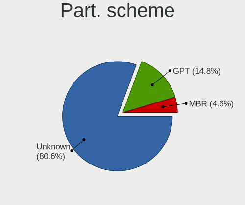
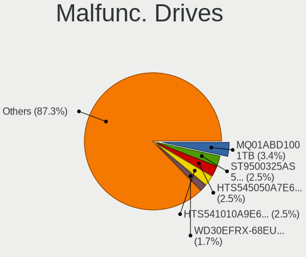
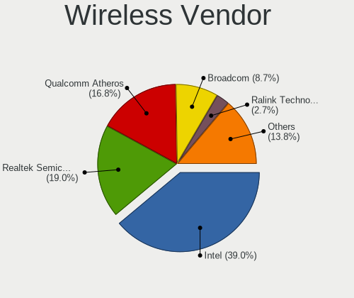

Zorin 16 - Tested Hardware & Statistics
---------------------------------------

A project to collect tested hardware configurations for Zorin 16.

Anyone can contribute to this report by the [hw-probe](https://github.com/linuxhw/hw-probe) tool:

    sudo -E hw-probe -all -upload

Please submit a probe of your configuration if it's not presented on the page or is rare.

This is a report for all computer types. See also reports for [desktops](/Dist/Zorin_16/Desktop/README.md) and [notebooks](/Dist/Zorin_16/Notebook/README.md).

Full-feature report is available here: https://linux-hardware.org/?view=trends

Contents
--------

* [ Test Cases ](#test-cases)

* [ System ](#system)
  - [ Kernel                   ](#kernel)
  - [ Kernel Family            ](#kernel-family)
  - [ Kernel Major Ver.        ](#kernel-major-ver)
  - [ Arch                     ](#arch)
  - [ DE                       ](#de)
  - [ Display Server           ](#display-server)
  - [ Display Manager          ](#display-manager)
  - [ OS Lang                  ](#os-lang)
  - [ Boot Mode                ](#boot-mode)
  - [ Filesystem               ](#filesystem)
  - [ Part. scheme             ](#part-scheme)
  - [ Dual Boot with Linux/BSD ](#dual-boot-with-linuxbsd)
  - [ Dual Boot (Win)          ](#dual-boot-win)

* [ Board ](#board)
  - [ Vendor                   ](#vendor)
  - [ Model                    ](#model)
  - [ Model Family             ](#model-family)
  - [ MFG Year                 ](#mfg-year)
  - [ Form Factor              ](#form-factor)
  - [ Secure Boot              ](#secure-boot)
  - [ Coreboot                 ](#coreboot)
  - [ RAM Size                 ](#ram-size)
  - [ RAM Used                 ](#ram-used)
  - [ Total Drives             ](#total-drives)
  - [ Has CD-ROM               ](#has-cd-rom)
  - [ Has Ethernet             ](#has-ethernet)
  - [ Has WiFi                 ](#has-wifi)
  - [ Has Bluetooth            ](#has-bluetooth)

* [ Location ](#location)
  - [ Country                  ](#country)
  - [ City                     ](#city)

* [ Drives ](#drives)
  - [ Drive Vendor             ](#drive-vendor)
  - [ Drive Model              ](#drive-model)
  - [ HDD Vendor               ](#hdd-vendor)
  - [ SSD Vendor               ](#ssd-vendor)
  - [ Drive Kind               ](#drive-kind)
  - [ Drive Connector          ](#drive-connector)
  - [ Drive Size               ](#drive-size)
  - [ Space Total              ](#space-total)
  - [ Space Used               ](#space-used)
  - [ Malfunc. Drives          ](#malfunc-drives)
  - [ Malfunc. Drive Vendor    ](#malfunc-drive-vendor)
  - [ Malfunc. HDD Vendor      ](#malfunc-hdd-vendor)
  - [ Malfunc. Drive Kind      ](#malfunc-drive-kind)
  - [ Failed Drives            ](#failed-drives)
  - [ Failed Drive Vendor      ](#failed-drive-vendor)
  - [ Drive Status             ](#drive-status)

* [ Storage controller ](#storage-controller)
  - [ Storage Vendor           ](#storage-vendor)
  - [ Storage Model            ](#storage-model)
  - [ Storage Kind             ](#storage-kind)

* [ Processor ](#processor)
  - [ CPU Vendor               ](#cpu-vendor)
  - [ CPU Model                ](#cpu-model)
  - [ CPU Model Family         ](#cpu-model-family)
  - [ CPU Cores                ](#cpu-cores)
  - [ CPU Sockets              ](#cpu-sockets)
  - [ CPU Threads              ](#cpu-threads)
  - [ CPU Op-Modes             ](#cpu-op-modes)
  - [ CPU Microcode            ](#cpu-microcode)
  - [ CPU Microarch            ](#cpu-microarch)

* [ Graphics ](#graphics)
  - [ GPU Vendor               ](#gpu-vendor)
  - [ GPU Model                ](#gpu-model)
  - [ GPU Combo                ](#gpu-combo)
  - [ GPU Driver               ](#gpu-driver)
  - [ GPU Memory               ](#gpu-memory)

* [ Monitor ](#monitor)
  - [ Monitor Vendor           ](#monitor-vendor)
  - [ Monitor Model            ](#monitor-model)
  - [ Monitor Resolution       ](#monitor-resolution)
  - [ Monitor Diagonal         ](#monitor-diagonal)
  - [ Monitor Width            ](#monitor-width)
  - [ Aspect Ratio             ](#aspect-ratio)
  - [ Monitor Area             ](#monitor-area)
  - [ Pixel Density            ](#pixel-density)
  - [ Multiple Monitors        ](#multiple-monitors)

* [ Network ](#network)
  - [ Net Controller Vendor    ](#net-controller-vendor)
  - [ Net Controller Model     ](#net-controller-model)
  - [ Wireless Vendor          ](#wireless-vendor)
  - [ Wireless Model           ](#wireless-model)
  - [ Ethernet Vendor          ](#ethernet-vendor)
  - [ Ethernet Model           ](#ethernet-model)
  - [ Net Controller Kind      ](#net-controller-kind)
  - [ Used Controller          ](#used-controller)
  - [ NICs                     ](#nics)
  - [ IPv6                     ](#ipv6)

* [ Bluetooth ](#bluetooth)
  - [ Bluetooth Vendor         ](#bluetooth-vendor)
  - [ Bluetooth Model          ](#bluetooth-model)

* [ Sound ](#sound)
  - [ Sound Vendor             ](#sound-vendor)
  - [ Sound Model              ](#sound-model)

* [ Memory ](#memory)
  - [ Memory Vendor            ](#memory-vendor)
  - [ Memory Model             ](#memory-model)
  - [ Memory Kind              ](#memory-kind)
  - [ Memory Form Factor       ](#memory-form-factor)
  - [ Memory Size              ](#memory-size)
  - [ Memory Speed             ](#memory-speed)

* [ Printers & scanners ](#printers--scanners)
  - [ Printer Vendor           ](#printer-vendor)
  - [ Printer Model            ](#printer-model)
  - [ Scanner Vendor           ](#scanner-vendor)
  - [ Scanner Model            ](#scanner-model)

* [ Camera ](#camera)
  - [ Camera Vendor            ](#camera-vendor)
  - [ Camera Model             ](#camera-model)

* [ Security ](#security)
  - [ Fingerprint Vendor       ](#fingerprint-vendor)
  - [ Fingerprint Model        ](#fingerprint-model)
  - [ Chipcard Vendor          ](#chipcard-vendor)
  - [ Chipcard Model           ](#chipcard-model)

* [ Unsupported ](#unsupported)
  - [ Unsupported Devices      ](#unsupported-devices)
  - [ Unsupported Device Types ](#unsupported-device-types)

Test Cases
----------

| Vendor        | Model                       | Form-Factor | Probe                                                      | Date         |
|---------------|-----------------------------|-------------|------------------------------------------------------------|--------------|
| Acer          | Aspire A315-58G             | Notebook    | [48e3c0e6c7](https://linux-hardware.org/?probe=48e3c0e6c7) | Dec 03, 2021 |
| HP            | OMEN Notebook               | Notebook    | [5b8b235c98](https://linux-hardware.org/?probe=5b8b235c98) | Dec 03, 2021 |
| Samsung       | 700T                        | Notebook    | [efe2d4bd92](https://linux-hardware.org/?probe=efe2d4bd92) | Dec 03, 2021 |
| Dell          | Latitude E6530              | Notebook    | [fe6dbdef48](https://linux-hardware.org/?probe=fe6dbdef48) | Dec 03, 2021 |
| Lenovo        | SHARKBAY SDK0E50510 PRO ... | Desktop     | [e39465a63b](https://linux-hardware.org/?probe=e39465a63b) | Dec 03, 2021 |
| ASUSTek       | ROG STRIX Z390-E GAMING     | Desktop     | [ad90caf60d](https://linux-hardware.org/?probe=ad90caf60d) | Dec 03, 2021 |
| Pegatron      | JESSE                       | Desktop     | [9091bacc33](https://linux-hardware.org/?probe=9091bacc33) | Dec 03, 2021 |
| Lenovo        | IdeaPad S145-15API 81V7     | Notebook    | [29ff3edb05](https://linux-hardware.org/?probe=29ff3edb05) | Dec 03, 2021 |
| Toshiba       | Satellite L655              | Notebook    | [0e3a82aad6](https://linux-hardware.org/?probe=0e3a82aad6) | Dec 03, 2021 |
| HUAWEI        | KLVL-WXX9                   | Notebook    | [c806323840](https://linux-hardware.org/?probe=c806323840) | Dec 03, 2021 |
| ASUSTek       | LEONITE                     | Desktop     | [704345be69](https://linux-hardware.org/?probe=704345be69) | Dec 03, 2021 |
| Dell          | Latitude 7280               | Notebook    | [8baf21a38d](https://linux-hardware.org/?probe=8baf21a38d) | Dec 02, 2021 |
| Biostar       | A780L3C                     | Desktop     | [a50e3d0532](https://linux-hardware.org/?probe=a50e3d0532) | Dec 02, 2021 |
| HP            | ENVY x360 Convertible 13... | Convertible | [25a3151fc1](https://linux-hardware.org/?probe=25a3151fc1) | Dec 02, 2021 |
| Foxconn       | 2A8C                        | Desktop     | [8d24862bd6](https://linux-hardware.org/?probe=8d24862bd6) | Dec 02, 2021 |
| Apple         | Mac-942B5BF58194151B        | All in one  | [9ae517f952](https://linux-hardware.org/?probe=9ae517f952) | Dec 02, 2021 |
| HUAWEI        | KLVL-WXX9                   | Notebook    | [57b4dae376](https://linux-hardware.org/?probe=57b4dae376) | Dec 02, 2021 |
| Biostar       | A780L3C                     | Desktop     | [497f29a343](https://linux-hardware.org/?probe=497f29a343) | Dec 02, 2021 |
| Apple         | Mac-942B5BF58194151B        | All in one  | [a6f2461500](https://linux-hardware.org/?probe=a6f2461500) | Dec 02, 2021 |
| HP            | 15                          | Notebook    | [8d1ef12e0e](https://linux-hardware.org/?probe=8d1ef12e0e) | Dec 02, 2021 |
| HP            | ProBook 450 G3              | Notebook    | [ca49dc0eee](https://linux-hardware.org/?probe=ca49dc0eee) | Dec 02, 2021 |
| HP            | 15                          | Notebook    | [b374916ca6](https://linux-hardware.org/?probe=b374916ca6) | Dec 02, 2021 |
| Dell          | Inspiron 7791 2n1           | Convertible | [9d726bf2b9](https://linux-hardware.org/?probe=9d726bf2b9) | Dec 02, 2021 |
| Toshiba       | Satellite L55-B             | Notebook    | [0bc52401f0](https://linux-hardware.org/?probe=0bc52401f0) | Dec 02, 2021 |
| mPTech        | ARC 11.6 128GB HD           | Notebook    | [cb2302b704](https://linux-hardware.org/?probe=cb2302b704) | Dec 02, 2021 |
| mPTech        | ARC 11.6 128GB HD           | Notebook    | [f580be444b](https://linux-hardware.org/?probe=f580be444b) | Dec 02, 2021 |
| mPTech        | ARC 11.6 128GB HD           | Notebook    | [e2fbd06e2a](https://linux-hardware.org/?probe=e2fbd06e2a) | Dec 02, 2021 |
| TUXEDO        | Pulse 14 Gen1               | Notebook    | [c7eeb775f9](https://linux-hardware.org/?probe=c7eeb775f9) | Dec 02, 2021 |
| HP            | 15                          | Notebook    | [cb278b1a6b](https://linux-hardware.org/?probe=cb278b1a6b) | Dec 02, 2021 |
| Dell          | Latitude E5570              | Notebook    | [d7beab52f4](https://linux-hardware.org/?probe=d7beab52f4) | Dec 02, 2021 |
| Avell High... | B.ON                        | Notebook    | [a7513f22ee](https://linux-hardware.org/?probe=a7513f22ee) | Dec 02, 2021 |
| Primux        | 15R5A                       | Notebook    | [3aef7d25e8](https://linux-hardware.org/?probe=3aef7d25e8) | Dec 01, 2021 |
| Dell          | 0WR7PY A02                  | Desktop     | [1255f30eea](https://linux-hardware.org/?probe=1255f30eea) | Dec 01, 2021 |
| Gigabyte      | GA-MA74GM-S2H               | Desktop     | [bd33efb6f7](https://linux-hardware.org/?probe=bd33efb6f7) | Dec 01, 2021 |
| HP            | 339A                        | Desktop     | [4a377796cf](https://linux-hardware.org/?probe=4a377796cf) | Dec 01, 2021 |
| Dell          | 0PU052                      | Desktop     | [a943d9f217](https://linux-hardware.org/?probe=a943d9f217) | Dec 01, 2021 |
| Dell          | 0WR7PY A02                  | Desktop     | [d51c794107](https://linux-hardware.org/?probe=d51c794107) | Nov 30, 2021 |
| ASUSTek       | X751LAB                     | Notebook    | [4383b601f4](https://linux-hardware.org/?probe=4383b601f4) | Nov 30, 2021 |
| Dell          | 0WMJ54 A01                  | Desktop     | [5fa96d5863](https://linux-hardware.org/?probe=5fa96d5863) | Nov 30, 2021 |
| HP            | 8299                        | Desktop     | [6eb5c6d54a](https://linux-hardware.org/?probe=6eb5c6d54a) | Nov 30, 2021 |
| Medion        | MS-7707                     | Desktop     | [3d0a46f2ef](https://linux-hardware.org/?probe=3d0a46f2ef) | Nov 30, 2021 |
| MSI           | GF63 Thin 10SC              | Notebook    | [5f908f227a](https://linux-hardware.org/?probe=5f908f227a) | Nov 30, 2021 |
| HP            | EliteBook 8440p             | Notebook    | [cecc697189](https://linux-hardware.org/?probe=cecc697189) | Nov 30, 2021 |
| ASRock        | H67DE3                      | Desktop     | [d710784470](https://linux-hardware.org/?probe=d710784470) | Nov 30, 2021 |
| HP            | 8299                        | Desktop     | [7bd1df0e4d](https://linux-hardware.org/?probe=7bd1df0e4d) | Nov 29, 2021 |
| Gigabyte      | B450 AORUS PRO-CF           | Desktop     | [24b15affa6](https://linux-hardware.org/?probe=24b15affa6) | Nov 29, 2021 |
| Lenovo        | Yoga 530-14ARR 81H9         | Convertible | [0574fefb71](https://linux-hardware.org/?probe=0574fefb71) | Nov 29, 2021 |
| Dell          | Inspiron 15-3567            | Notebook    | [3a2bf12582](https://linux-hardware.org/?probe=3a2bf12582) | Nov 29, 2021 |
| ASUSTek       | TUF Gaming FX705GM_FX705... | Notebook    | [7184635417](https://linux-hardware.org/?probe=7184635417) | Nov 29, 2021 |
| Dell          | Latitude 7275               | Notebook    | [bf808d506c](https://linux-hardware.org/?probe=bf808d506c) | Nov 29, 2021 |
| ASUSTek       | P8Z77-V LX                  | Desktop     | [b153db375f](https://linux-hardware.org/?probe=b153db375f) | Nov 29, 2021 |
| Chuwi         | GemiBook                    | Notebook    | [911b855817](https://linux-hardware.org/?probe=911b855817) | Nov 28, 2021 |
| Chuwi         | GemiBook                    | Notebook    | [b8f87029fa](https://linux-hardware.org/?probe=b8f87029fa) | Nov 28, 2021 |
| ECS           | GeForce6100PM-M2            | Desktop     | [032a2baaca](https://linux-hardware.org/?probe=032a2baaca) | Nov 28, 2021 |
| Dell          | Latitude E5420              | Notebook    | [9f504b4e6b](https://linux-hardware.org/?probe=9f504b4e6b) | Nov 28, 2021 |
| ASUSTek       | P453UJ                      | Notebook    | [056cba6efd](https://linux-hardware.org/?probe=056cba6efd) | Nov 28, 2021 |
| Lenovo        | 36E7 SDK0J40700 WIN 3258... | Desktop     | [382bfc4a86](https://linux-hardware.org/?probe=382bfc4a86) | Nov 28, 2021 |
| Gigabyte      | G31M-ES2L                   | Desktop     | [cd296f933b](https://linux-hardware.org/?probe=cd296f933b) | Nov 28, 2021 |
| Gigabyte      | G31M-ES2L                   | Desktop     | [44c0cf428f](https://linux-hardware.org/?probe=44c0cf428f) | Nov 28, 2021 |
| MSI           | X370 GAMING PLUS            | Desktop     | [0b71d2652d](https://linux-hardware.org/?probe=0b71d2652d) | Nov 27, 2021 |
| Dell          | 0VNP2H A00                  | Desktop     | [803e55fd86](https://linux-hardware.org/?probe=803e55fd86) | Nov 27, 2021 |
| ASUSTek       | M4A78T-E                    | Desktop     | [df3010e1b8](https://linux-hardware.org/?probe=df3010e1b8) | Nov 27, 2021 |
| ASUSTek       | M5A78L-M/USB3               | Desktop     | [ae57475767](https://linux-hardware.org/?probe=ae57475767) | Nov 27, 2021 |
| ASUSTek       | M5A78L-M/USB3               | Desktop     | [3925ce16ae](https://linux-hardware.org/?probe=3925ce16ae) | Nov 27, 2021 |
| ASUSTek       | X455LJ                      | Notebook    | [018d5bcbac](https://linux-hardware.org/?probe=018d5bcbac) | Nov 27, 2021 |
| Lenovo        | 36E7 SDK0J40700 WIN 3258... | Desktop     | [cd58d98b6a](https://linux-hardware.org/?probe=cd58d98b6a) | Nov 27, 2021 |
| Acer          | Aspire 4830T                | Notebook    | [205025f3c7](https://linux-hardware.org/?probe=205025f3c7) | Nov 27, 2021 |
| ASRock        | B450M Pro4                  | Desktop     | [bb642022a6](https://linux-hardware.org/?probe=bb642022a6) | Nov 27, 2021 |
| Acer          | Aspire A315-42              | Notebook    | [a0483c5539](https://linux-hardware.org/?probe=a0483c5539) | Nov 27, 2021 |
| ASRock        | ALiveNF6G-DVI               | Desktop     | [2761f434e8](https://linux-hardware.org/?probe=2761f434e8) | Nov 26, 2021 |
| Microsoft     | Surface Laptop 4            | Tablet      | [51711f9018](https://linux-hardware.org/?probe=51711f9018) | Nov 26, 2021 |
| Toshiba       | Satellite L500              | Notebook    | [24645f6ab5](https://linux-hardware.org/?probe=24645f6ab5) | Nov 26, 2021 |
| Microsoft     | Surface Laptop 4            | Tablet      | [92fdb2f531](https://linux-hardware.org/?probe=92fdb2f531) | Nov 25, 2021 |
| HP            | 2179                        | All in one  | [121210497a](https://linux-hardware.org/?probe=121210497a) | Nov 25, 2021 |
| Dell          | 0VNP2H A00                  | Desktop     | [fe9de9a896](https://linux-hardware.org/?probe=fe9de9a896) | Nov 25, 2021 |
| ASUSTek       | Zephyrus M GU502GW_GU502... | Notebook    | [25e2834604](https://linux-hardware.org/?probe=25e2834604) | Nov 25, 2021 |
| Acer          | Aspire 4830T                | Notebook    | [757863f7de](https://linux-hardware.org/?probe=757863f7de) | Nov 25, 2021 |
| HP            | ENVY x360 Convertible 13... | Convertible | [1462cc237c](https://linux-hardware.org/?probe=1462cc237c) | Nov 25, 2021 |
| Notebook      | NH50_70RA                   | Notebook    | [baa1c5d2ca](https://linux-hardware.org/?probe=baa1c5d2ca) | Nov 24, 2021 |
| HP            | Elite x2 1012 G1            | Notebook    | [5e2d2a574d](https://linux-hardware.org/?probe=5e2d2a574d) | Nov 24, 2021 |
| Lenovo        | Flex 2-14 20404             | Notebook    | [74894434bb](https://linux-hardware.org/?probe=74894434bb) | Nov 24, 2021 |
| ASUSTek       | GL552VW                     | Notebook    | [77929060f7](https://linux-hardware.org/?probe=77929060f7) | Nov 24, 2021 |
| Sony          | SVE1713Y1EB                 | Notebook    | [755b7b85f5](https://linux-hardware.org/?probe=755b7b85f5) | Nov 24, 2021 |
| HP            | EliteBook 8460p             | Notebook    | [ca30b13118](https://linux-hardware.org/?probe=ca30b13118) | Nov 24, 2021 |
| HP            | EliteBook 8570p             | Notebook    | [6c08986736](https://linux-hardware.org/?probe=6c08986736) | Nov 24, 2021 |
| Acer          | Okinawa                     | Notebook    | [2953f32ed9](https://linux-hardware.org/?probe=2953f32ed9) | Nov 23, 2021 |
| HP            | Pavilion 17                 | Notebook    | [315037ddfd](https://linux-hardware.org/?probe=315037ddfd) | Nov 23, 2021 |
| Sony          | VPCSA3N9E                   | Notebook    | [33a3597313](https://linux-hardware.org/?probe=33a3597313) | Nov 23, 2021 |
| Sony          | VPCSA3N9E                   | Notebook    | [c1bf05d67a](https://linux-hardware.org/?probe=c1bf05d67a) | Nov 23, 2021 |
| HP            | 18E7                        | Desktop     | [7385ca30d4](https://linux-hardware.org/?probe=7385ca30d4) | Nov 23, 2021 |
| Pegatron      | 2A86E01                     | Desktop     | [b57d9ec4a4](https://linux-hardware.org/?probe=b57d9ec4a4) | Nov 23, 2021 |
| ASUSTek       | GL552VW                     | Notebook    | [59670a3933](https://linux-hardware.org/?probe=59670a3933) | Nov 23, 2021 |
| Gigabyte      | H61N-USB3                   | Desktop     | [83e388363c](https://linux-hardware.org/?probe=83e388363c) | Nov 23, 2021 |
| Lenovo        | IdeaPad Yoga 13 20175       | Notebook    | [56ff76e064](https://linux-hardware.org/?probe=56ff76e064) | Nov 23, 2021 |
| Dell          | 0PU052                      | Desktop     | [a41541bab5](https://linux-hardware.org/?probe=a41541bab5) | Nov 23, 2021 |
| ASUSTek       | G750JX                      | Notebook    | [f503f26e28](https://linux-hardware.org/?probe=f503f26e28) | Nov 23, 2021 |
| Gigabyte      | G41MT-S2                    | Desktop     | [8031417427](https://linux-hardware.org/?probe=8031417427) | Nov 23, 2021 |
| HP            | Pavilion dv7                | Notebook    | [fa2ac7c179](https://linux-hardware.org/?probe=fa2ac7c179) | Nov 23, 2021 |
| Intel         | DB65AL AAG12530-309         | Desktop     | [44c8025eee](https://linux-hardware.org/?probe=44c8025eee) | Nov 23, 2021 |
| MSI           | B360M PRO-VD                | Desktop     | [e1f68c6698](https://linux-hardware.org/?probe=e1f68c6698) | Nov 22, 2021 |
| Lenovo        | G580 20150                  | Notebook    | [baade6ba54](https://linux-hardware.org/?probe=baade6ba54) | Nov 22, 2021 |
| Gigabyte      | H77M-D3H                    | Desktop     | [2819a870a8](https://linux-hardware.org/?probe=2819a870a8) | Nov 22, 2021 |
| Lenovo        | G580 20150                  | Notebook    | [b7718027af](https://linux-hardware.org/?probe=b7718027af) | Nov 22, 2021 |
| HP            | 15                          | Notebook    | [1753404669](https://linux-hardware.org/?probe=1753404669) | Nov 22, 2021 |
| HP            | Notebook                    | Notebook    | [9e9ce14e95](https://linux-hardware.org/?probe=9e9ce14e95) | Nov 22, 2021 |
| ASUSTek       | X751SA                      | Notebook    | [d19fd8c59f](https://linux-hardware.org/?probe=d19fd8c59f) | Nov 22, 2021 |
| Toshiba       | Satellite L500              | Notebook    | [30bfdcb5ff](https://linux-hardware.org/?probe=30bfdcb5ff) | Nov 22, 2021 |
| HP            | ENVY TS 15                  | Notebook    | [ca6e82745c](https://linux-hardware.org/?probe=ca6e82745c) | Nov 22, 2021 |
| HP            | 0AA4h                       | Desktop     | [22c6e4fffd](https://linux-hardware.org/?probe=22c6e4fffd) | Nov 22, 2021 |
| ASRock        | P67 Extreme6                | Desktop     | [54cd91039c](https://linux-hardware.org/?probe=54cd91039c) | Nov 22, 2021 |
| Fujitsu Si... | AMILO Pa 1510               | Notebook    | [9f731acb7e](https://linux-hardware.org/?probe=9f731acb7e) | Nov 22, 2021 |
| HP            | 15                          | Notebook    | [bca58eb5e0](https://linux-hardware.org/?probe=bca58eb5e0) | Nov 22, 2021 |
| Apple         | Mac-F2268CC8                | All in one  | [c796aedb22](https://linux-hardware.org/?probe=c796aedb22) | Nov 22, 2021 |
| Apple         | MacBookPro5,3               | Notebook    | [5a4e91eace](https://linux-hardware.org/?probe=5a4e91eace) | Nov 22, 2021 |
| ASUSTek       | U56E                        | Notebook    | [2b347f1923](https://linux-hardware.org/?probe=2b347f1923) | Nov 22, 2021 |
| Lenovo        | G560 0679                   | Notebook    | [15348ebbf9](https://linux-hardware.org/?probe=15348ebbf9) | Nov 22, 2021 |
| HP            | Pavilion 15                 | Notebook    | [0f1442bb2c](https://linux-hardware.org/?probe=0f1442bb2c) | Nov 22, 2021 |
| ASUSTek       | PRIME Z590M-PLUS            | Desktop     | [fa922e6e20](https://linux-hardware.org/?probe=fa922e6e20) | Nov 22, 2021 |
| ASRock        | 775i945GZ                   | Desktop     | [8d3cfee95d](https://linux-hardware.org/?probe=8d3cfee95d) | Nov 22, 2021 |
| ASRock        | ALiveNF6G-DVI               | Desktop     | [23a839f917](https://linux-hardware.org/?probe=23a839f917) | Nov 21, 2021 |
| ASUSTek       | PRIME Z590M-PLUS            | Desktop     | [ae91e01910](https://linux-hardware.org/?probe=ae91e01910) | Nov 21, 2021 |
| Toshiba       | PORTEGE R705                | Notebook    | [47688cd36a](https://linux-hardware.org/?probe=47688cd36a) | Nov 21, 2021 |
| Toshiba       | Satellite U300              | Notebook    | [827ec6ed62](https://linux-hardware.org/?probe=827ec6ed62) | Nov 21, 2021 |
| HP            | Pavilion dv7                | Notebook    | [7c745f9e5a](https://linux-hardware.org/?probe=7c745f9e5a) | Nov 21, 2021 |
| HP            | ENVY Notebook               | Notebook    | [09767edae3](https://linux-hardware.org/?probe=09767edae3) | Nov 21, 2021 |
| Dell          | 03NVJ6 A02                  | Desktop     | [00a8a0ab87](https://linux-hardware.org/?probe=00a8a0ab87) | Nov 21, 2021 |
| Dell          | Latitude E6440              | Notebook    | [babff23db6](https://linux-hardware.org/?probe=babff23db6) | Nov 21, 2021 |
| Dell          | G7 7700                     | Notebook    | [730daa1080](https://linux-hardware.org/?probe=730daa1080) | Nov 21, 2021 |
| Gigabyte      | B450M GAMING                | Desktop     | [2355c29da1](https://linux-hardware.org/?probe=2355c29da1) | Nov 21, 2021 |
| Gigabyte      | H55M-UD2H                   | Desktop     | [16e0d2d71a](https://linux-hardware.org/?probe=16e0d2d71a) | Nov 21, 2021 |
| Fujitsu Si... | ESPRIMO Mobile V6505        | Notebook    | [c99c5700f6](https://linux-hardware.org/?probe=c99c5700f6) | Nov 20, 2021 |
| HP            | Pavilion Notebook           | Notebook    | [ca1ccc6e65](https://linux-hardware.org/?probe=ca1ccc6e65) | Nov 20, 2021 |
| ASUSTek       | K53U                        | Notebook    | [12136b1cbd](https://linux-hardware.org/?probe=12136b1cbd) | Nov 20, 2021 |
| Dell          | 0KWVT8 A00                  | Desktop     | [a6f003d198](https://linux-hardware.org/?probe=a6f003d198) | Nov 20, 2021 |
| HP            | Pavilion 15                 | Notebook    | [687ecf1c58](https://linux-hardware.org/?probe=687ecf1c58) | Nov 20, 2021 |
| Sony          | SVE1713D1EW                 | Notebook    | [20d3ee7401](https://linux-hardware.org/?probe=20d3ee7401) | Nov 20, 2021 |
| ASUSTek       | K53U                        | Notebook    | [5a5b8c420f](https://linux-hardware.org/?probe=5a5b8c420f) | Nov 20, 2021 |
| Dell          | Latitude E7440              | Notebook    | [89fdff42c1](https://linux-hardware.org/?probe=89fdff42c1) | Nov 20, 2021 |
| Intel         | S5520HC E26045-457          | Server      | [a30dcb5033](https://linux-hardware.org/?probe=a30dcb5033) | Nov 20, 2021 |
| LattePanda    | Alpha                       | Desktop     | [24c2fc6f7b](https://linux-hardware.org/?probe=24c2fc6f7b) | Nov 20, 2021 |
| Dell          | Precision M6700             | Notebook    | [a8bf3915fb](https://linux-hardware.org/?probe=a8bf3915fb) | Nov 20, 2021 |
| LattePanda    | Alpha                       | Desktop     | [4aa879f7ac](https://linux-hardware.org/?probe=4aa879f7ac) | Nov 20, 2021 |
| HP            | OMEN by Laptop 15-dc1xxx    | Notebook    | [7ddd35d3e8](https://linux-hardware.org/?probe=7ddd35d3e8) | Nov 20, 2021 |
| Sony          | SVE1713Y1EB                 | Notebook    | [4a77a751d9](https://linux-hardware.org/?probe=4a77a751d9) | Nov 20, 2021 |
| Toshiba       | Satellite C50D-B            | Notebook    | [6c92d7fef6](https://linux-hardware.org/?probe=6c92d7fef6) | Nov 19, 2021 |
| ASRock        | B450M Pro4 R2.0             | Desktop     | [8a53d67102](https://linux-hardware.org/?probe=8a53d67102) | Nov 19, 2021 |
| Dell          | Latitude E5550              | Notebook    | [2f52aa274c](https://linux-hardware.org/?probe=2f52aa274c) | Nov 19, 2021 |
| MSI           | 970 GAMING                  | Desktop     | [ac8f38525e](https://linux-hardware.org/?probe=ac8f38525e) | Nov 19, 2021 |
| LG Electro... | S460-G.BG31P1               | Notebook    | [96d8266022](https://linux-hardware.org/?probe=96d8266022) | Nov 19, 2021 |
| Sony          | SVE1713D1EW                 | Notebook    | [cf21ed12bc](https://linux-hardware.org/?probe=cf21ed12bc) | Nov 18, 2021 |
| Intel         | S5520HC E26045-457          | Server      | [94107c0065](https://linux-hardware.org/?probe=94107c0065) | Nov 18, 2021 |
| ASUSTek       | P8Z77-V LX                  | Desktop     | [6807e3fa8c](https://linux-hardware.org/?probe=6807e3fa8c) | Nov 18, 2021 |
| Intel         | NUC5i7RYB H73774-102        | Mini pc     | [b69858171e](https://linux-hardware.org/?probe=b69858171e) | Nov 18, 2021 |
| Intel         | NUC5i7RYB H73774-102        | Mini pc     | [3aa16a7b49](https://linux-hardware.org/?probe=3aa16a7b49) | Nov 18, 2021 |
| Dell          | 0KWVT8 A00                  | Desktop     | [93b90c3da4](https://linux-hardware.org/?probe=93b90c3da4) | Nov 18, 2021 |
| Lenovo        | ThinkPad X260 20F5S1GW1Q    | Notebook    | [3b8a61e460](https://linux-hardware.org/?probe=3b8a61e460) | Nov 18, 2021 |
| Google        | Lars                        | Notebook    | [c346746b7e](https://linux-hardware.org/?probe=c346746b7e) | Nov 18, 2021 |
| Dell          | Latitude 5590               | Notebook    | [8bef1790bd](https://linux-hardware.org/?probe=8bef1790bd) | Nov 18, 2021 |
| Toshiba       | Satellite C870-1C2          | Notebook    | [e3e16a0c1f](https://linux-hardware.org/?probe=e3e16a0c1f) | Nov 17, 2021 |
| Acer          | TravelMate 6292             | Notebook    | [2cec3b7547](https://linux-hardware.org/?probe=2cec3b7547) | Nov 17, 2021 |
| ASRock        | G31M-VS2                    | Desktop     | [8bc6042d3f](https://linux-hardware.org/?probe=8bc6042d3f) | Nov 17, 2021 |
| Intel         | NUC5i5RYB H40999-504        | Mini pc     | [b3319a217d](https://linux-hardware.org/?probe=b3319a217d) | Nov 17, 2021 |
| HP            | ENVY m7 Notebook            | Notebook    | [4b101cc132](https://linux-hardware.org/?probe=4b101cc132) | Nov 17, 2021 |
| HP            | 8446                        | All in one  | [2e8e2bd9b3](https://linux-hardware.org/?probe=2e8e2bd9b3) | Nov 17, 2021 |
| HP            | Stream Notebook PC 14       | Notebook    | [31499aa79d](https://linux-hardware.org/?probe=31499aa79d) | Nov 17, 2021 |
| ASRock        | X370M-HDV                   | Desktop     | [a991fee412](https://linux-hardware.org/?probe=a991fee412) | Nov 17, 2021 |
| HP            | Stream Notebook PC 14       | Notebook    | [8c30001e99](https://linux-hardware.org/?probe=8c30001e99) | Nov 17, 2021 |
| Dell          | Precision M6700             | Notebook    | [fb4051d1de](https://linux-hardware.org/?probe=fb4051d1de) | Nov 17, 2021 |
| Dell          | 0GXM1W A01                  | Desktop     | [7e9f638277](https://linux-hardware.org/?probe=7e9f638277) | Nov 17, 2021 |
| ASUSTek       | P5KPL-AM                    | Desktop     | [0cae2ebf49](https://linux-hardware.org/?probe=0cae2ebf49) | Nov 16, 2021 |
| Lenovo        | ThinkPad T430 23445PU       | Notebook    | [e5fe64db56](https://linux-hardware.org/?probe=e5fe64db56) | Nov 16, 2021 |
| Lenovo        | 364F SDK0J40700 WIN 3258... | Desktop     | [bb50b7d97c](https://linux-hardware.org/?probe=bb50b7d97c) | Nov 16, 2021 |
| Toshiba       | Satellite C655D             | Notebook    | [cd8abc5170](https://linux-hardware.org/?probe=cd8abc5170) | Nov 16, 2021 |
| HP            | Compaq 8710p (GC102EA#AB... | Notebook    | [bfef77542f](https://linux-hardware.org/?probe=bfef77542f) | Nov 15, 2021 |
| MSI           | 2A9C                        | Desktop     | [80ef0caf18](https://linux-hardware.org/?probe=80ef0caf18) | Nov 15, 2021 |
| MSI           | 2A9C                        | Desktop     | [44e1dcea05](https://linux-hardware.org/?probe=44e1dcea05) | Nov 15, 2021 |
| HP            | ENVY x360 Convertible 13... | Convertible | [469541e3f1](https://linux-hardware.org/?probe=469541e3f1) | Nov 14, 2021 |
| Gigabyte      | H170-D3HP-CF                | Desktop     | [e90a1881c7](https://linux-hardware.org/?probe=e90a1881c7) | Nov 14, 2021 |
| Fujitsu       | D2950-A1 S26361-D2950-A1    | Desktop     | [a92c32b60a](https://linux-hardware.org/?probe=a92c32b60a) | Nov 14, 2021 |
| MSI           | B450 TOMAHAWK MAX           | Desktop     | [542b1538bf](https://linux-hardware.org/?probe=542b1538bf) | Nov 14, 2021 |
| Samsung       | 900X3C/900X3D/900X4C/900... | Notebook    | [76b69deb69](https://linux-hardware.org/?probe=76b69deb69) | Nov 14, 2021 |
| ASUSTek       | Vivobook_ASUSLaptop M350... | Notebook    | [3a3f503917](https://linux-hardware.org/?probe=3a3f503917) | Nov 14, 2021 |
| HP            | 8653 A                      | Desktop     | [88b53507c9](https://linux-hardware.org/?probe=88b53507c9) | Nov 13, 2021 |
| HP            | 3048h                       | Desktop     | [200317605d](https://linux-hardware.org/?probe=200317605d) | Nov 13, 2021 |
| Dell          | 0GXM1W A02                  | Desktop     | [d446993ec9](https://linux-hardware.org/?probe=d446993ec9) | Nov 13, 2021 |
| HP            | ENVY x360 Convertible 13... | Convertible | [2070d323c9](https://linux-hardware.org/?probe=2070d323c9) | Nov 13, 2021 |
| ASUSTek       | P5G41T-M LX3                | Desktop     | [8977322809](https://linux-hardware.org/?probe=8977322809) | Nov 13, 2021 |
| ASUSTek       | VivoBook Flip 14_ASUS Fl... | Convertible | [0c64127bf0](https://linux-hardware.org/?probe=0c64127bf0) | Nov 13, 2021 |
| HP            | Notebook                    | Notebook    | [226dc7dc39](https://linux-hardware.org/?probe=226dc7dc39) | Nov 12, 2021 |
| HP            | Notebook                    | Notebook    | [c03f407f50](https://linux-hardware.org/?probe=c03f407f50) | Nov 12, 2021 |
| HP            | Notebook                    | Notebook    | [a2bae8d4b8](https://linux-hardware.org/?probe=a2bae8d4b8) | Nov 12, 2021 |
| HP            | Notebook                    | Notebook    | [87dec3cf7c](https://linux-hardware.org/?probe=87dec3cf7c) | Nov 12, 2021 |
| HP            | EliteBook 2560p             | Notebook    | [e3997c3bcb](https://linux-hardware.org/?probe=e3997c3bcb) | Nov 12, 2021 |
| Dell          | Inspiron 15-3567            | Notebook    | [e8879e98df](https://linux-hardware.org/?probe=e8879e98df) | Nov 12, 2021 |
| Google        | Kindred                     | Notebook    | [0046ef8942](https://linux-hardware.org/?probe=0046ef8942) | Nov 12, 2021 |
| Google        | Kindred                     | Notebook    | [9d72c8972c](https://linux-hardware.org/?probe=9d72c8972c) | Nov 12, 2021 |
| Acer          | Aspire 4830T                | Notebook    | [9ae2c69b2a](https://linux-hardware.org/?probe=9ae2c69b2a) | Nov 12, 2021 |
| HP            | 1790                        | Desktop     | [e86cdf904a](https://linux-hardware.org/?probe=e86cdf904a) | Nov 12, 2021 |
| Dell          | Precision M6700             | Notebook    | [9bf18c23c6](https://linux-hardware.org/?probe=9bf18c23c6) | Nov 12, 2021 |
| ASUSTek       | M5A78L LE                   | Desktop     | [d342b54224](https://linux-hardware.org/?probe=d342b54224) | Nov 12, 2021 |
| HP            | 339A                        | Desktop     | [6dc037bf1f](https://linux-hardware.org/?probe=6dc037bf1f) | Nov 11, 2021 |
| Fujitsu       | D3221-A1 S26361-D3221-A1    | Desktop     | [d0eae9ef10](https://linux-hardware.org/?probe=d0eae9ef10) | Nov 11, 2021 |
| Gigabyte      | AB350-Gaming 3-CF           | Desktop     | [7a2464824d](https://linux-hardware.org/?probe=7a2464824d) | Nov 11, 2021 |
| Notebook      | N85_N87HCHNHZ               | Notebook    | [32988fae95](https://linux-hardware.org/?probe=32988fae95) | Nov 11, 2021 |
| MSI           | B450 GAMING PRO CARBON A... | Desktop     | [c8e4265515](https://linux-hardware.org/?probe=c8e4265515) | Nov 11, 2021 |
| ASUSTek       | ROG STRIX B450-F GAMING ... | Desktop     | [eece1d5528](https://linux-hardware.org/?probe=eece1d5528) | Nov 11, 2021 |
| Lenovo        | IdeaPad 300-17ISK 80QH      | Notebook    | [c948868090](https://linux-hardware.org/?probe=c948868090) | Nov 11, 2021 |
| Dell          | Inspiron 1750               | Notebook    | [6ffff20ec8](https://linux-hardware.org/?probe=6ffff20ec8) | Nov 11, 2021 |
| Sony          | SVF14211CLB                 | Notebook    | [7c0dacdd54](https://linux-hardware.org/?probe=7c0dacdd54) | Nov 10, 2021 |
| ASUSTek       | H81M-P PLUS                 | Desktop     | [1841ab2aff](https://linux-hardware.org/?probe=1841ab2aff) | Nov 10, 2021 |
| HUAWEI        | BOHB-WAX9                   | Notebook    | [3b1f90f3ab](https://linux-hardware.org/?probe=3b1f90f3ab) | Nov 10, 2021 |
| HUAWEI        | BOHB-WAX9                   | Notebook    | [3858faa240](https://linux-hardware.org/?probe=3858faa240) | Nov 10, 2021 |
| Sony          | SVF14211CLB                 | Notebook    | [fdfd650fcc](https://linux-hardware.org/?probe=fdfd650fcc) | Nov 10, 2021 |
| Lenovo        | IdeaPad Yoga 13 20175       | Notebook    | [94da614270](https://linux-hardware.org/?probe=94da614270) | Nov 10, 2021 |
| Lenovo        | ThinkPad L13 Yoga Gen 2 ... | Convertible | [4de5ef77a4](https://linux-hardware.org/?probe=4de5ef77a4) | Nov 10, 2021 |
| Fujitsu Si... | ESPRIMO Mobile V6505        | Notebook    | [72dd15e9c5](https://linux-hardware.org/?probe=72dd15e9c5) | Nov 10, 2021 |
| ASUSTek       | A68HM-PLUS                  | Desktop     | [0e688f660f](https://linux-hardware.org/?probe=0e688f660f) | Nov 10, 2021 |
| Fujitsu       | LIFEBOOK AH532              | Notebook    | [0d017f9835](https://linux-hardware.org/?probe=0d017f9835) | Nov 10, 2021 |
| Intel         | NUC5i5RYB H40999-504        | Mini pc     | [476167fea8](https://linux-hardware.org/?probe=476167fea8) | Nov 10, 2021 |
| ASUSTek       | U46E                        | Notebook    | [d52a43c7fd](https://linux-hardware.org/?probe=d52a43c7fd) | Nov 10, 2021 |
| ASUSTek       | M5A97                       | Desktop     | [20a705fd56](https://linux-hardware.org/?probe=20a705fd56) | Nov 10, 2021 |
| HP            | 8653 A                      | Desktop     | [f84c67582a](https://linux-hardware.org/?probe=f84c67582a) | Nov 09, 2021 |
| Gigabyte      | B450 AORUS PRO-CF           | Desktop     | [e7579f2fcf](https://linux-hardware.org/?probe=e7579f2fcf) | Nov 09, 2021 |
| HP            | 1790                        | Desktop     | [6030cabe49](https://linux-hardware.org/?probe=6030cabe49) | Nov 09, 2021 |
| Dell          | Latitude 3440               | Notebook    | [eb76b9d1cf](https://linux-hardware.org/?probe=eb76b9d1cf) | Nov 09, 2021 |
| HP            | 1825                        | Desktop     | [7cf6c3590a](https://linux-hardware.org/?probe=7cf6c3590a) | Nov 09, 2021 |
| Dell          | 0HD5W2 A00                  | Desktop     | [d4c15ae33a](https://linux-hardware.org/?probe=d4c15ae33a) | Nov 08, 2021 |
| HP            | Pavilion dv6                | Notebook    | [605479abf7](https://linux-hardware.org/?probe=605479abf7) | Nov 08, 2021 |
| HP            | Pavilion dv6                | Notebook    | [b7a410c2e6](https://linux-hardware.org/?probe=b7a410c2e6) | Nov 08, 2021 |
| MSI           | B450M MORTAR MAX            | Desktop     | [84c316ee57](https://linux-hardware.org/?probe=84c316ee57) | Nov 08, 2021 |
| Gigabyte      | B75M-D3H                    | Desktop     | [886c08185e](https://linux-hardware.org/?probe=886c08185e) | Nov 08, 2021 |
| Gigabyte      | B75M-D3H                    | Desktop     | [e141b2d36a](https://linux-hardware.org/?probe=e141b2d36a) | Nov 08, 2021 |
| MSI           | GF63 Thin 9SC               | Notebook    | [d85e7a0ad3](https://linux-hardware.org/?probe=d85e7a0ad3) | Nov 07, 2021 |
| Foxconn       | H61M/H61M-S                 | Desktop     | [62ae26dca0](https://linux-hardware.org/?probe=62ae26dca0) | Nov 07, 2021 |
| Dell          | Latitude E5420              | Notebook    | [b53c6bd6d2](https://linux-hardware.org/?probe=b53c6bd6d2) | Nov 07, 2021 |
| Acer          | Swift SF314-56G             | Notebook    | [bf298c7d2d](https://linux-hardware.org/?probe=bf298c7d2d) | Nov 07, 2021 |
| Lenovo        | IdeaPad 300-17ISK 80QH      | Notebook    | [520a472266](https://linux-hardware.org/?probe=520a472266) | Nov 07, 2021 |
| HP            | Compaq 8510p                | Notebook    | [ddecc261a1](https://linux-hardware.org/?probe=ddecc261a1) | Nov 07, 2021 |
| HP            | Compaq 8510p                | Notebook    | [c2434c1c08](https://linux-hardware.org/?probe=c2434c1c08) | Nov 07, 2021 |
| Dell          | 0HY9JP A00                  | Desktop     | [05c38bf92c](https://linux-hardware.org/?probe=05c38bf92c) | Nov 07, 2021 |
| TUXEDO        | InfinityBook Pro 14 Gen6    | Notebook    | [a0d13572a5](https://linux-hardware.org/?probe=a0d13572a5) | Nov 06, 2021 |
| ASUSTek       | A68HM-PLUS                  | Desktop     | [384fb31833](https://linux-hardware.org/?probe=384fb31833) | Nov 06, 2021 |
| MSI           | B450 TOMAHAWK MAX           | Desktop     | [f57575ffaf](https://linux-hardware.org/?probe=f57575ffaf) | Nov 06, 2021 |
| Dell          | 0VNP2H A02                  | Desktop     | [5402226d98](https://linux-hardware.org/?probe=5402226d98) | Nov 06, 2021 |
| HP            | Laptop 15-bw0xx             | Notebook    | [746f64d20b](https://linux-hardware.org/?probe=746f64d20b) | Nov 06, 2021 |
| Intel         | S5520HC E26045-457          | Server      | [b8feff0b22](https://linux-hardware.org/?probe=b8feff0b22) | Nov 06, 2021 |
| HP            | Laptop 15-bw0xx             | Notebook    | [245941966f](https://linux-hardware.org/?probe=245941966f) | Nov 06, 2021 |
| Sony          | SVE1713D1EW                 | Notebook    | [64fd6b328f](https://linux-hardware.org/?probe=64fd6b328f) | Nov 06, 2021 |
| Sony          | SVE1713D1EW                 | Notebook    | [45609f28be](https://linux-hardware.org/?probe=45609f28be) | Nov 06, 2021 |
| ASUSTek       | M5A78L-M LX                 | Desktop     | [e6e813115f](https://linux-hardware.org/?probe=e6e813115f) | Nov 06, 2021 |
| HP            | Compaq 6710b (KE121ET#AB... | Notebook    | [5d577f71a4](https://linux-hardware.org/?probe=5d577f71a4) | Nov 06, 2021 |
| HP            | Compaq 6710b (KE121ET#AB... | Notebook    | [c37780e9ad](https://linux-hardware.org/?probe=c37780e9ad) | Nov 06, 2021 |
| HP            | 0A98h                       | Desktop     | [110c37e799](https://linux-hardware.org/?probe=110c37e799) | Nov 06, 2021 |
| ASUSTek       | K53TA                       | Notebook    | [e924b214bc](https://linux-hardware.org/?probe=e924b214bc) | Nov 06, 2021 |
| ASUSTek       | A68HM-PLUS                  | Desktop     | [7b21a0bc71](https://linux-hardware.org/?probe=7b21a0bc71) | Nov 06, 2021 |
| Acer          | Aspire ES1-521              | Notebook    | [5ef4af5924](https://linux-hardware.org/?probe=5ef4af5924) | Nov 06, 2021 |
| ASUSTek       | VivoBook_ASUSLaptop X421... | Notebook    | [73b5ea9e0b](https://linux-hardware.org/?probe=73b5ea9e0b) | Nov 06, 2021 |
| Dell          | 0NKW6Y A00                  | Desktop     | [82a09e132d](https://linux-hardware.org/?probe=82a09e132d) | Nov 05, 2021 |
| HP            | ProBook 450 G4              | Notebook    | [a96a96d455](https://linux-hardware.org/?probe=a96a96d455) | Nov 05, 2021 |
| ASUSTek       | PRIME H410M-A               | Desktop     | [4be9b40ea1](https://linux-hardware.org/?probe=4be9b40ea1) | Nov 05, 2021 |
| ASUSTek       | PRIME H410M-A               | Desktop     | [173116149c](https://linux-hardware.org/?probe=173116149c) | Nov 05, 2021 |
| ASUSTek       | K45A                        | Notebook    | [f9bc7efe7b](https://linux-hardware.org/?probe=f9bc7efe7b) | Nov 05, 2021 |
| ASUSTek       | K45A                        | Notebook    | [096deec12d](https://linux-hardware.org/?probe=096deec12d) | Nov 05, 2021 |
| Gigabyte      | F2A78M-D3H                  | Desktop     | [43e09b8e80](https://linux-hardware.org/?probe=43e09b8e80) | Nov 05, 2021 |
| Gigabyte      | Z97X-UD7 TH-CF              | Desktop     | [1383828428](https://linux-hardware.org/?probe=1383828428) | Nov 05, 2021 |
| Gigabyte      | Z97X-UD7 TH-CF              | Desktop     | [f5ee7a26d5](https://linux-hardware.org/?probe=f5ee7a26d5) | Nov 05, 2021 |
| MSI           | B450 TOMAHAWK MAX           | Desktop     | [3e4d5dd09d](https://linux-hardware.org/?probe=3e4d5dd09d) | Nov 05, 2021 |
| Sony          | VPCEG23EL                   | Notebook    | [cc967c03fb](https://linux-hardware.org/?probe=cc967c03fb) | Nov 05, 2021 |
| Acer          | Swift SF314-54              | Notebook    | [b506625dc2](https://linux-hardware.org/?probe=b506625dc2) | Nov 05, 2021 |
| Foxconn       | H61M/H61M-S                 | Desktop     | [7f3894059d](https://linux-hardware.org/?probe=7f3894059d) | Nov 04, 2021 |
| HP            | 18E4                        | Desktop     | [3069846b25](https://linux-hardware.org/?probe=3069846b25) | Nov 04, 2021 |
| MSI           | G41M-P23                    | Desktop     | [82e51e3f78](https://linux-hardware.org/?probe=82e51e3f78) | Nov 04, 2021 |
| Lenovo        | IdeaPad 2in1 14 81CW        | Convertible | [00fe882e5d](https://linux-hardware.org/?probe=00fe882e5d) | Nov 04, 2021 |
| Intel         | NUC7i5BNB J31144-304        | Mini pc     | [4bbc26f44b](https://linux-hardware.org/?probe=4bbc26f44b) | Nov 04, 2021 |
| ASUSTek       | M5A78L-M LX/BR              | Desktop     | [d7a405763d](https://linux-hardware.org/?probe=d7a405763d) | Nov 04, 2021 |
| ASUSTek       | P8Z77-V LX                  | Desktop     | [d59cc9fead](https://linux-hardware.org/?probe=d59cc9fead) | Nov 04, 2021 |
| ASUSTek       | X751NV                      | Notebook    | [ecf08805fe](https://linux-hardware.org/?probe=ecf08805fe) | Nov 03, 2021 |
| Dell          | Precision M6700             | Notebook    | [1865ed7cca](https://linux-hardware.org/?probe=1865ed7cca) | Nov 03, 2021 |
| Dell          | Latitude 5490               | Notebook    | [c5c1f555f1](https://linux-hardware.org/?probe=c5c1f555f1) | Nov 03, 2021 |
| HP            | Compaq 8710p (GC102EA#AB... | Notebook    | [9e7a883a59](https://linux-hardware.org/?probe=9e7a883a59) | Nov 03, 2021 |
| ASUSTek       | M5A78L-M/USB3               | Desktop     | [2d26d5b578](https://linux-hardware.org/?probe=2d26d5b578) | Nov 02, 2021 |
| Samsung       | 950QDB                      | Convertible | [515607bf99](https://linux-hardware.org/?probe=515607bf99) | Nov 02, 2021 |
| ASUSTek       | P8Z77-V LX                  | Desktop     | [903ec63ceb](https://linux-hardware.org/?probe=903ec63ceb) | Nov 02, 2021 |
| HP            | Notebook                    | Notebook    | [ee3bc3deef](https://linux-hardware.org/?probe=ee3bc3deef) | Nov 02, 2021 |
| Lenovo        | ThinkPad E15 Gen 3 20YG0... | Notebook    | [3acc230d6a](https://linux-hardware.org/?probe=3acc230d6a) | Nov 02, 2021 |
| Lenovo        | ThinkPad E15 Gen 3 20YG0... | Notebook    | [c88adaac6e](https://linux-hardware.org/?probe=c88adaac6e) | Nov 02, 2021 |
| ASUSTek       | M11AD                       | Desktop     | [0cb5032c53](https://linux-hardware.org/?probe=0cb5032c53) | Nov 02, 2021 |
| Lenovo        | ThinkPad T430 2349ED5       | Notebook    | [0697993e7c](https://linux-hardware.org/?probe=0697993e7c) | Nov 02, 2021 |
| Lenovo        | IdeaPad 2in1 14 81CW        | Convertible | [ef25dfbaa3](https://linux-hardware.org/?probe=ef25dfbaa3) | Nov 02, 2021 |
| Lenovo        | IdeaPad Z580                | Notebook    | [0f9c8eb860](https://linux-hardware.org/?probe=0f9c8eb860) | Nov 02, 2021 |
| Toshiba       | Satellite C870-1C2          | Notebook    | [7e5a2d91f8](https://linux-hardware.org/?probe=7e5a2d91f8) | Nov 02, 2021 |
| HP            | ProBook 440 G4              | Notebook    | [695b9a4e0c](https://linux-hardware.org/?probe=695b9a4e0c) | Nov 01, 2021 |
| HP            | ProBook 440 G4              | Notebook    | [4bba4734e8](https://linux-hardware.org/?probe=4bba4734e8) | Nov 01, 2021 |
| Dell          | XPS 15 9510                 | Notebook    | [9ad082f18e](https://linux-hardware.org/?probe=9ad082f18e) | Nov 01, 2021 |
| Gigabyte      | GA-E6010N                   | Desktop     | [3c81474040](https://linux-hardware.org/?probe=3c81474040) | Nov 01, 2021 |
| Gigabyte      | GA-E6010N                   | Desktop     | [2a2aaffd43](https://linux-hardware.org/?probe=2a2aaffd43) | Nov 01, 2021 |
| ASUSTek       | K52Jc                       | Notebook    | [dfb687f14d](https://linux-hardware.org/?probe=dfb687f14d) | Nov 01, 2021 |
| HP            | 255 G8 Notebook PC          | Notebook    | [600b7b9957](https://linux-hardware.org/?probe=600b7b9957) | Nov 01, 2021 |
| Acer          | Spin SP513-55N              | Convertible | [b9b87d1c64](https://linux-hardware.org/?probe=b9b87d1c64) | Nov 01, 2021 |
| Acer          | Aspire E1-522               | Notebook    | [56b475a93d](https://linux-hardware.org/?probe=56b475a93d) | Nov 01, 2021 |
| ASRock        | FM2A55M-HD+                 | Desktop     | [42cd4d28bd](https://linux-hardware.org/?probe=42cd4d28bd) | Nov 01, 2021 |
| Toshiba       | Satellite Pro T110          | Notebook    | [3ae7a19459](https://linux-hardware.org/?probe=3ae7a19459) | Oct 31, 2021 |
| ASUSTek       | N61Ja                       | Notebook    | [e3fc4e0622](https://linux-hardware.org/?probe=e3fc4e0622) | Oct 31, 2021 |
| Samsung       | 300E5EV/300E4EV/270E5EV/... | Notebook    | [83d642714b](https://linux-hardware.org/?probe=83d642714b) | Oct 31, 2021 |
| Apple         | MacBookPro11,2              | Notebook    | [eabb3946ad](https://linux-hardware.org/?probe=eabb3946ad) | Oct 31, 2021 |
| eMachines     | EL1850G                     | Desktop     | [01dbf1b5ec](https://linux-hardware.org/?probe=01dbf1b5ec) | Oct 31, 2021 |
| MSI           | P55-CD53                    | Desktop     | [860bde5935](https://linux-hardware.org/?probe=860bde5935) | Oct 31, 2021 |
| ASUSTek       | N61Ja                       | Notebook    | [3861fce83e](https://linux-hardware.org/?probe=3861fce83e) | Oct 31, 2021 |
| Unknown       | Unknown                     | Desktop     | [75cc8a67e9](https://linux-hardware.org/?probe=75cc8a67e9) | Oct 31, 2021 |
| Apple         | MacBookPro11,2              | Notebook    | [2388e68622](https://linux-hardware.org/?probe=2388e68622) | Oct 31, 2021 |
| ASRock        | B85M-HDS                    | Desktop     | [111e98ddef](https://linux-hardware.org/?probe=111e98ddef) | Oct 31, 2021 |
| ASUSTek       | P8H61-M LE/CSM R2.0         | Desktop     | [6cee757cf0](https://linux-hardware.org/?probe=6cee757cf0) | Oct 31, 2021 |
| Dell          | Inspiron 7720               | Notebook    | [9f298535a5](https://linux-hardware.org/?probe=9f298535a5) | Oct 31, 2021 |
| ASUSTek       | P8H61-M LE/CSM R2.0         | Desktop     | [96c9053284](https://linux-hardware.org/?probe=96c9053284) | Oct 31, 2021 |
| Apple         | Mac-942B59F58194171B iMa... | All in one  | [d998d59215](https://linux-hardware.org/?probe=d998d59215) | Oct 31, 2021 |
| Dell          | 06NWYK A01                  | Desktop     | [497c824fd5](https://linux-hardware.org/?probe=497c824fd5) | Oct 31, 2021 |
| ASUSTek       | SABERTOOTH Z170 MARK 1      | Desktop     | [0981774043](https://linux-hardware.org/?probe=0981774043) | Oct 30, 2021 |
| ASRock        | B85M-HDS                    | Desktop     | [69dd0cf598](https://linux-hardware.org/?probe=69dd0cf598) | Oct 30, 2021 |
| HP            | 255 G8 Notebook PC          | Notebook    | [cb9c15cf6f](https://linux-hardware.org/?probe=cb9c15cf6f) | Oct 30, 2021 |
| Dell          | Latitude E6500              | Notebook    | [e475348b1e](https://linux-hardware.org/?probe=e475348b1e) | Oct 30, 2021 |
| MECER         | Z140C+Home                  | Notebook    | [2fbf6f153b](https://linux-hardware.org/?probe=2fbf6f153b) | Oct 30, 2021 |
| HP            | Pavilion Notebook           | Notebook    | [85a55f5c3c](https://linux-hardware.org/?probe=85a55f5c3c) | Oct 30, 2021 |
| Dell          | 06NWYK A01                  | Desktop     | [1d0625eb89](https://linux-hardware.org/?probe=1d0625eb89) | Oct 30, 2021 |
| Lenovo        | IdeaPad Z580                | Notebook    | [16ebdc4388](https://linux-hardware.org/?probe=16ebdc4388) | Oct 30, 2021 |
| Lenovo        | IdeaPad Z580                | Notebook    | [6260be6de5](https://linux-hardware.org/?probe=6260be6de5) | Oct 30, 2021 |
| ASUSTek       | ROG STRIX B450-F GAMING     | Desktop     | [867e533368](https://linux-hardware.org/?probe=867e533368) | Oct 30, 2021 |
| ASUSTek       | P5K SE/EPU                  | Desktop     | [80adff7646](https://linux-hardware.org/?probe=80adff7646) | Oct 30, 2021 |
| HP            | Pavilion Laptop 14-dv0xx... | Notebook    | [af0a995721](https://linux-hardware.org/?probe=af0a995721) | Oct 30, 2021 |
| Dell          | 0GY6Y8 A02                  | Desktop     | [1a267b14d3](https://linux-hardware.org/?probe=1a267b14d3) | Oct 29, 2021 |
| Dell          | 0GY6Y8 A02                  | Desktop     | [5b4cea000b](https://linux-hardware.org/?probe=5b4cea000b) | Oct 29, 2021 |
| Intel         | S5520HC E26045-457          | Server      | [451f363726](https://linux-hardware.org/?probe=451f363726) | Oct 29, 2021 |
| ASRock        | B450 Gaming K4              | Desktop     | [b67ec8af25](https://linux-hardware.org/?probe=b67ec8af25) | Oct 29, 2021 |
| Lenovo        | IdeaPad S145-15API 81V7     | Notebook    | [88286c36e9](https://linux-hardware.org/?probe=88286c36e9) | Oct 29, 2021 |
| Dell          | 0VNP2H A02                  | Desktop     | [4e19df8e3c](https://linux-hardware.org/?probe=4e19df8e3c) | Oct 29, 2021 |
| Acer          | Aspire A315-21              | Notebook    | [f5f4e2457b](https://linux-hardware.org/?probe=f5f4e2457b) | Oct 29, 2021 |
| Lenovo        | Yoga 530-14IKB 81EK         | Convertible | [ef7d0f49e1](https://linux-hardware.org/?probe=ef7d0f49e1) | Oct 29, 2021 |
| Dell          | 0VNP2H A02                  | Desktop     | [c220480b4c](https://linux-hardware.org/?probe=c220480b4c) | Oct 29, 2021 |
| Lenovo        | ThinkBook 15-IIL 20SM       | Notebook    | [c74557d180](https://linux-hardware.org/?probe=c74557d180) | Oct 29, 2021 |
| Acer          | Aspire A315-21              | Notebook    | [35b5fcb787](https://linux-hardware.org/?probe=35b5fcb787) | Oct 28, 2021 |
| ASUSTek       | N71Jv                       | Notebook    | [29e3747e17](https://linux-hardware.org/?probe=29e3747e17) | Oct 28, 2021 |
| Gigabyte      | X570 AORUS ELITE            | Desktop     | [a73fabcd4c](https://linux-hardware.org/?probe=a73fabcd4c) | Oct 28, 2021 |
| Gigabyte      | X570 AORUS ELITE            | Desktop     | [528cec41bc](https://linux-hardware.org/?probe=528cec41bc) | Oct 28, 2021 |
| Alienware     | 08PG26 A00                  | Desktop     | [bb2fd997ab](https://linux-hardware.org/?probe=bb2fd997ab) | Oct 28, 2021 |
| ASRock        | FM2A88X Extreme6+           | Desktop     | [b676d9030a](https://linux-hardware.org/?probe=b676d9030a) | Oct 28, 2021 |
| Acer          | Spin SP513-55N              | Convertible | [8c3b4736cd](https://linux-hardware.org/?probe=8c3b4736cd) | Oct 27, 2021 |
| ASUSTek       | X750JB                      | Notebook    | [90fd9f38fc](https://linux-hardware.org/?probe=90fd9f38fc) | Oct 27, 2021 |
| Lenovo        | G570 4334                   | Notebook    | [cc07ebf9b6](https://linux-hardware.org/?probe=cc07ebf9b6) | Oct 27, 2021 |
| HP            | EliteBook 8440p             | Notebook    | [f527983cc9](https://linux-hardware.org/?probe=f527983cc9) | Oct 27, 2021 |
| Toshiba       | PORTEGE Z20t-C              | Notebook    | [ed1722174a](https://linux-hardware.org/?probe=ed1722174a) | Oct 27, 2021 |
| MSI           | MAG B550M MORTAR            | Desktop     | [08819513f2](https://linux-hardware.org/?probe=08819513f2) | Oct 27, 2021 |
| Intel         | S5520HC E26045-457          | Server      | [f7e2ea06ad](https://linux-hardware.org/?probe=f7e2ea06ad) | Oct 27, 2021 |
| MSI           | MAG B550M MORTAR            | Desktop     | [4207c6eaac](https://linux-hardware.org/?probe=4207c6eaac) | Oct 27, 2021 |
| Lenovo        | Legion Y920-17IKB Laptop... | Notebook    | [830d4c9d9d](https://linux-hardware.org/?probe=830d4c9d9d) | Oct 26, 2021 |
| Acer          | Aspire 5737Z                | Notebook    | [9bbf3befab](https://linux-hardware.org/?probe=9bbf3befab) | Oct 26, 2021 |
| ASUSTek       | PRIME Z270-P                | Desktop     | [dfb2070b53](https://linux-hardware.org/?probe=dfb2070b53) | Oct 26, 2021 |
| Lenovo        | ThinkPad T520 4242W4F       | Notebook    | [4104e265ea](https://linux-hardware.org/?probe=4104e265ea) | Oct 26, 2021 |
| Notebook      | W94_95_97SU2,SUY,-C,-T      | Notebook    | [3da20846f5](https://linux-hardware.org/?probe=3da20846f5) | Oct 26, 2021 |
| Notebook      | W94_95_97SU2,SUY,-C,-T      | Notebook    | [2d19155e7f](https://linux-hardware.org/?probe=2d19155e7f) | Oct 26, 2021 |
| Fujitsu       | LIFEBOOK AH530              | Notebook    | [ed4e9d1a03](https://linux-hardware.org/?probe=ed4e9d1a03) | Oct 26, 2021 |
| Fujitsu       | LIFEBOOK AH530              | Notebook    | [f5b1e904b7](https://linux-hardware.org/?probe=f5b1e904b7) | Oct 26, 2021 |
| HP            | ProBook 445 G7              | Notebook    | [87b3274937](https://linux-hardware.org/?probe=87b3274937) | Oct 26, 2021 |
| HP            | Stream Notebook PC 11       | Notebook    | [c240a088a9](https://linux-hardware.org/?probe=c240a088a9) | Oct 26, 2021 |
| Apple         | Mac-F226BEC8 PVT            | All in one  | [23d7c3ed4a](https://linux-hardware.org/?probe=23d7c3ed4a) | Oct 26, 2021 |
| Apple         | Mac-F226BEC8 PVT            | All in one  | [17f5a136fa](https://linux-hardware.org/?probe=17f5a136fa) | Oct 26, 2021 |
| Alienware     | 08PG26 A00                  | Desktop     | [7d6b559bf8](https://linux-hardware.org/?probe=7d6b559bf8) | Oct 26, 2021 |
| Intel         | S5520HC E26045-457          | Server      | [fdb4d4b838](https://linux-hardware.org/?probe=fdb4d4b838) | Oct 25, 2021 |
| Intel         | S5520HC E26045-457          | Server      | [cd7c995e3f](https://linux-hardware.org/?probe=cd7c995e3f) | Oct 25, 2021 |
| HP            | ENVY m7 Notebook            | Notebook    | [235fa5cacd](https://linux-hardware.org/?probe=235fa5cacd) | Oct 25, 2021 |
| Gigabyte      | X570 AORUS MASTER           | Desktop     | [3862cf57e0](https://linux-hardware.org/?probe=3862cf57e0) | Oct 25, 2021 |
| ASRock        | FM2A55M-HD+                 | Desktop     | [a1cf5282ba](https://linux-hardware.org/?probe=a1cf5282ba) | Oct 25, 2021 |
| ASRock        | H110M-HDS R3.0              | Desktop     | [718ad346b7](https://linux-hardware.org/?probe=718ad346b7) | Oct 25, 2021 |
| Dell          | Latitude E6430              | Notebook    | [fa4d12994d](https://linux-hardware.org/?probe=fa4d12994d) | Oct 25, 2021 |
| MSI           | 2AE0                        | Desktop     | [64a3b3ae41](https://linux-hardware.org/?probe=64a3b3ae41) | Oct 24, 2021 |
| Fujitsu       | D2950-A1 S26361-D2950-A1    | Desktop     | [cc46a59d6c](https://linux-hardware.org/?probe=cc46a59d6c) | Oct 24, 2021 |
| Schenker      | VIA 15 Pro                  | Notebook    | [7242436545](https://linux-hardware.org/?probe=7242436545) | Oct 24, 2021 |
| MSI           | P55-CD53                    | Desktop     | [c1c364dbc1](https://linux-hardware.org/?probe=c1c364dbc1) | Oct 24, 2021 |
| Toshiba       | Satellite C70-B             | Notebook    | [a17b7c3888](https://linux-hardware.org/?probe=a17b7c3888) | Oct 24, 2021 |
| Thomson       | N17C512                     | Notebook    | [20abb09d3a](https://linux-hardware.org/?probe=20abb09d3a) | Oct 24, 2021 |
| Notebook      | X170SM                      | Notebook    | [2054d0dee6](https://linux-hardware.org/?probe=2054d0dee6) | Oct 24, 2021 |
| Notebook      | X170SM                      | Notebook    | [f704af17a3](https://linux-hardware.org/?probe=f704af17a3) | Oct 24, 2021 |
| Dell          | 0CRWCR A01                  | All in one  | [693d2a5966](https://linux-hardware.org/?probe=693d2a5966) | Oct 24, 2021 |
| Dell          | Latitude D630               | Notebook    | [1cfebe8169](https://linux-hardware.org/?probe=1cfebe8169) | Oct 23, 2021 |
| ASUSTek       | SABERTOOTH Z170 MARK 1      | Desktop     | [fca2aa4310](https://linux-hardware.org/?probe=fca2aa4310) | Oct 23, 2021 |
| Dell          | Latitude E6410              | Notebook    | [f4cdc942dc](https://linux-hardware.org/?probe=f4cdc942dc) | Oct 23, 2021 |
| Lenovo        | ThinkPad T470s W10DG 20J... | Notebook    | [fe4aa7e54d](https://linux-hardware.org/?probe=fe4aa7e54d) | Oct 23, 2021 |
| Lenovo        | IdeaPad 3 15IIL05 81WE      | Notebook    | [db85bd77fc](https://linux-hardware.org/?probe=db85bd77fc) | Oct 23, 2021 |
| HP            | ProBook 6550b               | Notebook    | [4db59c8489](https://linux-hardware.org/?probe=4db59c8489) | Oct 23, 2021 |
| Acer          | Aspire ES1-521              | Notebook    | [c6582bba7d](https://linux-hardware.org/?probe=c6582bba7d) | Oct 23, 2021 |
| Acer          | Aspire ES1-521              | Notebook    | [248ab157b8](https://linux-hardware.org/?probe=248ab157b8) | Oct 23, 2021 |
| Dell          | 0VHXCD A00                  | Desktop     | [7c99a6ed29](https://linux-hardware.org/?probe=7c99a6ed29) | Oct 22, 2021 |
| ASRock        | 970 Pro3 R2.0               | Desktop     | [915961c057](https://linux-hardware.org/?probe=915961c057) | Oct 22, 2021 |
| HP            | Notebook                    | Notebook    | [11013f1334](https://linux-hardware.org/?probe=11013f1334) | Oct 22, 2021 |
| Biostar       | A68N-5100                   | Desktop     | [bc5b7a2417](https://linux-hardware.org/?probe=bc5b7a2417) | Oct 22, 2021 |
| MSI           | Z68A-G43                    | Desktop     | [b781916d8e](https://linux-hardware.org/?probe=b781916d8e) | Oct 22, 2021 |
| Google        | Kindred                     | Notebook    | [675265477a](https://linux-hardware.org/?probe=675265477a) | Oct 22, 2021 |
| HP            | 255 G4 Notebook PC          | Notebook    | [e7e49e8cc0](https://linux-hardware.org/?probe=e7e49e8cc0) | Oct 22, 2021 |
| MSI           | MPG Z490 GAMING EDGE WIF... | Desktop     | [baee5192b6](https://linux-hardware.org/?probe=baee5192b6) | Oct 22, 2021 |
| Dell          | Latitude E7470              | Notebook    | [061c5e449c](https://linux-hardware.org/?probe=061c5e449c) | Oct 22, 2021 |
| Gigabyte      | X570 AORUS MASTER           | Desktop     | [666f084a0f](https://linux-hardware.org/?probe=666f084a0f) | Oct 21, 2021 |
| Gigabyte      | X570 AORUS MASTER           | Desktop     | [395d19ae36](https://linux-hardware.org/?probe=395d19ae36) | Oct 21, 2021 |
| MSI           | Modern 14 B10MW             | Notebook    | [ae43e74753](https://linux-hardware.org/?probe=ae43e74753) | Oct 21, 2021 |
| HP            | 1589                        | Desktop     | [49c747efad](https://linux-hardware.org/?probe=49c747efad) | Oct 21, 2021 |
| HP            | Compaq 8710p (GC102EA#AB... | Notebook    | [8668abcc62](https://linux-hardware.org/?probe=8668abcc62) | Oct 21, 2021 |
| HP            | Compaq 8710p (GC102EA#AB... | Notebook    | [18cf55aa72](https://linux-hardware.org/?probe=18cf55aa72) | Oct 21, 2021 |
| Toshiba       | Satellite L755              | Notebook    | [985ff9ba03](https://linux-hardware.org/?probe=985ff9ba03) | Oct 21, 2021 |
| Unknown       | Phitronics G41-M3           | Desktop     | [a6ccedb5bd](https://linux-hardware.org/?probe=a6ccedb5bd) | Oct 20, 2021 |
| Lenovo        | ThinkPad T470s W10DG 20J... | Notebook    | [63c9d05f24](https://linux-hardware.org/?probe=63c9d05f24) | Oct 20, 2021 |
| Unknown       | Phitronics G41-M3           | Desktop     | [fbe886aee7](https://linux-hardware.org/?probe=fbe886aee7) | Oct 20, 2021 |
| Unknown       | Unknown                     | Desktop     | [8c412b3b5b](https://linux-hardware.org/?probe=8c412b3b5b) | Oct 20, 2021 |
| Lenovo        | IdeaPad 320-15AST 80XV      | Notebook    | [85036968bb](https://linux-hardware.org/?probe=85036968bb) | Oct 20, 2021 |
| Lenovo        | ThinkPad T460s 20FAS3F30... | Notebook    | [6d2d97674c](https://linux-hardware.org/?probe=6d2d97674c) | Oct 19, 2021 |
| Lenovo        | ThinkPad T460s 20FAS3F30... | Notebook    | [facdd98487](https://linux-hardware.org/?probe=facdd98487) | Oct 19, 2021 |
| Lenovo        | IdeaPad S340-14API 81NB     | Notebook    | [961f066acf](https://linux-hardware.org/?probe=961f066acf) | Oct 19, 2021 |
| Gigabyte      | B75M-D2V                    | Desktop     | [9fc60b0ba8](https://linux-hardware.org/?probe=9fc60b0ba8) | Oct 19, 2021 |
| Dell          | Latitude E7470              | Notebook    | [fdc6203a6e](https://linux-hardware.org/?probe=fdc6203a6e) | Oct 18, 2021 |
| Quanta        | XV1                         | All in one  | [c421f15879](https://linux-hardware.org/?probe=c421f15879) | Oct 18, 2021 |
| Dell          | Latitude E6420              | Notebook    | [027441e6d4](https://linux-hardware.org/?probe=027441e6d4) | Oct 18, 2021 |
| ASUSTek       | VivoBook 15_ASUS Laptop ... | Notebook    | [6210b749a1](https://linux-hardware.org/?probe=6210b749a1) | Oct 18, 2021 |
| HP            | 2B38                        | Desktop     | [2cf327f158](https://linux-hardware.org/?probe=2cf327f158) | Oct 18, 2021 |
| Intel         | NUC6i7KYB H90766-406        | Mini pc     | [fa1ceccee5](https://linux-hardware.org/?probe=fa1ceccee5) | Oct 18, 2021 |
| ASUSTek       | VivoBook 15_ASUS Laptop ... | Notebook    | [dbf1e020b0](https://linux-hardware.org/?probe=dbf1e020b0) | Oct 18, 2021 |
| ASUSTek       | M5A97 LE R2.0               | Desktop     | [2f5f509752](https://linux-hardware.org/?probe=2f5f509752) | Oct 18, 2021 |
| Gigabyte      | Z490 AORUS ELITE            | Desktop     | [a7ea75f7c5](https://linux-hardware.org/?probe=a7ea75f7c5) | Oct 18, 2021 |
| Dell          | Inspiron 3521               | Notebook    | [2ffe8489e1](https://linux-hardware.org/?probe=2ffe8489e1) | Oct 18, 2021 |
| Toshiba       | Satellite C870-1C2          | Notebook    | [076883700d](https://linux-hardware.org/?probe=076883700d) | Oct 17, 2021 |
| ASUSTek       | ROG Strix G531GT_G531GT     | Notebook    | [10f8e5f5cf](https://linux-hardware.org/?probe=10f8e5f5cf) | Oct 17, 2021 |
| Apple         | Mac-AA95B1DDAB278B95 iMa... | All in one  | [90a3d77b31](https://linux-hardware.org/?probe=90a3d77b31) | Oct 17, 2021 |
| ASUSTek       | 970 PRO GAMING/AURA         | Desktop     | [9f22e32d08](https://linux-hardware.org/?probe=9f22e32d08) | Oct 17, 2021 |
| Acer          | Aspire R3-131T              | Notebook    | [014464c088](https://linux-hardware.org/?probe=014464c088) | Oct 17, 2021 |
| Fujitsu       | LIFEBOOK AH530              | Notebook    | [15ce74dcd6](https://linux-hardware.org/?probe=15ce74dcd6) | Oct 17, 2021 |
| Fujitsu       | LIFEBOOK AH530              | Notebook    | [97c3495c65](https://linux-hardware.org/?probe=97c3495c65) | Oct 17, 2021 |
| Unknown       | CherryTrail                 | Notebook    | [01d095b201](https://linux-hardware.org/?probe=01d095b201) | Oct 17, 2021 |
| ASUSTek       | P6T                         | Desktop     | [69397b40d4](https://linux-hardware.org/?probe=69397b40d4) | Oct 17, 2021 |
| Gigabyte      | GA-78LMT-USB3               | Desktop     | [058d7e8e3e](https://linux-hardware.org/?probe=058d7e8e3e) | Oct 17, 2021 |
| ASUSTek       | H81M-PLUS                   | Desktop     | [ce2e0740c8](https://linux-hardware.org/?probe=ce2e0740c8) | Oct 17, 2021 |
| ASUSTek       | H81M-PLUS                   | Desktop     | [a3dbbf3c03](https://linux-hardware.org/?probe=a3dbbf3c03) | Oct 17, 2021 |
| Acer          | Aspire E5-571               | Notebook    | [76090a2652](https://linux-hardware.org/?probe=76090a2652) | Oct 16, 2021 |
| HP            | Stream Laptop 14-ax0XX      | Notebook    | [ff6de8e062](https://linux-hardware.org/?probe=ff6de8e062) | Oct 16, 2021 |
| Lenovo        | G50-70 20351                | Notebook    | [d0d0d99be6](https://linux-hardware.org/?probe=d0d0d99be6) | Oct 16, 2021 |
| Lenovo        | SHARKBAY NOK                | Desktop     | [5de4ff60b0](https://linux-hardware.org/?probe=5de4ff60b0) | Oct 16, 2021 |
| Lenovo        | Flex 2-14 20404             | Notebook    | [ef609865b5](https://linux-hardware.org/?probe=ef609865b5) | Oct 16, 2021 |
| Lenovo        | Flex 2-14 20404             | Notebook    | [4fc5c2f99f](https://linux-hardware.org/?probe=4fc5c2f99f) | Oct 16, 2021 |
| Dell          | Latitude E7440              | Notebook    | [cfe53904bc](https://linux-hardware.org/?probe=cfe53904bc) | Oct 16, 2021 |
| Gigabyte      | H61M-S2PV                   | Desktop     | [e3806f5c09](https://linux-hardware.org/?probe=e3806f5c09) | Oct 16, 2021 |
| Unknown       | Unknown                     | Notebook    | [3233e1293c](https://linux-hardware.org/?probe=3233e1293c) | Oct 15, 2021 |
| ASUSTek       | SABERTOOTH Z97 MARK 2       | Desktop     | [a89127ff6a](https://linux-hardware.org/?probe=a89127ff6a) | Oct 15, 2021 |
| Gigabyte      | 970A-DS3P                   | Desktop     | [7de05cdbc3](https://linux-hardware.org/?probe=7de05cdbc3) | Oct 15, 2021 |
| Gigabyte      | 970A-DS3P                   | Desktop     | [66b0e77a10](https://linux-hardware.org/?probe=66b0e77a10) | Oct 15, 2021 |
| Acer          | Aspire E5-576G              | Notebook    | [6f17f5d2c0](https://linux-hardware.org/?probe=6f17f5d2c0) | Oct 15, 2021 |
| HP            | Pavilion dv7                | Notebook    | [2d35a2ee5d](https://linux-hardware.org/?probe=2d35a2ee5d) | Oct 15, 2021 |
| Dell          | 0VHXCD A00                  | Desktop     | [ccd75d2752](https://linux-hardware.org/?probe=ccd75d2752) | Oct 15, 2021 |
| HP            | ENVY m7 Notebook            | Notebook    | [f0af05f6f9](https://linux-hardware.org/?probe=f0af05f6f9) | Oct 15, 2021 |
| Unknown       | Unknown                     | Notebook    | [ddc6d80716](https://linux-hardware.org/?probe=ddc6d80716) | Oct 15, 2021 |
| Toshiba       | Satellite L755              | Notebook    | [fdaa2dd77e](https://linux-hardware.org/?probe=fdaa2dd77e) | Oct 14, 2021 |
| Lenovo        | ThinkPad X220 Tablet 429... | Notebook    | [6edbff3019](https://linux-hardware.org/?probe=6edbff3019) | Oct 14, 2021 |
| Lenovo        | IdeaPad Flex-14API 81SS     | Notebook    | [3f90ae6d67](https://linux-hardware.org/?probe=3f90ae6d67) | Oct 14, 2021 |
| Dell          | Latitude E6420              | Notebook    | [14b08ab14d](https://linux-hardware.org/?probe=14b08ab14d) | Oct 14, 2021 |
| ASUSTek       | GL702VI                     | Notebook    | [c342d6fdc1](https://linux-hardware.org/?probe=c342d6fdc1) | Oct 14, 2021 |
| Gigabyte      | B450M DS3H WIFI-CF          | Desktop     | [c0beced761](https://linux-hardware.org/?probe=c0beced761) | Oct 14, 2021 |
| HP            | 15                          | Notebook    | [5534f9e3fc](https://linux-hardware.org/?probe=5534f9e3fc) | Oct 14, 2021 |
| Acer          | Swift SF314-59              | Notebook    | [2cd9b13bb1](https://linux-hardware.org/?probe=2cd9b13bb1) | Oct 14, 2021 |
| HP            | 15                          | Notebook    | [bfc196e22b](https://linux-hardware.org/?probe=bfc196e22b) | Oct 13, 2021 |
| ASUSTek       | X501A1                      | Notebook    | [0494cb6f11](https://linux-hardware.org/?probe=0494cb6f11) | Oct 13, 2021 |
| Intel         | NUC6i7KYB H90766-406        | Mini pc     | [95f8cd653d](https://linux-hardware.org/?probe=95f8cd653d) | Oct 12, 2021 |
| HP            | Notebook                    | Notebook    | [58c6628ba2](https://linux-hardware.org/?probe=58c6628ba2) | Oct 12, 2021 |
| HP            | Notebook                    | Notebook    | [f3f5e6256d](https://linux-hardware.org/?probe=f3f5e6256d) | Oct 12, 2021 |
| ASUSTek       | M5A78L                      | Desktop     | [a027b0f5ba](https://linux-hardware.org/?probe=a027b0f5ba) | Oct 12, 2021 |
| HP            | 81C7 MVB 0C                 | Desktop     | [23d528f392](https://linux-hardware.org/?probe=23d528f392) | Oct 12, 2021 |
| Dell          | Inspiron 5721               | Notebook    | [a13d0383b6](https://linux-hardware.org/?probe=a13d0383b6) | Oct 12, 2021 |
| Dell          | Inspiron 5721               | Notebook    | [686377ccd0](https://linux-hardware.org/?probe=686377ccd0) | Oct 12, 2021 |
| HP            | EliteBook 840 G1            | Notebook    | [9bb8ba744e](https://linux-hardware.org/?probe=9bb8ba744e) | Oct 12, 2021 |
| Apple         | MacBookPro8,1               | Notebook    | [01a3f25bec](https://linux-hardware.org/?probe=01a3f25bec) | Oct 12, 2021 |
| Apple         | MacBookPro8,1               | Notebook    | [d8de6fc953](https://linux-hardware.org/?probe=d8de6fc953) | Oct 12, 2021 |
| Giani Limi... | ENY1158M                    | Notebook    | [1f9a85e980](https://linux-hardware.org/?probe=1f9a85e980) | Oct 11, 2021 |
| Giani Limi... | ENY1158M                    | Notebook    | [4516242881](https://linux-hardware.org/?probe=4516242881) | Oct 11, 2021 |
| ASUSTek       | M5A78L                      | Desktop     | [071d7e45a0](https://linux-hardware.org/?probe=071d7e45a0) | Oct 11, 2021 |
| Lenovo        | ThinkPad X220 4286CTO       | Notebook    | [471414140c](https://linux-hardware.org/?probe=471414140c) | Oct 11, 2021 |
| Dell          | 0CRWCR A01                  | All in one  | [6265908eb4](https://linux-hardware.org/?probe=6265908eb4) | Oct 11, 2021 |
| Unknown       | Z3735F-T02 V1.2             | Notebook    | [6ef4e9edf6](https://linux-hardware.org/?probe=6ef4e9edf6) | Oct 11, 2021 |
| Dell          | Inspiron 3537               | Notebook    | [9614492711](https://linux-hardware.org/?probe=9614492711) | Oct 11, 2021 |
| Lenovo        | IdeaPad S145-15IWL 81S9     | Notebook    | [f5147cd609](https://linux-hardware.org/?probe=f5147cd609) | Oct 10, 2021 |
| Biostar       | G41-M7                      | Desktop     | [94efede651](https://linux-hardware.org/?probe=94efede651) | Oct 10, 2021 |
| Lenovo        | Y520-15IKBM 80YY            | Notebook    | [fc28e4f7f8](https://linux-hardware.org/?probe=fc28e4f7f8) | Oct 10, 2021 |
| HP            | x2 210                      | Notebook    | [ccf01919ab](https://linux-hardware.org/?probe=ccf01919ab) | Oct 09, 2021 |
| HP            | x2 210                      | Notebook    | [a35274c0a7](https://linux-hardware.org/?probe=a35274c0a7) | Oct 09, 2021 |
| Dell          | 0CRWCR A01                  | All in one  | [af0bf465e5](https://linux-hardware.org/?probe=af0bf465e5) | Oct 09, 2021 |
| ASUSTek       | P7H55-M PRO                 | Desktop     | [1892bf50b9](https://linux-hardware.org/?probe=1892bf50b9) | Oct 09, 2021 |
| HP            | 81C7 MVB 0C                 | Desktop     | [5bfcd88031](https://linux-hardware.org/?probe=5bfcd88031) | Oct 09, 2021 |
| Biostar       | G41-M7                      | Desktop     | [4f1889a1de](https://linux-hardware.org/?probe=4f1889a1de) | Oct 09, 2021 |
| HP            | Pavilion Laptop 15z-cw10... | Notebook    | [e1a73cbf10](https://linux-hardware.org/?probe=e1a73cbf10) | Oct 09, 2021 |
| Samsung       | 700Z3C/700Z5C               | Notebook    | [007ba2bac1](https://linux-hardware.org/?probe=007ba2bac1) | Oct 09, 2021 |
| HP            | Pavilion Laptop 15z-cw10... | Notebook    | [63e608b4af](https://linux-hardware.org/?probe=63e608b4af) | Oct 09, 2021 |
| Dell          | 0D28YY A02                  | Desktop     | [237a82041b](https://linux-hardware.org/?probe=237a82041b) | Oct 09, 2021 |
| Acer          | Aspire E5-571               | Notebook    | [e988105956](https://linux-hardware.org/?probe=e988105956) | Oct 09, 2021 |
| ASUSTek       | X555YA                      | Notebook    | [7bbcc6c5af](https://linux-hardware.org/?probe=7bbcc6c5af) | Oct 09, 2021 |
| HP            | Laptop 17z-cp000            | Notebook    | [db7c1566db](https://linux-hardware.org/?probe=db7c1566db) | Oct 09, 2021 |
| ASUSTek       | H87M-PLUS                   | Desktop     | [f0a1062216](https://linux-hardware.org/?probe=f0a1062216) | Oct 09, 2021 |
| HP            | ENVY dv6                    | Notebook    | [21a3477c3d](https://linux-hardware.org/?probe=21a3477c3d) | Oct 08, 2021 |
| Dell          | 0VHXCD A00                  | Desktop     | [7a2b25ff42](https://linux-hardware.org/?probe=7a2b25ff42) | Oct 08, 2021 |
| Dell          | 04Y8V0 A01                  | Desktop     | [453beab8c3](https://linux-hardware.org/?probe=453beab8c3) | Oct 08, 2021 |
| MSI           | GE66 Raider 10UH            | Notebook    | [43c72c2ff3](https://linux-hardware.org/?probe=43c72c2ff3) | Oct 08, 2021 |
| Gigabyte      | GA-78LMT-USB3 x.x           | Desktop     | [c9d3dce156](https://linux-hardware.org/?probe=c9d3dce156) | Oct 08, 2021 |
| HP            | Unknown                     | Notebook    | [c65be179d9](https://linux-hardware.org/?probe=c65be179d9) | Oct 08, 2021 |
| ASUSTek       | CM5570                      | Desktop     | [75b8bca0fa](https://linux-hardware.org/?probe=75b8bca0fa) | Oct 07, 2021 |
| Acer          | TravelMate P259-MG          | Notebook    | [c62543cf86](https://linux-hardware.org/?probe=c62543cf86) | Oct 07, 2021 |
| HP            | Laptop 15s-fq1xxx           | Notebook    | [b81ab61049](https://linux-hardware.org/?probe=b81ab61049) | Oct 07, 2021 |
| HP            | Pavilion dv7                | Notebook    | [e139664dbf](https://linux-hardware.org/?probe=e139664dbf) | Oct 07, 2021 |
| HP            | 8591                        | Desktop     | [22dca8a98c](https://linux-hardware.org/?probe=22dca8a98c) | Oct 07, 2021 |
| Lenovo        | Z50-75 80EC                 | Notebook    | [2550a17ad0](https://linux-hardware.org/?probe=2550a17ad0) | Oct 07, 2021 |
| Dell          | 0VHXCD A00                  | Desktop     | [7f81996b23](https://linux-hardware.org/?probe=7f81996b23) | Oct 07, 2021 |
| Star Labs     | LabTop                      | Notebook    | [711f2b9e6d](https://linux-hardware.org/?probe=711f2b9e6d) | Oct 07, 2021 |
| Intel         | NUC7i5BNB J31144-304        | Mini pc     | [a392dd59eb](https://linux-hardware.org/?probe=a392dd59eb) | Oct 06, 2021 |
| Lenovo        | Legion 5 Pro 16ACH6H 82J... | Notebook    | [ae113c0df0](https://linux-hardware.org/?probe=ae113c0df0) | Oct 06, 2021 |
| Dell          | Latitude E5400              | Notebook    | [6878f58676](https://linux-hardware.org/?probe=6878f58676) | Oct 06, 2021 |
| Lenovo        | Yoga 3 Pro-1370 80HE        | Notebook    | [a87e581c64](https://linux-hardware.org/?probe=a87e581c64) | Oct 06, 2021 |
| Dell          | Latitude E5400              | Notebook    | [b69897eca3](https://linux-hardware.org/?probe=b69897eca3) | Oct 06, 2021 |
| Dell          | Latitude E5530 non-vPro     | Notebook    | [afe8fca994](https://linux-hardware.org/?probe=afe8fca994) | Oct 06, 2021 |
| Dell          | 0D6H9T A02                  | Desktop     | [42b9320d55](https://linux-hardware.org/?probe=42b9320d55) | Oct 06, 2021 |
| Lenovo        | Legion 5 Pro 16ACH6H 82J... | Notebook    | [dc9074514c](https://linux-hardware.org/?probe=dc9074514c) | Oct 06, 2021 |
| ASUSTek       | X550LB                      | Notebook    | [d96d114426](https://linux-hardware.org/?probe=d96d114426) | Oct 06, 2021 |
| Lenovo        | ThinkPad X220 Tablet 429... | Notebook    | [6717c35dc9](https://linux-hardware.org/?probe=6717c35dc9) | Oct 05, 2021 |
| Gigabyte      | H61M-S2PV                   | Desktop     | [ed77d40eeb](https://linux-hardware.org/?probe=ed77d40eeb) | Oct 05, 2021 |
| Dell          | Inspiron 3542               | Notebook    | [f67c2f8d32](https://linux-hardware.org/?probe=f67c2f8d32) | Oct 05, 2021 |
| Acer          | Aspire V5-471               | Notebook    | [6a5bc4355e](https://linux-hardware.org/?probe=6a5bc4355e) | Oct 05, 2021 |
| HP            | Notebook                    | Notebook    | [88b07c9f57](https://linux-hardware.org/?probe=88b07c9f57) | Oct 05, 2021 |
| HP            | Notebook                    | Notebook    | [28c9b584b1](https://linux-hardware.org/?probe=28c9b584b1) | Oct 05, 2021 |
| Dell          | Inspiron 3521               | Notebook    | [9e18ebff31](https://linux-hardware.org/?probe=9e18ebff31) | Oct 05, 2021 |
| Lenovo        | ThinkPad L470 20J5A00FLM    | Notebook    | [ccc6db1c41](https://linux-hardware.org/?probe=ccc6db1c41) | Oct 05, 2021 |
| Lenovo        | ThinkPad L470 20J5A00FLM    | Notebook    | [55ec005acb](https://linux-hardware.org/?probe=55ec005acb) | Oct 05, 2021 |
| Acer          | Aspire V5-471               | Notebook    | [4b9f0ceb64](https://linux-hardware.org/?probe=4b9f0ceb64) | Oct 05, 2021 |
| ASUSTek       | STRIX Z270E GAMING          | Desktop     | [173104cfcf](https://linux-hardware.org/?probe=173104cfcf) | Oct 04, 2021 |
| HP            | ProBook 430 G1              | Notebook    | [01109c5fde](https://linux-hardware.org/?probe=01109c5fde) | Oct 04, 2021 |
| Toshiba       | Satellite C70-B             | Notebook    | [2d4b467fdc](https://linux-hardware.org/?probe=2d4b467fdc) | Oct 04, 2021 |
| Dell          | Latitude E5570              | Notebook    | [bfc3702626](https://linux-hardware.org/?probe=bfc3702626) | Oct 04, 2021 |
| HP            | EliteBook 8440p             | Notebook    | [0890806446](https://linux-hardware.org/?probe=0890806446) | Oct 04, 2021 |
| HP            | Pavilion Laptop 15z-cw10... | Notebook    | [6d94d45cf0](https://linux-hardware.org/?probe=6d94d45cf0) | Oct 04, 2021 |
| HP            | Pavilion Laptop 15z-cw10... | Notebook    | [ab6b537db8](https://linux-hardware.org/?probe=ab6b537db8) | Oct 04, 2021 |
| HP            | Notebook                    | Notebook    | [c405133048](https://linux-hardware.org/?probe=c405133048) | Oct 03, 2021 |
| Dell          | Latitude 7390               | Notebook    | [50080eb85e](https://linux-hardware.org/?probe=50080eb85e) | Oct 03, 2021 |
| ASUSTek       | PRIME B360M-K               | Desktop     | [163b47753d](https://linux-hardware.org/?probe=163b47753d) | Oct 03, 2021 |
| HP            | Pavilion Laptop 15-cs3xx... | Notebook    | [a2ee189c63](https://linux-hardware.org/?probe=a2ee189c63) | Oct 03, 2021 |
| MSI           | B150M MORTAR                | Desktop     | [224b713b5c](https://linux-hardware.org/?probe=224b713b5c) | Oct 03, 2021 |
| Fujitsu       | LIFEBOOK AH532              | Notebook    | [a4f833babc](https://linux-hardware.org/?probe=a4f833babc) | Oct 03, 2021 |
| Gigabyte      | B560M AORUS ELITE           | Desktop     | [2c73a09463](https://linux-hardware.org/?probe=2c73a09463) | Oct 03, 2021 |
| HP            | Pavilion dv7                | Notebook    | [30875abc8f](https://linux-hardware.org/?probe=30875abc8f) | Oct 03, 2021 |
| Dell          | Inspiron 7773               | Notebook    | [2713f21dd7](https://linux-hardware.org/?probe=2713f21dd7) | Oct 03, 2021 |
| Dell          | Latitude E5400              | Notebook    | [ffc2d5a399](https://linux-hardware.org/?probe=ffc2d5a399) | Oct 03, 2021 |
| Toshiba       | Satellite L455D             | Notebook    | [9413906eaa](https://linux-hardware.org/?probe=9413906eaa) | Oct 03, 2021 |
| Dell          | Inspiron 3542               | Notebook    | [e3247b14fa](https://linux-hardware.org/?probe=e3247b14fa) | Oct 02, 2021 |
| Dell          | Latitude E5400              | Notebook    | [529e29fb9d](https://linux-hardware.org/?probe=529e29fb9d) | Oct 02, 2021 |
| Toshiba       | Satellite Pro T110          | Notebook    | [3bd8210e7e](https://linux-hardware.org/?probe=3bd8210e7e) | Oct 01, 2021 |
| HP            | Laptop 15-bw0xx             | Notebook    | [642e96374e](https://linux-hardware.org/?probe=642e96374e) | Oct 01, 2021 |
| Gigabyte      | H81M-S2PV                   | Desktop     | [a02538183c](https://linux-hardware.org/?probe=a02538183c) | Oct 01, 2021 |
| Gigabyte      | 970A-UD3P                   | Desktop     | [10d8a84245](https://linux-hardware.org/?probe=10d8a84245) | Oct 01, 2021 |
| Intel         | NUC6i7KYB H90766-406        | Mini pc     | [d68bf2f2b0](https://linux-hardware.org/?probe=d68bf2f2b0) | Oct 01, 2021 |
| Dell          | Latitude E6520              | Notebook    | [e1bf1df5ae](https://linux-hardware.org/?probe=e1bf1df5ae) | Oct 01, 2021 |
| Gigabyte      | B550 AORUS ELITE V2         | Desktop     | [2a8da86d79](https://linux-hardware.org/?probe=2a8da86d79) | Oct 01, 2021 |
| Lenovo        | 102F SDK0J40697 WIN 3305... | Desktop     | [b6eca9083a](https://linux-hardware.org/?probe=b6eca9083a) | Oct 01, 2021 |
| Lenovo        | 102F SDK0J40697 WIN 3305... | Desktop     | [415f0d9244](https://linux-hardware.org/?probe=415f0d9244) | Oct 01, 2021 |
| Unknown       | Unknown                     | Notebook    | [f92fca6d48](https://linux-hardware.org/?probe=f92fca6d48) | Oct 01, 2021 |
| Acer          | Nitro AN515-44              | Notebook    | [a7a50b0dbf](https://linux-hardware.org/?probe=a7a50b0dbf) | Oct 01, 2021 |
| Dell          | 0HN7XN A00                  | Desktop     | [cc8a68bbd6](https://linux-hardware.org/?probe=cc8a68bbd6) | Sep 30, 2021 |
| ASRock        | Z490 Extreme4               | Desktop     | [8137456421](https://linux-hardware.org/?probe=8137456421) | Sep 30, 2021 |
| ASRock        | Z490 Extreme4               | Desktop     | [3411428e31](https://linux-hardware.org/?probe=3411428e31) | Sep 30, 2021 |
| Dell          | 0HN7XN A00                  | Desktop     | [5f56956871](https://linux-hardware.org/?probe=5f56956871) | Sep 30, 2021 |
| ASRock        | H61M-VG4                    | Desktop     | [33c6d2d214](https://linux-hardware.org/?probe=33c6d2d214) | Sep 30, 2021 |
| HP            | Pavilion dv7                | Notebook    | [590a48aff9](https://linux-hardware.org/?probe=590a48aff9) | Sep 30, 2021 |
| Apple         | MacBook5,2                  | Notebook    | [359171629f](https://linux-hardware.org/?probe=359171629f) | Sep 30, 2021 |
| Apple         | MacBook5,2                  | Notebook    | [4e125287e4](https://linux-hardware.org/?probe=4e125287e4) | Sep 30, 2021 |
| HP            | EliteBook 830 G5            | Notebook    | [d0c34db7d4](https://linux-hardware.org/?probe=d0c34db7d4) | Sep 29, 2021 |
| HP            | ENVY 15                     | Notebook    | [4b949c1a1b](https://linux-hardware.org/?probe=4b949c1a1b) | Sep 29, 2021 |
| ASUSTek       | VivoBook 14_ASUS Laptop ... | Notebook    | [3688fae067](https://linux-hardware.org/?probe=3688fae067) | Sep 29, 2021 |
| Lenovo        | IdeaPad S340-14API 81NB     | Notebook    | [3befe3f6e3](https://linux-hardware.org/?probe=3befe3f6e3) | Sep 29, 2021 |
| HP            | Pavilion Laptop 15-cc1xx    | Notebook    | [c5f4555ed5](https://linux-hardware.org/?probe=c5f4555ed5) | Sep 29, 2021 |
| Lenovo        | MIIX 520-12IKB 20M3         | Tablet      | [401d1460e9](https://linux-hardware.org/?probe=401d1460e9) | Sep 29, 2021 |
| Lenovo        | IdeaPad 3 15IIL05 81WE      | Notebook    | [fb88fc18f4](https://linux-hardware.org/?probe=fb88fc18f4) | Sep 29, 2021 |
| Lenovo        | IdeaCentre K330             | Desktop     | [ed6e765fea](https://linux-hardware.org/?probe=ed6e765fea) | Sep 29, 2021 |
| Gigabyte      | J4005ND2P-CF                | Desktop     | [699985f9e6](https://linux-hardware.org/?probe=699985f9e6) | Sep 28, 2021 |
| Dell          | XPS 13 9365                 | Convertible | [8f7adb6cd3](https://linux-hardware.org/?probe=8f7adb6cd3) | Sep 28, 2021 |
| Gigabyte      | J4005ND2P-CF                | Desktop     | [d82bdfcf17](https://linux-hardware.org/?probe=d82bdfcf17) | Sep 28, 2021 |
| Dell          | XPS 13 9365                 | Convertible | [9e3d0f86c2](https://linux-hardware.org/?probe=9e3d0f86c2) | Sep 28, 2021 |
| Lenovo        | MIIX 520-12IKB 20M3         | Tablet      | [1d15930339](https://linux-hardware.org/?probe=1d15930339) | Sep 28, 2021 |
| ASUSTek       | PRIME B450M-A               | Desktop     | [d5b8eb94d7](https://linux-hardware.org/?probe=d5b8eb94d7) | Sep 28, 2021 |
| HP            | Pavilion Laptop 15z-cw10... | Notebook    | [cc9cc9e925](https://linux-hardware.org/?probe=cc9cc9e925) | Sep 28, 2021 |
| HP            | Pavilion Laptop 15z-cw10... | Notebook    | [6cf7de2b6b](https://linux-hardware.org/?probe=6cf7de2b6b) | Sep 28, 2021 |
| HP            | Pavilion dv7                | Notebook    | [7e0b76f736](https://linux-hardware.org/?probe=7e0b76f736) | Sep 28, 2021 |
| Acer          | Aspire 4830T                | Notebook    | [d36367eb22](https://linux-hardware.org/?probe=d36367eb22) | Sep 28, 2021 |
| Acer          | Aspire A315-56              | Notebook    | [3fc47b2c92](https://linux-hardware.org/?probe=3fc47b2c92) | Sep 27, 2021 |
| Acer          | Aspire ES1-512              | Notebook    | [d573d0691e](https://linux-hardware.org/?probe=d573d0691e) | Sep 27, 2021 |
| Acer          | Aspire ES1-512              | Notebook    | [f322cce11b](https://linux-hardware.org/?probe=f322cce11b) | Sep 27, 2021 |
| Acer          | Aspire ES1-512              | Notebook    | [6aa9666f2c](https://linux-hardware.org/?probe=6aa9666f2c) | Sep 27, 2021 |
| Dell          | 0TNXNR A01                  | Desktop     | [781c19cc33](https://linux-hardware.org/?probe=781c19cc33) | Sep 27, 2021 |
| Dell          | Latitude E5570              | Notebook    | [b4f22d5062](https://linux-hardware.org/?probe=b4f22d5062) | Sep 27, 2021 |
| Dell          | Latitude E5570              | Notebook    | [42c88d1bb8](https://linux-hardware.org/?probe=42c88d1bb8) | Sep 27, 2021 |
| Dell          | 0D6H9T A02                  | Desktop     | [30e914656e](https://linux-hardware.org/?probe=30e914656e) | Sep 27, 2021 |
| Toshiba       | PORTEGE R700                | Notebook    | [b7b8adedee](https://linux-hardware.org/?probe=b7b8adedee) | Sep 27, 2021 |
| Unknown       | Unknown                     | Desktop     | [0625659706](https://linux-hardware.org/?probe=0625659706) | Sep 27, 2021 |
| Dell          | 0NYCKR A00                  | All in one  | [aefac2fb50](https://linux-hardware.org/?probe=aefac2fb50) | Sep 27, 2021 |
| Lenovo        | IdeaPad 120S-14IAP 81A5     | Notebook    | [00b95678dd](https://linux-hardware.org/?probe=00b95678dd) | Sep 27, 2021 |
| Dell          | 0NYCKR A00                  | All in one  | [e0e687f0f9](https://linux-hardware.org/?probe=e0e687f0f9) | Sep 27, 2021 |
| MSI           | MS-B1061                    | All in one  | [1bc488324f](https://linux-hardware.org/?probe=1bc488324f) | Sep 27, 2021 |
| ASUSTek       | X405UA                      | Notebook    | [3a78f7edf5](https://linux-hardware.org/?probe=3a78f7edf5) | Sep 26, 2021 |
| Dell          | 0TP406                      | Desktop     | [39f9e67ae2](https://linux-hardware.org/?probe=39f9e67ae2) | Sep 26, 2021 |
| ASUSTek       | ZenBook UX433FN_UX433FN     | Notebook    | [a49a61fb7d](https://linux-hardware.org/?probe=a49a61fb7d) | Sep 26, 2021 |
| HP            | 18E7                        | Desktop     | [94f692683b](https://linux-hardware.org/?probe=94f692683b) | Sep 26, 2021 |
| Lenovo        | ThinkPad T520 4242W19       | Notebook    | [0bbb8d9004](https://linux-hardware.org/?probe=0bbb8d9004) | Sep 26, 2021 |
| Acer          | Aspire 5738                 | Notebook    | [3a72e534d3](https://linux-hardware.org/?probe=3a72e534d3) | Sep 26, 2021 |
| ASUSTek       | ROG Maximus XIII HERO       | Desktop     | [4bc5eb3bbc](https://linux-hardware.org/?probe=4bc5eb3bbc) | Sep 25, 2021 |
| eMachines     | EL1850G                     | Desktop     | [f5b47069bb](https://linux-hardware.org/?probe=f5b47069bb) | Sep 25, 2021 |
| HP            | 8245 001                    | All in one  | [8ea38831d5](https://linux-hardware.org/?probe=8ea38831d5) | Sep 25, 2021 |
| Acer          | Aspire V3-571G              | Notebook    | [8bc152aa27](https://linux-hardware.org/?probe=8bc152aa27) | Sep 25, 2021 |
| Lenovo        | ThinkCentre M58 3231W2Y     | Desktop     | [a2da2733ac](https://linux-hardware.org/?probe=a2da2733ac) | Sep 25, 2021 |
| Gigabyte      | GA-78LMT-USB3               | Desktop     | [5cc1a01b2f](https://linux-hardware.org/?probe=5cc1a01b2f) | Sep 25, 2021 |
| Gigabyte      | GA-78LMT-USB3               | Desktop     | [2b341862f1](https://linux-hardware.org/?probe=2b341862f1) | Sep 25, 2021 |
| HP            | Pavilion Laptop 15z-cw10... | Notebook    | [9267f59e81](https://linux-hardware.org/?probe=9267f59e81) | Sep 25, 2021 |
| HP            | Pavilion Laptop 15z-cw10... | Notebook    | [5404d5874a](https://linux-hardware.org/?probe=5404d5874a) | Sep 25, 2021 |
| Apple         | MacBook3,1                  | Notebook    | [67212f51d0](https://linux-hardware.org/?probe=67212f51d0) | Sep 25, 2021 |
| Dell          | Latitude E6220              | Notebook    | [08e1d2f464](https://linux-hardware.org/?probe=08e1d2f464) | Sep 25, 2021 |
| Acer          | Aspire V3-571G              | Notebook    | [9d3daebd14](https://linux-hardware.org/?probe=9d3daebd14) | Sep 25, 2021 |
| ASUSTek       | ROG Maximus XIII HERO       | Desktop     | [65ebe53761](https://linux-hardware.org/?probe=65ebe53761) | Sep 25, 2021 |
| ASUSTek       | ROG Zephyrus G14 GA401IU... | Notebook    | [6b6f1c017d](https://linux-hardware.org/?probe=6b6f1c017d) | Sep 24, 2021 |
| ASUSTek       | ROG Zephyrus G14 GA401IU... | Notebook    | [953ed13df8](https://linux-hardware.org/?probe=953ed13df8) | Sep 24, 2021 |
| MSI           | B75MA-P45                   | Desktop     | [663af51c43](https://linux-hardware.org/?probe=663af51c43) | Sep 24, 2021 |
| MSI           | B75MA-P45                   | Desktop     | [4d4844cfbe](https://linux-hardware.org/?probe=4d4844cfbe) | Sep 24, 2021 |
| Toshiba       | PORTEGE Z30-A               | Notebook    | [a65f8af3ac](https://linux-hardware.org/?probe=a65f8af3ac) | Sep 24, 2021 |
| Apple         | MacBookPro14,1              | Notebook    | [2d0d6ceff3](https://linux-hardware.org/?probe=2d0d6ceff3) | Sep 24, 2021 |
| Lenovo        | ThinkCentre M81 0385AW6     | Desktop     | [dc87018670](https://linux-hardware.org/?probe=dc87018670) | Sep 24, 2021 |
| ASUSTek       | ROG STRIX B550-F GAMING     | Desktop     | [8617cbbc27](https://linux-hardware.org/?probe=8617cbbc27) | Sep 24, 2021 |
| ASRock        | 775VM800                    | Desktop     | [e07158e4ab](https://linux-hardware.org/?probe=e07158e4ab) | Sep 24, 2021 |
| KOGAN         | KAL11C250SB                 | Notebook    | [b76a44f6d5](https://linux-hardware.org/?probe=b76a44f6d5) | Sep 24, 2021 |
| Dell          | Inspiron 15 7000 Gaming     | Notebook    | [1af2027db5](https://linux-hardware.org/?probe=1af2027db5) | Sep 24, 2021 |
| Dell          | Latitude E6430              | Notebook    | [5e66bde0c9](https://linux-hardware.org/?probe=5e66bde0c9) | Sep 24, 2021 |
| ASUSTek       | E403NA                      | Notebook    | [382c1a7b47](https://linux-hardware.org/?probe=382c1a7b47) | Sep 24, 2021 |
| HP            | Presario V6000 (GM018UA#... | Notebook    | [944d6af89a](https://linux-hardware.org/?probe=944d6af89a) | Sep 23, 2021 |
| MSI           | Modern 15 A11M              | Notebook    | [fe99af6254](https://linux-hardware.org/?probe=fe99af6254) | Sep 23, 2021 |
| HP            | Pavilion Laptop 15-cs0xx... | Notebook    | [25d01e8fc6](https://linux-hardware.org/?probe=25d01e8fc6) | Sep 23, 2021 |
| Fujitsu       | LIFEBOOK AH532              | Notebook    | [4d2aa790e0](https://linux-hardware.org/?probe=4d2aa790e0) | Sep 23, 2021 |
| HP            | 18E7                        | Desktop     | [29fa39d7e9](https://linux-hardware.org/?probe=29fa39d7e9) | Sep 23, 2021 |
| ASRock        | 880GMH/U3S3                 | Desktop     | [ec55312287](https://linux-hardware.org/?probe=ec55312287) | Sep 23, 2021 |
| Gigabyte      | B75M-D3H                    | Desktop     | [cb23f25d7f](https://linux-hardware.org/?probe=cb23f25d7f) | Sep 23, 2021 |
| ASUSTek       | PRIME B450M-GAMING/BR       | Desktop     | [74410f0d0c](https://linux-hardware.org/?probe=74410f0d0c) | Sep 23, 2021 |
| ASUSTek       | PRIME B450M-GAMING/BR       | Desktop     | [ad81766325](https://linux-hardware.org/?probe=ad81766325) | Sep 23, 2021 |
| ASUSTek       | M32CD_A_F_K20CD_K31CD       | Desktop     | [bc7d0dc232](https://linux-hardware.org/?probe=bc7d0dc232) | Sep 22, 2021 |
| Lenovo        | ThinkCentre M81 0385AW6     | Desktop     | [529a9f4c74](https://linux-hardware.org/?probe=529a9f4c74) | Sep 22, 2021 |
| Intel         | NUC6i7KYB H90766-406        | Mini pc     | [bfa3ee0eda](https://linux-hardware.org/?probe=bfa3ee0eda) | Sep 22, 2021 |
| Cube          | SurfTab twin 11.6           | Convertible | [74fe90715f](https://linux-hardware.org/?probe=74fe90715f) | Sep 22, 2021 |
| Apple         | MacBookPro9,2               | Notebook    | [effa7b0365](https://linux-hardware.org/?probe=effa7b0365) | Sep 22, 2021 |
| HP            | Notebook                    | Notebook    | [91d439a6a4](https://linux-hardware.org/?probe=91d439a6a4) | Sep 22, 2021 |
| Dynabook      | PORTEGE A30-E               | Notebook    | [93fd738472](https://linux-hardware.org/?probe=93fd738472) | Sep 21, 2021 |
| Dynabook      | PORTEGE A30-E               | Notebook    | [0ec5acd020](https://linux-hardware.org/?probe=0ec5acd020) | Sep 21, 2021 |
| HP            | 213D A01                    | Desktop     | [8d4dd8359c](https://linux-hardware.org/?probe=8d4dd8359c) | Sep 21, 2021 |
| HP            | Pavilion Gaming Laptop 1... | Notebook    | [a43f2dc4bf](https://linux-hardware.org/?probe=a43f2dc4bf) | Sep 21, 2021 |
| Gigabyte      | H370 AORUS GAMING 3 WIFI... | Desktop     | [3354edcb58](https://linux-hardware.org/?probe=3354edcb58) | Sep 21, 2021 |
| HP            | Pavilion Gaming Laptop 1... | Notebook    | [069c0cafd0](https://linux-hardware.org/?probe=069c0cafd0) | Sep 21, 2021 |
| Toshiba       | Satellite L755              | Notebook    | [10baeecbf5](https://linux-hardware.org/?probe=10baeecbf5) | Sep 21, 2021 |
| Acer          | Aspire ES1-572              | Notebook    | [36c622eabc](https://linux-hardware.org/?probe=36c622eabc) | Sep 21, 2021 |
| Acer          | Aspire ES1-572              | Notebook    | [0ce8da0fe0](https://linux-hardware.org/?probe=0ce8da0fe0) | Sep 21, 2021 |
| Dell          | Inspiron 7506 2n1           | Convertible | [c514cd3934](https://linux-hardware.org/?probe=c514cd3934) | Sep 21, 2021 |
| Dell          | Inspiron 7506 2n1           | Convertible | [fdb65b8597](https://linux-hardware.org/?probe=fdb65b8597) | Sep 21, 2021 |
| Dell          | Inspiron 15 7000 Gaming     | Notebook    | [699803b74c](https://linux-hardware.org/?probe=699803b74c) | Sep 21, 2021 |
| Dell          | 09CGW2 A13                  | Server      | [46d07193b2](https://linux-hardware.org/?probe=46d07193b2) | Sep 21, 2021 |
| Gigabyte      | B75M-D3H                    | Desktop     | [3ef59689e6](https://linux-hardware.org/?probe=3ef59689e6) | Sep 21, 2021 |
| UNOWHY        | Y13G011S4EI                 | Notebook    | [70511c9675](https://linux-hardware.org/?probe=70511c9675) | Sep 21, 2021 |
| Lenovo        | G580                        | Notebook    | [d7e35103d9](https://linux-hardware.org/?probe=d7e35103d9) | Sep 20, 2021 |
| ASUSTek       | VivoBook_ASUSLaptop X571... | Notebook    | [91055c07be](https://linux-hardware.org/?probe=91055c07be) | Sep 20, 2021 |
| LG Electro... | C400-G.BC22P1               | Notebook    | [ae16407ef3](https://linux-hardware.org/?probe=ae16407ef3) | Sep 20, 2021 |
| MSI           | H81M-E33                    | Desktop     | [5ef84c22e6](https://linux-hardware.org/?probe=5ef84c22e6) | Sep 20, 2021 |
| MSI           | H81M-E33                    | Desktop     | [db96085729](https://linux-hardware.org/?probe=db96085729) | Sep 20, 2021 |
| ASUSTek       | PRIME B450-PLUS             | Desktop     | [a0b7d0cf25](https://linux-hardware.org/?probe=a0b7d0cf25) | Sep 20, 2021 |
| ASUSTek       | PRIME B450M-GAMING/BR       | Desktop     | [c05636068f](https://linux-hardware.org/?probe=c05636068f) | Sep 20, 2021 |
| ASUSTek       | PRIME B450M-GAMING/BR       | Desktop     | [1a012b3021](https://linux-hardware.org/?probe=1a012b3021) | Sep 20, 2021 |
| Dell          | 09CGW2 A13                  | Server      | [97926688ff](https://linux-hardware.org/?probe=97926688ff) | Sep 20, 2021 |
| ASUSTek       | PN50                        | Mini pc     | [c294748851](https://linux-hardware.org/?probe=c294748851) | Sep 20, 2021 |
| ASUSTek       | PN50                        | Mini pc     | [39f083f836](https://linux-hardware.org/?probe=39f083f836) | Sep 20, 2021 |
| ASUSTek       | PN50                        | Mini pc     | [59eb49e544](https://linux-hardware.org/?probe=59eb49e544) | Sep 20, 2021 |
| Acer          | Aspire E1-532               | Notebook    | [b0407bdd1c](https://linux-hardware.org/?probe=b0407bdd1c) | Sep 20, 2021 |
| Acer          | Aspire 5738                 | Notebook    | [01bb66e2a1](https://linux-hardware.org/?probe=01bb66e2a1) | Sep 20, 2021 |
| ASUSTek       | M5A78L-M LX V2              | Desktop     | [b9259e3604](https://linux-hardware.org/?probe=b9259e3604) | Sep 20, 2021 |
| ASUSTek       | M5A78L-M LX V2              | Desktop     | [9eb1254056](https://linux-hardware.org/?probe=9eb1254056) | Sep 19, 2021 |
| Gigabyte      | Z77-D3H                     | Desktop     | [c86625aa34](https://linux-hardware.org/?probe=c86625aa34) | Sep 19, 2021 |
| HP            | 2B28                        | Desktop     | [14681c925a](https://linux-hardware.org/?probe=14681c925a) | Sep 19, 2021 |
| TianBei       | TB-H7                       | Notebook    | [06300b96a7](https://linux-hardware.org/?probe=06300b96a7) | Sep 19, 2021 |
| Sapphire T... | PURE PLATINUM 970A-PLUS     | Desktop     | [d64d86eced](https://linux-hardware.org/?probe=d64d86eced) | Sep 19, 2021 |
| HP            | OMEN by Laptop 15-dc1xxx    | Notebook    | [d80cdfb094](https://linux-hardware.org/?probe=d80cdfb094) | Sep 19, 2021 |
| Toshiba       | Satellite C870-1C2          | Notebook    | [6129e531d9](https://linux-hardware.org/?probe=6129e531d9) | Sep 19, 2021 |
| Apple         | MacBookPro9,2               | Notebook    | [37f34b16c5](https://linux-hardware.org/?probe=37f34b16c5) | Sep 19, 2021 |
| Acer          | Aspire 4352                 | Notebook    | [3a9aedb538](https://linux-hardware.org/?probe=3a9aedb538) | Sep 19, 2021 |
| ASUSTek       | U31F                        | Notebook    | [908a7184ae](https://linux-hardware.org/?probe=908a7184ae) | Sep 19, 2021 |
| ASRock        | FM2A58M-DG3+                | Desktop     | [183fc0dd5e](https://linux-hardware.org/?probe=183fc0dd5e) | Sep 18, 2021 |
| Gigabyte      | B450 AORUS PRO WIFI-CF      | Desktop     | [bc3e2da7f3](https://linux-hardware.org/?probe=bc3e2da7f3) | Sep 18, 2021 |
| Gigabyte      | A320M-S2H-CF                | Desktop     | [e8f361170f](https://linux-hardware.org/?probe=e8f361170f) | Sep 18, 2021 |
| Dell          | XPS 13 9350                 | Notebook    | [4dda7e9a7e](https://linux-hardware.org/?probe=4dda7e9a7e) | Sep 18, 2021 |
| ASUSTek       | U31F                        | Notebook    | [7cf4ac39de](https://linux-hardware.org/?probe=7cf4ac39de) | Sep 18, 2021 |
| Dell          | System XPS L321X            | Notebook    | [2345076968](https://linux-hardware.org/?probe=2345076968) | Sep 18, 2021 |
| Dell          | Latitude E6430              | Notebook    | [2d96c4a645](https://linux-hardware.org/?probe=2d96c4a645) | Sep 17, 2021 |
| ASUSTek       | M4A88TD-V EVO/USB3          | Desktop     | [30f36dc15d](https://linux-hardware.org/?probe=30f36dc15d) | Sep 17, 2021 |
| Dell          | Vostro 15-3568              | Notebook    | [42d68963c6](https://linux-hardware.org/?probe=42d68963c6) | Sep 17, 2021 |
| Dell          | Vostro 15-3568              | Notebook    | [50f90e7684](https://linux-hardware.org/?probe=50f90e7684) | Sep 17, 2021 |
| Lenovo        | ThinkPad T520 42435GG       | Notebook    | [73a4cd0692](https://linux-hardware.org/?probe=73a4cd0692) | Sep 17, 2021 |
| HP            | Unknown                     | Notebook    | [b0b3846ace](https://linux-hardware.org/?probe=b0b3846ace) | Sep 17, 2021 |
| Lenovo        | ThinkPad T520 42435GG       | Notebook    | [518209a322](https://linux-hardware.org/?probe=518209a322) | Sep 17, 2021 |
| ASUSTek       | PN50                        | Mini pc     | [b3a1acb0f6](https://linux-hardware.org/?probe=b3a1acb0f6) | Sep 17, 2021 |
| ASUSTek       | PN50                        | Mini pc     | [b7fe3ed969](https://linux-hardware.org/?probe=b7fe3ed969) | Sep 17, 2021 |
| Dell          | Latitude E5470              | Notebook    | [9a036a26a4](https://linux-hardware.org/?probe=9a036a26a4) | Sep 17, 2021 |
| HP            | Notebook                    | Notebook    | [6b2785c2e0](https://linux-hardware.org/?probe=6b2785c2e0) | Sep 17, 2021 |
| Dell          | Latitude E5500              | Notebook    | [286c99863b](https://linux-hardware.org/?probe=286c99863b) | Sep 16, 2021 |
| HP            | 245 G5 Notebook PC          | Notebook    | [ece740cf39](https://linux-hardware.org/?probe=ece740cf39) | Sep 16, 2021 |
| ASRock        | B450 Pro4                   | Desktop     | [042032eec7](https://linux-hardware.org/?probe=042032eec7) | Sep 16, 2021 |
| Lenovo        | ThinkPad P50 20EN001EUS     | Notebook    | [04ba56c326](https://linux-hardware.org/?probe=04ba56c326) | Sep 16, 2021 |
| Toshiba       | Satellite L755              | Notebook    | [142e3e40c2](https://linux-hardware.org/?probe=142e3e40c2) | Sep 16, 2021 |
| Toshiba       | Satellite C75D-B            | Notebook    | [152dd3680d](https://linux-hardware.org/?probe=152dd3680d) | Sep 16, 2021 |
| Jumper        | EZpad .A002                 | Notebook    | [c62d842a68](https://linux-hardware.org/?probe=c62d842a68) | Sep 16, 2021 |
| Lenovo        | ThinkPad P50 20EN001EUS     | Notebook    | [6d381b570b](https://linux-hardware.org/?probe=6d381b570b) | Sep 15, 2021 |
| HP            | 255 G4 Notebook PC          | Notebook    | [c8a384ed00](https://linux-hardware.org/?probe=c8a384ed00) | Sep 15, 2021 |
| Acer          | One S1003                   | Tablet      | [e021ddcbf1](https://linux-hardware.org/?probe=e021ddcbf1) | Sep 15, 2021 |
| HP            | EliteBook 840 G5            | Notebook    | [68305a2ede](https://linux-hardware.org/?probe=68305a2ede) | Sep 15, 2021 |
| Dell          | Latitude E7440              | Notebook    | [803cfd7e73](https://linux-hardware.org/?probe=803cfd7e73) | Sep 15, 2021 |
| Dell          | Latitude E6520              | Notebook    | [1bd8b6a82f](https://linux-hardware.org/?probe=1bd8b6a82f) | Sep 15, 2021 |
| Intel         | X99                         | Desktop     | [814b3326d1](https://linux-hardware.org/?probe=814b3326d1) | Sep 15, 2021 |
| ASUSTek       | VivoBook_ASUSLaptop X712... | Notebook    | [983922cfbf](https://linux-hardware.org/?probe=983922cfbf) | Sep 15, 2021 |
| NCR           | Talladega                   | Desktop     | [95445fa221](https://linux-hardware.org/?probe=95445fa221) | Sep 14, 2021 |
| Acer          | Aspire 5733Z                | Notebook    | [6cfdfd04c6](https://linux-hardware.org/?probe=6cfdfd04c6) | Sep 14, 2021 |
| HP            | Notebook                    | Notebook    | [d6825ad86c](https://linux-hardware.org/?probe=d6825ad86c) | Sep 14, 2021 |
| MSI           | B75MA-P45                   | Desktop     | [93a071ca7e](https://linux-hardware.org/?probe=93a071ca7e) | Sep 14, 2021 |
| Foxconn       | 17A0                        | Desktop     | [06052023d3](https://linux-hardware.org/?probe=06052023d3) | Sep 14, 2021 |
| MSI           | B75MA-P45                   | Desktop     | [874dcada55](https://linux-hardware.org/?probe=874dcada55) | Sep 14, 2021 |
| Lenovo        | G50-80 80E5                 | Notebook    | [ef850713da](https://linux-hardware.org/?probe=ef850713da) | Sep 14, 2021 |
| Sony          | VGN-SR5                     | Notebook    | [199ae9a9dd](https://linux-hardware.org/?probe=199ae9a9dd) | Sep 14, 2021 |
| Apple         | Mac-F4208EAA PVT            | Mini pc     | [68ad9fb8e9](https://linux-hardware.org/?probe=68ad9fb8e9) | Sep 14, 2021 |
| ASUSTek       | M5A97 LE R2.0               | Desktop     | [b3b1991c64](https://linux-hardware.org/?probe=b3b1991c64) | Sep 14, 2021 |
| Dell          | Latitude E5470              | Notebook    | [032f256bab](https://linux-hardware.org/?probe=032f256bab) | Sep 14, 2021 |
| Sony          | VPCF215FX                   | Notebook    | [173d8636d4](https://linux-hardware.org/?probe=173d8636d4) | Sep 14, 2021 |
| ASUSTek       | NARRA3                      | Desktop     | [93db4618cc](https://linux-hardware.org/?probe=93db4618cc) | Sep 14, 2021 |
| HP            | EliteBook Folio 9470m       | Notebook    | [b054524aac](https://linux-hardware.org/?probe=b054524aac) | Sep 14, 2021 |
| ASUSTek       | ZenBook UX482EA_UX482EA     | Notebook    | [29d5b02719](https://linux-hardware.org/?probe=29d5b02719) | Sep 13, 2021 |
| HP            | Pavilion Notebook           | Notebook    | [864dde8a99](https://linux-hardware.org/?probe=864dde8a99) | Sep 13, 2021 |
| Acer          | One S1003                   | Tablet      | [a049a2a4d3](https://linux-hardware.org/?probe=a049a2a4d3) | Sep 13, 2021 |
| Lenovo        | Yoga 510-14ISK 80S7         | Convertible | [d4a19b90eb](https://linux-hardware.org/?probe=d4a19b90eb) | Sep 13, 2021 |
| ASUSTek       | Benicia                     | Desktop     | [2a764dd662](https://linux-hardware.org/?probe=2a764dd662) | Sep 13, 2021 |
| Toshiba       | Satellite C870-1C2          | Notebook    | [3818ff8f07](https://linux-hardware.org/?probe=3818ff8f07) | Sep 12, 2021 |
| ASUSTek       | Maximus VIII RANGER         | Desktop     | [6928772253](https://linux-hardware.org/?probe=6928772253) | Sep 12, 2021 |
| ASUSTek       | Maximus VIII RANGER         | Desktop     | [93a0d7ac6a](https://linux-hardware.org/?probe=93a0d7ac6a) | Sep 12, 2021 |
| HP            | Victus by HP Laptop 16-e... | Notebook    | [6a980ac620](https://linux-hardware.org/?probe=6a980ac620) | Sep 12, 2021 |
| HP            | 339A                        | Desktop     | [9284a70a92](https://linux-hardware.org/?probe=9284a70a92) | Sep 12, 2021 |
| Dell          | Latitude E6430              | Notebook    | [aff84b5ec1](https://linux-hardware.org/?probe=aff84b5ec1) | Sep 12, 2021 |
| Google        | Kindred                     | Notebook    | [c9ee8560b8](https://linux-hardware.org/?probe=c9ee8560b8) | Sep 12, 2021 |
| Dell          | XPS M1330                   | Notebook    | [404d33775d](https://linux-hardware.org/?probe=404d33775d) | Sep 12, 2021 |
| Dell          | Latitude E5500              | Notebook    | [1e20247950](https://linux-hardware.org/?probe=1e20247950) | Sep 12, 2021 |
| ASUSTek       | P5Q                         | Desktop     | [8693b86435](https://linux-hardware.org/?probe=8693b86435) | Sep 12, 2021 |
| NCR           | Talladega                   | Desktop     | [6de6d8c2a3](https://linux-hardware.org/?probe=6de6d8c2a3) | Sep 12, 2021 |
| ASUSTek       | NARRA3                      | Desktop     | [6b02d3fa6f](https://linux-hardware.org/?probe=6b02d3fa6f) | Sep 11, 2021 |
| Gigabyte      | 970A-DS3P                   | Desktop     | [8b0f703471](https://linux-hardware.org/?probe=8b0f703471) | Sep 11, 2021 |
| Lenovo        | SDK0E50519 WIN              | Desktop     | [7c58527193](https://linux-hardware.org/?probe=7c58527193) | Sep 11, 2021 |
| Intel         | X79M-S                      | Desktop     | [95d22f6e90](https://linux-hardware.org/?probe=95d22f6e90) | Sep 11, 2021 |
| Dell          | XPS M1330                   | Notebook    | [3dcddbd59e](https://linux-hardware.org/?probe=3dcddbd59e) | Sep 11, 2021 |
| ASUSTek       | VivoBook 15_ASUS Laptop ... | Notebook    | [b565f4eee3](https://linux-hardware.org/?probe=b565f4eee3) | Sep 11, 2021 |
| HP            | Laptop 15-dy1xxx            | Notebook    | [728e0facd6](https://linux-hardware.org/?probe=728e0facd6) | Sep 11, 2021 |
| Acer          | Aspire 4830T                | Notebook    | [4e69ac73e4](https://linux-hardware.org/?probe=4e69ac73e4) | Sep 11, 2021 |
| ASUSTek       | N55SF                       | Notebook    | [33fd6d8c8f](https://linux-hardware.org/?probe=33fd6d8c8f) | Sep 11, 2021 |
| ASUSTek       | N55SF                       | Notebook    | [fa33f94b27](https://linux-hardware.org/?probe=fa33f94b27) | Sep 11, 2021 |
| MSI           | GE75 Raider 8RF             | Notebook    | [350527f093](https://linux-hardware.org/?probe=350527f093) | Sep 10, 2021 |
| Toshiba       | Satellite Pro L450D         | Notebook    | [a15c916899](https://linux-hardware.org/?probe=a15c916899) | Sep 10, 2021 |
| ASUSTek       | P5GC-MX/1333                | Desktop     | [1ff7b16ce4](https://linux-hardware.org/?probe=1ff7b16ce4) | Sep 10, 2021 |
| ASUSTek       | Z170 PRO GAMING             | Desktop     | [dab9a23b27](https://linux-hardware.org/?probe=dab9a23b27) | Sep 10, 2021 |
| Toshiba       | Satellite C850-1CP          | Notebook    | [8cec9884a8](https://linux-hardware.org/?probe=8cec9884a8) | Sep 10, 2021 |
| Unknown       | Unknown                     | Notebook    | [bbf81cb33e](https://linux-hardware.org/?probe=bbf81cb33e) | Sep 10, 2021 |
| Dell          | Latitude E5470              | Notebook    | [f6d8fa5367](https://linux-hardware.org/?probe=f6d8fa5367) | Sep 10, 2021 |
| Dell          | Latitude E5470              | Notebook    | [87b52d41c7](https://linux-hardware.org/?probe=87b52d41c7) | Sep 10, 2021 |
| HP            | Notebook                    | Notebook    | [24690d1b8b](https://linux-hardware.org/?probe=24690d1b8b) | Sep 09, 2021 |
| Dell          | Vostro 3580                 | Notebook    | [38098784dd](https://linux-hardware.org/?probe=38098784dd) | Sep 09, 2021 |
| Lenovo        | ThinkPad T470s W10DG 20J... | Notebook    | [53c03e65ce](https://linux-hardware.org/?probe=53c03e65ce) | Sep 09, 2021 |
| HP            | 255 G7 Notebook PC          | Notebook    | [6ab68f26ba](https://linux-hardware.org/?probe=6ab68f26ba) | Sep 09, 2021 |
| Gigabyte      | B450 AORUS PRO WIFI-CF      | Desktop     | [34e6b7697f](https://linux-hardware.org/?probe=34e6b7697f) | Sep 09, 2021 |
| ASUSTek       | ROG Maximus X HERO          | Desktop     | [5ce713a2f7](https://linux-hardware.org/?probe=5ce713a2f7) | Sep 09, 2021 |
| Dell          | Vostro 3580                 | Notebook    | [e480169372](https://linux-hardware.org/?probe=e480169372) | Sep 09, 2021 |
| ASUSTek       | NARRA3                      | Desktop     | [52b22746e0](https://linux-hardware.org/?probe=52b22746e0) | Sep 09, 2021 |
| Lenovo        | MIIX 310-10ICR 80SG         | Tablet      | [7fdf917680](https://linux-hardware.org/?probe=7fdf917680) | Sep 09, 2021 |
| HP            | ENVY Laptop 13-ah0xxx       | Notebook    | [c06b09d9c4](https://linux-hardware.org/?probe=c06b09d9c4) | Sep 09, 2021 |
| HP            | ENVY Laptop 13-ah0xxx       | Notebook    | [87e79937c9](https://linux-hardware.org/?probe=87e79937c9) | Sep 09, 2021 |
| ASUSTek       | PN50                        | Mini pc     | [15f063a517](https://linux-hardware.org/?probe=15f063a517) | Sep 09, 2021 |
| ASUSTek       | PN50                        | Mini pc     | [5b8b652e27](https://linux-hardware.org/?probe=5b8b652e27) | Sep 09, 2021 |
| ASUSTek       | PN50                        | Mini pc     | [e3e702ab7b](https://linux-hardware.org/?probe=e3e702ab7b) | Sep 09, 2021 |
| HP            | 2187 A01                    | Desktop     | [0c11e3b726](https://linux-hardware.org/?probe=0c11e3b726) | Sep 09, 2021 |
| Lenovo        | IdeaPad 310 Touch-15IKB ... | Notebook    | [ccb4dc3d9a](https://linux-hardware.org/?probe=ccb4dc3d9a) | Sep 09, 2021 |
| Toshiba       | Satellite C75D-B            | Notebook    | [0f52ac751b](https://linux-hardware.org/?probe=0f52ac751b) | Sep 08, 2021 |
| Toshiba       | Satellite C75D-B            | Notebook    | [97b34f8c7f](https://linux-hardware.org/?probe=97b34f8c7f) | Sep 08, 2021 |
| Lenovo        | ThinkPad P14s Gen 1 20Y1... | Notebook    | [8404b1fc92](https://linux-hardware.org/?probe=8404b1fc92) | Sep 08, 2021 |
| MSI           | B450M MORTAR MAX            | Desktop     | [f40c6b596c](https://linux-hardware.org/?probe=f40c6b596c) | Sep 08, 2021 |
| Dell          | 09KPNV A01                  | Desktop     | [f3c9b271f1](https://linux-hardware.org/?probe=f3c9b271f1) | Sep 08, 2021 |
| MSI           | B450M MORTAR MAX            | Desktop     | [7dbf053877](https://linux-hardware.org/?probe=7dbf053877) | Sep 08, 2021 |
| MSI           | H81M-P33                    | Desktop     | [92b799f852](https://linux-hardware.org/?probe=92b799f852) | Sep 08, 2021 |
| Lenovo        | ThinkPad E14 20RAS1Q800     | Notebook    | [a4d93ee5d2](https://linux-hardware.org/?probe=a4d93ee5d2) | Sep 08, 2021 |
| HP            | EliteBook 8560p             | Notebook    | [6bff88fb9e](https://linux-hardware.org/?probe=6bff88fb9e) | Sep 08, 2021 |
| MSI           | B450M MORTAR MAX            | Desktop     | [17c58396b6](https://linux-hardware.org/?probe=17c58396b6) | Sep 08, 2021 |
| Sony          | VGN-SR5                     | Notebook    | [7f93c9c366](https://linux-hardware.org/?probe=7f93c9c366) | Sep 08, 2021 |
| MSI           | B450M MORTAR MAX            | Desktop     | [dfe73847d3](https://linux-hardware.org/?probe=dfe73847d3) | Sep 08, 2021 |
| MSI           | GS75 Stealth 10SF           | Notebook    | [3fc588a18d](https://linux-hardware.org/?probe=3fc588a18d) | Sep 08, 2021 |
| MSI           | GS75 Stealth 10SF           | Notebook    | [fd38e5bf9d](https://linux-hardware.org/?probe=fd38e5bf9d) | Sep 08, 2021 |
| HP            | EliteBook 840 G3            | Notebook    | [22d88098a9](https://linux-hardware.org/?probe=22d88098a9) | Sep 08, 2021 |
| Dell          | 0D28YY A03                  | Desktop     | [3eb7b9cb7b](https://linux-hardware.org/?probe=3eb7b9cb7b) | Sep 08, 2021 |
| RCA           | W101-CS                     | Tablet      | [7ba24072d5](https://linux-hardware.org/?probe=7ba24072d5) | Sep 08, 2021 |
| Toshiba       | Satellite C75D-B            | Notebook    | [be8d4bd453](https://linux-hardware.org/?probe=be8d4bd453) | Sep 08, 2021 |
| Toshiba       | Satellite C75D-B            | Notebook    | [47317abce2](https://linux-hardware.org/?probe=47317abce2) | Sep 08, 2021 |
| HP            | ENVY Sleekbook 4 PC         | Notebook    | [e8f88bd1b2](https://linux-hardware.org/?probe=e8f88bd1b2) | Sep 08, 2021 |
| HP            | Pavilion Gaming Laptop 1... | Notebook    | [98874d48b2](https://linux-hardware.org/?probe=98874d48b2) | Sep 07, 2021 |
| HP            | Pavilion Gaming Laptop 1... | Notebook    | [f872b42a74](https://linux-hardware.org/?probe=f872b42a74) | Sep 07, 2021 |
| ASUSTek       | P5G41T-M LX3                | Desktop     | [2f680da4b8](https://linux-hardware.org/?probe=2f680da4b8) | Sep 07, 2021 |
| Acer          | V5-171                      | Notebook    | [8068be142e](https://linux-hardware.org/?probe=8068be142e) | Sep 07, 2021 |
| HP            | Notebook                    | Notebook    | [62a2618cde](https://linux-hardware.org/?probe=62a2618cde) | Sep 07, 2021 |
| Unknown       | Unknown                     | Desktop     | [b00795951c](https://linux-hardware.org/?probe=b00795951c) | Sep 07, 2021 |
| Toshiba       | Satellite L755              | Notebook    | [92d22f65bf](https://linux-hardware.org/?probe=92d22f65bf) | Sep 07, 2021 |
| Samsung       | 550P5C/550P7C               | Notebook    | [a2a7c20bf7](https://linux-hardware.org/?probe=a2a7c20bf7) | Sep 07, 2021 |
| Dell          | Precision 3520              | Notebook    | [15e6e2c91d](https://linux-hardware.org/?probe=15e6e2c91d) | Sep 07, 2021 |
| Dell          | Precision 5550              | Notebook    | [8ae36d685d](https://linux-hardware.org/?probe=8ae36d685d) | Sep 07, 2021 |
| Dell          | Latitude E5430 non-vPro     | Notebook    | [368f488133](https://linux-hardware.org/?probe=368f488133) | Sep 07, 2021 |
| MSI           | GL62 7RDX                   | Notebook    | [be53fd4c86](https://linux-hardware.org/?probe=be53fd4c86) | Sep 07, 2021 |
| ASUSTek       | ASUS Gaming FX570UD         | Notebook    | [3eaf057f6f](https://linux-hardware.org/?probe=3eaf057f6f) | Sep 07, 2021 |
| Acer          | Swift SF114-34              | Notebook    | [8a66ec8e37](https://linux-hardware.org/?probe=8a66ec8e37) | Sep 07, 2021 |
| Lenovo        | B50-30 20382                | Notebook    | [f91b1f41fc](https://linux-hardware.org/?probe=f91b1f41fc) | Sep 06, 2021 |
| MSI           | B560M PRO-VDH               | Desktop     | [807eed7553](https://linux-hardware.org/?probe=807eed7553) | Sep 06, 2021 |
| ASRock        | Q1900M                      | Desktop     | [3f08533d5f](https://linux-hardware.org/?probe=3f08533d5f) | Sep 06, 2021 |
| ASRock        | Q1900M                      | Desktop     | [d342919044](https://linux-hardware.org/?probe=d342919044) | Sep 06, 2021 |
| Intel         | X79M-S                      | Desktop     | [e45160873d](https://linux-hardware.org/?probe=e45160873d) | Sep 06, 2021 |
| ASUSTek       | M5A97                       | Desktop     | [28754f0456](https://linux-hardware.org/?probe=28754f0456) | Sep 06, 2021 |
| HP            | Pavilion dv5                | Notebook    | [27607d962e](https://linux-hardware.org/?probe=27607d962e) | Sep 06, 2021 |
| ASUSTek       | VivoBook_ASUSLaptop X512... | Notebook    | [d1af312696](https://linux-hardware.org/?probe=d1af312696) | Sep 06, 2021 |
| Acer          | Aspire V3-571G              | Notebook    | [46499caf7a](https://linux-hardware.org/?probe=46499caf7a) | Sep 05, 2021 |
| Sony          | VPCS135FX                   | Notebook    | [55c2fa54ae](https://linux-hardware.org/?probe=55c2fa54ae) | Sep 05, 2021 |
| Gigabyte      | G31M-ES2L                   | Desktop     | [d94c35ce11](https://linux-hardware.org/?probe=d94c35ce11) | Sep 05, 2021 |
| Acer          | One S1003                   | Tablet      | [879a8ee9da](https://linux-hardware.org/?probe=879a8ee9da) | Sep 05, 2021 |
| Acer          | One S1003                   | Tablet      | [e5d901c7a5](https://linux-hardware.org/?probe=e5d901c7a5) | Sep 05, 2021 |
| MSI           | IONA                        | Desktop     | [8a4454604a](https://linux-hardware.org/?probe=8a4454604a) | Sep 05, 2021 |
| Apple         | MacBook3,1                  | Notebook    | [1473909011](https://linux-hardware.org/?probe=1473909011) | Sep 05, 2021 |
| ASUSTek       | M5A97 LE R2.0               | Desktop     | [791768dfbd](https://linux-hardware.org/?probe=791768dfbd) | Sep 04, 2021 |
| ASUSTek       | PN50                        | Mini pc     | [ff8f35986b](https://linux-hardware.org/?probe=ff8f35986b) | Sep 04, 2021 |
| MSI           | IONA                        | Desktop     | [b775cef84a](https://linux-hardware.org/?probe=b775cef84a) | Sep 04, 2021 |
| ASUSTek       | NARRA3                      | Desktop     | [920ab9b385](https://linux-hardware.org/?probe=920ab9b385) | Sep 04, 2021 |
| Gigabyte      | Z490 AORUS ELITE            | Desktop     | [149099265c](https://linux-hardware.org/?probe=149099265c) | Sep 04, 2021 |
| Intel         | DQ77MK AAG39642-500         | Desktop     | [391c101a92](https://linux-hardware.org/?probe=391c101a92) | Sep 04, 2021 |
| Lenovo        | G505s 20255                 | Notebook    | [263eeefef0](https://linux-hardware.org/?probe=263eeefef0) | Sep 04, 2021 |
| HP            | 2B4B                        | Desktop     | [d36296bddf](https://linux-hardware.org/?probe=d36296bddf) | Sep 04, 2021 |
| Lenovo        | G505s 20255                 | Notebook    | [8cd745db58](https://linux-hardware.org/?probe=8cd745db58) | Sep 04, 2021 |
| ASUSTek       | Z170I PRO GAMING            | Desktop     | [9e6ccaa1f3](https://linux-hardware.org/?probe=9e6ccaa1f3) | Sep 04, 2021 |
| Biostar       | X470NH                      | Desktop     | [f0449b9946](https://linux-hardware.org/?probe=f0449b9946) | Sep 04, 2021 |
| HP            | ProBook 6450b               | Notebook    | [960930d457](https://linux-hardware.org/?probe=960930d457) | Sep 04, 2021 |
| HP            | ProBook 6450b               | Notebook    | [98041e0acd](https://linux-hardware.org/?probe=98041e0acd) | Sep 04, 2021 |
| Lenovo        | ThinkPad E15 Gen 2 20TD0... | Notebook    | [303c36ac93](https://linux-hardware.org/?probe=303c36ac93) | Sep 03, 2021 |
| HP            | 255 G3                      | Notebook    | [bd1a8b58da](https://linux-hardware.org/?probe=bd1a8b58da) | Sep 03, 2021 |
| HP            | 255 G3                      | Notebook    | [b5f1c73339](https://linux-hardware.org/?probe=b5f1c73339) | Sep 03, 2021 |
| Acer          | Aspire A315-31              | Notebook    | [f07f0d19ca](https://linux-hardware.org/?probe=f07f0d19ca) | Sep 03, 2021 |
| HP            | EliteBook 840 G1            | Notebook    | [980716e0a8](https://linux-hardware.org/?probe=980716e0a8) | Sep 03, 2021 |
| Gigabyte      | A320M-S2H-CF                | Desktop     | [126d9974b1](https://linux-hardware.org/?probe=126d9974b1) | Sep 03, 2021 |
| ASUSTek       | GR8                         | Notebook    | [eb4fb4e1f2](https://linux-hardware.org/?probe=eb4fb4e1f2) | Sep 03, 2021 |
| Lenovo        | ThinkPad W520 4284AW3       | Notebook    | [6647a6a4b4](https://linux-hardware.org/?probe=6647a6a4b4) | Sep 03, 2021 |
| Acer          | Aspire R3-131T              | Notebook    | [62485c81e9](https://linux-hardware.org/?probe=62485c81e9) | Sep 02, 2021 |
| Acer          | Aspire E5-521G              | Notebook    | [d1aa71f003](https://linux-hardware.org/?probe=d1aa71f003) | Sep 02, 2021 |
| Acer          | Aspire 4830T                | Notebook    | [52441614fe](https://linux-hardware.org/?probe=52441614fe) | Sep 02, 2021 |
| Acer          | Aspire E1-522               | Notebook    | [8cd8899bae](https://linux-hardware.org/?probe=8cd8899bae) | Sep 02, 2021 |
| Toshiba       | Satellite C850D-11C         | Notebook    | [51748f289f](https://linux-hardware.org/?probe=51748f289f) | Sep 01, 2021 |
| HP            | 1497                        | Desktop     | [fd4cf5c840](https://linux-hardware.org/?probe=fd4cf5c840) | Sep 01, 2021 |
| Intel         | NUC7JYB J67969-404          | Mini pc     | [3c88709f8a](https://linux-hardware.org/?probe=3c88709f8a) | Sep 01, 2021 |
| HP            | ENVY 15                     | Notebook    | [d2bb5f165e](https://linux-hardware.org/?probe=d2bb5f165e) | Sep 01, 2021 |
| ASUSTek       | X405UA                      | Notebook    | [9bf230ee3f](https://linux-hardware.org/?probe=9bf230ee3f) | Aug 31, 2021 |
| Gigabyte      | B460M DS3H                  | Desktop     | [ef23780b19](https://linux-hardware.org/?probe=ef23780b19) | Aug 31, 2021 |
| Insyde        | i101c                       | Notebook    | [de0a5f2925](https://linux-hardware.org/?probe=de0a5f2925) | Aug 31, 2021 |
| Positivo      | POS-PIH81DI                 | Desktop     | [baa289fe51](https://linux-hardware.org/?probe=baa289fe51) | Aug 31, 2021 |
| Positivo      | POS-PIH81DI                 | Desktop     | [cc326a093e](https://linux-hardware.org/?probe=cc326a093e) | Aug 31, 2021 |
| HP            | 339A                        | Desktop     | [5a5ab8d1c2](https://linux-hardware.org/?probe=5a5ab8d1c2) | Aug 31, 2021 |
| HP            | EliteBook 840 G1            | Notebook    | [8439784c2b](https://linux-hardware.org/?probe=8439784c2b) | Aug 31, 2021 |
| HP            | 339A                        | Desktop     | [c0043e4c4c](https://linux-hardware.org/?probe=c0043e4c4c) | Aug 31, 2021 |
| ASUSTek       | TUF GAMING B550-PLUS        | Desktop     | [4c711d446d](https://linux-hardware.org/?probe=4c711d446d) | Aug 31, 2021 |
| ASUSTek       | TUF GAMING B550-PLUS        | Desktop     | [efb9bccc60](https://linux-hardware.org/?probe=efb9bccc60) | Aug 31, 2021 |
| HP            | Pavilion 15                 | Notebook    | [13ae124697](https://linux-hardware.org/?probe=13ae124697) | Aug 31, 2021 |
| ASUSTek       | K73SV                       | Notebook    | [e7c8d68b00](https://linux-hardware.org/?probe=e7c8d68b00) | Aug 31, 2021 |
| Intel         | DQ77MK AAG39642-500         | Desktop     | [000d760a55](https://linux-hardware.org/?probe=000d760a55) | Aug 30, 2021 |
| Dell          | XPS 15 9560                 | Notebook    | [fe38c67cd2](https://linux-hardware.org/?probe=fe38c67cd2) | Aug 30, 2021 |
| Positivo      | POS-PIH81DI                 | Desktop     | [3b05a7b317](https://linux-hardware.org/?probe=3b05a7b317) | Aug 30, 2021 |
| Acer          | Aspire E1-522               | Notebook    | [80412fd612](https://linux-hardware.org/?probe=80412fd612) | Aug 30, 2021 |
| Acer          | Aspire E1-522               | Notebook    | [f2542100bc](https://linux-hardware.org/?probe=f2542100bc) | Aug 30, 2021 |
| Lenovo        | B50-70 80EU                 | Notebook    | [9507d559fc](https://linux-hardware.org/?probe=9507d559fc) | Aug 30, 2021 |
| Apple         | MacBookPro11,1              | Notebook    | [1dbc26a990](https://linux-hardware.org/?probe=1dbc26a990) | Aug 29, 2021 |
| Packard Be... | DOT S                       | Notebook    | [0231531196](https://linux-hardware.org/?probe=0231531196) | Aug 29, 2021 |
| Packard Be... | DOT S                       | Notebook    | [4f0a335506](https://linux-hardware.org/?probe=4f0a335506) | Aug 29, 2021 |
| Lenovo        | ThinkPad T520 4242W4F       | Notebook    | [150dd830ac](https://linux-hardware.org/?probe=150dd830ac) | Aug 29, 2021 |
| Fujitsu       | LIFEBOOK AH532              | Notebook    | [e63b8b96dd](https://linux-hardware.org/?probe=e63b8b96dd) | Aug 29, 2021 |
| MSI           | Z87-G43                     | Desktop     | [a219ff197d](https://linux-hardware.org/?probe=a219ff197d) | Aug 29, 2021 |
| MSI           | MPG X570 GAMING PLUS        | Desktop     | [01a43874df](https://linux-hardware.org/?probe=01a43874df) | Aug 28, 2021 |
| Acer          | Aspire 5100                 | Notebook    | [2b16fed8a1](https://linux-hardware.org/?probe=2b16fed8a1) | Aug 28, 2021 |
| Toshiba       | Satellite S75Dt-A           | Notebook    | [c3e9c3d13b](https://linux-hardware.org/?probe=c3e9c3d13b) | Aug 28, 2021 |
| Acer          | Aspire A515-51              | Notebook    | [6acb0f573a](https://linux-hardware.org/?probe=6acb0f573a) | Aug 28, 2021 |
| ASUSTek       | PRIME A320M-K               | Desktop     | [f7a948129f](https://linux-hardware.org/?probe=f7a948129f) | Aug 28, 2021 |
| ASUSTek       | K56CA                       | Notebook    | [90d571608f](https://linux-hardware.org/?probe=90d571608f) | Aug 28, 2021 |
| ASUSTek       | P8H61-M LX2 R2.0            | Desktop     | [5cd3f43e28](https://linux-hardware.org/?probe=5cd3f43e28) | Aug 28, 2021 |
| Dell          | Inspiron 5566               | Notebook    | [2c2761e770](https://linux-hardware.org/?probe=2c2761e770) | Aug 27, 2021 |
| Gigabyte      | A320M-S2H-CF                | Desktop     | [6ed5f8c32b](https://linux-hardware.org/?probe=6ed5f8c32b) | Aug 27, 2021 |
| ASRock        | Z390 Phantom Gaming 4-IB    | Desktop     | [b01269fbc1](https://linux-hardware.org/?probe=b01269fbc1) | Aug 27, 2021 |
| Dell          | XPS 13 9310                 | Notebook    | [08009ad892](https://linux-hardware.org/?probe=08009ad892) | Aug 26, 2021 |
| Apple         | Mac-FC02E91DDD3FA6A4 iMa... | All in one  | [c59a1fff0d](https://linux-hardware.org/?probe=c59a1fff0d) | Aug 26, 2021 |
| Apple         | Mac-942B59F58194171B iMa... | All in one  | [accc3b9ebb](https://linux-hardware.org/?probe=accc3b9ebb) | Aug 26, 2021 |
| Lenovo        | SHARKBAY SDK0E50510 WIN     | Desktop     | [51661e959e](https://linux-hardware.org/?probe=51661e959e) | Aug 26, 2021 |
| Lenovo        | SHARKBAY SDK0E50510 WIN     | Desktop     | [3a7eb89cd8](https://linux-hardware.org/?probe=3a7eb89cd8) | Aug 25, 2021 |
| Acer          | AO722                       | Notebook    | [e303d0c046](https://linux-hardware.org/?probe=e303d0c046) | Aug 25, 2021 |
| Lenovo        | IdeaPad Z510 20287          | Notebook    | [2199b6e642](https://linux-hardware.org/?probe=2199b6e642) | Aug 25, 2021 |
| Dell          | Inspiron 7520               | Notebook    | [1798e6404c](https://linux-hardware.org/?probe=1798e6404c) | Aug 25, 2021 |
| Unknown       | Unknown                     | Notebook    | [e18bc8fe09](https://linux-hardware.org/?probe=e18bc8fe09) | Aug 25, 2021 |
| HP            | 802E                        | Desktop     | [3ee51e8a56](https://linux-hardware.org/?probe=3ee51e8a56) | Aug 25, 2021 |
| ASUSTek       | P8Z77-V LX                  | Desktop     | [314859d762](https://linux-hardware.org/?probe=314859d762) | Aug 25, 2021 |
| ASUSTek       | P8Z77-V LX                  | Desktop     | [faaf8bc158](https://linux-hardware.org/?probe=faaf8bc158) | Aug 25, 2021 |
| Acer          | Aspire ES1-512              | Notebook    | [48b43bd242](https://linux-hardware.org/?probe=48b43bd242) | Aug 25, 2021 |
| Unknown       | Unknown                     | Notebook    | [e576736426](https://linux-hardware.org/?probe=e576736426) | Aug 25, 2021 |
| Dell          | 088DT1 A01                  | Desktop     | [8620323354](https://linux-hardware.org/?probe=8620323354) | Aug 25, 2021 |
| TianBei       | TB-H7                       | Notebook    | [455dce9834](https://linux-hardware.org/?probe=455dce9834) | Aug 25, 2021 |
| Lenovo        | Yoga 3 Pro-1370 80HE        | Notebook    | [a64e3a0513](https://linux-hardware.org/?probe=a64e3a0513) | Aug 25, 2021 |
| Dell          | 0TP406                      | Desktop     | [72a3d9ac12](https://linux-hardware.org/?probe=72a3d9ac12) | Aug 25, 2021 |
| HP            | 2B4B                        | Desktop     | [4c5411522b](https://linux-hardware.org/?probe=4c5411522b) | Aug 25, 2021 |
| LG Electro... | S460-G.BG31P1               | Notebook    | [99df59aebd](https://linux-hardware.org/?probe=99df59aebd) | Aug 24, 2021 |
| HP            | ENVY Sleekbook 4 PC         | Notebook    | [3d58cb6ce0](https://linux-hardware.org/?probe=3d58cb6ce0) | Aug 24, 2021 |
| Acer          | Aspire 7715Z                | Notebook    | [4de4de1a31](https://linux-hardware.org/?probe=4de4de1a31) | Aug 24, 2021 |
| Gigabyte      | B85M-D3H                    | Desktop     | [906a3e006c](https://linux-hardware.org/?probe=906a3e006c) | Aug 24, 2021 |
| Gigabyte      | B85M-D3H                    | Desktop     | [9f369218ff](https://linux-hardware.org/?probe=9f369218ff) | Aug 24, 2021 |
| Lenovo        | G50-30 80G0                 | Notebook    | [27cdfce14b](https://linux-hardware.org/?probe=27cdfce14b) | Aug 24, 2021 |
| LG Electro... | A410-K.BE47P1               | Notebook    | [bfc75c9c3d](https://linux-hardware.org/?probe=bfc75c9c3d) | Aug 24, 2021 |
| ASUSTek       | P8Z77-V LE                  | Desktop     | [a720e3326a](https://linux-hardware.org/?probe=a720e3326a) | Aug 23, 2021 |
| Acer          | Aspire 8940G                | Notebook    | [24ff3cf596](https://linux-hardware.org/?probe=24ff3cf596) | Aug 23, 2021 |
| Lenovo        | IdeaPad 5 15ALC05 82LN      | Notebook    | [b0830bd154](https://linux-hardware.org/?probe=b0830bd154) | Aug 23, 2021 |
| Dell          | Inspiron 5566               | Notebook    | [c56758deca](https://linux-hardware.org/?probe=c56758deca) | Aug 23, 2021 |
| Dell          | Inspiron 5566               | Notebook    | [eaef6e8392](https://linux-hardware.org/?probe=eaef6e8392) | Aug 23, 2021 |
| Dell          | Precision M4800             | Notebook    | [9766c85e7d](https://linux-hardware.org/?probe=9766c85e7d) | Aug 23, 2021 |
| Dell          | Precision M4800             | Notebook    | [cd3dbe3a32](https://linux-hardware.org/?probe=cd3dbe3a32) | Aug 23, 2021 |
| Unknown       | Unknown                     | Notebook    | [b1587c998f](https://linux-hardware.org/?probe=b1587c998f) | Aug 23, 2021 |
| TianBei       | TB-H7                       | Notebook    | [2d1b3b2756](https://linux-hardware.org/?probe=2d1b3b2756) | Aug 23, 2021 |
| ASUSTek       | X550LD                      | Notebook    | [04365cbbbf](https://linux-hardware.org/?probe=04365cbbbf) | Aug 22, 2021 |
| Lenovo        | ThinkPad T440p 20AWS1CH0... | Notebook    | [43f252f22a](https://linux-hardware.org/?probe=43f252f22a) | Aug 22, 2021 |
| MSI           | B450M PRO-M2 MAX            | Desktop     | [e6f053c5be](https://linux-hardware.org/?probe=e6f053c5be) | Aug 22, 2021 |
| Apple         | MacBookPro11,5              | Notebook    | [814f16635c](https://linux-hardware.org/?probe=814f16635c) | Aug 22, 2021 |
| Intel         | NUC11PABi7 K90104-302       | Mini pc     | [8eed93b589](https://linux-hardware.org/?probe=8eed93b589) | Aug 22, 2021 |
| ASUSTek       | ROG STRIX Z490-E GAMING     | Desktop     | [15175b4f4f](https://linux-hardware.org/?probe=15175b4f4f) | Aug 22, 2021 |
| ASUSTek       | ROG STRIX Z490-E GAMING     | Desktop     | [02ccc1eb70](https://linux-hardware.org/?probe=02ccc1eb70) | Aug 22, 2021 |
| ASUSTek       | M5A97 R2.0                  | Desktop     | [372a125910](https://linux-hardware.org/?probe=372a125910) | Aug 22, 2021 |
| Lenovo        | Unknown                     | Desktop     | [b4e9579228](https://linux-hardware.org/?probe=b4e9579228) | Aug 21, 2021 |
| Lenovo        | Unknown                     | Desktop     | [12088eed17](https://linux-hardware.org/?probe=12088eed17) | Aug 21, 2021 |
| HP            | ProBook 450 G2              | Notebook    | [99f47f1645](https://linux-hardware.org/?probe=99f47f1645) | Aug 21, 2021 |
| MSI           | B450M PRO-M2 MAX            | Desktop     | [68c6a2734b](https://linux-hardware.org/?probe=68c6a2734b) | Aug 21, 2021 |
| Lenovo        | IdeaPad S540-14API 81NH     | Notebook    | [7b1954838a](https://linux-hardware.org/?probe=7b1954838a) | Aug 21, 2021 |
| HP            | Notebook                    | Notebook    | [2586dc3a41](https://linux-hardware.org/?probe=2586dc3a41) | Aug 21, 2021 |
| Lenovo        | G50-30 80G0                 | Notebook    | [afbefeb6d3](https://linux-hardware.org/?probe=afbefeb6d3) | Aug 21, 2021 |
| Lenovo        | ThinkPad X131e 3371AL2      | Notebook    | [1963322393](https://linux-hardware.org/?probe=1963322393) | Aug 21, 2021 |
| ASUSTek       | GR8                         | Notebook    | [88416da5e8](https://linux-hardware.org/?probe=88416da5e8) | Aug 21, 2021 |
| Apple         | MacBook4,1                  | Notebook    | [ad6e3e064f](https://linux-hardware.org/?probe=ad6e3e064f) | Aug 21, 2021 |
| Apple         | MacBook4,1                  | Notebook    | [9a5653e44d](https://linux-hardware.org/?probe=9a5653e44d) | Aug 21, 2021 |
| Sony          | VGN-SR5                     | Notebook    | [3bbd8b33f0](https://linux-hardware.org/?probe=3bbd8b33f0) | Aug 20, 2021 |
| HP            | ENVY 14                     | Notebook    | [34f9505762](https://linux-hardware.org/?probe=34f9505762) | Aug 20, 2021 |
| Intel         | DB75EN AAG39650-303         | Desktop     | [4bbb9f60f9](https://linux-hardware.org/?probe=4bbb9f60f9) | Aug 20, 2021 |
| HP            | 84F0 0100                   | All in one  | [0acfc1ab65](https://linux-hardware.org/?probe=0acfc1ab65) | Aug 20, 2021 |
| HP            | 84F0 0100                   | All in one  | [27898f0b8e](https://linux-hardware.org/?probe=27898f0b8e) | Aug 20, 2021 |
| Lenovo        | G50-70 20351                | Notebook    | [40249b1ea8](https://linux-hardware.org/?probe=40249b1ea8) | Aug 20, 2021 |
| HP            | ENVY Sleekbook 4 PC         | Notebook    | [231e17454e](https://linux-hardware.org/?probe=231e17454e) | Aug 19, 2021 |
| Fujitsu       | D3220-A1 S26361-D3220-A1    | Desktop     | [63cbb9e7fd](https://linux-hardware.org/?probe=63cbb9e7fd) | Aug 19, 2021 |
| Dell          | Inspiron N5040              | Notebook    | [0554d06022](https://linux-hardware.org/?probe=0554d06022) | Aug 19, 2021 |
| LG Electro... | 17U70N-R.AAS7U1             | Notebook    | [fd3572c46a](https://linux-hardware.org/?probe=fd3572c46a) | Aug 19, 2021 |
| MSI           | Z97 XPOWER AC               | Desktop     | [c68138439d](https://linux-hardware.org/?probe=c68138439d) | Aug 19, 2021 |
| ASUSTek       | M5A78L-M/USB3               | Desktop     | [d78450d852](https://linux-hardware.org/?probe=d78450d852) | Aug 19, 2021 |
| Acer          | Aspire XC-605G              | Desktop     | [8bb6f8ef72](https://linux-hardware.org/?probe=8bb6f8ef72) | Aug 18, 2021 |
| ASUSTek       | B85M-G R2.0                 | Desktop     | [daf6bf889f](https://linux-hardware.org/?probe=daf6bf889f) | Aug 18, 2021 |
| Acer          | Nitro AN515-55              | Notebook    | [3a47dca146](https://linux-hardware.org/?probe=3a47dca146) | Aug 18, 2021 |
| MSI           | Z270-A PRO                  | Desktop     | [3be5b7f90e](https://linux-hardware.org/?probe=3be5b7f90e) | Aug 18, 2021 |
| HP            | ProBook 450 G2              | Notebook    | [a3e170c339](https://linux-hardware.org/?probe=a3e170c339) | Aug 17, 2021 |
| Gigabyte      | B550M DS3H                  | Desktop     | [4b687b4c17](https://linux-hardware.org/?probe=4b687b4c17) | Aug 16, 2021 |
| ASUSTek       | Z97-C                       | Desktop     | [97b71d18de](https://linux-hardware.org/?probe=97b71d18de) | Aug 16, 2021 |
| ASUSTek       | Z97-C                       | Desktop     | [06872ddde7](https://linux-hardware.org/?probe=06872ddde7) | Aug 16, 2021 |
| ASUSTek       | Z97-C                       | Desktop     | [a1f448c1f6](https://linux-hardware.org/?probe=a1f448c1f6) | Aug 15, 2021 |
| Acer          | Swift SF114-34              | Notebook    | [0a37eed9e8](https://linux-hardware.org/?probe=0a37eed9e8) | Aug 15, 2021 |
| ASUSTek       | ASUS TUF Gaming A15 FA50... | Notebook    | [fcfd1e5ba9](https://linux-hardware.org/?probe=fcfd1e5ba9) | Aug 15, 2021 |
| HP            | ProBook 430 G6              | Notebook    | [c5467376e9](https://linux-hardware.org/?probe=c5467376e9) | Aug 13, 2021 |
| Lenovo        | IdeaPad 3 14ADA05 81W0      | Notebook    | [9718804b4a](https://linux-hardware.org/?probe=9718804b4a) | Aug 12, 2021 |
| ASUSTek       | PRIME X570-PRO              | Desktop     | [fb7eb46b29](https://linux-hardware.org/?probe=fb7eb46b29) | Aug 11, 2021 |
| HP            | ProBook 450 G2              | Notebook    | [67956ca49e](https://linux-hardware.org/?probe=67956ca49e) | Aug 10, 2021 |
| Lenovo        | Yoga 730-13IWL 81JR         | Convertible | [65567a1be4](https://linux-hardware.org/?probe=65567a1be4) | Aug 10, 2021 |
| ASUSTek       | SABERTOOTH Z97 MARK 1       | Desktop     | [fb8a0b07d1](https://linux-hardware.org/?probe=fb8a0b07d1) | Aug 10, 2021 |
| Acer          | Aspire E1-571               | Notebook    | [146f910c76](https://linux-hardware.org/?probe=146f910c76) | Aug 09, 2021 |
| Samsung       | 350V5C/351V5C/3540VC/344... | Notebook    | [c7a0820fe0](https://linux-hardware.org/?probe=c7a0820fe0) | Aug 09, 2021 |
| Samsung       | 350V5C/351V5C/3540VC/344... | Notebook    | [950d41dbb8](https://linux-hardware.org/?probe=950d41dbb8) | Aug 09, 2021 |
| ASUSTek       | M5A97 LE R2.0               | Desktop     | [4d9eaaf5a8](https://linux-hardware.org/?probe=4d9eaaf5a8) | Aug 09, 2021 |
| Lenovo        | Yoga 330-11IGM 81A6         | Convertible | [01e77d1c5f](https://linux-hardware.org/?probe=01e77d1c5f) | Aug 04, 2021 |
| Dell          | Inspiron 7537               | Notebook    | [7a35ed5eb1](https://linux-hardware.org/?probe=7a35ed5eb1) | Aug 03, 2021 |
| Dell          | Inspiron 7537               | Notebook    | [3c865e72d1](https://linux-hardware.org/?probe=3c865e72d1) | Aug 03, 2021 |
| Lenovo        | Yoga 330-11IGM 81A6         | Convertible | [c5d61df0df](https://linux-hardware.org/?probe=c5d61df0df) | Aug 03, 2021 |
| Gigabyte      | B550M H                     | Desktop     | [b26c567912](https://linux-hardware.org/?probe=b26c567912) | Aug 03, 2021 |
| ASUSTek       | M5A78L-M/USB3               | Desktop     | [9c841a04d6](https://linux-hardware.org/?probe=9c841a04d6) | Aug 01, 2021 |
| Gigabyte      | H61M-USB3-B3                | Desktop     | [3c2020fbb6](https://linux-hardware.org/?probe=3c2020fbb6) | Jul 30, 2021 |
| Gigabyte      | H61M-USB3-B3                | Desktop     | [b3bbc6d937](https://linux-hardware.org/?probe=b3bbc6d937) | Jul 30, 2021 |
| HP            | ENVY x360 Convertible 15... | Convertible | [733eb370f2](https://linux-hardware.org/?probe=733eb370f2) | Jul 27, 2021 |
| Lenovo        | Yoga 330-11IGM 81A6         | Convertible | [79b20f33a0](https://linux-hardware.org/?probe=79b20f33a0) | Jul 24, 2021 |
| Lenovo        | Yoga 330-11IGM 81A6         | Convertible | [94ef768b69](https://linux-hardware.org/?probe=94ef768b69) | Jul 24, 2021 |
| Acer          | Aspire E5-551G              | Notebook    | [519515ce84](https://linux-hardware.org/?probe=519515ce84) | Jul 15, 2021 |
| Apple         | Mac-65CE76090165799A iMa... | All in one  | [3bed53aab7](https://linux-hardware.org/?probe=3bed53aab7) | Jul 14, 2021 |
| Dell          | 0V8WGR A00                  | Desktop     | [2cf38ffd15](https://linux-hardware.org/?probe=2cf38ffd15) | Jul 14, 2021 |
| ASUSTek       | P8H61-M LE                  | Desktop     | [b0270beb17](https://linux-hardware.org/?probe=b0270beb17) | Jul 11, 2021 |
| ASUSTek       | P8H61-M LE                  | Desktop     | [896e6feb8a](https://linux-hardware.org/?probe=896e6feb8a) | Jul 11, 2021 |
| Dell          | XPS L501X                   | Notebook    | [a3d8e737a5](https://linux-hardware.org/?probe=a3d8e737a5) | Jul 08, 2021 |
| Dell          | G3 3579                     | Notebook    | [92a8136dc4](https://linux-hardware.org/?probe=92a8136dc4) | Jul 03, 2021 |
| Lenovo        | ThinkBook 13s G2 ITL 20V... | Notebook    | [1196d6821c](https://linux-hardware.org/?probe=1196d6821c) | Jul 02, 2021 |
| Lenovo        | ThinkPad E15 Gen 2 20TD0... | Notebook    | [d63c7755ee](https://linux-hardware.org/?probe=d63c7755ee) | Jun 29, 2021 |
| ASUSTek       | TUF Gaming FX505DT_FX505... | Notebook    | [369a214905](https://linux-hardware.org/?probe=369a214905) | Jun 25, 2021 |
| Lenovo        | 36C5 SDK0J40700 WIN 3258... | Desktop     | [20bf622c31](https://linux-hardware.org/?probe=20bf622c31) | Jun 25, 2021 |
| Dell          | Inspiron 3576               | Notebook    | [849d571ef0](https://linux-hardware.org/?probe=849d571ef0) | Jun 24, 2021 |
| Lenovo        | IdeaPad 330-15IKB 81DE      | Notebook    | [9957b51bea](https://linux-hardware.org/?probe=9957b51bea) | Jun 24, 2021 |
| ASUSTek       | PRIME B450M-GAMING/BR       | Desktop     | [35605881d6](https://linux-hardware.org/?probe=35605881d6) | Jun 23, 2021 |
| MSI           | 2AE0                        | Desktop     | [bce75d51cd](https://linux-hardware.org/?probe=bce75d51cd) | Jun 23, 2021 |
| MSI           | 2AE0                        | Desktop     | [0412c710eb](https://linux-hardware.org/?probe=0412c710eb) | Jun 22, 2021 |
| Dell          | Inspiron 3582               | Notebook    | [e2cd9a9c36](https://linux-hardware.org/?probe=e2cd9a9c36) | Jun 20, 2021 |
| ASUSTek       | PRIME B450M-GAMING/BR       | Desktop     | [b9d86eb932](https://linux-hardware.org/?probe=b9d86eb932) | Jun 17, 2021 |
| ASUSTek       | PRIME B450M-GAMING/BR       | Desktop     | [71de5617aa](https://linux-hardware.org/?probe=71de5617aa) | Jun 17, 2021 |
| ASUSTek       | PRIME X570-P                | Desktop     | [bca1e1b92f](https://linux-hardware.org/?probe=bca1e1b92f) | Jun 16, 2021 |
| ASUSTek       | PRIME X570-P                | Desktop     | [b3f6c76103](https://linux-hardware.org/?probe=b3f6c76103) | Jun 16, 2021 |
| Gigabyte      | B85-HD3                     | Desktop     | [c73931b3ff](https://linux-hardware.org/?probe=c73931b3ff) | Jun 13, 2021 |
| Dell          | XPS 13 9370                 | Notebook    | [9e3a58b257](https://linux-hardware.org/?probe=9e3a58b257) | Jun 12, 2021 |
| Dell          | XPS 13 9370                 | Notebook    | [2aa1efb008](https://linux-hardware.org/?probe=2aa1efb008) | Jun 12, 2021 |
| Lenovo        | ThinkPad E15 Gen 2 20TD0... | Notebook    | [01cf29ba72](https://linux-hardware.org/?probe=01cf29ba72) | Jun 10, 2021 |
| HP            | 15                          | Notebook    | [f2132922af](https://linux-hardware.org/?probe=f2132922af) | Jun 08, 2021 |
| HP            | 843C                        | Desktop     | [ccff6e4f39](https://linux-hardware.org/?probe=ccff6e4f39) | Jun 08, 2021 |
| Fujitsu       | LIFEBOOK AH532              | Notebook    | [a1dd6df8e7](https://linux-hardware.org/?probe=a1dd6df8e7) | Jun 07, 2021 |
| Fujitsu       | LIFEBOOK AH532              | Notebook    | [957048adbb](https://linux-hardware.org/?probe=957048adbb) | Jun 06, 2021 |
| Dell          | Inspiron 3582               | Notebook    | [229600e417](https://linux-hardware.org/?probe=229600e417) | Jun 06, 2021 |
| Fujitsu       | LIFEBOOK AH532              | Notebook    | [719041c9d4](https://linux-hardware.org/?probe=719041c9d4) | Jun 04, 2021 |
| ASRock        | 990FX Extreme6              | Desktop     | [fc3b27abac](https://linux-hardware.org/?probe=fc3b27abac) | Jun 03, 2021 |
| HP            | 8591                        | Desktop     | [6f71430d88](https://linux-hardware.org/?probe=6f71430d88) | Jun 01, 2021 |
| HP            | 8591                        | Desktop     | [fc12c57885](https://linux-hardware.org/?probe=fc12c57885) | Jun 01, 2021 |
| HP            | ProBook 650 G2              | Notebook    | [bb92ab2244](https://linux-hardware.org/?probe=bb92ab2244) | May 30, 2021 |
| ASRock        | 990FX Extreme6              | Desktop     | [0a228b18c1](https://linux-hardware.org/?probe=0a228b18c1) | May 30, 2021 |
| HP            | Unknown                     | Notebook    | [e6e060ca51](https://linux-hardware.org/?probe=e6e060ca51) | May 29, 2021 |
| HP            | Unknown                     | Notebook    | [324d49aba6](https://linux-hardware.org/?probe=324d49aba6) | May 29, 2021 |
| ASUSTek       | PRIME B450M-GAMING/BR       | Desktop     | [0144616bb9](https://linux-hardware.org/?probe=0144616bb9) | May 27, 2021 |
| Gigabyte      | 945GCM-S2L                  | Desktop     | [9890da0efd](https://linux-hardware.org/?probe=9890da0efd) | May 27, 2021 |
| Gigabyte      | 945GCM-S2L                  | Desktop     | [61e1972b06](https://linux-hardware.org/?probe=61e1972b06) | May 27, 2021 |
| Razer         | Book 13 - RZ09-0357         | Notebook    | [c1cc1fcf2e](https://linux-hardware.org/?probe=c1cc1fcf2e) | May 27, 2021 |
| Lenovo        | SHARKBAY 0B98401 PRO        | Desktop     | [887dbc1614](https://linux-hardware.org/?probe=887dbc1614) | May 24, 2021 |
| Biostar       | A320MH                      | Desktop     | [db3a18e1c3](https://linux-hardware.org/?probe=db3a18e1c3) | May 23, 2021 |
| Biostar       | A320MH                      | Desktop     | [ccb22fc057](https://linux-hardware.org/?probe=ccb22fc057) | May 23, 2021 |
| Lenovo        | SHARKBAY 0B98401 PRO        | Desktop     | [0c314899c1](https://linux-hardware.org/?probe=0c314899c1) | May 23, 2021 |
| ASUSTek       | PRIME B450M-GAMING/BR       | Desktop     | [c41eec9cd3](https://linux-hardware.org/?probe=c41eec9cd3) | May 21, 2021 |
| ASUSTek       | PRIME B450M-GAMING/BR       | Desktop     | [ca773b28ee](https://linux-hardware.org/?probe=ca773b28ee) | May 19, 2021 |
| Dell          | Vostro 5490                 | Notebook    | [9d8401675e](https://linux-hardware.org/?probe=9d8401675e) | May 18, 2021 |
| Dell          | Vostro 5490                 | Notebook    | [3f02204090](https://linux-hardware.org/?probe=3f02204090) | May 18, 2021 |
| Acer          | Swift SF313-51              | Notebook    | [2b27dc30ac](https://linux-hardware.org/?probe=2b27dc30ac) | May 17, 2021 |
| ASUSTek       | P8H61-I R2.0                | Desktop     | [c641f2aee4](https://linux-hardware.org/?probe=c641f2aee4) | May 16, 2021 |
| ASUSTek       | P8H61-I R2.0                | Desktop     | [500443b449](https://linux-hardware.org/?probe=500443b449) | May 16, 2021 |
| ASUSTek       | X406UAR                     | Notebook    | [5c50159b19](https://linux-hardware.org/?probe=5c50159b19) | May 16, 2021 |
| ASUSTek       | X406UAR                     | Notebook    | [e3be0eaa69](https://linux-hardware.org/?probe=e3be0eaa69) | May 16, 2021 |
| Lenovo        | Annapurna CRB NOK           | Desktop     | [7d4224df3f](https://linux-hardware.org/?probe=7d4224df3f) | May 13, 2021 |
| Lenovo        | Annapurna CRB NOK           | Desktop     | [adef2ac504](https://linux-hardware.org/?probe=adef2ac504) | May 13, 2021 |
| Lenovo        | ThinkPad Yoga 11e 20DAS0... | Notebook    | [b71b291af5](https://linux-hardware.org/?probe=b71b291af5) | May 10, 2021 |
| Quanta        | XV1                         | All in one  | [d3b0fddedf](https://linux-hardware.org/?probe=d3b0fddedf) | May 05, 2021 |
| Lenovo        | IdeaPad 100-15IBD 80QQ      | Notebook    | [157ae0cc83](https://linux-hardware.org/?probe=157ae0cc83) | May 02, 2021 |
| Dell          | 06D7TR A00                  | Desktop     | [1ccb5b0600](https://linux-hardware.org/?probe=1ccb5b0600) | May 01, 2021 |
| Quanta        | XV1                         | All in one  | [5d38d7934e](https://linux-hardware.org/?probe=5d38d7934e) | Apr 30, 2021 |
| Pegatron      | Benicia                     | Desktop     | [df847c36d5](https://linux-hardware.org/?probe=df847c36d5) | Apr 25, 2021 |
| Lenovo        | IdeaPad 100-15IBD 80QQ      | Notebook    | [12081d4e79](https://linux-hardware.org/?probe=12081d4e79) | Apr 25, 2021 |
| Gigabyte      | B450 AORUS ELITE            | Desktop     | [7f46cdb7ab](https://linux-hardware.org/?probe=7f46cdb7ab) | Apr 24, 2021 |
| Lenovo        | Yoga C740-15IML 81TD        | Convertible | [236ed4432a](https://linux-hardware.org/?probe=236ed4432a) | Apr 24, 2021 |
| Lenovo        | IdeaPad Y570 0862           | Notebook    | [94d22e7673](https://linux-hardware.org/?probe=94d22e7673) | Apr 23, 2021 |
| ASUSTek       | M4A88TD-V EVO/USB3          | Desktop     | [b00e95f3db](https://linux-hardware.org/?probe=b00e95f3db) | Apr 22, 2021 |
| ASUSTek       | P5K                         | Desktop     | [0149b6c450](https://linux-hardware.org/?probe=0149b6c450) | Apr 22, 2021 |
| Dell          | 0PGKWF A02                  | Desktop     | [f963717b2c](https://linux-hardware.org/?probe=f963717b2c) | Apr 18, 2021 |
| Apple         | Mac-031B6874CF7F642A iMa... | All in one  | [0761ed6181](https://linux-hardware.org/?probe=0761ed6181) | Apr 16, 2021 |
| Acer          | Aspire XC-605G              | Desktop     | [79d3d3a05e](https://linux-hardware.org/?probe=79d3d3a05e) | Mar 18, 2021 |

System
------

Kernel
------

Version of the Linux kernel

| Version                    | Computers | Percent |
|----------------------------|-----------|---------|
| 5.11.0-27-generic          | 151       | 20.46%  |
| 5.11.0-38-generic          | 139       | 18.83%  |
| 5.11.0-40-generic          | 114       | 15.45%  |
| 5.11.0-37-generic          | 110       | 14.91%  |
| 5.11.0-34-generic          | 94        | 12.74%  |
| 5.11.0-36-generic          | 39        | 5.28%   |
| 5.11.0-41-generic          | 21        | 2.85%   |
| 5.11.0-25-generic          | 14        | 1.9%    |
| 5.8.0-53-generic           | 13        | 1.76%   |
| 5.8.0-50-generic           | 12        | 1.63%   |
| 5.8.0-55-generic           | 10        | 1.36%   |
| 5.8.0-59-generic           | 8         | 1.08%   |
| 5.8.0-63-generic           | 4         | 0.54%   |
| 5.8.0-49-generic           | 4         | 0.54%   |
| 5.8.0-45-generic           | 1         | 0.14%   |
| 5.4.0-42-generic           | 1         | 0.14%   |
| 5.14.0-15.1-liquorix-amd64 | 1         | 0.14%   |
| 5.13.18-xanmod1            | 1         | 0.14%   |
| 5.10.0-1044-oem            | 1         | 0.14%   |

Kernel Family
-------------

Linux kernel without a distro release

| Version | Computers | Percent |
|---------|-----------|---------|
| 5.11.0  | 651       | 92.21%  |
| 5.8.0   | 51        | 7.22%   |
| 5.4.0   | 1         | 0.14%   |
| 5.14.0  | 1         | 0.14%   |
| 5.13.18 | 1         | 0.14%   |
| 5.10.0  | 1         | 0.14%   |

Kernel Major Ver.
-----------------

Linux kernel major version

| Version | Computers | Percent |
|---------|-----------|---------|
| 5.11    | 651       | 92.21%  |
| 5.8     | 51        | 7.22%   |
| 5.4     | 1         | 0.14%   |
| 5.14    | 1         | 0.14%   |
| 5.13    | 1         | 0.14%   |
| 5.10    | 1         | 0.14%   |

Arch
----

OS architecture (x86_64, i586, etc.)

| Name   | Computers | Percent |
|--------|-----------|---------|
| x86_64 | 698       | 100%    |

DE
--

Desktop Environment

| Name     | Computers | Percent |
|----------|-----------|---------|
| GNOME    | 688       | 98.15%  |
| Unknown  | 7         | 1%      |
| XFCE     | 3         | 0.43%   |
| MATE     | 1         | 0.14%   |
| Cinnamon | 1         | 0.14%   |
| Budgie   | 1         | 0.14%   |

Display Server
--------------

X11 or Wayland

| Name    | Computers | Percent |
|---------|-----------|---------|
| X11     | 689       | 98.43%  |
| Wayland | 8         | 1.14%   |
| Unknown | 3         | 0.43%   |

Display Manager
---------------

SDDM, LightDM, etc.

| Name    | Computers | Percent |
|---------|-----------|---------|
| Unknown | 580       | 82.86%  |
| GDM     | 60        | 8.57%   |
| GDM3    | 59        | 8.43%   |
| TDM     | 1         | 0.14%   |

OS Lang
-------

Language

| Lang  | Computers | Percent |
|-------|-----------|---------|
| en_US | 280       | 40.11%  |
| de_DE | 70        | 10.03%  |
| en_GB | 65        | 9.31%   |
| pt_BR | 35        | 5.01%   |
| en_IN | 25        | 3.58%   |
| en_CA | 22        | 3.15%   |
| es_ES | 20        | 2.87%   |
| it_IT | 16        | 2.29%   |
| fr_FR | 15        | 2.15%   |
| es_MX | 15        | 2.15%   |
| pl_PL | 14        | 2.01%   |
| nl_NL | 14        | 2.01%   |
| en_AU | 9         | 1.29%   |
| es_CL | 7         | 1%      |
| en_ZA | 7         | 1%      |
| ru_RU | 6         | 0.86%   |
| pt_PT | 6         | 0.86%   |
| en_NZ | 6         | 0.86%   |
| sv_SE | 5         | 0.72%   |
| cs_CZ | 5         | 0.72%   |
| nl_BE | 4         | 0.57%   |
| hu_HU | 4         | 0.57%   |
| tr_TR | 3         | 0.43%   |
| nb_NO | 3         | 0.43%   |
| fr_CA | 3         | 0.43%   |
| de_CH | 3         | 0.43%   |
| hr_HR | 2         | 0.29%   |
| es_PE | 2         | 0.29%   |
| es_PA | 2         | 0.29%   |
| es_CO | 2         | 0.29%   |
| es_AR | 2         | 0.29%   |
| en_SG | 2         | 0.29%   |
| C     | 2         | 0.29%   |
| bg_BG | 2         | 0.29%   |
| zh_TW | 1         | 0.14%   |
| zh_CN | 1         | 0.14%   |
| sr_RS | 1         | 0.14%   |
| sl_SI | 1         | 0.14%   |
| sk_SK | 1         | 0.14%   |
| ru_UA | 1         | 0.14%   |
| ja_JP | 1         | 0.14%   |
| he_IL | 1         | 0.14%   |
| fr_CH | 1         | 0.14%   |
| fr_BE | 1         | 0.14%   |
| fi_FI | 1         | 0.14%   |
| es_UY | 1         | 0.14%   |
| es_GT | 1         | 0.14%   |
| es_EC | 1         | 0.14%   |
| es_CR | 1         | 0.14%   |
| en_PH | 1         | 0.14%   |
| en_IL | 1         | 0.14%   |
| el_GR | 1         | 0.14%   |
| de_AT | 1         | 0.14%   |
| da_DK | 1         | 0.14%   |

Boot Mode
---------

EFI or BIOS

| Mode | Computers | Percent |
|------|-----------|---------|
| EFI  | 406       | 57.92%  |
| BIOS | 295       | 42.08%  |

Filesystem
----------

Type of filesystem

| Type    | Computers | Percent |
|---------|-----------|---------|
| Ext4    | 652       | 93.41%  |
| Zfs     | 16        | 2.29%   |
| Overlay | 12        | 1.72%   |
| Btrfs   | 9         | 1.29%   |
| Xfs     | 3         | 0.43%   |
| Ext3    | 3         | 0.43%   |
| Ext2    | 3         | 0.43%   |

Part. scheme
------------

Scheme of partitioning

| Type    | Computers | Percent |
|---------|-----------|---------|
| Unknown | 634       | 90.57%  |
| GPT     | 60        | 8.57%   |
| MBR     | 6         | 0.86%   |

Dual Boot with Linux/BSD
------------------------

Hosting more than one Linux/BSD

| Dual boot | Computers | Percent |
|-----------|-----------|---------|
| No        | 680       | 97.14%  |
| Yes       | 20        | 2.86%   |

Dual Boot (Win)
---------------

Hosting Linux and Windows

| Dual boot | Computers | Percent |
|-----------|-----------|---------|
| No        | 624       | 89.14%  |
| Yes       | 76        | 10.86%  |

Board
-----

Vendor
------

Motherboard manufacturer

| Name                        | Computers | Percent |
|-----------------------------|-----------|---------|
| ASUSTek Computer            | 118       | 16.91%  |
| Hewlett-Packard             | 115       | 16.48%  |
| Dell                        | 101       | 14.47%  |
| Lenovo                      | 84        | 12.03%  |
| Acer                        | 45        | 6.45%   |
| Gigabyte Technology         | 43        | 6.16%   |
| MSI                         | 33        | 4.73%   |
| ASRock                      | 23        | 3.3%    |
| Toshiba                     | 20        | 2.87%   |
| Apple                       | 20        | 2.87%   |
| Intel                       | 13        | 1.86%   |
| Unknown                     | 9         | 1.29%   |
| Sony                        | 7         | 1%      |
| Samsung Electronics         | 6         | 0.86%   |
| Fujitsu                     | 5         | 0.72%   |
| Biostar                     | 5         | 0.72%   |
| Notebook                    | 4         | 0.57%   |
| LG Electronics              | 4         | 0.57%   |
| Google                      | 3         | 0.43%   |
| Foxconn                     | 3         | 0.43%   |
| TUXEDO                      | 2         | 0.29%   |
| Pegatron                    | 2         | 0.29%   |
| HUAWEI                      | 2         | 0.29%   |
| Fujitsu Siemens             | 2         | 0.29%   |
| UNOWHY                      | 1         | 0.14%   |
| TianBei                     | 1         | 0.14%   |
| Thomson                     | 1         | 0.14%   |
| Star Labs                   | 1         | 0.14%   |
| Schenker                    | 1         | 0.14%   |
| Sapphire Technology Limited | 1         | 0.14%   |
| RCA                         | 1         | 0.14%   |
| Razer                       | 1         | 0.14%   |
| Quanta                      | 1         | 0.14%   |
| Primux                      | 1         | 0.14%   |
| Positivo                    | 1         | 0.14%   |
| Packard Bell                | 1         | 0.14%   |
| NCR                         | 1         | 0.14%   |
| mPTech                      | 1         | 0.14%   |
| Microsoft                   | 1         | 0.14%   |
| Medion                      | 1         | 0.14%   |
| MECER                       | 1         | 0.14%   |
| LattePanda                  | 1         | 0.14%   |
| KOGAN                       | 1         | 0.14%   |
| Jumper                      | 1         | 0.14%   |
| Insyde                      | 1         | 0.14%   |
| Giani Limited               | 1         | 0.14%   |
| eMachines                   | 1         | 0.14%   |
| ECS                         | 1         | 0.14%   |
| Dynabook                    | 1         | 0.14%   |
| Cube                        | 1         | 0.14%   |
| Chuwi                       | 1         | 0.14%   |
| Avell High Performance      | 1         | 0.14%   |
| Alienware                   | 1         | 0.14%   |

Model
-----

Motherboard model

| Name                            | Computers | Percent |
|---------------------------------|-----------|---------|
| Unknown                         | 12        | 1.72%   |
| HP Notebook                     | 7         | 1%      |
| ASUS All Series                 | 7         | 1%      |
| HP 15                           | 5         | 0.72%   |
| Dell OptiPlex 990               | 5         | 0.72%   |
| Dell OptiPlex 790               | 4         | 0.57%   |
| Dell OptiPlex 7010              | 4         | 0.57%   |
| HP Pavilion Notebook            | 3         | 0.43%   |
| HP Pavilion 15                  | 3         | 0.43%   |
| Gigabyte A320M-S2H              | 3         | 0.43%   |
| Dell Latitude E7440             | 3         | 0.43%   |
| ASUS P8Z77-V LX                 | 3         | 0.43%   |
| ASUS M5A78L-M/USB3              | 3         | 0.43%   |
| MSI MS-7C02                     | 2         | 0.29%   |
| MSI MS-7B89                     | 2         | 0.29%   |
| MSI MS-7817                     | 2         | 0.29%   |
| Lenovo Yoga 3 Pro-1370 80HE     | 2         | 0.29%   |
| Lenovo IdeaPad S340-14API 81NB  | 2         | 0.29%   |
| Lenovo IdeaPad S145-15API 81V7  | 2         | 0.29%   |
| Lenovo IdeaPad 3 15IIL05 81WE   | 2         | 0.29%   |
| Intel DQ77MK-R01                | 2         | 0.29%   |
| HP ProDesk 600 G1 SFF           | 2         | 0.29%   |
| HP OMEN by Laptop 15-dc1xxx     | 2         | 0.29%   |
| HP Laptop 15-bw0xx              | 2         | 0.29%   |
| HP ENVY Sleekbook 4 PC          | 2         | 0.29%   |
| HP EliteBook 8440p              | 2         | 0.29%   |
| HP EliteBook 840 G1             | 2         | 0.29%   |
| HP Compaq Pro 6300 SFF          | 2         | 0.29%   |
| Google Kindred                  | 2         | 0.29%   |
| Gigabyte G31M-ES2L              | 2         | 0.29%   |
| Gigabyte B75M-D3H               | 2         | 0.29%   |
| Gigabyte 970A-DS3P              | 2         | 0.29%   |
| Dell XPS420                     | 2         | 0.29%   |
| Dell Latitude E7470             | 2         | 0.29%   |
| Dell Latitude E6520             | 2         | 0.29%   |
| Dell Latitude E6430             | 2         | 0.29%   |
| Dell Latitude E6420             | 2         | 0.29%   |
| Dell Latitude E5570             | 2         | 0.29%   |
| Dell Inspiron 5566              | 2         | 0.29%   |
| Dell Inspiron 3542              | 2         | 0.29%   |
| Dell Inspiron 15-3567           | 2         | 0.29%   |
| Dell Inspiron 15 7000 Gaming    | 2         | 0.29%   |
| ASUS X405UA                     | 2         | 0.29%   |
| ASUS PRIME B450M-GAMING/BR      | 2         | 0.29%   |
| ASUS P5G41T-M LX3               | 2         | 0.29%   |
| ASUS M5A97 LE R2.0              | 2         | 0.29%   |
| ASUS A68HM-PLUS                 | 2         | 0.29%   |
| Apple iMac12,2                  | 2         | 0.29%   |
| Acer One S1003                  | 2         | 0.29%   |
| Acer Aspire V3-571G             | 2         | 0.29%   |
| Acer Aspire ES1-512             | 2         | 0.29%   |
| Acer Aspire E1-522              | 2         | 0.29%   |
| UNOWHY Y13G011S4EI              | 1         | 0.14%   |
| TUXEDO Pulse 14 Gen1            | 1         | 0.14%   |
| TUXEDO InfinityBook Pro 14 Gen6 | 1         | 0.14%   |
| Toshiba Satellite U300          | 1         | 0.14%   |
| Toshiba Satellite S75Dt-A       | 1         | 0.14%   |
| Toshiba Satellite Pro T110      | 1         | 0.14%   |
| Toshiba Satellite Pro L450D     | 1         | 0.14%   |
| Toshiba Satellite L755          | 1         | 0.14%   |

Model Family
------------

Motherboard model prefix

| Name                   | Computers | Percent |
|------------------------|-----------|---------|
| Dell Latitude          | 32        | 4.58%   |
| Acer Aspire            | 30        | 4.3%    |
| Dell Inspiron          | 23        | 3.3%    |
| Lenovo ThinkPad        | 22        | 3.15%   |
| Lenovo IdeaPad         | 22        | 3.15%   |
| Dell OptiPlex          | 21        | 3.01%   |
| HP Pavilion            | 19        | 2.72%   |
| Toshiba Satellite      | 16        | 2.29%   |
| HP ENVY                | 12        | 1.72%   |
| HP EliteBook           | 12        | 1.72%   |
| Unknown                | 12        | 1.72%   |
| HP ProBook             | 10        | 1.43%   |
| Dell XPS               | 10        | 1.43%   |
| ASUS PRIME             | 10        | 1.43%   |
| HP Compaq              | 9         | 1.29%   |
| ASUS VivoBook          | 9         | 1.29%   |
| ASUS ROG               | 9         | 1.29%   |
| Lenovo Yoga            | 8         | 1.15%   |
| Lenovo ThinkCentre     | 7         | 1%      |
| HP Notebook            | 7         | 1%      |
| ASUS All               | 7         | 1%      |
| Dell Precision         | 6         | 0.86%   |
| HP Laptop              | 5         | 0.72%   |
| HP 15                  | 5         | 0.72%   |
| ASUS M5A78L-M          | 5         | 0.72%   |
| Acer Swift             | 5         | 0.72%   |
| Toshiba PORTEGE        | 4         | 0.57%   |
| HP 255                 | 4         | 0.57%   |
| ASUS P8Z77-V           | 4         | 0.57%   |
| ASUS M5A97             | 4         | 0.57%   |
| Lenovo Legion          | 3         | 0.43%   |
| Lenovo IdeaCentre      | 3         | 0.43%   |
| HP Stream              | 3         | 0.43%   |
| HP OMEN                | 3         | 0.43%   |
| HP EliteDesk           | 3         | 0.43%   |
| Gigabyte B450          | 3         | 0.43%   |
| Gigabyte A320M-S2H     | 3         | 0.43%   |
| Dell Vostro            | 3         | 0.43%   |
| ASUS TUF               | 3         | 0.43%   |
| ASUS P8H61-M           | 3         | 0.43%   |
| Apple MacBookPro11     | 3         | 0.43%   |
| Apple iMac12           | 3         | 0.43%   |
| MSI MS-7C02            | 2         | 0.29%   |
| MSI MS-7B89            | 2         | 0.29%   |
| MSI MS-7817            | 2         | 0.29%   |
| MSI Modern             | 2         | 0.29%   |
| MSI GF63               | 2         | 0.29%   |
| Lenovo MIIX            | 2         | 0.29%   |
| Lenovo G580            | 2         | 0.29%   |
| Intel DQ77MK-R01       | 2         | 0.29%   |
| HP t620                | 2         | 0.29%   |
| HP ProDesk             | 2         | 0.29%   |
| Google Kindred         | 2         | 0.29%   |
| Gigabyte X570          | 2         | 0.29%   |
| Gigabyte GA-78LMT-USB3 | 2         | 0.29%   |
| Gigabyte G31M-ES2L     | 2         | 0.29%   |
| Gigabyte B75M-D3H      | 2         | 0.29%   |
| Gigabyte B550M         | 2         | 0.29%   |
| Gigabyte B450M         | 2         | 0.29%   |
| Gigabyte 970A-DS3P     | 2         | 0.29%   |

MFG Year
--------

Motherboard manufacture year

| Year | Computers | Percent |
|------|-----------|---------|
| 2021 | 123       | 17.62%  |
| 2020 | 91        | 13.04%  |
| 2018 | 72        | 10.32%  |
| 2019 | 62        | 8.88%   |
| 2014 | 47        | 6.73%   |
| 2012 | 45        | 6.45%   |
| 2011 | 45        | 6.45%   |
| 2013 | 43        | 6.16%   |
| 2015 | 42        | 6.02%   |
| 2010 | 31        | 4.44%   |
| 2016 | 28        | 4.01%   |
| 2017 | 23        | 3.3%    |
| 2009 | 18        | 2.58%   |
| 2008 | 16        | 2.29%   |
| 2007 | 8         | 1.15%   |
| 2006 | 4         | 0.57%   |

Form Factor
-----------

Physical design of the computer

| Name        | Computers | Percent |
|-------------|-----------|---------|
| Notebook    | 394       | 56.45%  |
| Desktop     | 254       | 36.39%  |
| Convertible | 18        | 2.58%   |
| All in one  | 17        | 2.44%   |
| Mini pc     | 7         | 1%      |
| Tablet      | 6         | 0.86%   |
| Server      | 2         | 0.29%   |

Secure Boot
-----------

Enabled or disabled

| State    | Computers | Percent |
|----------|-----------|---------|
| Disabled | 615       | 87.61%  |
| Enabled  | 87        | 12.39%  |

Coreboot
--------

Have coreboot on board

| Used | Computers | Percent |
|------|-----------|---------|
| No   | 694       | 99.43%  |
| Yes  | 4         | 0.57%   |

RAM Size
--------

Total RAM memory

| Size in GB  | Computers | Percent |
|-------------|-----------|---------|
| 4.01-8.0    | 190       | 27.07%  |
| 8.01-16.0   | 144       | 20.51%  |
| 3.01-4.0    | 141       | 20.09%  |
| 16.01-24.0  | 122       | 17.38%  |
| 32.01-64.0  | 55        | 7.83%   |
| 1.01-2.0    | 29        | 4.13%   |
| 64.01-256.0 | 10        | 1.42%   |
| 24.01-32.0  | 6         | 0.85%   |
| 2.01-3.0    | 5         | 0.71%   |

RAM Used
--------

Used RAM memory

| Used GB    | Computers | Percent |
|------------|-----------|---------|
| 1.01-2.0   | 319       | 43.58%  |
| 2.01-3.0   | 230       | 31.42%  |
| 3.01-4.0   | 95        | 12.98%  |
| 4.01-8.0   | 73        | 9.97%   |
| 0.51-1.0   | 7         | 0.96%   |
| 8.01-16.0  | 5         | 0.68%   |
| 24.01-32.0 | 2         | 0.27%   |
| 16.01-24.0 | 1         | 0.14%   |

Total Drives
------------

Number of drives on board

| Drives | Computers | Percent |
|--------|-----------|---------|
| 1      | 430       | 60.99%  |
| 2      | 182       | 25.82%  |
| 3      | 43        | 6.1%    |
| 4      | 23        | 3.26%   |
| 5      | 12        | 1.7%    |
| 6      | 9         | 1.28%   |
| 8      | 3         | 0.43%   |
| 0      | 2         | 0.28%   |
| 7      | 1         | 0.14%   |

Has CD-ROM
----------

Has CD-ROM on board

| Presented | Computers | Percent |
|-----------|-----------|---------|
| No        | 392       | 55.68%  |
| Yes       | 312       | 44.32%  |

Has Ethernet
------------

Has Ethernet on board

| Presented | Computers | Percent |
|-----------|-----------|---------|
| Yes       | 611       | 87.41%  |
| No        | 88        | 12.59%  |

Has WiFi
--------

Has WiFi module

| Presented | Computers | Percent |
|-----------|-----------|---------|
| Yes       | 548       | 78.51%  |
| No        | 150       | 21.49%  |

Has Bluetooth
-------------

Has Bluetooth module

| Presented | Computers | Percent |
|-----------|-----------|---------|
| Yes       | 423       | 60.26%  |
| No        | 279       | 39.74%  |

Location
--------

Country
-------

Geographic location (country)

| Country      | Computers | Percent |
|--------------|-----------|---------|
| USA          | 163       | 23.32%  |
| Germany      | 80        | 11.44%  |
| UK           | 58        | 8.3%    |
| Brazil       | 43        | 6.15%   |
| Canada       | 27        | 3.86%   |
| India        | 26        | 3.72%   |
| Spain        | 21        | 3%      |
| Netherlands  | 21        | 3%      |
| Italy        | 20        | 2.86%   |
| Mexico       | 18        | 2.58%   |
| France       | 14        | 2%      |
| Poland       | 11        | 1.57%   |
| Australia    | 11        | 1.57%   |
| South Africa | 10        | 1.43%   |
| Norway       | 9         | 1.29%   |
| Hungary      | 9         | 1.29%   |
| Switzerland  | 8         | 1.14%   |
| Chile        | 8         | 1.14%   |
| Sweden       | 7         | 1%      |
| Austria      | 7         | 1%      |
| Turkey       | 6         | 0.86%   |
| Russia       | 6         | 0.86%   |
| New Zealand  | 6         | 0.86%   |
| Denmark      | 6         | 0.86%   |
| Belgium      | 6         | 0.86%   |
| Portugal     | 5         | 0.72%   |
| Indonesia    | 5         | 0.72%   |
| Czechia      | 5         | 0.72%   |
| Romania      | 4         | 0.57%   |
| Colombia     | 4         | 0.57%   |
| Vietnam      | 3         | 0.43%   |
| Malaysia     | 3         | 0.43%   |
| Japan        | 3         | 0.43%   |
| Greece       | 3         | 0.43%   |
| Croatia      | 3         | 0.43%   |
| Argentina    | 3         | 0.43%   |
| Thailand     | 2         | 0.29%   |
| Taiwan       | 2         | 0.29%   |
| Singapore    | 2         | 0.29%   |
| Serbia       | 2         | 0.29%   |
| Philippines  | 2         | 0.29%   |
| Panama       | 2         | 0.29%   |
| Morocco      | 2         | 0.29%   |
| Kenya        | 2         | 0.29%   |
| Israel       | 2         | 0.29%   |
| Ireland      | 2         | 0.29%   |
| Ghana        | 2         | 0.29%   |
| El Salvador  | 2         | 0.29%   |
| Bulgaria     | 2         | 0.29%   |
| Bangladesh   | 2         | 0.29%   |
| Venezuela    | 1         | 0.14%   |
| Uruguay      | 1         | 0.14%   |
| Ukraine      | 1         | 0.14%   |
| Tanzania     | 1         | 0.14%   |
| Slovenia     | 1         | 0.14%   |
| Slovakia     | 1         | 0.14%   |
| Saudi Arabia | 1         | 0.14%   |
| Qatar        | 1         | 0.14%   |
| Peru         | 1         | 0.14%   |
| Paraguay     | 1         | 0.14%   |

City
----

Geographic location (city)

| City             | Computers | Percent |
|------------------|-----------|---------|
| Berlin           | 7         | 0.99%   |
| Vienna           | 4         | 0.57%   |
| Rome             | 4         | 0.57%   |
| Munich           | 4         | 0.57%   |
| London           | 4         | 0.57%   |
| Johannesburg     | 4         | 0.57%   |
| Athens           | 4         | 0.57%   |
| Zagreb           | 3         | 0.42%   |
| Warsaw           | 3         | 0.42%   |
| S??o Paulo       | 3         | 0.42%   |
| S??o Lu?s       | 3         | 0.42%   |
| Santiago         | 3         | 0.42%   |
| San Francisco    | 3         | 0.42%   |
| Rio de Janeiro   | 3         | 0.42%   |
| Paris            | 3         | 0.42%   |
| Moscow           | 3         | 0.42%   |
| Montreal         | 3         | 0.42%   |
| Milan            | 3         | 0.42%   |
| Melbourne        | 3         | 0.42%   |
| Madrid           | 3         | 0.42%   |
| Hamburg          | 3         | 0.42%   |
| Glasgow          | 3         | 0.42%   |
| Dortmund         | 3         | 0.42%   |
| Budapest         | 3         | 0.42%   |
| Blue Springs     | 3         | 0.42%   |
| Barcelona        | 3         | 0.42%   |
| Auckland         | 3         | 0.42%   |
| Ankara           | 3         | 0.42%   |
| Amsterdam        | 3         | 0.42%   |
| Zurich           | 2         | 0.28%   |
| Wigan            | 2         | 0.28%   |
| Vicenza          | 2         | 0.28%   |
| Vancouver        | 2         | 0.28%   |
| Vadodara         | 2         | 0.28%   |
| The Hague        | 2         | 0.28%   |
| Taboao da Serra  | 2         | 0.28%   |
| Sydney           | 2         | 0.28%   |
| Stuttgart        | 2         | 0.28%   |
| Stoke-on-Trent   | 2         | 0.28%   |
| Stockholm        | 2         | 0.28%   |
| Sankt Wendel     | 2         | 0.28%   |
| San Jose         | 2         | 0.28%   |
| Perth            | 2         | 0.28%   |
| Panama City      | 2         | 0.28%   |
| Oslo             | 2         | 0.28%   |
| Ocala            | 2         | 0.28%   |
| New York         | 2         | 0.28%   |
| Nairobi          | 2         | 0.28%   |
| Mooresville      | 2         | 0.28%   |
| Miami            | 2         | 0.28%   |
| Mexico City      | 2         | 0.28%   |
| Mentor           | 2         | 0.28%   |
| Mainz            | 2         | 0.28%   |
| Maca?           | 2         | 0.28%   |
| Livingston       | 2         | 0.28%   |
| Kuala Lumpur     | 2         | 0.28%   |
| Inverness        | 2         | 0.28%   |
| Hyderabad        | 2         | 0.28%   |
| Houston          | 2         | 0.28%   |
| Ho Chi Minh City | 2         | 0.28%   |

Drives
------

Drive Vendor
------------

Hard drive vendors

| Vendor                         | Computers | Drives | Percent |
|--------------------------------|-----------|--------|---------|
| Seagate                        | 154       | 211    | 15.37%  |
| Samsung Electronics            | 149       | 201    | 14.87%  |
| WDC                            | 135       | 163    | 13.47%  |
| Toshiba                        | 77        | 82     | 7.68%   |
| SanDisk                        | 75        | 88     | 7.49%   |
| Kingston                       | 51        | 63     | 5.09%   |
| Unknown                        | 46        | 60     | 4.59%   |
| Hitachi                        | 41        | 49     | 4.09%   |
| Crucial                        | 33        | 41     | 3.29%   |
| HGST                           | 19        | 24     | 1.9%    |
| Intel                          | 17        | 22     | 1.7%    |
| A-DATA Technology              | 17        | 19     | 1.7%    |
| SK Hynix                       | 16        | 22     | 1.6%    |
| Phison                         | 13        | 15     | 1.3%    |
| Micron Technology              | 13        | 14     | 1.3%    |
| Apple                          | 9         | 10     | 0.9%    |
| Silicon Motion                 | 8         | 12     | 0.8%    |
| PNY                            | 8         | 10     | 0.8%    |
| Intenso                        | 8         | 8      | 0.8%    |
| China                          | 8         | 9      | 0.8%    |
| JMicron                        | 6         | 8      | 0.6%    |
| Hewlett-Packard                | 6         | 7      | 0.6%    |
| SPCC                           | 5         | 6      | 0.5%    |
| Micron/Crucial Technology      | 4         | 4      | 0.4%    |
| LITEONIT                       | 4         | 5      | 0.4%    |
| Lexar                          | 4         | 4      | 0.4%    |
| KIOXIA                         | 4         | 4      | 0.4%    |
| SABRENT                        | 3         | 3      | 0.3%    |
| OCZ                            | 3         | 3      | 0.3%    |
| Netac                          | 3         | 3      | 0.3%    |
| MAXTOR                         | 3         | 3      | 0.3%    |
| GOODRAM                        | 3         | 3      | 0.3%    |
| Gigabyte Technology            | 3         | 3      | 0.3%    |
| Fujitsu                        | 3         | 4      | 0.3%    |
| XPG                            | 2         | 2      | 0.2%    |
| Verbatim                       | 2         | 2      | 0.2%    |
| Team                           | 2         | 3      | 0.2%    |
| T-FORCE                        | 2         | 2      | 0.2%    |
| Super Talent                   | 2         | 2      | 0.2%    |
| Realtek Semiconductor          | 2         | 2      | 0.2%    |
| Patriot                        | 2         | 2      | 0.2%    |
| OWC                            | 2         | 2      | 0.2%    |
| Lite-On                        | 2         | 3      | 0.2%    |
| KingSpec                       | 2         | 3      | 0.2%    |
| BHT                            | 2         | 2      | 0.2%    |
| Unknown                        | 2         | 2      | 0.2%    |
| Yangtze Memory Technologies    | 1         | 1      | 0.1%    |
| XrayDisk                       | 1         | 1      | 0.1%    |
| Vaseky                         | 1         | 2      | 0.1%    |
| USB30                          | 1         | 3      | 0.1%    |
| Transcend                      | 1         | 1      | 0.1%    |
| SuperSSpeed                    | 1         | 2      | 0.1%    |
| Star                           | 1         | 1      | 0.1%    |
| Solid State Storage Technology | 1         | 1      | 0.1%    |
| Smartbuy                       | 1         | 1      | 0.1%    |
| OSCOO                          | 1         | 1      | 0.1%    |
| ORTIAL                         | 1         | 1      | 0.1%    |
| MyDigitalSSD                   | 1         | 1      | 0.1%    |
| Mushkin                        | 1         | 1      | 0.1%    |
| MidasForce                     | 1         | 1      | 0.1%    |

Drive Model
-----------

Hard drive models

| Model                               | Computers | Percent |
|-------------------------------------|-----------|---------|
| Unknown MMC Card  32GB              | 17        | 1.52%   |
| Kingston SA400S37240G 240GB SSD     | 16        | 1.43%   |
| Samsung SSD 860 EVO 500GB           | 14        | 1.26%   |
| Seagate ST1000LM024 HN-M101MBB 1TB  | 13        | 1.17%   |
| Seagate ST500DM002-1BD142 500GB     | 12        | 1.08%   |
| Unknown MMC Card  64GB              | 11        | 0.99%   |
| Samsung NVMe SSD Drive 500GB        | 11        | 0.99%   |
| Samsung NVMe SSD Drive 512GB        | 10        | 0.9%    |
| Samsung NVMe SSD Drive 256GB        | 10        | 0.9%    |
| Seagate ST1000LM035-1RK172 1TB      | 9         | 0.81%   |
| Unknown SD/MMC/MS PRO 394GB         | 8         | 0.72%   |
| Toshiba MQ01ABF050 500GB            | 8         | 0.72%   |
| Sandisk NVMe SSD Drive 512GB        | 8         | 0.72%   |
| Samsung SSD 840 EVO 250GB           | 8         | 0.72%   |
| Samsung NVMe SSD Drive 1TB          | 8         | 0.72%   |
| Kingston SA400S37120G 120GB SSD     | 8         | 0.72%   |
| Crucial CT240BX500SSD1 240GB        | 8         | 0.72%   |
| WDC WD10EZEX-08WN4A0 1TB            | 7         | 0.63%   |
| Samsung SSD 860 EVO 250GB           | 7         | 0.63%   |
| Samsung SSD 850 EVO 500GB           | 7         | 0.63%   |
| Crucial CT500MX500SSD1 500GB        | 7         | 0.63%   |
| Toshiba MQ04ABF100 1TB              | 6         | 0.54%   |
| Seagate ST3500418AS 500GB           | 6         | 0.54%   |
| Sandisk NVMe SSD Drive 256GB        | 6         | 0.54%   |
| Samsung SSD 850 EVO 250GB           | 6         | 0.54%   |
| Kingston SV300S37A120G 120GB SSD    | 6         | 0.54%   |
| Toshiba HDWD110 1TB                 | 5         | 0.45%   |
| Seagate ST9500325AS 500GB           | 5         | 0.45%   |
| Seagate ST2000DM001-9YN164 2TB      | 5         | 0.45%   |
| Seagate ST1000DM010-2EP102 1TB      | 5         | 0.45%   |
| Seagate Expansion 1TB               | 5         | 0.45%   |
| Sandisk NVMe SSD Drive 1TB          | 5         | 0.45%   |
| Samsung SSD 870 QVO 1TB             | 5         | 0.45%   |
| Samsung SSD 860 EVO 1TB             | 5         | 0.45%   |
| Samsung HD103UJ 1TB                 | 5         | 0.45%   |
| Phison NVMe SSD Drive 1TB           | 5         | 0.45%   |
| Kingston SA400S37480G 480GB SSD     | 5         | 0.45%   |
| Intel NVMe SSD Drive 512GB          | 5         | 0.45%   |
| Crucial CT480BX500SSD1 480GB        | 5         | 0.45%   |
| WDC WDS240G2G0A-00JH30 240GB SSD    | 4         | 0.36%   |
| Unknown MMC Card  128GB             | 4         | 0.36%   |
| Toshiba MQ01ABD100 1TB              | 4         | 0.36%   |
| Toshiba DT01ACA100 1TB              | 4         | 0.36%   |
| SK Hynix NVMe SSD Drive 512GB       | 4         | 0.36%   |
| SK Hynix NVMe SSD Drive 256GB       | 4         | 0.36%   |
| Seagate ST500LM012 HN-M500MBB 500GB | 4         | 0.36%   |
| Seagate ST2000DM008-2FR102 2TB      | 4         | 0.36%   |
| Seagate ST1000LM049-2GH172 1TB      | 4         | 0.36%   |
| Seagate ST1000DM003-1CH162 1TB      | 4         | 0.36%   |
| SanDisk SDSSDA240G 240GB            | 4         | 0.36%   |
| Samsung SSD 870 EVO 1TB             | 4         | 0.36%   |
| PNY CS900 120GB SSD                 | 4         | 0.36%   |
| Micron NVMe SSD Drive 512GB         | 4         | 0.36%   |
| Intel NVMe SSD Drive 1024GB         | 4         | 0.36%   |
| HGST HTS721010A9E630 1TB            | 4         | 0.36%   |
| WDC WDS100T2B0A-00SM50 1TB SSD      | 3         | 0.27%   |
| WDC WD1600AAJS-75M0A0 160GB         | 3         | 0.27%   |
| WDC WD10JPVX-22JC3T0 1TB            | 3         | 0.27%   |
| WDC WD10EZEX-60WN4A0 1TB            | 3         | 0.27%   |
| WDC WD10EZEX-60M2NA0 1TB            | 3         | 0.27%   |

HDD Vendor
----------

Hard disk drive vendors

| Vendor              | Computers | Drives | Percent |
|---------------------|-----------|--------|---------|
| Seagate             | 153       | 204    | 35.75%  |
| WDC                 | 117       | 139    | 27.34%  |
| Toshiba             | 60        | 65     | 14.02%  |
| Hitachi             | 41        | 49     | 9.58%   |
| HGST                | 19        | 24     | 4.44%   |
| Samsung Electronics | 17        | 23     | 3.97%   |
| Unknown             | 8         | 10     | 1.87%   |
| Apple               | 4         | 4      | 0.93%   |
| MAXTOR              | 3         | 3      | 0.7%    |
| Fujitsu             | 3         | 4      | 0.7%    |
| Hewlett-Packard     | 2         | 3      | 0.47%   |
| Intenso             | 1         | 1      | 0.23%   |

SSD Vendor
----------

Solid state drive vendors

| Vendor              | Computers | Drives | Percent |
|---------------------|-----------|--------|---------|
| Samsung Electronics | 89        | 108    | 24.18%  |
| SanDisk             | 49        | 59     | 13.32%  |
| Kingston            | 46        | 57     | 12.5%   |
| Crucial             | 32        | 39     | 8.7%    |
| WDC                 | 17        | 17     | 4.62%   |
| A-DATA Technology   | 13        | 15     | 3.53%   |
| Toshiba             | 9         | 9      | 2.45%   |
| PNY                 | 8         | 10     | 2.17%   |
| China               | 8         | 9      | 2.17%   |
| Micron Technology   | 7         | 8      | 1.9%    |
| Intenso             | 7         | 7      | 1.9%    |
| SK Hynix            | 6         | 6      | 1.63%   |
| Intel               | 6         | 6      | 1.63%   |
| SPCC                | 5         | 6      | 1.36%   |
| LITEONIT            | 4         | 5      | 1.09%   |
| Lexar               | 4         | 4      | 1.09%   |
| Hewlett-Packard     | 4         | 4      | 1.09%   |
| Apple               | 4         | 4      | 1.09%   |
| OCZ                 | 3         | 3      | 0.82%   |
| Netac               | 3         | 3      | 0.82%   |
| GOODRAM             | 3         | 3      | 0.82%   |
| Gigabyte Technology | 3         | 3      | 0.82%   |
| Verbatim            | 2         | 2      | 0.54%   |
| Team                | 2         | 3      | 0.54%   |
| Super Talent        | 2         | 2      | 0.54%   |
| Seagate             | 2         | 2      | 0.54%   |
| Patriot             | 2         | 2      | 0.54%   |
| OWC                 | 2         | 2      | 0.54%   |
| KingSpec            | 2         | 3      | 0.54%   |
| JMicron             | 2         | 3      | 0.54%   |
| BHT                 | 2         | 2      | 0.54%   |
| USB30               | 1         | 3      | 0.27%   |
| Transcend           | 1         | 1      | 0.27%   |
| SuperSSpeed         | 1         | 2      | 0.27%   |
| Star                | 1         | 1      | 0.27%   |
| Smartbuy            | 1         | 1      | 0.27%   |
| PHISON              | 1         | 1      | 0.27%   |
| OSCOO               | 1         | 1      | 0.27%   |
| ORTIAL              | 1         | 1      | 0.27%   |
| MyDigitalSSD        | 1         | 1      | 0.27%   |
| Mushkin             | 1         | 1      | 0.27%   |
| MidasForce          | 1         | 1      | 0.27%   |
| LITEON              | 1         | 1      | 0.27%   |
| KIOXIA-EXCERIA      | 1         | 1      | 0.27%   |
| INNOVATION IT       | 1         | 1      | 0.27%   |
| HS-SSD-E100         | 1         | 1      | 0.27%   |
| FORESEE             | 1         | 1      | 0.27%   |
| Dogfish             | 1         | 1      | 0.27%   |
| Corsair             | 1         | 1      | 0.27%   |
| BUFFALO             | 1         | 1      | 0.27%   |
| Apacer              | 1         | 1      | 0.27%   |

Drive Kind
----------

HDD or SSD

| Kind    | Computers | Drives | Percent |
|---------|-----------|--------|---------|
| HDD     | 354       | 529    | 39.51%  |
| SSD     | 324       | 429    | 36.16%  |
| NVMe    | 165       | 213    | 18.42%  |
| MMC     | 34        | 43     | 3.79%   |
| Unknown | 19        | 27     | 2.12%   |

Drive Connector
---------------

SATA, SAS, NVMe, etc.

| Type | Computers | Drives | Percent |
|------|-----------|--------|---------|
| SATA | 578       | 929    | 70.92%  |
| NVMe | 164       | 210    | 20.12%  |
| SAS  | 39        | 59     | 4.79%   |
| MMC  | 34        | 43     | 4.17%   |

Drive Size
----------

Size of hard drive

| Size in TB | Computers | Drives | Percent |
|------------|-----------|--------|---------|
| 0.01-0.5   | 427       | 569    | 59.72%  |
| 0.51-1.0   | 212       | 285    | 29.65%  |
| 1.01-2.0   | 49        | 65     | 6.85%   |
| 3.01-4.0   | 15        | 21     | 2.1%    |
| 4.01-10.0  | 8         | 11     | 1.12%   |
| 2.01-3.0   | 4         | 7      | 0.56%   |

Space Total
-----------

Amount of disk space available on the file system

| Size in GB     | Computers | Percent |
|----------------|-----------|---------|
| 101-250        | 216       | 30.59%  |
| 251-500        | 179       | 25.35%  |
| 501-1000       | 107       | 15.16%  |
| 51-100         | 66        | 9.35%   |
| 1001-2000      | 39        | 5.52%   |
| 21-50          | 28        | 3.97%   |
| More than 3000 | 27        | 3.82%   |
| 2001-3000      | 16        | 2.27%   |
| 1-20           | 15        | 2.12%   |
| Unknown        | 13        | 1.84%   |

Space Used
----------

Amount of used disk space

| Used GB        | Computers | Percent |
|----------------|-----------|---------|
| 1-20           | 309       | 42.74%  |
| 21-50          | 185       | 25.59%  |
| 51-100         | 68        | 9.41%   |
| 101-250        | 65        | 8.99%   |
| 251-500        | 27        | 3.73%   |
| 501-1000       | 25        | 3.46%   |
| More than 3000 | 16        | 2.21%   |
| Unknown        | 13        | 1.8%    |
| 1001-2000      | 12        | 1.66%   |
| 2001-3000      | 3         | 0.41%   |

Malfunc. Drives
---------------

Drive models with a malfunction

| Model                              | Computers | Drives | Percent |
|------------------------------------|-----------|--------|---------|
| Toshiba MQ02ABD100H 1TB            | 2         | 2      | 11.11%  |
| WDC WD3200AAKS-22B3A0 320GB        | 1         | 1      | 5.56%   |
| WDC WD10SPZX-75Z10T2 1TB           | 1         | 1      | 5.56%   |
| WDC WD10JPVX-22JC3T0 1TB           | 1         | 1      | 5.56%   |
| WDC WD10EZEX-21M2NA0 1TB           | 1         | 2      | 5.56%   |
| Toshiba MK3265GSX 320GB            | 1         | 1      | 5.56%   |
| Seagate ST9500420AS 500GB          | 1         | 1      | 5.56%   |
| Seagate ST9200420ASG 200GB         | 1         | 1      | 5.56%   |
| Seagate ST4000DM004-2CV104 4TB     | 1         | 1      | 5.56%   |
| Seagate ST3500514NS 500GB          | 1         | 1      | 5.56%   |
| Seagate ST3320620AS 320GB          | 1         | 1      | 5.56%   |
| Seagate ST2000DM001-9YN164 2TB     | 1         | 1      | 5.56%   |
| Seagate ST2000DL003-9VT166 2TB     | 1         | 1      | 5.56%   |
| Seagate ST1000LM024 HN-M101MBB 1TB | 1         | 1      | 5.56%   |
| HGST HTS725050A7E630 500GB         | 1         | 1      | 5.56%   |
| HGST HTS545050A7E680 500GB         | 1         | 1      | 5.56%   |
| Hewlett-Packard SSD S600 240GB     | 1         | 1      | 5.56%   |

Malfunc. Drive Vendor
---------------------

Vendors of faulty drives

| Vendor          | Computers | Drives | Percent |
|-----------------|-----------|--------|---------|
| Seagate         | 7         | 8      | 41.18%  |
| WDC             | 4         | 5      | 23.53%  |
| Toshiba         | 3         | 3      | 17.65%  |
| HGST            | 2         | 2      | 11.76%  |
| Hewlett-Packard | 1         | 1      | 5.88%   |

Malfunc. HDD Vendor
-------------------

Vendors of faulty HDD drives

| Vendor  | Computers | Drives | Percent |
|---------|-----------|--------|---------|
| Seagate | 7         | 8      | 43.75%  |
| WDC     | 4         | 5      | 25%     |
| Toshiba | 3         | 3      | 18.75%  |
| HGST    | 2         | 2      | 12.5%   |

Malfunc. Drive Kind
-------------------

Kinds of faulty drives

| Kind | Computers | Drives | Percent |
|------|-----------|--------|---------|
| HDD  | 15        | 18     | 93.75%  |
| SSD  | 1         | 1      | 6.25%   |

Failed Drives
-------------

Failed drive models

| Model                 | Computers | Drives | Percent |
|-----------------------|-----------|--------|---------|
| SanDisk SSD i100 24GB | 1         | 1      | 100%    |

Failed Drive Vendor
-------------------

Failed drive vendors

| Vendor  | Computers | Drives | Percent |
|---------|-----------|--------|---------|
| SanDisk | 1         | 1      | 100%    |

Drive Status
------------

Number of failed and malfunc. drives

| Status   | Computers | Drives | Percent |
|----------|-----------|--------|---------|
| Detected | 634       | 1124   | 88.18%  |
| Works    | 68        | 97     | 9.46%   |
| Malfunc  | 16        | 19     | 2.23%   |
| Failed   | 1         | 1      | 0.14%   |

Storage controller
------------------

Storage Vendor
--------------

Storage controller vendors

| Vendor                           | Computers | Percent |
|----------------------------------|-----------|---------|
| Intel                            | 487       | 58.46%  |
| AMD                              | 143       | 17.17%  |
| Samsung Electronics              | 60        | 7.2%    |
| Sandisk                          | 31        | 3.72%   |
| Phison Electronics               | 13        | 1.56%   |
| SK Hynix                         | 10        | 1.2%    |
| ASMedia Technology               | 9         | 1.08%   |
| Silicon Motion                   | 8         | 0.96%   |
| Nvidia                           | 8         | 0.96%   |
| Toshiba America Info Systems     | 7         | 0.84%   |
| Micron Technology                | 6         | 0.72%   |
| Marvell Technology Group         | 6         | 0.72%   |
| ADATA Technology                 | 6         | 0.72%   |
| Micron/Crucial Technology        | 5         | 0.6%    |
| KIOXIA                           | 5         | 0.6%    |
| Kingston Technology Company      | 5         | 0.6%    |
| VIA Technologies                 | 4         | 0.48%   |
| JMicron Technology               | 4         | 0.48%   |
| Silicon Image                    | 3         | 0.36%   |
| Realtek Semiconductor            | 3         | 0.36%   |
| Lite-On Technology               | 2         | 0.24%   |
| Broadcom / LSI                   | 2         | 0.24%   |
| Yangtze Memory Technologies      | 1         | 0.12%   |
| Solid State Storage Technology   | 1         | 0.12%   |
| Silicon Integrated Systems [SiS] | 1         | 0.12%   |
| LSI Logic / Symbios Logic        | 1         | 0.12%   |
| Apple                            | 1         | 0.12%   |
| Adaptec                          | 1         | 0.12%   |

Storage Model
-------------

Storage controller models

| Model                                                                                   | Computers | Percent |
|-----------------------------------------------------------------------------------------|-----------|---------|
| AMD FCH SATA Controller [AHCI mode]                                                     | 93        | 9.67%   |
| Intel Sunrise Point-LP SATA Controller [AHCI mode]                                      | 47        | 4.89%   |
| Intel 8 Series/C220 Series Chipset Family 6-port SATA Controller 1 [AHCI mode]          | 34        | 3.53%   |
| Intel 7 Series Chipset Family 6-port SATA Controller [AHCI mode]                        | 31        | 3.22%   |
| Intel 82801 Mobile SATA Controller [RAID mode]                                          | 30        | 3.12%   |
| Intel 6 Series/C200 Series Chipset Family 6 port Mobile SATA AHCI Controller            | 29        | 3.01%   |
| Samsung NVMe SSD Controller SM981/PM981/PM983                                           | 28        | 2.91%   |
| Intel 8 Series SATA Controller 1 [AHCI mode]                                            | 25        | 2.6%    |
| AMD SB7x0/SB8x0/SB9x0 SATA Controller [AHCI mode]                                       | 23        | 2.39%   |
| AMD SB7x0/SB8x0/SB9x0 IDE Controller                                                    | 22        | 2.29%   |
| AMD 400 Series Chipset SATA Controller                                                  | 22        | 2.29%   |
| Intel 7 Series/C210 Series Chipset Family 6-port SATA Controller [AHCI mode]            | 19        | 1.98%   |
| Intel 6 Series/C200 Series Chipset Family 6 port Desktop SATA AHCI Controller           | 19        | 1.98%   |
| Intel SATA Controller [RAID mode]                                                       | 17        | 1.77%   |
| Intel NM10/ICH7 Family SATA Controller [IDE mode]                                       | 17        | 1.77%   |
| Intel 82801G (ICH7 Family) IDE Controller                                               | 16        | 1.66%   |
| Intel Wildcat Point-LP SATA Controller [AHCI Mode]                                      | 14        | 1.46%   |
| Intel 5 Series/3400 Series Chipset 4 port SATA AHCI Controller                          | 14        | 1.46%   |
| Intel Q170/Q150/B150/H170/H110/Z170/CM236 Chipset SATA Controller [AHCI Mode]           | 13        | 1.35%   |
| Intel Comet Lake SATA AHCI Controller                                                   | 11        | 1.14%   |
| Intel 82801HM/HEM (ICH8M/ICH8M-E) IDE Controller                                        | 11        | 1.14%   |
| Samsung NVMe SSD Controller 980                                                         | 10        | 1.04%   |
| Intel Cannon Lake PCH SATA AHCI Controller                                              | 10        | 1.04%   |
| Intel 82801HM/HEM (ICH8M/ICH8M-E) SATA Controller [AHCI mode]                           | 10        | 1.04%   |
| Intel 5 Series/3400 Series Chipset 6 port SATA AHCI Controller                          | 10        | 1.04%   |
| Sandisk WD Blue SN550 NVMe SSD                                                          | 9         | 0.94%   |
| Intel Atom Processor E3800 Series SATA AHCI Controller                                  | 9         | 0.94%   |
| Sandisk WD Blue SN500 / PC SN520 NVMe SSD                                               | 8         | 0.83%   |
| Samsung NVMe SSD Controller SM961/PM961/SM963                                           | 8         | 0.83%   |
| Intel HM170/QM170 Chipset SATA Controller [AHCI Mode]                                   | 8         | 0.83%   |
| Intel Celeron/Pentium Silver Processor SATA Controller                                  | 8         | 0.83%   |
| Intel 82801IBM/IEM (ICH9M/ICH9M-E) 4 port SATA Controller [AHCI mode]                   | 8         | 0.83%   |
| Intel 6 Series/C200 Series Chipset Family Desktop SATA Controller (IDE mode, ports 4-5) | 8         | 0.83%   |
| ASMedia ASM1062 Serial ATA Controller                                                   | 8         | 0.83%   |
| AMD SB7x0/SB8x0/SB9x0 SATA Controller [IDE mode]                                        | 8         | 0.83%   |
| Samsung NVMe SSD Controller PM9A1/PM9A3/980PRO                                          | 7         | 0.73%   |
| Intel Volume Management Device NVMe RAID Controller                                     | 7         | 0.73%   |
| Intel Celeron N3350/Pentium N4200/Atom E3900 Series SATA AHCI Controller                | 7         | 0.73%   |
| Intel 6 Series/C200 Series Chipset Family Desktop SATA Controller (IDE mode, ports 0-3) | 7         | 0.73%   |
| Intel 200 Series PCH SATA controller [AHCI mode]                                        | 7         | 0.73%   |
| SK Hynix BC501 NVMe Solid State Drive                                                   | 6         | 0.62%   |
| Micron Non-Volatile memory controller                                                   | 6         | 0.62%   |
| Intel SSD 660P Series                                                                   | 6         | 0.62%   |
| Intel 400 Series Chipset Family SATA AHCI Controller                                    | 6         | 0.62%   |
| AMD Starship/Matisse Chipset SATA Controller [AHCI mode]                                | 6         | 0.62%   |
| Silicon Motion SM2263EN/SM2263XT SSD Controller                                         | 5         | 0.52%   |
| Sandisk Non-Volatile memory controller                                                  | 5         | 0.52%   |
| Samsung NVMe SSD Controller SM951/PM951                                                 | 5         | 0.52%   |
| Phison E16 PCIe4 NVMe Controller                                                        | 5         | 0.52%   |
| Phison E12 NVMe Controller                                                              | 5         | 0.52%   |
| KIOXIA Non-Volatile memory controller                                                   | 5         | 0.52%   |
| Intel Ice Lake-LP SATA Controller [AHCI mode]                                           | 5         | 0.52%   |
| Intel Cannon Point-LP SATA Controller [AHCI Mode]                                       | 5         | 0.52%   |
| AMD FCH SATA Controller D                                                               | 5         | 0.52%   |
| AMD FCH IDE Controller                                                                  | 5         | 0.52%   |
| Sandisk WD Black SN750 / PC SN730 NVMe SSD                                              | 4         | 0.42%   |
| Nvidia MCP79 AHCI Controller                                                            | 4         | 0.42%   |
| Intel Non-Volatile memory controller                                                    | 4         | 0.42%   |
| Intel Cannon Lake Mobile PCH SATA AHCI Controller                                       | 4         | 0.42%   |
| Intel 9 Series Chipset Family SATA Controller [AHCI Mode]                               | 4         | 0.42%   |

Storage Kind
------------

Kind of storage controller (IDE, SATA, NVMe, SAS, ...)

| Kind | Computers | Percent |
|------|-----------|---------|
| SATA | 527       | 61.07%  |
| NVMe | 164       | 19%     |
| IDE  | 102       | 11.82%  |
| RAID | 67        | 7.76%   |
| SCSI | 2         | 0.23%   |
| SAS  | 1         | 0.12%   |

Processor
---------

CPU Vendor
----------

Processor vendors

| Vendor | Computers | Percent |
|--------|-----------|---------|
| Intel  | 536       | 76.79%  |
| AMD    | 162       | 23.21%  |

CPU Model
---------

Processor models

| Model                                         | Computers | Percent |
|-----------------------------------------------|-----------|---------|
| Intel 11th Gen Core i7-1165G7 @ 2.80GHz       | 12        | 1.72%   |
| Intel Core i5-8250U CPU @ 1.60GHz             | 10        | 1.43%   |
| Intel Core i5-2400 CPU @ 3.10GHz              | 10        | 1.43%   |
| AMD Ryzen 5 3600 6-Core Processor             | 10        | 1.43%   |
| Intel Core i5-7200U CPU @ 2.50GHz             | 9         | 1.29%   |
| Intel Atom x5-Z8350 CPU @ 1.44GHz             | 8         | 1.15%   |
| AMD Ryzen 5 3500U with Radeon Vega Mobile Gfx | 8         | 1.15%   |
| Intel Core i7-8550U CPU @ 1.80GHz             | 7         | 1%      |
| Intel Core i5-10210U CPU @ 1.60GHz            | 7         | 1%      |
| Intel Core i5-6200U CPU @ 2.30GHz             | 6         | 0.86%   |
| Intel Core i5-5200U CPU @ 2.20GHz             | 6         | 0.86%   |
| Intel Core i5-3470 CPU @ 3.20GHz              | 6         | 0.86%   |
| Intel Core i5-3210M CPU @ 2.50GHz             | 6         | 0.86%   |
| Intel Pentium Dual-Core CPU E5700 @ 3.00GHz   | 5         | 0.72%   |
| Intel Core i7-7700HQ CPU @ 2.80GHz            | 5         | 0.72%   |
| Intel Core i7-6700 CPU @ 3.40GHz              | 5         | 0.72%   |
| Intel Core i7-4790 CPU @ 3.60GHz              | 5         | 0.72%   |
| Intel Core i5-6300U CPU @ 2.40GHz             | 5         | 0.72%   |
| Intel Core i5-4210U CPU @ 1.70GHz             | 5         | 0.72%   |
| Intel Core i3-3220 CPU @ 3.30GHz              | 5         | 0.72%   |
| Intel Core i7-9750H CPU @ 2.60GHz             | 4         | 0.57%   |
| Intel Core i7-2600 CPU @ 3.40GHz              | 4         | 0.57%   |
| Intel Core i5-6600K CPU @ 3.50GHz             | 4         | 0.57%   |
| Intel Core i5-4570 CPU @ 3.20GHz              | 4         | 0.57%   |
| Intel Core i5-4200U CPU @ 1.60GHz             | 4         | 0.57%   |
| Intel Core i5-2540M CPU @ 2.60GHz             | 4         | 0.57%   |
| Intel Core i5-2520M CPU @ 2.50GHz             | 4         | 0.57%   |
| Intel Core i5-2430M CPU @ 2.40GHz             | 4         | 0.57%   |
| Intel Core i5 CPU M 520 @ 2.40GHz             | 4         | 0.57%   |
| Intel Core i3-4005U CPU @ 1.70GHz             | 4         | 0.57%   |
| Intel Core i3-1005G1 CPU @ 1.20GHz            | 4         | 0.57%   |
| Intel Core 2 Quad CPU Q6600 @ 2.40GHz         | 4         | 0.57%   |
| Intel Core 2 Duo CPU T7500 @ 2.20GHz          | 4         | 0.57%   |
| AMD Ryzen 7 4800H with Radeon Graphics        | 4         | 0.57%   |
| AMD Ryzen 7 3700X 8-Core Processor            | 4         | 0.57%   |
| AMD Ryzen 3 2200G with Radeon Vega Graphics   | 4         | 0.57%   |
| Intel Pentium CPU P6200 @ 2.13GHz             | 3         | 0.43%   |
| Intel Pentium CPU N4200 @ 1.10GHz             | 3         | 0.43%   |
| Intel Core i7-8565U CPU @ 1.80GHz             | 3         | 0.43%   |
| Intel Core i7-4790K CPU @ 4.00GHz             | 3         | 0.43%   |
| Intel Core i7-2670QM CPU @ 2.20GHz            | 3         | 0.43%   |
| Intel Core i7-2640M CPU @ 2.80GHz             | 3         | 0.43%   |
| Intel Core i7-2630QM CPU @ 2.00GHz            | 3         | 0.43%   |
| Intel Core i7-10750H CPU @ 2.60GHz            | 3         | 0.43%   |
| Intel Core i5-9300H CPU @ 2.40GHz             | 3         | 0.43%   |
| Intel Core i5-8265U CPU @ 1.60GHz             | 3         | 0.43%   |
| Intel Core i5-7300HQ CPU @ 2.50GHz            | 3         | 0.43%   |
| Intel Core i5-4690K CPU @ 3.50GHz             | 3         | 0.43%   |
| Intel Core i5-3570 CPU @ 3.40GHz              | 3         | 0.43%   |
| Intel Core i5-3317U CPU @ 1.70GHz             | 3         | 0.43%   |
| Intel Core i5-2500 CPU @ 3.30GHz              | 3         | 0.43%   |
| Intel Core i5-2410M CPU @ 2.30GHz             | 3         | 0.43%   |
| Intel Core i5-1035G1 CPU @ 1.00GHz            | 3         | 0.43%   |
| Intel Core i5 CPU M 480 @ 2.67GHz             | 3         | 0.43%   |
| Intel Core i5 CPU M 460 @ 2.53GHz             | 3         | 0.43%   |
| Intel Core i5 CPU M 430 @ 2.27GHz             | 3         | 0.43%   |
| Intel Core i3-8100 CPU @ 3.60GHz              | 3         | 0.43%   |
| Intel Core i3-4130 CPU @ 3.40GHz              | 3         | 0.43%   |
| Intel Core 2 Duo CPU E8500 @ 3.16GHz          | 3         | 0.43%   |
| Intel Celeron CPU N3350 @ 1.10GHz             | 3         | 0.43%   |

CPU Model Family
----------------

Processor model prefix

| Model                                | Computers | Percent |
|--------------------------------------|-----------|---------|
| Intel Core i5                        | 189       | 27.08%  |
| Intel Core i7                        | 114       | 16.33%  |
| Intel Core i3                        | 64        | 9.17%   |
| AMD Ryzen 5                          | 40        | 5.73%   |
| Intel Celeron                        | 30        | 4.3%    |
| Intel Core 2 Duo                     | 29        | 4.15%   |
| Other                                | 23        | 3.3%    |
| Intel Pentium                        | 22        | 3.15%   |
| AMD Ryzen 7                          | 20        | 2.87%   |
| AMD FX                               | 19        | 2.72%   |
| AMD A6                               | 15        | 2.15%   |
| Intel Atom                           | 13        | 1.86%   |
| Intel Xeon                           | 12        | 1.72%   |
| AMD Ryzen 3                          | 11        | 1.58%   |
| Intel Core 2 Quad                    | 10        | 1.43%   |
| Intel Pentium Dual-Core              | 9         | 1.29%   |
| AMD A10                              | 8         | 1.15%   |
| AMD A8                               | 6         | 0.86%   |
| Intel Pentium Dual                   | 5         | 0.72%   |
| AMD E1                               | 5         | 0.72%   |
| Intel Core m5                        | 3         | 0.43%   |
| Intel Core i9                        | 3         | 0.43%   |
| AMD Ryzen 9                          | 3         | 0.43%   |
| AMD Phenom II X4                     | 3         | 0.43%   |
| AMD E                                | 3         | 0.43%   |
| AMD Athlon II X2                     | 3         | 0.43%   |
| AMD A4                               | 3         | 0.43%   |
| Intel Pentium Silver                 | 2         | 0.29%   |
| Intel Pentium Gold                   | 2         | 0.29%   |
| Intel Core 2                         | 2         | 0.29%   |
| AMD GX                               | 2         | 0.29%   |
| AMD E2                               | 2         | 0.29%   |
| AMD Athlon X4                        | 2         | 0.29%   |
| AMD Athlon II X3                     | 2         | 0.29%   |
| Intel Pentium D                      | 1         | 0.14%   |
| Intel Pentium 4                      | 1         | 0.14%   |
| Intel Core m3                        | 1         | 0.14%   |
| Intel Core M                         | 1         | 0.14%   |
| Intel Celeron M                      | 1         | 0.14%   |
| Intel Celeron Dual-Core              | 1         | 0.14%   |
| AMD Turion X2 Ultra Dual-Core Mobile | 1         | 0.14%   |
| AMD Turion 64 X2 Mobile              | 1         | 0.14%   |
| AMD Turion 64 Mobile                 | 1         | 0.14%   |
| AMD Sempron                          | 1         | 0.14%   |
| AMD Ryzen 7 PRO                      | 1         | 0.14%   |
| AMD Ryzen 5 PRO                      | 1         | 0.14%   |
| AMD Phenom II X6                     | 1         | 0.14%   |
| AMD Opteron                          | 1         | 0.14%   |
| AMD C-60                             | 1         | 0.14%   |
| AMD Athlon II X4                     | 1         | 0.14%   |
| AMD Athlon 64 X2                     | 1         | 0.14%   |
| AMD Athlon 64                        | 1         | 0.14%   |
| AMD Athlon                           | 1         | 0.14%   |

CPU Cores
---------

Number of processor cores

| Number | Computers | Percent |
|--------|-----------|---------|
| 2      | 318       | 45.56%  |
| 4      | 278       | 39.83%  |
| 6      | 51        | 7.31%   |
| 8      | 26        | 3.72%   |
| 3      | 9         | 1.29%   |
| 1      | 9         | 1.29%   |
| 12     | 3         | 0.43%   |
| 10     | 3         | 0.43%   |
| 16     | 1         | 0.14%   |

CPU Sockets
-----------

Number of sockets

| Number | Computers | Percent |
|--------|-----------|---------|
| 1      | 697       | 99.86%  |
| 2      | 1         | 0.14%   |

CPU Threads
-----------

Threads per core (Hyper-Threading)

| Number | Computers | Percent |
|--------|-----------|---------|
| 2      | 442       | 63.32%  |
| 1      | 256       | 36.68%  |

CPU Op-Modes
------------

CPU Operation Modes (32-bit, 64-bit)

| Op mode        | Computers | Percent |
|----------------|-----------|---------|
| 32-bit, 64-bit | 698       | 100%    |

CPU Microcode
-------------

Microcode number

| Number     | Computers | Percent |
|------------|-----------|---------|
| 0x206a7    | 67        | 9.53%   |
| 0x306a9    | 57        | 8.11%   |
| Unknown    | 42        | 5.97%   |
| 0x306c3    | 39        | 5.55%   |
| 0x1067a    | 31        | 4.41%   |
| 0x40651    | 26        | 3.7%    |
| 0x406e3    | 21        | 2.99%   |
| 0x806ea    | 19        | 2.7%    |
| 0x506e3    | 17        | 2.42%   |
| 0x806e9    | 16        | 2.28%   |
| 0x306d4    | 16        | 2.28%   |
| 0x906ea    | 15        | 2.13%   |
| 0x806c1    | 15        | 2.13%   |
| 0x08701021 | 15        | 2.13%   |
| 0x20655    | 14        | 1.99%   |
| 0x806ec    | 13        | 1.85%   |
| 0x6fb      | 12        | 1.71%   |
| 0x06000852 | 12        | 1.71%   |
| 0x906e9    | 11        | 1.56%   |
| 0x30678    | 11        | 1.56%   |
| 0x406c4    | 10        | 1.42%   |
| 0x20652    | 9         | 1.28%   |
| 0x08108102 | 9         | 1.28%   |
| 0x07030105 | 9         | 1.28%   |
| 0x706e5    | 8         | 1.14%   |
| 0x08108109 | 8         | 1.14%   |
| 0x06001119 | 8         | 1.14%   |
| 0x6fd      | 7         | 1%      |
| 0x506c9    | 7         | 1%      |
| 0x10676    | 7         | 1%      |
| 0x08600106 | 7         | 1%      |
| 0xa0655    | 6         | 0.85%   |
| 0xa0652    | 6         | 0.85%   |
| 0x0600063e | 6         | 0.85%   |
| 0x0800820d | 5         | 0.71%   |
| 0x07030106 | 5         | 0.71%   |
| 0x06003106 | 5         | 0.71%   |
| 0x05000119 | 5         | 0.71%   |
| 0x906eb    | 4         | 0.57%   |
| 0x806eb    | 4         | 0.57%   |
| 0x706a8    | 4         | 0.57%   |
| 0x706a1    | 4         | 0.57%   |
| 0x406c3    | 4         | 0.57%   |
| 0x08701013 | 4         | 0.57%   |
| 0x0700010f | 4         | 0.57%   |
| 0x06006705 | 4         | 0.57%   |
| 0x010000c8 | 4         | 0.57%   |
| 0xa0653    | 3         | 0.43%   |
| 0x6f6      | 3         | 0.43%   |
| 0x40661    | 3         | 0.43%   |
| 0x206c2    | 3         | 0.43%   |
| 0x0a201016 | 3         | 0.43%   |
| 0x08608103 | 3         | 0.43%   |
| 0x08600103 | 3         | 0.43%   |
| 0x08001137 | 3         | 0.43%   |
| 0x06006704 | 3         | 0.43%   |
| 0xa0671    | 2         | 0.28%   |
| 0x906ed    | 2         | 0.28%   |
| 0x6fa      | 2         | 0.28%   |
| 0x106e5    | 2         | 0.28%   |

CPU Microarch
-------------

Microarchitecture

| Name            | Computers | Percent |
|-----------------|-----------|---------|
| KabyLake        | 96        | 13.75%  |
| Haswell         | 74        | 10.6%   |
| SandyBridge     | 70        | 10.03%  |
| IvyBridge       | 58        | 8.31%   |
| Skylake         | 40        | 5.73%   |
| Penryn          | 38        | 5.44%   |
| Zen 2           | 32        | 4.58%   |
| Westmere        | 27        | 3.87%   |
| Silvermont      | 26        | 3.72%   |
| Zen+            | 24        | 3.44%   |
| Core            | 24        | 3.44%   |
| Piledriver      | 20        | 2.87%   |
| TigerLake       | 17        | 2.44%   |
| Broadwell       | 17        | 2.44%   |
| Puma            | 15        | 2.15%   |
| CometLake       | 15        | 2.15%   |
| IceLake         | 11        | 1.58%   |
| Zen             | 10        | 1.43%   |
| K10             | 10        | 1.43%   |
| Excavator       | 10        | 1.43%   |
| Goldmont plus   | 8         | 1.15%   |
| Zen 3           | 7         | 1%      |
| Goldmont        | 7         | 1%      |
| Jaguar          | 6         | 0.86%   |
| Bulldozer       | 6         | 0.86%   |
| Steamroller     | 5         | 0.72%   |
| Bobcat          | 5         | 0.72%   |
| Nehalem         | 4         | 0.57%   |
| K8 Hammer       | 4         | 0.57%   |
| Unknown         | 4         | 0.57%   |
| NetBurst        | 2         | 0.29%   |
| K8 & K10 hybrid | 2         | 0.29%   |
| K10 Llano       | 2         | 0.29%   |
| Tremont         | 1         | 0.14%   |
| Bonnell         | 1         | 0.14%   |

Graphics
--------

GPU Vendor
----------

Vendors of graphics cards

| Vendor                           | Computers | Percent |
|----------------------------------|-----------|---------|
| Intel                            | 408       | 50.75%  |
| Nvidia                           | 214       | 26.62%  |
| AMD                              | 178       | 22.14%  |
| Matrox Electronics Systems       | 2         | 0.25%   |
| VIA Technologies                 | 1         | 0.12%   |
| Silicon Integrated Systems [SiS] | 1         | 0.12%   |

GPU Model
---------

Graphics card models

| Model                                                                                    | Computers | Percent |
|------------------------------------------------------------------------------------------|-----------|---------|
| Intel 2nd Generation Core Processor Family Integrated Graphics Controller                | 54        | 6.54%   |
| Intel 3rd Gen Core processor Graphics Controller                                         | 32        | 3.87%   |
| Intel Haswell-ULT Integrated Graphics Controller                                         | 27        | 3.27%   |
| Intel Core Processor Integrated Graphics Controller                                      | 21        | 2.54%   |
| Intel UHD Graphics 620                                                                   | 20        | 2.42%   |
| Intel Xeon E3-1200 v3/4th Gen Core Processor Integrated Graphics Controller              | 18        | 2.18%   |
| Intel Skylake GT2 [HD Graphics 520]                                                      | 17        | 2.06%   |
| AMD Picasso/Raven 2 [Radeon Vega Series / Radeon Vega Mobile Series]                     | 17        | 2.06%   |
| Intel TigerLake-LP GT2 [Iris Xe Graphics]                                                | 15        | 1.82%   |
| Intel Atom/Celeron/Pentium Processor x5-E8000/J3xxx/N3xxx Integrated Graphics Controller | 14        | 1.69%   |
| Intel HD Graphics 620                                                                    | 13        | 1.57%   |
| AMD Renoir                                                                               | 13        | 1.57%   |
| Nvidia GK208B [GeForce GT 710]                                                           | 11        | 1.33%   |
| Intel CometLake-U GT2 [UHD Graphics]                                                     | 11        | 1.33%   |
| Intel Atom Processor Z36xxx/Z37xxx Series Graphics & Display                             | 11        | 1.33%   |
| Intel HD Graphics 630                                                                    | 10        | 1.21%   |
| Intel HD Graphics 5500                                                                   | 10        | 1.21%   |
| AMD Mullins [Radeon R4/R5 Graphics]                                                      | 10        | 1.21%   |
| AMD Ellesmere [Radeon RX 470/480/570/570X/580/580X/590]                                  | 10        | 1.21%   |
| Intel CoffeeLake-H GT2 [UHD Graphics 630]                                                | 8         | 0.97%   |
| Nvidia TU117M [GeForce GTX 1650 Mobile / Max-Q]                                          | 7         | 0.85%   |
| Nvidia GF119 [GeForce GT 610]                                                            | 7         | 0.85%   |
| Intel Xeon E3-1200 v2/3rd Gen Core processor Graphics Controller                         | 7         | 0.85%   |
| Intel WhiskeyLake-U GT2 [UHD Graphics 620]                                               | 7         | 0.85%   |
| Intel Mobile GM965/GL960 Integrated Graphics Controller (secondary)                      | 7         | 0.85%   |
| Intel Mobile GM965/GL960 Integrated Graphics Controller (primary)                        | 7         | 0.85%   |
| Intel Mobile 4 Series Chipset Integrated Graphics Controller                             | 7         | 0.85%   |
| Intel Iris Plus Graphics G1 (Ice Lake)                                                   | 7         | 0.85%   |
| Intel HD Graphics 530                                                                    | 7         | 0.85%   |
| Intel GeminiLake [UHD Graphics 600]                                                      | 7         | 0.85%   |
| AMD Stoney [Radeon R2/R3/R4/R5 Graphics]                                                 | 7         | 0.85%   |
| Nvidia GM107 [GeForce GTX 750 Ti]                                                        | 6         | 0.73%   |
| Nvidia GK208B [GeForce GT 730]                                                           | 6         | 0.73%   |
| Intel 4th Gen Core Processor Integrated Graphics Controller                              | 6         | 0.73%   |
| Intel 4 Series Chipset Integrated Graphics Controller                                    | 6         | 0.73%   |
| AMD Cedar [Radeon HD 5000/6000/7350/8350 Series]                                         | 6         | 0.73%   |
| AMD Caicos [Radeon HD 6450/7450/8450 / R5 230 OEM]                                       | 6         | 0.73%   |
| Nvidia GP107M [GeForce GTX 1050 Mobile]                                                  | 5         | 0.61%   |
| Nvidia GK208M [GeForce GT 740M]                                                          | 5         | 0.61%   |
| Intel CometLake-H GT2 [UHD Graphics]                                                     | 5         | 0.61%   |
| AMD Raven Ridge [Radeon Vega Series / Radeon Vega Mobile Series]                         | 5         | 0.61%   |
| Nvidia GP106 [GeForce GTX 1060 6GB]                                                      | 4         | 0.48%   |
| Nvidia GM204 [GeForce GTX 970]                                                           | 4         | 0.48%   |
| Intel HD Graphics 500                                                                    | 4         | 0.48%   |
| Intel CoffeeLake-S GT2 [UHD Graphics 630]                                                | 4         | 0.48%   |
| Intel 4th Generation Core Processor Family Integrated Graphics Controller                | 4         | 0.48%   |
| AMD Topaz XT [Radeon R7 M260/M265 / M340/M360 / M440/M445 / 530/535 / 620/625 Mobile]    | 4         | 0.48%   |
| AMD RS780L [Radeon 3000]                                                                 | 4         | 0.48%   |
| AMD Navi 10 [Radeon RX 5600 OEM/5600 XT / 5700/5700 XT]                                  | 4         | 0.48%   |
| AMD Lucienne                                                                             | 4         | 0.48%   |
| Nvidia TU117M                                                                            | 3         | 0.36%   |
| Nvidia TU116M [GeForce GTX 1660 Ti Mobile]                                               | 3         | 0.36%   |
| Nvidia TU116 [GeForce GTX 1660 SUPER]                                                    | 3         | 0.36%   |
| Nvidia TU106 [GeForce RTX 2070]                                                          | 3         | 0.36%   |
| Nvidia GT218 [GeForce 8400 GS Rev. 3]                                                    | 3         | 0.36%   |
| Nvidia GT218 [GeForce 210]                                                               | 3         | 0.36%   |
| Nvidia GP108M [GeForce MX250]                                                            | 3         | 0.36%   |
| Nvidia GP108M [GeForce MX150]                                                            | 3         | 0.36%   |
| Nvidia GP106 [GeForce GTX 1060 3GB]                                                      | 3         | 0.36%   |
| Nvidia GM206 [GeForce GTX 960]                                                           | 3         | 0.36%   |

GPU Combo
---------

Combinations of graphics cards

| Name           | Computers | Percent |
|----------------|-----------|---------|
| 1 x Intel      | 314       | 44.79%  |
| 1 x AMD        | 147       | 20.97%  |
| 1 x Nvidia     | 133       | 18.97%  |
| Intel + Nvidia | 71        | 10.13%  |
| 2 x AMD        | 11        | 1.57%   |
| Intel + AMD    | 11        | 1.57%   |
| AMD + Nvidia   | 8         | 1.14%   |
| 1 x Matrox     | 2         | 0.29%   |
| 2 x Nvidia     | 1         | 0.14%   |
| 2 x Intel      | 1         | 0.14%   |
| 1 x VIA        | 1         | 0.14%   |
| 1 x SiS        | 1         | 0.14%   |

GPU Driver
----------

Free vs proprietary

| Driver      | Computers | Percent |
|-------------|-----------|---------|
| Free        | 540       | 77.36%  |
| Proprietary | 137       | 19.63%  |
| Unknown     | 21        | 3.01%   |

GPU Memory
----------

Total video memory

| Size in GB | Computers | Percent |
|------------|-----------|---------|
| Unknown    | 385       | 54.61%  |
| 1.01-2.0   | 89        | 12.62%  |
| 0.51-1.0   | 74        | 10.5%   |
| 0.01-0.5   | 72        | 10.21%  |
| 3.01-4.0   | 33        | 4.68%   |
| 7.01-8.0   | 22        | 3.12%   |
| 5.01-6.0   | 17        | 2.41%   |
| 2.01-3.0   | 7         | 0.99%   |
| 8.01-16.0  | 5         | 0.71%   |
| 16.01-24.0 | 1         | 0.14%   |

Monitor
-------

Monitor Vendor
--------------

Monitor vendors

| Vendor                  | Computers | Percent |
|-------------------------|-----------|---------|
| Samsung Electronics     | 106       | 14.5%   |
| AU Optronics            | 88        | 12.04%  |
| Chimei Innolux          | 69        | 9.44%   |
| LG Display              | 60        | 8.21%   |
| BOE                     | 53        | 7.25%   |
| Goldstar                | 31        | 4.24%   |
| Acer                    | 30        | 4.1%    |
| Dell                    | 29        | 3.97%   |
| Hewlett-Packard         | 26        | 3.56%   |
| AOC                     | 20        | 2.74%   |
| Apple                   | 18        | 2.46%   |
| Chi Mei Optoelectronics | 16        | 2.19%   |
| BenQ                    | 16        | 2.19%   |
| Sharp                   | 14        | 1.92%   |
| Philips                 | 13        | 1.78%   |
| PANDA                   | 10        | 1.37%   |
| Lenovo                  | 10        | 1.37%   |
| Vizio                   | 9         | 1.23%   |
| Ancor Communications    | 9         | 1.23%   |
| LG Electronics          | 8         | 1.09%   |
| Iiyama                  | 7         | 0.96%   |
| Unknown                 | 6         | 0.82%   |
| ViewSonic               | 5         | 0.68%   |
| Sony                    | 5         | 0.68%   |
| Unknown                 | 5         | 0.68%   |
| Sceptre Tech            | 4         | 0.55%   |
| LGD                     | 4         | 0.55%   |
| InfoVision              | 4         | 0.55%   |
| HPN                     | 4         | 0.55%   |
| Vestel                  | 3         | 0.41%   |
| Microstep               | 3         | 0.41%   |
| Fujitsu Siemens         | 3         | 0.41%   |
| CPT                     | 3         | 0.41%   |
| Toshiba                 | 2         | 0.27%   |
| Sanyo                   | 2         | 0.27%   |
| Panasonic               | 2         | 0.27%   |
| NEC Computers           | 2         | 0.27%   |
| MStar                   | 2         | 0.27%   |
| LG Philips              | 2         | 0.27%   |
| HannStar                | 2         | 0.27%   |
| Gateway                 | 2         | 0.27%   |
| AUS                     | 2         | 0.27%   |
| Xiaomi                  | 1         | 0.14%   |
| Vestel Elektronik       | 1         | 0.14%   |
| Seiki                   | 1         | 0.14%   |
| Sceptre                 | 1         | 0.14%   |
| PKB                     | 1         | 0.14%   |
| ONN                     | 1         | 0.14%   |
| OEM                     | 1         | 0.14%   |
| Medion                  | 1         | 0.14%   |
| Lenovo Group Limited    | 1         | 0.14%   |
| KTC                     | 1         | 0.14%   |
| KDB                     | 1         | 0.14%   |
| ITE                     | 1         | 0.14%   |
| InnoLux Display         | 1         | 0.14%   |
| HIC                     | 1         | 0.14%   |
| HCL                     | 1         | 0.14%   |
| Gigabyte Technology     | 1         | 0.14%   |
| GDH                     | 1         | 0.14%   |
| Eizo                    | 1         | 0.14%   |

Monitor Model
-------------

Monitor models

| Model                                                                    | Computers | Percent |
|--------------------------------------------------------------------------|-----------|---------|
| Chimei Innolux LCD Monitor CMN14D4 1920x1080 309x173mm 13.9-inch         | 6         | 0.8%    |
| Chi Mei Optoelectronics LCD Monitor CMO15A7 1366x768 350x190mm 15.7-inch | 5         | 0.67%   |
| AU Optronics LCD Monitor AUO38ED 1920x1080 340x190mm 15.3-inch           | 5         | 0.67%   |
| Unknown                                                                  | 5         | 0.67%   |
| Samsung Electronics LCD Monitor SEC5441 1366x768 344x194mm 15.5-inch     | 4         | 0.53%   |
| Chimei Innolux LCD Monitor CMN15C6 1366x768 340x190mm 15.3-inch          | 4         | 0.53%   |
| Chimei Innolux LCD Monitor CMN14D6 1366x768 309x173mm 13.9-inch          | 4         | 0.53%   |
| AU Optronics LCD Monitor AUO71EC 1366x768 340x190mm 15.3-inch            | 4         | 0.53%   |
| Vestel LCD Monitor 48UHD_LCD_TV 3840x2160                                | 3         | 0.4%    |
| Samsung Electronics LCD Monitor SDC5441 1366x768 340x190mm 15.3-inch     | 3         | 0.4%    |
| LG Display LCD Monitor LGD02D8 1366x768 277x156mm 12.5-inch              | 3         | 0.4%    |
| Goldstar W1942 GSM4B6F 1440x900 408x255mm 18.9-inch                      | 3         | 0.4%    |
| Chimei Innolux LCD Monitor CMN1734 1600x900 382x214mm 17.2-inch          | 3         | 0.4%    |
| Chimei Innolux LCD Monitor CMN15F5 1920x1080 344x193mm 15.5-inch         | 3         | 0.4%    |
| Chimei Innolux LCD Monitor CMN15E6 1366x768 344x193mm 15.5-inch          | 3         | 0.4%    |
| Chimei Innolux LCD Monitor CMN15DB 1366x768 344x193mm 15.5-inch          | 3         | 0.4%    |
| Chimei Innolux LCD Monitor CMN15AB 1366x768 350x190mm 15.7-inch          | 3         | 0.4%    |
| Chi Mei Optoelectronics LCD Monitor CMO1590 1366x768 344x194mm 15.5-inch | 3         | 0.4%    |
| BOE LCD Monitor BOE095F 2256x1504 285x190mm 13.5-inch                    | 3         | 0.4%    |
| BOE LCD Monitor BOE0653 1920x1080 309x173mm 13.9-inch                    | 3         | 0.4%    |
| AU Optronics LCD Monitor AUO403D 1920x1080 309x173mm 13.9-inch           | 3         | 0.4%    |
| AU Optronics LCD Monitor AUO22EC 1366x768 344x193mm 15.5-inch            | 3         | 0.4%    |
| AU Optronics LCD Monitor AUO20EC 1366x768 344x193mm 15.5-inch            | 3         | 0.4%    |
| Vizio VO37LFHDTV10A VIZ0043 1920x1080 820x460mm 37.0-inch                | 2         | 0.27%   |
| Vizio D32f-F1 VIZ1027 1920x1080 698x392mm 31.5-inch                      | 2         | 0.27%   |
| Sceptre Tech E248W-1920 SPT099D 1920x1080 443x249mm 20.0-inch            | 2         | 0.27%   |
| Samsung Electronics U28E590 SAM0C4E 3840x2160 608x345mm 27.5-inch        | 2         | 0.27%   |
| Samsung Electronics SyncMaster SAM03E5 1680x1050 470x300mm 22.0-inch     | 2         | 0.27%   |
| Samsung Electronics LCD Monitor SEC544B 1600x900 382x214mm 17.2-inch     | 2         | 0.27%   |
| Samsung Electronics LCD Monitor SEC504B 1600x900 382x215mm 17.3-inch     | 2         | 0.27%   |
| Samsung Electronics LCD Monitor SEC3959 1366x768 344x194mm 15.5-inch     | 2         | 0.27%   |
| Samsung Electronics LCD Monitor SDC4E51 1366x768 340x190mm 15.3-inch     | 2         | 0.27%   |
| Samsung Electronics LCD Monitor SDC4C48 1920x1080 409x230mm 18.5-inch    | 2         | 0.27%   |
| Samsung Electronics LCD Monitor SDC4852 3840x2160 340x190mm 15.3-inch    | 2         | 0.27%   |
| Samsung Electronics LCD Monitor SDC484E 1600x900 309x174mm 14.0-inch     | 2         | 0.27%   |
| Samsung Electronics LCD Monitor SDC4651 1366x768 344x194mm 15.5-inch     | 2         | 0.27%   |
| Samsung Electronics LCD Monitor SDC434A 3200x1800 293x165mm 13.2-inch    | 2         | 0.27%   |
| Samsung Electronics LCD Monitor SAM7017 3840x2160 1872x1053mm 84.6-inch  | 2         | 0.27%   |
| Samsung Electronics LCD Monitor SAM0A7A 1920x1080 1060x626mm 48.5-inch   | 2         | 0.27%   |
| Samsung Electronics LCD Monitor LC32G7xT                                 | 2         | 0.27%   |
| Samsung Electronics LCD Monitor C24F390                                  | 2         | 0.27%   |
| PANDA LCD Monitor NCP0036 1920x1080 344x194mm 15.5-inch                  | 2         | 0.27%   |
| LG Display LCD Monitor LGD0493 1366x768 344x194mm 15.5-inch              | 2         | 0.27%   |
| LG Display LCD Monitor LGD0465 1366x768 344x194mm 15.5-inch              | 2         | 0.27%   |
| LG Display LCD Monitor LGD0362 1600x900 309x174mm 14.0-inch              | 2         | 0.27%   |
| LG Display LCD Monitor LGD033A 1366x768 340x190mm 15.3-inch              | 2         | 0.27%   |
| LG Display LCD Monitor LGD02E9 1366x768 309x174mm 14.0-inch              | 2         | 0.27%   |
| LG Display LCD Monitor LGD02DC 1366x768 344x194mm 15.5-inch              | 2         | 0.27%   |
| LG Display LCD Monitor LGD0212 1366x768 309x174mm 14.0-inch              | 2         | 0.27%   |
| Lenovo LCD Monitor LEN40B2 1920x1080 344x193mm 15.5-inch                 | 2         | 0.27%   |
| Lenovo LCD Monitor LEN40B1 1600x900 344x194mm 15.5-inch                  | 2         | 0.27%   |
| Goldstar Ultra HD GSM5B09 3840x2160 600x340mm 27.2-inch                  | 2         | 0.27%   |
| Goldstar LG ULTRAWIDE GSM59F1 1920x1080 580x240mm 24.7-inch              | 2         | 0.27%   |
| Goldstar IPS FULLHD GSM5AB8 1920x1080 480x270mm 21.7-inch                | 2         | 0.27%   |
| Goldstar IPS FULLHD GSM5AB6 1920x1080 480x270mm 21.7-inch                | 2         | 0.27%   |
| Goldstar FULL HD GSM5B55 1920x1080 480x270mm 21.7-inch                   | 2         | 0.27%   |
| Fujitsu Siemens B27T-7 LED FUS083D 1920x1080 598x336mm 27.0-inch         | 2         | 0.27%   |
| Dell P2419H DELD0DA 1920x1080 527x296mm 23.8-inch                        | 2         | 0.27%   |
| Chimei Innolux LCD Monitor CMN1728 1600x900 382x215mm 17.3-inch          | 2         | 0.27%   |
| Chimei Innolux LCD Monitor CMN15BF 1366x768 344x193mm 15.5-inch          | 2         | 0.27%   |

Monitor Resolution
------------------

Monitor screen resolution

| Resolution         | Computers | Percent |
|--------------------|-----------|---------|
| 1920x1080 (FHD)    | 285       | 39.8%   |
| 1366x768 (WXGA)    | 182       | 25.42%  |
| 1600x900 (HD+)     | 40        | 5.59%   |
| 3840x2160 (4K)     | 39        | 5.45%   |
| Unknown            | 24        | 3.35%   |
| 1680x1050 (WSXGA+) | 17        | 2.37%   |
| 1280x800 (WXGA)    | 17        | 2.37%   |
| 2560x1440 (QHD)    | 14        | 1.96%   |
| 3840x1080          | 12        | 1.68%   |
| 1440x900 (WXGA+)   | 12        | 1.68%   |
| 1280x1024 (SXGA)   | 9         | 1.26%   |
| 1920x1200 (WUXGA)  | 8         | 1.12%   |
| 1360x768           | 6         | 0.84%   |
| 3440x1440          | 4         | 0.56%   |
| 3200x1800 (QHD+)   | 4         | 0.56%   |
| 2256x1504          | 4         | 0.56%   |
| 2880x1800          | 3         | 0.42%   |
| 2560x1600          | 3         | 0.42%   |
| 5760x2160          | 2         | 0.28%   |
| 3840x2400          | 2         | 0.28%   |
| 3600x1080          | 2         | 0.28%   |
| 2560x1080          | 2         | 0.28%   |
| 2160x1440          | 2         | 0.28%   |
| 1024x768 (XGA)     | 2         | 0.28%   |
| 5760x1080          | 1         | 0.14%   |
| 4480x1600          | 1         | 0.14%   |
| 4480x1440          | 1         | 0.14%   |
| 4160x1440          | 1         | 0.14%   |
| 3840x1200          | 1         | 0.14%   |
| 3780x2160          | 1         | 0.14%   |
| 3360x1080          | 1         | 0.14%   |
| 3360x1050          | 1         | 0.14%   |
| 3200x1200          | 1         | 0.14%   |
| 3120x1050          | 1         | 0.14%   |
| 2944x1080          | 1         | 0.14%   |
| 2496x1664          | 1         | 0.14%   |
| 2464x900           | 1         | 0.14%   |
| 1920x540           | 1         | 0.14%   |
| 1920x515           | 1         | 0.14%   |
| 1920x1280          | 1         | 0.14%   |
| 1834x1031          | 1         | 0.14%   |
| 1680x945           | 1         | 0.14%   |
| 1600x1200          | 1         | 0.14%   |
| 1280x720 (HD)      | 1         | 0.14%   |
| 1024x600           | 1         | 0.14%   |

Monitor Diagonal
----------------

Diagonal size in inches

| Inches  | Computers | Percent |
|---------|-----------|---------|
| 15      | 190       | 26.57%  |
| 13      | 82        | 11.47%  |
| Unknown | 81        | 11.33%  |
| 14      | 48        | 6.71%   |
| 17      | 42        | 5.87%   |
| 27      | 41        | 5.73%   |
| 24      | 40        | 5.59%   |
| 21      | 33        | 4.62%   |
| 23      | 25        | 3.5%    |
| 31      | 16        | 2.24%   |
| 18      | 16        | 2.24%   |
| 22      | 15        | 2.1%    |
| 12      | 12        | 1.68%   |
| 20      | 11        | 1.54%   |
| 19      | 10        | 1.4%    |
| 11      | 10        | 1.4%    |
| 84      | 5         | 0.7%    |
| 34      | 5         | 0.7%    |
| 72      | 3         | 0.42%   |
| 48      | 3         | 0.42%   |
| 74      | 2         | 0.28%   |
| 52      | 2         | 0.28%   |
| 49      | 2         | 0.28%   |
| 46      | 2         | 0.28%   |
| 41      | 2         | 0.28%   |
| 40      | 2         | 0.28%   |
| 32      | 2         | 0.28%   |
| 25      | 2         | 0.28%   |
| 10      | 2         | 0.28%   |
| 64      | 1         | 0.14%   |
| 55      | 1         | 0.14%   |
| 54      | 1         | 0.14%   |
| 43      | 1         | 0.14%   |
| 37      | 1         | 0.14%   |
| 36      | 1         | 0.14%   |
| 33      | 1         | 0.14%   |
| 26      | 1         | 0.14%   |
| 16      | 1         | 0.14%   |

Monitor Width
-------------

Physical width

| Width in mm | Computers | Percent |
|-------------|-----------|---------|
| 301-350     | 277       | 39.4%   |
| 501-600     | 98        | 13.94%  |
| Unknown     | 81        | 11.52%  |
| 401-500     | 78        | 11.1%   |
| 201-300     | 66        | 9.39%   |
| 351-400     | 44        | 6.26%   |
| 601-700     | 22        | 3.13%   |
| 1001-1500   | 12        | 1.71%   |
| 1501-2000   | 10        | 1.42%   |
| 701-800     | 9         | 1.28%   |
| 801-900     | 3         | 0.43%   |
| 901-1000    | 3         | 0.43%   |

Aspect Ratio
------------

Proportional relationship between the width and the height

| Ratio   | Computers | Percent |
|---------|-----------|---------|
| 16/9    | 491       | 74.73%  |
| Unknown | 75        | 11.42%  |
| 16/10   | 64        | 9.74%   |
| 5/4     | 8         | 1.22%   |
| 3/2     | 8         | 1.22%   |
| 21/9    | 5         | 0.76%   |
| 4/3     | 4         | 0.61%   |
| 32/9    | 1         | 0.15%   |
| 3.73    | 1         | 0.15%   |

Monitor Area
------------

Area in inch

| Area in inch | Computers | Percent |
|----------------|-----------|---------|
| 101-110        | 191       | 26.83%  |
| 81-90          | 99        | 13.9%   |
| 201-250        | 94        | 13.2%   |
| Unknown        | 81        | 11.38%  |
| 301-350        | 41        | 5.76%   |
| 71-80          | 32        | 4.49%   |
| 121-130        | 32        | 4.49%   |
| 151-200        | 29        | 4.07%   |
| 351-500        | 24        | 3.37%   |
| More than 1000 | 19        | 2.67%   |
| 141-150        | 19        | 2.67%   |
| 251-300        | 14        | 1.97%   |
| 61-70          | 11        | 1.54%   |
| 51-60          | 10        | 1.4%    |
| 501-1000       | 10        | 1.4%    |
| 131-140        | 3         | 0.42%   |
| 41-50          | 2         | 0.28%   |
| 91-100         | 1         | 0.14%   |

Pixel Density
-------------

Pixels per inch

| Density       | Computers | Percent |
|---------------|-----------|---------|
| 101-120       | 219       | 31.51%  |
| 51-100        | 182       | 26.19%  |
| 121-160       | 148       | 21.29%  |
| Unknown       | 81        | 11.65%  |
| 161-240       | 33        | 4.75%   |
| 1-50          | 20        | 2.88%   |
| More than 240 | 12        | 1.73%   |

Multiple Monitors
-----------------

Total monitors connected

| Total | Computers | Percent |
|-------|-----------|---------|
| 1     | 578       | 82.22%  |
| 2     | 99        | 14.08%  |
| 0     | 23        | 3.27%   |
| 3     | 3         | 0.43%   |

Network
-------

Net Controller Vendor
---------------------

Controller vendors

| Vendor                            | Computers | Percent |
|-----------------------------------|-----------|---------|
| Realtek Semiconductor             | 386       | 35.84%  |
| Intel                             | 314       | 29.16%  |
| Qualcomm Atheros                  | 137       | 12.72%  |
| Broadcom                          | 64        | 5.94%   |
| Broadcom Limited                  | 22        | 2.04%   |
| Ralink Technology                 | 21        | 1.95%   |
| Ralink                            | 16        | 1.49%   |
| TP-Link                           | 14        | 1.3%    |
| Nvidia                            | 7         | 0.65%   |
| Marvell Technology Group          | 7         | 0.65%   |
| Dell                              | 7         | 0.65%   |
| Xiaomi                            | 6         | 0.56%   |
| Huawei Technologies               | 6         | 0.56%   |
| DisplayLink                       | 6         | 0.56%   |
| ASIX Electronics                  | 6         | 0.56%   |
| Samsung Electronics               | 4         | 0.37%   |
| MEDIATEK                          | 4         | 0.37%   |
| Edimax Technology                 | 4         | 0.37%   |
| D-Link System                     | 4         | 0.37%   |
| T & A Mobile Phones               | 3         | 0.28%   |
| NetGear                           | 3         | 0.28%   |
| Motorola PCS                      | 3         | 0.28%   |
| Microsoft                         | 3         | 0.28%   |
| Qualcomm Atheros Communications   | 2         | 0.19%   |
| Qualcomm                          | 2         | 0.19%   |
| OPPO Electronics                  | 2         | 0.19%   |
| Linksys                           | 2         | 0.19%   |
| Hewlett-Packard                   | 2         | 0.19%   |
| Google                            | 2         | 0.19%   |
| Exar                              | 2         | 0.19%   |
| ZyXEL Communications              | 1         | 0.09%   |
| Silicon Integrated Systems [SiS]  | 1         | 0.09%   |
| Sierra Wireless                   | 1         | 0.09%   |
| Panasonic (Matsushita)            | 1         | 0.09%   |
| OnePlus Technology (Shenzhen)     | 1         | 0.09%   |
| Novatel Wireless                  | 1         | 0.09%   |
| Motorola BCS                      | 1         | 0.09%   |
| Lenovo                            | 1         | 0.09%   |
| JMicron Technology                | 1         | 0.09%   |
| ICS Advent                        | 1         | 0.09%   |
| Gemtek                            | 1         | 0.09%   |
| Fibocom                           | 1         | 0.09%   |
| Ericsson Business Mobile Networks | 1         | 0.09%   |
| D-Link                            | 1         | 0.09%   |
| Arduino SA                        | 1         | 0.09%   |
| ADMtek                            | 1         | 0.09%   |

Net Controller Model
--------------------

Controller models

| Model                                                             | Computers | Percent |
|-------------------------------------------------------------------|-----------|---------|
| Realtek RTL8111/8168/8411 PCI Express Gigabit Ethernet Controller | 262       | 20.86%  |
| Realtek RTL810xE PCI Express Fast Ethernet controller             | 56        | 4.46%   |
| Intel 82579LM Gigabit Network Connection (Lewisville)             | 46        | 3.66%   |
| Qualcomm Atheros QCA9565 / AR9565 Wireless Network Adapter        | 26        | 2.07%   |
| Intel Wi-Fi 6 AX200                                               | 23        | 1.83%   |
| Qualcomm Atheros QCA9377 802.11ac Wireless Network Adapter        | 19        | 1.51%   |
| Intel Wireless 7265                                               | 18        | 1.43%   |
| Intel Wireless 8265 / 8275                                        | 17        | 1.35%   |
| Qualcomm Atheros AR9285 Wireless Network Adapter (PCI-Express)    | 16        | 1.27%   |
| Intel Wireless 8260                                               | 15        | 1.19%   |
| Broadcom BCM43142 802.11b/g/n                                     | 15        | 1.19%   |
| Realtek RTL8821CE 802.11ac PCIe Wireless Network Adapter          | 14        | 1.11%   |
| Qualcomm Atheros AR9485 Wireless Network Adapter                  | 14        | 1.11%   |
| Intel Wireless 7260                                               | 14        | 1.11%   |
| Intel Wi-Fi 6 AX201                                               | 14        | 1.11%   |
| Intel Centrino Advanced-N 6205 [Taylor Peak]                      | 14        | 1.11%   |
| Realtek RTL8153 Gigabit Ethernet Adapter                          | 12        | 0.96%   |
| Realtek RTL8723BE PCIe Wireless Network Adapter                   | 11        | 0.88%   |
| Ralink MT7601U Wireless Adapter                                   | 11        | 0.88%   |
| Intel Wireless 3165                                               | 11        | 0.88%   |
| Intel Ethernet Connection I217-LM                                 | 11        | 0.88%   |
| Intel Comet Lake PCH-LP CNVi WiFi                                 | 11        | 0.88%   |
| Qualcomm Atheros AR8151 v2.0 Gigabit Ethernet                     | 10        | 0.8%    |
| Intel Cannon Lake PCH CNVi WiFi                                   | 10        | 0.8%    |
| Realtek RTL8125 2.5GbE Controller                                 | 9         | 0.72%   |
| Intel I211 Gigabit Network Connection                             | 9         | 0.72%   |
| Realtek RTL88x2bu [AC1200 Techkey]                                | 8         | 0.64%   |
| Realtek RTL8188EE Wireless Network Adapter                        | 8         | 0.64%   |
| Realtek RTL8188CE 802.11b/g/n WiFi Adapter                        | 8         | 0.64%   |
| Realtek 802.11ac NIC                                              | 8         | 0.64%   |
| Intel Ethernet Connection I219-LM                                 | 8         | 0.64%   |
| Intel Comet Lake PCH CNVi WiFi                                    | 8         | 0.64%   |
| Realtek RTL8822CE 802.11ac PCIe Wireless Network Adapter          | 7         | 0.56%   |
| Realtek RTL-8100/8101L/8139 PCI Fast Ethernet Adapter             | 7         | 0.56%   |
| Qualcomm Atheros QCA8171 Gigabit Ethernet                         | 7         | 0.56%   |
| Qualcomm Atheros QCA6174 802.11ac Wireless Network Adapter        | 7         | 0.56%   |
| Intel WiFi Link 5100                                              | 7         | 0.56%   |
| Intel Ethernet Connection (2) I219-V                              | 7         | 0.56%   |
| Intel Dual Band Wireless-AC 3168NGW [Stone Peak]                  | 7         | 0.56%   |
| Intel Dual Band Wireless-AC 3165 Plus Bluetooth                   | 7         | 0.56%   |
| Intel Centrino Ultimate-N 6300                                    | 7         | 0.56%   |
| Ralink RT3290 Wireless 802.11n 1T/1R PCIe                         | 6         | 0.48%   |
| Qualcomm Atheros AR9462 Wireless Network Adapter                  | 6         | 0.48%   |
| Intel Centrino Advanced-N 6235                                    | 6         | 0.48%   |
| Intel Centrino Advanced-N 6200                                    | 6         | 0.48%   |
| Broadcom BCM4313 802.11bgn Wireless Network Adapter               | 6         | 0.48%   |
| ASIX AX88179 Gigabit Ethernet                                     | 6         | 0.48%   |
| Xiaomi Mi/Redmi series (RNDIS)                                    | 5         | 0.4%    |
| Qualcomm Atheros AR93xx Wireless Network Adapter                  | 5         | 0.4%    |
| Qualcomm Atheros AR8131 Gigabit Ethernet                          | 5         | 0.4%    |
| Intel Wi-Fi 6 AX210/AX211/AX411 160MHz                            | 5         | 0.4%    |
| Intel Ethernet Controller I225-V                                  | 5         | 0.4%    |
| Intel Ethernet Connection I218-LM                                 | 5         | 0.4%    |
| Intel Ethernet Connection (2) I219-LM                             | 5         | 0.4%    |
| Intel Ethernet Connection (2) I218-V                              | 5         | 0.4%    |
| Broadcom NetXtreme BCM57765 Gigabit Ethernet PCIe                 | 5         | 0.4%    |
| Broadcom NetLink BCM57785 Gigabit Ethernet PCIe                   | 5         | 0.4%    |
| TP-Link TL-WN722N v2/v3 [Realtek RTL8188EUS]                      | 4         | 0.32%   |
| Realtek RTL8852AE 802.11ax PCIe Wireless Network Adapter          | 4         | 0.32%   |
| Realtek RTL8822BE 802.11a/b/g/n/ac WiFi adapter                   | 4         | 0.32%   |

Wireless Vendor
---------------

Wireless vendors

| Vendor                          | Computers | Percent |
|---------------------------------|-----------|---------|
| Intel                           | 234       | 40.14%  |
| Qualcomm Atheros                | 106       | 18.18%  |
| Realtek Semiconductor           | 102       | 17.5%   |
| Broadcom                        | 45        | 7.72%   |
| Ralink Technology               | 21        | 3.6%    |
| Ralink                          | 16        | 2.74%   |
| Broadcom Limited                | 15        | 2.57%   |
| TP-Link                         | 13        | 2.23%   |
| Edimax Technology               | 4         | 0.69%   |
| Dell                            | 4         | 0.69%   |
| NetGear                         | 3         | 0.51%   |
| Microsoft                       | 3         | 0.51%   |
| D-Link System                   | 3         | 0.51%   |
| Qualcomm Atheros Communications | 2         | 0.34%   |
| MEDIATEK                        | 2         | 0.34%   |
| Linksys                         | 2         | 0.34%   |
| ZyXEL Communications            | 1         | 0.17%   |
| Sierra Wireless                 | 1         | 0.17%   |
| Qualcomm                        | 1         | 0.17%   |
| Panasonic (Matsushita)          | 1         | 0.17%   |
| Gemtek                          | 1         | 0.17%   |
| Fibocom                         | 1         | 0.17%   |
| D-Link                          | 1         | 0.17%   |
| ADMtek                          | 1         | 0.17%   |

Wireless Model
--------------

Wireless models

| Model                                                          | Computers | Percent |
|----------------------------------------------------------------|-----------|---------|
| Qualcomm Atheros QCA9565 / AR9565 Wireless Network Adapter     | 26        | 4.41%   |
| Intel Wi-Fi 6 AX200                                            | 23        | 3.9%    |
| Qualcomm Atheros QCA9377 802.11ac Wireless Network Adapter     | 19        | 3.23%   |
| Intel Wireless 7265                                            | 18        | 3.06%   |
| Intel Wireless 8265 / 8275                                     | 17        | 2.89%   |
| Qualcomm Atheros AR9285 Wireless Network Adapter (PCI-Express) | 16        | 2.72%   |
| Intel Wireless 8260                                            | 15        | 2.55%   |
| Broadcom BCM43142 802.11b/g/n                                  | 15        | 2.55%   |
| Realtek RTL8821CE 802.11ac PCIe Wireless Network Adapter       | 14        | 2.38%   |
| Qualcomm Atheros AR9485 Wireless Network Adapter               | 14        | 2.38%   |
| Intel Wireless 7260                                            | 14        | 2.38%   |
| Intel Wi-Fi 6 AX201                                            | 14        | 2.38%   |
| Intel Centrino Advanced-N 6205 [Taylor Peak]                   | 14        | 2.38%   |
| Realtek RTL8723BE PCIe Wireless Network Adapter                | 11        | 1.87%   |
| Ralink MT7601U Wireless Adapter                                | 11        | 1.87%   |
| Intel Wireless 3165                                            | 11        | 1.87%   |
| Intel Comet Lake PCH-LP CNVi WiFi                              | 11        | 1.87%   |
| Intel Cannon Lake PCH CNVi WiFi                                | 10        | 1.7%    |
| Realtek RTL88x2bu [AC1200 Techkey]                             | 8         | 1.36%   |
| Realtek RTL8188EE Wireless Network Adapter                     | 8         | 1.36%   |
| Realtek RTL8188CE 802.11b/g/n WiFi Adapter                     | 8         | 1.36%   |
| Realtek 802.11ac NIC                                           | 8         | 1.36%   |
| Intel Comet Lake PCH CNVi WiFi                                 | 8         | 1.36%   |
| Realtek RTL8822CE 802.11ac PCIe Wireless Network Adapter       | 7         | 1.19%   |
| Qualcomm Atheros QCA6174 802.11ac Wireless Network Adapter     | 7         | 1.19%   |
| Intel WiFi Link 5100                                           | 7         | 1.19%   |
| Intel Dual Band Wireless-AC 3168NGW [Stone Peak]               | 7         | 1.19%   |
| Intel Dual Band Wireless-AC 3165 Plus Bluetooth                | 7         | 1.19%   |
| Intel Centrino Ultimate-N 6300                                 | 7         | 1.19%   |
| Ralink RT3290 Wireless 802.11n 1T/1R PCIe                      | 6         | 1.02%   |
| Qualcomm Atheros AR9462 Wireless Network Adapter               | 6         | 1.02%   |
| Intel Centrino Advanced-N 6235                                 | 6         | 1.02%   |
| Intel Centrino Advanced-N 6200                                 | 6         | 1.02%   |
| Broadcom BCM4313 802.11bgn Wireless Network Adapter            | 6         | 1.02%   |
| Qualcomm Atheros AR93xx Wireless Network Adapter               | 5         | 0.85%   |
| Intel Wi-Fi 6 AX210/AX211/AX411 160MHz                         | 5         | 0.85%   |
| TP-Link TL-WN722N v2/v3 [Realtek RTL8188EUS]                   | 4         | 0.68%   |
| Realtek RTL8852AE 802.11ax PCIe Wireless Network Adapter       | 4         | 0.68%   |
| Realtek RTL8822BE 802.11a/b/g/n/ac WiFi adapter                | 4         | 0.68%   |
| Ralink RT5370 Wireless Adapter                                 | 4         | 0.68%   |
| Ralink RT2870/RT3070 Wireless Adapter                          | 4         | 0.68%   |
| Intel Wireless 3160                                            | 4         | 0.68%   |
| Intel PRO/Wireless 4965 AG or AGN [Kedron] Network Connection  | 4         | 0.68%   |
| Intel Ice Lake-LP PCH CNVi WiFi                                | 4         | 0.68%   |
| Intel Centrino Wireless-N 2230                                 | 4         | 0.68%   |
| Broadcom BCM4360 802.11ac Wireless Network Adapter             | 4         | 0.68%   |
| Broadcom BCM43228 802.11a/b/g/n                                | 4         | 0.68%   |
| TP-Link TL WN823N RTL8192EU                                    | 3         | 0.51%   |
| Realtek RTL8821AE 802.11ac PCIe Wireless Network Adapter       | 3         | 0.51%   |
| Realtek RTL8192EE PCIe Wireless Network Adapter                | 3         | 0.51%   |
| Realtek RTL8191SEvB Wireless LAN Controller                    | 3         | 0.51%   |
| Realtek RTL8188FTV 802.11b/g/n 1T1R 2.4G WLAN Adapter          | 3         | 0.51%   |
| Qualcomm Atheros AR9227 Wireless Network Adapter               | 3         | 0.51%   |
| Intel Wireless-AC 9260                                         | 3         | 0.51%   |
| Dell Hub of E-Port Replicator                                  | 3         | 0.51%   |
| Broadcom Limited BCM4352 802.11ac Wireless Network Adapter     | 3         | 0.51%   |
| Broadcom Limited BCM4312 802.11b/g LP-PHY                      | 3         | 0.51%   |
| Broadcom BCM4322 802.11a/b/g/n Wireless LAN Controller         | 3         | 0.51%   |
| Broadcom BCM4321 802.11a/b/g/n                                 | 3         | 0.51%   |
| TP-Link Archer T3U [Realtek RTL8812BU]                         | 2         | 0.34%   |

Ethernet Vendor
---------------

Ethernet vendors

| Vendor                           | Computers | Percent |
|----------------------------------|-----------|---------|
| Realtek Semiconductor            | 352       | 54.74%  |
| Intel                            | 156       | 24.26%  |
| Qualcomm Atheros                 | 43        | 6.69%   |
| Broadcom                         | 25        | 3.89%   |
| Broadcom Limited                 | 8         | 1.24%   |
| Nvidia                           | 7         | 1.09%   |
| Marvell Technology Group         | 7         | 1.09%   |
| Xiaomi                           | 6         | 0.93%   |
| DisplayLink                      | 6         | 0.93%   |
| ASIX Electronics                 | 6         | 0.93%   |
| Huawei Technologies              | 5         | 0.78%   |
| Samsung Electronics              | 4         | 0.62%   |
| OPPO Electronics                 | 2         | 0.31%   |
| Motorola PCS                     | 2         | 0.31%   |
| MediaTek                         | 2         | 0.31%   |
| Google                           | 2         | 0.31%   |
| TP-Link                          | 1         | 0.16%   |
| Silicon Integrated Systems [SiS] | 1         | 0.16%   |
| Qualcomm                         | 1         | 0.16%   |
| OnePlus Technology (Shenzhen)    | 1         | 0.16%   |
| Novatel Wireless                 | 1         | 0.16%   |
| Motorola BCS                     | 1         | 0.16%   |
| JMicron Technology               | 1         | 0.16%   |
| ICS Advent                       | 1         | 0.16%   |
| Hewlett-Packard                  | 1         | 0.16%   |
| D-Link System                    | 1         | 0.16%   |

Ethernet Model
--------------

Ethernet models

| Model                                                             | Computers | Percent |
|-------------------------------------------------------------------|-----------|---------|
| Realtek RTL8111/8168/8411 PCI Express Gigabit Ethernet Controller | 262       | 40.12%  |
| Realtek RTL810xE PCI Express Fast Ethernet controller             | 56        | 8.58%   |
| Intel 82579LM Gigabit Network Connection (Lewisville)             | 46        | 7.04%   |
| Realtek RTL8153 Gigabit Ethernet Adapter                          | 12        | 1.84%   |
| Intel Ethernet Connection I217-LM                                 | 11        | 1.68%   |
| Qualcomm Atheros AR8151 v2.0 Gigabit Ethernet                     | 10        | 1.53%   |
| Realtek RTL8125 2.5GbE Controller                                 | 9         | 1.38%   |
| Intel I211 Gigabit Network Connection                             | 9         | 1.38%   |
| Intel Ethernet Connection I219-LM                                 | 8         | 1.23%   |
| Realtek RTL-8100/8101L/8139 PCI Fast Ethernet Adapter             | 7         | 1.07%   |
| Qualcomm Atheros QCA8171 Gigabit Ethernet                         | 7         | 1.07%   |
| Intel Ethernet Connection (2) I219-V                              | 7         | 1.07%   |
| ASIX AX88179 Gigabit Ethernet                                     | 6         | 0.92%   |
| Xiaomi Mi/Redmi series (RNDIS)                                    | 5         | 0.77%   |
| Qualcomm Atheros AR8131 Gigabit Ethernet                          | 5         | 0.77%   |
| Intel Ethernet Controller I225-V                                  | 5         | 0.77%   |
| Intel Ethernet Connection I218-LM                                 | 5         | 0.77%   |
| Intel Ethernet Connection (2) I219-LM                             | 5         | 0.77%   |
| Intel Ethernet Connection (2) I218-V                              | 5         | 0.77%   |
| Broadcom NetXtreme BCM57765 Gigabit Ethernet PCIe                 | 5         | 0.77%   |
| Broadcom NetLink BCM57785 Gigabit Ethernet PCIe                   | 5         | 0.77%   |
| Intel Ethernet Connection (4) I219-V                              | 4         | 0.61%   |
| Intel 82579V Gigabit Network Connection                           | 4         | 0.61%   |
| Intel 82577LM Gigabit Network Connection                          | 4         | 0.61%   |
| Broadcom NetXtreme BCM57766 Gigabit Ethernet PCIe                 | 4         | 0.61%   |
| Broadcom NetXtreme BCM5761 Gigabit Ethernet PCIe                  | 4         | 0.61%   |
| Samsung Galaxy series, misc. (tethering mode)                     | 3         | 0.46%   |
| Realtek RTL8169 PCI Gigabit Ethernet Controller                   | 3         | 0.46%   |
| Realtek RTL8152 Fast Ethernet Adapter                             | 3         | 0.46%   |
| Qualcomm Atheros AR8161 Gigabit Ethernet                          | 3         | 0.46%   |
| Nvidia MCP79 Ethernet                                             | 3         | 0.46%   |
| Nvidia MCP61 Ethernet                                             | 3         | 0.46%   |
| Marvell Group 88E8058 PCI-E Gigabit Ethernet Controller           | 3         | 0.46%   |
| Intel Ethernet Connection I219-V                                  | 3         | 0.46%   |
| Intel Ethernet Connection I217-V                                  | 3         | 0.46%   |
| Intel Ethernet Connection (7) I219-V                              | 3         | 0.46%   |
| Intel Ethernet Connection (4) I219-LM                             | 3         | 0.46%   |
| Intel 82577LC Gigabit Network Connection                          | 3         | 0.46%   |
| Intel 82567LM-3 Gigabit Network Connection                        | 3         | 0.46%   |
| Huawei E353/E3131                                                 | 3         | 0.46%   |
| Realtek Killer E2600 Gigabit Ethernet Controller                  | 2         | 0.31%   |
| Qualcomm Atheros Killer E2500 Gigabit Ethernet Controller         | 2         | 0.31%   |
| Qualcomm Atheros AR8162 Fast Ethernet                             | 2         | 0.31%   |
| Qualcomm Atheros AR8152 v2.0 Fast Ethernet                        | 2         | 0.31%   |
| Qualcomm Atheros AR8152 v1.1 Fast Ethernet                        | 2         | 0.31%   |
| Qualcomm Atheros AR8151 v1.0 Gigabit Ethernet                     | 2         | 0.31%   |
| Qualcomm Atheros AR8132 Fast Ethernet                             | 2         | 0.31%   |
| Qualcomm Atheros AR8121/AR8113/AR8114 Gigabit or Fast Ethernet    | 2         | 0.31%   |
| OPPO RMX2027                                                      | 2         | 0.31%   |
| Motorola PCS moto g(6) plus                                       | 2         | 0.31%   |
| MediaTek REVVL V+ 5G                                              | 2         | 0.31%   |
| Marvell Group 88E8040 PCI-E Fast Ethernet Controller              | 2         | 0.31%   |
| Intel Ethernet controller                                         | 2         | 0.31%   |
| Intel Ethernet Connection I218-V                                  | 2         | 0.31%   |
| Intel Ethernet Connection (5) I219-LM                             | 2         | 0.31%   |
| Intel Ethernet Connection (3) I218-V                              | 2         | 0.31%   |
| Intel 82574L Gigabit Network Connection                           | 2         | 0.31%   |
| Intel 82566MM Gigabit Network Connection                          | 2         | 0.31%   |
| Intel 82566DM-2 Gigabit Network Connection                        | 2         | 0.31%   |
| Intel 82566DC-2 Gigabit Network Connection                        | 2         | 0.31%   |

Net Controller Kind
-------------------

Ethernet, WiFi or modem

| Kind     | Computers | Percent |
|----------|-----------|---------|
| Ethernet | 610       | 52%     |
| WiFi     | 549       | 46.8%   |
| Modem    | 10        | 0.85%   |
| Unknown  | 4         | 0.34%   |

Used Controller
---------------

Currently used network controller

| Kind     | Computers | Percent |
|----------|-----------|---------|
| Ethernet | 555       | 52.06%  |
| WiFi     | 508       | 47.65%  |
| Unknown  | 2         | 0.19%   |
| Modem    | 1         | 0.09%   |

NICs
----

Total network controllers on board

| Total | Computers | Percent |
|-------|-----------|---------|
| 2     | 400       | 57.31%  |
| 1     | 272       | 38.97%  |
| 0     | 18        | 2.58%   |
| 3     | 7         | 1%      |
| 5     | 1         | 0.14%   |

IPv6
----

IPv6 vs IPv4

| Used | Computers | Percent |
|------|-----------|---------|
| No   | 493       | 69.83%  |
| Yes  | 213       | 30.17%  |

Bluetooth
---------

Bluetooth Vendor
----------------

Controller vendors

| Vendor                          | Computers | Percent |
|---------------------------------|-----------|---------|
| Intel                           | 177       | 41.16%  |
| Realtek Semiconductor           | 50        | 11.63%  |
| Qualcomm Atheros Communications | 40        | 9.3%    |
| Cambridge Silicon Radio         | 28        | 6.51%   |
| Broadcom                        | 28        | 6.51%   |
| Apple                           | 17        | 3.95%   |
| Lite-On Technology              | 16        | 3.72%   |
| IMC Networks                    | 15        | 3.49%   |
| Foxconn / Hon Hai               | 15        | 3.49%   |
| Dell                            | 8         | 1.86%   |
| Toshiba                         | 7         | 1.63%   |
| Ralink                          | 6         | 1.4%    |
| ASUSTek Computer                | 6         | 1.4%    |
| Hewlett-Packard                 | 5         | 1.16%   |
| Foxconn International           | 3         | 0.7%    |
| Integrated System Solution      | 2         | 0.47%   |
| Realtek                         | 1         | 0.23%   |
| National Semiconductor          | 1         | 0.23%   |
| Micro Star International        | 1         | 0.23%   |
| MediaTek                        | 1         | 0.23%   |
| Belkin Components               | 1         | 0.23%   |
| Askey Computer                  | 1         | 0.23%   |
| Alps Electric                   | 1         | 0.23%   |

Bluetooth Model
---------------

Controller models

| Model                                                                               | Computers | Percent |
|-------------------------------------------------------------------------------------|-----------|---------|
| Intel Bluetooth wireless interface                                                  | 81        | 18.84%  |
| Intel Bluetooth Device                                                              | 38        | 8.84%   |
| Realtek Bluetooth Radio                                                             | 34        | 7.91%   |
| Cambridge Silicon Radio Bluetooth Dongle (HCI mode)                                 | 28        | 6.51%   |
| Intel Bluetooth 9460/9560 Jefferson Peak (JfP)                                      | 23        | 5.35%   |
| Qualcomm Atheros  Bluetooth Device                                                  | 21        | 4.88%   |
| Intel AX200 Bluetooth                                                               | 18        | 4.19%   |
| Realtek  Bluetooth 4.2 Adapter                                                      | 8         | 1.86%   |
| Broadcom BCM43142A0 Bluetooth 4.0                                                   | 7         | 1.63%   |
| Ralink RT3290 Bluetooth                                                             | 6         | 1.4%    |
| IMC Networks Bluetooth Device                                                       | 6         | 1.4%    |
| Foxconn / Hon Hai Bluetooth Device                                                  | 6         | 1.4%    |
| Qualcomm Atheros AR9462 Bluetooth                                                   | 5         | 1.16%   |
| Lite-On Qualcomm Atheros QCA9377 Bluetooth                                          | 5         | 1.16%   |
| Lite-On Atheros AR3012 Bluetooth                                                    | 5         | 1.16%   |
| Intel Wireless-AC 3168 Bluetooth                                                    | 5         | 1.16%   |
| IMC Networks Bluetooth Radio                                                        | 5         | 1.16%   |
| Dell BCM20702A0                                                                     | 5         | 1.16%   |
| Broadcom BCM2045B (BDC-2.1)                                                         | 5         | 1.16%   |
| Apple Built-in Bluetooth 2.0+EDR HCI                                                | 5         | 1.16%   |
| Qualcomm Atheros AR3012 Bluetooth 4.0                                               | 4         | 0.93%   |
| Lite-On Bluetooth Device                                                            | 4         | 0.93%   |
| Intel Wireless-AC 9260 Bluetooth Adapter                                            | 4         | 0.93%   |
| Intel Centrino Advanced-N 6230 Bluetooth adapter                                    | 4         | 0.93%   |
| Intel AX210 Bluetooth                                                               | 4         | 0.93%   |
| Broadcom BCM20702A0 Bluetooth 4.0                                                   | 4         | 0.93%   |
| Apple Bluetooth USB Host Controller                                                 | 4         | 0.93%   |
| Apple Bluetooth Host Controller                                                     | 4         | 0.93%   |
| Apple Bluetooth HCI                                                                 | 4         | 0.93%   |
| Realtek RTL8723B Bluetooth                                                          | 3         | 0.7%    |
| Qualcomm Atheros QCA61x4 Bluetooth 4.0                                              | 3         | 0.7%    |
| Qualcomm Atheros AR3011 Bluetooth                                                   | 3         | 0.7%    |
| HP Broadcom 2070 Bluetooth Combo                                                    | 3         | 0.7%    |
| Foxconn International BCM43142A0 Bluetooth module                                   | 3         | 0.7%    |
| ASUS Broadcom BCM20702A0 Bluetooth                                                  | 3         | 0.7%    |
| Toshiba BCM43142A0                                                                  | 2         | 0.47%   |
| Realtek RTL8821A Bluetooth                                                          | 2         | 0.47%   |
| Realtek 802.11n WLAN Adapter                                                        | 2         | 0.47%   |
| Qualcomm Atheros Bluetooth USB Host Controller                                      | 2         | 0.47%   |
| Integrated System Solution KY-BT100 Bluetooth Adapter                               | 2         | 0.47%   |
| HP Bluetooth 2.0 Interface [Broadcom BCM2045]                                       | 2         | 0.47%   |
| Foxconn / Hon Hai Foxconn T77H114 BCM2070 [Single-Chip Bluetooth 2.1 + EDR Adapter] | 2         | 0.47%   |
| Foxconn / Hon Hai BCM20702A0                                                        | 2         | 0.47%   |
| Foxconn / Hon Hai Acer Bluetooth module                                             | 2         | 0.47%   |
| Dell BT Mini-Receiver                                                               | 2         | 0.47%   |
| ASUS Qualcomm Bluetooth 4.1                                                         | 2         | 0.47%   |
| Toshiba RT Bluetooth Radio                                                          | 1         | 0.23%   |
| Toshiba Integrated Bluetooth HCI                                                    | 1         | 0.23%   |
| Toshiba BRCM Bluetooth Controller BCM2070                                           | 1         | 0.23%   |
| Toshiba Bluetooth Device                                                            | 1         | 0.23%   |
| Toshiba Askey for                                                                   | 1         | 0.23%   |
| Realtek RTL8822BE Bluetooth 4.2 Adapter                                             | 1         | 0.23%   |
| Realtek Bluetooth Radio                                                             | 1         | 0.23%   |
| Qualcomm Atheros Bluetooth                                                          | 1         | 0.23%   |
| Qualcomm Atheros AR3012 Bluetooth                                                   | 1         | 0.23%   |
| National Bluetooth Dongle                                                           | 1         | 0.23%   |
| Micro Star International Bluetooth Device                                           | 1         | 0.23%   |
| MediaTek MT7630e Bluetooth Adapter                                                  | 1         | 0.23%   |
| Lite-On Broadcom BCM43142A0 Bluetooth Device                                        | 1         | 0.23%   |
| Lite-On BCM43142A0                                                                  | 1         | 0.23%   |

Sound
-----

Sound Vendor
------------

Sound card vendors

| Vendor                               | Computers | Percent |
|--------------------------------------|-----------|---------|
| Intel                                | 510       | 53.68%  |
| AMD                                  | 203       | 21.37%  |
| Nvidia                               | 170       | 17.89%  |
| C-Media Electronics                  | 8         | 0.84%   |
| Creative Labs                        | 6         | 0.63%   |
| Texas Instruments                    | 5         | 0.53%   |
| Razer USA                            | 5         | 0.53%   |
| JMTek                                | 5         | 0.53%   |
| Logitech                             | 3         | 0.32%   |
| Corsair                              | 3         | 0.32%   |
| Thesycon Systemsoftware & Consulting | 2         | 0.21%   |
| Tenx Technology                      | 2         | 0.21%   |
| SteelSeries ApS                      | 2         | 0.21%   |
| Plantronics                          | 2         | 0.21%   |
| GN Netcom                            | 2         | 0.21%   |
| Focusrite-Novation                   | 2         | 0.21%   |
| XMOS                                 | 1         | 0.11%   |
| VIA Technologies                     | 1         | 0.11%   |
| Valve Software                       | 1         | 0.11%   |
| Silicon Integrated Systems [SiS]     | 1         | 0.11%   |
| Sennheiser Communications            | 1         | 0.11%   |
| SAVITECH                             | 1         | 0.11%   |
| Samsung Electronics                  | 1         | 0.11%   |
| ROCCAT                               | 1         | 0.11%   |
| Realtek Semiconductor                | 1         | 0.11%   |
| Numark                               | 1         | 0.11%   |
| Micronas                             | 1         | 0.11%   |
| LucidSound                           | 1         | 0.11%   |
| Klipsch Audio                        | 1         | 0.11%   |
| Kingston Technology                  | 1         | 0.11%   |
| Insignia (Best Buy)                  | 1         | 0.11%   |
| iConnectivity                        | 1         | 0.11%   |
| GEMBIRD                              | 1         | 0.11%   |
| FIFINE Microphones                   | 1         | 0.11%   |
| Creative Technology                  | 1         | 0.11%   |
| ASUSTek Computer                     | 1         | 0.11%   |

Sound Model
-----------

Sound card models

| Model                                                                             | Computers | Percent |
|-----------------------------------------------------------------------------------|-----------|---------|
| Intel 6 Series/C200 Series Chipset Family High Definition Audio Controller        | 64        | 5.64%   |
| Intel Sunrise Point-LP HD Audio                                                   | 63        | 5.56%   |
| Intel 7 Series/C216 Chipset Family High Definition Audio Controller               | 63        | 5.56%   |
| AMD Family 17h (Models 10h-1fh) HD Audio Controller                               | 43        | 3.79%   |
| Intel 8 Series/C220 Series Chipset High Definition Audio Controller               | 40        | 3.53%   |
| AMD FCH Azalia Controller                                                         | 38        | 3.35%   |
| AMD SBx00 Azalia (Intel HDA)                                                      | 32        | 2.82%   |
| Intel Xeon E3-1200 v3/4th Gen Core Processor HD Audio Controller                  | 29        | 2.56%   |
| Intel 8 Series HD Audio Controller                                                | 27        | 2.38%   |
| Intel 5 Series/3400 Series Chipset High Definition Audio                          | 27        | 2.38%   |
| Intel Haswell-ULT HD Audio Controller                                             | 26        | 2.29%   |
| AMD Kabini HDMI/DP Audio                                                          | 23        | 2.03%   |
| Intel Cannon Lake PCH cAVS                                                        | 22        | 1.94%   |
| AMD Starship/Matisse HD Audio Controller                                          | 22        | 1.94%   |
| Nvidia GK208 HDMI/DP Audio Controller                                             | 21        | 1.85%   |
| AMD Raven/Raven2/Fenghuang HDMI/DP Audio Controller                               | 20        | 1.76%   |
| Intel NM10/ICH7 Family High Definition Audio Controller                           | 19        | 1.68%   |
| Nvidia GF108 High Definition Audio Controller                                     | 17        | 1.5%    |
| Intel Tiger Lake-LP Smart Sound Technology Audio Controller                       | 17        | 1.5%    |
| AMD Renoir Radeon High Definition Audio Controller                                | 17        | 1.5%    |
| Intel Wildcat Point-LP High Definition Audio Controller                           | 16        | 1.41%   |
| Intel Broadwell-U Audio Controller                                                | 16        | 1.41%   |
| Intel 82801I (ICH9 Family) HD Audio Controller                                    | 16        | 1.41%   |
| Intel 100 Series/C230 Series Chipset Family HD Audio Controller                   | 15        | 1.32%   |
| Intel 82801H (ICH8 Family) HD Audio Controller                                    | 12        | 1.06%   |
| Nvidia TU116 High Definition Audio Controller                                     | 11        | 0.97%   |
| Nvidia TU106 High Definition Audio Controller                                     | 11        | 0.97%   |
| Intel Comet Lake PCH-LP cAVS                                                      | 11        | 0.97%   |
| Intel Comet Lake PCH cAVS                                                         | 11        | 0.97%   |
| Nvidia GM107 High Definition Audio Controller [GeForce 940MX]                     | 10        | 0.88%   |
| Nvidia GF119 HDMI Audio Controller                                                | 10        | 0.88%   |
| Intel CM238 HD Audio Controller                                                   | 10        | 0.88%   |
| Intel Atom Processor Z36xxx/Z37xxx Series High Definition Audio Controller        | 10        | 0.88%   |
| AMD Family 17h (Models 00h-0fh) HD Audio Controller                               | 10        | 0.88%   |
| AMD Family 15h (Models 60h-6fh) Audio Controller                                  | 10        | 0.88%   |
| AMD Ellesmere HDMI Audio [Radeon RX 470/480 / 570/580/590]                        | 10        | 0.88%   |
| Nvidia TU107 GeForce GTX 1650 High Definition Audio Controller                    | 9         | 0.79%   |
| Nvidia GP107GL High Definition Audio Controller                                   | 9         | 0.79%   |
| Nvidia GP106 High Definition Audio Controller                                     | 9         | 0.79%   |
| Nvidia High Definition Audio Controller                                           | 8         | 0.71%   |
| Intel Ice Lake-LP Smart Sound Technology Audio Controller                         | 8         | 0.71%   |
| Intel Celeron/Pentium Silver Processor High Definition Audio                      | 8         | 0.71%   |
| AMD Caicos HDMI Audio [Radeon HD 6450 / 7450/8450/8490 OEM / R5 230/235/235X OEM] | 8         | 0.71%   |
| Intel Celeron N3350/Pentium N4200/Atom E3900 Series Audio Cluster                 | 7         | 0.62%   |
| Intel Cannon Point-LP High Definition Audio Controller                            | 7         | 0.62%   |
| AMD High Definition Audio Controller                                              | 7         | 0.62%   |
| AMD Cedar HDMI Audio [Radeon HD 5400/6300/7300 Series]                            | 7         | 0.62%   |
| Nvidia GK104 HDMI Audio Controller                                                | 6         | 0.53%   |
| Intel 200 Series PCH HD Audio                                                     | 6         | 0.53%   |
| AMD Oland/Hainan/Cape Verde/Pitcairn HDMI Audio [Radeon HD 7000 Series]           | 6         | 0.53%   |
| AMD Baffin HDMI/DP Audio [Radeon RX 550 640SP / RX 560/560X]                      | 6         | 0.53%   |
| Nvidia GM204 High Definition Audio Controller                                     | 5         | 0.44%   |
| JMTek USB PnP Audio Device                                                        | 5         | 0.44%   |
| AMD Turks HDMI Audio [Radeon HD 6500/6600 / 6700M Series]                         | 5         | 0.44%   |
| AMD Trinity HDMI Audio Controller                                                 | 5         | 0.44%   |
| AMD RV710/730 HDMI Audio [Radeon HD 4000 series]                                  | 5         | 0.44%   |
| AMD RS780 HDMI Audio [Radeon 3000/3100 / HD 3200/3300]                            | 5         | 0.44%   |
| AMD Kaveri HDMI/DP Audio Controller                                               | 5         | 0.44%   |
| Nvidia MCP79 High Definition Audio                                                | 4         | 0.35%   |
| Nvidia GM206 High Definition Audio Controller                                     | 4         | 0.35%   |

Memory
------

Memory Vendor
-------------

Memory module vendors

| Vendor              | Computers | Percent |
|---------------------|-----------|---------|
| Samsung Electronics | 28        | 22.95%  |
| SK Hynix            | 24        | 19.67%  |
| Micron Technology   | 18        | 14.75%  |
| Unknown             | 14        | 11.48%  |
| Kingston            | 7         | 5.74%   |
| Crucial             | 6         | 4.92%   |
| Corsair             | 6         | 4.92%   |
| A-DATA Technology   | 5         | 4.1%    |
| Ramaxel Technology  | 4         | 3.28%   |
| Team                | 2         | 1.64%   |
| G.Skill             | 2         | 1.64%   |
| Unknown (ABCD)      | 1         | 0.82%   |
| Strontium           | 1         | 0.82%   |
| Puskill             | 1         | 0.82%   |
| Patriot             | 1         | 0.82%   |
| Nanya Technology    | 1         | 0.82%   |
| F7852C80            | 1         | 0.82%   |

Memory Model
------------

Memory module models

| Model                                                             | Computers | Percent |
|-------------------------------------------------------------------|-----------|---------|
| Samsung RAM M471A5244CB0-CTD 4GB SODIMM DDR4 3266MT/s             | 4         | 3.05%   |
| SK Hynix RAM HMT451S6BFR8A-PB 4GB SODIMM DDR3 1600MT/s            | 3         | 2.29%   |
| SK Hynix RAM HMA81GS6AFR8N-UH 8192MB SODIMM DDR4 2667MT/s         | 3         | 2.29%   |
| SK Hynix RAM HMA851S6CJR6N-VK 4096MB SODIMM DDR4 2667MT/s         | 2         | 1.53%   |
| SK Hynix RAM HMA851S6AFR6N-UH 4096MB SODIMM DDR4 2667MT/s         | 2         | 1.53%   |
| SK Hynix RAM HCNNNCPMBLHR-NEE 2048MB Row Of Chips LPDDR4 4267MT/s | 2         | 1.53%   |
| Samsung RAM UBE3D4AA-MGCR 8GB Row Of Chips LPDDR4 4267MT/s        | 2         | 1.53%   |
| Samsung RAM M471B5173EB0-YK0 4096MB SODIMM DDR3 1600MT/s          | 2         | 1.53%   |
| Micron RAM 8ATF1G64HZ-3G2J1 8GB SODIMM DDR4 3200MT/s              | 2         | 1.53%   |
| Micron RAM 4ATF51264HZ-2G6E1 4GB SODIMM DDR4 2667MT/s             | 2         | 1.53%   |
| Kingston RAM ACR16D3LS1KFG/4G 4GB SODIMM DDR3 1600MT/s            | 2         | 1.53%   |
| A-DATA RAM AE4S240038G17-BHYA 8192MB SODIMM DDR4 2400MT/s         | 2         | 1.53%   |
| Unknown RAM TM44D18UD04MU-NUK 4096MB DIMM DDR4 2400MT/s           | 1         | 0.76%   |
| Unknown RAM Module 8GB SODIMM DDR4 2667MT/s                       | 1         | 0.76%   |
| Unknown RAM Module 8GB SODIMM DDR3 1333MT/s                       | 1         | 0.76%   |
| Unknown RAM Module 8GB DIMM DDR4 2400MT/s                         | 1         | 0.76%   |
| Unknown RAM Module 8GB DIMM 1333MT/s                              | 1         | 0.76%   |
| Unknown RAM Module 8192MB DIMM DDR4 2400MT/s                      | 1         | 0.76%   |
| Unknown RAM Module 4GB SODIMM DDR3                                | 1         | 0.76%   |
| Unknown RAM Module 4GB DIMM 1600MT/s                              | 1         | 0.76%   |
| Unknown RAM Module 4GB DIMM 1333MT/s                              | 1         | 0.76%   |
| Unknown RAM Module 4096MB SODIMM DDR4 2667MT/s                    | 1         | 0.76%   |
| Unknown RAM Module 4096MB SODIMM DDR3                             | 1         | 0.76%   |
| Unknown RAM Module 4096MB DIMM DDR3 1600MT/s                      | 1         | 0.76%   |
| Unknown RAM Module 4096MB DIMM DDR 1600MT/s                       | 1         | 0.76%   |
| Unknown RAM Module 4096MB Chip DDR4 2133MT/s                      | 1         | 0.76%   |
| Unknown RAM Module 2GB SODIMM DDR3                                | 1         | 0.76%   |
| Unknown RAM Module 2048MB SODIMM DDR3 1333MT/s                    | 1         | 0.76%   |
| Unknown RAM Module 2048MB DIMM DDR3 1333MT/s                      | 1         | 0.76%   |
| Unknown RAM 04S2400CL17A 4096MB DIMM DDR4 2400MT/s                | 1         | 0.76%   |
| Unknown (ABCD) RAM 123456789012345678 2GB SODIMM DDR4 2400MT/s    | 1         | 0.76%   |
| Team RAM TEAMGROUP-UD4-2666 16GB DIMM DDR4 2667MT/s               | 1         | 0.76%   |
| Team RAM TEAMGROUP-SD4-2400 16GB SODIMM DDR4 2667MT/s             | 1         | 0.76%   |
| Strontium RAM SRT4G86S1-P9H 4GB SODIMM DDR3 1600MT/s              | 1         | 0.76%   |
| SK Hynix RAM Module 4096MB SODIMM LPDDR3 1867MT/s                 | 1         | 0.76%   |
| SK Hynix RAM HMT451U6AFR8C-PB 4GB DIMM DDR3 1600MT/s              | 1         | 0.76%   |
| SK Hynix RAM HMT451S6MFR8C-PB 4GB SODIMM DDR3 1600MT/s            | 1         | 0.76%   |
| SK Hynix RAM HMT351S6EFR8C-PB 4GB SODIMM DDR3 1600MT/s            | 1         | 0.76%   |
| SK Hynix RAM HMT351S6EFR8A-PB 4096MB SODIMM DDR3 1600MT/s         | 1         | 0.76%   |
| SK Hynix RAM HMT351S6CFR8C-PB 4GB SODIMM DDR3 1600MT/s            | 1         | 0.76%   |
| SK Hynix RAM HMT325U6EFR8C-PB 2048MB DIMM DDR3 1600MT/s           | 1         | 0.76%   |
| SK Hynix RAM HMT112S6BFR6C-G7 1024MB SODIMM DDR3 1067MT/s         | 1         | 0.76%   |
| SK Hynix RAM HMA82GS6JJR8N-VK 16GB SODIMM DDR4 2667MT/s           | 1         | 0.76%   |
| SK Hynix RAM HMA81GS6JJR8N-VK 8GB SODIMM DDR4 2667MT/s            | 1         | 0.76%   |
| SK Hynix RAM HMA81GS6DJR8N-XN 8GB SODIMM DDR4 3200MT/s            | 1         | 0.76%   |
| SK Hynix RAM HMA41GS6AFR8N-TF 8192MB SODIMM DDR4 2667MT/s         | 1         | 0.76%   |
| SK Hynix RAM H9CCNNNCLGALAR-NVD 8GB Row Of Chips LPDDR3 2133MT/s  | 1         | 0.76%   |
| Samsung RAM Module 8192MB SODIMM DDR4 2133MT/s                    | 1         | 0.76%   |
| Samsung RAM Module 8192MB DIMM DDR4 2133MT/s                      | 1         | 0.76%   |
| Samsung RAM Module 4096MB SODIMM LPDDR3 1600MT/s                  | 1         | 0.76%   |
| Samsung RAM M471B5773EB0-CK0 2048MB SODIMM DDR3 1600MT/s          | 1         | 0.76%   |
| Samsung RAM M471B5773DH0-CH9 2GB SODIMM DDR3 1600MT/s             | 1         | 0.76%   |
| Samsung RAM M471B5674BM0-CK0 2GB SODIMM DDR3 1600MT/s             | 1         | 0.76%   |
| Samsung RAM M471B5673EH1-CF8 2048MB SODIMM DDR3 4199MT/s          | 1         | 0.76%   |
| Samsung RAM M471B5273EB0-CK0 4096MB SODIMM DDR3 4199MT/s          | 1         | 0.76%   |
| Samsung RAM M471B5273DH0-CH9 4096MB SODIMM DDR3 1334MT/s          | 1         | 0.76%   |
| Samsung RAM M471B5273CH0-CK0 4GB SODIMM DDR3 1600MT/s             | 1         | 0.76%   |
| Samsung RAM M471B5173BH0-CK0 4096MB SODIMM DDR3 1600MT/s          | 1         | 0.76%   |
| Samsung RAM M471B2873FHS-CH9 1GB SODIMM DDR3 1334MT/s             | 1         | 0.76%   |
| Samsung RAM M471B1G73DB0-YK0 8GB SODIMM DDR3 1600MT/s             | 1         | 0.76%   |

Memory Kind
-----------

Memory module kinds

| Kind    | Computers | Percent |
|---------|-----------|---------|
| DDR4    | 52        | 48.15%  |
| DDR3    | 36        | 33.33%  |
| LPDDR4  | 8         | 7.41%   |
| LPDDR3  | 4         | 3.7%    |
| Unknown | 3         | 2.78%   |
| SDRAM   | 2         | 1.85%   |
| DDR2    | 2         | 1.85%   |
| DDR     | 1         | 0.93%   |

Memory Form Factor
------------------

Physical design of the memory module

| Name         | Computers | Percent |
|--------------|-----------|---------|
| SODIMM       | 68        | 64.15%  |
| DIMM         | 27        | 25.47%  |
| Row Of Chips | 10        | 9.43%   |
| Chip         | 1         | 0.94%   |

Memory Size
-----------

Memory module size

| Size  | Computers | Percent |
|-------|-----------|---------|
| 4096  | 47        | 40.17%  |
| 8192  | 44        | 37.61%  |
| 16384 | 11        | 9.4%    |
| 2048  | 11        | 9.4%    |
| 32768 | 2         | 1.71%   |
| 1024  | 2         | 1.71%   |

Memory Speed
------------

Memory module speed

| Speed   | Computers | Percent |
|---------|-----------|---------|
| 1600    | 26        | 22.81%  |
| 2667    | 25        | 21.93%  |
| 3200    | 12        | 10.53%  |
| 2400    | 8         | 7.02%   |
| 2133    | 8         | 7.02%   |
| 1333    | 8         | 7.02%   |
| 4267    | 5         | 4.39%   |
| 3266    | 4         | 3.51%   |
| 1334    | 4         | 3.51%   |
| 1867    | 3         | 2.63%   |
| 4199    | 2         | 1.75%   |
| 800     | 2         | 1.75%   |
| Unknown | 2         | 1.75%   |
| 3600    | 1         | 0.88%   |
| 2933    | 1         | 0.88%   |
| 2800    | 1         | 0.88%   |
| 1067    | 1         | 0.88%   |
| 667     | 1         | 0.88%   |

Printers & scanners
-------------------

Printer Vendor
--------------

Printer device vendors

| Vendor              | Computers | Percent |
|---------------------|-----------|---------|
| Canon               | 6         | 40%     |
| Hewlett-Packard     | 4         | 26.67%  |
| Seiko Epson         | 2         | 13.33%  |
| Samsung Electronics | 2         | 13.33%  |
| Brother Industries  | 1         | 6.67%   |

Printer Model
-------------

Printer device models

| Model                             | Computers | Percent |
|-----------------------------------|-----------|---------|
| Canon TS3100 series               | 2         | 13.33%  |
| Seiko Epson XP-202 203 206 Series | 1         | 6.67%   |
| Seiko Epson L3110 Series          | 1         | 6.67%   |
| Samsung SCX-483x 5x3x Series      | 1         | 6.67%   |
| Samsung SCX-3400 Series           | 1         | 6.67%   |
| HP OfficeJet 4650 series          | 1         | 6.67%   |
| HP LaserJet Professional P1102w   | 1         | 6.67%   |
| HP ENVY Photo 6200 series         | 1         | 6.67%   |
| HP DeskJet 2700 series            | 1         | 6.67%   |
| Canon TR4500 series               | 1         | 6.67%   |
| Canon PIXMA MG3000 series         | 1         | 6.67%   |
| Canon PIXMA MG2500 Series         | 1         | 6.67%   |
| Canon LiDE 400                    | 1         | 6.67%   |
| Brother DCP-L2540DW               | 1         | 6.67%   |

Scanner Vendor
--------------

Scanner device vendors

| Vendor          | Computers | Percent |
|-----------------|-----------|---------|
| Seiko Epson     | 1         | 33.33%  |
| Hewlett-Packard | 1         | 33.33%  |
| Canon           | 1         | 33.33%  |

Scanner Model
-------------

Scanner device models

| Model                                       | Computers | Percent |
|---------------------------------------------|-----------|---------|
| Seiko Epson GT-X750 [Perfection 4490 Photo] | 1         | 33.33%  |
| HP ScanJet 2400c                            | 1         | 33.33%  |
| Canon CanoScan 8800F                        | 1         | 33.33%  |

Camera
------

Camera Vendor
-------------

Camera device vendors

| Vendor                                 | Computers | Percent |
|----------------------------------------|-----------|---------|
| Chicony Electronics                    | 98        | 23.39%  |
| Realtek Semiconductor                  | 48        | 11.46%  |
| IMC Networks                           | 34        | 8.11%   |
| Microdia                               | 32        | 7.64%   |
| Sunplus Innovation Technology          | 23        | 5.49%   |
| Cheng Uei Precision Industry (Foxlink) | 22        | 5.25%   |
| Acer                                   | 19        | 4.53%   |
| Apple                                  | 17        | 4.06%   |
| Quanta                                 | 15        | 3.58%   |
| Syntek                                 | 14        | 3.34%   |
| Suyin                                  | 13        | 3.1%    |
| Logitech                               | 12        | 2.86%   |
| Lite-On Technology                     | 9         | 2.15%   |
| Silicon Motion                         | 5         | 1.19%   |
| Ricoh                                  | 5         | 1.19%   |
| Microsoft                              | 5         | 1.19%   |
| Samsung Electronics                    | 4         | 0.95%   |
| Luxvisions Innotech Limited            | 4         | 0.95%   |
| Generalplus Technology                 | 4         | 0.95%   |
| Alcor Micro                            | 4         | 0.95%   |
| ARC International                      | 3         | 0.72%   |
| Sunplus Technology                     | 2         | 0.48%   |
| Razer USA                              | 2         | 0.48%   |
| Primax Electronics                     | 2         | 0.48%   |
| Genesys Logic                          | 2         | 0.48%   |
| YGTek                                  | 1         | 0.24%   |
| Y Media                                | 1         | 0.24%   |
| Unknown                                | 1         | 0.24%   |
| Teslong Camera                         | 1         | 0.24%   |
| Sonix Technology                       | 1         | 0.24%   |
| SHENZHEN Fullhan                       | 1         | 0.24%   |
| Panasonic (Matsushita)                 | 1         | 0.24%   |
| OmniVision Technologies                | 1         | 0.24%   |
| LG Electronics                         | 1         | 0.24%   |
| KYE Systems (Mouse Systems)            | 1         | 0.24%   |
| Jieli Technology                       | 1         | 0.24%   |
| Importek                               | 1         | 0.24%   |
| icSpring                               | 1         | 0.24%   |
| Huawei Technologies                    | 1         | 0.24%   |
| Guillemot                              | 1         | 0.24%   |
| GEMBIRD                                | 1         | 0.24%   |
| DigiTech                               | 1         | 0.24%   |
| Creative Technology                    | 1         | 0.24%   |
| Arkmicro Technologies                  | 1         | 0.24%   |
| Anchor Chips                           | 1         | 0.24%   |
| ALi                                    | 1         | 0.24%   |

Camera Model
------------

Camera device models

| Model                                               | Computers | Percent |
|-----------------------------------------------------|-----------|---------|
| Realtek Integrated_Webcam_HD                        | 14        | 3.34%   |
| Chicony HD Webcam                                   | 14        | 3.34%   |
| IMC Networks USB2.0 HD UVC WebCam                   | 10        | 2.39%   |
| Microdia Integrated_Webcam_HD                       | 9         | 2.15%   |
| IMC Networks Integrated Camera                      | 8         | 1.91%   |
| Chicony TOSHIBA Web Camera - HD                     | 8         | 1.91%   |
| Syntek Integrated Camera                            | 7         | 1.67%   |
| Chicony Integrated Camera                           | 7         | 1.67%   |
| Chicony HP Truevision HD                            | 7         | 1.67%   |
| Apple FaceTime HD Camera (Built-in)                 | 7         | 1.67%   |
| Realtek USB Camera                                  | 6         | 1.43%   |
| Microdia Integrated Webcam                          | 6         | 1.43%   |
| Acer Integrated Camera                              | 6         | 1.43%   |
| Realtek Integrated Webcam                           | 5         | 1.19%   |
| Quanta VGA WebCam                                   | 5         | 1.19%   |
| IMC Networks USB2.0 VGA UVC WebCam                  | 5         | 1.19%   |
| Cheng Uei Precision Industry (Foxlink) HP Webcam    | 5         | 1.19%   |
| Syntek Lenovo EasyCamera                            | 4         | 0.95%   |
| Samsung Galaxy A5 (MTP)                             | 4         | 0.95%   |
| Quanta HD User Facing                               | 4         | 0.95%   |
| Microdia Webcam Vitade AF                           | 4         | 0.95%   |
| Logitech Webcam C270                                | 4         | 0.95%   |
| Generalplus GENERAL WEBCAM                          | 4         | 0.95%   |
| Chicony VGA Webcam                                  | 4         | 0.95%   |
| Chicony USB2.0 VGA UVC WebCam                       | 4         | 0.95%   |
| Chicony Lenovo Integrated Camera (0.3MP)            | 4         | 0.95%   |
| Chicony HP Wide Vision HD Camera                    | 4         | 0.95%   |
| Chicony EasyCamera                                  | 4         | 0.95%   |
| Apple iPhone 5/5C/5S/6/SE                           | 4         | 0.95%   |
| Acer Lenovo EasyCamera                              | 4         | 0.95%   |
| Suyin Laptop_Integrated_Webcam_HD                   | 3         | 0.72%   |
| Suyin HP TrueVision HD                              | 3         | 0.72%   |
| Suyin Acer/HP Integrated Webcam [CN0314]            | 3         | 0.72%   |
| Sunplus Integrated_Webcam_HD                        | 3         | 0.72%   |
| Realtek Integrated Webcam HD                        | 3         | 0.72%   |
| Quanta HP Wide Vision HD Camera                     | 3         | 0.72%   |
| Microsoft LifeCam HD-3000                           | 3         | 0.72%   |
| Lite-On HP HD Camera                                | 3         | 0.72%   |
| Chicony USB2.0 Camera                               | 3         | 0.72%   |
| Chicony USB 2.0 Camera                              | 3         | 0.72%   |
| Chicony Lenovo EasyCamera                           | 3         | 0.72%   |
| Chicony HP Truevision HD camera                     | 3         | 0.72%   |
| Chicony HD User Facing                              | 3         | 0.72%   |
| Cheng Uei Precision Industry (Foxlink) Webcam       | 3         | 0.72%   |
| ARC International Camera                            | 3         | 0.72%   |
| Apple Built-in iSight                               | 3         | 0.72%   |
| Sunplus HD WebCam                                   | 2         | 0.48%   |
| Sunplus Asus Webcam                                 | 2         | 0.48%   |
| Ricoh USB2.0 Camera                                 | 2         | 0.48%   |
| Ricoh Laptop_Integrated_Webcam_FHD                  | 2         | 0.48%   |
| Realtek USB2.0 HD UVC WebCam                        | 2         | 0.48%   |
| Realtek Lenovo EasyCamera                           | 2         | 0.48%   |
| Realtek HP Truevision HD integrated webcam          | 2         | 0.48%   |
| Realtek 2SF001                                      | 2         | 0.48%   |
| Razer USA Gaming Webcam [Kiyo]                      | 2         | 0.48%   |
| Quanta HP TrueVision HD Camera                      | 2         | 0.48%   |
| Microdia Camera                                     | 2         | 0.48%   |
| Luxvisions Innotech Limited HP TrueVision HD Camera | 2         | 0.48%   |
| Logitech HD Pro Webcam C920                         | 2         | 0.48%   |
| IMC Networks USB Camera                             | 2         | 0.48%   |

Security
--------

Fingerprint Vendor
------------------

Fingerprint sensor vendors

| Vendor                     | Computers | Percent |
|----------------------------|-----------|---------|
| Validity Sensors           | 30        | 46.88%  |
| Upek                       | 9         | 14.06%  |
| Shenzhen Goodix Technology | 9         | 14.06%  |
| Synaptics                  | 6         | 9.38%   |
| LighTuning Technology      | 4         | 6.25%   |
| AuthenTec                  | 4         | 6.25%   |
| STMicroelectronics         | 1         | 1.56%   |
| Focal-systems.Corp         | 1         | 1.56%   |

Fingerprint Model
-----------------

Fingerprint sensor models

| Model                                                                      | Computers | Percent |
|----------------------------------------------------------------------------|-----------|---------|
| Validity Sensors VFS495 Fingerprint Reader                                 | 8         | 12.5%   |
| Upek Biometric Touchchip/Touchstrip Fingerprint Sensor                     | 8         | 12.5%   |
| Shenzhen Goodix Fingerprint Reader                                         | 4         | 6.25%   |
| Validity Sensors VFS471 Fingerprint Reader                                 | 3         | 4.69%   |
| Validity Sensors Synaptics VFS7552 Touch Fingerprint Sensor with PurePrint | 3         | 4.69%   |
| Validity Sensors Swipe Fingerprint Sensor                                  | 3         | 4.69%   |
| Shenzhen Goodix  Fingerprint Device                                        | 3         | 4.69%   |
| LighTuning EgisTec Touch Fingerprint Sensor                                | 3         | 4.69%   |
| Unknown                                                                    | 3         | 4.69%   |
| Validity Sensors VFS7552 Touch Fingerprint Sensor                          | 2         | 3.13%   |
| Validity Sensors VFS5011 Fingerprint Reader                                | 2         | 3.13%   |
| Validity Sensors VFS Fingerprint sensor                                    | 2         | 3.13%   |
| Validity Sensors VFS 5011 fingerprint sensor                               | 2         | 3.13%   |
| Validity Sensors Fingerprint scanner                                       | 2         | 3.13%   |
| Synaptics  WBDI                                                            | 2         | 3.13%   |
| Shenzhen Goodix FingerPrint                                                | 2         | 3.13%   |
| Validity Sensors VFS7500 Touch Fingerprint Sensor                          | 1         | 1.56%   |
| Validity Sensors VFS491                                                    | 1         | 1.56%   |
| Validity Sensors Synaptics WBDI                                            | 1         | 1.56%   |
| Upek TCS5B Fingerprint sensor                                              | 1         | 1.56%   |
| Synaptics Prometheus MIS Touch Fingerprint Reader                          | 1         | 1.56%   |
| STMicroelectronics Fingerprint Reader                                      | 1         | 1.56%   |
| LighTuning Fingerprint Reader                                              | 1         | 1.56%   |
| Focal-systems.Corp FT9201Fingerprint.                                      | 1         | 1.56%   |
| AuthenTec Fingerprint Sensor                                               | 1         | 1.56%   |
| AuthenTec AES2501 Fingerprint Sensor                                       | 1         | 1.56%   |
| AuthenTec AES1660 Fingerprint Sensor                                       | 1         | 1.56%   |
| AuthenTec AES1600                                                          | 1         | 1.56%   |

Chipcard Vendor
---------------

Chipcard module vendors

| Vendor                   | Computers | Percent |
|--------------------------|-----------|---------|
| Broadcom                 | 19        | 54.29%  |
| Alcor Micro              | 6         | 17.14%  |
| Yubico.com               | 2         | 5.71%   |
| O2 Micro                 | 2         | 5.71%   |
| Lenovo                   | 2         | 5.71%   |
| Upek                     | 1         | 2.86%   |
| Reiner SCT Kartensysteme | 1         | 2.86%   |
| OmniKey                  | 1         | 2.86%   |
| Advanced Card Systems    | 1         | 2.86%   |

Chipcard Model
--------------

Chipcard module models

| Model                                                                        | Computers | Percent |
|------------------------------------------------------------------------------|-----------|---------|
| Broadcom BCM5880 Secure Applications Processor with fingerprint swipe sensor | 7         | 20%     |
| Broadcom BCM5880 Secure Applications Processor                               | 6         | 17.14%  |
| Alcor Micro AU9540 Smartcard Reader                                          | 6         | 17.14%  |
| Broadcom 5880                                                                | 5         | 14.29%  |
| Yubico.com Yubikey 4 U2F+CCID                                                | 2         | 5.71%   |
| O2 Micro OZ776 CCID Smartcard Reader                                         | 2         | 5.71%   |
| Lenovo Integrated Smart Card Reader                                          | 2         | 5.71%   |
| Upek TouchChip Fingerprint Coprocessor (WBF advanced mode)                   | 1         | 2.86%   |
| Reiner SCT Kartensysteme cyberJack e-com/pinpad                              | 1         | 2.86%   |
| OmniKey CardMan 3021 / 3121                                                  | 1         | 2.86%   |
| Broadcom BCM5880 Secure Applications Processor with fingerprint touch sensor | 1         | 2.86%   |
| Advanced Card Systems ACR39U                                                 | 1         | 2.86%   |

Unsupported
-----------

Unsupported Devices
-------------------

Total unsupported devices on board

| Total | Computers | Percent |
|-------|-----------|---------|
| 0     | 504       | 71.39%  |
| 1     | 162       | 22.95%  |
| 2     | 36        | 5.1%    |
| 3     | 4         | 0.57%   |

Unsupported Device Types
------------------------

Types of unsupported devices

| Type                     | Computers | Percent |
|--------------------------|-----------|---------|
| Fingerprint reader       | 63        | 26.36%  |
| Graphics card            | 51        | 21.34%  |
| Net/wireless             | 43        | 17.99%  |
| Chipcard                 | 28        | 11.72%  |
| Multimedia controller    | 26        | 10.88%  |
| Bluetooth                | 8         | 3.35%   |
| Storage                  | 7         | 2.93%   |
| Unassigned class         | 2         | 0.84%   |
| Sound                    | 2         | 0.84%   |
| Flash memory             | 2         | 0.84%   |
| Communication controller | 2         | 0.84%   |
| Camera                   | 2         | 0.84%   |
| Storage/ide              | 1         | 0.42%   |
| Net/ethernet             | 1         | 0.42%   |
| Dvb card                 | 1         | 0.42%   |

