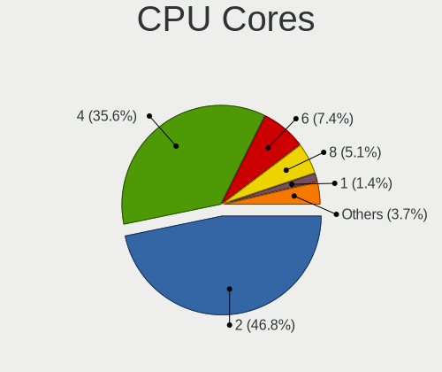
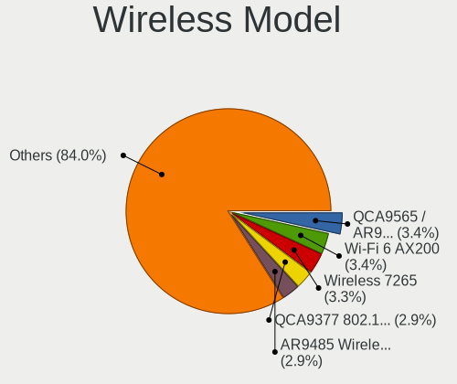
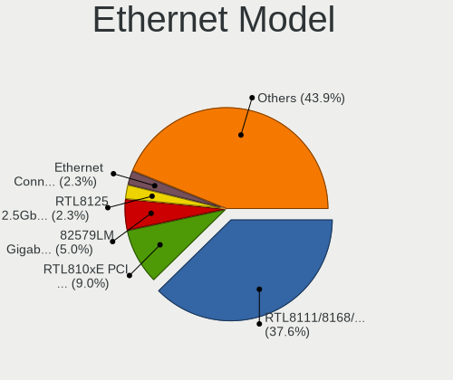
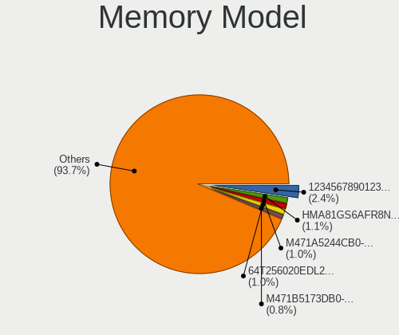

Zorin 16 - Tested Hardware & Statistics
---------------------------------------

A project to collect tested hardware configurations for Zorin 16.

Anyone can contribute to this report by the [hw-probe](https://github.com/linuxhw/hw-probe) tool:

    sudo -E hw-probe -all -upload

Please contribute! Especially if your hardware is rare.

This is a report for all computer types. See also reports for [desktops](/Dist/Zorin_16/Desktop/README.md) and [notebooks](/Dist/Zorin_16/Notebook/README.md).

Contents
--------

* [ Test Cases ](#test-cases)

* [ System ](#system)
  - [ Kernel                   ](#kernel)
  - [ Kernel Family            ](#kernel-family)
  - [ Kernel Major Ver.        ](#kernel-major-ver)
  - [ Arch                     ](#arch)
  - [ DE                       ](#de)
  - [ Display Server           ](#display-server)
  - [ Display Manager          ](#display-manager)
  - [ OS Lang                  ](#os-lang)
  - [ Boot Mode                ](#boot-mode)
  - [ Filesystem               ](#filesystem)
  - [ Part. scheme             ](#part-scheme)
  - [ Dual Boot with Linux/BSD ](#dual-boot-with-linuxbsd)
  - [ Dual Boot (Win)          ](#dual-boot-win)

* [ Board ](#board)
  - [ Vendor                   ](#vendor)
  - [ Model                    ](#model)
  - [ Model Family             ](#model-family)
  - [ MFG Year                 ](#mfg-year)
  - [ Form Factor              ](#form-factor)
  - [ Secure Boot              ](#secure-boot)
  - [ Coreboot                 ](#coreboot)
  - [ RAM Size                 ](#ram-size)
  - [ RAM Used                 ](#ram-used)
  - [ Total Drives             ](#total-drives)
  - [ Has CD-ROM               ](#has-cd-rom)
  - [ Has Ethernet             ](#has-ethernet)
  - [ Has WiFi                 ](#has-wifi)
  - [ Has Bluetooth            ](#has-bluetooth)

* [ Location ](#location)
  - [ Country                  ](#country)
  - [ City                     ](#city)

* [ Drives ](#drives)
  - [ Drive Vendor             ](#drive-vendor)
  - [ Drive Model              ](#drive-model)
  - [ HDD Vendor               ](#hdd-vendor)
  - [ SSD Vendor               ](#ssd-vendor)
  - [ Drive Kind               ](#drive-kind)
  - [ Drive Connector          ](#drive-connector)
  - [ Drive Size               ](#drive-size)
  - [ Space Total              ](#space-total)
  - [ Space Used               ](#space-used)
  - [ Malfunc. Drives          ](#malfunc-drives)
  - [ Malfunc. Drive Vendor    ](#malfunc-drive-vendor)
  - [ Malfunc. HDD Vendor      ](#malfunc-hdd-vendor)
  - [ Malfunc. Drive Kind      ](#malfunc-drive-kind)
  - [ Failed Drives            ](#failed-drives)
  - [ Failed Drive Vendor      ](#failed-drive-vendor)
  - [ Drive Status             ](#drive-status)

* [ Storage controller ](#storage-controller)
  - [ Storage Vendor           ](#storage-vendor)
  - [ Storage Model            ](#storage-model)
  - [ Storage Kind             ](#storage-kind)

* [ Processor ](#processor)
  - [ CPU Vendor               ](#cpu-vendor)
  - [ CPU Model                ](#cpu-model)
  - [ CPU Model Family         ](#cpu-model-family)
  - [ CPU Cores                ](#cpu-cores)
  - [ CPU Sockets              ](#cpu-sockets)
  - [ CPU Threads              ](#cpu-threads)
  - [ CPU Op-Modes             ](#cpu-op-modes)
  - [ CPU Microcode            ](#cpu-microcode)
  - [ CPU Microarch            ](#cpu-microarch)

* [ Graphics ](#graphics)
  - [ GPU Vendor               ](#gpu-vendor)
  - [ GPU Model                ](#gpu-model)
  - [ GPU Combo                ](#gpu-combo)
  - [ GPU Driver               ](#gpu-driver)
  - [ GPU Memory               ](#gpu-memory)

* [ Monitor ](#monitor)
  - [ Monitor Vendor           ](#monitor-vendor)
  - [ Monitor Model            ](#monitor-model)
  - [ Monitor Resolution       ](#monitor-resolution)
  - [ Monitor Diagonal         ](#monitor-diagonal)
  - [ Monitor Width            ](#monitor-width)
  - [ Aspect Ratio             ](#aspect-ratio)
  - [ Monitor Area             ](#monitor-area)
  - [ Pixel Density            ](#pixel-density)
  - [ Multiple Monitors        ](#multiple-monitors)

* [ Network ](#network)
  - [ Net Controller Vendor    ](#net-controller-vendor)
  - [ Net Controller Model     ](#net-controller-model)
  - [ Wireless Vendor          ](#wireless-vendor)
  - [ Wireless Model           ](#wireless-model)
  - [ Ethernet Vendor          ](#ethernet-vendor)
  - [ Ethernet Model           ](#ethernet-model)
  - [ Net Controller Kind      ](#net-controller-kind)
  - [ Used Controller          ](#used-controller)
  - [ NICs                     ](#nics)
  - [ IPv6                     ](#ipv6)

* [ Bluetooth ](#bluetooth)
  - [ Bluetooth Vendor         ](#bluetooth-vendor)
  - [ Bluetooth Model          ](#bluetooth-model)

* [ Sound ](#sound)
  - [ Sound Vendor             ](#sound-vendor)
  - [ Sound Model              ](#sound-model)

* [ Memory ](#memory)
  - [ Memory Vendor            ](#memory-vendor)
  - [ Memory Model             ](#memory-model)
  - [ Memory Kind              ](#memory-kind)
  - [ Memory Form Factor       ](#memory-form-factor)
  - [ Memory Size              ](#memory-size)
  - [ Memory Speed             ](#memory-speed)

* [ Printers & scanners ](#printers--scanners)
  - [ Printer Vendor           ](#printer-vendor)
  - [ Printer Model            ](#printer-model)
  - [ Scanner Vendor           ](#scanner-vendor)
  - [ Scanner Model            ](#scanner-model)

* [ Camera ](#camera)
  - [ Camera Vendor            ](#camera-vendor)
  - [ Camera Model             ](#camera-model)

* [ Security ](#security)
  - [ Fingerprint Vendor       ](#fingerprint-vendor)
  - [ Fingerprint Model        ](#fingerprint-model)
  - [ Chipcard Vendor          ](#chipcard-vendor)
  - [ Chipcard Model           ](#chipcard-model)

* [ Unsupported ](#unsupported)
  - [ Unsupported Devices      ](#unsupported-devices)
  - [ Unsupported Device Types ](#unsupported-device-types)

Test Cases
----------

Total: 2529

| Vendor        | Model                       | Form-Factor | Probe                                                      | Date         |
|---------------|-----------------------------|-------------|------------------------------------------------------------|--------------|
| MSI           | MAG B550 TOMAHAWK           | Desktop     | [cc8b9aa8f6](https://linux-hardware.org/?probe=cc8b9aa8f6) | Aug 01, 2022 |
| ASUSTek       | PRIME X570-P                | Desktop     | [405a75cb1d](https://linux-hardware.org/?probe=405a75cb1d) | Aug 01, 2022 |
| HP            | Laptop 14-dq4xxx            | Notebook    | [1e57f77386](https://linux-hardware.org/?probe=1e57f77386) | Aug 01, 2022 |
| Gigabyte      | B450M DS3H-CF               | Desktop     | [7c68dbe47e](https://linux-hardware.org/?probe=7c68dbe47e) | Aug 01, 2022 |
| Gigabyte      | B450M DS3H-CF               | Desktop     | [6532751d00](https://linux-hardware.org/?probe=6532751d00) | Aug 01, 2022 |
| Dell          | 0T656F A01                  | Desktop     | [02ae993867](https://linux-hardware.org/?probe=02ae993867) | Jul 31, 2022 |
| Gigabyte      | Z77-D3H                     | Desktop     | [a954bc2f31](https://linux-hardware.org/?probe=a954bc2f31) | Jul 31, 2022 |
| ASRock        | Z170 Pro4                   | Desktop     | [e8dba6ab7e](https://linux-hardware.org/?probe=e8dba6ab7e) | Jul 31, 2022 |
| HP            | 82F2                        | Desktop     | [0c2d091c2e](https://linux-hardware.org/?probe=0c2d091c2e) | Jul 31, 2022 |
| HP            | 550                         | Notebook    | [efc4b32963](https://linux-hardware.org/?probe=efc4b32963) | Jul 30, 2022 |
| Supermicro    | C7Q67 V1.01                 | Desktop     | [15508d1eff](https://linux-hardware.org/?probe=15508d1eff) | Jul 30, 2022 |
| Dell          | Latitude E7450              | Notebook    | [894a489a03](https://linux-hardware.org/?probe=894a489a03) | Jul 30, 2022 |
| Dell          | Latitude E7450              | Notebook    | [268b4ca289](https://linux-hardware.org/?probe=268b4ca289) | Jul 30, 2022 |
| Lenovo        | SDK0J40700 WIN              | Desktop     | [f50872e350](https://linux-hardware.org/?probe=f50872e350) | Jul 29, 2022 |
| Packard Be... | H57M01                      | Desktop     | [55e1536ab6](https://linux-hardware.org/?probe=55e1536ab6) | Jul 29, 2022 |
| Fujitsu       | D3162-A1 S26361-D3162-A1    | Desktop     | [2bc22894c8](https://linux-hardware.org/?probe=2bc22894c8) | Jul 29, 2022 |
| Lenovo        | IdeaPad C340-14API 81N6     | Notebook    | [4158c1696a](https://linux-hardware.org/?probe=4158c1696a) | Jul 29, 2022 |
| Lenovo        | IdeaPad C340-14API 81N6     | Notebook    | [1a5b34b200](https://linux-hardware.org/?probe=1a5b34b200) | Jul 29, 2022 |
| Dell          | Inspiron 15-3567            | Notebook    | [ceb521429a](https://linux-hardware.org/?probe=ceb521429a) | Jul 29, 2022 |
| Packard Be... | H57M01                      | Desktop     | [4789405230](https://linux-hardware.org/?probe=4789405230) | Jul 29, 2022 |
| Lenovo        | SDK0J40700 WIN              | Desktop     | [6d95a05ee7](https://linux-hardware.org/?probe=6d95a05ee7) | Jul 28, 2022 |
| ASRock        | Z170 Pro4                   | Desktop     | [73c8bc2ae1](https://linux-hardware.org/?probe=73c8bc2ae1) | Jul 28, 2022 |
| Dell          | System Inspiron N7110       | Notebook    | [d2cbf8528a](https://linux-hardware.org/?probe=d2cbf8528a) | Jul 28, 2022 |
| HP            | ProBook 440 G8 Notebook ... | Notebook    | [b08a0deeff](https://linux-hardware.org/?probe=b08a0deeff) | Jul 28, 2022 |
| ASUSTek       | VivoBook_ASUSLaptop X421... | Notebook    | [4bcdc51e89](https://linux-hardware.org/?probe=4bcdc51e89) | Jul 27, 2022 |
| Gigabyte      | B150N Phoenix-WIFI-CF       | Desktop     | [e214df8838](https://linux-hardware.org/?probe=e214df8838) | Jul 27, 2022 |
| Dell          | Latitude E7450              | Notebook    | [4a277d4cee](https://linux-hardware.org/?probe=4a277d4cee) | Jul 27, 2022 |
| Gigabyte      | B450 AORUS M                | Desktop     | [f9b0fe48d6](https://linux-hardware.org/?probe=f9b0fe48d6) | Jul 27, 2022 |
| ASUSTek       | PRIME A520M-K               | Desktop     | [cea12b9c9c](https://linux-hardware.org/?probe=cea12b9c9c) | Jul 27, 2022 |
| Sony          | VGN-Z31XN_B                 | Notebook    | [f27c511d04](https://linux-hardware.org/?probe=f27c511d04) | Jul 26, 2022 |
| ASRock        | Z170 Pro4                   | Desktop     | [876c60188f](https://linux-hardware.org/?probe=876c60188f) | Jul 26, 2022 |
| ASUSTek       | PRIME B450M-GAMING/BR       | Desktop     | [e33f8c0a93](https://linux-hardware.org/?probe=e33f8c0a93) | Jul 26, 2022 |
| ASUSTek       | K30AD_M31AD_M51AD_M32AD     | Desktop     | [a059cf305d](https://linux-hardware.org/?probe=a059cf305d) | Jul 25, 2022 |
| ASUSTek       | VivoBook_ASUSLaptop X421... | Notebook    | [37ebea2647](https://linux-hardware.org/?probe=37ebea2647) | Jul 25, 2022 |
| Lenovo        | YB1-X91L                    | Convertible | [99c0ca0d0b](https://linux-hardware.org/?probe=99c0ca0d0b) | Jul 25, 2022 |
| Lenovo        | YB1-X91L                    | Convertible | [e39f15a1b5](https://linux-hardware.org/?probe=e39f15a1b5) | Jul 25, 2022 |
| Lenovo        | SDK0J40700 WIN              | Desktop     | [96d6480781](https://linux-hardware.org/?probe=96d6480781) | Jul 25, 2022 |
| ASUSTek       | A88X-PRO                    | Desktop     | [c8e578f98f](https://linux-hardware.org/?probe=c8e578f98f) | Jul 24, 2022 |
| ASUSTek       | A88X-PRO                    | Desktop     | [48e39039fc](https://linux-hardware.org/?probe=48e39039fc) | Jul 24, 2022 |
| Samsung       | 300E4C/300E5C/300E7C        | Notebook    | [ff4dba6b3e](https://linux-hardware.org/?probe=ff4dba6b3e) | Jul 24, 2022 |
| Dell          | XPS 13 9365                 | Convertible | [d06c0db3ce](https://linux-hardware.org/?probe=d06c0db3ce) | Jul 24, 2022 |
| Fujitsu       | D2901-A1 S26361-D2901-A1    | Desktop     | [aa952e11aa](https://linux-hardware.org/?probe=aa952e11aa) | Jul 24, 2022 |
| HP            | Unknown                     | Notebook    | [1e1768ebfa](https://linux-hardware.org/?probe=1e1768ebfa) | Jul 24, 2022 |
| Dell          | 03NVJ6 A03                  | Desktop     | [9c0bb64bd9](https://linux-hardware.org/?probe=9c0bb64bd9) | Jul 24, 2022 |
| ASUSTek       | CROSSHAIR II FORMULA        | Desktop     | [aa2242c51f](https://linux-hardware.org/?probe=aa2242c51f) | Jul 23, 2022 |
| HP            | Stream Notebook             | Notebook    | [8422abef44](https://linux-hardware.org/?probe=8422abef44) | Jul 23, 2022 |
| Gigabyte      | Z97X-SLI-CF                 | Desktop     | [177a181771](https://linux-hardware.org/?probe=177a181771) | Jul 23, 2022 |
| Supermicro    | C7Q67 V1.01                 | Desktop     | [722f3df811](https://linux-hardware.org/?probe=722f3df811) | Jul 23, 2022 |
| Dell          | 0FDY5C A00                  | Desktop     | [f5d81fb635](https://linux-hardware.org/?probe=f5d81fb635) | Jul 23, 2022 |
| Dell          | 0FDY5C A00                  | Desktop     | [83cf5f7085](https://linux-hardware.org/?probe=83cf5f7085) | Jul 23, 2022 |
| Lenovo        | MIIX 310-10ICR 80SG         | Tablet      | [1512e3bf4d](https://linux-hardware.org/?probe=1512e3bf4d) | Jul 22, 2022 |
| Lenovo        | ThinkPad T500 2055A38       | Notebook    | [3b2f2c3bea](https://linux-hardware.org/?probe=3b2f2c3bea) | Jul 22, 2022 |
| Gigabyte      | M68M-S2P                    | Desktop     | [7d4ba4168a](https://linux-hardware.org/?probe=7d4ba4168a) | Jul 22, 2022 |
| HP            | ProBook 4540s               | Notebook    | [a2d1e2fd68](https://linux-hardware.org/?probe=a2d1e2fd68) | Jul 22, 2022 |
| HP            | Compaq 420                  | Notebook    | [913795a620](https://linux-hardware.org/?probe=913795a620) | Jul 21, 2022 |
| ASUSTek       | X550CL                      | Notebook    | [abd0b78e41](https://linux-hardware.org/?probe=abd0b78e41) | Jul 21, 2022 |
| Intel         | NUC11PABi5 K90634-305       | Mini pc     | [84f435a6d0](https://linux-hardware.org/?probe=84f435a6d0) | Jul 21, 2022 |
| MSI           | Z97 GAMING 5                | Desktop     | [89e0889e94](https://linux-hardware.org/?probe=89e0889e94) | Jul 21, 2022 |
| Dell          | 09KPNV A00                  | Desktop     | [711546ab63](https://linux-hardware.org/?probe=711546ab63) | Jul 21, 2022 |
| Dell          | Inspiron 5520               | Notebook    | [ef41a8c220](https://linux-hardware.org/?probe=ef41a8c220) | Jul 20, 2022 |
| Foxconn       | 2AAF                        | Desktop     | [b97dc9fd47](https://linux-hardware.org/?probe=b97dc9fd47) | Jul 20, 2022 |
| Dell          | Inspiron 3541               | Notebook    | [cb0f9c95d2](https://linux-hardware.org/?probe=cb0f9c95d2) | Jul 20, 2022 |
| Toshiba       | Satellite L655              | Notebook    | [e332607406](https://linux-hardware.org/?probe=e332607406) | Jul 19, 2022 |
| MSI           | B75MA-P45                   | Desktop     | [89af63cf6f](https://linux-hardware.org/?probe=89af63cf6f) | Jul 19, 2022 |
| Dell          | Inspiron 1545               | Notebook    | [b0e3b75c3b](https://linux-hardware.org/?probe=b0e3b75c3b) | Jul 19, 2022 |
| Google        | Butterfly                   | Notebook    | [ed6aa75ba5](https://linux-hardware.org/?probe=ed6aa75ba5) | Jul 19, 2022 |
| HUAWEI        | HVY-WXX9                    | Notebook    | [82966b0f63](https://linux-hardware.org/?probe=82966b0f63) | Jul 18, 2022 |
| Apple         | MacBookPro12,1              | Notebook    | [4a5f294565](https://linux-hardware.org/?probe=4a5f294565) | Jul 18, 2022 |
| Dell          | Vostro 3559                 | Notebook    | [3770ab3d4c](https://linux-hardware.org/?probe=3770ab3d4c) | Jul 18, 2022 |
| Lenovo        | YB1-X91L                    | Convertible | [c6888145e7](https://linux-hardware.org/?probe=c6888145e7) | Jul 18, 2022 |
| ASUSTek       | VivoBook_ASUSLaptop X421... | Notebook    | [ac616e6f37](https://linux-hardware.org/?probe=ac616e6f37) | Jul 18, 2022 |
| ASUSTek       | VivoBook_ASUSLaptop X421... | Notebook    | [ca9e042e30](https://linux-hardware.org/?probe=ca9e042e30) | Jul 18, 2022 |
| Acer          | NC-A315-41G-R88F            | Notebook    | [8ffe1077fd](https://linux-hardware.org/?probe=8ffe1077fd) | Jul 17, 2022 |
| Lenovo        | MIIX 320-10ICR 80XF         | Tablet      | [08446807d6](https://linux-hardware.org/?probe=08446807d6) | Jul 17, 2022 |
| Gigabyte      | G1.Sniper Z97               | Desktop     | [75a19b4509](https://linux-hardware.org/?probe=75a19b4509) | Jul 17, 2022 |
| Lenovo        | ThinkPad T500 2055A38       | Notebook    | [e8b9689526](https://linux-hardware.org/?probe=e8b9689526) | Jul 17, 2022 |
| MSI           | CR620                       | Notebook    | [68a2718dd2](https://linux-hardware.org/?probe=68a2718dd2) | Jul 17, 2022 |
| Dell          | 09KPNV A00                  | Desktop     | [c47ecbd03f](https://linux-hardware.org/?probe=c47ecbd03f) | Jul 16, 2022 |
| Gigabyte      | GA-78LMT-S2P                | Desktop     | [0cf64c41f0](https://linux-hardware.org/?probe=0cf64c41f0) | Jul 16, 2022 |
| Intel         | NUC8BEB J72692-310          | Mini pc     | [84cd652e24](https://linux-hardware.org/?probe=84cd652e24) | Jul 16, 2022 |
| ASUSTek       | X751MA                      | Notebook    | [e8c8c0d6ec](https://linux-hardware.org/?probe=e8c8c0d6ec) | Jul 16, 2022 |
| ASUSTek       | PRIME Z690-P D4             | Desktop     | [e5fed36e22](https://linux-hardware.org/?probe=e5fed36e22) | Jul 15, 2022 |
| Toshiba       | TECRA S11                   | Notebook    | [26ed071525](https://linux-hardware.org/?probe=26ed071525) | Jul 15, 2022 |
| Dell          | 0C27VV A01                  | Desktop     | [56bd2a162b](https://linux-hardware.org/?probe=56bd2a162b) | Jul 15, 2022 |
| Dell          | 0C27VV A01                  | Desktop     | [ccc3bc2a39](https://linux-hardware.org/?probe=ccc3bc2a39) | Jul 15, 2022 |
| Kogan         | KALAP13S300VA               | Notebook    | [9060455576](https://linux-hardware.org/?probe=9060455576) | Jul 15, 2022 |
| Intel         | X79 V2.72B                  | Desktop     | [f244f6157b](https://linux-hardware.org/?probe=f244f6157b) | Jul 15, 2022 |
| AMI           | Unknown                     | Notebook    | [2d15648f33](https://linux-hardware.org/?probe=2d15648f33) | Jul 14, 2022 |
| Alienware     | x15 R1                      | Notebook    | [95ee5b34a7](https://linux-hardware.org/?probe=95ee5b34a7) | Jul 14, 2022 |
| HP            | Pavilion Laptop 15-eg0xx... | Notebook    | [ea2c3cd9e9](https://linux-hardware.org/?probe=ea2c3cd9e9) | Jul 14, 2022 |
| HP            | Unknown                     | Notebook    | [aa2aa159c9](https://linux-hardware.org/?probe=aa2aa159c9) | Jul 14, 2022 |
| Gigabyte      | Z390 AORUS PRO WIFI-CF      | Desktop     | [66efd060ca](https://linux-hardware.org/?probe=66efd060ca) | Jul 14, 2022 |
| HP            | ProBook 455 G1              | Notebook    | [a0dd163643](https://linux-hardware.org/?probe=a0dd163643) | Jul 14, 2022 |
| Unknown       | Intel X79                   | Desktop     | [b0bb64b9ea](https://linux-hardware.org/?probe=b0bb64b9ea) | Jul 13, 2022 |
| HP            | Laptop 15-dw3xxx            | Notebook    | [09e66aef7e](https://linux-hardware.org/?probe=09e66aef7e) | Jul 13, 2022 |
| Samsung       | Galaxy Book 12 LTE          | Tablet      | [27ab632ec8](https://linux-hardware.org/?probe=27ab632ec8) | Jul 13, 2022 |
| Gigabyte      | H87M-D3H                    | Desktop     | [5056c4f640](https://linux-hardware.org/?probe=5056c4f640) | Jul 13, 2022 |
| Lenovo        | IdeaPad 1 14IGL05 81VU      | Notebook    | [e3a3e1cac2](https://linux-hardware.org/?probe=e3a3e1cac2) | Jul 13, 2022 |
| Gigabyte      | Z270X-Ultra Gaming-CF       | Desktop     | [c90a0cbab7](https://linux-hardware.org/?probe=c90a0cbab7) | Jul 13, 2022 |
| Gigabyte      | Z270X-Ultra Gaming-CF       | Desktop     | [87fa08ea59](https://linux-hardware.org/?probe=87fa08ea59) | Jul 13, 2022 |
| Star Labs     | StarBook                    | Notebook    | [fdae1cd2c3](https://linux-hardware.org/?probe=fdae1cd2c3) | Jul 12, 2022 |
| System76      | Thelio thelio-r2            | Desktop     | [2d990d7afe](https://linux-hardware.org/?probe=2d990d7afe) | Jul 12, 2022 |
| HP            | 3398                        | Desktop     | [1b964004d9](https://linux-hardware.org/?probe=1b964004d9) | Jul 12, 2022 |
| HP            | Laptop 15-dw3xxx            | Notebook    | [e974774285](https://linux-hardware.org/?probe=e974774285) | Jul 12, 2022 |
| ASUSTek       | V-P8H61E                    | Desktop     | [f8e5b72d1c](https://linux-hardware.org/?probe=f8e5b72d1c) | Jul 12, 2022 |
| Dell          | Inspiron 5520               | Notebook    | [67d1588e47](https://linux-hardware.org/?probe=67d1588e47) | Jul 12, 2022 |
| Gigabyte      | X570S AORUS PRO AX          | Desktop     | [42b248f049](https://linux-hardware.org/?probe=42b248f049) | Jul 11, 2022 |
| ASUSTek       | T101HA                      | Tablet      | [d234e8543d](https://linux-hardware.org/?probe=d234e8543d) | Jul 11, 2022 |
| HP            | ProBook 640 G1              | Notebook    | [bc5945b570](https://linux-hardware.org/?probe=bc5945b570) | Jul 11, 2022 |
| HP            | ProBook 640 G1              | Notebook    | [f25593cec7](https://linux-hardware.org/?probe=f25593cec7) | Jul 11, 2022 |
| Lenovo        | ThinkCentre M91 7516AD1     | Desktop     | [19660ae71a](https://linux-hardware.org/?probe=19660ae71a) | Jul 11, 2022 |
| HP            | ENVY x360 Convertible 13... | Convertible | [6d6b4c9d06](https://linux-hardware.org/?probe=6d6b4c9d06) | Jul 11, 2022 |
| OEM_MB        | NARRA3                      | Desktop     | [845bdfd72c](https://linux-hardware.org/?probe=845bdfd72c) | Jul 11, 2022 |
| ASUSTek       | T101HA                      | Tablet      | [0d90a39160](https://linux-hardware.org/?probe=0d90a39160) | Jul 10, 2022 |
| MSI           | Creator 15 A10SET           | Notebook    | [d90f2aec1b](https://linux-hardware.org/?probe=d90f2aec1b) | Jul 10, 2022 |
| Dell          | 0J3C2F A00                  | Desktop     | [36252f70d6](https://linux-hardware.org/?probe=36252f70d6) | Jul 10, 2022 |
| Dell          | 0J3C2F A00                  | Desktop     | [e3197762a9](https://linux-hardware.org/?probe=e3197762a9) | Jul 10, 2022 |
| Lenovo        | IdeaPad 3 15IIL05 81WE      | Notebook    | [8a02619147](https://linux-hardware.org/?probe=8a02619147) | Jul 10, 2022 |
| eMachines     | E720 V1.06                  | Notebook    | [ec23637bd5](https://linux-hardware.org/?probe=ec23637bd5) | Jul 09, 2022 |
| Packard Be... | EasyNote TE69KB             | Notebook    | [89403f1acb](https://linux-hardware.org/?probe=89403f1acb) | Jul 09, 2022 |
| Pegatron      | Benicia                     | Desktop     | [2360476ad3](https://linux-hardware.org/?probe=2360476ad3) | Jul 09, 2022 |
| Gigabyte      | H110M-A-CF                  | Desktop     | [42335e5c5c](https://linux-hardware.org/?probe=42335e5c5c) | Jul 09, 2022 |
| HP            | Pavilion 15                 | Notebook    | [1fbb699502](https://linux-hardware.org/?probe=1fbb699502) | Jul 09, 2022 |
| Dell          | Latitude 5400               | Notebook    | [46ce7cf7fe](https://linux-hardware.org/?probe=46ce7cf7fe) | Jul 09, 2022 |
| HP            | Pavilion 15                 | Notebook    | [c74f3711f3](https://linux-hardware.org/?probe=c74f3711f3) | Jul 09, 2022 |
| Sony          | VGN-Z31XN_B                 | Notebook    | [e541b7743e](https://linux-hardware.org/?probe=e541b7743e) | Jul 08, 2022 |
| Lenovo        | ThinkPad T400 2768GB4       | Notebook    | [498bb4a509](https://linux-hardware.org/?probe=498bb4a509) | Jul 08, 2022 |
| Acer          | Aspire 5755G                | Notebook    | [37aff6bb24](https://linux-hardware.org/?probe=37aff6bb24) | Jul 08, 2022 |
| HP            | 18E4                        | Desktop     | [bf615fe0ae](https://linux-hardware.org/?probe=bf615fe0ae) | Jul 08, 2022 |
| Gigabyte      | Z97X-UD3H-CF                | Desktop     | [b7ed1ecdf2](https://linux-hardware.org/?probe=b7ed1ecdf2) | Jul 08, 2022 |
| HP            | EliteBook 745 G6            | Notebook    | [159ebeaa5e](https://linux-hardware.org/?probe=159ebeaa5e) | Jul 08, 2022 |
| Lenovo        | ThinkPad T61 6457B5S        | Notebook    | [34e97dae1e](https://linux-hardware.org/?probe=34e97dae1e) | Jul 08, 2022 |
| Gigabyte      | EP45-UD3P                   | Desktop     | [9118f548bb](https://linux-hardware.org/?probe=9118f548bb) | Jul 08, 2022 |
| Acer          | Aspire 5560                 | Notebook    | [e9615585f6](https://linux-hardware.org/?probe=e9615585f6) | Jul 07, 2022 |
| Acer          | Spin SP513-55N              | Convertible | [bd077334f0](https://linux-hardware.org/?probe=bd077334f0) | Jul 07, 2022 |
| HP            | Mini 110-3100               | Notebook    | [5222f63258](https://linux-hardware.org/?probe=5222f63258) | Jul 06, 2022 |
| Samsung       | 550XDA                      | Notebook    | [74bcded10f](https://linux-hardware.org/?probe=74bcded10f) | Jul 06, 2022 |
| Dell          | Inspiron 3542               | Notebook    | [57fc50a4fb](https://linux-hardware.org/?probe=57fc50a4fb) | Jul 06, 2022 |
| Acer          | Aspire 5755G                | Notebook    | [0dcb64ed5f](https://linux-hardware.org/?probe=0dcb64ed5f) | Jul 06, 2022 |
| Acer          | E91M                        | Desktop     | [4e55aacdd7](https://linux-hardware.org/?probe=4e55aacdd7) | Jul 06, 2022 |
| ASUSTek       | VivoBook_ASUSLaptop M350... | Notebook    | [167fe0c2d1](https://linux-hardware.org/?probe=167fe0c2d1) | Jul 06, 2022 |
| MSI           | Boston                      | Desktop     | [3dfcd01115](https://linux-hardware.org/?probe=3dfcd01115) | Jul 06, 2022 |
| ASUSTek       | ASUS TUF Gaming F15 FX50... | Notebook    | [59923a9781](https://linux-hardware.org/?probe=59923a9781) | Jul 06, 2022 |
| Samsung       | 500R5M/500R5W/501R5M        | Notebook    | [17607e5f03](https://linux-hardware.org/?probe=17607e5f03) | Jul 06, 2022 |
| Acer          | Aspire F5-573               | Notebook    | [1ada0ad162](https://linux-hardware.org/?probe=1ada0ad162) | Jul 06, 2022 |
| Lenovo        | V14-ADA 82C6                | Notebook    | [b8e2b7b6bd](https://linux-hardware.org/?probe=b8e2b7b6bd) | Jul 05, 2022 |
| Lenovo        | S21e-20 80M4                | Notebook    | [968f07d190](https://linux-hardware.org/?probe=968f07d190) | Jul 05, 2022 |
| ASUSTek       | X540LJ                      | Notebook    | [5994a314d0](https://linux-hardware.org/?probe=5994a314d0) | Jul 05, 2022 |
| Gigabyte      | H77N-WIFI                   | Desktop     | [dc12f11117](https://linux-hardware.org/?probe=dc12f11117) | Jul 05, 2022 |
| Biostar       | P4M90-M7A Ver:1.0           | Desktop     | [0567d5e337](https://linux-hardware.org/?probe=0567d5e337) | Jul 05, 2022 |
| HP            | ProBook 6475b               | Notebook    | [02eab8bd42](https://linux-hardware.org/?probe=02eab8bd42) | Jul 05, 2022 |
| OEM           | G41 775 ICH7 8712           | Desktop     | [4f82c838cb](https://linux-hardware.org/?probe=4f82c838cb) | Jul 04, 2022 |
| Packard Be... | H17HV                       | Notebook    | [8b05e7f955](https://linux-hardware.org/?probe=8b05e7f955) | Jul 04, 2022 |
| Acer          | Aspire A515-51G             | Notebook    | [3ab547df65](https://linux-hardware.org/?probe=3ab547df65) | Jul 04, 2022 |
| HP            | Laptop 15s-du2xxx           | Notebook    | [c208a1e955](https://linux-hardware.org/?probe=c208a1e955) | Jul 04, 2022 |
| Deffad        | Unknown                     | Notebook    | [af38c7120e](https://linux-hardware.org/?probe=af38c7120e) | Jul 04, 2022 |
| HP            | ENVY x360 Convertible 13... | Convertible | [e20dba9308](https://linux-hardware.org/?probe=e20dba9308) | Jul 04, 2022 |
| HP            | Laptop 15s-du2xxx           | Notebook    | [65debb520a](https://linux-hardware.org/?probe=65debb520a) | Jul 04, 2022 |
| Intel         | NUC6i7KYB H90766-402        | Mini pc     | [b847a4a45d](https://linux-hardware.org/?probe=b847a4a45d) | Jul 03, 2022 |
| Intel         | NUC6i7KYB H90766-402        | Mini pc     | [0aa196cd0c](https://linux-hardware.org/?probe=0aa196cd0c) | Jul 03, 2022 |
| ASUSTek       | ROG Flow X13 GV301RA_GV3... | Convertible | [c186124284](https://linux-hardware.org/?probe=c186124284) | Jul 03, 2022 |
| ASUSTek       | ROG Flow X13 GV301RA_GV3... | Convertible | [fce4d4547c](https://linux-hardware.org/?probe=fce4d4547c) | Jul 03, 2022 |
| Lenovo        | G40-45 80E1                 | Notebook    | [bce4ceea50](https://linux-hardware.org/?probe=bce4ceea50) | Jul 03, 2022 |
| Samsung       | RV411/RV511/E3511/S3511/... | Notebook    | [eb23a7916c](https://linux-hardware.org/?probe=eb23a7916c) | Jul 03, 2022 |
| Dell          | Inspiron 5520               | Notebook    | [2a4654f61b](https://linux-hardware.org/?probe=2a4654f61b) | Jul 03, 2022 |
| Dell          | Inspiron 7520               | Notebook    | [18acc5233d](https://linux-hardware.org/?probe=18acc5233d) | Jul 03, 2022 |
| HP            | 8350                        | Desktop     | [39a8a75ebe](https://linux-hardware.org/?probe=39a8a75ebe) | Jul 03, 2022 |
| ASUSTek       | TUF Gaming B550-PLUS        | Desktop     | [31a8bd72d6](https://linux-hardware.org/?probe=31a8bd72d6) | Jul 02, 2022 |
| Foxconn       | 2AB1                        | Desktop     | [83a3a5794d](https://linux-hardware.org/?probe=83a3a5794d) | Jul 02, 2022 |
| Foxconn       | 2AB1                        | Desktop     | [7b7c8244af](https://linux-hardware.org/?probe=7b7c8244af) | Jul 02, 2022 |
| ASUSTek       | N61Jq                       | Notebook    | [19b3d15d92](https://linux-hardware.org/?probe=19b3d15d92) | Jul 02, 2022 |
| Acer          | Aspire C22-820              | All in one  | [0bb41ffb71](https://linux-hardware.org/?probe=0bb41ffb71) | Jul 01, 2022 |
| HP            | Pavilion Gaming Laptop 1... | Notebook    | [f54987d748](https://linux-hardware.org/?probe=f54987d748) | Jul 01, 2022 |
| MSI           | CR620                       | Notebook    | [0968b18823](https://linux-hardware.org/?probe=0968b18823) | Jun 30, 2022 |
| Dell          | Latitude 7389               | Convertible | [6cc0f640ed](https://linux-hardware.org/?probe=6cc0f640ed) | Jun 29, 2022 |
| Fujitsu Si... | ESPRIMO Mobile V6535        | Notebook    | [7d85e08611](https://linux-hardware.org/?probe=7d85e08611) | Jun 29, 2022 |
| Dell          | Inspiron 3531               | Notebook    | [2c8286100d](https://linux-hardware.org/?probe=2c8286100d) | Jun 29, 2022 |
| Gigabyte      | B360M HD3                   | Desktop     | [b35e9f3e5c](https://linux-hardware.org/?probe=b35e9f3e5c) | Jun 28, 2022 |
| Fujitsu Si... | ESPRIMO Mobile V6535        | Notebook    | [3e451a9d00](https://linux-hardware.org/?probe=3e451a9d00) | Jun 28, 2022 |
| HP            | Pavilion Notebook           | Notebook    | [6e098b9c49](https://linux-hardware.org/?probe=6e098b9c49) | Jun 27, 2022 |
| Lenovo        | V14-IIL 82C4                | Notebook    | [740f06d30d](https://linux-hardware.org/?probe=740f06d30d) | Jun 27, 2022 |
| Dell          | XPS 15 9570                 | Notebook    | [8cf2281f01](https://linux-hardware.org/?probe=8cf2281f01) | Jun 27, 2022 |
| Dell          | 0U880P A00                  | Desktop     | [e14832f09c](https://linux-hardware.org/?probe=e14832f09c) | Jun 26, 2022 |
| Gigabyte      | B450 AORUS M                | Desktop     | [6262e08c1f](https://linux-hardware.org/?probe=6262e08c1f) | Jun 26, 2022 |
| Pegatron      | IPPSB-DB                    | Desktop     | [a63cdffc5b](https://linux-hardware.org/?probe=a63cdffc5b) | Jun 26, 2022 |
| Acer          | Aspire A515-55G             | Notebook    | [d05c52e40b](https://linux-hardware.org/?probe=d05c52e40b) | Jun 26, 2022 |
| Dell          | 08NPPY A00                  | Desktop     | [3dc935ecb1](https://linux-hardware.org/?probe=3dc935ecb1) | Jun 26, 2022 |
| ASUSTek       | ROG CROSSHAIR VIII HERO     | Desktop     | [c78b132d02](https://linux-hardware.org/?probe=c78b132d02) | Jun 26, 2022 |
| ASUSTek       | TUF Gaming X570-PRO WIFI... | Desktop     | [b232a434fd](https://linux-hardware.org/?probe=b232a434fd) | Jun 26, 2022 |
| Google        | Candy                       | Notebook    | [8888e44843](https://linux-hardware.org/?probe=8888e44843) | Jun 25, 2022 |
| Gigabyte      | B450 AORUS M                | Desktop     | [0297d9c8c1](https://linux-hardware.org/?probe=0297d9c8c1) | Jun 25, 2022 |
| Gigabyte      | Z77-DS3H                    | Desktop     | [fbde5d214f](https://linux-hardware.org/?probe=fbde5d214f) | Jun 24, 2022 |
| HP            | Laptop 15-db0xxx            | Notebook    | [26cd390b15](https://linux-hardware.org/?probe=26cd390b15) | Jun 24, 2022 |
| Gigabyte      | EP45-UD3P                   | Desktop     | [05449d9e5c](https://linux-hardware.org/?probe=05449d9e5c) | Jun 24, 2022 |
| Lenovo        | ThinkPad X220 Tablet 429... | Notebook    | [8f8ce01734](https://linux-hardware.org/?probe=8f8ce01734) | Jun 24, 2022 |
| Lenovo        | ThinkPad T420 4236J73       | Notebook    | [088ba8b97c](https://linux-hardware.org/?probe=088ba8b97c) | Jun 23, 2022 |
| HP            | ENVY x360 Convertible 15... | Convertible | [dede0c6694](https://linux-hardware.org/?probe=dede0c6694) | Jun 23, 2022 |
| MSI           | A75A-G35                    | Desktop     | [9e3dd8051c](https://linux-hardware.org/?probe=9e3dd8051c) | Jun 23, 2022 |
| ASUSTek       | PRIME X570-PRO              | Desktop     | [a24305d670](https://linux-hardware.org/?probe=a24305d670) | Jun 23, 2022 |
| Fujitsu       | D3221-A1 S26361-D3221-A1    | Desktop     | [b21a0caebf](https://linux-hardware.org/?probe=b21a0caebf) | Jun 22, 2022 |
| HP            | ENVY x360 Convertible 15... | Convertible | [ebacc3616d](https://linux-hardware.org/?probe=ebacc3616d) | Jun 22, 2022 |
| Dell          | XPS 13 9360                 | Notebook    | [d5d7479c46](https://linux-hardware.org/?probe=d5d7479c46) | Jun 22, 2022 |
| Acer          | Swift SF314-54              | Notebook    | [3e80b4439f](https://linux-hardware.org/?probe=3e80b4439f) | Jun 22, 2022 |
| ASUSTek       | PRIME X570-PRO              | Desktop     | [ecea2bb4ad](https://linux-hardware.org/?probe=ecea2bb4ad) | Jun 22, 2022 |
| Dell          | Inspiron 5537               | Notebook    | [6b549dfe09](https://linux-hardware.org/?probe=6b549dfe09) | Jun 22, 2022 |
| Intel         | NUC5i3RYB H41000-507        | Mini pc     | [d3feec9910](https://linux-hardware.org/?probe=d3feec9910) | Jun 21, 2022 |
| Lenovo        | ThinkPad P50 20EQS28400     | Notebook    | [3bd256be91](https://linux-hardware.org/?probe=3bd256be91) | Jun 21, 2022 |
| Gigabyte      | EX58-UD3R                   | Desktop     | [4014366c8a](https://linux-hardware.org/?probe=4014366c8a) | Jun 21, 2022 |
| Lenovo        | ThinkPad T430s 23539MU      | Notebook    | [cb159502de](https://linux-hardware.org/?probe=cb159502de) | Jun 21, 2022 |
| Dell          | Latitude E6540              | Notebook    | [c0f2801648](https://linux-hardware.org/?probe=c0f2801648) | Jun 21, 2022 |
| Dell          | XPS 12 9Q23                 | Notebook    | [463461920a](https://linux-hardware.org/?probe=463461920a) | Jun 21, 2022 |
| Dell          | Latitude E6540              | Notebook    | [7d19e0b30e](https://linux-hardware.org/?probe=7d19e0b30e) | Jun 20, 2022 |
| Toshiba       | Satellite C870-1C2          | Notebook    | [421b2e1975](https://linux-hardware.org/?probe=421b2e1975) | Jun 20, 2022 |
| Lenovo        | Flex 2-15 20405             | Notebook    | [0cae0765c9](https://linux-hardware.org/?probe=0cae0765c9) | Jun 20, 2022 |
| Lenovo        | Yoga 3 Pro-1370 80HE        | Notebook    | [9c4b7a7742](https://linux-hardware.org/?probe=9c4b7a7742) | Jun 20, 2022 |
| HP            | EliteBook 840 G1            | Notebook    | [4a3e29a7c0](https://linux-hardware.org/?probe=4a3e29a7c0) | Jun 20, 2022 |
| AWOW          | NY41                        | Mini pc     | [f420b36754](https://linux-hardware.org/?probe=f420b36754) | Jun 19, 2022 |
| AWOW          | NY41                        | Mini pc     | [e8f74093f9](https://linux-hardware.org/?probe=e8f74093f9) | Jun 19, 2022 |
| Global Dis... | W11651                      | Notebook    | [a28b308f7f](https://linux-hardware.org/?probe=a28b308f7f) | Jun 19, 2022 |
| Dell          | Inspiron N5010              | Notebook    | [82ab434998](https://linux-hardware.org/?probe=82ab434998) | Jun 18, 2022 |
| Lenovo        | SDK0J40700 WIN              | Desktop     | [82be38e941](https://linux-hardware.org/?probe=82be38e941) | Jun 17, 2022 |
| HP            | ENVY x360 Convertible 15... | Convertible | [99eb49831a](https://linux-hardware.org/?probe=99eb49831a) | Jun 17, 2022 |
| ASUSTek       | ASUS TUF Gaming F15 FX50... | Notebook    | [a20ee1d5b6](https://linux-hardware.org/?probe=a20ee1d5b6) | Jun 17, 2022 |
| MSI           | B85M-E45                    | Desktop     | [58c2ff96e3](https://linux-hardware.org/?probe=58c2ff96e3) | Jun 17, 2022 |
| ASUSTek       | ROG CROSSHAIR VIII DARK ... | Desktop     | [85a022001e](https://linux-hardware.org/?probe=85a022001e) | Jun 16, 2022 |
| Dell          | Latitude E6540              | Notebook    | [4806aec13b](https://linux-hardware.org/?probe=4806aec13b) | Jun 16, 2022 |
| Lenovo        | IdeaPadFlex 5 14ITL05 82... | Convertible | [14500170b0](https://linux-hardware.org/?probe=14500170b0) | Jun 16, 2022 |
| ASUSTek       | X540LJ                      | Notebook    | [a07f3b6954](https://linux-hardware.org/?probe=a07f3b6954) | Jun 16, 2022 |
| Dell          | Inspiron 7500 2n1 Black     | Convertible | [d08495e5aa](https://linux-hardware.org/?probe=d08495e5aa) | Jun 16, 2022 |
| AMI           | Aptio CRB                   | Mini pc     | [8932d07801](https://linux-hardware.org/?probe=8932d07801) | Jun 16, 2022 |
| Dell          | 0X501H A02                  | Desktop     | [b9cb2a1e48](https://linux-hardware.org/?probe=b9cb2a1e48) | Jun 15, 2022 |
| Dell          | Precision M4700             | Notebook    | [3d10ec3c17](https://linux-hardware.org/?probe=3d10ec3c17) | Jun 15, 2022 |
| Acer          | Aspire M3970                | Desktop     | [b966120966](https://linux-hardware.org/?probe=b966120966) | Jun 14, 2022 |
| Primux Tec... | Primux_1402F_W10            | Notebook    | [c3cf4149c9](https://linux-hardware.org/?probe=c3cf4149c9) | Jun 14, 2022 |
| Dell          | XPS 12 9Q23                 | Notebook    | [77c4dc4a62](https://linux-hardware.org/?probe=77c4dc4a62) | Jun 14, 2022 |
| GPU Compan... | GWTC116-2                   | Notebook    | [e849fd55ad](https://linux-hardware.org/?probe=e849fd55ad) | Jun 14, 2022 |
| Lenovo        | 3717 SDK0J40709 WIN 3259... | Desktop     | [aa63e13a60](https://linux-hardware.org/?probe=aa63e13a60) | Jun 13, 2022 |
| Positivo      | Q464C                       | Notebook    | [1cb4cb4da1](https://linux-hardware.org/?probe=1cb4cb4da1) | Jun 13, 2022 |
| Lenovo        | 3717 SDK0J40709 WIN 3259... | Desktop     | [ba6786bbe8](https://linux-hardware.org/?probe=ba6786bbe8) | Jun 13, 2022 |
| Positivo      | Q464C                       | Notebook    | [a772cd7eae](https://linux-hardware.org/?probe=a772cd7eae) | Jun 13, 2022 |
| ASUSTek       | P5GC-MX/1333                | Desktop     | [428eebd42f](https://linux-hardware.org/?probe=428eebd42f) | Jun 13, 2022 |
| Lenovo        | IdeaPad 110-14IBR 80UJ      | Notebook    | [9baa7ce30e](https://linux-hardware.org/?probe=9baa7ce30e) | Jun 13, 2022 |
| TrekStor      | Surfbook A13                | Notebook    | [2c8d07851d](https://linux-hardware.org/?probe=2c8d07851d) | Jun 12, 2022 |
| MSI           | MEG Z690 UNIFY              | Desktop     | [4e227cff8b](https://linux-hardware.org/?probe=4e227cff8b) | Jun 12, 2022 |
| ASUSTek       | TUF Gaming X570-PLUS_BR     | Desktop     | [2a772cecf4](https://linux-hardware.org/?probe=2a772cecf4) | Jun 12, 2022 |
| ASUSTek       | PRIME B550M-A               | Desktop     | [14b9e721b7](https://linux-hardware.org/?probe=14b9e721b7) | Jun 11, 2022 |
| HP            | Pavilion 17                 | Notebook    | [bed3614b80](https://linux-hardware.org/?probe=bed3614b80) | Jun 11, 2022 |
| Positivo      | C4500D                      | Notebook    | [70dc4735fa](https://linux-hardware.org/?probe=70dc4735fa) | Jun 11, 2022 |
| Acer          | Aspire 5736Z                | Notebook    | [dcaa9a66f4](https://linux-hardware.org/?probe=dcaa9a66f4) | Jun 10, 2022 |
| Lenovo        | G50-70 20351                | Notebook    | [828f110a40](https://linux-hardware.org/?probe=828f110a40) | Jun 10, 2022 |
| Dell          | Inspiron 5520               | Notebook    | [d80ec10f91](https://linux-hardware.org/?probe=d80ec10f91) | Jun 09, 2022 |
| Dell          | Inspiron 5520               | Notebook    | [39e10fd449](https://linux-hardware.org/?probe=39e10fd449) | Jun 09, 2022 |
| Dell          | 0XFWHV A00                  | Desktop     | [4102e98034](https://linux-hardware.org/?probe=4102e98034) | Jun 09, 2022 |
| Toshiba       | QOSMIO X770                 | Notebook    | [d11736c26f](https://linux-hardware.org/?probe=d11736c26f) | Jun 09, 2022 |
| ASUSTek       | Benicia                     | Desktop     | [4b56f8a972](https://linux-hardware.org/?probe=4b56f8a972) | Jun 08, 2022 |
| Toshiba       | QOSMIO X770                 | Notebook    | [8b2e214403](https://linux-hardware.org/?probe=8b2e214403) | Jun 08, 2022 |
| Samsung       | 600B4B/600B5B               | Notebook    | [431ccbf84a](https://linux-hardware.org/?probe=431ccbf84a) | Jun 08, 2022 |
| Toshiba       | Satellite A200              | Notebook    | [9719a84d3e](https://linux-hardware.org/?probe=9719a84d3e) | Jun 08, 2022 |
| Dell          | Inspiron 11-3168            | Notebook    | [9651975542](https://linux-hardware.org/?probe=9651975542) | Jun 07, 2022 |
| Dell          | Inspiron 11-3168            | Notebook    | [b43b02cdeb](https://linux-hardware.org/?probe=b43b02cdeb) | Jun 07, 2022 |
| HP            | Laptop 14-dq0xxx            | Notebook    | [39cfb21bae](https://linux-hardware.org/?probe=39cfb21bae) | Jun 07, 2022 |
| Lenovo        | ThinkPad T540p 20BF0038G... | Notebook    | [e7d830048d](https://linux-hardware.org/?probe=e7d830048d) | Jun 06, 2022 |
| Dell          | Inspiron 3521               | Notebook    | [81fad50492](https://linux-hardware.org/?probe=81fad50492) | Jun 06, 2022 |
| Dell          | 0WR7PY A03                  | Desktop     | [902546cb45](https://linux-hardware.org/?probe=902546cb45) | Jun 06, 2022 |
| Lenovo        | V14-ADA 82C6                | Notebook    | [94d4930070](https://linux-hardware.org/?probe=94d4930070) | Jun 06, 2022 |
| Fujitsu Si... | ESPRIMO Mobile V5535        | Notebook    | [2e08398c9a](https://linux-hardware.org/?probe=2e08398c9a) | Jun 06, 2022 |
| Fujitsu Si... | ESPRIMO Mobile V5535        | Notebook    | [8edffcde03](https://linux-hardware.org/?probe=8edffcde03) | Jun 06, 2022 |
| ASUSTek       | TUF Z270 MARK 2             | Desktop     | [e993e32a56](https://linux-hardware.org/?probe=e993e32a56) | Jun 06, 2022 |
| Lenovo        | IdeaPad 110-14IBR 80UJ      | Notebook    | [96ed2caf25](https://linux-hardware.org/?probe=96ed2caf25) | Jun 06, 2022 |
| Lenovo        | Yoga710-14ISK 80TY          | Notebook    | [116abb675e](https://linux-hardware.org/?probe=116abb675e) | Jun 06, 2022 |
| Samsung       | 300E5EV/300E4EV/270E5EV/... | Notebook    | [4af3ead1a7](https://linux-hardware.org/?probe=4af3ead1a7) | Jun 06, 2022 |
| Dell          | Latitude E6430              | Notebook    | [0ebbfb5b74](https://linux-hardware.org/?probe=0ebbfb5b74) | Jun 05, 2022 |
| HP            | ProBook 450 G3              | Notebook    | [654b62a3bb](https://linux-hardware.org/?probe=654b62a3bb) | Jun 05, 2022 |
| ASUSTek       | K30AD_M31AD_M51AD_M32AD     | Desktop     | [07808a7cbf](https://linux-hardware.org/?probe=07808a7cbf) | Jun 05, 2022 |
| Acer          | Aspire C22-820              | All in one  | [32cb850c67](https://linux-hardware.org/?probe=32cb850c67) | Jun 05, 2022 |
| HP            | 8350                        | Desktop     | [63a9e40af6](https://linux-hardware.org/?probe=63a9e40af6) | Jun 05, 2022 |
| HUAWEI        | NBLK-WAX9X                  | Notebook    | [63467c4755](https://linux-hardware.org/?probe=63467c4755) | Jun 05, 2022 |
| HUAWEI        | NBLK-WAX9X                  | Notebook    | [8577975269](https://linux-hardware.org/?probe=8577975269) | Jun 05, 2022 |
| Biostar       | A68N-2100K                  | Desktop     | [480a4c12b1](https://linux-hardware.org/?probe=480a4c12b1) | Jun 05, 2022 |
| HP            | Pavilion dv6                | Notebook    | [8e20121256](https://linux-hardware.org/?probe=8e20121256) | Jun 04, 2022 |
| Acer          | Aspire C22-820              | All in one  | [682fb84b70](https://linux-hardware.org/?probe=682fb84b70) | Jun 04, 2022 |
| ASRock        | 970 Extreme3                | Desktop     | [d5648a1a95](https://linux-hardware.org/?probe=d5648a1a95) | Jun 04, 2022 |
| MSI           | B85M-G43                    | Desktop     | [097b308b60](https://linux-hardware.org/?probe=097b308b60) | Jun 04, 2022 |
| ASUSTek       | K30AD_M31AD_M51AD_M32AD     | Desktop     | [94c2c3411a](https://linux-hardware.org/?probe=94c2c3411a) | Jun 04, 2022 |
| Dell          | Inspiron 15-5578            | Notebook    | [d88547de78](https://linux-hardware.org/?probe=d88547de78) | Jun 04, 2022 |
| Gigabyte      | X570 AORUS ELITE            | Desktop     | [9404638832](https://linux-hardware.org/?probe=9404638832) | Jun 03, 2022 |
| HP            | ZBook Studio G7 Mobile W... | Notebook    | [894d121f66](https://linux-hardware.org/?probe=894d121f66) | Jun 03, 2022 |
| BESSTAR Te... | TL50                        | Desktop     | [0455aba8a3](https://linux-hardware.org/?probe=0455aba8a3) | Jun 03, 2022 |
| HP            | 3029h                       | Desktop     | [d536fb8e36](https://linux-hardware.org/?probe=d536fb8e36) | Jun 03, 2022 |
| Ematic        | EWT935DK                    | Notebook    | [13c5b6c48c](https://linux-hardware.org/?probe=13c5b6c48c) | Jun 03, 2022 |
| Medion        | WIM2180                     | Notebook    | [0548ef61b7](https://linux-hardware.org/?probe=0548ef61b7) | Jun 03, 2022 |
| Lenovo        | IdeaPad 3 14ALC6 82KT       | Notebook    | [caf55e4146](https://linux-hardware.org/?probe=caf55e4146) | Jun 03, 2022 |
| Medion        | WIM2180                     | Notebook    | [b645a2fa42](https://linux-hardware.org/?probe=b645a2fa42) | Jun 03, 2022 |
| ASUSTek       | TUF Z390-PLUS GAMING        | Desktop     | [61b90c102c](https://linux-hardware.org/?probe=61b90c102c) | Jun 03, 2022 |
| ASUSTek       | P5E-VM DO                   | Desktop     | [935c03cd63](https://linux-hardware.org/?probe=935c03cd63) | Jun 03, 2022 |
| ASUSTek       | T102HA                      | Tablet      | [ec87718c8c](https://linux-hardware.org/?probe=ec87718c8c) | Jun 02, 2022 |
| Lenovo        | G780 2182                   | Notebook    | [878e602f7d](https://linux-hardware.org/?probe=878e602f7d) | Jun 02, 2022 |
| Lenovo        | ThinkPad P50 20EQS28400     | Notebook    | [71e59838a5](https://linux-hardware.org/?probe=71e59838a5) | Jun 02, 2022 |
| Lenovo        | ThinkPad P50 20EQS28400     | Notebook    | [702f836250](https://linux-hardware.org/?probe=702f836250) | Jun 02, 2022 |
| Biostar       | A78MD                       | Desktop     | [206b04b6d8](https://linux-hardware.org/?probe=206b04b6d8) | Jun 02, 2022 |
| Dell          | XPS 15 9510                 | Notebook    | [5eff529610](https://linux-hardware.org/?probe=5eff529610) | Jun 02, 2022 |
| ASUSTek       | P5QL-ASUS-SE                | Desktop     | [5c9f7b1ab9](https://linux-hardware.org/?probe=5c9f7b1ab9) | Jun 02, 2022 |
| ASUSTek       | P5QL-ASUS-SE                | Desktop     | [0e1e2765fc](https://linux-hardware.org/?probe=0e1e2765fc) | Jun 01, 2022 |
| Intel         | NUC7i3DNB J57625-512        | Mini pc     | [8b67a50c5e](https://linux-hardware.org/?probe=8b67a50c5e) | Jun 01, 2022 |
| Biostar       | A78MD                       | Desktop     | [49ea0bd0e4](https://linux-hardware.org/?probe=49ea0bd0e4) | Jun 01, 2022 |
| ZOTAC         | ZBOX-ECM73070C/53060C       | Mini pc     | [01a41f9d99](https://linux-hardware.org/?probe=01a41f9d99) | Jun 01, 2022 |
| Dell          | Inspiron 15-5578            | Notebook    | [7c1c1fa1ce](https://linux-hardware.org/?probe=7c1c1fa1ce) | Jun 01, 2022 |
| Apple         | MacBook2,1                  | Notebook    | [12cfa4cdb2](https://linux-hardware.org/?probe=12cfa4cdb2) | Jun 01, 2022 |
| Chuwi         | GemiBook Pro                | Notebook    | [24fb23a450](https://linux-hardware.org/?probe=24fb23a450) | May 31, 2022 |
| ASUSTek       | TUF Gaming X570-PLUS        | Desktop     | [951bd2ea8d](https://linux-hardware.org/?probe=951bd2ea8d) | May 31, 2022 |
| HP            | EliteBook 8460p             | Notebook    | [a9cca9972f](https://linux-hardware.org/?probe=a9cca9972f) | May 31, 2022 |
| HP            | EliteBook 8460p             | Notebook    | [f05323c723](https://linux-hardware.org/?probe=f05323c723) | May 31, 2022 |
| Dell          | Inspiron 5770               | Notebook    | [02b32c935c](https://linux-hardware.org/?probe=02b32c935c) | May 31, 2022 |
| Positivo      | POS-PIG41BAG                | Desktop     | [7bfeaeb75b](https://linux-hardware.org/?probe=7bfeaeb75b) | May 31, 2022 |
| Positivo      | POS-PIG41BAG                | Desktop     | [3ca7484fcf](https://linux-hardware.org/?probe=3ca7484fcf) | May 31, 2022 |
| ASUSTek       | X450LD                      | Notebook    | [b77a4297da](https://linux-hardware.org/?probe=b77a4297da) | May 31, 2022 |
| Dell          | Inspiron 3541               | Notebook    | [20b5815ca3](https://linux-hardware.org/?probe=20b5815ca3) | May 31, 2022 |
| ASUSTek       | PRIME A320M-K               | Desktop     | [d078b8d5dd](https://linux-hardware.org/?probe=d078b8d5dd) | May 30, 2022 |
| Gigabyte      | H410M H V3                  | Desktop     | [1dbf357f4f](https://linux-hardware.org/?probe=1dbf357f4f) | May 30, 2022 |
| Dell          | Latitude E6510              | Notebook    | [4fe104ba1c](https://linux-hardware.org/?probe=4fe104ba1c) | May 30, 2022 |
| GPU Compan... | GWTC116-2                   | Notebook    | [dbf473f0a0](https://linux-hardware.org/?probe=dbf473f0a0) | May 30, 2022 |
| GPU Compan... | GWTC116-2                   | Notebook    | [574439c3c6](https://linux-hardware.org/?probe=574439c3c6) | May 30, 2022 |
| Intel         | NUC5i3RYB H41000-507        | Mini pc     | [5874582cbc](https://linux-hardware.org/?probe=5874582cbc) | May 29, 2022 |
| Intel         | NUC5i3RYB H41000-507        | Mini pc     | [8435958f2a](https://linux-hardware.org/?probe=8435958f2a) | May 29, 2022 |
| HP            | Compaq 6510b (KE135EA#AK... | Notebook    | [28c05654fc](https://linux-hardware.org/?probe=28c05654fc) | May 29, 2022 |
| Gigabyte      | G1.Sniper Z97               | Desktop     | [2c3ba3123f](https://linux-hardware.org/?probe=2c3ba3123f) | May 29, 2022 |
| HP            | EW7-I7D22875GR1             | Notebook    | [e34608096b](https://linux-hardware.org/?probe=e34608096b) | May 29, 2022 |
| ASUSTek       | P7P55D DELUXE               | Desktop     | [ba2d55d308](https://linux-hardware.org/?probe=ba2d55d308) | May 29, 2022 |
| HP            | EW7-I7D22875GR1             | Notebook    | [d21454c335](https://linux-hardware.org/?probe=d21454c335) | May 29, 2022 |
| ASUSTek       | VivoBook_ASUSLaptop X509... | Notebook    | [33de40a2e1](https://linux-hardware.org/?probe=33de40a2e1) | May 29, 2022 |
| HP            | Laptop 14-dq0xxx            | Notebook    | [fac9e55ae9](https://linux-hardware.org/?probe=fac9e55ae9) | May 29, 2022 |
| Lenovo        | G50-30 80G0                 | Notebook    | [0bf1fadaa2](https://linux-hardware.org/?probe=0bf1fadaa2) | May 29, 2022 |
| Lenovo        | G50-30 80G0                 | Notebook    | [8895ea240a](https://linux-hardware.org/?probe=8895ea240a) | May 29, 2022 |
| ASRock        | B450 Pro4                   | Desktop     | [fa0b4c98df](https://linux-hardware.org/?probe=fa0b4c98df) | May 29, 2022 |
| Dell          | 0HN7XN A01                  | Desktop     | [9ebd09a280](https://linux-hardware.org/?probe=9ebd09a280) | May 29, 2022 |
| Dell          | Latitude 3410               | Notebook    | [b1115f6bbc](https://linux-hardware.org/?probe=b1115f6bbc) | May 28, 2022 |
| Gigabyte      | F2A58M-DS2                  | Desktop     | [3b95da87e9](https://linux-hardware.org/?probe=3b95da87e9) | May 28, 2022 |
| HP            | Laptop 14-dq0xxx            | Notebook    | [7d47123b6c](https://linux-hardware.org/?probe=7d47123b6c) | May 28, 2022 |
| AMI           | Aptio CRB                   | Mini pc     | [3302c5de16](https://linux-hardware.org/?probe=3302c5de16) | May 27, 2022 |
| ASUSTek       | K30AD_M31AD_M51AD_M32AD     | Desktop     | [4e77d22694](https://linux-hardware.org/?probe=4e77d22694) | May 27, 2022 |
| Dell          | Latitude D630               | Notebook    | [0560d4c462](https://linux-hardware.org/?probe=0560d4c462) | May 27, 2022 |
| AMI           | Aptio CRB                   | Mini pc     | [9011cf0a9b](https://linux-hardware.org/?probe=9011cf0a9b) | May 27, 2022 |
| ASUSTek       | TUF B365M-PLUS GAMING       | Desktop     | [1137f80fcd](https://linux-hardware.org/?probe=1137f80fcd) | May 27, 2022 |
| ASUSTek       | TUF B365M-PLUS GAMING       | Desktop     | [57dbc86807](https://linux-hardware.org/?probe=57dbc86807) | May 27, 2022 |
| Dell          | Inspiron 5423               | Notebook    | [bd9cd24b2d](https://linux-hardware.org/?probe=bd9cd24b2d) | May 26, 2022 |
| Lenovo        | IdeaPadFlex 5 14ALC05 82... | Convertible | [0d0af584d5](https://linux-hardware.org/?probe=0d0af584d5) | May 26, 2022 |
| Acer          | Aspire E3-112M              | Notebook    | [240ed3197a](https://linux-hardware.org/?probe=240ed3197a) | May 26, 2022 |
| Lenovo        | IdeaPad 110-14IBR 80UJ      | Notebook    | [ba19793a38](https://linux-hardware.org/?probe=ba19793a38) | May 26, 2022 |
| Lenovo        | ThinkPad T420 4236MBU       | Notebook    | [7a7ef6ced7](https://linux-hardware.org/?probe=7a7ef6ced7) | May 26, 2022 |
| ASUSTek       | H81M-A/BR                   | Desktop     | [5df43d2ecd](https://linux-hardware.org/?probe=5df43d2ecd) | May 26, 2022 |
| HP            | ZHAN 66 Pro A 14 G3         | Notebook    | [9d27d641ca](https://linux-hardware.org/?probe=9d27d641ca) | May 25, 2022 |
| HP            | ZHAN 66 Pro A 14 G3         | Notebook    | [db3577b92d](https://linux-hardware.org/?probe=db3577b92d) | May 25, 2022 |
| Dell          | 088DT1 A01                  | Desktop     | [19d760099e](https://linux-hardware.org/?probe=19d760099e) | May 25, 2022 |
| Lenovo        | ThinkPad X230 2324FV6       | Notebook    | [6386696f31](https://linux-hardware.org/?probe=6386696f31) | May 25, 2022 |
| Dell          | 088DT1 A01                  | Desktop     | [3334efe1e7](https://linux-hardware.org/?probe=3334efe1e7) | May 25, 2022 |
| HP            | ZBook 15 G2                 | Notebook    | [42ebc7f075](https://linux-hardware.org/?probe=42ebc7f075) | May 25, 2022 |
| Intel         | D946GZIS AAD66165-301       | Desktop     | [24c058da74](https://linux-hardware.org/?probe=24c058da74) | May 25, 2022 |
| HP            | EliteBook 8760w             | Notebook    | [b4066f49b0](https://linux-hardware.org/?probe=b4066f49b0) | May 25, 2022 |
| Microsoft     | Surface Pro 4               | Tablet      | [dd317d92a3](https://linux-hardware.org/?probe=dd317d92a3) | May 25, 2022 |
| Intel         | NUC11PABi5 K90634-305       | Mini pc     | [18427eddde](https://linux-hardware.org/?probe=18427eddde) | May 25, 2022 |
| ASUSTek       | X201EP                      | Notebook    | [a6e55f9bd8](https://linux-hardware.org/?probe=a6e55f9bd8) | May 25, 2022 |
| Toshiba       | Satellite C55-C             | Notebook    | [0c52032af4](https://linux-hardware.org/?probe=0c52032af4) | May 24, 2022 |
| Lenovo        | ThinkPad P50 20EQS28400     | Notebook    | [a439693491](https://linux-hardware.org/?probe=a439693491) | May 24, 2022 |
| Lenovo        | ThinkPad P50 20EQS28400     | Notebook    | [cca71eec7f](https://linux-hardware.org/?probe=cca71eec7f) | May 24, 2022 |
| Dell          | Venue 8 Pro 5830            | Notebook    | [c07937f5ea](https://linux-hardware.org/?probe=c07937f5ea) | May 24, 2022 |
| ASUSTek       | X201EP                      | Notebook    | [783e306676](https://linux-hardware.org/?probe=783e306676) | May 24, 2022 |
| HP            | OMEN Laptop 15-en0xxx       | Notebook    | [d98649058e](https://linux-hardware.org/?probe=d98649058e) | May 24, 2022 |
| Gigabyte      | B450 AORUS PRO WIFI-CF      | Desktop     | [6e45ae9f7c](https://linux-hardware.org/?probe=6e45ae9f7c) | May 24, 2022 |
| HP            | Laptop 15s-du2xxx           | Notebook    | [aeb154944d](https://linux-hardware.org/?probe=aeb154944d) | May 24, 2022 |
| Dell          | Latitude D520               | Notebook    | [55364bfdc0](https://linux-hardware.org/?probe=55364bfdc0) | May 24, 2022 |
| Lenovo        | ThinkPad X301 277418G       | Notebook    | [0d9a530751](https://linux-hardware.org/?probe=0d9a530751) | May 24, 2022 |
| HP            | Laptop 15s-du2xxx           | Notebook    | [bcccd55aab](https://linux-hardware.org/?probe=bcccd55aab) | May 24, 2022 |
| Toshiba       | Satellite L75D-A            | Notebook    | [0a4b6bedbf](https://linux-hardware.org/?probe=0a4b6bedbf) | May 24, 2022 |
| ASUSTek       | X756UQ                      | Notebook    | [e8736821c1](https://linux-hardware.org/?probe=e8736821c1) | May 23, 2022 |
| MSI           | MEG Z390 GODLIKE            | Desktop     | [4249d49f41](https://linux-hardware.org/?probe=4249d49f41) | May 22, 2022 |
| Toshiba       | Satellite L10W-C            | Notebook    | [a66d178a46](https://linux-hardware.org/?probe=a66d178a46) | May 21, 2022 |
| Gigabyte      | B550 AORUS PRO V2           | Desktop     | [dffc3ea80a](https://linux-hardware.org/?probe=dffc3ea80a) | May 21, 2022 |
| ASUSTek       | Z97-DELUXE                  | Desktop     | [084bacdad3](https://linux-hardware.org/?probe=084bacdad3) | May 21, 2022 |
| HP            | OMEN Laptop 15-en0xxx       | Notebook    | [00a44d4f7e](https://linux-hardware.org/?probe=00a44d4f7e) | May 21, 2022 |
| ASUSTek       | K43U                        | Notebook    | [a46669147d](https://linux-hardware.org/?probe=a46669147d) | May 21, 2022 |
| Positivo      | CHT14B                      | Notebook    | [435bbd3b75](https://linux-hardware.org/?probe=435bbd3b75) | May 20, 2022 |
| Samsung       | 930QDB                      | Convertible | [ecaa182549](https://linux-hardware.org/?probe=ecaa182549) | May 20, 2022 |
| MSI           | Z170A GAMING PRO            | Desktop     | [3a9789ed8a](https://linux-hardware.org/?probe=3a9789ed8a) | May 20, 2022 |
| HP            | Laptop 15-bs1xx             | Notebook    | [e2a3654000](https://linux-hardware.org/?probe=e2a3654000) | May 20, 2022 |
| Apple         | Mac-4BC72D62AD45599E Mac... | Mini pc     | [4ae1475168](https://linux-hardware.org/?probe=4ae1475168) | May 20, 2022 |
| Lenovo        | ThinkPad L560 20F1001YGE    | Notebook    | [8e5e8ea1ba](https://linux-hardware.org/?probe=8e5e8ea1ba) | May 20, 2022 |
| Medion        | Akoya S6214T                | Notebook    | [b0a0df98e0](https://linux-hardware.org/?probe=b0a0df98e0) | May 20, 2022 |
| ASUSTek       | PRIME B550M-A               | Desktop     | [1d5fec86a8](https://linux-hardware.org/?probe=1d5fec86a8) | May 20, 2022 |
| MSI           | 760GM-P21                   | Desktop     | [b6b5e0738c](https://linux-hardware.org/?probe=b6b5e0738c) | May 19, 2022 |
| HP            | EliteBook Folio 1040 G3     | Notebook    | [13bc0ce7c5](https://linux-hardware.org/?probe=13bc0ce7c5) | May 19, 2022 |
| ASUSTek       | K43U                        | Notebook    | [2748cd44f0](https://linux-hardware.org/?probe=2748cd44f0) | May 19, 2022 |
| MSI           | B85M-G43                    | Desktop     | [ef33bf347c](https://linux-hardware.org/?probe=ef33bf347c) | May 18, 2022 |
| Foxconn       | 2AAF                        | Desktop     | [dd1193f7ab](https://linux-hardware.org/?probe=dd1193f7ab) | May 18, 2022 |
| ASUSTek       | H81M-K                      | Desktop     | [c5cdf9ba52](https://linux-hardware.org/?probe=c5cdf9ba52) | May 18, 2022 |
| HP            | Pavilion g4                 | Notebook    | [dcb7b65b12](https://linux-hardware.org/?probe=dcb7b65b12) | May 18, 2022 |
| Gateway       | NV55C                       | Notebook    | [16404d222a](https://linux-hardware.org/?probe=16404d222a) | May 18, 2022 |
| Gateway       | NV55C                       | Notebook    | [82fcde80bb](https://linux-hardware.org/?probe=82fcde80bb) | May 18, 2022 |
| ASUSTek       | ROG Strix G731GT_G731GT     | Notebook    | [5c20c841d1](https://linux-hardware.org/?probe=5c20c841d1) | May 18, 2022 |
| Gigabyte      | B550 AORUS PRO V2           | Desktop     | [2b889fc85b](https://linux-hardware.org/?probe=2b889fc85b) | May 17, 2022 |
| Lenovo        | Yoga Duet 7 13ITL6 82MA     | Tablet      | [d8b886317a](https://linux-hardware.org/?probe=d8b886317a) | May 17, 2022 |
| ASUSTek       | G15DK                       | Desktop     | [1df44e40e2](https://linux-hardware.org/?probe=1df44e40e2) | May 17, 2022 |
| Lenovo        | IdeaPad 5 15ARE05 81YQ      | Notebook    | [ecfb1c48d9](https://linux-hardware.org/?probe=ecfb1c48d9) | May 17, 2022 |
| Gigabyte      | M61PME-S2P                  | Desktop     | [7ab57b617f](https://linux-hardware.org/?probe=7ab57b617f) | May 17, 2022 |
| Sony          | VGN-FW51MF_H                | Notebook    | [084402167e](https://linux-hardware.org/?probe=084402167e) | May 17, 2022 |
| Dell          | 0C27VV A01                  | Desktop     | [aea8e14bff](https://linux-hardware.org/?probe=aea8e14bff) | May 17, 2022 |
| ASUSTek       | ROG Strix G713IM_G713IM     | Notebook    | [eb1da20105](https://linux-hardware.org/?probe=eb1da20105) | May 17, 2022 |
| Dell          | 0GTK4K A02                  | Desktop     | [fba6de28d9](https://linux-hardware.org/?probe=fba6de28d9) | May 16, 2022 |
| ASUSTek       | P5KPL-AM SE                 | Desktop     | [ebbd363703](https://linux-hardware.org/?probe=ebbd363703) | May 16, 2022 |
| Intel         | D946GZIS AAD66165-301       | Desktop     | [4555cff448](https://linux-hardware.org/?probe=4555cff448) | May 16, 2022 |
| Gigabyte      | GA-78LMT-USB3               | Desktop     | [7fcd8503ab](https://linux-hardware.org/?probe=7fcd8503ab) | May 16, 2022 |
| HP            | EliteBook 2570p             | Notebook    | [70ba6585e8](https://linux-hardware.org/?probe=70ba6585e8) | May 16, 2022 |
| Unknown       | Unknown                     | Notebook    | [bb968f8b83](https://linux-hardware.org/?probe=bb968f8b83) | May 16, 2022 |
| Dell          | Vostro 3500                 | Notebook    | [b95339f19d](https://linux-hardware.org/?probe=b95339f19d) | May 15, 2022 |
| ASUSTek       | GL552VW                     | Notebook    | [2f26e2ec6e](https://linux-hardware.org/?probe=2f26e2ec6e) | May 15, 2022 |
| ASRock        | A88M-G                      | Desktop     | [81d094b2ec](https://linux-hardware.org/?probe=81d094b2ec) | May 15, 2022 |
| ASRock        | A88M-G                      | Desktop     | [8883591354](https://linux-hardware.org/?probe=8883591354) | May 15, 2022 |
| ASUSTek       | ROG STRIX B550-I GAMING     | Desktop     | [0d9d6b919b](https://linux-hardware.org/?probe=0d9d6b919b) | May 15, 2022 |
| Lenovo        | IdeaPad 100-15IBY 80MJ      | Notebook    | [ddadf86375](https://linux-hardware.org/?probe=ddadf86375) | May 15, 2022 |
| ASUSTek       | PRIME H310-PLUS             | Desktop     | [770fbfefd3](https://linux-hardware.org/?probe=770fbfefd3) | May 15, 2022 |
| HP            | ProBook 450 G1              | Notebook    | [c9da66f0e8](https://linux-hardware.org/?probe=c9da66f0e8) | May 15, 2022 |
| Thomson       | NEO14SBK                    | Notebook    | [2ae5fbd212](https://linux-hardware.org/?probe=2ae5fbd212) | May 15, 2022 |
| ASUSTek       | PRIME H310-PLUS             | Desktop     | [8baee6f2e6](https://linux-hardware.org/?probe=8baee6f2e6) | May 14, 2022 |
| MSI           | MPG B560I GAMING EDGE WI... | Desktop     | [08ba1e652c](https://linux-hardware.org/?probe=08ba1e652c) | May 14, 2022 |
| Intel         | S5520HC E26045-457          | Server      | [ce6fe2a9cd](https://linux-hardware.org/?probe=ce6fe2a9cd) | May 14, 2022 |
| ASUSTek       | N80Vb                       | Notebook    | [74cb7e076b](https://linux-hardware.org/?probe=74cb7e076b) | May 13, 2022 |
| Acer          | Aspire E1-522               | Notebook    | [21a4fc80c7](https://linux-hardware.org/?probe=21a4fc80c7) | May 13, 2022 |
| Alienware     | 17                          | Notebook    | [b9be04342c](https://linux-hardware.org/?probe=b9be04342c) | May 13, 2022 |
| HP            | OMEN by Laptop              | Notebook    | [f08cef4e3b](https://linux-hardware.org/?probe=f08cef4e3b) | May 13, 2022 |
| Lenovo        | ThinkPad T61 7661V72        | Notebook    | [3d40fb11e8](https://linux-hardware.org/?probe=3d40fb11e8) | May 13, 2022 |
| HP            | EliteBook x360 1030 G3      | Convertible | [602289ad13](https://linux-hardware.org/?probe=602289ad13) | May 13, 2022 |
| Toshiba       | Satellite C55-C             | Notebook    | [2695dd828d](https://linux-hardware.org/?probe=2695dd828d) | May 13, 2022 |
| Acer          | Aspire E1-522               | Notebook    | [77fdc036b0](https://linux-hardware.org/?probe=77fdc036b0) | May 13, 2022 |
| HUAWEI        | NBLK-WAX9X                  | Notebook    | [048951833f](https://linux-hardware.org/?probe=048951833f) | May 13, 2022 |
| Intel         | DH77EB AAG39073-304         | Desktop     | [f45bf21321](https://linux-hardware.org/?probe=f45bf21321) | May 12, 2022 |
| Dell          | 0F2A30 A00                  | All in one  | [ae5664a81f](https://linux-hardware.org/?probe=ae5664a81f) | May 12, 2022 |
| ASUSTek       | ROG STRIX Z370-F GAMING     | Desktop     | [86d60d0227](https://linux-hardware.org/?probe=86d60d0227) | May 12, 2022 |
| Dell          | Vostro 3500                 | Notebook    | [3824ac02d2](https://linux-hardware.org/?probe=3824ac02d2) | May 12, 2022 |
| Pegatron      | 2A99h                       | Desktop     | [6a47713af6](https://linux-hardware.org/?probe=6a47713af6) | May 12, 2022 |
| AOpen         | i67QMx-DV R1.00BC1 55MP6... | Desktop     | [151db99970](https://linux-hardware.org/?probe=151db99970) | May 11, 2022 |
| Acer          | Aspire X3990                | Desktop     | [c6753ff37f](https://linux-hardware.org/?probe=c6753ff37f) | May 11, 2022 |
| ASUSTek       | ROG STRIX B560-I GAMING ... | Desktop     | [8f62053ddd](https://linux-hardware.org/?probe=8f62053ddd) | May 11, 2022 |
| Dell          | Latitude E6540              | Notebook    | [422c7a9209](https://linux-hardware.org/?probe=422c7a9209) | May 11, 2022 |
| ASUSTek       | ROG STRIX B560-I GAMING ... | Desktop     | [018c90008f](https://linux-hardware.org/?probe=018c90008f) | May 11, 2022 |
| MSI           | X370 GAMING PRO CARBON      | Desktop     | [b1d977cd69](https://linux-hardware.org/?probe=b1d977cd69) | May 11, 2022 |
| Gigabyte      | EX58-EXTREME                | Desktop     | [b558000bcc](https://linux-hardware.org/?probe=b558000bcc) | May 10, 2022 |
| Acer          | Aspire E1-571               | Notebook    | [72b102de04](https://linux-hardware.org/?probe=72b102de04) | May 10, 2022 |
| ASUSTek       | X200CA                      | Notebook    | [e041ed14b2](https://linux-hardware.org/?probe=e041ed14b2) | May 10, 2022 |
| Dell          | 0DR845                      | Desktop     | [ab501b0efe](https://linux-hardware.org/?probe=ab501b0efe) | May 10, 2022 |
| Apple         | MacBookPro8,1               | Notebook    | [92637583b8](https://linux-hardware.org/?probe=92637583b8) | May 10, 2022 |
| Gigabyte      | X58A-UD3R                   | Desktop     | [838a99f17a](https://linux-hardware.org/?probe=838a99f17a) | May 10, 2022 |
| Gigabyte      | B365M GAMING HD             | Desktop     | [5590d9a0f3](https://linux-hardware.org/?probe=5590d9a0f3) | May 10, 2022 |
| Lenovo        | ThinkBook 14-IIL 20SL       | Notebook    | [81cd3de099](https://linux-hardware.org/?probe=81cd3de099) | May 09, 2022 |
| Lenovo        | ThinkBook 14-IIL 20SL       | Notebook    | [a5deca63d5](https://linux-hardware.org/?probe=a5deca63d5) | May 09, 2022 |
| Dell          | 0GXM1W A02                  | Desktop     | [1606b44e03](https://linux-hardware.org/?probe=1606b44e03) | May 09, 2022 |
| HP            | Laptop 15-db0xxx            | Notebook    | [42f2a531b5](https://linux-hardware.org/?probe=42f2a531b5) | May 09, 2022 |
| HP            | Pavilion Notebook           | Notebook    | [637a04a2d1](https://linux-hardware.org/?probe=637a04a2d1) | May 09, 2022 |
| ASUSTek       | ASUS TUF Gaming F15 FX50... | Notebook    | [911b8e4c5b](https://linux-hardware.org/?probe=911b8e4c5b) | May 09, 2022 |
| ASUSTek       | ASUS TUF Gaming F15 FX50... | Notebook    | [8e43525285](https://linux-hardware.org/?probe=8e43525285) | May 09, 2022 |
| Gigabyte      | B550 AORUS PRO V2           | Desktop     | [485a4916ed](https://linux-hardware.org/?probe=485a4916ed) | May 09, 2022 |
| ASRock        | H87M                        | Desktop     | [9c031f1e71](https://linux-hardware.org/?probe=9c031f1e71) | May 09, 2022 |
| Dell          | 0GXM1W A02                  | Desktop     | [bf028580b1](https://linux-hardware.org/?probe=bf028580b1) | May 09, 2022 |
| HP            | Pavilion dv7                | Notebook    | [709b7bc3e0](https://linux-hardware.org/?probe=709b7bc3e0) | May 09, 2022 |
| Gateway       | SX2185                      | Desktop     | [ddb64bc283](https://linux-hardware.org/?probe=ddb64bc283) | May 09, 2022 |
| Gigabyte      | GA-990X-Gaming SLI-CF       | Desktop     | [be0cecd40a](https://linux-hardware.org/?probe=be0cecd40a) | May 09, 2022 |
| ASUSTek       | P8H61-M LX                  | Desktop     | [9a00d24f58](https://linux-hardware.org/?probe=9a00d24f58) | May 09, 2022 |
| ASUSTek       | P8H61-M LX                  | Desktop     | [3f3089216f](https://linux-hardware.org/?probe=3f3089216f) | May 09, 2022 |
| ASUSTek       | G74Sx                       | Notebook    | [0ed6635d41](https://linux-hardware.org/?probe=0ed6635d41) | May 09, 2022 |
| ASUSTek       | U43F                        | Notebook    | [ad1a88d120](https://linux-hardware.org/?probe=ad1a88d120) | May 08, 2022 |
| Apple         | Mac-F2268DC8                | All in one  | [6b8870d38c](https://linux-hardware.org/?probe=6b8870d38c) | May 08, 2022 |
| Lenovo        | IdeaPad Z580                | Notebook    | [a0751c16d5](https://linux-hardware.org/?probe=a0751c16d5) | May 08, 2022 |
| HP            | Compaq 6530b (WA484LA#AB... | Notebook    | [13cda8fea2](https://linux-hardware.org/?probe=13cda8fea2) | May 08, 2022 |
| Lenovo        | MAHOBAY Win8 STD MM DPK ... | Desktop     | [5c2fec5833](https://linux-hardware.org/?probe=5c2fec5833) | May 08, 2022 |
| Gigabyte      | H410M H V3                  | Desktop     | [c401229392](https://linux-hardware.org/?probe=c401229392) | May 08, 2022 |
| Gigabyte      | X570 GAMING X               | Desktop     | [ffc6dac164](https://linux-hardware.org/?probe=ffc6dac164) | May 07, 2022 |
| ASUSTek       | X200CA                      | Notebook    | [bed44df427](https://linux-hardware.org/?probe=bed44df427) | May 07, 2022 |
| Acer          | Aspire F5-573               | Notebook    | [d6961632c4](https://linux-hardware.org/?probe=d6961632c4) | May 07, 2022 |
| Gigabyte      | H410M H V3                  | Desktop     | [4c6f4d04bb](https://linux-hardware.org/?probe=4c6f4d04bb) | May 07, 2022 |
| ASUSTek       | G74Sx                       | Notebook    | [44f45ca8ea](https://linux-hardware.org/?probe=44f45ca8ea) | May 07, 2022 |
| Gigabyte      | GA-78LMT-USB3 SEx           | Desktop     | [79c87fe48c](https://linux-hardware.org/?probe=79c87fe48c) | May 07, 2022 |
| HP            | Spectre x360 Convertible... | Convertible | [f5c19a4d13](https://linux-hardware.org/?probe=f5c19a4d13) | May 07, 2022 |
| Toshiba       | TECRA A50-E                 | Notebook    | [29935ac4c6](https://linux-hardware.org/?probe=29935ac4c6) | May 06, 2022 |
| Lenovo        | G500 20236                  | Notebook    | [8439c948ec](https://linux-hardware.org/?probe=8439c948ec) | May 06, 2022 |
| Gigabyte      | X570 GAMING X               | Desktop     | [816a78b4cd](https://linux-hardware.org/?probe=816a78b4cd) | May 06, 2022 |
| ASUSTek       | 2A73h                       | Desktop     | [458bf998ee](https://linux-hardware.org/?probe=458bf998ee) | May 06, 2022 |
| Intel         | H55                         | Desktop     | [138637d12c](https://linux-hardware.org/?probe=138637d12c) | May 06, 2022 |
| HP            | Compaq 6730s                | Notebook    | [d1902442d8](https://linux-hardware.org/?probe=d1902442d8) | May 06, 2022 |
| HP            | Compaq 6730s                | Notebook    | [2e53f00a60](https://linux-hardware.org/?probe=2e53f00a60) | May 06, 2022 |
| Gigabyte      | G41M-Combo                  | Desktop     | [9940073216](https://linux-hardware.org/?probe=9940073216) | May 05, 2022 |
| Intel         | NUC11PABi5 K90634-305       | Mini pc     | [3c83210e52](https://linux-hardware.org/?probe=3c83210e52) | May 05, 2022 |
| Gigabyte      | G41MT-S2                    | Desktop     | [fd9ed9a035](https://linux-hardware.org/?probe=fd9ed9a035) | May 05, 2022 |
| HP            | 1906                        | Desktop     | [6f7f0536a9](https://linux-hardware.org/?probe=6f7f0536a9) | May 05, 2022 |
| Google        | Candy                       | Notebook    | [d461281743](https://linux-hardware.org/?probe=d461281743) | May 04, 2022 |
| HP            | Notebook                    | Notebook    | [05f1b18534](https://linux-hardware.org/?probe=05f1b18534) | May 04, 2022 |
| Fujitsu       | D3128-A1 S26361-D3128-A1    | Desktop     | [31eaff1b28](https://linux-hardware.org/?probe=31eaff1b28) | May 04, 2022 |
| ASUSTek       | VivoBook_ASUSLaptop X512... | Notebook    | [8aadfc9dc1](https://linux-hardware.org/?probe=8aadfc9dc1) | May 04, 2022 |
| HUAWEI        | DRC-WXX                     | Tablet      | [4398a5b70f](https://linux-hardware.org/?probe=4398a5b70f) | May 04, 2022 |
| MSI           | B85M-G43                    | Desktop     | [f5deeb2d19](https://linux-hardware.org/?probe=f5deeb2d19) | May 04, 2022 |
| Google        | Candy                       | Notebook    | [2c41b3e736](https://linux-hardware.org/?probe=2c41b3e736) | May 04, 2022 |
| ASUSTek       | E200HA                      | Notebook    | [399a40cb14](https://linux-hardware.org/?probe=399a40cb14) | May 03, 2022 |
| MSI           | Z590 PRO WIFI               | Desktop     | [17aad0bb78](https://linux-hardware.org/?probe=17aad0bb78) | May 03, 2022 |
| HP            | 1906                        | Desktop     | [60ce09d82e](https://linux-hardware.org/?probe=60ce09d82e) | May 03, 2022 |
| ASUSTek       | X550CL                      | Notebook    | [b224821361](https://linux-hardware.org/?probe=b224821361) | May 03, 2022 |
| Gigabyte      | B365M GAMING HD             | Desktop     | [637890bd75](https://linux-hardware.org/?probe=637890bd75) | May 03, 2022 |
| HP            | Pavilion dv6                | Notebook    | [7587fe8761](https://linux-hardware.org/?probe=7587fe8761) | May 03, 2022 |
| HP            | Pavilion dv6                | Notebook    | [bf79099573](https://linux-hardware.org/?probe=bf79099573) | May 03, 2022 |
| ASUSTek       | ZenBook UX325SA_UM325SA     | Notebook    | [4e21e1d28e](https://linux-hardware.org/?probe=4e21e1d28e) | May 02, 2022 |
| Lenovo        | IdeaPadFlex 5 14ALC05 82... | Convertible | [0698d33be4](https://linux-hardware.org/?probe=0698d33be4) | May 02, 2022 |
| ASUSTek       | X550CL                      | Notebook    | [5340c940c2](https://linux-hardware.org/?probe=5340c940c2) | May 02, 2022 |
| Gigabyte      | G1.Sniper A88X-CF           | Desktop     | [7f9e8dd9f6](https://linux-hardware.org/?probe=7f9e8dd9f6) | May 02, 2022 |
| ASUSTek       | H97I-PLUS                   | Desktop     | [c8e857524b](https://linux-hardware.org/?probe=c8e857524b) | May 01, 2022 |
| ASUSTek       | X756UQ                      | Notebook    | [130944084d](https://linux-hardware.org/?probe=130944084d) | May 01, 2022 |
| HP            | Pavilion Laptop 15-eg0xx... | Notebook    | [317736e849](https://linux-hardware.org/?probe=317736e849) | May 01, 2022 |
| Lenovo        | Yoga 2 13 20344             | Notebook    | [ce528c379a](https://linux-hardware.org/?probe=ce528c379a) | May 01, 2022 |
| ASRock        | B365M-HDV                   | Desktop     | [51b0e7e57f](https://linux-hardware.org/?probe=51b0e7e57f) | May 01, 2022 |
| Acer          | Aspire V3-571               | Notebook    | [9cab38ff4f](https://linux-hardware.org/?probe=9cab38ff4f) | May 01, 2022 |
| Acer          | Aspire 5741                 | Notebook    | [f82c315ff4](https://linux-hardware.org/?probe=f82c315ff4) | May 01, 2022 |
| Dell          | 0M017G A01                  | Desktop     | [653212f53c](https://linux-hardware.org/?probe=653212f53c) | May 01, 2022 |
| Acer          | V5-171                      | Notebook    | [a07ba20ff0](https://linux-hardware.org/?probe=a07ba20ff0) | Apr 30, 2022 |
| ASUSTek       | X756UQ                      | Notebook    | [2543d87831](https://linux-hardware.org/?probe=2543d87831) | Apr 30, 2022 |
| HP            | 1791                        | Desktop     | [877270ede6](https://linux-hardware.org/?probe=877270ede6) | Apr 30, 2022 |
| Toshiba       | Satellite C55-A-1J8         | Notebook    | [26cd3478c5](https://linux-hardware.org/?probe=26cd3478c5) | Apr 30, 2022 |
| Intel         | DCP847SKE G80890-105        | Desktop     | [45dc47c8aa](https://linux-hardware.org/?probe=45dc47c8aa) | Apr 30, 2022 |
| Gigabyte      | G1.Sniper A88X-CF           | Desktop     | [89323fb22d](https://linux-hardware.org/?probe=89323fb22d) | Apr 30, 2022 |
| Acer          | V5-171                      | Notebook    | [8500a1c376](https://linux-hardware.org/?probe=8500a1c376) | Apr 30, 2022 |
| Foxconn       | 2A92                        | Desktop     | [298326d530](https://linux-hardware.org/?probe=298326d530) | Apr 30, 2022 |
| Foxconn       | 2A92                        | Desktop     | [a710d4a58f](https://linux-hardware.org/?probe=a710d4a58f) | Apr 30, 2022 |
| Gigabyte      | Z68AP-D3                    | Desktop     | [af8b52acd3](https://linux-hardware.org/?probe=af8b52acd3) | Apr 29, 2022 |
| Gigabyte      | P31-ES3G                    | Desktop     | [dc8419dcb3](https://linux-hardware.org/?probe=dc8419dcb3) | Apr 29, 2022 |
| ASUSTek       | X411UN                      | Notebook    | [c864c65ec1](https://linux-hardware.org/?probe=c864c65ec1) | Apr 29, 2022 |
| Lenovo        | ThinkPad L560 20F1001YGE    | Notebook    | [c4021bd208](https://linux-hardware.org/?probe=c4021bd208) | Apr 29, 2022 |
| Toshiba       | Satellite Pro R50-B         | Notebook    | [6a8bdd387c](https://linux-hardware.org/?probe=6a8bdd387c) | Apr 29, 2022 |
| ASUSTek       | ROG STRIX Z370-F GAMING     | Desktop     | [965985d6f4](https://linux-hardware.org/?probe=965985d6f4) | Apr 29, 2022 |
| Lenovo        | ThinkCentre M91p 7052A9G    | Desktop     | [277754d8c1](https://linux-hardware.org/?probe=277754d8c1) | Apr 29, 2022 |
| BESSTAR Te... | HM90                        | Desktop     | [814f90b822](https://linux-hardware.org/?probe=814f90b822) | Apr 28, 2022 |
| Toshiba       | Satellite C55-C             | Notebook    | [35e8d13a74](https://linux-hardware.org/?probe=35e8d13a74) | Apr 27, 2022 |
| Gigabyte      | P31-ES3G                    | Desktop     | [c3df637d15](https://linux-hardware.org/?probe=c3df637d15) | Apr 27, 2022 |
| Razer         | Blade                       | Notebook    | [c5ef4943c4](https://linux-hardware.org/?probe=c5ef4943c4) | Apr 27, 2022 |
| HP            | 15                          | Notebook    | [63e5782bc3](https://linux-hardware.org/?probe=63e5782bc3) | Apr 27, 2022 |
| ASUSTek       | PRIME Z690-P WIFI D4        | Desktop     | [97a2717eb9](https://linux-hardware.org/?probe=97a2717eb9) | Apr 27, 2022 |
| Gigabyte      | G1.Sniper A88X-CF           | Desktop     | [68fdd1e81a](https://linux-hardware.org/?probe=68fdd1e81a) | Apr 27, 2022 |
| ASUSTek       | Hematite                    | Desktop     | [a6eec927f0](https://linux-hardware.org/?probe=a6eec927f0) | Apr 26, 2022 |
| Toshiba       | Satellite C55-C             | Notebook    | [d48006a0b2](https://linux-hardware.org/?probe=d48006a0b2) | Apr 26, 2022 |
| Toshiba       | Satellite C55-C             | Notebook    | [e9bc1aaf05](https://linux-hardware.org/?probe=e9bc1aaf05) | Apr 26, 2022 |
| HP            | Compaq Presario CQ70        | Notebook    | [ebfb06702f](https://linux-hardware.org/?probe=ebfb06702f) | Apr 25, 2022 |
| Dell          | Inspiron 1525               | Notebook    | [47a349b8db](https://linux-hardware.org/?probe=47a349b8db) | Apr 25, 2022 |
| ASUSTek       | X540LJ                      | Notebook    | [982005a931](https://linux-hardware.org/?probe=982005a931) | Apr 25, 2022 |
| MSI           | B450 TOMAHAWK               | Desktop     | [148f1cc5e8](https://linux-hardware.org/?probe=148f1cc5e8) | Apr 25, 2022 |
| ASUSTek       | X540LJ                      | Notebook    | [8e0c841b78](https://linux-hardware.org/?probe=8e0c841b78) | Apr 25, 2022 |
| Dell          | 0HN7XN A01                  | Desktop     | [a282e15540](https://linux-hardware.org/?probe=a282e15540) | Apr 25, 2022 |
| Toshiba       | Satellite A200              | Notebook    | [f940bea00c](https://linux-hardware.org/?probe=f940bea00c) | Apr 25, 2022 |
| Toshiba       | Satellite A200              | Notebook    | [b1594df62f](https://linux-hardware.org/?probe=b1594df62f) | Apr 25, 2022 |
| Gigabyte      | G1.Sniper A88X-CF           | Desktop     | [392c7e4d0d](https://linux-hardware.org/?probe=392c7e4d0d) | Apr 25, 2022 |
| Packard Be... | EasyNote TS11HR             | Notebook    | [e1731ce27f](https://linux-hardware.org/?probe=e1731ce27f) | Apr 25, 2022 |
| Packard Be... | EasyNote TS11HR             | Notebook    | [a681022e30](https://linux-hardware.org/?probe=a681022e30) | Apr 25, 2022 |
| HP            | Laptop 15-db0xxx            | Notebook    | [127dd69ddf](https://linux-hardware.org/?probe=127dd69ddf) | Apr 25, 2022 |
| MSI           | 760GM-P21                   | Desktop     | [3582362347](https://linux-hardware.org/?probe=3582362347) | Apr 24, 2022 |
| HP            | Notebook                    | Notebook    | [339f862ddd](https://linux-hardware.org/?probe=339f862ddd) | Apr 24, 2022 |
| ASUSTek       | H97I-PLUS                   | Desktop     | [1b392b96c3](https://linux-hardware.org/?probe=1b392b96c3) | Apr 24, 2022 |
| Lenovo        | SHARKBAY 31900058 STD       | Desktop     | [b36aa38e8a](https://linux-hardware.org/?probe=b36aa38e8a) | Apr 24, 2022 |
| Dell          | Latitude E5500              | Notebook    | [c954cb4ba4](https://linux-hardware.org/?probe=c954cb4ba4) | Apr 24, 2022 |
| Dell          | Latitude E5500              | Notebook    | [ab88dc2482](https://linux-hardware.org/?probe=ab88dc2482) | Apr 24, 2022 |
| Dell          | Latitude 3440               | Notebook    | [a0c0358f78](https://linux-hardware.org/?probe=a0c0358f78) | Apr 24, 2022 |
| ASUSTek       | ROG Strix G731GT_G731GT     | Notebook    | [9edf97b766](https://linux-hardware.org/?probe=9edf97b766) | Apr 24, 2022 |
| Samsung       | 550XCJ/550XCR               | Notebook    | [4f5bd4cb03](https://linux-hardware.org/?probe=4f5bd4cb03) | Apr 23, 2022 |
| HP            | EliteBook 840 G7 Noteboo... | Notebook    | [f57f07921b](https://linux-hardware.org/?probe=f57f07921b) | Apr 23, 2022 |
| ASUSTek       | X55A                        | Notebook    | [9188b40f88](https://linux-hardware.org/?probe=9188b40f88) | Apr 23, 2022 |
| ASUSTek       | X401A1                      | Notebook    | [883c933519](https://linux-hardware.org/?probe=883c933519) | Apr 23, 2022 |
| ASUSTek       | X401A1                      | Notebook    | [9b960298ef](https://linux-hardware.org/?probe=9b960298ef) | Apr 23, 2022 |
| Gigabyte      | A320M-H-CF                  | Desktop     | [da2e3a603d](https://linux-hardware.org/?probe=da2e3a603d) | Apr 23, 2022 |
| Dell          | Latitude E5440              | Notebook    | [91744e20c7](https://linux-hardware.org/?probe=91744e20c7) | Apr 22, 2022 |
| Dell          | 0GDG8Y A00                  | Desktop     | [a0ab7e8078](https://linux-hardware.org/?probe=a0ab7e8078) | Apr 22, 2022 |
| Google        | Candy                       | Notebook    | [5a31bd1da8](https://linux-hardware.org/?probe=5a31bd1da8) | Apr 22, 2022 |
| Dell          | Latitude 7285               | Tablet      | [0ec990ab1e](https://linux-hardware.org/?probe=0ec990ab1e) | Apr 22, 2022 |
| Gateway       | NV59C                       | Notebook    | [c7f652c9f8](https://linux-hardware.org/?probe=c7f652c9f8) | Apr 21, 2022 |
| Acer          | Nitro N50-600 V:1.1         | Desktop     | [15332404e6](https://linux-hardware.org/?probe=15332404e6) | Apr 21, 2022 |
| Acer          | Nitro N50-600 V:1.1         | Desktop     | [b272388aa6](https://linux-hardware.org/?probe=b272388aa6) | Apr 21, 2022 |
| HP            | Laptop 15-bw0xx             | Notebook    | [b251d7f8e6](https://linux-hardware.org/?probe=b251d7f8e6) | Apr 20, 2022 |
| ASUSTek       | P5GC-MX                     | Desktop     | [810607b312](https://linux-hardware.org/?probe=810607b312) | Apr 20, 2022 |
| Lenovo        | ThinkPad X220 4286A78       | Notebook    | [d5c9254caa](https://linux-hardware.org/?probe=d5c9254caa) | Apr 20, 2022 |
| HP            | Laptop 15s-du2xxx           | Notebook    | [fe39cbe3d1](https://linux-hardware.org/?probe=fe39cbe3d1) | Apr 20, 2022 |
| Acer          | Nitro AN515-44              | Notebook    | [5549666ce7](https://linux-hardware.org/?probe=5549666ce7) | Apr 20, 2022 |
| HP            | ENVY x360 Convertible       | Convertible | [ce9f79fdbe](https://linux-hardware.org/?probe=ce9f79fdbe) | Apr 20, 2022 |
| HP            | ENVY x360 Convertible       | Convertible | [e65ff110bb](https://linux-hardware.org/?probe=e65ff110bb) | Apr 20, 2022 |
| ASUSTek       | M5A78L-M LX V2              | Desktop     | [f830e867e5](https://linux-hardware.org/?probe=f830e867e5) | Apr 20, 2022 |
| Lenovo        | Z40-70 20366                | Notebook    | [c77a5735b7](https://linux-hardware.org/?probe=c77a5735b7) | Apr 20, 2022 |
| Gigabyte      | Z68AP-D3                    | Desktop     | [76d25fd5c1](https://linux-hardware.org/?probe=76d25fd5c1) | Apr 20, 2022 |
| MSI           | 2AE0                        | Desktop     | [da90dbf2f2](https://linux-hardware.org/?probe=da90dbf2f2) | Apr 19, 2022 |
| HP            | Notebook                    | Notebook    | [f6d84934cd](https://linux-hardware.org/?probe=f6d84934cd) | Apr 19, 2022 |
| MSI           | B450M PRO-VDH MAX           | Desktop     | [73dbb7e52a](https://linux-hardware.org/?probe=73dbb7e52a) | Apr 19, 2022 |
| HP            | 8265                        | Desktop     | [6a7abd0db8](https://linux-hardware.org/?probe=6a7abd0db8) | Apr 19, 2022 |
| Dell          | Inspiron M5010              | Notebook    | [eff0448051](https://linux-hardware.org/?probe=eff0448051) | Apr 19, 2022 |
| Acer          | Aspire A515-54              | Notebook    | [c1a060dd90](https://linux-hardware.org/?probe=c1a060dd90) | Apr 19, 2022 |
| Toshiba       | Satellite C870-1C2          | Notebook    | [c8917c947b](https://linux-hardware.org/?probe=c8917c947b) | Apr 18, 2022 |
| Huanan        | X79 249PC V2.2              | Desktop     | [209e881793](https://linux-hardware.org/?probe=209e881793) | Apr 18, 2022 |
| ASRock        | X570 Taichi Razer Editio... | Desktop     | [b3f2a146ea](https://linux-hardware.org/?probe=b3f2a146ea) | Apr 18, 2022 |
| ASRock        | X570 Taichi Razer Editio... | Desktop     | [d597e4df9c](https://linux-hardware.org/?probe=d597e4df9c) | Apr 18, 2022 |
| Acer          | Aspire TC-115               | Desktop     | [16d5411ae8](https://linux-hardware.org/?probe=16d5411ae8) | Apr 18, 2022 |
| Lenovo        | IdeaPad 3 15IML05 81WB      | Notebook    | [ab4247484f](https://linux-hardware.org/?probe=ab4247484f) | Apr 18, 2022 |
| Lenovo        | IdeaPad 3 15IML05 81WB      | Notebook    | [3bf424720c](https://linux-hardware.org/?probe=3bf424720c) | Apr 18, 2022 |
| ASUSTek       | K73BR                       | Notebook    | [596b3b2df6](https://linux-hardware.org/?probe=596b3b2df6) | Apr 18, 2022 |
| Acer          | Aspire V3-112P              | Notebook    | [c27219930e](https://linux-hardware.org/?probe=c27219930e) | Apr 17, 2022 |
| Lenovo        | ThinkPad T430 2349D53       | Notebook    | [7b1d2ec5a1](https://linux-hardware.org/?probe=7b1d2ec5a1) | Apr 17, 2022 |
| ASUSTek       | VivoBook_ASUSLaptop X513... | Notebook    | [1825f45bfa](https://linux-hardware.org/?probe=1825f45bfa) | Apr 17, 2022 |
| Lenovo        | G40-80 80JE                 | Notebook    | [28c58e21e0](https://linux-hardware.org/?probe=28c58e21e0) | Apr 16, 2022 |
| Lenovo        | ThinkPad E520 11433BU       | Notebook    | [eb10b5f739](https://linux-hardware.org/?probe=eb10b5f739) | Apr 16, 2022 |
| ASUSTek       | M5A78L-M/USB3               | Desktop     | [f20c2c3665](https://linux-hardware.org/?probe=f20c2c3665) | Apr 16, 2022 |
| Lenovo        | IdeaPad 5 15ARE05 81YQ      | Notebook    | [7e7136d915](https://linux-hardware.org/?probe=7e7136d915) | Apr 16, 2022 |
| HP            | 845A                        | Desktop     | [cc8c320581](https://linux-hardware.org/?probe=cc8c320581) | Apr 16, 2022 |
| Apple         | Mac-63001698E7A34814 iMa... | All in one  | [2ed6fa2459](https://linux-hardware.org/?probe=2ed6fa2459) | Apr 16, 2022 |
| AWOW          | AK34Pro                     | Mini pc     | [676c8502ff](https://linux-hardware.org/?probe=676c8502ff) | Apr 15, 2022 |
| MSI           | 2AE0                        | Desktop     | [b1059198e0](https://linux-hardware.org/?probe=b1059198e0) | Apr 15, 2022 |
| HP            | Pavilion x2 Detachable      | Tablet      | [fdcebf57ee](https://linux-hardware.org/?probe=fdcebf57ee) | Apr 15, 2022 |
| Dell          | Inspiron N5110              | Notebook    | [5ae4706be7](https://linux-hardware.org/?probe=5ae4706be7) | Apr 15, 2022 |
| ASRock        | H170M Pro4                  | Desktop     | [0dd1b326c0](https://linux-hardware.org/?probe=0dd1b326c0) | Apr 15, 2022 |
| Insignia      | NS-P89W6100 V1.0            | Notebook    | [dabc8a93a8](https://linux-hardware.org/?probe=dabc8a93a8) | Apr 15, 2022 |
| MSI           | MAG B460M MORTAR            | Desktop     | [eeccee9c29](https://linux-hardware.org/?probe=eeccee9c29) | Apr 15, 2022 |
| ASUSTek       | ROG Zephyrus G14 GA401QM... | Notebook    | [c1273dfd07](https://linux-hardware.org/?probe=c1273dfd07) | Apr 15, 2022 |
| Toshiba       | Satellite P50t-A            | Notebook    | [f2eef93c50](https://linux-hardware.org/?probe=f2eef93c50) | Apr 15, 2022 |
| Notebook      | NJ50_70CU                   | Notebook    | [1ec86958b8](https://linux-hardware.org/?probe=1ec86958b8) | Apr 15, 2022 |
| AMI           | Intel                       | Notebook    | [bfee32835f](https://linux-hardware.org/?probe=bfee32835f) | Apr 14, 2022 |
| AMI           | Intel                       | Notebook    | [b7c76035df](https://linux-hardware.org/?probe=b7c76035df) | Apr 14, 2022 |
| ASUSTek       | F2A85-V                     | Desktop     | [6200a8f946](https://linux-hardware.org/?probe=6200a8f946) | Apr 14, 2022 |
| Gigabyte      | Z77-D3H                     | Desktop     | [2ddb0d0765](https://linux-hardware.org/?probe=2ddb0d0765) | Apr 13, 2022 |
| Apple         | Mac-27ADBB7B4CEE8E61 iMa... | All in one  | [0ac1f4daf9](https://linux-hardware.org/?probe=0ac1f4daf9) | Apr 12, 2022 |
| Apple         | Mac-27ADBB7B4CEE8E61 iMa... | All in one  | [5e48e9d93d](https://linux-hardware.org/?probe=5e48e9d93d) | Apr 12, 2022 |
| Fujitsu       | LIFEBOOK S760               | Notebook    | [6cb98b4c28](https://linux-hardware.org/?probe=6cb98b4c28) | Apr 12, 2022 |
| ASRock        | B460M-ITX/ac                | Desktop     | [7e6604d785](https://linux-hardware.org/?probe=7e6604d785) | Apr 12, 2022 |
| ASUSTek       | K30AD_M31AD_M51AD_M32AD     | Desktop     | [ba5d8c783b](https://linux-hardware.org/?probe=ba5d8c783b) | Apr 12, 2022 |
| Gigabyte      | A520 AORUS ELITE            | Desktop     | [a0ff638057](https://linux-hardware.org/?probe=a0ff638057) | Apr 11, 2022 |
| Toshiba       | Satellite E55-A             | Notebook    | [dc9e2fd729](https://linux-hardware.org/?probe=dc9e2fd729) | Apr 11, 2022 |
| Lenovo        | ThinkPad L560 20F1001YGE    | Notebook    | [9a6b2ad9f9](https://linux-hardware.org/?probe=9a6b2ad9f9) | Apr 11, 2022 |
| Lenovo        | ThinkPad L560 20F1001YGE    | Notebook    | [574edf3e3b](https://linux-hardware.org/?probe=574edf3e3b) | Apr 11, 2022 |
| ASUSTek       | ROG STRIX Z370-E GAMING     | Desktop     | [cadff96ec0](https://linux-hardware.org/?probe=cadff96ec0) | Apr 11, 2022 |
| ASUSTek       | H81M-A                      | Desktop     | [89dfde5c28](https://linux-hardware.org/?probe=89dfde5c28) | Apr 11, 2022 |
| Lenovo        | ThinkCentre A62 7057A77     | Desktop     | [a751b63d6b](https://linux-hardware.org/?probe=a751b63d6b) | Apr 11, 2022 |
| Dell          | 0JP3NX A01                  | Desktop     | [266d7d3a62](https://linux-hardware.org/?probe=266d7d3a62) | Apr 11, 2022 |
| ASRock        | B450 Steel Legend           | Desktop     | [b9b9565fae](https://linux-hardware.org/?probe=b9b9565fae) | Apr 10, 2022 |
| ASUSTek       | P8B75-V                     | Desktop     | [218db09adf](https://linux-hardware.org/?probe=218db09adf) | Apr 10, 2022 |
| Medion        | MS-7366                     | Desktop     | [206ab01c63](https://linux-hardware.org/?probe=206ab01c63) | Apr 10, 2022 |
| Foxconn       | 2A92                        | Desktop     | [d7dc8e0a2b](https://linux-hardware.org/?probe=d7dc8e0a2b) | Apr 10, 2022 |
| ASUSTek       | PRIME Z390-A                | Desktop     | [9f3f45d840](https://linux-hardware.org/?probe=9f3f45d840) | Apr 09, 2022 |
| Acer          | Spin SP513-55N              | Convertible | [e6c72ac537](https://linux-hardware.org/?probe=e6c72ac537) | Apr 09, 2022 |
| ASRock        | Z87 Pro4                    | Desktop     | [03ee27c2ea](https://linux-hardware.org/?probe=03ee27c2ea) | Apr 09, 2022 |
| Microsoft     | Surface Book                | Tablet      | [bb26ae58f4](https://linux-hardware.org/?probe=bb26ae58f4) | Apr 09, 2022 |
| Fujitsu       | D3430-A1 S26361-D3430-A1    | Desktop     | [73628a9025](https://linux-hardware.org/?probe=73628a9025) | Apr 09, 2022 |
| Medion        | MS-7366                     | Desktop     | [86884e1cf1](https://linux-hardware.org/?probe=86884e1cf1) | Apr 09, 2022 |
| Framework     | Laptop                      | Notebook    | [14cf383f81](https://linux-hardware.org/?probe=14cf383f81) | Apr 09, 2022 |
| ASRock        | H61M-DGS                    | Desktop     | [1d08a53545](https://linux-hardware.org/?probe=1d08a53545) | Apr 08, 2022 |
| Lenovo        | Flex 2-15 20405             | Notebook    | [b7d6ae3171](https://linux-hardware.org/?probe=b7d6ae3171) | Apr 08, 2022 |
| ASRock        | X399 Taichi                 | Desktop     | [2e37b66578](https://linux-hardware.org/?probe=2e37b66578) | Apr 08, 2022 |
| ASRock        | X399 Taichi                 | Desktop     | [e7b1a0df67](https://linux-hardware.org/?probe=e7b1a0df67) | Apr 08, 2022 |
| Lenovo        | ThinkCentre A62 7057A77     | Desktop     | [fe36e7827a](https://linux-hardware.org/?probe=fe36e7827a) | Apr 08, 2022 |
| Acer          | Spin SP513-55N              | Convertible | [df0eb8ce44](https://linux-hardware.org/?probe=df0eb8ce44) | Apr 07, 2022 |
| ASUSTek       | PRIME Z390-A                | Desktop     | [8ac05d8917](https://linux-hardware.org/?probe=8ac05d8917) | Apr 07, 2022 |
| Gigabyte      | B365M GAMING HD             | Desktop     | [94b6fc5131](https://linux-hardware.org/?probe=94b6fc5131) | Apr 07, 2022 |
| HP            | Pavilion Notebook           | Notebook    | [94a611644c](https://linux-hardware.org/?probe=94a611644c) | Apr 07, 2022 |
| HP            | ZBook 15 G3                 | Notebook    | [27bddd0a9c](https://linux-hardware.org/?probe=27bddd0a9c) | Apr 07, 2022 |
| Alienware     | 0H869M A00                  | Desktop     | [f6a1c02c3e](https://linux-hardware.org/?probe=f6a1c02c3e) | Apr 07, 2022 |
| Dell          | Latitude E6530              | Notebook    | [46bbc49e43](https://linux-hardware.org/?probe=46bbc49e43) | Apr 07, 2022 |
| Dell          | Studio 1749                 | Notebook    | [14d44c44fc](https://linux-hardware.org/?probe=14d44c44fc) | Apr 07, 2022 |
| Toshiba       | Satellite L755              | Notebook    | [be86a2f36e](https://linux-hardware.org/?probe=be86a2f36e) | Apr 07, 2022 |
| Lenovo        | MAHOBAY NO DPK              | Desktop     | [1592895310](https://linux-hardware.org/?probe=1592895310) | Apr 07, 2022 |
| Lenovo        | IdeaPad 330-15IKB 81FD      | Notebook    | [0f8f2d9229](https://linux-hardware.org/?probe=0f8f2d9229) | Apr 07, 2022 |
| ASUSTek       | ROG Maximus XIII HERO       | Desktop     | [f76a15be2a](https://linux-hardware.org/?probe=f76a15be2a) | Apr 06, 2022 |
| HP            | OMEN by Laptop 17-cb0xxx    | Notebook    | [5cc1a973d7](https://linux-hardware.org/?probe=5cc1a973d7) | Apr 06, 2022 |
| HP            | ProBook 4530s               | Notebook    | [1b32584f41](https://linux-hardware.org/?probe=1b32584f41) | Apr 06, 2022 |
| Samsung       | 950QDB                      | Convertible | [5d9a29f314](https://linux-hardware.org/?probe=5d9a29f314) | Apr 06, 2022 |
| HP            | ProBook 4530s               | Notebook    | [f4dfc894d9](https://linux-hardware.org/?probe=f4dfc894d9) | Apr 06, 2022 |
| Dell          | Inspiron 1545               | Notebook    | [af6989215e](https://linux-hardware.org/?probe=af6989215e) | Apr 06, 2022 |
| Gigabyte      | Z77-DS3H                    | Desktop     | [a3d3ff5ac5](https://linux-hardware.org/?probe=a3d3ff5ac5) | Apr 06, 2022 |
| Unknown       | Unknown                     | Desktop     | [c8049ac14a](https://linux-hardware.org/?probe=c8049ac14a) | Apr 06, 2022 |
| ASUSTek       | P5GC-MX                     | Desktop     | [ce2aaa12ab](https://linux-hardware.org/?probe=ce2aaa12ab) | Apr 06, 2022 |
| Apple         | Mac-F42C88C8 Proto1         | Desktop     | [55eda86e20](https://linux-hardware.org/?probe=55eda86e20) | Apr 05, 2022 |
| Dell          | 09KPNV A00                  | Desktop     | [0a06779a5a](https://linux-hardware.org/?probe=0a06779a5a) | Apr 05, 2022 |
| Foxconn       | 2A92                        | Desktop     | [dd802e925f](https://linux-hardware.org/?probe=dd802e925f) | Apr 05, 2022 |
| Multilaser    | PC121                       | Notebook    | [f93e89718f](https://linux-hardware.org/?probe=f93e89718f) | Apr 05, 2022 |
| Multilaser    | PC121                       | Notebook    | [31f2c02434](https://linux-hardware.org/?probe=31f2c02434) | Apr 05, 2022 |
| HP            | EliteBook 8760w             | Notebook    | [e3a9cdfd95](https://linux-hardware.org/?probe=e3a9cdfd95) | Apr 05, 2022 |
| MSI           | MS-7204                     | Desktop     | [e04077c3ac](https://linux-hardware.org/?probe=e04077c3ac) | Apr 05, 2022 |
| MSI           | MS-7204                     | Desktop     | [817c6f06bf](https://linux-hardware.org/?probe=817c6f06bf) | Apr 05, 2022 |
| Dell          | 0DR845                      | Desktop     | [26a919fc82](https://linux-hardware.org/?probe=26a919fc82) | Apr 04, 2022 |
| MSI           | Z170A GAMING M5             | Desktop     | [26032ef606](https://linux-hardware.org/?probe=26032ef606) | Apr 04, 2022 |
| MSI           | Z170A GAMING M5             | Desktop     | [fed309fdf1](https://linux-hardware.org/?probe=fed309fdf1) | Apr 04, 2022 |
| Lenovo        | B590 37612LG                | Notebook    | [153a6c2343](https://linux-hardware.org/?probe=153a6c2343) | Apr 04, 2022 |
| Medion        | S6417 MD99651               | Notebook    | [2911120bc0](https://linux-hardware.org/?probe=2911120bc0) | Apr 04, 2022 |
| ASUSTek       | T100TA                      | Notebook    | [dbfc15621f](https://linux-hardware.org/?probe=dbfc15621f) | Apr 04, 2022 |
| MSI           | B75A-G41                    | Desktop     | [80ec6aed14](https://linux-hardware.org/?probe=80ec6aed14) | Apr 04, 2022 |
| Dell          | Inspiron 1545               | Notebook    | [8e5b3df957](https://linux-hardware.org/?probe=8e5b3df957) | Apr 03, 2022 |
| Dell          | Inspiron 3185               | Notebook    | [17c6187b71](https://linux-hardware.org/?probe=17c6187b71) | Apr 03, 2022 |
| Lenovo        | ThinkPad T430 23473B2       | Notebook    | [aa0ad3f513](https://linux-hardware.org/?probe=aa0ad3f513) | Apr 03, 2022 |
| Toshiba       | BDB                         | Notebook    | [985b6a2865](https://linux-hardware.org/?probe=985b6a2865) | Apr 03, 2022 |
| Unknown       | Unknown                     | Desktop     | [f6bc1c6219](https://linux-hardware.org/?probe=f6bc1c6219) | Apr 03, 2022 |
| Apple         | Mac-F4238CC8 PVT            | All in one  | [bb831e5044](https://linux-hardware.org/?probe=bb831e5044) | Apr 02, 2022 |
| Apple         | Mac-F4238CC8 PVT            | All in one  | [91ee07be85](https://linux-hardware.org/?probe=91ee07be85) | Apr 02, 2022 |
| HP            | Notebook                    | Notebook    | [e1af57dc16](https://linux-hardware.org/?probe=e1af57dc16) | Apr 02, 2022 |
| ASUSTek       | PRIME X570-P                | Desktop     | [e237e56d72](https://linux-hardware.org/?probe=e237e56d72) | Apr 02, 2022 |
| ASUSTek       | ROG STRIX B450-F GAMING     | Desktop     | [2315db07e2](https://linux-hardware.org/?probe=2315db07e2) | Apr 02, 2022 |
| Apple         | MacBookAir5,1               | Notebook    | [d8657defc8](https://linux-hardware.org/?probe=d8657defc8) | Apr 02, 2022 |
| ASUSTek       | ROG STRIX B550-E GAMING     | Desktop     | [448e59a9a6](https://linux-hardware.org/?probe=448e59a9a6) | Apr 02, 2022 |
| Apple         | Mac-F2218FC8                | All in one  | [cee74cf184](https://linux-hardware.org/?probe=cee74cf184) | Apr 02, 2022 |
| ASUSTek       | F2A85-V                     | Desktop     | [6056351804](https://linux-hardware.org/?probe=6056351804) | Apr 02, 2022 |
| HP            | 240 G3                      | Notebook    | [3e6387008c](https://linux-hardware.org/?probe=3e6387008c) | Apr 02, 2022 |
| MSI           | B450 GAMING PRO CARBON A... | Desktop     | [0d1d941941](https://linux-hardware.org/?probe=0d1d941941) | Apr 02, 2022 |
| Gigabyte      | B450 I AORUS PRO WIFI-CF    | Desktop     | [fc477a4cb4](https://linux-hardware.org/?probe=fc477a4cb4) | Apr 02, 2022 |
| Gigabyte      | B450 I AORUS PRO WIFI-CF    | Desktop     | [23b384fa80](https://linux-hardware.org/?probe=23b384fa80) | Apr 02, 2022 |
| ASUSTek       | ROG CROSSHAIR VIII FORMU... | Desktop     | [e94a772f2b](https://linux-hardware.org/?probe=e94a772f2b) | Apr 02, 2022 |
| HP            | Compaq 6730b (NN204ET#AB... | Notebook    | [4f09568c52](https://linux-hardware.org/?probe=4f09568c52) | Apr 01, 2022 |
| Dell          | Latitude E5430 non-vPro     | Notebook    | [b47f5b30db](https://linux-hardware.org/?probe=b47f5b30db) | Apr 01, 2022 |
| AMI           | Aptio CRB                   | Mini pc     | [a1fc5c114a](https://linux-hardware.org/?probe=a1fc5c114a) | Apr 01, 2022 |
| HP            | Pavilion Notebook           | Notebook    | [e81da10444](https://linux-hardware.org/?probe=e81da10444) | Apr 01, 2022 |
| HP            | 255 G8 Notebook PC          | Notebook    | [1b1917729b](https://linux-hardware.org/?probe=1b1917729b) | Apr 01, 2022 |
| Dell          | 07JJ74 A01                  | Server      | [60ed5062f4](https://linux-hardware.org/?probe=60ed5062f4) | Apr 01, 2022 |
| HP            | Pavilion dv6000 (GA443UA... | Notebook    | [b9a90b57c8](https://linux-hardware.org/?probe=b9a90b57c8) | Apr 01, 2022 |
| ASUSTek       | K55A                        | Notebook    | [71137b6a1e](https://linux-hardware.org/?probe=71137b6a1e) | Apr 01, 2022 |
| ASUSTek       | X102BA                      | Notebook    | [78ecf202d2](https://linux-hardware.org/?probe=78ecf202d2) | Apr 01, 2022 |
| Acer          | Nitro AN515-51              | Notebook    | [61a7788bfa](https://linux-hardware.org/?probe=61a7788bfa) | Mar 31, 2022 |
| Lenovo        | IdeaPad 5 15ARE05 81YQ      | Notebook    | [d13496f68a](https://linux-hardware.org/?probe=d13496f68a) | Mar 31, 2022 |
| Biostar       | X370GT5                     | Desktop     | [efe58d6ab1](https://linux-hardware.org/?probe=efe58d6ab1) | Mar 31, 2022 |
| Apple         | Mac-63001698E7A34814 iMa... | All in one  | [5e0222bdc7](https://linux-hardware.org/?probe=5e0222bdc7) | Mar 31, 2022 |
| MSI           | P45 Neo2-FR                 | Desktop     | [23fa0ec187](https://linux-hardware.org/?probe=23fa0ec187) | Mar 31, 2022 |
| Lenovo        | ThinkPad X220 Tablet 429... | Notebook    | [19aa2cf50d](https://linux-hardware.org/?probe=19aa2cf50d) | Mar 31, 2022 |
| Dell          | Venue 8 Pro 5855            | Notebook    | [35a463a0fb](https://linux-hardware.org/?probe=35a463a0fb) | Mar 31, 2022 |
| Google        | Panther                     | Desktop     | [b1af725b7c](https://linux-hardware.org/?probe=b1af725b7c) | Mar 30, 2022 |
| Google        | Panther                     | Desktop     | [98185ea5bc](https://linux-hardware.org/?probe=98185ea5bc) | Mar 30, 2022 |
| Intel         | NUC7i3BNB J22859-309        | Mini pc     | [740b44dda7](https://linux-hardware.org/?probe=740b44dda7) | Mar 30, 2022 |
| Toshiba       | Satellite C660              | Notebook    | [60a6bafd86](https://linux-hardware.org/?probe=60a6bafd86) | Mar 30, 2022 |
| Apple         | Mac-F22C86C8                | Mini pc     | [ffd68351a6](https://linux-hardware.org/?probe=ffd68351a6) | Mar 30, 2022 |
| Acer          | Aspire ES1-572              | Notebook    | [bf6df72edf](https://linux-hardware.org/?probe=bf6df72edf) | Mar 29, 2022 |
| Gigabyte      | G1.Sniper B6-CF             | Desktop     | [17ea484809](https://linux-hardware.org/?probe=17ea484809) | Mar 29, 2022 |
| Samsung       | 930QCA                      | Convertible | [08d30ac431](https://linux-hardware.org/?probe=08d30ac431) | Mar 29, 2022 |
| Notebook      | NJ50_70CU                   | Notebook    | [ba5b62756b](https://linux-hardware.org/?probe=ba5b62756b) | Mar 29, 2022 |
| MSI           | MAG B660 TOMAHAWK WIFI D... | Desktop     | [99acee5d56](https://linux-hardware.org/?probe=99acee5d56) | Mar 29, 2022 |
| Lenovo        | IdeaPad Flex-14API 81SS     | Notebook    | [a6218b029c](https://linux-hardware.org/?probe=a6218b029c) | Mar 29, 2022 |
| Intel         | DH55HC AAE70933-505         | Desktop     | [0a58762fd9](https://linux-hardware.org/?probe=0a58762fd9) | Mar 29, 2022 |
| Microsoft     | Surface Pro 4               | Tablet      | [a63052c272](https://linux-hardware.org/?probe=a63052c272) | Mar 29, 2022 |
| HP            | Pavilion dv3                | Notebook    | [bd8d09108e](https://linux-hardware.org/?probe=bd8d09108e) | Mar 28, 2022 |
| Acer          | Nitro AN515-44              | Notebook    | [36681f4a2f](https://linux-hardware.org/?probe=36681f4a2f) | Mar 28, 2022 |
| HP            | 18E5                        | Desktop     | [39cb47db55](https://linux-hardware.org/?probe=39cb47db55) | Mar 28, 2022 |
| Dell          | 0JP3NX A01                  | Desktop     | [a50c8cdd0d](https://linux-hardware.org/?probe=a50c8cdd0d) | Mar 28, 2022 |
| ASUSTek       | T100TA                      | Notebook    | [fa6858ef16](https://linux-hardware.org/?probe=fa6858ef16) | Mar 28, 2022 |
| Dell          | 0JP3NX A01                  | Desktop     | [5f779f4af0](https://linux-hardware.org/?probe=5f779f4af0) | Mar 27, 2022 |
| Dell          | Precision M4800             | Notebook    | [1eacfc1ab5](https://linux-hardware.org/?probe=1eacfc1ab5) | Mar 27, 2022 |
| Pegatron      | Benicia                     | Desktop     | [cd70e5d6f6](https://linux-hardware.org/?probe=cd70e5d6f6) | Mar 27, 2022 |
| Acer          | Predator G9-792             | Notebook    | [4720698441](https://linux-hardware.org/?probe=4720698441) | Mar 27, 2022 |
| HP            | 18E5                        | Desktop     | [061d716ce1](https://linux-hardware.org/?probe=061d716ce1) | Mar 27, 2022 |
| Lenovo        | IdeaPad Flex-14API 81SS     | Notebook    | [09cccd4869](https://linux-hardware.org/?probe=09cccd4869) | Mar 27, 2022 |
| Dell          | Inspiron M5030              | Notebook    | [7bc7e689a4](https://linux-hardware.org/?probe=7bc7e689a4) | Mar 26, 2022 |
| Insyde        | GeminiLake                  | Notebook    | [44967ed898](https://linux-hardware.org/?probe=44967ed898) | Mar 26, 2022 |
| HP            | ProBook 4530s               | Notebook    | [f4d3c7fddf](https://linux-hardware.org/?probe=f4d3c7fddf) | Mar 25, 2022 |
| Lenovo        | IdeaPad Y550 20017          | Notebook    | [09576b4897](https://linux-hardware.org/?probe=09576b4897) | Mar 25, 2022 |
| Lenovo        | IdeaPad Y550 20017          | Notebook    | [610b3ad535](https://linux-hardware.org/?probe=610b3ad535) | Mar 25, 2022 |
| Dell          | Latitude E5540              | Notebook    | [c743515039](https://linux-hardware.org/?probe=c743515039) | Mar 25, 2022 |
| Dell          | Latitude E5540              | Notebook    | [0059ee485d](https://linux-hardware.org/?probe=0059ee485d) | Mar 25, 2022 |
| Toshiba       | Satellite S55t-C            | Notebook    | [0bebc02627](https://linux-hardware.org/?probe=0bebc02627) | Mar 25, 2022 |
| Dell          | Vostro 1015                 | Notebook    | [5eac01f806](https://linux-hardware.org/?probe=5eac01f806) | Mar 25, 2022 |
| ASRock        | H61M-HVS                    | Desktop     | [7ebb094ad8](https://linux-hardware.org/?probe=7ebb094ad8) | Mar 25, 2022 |
| Dell          | Vostro 1015                 | Notebook    | [ce0fa4ee36](https://linux-hardware.org/?probe=ce0fa4ee36) | Mar 25, 2022 |
| Lenovo        | ThinkPad SL500 274677G      | Notebook    | [1fcd4e44f1](https://linux-hardware.org/?probe=1fcd4e44f1) | Mar 25, 2022 |
| HP            | Laptop 15-bw0xx             | Notebook    | [eb140d5b4d](https://linux-hardware.org/?probe=eb140d5b4d) | Mar 25, 2022 |
| Sony          | SVT13125CLS                 | Notebook    | [5332da89c8](https://linux-hardware.org/?probe=5332da89c8) | Mar 25, 2022 |
| Dell          | 0P096C A01                  | Desktop     | [fff71ec7de](https://linux-hardware.org/?probe=fff71ec7de) | Mar 24, 2022 |
| ASUSTek       | T103HAF                     | Tablet      | [c42d11083f](https://linux-hardware.org/?probe=c42d11083f) | Mar 24, 2022 |
| Gigabyte      | H67MA-USB3-B3               | Desktop     | [c5ad9a2c99](https://linux-hardware.org/?probe=c5ad9a2c99) | Mar 24, 2022 |
| ASUSTek       | H81M-A                      | Desktop     | [1c1b20796d](https://linux-hardware.org/?probe=1c1b20796d) | Mar 24, 2022 |
| ASUSTek       | H81M-CS/BR                  | Desktop     | [17a0a5394e](https://linux-hardware.org/?probe=17a0a5394e) | Mar 24, 2022 |
| Dell          | 0KWVT8 A00                  | Desktop     | [5e2b36f808](https://linux-hardware.org/?probe=5e2b36f808) | Mar 24, 2022 |
| Acer          | Nitro AN515-44              | Notebook    | [4e75dbe2d2](https://linux-hardware.org/?probe=4e75dbe2d2) | Mar 23, 2022 |
| Positivo      | C14CU51                     | Notebook    | [1ca3c10e9b](https://linux-hardware.org/?probe=1ca3c10e9b) | Mar 23, 2022 |
| ASUSTek       | X405UA                      | Notebook    | [1895364071](https://linux-hardware.org/?probe=1895364071) | Mar 22, 2022 |
| Apple         | MacBookPro12,1              | Notebook    | [a39345cbf9](https://linux-hardware.org/?probe=a39345cbf9) | Mar 22, 2022 |
| Gateway       | NV59C                       | Notebook    | [ce722c3cc0](https://linux-hardware.org/?probe=ce722c3cc0) | Mar 22, 2022 |
| MSI           | CR643                       | Notebook    | [24e9c1fe40](https://linux-hardware.org/?probe=24e9c1fe40) | Mar 22, 2022 |
| ASUSTek       | G75VW                       | Notebook    | [202d109eb5](https://linux-hardware.org/?probe=202d109eb5) | Mar 22, 2022 |
| HP            | EliteBook 8540p             | Notebook    | [15a215fc17](https://linux-hardware.org/?probe=15a215fc17) | Mar 22, 2022 |
| HP            | EliteBook 8540p             | Notebook    | [f0915a2702](https://linux-hardware.org/?probe=f0915a2702) | Mar 22, 2022 |
| HP            | Laptop 15-db0xxx            | Notebook    | [e0f906e560](https://linux-hardware.org/?probe=e0f906e560) | Mar 21, 2022 |
| ASRock        | B550 Steel Legend           | Desktop     | [5c1495ecf1](https://linux-hardware.org/?probe=5c1495ecf1) | Mar 21, 2022 |
| ASRock        | B550 Steel Legend           | Desktop     | [00ea7017ff](https://linux-hardware.org/?probe=00ea7017ff) | Mar 20, 2022 |
| HP            | Pavilion g6                 | Notebook    | [141b22c372](https://linux-hardware.org/?probe=141b22c372) | Mar 20, 2022 |
| Gigabyte      | Z690 UD DDR4                | Desktop     | [03bfb9a66b](https://linux-hardware.org/?probe=03bfb9a66b) | Mar 20, 2022 |
| HP            | ENVY dv7                    | Notebook    | [b15a265c66](https://linux-hardware.org/?probe=b15a265c66) | Mar 20, 2022 |
| ASUSTek       | NODUSM3                     | Desktop     | [14c35dc52c](https://linux-hardware.org/?probe=14c35dc52c) | Mar 20, 2022 |
| Dell          | 0GDG8Y A00                  | Desktop     | [1deed3b4bb](https://linux-hardware.org/?probe=1deed3b4bb) | Mar 20, 2022 |
| Biostar       | B460GTQ                     | Desktop     | [7c912f57c6](https://linux-hardware.org/?probe=7c912f57c6) | Mar 20, 2022 |
| Dell          | Inspiron 23 Model 5348      | All in one  | [395b83dbee](https://linux-hardware.org/?probe=395b83dbee) | Mar 19, 2022 |
| Lenovo        | IdeaPad 330-15IKB 81DE      | Notebook    | [a3859ab679](https://linux-hardware.org/?probe=a3859ab679) | Mar 19, 2022 |
| HP            | Pavilion Gaming Laptop 1... | Notebook    | [9323d5d425](https://linux-hardware.org/?probe=9323d5d425) | Mar 19, 2022 |
| HP            | 1497                        | Desktop     | [2aac5eaf08](https://linux-hardware.org/?probe=2aac5eaf08) | Mar 19, 2022 |
| Lenovo        | IdeaPad 330-15IKB 81DE      | Notebook    | [a2f09086d6](https://linux-hardware.org/?probe=a2f09086d6) | Mar 19, 2022 |
| HP            | 1497                        | Desktop     | [ec392b9979](https://linux-hardware.org/?probe=ec392b9979) | Mar 19, 2022 |
| HP            | Pavilion Notebook           | Notebook    | [02e461a122](https://linux-hardware.org/?probe=02e461a122) | Mar 19, 2022 |
| HP            | Pavilion dv3                | Notebook    | [3dbd970796](https://linux-hardware.org/?probe=3dbd970796) | Mar 19, 2022 |
| Apple         | MacBookPro10,1              | Notebook    | [6da9c9f35d](https://linux-hardware.org/?probe=6da9c9f35d) | Mar 19, 2022 |
| Fujitsu       | D3430-A1 S26361-D3430-A1    | Desktop     | [3ba6de8cdd](https://linux-hardware.org/?probe=3ba6de8cdd) | Mar 19, 2022 |
| Dell          | Inspiron 5770               | Notebook    | [77492abdcf](https://linux-hardware.org/?probe=77492abdcf) | Mar 19, 2022 |
| Dell          | 09KPNV A00                  | Desktop     | [f71ac898a8](https://linux-hardware.org/?probe=f71ac898a8) | Mar 19, 2022 |
| ASUSTek       | M5A78L-M/USB3               | Desktop     | [34fb0ae26f](https://linux-hardware.org/?probe=34fb0ae26f) | Mar 19, 2022 |
| Lenovo        | ThinkPad T520 424067G       | Notebook    | [3e6c1f772d](https://linux-hardware.org/?probe=3e6c1f772d) | Mar 18, 2022 |
| Lenovo        | IdeaPad Slim 1-14AST-05 ... | Notebook    | [3603330b59](https://linux-hardware.org/?probe=3603330b59) | Mar 18, 2022 |
| ASUSTek       | ZenBook UX433FN_U4300FN     | Notebook    | [0228881558](https://linux-hardware.org/?probe=0228881558) | Mar 18, 2022 |
| GMKTEC        | NucBox4                     | Mini pc     | [66d039c977](https://linux-hardware.org/?probe=66d039c977) | Mar 18, 2022 |
| Dell          | Vostro 1500                 | Notebook    | [b2d732d46b](https://linux-hardware.org/?probe=b2d732d46b) | Mar 18, 2022 |
| Dell          | Vostro 1500                 | Notebook    | [6dbcdd388c](https://linux-hardware.org/?probe=6dbcdd388c) | Mar 18, 2022 |
| Lenovo        | 500w Gen 3 82J3             | Convertible | [89a42b8fb8](https://linux-hardware.org/?probe=89a42b8fb8) | Mar 18, 2022 |
| Dell          | Inspiron 7737               | Notebook    | [99852ed093](https://linux-hardware.org/?probe=99852ed093) | Mar 18, 2022 |
| Gigabyte      | B360M AORUS Gaming 3-CF     | Desktop     | [7cafe0766c](https://linux-hardware.org/?probe=7cafe0766c) | Mar 18, 2022 |
| ASUSTek       | Hematite                    | Desktop     | [e4258e3376](https://linux-hardware.org/?probe=e4258e3376) | Mar 17, 2022 |
| ASUSTek       | VivoBook_ASUSLaptop X521... | Notebook    | [c3ffdf7791](https://linux-hardware.org/?probe=c3ffdf7791) | Mar 17, 2022 |
| ASUSTek       | VivoBook_ASUSLaptop X521... | Notebook    | [77b0be92c8](https://linux-hardware.org/?probe=77b0be92c8) | Mar 17, 2022 |
| ASUSTek       | M2A-VM HDMI                 | Desktop     | [ea35877485](https://linux-hardware.org/?probe=ea35877485) | Mar 17, 2022 |
| HP            | Pavilion x360 Convertibl... | Convertible | [c4e02e7376](https://linux-hardware.org/?probe=c4e02e7376) | Mar 17, 2022 |
| Lenovo        | IdeaPad S145-15IIL 82DJ     | Notebook    | [47a984d336](https://linux-hardware.org/?probe=47a984d336) | Mar 17, 2022 |
| ASRock        | H510M-HVS R2.0              | Desktop     | [0af153934b](https://linux-hardware.org/?probe=0af153934b) | Mar 17, 2022 |
| ASRock        | H510M-HVS R2.0              | Desktop     | [2071129adb](https://linux-hardware.org/?probe=2071129adb) | Mar 17, 2022 |
| ASUSTek       | V272UA                      | All in one  | [4e7328c365](https://linux-hardware.org/?probe=4e7328c365) | Mar 17, 2022 |
| Lenovo        | IdeaPad S145-14IWL 81MU     | Notebook    | [662aed3d5d](https://linux-hardware.org/?probe=662aed3d5d) | Mar 17, 2022 |
| Lenovo        | IdeaPad S145-14IWL 81MU     | Notebook    | [b3fc1a1d0f](https://linux-hardware.org/?probe=b3fc1a1d0f) | Mar 17, 2022 |
| Dell          | Latitude E4200              | Notebook    | [7342f497b4](https://linux-hardware.org/?probe=7342f497b4) | Mar 16, 2022 |
| Shuttle       | X50V2PLUS V1.00             | Desktop     | [0bd650dfff](https://linux-hardware.org/?probe=0bd650dfff) | Mar 16, 2022 |
| HP            | ProBook 450 G2              | Notebook    | [177d9b8820](https://linux-hardware.org/?probe=177d9b8820) | Mar 16, 2022 |
| Toshiba       | Satellite C855              | Notebook    | [71d2d562d7](https://linux-hardware.org/?probe=71d2d562d7) | Mar 16, 2022 |
| HP            | Stream Laptop 14-cb1xxx     | Notebook    | [9aa148dba8](https://linux-hardware.org/?probe=9aa148dba8) | Mar 16, 2022 |
| Dell          | 0WMJ54 A01                  | Desktop     | [fe21b2c644](https://linux-hardware.org/?probe=fe21b2c644) | Mar 15, 2022 |
| Lenovo        | IdeaPad 5 Pro 16ACH6 82L... | Notebook    | [116bb6c003](https://linux-hardware.org/?probe=116bb6c003) | Mar 15, 2022 |
| HP            | 1791                        | Desktop     | [f183c3d0f0](https://linux-hardware.org/?probe=f183c3d0f0) | Mar 15, 2022 |
| Sony          | VGN-FW21E                   | Notebook    | [1dbc74cf43](https://linux-hardware.org/?probe=1dbc74cf43) | Mar 15, 2022 |
| Insyde        | i101c                       | Notebook    | [1d1171c005](https://linux-hardware.org/?probe=1d1171c005) | Mar 15, 2022 |
| HP            | 1497                        | Desktop     | [0aaa7bf906](https://linux-hardware.org/?probe=0aaa7bf906) | Mar 15, 2022 |
| Gigabyte      | P64V7                       | Notebook    | [13f2e44186](https://linux-hardware.org/?probe=13f2e44186) | Mar 15, 2022 |
| Toshiba       | Satellite C55-C             | Notebook    | [8fade33706](https://linux-hardware.org/?probe=8fade33706) | Mar 15, 2022 |
| TYAN Compu... | D2568 S26361-D2568-A11      | Desktop     | [fd7cbc2300](https://linux-hardware.org/?probe=fd7cbc2300) | Mar 15, 2022 |
| ASUSTek       | TUF Gaming FX504GD_FX80G... | Notebook    | [0755c3c4a6](https://linux-hardware.org/?probe=0755c3c4a6) | Mar 14, 2022 |
| Acer          | Aspire E5-571P              | Notebook    | [dd68b81b43](https://linux-hardware.org/?probe=dd68b81b43) | Mar 14, 2022 |
| Acer          | Aspire SW3-016              | Notebook    | [6988255f00](https://linux-hardware.org/?probe=6988255f00) | Mar 14, 2022 |
| Lenovo        | IdeaPad Z580                | Notebook    | [b5a56fb84b](https://linux-hardware.org/?probe=b5a56fb84b) | Mar 14, 2022 |
| Dell          | 0CU409                      | Desktop     | [2e684afab9](https://linux-hardware.org/?probe=2e684afab9) | Mar 14, 2022 |
| MSI           | B85M-G43                    | Desktop     | [3869d4fdc0](https://linux-hardware.org/?probe=3869d4fdc0) | Mar 14, 2022 |
| ASUSTek       | X550LC                      | Notebook    | [cb90a1c509](https://linux-hardware.org/?probe=cb90a1c509) | Mar 13, 2022 |
| ASUSTek       | Maximus VIII GENE           | Desktop     | [f264de34b1](https://linux-hardware.org/?probe=f264de34b1) | Mar 13, 2022 |
| ASUSTek       | Crosshair IV Formula        | Desktop     | [fd7e52fdd3](https://linux-hardware.org/?probe=fd7e52fdd3) | Mar 13, 2022 |
| Lenovo        | IdeaPad 320S-15IKB 81BQ     | Notebook    | [088d2bf23b](https://linux-hardware.org/?probe=088d2bf23b) | Mar 13, 2022 |
| HP            | Notebook                    | Notebook    | [2a7e60663b](https://linux-hardware.org/?probe=2a7e60663b) | Mar 13, 2022 |
| Toshiba       | Satellite C50D-A-14E        | Notebook    | [256e08de3d](https://linux-hardware.org/?probe=256e08de3d) | Mar 13, 2022 |
| HP            | 86F7                        | All in one  | [5f5b9f5197](https://linux-hardware.org/?probe=5f5b9f5197) | Mar 12, 2022 |
| HP            | 86F7                        | All in one  | [581cdfee01](https://linux-hardware.org/?probe=581cdfee01) | Mar 12, 2022 |
| HP            | Laptop 14-ck0xxx            | Notebook    | [92c7141f37](https://linux-hardware.org/?probe=92c7141f37) | Mar 12, 2022 |
| MSI           | MPG X570 GAMING PLUS        | Desktop     | [a90ce91192](https://linux-hardware.org/?probe=a90ce91192) | Mar 12, 2022 |
| HP            | 1000                        | Notebook    | [c43fd3bfa5](https://linux-hardware.org/?probe=c43fd3bfa5) | Mar 11, 2022 |
| Lenovo        | V110-15IAP 80TG             | Notebook    | [5989c71041](https://linux-hardware.org/?probe=5989c71041) | Mar 11, 2022 |
| ASUSTek       | VivoBook_ASUSLaptop M350... | Notebook    | [14237b32d9](https://linux-hardware.org/?probe=14237b32d9) | Mar 11, 2022 |
| Dell          | Inspiron 5520               | Notebook    | [5d8f77310a](https://linux-hardware.org/?probe=5d8f77310a) | Mar 11, 2022 |
| BESSTAR Te... | Cherry Trail CR             | Mini pc     | [cddc590270](https://linux-hardware.org/?probe=cddc590270) | Mar 11, 2022 |
| ASUSTek       | P8P67                       | Desktop     | [33bf33cb8d](https://linux-hardware.org/?probe=33bf33cb8d) | Mar 10, 2022 |
| Chuwi         | HeroBook Air                | Notebook    | [674a4fbede](https://linux-hardware.org/?probe=674a4fbede) | Mar 10, 2022 |
| ASUSTek       | M5A97 R2.0                  | Desktop     | [67ead34e9e](https://linux-hardware.org/?probe=67ead34e9e) | Mar 10, 2022 |
| Dell          | 0K9T56 A00                  | All in one  | [503d10d676](https://linux-hardware.org/?probe=503d10d676) | Mar 09, 2022 |
| Google        | Buddy                       | Desktop     | [848034437d](https://linux-hardware.org/?probe=848034437d) | Mar 09, 2022 |
| Google        | Buddy                       | Desktop     | [db18fd0c96](https://linux-hardware.org/?probe=db18fd0c96) | Mar 09, 2022 |
| ASUSTek       | TUF B450-PRO GAMING         | Desktop     | [798e5f6c43](https://linux-hardware.org/?probe=798e5f6c43) | Mar 09, 2022 |
| MSI           | H110M PRO-VH PLUS           | Desktop     | [fc3707d356](https://linux-hardware.org/?probe=fc3707d356) | Mar 09, 2022 |
| ASUSTek       | P5E-VM DO                   | Desktop     | [876e876df1](https://linux-hardware.org/?probe=876e876df1) | Mar 09, 2022 |
| HP            | 15 Notebook PC              | Notebook    | [8714d12640](https://linux-hardware.org/?probe=8714d12640) | Mar 09, 2022 |
| ASUSTek       | ET2013I                     | All in one  | [b20d7593ce](https://linux-hardware.org/?probe=b20d7593ce) | Mar 09, 2022 |
| ASUSTek       | PN41                        | Mini pc     | [b416ba575d](https://linux-hardware.org/?probe=b416ba575d) | Mar 09, 2022 |
| HP            | Laptop 14-dq2xxx            | Notebook    | [cb5d9880c6](https://linux-hardware.org/?probe=cb5d9880c6) | Mar 09, 2022 |
| Dell          | 0K9T56 A00                  | All in one  | [206a6faf1c](https://linux-hardware.org/?probe=206a6faf1c) | Mar 09, 2022 |
| Apple         | Mac-942B5BF58194151B        | All in one  | [fe2249c404](https://linux-hardware.org/?probe=fe2249c404) | Mar 08, 2022 |
| Dell          | 0F2A30 A00                  | All in one  | [f96e26bb9a](https://linux-hardware.org/?probe=f96e26bb9a) | Mar 08, 2022 |
| Packard Be... | EasyNote LS11HR             | Notebook    | [7a99940861](https://linux-hardware.org/?probe=7a99940861) | Mar 08, 2022 |
| Dell          | 064N3D A00                  | All in one  | [681d2000f3](https://linux-hardware.org/?probe=681d2000f3) | Mar 08, 2022 |
| Dell          | 064N3D A00                  | All in one  | [74096fa54e](https://linux-hardware.org/?probe=74096fa54e) | Mar 08, 2022 |
| Dell          | Inspiron 13-7378            | Notebook    | [6c40e8cf0f](https://linux-hardware.org/?probe=6c40e8cf0f) | Mar 08, 2022 |
| Dell          | Vostro 3550                 | Notebook    | [25951f4351](https://linux-hardware.org/?probe=25951f4351) | Mar 08, 2022 |
| Lenovo        | Legion 5 15ACH6H 82JU       | Notebook    | [8a4f961472](https://linux-hardware.org/?probe=8a4f961472) | Mar 08, 2022 |
| Lenovo        | Legion 5 15ACH6H 82JU       | Notebook    | [4d33fc28da](https://linux-hardware.org/?probe=4d33fc28da) | Mar 08, 2022 |
| Toshiba       | Satellite L875              | Notebook    | [ad99a6a57b](https://linux-hardware.org/?probe=ad99a6a57b) | Mar 07, 2022 |
| MSI           | A75A-G35                    | Desktop     | [8dfa30cef5](https://linux-hardware.org/?probe=8dfa30cef5) | Mar 07, 2022 |
| Acer          | TP-W700-53334G12            | Notebook    | [61d5d1483d](https://linux-hardware.org/?probe=61d5d1483d) | Mar 07, 2022 |
| HP            | ProBook 640 G1              | Notebook    | [bf9c067da8](https://linux-hardware.org/?probe=bf9c067da8) | Mar 07, 2022 |
| Toshiba       | Satellite L875              | Notebook    | [a5487c84f8](https://linux-hardware.org/?probe=a5487c84f8) | Mar 07, 2022 |
| HP            | Notebook                    | Notebook    | [a15666c682](https://linux-hardware.org/?probe=a15666c682) | Mar 07, 2022 |
| HP            | Notebook                    | Notebook    | [85eb96edd4](https://linux-hardware.org/?probe=85eb96edd4) | Mar 07, 2022 |
| ASUSTek       | X550LC                      | Notebook    | [97f4cf8c40](https://linux-hardware.org/?probe=97f4cf8c40) | Mar 06, 2022 |
| Lenovo        | IdeaPad 330-14AST 81D5      | Notebook    | [6e8e3f12d0](https://linux-hardware.org/?probe=6e8e3f12d0) | Mar 06, 2022 |
| AXDIA Inte... | WINBOOK 13                  | Notebook    | [6cf2cc07ed](https://linux-hardware.org/?probe=6cf2cc07ed) | Mar 06, 2022 |
| BESSTAR Te... | Cherry Trail CR             | Mini pc     | [fdd29c8f1e](https://linux-hardware.org/?probe=fdd29c8f1e) | Mar 06, 2022 |
| Toshiba       | Satellite C855              | Notebook    | [6911de7c71](https://linux-hardware.org/?probe=6911de7c71) | Mar 05, 2022 |
| Acer          | TP-W700-53334G12            | Notebook    | [cf6bad7b5c](https://linux-hardware.org/?probe=cf6bad7b5c) | Mar 05, 2022 |
| ASUSTek       | VivoBook_ASUSLaptop X515... | Notebook    | [14fc889e5f](https://linux-hardware.org/?probe=14fc889e5f) | Mar 05, 2022 |
| ASUSTek       | Z97-DELUXE                  | Desktop     | [7ea271a455](https://linux-hardware.org/?probe=7ea271a455) | Mar 05, 2022 |
| Dell          | Precision M6700             | Notebook    | [c5cb8cd111](https://linux-hardware.org/?probe=c5cb8cd111) | Mar 05, 2022 |
| Dell          | Latitude E5500              | Notebook    | [0f590ac9e5](https://linux-hardware.org/?probe=0f590ac9e5) | Mar 05, 2022 |
| Toshiba       | Satellite A660              | Notebook    | [1a6607437d](https://linux-hardware.org/?probe=1a6607437d) | Mar 04, 2022 |
| Toshiba       | Satellite A660              | Notebook    | [584c89737c](https://linux-hardware.org/?probe=584c89737c) | Mar 04, 2022 |
| HP            | ProBook 4720s               | Notebook    | [631600dd74](https://linux-hardware.org/?probe=631600dd74) | Mar 04, 2022 |
| MSI           | B85M-G43                    | Desktop     | [d5e3087569](https://linux-hardware.org/?probe=d5e3087569) | Mar 04, 2022 |
| ASUSTek       | T100TA                      | Notebook    | [485c2b3aa7](https://linux-hardware.org/?probe=485c2b3aa7) | Mar 04, 2022 |
| HP            | Pavilion dv7                | Notebook    | [db550138fb](https://linux-hardware.org/?probe=db550138fb) | Mar 03, 2022 |
| Samsung       | 300E4A/300E5A/300E7A/343... | Notebook    | [d09a669d80](https://linux-hardware.org/?probe=d09a669d80) | Mar 03, 2022 |
| Acer          | V5-171                      | Notebook    | [8c620eae72](https://linux-hardware.org/?probe=8c620eae72) | Mar 03, 2022 |
| Lenovo        | G560 0679                   | Notebook    | [07bbbdef41](https://linux-hardware.org/?probe=07bbbdef41) | Mar 03, 2022 |
| Intel         | H61                         | Desktop     | [86f2038ab2](https://linux-hardware.org/?probe=86f2038ab2) | Mar 03, 2022 |
| HP            | ProBook 4720s               | Notebook    | [8afd2b3c97](https://linux-hardware.org/?probe=8afd2b3c97) | Mar 03, 2022 |
| HP            | ProBook 640 G1              | Notebook    | [6acfc75347](https://linux-hardware.org/?probe=6acfc75347) | Mar 03, 2022 |
| ASUSTek       | PRIME X370-PRO              | Desktop     | [78089f6e8c](https://linux-hardware.org/?probe=78089f6e8c) | Mar 03, 2022 |
| Gigabyte      | Z77-DS3H                    | Desktop     | [16268a74aa](https://linux-hardware.org/?probe=16268a74aa) | Mar 03, 2022 |
| Lenovo        | IdeaPad S145-15IIL 82C5     | Notebook    | [d4b6e7276e](https://linux-hardware.org/?probe=d4b6e7276e) | Mar 03, 2022 |
| Lenovo        | HuronRiver Platform         | Notebook    | [a34efebccf](https://linux-hardware.org/?probe=a34efebccf) | Mar 02, 2022 |
| Apple         | Mac-942B5BF58194151B        | All in one  | [0ba7ca16b8](https://linux-hardware.org/?probe=0ba7ca16b8) | Mar 02, 2022 |
| MSI           | A68HM-E33 V2                | Desktop     | [53dd60c906](https://linux-hardware.org/?probe=53dd60c906) | Mar 02, 2022 |
| ASUSTek       | PRIME X370-PRO              | Desktop     | [b74317d80e](https://linux-hardware.org/?probe=b74317d80e) | Mar 02, 2022 |
| HP            | Compaq 6730b (NN204ET#AB... | Notebook    | [f20f8759b1](https://linux-hardware.org/?probe=f20f8759b1) | Mar 02, 2022 |
| Samsung       | Galaxy Book 12 LTE          | Tablet      | [63caa45089](https://linux-hardware.org/?probe=63caa45089) | Mar 01, 2022 |
| ASUSTek       | ZenBook UX425QA_UM425QA     | Notebook    | [fb9f8e44d0](https://linux-hardware.org/?probe=fb9f8e44d0) | Mar 01, 2022 |
| Quanta        | XV1                         | All in one  | [9d84cffde0](https://linux-hardware.org/?probe=9d84cffde0) | Mar 01, 2022 |
| ASUSTek       | ZenBook UX425QA_UM425QA     | Notebook    | [46271114d7](https://linux-hardware.org/?probe=46271114d7) | Mar 01, 2022 |
| ASUSTek       | ZenBook UX425QA_UM425QA     | Notebook    | [1df5245912](https://linux-hardware.org/?probe=1df5245912) | Mar 01, 2022 |
| ASUSTek       | ZenBook UX425QA_UM425QA     | Notebook    | [bd438d0f08](https://linux-hardware.org/?probe=bd438d0f08) | Mar 01, 2022 |
| ASRock        | H110M-DGS R3.0              | Desktop     | [d7b8815296](https://linux-hardware.org/?probe=d7b8815296) | Feb 28, 2022 |
| Gigabyte      | AX370-Gaming K5-CF          | Desktop     | [61f8410abd](https://linux-hardware.org/?probe=61f8410abd) | Feb 28, 2022 |
| BESSTAR Te... | TL50                        | Desktop     | [54383b0005](https://linux-hardware.org/?probe=54383b0005) | Feb 28, 2022 |
| HP            | 821D                        | Desktop     | [fdfcbe172a](https://linux-hardware.org/?probe=fdfcbe172a) | Feb 28, 2022 |
| Dell          | Latitude 3550               | Notebook    | [5b0d9e3d13](https://linux-hardware.org/?probe=5b0d9e3d13) | Feb 28, 2022 |
| Acer          | Aspire TC-875 V:1.0         | Desktop     | [47018f3ae4](https://linux-hardware.org/?probe=47018f3ae4) | Feb 28, 2022 |
| Gigabyte      | GA-790XTA-UD4               | Desktop     | [f455a7b7a5](https://linux-hardware.org/?probe=f455a7b7a5) | Feb 28, 2022 |
| ASRock        | H77M                        | Desktop     | [e49dce2077](https://linux-hardware.org/?probe=e49dce2077) | Feb 28, 2022 |
| ASUSTek       | M4A87TD/USB3                | Desktop     | [ac9099b0e4](https://linux-hardware.org/?probe=ac9099b0e4) | Feb 28, 2022 |
| Dell          | G5 5590                     | Notebook    | [f553433011](https://linux-hardware.org/?probe=f553433011) | Feb 27, 2022 |
| ASUSTek       | ZenBook UX482EG_UX482EG     | Notebook    | [f67c401f47](https://linux-hardware.org/?probe=f67c401f47) | Feb 27, 2022 |
| ASUSTek       | PRIME X370-PRO              | Desktop     | [52c633564d](https://linux-hardware.org/?probe=52c633564d) | Feb 27, 2022 |
| Gigabyte      | GA-790XTA-UD4               | Desktop     | [74461b0659](https://linux-hardware.org/?probe=74461b0659) | Feb 27, 2022 |
| MSI           | B85M-E45                    | Desktop     | [42fba9424e](https://linux-hardware.org/?probe=42fba9424e) | Feb 27, 2022 |
| Gigabyte      | EP43T-UD3L                  | Desktop     | [e1ba37c64a](https://linux-hardware.org/?probe=e1ba37c64a) | Feb 27, 2022 |
| Gigabyte      | EP43T-UD3L                  | Desktop     | [5d56069677](https://linux-hardware.org/?probe=5d56069677) | Feb 27, 2022 |
| Acer          | Swift SF114-34              | Notebook    | [49fb58c88b](https://linux-hardware.org/?probe=49fb58c88b) | Feb 27, 2022 |
| Dell          | Latitude E5500              | Notebook    | [c84caad5a2](https://linux-hardware.org/?probe=c84caad5a2) | Feb 26, 2022 |
| Dell          | Latitude E5500              | Notebook    | [38a51b4721](https://linux-hardware.org/?probe=38a51b4721) | Feb 26, 2022 |
| HP            | 630                         | Notebook    | [6bf505d86b](https://linux-hardware.org/?probe=6bf505d86b) | Feb 26, 2022 |
| Gigabyte      | N3160TN                     | Desktop     | [f080ac90fa](https://linux-hardware.org/?probe=f080ac90fa) | Feb 26, 2022 |
| Lenovo        | ThinkPad X1 Extreme 2nd ... | Notebook    | [359368d345](https://linux-hardware.org/?probe=359368d345) | Feb 26, 2022 |
| HP            | EliteBook 840 G6            | Notebook    | [fabf12f128](https://linux-hardware.org/?probe=fabf12f128) | Feb 26, 2022 |
| Dell          | Inspiron 5448               | Notebook    | [2458e07e0d](https://linux-hardware.org/?probe=2458e07e0d) | Feb 25, 2022 |
| ASUSTek       | PRIME H510M-D               | Desktop     | [5e8e80fa4c](https://linux-hardware.org/?probe=5e8e80fa4c) | Feb 25, 2022 |
| Intel         | X79M-S                      | Desktop     | [a175e713d6](https://linux-hardware.org/?probe=a175e713d6) | Feb 25, 2022 |
| HP            | ENVY x360 Convertible 15... | Convertible | [d318ba4e2c](https://linux-hardware.org/?probe=d318ba4e2c) | Feb 25, 2022 |
| Lenovo        | G40-80 80JE                 | Notebook    | [c55ba8cab2](https://linux-hardware.org/?probe=c55ba8cab2) | Feb 25, 2022 |
| Gigabyte      | X570 AORUS PRO WIFI         | Desktop     | [c9447d244f](https://linux-hardware.org/?probe=c9447d244f) | Feb 24, 2022 |
| Gigabyte      | Z87-HD3                     | Desktop     | [d1fd917c74](https://linux-hardware.org/?probe=d1fd917c74) | Feb 24, 2022 |
| Lenovo        | IdeaPad S145-15API 81V7     | Notebook    | [b1354ad7df](https://linux-hardware.org/?probe=b1354ad7df) | Feb 24, 2022 |
| Toshiba       | Satellite C55-B             | Notebook    | [ae66a9051d](https://linux-hardware.org/?probe=ae66a9051d) | Feb 24, 2022 |
| Apple         | Mac-F2268DC8                | All in one  | [0bbf5e3155](https://linux-hardware.org/?probe=0bbf5e3155) | Feb 24, 2022 |
| Packard Be... | DOT S                       | Notebook    | [e90543b727](https://linux-hardware.org/?probe=e90543b727) | Feb 24, 2022 |
| Fujitsu       | LIFEBOOK AH512              | Notebook    | [d7889a52d1](https://linux-hardware.org/?probe=d7889a52d1) | Feb 24, 2022 |
| ASUSTek       | P5G41T-M LX2/GB             | Desktop     | [40de7f3fd4](https://linux-hardware.org/?probe=40de7f3fd4) | Feb 23, 2022 |
| Medion        | MS-7707                     | Desktop     | [563fc4ee5a](https://linux-hardware.org/?probe=563fc4ee5a) | Feb 23, 2022 |
| Medion        | MS-7707                     | Desktop     | [f3b9e8796b](https://linux-hardware.org/?probe=f3b9e8796b) | Feb 23, 2022 |
| HP            | Stream Laptop 11-ah0XX      | Notebook    | [e224468100](https://linux-hardware.org/?probe=e224468100) | Feb 23, 2022 |
| HP            | Pavilion g6                 | Notebook    | [1c1f4685eb](https://linux-hardware.org/?probe=1c1f4685eb) | Feb 22, 2022 |
| Dell          | XPS 15 9510                 | Notebook    | [6c5203e00a](https://linux-hardware.org/?probe=6c5203e00a) | Feb 22, 2022 |
| Acer          | V5-171                      | Notebook    | [2ef877834d](https://linux-hardware.org/?probe=2ef877834d) | Feb 22, 2022 |
| Dell          | 0VV4V0 A00                  | All in one  | [320aa1e42f](https://linux-hardware.org/?probe=320aa1e42f) | Feb 22, 2022 |
| Gigabyte      | P64V7                       | Notebook    | [fdac76c228](https://linux-hardware.org/?probe=fdac76c228) | Feb 22, 2022 |
| Gigabyte      | X570 AORUS MASTER           | Desktop     | [8efe63496f](https://linux-hardware.org/?probe=8efe63496f) | Feb 22, 2022 |
| ASUSTek       | P5KPL-AM EPU                | Desktop     | [979289afcb](https://linux-hardware.org/?probe=979289afcb) | Feb 21, 2022 |
| HP            | Spectre x360 Convertible    | Convertible | [9e9fdbfba5](https://linux-hardware.org/?probe=9e9fdbfba5) | Feb 21, 2022 |
| HP            | Spectre x360 Convertible    | Convertible | [10cb1ec92a](https://linux-hardware.org/?probe=10cb1ec92a) | Feb 21, 2022 |
| MSI           | MPG B560I GAMING EDGE WI... | Desktop     | [62fc974ec7](https://linux-hardware.org/?probe=62fc974ec7) | Feb 21, 2022 |
| Toshiba       | Satellite S55t-C            | Notebook    | [45b90ca745](https://linux-hardware.org/?probe=45b90ca745) | Feb 21, 2022 |
| Dell          | 0VV4V0 A00                  | All in one  | [362ee918ac](https://linux-hardware.org/?probe=362ee918ac) | Feb 21, 2022 |
| Lenovo        | ThinkBook 15 G2 ITL 20VE    | Notebook    | [85c2284ffa](https://linux-hardware.org/?probe=85c2284ffa) | Feb 21, 2022 |
| Lenovo        | 30D2 SDK0J40705 WIN 3425... | Desktop     | [435006f81f](https://linux-hardware.org/?probe=435006f81f) | Feb 20, 2022 |
| Gigabyte      | B560M AORUS ELITE           | Desktop     | [9264e93f98](https://linux-hardware.org/?probe=9264e93f98) | Feb 20, 2022 |
| Multilaser    | PC130                       | Notebook    | [4a49294d21](https://linux-hardware.org/?probe=4a49294d21) | Feb 20, 2022 |
| Multilaser    | PC130                       | Notebook    | [4681b7ae9e](https://linux-hardware.org/?probe=4681b7ae9e) | Feb 20, 2022 |
| Dell          | Studio 1555                 | Notebook    | [19d02a6eb8](https://linux-hardware.org/?probe=19d02a6eb8) | Feb 20, 2022 |
| Dell          | Precision M4800             | Notebook    | [9734390386](https://linux-hardware.org/?probe=9734390386) | Feb 19, 2022 |
| GEO           | GeoBook 120                 | Notebook    | [3eeed29e23](https://linux-hardware.org/?probe=3eeed29e23) | Feb 19, 2022 |
| GEO           | GeoBook 120                 | Notebook    | [5c26a23921](https://linux-hardware.org/?probe=5c26a23921) | Feb 19, 2022 |
| Gigabyte      | X570 AORUS PRO WIFI         | Desktop     | [1990e2040f](https://linux-hardware.org/?probe=1990e2040f) | Feb 19, 2022 |
| Google        | Akemi                       | Notebook    | [fc9b479395](https://linux-hardware.org/?probe=fc9b479395) | Feb 19, 2022 |
| Lenovo        | ThinkBook 15 G2 ITL 20VE    | Notebook    | [4425c178f2](https://linux-hardware.org/?probe=4425c178f2) | Feb 19, 2022 |
| Lenovo        | Yoga 2 Pro 20266            | Notebook    | [dda75e3ba9](https://linux-hardware.org/?probe=dda75e3ba9) | Feb 19, 2022 |
| Lenovo        | ThinkPad T61 7658CTO        | Notebook    | [99465a8eb3](https://linux-hardware.org/?probe=99465a8eb3) | Feb 19, 2022 |
| HP            | Pavilion Laptop 15-cs3xx... | Notebook    | [aad26f0aa8](https://linux-hardware.org/?probe=aad26f0aa8) | Feb 19, 2022 |
| ASUSTek       | X555LAB                     | Notebook    | [413a122ef8](https://linux-hardware.org/?probe=413a122ef8) | Feb 19, 2022 |
| Lenovo        | ThinkPad T440 20B7008ABR    | Notebook    | [b690de8548](https://linux-hardware.org/?probe=b690de8548) | Feb 19, 2022 |
| Dell          | Inspiron MM061              | Notebook    | [bc37eeb385](https://linux-hardware.org/?probe=bc37eeb385) | Feb 19, 2022 |
| Apple         | Mac-942B59F58194171B iMa... | All in one  | [0db1efa0f5](https://linux-hardware.org/?probe=0db1efa0f5) | Feb 18, 2022 |
| Dell          | Inspiron MM061              | Notebook    | [e5dd39a008](https://linux-hardware.org/?probe=e5dd39a008) | Feb 18, 2022 |
| Gigabyte      | X570 AORUS MASTER           | Desktop     | [c545739154](https://linux-hardware.org/?probe=c545739154) | Feb 18, 2022 |
| ASUSTek       | P5E-VM DO                   | Desktop     | [c204579cc4](https://linux-hardware.org/?probe=c204579cc4) | Feb 18, 2022 |
| Gigabyte      | H270M-DS3H-CF               | Desktop     | [bccc2f8988](https://linux-hardware.org/?probe=bccc2f8988) | Feb 18, 2022 |
| ASUSTek       | A4110                       | All in one  | [8fd1f10c40](https://linux-hardware.org/?probe=8fd1f10c40) | Feb 18, 2022 |
| Gigabyte      | P64V7                       | Notebook    | [646aa28c13](https://linux-hardware.org/?probe=646aa28c13) | Feb 18, 2022 |
| Dell          | Latitude 5179               | Notebook    | [b28766add3](https://linux-hardware.org/?probe=b28766add3) | Feb 18, 2022 |
| MSI           | B360M PRO-VDH               | Desktop     | [dfb03c38d4](https://linux-hardware.org/?probe=dfb03c38d4) | Feb 18, 2022 |
| HP            | 255 G2                      | Notebook    | [f4f4bcc310](https://linux-hardware.org/?probe=f4f4bcc310) | Feb 17, 2022 |
| HP            | 255 G2                      | Notebook    | [2eee7b6928](https://linux-hardware.org/?probe=2eee7b6928) | Feb 17, 2022 |
| HP            | OMEN Notebook               | Notebook    | [a952f9c2f2](https://linux-hardware.org/?probe=a952f9c2f2) | Feb 17, 2022 |
| ASUSTek       | ZenBook UX334FL_UX334FL     | Notebook    | [89c2a0f939](https://linux-hardware.org/?probe=89c2a0f939) | Feb 17, 2022 |
| Lenovo        | ThinkPad Edge E530 32599... | Notebook    | [d6fafc8b8b](https://linux-hardware.org/?probe=d6fafc8b8b) | Feb 17, 2022 |
| HP            | Stream Laptop 11-ak0xxx     | Notebook    | [59f1a1a3e0](https://linux-hardware.org/?probe=59f1a1a3e0) | Feb 16, 2022 |
| Lenovo        | ThinkPad T470 W10DG 20JN... | Notebook    | [a62793c371](https://linux-hardware.org/?probe=a62793c371) | Feb 16, 2022 |
| ASUSTek       | A4110                       | All in one  | [ede6469471](https://linux-hardware.org/?probe=ede6469471) | Feb 16, 2022 |
| Packard Be... | EasyNote TK85               | Notebook    | [9abcb12076](https://linux-hardware.org/?probe=9abcb12076) | Feb 16, 2022 |
| Gigabyte      | GA-790XTA-UD4               | Desktop     | [b06467c5df](https://linux-hardware.org/?probe=b06467c5df) | Feb 16, 2022 |
| Lenovo        | IdeaPad 110-14IBR 80UJ      | Notebook    | [311429d9ef](https://linux-hardware.org/?probe=311429d9ef) | Feb 16, 2022 |
| Dell          | Vostro 1700                 | Notebook    | [efaa6a2512](https://linux-hardware.org/?probe=efaa6a2512) | Feb 16, 2022 |
| ASUSTek       | P8P67                       | Desktop     | [e52f9b0748](https://linux-hardware.org/?probe=e52f9b0748) | Feb 15, 2022 |
| HP            | Pavilion dv6500             | Notebook    | [70b0938bc3](https://linux-hardware.org/?probe=70b0938bc3) | Feb 15, 2022 |
| HP            | Pavilion dv6500             | Notebook    | [918d93ea7a](https://linux-hardware.org/?probe=918d93ea7a) | Feb 15, 2022 |
| Acer          | E1-510                      | Notebook    | [0120aaf250](https://linux-hardware.org/?probe=0120aaf250) | Feb 15, 2022 |
| Acer          | E1-510                      | Notebook    | [7a3678f7d1](https://linux-hardware.org/?probe=7a3678f7d1) | Feb 15, 2022 |
| HP            | 2B15A                       | Desktop     | [ca58e13d8f](https://linux-hardware.org/?probe=ca58e13d8f) | Feb 15, 2022 |
| Pegatron      | 2AC2                        | Desktop     | [092df404d4](https://linux-hardware.org/?probe=092df404d4) | Feb 15, 2022 |
| ASUSTek       | PRIME X370-PRO              | Desktop     | [54a56f3b09](https://linux-hardware.org/?probe=54a56f3b09) | Feb 15, 2022 |
| Dell          | Latitude 9420               | Convertible | [ded4b64e52](https://linux-hardware.org/?probe=ded4b64e52) | Feb 15, 2022 |
| HP            | Stream Laptop 11-ak0xxx     | Notebook    | [8306c2af49](https://linux-hardware.org/?probe=8306c2af49) | Feb 15, 2022 |
| Intel         | X79M-S                      | Desktop     | [b655865606](https://linux-hardware.org/?probe=b655865606) | Feb 14, 2022 |
| Dell          | Vostro 1500                 | Notebook    | [1780b4d18b](https://linux-hardware.org/?probe=1780b4d18b) | Feb 14, 2022 |
| IBM           | 81077AG                     | Desktop     | [934878ed63](https://linux-hardware.org/?probe=934878ed63) | Feb 14, 2022 |
| Toshiba       | QOSMIO X70-A                | Notebook    | [c3c921f8e2](https://linux-hardware.org/?probe=c3c921f8e2) | Feb 14, 2022 |
| Lenovo        | ThinkPad T420 4178A47       | Notebook    | [cda9da09dc](https://linux-hardware.org/?probe=cda9da09dc) | Feb 14, 2022 |
| ASUSTek       | P8H61-M EVO                 | Desktop     | [40ed7abcc5](https://linux-hardware.org/?probe=40ed7abcc5) | Feb 14, 2022 |
| E-shop.gr     | V113                        | Notebook    | [e9a1ae2e96](https://linux-hardware.org/?probe=e9a1ae2e96) | Feb 14, 2022 |
| ASRock        | X299 Taichi                 | Desktop     | [cb4047cf07](https://linux-hardware.org/?probe=cb4047cf07) | Feb 13, 2022 |
| ASUSTek       | P8H61-M EVO                 | Desktop     | [94bcb91d02](https://linux-hardware.org/?probe=94bcb91d02) | Feb 13, 2022 |
| Lenovo        | ThinkPad T420 4236KU9       | Notebook    | [0412384bc2](https://linux-hardware.org/?probe=0412384bc2) | Feb 13, 2022 |
| Lenovo        | MIIX 320-10ICR 80XF         | Tablet      | [be994742e1](https://linux-hardware.org/?probe=be994742e1) | Feb 13, 2022 |
| HP            | Unknown                     | Notebook    | [2f4edd8b04](https://linux-hardware.org/?probe=2f4edd8b04) | Feb 13, 2022 |
| HP            | Unknown                     | Notebook    | [1284e8c58f](https://linux-hardware.org/?probe=1284e8c58f) | Feb 13, 2022 |
| ASRock        | 970A-G                      | Desktop     | [7b3694013f](https://linux-hardware.org/?probe=7b3694013f) | Feb 13, 2022 |
| Lenovo        | MIIX 320-10ICR 80XF         | Tablet      | [eeeac91ae4](https://linux-hardware.org/?probe=eeeac91ae4) | Feb 13, 2022 |
| Toshiba       | Satellite C50-A283          | Notebook    | [66f810c5f5](https://linux-hardware.org/?probe=66f810c5f5) | Feb 13, 2022 |
| HP            | 0B54h D                     | Desktop     | [c9f9611ea4](https://linux-hardware.org/?probe=c9f9611ea4) | Feb 12, 2022 |
| E-shop.gr     | V113                        | Notebook    | [6d015f399b](https://linux-hardware.org/?probe=6d015f399b) | Feb 12, 2022 |
| ASUSTek       | M5A97 R2.0                  | Desktop     | [d97414cfe4](https://linux-hardware.org/?probe=d97414cfe4) | Feb 12, 2022 |
| Lenovo        | Flex 2-15 20405             | Notebook    | [7ae6513197](https://linux-hardware.org/?probe=7ae6513197) | Feb 12, 2022 |
| HP            | OMEN by Laptop 15-ce0xx     | Notebook    | [bd8bfe9447](https://linux-hardware.org/?probe=bd8bfe9447) | Feb 12, 2022 |
| Dell          | 0T10XW A01                  | Desktop     | [a9034f065e](https://linux-hardware.org/?probe=a9034f065e) | Feb 11, 2022 |
| Lenovo        | IdeaPad C340-14IML 81TK     | Convertible | [fc3d05ce13](https://linux-hardware.org/?probe=fc3d05ce13) | Feb 11, 2022 |
| Sony          | VGN-Z575FN                  | Notebook    | [4998f7ae6d](https://linux-hardware.org/?probe=4998f7ae6d) | Feb 11, 2022 |
| Dell          | 0T10XW A01                  | Desktop     | [c0cce21524](https://linux-hardware.org/?probe=c0cce21524) | Feb 11, 2022 |
| Intel         | H61                         | Desktop     | [e06357425a](https://linux-hardware.org/?probe=e06357425a) | Feb 11, 2022 |
| HP            | ProBook 4525s               | Notebook    | [2db6879863](https://linux-hardware.org/?probe=2db6879863) | Feb 11, 2022 |
| ASUSTek       | ROG STRIX B365-F GAMING     | Desktop     | [b79b4aaf10](https://linux-hardware.org/?probe=b79b4aaf10) | Feb 11, 2022 |
| HP            | 198E                        | Desktop     | [f4781dd683](https://linux-hardware.org/?probe=f4781dd683) | Feb 10, 2022 |
| Lenovo        | ThinkPad Yoga 260 20FES2... | Convertible | [092acae00b](https://linux-hardware.org/?probe=092acae00b) | Feb 10, 2022 |
| HP            | ProBook 450 G5              | Notebook    | [804f3b74e0](https://linux-hardware.org/?probe=804f3b74e0) | Feb 10, 2022 |
| ASUSTek       | TUF Gaming Z690-PLUS WIF... | Desktop     | [0c13bfa27b](https://linux-hardware.org/?probe=0c13bfa27b) | Feb 10, 2022 |
| HP            | ProBook 450 G5              | Notebook    | [9e1c3acaf3](https://linux-hardware.org/?probe=9e1c3acaf3) | Feb 10, 2022 |
| Dell          | 096JG8 A01                  | Desktop     | [c56c62ab01](https://linux-hardware.org/?probe=c56c62ab01) | Feb 10, 2022 |
| Samsung       | 340XAA/350XAA/550XAA        | Notebook    | [3dffdcc5d3](https://linux-hardware.org/?probe=3dffdcc5d3) | Feb 09, 2022 |
| Gigabyte      | Z87N-WIFI                   | Desktop     | [e86fa9ee02](https://linux-hardware.org/?probe=e86fa9ee02) | Feb 09, 2022 |
| Gigabyte      | Z87N-WIFI                   | Desktop     | [1b6aa0ce08](https://linux-hardware.org/?probe=1b6aa0ce08) | Feb 09, 2022 |
| MSI           | MPG Z590 GAMING FORCE       | Desktop     | [961be2a608](https://linux-hardware.org/?probe=961be2a608) | Feb 09, 2022 |
| MSI           | MPG Z590 GAMING FORCE       | Desktop     | [4ab26645c2](https://linux-hardware.org/?probe=4ab26645c2) | Feb 09, 2022 |
| HP            | 550                         | Notebook    | [7e286dd830](https://linux-hardware.org/?probe=7e286dd830) | Feb 08, 2022 |
| Samsung       | 600B4B/600B5B               | Notebook    | [2558403513](https://linux-hardware.org/?probe=2558403513) | Feb 08, 2022 |
| Samsung       | 600B4B/600B5B               | Notebook    | [f37984fec2](https://linux-hardware.org/?probe=f37984fec2) | Feb 08, 2022 |
| HP            | 8350                        | Desktop     | [31f2f10b25](https://linux-hardware.org/?probe=31f2f10b25) | Feb 08, 2022 |
| HP            | 1906                        | Desktop     | [c2107ad290](https://linux-hardware.org/?probe=c2107ad290) | Feb 08, 2022 |
| HP            | 1906                        | Desktop     | [9f08673e43](https://linux-hardware.org/?probe=9f08673e43) | Feb 08, 2022 |
| MSI           | 2AE0                        | Desktop     | [7026cf0c86](https://linux-hardware.org/?probe=7026cf0c86) | Feb 07, 2022 |
| Apple         | MacBookPro11,1              | Notebook    | [8233b1191c](https://linux-hardware.org/?probe=8233b1191c) | Feb 07, 2022 |
| ASUSTek       | TUF Gaming B460M-PLUS       | Desktop     | [cec6148a23](https://linux-hardware.org/?probe=cec6148a23) | Feb 07, 2022 |
| Lenovo        | IdeaPad L340-15IRH Gamin... | Notebook    | [7f24cf6cc9](https://linux-hardware.org/?probe=7f24cf6cc9) | Feb 07, 2022 |
| MSI           | B85M-E45                    | Desktop     | [3653d29a0a](https://linux-hardware.org/?probe=3653d29a0a) | Feb 07, 2022 |
| Dell          | 09CGW2 A13                  | Server      | [bcdccddec2](https://linux-hardware.org/?probe=bcdccddec2) | Feb 07, 2022 |
| Dell          | Inspiron N5010              | Notebook    | [d14b339c4f](https://linux-hardware.org/?probe=d14b339c4f) | Feb 07, 2022 |
| Lenovo        | ThinkCentre M91p 4480B2G    | Desktop     | [c5db8c7811](https://linux-hardware.org/?probe=c5db8c7811) | Feb 06, 2022 |
| ASUSTek       | T101HA                      | Notebook    | [3ec67a3424](https://linux-hardware.org/?probe=3ec67a3424) | Feb 06, 2022 |
| Lenovo        | ThinkCentre M91p 4480B2G    | Desktop     | [96e92c90a5](https://linux-hardware.org/?probe=96e92c90a5) | Feb 06, 2022 |
| Dell          | Vostro 1700                 | Notebook    | [56ab8ae4cc](https://linux-hardware.org/?probe=56ab8ae4cc) | Feb 06, 2022 |
| Lenovo        | G40-80 80JE                 | Notebook    | [dd6e3f3a64](https://linux-hardware.org/?probe=dd6e3f3a64) | Feb 06, 2022 |
| HP            | 635                         | Notebook    | [3f689c9c23](https://linux-hardware.org/?probe=3f689c9c23) | Feb 06, 2022 |
| Gigabyte      | G1.Sniper Z97               | Desktop     | [5ef683a8ed](https://linux-hardware.org/?probe=5ef683a8ed) | Feb 06, 2022 |
| ASUSTek       | TUF Gaming X570-PRO WIFI... | Desktop     | [81b3cfa233](https://linux-hardware.org/?probe=81b3cfa233) | Feb 06, 2022 |
| Acer          | Aspire TC-115               | Desktop     | [03188d20fc](https://linux-hardware.org/?probe=03188d20fc) | Feb 05, 2022 |
| Unknown       | Unknown                     | Notebook    | [7848918b1d](https://linux-hardware.org/?probe=7848918b1d) | Feb 05, 2022 |
| ASUSTek       | ROG Strix G513QR            | Notebook    | [f562940afa](https://linux-hardware.org/?probe=f562940afa) | Feb 05, 2022 |
| Microsoft     | Surface Pro 7               | Tablet      | [a4e86f6259](https://linux-hardware.org/?probe=a4e86f6259) | Feb 05, 2022 |
| HUAWEI        | NBLK-WAX9X                  | Notebook    | [25fa8ea018](https://linux-hardware.org/?probe=25fa8ea018) | Feb 04, 2022 |
| Samsung       | 300E4A/300E5A/300E7A/343... | Notebook    | [4b20e9f979](https://linux-hardware.org/?probe=4b20e9f979) | Feb 04, 2022 |
| Gigabyte      | GA-78LMT-S2                 | Desktop     | [80cf2c4065](https://linux-hardware.org/?probe=80cf2c4065) | Feb 04, 2022 |
| HP            | ProBook 445 G7              | Notebook    | [3f45fd6cf2](https://linux-hardware.org/?probe=3f45fd6cf2) | Feb 03, 2022 |
| Lenovo        | IdeaPad 100S-11IBY 80R2     | Notebook    | [71b93f7b57](https://linux-hardware.org/?probe=71b93f7b57) | Feb 03, 2022 |
| ASUSTek       | Maximus V GENE              | Desktop     | [749946734b](https://linux-hardware.org/?probe=749946734b) | Feb 03, 2022 |
| HP            | 2B3B                        | All in one  | [b3dccf594c](https://linux-hardware.org/?probe=b3dccf594c) | Feb 03, 2022 |
| Dell          | 0HN7XN A01                  | Desktop     | [5bb62c21b7](https://linux-hardware.org/?probe=5bb62c21b7) | Feb 03, 2022 |
| Novatech      | 15.6 nSpire Laptop          | Notebook    | [6fe78d2f4b](https://linux-hardware.org/?probe=6fe78d2f4b) | Feb 02, 2022 |
| HP            | ProBook 4310s               | Notebook    | [6d2a66aa1e](https://linux-hardware.org/?probe=6d2a66aa1e) | Feb 02, 2022 |
| Lenovo        | G710 20252                  | Notebook    | [5683d776e0](https://linux-hardware.org/?probe=5683d776e0) | Feb 02, 2022 |
| Samsung       | 300E4A/300E5A/300E7A/343... | Notebook    | [e14121100b](https://linux-hardware.org/?probe=e14121100b) | Feb 02, 2022 |
| ASUSTek       | M4A785-M                    | Desktop     | [421c016644](https://linux-hardware.org/?probe=421c016644) | Feb 02, 2022 |
| Lenovo        | ThinkPad T420 4236KU9       | Notebook    | [ae25a7a57d](https://linux-hardware.org/?probe=ae25a7a57d) | Feb 02, 2022 |
| Dell          | Inspiron 5748               | Notebook    | [07c8076d3e](https://linux-hardware.org/?probe=07c8076d3e) | Feb 01, 2022 |
| HP            | OMEN by Laptop 15-ce0xx     | Notebook    | [3e6d5943dd](https://linux-hardware.org/?probe=3e6d5943dd) | Feb 01, 2022 |
| HP            | Pavilion Laptop 15z-eh00... | Notebook    | [76a973d25c](https://linux-hardware.org/?probe=76a973d25c) | Feb 01, 2022 |
| Gigabyte      | B450 AORUS M                | Desktop     | [b76b53bf53](https://linux-hardware.org/?probe=b76b53bf53) | Feb 01, 2022 |
| RCA           | W101SA23T2                  | Tablet      | [40bb04e3a3](https://linux-hardware.org/?probe=40bb04e3a3) | Feb 01, 2022 |
| Gigabyte      | B450 AORUS M                | Desktop     | [45f03f7991](https://linux-hardware.org/?probe=45f03f7991) | Jan 31, 2022 |
| Apple         | MacBookPro8,1               | Notebook    | [70e86eb89a](https://linux-hardware.org/?probe=70e86eb89a) | Jan 31, 2022 |
| Sony          | SVF15213CBW                 | Notebook    | [cf01ca64c3](https://linux-hardware.org/?probe=cf01ca64c3) | Jan 31, 2022 |
| Sony          | SVF15213CBW                 | Notebook    | [17015b4fbe](https://linux-hardware.org/?probe=17015b4fbe) | Jan 30, 2022 |
| Gigabyte      | B450 AORUS M                | Desktop     | [690eba21e0](https://linux-hardware.org/?probe=690eba21e0) | Jan 30, 2022 |
| Dell          | 0HN7XN A01                  | Desktop     | [af1d1e8c47](https://linux-hardware.org/?probe=af1d1e8c47) | Jan 30, 2022 |
| ASUSTek       | ROG STRIX B365-F GAMING     | Desktop     | [7450ea2cad](https://linux-hardware.org/?probe=7450ea2cad) | Jan 30, 2022 |
| ASRock        | H81M-DGS                    | Desktop     | [05fc3bd63b](https://linux-hardware.org/?probe=05fc3bd63b) | Jan 29, 2022 |
| Dell          | Latitude E5420              | Notebook    | [89a74ff338](https://linux-hardware.org/?probe=89a74ff338) | Jan 29, 2022 |
| HP            | 3047h                       | Desktop     | [48f624cbea](https://linux-hardware.org/?probe=48f624cbea) | Jan 29, 2022 |
| HP            | Pavilion dv7                | Notebook    | [504e2036d3](https://linux-hardware.org/?probe=504e2036d3) | Jan 29, 2022 |
| ASUSTek       | TUF Gaming X570-PLUS        | Desktop     | [bcdcd2eeb6](https://linux-hardware.org/?probe=bcdcd2eeb6) | Jan 29, 2022 |
| Dell          | Latitude E6220              | Notebook    | [808db5a1c8](https://linux-hardware.org/?probe=808db5a1c8) | Jan 29, 2022 |
| ASUSTek       | M2A74-AM SE                 | Desktop     | [1a2d6520d3](https://linux-hardware.org/?probe=1a2d6520d3) | Jan 29, 2022 |
| Samsung       | 340XAA/350XAA/550XAA        | Notebook    | [95423d6649](https://linux-hardware.org/?probe=95423d6649) | Jan 28, 2022 |
| MSI           | 2AE0                        | Desktop     | [1a55336eb9](https://linux-hardware.org/?probe=1a55336eb9) | Jan 28, 2022 |
| ASUSTek       | TAICHI21                    | Notebook    | [ccc3361d04](https://linux-hardware.org/?probe=ccc3361d04) | Jan 28, 2022 |
| HP            | 2B3B                        | All in one  | [35e4a2dffb](https://linux-hardware.org/?probe=35e4a2dffb) | Jan 28, 2022 |
| Gigabyte      | GA-MA790GP-DS4H             | Desktop     | [ef8894e69d](https://linux-hardware.org/?probe=ef8894e69d) | Jan 28, 2022 |
| Apple         | MacBookPro6,2               | Notebook    | [0143cbef50](https://linux-hardware.org/?probe=0143cbef50) | Jan 28, 2022 |
| Wortmann      | TERRA_PC                    | Desktop     | [4fea20e2bf](https://linux-hardware.org/?probe=4fea20e2bf) | Jan 28, 2022 |
| ASUSTek       | TAICHI21                    | Notebook    | [6b9b9f727e](https://linux-hardware.org/?probe=6b9b9f727e) | Jan 28, 2022 |
| Dell          | 0Y2MRG A00                  | Desktop     | [1a1b794c06](https://linux-hardware.org/?probe=1a1b794c06) | Jan 28, 2022 |
| Jumper        | EZbook                      | Notebook    | [4fa449c0ce](https://linux-hardware.org/?probe=4fa449c0ce) | Jan 27, 2022 |
| Acer          | Aspire 5552                 | Notebook    | [ef57c29f8c](https://linux-hardware.org/?probe=ef57c29f8c) | Jan 27, 2022 |
| Gigabyte      | Z270N-WIFI-CF               | Desktop     | [78f310c42a](https://linux-hardware.org/?probe=78f310c42a) | Jan 27, 2022 |
| HP            | Pavilion x360 Convertibl... | Convertible | [0977601aad](https://linux-hardware.org/?probe=0977601aad) | Jan 27, 2022 |
| ASRock        | G31M-S                      | Desktop     | [e579ce1757](https://linux-hardware.org/?probe=e579ce1757) | Jan 26, 2022 |
| HP            | Pavilion dv7                | Notebook    | [927e580b5a](https://linux-hardware.org/?probe=927e580b5a) | Jan 26, 2022 |
| Intel         | DH55PJ AAE93812-303         | Desktop     | [2c70e74055](https://linux-hardware.org/?probe=2c70e74055) | Jan 26, 2022 |
| Intel         | DH55PJ AAE93812-303         | Desktop     | [6a692a4e11](https://linux-hardware.org/?probe=6a692a4e11) | Jan 26, 2022 |
| ASUSTek       | ROG Strix G513QR            | Notebook    | [fb81914651](https://linux-hardware.org/?probe=fb81914651) | Jan 26, 2022 |
| Foxconn       | nT-i1000 Series PCB         | Desktop     | [72374dc22c](https://linux-hardware.org/?probe=72374dc22c) | Jan 26, 2022 |
| Foxconn       | nT-i1000 Series PCB         | Desktop     | [78cdf0490a](https://linux-hardware.org/?probe=78cdf0490a) | Jan 26, 2022 |
| Lenovo        | ThinkPad X61 7673C44        | Notebook    | [ab461bd99e](https://linux-hardware.org/?probe=ab461bd99e) | Jan 26, 2022 |
| Dell          | 07KY25 A00                  | Desktop     | [102d10e806](https://linux-hardware.org/?probe=102d10e806) | Jan 26, 2022 |
| MSI           | H97 GAMING 3                | Desktop     | [75f4b47111](https://linux-hardware.org/?probe=75f4b47111) | Jan 26, 2022 |
| Dell          | 06NWYK A01                  | Desktop     | [dbc44c9f4a](https://linux-hardware.org/?probe=dbc44c9f4a) | Jan 25, 2022 |
| HP            | 1497                        | Desktop     | [a32eadf3ab](https://linux-hardware.org/?probe=a32eadf3ab) | Jan 25, 2022 |
| HP            | Pavilion dv7                | Notebook    | [c639bc4c98](https://linux-hardware.org/?probe=c639bc4c98) | Jan 25, 2022 |
| Lenovo        | ThinkPad Edge E530c 3366... | Notebook    | [7078a1a373](https://linux-hardware.org/?probe=7078a1a373) | Jan 25, 2022 |
| ASUSTek       | TUF Gaming X570-PLUS        | Desktop     | [e521380180](https://linux-hardware.org/?probe=e521380180) | Jan 25, 2022 |
| ASUSTek       | Q87T                        | Desktop     | [1bcaa6dedf](https://linux-hardware.org/?probe=1bcaa6dedf) | Jan 24, 2022 |
| Acer          | Aspire V3-571               | Notebook    | [ed5c6cf88d](https://linux-hardware.org/?probe=ed5c6cf88d) | Jan 24, 2022 |
| Lenovo        | ThinkPad T410s 292494G      | Notebook    | [cd8aef64e1](https://linux-hardware.org/?probe=cd8aef64e1) | Jan 24, 2022 |
| Toshiba       | Satellite C660              | Notebook    | [b3aec22953](https://linux-hardware.org/?probe=b3aec22953) | Jan 24, 2022 |
| ASUSTek       | PN50                        | Mini pc     | [31189769c5](https://linux-hardware.org/?probe=31189769c5) | Jan 24, 2022 |
| ASUSTek       | ROG Strix G513QR            | Notebook    | [a31fd268eb](https://linux-hardware.org/?probe=a31fd268eb) | Jan 24, 2022 |
| ASUSTek       | X550CC                      | Notebook    | [5fa0a123f4](https://linux-hardware.org/?probe=5fa0a123f4) | Jan 24, 2022 |
| Dell          | Latitude E6420              | Notebook    | [1cf74dd114](https://linux-hardware.org/?probe=1cf74dd114) | Jan 23, 2022 |
| ASUSTek       | ASUS EXPERTBOOK B1400CEA... | Notebook    | [06eb5b9d8d](https://linux-hardware.org/?probe=06eb5b9d8d) | Jan 23, 2022 |
| Toshiba       | TECRA A9                    | Notebook    | [7ba32a721d](https://linux-hardware.org/?probe=7ba32a721d) | Jan 23, 2022 |
| Acer          | NC-E1-572-54208G            | Notebook    | [02d40169ec](https://linux-hardware.org/?probe=02d40169ec) | Jan 23, 2022 |
| Foxconn       | 2ABF                        | Desktop     | [e5723eaa42](https://linux-hardware.org/?probe=e5723eaa42) | Jan 23, 2022 |
| Clevo         | W24/250CU                   | Notebook    | [64c6f06849](https://linux-hardware.org/?probe=64c6f06849) | Jan 22, 2022 |
| ASUSTek       | T100TAS                     | Notebook    | [a37b7c51fd](https://linux-hardware.org/?probe=a37b7c51fd) | Jan 22, 2022 |
| Gigabyte      | B450M DS3H-CF               | Desktop     | [a0034083eb](https://linux-hardware.org/?probe=a0034083eb) | Jan 22, 2022 |
| ASUSTek       | M5A99FX PRO R2.0            | Desktop     | [2a8b893eb6](https://linux-hardware.org/?probe=2a8b893eb6) | Jan 22, 2022 |
| HP            | Laptop 14q-cs0xxx           | Notebook    | [ec9061dcb1](https://linux-hardware.org/?probe=ec9061dcb1) | Jan 22, 2022 |
| Lenovo        | G780 20138                  | Notebook    | [4b5e81151e](https://linux-hardware.org/?probe=4b5e81151e) | Jan 22, 2022 |
| Foxconn       | 2ABF                        | Desktop     | [af38735785](https://linux-hardware.org/?probe=af38735785) | Jan 22, 2022 |
| MSI           | A75A-G35                    | Desktop     | [e2148dff19](https://linux-hardware.org/?probe=e2148dff19) | Jan 22, 2022 |
| ASUSTek       | E200HA                      | Notebook    | [0d0222d2e9](https://linux-hardware.org/?probe=0d0222d2e9) | Jan 21, 2022 |
| Dell          | 0CU409                      | Desktop     | [8fc6c3decf](https://linux-hardware.org/?probe=8fc6c3decf) | Jan 21, 2022 |
| Dell          | 0CU409                      | Desktop     | [953718318f](https://linux-hardware.org/?probe=953718318f) | Jan 21, 2022 |
| Lenovo        | ThinkPad E15 Gen 2 20TD0... | Notebook    | [4c95ae549f](https://linux-hardware.org/?probe=4c95ae549f) | Jan 21, 2022 |
| Dell          | Latitude E5470              | Notebook    | [df22d71530](https://linux-hardware.org/?probe=df22d71530) | Jan 21, 2022 |
| HP            | EliteBook 820 G3            | Notebook    | [81cbc7d48a](https://linux-hardware.org/?probe=81cbc7d48a) | Jan 21, 2022 |
| Gigabyte      | F2A58M-DS2                  | Desktop     | [a89dd04d3a](https://linux-hardware.org/?probe=a89dd04d3a) | Jan 20, 2022 |
| HP            | EliteBook 820 G3            | Notebook    | [c56fbf1529](https://linux-hardware.org/?probe=c56fbf1529) | Jan 20, 2022 |
| ASUSTek       | VivoBook_ASUSLaptop X712... | Notebook    | [c996d7e988](https://linux-hardware.org/?probe=c996d7e988) | Jan 20, 2022 |
| Microsoft     | Surface Pro                 | Tablet      | [8d54c83082](https://linux-hardware.org/?probe=8d54c83082) | Jan 20, 2022 |
| HP            | Notebook                    | Notebook    | [25a9e6d8a1](https://linux-hardware.org/?probe=25a9e6d8a1) | Jan 20, 2022 |
| ASUSTek       | X540YA                      | Notebook    | [99ff6cb58a](https://linux-hardware.org/?probe=99ff6cb58a) | Jan 20, 2022 |
| Fujitsu       | D2901-A1 S26361-D2901-A1    | Desktop     | [586012f45e](https://linux-hardware.org/?probe=586012f45e) | Jan 20, 2022 |
| Acer          | Aspire V5-571PG             | Notebook    | [19c732cd05](https://linux-hardware.org/?probe=19c732cd05) | Jan 20, 2022 |
| Multilaser    | UB32X                       | Notebook    | [bd6f4152df](https://linux-hardware.org/?probe=bd6f4152df) | Jan 20, 2022 |
| Dell          | 09NY2R A00                  | Desktop     | [2ab8f0375c](https://linux-hardware.org/?probe=2ab8f0375c) | Jan 20, 2022 |
| ASUSTek       | GL552VW                     | Notebook    | [4544642750](https://linux-hardware.org/?probe=4544642750) | Jan 20, 2022 |
| Dell          | 09NY2R A00                  | Desktop     | [5308c77880](https://linux-hardware.org/?probe=5308c77880) | Jan 19, 2022 |
| ASUSTek       | VivoBook_ASUSLaptop E410... | Notebook    | [81be3d94a3](https://linux-hardware.org/?probe=81be3d94a3) | Jan 18, 2022 |
| Acer          | Aspire ES1-531              | Notebook    | [d089029f6c](https://linux-hardware.org/?probe=d089029f6c) | Jan 18, 2022 |
| ASUSTek       | K93SV                       | Notebook    | [30f5830a2d](https://linux-hardware.org/?probe=30f5830a2d) | Jan 18, 2022 |
| ASUSTek       | H81M-K                      | Desktop     | [637ad5d9e4](https://linux-hardware.org/?probe=637ad5d9e4) | Jan 18, 2022 |
| Gigabyte      | X570 AORUS ELITE            | Desktop     | [ffaca9cabf](https://linux-hardware.org/?probe=ffaca9cabf) | Jan 18, 2022 |
| ASUSTek       | T100TAS                     | Notebook    | [86df8cdba1](https://linux-hardware.org/?probe=86df8cdba1) | Jan 18, 2022 |
| Oracle        | ASM, MOBO TRAY, CONC        | Server      | [a243fde4e1](https://linux-hardware.org/?probe=a243fde4e1) | Jan 17, 2022 |
| Oracle        | ASM, MOBO TRAY, CONC        | Server      | [621429f71f](https://linux-hardware.org/?probe=621429f71f) | Jan 17, 2022 |
| Apple         | Mac-42FD25EABCABB274 iMa... | All in one  | [bc94da6089](https://linux-hardware.org/?probe=bc94da6089) | Jan 17, 2022 |
| Apple         | Mac-42FD25EABCABB274 iMa... | All in one  | [149d38e543](https://linux-hardware.org/?probe=149d38e543) | Jan 17, 2022 |
| HP            | 15                          | Notebook    | [4dde4c5c0e](https://linux-hardware.org/?probe=4dde4c5c0e) | Jan 17, 2022 |
| Google        | Ultima                      | Notebook    | [d942b9081b](https://linux-hardware.org/?probe=d942b9081b) | Jan 16, 2022 |
| HP            | 250 G4                      | Notebook    | [4de0cf1eb0](https://linux-hardware.org/?probe=4de0cf1eb0) | Jan 16, 2022 |
| ASUSTek       | M5A78L-M/USB3               | Desktop     | [940b702411](https://linux-hardware.org/?probe=940b702411) | Jan 16, 2022 |
| Lenovo        | ThinkPad T460s 20FAS09Y0... | Notebook    | [339ea299c8](https://linux-hardware.org/?probe=339ea299c8) | Jan 16, 2022 |
| Apple         | Mac-65CE76090165799A iMa... | All in one  | [11bf29bdd1](https://linux-hardware.org/?probe=11bf29bdd1) | Jan 16, 2022 |
| Acer          | Aspire A315-53              | Notebook    | [4bcdec655f](https://linux-hardware.org/?probe=4bcdec655f) | Jan 16, 2022 |
| Lenovo        | ThinkPad X230 2325WR3       | Notebook    | [decbecce89](https://linux-hardware.org/?probe=decbecce89) | Jan 16, 2022 |
| HP            | OMEN by Laptop 15-dc1xxx    | Notebook    | [7136b51cd1](https://linux-hardware.org/?probe=7136b51cd1) | Jan 15, 2022 |
| Positivo      | C464C                       | Convertible | [cbc3e3ed97](https://linux-hardware.org/?probe=cbc3e3ed97) | Jan 15, 2022 |
| MSI           | H61M-P25                    | Desktop     | [3433cb58a1](https://linux-hardware.org/?probe=3433cb58a1) | Jan 14, 2022 |
| Acer          | Aspire 5552                 | Notebook    | [5d3b462042](https://linux-hardware.org/?probe=5d3b462042) | Jan 14, 2022 |
| Lenovo        | ThinkPad T410s 292494G      | Notebook    | [df5d687786](https://linux-hardware.org/?probe=df5d687786) | Jan 14, 2022 |
| ASUSTek       | K52JT                       | Notebook    | [8545fedf93](https://linux-hardware.org/?probe=8545fedf93) | Jan 14, 2022 |
| ASUSTek       | X550CC                      | Notebook    | [0607e7f57e](https://linux-hardware.org/?probe=0607e7f57e) | Jan 14, 2022 |
| MSI           | MS-7053                     | Desktop     | [8844db2984](https://linux-hardware.org/?probe=8844db2984) | Jan 13, 2022 |
| HP            | ProBook 640 G1              | Notebook    | [6261e290d6](https://linux-hardware.org/?probe=6261e290d6) | Jan 13, 2022 |
| Dell          | XPS 15 9510                 | Notebook    | [edb752adea](https://linux-hardware.org/?probe=edb752adea) | Jan 13, 2022 |
| ASUSTek       | K54C                        | Notebook    | [048477ec85](https://linux-hardware.org/?probe=048477ec85) | Jan 13, 2022 |
| ASUSTek       | TUF Gaming FX505DT_TUF50... | Notebook    | [b694d6fa5f](https://linux-hardware.org/?probe=b694d6fa5f) | Jan 13, 2022 |
| ASUSTek       | TUF Gaming FX505DT_TUF50... | Notebook    | [0f2222fc06](https://linux-hardware.org/?probe=0f2222fc06) | Jan 13, 2022 |
| Dell          | XPS 15 9510                 | Notebook    | [eb7e68d366](https://linux-hardware.org/?probe=eb7e68d366) | Jan 13, 2022 |
| Razer         | Blade Stealth               | Notebook    | [3e3430ddeb](https://linux-hardware.org/?probe=3e3430ddeb) | Jan 13, 2022 |
| Acer          | Aspire E5-774G              | Notebook    | [bd6fa29ee0](https://linux-hardware.org/?probe=bd6fa29ee0) | Jan 13, 2022 |
| Toshiba       | Satellite C660              | Notebook    | [a4b1346944](https://linux-hardware.org/?probe=a4b1346944) | Jan 13, 2022 |
| EVGA          | 152-HR-E979                 | Desktop     | [669c7a3ef6](https://linux-hardware.org/?probe=669c7a3ef6) | Jan 12, 2022 |
| EVGA          | 152-HR-E979                 | Desktop     | [075a31a3c5](https://linux-hardware.org/?probe=075a31a3c5) | Jan 12, 2022 |
| Mediacom      | GTZS                        | Notebook    | [ad6de0b39b](https://linux-hardware.org/?probe=ad6de0b39b) | Jan 12, 2022 |
| HP            | Laptop 15-dy2xxx            | Notebook    | [086b27dc7a](https://linux-hardware.org/?probe=086b27dc7a) | Jan 12, 2022 |
| HP            | Laptop 15-dy2xxx            | Notebook    | [c16f448f2e](https://linux-hardware.org/?probe=c16f448f2e) | Jan 12, 2022 |
| HP            | Pavilion g6                 | Notebook    | [e14f742bb9](https://linux-hardware.org/?probe=e14f742bb9) | Jan 12, 2022 |
| HP            | Pavilion g6                 | Notebook    | [62f049acf1](https://linux-hardware.org/?probe=62f049acf1) | Jan 12, 2022 |
| ASUSTek       | X542BA                      | Notebook    | [d5180ebfbc](https://linux-hardware.org/?probe=d5180ebfbc) | Jan 12, 2022 |
| Lenovo        | G500 20236                  | Notebook    | [2e7bd2b772](https://linux-hardware.org/?probe=2e7bd2b772) | Jan 12, 2022 |
| Lenovo        | SKYBAY SDK0J40697 WIN 33... | Desktop     | [368df270dc](https://linux-hardware.org/?probe=368df270dc) | Jan 11, 2022 |
| Acer          | Predator G9-792             | Notebook    | [908edac358](https://linux-hardware.org/?probe=908edac358) | Jan 11, 2022 |
| Dell          | Vostro 1500                 | Notebook    | [d81572b40f](https://linux-hardware.org/?probe=d81572b40f) | Jan 11, 2022 |
| Lenovo        | IdeaPad 330-17ICH 81FL      | Notebook    | [4013d5dc28](https://linux-hardware.org/?probe=4013d5dc28) | Jan 11, 2022 |
| Gigabyte      | F2A58M-DS2                  | Desktop     | [b7ee3c3e93](https://linux-hardware.org/?probe=b7ee3c3e93) | Jan 11, 2022 |
| ASUSTek       | P8H61-I R2.0                | Desktop     | [5b08de311b](https://linux-hardware.org/?probe=5b08de311b) | Jan 10, 2022 |
| Lenovo        | IdeaPad Yoga 13 20175       | Notebook    | [3cd5068430](https://linux-hardware.org/?probe=3cd5068430) | Jan 10, 2022 |
| Dell          | 06NWYK A01                  | Desktop     | [98c10ce544](https://linux-hardware.org/?probe=98c10ce544) | Jan 10, 2022 |
| HP            | ProBook 6450b               | Notebook    | [73b06fa964](https://linux-hardware.org/?probe=73b06fa964) | Jan 10, 2022 |
| Lenovo        | V14-IIL 82C4                | Notebook    | [8fd207e668](https://linux-hardware.org/?probe=8fd207e668) | Jan 10, 2022 |
| Apple         | Mac-F2208EC8                | Mini pc     | [cf21ff9bc1](https://linux-hardware.org/?probe=cf21ff9bc1) | Jan 09, 2022 |
| Dell          | Latitude E6510              | Notebook    | [df2d1f8aa1](https://linux-hardware.org/?probe=df2d1f8aa1) | Jan 09, 2022 |
| HP            | Pavilion 15                 | Notebook    | [95f3d87b66](https://linux-hardware.org/?probe=95f3d87b66) | Jan 09, 2022 |
| HP            | Compaq 8510p                | Notebook    | [94c5350957](https://linux-hardware.org/?probe=94c5350957) | Jan 09, 2022 |
| ASUSTek       | K52JT                       | Notebook    | [c5d880e138](https://linux-hardware.org/?probe=c5d880e138) | Jan 09, 2022 |
| Unknown       | SCHNEIDER                   | Notebook    | [03b1f6dfed](https://linux-hardware.org/?probe=03b1f6dfed) | Jan 09, 2022 |
| Apple         | Mac-4B682C642B45593E iMa... | All in one  | [3a10a50e1f](https://linux-hardware.org/?probe=3a10a50e1f) | Jan 09, 2022 |
| ASUSTek       | GL552VW                     | Notebook    | [69a4959007](https://linux-hardware.org/?probe=69a4959007) | Jan 09, 2022 |
| ASUSTek       | X553MA                      | Notebook    | [cdf5230fdb](https://linux-hardware.org/?probe=cdf5230fdb) | Jan 09, 2022 |
| Apple         | Mac-F2208EC8                | Mini pc     | [ddb6347103](https://linux-hardware.org/?probe=ddb6347103) | Jan 09, 2022 |
| MSI           | MPG X570 GAMING PRO CARB... | Desktop     | [6759388aa1](https://linux-hardware.org/?probe=6759388aa1) | Jan 09, 2022 |
| MSI           | MPG X570 GAMING PRO CARB... | Desktop     | [6a368aefbd](https://linux-hardware.org/?probe=6a368aefbd) | Jan 09, 2022 |
| ASUSTek       | PRIME H310M-K               | Desktop     | [3b4d6e5abd](https://linux-hardware.org/?probe=3b4d6e5abd) | Jan 08, 2022 |
| ASRock        | G31M-S                      | Desktop     | [b33a983889](https://linux-hardware.org/?probe=b33a983889) | Jan 08, 2022 |
| Samsung       | R59P/R60P/R61P              | Notebook    | [dd061ae267](https://linux-hardware.org/?probe=dd061ae267) | Jan 08, 2022 |
| MSI           | H61M-P25                    | Desktop     | [5f095c2bf8](https://linux-hardware.org/?probe=5f095c2bf8) | Jan 08, 2022 |
| HP            | Laptop 15s-du2xxx           | Notebook    | [e6c704567e](https://linux-hardware.org/?probe=e6c704567e) | Jan 08, 2022 |
| Dell          | 042P49 A02                  | Desktop     | [b2a3538121](https://linux-hardware.org/?probe=b2a3538121) | Jan 08, 2022 |
| ASRock        | AM1B-ITX                    | Desktop     | [c374329271](https://linux-hardware.org/?probe=c374329271) | Jan 07, 2022 |
| MSI           | MAG Z490 TOMAHAWK           | Desktop     | [e51ad2ec06](https://linux-hardware.org/?probe=e51ad2ec06) | Jan 07, 2022 |
| Lenovo        | IdeaPad S540-15IWL GTX 8... | Notebook    | [95c067b96e](https://linux-hardware.org/?probe=95c067b96e) | Jan 07, 2022 |
| Dell          | 0YXT71 A02                  | Desktop     | [682c40786b](https://linux-hardware.org/?probe=682c40786b) | Jan 07, 2022 |
| Lenovo        | Yoga 530-14IKB 81EK         | Convertible | [35884b0e77](https://linux-hardware.org/?probe=35884b0e77) | Jan 07, 2022 |
| MSI           | GE75 Raider 8SF             | Notebook    | [23aab4b14f](https://linux-hardware.org/?probe=23aab4b14f) | Jan 06, 2022 |
| ASUSTek       | X542BP                      | Notebook    | [1f13c19485](https://linux-hardware.org/?probe=1f13c19485) | Jan 06, 2022 |
| Gigabyte      | H61M-S2PV                   | Desktop     | [398f9ebe03](https://linux-hardware.org/?probe=398f9ebe03) | Jan 06, 2022 |
| Toshiba       | Satellite A200              | Notebook    | [613096a5ad](https://linux-hardware.org/?probe=613096a5ad) | Jan 06, 2022 |
| HP            | Laptop 15s-dr0xxx           | Notebook    | [be60e498db](https://linux-hardware.org/?probe=be60e498db) | Jan 06, 2022 |
| HP            | ProBook 4510s               | Notebook    | [cb983f7833](https://linux-hardware.org/?probe=cb983f7833) | Jan 06, 2022 |
| Dell          | Inspiron M5030              | Notebook    | [1715a3e584](https://linux-hardware.org/?probe=1715a3e584) | Jan 06, 2022 |
| Lenovo        | ThinkPad X250 20CLS03Y00    | Notebook    | [64d6a48fd3](https://linux-hardware.org/?probe=64d6a48fd3) | Jan 06, 2022 |
| ASUSTek       | Benicia                     | Desktop     | [5459dba29c](https://linux-hardware.org/?probe=5459dba29c) | Jan 06, 2022 |
| Acer          | Aspire 7741                 | Notebook    | [2f03831c23](https://linux-hardware.org/?probe=2f03831c23) | Jan 05, 2022 |
| Dell          | 0GDG8Y A00                  | Desktop     | [e89e415451](https://linux-hardware.org/?probe=e89e415451) | Jan 05, 2022 |
| Lenovo        | SHARKBAY 31900058 STD       | Desktop     | [fc860fdb7a](https://linux-hardware.org/?probe=fc860fdb7a) | Jan 05, 2022 |
| Fujitsu       | D3430-A1 S26361-D3430-A1    | Desktop     | [dad1a9143d](https://linux-hardware.org/?probe=dad1a9143d) | Jan 05, 2022 |
| MSI           | H61MU-E35                   | Desktop     | [5694489e55](https://linux-hardware.org/?probe=5694489e55) | Jan 05, 2022 |
| Apple         | Mac-8ED6AF5B48C039E1 Mac... | Mini pc     | [a2ba361f2c](https://linux-hardware.org/?probe=a2ba361f2c) | Jan 05, 2022 |
| Gigabyte      | H370M D3H-CF                | Desktop     | [ab12119d4f](https://linux-hardware.org/?probe=ab12119d4f) | Jan 05, 2022 |
| Acer          | E1-510                      | Notebook    | [f5a0998e25](https://linux-hardware.org/?probe=f5a0998e25) | Jan 05, 2022 |
| ASUSTek       | TUF Gaming B460M-PLUS       | Desktop     | [32d0fda197](https://linux-hardware.org/?probe=32d0fda197) | Jan 05, 2022 |
| MSI           | H61MU-E35                   | Desktop     | [2c3f24c851](https://linux-hardware.org/?probe=2c3f24c851) | Jan 04, 2022 |
| MSI           | H61M-P25                    | Desktop     | [3679d16bdb](https://linux-hardware.org/?probe=3679d16bdb) | Jan 04, 2022 |
| ASUSTek       | X555QG                      | Notebook    | [a10e6b5ec0](https://linux-hardware.org/?probe=a10e6b5ec0) | Jan 04, 2022 |
| Acer          | Aspire 6930G                | Notebook    | [929cea53e3](https://linux-hardware.org/?probe=929cea53e3) | Jan 04, 2022 |
| Dell          | Inspiron 1750               | Notebook    | [827adb411f](https://linux-hardware.org/?probe=827adb411f) | Jan 04, 2022 |
| HP            | 3047h                       | Desktop     | [8faa43060a](https://linux-hardware.org/?probe=8faa43060a) | Jan 04, 2022 |
| Lenovo        | G50-70 20351                | Notebook    | [04b904c594](https://linux-hardware.org/?probe=04b904c594) | Jan 04, 2022 |
| MSI           | H61M-P25                    | Desktop     | [004392f0ef](https://linux-hardware.org/?probe=004392f0ef) | Jan 04, 2022 |
| HP            | Pavilion x360 Convertibl... | Convertible | [4670daefab](https://linux-hardware.org/?probe=4670daefab) | Jan 04, 2022 |
| ASUSTek       | PRIME B350-PLUS             | Desktop     | [b838b1e1cc](https://linux-hardware.org/?probe=b838b1e1cc) | Jan 04, 2022 |
| NEC Comput... | PC-LL550RG                  | Notebook    | [43435578b7](https://linux-hardware.org/?probe=43435578b7) | Jan 04, 2022 |
| HUAWEI        | NBLK-WAX9X                  | Notebook    | [9f6ca62b59](https://linux-hardware.org/?probe=9f6ca62b59) | Jan 04, 2022 |
| ASUSTek       | X555QG                      | Notebook    | [9062bc4b1d](https://linux-hardware.org/?probe=9062bc4b1d) | Jan 03, 2022 |
| Dell          | Inspiron 13-5378            | Notebook    | [8d019441d1](https://linux-hardware.org/?probe=8d019441d1) | Jan 03, 2022 |
| MSI           | MPG Z390 GAMING PLUS        | Desktop     | [d2a528221c](https://linux-hardware.org/?probe=d2a528221c) | Jan 03, 2022 |
| Lenovo        | ThinkBook 14 G2 ITL 20VD    | Notebook    | [22a9d41db0](https://linux-hardware.org/?probe=22a9d41db0) | Jan 02, 2022 |
| Dell          | Latitude E7440              | Notebook    | [9df6480d3e](https://linux-hardware.org/?probe=9df6480d3e) | Jan 02, 2022 |
| Lenovo        | ThinkBook 14 G2 ITL 20VD    | Notebook    | [6100abe0e1](https://linux-hardware.org/?probe=6100abe0e1) | Jan 02, 2022 |
| Lenovo        | ThinkPad T490 20N3S6US00    | Notebook    | [087fbff7d6](https://linux-hardware.org/?probe=087fbff7d6) | Jan 02, 2022 |
| Dell          | Inspiron 5770               | Notebook    | [0e81199f2c](https://linux-hardware.org/?probe=0e81199f2c) | Jan 02, 2022 |
| ASUSTek       | PN50                        | Mini pc     | [a0014a562d](https://linux-hardware.org/?probe=a0014a562d) | Jan 02, 2022 |
| ASRock        | B450M Steel Legend          | Desktop     | [81a98f588a](https://linux-hardware.org/?probe=81a98f588a) | Jan 02, 2022 |
| Gigabyte      | GA-78LMT-USB3 R2 sex        | Desktop     | [a769ac4242](https://linux-hardware.org/?probe=a769ac4242) | Jan 01, 2022 |
| Lenovo        | ThinkPad X270 W10DG 20K5... | Notebook    | [367ef74be3](https://linux-hardware.org/?probe=367ef74be3) | Jan 01, 2022 |
| Lenovo        | V14-IIL 82C4                | Notebook    | [7dcf51eb69](https://linux-hardware.org/?probe=7dcf51eb69) | Jan 01, 2022 |
| Lenovo        | ThinkPad T490 20N3S6US00    | Notebook    | [f748f15a80](https://linux-hardware.org/?probe=f748f15a80) | Jan 01, 2022 |
| Jumper        | EZbook                      | Notebook    | [aed28b71f9](https://linux-hardware.org/?probe=aed28b71f9) | Jan 01, 2022 |
| Gigabyte      | H110M-H-CF                  | Desktop     | [4754d83d04](https://linux-hardware.org/?probe=4754d83d04) | Jan 01, 2022 |
| MSI           | EX705                       | Notebook    | [a969bd4369](https://linux-hardware.org/?probe=a969bd4369) | Dec 31, 2021 |
| Samsung       | 300E4C/300E5C/300E7C        | Notebook    | [0bfa74fa9f](https://linux-hardware.org/?probe=0bfa74fa9f) | Dec 31, 2021 |
| Acer          | Aspire M3970                | Desktop     | [e10ce7d132](https://linux-hardware.org/?probe=e10ce7d132) | Dec 31, 2021 |
| Intel         | NUC5i3RYB K23918-501        | Mini pc     | [dd99198f60](https://linux-hardware.org/?probe=dd99198f60) | Dec 31, 2021 |
| Fujitsu       | D3430-A1 S26361-D3430-A1    | Desktop     | [5b97adba13](https://linux-hardware.org/?probe=5b97adba13) | Dec 31, 2021 |
| ECS           | G31T-M7                     | Desktop     | [8cd5d79924](https://linux-hardware.org/?probe=8cd5d79924) | Dec 31, 2021 |
| ECS           | G31T-M7                     | Desktop     | [9ebfb53472](https://linux-hardware.org/?probe=9ebfb53472) | Dec 31, 2021 |
| Dell          | 0DT021 A02                  | Server      | [4cc109a2ab](https://linux-hardware.org/?probe=4cc109a2ab) | Dec 31, 2021 |
| Dell          | 0DT021 A02                  | Server      | [f7becdb1ea](https://linux-hardware.org/?probe=f7becdb1ea) | Dec 31, 2021 |
| HP            | EliteBook Folio 9470m       | Notebook    | [90d57a20ee](https://linux-hardware.org/?probe=90d57a20ee) | Dec 31, 2021 |
| HP            | EliteBook Folio 9470m       | Notebook    | [4db624e8a0](https://linux-hardware.org/?probe=4db624e8a0) | Dec 31, 2021 |
| HP            | EliteBook Folio 9470m       | Notebook    | [b79e118712](https://linux-hardware.org/?probe=b79e118712) | Dec 31, 2021 |
| HP            | 1998                        | Desktop     | [07bdd01c09](https://linux-hardware.org/?probe=07bdd01c09) | Dec 31, 2021 |
| MSI           | GE-700                      | Notebook    | [9ccf434539](https://linux-hardware.org/?probe=9ccf434539) | Dec 31, 2021 |
| MSI           | GE-700                      | Notebook    | [dd9998069e](https://linux-hardware.org/?probe=dd9998069e) | Dec 31, 2021 |
| Toshiba       | Satellite L300              | Notebook    | [fc547136cc](https://linux-hardware.org/?probe=fc547136cc) | Dec 31, 2021 |
| HP            | Pavilion dv5                | Notebook    | [7017ea359e](https://linux-hardware.org/?probe=7017ea359e) | Dec 31, 2021 |
| Dell          | 088DT1 A01                  | Desktop     | [2599126547](https://linux-hardware.org/?probe=2599126547) | Dec 30, 2021 |
| Foxconn       | 2AB1                        | Desktop     | [1c32c6a027](https://linux-hardware.org/?probe=1c32c6a027) | Dec 30, 2021 |
| MSI           | H81M-P33                    | Desktop     | [0fb1d25a7d](https://linux-hardware.org/?probe=0fb1d25a7d) | Dec 30, 2021 |
| Lenovo        | IdeaPadFlex 5 14ITL05 82... | Convertible | [7397141676](https://linux-hardware.org/?probe=7397141676) | Dec 30, 2021 |
| Acer          | Aspire 1810TZ               | Notebook    | [0b7bd5c1fa](https://linux-hardware.org/?probe=0b7bd5c1fa) | Dec 30, 2021 |
| MSI           | GT70 2OC/2OD                | Notebook    | [baefd0bda3](https://linux-hardware.org/?probe=baefd0bda3) | Dec 30, 2021 |
| ASRock        | Z87 Pro4                    | Desktop     | [2a8588f61e](https://linux-hardware.org/?probe=2a8588f61e) | Dec 29, 2021 |
| Dell          | XPS 13 9370                 | Notebook    | [f20a77fa7e](https://linux-hardware.org/?probe=f20a77fa7e) | Dec 29, 2021 |
| Packard Be... | EasyNote TK85               | Notebook    | [cef3f4f826](https://linux-hardware.org/?probe=cef3f4f826) | Dec 28, 2021 |
| Gigabyte      | Z97-HD3                     | Desktop     | [5536599b58](https://linux-hardware.org/?probe=5536599b58) | Dec 28, 2021 |
| HP            | ProBook 4730s               | Notebook    | [08cca0b4b5](https://linux-hardware.org/?probe=08cca0b4b5) | Dec 28, 2021 |
| Lenovo        | ThinkPad L540 20AV0031MB    | Notebook    | [5abe6c6347](https://linux-hardware.org/?probe=5abe6c6347) | Dec 28, 2021 |
| ASUSTek       | X302LA                      | Notebook    | [3c747e6bb0](https://linux-hardware.org/?probe=3c747e6bb0) | Dec 28, 2021 |
| Dell          | Latitude 7490               | Notebook    | [044b1ea3d3](https://linux-hardware.org/?probe=044b1ea3d3) | Dec 28, 2021 |
| Gigabyte      | H270M-DS3H-CF               | Desktop     | [127916f66f](https://linux-hardware.org/?probe=127916f66f) | Dec 28, 2021 |
| HP            | Pavilion Laptop 15-eh0xx... | Notebook    | [55b2c93259](https://linux-hardware.org/?probe=55b2c93259) | Dec 28, 2021 |
| Apple         | Mac-8ED6AF5B48C039E1 Mac... | Mini pc     | [edbe69efff](https://linux-hardware.org/?probe=edbe69efff) | Dec 28, 2021 |
| Intel         | NUC8BEB J72692-310          | Mini pc     | [82a0c6cd43](https://linux-hardware.org/?probe=82a0c6cd43) | Dec 28, 2021 |
| Lenovo        | ThinkPad X201 Tablet 311... | Notebook    | [82c3a0ea01](https://linux-hardware.org/?probe=82c3a0ea01) | Dec 28, 2021 |
| Lenovo        | IdeaPad Flex-14API 81SS     | Notebook    | [fa2df1f6f0](https://linux-hardware.org/?probe=fa2df1f6f0) | Dec 27, 2021 |
| ASUSTek       | H81-PLUS                    | Desktop     | [60ba71333c](https://linux-hardware.org/?probe=60ba71333c) | Dec 27, 2021 |
| MSI           | GT70 2OC/2OD                | Notebook    | [8445e5b6fe](https://linux-hardware.org/?probe=8445e5b6fe) | Dec 27, 2021 |
| Lenovo        | V14-IIL 82C4                | Notebook    | [b525e5f8c0](https://linux-hardware.org/?probe=b525e5f8c0) | Dec 27, 2021 |
| MSI           | GT70 2OC/2OD                | Notebook    | [624f5a11a8](https://linux-hardware.org/?probe=624f5a11a8) | Dec 27, 2021 |
| HP            | EliteBook 2760p             | Notebook    | [1cd129ee35](https://linux-hardware.org/?probe=1cd129ee35) | Dec 27, 2021 |
| HP            | EliteBook 2760p             | Notebook    | [f2deb9ec59](https://linux-hardware.org/?probe=f2deb9ec59) | Dec 27, 2021 |
| Intel         | Cherry Trail CR H91596-3... | Desktop     | [cb83ad3d6c](https://linux-hardware.org/?probe=cb83ad3d6c) | Dec 27, 2021 |
| Dell          | Inspiron 3583               | Notebook    | [adcf14bf31](https://linux-hardware.org/?probe=adcf14bf31) | Dec 27, 2021 |
| Microsoft     | Surface Go 3                | Tablet      | [e9c76dbca4](https://linux-hardware.org/?probe=e9c76dbca4) | Dec 26, 2021 |
| Intel         | Cherry Trail CR H91596-3... | Desktop     | [76e7cab82a](https://linux-hardware.org/?probe=76e7cab82a) | Dec 26, 2021 |
| Acer          | Aspire M5-481T              | Notebook    | [2515a869a5](https://linux-hardware.org/?probe=2515a869a5) | Dec 26, 2021 |
| Acer          | Aspire M5-481T              | Notebook    | [1ef9b940b2](https://linux-hardware.org/?probe=1ef9b940b2) | Dec 26, 2021 |
| Fusion5       | FWIN232_PLUS                | Notebook    | [ce10f25e8c](https://linux-hardware.org/?probe=ce10f25e8c) | Dec 25, 2021 |
| Dell          | Latitude 12 Rugged Table... | Notebook    | [13cc8e2abf](https://linux-hardware.org/?probe=13cc8e2abf) | Dec 25, 2021 |
| MSI           | MPG Z390 GAMING PLUS        | Desktop     | [39f562f189](https://linux-hardware.org/?probe=39f562f189) | Dec 25, 2021 |
| ASUSTek       | M50Vm                       | Notebook    | [bc36782a82](https://linux-hardware.org/?probe=bc36782a82) | Dec 25, 2021 |
| Dell          | Latitude 3440               | Notebook    | [e80fdcee0c](https://linux-hardware.org/?probe=e80fdcee0c) | Dec 25, 2021 |
| Dell          | 0VNP2H A00                  | Desktop     | [e64f51e52a](https://linux-hardware.org/?probe=e64f51e52a) | Dec 24, 2021 |
| Toshiba       | TECRA S11                   | Notebook    | [b846fd9c93](https://linux-hardware.org/?probe=b846fd9c93) | Dec 24, 2021 |
| Gigabyte      | H57M-USB3                   | Desktop     | [ee70d6b4b4](https://linux-hardware.org/?probe=ee70d6b4b4) | Dec 24, 2021 |
| Dell          | Latitude 3540               | Notebook    | [7e7f291d68](https://linux-hardware.org/?probe=7e7f291d68) | Dec 24, 2021 |
| Gigabyte      | Z170X-Gaming 7              | Desktop     | [5c4ae9536f](https://linux-hardware.org/?probe=5c4ae9536f) | Dec 24, 2021 |
| Gigabyte      | EG41MFT-US2H                | Desktop     | [2bfb4702c3](https://linux-hardware.org/?probe=2bfb4702c3) | Dec 23, 2021 |
| Gigabyte      | EG41MFT-US2H                | Desktop     | [b29d64341c](https://linux-hardware.org/?probe=b29d64341c) | Dec 23, 2021 |
| ASUSTek       | TUF Gaming X570-PRO WIFI... | Desktop     | [69d74c89b4](https://linux-hardware.org/?probe=69d74c89b4) | Dec 23, 2021 |
| HP            | Pavilion Laptop 15z-cw10... | Notebook    | [3415419b6b](https://linux-hardware.org/?probe=3415419b6b) | Dec 23, 2021 |
| Gigabyte      | B450M DS3H-CF               | Desktop     | [4453e33b88](https://linux-hardware.org/?probe=4453e33b88) | Dec 22, 2021 |
| ASRock        | B450 Pro4                   | Desktop     | [0832f6d0fd](https://linux-hardware.org/?probe=0832f6d0fd) | Dec 22, 2021 |
| Acer          | Aspire E1-531               | Notebook    | [d1d6054fc3](https://linux-hardware.org/?probe=d1d6054fc3) | Dec 22, 2021 |
| Microsoft     | Surface Pro                 | Tablet      | [95f5a7b84d](https://linux-hardware.org/?probe=95f5a7b84d) | Dec 22, 2021 |
| ASUSTek       | P8Z77-M                     | Desktop     | [667e676c78](https://linux-hardware.org/?probe=667e676c78) | Dec 21, 2021 |
| ASUSTek       | K53E                        | Notebook    | [0a089d38c0](https://linux-hardware.org/?probe=0a089d38c0) | Dec 21, 2021 |
| ASRock        | A320M-DVS R4.0              | Desktop     | [c38dcdb848](https://linux-hardware.org/?probe=c38dcdb848) | Dec 21, 2021 |
| Sony          | VGN-FW21E                   | Notebook    | [0c58cd8d69](https://linux-hardware.org/?probe=0c58cd8d69) | Dec 20, 2021 |
| Dell          | 03NVJ6 A02                  | Desktop     | [685819bc74](https://linux-hardware.org/?probe=685819bc74) | Dec 20, 2021 |
| Sony          | VPCF23M1E                   | Notebook    | [a7e83ee775](https://linux-hardware.org/?probe=a7e83ee775) | Dec 20, 2021 |
| Sony          | VPCF23M1E                   | Notebook    | [f10ab27170](https://linux-hardware.org/?probe=f10ab27170) | Dec 20, 2021 |
| HP            | EliteBook 2570p             | Notebook    | [462b93b05b](https://linux-hardware.org/?probe=462b93b05b) | Dec 20, 2021 |
| Apple         | Mac-F2238AC8                | All in one  | [4384deed19](https://linux-hardware.org/?probe=4384deed19) | Dec 20, 2021 |
| ASRock        | B450M-HDV R4.0              | Desktop     | [210f1589c4](https://linux-hardware.org/?probe=210f1589c4) | Dec 20, 2021 |
| ASRock        | B450M Pro4                  | Desktop     | [b40c57df26](https://linux-hardware.org/?probe=b40c57df26) | Dec 20, 2021 |
| ASUSTek       | PRIME B350M-A               | Desktop     | [09d76b803c](https://linux-hardware.org/?probe=09d76b803c) | Dec 20, 2021 |
| HP            | 2B3B                        | All in one  | [583460f9ab](https://linux-hardware.org/?probe=583460f9ab) | Dec 20, 2021 |
| Intel         | B75                         | Desktop     | [9178fa9053](https://linux-hardware.org/?probe=9178fa9053) | Dec 19, 2021 |
| Digibras      | NH4CU03                     | Notebook    | [517425552d](https://linux-hardware.org/?probe=517425552d) | Dec 19, 2021 |
| ASRock        | B450M-HDV R4.0              | Desktop     | [35182a65bb](https://linux-hardware.org/?probe=35182a65bb) | Dec 19, 2021 |
| Sony          | VGN-FW21E                   | Notebook    | [d90a22e7b0](https://linux-hardware.org/?probe=d90a22e7b0) | Dec 19, 2021 |
| Lenovo        | SHARKBAY 31900058 STD       | Desktop     | [717b852409](https://linux-hardware.org/?probe=717b852409) | Dec 19, 2021 |
| Acer          | Aspire V3-571               | Notebook    | [5189bf7726](https://linux-hardware.org/?probe=5189bf7726) | Dec 19, 2021 |
| Apple         | Mac-F4208DC8 PVT            | Desktop     | [38a4bbf8d3](https://linux-hardware.org/?probe=38a4bbf8d3) | Dec 19, 2021 |
| ASUSTek       | X751LD                      | Notebook    | [2013d9d5d8](https://linux-hardware.org/?probe=2013d9d5d8) | Dec 19, 2021 |
| ASUSTek       | X751LD                      | Notebook    | [67286f0d11](https://linux-hardware.org/?probe=67286f0d11) | Dec 19, 2021 |
| ASUSTek       | CM6330_CM6630_CM6730_CM6... | Desktop     | [f86ed2049c](https://linux-hardware.org/?probe=f86ed2049c) | Dec 19, 2021 |
| Dell          | 0HY9JP A02                  | Desktop     | [063c3ec5d2](https://linux-hardware.org/?probe=063c3ec5d2) | Dec 19, 2021 |
| Packard Be... | EasyNote TE11BZ             | Notebook    | [24fef50189](https://linux-hardware.org/?probe=24fef50189) | Dec 19, 2021 |
| HP            | EliteBook 8440p             | Notebook    | [0dc23e59a4](https://linux-hardware.org/?probe=0dc23e59a4) | Dec 19, 2021 |
| HP            | 2B3B                        | All in one  | [4c39b178ad](https://linux-hardware.org/?probe=4c39b178ad) | Dec 19, 2021 |
| ASUSTek       | P5Q PRO TURBO               | Desktop     | [4c845a464c](https://linux-hardware.org/?probe=4c845a464c) | Dec 19, 2021 |
| Acer          | Aspire XC-330               | Desktop     | [1803a4622c](https://linux-hardware.org/?probe=1803a4622c) | Dec 19, 2021 |
| Lenovo        | IdeaPad Flex-14API 81SS     | Notebook    | [897b589a83](https://linux-hardware.org/?probe=897b589a83) | Dec 19, 2021 |
| ASUSTek       | Benicia                     | Desktop     | [e572d5ceff](https://linux-hardware.org/?probe=e572d5ceff) | Dec 19, 2021 |
| Shuttle       | FH61V                       | Desktop     | [39d341d8be](https://linux-hardware.org/?probe=39d341d8be) | Dec 19, 2021 |
| ASUSTek       | K53SD                       | Notebook    | [68a3cbb84c](https://linux-hardware.org/?probe=68a3cbb84c) | Dec 18, 2021 |
| HP            | Laptop 15-db1xxx            | Notebook    | [20f9c7a4ef](https://linux-hardware.org/?probe=20f9c7a4ef) | Dec 18, 2021 |
| Toshiba       | Satellite C660              | Notebook    | [6f860db242](https://linux-hardware.org/?probe=6f860db242) | Dec 18, 2021 |
| MSI           | MS-7053                     | Desktop     | [3e9330e811](https://linux-hardware.org/?probe=3e9330e811) | Dec 18, 2021 |
| MSI           | MS-7053                     | Desktop     | [b32db3cd18](https://linux-hardware.org/?probe=b32db3cd18) | Dec 18, 2021 |
| Dell          | Latitude E6500              | Notebook    | [5a29db9bdf](https://linux-hardware.org/?probe=5a29db9bdf) | Dec 18, 2021 |
| Lenovo        | ThinkPad X230 2325SYU       | Notebook    | [3b01a9e8eb](https://linux-hardware.org/?probe=3b01a9e8eb) | Dec 18, 2021 |
| Unknown       | C51GM-M                     | Desktop     | [91386c4f7c](https://linux-hardware.org/?probe=91386c4f7c) | Dec 17, 2021 |
| Lenovo        | ThinkCentre M57e 9489W1U    | Desktop     | [ba5156ef68](https://linux-hardware.org/?probe=ba5156ef68) | Dec 17, 2021 |
| ASUSTek       | VivoBook 15_ASUS Laptop ... | Notebook    | [dda5e17a21](https://linux-hardware.org/?probe=dda5e17a21) | Dec 17, 2021 |
| Dell          | 0Y2K8N A01                  | Desktop     | [2e29930670](https://linux-hardware.org/?probe=2e29930670) | Dec 17, 2021 |
| Gigabyte      | H270M-DS3H-CF               | Desktop     | [dfbadf6708](https://linux-hardware.org/?probe=dfbadf6708) | Dec 17, 2021 |
| Unknown       | C51GM-M                     | Desktop     | [cd4d96fefa](https://linux-hardware.org/?probe=cd4d96fefa) | Dec 17, 2021 |
| Toshiba       | TECRA A9                    | Notebook    | [53cba6b9d1](https://linux-hardware.org/?probe=53cba6b9d1) | Dec 16, 2021 |
| Acer          | Aspire XC-330               | Desktop     | [61dd8de51b](https://linux-hardware.org/?probe=61dd8de51b) | Dec 16, 2021 |
| Login Info... | LOG-MB47II7                 | Notebook    | [58eb588f8b](https://linux-hardware.org/?probe=58eb588f8b) | Dec 16, 2021 |
| Login Info... | LOG-MB47II7                 | Notebook    | [84cabc70f7](https://linux-hardware.org/?probe=84cabc70f7) | Dec 16, 2021 |
| Dell          | 0D24M8 A01                  | Desktop     | [a306863279](https://linux-hardware.org/?probe=a306863279) | Dec 16, 2021 |
| Compaq        | Presario 21                 | Notebook    | [86e7a85db3](https://linux-hardware.org/?probe=86e7a85db3) | Dec 16, 2021 |
| Toshiba       | QOSMIO X770                 | Notebook    | [c8c9ab4cf8](https://linux-hardware.org/?probe=c8c9ab4cf8) | Dec 16, 2021 |
| HP            | ZBook 17 G5                 | Notebook    | [761a2419e5](https://linux-hardware.org/?probe=761a2419e5) | Dec 16, 2021 |
| RCA           | WT9503W004                  | Notebook    | [c858eb3cbc](https://linux-hardware.org/?probe=c858eb3cbc) | Dec 15, 2021 |
| Dell          | Latitude E6400              | Notebook    | [dc0d35221e](https://linux-hardware.org/?probe=dc0d35221e) | Dec 15, 2021 |
| HP            | EliteBook 8730w             | Notebook    | [e35ce8395b](https://linux-hardware.org/?probe=e35ce8395b) | Dec 15, 2021 |
| HP            | ProBook 450 G3              | Notebook    | [d197761676](https://linux-hardware.org/?probe=d197761676) | Dec 15, 2021 |
| Google        | Squawks                     | Notebook    | [e75aa07dad](https://linux-hardware.org/?probe=e75aa07dad) | Dec 15, 2021 |
| Acer          | Aspire V3-571               | Notebook    | [071a8f0709](https://linux-hardware.org/?probe=071a8f0709) | Dec 15, 2021 |
| Dell          | Inspiron 3501               | Notebook    | [6cf66f6290](https://linux-hardware.org/?probe=6cf66f6290) | Dec 15, 2021 |
| Lenovo        | G580 20150                  | Notebook    | [6ff1581ca6](https://linux-hardware.org/?probe=6ff1581ca6) | Dec 14, 2021 |
| Acer          | AOD255                      | Notebook    | [08a007120e](https://linux-hardware.org/?probe=08a007120e) | Dec 14, 2021 |
| Lenovo        | SHARKBAY NOK                | Desktop     | [2acaeac0de](https://linux-hardware.org/?probe=2acaeac0de) | Dec 14, 2021 |
| Lenovo        | SHARKBAY NOK                | Desktop     | [2c39bc3721](https://linux-hardware.org/?probe=2c39bc3721) | Dec 14, 2021 |
| HP            | 18E5                        | Desktop     | [88f87a7a1b](https://linux-hardware.org/?probe=88f87a7a1b) | Dec 14, 2021 |
| HP            | EliteBook Folio 9480m       | Notebook    | [11eea57427](https://linux-hardware.org/?probe=11eea57427) | Dec 14, 2021 |
| ASUSTek       | AM1M-A                      | Desktop     | [5113655631](https://linux-hardware.org/?probe=5113655631) | Dec 14, 2021 |
| Toshiba       | Satellite L655              | Notebook    | [0db50aad32](https://linux-hardware.org/?probe=0db50aad32) | Dec 14, 2021 |
| Digibras      | NH4CU03                     | Notebook    | [97b0f21219](https://linux-hardware.org/?probe=97b0f21219) | Dec 14, 2021 |
| HP            | 2179                        | Desktop     | [c2dd79384a](https://linux-hardware.org/?probe=c2dd79384a) | Dec 14, 2021 |
| ASUSTek       | VM40B                       | Desktop     | [c53952beab](https://linux-hardware.org/?probe=c53952beab) | Dec 14, 2021 |
| MSI           | PS42 Modern 8RC             | Notebook    | [2686d73cb8](https://linux-hardware.org/?probe=2686d73cb8) | Dec 13, 2021 |
| MSI           | MPG B550 GAMING PLUS        | Desktop     | [788c6b0550](https://linux-hardware.org/?probe=788c6b0550) | Dec 13, 2021 |
| Lenovo        | ThinkPad X270 20HN0043AD    | Notebook    | [24160af893](https://linux-hardware.org/?probe=24160af893) | Dec 13, 2021 |
| ASUSTek       | P5QC                        | Desktop     | [b471a79340](https://linux-hardware.org/?probe=b471a79340) | Dec 13, 2021 |
| Dell          | 0M5DCD A00                  | Desktop     | [447bffefc3](https://linux-hardware.org/?probe=447bffefc3) | Dec 13, 2021 |
| Google        | Squawks                     | Notebook    | [31cb595893](https://linux-hardware.org/?probe=31cb595893) | Dec 13, 2021 |
| Intel         | DQ87PG AAG74154-403         | Desktop     | [e2a6d57861](https://linux-hardware.org/?probe=e2a6d57861) | Dec 13, 2021 |
| Intel         | B75                         | Desktop     | [652828f7b9](https://linux-hardware.org/?probe=652828f7b9) | Dec 13, 2021 |
| Digibras      | NH4CU03                     | Notebook    | [5ffb383677](https://linux-hardware.org/?probe=5ffb383677) | Dec 13, 2021 |
| MSI           | MPG Z390 GAMING PLUS        | Desktop     | [6b33adaacf](https://linux-hardware.org/?probe=6b33adaacf) | Dec 13, 2021 |
| ASUSTek       | PRIME B350M-A               | Desktop     | [aa92a82326](https://linux-hardware.org/?probe=aa92a82326) | Dec 13, 2021 |
| ASUSTek       | P5QC                        | Desktop     | [8e659f2b89](https://linux-hardware.org/?probe=8e659f2b89) | Dec 12, 2021 |
| Acer          | Aspire V3-571               | Notebook    | [54680bac44](https://linux-hardware.org/?probe=54680bac44) | Dec 12, 2021 |
| Dell          | Precision M4600             | Notebook    | [32034c26c7](https://linux-hardware.org/?probe=32034c26c7) | Dec 12, 2021 |
| ASUSTek       | PRIME B360M-K               | Desktop     | [abb6a94373](https://linux-hardware.org/?probe=abb6a94373) | Dec 12, 2021 |
| Lenovo        | ThinkPad X1 Extreme Gen ... | Notebook    | [d364ff0c44](https://linux-hardware.org/?probe=d364ff0c44) | Dec 12, 2021 |
| Gigabyte      | H97M-D3H                    | Desktop     | [d9e04ee743](https://linux-hardware.org/?probe=d9e04ee743) | Dec 12, 2021 |
| Gigabyte      | H97M-D3H                    | Desktop     | [1d768c3c63](https://linux-hardware.org/?probe=1d768c3c63) | Dec 12, 2021 |
| HP            | ProBook 450 G3              | Notebook    | [54846cdc88](https://linux-hardware.org/?probe=54846cdc88) | Dec 12, 2021 |
| Dell          | Latitude E5410              | Notebook    | [8b6bc5cf8e](https://linux-hardware.org/?probe=8b6bc5cf8e) | Dec 12, 2021 |
| Apple         | MacBook4,1                  | Notebook    | [7bf355c3c1](https://linux-hardware.org/?probe=7bf355c3c1) | Dec 12, 2021 |
| Lenovo        | IdeaPad S340-14API 81NB     | Notebook    | [807bd77769](https://linux-hardware.org/?probe=807bd77769) | Dec 12, 2021 |
| Positivo      | CHT14B                      | Notebook    | [6ebdfd7b1f](https://linux-hardware.org/?probe=6ebdfd7b1f) | Dec 12, 2021 |
| ASRock        | B450M Pro4                  | Desktop     | [6a8480268d](https://linux-hardware.org/?probe=6a8480268d) | Dec 12, 2021 |
| Acer          | Aspire 4830T                | Notebook    | [554d2d7ce0](https://linux-hardware.org/?probe=554d2d7ce0) | Dec 12, 2021 |
| Acer          | Aspire 4830T                | Notebook    | [cbf04f6efb](https://linux-hardware.org/?probe=cbf04f6efb) | Dec 12, 2021 |
| Dell          | Precision M4600             | Notebook    | [f3f7be37a2](https://linux-hardware.org/?probe=f3f7be37a2) | Dec 12, 2021 |
| Lenovo        | Y520-15IKBN 80WK            | Notebook    | [0fb07d458a](https://linux-hardware.org/?probe=0fb07d458a) | Dec 12, 2021 |
| Acer          | Aspire A517-52              | Notebook    | [a51b1f9eb7](https://linux-hardware.org/?probe=a51b1f9eb7) | Dec 11, 2021 |
| Acer          | Aspire A517-52              | Notebook    | [bbf5c7ea28](https://linux-hardware.org/?probe=bbf5c7ea28) | Dec 11, 2021 |
| Dell          | Latitude E5400              | Notebook    | [2444de97e0](https://linux-hardware.org/?probe=2444de97e0) | Dec 11, 2021 |
| Samsung       | 300E5EV/300E4EV/270E5EV/... | Notebook    | [a5528e8f98](https://linux-hardware.org/?probe=a5528e8f98) | Dec 11, 2021 |
| Chuwi         | GemiBook Pro                | Notebook    | [493d55cb16](https://linux-hardware.org/?probe=493d55cb16) | Dec 11, 2021 |
| Dell          | 02YYK5 A01                  | Desktop     | [1301218290](https://linux-hardware.org/?probe=1301218290) | Dec 11, 2021 |
| TCL Commun... | 8085                        | Notebook    | [3d795ceee0](https://linux-hardware.org/?probe=3d795ceee0) | Dec 11, 2021 |
| HP            | 339A                        | Desktop     | [7081fc45a3](https://linux-hardware.org/?probe=7081fc45a3) | Dec 11, 2021 |
| Dell          | Latitude E5400              | Notebook    | [212020992c](https://linux-hardware.org/?probe=212020992c) | Dec 11, 2021 |
| HP            | Pavilion dv3                | Notebook    | [484e48a117](https://linux-hardware.org/?probe=484e48a117) | Dec 11, 2021 |
| HP            | 304Ah                       | Desktop     | [6d87535158](https://linux-hardware.org/?probe=6d87535158) | Dec 10, 2021 |
| eMachines     | EL1850G                     | Desktop     | [ccd7758cbe](https://linux-hardware.org/?probe=ccd7758cbe) | Dec 10, 2021 |
| HP            | 15 Notebook PC              | Notebook    | [3be4065d87](https://linux-hardware.org/?probe=3be4065d87) | Dec 10, 2021 |
| HP            | 15 Notebook PC              | Notebook    | [c06d1d8915](https://linux-hardware.org/?probe=c06d1d8915) | Dec 10, 2021 |
| Dell          | Latitude E7440              | Notebook    | [ff067012c5](https://linux-hardware.org/?probe=ff067012c5) | Dec 09, 2021 |
| Samsung       | N150P/N210P/N220P           | Notebook    | [eed2dcde15](https://linux-hardware.org/?probe=eed2dcde15) | Dec 09, 2021 |
| ASUSTek       | NARRA3                      | Desktop     | [028ad01454](https://linux-hardware.org/?probe=028ad01454) | Dec 09, 2021 |
| Biostar       | A320MH                      | Desktop     | [fbbe7a436a](https://linux-hardware.org/?probe=fbbe7a436a) | Dec 09, 2021 |
| Biostar       | A320MH                      | Desktop     | [3870a17dfe](https://linux-hardware.org/?probe=3870a17dfe) | Dec 09, 2021 |
| Apple         | MacBook4,1                  | Notebook    | [cfa6005bc4](https://linux-hardware.org/?probe=cfa6005bc4) | Dec 09, 2021 |
| MSI           | MAG B560M MORTAR WIFI       | Desktop     | [0e19f8e2ae](https://linux-hardware.org/?probe=0e19f8e2ae) | Dec 09, 2021 |
| MSI           | MAG B560M MORTAR WIFI       | Desktop     | [a37d2cc42f](https://linux-hardware.org/?probe=a37d2cc42f) | Dec 09, 2021 |
| NEC Comput... | PC-TW508CAS                 | Tablet      | [06fe78096e](https://linux-hardware.org/?probe=06fe78096e) | Dec 09, 2021 |
| NEC Comput... | PC-TW508CAS                 | Tablet      | [7e305e10d6](https://linux-hardware.org/?probe=7e305e10d6) | Dec 09, 2021 |
| MSI           | 970 GAMING                  | Desktop     | [1a5b0a8d39](https://linux-hardware.org/?probe=1a5b0a8d39) | Dec 09, 2021 |
| MSI           | 970 GAMING                  | Desktop     | [f4d8f580dc](https://linux-hardware.org/?probe=f4d8f580dc) | Dec 09, 2021 |
| Microsoft     | Surface Pro 4               | Tablet      | [836af3b8c6](https://linux-hardware.org/?probe=836af3b8c6) | Dec 08, 2021 |
| ASUSTek       | NARRA3                      | Desktop     | [c64aed90a9](https://linux-hardware.org/?probe=c64aed90a9) | Dec 08, 2021 |
| Microsoft     | Surface Pro 4               | Tablet      | [a7d3526867](https://linux-hardware.org/?probe=a7d3526867) | Dec 08, 2021 |
| ASUSTek       | ASUS TUF Gaming A17 FA70... | Notebook    | [dc07419c59](https://linux-hardware.org/?probe=dc07419c59) | Dec 08, 2021 |
| Lenovo        | ThinkPad T400 741722U       | Notebook    | [2739940ec1](https://linux-hardware.org/?probe=2739940ec1) | Dec 08, 2021 |
| ASUSTek       | M3A78-EM                    | Desktop     | [b041919f38](https://linux-hardware.org/?probe=b041919f38) | Dec 08, 2021 |
| HP            | 87C3                        | Desktop     | [16cc7e0bcb](https://linux-hardware.org/?probe=16cc7e0bcb) | Dec 07, 2021 |
| ASUSTek       | ZenBook UX433FA_UX433FA     | Notebook    | [c31f062314](https://linux-hardware.org/?probe=c31f062314) | Dec 07, 2021 |
| HP            | HDX 16                      | Notebook    | [cf114f9094](https://linux-hardware.org/?probe=cf114f9094) | Dec 07, 2021 |
| Unknown       | Unknown                     | Notebook    | [9e9e0598b6](https://linux-hardware.org/?probe=9e9e0598b6) | Dec 07, 2021 |
| ZOTAC         | ZBOXNANO-ID62               | Mini pc     | [306fbc1b87](https://linux-hardware.org/?probe=306fbc1b87) | Dec 07, 2021 |
| HP            | Stream Laptop 14-cb1XX      | Notebook    | [4853c251a8](https://linux-hardware.org/?probe=4853c251a8) | Dec 07, 2021 |
| Apple         | MacBookPro8,1               | Notebook    | [85d594af54](https://linux-hardware.org/?probe=85d594af54) | Dec 07, 2021 |
| Razer         | Blade 15 Base Model (Ear... | Notebook    | [9c64eb115e](https://linux-hardware.org/?probe=9c64eb115e) | Dec 07, 2021 |
| Lenovo        | ThinkPad T400 741722U       | Notebook    | [2933ad8c69](https://linux-hardware.org/?probe=2933ad8c69) | Dec 07, 2021 |
| HP            | 81B4 01                     | Desktop     | [1477bd5a44](https://linux-hardware.org/?probe=1477bd5a44) | Dec 07, 2021 |
| Dell          | 0T656F A01                  | Desktop     | [552210319c](https://linux-hardware.org/?probe=552210319c) | Dec 06, 2021 |
| ASUSTek       | ROG STRIX Z690-A GAMING ... | Desktop     | [2ce114a1c7](https://linux-hardware.org/?probe=2ce114a1c7) | Dec 06, 2021 |
| ASUSTek       | VivoBook Flip 14_ASUS Fl... | Convertible | [572b9da8d1](https://linux-hardware.org/?probe=572b9da8d1) | Dec 06, 2021 |
| Dell          | Inspiron 5748               | Notebook    | [77f278682e](https://linux-hardware.org/?probe=77f278682e) | Dec 06, 2021 |
| Apple         | MacBookPro11,1              | Notebook    | [f454c30e46](https://linux-hardware.org/?probe=f454c30e46) | Dec 05, 2021 |
| Acer          | Aspire V3-571G              | Notebook    | [3acb23e27c](https://linux-hardware.org/?probe=3acb23e27c) | Dec 05, 2021 |
| ASUSTek       | VivoBook_ASUSLaptop X521... | Notebook    | [fc540c3951](https://linux-hardware.org/?probe=fc540c3951) | Dec 05, 2021 |
| Dell          | Inspiron 5770               | Notebook    | [c8a717a1c9](https://linux-hardware.org/?probe=c8a717a1c9) | Dec 05, 2021 |
| ASRock        | M3A770DE                    | Desktop     | [1a03b6e5c7](https://linux-hardware.org/?probe=1a03b6e5c7) | Dec 05, 2021 |
| ASRock        | M3A770DE                    | Desktop     | [bdf4260678](https://linux-hardware.org/?probe=bdf4260678) | Dec 05, 2021 |
| ASUSTek       | SABERTOOTH Z170 MARK 1      | Desktop     | [ce3d88a2a2](https://linux-hardware.org/?probe=ce3d88a2a2) | Dec 05, 2021 |
| ASUSTek       | X553MA                      | Notebook    | [958551b7eb](https://linux-hardware.org/?probe=958551b7eb) | Dec 05, 2021 |
| MSI           | B450 TOMAHAWK MAX           | Desktop     | [49fe509dd2](https://linux-hardware.org/?probe=49fe509dd2) | Dec 04, 2021 |
| Sony          | SVF1532Z1EB                 | Notebook    | [d65626b69d](https://linux-hardware.org/?probe=d65626b69d) | Dec 04, 2021 |
| ASUSTek       | X553MA                      | Notebook    | [78414b8bc4](https://linux-hardware.org/?probe=78414b8bc4) | Dec 04, 2021 |
| Lenovo        | G700                        | Notebook    | [2b7a430fcd](https://linux-hardware.org/?probe=2b7a430fcd) | Dec 04, 2021 |
| Toshiba       | Satellite C660              | Notebook    | [4d64247a8a](https://linux-hardware.org/?probe=4d64247a8a) | Dec 04, 2021 |
| ASUSTek       | ROG STRIX Z390-E GAMING     | Desktop     | [e6b7b57ea7](https://linux-hardware.org/?probe=e6b7b57ea7) | Dec 04, 2021 |
| Dell          | 0G254H A00                  | Desktop     | [11897b38da](https://linux-hardware.org/?probe=11897b38da) | Dec 03, 2021 |
| HP            | 2B44                        | Desktop     | [b62df43777](https://linux-hardware.org/?probe=b62df43777) | Dec 03, 2021 |
| ASUSTek       | K53TK                       | Notebook    | [043ef58552](https://linux-hardware.org/?probe=043ef58552) | Dec 03, 2021 |
| HUAWEI        | KLVL-WXX9                   | Notebook    | [6c468accc0](https://linux-hardware.org/?probe=6c468accc0) | Dec 03, 2021 |
| Acer          | Aspire A315-58G             | Notebook    | [48e3c0e6c7](https://linux-hardware.org/?probe=48e3c0e6c7) | Dec 03, 2021 |
| HP            | OMEN Notebook               | Notebook    | [5b8b235c98](https://linux-hardware.org/?probe=5b8b235c98) | Dec 03, 2021 |
| Samsung       | 700T                        | Notebook    | [efe2d4bd92](https://linux-hardware.org/?probe=efe2d4bd92) | Dec 03, 2021 |
| Dell          | Latitude E6530              | Notebook    | [fe6dbdef48](https://linux-hardware.org/?probe=fe6dbdef48) | Dec 03, 2021 |
| Lenovo        | SHARKBAY SDK0E50510 PRO ... | Desktop     | [e39465a63b](https://linux-hardware.org/?probe=e39465a63b) | Dec 03, 2021 |
| ASUSTek       | ROG STRIX Z390-E GAMING     | Desktop     | [ad90caf60d](https://linux-hardware.org/?probe=ad90caf60d) | Dec 03, 2021 |
| Pegatron      | JESSE                       | Desktop     | [9091bacc33](https://linux-hardware.org/?probe=9091bacc33) | Dec 03, 2021 |
| Lenovo        | IdeaPad S145-15API 81V7     | Notebook    | [29ff3edb05](https://linux-hardware.org/?probe=29ff3edb05) | Dec 03, 2021 |
| Toshiba       | Satellite L655              | Notebook    | [0e3a82aad6](https://linux-hardware.org/?probe=0e3a82aad6) | Dec 03, 2021 |
| ASUSTek       | LEONITE                     | Desktop     | [704345be69](https://linux-hardware.org/?probe=704345be69) | Dec 03, 2021 |
| Dell          | Latitude 7280               | Notebook    | [8baf21a38d](https://linux-hardware.org/?probe=8baf21a38d) | Dec 02, 2021 |
| Biostar       | A780L3C                     | Desktop     | [a50e3d0532](https://linux-hardware.org/?probe=a50e3d0532) | Dec 02, 2021 |
| HP            | ENVY x360 Convertible 13... | Convertible | [25a3151fc1](https://linux-hardware.org/?probe=25a3151fc1) | Dec 02, 2021 |
| Foxconn       | 2A8C                        | Desktop     | [8d24862bd6](https://linux-hardware.org/?probe=8d24862bd6) | Dec 02, 2021 |
| Apple         | Mac-942B5BF58194151B        | All in one  | [9ae517f952](https://linux-hardware.org/?probe=9ae517f952) | Dec 02, 2021 |
| HUAWEI        | KLVL-WXX9                   | Notebook    | [57b4dae376](https://linux-hardware.org/?probe=57b4dae376) | Dec 02, 2021 |
| Biostar       | A780L3C                     | Desktop     | [497f29a343](https://linux-hardware.org/?probe=497f29a343) | Dec 02, 2021 |
| Apple         | Mac-942B5BF58194151B        | All in one  | [a6f2461500](https://linux-hardware.org/?probe=a6f2461500) | Dec 02, 2021 |
| HP            | 15                          | Notebook    | [8d1ef12e0e](https://linux-hardware.org/?probe=8d1ef12e0e) | Dec 02, 2021 |
| HP            | ProBook 450 G3              | Notebook    | [ca49dc0eee](https://linux-hardware.org/?probe=ca49dc0eee) | Dec 02, 2021 |
| HP            | 15                          | Notebook    | [b374916ca6](https://linux-hardware.org/?probe=b374916ca6) | Dec 02, 2021 |
| Dell          | Inspiron 7791 2n1           | Convertible | [9d726bf2b9](https://linux-hardware.org/?probe=9d726bf2b9) | Dec 02, 2021 |
| Toshiba       | Satellite L55-B             | Notebook    | [0bc52401f0](https://linux-hardware.org/?probe=0bc52401f0) | Dec 02, 2021 |
| mPTech        | ARC 11.6 128GB HD           | Notebook    | [cb2302b704](https://linux-hardware.org/?probe=cb2302b704) | Dec 02, 2021 |
| mPTech        | ARC 11.6 128GB HD           | Notebook    | [f580be444b](https://linux-hardware.org/?probe=f580be444b) | Dec 02, 2021 |
| mPTech        | ARC 11.6 128GB HD           | Notebook    | [e2fbd06e2a](https://linux-hardware.org/?probe=e2fbd06e2a) | Dec 02, 2021 |
| TUXEDO        | Pulse 14 Gen1               | Notebook    | [c7eeb775f9](https://linux-hardware.org/?probe=c7eeb775f9) | Dec 02, 2021 |
| HP            | 15                          | Notebook    | [cb278b1a6b](https://linux-hardware.org/?probe=cb278b1a6b) | Dec 02, 2021 |
| Dell          | Latitude E5570              | Notebook    | [d7beab52f4](https://linux-hardware.org/?probe=d7beab52f4) | Dec 02, 2021 |
| Avell High... | B.ON                        | Notebook    | [a7513f22ee](https://linux-hardware.org/?probe=a7513f22ee) | Dec 02, 2021 |
| Primux        | 15R5A                       | Notebook    | [3aef7d25e8](https://linux-hardware.org/?probe=3aef7d25e8) | Dec 01, 2021 |
| Dell          | 0WR7PY A02                  | Desktop     | [1255f30eea](https://linux-hardware.org/?probe=1255f30eea) | Dec 01, 2021 |
| Gigabyte      | GA-MA74GM-S2H               | Desktop     | [bd33efb6f7](https://linux-hardware.org/?probe=bd33efb6f7) | Dec 01, 2021 |
| HP            | 339A                        | Desktop     | [4a377796cf](https://linux-hardware.org/?probe=4a377796cf) | Dec 01, 2021 |
| Dell          | 0PU052                      | Desktop     | [a943d9f217](https://linux-hardware.org/?probe=a943d9f217) | Dec 01, 2021 |
| Dell          | 0WR7PY A02                  | Desktop     | [d51c794107](https://linux-hardware.org/?probe=d51c794107) | Nov 30, 2021 |
| ASUSTek       | X751LAB                     | Notebook    | [4383b601f4](https://linux-hardware.org/?probe=4383b601f4) | Nov 30, 2021 |
| Dell          | 0WMJ54 A01                  | Desktop     | [5fa96d5863](https://linux-hardware.org/?probe=5fa96d5863) | Nov 30, 2021 |
| HP            | 8299                        | Desktop     | [6eb5c6d54a](https://linux-hardware.org/?probe=6eb5c6d54a) | Nov 30, 2021 |
| Medion        | MS-7707                     | Desktop     | [3d0a46f2ef](https://linux-hardware.org/?probe=3d0a46f2ef) | Nov 30, 2021 |
| MSI           | GF63 Thin 10SC              | Notebook    | [5f908f227a](https://linux-hardware.org/?probe=5f908f227a) | Nov 30, 2021 |
| HP            | EliteBook 8440p             | Notebook    | [cecc697189](https://linux-hardware.org/?probe=cecc697189) | Nov 30, 2021 |
| ASRock        | H67DE3                      | Desktop     | [d710784470](https://linux-hardware.org/?probe=d710784470) | Nov 30, 2021 |
| HP            | 8299                        | Desktop     | [7bd1df0e4d](https://linux-hardware.org/?probe=7bd1df0e4d) | Nov 29, 2021 |
| Gigabyte      | B450 AORUS PRO-CF           | Desktop     | [24b15affa6](https://linux-hardware.org/?probe=24b15affa6) | Nov 29, 2021 |
| Lenovo        | Yoga 530-14ARR 81H9         | Convertible | [0574fefb71](https://linux-hardware.org/?probe=0574fefb71) | Nov 29, 2021 |
| Dell          | Inspiron 15-3567            | Notebook    | [3a2bf12582](https://linux-hardware.org/?probe=3a2bf12582) | Nov 29, 2021 |
| ASUSTek       | TUF Gaming FX705GM_FX705... | Notebook    | [7184635417](https://linux-hardware.org/?probe=7184635417) | Nov 29, 2021 |
| Dell          | Latitude 7275               | Notebook    | [bf808d506c](https://linux-hardware.org/?probe=bf808d506c) | Nov 29, 2021 |
| ASUSTek       | P8Z77-V LX                  | Desktop     | [b153db375f](https://linux-hardware.org/?probe=b153db375f) | Nov 29, 2021 |
| Chuwi         | GemiBook                    | Notebook    | [911b855817](https://linux-hardware.org/?probe=911b855817) | Nov 28, 2021 |
| Chuwi         | GemiBook                    | Notebook    | [b8f87029fa](https://linux-hardware.org/?probe=b8f87029fa) | Nov 28, 2021 |
| ECS           | GeForce6100PM-M2            | Desktop     | [032a2baaca](https://linux-hardware.org/?probe=032a2baaca) | Nov 28, 2021 |
| Dell          | Latitude E5420              | Notebook    | [9f504b4e6b](https://linux-hardware.org/?probe=9f504b4e6b) | Nov 28, 2021 |
| ASUSTek       | P453UJ                      | Notebook    | [056cba6efd](https://linux-hardware.org/?probe=056cba6efd) | Nov 28, 2021 |
| Lenovo        | 36E7 SDK0J40700 WIN 3258... | Desktop     | [382bfc4a86](https://linux-hardware.org/?probe=382bfc4a86) | Nov 28, 2021 |
| Gigabyte      | G31M-ES2L                   | Desktop     | [cd296f933b](https://linux-hardware.org/?probe=cd296f933b) | Nov 28, 2021 |
| Gigabyte      | G31M-ES2L                   | Desktop     | [44c0cf428f](https://linux-hardware.org/?probe=44c0cf428f) | Nov 28, 2021 |
| MSI           | X370 GAMING PLUS            | Desktop     | [0b71d2652d](https://linux-hardware.org/?probe=0b71d2652d) | Nov 27, 2021 |
| Dell          | 0VNP2H A00                  | Desktop     | [803e55fd86](https://linux-hardware.org/?probe=803e55fd86) | Nov 27, 2021 |
| ASUSTek       | M4A78T-E                    | Desktop     | [df3010e1b8](https://linux-hardware.org/?probe=df3010e1b8) | Nov 27, 2021 |
| ASUSTek       | M5A78L-M/USB3               | Desktop     | [ae57475767](https://linux-hardware.org/?probe=ae57475767) | Nov 27, 2021 |
| ASUSTek       | M5A78L-M/USB3               | Desktop     | [3925ce16ae](https://linux-hardware.org/?probe=3925ce16ae) | Nov 27, 2021 |
| ASUSTek       | X455LJ                      | Notebook    | [018d5bcbac](https://linux-hardware.org/?probe=018d5bcbac) | Nov 27, 2021 |
| Lenovo        | 36E7 SDK0J40700 WIN 3258... | Desktop     | [cd58d98b6a](https://linux-hardware.org/?probe=cd58d98b6a) | Nov 27, 2021 |
| ASRock        | B450M Pro4                  | Desktop     | [bb642022a6](https://linux-hardware.org/?probe=bb642022a6) | Nov 27, 2021 |
| Acer          | Aspire A315-42              | Notebook    | [a0483c5539](https://linux-hardware.org/?probe=a0483c5539) | Nov 27, 2021 |
| ASRock        | ALiveNF6G-DVI               | Desktop     | [2761f434e8](https://linux-hardware.org/?probe=2761f434e8) | Nov 26, 2021 |
| Microsoft     | Surface Laptop 4            | Tablet      | [51711f9018](https://linux-hardware.org/?probe=51711f9018) | Nov 26, 2021 |
| Toshiba       | Satellite L500              | Notebook    | [24645f6ab5](https://linux-hardware.org/?probe=24645f6ab5) | Nov 26, 2021 |
| Microsoft     | Surface Laptop 4            | Tablet      | [92fdb2f531](https://linux-hardware.org/?probe=92fdb2f531) | Nov 25, 2021 |
| HP            | 2179                        | Desktop     | [121210497a](https://linux-hardware.org/?probe=121210497a) | Nov 25, 2021 |
| Dell          | 0VNP2H A00                  | Desktop     | [fe9de9a896](https://linux-hardware.org/?probe=fe9de9a896) | Nov 25, 2021 |
| ASUSTek       | Zephyrus M GU502GW_GU502... | Notebook    | [25e2834604](https://linux-hardware.org/?probe=25e2834604) | Nov 25, 2021 |
| HP            | ENVY x360 Convertible 13... | Convertible | [1462cc237c](https://linux-hardware.org/?probe=1462cc237c) | Nov 25, 2021 |
| Notebook      | NH50_70RA                   | Notebook    | [baa1c5d2ca](https://linux-hardware.org/?probe=baa1c5d2ca) | Nov 24, 2021 |
| HP            | Elite x2 1012 G1            | Notebook    | [5e2d2a574d](https://linux-hardware.org/?probe=5e2d2a574d) | Nov 24, 2021 |
| Lenovo        | Flex 2-14 20404             | Notebook    | [74894434bb](https://linux-hardware.org/?probe=74894434bb) | Nov 24, 2021 |
| Sony          | SVE1713Y1EB                 | Notebook    | [755b7b85f5](https://linux-hardware.org/?probe=755b7b85f5) | Nov 24, 2021 |
| HP            | EliteBook 8460p             | Notebook    | [ca30b13118](https://linux-hardware.org/?probe=ca30b13118) | Nov 24, 2021 |
| HP            | EliteBook 8570p             | Notebook    | [6c08986736](https://linux-hardware.org/?probe=6c08986736) | Nov 24, 2021 |
| Acer          | Okinawa                     | Notebook    | [2953f32ed9](https://linux-hardware.org/?probe=2953f32ed9) | Nov 23, 2021 |
| HP            | Pavilion 17                 | Notebook    | [315037ddfd](https://linux-hardware.org/?probe=315037ddfd) | Nov 23, 2021 |
| Sony          | VPCSA3N9E                   | Notebook    | [33a3597313](https://linux-hardware.org/?probe=33a3597313) | Nov 23, 2021 |
| Sony          | VPCSA3N9E                   | Notebook    | [c1bf05d67a](https://linux-hardware.org/?probe=c1bf05d67a) | Nov 23, 2021 |
| HP            | 18E7                        | Desktop     | [7385ca30d4](https://linux-hardware.org/?probe=7385ca30d4) | Nov 23, 2021 |
| Pegatron      | 2A86E01                     | Desktop     | [b57d9ec4a4](https://linux-hardware.org/?probe=b57d9ec4a4) | Nov 23, 2021 |
| ASUSTek       | GL552VW                     | Notebook    | [59670a3933](https://linux-hardware.org/?probe=59670a3933) | Nov 23, 2021 |
| Gigabyte      | H61N-USB3                   | Desktop     | [83e388363c](https://linux-hardware.org/?probe=83e388363c) | Nov 23, 2021 |
| Lenovo        | IdeaPad Yoga 13 20175       | Notebook    | [56ff76e064](https://linux-hardware.org/?probe=56ff76e064) | Nov 23, 2021 |
| Dell          | 0PU052                      | Desktop     | [a41541bab5](https://linux-hardware.org/?probe=a41541bab5) | Nov 23, 2021 |
| ASUSTek       | G750JX                      | Notebook    | [f503f26e28](https://linux-hardware.org/?probe=f503f26e28) | Nov 23, 2021 |
| Gigabyte      | G41MT-S2                    | Desktop     | [8031417427](https://linux-hardware.org/?probe=8031417427) | Nov 23, 2021 |
| Intel         | DB65AL AAG12530-309         | Desktop     | [44c8025eee](https://linux-hardware.org/?probe=44c8025eee) | Nov 23, 2021 |
| MSI           | B360M PRO-VD                | Desktop     | [e1f68c6698](https://linux-hardware.org/?probe=e1f68c6698) | Nov 22, 2021 |
| Lenovo        | G580 20150                  | Notebook    | [baade6ba54](https://linux-hardware.org/?probe=baade6ba54) | Nov 22, 2021 |
| Gigabyte      | H77M-D3H                    | Desktop     | [2819a870a8](https://linux-hardware.org/?probe=2819a870a8) | Nov 22, 2021 |
| Lenovo        | G580 20150                  | Notebook    | [b7718027af](https://linux-hardware.org/?probe=b7718027af) | Nov 22, 2021 |
| HP            | 15                          | Notebook    | [1753404669](https://linux-hardware.org/?probe=1753404669) | Nov 22, 2021 |
| HP            | Notebook                    | Notebook    | [9e9ce14e95](https://linux-hardware.org/?probe=9e9ce14e95) | Nov 22, 2021 |
| ASUSTek       | X751SA                      | Notebook    | [d19fd8c59f](https://linux-hardware.org/?probe=d19fd8c59f) | Nov 22, 2021 |
| Toshiba       | Satellite L500              | Notebook    | [30bfdcb5ff](https://linux-hardware.org/?probe=30bfdcb5ff) | Nov 22, 2021 |
| HP            | ENVY TS 15                  | Notebook    | [ca6e82745c](https://linux-hardware.org/?probe=ca6e82745c) | Nov 22, 2021 |
| HP            | 0AA4h                       | Desktop     | [22c6e4fffd](https://linux-hardware.org/?probe=22c6e4fffd) | Nov 22, 2021 |
| ASRock        | P67 Extreme6                | Desktop     | [54cd91039c](https://linux-hardware.org/?probe=54cd91039c) | Nov 22, 2021 |
| Fujitsu Si... | AMILO Pa 1510               | Notebook    | [9f731acb7e](https://linux-hardware.org/?probe=9f731acb7e) | Nov 22, 2021 |
| HP            | 15                          | Notebook    | [bca58eb5e0](https://linux-hardware.org/?probe=bca58eb5e0) | Nov 22, 2021 |
| Apple         | Mac-F2268CC8                | All in one  | [c796aedb22](https://linux-hardware.org/?probe=c796aedb22) | Nov 22, 2021 |
| Apple         | MacBookPro5,3               | Notebook    | [5a4e91eace](https://linux-hardware.org/?probe=5a4e91eace) | Nov 22, 2021 |
| ASUSTek       | U56E                        | Notebook    | [2b347f1923](https://linux-hardware.org/?probe=2b347f1923) | Nov 22, 2021 |
| Lenovo        | G560 0679                   | Notebook    | [15348ebbf9](https://linux-hardware.org/?probe=15348ebbf9) | Nov 22, 2021 |
| HP            | Pavilion 15                 | Notebook    | [0f1442bb2c](https://linux-hardware.org/?probe=0f1442bb2c) | Nov 22, 2021 |
| ASUSTek       | PRIME Z590M-PLUS            | Desktop     | [fa922e6e20](https://linux-hardware.org/?probe=fa922e6e20) | Nov 22, 2021 |
| ASRock        | 775i945GZ                   | Desktop     | [8d3cfee95d](https://linux-hardware.org/?probe=8d3cfee95d) | Nov 22, 2021 |
| ASRock        | ALiveNF6G-DVI               | Desktop     | [23a839f917](https://linux-hardware.org/?probe=23a839f917) | Nov 21, 2021 |
| ASUSTek       | PRIME Z590M-PLUS            | Desktop     | [ae91e01910](https://linux-hardware.org/?probe=ae91e01910) | Nov 21, 2021 |
| Toshiba       | PORTEGE R705                | Notebook    | [47688cd36a](https://linux-hardware.org/?probe=47688cd36a) | Nov 21, 2021 |
| Toshiba       | Satellite U300              | Notebook    | [827ec6ed62](https://linux-hardware.org/?probe=827ec6ed62) | Nov 21, 2021 |
| HP            | ENVY Notebook               | Notebook    | [09767edae3](https://linux-hardware.org/?probe=09767edae3) | Nov 21, 2021 |
| Dell          | 03NVJ6 A02                  | Desktop     | [00a8a0ab87](https://linux-hardware.org/?probe=00a8a0ab87) | Nov 21, 2021 |
| Dell          | Latitude E6440              | Notebook    | [babff23db6](https://linux-hardware.org/?probe=babff23db6) | Nov 21, 2021 |
| Dell          | G7 7700                     | Notebook    | [730daa1080](https://linux-hardware.org/?probe=730daa1080) | Nov 21, 2021 |
| Gigabyte      | B450M GAMING                | Desktop     | [2355c29da1](https://linux-hardware.org/?probe=2355c29da1) | Nov 21, 2021 |
| Gigabyte      | H55M-UD2H                   | Desktop     | [16e0d2d71a](https://linux-hardware.org/?probe=16e0d2d71a) | Nov 21, 2021 |
| Fujitsu Si... | ESPRIMO Mobile V6505        | Notebook    | [c99c5700f6](https://linux-hardware.org/?probe=c99c5700f6) | Nov 20, 2021 |
| HP            | Pavilion Notebook           | Notebook    | [ca1ccc6e65](https://linux-hardware.org/?probe=ca1ccc6e65) | Nov 20, 2021 |
| ASUSTek       | K53U                        | Notebook    | [12136b1cbd](https://linux-hardware.org/?probe=12136b1cbd) | Nov 20, 2021 |
| Dell          | 0KWVT8 A00                  | Desktop     | [a6f003d198](https://linux-hardware.org/?probe=a6f003d198) | Nov 20, 2021 |
| HP            | Pavilion 15                 | Notebook    | [687ecf1c58](https://linux-hardware.org/?probe=687ecf1c58) | Nov 20, 2021 |
| Sony          | SVE1713D1EW                 | Notebook    | [20d3ee7401](https://linux-hardware.org/?probe=20d3ee7401) | Nov 20, 2021 |
| ASUSTek       | K53U                        | Notebook    | [5a5b8c420f](https://linux-hardware.org/?probe=5a5b8c420f) | Nov 20, 2021 |
| Dell          | Latitude E7440              | Notebook    | [89fdff42c1](https://linux-hardware.org/?probe=89fdff42c1) | Nov 20, 2021 |
| Intel         | S5520HC E26045-457          | Server      | [a30dcb5033](https://linux-hardware.org/?probe=a30dcb5033) | Nov 20, 2021 |
| LattePanda    | Alpha                       | Desktop     | [24c2fc6f7b](https://linux-hardware.org/?probe=24c2fc6f7b) | Nov 20, 2021 |
| Dell          | Precision M6700             | Notebook    | [a8bf3915fb](https://linux-hardware.org/?probe=a8bf3915fb) | Nov 20, 2021 |
| LattePanda    | Alpha                       | Desktop     | [4aa879f7ac](https://linux-hardware.org/?probe=4aa879f7ac) | Nov 20, 2021 |
| HP            | OMEN by Laptop 15-dc1xxx    | Notebook    | [7ddd35d3e8](https://linux-hardware.org/?probe=7ddd35d3e8) | Nov 20, 2021 |
| Sony          | SVE1713Y1EB                 | Notebook    | [4a77a751d9](https://linux-hardware.org/?probe=4a77a751d9) | Nov 20, 2021 |
| Toshiba       | Satellite C50D-B            | Notebook    | [6c92d7fef6](https://linux-hardware.org/?probe=6c92d7fef6) | Nov 19, 2021 |
| ASRock        | B450M Pro4 R2.0             | Desktop     | [8a53d67102](https://linux-hardware.org/?probe=8a53d67102) | Nov 19, 2021 |
| Dell          | Latitude E5550              | Notebook    | [2f52aa274c](https://linux-hardware.org/?probe=2f52aa274c) | Nov 19, 2021 |
| MSI           | 970 GAMING                  | Desktop     | [ac8f38525e](https://linux-hardware.org/?probe=ac8f38525e) | Nov 19, 2021 |
| LG Electro... | S460-G.BG31P1               | Notebook    | [96d8266022](https://linux-hardware.org/?probe=96d8266022) | Nov 19, 2021 |
| Sony          | SVE1713D1EW                 | Notebook    | [cf21ed12bc](https://linux-hardware.org/?probe=cf21ed12bc) | Nov 18, 2021 |
| ASUSTek       | P8Z77-V LX                  | Desktop     | [6807e3fa8c](https://linux-hardware.org/?probe=6807e3fa8c) | Nov 18, 2021 |
| Intel         | NUC5i7RYB H73774-102        | Mini pc     | [b69858171e](https://linux-hardware.org/?probe=b69858171e) | Nov 18, 2021 |
| Intel         | NUC5i7RYB H73774-102        | Mini pc     | [3aa16a7b49](https://linux-hardware.org/?probe=3aa16a7b49) | Nov 18, 2021 |
| Dell          | 0KWVT8 A00                  | Desktop     | [93b90c3da4](https://linux-hardware.org/?probe=93b90c3da4) | Nov 18, 2021 |
| Lenovo        | ThinkPad X260 20F5S1GW1Q    | Notebook    | [3b8a61e460](https://linux-hardware.org/?probe=3b8a61e460) | Nov 18, 2021 |
| Google        | Lars                        | Notebook    | [c346746b7e](https://linux-hardware.org/?probe=c346746b7e) | Nov 18, 2021 |
| Dell          | Latitude 5590               | Notebook    | [8bef1790bd](https://linux-hardware.org/?probe=8bef1790bd) | Nov 18, 2021 |
| Acer          | TravelMate 6292             | Notebook    | [2cec3b7547](https://linux-hardware.org/?probe=2cec3b7547) | Nov 17, 2021 |
| ASRock        | G31M-VS2                    | Desktop     | [8bc6042d3f](https://linux-hardware.org/?probe=8bc6042d3f) | Nov 17, 2021 |
| Intel         | NUC5i5RYB H40999-504        | Mini pc     | [b3319a217d](https://linux-hardware.org/?probe=b3319a217d) | Nov 17, 2021 |
| HP            | ENVY m7 Notebook            | Notebook    | [4b101cc132](https://linux-hardware.org/?probe=4b101cc132) | Nov 17, 2021 |
| HP            | 8446                        | All in one  | [2e8e2bd9b3](https://linux-hardware.org/?probe=2e8e2bd9b3) | Nov 17, 2021 |
| HP            | Stream Notebook PC 14       | Notebook    | [31499aa79d](https://linux-hardware.org/?probe=31499aa79d) | Nov 17, 2021 |
| ASRock        | X370M-HDV                   | Desktop     | [a991fee412](https://linux-hardware.org/?probe=a991fee412) | Nov 17, 2021 |
| HP            | Stream Notebook PC 14       | Notebook    | [8c30001e99](https://linux-hardware.org/?probe=8c30001e99) | Nov 17, 2021 |
| Dell          | 0GXM1W A01                  | Desktop     | [7e9f638277](https://linux-hardware.org/?probe=7e9f638277) | Nov 17, 2021 |
| ASUSTek       | P5KPL-AM                    | Desktop     | [0cae2ebf49](https://linux-hardware.org/?probe=0cae2ebf49) | Nov 16, 2021 |
| Lenovo        | ThinkPad T430 23445PU       | Notebook    | [e5fe64db56](https://linux-hardware.org/?probe=e5fe64db56) | Nov 16, 2021 |
| Lenovo        | 364F SDK0J40700 WIN 3258... | Desktop     | [bb50b7d97c](https://linux-hardware.org/?probe=bb50b7d97c) | Nov 16, 2021 |
| Toshiba       | Satellite C655D             | Notebook    | [cd8abc5170](https://linux-hardware.org/?probe=cd8abc5170) | Nov 16, 2021 |
| HP            | Compaq 8710p (GC102EA#AB... | Notebook    | [bfef77542f](https://linux-hardware.org/?probe=bfef77542f) | Nov 15, 2021 |
| MSI           | 2A9C                        | Desktop     | [80ef0caf18](https://linux-hardware.org/?probe=80ef0caf18) | Nov 15, 2021 |
| MSI           | 2A9C                        | Desktop     | [44e1dcea05](https://linux-hardware.org/?probe=44e1dcea05) | Nov 15, 2021 |
| HP            | ENVY x360 Convertible 13... | Convertible | [469541e3f1](https://linux-hardware.org/?probe=469541e3f1) | Nov 14, 2021 |
| Gigabyte      | H170-D3HP-CF                | Desktop     | [e90a1881c7](https://linux-hardware.org/?probe=e90a1881c7) | Nov 14, 2021 |
| Fujitsu       | D2950-A1 S26361-D2950-A1    | Desktop     | [a92c32b60a](https://linux-hardware.org/?probe=a92c32b60a) | Nov 14, 2021 |
| MSI           | B450 TOMAHAWK MAX           | Desktop     | [542b1538bf](https://linux-hardware.org/?probe=542b1538bf) | Nov 14, 2021 |
| Samsung       | 900X3C/900X3D/900X4C/900... | Notebook    | [76b69deb69](https://linux-hardware.org/?probe=76b69deb69) | Nov 14, 2021 |
| ASUSTek       | VivoBook_ASUSLaptop M350... | Notebook    | [3a3f503917](https://linux-hardware.org/?probe=3a3f503917) | Nov 14, 2021 |
| HP            | 8653 A                      | Desktop     | [88b53507c9](https://linux-hardware.org/?probe=88b53507c9) | Nov 13, 2021 |
| HP            | 3048h                       | Desktop     | [200317605d](https://linux-hardware.org/?probe=200317605d) | Nov 13, 2021 |
| Dell          | 0GXM1W A02                  | Desktop     | [d446993ec9](https://linux-hardware.org/?probe=d446993ec9) | Nov 13, 2021 |
| HP            | ENVY x360 Convertible 13... | Convertible | [2070d323c9](https://linux-hardware.org/?probe=2070d323c9) | Nov 13, 2021 |
| ASUSTek       | P5G41T-M LX3                | Desktop     | [8977322809](https://linux-hardware.org/?probe=8977322809) | Nov 13, 2021 |
| ASUSTek       | VivoBook Flip 14_ASUS Fl... | Convertible | [0c64127bf0](https://linux-hardware.org/?probe=0c64127bf0) | Nov 13, 2021 |
| HP            | Notebook                    | Notebook    | [226dc7dc39](https://linux-hardware.org/?probe=226dc7dc39) | Nov 12, 2021 |
| HP            | Notebook                    | Notebook    | [c03f407f50](https://linux-hardware.org/?probe=c03f407f50) | Nov 12, 2021 |
| HP            | Notebook                    | Notebook    | [a2bae8d4b8](https://linux-hardware.org/?probe=a2bae8d4b8) | Nov 12, 2021 |
| HP            | Notebook                    | Notebook    | [87dec3cf7c](https://linux-hardware.org/?probe=87dec3cf7c) | Nov 12, 2021 |
| HP            | EliteBook 2560p             | Notebook    | [e3997c3bcb](https://linux-hardware.org/?probe=e3997c3bcb) | Nov 12, 2021 |
| Dell          | Inspiron 15-3567            | Notebook    | [e8879e98df](https://linux-hardware.org/?probe=e8879e98df) | Nov 12, 2021 |
| Google        | Kindred                     | Notebook    | [0046ef8942](https://linux-hardware.org/?probe=0046ef8942) | Nov 12, 2021 |
| Google        | Kindred                     | Notebook    | [9d72c8972c](https://linux-hardware.org/?probe=9d72c8972c) | Nov 12, 2021 |
| Acer          | Aspire 4830T                | Notebook    | [9ae2c69b2a](https://linux-hardware.org/?probe=9ae2c69b2a) | Nov 12, 2021 |
| HP            | 1790                        | Desktop     | [e86cdf904a](https://linux-hardware.org/?probe=e86cdf904a) | Nov 12, 2021 |
| ASUSTek       | M5A78L LE                   | Desktop     | [d342b54224](https://linux-hardware.org/?probe=d342b54224) | Nov 12, 2021 |
| HP            | 339A                        | Desktop     | [6dc037bf1f](https://linux-hardware.org/?probe=6dc037bf1f) | Nov 11, 2021 |
| Fujitsu       | D3221-A1 S26361-D3221-A1    | Desktop     | [d0eae9ef10](https://linux-hardware.org/?probe=d0eae9ef10) | Nov 11, 2021 |
| Gigabyte      | AB350-Gaming 3-CF           | Desktop     | [7a2464824d](https://linux-hardware.org/?probe=7a2464824d) | Nov 11, 2021 |
| Notebook      | N85_N87HCHNHZ               | Notebook    | [32988fae95](https://linux-hardware.org/?probe=32988fae95) | Nov 11, 2021 |
| MSI           | B450 GAMING PRO CARBON A... | Desktop     | [c8e4265515](https://linux-hardware.org/?probe=c8e4265515) | Nov 11, 2021 |
| ASUSTek       | ROG STRIX B450-F GAMING ... | Desktop     | [eece1d5528](https://linux-hardware.org/?probe=eece1d5528) | Nov 11, 2021 |
| Lenovo        | IdeaPad 300-17ISK 80QH      | Notebook    | [c948868090](https://linux-hardware.org/?probe=c948868090) | Nov 11, 2021 |
| Dell          | Inspiron 1750               | Notebook    | [6ffff20ec8](https://linux-hardware.org/?probe=6ffff20ec8) | Nov 11, 2021 |
| Sony          | SVF14211CLB                 | Notebook    | [7c0dacdd54](https://linux-hardware.org/?probe=7c0dacdd54) | Nov 10, 2021 |
| ASUSTek       | H81M-P PLUS                 | Desktop     | [1841ab2aff](https://linux-hardware.org/?probe=1841ab2aff) | Nov 10, 2021 |
| HUAWEI        | BOHB-WAX9                   | Notebook    | [3b1f90f3ab](https://linux-hardware.org/?probe=3b1f90f3ab) | Nov 10, 2021 |
| HUAWEI        | BOHB-WAX9                   | Notebook    | [3858faa240](https://linux-hardware.org/?probe=3858faa240) | Nov 10, 2021 |
| Sony          | SVF14211CLB                 | Notebook    | [fdfd650fcc](https://linux-hardware.org/?probe=fdfd650fcc) | Nov 10, 2021 |
| Lenovo        | IdeaPad Yoga 13 20175       | Notebook    | [94da614270](https://linux-hardware.org/?probe=94da614270) | Nov 10, 2021 |
| Lenovo        | ThinkPad L13 Yoga Gen 2 ... | Convertible | [4de5ef77a4](https://linux-hardware.org/?probe=4de5ef77a4) | Nov 10, 2021 |
| Fujitsu Si... | ESPRIMO Mobile V6505        | Notebook    | [72dd15e9c5](https://linux-hardware.org/?probe=72dd15e9c5) | Nov 10, 2021 |
| ASUSTek       | A68HM-PLUS                  | Desktop     | [0e688f660f](https://linux-hardware.org/?probe=0e688f660f) | Nov 10, 2021 |
| Fujitsu       | LIFEBOOK AH532              | Notebook    | [0d017f9835](https://linux-hardware.org/?probe=0d017f9835) | Nov 10, 2021 |
| Intel         | NUC5i5RYB H40999-504        | Mini pc     | [476167fea8](https://linux-hardware.org/?probe=476167fea8) | Nov 10, 2021 |
| ASUSTek       | U46E                        | Notebook    | [d52a43c7fd](https://linux-hardware.org/?probe=d52a43c7fd) | Nov 10, 2021 |
| ASUSTek       | M5A97                       | Desktop     | [20a705fd56](https://linux-hardware.org/?probe=20a705fd56) | Nov 10, 2021 |
| HP            | 8653 A                      | Desktop     | [f84c67582a](https://linux-hardware.org/?probe=f84c67582a) | Nov 09, 2021 |
| Gigabyte      | B450 AORUS PRO-CF           | Desktop     | [e7579f2fcf](https://linux-hardware.org/?probe=e7579f2fcf) | Nov 09, 2021 |
| HP            | 1790                        | Desktop     | [6030cabe49](https://linux-hardware.org/?probe=6030cabe49) | Nov 09, 2021 |
| Dell          | Latitude 3440               | Notebook    | [eb76b9d1cf](https://linux-hardware.org/?probe=eb76b9d1cf) | Nov 09, 2021 |
| HP            | 1825                        | Desktop     | [7cf6c3590a](https://linux-hardware.org/?probe=7cf6c3590a) | Nov 09, 2021 |
| Dell          | 0HD5W2 A00                  | Desktop     | [d4c15ae33a](https://linux-hardware.org/?probe=d4c15ae33a) | Nov 08, 2021 |
| HP            | Pavilion dv6                | Notebook    | [605479abf7](https://linux-hardware.org/?probe=605479abf7) | Nov 08, 2021 |
| HP            | Pavilion dv6                | Notebook    | [b7a410c2e6](https://linux-hardware.org/?probe=b7a410c2e6) | Nov 08, 2021 |
| MSI           | B450M MORTAR MAX            | Desktop     | [84c316ee57](https://linux-hardware.org/?probe=84c316ee57) | Nov 08, 2021 |
| Gigabyte      | B75M-D3H                    | Desktop     | [886c08185e](https://linux-hardware.org/?probe=886c08185e) | Nov 08, 2021 |
| Gigabyte      | B75M-D3H                    | Desktop     | [e141b2d36a](https://linux-hardware.org/?probe=e141b2d36a) | Nov 08, 2021 |
| MSI           | GF63 Thin 9SC               | Notebook    | [d85e7a0ad3](https://linux-hardware.org/?probe=d85e7a0ad3) | Nov 07, 2021 |
| Foxconn       | H61M/H61M-S                 | Desktop     | [62ae26dca0](https://linux-hardware.org/?probe=62ae26dca0) | Nov 07, 2021 |
| Dell          | Latitude E5420              | Notebook    | [b53c6bd6d2](https://linux-hardware.org/?probe=b53c6bd6d2) | Nov 07, 2021 |
| Acer          | Swift SF314-56G             | Notebook    | [bf298c7d2d](https://linux-hardware.org/?probe=bf298c7d2d) | Nov 07, 2021 |
| Lenovo        | IdeaPad 300-17ISK 80QH      | Notebook    | [520a472266](https://linux-hardware.org/?probe=520a472266) | Nov 07, 2021 |
| HP            | Compaq 8510p                | Notebook    | [ddecc261a1](https://linux-hardware.org/?probe=ddecc261a1) | Nov 07, 2021 |
| HP            | Compaq 8510p                | Notebook    | [c2434c1c08](https://linux-hardware.org/?probe=c2434c1c08) | Nov 07, 2021 |
| Dell          | 0HY9JP A00                  | Desktop     | [05c38bf92c](https://linux-hardware.org/?probe=05c38bf92c) | Nov 07, 2021 |
| TUXEDO        | InfinityBook Pro 14 Gen6    | Notebook    | [a0d13572a5](https://linux-hardware.org/?probe=a0d13572a5) | Nov 06, 2021 |
| ASUSTek       | A68HM-PLUS                  | Desktop     | [384fb31833](https://linux-hardware.org/?probe=384fb31833) | Nov 06, 2021 |
| MSI           | B450 TOMAHAWK MAX           | Desktop     | [f57575ffaf](https://linux-hardware.org/?probe=f57575ffaf) | Nov 06, 2021 |
| Dell          | 0VNP2H A02                  | Desktop     | [5402226d98](https://linux-hardware.org/?probe=5402226d98) | Nov 06, 2021 |
| HP            | Laptop 15-bw0xx             | Notebook    | [746f64d20b](https://linux-hardware.org/?probe=746f64d20b) | Nov 06, 2021 |
| Intel         | S5520HC E26045-457          | Server      | [b8feff0b22](https://linux-hardware.org/?probe=b8feff0b22) | Nov 06, 2021 |
| HP            | Laptop 15-bw0xx             | Notebook    | [245941966f](https://linux-hardware.org/?probe=245941966f) | Nov 06, 2021 |
| Sony          | SVE1713D1EW                 | Notebook    | [45609f28be](https://linux-hardware.org/?probe=45609f28be) | Nov 06, 2021 |
| ASUSTek       | M5A78L-M LX                 | Desktop     | [e6e813115f](https://linux-hardware.org/?probe=e6e813115f) | Nov 06, 2021 |
| HP            | Compaq 6710b (KE121ET#AB... | Notebook    | [5d577f71a4](https://linux-hardware.org/?probe=5d577f71a4) | Nov 06, 2021 |
| HP            | Compaq 6710b (KE121ET#AB... | Notebook    | [c37780e9ad](https://linux-hardware.org/?probe=c37780e9ad) | Nov 06, 2021 |
| HP            | 0A98h                       | Desktop     | [110c37e799](https://linux-hardware.org/?probe=110c37e799) | Nov 06, 2021 |
| ASUSTek       | K53TA                       | Notebook    | [e924b214bc](https://linux-hardware.org/?probe=e924b214bc) | Nov 06, 2021 |
| ASUSTek       | A68HM-PLUS                  | Desktop     | [7b21a0bc71](https://linux-hardware.org/?probe=7b21a0bc71) | Nov 06, 2021 |
| Acer          | Aspire ES1-521              | Notebook    | [5ef4af5924](https://linux-hardware.org/?probe=5ef4af5924) | Nov 06, 2021 |
| ASUSTek       | VivoBook_ASUSLaptop X421... | Notebook    | [73b5ea9e0b](https://linux-hardware.org/?probe=73b5ea9e0b) | Nov 06, 2021 |
| Dell          | 0NKW6Y A00                  | Desktop     | [82a09e132d](https://linux-hardware.org/?probe=82a09e132d) | Nov 05, 2021 |
| HP            | ProBook 450 G4              | Notebook    | [a96a96d455](https://linux-hardware.org/?probe=a96a96d455) | Nov 05, 2021 |
| ASUSTek       | PRIME H410M-A               | Desktop     | [4be9b40ea1](https://linux-hardware.org/?probe=4be9b40ea1) | Nov 05, 2021 |
| ASUSTek       | PRIME H410M-A               | Desktop     | [173116149c](https://linux-hardware.org/?probe=173116149c) | Nov 05, 2021 |
| ASUSTek       | K45A                        | Notebook    | [f9bc7efe7b](https://linux-hardware.org/?probe=f9bc7efe7b) | Nov 05, 2021 |
| ASUSTek       | K45A                        | Notebook    | [096deec12d](https://linux-hardware.org/?probe=096deec12d) | Nov 05, 2021 |
| Gigabyte      | F2A78M-D3H                  | Desktop     | [43e09b8e80](https://linux-hardware.org/?probe=43e09b8e80) | Nov 05, 2021 |
| Gigabyte      | Z97X-UD7 TH-CF              | Desktop     | [1383828428](https://linux-hardware.org/?probe=1383828428) | Nov 05, 2021 |
| Gigabyte      | Z97X-UD7 TH-CF              | Desktop     | [f5ee7a26d5](https://linux-hardware.org/?probe=f5ee7a26d5) | Nov 05, 2021 |
| MSI           | B450 TOMAHAWK MAX           | Desktop     | [3e4d5dd09d](https://linux-hardware.org/?probe=3e4d5dd09d) | Nov 05, 2021 |
| Sony          | VPCEG23EL                   | Notebook    | [cc967c03fb](https://linux-hardware.org/?probe=cc967c03fb) | Nov 05, 2021 |
| Acer          | Swift SF314-54              | Notebook    | [b506625dc2](https://linux-hardware.org/?probe=b506625dc2) | Nov 05, 2021 |
| Foxconn       | H61M/H61M-S                 | Desktop     | [7f3894059d](https://linux-hardware.org/?probe=7f3894059d) | Nov 04, 2021 |
| HP            | 18E4                        | Desktop     | [3069846b25](https://linux-hardware.org/?probe=3069846b25) | Nov 04, 2021 |
| MSI           | G41M-P23                    | Desktop     | [82e51e3f78](https://linux-hardware.org/?probe=82e51e3f78) | Nov 04, 2021 |
| Lenovo        | IdeaPad 2in1 14 81CW        | Convertible | [00fe882e5d](https://linux-hardware.org/?probe=00fe882e5d) | Nov 04, 2021 |
| Intel         | NUC7i5BNB J31144-304        | Mini pc     | [4bbc26f44b](https://linux-hardware.org/?probe=4bbc26f44b) | Nov 04, 2021 |
| ASUSTek       | M5A78L-M LX/BR              | Desktop     | [d7a405763d](https://linux-hardware.org/?probe=d7a405763d) | Nov 04, 2021 |
| ASUSTek       | P8Z77-V LX                  | Desktop     | [d59cc9fead](https://linux-hardware.org/?probe=d59cc9fead) | Nov 04, 2021 |
| ASUSTek       | X751NV                      | Notebook    | [ecf08805fe](https://linux-hardware.org/?probe=ecf08805fe) | Nov 03, 2021 |
| Dell          | Precision M6700             | Notebook    | [1865ed7cca](https://linux-hardware.org/?probe=1865ed7cca) | Nov 03, 2021 |
| Dell          | Latitude 5490               | Notebook    | [c5c1f555f1](https://linux-hardware.org/?probe=c5c1f555f1) | Nov 03, 2021 |
| ASUSTek       | M5A78L-M/USB3               | Desktop     | [2d26d5b578](https://linux-hardware.org/?probe=2d26d5b578) | Nov 02, 2021 |
| Samsung       | 950QDB                      | Convertible | [515607bf99](https://linux-hardware.org/?probe=515607bf99) | Nov 02, 2021 |
| ASUSTek       | P8Z77-V LX                  | Desktop     | [903ec63ceb](https://linux-hardware.org/?probe=903ec63ceb) | Nov 02, 2021 |
| HP            | Notebook                    | Notebook    | [ee3bc3deef](https://linux-hardware.org/?probe=ee3bc3deef) | Nov 02, 2021 |
| Lenovo        | ThinkPad E15 Gen 3 20YG0... | Notebook    | [3acc230d6a](https://linux-hardware.org/?probe=3acc230d6a) | Nov 02, 2021 |
| Lenovo        | ThinkPad E15 Gen 3 20YG0... | Notebook    | [c88adaac6e](https://linux-hardware.org/?probe=c88adaac6e) | Nov 02, 2021 |
| ASUSTek       | M11AD                       | Desktop     | [0cb5032c53](https://linux-hardware.org/?probe=0cb5032c53) | Nov 02, 2021 |
| Lenovo        | ThinkPad T430 2349ED5       | Notebook    | [0697993e7c](https://linux-hardware.org/?probe=0697993e7c) | Nov 02, 2021 |
| Lenovo        | IdeaPad 2in1 14 81CW        | Convertible | [ef25dfbaa3](https://linux-hardware.org/?probe=ef25dfbaa3) | Nov 02, 2021 |
| HP            | ProBook 440 G4              | Notebook    | [695b9a4e0c](https://linux-hardware.org/?probe=695b9a4e0c) | Nov 01, 2021 |
| HP            | ProBook 440 G4              | Notebook    | [4bba4734e8](https://linux-hardware.org/?probe=4bba4734e8) | Nov 01, 2021 |
| Dell          | XPS 15 9510                 | Notebook    | [9ad082f18e](https://linux-hardware.org/?probe=9ad082f18e) | Nov 01, 2021 |
| Gigabyte      | GA-E6010N                   | Desktop     | [3c81474040](https://linux-hardware.org/?probe=3c81474040) | Nov 01, 2021 |
| Gigabyte      | GA-E6010N                   | Desktop     | [2a2aaffd43](https://linux-hardware.org/?probe=2a2aaffd43) | Nov 01, 2021 |
| ASUSTek       | K52Jc                       | Notebook    | [dfb687f14d](https://linux-hardware.org/?probe=dfb687f14d) | Nov 01, 2021 |
| HP            | 255 G8 Notebook PC          | Notebook    | [600b7b9957](https://linux-hardware.org/?probe=600b7b9957) | Nov 01, 2021 |
| Acer          | Spin SP513-55N              | Convertible | [b9b87d1c64](https://linux-hardware.org/?probe=b9b87d1c64) | Nov 01, 2021 |
| Acer          | Aspire E1-522               | Notebook    | [56b475a93d](https://linux-hardware.org/?probe=56b475a93d) | Nov 01, 2021 |
| ASRock        | FM2A55M-HD+                 | Desktop     | [42cd4d28bd](https://linux-hardware.org/?probe=42cd4d28bd) | Nov 01, 2021 |
| Toshiba       | Satellite Pro T110          | Notebook    | [3ae7a19459](https://linux-hardware.org/?probe=3ae7a19459) | Oct 31, 2021 |
| ASUSTek       | N61Ja                       | Notebook    | [e3fc4e0622](https://linux-hardware.org/?probe=e3fc4e0622) | Oct 31, 2021 |
| Samsung       | 300E5EV/300E4EV/270E5EV/... | Notebook    | [83d642714b](https://linux-hardware.org/?probe=83d642714b) | Oct 31, 2021 |
| Apple         | MacBookPro11,2              | Notebook    | [eabb3946ad](https://linux-hardware.org/?probe=eabb3946ad) | Oct 31, 2021 |
| eMachines     | EL1850G                     | Desktop     | [01dbf1b5ec](https://linux-hardware.org/?probe=01dbf1b5ec) | Oct 31, 2021 |
| MSI           | P55-CD53                    | Desktop     | [860bde5935](https://linux-hardware.org/?probe=860bde5935) | Oct 31, 2021 |
| ASUSTek       | N61Ja                       | Notebook    | [3861fce83e](https://linux-hardware.org/?probe=3861fce83e) | Oct 31, 2021 |
| Unknown       | Unknown                     | Desktop     | [75cc8a67e9](https://linux-hardware.org/?probe=75cc8a67e9) | Oct 31, 2021 |
| Apple         | MacBookPro11,2              | Notebook    | [2388e68622](https://linux-hardware.org/?probe=2388e68622) | Oct 31, 2021 |
| ASRock        | B85M-HDS                    | Desktop     | [111e98ddef](https://linux-hardware.org/?probe=111e98ddef) | Oct 31, 2021 |
| ASUSTek       | P8H61-M LE/CSM R2.0         | Desktop     | [6cee757cf0](https://linux-hardware.org/?probe=6cee757cf0) | Oct 31, 2021 |
| Dell          | Inspiron 7720               | Notebook    | [9f298535a5](https://linux-hardware.org/?probe=9f298535a5) | Oct 31, 2021 |
| ASUSTek       | P8H61-M LE/CSM R2.0         | Desktop     | [96c9053284](https://linux-hardware.org/?probe=96c9053284) | Oct 31, 2021 |
| Apple         | Mac-942B59F58194171B iMa... | All in one  | [d998d59215](https://linux-hardware.org/?probe=d998d59215) | Oct 31, 2021 |
| Dell          | 06NWYK A01                  | Desktop     | [497c824fd5](https://linux-hardware.org/?probe=497c824fd5) | Oct 31, 2021 |
| ASRock        | B85M-HDS                    | Desktop     | [69dd0cf598](https://linux-hardware.org/?probe=69dd0cf598) | Oct 30, 2021 |
| HP            | 255 G8 Notebook PC          | Notebook    | [cb9c15cf6f](https://linux-hardware.org/?probe=cb9c15cf6f) | Oct 30, 2021 |
| Dell          | Latitude E6500              | Notebook    | [e475348b1e](https://linux-hardware.org/?probe=e475348b1e) | Oct 30, 2021 |
| MECER         | Z140C+Home                  | Notebook    | [2fbf6f153b](https://linux-hardware.org/?probe=2fbf6f153b) | Oct 30, 2021 |
| HP            | Pavilion Notebook           | Notebook    | [85a55f5c3c](https://linux-hardware.org/?probe=85a55f5c3c) | Oct 30, 2021 |
| Dell          | 06NWYK A01                  | Desktop     | [1d0625eb89](https://linux-hardware.org/?probe=1d0625eb89) | Oct 30, 2021 |
| Lenovo        | IdeaPad Z580                | Notebook    | [6260be6de5](https://linux-hardware.org/?probe=6260be6de5) | Oct 30, 2021 |
| ASUSTek       | ROG STRIX B450-F GAMING     | Desktop     | [867e533368](https://linux-hardware.org/?probe=867e533368) | Oct 30, 2021 |
| ASUSTek       | P5K SE/EPU                  | Desktop     | [80adff7646](https://linux-hardware.org/?probe=80adff7646) | Oct 30, 2021 |
| HP            | Pavilion Laptop 14-dv0xx... | Notebook    | [af0a995721](https://linux-hardware.org/?probe=af0a995721) | Oct 30, 2021 |
| Dell          | 0GY6Y8 A02                  | Desktop     | [1a267b14d3](https://linux-hardware.org/?probe=1a267b14d3) | Oct 29, 2021 |
| Dell          | 0GY6Y8 A02                  | Desktop     | [5b4cea000b](https://linux-hardware.org/?probe=5b4cea000b) | Oct 29, 2021 |
| Intel         | S5520HC E26045-457          | Server      | [451f363726](https://linux-hardware.org/?probe=451f363726) | Oct 29, 2021 |
| ASRock        | B450 Gaming K4              | Desktop     | [b67ec8af25](https://linux-hardware.org/?probe=b67ec8af25) | Oct 29, 2021 |
| Lenovo        | IdeaPad S145-15API 81V7     | Notebook    | [88286c36e9](https://linux-hardware.org/?probe=88286c36e9) | Oct 29, 2021 |
| Dell          | 0VNP2H A02                  | Desktop     | [4e19df8e3c](https://linux-hardware.org/?probe=4e19df8e3c) | Oct 29, 2021 |
| Acer          | Aspire A315-21              | Notebook    | [f5f4e2457b](https://linux-hardware.org/?probe=f5f4e2457b) | Oct 29, 2021 |
| Lenovo        | Yoga 530-14IKB 81EK         | Convertible | [ef7d0f49e1](https://linux-hardware.org/?probe=ef7d0f49e1) | Oct 29, 2021 |
| Dell          | 0VNP2H A02                  | Desktop     | [c220480b4c](https://linux-hardware.org/?probe=c220480b4c) | Oct 29, 2021 |
| Lenovo        | ThinkBook 15-IIL 20SM       | Notebook    | [c74557d180](https://linux-hardware.org/?probe=c74557d180) | Oct 29, 2021 |
| Acer          | Aspire A315-21              | Notebook    | [35b5fcb787](https://linux-hardware.org/?probe=35b5fcb787) | Oct 28, 2021 |
| ASUSTek       | N71Jv                       | Notebook    | [29e3747e17](https://linux-hardware.org/?probe=29e3747e17) | Oct 28, 2021 |
| Gigabyte      | X570 AORUS ELITE            | Desktop     | [a73fabcd4c](https://linux-hardware.org/?probe=a73fabcd4c) | Oct 28, 2021 |
| Gigabyte      | X570 AORUS ELITE            | Desktop     | [528cec41bc](https://linux-hardware.org/?probe=528cec41bc) | Oct 28, 2021 |
| Alienware     | 08PG26 A00                  | Desktop     | [bb2fd997ab](https://linux-hardware.org/?probe=bb2fd997ab) | Oct 28, 2021 |
| ASRock        | FM2A88X Extreme6+           | Desktop     | [b676d9030a](https://linux-hardware.org/?probe=b676d9030a) | Oct 28, 2021 |
| Acer          | Spin SP513-55N              | Convertible | [8c3b4736cd](https://linux-hardware.org/?probe=8c3b4736cd) | Oct 27, 2021 |
| ASUSTek       | X750JB                      | Notebook    | [90fd9f38fc](https://linux-hardware.org/?probe=90fd9f38fc) | Oct 27, 2021 |
| Lenovo        | G570 4334                   | Notebook    | [cc07ebf9b6](https://linux-hardware.org/?probe=cc07ebf9b6) | Oct 27, 2021 |
| HP            | EliteBook 8440p             | Notebook    | [f527983cc9](https://linux-hardware.org/?probe=f527983cc9) | Oct 27, 2021 |
| Toshiba       | PORTEGE Z20t-C              | Notebook    | [ed1722174a](https://linux-hardware.org/?probe=ed1722174a) | Oct 27, 2021 |
| MSI           | MAG B550M MORTAR            | Desktop     | [08819513f2](https://linux-hardware.org/?probe=08819513f2) | Oct 27, 2021 |
| MSI           | MAG B550M MORTAR            | Desktop     | [4207c6eaac](https://linux-hardware.org/?probe=4207c6eaac) | Oct 27, 2021 |
| Lenovo        | Legion Y920-17IKB Laptop... | Notebook    | [830d4c9d9d](https://linux-hardware.org/?probe=830d4c9d9d) | Oct 26, 2021 |
| Acer          | Aspire 5737Z                | Notebook    | [9bbf3befab](https://linux-hardware.org/?probe=9bbf3befab) | Oct 26, 2021 |
| ASUSTek       | PRIME Z270-P                | Desktop     | [dfb2070b53](https://linux-hardware.org/?probe=dfb2070b53) | Oct 26, 2021 |
| Lenovo        | ThinkPad T520 4242W4F       | Notebook    | [4104e265ea](https://linux-hardware.org/?probe=4104e265ea) | Oct 26, 2021 |
| Notebook      | W94_95_97SU2,SUY,-C,-T      | Notebook    | [3da20846f5](https://linux-hardware.org/?probe=3da20846f5) | Oct 26, 2021 |
| Notebook      | W94_95_97SU2,SUY,-C,-T      | Notebook    | [2d19155e7f](https://linux-hardware.org/?probe=2d19155e7f) | Oct 26, 2021 |
| Fujitsu       | LIFEBOOK AH530              | Notebook    | [ed4e9d1a03](https://linux-hardware.org/?probe=ed4e9d1a03) | Oct 26, 2021 |
| HP            | ProBook 445 G7              | Notebook    | [87b3274937](https://linux-hardware.org/?probe=87b3274937) | Oct 26, 2021 |
| HP            | Stream Notebook PC 11       | Notebook    | [c240a088a9](https://linux-hardware.org/?probe=c240a088a9) | Oct 26, 2021 |
| Apple         | Mac-F226BEC8 PVT            | All in one  | [23d7c3ed4a](https://linux-hardware.org/?probe=23d7c3ed4a) | Oct 26, 2021 |
| Apple         | Mac-F226BEC8 PVT            | All in one  | [17f5a136fa](https://linux-hardware.org/?probe=17f5a136fa) | Oct 26, 2021 |
| Alienware     | 08PG26 A00                  | Desktop     | [7d6b559bf8](https://linux-hardware.org/?probe=7d6b559bf8) | Oct 26, 2021 |
| Intel         | S5520HC E26045-457          | Server      | [cd7c995e3f](https://linux-hardware.org/?probe=cd7c995e3f) | Oct 25, 2021 |
| HP            | ENVY m7 Notebook            | Notebook    | [235fa5cacd](https://linux-hardware.org/?probe=235fa5cacd) | Oct 25, 2021 |
| Gigabyte      | X570 AORUS MASTER           | Desktop     | [3862cf57e0](https://linux-hardware.org/?probe=3862cf57e0) | Oct 25, 2021 |
| ASRock        | FM2A55M-HD+                 | Desktop     | [a1cf5282ba](https://linux-hardware.org/?probe=a1cf5282ba) | Oct 25, 2021 |
| ASRock        | H110M-HDS R3.0              | Desktop     | [718ad346b7](https://linux-hardware.org/?probe=718ad346b7) | Oct 25, 2021 |
| Dell          | Latitude E6430              | Notebook    | [fa4d12994d](https://linux-hardware.org/?probe=fa4d12994d) | Oct 25, 2021 |
| MSI           | 2AE0                        | Desktop     | [64a3b3ae41](https://linux-hardware.org/?probe=64a3b3ae41) | Oct 24, 2021 |
| Fujitsu       | D2950-A1 S26361-D2950-A1    | Desktop     | [cc46a59d6c](https://linux-hardware.org/?probe=cc46a59d6c) | Oct 24, 2021 |
| Schenker      | VIA 15 Pro                  | Notebook    | [7242436545](https://linux-hardware.org/?probe=7242436545) | Oct 24, 2021 |
| MSI           | P55-CD53                    | Desktop     | [c1c364dbc1](https://linux-hardware.org/?probe=c1c364dbc1) | Oct 24, 2021 |
| Toshiba       | Satellite C70-B             | Notebook    | [a17b7c3888](https://linux-hardware.org/?probe=a17b7c3888) | Oct 24, 2021 |
| Thomson       | N17C512                     | Notebook    | [20abb09d3a](https://linux-hardware.org/?probe=20abb09d3a) | Oct 24, 2021 |
| Notebook      | X170SM                      | Notebook    | [2054d0dee6](https://linux-hardware.org/?probe=2054d0dee6) | Oct 24, 2021 |
| Notebook      | X170SM                      | Notebook    | [f704af17a3](https://linux-hardware.org/?probe=f704af17a3) | Oct 24, 2021 |
| Dell          | 0CRWCR A01                  | All in one  | [693d2a5966](https://linux-hardware.org/?probe=693d2a5966) | Oct 24, 2021 |
| Dell          | Latitude D630               | Notebook    | [1cfebe8169](https://linux-hardware.org/?probe=1cfebe8169) | Oct 23, 2021 |
| ASUSTek       | SABERTOOTH Z170 MARK 1      | Desktop     | [fca2aa4310](https://linux-hardware.org/?probe=fca2aa4310) | Oct 23, 2021 |
| Dell          | Latitude E6410              | Notebook    | [f4cdc942dc](https://linux-hardware.org/?probe=f4cdc942dc) | Oct 23, 2021 |
| Lenovo        | ThinkPad T470s W10DG 20J... | Notebook    | [fe4aa7e54d](https://linux-hardware.org/?probe=fe4aa7e54d) | Oct 23, 2021 |
| Lenovo        | IdeaPad 3 15IIL05 81WE      | Notebook    | [db85bd77fc](https://linux-hardware.org/?probe=db85bd77fc) | Oct 23, 2021 |
| HP            | ProBook 6550b               | Notebook    | [4db59c8489](https://linux-hardware.org/?probe=4db59c8489) | Oct 23, 2021 |
| Acer          | Aspire ES1-521              | Notebook    | [248ab157b8](https://linux-hardware.org/?probe=248ab157b8) | Oct 23, 2021 |
| Dell          | 0VHXCD A00                  | Desktop     | [7c99a6ed29](https://linux-hardware.org/?probe=7c99a6ed29) | Oct 22, 2021 |
| ASRock        | 970 Pro3 R2.0               | Desktop     | [915961c057](https://linux-hardware.org/?probe=915961c057) | Oct 22, 2021 |
| HP            | Notebook                    | Notebook    | [11013f1334](https://linux-hardware.org/?probe=11013f1334) | Oct 22, 2021 |
| Biostar       | A68N-5100                   | Desktop     | [bc5b7a2417](https://linux-hardware.org/?probe=bc5b7a2417) | Oct 22, 2021 |
| MSI           | Z68A-G43                    | Desktop     | [b781916d8e](https://linux-hardware.org/?probe=b781916d8e) | Oct 22, 2021 |
| Google        | Kindred                     | Notebook    | [675265477a](https://linux-hardware.org/?probe=675265477a) | Oct 22, 2021 |
| HP            | 255 G4 Notebook PC          | Notebook    | [e7e49e8cc0](https://linux-hardware.org/?probe=e7e49e8cc0) | Oct 22, 2021 |
| MSI           | MPG Z490 GAMING EDGE WIF... | Desktop     | [baee5192b6](https://linux-hardware.org/?probe=baee5192b6) | Oct 22, 2021 |
| Dell          | Latitude E7470              | Notebook    | [061c5e449c](https://linux-hardware.org/?probe=061c5e449c) | Oct 22, 2021 |
| Gigabyte      | X570 AORUS MASTER           | Desktop     | [666f084a0f](https://linux-hardware.org/?probe=666f084a0f) | Oct 21, 2021 |
| Gigabyte      | X570 AORUS MASTER           | Desktop     | [395d19ae36](https://linux-hardware.org/?probe=395d19ae36) | Oct 21, 2021 |
| MSI           | Modern 14 B10MW             | Notebook    | [ae43e74753](https://linux-hardware.org/?probe=ae43e74753) | Oct 21, 2021 |
| HP            | 1589                        | Desktop     | [49c747efad](https://linux-hardware.org/?probe=49c747efad) | Oct 21, 2021 |
| HP            | Compaq 8710p (GC102EA#AB... | Notebook    | [8668abcc62](https://linux-hardware.org/?probe=8668abcc62) | Oct 21, 2021 |
| HP            | Compaq 8710p (GC102EA#AB... | Notebook    | [18cf55aa72](https://linux-hardware.org/?probe=18cf55aa72) | Oct 21, 2021 |
| Toshiba       | Satellite L755              | Notebook    | [985ff9ba03](https://linux-hardware.org/?probe=985ff9ba03) | Oct 21, 2021 |
| Unknown       | Phitronics G41-M3           | Desktop     | [a6ccedb5bd](https://linux-hardware.org/?probe=a6ccedb5bd) | Oct 20, 2021 |
| Lenovo        | ThinkPad T470s W10DG 20J... | Notebook    | [63c9d05f24](https://linux-hardware.org/?probe=63c9d05f24) | Oct 20, 2021 |
| Unknown       | Phitronics G41-M3           | Desktop     | [fbe886aee7](https://linux-hardware.org/?probe=fbe886aee7) | Oct 20, 2021 |
| Unknown       | Unknown                     | Desktop     | [8c412b3b5b](https://linux-hardware.org/?probe=8c412b3b5b) | Oct 20, 2021 |
| Lenovo        | IdeaPad 320-15AST 80XV      | Notebook    | [85036968bb](https://linux-hardware.org/?probe=85036968bb) | Oct 20, 2021 |
| Lenovo        | ThinkPad T460s 20FAS3F30... | Notebook    | [6d2d97674c](https://linux-hardware.org/?probe=6d2d97674c) | Oct 19, 2021 |
| Lenovo        | ThinkPad T460s 20FAS3F30... | Notebook    | [facdd98487](https://linux-hardware.org/?probe=facdd98487) | Oct 19, 2021 |
| Lenovo        | IdeaPad S340-14API 81NB     | Notebook    | [961f066acf](https://linux-hardware.org/?probe=961f066acf) | Oct 19, 2021 |
| Gigabyte      | B75M-D2V                    | Desktop     | [9fc60b0ba8](https://linux-hardware.org/?probe=9fc60b0ba8) | Oct 19, 2021 |
| Dell          | Latitude E7470              | Notebook    | [fdc6203a6e](https://linux-hardware.org/?probe=fdc6203a6e) | Oct 18, 2021 |
| Dell          | Latitude E6420              | Notebook    | [027441e6d4](https://linux-hardware.org/?probe=027441e6d4) | Oct 18, 2021 |
| ASUSTek       | VivoBook 15_ASUS Laptop ... | Notebook    | [6210b749a1](https://linux-hardware.org/?probe=6210b749a1) | Oct 18, 2021 |
| HP            | 2B38                        | Desktop     | [2cf327f158](https://linux-hardware.org/?probe=2cf327f158) | Oct 18, 2021 |
| Intel         | NUC6i7KYB H90766-406        | Mini pc     | [fa1ceccee5](https://linux-hardware.org/?probe=fa1ceccee5) | Oct 18, 2021 |
| ASUSTek       | VivoBook 15_ASUS Laptop ... | Notebook    | [dbf1e020b0](https://linux-hardware.org/?probe=dbf1e020b0) | Oct 18, 2021 |
| ASUSTek       | M5A97 LE R2.0               | Desktop     | [2f5f509752](https://linux-hardware.org/?probe=2f5f509752) | Oct 18, 2021 |
| Gigabyte      | Z490 AORUS ELITE            | Desktop     | [a7ea75f7c5](https://linux-hardware.org/?probe=a7ea75f7c5) | Oct 18, 2021 |
| Dell          | Inspiron 3521               | Notebook    | [2ffe8489e1](https://linux-hardware.org/?probe=2ffe8489e1) | Oct 18, 2021 |
| ASUSTek       | ROG Strix G531GT_G531GT     | Notebook    | [10f8e5f5cf](https://linux-hardware.org/?probe=10f8e5f5cf) | Oct 17, 2021 |
| Apple         | Mac-AA95B1DDAB278B95 iMa... | All in one  | [90a3d77b31](https://linux-hardware.org/?probe=90a3d77b31) | Oct 17, 2021 |
| ASUSTek       | 970 PRO GAMING/AURA         | Desktop     | [9f22e32d08](https://linux-hardware.org/?probe=9f22e32d08) | Oct 17, 2021 |
| Acer          | Aspire R3-131T              | Notebook    | [014464c088](https://linux-hardware.org/?probe=014464c088) | Oct 17, 2021 |
| Fujitsu       | LIFEBOOK AH530              | Notebook    | [15ce74dcd6](https://linux-hardware.org/?probe=15ce74dcd6) | Oct 17, 2021 |
| Fujitsu       | LIFEBOOK AH530              | Notebook    | [97c3495c65](https://linux-hardware.org/?probe=97c3495c65) | Oct 17, 2021 |
| Unknown       | CherryTrail                 | Notebook    | [01d095b201](https://linux-hardware.org/?probe=01d095b201) | Oct 17, 2021 |
| ASUSTek       | P6T                         | Desktop     | [69397b40d4](https://linux-hardware.org/?probe=69397b40d4) | Oct 17, 2021 |
| Gigabyte      | GA-78LMT-USB3               | Desktop     | [058d7e8e3e](https://linux-hardware.org/?probe=058d7e8e3e) | Oct 17, 2021 |
| ASUSTek       | H81M-PLUS                   | Desktop     | [ce2e0740c8](https://linux-hardware.org/?probe=ce2e0740c8) | Oct 17, 2021 |
| ASUSTek       | H81M-PLUS                   | Desktop     | [a3dbbf3c03](https://linux-hardware.org/?probe=a3dbbf3c03) | Oct 17, 2021 |
| Acer          | Aspire E5-571               | Notebook    | [76090a2652](https://linux-hardware.org/?probe=76090a2652) | Oct 16, 2021 |
| HP            | Stream Laptop 14-ax0XX      | Notebook    | [ff6de8e062](https://linux-hardware.org/?probe=ff6de8e062) | Oct 16, 2021 |
| Lenovo        | G50-70 20351                | Notebook    | [d0d0d99be6](https://linux-hardware.org/?probe=d0d0d99be6) | Oct 16, 2021 |
| Lenovo        | SHARKBAY NOK                | Desktop     | [5de4ff60b0](https://linux-hardware.org/?probe=5de4ff60b0) | Oct 16, 2021 |
| Lenovo        | Flex 2-14 20404             | Notebook    | [4fc5c2f99f](https://linux-hardware.org/?probe=4fc5c2f99f) | Oct 16, 2021 |
| Dell          | Latitude E7440              | Notebook    | [cfe53904bc](https://linux-hardware.org/?probe=cfe53904bc) | Oct 16, 2021 |
| Gigabyte      | H61M-S2PV                   | Desktop     | [e3806f5c09](https://linux-hardware.org/?probe=e3806f5c09) | Oct 16, 2021 |
| Unknown       | Unknown                     | Notebook    | [3233e1293c](https://linux-hardware.org/?probe=3233e1293c) | Oct 15, 2021 |
| ASUSTek       | SABERTOOTH Z97 MARK 2       | Desktop     | [a89127ff6a](https://linux-hardware.org/?probe=a89127ff6a) | Oct 15, 2021 |
| Gigabyte      | 970A-DS3P                   | Desktop     | [7de05cdbc3](https://linux-hardware.org/?probe=7de05cdbc3) | Oct 15, 2021 |
| Gigabyte      | 970A-DS3P                   | Desktop     | [66b0e77a10](https://linux-hardware.org/?probe=66b0e77a10) | Oct 15, 2021 |
| Acer          | Aspire E5-576G              | Notebook    | [6f17f5d2c0](https://linux-hardware.org/?probe=6f17f5d2c0) | Oct 15, 2021 |
| Dell          | 0VHXCD A00                  | Desktop     | [ccd75d2752](https://linux-hardware.org/?probe=ccd75d2752) | Oct 15, 2021 |
| HP            | ENVY m7 Notebook            | Notebook    | [f0af05f6f9](https://linux-hardware.org/?probe=f0af05f6f9) | Oct 15, 2021 |
| Unknown       | Unknown                     | Notebook    | [ddc6d80716](https://linux-hardware.org/?probe=ddc6d80716) | Oct 15, 2021 |
| Lenovo        | ThinkPad X220 Tablet 429... | Notebook    | [6edbff3019](https://linux-hardware.org/?probe=6edbff3019) | Oct 14, 2021 |
| Lenovo        | IdeaPad Flex-14API 81SS     | Notebook    | [3f90ae6d67](https://linux-hardware.org/?probe=3f90ae6d67) | Oct 14, 2021 |
| Dell          | Latitude E6420              | Notebook    | [14b08ab14d](https://linux-hardware.org/?probe=14b08ab14d) | Oct 14, 2021 |
| ASUSTek       | GL702VI                     | Notebook    | [c342d6fdc1](https://linux-hardware.org/?probe=c342d6fdc1) | Oct 14, 2021 |
| Gigabyte      | B450M DS3H WIFI-CF          | Desktop     | [c0beced761](https://linux-hardware.org/?probe=c0beced761) | Oct 14, 2021 |
| HP            | 15                          | Notebook    | [5534f9e3fc](https://linux-hardware.org/?probe=5534f9e3fc) | Oct 14, 2021 |
| Acer          | Swift SF314-59              | Notebook    | [2cd9b13bb1](https://linux-hardware.org/?probe=2cd9b13bb1) | Oct 14, 2021 |
| HP            | 15                          | Notebook    | [bfc196e22b](https://linux-hardware.org/?probe=bfc196e22b) | Oct 13, 2021 |
| ASUSTek       | X501A1                      | Notebook    | [0494cb6f11](https://linux-hardware.org/?probe=0494cb6f11) | Oct 13, 2021 |
| ASUSTek       | M5A78L                      | Desktop     | [a027b0f5ba](https://linux-hardware.org/?probe=a027b0f5ba) | Oct 12, 2021 |
| HP            | 81C7 MVB 0C                 | Desktop     | [23d528f392](https://linux-hardware.org/?probe=23d528f392) | Oct 12, 2021 |
| Dell          | Inspiron 5721               | Notebook    | [a13d0383b6](https://linux-hardware.org/?probe=a13d0383b6) | Oct 12, 2021 |
| Dell          | Inspiron 5721               | Notebook    | [686377ccd0](https://linux-hardware.org/?probe=686377ccd0) | Oct 12, 2021 |
| HP            | EliteBook 840 G1            | Notebook    | [9bb8ba744e](https://linux-hardware.org/?probe=9bb8ba744e) | Oct 12, 2021 |
| Apple         | MacBookPro8,1               | Notebook    | [01a3f25bec](https://linux-hardware.org/?probe=01a3f25bec) | Oct 12, 2021 |
| Apple         | MacBookPro8,1               | Notebook    | [d8de6fc953](https://linux-hardware.org/?probe=d8de6fc953) | Oct 12, 2021 |
| Giani Limi... | ENY1158M                    | Notebook    | [1f9a85e980](https://linux-hardware.org/?probe=1f9a85e980) | Oct 11, 2021 |
| Giani Limi... | ENY1158M                    | Notebook    | [4516242881](https://linux-hardware.org/?probe=4516242881) | Oct 11, 2021 |
| ASUSTek       | M5A78L                      | Desktop     | [071d7e45a0](https://linux-hardware.org/?probe=071d7e45a0) | Oct 11, 2021 |
| Lenovo        | ThinkPad X220 4286CTO       | Notebook    | [471414140c](https://linux-hardware.org/?probe=471414140c) | Oct 11, 2021 |
| Unknown       | Z3735F-T02 V1.2             | Notebook    | [6ef4e9edf6](https://linux-hardware.org/?probe=6ef4e9edf6) | Oct 11, 2021 |
| Dell          | Inspiron 3537               | Notebook    | [9614492711](https://linux-hardware.org/?probe=9614492711) | Oct 11, 2021 |
| Lenovo        | IdeaPad S145-15IWL 81S9     | Notebook    | [f5147cd609](https://linux-hardware.org/?probe=f5147cd609) | Oct 10, 2021 |
| Biostar       | G41-M7                      | Desktop     | [94efede651](https://linux-hardware.org/?probe=94efede651) | Oct 10, 2021 |
| Lenovo        | Y520-15IKBM 80YY            | Notebook    | [fc28e4f7f8](https://linux-hardware.org/?probe=fc28e4f7f8) | Oct 10, 2021 |
| HP            | x2 210                      | Notebook    | [ccf01919ab](https://linux-hardware.org/?probe=ccf01919ab) | Oct 09, 2021 |
| HP            | x2 210                      | Notebook    | [a35274c0a7](https://linux-hardware.org/?probe=a35274c0a7) | Oct 09, 2021 |
| Dell          | 0CRWCR A01                  | All in one  | [af0bf465e5](https://linux-hardware.org/?probe=af0bf465e5) | Oct 09, 2021 |
| ASUSTek       | P7H55-M PRO                 | Desktop     | [1892bf50b9](https://linux-hardware.org/?probe=1892bf50b9) | Oct 09, 2021 |
| HP            | 81C7 MVB 0C                 | Desktop     | [5bfcd88031](https://linux-hardware.org/?probe=5bfcd88031) | Oct 09, 2021 |
| Biostar       | G41-M7                      | Desktop     | [4f1889a1de](https://linux-hardware.org/?probe=4f1889a1de) | Oct 09, 2021 |
| HP            | Pavilion Laptop 15z-cw10... | Notebook    | [e1a73cbf10](https://linux-hardware.org/?probe=e1a73cbf10) | Oct 09, 2021 |
| Samsung       | 700Z3C/700Z5C               | Notebook    | [007ba2bac1](https://linux-hardware.org/?probe=007ba2bac1) | Oct 09, 2021 |
| Dell          | 0D28YY A02                  | Desktop     | [237a82041b](https://linux-hardware.org/?probe=237a82041b) | Oct 09, 2021 |
| Acer          | Aspire E5-571               | Notebook    | [e988105956](https://linux-hardware.org/?probe=e988105956) | Oct 09, 2021 |
| ASUSTek       | X555YA                      | Notebook    | [7bbcc6c5af](https://linux-hardware.org/?probe=7bbcc6c5af) | Oct 09, 2021 |
| HP            | Laptop 17z-cp000            | Notebook    | [db7c1566db](https://linux-hardware.org/?probe=db7c1566db) | Oct 09, 2021 |
| ASUSTek       | H87M-PLUS                   | Desktop     | [f0a1062216](https://linux-hardware.org/?probe=f0a1062216) | Oct 09, 2021 |
| HP            | ENVY dv6                    | Notebook    | [21a3477c3d](https://linux-hardware.org/?probe=21a3477c3d) | Oct 08, 2021 |
| Dell          | 0VHXCD A00                  | Desktop     | [7a2b25ff42](https://linux-hardware.org/?probe=7a2b25ff42) | Oct 08, 2021 |
| Dell          | 04Y8V0 A01                  | Desktop     | [453beab8c3](https://linux-hardware.org/?probe=453beab8c3) | Oct 08, 2021 |
| MSI           | GE66 Raider 10UH            | Notebook    | [43c72c2ff3](https://linux-hardware.org/?probe=43c72c2ff3) | Oct 08, 2021 |
| Gigabyte      | GA-78LMT-USB3 x.x           | Desktop     | [c9d3dce156](https://linux-hardware.org/?probe=c9d3dce156) | Oct 08, 2021 |
| HP            | Unknown                     | Notebook    | [c65be179d9](https://linux-hardware.org/?probe=c65be179d9) | Oct 08, 2021 |
| ASUSTek       | CM5570                      | Desktop     | [75b8bca0fa](https://linux-hardware.org/?probe=75b8bca0fa) | Oct 07, 2021 |
| Acer          | TravelMate P259-MG          | Notebook    | [c62543cf86](https://linux-hardware.org/?probe=c62543cf86) | Oct 07, 2021 |
| HP            | Laptop 15s-fq1xxx           | Notebook    | [b81ab61049](https://linux-hardware.org/?probe=b81ab61049) | Oct 07, 2021 |
| HP            | 8591                        | Desktop     | [22dca8a98c](https://linux-hardware.org/?probe=22dca8a98c) | Oct 07, 2021 |
| Lenovo        | Z50-75 80EC                 | Notebook    | [2550a17ad0](https://linux-hardware.org/?probe=2550a17ad0) | Oct 07, 2021 |
| Dell          | 0VHXCD A00                  | Desktop     | [7f81996b23](https://linux-hardware.org/?probe=7f81996b23) | Oct 07, 2021 |
| Star Labs     | LabTop                      | Notebook    | [711f2b9e6d](https://linux-hardware.org/?probe=711f2b9e6d) | Oct 07, 2021 |
| Intel         | NUC7i5BNB J31144-304        | Mini pc     | [a392dd59eb](https://linux-hardware.org/?probe=a392dd59eb) | Oct 06, 2021 |
| Lenovo        | Legion 5 Pro 16ACH6H 82J... | Notebook    | [ae113c0df0](https://linux-hardware.org/?probe=ae113c0df0) | Oct 06, 2021 |
| Dell          | Latitude E5400              | Notebook    | [6878f58676](https://linux-hardware.org/?probe=6878f58676) | Oct 06, 2021 |
| Lenovo        | Yoga 3 Pro-1370 80HE        | Notebook    | [a87e581c64](https://linux-hardware.org/?probe=a87e581c64) | Oct 06, 2021 |
| Dell          | Latitude E5400              | Notebook    | [b69897eca3](https://linux-hardware.org/?probe=b69897eca3) | Oct 06, 2021 |
| Dell          | Latitude E5530 non-vPro     | Notebook    | [afe8fca994](https://linux-hardware.org/?probe=afe8fca994) | Oct 06, 2021 |
| Dell          | 0D6H9T A02                  | Desktop     | [42b9320d55](https://linux-hardware.org/?probe=42b9320d55) | Oct 06, 2021 |
| Lenovo        | Legion 5 Pro 16ACH6H 82J... | Notebook    | [dc9074514c](https://linux-hardware.org/?probe=dc9074514c) | Oct 06, 2021 |
| ASUSTek       | X550LB                      | Notebook    | [d96d114426](https://linux-hardware.org/?probe=d96d114426) | Oct 06, 2021 |
| Lenovo        | ThinkPad X220 Tablet 429... | Notebook    | [6717c35dc9](https://linux-hardware.org/?probe=6717c35dc9) | Oct 05, 2021 |
| Gigabyte      | H61M-S2PV                   | Desktop     | [ed77d40eeb](https://linux-hardware.org/?probe=ed77d40eeb) | Oct 05, 2021 |
| Dell          | Inspiron 3542               | Notebook    | [f67c2f8d32](https://linux-hardware.org/?probe=f67c2f8d32) | Oct 05, 2021 |
| Acer          | Aspire V5-471               | Notebook    | [6a5bc4355e](https://linux-hardware.org/?probe=6a5bc4355e) | Oct 05, 2021 |
| Dell          | Inspiron 3521               | Notebook    | [9e18ebff31](https://linux-hardware.org/?probe=9e18ebff31) | Oct 05, 2021 |
| Lenovo        | ThinkPad L470 20J5A00FLM    | Notebook    | [ccc6db1c41](https://linux-hardware.org/?probe=ccc6db1c41) | Oct 05, 2021 |
| Lenovo        | ThinkPad L470 20J5A00FLM    | Notebook    | [55ec005acb](https://linux-hardware.org/?probe=55ec005acb) | Oct 05, 2021 |
| Acer          | Aspire V5-471               | Notebook    | [4b9f0ceb64](https://linux-hardware.org/?probe=4b9f0ceb64) | Oct 05, 2021 |
| ASUSTek       | STRIX Z270E GAMING          | Desktop     | [173104cfcf](https://linux-hardware.org/?probe=173104cfcf) | Oct 04, 2021 |
| HP            | ProBook 430 G1              | Notebook    | [01109c5fde](https://linux-hardware.org/?probe=01109c5fde) | Oct 04, 2021 |
| Toshiba       | Satellite C70-B             | Notebook    | [2d4b467fdc](https://linux-hardware.org/?probe=2d4b467fdc) | Oct 04, 2021 |
| Dell          | Latitude E5570              | Notebook    | [bfc3702626](https://linux-hardware.org/?probe=bfc3702626) | Oct 04, 2021 |
| HP            | EliteBook 8440p             | Notebook    | [0890806446](https://linux-hardware.org/?probe=0890806446) | Oct 04, 2021 |
| HP            | Pavilion Laptop 15z-cw10... | Notebook    | [6d94d45cf0](https://linux-hardware.org/?probe=6d94d45cf0) | Oct 04, 2021 |
| Dell          | Latitude 7390               | Notebook    | [50080eb85e](https://linux-hardware.org/?probe=50080eb85e) | Oct 03, 2021 |
| ASUSTek       | PRIME B360M-K               | Desktop     | [163b47753d](https://linux-hardware.org/?probe=163b47753d) | Oct 03, 2021 |
| HP            | Pavilion Laptop 15-cs3xx... | Notebook    | [a2ee189c63](https://linux-hardware.org/?probe=a2ee189c63) | Oct 03, 2021 |
| MSI           | B150M MORTAR                | Desktop     | [224b713b5c](https://linux-hardware.org/?probe=224b713b5c) | Oct 03, 2021 |
| Gigabyte      | B560M AORUS ELITE           | Desktop     | [2c73a09463](https://linux-hardware.org/?probe=2c73a09463) | Oct 03, 2021 |
| Dell          | Inspiron 7773               | Notebook    | [2713f21dd7](https://linux-hardware.org/?probe=2713f21dd7) | Oct 03, 2021 |
| Dell          | Latitude E5400              | Notebook    | [ffc2d5a399](https://linux-hardware.org/?probe=ffc2d5a399) | Oct 03, 2021 |
| Toshiba       | Satellite L455D             | Notebook    | [9413906eaa](https://linux-hardware.org/?probe=9413906eaa) | Oct 03, 2021 |
| Dell          | Inspiron 3542               | Notebook    | [e3247b14fa](https://linux-hardware.org/?probe=e3247b14fa) | Oct 02, 2021 |
| Dell          | Latitude E5400              | Notebook    | [529e29fb9d](https://linux-hardware.org/?probe=529e29fb9d) | Oct 02, 2021 |
| Toshiba       | Satellite Pro T110          | Notebook    | [3bd8210e7e](https://linux-hardware.org/?probe=3bd8210e7e) | Oct 01, 2021 |
| HP            | Laptop 15-bw0xx             | Notebook    | [642e96374e](https://linux-hardware.org/?probe=642e96374e) | Oct 01, 2021 |
| Gigabyte      | H81M-S2PV                   | Desktop     | [a02538183c](https://linux-hardware.org/?probe=a02538183c) | Oct 01, 2021 |
| Gigabyte      | 970A-UD3P                   | Desktop     | [10d8a84245](https://linux-hardware.org/?probe=10d8a84245) | Oct 01, 2021 |
| Dell          | Latitude E6520              | Notebook    | [e1bf1df5ae](https://linux-hardware.org/?probe=e1bf1df5ae) | Oct 01, 2021 |
| Gigabyte      | B550 AORUS ELITE V2         | Desktop     | [2a8da86d79](https://linux-hardware.org/?probe=2a8da86d79) | Oct 01, 2021 |
| Lenovo        | 102F SDK0J40697 WIN 3305... | Desktop     | [b6eca9083a](https://linux-hardware.org/?probe=b6eca9083a) | Oct 01, 2021 |
| Lenovo        | 102F SDK0J40697 WIN 3305... | Desktop     | [415f0d9244](https://linux-hardware.org/?probe=415f0d9244) | Oct 01, 2021 |
| Unknown       | Unknown                     | Notebook    | [f92fca6d48](https://linux-hardware.org/?probe=f92fca6d48) | Oct 01, 2021 |
| Acer          | Nitro AN515-44              | Notebook    | [a7a50b0dbf](https://linux-hardware.org/?probe=a7a50b0dbf) | Oct 01, 2021 |
| Dell          | 0HN7XN A00                  | Desktop     | [cc8a68bbd6](https://linux-hardware.org/?probe=cc8a68bbd6) | Sep 30, 2021 |
| ASRock        | Z490 Extreme4               | Desktop     | [8137456421](https://linux-hardware.org/?probe=8137456421) | Sep 30, 2021 |
| ASRock        | Z490 Extreme4               | Desktop     | [3411428e31](https://linux-hardware.org/?probe=3411428e31) | Sep 30, 2021 |
| Dell          | 0HN7XN A00                  | Desktop     | [5f56956871](https://linux-hardware.org/?probe=5f56956871) | Sep 30, 2021 |
| ASRock        | H61M-VG4                    | Desktop     | [33c6d2d214](https://linux-hardware.org/?probe=33c6d2d214) | Sep 30, 2021 |
| Apple         | MacBook5,2                  | Notebook    | [359171629f](https://linux-hardware.org/?probe=359171629f) | Sep 30, 2021 |
| Apple         | MacBook5,2                  | Notebook    | [4e125287e4](https://linux-hardware.org/?probe=4e125287e4) | Sep 30, 2021 |
| HP            | EliteBook 830 G5            | Notebook    | [d0c34db7d4](https://linux-hardware.org/?probe=d0c34db7d4) | Sep 29, 2021 |
| HP            | ENVY 15                     | Notebook    | [4b949c1a1b](https://linux-hardware.org/?probe=4b949c1a1b) | Sep 29, 2021 |
| ASUSTek       | VivoBook 14_ASUS Laptop ... | Notebook    | [3688fae067](https://linux-hardware.org/?probe=3688fae067) | Sep 29, 2021 |
| Lenovo        | IdeaPad S340-14API 81NB     | Notebook    | [3befe3f6e3](https://linux-hardware.org/?probe=3befe3f6e3) | Sep 29, 2021 |
| HP            | Pavilion Laptop 15-cc1xx    | Notebook    | [c5f4555ed5](https://linux-hardware.org/?probe=c5f4555ed5) | Sep 29, 2021 |
| Lenovo        | MIIX 520-12IKB 20M3         | Tablet      | [401d1460e9](https://linux-hardware.org/?probe=401d1460e9) | Sep 29, 2021 |
| Lenovo        | IdeaPad 3 15IIL05 81WE      | Notebook    | [fb88fc18f4](https://linux-hardware.org/?probe=fb88fc18f4) | Sep 29, 2021 |
| Lenovo        | IdeaCentre K330             | Desktop     | [ed6e765fea](https://linux-hardware.org/?probe=ed6e765fea) | Sep 29, 2021 |
| Gigabyte      | J4005ND2P-CF                | Desktop     | [699985f9e6](https://linux-hardware.org/?probe=699985f9e6) | Sep 28, 2021 |
| Dell          | XPS 13 9365                 | Convertible | [8f7adb6cd3](https://linux-hardware.org/?probe=8f7adb6cd3) | Sep 28, 2021 |
| Gigabyte      | J4005ND2P-CF                | Desktop     | [d82bdfcf17](https://linux-hardware.org/?probe=d82bdfcf17) | Sep 28, 2021 |
| Dell          | XPS 13 9365                 | Convertible | [9e3d0f86c2](https://linux-hardware.org/?probe=9e3d0f86c2) | Sep 28, 2021 |
| Lenovo        | MIIX 520-12IKB 20M3         | Tablet      | [1d15930339](https://linux-hardware.org/?probe=1d15930339) | Sep 28, 2021 |
| ASUSTek       | PRIME B450M-A               | Desktop     | [d5b8eb94d7](https://linux-hardware.org/?probe=d5b8eb94d7) | Sep 28, 2021 |
| HP            | Pavilion Laptop 15z-cw10... | Notebook    | [cc9cc9e925](https://linux-hardware.org/?probe=cc9cc9e925) | Sep 28, 2021 |
| HP            | Pavilion dv7                | Notebook    | [7e0b76f736](https://linux-hardware.org/?probe=7e0b76f736) | Sep 28, 2021 |
| Acer          | Aspire A315-56              | Notebook    | [3fc47b2c92](https://linux-hardware.org/?probe=3fc47b2c92) | Sep 27, 2021 |
| Acer          | Aspire ES1-512              | Notebook    | [d573d0691e](https://linux-hardware.org/?probe=d573d0691e) | Sep 27, 2021 |
| Acer          | Aspire ES1-512              | Notebook    | [6aa9666f2c](https://linux-hardware.org/?probe=6aa9666f2c) | Sep 27, 2021 |
| Dell          | 0TNXNR A01                  | Desktop     | [781c19cc33](https://linux-hardware.org/?probe=781c19cc33) | Sep 27, 2021 |
| Dell          | Latitude E5570              | Notebook    | [b4f22d5062](https://linux-hardware.org/?probe=b4f22d5062) | Sep 27, 2021 |
| Dell          | Latitude E5570              | Notebook    | [42c88d1bb8](https://linux-hardware.org/?probe=42c88d1bb8) | Sep 27, 2021 |
| Dell          | 0D6H9T A02                  | Desktop     | [30e914656e](https://linux-hardware.org/?probe=30e914656e) | Sep 27, 2021 |
| Toshiba       | PORTEGE R700                | Notebook    | [b7b8adedee](https://linux-hardware.org/?probe=b7b8adedee) | Sep 27, 2021 |
| ASUSTek       | TUF Gaming X570-PRO         | Desktop     | [0625659706](https://linux-hardware.org/?probe=0625659706) | Sep 27, 2021 |
| Dell          | 0NYCKR A00                  | All in one  | [aefac2fb50](https://linux-hardware.org/?probe=aefac2fb50) | Sep 27, 2021 |
| Lenovo        | IdeaPad 120S-14IAP 81A5     | Notebook    | [00b95678dd](https://linux-hardware.org/?probe=00b95678dd) | Sep 27, 2021 |
| Dell          | 0NYCKR A00                  | All in one  | [e0e687f0f9](https://linux-hardware.org/?probe=e0e687f0f9) | Sep 27, 2021 |
| MSI           | MS-B1061                    | All in one  | [1bc488324f](https://linux-hardware.org/?probe=1bc488324f) | Sep 27, 2021 |
| ASUSTek       | X405UA                      | Notebook    | [3a78f7edf5](https://linux-hardware.org/?probe=3a78f7edf5) | Sep 26, 2021 |
| Dell          | 0TP406                      | Desktop     | [39f9e67ae2](https://linux-hardware.org/?probe=39f9e67ae2) | Sep 26, 2021 |
| ASUSTek       | ZenBook UX433FN_UX433FN     | Notebook    | [a49a61fb7d](https://linux-hardware.org/?probe=a49a61fb7d) | Sep 26, 2021 |
| HP            | 18E7                        | Desktop     | [94f692683b](https://linux-hardware.org/?probe=94f692683b) | Sep 26, 2021 |
| Lenovo        | ThinkPad T520 4242W19       | Notebook    | [0bbb8d9004](https://linux-hardware.org/?probe=0bbb8d9004) | Sep 26, 2021 |
| Acer          | Aspire 5738                 | Notebook    | [3a72e534d3](https://linux-hardware.org/?probe=3a72e534d3) | Sep 26, 2021 |
| ASUSTek       | ROG Maximus XIII HERO       | Desktop     | [4bc5eb3bbc](https://linux-hardware.org/?probe=4bc5eb3bbc) | Sep 25, 2021 |
| eMachines     | EL1850G                     | Desktop     | [f5b47069bb](https://linux-hardware.org/?probe=f5b47069bb) | Sep 25, 2021 |
| HP            | 8245 001                    | All in one  | [8ea38831d5](https://linux-hardware.org/?probe=8ea38831d5) | Sep 25, 2021 |
| Acer          | Aspire V3-571G              | Notebook    | [8bc152aa27](https://linux-hardware.org/?probe=8bc152aa27) | Sep 25, 2021 |
| Lenovo        | ThinkCentre M58 3231W2Y     | Desktop     | [a2da2733ac](https://linux-hardware.org/?probe=a2da2733ac) | Sep 25, 2021 |
| Gigabyte      | GA-78LMT-USB3               | Desktop     | [5cc1a01b2f](https://linux-hardware.org/?probe=5cc1a01b2f) | Sep 25, 2021 |
| Gigabyte      | GA-78LMT-USB3               | Desktop     | [2b341862f1](https://linux-hardware.org/?probe=2b341862f1) | Sep 25, 2021 |
| HP            | Pavilion Laptop 15z-cw10... | Notebook    | [5404d5874a](https://linux-hardware.org/?probe=5404d5874a) | Sep 25, 2021 |
| Apple         | MacBook3,1                  | Notebook    | [67212f51d0](https://linux-hardware.org/?probe=67212f51d0) | Sep 25, 2021 |
| Dell          | Latitude E6220              | Notebook    | [08e1d2f464](https://linux-hardware.org/?probe=08e1d2f464) | Sep 25, 2021 |
| Acer          | Aspire V3-571G              | Notebook    | [9d3daebd14](https://linux-hardware.org/?probe=9d3daebd14) | Sep 25, 2021 |
| ASUSTek       | ROG Maximus XIII HERO       | Desktop     | [65ebe53761](https://linux-hardware.org/?probe=65ebe53761) | Sep 25, 2021 |
| ASUSTek       | ROG Zephyrus G14 GA401IU... | Notebook    | [6b6f1c017d](https://linux-hardware.org/?probe=6b6f1c017d) | Sep 24, 2021 |
| ASUSTek       | ROG Zephyrus G14 GA401IU... | Notebook    | [953ed13df8](https://linux-hardware.org/?probe=953ed13df8) | Sep 24, 2021 |
| MSI           | B75MA-P45                   | Desktop     | [663af51c43](https://linux-hardware.org/?probe=663af51c43) | Sep 24, 2021 |
| MSI           | B75MA-P45                   | Desktop     | [4d4844cfbe](https://linux-hardware.org/?probe=4d4844cfbe) | Sep 24, 2021 |
| Toshiba       | PORTEGE Z30-A               | Notebook    | [a65f8af3ac](https://linux-hardware.org/?probe=a65f8af3ac) | Sep 24, 2021 |
| Apple         | MacBookPro14,1              | Notebook    | [2d0d6ceff3](https://linux-hardware.org/?probe=2d0d6ceff3) | Sep 24, 2021 |
| Lenovo        | ThinkCentre M81 0385AW6     | Desktop     | [dc87018670](https://linux-hardware.org/?probe=dc87018670) | Sep 24, 2021 |
| ASUSTek       | ROG STRIX B550-F GAMING     | Desktop     | [8617cbbc27](https://linux-hardware.org/?probe=8617cbbc27) | Sep 24, 2021 |
| ASRock        | 775VM800                    | Desktop     | [e07158e4ab](https://linux-hardware.org/?probe=e07158e4ab) | Sep 24, 2021 |
| Kogan         | KAL11C250SB                 | Notebook    | [b76a44f6d5](https://linux-hardware.org/?probe=b76a44f6d5) | Sep 24, 2021 |
| Dell          | Inspiron 15 7000 Gaming     | Notebook    | [1af2027db5](https://linux-hardware.org/?probe=1af2027db5) | Sep 24, 2021 |
| Dell          | Latitude E6430              | Notebook    | [5e66bde0c9](https://linux-hardware.org/?probe=5e66bde0c9) | Sep 24, 2021 |
| ASUSTek       | E403NA                      | Notebook    | [382c1a7b47](https://linux-hardware.org/?probe=382c1a7b47) | Sep 24, 2021 |
| HP            | Presario V6000 (GM018UA#... | Notebook    | [944d6af89a](https://linux-hardware.org/?probe=944d6af89a) | Sep 23, 2021 |
| MSI           | Modern 15 A11M              | Notebook    | [fe99af6254](https://linux-hardware.org/?probe=fe99af6254) | Sep 23, 2021 |
| HP            | Pavilion Laptop 15-cs0xx... | Notebook    | [25d01e8fc6](https://linux-hardware.org/?probe=25d01e8fc6) | Sep 23, 2021 |
| Fujitsu       | LIFEBOOK AH532              | Notebook    | [4d2aa790e0](https://linux-hardware.org/?probe=4d2aa790e0) | Sep 23, 2021 |
| HP            | 18E7                        | Desktop     | [29fa39d7e9](https://linux-hardware.org/?probe=29fa39d7e9) | Sep 23, 2021 |
| ASRock        | 880GMH/U3S3                 | Desktop     | [ec55312287](https://linux-hardware.org/?probe=ec55312287) | Sep 23, 2021 |
| Gigabyte      | B75M-D3H                    | Desktop     | [cb23f25d7f](https://linux-hardware.org/?probe=cb23f25d7f) | Sep 23, 2021 |
| ASUSTek       | PRIME B450M-GAMING/BR       | Desktop     | [74410f0d0c](https://linux-hardware.org/?probe=74410f0d0c) | Sep 23, 2021 |
| ASUSTek       | PRIME B450M-GAMING/BR       | Desktop     | [ad81766325](https://linux-hardware.org/?probe=ad81766325) | Sep 23, 2021 |
| ASUSTek       | M32CD_A_F_K20CD_K31CD       | Desktop     | [bc7d0dc232](https://linux-hardware.org/?probe=bc7d0dc232) | Sep 22, 2021 |
| Lenovo        | ThinkCentre M81 0385AW6     | Desktop     | [529a9f4c74](https://linux-hardware.org/?probe=529a9f4c74) | Sep 22, 2021 |
| Intel         | NUC6i7KYB H90766-406        | Mini pc     | [bfa3ee0eda](https://linux-hardware.org/?probe=bfa3ee0eda) | Sep 22, 2021 |
| Cube          | SurfTab twin 11.6           | Convertible | [74fe90715f](https://linux-hardware.org/?probe=74fe90715f) | Sep 22, 2021 |
| Apple         | MacBookPro9,2               | Notebook    | [effa7b0365](https://linux-hardware.org/?probe=effa7b0365) | Sep 22, 2021 |
| Dynabook      | PORTEGE A30-E               | Notebook    | [93fd738472](https://linux-hardware.org/?probe=93fd738472) | Sep 21, 2021 |
| Dynabook      | PORTEGE A30-E               | Notebook    | [0ec5acd020](https://linux-hardware.org/?probe=0ec5acd020) | Sep 21, 2021 |
| HP            | 213D A01                    | Desktop     | [8d4dd8359c](https://linux-hardware.org/?probe=8d4dd8359c) | Sep 21, 2021 |
| HP            | Pavilion Gaming Laptop 1... | Notebook    | [a43f2dc4bf](https://linux-hardware.org/?probe=a43f2dc4bf) | Sep 21, 2021 |
| Gigabyte      | H370 AORUS GAMING 3 WIFI... | Desktop     | [3354edcb58](https://linux-hardware.org/?probe=3354edcb58) | Sep 21, 2021 |
| HP            | Pavilion Gaming Laptop 1... | Notebook    | [069c0cafd0](https://linux-hardware.org/?probe=069c0cafd0) | Sep 21, 2021 |
| Toshiba       | Satellite L755              | Notebook    | [10baeecbf5](https://linux-hardware.org/?probe=10baeecbf5) | Sep 21, 2021 |
| Acer          | Aspire ES1-572              | Notebook    | [36c622eabc](https://linux-hardware.org/?probe=36c622eabc) | Sep 21, 2021 |
| Acer          | Aspire ES1-572              | Notebook    | [0ce8da0fe0](https://linux-hardware.org/?probe=0ce8da0fe0) | Sep 21, 2021 |
| Dell          | Inspiron 7506 2n1           | Convertible | [c514cd3934](https://linux-hardware.org/?probe=c514cd3934) | Sep 21, 2021 |
| Dell          | Inspiron 7506 2n1           | Convertible | [fdb65b8597](https://linux-hardware.org/?probe=fdb65b8597) | Sep 21, 2021 |
| Dell          | Inspiron 15 7000 Gaming     | Notebook    | [699803b74c](https://linux-hardware.org/?probe=699803b74c) | Sep 21, 2021 |
| Dell          | 09CGW2 A13                  | Server      | [46d07193b2](https://linux-hardware.org/?probe=46d07193b2) | Sep 21, 2021 |
| Gigabyte      | B75M-D3H                    | Desktop     | [3ef59689e6](https://linux-hardware.org/?probe=3ef59689e6) | Sep 21, 2021 |
| UNOWHY        | Y13G011S4EI                 | Notebook    | [70511c9675](https://linux-hardware.org/?probe=70511c9675) | Sep 21, 2021 |
| Lenovo        | G580                        | Notebook    | [d7e35103d9](https://linux-hardware.org/?probe=d7e35103d9) | Sep 20, 2021 |
| ASUSTek       | VivoBook_ASUSLaptop X571... | Notebook    | [91055c07be](https://linux-hardware.org/?probe=91055c07be) | Sep 20, 2021 |
| LG Electro... | C400-G.BC22P1               | Notebook    | [ae16407ef3](https://linux-hardware.org/?probe=ae16407ef3) | Sep 20, 2021 |
| MSI           | H81M-E33                    | Desktop     | [5ef84c22e6](https://linux-hardware.org/?probe=5ef84c22e6) | Sep 20, 2021 |
| MSI           | H81M-E33                    | Desktop     | [db96085729](https://linux-hardware.org/?probe=db96085729) | Sep 20, 2021 |
| ASUSTek       | PRIME B450-PLUS             | Desktop     | [a0b7d0cf25](https://linux-hardware.org/?probe=a0b7d0cf25) | Sep 20, 2021 |
| ASUSTek       | PRIME B450M-GAMING/BR       | Desktop     | [c05636068f](https://linux-hardware.org/?probe=c05636068f) | Sep 20, 2021 |
| ASUSTek       | PRIME B450M-GAMING/BR       | Desktop     | [1a012b3021](https://linux-hardware.org/?probe=1a012b3021) | Sep 20, 2021 |
| Dell          | 09CGW2 A13                  | Server      | [97926688ff](https://linux-hardware.org/?probe=97926688ff) | Sep 20, 2021 |
| ASUSTek       | PN50                        | Mini pc     | [c294748851](https://linux-hardware.org/?probe=c294748851) | Sep 20, 2021 |
| ASUSTek       | PN50                        | Mini pc     | [59eb49e544](https://linux-hardware.org/?probe=59eb49e544) | Sep 20, 2021 |
| Acer          | Aspire E1-532               | Notebook    | [b0407bdd1c](https://linux-hardware.org/?probe=b0407bdd1c) | Sep 20, 2021 |
| Acer          | Aspire 5738                 | Notebook    | [01bb66e2a1](https://linux-hardware.org/?probe=01bb66e2a1) | Sep 20, 2021 |
| ASUSTek       | M5A78L-M LX V2              | Desktop     | [b9259e3604](https://linux-hardware.org/?probe=b9259e3604) | Sep 20, 2021 |
| ASUSTek       | M5A78L-M LX V2              | Desktop     | [9eb1254056](https://linux-hardware.org/?probe=9eb1254056) | Sep 19, 2021 |
| Gigabyte      | Z77-D3H                     | Desktop     | [c86625aa34](https://linux-hardware.org/?probe=c86625aa34) | Sep 19, 2021 |
| HP            | 2B28                        | Desktop     | [14681c925a](https://linux-hardware.org/?probe=14681c925a) | Sep 19, 2021 |
| TianBei       | TB-H7                       | Notebook    | [06300b96a7](https://linux-hardware.org/?probe=06300b96a7) | Sep 19, 2021 |
| Sapphire      | Pure Platinum 970A-PLUS     | Desktop     | [d64d86eced](https://linux-hardware.org/?probe=d64d86eced) | Sep 19, 2021 |
| HP            | OMEN by Laptop 15-dc1xxx    | Notebook    | [d80cdfb094](https://linux-hardware.org/?probe=d80cdfb094) | Sep 19, 2021 |
| Apple         | MacBookPro9,2               | Notebook    | [37f34b16c5](https://linux-hardware.org/?probe=37f34b16c5) | Sep 19, 2021 |
| Acer          | Aspire 4352                 | Notebook    | [3a9aedb538](https://linux-hardware.org/?probe=3a9aedb538) | Sep 19, 2021 |
| ASUSTek       | U31F                        | Notebook    | [908a7184ae](https://linux-hardware.org/?probe=908a7184ae) | Sep 19, 2021 |
| ASRock        | FM2A58M-DG3+                | Desktop     | [183fc0dd5e](https://linux-hardware.org/?probe=183fc0dd5e) | Sep 18, 2021 |
| Gigabyte      | B450 AORUS PRO WIFI-CF      | Desktop     | [bc3e2da7f3](https://linux-hardware.org/?probe=bc3e2da7f3) | Sep 18, 2021 |
| Gigabyte      | A320M-S2H-CF                | Desktop     | [e8f361170f](https://linux-hardware.org/?probe=e8f361170f) | Sep 18, 2021 |
| Dell          | XPS 13 9350                 | Notebook    | [4dda7e9a7e](https://linux-hardware.org/?probe=4dda7e9a7e) | Sep 18, 2021 |
| ASUSTek       | U31F                        | Notebook    | [7cf4ac39de](https://linux-hardware.org/?probe=7cf4ac39de) | Sep 18, 2021 |
| Dell          | System XPS L321X            | Notebook    | [2345076968](https://linux-hardware.org/?probe=2345076968) | Sep 18, 2021 |
| Dell          | Latitude E6430              | Notebook    | [2d96c4a645](https://linux-hardware.org/?probe=2d96c4a645) | Sep 17, 2021 |
| ASUSTek       | M4A88TD-V EVO/USB3          | Desktop     | [30f36dc15d](https://linux-hardware.org/?probe=30f36dc15d) | Sep 17, 2021 |
| Dell          | Vostro 15-3568              | Notebook    | [42d68963c6](https://linux-hardware.org/?probe=42d68963c6) | Sep 17, 2021 |
| Dell          | Vostro 15-3568              | Notebook    | [50f90e7684](https://linux-hardware.org/?probe=50f90e7684) | Sep 17, 2021 |
| Lenovo        | ThinkPad T520 42435GG       | Notebook    | [73a4cd0692](https://linux-hardware.org/?probe=73a4cd0692) | Sep 17, 2021 |
| HP            | Unknown                     | Notebook    | [b0b3846ace](https://linux-hardware.org/?probe=b0b3846ace) | Sep 17, 2021 |
| Lenovo        | ThinkPad T520 42435GG       | Notebook    | [518209a322](https://linux-hardware.org/?probe=518209a322) | Sep 17, 2021 |
| Dell          | Latitude E5470              | Notebook    | [9a036a26a4](https://linux-hardware.org/?probe=9a036a26a4) | Sep 17, 2021 |
| Dell          | Latitude E5500              | Notebook    | [286c99863b](https://linux-hardware.org/?probe=286c99863b) | Sep 16, 2021 |
| HP            | 245 G5 Notebook PC          | Notebook    | [ece740cf39](https://linux-hardware.org/?probe=ece740cf39) | Sep 16, 2021 |
| ASRock        | B450 Pro4                   | Desktop     | [042032eec7](https://linux-hardware.org/?probe=042032eec7) | Sep 16, 2021 |
| Lenovo        | ThinkPad P50 20EN001EUS     | Notebook    | [04ba56c326](https://linux-hardware.org/?probe=04ba56c326) | Sep 16, 2021 |
| Toshiba       | Satellite C75D-B            | Notebook    | [152dd3680d](https://linux-hardware.org/?probe=152dd3680d) | Sep 16, 2021 |
| Jumper        | EZpad .A002                 | Notebook    | [c62d842a68](https://linux-hardware.org/?probe=c62d842a68) | Sep 16, 2021 |
| Lenovo        | ThinkPad P50 20EN001EUS     | Notebook    | [6d381b570b](https://linux-hardware.org/?probe=6d381b570b) | Sep 15, 2021 |
| HP            | 255 G4 Notebook PC          | Notebook    | [c8a384ed00](https://linux-hardware.org/?probe=c8a384ed00) | Sep 15, 2021 |
| Acer          | One S1003                   | Tablet      | [e021ddcbf1](https://linux-hardware.org/?probe=e021ddcbf1) | Sep 15, 2021 |
| HP            | EliteBook 840 G5            | Notebook    | [68305a2ede](https://linux-hardware.org/?probe=68305a2ede) | Sep 15, 2021 |
| Dell          | Latitude E7440              | Notebook    | [803cfd7e73](https://linux-hardware.org/?probe=803cfd7e73) | Sep 15, 2021 |
| Dell          | Latitude E6520              | Notebook    | [1bd8b6a82f](https://linux-hardware.org/?probe=1bd8b6a82f) | Sep 15, 2021 |
| Intel         | X99                         | Desktop     | [814b3326d1](https://linux-hardware.org/?probe=814b3326d1) | Sep 15, 2021 |
| ASUSTek       | VivoBook_ASUSLaptop X712... | Notebook    | [983922cfbf](https://linux-hardware.org/?probe=983922cfbf) | Sep 15, 2021 |
| NCR           | Talladega                   | Desktop     | [95445fa221](https://linux-hardware.org/?probe=95445fa221) | Sep 14, 2021 |
| Acer          | Aspire 5733Z                | Notebook    | [6cfdfd04c6](https://linux-hardware.org/?probe=6cfdfd04c6) | Sep 14, 2021 |
| HP            | Notebook                    | Notebook    | [d6825ad86c](https://linux-hardware.org/?probe=d6825ad86c) | Sep 14, 2021 |
| Foxconn       | 17A0                        | Desktop     | [06052023d3](https://linux-hardware.org/?probe=06052023d3) | Sep 14, 2021 |
| MSI           | B75MA-P45                   | Desktop     | [874dcada55](https://linux-hardware.org/?probe=874dcada55) | Sep 14, 2021 |
| Lenovo        | G50-80 80E5                 | Notebook    | [ef850713da](https://linux-hardware.org/?probe=ef850713da) | Sep 14, 2021 |
| Sony          | VGN-SR5                     | Notebook    | [199ae9a9dd](https://linux-hardware.org/?probe=199ae9a9dd) | Sep 14, 2021 |
| Apple         | Mac-F4208EAA PVT            | Mini pc     | [68ad9fb8e9](https://linux-hardware.org/?probe=68ad9fb8e9) | Sep 14, 2021 |
| ASUSTek       | M5A97 LE R2.0               | Desktop     | [b3b1991c64](https://linux-hardware.org/?probe=b3b1991c64) | Sep 14, 2021 |
| Sony          | VPCF215FX                   | Notebook    | [173d8636d4](https://linux-hardware.org/?probe=173d8636d4) | Sep 14, 2021 |
| ASUSTek       | NARRA3                      | Desktop     | [93db4618cc](https://linux-hardware.org/?probe=93db4618cc) | Sep 14, 2021 |
| HP            | EliteBook Folio 9470m       | Notebook    | [b054524aac](https://linux-hardware.org/?probe=b054524aac) | Sep 14, 2021 |
| ASUSTek       | ZenBook UX482EA_UX482EA     | Notebook    | [29d5b02719](https://linux-hardware.org/?probe=29d5b02719) | Sep 13, 2021 |
| HP            | Pavilion Notebook           | Notebook    | [864dde8a99](https://linux-hardware.org/?probe=864dde8a99) | Sep 13, 2021 |
| Acer          | One S1003                   | Tablet      | [a049a2a4d3](https://linux-hardware.org/?probe=a049a2a4d3) | Sep 13, 2021 |
| Lenovo        | Yoga 510-14ISK 80S7         | Convertible | [d4a19b90eb](https://linux-hardware.org/?probe=d4a19b90eb) | Sep 13, 2021 |
| ASUSTek       | Benicia                     | Desktop     | [2a764dd662](https://linux-hardware.org/?probe=2a764dd662) | Sep 13, 2021 |
| Toshiba       | Satellite C870-1C2          | Notebook    | [3818ff8f07](https://linux-hardware.org/?probe=3818ff8f07) | Sep 12, 2021 |
| ASUSTek       | Maximus VIII RANGER         | Desktop     | [6928772253](https://linux-hardware.org/?probe=6928772253) | Sep 12, 2021 |
| ASUSTek       | Maximus VIII RANGER         | Desktop     | [93a0d7ac6a](https://linux-hardware.org/?probe=93a0d7ac6a) | Sep 12, 2021 |
| HP            | Victus by Laptop 16-e0xx... | Notebook    | [6a980ac620](https://linux-hardware.org/?probe=6a980ac620) | Sep 12, 2021 |
| HP            | 339A                        | Desktop     | [9284a70a92](https://linux-hardware.org/?probe=9284a70a92) | Sep 12, 2021 |
| Dell          | Latitude E6430              | Notebook    | [aff84b5ec1](https://linux-hardware.org/?probe=aff84b5ec1) | Sep 12, 2021 |
| Google        | Kindred                     | Notebook    | [c9ee8560b8](https://linux-hardware.org/?probe=c9ee8560b8) | Sep 12, 2021 |
| Dell          | XPS M1330                   | Notebook    | [404d33775d](https://linux-hardware.org/?probe=404d33775d) | Sep 12, 2021 |
| Dell          | Latitude E5500              | Notebook    | [1e20247950](https://linux-hardware.org/?probe=1e20247950) | Sep 12, 2021 |
| ASUSTek       | P5Q                         | Desktop     | [8693b86435](https://linux-hardware.org/?probe=8693b86435) | Sep 12, 2021 |
| NCR           | Talladega                   | Desktop     | [6de6d8c2a3](https://linux-hardware.org/?probe=6de6d8c2a3) | Sep 12, 2021 |
| Gigabyte      | 970A-DS3P                   | Desktop     | [8b0f703471](https://linux-hardware.org/?probe=8b0f703471) | Sep 11, 2021 |
| Lenovo        | SDK0E50519 WIN              | Desktop     | [7c58527193](https://linux-hardware.org/?probe=7c58527193) | Sep 11, 2021 |
| Intel         | X79M-S                      | Desktop     | [95d22f6e90](https://linux-hardware.org/?probe=95d22f6e90) | Sep 11, 2021 |
| Dell          | XPS M1330                   | Notebook    | [3dcddbd59e](https://linux-hardware.org/?probe=3dcddbd59e) | Sep 11, 2021 |
| ASUSTek       | VivoBook 15_ASUS Laptop ... | Notebook    | [b565f4eee3](https://linux-hardware.org/?probe=b565f4eee3) | Sep 11, 2021 |
| HP            | Laptop 15-dy1xxx            | Notebook    | [728e0facd6](https://linux-hardware.org/?probe=728e0facd6) | Sep 11, 2021 |
| ASUSTek       | N55SF                       | Notebook    | [33fd6d8c8f](https://linux-hardware.org/?probe=33fd6d8c8f) | Sep 11, 2021 |
| ASUSTek       | N55SF                       | Notebook    | [fa33f94b27](https://linux-hardware.org/?probe=fa33f94b27) | Sep 11, 2021 |
| MSI           | GE75 Raider 8RF             | Notebook    | [350527f093](https://linux-hardware.org/?probe=350527f093) | Sep 10, 2021 |
| Toshiba       | Satellite Pro L450D         | Notebook    | [a15c916899](https://linux-hardware.org/?probe=a15c916899) | Sep 10, 2021 |
| ASUSTek       | P5GC-MX/1333                | Desktop     | [1ff7b16ce4](https://linux-hardware.org/?probe=1ff7b16ce4) | Sep 10, 2021 |
| ASUSTek       | Z170 PRO GAMING             | Desktop     | [dab9a23b27](https://linux-hardware.org/?probe=dab9a23b27) | Sep 10, 2021 |
| Toshiba       | Satellite C850-1CP          | Notebook    | [8cec9884a8](https://linux-hardware.org/?probe=8cec9884a8) | Sep 10, 2021 |
| Unknown       | Unknown                     | Notebook    | [bbf81cb33e](https://linux-hardware.org/?probe=bbf81cb33e) | Sep 10, 2021 |
| Dell          | Latitude E5470              | Notebook    | [f6d8fa5367](https://linux-hardware.org/?probe=f6d8fa5367) | Sep 10, 2021 |
| Dell          | Latitude E5470              | Notebook    | [87b52d41c7](https://linux-hardware.org/?probe=87b52d41c7) | Sep 10, 2021 |
| HP            | Notebook                    | Notebook    | [24690d1b8b](https://linux-hardware.org/?probe=24690d1b8b) | Sep 09, 2021 |
| Dell          | Vostro 3580                 | Notebook    | [38098784dd](https://linux-hardware.org/?probe=38098784dd) | Sep 09, 2021 |
| Lenovo        | ThinkPad T470s W10DG 20J... | Notebook    | [53c03e65ce](https://linux-hardware.org/?probe=53c03e65ce) | Sep 09, 2021 |
| HP            | 255 G7 Notebook PC          | Notebook    | [6ab68f26ba](https://linux-hardware.org/?probe=6ab68f26ba) | Sep 09, 2021 |
| Gigabyte      | B450 AORUS PRO WIFI-CF      | Desktop     | [34e6b7697f](https://linux-hardware.org/?probe=34e6b7697f) | Sep 09, 2021 |
| ASUSTek       | ROG Maximus X HERO          | Desktop     | [5ce713a2f7](https://linux-hardware.org/?probe=5ce713a2f7) | Sep 09, 2021 |
| Dell          | Vostro 3580                 | Notebook    | [e480169372](https://linux-hardware.org/?probe=e480169372) | Sep 09, 2021 |
| Lenovo        | MIIX 310-10ICR 80SG         | Tablet      | [7fdf917680](https://linux-hardware.org/?probe=7fdf917680) | Sep 09, 2021 |
| HP            | ENVY Laptop 13-ah0xxx       | Notebook    | [c06b09d9c4](https://linux-hardware.org/?probe=c06b09d9c4) | Sep 09, 2021 |
| HP            | ENVY Laptop 13-ah0xxx       | Notebook    | [87e79937c9](https://linux-hardware.org/?probe=87e79937c9) | Sep 09, 2021 |
| ASUSTek       | PN50                        | Mini pc     | [15f063a517](https://linux-hardware.org/?probe=15f063a517) | Sep 09, 2021 |
| ASUSTek       | PN50                        | Mini pc     | [5b8b652e27](https://linux-hardware.org/?probe=5b8b652e27) | Sep 09, 2021 |
| HP            | 2187 A01                    | Desktop     | [0c11e3b726](https://linux-hardware.org/?probe=0c11e3b726) | Sep 09, 2021 |
| Lenovo        | IdeaPad 310 Touch-15IKB ... | Notebook    | [ccb4dc3d9a](https://linux-hardware.org/?probe=ccb4dc3d9a) | Sep 09, 2021 |
| Lenovo        | ThinkPad P14s Gen 1 20Y1... | Notebook    | [8404b1fc92](https://linux-hardware.org/?probe=8404b1fc92) | Sep 08, 2021 |
| MSI           | B450M MORTAR MAX            | Desktop     | [f40c6b596c](https://linux-hardware.org/?probe=f40c6b596c) | Sep 08, 2021 |
| Dell          | 09KPNV A01                  | Desktop     | [f3c9b271f1](https://linux-hardware.org/?probe=f3c9b271f1) | Sep 08, 2021 |
| MSI           | H81M-P33                    | Desktop     | [92b799f852](https://linux-hardware.org/?probe=92b799f852) | Sep 08, 2021 |
| Lenovo        | ThinkPad E14 20RAS1Q800     | Notebook    | [a4d93ee5d2](https://linux-hardware.org/?probe=a4d93ee5d2) | Sep 08, 2021 |
| HP            | EliteBook 8560p             | Notebook    | [6bff88fb9e](https://linux-hardware.org/?probe=6bff88fb9e) | Sep 08, 2021 |
| MSI           | B450M MORTAR MAX            | Desktop     | [17c58396b6](https://linux-hardware.org/?probe=17c58396b6) | Sep 08, 2021 |
| Sony          | VGN-SR5                     | Notebook    | [7f93c9c366](https://linux-hardware.org/?probe=7f93c9c366) | Sep 08, 2021 |
| MSI           | B450M MORTAR MAX            | Desktop     | [dfe73847d3](https://linux-hardware.org/?probe=dfe73847d3) | Sep 08, 2021 |
| MSI           | GS75 Stealth 10SF           | Notebook    | [3fc588a18d](https://linux-hardware.org/?probe=3fc588a18d) | Sep 08, 2021 |
| MSI           | GS75 Stealth 10SF           | Notebook    | [fd38e5bf9d](https://linux-hardware.org/?probe=fd38e5bf9d) | Sep 08, 2021 |
| HP            | EliteBook 840 G3            | Notebook    | [22d88098a9](https://linux-hardware.org/?probe=22d88098a9) | Sep 08, 2021 |
| Dell          | 0D28YY A03                  | Desktop     | [3eb7b9cb7b](https://linux-hardware.org/?probe=3eb7b9cb7b) | Sep 08, 2021 |
| RCA           | W101-CS                     | Tablet      | [7ba24072d5](https://linux-hardware.org/?probe=7ba24072d5) | Sep 08, 2021 |
| Toshiba       | Satellite C75D-B            | Notebook    | [47317abce2](https://linux-hardware.org/?probe=47317abce2) | Sep 08, 2021 |
| HP            | ENVY Sleekbook 4 PC         | Notebook    | [e8f88bd1b2](https://linux-hardware.org/?probe=e8f88bd1b2) | Sep 08, 2021 |
| HP            | Pavilion Gaming Laptop 1... | Notebook    | [98874d48b2](https://linux-hardware.org/?probe=98874d48b2) | Sep 07, 2021 |
| HP            | Pavilion Gaming Laptop 1... | Notebook    | [f872b42a74](https://linux-hardware.org/?probe=f872b42a74) | Sep 07, 2021 |
| ASUSTek       | P5G41T-M LX3                | Desktop     | [2f680da4b8](https://linux-hardware.org/?probe=2f680da4b8) | Sep 07, 2021 |
| Acer          | V5-171                      | Notebook    | [8068be142e](https://linux-hardware.org/?probe=8068be142e) | Sep 07, 2021 |
| HP            | Notebook                    | Notebook    | [62a2618cde](https://linux-hardware.org/?probe=62a2618cde) | Sep 07, 2021 |
| Unknown       | Unknown                     | Desktop     | [b00795951c](https://linux-hardware.org/?probe=b00795951c) | Sep 07, 2021 |
| Toshiba       | Satellite L755              | Notebook    | [92d22f65bf](https://linux-hardware.org/?probe=92d22f65bf) | Sep 07, 2021 |
| Samsung       | 550P5C/550P7C               | Notebook    | [a2a7c20bf7](https://linux-hardware.org/?probe=a2a7c20bf7) | Sep 07, 2021 |
| Dell          | Precision 3520              | Notebook    | [15e6e2c91d](https://linux-hardware.org/?probe=15e6e2c91d) | Sep 07, 2021 |
| Dell          | Precision 5550              | Notebook    | [8ae36d685d](https://linux-hardware.org/?probe=8ae36d685d) | Sep 07, 2021 |
| Dell          | Latitude E5430 non-vPro     | Notebook    | [368f488133](https://linux-hardware.org/?probe=368f488133) | Sep 07, 2021 |
| MSI           | GL62 7RDX                   | Notebook    | [be53fd4c86](https://linux-hardware.org/?probe=be53fd4c86) | Sep 07, 2021 |
| ASUSTek       | ASUS Gaming FX570UD         | Notebook    | [3eaf057f6f](https://linux-hardware.org/?probe=3eaf057f6f) | Sep 07, 2021 |
| Acer          | Swift SF114-34              | Notebook    | [8a66ec8e37](https://linux-hardware.org/?probe=8a66ec8e37) | Sep 07, 2021 |
| Lenovo        | B50-30 20382                | Notebook    | [f91b1f41fc](https://linux-hardware.org/?probe=f91b1f41fc) | Sep 06, 2021 |
| MSI           | B560M PRO-VDH               | Desktop     | [807eed7553](https://linux-hardware.org/?probe=807eed7553) | Sep 06, 2021 |
| ASRock        | Q1900M                      | Desktop     | [3f08533d5f](https://linux-hardware.org/?probe=3f08533d5f) | Sep 06, 2021 |
| ASRock        | Q1900M                      | Desktop     | [d342919044](https://linux-hardware.org/?probe=d342919044) | Sep 06, 2021 |
| Intel         | X79M-S                      | Desktop     | [e45160873d](https://linux-hardware.org/?probe=e45160873d) | Sep 06, 2021 |
| ASUSTek       | M5A97                       | Desktop     | [28754f0456](https://linux-hardware.org/?probe=28754f0456) | Sep 06, 2021 |
| HP            | Pavilion dv5                | Notebook    | [27607d962e](https://linux-hardware.org/?probe=27607d962e) | Sep 06, 2021 |
| ASUSTek       | VivoBook_ASUSLaptop X512... | Notebook    | [d1af312696](https://linux-hardware.org/?probe=d1af312696) | Sep 06, 2021 |
| Acer          | Aspire V3-571G              | Notebook    | [46499caf7a](https://linux-hardware.org/?probe=46499caf7a) | Sep 05, 2021 |
| Sony          | VPCS135FX                   | Notebook    | [55c2fa54ae](https://linux-hardware.org/?probe=55c2fa54ae) | Sep 05, 2021 |
| Gigabyte      | G31M-ES2L                   | Desktop     | [d94c35ce11](https://linux-hardware.org/?probe=d94c35ce11) | Sep 05, 2021 |
| Acer          | One S1003                   | Tablet      | [879a8ee9da](https://linux-hardware.org/?probe=879a8ee9da) | Sep 05, 2021 |
| Acer          | One S1003                   | Tablet      | [e5d901c7a5](https://linux-hardware.org/?probe=e5d901c7a5) | Sep 05, 2021 |
| MSI           | IONA                        | Desktop     | [8a4454604a](https://linux-hardware.org/?probe=8a4454604a) | Sep 05, 2021 |
| Apple         | MacBook3,1                  | Notebook    | [1473909011](https://linux-hardware.org/?probe=1473909011) | Sep 05, 2021 |
| ASUSTek       | M5A97 LE R2.0               | Desktop     | [791768dfbd](https://linux-hardware.org/?probe=791768dfbd) | Sep 04, 2021 |
| ASUSTek       | PN50                        | Mini pc     | [ff8f35986b](https://linux-hardware.org/?probe=ff8f35986b) | Sep 04, 2021 |
| MSI           | IONA                        | Desktop     | [b775cef84a](https://linux-hardware.org/?probe=b775cef84a) | Sep 04, 2021 |
| ASUSTek       | NARRA3                      | Desktop     | [920ab9b385](https://linux-hardware.org/?probe=920ab9b385) | Sep 04, 2021 |
| Gigabyte      | Z490 AORUS ELITE            | Desktop     | [149099265c](https://linux-hardware.org/?probe=149099265c) | Sep 04, 2021 |
| Intel         | DQ77MK AAG39642-500         | Desktop     | [391c101a92](https://linux-hardware.org/?probe=391c101a92) | Sep 04, 2021 |
| Lenovo        | G505s 20255                 | Notebook    | [263eeefef0](https://linux-hardware.org/?probe=263eeefef0) | Sep 04, 2021 |
| HP            | 2B4B                        | Desktop     | [d36296bddf](https://linux-hardware.org/?probe=d36296bddf) | Sep 04, 2021 |
| Lenovo        | G505s 20255                 | Notebook    | [8cd745db58](https://linux-hardware.org/?probe=8cd745db58) | Sep 04, 2021 |
| ASUSTek       | Z170I PRO GAMING            | Desktop     | [9e6ccaa1f3](https://linux-hardware.org/?probe=9e6ccaa1f3) | Sep 04, 2021 |
| Biostar       | X470NH                      | Desktop     | [f0449b9946](https://linux-hardware.org/?probe=f0449b9946) | Sep 04, 2021 |
| HP            | ProBook 6450b               | Notebook    | [960930d457](https://linux-hardware.org/?probe=960930d457) | Sep 04, 2021 |
| HP            | ProBook 6450b               | Notebook    | [98041e0acd](https://linux-hardware.org/?probe=98041e0acd) | Sep 04, 2021 |
| Lenovo        | ThinkPad E15 Gen 2 20TD0... | Notebook    | [303c36ac93](https://linux-hardware.org/?probe=303c36ac93) | Sep 03, 2021 |
| HP            | 255 G3                      | Notebook    | [bd1a8b58da](https://linux-hardware.org/?probe=bd1a8b58da) | Sep 03, 2021 |
| HP            | 255 G3                      | Notebook    | [b5f1c73339](https://linux-hardware.org/?probe=b5f1c73339) | Sep 03, 2021 |
| Acer          | Aspire A315-31              | Notebook    | [f07f0d19ca](https://linux-hardware.org/?probe=f07f0d19ca) | Sep 03, 2021 |
| HP            | EliteBook 840 G1            | Notebook    | [980716e0a8](https://linux-hardware.org/?probe=980716e0a8) | Sep 03, 2021 |
| Gigabyte      | A320M-S2H-CF                | Desktop     | [126d9974b1](https://linux-hardware.org/?probe=126d9974b1) | Sep 03, 2021 |
| ASUSTek       | GR8                         | Notebook    | [eb4fb4e1f2](https://linux-hardware.org/?probe=eb4fb4e1f2) | Sep 03, 2021 |
| Lenovo        | ThinkPad W520 4284AW3       | Notebook    | [6647a6a4b4](https://linux-hardware.org/?probe=6647a6a4b4) | Sep 03, 2021 |
| Acer          | Aspire R3-131T              | Notebook    | [62485c81e9](https://linux-hardware.org/?probe=62485c81e9) | Sep 02, 2021 |
| Acer          | Aspire E5-521G              | Notebook    | [d1aa71f003](https://linux-hardware.org/?probe=d1aa71f003) | Sep 02, 2021 |
| Acer          | Aspire 4830T                | Notebook    | [52441614fe](https://linux-hardware.org/?probe=52441614fe) | Sep 02, 2021 |
| Acer          | Aspire E1-522               | Notebook    | [8cd8899bae](https://linux-hardware.org/?probe=8cd8899bae) | Sep 02, 2021 |
| Toshiba       | Satellite C850D-11C         | Notebook    | [51748f289f](https://linux-hardware.org/?probe=51748f289f) | Sep 01, 2021 |
| HP            | 1497                        | Desktop     | [fd4cf5c840](https://linux-hardware.org/?probe=fd4cf5c840) | Sep 01, 2021 |
| Intel         | NUC7JYB J67969-404          | Mini pc     | [3c88709f8a](https://linux-hardware.org/?probe=3c88709f8a) | Sep 01, 2021 |
| HP            | ENVY 15                     | Notebook    | [d2bb5f165e](https://linux-hardware.org/?probe=d2bb5f165e) | Sep 01, 2021 |
| ASUSTek       | X405UA                      | Notebook    | [9bf230ee3f](https://linux-hardware.org/?probe=9bf230ee3f) | Aug 31, 2021 |
| Gigabyte      | B460M DS3H                  | Desktop     | [ef23780b19](https://linux-hardware.org/?probe=ef23780b19) | Aug 31, 2021 |
| Insyde        | i101c                       | Notebook    | [de0a5f2925](https://linux-hardware.org/?probe=de0a5f2925) | Aug 31, 2021 |
| Positivo      | POS-PIH81DI                 | Desktop     | [baa289fe51](https://linux-hardware.org/?probe=baa289fe51) | Aug 31, 2021 |
| HP            | 339A                        | Desktop     | [5a5ab8d1c2](https://linux-hardware.org/?probe=5a5ab8d1c2) | Aug 31, 2021 |
| HP            | EliteBook 840 G1            | Notebook    | [8439784c2b](https://linux-hardware.org/?probe=8439784c2b) | Aug 31, 2021 |
| HP            | 339A                        | Desktop     | [c0043e4c4c](https://linux-hardware.org/?probe=c0043e4c4c) | Aug 31, 2021 |
| ASUSTek       | TUF Gaming B550-PLUS        | Desktop     | [4c711d446d](https://linux-hardware.org/?probe=4c711d446d) | Aug 31, 2021 |
| ASUSTek       | TUF Gaming B550-PLUS        | Desktop     | [efb9bccc60](https://linux-hardware.org/?probe=efb9bccc60) | Aug 31, 2021 |
| HP            | Pavilion 15                 | Notebook    | [13ae124697](https://linux-hardware.org/?probe=13ae124697) | Aug 31, 2021 |
| ASUSTek       | K73SV                       | Notebook    | [e7c8d68b00](https://linux-hardware.org/?probe=e7c8d68b00) | Aug 31, 2021 |
| Intel         | DQ77MK AAG39642-500         | Desktop     | [000d760a55](https://linux-hardware.org/?probe=000d760a55) | Aug 30, 2021 |
| Dell          | XPS 15 9560                 | Notebook    | [fe38c67cd2](https://linux-hardware.org/?probe=fe38c67cd2) | Aug 30, 2021 |
| Positivo      | POS-PIH81DI                 | Desktop     | [3b05a7b317](https://linux-hardware.org/?probe=3b05a7b317) | Aug 30, 2021 |
| Acer          | Aspire E1-522               | Notebook    | [f2542100bc](https://linux-hardware.org/?probe=f2542100bc) | Aug 30, 2021 |
| Lenovo        | B50-70 80EU                 | Notebook    | [9507d559fc](https://linux-hardware.org/?probe=9507d559fc) | Aug 30, 2021 |
| Apple         | MacBookPro11,1              | Notebook    | [1dbc26a990](https://linux-hardware.org/?probe=1dbc26a990) | Aug 29, 2021 |
| Packard Be... | DOT S                       | Notebook    | [4f0a335506](https://linux-hardware.org/?probe=4f0a335506) | Aug 29, 2021 |
| Lenovo        | ThinkPad T520 4242W4F       | Notebook    | [150dd830ac](https://linux-hardware.org/?probe=150dd830ac) | Aug 29, 2021 |
| MSI           | Z87-G43                     | Desktop     | [a219ff197d](https://linux-hardware.org/?probe=a219ff197d) | Aug 29, 2021 |
| MSI           | MPG X570 GAMING PLUS        | Desktop     | [01a43874df](https://linux-hardware.org/?probe=01a43874df) | Aug 28, 2021 |
| Acer          | Aspire 5100                 | Notebook    | [2b16fed8a1](https://linux-hardware.org/?probe=2b16fed8a1) | Aug 28, 2021 |
| Toshiba       | Satellite S75Dt-A           | Notebook    | [c3e9c3d13b](https://linux-hardware.org/?probe=c3e9c3d13b) | Aug 28, 2021 |
| Acer          | Aspire A515-51              | Notebook    | [6acb0f573a](https://linux-hardware.org/?probe=6acb0f573a) | Aug 28, 2021 |
| ASUSTek       | PRIME A320M-K               | Desktop     | [f7a948129f](https://linux-hardware.org/?probe=f7a948129f) | Aug 28, 2021 |
| ASUSTek       | K56CA                       | Notebook    | [90d571608f](https://linux-hardware.org/?probe=90d571608f) | Aug 28, 2021 |
| ASUSTek       | P8H61-M LX2 R2.0            | Desktop     | [5cd3f43e28](https://linux-hardware.org/?probe=5cd3f43e28) | Aug 28, 2021 |
| Dell          | Inspiron 5566               | Notebook    | [2c2761e770](https://linux-hardware.org/?probe=2c2761e770) | Aug 27, 2021 |
| Gigabyte      | A320M-S2H-CF                | Desktop     | [6ed5f8c32b](https://linux-hardware.org/?probe=6ed5f8c32b) | Aug 27, 2021 |
| ASRock        | Z390 Phantom Gaming 4-IB    | Desktop     | [b01269fbc1](https://linux-hardware.org/?probe=b01269fbc1) | Aug 27, 2021 |
| Dell          | XPS 13 9310                 | Notebook    | [08009ad892](https://linux-hardware.org/?probe=08009ad892) | Aug 26, 2021 |
| Apple         | Mac-FC02E91DDD3FA6A4 iMa... | All in one  | [c59a1fff0d](https://linux-hardware.org/?probe=c59a1fff0d) | Aug 26, 2021 |
| Apple         | Mac-942B59F58194171B iMa... | All in one  | [accc3b9ebb](https://linux-hardware.org/?probe=accc3b9ebb) | Aug 26, 2021 |
| Lenovo        | SHARKBAY SDK0E50510 WIN     | Desktop     | [51661e959e](https://linux-hardware.org/?probe=51661e959e) | Aug 26, 2021 |
| Lenovo        | SHARKBAY SDK0E50510 WIN     | Desktop     | [3a7eb89cd8](https://linux-hardware.org/?probe=3a7eb89cd8) | Aug 25, 2021 |
| Acer          | AO722                       | Notebook    | [e303d0c046](https://linux-hardware.org/?probe=e303d0c046) | Aug 25, 2021 |
| Lenovo        | IdeaPad Z510 20287          | Notebook    | [2199b6e642](https://linux-hardware.org/?probe=2199b6e642) | Aug 25, 2021 |
| Dell          | Inspiron 7520               | Notebook    | [1798e6404c](https://linux-hardware.org/?probe=1798e6404c) | Aug 25, 2021 |
| Unknown       | Unknown                     | Notebook    | [e18bc8fe09](https://linux-hardware.org/?probe=e18bc8fe09) | Aug 25, 2021 |
| HP            | 802E                        | Desktop     | [3ee51e8a56](https://linux-hardware.org/?probe=3ee51e8a56) | Aug 25, 2021 |
| ASUSTek       | P8Z77-V LX                  | Desktop     | [314859d762](https://linux-hardware.org/?probe=314859d762) | Aug 25, 2021 |
| ASUSTek       | P8Z77-V LX                  | Desktop     | [faaf8bc158](https://linux-hardware.org/?probe=faaf8bc158) | Aug 25, 2021 |
| Acer          | Aspire ES1-512              | Notebook    | [48b43bd242](https://linux-hardware.org/?probe=48b43bd242) | Aug 25, 2021 |
| Unknown       | Unknown                     | Notebook    | [e576736426](https://linux-hardware.org/?probe=e576736426) | Aug 25, 2021 |
| Dell          | 088DT1 A01                  | Desktop     | [8620323354](https://linux-hardware.org/?probe=8620323354) | Aug 25, 2021 |
| TianBei       | TB-H7                       | Notebook    | [455dce9834](https://linux-hardware.org/?probe=455dce9834) | Aug 25, 2021 |
| Lenovo        | Yoga 3 Pro-1370 80HE        | Notebook    | [a64e3a0513](https://linux-hardware.org/?probe=a64e3a0513) | Aug 25, 2021 |
| Dell          | 0TP406                      | Desktop     | [72a3d9ac12](https://linux-hardware.org/?probe=72a3d9ac12) | Aug 25, 2021 |
| HP            | 2B4B                        | Desktop     | [4c5411522b](https://linux-hardware.org/?probe=4c5411522b) | Aug 25, 2021 |
| LG Electro... | S460-G.BG31P1               | Notebook    | [99df59aebd](https://linux-hardware.org/?probe=99df59aebd) | Aug 24, 2021 |
| HP            | ENVY Sleekbook 4 PC         | Notebook    | [3d58cb6ce0](https://linux-hardware.org/?probe=3d58cb6ce0) | Aug 24, 2021 |
| Acer          | Aspire 7715Z                | Notebook    | [4de4de1a31](https://linux-hardware.org/?probe=4de4de1a31) | Aug 24, 2021 |
| Gigabyte      | B85M-D3H                    | Desktop     | [906a3e006c](https://linux-hardware.org/?probe=906a3e006c) | Aug 24, 2021 |
| Gigabyte      | B85M-D3H                    | Desktop     | [9f369218ff](https://linux-hardware.org/?probe=9f369218ff) | Aug 24, 2021 |
| Lenovo        | G50-30 80G0                 | Notebook    | [27cdfce14b](https://linux-hardware.org/?probe=27cdfce14b) | Aug 24, 2021 |
| LG Electro... | A410-K.BE47P1               | Notebook    | [bfc75c9c3d](https://linux-hardware.org/?probe=bfc75c9c3d) | Aug 24, 2021 |
| ASUSTek       | P8Z77-V LE                  | Desktop     | [a720e3326a](https://linux-hardware.org/?probe=a720e3326a) | Aug 23, 2021 |
| Acer          | Aspire 8940G                | Notebook    | [24ff3cf596](https://linux-hardware.org/?probe=24ff3cf596) | Aug 23, 2021 |
| Lenovo        | IdeaPad 5 15ALC05 82LN      | Notebook    | [b0830bd154](https://linux-hardware.org/?probe=b0830bd154) | Aug 23, 2021 |
| Dell          | Inspiron 5566               | Notebook    | [c56758deca](https://linux-hardware.org/?probe=c56758deca) | Aug 23, 2021 |
| Dell          | Inspiron 5566               | Notebook    | [eaef6e8392](https://linux-hardware.org/?probe=eaef6e8392) | Aug 23, 2021 |
| Dell          | Precision M4800             | Notebook    | [9766c85e7d](https://linux-hardware.org/?probe=9766c85e7d) | Aug 23, 2021 |
| Dell          | Precision M4800             | Notebook    | [cd3dbe3a32](https://linux-hardware.org/?probe=cd3dbe3a32) | Aug 23, 2021 |
| Unknown       | Unknown                     | Notebook    | [b1587c998f](https://linux-hardware.org/?probe=b1587c998f) | Aug 23, 2021 |
| TianBei       | TB-H7                       | Notebook    | [2d1b3b2756](https://linux-hardware.org/?probe=2d1b3b2756) | Aug 23, 2021 |
| ASUSTek       | X550LD                      | Notebook    | [04365cbbbf](https://linux-hardware.org/?probe=04365cbbbf) | Aug 22, 2021 |
| Lenovo        | ThinkPad T440p 20AWS1CH0... | Notebook    | [43f252f22a](https://linux-hardware.org/?probe=43f252f22a) | Aug 22, 2021 |
| MSI           | B450M PRO-M2 MAX            | Desktop     | [e6f053c5be](https://linux-hardware.org/?probe=e6f053c5be) | Aug 22, 2021 |
| Apple         | MacBookPro11,5              | Notebook    | [814f16635c](https://linux-hardware.org/?probe=814f16635c) | Aug 22, 2021 |
| Intel         | NUC11PABi7 K90104-302       | Mini pc     | [8eed93b589](https://linux-hardware.org/?probe=8eed93b589) | Aug 22, 2021 |
| ASUSTek       | ROG STRIX Z490-E GAMING     | Desktop     | [15175b4f4f](https://linux-hardware.org/?probe=15175b4f4f) | Aug 22, 2021 |
| ASUSTek       | ROG STRIX Z490-E GAMING     | Desktop     | [02ccc1eb70](https://linux-hardware.org/?probe=02ccc1eb70) | Aug 22, 2021 |
| ASUSTek       | M5A97 R2.0                  | Desktop     | [372a125910](https://linux-hardware.org/?probe=372a125910) | Aug 22, 2021 |
| Lenovo        | Unknown                     | Desktop     | [b4e9579228](https://linux-hardware.org/?probe=b4e9579228) | Aug 21, 2021 |
| Lenovo        | Unknown                     | Desktop     | [12088eed17](https://linux-hardware.org/?probe=12088eed17) | Aug 21, 2021 |
| HP            | ProBook 450 G2              | Notebook    | [99f47f1645](https://linux-hardware.org/?probe=99f47f1645) | Aug 21, 2021 |
| MSI           | B450M PRO-M2 MAX            | Desktop     | [68c6a2734b](https://linux-hardware.org/?probe=68c6a2734b) | Aug 21, 2021 |
| Lenovo        | IdeaPad S540-14API 81NH     | Notebook    | [7b1954838a](https://linux-hardware.org/?probe=7b1954838a) | Aug 21, 2021 |
| HP            | Notebook                    | Notebook    | [2586dc3a41](https://linux-hardware.org/?probe=2586dc3a41) | Aug 21, 2021 |
| Lenovo        | G50-30 80G0                 | Notebook    | [afbefeb6d3](https://linux-hardware.org/?probe=afbefeb6d3) | Aug 21, 2021 |
| Lenovo        | ThinkPad X131e 3371AL2      | Notebook    | [1963322393](https://linux-hardware.org/?probe=1963322393) | Aug 21, 2021 |
| ASUSTek       | GR8                         | Notebook    | [88416da5e8](https://linux-hardware.org/?probe=88416da5e8) | Aug 21, 2021 |
| Apple         | MacBook4,1                  | Notebook    | [ad6e3e064f](https://linux-hardware.org/?probe=ad6e3e064f) | Aug 21, 2021 |
| Apple         | MacBook4,1                  | Notebook    | [9a5653e44d](https://linux-hardware.org/?probe=9a5653e44d) | Aug 21, 2021 |
| Sony          | VGN-SR5                     | Notebook    | [3bbd8b33f0](https://linux-hardware.org/?probe=3bbd8b33f0) | Aug 20, 2021 |
| HP            | ENVY 14                     | Notebook    | [34f9505762](https://linux-hardware.org/?probe=34f9505762) | Aug 20, 2021 |
| Intel         | DB75EN AAG39650-303         | Desktop     | [4bbb9f60f9](https://linux-hardware.org/?probe=4bbb9f60f9) | Aug 20, 2021 |
| HP            | 84F0 0100                   | All in one  | [0acfc1ab65](https://linux-hardware.org/?probe=0acfc1ab65) | Aug 20, 2021 |
| HP            | 84F0 0100                   | All in one  | [27898f0b8e](https://linux-hardware.org/?probe=27898f0b8e) | Aug 20, 2021 |
| Lenovo        | G50-70 20351                | Notebook    | [40249b1ea8](https://linux-hardware.org/?probe=40249b1ea8) | Aug 20, 2021 |
| HP            | ENVY Sleekbook 4 PC         | Notebook    | [231e17454e](https://linux-hardware.org/?probe=231e17454e) | Aug 19, 2021 |
| Fujitsu       | D3220-A1 S26361-D3220-A1    | Desktop     | [63cbb9e7fd](https://linux-hardware.org/?probe=63cbb9e7fd) | Aug 19, 2021 |
| Dell          | Inspiron N5040              | Notebook    | [0554d06022](https://linux-hardware.org/?probe=0554d06022) | Aug 19, 2021 |
| LG Electro... | 17U70N-R.AAS7U1             | Notebook    | [fd3572c46a](https://linux-hardware.org/?probe=fd3572c46a) | Aug 19, 2021 |
| MSI           | Z97 XPOWER AC               | Desktop     | [c68138439d](https://linux-hardware.org/?probe=c68138439d) | Aug 19, 2021 |
| ASUSTek       | M5A78L-M/USB3               | Desktop     | [d78450d852](https://linux-hardware.org/?probe=d78450d852) | Aug 19, 2021 |
| Acer          | Aspire XC-605G              | Desktop     | [8bb6f8ef72](https://linux-hardware.org/?probe=8bb6f8ef72) | Aug 18, 2021 |
| ASUSTek       | B85M-G R2.0                 | Desktop     | [daf6bf889f](https://linux-hardware.org/?probe=daf6bf889f) | Aug 18, 2021 |
| Acer          | Nitro AN515-55              | Notebook    | [3a47dca146](https://linux-hardware.org/?probe=3a47dca146) | Aug 18, 2021 |
| MSI           | Z270-A PRO                  | Desktop     | [3be5b7f90e](https://linux-hardware.org/?probe=3be5b7f90e) | Aug 18, 2021 |
| Gigabyte      | B550M DS3H                  | Desktop     | [4b687b4c17](https://linux-hardware.org/?probe=4b687b4c17) | Aug 16, 2021 |
| ASUSTek       | Z97-C                       | Desktop     | [97b71d18de](https://linux-hardware.org/?probe=97b71d18de) | Aug 16, 2021 |
| ASUSTek       | Z97-C                       | Desktop     | [a1f448c1f6](https://linux-hardware.org/?probe=a1f448c1f6) | Aug 15, 2021 |
| Acer          | Swift SF114-34              | Notebook    | [0a37eed9e8](https://linux-hardware.org/?probe=0a37eed9e8) | Aug 15, 2021 |
| ASUSTek       | ASUS TUF Gaming A15 FA50... | Notebook    | [fcfd1e5ba9](https://linux-hardware.org/?probe=fcfd1e5ba9) | Aug 15, 2021 |
| HP            | ProBook 430 G6              | Notebook    | [c5467376e9](https://linux-hardware.org/?probe=c5467376e9) | Aug 13, 2021 |
| Lenovo        | IdeaPad 3 14ADA05 81W0      | Notebook    | [9718804b4a](https://linux-hardware.org/?probe=9718804b4a) | Aug 12, 2021 |
| ASUSTek       | PRIME X570-PRO              | Desktop     | [fb7eb46b29](https://linux-hardware.org/?probe=fb7eb46b29) | Aug 11, 2021 |
| HP            | ProBook 450 G2              | Notebook    | [67956ca49e](https://linux-hardware.org/?probe=67956ca49e) | Aug 10, 2021 |
| Lenovo        | Yoga 730-13IWL 81JR         | Convertible | [65567a1be4](https://linux-hardware.org/?probe=65567a1be4) | Aug 10, 2021 |
| ASUSTek       | SABERTOOTH Z97 MARK 1       | Desktop     | [fb8a0b07d1](https://linux-hardware.org/?probe=fb8a0b07d1) | Aug 10, 2021 |
| Acer          | Aspire E1-571               | Notebook    | [146f910c76](https://linux-hardware.org/?probe=146f910c76) | Aug 09, 2021 |
| Samsung       | 350V5C/351V5C/3540VC/344... | Notebook    | [c7a0820fe0](https://linux-hardware.org/?probe=c7a0820fe0) | Aug 09, 2021 |
| Samsung       | 350V5C/351V5C/3540VC/344... | Notebook    | [950d41dbb8](https://linux-hardware.org/?probe=950d41dbb8) | Aug 09, 2021 |
| ASUSTek       | M5A97 LE R2.0               | Desktop     | [4d9eaaf5a8](https://linux-hardware.org/?probe=4d9eaaf5a8) | Aug 09, 2021 |
| Lenovo        | Yoga 330-11IGM 81A6         | Convertible | [01e77d1c5f](https://linux-hardware.org/?probe=01e77d1c5f) | Aug 04, 2021 |
| Dell          | Inspiron 7537               | Notebook    | [7a35ed5eb1](https://linux-hardware.org/?probe=7a35ed5eb1) | Aug 03, 2021 |
| Dell          | Inspiron 7537               | Notebook    | [3c865e72d1](https://linux-hardware.org/?probe=3c865e72d1) | Aug 03, 2021 |
| Lenovo        | Yoga 330-11IGM 81A6         | Convertible | [c5d61df0df](https://linux-hardware.org/?probe=c5d61df0df) | Aug 03, 2021 |
| Gigabyte      | B550M H                     | Desktop     | [b26c567912](https://linux-hardware.org/?probe=b26c567912) | Aug 03, 2021 |
| ASUSTek       | M5A78L-M/USB3               | Desktop     | [9c841a04d6](https://linux-hardware.org/?probe=9c841a04d6) | Aug 01, 2021 |
| Gigabyte      | H61M-USB3-B3                | Desktop     | [3c2020fbb6](https://linux-hardware.org/?probe=3c2020fbb6) | Jul 30, 2021 |
| Gigabyte      | H61M-USB3-B3                | Desktop     | [b3bbc6d937](https://linux-hardware.org/?probe=b3bbc6d937) | Jul 30, 2021 |
| HP            | ENVY x360 Convertible 15... | Convertible | [733eb370f2](https://linux-hardware.org/?probe=733eb370f2) | Jul 27, 2021 |
| Lenovo        | Yoga 330-11IGM 81A6         | Convertible | [79b20f33a0](https://linux-hardware.org/?probe=79b20f33a0) | Jul 24, 2021 |
| Lenovo        | Yoga 330-11IGM 81A6         | Convertible | [94ef768b69](https://linux-hardware.org/?probe=94ef768b69) | Jul 24, 2021 |
| Acer          | Aspire E5-551G              | Notebook    | [519515ce84](https://linux-hardware.org/?probe=519515ce84) | Jul 15, 2021 |
| Apple         | Mac-65CE76090165799A iMa... | All in one  | [3bed53aab7](https://linux-hardware.org/?probe=3bed53aab7) | Jul 14, 2021 |
| Dell          | 0V8WGR A00                  | Desktop     | [2cf38ffd15](https://linux-hardware.org/?probe=2cf38ffd15) | Jul 14, 2021 |
| ASUSTek       | P8H61-M LE                  | Desktop     | [b0270beb17](https://linux-hardware.org/?probe=b0270beb17) | Jul 11, 2021 |
| ASUSTek       | P8H61-M LE                  | Desktop     | [896e6feb8a](https://linux-hardware.org/?probe=896e6feb8a) | Jul 11, 2021 |
| Dell          | XPS L501X                   | Notebook    | [a3d8e737a5](https://linux-hardware.org/?probe=a3d8e737a5) | Jul 08, 2021 |
| Dell          | G3 3579                     | Notebook    | [92a8136dc4](https://linux-hardware.org/?probe=92a8136dc4) | Jul 03, 2021 |
| Lenovo        | ThinkBook 13s G2 ITL 20V... | Notebook    | [1196d6821c](https://linux-hardware.org/?probe=1196d6821c) | Jul 02, 2021 |
| ASUSTek       | TUF Gaming FX505DT_FX505... | Notebook    | [369a214905](https://linux-hardware.org/?probe=369a214905) | Jun 25, 2021 |
| Lenovo        | 36C5 SDK0J40700 WIN 3258... | Desktop     | [20bf622c31](https://linux-hardware.org/?probe=20bf622c31) | Jun 25, 2021 |
| Dell          | Inspiron 3576               | Notebook    | [849d571ef0](https://linux-hardware.org/?probe=849d571ef0) | Jun 24, 2021 |
| Lenovo        | IdeaPad 330-15IKB 81DE      | Notebook    | [9957b51bea](https://linux-hardware.org/?probe=9957b51bea) | Jun 24, 2021 |
| ASUSTek       | PRIME B450M-GAMING/BR       | Desktop     | [35605881d6](https://linux-hardware.org/?probe=35605881d6) | Jun 23, 2021 |
| MSI           | 2AE0                        | Desktop     | [bce75d51cd](https://linux-hardware.org/?probe=bce75d51cd) | Jun 23, 2021 |
| MSI           | 2AE0                        | Desktop     | [0412c710eb](https://linux-hardware.org/?probe=0412c710eb) | Jun 22, 2021 |
| Dell          | Inspiron 3582               | Notebook    | [e2cd9a9c36](https://linux-hardware.org/?probe=e2cd9a9c36) | Jun 20, 2021 |
| ASUSTek       | PRIME X570-P                | Desktop     | [bca1e1b92f](https://linux-hardware.org/?probe=bca1e1b92f) | Jun 16, 2021 |
| ASUSTek       | PRIME X570-P                | Desktop     | [b3f6c76103](https://linux-hardware.org/?probe=b3f6c76103) | Jun 16, 2021 |
| Gigabyte      | B85-HD3                     | Desktop     | [c73931b3ff](https://linux-hardware.org/?probe=c73931b3ff) | Jun 13, 2021 |
| Dell          | XPS 13 9370                 | Notebook    | [9e3a58b257](https://linux-hardware.org/?probe=9e3a58b257) | Jun 12, 2021 |
| Dell          | XPS 13 9370                 | Notebook    | [2aa1efb008](https://linux-hardware.org/?probe=2aa1efb008) | Jun 12, 2021 |
| Lenovo        | ThinkPad E15 Gen 2 20TD0... | Notebook    | [01cf29ba72](https://linux-hardware.org/?probe=01cf29ba72) | Jun 10, 2021 |
| HP            | 15                          | Notebook    | [f2132922af](https://linux-hardware.org/?probe=f2132922af) | Jun 08, 2021 |
| HP            | 843C                        | Desktop     | [ccff6e4f39](https://linux-hardware.org/?probe=ccff6e4f39) | Jun 08, 2021 |
| Fujitsu       | LIFEBOOK AH532              | Notebook    | [a1dd6df8e7](https://linux-hardware.org/?probe=a1dd6df8e7) | Jun 07, 2021 |
| Dell          | Inspiron 3582               | Notebook    | [229600e417](https://linux-hardware.org/?probe=229600e417) | Jun 06, 2021 |
| Fujitsu       | LIFEBOOK AH532              | Notebook    | [719041c9d4](https://linux-hardware.org/?probe=719041c9d4) | Jun 04, 2021 |
| ASRock        | 990FX Extreme6              | Desktop     | [fc3b27abac](https://linux-hardware.org/?probe=fc3b27abac) | Jun 03, 2021 |
| HP            | 8591                        | Desktop     | [6f71430d88](https://linux-hardware.org/?probe=6f71430d88) | Jun 01, 2021 |
| HP            | 8591                        | Desktop     | [fc12c57885](https://linux-hardware.org/?probe=fc12c57885) | Jun 01, 2021 |
| HP            | ProBook 650 G2              | Notebook    | [bb92ab2244](https://linux-hardware.org/?probe=bb92ab2244) | May 30, 2021 |
| ASRock        | 990FX Extreme6              | Desktop     | [0a228b18c1](https://linux-hardware.org/?probe=0a228b18c1) | May 30, 2021 |
| HP            | Unknown                     | Notebook    | [e6e060ca51](https://linux-hardware.org/?probe=e6e060ca51) | May 29, 2021 |
| HP            | Unknown                     | Notebook    | [324d49aba6](https://linux-hardware.org/?probe=324d49aba6) | May 29, 2021 |
| ASUSTek       | PRIME B450M-GAMING/BR       | Desktop     | [0144616bb9](https://linux-hardware.org/?probe=0144616bb9) | May 27, 2021 |
| Gigabyte      | 945GCM-S2L                  | Desktop     | [9890da0efd](https://linux-hardware.org/?probe=9890da0efd) | May 27, 2021 |
| Gigabyte      | 945GCM-S2L                  | Desktop     | [61e1972b06](https://linux-hardware.org/?probe=61e1972b06) | May 27, 2021 |
| Razer         | Book 13 - RZ09-0357         | Notebook    | [c1cc1fcf2e](https://linux-hardware.org/?probe=c1cc1fcf2e) | May 27, 2021 |
| Lenovo        | SHARKBAY 0B98401 PRO        | Desktop     | [887dbc1614](https://linux-hardware.org/?probe=887dbc1614) | May 24, 2021 |
| Biostar       | A320MH                      | Desktop     | [db3a18e1c3](https://linux-hardware.org/?probe=db3a18e1c3) | May 23, 2021 |
| Biostar       | A320MH                      | Desktop     | [ccb22fc057](https://linux-hardware.org/?probe=ccb22fc057) | May 23, 2021 |
| Lenovo        | SHARKBAY 0B98401 PRO        | Desktop     | [0c314899c1](https://linux-hardware.org/?probe=0c314899c1) | May 23, 2021 |
| ASUSTek       | PRIME B450M-GAMING/BR       | Desktop     | [ca773b28ee](https://linux-hardware.org/?probe=ca773b28ee) | May 19, 2021 |
| Dell          | Vostro 5490                 | Notebook    | [9d8401675e](https://linux-hardware.org/?probe=9d8401675e) | May 18, 2021 |
| Dell          | Vostro 5490                 | Notebook    | [3f02204090](https://linux-hardware.org/?probe=3f02204090) | May 18, 2021 |
| Acer          | Swift SF313-51              | Notebook    | [2b27dc30ac](https://linux-hardware.org/?probe=2b27dc30ac) | May 17, 2021 |
| ASUSTek       | P8H61-I R2.0                | Desktop     | [c641f2aee4](https://linux-hardware.org/?probe=c641f2aee4) | May 16, 2021 |
| ASUSTek       | P8H61-I R2.0                | Desktop     | [500443b449](https://linux-hardware.org/?probe=500443b449) | May 16, 2021 |
| ASUSTek       | X406UAR                     | Notebook    | [5c50159b19](https://linux-hardware.org/?probe=5c50159b19) | May 16, 2021 |
| ASUSTek       | X406UAR                     | Notebook    | [e3be0eaa69](https://linux-hardware.org/?probe=e3be0eaa69) | May 16, 2021 |
| Lenovo        | Annapurna CRB NOK           | Desktop     | [7d4224df3f](https://linux-hardware.org/?probe=7d4224df3f) | May 13, 2021 |
| Lenovo        | Annapurna CRB NOK           | Desktop     | [adef2ac504](https://linux-hardware.org/?probe=adef2ac504) | May 13, 2021 |
| Lenovo        | ThinkPad Yoga 11e 20DAS0... | Notebook    | [b71b291af5](https://linux-hardware.org/?probe=b71b291af5) | May 10, 2021 |
| Quanta        | XV1                         | All in one  | [d3b0fddedf](https://linux-hardware.org/?probe=d3b0fddedf) | May 05, 2021 |
| Lenovo        | IdeaPad 100-15IBD 80QQ      | Notebook    | [157ae0cc83](https://linux-hardware.org/?probe=157ae0cc83) | May 02, 2021 |
| Dell          | 06D7TR A00                  | Desktop     | [1ccb5b0600](https://linux-hardware.org/?probe=1ccb5b0600) | May 01, 2021 |
| Quanta        | XV1                         | All in one  | [5d38d7934e](https://linux-hardware.org/?probe=5d38d7934e) | Apr 30, 2021 |
| Pegatron      | Benicia                     | Desktop     | [df847c36d5](https://linux-hardware.org/?probe=df847c36d5) | Apr 25, 2021 |
| Lenovo        | IdeaPad 100-15IBD 80QQ      | Notebook    | [12081d4e79](https://linux-hardware.org/?probe=12081d4e79) | Apr 25, 2021 |
| Gigabyte      | B450 AORUS ELITE            | Desktop     | [7f46cdb7ab](https://linux-hardware.org/?probe=7f46cdb7ab) | Apr 24, 2021 |
| Lenovo        | Yoga C740-15IML 81TD        | Convertible | [236ed4432a](https://linux-hardware.org/?probe=236ed4432a) | Apr 24, 2021 |
| Lenovo        | IdeaPad Y570 0862           | Notebook    | [94d22e7673](https://linux-hardware.org/?probe=94d22e7673) | Apr 23, 2021 |
| ASUSTek       | M4A88TD-V EVO/USB3          | Desktop     | [b00e95f3db](https://linux-hardware.org/?probe=b00e95f3db) | Apr 22, 2021 |
| ASUSTek       | P5K                         | Desktop     | [0149b6c450](https://linux-hardware.org/?probe=0149b6c450) | Apr 22, 2021 |
| Dell          | 0PGKWF A02                  | Desktop     | [f963717b2c](https://linux-hardware.org/?probe=f963717b2c) | Apr 18, 2021 |
| Apple         | Mac-031B6874CF7F642A iMa... | All in one  | [0761ed6181](https://linux-hardware.org/?probe=0761ed6181) | Apr 16, 2021 |
| Acer          | Aspire XC-605G              | Desktop     | [79d3d3a05e](https://linux-hardware.org/?probe=79d3d3a05e) | Mar 18, 2021 |

...

See full list of test cases in the file [Test_Cases.md](</Dist/Zorin_16/All/Test_Cases.md>).

System
------

Kernel
------

Version of the Linux kernel

| Version                     | Computers | Percent |
|-----------------------------|-----------|---------|
| 5.11.0-38-generic           | 176       | 9.13%   |
| 5.11.0-27-generic           | 153       | 7.94%   |
| 5.11.0-40-generic           | 124       | 6.43%   |
| 5.13.0-39-generic           | 119       | 6.17%   |
| 5.11.0-41-generic           | 107       | 5.55%   |
| 5.11.0-37-generic           | 107       | 5.55%   |
| 5.13.0-30-generic           | 106       | 5.5%    |
| 5.11.0-43-generic           | 101       | 5.24%   |
| 5.11.0-34-generic           | 94        | 4.88%   |
| 5.13.0-40-generic           | 88        | 4.56%   |
| 5.13.0-44-generic           | 77        | 3.99%   |
| 5.13.0-35-generic           | 75        | 3.89%   |
| 5.13.0-28-generic           | 69        | 3.58%   |
| 5.15.0-41-generic           | 62        | 3.22%   |
| 5.13.0-52-generic           | 59        | 3.06%   |
| 5.13.0-27-generic           | 59        | 3.06%   |
| 5.13.0-41-generic           | 54        | 2.8%    |
| 5.13.0-51-generic           | 40        | 2.07%   |
| 5.11.0-36-generic           | 39        | 2.02%   |
| 5.11.0-46-generic           | 36        | 1.87%   |
| 5.11.0-44-generic           | 35        | 1.82%   |
| 5.13.0-37-generic           | 29        | 1.5%    |
| 5.13.0-48-generic           | 21        | 1.09%   |
| 5.11.0-25-generic           | 16        | 0.83%   |
| 5.8.0-53-generic            | 13        | 0.67%   |
| 5.8.0-50-generic            | 12        | 0.62%   |
| 5.8.0-59-generic            | 9         | 0.47%   |
| 5.8.0-55-generic            | 9         | 0.47%   |
| 5.8.0-49-generic            | 5         | 0.26%   |
| 5.8.0-63-generic            | 4         | 0.21%   |
| 5.13.0-25-generic           | 3         | 0.16%   |
| 5.8.0-45-generic            | 1         | 0.05%   |
| 5.4.0-58-generic            | 1         | 0.05%   |
| 5.4.0-42-generic            | 1         | 0.05%   |
| 5.17.9-051709-generic       | 1         | 0.05%   |
| 5.17.5-xanmod1              | 1         | 0.05%   |
| 5.17.1-051701-generic       | 1         | 0.05%   |
| 5.16.5-surface              | 1         | 0.05%   |
| 5.16.14-051614-generic      | 1         | 0.05%   |
| 5.16.12-051612-generic      | 1         | 0.05%   |
| 5.16.0-051600rc8-lowlatency | 1         | 0.05%   |
| 5.16.0-051600rc4-generic    | 1         | 0.05%   |
| 5.15.49-xanmod1             | 1         | 0.05%   |
| 5.15.24-xanmod1             | 1         | 0.05%   |
| 5.15.13-051513-generic      | 1         | 0.05%   |
| 5.15.0-8.1-liquorix-amd64   | 1         | 0.05%   |
| 5.15.0-10.2-liquorix-amd64  | 1         | 0.05%   |
| 5.15.0-051500-generic       | 1         | 0.05%   |
| 5.14.0-15.1-liquorix-amd64  | 1         | 0.05%   |
| 5.14.0-1038-oem             | 1         | 0.05%   |
| 5.14.0-1033-oem             | 1         | 0.05%   |
| 5.14.0-1031-oem             | 1         | 0.05%   |
| 5.14.0-1010-oem             | 1         | 0.05%   |
| 5.13.18-xanmod1             | 1         | 0.05%   |
| 5.13.0-352203222222-generic | 1         | 0.05%   |
| 5.13.0-1020-oem             | 1         | 0.05%   |
| 5.10.0-1052-oem             | 1         | 0.05%   |
| 5.10.0-1044-oem             | 1         | 0.05%   |

Kernel Family
-------------

Linux kernel without a distro release

| Version | Computers | Percent |
|---------|-----------|---------|
| 5.11.0  | 943       | 51.9%   |
| 5.13.0  | 736       | 40.51%  |
| 5.15.0  | 65        | 3.58%   |
| 5.8.0   | 52        | 2.86%   |
| 5.14.0  | 5         | 0.28%   |
| 5.4.0   | 2         | 0.11%   |
| 5.16.0  | 2         | 0.11%   |
| 5.10.0  | 2         | 0.11%   |
| 5.17.9  | 1         | 0.06%   |
| 5.17.5  | 1         | 0.06%   |
| 5.17.1  | 1         | 0.06%   |
| 5.16.5  | 1         | 0.06%   |
| 5.16.14 | 1         | 0.06%   |
| 5.16.12 | 1         | 0.06%   |
| 5.15.49 | 1         | 0.06%   |
| 5.15.24 | 1         | 0.06%   |
| 5.15.13 | 1         | 0.06%   |
| 5.13.18 | 1         | 0.06%   |

Kernel Major Ver.
-----------------

Linux kernel major version

| Version | Computers | Percent |
|---------|-----------|---------|
| 5.11    | 943       | 51.9%   |
| 5.13    | 737       | 40.56%  |
| 5.15    | 68        | 3.74%   |
| 5.8     | 52        | 2.86%   |
| 5.16    | 5         | 0.28%   |
| 5.14    | 5         | 0.28%   |
| 5.17    | 3         | 0.17%   |
| 5.4     | 2         | 0.11%   |
| 5.10    | 2         | 0.11%   |

Arch
----

OS architecture (x86_64, i586, etc.)

| Name   | Computers | Percent |
|--------|-----------|---------|
| x86_64 | 1754      | 100%    |

DE
--

Desktop Environment

| Name       | Computers | Percent |
|------------|-----------|---------|
| GNOME      | 1583      | 89.69%  |
| XFCE       | 162       | 9.18%   |
| Unknown    | 11        | 0.62%   |
| X-Cinnamon | 2         | 0.11%   |
| Cinnamon   | 2         | 0.11%   |
| Unity      | 1         | 0.06%   |
| MATE       | 1         | 0.06%   |
| KDE5       | 1         | 0.06%   |
| KDE        | 1         | 0.06%   |
| Budgie     | 1         | 0.06%   |

Display Server
--------------

X11 or Wayland

| Name    | Computers | Percent |
|---------|-----------|---------|
| X11     | 1735      | 98.3%   |
| Wayland | 25        | 1.42%   |
| Unknown | 4         | 0.23%   |
| Tty     | 1         | 0.06%   |

Display Manager
---------------

SDDM, LightDM, etc.

| Name    | Computers | Percent |
|---------|-----------|---------|
| Unknown | 1401      | 79.24%  |
| GDM3    | 167       | 9.45%   |
| GDM     | 162       | 9.16%   |
| LightDM | 36        | 2.04%   |
| TDM     | 1         | 0.06%   |
| SDDM    | 1         | 0.06%   |

OS Lang
-------

Language

| Lang        | Computers | Percent |
|-------------|-----------|---------|
| en_US       | 687       | 39.01%  |
| de_DE       | 172       | 9.77%   |
| en_GB       | 132       | 7.5%    |
| pt_BR       | 104       | 5.91%   |
| fr_FR       | 53        | 3.01%   |
| es_ES       | 53        | 3.01%   |
| en_CA       | 47        | 2.67%   |
| en_IN       | 46        | 2.61%   |
| pl_PL       | 45        | 2.56%   |
| it_IT       | 43        | 2.44%   |
| en_AU       | 38        | 2.16%   |
| es_MX       | 33        | 1.87%   |
| nl_NL       | 32        | 1.82%   |
| ru_RU       | 27        | 1.53%   |
| en_ZA       | 20        | 1.14%   |
| cs_CZ       | 20        | 1.14%   |
| pt_PT       | 17        | 0.97%   |
| tr_TR       | 11        | 0.62%   |
| fr_BE       | 11        | 0.62%   |
| es_CL       | 11        | 0.62%   |
| en_NZ       | 11        | 0.62%   |
| sv_SE       | 10        | 0.57%   |
| hu_HU       | 10        | 0.57%   |
| es_AR       | 10        | 0.57%   |
| nl_BE       | 8         | 0.45%   |
| fr_CA       | 7         | 0.4%    |
| es_CO       | 6         | 0.34%   |
| el_GR       | 6         | 0.34%   |
| de_CH       | 6         | 0.34%   |
| de_AT       | 6         | 0.34%   |
| nb_NO       | 5         | 0.28%   |
| ar_EG       | 5         | 0.28%   |
| ja_JP       | 4         | 0.23%   |
| es_VE       | 4         | 0.23%   |
| es_EC       | 4         | 0.23%   |
| en_IL       | 4         | 0.23%   |
| da_DK       | 4         | 0.23%   |
| bg_BG       | 4         | 0.23%   |
| sl_SI       | 3         | 0.17%   |
| ru_UA       | 3         | 0.17%   |
| hr_HR       | 3         | 0.17%   |
| fi_FI       | 3         | 0.17%   |
| es_PE       | 3         | 0.17%   |
| en_PH       | 3         | 0.17%   |
| zh_TW       | 2         | 0.11%   |
| sk_SK       | 2         | 0.11%   |
| lt_LT       | 2         | 0.11%   |
| es_PA       | 2         | 0.11%   |
| es_CR       | 2         | 0.11%   |
| es_BO       | 2         | 0.11%   |
| en_SG       | 2         | 0.11%   |
| C           | 2         | 0.11%   |
| zh_CN       | 1         | 0.06%   |
| sr_RS@latin | 1         | 0.06%   |
| sr_RS       | 1         | 0.06%   |
| ro_RO       | 1         | 0.06%   |
| he_IL       | 1         | 0.06%   |
| fr_CH       | 1         | 0.06%   |
| es_UY       | 1         | 0.06%   |
| es_PR       | 1         | 0.06%   |

Boot Mode
---------

EFI or BIOS

| Mode | Computers | Percent |
|------|-----------|---------|
| EFI  | 970       | 54.83%  |
| BIOS | 799       | 45.17%  |

Filesystem
----------

Type of filesystem

| Type     | Computers | Percent |
|----------|-----------|---------|
| Ext4     | 1657      | 94.31%  |
| Zfs      | 35        | 1.99%   |
| Overlay  | 29        | 1.65%   |
| Btrfs    | 23        | 1.31%   |
| Xfs      | 5         | 0.28%   |
| Ext3     | 4         | 0.23%   |
| Ext2     | 3         | 0.17%   |
| Reiserfs | 1         | 0.06%   |

Part. scheme
------------

Scheme of partitioning

| Type    | Computers | Percent |
|---------|-----------|---------|
| Unknown | 1565      | 88.77%  |
| GPT     | 162       | 9.19%   |
| MBR     | 36        | 2.04%   |

Dual Boot with Linux/BSD
------------------------

Hosting more than one Linux/BSD

| Dual boot | Computers | Percent |
|-----------|-----------|---------|
| No        | 1718      | 97.72%  |
| Yes       | 40        | 2.28%   |

Dual Boot (Win)
---------------

Hosting Linux and Windows

| Dual boot | Computers | Percent |
|-----------|-----------|---------|
| No        | 1583      | 89.99%  |
| Yes       | 176       | 10.01%  |

Board
-----

Vendor
------

Motherboard manufacturer

| Name                | Computers | Percent |
|---------------------|-----------|---------|
| ASUSTek Computer    | 296       | 16.88%  |
| Hewlett-Packard     | 280       | 15.96%  |
| Dell                | 238       | 13.57%  |
| Lenovo              | 206       | 11.74%  |
| Gigabyte Technology | 115       | 6.56%   |
| Acer                | 95        | 5.42%   |
| MSI                 | 82        | 4.68%   |
| ASRock              | 53        | 3.02%   |
| Apple               | 51        | 2.91%   |
| Toshiba             | 48        | 2.74%   |
| Intel               | 35        | 2%      |
| Samsung Electronics | 22        | 1.25%   |
| Unknown             | 16        | 0.91%   |
| Sony                | 15        | 0.86%   |
| Fujitsu             | 12        | 0.68%   |
| Google              | 11        | 0.63%   |
| Biostar             | 11        | 0.63%   |
| Foxconn             | 10        | 0.57%   |
| Packard Bell        | 9         | 0.51%   |
| Microsoft           | 9         | 0.51%   |
| Positivo            | 7         | 0.4%    |
| Pegatron            | 7         | 0.4%    |
| HUAWEI              | 7         | 0.4%    |
| Notebook            | 5         | 0.29%   |
| Medion              | 5         | 0.29%   |
| AMI                 | 5         | 0.29%   |
| Razer               | 4         | 0.23%   |
| LG Electronics      | 4         | 0.23%   |
| Fujitsu Siemens     | 4         | 0.23%   |
| Chuwi               | 4         | 0.23%   |
| Alienware           | 4         | 0.23%   |
| RCA                 | 3         | 0.17%   |
| Multilaser          | 3         | 0.17%   |
| Jumper              | 3         | 0.17%   |
| Insyde              | 3         | 0.17%   |
| Gateway             | 3         | 0.17%   |
| BESSTAR Tech        | 3         | 0.17%   |
| TUXEDO              | 2         | 0.11%   |
| Thomson             | 2         | 0.11%   |
| Star Labs           | 2         | 0.11%   |
| Shuttle             | 2         | 0.11%   |
| NEC Computers       | 2         | 0.11%   |
| Kogan               | 2         | 0.11%   |
| GPU Company         | 2         | 0.11%   |
| eMachines           | 2         | 0.11%   |
| ECS                 | 2         | 0.11%   |
| Digibras            | 2         | 0.11%   |
| AWOW                | 2         | 0.11%   |
| ZOTAC               | 1         | 0.06%   |
| Wortmann AG         | 1         | 0.06%   |
| UNOWHY              | 1         | 0.06%   |
| TYAN Computer       | 1         | 0.06%   |
| TrekStor            | 1         | 0.06%   |
| TianBei             | 1         | 0.06%   |
| TCL Communication   | 1         | 0.06%   |
| System76            | 1         | 0.06%   |
| Supermicro          | 1         | 0.06%   |
| Schenker            | 1         | 0.06%   |
| Sapphire            | 1         | 0.06%   |
| Quanta              | 1         | 0.06%   |

Model
-----

Motherboard model

| Name                                     | Computers | Percent |
|------------------------------------------|-----------|---------|
| Unknown                                  | 23        | 1.31%   |
| ASUS All Series                          | 17        | 0.97%   |
| HP Notebook                              | 13        | 0.74%   |
| HP Pavilion Notebook                     | 7         | 0.4%    |
| Dell OptiPlex 7010                       | 7         | 0.4%    |
| HP 15                                    | 6         | 0.34%   |
| Dell OptiPlex 790                        | 6         | 0.34%   |
| HP Pavilion 15                           | 5         | 0.29%   |
| Dell OptiPlex 990                        | 5         | 0.29%   |
| ASUS M5A78L-M/USB3                       | 5         | 0.29%   |
| MSI MS-7C02                              | 4         | 0.23%   |
| MSI MS-7817                              | 4         | 0.23%   |
| HP ProBook 640 G1                        | 4         | 0.23%   |
| HP Pavilion dv7                          | 4         | 0.23%   |
| HP Laptop 15-bw0xx                       | 4         | 0.23%   |
| Gigabyte B450 AORUS M                    | 4         | 0.23%   |
| Dell Precision WorkStation T3500         | 4         | 0.23%   |
| Dell Latitude E7440                      | 4         | 0.23%   |
| Apple MacBookPro8,1                      | 4         | 0.23%   |
| Toshiba Satellite C55-C                  | 3         | 0.17%   |
| Microsoft Surface Pro 4                  | 3         | 0.17%   |
| Lenovo Yoga 3 Pro-1370 80HE              | 3         | 0.17%   |
| Lenovo IdeaPad S340-14API 81NB           | 3         | 0.17%   |
| Lenovo IdeaPad S145-15API 81V7           | 3         | 0.17%   |
| Lenovo IdeaPad Flex-14API 81SS           | 3         | 0.17%   |
| Lenovo IdeaPad 3 15IIL05 81WE            | 3         | 0.17%   |
| Lenovo G50-70 20351                      | 3         | 0.17%   |
| Intel X79M-S                             | 3         | 0.17%   |
| HUAWEI NBLK-WAX9X                        | 3         | 0.17%   |
| HP Pavilion g6                           | 3         | 0.17%   |
| HP Pavilion dv6                          | 3         | 0.17%   |
| HP OMEN by Laptop 15-dc1xxx              | 3         | 0.17%   |
| HP EliteBook 840 G1                      | 3         | 0.17%   |
| HP Compaq 6200 Pro SFF PC                | 3         | 0.17%   |
| Gigabyte X570 AORUS ELITE                | 3         | 0.17%   |
| Gigabyte A320M-S2H                       | 3         | 0.17%   |
| Dell OptiPlex 780                        | 3         | 0.17%   |
| Dell Latitude E6430                      | 3         | 0.17%   |
| Dell Latitude E6420                      | 3         | 0.17%   |
| Dell Latitude E5500                      | 3         | 0.17%   |
| Dell Latitude 3440                       | 3         | 0.17%   |
| Dell Inspiron 5400 AIO                   | 3         | 0.17%   |
| Dell Inspiron 3847                       | 3         | 0.17%   |
| Dell Inspiron 3542                       | 3         | 0.17%   |
| Dell Inspiron 15-3567                    | 3         | 0.17%   |
| ASUS VivoBook_ASUSLaptop M3500QA_M3500QA | 3         | 0.17%   |
| ASUS TUF Gaming X570-PLUS                | 3         | 0.17%   |
| ASUS PRIME X570-P                        | 3         | 0.17%   |
| ASUS PRIME B450M-GAMING/BR               | 3         | 0.17%   |
| ASUS P8Z77-V LX                          | 3         | 0.17%   |
| ASUS M5A97 R2.0                          | 3         | 0.17%   |
| ASRock B450M Pro4                        | 3         | 0.17%   |
| ASRock B450 Pro4                         | 3         | 0.17%   |
| Apple MacBookPro11,1                     | 3         | 0.17%   |
| Apple iMac12,2                           | 3         | 0.17%   |
| Apple iMac10,1                           | 3         | 0.17%   |
| Acer V5-171                              | 3         | 0.17%   |
| Acer Aspire E1-522                       | 3         | 0.17%   |
| Toshiba TECRA S11                        | 2         | 0.11%   |
| Toshiba Satellite C660                   | 2         | 0.11%   |

Model Family
------------

Motherboard model prefix

| Name                   | Computers | Percent |
|------------------------|-----------|---------|
| Dell Inspiron          | 67        | 3.82%   |
| Acer Aspire            | 65        | 3.71%   |
| Dell Latitude          | 64        | 3.65%   |
| Lenovo ThinkPad        | 63        | 3.59%   |
| HP Pavilion            | 52        | 2.96%   |
| Lenovo IdeaPad         | 50        | 2.85%   |
| Dell OptiPlex          | 42        | 2.39%   |
| Toshiba Satellite      | 37        | 2.11%   |
| HP ProBook             | 29        | 1.65%   |
| HP EliteBook           | 29        | 1.65%   |
| ASUS PRIME             | 27        | 1.54%   |
| ASUS ROG               | 25        | 1.43%   |
| HP Compaq              | 23        | 1.31%   |
| Unknown                | 23        | 1.31%   |
| ASUS VivoBook          | 21        | 1.2%    |
| HP Laptop              | 20        | 1.14%   |
| HP ENVY                | 19        | 1.08%   |
| ASUS TUF               | 18        | 1.03%   |
| ASUS All               | 17        | 0.97%   |
| Dell XPS               | 16        | 0.91%   |
| Dell Precision         | 16        | 0.91%   |
| Lenovo ThinkCentre     | 15        | 0.86%   |
| Dell Vostro            | 15        | 0.86%   |
| HP Notebook            | 13        | 0.74%   |
| Lenovo Yoga            | 12        | 0.68%   |
| HP OMEN                | 10        | 0.57%   |
| Microsoft Surface      | 9         | 0.51%   |
| HP EliteDesk           | 9         | 0.51%   |
| Gigabyte B450          | 9         | 0.51%   |
| HP Stream              | 8         | 0.46%   |
| ASUS ZenBook           | 8         | 0.46%   |
| ASUS M5A78L-M          | 8         | 0.46%   |
| HP 15                  | 7         | 0.4%    |
| Gigabyte X570          | 7         | 0.4%    |
| ASUS ASUS              | 7         | 0.4%    |
| Packard Bell EasyNote  | 6         | 0.34%   |
| HP 255                 | 6         | 0.34%   |
| Fujitsu ESPRIMO        | 6         | 0.34%   |
| ASUS M5A97             | 6         | 0.34%   |
| Acer Swift             | 6         | 0.34%   |
| Lenovo MIIX            | 5         | 0.29%   |
| Lenovo Legion          | 5         | 0.29%   |
| Gigabyte GA-78LMT-USB3 | 5         | 0.29%   |
| Dell Studio            | 5         | 0.29%   |
| ASUS P8H61-M           | 5         | 0.29%   |
| ASRock B450M           | 5         | 0.29%   |
| ASRock B450            | 5         | 0.29%   |
| Apple MacBookPro11     | 5         | 0.29%   |
| Apple iMac12           | 5         | 0.29%   |
| Acer Nitro             | 5         | 0.29%   |
| Toshiba TECRA          | 4         | 0.23%   |
| Toshiba PORTEGE        | 4         | 0.23%   |
| MSI MS-7C02            | 4         | 0.23%   |
| MSI MS-7817            | 4         | 0.23%   |
| Lenovo ThinkBook       | 4         | 0.23%   |
| Lenovo IdeaCentre      | 4         | 0.23%   |
| HP ZBook               | 4         | 0.23%   |
| Gigabyte B450M         | 4         | 0.23%   |
| Fujitsu LIFEBOOK       | 4         | 0.23%   |
| ASUS P8Z77-V           | 4         | 0.23%   |

MFG Year
--------

Motherboard manufacture year

| Year    | Computers | Percent |
|---------|-----------|---------|
| 2012    | 162       | 9.24%   |
| 2011    | 161       | 9.18%   |
| 2013    | 158       | 9.01%   |
| 2020    | 142       | 8.1%    |
| 2021    | 139       | 7.92%   |
| 2018    | 138       | 7.87%   |
| 2019    | 136       | 7.75%   |
| 2014    | 123       | 7.01%   |
| 2017    | 106       | 6.04%   |
| 2010    | 97        | 5.53%   |
| 2016    | 94        | 5.36%   |
| 2015    | 82        | 4.68%   |
| 2008    | 82        | 4.68%   |
| 2009    | 64        | 3.65%   |
| 2007    | 45        | 2.57%   |
| 2006    | 11        | 0.63%   |
| 2022    | 9         | 0.51%   |
| 2005    | 4         | 0.23%   |
| Unknown | 1         | 0.06%   |

Form Factor
-----------

Physical design of the computer

| Name        | Computers | Percent |
|-------------|-----------|---------|
| Notebook    | 959       | 54.68%  |
| Desktop     | 648       | 36.94%  |
| Convertible | 47        | 2.68%   |
| All in one  | 40        | 2.28%   |
| Mini pc     | 29        | 1.65%   |
| Tablet      | 26        | 1.48%   |
| Server      | 5         | 0.29%   |

Secure Boot
-----------

Enabled or disabled

| State    | Computers | Percent |
|----------|-----------|---------|
| Disabled | 1561      | 88.24%  |
| Enabled  | 208       | 11.76%  |

Coreboot
--------

Have coreboot on board

| Used | Computers | Percent |
|------|-----------|---------|
| No   | 1741      | 99.26%  |
| Yes  | 13        | 0.74%   |

RAM Size
--------

Total RAM memory

| Size in GB  | Computers | Percent |
|-------------|-----------|---------|
| 4.01-8.0    | 460       | 26.11%  |
| 3.01-4.0    | 387       | 21.96%  |
| 8.01-16.0   | 315       | 17.88%  |
| 16.01-24.0  | 298       | 16.91%  |
| 32.01-64.0  | 142       | 8.06%   |
| 1.01-2.0    | 90        | 5.11%   |
| 64.01-256.0 | 31        | 1.76%   |
| 2.01-3.0    | 22        | 1.25%   |
| 24.01-32.0  | 15        | 0.85%   |
| 0.51-1.0    | 2         | 0.11%   |

RAM Used
--------

Used RAM memory

| Used GB    | Computers | Percent |
|------------|-----------|---------|
| 1.01-2.0   | 770       | 41.24%  |
| 2.01-3.0   | 603       | 32.3%   |
| 3.01-4.0   | 245       | 13.12%  |
| 4.01-8.0   | 192       | 10.28%  |
| 0.51-1.0   | 28        | 1.5%    |
| 8.01-16.0  | 22        | 1.18%   |
| 24.01-32.0 | 3         | 0.16%   |
| 16.01-24.0 | 3         | 0.16%   |
| 0.01-0.5   | 1         | 0.05%   |

Total Drives
------------

Number of drives on board

| Drives | Computers | Percent |
|--------|-----------|---------|
| 1      | 1099      | 61.53%  |
| 2      | 440       | 24.64%  |
| 3      | 119       | 6.66%   |
| 4      | 55        | 3.08%   |
| 5      | 27        | 1.51%   |
| 6      | 20        | 1.12%   |
| 0      | 11        | 0.62%   |
| 7      | 8         | 0.45%   |
| 8      | 5         | 0.28%   |
| 30     | 1         | 0.06%   |
| 11     | 1         | 0.06%   |

Has CD-ROM
----------

Has CD-ROM on board

| Presented | Computers | Percent |
|-----------|-----------|---------|
| No        | 959       | 54.43%  |
| Yes       | 803       | 45.57%  |

Has Ethernet
------------

Has Ethernet on board

| Presented | Computers | Percent |
|-----------|-----------|---------|
| Yes       | 1488      | 84.74%  |
| No        | 268       | 15.26%  |

Has WiFi
--------

Has WiFi module

| Presented | Computers | Percent |
|-----------|-----------|---------|
| Yes       | 1370      | 78.06%  |
| No        | 385       | 21.94%  |

Has Bluetooth
-------------

Has Bluetooth module

| Presented | Computers | Percent |
|-----------|-----------|---------|
| Yes       | 1029      | 58.2%   |
| No        | 739       | 41.8%   |

Location
--------

Country
-------

Geographic location (country)

| Country                | Computers | Percent |
|------------------------|-----------|---------|
| USA                    | 422       | 24%     |
| Germany                | 182       | 10.35%  |
| Brazil                 | 120       | 6.83%   |
| UK                     | 115       | 6.54%   |
| Canada                 | 62        | 3.53%   |
| Spain                  | 58        | 3.3%    |
| France                 | 49        | 2.79%   |
| India                  | 47        | 2.67%   |
| Netherlands            | 45        | 2.56%   |
| Italy                  | 45        | 2.56%   |
| Poland                 | 42        | 2.39%   |
| Australia              | 40        | 2.28%   |
| Mexico                 | 38        | 2.16%   |
| South Africa           | 25        | 1.42%   |
| Russia                 | 25        | 1.42%   |
| Belgium                | 25        | 1.42%   |
| Czechia                | 20        | 1.14%   |
| Sweden                 | 19        | 1.08%   |
| Portugal               | 18        | 1.02%   |
| Austria                | 18        | 1.02%   |
| Turkey                 | 17        | 0.97%   |
| Norway                 | 17        | 0.97%   |
| Switzerland            | 16        | 0.91%   |
| Romania                | 15        | 0.85%   |
| Hungary                | 15        | 0.85%   |
| Argentina              | 14        | 0.8%    |
| Greece                 | 13        | 0.74%   |
| Chile                  | 13        | 0.74%   |
| New Zealand            | 12        | 0.68%   |
| Japan                  | 11        | 0.63%   |
| Denmark                | 10        | 0.57%   |
| Slovenia               | 8         | 0.46%   |
| Colombia               | 8         | 0.46%   |
| Indonesia              | 7         | 0.4%    |
| Croatia                | 7         | 0.4%    |
| Bulgaria               | 7         | 0.4%    |
| Ukraine                | 6         | 0.34%   |
| Kenya                  | 6         | 0.34%   |
| Israel                 | 6         | 0.34%   |
| Finland                | 6         | 0.34%   |
| Egypt                  | 6         | 0.34%   |
| Serbia                 | 5         | 0.28%   |
| Malaysia               | 5         | 0.28%   |
| Lithuania              | 5         | 0.28%   |
| Vietnam                | 4         | 0.23%   |
| Venezuela              | 4         | 0.23%   |
| Thailand               | 4         | 0.23%   |
| Taiwan                 | 4         | 0.23%   |
| Philippines            | 4         | 0.23%   |
| Morocco                | 4         | 0.23%   |
| Ireland                | 4         | 0.23%   |
| Ecuador                | 4         | 0.23%   |
| Bangladesh             | 4         | 0.23%   |
| Slovakia               | 3         | 0.17%   |
| Saudi Arabia           | 3         | 0.17%   |
| Puerto Rico            | 3         | 0.17%   |
| Panama                 | 3         | 0.17%   |
| Ghana                  | 3         | 0.17%   |
| Bosnia and Herzegovina | 3         | 0.17%   |
| Belarus                | 3         | 0.17%   |

City
----

Geographic location (city)

| City              | Computers | Percent |
|-------------------|-----------|---------|
| Athens            | 15        | 0.84%   |
| Berlin            | 14        | 0.78%   |
| Sydney            | 12        | 0.67%   |
| Munich            | 11        | 0.61%   |
| Dallas            | 11        | 0.61%   |
| Vienna            | 10        | 0.56%   |
| New York          | 9         | 0.5%    |
| Sao Paulo         | 8         | 0.45%   |
| Rome              | 8         | 0.45%   |
| Rio de Janeiro    | 8         | 0.45%   |
| Hamburg           | 8         | 0.45%   |
| Glasgow           | 8         | 0.45%   |
| Salt Lake City    | 7         | 0.39%   |
| Montreal          | 7         | 0.39%   |
| Madrid            | 7         | 0.39%   |
| London            | 7         | 0.39%   |
| Johannesburg      | 7         | 0.39%   |
| Auckland          | 7         | 0.39%   |
| Richmond          | 6         | 0.33%   |
| Perth             | 6         | 0.33%   |
| Frankfurt am Main | 6         | 0.33%   |
| Cape Town         | 6         | 0.33%   |
| Brisbane          | 6         | 0.33%   |
| Austin            | 6         | 0.33%   |
| Amsterdam         | 6         | 0.33%   |
| Zagreb            | 5         | 0.28%   |
| Warsaw            | 5         | 0.28%   |
| Valencia          | 5         | 0.28%   |
| Stuttgart         | 5         | 0.28%   |
| Stockholm         | 5         | 0.28%   |
| Prague            | 5         | 0.28%   |
| Nairobi           | 5         | 0.28%   |
| Moscow            | 5         | 0.28%   |
| Melbourne         | 5         | 0.28%   |
| Jakarta           | 5         | 0.28%   |
| Chicago           | 5         | 0.28%   |
| Buenos Aires      | 5         | 0.28%   |
| Bucharest         | 5         | 0.28%   |
| Braslia         | 5         | 0.28%   |
| Bogot           | 5         | 0.28%   |
| Bernissart        | 5         | 0.28%   |
| Zurich            | 4         | 0.22%   |
| Washington        | 4         | 0.22%   |
| Toronto           | 4         | 0.22%   |
| Tel Aviv          | 4         | 0.22%   |
| Seattle           | 4         | 0.22%   |
| Santo Andr      | 4         | 0.22%   |
| San Jose          | 4         | 0.22%   |
| San Francisco     | 4         | 0.22%   |
| Queens            | 4         | 0.22%   |
| Poznan            | 4         | 0.22%   |
| Portland          | 4         | 0.22%   |
| Paris             | 4         | 0.22%   |
| Minneapolis       | 4         | 0.22%   |
| Milan             | 4         | 0.22%   |
| Mexico City       | 4         | 0.22%   |
| Kyiv              | 4         | 0.22%   |
| Istanbul          | 4         | 0.22%   |
| Houston           | 4         | 0.22%   |
| Fortaleza         | 4         | 0.22%   |

Drives
------

Drive Vendor
------------

Hard drive vendors

| Vendor                         | Computers | Drives | Percent |
|--------------------------------|-----------|--------|---------|
| Seagate                        | 416       | 582    | 16.62%  |
| Samsung Electronics            | 338       | 483    | 13.5%   |
| WDC                            | 335       | 433    | 13.38%  |
| Toshiba                        | 188       | 211    | 7.51%   |
| SanDisk                        | 155       | 176    | 6.19%   |
| Kingston                       | 142       | 179    | 5.67%   |
| Unknown                        | 138       | 189    | 5.51%   |
| Crucial                        | 92        | 110    | 3.68%   |
| Hitachi                        | 90        | 120    | 3.6%    |
| Intel                          | 48        | 60     | 1.92%   |
| SK hynix                       | 46        | 57     | 1.84%   |
| HGST                           | 40        | 50     | 1.6%    |
| A-DATA Technology              | 35        | 42     | 1.4%    |
| Micron Technology              | 27        | 30     | 1.08%   |
| Phison                         | 26        | 30     | 1.04%   |
| China                          | 24        | 27     | 0.96%   |
| Apple                          | 22        | 23     | 0.88%   |
| Silicon Motion                 | 18        | 25     | 0.72%   |
| Intenso                        | 17        | 17     | 0.68%   |
| PNY                            | 15        | 19     | 0.6%    |
| OCZ                            | 13        | 15     | 0.52%   |
| KIOXIA                         | 12        | 12     | 0.48%   |
| SPCC                           | 11        | 14     | 0.44%   |
| Netac                          | 11        | 12     | 0.44%   |
| JMicron Technology             | 11        | 13     | 0.44%   |
| Goodram                        | 11        | 12     | 0.44%   |
| Lexar                          | 10        | 10     | 0.4%    |
| Hewlett-Packard                | 10        | 14     | 0.4%    |
| Transcend                      | 9         | 25     | 0.36%   |
| Patriot                        | 9         | 12     | 0.36%   |
| SABRENT                        | 8         | 9      | 0.32%   |
| Micron/Crucial Technology      | 8         | 8      | 0.32%   |
| Gigabyte Technology            | 8         | 10     | 0.32%   |
| Team                           | 7         | 10     | 0.28%   |
| Realtek Semiconductor          | 7         | 8      | 0.28%   |
| LITEONIT                       | 7         | 8      | 0.28%   |
| LITEON                         | 7         | 8      | 0.28%   |
| Maxtor                         | 6         | 7      | 0.24%   |
| Fujitsu                        | 6         | 7      | 0.24%   |
| XPG                            | 5         | 5      | 0.2%    |
| Lite-On                        | 5         | 7      | 0.2%    |
| KingSpec                       | 5         | 6      | 0.2%    |
| Unknown                        | 5         | 5      | 0.2%    |
| Super Talent                   | 4         | 5      | 0.16%   |
| Leven                          | 4         | 5      | 0.16%   |
| FORESEE                        | 4         | 4      | 0.16%   |
| Corsair                        | 4         | 4      | 0.16%   |
| Plextor                        | 3         | 4      | 0.12%   |
| OWC                            | 3         | 3      | 0.12%   |
| KIOXIA-EXCERIA                 | 3         | 6      | 0.12%   |
| HS-SSD-C100                    | 3         | 4      | 0.12%   |
| ASMT                           | 3         | 3      | 0.12%   |
| Apacer                         | 3         | 3      | 0.12%   |
| XrayDisk                       | 2         | 3      | 0.08%   |
| Verbatim                       | 2         | 2      | 0.08%   |
| Teclast                        | 2         | 2      | 0.08%   |
| T-FORCE                        | 2         | 3      | 0.08%   |
| Solid State Storage Technology | 2         | 2      | 0.08%   |
| Pioneer                        | 2         | 2      | 0.08%   |
| Mushkin                        | 2         | 2      | 0.08%   |

Drive Model
-----------

Hard drive models

| Model                              | Computers | Percent |
|------------------------------------|-----------|---------|
| Unknown MMC Card  32GB             | 44        | 1.58%   |
| Unknown MMC Card  64GB             | 40        | 1.44%   |
| Kingston SA400S37240G 240GB SSD    | 32        | 1.15%   |
| Seagate ST500DM002-1BD142 500GB    | 27        | 0.97%   |
| Samsung SSD 860 EVO 500GB          | 26        | 0.94%   |
| Samsung NVMe SSD Drive 256GB       | 25        | 0.9%    |
| Samsung NVMe SSD Drive 512GB       | 24        | 0.86%   |
| Crucial CT240BX500SSD1 240GB       | 24        | 0.86%   |
| Seagate ST1000LM024 HN-M101MBB 1TB | 23        | 0.83%   |
| Seagate ST1000LM035-1RK172 1TB     | 22        | 0.79%   |
| Kingston SA400S37120G 120GB SSD    | 21        | 0.76%   |
| Samsung NVMe SSD Drive 1TB         | 20        | 0.72%   |
| Toshiba MQ01ABD100 1TB             | 19        | 0.68%   |
| SanDisk NVMe SSD Drive 256GB       | 19        | 0.68%   |
| Unknown MMC Card  128GB            | 18        | 0.65%   |
| Samsung SSD 850 EVO 250GB          | 18        | 0.65%   |
| Samsung NVMe SSD Drive 500GB       | 18        | 0.65%   |
| Toshiba MQ04ABF100 1TB             | 17        | 0.61%   |
| Crucial CT500MX500SSD1 500GB       | 16        | 0.58%   |
| Unknown SD/MMC/MS PRO 64GB         | 15        | 0.54%   |
| Toshiba MQ01ABF050 500GB           | 15        | 0.54%   |
| Seagate ST1000DM010-2EP102 1TB     | 15        | 0.54%   |
| Kingston SA400S37480G 480GB SSD    | 15        | 0.54%   |
| WDC WD10EZEX-08WN4A0 1TB           | 14        | 0.5%    |
| Seagate Expansion 1TB              | 14        | 0.5%    |
| SanDisk NVMe SSD Drive 512GB       | 14        | 0.5%    |
| Samsung SSD 850 EVO 500GB          | 14        | 0.5%    |
| Kingston SV300S37A120G 120GB SSD   | 13        | 0.47%   |
| Seagate ST3500418AS 500GB          | 12        | 0.43%   |
| SanDisk NVMe SSD Drive 1TB         | 12        | 0.43%   |
| Samsung SSD 860 EVO 250GB          | 12        | 0.43%   |
| Intel NVMe SSD Drive 512GB         | 12        | 0.43%   |
| Seagate ST1000DM003-1CH162 1TB     | 11        | 0.4%    |
| Samsung SSD 840 EVO 250GB          | 11        | 0.4%    |
| Unknown MMC Card  16GB             | 10        | 0.36%   |
| Seagate ST9500325AS 500GB          | 10        | 0.36%   |
| Seagate ST3500413AS 500GB          | 10        | 0.36%   |
| SanDisk SSD PLUS 240GB             | 10        | 0.36%   |
| Toshiba HDWD110 1TB                | 9         | 0.32%   |
| Seagate ST9500420AS 500GB          | 9         | 0.32%   |
| Seagate ST3500312CS 500GB          | 9         | 0.32%   |
| SanDisk NVMe SSD Drive 500GB       | 9         | 0.32%   |
| Samsung SSD 870 EVO 1TB            | 9         | 0.32%   |
| Samsung SSD 860 EVO 1TB            | 9         | 0.32%   |
| Samsung NVMe SSD Drive 2TB         | 9         | 0.32%   |
| Samsung HD103SJ 1TB                | 9         | 0.32%   |
| HGST HTS721010A9E630 1TB           | 9         | 0.32%   |
| Crucial CT1000MX500SSD1 1TB        | 9         | 0.32%   |
| Toshiba NVMe SSD Drive 256GB       | 8         | 0.29%   |
| Toshiba DT01ACA100 1TB             | 8         | 0.29%   |
| SK hynix NVMe SSD Drive 512GB      | 8         | 0.29%   |
| SK hynix NVMe SSD Drive 256GB      | 8         | 0.29%   |
| Seagate ST500LT012-1DG142 500GB    | 8         | 0.29%   |
| Seagate ST2000DM008-2FR102 2TB     | 8         | 0.29%   |
| Kingston NVMe SSD Drive 500GB      | 8         | 0.29%   |
| Intel NVMe SSD Drive 1024GB        | 8         | 0.29%   |
| Crucial CT480BX500SSD1 480GB       | 8         | 0.29%   |
| WDC WDS240G2G0A-00JH30 240GB SSD   | 7         | 0.25%   |
| Toshiba DT01ACA050 500GB           | 7         | 0.25%   |
| Seagate ST500LM021-1KJ152 500GB    | 7         | 0.25%   |

HDD Vendor
----------

Hard disk drive vendors

| Vendor              | Computers | Drives | Percent |
|---------------------|-----------|--------|---------|
| Seagate             | 413       | 568    | 38.17%  |
| WDC                 | 295       | 373    | 27.26%  |
| Toshiba             | 146       | 166    | 13.49%  |
| Hitachi             | 90        | 120    | 8.32%   |
| Samsung Electronics | 40        | 50     | 3.7%    |
| HGST                | 40        | 50     | 3.7%    |
| Unknown             | 15        | 17     | 1.39%   |
| Apple               | 12        | 12     | 1.11%   |
| SABRENT             | 8         | 9      | 0.74%   |
| Maxtor              | 6         | 7      | 0.55%   |
| Fujitsu             | 6         | 7      | 0.55%   |
| Hewlett-Packard     | 3         | 6      | 0.28%   |
| ASMT                | 3         | 3      | 0.28%   |
| Intenso             | 2         | 2      | 0.18%   |
| USB3.0              | 1         | 2      | 0.09%   |
| KESU                | 1         | 1      | 0.09%   |
| JMicron Technology  | 1         | 1      | 0.09%   |

SSD Vendor
----------

Solid state drive vendors

| Vendor              | Computers | Drives | Percent |
|---------------------|-----------|--------|---------|
| Samsung Electronics | 187       | 252    | 21.62%  |
| Kingston            | 117       | 148    | 13.53%  |
| SanDisk             | 90        | 105    | 10.4%   |
| Crucial             | 89        | 105    | 10.29%  |
| WDC                 | 37        | 45     | 4.28%   |
| A-DATA Technology   | 30        | 37     | 3.47%   |
| China               | 24        | 27     | 2.77%   |
| Toshiba             | 22        | 23     | 2.54%   |
| SK hynix            | 18        | 18     | 2.08%   |
| Intel               | 18        | 20     | 2.08%   |
| Micron Technology   | 16        | 18     | 1.85%   |
| PNY                 | 15        | 19     | 1.73%   |
| OCZ                 | 12        | 14     | 1.39%   |
| Intenso             | 12        | 12     | 1.39%   |
| Netac               | 11        | 12     | 1.27%   |
| SPCC                | 10        | 13     | 1.16%   |
| GOODRAM             | 10        | 11     | 1.16%   |
| Transcend           | 9         | 25     | 1.04%   |
| Patriot             | 9         | 12     | 1.04%   |
| Lexar               | 9         | 9      | 1.04%   |
| Apple               | 9         | 9      | 1.04%   |
| Team                | 7         | 10     | 0.81%   |
| LITEONIT            | 7         | 8      | 0.81%   |
| LITEON              | 7         | 8      | 0.81%   |
| Hewlett-Packard     | 7         | 8      | 0.81%   |
| Gigabyte Technology | 7         | 8      | 0.81%   |
| KingSpec            | 5         | 6      | 0.58%   |
| Super Talent        | 4         | 5      | 0.46%   |
| Leven               | 4         | 5      | 0.46%   |
| FORESEE             | 4         | 4      | 0.46%   |
| Seagate             | 3         | 4      | 0.35%   |
| Plextor             | 3         | 4      | 0.35%   |
| OWC                 | 3         | 3      | 0.35%   |
| KIOXIA-EXCERIA      | 3         | 6      | 0.35%   |
| Apacer              | 3         | 3      | 0.35%   |
| Verbatim            | 2         | 2      | 0.23%   |
| Teclast             | 2         | 2      | 0.23%   |
| Pioneer             | 2         | 2      | 0.23%   |
| Mushkin             | 2         | 2      | 0.23%   |
| HS-SSD-E100         | 2         | 2      | 0.23%   |
| Dogfish             | 2         | 3      | 0.23%   |
| Corsair             | 2         | 2      | 0.23%   |
| BHT                 | 2         | 3      | 0.23%   |
| Unknown             | 2         | 2      | 0.23%   |
| USB30               | 1         | 3      | 0.12%   |
| TwinMOS             | 1         | 1      | 0.12%   |
| TO Exter            | 1         | 1      | 0.12%   |
| SuperSSpeed         | 1         | 2      | 0.12%   |
| Star                | 1         | 1      | 0.12%   |
| Smartbuy            | 1         | 1      | 0.12%   |
| S3+                 | 1         | 3      | 0.12%   |
| Phison              | 1         | 1      | 0.12%   |
| OSCOO               | 1         | 1      | 0.12%   |
| ORTIAL              | 1         | 1      | 0.12%   |
| OCZ-VERTEX          | 1         | 1      | 0.12%   |
| MyDigitalSSD        | 1         | 1      | 0.12%   |
| MidasForce          | 1         | 1      | 0.12%   |
| LS                  | 1         | 1      | 0.12%   |
| Lite-On             | 1         | 1      | 0.12%   |
| LDLC                | 1         | 1      | 0.12%   |

Drive Kind
----------

HDD or SSD

| Kind    | Computers | Drives | Percent |
|---------|-----------|--------|---------|
| HDD     | 913       | 1394   | 40.36%  |
| SSD     | 773       | 1068   | 34.17%  |
| NVMe    | 405       | 532    | 17.9%   |
| MMC     | 128       | 165    | 5.66%   |
| Unknown | 43        | 62     | 1.9%    |

Drive Connector
---------------

SATA, SAS, NVMe, etc.

| Type | Computers | Drives | Percent |
|------|-----------|--------|---------|
| SATA | 1414      | 2379   | 68.94%  |
| NVMe | 401       | 525    | 19.55%  |
| MMC  | 128       | 165    | 6.24%   |
| SAS  | 108       | 152    | 5.27%   |

Drive Size
----------

Size of hard drive

| Size in TB | Computers | Drives | Percent |
|------------|-----------|--------|---------|
| 0.01-0.5   | 1058      | 1490   | 60.53%  |
| 0.51-1.0   | 497       | 677    | 28.43%  |
| 1.01-2.0   | 113       | 161    | 6.46%   |
| 3.01-4.0   | 41        | 66     | 2.35%   |
| 4.01-10.0  | 21        | 30     | 1.2%    |
| 2.01-3.0   | 18        | 38     | 1.03%   |

Space Total
-----------

Amount of disk space available on the file system

| Size in GB     | Computers | Percent |
|----------------|-----------|---------|
| 101-250        | 554       | 30.81%  |
| 251-500        | 442       | 24.58%  |
| 501-1000       | 277       | 15.41%  |
| 51-100         | 164       | 9.12%   |
| 1001-2000      | 93        | 5.17%   |
| 21-50          | 86        | 4.78%   |
| More than 3000 | 75        | 4.17%   |
| 2001-3000      | 42        | 2.34%   |
| 1-20           | 41        | 2.28%   |
| Unknown        | 24        | 1.33%   |

Space Used
----------

Amount of used disk space

| Used GB        | Computers | Percent |
|----------------|-----------|---------|
| 1-20           | 771       | 41.43%  |
| 21-50          | 493       | 26.49%  |
| 51-100         | 197       | 10.59%  |
| 101-250        | 149       | 8.01%   |
| 251-500        | 98        | 5.27%   |
| 501-1000       | 56        | 3.01%   |
| More than 3000 | 37        | 1.99%   |
| 1001-2000      | 25        | 1.34%   |
| Unknown        | 24        | 1.29%   |
| 2001-3000      | 11        | 0.59%   |

Malfunc. Drives
---------------

Drive models with a malfunction

| Model                                         | Computers | Drives | Percent |
|-----------------------------------------------|-----------|--------|---------|
| Toshiba MQ02ABD100H 1TB                       | 2         | 2      | 4.88%   |
| Seagate ST9500420AS 500GB                     | 2         | 2      | 4.88%   |
| WDC WD5000LPVX-75V0TT0 500GB                  | 1         | 1      | 2.44%   |
| WDC WD3200AAKS-22B3A0 320GB                   | 1         | 1      | 2.44%   |
| WDC WD3200AAJS-00L7A0 320GB                   | 1         | 1      | 2.44%   |
| WDC WD30EFRX-68EUZN0 3TB                      | 1         | 1      | 2.44%   |
| WDC WD10SPZX-75Z10T2 1TB                      | 1         | 1      | 2.44%   |
| WDC WD10JPVX-22JC3T0 1TB                      | 1         | 1      | 2.44%   |
| WDC WD10JPVT-55A1YT0 1TB                      | 1         | 1      | 2.44%   |
| WDC WD10EZEX-21M2NA0 1TB                      | 1         | 2      | 2.44%   |
| WDC WD10EURX-63FH1Y0 1TB                      | 1         | 1      | 2.44%   |
| Toshiba MQ01ABD100 1TB                        | 1         | 1      | 2.44%   |
| Toshiba MQ01ABD075 752GB                      | 1         | 1      | 2.44%   |
| Toshiba MK8046GSX 80GB                        | 1         | 1      | 2.44%   |
| Toshiba MK3265GSX 320GB                       | 1         | 1      | 2.44%   |
| Toshiba MG03ACA200 2TB                        | 1         | 1      | 2.44%   |
| Silicon Motion Inland NVMe SSD 256GB          | 1         | 1      | 2.44%   |
| Seagate ST9250315AS 250GB                     | 1         | 1      | 2.44%   |
| Seagate ST9200420ASG 200GB                    | 1         | 1      | 2.44%   |
| Seagate ST500LM000-SSHD-8GB                   | 1         | 1      | 2.44%   |
| Seagate ST4000DM004-2CV104 4TB                | 1         | 1      | 2.44%   |
| Seagate ST3500514NS 500GB                     | 1         | 1      | 2.44%   |
| Seagate ST3500413AS 500GB                     | 1         | 1      | 2.44%   |
| Seagate ST3320620AS 320GB                     | 1         | 1      | 2.44%   |
| Seagate ST320LT012-1DG14C 320GB               | 1         | 1      | 2.44%   |
| Seagate ST2000LM003 HN-M201RAD 2TB            | 1         | 1      | 2.44%   |
| Seagate ST2000DM001-9YN164 2TB                | 1         | 1      | 2.44%   |
| Seagate ST2000DL003-9VT166 2TB                | 1         | 1      | 2.44%   |
| Seagate ST1000LX015-1U7172 1TB                | 1         | 1      | 2.44%   |
| Seagate ST1000LM024 HN-M101MBB 1TB            | 1         | 1      | 2.44%   |
| Samsung Electronics MMCRE64G8MPP-0VA 64GB SSD | 1         | 1      | 2.44%   |
| OCZ VERTEX3 120GB SSD                         | 1         | 1      | 2.44%   |
| Kingston SUV400S37240G 240GB SSD              | 1         | 1      | 2.44%   |
| Kingston SNS4151S316GD 16GB SSD               | 1         | 1      | 2.44%   |
| Hitachi HTS725032A9A364 320GB                 | 1         | 1      | 2.44%   |
| HGST HTS725050A7E630 500GB                    | 1         | 1      | 2.44%   |
| HGST HTS545050A7E680 500GB                    | 1         | 1      | 2.44%   |
| Hewlett-Packard SSD S600 240GB                | 1         | 1      | 2.44%   |
| A-DATA Technology SX8200PNP 256GB             | 1         | 1      | 2.44%   |

Malfunc. Drive Vendor
---------------------

Vendors of faulty drives

| Vendor              | Computers | Drives | Percent |
|---------------------|-----------|--------|---------|
| Seagate             | 14        | 15     | 35%     |
| WDC                 | 9         | 10     | 22.5%   |
| Toshiba             | 7         | 7      | 17.5%   |
| Kingston            | 2         | 2      | 5%      |
| HGST                | 2         | 2      | 5%      |
| Silicon Motion      | 1         | 1      | 2.5%    |
| Samsung Electronics | 1         | 1      | 2.5%    |
| OCZ                 | 1         | 1      | 2.5%    |
| Hitachi             | 1         | 1      | 2.5%    |
| Hewlett-Packard     | 1         | 1      | 2.5%    |
| A-DATA Technology   | 1         | 1      | 2.5%    |

Malfunc. HDD Vendor
-------------------

Vendors of faulty HDD drives

| Vendor  | Computers | Drives | Percent |
|---------|-----------|--------|---------|
| Seagate | 14        | 15     | 42.42%  |
| WDC     | 9         | 10     | 27.27%  |
| Toshiba | 7         | 7      | 21.21%  |
| HGST    | 2         | 2      | 6.06%   |
| Hitachi | 1         | 1      | 3.03%   |

Malfunc. Drive Kind
-------------------

Kinds of faulty drives

| Kind | Computers | Drives | Percent |
|------|-----------|--------|---------|
| HDD  | 32        | 35     | 82.05%  |
| SSD  | 5         | 5      | 12.82%  |
| NVMe | 2         | 2      | 5.13%   |

Failed Drives
-------------

Failed drive models

| Model                 | Computers | Drives | Percent |
|-----------------------|-----------|--------|---------|
| SanDisk SSD i100 24GB | 1         | 1      | 100%    |

Failed Drive Vendor
-------------------

Failed drive vendors

| Vendor  | Computers | Drives | Percent |
|---------|-----------|--------|---------|
| SanDisk | 1         | 1      | 100%    |

Drive Status
------------

Number of failed and malfunc. drives

| Status   | Computers | Drives | Percent |
|----------|-----------|--------|---------|
| Detected | 1574      | 2892   | 87.49%  |
| Works    | 185       | 286    | 10.28%  |
| Malfunc  | 39        | 42     | 2.17%   |
| Failed   | 1         | 1      | 0.06%   |

Storage controller
------------------

Storage Vendor
--------------

Storage controller vendors

| Vendor                           | Computers | Percent |
|----------------------------------|-----------|---------|
| Intel                            | 1222      | 59.15%  |
| AMD                              | 332       | 16.07%  |
| Samsung Electronics              | 144       | 6.97%   |
| SanDisk                          | 69        | 3.34%   |
| Phison Electronics               | 29        | 1.4%    |
| ASMedia Technology               | 29        | 1.4%    |
| Kingston Technology Company      | 28        | 1.36%   |
| SK hynix                         | 26        | 1.26%   |
| Nvidia                           | 25        | 1.21%   |
| Silicon Motion                   | 20        | 0.97%   |
| Toshiba America Info Systems     | 19        | 0.92%   |
| JMicron Technology               | 19        | 0.92%   |
| Marvell Technology Group         | 16        | 0.77%   |
| KIOXIA                           | 14        | 0.68%   |
| Micron/Crucial Technology        | 11        | 0.53%   |
| Micron Technology                | 11        | 0.53%   |
| ADATA Technology                 | 10        | 0.48%   |
| Realtek Semiconductor            | 8         | 0.39%   |
| VIA Technologies                 | 6         | 0.29%   |
| Silicon Image                    | 6         | 0.29%   |
| Lite-On Technology               | 4         | 0.19%   |
| Seagate Technology               | 3         | 0.15%   |
| Broadcom / LSI                   | 3         | 0.15%   |
| Solid State Storage Technology   | 2         | 0.1%    |
| Silicon Integrated Systems [SiS] | 2         | 0.1%    |
| LSI Logic / Symbios Logic        | 2         | 0.1%    |
| Yangtze Memory Technologies      | 1         | 0.05%   |
| Union Memory (Shenzhen)          | 1         | 0.05%   |
| OCZ Technology Group             | 1         | 0.05%   |
| Dell                             | 1         | 0.05%   |
| Apple                            | 1         | 0.05%   |
| Adaptec                          | 1         | 0.05%   |

Storage Model
-------------

Storage controller models

| Model                                                                                   | Computers | Percent |
|-----------------------------------------------------------------------------------------|-----------|---------|
| AMD FCH SATA Controller [AHCI mode]                                                     | 219       | 9.14%   |
| Intel 7 Series Chipset Family 6-port SATA Controller [AHCI mode]                        | 103       | 4.3%    |
| Intel 8 Series/C220 Series Chipset Family 6-port SATA Controller 1 [AHCI mode]          | 86        | 3.59%   |
| Intel Sunrise Point-LP SATA Controller [AHCI mode]                                      | 83        | 3.46%   |
| Intel 6 Series/C200 Series Chipset Family 6 port Mobile SATA AHCI Controller            | 68        | 2.84%   |
| Intel 82801 Mobile SATA Controller [RAID mode]                                          | 67        | 2.8%    |
| Samsung NVMe SSD Controller SM981/PM981/PM983                                           | 66        | 2.75%   |
| Intel 8 Series SATA Controller 1 [AHCI mode]                                            | 53        | 2.21%   |
| Intel 6 Series/C200 Series Chipset Family 6 port Desktop SATA AHCI Controller           | 51        | 2.13%   |
| AMD SB7x0/SB8x0/SB9x0 IDE Controller                                                    | 46        | 1.92%   |
| AMD SB7x0/SB8x0/SB9x0 SATA Controller [AHCI mode]                                       | 44        | 1.84%   |
| AMD 400 Series Chipset SATA Controller                                                  | 44        | 1.84%   |
| Intel 82801IBM/IEM (ICH9M/ICH9M-E) 4 port SATA Controller [AHCI mode]                   | 42        | 1.75%   |
| Intel NM10/ICH7 Family SATA Controller [IDE mode]                                       | 39        | 1.63%   |
| Intel SATA Controller [RAID mode]                                                       | 36        | 1.5%    |
| Intel 7 Series/C210 Series Chipset Family 6-port SATA Controller [AHCI mode]            | 36        | 1.5%    |
| Intel 5 Series/3400 Series Chipset 4 port SATA AHCI Controller                          | 35        | 1.46%   |
| Intel Wildcat Point-LP SATA Controller [AHCI Mode]                                      | 33        | 1.38%   |
| Intel 82801HM/HEM (ICH8M/ICH8M-E) IDE Controller                                        | 33        | 1.38%   |
| Intel 82801G (ICH7 Family) IDE Controller                                               | 33        | 1.38%   |
| Intel Volume Management Device NVMe RAID Controller                                     | 32        | 1.34%   |
| Intel Q170/Q150/B150/H170/H110/Z170/CM236 Chipset SATA Controller [AHCI Mode]           | 32        | 1.34%   |
| Intel 82801HM/HEM (ICH8M/ICH8M-E) SATA Controller [AHCI mode]                           | 31        | 1.29%   |
| Samsung NVMe SSD Controller 980                                                         | 30        | 1.25%   |
| AMD SB7x0/SB8x0/SB9x0 SATA Controller [IDE mode]                                        | 29        | 1.21%   |
| ASMedia ASM1062 Serial ATA Controller                                                   | 27        | 1.13%   |
| Intel Cannon Lake PCH SATA AHCI Controller                                              | 25        | 1.04%   |
| Intel 5 Series/3400 Series Chipset 6 port SATA AHCI Controller                          | 24        | 1%      |
| Samsung NVMe SSD Controller PM9A1/PM9A3/980PRO                                          | 22        | 0.92%   |
| Intel Atom Processor E3800 Series SATA AHCI Controller                                  | 22        | 0.92%   |
| Intel 6 Series/C200 Series Chipset Family Desktop SATA Controller (IDE mode, ports 4-5) | 21        | 0.88%   |
| Intel Celeron/Pentium Silver Processor SATA Controller                                  | 20        | 0.83%   |
| Intel 6 Series/C200 Series Chipset Family Desktop SATA Controller (IDE mode, ports 0-3) | 20        | 0.83%   |
| Intel 200 Series PCH SATA controller [AHCI mode]                                        | 20        | 0.83%   |
| Intel Celeron N3350/Pentium N4200/Atom E3900 Series SATA AHCI Controller                | 19        | 0.79%   |
| SanDisk WD Blue SN550 NVMe SSD                                                          | 17        | 0.71%   |
| AMD 500 Series Chipset SATA Controller                                                  | 17        | 0.71%   |
| Samsung NVMe SSD Controller SM961/PM961/SM963                                           | 16        | 0.67%   |
| Intel Comet Lake SATA AHCI Controller                                                   | 16        | 0.67%   |
| Intel 500 Series Chipset Family SATA AHCI Controller                                    | 16        | 0.67%   |
| Silicon Motion SM2263EN/SM2263XT SSD Controller                                         | 15        | 0.63%   |
| SanDisk WD Blue SN500 / PC SN520 NVMe SSD                                               | 15        | 0.63%   |
| Intel Tiger Lake-LP SATA Controller                                                     | 15        | 0.63%   |
| Intel 9 Series Chipset Family SATA Controller [AHCI Mode]                               | 14        | 0.58%   |
| Phison E12 NVMe Controller                                                              | 13        | 0.54%   |
| JMicron JMB363 SATA/IDE Controller                                                      | 13        | 0.54%   |
| Intel SSD 660P Series                                                                   | 13        | 0.54%   |
| Intel Non-Volatile memory controller                                                    | 13        | 0.54%   |
| Intel Ice Lake-LP SATA Controller [AHCI mode]                                           | 13        | 0.54%   |
| Intel HM170/QM170 Chipset SATA Controller [AHCI Mode]                                   | 13        | 0.54%   |
| Intel Cannon Lake Mobile PCH SATA AHCI Controller                                       | 13        | 0.54%   |
| SanDisk WD Black SN750 / PC SN730 NVMe SSD                                              | 12        | 0.5%    |
| Intel Cannon Point-LP SATA Controller [AHCI Mode]                                       | 12        | 0.5%    |
| Intel 400 Series Chipset Family SATA AHCI Controller                                    | 12        | 0.5%    |
| SanDisk Non-Volatile memory controller                                                  | 11        | 0.46%   |
| Micron Non-Volatile memory controller                                                   | 11        | 0.46%   |
| KIOXIA NVMe SSD Controller BG4                                                          | 11        | 0.46%   |
| Intel Atom/Celeron/Pentium Processor x5-E8000/J3xxx/N3xxx Series SATA Controller        | 11        | 0.46%   |
| SK hynix BC501 NVMe Solid State Drive                                                   | 10        | 0.42%   |
| Kingston Company A2000 NVMe SSD                                                         | 10        | 0.42%   |

Storage Kind
------------

Kind of storage controller (IDE, SATA, NVMe, SAS, ...)

| Kind | Computers | Percent |
|------|-----------|---------|
| SATA | 1312      | 61.48%  |
| NVMe | 401       | 18.79%  |
| IDE  | 258       | 12.09%  |
| RAID | 158       | 7.4%    |
| SAS  | 3         | 0.14%   |
| SCSI | 2         | 0.09%   |

Processor
---------

CPU Vendor
----------

Processor vendors

| Vendor | Computers | Percent |
|--------|-----------|---------|
| Intel  | 1375      | 78.39%  |
| AMD    | 379       | 21.61%  |

CPU Model
---------

Processor models

| Model                                         | Computers | Percent |
|-----------------------------------------------|-----------|---------|
| Intel Atom x5-Z8350 CPU @ 1.44GHz             | 28        | 1.6%    |
| Intel 11th Gen Core i7-1165G7 @ 2.80GHz       | 22        | 1.25%   |
| Intel Core i5-2400 CPU @ 3.10GHz              | 18        | 1.03%   |
| AMD Ryzen 5 3500U with Radeon Vega Mobile Gfx | 17        | 0.97%   |
| Intel Core i5-8250U CPU @ 1.60GHz             | 16        | 0.91%   |
| AMD Ryzen 5 3600 6-Core Processor             | 16        | 0.91%   |
| Intel Core i5-7200U CPU @ 2.50GHz             | 15        | 0.85%   |
| Intel Core i7-8550U CPU @ 1.80GHz             | 13        | 0.74%   |
| Intel 11th Gen Core i5-1135G7 @ 2.40GHz       | 13        | 0.74%   |
| Intel Core i5-4200U CPU @ 1.60GHz             | 12        | 0.68%   |
| Intel Core i5-3210M CPU @ 2.50GHz             | 12        | 0.68%   |
| Intel Core i5-3470 CPU @ 3.20GHz              | 11        | 0.63%   |
| AMD Ryzen 5 5600X 6-Core Processor            | 11        | 0.63%   |
| Intel Core i7-9750H CPU @ 2.60GHz             | 10        | 0.57%   |
| Intel Core i5-8265U CPU @ 1.60GHz             | 10        | 0.57%   |
| Intel Core i5-6300U CPU @ 2.40GHz             | 10        | 0.57%   |
| Intel Core i5-6200U CPU @ 2.30GHz             | 10        | 0.57%   |
| Intel Core i5-5200U CPU @ 2.20GHz             | 10        | 0.57%   |
| Intel Core i5-4210U CPU @ 1.70GHz             | 10        | 0.57%   |
| Intel Core i5-2520M CPU @ 2.50GHz             | 10        | 0.57%   |
| Intel Core i5-10210U CPU @ 1.60GHz            | 10        | 0.57%   |
| Intel Core i7-4790 CPU @ 3.60GHz              | 9         | 0.51%   |
| Intel Core i5 CPU M 520 @ 2.40GHz             | 9         | 0.51%   |
| Intel Core i3-3220 CPU @ 3.30GHz              | 9         | 0.51%   |
| Intel Core i3-1005G1 CPU @ 1.20GHz            | 9         | 0.51%   |
| Intel Core 2 Duo CPU T7500 @ 2.20GHz          | 9         | 0.51%   |
| Intel Core 2 Duo CPU E8400 @ 3.00GHz          | 9         | 0.51%   |
| Intel Celeron CPU N2840 @ 2.16GHz             | 9         | 0.51%   |
| Intel Core i7-7700HQ CPU @ 2.80GHz            | 8         | 0.46%   |
| Intel Core i7-6700 CPU @ 3.40GHz              | 8         | 0.46%   |
| Intel Core i7-3770 CPU @ 3.40GHz              | 8         | 0.46%   |
| Intel Core i3-8100 CPU @ 3.60GHz              | 8         | 0.46%   |
| Intel Core i3-7020U CPU @ 2.30GHz             | 8         | 0.46%   |
| Intel Core i3-4030U CPU @ 1.90GHz             | 8         | 0.46%   |
| Intel Core i3-4005U CPU @ 1.70GHz             | 8         | 0.46%   |
| Intel Core i3-3110M CPU @ 2.40GHz             | 8         | 0.46%   |
| Intel Celeron N4020 CPU @ 1.10GHz             | 8         | 0.46%   |
| AMD Ryzen 7 4800H with Radeon Graphics        | 8         | 0.46%   |
| AMD Ryzen 7 3700X 8-Core Processor            | 8         | 0.46%   |
| AMD Ryzen 5 2600 Six-Core Processor           | 8         | 0.46%   |
| Intel Pentium CPU N3540 @ 2.16GHz             | 7         | 0.4%    |
| Intel Core i5-3320M CPU @ 2.60GHz             | 7         | 0.4%    |
| Intel Core i5-3230M CPU @ 2.60GHz             | 7         | 0.4%    |
| Intel Core i5-2540M CPU @ 2.60GHz             | 7         | 0.4%    |
| Intel Core i5-2430M CPU @ 2.40GHz             | 7         | 0.4%    |
| Intel Core 2 Duo CPU T8300 @ 2.40GHz          | 7         | 0.4%    |
| Intel Atom CPU Z3735F @ 1.33GHz               | 7         | 0.4%    |
| AMD Ryzen 9 5900X 12-Core Processor           | 7         | 0.4%    |
| Intel Core i7-8750H CPU @ 2.20GHz             | 6         | 0.34%   |
| Intel Core i7-6500U CPU @ 2.50GHz             | 6         | 0.34%   |
| Intel Core i7-4790K CPU @ 4.00GHz             | 6         | 0.34%   |
| Intel Core i7-4700MQ CPU @ 2.40GHz            | 6         | 0.34%   |
| Intel Core i7-4500U CPU @ 1.80GHz             | 6         | 0.34%   |
| Intel Core i7-3632QM CPU @ 2.20GHz            | 6         | 0.34%   |
| Intel Core i7-2600 CPU @ 3.40GHz              | 6         | 0.34%   |
| Intel Core i5-4690K CPU @ 3.50GHz             | 6         | 0.34%   |
| Intel Core i5-4460 CPU @ 3.20GHz              | 6         | 0.34%   |
| Intel Core i5-3570 CPU @ 3.40GHz              | 6         | 0.34%   |
| Intel Core i5-3317U CPU @ 1.70GHz             | 6         | 0.34%   |
| Intel Core i5-2450M CPU @ 2.50GHz             | 6         | 0.34%   |

CPU Model Family
----------------

Processor model prefix

| Model                                | Computers | Percent |
|--------------------------------------|-----------|---------|
| Intel Core i5                        | 411       | 23.42%  |
| Intel Core i7                        | 258       | 14.7%   |
| Intel Core i3                        | 181       | 10.31%  |
| Intel Celeron                        | 101       | 5.75%   |
| Intel Core 2 Duo                     | 92        | 5.24%   |
| AMD Ryzen 5                          | 91        | 5.19%   |
| Other                                | 76        | 4.33%   |
| Intel Atom                           | 59        | 3.36%   |
| Intel Pentium                        | 58        | 3.3%    |
| AMD Ryzen 7                          | 54        | 3.08%   |
| Intel Xeon                           | 38        | 2.17%   |
| AMD FX                               | 32        | 1.82%   |
| AMD A6                               | 29        | 1.65%   |
| Intel Pentium Dual-Core              | 21        | 1.2%    |
| Intel Core 2 Quad                    | 19        | 1.08%   |
| AMD Ryzen 9                          | 18        | 1.03%   |
| AMD A10                              | 18        | 1.03%   |
| Intel Pentium Dual                   | 17        | 0.97%   |
| AMD Ryzen 3                          | 16        | 0.91%   |
| AMD A8                               | 13        | 0.74%   |
| AMD E1                               | 11        | 0.63%   |
| AMD A4                               | 10        | 0.57%   |
| Intel Core i9                        | 8         | 0.46%   |
| Intel Core 2                         | 8         | 0.46%   |
| AMD Phenom II X4                     | 8         | 0.46%   |
| AMD Athlon II X2                     | 8         | 0.46%   |
| AMD E                                | 7         | 0.4%    |
| AMD Athlon II X4                     | 7         | 0.4%    |
| Intel Pentium Silver                 | 6         | 0.34%   |
| Intel Pentium Gold                   | 6         | 0.34%   |
| AMD Phenom II X6                     | 5         | 0.28%   |
| AMD Athlon 64 X2                     | 5         | 0.28%   |
| AMD Athlon                           | 5         | 0.28%   |
| Intel Pentium 4                      | 4         | 0.23%   |
| Intel Core m5                        | 4         | 0.23%   |
| Intel Core M                         | 4         | 0.23%   |
| AMD Athlon II X3                     | 3         | 0.17%   |
| AMD Athlon II                        | 3         | 0.17%   |
| Intel Pentium D                      | 2         | 0.11%   |
| Intel Genuine                        | 2         | 0.11%   |
| Intel Core m3                        | 2         | 0.11%   |
| Intel Celeron Dual-Core              | 2         | 0.11%   |
| AMD Turion X2 Ultra Dual-Core Mobile | 2         | 0.11%   |
| AMD Turion 64 X2 Mobile              | 2         | 0.11%   |
| AMD Sempron                          | 2         | 0.11%   |
| AMD Ryzen 7 PRO                      | 2         | 0.11%   |
| AMD PRO A10                          | 2         | 0.11%   |
| AMD Phenom                           | 2         | 0.11%   |
| AMD GX                               | 2         | 0.11%   |
| AMD E2                               | 2         | 0.11%   |
| AMD Athlon X4                        | 2         | 0.11%   |
| AMD Athlon 64                        | 2         | 0.11%   |
| Intel Xeon Gold                      | 1         | 0.06%   |
| Intel Core 2 Extreme                 | 1         | 0.06%   |
| Intel Celeron M                      | 1         | 0.06%   |
| Intel Celeron D                      | 1         | 0.06%   |
| AMD Turion II                        | 1         | 0.06%   |
| AMD Turion 64 Mobile                 | 1         | 0.06%   |
| AMD Ryzen Threadripper               | 1         | 0.06%   |
| AMD Ryzen 5 PRO                      | 1         | 0.06%   |

CPU Cores
---------

Number of processor cores

| Number | Computers | Percent |
|--------|-----------|---------|
| 2      | 823       | 46.89%  |
| 4      | 650       | 37.04%  |
| 6      | 134       | 7.64%   |
| 8      | 83        | 4.73%   |
| 1      | 23        | 1.31%   |
| 12     | 15        | 0.85%   |
| 3      | 14        | 0.8%    |
| 16     | 6         | 0.34%   |
| 10     | 6         | 0.34%   |
| 40     | 1         | 0.06%   |

CPU Sockets
-----------

Number of sockets

| Number | Computers | Percent |
|--------|-----------|---------|
| 1      | 1746      | 99.54%  |
| 2      | 8         | 0.46%   |

CPU Threads
-----------

Threads per core (Hyper-Threading)

| Number | Computers | Percent |
|--------|-----------|---------|
| 2      | 1049      | 59.81%  |
| 1      | 705       | 40.19%  |

CPU Op-Modes
------------

CPU Operation Modes (32-bit, 64-bit)

| Op mode        | Computers | Percent |
|----------------|-----------|---------|
| 32-bit, 64-bit | 1754      | 100%    |

CPU Microcode
-------------

Microcode number

| Number     | Computers | Percent |
|------------|-----------|---------|
| 0x206a7    | 151       | 8.51%   |
| 0x306a9    | 149       | 8.39%   |
| Unknown    | 122       | 6.87%   |
| 0x306c3    | 103       | 5.8%    |
| 0x1067a    | 86        | 4.85%   |
| 0x40651    | 58        | 3.27%   |
| 0x806c1    | 46        | 2.59%   |
| 0x406e3    | 40        | 2.25%   |
| 0x406c4    | 40        | 2.25%   |
| 0x806e9    | 39        | 2.2%    |
| 0x506e3    | 39        | 2.2%    |
| 0x20655    | 39        | 2.2%    |
| 0x306d4    | 37        | 2.08%   |
| 0x30678    | 37        | 2.08%   |
| 0x806ea    | 35        | 1.97%   |
| 0x906ea    | 33        | 1.86%   |
| 0x806ec    | 32        | 1.8%    |
| 0x08701021 | 30        | 1.69%   |
| 0x6fd      | 28        | 1.58%   |
| 0x906e9    | 26        | 1.46%   |
| 0x10676    | 22        | 1.24%   |
| 0x06000852 | 22        | 1.24%   |
| 0x08108109 | 21        | 1.18%   |
| 0x6fb      | 20        | 1.13%   |
| 0x20652    | 19        | 1.07%   |
| 0x706a8    | 18        | 1.01%   |
| 0x706e5    | 17        | 0.96%   |
| 0x506c9    | 17        | 0.96%   |
| 0x07030105 | 16        | 0.9%    |
| 0x06001119 | 16        | 0.9%    |
| 0x406c3    | 14        | 0.79%   |
| 0x0a201016 | 14        | 0.79%   |
| 0x08600106 | 14        | 0.79%   |
| 0x08108102 | 14        | 0.79%   |
| 0x0800820d | 14        | 0.79%   |
| 0x010000c8 | 14        | 0.79%   |
| 0x0700010f | 13        | 0.73%   |
| 0xa0653    | 12        | 0.68%   |
| 0x0a50000c | 11        | 0.62%   |
| 0xa0655    | 10        | 0.56%   |
| 0xa0652    | 10        | 0.56%   |
| 0x906eb    | 10        | 0.56%   |
| 0x06006705 | 10        | 0.56%   |
| 0x906ed    | 9         | 0.51%   |
| 0x106e5    | 9         | 0.51%   |
| 0x08608103 | 9         | 0.51%   |
| 0x706a1    | 8         | 0.45%   |
| 0x06006704 | 8         | 0.45%   |
| 0x06003106 | 8         | 0.45%   |
| 0x0600063e | 8         | 0.45%   |
| 0xa0671    | 7         | 0.39%   |
| 0x806d1    | 7         | 0.39%   |
| 0x6f6      | 7         | 0.39%   |
| 0x08701013 | 7         | 0.39%   |
| 0x05000119 | 7         | 0.39%   |
| 0x010000dc | 7         | 0.39%   |
| 0x010000db | 7         | 0.39%   |
| 0x806eb    | 6         | 0.34%   |
| 0x106a5    | 6         | 0.34%   |
| 0x07030106 | 6         | 0.34%   |

CPU Microarch
-------------

Microarchitecture

| Name             | Computers | Percent |
|------------------|-----------|---------|
| KabyLake         | 212       | 12.09%  |
| Haswell          | 175       | 9.98%   |
| SandyBridge      | 162       | 9.24%   |
| IvyBridge        | 157       | 8.95%   |
| Penryn           | 111       | 6.33%   |
| Silvermont       | 98        | 5.59%   |
| Skylake          | 84        | 4.79%   |
| Zen 2            | 64        | 3.65%   |
| Core             | 64        | 3.65%   |
| Westmere         | 63        | 3.59%   |
| Zen+             | 52        | 2.96%   |
| TigerLake        | 52        | 2.96%   |
| Piledriver       | 41        | 2.34%   |
| Zen 3            | 40        | 2.28%   |
| K10              | 38        | 2.17%   |
| Broadwell        | 38        | 2.17%   |
| CometLake        | 36        | 2.05%   |
| Icelake          | 33        | 1.88%   |
| Goldmont plus    | 26        | 1.48%   |
| Excavator        | 26        | 1.48%   |
| Puma             | 24        | 1.37%   |
| Zen              | 21        | 1.2%    |
| Nehalem          | 21        | 1.2%    |
| Goldmont         | 19        | 1.08%   |
| Jaguar           | 16        | 0.91%   |
| K8 Hammer        | 12        | 0.68%   |
| Unknown          | 12        | 0.68%   |
| Bobcat           | 9         | 0.51%   |
| Steamroller      | 8         | 0.46%   |
| Bulldozer        | 8         | 0.46%   |
| NetBurst         | 7         | 0.4%    |
| Bonnell          | 7         | 0.4%    |
| K10 Llano        | 6         | 0.34%   |
| Tremont          | 4         | 0.23%   |
| K8 & K10 hybrid  | 4         | 0.23%   |
| Alderlake Hybrid | 4         | 0.23%   |

Graphics
--------

GPU Vendor
----------

Vendors of graphics cards

| Vendor                           | Computers | Percent |
|----------------------------------|-----------|---------|
| Intel                            | 1058      | 52.74%  |
| Nvidia                           | 507       | 25.27%  |
| AMD                              | 434       | 21.64%  |
| VIA Technologies                 | 2         | 0.1%    |
| Silicon Integrated Systems [SiS] | 2         | 0.1%    |
| Matrox Electronics Systems       | 2         | 0.1%    |
| ASPEED Technology                | 1         | 0.05%   |

GPU Model
---------

Graphics card models

| Model                                                                                    | Computers | Percent |
|------------------------------------------------------------------------------------------|-----------|---------|
| Intel 2nd Generation Core Processor Family Integrated Graphics Controller                | 121       | 5.89%   |
| Intel 3rd Gen Core processor Graphics Controller                                         | 95        | 4.62%   |
| Intel Haswell-ULT Integrated Graphics Controller                                         | 61        | 2.97%   |
| Intel Atom/Celeron/Pentium Processor x5-E8000/J3xxx/N3xxx Integrated Graphics Controller | 55        | 2.68%   |
| Intel Core Processor Integrated Graphics Controller                                      | 46        | 2.24%   |
| Intel Atom Processor Z36xxx/Z37xxx Series Graphics & Display                             | 42        | 2.04%   |
| Intel TigerLake-LP GT2 [Iris Xe Graphics]                                                | 40        | 1.95%   |
| Intel Xeon E3-1200 v3/4th Gen Core Processor Integrated Graphics Controller              | 39        | 1.9%    |
| Intel Skylake GT2 [HD Graphics 520]                                                      | 36        | 1.75%   |
| Intel Mobile 4 Series Chipset Integrated Graphics Controller                             | 36        | 1.75%   |
| Intel UHD Graphics 620                                                                   | 34        | 1.65%   |
| AMD Picasso/Raven 2 [Radeon Vega Series / Radeon Vega Mobile Series]                     | 34        | 1.65%   |
| Intel HD Graphics 620                                                                    | 33        | 1.61%   |
| Intel HD Graphics 5500                                                                   | 26        | 1.26%   |
| AMD Renoir                                                                               | 25        | 1.22%   |
| AMD Ellesmere [Radeon RX 470/480/570/570X/580/580X/590]                                  | 25        | 1.22%   |
| Intel HD Graphics 630                                                                    | 23        | 1.12%   |
| Intel GeminiLake [UHD Graphics 600]                                                      | 23        | 1.12%   |
| Intel 4th Gen Core Processor Integrated Graphics Controller                              | 23        | 1.12%   |
| Intel Xeon E3-1200 v2/3rd Gen Core processor Graphics Controller                         | 21        | 1.02%   |
| Intel HD Graphics 530                                                                    | 20        | 0.97%   |
| Intel CometLake-U GT2 [UHD Graphics]                                                     | 20        | 0.97%   |
| Nvidia GK208B [GeForce GT 710]                                                           | 19        | 0.92%   |
| Intel WhiskeyLake-U GT2 [UHD Graphics 620]                                               | 19        | 0.92%   |
| Intel Mobile GM965/GL960 Integrated Graphics Controller (secondary)                      | 18        | 0.88%   |
| Intel Mobile GM965/GL960 Integrated Graphics Controller (primary)                        | 18        | 0.88%   |
| Intel CoffeeLake-H GT2 [UHD Graphics 630]                                                | 17        | 0.83%   |
| AMD Stoney [Radeon R2/R3/R4/R5 Graphics]                                                 | 17        | 0.83%   |
| Nvidia GF119 [GeForce GT 610]                                                            | 15        | 0.73%   |
| Intel Iris Plus Graphics G1 (Ice Lake)                                                   | 15        | 0.73%   |
| Intel HD Graphics 500                                                                    | 15        | 0.73%   |
| AMD Mullins [Radeon R4/R5 Graphics]                                                      | 15        | 0.73%   |
| AMD Cezanne                                                                              | 15        | 0.73%   |
| Nvidia GK208B [GeForce GT 730]                                                           | 14        | 0.68%   |
| Nvidia GF117M [GeForce 610M/710M/810M/820M / GT 620M/625M/630M/720M]                     | 14        | 0.68%   |
| Intel 4 Series Chipset Integrated Graphics Controller                                    | 14        | 0.68%   |
| Nvidia GP107 [GeForce GTX 1050 Ti]                                                       | 13        | 0.63%   |
| Nvidia TU117M [GeForce GTX 1650 Mobile / Max-Q]                                          | 12        | 0.58%   |
| Nvidia GM107 [GeForce GTX 750 Ti]                                                        | 11        | 0.54%   |
| Nvidia GP107M [GeForce GTX 1050 Mobile]                                                  | 10        | 0.49%   |
| Intel Tiger Lake UHD Graphics                                                            | 10        | 0.49%   |
| Intel CometLake-H GT2 [UHD Graphics]                                                     | 10        | 0.49%   |
| Intel 4th Generation Core Processor Family Integrated Graphics Controller                | 10        | 0.49%   |
| AMD Topaz XT [Radeon R7 M260/M265 / M340/M360 / M440/M445 / 530/535 / 620/625 Mobile]    | 10        | 0.49%   |
| AMD Seymour [Radeon HD 6400M/7400M Series]                                               | 10        | 0.49%   |
| AMD Navi 10 [Radeon RX 5600 OEM/5600 XT / 5700/5700 XT]                                  | 10        | 0.49%   |
| AMD Lucienne                                                                             | 10        | 0.49%   |
| AMD Cedar [Radeon HD 5000/6000/7350/8350 Series]                                         | 10        | 0.49%   |
| Intel 82G33/G31 Express Integrated Graphics Controller                                   | 9         | 0.44%   |
| AMD Raven Ridge [Radeon Vega Series / Radeon Vega Mobile Series]                         | 9         | 0.44%   |
| Nvidia GM204 [GeForce GTX 970]                                                           | 8         | 0.39%   |
| Intel CoffeeLake-S GT2 [UHD Graphics 630]                                                | 8         | 0.39%   |
| Nvidia TU117 [GeForce GTX 1650]                                                          | 7         | 0.34%   |
| Nvidia GP106 [GeForce GTX 1060 6GB]                                                      | 7         | 0.34%   |
| Intel TigerLake-H GT1 [UHD Graphics]                                                     | 7         | 0.34%   |
| Intel CometLake-S GT2 [UHD Graphics 630]                                                 | 7         | 0.34%   |
| AMD Whistler [Radeon HD 6630M/6650M/6750M/7670M/7690M]                                   | 7         | 0.34%   |
| AMD Wani [Radeon R5/R6/R7 Graphics]                                                      | 7         | 0.34%   |
| AMD RS780L [Radeon 3000]                                                                 | 7         | 0.34%   |
| AMD Caicos [Radeon HD 6450/7450/8450 / R5 230 OEM]                                       | 7         | 0.34%   |

GPU Combo
---------

Combinations of graphics cards

| Name           | Computers | Percent |
|----------------|-----------|---------|
| 1 x Intel      | 834       | 47.36%  |
| 1 x AMD        | 351       | 19.93%  |
| 1 x Nvidia     | 327       | 18.57%  |
| Intel + Nvidia | 157       | 8.92%   |
| Intel + AMD    | 42        | 2.39%   |
| 2 x AMD        | 22        | 1.25%   |
| AMD + Nvidia   | 18        | 1.02%   |
| 2 x Nvidia     | 2         | 0.11%   |
| 1 x VIA        | 2         | 0.11%   |
| 1 x SiS        | 2         | 0.11%   |
| 1 x Matrox     | 2         | 0.11%   |
| 2 x Intel      | 1         | 0.06%   |
| 1 x ASPEED     | 1         | 0.06%   |

GPU Driver
----------

Free vs proprietary

| Driver      | Computers | Percent |
|-------------|-----------|---------|
| Free        | 1392      | 79.14%  |
| Proprietary | 308       | 17.51%  |
| Unknown     | 59        | 3.35%   |

GPU Memory
----------

Total video memory

| Size in GB | Computers | Percent |
|------------|-----------|---------|
| Unknown    | 1022      | 57.55%  |
| 0.01-0.5   | 191       | 10.75%  |
| 1.01-2.0   | 188       | 10.59%  |
| 0.51-1.0   | 165       | 9.29%   |
| 3.01-4.0   | 89        | 5.01%   |
| 7.01-8.0   | 58        | 3.27%   |
| 5.01-6.0   | 33        | 1.86%   |
| 8.01-16.0  | 17        | 0.96%   |
| 2.01-3.0   | 9         | 0.51%   |
| 16.01-24.0 | 4         | 0.23%   |

Monitor
-------

Monitor Vendor
--------------

Monitor vendors

| Vendor                  | Computers | Percent |
|-------------------------|-----------|---------|
| Samsung Electronics     | 260       | 14.54%  |
| AU Optronics            | 203       | 11.35%  |
| Chimei Innolux          | 167       | 9.34%   |
| LG Display              | 161       | 9%      |
| BOE                     | 127       | 7.1%    |
| Dell                    | 93        | 5.2%    |
| Goldstar                | 85        | 4.75%   |
| Hewlett-Packard         | 62        | 3.47%   |
| Acer                    | 48        | 2.68%   |
| Apple                   | 42        | 2.35%   |
| Philips                 | 41        | 2.29%   |
| AOC                     | 40        | 2.24%   |
| Lenovo                  | 32        | 1.79%   |
| Chi Mei Optoelectronics | 32        | 1.79%   |
| BenQ                    | 32        | 1.79%   |
| Ancor Communications    | 29        | 1.62%   |
| Sharp                   | 25        | 1.4%    |
| LG Electronics          | 20        | 1.12%   |
| Sony                    | 15        | 0.84%   |
| Vizio                   | 14        | 0.78%   |
| Unknown                 | 14        | 0.78%   |
| LG Philips              | 13        | 0.73%   |
| PANDA                   | 12        | 0.67%   |
| Iiyama                  | 12        | 0.67%   |
| ViewSonic               | 11        | 0.62%   |
| Unknown                 | 10        | 0.56%   |
| ASUSTek Computer        | 10        | 0.56%   |
| Sceptre Tech            | 9         | 0.5%    |
| NEC Computers           | 9         | 0.5%    |
| InfoVision              | 9         | 0.5%    |
| HPN                     | 8         | 0.45%   |
| Fujitsu Siemens         | 7         | 0.39%   |
| CPT                     | 7         | 0.39%   |
| Panasonic               | 6         | 0.34%   |
| HannStar                | 6         | 0.34%   |
| LGD                     | 5         | 0.28%   |
| Toshiba                 | 4         | 0.22%   |
| Microstep               | 4         | 0.22%   |
| Medion                  | 4         | 0.22%   |
| Eizo                    | 4         | 0.22%   |
| AUS                     | 4         | 0.22%   |
| Vestel                  | 3         | 0.17%   |
| SANYO                   | 3         | 0.17%   |
| MSI                     | 3         | 0.17%   |
| KDC                     | 3         | 0.17%   |
| Gateway                 | 3         | 0.17%   |
| BOE Technology Group    | 3         | 0.17%   |
| Westinghouse            | 2         | 0.11%   |
| STD                     | 2         | 0.11%   |
| Quanta Display          | 2         | 0.11%   |
| PKB                     | 2         | 0.11%   |
| ONN                     | 2         | 0.11%   |
| OEM                     | 2         | 0.11%   |
| MStar                   | 2         | 0.11%   |
| Lenovo Group Limited    | 2         | 0.11%   |
| KTC                     | 2         | 0.11%   |
| ITE                     | 2         | 0.11%   |
| InnoLux Display         | 2         | 0.11%   |
| Gigabyte Technology     | 2         | 0.11%   |
| GDH                     | 2         | 0.11%   |

Monitor Model
-------------

Monitor models

| Model                                                                    | Computers | Percent |
|--------------------------------------------------------------------------|-----------|---------|
| Unknown                                                                  | 14        | 0.76%   |
| AU Optronics LCD Monitor AUO22EC 1366x768 344x193mm 15.5-inch            | 11        | 0.6%    |
| Samsung Electronics LCD Monitor SEC5441 1366x768 344x194mm 15.5-inch     | 9         | 0.49%   |
| Goldstar ULTRAWIDE GSM59F1 2560x1080 673x284mm 28.8-inch                 | 9         | 0.49%   |
| Chimei Innolux LCD Monitor CMN15DB 1366x768 344x193mm 15.5-inch          | 9         | 0.49%   |
| Chimei Innolux LCD Monitor CMN14D4 1920x1080 309x173mm 13.9-inch         | 9         | 0.49%   |
| LG Display LCD Monitor LGD033A 1366x768 344x194mm 15.5-inch              | 8         | 0.44%   |
| Chimei Innolux LCD Monitor CMN15E6 1366x768 344x193mm 15.5-inch          | 8         | 0.44%   |
| LG Display LCD Monitor LGD02DC 1366x768 344x194mm 15.5-inch              | 7         | 0.38%   |
| Goldstar FULL HD GSM5B55 1920x1080 480x270mm 21.7-inch                   | 7         | 0.38%   |
| Chimei Innolux LCD Monitor CMN15F5 1920x1080 344x193mm 15.5-inch         | 7         | 0.38%   |
| Chi Mei Optoelectronics LCD Monitor CMO15A7 1366x768 344x193mm 15.5-inch | 7         | 0.38%   |
| AU Optronics LCD Monitor AUO403D 1920x1080 309x174mm 14.0-inch           | 7         | 0.38%   |
| BOE LCD Monitor BOE0696 1366x768 309x173mm 13.9-inch                     | 6         | 0.33%   |
| AU Optronics LCD Monitor AUO71EC 1366x768 344x193mm 15.5-inch            | 6         | 0.33%   |
| AU Optronics LCD Monitor AUO38ED 1920x1080 344x193mm 15.5-inch           | 6         | 0.33%   |
| Samsung Electronics LCD Monitor SDC5441 1366x768 344x193mm 15.5-inch     | 5         | 0.27%   |
| Chimei Innolux LCD Monitor CMN1728 1600x900 382x215mm 17.3-inch          | 5         | 0.27%   |
| Chimei Innolux LCD Monitor CMN15CA 1366x768 344x193mm 15.5-inch          | 5         | 0.27%   |
| Chimei Innolux LCD Monitor CMN15C6 1366x768 344x193mm 15.5-inch          | 5         | 0.27%   |
| Chimei Innolux LCD Monitor CMN15AB 1366x768 344x193mm 15.5-inch          | 5         | 0.27%   |
| BOE LCD Monitor BOE095F 2256x1504 285x190mm 13.5-inch                    | 5         | 0.27%   |
| AU Optronics LCD Monitor AUO26EC 1366x768 344x193mm 15.5-inch            | 5         | 0.27%   |
| AU Optronics LCD Monitor AUO235C 1366x768 256x144mm 11.6-inch            | 5         | 0.27%   |
| AU Optronics LCD Monitor AUO20EC 1366x768 344x193mm 15.5-inch            | 5         | 0.27%   |
| Samsung Electronics LCD Monitor SEC544B 1600x900 310x174mm 14.0-inch     | 4         | 0.22%   |
| Samsung Electronics LCD Monitor SDC4C48 1920x1080 309x174mm 14.0-inch    | 4         | 0.22%   |
| Samsung Electronics LCD Monitor SDC4161 1920x1080 344x194mm 15.5-inch    | 4         | 0.22%   |
| LG Display LCD Monitor LGD0456 1366x768 344x194mm 15.5-inch              | 4         | 0.22%   |
| LG Display LCD Monitor LGD02D8 1366x768 277x156mm 12.5-inch              | 4         | 0.22%   |
| Lenovo LCD Monitor LEN40B1 1600x900 344x193mm 15.5-inch                  | 4         | 0.22%   |
| Goldstar IPS FULLHD GSM5AB8 1920x1080 480x270mm 21.7-inch                | 4         | 0.22%   |
| Dell P2419H DELD0DA 1920x1080 527x296mm 23.8-inch                        | 4         | 0.22%   |
| Chimei Innolux LCD Monitor CMN1734 1600x900 382x214mm 17.2-inch          | 4         | 0.22%   |
| Chimei Innolux LCD Monitor CMN15BE 1366x768 344x193mm 15.5-inch          | 4         | 0.22%   |
| Chimei Innolux LCD Monitor CMN14D6 1366x768 309x173mm 13.9-inch          | 4         | 0.22%   |
| Chimei Innolux LCD Monitor CMN14D5 1920x1080 309x173mm 13.9-inch         | 4         | 0.22%   |
| BOE LCD Monitor BOE06A4 1366x768 344x194mm 15.5-inch                     | 4         | 0.22%   |
| AU Optronics LCD Monitor AUO40EC 1366x768 344x193mm 15.5-inch            | 4         | 0.22%   |
| AU Optronics LCD Monitor AUO139E 1600x900 382x214mm 17.2-inch            | 4         | 0.22%   |
| AU Optronics LCD Monitor AUO106C 1366x768 277x156mm 12.5-inch            | 4         | 0.22%   |
| AU Optronics LCD Monitor AUO105C 1366x768 256x144mm 11.6-inch            | 4         | 0.22%   |
| Vizio D24f-G1 VIZ1027 1920x1080 527x296mm 23.8-inch                      | 3         | 0.16%   |
| Vestel LCD Monitor 48UHD_LCD_TV 3840x2160                                | 3         | 0.16%   |
| Samsung Electronics U28D590 SAM0B81 3840x2160 608x345mm 27.5-inch        | 3         | 0.16%   |
| Samsung Electronics LCD Monitor SEC504B 1600x900 382x215mm 17.3-inch     | 3         | 0.16%   |
| Samsung Electronics LCD Monitor SEC4256 1600x900 382x215mm 17.3-inch     | 3         | 0.16%   |
| Samsung Electronics LCD Monitor SEC3651 1366x768 344x194mm 15.5-inch     | 3         | 0.16%   |
| Samsung Electronics LCD Monitor SEC324A 1366x768 344x194mm 15.5-inch     | 3         | 0.16%   |
| Samsung Electronics LCD Monitor SDC4951 1366x768 344x194mm 15.5-inch     | 3         | 0.16%   |
| Samsung Electronics LCD Monitor SDC434A 3200x1800 293x165mm 13.2-inch    | 3         | 0.16%   |
| Samsung Electronics LCD Monitor SDC3853 2736x1824 260x173mm 12.3-inch    | 3         | 0.16%   |
| Samsung Electronics LCD Monitor SAM0902 1920x1080 890x500mm 40.2-inch    | 3         | 0.16%   |
| Samsung Electronics C27F390 SAM0D32 1920x1080 598x336mm 27.0-inch        | 3         | 0.16%   |
| Philips PHL 243V7 PHLC155 1920x1080 527x296mm 23.8-inch                  | 3         | 0.16%   |
| PANDA LCD Monitor NCP0036 1920x1080 344x194mm 15.5-inch                  | 3         | 0.16%   |
| LG Display LCD Monitor LGD0563 1920x1080 344x194mm 15.5-inch             | 3         | 0.16%   |
| LG Display LCD Monitor LGD0555 1536x1024 263x175mm 12.4-inch             | 3         | 0.16%   |
| LG Display LCD Monitor LGD038E 1366x768 344x194mm 15.5-inch              | 3         | 0.16%   |
| LG Display LCD Monitor LGD02E9 1366x768 309x174mm 14.0-inch              | 3         | 0.16%   |

Monitor Resolution
------------------

Monitor screen resolution

| Resolution         | Computers | Percent |
|--------------------|-----------|---------|
| 1920x1080 (FHD)    | 647       | 37.16%  |
| 1366x768 (WXGA)    | 450       | 25.85%  |
| 1600x900 (HD+)     | 103       | 5.92%   |
| 3840x2160 (4K)     | 91        | 5.23%   |
| 1280x800 (WXGA)    | 53        | 3.04%   |
| 1680x1050 (WSXGA+) | 50        | 2.87%   |
| 1280x1024 (SXGA)   | 47        | 2.7%    |
| 2560x1440 (QHD)    | 42        | 2.41%   |
| Unknown            | 41        | 2.35%   |
| 1440x900 (WXGA+)   | 37        | 2.13%   |
| 1920x1200 (WUXGA)  | 22        | 1.26%   |
| 1360x768           | 22        | 1.26%   |
| 3840x1080          | 15        | 0.86%   |
| 3440x1440          | 14        | 0.8%    |
| 2560x1600          | 12        | 0.69%   |
| 2560x1080          | 12        | 0.69%   |
| 3200x1800 (QHD+)   | 6         | 0.34%   |
| 2736x1824          | 6         | 0.34%   |
| 2256x1504          | 6         | 0.34%   |
| 1920x540           | 6         | 0.34%   |
| 3840x2400          | 4         | 0.23%   |
| 2880x1800          | 4         | 0.23%   |
| 2160x1440          | 4         | 0.23%   |
| 4480x1440          | 3         | 0.17%   |
| 1024x768 (XGA)     | 3         | 0.17%   |
| 1024x600           | 3         | 0.17%   |
| 5760x2160          | 2         | 0.11%   |
| 5760x1080          | 2         | 0.11%   |
| 3600x1080          | 2         | 0.11%   |
| 3360x1080          | 2         | 0.11%   |
| 3200x1200          | 2         | 0.11%   |
| 3120x1050          | 2         | 0.11%   |
| 1920x515           | 2         | 0.11%   |
| 1920x1280          | 2         | 0.11%   |
| 1600x1200          | 2         | 0.11%   |
| 1280x720 (HD)      | 2         | 0.11%   |
| 7680x2160          | 1         | 0.06%   |
| 6400x1440          | 1         | 0.06%   |
| 5440x1080          | 1         | 0.06%   |
| 4480x1600          | 1         | 0.06%   |
| 4160x1440          | 1         | 0.06%   |
| 3840x1600          | 1         | 0.06%   |
| 3840x1200          | 1         | 0.06%   |
| 3780x2160          | 1         | 0.06%   |
| 3360x1050          | 1         | 0.06%   |
| 3040x1050          | 1         | 0.06%   |
| 2944x1080          | 1         | 0.06%   |
| 2880x1920          | 1         | 0.06%   |
| 2720x1024          | 1         | 0.06%   |
| 2496x1664          | 1         | 0.06%   |
| 2464x900           | 1         | 0.06%   |
| 1850x1030          | 1         | 0.06%   |
| 1834x1031          | 1         | 0.06%   |
| 1680x945           | 1         | 0.06%   |

Monitor Diagonal
----------------

Diagonal size in inches

| Inches  | Computers | Percent |
|---------|-----------|---------|
| 15      | 457       | 25.83%  |
| Unknown | 168       | 9.5%    |
| 13      | 163       | 9.21%   |
| 14      | 130       | 7.35%   |
| 17      | 108       | 6.11%   |
| 27      | 98        | 5.54%   |
| 24      | 92        | 5.2%    |
| 23      | 78        | 4.41%   |
| 21      | 74        | 4.18%   |
| 19      | 48        | 2.71%   |
| 18      | 41        | 2.32%   |
| 31      | 39        | 2.2%    |
| 11      | 38        | 2.15%   |
| 20      | 37        | 2.09%   |
| 12      | 34        | 1.92%   |
| 22      | 30        | 1.7%    |
| 34      | 20        | 1.13%   |
| 32      | 12        | 0.68%   |
| 84      | 11        | 0.62%   |
| 54      | 11        | 0.62%   |
| 40      | 9         | 0.51%   |
| 26      | 8         | 0.45%   |
| 25      | 8         | 0.45%   |
| 72      | 7         | 0.4%    |
| 16      | 7         | 0.4%    |
| 10      | 6         | 0.34%   |
| 52      | 4         | 0.23%   |
| 49      | 3         | 0.17%   |
| 48      | 3         | 0.17%   |
| 74      | 2         | 0.11%   |
| 64      | 2         | 0.11%   |
| 41      | 2         | 0.11%   |
| 37      | 2         | 0.11%   |
| 36      | 2         | 0.11%   |
| 35      | 2         | 0.11%   |
| 33      | 2         | 0.11%   |
| 28      | 2         | 0.11%   |
| 75      | 1         | 0.06%   |
| 65      | 1         | 0.06%   |
| 55      | 1         | 0.06%   |
| 50      | 1         | 0.06%   |
| 47      | 1         | 0.06%   |
| 43      | 1         | 0.06%   |
| 42      | 1         | 0.06%   |
| 29      | 1         | 0.06%   |
| 8       | 1         | 0.06%   |

Monitor Width
-------------

Physical width

| Width in mm | Computers | Percent |
|-------------|-----------|---------|
| 301-350     | 677       | 38.82%  |
| 501-600     | 252       | 14.45%  |
| 401-500     | 205       | 11.75%  |
| Unknown     | 168       | 9.63%   |
| 201-300     | 160       | 9.17%   |
| 351-400     | 125       | 7.17%   |
| 601-700     | 55        | 3.15%   |
| 701-800     | 36        | 2.06%   |
| 1001-1500   | 27        | 1.55%   |
| 1501-2000   | 21        | 1.2%    |
| 801-900     | 13        | 0.75%   |
| 901-1000    | 4         | 0.23%   |
| 101-200     | 1         | 0.06%   |

Aspect Ratio
------------

Proportional relationship between the width and the height

| Ratio   | Computers | Percent |
|---------|-----------|---------|
| 16/9    | 1209      | 73.81%  |
| 16/10   | 174       | 10.62%  |
| Unknown | 153       | 9.34%   |
| 5/4     | 41        | 2.5%    |
| 21/9    | 24        | 1.47%   |
| 3/2     | 22        | 1.34%   |
| 4/3     | 8         | 0.49%   |
| 6/5     | 2         | 0.12%   |
| 32/9    | 2         | 0.12%   |
| 3.73    | 2         | 0.12%   |
| 0.62    | 1         | 0.06%   |

Monitor Area
------------

Area in inch

| Area in inch | Computers | Percent |
|----------------|-----------|---------|
| 101-110        | 460       | 26.12%  |
| 81-90          | 231       | 13.12%  |
| 201-250        | 223       | 12.66%  |
| Unknown        | 168       | 9.54%   |
| 151-200        | 111       | 6.3%    |
| 301-350        | 100       | 5.68%   |
| 351-500        | 77        | 4.37%   |
| 121-130        | 74        | 4.2%    |
| 71-80          | 65        | 3.69%   |
| 141-150        | 58        | 3.29%   |
| More than 1000 | 46        | 2.61%   |
| 51-60          | 39        | 2.21%   |
| 251-300        | 37        | 2.1%    |
| 61-70          | 30        | 1.7%    |
| 501-1000       | 19        | 1.08%   |
| 131-140        | 11        | 0.62%   |
| 41-50          | 5         | 0.28%   |
| 111-120        | 4         | 0.23%   |
| 91-100         | 2         | 0.11%   |
| 1-40           | 1         | 0.06%   |

Pixel Density
-------------

Pixels per inch

| Density       | Computers | Percent |
|---------------|-----------|---------|
| 101-120       | 524       | 30.48%  |
| 51-100        | 513       | 29.84%  |
| 121-160       | 359       | 20.88%  |
| Unknown       | 168       | 9.77%   |
| 161-240       | 78        | 4.54%   |
| 1-50          | 48        | 2.79%   |
| More than 240 | 29        | 1.69%   |

Multiple Monitors
-----------------

Total monitors connected

| Total | Computers | Percent |
|-------|-----------|---------|
| 1     | 1486      | 84%     |
| 2     | 212       | 11.98%  |
| 0     | 57        | 3.22%   |
| 3     | 13        | 0.73%   |
| 4     | 1         | 0.06%   |

Network
-------

Net Controller Vendor
---------------------

Controller vendors

| Vendor                            | Computers | Percent |
|-----------------------------------|-----------|---------|
| Realtek Semiconductor             | 938       | 35.18%  |
| Intel                             | 747       | 28.02%  |
| Qualcomm Atheros                  | 347       | 13.02%  |
| Broadcom                          | 189       | 7.09%   |
| Broadcom Limited                  | 53        | 1.99%   |
| Ralink Technology                 | 43        | 1.61%   |
| Ralink                            | 39        | 1.46%   |
| TP-Link                           | 35        | 1.31%   |
| Marvell Technology Group          | 31        | 1.16%   |
| Nvidia                            | 22        | 0.83%   |
| MediaTek                          | 19        | 0.71%   |
| ASIX Electronics                  | 18        | 0.68%   |
| Samsung Electronics               | 17        | 0.64%   |
| NetGear                           | 12        | 0.45%   |
| DisplayLink                       | 12        | 0.45%   |
| Xiaomi                            | 11        | 0.41%   |
| Dell                              | 11        | 0.41%   |
| Huawei Technologies               | 9         | 0.34%   |
| Qualcomm Atheros Communications   | 8         | 0.3%    |
| Microsoft                         | 7         | 0.26%   |
| Edimax Technology                 | 7         | 0.26%   |
| D-Link System                     | 7         | 0.26%   |
| D-Link                            | 6         | 0.23%   |
| Motorola PCS                      | 5         | 0.19%   |
| Hewlett-Packard                   | 5         | 0.19%   |
| T & A Mobile Phones               | 4         | 0.15%   |
| Sierra Wireless                   | 4         | 0.15%   |
| OPPO Electronics                  | 4         | 0.15%   |
| JMicron Technology                | 4         | 0.15%   |
| OnePlus Technology (Shenzhen)     | 3         | 0.11%   |
| Linksys                           | 3         | 0.11%   |
| Ericsson Business Mobile Networks | 3         | 0.11%   |
| ZyDAS                             | 2         | 0.08%   |
| Silicon Integrated Systems [SiS]  | 2         | 0.08%   |
| Qualcomm                          | 2         | 0.08%   |
| Lenovo                            | 2         | 0.08%   |
| Google                            | 2         | 0.08%   |
| Gemtek                            | 2         | 0.08%   |
| Exar                              | 2         | 0.08%   |
| ASUSTek Computer                  | 2         | 0.08%   |
| Aquantia                          | 2         | 0.08%   |
| ZyXEL Communications              | 1         | 0.04%   |
| VIA Technologies                  | 1         | 0.04%   |
| U-Blox                            | 1         | 0.04%   |
| TRENDnet                          | 1         | 0.04%   |
| Sundance Technology Inc / IC Plus | 1         | 0.04%   |
| Sun Microsystems                  | 1         | 0.04%   |
| Shenzhen Goodix Technology        | 1         | 0.04%   |
| Research In Motion                | 1         | 0.04%   |
| QinHeng Electronics               | 1         | 0.04%   |
| Prolific Technology               | 1         | 0.04%   |
| Panasonic (Matsushita)            | 1         | 0.04%   |
| Padix (Rockfire)                  | 1         | 0.04%   |
| Novatel Wireless                  | 1         | 0.04%   |
| Motorola BCS                      | 1         | 0.04%   |
| Motorola                          | 1         | 0.04%   |
| Mellanox Technologies             | 1         | 0.04%   |
| InterBiometrics                   | 1         | 0.04%   |
| ICS Advent                        | 1         | 0.04%   |
| Fibocom                           | 1         | 0.04%   |

Net Controller Model
--------------------

Controller models

| Model                                                             | Computers | Percent |
|-------------------------------------------------------------------|-----------|---------|
| Realtek RTL8111/8168/8411 PCI Express Gigabit Ethernet Controller | 614       | 19.77%  |
| Realtek RTL810xE PCI Express Fast Ethernet controller             | 145       | 4.67%   |
| Intel 82579LM Gigabit Network Connection (Lewisville)             | 94        | 3.03%   |
| Qualcomm Atheros QCA9565 / AR9565 Wireless Network Adapter        | 73        | 2.35%   |
| Intel Wi-Fi 6 AX200                                               | 56        | 1.8%    |
| Qualcomm Atheros AR9485 Wireless Network Adapter                  | 47        | 1.51%   |
| Qualcomm Atheros QCA9377 802.11ac Wireless Network Adapter        | 46        | 1.48%   |
| Qualcomm Atheros AR9285 Wireless Network Adapter (PCI-Express)    | 40        | 1.29%   |
| Intel Wireless 7260                                               | 40        | 1.29%   |
| Intel Wireless 7265                                               | 39        | 1.26%   |
| Intel Wi-Fi 6 AX201                                               | 37        | 1.19%   |
| Intel Wireless 8265 / 8275                                        | 36        | 1.16%   |
| Intel Centrino Advanced-N 6205 [Taylor Peak]                      | 35        | 1.13%   |
| Realtek RTL8821CE 802.11ac PCIe Wireless Network Adapter          | 33        | 1.06%   |
| Broadcom BCM43142 802.11b/g/n                                     | 33        | 1.06%   |
| Intel Wireless 8260                                               | 32        | 1.03%   |
| Intel I211 Gigabit Network Connection                             | 32        | 1.03%   |
| Intel Ethernet Connection I217-LM                                 | 31        | 1%      |
| Realtek RTL8125 2.5GbE Controller                                 | 30        | 0.97%   |
| Realtek RTL8153 Gigabit Ethernet Adapter                          | 28        | 0.9%    |
| Realtek RTL8723BE PCIe Wireless Network Adapter                   | 26        | 0.84%   |
| Intel Wireless 3165                                               | 26        | 0.84%   |
| Broadcom BCM4313 802.11bgn Wireless Network Adapter               | 26        | 0.84%   |
| Realtek RTL8822CE 802.11ac PCIe Wireless Network Adapter          | 22        | 0.71%   |
| Intel Ethernet Connection (2) I219-V                              | 22        | 0.71%   |
| Ralink MT7601U Wireless Adapter                                   | 21        | 0.68%   |
| Qualcomm Atheros AR8151 v2.0 Gigabit Ethernet                     | 20        | 0.64%   |
| Realtek RTL88x2bu [AC1200 Techkey]                                | 19        | 0.61%   |
| Realtek 802.11ac NIC                                              | 19        | 0.61%   |
| Intel Wi-Fi 6 AX210/AX211/AX411 160MHz                            | 19        | 0.61%   |
| Intel Ethernet Controller I225-V                                  | 18        | 0.58%   |
| Intel Comet Lake PCH-LP CNVi WiFi                                 | 18        | 0.58%   |
| Intel Cannon Lake PCH CNVi WiFi                                   | 18        | 0.58%   |
| Realtek RTL8188CE 802.11b/g/n WiFi Adapter                        | 17        | 0.55%   |
| Realtek RTL8188EE Wireless Network Adapter                        | 16        | 0.52%   |
| Intel WiFi Link 5100                                              | 16        | 0.52%   |
| ASIX AX88179 Gigabit Ethernet                                     | 14        | 0.45%   |
| Realtek RTL8188EUS 802.11n Wireless Network Adapter               | 13        | 0.42%   |
| Intel Wireless-AC 9260                                            | 13        | 0.42%   |
| Intel Ethernet Connection I219-LM                                 | 13        | 0.42%   |
| Intel Ethernet Connection I217-V                                  | 13        | 0.42%   |
| Intel Dual Band Wireless-AC 3168NGW [Stone Peak]                  | 13        | 0.42%   |
| Intel Centrino Ultimate-N 6300                                    | 13        | 0.42%   |
| Intel 82577LM Gigabit Network Connection                          | 13        | 0.42%   |
| Broadcom NetXtreme BCM57765 Gigabit Ethernet PCIe                 | 13        | 0.42%   |
| Broadcom NetLink BCM57785 Gigabit Ethernet PCIe                   | 13        | 0.42%   |
| Samsung Galaxy series, misc. (tethering mode)                     | 12        | 0.39%   |
| Qualcomm Atheros QCA6174 802.11ac Wireless Network Adapter        | 12        | 0.39%   |
| Qualcomm Atheros AR9462 Wireless Network Adapter                  | 12        | 0.39%   |
| Intel Cannon Point-LP CNVi [Wireless-AC]                          | 12        | 0.39%   |
| Broadcom BCM4360 802.11ac Wireless Network Adapter                | 12        | 0.39%   |
| Ralink RT2870/RT3070 Wireless Adapter                             | 11        | 0.35%   |
| Qualcomm Atheros QCA8171 Gigabit Ethernet                         | 11        | 0.35%   |
| Intel Ethernet Connection I218-LM                                 | 11        | 0.35%   |
| Intel Ethernet Connection (7) I219-V                              | 11        | 0.35%   |
| Intel Comet Lake PCH CNVi WiFi                                    | 11        | 0.35%   |
| Intel Centrino Wireless-N 2230                                    | 11        | 0.35%   |
| Intel Centrino Advanced-N 6200                                    | 11        | 0.35%   |
| Realtek RTL8822BE 802.11a/b/g/n/ac WiFi adapter                   | 10        | 0.32%   |
| Realtek RTL8723DE Wireless Network Adapter                        | 10        | 0.32%   |

Wireless Vendor
---------------

Wireless vendors

| Vendor                                | Computers | Percent |
|---------------------------------------|-----------|---------|
| Intel                                 | 559       | 38.18%  |
| Qualcomm Atheros                      | 277       | 18.92%  |
| Realtek Semiconductor                 | 253       | 17.28%  |
| Broadcom                              | 132       | 9.02%   |
| Ralink Technology                     | 43        | 2.94%   |
| Ralink                                | 39        | 2.66%   |
| Broadcom Limited                      | 34        | 2.32%   |
| TP-Link                               | 30        | 2.05%   |
| MediaTek                              | 16        | 1.09%   |
| NetGear                               | 12        | 0.82%   |
| Qualcomm Atheros Communications       | 8         | 0.55%   |
| Microsoft                             | 7         | 0.48%   |
| Edimax Technology                     | 7         | 0.48%   |
| Marvell Technology Group              | 6         | 0.41%   |
| D-Link System                         | 6         | 0.41%   |
| D-Link                                | 6         | 0.41%   |
| Dell                                  | 5         | 0.34%   |
| Sierra Wireless                       | 4         | 0.27%   |
| Linksys                               | 3         | 0.2%    |
| ZyDAS                                 | 2         | 0.14%   |
| Gemtek                                | 2         | 0.14%   |
| ASUSTek Computer                      | 2         | 0.14%   |
| ZyXEL Communications                  | 1         | 0.07%   |
| Xiaomi                                | 1         | 0.07%   |
| TRENDnet                              | 1         | 0.07%   |
| Samsung Electronics                   | 1         | 0.07%   |
| Qualcomm                              | 1         | 0.07%   |
| Panasonic (Matsushita)                | 1         | 0.07%   |
| Hewlett-Packard                       | 1         | 0.07%   |
| Belkin Components                     | 1         | 0.07%   |
| AVM                                   | 1         | 0.07%   |
| ADMtek                                | 1         | 0.07%   |
| 802.11g Adapter [Linksys WUSB54GC v3] | 1         | 0.07%   |

Wireless Model
--------------

Wireless models

| Model                                                                   | Computers | Percent |
|-------------------------------------------------------------------------|-----------|---------|
| Qualcomm Atheros QCA9565 / AR9565 Wireless Network Adapter              | 73        | 4.95%   |
| Intel Wi-Fi 6 AX200                                                     | 56        | 3.8%    |
| Qualcomm Atheros AR9485 Wireless Network Adapter                        | 47        | 3.19%   |
| Qualcomm Atheros QCA9377 802.11ac Wireless Network Adapter              | 46        | 3.12%   |
| Qualcomm Atheros AR9285 Wireless Network Adapter (PCI-Express)          | 40        | 2.71%   |
| Intel Wireless 7260                                                     | 40        | 2.71%   |
| Intel Wireless 7265                                                     | 39        | 2.64%   |
| Intel Wi-Fi 6 AX201                                                     | 37        | 2.51%   |
| Intel Wireless 8265 / 8275                                              | 36        | 2.44%   |
| Intel Centrino Advanced-N 6205 [Taylor Peak]                            | 35        | 2.37%   |
| Realtek RTL8821CE 802.11ac PCIe Wireless Network Adapter                | 33        | 2.24%   |
| Broadcom BCM43142 802.11b/g/n                                           | 33        | 2.24%   |
| Intel Wireless 8260                                                     | 32        | 2.17%   |
| Realtek RTL8723BE PCIe Wireless Network Adapter                         | 26        | 1.76%   |
| Intel Wireless 3165                                                     | 26        | 1.76%   |
| Broadcom BCM4313 802.11bgn Wireless Network Adapter                     | 26        | 1.76%   |
| Realtek RTL8822CE 802.11ac PCIe Wireless Network Adapter                | 22        | 1.49%   |
| Ralink MT7601U Wireless Adapter                                         | 21        | 1.42%   |
| Realtek RTL88x2bu [AC1200 Techkey]                                      | 19        | 1.29%   |
| Realtek 802.11ac NIC                                                    | 19        | 1.29%   |
| Intel Wi-Fi 6 AX210/AX211/AX411 160MHz                                  | 19        | 1.29%   |
| Intel Comet Lake PCH-LP CNVi WiFi                                       | 18        | 1.22%   |
| Intel Cannon Lake PCH CNVi WiFi                                         | 18        | 1.22%   |
| Realtek RTL8188CE 802.11b/g/n WiFi Adapter                              | 17        | 1.15%   |
| Realtek RTL8188EE Wireless Network Adapter                              | 16        | 1.08%   |
| Intel WiFi Link 5100                                                    | 16        | 1.08%   |
| Realtek RTL8188EUS 802.11n Wireless Network Adapter                     | 13        | 0.88%   |
| Intel Wireless-AC 9260                                                  | 13        | 0.88%   |
| Intel Dual Band Wireless-AC 3168NGW [Stone Peak]                        | 13        | 0.88%   |
| Intel Centrino Ultimate-N 6300                                          | 13        | 0.88%   |
| Qualcomm Atheros QCA6174 802.11ac Wireless Network Adapter              | 12        | 0.81%   |
| Qualcomm Atheros AR9462 Wireless Network Adapter                        | 12        | 0.81%   |
| Intel Cannon Point-LP CNVi [Wireless-AC]                                | 12        | 0.81%   |
| Broadcom BCM4360 802.11ac Wireless Network Adapter                      | 12        | 0.81%   |
| Ralink RT2870/RT3070 Wireless Adapter                                   | 11        | 0.75%   |
| Intel Comet Lake PCH CNVi WiFi                                          | 11        | 0.75%   |
| Intel Centrino Wireless-N 2230                                          | 11        | 0.75%   |
| Intel Centrino Advanced-N 6200                                          | 11        | 0.75%   |
| Realtek RTL8822BE 802.11a/b/g/n/ac WiFi adapter                         | 10        | 0.68%   |
| Realtek RTL8723DE Wireless Network Adapter                              | 10        | 0.68%   |
| Ralink RT3290 Wireless 802.11n 1T/1R PCIe                               | 10        | 0.68%   |
| Qualcomm Atheros AR9287 Wireless Network Adapter (PCI-Express)          | 10        | 0.68%   |
| Qualcomm Atheros AR242x / AR542x Wireless Network Adapter (PCI-Express) | 10        | 0.68%   |
| Intel PRO/Wireless 5100 AGN [Shiloh] Network Connection                 | 10        | 0.68%   |
| Intel Ice Lake-LP PCH CNVi WiFi                                         | 10        | 0.68%   |
| Realtek RTL8821AE 802.11ac PCIe Wireless Network Adapter                | 9         | 0.61%   |
| Realtek RTL8192EE PCIe Wireless Network Adapter                         | 9         | 0.61%   |
| MediaTek MT7921 802.11ax PCI Express Wireless Network Adapter           | 9         | 0.61%   |
| Intel PRO/Wireless 4965 AG or AGN [Kedron] Network Connection           | 9         | 0.61%   |
| Intel Dual Band Wireless-AC 3165 Plus Bluetooth                         | 9         | 0.61%   |
| Intel Centrino Advanced-N 6235                                          | 9         | 0.61%   |
| Broadcom Limited BCM4312 802.11b/g LP-PHY                               | 9         | 0.61%   |
| Realtek RTL8852AE 802.11ax PCIe Wireless Network Adapter                | 8         | 0.54%   |
| Ralink RT5370 Wireless Adapter                                          | 8         | 0.54%   |
| Qualcomm Atheros AR93xx Wireless Network Adapter                        | 8         | 0.54%   |
| Intel PRO/Wireless 3945ABG [Golan] Network Connection                   | 8         | 0.54%   |
| Broadcom BCM43228 802.11a/b/g/n                                         | 8         | 0.54%   |
| TP-Link 802.11ac NIC                                                    | 7         | 0.47%   |
| Qualcomm Atheros AR928X Wireless Network Adapter (PCI-Express)          | 7         | 0.47%   |
| Intel Wireless 3160                                                     | 7         | 0.47%   |

Ethernet Vendor
---------------

Ethernet vendors

| Vendor                            | Computers | Percent |
|-----------------------------------|-----------|---------|
| Realtek Semiconductor             | 835       | 53.15%  |
| Intel                             | 384       | 24.44%  |
| Qualcomm Atheros                  | 101       | 6.43%   |
| Broadcom                          | 81        | 5.16%   |
| Marvell Technology Group          | 25        | 1.59%   |
| Nvidia                            | 22        | 1.4%    |
| Broadcom Limited                  | 21        | 1.34%   |
| ASIX Electronics                  | 18        | 1.15%   |
| Samsung Electronics               | 16        | 1.02%   |
| DisplayLink                       | 12        | 0.76%   |
| Xiaomi                            | 10        | 0.64%   |
| Huawei Technologies               | 7         | 0.45%   |
| TP-Link                           | 5         | 0.32%   |
| OPPO Electronics                  | 4         | 0.25%   |
| JMicron Technology                | 4         | 0.25%   |
| Motorola PCS                      | 3         | 0.19%   |
| MediaTek                          | 3         | 0.19%   |
| Silicon Integrated Systems [SiS]  | 2         | 0.13%   |
| Hewlett-Packard                   | 2         | 0.13%   |
| Google                            | 2         | 0.13%   |
| Aquantia                          | 2         | 0.13%   |
| VIA Technologies                  | 1         | 0.06%   |
| Sundance Technology Inc / IC Plus | 1         | 0.06%   |
| Sun Microsystems                  | 1         | 0.06%   |
| Research In Motion                | 1         | 0.06%   |
| Qualcomm                          | 1         | 0.06%   |
| OnePlus Technology (Shenzhen)     | 1         | 0.06%   |
| Novatel Wireless                  | 1         | 0.06%   |
| Motorola BCS                      | 1         | 0.06%   |
| Lenovo                            | 1         | 0.06%   |
| ICS Advent                        | 1         | 0.06%   |
| Fibocom                           | 1         | 0.06%   |
| D-Link System                     | 1         | 0.06%   |

Ethernet Model
--------------

Ethernet models

| Model                                                             | Computers | Percent |
|-------------------------------------------------------------------|-----------|---------|
| Realtek RTL8111/8168/8411 PCI Express Gigabit Ethernet Controller | 614       | 38.45%  |
| Realtek RTL810xE PCI Express Fast Ethernet controller             | 145       | 9.08%   |
| Intel 82579LM Gigabit Network Connection (Lewisville)             | 94        | 5.89%   |
| Intel I211 Gigabit Network Connection                             | 32        | 2%      |
| Intel Ethernet Connection I217-LM                                 | 31        | 1.94%   |
| Realtek RTL8125 2.5GbE Controller                                 | 30        | 1.88%   |
| Realtek RTL8153 Gigabit Ethernet Adapter                          | 28        | 1.75%   |
| Intel Ethernet Connection (2) I219-V                              | 22        | 1.38%   |
| Qualcomm Atheros AR8151 v2.0 Gigabit Ethernet                     | 20        | 1.25%   |
| Intel Ethernet Controller I225-V                                  | 18        | 1.13%   |
| ASIX AX88179 Gigabit Ethernet                                     | 14        | 0.88%   |
| Intel Ethernet Connection I219-LM                                 | 13        | 0.81%   |
| Intel Ethernet Connection I217-V                                  | 13        | 0.81%   |
| Intel 82577LM Gigabit Network Connection                          | 13        | 0.81%   |
| Broadcom NetXtreme BCM57765 Gigabit Ethernet PCIe                 | 13        | 0.81%   |
| Broadcom NetLink BCM57785 Gigabit Ethernet PCIe                   | 13        | 0.81%   |
| Samsung Galaxy series, misc. (tethering mode)                     | 12        | 0.75%   |
| Qualcomm Atheros QCA8171 Gigabit Ethernet                         | 11        | 0.69%   |
| Intel Ethernet Connection I218-LM                                 | 11        | 0.69%   |
| Intel Ethernet Connection (7) I219-V                              | 11        | 0.69%   |
| Realtek RTL-8100/8101L/8139 PCI Fast Ethernet Adapter             | 10        | 0.63%   |
| Qualcomm Atheros AR8161 Gigabit Ethernet                          | 10        | 0.63%   |
| Broadcom NetXtreme BCM57766 Gigabit Ethernet PCIe                 | 10        | 0.63%   |
| Qualcomm Atheros QCA8172 Fast Ethernet                            | 9         | 0.56%   |
| Intel 82567LM Gigabit Network Connection                          | 9         | 0.56%   |
| Xiaomi Mi/Redmi series (RNDIS)                                    | 8         | 0.5%    |
| Qualcomm Atheros AR8162 Fast Ethernet                             | 8         | 0.5%    |
| Qualcomm Atheros AR8131 Gigabit Ethernet                          | 8         | 0.5%    |
| Nvidia MCP61 Ethernet                                             | 8         | 0.5%    |
| Intel Ethernet Connection (2) I219-LM                             | 8         | 0.5%    |
| Intel 82579V Gigabit Network Connection                           | 8         | 0.5%    |
| Broadcom NetXtreme BCM5761 Gigabit Ethernet PCIe                  | 8         | 0.5%    |
| Broadcom NetLink BCM57780 Gigabit Ethernet PCIe                   | 8         | 0.5%    |
| Qualcomm Atheros Killer E220x Gigabit Ethernet Controller         | 7         | 0.44%   |
| Nvidia MCP79 Ethernet                                             | 7         | 0.44%   |
| Marvell Group 88E8040 PCI-E Fast Ethernet Controller              | 7         | 0.44%   |
| Intel Ethernet Connection (4) I219-V                              | 7         | 0.44%   |
| Intel Ethernet Connection (2) I218-V                              | 7         | 0.44%   |
| Intel 82566MM Gigabit Network Connection                          | 7         | 0.44%   |
| Intel Ethernet Connection I219-V                                  | 6         | 0.38%   |
| Broadcom NetLink BCM5784M Gigabit Ethernet PCIe                   | 6         | 0.38%   |
| TP-Link UE300 10/100/1000 LAN (ethernet mode) [Realtek RTL8153]   | 5         | 0.31%   |
| Realtek RTL8169 PCI Gigabit Ethernet Controller                   | 5         | 0.31%   |
| Qualcomm Atheros AR8121/AR8113/AR8114 Gigabit or Fast Ethernet    | 5         | 0.31%   |
| Marvell Group 88E8058 PCI-E Gigabit Ethernet Controller           | 5         | 0.31%   |
| Intel 82567LM-3 Gigabit Network Connection                        | 5         | 0.31%   |
| Qualcomm Atheros Killer E2500 Gigabit Ethernet Controller         | 4         | 0.25%   |
| Qualcomm Atheros Killer E2400 Gigabit Ethernet Controller         | 4         | 0.25%   |
| Qualcomm Atheros Attansic L2 Fast Ethernet                        | 4         | 0.25%   |
| Qualcomm Atheros AR8152 v2.0 Fast Ethernet                        | 4         | 0.25%   |
| OPPO SDM720G-IDP _SN:B922E265                                     | 4         | 0.25%   |
| Nvidia MCP51 Ethernet Controller                                  | 4         | 0.25%   |
| Intel Ethernet Connection (7) I219-LM                             | 4         | 0.25%   |
| Intel Ethernet Connection (4) I219-LM                             | 4         | 0.25%   |
| Intel Ethernet Connection (3) I218-V                              | 4         | 0.25%   |
| Intel Ethernet Connection (14) I219-V                             | 4         | 0.25%   |
| Intel 82574L Gigabit Network Connection                           | 4         | 0.25%   |
| Intel 82566DM-2 Gigabit Network Connection                        | 4         | 0.25%   |
| Huawei LYA-L09                                                    | 4         | 0.25%   |
| DisplayLink Dell Universal Dock D6000                             | 4         | 0.25%   |

Net Controller Kind
-------------------

Ethernet, WiFi or modem

| Kind     | Computers | Percent |
|----------|-----------|---------|
| Ethernet | 1485      | 51.38%  |
| WiFi     | 1371      | 47.44%  |
| Modem    | 24        | 0.83%   |
| Unknown  | 10        | 0.35%   |

Used Controller
---------------

Currently used network controller

| Kind     | Computers | Percent |
|----------|-----------|---------|
| WiFi     | 1075      | 59.13%  |
| Ethernet | 739       | 40.65%  |
| Modem    | 2         | 0.11%   |
| Unknown  | 2         | 0.11%   |

NICs
----

Total network controllers on board

| Total | Computers | Percent |
|-------|-----------|---------|
| 2     | 965       | 54.92%  |
| 1     | 696       | 39.61%  |
| 0     | 60        | 3.41%   |
| 3     | 32        | 1.82%   |
| 5     | 2         | 0.11%   |
| 7     | 1         | 0.06%   |
| 4     | 1         | 0.06%   |

IPv6
----

IPv6 vs IPv4

| Used | Computers | Percent |
|------|-----------|---------|
| No   | 1235      | 69.66%  |
| Yes  | 538       | 30.34%  |

Bluetooth
---------

Bluetooth Vendor
----------------

Controller vendors

| Vendor                          | Computers | Percent |
|---------------------------------|-----------|---------|
| Intel                           | 410       | 39.27%  |
| Realtek Semiconductor           | 122       | 11.69%  |
| Qualcomm Atheros Communications | 106       | 10.15%  |
| Broadcom                        | 68        | 6.51%   |
| Cambridge Silicon Radio         | 62        | 5.94%   |
| IMC Networks                    | 49        | 4.69%   |
| Apple                           | 47        | 4.5%    |
| Lite-On Technology              | 33        | 3.16%   |
| Foxconn / Hon Hai               | 27        | 2.59%   |
| Dell                            | 21        | 2.01%   |
| Hewlett-Packard                 | 19        | 1.82%   |
| ASUSTek Computer                | 16        | 1.53%   |
| Toshiba                         | 15        | 1.44%   |
| Ralink                          | 10        | 0.96%   |
| Marvell Semiconductor           | 6         | 0.57%   |
| Foxconn International           | 5         | 0.48%   |
| Realtek                         | 4         | 0.38%   |
| MediaTek                        | 4         | 0.38%   |
| Integrated System Solution      | 4         | 0.38%   |
| Dynex                           | 3         | 0.29%   |
| Alps Electric                   | 3         | 0.29%   |
| TP-Link                         | 2         | 0.19%   |
| Askey Computer                  | 2         | 0.19%   |
| National Semiconductor          | 1         | 0.1%    |
| Micro Star International        | 1         | 0.1%    |
| D-Link System                   | 1         | 0.1%    |
| Chicony Electronics             | 1         | 0.1%    |
| Belkin Components               | 1         | 0.1%    |
| Unknown                         | 1         | 0.1%    |

Bluetooth Model
---------------

Controller models

| Model                                                    | Computers | Percent |
|----------------------------------------------------------|-----------|---------|
| Intel Bluetooth wireless interface                       | 176       | 16.86%  |
| Realtek Bluetooth Radio                                  | 83        | 7.95%   |
| Cambridge Silicon Radio Bluetooth Dongle (HCI mode)      | 62        | 5.94%   |
| Intel AX201 Bluetooth                                    | 61        | 5.84%   |
| Intel Bluetooth 9460/9560 Jefferson Peak (JfP)           | 53        | 5.08%   |
| Qualcomm Atheros  Bluetooth Device                       | 52        | 4.98%   |
| Intel AX200 Bluetooth                                    | 48        | 4.6%    |
| Realtek  Bluetooth 4.2 Adapter                           | 26        | 2.49%   |
| Intel Bluetooth Device                                   | 22        | 2.11%   |
| Intel Centrino Bluetooth Wireless Transceiver            | 21        | 2.01%   |
| IMC Networks Bluetooth Device                            | 19        | 1.82%   |
| Qualcomm Atheros AR3011 Bluetooth                        | 18        | 1.72%   |
| Intel AX210 Bluetooth                                    | 18        | 1.72%   |
| Apple Bluetooth Host Controller                          | 17        | 1.63%   |
| Qualcomm Atheros AR9462 Bluetooth                        | 14        | 1.34%   |
| IMC Networks Bluetooth Radio                             | 14        | 1.34%   |
| Broadcom BCM43142A0 Bluetooth 4.0                        | 13        | 1.25%   |
| Qualcomm Atheros AR3012 Bluetooth 4.0                    | 12        | 1.15%   |
| Lite-On Atheros AR3012 Bluetooth                         | 12        | 1.15%   |
| Lite-On Qualcomm Atheros QCA9377 Bluetooth               | 11        | 1.05%   |
| Intel Wireless-AC 3168 Bluetooth                         | 11        | 1.05%   |
| HP Broadcom 2070 Bluetooth Combo                         | 11        | 1.05%   |
| Apple Built-in Bluetooth 2.0+EDR HCI                     | 11        | 1.05%   |
| Apple Bluetooth USB Host Controller                      | 11        | 1.05%   |
| Ralink RT3290 Bluetooth                                  | 10        | 0.96%   |
| Foxconn / Hon Hai Bluetooth Device                       | 9         | 0.86%   |
| Broadcom BCM2045B (BDC-2.1)                              | 9         | 0.86%   |
| HP Bluetooth 2.0 Interface [Broadcom BCM2045]            | 8         | 0.77%   |
| Apple Bluetooth HCI                                      | 8         | 0.77%   |
| IMC Networks Wireless_Device                             | 7         | 0.67%   |
| Broadcom BCM20702A0 Bluetooth 4.0                        | 7         | 0.67%   |
| Broadcom BCM20702 Bluetooth 4.0 [ThinkPad]               | 7         | 0.67%   |
| ASUS Broadcom BCM20702A0 Bluetooth                       | 7         | 0.67%   |
| Realtek RTL8723B Bluetooth                               | 6         | 0.57%   |
| Marvell Bluetooth and Wireless LAN Composite             | 6         | 0.57%   |
| Lite-On Bluetooth Device                                 | 6         | 0.57%   |
| Dell DW375 Bluetooth Module                              | 6         | 0.57%   |
| Dell BCM20702A0 Bluetooth Module                         | 6         | 0.57%   |
| IMC Networks Atheros AR3012 Bluetooth 4.0 Adapter        | 5         | 0.48%   |
| Foxconn International BCM43142A0 Bluetooth module        | 5         | 0.48%   |
| Broadcom BCM2070 Bluetooth 2.1 + EDR                     | 5         | 0.48%   |
| Toshiba Bluetooth Device                                 | 4         | 0.38%   |
| Toshiba BCM43142A0                                       | 4         | 0.38%   |
| Realtek Bluetooth Radio                                  | 4         | 0.38%   |
| Qualcomm Atheros Bluetooth USB Host Controller           | 4         | 0.38%   |
| Qualcomm Atheros AR3012 Bluetooth                        | 4         | 0.38%   |
| Foxconn / Hon Hai BCM20702A0                             | 4         | 0.38%   |
| Broadcom BCM43142 Bluetooth 4.0                          | 4         | 0.38%   |
| Toshiba Integrated Bluetooth HCI                         | 3         | 0.29%   |
| Realtek RTL8822BE Bluetooth 4.2 Adapter                  | 3         | 0.29%   |
| Realtek RTL8821A Bluetooth                               | 3         | 0.29%   |
| MediaTek Wireless_Device                                 | 3         | 0.29%   |
| Integrated System Solution KY-BT100 Bluetooth Adapter    | 3         | 0.29%   |
| Foxconn / Hon Hai BCM43142A0                             | 3         | 0.29%   |
| Dynex Bluetooth 4.0 Adapter [Broadcom, 1.12, BCM20702A0] | 3         | 0.29%   |
| Dell Wireless 370 Bluetooth Mini-card                    | 3         | 0.29%   |
| Dell Wireless 365 Bluetooth                              | 3         | 0.29%   |
| Broadcom BCM2045B (BDC-2) [Bluetooth Controller]         | 3         | 0.29%   |
| Alps Electric BCM2046 Bluetooth Device                   | 3         | 0.29%   |
| TP-Link TP-hink UB500 Adapter                            | 2         | 0.19%   |

Sound
-----

Sound Vendor
------------

Sound card vendors

| Vendor                               | Computers | Percent |
|--------------------------------------|-----------|---------|
| Intel                                | 1299      | 55.37%  |
| AMD                                  | 481       | 20.5%   |
| Nvidia                               | 402       | 17.14%  |
| C-Media Electronics                  | 27        | 1.15%   |
| Creative Labs                        | 13        | 0.55%   |
| Texas Instruments                    | 9         | 0.38%   |
| Kingston Technology                  | 9         | 0.38%   |
| Logitech                             | 8         | 0.34%   |
| JMTek                                | 8         | 0.34%   |
| Realtek Semiconductor                | 7         | 0.3%    |
| VIA Technologies                     | 5         | 0.21%   |
| Razer USA                            | 5         | 0.21%   |
| GN Netcom                            | 5         | 0.21%   |
| Plantronics                          | 4         | 0.17%   |
| Generalplus Technology               | 4         | 0.17%   |
| SteelSeries ApS                      | 3         | 0.13%   |
| Focusrite-Novation                   | 3         | 0.13%   |
| Creative Technology                  | 3         | 0.13%   |
| Corsair                              | 3         | 0.13%   |
| ASUSTek Computer                     | 3         | 0.13%   |
| Thesycon Systemsoftware & Consulting | 2         | 0.09%   |
| Tenx Technology                      | 2         | 0.09%   |
| Silicon Integrated Systems [SiS]     | 2         | 0.09%   |
| Sennheiser Communications            | 2         | 0.09%   |
| Numark                               | 2         | 0.09%   |
| XMOS                                 | 1         | 0.04%   |
| Valve Software                       | 1         | 0.04%   |
| Swissonic                            | 1         | 0.04%   |
| Silicon Labs                         | 1         | 0.04%   |
| SAVITECH                             | 1         | 0.04%   |
| Samsung Electronics                  | 1         | 0.04%   |
| ROCCAT                               | 1         | 0.04%   |
| Qualcomm                             | 1         | 0.04%   |
| PreSonus Audio Electronics           | 1         | 0.04%   |
| Philips (or NXP)                     | 1         | 0.04%   |
| Microsoft                            | 1         | 0.04%   |
| Micronas                             | 1         | 0.04%   |
| Micro Star International             | 1         | 0.04%   |
| Medeli Electronics                   | 1         | 0.04%   |
| LucidSound                           | 1         | 0.04%   |
| Lenovo                               | 1         | 0.04%   |
| Klipsch Audio                        | 1         | 0.04%   |
| Jieli Technology                     | 1         | 0.04%   |
| INSIGNIA                             | 1         | 0.04%   |
| iCreate Technologies                 | 1         | 0.04%   |
| iConnectivity                        | 1         | 0.04%   |
| Hangzhou Worlde                      | 1         | 0.04%   |
| Google                               | 1         | 0.04%   |
| GEMBIRD                              | 1         | 0.04%   |
| FIFINE Microphones                   | 1         | 0.04%   |
| Evolution Electronics                | 1         | 0.04%   |
| eMeet                                | 1         | 0.04%   |
| DCMT Technology                      | 1         | 0.04%   |
| Conexant Systems                     | 1         | 0.04%   |
| Blue Microphones                     | 1         | 0.04%   |
| AudioQuest                           | 1         | 0.04%   |
| Audio-Technica                       | 1         | 0.04%   |
| Asahi Kasei Microsystems             | 1         | 0.04%   |
| AKAI Professional M.I.               | 1         | 0.04%   |
| A4Tech                               | 1         | 0.04%   |

Sound Model
-----------

Sound card models

| Model                                                                                             | Computers | Percent |
|---------------------------------------------------------------------------------------------------|-----------|---------|
| Intel 7 Series/C216 Chipset Family High Definition Audio Controller                               | 160       | 5.78%   |
| Intel 6 Series/C200 Series Chipset Family High Definition Audio Controller                        | 154       | 5.57%   |
| Intel Sunrise Point-LP HD Audio                                                                   | 124       | 4.48%   |
| Intel 8 Series/C220 Series Chipset High Definition Audio Controller                               | 97        | 3.51%   |
| AMD Family 17h/19h HD Audio Controller                                                            | 97        | 3.51%   |
| AMD FCH Azalia Controller                                                                         | 75        | 2.71%   |
| AMD SBx00 Azalia (Intel HDA)                                                                      | 73        | 2.64%   |
| Intel 5 Series/3400 Series Chipset High Definition Audio                                          | 71        | 2.57%   |
| Intel Xeon E3-1200 v3/4th Gen Core Processor HD Audio Controller                                  | 69        | 2.49%   |
| Intel 82801I (ICH9 Family) HD Audio Controller                                                    | 62        | 2.24%   |
| Intel 8 Series HD Audio Controller                                                                | 61        | 2.2%    |
| AMD Starship/Matisse HD Audio Controller                                                          | 61        | 2.2%    |
| Intel Haswell-ULT HD Audio Controller                                                             | 57        | 2.06%   |
| Intel Tiger Lake-LP Smart Sound Technology Audio Controller                                       | 52        | 1.88%   |
| Intel Cannon Lake PCH cAVS                                                                        | 52        | 1.88%   |
| Intel NM10/ICH7 Family High Definition Audio Controller                                           | 48        | 1.73%   |
| AMD Renoir Radeon High Definition Audio Controller                                                | 45        | 1.63%   |
| AMD Kabini HDMI/DP Audio                                                                          | 44        | 1.59%   |
| AMD Raven/Raven2/Fenghuang HDMI/DP Audio Controller                                               | 40        | 1.45%   |
| Nvidia GK208 HDMI/DP Audio Controller                                                             | 39        | 1.41%   |
| Intel Broadwell-U Audio Controller                                                                | 37        | 1.34%   |
| Intel 100 Series/C230 Series Chipset Family HD Audio Controller                                   | 37        | 1.34%   |
| Intel Wildcat Point-LP High Definition Audio Controller                                           | 36        | 1.3%    |
| Nvidia GF108 High Definition Audio Controller                                                     | 35        | 1.26%   |
| Intel 82801H (ICH8 Family) HD Audio Controller                                                    | 34        | 1.23%   |
| Intel Atom Processor Z36xxx/Z37xxx Series High Definition Audio Controller                        | 30        | 1.08%   |
| Intel Celeron/Pentium Silver Processor High Definition Audio                                      | 26        | 0.94%   |
| AMD Family 15h (Models 60h-6fh) Audio Controller                                                  | 26        | 0.94%   |
| AMD Family 17h (Models 00h-0fh) HD Audio Controller                                               | 25        | 0.9%    |
| AMD Ellesmere HDMI Audio [Radeon RX 470/480 / 570/580/590]                                        | 25        | 0.9%    |
| Nvidia High Definition Audio Controller                                                           | 23        | 0.83%   |
| Nvidia GP107GL High Definition Audio Controller                                                   | 23        | 0.83%   |
| Nvidia TU107 GeForce GTX 1650 High Definition Audio Controller                                    | 22        | 0.8%    |
| Nvidia GF119 HDMI Audio Controller                                                                | 22        | 0.8%    |
| Intel Comet Lake PCH-LP cAVS                                                                      | 22        | 0.8%    |
| Nvidia GM107 High Definition Audio Controller [GeForce 940MX]                                     | 21        | 0.76%   |
| Intel Cannon Point-LP High Definition Audio Controller                                            | 21        | 0.76%   |
| Intel 200 Series PCH HD Audio                                                                     | 21        | 0.76%   |
| Nvidia TU116 High Definition Audio Controller                                                     | 20        | 0.72%   |
| Nvidia TU106 High Definition Audio Controller                                                     | 20        | 0.72%   |
| Intel 82801JI (ICH10 Family) HD Audio Controller                                                  | 20        | 0.72%   |
| Intel Ice Lake-LP Smart Sound Technology Audio Controller                                         | 19        | 0.69%   |
| Intel Celeron N3350/Pentium N4200/Atom E3900 Series Audio Cluster                                 | 19        | 0.69%   |
| Nvidia GK107 HDMI Audio Controller                                                                | 17        | 0.61%   |
| AMD High Definition Audio Controller                                                              | 17        | 0.61%   |
| AMD Cedar HDMI Audio [Radeon HD 5400/6300/7300 Series]                                            | 17        | 0.61%   |
| Intel Comet Lake PCH cAVS                                                                         | 16        | 0.58%   |
| Intel Atom/Celeron/Pentium Processor x5-E8000/J3xxx/N3xxx Series High Definition Audio Controller | 16        | 0.58%   |
| AMD Oland/Hainan/Cape Verde/Pitcairn HDMI Audio [Radeon HD 7000 Series]                           | 16        | 0.58%   |
| AMD Caicos HDMI Audio [Radeon HD 6450 / 7450/8450/8490 OEM / R5 230/235/235X OEM]                 | 16        | 0.58%   |
| Intel CM238 HD Audio Controller                                                                   | 15        | 0.54%   |
| Nvidia GP106 High Definition Audio Controller                                                     | 14        | 0.51%   |
| Intel Tiger Lake-H HD Audio Controller                                                            | 13        | 0.47%   |
| Intel 9 Series Chipset Family HD Audio Controller                                                 | 13        | 0.47%   |
| AMD Navi 10 HDMI Audio                                                                            | 13        | 0.47%   |
| AMD Baffin HDMI/DP Audio [Radeon RX 550 640SP / RX 560/560X]                                      | 13        | 0.47%   |
| Nvidia GP104 High Definition Audio Controller                                                     | 12        | 0.43%   |
| Nvidia GM204 High Definition Audio Controller                                                     | 12        | 0.43%   |
| Nvidia GA106 High Definition Audio Controller                                                     | 12        | 0.43%   |
| AMD Trinity HDMI Audio Controller                                                                 | 12        | 0.43%   |

Memory
------

Memory Vendor
-------------

Memory module vendors

| Vendor              | Computers | Percent |
|---------------------|-----------|---------|
| Samsung Electronics | 86        | 24.64%  |
| SK hynix            | 66        | 18.91%  |
| Micron Technology   | 40        | 11.46%  |
| Unknown             | 28        | 8.02%   |
| Kingston            | 28        | 8.02%   |
| Crucial             | 19        | 5.44%   |
| G.Skill             | 11        | 3.15%   |
| Corsair             | 11        | 3.15%   |
| Unknown (ABCD)      | 10        | 2.87%   |
| A-DATA Technology   | 7         | 2.01%   |
| Ramaxel Technology  | 6         | 1.72%   |
| Team                | 5         | 1.43%   |
| Nanya Technology    | 5         | 1.43%   |
| Elpida              | 5         | 1.43%   |
| Patriot             | 4         | 1.15%   |
| Unknown (08B5)      | 1         | 0.29%   |
| Unifosa             | 1         | 0.29%   |
| Transcend           | 1         | 0.29%   |
| Timetec             | 1         | 0.29%   |
| Teikon              | 1         | 0.29%   |
| Strontium           | 1         | 0.29%   |
| Smart               | 1         | 0.29%   |
| Qimonda             | 1         | 0.29%   |
| PUSKILL             | 1         | 0.29%   |
| Netlist             | 1         | 0.29%   |
| Kingmax             | 1         | 0.29%   |
| GSkill              | 1         | 0.29%   |
| Goldkey             | 1         | 0.29%   |
| F7852C80            | 1         | 0.29%   |
| Essencore           | 1         | 0.29%   |
| Axiom               | 1         | 0.29%   |
| Avant               | 1         | 0.29%   |
| Unknown             | 1         | 0.29%   |

Memory Model
------------

Memory module models

| Model                                                               | Computers | Percent |
|---------------------------------------------------------------------|-----------|---------|
| Unknown (ABCD) RAM 123456789012345678 4GB SODIMM LPDDR4 2400MT/s    | 9         | 2.45%   |
| Samsung RAM M471A5244CB0-CTD 4096MB SODIMM DDR4 3266MT/s            | 7         | 1.91%   |
| SK hynix RAM HMT451S6BFR8A-PB 4GB SODIMM DDR3 1600MT/s              | 6         | 1.63%   |
| SK hynix RAM HMA81GS6AFR8N-UH 8GB SODIMM DDR4 2667MT/s              | 4         | 1.09%   |
| Samsung RAM UBE3D4AA-MGCR 2GB Row Of Chips LPDDR4 4267MT/s          | 4         | 1.09%   |
| Samsung RAM M471B5273DH0-CH9 4GB SODIMM DDR3 1334MT/s               | 4         | 1.09%   |
| SK hynix RAM HMT41GS6AFR8A-PB 8GB SODIMM DDR3 1600MT/s              | 3         | 0.82%   |
| SK hynix RAM HMA851S6CJR6N-VK 4GB SODIMM DDR4 2667MT/s              | 3         | 0.82%   |
| Samsung RAM M471B5173QH0-YK0 4GB SODIMM DDR3 1600MT/s               | 3         | 0.82%   |
| Samsung RAM M471A5244CB0-CWE 4096MB Row Of Chips DDR4 3200MT/s      | 3         | 0.82%   |
| Samsung RAM M471A1K43CB1-CRC 8GB SODIMM DDR4 2667MT/s               | 3         | 0.82%   |
| Samsung RAM M471A1G44AB0-CWE 8192MB SODIMM DDR4 3200MT/s            | 3         | 0.82%   |
| Micron RAM 4ATF51264HZ-2G6E1 4GB SODIMM DDR4 2667MT/s               | 3         | 0.82%   |
| Kingston RAM ACR16D3LS1KFG/4G 4GB SODIMM DDR3 1600MT/s              | 3         | 0.82%   |
| Elpida RAM EBJ21UE8BDS0-DJ-F 2GB SODIMM DDR3 1334MT/s               | 3         | 0.82%   |
| Unknown RAM Module 4GB SODIMM DDR3                                  | 2         | 0.54%   |
| Unknown RAM Module 4096MB SODIMM DDR3                               | 2         | 0.54%   |
| Unknown RAM Module 4096MB DIMM DDR3 1333MT/s                        | 2         | 0.54%   |
| Unknown RAM Module 2048MB SODIMM DDR3 1600MT/s                      | 2         | 0.54%   |
| SK hynix RAM HMT451U6AFR8C-PB 4GB DIMM DDR3 1600MT/s                | 2         | 0.54%   |
| SK hynix RAM HMT451S6AFR8A-PB 4GB SODIMM DDR3 1600MT/s              | 2         | 0.54%   |
| SK hynix RAM HMT425S6AFR6A-PB 2GB SODIMM DDR3 1600MT/s              | 2         | 0.54%   |
| SK hynix RAM HMT351S6EFR8A-PB 4GB SODIMM DDR3 1600MT/s              | 2         | 0.54%   |
| SK hynix RAM HMT351S6CFR8C-PB 4GB SODIMM DDR3 1600MT/s              | 2         | 0.54%   |
| SK hynix RAM HMA851S6AFR6N-UH 4GB SODIMM DDR4 2667MT/s              | 2         | 0.54%   |
| SK hynix RAM HMA81GS6JJR8N-VK 8GB SODIMM DDR4 2667MT/s              | 2         | 0.54%   |
| SK hynix RAM HCNNNCPMBLHR-NEE 2GB Row Of Chips LPDDR4 4267MT/s      | 2         | 0.54%   |
| SK hynix RAM H9CCNNNCLGALAR-NVD 8192MB Row Of Chips LPDDR3 2133MT/s | 2         | 0.54%   |
| Samsung RAM M471B5173EB0-YK0 4GB SODIMM DDR3 1600MT/s               | 2         | 0.54%   |
| Samsung RAM M471B5173DB0-YK0 4GB SODIMM DDR3 1600MT/s               | 2         | 0.54%   |
| Samsung RAM M471A5244CB0-CWE 4GB SODIMM DDR4 3200MT/s               | 2         | 0.54%   |
| Samsung RAM M471A5244CB0-CTD 4096MB Row Of Chips DDR4 2667MT/s      | 2         | 0.54%   |
| Samsung RAM M471A5244BB0-CRC 4096MB SODIMM DDR4 2667MT/s            | 2         | 0.54%   |
| Samsung RAM M471A2K43CB1-CTD 16GB SODIMM DDR4 8400MT/s              | 2         | 0.54%   |
| Samsung RAM M471A1K43DB1-CWE 8GB SODIMM DDR4 3200MT/s               | 2         | 0.54%   |
| Samsung RAM M471A1G44AB0-CWE 8GB Row Of Chips DDR4 3200MT/s         | 2         | 0.54%   |
| Samsung RAM M378B5273DH0-CH9 4096MB DIMM DDR3 2133MT/s              | 2         | 0.54%   |
| Samsung RAM M378B1G73DB0-CK0 8GB DIMM DDR3 2133MT/s                 | 2         | 0.54%   |
| Micron RAM MT40A512M16TB-062E:J 4096MB Row Of Chips DDR4 3200MT/s   | 2         | 0.54%   |
| Micron RAM 8ATF1G64HZ-3G2J1 8GB SODIMM DDR4 3200MT/s                | 2         | 0.54%   |
| Micron RAM 4ATF51264HZ-3G2J1 4GB SODIMM DDR4 3200MT/s               | 2         | 0.54%   |
| Micron RAM 4ATF1G64HZ-3G2E1 8GB Row Of Chips DDR4 3200MT/s          | 2         | 0.54%   |
| Micron RAM 16KTF51264HZ-1G6M1 4GB SODIMM DDR3 1600MT/s              | 2         | 0.54%   |
| Kingston RAM KHX2666C16/8G 8GB DIMM DDR4 3466MT/s                   | 2         | 0.54%   |
| Kingston RAM KHX1600C10D3/8G 4096MB DIMM DDR3 1600MT/s              | 2         | 0.54%   |
| Kingston RAM 99U5428-040.A01LF 4096MB SODIMM DDR3 1334MT/s          | 2         | 0.54%   |
| G.Skill RAM F4-3200C16-8GVKB 8GB DIMM DDR4 3200MT/s                 | 2         | 0.54%   |
| Crucial RAM CT102464BF160B.M16 8GB SODIMM DDR3 1600MT/s             | 2         | 0.54%   |
| A-DATA RAM AE4S240038G17-BHYA 8GB SODIMM DDR4 2400MT/s              | 2         | 0.54%   |
| Unknown RAM TM44D18UD04MU-NUK 4096MB DIMM DDR4 2400MT/s             | 1         | 0.27%   |
| Unknown RAM Module 8GB SODIMM DDR4 2667MT/s                         | 1         | 0.27%   |
| Unknown RAM Module 8GB SODIMM DDR3 1333MT/s                         | 1         | 0.27%   |
| Unknown RAM Module 8GB DIMM DDR4 2400MT/s                           | 1         | 0.27%   |
| Unknown RAM Module 8GB DIMM 1333MT/s                                | 1         | 0.27%   |
| Unknown RAM Module 8192MB DIMM DDR4 2400MT/s                        | 1         | 0.27%   |
| Unknown RAM Module 8192MB DIMM DDR3 1333MT/s                        | 1         | 0.27%   |
| Unknown RAM Module 4GB DIMM 400MT/s                                 | 1         | 0.27%   |
| Unknown RAM Module 4GB DIMM 1600MT/s                                | 1         | 0.27%   |
| Unknown RAM Module 4GB DIMM 1333MT/s                                | 1         | 0.27%   |
| Unknown RAM Module 4096MB SODIMM DDR4 2667MT/s                      | 1         | 0.27%   |

Memory Kind
-----------

Memory module kinds

| Kind    | Computers | Percent |
|---------|-----------|---------|
| DDR4    | 124       | 41.47%  |
| DDR3    | 117       | 39.13%  |
| LPDDR4  | 22        | 7.36%   |
| DDR2    | 13        | 4.35%   |
| LPDDR3  | 10        | 3.34%   |
| Unknown | 7         | 2.34%   |
| SDRAM   | 5         | 1.67%   |
| DDR     | 1         | 0.33%   |

Memory Form Factor
------------------

Physical design of the memory module

| Name         | Computers | Percent |
|--------------|-----------|---------|
| SODIMM       | 182       | 61.07%  |
| DIMM         | 82        | 27.52%  |
| Row Of Chips | 32        | 10.74%  |
| FB-DIMM      | 1         | 0.34%   |
| Chip         | 1         | 0.34%   |

Memory Size
-----------

Memory module size

| Size  | Computers | Percent |
|-------|-----------|---------|
| 4096  | 124       | 37.24%  |
| 8192  | 117       | 35.14%  |
| 2048  | 46        | 13.81%  |
| 16384 | 30        | 9.01%   |
| 1024  | 9         | 2.7%    |
| 32768 | 7         | 2.1%    |

Memory Speed
------------

Memory module speed

| Speed   | Computers | Percent |
|---------|-----------|---------|
| 1600    | 74        | 22.77%  |
| 3200    | 44        | 13.54%  |
| 2667    | 43        | 13.23%  |
| 2400    | 25        | 7.69%   |
| 1333    | 25        | 7.69%   |
| 1334    | 15        | 4.62%   |
| 2133    | 13        | 4%      |
| 4267    | 9         | 2.77%   |
| 3600    | 9         | 2.77%   |
| 667     | 8         | 2.46%   |
| 3266    | 7         | 2.15%   |
| 1867    | 7         | 2.15%   |
| Unknown | 5         | 1.54%   |
| 3466    | 4         | 1.23%   |
| 1866    | 4         | 1.23%   |
| 1066    | 4         | 1.23%   |
| 800     | 4         | 1.23%   |
| 8400    | 3         | 0.92%   |
| 2048    | 3         | 0.92%   |
| 1800    | 3         | 0.92%   |
| 4199    | 2         | 0.62%   |
| 3000    | 2         | 0.62%   |
| 975     | 2         | 0.62%   |
| 4000    | 1         | 0.31%   |
| 3333    | 1         | 0.31%   |
| 2800    | 1         | 0.31%   |
| 2666    | 1         | 0.31%   |
| 2200    | 1         | 0.31%   |
| 1400    | 1         | 0.31%   |
| 1067    | 1         | 0.31%   |
| 976     | 1         | 0.31%   |
| 400     | 1         | 0.31%   |
| 333     | 1         | 0.31%   |

Printers & scanners
-------------------

Printer Vendor
--------------

Printer device vendors

| Vendor              | Computers | Percent |
|---------------------|-----------|---------|
| Hewlett-Packard     | 12        | 32.43%  |
| Samsung Electronics | 7         | 18.92%  |
| Canon               | 7         | 18.92%  |
| Seiko Epson         | 6         | 16.22%  |
| Brother Industries  | 5         | 13.51%  |

Printer Model
-------------

Printer device models

| Model                                | Computers | Percent |
|--------------------------------------|-----------|---------|
| Seiko Epson L3110 Series             | 3         | 8.11%   |
| HP ENVY Photo 6200 series            | 2         | 5.41%   |
| Canon TS3100 series                  | 2         | 5.41%   |
| Seiko Epson XP-7100 Series           | 1         | 2.7%    |
| Seiko Epson XP-202 203 206 Series    | 1         | 2.7%    |
| Seiko Epson ET-2820 Series           | 1         | 2.7%    |
| Samsung SCX-483x 5x3x Series         | 1         | 2.7%    |
| Samsung SCX-4200 series              | 1         | 2.7%    |
| Samsung SCX-3400 Series              | 1         | 2.7%    |
| Samsung ML-2950 Series               | 1         | 2.7%    |
| Samsung ML-216x Series Laser Printer | 1         | 2.7%    |
| Samsung M2020 Series                 | 1         | 2.7%    |
| Samsung C460 Series                  | 1         | 2.7%    |
| HP Smart Tank 510 series             | 1         | 2.7%    |
| HP OfficeJet Pro 9010 series         | 1         | 2.7%    |
| HP OfficeJet 4650 series             | 1         | 2.7%    |
| HP LaserJet Professional P1102w      | 1         | 2.7%    |
| HP LaserJet 1200                     | 1         | 2.7%    |
| HP LaserJet 1000                     | 1         | 2.7%    |
| HP ENVY 4520 series                  | 1         | 2.7%    |
| HP DeskJet 2700 series               | 1         | 2.7%    |
| HP DeskJet 2300 series               | 1         | 2.7%    |
| HP DeskJet 1110 series               | 1         | 2.7%    |
| Canon TR4500 series                  | 1         | 2.7%    |
| Canon PIXMA MG3000 series            | 1         | 2.7%    |
| Canon PIXMA MG2500 Series            | 1         | 2.7%    |
| Canon LiDE 400                       | 1         | 2.7%    |
| Canon iP4200                         | 1         | 2.7%    |
| Brother MFC-J1010DW                  | 1         | 2.7%    |
| Brother MFC-9140CDN                  | 1         | 2.7%    |
| Brother HL-3142CW series             | 1         | 2.7%    |
| Brother HL-2140 series               | 1         | 2.7%    |
| Brother DCP-L2540DW                  | 1         | 2.7%    |

Scanner Vendor
--------------

Scanner device vendors

| Vendor          | Computers | Percent |
|-----------------|-----------|---------|
| Canon           | 6         | 66.67%  |
| Seiko Epson     | 2         | 22.22%  |
| Hewlett-Packard | 1         | 11.11%  |

Scanner Model
-------------

Scanner device models

| Model                                       | Computers | Percent |
|---------------------------------------------|-----------|---------|
| Seiko Epson GT-X750 [Perfection 4490 Photo] | 2         | 22.22%  |
| HP ScanJet 2400c                            | 1         | 11.11%  |
| Canon CanoScan LiDE 90                      | 1         | 11.11%  |
| Canon CanoScan LIDE 25                      | 1         | 11.11%  |
| Canon CanoScan LiDE 110                     | 1         | 11.11%  |
| Canon CanoScan LiDE 100                     | 1         | 11.11%  |
| Canon CanoScan D660U                        | 1         | 11.11%  |
| Canon CanoScan 8800F                        | 1         | 11.11%  |

Camera
------

Camera Vendor
-------------

Camera device vendors

| Vendor                                 | Computers | Percent |
|----------------------------------------|-----------|---------|
| Chicony Electronics                    | 224       | 22.18%  |
| Realtek Semiconductor                  | 94        | 9.31%   |
| Microdia                               | 86        | 8.51%   |
| IMC Networks                           | 82        | 8.12%   |
| Sunplus Innovation Technology          | 55        | 5.45%   |
| Acer                                   | 52        | 5.15%   |
| Cheng Uei Precision Industry (Foxlink) | 47        | 4.65%   |
| Apple                                  | 44        | 4.36%   |
| Suyin                                  | 36        | 3.56%   |
| Logitech                               | 36        | 3.56%   |
| Quanta                                 | 35        | 3.47%   |
| Syntek                                 | 28        | 2.77%   |
| Silicon Motion                         | 16        | 1.58%   |
| Lite-On Technology                     | 16        | 1.58%   |
| Alcor Micro                            | 16        | 1.58%   |
| Ricoh                                  | 15        | 1.49%   |
| Samsung Electronics                    | 13        | 1.29%   |
| Luxvisions Innotech Limited            | 13        | 1.29%   |
| Primax Electronics                     | 9         | 0.89%   |
| Microsoft                              | 9         | 0.89%   |
| Generalplus Technology                 | 7         | 0.69%   |
| ARC International                      | 6         | 0.59%   |
| Unknown                                | 5         | 0.5%    |
| Sonix Technology                       | 5         | 0.5%    |
| Lenovo                                 | 5         | 0.5%    |
| ALi                                    | 5         | 0.5%    |
| Sunplus Technology                     | 4         | 0.4%    |
| Importek                               | 3         | 0.3%    |
| icSpring                               | 3         | 0.3%    |
| Genesys Logic                          | 3         | 0.3%    |
| GEMBIRD                                | 3         | 0.3%    |
| Z-Star Microelectronics                | 2         | 0.2%    |
| Xiongmai                               | 2         | 0.2%    |
| SunplusIT                              | 2         | 0.2%    |
| Razer USA                              | 2         | 0.2%    |
| OmniVision Technologies                | 2         | 0.2%    |
| Jieli Technology                       | 2         | 0.2%    |
| Guillemot                              | 2         | 0.2%    |
| Creative Technology                    | 2         | 0.2%    |
| YGTek                                  | 1         | 0.1%    |
| Y Media                                | 1         | 0.1%    |
| Teslong Camera                         | 1         | 0.1%    |
| Pixart Imaging                         | 1         | 0.1%    |
| Panasonic (Matsushita)                 | 1         | 0.1%    |
| lihappe8                               | 1         | 0.1%    |
| LG Electronics                         | 1         | 0.1%    |
| KYE Systems (Mouse Systems)            | 1         | 0.1%    |
| INOGENI                                | 1         | 0.1%    |
| Huawei Technologies                    | 1         | 0.1%    |
| Hewlett-Packard                        | 1         | 0.1%    |
| GenesysLogic Technology                | 1         | 0.1%    |
| DigiTech                               | 1         | 0.1%    |
| Denron                                 | 1         | 0.1%    |
| Cubeternet                             | 1         | 0.1%    |
| AVerMedia Technologies                 | 1         | 0.1%    |
| Arkmicro Technologies                  | 1         | 0.1%    |
| Anchor Chips                           | 1         | 0.1%    |
| 2M UVC CAMERA                          | 1         | 0.1%    |

Camera Model
------------

Camera device models

| Model                                                                      | Computers | Percent |
|----------------------------------------------------------------------------|-----------|---------|
| Chicony Integrated Camera                                                  | 26        | 2.56%   |
| IMC Networks USB2.0 HD UVC WebCam                                          | 23        | 2.27%   |
| Microdia Integrated_Webcam_HD                                              | 21        | 2.07%   |
| Chicony HD WebCam                                                          | 20        | 1.97%   |
| Realtek Integrated_Webcam_HD                                               | 19        | 1.87%   |
| Acer Integrated Camera                                                     | 18        | 1.78%   |
| Apple FaceTime HD Camera (Built-in)                                        | 17        | 1.68%   |
| Chicony TOSHIBA Web Camera - HD                                            | 16        | 1.58%   |
| Syntek Integrated Camera                                                   | 14        | 1.38%   |
| Microdia Integrated Webcam                                                 | 14        | 1.38%   |
| Chicony HP Truevision HD                                                   | 14        | 1.38%   |
| Samsung Galaxy A5 (MTP)                                                    | 13        | 1.28%   |
| IMC Networks Integrated Camera                                             | 13        | 1.28%   |
| Apple iPhone 5/5C/5S/6/SE                                                  | 12        | 1.18%   |
| Realtek USB Camera                                                         | 11        | 1.08%   |
| Sunplus Integrated_Webcam_HD                                               | 10        | 0.99%   |
| IMC Networks USB2.0 VGA UVC WebCam                                         | 10        | 0.99%   |
| Logitech Webcam C270                                                       | 9         | 0.89%   |
| Chicony USB2.0 VGA UVC WebCam                                              | 9         | 0.89%   |
| Apple Built-in iSight                                                      | 9         | 0.89%   |
| Acer Lenovo EasyCamera                                                     | 9         | 0.89%   |
| Sunplus HD WebCam                                                          | 8         | 0.79%   |
| Realtek Integrated Webcam                                                  | 8         | 0.79%   |
| Microdia Amcrest AWC2198 USB Webcam                                        | 8         | 0.79%   |
| Chicony Lenovo EasyCamera                                                  | 8         | 0.79%   |
| Cheng Uei Precision Industry (Foxlink) HP Webcam                           | 8         | 0.79%   |
| Alcor Micro USB 2.0 PC cam                                                 | 8         | 0.79%   |
| Realtek Integrated Webcam HD                                               | 7         | 0.69%   |
| Chicony USB2.0 HD UVC WebCam                                               | 7         | 0.69%   |
| Chicony HP TrueVision HD Camera                                            | 7         | 0.69%   |
| Chicony HP HD Webcam                                                       | 7         | 0.69%   |
| Syntek Lenovo EasyCamera                                                   | 6         | 0.59%   |
| Quanta HD User Facing                                                      | 6         | 0.59%   |
| Microsoft LifeCam HD-3000                                                  | 6         | 0.59%   |
| Luxvisions Innotech Limited HP TrueVision HD Camera                        | 6         | 0.59%   |
| Chicony USB 2.0 Camera                                                     | 6         | 0.59%   |
| Chicony Lenovo Integrated Camera (0.3MP)                                   | 6         | 0.59%   |
| Chicony HP Wide Vision HD Camera                                           | 6         | 0.59%   |
| Chicony EasyCamera                                                         | 6         | 0.59%   |
| ARC International Camera                                                   | 6         | 0.59%   |
| Suyin Laptop_Integrated_Webcam_HD                                          | 5         | 0.49%   |
| Suyin HD WebCam                                                            | 5         | 0.49%   |
| Suyin Acer/HP Integrated Webcam [CN0314]                                   | 5         | 0.49%   |
| Realtek Lenovo EasyCamera                                                  | 5         | 0.49%   |
| Realtek HP Truevision HD                                                   | 5         | 0.49%   |
| Quanta VGA WebCam                                                          | 5         | 0.49%   |
| Quanta HP Webcam                                                           | 5         | 0.49%   |
| Quanta HP TrueVision HD Camera                                             | 5         | 0.49%   |
| Luxvisions Innotech Limited HP Wide Vision HD Camera                       | 5         | 0.49%   |
| Lite-On HP HD Camera                                                       | 5         | 0.49%   |
| Generalplus WEB CAM                                                        | 5         | 0.49%   |
| Chicony VGA Webcam                                                         | 5         | 0.49%   |
| Chicony HP Webcam                                                          | 5         | 0.49%   |
| Chicony HP HD Camera                                                       | 5         | 0.49%   |
| Chicony HD User Facing                                                     | 5         | 0.49%   |
| Chicony CNFA078                                                            | 5         | 0.49%   |
| Cheng Uei Precision Industry (Foxlink) Webcam                              | 5         | 0.49%   |
| Cheng Uei Precision Industry (Foxlink) HP Wide Vision HD integrated webcam | 5         | 0.49%   |
| Apple FaceTime HD Camera                                                   | 5         | 0.49%   |
| ALi Gateway Webcam                                                         | 5         | 0.49%   |

Security
--------

Fingerprint Vendor
------------------

Fingerprint sensor vendors

| Vendor                     | Computers | Percent |
|----------------------------|-----------|---------|
| Validity Sensors           | 71        | 42.26%  |
| Shenzhen Goodix Technology | 20        | 11.9%   |
| Synaptics                  | 19        | 11.31%  |
| AuthenTec                  | 19        | 11.31%  |
| Upek                       | 18        | 10.71%  |
| Elan Microelectronics      | 9         | 5.36%   |
| STMicroelectronics         | 5         | 2.98%   |
| LighTuning Technology      | 5         | 2.98%   |
| Samsung Electronics        | 1         | 0.6%    |
| Focal-systems.Corp         | 1         | 0.6%    |

Fingerprint Model
-----------------

Fingerprint sensor models

| Model                                                                      | Computers | Percent |
|----------------------------------------------------------------------------|-----------|---------|
| Upek Biometric Touchchip/Touchstrip Fingerprint Sensor                     | 17        | 10.12%  |
| Validity Sensors VFS495 Fingerprint Reader                                 | 15        | 8.93%   |
| Shenzhen Goodix  Fingerprint Device                                        | 10        | 5.95%   |
| Unknown                                                                    | 10        | 5.95%   |
| Validity Sensors VFS471 Fingerprint Reader                                 | 9         | 5.36%   |
| Shenzhen Goodix Fingerprint Reader                                         | 8         | 4.76%   |
| AuthenTec AES2810                                                          | 8         | 4.76%   |
| Validity Sensors VFS491                                                    | 6         | 3.57%   |
| Validity Sensors VFS 5011 fingerprint sensor                               | 6         | 3.57%   |
| Validity Sensors Fingerprint scanner                                       | 6         | 3.57%   |
| Validity Sensors Synaptics VFS7552 Touch Fingerprint Sensor with PurePrint | 5         | 2.98%   |
| STMicroelectronics Fingerprint Reader                                      | 5         | 2.98%   |
| Elan ELAN:ARM-M4                                                           | 5         | 2.98%   |
| Validity Sensors VFS5011 Fingerprint Reader                                | 4         | 2.38%   |
| LighTuning EgisTec Touch Fingerprint Sensor                                | 4         | 2.38%   |
| Elan ELAN:Fingerprint                                                      | 4         | 2.38%   |
| AuthenTec AES2501 Fingerprint Sensor                                       | 4         | 2.38%   |
| Validity Sensors VFS7552 Touch Fingerprint Sensor                          | 3         | 1.79%   |
| Validity Sensors VFS451 Fingerprint Reader                                 | 3         | 1.79%   |
| Validity Sensors Synaptics WBDI                                            | 3         | 1.79%   |
| Validity Sensors Swipe Fingerprint Sensor                                  | 3         | 1.79%   |
| Synaptics  WBDI                                                            | 3         | 1.79%   |
| Synaptics Prometheus MIS Touch Fingerprint Reader                          | 3         | 1.79%   |
| AuthenTec Fingerprint Sensor                                               | 3         | 1.79%   |
| AuthenTec AES1600                                                          | 3         | 1.79%   |
| Validity Sensors VFS7500 Touch Fingerprint Sensor                          | 2         | 1.19%   |
| Validity Sensors VFS301 Fingerprint Reader                                 | 2         | 1.19%   |
| Validity Sensors VFS Fingerprint sensor                                    | 2         | 1.19%   |
| Synaptics  FS7604 Touch Fingerprint Sensor with PurePrint                  | 2         | 1.19%   |
| Shenzhen Goodix FingerPrint                                                | 2         | 1.19%   |
| Validity Sensors VFS300 Fingerprint Reader                                 | 1         | 0.6%    |
| Validity Sensors VFS101 Fingerprint Reader                                 | 1         | 0.6%    |
| Upek TCS5B Fingerprint sensor                                              | 1         | 0.6%    |
| Synaptics  VFS7552 Touch Fingerprint Sensor with PurePrint                 | 1         | 0.6%    |
| Samsung Fingerprint Sensor Device - 730B                                   | 1         | 0.6%    |
| LighTuning Fingerprint Reader                                              | 1         | 0.6%    |
| Focal-systems.Corp FT9201Fingerprint.                                      | 1         | 0.6%    |
| AuthenTec AES1660 Fingerprint Sensor                                       | 1         | 0.6%    |

Chipcard Vendor
---------------

Chipcard module vendors

| Vendor                            | Computers | Percent |
|-----------------------------------|-----------|---------|
| Broadcom                          | 38        | 51.35%  |
| Alcor Micro                       | 12        | 16.22%  |
| O2 Micro                          | 6         | 8.11%   |
| Upek                              | 5         | 6.76%   |
| Lenovo                            | 4         | 5.41%   |
| Yubico.com                        | 2         | 2.7%    |
| VASCO Data Security International | 1         | 1.35%   |
| SCM Microsystems                  | 1         | 1.35%   |
| Reiner SCT Kartensysteme          | 1         | 1.35%   |
| Realtek Semiconductor             | 1         | 1.35%   |
| OmniKey                           | 1         | 1.35%   |
| Fujitsu Siemens Computers         | 1         | 1.35%   |
| Advanced Card Systems             | 1         | 1.35%   |

Chipcard Model
--------------

Chipcard module models

| Model                                                                        | Computers | Percent |
|------------------------------------------------------------------------------|-----------|---------|
| Broadcom BCM5880 Secure Applications Processor with fingerprint swipe sensor | 13        | 17.57%  |
| Broadcom BCM5880 Secure Applications Processor                               | 12        | 16.22%  |
| Alcor Micro AU9540 Smartcard Reader                                          | 12        | 16.22%  |
| Broadcom 5880                                                                | 9         | 12.16%  |
| O2 Micro OZ776 CCID Smartcard Reader                                         | 6         | 8.11%   |
| Upek TouchChip Fingerprint Coprocessor (WBF advanced mode)                   | 5         | 6.76%   |
| Lenovo Integrated Smart Card Reader                                          | 4         | 5.41%   |
| Yubico.com Yubikey 4/5 U2F+CCID                                              | 2         | 2.7%    |
| Broadcom BCM5880 Secure Applications Processor with fingerprint touch sensor | 2         | 2.7%    |
| Broadcom 58200                                                               | 2         | 2.7%    |
| VASCO Data Security International DIGIPASS 870                               | 1         | 1.35%   |
| SCM Microsystems SCR3340 - ExpressCard54 Smart Card Reader                   | 1         | 1.35%   |
| Reiner SCT Kartensysteme cyberJack e-com/pinpad                              | 1         | 1.35%   |
| Realtek Semiconductor Smart Card Reader Interface                            | 1         | 1.35%   |
| OmniKey CardMan 3021 / 3121                                                  | 1         | 1.35%   |
| Fujitsu Siemens Computers SmartCard Reader 2A                                | 1         | 1.35%   |
| Advanced Card Systems ACR39U                                                 | 1         | 1.35%   |

Unsupported
-----------

Unsupported Devices
-------------------

Total unsupported devices on board

| Total | Computers | Percent |
|-------|-----------|---------|
| 0     | 1277      | 72.07%  |
| 1     | 408       | 23.02%  |
| 2     | 80        | 4.51%   |
| 3     | 7         | 0.4%    |

Unsupported Device Types
------------------------

Types of unsupported devices

| Type                     | Computers | Percent |
|--------------------------|-----------|---------|
| Fingerprint reader       | 164       | 28.42%  |
| Graphics card            | 121       | 20.97%  |
| Net/wireless             | 94        | 16.29%  |
| Chipcard                 | 66        | 11.44%  |
| Multimedia controller    | 64        | 11.09%  |
| Bluetooth                | 13        | 2.25%   |
| Storage                  | 12        | 2.08%   |
| Communication controller | 11        | 1.91%   |
| Sound                    | 6         | 1.04%   |
| Camera                   | 5         | 0.87%   |
| Unassigned class         | 3         | 0.52%   |
| Storage/ide              | 3         | 0.52%   |
| Net/ethernet             | 3         | 0.52%   |
| Modem                    | 3         | 0.52%   |
| Network                  | 2         | 0.35%   |
| Flash memory             | 2         | 0.35%   |
| Card reader              | 2         | 0.35%   |
| Unclassified device      | 1         | 0.17%   |
| Storage/raid             | 1         | 0.17%   |
| Dvb card                 | 1         | 0.17%   |

