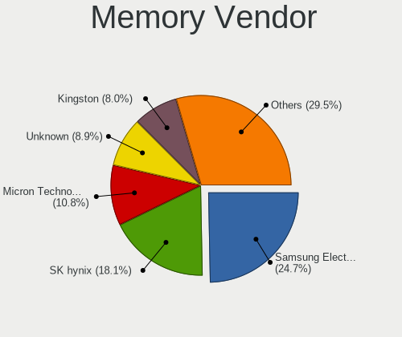
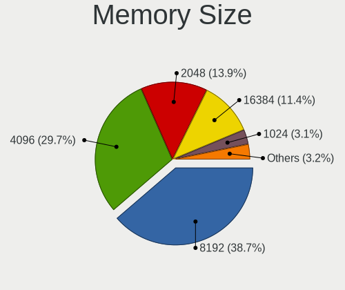

Zorin 16 - Tested Hardware & Statistics
---------------------------------------

A project to collect tested hardware configurations for Zorin 16 (Beta test).

Anyone can contribute to this report by the [hw-probe](https://github.com/linuxhw/hw-probe) tool:

    sudo -E hw-probe -all -upload

Please submit a probe of your configuration if it's not presented on the page or is rare.

This is a report for all computer types. See also reports for [desktops](/Dist/Zorin_16/Desktop/README.md) and [notebooks](/Dist/Zorin_16/Notebook/README.md).

Full-feature report is available here: https://linux-hardware.org/?view=trends&rel=zorin-16

Contents
--------

* [ Test Cases ](#test-cases)

* [ System ](#system)
  - [ Kernel                   ](#kernel)
  - [ Kernel Family            ](#kernel-family)
  - [ Kernel Major Ver.        ](#kernel-major-ver)
  - [ Arch                     ](#arch)
  - [ DE                       ](#de)
  - [ Display Server           ](#display-server)
  - [ Display Manager          ](#display-manager)
  - [ OS Lang                  ](#os-lang)
  - [ Boot Mode                ](#boot-mode)
  - [ Filesystem               ](#filesystem)
  - [ Part. scheme             ](#part-scheme)
  - [ Dual Boot with Linux/BSD ](#dual-boot-with-linuxbsd)
  - [ Dual Boot (Win)          ](#dual-boot-win)

* [ Board ](#board)
  - [ Vendor                   ](#vendor)
  - [ Model                    ](#model)
  - [ Model Family             ](#model-family)
  - [ MFG Year                 ](#mfg-year)
  - [ Form Factor              ](#form-factor)
  - [ Secure Boot              ](#secure-boot)
  - [ Coreboot                 ](#coreboot)
  - [ RAM Size                 ](#ram-size)
  - [ RAM Used                 ](#ram-used)
  - [ Total Drives             ](#total-drives)
  - [ Has CD-ROM               ](#has-cd-rom)
  - [ Has Ethernet             ](#has-ethernet)
  - [ Has WiFi                 ](#has-wifi)
  - [ Has Bluetooth            ](#has-bluetooth)

* [ Location ](#location)
  - [ Country                  ](#country)
  - [ City                     ](#city)

* [ Drives ](#drives)
  - [ Drive Vendor             ](#drive-vendor)
  - [ Drive Model              ](#drive-model)
  - [ HDD Vendor               ](#hdd-vendor)
  - [ SSD Vendor               ](#ssd-vendor)
  - [ Drive Kind               ](#drive-kind)
  - [ Drive Connector          ](#drive-connector)
  - [ Drive Size               ](#drive-size)
  - [ Space Total              ](#space-total)
  - [ Space Used               ](#space-used)
  - [ Malfunc. Drives          ](#malfunc-drives)
  - [ Malfunc. Drive Vendor    ](#malfunc-drive-vendor)
  - [ Malfunc. HDD Vendor      ](#malfunc-hdd-vendor)
  - [ Malfunc. Drive Kind      ](#malfunc-drive-kind)
  - [ Failed Drives            ](#failed-drives)
  - [ Failed Drive Vendor      ](#failed-drive-vendor)
  - [ Drive Status             ](#drive-status)

* [ Storage controller ](#storage-controller)
  - [ Storage Vendor           ](#storage-vendor)
  - [ Storage Model            ](#storage-model)
  - [ Storage Kind             ](#storage-kind)

* [ Processor ](#processor)
  - [ CPU Vendor               ](#cpu-vendor)
  - [ CPU Model                ](#cpu-model)
  - [ CPU Model Family         ](#cpu-model-family)
  - [ CPU Cores                ](#cpu-cores)
  - [ CPU Sockets              ](#cpu-sockets)
  - [ CPU Threads              ](#cpu-threads)
  - [ CPU Op-Modes             ](#cpu-op-modes)
  - [ CPU Microcode            ](#cpu-microcode)
  - [ CPU Microarch            ](#cpu-microarch)

* [ Graphics ](#graphics)
  - [ GPU Vendor               ](#gpu-vendor)
  - [ GPU Model                ](#gpu-model)
  - [ GPU Combo                ](#gpu-combo)
  - [ GPU Driver               ](#gpu-driver)
  - [ GPU Memory               ](#gpu-memory)

* [ Monitor ](#monitor)
  - [ Monitor Vendor           ](#monitor-vendor)
  - [ Monitor Model            ](#monitor-model)
  - [ Monitor Resolution       ](#monitor-resolution)
  - [ Monitor Diagonal         ](#monitor-diagonal)
  - [ Monitor Width            ](#monitor-width)
  - [ Aspect Ratio             ](#aspect-ratio)
  - [ Monitor Area             ](#monitor-area)
  - [ Pixel Density            ](#pixel-density)
  - [ Multiple Monitors        ](#multiple-monitors)

* [ Network ](#network)
  - [ Net Controller Vendor    ](#net-controller-vendor)
  - [ Net Controller Model     ](#net-controller-model)
  - [ Wireless Vendor          ](#wireless-vendor)
  - [ Wireless Model           ](#wireless-model)
  - [ Ethernet Vendor          ](#ethernet-vendor)
  - [ Ethernet Model           ](#ethernet-model)
  - [ Net Controller Kind      ](#net-controller-kind)
  - [ Used Controller          ](#used-controller)
  - [ NICs                     ](#nics)
  - [ IPv6                     ](#ipv6)

* [ Bluetooth ](#bluetooth)
  - [ Bluetooth Vendor         ](#bluetooth-vendor)
  - [ Bluetooth Model          ](#bluetooth-model)

* [ Sound ](#sound)
  - [ Sound Vendor             ](#sound-vendor)
  - [ Sound Model              ](#sound-model)

* [ Memory ](#memory)
  - [ Memory Vendor            ](#memory-vendor)
  - [ Memory Model             ](#memory-model)
  - [ Memory Kind              ](#memory-kind)
  - [ Memory Form Factor       ](#memory-form-factor)
  - [ Memory Size              ](#memory-size)
  - [ Memory Speed             ](#memory-speed)

* [ Printers & scanners ](#printers--scanners)
  - [ Printer Vendor           ](#printer-vendor)
  - [ Printer Model            ](#printer-model)
  - [ Scanner Vendor           ](#scanner-vendor)
  - [ Scanner Model            ](#scanner-model)

* [ Camera ](#camera)
  - [ Camera Vendor            ](#camera-vendor)
  - [ Camera Model             ](#camera-model)

* [ Security ](#security)
  - [ Fingerprint Vendor       ](#fingerprint-vendor)
  - [ Fingerprint Model        ](#fingerprint-model)
  - [ Chipcard Vendor          ](#chipcard-vendor)
  - [ Chipcard Model           ](#chipcard-model)

* [ Unsupported ](#unsupported)
  - [ Unsupported Devices      ](#unsupported-devices)
  - [ Unsupported Device Types ](#unsupported-device-types)

Test Cases
----------

| Vendor   | Model                       | Form-Factor | Probe                                                      | Date         |
|----------|-----------------------------|-------------|------------------------------------------------------------|--------------|
| HP       | ProBook 450 G2              | Notebook    | [a3e170c339](https://linux-hardware.org/?probe=a3e170c339) | Aug 17, 2021 |
| Gigabyte | B550M DS3H                  | Desktop     | [4b687b4c17](https://linux-hardware.org/?probe=4b687b4c17) | Aug 16, 2021 |
| ASUSTek  | Z97-C                       | Desktop     | [97b71d18de](https://linux-hardware.org/?probe=97b71d18de) | Aug 16, 2021 |
| ASUSTek  | Z97-C                       | Desktop     | [06872ddde7](https://linux-hardware.org/?probe=06872ddde7) | Aug 16, 2021 |
| ASUSTek  | Z97-C                       | Desktop     | [a1f448c1f6](https://linux-hardware.org/?probe=a1f448c1f6) | Aug 15, 2021 |
| Acer     | Swift SF114-34              | Notebook    | [0a37eed9e8](https://linux-hardware.org/?probe=0a37eed9e8) | Aug 15, 2021 |
| ASUSTek  | ASUS TUF Gaming A15 FA50... | Notebook    | [fcfd1e5ba9](https://linux-hardware.org/?probe=fcfd1e5ba9) | Aug 15, 2021 |
| HP       | ProBook 430 G6              | Notebook    | [c5467376e9](https://linux-hardware.org/?probe=c5467376e9) | Aug 13, 2021 |
| Lenovo   | IdeaPad 3 14ADA05 81W0      | Notebook    | [9718804b4a](https://linux-hardware.org/?probe=9718804b4a) | Aug 12, 2021 |
| ASUSTek  | PRIME X570-PRO              | Desktop     | [fb7eb46b29](https://linux-hardware.org/?probe=fb7eb46b29) | Aug 11, 2021 |
| HP       | ProBook 450 G2              | Notebook    | [67956ca49e](https://linux-hardware.org/?probe=67956ca49e) | Aug 10, 2021 |
| Lenovo   | Yoga 730-13IWL 81JR         | Convertible | [65567a1be4](https://linux-hardware.org/?probe=65567a1be4) | Aug 10, 2021 |
| ASUSTek  | SABERTOOTH Z97 MARK 1       | Desktop     | [fb8a0b07d1](https://linux-hardware.org/?probe=fb8a0b07d1) | Aug 10, 2021 |
| Acer     | Aspire E1-571               | Notebook    | [146f910c76](https://linux-hardware.org/?probe=146f910c76) | Aug 09, 2021 |
| Samsung  | 350V5C/351V5C/3540VC/344... | Notebook    | [c7a0820fe0](https://linux-hardware.org/?probe=c7a0820fe0) | Aug 09, 2021 |
| Samsung  | 350V5C/351V5C/3540VC/344... | Notebook    | [950d41dbb8](https://linux-hardware.org/?probe=950d41dbb8) | Aug 09, 2021 |
| ASUSTek  | M5A97 LE R2.0               | Desktop     | [4d9eaaf5a8](https://linux-hardware.org/?probe=4d9eaaf5a8) | Aug 09, 2021 |
| Lenovo   | Yoga 330-11IGM 81A6         | Convertible | [01e77d1c5f](https://linux-hardware.org/?probe=01e77d1c5f) | Aug 04, 2021 |
| Dell     | Inspiron 7537               | Notebook    | [7a35ed5eb1](https://linux-hardware.org/?probe=7a35ed5eb1) | Aug 03, 2021 |
| Dell     | Inspiron 7537               | Notebook    | [3c865e72d1](https://linux-hardware.org/?probe=3c865e72d1) | Aug 03, 2021 |
| Lenovo   | Yoga 330-11IGM 81A6         | Convertible | [c5d61df0df](https://linux-hardware.org/?probe=c5d61df0df) | Aug 03, 2021 |
| Gigabyte | B550M H                     | Desktop     | [b26c567912](https://linux-hardware.org/?probe=b26c567912) | Aug 03, 2021 |
| ASUSTek  | M5A78L-M/USB3               | Desktop     | [9c841a04d6](https://linux-hardware.org/?probe=9c841a04d6) | Aug 01, 2021 |
| Gigabyte | H61M-USB3-B3                | Desktop     | [3c2020fbb6](https://linux-hardware.org/?probe=3c2020fbb6) | Jul 30, 2021 |
| Gigabyte | H61M-USB3-B3                | Desktop     | [b3bbc6d937](https://linux-hardware.org/?probe=b3bbc6d937) | Jul 30, 2021 |
| HP       | ENVY x360 Convertible 15... | Convertible | [733eb370f2](https://linux-hardware.org/?probe=733eb370f2) | Jul 27, 2021 |
| Lenovo   | Yoga 330-11IGM 81A6         | Convertible | [79b20f33a0](https://linux-hardware.org/?probe=79b20f33a0) | Jul 24, 2021 |
| Lenovo   | Yoga 330-11IGM 81A6         | Convertible | [94ef768b69](https://linux-hardware.org/?probe=94ef768b69) | Jul 24, 2021 |
| Acer     | Aspire E5-551G              | Notebook    | [519515ce84](https://linux-hardware.org/?probe=519515ce84) | Jul 15, 2021 |
| Apple    | Mac-65CE76090165799A iMa... | All in one  | [3bed53aab7](https://linux-hardware.org/?probe=3bed53aab7) | Jul 14, 2021 |
| Dell     | 0V8WGR A00                  | Desktop     | [2cf38ffd15](https://linux-hardware.org/?probe=2cf38ffd15) | Jul 14, 2021 |
| ASUSTek  | P8H61-M LE                  | Desktop     | [b0270beb17](https://linux-hardware.org/?probe=b0270beb17) | Jul 11, 2021 |
| ASUSTek  | P8H61-M LE                  | Desktop     | [896e6feb8a](https://linux-hardware.org/?probe=896e6feb8a) | Jul 11, 2021 |
| Dell     | XPS L501X                   | Notebook    | [a3d8e737a5](https://linux-hardware.org/?probe=a3d8e737a5) | Jul 08, 2021 |
| Dell     | G3 3579                     | Notebook    | [92a8136dc4](https://linux-hardware.org/?probe=92a8136dc4) | Jul 03, 2021 |
| Lenovo   | ThinkBook 13s G2 ITL 20V... | Notebook    | [1196d6821c](https://linux-hardware.org/?probe=1196d6821c) | Jul 02, 2021 |
| Lenovo   | ThinkPad E15 Gen 2 20TD0... | Notebook    | [d63c7755ee](https://linux-hardware.org/?probe=d63c7755ee) | Jun 29, 2021 |
| ASUSTek  | TUF Gaming FX505DT_FX505... | Notebook    | [369a214905](https://linux-hardware.org/?probe=369a214905) | Jun 25, 2021 |
| Lenovo   | 36C5 SDK0J40700 WIN 3258... | Desktop     | [20bf622c31](https://linux-hardware.org/?probe=20bf622c31) | Jun 25, 2021 |
| Dell     | Inspiron 3576               | Notebook    | [849d571ef0](https://linux-hardware.org/?probe=849d571ef0) | Jun 24, 2021 |
| Lenovo   | IdeaPad 330-15IKB 81DE      | Notebook    | [9957b51bea](https://linux-hardware.org/?probe=9957b51bea) | Jun 24, 2021 |
| ASUSTek  | PRIME B450M-GAMING/BR       | Desktop     | [35605881d6](https://linux-hardware.org/?probe=35605881d6) | Jun 23, 2021 |
| MSI      | 2AE0                        | Desktop     | [bce75d51cd](https://linux-hardware.org/?probe=bce75d51cd) | Jun 23, 2021 |
| MSI      | 2AE0                        | Desktop     | [0412c710eb](https://linux-hardware.org/?probe=0412c710eb) | Jun 22, 2021 |
| Dell     | Inspiron 3582               | Notebook    | [e2cd9a9c36](https://linux-hardware.org/?probe=e2cd9a9c36) | Jun 20, 2021 |
| ASUSTek  | PRIME B450M-GAMING/BR       | Desktop     | [b9d86eb932](https://linux-hardware.org/?probe=b9d86eb932) | Jun 17, 2021 |
| ASUSTek  | PRIME B450M-GAMING/BR       | Desktop     | [71de5617aa](https://linux-hardware.org/?probe=71de5617aa) | Jun 17, 2021 |
| ASUSTek  | PRIME X570-P                | Desktop     | [bca1e1b92f](https://linux-hardware.org/?probe=bca1e1b92f) | Jun 16, 2021 |
| ASUSTek  | PRIME X570-P                | Desktop     | [b3f6c76103](https://linux-hardware.org/?probe=b3f6c76103) | Jun 16, 2021 |
| Gigabyte | B85-HD3                     | Desktop     | [c73931b3ff](https://linux-hardware.org/?probe=c73931b3ff) | Jun 13, 2021 |
| Dell     | XPS 13 9370                 | Notebook    | [9e3a58b257](https://linux-hardware.org/?probe=9e3a58b257) | Jun 12, 2021 |
| Dell     | XPS 13 9370                 | Notebook    | [2aa1efb008](https://linux-hardware.org/?probe=2aa1efb008) | Jun 12, 2021 |
| Lenovo   | ThinkPad E15 Gen 2 20TD0... | Notebook    | [01cf29ba72](https://linux-hardware.org/?probe=01cf29ba72) | Jun 10, 2021 |
| HP       | 15                          | Notebook    | [f2132922af](https://linux-hardware.org/?probe=f2132922af) | Jun 08, 2021 |
| HP       | 843C                        | Desktop     | [ccff6e4f39](https://linux-hardware.org/?probe=ccff6e4f39) | Jun 08, 2021 |
| Fujitsu  | LIFEBOOK AH532              | Notebook    | [a1dd6df8e7](https://linux-hardware.org/?probe=a1dd6df8e7) | Jun 07, 2021 |
| Fujitsu  | LIFEBOOK AH532              | Notebook    | [957048adbb](https://linux-hardware.org/?probe=957048adbb) | Jun 06, 2021 |
| Dell     | Inspiron 3582               | Notebook    | [229600e417](https://linux-hardware.org/?probe=229600e417) | Jun 06, 2021 |
| Fujitsu  | LIFEBOOK AH532              | Notebook    | [719041c9d4](https://linux-hardware.org/?probe=719041c9d4) | Jun 04, 2021 |
| ASRock   | 990FX Extreme6              | Desktop     | [fc3b27abac](https://linux-hardware.org/?probe=fc3b27abac) | Jun 03, 2021 |
| HP       | 8591                        | Desktop     | [6f71430d88](https://linux-hardware.org/?probe=6f71430d88) | Jun 01, 2021 |
| HP       | 8591                        | Desktop     | [fc12c57885](https://linux-hardware.org/?probe=fc12c57885) | Jun 01, 2021 |
| HP       | ProBook 650 G2              | Notebook    | [bb92ab2244](https://linux-hardware.org/?probe=bb92ab2244) | May 30, 2021 |
| ASRock   | 990FX Extreme6              | Desktop     | [0a228b18c1](https://linux-hardware.org/?probe=0a228b18c1) | May 30, 2021 |
| HP       | Unknown                     | Notebook    | [e6e060ca51](https://linux-hardware.org/?probe=e6e060ca51) | May 29, 2021 |
| HP       | Unknown                     | Notebook    | [324d49aba6](https://linux-hardware.org/?probe=324d49aba6) | May 29, 2021 |
| ASUSTek  | PRIME B450M-GAMING/BR       | Desktop     | [0144616bb9](https://linux-hardware.org/?probe=0144616bb9) | May 27, 2021 |
| Gigabyte | 945GCM-S2L                  | Desktop     | [9890da0efd](https://linux-hardware.org/?probe=9890da0efd) | May 27, 2021 |
| Gigabyte | 945GCM-S2L                  | Desktop     | [61e1972b06](https://linux-hardware.org/?probe=61e1972b06) | May 27, 2021 |
| Razer    | Book 13 - RZ09-0357         | Notebook    | [c1cc1fcf2e](https://linux-hardware.org/?probe=c1cc1fcf2e) | May 27, 2021 |
| Lenovo   | SHARKBAY 0B98401 PRO        | Desktop     | [887dbc1614](https://linux-hardware.org/?probe=887dbc1614) | May 24, 2021 |
| Biostar  | A320MH                      | Desktop     | [db3a18e1c3](https://linux-hardware.org/?probe=db3a18e1c3) | May 23, 2021 |
| Biostar  | A320MH                      | Desktop     | [ccb22fc057](https://linux-hardware.org/?probe=ccb22fc057) | May 23, 2021 |
| Lenovo   | SHARKBAY 0B98401 PRO        | Desktop     | [0c314899c1](https://linux-hardware.org/?probe=0c314899c1) | May 23, 2021 |
| ASUSTek  | PRIME B450M-GAMING/BR       | Desktop     | [c41eec9cd3](https://linux-hardware.org/?probe=c41eec9cd3) | May 21, 2021 |
| ASUSTek  | PRIME B450M-GAMING/BR       | Desktop     | [ca773b28ee](https://linux-hardware.org/?probe=ca773b28ee) | May 19, 2021 |
| Dell     | Vostro 5490                 | Notebook    | [9d8401675e](https://linux-hardware.org/?probe=9d8401675e) | May 18, 2021 |
| Dell     | Vostro 5490                 | Notebook    | [3f02204090](https://linux-hardware.org/?probe=3f02204090) | May 18, 2021 |
| Acer     | Swift SF313-51              | Notebook    | [2b27dc30ac](https://linux-hardware.org/?probe=2b27dc30ac) | May 17, 2021 |
| ASUSTek  | P8H61-I R2.0                | Desktop     | [c641f2aee4](https://linux-hardware.org/?probe=c641f2aee4) | May 16, 2021 |
| ASUSTek  | P8H61-I R2.0                | Desktop     | [500443b449](https://linux-hardware.org/?probe=500443b449) | May 16, 2021 |
| ASUSTek  | X406UAR                     | Notebook    | [5c50159b19](https://linux-hardware.org/?probe=5c50159b19) | May 16, 2021 |
| ASUSTek  | X406UAR                     | Notebook    | [e3be0eaa69](https://linux-hardware.org/?probe=e3be0eaa69) | May 16, 2021 |
| Lenovo   | Annapurna CRB NOK           | Desktop     | [7d4224df3f](https://linux-hardware.org/?probe=7d4224df3f) | May 13, 2021 |
| Lenovo   | Annapurna CRB NOK           | Desktop     | [adef2ac504](https://linux-hardware.org/?probe=adef2ac504) | May 13, 2021 |
| Lenovo   | ThinkPad Yoga 11e 20DAS0... | Notebook    | [b71b291af5](https://linux-hardware.org/?probe=b71b291af5) | May 10, 2021 |
| Quanta   | XV1                         | All in one  | [d3b0fddedf](https://linux-hardware.org/?probe=d3b0fddedf) | May 05, 2021 |
| Lenovo   | IdeaPad 100-15IBD 80QQ      | Notebook    | [157ae0cc83](https://linux-hardware.org/?probe=157ae0cc83) | May 02, 2021 |
| Dell     | 06D7TR A00                  | Desktop     | [1ccb5b0600](https://linux-hardware.org/?probe=1ccb5b0600) | May 01, 2021 |
| Quanta   | XV1                         | All in one  | [5d38d7934e](https://linux-hardware.org/?probe=5d38d7934e) | Apr 30, 2021 |
| Pegatron | Benicia                     | Desktop     | [df847c36d5](https://linux-hardware.org/?probe=df847c36d5) | Apr 25, 2021 |
| Lenovo   | IdeaPad 100-15IBD 80QQ      | Notebook    | [12081d4e79](https://linux-hardware.org/?probe=12081d4e79) | Apr 25, 2021 |
| Gigabyte | B450 AORUS ELITE            | Desktop     | [7f46cdb7ab](https://linux-hardware.org/?probe=7f46cdb7ab) | Apr 24, 2021 |
| Lenovo   | Yoga C740-15IML 81TD        | Convertible | [236ed4432a](https://linux-hardware.org/?probe=236ed4432a) | Apr 24, 2021 |
| Lenovo   | IdeaPad Y570 0862           | Notebook    | [94d22e7673](https://linux-hardware.org/?probe=94d22e7673) | Apr 23, 2021 |
| ASUSTek  | M4A88TD-V EVO/USB3          | Desktop     | [b00e95f3db](https://linux-hardware.org/?probe=b00e95f3db) | Apr 22, 2021 |
| ASUSTek  | P5K                         | Desktop     | [0149b6c450](https://linux-hardware.org/?probe=0149b6c450) | Apr 22, 2021 |
| Dell     | 0PGKWF A02                  | Desktop     | [f963717b2c](https://linux-hardware.org/?probe=f963717b2c) | Apr 18, 2021 |
| Apple    | Mac-031B6874CF7F642A iMa... | All in one  | [0761ed6181](https://linux-hardware.org/?probe=0761ed6181) | Apr 16, 2021 |
| Acer     | Aspire XC-605G              | Desktop     | [79d3d3a05e](https://linux-hardware.org/?probe=79d3d3a05e) | Mar 18, 2021 |

System
------

Kernel
------

Version of the Linux kernel

| Version           | Computers | Percent |
|-------------------|-----------|---------|
| 5.8.0-53-generic  | 13        | 20%     |
| 5.8.0-50-generic  | 12        | 18.46%  |
| 5.11.0-25-generic | 11        | 16.92%  |
| 5.8.0-55-generic  | 10        | 15.38%  |
| 5.8.0-59-generic  | 8         | 12.31%  |
| 5.8.0-63-generic  | 4         | 6.15%   |
| 5.8.0-49-generic  | 4         | 6.15%   |
| 5.8.0-45-generic  | 1         | 1.54%   |
| 5.4.0-42-generic  | 1         | 1.54%   |
| 5.11.0-27-generic | 1         | 1.54%   |

Kernel Family
-------------

Linux kernel without a distro release

| Version | Computers | Percent |
|---------|-----------|---------|
| 5.8.0   | 51        | 79.69%  |
| 5.11.0  | 12        | 18.75%  |
| 5.4.0   | 1         | 1.56%   |

Kernel Major Ver.
-----------------

Linux kernel major version

| Version | Computers | Percent |
|---------|-----------|---------|
| 5.8     | 51        | 79.69%  |
| 5.11    | 12        | 18.75%  |
| 5.4     | 1         | 1.56%   |

Arch
----

OS architecture (x86_64, i586, etc.)

| Name   | Computers | Percent |
|--------|-----------|---------|
| x86_64 | 64        | 100%    |

DE
--

Desktop Environment

| Name     | Computers | Percent |
|----------|-----------|---------|
| GNOME    | 63        | 98.44%  |
| Cinnamon | 1         | 1.56%   |

Display Server
--------------

X11 or Wayland

| Name    | Computers | Percent |
|---------|-----------|---------|
| X11     | 62        | 96.88%  |
| Wayland | 2         | 3.13%   |

Display Manager
---------------

SDDM, LightDM, etc.

| Name    | Computers | Percent |
|---------|-----------|---------|
| Unknown | 55        | 85.94%  |
| GDM     | 8         | 12.5%   |
| TDM     | 1         | 1.56%   |

OS Lang
-------

Language

| Lang  | Computers | Percent |
|-------|-----------|---------|
| en_US | 22        | 34.38%  |
| en_IN | 6         | 9.38%   |
| de_DE | 6         | 9.38%   |
| pt_BR | 5         | 7.81%   |
| nl_NL | 3         | 4.69%   |
| es_ES | 3         | 4.69%   |
| en_GB | 3         | 4.69%   |
| pl_PL | 2         | 3.13%   |
| hu_HU | 2         | 3.13%   |
| zh_TW | 1         | 1.56%   |
| ru_UA | 1         | 1.56%   |
| ru_RU | 1         | 1.56%   |
| nl_BE | 1         | 1.56%   |
| it_IT | 1         | 1.56%   |
| fr_FR | 1         | 1.56%   |
| es_PE | 1         | 1.56%   |
| es_MX | 1         | 1.56%   |
| es_CL | 1         | 1.56%   |
| en_ZA | 1         | 1.56%   |
| en_PH | 1         | 1.56%   |
| en_CA | 1         | 1.56%   |

Boot Mode
---------

EFI or BIOS

| Mode | Computers | Percent |
|------|-----------|---------|
| EFI  | 42        | 64.62%  |
| BIOS | 23        | 35.38%  |

Filesystem
----------

Type of filesystem

| Type    | Computers | Percent |
|---------|-----------|---------|
| Ext4    | 61        | 95.31%  |
| Overlay | 1         | 1.56%   |
| Ext3    | 1         | 1.56%   |
| Btrfs   | 1         | 1.56%   |

Part. scheme
------------

Scheme of partitioning

| Type    | Computers | Percent |
|---------|-----------|---------|
| Unknown | 55        | 85.94%  |
| GPT     | 8         | 12.5%   |
| MBR     | 1         | 1.56%   |

Dual Boot with Linux/BSD
------------------------

Hosting more than one Linux/BSD

| Dual boot | Computers | Percent |
|-----------|-----------|---------|
| No        | 63        | 98.44%  |
| Yes       | 1         | 1.56%   |

Dual Boot (Win)
---------------

Hosting Linux and Windows

| Dual boot | Computers | Percent |
|-----------|-----------|---------|
| No        | 57        | 89.06%  |
| Yes       | 7         | 10.94%  |

Board
-----

Vendor
------

Motherboard manufacturer

| Name                | Computers | Percent |
|---------------------|-----------|---------|
| ASUSTek Computer    | 14        | 21.88%  |
| Lenovo              | 12        | 18.75%  |
| Dell                | 9         | 14.06%  |
| Hewlett-Packard     | 8         | 12.5%   |
| Gigabyte Technology | 6         | 9.38%   |
| Acer                | 5         | 7.81%   |
| Apple               | 2         | 3.13%   |
| Samsung Electronics | 1         | 1.56%   |
| Razer               | 1         | 1.56%   |
| Quanta              | 1         | 1.56%   |
| Pegatron            | 1         | 1.56%   |
| MSI                 | 1         | 1.56%   |
| Fujitsu             | 1         | 1.56%   |
| Biostar             | 1         | 1.56%   |
| ASRock              | 1         | 1.56%   |

Model
-----

Motherboard model

| Name                                     | Computers | Percent |
|------------------------------------------|-----------|---------|
| Dell OptiPlex 990                        | 2         | 3.13%   |
| ASUS All Series                          | 2         | 3.13%   |
| Samsung 350V5C/351V5C/3540VC/3440VC      | 1         | 1.56%   |
| Razer Book 13 - RZ09-0357                | 1         | 1.56%   |
| Quanta CA27                              | 1         | 1.56%   |
| Pegatron NE502AV-ABA a6750t              | 1         | 1.56%   |
| MSI Pro 3515 Series                      | 1         | 1.56%   |
| Lenovo Yoga C740-15IML 81TD              | 1         | 1.56%   |
| Lenovo Yoga 730-13IWL 81JR               | 1         | 1.56%   |
| Lenovo Yoga 330-11IGM 81A6               | 1         | 1.56%   |
| Lenovo ThinkPad Yoga 11e 20DAS0SF00      | 1         | 1.56%   |
| Lenovo ThinkPad E15 Gen 2 20TD000HZA     | 1         | 1.56%   |
| Lenovo ThinkCentre M83 MT-M 10AJ-0003MB  | 1         | 1.56%   |
| Lenovo ThinkCentre M78 10BTA00ELM        | 1         | 1.56%   |
| Lenovo IdeaPad Y570 0862                 | 1         | 1.56%   |
| Lenovo IdeaPad 330-15IKB 81DE            | 1         | 1.56%   |
| Lenovo IdeaPad 3 14ADA05 81W0            | 1         | 1.56%   |
| Lenovo IdeaPad 100-15IBD 80QQ            | 1         | 1.56%   |
| Lenovo IdeaCentre 510S-08IKL 90GB004RUS  | 1         | 1.56%   |
| HP Z1 Entry Tower G5                     | 1         | 1.56%   |
| HP ProBook 650 G2                        | 1         | 1.56%   |
| HP ProBook 450 G2                        | 1         | 1.56%   |
| HP ProBook 430 G6                        | 1         | 1.56%   |
| HP ENVY x360 Convertible 15m-ee0xxx      | 1         | 1.56%   |
| HP 290 G2 MT Business PC                 | 1         | 1.56%   |
| HP 15                                    | 1         | 1.56%   |
| Gigabyte Komputer OPTIMUS                | 1         | 1.56%   |
| Gigabyte H61M-USB3-B3                    | 1         | 1.56%   |
| Gigabyte B85-HD3                         | 1         | 1.56%   |
| Gigabyte B550M H                         | 1         | 1.56%   |
| Gigabyte B550M DS3H                      | 1         | 1.56%   |
| Gigabyte B450 AORUS ELITE                | 1         | 1.56%   |
| Fujitsu LIFEBOOK AH532                   | 1         | 1.56%   |
| Dell XPS L501X                           | 1         | 1.56%   |
| Dell XPS 13 9370                         | 1         | 1.56%   |
| Dell Vostro 5490                         | 1         | 1.56%   |
| Dell Inspiron 7537                       | 1         | 1.56%   |
| Dell Inspiron 3582                       | 1         | 1.56%   |
| Dell Inspiron 3576                       | 1         | 1.56%   |
| Dell G3 3579                             | 1         | 1.56%   |
| Biostar A320MH                           | 1         | 1.56%   |
| ASUS X406UAR                             | 1         | 1.56%   |
| ASUS UNLOCK INSTALL                      | 1         | 1.56%   |
| ASUS TUF Gaming FX505DT_FX505DT          | 1         | 1.56%   |
| ASUS PRIME X570-PRO                      | 1         | 1.56%   |
| ASUS PRIME X570-P                        | 1         | 1.56%   |
| ASUS PRIME B450M-GAMING/BR               | 1         | 1.56%   |
| ASUS P8H61-M LE                          | 1         | 1.56%   |
| ASUS P5K                                 | 1         | 1.56%   |
| ASUS M5A97 LE R2.0                       | 1         | 1.56%   |
| ASUS M5A78L-M/USB3                       | 1         | 1.56%   |
| ASUS M4A88TD-V EVO/USB3                  | 1         | 1.56%   |
| ASUS ASUS TUF Gaming A15 FA506IH_FA506IH | 1         | 1.56%   |
| ASRock 990FX Extreme6                    | 1         | 1.56%   |
| Apple iMac17,1                           | 1         | 1.56%   |
| Apple iMac14,1                           | 1         | 1.56%   |
| Acer Swift SF313-51                      | 1         | 1.56%   |
| Acer Swift SF114-34                      | 1         | 1.56%   |
| Acer Aspire XC-605G                      | 1         | 1.56%   |
| Acer Aspire E5-551G                      | 1         | 1.56%   |

Model Family
------------

Motherboard model prefix

| Name                  | Computers | Percent |
|-----------------------|-----------|---------|
| Lenovo IdeaPad        | 4         | 6.25%   |
| Lenovo Yoga           | 3         | 4.69%   |
| HP ProBook            | 3         | 4.69%   |
| Dell Inspiron         | 3         | 4.69%   |
| ASUS PRIME            | 3         | 4.69%   |
| Acer Aspire           | 3         | 4.69%   |
| Lenovo ThinkPad       | 2         | 3.13%   |
| Lenovo ThinkCentre    | 2         | 3.13%   |
| Gigabyte B550M        | 2         | 3.13%   |
| Dell XPS              | 2         | 3.13%   |
| Dell OptiPlex         | 2         | 3.13%   |
| ASUS All              | 2         | 3.13%   |
| Acer Swift            | 2         | 3.13%   |
| Samsung 350V5C        | 1         | 1.56%   |
| Razer Book            | 1         | 1.56%   |
| Quanta CA27           | 1         | 1.56%   |
| Pegatron NE502AV-ABA  | 1         | 1.56%   |
| MSI Pro               | 1         | 1.56%   |
| Lenovo IdeaCentre     | 1         | 1.56%   |
| HP Z1                 | 1         | 1.56%   |
| HP ENVY               | 1         | 1.56%   |
| HP 290                | 1         | 1.56%   |
| HP 15                 | 1         | 1.56%   |
| Gigabyte Komputer     | 1         | 1.56%   |
| Gigabyte H61M-USB3-B3 | 1         | 1.56%   |
| Gigabyte B85-HD3      | 1         | 1.56%   |
| Gigabyte B450         | 1         | 1.56%   |
| Fujitsu LIFEBOOK      | 1         | 1.56%   |
| Dell Vostro           | 1         | 1.56%   |
| Dell G3               | 1         | 1.56%   |
| Biostar A320MH        | 1         | 1.56%   |
| ASUS X406UAR          | 1         | 1.56%   |
| ASUS UNLOCK           | 1         | 1.56%   |
| ASUS TUF              | 1         | 1.56%   |
| ASUS P8H61-M          | 1         | 1.56%   |
| ASUS P5K              | 1         | 1.56%   |
| ASUS M5A97            | 1         | 1.56%   |
| ASUS M5A78L-M         | 1         | 1.56%   |
| ASUS M4A88TD-V        | 1         | 1.56%   |
| ASUS ASUS             | 1         | 1.56%   |
| ASRock 990FX          | 1         | 1.56%   |
| Apple iMac17          | 1         | 1.56%   |
| Apple iMac14          | 1         | 1.56%   |
| Unknown               | 1         | 1.56%   |

MFG Year
--------

Motherboard manufacture year

| Year | Computers | Percent |
|------|-----------|---------|
| 2020 | 15        | 23.44%  |
| 2021 | 11        | 17.19%  |
| 2019 | 10        | 15.63%  |
| 2018 | 5         | 7.81%   |
| 2014 | 4         | 6.25%   |
| 2013 | 4         | 6.25%   |
| 2016 | 3         | 4.69%   |
| 2015 | 3         | 4.69%   |
| 2011 | 3         | 4.69%   |
| 2008 | 2         | 3.13%   |
| 2012 | 1         | 1.56%   |
| 2010 | 1         | 1.56%   |
| 2009 | 1         | 1.56%   |
| 2007 | 1         | 1.56%   |

Form Factor
-----------

Physical design of the computer

| Name        | Computers | Percent |
|-------------|-----------|---------|
| Desktop     | 29        | 45.31%  |
| Notebook    | 28        | 43.75%  |
| Convertible | 4         | 6.25%   |
| All in one  | 3         | 4.69%   |

Secure Boot
-----------

Enabled or disabled

| State    | Computers | Percent |
|----------|-----------|---------|
| Disabled | 56        | 87.5%   |
| Enabled  | 8         | 12.5%   |

Coreboot
--------

Have coreboot on board

| Used | Computers | Percent |
|------|-----------|---------|
| No   | 64        | 100%    |

RAM Size
--------

Total RAM memory

| Size in GB | Computers | Percent |
|------------|-----------|---------|
| 8.01-16.0  | 18        | 27.69%  |
| 4.01-8.0   | 15        | 23.08%  |
| 16.01-24.0 | 15        | 23.08%  |
| 3.01-4.0   | 11        | 16.92%  |
| 32.01-64.0 | 4         | 6.15%   |
| 1.01-2.0   | 2         | 3.08%   |

RAM Used
--------

Used RAM memory

| Used GB  | Computers | Percent |
|----------|-----------|---------|
| 1.01-2.0 | 27        | 40.91%  |
| 2.01-3.0 | 24        | 36.36%  |
| 3.01-4.0 | 8         | 12.12%  |
| 4.01-8.0 | 5         | 7.58%   |
| 0.51-1.0 | 2         | 3.03%   |

Total Drives
------------

Number of drives on board

| Drives | Computers | Percent |
|--------|-----------|---------|
| 1      | 40        | 62.5%   |
| 2      | 14        | 21.88%  |
| 4      | 4         | 6.25%   |
| 3      | 4         | 6.25%   |
| 5      | 1         | 1.56%   |
| 0      | 1         | 1.56%   |

Has CD-ROM
----------

Has CD-ROM on board

| Presented | Computers | Percent |
|-----------|-----------|---------|
| No        | 33        | 50.77%  |
| Yes       | 32        | 49.23%  |

Has Ethernet
------------

Has Ethernet on board

| Presented | Computers | Percent |
|-----------|-----------|---------|
| Yes       | 55        | 84.62%  |
| No        | 10        | 15.38%  |

Has WiFi
--------

Has WiFi module

| Presented | Computers | Percent |
|-----------|-----------|---------|
| Yes       | 44        | 68.75%  |
| No        | 20        | 31.25%  |

Has Bluetooth
-------------

Has Bluetooth module

| Presented | Computers | Percent |
|-----------|-----------|---------|
| Yes       | 38        | 59.38%  |
| No        | 26        | 40.63%  |

Location
--------

Country
-------

Geographic location (country)

| Country      | Computers | Percent |
|--------------|-----------|---------|
| USA          | 17        | 26.56%  |
| Germany      | 7         | 10.94%  |
| India        | 6         | 9.38%   |
| Brazil       | 5         | 7.81%   |
| UK           | 3         | 4.69%   |
| Spain        | 3         | 4.69%   |
| Netherlands  | 3         | 4.69%   |
| Mexico       | 2         | 3.13%   |
| Hungary      | 2         | 3.13%   |
| Ukraine      | 1         | 1.56%   |
| Taiwan       | 1         | 1.56%   |
| South Africa | 1         | 1.56%   |
| Romania      | 1         | 1.56%   |
| Poland       | 1         | 1.56%   |
| Philippines  | 1         | 1.56%   |
| Peru         | 1         | 1.56%   |
| Madagascar   | 1         | 1.56%   |
| Italy        | 1         | 1.56%   |
| Denmark      | 1         | 1.56%   |
| Chile        | 1         | 1.56%   |
| Canada       | 1         | 1.56%   |
| Belgium      | 1         | 1.56%   |
| Azerbaijan   | 1         | 1.56%   |
| Austria      | 1         | 1.56%   |
| Australia    | 1         | 1.56%   |

City
----

Geographic location (city)

| City                   | Computers | Percent |
|------------------------|-----------|---------|
| Hyderabad              | 2         | 3.13%   |
| Xalapa                 | 1         | 1.56%   |
| Vienna                 | 1         | 1.56%   |
| Vespasiano             | 1         | 1.56%   |
| Vancouver              | 1         | 1.56%   |
| Trujillo               | 1         | 1.56%   |
| São Bernardo do Campo | 1         | 1.56%   |
| Sutton Coldfield       | 1         | 1.56%   |
| Stadskanaal            | 1         | 1.56%   |
| Santa Cruz de Tenerife | 1         | 1.56%   |
| San Francisco          | 1         | 1.56%   |
| Sacramento             | 1         | 1.56%   |
| Rome                   | 1         | 1.56%   |
| Rio de Janeiro         | 1         | 1.56%   |
| Rancagua               | 1         | 1.56%   |
| Quezon City            | 1         | 1.56%   |
| Pretoria               | 1         | 1.56%   |
| Pascoag                | 1         | 1.56%   |
| Palm Coast             | 1         | 1.56%   |
| Oscoda                 | 1         | 1.56%   |
| Ohmbach                | 1         | 1.56%   |
| Oak Creek              | 1         | 1.56%   |
| Nyiregyhaza            | 1         | 1.56%   |
| New Taipei             | 1         | 1.56%   |
| Mérida                | 1         | 1.56%   |
| Monheim am Rhein       | 1         | 1.56%   |
| Mentor                 | 1         | 1.56%   |
| Melbourne              | 1         | 1.56%   |
| Manchester             | 1         | 1.56%   |
| Ludwigsburg            | 1         | 1.56%   |
| Littleton              | 1         | 1.56%   |
| Kyiv                   | 1         | 1.56%   |
| Kolkata                | 1         | 1.56%   |
| Kingston               | 1         | 1.56%   |
| Idaho Falls            | 1         | 1.56%   |
| Hamburg                | 1         | 1.56%   |
| Ghent                  | 1         | 1.56%   |
| Gdynia                 | 1         | 1.56%   |
| Galgamacsa             | 1         | 1.56%   |
| Fortaleza              | 1         | 1.56%   |
| Fort Worth             | 1         | 1.56%   |
| Eugene                 | 1         | 1.56%   |
| Ernakulam              | 1         | 1.56%   |
| Dudley                 | 1         | 1.56%   |
| Dortmund               | 1         | 1.56%   |
| Copenhagen             | 1         | 1.56%   |
| Contagem               | 1         | 1.56%   |
| Chipiona               | 1         | 1.56%   |
| Chennai                | 1         | 1.56%   |
| Charlottesville        | 1         | 1.56%   |
| Charlotte              | 1         | 1.56%   |
| Berlin                 | 1         | 1.56%   |
| Bedum                  | 1         | 1.56%   |
| Beacon                 | 1         | 1.56%   |
| Baltimore              | 1         | 1.56%   |
| Baku                   | 1         | 1.56%   |
| Bad Mergentheim        | 1         | 1.56%   |
| Arlington              | 1         | 1.56%   |
| Arad                   | 1         | 1.56%   |
| Antananarivo           | 1         | 1.56%   |

Drives
------

Drive Vendor
------------

Hard drive vendors

| Vendor                    | Computers | Drives | Percent |
|---------------------------|-----------|--------|---------|
| WDC                       | 15        | 20     | 16.67%  |
| Seagate                   | 14        | 17     | 15.56%  |
| Samsung Electronics       | 12        | 16     | 13.33%  |
| Sandisk                   | 8         | 10     | 8.89%   |
| Kingston                  | 8         | 11     | 8.89%   |
| Toshiba                   | 6         | 6      | 6.67%   |
| Unknown                   | 4         | 5      | 4.44%   |
| Phison                    | 3         | 3      | 3.33%   |
| Intel                     | 3         | 3      | 3.33%   |
| A-DATA Technology         | 3         | 3      | 3.33%   |
| Micron/Crucial Technology | 2         | 2      | 2.22%   |
| Apple                     | 2         | 2      | 2.22%   |
| USB30                     | 1         | 2      | 1.11%   |
| Silicon Motion            | 1         | 3      | 1.11%   |
| Maxtor                    | 1         | 1      | 1.11%   |
| Lexar                     | 1         | 1      | 1.11%   |
| KIOXIA                    | 1         | 1      | 1.11%   |
| KingFast                  | 1         | 1      | 1.11%   |
| JMicron                   | 1         | 1      | 1.11%   |
| HGST                      | 1         | 1      | 1.11%   |
| Hewlett-Packard           | 1         | 1      | 1.11%   |
| Crucial                   | 1         | 1      | 1.11%   |

Drive Model
-----------

Hard drive models

| Model                                   | Computers | Percent |
|-----------------------------------------|-----------|---------|
| Seagate ST1000LM035-1RK172 1TB          | 3         | 3.09%   |
| WDC WD10EZEX-08WN4A0 1TB                | 2         | 2.06%   |
| Unknown SD/MMC/MS PRO 128GB             | 2         | 2.06%   |
| Samsung SSD 860 EVO 1TB                 | 2         | 2.06%   |
| Phison NVMe SSD Drive 1TB               | 2         | 2.06%   |
| Kingston SA400S37240G 240GB SSD         | 2         | 2.06%   |
| WDC WDS250G2B0A-00SM50 250GB SSD        | 1         | 1.03%   |
| WDC WD5000LPVT-22G33T0 500GB            | 1         | 1.03%   |
| WDC WD5000AAKX-08U6AA0 500GB            | 1         | 1.03%   |
| WDC WD5000AAKS-00YGA0 500GB             | 1         | 1.03%   |
| WDC WD40EZAZ-00SF3B0 4TB                | 1         | 1.03%   |
| WDC WD3200BUCT-63TWBY0 320GB            | 1         | 1.03%   |
| WDC WD30EZRX-00D8PB0 3TB                | 1         | 1.03%   |
| WDC WD20EURX-61T0FY0 2TB                | 1         | 1.03%   |
| WDC WD10JPVX-60JC3T1 1TB                | 1         | 1.03%   |
| WDC WD10JPVX-22JC3T0 1TB                | 1         | 1.03%   |
| WDC WD10EZEX-60M2NA0 1TB                | 1         | 1.03%   |
| WDC WD10EZEX-21M2NA0 1TB                | 1         | 1.03%   |
| WDC WD10EZEX-08M2NA0 1TB                | 1         | 1.03%   |
| WDC WD10EZEX-00KUWA0 1TB                | 1         | 1.03%   |
| WDC WD10EURX-63FH1Y0 1TB                | 1         | 1.03%   |
| WDC PC SN520 SDAPNUW-512G-1014 512GB    | 1         | 1.03%   |
| USB30 Disk 250GB                        | 1         | 1.03%   |
| Unknown MMC Card  32GB                  | 1         | 1.03%   |
| Unknown MMC Card  128GB                 | 1         | 1.03%   |
| Toshiba THNSNJ128GCSU 128GB SSD         | 1         | 1.03%   |
| Toshiba MQ01ABF050 500GB                | 1         | 1.03%   |
| Toshiba KSG60ZMV256G M.2 2280 256GB SSD | 1         | 1.03%   |
| Toshiba KBG40ZMT128G MEMORY 128GB       | 1         | 1.03%   |
| Toshiba HDWD110 1TB                     | 1         | 1.03%   |
| Toshiba DT01ACA300 3TB                  | 1         | 1.03%   |
| Silicon Motion NVMe SSD Drive 128GB     | 1         | 1.03%   |
| Silicon Motion NVME SSD 128GB           | 1         | 1.03%   |
| Seagate ST500LM030-1RK17D 500GB         | 1         | 1.03%   |
| Seagate ST500LM021-1KJ152 500GB         | 1         | 1.03%   |
| Seagate ST500LM012 HN-M500MBB 500GB     | 1         | 1.03%   |
| Seagate ST500DM002-1BD142 500GB         | 1         | 1.03%   |
| Seagate ST4000DM004-2CV104 4TB          | 1         | 1.03%   |
| Seagate ST380811AS 80GB                 | 1         | 1.03%   |
| Seagate ST31500341AS 1TB                | 1         | 1.03%   |
| Seagate ST2000LM015-2E8174 2TB          | 1         | 1.03%   |
| Seagate ST1000VM002-1CT162 1TB          | 1         | 1.03%   |
| Seagate ST1000LM024 HN-M101MBB 1TB      | 1         | 1.03%   |
| Seagate ST1000LM010-9YH146 1TB          | 1         | 1.03%   |
| Seagate ST1000DM010-2EP102 1TB          | 1         | 1.03%   |
| Seagate ST1000DM003-1CH162 1TB          | 1         | 1.03%   |
| SanDisk SSD PLUS 480GB                  | 1         | 1.03%   |
| SanDisk SSD PLUS 240GB                  | 1         | 1.03%   |
| SanDisk SDSSDA120G 120GB                | 1         | 1.03%   |
| SanDisk SD8SN8U256G1002 256GB SSD       | 1         | 1.03%   |
| Sandisk NVMe SSD Drive 512GB            | 1         | 1.03%   |
| Sandisk NVMe SSD Drive 256GB            | 1         | 1.03%   |
| Sandisk NVMe SSD Drive 250GB            | 1         | 1.03%   |
| Sandisk NVMe SSD Drive 128GB            | 1         | 1.03%   |
| Samsung SSD 870 QVO 1TB                 | 1         | 1.03%   |
| Samsung SSD 860 EVO 500GB               | 1         | 1.03%   |
| Samsung SSD 840 EVO 250GB               | 1         | 1.03%   |
| Samsung SSD 840 EVO 120GB               | 1         | 1.03%   |
| Samsung NVMe SSD Drive 512GB            | 1         | 1.03%   |
| Samsung NVMe SSD Drive 500GB            | 1         | 1.03%   |

HDD Vendor
----------

Hard disk drive vendors

| Vendor              | Computers | Drives | Percent |
|---------------------|-----------|--------|---------|
| WDC                 | 14        | 18     | 35.9%   |
| Seagate             | 14        | 17     | 35.9%   |
| Toshiba             | 3         | 3      | 7.69%   |
| Samsung Electronics | 3         | 3      | 7.69%   |
| Apple               | 2         | 2      | 5.13%   |
| Maxtor              | 1         | 1      | 2.56%   |
| HGST                | 1         | 1      | 2.56%   |
| Hewlett-Packard     | 1         | 1      | 2.56%   |

SSD Vendor
----------

Solid state drive vendors

| Vendor              | Computers | Drives | Percent |
|---------------------|-----------|--------|---------|
| Kingston            | 7         | 10     | 26.92%  |
| Samsung Electronics | 6         | 8      | 23.08%  |
| SanDisk             | 4         | 5      | 15.38%  |
| Toshiba             | 2         | 2      | 7.69%   |
| A-DATA Technology   | 2         | 2      | 7.69%   |
| WDC                 | 1         | 1      | 3.85%   |
| USB30               | 1         | 2      | 3.85%   |
| Lexar               | 1         | 1      | 3.85%   |
| Intel               | 1         | 1      | 3.85%   |
| Crucial             | 1         | 1      | 3.85%   |

Drive Kind
----------

HDD or SSD

| Kind    | Computers | Drives | Percent |
|---------|-----------|--------|---------|
| HDD     | 34        | 46     | 40.96%  |
| SSD     | 23        | 33     | 27.71%  |
| NVMe    | 20        | 25     | 24.1%   |
| Unknown | 4         | 4      | 4.82%   |
| MMC     | 2         | 3      | 2.41%   |

Drive Connector
---------------

SATA, SAS, NVMe, etc.

| Type | Computers | Drives | Percent |
|------|-----------|--------|---------|
| SATA | 48        | 79     | 65.75%  |
| NVMe | 20        | 25     | 27.4%   |
| SAS  | 3         | 4      | 4.11%   |
| MMC  | 2         | 3      | 2.74%   |

Drive Size
----------

Size of hard drive

| Size in TB | Computers | Drives | Percent |
|------------|-----------|--------|---------|
| 0.01-0.5   | 31        | 42     | 51.67%  |
| 0.51-1.0   | 23        | 30     | 38.33%  |
| 1.01-2.0   | 3         | 3      | 5%      |
| 3.01-4.0   | 2         | 2      | 3.33%   |
| 2.01-3.0   | 1         | 2      | 1.67%   |

Space Total
-----------

Amount of disk space available on the file system

| Size in GB     | Computers | Percent |
|----------------|-----------|---------|
| 251-500        | 25        | 39.06%  |
| 101-250        | 14        | 21.88%  |
| 501-1000       | 10        | 15.63%  |
| 1-20           | 4         | 6.25%   |
| 51-100         | 3         | 4.69%   |
| More than 3000 | 2         | 3.13%   |
| 21-50          | 2         | 3.13%   |
| 2001-3000      | 2         | 3.13%   |
| 1001-2000      | 2         | 3.13%   |

Space Used
----------

Amount of used disk space

| Used GB        | Computers | Percent |
|----------------|-----------|---------|
| 1-20           | 29        | 43.94%  |
| 21-50          | 15        | 22.73%  |
| 101-250        | 8         | 12.12%  |
| 51-100         | 7         | 10.61%  |
| 251-500        | 3         | 4.55%   |
| More than 3000 | 2         | 3.03%   |
| 1001-2000      | 1         | 1.52%   |
| 501-1000       | 1         | 1.52%   |

Malfunc. Drives
---------------

Drive models with a malfunction

| Model                      | Computers | Drives | Percent |
|----------------------------|-----------|--------|---------|
| WDC WD10EZEX-21M2NA0 1TB   | 1         | 1      | 50%     |
| HGST HTS725050A7E630 500GB | 1         | 1      | 50%     |

Malfunc. Drive Vendor
---------------------

Vendors of faulty drives

| Vendor | Computers | Drives | Percent |
|--------|-----------|--------|---------|
| WDC    | 1         | 1      | 50%     |
| HGST   | 1         | 1      | 50%     |

Malfunc. HDD Vendor
-------------------

Vendors of faulty HDD drives

| Vendor | Computers | Drives | Percent |
|--------|-----------|--------|---------|
| WDC    | 1         | 1      | 50%     |
| HGST   | 1         | 1      | 50%     |

Malfunc. Drive Kind
-------------------

Kinds of faulty drives

| Kind | Computers | Drives | Percent |
|------|-----------|--------|---------|
| HDD  | 2         | 2      | 100%    |

Failed Drives
-------------

Failed drive models

Zero info for selected period =(

Failed Drive Vendor
-------------------

Failed drive vendors

Zero info for selected period =(

Drive Status
------------

Number of failed and malfunc. drives

| Status   | Computers | Drives | Percent |
|----------|-----------|--------|---------|
| Detected | 55        | 100    | 84.62%  |
| Works    | 8         | 9      | 12.31%  |
| Malfunc  | 2         | 2      | 3.08%   |

Storage controller
------------------

Storage Vendor
--------------

Storage controller vendors

| Vendor                      | Computers | Percent |
|-----------------------------|-----------|---------|
| Intel                       | 42        | 52.5%   |
| AMD                         | 16        | 20%     |
| Sandisk                     | 5         | 6.25%   |
| Samsung Electronics         | 4         | 5%      |
| Phison Electronics          | 3         | 3.75%   |
| Micron/Crucial Technology   | 2         | 2.5%    |
| KIOXIA                      | 2         | 2.5%    |
| VIA Technologies            | 1         | 1.25%   |
| Silicon Motion              | 1         | 1.25%   |
| Kingston Technology Company | 1         | 1.25%   |
| JMicron Technology          | 1         | 1.25%   |
| ASMedia Technology          | 1         | 1.25%   |
| ADATA Technology            | 1         | 1.25%   |

Storage Model
-------------

Storage controller models

| Model                                                                                   | Computers | Percent |
|-----------------------------------------------------------------------------------------|-----------|---------|
| AMD FCH SATA Controller [AHCI mode]                                                     | 9         | 10.11%  |
| Intel Sunrise Point-LP SATA Controller [AHCI mode]                                      | 4         | 4.49%   |
| Intel 8 Series/C220 Series Chipset Family 6-port SATA Controller 1 [AHCI mode]          | 4         | 4.49%   |
| Sandisk WD Blue SN500 / PC SN520 NVMe SSD                                               | 3         | 3.37%   |
| Samsung NVMe SSD Controller SM981/PM981/PM983                                           | 3         | 3.37%   |
| Intel SATA Controller [RAID mode]                                                       | 3         | 3.37%   |
| Intel 7 Series Chipset Family 6-port SATA Controller [AHCI mode]                        | 3         | 3.37%   |
| AMD SB7x0/SB8x0/SB9x0 IDE Controller                                                    | 3         | 3.37%   |
| Sandisk WD Black 2018/SN750 / PC SN720 NVMe SSD                                         | 2         | 2.25%   |
| Phison E16 PCIe4 NVMe Controller                                                        | 2         | 2.25%   |
| KIOXIA Non-Volatile memory controller                                                   | 2         | 2.25%   |
| Intel Wildcat Point-LP SATA Controller [AHCI Mode]                                      | 2         | 2.25%   |
| Intel SSD 660P Series                                                                   | 2         | 2.25%   |
| Intel Comet Lake SATA AHCI Controller                                                   | 2         | 2.25%   |
| Intel Celeron/Pentium Silver Processor SATA Controller                                  | 2         | 2.25%   |
| Intel Cannon Lake PCH SATA AHCI Controller                                              | 2         | 2.25%   |
| Intel 82801 Mobile SATA Controller [RAID mode]                                          | 2         | 2.25%   |
| Intel 8 Series SATA Controller 1 [AHCI mode]                                            | 2         | 2.25%   |
| Intel 6 Series/C200 Series Chipset Family Desktop SATA Controller (IDE mode, ports 4-5) | 2         | 2.25%   |
| Intel 6 Series/C200 Series Chipset Family Desktop SATA Controller (IDE mode, ports 0-3) | 2         | 2.25%   |
| AMD Starship/Matisse Chipset SATA Controller [AHCI mode]                                | 2         | 2.25%   |
| AMD SB7x0/SB8x0/SB9x0 SATA Controller [IDE mode]                                        | 2         | 2.25%   |
| AMD SB7x0/SB8x0/SB9x0 SATA Controller [AHCI mode]                                       | 2         | 2.25%   |
| AMD 400 Series Chipset SATA Controller                                                  | 2         | 2.25%   |
| VIA VT6415 PATA IDE Host Controller                                                     | 1         | 1.12%   |
| Silicon Motion SM2263EN/SM2263XT SSD Controller                                         | 1         | 1.12%   |
| Samsung NVMe Controller                                                                 | 1         | 1.12%   |
| Phison E12 NVMe Controller                                                              | 1         | 1.12%   |
| Micron/Crucial P1 NVMe PCIe SSD                                                         | 1         | 1.12%   |
| Micron/Crucial NVMe Controller                                                          | 1         | 1.12%   |
| Kingston Company U-SNS8154P3 NVMe SSD                                                   | 1         | 1.12%   |
| JMicron JMB363 SATA/IDE Controller                                                      | 1         | 1.12%   |
| Intel Q170/Q150/B150/H170/H110/Z170/CM236 Chipset SATA Controller [AHCI Mode]           | 1         | 1.12%   |
| Intel NM10/ICH7 Family SATA Controller [IDE mode]                                       | 1         | 1.12%   |
| Intel Cannon Point-LP SATA Controller [AHCI Mode]                                       | 1         | 1.12%   |
| Intel Atom Processor E3800 Series SATA AHCI Controller                                  | 1         | 1.12%   |
| Intel 9 Series Chipset Family SATA Controller [AHCI Mode]                               | 1         | 1.12%   |
| Intel 82801IR/IO/IH (ICH9R/DO/DH) 6 port SATA Controller [AHCI mode]                    | 1         | 1.12%   |
| Intel 82801IB (ICH9) 2 port SATA Controller [IDE mode]                                  | 1         | 1.12%   |
| Intel 82801I (ICH9 Family) 2 port SATA Controller [IDE mode]                            | 1         | 1.12%   |
| Intel 82801HM/HEM (ICH8M/ICH8M-E) SATA Controller [AHCI mode]                           | 1         | 1.12%   |
| Intel 82801HM/HEM (ICH8M/ICH8M-E) IDE Controller                                        | 1         | 1.12%   |
| Intel 6 Series/C200 Series Chipset Family 6 port Mobile SATA AHCI Controller            | 1         | 1.12%   |
| Intel 6 Series/C200 Series Chipset Family 6 port Desktop SATA AHCI Controller           | 1         | 1.12%   |
| Intel 5 Series/3400 Series Chipset 6 port SATA AHCI Controller                          | 1         | 1.12%   |
| Intel 200 Series PCH SATA controller [AHCI mode]                                        | 1         | 1.12%   |
| ASMedia ASM1062 Serial ATA Controller                                                   | 1         | 1.12%   |
| AMD FCH SATA Controller D                                                               | 1         | 1.12%   |
| ADATA XPG SX8200 Pro PCIe Gen3x4 M.2 2280 Solid State Drive                             | 1         | 1.12%   |

Storage Kind
------------

Kind of storage controller (IDE, SATA, NVMe, SAS, ...)

| Kind | Computers | Percent |
|------|-----------|---------|
| SATA | 47        | 58.75%  |
| NVMe | 20        | 25%     |
| IDE  | 8         | 10%     |
| RAID | 5         | 6.25%   |

Processor
---------

CPU Vendor
----------

Processor vendors

| Vendor | Computers | Percent |
|--------|-----------|---------|
| Intel  | 46        | 71.88%  |
| AMD    | 18        | 28.13%  |

CPU Model
---------

Processor models

| Model                                         | Computers | Percent |
|-----------------------------------------------|-----------|---------|
| Intel Core i5-8250U CPU @ 1.60GHz             | 3         | 4.69%   |
| Intel Core i7-8550U CPU @ 1.80GHz             | 2         | 3.13%   |
| Intel Core i7-4790 CPU @ 3.60GHz              | 2         | 3.13%   |
| Intel Core i5-5200U CPU @ 2.20GHz             | 2         | 3.13%   |
| Intel Core i5-3210M CPU @ 2.50GHz             | 2         | 3.13%   |
| Intel Core i5-10210U CPU @ 1.60GHz            | 2         | 3.13%   |
| Intel Core i3-8100 CPU @ 3.60GHz              | 2         | 3.13%   |
| Intel Core i3-2100 CPU @ 3.10GHz              | 2         | 3.13%   |
| Intel Celeron N4000 CPU @ 1.10GHz             | 2         | 3.13%   |
| Intel 11th Gen Core i7-1165G7 @ 2.80GHz       | 2         | 3.13%   |
| AMD Ryzen 5 3600 6-Core Processor             | 2         | 3.13%   |
| Intel Pentium Silver N6000 @ 1.10GHz          | 1         | 1.56%   |
| Intel Pentium Dual-Core CPU E5300 @ 2.60GHz   | 1         | 1.56%   |
| Intel Pentium Dual CPU E2200 @ 2.20GHz        | 1         | 1.56%   |
| Intel Core i7-8565U CPU @ 1.80GHz             | 1         | 1.56%   |
| Intel Core i7-4790K CPU @ 4.00GHz             | 1         | 1.56%   |
| Intel Core i7-4500U CPU @ 1.80GHz             | 1         | 1.56%   |
| Intel Core i7-3630QM CPU @ 2.40GHz            | 1         | 1.56%   |
| Intel Core i7-2670QM CPU @ 2.20GHz            | 1         | 1.56%   |
| Intel Core i7 CPU Q 740 @ 1.73GHz             | 1         | 1.56%   |
| Intel Core i5-8300H CPU @ 2.30GHz             | 1         | 1.56%   |
| Intel Core i5-8265U CPU @ 1.60GHz             | 1         | 1.56%   |
| Intel Core i5-6500 CPU @ 3.20GHz              | 1         | 1.56%   |
| Intel Core i5-4570R CPU @ 2.70GHz             | 1         | 1.56%   |
| Intel Core i5-4430 CPU @ 3.00GHz              | 1         | 1.56%   |
| Intel Core i5-4210U CPU @ 1.70GHz             | 1         | 1.56%   |
| Intel Core i5-2500S CPU @ 2.70GHz             | 1         | 1.56%   |
| Intel Core i5-2500 CPU @ 3.30GHz              | 1         | 1.56%   |
| Intel Core i5-2400 CPU @ 3.10GHz              | 1         | 1.56%   |
| Intel Core i3-7100 CPU @ 3.90GHz              | 1         | 1.56%   |
| Intel Core i3-6100U CPU @ 2.30GHz             | 1         | 1.56%   |
| Intel Core i3-4160 CPU @ 3.60GHz              | 1         | 1.56%   |
| Intel Core i3-3110M CPU @ 2.40GHz             | 1         | 1.56%   |
| Intel Core 2 Quad CPU Q6600 @ 2.40GHz         | 1         | 1.56%   |
| Intel Core 2 Duo CPU T7500 @ 2.20GHz          | 1         | 1.56%   |
| Intel Celeron CPU N2940 @ 1.83GHz             | 1         | 1.56%   |
| AMD Ryzen 9 3900X 12-Core Processor           | 1         | 1.56%   |
| AMD Ryzen 7 4800H with Radeon Graphics        | 1         | 1.56%   |
| AMD Ryzen 7 4700U with Radeon Graphics        | 1         | 1.56%   |
| AMD Ryzen 7 3700X 8-Core Processor            | 1         | 1.56%   |
| AMD Ryzen 7 2700X Eight-Core Processor        | 1         | 1.56%   |
| AMD Ryzen 7 2700 Eight-Core Processor         | 1         | 1.56%   |
| AMD Ryzen 5 3550H with Radeon Vega Mobile Gfx | 1         | 1.56%   |
| AMD Ryzen 5 3500U with Radeon Vega Mobile Gfx | 1         | 1.56%   |
| AMD Ryzen 3 2200G with Radeon Vega Graphics   | 1         | 1.56%   |
| AMD Phenom II X4 965 Processor                | 1         | 1.56%   |
| AMD FX-9590 Eight-Core Processor              | 1         | 1.56%   |
| AMD FX-8320E Eight-Core Processor             | 1         | 1.56%   |
| AMD FX-7500 Radeon R7, 10 Compute Cores 4C+6G | 1         | 1.56%   |
| AMD FX-6350 Six-Core Processor                | 1         | 1.56%   |
| AMD A6-5400K APU with Radeon HD Graphics      | 1         | 1.56%   |
| AMD A6-5400B APU with Radeon HD Graphics      | 1         | 1.56%   |

CPU Model Family
----------------

Processor model prefix

| Model                   | Computers | Percent |
|-------------------------|-----------|---------|
| Intel Core i5           | 18        | 28.13%  |
| Intel Core i7           | 10        | 15.63%  |
| Intel Core i3           | 8         | 12.5%   |
| AMD Ryzen 7             | 5         | 7.81%   |
| AMD Ryzen 5             | 4         | 6.25%   |
| AMD FX                  | 4         | 6.25%   |
| Intel Celeron           | 3         | 4.69%   |
| Other                   | 2         | 3.13%   |
| AMD A6                  | 2         | 3.13%   |
| Intel Pentium Silver    | 1         | 1.56%   |
| Intel Pentium Dual-Core | 1         | 1.56%   |
| Intel Pentium Dual      | 1         | 1.56%   |
| Intel Core 2 Quad       | 1         | 1.56%   |
| Intel Core 2 Duo        | 1         | 1.56%   |
| AMD Ryzen 9             | 1         | 1.56%   |
| AMD Ryzen 3             | 1         | 1.56%   |
| AMD Phenom II X4        | 1         | 1.56%   |

CPU Cores
---------

Number of processor cores

| Number | Computers | Percent |
|--------|-----------|---------|
| 4      | 35        | 54.69%  |
| 2      | 18        | 28.13%  |
| 8      | 5         | 7.81%   |
| 6      | 2         | 3.13%   |
| 1      | 2         | 3.13%   |
| 12     | 1         | 1.56%   |
| 3      | 1         | 1.56%   |

CPU Sockets
-----------

Number of sockets

| Number | Computers | Percent |
|--------|-----------|---------|
| 1      | 64        | 100%    |

CPU Threads
-----------

Threads per core (Hyper-Threading)

| Number | Computers | Percent |
|--------|-----------|---------|
| 2      | 44        | 68.75%  |
| 1      | 20        | 31.25%  |

CPU Op-Modes
------------

CPU Operation Modes (32-bit, 64-bit)

| Op mode        | Computers | Percent |
|----------------|-----------|---------|
| 32-bit, 64-bit | 64        | 100%    |

CPU Microcode
-------------

Microcode number

| Number     | Computers | Percent |
|------------|-----------|---------|
| 0x806ea    | 5         | 7.69%   |
| 0x306c3    | 5         | 7.69%   |
| 0x206a7    | 5         | 7.69%   |
| Unknown    | 5         | 7.69%   |
| 0x306a9    | 4         | 6.15%   |
| 0x806ec    | 3         | 4.62%   |
| 0x08701021 | 3         | 4.62%   |
| 0x06000852 | 3         | 4.62%   |
| 0x906eb    | 2         | 3.08%   |
| 0x806c1    | 2         | 3.08%   |
| 0x706a1    | 2         | 3.08%   |
| 0x6fb      | 2         | 3.08%   |
| 0x40651    | 2         | 3.08%   |
| 0x306d4    | 2         | 3.08%   |
| 0x0800820d | 2         | 3.08%   |
| 0x06001119 | 2         | 3.08%   |
| 0x906ea    | 1         | 1.54%   |
| 0x906c0    | 1         | 1.54%   |
| 0x806eb    | 1         | 1.54%   |
| 0x6fd      | 1         | 1.54%   |
| 0x506e3    | 1         | 1.54%   |
| 0x40661    | 1         | 1.54%   |
| 0x30678    | 1         | 1.54%   |
| 0x1067a    | 1         | 1.54%   |
| 0x08701013 | 1         | 1.54%   |
| 0x08600106 | 1         | 1.54%   |
| 0x08600104 | 1         | 1.54%   |
| 0x08108109 | 1         | 1.54%   |
| 0x08108102 | 1         | 1.54%   |
| 0x08101016 | 1         | 1.54%   |
| 0x06003106 | 1         | 1.54%   |
| 0x010000c8 | 1         | 1.54%   |

CPU Microarch
-------------

Microarchitecture

| Name          | Computers | Percent |
|---------------|-----------|---------|
| KabyLake      | 13        | 20.31%  |
| Haswell       | 8         | 12.5%   |
| Zen 2         | 6         | 9.38%   |
| SandyBridge   | 6         | 9.38%   |
| Piledriver    | 5         | 7.81%   |
| Zen+          | 4         | 6.25%   |
| IvyBridge     | 4         | 6.25%   |
| Core          | 3         | 4.69%   |
| TigerLake     | 2         | 3.13%   |
| Skylake       | 2         | 3.13%   |
| Goldmont plus | 2         | 3.13%   |
| Broadwell     | 2         | 3.13%   |
| Zen           | 1         | 1.56%   |
| Tremont       | 1         | 1.56%   |
| Steamroller   | 1         | 1.56%   |
| Silvermont    | 1         | 1.56%   |
| Penryn        | 1         | 1.56%   |
| Nehalem       | 1         | 1.56%   |
| K10           | 1         | 1.56%   |

Graphics
--------

GPU Vendor
----------

Vendors of graphics cards

| Vendor | Computers | Percent |
|--------|-----------|---------|
| Intel  | 38        | 50%     |
| Nvidia | 22        | 28.95%  |
| AMD    | 16        | 21.05%  |

GPU Model
---------

Graphics card models

| Model                                                                       | Computers | Percent |
|-----------------------------------------------------------------------------|-----------|---------|
| Intel UHD Graphics 620                                                      | 5         | 6.41%   |
| Intel 3rd Gen Core processor Graphics Controller                            | 4         | 5.13%   |
| Intel 2nd Generation Core Processor Family Integrated Graphics Controller   | 4         | 5.13%   |
| Nvidia GK208B [GeForce GT 730]                                              | 2         | 2.56%   |
| Nvidia GK208B [GeForce GT 710]                                              | 2         | 2.56%   |
| Intel Xeon E3-1200 v3/4th Gen Core Processor Integrated Graphics Controller | 2         | 2.56%   |
| Intel WhiskeyLake-U GT2 [UHD Graphics 620]                                  | 2         | 2.56%   |
| Intel TigerLake-LP GT2 [Iris Xe Graphics]                                   | 2         | 2.56%   |
| Intel HD Graphics 5500                                                      | 2         | 2.56%   |
| Intel Haswell-ULT Integrated Graphics Controller                            | 2         | 2.56%   |
| Intel GeminiLake [UHD Graphics 600]                                         | 2         | 2.56%   |
| Intel CometLake-U GT2 [UHD Graphics]                                        | 2         | 2.56%   |
| Intel CoffeeLake-S GT2 [UHD Graphics 630]                                   | 2         | 2.56%   |
| AMD Trinity 2 [Radeon HD 7540D]                                             | 2         | 2.56%   |
| AMD Renoir                                                                  | 2         | 2.56%   |
| AMD Picasso                                                                 | 2         | 2.56%   |
| AMD Ellesmere [Radeon RX 470/480/570/570X/580/580X/590]                     | 2         | 2.56%   |
| AMD Baffin [Radeon RX 550 640SP / RX 560/560X]                              | 2         | 2.56%   |
| Nvidia TU117M [GeForce GTX 1650 Mobile / Max-Q]                             | 1         | 1.28%   |
| Nvidia TU117M                                                               | 1         | 1.28%   |
| Nvidia TU116 [GeForce GTX 1660 SUPER]                                       | 1         | 1.28%   |
| Nvidia TU106 [GeForce RTX 2060 Rev. A]                                      | 1         | 1.28%   |
| Nvidia GP108M [GeForce MX250]                                               | 1         | 1.28%   |
| Nvidia GP107M [GeForce GTX 1050 Mobile]                                     | 1         | 1.28%   |
| Nvidia GP107 [GeForce GTX 1050 Ti]                                          | 1         | 1.28%   |
| Nvidia GP106 [GeForce GTX 1060 6GB]                                         | 1         | 1.28%   |
| Nvidia GP106 [GeForce GTX 1060 3GB]                                         | 1         | 1.28%   |
| Nvidia GK208BM [GeForce 920M]                                               | 1         | 1.28%   |
| Nvidia GK107M [GeForce GT 750M]                                             | 1         | 1.28%   |
| Nvidia GK107M [GeForce GT 640M LE]                                          | 1         | 1.28%   |
| Nvidia GK107 [GeForce GTX 650]                                              | 1         | 1.28%   |
| Nvidia GF117M [GeForce 610M/710M/810M/820M / GT 620M/625M/630M/720M]        | 1         | 1.28%   |
| Nvidia GF108M [GeForce GT 555M]                                             | 1         | 1.28%   |
| Nvidia GF108M [GeForce GT 435M]                                             | 1         | 1.28%   |
| Nvidia GF108 [GeForce GT 730]                                               | 1         | 1.28%   |
| Nvidia GA106 [GeForce RTX 3060]                                             | 1         | 1.28%   |
| Intel Skylake GT2 [HD Graphics 520]                                         | 1         | 1.28%   |
| Intel Mobile GME965/GLE960 Integrated Graphics Controller                   | 1         | 1.28%   |
| Intel JasperLake [UHD Graphics]                                             | 1         | 1.28%   |
| Intel HD Graphics 630                                                       | 1         | 1.28%   |
| Intel Crystal Well Integrated Iris Pro Graphics 5200                        | 1         | 1.28%   |
| Intel CoffeeLake-H GT2 [UHD Graphics 630]                                   | 1         | 1.28%   |
| Intel Atom Processor Z36xxx/Z37xxx Series Graphics & Display                | 1         | 1.28%   |
| Intel 82945G/GZ Integrated Graphics Controller                              | 1         | 1.28%   |
| Intel 4th Generation Core Processor Family Integrated Graphics Controller   | 1         | 1.28%   |
| AMD Thames [Radeon HD 7500M/7600M Series]                                   | 1         | 1.28%   |
| AMD Saturn XT [FirePro M6100]                                               | 1         | 1.28%   |
| AMD RS880 [Radeon HD 4250]                                                  | 1         | 1.28%   |
| AMD RS780L [Radeon 3000]                                                    | 1         | 1.28%   |
| AMD Raven Ridge [Radeon Vega Series / Radeon Vega Mobile Series]            | 1         | 1.28%   |
| AMD Opal XT [Radeon R7 M265/M365X/M465]                                     | 1         | 1.28%   |
| AMD Kaveri [Radeon R6/R7 Graphics]                                          | 1         | 1.28%   |
| AMD Jet PRO [Radeon R5 M230 / R7 M260DX / Radeon 520 Mobile]                | 1         | 1.28%   |

GPU Combo
---------

Combinations of graphics cards

| Name           | Computers | Percent |
|----------------|-----------|---------|
| 1 x Intel      | 28        | 43.08%  |
| 1 x Nvidia     | 13        | 20%     |
| 1 x AMD        | 11        | 16.92%  |
| Intel + Nvidia | 7         | 10.77%  |
| 2 x AMD        | 2         | 3.08%   |
| Intel + AMD    | 2         | 3.08%   |
| AMD + Nvidia   | 2         | 3.08%   |

GPU Driver
----------

Free vs proprietary

| Driver      | Computers | Percent |
|-------------|-----------|---------|
| Free        | 47        | 73.44%  |
| Proprietary | 16        | 25%     |
| Unknown     | 1         | 1.56%   |

GPU Memory
----------

Total video memory

| Size in GB | Computers | Percent |
|------------|-----------|---------|
| Unknown    | 33        | 51.56%  |
| 1.01-2.0   | 11        | 17.19%  |
| 0.51-1.0   | 5         | 7.81%   |
| 0.01-0.5   | 5         | 7.81%   |
| 3.01-4.0   | 4         | 6.25%   |
| 5.01-6.0   | 3         | 4.69%   |
| 7.01-8.0   | 2         | 3.13%   |
| 2.01-3.0   | 1         | 1.56%   |

Monitor
-------

Monitor Vendor
--------------

Monitor vendors

| Vendor              | Computers | Percent |
|---------------------|-----------|---------|
| BOE                 | 8         | 11.94%  |
| AU Optronics        | 8         | 11.94%  |
| Samsung Electronics | 7         | 10.45%  |
| Chimei Innolux      | 5         | 7.46%   |
| Acer                | 4         | 5.97%   |
| Vizio               | 3         | 4.48%   |
| Philips             | 3         | 4.48%   |
| Lenovo              | 3         | 4.48%   |
| Sharp               | 2         | 2.99%   |
| PANDA               | 2         | 2.99%   |
| InfoVision          | 2         | 2.99%   |
| Hewlett-Packard     | 2         | 2.99%   |
| Goldstar            | 2         | 2.99%   |
| Dell                | 2         | 2.99%   |
| Apple               | 2         | 2.99%   |
| AOC                 | 2         | 2.99%   |
| Xiaomi              | 1         | 1.49%   |
| ViewSonic           | 1         | 1.49%   |
| Unknown             | 1         | 1.49%   |
| Sceptre Tech        | 1         | 1.49%   |
| LG Electronics      | 1         | 1.49%   |
| LG Display          | 1         | 1.49%   |
| Gigabyte Technology | 1         | 1.49%   |
| Gateway             | 1         | 1.49%   |
| BenQ                | 1         | 1.49%   |
| AUS                 | 1         | 1.49%   |

Monitor Model
-------------

Monitor models

| Model                                                                  | Computers | Percent |
|------------------------------------------------------------------------|-----------|---------|
| AU Optronics LCD Monitor AUO71EC 1366x768 340x190mm 15.3-inch          | 2         | 2.94%   |
| Xiaomi Mi TV XMD00E2 3840x2160 800x450mm 36.1-inch                     | 1         | 1.47%   |
| Vizio VO37LFHDTV10A VIZ0043 1920x1080 820x460mm 37.0-inch              | 1         | 1.47%   |
| Vizio PC VIZCA27 1920x1080 597x336mm 27.0-inch                         | 1         | 1.47%   |
| Vizio E241i-A1 VIZ1005 1920x1080 521x293mm 23.5-inch                   | 1         | 1.47%   |
| ViewSonic LCD Monitor VA2256 Series 1920x1080                          | 1         | 1.47%   |
| Unknown LCD Monitor LHC TE-3125 1920x1080                              | 1         | 1.47%   |
| Sharp LQ134R1JX48 SHP1528 3840x2400 288x180mm 13.4-inch                | 1         | 1.47%   |
| Sharp LCD Monitor SHP148B 3840x2160 294x165mm 13.3-inch                | 1         | 1.47%   |
| Sceptre Tech H32 SPT0CB8 1920x1080 575x323mm 26.0-inch                 | 1         | 1.47%   |
| Samsung Electronics U32R59x SAM0F96 3840x2160 697x392mm 31.5-inch      | 1         | 1.47%   |
| Samsung Electronics U28E590 SAM0C4E 3840x2160 608x345mm 27.5-inch      | 1         | 1.47%   |
| Samsung Electronics LCD Monitor SEC3642 1366x768 344x194mm 15.5-inch   | 1         | 1.47%   |
| Samsung Electronics LCD Monitor SDC4C48 1920x1080 409x230mm 18.5-inch  | 1         | 1.47%   |
| Samsung Electronics LCD Monitor SAM0A7A 1920x1080 1060x626mm 48.5-inch | 1         | 1.47%   |
| Samsung Electronics LCD Monitor SAM0902 1920x1080 1020x570mm 46.0-inch | 1         | 1.47%   |
| Samsung Electronics C49RG9x SAM0F9C 3840x1080 1190x340mm 48.7-inch     | 1         | 1.47%   |
| Philips PHL 243V7 PHLC155 1920x1080 530x300mm 24.0-inch                | 1         | 1.47%   |
| Philips PHL 243V5 PHLC0D1 1920x1080 521x293mm 23.5-inch                | 1         | 1.47%   |
| Philips LCD Monitor 240B 1920x1200                                     | 1         | 1.47%   |
| PANDA LCD Monitor NCP004D 1920x1080 344x194mm 15.5-inch                | 1         | 1.47%   |
| PANDA LCD Monitor NCP0036 1920x1080 344x194mm 15.5-inch                | 1         | 1.47%   |
| LG Electronics LCD Monitor EW224 1920x1080                             | 1         | 1.47%   |
| LG Display LCD Monitor LGD02DC 1366x768 344x194mm 15.5-inch            | 1         | 1.47%   |
| Lenovo LEN T23i-10 LEN61AB 1920x1080 509x286mm 23.0-inch               | 1         | 1.47%   |
| Lenovo LCD Monitor LEN40BA 1920x1080 344x194mm 15.5-inch               | 1         | 1.47%   |
| Lenovo D22-20 LEN66AD 1920x1080 477x268mm 21.5-inch                    | 1         | 1.47%   |
| InfoVision LCD Monitor IVO0536 1920x1080 294x165mm 13.3-inch           | 1         | 1.47%   |
| InfoVision LCD Monitor IVO048E 1366x768 256x144mm 11.6-inch            | 1         | 1.47%   |
| Hewlett-Packard w17e HWP26E0 1440x900 408x255mm 18.9-inch              | 1         | 1.47%   |
| Hewlett-Packard Compaq WF1907 HWP26A5 1440x900 408x255mm 18.9-inch     | 1         | 1.47%   |
| Hewlett-Packard 22cwa HWP3183 1920x1080 476x268mm 21.5-inch            | 1         | 1.47%   |
| Goldstar W1942 GSM4B6F 1440x900 408x255mm 18.9-inch                    | 1         | 1.47%   |
| Goldstar LCD Monitor GSM580C 1680x1050 510x290mm 23.1-inch             | 1         | 1.47%   |
| Gigabyte Technology G34WQC GBT3400 3440x1440 797x334mm 34.0-inch       | 1         | 1.47%   |
| Gateway VX930 GWY232D 1600x1200 350x262mm 17.2-inch                    | 1         | 1.47%   |
| Dell S2715H DEL40BA 1920x1080 598x336mm 27.0-inch                      | 1         | 1.47%   |
| Dell P2419H DELD0DA 1920x1080 527x296mm 23.8-inch                      | 1         | 1.47%   |
| Chimei Innolux LCD Monitor CMN15C3 1920x1080 340x190mm 15.3-inch       | 1         | 1.47%   |
| Chimei Innolux LCD Monitor CMN15BE 1366x768 340x190mm 15.3-inch        | 1         | 1.47%   |
| Chimei Innolux LCD Monitor CMN15AB 1366x768 350x190mm 15.7-inch        | 1         | 1.47%   |
| Chimei Innolux LCD Monitor CMN14D4 1920x1080 309x173mm 13.9-inch       | 1         | 1.47%   |
| Chimei Innolux LCD Monitor CMN139E 1920x1080 293x165mm 13.2-inch       | 1         | 1.47%   |
| BOE LCD Monitor BOE08F2 1920x1080 310x174mm 14.0-inch                  | 1         | 1.47%   |
| BOE LCD Monitor BOE08A8 1920x1080 344x194mm 15.5-inch                  | 1         | 1.47%   |
| BOE LCD Monitor BOE085B 1920x1080 344x194mm 15.5-inch                  | 1         | 1.47%   |
| BOE LCD Monitor BOE082E 1920x1080 309x174mm 14.0-inch                  | 1         | 1.47%   |
| BOE LCD Monitor BOE07DD 1920x1080 293x165mm 13.2-inch                  | 1         | 1.47%   |
| BOE LCD Monitor BOE0718 1920x1080 309x173mm 13.9-inch                  | 1         | 1.47%   |
| BOE LCD Monitor BOE0615 1366x768 309x173mm 13.9-inch                   | 1         | 1.47%   |
| BOE LCD Monitor BOE05E9 1366x768 256x144mm 11.6-inch                   | 1         | 1.47%   |
| BenQ GW2480 BNQ78E7 1920x1080 527x296mm 23.8-inch                      | 1         | 1.47%   |
| AUS LCD Monitor ASUS VP247 1920x1080                                   | 1         | 1.47%   |
| AU Optronics LCD Monitor AUO8174 1280x800 331x207mm 15.4-inch          | 1         | 1.47%   |
| AU Optronics LCD Monitor AUO63ED 1920x1080 344x193mm 15.5-inch         | 1         | 1.47%   |
| AU Optronics LCD Monitor AUO40EC 1366x768 340x190mm 15.3-inch          | 1         | 1.47%   |
| AU Optronics LCD Monitor AUO38ED 1920x1080 340x190mm 15.3-inch         | 1         | 1.47%   |
| AU Optronics LCD Monitor AUO22EC 1366x768 344x193mm 15.5-inch          | 1         | 1.47%   |
| AU Optronics LCD Monitor 1366x768                                      | 1         | 1.47%   |
| Apple iMac APPAE05 3840x2160 597x336mm 27.0-inch                       | 1         | 1.47%   |

Monitor Resolution
------------------

Monitor screen resolution

| Resolution         | Computers | Percent |
|--------------------|-----------|---------|
| 1920x1080 (FHD)    | 38        | 59.38%  |
| 1366x768 (WXGA)    | 12        | 18.75%  |
| 3840x2160 (4K)     | 5         | 7.81%   |
| 3840x2400          | 1         | 1.56%   |
| 3840x1080          | 1         | 1.56%   |
| 3440x1440          | 1         | 1.56%   |
| 1920x1200 (WUXGA)  | 1         | 1.56%   |
| 1680x1050 (WSXGA+) | 1         | 1.56%   |
| 1600x900 (HD+)     | 1         | 1.56%   |
| 1600x1200          | 1         | 1.56%   |
| 1440x900 (WXGA+)   | 1         | 1.56%   |
| 1280x800 (WXGA)    | 1         | 1.56%   |

Monitor Diagonal
----------------

Diagonal size in inches

| Inches  | Computers | Percent |
|---------|-----------|---------|
| 15      | 17        | 25.37%  |
| Unknown | 9         | 13.43%  |
| 13      | 8         | 11.94%  |
| 31      | 4         | 5.97%   |
| 27      | 4         | 5.97%   |
| 24      | 4         | 5.97%   |
| 23      | 3         | 4.48%   |
| 21      | 3         | 4.48%   |
| 48      | 2         | 2.99%   |
| 18      | 2         | 2.99%   |
| 14      | 2         | 2.99%   |
| 11      | 2         | 2.99%   |
| 46      | 1         | 1.49%   |
| 41      | 1         | 1.49%   |
| 36      | 1         | 1.49%   |
| 34      | 1         | 1.49%   |
| 22      | 1         | 1.49%   |
| 19      | 1         | 1.49%   |
| 17      | 1         | 1.49%   |

Monitor Width
-------------

Physical width

| Width in mm | Computers | Percent |
|-------------|-----------|---------|
| 301-350     | 23        | 34.85%  |
| 501-600     | 10        | 15.15%  |
| Unknown     | 9         | 13.64%  |
| 401-500     | 7         | 10.61%  |
| 201-300     | 7         | 10.61%  |
| 601-700     | 4         | 6.06%   |
| 1001-1500   | 3         | 4.55%   |
| 701-800     | 2         | 3.03%   |
| 901-1000    | 1         | 1.52%   |

Aspect Ratio
------------

Proportional relationship between the width and the height

| Ratio   | Computers | Percent |
|---------|-----------|---------|
| 16/9    | 46        | 74.19%  |
| Unknown | 9         | 14.52%  |
| 16/10   | 4         | 6.45%   |
| 4/3     | 1         | 1.61%   |
| 32/9    | 1         | 1.61%   |
| 21/9    | 1         | 1.61%   |

Monitor Area
------------

Area in inch²

| Area in inch² | Computers | Percent |
|----------------|-----------|---------|
| 101-110        | 17        | 25.37%  |
| 201-250        | 10        | 14.93%  |
| Unknown        | 9         | 13.43%  |
| 81-90          | 5         | 7.46%   |
| 71-80          | 5         | 7.46%   |
| 351-500        | 5         | 7.46%   |
| 301-350        | 4         | 5.97%   |
| 501-1000       | 4         | 5.97%   |
| 151-200        | 3         | 4.48%   |
| 51-60          | 2         | 2.99%   |
| 141-150        | 2         | 2.99%   |
| More than 1000 | 1         | 1.49%   |

Pixel Density
-------------

Pixels per inch

| Density       | Computers | Percent |
|---------------|-----------|---------|
| 51-100        | 19        | 28.36%  |
| 121-160       | 17        | 25.37%  |
| 101-120       | 14        | 20.9%   |
| Unknown       | 9         | 13.43%  |
| 161-240       | 4         | 5.97%   |
| More than 240 | 2         | 2.99%   |
| 1-50          | 2         | 2.99%   |

Multiple Monitors
-----------------

Total monitors connected

| Total | Computers | Percent |
|-------|-----------|---------|
| 1     | 57        | 89.06%  |
| 2     | 6         | 9.38%   |
| 0     | 1         | 1.56%   |

Network
-------

Net Controller Vendor
---------------------

Controller vendors

| Vendor                | Computers | Percent |
|-----------------------|-----------|---------|
| Realtek Semiconductor | 40        | 41.24%  |
| Intel                 | 28        | 28.87%  |
| Qualcomm Atheros      | 13        | 13.4%   |
| Broadcom              | 5         | 5.15%   |
| Samsung Electronics   | 2         | 2.06%   |
| Ralink                | 2         | 2.06%   |
| TP-Link               | 1         | 1.03%   |
| Ralink Technology     | 1         | 1.03%   |
| NetGear               | 1         | 1.03%   |
| Google                | 1         | 1.03%   |
| DisplayLink           | 1         | 1.03%   |
| D-Link System         | 1         | 1.03%   |
| Broadcom Limited      | 1         | 1.03%   |

Net Controller Model
--------------------

Controller models

| Model                                                             | Computers | Percent |
|-------------------------------------------------------------------|-----------|---------|
| Realtek RTL8111/8168/8411 PCI Express Gigabit Ethernet Controller | 32        | 30.19%  |
| Realtek RTL810xE PCI Express Fast Ethernet controller             | 3         | 2.83%   |
| Qualcomm Atheros QCA9377 802.11ac Wireless Network Adapter        | 3         | 2.83%   |
| Intel Wireless 7260                                               | 3         | 2.83%   |
| Samsung Galaxy series, misc. (tethering mode)                     | 2         | 1.89%   |
| Realtek RTL-8100/8101L/8139 PCI Fast Ethernet Adapter             | 2         | 1.89%   |
| Realtek 802.11ac NIC                                              | 2         | 1.89%   |
| Qualcomm Atheros QCA6174 802.11ac Wireless Network Adapter        | 2         | 1.89%   |
| Qualcomm Atheros AR9485 Wireless Network Adapter                  | 2         | 1.89%   |
| Qualcomm Atheros AR9462 Wireless Network Adapter                  | 2         | 1.89%   |
| Intel Wireless-AC 9260                                            | 2         | 1.89%   |
| Intel Wi-Fi 6 AX201                                               | 2         | 1.89%   |
| Intel Wi-Fi 6 AX200                                               | 2         | 1.89%   |
| Intel Ethernet Connection (2) I218-V                              | 2         | 1.89%   |
| Intel Dual Band Wireless-AC 3165 Plus Bluetooth                   | 2         | 1.89%   |
| Intel Comet Lake PCH-LP CNVi WiFi                                 | 2         | 1.89%   |
| Intel Centrino Wireless-N 1000 [Condor Peak]                      | 2         | 1.89%   |
| Intel 82579LM Gigabit Network Connection (Lewisville)             | 2         | 1.89%   |
| Broadcom NetXtreme BCM57766 Gigabit Ethernet PCIe                 | 2         | 1.89%   |
| TP-Link 802.11ac NIC                                              | 1         | 0.94%   |
| Realtek RTL88x2bu [AC1200 Techkey]                                | 1         | 0.94%   |
| Realtek RTL8822CE 802.11ac PCIe Wireless Network Adapter          | 1         | 0.94%   |
| Realtek RTL8822BE 802.11a/b/g/n/ac WiFi adapter                   | 1         | 0.94%   |
| Realtek RTL8188EUS 802.11n Wireless Network Adapter               | 1         | 0.94%   |
| Realtek RTL8188EE Wireless Network Adapter                        | 1         | 0.94%   |
| Ralink MT7601U Wireless Adapter                                   | 1         | 0.94%   |
| Ralink RT3290 Wireless 802.11n 1T/1R PCIe                         | 1         | 0.94%   |
| Ralink RT2600 802.11 MIMO                                         | 1         | 0.94%   |
| Qualcomm Atheros QCA9565 / AR9565 Wireless Network Adapter        | 1         | 0.94%   |
| Qualcomm Atheros QCA8171 Gigabit Ethernet                         | 1         | 0.94%   |
| Qualcomm Atheros AR8161 Gigabit Ethernet                          | 1         | 0.94%   |
| Qualcomm Atheros AR8151 v1.0 Gigabit Ethernet                     | 1         | 0.94%   |
| NetGear A6100 AC600 DB Wireless Adapter [Realtek RTL8811AU]       | 1         | 0.94%   |
| Intel Wireless 8260                                               | 1         | 0.94%   |
| Intel Wireless 7265                                               | 1         | 0.94%   |
| Intel Wi-Fi 6 AX201 160MHz                                        | 1         | 0.94%   |
| Intel I211 Gigabit Network Connection                             | 1         | 0.94%   |
| Intel I210 Gigabit Network Connection                             | 1         | 0.94%   |
| Intel Ethernet Connection I219-V                                  | 1         | 0.94%   |
| Intel Ethernet Connection I217-LM                                 | 1         | 0.94%   |
| Intel Ethernet Connection (7) I219-LM                             | 1         | 0.94%   |
| Intel Centrino Wireless-N 2230                                    | 1         | 0.94%   |
| Intel Centrino Wireless-N 105                                     | 1         | 0.94%   |
| Intel Cannon Lake PCH CNVi WiFi                                   | 1         | 0.94%   |
| Intel 82562GT 10/100 Network Connection                           | 1         | 0.94%   |
| Google Nexus 4/5/7/10 (tether)                                    | 1         | 0.94%   |
| DisplayLink Dell Universal Dock D6000                             | 1         | 0.94%   |
| D-Link System DGE-528T Gigabit Ethernet Adapter                   | 1         | 0.94%   |
| Broadcom NetLink BCM57785 Gigabit Ethernet PCIe                   | 1         | 0.94%   |
| Broadcom Limited NetLink BCM57781 Gigabit Ethernet PCIe           | 1         | 0.94%   |
| Broadcom BCM43602 802.11ac Wireless LAN SoC                       | 1         | 0.94%   |
| Broadcom BCM4360 802.11ac Wireless Network Adapter                | 1         | 0.94%   |
| Broadcom BCM4322 802.11a/b/g/n Wireless LAN Controller            | 1         | 0.94%   |
| Broadcom BCM43142 802.11b/g/n                                     | 1         | 0.94%   |

Wireless Vendor
---------------

Wireless vendors

| Vendor                | Computers | Percent |
|-----------------------|-----------|---------|
| Intel                 | 21        | 44.68%  |
| Qualcomm Atheros      | 10        | 21.28%  |
| Realtek Semiconductor | 7         | 14.89%  |
| Broadcom              | 4         | 8.51%   |
| Ralink                | 2         | 4.26%   |
| TP-Link               | 1         | 2.13%   |
| Ralink Technology     | 1         | 2.13%   |
| NetGear               | 1         | 2.13%   |

Wireless Model
--------------

Wireless models

| Model                                                       | Computers | Percent |
|-------------------------------------------------------------|-----------|---------|
| Qualcomm Atheros QCA9377 802.11ac Wireless Network Adapter  | 3         | 6.38%   |
| Intel Wireless 7260                                         | 3         | 6.38%   |
| Realtek 802.11ac NIC                                        | 2         | 4.26%   |
| Qualcomm Atheros QCA6174 802.11ac Wireless Network Adapter  | 2         | 4.26%   |
| Qualcomm Atheros AR9485 Wireless Network Adapter            | 2         | 4.26%   |
| Qualcomm Atheros AR9462 Wireless Network Adapter            | 2         | 4.26%   |
| Intel Wireless-AC 9260                                      | 2         | 4.26%   |
| Intel Wi-Fi 6 AX201                                         | 2         | 4.26%   |
| Intel Wi-Fi 6 AX200                                         | 2         | 4.26%   |
| Intel Dual Band Wireless-AC 3165 Plus Bluetooth             | 2         | 4.26%   |
| Intel Comet Lake PCH-LP CNVi WiFi                           | 2         | 4.26%   |
| Intel Centrino Wireless-N 1000 [Condor Peak]                | 2         | 4.26%   |
| TP-Link 802.11ac NIC                                        | 1         | 2.13%   |
| Realtek RTL88x2bu [AC1200 Techkey]                          | 1         | 2.13%   |
| Realtek RTL8822CE 802.11ac PCIe Wireless Network Adapter    | 1         | 2.13%   |
| Realtek RTL8822BE 802.11a/b/g/n/ac WiFi adapter             | 1         | 2.13%   |
| Realtek RTL8188EUS 802.11n Wireless Network Adapter         | 1         | 2.13%   |
| Realtek RTL8188EE Wireless Network Adapter                  | 1         | 2.13%   |
| Ralink MT7601U Wireless Adapter                             | 1         | 2.13%   |
| Ralink RT3290 Wireless 802.11n 1T/1R PCIe                   | 1         | 2.13%   |
| Ralink RT2600 802.11 MIMO                                   | 1         | 2.13%   |
| Qualcomm Atheros QCA9565 / AR9565 Wireless Network Adapter  | 1         | 2.13%   |
| NetGear A6100 AC600 DB Wireless Adapter [Realtek RTL8811AU] | 1         | 2.13%   |
| Intel Wireless 8260                                         | 1         | 2.13%   |
| Intel Wireless 7265                                         | 1         | 2.13%   |
| Intel Wi-Fi 6 AX201 160MHz                                  | 1         | 2.13%   |
| Intel Centrino Wireless-N 2230                              | 1         | 2.13%   |
| Intel Centrino Wireless-N 105                               | 1         | 2.13%   |
| Intel Cannon Lake PCH CNVi WiFi                             | 1         | 2.13%   |
| Broadcom BCM43602 802.11ac Wireless LAN SoC                 | 1         | 2.13%   |
| Broadcom BCM4360 802.11ac Wireless Network Adapter          | 1         | 2.13%   |
| Broadcom BCM4322 802.11a/b/g/n Wireless LAN Controller      | 1         | 2.13%   |
| Broadcom BCM43142 802.11b/g/n                               | 1         | 2.13%   |

Ethernet Vendor
---------------

Ethernet vendors

| Vendor                | Computers | Percent |
|-----------------------|-----------|---------|
| Realtek Semiconductor | 37        | 63.79%  |
| Intel                 | 9         | 15.52%  |
| Qualcomm Atheros      | 3         | 5.17%   |
| Broadcom              | 3         | 5.17%   |
| Samsung Electronics   | 2         | 3.45%   |
| Google                | 1         | 1.72%   |
| DisplayLink           | 1         | 1.72%   |
| D-Link System         | 1         | 1.72%   |
| Broadcom Limited      | 1         | 1.72%   |

Ethernet Model
--------------

Ethernet models

| Model                                                             | Computers | Percent |
|-------------------------------------------------------------------|-----------|---------|
| Realtek RTL8111/8168/8411 PCI Express Gigabit Ethernet Controller | 32        | 54.24%  |
| Realtek RTL810xE PCI Express Fast Ethernet controller             | 3         | 5.08%   |
| Samsung Galaxy series, misc. (tethering mode)                     | 2         | 3.39%   |
| Realtek RTL-8100/8101L/8139 PCI Fast Ethernet Adapter             | 2         | 3.39%   |
| Intel Ethernet Connection (2) I218-V                              | 2         | 3.39%   |
| Intel 82579LM Gigabit Network Connection (Lewisville)             | 2         | 3.39%   |
| Broadcom NetXtreme BCM57766 Gigabit Ethernet PCIe                 | 2         | 3.39%   |
| Qualcomm Atheros QCA8171 Gigabit Ethernet                         | 1         | 1.69%   |
| Qualcomm Atheros AR8161 Gigabit Ethernet                          | 1         | 1.69%   |
| Qualcomm Atheros AR8151 v1.0 Gigabit Ethernet                     | 1         | 1.69%   |
| Intel I211 Gigabit Network Connection                             | 1         | 1.69%   |
| Intel I210 Gigabit Network Connection                             | 1         | 1.69%   |
| Intel Ethernet Connection I219-V                                  | 1         | 1.69%   |
| Intel Ethernet Connection I217-LM                                 | 1         | 1.69%   |
| Intel Ethernet Connection (7) I219-LM                             | 1         | 1.69%   |
| Intel 82562GT 10/100 Network Connection                           | 1         | 1.69%   |
| Google Nexus 4/5/7/10 (tether)                                    | 1         | 1.69%   |
| DisplayLink Dell Universal Dock D6000                             | 1         | 1.69%   |
| D-Link System DGE-528T Gigabit Ethernet Adapter                   | 1         | 1.69%   |
| Broadcom NetLink BCM57785 Gigabit Ethernet PCIe                   | 1         | 1.69%   |
| Broadcom Limited NetLink BCM57781 Gigabit Ethernet PCIe           | 1         | 1.69%   |

Net Controller Kind
-------------------

Ethernet, WiFi or modem

| Kind     | Computers | Percent |
|----------|-----------|---------|
| Ethernet | 55        | 55.56%  |
| WiFi     | 44        | 44.44%  |

Used Controller
---------------

Currently used network controller

| Kind     | Computers | Percent |
|----------|-----------|---------|
| Ethernet | 51        | 57.3%   |
| WiFi     | 38        | 42.7%   |

NICs
----

Total network controllers on board

| Total | Computers | Percent |
|-------|-----------|---------|
| 1     | 34        | 53.13%  |
| 2     | 29        | 45.31%  |
| 3     | 1         | 1.56%   |

IPv6
----

IPv6 vs IPv4

| Used | Computers | Percent |
|------|-----------|---------|
| No   | 44        | 67.69%  |
| Yes  | 21        | 32.31%  |

Bluetooth
---------

Bluetooth Vendor
----------------

Controller vendors

| Vendor                          | Computers | Percent |
|---------------------------------|-----------|---------|
| Intel                           | 18        | 47.37%  |
| Qualcomm Atheros Communications | 6         | 15.79%  |
| Lite-On Technology              | 3         | 7.89%   |
| IMC Networks                    | 3         | 7.89%   |
| Cambridge Silicon Radio         | 2         | 5.26%   |
| Apple                           | 2         | 5.26%   |
| Realtek Semiconductor           | 1         | 2.63%   |
| Ralink                          | 1         | 2.63%   |
| Foxconn / Hon Hai               | 1         | 2.63%   |
| Broadcom                        | 1         | 2.63%   |

Bluetooth Model
---------------

Controller models

| Model                                               | Computers | Percent |
|-----------------------------------------------------|-----------|---------|
| Intel Bluetooth wireless interface                  | 6         | 15.79%  |
| Intel Bluetooth Device                              | 5         | 13.16%  |
| Qualcomm Atheros  Bluetooth Device                  | 3         | 7.89%   |
| Intel Bluetooth 9460/9560 Jefferson Peak (JfP)      | 3         | 7.89%   |
| Lite-On Bluetooth Device                            | 2         | 5.26%   |
| Intel Wireless-AC 9260 Bluetooth Adapter            | 2         | 5.26%   |
| Intel AX200 Bluetooth                               | 2         | 5.26%   |
| IMC Networks Bluetooth Radio                        | 2         | 5.26%   |
| Cambridge Silicon Radio Bluetooth Dongle (HCI mode) | 2         | 5.26%   |
| Apple Bluetooth USB Host Controller                 | 2         | 5.26%   |
| Realtek  Bluetooth 4.2 Adapter                      | 1         | 2.63%   |
| Ralink RT3290 Bluetooth                             | 1         | 2.63%   |
| Qualcomm Atheros QCA61x4 Bluetooth 4.0              | 1         | 2.63%   |
| Qualcomm Atheros Bluetooth                          | 1         | 2.63%   |
| Qualcomm Atheros AR3012 Bluetooth 4.0               | 1         | 2.63%   |
| Lite-On BCM43142A0                                  | 1         | 2.63%   |
| IMC Networks Bluetooth Device                       | 1         | 2.63%   |
| Foxconn / Hon Hai Bluetooth Device                  | 1         | 2.63%   |
| Broadcom BRCM2070 BT 2.1 + HS USB Module            | 1         | 2.63%   |

Sound
-----

Sound Vendor
------------

Sound card vendors

| Vendor            | Computers | Percent |
|-------------------|-----------|---------|
| Intel             | 46        | 51.69%  |
| AMD               | 19        | 21.35%  |
| Nvidia            | 18        | 20.22%  |
| Creative Labs     | 2         | 2.25%   |
| Texas Instruments | 1         | 1.12%   |
| Numark            | 1         | 1.12%   |
| Klipsch Audio     | 1         | 1.12%   |
| JMTek             | 1         | 1.12%   |

Sound Model
-----------

Sound card models

| Model                                                                      | Computers | Percent |
|----------------------------------------------------------------------------|-----------|---------|
| Intel Sunrise Point-LP HD Audio                                            | 6         | 5.61%   |
| Intel 6 Series/C200 Series Chipset Family High Definition Audio Controller | 6         | 5.61%   |
| Nvidia GK208 HDMI/DP Audio Controller                                      | 5         | 4.67%   |
| AMD Family 17h (Models 10h-1fh) HD Audio Controller                        | 5         | 4.67%   |
| Intel 8 Series/C220 Series Chipset High Definition Audio Controller        | 4         | 3.74%   |
| Intel 7 Series/C216 Chipset Family High Definition Audio Controller        | 4         | 3.74%   |
| AMD SBx00 Azalia (Intel HDA)                                               | 4         | 3.74%   |
| Nvidia GF108 High Definition Audio Controller                              | 3         | 2.8%    |
| Intel Xeon E3-1200 v3/4th Gen Core Processor HD Audio Controller           | 3         | 2.8%    |
| Intel Cannon Lake PCH cAVS                                                 | 3         | 2.8%    |
| AMD Starship/Matisse HD Audio Controller                                   | 3         | 2.8%    |
| AMD FCH Azalia Controller                                                  | 3         | 2.8%    |
| Nvidia TU107 GeForce GTX 1650 High Definition Audio Controller             | 2         | 1.87%   |
| Nvidia GP107GL High Definition Audio Controller                            | 2         | 1.87%   |
| Nvidia GP106 High Definition Audio Controller                              | 2         | 1.87%   |
| Intel Wildcat Point-LP High Definition Audio Controller                    | 2         | 1.87%   |
| Intel Tiger Lake-LP Smart Sound Technology Audio Controller                | 2         | 1.87%   |
| Intel Haswell-ULT HD Audio Controller                                      | 2         | 1.87%   |
| Intel Comet Lake PCH-LP cAVS                                               | 2         | 1.87%   |
| Intel Celeron/Pentium Silver Processor High Definition Audio               | 2         | 1.87%   |
| Intel Cannon Point-LP High Definition Audio Controller                     | 2         | 1.87%   |
| Intel Broadwell-U Audio Controller                                         | 2         | 1.87%   |
| Intel 82801I (ICH9 Family) HD Audio Controller                             | 2         | 1.87%   |
| Intel 8 Series HD Audio Controller                                         | 2         | 1.87%   |
| AMD Renoir Radeon High Definition Audio Controller                         | 2         | 1.87%   |
| AMD Raven/Raven2/Fenghuang HDMI/DP Audio Controller                        | 2         | 1.87%   |
| AMD Family 17h (Models 00h-0fh) HD Audio Controller                        | 2         | 1.87%   |
| AMD Ellesmere HDMI Audio [Radeon RX 470/480 / 570/580/590]                 | 2         | 1.87%   |
| AMD Baffin HDMI/DP Audio [Radeon RX 550 640SP / RX 560/560X]               | 2         | 1.87%   |
| Texas Instruments PCM2901 Audio Codec                                      | 1         | 0.93%   |
| Nvidia TU116 High Definition Audio Controller                              | 1         | 0.93%   |
| Nvidia TU106 High Definition Audio Controller                              | 1         | 0.93%   |
| Nvidia GK107 HDMI Audio Controller                                         | 1         | 0.93%   |
| Nvidia Audio device                                                        | 1         | 0.93%   |
| Numark MixTrack Pro                                                        | 1         | 0.93%   |
| Klipsch Audio Klipsch KG-200 Headphones                                    | 1         | 0.93%   |
| JMTek USB PnP Audio Device                                                 | 1         | 0.93%   |
| Intel NM10/ICH7 Family High Definition Audio Controller                    | 1         | 0.93%   |
| Intel Jasper Lake HD Graphics SGPC                                         | 1         | 0.93%   |
| Intel Crystal Well HD Audio Controller                                     | 1         | 0.93%   |
| Intel Atom Processor Z36xxx/Z37xxx Series High Definition Audio Controller | 1         | 0.93%   |
| Intel 9 Series Chipset Family HD Audio Controller                          | 1         | 0.93%   |
| Intel 82801H (ICH8 Family) HD Audio Controller                             | 1         | 0.93%   |
| Intel 5 Series/3400 Series Chipset High Definition Audio                   | 1         | 0.93%   |
| Intel 200 Series PCH HD Audio                                              | 1         | 0.93%   |
| Intel 100 Series/C230 Series Chipset Family HD Audio Controller            | 1         | 0.93%   |
| Creative Labs Sound Core3D [Sound Blaster Recon3D / Z-Series]              | 1         | 0.93%   |
| Creative Labs CA0108/CA10300 [Sound Blaster Audigy Series]                 | 1         | 0.93%   |
| AMD Trinity HDMI Audio Controller                                          | 1         | 0.93%   |
| AMD Tobago HDMI Audio [Radeon R7 360 / R9 360 OEM]                         | 1         | 0.93%   |
| AMD RS880 HDMI Audio [Radeon HD 4200 Series]                               | 1         | 0.93%   |
| AMD RS780 HDMI Audio [Radeon 3000/3100 / HD 3200/3300]                     | 1         | 0.93%   |
| AMD Kaveri HDMI/DP Audio Controller                                        | 1         | 0.93%   |

Memory
------

Memory Vendor
-------------

Memory module vendors

| Vendor              | Computers | Percent |
|---------------------|-----------|---------|
| Samsung Electronics | 5         | 33.33%  |
| Micron Technology   | 3         | 20%     |
| Unknown             | 2         | 13.33%  |
| Team                | 1         | 6.67%   |
| SK Hynix            | 1         | 6.67%   |
| Ramaxel Technology  | 1         | 6.67%   |
| Kingston            | 1         | 6.67%   |
| Crucial             | 1         | 6.67%   |

Memory Model
------------

Memory module models

| Model                                                             | Computers | Percent |
|-------------------------------------------------------------------|-----------|---------|
| Unknown RAM TM44D18UD04MU-NUK 4096MB DIMM DDR4 2400MT/s           | 1         | 5.26%   |
| Unknown RAM Module 8GB DIMM DDR4 2400MT/s                         | 1         | 5.26%   |
| Unknown RAM Module 4GB DIMM 1333MT/s                              | 1         | 5.26%   |
| Unknown RAM 04S2400CL17A 4096MB DIMM DDR4 2400MT/s                | 1         | 5.26%   |
| Team RAM TEAMGROUP-UD4-2666 8GB DIMM DDR4 2667MT/s                | 1         | 5.26%   |
| SK Hynix RAM HMA81GS6JJR8N-VK 8GB SODIMM DDR4 2667MT/s            | 1         | 5.26%   |
| Samsung RAM UBE3D4AA-MGCR 2048MB Row Of Chips LPDDR4 4267MT/s     | 1         | 5.26%   |
| Samsung RAM M471B5773EB0-CK0 2048MB SODIMM DDR3 1600MT/s          | 1         | 5.26%   |
| Samsung RAM M471B5273EB0-CK0 4096MB SODIMM DDR3 4199MT/s          | 1         | 5.26%   |
| Samsung RAM M471B5173EB0-YK0 4096MB SODIMM DDR3 1600MT/s          | 1         | 5.26%   |
| Samsung RAM M471B1G73DB0-YK0 8192MB SODIMM DDR3 1600MT/s          | 1         | 5.26%   |
| Samsung RAM M471A5244CB0-CWE 4GB Row Of Chips DDR4 3200MT/s       | 1         | 5.26%   |
| Samsung RAM M471A5244CB0-CTD 4GB SODIMM DDR4 2667MT/s             | 1         | 5.26%   |
| Ramaxel RAM Module 8GB SODIMM DDR4 2667MT/s                       | 1         | 5.26%   |
| Micron RAM MT52L512M32D2PF-10 4096MB Row Of Chips LPDDR3 1867MT/s | 1         | 5.26%   |
| Micron RAM 4ATF51264HZ-2G6E1 4GB SODIMM DDR4 2667MT/s             | 1         | 5.26%   |
| Micron RAM 16KTF51264HZ-1G6M1 4096MB SODIMM DDR3 1600MT/s         | 1         | 5.26%   |
| Kingston RAM ACR16D3LS1KFG/4G 4GB SODIMM DDR3 1600MT/s            | 1         | 5.26%   |
| Crucial RAM CT8G4SFRA266.C8FJ 8GB SODIMM DDR4 2667MT/s            | 1         | 5.26%   |

Memory Kind
-----------

Memory module kinds

| Kind    | Computers | Percent |
|---------|-----------|---------|
| DDR4    | 6         | 42.86%  |
| DDR3    | 4         | 28.57%  |
| SDRAM   | 1         | 7.14%   |
| LPDDR4  | 1         | 7.14%   |
| LPDDR3  | 1         | 7.14%   |
| Unknown | 1         | 7.14%   |

Memory Form Factor
------------------

Physical design of the memory module

| Name         | Computers | Percent |
|--------------|-----------|---------|
| SODIMM       | 8         | 57.14%  |
| Row Of Chips | 3         | 21.43%  |
| DIMM         | 3         | 21.43%  |

Memory Size
-----------

Memory module size

| Size | Computers | Percent |
|------|-----------|---------|
| 4096 | 8         | 53.33%  |
| 8192 | 5         | 33.33%  |
| 2048 | 2         | 13.33%  |

Memory Speed
------------

Memory module speed

| Speed | Computers | Percent |
|-------|-----------|---------|
| 2667  | 5         | 33.33%  |
| 1600  | 4         | 26.67%  |
| 4267  | 1         | 6.67%   |
| 4199  | 1         | 6.67%   |
| 3200  | 1         | 6.67%   |
| 2400  | 1         | 6.67%   |
| 1867  | 1         | 6.67%   |
| 1333  | 1         | 6.67%   |

Printers & scanners
-------------------

Printer Vendor
--------------

Printer device vendors

Zero info for selected period =(

Printer Model
-------------

Printer device models

Zero info for selected period =(

Scanner Vendor
--------------

Scanner device vendors

Zero info for selected period =(

Scanner Model
-------------

Scanner device models

Zero info for selected period =(

Camera
------

Camera Vendor
-------------

Camera device vendors

| Vendor                                 | Computers | Percent |
|----------------------------------------|-----------|---------|
| IMC Networks                           | 8         | 22.86%  |
| Sunplus Innovation Technology          | 4         | 11.43%  |
| Chicony Electronics                    | 4         | 11.43%  |
| Cheng Uei Precision Industry (Foxlink) | 4         | 11.43%  |
| Microdia                               | 3         | 8.57%   |
| Acer                                   | 3         | 8.57%   |
| Realtek Semiconductor                  | 2         | 5.71%   |
| Quanta                                 | 2         | 5.71%   |
| Apple                                  | 2         | 5.71%   |
| Microsoft                              | 1         | 2.86%   |
| Lite-On Technology                     | 1         | 2.86%   |
| Jieli Technology                       | 1         | 2.86%   |

Camera Model
------------

Camera device models

| Model                                                | Computers | Percent |
|------------------------------------------------------|-----------|---------|
| IMC Networks USB2.0 HD UVC WebCam                    | 3         | 8.57%   |
| IMC Networks Integrated Camera                       | 3         | 8.57%   |
| Sunplus Integrated_Webcam_HD                         | 2         | 5.71%   |
| Realtek Integrated_Webcam_HD                         | 2         | 5.71%   |
| Apple FaceTime HD Camera (Built-in)                  | 2         | 5.71%   |
| Acer Integrated Camera                               | 2         | 5.71%   |
| Sunplus HD WebCam                                    | 1         | 2.86%   |
| Sunplus HD User Facing                               | 1         | 2.86%   |
| Quanta Laptop_Integrated_Webcam_2HDM                 | 1         | 2.86%   |
| Quanta HD User Facing                                | 1         | 2.86%   |
| Microsoft Microsoft LifeCam Cinema                 | 1         | 2.86%   |
| Microdia WebCam SC-13HDL12639P                       | 1         | 2.86%   |
| Microdia Integrated_Webcam_HD                        | 1         | 2.86%   |
| Microdia Integrated HD Webcam                        | 1         | 2.86%   |
| Lite-On HP HD Camera                                 | 1         | 2.86%   |
| Jieli USB PHY 2.0                                    | 1         | 2.86%   |
| IMC Networks Lenovo EasyCamera                       | 1         | 2.86%   |
| IMC Networks EasyCamera                              | 1         | 2.86%   |
| Chicony HP Wide Vision HD Camera                     | 1         | 2.86%   |
| Chicony HD WebCam                                    | 1         | 2.86%   |
| Chicony FJ Camera                                    | 1         | 2.86%   |
| Chicony EasyCamera                                   | 1         | 2.86%   |
| Cheng Uei Precision Industry (Foxlink) Webcam        | 1         | 2.86%   |
| Cheng Uei Precision Industry (Foxlink) USB HD webcam | 1         | 2.86%   |
| Cheng Uei Precision Industry (Foxlink) HP HD Webcam  | 1         | 2.86%   |
| Cheng Uei Precision Industry (Foxlink) HP HD Camera  | 1         | 2.86%   |
| Acer Lenovo EasyCamera                               | 1         | 2.86%   |

Security
--------

Fingerprint Vendor
------------------

Fingerprint sensor vendors

| Vendor                     | Computers | Percent |
|----------------------------|-----------|---------|
| Validity Sensors           | 2         | 40%     |
| Shenzhen Goodix Technology | 2         | 40%     |
| LighTuning Technology      | 1         | 20%     |

Fingerprint Model
-----------------

Fingerprint sensor models

| Model                                                                      | Computers | Percent |
|----------------------------------------------------------------------------|-----------|---------|
| Shenzhen Goodix Fingerprint Reader                                         | 2         | 40%     |
| Validity Sensors VFS495 Fingerprint Reader                                 | 1         | 20%     |
| Validity Sensors Synaptics VFS7552 Touch Fingerprint Sensor with PurePrint | 1         | 20%     |
| LighTuning EgisTec Touch Fingerprint Sensor                                | 1         | 20%     |

Chipcard Vendor
---------------

Chipcard module vendors

Zero info for selected period =(

Chipcard Model
--------------

Chipcard module models

Zero info for selected period =(

Unsupported
-----------

Unsupported Devices
-------------------

Total unsupported devices on board

| Total | Computers | Percent |
|-------|-----------|---------|
| 0     | 50        | 78.13%  |
| 1     | 11        | 17.19%  |
| 2     | 3         | 4.69%   |

Unsupported Device Types
------------------------

Types of unsupported devices

| Type                  | Computers | Percent |
|-----------------------|-----------|---------|
| Net/wireless          | 6         | 37.5%   |
| Fingerprint reader    | 5         | 31.25%  |
| Graphics card         | 3         | 18.75%  |
| Multimedia controller | 1         | 6.25%   |
| Bluetooth             | 1         | 6.25%   |

