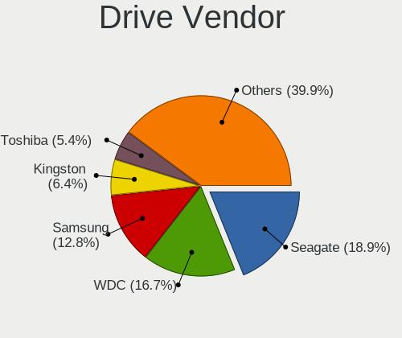
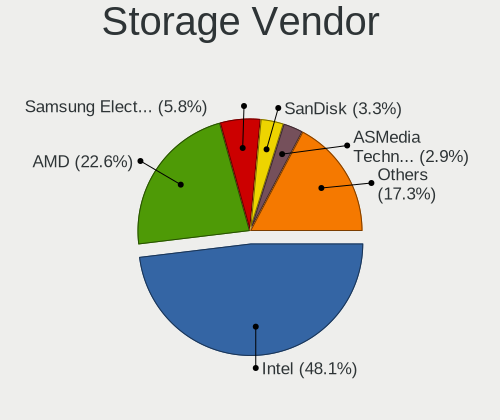
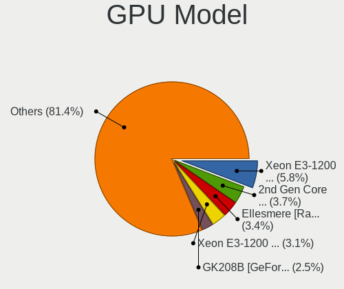

Zorin 16 - Tested Hardware & Statistics (Desktops)
--------------------------------------------------

A project to collect tested hardware configurations for Zorin 16.

Anyone can contribute to this report by the [hw-probe](https://github.com/linuxhw/hw-probe) tool:

    sudo -E hw-probe -all -upload

Please contribute! Especially if your hardware is rare.

Contents
--------

* [ Test Cases ](#test-cases)

* [ System ](#system)
  - [ Kernel                   ](#kernel)
  - [ Kernel Family            ](#kernel-family)
  - [ Kernel Major Ver.        ](#kernel-major-ver)
  - [ Arch                     ](#arch)
  - [ DE                       ](#de)
  - [ Display Server           ](#display-server)
  - [ Display Manager          ](#display-manager)
  - [ OS Lang                  ](#os-lang)
  - [ Boot Mode                ](#boot-mode)
  - [ Filesystem               ](#filesystem)
  - [ Part. scheme             ](#part-scheme)
  - [ Dual Boot with Linux/BSD ](#dual-boot-with-linuxbsd)
  - [ Dual Boot (Win)          ](#dual-boot-win)

* [ Board ](#board)
  - [ Vendor                   ](#vendor)
  - [ Model                    ](#model)
  - [ Model Family             ](#model-family)
  - [ MFG Year                 ](#mfg-year)
  - [ Form Factor              ](#form-factor)
  - [ Secure Boot              ](#secure-boot)
  - [ Coreboot                 ](#coreboot)
  - [ RAM Size                 ](#ram-size)
  - [ RAM Used                 ](#ram-used)
  - [ Total Drives             ](#total-drives)
  - [ Has CD-ROM               ](#has-cd-rom)
  - [ Has Ethernet             ](#has-ethernet)
  - [ Has WiFi                 ](#has-wifi)
  - [ Has Bluetooth            ](#has-bluetooth)

* [ Location ](#location)
  - [ Country                  ](#country)
  - [ City                     ](#city)

* [ Drives ](#drives)
  - [ Drive Vendor             ](#drive-vendor)
  - [ Drive Model              ](#drive-model)
  - [ HDD Vendor               ](#hdd-vendor)
  - [ SSD Vendor               ](#ssd-vendor)
  - [ Drive Kind               ](#drive-kind)
  - [ Drive Connector          ](#drive-connector)
  - [ Drive Size               ](#drive-size)
  - [ Space Total              ](#space-total)
  - [ Space Used               ](#space-used)
  - [ Malfunc. Drives          ](#malfunc-drives)
  - [ Malfunc. Drive Vendor    ](#malfunc-drive-vendor)
  - [ Malfunc. HDD Vendor      ](#malfunc-hdd-vendor)
  - [ Malfunc. Drive Kind      ](#malfunc-drive-kind)
  - [ Failed Drives            ](#failed-drives)
  - [ Failed Drive Vendor      ](#failed-drive-vendor)
  - [ Drive Status             ](#drive-status)

* [ Storage controller ](#storage-controller)
  - [ Storage Vendor           ](#storage-vendor)
  - [ Storage Model            ](#storage-model)
  - [ Storage Kind             ](#storage-kind)

* [ Processor ](#processor)
  - [ CPU Vendor               ](#cpu-vendor)
  - [ CPU Model                ](#cpu-model)
  - [ CPU Model Family         ](#cpu-model-family)
  - [ CPU Cores                ](#cpu-cores)
  - [ CPU Sockets              ](#cpu-sockets)
  - [ CPU Threads              ](#cpu-threads)
  - [ CPU Op-Modes             ](#cpu-op-modes)
  - [ CPU Microcode            ](#cpu-microcode)
  - [ CPU Microarch            ](#cpu-microarch)

* [ Graphics ](#graphics)
  - [ GPU Vendor               ](#gpu-vendor)
  - [ GPU Model                ](#gpu-model)
  - [ GPU Combo                ](#gpu-combo)
  - [ GPU Driver               ](#gpu-driver)
  - [ GPU Memory               ](#gpu-memory)

* [ Monitor ](#monitor)
  - [ Monitor Vendor           ](#monitor-vendor)
  - [ Monitor Model            ](#monitor-model)
  - [ Monitor Resolution       ](#monitor-resolution)
  - [ Monitor Diagonal         ](#monitor-diagonal)
  - [ Monitor Width            ](#monitor-width)
  - [ Aspect Ratio             ](#aspect-ratio)
  - [ Monitor Area             ](#monitor-area)
  - [ Pixel Density            ](#pixel-density)
  - [ Multiple Monitors        ](#multiple-monitors)

* [ Network ](#network)
  - [ Net Controller Vendor    ](#net-controller-vendor)
  - [ Net Controller Model     ](#net-controller-model)
  - [ Wireless Vendor          ](#wireless-vendor)
  - [ Wireless Model           ](#wireless-model)
  - [ Ethernet Vendor          ](#ethernet-vendor)
  - [ Ethernet Model           ](#ethernet-model)
  - [ Net Controller Kind      ](#net-controller-kind)
  - [ Used Controller          ](#used-controller)
  - [ NICs                     ](#nics)
  - [ IPv6                     ](#ipv6)

* [ Bluetooth ](#bluetooth)
  - [ Bluetooth Vendor         ](#bluetooth-vendor)
  - [ Bluetooth Model          ](#bluetooth-model)

* [ Sound ](#sound)
  - [ Sound Vendor             ](#sound-vendor)
  - [ Sound Model              ](#sound-model)

* [ Memory ](#memory)
  - [ Memory Vendor            ](#memory-vendor)
  - [ Memory Model             ](#memory-model)
  - [ Memory Kind              ](#memory-kind)
  - [ Memory Form Factor       ](#memory-form-factor)
  - [ Memory Size              ](#memory-size)
  - [ Memory Speed             ](#memory-speed)

* [ Printers & scanners ](#printers--scanners)
  - [ Printer Vendor           ](#printer-vendor)
  - [ Printer Model            ](#printer-model)
  - [ Scanner Vendor           ](#scanner-vendor)
  - [ Scanner Model            ](#scanner-model)

* [ Camera ](#camera)
  - [ Camera Vendor            ](#camera-vendor)
  - [ Camera Model             ](#camera-model)

* [ Security ](#security)
  - [ Fingerprint Vendor       ](#fingerprint-vendor)
  - [ Fingerprint Model        ](#fingerprint-model)
  - [ Chipcard Vendor          ](#chipcard-vendor)
  - [ Chipcard Model           ](#chipcard-model)

* [ Unsupported ](#unsupported)
  - [ Unsupported Devices      ](#unsupported-devices)
  - [ Unsupported Device Types ](#unsupported-device-types)

Test Cases
----------

Total: 1992

| Vendor        | Model                       | Probe                                                      | Date         |
|---------------|-----------------------------|------------------------------------------------------------|--------------|
| ASUSTek       | TUF Gaming Z790-PLUS WIF... | [e0cdb74f25](https://linux-hardware.org/?probe=e0cdb74f25) | Oct 01, 2023 |
| Acer          | Predator G3610              | [cddfa514ba](https://linux-hardware.org/?probe=cddfa514ba) | Sep 30, 2023 |
| Lenovo        | 3106 SDK0J40697 WIN 3305... | [c93af00811](https://linux-hardware.org/?probe=c93af00811) | Sep 30, 2023 |
| MP            | MS-7848                     | [63d5662351](https://linux-hardware.org/?probe=63d5662351) | Sep 30, 2023 |
| ASUSTek       | P8Z77-V LX                  | [186991da49](https://linux-hardware.org/?probe=186991da49) | Sep 29, 2023 |
| Gigabyte      | 970A-DS3P                   | [145f7eccd3](https://linux-hardware.org/?probe=145f7eccd3) | Sep 29, 2023 |
| ASUSTek       | P8Z77-V LX                  | [a318f83948](https://linux-hardware.org/?probe=a318f83948) | Sep 29, 2023 |
| MSI           | A320M-A PRO MAX             | [4aa521a31f](https://linux-hardware.org/?probe=4aa521a31f) | Sep 29, 2023 |
| HP            | 2B35                        | [2f63f14724](https://linux-hardware.org/?probe=2f63f14724) | Sep 28, 2023 |
| ASUSTek       | TUF Gaming X570-PLUS_BR     | [ce3a9f8960](https://linux-hardware.org/?probe=ce3a9f8960) | Sep 28, 2023 |
| MSI           | A320M-A PRO MAX             | [f6c6bfc3fe](https://linux-hardware.org/?probe=f6c6bfc3fe) | Sep 27, 2023 |
| Intel         | X79G V2.x                   | [3d001a09ab](https://linux-hardware.org/?probe=3d001a09ab) | Sep 27, 2023 |
| ASUSTek       | TUF B450M-PRO GAMING        | [811818acb8](https://linux-hardware.org/?probe=811818acb8) | Sep 26, 2023 |
| Dell          | 0NW6H5 A00                  | [e7e87a1269](https://linux-hardware.org/?probe=e7e87a1269) | Sep 26, 2023 |
| Dell          | 0Y5DDC A00                  | [29feb62e32](https://linux-hardware.org/?probe=29feb62e32) | Sep 25, 2023 |
| Dell          | 0D28YY A01                  | [7c901ae7fd](https://linux-hardware.org/?probe=7c901ae7fd) | Sep 25, 2023 |
| Dell          | 0HN7XN A01                  | [fd3ce44501](https://linux-hardware.org/?probe=fd3ce44501) | Sep 23, 2023 |
| Unknown       | Unknown                     | [e2c17f3a64](https://linux-hardware.org/?probe=e2c17f3a64) | Sep 23, 2023 |
| Intel         | DB85FL AAG89861-201         | [58b289a69d](https://linux-hardware.org/?probe=58b289a69d) | Sep 23, 2023 |
| ASUSTek       | M5A78L-M/USB3               | [e513362f71](https://linux-hardware.org/?probe=e513362f71) | Sep 22, 2023 |
| ASUSTek       | PRIME B460M-A               | [7ecfb9c56f](https://linux-hardware.org/?probe=7ecfb9c56f) | Sep 22, 2023 |
| ASUSTek       | TUF B450M-PRO GAMING        | [47e5429752](https://linux-hardware.org/?probe=47e5429752) | Sep 22, 2023 |
| ASUSTek       | TUF B450M-PRO GAMING        | [a35f78cead](https://linux-hardware.org/?probe=a35f78cead) | Sep 21, 2023 |
| AZW           | MINI S 10                   | [e393d95960](https://linux-hardware.org/?probe=e393d95960) | Sep 21, 2023 |
| Gigabyte      | GA-870A-UD3                 | [e57a830f9c](https://linux-hardware.org/?probe=e57a830f9c) | Sep 21, 2023 |
| Dell          | 0F3KHR A00                  | [dd7f2cf2b2](https://linux-hardware.org/?probe=dd7f2cf2b2) | Sep 20, 2023 |
| Lenovo        | H320 10044                  | [bf4ffce3e9](https://linux-hardware.org/?probe=bf4ffce3e9) | Sep 20, 2023 |
| ASUSTek       | SABERTOOTH Z170 MARK 1      | [776633dd59](https://linux-hardware.org/?probe=776633dd59) | Sep 20, 2023 |
| Dell          | 0F3KHR A00                  | [fcdaf47870](https://linux-hardware.org/?probe=fcdaf47870) | Sep 20, 2023 |
| Unknown       | Unknown                     | [e4dc880c6f](https://linux-hardware.org/?probe=e4dc880c6f) | Sep 20, 2023 |
| Dell          | 0RW199                      | [2857c6ada1](https://linux-hardware.org/?probe=2857c6ada1) | Sep 20, 2023 |
| Gigabyte      | Z790 UD AC                  | [83af285806](https://linux-hardware.org/?probe=83af285806) | Sep 20, 2023 |
| Biostar       | H61MLC                      | [154ead8447](https://linux-hardware.org/?probe=154ead8447) | Sep 19, 2023 |
| ASRock        | AB350 Pro4                  | [f45c7732e3](https://linux-hardware.org/?probe=f45c7732e3) | Sep 19, 2023 |
| AZW           | GTR V21                     | [5066e153f8](https://linux-hardware.org/?probe=5066e153f8) | Sep 19, 2023 |
| ASUSTek       | M4N68T-M-LE-V2              | [202375fbb7](https://linux-hardware.org/?probe=202375fbb7) | Sep 18, 2023 |
| HP            | 3047h                       | [a955e9b6c6](https://linux-hardware.org/?probe=a955e9b6c6) | Sep 17, 2023 |
| MSI           | B450 GAMING PLUS MAX        | [9e7069cdc3](https://linux-hardware.org/?probe=9e7069cdc3) | Sep 17, 2023 |
| Dell          | 0C27VV A02                  | [08ed0347db](https://linux-hardware.org/?probe=08ed0347db) | Sep 17, 2023 |
| ASUSTek       | TUF Gaming X570-PLUS_BR     | [d4d891ca35](https://linux-hardware.org/?probe=d4d891ca35) | Sep 17, 2023 |
| Gigabyte      | Z170X-GamingG1              | [b42ad40603](https://linux-hardware.org/?probe=b42ad40603) | Sep 17, 2023 |
| Gigabyte      | Z170X-GamingG1              | [3a230dc10f](https://linux-hardware.org/?probe=3a230dc10f) | Sep 16, 2023 |
| Acer          | Aspire XC-330               | [8913a6c47f](https://linux-hardware.org/?probe=8913a6c47f) | Sep 16, 2023 |
| MSI           | MAG X570S TOMAHAWK MAX W... | [2fa5c8bb34](https://linux-hardware.org/?probe=2fa5c8bb34) | Sep 16, 2023 |
| MSI           | B550-A PRO                  | [83cb90361c](https://linux-hardware.org/?probe=83cb90361c) | Sep 14, 2023 |
| MSI           | Z170A-G45 GAMING            | [40aee3739e](https://linux-hardware.org/?probe=40aee3739e) | Sep 13, 2023 |
| MSI           | Z170A-G45 GAMING            | [9bbec30b2f](https://linux-hardware.org/?probe=9bbec30b2f) | Sep 13, 2023 |
| ASUSTek       | ROG STRIX X670E-A GAMING... | [3cba209625](https://linux-hardware.org/?probe=3cba209625) | Sep 13, 2023 |
| Gigabyte      | AB350M-Gaming 3-CF          | [4dcd4e8234](https://linux-hardware.org/?probe=4dcd4e8234) | Sep 13, 2023 |
| Gigabyte      | AB350M-Gaming 3-CF          | [cbfa4c2641](https://linux-hardware.org/?probe=cbfa4c2641) | Sep 13, 2023 |
| Gigabyte      | B450M DS3H WIFI-CF          | [b94c2a0420](https://linux-hardware.org/?probe=b94c2a0420) | Sep 13, 2023 |
| Colorful T... | C.A68HM-K PLUS YV18         | [e4f73d159c](https://linux-hardware.org/?probe=e4f73d159c) | Sep 12, 2023 |
| Gigabyte      | B85M-HD3                    | [8ddbf6665f](https://linux-hardware.org/?probe=8ddbf6665f) | Sep 12, 2023 |
| Gigabyte      | GA-890FXA-UD5               | [9fc04871b0](https://linux-hardware.org/?probe=9fc04871b0) | Sep 12, 2023 |
| Gigabyte      | GA-890FXA-UD5               | [a80cffbabe](https://linux-hardware.org/?probe=a80cffbabe) | Sep 11, 2023 |
| Dell          | 0HY9JP A02                  | [5907e59551](https://linux-hardware.org/?probe=5907e59551) | Sep 11, 2023 |
| Colorful T... | C.A68HM-K PLUS YV18         | [c57a3a012d](https://linux-hardware.org/?probe=c57a3a012d) | Sep 11, 2023 |
| ASUSTek       | PRIME H370-A                | [c757d0e2c3](https://linux-hardware.org/?probe=c757d0e2c3) | Sep 11, 2023 |
| ASUSTek       | CG8270                      | [a8db1b43ce](https://linux-hardware.org/?probe=a8db1b43ce) | Sep 09, 2023 |
| ASUSTek       | CG8270                      | [26b9818094](https://linux-hardware.org/?probe=26b9818094) | Sep 09, 2023 |
| Inventec      | Z CLASS A02                 | [6f66e35ec3](https://linux-hardware.org/?probe=6f66e35ec3) | Sep 09, 2023 |
| Inventec      | Z CLASS A02                 | [9306917366](https://linux-hardware.org/?probe=9306917366) | Sep 09, 2023 |
| HP            | 8299                        | [df4048bcc4](https://linux-hardware.org/?probe=df4048bcc4) | Sep 08, 2023 |
| ASUSTek       | P5KPL-VM                    | [97d9faccab](https://linux-hardware.org/?probe=97d9faccab) | Sep 07, 2023 |
| ASUSTek       | P5KPL-VM                    | [3112302ff6](https://linux-hardware.org/?probe=3112302ff6) | Sep 07, 2023 |
| Acer          | Aspire X1470                | [d136074365](https://linux-hardware.org/?probe=d136074365) | Sep 07, 2023 |
| Acer          | Aspire X1470                | [a965ab170a](https://linux-hardware.org/?probe=a965ab170a) | Sep 07, 2023 |
| ASUSTek       | SABERTOOTH P67              | [002bdcd34d](https://linux-hardware.org/?probe=002bdcd34d) | Sep 07, 2023 |
| Pegatron      | 2AD5                        | [fe02bb3d71](https://linux-hardware.org/?probe=fe02bb3d71) | Sep 07, 2023 |
| Dell          | 02YYK5 A01                  | [6bb77310bf](https://linux-hardware.org/?probe=6bb77310bf) | Sep 06, 2023 |
| Pegatron      | IPXSB-H61                   | [415ba1cfc1](https://linux-hardware.org/?probe=415ba1cfc1) | Sep 06, 2023 |
| Dell          | 0F3KHR A00                  | [53bfbec77e](https://linux-hardware.org/?probe=53bfbec77e) | Sep 06, 2023 |
| Gigabyte      | 970A-DS3P                   | [3227a8a6bc](https://linux-hardware.org/?probe=3227a8a6bc) | Sep 06, 2023 |
| Alienware     | 0446JC A01                  | [d0c3088707](https://linux-hardware.org/?probe=d0c3088707) | Sep 06, 2023 |
| HP            | 0B54h D                     | [6fc93ef4ee](https://linux-hardware.org/?probe=6fc93ef4ee) | Sep 05, 2023 |
| ASUSTek       | TUF Gaming Z790-PLUS WIF... | [f8ec276ea3](https://linux-hardware.org/?probe=f8ec276ea3) | Sep 05, 2023 |
| Gigabyte      | 970A-DS3P                   | [788841792b](https://linux-hardware.org/?probe=788841792b) | Sep 04, 2023 |
| Inventec      | Z CLASS A02                 | [7f0254a775](https://linux-hardware.org/?probe=7f0254a775) | Sep 04, 2023 |
| Pegatron      | IPXSB-H61                   | [78a354984d](https://linux-hardware.org/?probe=78a354984d) | Sep 04, 2023 |
| Dell          | 0D28YY A01                  | [ae79e6a689](https://linux-hardware.org/?probe=ae79e6a689) | Sep 04, 2023 |
| Gigabyte      | Z97X-UD5H                   | [2c9b64c445](https://linux-hardware.org/?probe=2c9b64c445) | Sep 03, 2023 |
| Intel         | DB85FL AAG89861-201         | [9845368fc2](https://linux-hardware.org/?probe=9845368fc2) | Sep 03, 2023 |
| ASUSTek       | TUF Gaming Z790-PLUS WIF... | [eee58fd067](https://linux-hardware.org/?probe=eee58fd067) | Sep 03, 2023 |
| ASUSTek       | M5A97 R2.0                  | [6215db2c5a](https://linux-hardware.org/?probe=6215db2c5a) | Sep 02, 2023 |
| MSI           | MEG Z390 GODLIKE            | [53b682d960](https://linux-hardware.org/?probe=53b682d960) | Sep 02, 2023 |
| Intel         | X79M-S                      | [a6952c68e4](https://linux-hardware.org/?probe=a6952c68e4) | Sep 01, 2023 |
| ASUSTek       | PRIME H310M-E R2.0          | [be8b002a45](https://linux-hardware.org/?probe=be8b002a45) | Aug 31, 2023 |
| Intel         | DB85FL AAG89861-201         | [035f2909a1](https://linux-hardware.org/?probe=035f2909a1) | Aug 30, 2023 |
| Lenovo        | SDK0E50510 WIN              | [d963970016](https://linux-hardware.org/?probe=d963970016) | Aug 30, 2023 |
| HP            | 8054                        | [f73271d96e](https://linux-hardware.org/?probe=f73271d96e) | Aug 30, 2023 |
| Gigabyte      | Z97X-UD5H                   | [3fb03adafb](https://linux-hardware.org/?probe=3fb03adafb) | Aug 29, 2023 |
| Dell          | 0GY6Y8 A02                  | [fffbca3973](https://linux-hardware.org/?probe=fffbca3973) | Aug 28, 2023 |
| Intel         | H61                         | [9e5ed4db62](https://linux-hardware.org/?probe=9e5ed4db62) | Aug 28, 2023 |
| MSI           | MPG X570 GAMING EDGE WIF... | [929efec703](https://linux-hardware.org/?probe=929efec703) | Aug 27, 2023 |
| eMachines     | EL1352                      | [5f9258beb2](https://linux-hardware.org/?probe=5f9258beb2) | Aug 27, 2023 |
| GuoGuang      | IC2M1028N                   | [ffcd5b9fa5](https://linux-hardware.org/?probe=ffcd5b9fa5) | Aug 25, 2023 |
| Pegatron      | BOWIE                       | [270cd028cf](https://linux-hardware.org/?probe=270cd028cf) | Aug 25, 2023 |
| MSI           | Z87 MPOWER MAX              | [42d3a714ac](https://linux-hardware.org/?probe=42d3a714ac) | Aug 24, 2023 |
| AZW           | MINI S                      | [7712e558c5](https://linux-hardware.org/?probe=7712e558c5) | Aug 24, 2023 |
| AZW           | MINI S                      | [6296a4f71d](https://linux-hardware.org/?probe=6296a4f71d) | Aug 24, 2023 |
| HP            | 8299                        | [aa27bed4f1](https://linux-hardware.org/?probe=aa27bed4f1) | Aug 23, 2023 |
| ASUSTek       | TUF Gaming X570-PLUS_BR     | [82c63f13d1](https://linux-hardware.org/?probe=82c63f13d1) | Aug 22, 2023 |
| ASUSTek       | TUF Gaming X570-PLUS_BR     | [1aee954611](https://linux-hardware.org/?probe=1aee954611) | Aug 22, 2023 |
| Unknown       | Unknown                     | [9b52370ec1](https://linux-hardware.org/?probe=9b52370ec1) | Aug 22, 2023 |
| Unknown       | Unknown                     | [51e91dd03e](https://linux-hardware.org/?probe=51e91dd03e) | Aug 22, 2023 |
| Dell          | 0GY6Y8 A02                  | [409855b61b](https://linux-hardware.org/?probe=409855b61b) | Aug 21, 2023 |
| Dell          | 08NPPY A00                  | [7a206bdd57](https://linux-hardware.org/?probe=7a206bdd57) | Aug 21, 2023 |
| ASUSTek       | PRIME H310M-E R2.0          | [2ac06099d8](https://linux-hardware.org/?probe=2ac06099d8) | Aug 19, 2023 |
| ASUSTek       | H97-PRO GAMER               | [f97c8a25c5](https://linux-hardware.org/?probe=f97c8a25c5) | Aug 19, 2023 |
| ASUSTek       | P5L-MX                      | [f06dbc1b8c](https://linux-hardware.org/?probe=f06dbc1b8c) | Aug 19, 2023 |
| HP            | 3047h                       | [91d9eaa1de](https://linux-hardware.org/?probe=91d9eaa1de) | Aug 19, 2023 |
| Lenovo        | MAHOBAY NO DPK              | [d109b04177](https://linux-hardware.org/?probe=d109b04177) | Aug 19, 2023 |
| HP            | 3047h                       | [a4aa888c24](https://linux-hardware.org/?probe=a4aa888c24) | Aug 18, 2023 |
| HP            | 3032h                       | [34a300f540](https://linux-hardware.org/?probe=34a300f540) | Aug 17, 2023 |
| Intel         | X79M-S                      | [d79895d82c](https://linux-hardware.org/?probe=d79895d82c) | Aug 17, 2023 |
| MSI           | PRO B660M-A WIFI DDR4       | [7c1a42d442](https://linux-hardware.org/?probe=7c1a42d442) | Aug 17, 2023 |
| ASUSTek       | B150M-C/BR                  | [78e12f014e](https://linux-hardware.org/?probe=78e12f014e) | Aug 17, 2023 |
| Dell          | 0M6C7G A00                  | [50731e7c54](https://linux-hardware.org/?probe=50731e7c54) | Aug 16, 2023 |
| ASRock        | 970 Pro3 R2.0               | [50b5957370](https://linux-hardware.org/?probe=50b5957370) | Aug 16, 2023 |
| Biostar       | H410MH                      | [abe98ae584](https://linux-hardware.org/?probe=abe98ae584) | Aug 15, 2023 |
| Gigabyte      | H110M-H-CF                  | [bb4bf558dd](https://linux-hardware.org/?probe=bb4bf558dd) | Aug 15, 2023 |
| Dell          | 02YRK5 A02                  | [e79cdd0ba3](https://linux-hardware.org/?probe=e79cdd0ba3) | Aug 15, 2023 |
| ASUSTek       | TUF Gaming X570-PLUS        | [f09f15784f](https://linux-hardware.org/?probe=f09f15784f) | Aug 13, 2023 |
| Gigabyte      | B550M DS3H AC               | [dea6e2f8b8](https://linux-hardware.org/?probe=dea6e2f8b8) | Aug 13, 2023 |
| Lenovo        | 30D9 SDK0J40697 WIN 3305... | [7e47b7128b](https://linux-hardware.org/?probe=7e47b7128b) | Aug 13, 2023 |
| Gigabyte      | B550M DS3H AC               | [1034423357](https://linux-hardware.org/?probe=1034423357) | Aug 13, 2023 |
| Biostar       | A770 A2+                    | [ff8bec8b75](https://linux-hardware.org/?probe=ff8bec8b75) | Aug 12, 2023 |
| MSI           | 2AE0                        | [b8a2a0eb5c](https://linux-hardware.org/?probe=b8a2a0eb5c) | Aug 12, 2023 |
| Biostar       | A770 A2+                    | [d35bac0620](https://linux-hardware.org/?probe=d35bac0620) | Aug 12, 2023 |
| Biostar       | A770 A2+                    | [fb7d0009fd](https://linux-hardware.org/?probe=fb7d0009fd) | Aug 12, 2023 |
| HP            | 3032h                       | [1727f042cd](https://linux-hardware.org/?probe=1727f042cd) | Aug 11, 2023 |
| Intel         | DZ68BC AAG30742-401         | [9bf37df045](https://linux-hardware.org/?probe=9bf37df045) | Aug 10, 2023 |
| Dell          | 0WMJ54 A01                  | [6e9ca3c833](https://linux-hardware.org/?probe=6e9ca3c833) | Aug 09, 2023 |
| HP            | 3032h                       | [03a8cc31ea](https://linux-hardware.org/?probe=03a8cc31ea) | Aug 09, 2023 |
| Pegatron      | BOWIE                       | [6047747c8f](https://linux-hardware.org/?probe=6047747c8f) | Aug 09, 2023 |
| Pegatron      | BOWIE                       | [8a11b56d79](https://linux-hardware.org/?probe=8a11b56d79) | Aug 09, 2023 |
| ASUSTek       | M5A97 LE R2.0               | [2e30c62b25](https://linux-hardware.org/?probe=2e30c62b25) | Aug 08, 2023 |
| Intel         | X79M-S                      | [8250cad3d6](https://linux-hardware.org/?probe=8250cad3d6) | Aug 08, 2023 |
| Gigabyte      | B450 AORUS M                | [965220ce86](https://linux-hardware.org/?probe=965220ce86) | Aug 07, 2023 |
| Pegatron      | IPMMB-MQ1                   | [70c450c395](https://linux-hardware.org/?probe=70c450c395) | Aug 06, 2023 |
| MSI           | Z170A GAMING PRO CARBON     | [6b22ae1f36](https://linux-hardware.org/?probe=6b22ae1f36) | Aug 06, 2023 |
| ASUSTek       | TUF Gaming Z790-PLUS WIF... | [1af709c14e](https://linux-hardware.org/?probe=1af709c14e) | Aug 05, 2023 |
| Gigabyte      | Z97X-UD5H                   | [3bc330734d](https://linux-hardware.org/?probe=3bc330734d) | Aug 05, 2023 |
| Lenovo        | 30D2 SDK0J40697 WIN 3305... | [3b5e9f52a2](https://linux-hardware.org/?probe=3b5e9f52a2) | Aug 05, 2023 |
| MSI           | MAG X670E TOMAHAWK WIFI     | [5d998a099e](https://linux-hardware.org/?probe=5d998a099e) | Aug 05, 2023 |
| MSI           | MAG X670E TOMAHAWK WIFI     | [e57d71e056](https://linux-hardware.org/?probe=e57d71e056) | Aug 05, 2023 |
| Unknown       | Unknown                     | [8ee9cccace](https://linux-hardware.org/?probe=8ee9cccace) | Aug 05, 2023 |
| ASRock        | N68-VS3 UCC                 | [3793d876eb](https://linux-hardware.org/?probe=3793d876eb) | Aug 04, 2023 |
| Gigabyte      | B550M DS3H AC               | [f27f9b2a7f](https://linux-hardware.org/?probe=f27f9b2a7f) | Aug 03, 2023 |
| Gigabyte      | B550M DS3H AC               | [8193f810ab](https://linux-hardware.org/?probe=8193f810ab) | Aug 03, 2023 |
| ASUSTek       | PRIME B450M-K II            | [35cf0fd859](https://linux-hardware.org/?probe=35cf0fd859) | Aug 03, 2023 |
| Intel         | X79M-S                      | [5a4d94f325](https://linux-hardware.org/?probe=5a4d94f325) | Aug 02, 2023 |
| HP            | 89B5 A                      | [cb6f36f32c](https://linux-hardware.org/?probe=cb6f36f32c) | Aug 02, 2023 |
| Pegatron      | BOWIE                       | [cfce53f1a3](https://linux-hardware.org/?probe=cfce53f1a3) | Aug 02, 2023 |
| Unknown       | Unknown                     | [731a8b0e31](https://linux-hardware.org/?probe=731a8b0e31) | Aug 02, 2023 |
| ASUSTek       | P8H61-M LX                  | [287740b630](https://linux-hardware.org/?probe=287740b630) | Aug 01, 2023 |
| HP            | 1496                        | [24863488f0](https://linux-hardware.org/?probe=24863488f0) | Aug 01, 2023 |
| ASUSTek       | M4N68T-M LE                 | [90dce7a9cf](https://linux-hardware.org/?probe=90dce7a9cf) | Jul 30, 2023 |
| ASUSTek       | TUF Gaming B460M-PLUS       | [0ce1be51b9](https://linux-hardware.org/?probe=0ce1be51b9) | Jul 30, 2023 |
| Gigabyte      | M68MT-S2                    | [b1125cd76c](https://linux-hardware.org/?probe=b1125cd76c) | Jul 29, 2023 |
| ASUSTek       | H97-PRO GAMER               | [1771e4ca4b](https://linux-hardware.org/?probe=1771e4ca4b) | Jul 29, 2023 |
| ASUSTek       | H97-PRO GAMER               | [e668b29cf4](https://linux-hardware.org/?probe=e668b29cf4) | Jul 29, 2023 |
| ASUSTek       | P7H55-M LX                  | [bc92202f16](https://linux-hardware.org/?probe=bc92202f16) | Jul 29, 2023 |
| Lenovo        | 30D0 SDK0J40705 WIN 3425... | [8c930cc5e4](https://linux-hardware.org/?probe=8c930cc5e4) | Jul 29, 2023 |
| MSI           | B75MA-E33                   | [310207e0fd](https://linux-hardware.org/?probe=310207e0fd) | Jul 29, 2023 |
| Pegatron      | BOWIE                       | [4d413cb864](https://linux-hardware.org/?probe=4d413cb864) | Jul 28, 2023 |
| HP            | 3397                        | [e61ccd6dbf](https://linux-hardware.org/?probe=e61ccd6dbf) | Jul 27, 2023 |
| Fujitsu       | D3221-A1 S26361-D3221-A1    | [e7fdf45ff0](https://linux-hardware.org/?probe=e7fdf45ff0) | Jul 27, 2023 |
| MSI           | B450 GAMING PLUS MAX        | [2f12124bed](https://linux-hardware.org/?probe=2f12124bed) | Jul 27, 2023 |
| MP            | MS-7848                     | [3dd9f22548](https://linux-hardware.org/?probe=3dd9f22548) | Jul 26, 2023 |
| Acer          | Elena                       | [78eff851f2](https://linux-hardware.org/?probe=78eff851f2) | Jul 26, 2023 |
| ASRock        | Z97M Pro4                   | [1b062f3c31](https://linux-hardware.org/?probe=1b062f3c31) | Jul 26, 2023 |
| ASRock        | Z97M Pro4                   | [bca4424b5d](https://linux-hardware.org/?probe=bca4424b5d) | Jul 26, 2023 |
| ASUSTek       | B250 MINING EXPERT          | [0236b3ce26](https://linux-hardware.org/?probe=0236b3ce26) | Jul 26, 2023 |
| Dell          | 088DT1 A01                  | [1355a4f2f4](https://linux-hardware.org/?probe=1355a4f2f4) | Jul 25, 2023 |
| HP            | 8350                        | [f17382c501](https://linux-hardware.org/?probe=f17382c501) | Jul 23, 2023 |
| MSI           | MAG B650 TOMAHAWK WIFI      | [13bb65f561](https://linux-hardware.org/?probe=13bb65f561) | Jul 23, 2023 |
| Dell          | 0MN1TX A04                  | [4ff31f4185](https://linux-hardware.org/?probe=4ff31f4185) | Jul 22, 2023 |
| Gigabyte      | X470 AORUS GAMING 7 WIFI... | [b8cf03e7b7](https://linux-hardware.org/?probe=b8cf03e7b7) | Jul 22, 2023 |
| ASUSTek       | F1A55-M LX                  | [87b85c2e28](https://linux-hardware.org/?probe=87b85c2e28) | Jul 22, 2023 |
| ASRock        | B85M                        | [c4f0b0b1fa](https://linux-hardware.org/?probe=c4f0b0b1fa) | Jul 22, 2023 |
| HP            | 3048h                       | [1be902df43](https://linux-hardware.org/?probe=1be902df43) | Jul 21, 2023 |
| HP            | 3047h                       | [07de35877b](https://linux-hardware.org/?probe=07de35877b) | Jul 21, 2023 |
| Gigabyte      | Z170XP-SLI-CF               | [9afd0f1d0f](https://linux-hardware.org/?probe=9afd0f1d0f) | Jul 21, 2023 |
| ASUSTek       | TUF Gaming B550M-PLUS WI... | [35c4e6ad97](https://linux-hardware.org/?probe=35c4e6ad97) | Jul 20, 2023 |
| HP            | 8767 A                      | [d5275f1025](https://linux-hardware.org/?probe=d5275f1025) | Jul 20, 2023 |
| Dell          | 0F5C5X A00                  | [3832c8f626](https://linux-hardware.org/?probe=3832c8f626) | Jul 20, 2023 |
| Dell          | 0C27VV A02                  | [da1c963814](https://linux-hardware.org/?probe=da1c963814) | Jul 19, 2023 |
| Dell          | 0C27VV A02                  | [02008985ce](https://linux-hardware.org/?probe=02008985ce) | Jul 19, 2023 |
| Gigabyte      | GA-890GPA-UD3H              | [57b17e7ae1](https://linux-hardware.org/?probe=57b17e7ae1) | Jul 15, 2023 |
| Gigabyte      | Z370M AORUS Gaming-CF       | [64a0d52846](https://linux-hardware.org/?probe=64a0d52846) | Jul 15, 2023 |
| Gigabyte      | B450 AORUS M                | [2f5c2842c2](https://linux-hardware.org/?probe=2f5c2842c2) | Jul 14, 2023 |
| Dell          | 0FDY5C A00                  | [35399aae18](https://linux-hardware.org/?probe=35399aae18) | Jul 14, 2023 |
| Dell          | 0D441T A03                  | [622890c12a](https://linux-hardware.org/?probe=622890c12a) | Jul 14, 2023 |
| MSI           | B450 GAMING PLUS MAX        | [b690698c10](https://linux-hardware.org/?probe=b690698c10) | Jul 12, 2023 |
| HP            | 8299                        | [763cebf303](https://linux-hardware.org/?probe=763cebf303) | Jul 12, 2023 |
| ASUSTek       | TUF Gaming B550-PLUS        | [7c6ad4407b](https://linux-hardware.org/?probe=7c6ad4407b) | Jul 11, 2023 |
| Fujitsu       | D3230-A1 S26361-D3230-A1    | [c81c5855d4](https://linux-hardware.org/?probe=c81c5855d4) | Jul 11, 2023 |
| ASRock        | A320M-HDV R4.0              | [ab81f36697](https://linux-hardware.org/?probe=ab81f36697) | Jul 11, 2023 |
| Dell          | 09WH54 A00                  | [b118891f3d](https://linux-hardware.org/?probe=b118891f3d) | Jul 10, 2023 |
| ASRock        | B460M Pro4                  | [c972293107](https://linux-hardware.org/?probe=c972293107) | Jul 10, 2023 |
| ASUSTek       | GRYPHON Z87                 | [2ed1092e31](https://linux-hardware.org/?probe=2ed1092e31) | Jul 10, 2023 |
| ASUSTek       | ROG STRIX B650E-E GAMING... | [213c80bbee](https://linux-hardware.org/?probe=213c80bbee) | Jul 09, 2023 |
| ASUSTek       | PRIME B350M-A               | [be65f2aa45](https://linux-hardware.org/?probe=be65f2aa45) | Jul 08, 2023 |
| ASRock        | X570 Phantom Gaming 4       | [2d342d7a37](https://linux-hardware.org/?probe=2d342d7a37) | Jul 07, 2023 |
| Dell          | 0HN7XN A01                  | [24a4044173](https://linux-hardware.org/?probe=24a4044173) | Jul 06, 2023 |
| Gigabyte      | B75M-D3H                    | [8a9c93e501](https://linux-hardware.org/?probe=8a9c93e501) | Jul 06, 2023 |
| ASRock        | FP6D4-P1                    | [42b5bdcdd7](https://linux-hardware.org/?probe=42b5bdcdd7) | Jul 05, 2023 |
| Positivo      | POS-EIH61CE SIM             | [48b35c757d](https://linux-hardware.org/?probe=48b35c757d) | Jul 05, 2023 |
| Intel         | H55                         | [8f8ff68380](https://linux-hardware.org/?probe=8f8ff68380) | Jul 04, 2023 |
| Lenovo        | 30D2 SDK0J40705 WIN 3425... | [9bca67bb40](https://linux-hardware.org/?probe=9bca67bb40) | Jul 04, 2023 |
| HP            | 21F5 0A                     | [bc7304ba1c](https://linux-hardware.org/?probe=bc7304ba1c) | Jul 04, 2023 |
| MSI           | 760GM-P23                   | [452fe27c46](https://linux-hardware.org/?probe=452fe27c46) | Jul 04, 2023 |
| MSI           | 760GM-P23                   | [168d5b0b7b](https://linux-hardware.org/?probe=168d5b0b7b) | Jul 04, 2023 |
| Foxconn       | G41S/G41S-K                 | [21adb87fbd](https://linux-hardware.org/?probe=21adb87fbd) | Jul 04, 2023 |
| MSI           | H310M PRO-VDH PLUS          | [7672f159bf](https://linux-hardware.org/?probe=7672f159bf) | Jul 03, 2023 |
| Dell          | 0GY6Y8 A02                  | [729dbec695](https://linux-hardware.org/?probe=729dbec695) | Jul 02, 2023 |
| MSI           | MS-B9181                    | [fef890b931](https://linux-hardware.org/?probe=fef890b931) | Jul 02, 2023 |
| MSI           | MS-B9181                    | [47b3ce0c58](https://linux-hardware.org/?probe=47b3ce0c58) | Jul 02, 2023 |
| MSI           | PRO Z690-A WIFI             | [2bc4b36c94](https://linux-hardware.org/?probe=2bc4b36c94) | Jul 02, 2023 |
| ASUSTek       | TUF Gaming B460M-PLUS AC    | [c787bf91c3](https://linux-hardware.org/?probe=c787bf91c3) | Jul 02, 2023 |
| Win Elemen... | M9                          | [2e5ea821f1](https://linux-hardware.org/?probe=2e5ea821f1) | Jul 01, 2023 |
| ASUSTek       | TUF Gaming B460M-PLUS AC    | [a4e29f77e5](https://linux-hardware.org/?probe=a4e29f77e5) | Jul 01, 2023 |
| MSI           | H61M-P31                    | [9012219f61](https://linux-hardware.org/?probe=9012219f61) | Jun 29, 2023 |
| Gigabyte      | A320M-S2H-CF                | [bb1cb1ef13](https://linux-hardware.org/?probe=bb1cb1ef13) | Jun 29, 2023 |
| Gigabyte      | P31-DS3L                    | [0d32728bdf](https://linux-hardware.org/?probe=0d32728bdf) | Jun 28, 2023 |
| ASUSTek       | ROG STRIX B650E-E GAMING... | [0a35c3c750](https://linux-hardware.org/?probe=0a35c3c750) | Jun 27, 2023 |
| HP            | 8906 SMVB                   | [18ab778722](https://linux-hardware.org/?probe=18ab778722) | Jun 26, 2023 |
| Gigabyte      | G31M-ES2L                   | [be14b80f2c](https://linux-hardware.org/?probe=be14b80f2c) | Jun 24, 2023 |
| Positivo      | POS-AG31AP                  | [bd3b3228c6](https://linux-hardware.org/?probe=bd3b3228c6) | Jun 24, 2023 |
| Intel         | D946GZIS AAD66165-301       | [dac65b1c2c](https://linux-hardware.org/?probe=dac65b1c2c) | Jun 24, 2023 |
| Dell          | 00V62H A01                  | [23134d6c71](https://linux-hardware.org/?probe=23134d6c71) | Jun 24, 2023 |
| ASUSTek       | P5B                         | [a62968d622](https://linux-hardware.org/?probe=a62968d622) | Jun 24, 2023 |
| ASUSTek       | F2A85-V PRO                 | [011552703c](https://linux-hardware.org/?probe=011552703c) | Jun 24, 2023 |
| Positivo      | POS-AG31AP                  | [1dd704fab9](https://linux-hardware.org/?probe=1dd704fab9) | Jun 22, 2023 |
| Dell          | 0G9322                      | [a742a26282](https://linux-hardware.org/?probe=a742a26282) | Jun 22, 2023 |
| Lenovo        | 30D2 SDK0J40705 WIN 3425... | [1e11366a3e](https://linux-hardware.org/?probe=1e11366a3e) | Jun 21, 2023 |
| Intel         | D34010WYK H14771-304        | [0d3af8114b](https://linux-hardware.org/?probe=0d3af8114b) | Jun 20, 2023 |
| AZW           | GTR V02                     | [f9bee18426](https://linux-hardware.org/?probe=f9bee18426) | Jun 19, 2023 |
| ASUSTek       | P5LD2                       | [7038963b77](https://linux-hardware.org/?probe=7038963b77) | Jun 18, 2023 |
| Pegatron      | BOWIE                       | [a2bbc6abd3](https://linux-hardware.org/?probe=a2bbc6abd3) | Jun 17, 2023 |
| ASRock        | B85M                        | [19f8b16937](https://linux-hardware.org/?probe=19f8b16937) | Jun 15, 2023 |
| Dell          | 0KC9NP A01                  | [b00d413241](https://linux-hardware.org/?probe=b00d413241) | Jun 14, 2023 |
| Dell          | 0KC9NP A01                  | [1d487a1ed5](https://linux-hardware.org/?probe=1d487a1ed5) | Jun 14, 2023 |
| Dell          | 0WR7PY A02                  | [eab79964fb](https://linux-hardware.org/?probe=eab79964fb) | Jun 14, 2023 |
| Vorke         | V1 Plus                     | [a63988d437](https://linux-hardware.org/?probe=a63988d437) | Jun 14, 2023 |
| Lenovo        | 30D2 SDK0J40705 WIN 3425... | [c1992a1680](https://linux-hardware.org/?probe=c1992a1680) | Jun 13, 2023 |
| Pegatron      | BOWIE                       | [2794a5aa86](https://linux-hardware.org/?probe=2794a5aa86) | Jun 12, 2023 |
| ASUSTek       | P5B                         | [6308a1c633](https://linux-hardware.org/?probe=6308a1c633) | Jun 12, 2023 |
| MSI           | MPG B550 GAMING EDGE WIF... | [373e36422d](https://linux-hardware.org/?probe=373e36422d) | Jun 12, 2023 |
| Fujitsu       | D3417-A2 S26361-D3417-A2    | [9ea7188339](https://linux-hardware.org/?probe=9ea7188339) | Jun 11, 2023 |
| HP            | 8350                        | [8a40ff28c8](https://linux-hardware.org/?probe=8a40ff28c8) | Jun 11, 2023 |
| ASUSTek       | P5B                         | [794635cbea](https://linux-hardware.org/?probe=794635cbea) | Jun 10, 2023 |
| MP            | MS-7848                     | [cd63c98850](https://linux-hardware.org/?probe=cd63c98850) | Jun 10, 2023 |
| Nvidia        | MCP79                       | [8203509a77](https://linux-hardware.org/?probe=8203509a77) | Jun 09, 2023 |
| ASRock        | H81M-HDS                    | [e1ff6f4e2f](https://linux-hardware.org/?probe=e1ff6f4e2f) | Jun 08, 2023 |
| ASUSTek       | P5B                         | [32baec6c0f](https://linux-hardware.org/?probe=32baec6c0f) | Jun 08, 2023 |
| Shenzhen M... | F7BFD                       | [74cf1d0b63](https://linux-hardware.org/?probe=74cf1d0b63) | Jun 08, 2023 |
| Shenzhen M... | F7BFD                       | [88cbeea389](https://linux-hardware.org/?probe=88cbeea389) | Jun 08, 2023 |
| MSI           | MPG X570 GAMING PRO CARB... | [20d28155d8](https://linux-hardware.org/?probe=20d28155d8) | Jun 08, 2023 |
| MSI           | MPG X570 GAMING PRO CARB... | [517cbd7f48](https://linux-hardware.org/?probe=517cbd7f48) | Jun 08, 2023 |
| MSI           | B450 TOMAHAWK MAX II        | [2ad7aefc45](https://linux-hardware.org/?probe=2ad7aefc45) | Jun 07, 2023 |
| HP            | 8350                        | [113be26d4c](https://linux-hardware.org/?probe=113be26d4c) | Jun 07, 2023 |
| Dell          | 0G9322                      | [e81a7f788a](https://linux-hardware.org/?probe=e81a7f788a) | Jun 07, 2023 |
| Nvidia        | MCP79                       | [bf109ed28f](https://linux-hardware.org/?probe=bf109ed28f) | Jun 06, 2023 |
| MSI           | B450 TOMAHAWK MAX II        | [79f63dcf8e](https://linux-hardware.org/?probe=79f63dcf8e) | Jun 06, 2023 |
| ASUSTek       | CM1730,CM1830               | [2cc76d0cd9](https://linux-hardware.org/?probe=2cc76d0cd9) | Jun 05, 2023 |
| ASUSTek       | CM1730,CM1830               | [7dc46d923e](https://linux-hardware.org/?probe=7dc46d923e) | Jun 05, 2023 |
| ASUSTek       | P5Q                         | [85c6e06d3b](https://linux-hardware.org/?probe=85c6e06d3b) | Jun 05, 2023 |
| Dell          | 00010C A00                  | [fb12198605](https://linux-hardware.org/?probe=fb12198605) | Jun 05, 2023 |
| Dell          | 00010C A00                  | [d94442285c](https://linux-hardware.org/?probe=d94442285c) | Jun 05, 2023 |
| ASUSTek       | B75M-A                      | [55139a968d](https://linux-hardware.org/?probe=55139a968d) | Jun 04, 2023 |
| ASUSTek       | ROG STRIX Z690-I GAMING ... | [413aba0d3f](https://linux-hardware.org/?probe=413aba0d3f) | Jun 04, 2023 |
| Dell          | 0G9322                      | [a1c5ec8909](https://linux-hardware.org/?probe=a1c5ec8909) | Jun 03, 2023 |
| Dell          | 0NW6H5 A00                  | [01387c3030](https://linux-hardware.org/?probe=01387c3030) | Jun 03, 2023 |
| ASUSTek       | TUF Gaming B550M-PLUS WI... | [20260fb3b3](https://linux-hardware.org/?probe=20260fb3b3) | Jun 03, 2023 |
| HP            | 339A                        | [bb4619f4eb](https://linux-hardware.org/?probe=bb4619f4eb) | Jun 02, 2023 |
| Gateway       | SX2851                      | [262ddffda9](https://linux-hardware.org/?probe=262ddffda9) | Jun 02, 2023 |
| MSI           | H81M-E34                    | [26362cac22](https://linux-hardware.org/?probe=26362cac22) | Jun 02, 2023 |
| MSI           | H81M-E34                    | [9f04387a7c](https://linux-hardware.org/?probe=9f04387a7c) | Jun 01, 2023 |
| Lenovo        | SHARKBAY SDK0E50512 STD     | [abc4bba144](https://linux-hardware.org/?probe=abc4bba144) | Jun 01, 2023 |
| MSI           | 890FXA-GD70                 | [bcc4cd9597](https://linux-hardware.org/?probe=bcc4cd9597) | Jun 01, 2023 |
| Gigabyte      | B450M DS3H-CF               | [923c9a18ff](https://linux-hardware.org/?probe=923c9a18ff) | Jun 01, 2023 |
| MSI           | B450 TOMAHAWK               | [0ddd2982db](https://linux-hardware.org/?probe=0ddd2982db) | May 31, 2023 |
| MSI           | B450 TOMAHAWK               | [93d1ee7e2d](https://linux-hardware.org/?probe=93d1ee7e2d) | May 31, 2023 |
| Acer          | Predator G3-605             | [f33c170be3](https://linux-hardware.org/?probe=f33c170be3) | May 27, 2023 |
| Dell          | 0G9322                      | [4d1450ba3a](https://linux-hardware.org/?probe=4d1450ba3a) | May 27, 2023 |
| Dell          | 0G9322                      | [d742ccb0c4](https://linux-hardware.org/?probe=d742ccb0c4) | May 27, 2023 |
| HP            | 21D0                        | [7f83859a91](https://linux-hardware.org/?probe=7f83859a91) | May 27, 2023 |
| MSI           | H97 GUARD-PRO               | [3737e6c832](https://linux-hardware.org/?probe=3737e6c832) | May 27, 2023 |
| HP            | 18E5                        | [23e2edb1fe](https://linux-hardware.org/?probe=23e2edb1fe) | May 26, 2023 |
| Dell          | 0K095G A02                  | [f11b8418c9](https://linux-hardware.org/?probe=f11b8418c9) | May 26, 2023 |
| HP            | 21D0                        | [8e52c2613c](https://linux-hardware.org/?probe=8e52c2613c) | May 26, 2023 |
| MSI           | B450 TOMAHAWK MAX II        | [61dc4c5620](https://linux-hardware.org/?probe=61dc4c5620) | May 25, 2023 |
| ECS           | H510H6-M2                   | [eba710b3de](https://linux-hardware.org/?probe=eba710b3de) | May 24, 2023 |
| Vorke         | V1 Plus                     | [81c0b82d6c](https://linux-hardware.org/?probe=81c0b82d6c) | May 24, 2023 |
| ECS           | H510H6-M2                   | [b36784601b](https://linux-hardware.org/?probe=b36784601b) | May 24, 2023 |
| HP            | 8906 SMVB                   | [ca3ed99a5c](https://linux-hardware.org/?probe=ca3ed99a5c) | May 24, 2023 |
| Pegatron      | 2AC2A                       | [f9e504a430](https://linux-hardware.org/?probe=f9e504a430) | May 24, 2023 |
| HP            | 21EF                        | [f1d5c9381c](https://linux-hardware.org/?probe=f1d5c9381c) | May 23, 2023 |
| MSI           | H81M-E34                    | [4247f30888](https://linux-hardware.org/?probe=4247f30888) | May 23, 2023 |
| Unknown       | Unknown                     | [977cf42905](https://linux-hardware.org/?probe=977cf42905) | May 23, 2023 |
| HP            | 21EF                        | [3249975d27](https://linux-hardware.org/?probe=3249975d27) | May 22, 2023 |
| ASRock        | H77M                        | [7f173e0b75](https://linux-hardware.org/?probe=7f173e0b75) | May 22, 2023 |
| HP            | 18E5                        | [d1bc34770d](https://linux-hardware.org/?probe=d1bc34770d) | May 22, 2023 |
| ASUSTek       | ROG STRIX Z590-E GAMING ... | [b6465d2950](https://linux-hardware.org/?probe=b6465d2950) | May 21, 2023 |
| Dell          | 02N3WF A01                  | [8d0096c040](https://linux-hardware.org/?probe=8d0096c040) | May 21, 2023 |
| Dell          | 0M5DCD A00                  | [4087cdd6cb](https://linux-hardware.org/?probe=4087cdd6cb) | May 20, 2023 |
| Dell          | 0M5DCD A00                  | [8db744994d](https://linux-hardware.org/?probe=8db744994d) | May 20, 2023 |
| MSI           | B450 GAMING PLUS MAX        | [0bcd2c7244](https://linux-hardware.org/?probe=0bcd2c7244) | May 20, 2023 |
| MSI           | B450 GAMING PLUS MAX        | [c1594f6dab](https://linux-hardware.org/?probe=c1594f6dab) | May 20, 2023 |
| Gigabyte      | X570 GAMING X               | [8a6ad6c590](https://linux-hardware.org/?probe=8a6ad6c590) | May 19, 2023 |
| Dell          | 0GDG8Y A00                  | [514fe06c9e](https://linux-hardware.org/?probe=514fe06c9e) | May 19, 2023 |
| ASUSTek       | ROG STRIX Z590-E GAMING ... | [31568d83f7](https://linux-hardware.org/?probe=31568d83f7) | May 18, 2023 |
| Gigabyte      | H81M-DS2                    | [754dc9d1fc](https://linux-hardware.org/?probe=754dc9d1fc) | May 18, 2023 |
| ASUSTek       | PRIME H410M-R               | [ee37475637](https://linux-hardware.org/?probe=ee37475637) | May 18, 2023 |
| ASUSTek       | PRIME H410M-R               | [68406e2c40](https://linux-hardware.org/?probe=68406e2c40) | May 18, 2023 |
| Acer          | Revo 70                     | [6cbc11e75b](https://linux-hardware.org/?probe=6cbc11e75b) | May 17, 2023 |
| HP            | 2B02                        | [a6bf09d51c](https://linux-hardware.org/?probe=a6bf09d51c) | May 17, 2023 |
| Pegatron      | Benicia                     | [e6ee1c66f6](https://linux-hardware.org/?probe=e6ee1c66f6) | May 17, 2023 |
| Lenovo        | SHARKBAY 0B98401 WIN        | [d3c3cc9f96](https://linux-hardware.org/?probe=d3c3cc9f96) | May 15, 2023 |
| Intel         | Tiger Hill                  | [fdbe67045c](https://linux-hardware.org/?probe=fdbe67045c) | May 15, 2023 |
| Lenovo        | SHARKBAY 0B98401 WIN        | [dd8c6c3811](https://linux-hardware.org/?probe=dd8c6c3811) | May 15, 2023 |
| HP            | 18E5                        | [7d5ceb9f5d](https://linux-hardware.org/?probe=7d5ceb9f5d) | May 15, 2023 |
| Gigabyte      | GA-970A-UD3                 | [24c81ddf59](https://linux-hardware.org/?probe=24c81ddf59) | May 14, 2023 |
| ASUSTek       | PRIME B350-PLUS             | [38b6dd7b3f](https://linux-hardware.org/?probe=38b6dd7b3f) | May 14, 2023 |
| ASUSTek       | K8N-DRE                     | [395dc0cfb3](https://linux-hardware.org/?probe=395dc0cfb3) | May 13, 2023 |
| ASUSTek       | K8N-DRE                     | [f55a0c735f](https://linux-hardware.org/?probe=f55a0c735f) | May 13, 2023 |
| Vorke         | V1 Plus                     | [19f095fc02](https://linux-hardware.org/?probe=19f095fc02) | May 13, 2023 |
| Lenovo        | SHARKBAY 0B98401 WIN        | [e844f3a6fe](https://linux-hardware.org/?probe=e844f3a6fe) | May 13, 2023 |
| Acer          | Predator G3-605             | [2d1485d58b](https://linux-hardware.org/?probe=2d1485d58b) | May 13, 2023 |
| Gigabyte      | A520M DS3H                  | [e053d0d304](https://linux-hardware.org/?probe=e053d0d304) | May 13, 2023 |
| Acer          | Predator G3-605             | [d3fc5ad399](https://linux-hardware.org/?probe=d3fc5ad399) | May 13, 2023 |
| Gigabyte      | GA-970A-UD3                 | [080f1c13d8](https://linux-hardware.org/?probe=080f1c13d8) | May 13, 2023 |
| Lenovo        | SHARKBAY 0B98401 WIN        | [e2c57c80fc](https://linux-hardware.org/?probe=e2c57c80fc) | May 13, 2023 |
| ASUSTek       | PRIME X370-PRO              | [d041d35517](https://linux-hardware.org/?probe=d041d35517) | May 12, 2023 |
| ASUSTek       | PRIME X370-PRO              | [d3ab5dcb5d](https://linux-hardware.org/?probe=d3ab5dcb5d) | May 12, 2023 |
| Gigabyte      | H110M-H-CF                  | [89b8dfaad7](https://linux-hardware.org/?probe=89b8dfaad7) | May 12, 2023 |
| Gigabyte      | Z77-DS3H                    | [c86f346e1d](https://linux-hardware.org/?probe=c86f346e1d) | May 12, 2023 |
| 16280-BM-3... | BADWARE-335861024712484 ... | [8f3baa5ed5](https://linux-hardware.org/?probe=8f3baa5ed5) | May 10, 2023 |
| Gigabyte      | GA-78LMT-USB3               | [719d80a236](https://linux-hardware.org/?probe=719d80a236) | May 10, 2023 |
| Gigabyte      | GA-78LMT-USB3               | [b25b524237](https://linux-hardware.org/?probe=b25b524237) | May 10, 2023 |
| Lenovo        | SHARKBAY 0B98401 WIN        | [22778449cc](https://linux-hardware.org/?probe=22778449cc) | May 10, 2023 |
| ASUSTek       | A55BM-E                     | [4b1cb4d8cf](https://linux-hardware.org/?probe=4b1cb4d8cf) | May 10, 2023 |
| Gigabyte      | GA-78LMT-S2                 | [ffd84ff48e](https://linux-hardware.org/?probe=ffd84ff48e) | May 09, 2023 |
| Lenovo        | SHARKBAY 0B98401 WIN        | [abf6d2bf1d](https://linux-hardware.org/?probe=abf6d2bf1d) | May 09, 2023 |
| ASRock        | H61M-DGS                    | [0b1518261e](https://linux-hardware.org/?probe=0b1518261e) | May 09, 2023 |
| ASUSTek       | H81I-PLUS                   | [93d7a459be](https://linux-hardware.org/?probe=93d7a459be) | May 09, 2023 |
| ASUSTek       | ROG CROSSHAIR VIII HERO     | [d45b33c736](https://linux-hardware.org/?probe=d45b33c736) | May 09, 2023 |
| ASRock        | H61M-DGS                    | [96cfd64792](https://linux-hardware.org/?probe=96cfd64792) | May 07, 2023 |
| HP            | 339A                        | [8b646a0fa1](https://linux-hardware.org/?probe=8b646a0fa1) | May 07, 2023 |
| HP            | 339A                        | [e23aaae239](https://linux-hardware.org/?probe=e23aaae239) | May 07, 2023 |
| Intel         | D946GZIS AAD66165-301       | [c350f5ed12](https://linux-hardware.org/?probe=c350f5ed12) | May 06, 2023 |
| ASUSTek       | P8Z68 DELUXE/GEN3           | [288e495c16](https://linux-hardware.org/?probe=288e495c16) | May 06, 2023 |
| ASRockRack    | D1521D4I2                   | [136a9303c0](https://linux-hardware.org/?probe=136a9303c0) | May 06, 2023 |
| MSI           | MAG B550M BAZOOKA           | [7b0b45831c](https://linux-hardware.org/?probe=7b0b45831c) | May 06, 2023 |
| MSI           | X570-A PRO                  | [46894747b1](https://linux-hardware.org/?probe=46894747b1) | May 05, 2023 |
| MSI           | X570-A PRO                  | [2723e21a6e](https://linux-hardware.org/?probe=2723e21a6e) | May 05, 2023 |
| Gigabyte      | M68MT-S2                    | [d571b75547](https://linux-hardware.org/?probe=d571b75547) | May 05, 2023 |
| ASRock        | B550M-HDV                   | [408cbd96c0](https://linux-hardware.org/?probe=408cbd96c0) | May 04, 2023 |
| Unknown       | Unknown                     | [5b46ed614a](https://linux-hardware.org/?probe=5b46ed614a) | May 04, 2023 |
| Gigabyte      | Z590 VISION G               | [d37eb8bf49](https://linux-hardware.org/?probe=d37eb8bf49) | May 04, 2023 |
| ASRock        | H81M-HDS                    | [60e11bdf11](https://linux-hardware.org/?probe=60e11bdf11) | May 04, 2023 |
| Gigabyte      | MFLP5IP-00                  | [c9c14a6da2](https://linux-hardware.org/?probe=c9c14a6da2) | May 03, 2023 |
| Gigabyte      | P55A-UD3                    | [c338210639](https://linux-hardware.org/?probe=c338210639) | May 03, 2023 |
| Dell          | 09WH54 A00                  | [0afa4006cd](https://linux-hardware.org/?probe=0afa4006cd) | May 03, 2023 |
| ASUSTek       | PRIME X370-PRO              | [d3757c615f](https://linux-hardware.org/?probe=d3757c615f) | May 02, 2023 |
| Intel         | D946GZIS AAD66165-301       | [e61e22863f](https://linux-hardware.org/?probe=e61e22863f) | May 02, 2023 |
| Intel         | H55                         | [04dd5e834e](https://linux-hardware.org/?probe=04dd5e834e) | May 01, 2023 |
| ASRock        | H61M-DGS                    | [f395109c45](https://linux-hardware.org/?probe=f395109c45) | May 01, 2023 |
| Dell          | 02YYK5 A01                  | [1a00a1321e](https://linux-hardware.org/?probe=1a00a1321e) | Apr 30, 2023 |
| MSI           | IONA                        | [966ec83038](https://linux-hardware.org/?probe=966ec83038) | Apr 30, 2023 |
| Foxconn       | G41S/G41S-K                 | [946a95c594](https://linux-hardware.org/?probe=946a95c594) | Apr 30, 2023 |
| Foxconn       | G41S/G41S-K                 | [58cebf39d1](https://linux-hardware.org/?probe=58cebf39d1) | Apr 30, 2023 |
| Unknown       | Unknown                     | [4b0542737c](https://linux-hardware.org/?probe=4b0542737c) | Apr 29, 2023 |
| Dell          | 08NPPY A00                  | [25bc3aa225](https://linux-hardware.org/?probe=25bc3aa225) | Apr 29, 2023 |
| Unknown       | Unknown                     | [c4941a5c16](https://linux-hardware.org/?probe=c4941a5c16) | Apr 27, 2023 |
| Pegatron      | IPM41-D3                    | [faf8704eb3](https://linux-hardware.org/?probe=faf8704eb3) | Apr 26, 2023 |
| Intel         | D34010WYK H14771-304        | [4fbbe6e603](https://linux-hardware.org/?probe=4fbbe6e603) | Apr 26, 2023 |
| Lenovo        | 30FD SDK0J40697 WIN 3305... | [07e9099105](https://linux-hardware.org/?probe=07e9099105) | Apr 26, 2023 |
| HP            | 1632                        | [0355cb4e69](https://linux-hardware.org/?probe=0355cb4e69) | Apr 25, 2023 |
| ASUSTek       | M5A97 R2.0                  | [4231d023e9](https://linux-hardware.org/?probe=4231d023e9) | Apr 25, 2023 |
| eMachines     | MCP61PM-GM                  | [ff00693839](https://linux-hardware.org/?probe=ff00693839) | Apr 25, 2023 |
| Gigabyte      | GA-78LMT-USB3               | [9bab79728a](https://linux-hardware.org/?probe=9bab79728a) | Apr 24, 2023 |
| ASUSTek       | P5Q                         | [57e3cfa7dc](https://linux-hardware.org/?probe=57e3cfa7dc) | Apr 24, 2023 |
| Intel         | D946GZIS AAD66165-301       | [9d5ada0fc4](https://linux-hardware.org/?probe=9d5ada0fc4) | Apr 24, 2023 |
| ASRock        | H61M-DGS                    | [154380c27c](https://linux-hardware.org/?probe=154380c27c) | Apr 24, 2023 |
| Gigabyte      | B650M DS3H                  | [3d07651a47](https://linux-hardware.org/?probe=3d07651a47) | Apr 24, 2023 |
| Dell          | 03NVJ6 A01                  | [8db1376917](https://linux-hardware.org/?probe=8db1376917) | Apr 23, 2023 |
| Pegatron      | 2AB5                        | [5f771d8ee5](https://linux-hardware.org/?probe=5f771d8ee5) | Apr 23, 2023 |
| Unknown       | G41                         | [cbe978cc34](https://linux-hardware.org/?probe=cbe978cc34) | Apr 23, 2023 |
| ASUSTek       | TUF Gaming X670E-PLUS WI... | [25ee911879](https://linux-hardware.org/?probe=25ee911879) | Apr 23, 2023 |
| ASUSTek       | TUF Gaming X670E-PLUS WI... | [468824c4d9](https://linux-hardware.org/?probe=468824c4d9) | Apr 23, 2023 |
| Gigabyte      | B760M GAMING X AX DDR4      | [a68d32d442](https://linux-hardware.org/?probe=a68d32d442) | Apr 23, 2023 |
| Lenovo        | 30D2 SDK0J40705 WIN 3425... | [3c3719b07f](https://linux-hardware.org/?probe=3c3719b07f) | Apr 22, 2023 |
| Dell          | 0F373D A00                  | [206de0188d](https://linux-hardware.org/?probe=206de0188d) | Apr 22, 2023 |
| Dell          | 03NVJ6 A01                  | [e60b9070a6](https://linux-hardware.org/?probe=e60b9070a6) | Apr 22, 2023 |
| ASUSTek       | M5A78L LE                   | [b19724085f](https://linux-hardware.org/?probe=b19724085f) | Apr 21, 2023 |
| Gigabyte      | B650M DS3H                  | [de196a2cfa](https://linux-hardware.org/?probe=de196a2cfa) | Apr 21, 2023 |
| ASUSTek       | H110M-R                     | [d428839f7c](https://linux-hardware.org/?probe=d428839f7c) | Apr 20, 2023 |
| HP            | 2ADE                        | [1a3d108a58](https://linux-hardware.org/?probe=1a3d108a58) | Apr 20, 2023 |
| HP            | 8054                        | [0f2c12c877](https://linux-hardware.org/?probe=0f2c12c877) | Apr 20, 2023 |
| Lenovo        | SHARKBAY 31900058 STD or... | [1331c6ef06](https://linux-hardware.org/?probe=1331c6ef06) | Apr 19, 2023 |
| HP            | 8906 SMVB                   | [65eb0fa6be](https://linux-hardware.org/?probe=65eb0fa6be) | Apr 19, 2023 |
| Dell          | 0WMJ54 A01                  | [2a7fe6d74b](https://linux-hardware.org/?probe=2a7fe6d74b) | Apr 18, 2023 |
| Dell          | 0WMJ54 A01                  | [be92b53515](https://linux-hardware.org/?probe=be92b53515) | Apr 18, 2023 |
| ASL           | BayTrail JHS773             | [3a5977ad04](https://linux-hardware.org/?probe=3a5977ad04) | Apr 18, 2023 |
| Dell          | 0T656F A02                  | [0d291f14a1](https://linux-hardware.org/?probe=0d291f14a1) | Apr 18, 2023 |
| ASUSTek       | PRIME X370-PRO              | [119560d8db](https://linux-hardware.org/?probe=119560d8db) | Apr 17, 2023 |
| Gigabyte      | B550 AORUS ELITE AX V2      | [307e22b0d6](https://linux-hardware.org/?probe=307e22b0d6) | Apr 17, 2023 |
| MSI           | MEG X570 UNIFY              | [b2311e7cac](https://linux-hardware.org/?probe=b2311e7cac) | Apr 17, 2023 |
| ASUSTek       | PRIME Z370-A                | [b9d869fe6b](https://linux-hardware.org/?probe=b9d869fe6b) | Apr 16, 2023 |
| ASRock        | H61M-DGS                    | [506ba2605a](https://linux-hardware.org/?probe=506ba2605a) | Apr 15, 2023 |
| Gigabyte      | GA-MA74GM-S2H               | [c7568482a9](https://linux-hardware.org/?probe=c7568482a9) | Apr 15, 2023 |
| Intel         | H61                         | [81c7094e68](https://linux-hardware.org/?probe=81c7094e68) | Apr 15, 2023 |
| MSI           | B75MA-E33                   | [d50de3a52c](https://linux-hardware.org/?probe=d50de3a52c) | Apr 14, 2023 |
| QIYIDA        | X99-H9 V2.0                 | [fcfa1ed488](https://linux-hardware.org/?probe=fcfa1ed488) | Apr 14, 2023 |
| Biostar       | TZ75B                       | [c6720e2db2](https://linux-hardware.org/?probe=c6720e2db2) | Apr 14, 2023 |
| Foxconn       | G31MVP FAB:1.0              | [41eac5ca2f](https://linux-hardware.org/?probe=41eac5ca2f) | Apr 14, 2023 |
| Gigabyte      | B550M AORUS ELITE           | [e9c2f8d5ba](https://linux-hardware.org/?probe=e9c2f8d5ba) | Apr 14, 2023 |
| Intel         | H61                         | [8aeeb449f8](https://linux-hardware.org/?probe=8aeeb449f8) | Apr 14, 2023 |
| ASRock        | B550 Steel Legend           | [9da868694f](https://linux-hardware.org/?probe=9da868694f) | Apr 14, 2023 |
| Gigabyte      | GA-78LMT-USB3               | [4267100894](https://linux-hardware.org/?probe=4267100894) | Apr 13, 2023 |
| ASUSTek       | TUF Gaming X570-PLUS_BR     | [5e9f89e556](https://linux-hardware.org/?probe=5e9f89e556) | Apr 13, 2023 |
| ASUSTek       | TUF Gaming B550M-E WIFI     | [d72e78c1b0](https://linux-hardware.org/?probe=d72e78c1b0) | Apr 13, 2023 |
| Gigabyte      | M68MT-S2                    | [ac4059b403](https://linux-hardware.org/?probe=ac4059b403) | Apr 13, 2023 |
| MSI           | B450M PRO-M2 MAX            | [6f7e9a6bb2](https://linux-hardware.org/?probe=6f7e9a6bb2) | Apr 13, 2023 |
| ASUSTek       | B85M-G                      | [27bfaf568a](https://linux-hardware.org/?probe=27bfaf568a) | Apr 12, 2023 |
| Gigabyte      | EX58-EXTREME                | [82a946e356](https://linux-hardware.org/?probe=82a946e356) | Apr 12, 2023 |
| ASUSTek       | P8H67-M PRO                 | [1627e0654a](https://linux-hardware.org/?probe=1627e0654a) | Apr 11, 2023 |
| ASUSTek       | P8H67-M PRO                 | [57aa7d103d](https://linux-hardware.org/?probe=57aa7d103d) | Apr 11, 2023 |
| ASUSTek       | P5K                         | [36bc294c5b](https://linux-hardware.org/?probe=36bc294c5b) | Apr 11, 2023 |
| MSI           | B75MA-E33                   | [27e5e2df0d](https://linux-hardware.org/?probe=27e5e2df0d) | Apr 06, 2023 |
| Dell          | 0GY6Y8 A01                  | [ecba971f16](https://linux-hardware.org/?probe=ecba971f16) | Apr 06, 2023 |
| ASUSTek       | H87-PRO                     | [085dc66a77](https://linux-hardware.org/?probe=085dc66a77) | Apr 05, 2023 |
| Gigabyte      | B450 AORUS PRO WIFI-CF      | [68d14e873f](https://linux-hardware.org/?probe=68d14e873f) | Apr 05, 2023 |
| eMachines     | MCP61PM-GM                  | [dc35ec4564](https://linux-hardware.org/?probe=dc35ec4564) | Apr 04, 2023 |
| Gigabyte      | H410M S2 V3                 | [fdff0f112e](https://linux-hardware.org/?probe=fdff0f112e) | Apr 04, 2023 |
| Medion        | MS-7707                     | [c490d9dc74](https://linux-hardware.org/?probe=c490d9dc74) | Apr 04, 2023 |
| eMachines     | MCP61PM-GM                  | [59f9325843](https://linux-hardware.org/?probe=59f9325843) | Apr 03, 2023 |
| ASRock        | H61M-DGS                    | [e05fcde338](https://linux-hardware.org/?probe=e05fcde338) | Apr 03, 2023 |
| Acer          | Veriton X4610G              | [49b3c45306](https://linux-hardware.org/?probe=49b3c45306) | Apr 03, 2023 |
| ASUSTek       | PRIME B350-PLUS             | [ea4626fdcc](https://linux-hardware.org/?probe=ea4626fdcc) | Apr 02, 2023 |
| ASUSTek       | PRIME B350-PLUS             | [118effffda](https://linux-hardware.org/?probe=118effffda) | Apr 02, 2023 |
| Dell          | 0D883F A04                  | [5bdaaa0d23](https://linux-hardware.org/?probe=5bdaaa0d23) | Apr 02, 2023 |
| Pegatron      | 2ACF                        | [c015b7fd50](https://linux-hardware.org/?probe=c015b7fd50) | Apr 01, 2023 |
| Medion        | H61H2-LM3                   | [1fb4c6ac6a](https://linux-hardware.org/?probe=1fb4c6ac6a) | Apr 01, 2023 |
| Acer          | Predator G3-605             | [eb21663788](https://linux-hardware.org/?probe=eb21663788) | Apr 01, 2023 |
| Medion        | H61H2-LM3                   | [80bb5bbf28](https://linux-hardware.org/?probe=80bb5bbf28) | Apr 01, 2023 |
| ASUSTek       | ROG STRIX Z690-A GAMING ... | [1fa4ec7b05](https://linux-hardware.org/?probe=1fa4ec7b05) | Apr 01, 2023 |
| Medion        | H61H2-LM3                   | [2e79b95cb4](https://linux-hardware.org/?probe=2e79b95cb4) | Apr 01, 2023 |
| Dell          | 0K240Y A02                  | [ca6aacf14e](https://linux-hardware.org/?probe=ca6aacf14e) | Mar 31, 2023 |
| Dell          | 09M8Y8 A01                  | [2c13e40cd2](https://linux-hardware.org/?probe=2c13e40cd2) | Mar 30, 2023 |
| ASUSTek       | Benicia                     | [7332efabad](https://linux-hardware.org/?probe=7332efabad) | Mar 30, 2023 |
| HOUTER        | ORO-PC                      | [9547c4bdac](https://linux-hardware.org/?probe=9547c4bdac) | Mar 29, 2023 |
| Gigabyte      | H310M H x.x                 | [a927671ce2](https://linux-hardware.org/?probe=a927671ce2) | Mar 29, 2023 |
| MSI           | B560M-A PRO                 | [62bfea11fe](https://linux-hardware.org/?probe=62bfea11fe) | Mar 28, 2023 |
| Gigabyte      | B550M AORUS PRO-P           | [c97dbb0917](https://linux-hardware.org/?probe=c97dbb0917) | Mar 28, 2023 |
| ASRock        | Z68 Pro3-M                  | [60f0809fbf](https://linux-hardware.org/?probe=60f0809fbf) | Mar 28, 2023 |
| ASUSTek       | TUF B450M-PLUS GAMING       | [dcbcf69a04](https://linux-hardware.org/?probe=dcbcf69a04) | Mar 27, 2023 |
| Dell          | 0J8H4R A00                  | [63d85fd315](https://linux-hardware.org/?probe=63d85fd315) | Mar 27, 2023 |
| Lenovo        | 11061GG ThinkServer TS13... | [174e514c30](https://linux-hardware.org/?probe=174e514c30) | Mar 26, 2023 |
| Packard Be... | MCP73PV                     | [87d1fd7511](https://linux-hardware.org/?probe=87d1fd7511) | Mar 26, 2023 |
| ASRock        | H61M-DGS                    | [76fc7291a6](https://linux-hardware.org/?probe=76fc7291a6) | Mar 26, 2023 |
| AZW           | MINI S                      | [f3381963ae](https://linux-hardware.org/?probe=f3381963ae) | Mar 25, 2023 |
| ASRock        | AB350 Gaming K4             | [ecc09c1362](https://linux-hardware.org/?probe=ecc09c1362) | Mar 25, 2023 |
| Dell          | 0D28YY A01                  | [38b08369e7](https://linux-hardware.org/?probe=38b08369e7) | Mar 25, 2023 |
| QIYIDA        | X99-H9 V2.0                 | [ce9cdcc598](https://linux-hardware.org/?probe=ce9cdcc598) | Mar 24, 2023 |
| Dell          | 0HD5W2 A01                  | [e859e77bc7](https://linux-hardware.org/?probe=e859e77bc7) | Mar 24, 2023 |
| Dell          | 0HD5W2 A01                  | [ce7e17cb45](https://linux-hardware.org/?probe=ce7e17cb45) | Mar 24, 2023 |
| ASRock        | X570 Steel Legend           | [05d4059f59](https://linux-hardware.org/?probe=05d4059f59) | Mar 24, 2023 |
| MSI           | B450M PRO-VDH MAX           | [c83000783a](https://linux-hardware.org/?probe=c83000783a) | Mar 23, 2023 |
| ASRock        | B550M-ITX/ac                | [e8ad290196](https://linux-hardware.org/?probe=e8ad290196) | Mar 23, 2023 |
| Intel         | G41                         | [c9fccfc8c1](https://linux-hardware.org/?probe=c9fccfc8c1) | Mar 22, 2023 |
| ASUSTek       | TUF Gaming B550M-PLUS WI... | [d0b0015eb2](https://linux-hardware.org/?probe=d0b0015eb2) | Mar 22, 2023 |
| ASUSTek       | PRIME X370-PRO              | [9409e4e133](https://linux-hardware.org/?probe=9409e4e133) | Mar 20, 2023 |
| Acer          | Revo RL80                   | [23ee51b834](https://linux-hardware.org/?probe=23ee51b834) | Mar 20, 2023 |
| ASUSTek       | TUF Gaming Z790-PLUS WIF... | [93ae4afbbc](https://linux-hardware.org/?probe=93ae4afbbc) | Mar 20, 2023 |
| MSI           | B75MA-E33                   | [cddf0b016f](https://linux-hardware.org/?probe=cddf0b016f) | Mar 20, 2023 |
| ASUSTek       | PRIME X370-PRO              | [75996f8bcf](https://linux-hardware.org/?probe=75996f8bcf) | Mar 19, 2023 |
| HP            | 158A                        | [61467de4d5](https://linux-hardware.org/?probe=61467de4d5) | Mar 19, 2023 |
| ASRock        | H61M-DGS                    | [2b86166550](https://linux-hardware.org/?probe=2b86166550) | Mar 19, 2023 |
| ASUSTek       | PRIME A320M-K               | [f0f20a06ef](https://linux-hardware.org/?probe=f0f20a06ef) | Mar 19, 2023 |
| HP            | 2B01                        | [1a096f9b36](https://linux-hardware.org/?probe=1a096f9b36) | Mar 19, 2023 |
| MSI           | B75MA-E33                   | [314245636a](https://linux-hardware.org/?probe=314245636a) | Mar 18, 2023 |
| Gigabyte      | B650M AORUS ELITE AX        | [5f4a932bcd](https://linux-hardware.org/?probe=5f4a932bcd) | Mar 18, 2023 |
| HP            | 83E1                        | [2a1ade4f84](https://linux-hardware.org/?probe=2a1ade4f84) | Mar 17, 2023 |
| Dell          | 0D28YY A01                  | [76b31023a4](https://linux-hardware.org/?probe=76b31023a4) | Mar 17, 2023 |
| HP            | 158A                        | [4a023a55d8](https://linux-hardware.org/?probe=4a023a55d8) | Mar 16, 2023 |
| Lenovo        | SHARKBAY NOK                | [3388dd991a](https://linux-hardware.org/?probe=3388dd991a) | Mar 15, 2023 |
| Fujitsu       | D3500-A1 S26361-D3500-A1    | [eb761f4a30](https://linux-hardware.org/?probe=eb761f4a30) | Mar 14, 2023 |
| Gigabyte      | H110M-H-CF                  | [cc372ccf7d](https://linux-hardware.org/?probe=cc372ccf7d) | Mar 14, 2023 |
| QIYIDA        | X99-H9 V2.0                 | [0f440670f2](https://linux-hardware.org/?probe=0f440670f2) | Mar 14, 2023 |
| Gigabyte      | H55M-S2H                    | [55d6288663](https://linux-hardware.org/?probe=55d6288663) | Mar 14, 2023 |
| HP            | 83E1                        | [d286798430](https://linux-hardware.org/?probe=d286798430) | Mar 13, 2023 |
| Soncview      | G41D3C                      | [877ff67a70](https://linux-hardware.org/?probe=877ff67a70) | Mar 13, 2023 |
| Gigabyte      | H97M-D3H                    | [178af6e35b](https://linux-hardware.org/?probe=178af6e35b) | Mar 12, 2023 |
| HP            | 18E7                        | [2042edf904](https://linux-hardware.org/?probe=2042edf904) | Mar 12, 2023 |
| Dell          | 0GM819                      | [1db4004d05](https://linux-hardware.org/?probe=1db4004d05) | Mar 12, 2023 |
| Medion        | MS-7707                     | [a0621e0cd1](https://linux-hardware.org/?probe=a0621e0cd1) | Mar 12, 2023 |
| Gigabyte      | EX58-EXTREME                | [f45a0d4c01](https://linux-hardware.org/?probe=f45a0d4c01) | Mar 12, 2023 |
| Medion        | MS-7707                     | [4c9432026b](https://linux-hardware.org/?probe=4c9432026b) | Mar 12, 2023 |
| Gigabyte      | H110M-H-CF                  | [91da2169aa](https://linux-hardware.org/?probe=91da2169aa) | Mar 12, 2023 |
| Gigabyte      | X670E AORUS XTREME          | [83cb566647](https://linux-hardware.org/?probe=83cb566647) | Mar 12, 2023 |
| Gigabyte      | B550M AORUS PRO-P           | [bd0c265909](https://linux-hardware.org/?probe=bd0c265909) | Mar 11, 2023 |
| Acer          | WG43M                       | [5858448536](https://linux-hardware.org/?probe=5858448536) | Mar 11, 2023 |
| Acer          | WG43M                       | [3d562885d0](https://linux-hardware.org/?probe=3d562885d0) | Mar 11, 2023 |
| Dell          | 0T10XW A00                  | [a47baaadde](https://linux-hardware.org/?probe=a47baaadde) | Mar 11, 2023 |
| ASUSTek       | H110M-R                     | [434a8e0e37](https://linux-hardware.org/?probe=434a8e0e37) | Mar 10, 2023 |
| Pegatron      | 2ACB                        | [1599d2a2ef](https://linux-hardware.org/?probe=1599d2a2ef) | Mar 09, 2023 |
| Unknown       | HX90                        | [21530c00a4](https://linux-hardware.org/?probe=21530c00a4) | Mar 09, 2023 |
| Gigabyte      | Z370 HD3P-CF                | [8115c702cb](https://linux-hardware.org/?probe=8115c702cb) | Mar 09, 2023 |
| MSI           | B450 GAMING PLUS            | [5fd5c7db62](https://linux-hardware.org/?probe=5fd5c7db62) | Mar 09, 2023 |
| Dell          | 0T10XW A00                  | [fd255666fc](https://linux-hardware.org/?probe=fd255666fc) | Mar 08, 2023 |
| Gigabyte      | B450 GAMING X               | [6f7b473b62](https://linux-hardware.org/?probe=6f7b473b62) | Mar 08, 2023 |
| ASRock        | B450M Pro4-F                | [5f93500136](https://linux-hardware.org/?probe=5f93500136) | Mar 08, 2023 |
| ASRock        | B450M Pro4-F                | [fdba382132](https://linux-hardware.org/?probe=fdba382132) | Mar 08, 2023 |
| Gigabyte      | A320M-S2H-CF                | [00ddbf4ad1](https://linux-hardware.org/?probe=00ddbf4ad1) | Mar 07, 2023 |
| ASUSTek       | H97M-PLUS                   | [10c9c37ebc](https://linux-hardware.org/?probe=10c9c37ebc) | Mar 07, 2023 |
| ASUSTek       | P5GC-MX                     | [c7ccf3de7b](https://linux-hardware.org/?probe=c7ccf3de7b) | Mar 07, 2023 |
| ASUSTek       | H97M-PLUS                   | [aa987a6626](https://linux-hardware.org/?probe=aa987a6626) | Mar 07, 2023 |
| Gigabyte      | H61M-S2P-B3                 | [83c569f727](https://linux-hardware.org/?probe=83c569f727) | Mar 06, 2023 |
| Gigabyte      | H61M-S2P-B3                 | [ca3531a813](https://linux-hardware.org/?probe=ca3531a813) | Mar 06, 2023 |
| Dell          | 0JC474                      | [90db9efd8d](https://linux-hardware.org/?probe=90db9efd8d) | Mar 06, 2023 |
| ASUSTek       | SABERTOOTH Z87              | [7c9b56f288](https://linux-hardware.org/?probe=7c9b56f288) | Mar 05, 2023 |
| Gigabyte      | B450M DS3H V2               | [d1a55c59a3](https://linux-hardware.org/?probe=d1a55c59a3) | Mar 05, 2023 |
| Apple         | Mac-F221BEC8                | [f3c06b377f](https://linux-hardware.org/?probe=f3c06b377f) | Mar 04, 2023 |
| ASUSTek       | H81M-K                      | [05507dab01](https://linux-hardware.org/?probe=05507dab01) | Mar 04, 2023 |
| ASUSTek       | PRIME H410M-R               | [240adbe154](https://linux-hardware.org/?probe=240adbe154) | Mar 04, 2023 |
| Gigabyte      | B460M AORUS PRO             | [829848b662](https://linux-hardware.org/?probe=829848b662) | Mar 04, 2023 |
| Unknown       | Rev.00                      | [89ff2d84f4](https://linux-hardware.org/?probe=89ff2d84f4) | Mar 03, 2023 |
| ASUSTek       | P7H55-M LX                  | [80e66c5eac](https://linux-hardware.org/?probe=80e66c5eac) | Mar 03, 2023 |
| ASUSTek       | M5A78L-M/USB3               | [1e039a31d1](https://linux-hardware.org/?probe=1e039a31d1) | Mar 03, 2023 |
| HP            | 805D                        | [4638c85566](https://linux-hardware.org/?probe=4638c85566) | Mar 01, 2023 |
| ASUSTek       | SABERTOOTH P67              | [fa7df5da3b](https://linux-hardware.org/?probe=fa7df5da3b) | Mar 01, 2023 |
| ASUSTek       | ROG STRIX B450-F GAMING ... | [ca7d449be6](https://linux-hardware.org/?probe=ca7d449be6) | Feb 28, 2023 |
| Lenovo        | SKYBAY SDK0J40697 WIN 33... | [75e0fb99ed](https://linux-hardware.org/?probe=75e0fb99ed) | Feb 28, 2023 |
| Google        | Buddy                       | [ac3d9aaed0](https://linux-hardware.org/?probe=ac3d9aaed0) | Feb 27, 2023 |
| Dell          | 0WMJ54 A01                  | [7f907fadb7](https://linux-hardware.org/?probe=7f907fadb7) | Feb 27, 2023 |
| Dell          | 0WMJ54 A01                  | [766991da5e](https://linux-hardware.org/?probe=766991da5e) | Feb 27, 2023 |
| Dell          | 0Y2MRG A00                  | [6c62bbbf3b](https://linux-hardware.org/?probe=6c62bbbf3b) | Feb 27, 2023 |
| Dell          | 0Y2MRG A00                  | [2479c3c245](https://linux-hardware.org/?probe=2479c3c245) | Feb 27, 2023 |
| HP            | 1998                        | [90794415e9](https://linux-hardware.org/?probe=90794415e9) | Feb 26, 2023 |
| ASUSTek       | TUF Gaming B550M-PLUS WI... | [a21ea9613b](https://linux-hardware.org/?probe=a21ea9613b) | Feb 26, 2023 |
| MSI           | B75MA-E33                   | [57a009cdd4](https://linux-hardware.org/?probe=57a009cdd4) | Feb 25, 2023 |
| MSI           | B75MA-E33                   | [fc1a3d88ae](https://linux-hardware.org/?probe=fc1a3d88ae) | Feb 25, 2023 |
| MSI           | H81M-P33                    | [1bc1cedec6](https://linux-hardware.org/?probe=1bc1cedec6) | Feb 25, 2023 |
| ASUSTek       | PRIME B560M-A               | [7357439273](https://linux-hardware.org/?probe=7357439273) | Feb 25, 2023 |
| HP            | 2AF7                        | [a8eba0b0c4](https://linux-hardware.org/?probe=a8eba0b0c4) | Feb 25, 2023 |
| HP            | 2AF7                        | [3bf3afd1d5](https://linux-hardware.org/?probe=3bf3afd1d5) | Feb 25, 2023 |
| HP            | 2129                        | [5118eb06d4](https://linux-hardware.org/?probe=5118eb06d4) | Feb 24, 2023 |
| Dell          | 0HN7XN A01                  | [f283ae7cb2](https://linux-hardware.org/?probe=f283ae7cb2) | Feb 23, 2023 |
| HP            | 2129                        | [5a6b1e7169](https://linux-hardware.org/?probe=5a6b1e7169) | Feb 21, 2023 |
| ASUSTek       | SABERTOOTH Z87              | [e861797e74](https://linux-hardware.org/?probe=e861797e74) | Feb 21, 2023 |
| ASUSTek       | F2A55-M                     | [c9d150f24c](https://linux-hardware.org/?probe=c9d150f24c) | Feb 21, 2023 |
| ASUSTek       | SABERTOOTH Z87              | [40e2157901](https://linux-hardware.org/?probe=40e2157901) | Feb 21, 2023 |
| HP            | 1850                        | [f184ff6250](https://linux-hardware.org/?probe=f184ff6250) | Feb 21, 2023 |
| ASUSTek       | BM6630_BM6330_BP6230        | [e062475561](https://linux-hardware.org/?probe=e062475561) | Feb 20, 2023 |
| eMachines     | MCP61PM-GM                  | [aeafa2dbee](https://linux-hardware.org/?probe=aeafa2dbee) | Feb 19, 2023 |
| ASUSTek       | BM6630_BM6330_BP6230        | [5d6240bcc6](https://linux-hardware.org/?probe=5d6240bcc6) | Feb 19, 2023 |
| HOUTER        | ORO-PC                      | [09aad96389](https://linux-hardware.org/?probe=09aad96389) | Feb 19, 2023 |
| Gigabyte      | H97M-D3H                    | [be0f73193d](https://linux-hardware.org/?probe=be0f73193d) | Feb 19, 2023 |
| Gigabyte      | H97M-D3H                    | [c784a261d4](https://linux-hardware.org/?probe=c784a261d4) | Feb 19, 2023 |
| Gigabyte      | H81M-S2H                    | [d6f4d9d8df](https://linux-hardware.org/?probe=d6f4d9d8df) | Feb 19, 2023 |
| HOUTER        | ORO-PC                      | [af7ffdc7a9](https://linux-hardware.org/?probe=af7ffdc7a9) | Feb 18, 2023 |
| ASUSTek       | P5KC                        | [b2a9f21210](https://linux-hardware.org/?probe=b2a9f21210) | Feb 18, 2023 |
| Gigabyte      | AB350-Gaming 3-CF           | [6cc82a744e](https://linux-hardware.org/?probe=6cc82a744e) | Feb 18, 2023 |
| Gigabyte      | AB350-Gaming 3-CF           | [96c9f07207](https://linux-hardware.org/?probe=96c9f07207) | Feb 18, 2023 |
| Gigabyte      | AB350-Gaming 3-CF           | [2734c1a2ae](https://linux-hardware.org/?probe=2734c1a2ae) | Feb 18, 2023 |
| MSI           | H270 PC MATE                | [6581748d54](https://linux-hardware.org/?probe=6581748d54) | Feb 17, 2023 |
| MSI           | 760GM-P23                   | [529e0929d2](https://linux-hardware.org/?probe=529e0929d2) | Feb 17, 2023 |
| Gigabyte      | 990FXA-UD3                  | [97e017594b](https://linux-hardware.org/?probe=97e017594b) | Feb 16, 2023 |
| Gigabyte      | 990FXA-UD3                  | [51b7c93a69](https://linux-hardware.org/?probe=51b7c93a69) | Feb 16, 2023 |
| ASUSTek       | ROG STRIX X670E-E GAMING... | [4275665066](https://linux-hardware.org/?probe=4275665066) | Feb 16, 2023 |
| MSI           | Z370M MORTAR                | [5ac9c9a924](https://linux-hardware.org/?probe=5ac9c9a924) | Feb 15, 2023 |
| Fujitsu       | D3041-A1 S26361-D3041-A1    | [995da369f0](https://linux-hardware.org/?probe=995da369f0) | Feb 14, 2023 |
| Lenovo        | 30FD SDK0J40697 WIN 3305... | [b6b09f6455](https://linux-hardware.org/?probe=b6b09f6455) | Feb 14, 2023 |
| Gigabyte      | B450M DS3H V2               | [92fc220243](https://linux-hardware.org/?probe=92fc220243) | Feb 14, 2023 |
| Google        | Teemo                       | [53bf6d19ca](https://linux-hardware.org/?probe=53bf6d19ca) | Feb 14, 2023 |
| MSI           | MS-B9181                    | [a155bc9fc3](https://linux-hardware.org/?probe=a155bc9fc3) | Feb 13, 2023 |
| Fujitsu       | D3041-A1 S26361-D3041-A1    | [1e3c885566](https://linux-hardware.org/?probe=1e3c885566) | Feb 13, 2023 |
| Dell          | 0Y7WYT A00                  | [e289b5bb8d](https://linux-hardware.org/?probe=e289b5bb8d) | Feb 13, 2023 |
| ASRock        | X570 Phantom Gaming X       | [5efd07985b](https://linux-hardware.org/?probe=5efd07985b) | Feb 13, 2023 |
| Alienware     | 0N43JM A00                  | [ef1d9239ab](https://linux-hardware.org/?probe=ef1d9239ab) | Feb 12, 2023 |
| Lenovo        | ThinkServer TS140           | [59eeaafe59](https://linux-hardware.org/?probe=59eeaafe59) | Feb 12, 2023 |
| MSI           | H310M PRO-M2 PLUS           | [45f78c29cb](https://linux-hardware.org/?probe=45f78c29cb) | Feb 12, 2023 |
| Gigabyte      | B560 HD3                    | [498c449a46](https://linux-hardware.org/?probe=498c449a46) | Feb 12, 2023 |
| ASUSTek       | M5A78L-M/USB3               | [43e0c40499](https://linux-hardware.org/?probe=43e0c40499) | Feb 11, 2023 |
| Unknown       | Unknown                     | [ce78e6cdb9](https://linux-hardware.org/?probe=ce78e6cdb9) | Feb 11, 2023 |
| Gigabyte      | H81M-S2H                    | [a789235fe3](https://linux-hardware.org/?probe=a789235fe3) | Feb 11, 2023 |
| HP            | 8054                        | [55c5642509](https://linux-hardware.org/?probe=55c5642509) | Feb 11, 2023 |
| Gigabyte      | H81M-S2H                    | [f3919f8d69](https://linux-hardware.org/?probe=f3919f8d69) | Feb 11, 2023 |
| Unknown       | Unknown                     | [f5e5e27e8e](https://linux-hardware.org/?probe=f5e5e27e8e) | Feb 11, 2023 |
| ASUSTek       | ROG STRIX X570-I GAMING     | [7a6b34f58c](https://linux-hardware.org/?probe=7a6b34f58c) | Feb 11, 2023 |
| HP            | 8643 SMVB                   | [5e8a88b237](https://linux-hardware.org/?probe=5e8a88b237) | Feb 11, 2023 |
| ASUSTek       | P5K                         | [9f8790812d](https://linux-hardware.org/?probe=9f8790812d) | Feb 11, 2023 |
| ASUSTek       | ROG STRIX X570-I GAMING     | [6d9d60d4b8](https://linux-hardware.org/?probe=6d9d60d4b8) | Feb 10, 2023 |
| Unknown       | Unknown                     | [cb0a834e1a](https://linux-hardware.org/?probe=cb0a834e1a) | Feb 10, 2023 |
| MSI           | GF615M-P31                  | [36dcd2e516](https://linux-hardware.org/?probe=36dcd2e516) | Feb 10, 2023 |
| Gigabyte      | X570 GAMING X               | [458744c54d](https://linux-hardware.org/?probe=458744c54d) | Feb 09, 2023 |
| Gigabyte      | B560 HD3                    | [628151aedd](https://linux-hardware.org/?probe=628151aedd) | Feb 09, 2023 |
| Gigabyte      | X570 GAMING X               | [dd9b71e8d2](https://linux-hardware.org/?probe=dd9b71e8d2) | Feb 09, 2023 |
| Gigabyte      | B660 DS3H AX DDR4           | [73ae27760d](https://linux-hardware.org/?probe=73ae27760d) | Feb 09, 2023 |
| ASUSTek       | PRIME B550M-A               | [dd76c764a1](https://linux-hardware.org/?probe=dd76c764a1) | Feb 08, 2023 |
| Fujitsu       | D3041-A1 S26361-D3041-A1    | [37aec8a881](https://linux-hardware.org/?probe=37aec8a881) | Feb 08, 2023 |
| Gigabyte      | GA-MA74GM-S2H               | [e7ee51ecdd](https://linux-hardware.org/?probe=e7ee51ecdd) | Feb 08, 2023 |
| ASUSTek       | SABERTOOTH P67              | [1fdf18a3ed](https://linux-hardware.org/?probe=1fdf18a3ed) | Feb 08, 2023 |
| Foxconn       | NT-A2400&NT-A3500 FAB       | [000ed6c589](https://linux-hardware.org/?probe=000ed6c589) | Feb 07, 2023 |
| Intel         | CRESCENTBAY                 | [1830edf54c](https://linux-hardware.org/?probe=1830edf54c) | Feb 07, 2023 |
| Lenovo        | Myrtle CRB SDK0J40700 WI... | [96f24866e0](https://linux-hardware.org/?probe=96f24866e0) | Feb 06, 2023 |
| Gigabyte      | B560M AORUS ELITE           | [05b252ac05](https://linux-hardware.org/?probe=05b252ac05) | Feb 05, 2023 |
| MSI           | B450 TOMAHAWK MAX II        | [0de7e3b318](https://linux-hardware.org/?probe=0de7e3b318) | Feb 05, 2023 |
| MSI           | MPG B550 GAMING EDGE WIF... | [e61bc21eaf](https://linux-hardware.org/?probe=e61bc21eaf) | Feb 05, 2023 |
| HP            | 2B47                        | [3db96ac186](https://linux-hardware.org/?probe=3db96ac186) | Feb 04, 2023 |
| Dell          | 0HN7XN A01                  | [0399613500](https://linux-hardware.org/?probe=0399613500) | Feb 04, 2023 |
| ASUSTek       | M5A97 R2.0                  | [e5a1cf7284](https://linux-hardware.org/?probe=e5a1cf7284) | Feb 03, 2023 |
| MSI           | B85M-E45                    | [13453f924e](https://linux-hardware.org/?probe=13453f924e) | Feb 03, 2023 |
| Intel         | X58                         | [55a6a5bd82](https://linux-hardware.org/?probe=55a6a5bd82) | Feb 03, 2023 |
| HP            | 1825                        | [fd942fd3ba](https://linux-hardware.org/?probe=fd942fd3ba) | Feb 02, 2023 |
| Dell          | 0D28YY A01                  | [51b04e5d58](https://linux-hardware.org/?probe=51b04e5d58) | Feb 01, 2023 |
| ASRock        | H87 Pro4                    | [8a53501060](https://linux-hardware.org/?probe=8a53501060) | Jan 31, 2023 |
| Huanan        | X79 INTEL (INTEL Xeon E5... | [2c021665e1](https://linux-hardware.org/?probe=2c021665e1) | Jan 31, 2023 |
| MSI           | H81M-P33                    | [63402c414d](https://linux-hardware.org/?probe=63402c414d) | Jan 30, 2023 |
| HP            | 1791                        | [0cb5402c68](https://linux-hardware.org/?probe=0cb5402c68) | Jan 29, 2023 |
| Fujitsu       | D3221-A1 S26361-D3221-A1    | [bc4b6513bb](https://linux-hardware.org/?probe=bc4b6513bb) | Jan 28, 2023 |
| MSI           | 760GM-P23                   | [0da956ecde](https://linux-hardware.org/?probe=0da956ecde) | Jan 28, 2023 |
| MSI           | 760GM-P23                   | [e00bd18cc2](https://linux-hardware.org/?probe=e00bd18cc2) | Jan 28, 2023 |
| HP            | 843F                        | [5e9a5d2afd](https://linux-hardware.org/?probe=5e9a5d2afd) | Jan 28, 2023 |
| MSI           | PRO H610M-G DDR4            | [ad4f37d5a4](https://linux-hardware.org/?probe=ad4f37d5a4) | Jan 28, 2023 |
| HP            | 2B47                        | [cce5f9ec07](https://linux-hardware.org/?probe=cce5f9ec07) | Jan 27, 2023 |
| ASUSTek       | TUF Gaming X570-PLUS_BR     | [e7b74c9ad4](https://linux-hardware.org/?probe=e7b74c9ad4) | Jan 27, 2023 |
| ASRock        | H61M-DGS                    | [825e70e660](https://linux-hardware.org/?probe=825e70e660) | Jan 27, 2023 |
| ASUSTek       | ROG STRIX X670E-I GAMING... | [9d3e931cc1](https://linux-hardware.org/?probe=9d3e931cc1) | Jan 27, 2023 |
| ASRock        | H87 Pro4                    | [c1427c9b7b](https://linux-hardware.org/?probe=c1427c9b7b) | Jan 26, 2023 |
| ASUSTek       | TUF Gaming X570-PLUS_BR     | [951bfcd626](https://linux-hardware.org/?probe=951bfcd626) | Jan 26, 2023 |
| ASUSTek       | PRIME B450-PLUS             | [c216d513a0](https://linux-hardware.org/?probe=c216d513a0) | Jan 25, 2023 |
| ASUSTek       | PRIME B450-PLUS             | [06b972165b](https://linux-hardware.org/?probe=06b972165b) | Jan 25, 2023 |
| ASRock        | H61M-DGS                    | [5672937ec6](https://linux-hardware.org/?probe=5672937ec6) | Jan 25, 2023 |
| Acer          | RS880M05                    | [c7e3fe60e1](https://linux-hardware.org/?probe=c7e3fe60e1) | Jan 23, 2023 |
| ASRock        | H61M                        | [f5b1db73f7](https://linux-hardware.org/?probe=f5b1db73f7) | Jan 22, 2023 |
| ASUSTek       | P5Q                         | [9e3b6b7075](https://linux-hardware.org/?probe=9e3b6b7075) | Jan 22, 2023 |
| ASUSTek       | TUF Gaming X570-PLUS_BR     | [90ad82dcac](https://linux-hardware.org/?probe=90ad82dcac) | Jan 21, 2023 |
| ASUSTek       | TUF Gaming X570-PLUS_BR     | [9579ec96bc](https://linux-hardware.org/?probe=9579ec96bc) | Jan 21, 2023 |
| HP            | 89B5 A                      | [1b6e288840](https://linux-hardware.org/?probe=1b6e288840) | Jan 21, 2023 |
| HP            | 843F                        | [07f6efa703](https://linux-hardware.org/?probe=07f6efa703) | Jan 20, 2023 |
| ASUSTek       | M4A3000E                    | [650236c7cc](https://linux-hardware.org/?probe=650236c7cc) | Jan 19, 2023 |
| ASRock        | B450 Pro4                   | [8131194ea1](https://linux-hardware.org/?probe=8131194ea1) | Jan 19, 2023 |
| ASUSTek       | P7P55D-E                    | [6bc203c6fd](https://linux-hardware.org/?probe=6bc203c6fd) | Jan 19, 2023 |
| HP            | 843F                        | [83ca70ac2d](https://linux-hardware.org/?probe=83ca70ac2d) | Jan 19, 2023 |
| Dell          | 0D28YY A01                  | [82b540a137](https://linux-hardware.org/?probe=82b540a137) | Jan 19, 2023 |
| ASUSTek       | M4A3000E                    | [4f8a71f0c5](https://linux-hardware.org/?probe=4f8a71f0c5) | Jan 19, 2023 |
| Lenovo        | MAHOBAY NO DPK              | [dfac4d4f79](https://linux-hardware.org/?probe=dfac4d4f79) | Jan 17, 2023 |
| HP            | 3397                        | [a58c9ac196](https://linux-hardware.org/?probe=a58c9ac196) | Jan 17, 2023 |
| Lenovo        | MAHOBAY NO DPK              | [69b469a6fb](https://linux-hardware.org/?probe=69b469a6fb) | Jan 16, 2023 |
| Gigabyte      | EX58-EXTREME                | [bb62149054](https://linux-hardware.org/?probe=bb62149054) | Jan 16, 2023 |
| Medion        | MS-7707                     | [9665ceabf1](https://linux-hardware.org/?probe=9665ceabf1) | Jan 16, 2023 |
| MSI           | X370 GAMING PRO CARBON      | [3677d8f4e7](https://linux-hardware.org/?probe=3677d8f4e7) | Jan 15, 2023 |
| Gigabyte      | M68MT-S2                    | [a728c46633](https://linux-hardware.org/?probe=a728c46633) | Jan 15, 2023 |
| Unknown       | Unknown                     | [a69d4b7b4f](https://linux-hardware.org/?probe=a69d4b7b4f) | Jan 15, 2023 |
| Unknown       | Unknown                     | [9cb802849a](https://linux-hardware.org/?probe=9cb802849a) | Jan 14, 2023 |
| ASUSTek       | ROG Maximus XI HERO         | [e00028a10c](https://linux-hardware.org/?probe=e00028a10c) | Jan 14, 2023 |
| HC            | HCAR357-MI V1.0             | [b5f80f8eac](https://linux-hardware.org/?probe=b5f80f8eac) | Jan 14, 2023 |
| HP            | 0B4Ch D                     | [c5edc9fbc7](https://linux-hardware.org/?probe=c5edc9fbc7) | Jan 14, 2023 |
| HP            | 3397                        | [baae324548](https://linux-hardware.org/?probe=baae324548) | Jan 13, 2023 |
| Acer          | FRS690L                     | [5b27fe10aa](https://linux-hardware.org/?probe=5b27fe10aa) | Jan 13, 2023 |
| ASUSTek       | ROG STRIX B350-F GAMING     | [07cedbf55a](https://linux-hardware.org/?probe=07cedbf55a) | Jan 12, 2023 |
| ASUSTek       | TUF Gaming X570-PRO         | [1706cf55cf](https://linux-hardware.org/?probe=1706cf55cf) | Jan 12, 2023 |
| ASUSTek       | H87-PRO                     | [4ac36f25a9](https://linux-hardware.org/?probe=4ac36f25a9) | Jan 11, 2023 |
| HP            | 843B                        | [ac14cee88f](https://linux-hardware.org/?probe=ac14cee88f) | Jan 10, 2023 |
| HP            | 843B                        | [e45a20a47f](https://linux-hardware.org/?probe=e45a20a47f) | Jan 10, 2023 |
| ASUSTek       | M4A88T-M                    | [4c3d063774](https://linux-hardware.org/?probe=4c3d063774) | Jan 09, 2023 |
| ASUSTek       | Z170 PRO GAMING/AURA        | [abc1a27105](https://linux-hardware.org/?probe=abc1a27105) | Jan 08, 2023 |
| HP            | 2129                        | [4d6113e60d](https://linux-hardware.org/?probe=4d6113e60d) | Jan 08, 2023 |
| ASRock        | X670E PG Lightning          | [2b3261504f](https://linux-hardware.org/?probe=2b3261504f) | Jan 08, 2023 |
| MAXSUN        | MS-TZZ A320M.2-VH           | [f3e00dc862](https://linux-hardware.org/?probe=f3e00dc862) | Jan 07, 2023 |
| HP            | 2B47                        | [8ad8cb5e8f](https://linux-hardware.org/?probe=8ad8cb5e8f) | Jan 06, 2023 |
| Fujitsu       | D3430-A1 S26361-D3430-A1    | [2df76bde47](https://linux-hardware.org/?probe=2df76bde47) | Jan 06, 2023 |
| Dell          | 0HN7XN A01                  | [e597f176c2](https://linux-hardware.org/?probe=e597f176c2) | Jan 03, 2023 |
| Dell          | 018D1Y A00                  | [9ba9bcee90](https://linux-hardware.org/?probe=9ba9bcee90) | Jan 03, 2023 |
| Foxconn       | H67S/H61SP                  | [c7684d1f93](https://linux-hardware.org/?probe=c7684d1f93) | Jan 03, 2023 |
| HP            | 8350                        | [3ab0d55a41](https://linux-hardware.org/?probe=3ab0d55a41) | Jan 02, 2023 |
| ASUSTek       | D300TA                      | [f522fa7b4d](https://linux-hardware.org/?probe=f522fa7b4d) | Jan 02, 2023 |
| ASUSTek       | H87-PRO                     | [f95906c714](https://linux-hardware.org/?probe=f95906c714) | Jan 01, 2023 |
| Dell          | 0T10XW A00                  | [21638e1dfe](https://linux-hardware.org/?probe=21638e1dfe) | Dec 31, 2022 |
| Gigabyte      | G31M-S2C                    | [39f08657f8](https://linux-hardware.org/?probe=39f08657f8) | Dec 31, 2022 |
| Gigabyte      | B550 AORUS PRO              | [c8da48f03c](https://linux-hardware.org/?probe=c8da48f03c) | Dec 30, 2022 |
| Biostar       | TA970                       | [6a55825894](https://linux-hardware.org/?probe=6a55825894) | Dec 30, 2022 |
| Gigabyte      | 970A-DS3P                   | [c841093094](https://linux-hardware.org/?probe=c841093094) | Dec 30, 2022 |
| MSI           | X99A RAIDER                 | [59f6170d5b](https://linux-hardware.org/?probe=59f6170d5b) | Dec 29, 2022 |
| MSI           | Z490-A PRO                  | [e4e5afd812](https://linux-hardware.org/?probe=e4e5afd812) | Dec 29, 2022 |
| ASUSTek       | P6T DELUXE V2               | [0d8d6061d7](https://linux-hardware.org/?probe=0d8d6061d7) | Dec 29, 2022 |
| ASUSTek       | P6T DELUXE V2               | [4bda137e99](https://linux-hardware.org/?probe=4bda137e99) | Dec 29, 2022 |
| Dell          | 0KWVT8 A03                  | [7ce6d4b3e3](https://linux-hardware.org/?probe=7ce6d4b3e3) | Dec 29, 2022 |
| Dell          | 0KWVT8 A03                  | [f828f74e07](https://linux-hardware.org/?probe=f828f74e07) | Dec 29, 2022 |
| PCWare        | IPMH61R1                    | [a221946f02](https://linux-hardware.org/?probe=a221946f02) | Dec 29, 2022 |
| Dell          | 03KWTV A02                  | [82612358ac](https://linux-hardware.org/?probe=82612358ac) | Dec 28, 2022 |
| HP            | 2AF7                        | [9663a281c1](https://linux-hardware.org/?probe=9663a281c1) | Dec 28, 2022 |
| Acer          | Aspire XC-780               | [0d90d1884c](https://linux-hardware.org/?probe=0d90d1884c) | Dec 27, 2022 |
| Lenovo        | 3106 SDK0J40697 WIN 3305... | [5ce1ea886f](https://linux-hardware.org/?probe=5ce1ea886f) | Dec 26, 2022 |
| Lenovo        | 3106 SDK0J40697 WIN 3305... | [f56ea263a2](https://linux-hardware.org/?probe=f56ea263a2) | Dec 26, 2022 |
| HP            | 2AF7                        | [287696b4fc](https://linux-hardware.org/?probe=287696b4fc) | Dec 25, 2022 |
| Gigabyte      | GA-770T-USB3                | [08d1b04754](https://linux-hardware.org/?probe=08d1b04754) | Dec 25, 2022 |
| ASRock        | 970 Extreme4                | [2655b3c6b6](https://linux-hardware.org/?probe=2655b3c6b6) | Dec 24, 2022 |
| Intel         | H61                         | [8d5eb236e1](https://linux-hardware.org/?probe=8d5eb236e1) | Dec 24, 2022 |
| HP            | 2AF7                        | [7b79dd8352](https://linux-hardware.org/?probe=7b79dd8352) | Dec 23, 2022 |
| HP            | 2AF7                        | [5ef9ce3357](https://linux-hardware.org/?probe=5ef9ce3357) | Dec 23, 2022 |
| Dell          | 0C2KJT A00                  | [08a8cc75ac](https://linux-hardware.org/?probe=08a8cc75ac) | Dec 23, 2022 |
| Dell          | 0C2KJT A00                  | [bd8a5003e8](https://linux-hardware.org/?probe=bd8a5003e8) | Dec 23, 2022 |
| ASRock        | G31M-S                      | [476c5ec563](https://linux-hardware.org/?probe=476c5ec563) | Dec 22, 2022 |
| MSI           | H61MU-E35                   | [cb9ec3d5ad](https://linux-hardware.org/?probe=cb9ec3d5ad) | Dec 22, 2022 |
| MSI           | H61MU-E35                   | [bfdc9d1e12](https://linux-hardware.org/?probe=bfdc9d1e12) | Dec 22, 2022 |
| ECS           | H110M4-C2H                  | [f349ed8914](https://linux-hardware.org/?probe=f349ed8914) | Dec 22, 2022 |
| MSI           | B450M MORTAR                | [2279954594](https://linux-hardware.org/?probe=2279954594) | Dec 22, 2022 |
| ASRock        | N68C-S UCC                  | [279e1eacf6](https://linux-hardware.org/?probe=279e1eacf6) | Dec 22, 2022 |
| ASRock        | G31M-S                      | [88d93da5a7](https://linux-hardware.org/?probe=88d93da5a7) | Dec 22, 2022 |
| ASRock        | N68C-S UCC                  | [8d8716cdca](https://linux-hardware.org/?probe=8d8716cdca) | Dec 21, 2022 |
| PCWare        | IPMH310 PRO 1.0             | [c4dea5edbb](https://linux-hardware.org/?probe=c4dea5edbb) | Dec 21, 2022 |
| Dell          | 0MGK50 A04                  | [931b01be38](https://linux-hardware.org/?probe=931b01be38) | Dec 20, 2022 |
| ASRock        | Z170 Pro4                   | [ca027f264a](https://linux-hardware.org/?probe=ca027f264a) | Dec 20, 2022 |
| ASRock        | B450M Pro4                  | [83df1364c8](https://linux-hardware.org/?probe=83df1364c8) | Dec 20, 2022 |
| Lenovo        | 3106 SDK0J40697 WIN 3305... | [87907abff7](https://linux-hardware.org/?probe=87907abff7) | Dec 19, 2022 |
| ASUSTek       | PRIME H310M-A R2.0          | [08f3a88ab3](https://linux-hardware.org/?probe=08f3a88ab3) | Dec 19, 2022 |
| ASRock        | N3150-NUC                   | [5e77ec1117](https://linux-hardware.org/?probe=5e77ec1117) | Dec 18, 2022 |
| Dell          | 0Y2MRG A00                  | [20b69069fa](https://linux-hardware.org/?probe=20b69069fa) | Dec 18, 2022 |
| ASRock        | N3150-NUC                   | [e497bf2ce3](https://linux-hardware.org/?probe=e497bf2ce3) | Dec 17, 2022 |
| ASUSTek       | ROG STRIX Z690-I GAMING ... | [18d7dcfb19](https://linux-hardware.org/?probe=18d7dcfb19) | Dec 17, 2022 |
| Gigabyte      | X570 AORUS ELITE            | [dec0d049f7](https://linux-hardware.org/?probe=dec0d049f7) | Dec 17, 2022 |
| Fujitsu       | D2901-A1 S26361-D2901-A1    | [d9ee8a9854](https://linux-hardware.org/?probe=d9ee8a9854) | Dec 16, 2022 |
| HP            | 8750                        | [a4911352d1](https://linux-hardware.org/?probe=a4911352d1) | Dec 16, 2022 |
| Fujitsu       | D3223-A1 S26361-D3223-A1    | [827fabbd5f](https://linux-hardware.org/?probe=827fabbd5f) | Dec 15, 2022 |
| ASUSTek       | PRIME H370-A                | [eeb913fa7c](https://linux-hardware.org/?probe=eeb913fa7c) | Dec 15, 2022 |
| ASUSTek       | PRIME H370-A                | [7a72cfa484](https://linux-hardware.org/?probe=7a72cfa484) | Dec 15, 2022 |
| Dell          | 018D1Y A00                  | [34611b96d0](https://linux-hardware.org/?probe=34611b96d0) | Dec 15, 2022 |
| ASUSTek       | P5PL2-E                     | [d304b202fc](https://linux-hardware.org/?probe=d304b202fc) | Dec 14, 2022 |
| ASUSTek       | M3A78-EM                    | [3339909881](https://linux-hardware.org/?probe=3339909881) | Dec 14, 2022 |
| MSI           | MS-B9071                    | [fc31fe11a2](https://linux-hardware.org/?probe=fc31fe11a2) | Dec 14, 2022 |
| HP            | 1905                        | [21f639657c](https://linux-hardware.org/?probe=21f639657c) | Dec 13, 2022 |
| Gigabyte      | H57M-USB3                   | [d4812cfdb6](https://linux-hardware.org/?probe=d4812cfdb6) | Dec 13, 2022 |
| Gigabyte      | H57M-USB3                   | [c48aaf8b29](https://linux-hardware.org/?probe=c48aaf8b29) | Dec 12, 2022 |
| Gigabyte      | H77N-WIFI                   | [9704c6b7c4](https://linux-hardware.org/?probe=9704c6b7c4) | Dec 12, 2022 |
| Biostar       | A520MH                      | [e1eff55b96](https://linux-hardware.org/?probe=e1eff55b96) | Dec 12, 2022 |
| Foxconn       | H55MXV-LE                   | [931837aeec](https://linux-hardware.org/?probe=931837aeec) | Dec 12, 2022 |
| Biostar       | A520MH                      | [2c6278e478](https://linux-hardware.org/?probe=2c6278e478) | Dec 11, 2022 |
| Lenovo        | 30D2 SDK0J40705 WIN 3425... | [80281a1e7b](https://linux-hardware.org/?probe=80281a1e7b) | Dec 11, 2022 |
| Unknown       | T3 MRD                      | [c2cb5ad16b](https://linux-hardware.org/?probe=c2cb5ad16b) | Dec 11, 2022 |
| ASUSTek       | TUF Gaming B550-PRO         | [e2a043a361](https://linux-hardware.org/?probe=e2a043a361) | Dec 10, 2022 |
| MSI           | MPG X570 GAMING EDGE WIF... | [9d7365bdd6](https://linux-hardware.org/?probe=9d7365bdd6) | Dec 10, 2022 |
| ASUSTek       | P5Q                         | [fbc5b65636](https://linux-hardware.org/?probe=fbc5b65636) | Dec 10, 2022 |
| ASUSTek       | M3N78-VM                    | [fa99389a1a](https://linux-hardware.org/?probe=fa99389a1a) | Dec 10, 2022 |
| Lenovo        | SHARKBAY SDK0E50510 WIN     | [3e0d5dc490](https://linux-hardware.org/?probe=3e0d5dc490) | Dec 09, 2022 |
| ASUSTek       | P5Q                         | [415b325dd0](https://linux-hardware.org/?probe=415b325dd0) | Dec 09, 2022 |
| Unknown       | Unknown                     | [41ff90c88a](https://linux-hardware.org/?probe=41ff90c88a) | Dec 09, 2022 |
| ASUSTek       | ROG STRIX X470-F GAMING     | [ead8cc9c0a](https://linux-hardware.org/?probe=ead8cc9c0a) | Dec 08, 2022 |
| HP            | 82FE 11                     | [6bf35b7005](https://linux-hardware.org/?probe=6bf35b7005) | Dec 08, 2022 |
| Dell          | 0478VN A00                  | [54eaa6d2f3](https://linux-hardware.org/?probe=54eaa6d2f3) | Dec 07, 2022 |
| Gigabyte      | H61M-S1                     | [8c8e80423c](https://linux-hardware.org/?probe=8c8e80423c) | Dec 07, 2022 |
| Gigabyte      | H61M-S1                     | [37283186c3](https://linux-hardware.org/?probe=37283186c3) | Dec 07, 2022 |
| MSI           | K9A2 Platinum               | [3ce727deb7](https://linux-hardware.org/?probe=3ce727deb7) | Dec 06, 2022 |
| Gigabyte      | AB350-Gaming 3-CF           | [8442e3381c](https://linux-hardware.org/?probe=8442e3381c) | Dec 06, 2022 |
| Apple         | Mac-F221BEC8                | [5132e1aba1](https://linux-hardware.org/?probe=5132e1aba1) | Dec 05, 2022 |
| Dell          | 0T10XW A00                  | [d6f876fa52](https://linux-hardware.org/?probe=d6f876fa52) | Dec 05, 2022 |
| HP            | 8350                        | [f7768016d5](https://linux-hardware.org/?probe=f7768016d5) | Dec 05, 2022 |
| ASUSTek       | TUF B450M-PLUS GAMING       | [101ea9ca8e](https://linux-hardware.org/?probe=101ea9ca8e) | Dec 04, 2022 |
| ASUSTek       | ROG STRIX X570-E GAMING ... | [8de52c0ea7](https://linux-hardware.org/?probe=8de52c0ea7) | Dec 04, 2022 |
| MACHINIST     | E5-MR9A PRO V1.0            | [67fa9fb5aa](https://linux-hardware.org/?probe=67fa9fb5aa) | Dec 03, 2022 |
| MSI           | K9A2 Platinum               | [79c823558a](https://linux-hardware.org/?probe=79c823558a) | Dec 03, 2022 |
| HP            | 2AE2                        | [549eacfc3d](https://linux-hardware.org/?probe=549eacfc3d) | Dec 03, 2022 |
| MSI           | B75A-G41                    | [cbf02bbd94](https://linux-hardware.org/?probe=cbf02bbd94) | Dec 03, 2022 |
| Biostar       | TPower X58                  | [320769fceb](https://linux-hardware.org/?probe=320769fceb) | Dec 02, 2022 |
| AZW           | U59                         | [6a7c9cb905](https://linux-hardware.org/?probe=6a7c9cb905) | Dec 02, 2022 |
| NZXT          | N7 Z590                     | [cc56e65209](https://linux-hardware.org/?probe=cc56e65209) | Dec 02, 2022 |
| Lenovo        | MAHOBAY NOK                 | [dfd11598ed](https://linux-hardware.org/?probe=dfd11598ed) | Dec 02, 2022 |
| ASUSTek       | ROG STRIX X570-E GAMING ... | [c469225241](https://linux-hardware.org/?probe=c469225241) | Dec 01, 2022 |
| MSI           | G41M-S03                    | [763decb5d5](https://linux-hardware.org/?probe=763decb5d5) | Dec 01, 2022 |
| Apple         | Mac-F221BEC8                | [7f91a09589](https://linux-hardware.org/?probe=7f91a09589) | Dec 01, 2022 |
| HP            | 8433 11                     | [01f9a28da3](https://linux-hardware.org/?probe=01f9a28da3) | Dec 01, 2022 |
| OEM           | H110 Ver:2.21               | [ad7fffd9e3](https://linux-hardware.org/?probe=ad7fffd9e3) | Nov 30, 2022 |
| ASRock        | B450M Steel Legend          | [9d6aeff37c](https://linux-hardware.org/?probe=9d6aeff37c) | Nov 30, 2022 |
| OEM           | H110 Ver:2.21               | [2e7e420f42](https://linux-hardware.org/?probe=2e7e420f42) | Nov 29, 2022 |
| Gateway       | SX2851                      | [b408695def](https://linux-hardware.org/?probe=b408695def) | Nov 28, 2022 |
| ASUSTek       | M5A88-M                     | [f4b2035429](https://linux-hardware.org/?probe=f4b2035429) | Nov 28, 2022 |
| BESSTAR Te... | HM90                        | [eda49557ae](https://linux-hardware.org/?probe=eda49557ae) | Nov 27, 2022 |
| BESSTAR Te... | HM90                        | [6867d8eeaf](https://linux-hardware.org/?probe=6867d8eeaf) | Nov 27, 2022 |
| Megaware      | MW-NM70HD-MI 01/13/2013 ... | [95b48709fd](https://linux-hardware.org/?probe=95b48709fd) | Nov 26, 2022 |
| Huanan        | X99-8M-F V1.1               | [88db74df98](https://linux-hardware.org/?probe=88db74df98) | Nov 26, 2022 |
| Gigabyte      | GA-890GPA-UD3H              | [5b531b7b41](https://linux-hardware.org/?probe=5b531b7b41) | Nov 26, 2022 |
| ASRock        | B450M Pro4                  | [def104dd7d](https://linux-hardware.org/?probe=def104dd7d) | Nov 26, 2022 |
| Huanan        | X99-8M-F V1.1               | [3ca25803b5](https://linux-hardware.org/?probe=3ca25803b5) | Nov 25, 2022 |
| Pegatron      | 2ACF                        | [dc9d24ac01](https://linux-hardware.org/?probe=dc9d24ac01) | Nov 25, 2022 |
| Pegatron      | 2ACF                        | [037b47ab43](https://linux-hardware.org/?probe=037b47ab43) | Nov 25, 2022 |
| HP            | 18E7                        | [048d4bd3ae](https://linux-hardware.org/?probe=048d4bd3ae) | Nov 25, 2022 |
| Dell          | 0T10XW A02                  | [83daa0cf15](https://linux-hardware.org/?probe=83daa0cf15) | Nov 25, 2022 |
| Gigabyte      | H110M-H-CF                  | [c43b60c09b](https://linux-hardware.org/?probe=c43b60c09b) | Nov 25, 2022 |
| Gigabyte      | B560 DS3H AC-Y1             | [6bcefa911d](https://linux-hardware.org/?probe=6bcefa911d) | Nov 24, 2022 |
| Gigabyte      | EG41MF-US2H                 | [07ac3ace2c](https://linux-hardware.org/?probe=07ac3ace2c) | Nov 24, 2022 |
| ASRock        | FP6D4-P1                    | [5e52f1b520](https://linux-hardware.org/?probe=5e52f1b520) | Nov 24, 2022 |
| MSI           | Z490-A PRO                  | [9154fdbc9e](https://linux-hardware.org/?probe=9154fdbc9e) | Nov 24, 2022 |
| ASRock        | Z170 Pro4                   | [ac6ad8d54d](https://linux-hardware.org/?probe=ac6ad8d54d) | Nov 24, 2022 |
| Dell          | 0HN7XN A01                  | [5357d43f13](https://linux-hardware.org/?probe=5357d43f13) | Nov 23, 2022 |
| ASRock        | B450M-HDV R4.0              | [9dbd34c7bd](https://linux-hardware.org/?probe=9dbd34c7bd) | Nov 23, 2022 |
| ASRock        | B450M-HDV R4.0              | [5786af4776](https://linux-hardware.org/?probe=5786af4776) | Nov 23, 2022 |
| Intel         | D946GZAB AAD66610-302       | [5433ee5bc1](https://linux-hardware.org/?probe=5433ee5bc1) | Nov 22, 2022 |
| HP            | 8184 X4                     | [f38ad9d963](https://linux-hardware.org/?probe=f38ad9d963) | Nov 21, 2022 |
| HP            | 822A                        | [b464dc4cf0](https://linux-hardware.org/?probe=b464dc4cf0) | Nov 21, 2022 |
| Acer          | Veriton N4640G              | [a7984c4a95](https://linux-hardware.org/?probe=a7984c4a95) | Nov 20, 2022 |
| Gigabyte      | Z68X-UD3H-B3                | [cd0f904ca4](https://linux-hardware.org/?probe=cd0f904ca4) | Nov 20, 2022 |
| Gigabyte      | Z68X-UD3H-B3                | [c4bd142690](https://linux-hardware.org/?probe=c4bd142690) | Nov 20, 2022 |
| Gigabyte      | GA-890GPA-UD3H              | [41cca3d850](https://linux-hardware.org/?probe=41cca3d850) | Nov 20, 2022 |
| MSI           | Z77A-G43                    | [2033b97419](https://linux-hardware.org/?probe=2033b97419) | Nov 19, 2022 |
| Acer          | FX58M                       | [837da7d885](https://linux-hardware.org/?probe=837da7d885) | Nov 19, 2022 |
| ASUSTek       | ROG STRIX Z690-I GAMING ... | [b40e651ff2](https://linux-hardware.org/?probe=b40e651ff2) | Nov 18, 2022 |
| Dell          | 0HN7XN A00                  | [3e217adbf8](https://linux-hardware.org/?probe=3e217adbf8) | Nov 18, 2022 |
| ASUSTek       | PRIME H370-A                | [0c4442c160](https://linux-hardware.org/?probe=0c4442c160) | Nov 18, 2022 |
| Dell          | 0C27VV A02                  | [5f4b4b8571](https://linux-hardware.org/?probe=5f4b4b8571) | Nov 18, 2022 |
| MSI           | H81M-P33                    | [a535339292](https://linux-hardware.org/?probe=a535339292) | Nov 17, 2022 |
| MSI           | 2AE0                        | [c0d9e23faa](https://linux-hardware.org/?probe=c0d9e23faa) | Nov 16, 2022 |
| MSI           | H81M-P33                    | [246d594268](https://linux-hardware.org/?probe=246d594268) | Nov 16, 2022 |
| HP            | 0AA4h                       | [328259669b](https://linux-hardware.org/?probe=328259669b) | Nov 16, 2022 |
| ASUSTek       | PRIME H370-A                | [9a93c5f349](https://linux-hardware.org/?probe=9a93c5f349) | Nov 15, 2022 |
| ASUSTek       | H110M-A                     | [d1e60135e1](https://linux-hardware.org/?probe=d1e60135e1) | Nov 15, 2022 |
| HP            | 18E7                        | [7ecd6a2f37](https://linux-hardware.org/?probe=7ecd6a2f37) | Nov 15, 2022 |
| Dell          | 0478VN A00                  | [5d1cf4ca11](https://linux-hardware.org/?probe=5d1cf4ca11) | Nov 14, 2022 |
| Gigabyte      | H510M H                     | [97b0a5f239](https://linux-hardware.org/?probe=97b0a5f239) | Nov 14, 2022 |
| HP            | 1850                        | [0b5e36c27b](https://linux-hardware.org/?probe=0b5e36c27b) | Nov 13, 2022 |
| Mediacom      | M-AO241/64                  | [8c577b3d8f](https://linux-hardware.org/?probe=8c577b3d8f) | Nov 13, 2022 |
| ASUSTek       | H110M-A                     | [1c7b3f934d](https://linux-hardware.org/?probe=1c7b3f934d) | Nov 12, 2022 |
| Fujitsu Si... | MS-7304VP-A13               | [69b1471202](https://linux-hardware.org/?probe=69b1471202) | Nov 12, 2022 |
| JGINYUE       | X79M-PLUS V2.3              | [8dac2a9292](https://linux-hardware.org/?probe=8dac2a9292) | Nov 12, 2022 |
| Dell          | 018D1Y A00                  | [16247a3667](https://linux-hardware.org/?probe=16247a3667) | Nov 12, 2022 |
| Dell          | 018D1Y A00                  | [bc5562e288](https://linux-hardware.org/?probe=bc5562e288) | Nov 12, 2022 |
| Biostar       | TPower X58                  | [8662697d27](https://linux-hardware.org/?probe=8662697d27) | Nov 11, 2022 |
| Mediacom      | M-AO241/64                  | [d0cac7ee7b](https://linux-hardware.org/?probe=d0cac7ee7b) | Nov 10, 2022 |
| Mediacom      | M-AO241/64                  | [cf0ed7acab](https://linux-hardware.org/?probe=cf0ed7acab) | Nov 10, 2022 |
| Dell          | 0HN7XN A01                  | [bb4dff706b](https://linux-hardware.org/?probe=bb4dff706b) | Nov 10, 2022 |
| Gigabyte      | B75M-D3H                    | [b7619dbd72](https://linux-hardware.org/?probe=b7619dbd72) | Nov 10, 2022 |
| MSI           | A320M-A PRO MAX             | [c3aaf6eed2](https://linux-hardware.org/?probe=c3aaf6eed2) | Nov 09, 2022 |
| MSI           | A320M-A PRO MAX             | [5030ff83c2](https://linux-hardware.org/?probe=5030ff83c2) | Nov 08, 2022 |
| MSI           | H81M-P33                    | [2ef23ed4ac](https://linux-hardware.org/?probe=2ef23ed4ac) | Nov 07, 2022 |
| Acer          | H81H3-M4                    | [40c67913d8](https://linux-hardware.org/?probe=40c67913d8) | Nov 06, 2022 |
| ASRock        | B660M Steel Legend          | [708d98bf92](https://linux-hardware.org/?probe=708d98bf92) | Nov 06, 2022 |
| ASRock        | B660M Steel Legend          | [2fce0b247c](https://linux-hardware.org/?probe=2fce0b247c) | Nov 06, 2022 |
| Gigabyte      | 990XA-UD3                   | [a06275a0f2](https://linux-hardware.org/?probe=a06275a0f2) | Nov 05, 2022 |
| HP            | 1790                        | [8916928344](https://linux-hardware.org/?probe=8916928344) | Nov 05, 2022 |
| HP            | 1790                        | [1de8a8af0d](https://linux-hardware.org/?probe=1de8a8af0d) | Nov 05, 2022 |
| ASUSTek       | ROG CROSSHAIR VIII DARK ... | [507697b22f](https://linux-hardware.org/?probe=507697b22f) | Nov 04, 2022 |
| Dell          | 0C27VV A02                  | [fb4c1f85a2](https://linux-hardware.org/?probe=fb4c1f85a2) | Nov 04, 2022 |
| Dell          | 0HN7XN A01                  | [baf6b79b85](https://linux-hardware.org/?probe=baf6b79b85) | Nov 03, 2022 |
| MSI           | A320M PRO-VD/S              | [920c4567d3](https://linux-hardware.org/?probe=920c4567d3) | Nov 03, 2022 |
| ASUSTek       | P7H55-M LE                  | [383066ca1c](https://linux-hardware.org/?probe=383066ca1c) | Nov 02, 2022 |
| ASUSTek       | P7H55-M LE                  | [66acf8991e](https://linux-hardware.org/?probe=66acf8991e) | Nov 02, 2022 |
| Dell          | 0GDG8Y A00                  | [609ccd3204](https://linux-hardware.org/?probe=609ccd3204) | Nov 02, 2022 |
| Gigabyte      | P55-UD6                     | [2898ec20b3](https://linux-hardware.org/?probe=2898ec20b3) | Nov 01, 2022 |
| Lenovo        | ThinkCentre M55E 898578G    | [d025c115d8](https://linux-hardware.org/?probe=d025c115d8) | Nov 01, 2022 |
| ASUSTek       | PRIME Z690-P D4             | [21213fdeec](https://linux-hardware.org/?probe=21213fdeec) | Oct 31, 2022 |
| HP            | 1790                        | [6dc2cef5ea](https://linux-hardware.org/?probe=6dc2cef5ea) | Oct 31, 2022 |
| Seco          | C40 C                       | [08509c30b6](https://linux-hardware.org/?probe=08509c30b6) | Oct 31, 2022 |
| ASUSTek       | PRIME H370-A                | [f7dd154c47](https://linux-hardware.org/?probe=f7dd154c47) | Oct 30, 2022 |
| Gigabyte      | B450M DS3H V2               | [97d7d8c2d9](https://linux-hardware.org/?probe=97d7d8c2d9) | Oct 29, 2022 |
| ASUSTek       | TUF Gaming X570-PLUS_BR     | [ae6fd2de89](https://linux-hardware.org/?probe=ae6fd2de89) | Oct 29, 2022 |
| Fujitsu       | D3161-A1 S26361-D3161-A1    | [068d4ec2e6](https://linux-hardware.org/?probe=068d4ec2e6) | Oct 29, 2022 |
| Dell          | 0T2HR0 A02                  | [e4b1137777](https://linux-hardware.org/?probe=e4b1137777) | Oct 29, 2022 |
| Fujitsu       | D3221-A1 S26361-D3221-A1    | [2c57f9b6a3](https://linux-hardware.org/?probe=2c57f9b6a3) | Oct 29, 2022 |
| ASUSTek       | STRIX X99 GAMING            | [f111078004](https://linux-hardware.org/?probe=f111078004) | Oct 29, 2022 |
| MSI           | B560M PRO                   | [a84dc6f9cb](https://linux-hardware.org/?probe=a84dc6f9cb) | Oct 29, 2022 |
| ASUSTek       | STRIX X99 GAMING            | [b683357ec4](https://linux-hardware.org/?probe=b683357ec4) | Oct 28, 2022 |
| Gateway       | SX2851                      | [500b4bb8ec](https://linux-hardware.org/?probe=500b4bb8ec) | Oct 27, 2022 |
| ASUSTek       | P8H61/USB3                  | [c20c97e43e](https://linux-hardware.org/?probe=c20c97e43e) | Oct 27, 2022 |
| Fujitsu       | D3221-A1 S26361-D3221-A1    | [7a0f5285f2](https://linux-hardware.org/?probe=7a0f5285f2) | Oct 26, 2022 |
| ASUSTek       | PRIME Z690-P D4             | [5bc9d4bdc8](https://linux-hardware.org/?probe=5bc9d4bdc8) | Oct 26, 2022 |
| MSI           | B450 GAMING PLUS MAX        | [bb655d6ea7](https://linux-hardware.org/?probe=bb655d6ea7) | Oct 25, 2022 |
| Lenovo        | MAHOBAY NOK                 | [91437ee9a7](https://linux-hardware.org/?probe=91437ee9a7) | Oct 25, 2022 |
| Fujitsu       | D3162-A1 S26361-D3162-A1    | [aa82a1f3c9](https://linux-hardware.org/?probe=aa82a1f3c9) | Oct 24, 2022 |
| Gigabyte      | Z77-DS3H                    | [e894ec1b8d](https://linux-hardware.org/?probe=e894ec1b8d) | Oct 24, 2022 |
| Gigabyte      | Z390 UD                     | [17adb9ee1e](https://linux-hardware.org/?probe=17adb9ee1e) | Oct 23, 2022 |
| Gigabyte      | GA-78LMT-S2                 | [dad9e03a82](https://linux-hardware.org/?probe=dad9e03a82) | Oct 23, 2022 |
| OEM           | G41 775 ICH7 8712           | [1f3d807ceb](https://linux-hardware.org/?probe=1f3d807ceb) | Oct 23, 2022 |
| Dell          | 0JP3NX A01                  | [86365f2c05](https://linux-hardware.org/?probe=86365f2c05) | Oct 23, 2022 |
| Gigabyte      | B150N Phoenix-WIFI-CF       | [6a42097b41](https://linux-hardware.org/?probe=6a42097b41) | Oct 23, 2022 |
| ASUSTek       | PRIME X570-PRO              | [9035fff7ea](https://linux-hardware.org/?probe=9035fff7ea) | Oct 23, 2022 |
| Dell          | 0200DY A02                  | [8fd4b48b80](https://linux-hardware.org/?probe=8fd4b48b80) | Oct 23, 2022 |
| ASUSTek       | PRIME X570-PRO              | [3d2171b17e](https://linux-hardware.org/?probe=3d2171b17e) | Oct 23, 2022 |
| Dell          | 0HN7XN A01                  | [4e75c878a3](https://linux-hardware.org/?probe=4e75c878a3) | Oct 22, 2022 |
| OEM           | G41 775 ICH7 8712           | [f43a04f63f](https://linux-hardware.org/?probe=f43a04f63f) | Oct 21, 2022 |
| Gigabyte      | GA-78LMT-S2 sex             | [95ddb7c758](https://linux-hardware.org/?probe=95ddb7c758) | Oct 21, 2022 |
| OEM           | G41 775 ICH7 8712           | [354afbd4d8](https://linux-hardware.org/?probe=354afbd4d8) | Oct 20, 2022 |
| OEM           | G41 775 ICH7 8712           | [2991e146ce](https://linux-hardware.org/?probe=2991e146ce) | Oct 19, 2022 |
| ASRock        | 970 Extreme3                | [23f7ae20e3](https://linux-hardware.org/?probe=23f7ae20e3) | Oct 19, 2022 |
| Dell          | 0GTK4K A02                  | [f92314f74b](https://linux-hardware.org/?probe=f92314f74b) | Oct 18, 2022 |
| ASUSTek       | H97-PLUS                    | [0c025c3b68](https://linux-hardware.org/?probe=0c025c3b68) | Oct 16, 2022 |
| Gigabyte      | A320M-S2H-CF                | [c4a0f6af56](https://linux-hardware.org/?probe=c4a0f6af56) | Oct 16, 2022 |
| Gigabyte      | A320M-S2H-CF                | [cde8c87a3a](https://linux-hardware.org/?probe=cde8c87a3a) | Oct 16, 2022 |
| ASUSTek       | M5A99FX PRO R2.0            | [732c7afd4c](https://linux-hardware.org/?probe=732c7afd4c) | Oct 16, 2022 |
| HP            | 1790                        | [5b9b2357c5](https://linux-hardware.org/?probe=5b9b2357c5) | Oct 16, 2022 |
| Intel         | H55                         | [ab27a6c8d9](https://linux-hardware.org/?probe=ab27a6c8d9) | Oct 15, 2022 |
| HP            | 18E7                        | [98b59ebfce](https://linux-hardware.org/?probe=98b59ebfce) | Oct 13, 2022 |
| HP            | 0AA0h                       | [f4a69ac6f5](https://linux-hardware.org/?probe=f4a69ac6f5) | Oct 13, 2022 |
| HP            | 2AF3                        | [f59df65c18](https://linux-hardware.org/?probe=f59df65c18) | Oct 12, 2022 |
| Unknown       | Unknown                     | [bfd4bad69d](https://linux-hardware.org/?probe=bfd4bad69d) | Oct 11, 2022 |
| HP            | 304Ah                       | [69f11e2008](https://linux-hardware.org/?probe=69f11e2008) | Oct 11, 2022 |
| MSI           | B550-A PRO                  | [5c2dd967f9](https://linux-hardware.org/?probe=5c2dd967f9) | Oct 11, 2022 |
| Alienware     | 0NWN7M A00                  | [a7c3e67810](https://linux-hardware.org/?probe=a7c3e67810) | Oct 10, 2022 |
| Dell          | 0X9M3X A01                  | [b729cadad8](https://linux-hardware.org/?probe=b729cadad8) | Oct 10, 2022 |
| ASUSTek       | H81M-P                      | [907b7761d0](https://linux-hardware.org/?probe=907b7761d0) | Oct 09, 2022 |
| ASUSTek       | H81M-P                      | [f2d9df375d](https://linux-hardware.org/?probe=f2d9df375d) | Oct 09, 2022 |
| Unknown       | Unknown                     | [fef2c17618](https://linux-hardware.org/?probe=fef2c17618) | Oct 09, 2022 |
| Acer          | EM61SM/EM61PM               | [58d2cda88f](https://linux-hardware.org/?probe=58d2cda88f) | Oct 08, 2022 |
| ASUSTek       | CM1630                      | [dc63e03d48](https://linux-hardware.org/?probe=dc63e03d48) | Oct 08, 2022 |
| Gateway       | SX2851                      | [2cc7e399b2](https://linux-hardware.org/?probe=2cc7e399b2) | Oct 08, 2022 |
| HP            | 822A                        | [c893a1b314](https://linux-hardware.org/?probe=c893a1b314) | Oct 07, 2022 |
| Dell          | 0YP696 A00                  | [588d3a6132](https://linux-hardware.org/?probe=588d3a6132) | Oct 07, 2022 |
| HP            | 8265                        | [ddf5f03d86](https://linux-hardware.org/?probe=ddf5f03d86) | Oct 07, 2022 |
| HP            | 843B                        | [5a744e115f](https://linux-hardware.org/?probe=5a744e115f) | Oct 06, 2022 |
| Gigabyte      | B250M-D3H-CF                | [2e57f97484](https://linux-hardware.org/?probe=2e57f97484) | Oct 06, 2022 |
| HP            | 2B60 MVB                    | [092e063471](https://linux-hardware.org/?probe=092e063471) | Oct 05, 2022 |
| HP            | 3397                        | [eb6f8b5a56](https://linux-hardware.org/?probe=eb6f8b5a56) | Oct 03, 2022 |
| ASUSTek       | P7H55-USB3                  | [9f15eece8f](https://linux-hardware.org/?probe=9f15eece8f) | Oct 03, 2022 |
| ASUSTek       | M3A78-EM                    | [0c58d8b873](https://linux-hardware.org/?probe=0c58d8b873) | Oct 03, 2022 |
| ASUSTek       | 970 PRO GAMING/AURA         | [b8d65ced41](https://linux-hardware.org/?probe=b8d65ced41) | Oct 02, 2022 |
| ASUSTek       | 970 PRO GAMING/AURA         | [b5b057439d](https://linux-hardware.org/?probe=b5b057439d) | Oct 02, 2022 |
| ASRock        | 970 Pro3 R2.0               | [592adc6c9b](https://linux-hardware.org/?probe=592adc6c9b) | Oct 01, 2022 |
| HP            | 843B                        | [b683039e3b](https://linux-hardware.org/?probe=b683039e3b) | Oct 01, 2022 |
| Biostar       | B350ET2                     | [d7c5b1ad40](https://linux-hardware.org/?probe=d7c5b1ad40) | Oct 01, 2022 |
| Biostar       | B350ET2                     | [2b7bea0eda](https://linux-hardware.org/?probe=2b7bea0eda) | Sep 30, 2022 |
| MSI           | Z97 MPOWER                  | [f16a15a5b7](https://linux-hardware.org/?probe=f16a15a5b7) | Sep 30, 2022 |
| ASUSTek       | ROG CROSSHAIR VIII HERO     | [8c116d30f9](https://linux-hardware.org/?probe=8c116d30f9) | Sep 30, 2022 |
| Lenovo        | SHARKBAY SDK0E50510 WIN     | [7bffcb84c2](https://linux-hardware.org/?probe=7bffcb84c2) | Sep 29, 2022 |
| Lenovo        | SHARKBAY SDK0E50510 WIN     | [e3e6ad5c35](https://linux-hardware.org/?probe=e3e6ad5c35) | Sep 29, 2022 |
| HP            | 8055                        | [aa3bd09485](https://linux-hardware.org/?probe=aa3bd09485) | Sep 29, 2022 |
| HP            | 843C                        | [e27595d303](https://linux-hardware.org/?probe=e27595d303) | Sep 29, 2022 |
| ASUSTek       | P5K                         | [2d278ddcdf](https://linux-hardware.org/?probe=2d278ddcdf) | Sep 28, 2022 |
| ASUSTek       | B85M-E/BR                   | [5116d1cae9](https://linux-hardware.org/?probe=5116d1cae9) | Sep 27, 2022 |
| Dell          | XPS 8700                    | [19fff8b508](https://linux-hardware.org/?probe=19fff8b508) | Sep 27, 2022 |
| Dell          | 0WN7Y6 A01                  | [356dc77824](https://linux-hardware.org/?probe=356dc77824) | Sep 27, 2022 |
| ASUSTek       | M3A78-EM                    | [34287ac52a](https://linux-hardware.org/?probe=34287ac52a) | Sep 27, 2022 |
| ASRock        | A75M-HVS                    | [75d51e6237](https://linux-hardware.org/?probe=75d51e6237) | Sep 26, 2022 |
| Gateway       | FMCP7AM                     | [0cb51f3e6f](https://linux-hardware.org/?probe=0cb51f3e6f) | Sep 25, 2022 |
| ASUSTek       | PRO A320M-R WI-FI           | [e760f06cef](https://linux-hardware.org/?probe=e760f06cef) | Sep 25, 2022 |
| Gigabyte      | GA-870A-UD3                 | [33a0b663ea](https://linux-hardware.org/?probe=33a0b663ea) | Sep 25, 2022 |
| ASRock        | QC5000M-ITX/PH              | [571b95c201](https://linux-hardware.org/?probe=571b95c201) | Sep 25, 2022 |
| HP            | 18E7                        | [71a12280de](https://linux-hardware.org/?probe=71a12280de) | Sep 24, 2022 |
| ASRock        | B85M Pro4                   | [cd75d968d7](https://linux-hardware.org/?probe=cd75d968d7) | Sep 23, 2022 |
| ASUSTek       | P5K                         | [0ddf0a48dd](https://linux-hardware.org/?probe=0ddf0a48dd) | Sep 22, 2022 |
| Pegatron      | 2ACD                        | [d6270f88cc](https://linux-hardware.org/?probe=d6270f88cc) | Sep 22, 2022 |
| HP            | 8055                        | [c72e0ed04b](https://linux-hardware.org/?probe=c72e0ed04b) | Sep 22, 2022 |
| ASUSTek       | Benicia                     | [22bf75699c](https://linux-hardware.org/?probe=22bf75699c) | Sep 21, 2022 |
| ASRock        | A75M-HVS                    | [0f81852612](https://linux-hardware.org/?probe=0f81852612) | Sep 21, 2022 |
| Gigabyte      | Z390 AORUS MASTER-CF        | [f49e8d08ef](https://linux-hardware.org/?probe=f49e8d08ef) | Sep 20, 2022 |
| Dell          | 0D441T A01                  | [c315329853](https://linux-hardware.org/?probe=c315329853) | Sep 20, 2022 |
| Gigabyte      | A320M-S2H V2-CF             | [37dbdb48dd](https://linux-hardware.org/?probe=37dbdb48dd) | Sep 20, 2022 |
| Lenovo        | ThinkCentre M71e 3157AE2    | [9022058466](https://linux-hardware.org/?probe=9022058466) | Sep 19, 2022 |
| HP            | 0AA8h                       | [c79bdb21ed](https://linux-hardware.org/?probe=c79bdb21ed) | Sep 18, 2022 |
| ASUSTek       | ROG CROSSHAIR VIII HERO     | [a5d838868a](https://linux-hardware.org/?probe=a5d838868a) | Sep 18, 2022 |
| Lenovo        | ThinkCentre M58e 7298A76    | [4775ccd67f](https://linux-hardware.org/?probe=4775ccd67f) | Sep 18, 2022 |
| Fujitsu       | D3221-A1 S26361-D3221-A1    | [875435f3f0](https://linux-hardware.org/?probe=875435f3f0) | Sep 15, 2022 |
| ASRock        | H61M-DGS                    | [aeac7cfb74](https://linux-hardware.org/?probe=aeac7cfb74) | Sep 14, 2022 |
| Dell          | 0TW904 A01                  | [141188a631](https://linux-hardware.org/?probe=141188a631) | Sep 14, 2022 |
| Gigabyte      | Z77-D3H                     | [b1b929517d](https://linux-hardware.org/?probe=b1b929517d) | Sep 13, 2022 |
| ASUSTek       | PRIME Z270-A                | [b404f51fbe](https://linux-hardware.org/?probe=b404f51fbe) | Sep 12, 2022 |
| MSI           | B450M MORTAR MAX            | [4618d27b09](https://linux-hardware.org/?probe=4618d27b09) | Sep 11, 2022 |
| Lenovo        | SDK0J40700 WIN              | [b8f3a58a03](https://linux-hardware.org/?probe=b8f3a58a03) | Sep 11, 2022 |
| Gigabyte      | G1.Sniper Z97               | [445e54016b](https://linux-hardware.org/?probe=445e54016b) | Sep 11, 2022 |
| ASUSTek       | ROG CROSSHAIR VIII HERO     | [0701918099](https://linux-hardware.org/?probe=0701918099) | Sep 11, 2022 |
| HP            | 0A54h                       | [2c88c7fd30](https://linux-hardware.org/?probe=2c88c7fd30) | Sep 10, 2022 |
| ASUSTek       | ROG STRIX Z690-I GAMING ... | [d13cf99728](https://linux-hardware.org/?probe=d13cf99728) | Sep 10, 2022 |
| ASUSTek       | ROG STRIX B450-F GAMING     | [1e43753d7a](https://linux-hardware.org/?probe=1e43753d7a) | Sep 10, 2022 |
| MSI           | 2AE0                        | [a2b046dd4e](https://linux-hardware.org/?probe=a2b046dd4e) | Sep 10, 2022 |
| HP            | 3031h                       | [ea434d67b5](https://linux-hardware.org/?probe=ea434d67b5) | Sep 10, 2022 |
| HP            | 3031h                       | [feddf42c9f](https://linux-hardware.org/?probe=feddf42c9f) | Sep 10, 2022 |
| HP            | 0AA8h                       | [4e9a1e883c](https://linux-hardware.org/?probe=4e9a1e883c) | Sep 09, 2022 |
| Lenovo        | MAHOBAY                     | [2619e261d1](https://linux-hardware.org/?probe=2619e261d1) | Sep 07, 2022 |
| Fujitsu       | D3222-A1 S26361-D3222-A1    | [dd20f0351c](https://linux-hardware.org/?probe=dd20f0351c) | Sep 06, 2022 |
| Fujitsu       | D3222-A1 S26361-D3222-A1    | [3aca46f88b](https://linux-hardware.org/?probe=3aca46f88b) | Sep 06, 2022 |
| ASUSTek       | A88X-GAMER                  | [15fe45edd7](https://linux-hardware.org/?probe=15fe45edd7) | Sep 06, 2022 |
| ASUSTek       | ROG STRIX Z690-I GAMING ... | [92ff48d462](https://linux-hardware.org/?probe=92ff48d462) | Sep 06, 2022 |
| HP            | 2AF7                        | [9b7ccd5aa0](https://linux-hardware.org/?probe=9b7ccd5aa0) | Sep 06, 2022 |
| Dell          | 0HY9JP A02                  | [7cbf141461](https://linux-hardware.org/?probe=7cbf141461) | Sep 05, 2022 |
| ASRock        | B550M/ac                    | [b8ccaa27ef](https://linux-hardware.org/?probe=b8ccaa27ef) | Sep 04, 2022 |
| HP            | 821D                        | [459bdd177e](https://linux-hardware.org/?probe=459bdd177e) | Sep 03, 2022 |
| ASUSTek       | P8B75-V                     | [2ae6d7c950](https://linux-hardware.org/?probe=2ae6d7c950) | Sep 03, 2022 |
| HP            | 87D6 SMVB                   | [e597d54472](https://linux-hardware.org/?probe=e597d54472) | Sep 03, 2022 |
| MSI           | H97 GAMING 3                | [a5fb8d7651](https://linux-hardware.org/?probe=a5fb8d7651) | Sep 02, 2022 |
| ASUSTek       | PRIME B450M-A II            | [63e2adf3a9](https://linux-hardware.org/?probe=63e2adf3a9) | Sep 02, 2022 |
| MSI           | MS-B9201                    | [7bbae05d63](https://linux-hardware.org/?probe=7bbae05d63) | Sep 01, 2022 |
| MSI           | MS-B9201                    | [0d04798699](https://linux-hardware.org/?probe=0d04798699) | Sep 01, 2022 |
| MSI           | MAG B550M MORTAR WIFI       | [f4d5b9fc69](https://linux-hardware.org/?probe=f4d5b9fc69) | Aug 31, 2022 |
| MSI           | MAG X570S TOMAHAWK MAX W... | [82cda7dfe9](https://linux-hardware.org/?probe=82cda7dfe9) | Aug 31, 2022 |
| ASRock        | B450 Gaming-ITX/ac          | [194290f42c](https://linux-hardware.org/?probe=194290f42c) | Aug 31, 2022 |
| MSI           | H410M PRO                   | [e1184c4522](https://linux-hardware.org/?probe=e1184c4522) | Aug 31, 2022 |
| ASUSTek       | Benicia                     | [13454a57f9](https://linux-hardware.org/?probe=13454a57f9) | Aug 31, 2022 |
| Dell          | 0GXM1W A00                  | [b358b1d32b](https://linux-hardware.org/?probe=b358b1d32b) | Aug 31, 2022 |
| HP            | 2B38                        | [9170225d70](https://linux-hardware.org/?probe=9170225d70) | Aug 30, 2022 |
| JGINYUE       | B85M VH PLUS V1.0           | [8712171422](https://linux-hardware.org/?probe=8712171422) | Aug 30, 2022 |
| Gigabyte      | H61M-D2H-USB3               | [eb74fdbbbc](https://linux-hardware.org/?probe=eb74fdbbbc) | Aug 30, 2022 |
| Dell          | 0R092H                      | [85871600b3](https://linux-hardware.org/?probe=85871600b3) | Aug 30, 2022 |
| JGINYUE       | B85M VH PLUS V1.0           | [f065870080](https://linux-hardware.org/?probe=f065870080) | Aug 30, 2022 |
| MSI           | B250M PRO-VD                | [d462e3b9d0](https://linux-hardware.org/?probe=d462e3b9d0) | Aug 29, 2022 |
| ASRock        | Z170 Pro4                   | [eaa574481f](https://linux-hardware.org/?probe=eaa574481f) | Aug 29, 2022 |
| HP            | 339A                        | [7338bebb05](https://linux-hardware.org/?probe=7338bebb05) | Aug 28, 2022 |
| ASRock        | H61M-DGS                    | [023204fa1f](https://linux-hardware.org/?probe=023204fa1f) | Aug 28, 2022 |
| WIPRO         | G31T-M                      | [51cea718eb](https://linux-hardware.org/?probe=51cea718eb) | Aug 28, 2022 |
| BESSTAR Te... | HM90                        | [134adccc85](https://linux-hardware.org/?probe=134adccc85) | Aug 27, 2022 |

...

See full list of test cases in the file [Test_Cases.md](</Dist/Zorin_16/Desktop/Test_Cases.md>).

System
------

Kernel
------

Version of the Linux kernel

| Version           | Desktops | Percent |
|-------------------|----------|---------|
| 5.15.0-56-generic | 72       | 4.88%   |
| 5.11.0-38-generic | 62       | 4.2%    |
| 5.15.0-67-generic | 57       | 3.86%   |
| 5.15.0-69-generic | 56       | 3.79%   |
| 5.15.0-46-generic | 56       | 3.79%   |
| 5.11.0-27-generic | 56       | 3.79%   |
| 5.11.0-40-generic | 50       | 3.39%   |
| 5.15.0-52-generic | 49       | 3.32%   |
| 5.13.0-39-generic | 49       | 3.32%   |
| 5.15.0-58-generic | 46       | 3.12%   |
| 5.15.0-60-generic | 45       | 3.05%   |
| 5.15.0-48-generic | 41       | 2.78%   |
| 5.11.0-41-generic | 41       | 2.78%   |
| 5.15.0-71-generic | 40       | 2.71%   |
| 5.13.0-30-generic | 40       | 2.71%   |
| 5.15.0-78-generic | 39       | 2.64%   |
| 5.13.0-40-generic | 38       | 2.57%   |
| 5.15.0-76-generic | 36       | 2.44%   |
| 5.11.0-43-generic | 36       | 2.44%   |
| 5.15.0-41-generic | 35       | 2.37%   |
| 5.11.0-37-generic | 35       | 2.37%   |
| 5.13.0-28-generic | 31       | 2.1%    |
| 5.11.0-34-generic | 31       | 2.1%    |
| 5.15.0-53-generic | 29       | 1.96%   |
| 5.13.0-35-generic | 28       | 1.9%    |
| 5.15.0-73-generic | 27       | 1.83%   |
| 5.13.0-27-generic | 26       | 1.76%   |
| 5.13.0-41-generic | 25       | 1.69%   |
| 5.13.0-52-generic | 24       | 1.63%   |
| 5.15.0-72-generic | 23       | 1.56%   |
| 5.15.0-83-generic | 22       | 1.49%   |
| 5.13.0-44-generic | 21       | 1.42%   |
| 5.15.0-79-generic | 19       | 1.29%   |
| 5.15.0-84-generic | 18       | 1.22%   |
| 5.13.0-51-generic | 17       | 1.15%   |
| 5.15.0-75-generic | 13       | 0.88%   |
| 5.15.0-43-generic | 13       | 0.88%   |
| 5.11.0-44-generic | 13       | 0.88%   |
| 5.15.0-82-generic | 12       | 0.81%   |
| 5.11.0-36-generic | 12       | 0.81%   |

Kernel Family
-------------

Linux kernel without a distro release

| Version | Desktops | Percent |
|---------|----------|---------|
| 5.15.0  | 660      | 49.74%  |
| 5.11.0  | 334      | 25.17%  |
| 5.13.0  | 293      | 22.08%  |
| 5.8.0   | 25       | 1.88%   |
| 5.4.0   | 2        | 0.15%   |
| 6.3.2   | 1        | 0.08%   |
| 6.2.7   | 1        | 0.08%   |
| 6.1.8   | 1        | 0.08%   |
| 6.1.7   | 1        | 0.08%   |
| 6.0.8   | 1        | 0.08%   |
| 5.19.6  | 1        | 0.08%   |
| 5.19.2  | 1        | 0.08%   |
| 5.19.12 | 1        | 0.08%   |
| 5.17.9  | 1        | 0.08%   |
| 5.17.5  | 1        | 0.08%   |
| 5.17.1  | 1        | 0.08%   |
| 5.15.13 | 1        | 0.08%   |
| 5.14.0  | 1        | 0.08%   |

Kernel Major Ver.
-----------------

Linux kernel major version

| Version | Desktops | Percent |
|---------|----------|---------|
| 5.15    | 661      | 49.85%  |
| 5.11    | 334      | 25.19%  |
| 5.13    | 293      | 22.1%   |
| 5.8     | 25       | 1.89%   |
| 5.19    | 3        | 0.23%   |
| 5.17    | 3        | 0.23%   |
| 5.4     | 2        | 0.15%   |
| 6.3     | 1        | 0.08%   |
| 6.2     | 1        | 0.08%   |
| 6.1     | 1        | 0.08%   |
| 6.0     | 1        | 0.08%   |
| 5.14    | 1        | 0.08%   |

Arch
----

OS architecture (x86_64, i586, etc.)

| Name   | Desktops | Percent |
|--------|----------|---------|
| x86_64 | 1271     | 100%    |

DE
--

Desktop Environment

| Name       | Desktops | Percent |
|------------|----------|---------|
| GNOME      | 1110     | 86.79%  |
| XFCE       | 158      | 12.35%  |
| Unknown    | 5        | 0.39%   |
| KDE5       | 2        | 0.16%   |
| Cinnamon   | 2        | 0.16%   |
| X-Cinnamon | 1        | 0.08%   |
| MATE       | 1        | 0.08%   |

Display Server
--------------

X11 or Wayland

| Name    | Desktops | Percent |
|---------|----------|---------|
| X11     | 1260     | 98.82%  |
| Wayland | 13       | 1.02%   |
| Tty     | 1        | 0.08%   |
| Unknown | 1        | 0.08%   |

Display Manager
---------------

SDDM, LightDM, etc.

| Name    | Desktops | Percent |
|---------|----------|---------|
| Unknown | 1066     | 82.89%  |
| GDM3    | 94       | 7.31%   |
| GDM     | 92       | 7.15%   |
| LightDM | 33       | 2.57%   |
| TDM     | 1        | 0.08%   |

OS Lang
-------

Language

| Lang  | Desktops | Percent |
|-------|----------|---------|
| en_US | 522      | 40.94%  |
| de_DE | 124      | 9.73%   |
| en_GB | 93       | 7.29%   |
| pt_BR | 87       | 6.82%   |
| fr_FR | 39       | 3.06%   |
| it_IT | 34       | 2.67%   |
| en_CA | 33       | 2.59%   |
| pl_PL | 29       | 2.27%   |
| en_IN | 27       | 2.12%   |
| es_ES | 26       | 2.04%   |
| en_AU | 26       | 2.04%   |
| nl_NL | 21       | 1.65%   |
| es_AR | 18       | 1.41%   |
| ru_RU | 17       | 1.33%   |
| hu_HU | 15       | 1.18%   |
| es_MX | 13       | 1.02%   |
| en_ZA | 13       | 1.02%   |
| pt_PT | 9        | 0.71%   |
| cs_CZ | 9        | 0.71%   |
| fr_CA | 8        | 0.63%   |
| nl_BE | 7        | 0.55%   |
| tr_TR | 6        | 0.47%   |
| sv_SE | 6        | 0.47%   |
| nb_NO | 5        | 0.39%   |
| fi_FI | 5        | 0.39%   |
| es_CL | 5        | 0.39%   |
| en_NZ | 5        | 0.39%   |
| da_DK | 5        | 0.39%   |
| sk_SK | 4        | 0.31%   |
| ja_JP | 4        | 0.31%   |
| es_VE | 4        | 0.31%   |
| en_PH | 4        | 0.31%   |
| el_GR | 4        | 0.31%   |
| sl_SI | 3        | 0.24%   |
| de_CH | 3        | 0.24%   |
| ar_EG | 3        | 0.24%   |
| zh_CN | 2        | 0.16%   |
| fr_BE | 2        | 0.16%   |
| es_US | 2        | 0.16%   |
| es_GT | 2        | 0.16%   |

Boot Mode
---------

EFI or BIOS

| Mode | Desktops | Percent |
|------|----------|---------|
| BIOS | 675      | 52.61%  |
| EFI  | 608      | 47.39%  |

Filesystem
----------

Type of filesystem

| Type     | Desktops | Percent |
|----------|----------|---------|
| Ext4     | 1187     | 92.88%  |
| Zfs      | 27       | 2.11%   |
| Tmpfs    | 23       | 1.8%    |
| Overlay  | 17       | 1.33%   |
| Btrfs    | 13       | 1.02%   |
| Xfs      | 5        | 0.39%   |
| Ext2     | 3        | 0.23%   |
| Ext3     | 2        | 0.16%   |
| Reiserfs | 1        | 0.08%   |

Part. scheme
------------

Scheme of partitioning

| Type    | Desktops | Percent |
|---------|----------|---------|
| Unknown | 1118     | 87.07%  |
| GPT     | 104      | 8.1%    |
| MBR     | 62       | 4.83%   |

Dual Boot with Linux/BSD
------------------------

Hosting more than one Linux/BSD

| Dual boot | Desktops | Percent |
|-----------|----------|---------|
| No        | 1235     | 96.94%  |
| Yes       | 39       | 3.06%   |

Dual Boot (Win)
---------------

Hosting Linux and Windows

| Dual boot | Desktops | Percent |
|-----------|----------|---------|
| No        | 1148     | 90.04%  |
| Yes       | 127      | 9.96%   |

Board
-----

Vendor
------

Motherboard manufacturer

| Name                | Desktops | Percent |
|---------------------|----------|---------|
| ASUSTek Computer    | 294      | 23.13%  |
| Gigabyte Technology | 198      | 15.58%  |
| Dell                | 137      | 10.78%  |
| MSI                 | 135      | 10.62%  |
| Hewlett-Packard     | 124      | 9.76%   |
| ASRock              | 89       | 7%      |
| Lenovo              | 56       | 4.41%   |
| Intel               | 36       | 2.83%   |
| Acer                | 23       | 1.81%   |
| Biostar             | 20       | 1.57%   |
| Unknown             | 20       | 1.57%   |
| Pegatron            | 17       | 1.34%   |
| Fujitsu             | 16       | 1.26%   |
| Foxconn             | 15       | 1.18%   |
| AZW                 | 6        | 0.47%   |
| Alienware           | 5        | 0.39%   |
| Positivo            | 4        | 0.31%   |
| OEM                 | 4        | 0.31%   |
| Google              | 4        | 0.31%   |
| ECS                 | 4        | 0.31%   |
| BESSTAR Tech        | 4        | 0.31%   |
| Apple               | 4        | 0.31%   |
| Medion              | 3        | 0.24%   |
| Huanan              | 3        | 0.24%   |
| Gateway             | 3        | 0.24%   |
| eMachines           | 3        | 0.24%   |
| Shuttle             | 2        | 0.16%   |
| QIYIDA              | 2        | 0.16%   |
| PCWare              | 2        | 0.16%   |
| Packard Bell        | 2        | 0.16%   |
| MAXSUN              | 2        | 0.16%   |
| JGINYUE             | 2        | 0.16%   |
| Wortmann AG         | 1        | 0.08%   |
| WIPRO               | 1        | 0.08%   |
| Win Element         | 1        | 0.08%   |
| Vorke               | 1        | 0.08%   |
| TYAN Computer       | 1        | 0.08%   |
| System76            | 1        | 0.08%   |
| Supermicro          | 1        | 0.08%   |
| Soncview            | 1        | 0.08%   |

Model
-----

Motherboard model

| Name                             | Desktops | Percent |
|----------------------------------|----------|---------|
| ASUS All Series                  | 31       | 2.44%   |
| Unknown                          | 21       | 1.65%   |
| Dell OptiPlex 7010               | 13       | 1.02%   |
| MSI MS-7817                      | 8        | 0.63%   |
| Dell OptiPlex 790                | 8        | 0.63%   |
| Dell OptiPlex 780                | 7        | 0.55%   |
| Dell OptiPlex 380                | 7        | 0.55%   |
| ASUS M5A78L-M/USB3               | 7        | 0.55%   |
| MSI MS-7C02                      | 6        | 0.47%   |
| Gigabyte A320M-S2H               | 6        | 0.47%   |
| ASUS M5A97 R2.0                  | 6        | 0.47%   |
| MSI MS-7C37                      | 5        | 0.39%   |
| Intel H61                        | 5        | 0.39%   |
| HP Compaq Pro 6300 SFF           | 5        | 0.39%   |
| Gigabyte B450 AORUS M            | 5        | 0.39%   |
| Dell Precision WorkStation T3500 | 5        | 0.39%   |
| Dell OptiPlex 990                | 5        | 0.39%   |
| Dell OptiPlex 3020               | 5        | 0.39%   |
| Dell OptiPlex 3010               | 5        | 0.39%   |
| ASUS TUF Gaming X570-PLUS        | 5        | 0.39%   |
| MSI MS-7B89                      | 4        | 0.31%   |
| MSI MS-7B86                      | 4        | 0.31%   |
| Intel X79M-S                     | 4        | 0.31%   |
| Intel H55                        | 4        | 0.31%   |
| HP ProDesk 600 G1 SFF            | 4        | 0.31%   |
| HP Compaq Elite 8300 SFF         | 4        | 0.31%   |
| Gigabyte X570 AORUS ELITE        | 4        | 0.31%   |
| Gigabyte GA-78LMT-USB3 6.0       | 4        | 0.31%   |
| Gigabyte GA-78LMT-S2             | 4        | 0.31%   |
| Dell OptiPlex 7040               | 4        | 0.31%   |
| Dell OptiPlex 7020               | 4        | 0.31%   |
| Dell OptiPlex 360                | 4        | 0.31%   |
| Dell OptiPlex 3050               | 4        | 0.31%   |
| ASUS PRIME X370-PRO              | 4        | 0.31%   |
| ASUS P8Z77-V LX                  | 4        | 0.31%   |
| ASRock B450 Pro4                 | 4        | 0.31%   |
| OEM G41 775 ICH7 8712            | 3        | 0.24%   |
| MSI MS-7C91                      | 3        | 0.24%   |
| MSI MS-7C56                      | 3        | 0.24%   |
| HP ProDesk 600 G1 TWR            | 3        | 0.24%   |

Model Family
------------

Motherboard model prefix

| Name                   | Desktops | Percent |
|------------------------|----------|---------|
| Dell OptiPlex          | 89       | 7%      |
| ASUS PRIME             | 45       | 3.54%   |
| Lenovo ThinkCentre     | 37       | 2.91%   |
| ASUS ROG               | 37       | 2.91%   |
| HP Compaq              | 35       | 2.75%   |
| ASUS All               | 31       | 2.44%   |
| ASUS TUF               | 30       | 2.36%   |
| Unknown                | 21       | 1.65%   |
| HP EliteDesk           | 17       | 1.34%   |
| Dell Precision         | 15       | 1.18%   |
| Gigabyte B450          | 12       | 0.94%   |
| Fujitsu ESPRIMO        | 12       | 0.94%   |
| HP ProDesk             | 11       | 0.87%   |
| HP Pavilion            | 11       | 0.87%   |
| Dell Inspiron          | 11       | 0.87%   |
| Acer Aspire            | 11       | 0.87%   |
| ASUS M5A97             | 10       | 0.79%   |
| ASUS M5A78L-M          | 10       | 0.79%   |
| Gigabyte X570          | 9        | 0.71%   |
| MSI MS-7817            | 8        | 0.63%   |
| Gigabyte B450M         | 8        | 0.63%   |
| Gigabyte GA-78LMT-USB3 | 7        | 0.55%   |
| Gigabyte A320M-S2H     | 7        | 0.55%   |
| ASRock B450M           | 7        | 0.55%   |
| ASRock B450            | 7        | 0.55%   |
| MSI MS-7C02            | 6        | 0.47%   |
| Lenovo IdeaCentre      | 6        | 0.47%   |
| Dell XPS               | 6        | 0.47%   |
| ASUS P8H61-M           | 6        | 0.47%   |
| MSI MS-7C37            | 5        | 0.39%   |
| Intel H61              | 5        | 0.39%   |
| Gigabyte B550M         | 5        | 0.39%   |
| Dell Vostro            | 5        | 0.39%   |
| ASUS P8Z77-V           | 5        | 0.39%   |
| ASRock 970             | 5        | 0.39%   |
| MSI MS-7B89            | 4        | 0.31%   |
| MSI MS-7B86            | 4        | 0.31%   |
| Intel X79M-S           | 4        | 0.31%   |
| Intel H55              | 4        | 0.31%   |
| Gigabyte GA-78LMT-S2   | 4        | 0.31%   |

MFG Year
--------

Motherboard manufacture year

| Year    | Desktops | Percent |
|---------|----------|---------|
| 2013    | 122      | 9.6%    |
| 2012    | 121      | 9.52%   |
| 2018    | 111      | 8.73%   |
| 2011    | 105      | 8.26%   |
| 2014    | 101      | 7.95%   |
| 2020    | 90       | 7.08%   |
| 2019    | 84       | 6.61%   |
| 2010    | 76       | 5.98%   |
| 2021    | 75       | 5.9%    |
| 2017    | 74       | 5.82%   |
| 2009    | 58       | 4.56%   |
| 2008    | 56       | 4.41%   |
| 2016    | 52       | 4.09%   |
| 2015    | 43       | 3.38%   |
| 2022    | 39       | 3.07%   |
| 2007    | 31       | 2.44%   |
| 2006    | 13       | 1.02%   |
| 2023    | 11       | 0.87%   |
| 2005    | 6        | 0.47%   |
| Unknown | 3        | 0.24%   |

Form Factor
-----------

Physical design of the computer

| Name    | Desktops | Percent |
|---------|----------|---------|
| Desktop | 1271     | 100%    |

Secure Boot
-----------

Enabled or disabled

| State    | Desktops | Percent |
|----------|----------|---------|
| Disabled | 1193     | 93.5%   |
| Enabled  | 83       | 6.5%    |

Coreboot
--------

Have coreboot on board

| Used | Desktops | Percent |
|------|----------|---------|
| No   | 1267     | 99.69%  |
| Yes  | 4        | 0.31%   |

RAM Size
--------

Total RAM memory

| Size in GB      | Desktops | Percent |
|-----------------|----------|---------|
| 16.01-24.0      | 322      | 24.96%  |
| 8.01-16.0       | 276      | 21.4%   |
| 4.01-8.0        | 210      | 16.28%  |
| 3.01-4.0        | 183      | 14.19%  |
| 32.01-64.0      | 179      | 13.88%  |
| 64.01-256.0     | 46       | 3.57%   |
| 24.01-32.0      | 30       | 2.33%   |
| 1.01-2.0        | 27       | 2.09%   |
| 2.01-3.0        | 14       | 1.09%   |
| 0.51-1.0        | 2        | 0.16%   |
| More than 256.0 | 1        | 0.08%   |

RAM Used
--------

Used RAM memory

| Used GB    | Desktops | Percent |
|------------|----------|---------|
| 1.01-2.0   | 500      | 36.02%  |
| 2.01-3.0   | 437      | 31.48%  |
| 3.01-4.0   | 196      | 14.12%  |
| 4.01-8.0   | 194      | 13.98%  |
| 8.01-16.0  | 33       | 2.38%   |
| 0.51-1.0   | 18       | 1.3%    |
| 16.01-24.0 | 6        | 0.43%   |
| 32.01-64.0 | 2        | 0.14%   |
| 24.01-32.0 | 1        | 0.07%   |
| 0.01-0.5   | 1        | 0.07%   |

Total Drives
------------

Number of drives on board

| Drives | Desktops | Percent |
|--------|----------|---------|
| 1      | 581      | 44.35%  |
| 2      | 364      | 27.79%  |
| 3      | 167      | 12.75%  |
| 4      | 94       | 7.18%   |
| 5      | 48       | 3.66%   |
| 6      | 31       | 2.37%   |
| 7      | 10       | 0.76%   |
| 8      | 7        | 0.53%   |
| 0      | 6        | 0.46%   |
| 51     | 1        | 0.08%   |
| 11     | 1        | 0.08%   |

Has CD-ROM
----------

Has CD-ROM on board

| Presented | Desktops | Percent |
|-----------|----------|---------|
| No        | 659      | 51.44%  |
| Yes       | 622      | 48.56%  |

Has Ethernet
------------

Has Ethernet on board

| Presented | Desktops | Percent |
|-----------|----------|---------|
| Yes       | 1255     | 98.74%  |
| No        | 16       | 1.26%   |

Has WiFi
--------

Has WiFi module

| Presented | Desktops | Percent |
|-----------|----------|---------|
| Yes       | 659      | 51.28%  |
| No        | 626      | 48.72%  |

Has Bluetooth
-------------

Has Bluetooth module

| Presented | Desktops | Percent |
|-----------|----------|---------|
| No        | 847      | 66.07%  |
| Yes       | 435      | 33.93%  |

Location
--------

Country
-------

Geographic location (country)

| Country      | Desktops | Percent |
|--------------|----------|---------|
| USA          | 331      | 25.96%  |
| Germany      | 132      | 10.35%  |
| Brazil       | 94       | 7.37%   |
| UK           | 89       | 6.98%   |
| Canada       | 45       | 3.53%   |
| Italy        | 42       | 3.29%   |
| Netherlands  | 36       | 2.82%   |
| France       | 36       | 2.82%   |
| Poland       | 33       | 2.59%   |
| India        | 28       | 2.2%    |
| Spain        | 27       | 2.12%   |
| Australia    | 27       | 2.12%   |
| Argentina    | 20       | 1.57%   |
| Hungary      | 19       | 1.49%   |
| Mexico       | 17       | 1.33%   |
| Russia       | 15       | 1.18%   |
| Denmark      | 15       | 1.18%   |
| Belgium      | 15       | 1.18%   |
| South Africa | 13       | 1.02%   |
| Sweden       | 12       | 0.94%   |
| Portugal     | 12       | 0.94%   |
| Norway       | 11       | 0.86%   |
| Greece       | 10       | 0.78%   |
| Czechia      | 10       | 0.78%   |
| Turkey       | 9        | 0.71%   |
| Switzerland  | 9        | 0.71%   |
| Egypt        | 9        | 0.71%   |
| Malaysia     | 8        | 0.63%   |
| Chile        | 8        | 0.63%   |
| Finland      | 7        | 0.55%   |
| Venezuela    | 6        | 0.47%   |
| Slovenia     | 6        | 0.47%   |
| Slovakia     | 6        | 0.47%   |
| Serbia       | 6        | 0.47%   |
| Romania      | 6        | 0.47%   |
| New Zealand  | 6        | 0.47%   |
| Japan        | 5        | 0.39%   |
| Indonesia    | 5        | 0.39%   |
| Bulgaria     | 5        | 0.39%   |
| Philippines  | 4        | 0.31%   |

City
----

Geographic location (city)

| City           | Desktops | Percent |
|----------------|----------|---------|
| Berlin         | 12       | 0.9%    |
| Munich         | 10       | 0.75%   |
| Rio de Janeiro | 8        | 0.6%    |
| Milan          | 7        | 0.53%   |
| Houston        | 7        | 0.53%   |
| Cape Town      | 7        | 0.53%   |
| Athens         | 7        | 0.53%   |
| Sao Paulo      | 6        | 0.45%   |
| Denver         | 6        | 0.45%   |
| Copenhagen     | 6        | 0.45%   |
| Rome           | 5        | 0.38%   |
| Portland       | 5        | 0.38%   |
| Phoenix        | 5        | 0.38%   |
| Perth          | 5        | 0.38%   |
| Montreal       | 5        | 0.38%   |
| Hamburg        | 5        | 0.38%   |
| Dallas         | 5        | 0.38%   |
| Buenos Aires   | 5        | 0.38%   |
| Adelaide       | 5        | 0.38%   |
| Sydney         | 4        | 0.3%    |
| Salt Lake City | 4        | 0.3%    |
| Richmond       | 4        | 0.3%    |
| Prague         | 4        | 0.3%    |
| Melbourne      | 4        | 0.3%    |
| Johannesburg   | 4        | 0.3%    |
| Dayton         | 4        | 0.3%    |
| Calgary        | 4        | 0.3%    |
| Budapest       | 4        | 0.3%    |
| Brussels       | 4        | 0.3%    |
| Braslia      | 4        | 0.3%    |
| Bengaluru      | 4        | 0.3%    |
| Atlanta        | 4        | 0.3%    |
| Zurich         | 3        | 0.23%   |
| Warsaw         | 3        | 0.23%   |
| Vienna         | 3        | 0.23%   |
| Tijuana        | 3        | 0.23%   |
| The Hague      | 3        | 0.23%   |
| Stuttgart      | 3        | 0.23%   |
| Santo Andr   | 3        | 0.23%   |
| Santiago       | 3        | 0.23%   |

Drives
------

Drive Vendor
------------

Hard drive vendors

| Vendor                      | Desktops | Drives | Percent |
|-----------------------------|----------|--------|---------|
| Seagate                     | 446      | 692    | 19.67%  |
| WDC                         | 372      | 552    | 16.41%  |
| Samsung Electronics         | 289      | 445    | 12.75%  |
| Kingston                    | 137      | 200    | 6.04%   |
| Toshiba                     | 123      | 190    | 5.43%   |
| SanDisk                     | 123      | 167    | 5.43%   |
| Hitachi                     | 92       | 117    | 4.06%   |
| Crucial                     | 92       | 113    | 4.06%   |
| A-DATA Technology           | 33       | 43     | 1.46%   |
| China                       | 32       | 35     | 1.41%   |
| Unknown                     | 26       | 45     | 1.15%   |
| Silicon Motion              | 25       | 35     | 1.1%    |
| Intel                       | 24       | 29     | 1.06%   |
| Phison                      | 20       | 22     | 0.88%   |
| SK hynix                    | 18       | 23     | 0.79%   |
| HGST                        | 18       | 26     | 0.79%   |
| Intenso                     | 17       | 19     | 0.75%   |
| PNY                         | 16       | 21     | 0.71%   |
| Micron/Crucial Technology   | 16       | 18     | 0.71%   |
| Patriot                     | 15       | 21     | 0.66%   |
| Maxtor                      | 12       | 16     | 0.53%   |
| SPCC                        | 11       | 18     | 0.49%   |
| Phison Electronics          | 11       | 14     | 0.49%   |
| OCZ                         | 11       | 13     | 0.49%   |
| Micron Technology           | 11       | 11     | 0.49%   |
| Lexar                       | 11       | 11     | 0.49%   |
| JMicron Technology          | 11       | 13     | 0.49%   |
| GOODRAM                     | 11       | 14     | 0.49%   |
| Hewlett-Packard             | 10       | 14     | 0.44%   |
| Realtek Semiconductor       | 9        | 9      | 0.4%    |
| KingSpec                    | 9        | 11     | 0.4%    |
| Gigabyte Technology         | 9        | 11     | 0.4%    |
| MAXIO Technology (Hangzhou) | 8        | 8      | 0.35%   |
| Unknown                     | 8        | 9      | 0.35%   |
| XPG                         | 7        | 8      | 0.31%   |
| Team                        | 7        | 9      | 0.31%   |
| Netac                       | 7        | 10     | 0.31%   |
| HS-SSD-C100                 | 7        | 7      | 0.31%   |
| Apple                       | 7        | 8      | 0.31%   |
| Apacer                      | 7        | 10     | 0.31%   |

Drive Model
-----------

Hard drive models

| Model                                               | Desktops | Percent |
|-----------------------------------------------------|----------|---------|
| Seagate ST500DM002-1BD142 500GB                     | 45       | 1.72%   |
| Kingston SA400S37240G 240GB SSD                     | 34       | 1.3%    |
| Seagate ST1000DM010-2EP102 1TB                      | 28       | 1.07%   |
| Samsung SSD 860 EVO 500GB                           | 23       | 0.88%   |
| Crucial CT240BX500SSD1 240GB                        | 23       | 0.88%   |
| Seagate ST1000DM003-1CH162 1TB                      | 20       | 0.77%   |
| Samsung SSD 850 EVO 250GB                           | 20       | 0.77%   |
| Samsung NVMe SSD Controller SM981/PM981/PM983 256GB | 20       | 0.77%   |
| Toshiba HDWD110 1TB                                 | 18       | 0.69%   |
| WDC WD10EZEX-08WN4A0 1TB                            | 17       | 0.65%   |
| Samsung NVMe SSD Drive 1TB                          | 17       | 0.65%   |
| Kingston SA400S37120G 120GB SSD                     | 17       | 0.65%   |
| Seagate ST2000DM008-2FR102 2TB                      | 16       | 0.61%   |
| Seagate ST3500418AS 500GB                           | 15       | 0.57%   |
| Kingston SA400S37480G 480GB SSD                     | 15       | 0.57%   |
| Toshiba DT01ACA100 1TB                              | 14       | 0.54%   |
| Seagate ST2000DM001-1ER164 2TB                      | 14       | 0.54%   |
| Samsung NVMe SSD Drive 500GB                        | 14       | 0.54%   |
| Kingston SV300S37A120G 120GB SSD                    | 13       | 0.5%    |
| Crucial CT1000MX500SSD1 1TB                         | 13       | 0.5%    |
| Toshiba DT01ACA050 500GB                            | 12       | 0.46%   |
| Seagate ST3500413AS 500GB                           | 12       | 0.46%   |
| Seagate ST3500312CS 500GB                           | 12       | 0.46%   |
| Seagate ST1000DM003-1SB102 1TB                      | 12       | 0.46%   |
| Seagate ST1000DM003-1ER162 1TB                      | 12       | 0.46%   |
| Samsung SSD 870 EVO 1TB                             | 12       | 0.46%   |
| Crucial CT500MX500SSD1 500GB                        | 12       | 0.46%   |
| Unknown SD/MMC/MS PRO 128GB                         | 11       | 0.42%   |
| Seagate ST4000DM004-2CV104 4TB                      | 11       | 0.42%   |
| SanDisk NVMe SSD Drive 500GB                        | 11       | 0.42%   |
| SanDisk NVMe SSD Drive 1TB                          | 11       | 0.42%   |
| Samsung SSD 850 EVO 500GB                           | 11       | 0.42%   |
| Seagate ST2000DM001-1CH164 2TB                      | 10       | 0.38%   |
| Samsung NVMe SSD Controller PM9A1/PM9A3/980PRO 1TB  | 10       | 0.38%   |
| Samsung HD103SJ 1TB                                 | 10       | 0.38%   |
| SanDisk SSD PLUS 240GB                              | 9        | 0.34%   |
| Samsung SSD 840 EVO 250GB                           | 9        | 0.34%   |
| Crucial CT2000MX500SSD1 2TB                         | 9        | 0.34%   |
| WDC WD10EZEX-00WN4A0 1TB                            | 8        | 0.31%   |
| Toshiba MQ01ABD100 1TB                              | 8        | 0.31%   |

HDD Vendor
----------

Hard disk drive vendors

| Vendor              | Desktops | Drives | Percent |
|---------------------|----------|--------|---------|
| Seagate             | 440      | 672    | 39.86%  |
| WDC                 | 339      | 491    | 30.71%  |
| Toshiba             | 107      | 171    | 9.69%   |
| Hitachi             | 92       | 117    | 8.33%   |
| Samsung Electronics | 64       | 83     | 5.8%    |
| HGST                | 18       | 26     | 1.63%   |
| Unknown             | 12       | 16     | 1.09%   |
| Maxtor              | 12       | 16     | 1.09%   |
| Apple               | 5        | 6      | 0.45%   |
| SABRENT             | 4        | 4      | 0.36%   |
| Hewlett-Packard     | 4        | 7      | 0.36%   |
| USB3.0              | 2        | 3      | 0.18%   |
| TDAS                | 1        | 3      | 0.09%   |
| QUANTUM             | 1        | 1      | 0.09%   |
| Intenso             | 1        | 1      | 0.09%   |
| External            | 1        | 1      | 0.09%   |
| ACASIS              | 1        | 1      | 0.09%   |

SSD Vendor
----------

Solid state drive vendors

| Vendor              | Desktops | Drives | Percent |
|---------------------|----------|--------|---------|
| Samsung Electronics | 157      | 226    | 19.5%   |
| Kingston            | 114      | 157    | 14.16%  |
| Crucial             | 88       | 109    | 10.93%  |
| SanDisk             | 74       | 98     | 9.19%   |
| WDC                 | 40       | 52     | 4.97%   |
| China               | 32       | 35     | 3.98%   |
| A-DATA Technology   | 31       | 41     | 3.85%   |
| PNY                 | 16       | 21     | 1.99%   |
| Patriot             | 14       | 20     | 1.74%   |
| Intel               | 14       | 16     | 1.74%   |
| Intenso             | 12       | 14     | 1.49%   |
| Toshiba             | 11       | 13     | 1.37%   |
| SPCC                | 11       | 18     | 1.37%   |
| OCZ                 | 11       | 13     | 1.37%   |
| Lexar               | 11       | 11     | 1.37%   |
| GOODRAM             | 10       | 13     | 1.24%   |
| SK hynix            | 8        | 8      | 0.99%   |
| Micron Technology   | 8        | 8      | 0.99%   |
| KingSpec            | 8        | 10     | 0.99%   |
| JMicron Technology  | 8        | 9      | 0.99%   |
| Team                | 7        | 9      | 0.87%   |
| Netac               | 7        | 9      | 0.87%   |
| Gigabyte Technology | 7        | 8      | 0.87%   |
| Apacer              | 7        | 10     | 0.87%   |
| Hewlett-Packard     | 6        | 7      | 0.75%   |
| Leven               | 5        | 6      | 0.62%   |
| Unknown             | 5        | 6      | 0.62%   |
| Transcend           | 4        | 4      | 0.5%    |
| Super Talent        | 4        | 5      | 0.5%    |
| Seagate             | 3        | 6      | 0.37%   |
| LITEON              | 3        | 3      | 0.37%   |
| KIOXIA-EXCERIA      | 3        | 7      | 0.37%   |
| Corsair             | 3        | 8      | 0.37%   |
| Acer                | 3        | 5      | 0.37%   |
| Verbatim            | 2        | 2      | 0.25%   |
| Teclast             | 2        | 2      | 0.25%   |
| Plextor             | 2        | 3      | 0.25%   |
| Pioneer             | 2        | 2      | 0.25%   |
| NN                  | 2        | 3      | 0.25%   |
| NGFF                | 2        | 2      | 0.25%   |

Drive Kind
----------

HDD or SSD

| Kind    | Desktops | Drives | Percent |
|---------|----------|--------|---------|
| HDD     | 855      | 1619   | 44.72%  |
| SSD     | 675      | 1062   | 35.3%   |
| NVMe    | 314      | 461    | 16.42%  |
| Unknown | 61       | 79     | 3.19%   |
| MMC     | 7        | 8      | 0.37%   |

Drive Connector
---------------

SATA, SAS, NVMe, etc.

| Type | Desktops | Drives | Percent |
|------|----------|--------|---------|
| SATA | 1176     | 2615   | 73.82%  |
| NVMe | 313      | 460    | 19.65%  |
| SAS  | 97       | 146    | 6.09%   |
| MMC  | 7        | 8      | 0.44%   |

Drive Size
----------

Size of hard drive

| Size in TB | Desktops | Drives | Percent |
|------------|----------|--------|---------|
| 0.01-0.5   | 878      | 1475   | 53.44%  |
| 0.51-1.0   | 455      | 703    | 27.69%  |
| 1.01-2.0   | 180      | 262    | 10.96%  |
| 3.01-4.0   | 51       | 114    | 3.1%    |
| 4.01-10.0  | 40       | 57     | 2.43%   |
| 2.01-3.0   | 32       | 46     | 1.95%   |
| 10.01-20.0 | 7        | 24     | 0.43%   |

Space Total
-----------

Amount of disk space available on the file system

| Size in GB     | Desktops | Percent |
|----------------|----------|---------|
| 101-250        | 386      | 28.96%  |
| 251-500        | 306      | 22.96%  |
| 501-1000       | 214      | 16.05%  |
| 1001-2000      | 137      | 10.28%  |
| More than 3000 | 95       | 7.13%   |
| 51-100         | 73       | 5.48%   |
| 2001-3000      | 44       | 3.3%    |
| 21-50          | 31       | 2.33%   |
| 1-20           | 30       | 2.25%   |
| Unknown        | 17       | 1.28%   |

Space Used
----------

Amount of used disk space

| Used GB        | Desktops | Percent |
|----------------|----------|---------|
| 1-20           | 457      | 32.83%  |
| 21-50          | 361      | 25.93%  |
| 51-100         | 170      | 12.21%  |
| 101-250        | 136      | 9.77%   |
| 251-500        | 85       | 6.11%   |
| 501-1000       | 68       | 4.89%   |
| More than 3000 | 49       | 3.52%   |
| 1001-2000      | 36       | 2.59%   |
| Unknown        | 17       | 1.22%   |
| 2001-3000      | 13       | 0.93%   |

Malfunc. Drives
---------------

Drive models with a malfunction

| Model                                    | Desktops | Drives | Percent |
|------------------------------------------|----------|--------|---------|
| HGST HTS541010A9E680 1TB                 | 2        | 2      | 4.76%   |
| WDC WD5000LPCX-60VHAT0 500GB             | 1        | 1      | 2.38%   |
| WDC WD3200AAKS-22B3A0 320GB              | 1        | 1      | 2.38%   |
| WDC WD30EFRX-68EUZN0 3TB                 | 1        | 1      | 2.38%   |
| WDC WD10EZEX-21M2NA0 1TB                 | 1        | 2      | 2.38%   |
| WDC WD10EURX-63FH1Y0 1TB                 | 1        | 1      | 2.38%   |
| WDC WD Green 2.5 1000GB                  | 1        | 1      | 2.38%   |
| Toshiba THNSNK256GVN8 M.2 2280 256GB SSD | 1        | 1      | 2.38%   |
| Toshiba MQ01ABD100 1TB                   | 1        | 1      | 2.38%   |
| Toshiba MK8046GSX 80GB                   | 1        | 1      | 2.38%   |
| Toshiba MK3265GSX 320GB                  | 1        | 1      | 2.38%   |
| Toshiba MG03ACA200 2TB                   | 1        | 1      | 2.38%   |
| Toshiba DT01ACA100 1TB                   | 1        | 1      | 2.38%   |
| Silicon Motion Inland NVMe SSD 256GB     | 1        | 1      | 2.38%   |
| Seagate ST9500420AS 500GB                | 1        | 1      | 2.38%   |
| Seagate ST8000DM004-2CX188 8TB           | 1        | 1      | 2.38%   |
| Seagate ST500DM002-1BD142 500GB          | 1        | 1      | 2.38%   |
| Seagate ST4000DM004-2CV104 4TB           | 1        | 1      | 2.38%   |
| Seagate ST3500514NS 500GB                | 1        | 1      | 2.38%   |
| Seagate ST3500413AS 500GB                | 1        | 1      | 2.38%   |
| Seagate ST3500312CS 500GB                | 1        | 1      | 2.38%   |
| Seagate ST3360320AS 360GB                | 1        | 1      | 2.38%   |
| Seagate ST3320620AS 320GB                | 1        | 1      | 2.38%   |
| Seagate ST3250318AS 250GB                | 1        | 1      | 2.38%   |
| Seagate ST320LT012-1DG14C 320GB          | 1        | 1      | 2.38%   |
| Seagate ST3160310CS 160GB                | 1        | 1      | 2.38%   |
| Seagate ST2000LM003 HN-M201RAD 2TB       | 1        | 1      | 2.38%   |
| Seagate ST2000DX002-2DV164 2TB           | 1        | 1      | 2.38%   |
| Seagate ST2000DM008-2FR102 2TB           | 1        | 1      | 2.38%   |
| Seagate ST2000DM001-9YN164 2TB           | 1        | 1      | 2.38%   |
| Seagate ST2000DL003-9VT166 2TB           | 1        | 1      | 2.38%   |
| Samsung Electronics HD154UI 1TB          | 1        | 1      | 2.38%   |
| OCZ VERTEX3 120GB SSD                    | 1        | 1      | 2.38%   |
| Maxtor STM3320613AS 320GB                | 1        | 1      | 2.38%   |
| Kingston SV300S37A120G 120GB SSD         | 1        | 1      | 2.38%   |
| Kingston SNS4151S316GD 16GB SSD          | 1        | 1      | 2.38%   |
| Intel SSDSC2CW060A3 64GB                 | 1        | 1      | 2.38%   |
| HGST HTS545050A7E680 500GB               | 1        | 1      | 2.38%   |
| China MSATA 32GB SSD                     | 1        | 1      | 2.38%   |
| A-DATA Technology SX8200PNP 256GB        | 1        | 1      | 2.38%   |

Malfunc. Drive Vendor
---------------------

Vendors of faulty drives

| Vendor              | Desktops | Drives | Percent |
|---------------------|----------|--------|---------|
| Seagate             | 16       | 17     | 39.02%  |
| WDC                 | 6        | 7      | 14.63%  |
| Toshiba             | 6        | 6      | 14.63%  |
| HGST                | 3        | 3      | 7.32%   |
| Kingston            | 2        | 2      | 4.88%   |
| A-DATA Technology   | 2        | 2      | 4.88%   |
| Silicon Motion      | 1        | 1      | 2.44%   |
| Samsung Electronics | 1        | 1      | 2.44%   |
| OCZ                 | 1        | 1      | 2.44%   |
| Maxtor              | 1        | 1      | 2.44%   |
| Intel               | 1        | 1      | 2.44%   |
| China               | 1        | 1      | 2.44%   |

Malfunc. HDD Vendor
-------------------

Vendors of faulty HDD drives

| Vendor              | Desktops | Drives | Percent |
|---------------------|----------|--------|---------|
| Seagate             | 16       | 17     | 51.61%  |
| WDC                 | 5        | 6      | 16.13%  |
| Toshiba             | 5        | 5      | 16.13%  |
| HGST                | 3        | 3      | 9.68%   |
| Samsung Electronics | 1        | 1      | 3.23%   |
| Maxtor              | 1        | 1      | 3.23%   |

Malfunc. Drive Kind
-------------------

Kinds of faulty drives

| Kind | Desktops | Drives | Percent |
|------|----------|--------|---------|
| HDD  | 27       | 33     | 72.97%  |
| SSD  | 8        | 8      | 21.62%  |
| NVMe | 2        | 2      | 5.41%   |

Failed Drives
-------------

Failed drive models

Zero info for selected period =(

Failed Drive Vendor
-------------------

Failed drive vendors

Zero info for selected period =(

Drive Status
------------

Number of failed and malfunc. drives

| Status   | Desktops | Drives | Percent |
|----------|----------|--------|---------|
| Detected | 1175     | 2901   | 88.81%  |
| Works    | 112      | 285    | 8.47%   |
| Malfunc  | 36       | 43     | 2.72%   |

Storage controller
------------------

Storage Vendor
--------------

Storage controller vendors

| Vendor                         | Desktops | Percent |
|--------------------------------|----------|---------|
| Intel                          | 826      | 47.8%   |
| AMD                            | 405      | 23.44%  |
| Samsung Electronics            | 98       | 5.67%   |
| SanDisk                        | 59       | 3.41%   |
| ASMedia Technology             | 50       | 2.89%   |
| Phison Electronics             | 33       | 1.91%   |
| Kingston Technology Company    | 33       | 1.91%   |
| Nvidia                         | 32       | 1.85%   |
| JMicron Technology             | 32       | 1.85%   |
| Silicon Motion                 | 27       | 1.56%   |
| Marvell Technology Group       | 24       | 1.39%   |
| Micron/Crucial Technology      | 20       | 1.16%   |
| ADATA Technology               | 11       | 0.64%   |
| SK hynix                       | 9        | 0.52%   |
| Realtek Semiconductor          | 9        | 0.52%   |
| MAXIO Technology (Hangzhou)    | 9        | 0.52%   |
| Silicon Image                  | 7        | 0.41%   |
| Seagate Technology             | 7        | 0.41%   |
| KIOXIA                         | 7        | 0.41%   |
| VIA Technologies               | 6        | 0.35%   |
| Toshiba America Info Systems   | 4        | 0.23%   |
| Micron Technology              | 3        | 0.17%   |
| INNOGRIT                       | 3        | 0.17%   |
| Broadcom / LSI                 | 3        | 0.17%   |
| Shenzhen Longsys Electronics   | 2        | 0.12%   |
| TenaFe                         | 1        | 0.06%   |
| Solid State Storage Technology | 1        | 0.06%   |
| OCZ Technology Group           | 1        | 0.06%   |
| Netac Technology               | 1        | 0.06%   |
| Lite-On Technology             | 1        | 0.06%   |
| Integrated Technology Express  | 1        | 0.06%   |
| HighPoint Technologies         | 1        | 0.06%   |
| Beijing Starblaze Technology   | 1        | 0.06%   |
| Apple                          | 1        | 0.06%   |

Storage Model
-------------

Storage controller models

| Model                                                                                   | Desktops | Percent |
|-----------------------------------------------------------------------------------------|----------|---------|
| AMD FCH SATA Controller [AHCI mode]                                                     | 221      | 10.15%  |
| Intel 8 Series/C220 Series Chipset Family 6-port SATA Controller 1 [AHCI mode]          | 128      | 5.88%   |
| AMD 400 Series Chipset SATA Controller                                                  | 80       | 3.67%   |
| Intel 6 Series/C200 Series Chipset Family 6 port Desktop SATA AHCI Controller           | 78       | 3.58%   |
| Intel NM10/ICH7 Family SATA Controller [IDE mode]                                       | 72       | 3.31%   |
| AMD SB7x0/SB8x0/SB9x0 IDE Controller                                                    | 69       | 3.17%   |
| Intel 7 Series/C210 Series Chipset Family 6-port SATA Controller [AHCI mode]            | 64       | 2.94%   |
| Intel 82801G (ICH7 Family) IDE Controller                                               | 59       | 2.71%   |
| Intel SATA Controller [RAID mode]                                                       | 56       | 2.57%   |
| AMD SB7x0/SB8x0/SB9x0 SATA Controller [AHCI mode]                                       | 56       | 2.57%   |
| Intel Q170/Q150/B150/H170/H110/Z170/CM236 Chipset SATA Controller [AHCI Mode]           | 52       | 2.39%   |
| AMD SB7x0/SB8x0/SB9x0 SATA Controller [IDE mode]                                        | 47       | 2.16%   |
| Samsung NVMe SSD Controller SM981/PM981/PM983                                           | 46       | 2.11%   |
| ASMedia ASM1062 Serial ATA Controller                                                   | 45       | 2.07%   |
| Intel 200 Series PCH SATA controller [AHCI mode]                                        | 44       | 2.02%   |
| AMD 500 Series Chipset SATA Controller                                                  | 41       | 1.88%   |
| Intel Cannon Lake PCH SATA AHCI Controller                                              | 32       | 1.47%   |
| Intel 6 Series/C200 Series Chipset Family Desktop SATA Controller (IDE mode, ports 4-5) | 31       | 1.42%   |
| Intel 6 Series/C200 Series Chipset Family Desktop SATA Controller (IDE mode, ports 0-3) | 30       | 1.38%   |
| Intel 500 Series Chipset Family SATA AHCI Controller                                    | 28       | 1.29%   |
| Samsung NVMe SSD Controller PM9A1/PM9A3/980PRO                                          | 25       | 1.15%   |
| Silicon Motion SM2263EN/SM2263XT (DRAM-less) NVMe SSD Controllers                       | 22       | 1.01%   |
| JMicron JMB363 SATA/IDE Controller                                                      | 22       | 1.01%   |
| Intel 9 Series Chipset Family SATA Controller [AHCI Mode]                               | 20       | 0.92%   |
| AMD 300 Series Chipset SATA Controller                                                  | 20       | 0.92%   |
| Nvidia MCP61 SATA Controller                                                            | 19       | 0.87%   |
| AMD FCH SATA Controller D                                                               | 19       | 0.87%   |
| Phison E12 NVMe Controller                                                              | 18       | 0.83%   |
| Intel Alder Lake-S PCH SATA Controller [AHCI Mode]                                      | 18       | 0.83%   |
| Kingston Company A2000 NVMe SSD                                                         | 16       | 0.73%   |
| SanDisk WD Blue SN550 NVMe SSD                                                          | 15       | 0.69%   |
| Samsung NVMe SSD Controller SM961/PM961/SM963                                           | 15       | 0.69%   |
| Intel 82801JI (ICH10 Family) SATA AHCI Controller                                       | 15       | 0.69%   |
| Nvidia MCP61 IDE                                                                        | 14       | 0.64%   |
| Intel 400 Series Chipset Family SATA AHCI Controller                                    | 14       | 0.64%   |
| Samsung NVMe SSD Controller 980                                                         | 13       | 0.6%    |
| Intel 5 Series/3400 Series Chipset 6 port SATA AHCI Controller                          | 13       | 0.6%    |
| Intel 5 Series/3400 Series Chipset 4 port SATA IDE Controller                           | 13       | 0.6%    |
| Intel 5 Series/3400 Series Chipset 2 port SATA IDE Controller                           | 13       | 0.6%    |
| Intel Volume Management Device NVMe RAID Controller                                     | 12       | 0.55%   |

Storage Kind
------------

Kind of storage controller (IDE, SATA, NVMe, SAS, ...)

| Kind | Desktops | Percent |
|------|----------|---------|
| SATA | 1015     | 57.83%  |
| IDE  | 326      | 18.58%  |
| NVMe | 311      | 17.72%  |
| RAID | 95       | 5.41%   |
| SAS  | 5        | 0.28%   |
| SCSI | 3        | 0.17%   |

Processor
---------

CPU Vendor
----------

Processor vendors

| Vendor | Desktops | Percent |
|--------|----------|---------|
| Intel  | 836      | 65.77%  |
| AMD    | 435      | 34.23%  |

CPU Model
---------

Processor models

| Model                                       | Desktops | Percent |
|---------------------------------------------|----------|---------|
| AMD Ryzen 5 3600 6-Core Processor           | 27       | 2.12%   |
| Intel Core i5-2400 CPU @ 3.10GHz            | 25       | 1.96%   |
| Intel Core i5-3470 CPU @ 3.20GHz            | 21       | 1.65%   |
| Intel Core i7-4790 CPU @ 3.60GHz            | 18       | 1.41%   |
| AMD Ryzen 9 5900X 12-Core Processor         | 16       | 1.25%   |
| AMD Ryzen 5 5600X 6-Core Processor          | 15       | 1.18%   |
| Intel Core i7-6700 CPU @ 3.40GHz            | 14       | 1.1%    |
| Intel Core i3-4160 CPU @ 3.60GHz            | 14       | 1.1%    |
| Intel Core 2 Duo CPU E8400 @ 3.00GHz        | 13       | 1.02%   |
| Intel Core i7-3770 CPU @ 3.40GHz            | 12       | 0.94%   |
| Intel Core i7-2600 CPU @ 3.40GHz            | 12       | 0.94%   |
| Intel Core i5-4460 CPU @ 3.20GHz            | 12       | 0.94%   |
| Intel Core i3-3220 CPU @ 3.30GHz            | 12       | 0.94%   |
| Intel Core i3-2120 CPU @ 3.30GHz            | 12       | 0.94%   |
| Intel Core i5-4590 CPU @ 3.30GHz            | 11       | 0.86%   |
| Intel Core i5-3570 CPU @ 3.40GHz            | 11       | 0.86%   |
| AMD Ryzen 7 3700X 8-Core Processor          | 11       | 0.86%   |
| AMD Ryzen 5 5600G with Radeon Graphics      | 11       | 0.86%   |
| AMD Ryzen 5 2600 Six-Core Processor         | 11       | 0.86%   |
| AMD Ryzen 3 3200G with Radeon Vega Graphics | 11       | 0.86%   |
| Intel Pentium Dual-Core CPU E5700 @ 3.00GHz | 9        | 0.71%   |
| Intel Core i7-4790K CPU @ 4.00GHz           | 9        | 0.71%   |
| Intel Core i5-6500 CPU @ 3.20GHz            | 9        | 0.71%   |
| Intel Core i5-4570 CPU @ 3.20GHz            | 9        | 0.71%   |
| Intel Core 2 Duo CPU E7500 @ 2.93GHz        | 9        | 0.71%   |
| Intel Core i7-4770 CPU @ 3.40GHz            | 8        | 0.63%   |
| Intel Core i5-8400 CPU @ 2.80GHz            | 8        | 0.63%   |
| Intel Core i5-7400 CPU @ 3.00GHz            | 8        | 0.63%   |
| Intel Core i3-8100 CPU @ 3.60GHz            | 8        | 0.63%   |
| AMD Ryzen 5 1600 Six-Core Processor         | 8        | 0.63%   |
| AMD FX-8350 Eight-Core Processor            | 8        | 0.63%   |
| Intel Pentium Dual CPU E2140 @ 1.60GHz      | 7        | 0.55%   |
| Intel Core i5-4690K CPU @ 3.50GHz           | 7        | 0.55%   |
| Intel Core i5-10400 CPU @ 2.90GHz           | 7        | 0.55%   |
| Intel Core i3-7100 CPU @ 3.90GHz            | 7        | 0.55%   |
| Intel Core i3-4130 CPU @ 3.40GHz            | 7        | 0.55%   |
| Intel Core i3-2100 CPU @ 3.10GHz            | 7        | 0.55%   |
| Intel Core i3 CPU 540 @ 3.07GHz             | 7        | 0.55%   |
| Intel Core 2 Quad CPU Q6600 @ 2.40GHz       | 7        | 0.55%   |
| AMD Ryzen 9 3900X 12-Core Processor         | 7        | 0.55%   |

CPU Model Family
----------------

Processor model prefix

| Model                   | Desktops | Percent |
|-------------------------|----------|---------|
| Intel Core i5           | 255      | 20.03%  |
| Intel Core i7           | 143      | 11.23%  |
| Intel Core i3           | 114      | 8.96%   |
| AMD Ryzen 5             | 110      | 8.64%   |
| Intel Xeon              | 66       | 5.18%   |
| AMD Ryzen 7             | 56       | 4.4%    |
| AMD FX                  | 50       | 3.93%   |
| Intel Core 2 Duo        | 41       | 3.22%   |
| AMD Ryzen 9             | 41       | 3.22%   |
| Other                   | 39       | 3.06%   |
| Intel Celeron           | 36       | 2.83%   |
| Intel Core 2 Quad       | 31       | 2.44%   |
| Intel Pentium Dual-Core | 29       | 2.28%   |
| Intel Pentium           | 26       | 2.04%   |
| AMD Athlon II X2        | 23       | 1.81%   |
| AMD Ryzen 3             | 22       | 1.73%   |
| Intel Pentium Dual      | 16       | 1.26%   |
| AMD Phenom II X4        | 14       | 1.1%    |
| AMD A8                  | 13       | 1.02%   |
| AMD A6                  | 13       | 1.02%   |
| AMD A10                 | 13       | 1.02%   |
| Intel Core i9           | 12       | 0.94%   |
| AMD Phenom II X6        | 11       | 0.86%   |
| AMD Athlon 64 X2        | 9        | 0.71%   |
| Intel Core 2            | 8        | 0.63%   |
| Intel Pentium 4         | 7        | 0.55%   |
| Intel Atom              | 7        | 0.55%   |
| AMD Athlon II X4        | 7        | 0.55%   |
| AMD Athlon              | 7        | 0.55%   |
| Intel Pentium Gold      | 5        | 0.39%   |
| AMD Athlon II X3        | 5        | 0.39%   |
| AMD A4                  | 5        | 0.39%   |
| AMD E1                  | 4        | 0.31%   |
| AMD Ryzen 5 PRO         | 3        | 0.24%   |
| AMD PRO A10             | 3        | 0.24%   |
| AMD Phenom              | 3        | 0.24%   |
| AMD GX                  | 3        | 0.24%   |
| Intel Pentium D         | 2        | 0.16%   |
| AMD Sempron             | 2        | 0.16%   |
| AMD E2                  | 2        | 0.16%   |

CPU Cores
---------

Number of processor cores

| Number | Desktops | Percent |
|--------|----------|---------|
| 4      | 526      | 41.29%  |
| 2      | 358      | 28.1%   |
| 6      | 177      | 13.89%  |
| 8      | 104      | 8.16%   |
| 12     | 32       | 2.51%   |
| 1      | 25       | 1.96%   |
| 3      | 21       | 1.65%   |
| 16     | 17       | 1.33%   |
| 10     | 11       | 0.86%   |
| 14     | 2        | 0.16%   |
| 28     | 1        | 0.08%   |

CPU Sockets
-----------

Number of sockets

| Number | Desktops | Percent |
|--------|----------|---------|
| 1      | 1263     | 99.37%  |
| 2      | 8        | 0.63%   |

CPU Threads
-----------

Threads per core (Hyper-Threading)

| Number | Desktops | Percent |
|--------|----------|---------|
| 2      | 677      | 53.22%  |
| 1      | 595      | 46.78%  |

CPU Op-Modes
------------

CPU Operation Modes (32-bit, 64-bit)

| Op mode        | Desktops | Percent |
|----------------|----------|---------|
| 32-bit, 64-bit | 1271     | 100%    |

CPU Microcode
-------------

Microcode number

| Number     | Desktops | Percent |
|------------|----------|---------|
| 0x306c3    | 145      | 11.26%  |
| 0x306a9    | 96       | 7.45%   |
| Unknown    | 94       | 7.3%    |
| 0x206a7    | 90       | 6.99%   |
| 0x1067a    | 76       | 5.9%    |
| 0x506e3    | 55       | 4.27%   |
| 0x08701021 | 50       | 3.88%   |
| 0x06000852 | 36       | 2.8%    |
| 0x906ea    | 30       | 2.33%   |
| 0x906e9    | 25       | 1.94%   |
| 0x0800820d | 24       | 1.86%   |
| 0x010000c8 | 23       | 1.79%   |
| 0xa0653    | 22       | 1.71%   |
| 0x6fd      | 20       | 1.55%   |
| 0xa0655    | 19       | 1.48%   |
| 0x0a201016 | 19       | 1.48%   |
| 0x06001119 | 17       | 1.32%   |
| 0x08108109 | 16       | 1.24%   |
| 0x6fb      | 15       | 1.16%   |
| 0x08001138 | 14       | 1.09%   |
| 0x906ed    | 13       | 1.01%   |
| 0x906eb    | 13       | 1.01%   |
| 0x0600063e | 13       | 1.01%   |
| 0x010000dc | 13       | 1.01%   |
| 0xa0671    | 11       | 0.85%   |
| 0x010000db | 11       | 0.85%   |
| 0x90672    | 10       | 0.78%   |
| 0x206d7    | 10       | 0.78%   |
| 0x20655    | 10       | 0.78%   |
| 0x106e5    | 10       | 0.78%   |
| 0x08701013 | 10       | 0.78%   |
| 0x20652    | 9        | 0.7%    |
| 0x106a5    | 9        | 0.7%    |
| 0x0a601203 | 9        | 0.7%    |
| 0x0a50000d | 9        | 0.7%    |
| 0x306f2    | 8        | 0.62%   |
| 0x306e4    | 8        | 0.62%   |
| 0x10676    | 8        | 0.62%   |
| 0x0a201009 | 8        | 0.62%   |
| 0x06003106 | 8        | 0.62%   |

CPU Microarch
-------------

Microarchitecture

| Name             | Desktops | Percent |
|------------------|----------|---------|
| Haswell          | 166      | 13.05%  |
| IvyBridge        | 106      | 8.33%   |
| SandyBridge      | 104      | 8.18%   |
| KabyLake         | 92       | 7.23%   |
| Penryn           | 89       | 7%      |
| Zen 2            | 75       | 5.9%    |
| K10              | 65       | 5.11%   |
| Zen 3            | 64       | 5.03%   |
| Skylake          | 57       | 4.48%   |
| Piledriver       | 56       | 4.4%    |
| Core             | 47       | 3.69%   |
| CometLake        | 44       | 3.46%   |
| Zen+             | 43       | 3.38%   |
| Zen              | 42       | 3.3%    |
| Unknown          | 28       | 2.2%    |
| Westmere         | 26       | 2.04%   |
| Nehalem          | 24       | 1.89%   |
| K8 Hammer        | 15       | 1.18%   |
| Alderlake Hybrid | 14       | 1.1%    |
| Silvermont       | 13       | 1.02%   |
| Excavator        | 13       | 1.02%   |
| Bulldozer        | 13       | 1.02%   |
| Icelake          | 11       | 0.86%   |
| NetBurst         | 10       | 0.79%   |
| Steamroller      | 9        | 0.71%   |
| Puma             | 7        | 0.55%   |
| Jaguar           | 7        | 0.55%   |
| K10 Llano        | 6        | 0.47%   |
| Broadwell        | 6        | 0.47%   |
| Bonnell          | 5        | 0.39%   |
| Bobcat           | 5        | 0.39%   |
| Goldmont plus    | 4        | 0.31%   |
| Tremont          | 3        | 0.24%   |
| Goldmont         | 2        | 0.16%   |
| TigerLake        | 1        | 0.08%   |

Graphics
--------

GPU Vendor
----------

Vendors of graphics cards

| Vendor            | Desktops | Percent |
|-------------------|----------|---------|
| Nvidia            | 509      | 37.4%   |
| Intel             | 437      | 32.11%  |
| AMD               | 412      | 30.27%  |
| VIA Technologies  | 2        | 0.15%   |
| ASPEED Technology | 1        | 0.07%   |

GPU Model
---------

Graphics card models

| Model                                                                       | Desktops | Percent |
|-----------------------------------------------------------------------------|----------|---------|
| Intel Xeon E3-1200 v3/4th Gen Core Processor Integrated Graphics Controller | 78       | 5.64%   |
| Intel 2nd Generation Core Processor Family Integrated Graphics Controller   | 53       | 3.83%   |
| AMD Ellesmere [Radeon RX 470/480/570/570X/580/580X/590]                     | 47       | 3.4%    |
| Intel Xeon E3-1200 v2/3rd Gen Core processor Graphics Controller            | 42       | 3.03%   |
| Nvidia GK208B [GeForce GT 710]                                              | 32       | 2.31%   |
| Intel 4 Series Chipset Integrated Graphics Controller                       | 31       | 2.24%   |
| Nvidia GP107 [GeForce GTX 1050 Ti]                                          | 29       | 2.1%    |
| Intel HD Graphics 530                                                       | 28       | 2.02%   |
| AMD Cedar [Radeon HD 5000/6000/7350/8350 Series]                            | 25       | 1.81%   |
| Intel 4th Generation Core Processor Family Integrated Graphics Controller   | 22       | 1.59%   |
| Nvidia GK208B [GeForce GT 730]                                              | 21       | 1.52%   |
| Nvidia GM107 [GeForce GTX 750 Ti]                                           | 18       | 1.3%    |
| Nvidia GF119 [GeForce GT 610]                                               | 18       | 1.3%    |
| Intel HD Graphics 630                                                       | 18       | 1.3%    |
| Intel 82G33/G31 Express Integrated Graphics Controller                      | 18       | 1.3%    |
| AMD Navi 10 [Radeon RX 5600 OEM/5600 XT / 5700/5700 XT]                     | 17       | 1.23%   |
| Intel CoffeeLake-S GT2 [UHD Graphics 630]                                   | 16       | 1.16%   |
| AMD Raven Ridge [Radeon Vega Series / Radeon Vega Mobile Series]            | 16       | 1.16%   |
| Intel Core Processor Integrated Graphics Controller                         | 15       | 1.08%   |
| AMD Cezanne [Radeon Vega Series / Radeon Vega Mobile Series]                | 15       | 1.08%   |
| Nvidia GM206 [GeForce GTX 960]                                              | 14       | 1.01%   |
| AMD RS780L [Radeon 3000]                                                    | 14       | 1.01%   |
| AMD Picasso/Raven 2 [Radeon Vega Series / Radeon Vega Mobile Series]        | 14       | 1.01%   |
| Nvidia TU117 [GeForce GTX 1650]                                             | 13       | 0.94%   |
| Nvidia GP106 [GeForce GTX 1060 6GB]                                         | 13       | 0.94%   |
| Nvidia GT218 [GeForce 210]                                                  | 12       | 0.87%   |
| Nvidia GF108 [GeForce GT 730]                                               | 12       | 0.87%   |
| Intel CometLake-S GT2 [UHD Graphics 630]                                    | 12       | 0.87%   |
| Nvidia GF108 [GeForce GT 630]                                               | 11       | 0.79%   |
| Nvidia GA104 [GeForce RTX 3060 Ti Lite Hash Rate]                           | 11       | 0.79%   |
| Intel IvyBridge GT2 [HD Graphics 4000]                                      | 11       | 0.79%   |
| AMD Caicos [Radeon HD 6450/7450/8450 / R5 230 OEM]                          | 10       | 0.72%   |
| AMD Raphael                                                                 | 9        | 0.65%   |
| AMD Navi 23 [Radeon RX 6600/6600 XT/6600M]                                  | 9        | 0.65%   |
| AMD Navi 21 [Radeon RX 6800/6800 XT / 6900 XT]                              | 9        | 0.65%   |
| AMD Baffin [Radeon RX 550 640SP / RX 560/560X]                              | 9        | 0.65%   |
| Nvidia TU116 [GeForce GTX 1660 SUPER]                                       | 8        | 0.58%   |
| Nvidia GP108 [GeForce GT 1030]                                              | 8        | 0.58%   |
| Nvidia GP104 [GeForce GTX 1070]                                             | 8        | 0.58%   |
| Nvidia GM204 [GeForce GTX 970]                                              | 8        | 0.58%   |

GPU Combo
---------

Combinations of graphics cards

| Name                 | Desktops | Percent |
|----------------------|----------|---------|
| 1 x Nvidia           | 470      | 36.58%  |
| 1 x Intel            | 385      | 29.96%  |
| 1 x AMD              | 379      | 29.49%  |
| AMD + Nvidia         | 13       | 1.01%   |
| Intel + Nvidia       | 12       | 0.93%   |
| 2 x AMD              | 11       | 0.86%   |
| Intel + AMD          | 8        | 0.62%   |
| 2 x Nvidia           | 3        | 0.23%   |
| 1 x VIA              | 2        | 0.16%   |
| 2 x AMD + 1 x Nvidia | 1        | 0.08%   |
| 1 x ASPEED           | 1        | 0.08%   |

GPU Driver
----------

Free vs proprietary

| Driver      | Desktops | Percent |
|-------------|----------|---------|
| Free        | 886      | 68.84%  |
| Proprietary | 331      | 25.72%  |
| Unknown     | 70       | 5.44%   |

GPU Memory
----------

Total video memory

| Size in GB | Desktops | Percent |
|------------|----------|---------|
| Unknown    | 558      | 42.89%  |
| 1.01-2.0   | 161      | 12.38%  |
| 0.51-1.0   | 152      | 11.68%  |
| 0.01-0.5   | 128      | 9.84%   |
| 3.01-4.0   | 109      | 8.38%   |
| 7.01-8.0   | 101      | 7.76%   |
| 8.01-16.0  | 38       | 2.92%   |
| 5.01-6.0   | 33       | 2.54%   |
| 2.01-3.0   | 17       | 1.31%   |
| 16.01-24.0 | 4        | 0.31%   |

Monitor
-------

Monitor Vendor
--------------

Monitor vendors

| Vendor               | Desktops | Percent |
|----------------------|----------|---------|
| Samsung Electronics  | 185      | 14.79%  |
| Goldstar             | 120      | 9.59%   |
| Dell                 | 120      | 9.59%   |
| Hewlett-Packard      | 95       | 7.59%   |
| Acer                 | 81       | 6.47%   |
| AOC                  | 75       | 6%      |
| Philips              | 63       | 5.04%   |
| BenQ                 | 48       | 3.84%   |
| Ancor Communications | 45       | 3.6%    |
| LG Electronics       | 30       | 2.4%    |
| ViewSonic            | 24       | 1.92%   |
| Unknown              | 22       | 1.76%   |
| Unknown              | 21       | 1.68%   |
| Lenovo               | 21       | 1.68%   |
| Sony                 | 15       | 1.2%    |
| Iiyama               | 15       | 1.2%    |
| ASUSTek Computer     | 13       | 1.04%   |
| NEC Computers        | 12       | 0.96%   |
| Fujitsu Siemens      | 12       | 0.96%   |
| Sceptre Tech         | 11       | 0.88%   |
| HPN                  | 10       | 0.8%    |
| Eizo                 | 10       | 0.8%    |
| Vizio                | 9        | 0.72%   |
| MSI                  | 8        | 0.64%   |
| Toshiba              | 7        | 0.56%   |
| Panasonic            | 6        | 0.48%   |
| Microstep            | 6        | 0.48%   |
| FUS                  | 6        | 0.48%   |
| AUS                  | 6        | 0.48%   |
| Idek Iiyama          | 5        | 0.4%    |
| Vestel               | 4        | 0.32%   |
| Unknown (XXX)        | 4        | 0.32%   |
| Pixio                | 4        | 0.32%   |
| Medion               | 4        | 0.32%   |
| Lenovo Group Limited | 4        | 0.32%   |
| ITE                  | 4        | 0.32%   |
| Gigabyte Technology  | 4        | 0.32%   |
| Envision             | 4        | 0.32%   |
| ___                  | 3        | 0.24%   |
| Sharp                | 3        | 0.24%   |

Monitor Model
-------------

Monitor models

| Model                                                                   | Desktops | Percent |
|-------------------------------------------------------------------------|----------|---------|
| Unknown                                                                 | 22       | 1.66%   |
| Goldstar FULL HD GSM5B55 1920x1080 480x270mm 21.7-inch                  | 9        | 0.68%   |
| Goldstar ULTRAWIDE GSM59F1 2560x1080 673x284mm 28.8-inch                | 8        | 0.6%    |
| Samsung Electronics C27F390 SAM0D32 1920x1080 598x336mm 27.0-inch       | 6        | 0.45%   |
| Ancor Communications ASUS VP228 ACI22C3 1920x1080 476x268mm 21.5-inch   | 5        | 0.38%   |
| Unknown (XXX) Beyond TV XXX2851 3840x2160 1209x680mm 54.6-inch          | 4        | 0.3%    |
| Philips PHL 243V5 PHLC0D1 1920x1080 521x293mm 23.5-inch                 | 4        | 0.3%    |
| Philips PHL 223V5 PHLC0CF 1920x1080 477x268mm 21.5-inch                 | 4        | 0.3%    |
| Philips LCD Monitor FTV 1920x1080                                       | 4        | 0.3%    |
| LG Electronics LCD Monitor LG TV SSCR2 3840x2160                        | 4        | 0.3%    |
| Hewlett-Packard 24f HPN3546 1920x1080 527x296mm 23.8-inch               | 4        | 0.3%    |
| Goldstar W1942 GSM4B6F 1440x900 408x255mm 18.9-inch                     | 4        | 0.3%    |
| Goldstar HD GSM5ACB 1366x768 410x230mm 18.5-inch                        | 4        | 0.3%    |
| Vestel LCD Monitor 48UHD_LCD_TV 3840x2160                               | 3        | 0.23%   |
| Unknown LCD Monitor SAMSUNG 3840x2160                                   | 3        | 0.23%   |
| Unknown LCD Monitor SAMSUNG 1920x1080                                   | 3        | 0.23%   |
| Samsung Electronics U28D590 SAM0B81 3840x2160 608x345mm 27.5-inch       | 3        | 0.23%   |
| Samsung Electronics SMB1930N SAM0632 1366x768 410x230mm 18.5-inch       | 3        | 0.23%   |
| Samsung Electronics LCD Monitor SAM0FEE 3840x2160 1872x1053mm 84.6-inch | 3        | 0.23%   |
| Samsung Electronics LCD Monitor SAM0902 1920x1080 700x390mm 31.5-inch   | 3        | 0.23%   |
| Samsung Electronics C24F390 SAM0D2C 1920x1080 521x293mm 23.5-inch       | 3        | 0.23%   |
| Philips PHL 277E6 PHLC0E6 1920x1080 598x336mm 27.0-inch                 | 3        | 0.23%   |
| Hewlett-Packard W2072a HWP3000 1600x900 443x249mm 20.0-inch             | 3        | 0.23%   |
| Goldstar IPS FULLHD GSM5AB6 1920x1080 480x270mm 21.7-inch               | 3        | 0.23%   |
| Dell SE198WFP DELF003 1440x900 408x255mm 18.9-inch                      | 3        | 0.23%   |
| Dell P2719H DEL4185 1920x1080 598x336mm 27.0-inch                       | 3        | 0.23%   |
| Dell LCD Monitor E228WFP                                                | 3        | 0.23%   |
| Dell 1905FP DEL400D 1280x1024 376x301mm 19.0-inch                       | 3        | 0.23%   |
| BenQ GW2270 BNQ78DB 1920x1080 476x268mm 21.5-inch                       | 3        | 0.23%   |
| BenQ EW3270U BNQ7950 3840x2160 698x393mm 31.5-inch                      | 3        | 0.23%   |
| ___ LCDTV16 ___9000 1360x768                                            | 2        | 0.15%   |
| Xiaomi Mi TV XMD00E2 3840x2160 800x450mm 36.1-inch                      | 2        | 0.15%   |
| Vizio VO42LFHDTV10A VIZ0043 1920x1080 930x520mm 41.9-inch               | 2        | 0.15%   |
| Unknown LCD Monitor SAMSUNG                                             | 2        | 0.15%   |
| Toshiba TV TSB0206 1920x1080                                            | 2        | 0.15%   |
| Toshiba LCD-MONITOR LCDE980 1440x900 408x255mm 18.9-inch                | 2        | 0.15%   |
| Sony LCD Monitor TV 1920x1080                                           | 2        | 0.15%   |
| Skyworth MATRIX6*2 SII9575 1920x1080 708x398mm 32.0-inch                | 2        | 0.15%   |
| Sceptre Tech E32 SPT0CB8 1366x768 575x323mm 26.0-inch                   | 2        | 0.15%   |
| Samsung Electronics U32J59x SAM0F35 3840x2160 697x392mm 31.5-inch       | 2        | 0.15%   |

Monitor Resolution
------------------

Monitor screen resolution

| Resolution         | Desktops | Percent |
|--------------------|----------|---------|
| 1920x1080 (FHD)    | 513      | 41.34%  |
| 3840x2160 (4K)     | 111      | 8.94%   |
| 1680x1050 (WSXGA+) | 72       | 5.8%    |
| 1280x1024 (SXGA)   | 69       | 5.56%   |
| 2560x1440 (QHD)    | 60       | 4.83%   |
| 1600x900 (HD+)     | 58       | 4.67%   |
| Unknown            | 57       | 4.59%   |
| 1366x768 (WXGA)    | 50       | 4.03%   |
| 1440x900 (WXGA+)   | 45       | 3.63%   |
| 1360x768           | 31       | 2.5%    |
| 3440x1440          | 30       | 2.42%   |
| 1920x1200 (WUXGA)  | 28       | 2.26%   |
| 3840x1080          | 27       | 2.18%   |
| 2560x1080          | 16       | 1.29%   |
| 1920x540           | 11       | 0.89%   |
| 1024x768 (XGA)     | 9        | 0.73%   |
| 1600x1200          | 6        | 0.48%   |
| 3840x1600          | 4        | 0.32%   |
| 4480x1440          | 3        | 0.24%   |
| 1280x720 (HD)      | 3        | 0.24%   |
| 5760x2160          | 2        | 0.16%   |
| 5760x1080          | 2        | 0.16%   |
| 5120x1440          | 2        | 0.16%   |
| 4480x1080          | 2        | 0.16%   |
| 3600x1080          | 2        | 0.16%   |
| 3360x1080          | 2        | 0.16%   |
| 3200x1200          | 2        | 0.16%   |
| 3120x1050          | 2        | 0.16%   |
| 2944x1080          | 2        | 0.16%   |
| 2560x1600          | 2        | 0.16%   |
| 6880x1440          | 1        | 0.08%   |
| 6400x1440          | 1        | 0.08%   |
| 5440x1080          | 1        | 0.08%   |
| 5040x1050          | 1        | 0.08%   |
| 4480x1600          | 1        | 0.08%   |
| 4160x1440          | 1        | 0.08%   |
| 3780x2160          | 1        | 0.08%   |
| 3360x1050          | 1        | 0.08%   |
| 3040x1050          | 1        | 0.08%   |
| 2966x900           | 1        | 0.08%   |

Monitor Diagonal
----------------

Diagonal size in inches

| Inches  | Desktops | Percent |
|---------|----------|---------|
| Unknown | 237      | 19.33%  |
| 27      | 123      | 10.03%  |
| 24      | 123      | 10.03%  |
| 21      | 108      | 8.81%   |
| 23      | 104      | 8.48%   |
| 19      | 80       | 6.53%   |
| 20      | 63       | 5.14%   |
| 31      | 61       | 4.98%   |
| 22      | 53       | 4.32%   |
| 18      | 48       | 3.92%   |
| 17      | 31       | 2.53%   |
| 34      | 30       | 2.45%   |
| 40      | 18       | 1.47%   |
| 15      | 17       | 1.39%   |
| 84      | 14       | 1.14%   |
| 54      | 14       | 1.14%   |
| 32      | 13       | 1.06%   |
| 72      | 12       | 0.98%   |
| 26      | 9        | 0.73%   |
| 25      | 7        | 0.57%   |
| 36      | 6        | 0.49%   |
| 52      | 5        | 0.41%   |
| 28      | 5        | 0.41%   |
| 35      | 4        | 0.33%   |
| 65      | 3        | 0.24%   |
| 49      | 3        | 0.24%   |
| 48      | 3        | 0.24%   |
| 33      | 3        | 0.24%   |
| 29      | 3        | 0.24%   |
| 74      | 2        | 0.16%   |
| 58      | 2        | 0.16%   |
| 57      | 2        | 0.16%   |
| 46      | 2        | 0.16%   |
| 42      | 2        | 0.16%   |
| 41      | 2        | 0.16%   |
| 37      | 2        | 0.16%   |
| 86      | 1        | 0.08%   |
| 75      | 1        | 0.08%   |
| 69      | 1        | 0.08%   |
| 60      | 1        | 0.08%   |

Monitor Width
-------------

Physical width

| Width in mm | Desktops | Percent |
|-------------|----------|---------|
| 501-600     | 323      | 27.23%  |
| 401-500     | 305      | 25.72%  |
| Unknown     | 237      | 19.98%  |
| 601-700     | 85       | 7.17%   |
| 701-800     | 52       | 4.38%   |
| 301-350     | 47       | 3.96%   |
| 351-400     | 38       | 3.2%    |
| 1001-1500   | 37       | 3.12%   |
| 1501-2000   | 31       | 2.61%   |
| 801-900     | 25       | 2.11%   |
| 901-1000    | 5        | 0.42%   |
| 201-300     | 1        | 0.08%   |

Aspect Ratio
------------

Proportional relationship between the width and the height

| Ratio   | Desktops | Percent |
|---------|----------|---------|
| 16/9    | 648      | 56.69%  |
| Unknown | 221      | 19.34%  |
| 16/10   | 142      | 12.42%  |
| 5/4     | 61       | 5.34%   |
| 21/9    | 40       | 3.5%    |
| 4/3     | 20       | 1.75%   |
| 32/9    | 6        | 0.52%   |
| 6/5     | 4        | 0.35%   |
| 3/2     | 1        | 0.09%   |

Monitor Area
------------

Area in inch

| Area in inch | Desktops | Percent |
|----------------|----------|---------|
| 201-250        | 312      | 25.85%  |
| Unknown        | 237      | 19.64%  |
| 151-200        | 180      | 14.91%  |
| 301-350        | 126      | 10.44%  |
| 351-500        | 116      | 9.61%   |
| 141-150        | 65       | 5.39%   |
| More than 1000 | 62       | 5.14%   |
| 251-300        | 51       | 4.23%   |
| 501-1000       | 37       | 3.07%   |
| 101-110        | 12       | 0.99%   |
| 111-120        | 4        | 0.33%   |
| 81-90          | 1        | 0.08%   |
| 71-80          | 1        | 0.08%   |
| 131-140        | 1        | 0.08%   |
| 121-130        | 1        | 0.08%   |
| 91-100         | 1        | 0.08%   |

Pixel Density
-------------

Pixels per inch

| Density | Desktops | Percent |
|---------|----------|---------|
| 51-100  | 647      | 55.97%  |
| Unknown | 237      | 20.5%   |
| 101-120 | 166      | 14.36%  |
| 1-50    | 58       | 5.02%   |
| 121-160 | 35       | 3.03%   |
| 161-240 | 13       | 1.12%   |

Multiple Monitors
-----------------

Total monitors connected

| Total | Desktops | Percent |
|-------|----------|---------|
| 1     | 1030     | 79.6%   |
| 2     | 172      | 13.29%  |
| 0     | 76       | 5.87%   |
| 3     | 15       | 1.16%   |
| 4     | 1        | 0.08%   |

Network
-------

Net Controller Vendor
---------------------

Controller vendors

| Vendor                            | Desktops | Percent |
|-----------------------------------|----------|---------|
| Realtek Semiconductor             | 801      | 42.61%  |
| Intel                             | 516      | 27.45%  |
| Qualcomm Atheros                  | 116      | 6.17%   |
| Broadcom                          | 64       | 3.4%    |
| Ralink Technology                 | 63       | 3.35%   |
| TP-Link                           | 50       | 2.66%   |
| Nvidia                            | 28       | 1.49%   |
| MediaTek                          | 28       | 1.49%   |
| Ralink                            | 25       | 1.33%   |
| Samsung Electronics               | 15       | 0.8%    |
| NetGear                           | 15       | 0.8%    |
| Broadcom Limited                  | 12       | 0.64%   |
| Microsoft                         | 11       | 0.59%   |
| Xiaomi                            | 10       | 0.53%   |
| Qualcomm Atheros Communications   | 10       | 0.53%   |
| D-Link                            | 10       | 0.53%   |
| Marvell Technology Group          | 9        | 0.48%   |
| ASIX Electronics                  | 9        | 0.48%   |
| D-Link System                     | 8        | 0.43%   |
| Huawei Technologies               | 7        | 0.37%   |
| Edimax Technology                 | 6        | 0.32%   |
| ASUSTek Computer                  | 6        | 0.32%   |
| Aquantia                          | 5        | 0.27%   |
| OPPO Electronics                  | 4        | 0.21%   |
| Motorola PCS                      | 4        | 0.21%   |
| Linksys                           | 4        | 0.21%   |
| DisplayLink                       | 3        | 0.16%   |
| Belkin Components                 | 3        | 0.16%   |
| VIA Technologies                  | 2        | 0.11%   |
| Sundance Technology Inc / IC Plus | 2        | 0.11%   |
| QinHeng Electronics               | 2        | 0.11%   |
| Motorola                          | 2        | 0.11%   |
| Gemtek                            | 2        | 0.11%   |
| AVM                               | 2        | 0.11%   |
| Arduino SA                        | 2        | 0.11%   |
| ZyDAS                             | 1        | 0.05%   |
| U-Blox                            | 1        | 0.05%   |
| TRENDnet                          | 1        | 0.05%   |
| T & A Mobile Phones               | 1        | 0.05%   |
| Sigma Sport                       | 1        | 0.05%   |

Net Controller Model
--------------------

Controller models

| Model                                                             | Desktops | Percent |
|-------------------------------------------------------------------|----------|---------|
| Realtek RTL8111/8168/8411 PCI Express Gigabit Ethernet Controller | 605      | 28.34%  |
| Intel 82579LM Gigabit Network Connection (Lewisville)             | 76       | 3.56%   |
| Realtek RTL8125 2.5GbE Controller                                 | 64       | 3%      |
| Intel Wi-Fi 6 AX200                                               | 58       | 2.72%   |
| Intel I211 Gigabit Network Connection                             | 56       | 2.62%   |
| Realtek RTL810xE PCI Express Fast Ethernet controller             | 45       | 2.11%   |
| Intel Ethernet Connection I217-LM                                 | 43       | 2.01%   |
| Intel Ethernet Connection (2) I219-V                              | 39       | 1.83%   |
| Intel Ethernet Controller I225-V                                  | 32       | 1.5%    |
| Realtek 802.11ac NIC                                              | 30       | 1.41%   |
| Intel Wi-Fi 6 AX210/AX211/AX411 160MHz                            | 29       | 1.36%   |
| Realtek RTL88x2bu [AC1200 Techkey]                                | 28       | 1.31%   |
| Ralink MT7601U Wireless Adapter                                   | 28       | 1.31%   |
| Intel Ethernet Connection I217-V                                  | 22       | 1.03%   |
| Intel Dual Band Wireless-AC 3168NGW [Stone Peak]                  | 22       | 1.03%   |
| Realtek RTL8188EUS 802.11n Wireless Network Adapter               | 21       | 0.98%   |
| Intel Wireless 7265                                               | 19       | 0.89%   |
| Nvidia MCP61 Ethernet                                             | 18       | 0.84%   |
| Realtek RTL8821CE 802.11ac PCIe Wireless Network Adapter          | 16       | 0.75%   |
| Realtek RTL8192EE PCIe Wireless Network Adapter                   | 14       | 0.66%   |
| Ralink RT5370 Wireless Adapter                                    | 14       | 0.66%   |
| Intel Wireless-AC 9260                                            | 14       | 0.66%   |
| Intel 82579V Gigabit Network Connection                           | 14       | 0.66%   |
| Intel Ethernet Connection (2) I219-LM                             | 13       | 0.61%   |
| Intel Ethernet Connection (2) I218-V                              | 13       | 0.61%   |
| Intel 82567LM-3 Gigabit Network Connection                        | 13       | 0.61%   |
| TP-Link TL-WN823N v2/v3 [Realtek RTL8192EU]                       | 12       | 0.56%   |
| Ralink RT2870/RT3070 Wireless Adapter                             | 12       | 0.56%   |
| Intel Ethernet Connection (7) I219-V                              | 12       | 0.56%   |
| Broadcom BCM4360 802.11ac Wireless Network Adapter                | 12       | 0.56%   |
| Qualcomm Atheros AR9485 Wireless Network Adapter                  | 11       | 0.52%   |
| MediaTek MT7921K (RZ608) Wi-Fi 6E 80MHz                           | 11       | 0.52%   |
| Samsung Galaxy series, misc. (tethering mode)                     | 10       | 0.47%   |
| Realtek RTL8188FTV 802.11b/g/n 1T1R 2.4G WLAN Adapter             | 10       | 0.47%   |
| Realtek RTL-8100/8101L/8139 PCI Fast Ethernet Adapter             | 10       | 0.47%   |
| Qualcomm Atheros AR8151 v2.0 Gigabit Ethernet                     | 10       | 0.47%   |
| Broadcom NetXtreme BCM5761 Gigabit Ethernet PCIe                  | 10       | 0.47%   |
| Realtek RTL8821AE 802.11ac PCIe Wireless Network Adapter          | 9        | 0.42%   |
| Realtek RTL8192EU 802.11b/g/n WLAN Adapter                        | 9        | 0.42%   |
| Qualcomm Atheros Killer E220x Gigabit Ethernet Controller         | 9        | 0.42%   |

Wireless Vendor
---------------

Wireless vendors

| Vendor                                | Desktops | Percent |
|---------------------------------------|----------|---------|
| Intel                                 | 201      | 27.57%  |
| Realtek Semiconductor                 | 196      | 26.89%  |
| Ralink Technology                     | 63       | 8.64%   |
| Qualcomm Atheros                      | 56       | 7.68%   |
| TP-Link                               | 48       | 6.58%   |
| Broadcom                              | 28       | 3.84%   |
| Ralink                                | 25       | 3.43%   |
| MediaTek                              | 24       | 3.29%   |
| NetGear                               | 15       | 2.06%   |
| Microsoft                             | 11       | 1.51%   |
| Qualcomm Atheros Communications       | 10       | 1.37%   |
| D-Link                                | 10       | 1.37%   |
| Edimax Technology                     | 6        | 0.82%   |
| D-Link System                         | 6        | 0.82%   |
| ASUSTek Computer                      | 6        | 0.82%   |
| Broadcom Limited                      | 5        | 0.69%   |
| Linksys                               | 4        | 0.55%   |
| Belkin Components                     | 3        | 0.41%   |
| Gemtek                                | 2        | 0.27%   |
| AVM                                   | 2        | 0.27%   |
| ZyDAS                                 | 1        | 0.14%   |
| Xiaomi                                | 1        | 0.14%   |
| TRENDnet                              | 1        | 0.14%   |
| Panasonic (Matsushita)                | 1        | 0.14%   |
| Ovislink                              | 1        | 0.14%   |
| Marvell Technology Group              | 1        | 0.14%   |
| ADMtek                                | 1        | 0.14%   |
| 802.11g Adapter [Linksys WUSB54GC v3] | 1        | 0.14%   |

Wireless Model
--------------

Wireless models

| Model                                                          | Desktops | Percent |
|----------------------------------------------------------------|----------|---------|
| Intel Wi-Fi 6 AX200                                            | 58       | 7.85%   |
| Realtek 802.11ac NIC                                           | 30       | 4.06%   |
| Intel Wi-Fi 6 AX210/AX211/AX411 160MHz                         | 29       | 3.92%   |
| Realtek RTL88x2bu [AC1200 Techkey]                             | 28       | 3.79%   |
| Ralink MT7601U Wireless Adapter                                | 28       | 3.79%   |
| Intel Dual Band Wireless-AC 3168NGW [Stone Peak]               | 22       | 2.98%   |
| Realtek RTL8188EUS 802.11n Wireless Network Adapter            | 21       | 2.84%   |
| Intel Wireless 7265                                            | 19       | 2.57%   |
| Realtek RTL8821CE 802.11ac PCIe Wireless Network Adapter       | 16       | 2.17%   |
| Realtek RTL8192EE PCIe Wireless Network Adapter                | 14       | 1.89%   |
| Ralink RT5370 Wireless Adapter                                 | 14       | 1.89%   |
| Intel Wireless-AC 9260                                         | 14       | 1.89%   |
| TP-Link TL-WN823N v2/v3 [Realtek RTL8192EU]                    | 12       | 1.62%   |
| Ralink RT2870/RT3070 Wireless Adapter                          | 12       | 1.62%   |
| Broadcom BCM4360 802.11ac Wireless Network Adapter             | 12       | 1.62%   |
| Qualcomm Atheros AR9485 Wireless Network Adapter               | 11       | 1.49%   |
| MediaTek MT7921K (RZ608) Wi-Fi 6E 80MHz                        | 11       | 1.49%   |
| Realtek RTL8188FTV 802.11b/g/n 1T1R 2.4G WLAN Adapter          | 10       | 1.35%   |
| Realtek RTL8821AE 802.11ac PCIe Wireless Network Adapter       | 9        | 1.22%   |
| Realtek RTL8192EU 802.11b/g/n WLAN Adapter                     | 9        | 1.22%   |
| Qualcomm Atheros AR9285 Wireless Network Adapter (PCI-Express) | 9        | 1.22%   |
| Realtek RTL8188EE Wireless Network Adapter                     | 8        | 1.08%   |
| Intel Wireless 3165                                            | 8        | 1.08%   |
| Intel Cannon Lake PCH CNVi WiFi                                | 8        | 1.08%   |
| Intel Alder Lake-S PCH CNVi WiFi                               | 8        | 1.08%   |
| TP-Link TL-WN722N v2/v3 [Realtek RTL8188EUS]                   | 7        | 0.95%   |
| TP-Link AC600 wireless Realtek RTL8811AU [Archer T2U Nano]     | 7        | 0.95%   |
| Qualcomm Atheros QCA9565 / AR9565 Wireless Network Adapter     | 7        | 0.95%   |
| Qualcomm Atheros AR9271 802.11n                                | 7        | 0.95%   |
| Qualcomm Atheros AR9227 Wireless Network Adapter               | 7        | 0.95%   |
| Intel Wireless 7260                                            | 7        | 0.95%   |
| MediaTek WiFi                                                  | 6        | 0.81%   |
| TP-Link Archer T3U [Realtek RTL8812BU]                         | 5        | 0.68%   |
| Realtek RTL8812AE 802.11ac PCIe Wireless Network Adapter       | 5        | 0.68%   |
| Realtek RTL8723BE PCIe Wireless Network Adapter                | 5        | 0.68%   |
| Realtek RTL8192CU 802.11n WLAN Adapter                         | 5        | 0.68%   |
| Realtek RTL8188CUS 802.11n WLAN Adapter                        | 5        | 0.68%   |
| Ralink RT2561/RT61 802.11g PCI                                 | 5        | 0.68%   |
| Qualcomm Atheros AR9462 Wireless Network Adapter               | 5        | 0.68%   |
| NetGear A6210                                                  | 5        | 0.68%   |

Ethernet Vendor
---------------

Ethernet vendors

| Vendor                            | Desktops | Percent |
|-----------------------------------|----------|---------|
| Realtek Semiconductor             | 732      | 54.3%   |
| Intel                             | 401      | 29.75%  |
| Qualcomm Atheros                  | 64       | 4.75%   |
| Broadcom                          | 36       | 2.67%   |
| Nvidia                            | 28       | 2.08%   |
| Samsung Electronics               | 15       | 1.11%   |
| Xiaomi                            | 9        | 0.67%   |
| ASIX Electronics                  | 9        | 0.67%   |
| Marvell Technology Group          | 8        | 0.59%   |
| Broadcom Limited                  | 7        | 0.52%   |
| Huawei Technologies               | 6        | 0.45%   |
| Aquantia                          | 5        | 0.37%   |
| OPPO Electronics                  | 4        | 0.3%    |
| MediaTek                          | 4        | 0.3%    |
| DisplayLink                       | 3        | 0.22%   |
| VIA Technologies                  | 2        | 0.15%   |
| TP-Link                           | 2        | 0.15%   |
| Sundance Technology Inc / IC Plus | 2        | 0.15%   |
| Motorola PCS                      | 2        | 0.15%   |
| D-Link System                     | 2        | 0.15%   |
| Research In Motion                | 1        | 0.07%   |
| Qualcomm                          | 1        | 0.07%   |
| JMicron Technology                | 1        | 0.07%   |
| ICS Advent                        | 1        | 0.07%   |
| HMD Global                        | 1        | 0.07%   |
| Google                            | 1        | 0.07%   |
| Apple                             | 1        | 0.07%   |

Ethernet Model
--------------

Ethernet models

| Model                                                             | Desktops | Percent |
|-------------------------------------------------------------------|----------|---------|
| Realtek RTL8111/8168/8411 PCI Express Gigabit Ethernet Controller | 605      | 43.97%  |
| Intel 82579LM Gigabit Network Connection (Lewisville)             | 76       | 5.52%   |
| Realtek RTL8125 2.5GbE Controller                                 | 64       | 4.65%   |
| Intel I211 Gigabit Network Connection                             | 56       | 4.07%   |
| Realtek RTL810xE PCI Express Fast Ethernet controller             | 45       | 3.27%   |
| Intel Ethernet Connection I217-LM                                 | 43       | 3.13%   |
| Intel Ethernet Connection (2) I219-V                              | 39       | 2.83%   |
| Intel Ethernet Controller I225-V                                  | 32       | 2.33%   |
| Intel Ethernet Connection I217-V                                  | 22       | 1.6%    |
| Nvidia MCP61 Ethernet                                             | 18       | 1.31%   |
| Intel 82579V Gigabit Network Connection                           | 14       | 1.02%   |
| Intel Ethernet Connection (2) I219-LM                             | 13       | 0.94%   |
| Intel Ethernet Connection (2) I218-V                              | 13       | 0.94%   |
| Intel 82567LM-3 Gigabit Network Connection                        | 13       | 0.94%   |
| Intel Ethernet Connection (7) I219-V                              | 12       | 0.87%   |
| Samsung Galaxy series, misc. (tethering mode)                     | 10       | 0.73%   |
| Realtek RTL-8100/8101L/8139 PCI Fast Ethernet Adapter             | 10       | 0.73%   |
| Qualcomm Atheros AR8151 v2.0 Gigabit Ethernet                     | 10       | 0.73%   |
| Broadcom NetXtreme BCM5761 Gigabit Ethernet PCIe                  | 10       | 0.73%   |
| Qualcomm Atheros Killer E220x Gigabit Ethernet Controller         | 9        | 0.65%   |
| Intel 82574L Gigabit Network Connection                           | 9        | 0.65%   |
| Qualcomm Atheros AR8161 Gigabit Ethernet                          | 8        | 0.58%   |
| Intel Ethernet Connection (12) I219-V                             | 8        | 0.58%   |
| Intel 82566DM-2 Gigabit Network Connection                        | 8        | 0.58%   |
| Xiaomi Mi/Redmi series (RNDIS)                                    | 7        | 0.51%   |
| Realtek RTL8153 Gigabit Ethernet Adapter                          | 7        | 0.51%   |
| Broadcom NetLink BCM57780 Gigabit Ethernet PCIe                   | 7        | 0.51%   |
| Qualcomm Atheros QCA8171 Gigabit Ethernet                         | 6        | 0.44%   |
| ASIX AX88179 Gigabit Ethernet                                     | 6        | 0.44%   |
| Samsung GT-I9070 (network tethering, USB debugging enabled)       | 5        | 0.36%   |
| Realtek RTL8169 PCI Gigabit Ethernet Controller                   | 5        | 0.36%   |
| Qualcomm Atheros Killer E2400 Gigabit Ethernet Controller         | 5        | 0.36%   |
| Qualcomm Atheros Attansic L1 Gigabit Ethernet                     | 5        | 0.36%   |
| Qualcomm Atheros AR8121/AR8113/AR8114 Gigabit or Fast Ethernet    | 5        | 0.36%   |
| Intel Ethernet Connection (7) I219-LM                             | 5        | 0.36%   |
| Intel Ethernet Connection (5) I219-LM                             | 5        | 0.36%   |
| Intel Ethernet Connection (14) I219-V                             | 5        | 0.36%   |
| Intel 82578DC Gigabit Network Connection                          | 5        | 0.36%   |
| Huawei JKM-LX1                                                    | 5        | 0.36%   |
| Broadcom NetLink BCM5784M Gigabit Ethernet PCIe                   | 5        | 0.36%   |

Net Controller Kind
-------------------

Ethernet, WiFi or modem

| Kind     | Desktops | Percent |
|----------|----------|---------|
| Ethernet | 1255     | 64.89%  |
| WiFi     | 661      | 34.18%  |
| Modem    | 14       | 0.72%   |
| Unknown  | 4        | 0.21%   |

Used Controller
---------------

Currently used network controller

| Kind     | Desktops | Percent |
|----------|----------|---------|
| Ethernet | 946      | 70.97%  |
| WiFi     | 385      | 28.88%  |
| Modem    | 1        | 0.08%   |
| Unknown  | 1        | 0.08%   |

NICs
----

Total network controllers on board

| Total | Desktops | Percent |
|-------|----------|---------|
| 1     | 826      | 64.43%  |
| 2     | 398      | 31.05%  |
| 3     | 41       | 3.2%    |
| 0     | 12       | 0.94%   |
| 5     | 2        | 0.16%   |
| 4     | 2        | 0.16%   |
| 7     | 1        | 0.08%   |

IPv6
----

IPv6 vs IPv4

| Used | Desktops | Percent |
|------|----------|---------|
| No   | 851      | 65.92%  |
| Yes  | 440      | 34.08%  |

Bluetooth
---------

Bluetooth Vendor
----------------

Controller vendors

| Vendor                          | Desktops | Percent |
|---------------------------------|----------|---------|
| Intel                           | 169      | 37.98%  |
| Cambridge Silicon Radio         | 86       | 19.33%  |
| Realtek Semiconductor           | 61       | 13.71%  |
| Broadcom                        | 23       | 5.17%   |
| ASUSTek Computer                | 22       | 4.94%   |
| Qualcomm Atheros Communications | 15       | 3.37%   |
| MediaTek                        | 12       | 2.7%    |
| IMC Networks                    | 11       | 2.47%   |
| TP-Link                         | 7        | 1.57%   |
| Apple                           | 7        | 1.57%   |
| Dynex                           | 5        | 1.12%   |
| Foxconn / Hon Hai               | 4        | 0.9%    |
| Lite-On Technology              | 3        | 0.67%   |
| Integrated System Solution      | 3        | 0.67%   |
| Belkin Components               | 3        | 0.67%   |
| Dell                            | 2        | 0.45%   |
| Actions                         | 2        | 0.45%   |
| Unknown                         | 2        | 0.45%   |
| Sitecom Europe                  | 1        | 0.22%   |
| Realtek                         | 1        | 0.22%   |
| Ralink                          | 1        | 0.22%   |
| National Semiconductor          | 1        | 0.22%   |
| Micro Star International        | 1        | 0.22%   |
| Logitech                        | 1        | 0.22%   |
| Edimax Technology               | 1        | 0.22%   |
| D-Link System                   | 1        | 0.22%   |

Bluetooth Model
---------------

Controller models

| Model                                                     | Desktops | Percent |
|-----------------------------------------------------------|----------|---------|
| Cambridge Silicon Radio Bluetooth Dongle (HCI mode)       | 86       | 19.33%  |
| Realtek Bluetooth Radio                                   | 52       | 11.69%  |
| Intel AX200 Bluetooth                                     | 46       | 10.34%  |
| Intel Bluetooth wireless interface                        | 38       | 8.54%   |
| Intel AX210 Bluetooth                                     | 25       | 5.62%   |
| Intel Wireless-AC 3168 Bluetooth                          | 21       | 4.72%   |
| Intel Wireless-AC 9260 Bluetooth Adapter                  | 15       | 3.37%   |
| MediaTek Wireless_Device                                  | 12       | 2.7%    |
| Intel AX201 Bluetooth                                     | 10       | 2.25%   |
| ASUS Broadcom BCM20702A0 Bluetooth                        | 10       | 2.25%   |
| Intel Bluetooth 9460/9560 Jefferson Peak (JfP)            | 8        | 1.8%    |
| IMC Networks Bluetooth Radio                              | 8        | 1.8%    |
| Broadcom BCM20702A0 Bluetooth 4.0                         | 8        | 1.8%    |
| TP-Link UB5A Adapter                                      | 7        | 1.57%   |
| Realtek  Bluetooth 4.2 Adapter                            | 5        | 1.12%   |
| Dynex Bluetooth 4.0 Adapter [Broadcom, 1.12, BCM20702A0]  | 5        | 1.12%   |
| Qualcomm Atheros AR9462 Bluetooth                         | 4        | 0.9%    |
| Qualcomm Atheros AR3011 Bluetooth                         | 4        | 0.9%    |
| Intel Centrino Bluetooth Wireless Transceiver             | 4        | 0.9%    |
| ASUS Bluetooth Radio                                      | 4        | 0.9%    |
| Apple Bluetooth Host Controller                           | 4        | 0.9%    |
| Realtek RTL8821A Bluetooth                                | 3        | 0.67%   |
| Lite-On Bluetooth Device                                  | 3        | 0.67%   |
| Foxconn / Hon Hai Wireless_Device                         | 3        | 0.67%   |
| Broadcom HP Portable Bumble Bee                           | 3        | 0.67%   |
| Broadcom BCM92046DG-CL1ROM Bluetooth 2.1 Adapter          | 3        | 0.67%   |
| Broadcom BCM43142A0 Bluetooth 4.0                         | 3        | 0.67%   |
| ASUS Qualcomm Bluetooth 4.1                               | 3        | 0.67%   |
| ASUS ASUS USB-BT500                                       | 3        | 0.67%   |
| Qualcomm Atheros  Bluetooth Device                        | 2        | 0.45%   |
| Qualcomm Atheros AR3012 Bluetooth 4.0                     | 2        | 0.45%   |
| Intel Bluetooth Device                                    | 2        | 0.45%   |
| Integrated System Solution Bluetooth Device               | 2        | 0.45%   |
| Dell BT Mini-Receiver                                     | 2        | 0.45%   |
| Broadcom Bluetooth 2.0+eDR dongle                         | 2        | 0.45%   |
| Belkin Components F8T065BF Mini Bluetooth 4.0 Adapter     | 2        | 0.45%   |
| Apple Built-in Bluetooth 2.0+EDR HCI                      | 2        | 0.45%   |
| Actions general adapter                                   | 2        | 0.45%   |
| Unknown                                                   | 2        | 0.45%   |
| Sitecom Europe Sitecom bluetooth2.0 class 2 dongle CN-512 | 1        | 0.22%   |

Sound
-----

Sound Vendor
------------

Sound card vendors

| Vendor                                       | Desktops | Percent |
|----------------------------------------------|----------|---------|
| Intel                                        | 813      | 38.33%  |
| AMD                                          | 547      | 25.79%  |
| Nvidia                                       | 481      | 22.68%  |
| C-Media Electronics                          | 51       | 2.4%    |
| Creative Labs                                | 22       | 1.04%   |
| Logitech                                     | 16       | 0.75%   |
| Kingston Technology                          | 14       | 0.66%   |
| ASUSTek Computer                             | 14       | 0.66%   |
| JMTek                                        | 11       | 0.52%   |
| Texas Instruments                            | 9        | 0.42%   |
| Generalplus Technology                       | 9        | 0.42%   |
| Razer USA                                    | 8        | 0.38%   |
| Plantronics                                  | 8        | 0.38%   |
| VIA Technologies                             | 7        | 0.33%   |
| Creative Technology                          | 7        | 0.33%   |
| GN Netcom                                    | 6        | 0.28%   |
| Tenx Technology                              | 4        | 0.19%   |
| Realtek Semiconductor                        | 4        | 0.19%   |
| Micro Star International                     | 4        | 0.19%   |
| Focusrite-Novation                           | 4        | 0.19%   |
| Zoran Co. Personal Media Division (Nogatech) | 3        | 0.14%   |
| SteelSeries ApS                              | 3        | 0.14%   |
| RODE Microphones                             | 3        | 0.14%   |
| KTMicro                                      | 3        | 0.14%   |
| BR23                                         | 3        | 0.14%   |
| Astro Gaming                                 | 3        | 0.14%   |
| Yamaha                                       | 2        | 0.09%   |
| Microsoft                                    | 2        | 0.09%   |
| DSEA A/S                                     | 2        | 0.09%   |
| DCMT Technology                              | 2        | 0.09%   |
| Cambridge Audio                              | 2        | 0.09%   |
| Blue Microphones                             | 2        | 0.09%   |
| BEHRINGER International                      | 2        | 0.09%   |
| Audio-Technica                               | 2        | 0.09%   |
| Asahi Kasei Microsystems                     | 2        | 0.09%   |
| XMOS                                         | 1        | 0.05%   |
| Valve Software                               | 1        | 0.05%   |
| Universal Audio                              | 1        | 0.05%   |
| Trust                                        | 1        | 0.05%   |
| Thesycon Systemsoftware & Consulting         | 1        | 0.05%   |

Sound Model
-----------

Sound card models

| Model                                                                             | Desktops | Percent |
|-----------------------------------------------------------------------------------|----------|---------|
| Intel 8 Series/C220 Series Chipset High Definition Audio Controller               | 131      | 5.3%    |
| Intel 6 Series/C200 Series Chipset Family High Definition Audio Controller        | 116      | 4.69%   |
| AMD Starship/Matisse HD Audio Controller                                          | 110      | 4.45%   |
| AMD SBx00 Azalia (Intel HDA)                                                      | 105      | 4.24%   |
| Intel Xeon E3-1200 v3/4th Gen Core Processor HD Audio Controller                  | 91       | 3.68%   |
| Intel 7 Series/C216 Chipset Family High Definition Audio Controller               | 80       | 3.23%   |
| Intel NM10/ICH7 Family High Definition Audio Controller                           | 75       | 3.03%   |
| AMD Family 17h/19h HD Audio Controller                                            | 72       | 2.91%   |
| Nvidia GK208 HDMI/DP Audio Controller                                             | 57       | 2.3%    |
| Intel 100 Series/C230 Series Chipset Family HD Audio Controller                   | 54       | 2.18%   |
| AMD FCH Azalia Controller                                                         | 49       | 1.98%   |
| AMD Ellesmere HDMI Audio [Radeon RX 470/480 / 570/580/590]                        | 49       | 1.98%   |
| Intel 200 Series PCH HD Audio                                                     | 47       | 1.9%    |
| AMD Family 17h (Models 00h-0fh) HD Audio Controller                               | 47       | 1.9%    |
| Intel Cannon Lake PCH cAVS                                                        | 40       | 1.62%   |
| Nvidia GP107GL High Definition Audio Controller                                   | 36       | 1.46%   |
| Intel 82801JI (ICH10 Family) HD Audio Controller                                  | 32       | 1.29%   |
| Nvidia GF108 High Definition Audio Controller                                     | 31       | 1.25%   |
| Nvidia TU116 High Definition Audio Controller                                     | 30       | 1.21%   |
| Intel 5 Series/3400 Series Chipset High Definition Audio                          | 30       | 1.21%   |
| AMD Raven/Raven2/Fenghuang HDMI/DP Audio Controller                               | 30       | 1.21%   |
| AMD Navi 21/23 HDMI/DP Audio Controller                                           | 30       | 1.21%   |
| Nvidia GM107 High Definition Audio Controller [GeForce 940MX]                     | 28       | 1.13%   |
| Nvidia GF119 HDMI Audio Controller                                                | 27       | 1.09%   |
| AMD Renoir Radeon High Definition Audio Controller                                | 26       | 1.05%   |
| AMD Cedar HDMI Audio [Radeon HD 5400/6300/7300 Series]                            | 24       | 0.97%   |
| AMD Caicos HDMI Audio [Radeon HD 6450 / 7450/8450/8490 OEM / R5 230/235/235X OEM] | 24       | 0.97%   |
| Intel 82801I (ICH9 Family) HD Audio Controller                                    | 23       | 0.93%   |
| AMD Oland/Hainan/Cape Verde/Pitcairn HDMI Audio [Radeon HD 7000 Series]           | 23       | 0.93%   |
| AMD Navi 10 HDMI Audio                                                            | 23       | 0.93%   |
| Nvidia TU106 High Definition Audio Controller                                     | 20       | 0.81%   |
| Nvidia High Definition Audio Controller                                           | 20       | 0.81%   |
| Nvidia GP106 High Definition Audio Controller                                     | 20       | 0.81%   |
| Intel 9 Series Chipset Family HD Audio Controller                                 | 20       | 0.81%   |
| Nvidia MCP61 High Definition Audio                                                | 19       | 0.77%   |
| Nvidia GP104 High Definition Audio Controller                                     | 19       | 0.77%   |
| Nvidia GA104 High Definition Audio Controller                                     | 19       | 0.77%   |
| AMD Baffin HDMI/DP Audio [Radeon RX 550 640SP / RX 560/560X]                      | 19       | 0.77%   |
| Intel Smart Sound Technology (SST) Audio Controller                               | 18       | 0.73%   |
| Intel Alder Lake-S HD Audio Controller                                            | 18       | 0.73%   |

Memory
------

Memory Vendor
-------------

Memory module vendors

| Vendor              | Desktops | Percent |
|---------------------|----------|---------|
| Unknown             | 32       | 16.93%  |
| Kingston            | 26       | 13.76%  |
| Samsung Electronics | 21       | 11.11%  |
| G.Skill             | 18       | 9.52%   |
| Corsair             | 17       | 8.99%   |
| SK hynix            | 16       | 8.47%   |
| Crucial             | 14       | 7.41%   |
| Team                | 8        | 4.23%   |
| Micron Technology   | 6        | 3.17%   |
| Unknown             | 5        | 2.65%   |
| Nanya Technology    | 3        | 1.59%   |
| A-DATA Technology   | 3        | 1.59%   |
| Wilk                | 2        | 1.06%   |
| Unifosa             | 2        | 1.06%   |
| Ramaxel Technology  | 2        | 1.06%   |
| Patriot             | 2        | 1.06%   |
| Avant               | 2        | 1.06%   |
| Transcend           | 1        | 0.53%   |
| SUPER KINGSTEK      | 1        | 0.53%   |
| Qimonda             | 1        | 0.53%   |
| Patriot Memory      | 1        | 0.53%   |
| Goldkey             | 1        | 0.53%   |
| Golden Empire       | 1        | 0.53%   |
| F7852C80            | 1        | 0.53%   |
| Elpida              | 1        | 0.53%   |
| Apacer              | 1        | 0.53%   |
| AMD                 | 1        | 0.53%   |

Memory Model
------------

Memory module models

| Model                                                   | Desktops | Percent |
|---------------------------------------------------------|----------|---------|
| Unknown                                                 | 5        | 2.39%   |
| Unknown RAM Module 4096MB DIMM DDR3 1333MT/s            | 4        | 1.91%   |
| Team RAM TEAMGROUP-UD4-2666 16GB DIMM DDR4 3000MT/s     | 3        | 1.44%   |
| SK hynix RAM HMT351U6CFR8C-H9 4GB DIMM DDR3 1600MT/s    | 3        | 1.44%   |
| Unknown RAM Module 8192MB DIMM DDR3 1333MT/s            | 2        | 0.96%   |
| Unknown RAM Module 4GB DIMM DDR3 1333MT/s               | 2        | 0.96%   |
| Unknown RAM Module 2048MB DIMM SDRAM                    | 2        | 0.96%   |
| Team RAM TEAMGROUP-UD4-2666 8GB DIMM DDR4 2933MT/s      | 2        | 0.96%   |
| SK hynix RAM HMT451U6AFR8C-PB 4GB DIMM DDR3 1600MT/s    | 2        | 0.96%   |
| SK hynix RAM HMT351U6CFR8C-PB 4GB DIMM DDR3 1800MT/s    | 2        | 0.96%   |
| Samsung RAM M378B5273DH0-CH9 4GB DIMM DDR3 2133MT/s     | 2        | 0.96%   |
| Samsung RAM M378B5173QH0-CK0 4GB DIMM DDR3 1600MT/s     | 2        | 0.96%   |
| Samsung RAM M378B1G73DB0-CK0 8GB DIMM DDR3 2133MT/s     | 2        | 0.96%   |
| Samsung RAM M378A1K43CB2-CRC 8GB DIMM DDR4 3500MT/s     | 2        | 0.96%   |
| Kingston RAM KHX2666C16/8G 8GB DIMM DDR4 3466MT/s       | 2        | 0.96%   |
| Kingston RAM KHX1600C10D3/8G 8GB DIMM DDR3 1648MT/s     | 2        | 0.96%   |
| Kingston RAM KF3200C16D4/16GX 16GB DIMM DDR4 3200MT/s   | 2        | 0.96%   |
| G.Skill RAM F4-3200C16-8GVKB 8GB DIMM DDR4 3866MT/s     | 2        | 0.96%   |
| G.Skill RAM F4-3200C16-16GVK 16GB DIMM DDR4 3600MT/s    | 2        | 0.96%   |
| G.Skill RAM F4-3200C16-16GTZR 16GB DIMM DDR4 3600MT/s   | 2        | 0.96%   |
| Crucial RAM CT16G48C40S5.M8A1 16GB SODIMM DDR5 4800MT/s | 2        | 0.96%   |
| Corsair RAM CMK16GX4M2B3200C16 8GB DIMM DDR4 3600MT/s   | 2        | 0.96%   |
| Wilk RAM IRX3200D464L16A/16G 16384MB DIMM DDR4 3200MT/s | 1        | 0.48%   |
| Wilk RAM GX3236D464S/8GSBS1 8192MB DIMM DDR4 3467MT/s   | 1        | 0.48%   |
| Unknown RAM TM44D18UD04MU-NUK 4096MB DIMM DDR4 2400MT/s | 1        | 0.48%   |
| Unknown RAM Module 8GB DIMM SDRAM                       | 1        | 0.48%   |
| Unknown RAM Module 8GB DIMM DDR4 2400MT/s               | 1        | 0.48%   |
| Unknown RAM Module 8GB DIMM DDR3 1066MT/s               | 1        | 0.48%   |
| Unknown RAM Module 8GB DIMM 1333MT/s                    | 1        | 0.48%   |
| Unknown RAM Module 8192MB DIMM DDR4 2400MT/s            | 1        | 0.48%   |
| Unknown RAM Module 8192MB DIMM DDR3 1600MT/s            | 1        | 0.48%   |
| Unknown RAM Module 8192MB DIMM 400MT/s                  | 1        | 0.48%   |
| Unknown RAM Module 512MB DIMM 667MT/s                   | 1        | 0.48%   |
| Unknown RAM Module 4GB DIMM SDRAM 1066MT/s              | 1        | 0.48%   |
| Unknown RAM Module 4GB DIMM DDR 1333MT/s                | 1        | 0.48%   |
| Unknown RAM Module 4GB DIMM 400MT/s                     | 1        | 0.48%   |
| Unknown RAM Module 4GB DIMM 1600MT/s                    | 1        | 0.48%   |
| Unknown RAM Module 4GB DIMM 1333MT/s                    | 1        | 0.48%   |
| Unknown RAM Module 4096MB DIMM DDR3 1600MT/s            | 1        | 0.48%   |
| Unknown RAM Module 4096MB DIMM DDR 1600MT/s             | 1        | 0.48%   |

Memory Kind
-----------

Memory module kinds

| Kind    | Desktops | Percent |
|---------|----------|---------|
| DDR4    | 74       | 43.27%  |
| DDR3    | 62       | 36.26%  |
| Unknown | 12       | 7.02%   |
| SDRAM   | 8        | 4.68%   |
| DDR2    | 8        | 4.68%   |
| DDR5    | 3        | 1.75%   |
| DDR     | 3        | 1.75%   |
| LPDDR4  | 1        | 0.58%   |

Memory Form Factor
------------------

Physical design of the memory module

| Name         | Desktops | Percent |
|--------------|----------|---------|
| DIMM         | 157      | 93.45%  |
| SODIMM       | 9        | 5.36%   |
| Row Of Chips | 1        | 0.6%    |
| FB-DIMM      | 1        | 0.6%    |

Memory Size
-----------

Memory module size

| Size  | Desktops | Percent |
|-------|----------|---------|
| 8192  | 70       | 37.04%  |
| 4096  | 51       | 26.98%  |
| 2048  | 25       | 13.23%  |
| 16384 | 24       | 12.7%   |
| 32768 | 12       | 6.35%   |
| 1024  | 6        | 3.17%   |
| 512   | 1        | 0.53%   |

Memory Speed
------------

Memory module speed

| Speed   | Desktops | Percent |
|---------|----------|---------|
| 1600    | 35       | 18.72%  |
| 1333    | 23       | 12.3%   |
| 3200    | 18       | 9.63%   |
| 3600    | 14       | 7.49%   |
| 2667    | 9        | 4.81%   |
| 2133    | 9        | 4.81%   |
| 2400    | 8        | 4.28%   |
| 3000    | 6        | 3.21%   |
| 800     | 6        | 3.21%   |
| 1866    | 5        | 2.67%   |
| 1800    | 5        | 2.67%   |
| Unknown | 4        | 2.14%   |
| 4800    | 3        | 1.6%    |
| 2933    | 3        | 1.6%    |
| 667     | 3        | 1.6%    |
| 3866    | 2        | 1.07%   |
| 3800    | 2        | 1.07%   |
| 3733    | 2        | 1.07%   |
| 3666    | 2        | 1.07%   |
| 3500    | 2        | 1.07%   |
| 3466    | 2        | 1.07%   |
| 2666    | 2        | 1.07%   |
| 1867    | 2        | 1.07%   |
| 1066    | 2        | 1.07%   |
| 400     | 2        | 1.07%   |
| 5354    | 1        | 0.53%   |
| 5200    | 1        | 0.53%   |
| 4266    | 1        | 0.53%   |
| 4000    | 1        | 0.53%   |
| 3933    | 1        | 0.53%   |
| 3467    | 1        | 0.53%   |
| 3400    | 1        | 0.53%   |
| 3266    | 1        | 0.53%   |
| 2800    | 1        | 0.53%   |
| 2465    | 1        | 0.53%   |
| 2200    | 1        | 0.53%   |
| 2000    | 1        | 0.53%   |
| 1400    | 1        | 0.53%   |
| 976     | 1        | 0.53%   |
| 333     | 1        | 0.53%   |

Printers & scanners
-------------------

Printer Vendor
--------------

Printer device vendors

| Vendor                | Desktops | Percent |
|-----------------------|----------|---------|
| Hewlett-Packard       | 15       | 23.44%  |
| Canon                 | 14       | 21.88%  |
| Brother Industries    | 12       | 18.75%  |
| Seiko Epson           | 10       | 15.63%  |
| Samsung Electronics   | 8        | 12.5%   |
| Lexmark International | 2        | 3.13%   |
| Ricoh                 | 1        | 1.56%   |
| QinHeng Electronics   | 1        | 1.56%   |
| Konica Minolta        | 1        | 1.56%   |

Printer Model
-------------

Printer device models

| Model                                        | Desktops | Percent |
|----------------------------------------------|----------|---------|
| Seiko Epson L3110 Series                     | 2        | 3.13%   |
| Samsung C460 Series                          | 2        | 3.13%   |
| HP OfficeJet 6950                            | 2        | 3.13%   |
| HP LaserJet Professional P1102w              | 2        | 3.13%   |
| HP DeskJet 2130 series                       | 2        | 3.13%   |
| Canon LiDE 400                               | 2        | 3.13%   |
| Seiko Epson XP-7100 Series                   | 1        | 1.56%   |
| Seiko Epson XP-200 Series                    | 1        | 1.56%   |
| Seiko Epson ME 320/330 Series [Stylus SX125] | 1        | 1.56%   |
| Seiko Epson L805 Series                      | 1        | 1.56%   |
| Seiko Epson L355 Series                      | 1        | 1.56%   |
| Seiko Epson ET-3850 Series                   | 1        | 1.56%   |
| Seiko Epson ET-2820 Series                   | 1        | 1.56%   |
| Seiko Epson ET-2710 Series                   | 1        | 1.56%   |
| Samsung SCX-483x 5x3x Series                 | 1        | 1.56%   |
| Samsung SCX-4623 Series                      | 1        | 1.56%   |
| Samsung SCX-4200 series                      | 1        | 1.56%   |
| Samsung SCX-3400 Series                      | 1        | 1.56%   |
| Samsung ML-2950 Series                       | 1        | 1.56%   |
| Samsung ML-216x Series Laser Printer         | 1        | 1.56%   |
| Ricoh SP 112SU                               | 1        | 1.56%   |
| QinHeng CH340S                               | 1        | 1.56%   |
| Lexmark International MX317dn                | 1        | 1.56%   |
| Lexmark International Laser Printer E232     | 1        | 1.56%   |
| Konica Minolta PagePro 1380MF                | 1        | 1.56%   |
| HP Smart Tank 510 series                     | 1        | 1.56%   |
| HP PSC 1100 series                           | 1        | 1.56%   |
| HP Officejet 6600                            | 1        | 1.56%   |
| HP OfficeJet 5600 (USBHUB)                   | 1        | 1.56%   |
| HP OfficeJet 4650 series                     | 1        | 1.56%   |
| HP ENVY Photo 7800 series                    | 1        | 1.56%   |
| HP ENVY 4520 series                          | 1        | 1.56%   |
| HP DeskJet 2700 series                       | 1        | 1.56%   |
| HP Color LaserJet CP1215                     | 1        | 1.56%   |
| Canon TS3300 series                          | 1        | 1.56%   |
| Canon TS3100 series                          | 1        | 1.56%   |
| Canon TR4500 series                          | 1        | 1.56%   |
| Canon PIXMA MG3600 Series                    | 1        | 1.56%   |
| Canon PIXMA MG3200 Series                    | 1        | 1.56%   |
| Canon PIXMA MG2500 Series                    | 1        | 1.56%   |

Scanner Vendor
--------------

Scanner device vendors

| Vendor          | Desktops | Percent |
|-----------------|----------|---------|
| Canon           | 6        | 66.67%  |
| Hewlett-Packard | 2        | 22.22%  |
| Seiko Epson     | 1        | 11.11%  |

Scanner Model
-------------

Scanner device models

| Model                              | Desktops | Percent |
|------------------------------------|----------|---------|
| Seiko Epson Scanner                | 1        | 10%     |
| HP ScanJet 2400c                   | 1        | 10%     |
| HP PSC 1200                        | 1        | 10%     |
| Canon CanoScan N670U/N676U/LiDE 20 | 1        | 10%     |
| Canon CanoScan LiDE 60             | 1        | 10%     |
| Canon CanoScan LiDE 220            | 1        | 10%     |
| Canon CanoScan LiDE 110            | 1        | 10%     |
| Canon CanoScan LiDE 100            | 1        | 10%     |
| Canon CanoScan D660U               | 1        | 10%     |
| Canon CanoScan 8800F               | 1        | 10%     |

Camera
------

Camera Vendor
-------------

Camera device vendors

| Vendor                        | Desktops | Percent |
|-------------------------------|----------|---------|
| Logitech                      | 60       | 28.3%   |
| Microdia                      | 22       | 10.38%  |
| Microsoft                     | 15       | 7.08%   |
| Sunplus Innovation Technology | 12       | 5.66%   |
| Generalplus Technology        | 9        | 4.25%   |
| Apple                         | 9        | 4.25%   |
| Samsung Electronics           | 8        | 3.77%   |
| ARC International             | 7        | 3.3%    |
| Chicony Electronics           | 6        | 2.83%   |
| Jieli Technology              | 5        | 2.36%   |
| Realtek Semiconductor         | 4        | 1.89%   |
| Razer USA                     | 4        | 1.89%   |
| Z-Star Microelectronics       | 3        | 1.42%   |
| Tobii Technology AB           | 3        | 1.42%   |
| GEMBIRD                       | 3        | 1.42%   |
| Creative Technology           | 3        | 1.42%   |
| A4Tech                        | 3        | 1.42%   |
| Xiongmai                      | 2        | 0.94%   |
| webcamvendor                  | 2        | 0.94%   |
| Suyin                         | 2        | 0.94%   |
| MacroSilicon                  | 2        | 0.94%   |
| lihappe8                      | 2        | 0.94%   |
| Guillemot                     | 2        | 0.94%   |
| Cubeternet                    | 2        | 0.94%   |
| WaveRider Communications      | 1        | 0.47%   |
| Unknown                       | 1        | 0.47%   |
| Trust                         | 1        | 0.47%   |
| Teslong Camera                | 1        | 0.47%   |
| Sunplus Technology            | 1        | 0.47%   |
| Sonix Technology              | 1        | 0.47%   |
| Ruision                       | 1        | 0.47%   |
| Pixart Imaging                | 1        | 0.47%   |
| Lenovo                        | 1        | 0.47%   |
| KYE Systems (Mouse Systems)   | 1        | 0.47%   |
| Intel                         | 1        | 0.47%   |
| INOGENI                       | 1        | 0.47%   |
| IMC Networks                  | 1        | 0.47%   |
| Huawei Technologies           | 1        | 0.47%   |
| Hewlett-Packard               | 1        | 0.47%   |
| Genesys Logic                 | 1        | 0.47%   |

Camera Model
------------

Camera device models

| Model                                   | Desktops | Percent |
|-----------------------------------------|----------|---------|
| Logitech HD Pro Webcam C920             | 17       | 7.94%   |
| Logitech Webcam C270                    | 15       | 7.01%   |
| Samsung Galaxy series, misc. (MTP mode) | 8        | 3.74%   |
| Microsoft LifeCam HD-3000               | 8        | 3.74%   |
| Apple iPhone 5/5C/5S/6/SE/7/8/X/XR      | 8        | 3.74%   |
| Microdia USB 2.0 Camera                 | 7        | 3.27%   |
| ARC International Camera                | 7        | 3.27%   |
| Sunplus Integrated_Webcam_HD            | 5        | 2.34%   |
| Microdia Webcam Vitade AF               | 5        | 2.34%   |
| Jieli USB PHY 2.0                       | 5        | 2.34%   |
| Sunplus HD 720P webcam                  | 4        | 1.87%   |
| Razer USA Gaming Webcam [Kiyo]          | 4        | 1.87%   |
| Logitech HD Webcam C615                 | 4        | 1.87%   |
| Generalplus CAMERA - UVC                | 4        | 1.87%   |
| Generalplus 808 Camera                  | 4        | 1.87%   |
| Chicony HP High Definition 1MP Webcam   | 4        | 1.87%   |
| Tobii AB EyeChip                        | 3        | 1.4%    |
| Microsoft LifeCam VX-500 [1357]         | 3        | 1.4%    |
| Microdia Integrated Camera              | 3        | 1.4%    |
| Logitech Webcam C925e                   | 3        | 1.4%    |
| Logitech HD Webcam C910                 | 3        | 1.4%    |
| Xiongmai web camera                     | 2        | 0.93%   |
| webcamvendor webcamproduct              | 2        | 0.93%   |
| Suyin HD WebCam                         | 2        | 0.93%   |
| Microsoft Microsoft LifeCam Cinema    | 2        | 0.93%   |
| Microdia USB Live camera                | 2        | 0.93%   |
| Logitech Webcam C310                    | 2        | 0.93%   |
| Logitech QuickCam Pro for Notebooks     | 2        | 0.93%   |
| Logitech HD Webcam C525                 | 2        | 0.93%   |
| Logitech C922 Pro Stream Webcam         | 2        | 0.93%   |
| lihappe8 USB 2.0 Camera                 | 2        | 0.93%   |
| GEMBIRD USB2.0 PC CAMERA                | 2        | 0.93%   |
| A4Tech HD 720P PC Camera                | 2        | 0.93%   |
| Z-Star Venus USB2.0 Camera              | 1        | 0.47%   |
| Z-Star USB 2.0 Camera                   | 1        | 0.47%   |
| Z-Star Integrated Camera                | 1        | 0.47%   |
| WaveRider USB Live camera               | 1        | 0.47%   |
| Unknown HD camera                       | 1        | 0.47%   |
| Trust Webcam                            | 1        | 0.47%   |
| Teslong Camera Teslong Camera           | 1        | 0.47%   |

Security
--------

Fingerprint Vendor
------------------

Fingerprint sensor vendors

| Vendor                | Desktops | Percent |
|-----------------------|----------|---------|
| LighTuning Technology | 2        | 66.67%  |
| AuthenTec             | 1        | 33.33%  |

Fingerprint Model
-----------------

Fingerprint sensor models

| Model                                | Desktops | Percent |
|--------------------------------------|----------|---------|
| LighTuning Fingerprint Sensor        | 2        | 66.67%  |
| AuthenTec AES2501 Fingerprint Sensor | 1        | 33.33%  |

Chipcard Vendor
---------------

Chipcard module vendors

| Vendor                            | Desktops | Percent |
|-----------------------------------|----------|---------|
| Realtek Semiconductor             | 2        | 18.18%  |
| Advanced Card Systems             | 2        | 18.18%  |
| VASCO Data Security International | 1        | 9.09%   |
| SCM Microsystems                  | 1        | 9.09%   |
| Reiner SCT Kartensysteme          | 1        | 9.09%   |
| Jing-Mold Enterprise              | 1        | 9.09%   |
| Fujitsu Siemens Computers         | 1        | 9.09%   |
| Chicony Electronics               | 1        | 9.09%   |
| Alcor Micro                       | 1        | 9.09%   |

Chipcard Model
--------------

Chipcard module models

| Model                                                             | Desktops | Percent |
|-------------------------------------------------------------------|----------|---------|
| Realtek Semiconductor Smart Card Reader Interface                 | 2        | 18.18%  |
| VASCO Data Security International Digipass 905 SmartCard Reader   | 1        | 9.09%   |
| SCM Microsystems SCR331-LC1 / SCR3310 SmartCard Reader            | 1        | 9.09%   |
| Reiner SCT Kartensysteme cyberJack e-com/pinpad                   | 1        | 9.09%   |
| Jing-Mold Enterprise HP USB Business Slim Smartcard CCID Keyboard | 1        | 9.09%   |
| Fujitsu Siemens Computers SmartCard Reader 2A                     | 1        | 9.09%   |
| Chicony Electronics HP Skylab USB Smartcard Keyboard              | 1        | 9.09%   |
| Alcor Micro AU9540 Smartcard Reader                               | 1        | 9.09%   |
| Advanced Card Systems ACR39U                                      | 1        | 9.09%   |
| Advanced Card Systems ACR1281 1S Dual Reader                      | 1        | 9.09%   |

Unsupported
-----------

Unsupported Devices
-------------------

Total unsupported devices on board

| Total | Desktops | Percent |
|-------|----------|---------|
| 0     | 1046     | 80.59%  |
| 1     | 225      | 17.33%  |
| 2     | 24       | 1.85%   |
| 3     | 2        | 0.15%   |
| 4     | 1        | 0.08%   |

Unsupported Device Types
------------------------

Types of unsupported devices

| Type                     | Desktops | Percent |
|--------------------------|----------|---------|
| Net/wireless             | 108      | 39.71%  |
| Graphics card            | 99       | 36.4%   |
| Communication controller | 12       | 4.41%   |
| Multimedia controller    | 10       | 3.68%   |
| Unassigned class         | 7        | 2.57%   |
| Chipcard                 | 7        | 2.57%   |
| Storage/raid             | 5        | 1.84%   |
| Bluetooth                | 5        | 1.84%   |
| Modem                    | 4        | 1.47%   |
| Sound                    | 3        | 1.1%    |
| Fingerprint reader       | 3        | 1.1%    |
| Network                  | 2        | 0.74%   |
| Net/ethernet             | 2        | 0.74%   |
| Camera                   | 2        | 0.74%   |
| Storage/ide              | 1        | 0.37%   |
| Dvb card                 | 1        | 0.37%   |
| Card reader              | 1        | 0.37%   |

