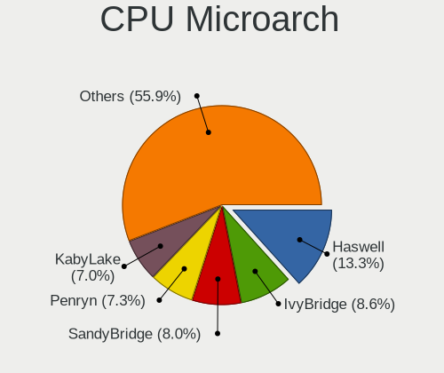
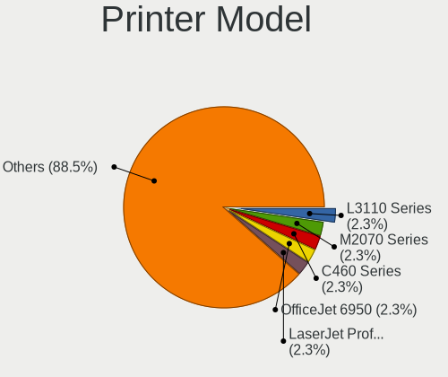

Zorin 16 - Tested Hardware & Statistics (Desktops)
--------------------------------------------------

A project to collect tested hardware configurations for Zorin 16.

Anyone can contribute to this report by the [hw-probe](https://github.com/linuxhw/hw-probe) tool:

    sudo -E hw-probe -all -upload

Please contribute! Especially if your hardware is rare.

Contents
--------

* [ Test Cases ](#test-cases)

* [ System ](#system)
  - [ Kernel                   ](#kernel)
  - [ Kernel Family            ](#kernel-family)
  - [ Kernel Major Ver.        ](#kernel-major-ver)
  - [ Arch                     ](#arch)
  - [ DE                       ](#de)
  - [ Display Server           ](#display-server)
  - [ Display Manager          ](#display-manager)
  - [ OS Lang                  ](#os-lang)
  - [ Boot Mode                ](#boot-mode)
  - [ Filesystem               ](#filesystem)
  - [ Part. scheme             ](#part-scheme)
  - [ Dual Boot with Linux/BSD ](#dual-boot-with-linuxbsd)
  - [ Dual Boot (Win)          ](#dual-boot-win)

* [ Board ](#board)
  - [ Vendor                   ](#vendor)
  - [ Model                    ](#model)
  - [ Model Family             ](#model-family)
  - [ MFG Year                 ](#mfg-year)
  - [ Form Factor              ](#form-factor)
  - [ Secure Boot              ](#secure-boot)
  - [ Coreboot                 ](#coreboot)
  - [ RAM Size                 ](#ram-size)
  - [ RAM Used                 ](#ram-used)
  - [ Total Drives             ](#total-drives)
  - [ Has CD-ROM               ](#has-cd-rom)
  - [ Has Ethernet             ](#has-ethernet)
  - [ Has WiFi                 ](#has-wifi)
  - [ Has Bluetooth            ](#has-bluetooth)

* [ Location ](#location)
  - [ Country                  ](#country)
  - [ City                     ](#city)

* [ Drives ](#drives)
  - [ Drive Vendor             ](#drive-vendor)
  - [ Drive Model              ](#drive-model)
  - [ HDD Vendor               ](#hdd-vendor)
  - [ SSD Vendor               ](#ssd-vendor)
  - [ Drive Kind               ](#drive-kind)
  - [ Drive Connector          ](#drive-connector)
  - [ Drive Size               ](#drive-size)
  - [ Space Total              ](#space-total)
  - [ Space Used               ](#space-used)
  - [ Malfunc. Drives          ](#malfunc-drives)
  - [ Malfunc. Drive Vendor    ](#malfunc-drive-vendor)
  - [ Malfunc. HDD Vendor      ](#malfunc-hdd-vendor)
  - [ Malfunc. Drive Kind      ](#malfunc-drive-kind)
  - [ Failed Drives            ](#failed-drives)
  - [ Failed Drive Vendor      ](#failed-drive-vendor)
  - [ Drive Status             ](#drive-status)

* [ Storage controller ](#storage-controller)
  - [ Storage Vendor           ](#storage-vendor)
  - [ Storage Model            ](#storage-model)
  - [ Storage Kind             ](#storage-kind)

* [ Processor ](#processor)
  - [ CPU Vendor               ](#cpu-vendor)
  - [ CPU Model                ](#cpu-model)
  - [ CPU Model Family         ](#cpu-model-family)
  - [ CPU Cores                ](#cpu-cores)
  - [ CPU Sockets              ](#cpu-sockets)
  - [ CPU Threads              ](#cpu-threads)
  - [ CPU Op-Modes             ](#cpu-op-modes)
  - [ CPU Microcode            ](#cpu-microcode)
  - [ CPU Microarch            ](#cpu-microarch)

* [ Graphics ](#graphics)
  - [ GPU Vendor               ](#gpu-vendor)
  - [ GPU Model                ](#gpu-model)
  - [ GPU Combo                ](#gpu-combo)
  - [ GPU Driver               ](#gpu-driver)
  - [ GPU Memory               ](#gpu-memory)

* [ Monitor ](#monitor)
  - [ Monitor Vendor           ](#monitor-vendor)
  - [ Monitor Model            ](#monitor-model)
  - [ Monitor Resolution       ](#monitor-resolution)
  - [ Monitor Diagonal         ](#monitor-diagonal)
  - [ Monitor Width            ](#monitor-width)
  - [ Aspect Ratio             ](#aspect-ratio)
  - [ Monitor Area             ](#monitor-area)
  - [ Pixel Density            ](#pixel-density)
  - [ Multiple Monitors        ](#multiple-monitors)

* [ Network ](#network)
  - [ Net Controller Vendor    ](#net-controller-vendor)
  - [ Net Controller Model     ](#net-controller-model)
  - [ Wireless Vendor          ](#wireless-vendor)
  - [ Wireless Model           ](#wireless-model)
  - [ Ethernet Vendor          ](#ethernet-vendor)
  - [ Ethernet Model           ](#ethernet-model)
  - [ Net Controller Kind      ](#net-controller-kind)
  - [ Used Controller          ](#used-controller)
  - [ NICs                     ](#nics)
  - [ IPv6                     ](#ipv6)

* [ Bluetooth ](#bluetooth)
  - [ Bluetooth Vendor         ](#bluetooth-vendor)
  - [ Bluetooth Model          ](#bluetooth-model)

* [ Sound ](#sound)
  - [ Sound Vendor             ](#sound-vendor)
  - [ Sound Model              ](#sound-model)

* [ Memory ](#memory)
  - [ Memory Vendor            ](#memory-vendor)
  - [ Memory Model             ](#memory-model)
  - [ Memory Kind              ](#memory-kind)
  - [ Memory Form Factor       ](#memory-form-factor)
  - [ Memory Size              ](#memory-size)
  - [ Memory Speed             ](#memory-speed)

* [ Printers & scanners ](#printers--scanners)
  - [ Printer Vendor           ](#printer-vendor)
  - [ Printer Model            ](#printer-model)
  - [ Scanner Vendor           ](#scanner-vendor)
  - [ Scanner Model            ](#scanner-model)

* [ Camera ](#camera)
  - [ Camera Vendor            ](#camera-vendor)
  - [ Camera Model             ](#camera-model)

* [ Security ](#security)
  - [ Fingerprint Vendor       ](#fingerprint-vendor)
  - [ Fingerprint Model        ](#fingerprint-model)
  - [ Chipcard Vendor          ](#chipcard-vendor)
  - [ Chipcard Model           ](#chipcard-model)

* [ Unsupported ](#unsupported)
  - [ Unsupported Devices      ](#unsupported-devices)
  - [ Unsupported Device Types ](#unsupported-device-types)

Test Cases
----------

Total: 1456

| Vendor        | Model                       | Probe                                                      | Date         |
|---------------|-----------------------------|------------------------------------------------------------|--------------|
| ASUSTek       | ROG STRIX B450-F GAMING ... | [ca7d449be6](https://linux-hardware.org/?probe=ca7d449be6) | Feb 28, 2023 |
| Lenovo        | SKYBAY SDK0J40697 WIN 33... | [75e0fb99ed](https://linux-hardware.org/?probe=75e0fb99ed) | Feb 28, 2023 |
| Google        | Buddy                       | [ac3d9aaed0](https://linux-hardware.org/?probe=ac3d9aaed0) | Feb 27, 2023 |
| Dell          | 0WMJ54 A01                  | [7f907fadb7](https://linux-hardware.org/?probe=7f907fadb7) | Feb 27, 2023 |
| Dell          | 0WMJ54 A01                  | [766991da5e](https://linux-hardware.org/?probe=766991da5e) | Feb 27, 2023 |
| Dell          | 0Y2MRG A00                  | [6c62bbbf3b](https://linux-hardware.org/?probe=6c62bbbf3b) | Feb 27, 2023 |
| Dell          | 0Y2MRG A00                  | [2479c3c245](https://linux-hardware.org/?probe=2479c3c245) | Feb 27, 2023 |
| HP            | 1998                        | [90794415e9](https://linux-hardware.org/?probe=90794415e9) | Feb 26, 2023 |
| ASUSTek       | TUF Gaming B550M-PLUS WI... | [a21ea9613b](https://linux-hardware.org/?probe=a21ea9613b) | Feb 26, 2023 |
| MSI           | B75MA-E33                   | [57a009cdd4](https://linux-hardware.org/?probe=57a009cdd4) | Feb 25, 2023 |
| MSI           | B75MA-E33                   | [fc1a3d88ae](https://linux-hardware.org/?probe=fc1a3d88ae) | Feb 25, 2023 |
| MSI           | H81M-P33                    | [1bc1cedec6](https://linux-hardware.org/?probe=1bc1cedec6) | Feb 25, 2023 |
| ASUSTek       | PRIME B560M-A               | [7357439273](https://linux-hardware.org/?probe=7357439273) | Feb 25, 2023 |
| HP            | 2AF7                        | [a8eba0b0c4](https://linux-hardware.org/?probe=a8eba0b0c4) | Feb 25, 2023 |
| HP            | 2AF7                        | [3bf3afd1d5](https://linux-hardware.org/?probe=3bf3afd1d5) | Feb 25, 2023 |
| HP            | 2129                        | [5118eb06d4](https://linux-hardware.org/?probe=5118eb06d4) | Feb 24, 2023 |
| Dell          | 0HN7XN A01                  | [f283ae7cb2](https://linux-hardware.org/?probe=f283ae7cb2) | Feb 23, 2023 |
| HP            | 2129                        | [5a6b1e7169](https://linux-hardware.org/?probe=5a6b1e7169) | Feb 21, 2023 |
| ASUSTek       | SABERTOOTH Z87              | [e861797e74](https://linux-hardware.org/?probe=e861797e74) | Feb 21, 2023 |
| ASUSTek       | F2A55-M                     | [c9d150f24c](https://linux-hardware.org/?probe=c9d150f24c) | Feb 21, 2023 |
| ASUSTek       | SABERTOOTH Z87              | [40e2157901](https://linux-hardware.org/?probe=40e2157901) | Feb 21, 2023 |
| HP            | 1850                        | [f184ff6250](https://linux-hardware.org/?probe=f184ff6250) | Feb 21, 2023 |
| ASUSTek       | BM6630_BM6330_BP6230        | [e062475561](https://linux-hardware.org/?probe=e062475561) | Feb 20, 2023 |
| eMachines     | MCP61PM-GM                  | [aeafa2dbee](https://linux-hardware.org/?probe=aeafa2dbee) | Feb 19, 2023 |
| ASUSTek       | BM6630_BM6330_BP6230        | [5d6240bcc6](https://linux-hardware.org/?probe=5d6240bcc6) | Feb 19, 2023 |
| HOUTER        | ORO-PC                      | [09aad96389](https://linux-hardware.org/?probe=09aad96389) | Feb 19, 2023 |
| Gigabyte      | H97M-D3H                    | [be0f73193d](https://linux-hardware.org/?probe=be0f73193d) | Feb 19, 2023 |
| Gigabyte      | H97M-D3H                    | [c784a261d4](https://linux-hardware.org/?probe=c784a261d4) | Feb 19, 2023 |
| Gigabyte      | H81M-S2H                    | [d6f4d9d8df](https://linux-hardware.org/?probe=d6f4d9d8df) | Feb 19, 2023 |
| HOUTER        | ORO-PC                      | [af7ffdc7a9](https://linux-hardware.org/?probe=af7ffdc7a9) | Feb 18, 2023 |
| ASUSTek       | P5KC                        | [b2a9f21210](https://linux-hardware.org/?probe=b2a9f21210) | Feb 18, 2023 |
| Gigabyte      | AB350-Gaming 3-CF           | [6cc82a744e](https://linux-hardware.org/?probe=6cc82a744e) | Feb 18, 2023 |
| Gigabyte      | AB350-Gaming 3-CF           | [96c9f07207](https://linux-hardware.org/?probe=96c9f07207) | Feb 18, 2023 |
| Gigabyte      | AB350-Gaming 3-CF           | [2734c1a2ae](https://linux-hardware.org/?probe=2734c1a2ae) | Feb 18, 2023 |
| MSI           | H270 PC MATE                | [6581748d54](https://linux-hardware.org/?probe=6581748d54) | Feb 17, 2023 |
| MSI           | 760GM-P23                   | [529e0929d2](https://linux-hardware.org/?probe=529e0929d2) | Feb 17, 2023 |
| Gigabyte      | 990FXA-UD3                  | [97e017594b](https://linux-hardware.org/?probe=97e017594b) | Feb 16, 2023 |
| Gigabyte      | 990FXA-UD3                  | [51b7c93a69](https://linux-hardware.org/?probe=51b7c93a69) | Feb 16, 2023 |
| ASUSTek       | ROG STRIX X670E-E GAMING... | [4275665066](https://linux-hardware.org/?probe=4275665066) | Feb 16, 2023 |
| MSI           | Z370M MORTAR                | [5ac9c9a924](https://linux-hardware.org/?probe=5ac9c9a924) | Feb 15, 2023 |
| Fujitsu       | D3041-A1 S26361-D3041-A1    | [995da369f0](https://linux-hardware.org/?probe=995da369f0) | Feb 14, 2023 |
| Lenovo        | 30FD SDK0J40697 WIN 3305... | [b6b09f6455](https://linux-hardware.org/?probe=b6b09f6455) | Feb 14, 2023 |
| Gigabyte      | B450M DS3H V2               | [92fc220243](https://linux-hardware.org/?probe=92fc220243) | Feb 14, 2023 |
| Google        | Teemo                       | [53bf6d19ca](https://linux-hardware.org/?probe=53bf6d19ca) | Feb 14, 2023 |
| MSI           | MS-B9181                    | [a155bc9fc3](https://linux-hardware.org/?probe=a155bc9fc3) | Feb 13, 2023 |
| Fujitsu       | D3041-A1 S26361-D3041-A1    | [1e3c885566](https://linux-hardware.org/?probe=1e3c885566) | Feb 13, 2023 |
| Dell          | 0Y7WYT A00                  | [e289b5bb8d](https://linux-hardware.org/?probe=e289b5bb8d) | Feb 13, 2023 |
| ASRock        | X570 Phantom Gaming X       | [5efd07985b](https://linux-hardware.org/?probe=5efd07985b) | Feb 13, 2023 |
| Alienware     | 0N43JM A00                  | [ef1d9239ab](https://linux-hardware.org/?probe=ef1d9239ab) | Feb 12, 2023 |
| Lenovo        | ThinkServer TS140           | [59eeaafe59](https://linux-hardware.org/?probe=59eeaafe59) | Feb 12, 2023 |
| MSI           | H310M PRO-M2 PLUS           | [45f78c29cb](https://linux-hardware.org/?probe=45f78c29cb) | Feb 12, 2023 |
| Gigabyte      | B560 HD3                    | [498c449a46](https://linux-hardware.org/?probe=498c449a46) | Feb 12, 2023 |
| ASUSTek       | M5A78L-M/USB3               | [43e0c40499](https://linux-hardware.org/?probe=43e0c40499) | Feb 11, 2023 |
| Unknown       | Unknown                     | [ce78e6cdb9](https://linux-hardware.org/?probe=ce78e6cdb9) | Feb 11, 2023 |
| Gigabyte      | H81M-S2H                    | [a789235fe3](https://linux-hardware.org/?probe=a789235fe3) | Feb 11, 2023 |
| HP            | 8054                        | [55c5642509](https://linux-hardware.org/?probe=55c5642509) | Feb 11, 2023 |
| Gigabyte      | H81M-S2H                    | [f3919f8d69](https://linux-hardware.org/?probe=f3919f8d69) | Feb 11, 2023 |
| Unknown       | Unknown                     | [f5e5e27e8e](https://linux-hardware.org/?probe=f5e5e27e8e) | Feb 11, 2023 |
| ASUSTek       | ROG STRIX X570-I GAMING     | [7a6b34f58c](https://linux-hardware.org/?probe=7a6b34f58c) | Feb 11, 2023 |
| HP            | 8643 SMVB                   | [5e8a88b237](https://linux-hardware.org/?probe=5e8a88b237) | Feb 11, 2023 |
| ASUSTek       | P5K                         | [9f8790812d](https://linux-hardware.org/?probe=9f8790812d) | Feb 11, 2023 |
| ASUSTek       | ROG STRIX X570-I GAMING     | [6d9d60d4b8](https://linux-hardware.org/?probe=6d9d60d4b8) | Feb 10, 2023 |
| Unknown       | Unknown                     | [cb0a834e1a](https://linux-hardware.org/?probe=cb0a834e1a) | Feb 10, 2023 |
| MSI           | GF615M-P31                  | [36dcd2e516](https://linux-hardware.org/?probe=36dcd2e516) | Feb 10, 2023 |
| Gigabyte      | X570 GAMING X               | [458744c54d](https://linux-hardware.org/?probe=458744c54d) | Feb 09, 2023 |
| Gigabyte      | B560 HD3                    | [628151aedd](https://linux-hardware.org/?probe=628151aedd) | Feb 09, 2023 |
| Gigabyte      | X570 GAMING X               | [dd9b71e8d2](https://linux-hardware.org/?probe=dd9b71e8d2) | Feb 09, 2023 |
| Gigabyte      | B660 DS3H AX DDR4           | [73ae27760d](https://linux-hardware.org/?probe=73ae27760d) | Feb 09, 2023 |
| ASUSTek       | PRIME B550M-A               | [dd76c764a1](https://linux-hardware.org/?probe=dd76c764a1) | Feb 08, 2023 |
| Fujitsu       | D3041-A1 S26361-D3041-A1    | [37aec8a881](https://linux-hardware.org/?probe=37aec8a881) | Feb 08, 2023 |
| Gigabyte      | GA-MA74GM-S2H               | [e7ee51ecdd](https://linux-hardware.org/?probe=e7ee51ecdd) | Feb 08, 2023 |
| ASUSTek       | SABERTOOTH P67              | [1fdf18a3ed](https://linux-hardware.org/?probe=1fdf18a3ed) | Feb 08, 2023 |
| Foxconn       | NT-A2400&NT-A3500 FAB       | [000ed6c589](https://linux-hardware.org/?probe=000ed6c589) | Feb 07, 2023 |
| Intel         | CRESCENTBAY                 | [1830edf54c](https://linux-hardware.org/?probe=1830edf54c) | Feb 07, 2023 |
| Lenovo        | Myrtle CRB SDK0J40700 WI... | [96f24866e0](https://linux-hardware.org/?probe=96f24866e0) | Feb 06, 2023 |
| Gigabyte      | B560M AORUS ELITE           | [05b252ac05](https://linux-hardware.org/?probe=05b252ac05) | Feb 05, 2023 |
| MSI           | B450 TOMAHAWK MAX II        | [0de7e3b318](https://linux-hardware.org/?probe=0de7e3b318) | Feb 05, 2023 |
| MSI           | MPG B550 GAMING EDGE WIF... | [e61bc21eaf](https://linux-hardware.org/?probe=e61bc21eaf) | Feb 05, 2023 |
| HP            | 2B47                        | [3db96ac186](https://linux-hardware.org/?probe=3db96ac186) | Feb 04, 2023 |
| Dell          | 0HN7XN A01                  | [0399613500](https://linux-hardware.org/?probe=0399613500) | Feb 04, 2023 |
| ASUSTek       | M5A97 R2.0                  | [e5a1cf7284](https://linux-hardware.org/?probe=e5a1cf7284) | Feb 03, 2023 |
| MSI           | B85M-E45                    | [13453f924e](https://linux-hardware.org/?probe=13453f924e) | Feb 03, 2023 |
| Intel         | X58                         | [55a6a5bd82](https://linux-hardware.org/?probe=55a6a5bd82) | Feb 03, 2023 |
| HP            | 1825                        | [fd942fd3ba](https://linux-hardware.org/?probe=fd942fd3ba) | Feb 02, 2023 |
| Dell          | 0D28YY A01                  | [51b04e5d58](https://linux-hardware.org/?probe=51b04e5d58) | Feb 01, 2023 |
| ASRock        | H87 Pro4                    | [8a53501060](https://linux-hardware.org/?probe=8a53501060) | Jan 31, 2023 |
| Huanan        | X79 INTEL (INTEL Xeon E5... | [2c021665e1](https://linux-hardware.org/?probe=2c021665e1) | Jan 31, 2023 |
| MSI           | H81M-P33                    | [63402c414d](https://linux-hardware.org/?probe=63402c414d) | Jan 30, 2023 |
| HP            | 1791                        | [0cb5402c68](https://linux-hardware.org/?probe=0cb5402c68) | Jan 29, 2023 |
| Fujitsu       | D3221-A1 S26361-D3221-A1    | [bc4b6513bb](https://linux-hardware.org/?probe=bc4b6513bb) | Jan 28, 2023 |
| MSI           | 760GM-P23                   | [0da956ecde](https://linux-hardware.org/?probe=0da956ecde) | Jan 28, 2023 |
| MSI           | 760GM-P23                   | [e00bd18cc2](https://linux-hardware.org/?probe=e00bd18cc2) | Jan 28, 2023 |
| HP            | 843F                        | [5e9a5d2afd](https://linux-hardware.org/?probe=5e9a5d2afd) | Jan 28, 2023 |
| MSI           | PRO H610M-G DDR4            | [ad4f37d5a4](https://linux-hardware.org/?probe=ad4f37d5a4) | Jan 28, 2023 |
| HP            | 2B47                        | [cce5f9ec07](https://linux-hardware.org/?probe=cce5f9ec07) | Jan 27, 2023 |
| ASUSTek       | TUF Gaming X570-PLUS_BR     | [e7b74c9ad4](https://linux-hardware.org/?probe=e7b74c9ad4) | Jan 27, 2023 |
| ASRock        | H61M-DGS                    | [825e70e660](https://linux-hardware.org/?probe=825e70e660) | Jan 27, 2023 |
| ASUSTek       | ROG STRIX X670E-I GAMING... | [9d3e931cc1](https://linux-hardware.org/?probe=9d3e931cc1) | Jan 27, 2023 |
| ASRock        | H87 Pro4                    | [c1427c9b7b](https://linux-hardware.org/?probe=c1427c9b7b) | Jan 26, 2023 |
| ASUSTek       | TUF Gaming X570-PLUS_BR     | [951bfcd626](https://linux-hardware.org/?probe=951bfcd626) | Jan 26, 2023 |
| ASUSTek       | PRIME B450-PLUS             | [c216d513a0](https://linux-hardware.org/?probe=c216d513a0) | Jan 25, 2023 |
| ASUSTek       | PRIME B450-PLUS             | [06b972165b](https://linux-hardware.org/?probe=06b972165b) | Jan 25, 2023 |
| ASRock        | H61M-DGS                    | [5672937ec6](https://linux-hardware.org/?probe=5672937ec6) | Jan 25, 2023 |
| Acer          | RS880M05                    | [c7e3fe60e1](https://linux-hardware.org/?probe=c7e3fe60e1) | Jan 23, 2023 |
| ASRock        | H61M                        | [f5b1db73f7](https://linux-hardware.org/?probe=f5b1db73f7) | Jan 22, 2023 |
| ASUSTek       | P5Q                         | [9e3b6b7075](https://linux-hardware.org/?probe=9e3b6b7075) | Jan 22, 2023 |
| ASUSTek       | TUF Gaming X570-PLUS_BR     | [90ad82dcac](https://linux-hardware.org/?probe=90ad82dcac) | Jan 21, 2023 |
| ASUSTek       | TUF Gaming X570-PLUS_BR     | [9579ec96bc](https://linux-hardware.org/?probe=9579ec96bc) | Jan 21, 2023 |
| HP            | 89B5 A                      | [1b6e288840](https://linux-hardware.org/?probe=1b6e288840) | Jan 21, 2023 |
| HP            | 843F                        | [07f6efa703](https://linux-hardware.org/?probe=07f6efa703) | Jan 20, 2023 |
| ASUSTek       | M4A3000E                    | [650236c7cc](https://linux-hardware.org/?probe=650236c7cc) | Jan 19, 2023 |
| ASRock        | B450 Pro4                   | [8131194ea1](https://linux-hardware.org/?probe=8131194ea1) | Jan 19, 2023 |
| ASUSTek       | P7P55D-E                    | [6bc203c6fd](https://linux-hardware.org/?probe=6bc203c6fd) | Jan 19, 2023 |
| HP            | 843F                        | [83ca70ac2d](https://linux-hardware.org/?probe=83ca70ac2d) | Jan 19, 2023 |
| Dell          | 0D28YY A01                  | [82b540a137](https://linux-hardware.org/?probe=82b540a137) | Jan 19, 2023 |
| ASUSTek       | M4A3000E                    | [4f8a71f0c5](https://linux-hardware.org/?probe=4f8a71f0c5) | Jan 19, 2023 |
| Lenovo        | MAHOBAY NO DPK              | [dfac4d4f79](https://linux-hardware.org/?probe=dfac4d4f79) | Jan 17, 2023 |
| HP            | 3397                        | [a58c9ac196](https://linux-hardware.org/?probe=a58c9ac196) | Jan 17, 2023 |
| Lenovo        | MAHOBAY NO DPK              | [69b469a6fb](https://linux-hardware.org/?probe=69b469a6fb) | Jan 16, 2023 |
| Gigabyte      | EX58-EXTREME                | [bb62149054](https://linux-hardware.org/?probe=bb62149054) | Jan 16, 2023 |
| Medion        | MS-7707                     | [9665ceabf1](https://linux-hardware.org/?probe=9665ceabf1) | Jan 16, 2023 |
| MSI           | X370 GAMING PRO CARBON      | [3677d8f4e7](https://linux-hardware.org/?probe=3677d8f4e7) | Jan 15, 2023 |
| Gigabyte      | M68MT-S2                    | [a728c46633](https://linux-hardware.org/?probe=a728c46633) | Jan 15, 2023 |
| Unknown       | Unknown                     | [a69d4b7b4f](https://linux-hardware.org/?probe=a69d4b7b4f) | Jan 15, 2023 |
| Unknown       | Unknown                     | [9cb802849a](https://linux-hardware.org/?probe=9cb802849a) | Jan 14, 2023 |
| ASUSTek       | ROG Maximus XI HERO         | [e00028a10c](https://linux-hardware.org/?probe=e00028a10c) | Jan 14, 2023 |
| HC            | HCAR357-MI V1.0             | [b5f80f8eac](https://linux-hardware.org/?probe=b5f80f8eac) | Jan 14, 2023 |
| HP            | 0B4Ch D                     | [c5edc9fbc7](https://linux-hardware.org/?probe=c5edc9fbc7) | Jan 14, 2023 |
| HP            | 3397                        | [baae324548](https://linux-hardware.org/?probe=baae324548) | Jan 13, 2023 |
| Acer          | FRS690L                     | [5b27fe10aa](https://linux-hardware.org/?probe=5b27fe10aa) | Jan 13, 2023 |
| ASUSTek       | ROG STRIX B350-F GAMING     | [07cedbf55a](https://linux-hardware.org/?probe=07cedbf55a) | Jan 12, 2023 |
| ASUSTek       | TUF Gaming X570-PRO         | [1706cf55cf](https://linux-hardware.org/?probe=1706cf55cf) | Jan 12, 2023 |
| ASUSTek       | H87-PRO                     | [4ac36f25a9](https://linux-hardware.org/?probe=4ac36f25a9) | Jan 11, 2023 |
| HP            | 843B                        | [ac14cee88f](https://linux-hardware.org/?probe=ac14cee88f) | Jan 10, 2023 |
| HP            | 843B                        | [e45a20a47f](https://linux-hardware.org/?probe=e45a20a47f) | Jan 10, 2023 |
| ASUSTek       | M4A88T-M                    | [4c3d063774](https://linux-hardware.org/?probe=4c3d063774) | Jan 09, 2023 |
| ASUSTek       | Z170 PRO GAMING/AURA        | [abc1a27105](https://linux-hardware.org/?probe=abc1a27105) | Jan 08, 2023 |
| HP            | 2129                        | [4d6113e60d](https://linux-hardware.org/?probe=4d6113e60d) | Jan 08, 2023 |
| ASRock        | X670E PG Lightning          | [2b3261504f](https://linux-hardware.org/?probe=2b3261504f) | Jan 08, 2023 |
| MAXSUN        | MS-TZZ A320M.2-VH           | [f3e00dc862](https://linux-hardware.org/?probe=f3e00dc862) | Jan 07, 2023 |
| HP            | 2B47                        | [8ad8cb5e8f](https://linux-hardware.org/?probe=8ad8cb5e8f) | Jan 06, 2023 |
| Fujitsu       | D3430-A1 S26361-D3430-A1    | [2df76bde47](https://linux-hardware.org/?probe=2df76bde47) | Jan 06, 2023 |
| Dell          | 0HN7XN A01                  | [e597f176c2](https://linux-hardware.org/?probe=e597f176c2) | Jan 03, 2023 |
| Dell          | 018D1Y A00                  | [9ba9bcee90](https://linux-hardware.org/?probe=9ba9bcee90) | Jan 03, 2023 |
| Foxconn       | H67S/H61SP                  | [c7684d1f93](https://linux-hardware.org/?probe=c7684d1f93) | Jan 03, 2023 |
| HP            | 8350                        | [3ab0d55a41](https://linux-hardware.org/?probe=3ab0d55a41) | Jan 02, 2023 |
| ASUSTek       | D300TA                      | [f522fa7b4d](https://linux-hardware.org/?probe=f522fa7b4d) | Jan 02, 2023 |
| ASUSTek       | H87-PRO                     | [f95906c714](https://linux-hardware.org/?probe=f95906c714) | Jan 01, 2023 |
| Dell          | 0T10XW A00                  | [21638e1dfe](https://linux-hardware.org/?probe=21638e1dfe) | Dec 31, 2022 |
| Gigabyte      | G31M-S2C                    | [39f08657f8](https://linux-hardware.org/?probe=39f08657f8) | Dec 31, 2022 |
| Gigabyte      | B550 AORUS PRO              | [c8da48f03c](https://linux-hardware.org/?probe=c8da48f03c) | Dec 30, 2022 |
| Biostar       | TA970                       | [6a55825894](https://linux-hardware.org/?probe=6a55825894) | Dec 30, 2022 |
| Gigabyte      | 970A-DS3P                   | [c841093094](https://linux-hardware.org/?probe=c841093094) | Dec 30, 2022 |
| MSI           | X99A RAIDER                 | [59f6170d5b](https://linux-hardware.org/?probe=59f6170d5b) | Dec 29, 2022 |
| MSI           | Z490-A PRO                  | [e4e5afd812](https://linux-hardware.org/?probe=e4e5afd812) | Dec 29, 2022 |
| ASUSTek       | P6T DELUXE V2               | [0d8d6061d7](https://linux-hardware.org/?probe=0d8d6061d7) | Dec 29, 2022 |
| ASUSTek       | P6T DELUXE V2               | [4bda137e99](https://linux-hardware.org/?probe=4bda137e99) | Dec 29, 2022 |
| Dell          | 0KWVT8 A03                  | [7ce6d4b3e3](https://linux-hardware.org/?probe=7ce6d4b3e3) | Dec 29, 2022 |
| Dell          | 0KWVT8 A03                  | [f828f74e07](https://linux-hardware.org/?probe=f828f74e07) | Dec 29, 2022 |
| PCWare        | IPMH61R1                    | [a221946f02](https://linux-hardware.org/?probe=a221946f02) | Dec 29, 2022 |
| Dell          | 03KWTV A02                  | [82612358ac](https://linux-hardware.org/?probe=82612358ac) | Dec 28, 2022 |
| HP            | 2AF7                        | [9663a281c1](https://linux-hardware.org/?probe=9663a281c1) | Dec 28, 2022 |
| Acer          | Aspire XC-780               | [0d90d1884c](https://linux-hardware.org/?probe=0d90d1884c) | Dec 27, 2022 |
| Lenovo        | 3106 SDK0J40697 WIN 3305... | [5ce1ea886f](https://linux-hardware.org/?probe=5ce1ea886f) | Dec 26, 2022 |
| Lenovo        | 3106 SDK0J40697 WIN 3305... | [f56ea263a2](https://linux-hardware.org/?probe=f56ea263a2) | Dec 26, 2022 |
| HP            | 2AF7                        | [287696b4fc](https://linux-hardware.org/?probe=287696b4fc) | Dec 25, 2022 |
| Gigabyte      | GA-770T-USB3                | [08d1b04754](https://linux-hardware.org/?probe=08d1b04754) | Dec 25, 2022 |
| ASRock        | 970 Extreme4                | [2655b3c6b6](https://linux-hardware.org/?probe=2655b3c6b6) | Dec 24, 2022 |
| Intel         | H61                         | [8d5eb236e1](https://linux-hardware.org/?probe=8d5eb236e1) | Dec 24, 2022 |
| HP            | 2AF7                        | [7b79dd8352](https://linux-hardware.org/?probe=7b79dd8352) | Dec 23, 2022 |
| HP            | 2AF7                        | [5ef9ce3357](https://linux-hardware.org/?probe=5ef9ce3357) | Dec 23, 2022 |
| Dell          | 0C2KJT A00                  | [08a8cc75ac](https://linux-hardware.org/?probe=08a8cc75ac) | Dec 23, 2022 |
| Dell          | 0C2KJT A00                  | [bd8a5003e8](https://linux-hardware.org/?probe=bd8a5003e8) | Dec 23, 2022 |
| ASRock        | G31M-S                      | [476c5ec563](https://linux-hardware.org/?probe=476c5ec563) | Dec 22, 2022 |
| MSI           | H61MU-E35                   | [cb9ec3d5ad](https://linux-hardware.org/?probe=cb9ec3d5ad) | Dec 22, 2022 |
| MSI           | H61MU-E35                   | [bfdc9d1e12](https://linux-hardware.org/?probe=bfdc9d1e12) | Dec 22, 2022 |
| ECS           | H110M4-C2H                  | [f349ed8914](https://linux-hardware.org/?probe=f349ed8914) | Dec 22, 2022 |
| MSI           | B450M MORTAR                | [2279954594](https://linux-hardware.org/?probe=2279954594) | Dec 22, 2022 |
| ASRock        | N68C-S UCC                  | [279e1eacf6](https://linux-hardware.org/?probe=279e1eacf6) | Dec 22, 2022 |
| ASRock        | G31M-S                      | [88d93da5a7](https://linux-hardware.org/?probe=88d93da5a7) | Dec 22, 2022 |
| ASRock        | N68C-S UCC                  | [8d8716cdca](https://linux-hardware.org/?probe=8d8716cdca) | Dec 21, 2022 |
| PCWare        | IPMH310 PRO 1.0             | [c4dea5edbb](https://linux-hardware.org/?probe=c4dea5edbb) | Dec 21, 2022 |
| Dell          | 0MGK50 A04                  | [931b01be38](https://linux-hardware.org/?probe=931b01be38) | Dec 20, 2022 |
| ASRock        | Z170 Pro4                   | [ca027f264a](https://linux-hardware.org/?probe=ca027f264a) | Dec 20, 2022 |
| ASRock        | B450M Pro4                  | [83df1364c8](https://linux-hardware.org/?probe=83df1364c8) | Dec 20, 2022 |
| Lenovo        | 3106 SDK0J40697 WIN 3305... | [87907abff7](https://linux-hardware.org/?probe=87907abff7) | Dec 19, 2022 |
| ASUSTek       | PRIME H310M-A R2.0          | [08f3a88ab3](https://linux-hardware.org/?probe=08f3a88ab3) | Dec 19, 2022 |
| ASRock        | N3150-NUC                   | [5e77ec1117](https://linux-hardware.org/?probe=5e77ec1117) | Dec 18, 2022 |
| Dell          | 0Y2MRG A00                  | [20b69069fa](https://linux-hardware.org/?probe=20b69069fa) | Dec 18, 2022 |
| ASRock        | N3150-NUC                   | [e497bf2ce3](https://linux-hardware.org/?probe=e497bf2ce3) | Dec 17, 2022 |
| ASUSTek       | ROG STRIX Z690-I GAMING ... | [18d7dcfb19](https://linux-hardware.org/?probe=18d7dcfb19) | Dec 17, 2022 |
| Gigabyte      | X570 AORUS ELITE            | [dec0d049f7](https://linux-hardware.org/?probe=dec0d049f7) | Dec 17, 2022 |
| Fujitsu       | D2901-A1 S26361-D2901-A1    | [d9ee8a9854](https://linux-hardware.org/?probe=d9ee8a9854) | Dec 16, 2022 |
| HP            | 8750                        | [a4911352d1](https://linux-hardware.org/?probe=a4911352d1) | Dec 16, 2022 |
| Fujitsu       | D3223-A1 S26361-D3223-A1    | [827fabbd5f](https://linux-hardware.org/?probe=827fabbd5f) | Dec 15, 2022 |
| ASUSTek       | PRIME H370-A                | [eeb913fa7c](https://linux-hardware.org/?probe=eeb913fa7c) | Dec 15, 2022 |
| ASUSTek       | PRIME H370-A                | [7a72cfa484](https://linux-hardware.org/?probe=7a72cfa484) | Dec 15, 2022 |
| Dell          | 018D1Y A00                  | [34611b96d0](https://linux-hardware.org/?probe=34611b96d0) | Dec 15, 2022 |
| ASUSTek       | P5PL2-E                     | [d304b202fc](https://linux-hardware.org/?probe=d304b202fc) | Dec 14, 2022 |
| ASUSTek       | M3A78-EM                    | [3339909881](https://linux-hardware.org/?probe=3339909881) | Dec 14, 2022 |
| MSI           | MS-B9071                    | [fc31fe11a2](https://linux-hardware.org/?probe=fc31fe11a2) | Dec 14, 2022 |
| HP            | 1905                        | [21f639657c](https://linux-hardware.org/?probe=21f639657c) | Dec 13, 2022 |
| Gigabyte      | H57M-USB3                   | [d4812cfdb6](https://linux-hardware.org/?probe=d4812cfdb6) | Dec 13, 2022 |
| Gigabyte      | H57M-USB3                   | [c48aaf8b29](https://linux-hardware.org/?probe=c48aaf8b29) | Dec 12, 2022 |
| Gigabyte      | H77N-WIFI                   | [9704c6b7c4](https://linux-hardware.org/?probe=9704c6b7c4) | Dec 12, 2022 |
| Biostar       | A520MH                      | [e1eff55b96](https://linux-hardware.org/?probe=e1eff55b96) | Dec 12, 2022 |
| Foxconn       | H55MXV-LE                   | [931837aeec](https://linux-hardware.org/?probe=931837aeec) | Dec 12, 2022 |
| Biostar       | A520MH                      | [2c6278e478](https://linux-hardware.org/?probe=2c6278e478) | Dec 11, 2022 |
| Lenovo        | 30D2 SDK0J40705 WIN 3425... | [80281a1e7b](https://linux-hardware.org/?probe=80281a1e7b) | Dec 11, 2022 |
| Unknown       | T3 MRD                      | [c2cb5ad16b](https://linux-hardware.org/?probe=c2cb5ad16b) | Dec 11, 2022 |
| ASUSTek       | TUF Gaming B550-PRO         | [e2a043a361](https://linux-hardware.org/?probe=e2a043a361) | Dec 10, 2022 |
| MSI           | MPG X570 GAMING EDGE WIF... | [9d7365bdd6](https://linux-hardware.org/?probe=9d7365bdd6) | Dec 10, 2022 |
| ASUSTek       | P5Q                         | [fbc5b65636](https://linux-hardware.org/?probe=fbc5b65636) | Dec 10, 2022 |
| ASUSTek       | M3N78-VM                    | [fa99389a1a](https://linux-hardware.org/?probe=fa99389a1a) | Dec 10, 2022 |
| Lenovo        | SHARKBAY SDK0E50510 WIN     | [3e0d5dc490](https://linux-hardware.org/?probe=3e0d5dc490) | Dec 09, 2022 |
| ASUSTek       | P5Q                         | [415b325dd0](https://linux-hardware.org/?probe=415b325dd0) | Dec 09, 2022 |
| Unknown       | Unknown                     | [41ff90c88a](https://linux-hardware.org/?probe=41ff90c88a) | Dec 09, 2022 |
| ASUSTek       | ROG STRIX X470-F GAMING     | [ead8cc9c0a](https://linux-hardware.org/?probe=ead8cc9c0a) | Dec 08, 2022 |
| HP            | 82FE 11                     | [6bf35b7005](https://linux-hardware.org/?probe=6bf35b7005) | Dec 08, 2022 |
| Dell          | 0478VN A00                  | [54eaa6d2f3](https://linux-hardware.org/?probe=54eaa6d2f3) | Dec 07, 2022 |
| Gigabyte      | H61M-S1                     | [8c8e80423c](https://linux-hardware.org/?probe=8c8e80423c) | Dec 07, 2022 |
| Gigabyte      | H61M-S1                     | [37283186c3](https://linux-hardware.org/?probe=37283186c3) | Dec 07, 2022 |
| MSI           | K9A2 Platinum               | [3ce727deb7](https://linux-hardware.org/?probe=3ce727deb7) | Dec 06, 2022 |
| Gigabyte      | AB350-Gaming 3-CF           | [8442e3381c](https://linux-hardware.org/?probe=8442e3381c) | Dec 06, 2022 |
| Apple         | Mac-F221BEC8                | [5132e1aba1](https://linux-hardware.org/?probe=5132e1aba1) | Dec 05, 2022 |
| Dell          | 0T10XW A00                  | [d6f876fa52](https://linux-hardware.org/?probe=d6f876fa52) | Dec 05, 2022 |
| HP            | 8350                        | [f7768016d5](https://linux-hardware.org/?probe=f7768016d5) | Dec 05, 2022 |
| ASUSTek       | TUF B450M-PLUS GAMING       | [101ea9ca8e](https://linux-hardware.org/?probe=101ea9ca8e) | Dec 04, 2022 |
| ASUSTek       | ROG STRIX X570-E GAMING ... | [8de52c0ea7](https://linux-hardware.org/?probe=8de52c0ea7) | Dec 04, 2022 |
| MACHINIST     | E5-MR9A PRO V1.0            | [67fa9fb5aa](https://linux-hardware.org/?probe=67fa9fb5aa) | Dec 03, 2022 |
| MSI           | K9A2 Platinum               | [79c823558a](https://linux-hardware.org/?probe=79c823558a) | Dec 03, 2022 |
| HP            | 2AE2                        | [549eacfc3d](https://linux-hardware.org/?probe=549eacfc3d) | Dec 03, 2022 |
| MSI           | B75A-G41                    | [cbf02bbd94](https://linux-hardware.org/?probe=cbf02bbd94) | Dec 03, 2022 |
| Biostar       | TPower X58                  | [320769fceb](https://linux-hardware.org/?probe=320769fceb) | Dec 02, 2022 |
| AZW           | U59                         | [6a7c9cb905](https://linux-hardware.org/?probe=6a7c9cb905) | Dec 02, 2022 |
| NZXT          | N7 Z590                     | [cc56e65209](https://linux-hardware.org/?probe=cc56e65209) | Dec 02, 2022 |
| Lenovo        | MAHOBAY NOK                 | [dfd11598ed](https://linux-hardware.org/?probe=dfd11598ed) | Dec 02, 2022 |
| ASUSTek       | ROG STRIX X570-E GAMING ... | [c469225241](https://linux-hardware.org/?probe=c469225241) | Dec 01, 2022 |
| MSI           | G41M-S03                    | [763decb5d5](https://linux-hardware.org/?probe=763decb5d5) | Dec 01, 2022 |
| Apple         | Mac-F221BEC8                | [7f91a09589](https://linux-hardware.org/?probe=7f91a09589) | Dec 01, 2022 |
| HP            | 8433 11                     | [01f9a28da3](https://linux-hardware.org/?probe=01f9a28da3) | Dec 01, 2022 |
| OEM           | H110 Ver:2.21               | [ad7fffd9e3](https://linux-hardware.org/?probe=ad7fffd9e3) | Nov 30, 2022 |
| ASRock        | B450M Steel Legend          | [9d6aeff37c](https://linux-hardware.org/?probe=9d6aeff37c) | Nov 30, 2022 |
| OEM           | H110 Ver:2.21               | [2e7e420f42](https://linux-hardware.org/?probe=2e7e420f42) | Nov 29, 2022 |
| Gateway       | SX2851                      | [b408695def](https://linux-hardware.org/?probe=b408695def) | Nov 28, 2022 |
| ASUSTek       | M5A88-M                     | [f4b2035429](https://linux-hardware.org/?probe=f4b2035429) | Nov 28, 2022 |
| BESSTAR Te... | HM90                        | [eda49557ae](https://linux-hardware.org/?probe=eda49557ae) | Nov 27, 2022 |
| BESSTAR Te... | HM90                        | [6867d8eeaf](https://linux-hardware.org/?probe=6867d8eeaf) | Nov 27, 2022 |
| Megaware      | MW-NM70HD-MI 01/13/2013 ... | [95b48709fd](https://linux-hardware.org/?probe=95b48709fd) | Nov 26, 2022 |
| Huanan        | X99-8M-F V1.1               | [88db74df98](https://linux-hardware.org/?probe=88db74df98) | Nov 26, 2022 |
| Gigabyte      | GA-890GPA-UD3H              | [5b531b7b41](https://linux-hardware.org/?probe=5b531b7b41) | Nov 26, 2022 |
| ASRock        | B450M Pro4                  | [def104dd7d](https://linux-hardware.org/?probe=def104dd7d) | Nov 26, 2022 |
| Huanan        | X99-8M-F V1.1               | [3ca25803b5](https://linux-hardware.org/?probe=3ca25803b5) | Nov 25, 2022 |
| Pegatron      | 2ACF                        | [dc9d24ac01](https://linux-hardware.org/?probe=dc9d24ac01) | Nov 25, 2022 |
| Pegatron      | 2ACF                        | [037b47ab43](https://linux-hardware.org/?probe=037b47ab43) | Nov 25, 2022 |
| HP            | 18E7                        | [048d4bd3ae](https://linux-hardware.org/?probe=048d4bd3ae) | Nov 25, 2022 |
| Dell          | 0T10XW A02                  | [83daa0cf15](https://linux-hardware.org/?probe=83daa0cf15) | Nov 25, 2022 |
| Gigabyte      | H110M-H-CF                  | [c43b60c09b](https://linux-hardware.org/?probe=c43b60c09b) | Nov 25, 2022 |
| Gigabyte      | B560 DS3H AC-Y1             | [6bcefa911d](https://linux-hardware.org/?probe=6bcefa911d) | Nov 24, 2022 |
| Gigabyte      | EG41MF-US2H                 | [07ac3ace2c](https://linux-hardware.org/?probe=07ac3ace2c) | Nov 24, 2022 |
| ASRock        | FP6D4-P1                    | [5e52f1b520](https://linux-hardware.org/?probe=5e52f1b520) | Nov 24, 2022 |
| MSI           | Z490-A PRO                  | [9154fdbc9e](https://linux-hardware.org/?probe=9154fdbc9e) | Nov 24, 2022 |
| ASRock        | Z170 Pro4                   | [ac6ad8d54d](https://linux-hardware.org/?probe=ac6ad8d54d) | Nov 24, 2022 |
| Dell          | 0HN7XN A01                  | [5357d43f13](https://linux-hardware.org/?probe=5357d43f13) | Nov 23, 2022 |
| ASRock        | B450M-HDV R4.0              | [9dbd34c7bd](https://linux-hardware.org/?probe=9dbd34c7bd) | Nov 23, 2022 |
| ASRock        | B450M-HDV R4.0              | [5786af4776](https://linux-hardware.org/?probe=5786af4776) | Nov 23, 2022 |
| Intel         | D946GZAB AAD66610-302       | [5433ee5bc1](https://linux-hardware.org/?probe=5433ee5bc1) | Nov 22, 2022 |
| HP            | 8184 X4                     | [f38ad9d963](https://linux-hardware.org/?probe=f38ad9d963) | Nov 21, 2022 |
| HP            | 822A                        | [b464dc4cf0](https://linux-hardware.org/?probe=b464dc4cf0) | Nov 21, 2022 |
| Acer          | Veriton N4640G              | [a7984c4a95](https://linux-hardware.org/?probe=a7984c4a95) | Nov 20, 2022 |
| Gigabyte      | Z68X-UD3H-B3                | [cd0f904ca4](https://linux-hardware.org/?probe=cd0f904ca4) | Nov 20, 2022 |
| Gigabyte      | Z68X-UD3H-B3                | [c4bd142690](https://linux-hardware.org/?probe=c4bd142690) | Nov 20, 2022 |
| Gigabyte      | GA-890GPA-UD3H              | [41cca3d850](https://linux-hardware.org/?probe=41cca3d850) | Nov 20, 2022 |
| MSI           | Z77A-G43                    | [2033b97419](https://linux-hardware.org/?probe=2033b97419) | Nov 19, 2022 |
| Acer          | FX58M                       | [837da7d885](https://linux-hardware.org/?probe=837da7d885) | Nov 19, 2022 |
| ASUSTek       | ROG STRIX Z690-I GAMING ... | [b40e651ff2](https://linux-hardware.org/?probe=b40e651ff2) | Nov 18, 2022 |
| Dell          | 0HN7XN A00                  | [3e217adbf8](https://linux-hardware.org/?probe=3e217adbf8) | Nov 18, 2022 |
| ASUSTek       | PRIME H370-A                | [0c4442c160](https://linux-hardware.org/?probe=0c4442c160) | Nov 18, 2022 |
| Dell          | 0C27VV A02                  | [5f4b4b8571](https://linux-hardware.org/?probe=5f4b4b8571) | Nov 18, 2022 |
| MSI           | H81M-P33                    | [a535339292](https://linux-hardware.org/?probe=a535339292) | Nov 17, 2022 |
| MSI           | 2AE0                        | [c0d9e23faa](https://linux-hardware.org/?probe=c0d9e23faa) | Nov 16, 2022 |
| MSI           | H81M-P33                    | [246d594268](https://linux-hardware.org/?probe=246d594268) | Nov 16, 2022 |
| HP            | 0AA4h                       | [328259669b](https://linux-hardware.org/?probe=328259669b) | Nov 16, 2022 |
| ASUSTek       | PRIME H370-A                | [9a93c5f349](https://linux-hardware.org/?probe=9a93c5f349) | Nov 15, 2022 |
| ASUSTek       | H110M-A                     | [d1e60135e1](https://linux-hardware.org/?probe=d1e60135e1) | Nov 15, 2022 |
| HP            | 18E7                        | [7ecd6a2f37](https://linux-hardware.org/?probe=7ecd6a2f37) | Nov 15, 2022 |
| Dell          | 0478VN A00                  | [5d1cf4ca11](https://linux-hardware.org/?probe=5d1cf4ca11) | Nov 14, 2022 |
| Gigabyte      | H510M H                     | [97b0a5f239](https://linux-hardware.org/?probe=97b0a5f239) | Nov 14, 2022 |
| HP            | 1850                        | [0b5e36c27b](https://linux-hardware.org/?probe=0b5e36c27b) | Nov 13, 2022 |
| Mediacom      | M-AO241/64                  | [8c577b3d8f](https://linux-hardware.org/?probe=8c577b3d8f) | Nov 13, 2022 |
| ASUSTek       | H110M-A                     | [1c7b3f934d](https://linux-hardware.org/?probe=1c7b3f934d) | Nov 12, 2022 |
| Fujitsu Si... | MS-7304VP-A13               | [69b1471202](https://linux-hardware.org/?probe=69b1471202) | Nov 12, 2022 |
| JGINYUE       | X79M-PLUS V2.3              | [8dac2a9292](https://linux-hardware.org/?probe=8dac2a9292) | Nov 12, 2022 |
| Dell          | 018D1Y A00                  | [16247a3667](https://linux-hardware.org/?probe=16247a3667) | Nov 12, 2022 |
| Dell          | 018D1Y A00                  | [bc5562e288](https://linux-hardware.org/?probe=bc5562e288) | Nov 12, 2022 |
| Biostar       | TPower X58                  | [8662697d27](https://linux-hardware.org/?probe=8662697d27) | Nov 11, 2022 |
| Mediacom      | M-AO241/64                  | [d0cac7ee7b](https://linux-hardware.org/?probe=d0cac7ee7b) | Nov 10, 2022 |
| Mediacom      | M-AO241/64                  | [cf0ed7acab](https://linux-hardware.org/?probe=cf0ed7acab) | Nov 10, 2022 |
| Dell          | 0HN7XN A01                  | [bb4dff706b](https://linux-hardware.org/?probe=bb4dff706b) | Nov 10, 2022 |
| Gigabyte      | B75M-D3H                    | [b7619dbd72](https://linux-hardware.org/?probe=b7619dbd72) | Nov 10, 2022 |
| MSI           | A320M-A PRO MAX             | [c3aaf6eed2](https://linux-hardware.org/?probe=c3aaf6eed2) | Nov 09, 2022 |
| MSI           | A320M-A PRO MAX             | [5030ff83c2](https://linux-hardware.org/?probe=5030ff83c2) | Nov 08, 2022 |
| MSI           | H81M-P33                    | [2ef23ed4ac](https://linux-hardware.org/?probe=2ef23ed4ac) | Nov 07, 2022 |
| Acer          | H81H3-M4                    | [40c67913d8](https://linux-hardware.org/?probe=40c67913d8) | Nov 06, 2022 |
| ASRock        | B660M Steel Legend          | [708d98bf92](https://linux-hardware.org/?probe=708d98bf92) | Nov 06, 2022 |
| ASRock        | B660M Steel Legend          | [2fce0b247c](https://linux-hardware.org/?probe=2fce0b247c) | Nov 06, 2022 |
| Gigabyte      | 990XA-UD3                   | [a06275a0f2](https://linux-hardware.org/?probe=a06275a0f2) | Nov 05, 2022 |
| HP            | 1790                        | [8916928344](https://linux-hardware.org/?probe=8916928344) | Nov 05, 2022 |
| HP            | 1790                        | [1de8a8af0d](https://linux-hardware.org/?probe=1de8a8af0d) | Nov 05, 2022 |
| ASUSTek       | ROG CROSSHAIR VIII DARK ... | [507697b22f](https://linux-hardware.org/?probe=507697b22f) | Nov 04, 2022 |
| Dell          | 0C27VV A02                  | [fb4c1f85a2](https://linux-hardware.org/?probe=fb4c1f85a2) | Nov 04, 2022 |
| Dell          | 0HN7XN A01                  | [baf6b79b85](https://linux-hardware.org/?probe=baf6b79b85) | Nov 03, 2022 |
| MSI           | A320M PRO-VD/S              | [920c4567d3](https://linux-hardware.org/?probe=920c4567d3) | Nov 03, 2022 |
| ASUSTek       | P7H55-M LE                  | [383066ca1c](https://linux-hardware.org/?probe=383066ca1c) | Nov 02, 2022 |
| ASUSTek       | P7H55-M LE                  | [66acf8991e](https://linux-hardware.org/?probe=66acf8991e) | Nov 02, 2022 |
| Dell          | 0GDG8Y A00                  | [609ccd3204](https://linux-hardware.org/?probe=609ccd3204) | Nov 02, 2022 |
| Gigabyte      | P55-UD6                     | [2898ec20b3](https://linux-hardware.org/?probe=2898ec20b3) | Nov 01, 2022 |
| Lenovo        | ThinkCentre M55E 898578G    | [d025c115d8](https://linux-hardware.org/?probe=d025c115d8) | Nov 01, 2022 |
| ASUSTek       | PRIME Z690-P D4             | [21213fdeec](https://linux-hardware.org/?probe=21213fdeec) | Oct 31, 2022 |
| HP            | 1790                        | [6dc2cef5ea](https://linux-hardware.org/?probe=6dc2cef5ea) | Oct 31, 2022 |
| Seco          | C40 C                       | [08509c30b6](https://linux-hardware.org/?probe=08509c30b6) | Oct 31, 2022 |
| ASUSTek       | PRIME H370-A                | [f7dd154c47](https://linux-hardware.org/?probe=f7dd154c47) | Oct 30, 2022 |
| Gigabyte      | B450M DS3H V2               | [97d7d8c2d9](https://linux-hardware.org/?probe=97d7d8c2d9) | Oct 29, 2022 |
| ASUSTek       | TUF Gaming X570-PLUS_BR     | [ae6fd2de89](https://linux-hardware.org/?probe=ae6fd2de89) | Oct 29, 2022 |
| Fujitsu       | D3161-A1 S26361-D3161-A1    | [068d4ec2e6](https://linux-hardware.org/?probe=068d4ec2e6) | Oct 29, 2022 |
| Dell          | 0T2HR0 A02                  | [e4b1137777](https://linux-hardware.org/?probe=e4b1137777) | Oct 29, 2022 |
| Fujitsu       | D3221-A1 S26361-D3221-A1    | [2c57f9b6a3](https://linux-hardware.org/?probe=2c57f9b6a3) | Oct 29, 2022 |
| ASUSTek       | STRIX X99 GAMING            | [f111078004](https://linux-hardware.org/?probe=f111078004) | Oct 29, 2022 |
| MSI           | B560M PRO                   | [a84dc6f9cb](https://linux-hardware.org/?probe=a84dc6f9cb) | Oct 29, 2022 |
| ASUSTek       | STRIX X99 GAMING            | [b683357ec4](https://linux-hardware.org/?probe=b683357ec4) | Oct 28, 2022 |
| Gateway       | SX2851                      | [500b4bb8ec](https://linux-hardware.org/?probe=500b4bb8ec) | Oct 27, 2022 |
| ASUSTek       | P8H61/USB3                  | [c20c97e43e](https://linux-hardware.org/?probe=c20c97e43e) | Oct 27, 2022 |
| Fujitsu       | D3221-A1 S26361-D3221-A1    | [7a0f5285f2](https://linux-hardware.org/?probe=7a0f5285f2) | Oct 26, 2022 |
| ASUSTek       | PRIME Z690-P D4             | [5bc9d4bdc8](https://linux-hardware.org/?probe=5bc9d4bdc8) | Oct 26, 2022 |
| MSI           | B450 GAMING PLUS MAX        | [bb655d6ea7](https://linux-hardware.org/?probe=bb655d6ea7) | Oct 25, 2022 |
| Lenovo        | MAHOBAY NOK                 | [91437ee9a7](https://linux-hardware.org/?probe=91437ee9a7) | Oct 25, 2022 |
| Fujitsu       | D3162-A1 S26361-D3162-A1    | [aa82a1f3c9](https://linux-hardware.org/?probe=aa82a1f3c9) | Oct 24, 2022 |
| Gigabyte      | Z77-DS3H                    | [e894ec1b8d](https://linux-hardware.org/?probe=e894ec1b8d) | Oct 24, 2022 |
| Gigabyte      | Z390 UD                     | [17adb9ee1e](https://linux-hardware.org/?probe=17adb9ee1e) | Oct 23, 2022 |
| Gigabyte      | GA-78LMT-S2                 | [dad9e03a82](https://linux-hardware.org/?probe=dad9e03a82) | Oct 23, 2022 |
| OEM           | G41 775 ICH7 8712           | [1f3d807ceb](https://linux-hardware.org/?probe=1f3d807ceb) | Oct 23, 2022 |
| Dell          | 0JP3NX A01                  | [86365f2c05](https://linux-hardware.org/?probe=86365f2c05) | Oct 23, 2022 |
| Gigabyte      | B150N Phoenix-WIFI-CF       | [6a42097b41](https://linux-hardware.org/?probe=6a42097b41) | Oct 23, 2022 |
| ASUSTek       | PRIME X570-PRO              | [9035fff7ea](https://linux-hardware.org/?probe=9035fff7ea) | Oct 23, 2022 |
| Dell          | 0200DY A02                  | [8fd4b48b80](https://linux-hardware.org/?probe=8fd4b48b80) | Oct 23, 2022 |
| ASUSTek       | PRIME X570-PRO              | [3d2171b17e](https://linux-hardware.org/?probe=3d2171b17e) | Oct 23, 2022 |
| Dell          | 0HN7XN A01                  | [4e75c878a3](https://linux-hardware.org/?probe=4e75c878a3) | Oct 22, 2022 |
| OEM           | G41 775 ICH7 8712           | [f43a04f63f](https://linux-hardware.org/?probe=f43a04f63f) | Oct 21, 2022 |
| Gigabyte      | GA-78LMT-S2 sex             | [95ddb7c758](https://linux-hardware.org/?probe=95ddb7c758) | Oct 21, 2022 |
| OEM           | G41 775 ICH7 8712           | [354afbd4d8](https://linux-hardware.org/?probe=354afbd4d8) | Oct 20, 2022 |
| OEM           | G41 775 ICH7 8712           | [2991e146ce](https://linux-hardware.org/?probe=2991e146ce) | Oct 19, 2022 |
| ASRock        | 970 Extreme3                | [23f7ae20e3](https://linux-hardware.org/?probe=23f7ae20e3) | Oct 19, 2022 |
| Dell          | 0GTK4K A02                  | [f92314f74b](https://linux-hardware.org/?probe=f92314f74b) | Oct 18, 2022 |
| ASUSTek       | H97-PLUS                    | [0c025c3b68](https://linux-hardware.org/?probe=0c025c3b68) | Oct 16, 2022 |
| Gigabyte      | A320M-S2H-CF                | [c4a0f6af56](https://linux-hardware.org/?probe=c4a0f6af56) | Oct 16, 2022 |
| Gigabyte      | A320M-S2H-CF                | [cde8c87a3a](https://linux-hardware.org/?probe=cde8c87a3a) | Oct 16, 2022 |
| ASUSTek       | M5A99FX PRO R2.0            | [732c7afd4c](https://linux-hardware.org/?probe=732c7afd4c) | Oct 16, 2022 |
| HP            | 1790                        | [5b9b2357c5](https://linux-hardware.org/?probe=5b9b2357c5) | Oct 16, 2022 |
| Intel         | H55                         | [ab27a6c8d9](https://linux-hardware.org/?probe=ab27a6c8d9) | Oct 15, 2022 |
| HP            | 18E7                        | [98b59ebfce](https://linux-hardware.org/?probe=98b59ebfce) | Oct 13, 2022 |
| HP            | 0AA0h                       | [f4a69ac6f5](https://linux-hardware.org/?probe=f4a69ac6f5) | Oct 13, 2022 |
| HP            | 2AF3                        | [f59df65c18](https://linux-hardware.org/?probe=f59df65c18) | Oct 12, 2022 |
| Unknown       | Unknown                     | [bfd4bad69d](https://linux-hardware.org/?probe=bfd4bad69d) | Oct 11, 2022 |
| HP            | 304Ah                       | [69f11e2008](https://linux-hardware.org/?probe=69f11e2008) | Oct 11, 2022 |
| MSI           | B550-A PRO                  | [5c2dd967f9](https://linux-hardware.org/?probe=5c2dd967f9) | Oct 11, 2022 |
| Alienware     | 0NWN7M A00                  | [a7c3e67810](https://linux-hardware.org/?probe=a7c3e67810) | Oct 10, 2022 |
| Dell          | 0X9M3X A01                  | [b729cadad8](https://linux-hardware.org/?probe=b729cadad8) | Oct 10, 2022 |
| ASUSTek       | H81M-P                      | [907b7761d0](https://linux-hardware.org/?probe=907b7761d0) | Oct 09, 2022 |
| ASUSTek       | H81M-P                      | [f2d9df375d](https://linux-hardware.org/?probe=f2d9df375d) | Oct 09, 2022 |
| Unknown       | Unknown                     | [fef2c17618](https://linux-hardware.org/?probe=fef2c17618) | Oct 09, 2022 |
| Acer          | EM61SM/EM61PM               | [58d2cda88f](https://linux-hardware.org/?probe=58d2cda88f) | Oct 08, 2022 |
| ASUSTek       | CM1630                      | [dc63e03d48](https://linux-hardware.org/?probe=dc63e03d48) | Oct 08, 2022 |
| Gateway       | SX2851                      | [2cc7e399b2](https://linux-hardware.org/?probe=2cc7e399b2) | Oct 08, 2022 |
| HP            | 822A                        | [c893a1b314](https://linux-hardware.org/?probe=c893a1b314) | Oct 07, 2022 |
| Dell          | 0YP696 A00                  | [588d3a6132](https://linux-hardware.org/?probe=588d3a6132) | Oct 07, 2022 |
| HP            | 8265                        | [ddf5f03d86](https://linux-hardware.org/?probe=ddf5f03d86) | Oct 07, 2022 |
| HP            | 843B                        | [5a744e115f](https://linux-hardware.org/?probe=5a744e115f) | Oct 06, 2022 |
| Gigabyte      | B250M-D3H-CF                | [2e57f97484](https://linux-hardware.org/?probe=2e57f97484) | Oct 06, 2022 |
| HP            | 2B60 MVB                    | [092e063471](https://linux-hardware.org/?probe=092e063471) | Oct 05, 2022 |
| HP            | 3397                        | [eb6f8b5a56](https://linux-hardware.org/?probe=eb6f8b5a56) | Oct 03, 2022 |
| ASUSTek       | P7H55-USB3                  | [9f15eece8f](https://linux-hardware.org/?probe=9f15eece8f) | Oct 03, 2022 |
| ASUSTek       | M3A78-EM                    | [0c58d8b873](https://linux-hardware.org/?probe=0c58d8b873) | Oct 03, 2022 |
| ASUSTek       | 970 PRO GAMING/AURA         | [b8d65ced41](https://linux-hardware.org/?probe=b8d65ced41) | Oct 02, 2022 |
| ASUSTek       | 970 PRO GAMING/AURA         | [b5b057439d](https://linux-hardware.org/?probe=b5b057439d) | Oct 02, 2022 |
| ASRock        | 970 Pro3 R2.0               | [592adc6c9b](https://linux-hardware.org/?probe=592adc6c9b) | Oct 01, 2022 |
| HP            | 843B                        | [b683039e3b](https://linux-hardware.org/?probe=b683039e3b) | Oct 01, 2022 |
| Biostar       | B350ET2                     | [d7c5b1ad40](https://linux-hardware.org/?probe=d7c5b1ad40) | Oct 01, 2022 |
| Biostar       | B350ET2                     | [2b7bea0eda](https://linux-hardware.org/?probe=2b7bea0eda) | Sep 30, 2022 |
| MSI           | Z97 MPOWER                  | [f16a15a5b7](https://linux-hardware.org/?probe=f16a15a5b7) | Sep 30, 2022 |
| ASUSTek       | ROG CROSSHAIR VIII HERO     | [8c116d30f9](https://linux-hardware.org/?probe=8c116d30f9) | Sep 30, 2022 |
| Lenovo        | SHARKBAY SDK0E50510 WIN     | [7bffcb84c2](https://linux-hardware.org/?probe=7bffcb84c2) | Sep 29, 2022 |
| Lenovo        | SHARKBAY SDK0E50510 WIN     | [e3e6ad5c35](https://linux-hardware.org/?probe=e3e6ad5c35) | Sep 29, 2022 |
| HP            | 8055                        | [aa3bd09485](https://linux-hardware.org/?probe=aa3bd09485) | Sep 29, 2022 |
| HP            | 843C                        | [e27595d303](https://linux-hardware.org/?probe=e27595d303) | Sep 29, 2022 |
| ASUSTek       | P5K                         | [2d278ddcdf](https://linux-hardware.org/?probe=2d278ddcdf) | Sep 28, 2022 |
| ASUSTek       | B85M-E/BR                   | [5116d1cae9](https://linux-hardware.org/?probe=5116d1cae9) | Sep 27, 2022 |
| Dell          | XPS 8700                    | [19fff8b508](https://linux-hardware.org/?probe=19fff8b508) | Sep 27, 2022 |
| Dell          | 0WN7Y6 A01                  | [356dc77824](https://linux-hardware.org/?probe=356dc77824) | Sep 27, 2022 |
| ASUSTek       | M3A78-EM                    | [34287ac52a](https://linux-hardware.org/?probe=34287ac52a) | Sep 27, 2022 |
| ASRock        | A75M-HVS                    | [75d51e6237](https://linux-hardware.org/?probe=75d51e6237) | Sep 26, 2022 |
| Gateway       | FMCP7AM                     | [0cb51f3e6f](https://linux-hardware.org/?probe=0cb51f3e6f) | Sep 25, 2022 |
| ASUSTek       | PRO A320M-R WI-FI           | [e760f06cef](https://linux-hardware.org/?probe=e760f06cef) | Sep 25, 2022 |
| Gigabyte      | GA-870A-UD3                 | [33a0b663ea](https://linux-hardware.org/?probe=33a0b663ea) | Sep 25, 2022 |
| ASRock        | QC5000M-ITX/PH              | [571b95c201](https://linux-hardware.org/?probe=571b95c201) | Sep 25, 2022 |
| HP            | 18E7                        | [71a12280de](https://linux-hardware.org/?probe=71a12280de) | Sep 24, 2022 |
| ASRock        | B85M Pro4                   | [cd75d968d7](https://linux-hardware.org/?probe=cd75d968d7) | Sep 23, 2022 |
| ASUSTek       | P5K                         | [0ddf0a48dd](https://linux-hardware.org/?probe=0ddf0a48dd) | Sep 22, 2022 |
| Pegatron      | 2ACD                        | [d6270f88cc](https://linux-hardware.org/?probe=d6270f88cc) | Sep 22, 2022 |
| HP            | 8055                        | [c72e0ed04b](https://linux-hardware.org/?probe=c72e0ed04b) | Sep 22, 2022 |
| ASUSTek       | Benicia                     | [22bf75699c](https://linux-hardware.org/?probe=22bf75699c) | Sep 21, 2022 |
| ASRock        | A75M-HVS                    | [0f81852612](https://linux-hardware.org/?probe=0f81852612) | Sep 21, 2022 |
| Gigabyte      | Z390 AORUS MASTER-CF        | [f49e8d08ef](https://linux-hardware.org/?probe=f49e8d08ef) | Sep 20, 2022 |
| Dell          | 0D441T A01                  | [c315329853](https://linux-hardware.org/?probe=c315329853) | Sep 20, 2022 |
| Gigabyte      | A320M-S2H V2-CF             | [37dbdb48dd](https://linux-hardware.org/?probe=37dbdb48dd) | Sep 20, 2022 |
| Lenovo        | ThinkCentre M71e 3157AE2    | [9022058466](https://linux-hardware.org/?probe=9022058466) | Sep 19, 2022 |
| HP            | 0AA8h                       | [c79bdb21ed](https://linux-hardware.org/?probe=c79bdb21ed) | Sep 18, 2022 |
| ASUSTek       | ROG CROSSHAIR VIII HERO     | [a5d838868a](https://linux-hardware.org/?probe=a5d838868a) | Sep 18, 2022 |
| Lenovo        | ThinkCentre M58e 7298A76    | [4775ccd67f](https://linux-hardware.org/?probe=4775ccd67f) | Sep 18, 2022 |
| Fujitsu       | D3221-A1 S26361-D3221-A1    | [875435f3f0](https://linux-hardware.org/?probe=875435f3f0) | Sep 15, 2022 |
| ASRock        | H61M-DGS                    | [aeac7cfb74](https://linux-hardware.org/?probe=aeac7cfb74) | Sep 14, 2022 |
| Dell          | 0TW904 A01                  | [141188a631](https://linux-hardware.org/?probe=141188a631) | Sep 14, 2022 |
| Gigabyte      | Z77-D3H                     | [b1b929517d](https://linux-hardware.org/?probe=b1b929517d) | Sep 13, 2022 |
| ASUSTek       | PRIME Z270-A                | [b404f51fbe](https://linux-hardware.org/?probe=b404f51fbe) | Sep 12, 2022 |
| Lenovo        | SDK0J40700 WIN              | [b8f3a58a03](https://linux-hardware.org/?probe=b8f3a58a03) | Sep 11, 2022 |
| Gigabyte      | G1.Sniper Z97               | [445e54016b](https://linux-hardware.org/?probe=445e54016b) | Sep 11, 2022 |
| ASUSTek       | ROG CROSSHAIR VIII HERO     | [0701918099](https://linux-hardware.org/?probe=0701918099) | Sep 11, 2022 |
| HP            | 0A54h                       | [2c88c7fd30](https://linux-hardware.org/?probe=2c88c7fd30) | Sep 10, 2022 |
| ASUSTek       | ROG STRIX Z690-I GAMING ... | [d13cf99728](https://linux-hardware.org/?probe=d13cf99728) | Sep 10, 2022 |
| ASUSTek       | ROG STRIX B450-F GAMING     | [1e43753d7a](https://linux-hardware.org/?probe=1e43753d7a) | Sep 10, 2022 |
| MSI           | 2AE0                        | [a2b046dd4e](https://linux-hardware.org/?probe=a2b046dd4e) | Sep 10, 2022 |
| HP            | 3031h                       | [ea434d67b5](https://linux-hardware.org/?probe=ea434d67b5) | Sep 10, 2022 |
| HP            | 3031h                       | [feddf42c9f](https://linux-hardware.org/?probe=feddf42c9f) | Sep 10, 2022 |
| HP            | 0AA8h                       | [4e9a1e883c](https://linux-hardware.org/?probe=4e9a1e883c) | Sep 09, 2022 |
| Lenovo        | MAHOBAY                     | [2619e261d1](https://linux-hardware.org/?probe=2619e261d1) | Sep 07, 2022 |
| Fujitsu       | D3222-A1 S26361-D3222-A1    | [dd20f0351c](https://linux-hardware.org/?probe=dd20f0351c) | Sep 06, 2022 |
| Fujitsu       | D3222-A1 S26361-D3222-A1    | [3aca46f88b](https://linux-hardware.org/?probe=3aca46f88b) | Sep 06, 2022 |
| ASUSTek       | A88X-GAMER                  | [15fe45edd7](https://linux-hardware.org/?probe=15fe45edd7) | Sep 06, 2022 |
| ASUSTek       | ROG STRIX Z690-I GAMING ... | [92ff48d462](https://linux-hardware.org/?probe=92ff48d462) | Sep 06, 2022 |
| HP            | 2AF7                        | [9b7ccd5aa0](https://linux-hardware.org/?probe=9b7ccd5aa0) | Sep 06, 2022 |
| Dell          | 0HY9JP A02                  | [7cbf141461](https://linux-hardware.org/?probe=7cbf141461) | Sep 05, 2022 |
| ASRock        | B550M/ac                    | [b8ccaa27ef](https://linux-hardware.org/?probe=b8ccaa27ef) | Sep 04, 2022 |
| HP            | 821D                        | [459bdd177e](https://linux-hardware.org/?probe=459bdd177e) | Sep 03, 2022 |
| ASUSTek       | P8B75-V                     | [2ae6d7c950](https://linux-hardware.org/?probe=2ae6d7c950) | Sep 03, 2022 |
| HP            | 87D6 SMVB                   | [e597d54472](https://linux-hardware.org/?probe=e597d54472) | Sep 03, 2022 |
| MSI           | H97 GAMING 3                | [a5fb8d7651](https://linux-hardware.org/?probe=a5fb8d7651) | Sep 02, 2022 |
| ASUSTek       | PRIME B450M-A II            | [63e2adf3a9](https://linux-hardware.org/?probe=63e2adf3a9) | Sep 02, 2022 |
| MSI           | MS-B9201                    | [7bbae05d63](https://linux-hardware.org/?probe=7bbae05d63) | Sep 01, 2022 |
| MSI           | MS-B9201                    | [0d04798699](https://linux-hardware.org/?probe=0d04798699) | Sep 01, 2022 |
| MSI           | MAG B550M MORTAR WIFI       | [f4d5b9fc69](https://linux-hardware.org/?probe=f4d5b9fc69) | Aug 31, 2022 |
| MSI           | MAG X570S TOMAHAWK MAX W... | [82cda7dfe9](https://linux-hardware.org/?probe=82cda7dfe9) | Aug 31, 2022 |
| ASRock        | B450 Gaming-ITX/ac          | [194290f42c](https://linux-hardware.org/?probe=194290f42c) | Aug 31, 2022 |
| MSI           | H410M PRO                   | [e1184c4522](https://linux-hardware.org/?probe=e1184c4522) | Aug 31, 2022 |
| ASUSTek       | Benicia                     | [13454a57f9](https://linux-hardware.org/?probe=13454a57f9) | Aug 31, 2022 |
| Dell          | 0GXM1W A00                  | [b358b1d32b](https://linux-hardware.org/?probe=b358b1d32b) | Aug 31, 2022 |
| HP            | 2B38                        | [9170225d70](https://linux-hardware.org/?probe=9170225d70) | Aug 30, 2022 |
| JGINYUE       | B85M VH PLUS V1.0           | [8712171422](https://linux-hardware.org/?probe=8712171422) | Aug 30, 2022 |
| Gigabyte      | H61M-D2H-USB3               | [eb74fdbbbc](https://linux-hardware.org/?probe=eb74fdbbbc) | Aug 30, 2022 |
| Dell          | 0R092H                      | [85871600b3](https://linux-hardware.org/?probe=85871600b3) | Aug 30, 2022 |
| JGINYUE       | B85M VH PLUS V1.0           | [f065870080](https://linux-hardware.org/?probe=f065870080) | Aug 30, 2022 |
| MSI           | B250M PRO-VD                | [d462e3b9d0](https://linux-hardware.org/?probe=d462e3b9d0) | Aug 29, 2022 |
| ASRock        | Z170 Pro4                   | [eaa574481f](https://linux-hardware.org/?probe=eaa574481f) | Aug 29, 2022 |
| HP            | 339A                        | [7338bebb05](https://linux-hardware.org/?probe=7338bebb05) | Aug 28, 2022 |
| ASRock        | H61M-DGS                    | [023204fa1f](https://linux-hardware.org/?probe=023204fa1f) | Aug 28, 2022 |
| WIPRO         | G31T-M                      | [51cea718eb](https://linux-hardware.org/?probe=51cea718eb) | Aug 28, 2022 |
| BESSTAR Te... | HM90                        | [134adccc85](https://linux-hardware.org/?probe=134adccc85) | Aug 27, 2022 |
| ASRock        | B550M Pro4                  | [9a05044c38](https://linux-hardware.org/?probe=9a05044c38) | Aug 27, 2022 |
| Dell          | 0T656F A01                  | [d1bb410d06](https://linux-hardware.org/?probe=d1bb410d06) | Aug 26, 2022 |
| ASUSTek       | SABERTOOTH Z87              | [02072aee33](https://linux-hardware.org/?probe=02072aee33) | Aug 25, 2022 |
| Gigabyte      | 970-GAMING                  | [dad1ede2be](https://linux-hardware.org/?probe=dad1ede2be) | Aug 25, 2022 |
| BESSTAR Te... | HM90                        | [8f13ff6ebd](https://linux-hardware.org/?probe=8f13ff6ebd) | Aug 24, 2022 |
| Gigabyte      | 970-GAMING                  | [faa79b7d62](https://linux-hardware.org/?probe=faa79b7d62) | Aug 24, 2022 |
| HP            | 2AFB                        | [ea3ce3f8dd](https://linux-hardware.org/?probe=ea3ce3f8dd) | Aug 24, 2022 |
| ASUSTek       | H81M-A/BR                   | [b9ac5d4051](https://linux-hardware.org/?probe=b9ac5d4051) | Aug 23, 2022 |
| Gigabyte      | H61M-D2H-USB3               | [eae2c82e26](https://linux-hardware.org/?probe=eae2c82e26) | Aug 23, 2022 |
| HP            | 2AF7                        | [fbc1710ad8](https://linux-hardware.org/?probe=fbc1710ad8) | Aug 22, 2022 |
| MSI           | X99S GAMING 7               | [f729654c4a](https://linux-hardware.org/?probe=f729654c4a) | Aug 22, 2022 |
| ASUSTek       | J1800I-C/BR                 | [f2f76737ad](https://linux-hardware.org/?probe=f2f76737ad) | Aug 22, 2022 |
| Dell          | 0C27VV A03                  | [4e894e1897](https://linux-hardware.org/?probe=4e894e1897) | Aug 21, 2022 |
| ASUSTek       | ROG STRIX X570-E GAMING     | [4dc3a452d9](https://linux-hardware.org/?probe=4dc3a452d9) | Aug 19, 2022 |
| ASUSTek       | ProArt B660-CREATOR D4      | [0b9e6d6ad9](https://linux-hardware.org/?probe=0b9e6d6ad9) | Aug 19, 2022 |
| MSI           | MAG B550 TOMAHAWK           | [6865f5ed0b](https://linux-hardware.org/?probe=6865f5ed0b) | Aug 19, 2022 |
| BESSTAR Te... | UM350                       | [c7bb6b56fb](https://linux-hardware.org/?probe=c7bb6b56fb) | Aug 18, 2022 |
| ASUSTek       | PRIME Z390-A                | [e03daeba5f](https://linux-hardware.org/?probe=e03daeba5f) | Aug 18, 2022 |
| ASRock        | B550M Pro4                  | [ab3425dd99](https://linux-hardware.org/?probe=ab3425dd99) | Aug 17, 2022 |
| ASUSTek       | PRIME H370-A                | [da477254e7](https://linux-hardware.org/?probe=da477254e7) | Aug 16, 2022 |
| Gigabyte      | M4HM87P-00                  | [5bb7e42eae](https://linux-hardware.org/?probe=5bb7e42eae) | Aug 16, 2022 |
| ASUSTek       | J1800I-C/BR                 | [01beed2be8](https://linux-hardware.org/?probe=01beed2be8) | Aug 15, 2022 |
| HP            | 339A                        | [c3e5458c9a](https://linux-hardware.org/?probe=c3e5458c9a) | Aug 15, 2022 |
| MSI           | B450 TOMAHAWK MAX II        | [08fa90340d](https://linux-hardware.org/?probe=08fa90340d) | Aug 14, 2022 |
| MAXSUN        | MS-TZZ A520M                | [aa844d0dce](https://linux-hardware.org/?probe=aa844d0dce) | Aug 14, 2022 |
| ASUSTek       | PRIME Z690-P WIFI D4        | [58d97fbc16](https://linux-hardware.org/?probe=58d97fbc16) | Aug 14, 2022 |
| Lenovo        | 364F SDK0J40700 WIN 3258... | [0c80c167e4](https://linux-hardware.org/?probe=0c80c167e4) | Aug 13, 2022 |
| ASUSTek       | A88X-PRO                    | [399f7ec1da](https://linux-hardware.org/?probe=399f7ec1da) | Aug 12, 2022 |
| ASUSTek       | P5GC-MX                     | [346a48750b](https://linux-hardware.org/?probe=346a48750b) | Aug 12, 2022 |
| ASUSTek       | J1800I-C/BR                 | [41cd4b02f1](https://linux-hardware.org/?probe=41cd4b02f1) | Aug 11, 2022 |
| ASUSTek       | TUF Gaming X570-PLUS        | [687375ec7c](https://linux-hardware.org/?probe=687375ec7c) | Aug 11, 2022 |
| HP            | 1589                        | [0519e046d2](https://linux-hardware.org/?probe=0519e046d2) | Aug 08, 2022 |
| HP            | 18E7                        | [7dd119f85e](https://linux-hardware.org/?probe=7dd119f85e) | Aug 08, 2022 |
| MSI           | Z97 GAMING 5                | [7f1e38b57b](https://linux-hardware.org/?probe=7f1e38b57b) | Aug 07, 2022 |
| Lenovo        | MAHOBAY 0B98401 PRO         | [ab0da3a7ec](https://linux-hardware.org/?probe=ab0da3a7ec) | Aug 07, 2022 |
| ASUSTek       | P9X79 LE                    | [f8a36826db](https://linux-hardware.org/?probe=f8a36826db) | Aug 07, 2022 |
| ASUSTek       | ET2701I-W8                  | [5f9c4b50db](https://linux-hardware.org/?probe=5f9c4b50db) | Aug 07, 2022 |
| MP            | MS-7848                     | [8d4402905d](https://linux-hardware.org/?probe=8d4402905d) | Aug 06, 2022 |
| Lenovo        | ThinkCentre M57 6087YD2     | [9ad2c07771](https://linux-hardware.org/?probe=9ad2c07771) | Aug 06, 2022 |
| Pegatron      | Benicia                     | [d67d37efce](https://linux-hardware.org/?probe=d67d37efce) | Aug 05, 2022 |
| HP            | 339A                        | [53a3b6e834](https://linux-hardware.org/?probe=53a3b6e834) | Aug 05, 2022 |
| HP            | 339A                        | [8883c2cb6c](https://linux-hardware.org/?probe=8883c2cb6c) | Aug 05, 2022 |
| LORD ELECT... | GM965 Series                | [b60dce21e7](https://linux-hardware.org/?probe=b60dce21e7) | Aug 03, 2022 |
| Lenovo        | SDK0J40700 WIN              | [299ac7a8ff](https://linux-hardware.org/?probe=299ac7a8ff) | Aug 03, 2022 |
| HP            | 1589                        | [738de77596](https://linux-hardware.org/?probe=738de77596) | Aug 03, 2022 |
| MSI           | Boston                      | [32021cecf7](https://linux-hardware.org/?probe=32021cecf7) | Aug 03, 2022 |
| ASUSTek       | P7H55-M LX                  | [ad8af5c718](https://linux-hardware.org/?probe=ad8af5c718) | Aug 02, 2022 |
| ASUSTek       | P7H55-M LX                  | [b4e172e88b](https://linux-hardware.org/?probe=b4e172e88b) | Aug 02, 2022 |
| ASRock        | B450 Pro4                   | [aacc138812](https://linux-hardware.org/?probe=aacc138812) | Aug 02, 2022 |
| MSI           | MAG B550 TOMAHAWK           | [cc8b9aa8f6](https://linux-hardware.org/?probe=cc8b9aa8f6) | Aug 01, 2022 |
| ASUSTek       | PRIME X570-P                | [405a75cb1d](https://linux-hardware.org/?probe=405a75cb1d) | Aug 01, 2022 |
| Gigabyte      | B450M DS3H-CF               | [7c68dbe47e](https://linux-hardware.org/?probe=7c68dbe47e) | Aug 01, 2022 |
| Gigabyte      | B450M DS3H-CF               | [6532751d00](https://linux-hardware.org/?probe=6532751d00) | Aug 01, 2022 |
| Dell          | 0T656F A01                  | [02ae993867](https://linux-hardware.org/?probe=02ae993867) | Jul 31, 2022 |
| ASRock        | Z170 Pro4                   | [e8dba6ab7e](https://linux-hardware.org/?probe=e8dba6ab7e) | Jul 31, 2022 |
| HP            | 82F2                        | [0c2d091c2e](https://linux-hardware.org/?probe=0c2d091c2e) | Jul 31, 2022 |
| Supermicro    | C7Q67 V1.01                 | [15508d1eff](https://linux-hardware.org/?probe=15508d1eff) | Jul 30, 2022 |
| Lenovo        | SDK0J40700 WIN              | [f50872e350](https://linux-hardware.org/?probe=f50872e350) | Jul 29, 2022 |
| Packard Be... | H57M01                      | [55e1536ab6](https://linux-hardware.org/?probe=55e1536ab6) | Jul 29, 2022 |
| Fujitsu       | D3162-A1 S26361-D3162-A1    | [2bc22894c8](https://linux-hardware.org/?probe=2bc22894c8) | Jul 29, 2022 |
| Packard Be... | H57M01                      | [4789405230](https://linux-hardware.org/?probe=4789405230) | Jul 29, 2022 |
| Lenovo        | SDK0J40700 WIN              | [6d95a05ee7](https://linux-hardware.org/?probe=6d95a05ee7) | Jul 28, 2022 |
| ASRock        | Z170 Pro4                   | [73c8bc2ae1](https://linux-hardware.org/?probe=73c8bc2ae1) | Jul 28, 2022 |
| Gigabyte      | B150N Phoenix-WIFI-CF       | [e214df8838](https://linux-hardware.org/?probe=e214df8838) | Jul 27, 2022 |
| Gigabyte      | B450 AORUS M                | [f9b0fe48d6](https://linux-hardware.org/?probe=f9b0fe48d6) | Jul 27, 2022 |
| ASUSTek       | PRIME A520M-K               | [cea12b9c9c](https://linux-hardware.org/?probe=cea12b9c9c) | Jul 27, 2022 |
| ASRock        | Z170 Pro4                   | [876c60188f](https://linux-hardware.org/?probe=876c60188f) | Jul 26, 2022 |
| ASUSTek       | PRIME B450M-GAMING/BR       | [e33f8c0a93](https://linux-hardware.org/?probe=e33f8c0a93) | Jul 26, 2022 |
| ASUSTek       | K30AD_M31AD_M51AD_M32AD     | [a059cf305d](https://linux-hardware.org/?probe=a059cf305d) | Jul 25, 2022 |
| Lenovo        | SDK0J40700 WIN              | [96d6480781](https://linux-hardware.org/?probe=96d6480781) | Jul 25, 2022 |
| ASUSTek       | A88X-PRO                    | [48e39039fc](https://linux-hardware.org/?probe=48e39039fc) | Jul 24, 2022 |
| Fujitsu       | D2901-A1 S26361-D2901-A1    | [aa952e11aa](https://linux-hardware.org/?probe=aa952e11aa) | Jul 24, 2022 |
| Dell          | 03NVJ6 A03                  | [9c0bb64bd9](https://linux-hardware.org/?probe=9c0bb64bd9) | Jul 24, 2022 |
| ASUSTek       | CROSSHAIR II FORMULA        | [aa2242c51f](https://linux-hardware.org/?probe=aa2242c51f) | Jul 23, 2022 |
| Gigabyte      | Z97X-SLI-CF                 | [177a181771](https://linux-hardware.org/?probe=177a181771) | Jul 23, 2022 |
| Supermicro    | C7Q67 V1.01                 | [722f3df811](https://linux-hardware.org/?probe=722f3df811) | Jul 23, 2022 |
| Dell          | 0FDY5C A00                  | [f5d81fb635](https://linux-hardware.org/?probe=f5d81fb635) | Jul 23, 2022 |
| Dell          | 0FDY5C A00                  | [83cf5f7085](https://linux-hardware.org/?probe=83cf5f7085) | Jul 23, 2022 |
| Gigabyte      | M68M-S2P                    | [7d4ba4168a](https://linux-hardware.org/?probe=7d4ba4168a) | Jul 22, 2022 |
| MSI           | Z97 GAMING 5                | [89e0889e94](https://linux-hardware.org/?probe=89e0889e94) | Jul 21, 2022 |
| Dell          | 09KPNV A00                  | [711546ab63](https://linux-hardware.org/?probe=711546ab63) | Jul 21, 2022 |
| Foxconn       | 2AAF                        | [b97dc9fd47](https://linux-hardware.org/?probe=b97dc9fd47) | Jul 20, 2022 |
| MSI           | B75MA-P45                   | [89af63cf6f](https://linux-hardware.org/?probe=89af63cf6f) | Jul 19, 2022 |
| Dell          | 09KPNV A00                  | [c47ecbd03f](https://linux-hardware.org/?probe=c47ecbd03f) | Jul 16, 2022 |
| Gigabyte      | GA-78LMT-S2P                | [0cf64c41f0](https://linux-hardware.org/?probe=0cf64c41f0) | Jul 16, 2022 |
| ASUSTek       | PRIME Z690-P D4             | [e5fed36e22](https://linux-hardware.org/?probe=e5fed36e22) | Jul 15, 2022 |
| Dell          | 0C27VV A01                  | [56bd2a162b](https://linux-hardware.org/?probe=56bd2a162b) | Jul 15, 2022 |
| Dell          | 0C27VV A01                  | [ccc3bc2a39](https://linux-hardware.org/?probe=ccc3bc2a39) | Jul 15, 2022 |
| Intel         | X79 V2.72B                  | [f244f6157b](https://linux-hardware.org/?probe=f244f6157b) | Jul 15, 2022 |
| Gigabyte      | Z390 AORUS PRO WIFI-CF      | [66efd060ca](https://linux-hardware.org/?probe=66efd060ca) | Jul 14, 2022 |
| Unknown       | Intel X79                   | [b0bb64b9ea](https://linux-hardware.org/?probe=b0bb64b9ea) | Jul 13, 2022 |
| Gigabyte      | H87M-D3H                    | [5056c4f640](https://linux-hardware.org/?probe=5056c4f640) | Jul 13, 2022 |
| Gigabyte      | Z270X-Ultra Gaming-CF       | [c90a0cbab7](https://linux-hardware.org/?probe=c90a0cbab7) | Jul 13, 2022 |
| Gigabyte      | Z270X-Ultra Gaming-CF       | [87fa08ea59](https://linux-hardware.org/?probe=87fa08ea59) | Jul 13, 2022 |
| System76      | Thelio thelio-r2            | [2d990d7afe](https://linux-hardware.org/?probe=2d990d7afe) | Jul 12, 2022 |
| HP            | 3398                        | [1b964004d9](https://linux-hardware.org/?probe=1b964004d9) | Jul 12, 2022 |
| ASUSTek       | V-P8H61E                    | [f8e5b72d1c](https://linux-hardware.org/?probe=f8e5b72d1c) | Jul 12, 2022 |
| Gigabyte      | X570S AORUS PRO AX          | [42b248f049](https://linux-hardware.org/?probe=42b248f049) | Jul 11, 2022 |
| Lenovo        | ThinkCentre M91 7516AD1     | [19660ae71a](https://linux-hardware.org/?probe=19660ae71a) | Jul 11, 2022 |
| OEM_MB        | NARRA3                      | [845bdfd72c](https://linux-hardware.org/?probe=845bdfd72c) | Jul 11, 2022 |
| Dell          | 0J3C2F A00                  | [36252f70d6](https://linux-hardware.org/?probe=36252f70d6) | Jul 10, 2022 |
| Dell          | 0J3C2F A00                  | [e3197762a9](https://linux-hardware.org/?probe=e3197762a9) | Jul 10, 2022 |
| Pegatron      | Benicia                     | [2360476ad3](https://linux-hardware.org/?probe=2360476ad3) | Jul 09, 2022 |
| Gigabyte      | H110M-A-CF                  | [42335e5c5c](https://linux-hardware.org/?probe=42335e5c5c) | Jul 09, 2022 |
| HP            | 18E4                        | [bf615fe0ae](https://linux-hardware.org/?probe=bf615fe0ae) | Jul 08, 2022 |
| Gigabyte      | Z97X-UD3H-CF                | [b7ed1ecdf2](https://linux-hardware.org/?probe=b7ed1ecdf2) | Jul 08, 2022 |
| Gigabyte      | EP45-UD3P                   | [9118f548bb](https://linux-hardware.org/?probe=9118f548bb) | Jul 08, 2022 |
| Acer          | E91M                        | [4e55aacdd7](https://linux-hardware.org/?probe=4e55aacdd7) | Jul 06, 2022 |
| MSI           | Boston                      | [3dfcd01115](https://linux-hardware.org/?probe=3dfcd01115) | Jul 06, 2022 |
| Gigabyte      | H77N-WIFI                   | [dc12f11117](https://linux-hardware.org/?probe=dc12f11117) | Jul 05, 2022 |
| Biostar       | P4M90-M7A Ver:1.0           | [0567d5e337](https://linux-hardware.org/?probe=0567d5e337) | Jul 05, 2022 |
| OEM           | G41 775 ICH7 8712           | [4f82c838cb](https://linux-hardware.org/?probe=4f82c838cb) | Jul 04, 2022 |
| HP            | 8350                        | [39a8a75ebe](https://linux-hardware.org/?probe=39a8a75ebe) | Jul 03, 2022 |
| ASUSTek       | TUF Gaming B550-PLUS        | [31a8bd72d6](https://linux-hardware.org/?probe=31a8bd72d6) | Jul 02, 2022 |
| Foxconn       | 2AB1                        | [83a3a5794d](https://linux-hardware.org/?probe=83a3a5794d) | Jul 02, 2022 |
| Foxconn       | 2AB1                        | [7b7c8244af](https://linux-hardware.org/?probe=7b7c8244af) | Jul 02, 2022 |
| Gigabyte      | B360M HD3                   | [b35e9f3e5c](https://linux-hardware.org/?probe=b35e9f3e5c) | Jun 28, 2022 |
| Dell          | 0U880P A00                  | [e14832f09c](https://linux-hardware.org/?probe=e14832f09c) | Jun 26, 2022 |
| Gigabyte      | B450 AORUS M                | [6262e08c1f](https://linux-hardware.org/?probe=6262e08c1f) | Jun 26, 2022 |
| Pegatron      | IPPSB-DB                    | [a63cdffc5b](https://linux-hardware.org/?probe=a63cdffc5b) | Jun 26, 2022 |
| Dell          | 08NPPY A00                  | [3dc935ecb1](https://linux-hardware.org/?probe=3dc935ecb1) | Jun 26, 2022 |
| ASUSTek       | ROG CROSSHAIR VIII HERO     | [c78b132d02](https://linux-hardware.org/?probe=c78b132d02) | Jun 26, 2022 |
| ASUSTek       | TUF Gaming X570-PRO WIFI... | [b232a434fd](https://linux-hardware.org/?probe=b232a434fd) | Jun 26, 2022 |
| Gigabyte      | B450 AORUS M                | [0297d9c8c1](https://linux-hardware.org/?probe=0297d9c8c1) | Jun 25, 2022 |
| Gigabyte      | Z77-DS3H                    | [fbde5d214f](https://linux-hardware.org/?probe=fbde5d214f) | Jun 24, 2022 |
| Gigabyte      | EP45-UD3P                   | [05449d9e5c](https://linux-hardware.org/?probe=05449d9e5c) | Jun 24, 2022 |
| MSI           | A75A-G35                    | [9e3dd8051c](https://linux-hardware.org/?probe=9e3dd8051c) | Jun 23, 2022 |
| ASUSTek       | PRIME X570-PRO              | [a24305d670](https://linux-hardware.org/?probe=a24305d670) | Jun 23, 2022 |
| Fujitsu       | D3221-A1 S26361-D3221-A1    | [b21a0caebf](https://linux-hardware.org/?probe=b21a0caebf) | Jun 22, 2022 |
| ASUSTek       | PRIME X570-PRO              | [ecea2bb4ad](https://linux-hardware.org/?probe=ecea2bb4ad) | Jun 22, 2022 |
| Gigabyte      | EX58-UD3R                   | [4014366c8a](https://linux-hardware.org/?probe=4014366c8a) | Jun 21, 2022 |
| Lenovo        | SDK0J40700 WIN              | [82be38e941](https://linux-hardware.org/?probe=82be38e941) | Jun 17, 2022 |
| MSI           | B85M-E45                    | [58c2ff96e3](https://linux-hardware.org/?probe=58c2ff96e3) | Jun 17, 2022 |
| ASUSTek       | ROG CROSSHAIR VIII DARK ... | [85a022001e](https://linux-hardware.org/?probe=85a022001e) | Jun 16, 2022 |
| Dell          | 0X501H A02                  | [b9cb2a1e48](https://linux-hardware.org/?probe=b9cb2a1e48) | Jun 15, 2022 |
| Acer          | Aspire M3970                | [b966120966](https://linux-hardware.org/?probe=b966120966) | Jun 14, 2022 |
| Lenovo        | 3717 SDK0J40709 WIN 3259... | [aa63e13a60](https://linux-hardware.org/?probe=aa63e13a60) | Jun 13, 2022 |
| Lenovo        | 3717 SDK0J40709 WIN 3259... | [ba6786bbe8](https://linux-hardware.org/?probe=ba6786bbe8) | Jun 13, 2022 |
| ASUSTek       | P5GC-MX/1333                | [428eebd42f](https://linux-hardware.org/?probe=428eebd42f) | Jun 13, 2022 |
| MSI           | MEG Z690 UNIFY              | [4e227cff8b](https://linux-hardware.org/?probe=4e227cff8b) | Jun 12, 2022 |
| ASUSTek       | TUF Gaming X570-PLUS_BR     | [2a772cecf4](https://linux-hardware.org/?probe=2a772cecf4) | Jun 12, 2022 |
| ASUSTek       | PRIME B550M-A               | [14b9e721b7](https://linux-hardware.org/?probe=14b9e721b7) | Jun 11, 2022 |
| Dell          | 0XFWHV A00                  | [4102e98034](https://linux-hardware.org/?probe=4102e98034) | Jun 09, 2022 |
| Dell          | 0WR7PY A03                  | [902546cb45](https://linux-hardware.org/?probe=902546cb45) | Jun 06, 2022 |
| ASUSTek       | TUF Z270 MARK 2             | [e993e32a56](https://linux-hardware.org/?probe=e993e32a56) | Jun 06, 2022 |
| ASUSTek       | K30AD_M31AD_M51AD_M32AD     | [07808a7cbf](https://linux-hardware.org/?probe=07808a7cbf) | Jun 05, 2022 |
| Biostar       | A68N-2100K                  | [480a4c12b1](https://linux-hardware.org/?probe=480a4c12b1) | Jun 05, 2022 |
| ASRock        | 970 Extreme3                | [d5648a1a95](https://linux-hardware.org/?probe=d5648a1a95) | Jun 04, 2022 |
| MSI           | B85M-G43                    | [097b308b60](https://linux-hardware.org/?probe=097b308b60) | Jun 04, 2022 |
| Gigabyte      | X570 AORUS ELITE            | [9404638832](https://linux-hardware.org/?probe=9404638832) | Jun 03, 2022 |
| BESSTAR Te... | TL50                        | [0455aba8a3](https://linux-hardware.org/?probe=0455aba8a3) | Jun 03, 2022 |
| HP            | 3029h                       | [d536fb8e36](https://linux-hardware.org/?probe=d536fb8e36) | Jun 03, 2022 |
| ASUSTek       | TUF Z390-PLUS GAMING        | [61b90c102c](https://linux-hardware.org/?probe=61b90c102c) | Jun 03, 2022 |
| ASUSTek       | P5E-VM DO                   | [935c03cd63](https://linux-hardware.org/?probe=935c03cd63) | Jun 03, 2022 |
| Biostar       | A78MD                       | [206b04b6d8](https://linux-hardware.org/?probe=206b04b6d8) | Jun 02, 2022 |
| ASUSTek       | P5QL-ASUS-SE                | [5c9f7b1ab9](https://linux-hardware.org/?probe=5c9f7b1ab9) | Jun 02, 2022 |
| ASUSTek       | P5QL-ASUS-SE                | [0e1e2765fc](https://linux-hardware.org/?probe=0e1e2765fc) | Jun 01, 2022 |
| Biostar       | A78MD                       | [49ea0bd0e4](https://linux-hardware.org/?probe=49ea0bd0e4) | Jun 01, 2022 |
| ASUSTek       | TUF Gaming X570-PLUS        | [951bd2ea8d](https://linux-hardware.org/?probe=951bd2ea8d) | May 31, 2022 |
| Positivo      | POS-PIG41BAG                | [7bfeaeb75b](https://linux-hardware.org/?probe=7bfeaeb75b) | May 31, 2022 |
| Positivo      | POS-PIG41BAG                | [3ca7484fcf](https://linux-hardware.org/?probe=3ca7484fcf) | May 31, 2022 |
| ASUSTek       | PRIME A320M-K               | [d078b8d5dd](https://linux-hardware.org/?probe=d078b8d5dd) | May 30, 2022 |
| Gigabyte      | H410M H V3                  | [1dbf357f4f](https://linux-hardware.org/?probe=1dbf357f4f) | May 30, 2022 |
| ASUSTek       | P7P55D DELUXE               | [ba2d55d308](https://linux-hardware.org/?probe=ba2d55d308) | May 29, 2022 |
| ASRock        | B450 Pro4                   | [fa0b4c98df](https://linux-hardware.org/?probe=fa0b4c98df) | May 29, 2022 |
| Dell          | 0HN7XN A01                  | [9ebd09a280](https://linux-hardware.org/?probe=9ebd09a280) | May 29, 2022 |
| Gigabyte      | F2A58M-DS2                  | [3b95da87e9](https://linux-hardware.org/?probe=3b95da87e9) | May 28, 2022 |
| ASUSTek       | K30AD_M31AD_M51AD_M32AD     | [4e77d22694](https://linux-hardware.org/?probe=4e77d22694) | May 27, 2022 |
| ASUSTek       | TUF B365M-PLUS GAMING       | [1137f80fcd](https://linux-hardware.org/?probe=1137f80fcd) | May 27, 2022 |
| ASUSTek       | TUF B365M-PLUS GAMING       | [57dbc86807](https://linux-hardware.org/?probe=57dbc86807) | May 27, 2022 |
| ASUSTek       | H81M-A/BR                   | [5df43d2ecd](https://linux-hardware.org/?probe=5df43d2ecd) | May 26, 2022 |
| Dell          | 088DT1 A01                  | [19d760099e](https://linux-hardware.org/?probe=19d760099e) | May 25, 2022 |
| Dell          | 088DT1 A01                  | [3334efe1e7](https://linux-hardware.org/?probe=3334efe1e7) | May 25, 2022 |
| Intel         | D946GZIS AAD66165-301       | [24c058da74](https://linux-hardware.org/?probe=24c058da74) | May 25, 2022 |
| Gigabyte      | B450 AORUS PRO WIFI-CF      | [6e45ae9f7c](https://linux-hardware.org/?probe=6e45ae9f7c) | May 24, 2022 |
| MSI           | MEG Z390 GODLIKE            | [4249d49f41](https://linux-hardware.org/?probe=4249d49f41) | May 22, 2022 |
| Gigabyte      | B550 AORUS PRO V2           | [dffc3ea80a](https://linux-hardware.org/?probe=dffc3ea80a) | May 21, 2022 |
| ASUSTek       | Z97-DELUXE                  | [084bacdad3](https://linux-hardware.org/?probe=084bacdad3) | May 21, 2022 |
| MSI           | Z170A GAMING PRO            | [3a9789ed8a](https://linux-hardware.org/?probe=3a9789ed8a) | May 20, 2022 |
| ASUSTek       | PRIME B550M-A               | [1d5fec86a8](https://linux-hardware.org/?probe=1d5fec86a8) | May 20, 2022 |
| MSI           | 760GM-P21                   | [b6b5e0738c](https://linux-hardware.org/?probe=b6b5e0738c) | May 19, 2022 |
| MSI           | B85M-G43                    | [ef33bf347c](https://linux-hardware.org/?probe=ef33bf347c) | May 18, 2022 |
| Foxconn       | 2AAF                        | [dd1193f7ab](https://linux-hardware.org/?probe=dd1193f7ab) | May 18, 2022 |
| ASUSTek       | H81M-K                      | [c5cdf9ba52](https://linux-hardware.org/?probe=c5cdf9ba52) | May 18, 2022 |
| Gigabyte      | B550 AORUS PRO V2           | [2b889fc85b](https://linux-hardware.org/?probe=2b889fc85b) | May 17, 2022 |
| ASUSTek       | G15DK                       | [1df44e40e2](https://linux-hardware.org/?probe=1df44e40e2) | May 17, 2022 |
| Gigabyte      | M61PME-S2P                  | [7ab57b617f](https://linux-hardware.org/?probe=7ab57b617f) | May 17, 2022 |
| Dell          | 0C27VV A01                  | [aea8e14bff](https://linux-hardware.org/?probe=aea8e14bff) | May 17, 2022 |
| Dell          | 0GTK4K A02                  | [fba6de28d9](https://linux-hardware.org/?probe=fba6de28d9) | May 16, 2022 |
| ASUSTek       | P5KPL-AM SE                 | [ebbd363703](https://linux-hardware.org/?probe=ebbd363703) | May 16, 2022 |
| Intel         | D946GZIS AAD66165-301       | [4555cff448](https://linux-hardware.org/?probe=4555cff448) | May 16, 2022 |
| Gigabyte      | GA-78LMT-USB3               | [7fcd8503ab](https://linux-hardware.org/?probe=7fcd8503ab) | May 16, 2022 |
| ASRock        | A88M-G                      | [81d094b2ec](https://linux-hardware.org/?probe=81d094b2ec) | May 15, 2022 |
| ASRock        | A88M-G                      | [8883591354](https://linux-hardware.org/?probe=8883591354) | May 15, 2022 |
| ASUSTek       | ROG STRIX B550-I GAMING     | [0d9d6b919b](https://linux-hardware.org/?probe=0d9d6b919b) | May 15, 2022 |
| ASUSTek       | PRIME H310-PLUS             | [770fbfefd3](https://linux-hardware.org/?probe=770fbfefd3) | May 15, 2022 |
| ASUSTek       | PRIME H310-PLUS             | [8baee6f2e6](https://linux-hardware.org/?probe=8baee6f2e6) | May 14, 2022 |
| MSI           | MPG B560I GAMING EDGE WI... | [08ba1e652c](https://linux-hardware.org/?probe=08ba1e652c) | May 14, 2022 |
| Intel         | DH77EB AAG39073-304         | [f45bf21321](https://linux-hardware.org/?probe=f45bf21321) | May 12, 2022 |
| ASUSTek       | ROG STRIX Z370-F GAMING     | [86d60d0227](https://linux-hardware.org/?probe=86d60d0227) | May 12, 2022 |
| Pegatron      | 2A99h                       | [6a47713af6](https://linux-hardware.org/?probe=6a47713af6) | May 12, 2022 |
| AOpen         | i67QMx-DV R1.00BC1 55MP6... | [151db99970](https://linux-hardware.org/?probe=151db99970) | May 11, 2022 |
| Acer          | Aspire X3990                | [c6753ff37f](https://linux-hardware.org/?probe=c6753ff37f) | May 11, 2022 |
| ASUSTek       | ROG STRIX B560-I GAMING ... | [8f62053ddd](https://linux-hardware.org/?probe=8f62053ddd) | May 11, 2022 |
| ASUSTek       | ROG STRIX B560-I GAMING ... | [018c90008f](https://linux-hardware.org/?probe=018c90008f) | May 11, 2022 |
| MSI           | X370 GAMING PRO CARBON      | [b1d977cd69](https://linux-hardware.org/?probe=b1d977cd69) | May 11, 2022 |
| Gigabyte      | EX58-EXTREME                | [b558000bcc](https://linux-hardware.org/?probe=b558000bcc) | May 10, 2022 |
| Dell          | 0DR845                      | [ab501b0efe](https://linux-hardware.org/?probe=ab501b0efe) | May 10, 2022 |
| Gigabyte      | X58A-UD3R                   | [838a99f17a](https://linux-hardware.org/?probe=838a99f17a) | May 10, 2022 |
| Gigabyte      | B365M GAMING HD             | [5590d9a0f3](https://linux-hardware.org/?probe=5590d9a0f3) | May 10, 2022 |
| Dell          | 0GXM1W A02                  | [1606b44e03](https://linux-hardware.org/?probe=1606b44e03) | May 09, 2022 |
| Gigabyte      | B550 AORUS PRO V2           | [485a4916ed](https://linux-hardware.org/?probe=485a4916ed) | May 09, 2022 |
| ASRock        | H87M                        | [9c031f1e71](https://linux-hardware.org/?probe=9c031f1e71) | May 09, 2022 |
| Dell          | 0GXM1W A02                  | [bf028580b1](https://linux-hardware.org/?probe=bf028580b1) | May 09, 2022 |
| Gateway       | SX2185                      | [ddb64bc283](https://linux-hardware.org/?probe=ddb64bc283) | May 09, 2022 |
| Gigabyte      | GA-990X-Gaming SLI-CF       | [be0cecd40a](https://linux-hardware.org/?probe=be0cecd40a) | May 09, 2022 |
| ASUSTek       | P8H61-M LX                  | [9a00d24f58](https://linux-hardware.org/?probe=9a00d24f58) | May 09, 2022 |
| ASUSTek       | P8H61-M LX                  | [3f3089216f](https://linux-hardware.org/?probe=3f3089216f) | May 09, 2022 |
| Lenovo        | MAHOBAY Win8 STD MM DPK ... | [5c2fec5833](https://linux-hardware.org/?probe=5c2fec5833) | May 08, 2022 |
| Gigabyte      | H410M H V3                  | [c401229392](https://linux-hardware.org/?probe=c401229392) | May 08, 2022 |
| Gigabyte      | X570 GAMING X               | [ffc6dac164](https://linux-hardware.org/?probe=ffc6dac164) | May 07, 2022 |
| Gigabyte      | H410M H V3                  | [4c6f4d04bb](https://linux-hardware.org/?probe=4c6f4d04bb) | May 07, 2022 |
| Gigabyte      | GA-78LMT-USB3 SEx           | [79c87fe48c](https://linux-hardware.org/?probe=79c87fe48c) | May 07, 2022 |
| Gigabyte      | X570 GAMING X               | [816a78b4cd](https://linux-hardware.org/?probe=816a78b4cd) | May 06, 2022 |
| ASUSTek       | 2A73h                       | [458bf998ee](https://linux-hardware.org/?probe=458bf998ee) | May 06, 2022 |
| Intel         | H55                         | [138637d12c](https://linux-hardware.org/?probe=138637d12c) | May 06, 2022 |
| Gigabyte      | G41M-Combo                  | [9940073216](https://linux-hardware.org/?probe=9940073216) | May 05, 2022 |
| Gigabyte      | G41MT-S2                    | [fd9ed9a035](https://linux-hardware.org/?probe=fd9ed9a035) | May 05, 2022 |
| HP            | 1906                        | [6f7f0536a9](https://linux-hardware.org/?probe=6f7f0536a9) | May 05, 2022 |
| Fujitsu       | D3128-A1 S26361-D3128-A1    | [31eaff1b28](https://linux-hardware.org/?probe=31eaff1b28) | May 04, 2022 |
| MSI           | B85M-G43                    | [f5deeb2d19](https://linux-hardware.org/?probe=f5deeb2d19) | May 04, 2022 |
| MSI           | Z590 PRO WIFI               | [17aad0bb78](https://linux-hardware.org/?probe=17aad0bb78) | May 03, 2022 |
| HP            | 1906                        | [60ce09d82e](https://linux-hardware.org/?probe=60ce09d82e) | May 03, 2022 |
| Gigabyte      | B365M GAMING HD             | [637890bd75](https://linux-hardware.org/?probe=637890bd75) | May 03, 2022 |
| Gigabyte      | G1.Sniper A88X-CF           | [7f9e8dd9f6](https://linux-hardware.org/?probe=7f9e8dd9f6) | May 02, 2022 |
| ASUSTek       | H97I-PLUS                   | [c8e857524b](https://linux-hardware.org/?probe=c8e857524b) | May 01, 2022 |
| ASRock        | B365M-HDV                   | [51b0e7e57f](https://linux-hardware.org/?probe=51b0e7e57f) | May 01, 2022 |
| Dell          | 0M017G A01                  | [653212f53c](https://linux-hardware.org/?probe=653212f53c) | May 01, 2022 |
| HP            | 1791                        | [877270ede6](https://linux-hardware.org/?probe=877270ede6) | Apr 30, 2022 |
| Intel         | DCP847SKE G80890-105        | [45dc47c8aa](https://linux-hardware.org/?probe=45dc47c8aa) | Apr 30, 2022 |
| Gigabyte      | G1.Sniper A88X-CF           | [89323fb22d](https://linux-hardware.org/?probe=89323fb22d) | Apr 30, 2022 |
| Foxconn       | 2A92                        | [298326d530](https://linux-hardware.org/?probe=298326d530) | Apr 30, 2022 |
| Foxconn       | 2A92                        | [a710d4a58f](https://linux-hardware.org/?probe=a710d4a58f) | Apr 30, 2022 |
| Gigabyte      | Z68AP-D3                    | [af8b52acd3](https://linux-hardware.org/?probe=af8b52acd3) | Apr 29, 2022 |
| Gigabyte      | P31-ES3G                    | [dc8419dcb3](https://linux-hardware.org/?probe=dc8419dcb3) | Apr 29, 2022 |
| ASUSTek       | ROG STRIX Z370-F GAMING     | [965985d6f4](https://linux-hardware.org/?probe=965985d6f4) | Apr 29, 2022 |
| Lenovo        | ThinkCentre M91p 7052A9G    | [277754d8c1](https://linux-hardware.org/?probe=277754d8c1) | Apr 29, 2022 |
| BESSTAR Te... | HM90                        | [814f90b822](https://linux-hardware.org/?probe=814f90b822) | Apr 28, 2022 |
| Gigabyte      | P31-ES3G                    | [c3df637d15](https://linux-hardware.org/?probe=c3df637d15) | Apr 27, 2022 |
| ASUSTek       | PRIME Z690-P WIFI D4        | [97a2717eb9](https://linux-hardware.org/?probe=97a2717eb9) | Apr 27, 2022 |
| Gigabyte      | G1.Sniper A88X-CF           | [68fdd1e81a](https://linux-hardware.org/?probe=68fdd1e81a) | Apr 27, 2022 |
| ASUSTek       | Hematite                    | [a6eec927f0](https://linux-hardware.org/?probe=a6eec927f0) | Apr 26, 2022 |
| MSI           | B450 TOMAHAWK               | [148f1cc5e8](https://linux-hardware.org/?probe=148f1cc5e8) | Apr 25, 2022 |
| Dell          | 0HN7XN A01                  | [a282e15540](https://linux-hardware.org/?probe=a282e15540) | Apr 25, 2022 |
| Gigabyte      | G1.Sniper A88X-CF           | [392c7e4d0d](https://linux-hardware.org/?probe=392c7e4d0d) | Apr 25, 2022 |
| MSI           | 760GM-P21                   | [3582362347](https://linux-hardware.org/?probe=3582362347) | Apr 24, 2022 |
| ASUSTek       | H97I-PLUS                   | [1b392b96c3](https://linux-hardware.org/?probe=1b392b96c3) | Apr 24, 2022 |
| Lenovo        | SHARKBAY 31900058 STD       | [b36aa38e8a](https://linux-hardware.org/?probe=b36aa38e8a) | Apr 24, 2022 |
| Gigabyte      | A320M-H-CF                  | [da2e3a603d](https://linux-hardware.org/?probe=da2e3a603d) | Apr 23, 2022 |
| Dell          | 0GDG8Y A00                  | [a0ab7e8078](https://linux-hardware.org/?probe=a0ab7e8078) | Apr 22, 2022 |
| Acer          | Nitro N50-600 V:1.1         | [15332404e6](https://linux-hardware.org/?probe=15332404e6) | Apr 21, 2022 |
| Acer          | Nitro N50-600 V:1.1         | [b272388aa6](https://linux-hardware.org/?probe=b272388aa6) | Apr 21, 2022 |
| ASUSTek       | P5GC-MX                     | [810607b312](https://linux-hardware.org/?probe=810607b312) | Apr 20, 2022 |
| ASUSTek       | M5A78L-M LX V2              | [f830e867e5](https://linux-hardware.org/?probe=f830e867e5) | Apr 20, 2022 |
| Gigabyte      | Z68AP-D3                    | [76d25fd5c1](https://linux-hardware.org/?probe=76d25fd5c1) | Apr 20, 2022 |
| MSI           | B450M PRO-VDH MAX           | [73dbb7e52a](https://linux-hardware.org/?probe=73dbb7e52a) | Apr 19, 2022 |
| HP            | 8265                        | [6a7abd0db8](https://linux-hardware.org/?probe=6a7abd0db8) | Apr 19, 2022 |
| Huanan        | X79 249PC V2.2              | [209e881793](https://linux-hardware.org/?probe=209e881793) | Apr 18, 2022 |
| ASRock        | X570 Taichi Razer Editio... | [b3f2a146ea](https://linux-hardware.org/?probe=b3f2a146ea) | Apr 18, 2022 |
| ASRock        | X570 Taichi Razer Editio... | [d597e4df9c](https://linux-hardware.org/?probe=d597e4df9c) | Apr 18, 2022 |
| Acer          | Aspire TC-115               | [16d5411ae8](https://linux-hardware.org/?probe=16d5411ae8) | Apr 18, 2022 |
| ASUSTek       | M5A78L-M/USB3               | [f20c2c3665](https://linux-hardware.org/?probe=f20c2c3665) | Apr 16, 2022 |
| HP            | 845A                        | [cc8c320581](https://linux-hardware.org/?probe=cc8c320581) | Apr 16, 2022 |
| MSI           | 2AE0                        | [b1059198e0](https://linux-hardware.org/?probe=b1059198e0) | Apr 15, 2022 |
| ASRock        | H170M Pro4                  | [0dd1b326c0](https://linux-hardware.org/?probe=0dd1b326c0) | Apr 15, 2022 |
| MSI           | MAG B460M MORTAR            | [eeccee9c29](https://linux-hardware.org/?probe=eeccee9c29) | Apr 15, 2022 |
| ASUSTek       | F2A85-V                     | [6200a8f946](https://linux-hardware.org/?probe=6200a8f946) | Apr 14, 2022 |
| Gigabyte      | Z77-D3H                     | [2ddb0d0765](https://linux-hardware.org/?probe=2ddb0d0765) | Apr 13, 2022 |
| ASRock        | B460M-ITX/ac                | [7e6604d785](https://linux-hardware.org/?probe=7e6604d785) | Apr 12, 2022 |
| ASUSTek       | K30AD_M31AD_M51AD_M32AD     | [ba5d8c783b](https://linux-hardware.org/?probe=ba5d8c783b) | Apr 12, 2022 |
| Gigabyte      | A520 AORUS ELITE            | [a0ff638057](https://linux-hardware.org/?probe=a0ff638057) | Apr 11, 2022 |
| ASUSTek       | ROG STRIX Z370-E GAMING     | [cadff96ec0](https://linux-hardware.org/?probe=cadff96ec0) | Apr 11, 2022 |
| ASUSTek       | H81M-A                      | [89dfde5c28](https://linux-hardware.org/?probe=89dfde5c28) | Apr 11, 2022 |
| Lenovo        | ThinkCentre A62 7057A77     | [a751b63d6b](https://linux-hardware.org/?probe=a751b63d6b) | Apr 11, 2022 |
| Dell          | 0JP3NX A01                  | [266d7d3a62](https://linux-hardware.org/?probe=266d7d3a62) | Apr 11, 2022 |
| ASRock        | B450 Steel Legend           | [b9b9565fae](https://linux-hardware.org/?probe=b9b9565fae) | Apr 10, 2022 |
| ASUSTek       | P8B75-V                     | [218db09adf](https://linux-hardware.org/?probe=218db09adf) | Apr 10, 2022 |
| Medion        | MS-7366                     | [206ab01c63](https://linux-hardware.org/?probe=206ab01c63) | Apr 10, 2022 |
| Foxconn       | 2A92                        | [d7dc8e0a2b](https://linux-hardware.org/?probe=d7dc8e0a2b) | Apr 10, 2022 |
| ASUSTek       | PRIME Z390-A                | [9f3f45d840](https://linux-hardware.org/?probe=9f3f45d840) | Apr 09, 2022 |
| ASRock        | Z87 Pro4                    | [03ee27c2ea](https://linux-hardware.org/?probe=03ee27c2ea) | Apr 09, 2022 |
| Fujitsu       | D3430-A1 S26361-D3430-A1    | [73628a9025](https://linux-hardware.org/?probe=73628a9025) | Apr 09, 2022 |
| Medion        | MS-7366                     | [86884e1cf1](https://linux-hardware.org/?probe=86884e1cf1) | Apr 09, 2022 |
| ASRock        | H61M-DGS                    | [1d08a53545](https://linux-hardware.org/?probe=1d08a53545) | Apr 08, 2022 |
| ASRock        | X399 Taichi                 | [2e37b66578](https://linux-hardware.org/?probe=2e37b66578) | Apr 08, 2022 |
| ASRock        | X399 Taichi                 | [e7b1a0df67](https://linux-hardware.org/?probe=e7b1a0df67) | Apr 08, 2022 |
| Lenovo        | ThinkCentre A62 7057A77     | [fe36e7827a](https://linux-hardware.org/?probe=fe36e7827a) | Apr 08, 2022 |
| ASUSTek       | PRIME Z390-A                | [8ac05d8917](https://linux-hardware.org/?probe=8ac05d8917) | Apr 07, 2022 |
| Gigabyte      | B365M GAMING HD             | [94b6fc5131](https://linux-hardware.org/?probe=94b6fc5131) | Apr 07, 2022 |
| Alienware     | 0H869M A00                  | [f6a1c02c3e](https://linux-hardware.org/?probe=f6a1c02c3e) | Apr 07, 2022 |
| Lenovo        | MAHOBAY NO DPK              | [1592895310](https://linux-hardware.org/?probe=1592895310) | Apr 07, 2022 |
| ASUSTek       | ROG Maximus XIII HERO       | [f76a15be2a](https://linux-hardware.org/?probe=f76a15be2a) | Apr 06, 2022 |
| Gigabyte      | Z77-DS3H                    | [a3d3ff5ac5](https://linux-hardware.org/?probe=a3d3ff5ac5) | Apr 06, 2022 |
| Unknown       | Unknown                     | [c8049ac14a](https://linux-hardware.org/?probe=c8049ac14a) | Apr 06, 2022 |
| ASUSTek       | P5GC-MX                     | [ce2aaa12ab](https://linux-hardware.org/?probe=ce2aaa12ab) | Apr 06, 2022 |
| Apple         | Mac-F42C88C8 Proto1         | [55eda86e20](https://linux-hardware.org/?probe=55eda86e20) | Apr 05, 2022 |
| Dell          | 09KPNV A00                  | [0a06779a5a](https://linux-hardware.org/?probe=0a06779a5a) | Apr 05, 2022 |
| Foxconn       | 2A92                        | [dd802e925f](https://linux-hardware.org/?probe=dd802e925f) | Apr 05, 2022 |
| MSI           | MS-7204                     | [e04077c3ac](https://linux-hardware.org/?probe=e04077c3ac) | Apr 05, 2022 |
| MSI           | MS-7204                     | [817c6f06bf](https://linux-hardware.org/?probe=817c6f06bf) | Apr 05, 2022 |
| Dell          | 0DR845                      | [26a919fc82](https://linux-hardware.org/?probe=26a919fc82) | Apr 04, 2022 |
| MSI           | Z170A GAMING M5             | [26032ef606](https://linux-hardware.org/?probe=26032ef606) | Apr 04, 2022 |
| MSI           | Z170A GAMING M5             | [fed309fdf1](https://linux-hardware.org/?probe=fed309fdf1) | Apr 04, 2022 |
| MSI           | B75A-G41                    | [80ec6aed14](https://linux-hardware.org/?probe=80ec6aed14) | Apr 04, 2022 |
| Unknown       | Unknown                     | [f6bc1c6219](https://linux-hardware.org/?probe=f6bc1c6219) | Apr 03, 2022 |
| ASUSTek       | PRIME X570-P                | [e237e56d72](https://linux-hardware.org/?probe=e237e56d72) | Apr 02, 2022 |
| ASUSTek       | ROG STRIX B450-F GAMING     | [2315db07e2](https://linux-hardware.org/?probe=2315db07e2) | Apr 02, 2022 |
| ASUSTek       | ROG STRIX B550-E GAMING     | [448e59a9a6](https://linux-hardware.org/?probe=448e59a9a6) | Apr 02, 2022 |
| ASUSTek       | F2A85-V                     | [6056351804](https://linux-hardware.org/?probe=6056351804) | Apr 02, 2022 |
| MSI           | B450 GAMING PRO CARBON A... | [0d1d941941](https://linux-hardware.org/?probe=0d1d941941) | Apr 02, 2022 |
| Gigabyte      | B450 I AORUS PRO WIFI-CF    | [fc477a4cb4](https://linux-hardware.org/?probe=fc477a4cb4) | Apr 02, 2022 |
| Gigabyte      | B450 I AORUS PRO WIFI-CF    | [23b384fa80](https://linux-hardware.org/?probe=23b384fa80) | Apr 02, 2022 |
| ASUSTek       | ROG CROSSHAIR VIII FORMU... | [e94a772f2b](https://linux-hardware.org/?probe=e94a772f2b) | Apr 02, 2022 |
| Biostar       | X370GT5                     | [efe58d6ab1](https://linux-hardware.org/?probe=efe58d6ab1) | Mar 31, 2022 |
| MSI           | P45 Neo2-FR                 | [23fa0ec187](https://linux-hardware.org/?probe=23fa0ec187) | Mar 31, 2022 |
| Google        | Panther                     | [b1af725b7c](https://linux-hardware.org/?probe=b1af725b7c) | Mar 30, 2022 |
| Google        | Panther                     | [98185ea5bc](https://linux-hardware.org/?probe=98185ea5bc) | Mar 30, 2022 |
| Gigabyte      | G1.Sniper B6-CF             | [17ea484809](https://linux-hardware.org/?probe=17ea484809) | Mar 29, 2022 |
| MSI           | MAG B660 TOMAHAWK WIFI D... | [99acee5d56](https://linux-hardware.org/?probe=99acee5d56) | Mar 29, 2022 |
| Intel         | DH55HC AAE70933-505         | [0a58762fd9](https://linux-hardware.org/?probe=0a58762fd9) | Mar 29, 2022 |
| HP            | 18E5                        | [39cb47db55](https://linux-hardware.org/?probe=39cb47db55) | Mar 28, 2022 |
| Dell          | 0JP3NX A01                  | [a50c8cdd0d](https://linux-hardware.org/?probe=a50c8cdd0d) | Mar 28, 2022 |
| Dell          | 0JP3NX A01                  | [5f779f4af0](https://linux-hardware.org/?probe=5f779f4af0) | Mar 27, 2022 |
| Pegatron      | Benicia                     | [cd70e5d6f6](https://linux-hardware.org/?probe=cd70e5d6f6) | Mar 27, 2022 |
| HP            | 18E5                        | [061d716ce1](https://linux-hardware.org/?probe=061d716ce1) | Mar 27, 2022 |
| ASRock        | H61M-HVS                    | [7ebb094ad8](https://linux-hardware.org/?probe=7ebb094ad8) | Mar 25, 2022 |
| Dell          | 0P096C A01                  | [fff71ec7de](https://linux-hardware.org/?probe=fff71ec7de) | Mar 24, 2022 |
| Gigabyte      | H67MA-USB3-B3               | [c5ad9a2c99](https://linux-hardware.org/?probe=c5ad9a2c99) | Mar 24, 2022 |
| ASUSTek       | H81M-A                      | [1c1b20796d](https://linux-hardware.org/?probe=1c1b20796d) | Mar 24, 2022 |
| ASUSTek       | H81M-CS/BR                  | [17a0a5394e](https://linux-hardware.org/?probe=17a0a5394e) | Mar 24, 2022 |
| Dell          | 0KWVT8 A00                  | [5e2b36f808](https://linux-hardware.org/?probe=5e2b36f808) | Mar 24, 2022 |
| ASRock        | B550 Steel Legend           | [5c1495ecf1](https://linux-hardware.org/?probe=5c1495ecf1) | Mar 21, 2022 |
| ASRock        | B550 Steel Legend           | [00ea7017ff](https://linux-hardware.org/?probe=00ea7017ff) | Mar 20, 2022 |
| Gigabyte      | Z690 UD DDR4                | [03bfb9a66b](https://linux-hardware.org/?probe=03bfb9a66b) | Mar 20, 2022 |
| ASUSTek       | NODUSM3                     | [14c35dc52c](https://linux-hardware.org/?probe=14c35dc52c) | Mar 20, 2022 |
| Dell          | 0GDG8Y A00                  | [1deed3b4bb](https://linux-hardware.org/?probe=1deed3b4bb) | Mar 20, 2022 |
| Biostar       | B460GTQ                     | [7c912f57c6](https://linux-hardware.org/?probe=7c912f57c6) | Mar 20, 2022 |
| HP            | 1497                        | [2aac5eaf08](https://linux-hardware.org/?probe=2aac5eaf08) | Mar 19, 2022 |
| HP            | 1497                        | [ec392b9979](https://linux-hardware.org/?probe=ec392b9979) | Mar 19, 2022 |
| Fujitsu       | D3430-A1 S26361-D3430-A1    | [3ba6de8cdd](https://linux-hardware.org/?probe=3ba6de8cdd) | Mar 19, 2022 |
| Dell          | 09KPNV A00                  | [f71ac898a8](https://linux-hardware.org/?probe=f71ac898a8) | Mar 19, 2022 |
| ASUSTek       | M5A78L-M/USB3               | [34fb0ae26f](https://linux-hardware.org/?probe=34fb0ae26f) | Mar 19, 2022 |
| Gigabyte      | B360M AORUS Gaming 3-CF     | [7cafe0766c](https://linux-hardware.org/?probe=7cafe0766c) | Mar 18, 2022 |
| ASUSTek       | Hematite                    | [e4258e3376](https://linux-hardware.org/?probe=e4258e3376) | Mar 17, 2022 |
| ASUSTek       | M2A-VM HDMI                 | [ea35877485](https://linux-hardware.org/?probe=ea35877485) | Mar 17, 2022 |
| ASRock        | H510M-HVS R2.0              | [0af153934b](https://linux-hardware.org/?probe=0af153934b) | Mar 17, 2022 |
| ASRock        | H510M-HVS R2.0              | [2071129adb](https://linux-hardware.org/?probe=2071129adb) | Mar 17, 2022 |
| Shuttle       | X50V2PLUS V1.00             | [0bd650dfff](https://linux-hardware.org/?probe=0bd650dfff) | Mar 16, 2022 |
| Dell          | 0WMJ54 A01                  | [fe21b2c644](https://linux-hardware.org/?probe=fe21b2c644) | Mar 15, 2022 |
| HP            | 1791                        | [f183c3d0f0](https://linux-hardware.org/?probe=f183c3d0f0) | Mar 15, 2022 |
| HP            | 1497                        | [0aaa7bf906](https://linux-hardware.org/?probe=0aaa7bf906) | Mar 15, 2022 |
| TYAN Compu... | D2568 S26361-D2568-A11      | [fd7cbc2300](https://linux-hardware.org/?probe=fd7cbc2300) | Mar 15, 2022 |
| Dell          | 0CU409                      | [2e684afab9](https://linux-hardware.org/?probe=2e684afab9) | Mar 14, 2022 |
| MSI           | B85M-G43                    | [3869d4fdc0](https://linux-hardware.org/?probe=3869d4fdc0) | Mar 14, 2022 |
| ASUSTek       | Maximus VIII GENE           | [f264de34b1](https://linux-hardware.org/?probe=f264de34b1) | Mar 13, 2022 |
| ASUSTek       | Crosshair IV Formula        | [fd7e52fdd3](https://linux-hardware.org/?probe=fd7e52fdd3) | Mar 13, 2022 |
| MSI           | MPG X570 GAMING PLUS        | [a90ce91192](https://linux-hardware.org/?probe=a90ce91192) | Mar 12, 2022 |
| ASUSTek       | P8P67                       | [33bf33cb8d](https://linux-hardware.org/?probe=33bf33cb8d) | Mar 10, 2022 |
| ASUSTek       | M5A97 R2.0                  | [67ead34e9e](https://linux-hardware.org/?probe=67ead34e9e) | Mar 10, 2022 |
| Google        | Buddy                       | [848034437d](https://linux-hardware.org/?probe=848034437d) | Mar 09, 2022 |
| Google        | Buddy                       | [db18fd0c96](https://linux-hardware.org/?probe=db18fd0c96) | Mar 09, 2022 |
| ASUSTek       | TUF B450-PRO GAMING         | [798e5f6c43](https://linux-hardware.org/?probe=798e5f6c43) | Mar 09, 2022 |
| MSI           | H110M PRO-VH PLUS           | [fc3707d356](https://linux-hardware.org/?probe=fc3707d356) | Mar 09, 2022 |
| ASUSTek       | P5E-VM DO                   | [876e876df1](https://linux-hardware.org/?probe=876e876df1) | Mar 09, 2022 |
| MSI           | A75A-G35                    | [8dfa30cef5](https://linux-hardware.org/?probe=8dfa30cef5) | Mar 07, 2022 |
| ASUSTek       | Z97-DELUXE                  | [7ea271a455](https://linux-hardware.org/?probe=7ea271a455) | Mar 05, 2022 |
| MSI           | B85M-G43                    | [d5e3087569](https://linux-hardware.org/?probe=d5e3087569) | Mar 04, 2022 |
| Intel         | H61                         | [86f2038ab2](https://linux-hardware.org/?probe=86f2038ab2) | Mar 03, 2022 |
| ASUSTek       | PRIME X370-PRO              | [78089f6e8c](https://linux-hardware.org/?probe=78089f6e8c) | Mar 03, 2022 |
| Gigabyte      | Z77-DS3H                    | [16268a74aa](https://linux-hardware.org/?probe=16268a74aa) | Mar 03, 2022 |
| MSI           | A68HM-E33 V2                | [53dd60c906](https://linux-hardware.org/?probe=53dd60c906) | Mar 02, 2022 |
| ASUSTek       | PRIME X370-PRO              | [b74317d80e](https://linux-hardware.org/?probe=b74317d80e) | Mar 02, 2022 |
| ASRock        | H110M-DGS R3.0              | [d7b8815296](https://linux-hardware.org/?probe=d7b8815296) | Feb 28, 2022 |
| Gigabyte      | AX370-Gaming K5-CF          | [61f8410abd](https://linux-hardware.org/?probe=61f8410abd) | Feb 28, 2022 |
| BESSTAR Te... | TL50                        | [54383b0005](https://linux-hardware.org/?probe=54383b0005) | Feb 28, 2022 |
| HP            | 821D                        | [fdfcbe172a](https://linux-hardware.org/?probe=fdfcbe172a) | Feb 28, 2022 |
| Acer          | Aspire TC-875 V:1.0         | [47018f3ae4](https://linux-hardware.org/?probe=47018f3ae4) | Feb 28, 2022 |
| Gigabyte      | GA-790XTA-UD4               | [f455a7b7a5](https://linux-hardware.org/?probe=f455a7b7a5) | Feb 28, 2022 |
| ASRock        | H77M                        | [e49dce2077](https://linux-hardware.org/?probe=e49dce2077) | Feb 28, 2022 |
| ASUSTek       | M4A87TD/USB3                | [ac9099b0e4](https://linux-hardware.org/?probe=ac9099b0e4) | Feb 28, 2022 |
| ASUSTek       | PRIME X370-PRO              | [52c633564d](https://linux-hardware.org/?probe=52c633564d) | Feb 27, 2022 |
| Gigabyte      | GA-790XTA-UD4               | [74461b0659](https://linux-hardware.org/?probe=74461b0659) | Feb 27, 2022 |
| MSI           | B85M-E45                    | [42fba9424e](https://linux-hardware.org/?probe=42fba9424e) | Feb 27, 2022 |
| Gigabyte      | EP43T-UD3L                  | [e1ba37c64a](https://linux-hardware.org/?probe=e1ba37c64a) | Feb 27, 2022 |
| Gigabyte      | EP43T-UD3L                  | [5d56069677](https://linux-hardware.org/?probe=5d56069677) | Feb 27, 2022 |
| Gigabyte      | N3160TN                     | [f080ac90fa](https://linux-hardware.org/?probe=f080ac90fa) | Feb 26, 2022 |
| ASUSTek       | PRIME H510M-D               | [5e8e80fa4c](https://linux-hardware.org/?probe=5e8e80fa4c) | Feb 25, 2022 |
| Intel         | X79M-S                      | [a175e713d6](https://linux-hardware.org/?probe=a175e713d6) | Feb 25, 2022 |
| Gigabyte      | X570 AORUS PRO WIFI         | [c9447d244f](https://linux-hardware.org/?probe=c9447d244f) | Feb 24, 2022 |
| Gigabyte      | Z87-HD3                     | [d1fd917c74](https://linux-hardware.org/?probe=d1fd917c74) | Feb 24, 2022 |
| ASUSTek       | P5G41T-M LX2/GB             | [40de7f3fd4](https://linux-hardware.org/?probe=40de7f3fd4) | Feb 23, 2022 |
| Medion        | MS-7707                     | [563fc4ee5a](https://linux-hardware.org/?probe=563fc4ee5a) | Feb 23, 2022 |
| Medion        | MS-7707                     | [f3b9e8796b](https://linux-hardware.org/?probe=f3b9e8796b) | Feb 23, 2022 |
| Gigabyte      | X570 AORUS MASTER           | [8efe63496f](https://linux-hardware.org/?probe=8efe63496f) | Feb 22, 2022 |
| ASUSTek       | P5KPL-AM EPU                | [979289afcb](https://linux-hardware.org/?probe=979289afcb) | Feb 21, 2022 |
| MSI           | MPG B560I GAMING EDGE WI... | [62fc974ec7](https://linux-hardware.org/?probe=62fc974ec7) | Feb 21, 2022 |
| Lenovo        | 30D2 SDK0J40705 WIN 3425... | [435006f81f](https://linux-hardware.org/?probe=435006f81f) | Feb 20, 2022 |
| Gigabyte      | B560M AORUS ELITE           | [9264e93f98](https://linux-hardware.org/?probe=9264e93f98) | Feb 20, 2022 |
| Gigabyte      | X570 AORUS PRO WIFI         | [1990e2040f](https://linux-hardware.org/?probe=1990e2040f) | Feb 19, 2022 |
| Gigabyte      | X570 AORUS MASTER           | [c545739154](https://linux-hardware.org/?probe=c545739154) | Feb 18, 2022 |
| ASUSTek       | P5E-VM DO                   | [c204579cc4](https://linux-hardware.org/?probe=c204579cc4) | Feb 18, 2022 |
| Gigabyte      | H270M-DS3H-CF               | [bccc2f8988](https://linux-hardware.org/?probe=bccc2f8988) | Feb 18, 2022 |
| MSI           | B360M PRO-VDH               | [dfb03c38d4](https://linux-hardware.org/?probe=dfb03c38d4) | Feb 18, 2022 |
| Gigabyte      | GA-790XTA-UD4               | [b06467c5df](https://linux-hardware.org/?probe=b06467c5df) | Feb 16, 2022 |
| ASUSTek       | P8P67                       | [e52f9b0748](https://linux-hardware.org/?probe=e52f9b0748) | Feb 15, 2022 |
| HP            | 2B15A                       | [ca58e13d8f](https://linux-hardware.org/?probe=ca58e13d8f) | Feb 15, 2022 |
| Pegatron      | 2AC2                        | [092df404d4](https://linux-hardware.org/?probe=092df404d4) | Feb 15, 2022 |
| ASUSTek       | PRIME X370-PRO              | [54a56f3b09](https://linux-hardware.org/?probe=54a56f3b09) | Feb 15, 2022 |
| Intel         | X79M-S                      | [b655865606](https://linux-hardware.org/?probe=b655865606) | Feb 14, 2022 |
| IBM           | 81077AG                     | [934878ed63](https://linux-hardware.org/?probe=934878ed63) | Feb 14, 2022 |
| ASUSTek       | P8H61-M EVO                 | [40ed7abcc5](https://linux-hardware.org/?probe=40ed7abcc5) | Feb 14, 2022 |
| ASRock        | X299 Taichi                 | [cb4047cf07](https://linux-hardware.org/?probe=cb4047cf07) | Feb 13, 2022 |
| ASUSTek       | P8H61-M EVO                 | [94bcb91d02](https://linux-hardware.org/?probe=94bcb91d02) | Feb 13, 2022 |
| ASRock        | 970A-G                      | [7b3694013f](https://linux-hardware.org/?probe=7b3694013f) | Feb 13, 2022 |
| HP            | 0B54h D                     | [c9f9611ea4](https://linux-hardware.org/?probe=c9f9611ea4) | Feb 12, 2022 |
| ASUSTek       | M5A97 R2.0                  | [d97414cfe4](https://linux-hardware.org/?probe=d97414cfe4) | Feb 12, 2022 |
| Dell          | 0T10XW A01                  | [a9034f065e](https://linux-hardware.org/?probe=a9034f065e) | Feb 11, 2022 |
| Dell          | 0T10XW A01                  | [c0cce21524](https://linux-hardware.org/?probe=c0cce21524) | Feb 11, 2022 |
| Intel         | H61                         | [e06357425a](https://linux-hardware.org/?probe=e06357425a) | Feb 11, 2022 |
| ASUSTek       | ROG STRIX B365-F GAMING     | [b79b4aaf10](https://linux-hardware.org/?probe=b79b4aaf10) | Feb 11, 2022 |
| HP            | 198E                        | [f4781dd683](https://linux-hardware.org/?probe=f4781dd683) | Feb 10, 2022 |
| Biostar       | A68MHE                      | [d66f9ea911](https://linux-hardware.org/?probe=d66f9ea911) | Feb 10, 2022 |
| ASUSTek       | TUF Gaming Z690-PLUS WIF... | [0c13bfa27b](https://linux-hardware.org/?probe=0c13bfa27b) | Feb 10, 2022 |
| Dell          | 096JG8 A01                  | [c56c62ab01](https://linux-hardware.org/?probe=c56c62ab01) | Feb 10, 2022 |
| Gigabyte      | Z87N-WIFI                   | [e86fa9ee02](https://linux-hardware.org/?probe=e86fa9ee02) | Feb 09, 2022 |
| Gigabyte      | Z87N-WIFI                   | [1b6aa0ce08](https://linux-hardware.org/?probe=1b6aa0ce08) | Feb 09, 2022 |
| MSI           | MPG Z590 GAMING FORCE       | [961be2a608](https://linux-hardware.org/?probe=961be2a608) | Feb 09, 2022 |
| MSI           | MPG Z590 GAMING FORCE       | [4ab26645c2](https://linux-hardware.org/?probe=4ab26645c2) | Feb 09, 2022 |
| HP            | 8350                        | [31f2f10b25](https://linux-hardware.org/?probe=31f2f10b25) | Feb 08, 2022 |
| HP            | 1906                        | [c2107ad290](https://linux-hardware.org/?probe=c2107ad290) | Feb 08, 2022 |
| HP            | 1906                        | [9f08673e43](https://linux-hardware.org/?probe=9f08673e43) | Feb 08, 2022 |
| MSI           | 2AE0                        | [7026cf0c86](https://linux-hardware.org/?probe=7026cf0c86) | Feb 07, 2022 |
| ASUSTek       | TUF Gaming B460M-PLUS       | [cec6148a23](https://linux-hardware.org/?probe=cec6148a23) | Feb 07, 2022 |
| MSI           | B85M-E45                    | [3653d29a0a](https://linux-hardware.org/?probe=3653d29a0a) | Feb 07, 2022 |
| Lenovo        | ThinkCentre M91p 4480B2G    | [c5db8c7811](https://linux-hardware.org/?probe=c5db8c7811) | Feb 06, 2022 |
| Lenovo        | ThinkCentre M91p 4480B2G    | [96e92c90a5](https://linux-hardware.org/?probe=96e92c90a5) | Feb 06, 2022 |
| Gigabyte      | G1.Sniper Z97               | [5ef683a8ed](https://linux-hardware.org/?probe=5ef683a8ed) | Feb 06, 2022 |
| Acer          | Aspire TC-115               | [03188d20fc](https://linux-hardware.org/?probe=03188d20fc) | Feb 05, 2022 |
| Gigabyte      | GA-78LMT-S2                 | [80cf2c4065](https://linux-hardware.org/?probe=80cf2c4065) | Feb 04, 2022 |
| ASUSTek       | Maximus V GENE              | [749946734b](https://linux-hardware.org/?probe=749946734b) | Feb 03, 2022 |
| Dell          | 0HN7XN A01                  | [5bb62c21b7](https://linux-hardware.org/?probe=5bb62c21b7) | Feb 03, 2022 |
| ASUSTek       | M4A785-M                    | [421c016644](https://linux-hardware.org/?probe=421c016644) | Feb 02, 2022 |
| Gigabyte      | B450 AORUS M                | [b76b53bf53](https://linux-hardware.org/?probe=b76b53bf53) | Feb 01, 2022 |
| Gigabyte      | B450 AORUS M                | [45f03f7991](https://linux-hardware.org/?probe=45f03f7991) | Jan 31, 2022 |
| Gigabyte      | B450 AORUS M                | [690eba21e0](https://linux-hardware.org/?probe=690eba21e0) | Jan 30, 2022 |
| Dell          | 0HN7XN A01                  | [af1d1e8c47](https://linux-hardware.org/?probe=af1d1e8c47) | Jan 30, 2022 |
| ASUSTek       | ROG STRIX B365-F GAMING     | [7450ea2cad](https://linux-hardware.org/?probe=7450ea2cad) | Jan 30, 2022 |
| ASRock        | H81M-DGS                    | [05fc3bd63b](https://linux-hardware.org/?probe=05fc3bd63b) | Jan 29, 2022 |
| HP            | 3047h                       | [48f624cbea](https://linux-hardware.org/?probe=48f624cbea) | Jan 29, 2022 |
| ASUSTek       | TUF Gaming X570-PLUS        | [bcdcd2eeb6](https://linux-hardware.org/?probe=bcdcd2eeb6) | Jan 29, 2022 |
| ASUSTek       | M2A74-AM SE                 | [1a2d6520d3](https://linux-hardware.org/?probe=1a2d6520d3) | Jan 29, 2022 |
| MSI           | 2AE0                        | [1a55336eb9](https://linux-hardware.org/?probe=1a55336eb9) | Jan 28, 2022 |
| Gigabyte      | GA-MA790GP-DS4H             | [ef8894e69d](https://linux-hardware.org/?probe=ef8894e69d) | Jan 28, 2022 |
| Wortmann      | TERRA_PC                    | [4fea20e2bf](https://linux-hardware.org/?probe=4fea20e2bf) | Jan 28, 2022 |
| Dell          | 0Y2MRG A00                  | [1a1b794c06](https://linux-hardware.org/?probe=1a1b794c06) | Jan 28, 2022 |
| Gigabyte      | Z270N-WIFI-CF               | [78f310c42a](https://linux-hardware.org/?probe=78f310c42a) | Jan 27, 2022 |
| ASRock        | G31M-S                      | [e579ce1757](https://linux-hardware.org/?probe=e579ce1757) | Jan 26, 2022 |
| Intel         | DH55PJ AAE93812-303         | [2c70e74055](https://linux-hardware.org/?probe=2c70e74055) | Jan 26, 2022 |
| Intel         | DH55PJ AAE93812-303         | [6a692a4e11](https://linux-hardware.org/?probe=6a692a4e11) | Jan 26, 2022 |
| Foxconn       | nT-i1000 Series PCB         | [72374dc22c](https://linux-hardware.org/?probe=72374dc22c) | Jan 26, 2022 |
| Foxconn       | nT-i1000 Series PCB         | [78cdf0490a](https://linux-hardware.org/?probe=78cdf0490a) | Jan 26, 2022 |
| Dell          | 07KY25 A00                  | [102d10e806](https://linux-hardware.org/?probe=102d10e806) | Jan 26, 2022 |
| MSI           | H97 GAMING 3                | [75f4b47111](https://linux-hardware.org/?probe=75f4b47111) | Jan 26, 2022 |
| Dell          | 06NWYK A01                  | [dbc44c9f4a](https://linux-hardware.org/?probe=dbc44c9f4a) | Jan 25, 2022 |
| HP            | 1497                        | [a32eadf3ab](https://linux-hardware.org/?probe=a32eadf3ab) | Jan 25, 2022 |
| ASUSTek       | TUF Gaming X570-PLUS        | [e521380180](https://linux-hardware.org/?probe=e521380180) | Jan 25, 2022 |
| ASUSTek       | Q87T                        | [1bcaa6dedf](https://linux-hardware.org/?probe=1bcaa6dedf) | Jan 24, 2022 |
| Foxconn       | 2ABF                        | [e5723eaa42](https://linux-hardware.org/?probe=e5723eaa42) | Jan 23, 2022 |
| Gigabyte      | B450M DS3H-CF               | [a0034083eb](https://linux-hardware.org/?probe=a0034083eb) | Jan 22, 2022 |
| ASUSTek       | M5A99FX PRO R2.0            | [2a8b893eb6](https://linux-hardware.org/?probe=2a8b893eb6) | Jan 22, 2022 |
| Foxconn       | 2ABF                        | [af38735785](https://linux-hardware.org/?probe=af38735785) | Jan 22, 2022 |
| MSI           | A75A-G35                    | [e2148dff19](https://linux-hardware.org/?probe=e2148dff19) | Jan 22, 2022 |
| Dell          | 0CU409                      | [8fc6c3decf](https://linux-hardware.org/?probe=8fc6c3decf) | Jan 21, 2022 |
| Dell          | 0CU409                      | [953718318f](https://linux-hardware.org/?probe=953718318f) | Jan 21, 2022 |
| Gigabyte      | F2A58M-DS2                  | [a89dd04d3a](https://linux-hardware.org/?probe=a89dd04d3a) | Jan 20, 2022 |
| Fujitsu       | D2901-A1 S26361-D2901-A1    | [586012f45e](https://linux-hardware.org/?probe=586012f45e) | Jan 20, 2022 |
| Dell          | 09NY2R A00                  | [2ab8f0375c](https://linux-hardware.org/?probe=2ab8f0375c) | Jan 20, 2022 |
| Dell          | 09NY2R A00                  | [5308c77880](https://linux-hardware.org/?probe=5308c77880) | Jan 19, 2022 |
| ASUSTek       | H81M-K                      | [637ad5d9e4](https://linux-hardware.org/?probe=637ad5d9e4) | Jan 18, 2022 |
| Gigabyte      | X570 AORUS ELITE            | [ffaca9cabf](https://linux-hardware.org/?probe=ffaca9cabf) | Jan 18, 2022 |
| ASUSTek       | M5A78L-M/USB3               | [940b702411](https://linux-hardware.org/?probe=940b702411) | Jan 16, 2022 |
| MSI           | H61M-P25                    | [3433cb58a1](https://linux-hardware.org/?probe=3433cb58a1) | Jan 14, 2022 |
| MSI           | MS-7053                     | [8844db2984](https://linux-hardware.org/?probe=8844db2984) | Jan 13, 2022 |
| EVGA          | 152-HR-E979                 | [669c7a3ef6](https://linux-hardware.org/?probe=669c7a3ef6) | Jan 12, 2022 |
| EVGA          | 152-HR-E979                 | [075a31a3c5](https://linux-hardware.org/?probe=075a31a3c5) | Jan 12, 2022 |
| Lenovo        | SKYBAY SDK0J40697 WIN 33... | [368df270dc](https://linux-hardware.org/?probe=368df270dc) | Jan 11, 2022 |
| Gigabyte      | F2A58M-DS2                  | [b7ee3c3e93](https://linux-hardware.org/?probe=b7ee3c3e93) | Jan 11, 2022 |
| ASUSTek       | P8H61-I R2.0                | [5b08de311b](https://linux-hardware.org/?probe=5b08de311b) | Jan 10, 2022 |
| Dell          | 06NWYK A01                  | [98c10ce544](https://linux-hardware.org/?probe=98c10ce544) | Jan 10, 2022 |
| MSI           | MPG X570 GAMING PRO CARB... | [6759388aa1](https://linux-hardware.org/?probe=6759388aa1) | Jan 09, 2022 |
| MSI           | MPG X570 GAMING PRO CARB... | [6a368aefbd](https://linux-hardware.org/?probe=6a368aefbd) | Jan 09, 2022 |
| ASUSTek       | PRIME H310M-K               | [3b4d6e5abd](https://linux-hardware.org/?probe=3b4d6e5abd) | Jan 08, 2022 |
| ASRock        | G31M-S                      | [b33a983889](https://linux-hardware.org/?probe=b33a983889) | Jan 08, 2022 |
| MSI           | H61M-P25                    | [5f095c2bf8](https://linux-hardware.org/?probe=5f095c2bf8) | Jan 08, 2022 |
| Dell          | 042P49 A02                  | [b2a3538121](https://linux-hardware.org/?probe=b2a3538121) | Jan 08, 2022 |
| ASRock        | AM1B-ITX                    | [c374329271](https://linux-hardware.org/?probe=c374329271) | Jan 07, 2022 |
| MSI           | MAG Z490 TOMAHAWK           | [e51ad2ec06](https://linux-hardware.org/?probe=e51ad2ec06) | Jan 07, 2022 |
| Dell          | 0YXT71 A02                  | [682c40786b](https://linux-hardware.org/?probe=682c40786b) | Jan 07, 2022 |
| Gigabyte      | H61M-S2PV                   | [398f9ebe03](https://linux-hardware.org/?probe=398f9ebe03) | Jan 06, 2022 |
| Dell          | 0GDG8Y A00                  | [e89e415451](https://linux-hardware.org/?probe=e89e415451) | Jan 05, 2022 |
| Lenovo        | SHARKBAY 31900058 STD       | [fc860fdb7a](https://linux-hardware.org/?probe=fc860fdb7a) | Jan 05, 2022 |
| Fujitsu       | D3430-A1 S26361-D3430-A1    | [dad1a9143d](https://linux-hardware.org/?probe=dad1a9143d) | Jan 05, 2022 |
| MSI           | H61MU-E35                   | [5694489e55](https://linux-hardware.org/?probe=5694489e55) | Jan 05, 2022 |
| Gigabyte      | H370M D3H-CF                | [ab12119d4f](https://linux-hardware.org/?probe=ab12119d4f) | Jan 05, 2022 |
| ASUSTek       | TUF Gaming B460M-PLUS       | [32d0fda197](https://linux-hardware.org/?probe=32d0fda197) | Jan 05, 2022 |
| MSI           | H61MU-E35                   | [2c3f24c851](https://linux-hardware.org/?probe=2c3f24c851) | Jan 04, 2022 |
| MSI           | H61M-P25                    | [3679d16bdb](https://linux-hardware.org/?probe=3679d16bdb) | Jan 04, 2022 |
| HP            | 3047h                       | [8faa43060a](https://linux-hardware.org/?probe=8faa43060a) | Jan 04, 2022 |
| MSI           | H61M-P25                    | [004392f0ef](https://linux-hardware.org/?probe=004392f0ef) | Jan 04, 2022 |
| ASUSTek       | PRIME B350-PLUS             | [b838b1e1cc](https://linux-hardware.org/?probe=b838b1e1cc) | Jan 04, 2022 |
| MSI           | MPG Z390 GAMING PLUS        | [d2a528221c](https://linux-hardware.org/?probe=d2a528221c) | Jan 03, 2022 |
| ASRock        | B450M Steel Legend          | [81a98f588a](https://linux-hardware.org/?probe=81a98f588a) | Jan 02, 2022 |
| Gigabyte      | GA-78LMT-USB3 R2 sex        | [a769ac4242](https://linux-hardware.org/?probe=a769ac4242) | Jan 01, 2022 |
| Gigabyte      | H110M-H-CF                  | [4754d83d04](https://linux-hardware.org/?probe=4754d83d04) | Jan 01, 2022 |
| Acer          | Aspire M3970                | [e10ce7d132](https://linux-hardware.org/?probe=e10ce7d132) | Dec 31, 2021 |
| Fujitsu       | D3430-A1 S26361-D3430-A1    | [5b97adba13](https://linux-hardware.org/?probe=5b97adba13) | Dec 31, 2021 |
| ECS           | G31T-M7                     | [8cd5d79924](https://linux-hardware.org/?probe=8cd5d79924) | Dec 31, 2021 |
| ECS           | G31T-M7                     | [9ebfb53472](https://linux-hardware.org/?probe=9ebfb53472) | Dec 31, 2021 |
| HP            | 1998                        | [07bdd01c09](https://linux-hardware.org/?probe=07bdd01c09) | Dec 31, 2021 |
| Dell          | 088DT1 A01                  | [2599126547](https://linux-hardware.org/?probe=2599126547) | Dec 30, 2021 |
| Foxconn       | 2AB1                        | [1c32c6a027](https://linux-hardware.org/?probe=1c32c6a027) | Dec 30, 2021 |
| MSI           | H81M-P33                    | [0fb1d25a7d](https://linux-hardware.org/?probe=0fb1d25a7d) | Dec 30, 2021 |
| ASRock        | Z87 Pro4                    | [2a8588f61e](https://linux-hardware.org/?probe=2a8588f61e) | Dec 29, 2021 |
| Gigabyte      | Z97-HD3                     | [5536599b58](https://linux-hardware.org/?probe=5536599b58) | Dec 28, 2021 |
| Gigabyte      | H270M-DS3H-CF               | [127916f66f](https://linux-hardware.org/?probe=127916f66f) | Dec 28, 2021 |
| ASUSTek       | H81-PLUS                    | [60ba71333c](https://linux-hardware.org/?probe=60ba71333c) | Dec 27, 2021 |

...

See full list of test cases in the file [Test_Cases.md](</Dist/Zorin_16/Desktop/Test_Cases.md>).

System
------

Kernel
------

Version of the Linux kernel

| Version           | Desktops | Percent |
|-------------------|----------|---------|
| 5.15.0-56-generic | 68       | 6.23%   |
| 5.11.0-38-generic | 62       | 5.68%   |
| 5.11.0-27-generic | 56       | 5.13%   |
| 5.15.0-46-generic | 55       | 5.04%   |
| 5.11.0-40-generic | 50       | 4.58%   |
| 5.15.0-52-generic | 48       | 4.4%    |
| 5.13.0-39-generic | 48       | 4.4%    |
| 5.15.0-58-generic | 45       | 4.12%   |
| 5.15.0-48-generic | 41       | 3.76%   |
| 5.11.0-41-generic | 41       | 3.76%   |
| 5.15.0-60-generic | 39       | 3.57%   |
| 5.13.0-30-generic | 39       | 3.57%   |
| 5.13.0-40-generic | 38       | 3.48%   |
| 5.11.0-43-generic | 36       | 3.3%    |
| 5.15.0-41-generic | 35       | 3.21%   |
| 5.11.0-37-generic | 35       | 3.21%   |
| 5.13.0-28-generic | 31       | 2.84%   |
| 5.11.0-34-generic | 31       | 2.84%   |
| 5.15.0-53-generic | 28       | 2.57%   |
| 5.13.0-35-generic | 28       | 2.57%   |
| 5.13.0-27-generic | 26       | 2.38%   |
| 5.13.0-41-generic | 25       | 2.29%   |
| 5.13.0-52-generic | 24       | 2.2%    |
| 5.13.0-44-generic | 21       | 1.92%   |
| 5.13.0-51-generic | 17       | 1.56%   |
| 5.15.0-43-generic | 13       | 1.19%   |
| 5.11.0-44-generic | 13       | 1.19%   |
| 5.11.0-36-generic | 12       | 1.1%    |
| 5.13.0-37-generic | 11       | 1.01%   |
| 5.15.0-57-generic | 10       | 0.92%   |
| 5.8.0-53-generic  | 7        | 0.64%   |
| 5.15.0-50-generic | 7        | 0.64%   |
| 5.13.0-48-generic | 7        | 0.64%   |
| 5.8.0-50-generic  | 5        | 0.46%   |
| 5.11.0-46-generic | 5        | 0.46%   |
| 5.11.0-25-generic | 5        | 0.46%   |
| 5.8.0-59-generic  | 4        | 0.37%   |
| 5.8.0-55-generic  | 4        | 0.37%   |
| 5.8.0-49-generic  | 3        | 0.27%   |
| 5.8.0-63-generic  | 2        | 0.18%   |

Kernel Family
-------------

Linux kernel without a distro release

| Version | Desktops | Percent |
|---------|----------|---------|
| 5.15.0  | 362      | 35.42%  |
| 5.11.0  | 334      | 32.68%  |
| 5.13.0  | 290      | 28.38%  |
| 5.8.0   | 25       | 2.45%   |
| 6.1.7   | 1        | 0.1%    |
| 6.0.8   | 1        | 0.1%    |
| 5.4.0   | 1        | 0.1%    |
| 5.19.6  | 1        | 0.1%    |
| 5.19.2  | 1        | 0.1%    |
| 5.19.12 | 1        | 0.1%    |
| 5.17.9  | 1        | 0.1%    |
| 5.17.5  | 1        | 0.1%    |
| 5.17.1  | 1        | 0.1%    |
| 5.15.13 | 1        | 0.1%    |
| 5.14.0  | 1        | 0.1%    |

Kernel Major Ver.
-----------------

Linux kernel major version

| Version | Desktops | Percent |
|---------|----------|---------|
| 5.15    | 363      | 35.52%  |
| 5.11    | 334      | 32.68%  |
| 5.13    | 290      | 28.38%  |
| 5.8     | 25       | 2.45%   |
| 5.19    | 3        | 0.29%   |
| 5.17    | 3        | 0.29%   |
| 6.1     | 1        | 0.1%    |
| 6.0     | 1        | 0.1%    |
| 5.4     | 1        | 0.1%    |
| 5.14    | 1        | 0.1%    |

Arch
----

OS architecture (x86_64, i586, etc.)

| Name   | Desktops | Percent |
|--------|----------|---------|
| x86_64 | 973      | 100%    |

DE
--

Desktop Environment

| Name       | Desktops | Percent |
|------------|----------|---------|
| GNOME      | 862      | 88.05%  |
| XFCE       | 108      | 11.03%  |
| Unknown    | 5        | 0.51%   |
| Cinnamon   | 2        | 0.2%    |
| X-Cinnamon | 1        | 0.1%    |
| MATE       | 1        | 0.1%    |

Display Server
--------------

X11 or Wayland

| Name    | Desktops | Percent |
|---------|----------|---------|
| X11     | 968      | 99.18%  |
| Wayland | 6        | 0.61%   |
| Tty     | 1        | 0.1%    |
| Unknown | 1        | 0.1%    |

Display Manager
---------------

SDDM, LightDM, etc.

| Name    | Desktops | Percent |
|---------|----------|---------|
| Unknown | 816      | 83.01%  |
| GDM3    | 77       | 7.83%   |
| GDM     | 71       | 7.22%   |
| LightDM | 18       | 1.83%   |
| TDM     | 1        | 0.1%    |

OS Lang
-------

Language

| Lang  | Desktops | Percent |
|-------|----------|---------|
| en_US | 398      | 40.78%  |
| de_DE | 103      | 10.55%  |
| en_GB | 72       | 7.38%   |
| pt_BR | 68       | 6.97%   |
| fr_FR | 26       | 2.66%   |
| it_IT | 25       | 2.56%   |
| en_CA | 25       | 2.56%   |
| pl_PL | 23       | 2.36%   |
| es_ES | 21       | 2.15%   |
| en_AU | 21       | 2.15%   |
| en_IN | 20       | 2.05%   |
| nl_NL | 19       | 1.95%   |
| ru_RU | 16       | 1.64%   |
| es_MX | 11       | 1.13%   |
| es_AR | 11       | 1.13%   |
| hu_HU | 10       | 1.02%   |
| fr_CA | 7        | 0.72%   |
| en_ZA | 7        | 0.72%   |
| cs_CZ | 7        | 0.72%   |
| pt_PT | 5        | 0.51%   |
| nl_BE | 5        | 0.51%   |
| tr_TR | 4        | 0.41%   |
| sv_SE | 4        | 0.41%   |
| nb_NO | 4        | 0.41%   |
| ja_JP | 4        | 0.41%   |
| es_CL | 4        | 0.41%   |
| en_NZ | 4        | 0.41%   |
| el_GR | 4        | 0.41%   |
| da_DK | 4        | 0.41%   |
| sk_SK | 3        | 0.31%   |
| en_PH | 3        | 0.31%   |
| zh_CN | 2        | 0.2%    |
| sl_SI | 2        | 0.2%    |
| fi_FI | 2        | 0.2%    |
| es_VE | 2        | 0.2%    |
| es_US | 2        | 0.2%    |
| es_EC | 2        | 0.2%    |
| de_CH | 2        | 0.2%    |
| ar_EG | 2        | 0.2%    |
| zh_TW | 1        | 0.1%    |

Boot Mode
---------

EFI or BIOS

| Mode | Desktops | Percent |
|------|----------|---------|
| BIOS | 532      | 54.23%  |
| EFI  | 449      | 45.77%  |

Filesystem
----------

Type of filesystem

| Type     | Desktops | Percent |
|----------|----------|---------|
| Ext4     | 920      | 94.26%  |
| Zfs      | 21       | 2.15%   |
| Overlay  | 15       | 1.54%   |
| Btrfs    | 9        | 0.92%   |
| Xfs      | 5        | 0.51%   |
| Ext2     | 3        | 0.31%   |
| Ext3     | 2        | 0.2%    |
| Reiserfs | 1        | 0.1%    |

Part. scheme
------------

Scheme of partitioning

| Type    | Desktops | Percent |
|---------|----------|---------|
| Unknown | 868      | 88.66%  |
| GPT     | 75       | 7.66%   |
| MBR     | 36       | 3.68%   |

Dual Boot with Linux/BSD
------------------------

Hosting more than one Linux/BSD

| Dual boot | Desktops | Percent |
|-----------|----------|---------|
| No        | 941      | 96.41%  |
| Yes       | 35       | 3.59%   |

Dual Boot (Win)
---------------

Hosting Linux and Windows

| Dual boot | Desktops | Percent |
|-----------|----------|---------|
| No        | 868      | 89.03%  |
| Yes       | 107      | 10.97%  |

Board
-----

Vendor
------

Motherboard manufacturer

| Name                | Desktops | Percent |
|---------------------|----------|---------|
| ASUSTek Computer    | 237      | 24.36%  |
| Gigabyte Technology | 154      | 15.83%  |
| MSI                 | 103      | 10.59%  |
| Dell                | 99       | 10.17%  |
| Hewlett-Packard     | 97       | 9.97%   |
| ASRock              | 73       | 7.5%    |
| Lenovo              | 46       | 4.73%   |
| Intel               | 25       | 2.57%   |
| Biostar             | 16       | 1.64%   |
| Acer                | 14       | 1.44%   |
| Fujitsu             | 13       | 1.34%   |
| Foxconn             | 13       | 1.34%   |
| Unknown             | 10       | 1.03%   |
| Pegatron            | 8        | 0.82%   |
| OEM                 | 4        | 0.41%   |
| Google              | 4        | 0.41%   |
| BESSTAR Tech        | 4        | 0.41%   |
| Alienware           | 4        | 0.41%   |
| Huanan              | 3        | 0.31%   |
| Gateway             | 3        | 0.31%   |
| ECS                 | 3        | 0.31%   |
| Apple               | 3        | 0.31%   |
| Shuttle             | 2        | 0.21%   |
| Positivo            | 2        | 0.21%   |
| PCWare              | 2        | 0.21%   |
| Medion              | 2        | 0.21%   |
| MAXSUN              | 2        | 0.21%   |
| JGINYUE             | 2        | 0.21%   |
| eMachines           | 2        | 0.21%   |
| Wortmann AG         | 1        | 0.1%    |
| WIPRO               | 1        | 0.1%    |
| TYAN Computer       | 1        | 0.1%    |
| System76            | 1        | 0.1%    |
| Supermicro          | 1        | 0.1%    |
| Seco                | 1        | 0.1%    |
| Sapphire            | 1        | 0.1%    |
| Packard Bell        | 1        | 0.1%    |
| OEM_MB              | 1        | 0.1%    |
| NZXT                | 1        | 0.1%    |
| NCR                 | 1        | 0.1%    |

Model
-----

Motherboard model

| Name                             | Desktops | Percent |
|----------------------------------|----------|---------|
| ASUS All Series                  | 24       | 2.47%   |
| Unknown                          | 11       | 1.13%   |
| Dell OptiPlex 790                | 8        | 0.82%   |
| Dell OptiPlex 7010               | 8        | 0.82%   |
| MSI MS-7817                      | 7        | 0.72%   |
| MSI MS-7C02                      | 6        | 0.62%   |
| Dell OptiPlex 780                | 6        | 0.62%   |
| Dell OptiPlex 380                | 6        | 0.62%   |
| ASUS M5A78L-M/USB3               | 6        | 0.62%   |
| Dell OptiPlex 990                | 5        | 0.51%   |
| Dell OptiPlex 3010               | 5        | 0.51%   |
| HP ProDesk 600 G1 SFF            | 4        | 0.41%   |
| HP Compaq Pro 6300 SFF           | 4        | 0.41%   |
| Gigabyte X570 AORUS ELITE        | 4        | 0.41%   |
| Gigabyte B450 AORUS M            | 4        | 0.41%   |
| Gigabyte A320M-S2H               | 4        | 0.41%   |
| Dell Precision WorkStation T3500 | 4        | 0.41%   |
| ASUS TUF Gaming X570-PLUS        | 4        | 0.41%   |
| ASUS M5A97 R2.0                  | 4        | 0.41%   |
| ASRock B450 Pro4                 | 4        | 0.41%   |
| OEM G41 775 ICH7 8712            | 3        | 0.31%   |
| MSI MS-7C37                      | 3        | 0.31%   |
| MSI MS-7B89                      | 3        | 0.31%   |
| Intel X79M-S                     | 3        | 0.31%   |
| Intel H61                        | 3        | 0.31%   |
| HP ProDesk 600 G1 TWR            | 3        | 0.31%   |
| HP Compaq Elite 8300 SFF         | 3        | 0.31%   |
| HP Compaq 6200 Pro SFF PC        | 3        | 0.31%   |
| Gigabyte GA-78LMT-S2             | 3        | 0.31%   |
| Gigabyte B560M AORUS ELITE       | 3        | 0.31%   |
| Gigabyte AB350-Gaming 3          | 3        | 0.31%   |
| Gigabyte 970A-DS3P               | 3        | 0.31%   |
| Dell OptiPlex 7040               | 3        | 0.31%   |
| Dell OptiPlex 360                | 3        | 0.31%   |
| Dell OptiPlex 3020               | 3        | 0.31%   |
| Dell Inspiron 3847               | 3        | 0.31%   |
| ASUS ROG STRIX B450-F GAMING     | 3        | 0.31%   |
| ASUS ROG CROSSHAIR VIII HERO     | 3        | 0.31%   |
| ASUS PRIME X570-PRO              | 3        | 0.31%   |
| ASUS PRIME X570-P                | 3        | 0.31%   |

Model Family
------------

Motherboard model prefix

| Name                   | Desktops | Percent |
|------------------------|----------|---------|
| Dell OptiPlex          | 62       | 6.37%   |
| ASUS PRIME             | 35       | 3.6%    |
| ASUS ROG               | 33       | 3.39%   |
| Lenovo ThinkCentre     | 30       | 3.08%   |
| HP Compaq              | 25       | 2.57%   |
| ASUS All               | 24       | 2.47%   |
| ASUS TUF               | 20       | 2.06%   |
| HP EliteDesk           | 14       | 1.44%   |
| Unknown                | 11       | 1.13%   |
| Fujitsu ESPRIMO        | 10       | 1.03%   |
| Gigabyte X570          | 9        | 0.92%   |
| Gigabyte B450          | 9        | 0.92%   |
| Dell Precision         | 9        | 0.92%   |
| Dell Inspiron          | 9        | 0.92%   |
| ASUS M5A78L-M          | 9        | 0.92%   |
| HP ProDesk             | 8        | 0.82%   |
| HP Pavilion            | 8        | 0.82%   |
| Acer Aspire            | 8        | 0.82%   |
| MSI MS-7817            | 7        | 0.72%   |
| ASUS M5A97             | 7        | 0.72%   |
| ASRock B450            | 7        | 0.72%   |
| MSI MS-7C02            | 6        | 0.62%   |
| Lenovo IdeaCentre      | 6        | 0.62%   |
| Gigabyte B450M         | 6        | 0.62%   |
| Dell XPS               | 6        | 0.62%   |
| ASRock B450M           | 6        | 0.62%   |
| Gigabyte GA-78LMT-USB3 | 5        | 0.51%   |
| Gigabyte A320M-S2H     | 5        | 0.51%   |
| Dell Vostro            | 5        | 0.51%   |
| ASUS P8H61-M           | 5        | 0.51%   |
| ASUS P8Z77-V           | 4        | 0.41%   |
| ASUS P5K               | 4        | 0.41%   |
| ASRock 970             | 4        | 0.41%   |
| OEM G41                | 3        | 0.31%   |
| MSI MS-7C37            | 3        | 0.31%   |
| MSI MS-7B89            | 3        | 0.31%   |
| Intel X79M-S           | 3        | 0.31%   |
| Intel H61              | 3        | 0.31%   |
| HP Z230                | 3        | 0.31%   |
| HP Z220                | 3        | 0.31%   |

MFG Year
--------

Motherboard manufacture year

| Year    | Desktops | Percent |
|---------|----------|---------|
| 2013    | 96       | 9.87%   |
| 2012    | 96       | 9.87%   |
| 2018    | 92       | 9.46%   |
| 2011    | 80       | 8.22%   |
| 2014    | 71       | 7.3%    |
| 2019    | 69       | 7.09%   |
| 2020    | 68       | 6.99%   |
| 2010    | 62       | 6.37%   |
| 2021    | 61       | 6.27%   |
| 2017    | 48       | 4.93%   |
| 2008    | 48       | 4.93%   |
| 2016    | 45       | 4.62%   |
| 2009    | 42       | 4.32%   |
| 2015    | 29       | 2.98%   |
| 2007    | 27       | 2.77%   |
| 2022    | 20       | 2.06%   |
| 2006    | 10       | 1.03%   |
| 2005    | 4        | 0.41%   |
| Unknown | 3        | 0.31%   |
| 2023    | 2        | 0.21%   |

Form Factor
-----------

Physical design of the computer

| Name    | Desktops | Percent |
|---------|----------|---------|
| Desktop | 973      | 100%    |

Secure Boot
-----------

Enabled or disabled

| State    | Desktops | Percent |
|----------|----------|---------|
| Disabled | 912      | 93.44%  |
| Enabled  | 64       | 6.56%   |

Coreboot
--------

Have coreboot on board

| Used | Desktops | Percent |
|------|----------|---------|
| No   | 969      | 99.59%  |
| Yes  | 4        | 0.41%   |

RAM Size
--------

Total RAM memory

| Size in GB      | Desktops | Percent |
|-----------------|----------|---------|
| 16.01-24.0      | 248      | 25.23%  |
| 8.01-16.0       | 224      | 22.79%  |
| 4.01-8.0        | 146      | 14.85%  |
| 3.01-4.0        | 144      | 14.65%  |
| 32.01-64.0      | 138      | 14.04%  |
| 64.01-256.0     | 32       | 3.26%   |
| 1.01-2.0        | 22       | 2.24%   |
| 24.01-32.0      | 15       | 1.53%   |
| 2.01-3.0        | 12       | 1.22%   |
| More than 256.0 | 1        | 0.1%    |
| 0.51-1.0        | 1        | 0.1%    |

RAM Used
--------

Used RAM memory

| Used GB    | Desktops | Percent |
|------------|----------|---------|
| 1.01-2.0   | 404      | 38.77%  |
| 2.01-3.0   | 323      | 31%     |
| 4.01-8.0   | 137      | 13.15%  |
| 3.01-4.0   | 134      | 12.86%  |
| 8.01-16.0  | 23       | 2.21%   |
| 0.51-1.0   | 12       | 1.15%   |
| 16.01-24.0 | 5        | 0.48%   |
| 32.01-64.0 | 2        | 0.19%   |
| 24.01-32.0 | 1        | 0.1%    |
| 0.01-0.5   | 1        | 0.1%    |

Total Drives
------------

Number of drives on board

| Drives | Desktops | Percent |
|--------|----------|---------|
| 1      | 434      | 43.57%  |
| 2      | 283      | 28.41%  |
| 3      | 124      | 12.45%  |
| 4      | 67       | 6.73%   |
| 5      | 37       | 3.71%   |
| 6      | 27       | 2.71%   |
| 7      | 9        | 0.9%    |
| 8      | 7        | 0.7%    |
| 0      | 6        | 0.6%    |
| 51     | 1        | 0.1%    |
| 11     | 1        | 0.1%    |

Has CD-ROM
----------

Has CD-ROM on board

| Presented | Desktops | Percent |
|-----------|----------|---------|
| No        | 490      | 50.15%  |
| Yes       | 487      | 49.85%  |

Has Ethernet
------------

Has Ethernet on board

| Presented | Desktops | Percent |
|-----------|----------|---------|
| Yes       | 959      | 98.56%  |
| No        | 14       | 1.44%   |

Has WiFi
--------

Has WiFi module

| Presented | Desktops | Percent |
|-----------|----------|---------|
| Yes       | 496      | 50.61%  |
| No        | 484      | 49.39%  |

Has Bluetooth
-------------

Has Bluetooth module

| Presented | Desktops | Percent |
|-----------|----------|---------|
| No        | 652      | 66.46%  |
| Yes       | 329      | 33.54%  |

Location
--------

Country
-------

Geographic location (country)

| Country      | Desktops | Percent |
|--------------|----------|---------|
| USA          | 248      | 25.38%  |
| Germany      | 107      | 10.95%  |
| Brazil       | 73       | 7.47%   |
| UK           | 67       | 6.86%   |
| Canada       | 35       | 3.58%   |
| Italy        | 33       | 3.38%   |
| Netherlands  | 32       | 3.28%   |
| Poland       | 27       | 2.76%   |
| Spain        | 23       | 2.35%   |
| France       | 23       | 2.35%   |
| Australia    | 22       | 2.25%   |
| India        | 20       | 2.05%   |
| Hungary      | 14       | 1.43%   |
| Russia       | 13       | 1.33%   |
| Denmark      | 13       | 1.33%   |
| Argentina    | 13       | 1.33%   |
| Mexico       | 12       | 1.23%   |
| Norway       | 10       | 1.02%   |
| Sweden       | 9        | 0.92%   |
| Greece       | 9        | 0.92%   |
| Belgium      | 9        | 0.92%   |
| Egypt        | 8        | 0.82%   |
| Switzerland  | 7        | 0.72%   |
| South Africa | 7        | 0.72%   |
| Portugal     | 7        | 0.72%   |
| Malaysia     | 7        | 0.72%   |
| Czechia      | 7        | 0.72%   |
| Chile        | 7        | 0.72%   |
| Turkey       | 6        | 0.61%   |
| Serbia       | 6        | 0.61%   |
| Slovenia     | 5        | 0.51%   |
| Slovakia     | 5        | 0.51%   |
| Romania      | 5        | 0.51%   |
| Japan        | 5        | 0.51%   |
| Venezuela    | 4        | 0.41%   |
| New Zealand  | 4        | 0.41%   |
| Indonesia    | 4        | 0.41%   |
| Finland      | 4        | 0.41%   |
| Croatia      | 4        | 0.41%   |
| Ukraine      | 3        | 0.31%   |

City
----

Geographic location (city)

| City           | Desktops | Percent |
|----------------|----------|---------|
| Berlin         | 10       | 1%      |
| Munich         | 8        | 0.8%    |
| Athens         | 7        | 0.7%    |
| Rio de Janeiro | 6        | 0.6%    |
| Milan          | 6        | 0.6%    |
| Sao Paulo      | 5        | 0.5%    |
| Houston        | 5        | 0.5%    |
| Denver         | 5        | 0.5%    |
| Dallas         | 5        | 0.5%    |
| Copenhagen     | 5        | 0.5%    |
| Buenos Aires   | 5        | 0.5%    |
| Stuttgart      | 4        | 0.4%    |
| Richmond       | 4        | 0.4%    |
| Portland       | 4        | 0.4%    |
| Hamburg        | 4        | 0.4%    |
| Budapest       | 4        | 0.4%    |
| Bengaluru      | 4        | 0.4%    |
| Adelaide       | 4        | 0.4%    |
| Vienna         | 3        | 0.3%    |
| Sydney         | 3        | 0.3%    |
| Santo Andr   | 3        | 0.3%    |
| Santiago       | 3        | 0.3%    |
| Salt Lake City | 3        | 0.3%    |
| Rotterdam      | 3        | 0.3%    |
| Prague         | 3        | 0.3%    |
| Phoenix        | 3        | 0.3%    |
| Perth          | 3        | 0.3%    |
| Milwaukee      | 3        | 0.3%    |
| Mentor         | 3        | 0.3%    |
| Melbourne      | 3        | 0.3%    |
| Los Angeles    | 3        | 0.3%    |
| London         | 3        | 0.3%    |
| Laval          | 3        | 0.3%    |
| Katowice       | 3        | 0.3%    |
| Istanbul       | 3        | 0.3%    |
| Hockessin      | 3        | 0.3%    |
| Fortaleza      | 3        | 0.3%    |
| Dayton         | 3        | 0.3%    |
| Cape Town      | 3        | 0.3%    |
| Calgary        | 3        | 0.3%    |

Drives
------

Drive Vendor
------------

Hard drive vendors

| Vendor                    | Desktops | Drives | Percent |
|---------------------------|----------|--------|---------|
| Seagate                   | 353      | 549    | 20.31%  |
| WDC                       | 283      | 409    | 16.28%  |
| Samsung Electronics       | 225      | 346    | 12.95%  |
| Kingston                  | 113      | 155    | 6.5%    |
| Toshiba                   | 95       | 152    | 5.47%   |
| Sandisk                   | 89       | 107    | 5.12%   |
| Hitachi                   | 72       | 93     | 4.14%   |
| Crucial                   | 72       | 87     | 4.14%   |
| Unknown                   | 24       | 40     | 1.38%   |
| A-DATA Technology         | 24       | 30     | 1.38%   |
| Silicon Motion            | 23       | 30     | 1.32%   |
| Intel                     | 21       | 25     | 1.21%   |
| China                     | 20       | 22     | 1.15%   |
| Phison                    | 19       | 21     | 1.09%   |
| HGST                      | 15       | 23     | 0.86%   |
| Intenso                   | 14       | 15     | 0.81%   |
| SK hynix                  | 13       | 18     | 0.75%   |
| Patriot                   | 12       | 15     | 0.69%   |
| PNY                       | 11       | 16     | 0.63%   |
| Maxtor                    | 11       | 14     | 0.63%   |
| OCZ                       | 9        | 11     | 0.52%   |
| SPCC                      | 8        | 9      | 0.46%   |
| Micron Technology         | 8        | 8      | 0.46%   |
| Lexar                     | 8        | 8      | 0.46%   |
| KingSpec                  | 8        | 10     | 0.46%   |
| Hewlett-Packard           | 8        | 12     | 0.46%   |
| Gigabyte Technology       | 8        | 10     | 0.46%   |
| JMicron Technology        | 7        | 9      | 0.4%    |
| GOODRAM                   | 7        | 7      | 0.4%    |
| XPG                       | 6        | 7      | 0.35%   |
| Realtek Semiconductor     | 6        | 6      | 0.35%   |
| HS-SSD-C100               | 6        | 6      | 0.35%   |
| Apacer                    | 6        | 7      | 0.35%   |
| Team                      | 5        | 7      | 0.29%   |
| Phison Electronics        | 5        | 6      | 0.29%   |
| Netac                     | 5        | 7      | 0.29%   |
| Micron/Crucial Technology | 5        | 5      | 0.29%   |
| Leven                     | 5        | 6      | 0.29%   |
| Corsair                   | 5        | 6      | 0.29%   |
| ADATA Technology          | 5        | 5      | 0.29%   |

Drive Model
-----------

Hard drive models

| Model                                                 | Desktops | Percent |
|-------------------------------------------------------|----------|---------|
| Seagate ST500DM002-1BD142 500GB                       | 40       | 1.99%   |
| Kingston SA400S37240G 240GB SSD                       | 28       | 1.39%   |
| Seagate ST1000DM010-2EP102 1TB                        | 22       | 1.09%   |
| Samsung SSD 860 EVO 500GB                             | 21       | 1.04%   |
| Crucial CT240BX500SSD1 240GB                          | 18       | 0.89%   |
| Samsung SSD 850 EVO 250GB                             | 17       | 0.84%   |
| Samsung NVMe SSD Drive 1TB                            | 17       | 0.84%   |
| WDC WD10EZEX-08WN4A0 1TB                              | 15       | 0.74%   |
| Toshiba HDWD110 1TB                                   | 14       | 0.69%   |
| Seagate ST2000DM008-2FR102 2TB                        | 14       | 0.69%   |
| Samsung NVMe SSD Drive 500GB                          | 14       | 0.69%   |
| Kingston SA400S37120G 120GB SSD                       | 14       | 0.69%   |
| Kingston SA400S37480G 480GB SSD                       | 13       | 0.65%   |
| Seagate ST3500418AS 500GB                             | 12       | 0.6%    |
| Seagate ST2000DM001-1ER164 2TB                        | 12       | 0.6%    |
| Seagate ST1000DM003-1SB102 1TB                        | 12       | 0.6%    |
| Seagate ST1000DM003-1CH162 1TB                        | 12       | 0.6%    |
| Unknown SD/MMC/MS PRO 16GB                            | 11       | 0.55%   |
| Toshiba DT01ACA100 1TB                                | 11       | 0.55%   |
| Seagate ST3500413AS 500GB                             | 11       | 0.55%   |
| SanDisk NVMe SSD Drive 500GB                          | 11       | 0.55%   |
| SanDisk NVMe SSD Drive 1TB                            | 11       | 0.55%   |
| Samsung NVMe SSD Controller SM981/PM981/PM983 250GB   | 11       | 0.55%   |
| Crucial CT1000MX500SSD1 1TB                           | 11       | 0.55%   |
| Toshiba DT01ACA050 500GB                              | 10       | 0.5%    |
| Seagate ST3500312CS 500GB                             | 10       | 0.5%    |
| Samsung SSD 850 EVO 500GB                             | 10       | 0.5%    |
| Kingston SV300S37A120G 120GB SSD                      | 10       | 0.5%    |
| Seagate ST1000DM003-1ER162 1TB                        | 9        | 0.45%   |
| Samsung SSD 840 EVO 250GB                             | 9        | 0.45%   |
| Samsung HD103SJ 1TB                                   | 9        | 0.45%   |
| Seagate ST4000DM004-2CV104 4TB                        | 8        | 0.4%    |
| Seagate ST2000DM001-1CH164 2TB                        | 8        | 0.4%    |
| SanDisk SSD PLUS 240GB                                | 8        | 0.4%    |
| Samsung SSD 840 EVO 120GB                             | 8        | 0.4%    |
| Crucial CT500MX500SSD1 500GB                          | 8        | 0.4%    |
| Crucial CT250MX500SSD1 250GB                          | 8        | 0.4%    |
| WDC WD10EZEX-00WN4A0 1TB                              | 7        | 0.35%   |
| Toshiba MQ01ABD100 1TB                                | 7        | 0.35%   |
| Silicon Motion SM2263EN/SM2263XT SSD Controller 512GB | 7        | 0.35%   |

HDD Vendor
----------

Hard disk drive vendors

| Vendor              | Desktops | Drives | Percent |
|---------------------|----------|--------|---------|
| Seagate             | 349      | 534    | 40.25%  |
| WDC                 | 261      | 369    | 30.1%   |
| Toshiba             | 83       | 138    | 9.57%   |
| Hitachi             | 72       | 93     | 8.3%    |
| Samsung Electronics | 49       | 65     | 5.65%   |
| HGST                | 15       | 23     | 1.73%   |
| Unknown             | 11       | 15     | 1.27%   |
| Maxtor              | 11       | 14     | 1.27%   |
| SABRENT             | 4        | 4      | 0.46%   |
| JMicron Technology  | 4        | 5      | 0.46%   |
| Hewlett-Packard     | 3        | 6      | 0.35%   |
| USB3.0              | 2        | 3      | 0.23%   |
| Apple               | 2        | 2      | 0.23%   |
| ACASIS              | 1        | 1      | 0.12%   |

SSD Vendor
----------

Solid state drive vendors

| Vendor              | Desktops | Drives | Percent |
|---------------------|----------|--------|---------|
| Samsung Electronics | 124      | 175    | 20.29%  |
| Kingston            | 93       | 120    | 15.22%  |
| Crucial             | 69       | 84     | 11.29%  |
| SanDisk             | 59       | 70     | 9.66%   |
| WDC                 | 28       | 33     | 4.58%   |
| A-DATA Technology   | 23       | 29     | 3.76%   |
| China               | 19       | 21     | 3.11%   |
| Intel               | 12       | 14     | 1.96%   |
| PNY                 | 11       | 16     | 1.8%    |
| Patriot             | 11       | 14     | 1.8%    |
| Intenso             | 10       | 11     | 1.64%   |
| OCZ                 | 9        | 11     | 1.47%   |
| SPCC                | 8        | 9      | 1.31%   |
| Lexar               | 8        | 8      | 1.31%   |
| Toshiba             | 7        | 8      | 1.15%   |
| KingSpec            | 7        | 9      | 1.15%   |
| Micron Technology   | 6        | 6      | 0.98%   |
| GOODRAM             | 6        | 6      | 0.98%   |
| Gigabyte Technology | 6        | 7      | 0.98%   |
| Apacer              | 6        | 7      | 0.98%   |
| Team                | 5        | 7      | 0.82%   |
| SK hynix            | 5        | 5      | 0.82%   |
| Netac               | 5        | 6      | 0.82%   |
| Leven               | 5        | 6      | 0.82%   |
| Hewlett-Packard     | 5        | 6      | 0.82%   |
| Super Talent        | 4        | 5      | 0.65%   |
| Transcend           | 3        | 3      | 0.49%   |
| Seagate             | 3        | 5      | 0.49%   |
| LITEON              | 3        | 3      | 0.49%   |
| Corsair             | 3        | 4      | 0.49%   |
| Acer                | 3        | 5      | 0.49%   |
| Plextor             | 2        | 3      | 0.33%   |
| Pioneer             | 2        | 2      | 0.33%   |
| KIOXIA-EXCERIA      | 2        | 6      | 0.33%   |
| Drevo               | 2        | 3      | 0.33%   |
| Dogfish             | 2        | 3      | 0.33%   |
| AFOX                | 2        | 3      | 0.33%   |
| Unknown             | 2        | 2      | 0.33%   |
| Zheino              | 1        | 1      | 0.16%   |
| XPG                 | 1        | 1      | 0.16%   |

Drive Kind
----------

HDD or SSD

| Kind    | Desktops | Drives | Percent |
|---------|----------|--------|---------|
| HDD     | 667      | 1272   | 45.47%  |
| SSD     | 515      | 768    | 35.11%  |
| NVMe    | 226      | 321    | 15.41%  |
| Unknown | 53       | 70     | 3.61%   |
| MMC     | 6        | 7      | 0.41%   |

Drive Connector
---------------

SATA, SAS, NVMe, etc.

| Type | Desktops | Drives | Percent |
|------|----------|--------|---------|
| SATA | 901      | 1989   | 74.46%  |
| NVMe | 226      | 321    | 18.68%  |
| SAS  | 77       | 121    | 6.36%   |
| MMC  | 6        | 7      | 0.5%    |

Drive Size
----------

Size of hard drive

| Size in TB | Desktops | Drives | Percent |
|------------|----------|--------|---------|
| 0.01-0.5   | 686      | 1119   | 54.06%  |
| 0.51-1.0   | 346      | 523    | 27.27%  |
| 1.01-2.0   | 138      | 198    | 10.87%  |
| 3.01-4.0   | 38       | 96     | 2.99%   |
| 4.01-10.0  | 35       | 55     | 2.76%   |
| 2.01-3.0   | 23       | 34     | 1.81%   |
| 10.01-20.0 | 3        | 15     | 0.24%   |

Space Total
-----------

Amount of disk space available on the file system

| Size in GB     | Desktops | Percent |
|----------------|----------|---------|
| 101-250        | 294      | 28.99%  |
| 251-500        | 234      | 23.08%  |
| 501-1000       | 166      | 16.37%  |
| 1001-2000      | 93       | 9.17%   |
| More than 3000 | 75       | 7.4%    |
| 51-100         | 63       | 6.21%   |
| 2001-3000      | 30       | 2.96%   |
| 1-20           | 23       | 2.27%   |
| 21-50          | 22       | 2.17%   |
| Unknown        | 14       | 1.38%   |

Space Used
----------

Amount of used disk space

| Used GB        | Desktops | Percent |
|----------------|----------|---------|
| 1-20           | 365      | 34.56%  |
| 21-50          | 269      | 25.47%  |
| 51-100         | 130      | 12.31%  |
| 101-250        | 94       | 8.9%    |
| 251-500        | 57       | 5.4%    |
| 501-1000       | 50       | 4.73%   |
| More than 3000 | 41       | 3.88%   |
| 1001-2000      | 27       | 2.56%   |
| Unknown        | 14       | 1.33%   |
| 2001-3000      | 9        | 0.85%   |

Malfunc. Drives
---------------

Drive models with a malfunction

| Model                                    | Desktops | Drives | Percent |
|------------------------------------------|----------|--------|---------|
| WDC WD5000LPCX-60VHAT0 500GB             | 1        | 1      | 3.13%   |
| WDC WD3200AAKS-22B3A0 320GB              | 1        | 1      | 3.13%   |
| WDC WD30EFRX-68EUZN0 3TB                 | 1        | 1      | 3.13%   |
| WDC WD10EZEX-21M2NA0 1TB                 | 1        | 2      | 3.13%   |
| WDC WD10EURX-63FH1Y0 1TB                 | 1        | 1      | 3.13%   |
| Toshiba THNSNK256GVN8 M.2 2280 256GB SSD | 1        | 1      | 3.13%   |
| Toshiba MQ01ABD100 1TB                   | 1        | 1      | 3.13%   |
| Toshiba MK8046GSX 80GB                   | 1        | 1      | 3.13%   |
| Toshiba MK3265GSX 320GB                  | 1        | 1      | 3.13%   |
| Toshiba MG03ACA200 2TB                   | 1        | 1      | 3.13%   |
| Silicon Motion Inland NVMe SSD 256GB     | 1        | 1      | 3.13%   |
| Seagate ST9500420AS 500GB                | 1        | 1      | 3.13%   |
| Seagate ST8000DM004-2CX188 8TB           | 1        | 1      | 3.13%   |
| Seagate ST500DM002-1BD142 500GB          | 1        | 1      | 3.13%   |
| Seagate ST4000DM004-2CV104 4TB           | 1        | 1      | 3.13%   |
| Seagate ST3500514NS 500GB                | 1        | 1      | 3.13%   |
| Seagate ST3500413AS 500GB                | 1        | 1      | 3.13%   |
| Seagate ST3320620AS 320GB                | 1        | 1      | 3.13%   |
| Seagate ST3250318AS 250GB                | 1        | 1      | 3.13%   |
| Seagate ST320LT012-1DG14C 320GB          | 1        | 1      | 3.13%   |
| Seagate ST2000LM003 HN-M201RAD 2TB       | 1        | 1      | 3.13%   |
| Seagate ST2000DX002-2DV164 2TB           | 1        | 1      | 3.13%   |
| Seagate ST2000DM008-2FR102 2TB           | 1        | 1      | 3.13%   |
| Seagate ST2000DM001-9YN164 2TB           | 1        | 1      | 3.13%   |
| Seagate ST2000DL003-9VT166 2TB           | 1        | 1      | 3.13%   |
| Samsung Electronics HD154UI 1TB          | 1        | 1      | 3.13%   |
| OCZ VERTEX3 120GB SSD                    | 1        | 1      | 3.13%   |
| Kingston SNS4151S316GD 16GB SSD          | 1        | 1      | 3.13%   |
| Intel SSDSC2CW060A3 64GB                 | 1        | 1      | 3.13%   |
| HGST HTS541010A9E680 1TB                 | 1        | 1      | 3.13%   |
| A-DATA Technology SX8200PNP 256GB        | 1        | 1      | 3.13%   |
| A-DATA Technology SU630 240GB SSD        | 1        | 1      | 3.13%   |

Malfunc. Drive Vendor
---------------------

Vendors of faulty drives

| Vendor              | Desktops | Drives | Percent |
|---------------------|----------|--------|---------|
| Seagate             | 13       | 14     | 41.94%  |
| WDC                 | 5        | 6      | 16.13%  |
| Toshiba             | 5        | 5      | 16.13%  |
| A-DATA Technology   | 2        | 2      | 6.45%   |
| Silicon Motion      | 1        | 1      | 3.23%   |
| Samsung Electronics | 1        | 1      | 3.23%   |
| OCZ                 | 1        | 1      | 3.23%   |
| Kingston            | 1        | 1      | 3.23%   |
| Intel               | 1        | 1      | 3.23%   |
| HGST                | 1        | 1      | 3.23%   |

Malfunc. HDD Vendor
-------------------

Vendors of faulty HDD drives

| Vendor              | Desktops | Drives | Percent |
|---------------------|----------|--------|---------|
| Seagate             | 13       | 14     | 54.17%  |
| WDC                 | 5        | 6      | 20.83%  |
| Toshiba             | 4        | 4      | 16.67%  |
| Samsung Electronics | 1        | 1      | 4.17%   |
| HGST                | 1        | 1      | 4.17%   |

Malfunc. Drive Kind
-------------------

Kinds of faulty drives

| Kind | Desktops | Drives | Percent |
|------|----------|--------|---------|
| HDD  | 21       | 26     | 75%     |
| SSD  | 5        | 5      | 17.86%  |
| NVMe | 2        | 2      | 7.14%   |

Failed Drives
-------------

Failed drive models

Zero info for selected period =(

Failed Drive Vendor
-------------------

Failed drive vendors

Zero info for selected period =(

Drive Status
------------

Number of failed and malfunc. drives

| Status   | Desktops | Drives | Percent |
|----------|----------|--------|---------|
| Detected | 894      | 2163   | 88.69%  |
| Works    | 86       | 242    | 8.53%   |
| Malfunc  | 28       | 33     | 2.78%   |

Storage controller
------------------

Storage Vendor
--------------

Storage controller vendors

| Vendor                       | Desktops | Percent |
|------------------------------|----------|---------|
| Intel                        | 634      | 48.4%   |
| AMD                          | 313      | 23.89%  |
| Samsung Electronics          | 75       | 5.73%   |
| ASMedia Technology           | 38       | 2.9%    |
| SanDisk                      | 35       | 2.67%   |
| JMicron Technology           | 27       | 2.06%   |
| Phison Electronics           | 26       | 1.98%   |
| Kingston Technology Company  | 25       | 1.91%   |
| Silicon Motion               | 24       | 1.83%   |
| Nvidia                       | 22       | 1.68%   |
| Marvell Technology Group     | 20       | 1.53%   |
| ADATA Technology             | 10       | 0.76%   |
| Micron/Crucial Technology    | 8        | 0.61%   |
| SK hynix                     | 7        | 0.53%   |
| Silicon Image                | 7        | 0.53%   |
| Realtek Semiconductor        | 6        | 0.46%   |
| VIA Technologies             | 5        | 0.38%   |
| Toshiba America Info Systems | 4        | 0.31%   |
| Seagate Technology           | 4        | 0.31%   |
| MAXIO Technology (Hangzhou)  | 3        | 0.23%   |
| KIOXIA                       | 3        | 0.23%   |
| Broadcom / LSI               | 3        | 0.23%   |
| Micron Technology            | 2        | 0.15%   |
| INNOGRIT                     | 2        | 0.15%   |
| OCZ Technology Group         | 1        | 0.08%   |
| Netac Technology             | 1        | 0.08%   |
| Lite-On Technology           | 1        | 0.08%   |
| HighPoint Technologies       | 1        | 0.08%   |
| Beijing Starblaze Technology | 1        | 0.08%   |
| Apple                        | 1        | 0.08%   |
| Unknown                      | 1        | 0.08%   |

Storage Model
-------------

Storage controller models

| Model                                                                                   | Desktops | Percent |
|-----------------------------------------------------------------------------------------|----------|---------|
| AMD FCH SATA Controller [AHCI mode]                                                     | 167      | 10.03%  |
| Intel 8 Series/C220 Series Chipset Family 6-port SATA Controller 1 [AHCI mode]          | 94       | 5.65%   |
| AMD 400 Series Chipset SATA Controller                                                  | 63       | 3.78%   |
| Intel 6 Series/C200 Series Chipset Family 6 port Desktop SATA AHCI Controller           | 62       | 3.72%   |
| AMD SB7x0/SB8x0/SB9x0 IDE Controller                                                    | 59       | 3.54%   |
| Intel NM10/ICH7 Family SATA Controller [IDE mode]                                       | 56       | 3.36%   |
| Intel 7 Series/C210 Series Chipset Family 6-port SATA Controller [AHCI mode]            | 52       | 3.12%   |
| AMD SB7x0/SB8x0/SB9x0 SATA Controller [AHCI mode]                                       | 46       | 2.76%   |
| Intel 82801G (ICH7 Family) IDE Controller                                               | 45       | 2.7%    |
| Intel SATA Controller [RAID mode]                                                       | 42       | 2.52%   |
| Samsung NVMe SSD Controller SM981/PM981/PM983                                           | 39       | 2.34%   |
| AMD SB7x0/SB8x0/SB9x0 SATA Controller [IDE mode]                                        | 39       | 2.34%   |
| Intel Q170/Q150/B150/H170/H110/Z170/CM236 Chipset SATA Controller [AHCI Mode]           | 38       | 2.28%   |
| ASMedia ASM1062 Serial ATA Controller                                                   | 34       | 2.04%   |
| Intel 200 Series PCH SATA controller [AHCI mode]                                        | 31       | 1.86%   |
| Intel Cannon Lake PCH SATA AHCI Controller                                              | 29       | 1.74%   |
| AMD 500 Series Chipset SATA Controller                                                  | 28       | 1.68%   |
| Intel 6 Series/C200 Series Chipset Family Desktop SATA Controller (IDE mode, ports 4-5) | 25       | 1.5%    |
| Intel 6 Series/C200 Series Chipset Family Desktop SATA Controller (IDE mode, ports 0-3) | 24       | 1.44%   |
| Intel 500 Series Chipset Family SATA AHCI Controller                                    | 23       | 1.38%   |
| Silicon Motion SM2263EN/SM2263XT SSD Controller                                         | 20       | 1.2%    |
| Samsung NVMe SSD Controller PM9A1/PM9A3/980PRO                                          | 19       | 1.14%   |
| JMicron JMB363 SATA/IDE Controller                                                      | 19       | 1.14%   |
| Intel 9 Series Chipset Family SATA Controller [AHCI Mode]                               | 15       | 0.9%    |
| Phison E12 NVMe Controller                                                              | 14       | 0.84%   |
| AMD FCH SATA Controller D                                                               | 14       | 0.84%   |
| AMD 300 Series Chipset SATA Controller                                                  | 14       | 0.84%   |
| Kingston Company A2000 NVMe SSD                                                         | 13       | 0.78%   |
| Intel Alder Lake-S PCH SATA Controller [AHCI Mode]                                      | 13       | 0.78%   |
| Intel 82801JI (ICH10 Family) SATA AHCI Controller                                       | 13       | 0.78%   |
| Nvidia MCP61 SATA Controller                                                            | 12       | 0.72%   |
| Samsung NVMe SSD Controller SM961/PM961/SM963                                           | 11       | 0.66%   |
| Intel 82801I (ICH9 Family) 2 port SATA Controller [IDE mode]                            | 11       | 0.66%   |
| Intel 5 Series/3400 Series Chipset 6 port SATA AHCI Controller                          | 11       | 0.66%   |
| Intel 5 Series/3400 Series Chipset 4 port SATA IDE Controller                           | 11       | 0.66%   |
| Intel 5 Series/3400 Series Chipset 2 port SATA IDE Controller                           | 11       | 0.66%   |
| SanDisk WD Blue SN550 NVMe SSD                                                          | 10       | 0.6%    |
| SanDisk Non-Volatile memory controller                                                  | 10       | 0.6%    |
| Nvidia MCP61 IDE                                                                        | 10       | 0.6%    |
| Intel 82801JI (ICH10 Family) 4 port SATA IDE Controller #1                              | 10       | 0.6%    |

Storage Kind
------------

Kind of storage controller (IDE, SATA, NVMe, SAS, ...)

| Kind | Desktops | Percent |
|------|----------|---------|
| SATA | 777      | 58.03%  |
| IDE  | 259      | 19.34%  |
| NVMe | 225      | 16.8%   |
| RAID | 71       | 5.3%    |
| SAS  | 4        | 0.3%    |
| SCSI | 3        | 0.22%   |

Processor
---------

CPU Vendor
----------

Processor vendors

| Vendor | Desktops | Percent |
|--------|----------|---------|
| Intel  | 641      | 65.88%  |
| AMD    | 332      | 34.12%  |

CPU Model
---------

Processor models

| Model                                       | Desktops | Percent |
|---------------------------------------------|----------|---------|
| Intel Core i5-2400 CPU @ 3.10GHz            | 21       | 2.15%   |
| AMD Ryzen 5 3600 6-Core Processor           | 21       | 2.15%   |
| Intel Core i5-3470 CPU @ 3.20GHz            | 17       | 1.74%   |
| Intel Core 2 Duo CPU E8400 @ 3.00GHz        | 13       | 1.33%   |
| AMD Ryzen 9 5900X 12-Core Processor         | 13       | 1.33%   |
| AMD Ryzen 5 5600X 6-Core Processor          | 13       | 1.33%   |
| Intel Core i7-4790 CPU @ 3.60GHz            | 12       | 1.23%   |
| Intel Core i7-6700 CPU @ 3.40GHz            | 10       | 1.02%   |
| Intel Core i3-3220 CPU @ 3.30GHz            | 10       | 1.02%   |
| AMD Ryzen 7 3700X 8-Core Processor          | 10       | 1.02%   |
| Intel Core i7-3770 CPU @ 3.40GHz            | 9        | 0.92%   |
| Intel Core i5-4570 CPU @ 3.20GHz            | 9        | 0.92%   |
| Intel Core i5-3570 CPU @ 3.40GHz            | 9        | 0.92%   |
| Intel Core i3-4160 CPU @ 3.60GHz            | 9        | 0.92%   |
| Intel Pentium Dual-Core CPU E5700 @ 3.00GHz | 8        | 0.82%   |
| Intel Core i7-2600 CPU @ 3.40GHz            | 8        | 0.82%   |
| AMD Ryzen 5 2600 Six-Core Processor         | 8        | 0.82%   |
| Intel Core i7-4790K CPU @ 4.00GHz           | 7        | 0.72%   |
| Intel Core i7-4770 CPU @ 3.40GHz            | 7        | 0.72%   |
| Intel Core i5-7400 CPU @ 3.00GHz            | 7        | 0.72%   |
| Intel Core i5-4690K CPU @ 3.50GHz           | 7        | 0.72%   |
| Intel Core i5-4590 CPU @ 3.30GHz            | 7        | 0.72%   |
| Intel Core i5-4460 CPU @ 3.20GHz            | 7        | 0.72%   |
| Intel Core i3-8100 CPU @ 3.60GHz            | 7        | 0.72%   |
| Intel Core i3-7100 CPU @ 3.90GHz            | 7        | 0.72%   |
| Intel Core i3-2120 CPU @ 3.30GHz            | 7        | 0.72%   |
| AMD Ryzen 7 5700G with Radeon Graphics      | 7        | 0.72%   |
| AMD Ryzen 5 1600 Six-Core Processor         | 7        | 0.72%   |
| AMD Ryzen 3 3200G with Radeon Vega Graphics | 7        | 0.72%   |
| AMD FX-8350 Eight-Core Processor            | 7        | 0.72%   |
| Intel Core i5-8400 CPU @ 2.80GHz            | 6        | 0.61%   |
| Intel Core i5-6500 CPU @ 3.20GHz            | 6        | 0.61%   |
| Intel Core i5-10400 CPU @ 2.90GHz           | 6        | 0.61%   |
| Intel Core i3-4130 CPU @ 3.40GHz            | 6        | 0.61%   |
| Intel Core i3-3240 CPU @ 3.40GHz            | 6        | 0.61%   |
| Intel Core i3 CPU 540 @ 3.07GHz             | 6        | 0.61%   |
| Intel Core 2 Quad CPU Q6600 @ 2.40GHz       | 6        | 0.61%   |
| AMD Ryzen 7 5800X 8-Core Processor          | 6        | 0.61%   |
| AMD Ryzen 5 2400G with Radeon Vega Graphics | 6        | 0.61%   |
| AMD Ryzen 3 2200G with Radeon Vega Graphics | 6        | 0.61%   |

CPU Model Family
----------------

Processor model prefix

| Model                   | Desktops | Percent |
|-------------------------|----------|---------|
| Intel Core i5           | 197      | 20.21%  |
| Intel Core i7           | 106      | 10.87%  |
| Intel Core i3           | 87       | 8.92%   |
| AMD Ryzen 5             | 81       | 8.31%   |
| Intel Xeon              | 50       | 5.13%   |
| AMD FX                  | 45       | 4.62%   |
| AMD Ryzen 7             | 43       | 4.41%   |
| Intel Core 2 Duo        | 34       | 3.49%   |
| AMD Ryzen 9             | 28       | 2.87%   |
| Other                   | 27       | 2.77%   |
| Intel Celeron           | 27       | 2.77%   |
| Intel Core 2 Quad       | 26       | 2.67%   |
| Intel Pentium Dual-Core | 22       | 2.26%   |
| Intel Pentium           | 21       | 2.15%   |
| AMD Ryzen 3             | 15       | 1.54%   |
| AMD Athlon II X2        | 14       | 1.44%   |
| Intel Pentium Dual      | 13       | 1.33%   |
| AMD Phenom II X4        | 12       | 1.23%   |
| AMD A10                 | 12       | 1.23%   |
| Intel Core i9           | 11       | 1.13%   |
| AMD A8                  | 10       | 1.03%   |
| AMD A6                  | 9        | 0.92%   |
| AMD Athlon 64 X2        | 8        | 0.82%   |
| Intel Core 2            | 7        | 0.72%   |
| AMD Phenom II X6        | 7        | 0.72%   |
| AMD Athlon II X4        | 7        | 0.72%   |
| AMD Athlon              | 5        | 0.51%   |
| Intel Pentium Gold      | 4        | 0.41%   |
| Intel Pentium 4         | 4        | 0.41%   |
| Intel Atom              | 4        | 0.41%   |
| AMD Athlon II X3        | 4        | 0.41%   |
| AMD Ryzen 5 PRO         | 3        | 0.31%   |
| AMD PRO A10             | 3        | 0.31%   |
| AMD Phenom              | 3        | 0.31%   |
| AMD E1                  | 3        | 0.31%   |
| AMD A4                  | 3        | 0.31%   |
| Intel Pentium D         | 2        | 0.21%   |
| AMD Sempron             | 2        | 0.21%   |
| AMD GX                  | 2        | 0.21%   |
| AMD Athlon X4           | 2        | 0.21%   |

CPU Cores
---------

Number of processor cores

| Number | Desktops | Percent |
|--------|----------|---------|
| 4      | 404      | 41.39%  |
| 2      | 278      | 28.48%  |
| 6      | 134      | 13.73%  |
| 8      | 79       | 8.09%   |
| 12     | 23       | 2.36%   |
| 3      | 18       | 1.84%   |
| 1      | 18       | 1.84%   |
| 16     | 11       | 1.13%   |
| 10     | 10       | 1.02%   |
| 28     | 1        | 0.1%    |

CPU Sockets
-----------

Number of sockets

| Number | Desktops | Percent |
|--------|----------|---------|
| 1      | 966      | 99.28%  |
| 2      | 7        | 0.72%   |

CPU Threads
-----------

Threads per core (Hyper-Threading)

| Number | Desktops | Percent |
|--------|----------|---------|
| 2      | 512      | 52.57%  |
| 1      | 462      | 47.43%  |

CPU Op-Modes
------------

CPU Operation Modes (32-bit, 64-bit)

| Op mode        | Desktops | Percent |
|----------------|----------|---------|
| 32-bit, 64-bit | 973      | 100%    |

CPU Microcode
-------------

Microcode number

| Number     | Desktops | Percent |
|------------|----------|---------|
| 0x306c3    | 106      | 10.77%  |
| 0x306a9    | 83       | 8.43%   |
| Unknown    | 73       | 7.42%   |
| 0x206a7    | 66       | 6.71%   |
| 0x1067a    | 62       | 6.3%    |
| 0x08701021 | 43       | 4.37%   |
| 0x506e3    | 39       | 3.96%   |
| 0x06000852 | 33       | 3.35%   |
| 0x906ea    | 22       | 2.24%   |
| 0x906e9    | 19       | 1.93%   |
| 0x0a201016 | 18       | 1.83%   |
| 0x0800820d | 18       | 1.83%   |
| 0xa0653    | 16       | 1.63%   |
| 0x6fd      | 15       | 1.52%   |
| 0xa0655    | 14       | 1.42%   |
| 0x6fb      | 14       | 1.42%   |
| 0x06001119 | 14       | 1.42%   |
| 0x010000c8 | 14       | 1.42%   |
| 0x906ed    | 12       | 1.22%   |
| 0x906eb    | 11       | 1.12%   |
| 0x0600063e | 11       | 1.12%   |
| 0x010000db | 11       | 1.12%   |
| 0xa0671    | 10       | 1.02%   |
| 0x08701013 | 9        | 0.91%   |
| 0x08108109 | 9        | 0.91%   |
| 0x010000dc | 9        | 0.91%   |
| 0x206d7    | 8        | 0.81%   |
| 0x20655    | 8        | 0.81%   |
| 0x106e5    | 8        | 0.81%   |
| 0x10676    | 8        | 0.81%   |
| 0x90672    | 7        | 0.71%   |
| 0x106a5    | 7        | 0.71%   |
| 0x0a201009 | 7        | 0.71%   |
| 0x08101016 | 7        | 0.71%   |
| 0x08001138 | 7        | 0.71%   |
| 0x06003106 | 7        | 0.71%   |
| 0x20652    | 6        | 0.61%   |
| 0x0700010f | 6        | 0.61%   |
| 0x6f6      | 5        | 0.51%   |
| 0x406c4    | 5        | 0.51%   |

CPU Microarch
-------------

Microarchitecture

| Name             | Desktops | Percent |
|------------------|----------|---------|
| Haswell          | 123      | 12.63%  |
| IvyBridge        | 88       | 9.03%   |
| SandyBridge      | 78       | 8.01%   |
| Penryn           | 74       | 7.6%    |
| KabyLake         | 74       | 7.6%    |
| Zen 2            | 62       | 6.37%   |
| Piledriver       | 50       | 5.13%   |
| Zen 3            | 49       | 5.03%   |
| K10              | 49       | 5.03%   |
| Skylake          | 41       | 4.21%   |
| Core             | 38       | 3.9%    |
| Zen              | 32       | 3.29%   |
| CometLake        | 31       | 3.18%   |
| Zen+             | 30       | 3.08%   |
| Nehalem          | 20       | 2.05%   |
| Westmere         | 19       | 1.95%   |
| K8 Hammer        | 12       | 1.23%   |
| Excavator        | 12       | 1.23%   |
| Silvermont       | 11       | 1.13%   |
| Bulldozer        | 11       | 1.13%   |
| Icelake          | 10       | 1.03%   |
| Alderlake Hybrid | 9        | 0.92%   |
| Unknown          | 9        | 0.92%   |
| Steamroller      | 7        | 0.72%   |
| NetBurst         | 7        | 0.72%   |
| Jaguar           | 7        | 0.72%   |
| Puma             | 5        | 0.51%   |
| Broadwell        | 5        | 0.51%   |
| K10 Llano        | 3        | 0.31%   |
| Goldmont plus    | 3        | 0.31%   |
| Bonnell          | 2        | 0.21%   |
| TigerLake        | 1        | 0.1%    |
| Goldmont         | 1        | 0.1%    |
| Bobcat           | 1        | 0.1%    |

Graphics
--------

GPU Vendor
----------

Vendors of graphics cards

| Vendor           | Desktops | Percent |
|------------------|----------|---------|
| Nvidia           | 392      | 37.87%  |
| Intel            | 333      | 32.17%  |
| AMD              | 308      | 29.76%  |
| VIA Technologies | 2        | 0.19%   |

GPU Model
---------

Graphics card models

| Model                                                                                    | Desktops | Percent |
|------------------------------------------------------------------------------------------|----------|---------|
| Intel Xeon E3-1200 v3/4th Gen Core Processor Integrated Graphics Controller              | 55       | 5.24%   |
| Intel 2nd Generation Core Processor Family Integrated Graphics Controller                | 43       | 4.1%    |
| Intel Xeon E3-1200 v2/3rd Gen Core processor Graphics Controller                         | 37       | 3.52%   |
| AMD Ellesmere [Radeon RX 470/480/570/570X/580/580X/590]                                  | 33       | 3.14%   |
| Nvidia GK208B [GeForce GT 710]                                                           | 25       | 2.38%   |
| Nvidia GP107 [GeForce GTX 1050 Ti]                                                       | 24       | 2.29%   |
| Intel HD Graphics 530                                                                    | 23       | 2.19%   |
| Intel 4 Series Chipset Integrated Graphics Controller                                    | 23       | 2.19%   |
| Nvidia GK208B [GeForce GT 730]                                                           | 17       | 1.62%   |
| AMD Raven Ridge [Radeon Vega Series / Radeon Vega Mobile Series]                         | 16       | 1.52%   |
| Nvidia GF119 [GeForce GT 610]                                                            | 15       | 1.43%   |
| Intel 4th Generation Core Processor Family Integrated Graphics Controller                | 15       | 1.43%   |
| AMD Cedar [Radeon HD 5000/6000/7350/8350 Series]                                         | 15       | 1.43%   |
| Nvidia GM107 [GeForce GTX 750 Ti]                                                        | 14       | 1.33%   |
| Intel HD Graphics 630                                                                    | 13       | 1.24%   |
| Nvidia GP106 [GeForce GTX 1060 6GB]                                                      | 12       | 1.14%   |
| Intel CoffeeLake-S GT2 [UHD Graphics 630]                                                | 12       | 1.14%   |
| Intel 82G33/G31 Express Integrated Graphics Controller                                   | 12       | 1.14%   |
| AMD RS780L [Radeon 3000]                                                                 | 12       | 1.14%   |
| AMD Navi 10 [Radeon RX 5600 OEM/5600 XT / 5700/5700 XT]                                  | 12       | 1.14%   |
| Intel Core Processor Integrated Graphics Controller                                      | 11       | 1.05%   |
| Intel CometLake-S GT2 [UHD Graphics 630]                                                 | 11       | 1.05%   |
| Nvidia GM206 [GeForce GTX 960]                                                           | 10       | 0.95%   |
| AMD Cezanne [Radeon Vega Series / Radeon Vega Mobile Series]                             | 10       | 0.95%   |
| Nvidia TU117 [GeForce GTX 1650]                                                          | 9        | 0.86%   |
| Nvidia GF108 [GeForce GT 630]                                                            | 9        | 0.86%   |
| AMD Baffin [Radeon RX 550 640SP / RX 560/560X]                                           | 9        | 0.86%   |
| Nvidia GP108 [GeForce GT 1030]                                                           | 8        | 0.76%   |
| Nvidia GM204 [GeForce GTX 970]                                                           | 8        | 0.76%   |
| Nvidia GF108 [GeForce GT 730]                                                            | 8        | 0.76%   |
| AMD Navi 21 [Radeon RX 6800/6800 XT / 6900 XT]                                           | 8        | 0.76%   |
| AMD Caicos [Radeon HD 6450/7450/8450 / R5 230 OEM]                                       | 8        | 0.76%   |
| Nvidia TU116 [GeForce GTX 1660 SUPER]                                                    | 7        | 0.67%   |
| Nvidia TU116 [GeForce GTX 1650 SUPER]                                                    | 7        | 0.67%   |
| Nvidia TU106 [GeForce RTX 2060 Rev. A]                                                   | 7        | 0.67%   |
| Nvidia GT218 [GeForce 210]                                                               | 7        | 0.67%   |
| Nvidia GP104 [GeForce GTX 1070]                                                          | 7        | 0.67%   |
| Nvidia GA104 [GeForce RTX 3060 Ti Lite Hash Rate]                                        | 7        | 0.67%   |
| Intel IvyBridge GT2 [HD Graphics 4000]                                                   | 7        | 0.67%   |
| Intel Atom/Celeron/Pentium Processor x5-E8000/J3xxx/N3xxx Integrated Graphics Controller | 7        | 0.67%   |

GPU Combo
---------

Combinations of graphics cards

| Name           | Desktops | Percent |
|----------------|----------|---------|
| 1 x Nvidia     | 367      | 37.45%  |
| 1 x Intel      | 291      | 29.69%  |
| 1 x AMD        | 287      | 29.29%  |
| Intel + Nvidia | 9        | 0.92%   |
| 2 x AMD        | 8        | 0.82%   |
| AMD + Nvidia   | 7        | 0.71%   |
| Intel + AMD    | 6        | 0.61%   |
| 2 x Nvidia     | 3        | 0.31%   |
| 1 x VIA        | 2        | 0.2%    |

GPU Driver
----------

Free vs proprietary

| Driver      | Desktops | Percent |
|-------------|----------|---------|
| Free        | 669      | 68.06%  |
| Proprietary | 257      | 26.14%  |
| Unknown     | 57       | 5.8%    |

GPU Memory
----------

Total video memory

| Size in GB | Desktops | Percent |
|------------|----------|---------|
| Unknown    | 418      | 42.14%  |
| 1.01-2.0   | 125      | 12.6%   |
| 0.51-1.0   | 121      | 12.2%   |
| 0.01-0.5   | 101      | 10.18%  |
| 3.01-4.0   | 86       | 8.67%   |
| 7.01-8.0   | 74       | 7.46%   |
| 5.01-6.0   | 27       | 2.72%   |
| 8.01-16.0  | 27       | 2.72%   |
| 2.01-3.0   | 9        | 0.91%   |
| 16.01-24.0 | 4        | 0.4%    |

Monitor
-------

Monitor Vendor
--------------

Monitor vendors

| Vendor               | Desktops | Percent |
|----------------------|----------|---------|
| Samsung Electronics  | 139      | 14.43%  |
| Dell                 | 93       | 9.66%   |
| Goldstar             | 92       | 9.55%   |
| Hewlett-Packard      | 77       | 8%      |
| Acer                 | 64       | 6.65%   |
| Philips              | 54       | 5.61%   |
| AOC                  | 52       | 5.4%    |
| BenQ                 | 37       | 3.84%   |
| Ancor Communications | 37       | 3.84%   |
| LG Electronics       | 25       | 2.6%    |
| ViewSonic            | 19       | 1.97%   |
| Unknown              | 19       | 1.97%   |
| Unknown              | 16       | 1.66%   |
| Lenovo               | 15       | 1.56%   |
| Iiyama               | 13       | 1.35%   |
| Sony                 | 12       | 1.25%   |
| ASUSTek Computer     | 12       | 1.25%   |
| Sceptre Tech         | 10       | 1.04%   |
| HPN                  | 10       | 1.04%   |
| NEC Computers        | 9        | 0.93%   |
| Eizo                 | 8        | 0.83%   |
| Vizio                | 7        | 0.73%   |
| Fujitsu Siemens      | 7        | 0.73%   |
| AUS                  | 6        | 0.62%   |
| MSI                  | 5        | 0.52%   |
| Microstep            | 5        | 0.52%   |
| FUS                  | 5        | 0.52%   |
| Toshiba              | 4        | 0.42%   |
| Panasonic            | 4        | 0.42%   |
| Medion               | 4        | 0.42%   |
| ___                  | 3        | 0.31%   |
| Vestel               | 3        | 0.31%   |
| Sharp                | 3        | 0.31%   |
| PKB                  | 3        | 0.31%   |
| Lenovo Group Limited | 3        | 0.31%   |
| HannStar             | 3        | 0.31%   |
| Xiaomi               | 2        | 0.21%   |
| Viotek               | 2        | 0.21%   |
| STD                  | 2        | 0.21%   |
| Skyworth             | 2        | 0.21%   |

Monitor Model
-------------

Monitor models

| Model                                                                   | Desktops | Percent |
|-------------------------------------------------------------------------|----------|---------|
| Unknown                                                                 | 16       | 1.58%   |
| Goldstar FULL HD GSM5B55 1920x1080 480x270mm 21.7-inch                  | 6        | 0.59%   |
| Goldstar ULTRAWIDE GSM59F1 2560x1080 798x334mm 34.1-inch                | 5        | 0.49%   |
| Samsung Electronics C27F390 SAM0D32 1920x1080 598x336mm 27.0-inch       | 4        | 0.39%   |
| Philips PHL 243V5 PHLC0D1 1920x1080 521x293mm 23.5-inch                 | 4        | 0.39%   |
| Goldstar W1942 GSM4B6F 1440x900 408x255mm 18.9-inch                     | 4        | 0.39%   |
| Goldstar HD GSM5ACB 1366x768 410x230mm 18.5-inch                        | 4        | 0.39%   |
| Ancor Communications ASUS VP228 ACI22C3 1920x1080 476x268mm 21.5-inch   | 4        | 0.39%   |
| Vestel LCD Monitor 48UHD_LCD_TV 3840x2160                               | 3        | 0.3%    |
| Unknown LCD Monitor SAMSUNG 3840x2160                                   | 3        | 0.3%    |
| Samsung Electronics U28D590 SAM0B81 3840x2160 608x345mm 27.5-inch       | 3        | 0.3%    |
| Samsung Electronics LCD Monitor SAM0902 1920x1080 890x500mm 40.2-inch   | 3        | 0.3%    |
| Philips PHL 277E6 PHLC0E6 1920x1080 598x336mm 27.0-inch                 | 3        | 0.3%    |
| Philips LCD Monitor FTV 1920x1080                                       | 3        | 0.3%    |
| LG Electronics LCD Monitor LG TV SSCR2 3840x2160                        | 3        | 0.3%    |
| Hewlett-Packard W2072a HWP3000 1600x900 443x249mm 20.0-inch             | 3        | 0.3%    |
| Hewlett-Packard 24f HPN3546 1920x1080 527x296mm 23.8-inch               | 3        | 0.3%    |
| Goldstar IPS FULLHD GSM5AB6 1920x1080 480x270mm 21.7-inch               | 3        | 0.3%    |
| Dell P2719H DEL4185 1920x1080 598x336mm 27.0-inch                       | 3        | 0.3%    |
| Dell LCD Monitor E228WFP                                                | 3        | 0.3%    |
| BenQ EW3270U BNQ7950 3840x2160 698x393mm 31.5-inch                      | 3        | 0.3%    |
| ___ LCD TV ___9000 1360x768                                             | 2        | 0.2%    |
| Xiaomi Mi TV XMD00E2 3840x2160 800x450mm 36.1-inch                      | 2        | 0.2%    |
| Vizio VO42LFHDTV10A VIZ0043 1920x1080 930x520mm 41.9-inch               | 2        | 0.2%    |
| Unknown LCD Monitor SAMSUNG 1920x1080                                   | 2        | 0.2%    |
| Unknown LCD Monitor SAMSUNG                                             | 2        | 0.2%    |
| Skyworth SII SPRT RPT SII9575 1920x1080 698x392mm 31.5-inch             | 2        | 0.2%    |
| Sceptre Tech E32 SPT0CB8 1366x768 575x323mm 26.0-inch                   | 2        | 0.2%    |
| Samsung Electronics U28E590 SAM0C4E 3840x2160 608x345mm 27.5-inch       | 2        | 0.2%    |
| Samsung Electronics SyncMaster SAM03E5 1680x1050 474x296mm 22.0-inch    | 2        | 0.2%    |
| Samsung Electronics SyncMaster SAM011E 1280x1024 338x270mm 17.0-inch    | 2        | 0.2%    |
| Samsung Electronics SMT27A550 SAM07B8 1920x1080 598x336mm 27.0-inch     | 2        | 0.2%    |
| Samsung Electronics SMT-1934 SAM04FC 1280x1024 376x301mm 19.0-inch      | 2        | 0.2%    |
| Samsung Electronics SMB1930N SAM0632 1366x768 410x230mm 18.5-inch       | 2        | 0.2%    |
| Samsung Electronics S24B350 SAM08DA 1920x1080 531x299mm 24.0-inch       | 2        | 0.2%    |
| Samsung Electronics LCD Monitor SyncMaster 1680x1050                    | 2        | 0.2%    |
| Samsung Electronics LCD Monitor SyncMaster                              | 2        | 0.2%    |
| Samsung Electronics LCD Monitor SAM7017 3840x2160 1872x1053mm 84.6-inch | 2        | 0.2%    |
| Samsung Electronics LCD Monitor SAM7016 3840x2160 1872x1053mm 84.6-inch | 2        | 0.2%    |
| Samsung Electronics LCD Monitor SAM0FEE 3840x2160 1872x1053mm 84.6-inch | 2        | 0.2%    |

Monitor Resolution
------------------

Monitor screen resolution

| Resolution         | Desktops | Percent |
|--------------------|----------|---------|
| 1920x1080 (FHD)    | 404      | 42.48%  |
| 3840x2160 (4K)     | 84       | 8.83%   |
| 1680x1050 (WSXGA+) | 54       | 5.68%   |
| 1280x1024 (SXGA)   | 53       | 5.57%   |
| 2560x1440 (QHD)    | 48       | 5.05%   |
| 1600x900 (HD+)     | 45       | 4.73%   |
| Unknown            | 45       | 4.73%   |
| 1366x768 (WXGA)    | 37       | 3.89%   |
| 1440x900 (WXGA+)   | 32       | 3.36%   |
| 1360x768           | 25       | 2.63%   |
| 1920x1200 (WUXGA)  | 21       | 2.21%   |
| 3840x1080          | 19       | 2%      |
| 3440x1440          | 15       | 1.58%   |
| 2560x1080          | 10       | 1.05%   |
| 1920x540           | 10       | 1.05%   |
| 1024x768 (XGA)     | 6        | 0.63%   |
| 1600x1200          | 5        | 0.53%   |
| 3840x1600          | 4        | 0.42%   |
| 4480x1440          | 3        | 0.32%   |
| 5760x2160          | 2        | 0.21%   |
| 3600x1080          | 2        | 0.21%   |
| 3360x1080          | 2        | 0.21%   |
| 3200x1200          | 2        | 0.21%   |
| 3120x1050          | 2        | 0.21%   |
| 2944x1080          | 2        | 0.21%   |
| 2560x1600          | 2        | 0.21%   |
| 1280x720 (HD)      | 2        | 0.21%   |
| 6400x1440          | 1        | 0.11%   |
| 5760x1080          | 1        | 0.11%   |
| 5440x1080          | 1        | 0.11%   |
| 5040x1050          | 1        | 0.11%   |
| 4480x1600          | 1        | 0.11%   |
| 4480x1080          | 1        | 0.11%   |
| 4160x1440          | 1        | 0.11%   |
| 3780x2160          | 1        | 0.11%   |
| 3360x1050          | 1        | 0.11%   |
| 3040x1050          | 1        | 0.11%   |
| 2720x1024          | 1        | 0.11%   |
| 2464x900           | 1        | 0.11%   |
| 1850x1030          | 1        | 0.11%   |

Monitor Diagonal
----------------

Diagonal size in inches

| Inches  | Desktops | Percent |
|---------|----------|---------|
| Unknown | 187      | 19.81%  |
| 24      | 96       | 10.17%  |
| 27      | 95       | 10.06%  |
| 23      | 85       | 9%      |
| 21      | 84       | 8.9%    |
| 19      | 58       | 6.14%   |
| 31      | 49       | 5.19%   |
| 20      | 48       | 5.08%   |
| 22      | 41       | 4.34%   |
| 18      | 37       | 3.92%   |
| 17      | 25       | 2.65%   |
| 34      | 17       | 1.8%    |
| 84      | 13       | 1.38%   |
| 40      | 13       | 1.38%   |
| 54      | 10       | 1.06%   |
| 32      | 10       | 1.06%   |
| 15      | 10       | 1.06%   |
| 72      | 9        | 0.95%   |
| 26      | 7        | 0.74%   |
| 25      | 6        | 0.64%   |
| 36      | 5        | 0.53%   |
| 52      | 4        | 0.42%   |
| 29      | 4        | 0.42%   |
| 65      | 3        | 0.32%   |
| 33      | 3        | 0.32%   |
| 57      | 2        | 0.21%   |
| 48      | 2        | 0.21%   |
| 47      | 2        | 0.21%   |
| 42      | 2        | 0.21%   |
| 41      | 2        | 0.21%   |
| 37      | 2        | 0.21%   |
| 35      | 2        | 0.21%   |
| 28      | 2        | 0.21%   |
| 86      | 1        | 0.11%   |
| 75      | 1        | 0.11%   |
| 74      | 1        | 0.11%   |
| 69      | 1        | 0.11%   |
| 60      | 1        | 0.11%   |
| 55      | 1        | 0.11%   |
| 49      | 1        | 0.11%   |

Monitor Width
-------------

Physical width

| Width in mm | Desktops | Percent |
|-------------|----------|---------|
| 501-600     | 254      | 27.97%  |
| 401-500     | 233      | 25.66%  |
| Unknown     | 187      | 20.59%  |
| 601-700     | 64       | 7.05%   |
| 701-800     | 35       | 3.85%   |
| 301-350     | 33       | 3.63%   |
| 351-400     | 28       | 3.08%   |
| 1501-2000   | 26       | 2.86%   |
| 1001-1500   | 25       | 2.75%   |
| 801-900     | 18       | 1.98%   |
| 901-1000    | 5        | 0.55%   |

Aspect Ratio
------------

Proportional relationship between the width and the height

| Ratio   | Desktops | Percent |
|---------|----------|---------|
| 16/9    | 504      | 57.73%  |
| Unknown | 174      | 19.93%  |
| 16/10   | 104      | 11.91%  |
| 5/4     | 47       | 5.38%   |
| 21/9    | 24       | 2.75%   |
| 4/3     | 12       | 1.37%   |
| 32/9    | 5        | 0.57%   |
| 6/5     | 2        | 0.23%   |
| 3/2     | 1        | 0.11%   |

Monitor Area
------------

Area in inch

| Area in inch | Desktops | Percent |
|----------------|----------|---------|
| 201-250        | 243      | 26.1%   |
| Unknown        | 187      | 20.09%  |
| 151-200        | 140      | 15.04%  |
| 301-350        | 99       | 10.63%  |
| 351-500        | 85       | 9.13%   |
| 141-150        | 51       | 5.48%   |
| More than 1000 | 46       | 4.94%   |
| 251-300        | 39       | 4.19%   |
| 501-1000       | 29       | 3.11%   |
| 101-110        | 8        | 0.86%   |
| 111-120        | 2        | 0.21%   |
| 131-140        | 1        | 0.11%   |
| 121-130        | 1        | 0.11%   |

Pixel Density
-------------

Pixels per inch

| Density | Desktops | Percent |
|---------|----------|---------|
| 51-100  | 491      | 55.23%  |
| Unknown | 187      | 21.03%  |
| 101-120 | 129      | 14.51%  |
| 1-50    | 43       | 4.84%   |
| 121-160 | 28       | 3.15%   |
| 161-240 | 11       | 1.24%   |

Multiple Monitors
-----------------

Total monitors connected

| Total | Desktops | Percent |
|-------|----------|---------|
| 1     | 783      | 79.41%  |
| 2     | 131      | 13.29%  |
| 0     | 58       | 5.88%   |
| 3     | 13       | 1.32%   |
| 4     | 1        | 0.1%    |

Network
-------

Net Controller Vendor
---------------------

Controller vendors

| Vendor                            | Desktops | Percent |
|-----------------------------------|----------|---------|
| Realtek Semiconductor             | 620      | 42.88%  |
| Intel                             | 384      | 26.56%  |
| Qualcomm Atheros                  | 92       | 6.36%   |
| Broadcom                          | 53       | 3.67%   |
| Ralink Technology                 | 45       | 3.11%   |
| TP-Link                           | 40       | 2.77%   |
| Ralink                            | 20       | 1.38%   |
| Nvidia                            | 19       | 1.31%   |
| MediaTek                          | 18       | 1.24%   |
| NetGear                           | 12       | 0.83%   |
| Samsung Electronics               | 11       | 0.76%   |
| Broadcom Limited                  | 10       | 0.69%   |
| Qualcomm Atheros Communications   | 9        | 0.62%   |
| Microsoft                         | 9        | 0.62%   |
| D-Link                            | 9        | 0.62%   |
| Marvell Technology Group          | 8        | 0.55%   |
| Xiaomi                            | 7        | 0.48%   |
| Huawei Technologies               | 6        | 0.41%   |
| D-Link System                     | 6        | 0.41%   |
| ASUSTek Computer                  | 6        | 0.41%   |
| ASIX Electronics                  | 6        | 0.41%   |
| Edimax Technology                 | 5        | 0.35%   |
| Motorola PCS                      | 4        | 0.28%   |
| Aquantia                          | 4        | 0.28%   |
| Linksys                           | 3        | 0.21%   |
| DisplayLink                       | 3        | 0.21%   |
| VIA Technologies                  | 2        | 0.14%   |
| Sundance Technology Inc / IC Plus | 2        | 0.14%   |
| OPPO                              | 2        | 0.14%   |
| Motorola                          | 2        | 0.14%   |
| Gemtek                            | 2        | 0.14%   |
| Belkin Components                 | 2        | 0.14%   |
| AVM                               | 2        | 0.14%   |
| ZyDAS                             | 1        | 0.07%   |
| U-Blox                            | 1        | 0.07%   |
| TRENDnet                          | 1        | 0.07%   |
| T & A Mobile Phones               | 1        | 0.07%   |
| Sigma Sport                       | 1        | 0.07%   |
| Research In Motion                | 1        | 0.07%   |
| Qualcomm                          | 1        | 0.07%   |

Net Controller Model
--------------------

Controller models

| Model                                                             | Desktops | Percent |
|-------------------------------------------------------------------|----------|---------|
| Realtek RTL8111/8168/8411 PCI Express Gigabit Ethernet Controller | 472      | 28.68%  |
| Intel 82579LM Gigabit Network Connection (Lewisville)             | 61       | 3.71%   |
| Realtek RTL8125 2.5GbE Controller                                 | 48       | 2.92%   |
| Intel I211 Gigabit Network Connection                             | 48       | 2.92%   |
| Intel Wi-Fi 6 AX200                                               | 45       | 2.73%   |
| Realtek RTL810xE PCI Express Fast Ethernet controller             | 34       | 2.07%   |
| Intel Ethernet Connection I217-LM                                 | 31       | 1.88%   |
| Intel Ethernet Connection (2) I219-V                              | 31       | 1.88%   |
| Realtek 802.11ac NIC                                              | 25       | 1.52%   |
| Realtek RTL88x2bu [AC1200 Techkey]                                | 22       | 1.34%   |
| Ralink MT7601U Wireless Adapter                                   | 20       | 1.22%   |
| Intel Ethernet Controller I225-V                                  | 20       | 1.22%   |
| Intel Wi-Fi 6 AX210/AX211/AX411 160MHz                            | 18       | 1.09%   |
| Intel Wireless 7265                                               | 16       | 0.97%   |
| Intel Ethernet Connection I217-V                                  | 16       | 0.97%   |
| Intel Dual Band Wireless-AC 3168NGW [Stone Peak]                  | 16       | 0.97%   |
| Realtek RTL8192EE PCIe Wireless Network Adapter                   | 13       | 0.79%   |
| Realtek RTL8188EUS 802.11n Wireless Network Adapter               | 12       | 0.73%   |
| Intel Ethernet Connection (7) I219-V                              | 12       | 0.73%   |
| Broadcom BCM4360 802.11ac Wireless Network Adapter                | 12       | 0.73%   |
| Realtek RTL8821CE 802.11ac PCIe Wireless Network Adapter          | 11       | 0.67%   |
| Nvidia MCP61 Ethernet                                             | 11       | 0.67%   |
| Intel 82579V Gigabit Network Connection                           | 11       | 0.67%   |
| Realtek RTL-8100/8101L/8139 PCI Fast Ethernet Adapter             | 10       | 0.61%   |
| Ralink RT5370 Wireless Adapter                                    | 10       | 0.61%   |
| Ralink RT2870/RT3070 Wireless Adapter                             | 10       | 0.61%   |
| Intel Ethernet Connection (2) I218-V                              | 10       | 0.61%   |
| TP-Link TL-WN823N v2/v3 [Realtek RTL8192EU]                       | 9        | 0.55%   |
| Realtek RTL8821AE 802.11ac PCIe Wireless Network Adapter          | 9        | 0.55%   |
| Qualcomm Atheros AR9285 Wireless Network Adapter (PCI-Express)    | 9        | 0.55%   |
| Qualcomm Atheros AR8151 v2.0 Gigabit Ethernet                     | 9        | 0.55%   |
| Intel Wireless-AC 9260                                            | 9        | 0.55%   |
| Intel 82567LM-3 Gigabit Network Connection                        | 9        | 0.55%   |
| Samsung Galaxy series, misc. (tethering mode)                     | 8        | 0.49%   |
| Realtek RTL8188FTV 802.11b/g/n 1T1R 2.4G WLAN Adapter             | 8        | 0.49%   |
| Qualcomm Atheros AR9485 Wireless Network Adapter                  | 8        | 0.49%   |
| Intel Ethernet Connection (2) I219-LM                             | 8        | 0.49%   |
| Intel Cannon Lake PCH CNVi WiFi                                   | 8        | 0.49%   |
| TP-Link TL-WN722N v2/v3 [Realtek RTL8188EUS]                      | 7        | 0.43%   |
| Realtek RTL8153 Gigabit Ethernet Adapter                          | 7        | 0.43%   |

Wireless Vendor
---------------

Wireless vendors

| Vendor                                | Desktops | Percent |
|---------------------------------------|----------|---------|
| Realtek Semiconductor                 | 148      | 26.57%  |
| Intel                                 | 144      | 25.85%  |
| Qualcomm Atheros                      | 46       | 8.26%   |
| Ralink Technology                     | 45       | 8.08%   |
| TP-Link                               | 38       | 6.82%   |
| Broadcom                              | 26       | 4.67%   |
| Ralink                                | 20       | 3.59%   |
| MediaTek                              | 14       | 2.51%   |
| NetGear                               | 12       | 2.15%   |
| Qualcomm Atheros Communications       | 9        | 1.62%   |
| Microsoft                             | 9        | 1.62%   |
| D-Link                                | 9        | 1.62%   |
| ASUSTek Computer                      | 6        | 1.08%   |
| Edimax Technology                     | 5        | 0.9%    |
| Broadcom Limited                      | 5        | 0.9%    |
| D-Link System                         | 4        | 0.72%   |
| Linksys                               | 3        | 0.54%   |
| Gemtek                                | 2        | 0.36%   |
| Belkin Components                     | 2        | 0.36%   |
| AVM                                   | 2        | 0.36%   |
| ZyDAS                                 | 1        | 0.18%   |
| Xiaomi                                | 1        | 0.18%   |
| TRENDnet                              | 1        | 0.18%   |
| Panasonic (Matsushita)                | 1        | 0.18%   |
| Ovislink                              | 1        | 0.18%   |
| Marvell Technology Group              | 1        | 0.18%   |
| ADMtek                                | 1        | 0.18%   |
| 802.11g Adapter [Linksys WUSB54GC v3] | 1        | 0.18%   |

Wireless Model
--------------

Wireless models

| Model                                                          | Desktops | Percent |
|----------------------------------------------------------------|----------|---------|
| Intel Wi-Fi 6 AX200                                            | 45       | 7.95%   |
| Realtek 802.11ac NIC                                           | 25       | 4.42%   |
| Realtek RTL88x2bu [AC1200 Techkey]                             | 22       | 3.89%   |
| Ralink MT7601U Wireless Adapter                                | 20       | 3.53%   |
| Intel Wi-Fi 6 AX210/AX211/AX411 160MHz                         | 18       | 3.18%   |
| Intel Wireless 7265                                            | 16       | 2.83%   |
| Intel Dual Band Wireless-AC 3168NGW [Stone Peak]               | 16       | 2.83%   |
| Realtek RTL8192EE PCIe Wireless Network Adapter                | 13       | 2.3%    |
| Realtek RTL8188EUS 802.11n Wireless Network Adapter            | 12       | 2.12%   |
| Broadcom BCM4360 802.11ac Wireless Network Adapter             | 12       | 2.12%   |
| Realtek RTL8821CE 802.11ac PCIe Wireless Network Adapter       | 11       | 1.94%   |
| Ralink RT5370 Wireless Adapter                                 | 10       | 1.77%   |
| Ralink RT2870/RT3070 Wireless Adapter                          | 10       | 1.77%   |
| TP-Link TL-WN823N v2/v3 [Realtek RTL8192EU]                    | 9        | 1.59%   |
| Realtek RTL8821AE 802.11ac PCIe Wireless Network Adapter       | 9        | 1.59%   |
| Qualcomm Atheros AR9285 Wireless Network Adapter (PCI-Express) | 9        | 1.59%   |
| Intel Wireless-AC 9260                                         | 9        | 1.59%   |
| Realtek RTL8188FTV 802.11b/g/n 1T1R 2.4G WLAN Adapter          | 8        | 1.41%   |
| Qualcomm Atheros AR9485 Wireless Network Adapter               | 8        | 1.41%   |
| Intel Cannon Lake PCH CNVi WiFi                                | 8        | 1.41%   |
| TP-Link TL-WN722N v2/v3 [Realtek RTL8188EUS]                   | 7        | 1.24%   |
| Qualcomm Atheros AR9271 802.11n                                | 7        | 1.24%   |
| MediaTek MT7921K (RZ608) Wi-Fi 6E 80MHz                        | 7        | 1.24%   |
| TP-Link AC600 wireless Realtek RTL8811AU [Archer T2U Nano]     | 6        | 1.06%   |
| Realtek RTL8188EE Wireless Network Adapter                     | 6        | 1.06%   |
| Qualcomm Atheros QCA9565 / AR9565 Wireless Network Adapter     | 6        | 1.06%   |
| Realtek RTL8723BE PCIe Wireless Network Adapter                | 5        | 0.88%   |
| Realtek RTL8188CUS 802.11n WLAN Adapter                        | 5        | 0.88%   |
| Qualcomm Atheros AR9227 Wireless Network Adapter               | 5        | 0.88%   |
| NetGear A6210                                                  | 5        | 0.88%   |
| Intel Wireless 8260                                            | 5        | 0.88%   |
| Intel Alder Lake-S PCH CNVi WiFi                               | 5        | 0.88%   |
| TP-Link Archer T3U [Realtek RTL8812BU]                         | 4        | 0.71%   |
| TP-Link 802.11ac WLAN Adapter                                  | 4        | 0.71%   |
| Realtek RTL8192CU 802.11n WLAN Adapter                         | 4        | 0.71%   |
| Realtek RTL8188CE 802.11b/g/n WiFi Adapter                     | 4        | 0.71%   |
| Qualcomm Atheros AR93xx Wireless Network Adapter               | 4        | 0.71%   |
| NetGear A6100 AC600 DB Wireless Adapter [Realtek RTL8811AU]    | 4        | 0.71%   |
| Microsoft XBOX ACC                                             | 4        | 0.71%   |
| Microsoft Xbox 360 Wireless Adapter                            | 4        | 0.71%   |

Ethernet Vendor
---------------

Ethernet vendors

| Vendor                            | Desktops | Percent |
|-----------------------------------|----------|---------|
| Realtek Semiconductor             | 570      | 54.97%  |
| Intel                             | 305      | 29.41%  |
| Qualcomm Atheros                  | 48       | 4.63%   |
| Broadcom                          | 27       | 2.6%    |
| Nvidia                            | 19       | 1.83%   |
| Samsung Electronics               | 11       | 1.06%   |
| Marvell Technology Group          | 7        | 0.68%   |
| Xiaomi                            | 6        | 0.58%   |
| ASIX Electronics                  | 6        | 0.58%   |
| Huawei Technologies               | 5        | 0.48%   |
| Broadcom Limited                  | 5        | 0.48%   |
| MediaTek                          | 4        | 0.39%   |
| Aquantia                          | 4        | 0.39%   |
| DisplayLink                       | 3        | 0.29%   |
| VIA Technologies                  | 2        | 0.19%   |
| TP-Link                           | 2        | 0.19%   |
| Sundance Technology Inc / IC Plus | 2        | 0.19%   |
| OPPO                              | 2        | 0.19%   |
| Motorola PCS                      | 2        | 0.19%   |
| D-Link System                     | 2        | 0.19%   |
| Research In Motion                | 1        | 0.1%    |
| Qualcomm                          | 1        | 0.1%    |
| JMicron Technology                | 1        | 0.1%    |
| HMD Global                        | 1        | 0.1%    |
| Google                            | 1        | 0.1%    |

Ethernet Model
--------------

Ethernet models

| Model                                                             | Desktops | Percent |
|-------------------------------------------------------------------|----------|---------|
| Realtek RTL8111/8168/8411 PCI Express Gigabit Ethernet Controller | 472      | 44.4%   |
| Intel 82579LM Gigabit Network Connection (Lewisville)             | 61       | 5.74%   |
| Realtek RTL8125 2.5GbE Controller                                 | 48       | 4.52%   |
| Intel I211 Gigabit Network Connection                             | 48       | 4.52%   |
| Realtek RTL810xE PCI Express Fast Ethernet controller             | 34       | 3.2%    |
| Intel Ethernet Connection I217-LM                                 | 31       | 2.92%   |
| Intel Ethernet Connection (2) I219-V                              | 31       | 2.92%   |
| Intel Ethernet Controller I225-V                                  | 20       | 1.88%   |
| Intel Ethernet Connection I217-V                                  | 16       | 1.51%   |
| Intel Ethernet Connection (7) I219-V                              | 12       | 1.13%   |
| Nvidia MCP61 Ethernet                                             | 11       | 1.03%   |
| Intel 82579V Gigabit Network Connection                           | 11       | 1.03%   |
| Realtek RTL-8100/8101L/8139 PCI Fast Ethernet Adapter             | 10       | 0.94%   |
| Intel Ethernet Connection (2) I218-V                              | 10       | 0.94%   |
| Qualcomm Atheros AR8151 v2.0 Gigabit Ethernet                     | 9        | 0.85%   |
| Intel 82567LM-3 Gigabit Network Connection                        | 9        | 0.85%   |
| Samsung Galaxy series, misc. (tethering mode)                     | 8        | 0.75%   |
| Intel Ethernet Connection (2) I219-LM                             | 8        | 0.75%   |
| Realtek RTL8153 Gigabit Ethernet Adapter                          | 7        | 0.66%   |
| Qualcomm Atheros Killer E220x Gigabit Ethernet Controller         | 7        | 0.66%   |
| Intel 82566DM-2 Gigabit Network Connection                        | 7        | 0.66%   |
| Qualcomm Atheros AR8161 Gigabit Ethernet                          | 6        | 0.56%   |
| Intel 82574L Gigabit Network Connection                           | 6        | 0.56%   |
| Broadcom NetLink BCM57780 Gigabit Ethernet PCIe                   | 6        | 0.56%   |
| Xiaomi Mi/Redmi series (RNDIS)                                    | 5        | 0.47%   |
| Realtek RTL8169 PCI Gigabit Ethernet Controller                   | 5        | 0.47%   |
| Qualcomm Atheros QCA8171 Gigabit Ethernet                         | 5        | 0.47%   |
| Qualcomm Atheros AR8121/AR8113/AR8114 Gigabit or Fast Ethernet    | 5        | 0.47%   |
| Intel Ethernet Connection (14) I219-V                             | 5        | 0.47%   |
| Broadcom NetXtreme BCM5761 Gigabit Ethernet PCIe                  | 5        | 0.47%   |
| Qualcomm Atheros Attansic L2 Fast Ethernet                        | 4        | 0.38%   |
| Marvell Group 88E8056 PCI-E Gigabit Ethernet Controller           | 4        | 0.38%   |
| Intel Ethernet Connection (7) I219-LM                             | 4        | 0.38%   |
| Intel Ethernet Connection (12) I219-V                             | 4        | 0.38%   |
| Intel 82578DC Gigabit Network Connection                          | 4        | 0.38%   |
| Huawei MLA-L11                                                    | 4        | 0.38%   |
| Broadcom NetLink BCM5784M Gigabit Ethernet PCIe                   | 4        | 0.38%   |
| Samsung GT-I9070 (network tethering, USB debugging enabled)       | 3        | 0.28%   |
| Qualcomm Atheros Killer E2400 Gigabit Ethernet Controller         | 3        | 0.28%   |
| Qualcomm Atheros AR8131 Gigabit Ethernet                          | 3        | 0.28%   |

Net Controller Kind
-------------------

Ethernet, WiFi or modem

| Kind     | Desktops | Percent |
|----------|----------|---------|
| Ethernet | 959      | 65.11%  |
| WiFi     | 498      | 33.81%  |
| Modem    | 12       | 0.81%   |
| Unknown  | 4        | 0.27%   |

Used Controller
---------------

Currently used network controller

| Kind     | Desktops | Percent |
|----------|----------|---------|
| Ethernet | 721      | 70.89%  |
| WiFi     | 294      | 28.91%  |
| Modem    | 1        | 0.1%    |
| Unknown  | 1        | 0.1%    |

NICs
----

Total network controllers on board

| Total | Desktops | Percent |
|-------|----------|---------|
| 1     | 634      | 64.5%   |
| 2     | 299      | 30.42%  |
| 3     | 36       | 3.66%   |
| 0     | 9        | 0.92%   |
| 5     | 2        | 0.2%    |
| 4     | 2        | 0.2%    |
| 7     | 1        | 0.1%    |

IPv6
----

IPv6 vs IPv4

| Used | Desktops | Percent |
|------|----------|---------|
| No   | 659      | 66.7%   |
| Yes  | 329      | 33.3%   |

Bluetooth
---------

Bluetooth Vendor
----------------

Controller vendors

| Vendor                          | Desktops | Percent |
|---------------------------------|----------|---------|
| Intel                           | 120      | 35.71%  |
| Cambridge Silicon Radio         | 71       | 21.13%  |
| Realtek Semiconductor           | 51       | 15.18%  |
| Broadcom                        | 19       | 5.65%   |
| ASUSTek Computer                | 17       | 5.06%   |
| Qualcomm Atheros Communications | 13       | 3.87%   |
| IMC Networks                    | 9        | 2.68%   |
| MediaTek                        | 6        | 1.79%   |
| Apple                           | 6        | 1.79%   |
| TP-Link                         | 5        | 1.49%   |
| Dynex                           | 4        | 1.19%   |
| Integrated System Solution      | 2        | 0.6%    |
| Foxconn / Hon Hai               | 2        | 0.6%    |
| Dell                            | 2        | 0.6%    |
| Sitecom Europe                  | 1        | 0.3%    |
| Realtek                         | 1        | 0.3%    |
| National Semiconductor          | 1        | 0.3%    |
| Micro Star International        | 1        | 0.3%    |
| Lite-On Technology              | 1        | 0.3%    |
| Edimax Technology               | 1        | 0.3%    |
| D-Link System                   | 1        | 0.3%    |
| Belkin Components               | 1        | 0.3%    |
| Actions                         | 1        | 0.3%    |

Bluetooth Model
---------------

Controller models

| Model                                                     | Desktops | Percent |
|-----------------------------------------------------------|----------|---------|
| Cambridge Silicon Radio Bluetooth Dongle (HCI mode)       | 71       | 21.13%  |
| Realtek Bluetooth Radio                                   | 42       | 12.5%   |
| Intel AX200 Bluetooth                                     | 34       | 10.12%  |
| Intel Bluetooth wireless interface                        | 29       | 8.63%   |
| Intel AX210 Bluetooth                                     | 16       | 4.76%   |
| Intel Wireless-AC 3168 Bluetooth                          | 15       | 4.46%   |
| Intel Wireless-AC 9260 Bluetooth Adapter                  | 10       | 2.98%   |
| Intel Bluetooth 9460/9560 Jefferson Peak (JfP)            | 8        | 2.38%   |
| ASUS Broadcom BCM20702A0 Bluetooth                        | 8        | 2.38%   |
| MediaTek Wireless_Device                                  | 6        | 1.79%   |
| IMC Networks Bluetooth Radio                              | 6        | 1.79%   |
| Broadcom BCM20702A0 Bluetooth 4.0                         | 6        | 1.79%   |
| TP-Link TPuLink UB500 Adapter                             | 5        | 1.49%   |
| Realtek  Bluetooth 4.2 Adapter                            | 5        | 1.49%   |
| Intel AX201 Bluetooth                                     | 5        | 1.49%   |
| Qualcomm Atheros AR3011 Bluetooth                         | 4        | 1.19%   |
| Dynex Bluetooth 4.0 Adapter [Broadcom, 1.12, BCM20702A0]  | 4        | 1.19%   |
| Realtek RTL8821A Bluetooth                                | 3        | 0.89%   |
| Qualcomm Atheros AR9462 Bluetooth                         | 3        | 0.89%   |
| Intel Centrino Bluetooth Wireless Transceiver             | 3        | 0.89%   |
| Broadcom HP Portable Bumble Bee                           | 3        | 0.89%   |
| Broadcom BCM43142A0 Bluetooth 4.0                         | 3        | 0.89%   |
| ASUS Qualcomm Bluetooth 4.1                               | 3        | 0.89%   |
| ASUS Bluetooth Radio                                      | 3        | 0.89%   |
| Apple Bluetooth USB Host Controller                       | 3        | 0.89%   |
| Qualcomm Atheros  Bluetooth Device                        | 2        | 0.6%    |
| Qualcomm Atheros AR3012 Bluetooth 4.0                     | 2        | 0.6%    |
| Dell BT Mini-Receiver                                     | 2        | 0.6%    |
| Broadcom Bluetooth 2.0+eDR dongle                         | 2        | 0.6%    |
| Broadcom BCM92046DG-CL1ROM Bluetooth 2.1 Adapter          | 2        | 0.6%    |
| ASUS ASUS USB-BT500                                       | 2        | 0.6%    |
| Sitecom Europe Sitecom bluetooth2.0 class 2 dongle CN-512 | 1        | 0.3%    |
| Realtek RTL8723B Bluetooth                                | 1        | 0.3%    |
| Realtek Bluetooth Radio                                   | 1        | 0.3%    |
| Qualcomm Atheros Bluetooth USB Host Controller            | 1        | 0.3%    |
| Qualcomm Atheros Bluetooth                                | 1        | 0.3%    |
| National Bluetooth Dongle                                 | 1        | 0.3%    |
| Micro Star International Bluetooth Device                 | 1        | 0.3%    |
| Lite-On Bluetooth Device                                  | 1        | 0.3%    |
| Integrated System Solution KY-BT100 Bluetooth Adapter     | 1        | 0.3%    |

Sound
-----

Sound Vendor
------------

Sound card vendors

| Vendor                                       | Desktops | Percent |
|----------------------------------------------|----------|---------|
| Intel                                        | 622      | 38.44%  |
| AMD                                          | 418      | 25.83%  |
| Nvidia                                       | 367      | 22.68%  |
| C-Media Electronics                          | 37       | 2.29%   |
| Creative Labs                                | 18       | 1.11%   |
| Kingston Technology                          | 13       | 0.8%    |
| Logitech                                     | 11       | 0.68%   |
| Texas Instruments                            | 8        | 0.49%   |
| JMTek                                        | 8        | 0.49%   |
| ASUSTek Computer                             | 8        | 0.49%   |
| Razer USA                                    | 7        | 0.43%   |
| Plantronics                                  | 6        | 0.37%   |
| VIA Technologies                             | 5        | 0.31%   |
| GN Netcom                                    | 5        | 0.31%   |
| Generalplus Technology                       | 5        | 0.31%   |
| Creative Technology                          | 5        | 0.31%   |
| Realtek Semiconductor                        | 4        | 0.25%   |
| SteelSeries ApS                              | 3        | 0.19%   |
| Micro Star International                     | 3        | 0.19%   |
| Tenx Technology                              | 2        | 0.12%   |
| RODE Microphones                             | 2        | 0.12%   |
| Jieli Technology                             | 2        | 0.12%   |
| Focusrite-Novation                           | 2        | 0.12%   |
| DSEA A/S                                     | 2        | 0.12%   |
| DCMT Technology                              | 2        | 0.12%   |
| Cambridge Audio                              | 2        | 0.12%   |
| BEHRINGER International                      | 2        | 0.12%   |
| Audio-Technica                               | 2        | 0.12%   |
| Astro Gaming                                 | 2        | 0.12%   |
| Zoran Co. Personal Media Division (Nogatech) | 1        | 0.06%   |
| Yamaha                                       | 1        | 0.06%   |
| XMOS                                         | 1        | 0.06%   |
| Valve Software                               | 1        | 0.06%   |
| Universal Audio                              | 1        | 0.06%   |
| Thesycon Systemsoftware & Consulting         | 1        | 0.06%   |
| Swissonic                                    | 1        | 0.06%   |
| Sony                                         | 1        | 0.06%   |
| Silicon Labs                                 | 1        | 0.06%   |
| Schiit Audio                                 | 1        | 0.06%   |
| SAVITECH                                     | 1        | 0.06%   |

Sound Model
-----------

Sound card models

| Model                                                                             | Desktops | Percent |
|-----------------------------------------------------------------------------------|----------|---------|
| Intel 8 Series/C220 Series Chipset High Definition Audio Controller               | 97       | 5.18%   |
| Intel 6 Series/C200 Series Chipset Family High Definition Audio Controller        | 93       | 4.97%   |
| AMD Starship/Matisse HD Audio Controller                                          | 91       | 4.86%   |
| AMD SBx00 Azalia (Intel HDA)                                                      | 86       | 4.59%   |
| Intel 7 Series/C216 Chipset Family High Definition Audio Controller               | 63       | 3.37%   |
| Intel Xeon E3-1200 v3/4th Gen Core Processor HD Audio Controller                  | 62       | 3.31%   |
| Intel NM10/ICH7 Family High Definition Audio Controller                           | 56       | 2.99%   |
| Nvidia GK208 HDMI/DP Audio Controller                                             | 45       | 2.4%    |
| AMD Family 17h/19h HD Audio Controller                                            | 43       | 2.3%    |
| Intel 100 Series/C230 Series Chipset Family HD Audio Controller                   | 40       | 2.14%   |
| AMD FCH Azalia Controller                                                         | 38       | 2.03%   |
| Intel Cannon Lake PCH cAVS                                                        | 37       | 1.98%   |
| AMD Family 17h (Models 00h-0fh) HD Audio Controller                               | 34       | 1.82%   |
| AMD Ellesmere HDMI Audio [Radeon RX 470/480 / 570/580/590]                        | 34       | 1.82%   |
| Intel 200 Series PCH HD Audio                                                     | 32       | 1.71%   |
| Nvidia GP107GL High Definition Audio Controller                                   | 28       | 1.5%    |
| Intel 82801JI (ICH10 Family) HD Audio Controller                                  | 27       | 1.44%   |
| Nvidia GF108 High Definition Audio Controller                                     | 25       | 1.34%   |
| Intel 5 Series/3400 Series Chipset High Definition Audio                          | 23       | 1.23%   |
| AMD Raven/Raven2/Fenghuang HDMI/DP Audio Controller                               | 23       | 1.23%   |
| Nvidia TU116 High Definition Audio Controller                                     | 22       | 1.18%   |
| Intel 82801I (ICH9 Family) HD Audio Controller                                    | 21       | 1.12%   |
| AMD Navi 21/23 HDMI/DP Audio Controller                                           | 21       | 1.12%   |
| Nvidia GM107 High Definition Audio Controller [GeForce 940MX]                     | 20       | 1.07%   |
| Nvidia GF119 HDMI Audio Controller                                                | 20       | 1.07%   |
| Nvidia TU106 High Definition Audio Controller                                     | 19       | 1.01%   |
| AMD Oland/Hainan/Cape Verde/Pitcairn HDMI Audio [Radeon HD 7000 Series]           | 18       | 0.96%   |
| AMD Baffin HDMI/DP Audio [Radeon RX 550 640SP / RX 560/560X]                      | 18       | 0.96%   |
| Nvidia GP106 High Definition Audio Controller                                     | 17       | 0.91%   |
| AMD Renoir Radeon High Definition Audio Controller                                | 17       | 0.91%   |
| AMD Cedar HDMI Audio [Radeon HD 5400/6300/7300 Series]                            | 17       | 0.91%   |
| AMD Caicos HDMI Audio [Radeon HD 6450 / 7450/8450/8490 OEM / R5 230/235/235X OEM] | 17       | 0.91%   |
| Intel Audio device                                                                | 16       | 0.85%   |
| AMD Navi 10 HDMI Audio                                                            | 16       | 0.85%   |
| AMD Kabini HDMI/DP Audio                                                          | 16       | 0.85%   |
| Nvidia GP104 High Definition Audio Controller                                     | 15       | 0.8%    |
| Nvidia High Definition Audio Controller                                           | 14       | 0.75%   |
| Nvidia GK107 HDMI Audio Controller                                                | 14       | 0.75%   |
| Intel 9 Series Chipset Family HD Audio Controller                                 | 14       | 0.75%   |
| Intel Alder Lake-S HD Audio Controller                                            | 13       | 0.69%   |

Memory
------

Memory Vendor
-------------

Memory module vendors

| Vendor              | Desktops | Percent |
|---------------------|----------|---------|
| Unknown             | 25       | 16.89%  |
| Kingston            | 23       | 15.54%  |
| Samsung Electronics | 16       | 10.81%  |
| G.Skill             | 16       | 10.81%  |
| Corsair             | 15       | 10.14%  |
| SK hynix            | 11       | 7.43%   |
| Crucial             | 10       | 6.76%   |
| Team                | 5        | 3.38%   |
| Micron Technology   | 5        | 3.38%   |
| Wilk                | 2        | 1.35%   |
| Ramaxel Technology  | 2        | 1.35%   |
| Patriot             | 2        | 1.35%   |
| Nanya Technology    | 2        | 1.35%   |
| Avant               | 2        | 1.35%   |
| A-DATA Technology   | 2        | 1.35%   |
| Unknown             | 2        | 1.35%   |
| Unifosa             | 1        | 0.68%   |
| Transcend           | 1        | 0.68%   |
| Qimonda             | 1        | 0.68%   |
| Patriot Memory      | 1        | 0.68%   |
| Goldkey             | 1        | 0.68%   |
| F7852C80            | 1        | 0.68%   |
| Elpida              | 1        | 0.68%   |
| AMD                 | 1        | 0.68%   |

Memory Model
------------

Memory module models

| Model                                                   | Desktops | Percent |
|---------------------------------------------------------|----------|---------|
| Unknown RAM Module 4GB DIMM DDR3 1333MT/s               | 2        | 1.23%   |
| Unknown RAM Module 4096MB DIMM DDR3 1333MT/s            | 2        | 1.23%   |
| Team RAM TEAMGROUP-UD4-2666 16GB DIMM DDR4 3000MT/s     | 2        | 1.23%   |
| SK hynix RAM HMT451U6AFR8C-PB 4096MB DIMM DDR3 1600MT/s | 2        | 1.23%   |
| SK hynix RAM HMT351U6CFR8C-PB 4GB DIMM DDR3 1800MT/s    | 2        | 1.23%   |
| SK hynix RAM HMT351U6CFR8C-H9 4GB DIMM DDR3 1600MT/s    | 2        | 1.23%   |
| Samsung RAM M378B5273DH0-CH9 4096MB DIMM DDR3 2133MT/s  | 2        | 1.23%   |
| Samsung RAM M378B1G73DB0-CK0 8GB DIMM DDR3 2133MT/s     | 2        | 1.23%   |
| Kingston RAM KHX2666C16/8G 8GB DIMM DDR4 3466MT/s       | 2        | 1.23%   |
| Kingston RAM KHX1600C10D3/8G 8GB DIMM DDR3 1600MT/s     | 2        | 1.23%   |
| Kingston RAM KF3200C16D4/16GX 16GB DIMM DDR4 3200MT/s   | 2        | 1.23%   |
| G.Skill RAM F4-3200C16-8GVKB 8GB DIMM DDR4 3866MT/s     | 2        | 1.23%   |
| G.Skill RAM F4-3200C16-16GTZR 16GB DIMM DDR4 3333MT/s   | 2        | 1.23%   |
| Corsair RAM CMK16GX4M2B3200C16 8GB DIMM DDR4 3600MT/s   | 2        | 1.23%   |
| Unknown                                                 | 2        | 1.23%   |
| Wilk RAM IRX3200D464L16A/16G 16GB DIMM DDR4 3200MT/s    | 1        | 0.61%   |
| Wilk RAM GX3236D464S/8GSBS1 8192MB DIMM DDR4 3467MT/s   | 1        | 0.61%   |
| Unknown RAM TM44D18UD04MU-NUK 4096MB DIMM DDR4 2400MT/s | 1        | 0.61%   |
| Unknown RAM Module 8GB DIMM DDR4 2400MT/s               | 1        | 0.61%   |
| Unknown RAM Module 8GB DIMM DDR3 1066MT/s               | 1        | 0.61%   |
| Unknown RAM Module 8GB DIMM 1333MT/s                    | 1        | 0.61%   |
| Unknown RAM Module 8192MB DIMM DDR4 2400MT/s            | 1        | 0.61%   |
| Unknown RAM Module 8192MB DIMM DDR3 1600MT/s            | 1        | 0.61%   |
| Unknown RAM Module 8192MB DIMM DDR3 1333MT/s            | 1        | 0.61%   |
| Unknown RAM Module 4GB DIMM SDRAM 1066MT/s              | 1        | 0.61%   |
| Unknown RAM Module 4GB DIMM DDR 1333MT/s                | 1        | 0.61%   |
| Unknown RAM Module 4GB DIMM 400MT/s                     | 1        | 0.61%   |
| Unknown RAM Module 4GB DIMM 1600MT/s                    | 1        | 0.61%   |
| Unknown RAM Module 4GB DIMM 1333MT/s                    | 1        | 0.61%   |
| Unknown RAM Module 4096MB DIMM DDR3 1600MT/s            | 1        | 0.61%   |
| Unknown RAM Module 4096MB DIMM DDR 1600MT/s             | 1        | 0.61%   |
| Unknown RAM Module 4096MB DIMM 667MT/s                  | 1        | 0.61%   |
| Unknown RAM Module 2GB DIMM DDR2                        | 1        | 0.61%   |
| Unknown RAM Module 2048MB SODIMM DDR3 1600MT/s          | 1        | 0.61%   |
| Unknown RAM Module 2048MB DIMM SDRAM 800MT/s            | 1        | 0.61%   |
| Unknown RAM Module 2048MB DIMM SDRAM                    | 1        | 0.61%   |
| Unknown RAM Module 2048MB DIMM DDR3 1333MT/s            | 1        | 0.61%   |
| Unknown RAM Module 2048MB DIMM DDR2 667MT/s             | 1        | 0.61%   |
| Unknown RAM Module 2048MB DIMM DDR2 1333MT/s            | 1        | 0.61%   |
| Unknown RAM Module 1GB DIMM DDR2 333MT/s                | 1        | 0.61%   |

Memory Kind
-----------

Memory module kinds

| Kind    | Desktops | Percent |
|---------|----------|---------|
| DDR4    | 58       | 44.27%  |
| DDR3    | 51       | 38.93%  |
| DDR2    | 7        | 5.34%   |
| Unknown | 7        | 5.34%   |
| SDRAM   | 5        | 3.82%   |
| DDR     | 2        | 1.53%   |
| LPDDR4  | 1        | 0.76%   |

Memory Form Factor
------------------

Physical design of the memory module

| Name         | Desktops | Percent |
|--------------|----------|---------|
| DIMM         | 122      | 94.57%  |
| SODIMM       | 5        | 3.88%   |
| Row Of Chips | 1        | 0.78%   |
| FB-DIMM      | 1        | 0.78%   |

Memory Size
-----------

Memory module size

| Size  | Desktops | Percent |
|-------|----------|---------|
| 8192  | 55       | 37.41%  |
| 4096  | 42       | 28.57%  |
| 2048  | 19       | 12.93%  |
| 16384 | 17       | 11.56%  |
| 32768 | 9        | 6.12%   |
| 1024  | 5        | 3.4%    |

Memory Speed
------------

Memory module speed

| Speed   | Desktops | Percent |
|---------|----------|---------|
| 1600    | 29       | 20.14%  |
| 1333    | 20       | 13.89%  |
| 3200    | 14       | 9.72%   |
| 3600    | 11       | 7.64%   |
| 2133    | 8        | 5.56%   |
| 2400    | 6        | 4.17%   |
| 2667    | 5        | 3.47%   |
| 3000    | 4        | 2.78%   |
| 1866    | 4        | 2.78%   |
| 1800    | 4        | 2.78%   |
| 800     | 4        | 2.78%   |
| 2666    | 3        | 2.08%   |
| 3866    | 2        | 1.39%   |
| 3800    | 2        | 1.39%   |
| 3733    | 2        | 1.39%   |
| 3666    | 2        | 1.39%   |
| 3466    | 2        | 1.39%   |
| 3333    | 2        | 1.39%   |
| 3266    | 2        | 1.39%   |
| 1867    | 2        | 1.39%   |
| 1066    | 2        | 1.39%   |
| 667     | 2        | 1.39%   |
| Unknown | 2        | 1.39%   |
| 4000    | 1        | 0.69%   |
| 3467    | 1        | 0.69%   |
| 3400    | 1        | 0.69%   |
| 2933    | 1        | 0.69%   |
| 2800    | 1        | 0.69%   |
| 2200    | 1        | 0.69%   |
| 1400    | 1        | 0.69%   |
| 976     | 1        | 0.69%   |
| 400     | 1        | 0.69%   |
| 333     | 1        | 0.69%   |

Printers & scanners
-------------------

Printer Vendor
--------------

Printer device vendors

| Vendor              | Desktops | Percent |
|---------------------|----------|---------|
| Canon               | 10       | 23.26%  |
| Hewlett-Packard     | 9        | 20.93%  |
| Seiko Epson         | 8        | 18.6%   |
| Brother Industries  | 8        | 18.6%   |
| Samsung Electronics | 7        | 16.28%  |
| QinHeng Electronics | 1        | 2.33%   |

Printer Model
-------------

Printer device models

| Model                                        | Desktops | Percent |
|----------------------------------------------|----------|---------|
| Seiko Epson L3110 Series                     | 2        | 4.65%   |
| HP DeskJet 2130 series                       | 2        | 4.65%   |
| Canon LiDE 400                               | 2        | 4.65%   |
| Seiko Epson XP-7100 Series                   | 1        | 2.33%   |
| Seiko Epson XP-200 Series                    | 1        | 2.33%   |
| Seiko Epson ME 320/330 Series [Stylus SX125] | 1        | 2.33%   |
| Seiko Epson L355 Series                      | 1        | 2.33%   |
| Seiko Epson ET-2820 Series                   | 1        | 2.33%   |
| Seiko Epson ET-2710 Series                   | 1        | 2.33%   |
| Samsung SCX-483x 5x3x Series                 | 1        | 2.33%   |
| Samsung SCX-4623 Series                      | 1        | 2.33%   |
| Samsung SCX-4200 series                      | 1        | 2.33%   |
| Samsung SCX-3400 Series                      | 1        | 2.33%   |
| Samsung ML-2950 Series                       | 1        | 2.33%   |
| Samsung ML-216x Series Laser Printer         | 1        | 2.33%   |
| Samsung C460 Series                          | 1        | 2.33%   |
| QinHeng CH340S                               | 1        | 2.33%   |
| HP Smart Tank 510 series                     | 1        | 2.33%   |
| HP PSC 1100 series                           | 1        | 2.33%   |
| HP Officejet 6600                            | 1        | 2.33%   |
| HP OfficeJet 4650 series                     | 1        | 2.33%   |
| HP LaserJet Professional P1102w              | 1        | 2.33%   |
| HP ENVY 4520 series                          | 1        | 2.33%   |
| HP DeskJet 2700 series                       | 1        | 2.33%   |
| Canon TS3100 series                          | 1        | 2.33%   |
| Canon TR4500 series                          | 1        | 2.33%   |
| Canon PIXMA MG3200 Series                    | 1        | 2.33%   |
| Canon PIXMA MG2500 Series                    | 1        | 2.33%   |
| Canon MF240 Series UFRII LT                  | 1        | 2.33%   |
| Canon iP4200                                 | 1        | 2.33%   |
| Canon G3010 series                           | 1        | 2.33%   |
| Canon E410 series                            | 1        | 2.33%   |
| Brother VC-500W                              | 1        | 2.33%   |
| Brother QL-500 label printer                 | 1        | 2.33%   |
| Brother MFC-J1010DW                          | 1        | 2.33%   |
| Brother MFC-9140CDN                          | 1        | 2.33%   |
| Brother MFC-1810                             | 1        | 2.33%   |
| Brother HL-3142CW series                     | 1        | 2.33%   |
| Brother HL-2140 series                       | 1        | 2.33%   |
| Brother DCP-L2540DW                          | 1        | 2.33%   |

Scanner Vendor
--------------

Scanner device vendors

| Vendor          | Desktops | Percent |
|-----------------|----------|---------|
| Canon           | 5        | 71.43%  |
| Hewlett-Packard | 2        | 28.57%  |

Scanner Model
-------------

Scanner device models

| Model                   | Desktops | Percent |
|-------------------------|----------|---------|
| HP ScanJet 2400c        | 1        | 14.29%  |
| HP PSC 1200             | 1        | 14.29%  |
| Canon CanoScan LiDE 60  | 1        | 14.29%  |
| Canon CanoScan LiDE 110 | 1        | 14.29%  |
| Canon CanoScan LiDE 100 | 1        | 14.29%  |
| Canon CanoScan D660U    | 1        | 14.29%  |
| Canon CanoScan 8800F    | 1        | 14.29%  |

Camera
------

Camera Vendor
-------------

Camera device vendors

| Vendor                        | Desktops | Percent |
|-------------------------------|----------|---------|
| Logitech                      | 45       | 27.95%  |
| Microdia                      | 16       | 9.94%   |
| Microsoft                     | 12       | 7.45%   |
| Sunplus Innovation Technology | 8        | 4.97%   |
| Generalplus Technology        | 8        | 4.97%   |
| Apple                         | 8        | 4.97%   |
| Samsung Electronics           | 7        | 4.35%   |
| ARC International             | 6        | 3.73%   |
| Razer USA                     | 4        | 2.48%   |
| Chicony Electronics           | 4        | 2.48%   |
| Jieli Technology              | 3        | 1.86%   |
| Creative Technology           | 3        | 1.86%   |
| Xiongmai                      | 2        | 1.24%   |
| Tobii AB                      | 2        | 1.24%   |
| Suyin                         | 2        | 1.24%   |
| Realtek Semiconductor         | 2        | 1.24%   |
| lihappe8                      | 2        | 1.24%   |
| Guillemot                     | 2        | 1.24%   |
| 2M UVC CAMERA                 | 2        | 1.24%   |
| Z-Star Microelectronics       | 1        | 0.62%   |
| Unknown                       | 1        | 0.62%   |
| Trust                         | 1        | 0.62%   |
| Teslong Camera                | 1        | 0.62%   |
| Sunplus Technology            | 1        | 0.62%   |
| Sonix Technology              | 1        | 0.62%   |
| Ruision                       | 1        | 0.62%   |
| Pixart Imaging                | 1        | 0.62%   |
| MacroSilicon                  | 1        | 0.62%   |
| Lenovo                        | 1        | 0.62%   |
| INOGENI                       | 1        | 0.62%   |
| IMC Networks                  | 1        | 0.62%   |
| Huawei Technologies           | 1        | 0.62%   |
| Hewlett-Packard               | 1        | 0.62%   |
| Genesys Logic                 | 1        | 0.62%   |
| GEMBIRD                       | 1        | 0.62%   |
| EC2U200                       | 1        | 0.62%   |
| Cubeternet                    | 1        | 0.62%   |
| AVerMedia Technologies        | 1        | 0.62%   |
| Aveo Technology               | 1        | 0.62%   |
| Arkmicro Technologies         | 1        | 0.62%   |

Camera Model
------------

Camera device models

| Model                                 | Desktops | Percent |
|---------------------------------------|----------|---------|
| Logitech Webcam C270                  | 12       | 7.36%   |
| Logitech HD Pro Webcam C920           | 10       | 6.13%   |
| Samsung Galaxy A5 (MTP)               | 7        | 4.29%   |
| Apple iPhone 5/5C/5S/6/SE             | 7        | 4.29%   |
| Microsoft LifeCam HD-3000             | 6        | 3.68%   |
| ARC International Camera              | 6        | 3.68%   |
| Razer USA Razer Kiyo                  | 4        | 2.45%   |
| Logitech HD Webcam C615               | 4        | 2.45%   |
| Generalplus GENERAL WEBCAM            | 4        | 2.45%   |
| Sunplus HD 720P webcam                | 3        | 1.84%   |
| Sunplus FHD Camera Microphone         | 3        | 1.84%   |
| Microsoft LifeCam VX-500 [1357]       | 3        | 1.84%   |
| Microdia USB 2.0 Camera               | 3        | 1.84%   |
| Microdia Integrated Camera            | 3        | 1.84%   |
| Microdia CameraA                      | 3        | 1.84%   |
| Logitech HD Webcam C910               | 3        | 1.84%   |
| Logitech C920 PRO HD Webcam           | 3        | 1.84%   |
| Jieli USB PHY 2.0                     | 3        | 1.84%   |
| Generalplus 808 Camera                | 3        | 1.84%   |
| Chicony HP High Definition 1MP Webcam | 3        | 1.84%   |
| Xiongmai web camera                   | 2        | 1.23%   |
| Tobii AB EyeChip                      | 2        | 1.23%   |
| Suyin HD WebCam                       | 2        | 1.23%   |
| Microdia Webcam Vitade AF             | 2        | 1.23%   |
| Microdia USB Live camera              | 2        | 1.23%   |
| Logitech HD Webcam C525               | 2        | 1.23%   |
| Logitech C922 Pro Stream Webcam       | 2        | 1.23%   |
| lihappe8 USB 2.0 Camera               | 2        | 1.23%   |
| 2M UVC CAMERA NexiGo N660 FHD Webcam  | 2        | 1.23%   |
| Z-Star Integrated Camera              | 1        | 0.61%   |
| Unknown HD camera                     | 1        | 0.61%   |
| Trust Webcam                          | 1        | 0.61%   |
| Teslong Camera Teslong Camera         | 1        | 0.61%   |
| Sunplus General Image Device          | 1        | 0.61%   |
| Sunplus Integrated Camera             | 1        | 0.61%   |
| Sunplus Aukey-PC-LM1E Camera          | 1        | 0.61%   |
| Sonix USB 2.0 Camera                  | 1        | 0.61%   |
| Ruision UVC Camera                    | 1        | 0.61%   |
| Realtek NexiGo N960E FHD Webcam       | 1        | 0.61%   |
| Realtek HP High Definition 1MP Webcam | 1        | 0.61%   |

Security
--------

Fingerprint Vendor
------------------

Fingerprint sensor vendors

Zero info for selected period =(

Fingerprint Model
-----------------

Fingerprint sensor models

Zero info for selected period =(

Chipcard Vendor
---------------

Chipcard module vendors

| Vendor                            | Desktops | Percent |
|-----------------------------------|----------|---------|
| Realtek Semiconductor             | 2        | 22.22%  |
| Advanced Card Systems             | 2        | 22.22%  |
| VASCO Data Security International | 1        | 11.11%  |
| SCM Microsystems                  | 1        | 11.11%  |
| Reiner SCT Kartensysteme          | 1        | 11.11%  |
| Fujitsu Siemens Computers         | 1        | 11.11%  |
| Alcor Micro                       | 1        | 11.11%  |

Chipcard Model
--------------

Chipcard module models

| Model                                                           | Desktops | Percent |
|-----------------------------------------------------------------|----------|---------|
| Realtek Semiconductor Smart Card Reader Interface               | 2        | 22.22%  |
| VASCO Data Security International Digipass 905 SmartCard Reader | 1        | 11.11%  |
| SCM Microsystems SCR331-LC1 / SCR3310 SmartCard Reader          | 1        | 11.11%  |
| Reiner SCT Kartensysteme cyberJack e-com/pinpad                 | 1        | 11.11%  |
| Fujitsu Siemens Computers SmartCard Reader 2A                   | 1        | 11.11%  |
| Alcor Micro AU9540 Smartcard Reader                             | 1        | 11.11%  |
| Advanced Card Systems ACR39U                                    | 1        | 11.11%  |
| Advanced Card Systems ACR1281 1S Dual Reader                    | 1        | 11.11%  |

Unsupported
-----------

Unsupported Devices
-------------------

Total unsupported devices on board

| Total | Desktops | Percent |
|-------|----------|---------|
| 0     | 800      | 80.97%  |
| 1     | 171      | 17.31%  |
| 2     | 15       | 1.52%   |
| 4     | 1        | 0.1%    |
| 3     | 1        | 0.1%    |

Unsupported Device Types
------------------------

Types of unsupported devices

| Type                     | Desktops | Percent |
|--------------------------|----------|---------|
| Net/wireless             | 83       | 41.29%  |
| Graphics card            | 73       | 36.32%  |
| Communication controller | 9        | 4.48%   |
| Multimedia controller    | 7        | 3.48%   |
| Chipcard                 | 7        | 3.48%   |
| Unassigned class         | 6        | 2.99%   |
| Modem                    | 4        | 1.99%   |
| Sound                    | 3        | 1.49%   |
| Storage/raid             | 2        | 1%      |
| Camera                   | 2        | 1%      |
| Storage/ide              | 1        | 0.5%    |
| Net/ethernet             | 1        | 0.5%    |
| Dvb card                 | 1        | 0.5%    |
| Card reader              | 1        | 0.5%    |
| Bluetooth                | 1        | 0.5%    |

