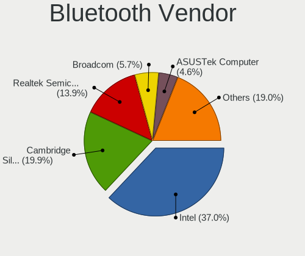
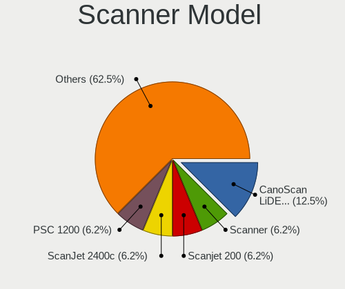

Zorin 16 - Tested Hardware & Statistics (Desktops)
--------------------------------------------------

A project to collect tested hardware configurations for Zorin 16.

Anyone can contribute to this report by the [hw-probe](https://github.com/linuxhw/hw-probe) tool:

    sudo -E hw-probe -all -upload

Please submit a probe of your configuration if it's not presented on the page or is rare.

Full-feature report is available here: https://linux-hardware.org/?view=trends

Contents
--------

* [ Test Cases ](#test-cases)

* [ System ](#system)
  - [ Kernel                   ](#kernel)
  - [ Kernel Family            ](#kernel-family)
  - [ Kernel Major Ver.        ](#kernel-major-ver)
  - [ Arch                     ](#arch)
  - [ DE                       ](#de)
  - [ Display Server           ](#display-server)
  - [ Display Manager          ](#display-manager)
  - [ OS Lang                  ](#os-lang)
  - [ Boot Mode                ](#boot-mode)
  - [ Filesystem               ](#filesystem)
  - [ Part. scheme             ](#part-scheme)
  - [ Dual Boot with Linux/BSD ](#dual-boot-with-linuxbsd)
  - [ Dual Boot (Win)          ](#dual-boot-win)

* [ Board ](#board)
  - [ Vendor                   ](#vendor)
  - [ Model                    ](#model)
  - [ Model Family             ](#model-family)
  - [ MFG Year                 ](#mfg-year)
  - [ Form Factor              ](#form-factor)
  - [ Secure Boot              ](#secure-boot)
  - [ Coreboot                 ](#coreboot)
  - [ RAM Size                 ](#ram-size)
  - [ RAM Used                 ](#ram-used)
  - [ Total Drives             ](#total-drives)
  - [ Has CD-ROM               ](#has-cd-rom)
  - [ Has Ethernet             ](#has-ethernet)
  - [ Has WiFi                 ](#has-wifi)
  - [ Has Bluetooth            ](#has-bluetooth)

* [ Location ](#location)
  - [ Country                  ](#country)
  - [ City                     ](#city)

* [ Drives ](#drives)
  - [ Drive Vendor             ](#drive-vendor)
  - [ Drive Model              ](#drive-model)
  - [ HDD Vendor               ](#hdd-vendor)
  - [ SSD Vendor               ](#ssd-vendor)
  - [ Drive Kind               ](#drive-kind)
  - [ Drive Connector          ](#drive-connector)
  - [ Drive Size               ](#drive-size)
  - [ Space Total              ](#space-total)
  - [ Space Used               ](#space-used)
  - [ Malfunc. Drives          ](#malfunc-drives)
  - [ Malfunc. Drive Vendor    ](#malfunc-drive-vendor)
  - [ Malfunc. HDD Vendor      ](#malfunc-hdd-vendor)
  - [ Malfunc. Drive Kind      ](#malfunc-drive-kind)
  - [ Failed Drives            ](#failed-drives)
  - [ Failed Drive Vendor      ](#failed-drive-vendor)
  - [ Drive Status             ](#drive-status)

* [ Storage controller ](#storage-controller)
  - [ Storage Vendor           ](#storage-vendor)
  - [ Storage Model            ](#storage-model)
  - [ Storage Kind             ](#storage-kind)

* [ Processor ](#processor)
  - [ CPU Vendor               ](#cpu-vendor)
  - [ CPU Model                ](#cpu-model)
  - [ CPU Model Family         ](#cpu-model-family)
  - [ CPU Cores                ](#cpu-cores)
  - [ CPU Sockets              ](#cpu-sockets)
  - [ CPU Threads              ](#cpu-threads)
  - [ CPU Op-Modes             ](#cpu-op-modes)
  - [ CPU Microcode            ](#cpu-microcode)
  - [ CPU Microarch            ](#cpu-microarch)

* [ Graphics ](#graphics)
  - [ GPU Vendor               ](#gpu-vendor)
  - [ GPU Model                ](#gpu-model)
  - [ GPU Combo                ](#gpu-combo)
  - [ GPU Driver               ](#gpu-driver)
  - [ GPU Memory               ](#gpu-memory)

* [ Monitor ](#monitor)
  - [ Monitor Vendor           ](#monitor-vendor)
  - [ Monitor Model            ](#monitor-model)
  - [ Monitor Resolution       ](#monitor-resolution)
  - [ Monitor Diagonal         ](#monitor-diagonal)
  - [ Monitor Width            ](#monitor-width)
  - [ Aspect Ratio             ](#aspect-ratio)
  - [ Monitor Area             ](#monitor-area)
  - [ Pixel Density            ](#pixel-density)
  - [ Multiple Monitors        ](#multiple-monitors)

* [ Network ](#network)
  - [ Net Controller Vendor    ](#net-controller-vendor)
  - [ Net Controller Model     ](#net-controller-model)
  - [ Wireless Vendor          ](#wireless-vendor)
  - [ Wireless Model           ](#wireless-model)
  - [ Ethernet Vendor          ](#ethernet-vendor)
  - [ Ethernet Model           ](#ethernet-model)
  - [ Net Controller Kind      ](#net-controller-kind)
  - [ Used Controller          ](#used-controller)
  - [ NICs                     ](#nics)
  - [ IPv6                     ](#ipv6)

* [ Bluetooth ](#bluetooth)
  - [ Bluetooth Vendor         ](#bluetooth-vendor)
  - [ Bluetooth Model          ](#bluetooth-model)

* [ Sound ](#sound)
  - [ Sound Vendor             ](#sound-vendor)
  - [ Sound Model              ](#sound-model)

* [ Memory ](#memory)
  - [ Memory Vendor            ](#memory-vendor)
  - [ Memory Model             ](#memory-model)
  - [ Memory Kind              ](#memory-kind)
  - [ Memory Form Factor       ](#memory-form-factor)
  - [ Memory Size              ](#memory-size)
  - [ Memory Speed             ](#memory-speed)

* [ Printers & scanners ](#printers--scanners)
  - [ Printer Vendor           ](#printer-vendor)
  - [ Printer Model            ](#printer-model)
  - [ Scanner Vendor           ](#scanner-vendor)
  - [ Scanner Model            ](#scanner-model)

* [ Camera ](#camera)
  - [ Camera Vendor            ](#camera-vendor)
  - [ Camera Model             ](#camera-model)

* [ Security ](#security)
  - [ Fingerprint Vendor       ](#fingerprint-vendor)
  - [ Fingerprint Model        ](#fingerprint-model)
  - [ Chipcard Vendor          ](#chipcard-vendor)
  - [ Chipcard Model           ](#chipcard-model)

* [ Unsupported ](#unsupported)
  - [ Unsupported Devices      ](#unsupported-devices)
  - [ Unsupported Device Types ](#unsupported-device-types)

Test Cases
----------

| Vendor        | Model                       | Probe                                                      | Date         |
|---------------|-----------------------------|------------------------------------------------------------|--------------|
| Gigabyte      | B450 AORUS M                | [b76b53bf53](https://linux-hardware.org/?probe=b76b53bf53) | Feb 01, 2022 |
| Gigabyte      | B450 AORUS M                | [45f03f7991](https://linux-hardware.org/?probe=45f03f7991) | Jan 31, 2022 |
| Gigabyte      | B450 AORUS M                | [690eba21e0](https://linux-hardware.org/?probe=690eba21e0) | Jan 30, 2022 |
| Dell          | 0HN7XN A01                  | [af1d1e8c47](https://linux-hardware.org/?probe=af1d1e8c47) | Jan 30, 2022 |
| ASUSTek       | ROG STRIX B365-F GAMING     | [7450ea2cad](https://linux-hardware.org/?probe=7450ea2cad) | Jan 30, 2022 |
| ASRock        | H81M-DGS                    | [05fc3bd63b](https://linux-hardware.org/?probe=05fc3bd63b) | Jan 29, 2022 |
| HP            | 3047h                       | [48f624cbea](https://linux-hardware.org/?probe=48f624cbea) | Jan 29, 2022 |
| ASUSTek       | TUF GAMING X570-PLUS        | [bcdcd2eeb6](https://linux-hardware.org/?probe=bcdcd2eeb6) | Jan 29, 2022 |
| ASUSTek       | M2A74-AM SE                 | [1a2d6520d3](https://linux-hardware.org/?probe=1a2d6520d3) | Jan 29, 2022 |
| MSI           | 2AE0                        | [1a55336eb9](https://linux-hardware.org/?probe=1a55336eb9) | Jan 28, 2022 |
| Gigabyte      | GA-MA790GP-DS4H             | [ef8894e69d](https://linux-hardware.org/?probe=ef8894e69d) | Jan 28, 2022 |
| Wortmann      | TERRA_PC                    | [4fea20e2bf](https://linux-hardware.org/?probe=4fea20e2bf) | Jan 28, 2022 |
| Dell          | 0Y2MRG A00                  | [1a1b794c06](https://linux-hardware.org/?probe=1a1b794c06) | Jan 28, 2022 |
| Gigabyte      | Z270N-WIFI-CF               | [78f310c42a](https://linux-hardware.org/?probe=78f310c42a) | Jan 27, 2022 |
| ASRock        | G31M-S                      | [e579ce1757](https://linux-hardware.org/?probe=e579ce1757) | Jan 26, 2022 |
| Intel         | DH55PJ AAE93812-303         | [2c70e74055](https://linux-hardware.org/?probe=2c70e74055) | Jan 26, 2022 |
| Intel         | DH55PJ AAE93812-303         | [6a692a4e11](https://linux-hardware.org/?probe=6a692a4e11) | Jan 26, 2022 |
| Foxconn       | nT-i1000 Series PCB         | [72374dc22c](https://linux-hardware.org/?probe=72374dc22c) | Jan 26, 2022 |
| Foxconn       | nT-i1000 Series PCB         | [78cdf0490a](https://linux-hardware.org/?probe=78cdf0490a) | Jan 26, 2022 |
| Dell          | 07KY25 A00                  | [102d10e806](https://linux-hardware.org/?probe=102d10e806) | Jan 26, 2022 |
| MSI           | H97 GAMING 3                | [75f4b47111](https://linux-hardware.org/?probe=75f4b47111) | Jan 26, 2022 |
| Dell          | 06NWYK A01                  | [dbc44c9f4a](https://linux-hardware.org/?probe=dbc44c9f4a) | Jan 25, 2022 |
| HP            | 1497                        | [a32eadf3ab](https://linux-hardware.org/?probe=a32eadf3ab) | Jan 25, 2022 |
| Dell          | 06NWYK A01                  | [693f4a0a48](https://linux-hardware.org/?probe=693f4a0a48) | Jan 25, 2022 |
| ASUSTek       | TUF GAMING X570-PLUS        | [e521380180](https://linux-hardware.org/?probe=e521380180) | Jan 25, 2022 |
| ASUSTek       | Q87T                        | [1bcaa6dedf](https://linux-hardware.org/?probe=1bcaa6dedf) | Jan 24, 2022 |
| Foxconn       | 2ABF                        | [e5723eaa42](https://linux-hardware.org/?probe=e5723eaa42) | Jan 23, 2022 |
| Gigabyte      | B450M DS3H-CF               | [a0034083eb](https://linux-hardware.org/?probe=a0034083eb) | Jan 22, 2022 |
| ASUSTek       | M5A99FX PRO R2.0            | [2a8b893eb6](https://linux-hardware.org/?probe=2a8b893eb6) | Jan 22, 2022 |
| Foxconn       | 2ABF                        | [af38735785](https://linux-hardware.org/?probe=af38735785) | Jan 22, 2022 |
| MSI           | A75A-G35                    | [e2148dff19](https://linux-hardware.org/?probe=e2148dff19) | Jan 22, 2022 |
| Dell          | 0CU409                      | [8fc6c3decf](https://linux-hardware.org/?probe=8fc6c3decf) | Jan 21, 2022 |
| Dell          | 0CU409                      | [953718318f](https://linux-hardware.org/?probe=953718318f) | Jan 21, 2022 |
| Gigabyte      | F2A58M-DS2                  | [a89dd04d3a](https://linux-hardware.org/?probe=a89dd04d3a) | Jan 20, 2022 |
| Fujitsu       | D2901-A1 S26361-D2901-A1    | [586012f45e](https://linux-hardware.org/?probe=586012f45e) | Jan 20, 2022 |
| Dell          | 09NY2R A00                  | [2ab8f0375c](https://linux-hardware.org/?probe=2ab8f0375c) | Jan 20, 2022 |
| Dell          | 09NY2R A00                  | [5308c77880](https://linux-hardware.org/?probe=5308c77880) | Jan 19, 2022 |
| ASUSTek       | H81M-K                      | [637ad5d9e4](https://linux-hardware.org/?probe=637ad5d9e4) | Jan 18, 2022 |
| Gigabyte      | X570 AORUS ELITE            | [ffaca9cabf](https://linux-hardware.org/?probe=ffaca9cabf) | Jan 18, 2022 |
| ASUSTek       | M5A78L-M/USB3               | [940b702411](https://linux-hardware.org/?probe=940b702411) | Jan 16, 2022 |
| MSI           | H61M-P25                    | [3433cb58a1](https://linux-hardware.org/?probe=3433cb58a1) | Jan 14, 2022 |
| HP            | 3047h                       | [9a81422518](https://linux-hardware.org/?probe=9a81422518) | Jan 14, 2022 |
| MSI           | MS-7053                     | [8844db2984](https://linux-hardware.org/?probe=8844db2984) | Jan 13, 2022 |
| MSI           | MS-7053                     | [61c46371e7](https://linux-hardware.org/?probe=61c46371e7) | Jan 13, 2022 |
| MSI           | H61M-P25                    | [c745684371](https://linux-hardware.org/?probe=c745684371) | Jan 13, 2022 |
| MSI           | H61M-P25                    | [f4fa2b39ad](https://linux-hardware.org/?probe=f4fa2b39ad) | Jan 13, 2022 |
| EVGA          | 152-HR-E979                 | [669c7a3ef6](https://linux-hardware.org/?probe=669c7a3ef6) | Jan 12, 2022 |
| EVGA          | 152-HR-E979                 | [075a31a3c5](https://linux-hardware.org/?probe=075a31a3c5) | Jan 12, 2022 |
| Lenovo        | SKYBAY SDK0J40697 WIN 33... | [368df270dc](https://linux-hardware.org/?probe=368df270dc) | Jan 11, 2022 |
| Gigabyte      | F2A58M-DS2                  | [b7ee3c3e93](https://linux-hardware.org/?probe=b7ee3c3e93) | Jan 11, 2022 |
| ASUSTek       | P8H61-I R2.0                | [5b08de311b](https://linux-hardware.org/?probe=5b08de311b) | Jan 10, 2022 |
| Dell          | 06NWYK A01                  | [98c10ce544](https://linux-hardware.org/?probe=98c10ce544) | Jan 10, 2022 |
| ASRock        | G31M-S                      | [1006244941](https://linux-hardware.org/?probe=1006244941) | Jan 09, 2022 |
| MSI           | MPG X570 GAMING PRO CARB... | [6759388aa1](https://linux-hardware.org/?probe=6759388aa1) | Jan 09, 2022 |
| MSI           | MPG X570 GAMING PRO CARB... | [6a368aefbd](https://linux-hardware.org/?probe=6a368aefbd) | Jan 09, 2022 |
| ASUSTek       | PRIME H310M-K               | [3b4d6e5abd](https://linux-hardware.org/?probe=3b4d6e5abd) | Jan 08, 2022 |
| ASRock        | G31M-S                      | [b33a983889](https://linux-hardware.org/?probe=b33a983889) | Jan 08, 2022 |
| MSI           | H61M-P25                    | [5f095c2bf8](https://linux-hardware.org/?probe=5f095c2bf8) | Jan 08, 2022 |
| Dell          | 042P49 A02                  | [b2a3538121](https://linux-hardware.org/?probe=b2a3538121) | Jan 08, 2022 |
| ASRock        | AM1B-ITX                    | [c374329271](https://linux-hardware.org/?probe=c374329271) | Jan 07, 2022 |
| MSI           | MAG Z490 TOMAHAWK           | [e51ad2ec06](https://linux-hardware.org/?probe=e51ad2ec06) | Jan 07, 2022 |
| Dell          | 0YXT71 A02                  | [682c40786b](https://linux-hardware.org/?probe=682c40786b) | Jan 07, 2022 |
| Gigabyte      | H61M-S2PV                   | [398f9ebe03](https://linux-hardware.org/?probe=398f9ebe03) | Jan 06, 2022 |
| Gigabyte      | H61M-S2PV                   | [a46fcf64bb](https://linux-hardware.org/?probe=a46fcf64bb) | Jan 06, 2022 |
| ASUSTek       | Benicia                     | [5459dba29c](https://linux-hardware.org/?probe=5459dba29c) | Jan 06, 2022 |
| Dell          | 0GDG8Y A00                  | [e89e415451](https://linux-hardware.org/?probe=e89e415451) | Jan 05, 2022 |
| Lenovo        | SHARKBAY 31900058 STD       | [fc860fdb7a](https://linux-hardware.org/?probe=fc860fdb7a) | Jan 05, 2022 |
| Fujitsu       | D3430-A1 S26361-D3430-A1    | [dad1a9143d](https://linux-hardware.org/?probe=dad1a9143d) | Jan 05, 2022 |
| MSI           | H61MU-E35                   | [5694489e55](https://linux-hardware.org/?probe=5694489e55) | Jan 05, 2022 |
| MSI           | H61MU-E35                   | [c9ece2a64e](https://linux-hardware.org/?probe=c9ece2a64e) | Jan 05, 2022 |
| Gigabyte      | H370M D3H-CF                | [ab12119d4f](https://linux-hardware.org/?probe=ab12119d4f) | Jan 05, 2022 |
| ASUSTek       | TUF GAMING B460M-PLUS       | [1ad802006b](https://linux-hardware.org/?probe=1ad802006b) | Jan 05, 2022 |
| ASUSTek       | TUF GAMING B460M-PLUS       | [32d0fda197](https://linux-hardware.org/?probe=32d0fda197) | Jan 05, 2022 |
| MSI           | H61M-P25                    | [16e6027ba2](https://linux-hardware.org/?probe=16e6027ba2) | Jan 04, 2022 |
| MSI           | H61MU-E35                   | [2c3f24c851](https://linux-hardware.org/?probe=2c3f24c851) | Jan 04, 2022 |
| MSI           | H61M-P25                    | [3679d16bdb](https://linux-hardware.org/?probe=3679d16bdb) | Jan 04, 2022 |
| HP            | 3047h                       | [8faa43060a](https://linux-hardware.org/?probe=8faa43060a) | Jan 04, 2022 |
| MSI           | H61M-P25                    | [004392f0ef](https://linux-hardware.org/?probe=004392f0ef) | Jan 04, 2022 |
| ASUSTek       | PRIME B350-PLUS             | [b838b1e1cc](https://linux-hardware.org/?probe=b838b1e1cc) | Jan 04, 2022 |
| MSI           | MPG Z390 GAMING PLUS        | [d2a528221c](https://linux-hardware.org/?probe=d2a528221c) | Jan 03, 2022 |
| ASRock        | B450M Steel Legend          | [81a98f588a](https://linux-hardware.org/?probe=81a98f588a) | Jan 02, 2022 |
| Gigabyte      | GA-78LMT-USB3 R2 sex        | [a769ac4242](https://linux-hardware.org/?probe=a769ac4242) | Jan 01, 2022 |
| Gigabyte      | H110M-H-CF                  | [4754d83d04](https://linux-hardware.org/?probe=4754d83d04) | Jan 01, 2022 |
| Acer          | Aspire M3970                | [e10ce7d132](https://linux-hardware.org/?probe=e10ce7d132) | Dec 31, 2021 |
| Fujitsu       | D3430-A1 S26361-D3430-A1    | [5b97adba13](https://linux-hardware.org/?probe=5b97adba13) | Dec 31, 2021 |
| ECS           | G31T-M7                     | [8cd5d79924](https://linux-hardware.org/?probe=8cd5d79924) | Dec 31, 2021 |
| ECS           | G31T-M7                     | [9ebfb53472](https://linux-hardware.org/?probe=9ebfb53472) | Dec 31, 2021 |
| HP            | 1998                        | [07bdd01c09](https://linux-hardware.org/?probe=07bdd01c09) | Dec 31, 2021 |
| Dell          | 088DT1 A01                  | [2599126547](https://linux-hardware.org/?probe=2599126547) | Dec 30, 2021 |
| Foxconn       | 2AB1                        | [1c32c6a027](https://linux-hardware.org/?probe=1c32c6a027) | Dec 30, 2021 |
| MSI           | H81M-P33                    | [0fb1d25a7d](https://linux-hardware.org/?probe=0fb1d25a7d) | Dec 30, 2021 |
| ASRock        | Z87 Pro4                    | [2a8588f61e](https://linux-hardware.org/?probe=2a8588f61e) | Dec 29, 2021 |
| Gigabyte      | Z97-HD3                     | [5536599b58](https://linux-hardware.org/?probe=5536599b58) | Dec 28, 2021 |
| Gigabyte      | H270M-DS3H-CF               | [127916f66f](https://linux-hardware.org/?probe=127916f66f) | Dec 28, 2021 |
| ASUSTek       | H81-PLUS                    | [60ba71333c](https://linux-hardware.org/?probe=60ba71333c) | Dec 27, 2021 |
| Intel         | Cherry Trail CR H91596-3... | [cb83ad3d6c](https://linux-hardware.org/?probe=cb83ad3d6c) | Dec 27, 2021 |
| Intel         | Cherry Trail CR H91596-3... | [76e7cab82a](https://linux-hardware.org/?probe=76e7cab82a) | Dec 26, 2021 |
| MSI           | MPG Z390 GAMING PLUS        | [39f562f189](https://linux-hardware.org/?probe=39f562f189) | Dec 25, 2021 |
| Dell          | 0VNP2H A00                  | [e64f51e52a](https://linux-hardware.org/?probe=e64f51e52a) | Dec 24, 2021 |
| Gigabyte      | H57M-USB3                   | [ee70d6b4b4](https://linux-hardware.org/?probe=ee70d6b4b4) | Dec 24, 2021 |
| Gigabyte      | Z170X-Gaming 7              | [5c4ae9536f](https://linux-hardware.org/?probe=5c4ae9536f) | Dec 24, 2021 |
| Gigabyte      | EG41MFT-US2H                | [2bfb4702c3](https://linux-hardware.org/?probe=2bfb4702c3) | Dec 23, 2021 |
| Gigabyte      | EG41MFT-US2H                | [b29d64341c](https://linux-hardware.org/?probe=b29d64341c) | Dec 23, 2021 |
| ASUSTek       | TUF GAMING X570-PRO WIFI... | [69d74c89b4](https://linux-hardware.org/?probe=69d74c89b4) | Dec 23, 2021 |
| Gigabyte      | B450M DS3H-CF               | [4453e33b88](https://linux-hardware.org/?probe=4453e33b88) | Dec 22, 2021 |
| ASRock        | B450 Pro4                   | [0832f6d0fd](https://linux-hardware.org/?probe=0832f6d0fd) | Dec 22, 2021 |
| ASUSTek       | P8Z77-M                     | [667e676c78](https://linux-hardware.org/?probe=667e676c78) | Dec 21, 2021 |
| Gigabyte      | H270M-DS3H-CF               | [200701934f](https://linux-hardware.org/?probe=200701934f) | Dec 21, 2021 |
| ASRock        | A320M-DVS R4.0              | [c38dcdb848](https://linux-hardware.org/?probe=c38dcdb848) | Dec 21, 2021 |
| Dell          | 03NVJ6 A02                  | [685819bc74](https://linux-hardware.org/?probe=685819bc74) | Dec 20, 2021 |
| ASRock        | B450M-HDV R4.0              | [210f1589c4](https://linux-hardware.org/?probe=210f1589c4) | Dec 20, 2021 |
| ASRock        | B450M Pro4                  | [b40c57df26](https://linux-hardware.org/?probe=b40c57df26) | Dec 20, 2021 |
| ASUSTek       | PRIME B350M-A               | [09d76b803c](https://linux-hardware.org/?probe=09d76b803c) | Dec 20, 2021 |
| Intel         | B75                         | [9178fa9053](https://linux-hardware.org/?probe=9178fa9053) | Dec 19, 2021 |
| ASRock        | B450M-HDV R4.0              | [35182a65bb](https://linux-hardware.org/?probe=35182a65bb) | Dec 19, 2021 |
| Lenovo        | SHARKBAY 31900058 STD       | [717b852409](https://linux-hardware.org/?probe=717b852409) | Dec 19, 2021 |
| Apple         | Mac-F4208DC8 PVT            | [38a4bbf8d3](https://linux-hardware.org/?probe=38a4bbf8d3) | Dec 19, 2021 |
| ASUSTek       | CM6330_CM6630_CM6730_CM6... | [f86ed2049c](https://linux-hardware.org/?probe=f86ed2049c) | Dec 19, 2021 |
| Dell          | 0HY9JP A02                  | [063c3ec5d2](https://linux-hardware.org/?probe=063c3ec5d2) | Dec 19, 2021 |
| ASUSTek       | P5Q PRO TURBO               | [4c845a464c](https://linux-hardware.org/?probe=4c845a464c) | Dec 19, 2021 |
| Acer          | Aspire XC-330               | [1803a4622c](https://linux-hardware.org/?probe=1803a4622c) | Dec 19, 2021 |
| ASUSTek       | Benicia                     | [e572d5ceff](https://linux-hardware.org/?probe=e572d5ceff) | Dec 19, 2021 |
| Shuttle       | FH61V                       | [39d341d8be](https://linux-hardware.org/?probe=39d341d8be) | Dec 19, 2021 |
| MSI           | MS-7053                     | [3e9330e811](https://linux-hardware.org/?probe=3e9330e811) | Dec 18, 2021 |
| MSI           | MS-7053                     | [b32db3cd18](https://linux-hardware.org/?probe=b32db3cd18) | Dec 18, 2021 |
| Unknown       | C51GM-M                     | [91386c4f7c](https://linux-hardware.org/?probe=91386c4f7c) | Dec 17, 2021 |
| Lenovo        | ThinkCentre M57e 9489W1U    | [ba5156ef68](https://linux-hardware.org/?probe=ba5156ef68) | Dec 17, 2021 |
| Unknown       | C51GM-M                     | [49e9492dd4](https://linux-hardware.org/?probe=49e9492dd4) | Dec 17, 2021 |
| Dell          | 0Y2K8N A01                  | [2e29930670](https://linux-hardware.org/?probe=2e29930670) | Dec 17, 2021 |
| Gigabyte      | H270M-DS3H-CF               | [dfbadf6708](https://linux-hardware.org/?probe=dfbadf6708) | Dec 17, 2021 |
| Intel         | B75                         | [95258dab55](https://linux-hardware.org/?probe=95258dab55) | Dec 17, 2021 |
| Unknown       | C51GM-M                     | [cd4d96fefa](https://linux-hardware.org/?probe=cd4d96fefa) | Dec 17, 2021 |
| Acer          | Aspire XC-330               | [61dd8de51b](https://linux-hardware.org/?probe=61dd8de51b) | Dec 16, 2021 |
| Dell          | 0D24M8 A01                  | [a306863279](https://linux-hardware.org/?probe=a306863279) | Dec 16, 2021 |
| Lenovo        | SHARKBAY NOK                | [2acaeac0de](https://linux-hardware.org/?probe=2acaeac0de) | Dec 14, 2021 |
| Lenovo        | SHARKBAY NOK                | [2c39bc3721](https://linux-hardware.org/?probe=2c39bc3721) | Dec 14, 2021 |
| HP            | 18E5                        | [88f87a7a1b](https://linux-hardware.org/?probe=88f87a7a1b) | Dec 14, 2021 |
| ASUSTek       | AM1M-A                      | [5113655631](https://linux-hardware.org/?probe=5113655631) | Dec 14, 2021 |
| ASUSTek       | VM40B                       | [c53952beab](https://linux-hardware.org/?probe=c53952beab) | Dec 14, 2021 |
| MSI           | MPG B550 GAMING PLUS        | [788c6b0550](https://linux-hardware.org/?probe=788c6b0550) | Dec 13, 2021 |
| ASUSTek       | P5QC                        | [b471a79340](https://linux-hardware.org/?probe=b471a79340) | Dec 13, 2021 |
| Dell          | 0M5DCD A00                  | [447bffefc3](https://linux-hardware.org/?probe=447bffefc3) | Dec 13, 2021 |
| Intel         | DQ87PG AAG74154-403         | [e2a6d57861](https://linux-hardware.org/?probe=e2a6d57861) | Dec 13, 2021 |
| Intel         | B75                         | [652828f7b9](https://linux-hardware.org/?probe=652828f7b9) | Dec 13, 2021 |
| MSI           | MPG Z390 GAMING PLUS        | [6b33adaacf](https://linux-hardware.org/?probe=6b33adaacf) | Dec 13, 2021 |
| ASUSTek       | PRIME B350M-A               | [aa92a82326](https://linux-hardware.org/?probe=aa92a82326) | Dec 13, 2021 |
| ASUSTek       | P5QC                        | [8e659f2b89](https://linux-hardware.org/?probe=8e659f2b89) | Dec 12, 2021 |
| ASUSTek       | PRIME B360M-K               | [abb6a94373](https://linux-hardware.org/?probe=abb6a94373) | Dec 12, 2021 |
| Gigabyte      | H97M-D3H                    | [d9e04ee743](https://linux-hardware.org/?probe=d9e04ee743) | Dec 12, 2021 |
| Gigabyte      | H97M-D3H                    | [1d768c3c63](https://linux-hardware.org/?probe=1d768c3c63) | Dec 12, 2021 |
| ASRock        | B450M Pro4                  | [6a8480268d](https://linux-hardware.org/?probe=6a8480268d) | Dec 12, 2021 |
| Dell          | 02YYK5 A01                  | [1301218290](https://linux-hardware.org/?probe=1301218290) | Dec 11, 2021 |
| HP            | 339A                        | [7081fc45a3](https://linux-hardware.org/?probe=7081fc45a3) | Dec 11, 2021 |
| HP            | 304Ah                       | [6d87535158](https://linux-hardware.org/?probe=6d87535158) | Dec 10, 2021 |
| eMachines     | EL1850G                     | [ccd7758cbe](https://linux-hardware.org/?probe=ccd7758cbe) | Dec 10, 2021 |
| ASUSTek       | NARRA3                      | [028ad01454](https://linux-hardware.org/?probe=028ad01454) | Dec 09, 2021 |
| Biostar       | A320MH                      | [fbbe7a436a](https://linux-hardware.org/?probe=fbbe7a436a) | Dec 09, 2021 |
| Biostar       | A320MH                      | [3870a17dfe](https://linux-hardware.org/?probe=3870a17dfe) | Dec 09, 2021 |
| MSI           | MAG B560M MORTAR WIFI       | [0e19f8e2ae](https://linux-hardware.org/?probe=0e19f8e2ae) | Dec 09, 2021 |
| MSI           | MAG B560M MORTAR WIFI       | [a37d2cc42f](https://linux-hardware.org/?probe=a37d2cc42f) | Dec 09, 2021 |
| MSI           | 970 GAMING                  | [1a5b0a8d39](https://linux-hardware.org/?probe=1a5b0a8d39) | Dec 09, 2021 |
| MSI           | 970 GAMING                  | [f4d8f580dc](https://linux-hardware.org/?probe=f4d8f580dc) | Dec 09, 2021 |
| ASUSTek       | NARRA3                      | [c64aed90a9](https://linux-hardware.org/?probe=c64aed90a9) | Dec 08, 2021 |
| ASUSTek       | M3A78-EM                    | [b041919f38](https://linux-hardware.org/?probe=b041919f38) | Dec 08, 2021 |
| HP            | 87C3                        | [16cc7e0bcb](https://linux-hardware.org/?probe=16cc7e0bcb) | Dec 07, 2021 |
| HP            | 339A                        | [50c24f7d34](https://linux-hardware.org/?probe=50c24f7d34) | Dec 07, 2021 |
| HP            | 81B4 01                     | [1477bd5a44](https://linux-hardware.org/?probe=1477bd5a44) | Dec 07, 2021 |
| Dell          | 0T656F A01                  | [552210319c](https://linux-hardware.org/?probe=552210319c) | Dec 06, 2021 |
| ASUSTek       | ROG STRIX Z690-A GAMING ... | [2ce114a1c7](https://linux-hardware.org/?probe=2ce114a1c7) | Dec 06, 2021 |
| ASRock        | M3A770DE                    | [1a03b6e5c7](https://linux-hardware.org/?probe=1a03b6e5c7) | Dec 05, 2021 |
| ASRock        | M3A770DE                    | [bdf4260678](https://linux-hardware.org/?probe=bdf4260678) | Dec 05, 2021 |
| ASUSTek       | SABERTOOTH Z170 MARK 1      | [ce3d88a2a2](https://linux-hardware.org/?probe=ce3d88a2a2) | Dec 05, 2021 |
| MSI           | B450 TOMAHAWK MAX           | [49fe509dd2](https://linux-hardware.org/?probe=49fe509dd2) | Dec 04, 2021 |
| ASUSTek       | ROG STRIX Z390-E GAMING     | [e6b7b57ea7](https://linux-hardware.org/?probe=e6b7b57ea7) | Dec 04, 2021 |
| Dell          | 0G254H A00                  | [11897b38da](https://linux-hardware.org/?probe=11897b38da) | Dec 03, 2021 |
| HP            | 2B44                        | [b62df43777](https://linux-hardware.org/?probe=b62df43777) | Dec 03, 2021 |
| Lenovo        | SHARKBAY SDK0E50510 PRO ... | [e39465a63b](https://linux-hardware.org/?probe=e39465a63b) | Dec 03, 2021 |
| ASUSTek       | ROG STRIX Z390-E GAMING     | [ad90caf60d](https://linux-hardware.org/?probe=ad90caf60d) | Dec 03, 2021 |
| Pegatron      | JESSE                       | [9091bacc33](https://linux-hardware.org/?probe=9091bacc33) | Dec 03, 2021 |
| ASUSTek       | LEONITE                     | [704345be69](https://linux-hardware.org/?probe=704345be69) | Dec 03, 2021 |
| Biostar       | A780L3C                     | [a50e3d0532](https://linux-hardware.org/?probe=a50e3d0532) | Dec 02, 2021 |
| Foxconn       | 2A8C                        | [8d24862bd6](https://linux-hardware.org/?probe=8d24862bd6) | Dec 02, 2021 |
| Biostar       | A780L3C                     | [497f29a343](https://linux-hardware.org/?probe=497f29a343) | Dec 02, 2021 |
| Dell          | 0WR7PY A02                  | [1255f30eea](https://linux-hardware.org/?probe=1255f30eea) | Dec 01, 2021 |
| Gigabyte      | GA-MA74GM-S2H               | [bd33efb6f7](https://linux-hardware.org/?probe=bd33efb6f7) | Dec 01, 2021 |
| HP            | 339A                        | [4a377796cf](https://linux-hardware.org/?probe=4a377796cf) | Dec 01, 2021 |
| Dell          | 0PU052                      | [a943d9f217](https://linux-hardware.org/?probe=a943d9f217) | Dec 01, 2021 |
| Dell          | 0WR7PY A02                  | [d51c794107](https://linux-hardware.org/?probe=d51c794107) | Nov 30, 2021 |
| Dell          | 0WMJ54 A01                  | [5fa96d5863](https://linux-hardware.org/?probe=5fa96d5863) | Nov 30, 2021 |
| HP            | 8299                        | [6eb5c6d54a](https://linux-hardware.org/?probe=6eb5c6d54a) | Nov 30, 2021 |
| Medion        | MS-7707                     | [3d0a46f2ef](https://linux-hardware.org/?probe=3d0a46f2ef) | Nov 30, 2021 |
| ASRock        | H67DE3                      | [d710784470](https://linux-hardware.org/?probe=d710784470) | Nov 30, 2021 |
| HP            | 8299                        | [7bd1df0e4d](https://linux-hardware.org/?probe=7bd1df0e4d) | Nov 29, 2021 |
| Gigabyte      | B450 AORUS PRO-CF           | [24b15affa6](https://linux-hardware.org/?probe=24b15affa6) | Nov 29, 2021 |
| ASUSTek       | P8Z77-V LX                  | [b153db375f](https://linux-hardware.org/?probe=b153db375f) | Nov 29, 2021 |
| ECS           | GeForce6100PM-M2            | [032a2baaca](https://linux-hardware.org/?probe=032a2baaca) | Nov 28, 2021 |
| Lenovo        | 36E7 SDK0J40700 WIN 3258... | [382bfc4a86](https://linux-hardware.org/?probe=382bfc4a86) | Nov 28, 2021 |
| Gigabyte      | G31M-ES2L                   | [cd296f933b](https://linux-hardware.org/?probe=cd296f933b) | Nov 28, 2021 |
| Gigabyte      | G31M-ES2L                   | [44c0cf428f](https://linux-hardware.org/?probe=44c0cf428f) | Nov 28, 2021 |
| MSI           | X370 GAMING PLUS            | [0b71d2652d](https://linux-hardware.org/?probe=0b71d2652d) | Nov 27, 2021 |
| Dell          | 0VNP2H A00                  | [803e55fd86](https://linux-hardware.org/?probe=803e55fd86) | Nov 27, 2021 |
| ASUSTek       | M4A78T-E                    | [df3010e1b8](https://linux-hardware.org/?probe=df3010e1b8) | Nov 27, 2021 |
| ASUSTek       | M5A78L-M/USB3               | [ae57475767](https://linux-hardware.org/?probe=ae57475767) | Nov 27, 2021 |
| ASUSTek       | M5A78L-M/USB3               | [3925ce16ae](https://linux-hardware.org/?probe=3925ce16ae) | Nov 27, 2021 |
| Lenovo        | 36E7 SDK0J40700 WIN 3258... | [cd58d98b6a](https://linux-hardware.org/?probe=cd58d98b6a) | Nov 27, 2021 |
| ASRock        | B450M Pro4                  | [bb642022a6](https://linux-hardware.org/?probe=bb642022a6) | Nov 27, 2021 |
| ASRock        | ALiveNF6G-DVI               | [2761f434e8](https://linux-hardware.org/?probe=2761f434e8) | Nov 26, 2021 |
| Dell          | 0VNP2H A00                  | [fe9de9a896](https://linux-hardware.org/?probe=fe9de9a896) | Nov 25, 2021 |
| HP            | 18E7                        | [7385ca30d4](https://linux-hardware.org/?probe=7385ca30d4) | Nov 23, 2021 |
| Pegatron      | 2A86E01                     | [b57d9ec4a4](https://linux-hardware.org/?probe=b57d9ec4a4) | Nov 23, 2021 |
| Gigabyte      | H61N-USB3                   | [83e388363c](https://linux-hardware.org/?probe=83e388363c) | Nov 23, 2021 |
| Dell          | 0PU052                      | [a41541bab5](https://linux-hardware.org/?probe=a41541bab5) | Nov 23, 2021 |
| Gigabyte      | G41MT-S2                    | [8031417427](https://linux-hardware.org/?probe=8031417427) | Nov 23, 2021 |
| Intel         | DB65AL AAG12530-309         | [44c8025eee](https://linux-hardware.org/?probe=44c8025eee) | Nov 23, 2021 |
| MSI           | B360M PRO-VD                | [e1f68c6698](https://linux-hardware.org/?probe=e1f68c6698) | Nov 22, 2021 |
| Gigabyte      | H77M-D3H                    | [2819a870a8](https://linux-hardware.org/?probe=2819a870a8) | Nov 22, 2021 |
| HP            | 0AA4h                       | [22c6e4fffd](https://linux-hardware.org/?probe=22c6e4fffd) | Nov 22, 2021 |
| ASRock        | P67 Extreme6                | [54cd91039c](https://linux-hardware.org/?probe=54cd91039c) | Nov 22, 2021 |
| ASUSTek       | PRIME Z590M-PLUS            | [fa922e6e20](https://linux-hardware.org/?probe=fa922e6e20) | Nov 22, 2021 |
| ASRock        | 775i945GZ                   | [8d3cfee95d](https://linux-hardware.org/?probe=8d3cfee95d) | Nov 22, 2021 |
| ASRock        | ALiveNF6G-DVI               | [23a839f917](https://linux-hardware.org/?probe=23a839f917) | Nov 21, 2021 |
| ASUSTek       | PRIME Z590M-PLUS            | [ae91e01910](https://linux-hardware.org/?probe=ae91e01910) | Nov 21, 2021 |
| Dell          | 03NVJ6 A02                  | [00a8a0ab87](https://linux-hardware.org/?probe=00a8a0ab87) | Nov 21, 2021 |
| Gigabyte      | B450M GAMING                | [2355c29da1](https://linux-hardware.org/?probe=2355c29da1) | Nov 21, 2021 |
| Gigabyte      | H55M-UD2H                   | [16e0d2d71a](https://linux-hardware.org/?probe=16e0d2d71a) | Nov 21, 2021 |
| Dell          | 0KWVT8 A00                  | [a6f003d198](https://linux-hardware.org/?probe=a6f003d198) | Nov 20, 2021 |
| LattePanda    | Alpha                       | [24c2fc6f7b](https://linux-hardware.org/?probe=24c2fc6f7b) | Nov 20, 2021 |
| LattePanda    | Alpha                       | [4aa879f7ac](https://linux-hardware.org/?probe=4aa879f7ac) | Nov 20, 2021 |
| ASRock        | B450M Pro4 R2.0             | [8a53d67102](https://linux-hardware.org/?probe=8a53d67102) | Nov 19, 2021 |
| MSI           | 970 GAMING                  | [ac8f38525e](https://linux-hardware.org/?probe=ac8f38525e) | Nov 19, 2021 |
| ASUSTek       | P8Z77-V LX                  | [6807e3fa8c](https://linux-hardware.org/?probe=6807e3fa8c) | Nov 18, 2021 |
| Dell          | 0KWVT8 A00                  | [93b90c3da4](https://linux-hardware.org/?probe=93b90c3da4) | Nov 18, 2021 |
| ASRock        | G31M-VS2                    | [8bc6042d3f](https://linux-hardware.org/?probe=8bc6042d3f) | Nov 17, 2021 |
| ASRock        | X370M-HDV                   | [a991fee412](https://linux-hardware.org/?probe=a991fee412) | Nov 17, 2021 |
| Dell          | 0GXM1W A01                  | [7e9f638277](https://linux-hardware.org/?probe=7e9f638277) | Nov 17, 2021 |
| ASUSTek       | P5KPL-AM                    | [0cae2ebf49](https://linux-hardware.org/?probe=0cae2ebf49) | Nov 16, 2021 |
| Lenovo        | 364F SDK0J40700 WIN 3258... | [bb50b7d97c](https://linux-hardware.org/?probe=bb50b7d97c) | Nov 16, 2021 |
| MSI           | 2A9C                        | [80ef0caf18](https://linux-hardware.org/?probe=80ef0caf18) | Nov 15, 2021 |
| MSI           | 2A9C                        | [44e1dcea05](https://linux-hardware.org/?probe=44e1dcea05) | Nov 15, 2021 |
| Gigabyte      | H170-D3HP-CF                | [e90a1881c7](https://linux-hardware.org/?probe=e90a1881c7) | Nov 14, 2021 |
| Fujitsu       | D2950-A1 S26361-D2950-A1    | [a92c32b60a](https://linux-hardware.org/?probe=a92c32b60a) | Nov 14, 2021 |
| MSI           | B450 TOMAHAWK MAX           | [542b1538bf](https://linux-hardware.org/?probe=542b1538bf) | Nov 14, 2021 |
| HP            | 8653 A                      | [88b53507c9](https://linux-hardware.org/?probe=88b53507c9) | Nov 13, 2021 |
| HP            | 3048h                       | [200317605d](https://linux-hardware.org/?probe=200317605d) | Nov 13, 2021 |
| Dell          | 0GXM1W A02                  | [d446993ec9](https://linux-hardware.org/?probe=d446993ec9) | Nov 13, 2021 |
| ASUSTek       | P5G41T-M LX3                | [8977322809](https://linux-hardware.org/?probe=8977322809) | Nov 13, 2021 |
| HP            | 1790                        | [e86cdf904a](https://linux-hardware.org/?probe=e86cdf904a) | Nov 12, 2021 |
| ASUSTek       | M5A78L LE                   | [d342b54224](https://linux-hardware.org/?probe=d342b54224) | Nov 12, 2021 |
| HP            | 339A                        | [6dc037bf1f](https://linux-hardware.org/?probe=6dc037bf1f) | Nov 11, 2021 |
| Fujitsu       | D3221-A1 S26361-D3221-A1    | [d0eae9ef10](https://linux-hardware.org/?probe=d0eae9ef10) | Nov 11, 2021 |
| Gigabyte      | AB350-Gaming 3-CF           | [7a2464824d](https://linux-hardware.org/?probe=7a2464824d) | Nov 11, 2021 |
| MSI           | B450 GAMING PRO CARBON A... | [c8e4265515](https://linux-hardware.org/?probe=c8e4265515) | Nov 11, 2021 |
| ASUSTek       | ROG STRIX B450-F GAMING ... | [eece1d5528](https://linux-hardware.org/?probe=eece1d5528) | Nov 11, 2021 |
| ASUSTek       | H81M-P PLUS                 | [1841ab2aff](https://linux-hardware.org/?probe=1841ab2aff) | Nov 10, 2021 |
| ASUSTek       | A68HM-PLUS                  | [0e688f660f](https://linux-hardware.org/?probe=0e688f660f) | Nov 10, 2021 |
| ASUSTek       | M5A97                       | [20a705fd56](https://linux-hardware.org/?probe=20a705fd56) | Nov 10, 2021 |
| HP            | 8653 A                      | [f84c67582a](https://linux-hardware.org/?probe=f84c67582a) | Nov 09, 2021 |
| Gigabyte      | B450 AORUS PRO-CF           | [e7579f2fcf](https://linux-hardware.org/?probe=e7579f2fcf) | Nov 09, 2021 |
| HP            | 1790                        | [6030cabe49](https://linux-hardware.org/?probe=6030cabe49) | Nov 09, 2021 |
| HP            | 1825                        | [7cf6c3590a](https://linux-hardware.org/?probe=7cf6c3590a) | Nov 09, 2021 |
| Dell          | 0HD5W2 A00                  | [d4c15ae33a](https://linux-hardware.org/?probe=d4c15ae33a) | Nov 08, 2021 |
| MSI           | B450M MORTAR MAX            | [84c316ee57](https://linux-hardware.org/?probe=84c316ee57) | Nov 08, 2021 |
| Gigabyte      | B75M-D3H                    | [886c08185e](https://linux-hardware.org/?probe=886c08185e) | Nov 08, 2021 |
| Gigabyte      | B75M-D3H                    | [e141b2d36a](https://linux-hardware.org/?probe=e141b2d36a) | Nov 08, 2021 |
| Foxconn       | H61M/H61M-S                 | [62ae26dca0](https://linux-hardware.org/?probe=62ae26dca0) | Nov 07, 2021 |
| Dell          | 0HY9JP A00                  | [05c38bf92c](https://linux-hardware.org/?probe=05c38bf92c) | Nov 07, 2021 |
| ASUSTek       | A68HM-PLUS                  | [384fb31833](https://linux-hardware.org/?probe=384fb31833) | Nov 06, 2021 |
| MSI           | B450 TOMAHAWK MAX           | [f57575ffaf](https://linux-hardware.org/?probe=f57575ffaf) | Nov 06, 2021 |
| Dell          | 0VNP2H A02                  | [5402226d98](https://linux-hardware.org/?probe=5402226d98) | Nov 06, 2021 |
| ASUSTek       | M5A78L-M LX                 | [e6e813115f](https://linux-hardware.org/?probe=e6e813115f) | Nov 06, 2021 |
| HP            | 0A98h                       | [110c37e799](https://linux-hardware.org/?probe=110c37e799) | Nov 06, 2021 |
| ASUSTek       | A68HM-PLUS                  | [7b21a0bc71](https://linux-hardware.org/?probe=7b21a0bc71) | Nov 06, 2021 |
| Dell          | 0NKW6Y A00                  | [82a09e132d](https://linux-hardware.org/?probe=82a09e132d) | Nov 05, 2021 |
| ASUSTek       | PRIME H410M-A               | [4be9b40ea1](https://linux-hardware.org/?probe=4be9b40ea1) | Nov 05, 2021 |
| ASUSTek       | PRIME H410M-A               | [173116149c](https://linux-hardware.org/?probe=173116149c) | Nov 05, 2021 |
| Gigabyte      | F2A78M-D3H                  | [43e09b8e80](https://linux-hardware.org/?probe=43e09b8e80) | Nov 05, 2021 |
| Gigabyte      | Z97X-UD7 TH-CF              | [1383828428](https://linux-hardware.org/?probe=1383828428) | Nov 05, 2021 |
| Gigabyte      | Z97X-UD7 TH-CF              | [f5ee7a26d5](https://linux-hardware.org/?probe=f5ee7a26d5) | Nov 05, 2021 |
| MSI           | B450 TOMAHAWK MAX           | [3e4d5dd09d](https://linux-hardware.org/?probe=3e4d5dd09d) | Nov 05, 2021 |
| Foxconn       | H61M/H61M-S                 | [7f3894059d](https://linux-hardware.org/?probe=7f3894059d) | Nov 04, 2021 |
| HP            | 18E4                        | [3069846b25](https://linux-hardware.org/?probe=3069846b25) | Nov 04, 2021 |
| MSI           | G41M-P23                    | [82e51e3f78](https://linux-hardware.org/?probe=82e51e3f78) | Nov 04, 2021 |
| ASUSTek       | M5A78L-M LX/BR              | [d7a405763d](https://linux-hardware.org/?probe=d7a405763d) | Nov 04, 2021 |
| ASUSTek       | P8Z77-V LX                  | [d59cc9fead](https://linux-hardware.org/?probe=d59cc9fead) | Nov 04, 2021 |
| ASUSTek       | M5A78L-M/USB3               | [2d26d5b578](https://linux-hardware.org/?probe=2d26d5b578) | Nov 02, 2021 |
| ASUSTek       | P8Z77-V LX                  | [903ec63ceb](https://linux-hardware.org/?probe=903ec63ceb) | Nov 02, 2021 |
| ASUSTek       | M11AD                       | [0cb5032c53](https://linux-hardware.org/?probe=0cb5032c53) | Nov 02, 2021 |
| Gigabyte      | GA-E6010N                   | [3c81474040](https://linux-hardware.org/?probe=3c81474040) | Nov 01, 2021 |
| Gigabyte      | GA-E6010N                   | [2a2aaffd43](https://linux-hardware.org/?probe=2a2aaffd43) | Nov 01, 2021 |
| ASRock        | FM2A55M-HD+                 | [42cd4d28bd](https://linux-hardware.org/?probe=42cd4d28bd) | Nov 01, 2021 |
| eMachines     | EL1850G                     | [01dbf1b5ec](https://linux-hardware.org/?probe=01dbf1b5ec) | Oct 31, 2021 |
| MSI           | P55-CD53                    | [860bde5935](https://linux-hardware.org/?probe=860bde5935) | Oct 31, 2021 |
| Unknown       | Unknown                     | [75cc8a67e9](https://linux-hardware.org/?probe=75cc8a67e9) | Oct 31, 2021 |
| ASRock        | B85M-HDS                    | [111e98ddef](https://linux-hardware.org/?probe=111e98ddef) | Oct 31, 2021 |
| ASUSTek       | P8H61-M LE/CSM R2.0         | [6cee757cf0](https://linux-hardware.org/?probe=6cee757cf0) | Oct 31, 2021 |
| ASUSTek       | P8H61-M LE/CSM R2.0         | [96c9053284](https://linux-hardware.org/?probe=96c9053284) | Oct 31, 2021 |
| Dell          | 06NWYK A01                  | [497c824fd5](https://linux-hardware.org/?probe=497c824fd5) | Oct 31, 2021 |
| ASUSTek       | SABERTOOTH Z170 MARK 1      | [0981774043](https://linux-hardware.org/?probe=0981774043) | Oct 30, 2021 |
| ASRock        | B85M-HDS                    | [69dd0cf598](https://linux-hardware.org/?probe=69dd0cf598) | Oct 30, 2021 |
| Dell          | 06NWYK A01                  | [1d0625eb89](https://linux-hardware.org/?probe=1d0625eb89) | Oct 30, 2021 |
| ASUSTek       | ROG STRIX B450-F GAMING     | [867e533368](https://linux-hardware.org/?probe=867e533368) | Oct 30, 2021 |
| ASUSTek       | P5K SE/EPU                  | [80adff7646](https://linux-hardware.org/?probe=80adff7646) | Oct 30, 2021 |
| Dell          | 0GY6Y8 A02                  | [1a267b14d3](https://linux-hardware.org/?probe=1a267b14d3) | Oct 29, 2021 |
| Dell          | 0GY6Y8 A02                  | [5b4cea000b](https://linux-hardware.org/?probe=5b4cea000b) | Oct 29, 2021 |
| ASRock        | B450 Gaming K4              | [b67ec8af25](https://linux-hardware.org/?probe=b67ec8af25) | Oct 29, 2021 |
| Dell          | 0VNP2H A02                  | [4e19df8e3c](https://linux-hardware.org/?probe=4e19df8e3c) | Oct 29, 2021 |
| Dell          | 0VNP2H A02                  | [c220480b4c](https://linux-hardware.org/?probe=c220480b4c) | Oct 29, 2021 |
| Gigabyte      | X570 AORUS ELITE            | [a73fabcd4c](https://linux-hardware.org/?probe=a73fabcd4c) | Oct 28, 2021 |
| Gigabyte      | X570 AORUS ELITE            | [528cec41bc](https://linux-hardware.org/?probe=528cec41bc) | Oct 28, 2021 |
| Alienware     | 08PG26 A00                  | [bb2fd997ab](https://linux-hardware.org/?probe=bb2fd997ab) | Oct 28, 2021 |
| ASRock        | FM2A88X Extreme6+           | [b676d9030a](https://linux-hardware.org/?probe=b676d9030a) | Oct 28, 2021 |
| MSI           | MAG B550M MORTAR            | [08819513f2](https://linux-hardware.org/?probe=08819513f2) | Oct 27, 2021 |
| MSI           | MAG B550M MORTAR            | [4207c6eaac](https://linux-hardware.org/?probe=4207c6eaac) | Oct 27, 2021 |
| ASUSTek       | PRIME Z270-P                | [dfb2070b53](https://linux-hardware.org/?probe=dfb2070b53) | Oct 26, 2021 |
| Alienware     | 08PG26 A00                  | [7d6b559bf8](https://linux-hardware.org/?probe=7d6b559bf8) | Oct 26, 2021 |
| Gigabyte      | X570 AORUS MASTER           | [3862cf57e0](https://linux-hardware.org/?probe=3862cf57e0) | Oct 25, 2021 |
| ASRock        | FM2A55M-HD+                 | [a1cf5282ba](https://linux-hardware.org/?probe=a1cf5282ba) | Oct 25, 2021 |
| ASRock        | H110M-HDS R3.0              | [718ad346b7](https://linux-hardware.org/?probe=718ad346b7) | Oct 25, 2021 |
| MSI           | 2AE0                        | [64a3b3ae41](https://linux-hardware.org/?probe=64a3b3ae41) | Oct 24, 2021 |
| Fujitsu       | D2950-A1 S26361-D2950-A1    | [cc46a59d6c](https://linux-hardware.org/?probe=cc46a59d6c) | Oct 24, 2021 |
| MSI           | P55-CD53                    | [c1c364dbc1](https://linux-hardware.org/?probe=c1c364dbc1) | Oct 24, 2021 |
| ASUSTek       | SABERTOOTH Z170 MARK 1      | [fca2aa4310](https://linux-hardware.org/?probe=fca2aa4310) | Oct 23, 2021 |
| Dell          | 0VHXCD A00                  | [7c99a6ed29](https://linux-hardware.org/?probe=7c99a6ed29) | Oct 22, 2021 |
| ASRock        | 970 Pro3 R2.0               | [915961c057](https://linux-hardware.org/?probe=915961c057) | Oct 22, 2021 |
| Biostar       | A68N-5100                   | [bc5b7a2417](https://linux-hardware.org/?probe=bc5b7a2417) | Oct 22, 2021 |
| MSI           | Z68A-G43                    | [b781916d8e](https://linux-hardware.org/?probe=b781916d8e) | Oct 22, 2021 |
| MSI           | MPG Z490 GAMING EDGE WIF... | [baee5192b6](https://linux-hardware.org/?probe=baee5192b6) | Oct 22, 2021 |
| Gigabyte      | X570 AORUS MASTER           | [666f084a0f](https://linux-hardware.org/?probe=666f084a0f) | Oct 21, 2021 |
| Gigabyte      | X570 AORUS MASTER           | [395d19ae36](https://linux-hardware.org/?probe=395d19ae36) | Oct 21, 2021 |
| HP            | 1589                        | [49c747efad](https://linux-hardware.org/?probe=49c747efad) | Oct 21, 2021 |
| Unknown       | Phitronics G41-M3           | [a6ccedb5bd](https://linux-hardware.org/?probe=a6ccedb5bd) | Oct 20, 2021 |
| Unknown       | Phitronics G41-M3           | [fbe886aee7](https://linux-hardware.org/?probe=fbe886aee7) | Oct 20, 2021 |
| Unknown       | Unknown                     | [8c412b3b5b](https://linux-hardware.org/?probe=8c412b3b5b) | Oct 20, 2021 |
| Gigabyte      | B75M-D2V                    | [9fc60b0ba8](https://linux-hardware.org/?probe=9fc60b0ba8) | Oct 19, 2021 |
| HP            | 2B38                        | [2cf327f158](https://linux-hardware.org/?probe=2cf327f158) | Oct 18, 2021 |
| ASUSTek       | M5A97 LE R2.0               | [2f5f509752](https://linux-hardware.org/?probe=2f5f509752) | Oct 18, 2021 |
| Gigabyte      | Z490 AORUS ELITE            | [a7ea75f7c5](https://linux-hardware.org/?probe=a7ea75f7c5) | Oct 18, 2021 |
| ASUSTek       | 970 PRO GAMING/AURA         | [9f22e32d08](https://linux-hardware.org/?probe=9f22e32d08) | Oct 17, 2021 |
| ASUSTek       | P6T                         | [69397b40d4](https://linux-hardware.org/?probe=69397b40d4) | Oct 17, 2021 |
| Gigabyte      | GA-78LMT-USB3               | [058d7e8e3e](https://linux-hardware.org/?probe=058d7e8e3e) | Oct 17, 2021 |
| ASUSTek       | H81M-PLUS                   | [ce2e0740c8](https://linux-hardware.org/?probe=ce2e0740c8) | Oct 17, 2021 |
| ASUSTek       | H81M-PLUS                   | [a3dbbf3c03](https://linux-hardware.org/?probe=a3dbbf3c03) | Oct 17, 2021 |
| Lenovo        | SHARKBAY NOK                | [5de4ff60b0](https://linux-hardware.org/?probe=5de4ff60b0) | Oct 16, 2021 |
| Gigabyte      | H61M-S2PV                   | [e3806f5c09](https://linux-hardware.org/?probe=e3806f5c09) | Oct 16, 2021 |
| ASUSTek       | SABERTOOTH Z97 MARK 2       | [a89127ff6a](https://linux-hardware.org/?probe=a89127ff6a) | Oct 15, 2021 |
| Gigabyte      | 970A-DS3P                   | [7de05cdbc3](https://linux-hardware.org/?probe=7de05cdbc3) | Oct 15, 2021 |
| Gigabyte      | 970A-DS3P                   | [66b0e77a10](https://linux-hardware.org/?probe=66b0e77a10) | Oct 15, 2021 |
| Dell          | 0VHXCD A00                  | [ccd75d2752](https://linux-hardware.org/?probe=ccd75d2752) | Oct 15, 2021 |
| Gigabyte      | B450M DS3H WIFI-CF          | [c0beced761](https://linux-hardware.org/?probe=c0beced761) | Oct 14, 2021 |
| ASUSTek       | M5A78L                      | [a027b0f5ba](https://linux-hardware.org/?probe=a027b0f5ba) | Oct 12, 2021 |
| HP            | 81C7 MVB 0C                 | [23d528f392](https://linux-hardware.org/?probe=23d528f392) | Oct 12, 2021 |
| ASUSTek       | M5A78L                      | [071d7e45a0](https://linux-hardware.org/?probe=071d7e45a0) | Oct 11, 2021 |
| Biostar       | G41-M7                      | [94efede651](https://linux-hardware.org/?probe=94efede651) | Oct 10, 2021 |
| ASUSTek       | P7H55-M PRO                 | [1892bf50b9](https://linux-hardware.org/?probe=1892bf50b9) | Oct 09, 2021 |
| HP            | 81C7 MVB 0C                 | [5bfcd88031](https://linux-hardware.org/?probe=5bfcd88031) | Oct 09, 2021 |
| Biostar       | G41-M7                      | [4f1889a1de](https://linux-hardware.org/?probe=4f1889a1de) | Oct 09, 2021 |
| Dell          | 0D28YY A02                  | [237a82041b](https://linux-hardware.org/?probe=237a82041b) | Oct 09, 2021 |
| ASUSTek       | H87M-PLUS                   | [f0a1062216](https://linux-hardware.org/?probe=f0a1062216) | Oct 09, 2021 |
| Dell          | 0VHXCD A00                  | [7a2b25ff42](https://linux-hardware.org/?probe=7a2b25ff42) | Oct 08, 2021 |
| Dell          | 04Y8V0 A01                  | [453beab8c3](https://linux-hardware.org/?probe=453beab8c3) | Oct 08, 2021 |
| Gigabyte      | GA-78LMT-USB3 x.x           | [c9d3dce156](https://linux-hardware.org/?probe=c9d3dce156) | Oct 08, 2021 |
| ASUSTek       | CM5570                      | [75b8bca0fa](https://linux-hardware.org/?probe=75b8bca0fa) | Oct 07, 2021 |
| HP            | 8591                        | [22dca8a98c](https://linux-hardware.org/?probe=22dca8a98c) | Oct 07, 2021 |
| Dell          | 0VHXCD A00                  | [7f81996b23](https://linux-hardware.org/?probe=7f81996b23) | Oct 07, 2021 |
| Dell          | 0D6H9T A02                  | [42b9320d55](https://linux-hardware.org/?probe=42b9320d55) | Oct 06, 2021 |
| Gigabyte      | H61M-S2PV                   | [ed77d40eeb](https://linux-hardware.org/?probe=ed77d40eeb) | Oct 05, 2021 |
| ASUSTek       | STRIX Z270E GAMING          | [173104cfcf](https://linux-hardware.org/?probe=173104cfcf) | Oct 04, 2021 |
| ASUSTek       | PRIME B360M-K               | [163b47753d](https://linux-hardware.org/?probe=163b47753d) | Oct 03, 2021 |
| MSI           | B150M MORTAR                | [224b713b5c](https://linux-hardware.org/?probe=224b713b5c) | Oct 03, 2021 |
| Gigabyte      | B560M AORUS ELITE           | [2c73a09463](https://linux-hardware.org/?probe=2c73a09463) | Oct 03, 2021 |
| Gigabyte      | H81M-S2PV                   | [a02538183c](https://linux-hardware.org/?probe=a02538183c) | Oct 01, 2021 |
| Gigabyte      | 970A-UD3P                   | [10d8a84245](https://linux-hardware.org/?probe=10d8a84245) | Oct 01, 2021 |
| Gigabyte      | B550 AORUS ELITE V2         | [2a8da86d79](https://linux-hardware.org/?probe=2a8da86d79) | Oct 01, 2021 |
| Lenovo        | 102F SDK0J40697 WIN 3305... | [b6eca9083a](https://linux-hardware.org/?probe=b6eca9083a) | Oct 01, 2021 |
| Lenovo        | 102F SDK0J40697 WIN 3305... | [415f0d9244](https://linux-hardware.org/?probe=415f0d9244) | Oct 01, 2021 |
| Dell          | 0HN7XN A00                  | [cc8a68bbd6](https://linux-hardware.org/?probe=cc8a68bbd6) | Sep 30, 2021 |
| ASRock        | Z490 Extreme4               | [8137456421](https://linux-hardware.org/?probe=8137456421) | Sep 30, 2021 |
| ASRock        | Z490 Extreme4               | [3411428e31](https://linux-hardware.org/?probe=3411428e31) | Sep 30, 2021 |
| Dell          | 0HN7XN A00                  | [5f56956871](https://linux-hardware.org/?probe=5f56956871) | Sep 30, 2021 |
| ASRock        | H61M-VG4                    | [33c6d2d214](https://linux-hardware.org/?probe=33c6d2d214) | Sep 30, 2021 |
| Lenovo        | IdeaCentre K330             | [ed6e765fea](https://linux-hardware.org/?probe=ed6e765fea) | Sep 29, 2021 |
| Gigabyte      | J4005ND2P-CF                | [699985f9e6](https://linux-hardware.org/?probe=699985f9e6) | Sep 28, 2021 |
| Gigabyte      | J4005ND2P-CF                | [d82bdfcf17](https://linux-hardware.org/?probe=d82bdfcf17) | Sep 28, 2021 |
| ASUSTek       | PRIME B450M-A               | [d5b8eb94d7](https://linux-hardware.org/?probe=d5b8eb94d7) | Sep 28, 2021 |
| Dell          | 0TNXNR A01                  | [781c19cc33](https://linux-hardware.org/?probe=781c19cc33) | Sep 27, 2021 |
| Dell          | 0D6H9T A02                  | [30e914656e](https://linux-hardware.org/?probe=30e914656e) | Sep 27, 2021 |
| Unknown       | Unknown                     | [0625659706](https://linux-hardware.org/?probe=0625659706) | Sep 27, 2021 |
| Dell          | 0TP406                      | [39f9e67ae2](https://linux-hardware.org/?probe=39f9e67ae2) | Sep 26, 2021 |
| HP            | 18E7                        | [94f692683b](https://linux-hardware.org/?probe=94f692683b) | Sep 26, 2021 |
| ASUSTek       | ROG Maximus XIII HERO       | [4bc5eb3bbc](https://linux-hardware.org/?probe=4bc5eb3bbc) | Sep 25, 2021 |
| eMachines     | EL1850G                     | [f5b47069bb](https://linux-hardware.org/?probe=f5b47069bb) | Sep 25, 2021 |
| Lenovo        | ThinkCentre M58 3231W2Y     | [a2da2733ac](https://linux-hardware.org/?probe=a2da2733ac) | Sep 25, 2021 |
| Gigabyte      | GA-78LMT-USB3               | [5cc1a01b2f](https://linux-hardware.org/?probe=5cc1a01b2f) | Sep 25, 2021 |
| Gigabyte      | GA-78LMT-USB3               | [2b341862f1](https://linux-hardware.org/?probe=2b341862f1) | Sep 25, 2021 |
| ASUSTek       | ROG Maximus XIII HERO       | [65ebe53761](https://linux-hardware.org/?probe=65ebe53761) | Sep 25, 2021 |
| MSI           | B75MA-P45                   | [663af51c43](https://linux-hardware.org/?probe=663af51c43) | Sep 24, 2021 |
| MSI           | B75MA-P45                   | [4d4844cfbe](https://linux-hardware.org/?probe=4d4844cfbe) | Sep 24, 2021 |
| Lenovo        | ThinkCentre M81 0385AW6     | [dc87018670](https://linux-hardware.org/?probe=dc87018670) | Sep 24, 2021 |
| ASUSTek       | ROG STRIX B550-F GAMING     | [8617cbbc27](https://linux-hardware.org/?probe=8617cbbc27) | Sep 24, 2021 |
| ASRock        | 775VM800                    | [e07158e4ab](https://linux-hardware.org/?probe=e07158e4ab) | Sep 24, 2021 |
| HP            | 18E7                        | [29fa39d7e9](https://linux-hardware.org/?probe=29fa39d7e9) | Sep 23, 2021 |
| ASRock        | 880GMH/U3S3                 | [ec55312287](https://linux-hardware.org/?probe=ec55312287) | Sep 23, 2021 |
| Gigabyte      | B75M-D3H                    | [cb23f25d7f](https://linux-hardware.org/?probe=cb23f25d7f) | Sep 23, 2021 |
| ASUSTek       | PRIME B450M-GAMING/BR       | [74410f0d0c](https://linux-hardware.org/?probe=74410f0d0c) | Sep 23, 2021 |
| ASUSTek       | PRIME B450M-GAMING/BR       | [ad81766325](https://linux-hardware.org/?probe=ad81766325) | Sep 23, 2021 |
| ASUSTek       | M32CD_A_F_K20CD_K31CD       | [bc7d0dc232](https://linux-hardware.org/?probe=bc7d0dc232) | Sep 22, 2021 |
| Lenovo        | ThinkCentre M81 0385AW6     | [529a9f4c74](https://linux-hardware.org/?probe=529a9f4c74) | Sep 22, 2021 |
| HP            | 213D A01                    | [8d4dd8359c](https://linux-hardware.org/?probe=8d4dd8359c) | Sep 21, 2021 |
| Gigabyte      | H370 AORUS GAMING 3 WIFI... | [3354edcb58](https://linux-hardware.org/?probe=3354edcb58) | Sep 21, 2021 |
| Gigabyte      | B75M-D3H                    | [3ef59689e6](https://linux-hardware.org/?probe=3ef59689e6) | Sep 21, 2021 |
| MSI           | H81M-E33                    | [5ef84c22e6](https://linux-hardware.org/?probe=5ef84c22e6) | Sep 20, 2021 |
| MSI           | H81M-E33                    | [db96085729](https://linux-hardware.org/?probe=db96085729) | Sep 20, 2021 |
| ASUSTek       | PRIME B450-PLUS             | [a0b7d0cf25](https://linux-hardware.org/?probe=a0b7d0cf25) | Sep 20, 2021 |
| ASUSTek       | PRIME B450M-GAMING/BR       | [c05636068f](https://linux-hardware.org/?probe=c05636068f) | Sep 20, 2021 |
| ASUSTek       | PRIME B450M-GAMING/BR       | [1a012b3021](https://linux-hardware.org/?probe=1a012b3021) | Sep 20, 2021 |
| ASUSTek       | M5A78L-M LX V2              | [b9259e3604](https://linux-hardware.org/?probe=b9259e3604) | Sep 20, 2021 |
| ASUSTek       | M5A78L-M LX V2              | [9eb1254056](https://linux-hardware.org/?probe=9eb1254056) | Sep 19, 2021 |
| Gigabyte      | Z77-D3H                     | [c86625aa34](https://linux-hardware.org/?probe=c86625aa34) | Sep 19, 2021 |
| HP            | 2B28                        | [14681c925a](https://linux-hardware.org/?probe=14681c925a) | Sep 19, 2021 |
| Sapphire T... | PURE PLATINUM 970A-PLUS     | [d64d86eced](https://linux-hardware.org/?probe=d64d86eced) | Sep 19, 2021 |
| ASRock        | FM2A58M-DG3+                | [183fc0dd5e](https://linux-hardware.org/?probe=183fc0dd5e) | Sep 18, 2021 |
| Gigabyte      | B450 AORUS PRO WIFI-CF      | [bc3e2da7f3](https://linux-hardware.org/?probe=bc3e2da7f3) | Sep 18, 2021 |
| Gigabyte      | A320M-S2H-CF                | [e8f361170f](https://linux-hardware.org/?probe=e8f361170f) | Sep 18, 2021 |
| ASUSTek       | M4A88TD-V EVO/USB3          | [30f36dc15d](https://linux-hardware.org/?probe=30f36dc15d) | Sep 17, 2021 |
| ASRock        | B450 Pro4                   | [042032eec7](https://linux-hardware.org/?probe=042032eec7) | Sep 16, 2021 |
| Intel         | X99                         | [814b3326d1](https://linux-hardware.org/?probe=814b3326d1) | Sep 15, 2021 |
| NCR           | Talladega                   | [95445fa221](https://linux-hardware.org/?probe=95445fa221) | Sep 14, 2021 |
| MSI           | B75MA-P45                   | [93a071ca7e](https://linux-hardware.org/?probe=93a071ca7e) | Sep 14, 2021 |
| Foxconn       | 17A0                        | [06052023d3](https://linux-hardware.org/?probe=06052023d3) | Sep 14, 2021 |
| MSI           | B75MA-P45                   | [874dcada55](https://linux-hardware.org/?probe=874dcada55) | Sep 14, 2021 |
| ASUSTek       | M5A97 LE R2.0               | [b3b1991c64](https://linux-hardware.org/?probe=b3b1991c64) | Sep 14, 2021 |
| ASUSTek       | NARRA3                      | [93db4618cc](https://linux-hardware.org/?probe=93db4618cc) | Sep 14, 2021 |
| ASUSTek       | Benicia                     | [2a764dd662](https://linux-hardware.org/?probe=2a764dd662) | Sep 13, 2021 |
| ASUSTek       | Maximus VIII RANGER         | [6928772253](https://linux-hardware.org/?probe=6928772253) | Sep 12, 2021 |
| ASUSTek       | Maximus VIII RANGER         | [93a0d7ac6a](https://linux-hardware.org/?probe=93a0d7ac6a) | Sep 12, 2021 |
| HP            | 339A                        | [9284a70a92](https://linux-hardware.org/?probe=9284a70a92) | Sep 12, 2021 |
| ASUSTek       | P5Q                         | [8693b86435](https://linux-hardware.org/?probe=8693b86435) | Sep 12, 2021 |
| NCR           | Talladega                   | [6de6d8c2a3](https://linux-hardware.org/?probe=6de6d8c2a3) | Sep 12, 2021 |
| ASUSTek       | NARRA3                      | [6b02d3fa6f](https://linux-hardware.org/?probe=6b02d3fa6f) | Sep 11, 2021 |
| Gigabyte      | 970A-DS3P                   | [8b0f703471](https://linux-hardware.org/?probe=8b0f703471) | Sep 11, 2021 |
| Lenovo        | SDK0E50519 WIN              | [7c58527193](https://linux-hardware.org/?probe=7c58527193) | Sep 11, 2021 |
| Intel         | X79M-S                      | [95d22f6e90](https://linux-hardware.org/?probe=95d22f6e90) | Sep 11, 2021 |
| ASUSTek       | P5GC-MX/1333                | [1ff7b16ce4](https://linux-hardware.org/?probe=1ff7b16ce4) | Sep 10, 2021 |
| ASUSTek       | Z170 PRO GAMING             | [dab9a23b27](https://linux-hardware.org/?probe=dab9a23b27) | Sep 10, 2021 |
| Gigabyte      | B450 AORUS PRO WIFI-CF      | [34e6b7697f](https://linux-hardware.org/?probe=34e6b7697f) | Sep 09, 2021 |
| ASUSTek       | ROG Maximus X HERO          | [5ce713a2f7](https://linux-hardware.org/?probe=5ce713a2f7) | Sep 09, 2021 |
| ASUSTek       | NARRA3                      | [52b22746e0](https://linux-hardware.org/?probe=52b22746e0) | Sep 09, 2021 |
| HP            | 2187 A01                    | [0c11e3b726](https://linux-hardware.org/?probe=0c11e3b726) | Sep 09, 2021 |
| MSI           | B450M MORTAR MAX            | [f40c6b596c](https://linux-hardware.org/?probe=f40c6b596c) | Sep 08, 2021 |
| Dell          | 09KPNV A01                  | [f3c9b271f1](https://linux-hardware.org/?probe=f3c9b271f1) | Sep 08, 2021 |
| MSI           | B450M MORTAR MAX            | [7dbf053877](https://linux-hardware.org/?probe=7dbf053877) | Sep 08, 2021 |
| MSI           | H81M-P33                    | [92b799f852](https://linux-hardware.org/?probe=92b799f852) | Sep 08, 2021 |
| MSI           | B450M MORTAR MAX            | [17c58396b6](https://linux-hardware.org/?probe=17c58396b6) | Sep 08, 2021 |
| MSI           | B450M MORTAR MAX            | [dfe73847d3](https://linux-hardware.org/?probe=dfe73847d3) | Sep 08, 2021 |
| Dell          | 0D28YY A03                  | [3eb7b9cb7b](https://linux-hardware.org/?probe=3eb7b9cb7b) | Sep 08, 2021 |
| ASUSTek       | P5G41T-M LX3                | [2f680da4b8](https://linux-hardware.org/?probe=2f680da4b8) | Sep 07, 2021 |
| Unknown       | Unknown                     | [b00795951c](https://linux-hardware.org/?probe=b00795951c) | Sep 07, 2021 |
| MSI           | B560M PRO-VDH               | [807eed7553](https://linux-hardware.org/?probe=807eed7553) | Sep 06, 2021 |
| ASRock        | Q1900M                      | [3f08533d5f](https://linux-hardware.org/?probe=3f08533d5f) | Sep 06, 2021 |
| ASRock        | Q1900M                      | [d342919044](https://linux-hardware.org/?probe=d342919044) | Sep 06, 2021 |
| Intel         | X79M-S                      | [e45160873d](https://linux-hardware.org/?probe=e45160873d) | Sep 06, 2021 |
| ASUSTek       | M5A97                       | [28754f0456](https://linux-hardware.org/?probe=28754f0456) | Sep 06, 2021 |
| Gigabyte      | G31M-ES2L                   | [d94c35ce11](https://linux-hardware.org/?probe=d94c35ce11) | Sep 05, 2021 |
| MSI           | IONA                        | [8a4454604a](https://linux-hardware.org/?probe=8a4454604a) | Sep 05, 2021 |
| ASUSTek       | M5A97 LE R2.0               | [791768dfbd](https://linux-hardware.org/?probe=791768dfbd) | Sep 04, 2021 |
| MSI           | IONA                        | [b775cef84a](https://linux-hardware.org/?probe=b775cef84a) | Sep 04, 2021 |
| ASUSTek       | NARRA3                      | [920ab9b385](https://linux-hardware.org/?probe=920ab9b385) | Sep 04, 2021 |
| Gigabyte      | Z490 AORUS ELITE            | [149099265c](https://linux-hardware.org/?probe=149099265c) | Sep 04, 2021 |
| Intel         | DQ77MK AAG39642-500         | [391c101a92](https://linux-hardware.org/?probe=391c101a92) | Sep 04, 2021 |
| HP            | 2B4B                        | [d36296bddf](https://linux-hardware.org/?probe=d36296bddf) | Sep 04, 2021 |
| ASUSTek       | Z170I PRO GAMING            | [9e6ccaa1f3](https://linux-hardware.org/?probe=9e6ccaa1f3) | Sep 04, 2021 |
| Biostar       | X470NH                      | [f0449b9946](https://linux-hardware.org/?probe=f0449b9946) | Sep 04, 2021 |
| Gigabyte      | A320M-S2H-CF                | [126d9974b1](https://linux-hardware.org/?probe=126d9974b1) | Sep 03, 2021 |
| HP            | 1497                        | [fd4cf5c840](https://linux-hardware.org/?probe=fd4cf5c840) | Sep 01, 2021 |
| Gigabyte      | B460M DS3H                  | [ef23780b19](https://linux-hardware.org/?probe=ef23780b19) | Aug 31, 2021 |
| Positivo      | POS-PIH81DI                 | [baa289fe51](https://linux-hardware.org/?probe=baa289fe51) | Aug 31, 2021 |
| Positivo      | POS-PIH81DI                 | [cc326a093e](https://linux-hardware.org/?probe=cc326a093e) | Aug 31, 2021 |
| HP            | 339A                        | [5a5ab8d1c2](https://linux-hardware.org/?probe=5a5ab8d1c2) | Aug 31, 2021 |
| HP            | 339A                        | [c0043e4c4c](https://linux-hardware.org/?probe=c0043e4c4c) | Aug 31, 2021 |
| ASUSTek       | TUF GAMING B550-PLUS        | [4c711d446d](https://linux-hardware.org/?probe=4c711d446d) | Aug 31, 2021 |
| ASUSTek       | TUF GAMING B550-PLUS        | [efb9bccc60](https://linux-hardware.org/?probe=efb9bccc60) | Aug 31, 2021 |
| Intel         | DQ77MK AAG39642-500         | [000d760a55](https://linux-hardware.org/?probe=000d760a55) | Aug 30, 2021 |
| Positivo      | POS-PIH81DI                 | [3b05a7b317](https://linux-hardware.org/?probe=3b05a7b317) | Aug 30, 2021 |
| MSI           | Z87-G43                     | [a219ff197d](https://linux-hardware.org/?probe=a219ff197d) | Aug 29, 2021 |
| MSI           | MPG X570 GAMING PLUS        | [01a43874df](https://linux-hardware.org/?probe=01a43874df) | Aug 28, 2021 |
| ASUSTek       | PRIME A320M-K               | [f7a948129f](https://linux-hardware.org/?probe=f7a948129f) | Aug 28, 2021 |
| ASUSTek       | P8H61-M LX2 R2.0            | [5cd3f43e28](https://linux-hardware.org/?probe=5cd3f43e28) | Aug 28, 2021 |
| Gigabyte      | A320M-S2H-CF                | [6ed5f8c32b](https://linux-hardware.org/?probe=6ed5f8c32b) | Aug 27, 2021 |
| ASRock        | Z390 Phantom Gaming 4-IB    | [b01269fbc1](https://linux-hardware.org/?probe=b01269fbc1) | Aug 27, 2021 |
| Lenovo        | SHARKBAY SDK0E50510 WIN     | [51661e959e](https://linux-hardware.org/?probe=51661e959e) | Aug 26, 2021 |
| Lenovo        | SHARKBAY SDK0E50510 WIN     | [3a7eb89cd8](https://linux-hardware.org/?probe=3a7eb89cd8) | Aug 25, 2021 |
| HP            | 802E                        | [3ee51e8a56](https://linux-hardware.org/?probe=3ee51e8a56) | Aug 25, 2021 |
| ASUSTek       | P8Z77-V LX                  | [314859d762](https://linux-hardware.org/?probe=314859d762) | Aug 25, 2021 |
| ASUSTek       | P8Z77-V LX                  | [faaf8bc158](https://linux-hardware.org/?probe=faaf8bc158) | Aug 25, 2021 |
| Dell          | 088DT1 A01                  | [8620323354](https://linux-hardware.org/?probe=8620323354) | Aug 25, 2021 |
| Dell          | 0TP406                      | [72a3d9ac12](https://linux-hardware.org/?probe=72a3d9ac12) | Aug 25, 2021 |
| HP            | 2B4B                        | [4c5411522b](https://linux-hardware.org/?probe=4c5411522b) | Aug 25, 2021 |
| Gigabyte      | B85M-D3H                    | [906a3e006c](https://linux-hardware.org/?probe=906a3e006c) | Aug 24, 2021 |
| Gigabyte      | B85M-D3H                    | [9f369218ff](https://linux-hardware.org/?probe=9f369218ff) | Aug 24, 2021 |
| ASUSTek       | P8Z77-V LE                  | [a720e3326a](https://linux-hardware.org/?probe=a720e3326a) | Aug 23, 2021 |
| MSI           | B450M PRO-M2 MAX            | [e6f053c5be](https://linux-hardware.org/?probe=e6f053c5be) | Aug 22, 2021 |
| ASUSTek       | ROG STRIX Z490-E GAMING     | [15175b4f4f](https://linux-hardware.org/?probe=15175b4f4f) | Aug 22, 2021 |
| ASUSTek       | ROG STRIX Z490-E GAMING     | [02ccc1eb70](https://linux-hardware.org/?probe=02ccc1eb70) | Aug 22, 2021 |
| ASUSTek       | M5A97 R2.0                  | [372a125910](https://linux-hardware.org/?probe=372a125910) | Aug 22, 2021 |
| Lenovo        | Unknown                     | [b4e9579228](https://linux-hardware.org/?probe=b4e9579228) | Aug 21, 2021 |
| Lenovo        | Unknown                     | [12088eed17](https://linux-hardware.org/?probe=12088eed17) | Aug 21, 2021 |
| MSI           | B450M PRO-M2 MAX            | [68c6a2734b](https://linux-hardware.org/?probe=68c6a2734b) | Aug 21, 2021 |
| Intel         | DB75EN AAG39650-303         | [4bbb9f60f9](https://linux-hardware.org/?probe=4bbb9f60f9) | Aug 20, 2021 |
| Fujitsu       | D3220-A1 S26361-D3220-A1    | [63cbb9e7fd](https://linux-hardware.org/?probe=63cbb9e7fd) | Aug 19, 2021 |
| MSI           | Z97 XPOWER AC               | [c68138439d](https://linux-hardware.org/?probe=c68138439d) | Aug 19, 2021 |
| ASUSTek       | M5A78L-M/USB3               | [d78450d852](https://linux-hardware.org/?probe=d78450d852) | Aug 19, 2021 |
| Acer          | Aspire XC-605G              | [8bb6f8ef72](https://linux-hardware.org/?probe=8bb6f8ef72) | Aug 18, 2021 |
| ASUSTek       | B85M-G R2.0                 | [daf6bf889f](https://linux-hardware.org/?probe=daf6bf889f) | Aug 18, 2021 |
| MSI           | Z270-A PRO                  | [3be5b7f90e](https://linux-hardware.org/?probe=3be5b7f90e) | Aug 18, 2021 |
| Gigabyte      | B550M DS3H                  | [4b687b4c17](https://linux-hardware.org/?probe=4b687b4c17) | Aug 16, 2021 |
| ASUSTek       | Z97-C                       | [97b71d18de](https://linux-hardware.org/?probe=97b71d18de) | Aug 16, 2021 |
| ASUSTek       | Z97-C                       | [06872ddde7](https://linux-hardware.org/?probe=06872ddde7) | Aug 16, 2021 |
| ASUSTek       | Z97-C                       | [a1f448c1f6](https://linux-hardware.org/?probe=a1f448c1f6) | Aug 15, 2021 |
| ASUSTek       | PRIME X570-PRO              | [fb7eb46b29](https://linux-hardware.org/?probe=fb7eb46b29) | Aug 11, 2021 |
| ASUSTek       | SABERTOOTH Z97 MARK 1       | [fb8a0b07d1](https://linux-hardware.org/?probe=fb8a0b07d1) | Aug 10, 2021 |
| ASUSTek       | M5A97 LE R2.0               | [4d9eaaf5a8](https://linux-hardware.org/?probe=4d9eaaf5a8) | Aug 09, 2021 |
| Gigabyte      | B550M H                     | [b26c567912](https://linux-hardware.org/?probe=b26c567912) | Aug 03, 2021 |
| ASUSTek       | M5A78L-M/USB3               | [9c841a04d6](https://linux-hardware.org/?probe=9c841a04d6) | Aug 01, 2021 |
| Gigabyte      | H61M-USB3-B3                | [3c2020fbb6](https://linux-hardware.org/?probe=3c2020fbb6) | Jul 30, 2021 |
| Gigabyte      | H61M-USB3-B3                | [b3bbc6d937](https://linux-hardware.org/?probe=b3bbc6d937) | Jul 30, 2021 |
| Dell          | 0V8WGR A00                  | [2cf38ffd15](https://linux-hardware.org/?probe=2cf38ffd15) | Jul 14, 2021 |
| ASUSTek       | P8H61-M LE                  | [b0270beb17](https://linux-hardware.org/?probe=b0270beb17) | Jul 11, 2021 |
| ASUSTek       | P8H61-M LE                  | [896e6feb8a](https://linux-hardware.org/?probe=896e6feb8a) | Jul 11, 2021 |
| Lenovo        | 36C5 SDK0J40700 WIN 3258... | [20bf622c31](https://linux-hardware.org/?probe=20bf622c31) | Jun 25, 2021 |
| ASUSTek       | PRIME B450M-GAMING/BR       | [35605881d6](https://linux-hardware.org/?probe=35605881d6) | Jun 23, 2021 |
| MSI           | 2AE0                        | [bce75d51cd](https://linux-hardware.org/?probe=bce75d51cd) | Jun 23, 2021 |
| MSI           | 2AE0                        | [0412c710eb](https://linux-hardware.org/?probe=0412c710eb) | Jun 22, 2021 |
| ASUSTek       | PRIME B450M-GAMING/BR       | [b9d86eb932](https://linux-hardware.org/?probe=b9d86eb932) | Jun 17, 2021 |
| ASUSTek       | PRIME B450M-GAMING/BR       | [71de5617aa](https://linux-hardware.org/?probe=71de5617aa) | Jun 17, 2021 |
| ASUSTek       | PRIME X570-P                | [bca1e1b92f](https://linux-hardware.org/?probe=bca1e1b92f) | Jun 16, 2021 |
| ASUSTek       | PRIME X570-P                | [b3f6c76103](https://linux-hardware.org/?probe=b3f6c76103) | Jun 16, 2021 |
| Gigabyte      | B85-HD3                     | [c73931b3ff](https://linux-hardware.org/?probe=c73931b3ff) | Jun 13, 2021 |
| HP            | 843C                        | [ccff6e4f39](https://linux-hardware.org/?probe=ccff6e4f39) | Jun 08, 2021 |
| ASRock        | 990FX Extreme6              | [fc3b27abac](https://linux-hardware.org/?probe=fc3b27abac) | Jun 03, 2021 |
| HP            | 8591                        | [6f71430d88](https://linux-hardware.org/?probe=6f71430d88) | Jun 01, 2021 |
| HP            | 8591                        | [fc12c57885](https://linux-hardware.org/?probe=fc12c57885) | Jun 01, 2021 |
| ASRock        | 990FX Extreme6              | [0a228b18c1](https://linux-hardware.org/?probe=0a228b18c1) | May 30, 2021 |
| ASUSTek       | PRIME B450M-GAMING/BR       | [0144616bb9](https://linux-hardware.org/?probe=0144616bb9) | May 27, 2021 |
| Gigabyte      | 945GCM-S2L                  | [9890da0efd](https://linux-hardware.org/?probe=9890da0efd) | May 27, 2021 |
| Gigabyte      | 945GCM-S2L                  | [61e1972b06](https://linux-hardware.org/?probe=61e1972b06) | May 27, 2021 |
| Lenovo        | SHARKBAY 0B98401 PRO        | [887dbc1614](https://linux-hardware.org/?probe=887dbc1614) | May 24, 2021 |
| Biostar       | A320MH                      | [db3a18e1c3](https://linux-hardware.org/?probe=db3a18e1c3) | May 23, 2021 |
| Biostar       | A320MH                      | [ccb22fc057](https://linux-hardware.org/?probe=ccb22fc057) | May 23, 2021 |
| Lenovo        | SHARKBAY 0B98401 PRO        | [0c314899c1](https://linux-hardware.org/?probe=0c314899c1) | May 23, 2021 |
| ASUSTek       | PRIME B450M-GAMING/BR       | [c41eec9cd3](https://linux-hardware.org/?probe=c41eec9cd3) | May 21, 2021 |
| ASUSTek       | PRIME B450M-GAMING/BR       | [ca773b28ee](https://linux-hardware.org/?probe=ca773b28ee) | May 19, 2021 |
| ASUSTek       | P8H61-I R2.0                | [c641f2aee4](https://linux-hardware.org/?probe=c641f2aee4) | May 16, 2021 |
| ASUSTek       | P8H61-I R2.0                | [500443b449](https://linux-hardware.org/?probe=500443b449) | May 16, 2021 |
| Lenovo        | Annapurna CRB NOK           | [7d4224df3f](https://linux-hardware.org/?probe=7d4224df3f) | May 13, 2021 |
| Lenovo        | Annapurna CRB NOK           | [adef2ac504](https://linux-hardware.org/?probe=adef2ac504) | May 13, 2021 |
| Dell          | 06D7TR A00                  | [1ccb5b0600](https://linux-hardware.org/?probe=1ccb5b0600) | May 01, 2021 |
| Pegatron      | Benicia                     | [df847c36d5](https://linux-hardware.org/?probe=df847c36d5) | Apr 25, 2021 |
| Gigabyte      | B450 AORUS ELITE            | [7f46cdb7ab](https://linux-hardware.org/?probe=7f46cdb7ab) | Apr 24, 2021 |
| ASUSTek       | M4A88TD-V EVO/USB3          | [b00e95f3db](https://linux-hardware.org/?probe=b00e95f3db) | Apr 22, 2021 |
| ASUSTek       | P5K                         | [0149b6c450](https://linux-hardware.org/?probe=0149b6c450) | Apr 22, 2021 |
| Dell          | 0PGKWF A02                  | [f963717b2c](https://linux-hardware.org/?probe=f963717b2c) | Apr 18, 2021 |
| Acer          | Aspire XC-605G              | [79d3d3a05e](https://linux-hardware.org/?probe=79d3d3a05e) | Mar 18, 2021 |

System
------

Kernel
------

Version of the Linux kernel

| Version                    | Desktops | Percent |
|----------------------------|----------|---------|
| 5.11.0-38-generic          | 56       | 14.47%  |
| 5.11.0-27-generic          | 55       | 14.21%  |
| 5.11.0-40-generic          | 48       | 12.4%   |
| 5.11.0-41-generic          | 39       | 10.08%  |
| 5.11.0-43-generic          | 36       | 9.3%    |
| 5.11.0-37-generic          | 35       | 9.04%   |
| 5.11.0-34-generic          | 31       | 8.01%   |
| 5.13.0-27-generic          | 22       | 5.68%   |
| 5.11.0-44-generic          | 14       | 3.62%   |
| 5.11.0-36-generic          | 12       | 3.1%    |
| 5.8.0-53-generic           | 7        | 1.81%   |
| 5.8.0-55-generic           | 5        | 1.29%   |
| 5.8.0-50-generic           | 5        | 1.29%   |
| 5.11.0-46-generic          | 4        | 1.03%   |
| 5.8.0-59-generic           | 3        | 0.78%   |
| 5.8.0-49-generic           | 3        | 0.78%   |
| 5.11.0-25-generic          | 3        | 0.78%   |
| 5.8.0-63-generic           | 2        | 0.52%   |
| 5.13.0-25-generic          | 2        | 0.52%   |
| 5.8.0-45-generic           | 1        | 0.26%   |
| 5.15.13-051513-generic     | 1        | 0.26%   |
| 5.15.0-10.2-liquorix-amd64 | 1        | 0.26%   |
| 5.14.0-1010-oem            | 1        | 0.26%   |
| 5.13.0-28-generic          | 1        | 0.26%   |

Kernel Family
-------------

Linux kernel without a distro release

| Version | Desktops | Percent |
|---------|----------|---------|
| 5.11.0  | 321      | 85.83%  |
| 5.8.0   | 25       | 6.68%   |
| 5.13.0  | 25       | 6.68%   |
| 5.15.13 | 1        | 0.27%   |
| 5.15.0  | 1        | 0.27%   |
| 5.14.0  | 1        | 0.27%   |

Kernel Major Ver.
-----------------

Linux kernel major version

| Version | Desktops | Percent |
|---------|----------|---------|
| 5.11    | 321      | 85.83%  |
| 5.8     | 25       | 6.68%   |
| 5.13    | 25       | 6.68%   |
| 5.15    | 2        | 0.53%   |
| 5.14    | 1        | 0.27%   |

Arch
----

OS architecture (x86_64, i586, etc.)

| Name   | Desktops | Percent |
|--------|----------|---------|
| x86_64 | 367      | 100%    |

DE
--

Desktop Environment

| Name     | Desktops | Percent |
|----------|----------|---------|
| GNOME    | 344      | 93.48%  |
| XFCE     | 19       | 5.16%   |
| Unknown  | 3        | 0.82%   |
| MATE     | 1        | 0.27%   |
| Cinnamon | 1        | 0.27%   |

Display Server
--------------

X11 or Wayland

| Name    | Desktops | Percent |
|---------|----------|---------|
| X11     | 366      | 99.73%  |
| Wayland | 1        | 0.27%   |

Display Manager
---------------

SDDM, LightDM, etc.

| Name    | Desktops | Percent |
|---------|----------|---------|
| Unknown | 324      | 88.28%  |
| GDM     | 22       | 5.99%   |
| GDM3    | 20       | 5.45%   |
| TDM     | 1        | 0.27%   |

OS Lang
-------

Language

| Lang        | Desktops | Percent |
|-------------|----------|---------|
| en_US       | 151      | 41.14%  |
| de_DE       | 41       | 11.17%  |
| en_GB       | 30       | 8.17%   |
| pt_BR       | 21       | 5.72%   |
| pl_PL       | 12       | 3.27%   |
| en_CA       | 10       | 2.72%   |
| es_ES       | 9        | 2.45%   |
| nl_NL       | 8        | 2.18%   |
| it_IT       | 8        | 2.18%   |
| en_IN       | 8        | 2.18%   |
| fr_FR       | 7        | 1.91%   |
| hu_HU       | 5        | 1.36%   |
| es_MX       | 5        | 1.36%   |
| ru_RU       | 4        | 1.09%   |
| es_AR       | 4        | 1.09%   |
| en_ZA       | 4        | 1.09%   |
| tr_TR       | 3        | 0.82%   |
| pt_PT       | 3        | 0.82%   |
| en_AU       | 3        | 0.82%   |
| sv_SE       | 2        | 0.54%   |
| sl_SI       | 2        | 0.54%   |
| nl_BE       | 2        | 0.54%   |
| fr_CA       | 2        | 0.54%   |
| es_CL       | 2        | 0.54%   |
| en_NZ       | 2        | 0.54%   |
| el_GR       | 2        | 0.54%   |
| de_CH       | 2        | 0.54%   |
| zh_TW       | 1        | 0.27%   |
| zh_CN       | 1        | 0.27%   |
| sr_RS@latin | 1        | 0.27%   |
| sr_RS       | 1        | 0.27%   |
| sk_SK       | 1        | 0.27%   |
| nb_NO       | 1        | 0.27%   |
| ja_JP       | 1        | 0.27%   |
| he_IL       | 1        | 0.27%   |
| fr_CH       | 1        | 0.27%   |
| es_PE       | 1        | 0.27%   |
| es_PA       | 1        | 0.27%   |
| es_GT       | 1        | 0.27%   |
| en_SG       | 1        | 0.27%   |
| cs_CZ       | 1        | 0.27%   |
| C           | 1        | 0.27%   |

Boot Mode
---------

EFI or BIOS

| Mode | Desktops | Percent |
|------|----------|---------|
| BIOS | 216      | 58.7%   |
| EFI  | 152      | 41.3%   |

Filesystem
----------

Type of filesystem

| Type     | Desktops | Percent |
|----------|----------|---------|
| Ext4     | 344      | 93.73%  |
| Zfs      | 8        | 2.18%   |
| Overlay  | 6        | 1.63%   |
| Btrfs    | 5        | 1.36%   |
| Xfs      | 1        | 0.27%   |
| Reiserfs | 1        | 0.27%   |
| Ext3     | 1        | 0.27%   |
| Ext2     | 1        | 0.27%   |

Part. scheme
------------

Scheme of partitioning

| Type    | Desktops | Percent |
|---------|----------|---------|
| Unknown | 341      | 92.92%  |
| GPT     | 20       | 5.45%   |
| MBR     | 6        | 1.63%   |

Dual Boot with Linux/BSD
------------------------

Hosting more than one Linux/BSD

| Dual boot | Desktops | Percent |
|-----------|----------|---------|
| No        | 354      | 96.2%   |
| Yes       | 14       | 3.8%    |

Dual Boot (Win)
---------------

Hosting Linux and Windows

| Dual boot | Desktops | Percent |
|-----------|----------|---------|
| No        | 326      | 88.83%  |
| Yes       | 41       | 11.17%  |

Board
-----

Vendor
------

Motherboard manufacturer

| Name                        | Desktops | Percent |
|-----------------------------|----------|---------|
| ASUSTek Computer            | 95       | 25.89%  |
| Gigabyte Technology         | 60       | 16.35%  |
| Dell                        | 44       | 11.99%  |
| MSI                         | 37       | 10.08%  |
| ASRock                      | 34       | 9.26%   |
| Hewlett-Packard             | 31       | 8.45%   |
| Lenovo                      | 18       | 4.9%    |
| Intel                       | 10       | 2.72%   |
| Foxconn                     | 6        | 1.63%   |
| Biostar                     | 6        | 1.63%   |
| Fujitsu                     | 5        | 1.36%   |
| Acer                        | 3        | 0.82%   |
| Unknown                     | 3        | 0.82%   |
| Pegatron                    | 2        | 0.54%   |
| ECS                         | 2        | 0.54%   |
| Wortmann AG                 | 1        | 0.27%   |
| Shuttle                     | 1        | 0.27%   |
| Sapphire Technology Limited | 1        | 0.27%   |
| Positivo                    | 1        | 0.27%   |
| NCR                         | 1        | 0.27%   |
| Medion                      | 1        | 0.27%   |
| LattePanda                  | 1        | 0.27%   |
| EVGA                        | 1        | 0.27%   |
| eMachines                   | 1        | 0.27%   |
| Apple                       | 1        | 0.27%   |
| Alienware                   | 1        | 0.27%   |

Model
-----

Motherboard model

| Name                                     | Desktops | Percent |
|------------------------------------------|----------|---------|
| ASUS All Series                          | 11       | 3%      |
| Dell OptiPlex 990                        | 5        | 1.36%   |
| Dell OptiPlex 790                        | 5        | 1.36%   |
| Dell OptiPlex 7010                       | 5        | 1.36%   |
| Unknown                                  | 4        | 1.09%   |
| MSI MS-7C02                              | 3        | 0.82%   |
| MSI MS-7817                              | 3        | 0.82%   |
| Gigabyte A320M-S2H                       | 3        | 0.82%   |
| ASUS P8Z77-V LX                          | 3        | 0.82%   |
| ASUS M5A78L-M/USB3                       | 3        | 0.82%   |
| ASRock B450M Pro4                        | 3        | 0.82%   |
| MSI MS-7B89                              | 2        | 0.54%   |
| MSI MS-7693                              | 2        | 0.54%   |
| Intel DQ77MK-R01                         | 2        | 0.54%   |
| HP ProDesk 600 G1 SFF                    | 2        | 0.54%   |
| HP Compaq Pro 6300 SFF                   | 2        | 0.54%   |
| HP Compaq 6200 Pro SFF PC                | 2        | 0.54%   |
| Gigabyte X570 AORUS ELITE                | 2        | 0.54%   |
| Gigabyte G31M-ES2L                       | 2        | 0.54%   |
| Gigabyte B75M-D3H                        | 2        | 0.54%   |
| Gigabyte B450 AORUS M                    | 2        | 0.54%   |
| Gigabyte 970A-DS3P                       | 2        | 0.54%   |
| Dell XPS420                              | 2        | 0.54%   |
| Dell Precision T1600                     | 2        | 0.54%   |
| Dell OptiPlex 380                        | 2        | 0.54%   |
| Dell Inspiron 3847                       | 2        | 0.54%   |
| Biostar A320MH                           | 2        | 0.54%   |
| ASUS UNLOCK INSTALL                      | 2        | 0.54%   |
| ASUS TUF GAMING X570-PLUS                | 2        | 0.54%   |
| ASUS PRIME B450M-GAMING/BR               | 2        | 0.54%   |
| ASUS PRIME B360M-K                       | 2        | 0.54%   |
| ASUS P5G41T-M LX3                        | 2        | 0.54%   |
| ASUS M5A97 LE R2.0                       | 2        | 0.54%   |
| ASUS A68HM-PLUS                          | 2        | 0.54%   |
| ASRock B450 Pro4                         | 2        | 0.54%   |
| Wortmann AG TERRA_PC                     | 1        | 0.27%   |
| Shuttle XH61V                            | 1        | 0.27%   |
| Sapphire Limited PURE PLATINUM 970A-PLUS | 1        | 0.27%   |
| Positivo POS-PIH81DI                     | 1        | 0.27%   |
| Pegatron NY537AA-ABA 300-1025            | 1        | 0.27%   |
| Pegatron NE502AV-ABA a6750t              | 1        | 0.27%   |
| NCR xxxx-xxxx-xxxx                       | 1        | 0.27%   |
| MSI WE136AA-UUZ p6337ch                  | 1        | 0.27%   |
| MSI Pro 3515 Series                      | 1        | 0.27%   |
| MSI p6745nl                              | 1        | 0.27%   |
| MSI MS-7D18                              | 1        | 0.27%   |
| MSI MS-7D17                              | 1        | 0.27%   |
| MSI MS-7C94                              | 1        | 0.27%   |
| MSI MS-7C80                              | 1        | 0.27%   |
| MSI MS-7C79                              | 1        | 0.27%   |
| MSI MS-7C56                              | 1        | 0.27%   |
| MSI MS-7C37                              | 1        | 0.27%   |
| MSI MS-7B93                              | 1        | 0.27%   |
| MSI MS-7B85                              | 1        | 0.27%   |
| MSI MS-7B84                              | 1        | 0.27%   |
| MSI MS-7B53                              | 1        | 0.27%   |
| MSI MS-7B51                              | 1        | 0.27%   |
| MSI MS-7A71                              | 1        | 0.27%   |
| MSI MS-7A33                              | 1        | 0.27%   |
| MSI MS-7918                              | 1        | 0.27%   |

Model Family
------------

Motherboard model prefix

| Name                   | Desktops | Percent |
|------------------------|----------|---------|
| Dell OptiPlex          | 28       | 7.63%   |
| ASUS PRIME             | 14       | 3.81%   |
| ASUS All               | 11       | 3%      |
| Lenovo ThinkCentre     | 10       | 2.72%   |
| HP Compaq              | 9        | 2.45%   |
| ASUS ROG               | 9        | 2.45%   |
| HP EliteDesk           | 5        | 1.36%   |
| Gigabyte B450          | 5        | 1.36%   |
| ASUS TUF               | 5        | 1.36%   |
| ASUS M5A78L-M          | 5        | 1.36%   |
| ASRock B450M           | 5        | 1.36%   |
| Fujitsu ESPRIMO        | 4        | 1.09%   |
| Dell Precision         | 4        | 1.09%   |
| Dell Inspiron          | 4        | 1.09%   |
| ASUS P8Z77-V           | 4        | 1.09%   |
| ASUS M5A97             | 4        | 1.09%   |
| Unknown                | 4        | 1.09%   |
| MSI MS-7C02            | 3        | 0.82%   |
| MSI MS-7817            | 3        | 0.82%   |
| Lenovo IdeaCentre      | 3        | 0.82%   |
| Gigabyte X570          | 3        | 0.82%   |
| Gigabyte GA-78LMT-USB3 | 3        | 0.82%   |
| Gigabyte B450M         | 3        | 0.82%   |
| Gigabyte A320M-S2H     | 3        | 0.82%   |
| Dell XPS               | 3        | 0.82%   |
| ASUS P8H61-M           | 3        | 0.82%   |
| ASRock B450            | 3        | 0.82%   |
| Acer Aspire            | 3        | 0.82%   |
| MSI MS-7B89            | 2        | 0.54%   |
| MSI MS-7693            | 2        | 0.54%   |
| Intel DQ77MK-R01       | 2        | 0.54%   |
| HP t620                | 2        | 0.54%   |
| HP ProDesk             | 2        | 0.54%   |
| Gigabyte G31M-ES2L     | 2        | 0.54%   |
| Gigabyte B75M-D3H      | 2        | 0.54%   |
| Gigabyte B550M         | 2        | 0.54%   |
| Gigabyte 970A-DS3P     | 2        | 0.54%   |
| Foxconn Pro            | 2        | 0.54%   |
| Dell XPS420            | 2        | 0.54%   |
| Dell Vostro            | 2        | 0.54%   |
| Biostar A320MH         | 2        | 0.54%   |
| ASUS UNLOCK            | 2        | 0.54%   |
| ASUS P5Q               | 2        | 0.54%   |
| ASUS P5K               | 2        | 0.54%   |
| ASUS P5G41T-M          | 2        | 0.54%   |
| ASUS M5A78L            | 2        | 0.54%   |
| ASUS A68HM-PLUS        | 2        | 0.54%   |
| Wortmann AG TERRA      | 1        | 0.27%   |
| Shuttle XH61V          | 1        | 0.27%   |
| Sapphire Limited PURE  | 1        | 0.27%   |
| Positivo POS-PIH81DI   | 1        | 0.27%   |
| Pegatron NY537AA-ABA   | 1        | 0.27%   |
| Pegatron NE502AV-ABA   | 1        | 0.27%   |
| NCR xxxx-xxxx-xxxx     | 1        | 0.27%   |
| MSI WE136AA-UUZ        | 1        | 0.27%   |
| MSI Pro                | 1        | 0.27%   |
| MSI p6745nl            | 1        | 0.27%   |
| MSI MS-7D18            | 1        | 0.27%   |
| MSI MS-7D17            | 1        | 0.27%   |
| MSI MS-7C94            | 1        | 0.27%   |

MFG Year
--------

Motherboard manufacture year

| Year | Desktops | Percent |
|------|----------|---------|
| 2018 | 42       | 11.44%  |
| 2012 | 42       | 11.44%  |
| 2013 | 41       | 11.17%  |
| 2011 | 37       | 10.08%  |
| 2014 | 33       | 8.99%   |
| 2019 | 26       | 7.08%   |
| 2020 | 24       | 6.54%   |
| 2008 | 19       | 5.18%   |
| 2010 | 18       | 4.9%    |
| 2016 | 16       | 4.36%   |
| 2009 | 15       | 4.09%   |
| 2017 | 14       | 3.81%   |
| 2021 | 12       | 3.27%   |
| 2015 | 12       | 3.27%   |
| 2007 | 12       | 3.27%   |
| 2006 | 2        | 0.54%   |
| 2005 | 2        | 0.54%   |

Form Factor
-----------

Physical design of the computer

| Name    | Desktops | Percent |
|---------|----------|---------|
| Desktop | 367      | 100%    |

Secure Boot
-----------

Enabled or disabled

| State    | Desktops | Percent |
|----------|----------|---------|
| Disabled | 348      | 94.31%  |
| Enabled  | 21       | 5.69%   |

Coreboot
--------

Have coreboot on board

| Used | Desktops | Percent |
|------|----------|---------|
| No   | 367      | 100%    |

RAM Size
--------

Total RAM memory

| Size in GB  | Desktops | Percent |
|-------------|----------|---------|
| 16.01-24.0  | 98       | 26.42%  |
| 8.01-16.0   | 95       | 25.61%  |
| 4.01-8.0    | 53       | 14.29%  |
| 3.01-4.0    | 53       | 14.29%  |
| 32.01-64.0  | 45       | 12.13%  |
| 1.01-2.0    | 12       | 3.23%   |
| 64.01-256.0 | 8        | 2.16%   |
| 24.01-32.0  | 4        | 1.08%   |
| 2.01-3.0    | 3        | 0.81%   |

RAM Used
--------

Used RAM memory

| Used GB    | Desktops | Percent |
|------------|----------|---------|
| 1.01-2.0   | 176      | 46.19%  |
| 2.01-3.0   | 110      | 28.87%  |
| 3.01-4.0   | 45       | 11.81%  |
| 4.01-8.0   | 40       | 10.5%   |
| 8.01-16.0  | 6        | 1.57%   |
| 0.51-1.0   | 3        | 0.79%   |
| 16.01-24.0 | 1        | 0.26%   |

Total Drives
------------

Number of drives on board

| Drives | Desktops | Percent |
|--------|----------|---------|
| 1      | 149      | 39.73%  |
| 2      | 109      | 29.07%  |
| 3      | 53       | 14.13%  |
| 4      | 22       | 5.87%   |
| 5      | 20       | 5.33%   |
| 6      | 13       | 3.47%   |
| 8      | 4        | 1.07%   |
| 0      | 3        | 0.8%    |
| 7      | 2        | 0.53%   |

Has CD-ROM
----------

Has CD-ROM on board

| Presented | Desktops | Percent |
|-----------|----------|---------|
| Yes       | 186      | 50.41%  |
| No        | 183      | 49.59%  |

Has Ethernet
------------

Has Ethernet on board

| Presented | Desktops | Percent |
|-----------|----------|---------|
| Yes       | 365      | 99.46%  |
| No        | 2        | 0.54%   |

Has WiFi
--------

Has WiFi module

| Presented | Desktops | Percent |
|-----------|----------|---------|
| No        | 190      | 51.63%  |
| Yes       | 178      | 48.37%  |

Has Bluetooth
-------------

Has Bluetooth module

| Presented | Desktops | Percent |
|-----------|----------|---------|
| No        | 260      | 69.89%  |
| Yes       | 112      | 30.11%  |

Location
--------

Country
-------

Geographic location (country)

| Country      | Desktops | Percent |
|--------------|----------|---------|
| USA          | 107      | 29.16%  |
| Germany      | 42       | 11.44%  |
| UK           | 29       | 7.9%    |
| Brazil       | 23       | 6.27%   |
| Canada       | 14       | 3.81%   |
| Netherlands  | 12       | 3.27%   |
| Poland       | 11       | 3%      |
| Italy        | 10       | 2.72%   |
| Spain        | 8        | 2.18%   |
| India        | 8        | 2.18%   |
| Hungary      | 8        | 2.18%   |
| France       | 7        | 1.91%   |
| Mexico       | 5        | 1.36%   |
| Argentina    | 5        | 1.36%   |
| Turkey       | 4        | 1.09%   |
| Switzerland  | 4        | 1.09%   |
| Sweden       | 4        | 1.09%   |
| South Africa | 4        | 1.09%   |
| Norway       | 4        | 1.09%   |
| Denmark      | 4        | 1.09%   |
| Australia    | 4        | 1.09%   |
| Russia       | 3        | 0.82%   |
| Portugal     | 3        | 0.82%   |
| Malaysia     | 3        | 0.82%   |
| Croatia      | 3        | 0.82%   |
| Chile        | 3        | 0.82%   |
| Ukraine      | 2        | 0.54%   |
| Taiwan       | 2        | 0.54%   |
| Slovenia     | 2        | 0.54%   |
| Serbia       | 2        | 0.54%   |
| Romania      | 2        | 0.54%   |
| New Zealand  | 2        | 0.54%   |
| El Salvador  | 2        | 0.54%   |
| Belgium      | 2        | 0.54%   |
| Austria      | 2        | 0.54%   |
| Vietnam      | 1        | 0.27%   |
| Slovakia     | 1        | 0.27%   |
| Peru         | 1        | 0.27%   |
| Panama       | 1        | 0.27%   |
| Mozambique   | 1        | 0.27%   |
| Lithuania    | 1        | 0.27%   |
| Japan        | 1        | 0.27%   |
| Jamaica      | 1        | 0.27%   |
| Israel       | 1        | 0.27%   |
| Indonesia    | 1        | 0.27%   |
| Guatemala    | 1        | 0.27%   |
| Greece       | 1        | 0.27%   |
| Czechia      | 1        | 0.27%   |
| Cyprus       | 1        | 0.27%   |
| China        | 1        | 0.27%   |
| Belarus      | 1        | 0.27%   |
| Algeria      | 1        | 0.27%   |

City
----

Geographic location (city)

| City              | Desktops | Percent |
|-------------------|----------|---------|
| Berlin            | 5        | 1.36%   |
| Munich            | 3        | 0.81%   |
| Mentor            | 3        | 0.81%   |
| Cape Town         | 3        | 0.81%   |
| Zagreb            | 2        | 0.54%   |
| Warsaw            | 2        | 0.54%   |
| Vienna            | 2        | 0.54%   |
| Victoria          | 2        | 0.54%   |
| Vadodara          | 2        | 0.54%   |
| Twickenham        | 2        | 0.54%   |
| Stoke-on-Trent    | 2        | 0.54%   |
| S??o Paulo        | 2        | 0.54%   |
| Rio de Janeiro    | 2        | 0.54%   |
| Queens            | 2        | 0.54%   |
| Neath             | 2        | 0.54%   |
| Minneapolis       | 2        | 0.54%   |
| Milan             | 2        | 0.54%   |
| Melbourne         | 2        | 0.54%   |
| Lomas de Zamora   | 2        | 0.54%   |
| Livingston        | 2        | 0.54%   |
| Kyiv              | 2        | 0.54%   |
| Kuala Lumpur      | 2        | 0.54%   |
| Houston           | 2        | 0.54%   |
| Hamburg           | 2        | 0.54%   |
| Drummondville     | 2        | 0.54%   |
| Dayton            | 2        | 0.54%   |
| Dallas            | 2        | 0.54%   |
| Contagem          | 2        | 0.54%   |
| Budapest          | 2        | 0.54%   |
| Bryan             | 2        | 0.54%   |
| Bernau bei Berlin | 2        | 0.54%   |
| Ankara            | 2        | 0.54%   |
| Alexandria        | 2        | 0.54%   |
| Zurich            | 1        | 0.27%   |
| Zlate Moravce     | 1        | 0.27%   |
| Zephyrhills       | 1        | 0.27%   |
| Xalapa            | 1        | 0.27%   |
| Wysoka Glogowska  | 1        | 0.27%   |
| Wylie             | 1        | 0.27%   |
| Wuppertal         | 1        | 0.27%   |
| Wroclaw           | 1        | 0.27%   |
| Worden            | 1        | 0.27%   |
| Winnipeg          | 1        | 0.27%   |
| Williamsburg      | 1        | 0.27%   |
| Wilkau-Hasslau    | 1        | 0.27%   |
| Wijnegem          | 1        | 0.27%   |
| Wigan             | 1        | 0.27%   |
| West Valley City  | 1        | 0.27%   |
| Wellington        | 1        | 0.27%   |
| Warrenton         | 1        | 0.27%   |
| Warner Robins     | 1        | 0.27%   |
| Wanstead          | 1        | 0.27%   |
| Vouvry            | 1        | 0.27%   |
| Vitebsk           | 1        | 0.27%   |
| Vespasiano        | 1        | 0.27%   |
| Vechelde          | 1        | 0.27%   |
| Vancouver         | 1        | 0.27%   |
| Tustin            | 1        | 0.27%   |
| Tucson            | 1        | 0.27%   |
| Trujillo          | 1        | 0.27%   |

Drives
------

Drive Vendor
------------

Hard drive vendors

| Vendor                    | Desktops | Drives | Percent |
|---------------------------|----------|--------|---------|
| Seagate                   | 139      | 210    | 20.62%  |
| WDC                       | 117      | 158    | 17.36%  |
| Samsung Electronics       | 91       | 138    | 13.5%   |
| SanDisk                   | 42       | 50     | 6.23%   |
| Kingston                  | 39       | 47     | 5.79%   |
| Toshiba                   | 38       | 45     | 5.64%   |
| Hitachi                   | 38       | 45     | 5.64%   |
| Crucial                   | 21       | 27     | 3.12%   |
| Phison                    | 12       | 14     | 1.78%   |
| Silicon Motion            | 11       | 16     | 1.63%   |
| A-DATA Technology         | 10       | 11     | 1.48%   |
| Unknown                   | 9        | 15     | 1.34%   |
| China                     | 9        | 9      | 1.34%   |
| HGST                      | 7        | 9      | 1.04%   |
| Hewlett-Packard           | 7        | 9      | 1.04%   |
| Intel                     | 6        | 7      | 0.89%   |
| MAXTOR                    | 5        | 6      | 0.74%   |
| Lexar                     | 5        | 5      | 0.74%   |
| Super Talent              | 4        | 4      | 0.59%   |
| SK Hynix                  | 4        | 6      | 0.59%   |
| PNY                       | 4        | 5      | 0.59%   |
| JMicron                   | 4        | 5      | 0.59%   |
| Gigabyte Technology       | 4        | 4      | 0.59%   |
| XPG                       | 3        | 3      | 0.45%   |
| Realtek Semiconductor     | 3        | 3      | 0.45%   |
| OCZ                       | 3        | 3      | 0.45%   |
| Micron Technology         | 3        | 3      | 0.45%   |
| SPCC                      | 2        | 3      | 0.3%    |
| SABRENT                   | 2        | 2      | 0.3%    |
| Micron/Crucial Technology | 2        | 2      | 0.3%    |
| KIOXIA-EXCERIA            | 2        | 3      | 0.3%    |
| KingSpec                  | 2        | 3      | 0.3%    |
| KingFast                  | 2        | 2      | 0.3%    |
| Intenso                   | 2        | 2      | 0.3%    |
| XrayDisk                  | 1        | 1      | 0.15%   |
| WD MediaMax               | 1        | 1      | 0.15%   |
| Verbatim                  | 1        | 1      | 0.15%   |
| Transcend                 | 1        | 1      | 0.15%   |
| Team                      | 1        | 2      | 0.15%   |
| SuperSSpeed               | 1        | 2      | 0.15%   |
| Smartbuy                  | 1        | 1      | 0.15%   |
| Patriot                   | 1        | 1      | 0.15%   |
| OWC                       | 1        | 1      | 0.15%   |
| ORTIAL                    | 1        | 1      | 0.15%   |
| Netac                     | 1        | 1      | 0.15%   |
| MyDigitalSSD              | 1        | 1      | 0.15%   |
| Mushkin                   | 1        | 1      | 0.15%   |
| INNOVATION IT             | 1        | 1      | 0.15%   |
| HS-SSD-C100               | 1        | 1      | 0.15%   |
| GOODRAM                   | 1        | 1      | 0.15%   |
| Dogfish                   | 1        | 2      | 0.15%   |
| Corsair                   | 1        | 1      | 0.15%   |
| Config                    | 1        | 1      | 0.15%   |
| Apple                     | 1        | 1      | 0.15%   |
| Apacer                    | 1        | 1      | 0.15%   |
| Unknown                   | 1        | 1      | 0.15%   |

Drive Model
-----------

Hard drive models

| Model                                | Desktops | Percent |
|--------------------------------------|----------|---------|
| Seagate ST500DM002-1BD142 500GB      | 15       | 1.89%   |
| Kingston SA400S37240G 240GB SSD      | 14       | 1.76%   |
| WDC WD10EZEX-08WN4A0 1TB             | 11       | 1.38%   |
| Seagate ST1000DM010-2EP102 1TB       | 10       | 1.26%   |
| Samsung SSD 860 EVO 500GB            | 10       | 1.26%   |
| Samsung NVMe SSD Drive 500GB         | 9        | 1.13%   |
| Seagate ST3500418AS 500GB            | 8        | 1.01%   |
| Seagate ST3500413AS 500GB            | 7        | 0.88%   |
| Seagate ST1000DM003-1CH162 1TB       | 7        | 0.88%   |
| Samsung SSD 840 EVO 250GB            | 7        | 0.88%   |
| Samsung NVMe SSD Drive 1TB           | 7        | 0.88%   |
| Kingston SA400S37120G 120GB SSD      | 7        | 0.88%   |
| Toshiba HDWD110 1TB                  | 6        | 0.75%   |
| Toshiba DT01ACA100 1TB               | 6        | 0.75%   |
| Seagate ST2000DM008-2FR102 2TB       | 6        | 0.75%   |
| Samsung SSD 850 EVO 250GB            | 6        | 0.75%   |
| Kingston SV300S37A120G 120GB SSD     | 6        | 0.75%   |
| Toshiba DT01ACA050 500GB             | 5        | 0.63%   |
| Seagate ST2000DM001-9YN164 2TB       | 5        | 0.63%   |
| Seagate ST2000DM001-1CH164 2TB       | 5        | 0.63%   |
| Seagate ST1000DM003-1ER162 1TB       | 5        | 0.63%   |
| Samsung HD103UJ 1TB                  | 5        | 0.63%   |
| Samsung HD103SJ 1TB                  | 5        | 0.63%   |
| Phison NVMe SSD Drive 512GB          | 5        | 0.63%   |
| Phison NVMe SSD Drive 1TB            | 5        | 0.63%   |
| Hitachi HUA723020ALA641 2TB          | 5        | 0.63%   |
| Crucial CT500MX500SSD1 500GB         | 5        | 0.63%   |
| WDC WD1600AAJS-75M0A0 160GB          | 4        | 0.5%    |
| Unknown SD/MMC/MS PRO 128GB          | 4        | 0.5%    |
| Silicon Motion NVMe SSD Drive 128GB  | 4        | 0.5%    |
| Seagate Expansion 1TB                | 4        | 0.5%    |
| Sandisk NVMe SSD Drive 500GB         | 4        | 0.5%    |
| Sandisk NVMe SSD Drive 1TB           | 4        | 0.5%    |
| Samsung SSD 870 QVO 1TB              | 4        | 0.5%    |
| Samsung SSD 870 EVO 1TB              | 4        | 0.5%    |
| Samsung SSD 860 EVO 250GB            | 4        | 0.5%    |
| Samsung SSD 850 EVO 500GB            | 4        | 0.5%    |
| Samsung SSD 840 EVO 120GB            | 4        | 0.5%    |
| Crucial CT480BX500SSD1 480GB         | 4        | 0.5%    |
| Crucial CT240BX500SSD1 240GB         | 4        | 0.5%    |
| WDC WD10EZEX-60M2NA0 1TB             | 3        | 0.38%   |
| WDC WD10EARS-00Y5B1 1TB              | 3        | 0.38%   |
| Toshiba DT01ACA200 2TB               | 3        | 0.38%   |
| Super Talent FTM51N325H 512GB        | 3        | 0.38%   |
| Silicon Motion NVMe SSD Drive 512GB  | 3        | 0.38%   |
| Silicon Motion NVMe SSD Drive 1024GB | 3        | 0.38%   |
| Seagate ST8000DM004-2CX188 8TB       | 3        | 0.38%   |
| Seagate ST4000DM004-2CV104 4TB       | 3        | 0.38%   |
| Seagate ST4000DM000-1F2168 4TB       | 3        | 0.38%   |
| Seagate ST3500312CS 500GB            | 3        | 0.38%   |
| Seagate ST3250318AS 250GB            | 3        | 0.38%   |
| Seagate ST1000LM024 HN-M101MBB 1TB   | 3        | 0.38%   |
| Seagate ST1000DX002-2DV162 1TB       | 3        | 0.38%   |
| Seagate ST1000DM003-1SB102 1TB       | 3        | 0.38%   |
| Seagate Expansion Desk 8TB           | 3        | 0.38%   |
| Seagate Backup+ Hub BK 8TB           | 3        | 0.38%   |
| SanDisk SSD PLUS 240GB               | 3        | 0.38%   |
| SanDisk SDSSDH3512G 512GB            | 3        | 0.38%   |
| SanDisk SDSSDA240G 240GB             | 3        | 0.38%   |
| Samsung NVMe SSD Drive 256GB         | 3        | 0.38%   |

HDD Vendor
----------

Hard disk drive vendors

| Vendor              | Desktops | Drives | Percent |
|---------------------|----------|--------|---------|
| Seagate             | 138      | 202    | 38.02%  |
| WDC                 | 113      | 147    | 31.13%  |
| Hitachi             | 38       | 45     | 10.47%  |
| Toshiba             | 35       | 42     | 9.64%   |
| Samsung Electronics | 19       | 26     | 5.23%   |
| HGST                | 7        | 9      | 1.93%   |
| MAXTOR              | 5        | 6      | 1.38%   |
| Unknown             | 4        | 6      | 1.1%    |
| Hewlett-Packard     | 3        | 4      | 0.83%   |
| Apple               | 1        | 1      | 0.28%   |

SSD Vendor
----------

Solid state drive vendors

| Vendor              | Desktops | Drives | Percent |
|---------------------|----------|--------|---------|
| Samsung Electronics | 57       | 79     | 24.05%  |
| Kingston            | 36       | 43     | 15.19%  |
| SanDisk             | 32       | 39     | 13.5%   |
| Crucial             | 21       | 27     | 8.86%   |
| A-DATA Technology   | 10       | 11     | 4.22%   |
| WDC                 | 9        | 11     | 3.8%    |
| China               | 9        | 9      | 3.8%    |
| Lexar               | 5        | 5      | 2.11%   |
| Super Talent        | 4        | 4      | 1.69%   |
| PNY                 | 4        | 5      | 1.69%   |
| Intel               | 4        | 4      | 1.69%   |
| Hewlett-Packard     | 4        | 5      | 1.69%   |
| Gigabyte Technology | 4        | 4      | 1.69%   |
| OCZ                 | 3        | 3      | 1.27%   |
| Micron Technology   | 3        | 3      | 1.27%   |
| Toshiba             | 2        | 2      | 0.84%   |
| SPCC                | 2        | 3      | 0.84%   |
| Seagate             | 2        | 2      | 0.84%   |
| SABRENT             | 2        | 2      | 0.84%   |
| KIOXIA-EXCERIA      | 2        | 3      | 0.84%   |
| KingSpec            | 2        | 3      | 0.84%   |
| Intenso             | 2        | 2      | 0.84%   |
| Verbatim            | 1        | 1      | 0.42%   |
| Transcend           | 1        | 1      | 0.42%   |
| Team                | 1        | 2      | 0.42%   |
| SuperSSpeed         | 1        | 2      | 0.42%   |
| Smartbuy            | 1        | 1      | 0.42%   |
| SK Hynix            | 1        | 1      | 0.42%   |
| PHISON              | 1        | 1      | 0.42%   |
| Patriot             | 1        | 1      | 0.42%   |
| OWC                 | 1        | 1      | 0.42%   |
| ORTIAL              | 1        | 1      | 0.42%   |
| Netac               | 1        | 1      | 0.42%   |
| MyDigitalSSD        | 1        | 1      | 0.42%   |
| Mushkin             | 1        | 1      | 0.42%   |
| INNOVATION IT       | 1        | 1      | 0.42%   |
| GOODRAM             | 1        | 1      | 0.42%   |
| Dogfish             | 1        | 2      | 0.42%   |
| Corsair             | 1        | 1      | 0.42%   |
| Apacer              | 1        | 1      | 0.42%   |

Drive Kind
----------

HDD or SSD

| Kind    | Desktops | Drives | Percent |
|---------|----------|--------|---------|
| HDD     | 266      | 488    | 48.54%  |
| SSD     | 193      | 290    | 35.22%  |
| NVMe    | 71       | 97     | 12.96%  |
| Unknown | 17       | 22     | 3.1%    |
| MMC     | 1        | 2      | 0.18%   |

Drive Connector
---------------

SATA, SAS, NVMe, etc.

| Type | Desktops | Drives | Percent |
|------|----------|--------|---------|
| SATA | 351      | 757    | 77.48%  |
| NVMe | 71       | 96     | 15.67%  |
| SAS  | 30       | 44     | 6.62%   |
| MMC  | 1        | 2      | 0.22%   |

Drive Size
----------

Size of hard drive

| Size in TB | Desktops | Drives | Percent |
|------------|----------|--------|---------|
| 0.01-0.5   | 266      | 416    | 51.55%  |
| 0.51-1.0   | 154      | 230    | 29.84%  |
| 1.01-2.0   | 56       | 75     | 10.85%  |
| 3.01-4.0   | 20       | 28     | 3.88%   |
| 4.01-10.0  | 11       | 16     | 2.13%   |
| 2.01-3.0   | 9        | 13     | 1.74%   |

Space Total
-----------

Amount of disk space available on the file system

| Size in GB     | Desktops | Percent |
|----------------|----------|---------|
| 101-250        | 103      | 27.47%  |
| 251-500        | 80       | 21.33%  |
| 501-1000       | 62       | 16.53%  |
| 1001-2000      | 36       | 9.6%    |
| More than 3000 | 32       | 8.53%   |
| 51-100         | 26       | 6.93%   |
| 2001-3000      | 15       | 4%      |
| 21-50          | 8        | 2.13%   |
| 1-20           | 7        | 1.87%   |
| Unknown        | 6        | 1.6%    |

Space Used
----------

Amount of used disk space

| Used GB        | Desktops | Percent |
|----------------|----------|---------|
| 1-20           | 138      | 35.94%  |
| 21-50          | 86       | 22.4%   |
| 51-100         | 46       | 11.98%  |
| 101-250        | 34       | 8.85%   |
| More than 3000 | 19       | 4.95%   |
| 501-1000       | 19       | 4.95%   |
| 1001-2000      | 17       | 4.43%   |
| 251-500        | 16       | 4.17%   |
| Unknown        | 6        | 1.56%   |
| 2001-3000      | 3        | 0.78%   |

Malfunc. Drives
---------------

Drive models with a malfunction

| Model                          | Desktops | Drives | Percent |
|--------------------------------|----------|--------|---------|
| WDC WD3200AAKS-22B3A0 320GB    | 1        | 1      | 10%     |
| WDC WD30EFRX-68EUZN0 3TB       | 1        | 1      | 10%     |
| WDC WD10EZEX-21M2NA0 1TB       | 1        | 2      | 10%     |
| Toshiba MK3265GSX 320GB        | 1        | 1      | 10%     |
| Seagate ST9500420AS 500GB      | 1        | 1      | 10%     |
| Seagate ST4000DM004-2CV104 4TB | 1        | 1      | 10%     |
| Seagate ST3500514NS 500GB      | 1        | 1      | 10%     |
| Seagate ST3320620AS 320GB      | 1        | 1      | 10%     |
| Seagate ST2000DM001-9YN164 2TB | 1        | 1      | 10%     |
| Seagate ST2000DL003-9VT166 2TB | 1        | 1      | 10%     |

Malfunc. Drive Vendor
---------------------

Vendors of faulty drives

| Vendor  | Desktops | Drives | Percent |
|---------|----------|--------|---------|
| Seagate | 5        | 6      | 55.56%  |
| WDC     | 3        | 4      | 33.33%  |
| Toshiba | 1        | 1      | 11.11%  |

Malfunc. HDD Vendor
-------------------

Vendors of faulty HDD drives

| Vendor  | Desktops | Drives | Percent |
|---------|----------|--------|---------|
| Seagate | 5        | 6      | 55.56%  |
| WDC     | 3        | 4      | 33.33%  |
| Toshiba | 1        | 1      | 11.11%  |

Malfunc. Drive Kind
-------------------

Kinds of faulty drives

| Kind | Desktops | Drives | Percent |
|------|----------|--------|---------|
| HDD  | 8        | 11     | 100%    |

Failed Drives
-------------

Failed drive models

Zero info for selected period =(

Failed Drive Vendor
-------------------

Failed drive vendors

Zero info for selected period =(

Drive Status
------------

Number of failed and malfunc. drives

| Status   | Desktops | Drives | Percent |
|----------|----------|--------|---------|
| Detected | 342      | 833    | 90.48%  |
| Works    | 28       | 55     | 7.41%   |
| Malfunc  | 8        | 11     | 2.12%   |

Storage controller
------------------

Storage Vendor
--------------

Storage controller vendors

| Vendor                       | Desktops | Percent |
|------------------------------|----------|---------|
| Intel                        | 241      | 50.31%  |
| AMD                          | 118      | 24.63%  |
| Samsung Electronics          | 24       | 5.01%   |
| ASMedia Technology           | 17       | 3.55%   |
| Phison Electronics           | 12       | 2.51%   |
| Silicon Motion               | 11       | 2.3%    |
| Sandisk                      | 10       | 2.09%   |
| Nvidia                       | 7        | 1.46%   |
| Marvell Technology Group     | 7        | 1.46%   |
| Kingston Technology Company  | 5        | 1.04%   |
| JMicron Technology           | 5        | 1.04%   |
| VIA Technologies             | 4        | 0.84%   |
| SK Hynix                     | 3        | 0.63%   |
| Silicon Image                | 3        | 0.63%   |
| Realtek Semiconductor        | 3        | 0.63%   |
| Seagate Technology           | 2        | 0.42%   |
| Micron/Crucial Technology    | 2        | 0.42%   |
| Broadcom / LSI               | 2        | 0.42%   |
| ADATA Technology             | 2        | 0.42%   |
| Toshiba America Info Systems | 1        | 0.21%   |

Storage Model
-------------

Storage controller models

| Model                                                                                   | Desktops | Percent |
|-----------------------------------------------------------------------------------------|----------|---------|
| AMD FCH SATA Controller [AHCI mode]                                                     | 63       | 10.13%  |
| Intel 8 Series/C220 Series Chipset Family 6-port SATA Controller 1 [AHCI mode]          | 39       | 6.27%   |
| AMD 400 Series Chipset SATA Controller                                                  | 32       | 5.14%   |
| Intel 6 Series/C200 Series Chipset Family 6 port Desktop SATA AHCI Controller           | 26       | 4.18%   |
| AMD SB7x0/SB8x0/SB9x0 IDE Controller                                                    | 24       | 3.86%   |
| Intel NM10/ICH7 Family SATA Controller [IDE mode]                                       | 23       | 3.7%    |
| AMD SB7x0/SB8x0/SB9x0 SATA Controller [AHCI mode]                                       | 22       | 3.54%   |
| Intel 7 Series/C210 Series Chipset Family 6-port SATA Controller [AHCI mode]            | 20       | 3.22%   |
| Intel 82801G (ICH7 Family) IDE Controller                                               | 19       | 3.05%   |
| Intel SATA Controller [RAID mode]                                                       | 18       | 2.89%   |
| Intel Q170/Q150/B150/H170/H110/Z170/CM236 Chipset SATA Controller [AHCI Mode]           | 15       | 2.41%   |
| ASMedia ASM1062 Serial ATA Controller                                                   | 15       | 2.41%   |
| Samsung NVMe SSD Controller SM981/PM981/PM983                                           | 14       | 2.25%   |
| Intel 6 Series/C200 Series Chipset Family Desktop SATA Controller (IDE mode, ports 4-5) | 14       | 2.25%   |
| Intel Cannon Lake PCH SATA AHCI Controller                                              | 13       | 2.09%   |
| Intel 6 Series/C200 Series Chipset Family Desktop SATA Controller (IDE mode, ports 0-3) | 13       | 2.09%   |
| AMD SB7x0/SB8x0/SB9x0 SATA Controller [IDE mode]                                        | 13       | 2.09%   |
| Intel 200 Series PCH SATA controller [AHCI mode]                                        | 11       | 1.77%   |
| Intel 9 Series Chipset Family SATA Controller [AHCI Mode]                               | 8        | 1.29%   |
| Silicon Motion SM2263EN/SM2263XT SSD Controller                                         | 7        | 1.13%   |
| AMD Starship/Matisse Chipset SATA Controller [AHCI mode]                                | 7        | 1.13%   |
| AMD FCH SATA Controller D                                                               | 7        | 1.13%   |
| Phison E12 NVMe Controller                                                              | 6        | 0.96%   |
| Samsung NVMe SSD Controller PM9A1/PM9A3/980PRO                                          | 5        | 0.8%    |
| Intel 500 Series Chipset Family SATA AHCI Controller                                    | 5        | 0.8%    |
| Intel 5 Series/3400 Series Chipset 4 port SATA IDE Controller                           | 5        | 0.8%    |
| Intel 5 Series/3400 Series Chipset 2 port SATA IDE Controller                           | 5        | 0.8%    |
| AMD FCH IDE Controller                                                                  | 5        | 0.8%    |
| Nvidia MCP61 SATA Controller                                                            | 4        | 0.64%   |
| Nvidia MCP61 IDE                                                                        | 4        | 0.64%   |
| Intel 82801JI (ICH10 Family) 4 port SATA IDE Controller #1                              | 4        | 0.64%   |
| Intel 82801JI (ICH10 Family) 2 port SATA IDE Controller #2                              | 4        | 0.64%   |
| Intel 82801I (ICH9 Family) 2 port SATA Controller [IDE mode]                            | 4        | 0.64%   |
| Intel 7 Series/C210 Series Chipset Family 4-port SATA Controller [IDE mode]             | 4        | 0.64%   |
| Intel 7 Series/C210 Series Chipset Family 2-port SATA Controller [IDE mode]             | 4        | 0.64%   |
| SK Hynix BC501 NVMe Solid State Drive                                                   | 3        | 0.48%   |
| Silicon Motion Non-Volatile memory controller                                           | 3        | 0.48%   |
| Sandisk WD Blue SN550 NVMe SSD                                                          | 3        | 0.48%   |
| Sandisk Non-Volatile memory controller                                                  | 3        | 0.48%   |
| Samsung NVMe SSD Controller 980                                                         | 3        | 0.48%   |
| Phison E16 PCIe4 NVMe Controller                                                        | 3        | 0.48%   |
| Marvell Group 88SE9120 SATA 6Gb/s Controller                                            | 3        | 0.48%   |
| JMicron JMB363 SATA/IDE Controller                                                      | 3        | 0.48%   |
| Intel 82801IR/IO/IH (ICH9R/DO/DH) 4 port SATA Controller [IDE mode]                     | 3        | 0.48%   |
| Intel 400 Series Chipset Family SATA AHCI Controller                                    | 3        | 0.48%   |
| AMD FCH SATA Controller [IDE mode]                                                      | 3        | 0.48%   |
| AMD 300 Series Chipset SATA Controller                                                  | 3        | 0.48%   |
| Silicon Image SiI 3114 [SATALink/SATARaid] Serial ATA Controller                        | 2        | 0.32%   |
| Sandisk WD Black SN750 / PC SN730 NVMe SSD                                              | 2        | 0.32%   |
| Sandisk WD Black 2018/SN750 / PC SN720 NVMe SSD                                         | 2        | 0.32%   |
| Samsung NVMe SSD Controller SM961/PM961/SM963                                           | 2        | 0.32%   |
| Realtek Realtek Non-Volatile memory controller                                          | 2        | 0.32%   |
| Phison PS5013 E13 NVMe Controller                                                       | 2        | 0.32%   |
| Marvell Group 88SE9215 PCIe 2.0 x1 4-port SATA 6 Gb/s Controller                        | 2        | 0.32%   |
| Marvell Group 88SE6111/6121 SATA II / PATA Controller                                   | 2        | 0.32%   |
| Kingston Company U-SNS8154P3 NVMe SSD                                                   | 2        | 0.32%   |
| Kingston Company A2000 NVMe SSD                                                         | 2        | 0.32%   |
| JMicron JMB368 IDE controller                                                           | 2        | 0.32%   |
| Intel Comet Lake SATA AHCI Controller                                                   | 2        | 0.32%   |
| Intel Comet Lake PCH-H RAID                                                             | 2        | 0.32%   |

Storage Kind
------------

Kind of storage controller (IDE, SATA, NVMe, SAS, ...)

| Kind | Desktops | Percent |
|------|----------|---------|
| SATA | 283      | 57.64%  |
| IDE  | 104      | 21.18%  |
| NVMe | 71       | 14.46%  |
| RAID | 30       | 6.11%   |
| SCSI | 2        | 0.41%   |
| SAS  | 1        | 0.2%    |

Processor
---------

CPU Vendor
----------

Processor vendors

| Vendor | Desktops | Percent |
|--------|----------|---------|
| Intel  | 243      | 66.21%  |
| AMD    | 124      | 33.79%  |

CPU Model
---------

Processor models

| Model                                       | Desktops | Percent |
|---------------------------------------------|----------|---------|
| AMD Ryzen 5 3600 6-Core Processor           | 11       | 3%      |
| Intel Core i5-2400 CPU @ 3.10GHz            | 10       | 2.72%   |
| Intel Core i7-4790 CPU @ 3.60GHz            | 8        | 2.18%   |
| Intel Core i5-3470 CPU @ 3.20GHz            | 7        | 1.91%   |
| Intel Core i3-3220 CPU @ 3.30GHz            | 6        | 1.63%   |
| AMD Ryzen 7 3700X 8-Core Processor          | 6        | 1.63%   |
| Intel Pentium Dual-Core CPU E5700 @ 3.00GHz | 5        | 1.36%   |
| Intel Core i7-6700 CPU @ 3.40GHz            | 5        | 1.36%   |
| Intel Core i7-2600 CPU @ 3.40GHz            | 5        | 1.36%   |
| Intel Core i3-4160 CPU @ 3.60GHz            | 5        | 1.36%   |
| AMD Ryzen 3 2200G with Radeon Vega Graphics | 5        | 1.36%   |
| Intel Core i5-6600K CPU @ 3.50GHz           | 4        | 1.09%   |
| Intel Core i5-4690K CPU @ 3.50GHz           | 4        | 1.09%   |
| Intel Core i5-4570 CPU @ 3.20GHz            | 4        | 1.09%   |
| Intel Core i5-2500 CPU @ 3.30GHz            | 4        | 1.09%   |
| Intel Core i3-8100 CPU @ 3.60GHz            | 4        | 1.09%   |
| Intel Core i3-4130 CPU @ 3.40GHz            | 4        | 1.09%   |
| Intel Core i3-2120 CPU @ 3.30GHz            | 4        | 1.09%   |
| Intel Core 2 Quad CPU Q6600 @ 2.40GHz       | 4        | 1.09%   |
| Intel Core 2 Duo CPU E8400 @ 3.00GHz        | 4        | 1.09%   |
| AMD Ryzen 5 2600 Six-Core Processor         | 4        | 1.09%   |
| AMD Ryzen 3 3200G with Radeon Vega Graphics | 4        | 1.09%   |
| Intel Pentium Dual CPU E2200 @ 2.20GHz      | 3        | 0.82%   |
| Intel Pentium Dual CPU E2140 @ 1.60GHz      | 3        | 0.82%   |
| Intel Core i7-4790K CPU @ 4.00GHz           | 3        | 0.82%   |
| Intel Core i7-4770 CPU @ 3.40GHz            | 3        | 0.82%   |
| Intel Core i7-3770 CPU @ 3.40GHz            | 3        | 0.82%   |
| Intel Core i5-8400 CPU @ 2.80GHz            | 3        | 0.82%   |
| Intel Core i5-4460 CPU @ 3.20GHz            | 3        | 0.82%   |
| Intel Core i5-3570 CPU @ 3.40GHz            | 3        | 0.82%   |
| Intel Core i3-7100 CPU @ 3.90GHz            | 3        | 0.82%   |
| Intel Core i3-2100 CPU @ 3.10GHz            | 3        | 0.82%   |
| Intel Core 2 Duo CPU E8500 @ 3.16GHz        | 3        | 0.82%   |
| AMD Ryzen 9 5900X 12-Core Processor         | 3        | 0.82%   |
| AMD Ryzen 7 2700X Eight-Core Processor      | 3        | 0.82%   |
| AMD Ryzen 7 2700 Eight-Core Processor       | 3        | 0.82%   |
| AMD Ryzen 5 5600X 6-Core Processor          | 3        | 0.82%   |
| AMD Ryzen 5 3600X 6-Core Processor          | 3        | 0.82%   |
| AMD Ryzen 5 1600 Six-Core Processor         | 3        | 0.82%   |
| AMD FX-6300 Six-Core Processor              | 3        | 0.82%   |
| AMD FX-6100 Six-Core Processor              | 3        | 0.82%   |
| Intel Pentium Dual-Core CPU E5300 @ 2.60GHz | 2        | 0.54%   |
| Intel Core i7-9700K CPU @ 3.60GHz           | 2        | 0.54%   |
| Intel Core i7-6700K CPU @ 4.00GHz           | 2        | 0.54%   |
| Intel Core i7 CPU 870 @ 2.93GHz             | 2        | 0.54%   |
| Intel Core i5-9400 CPU @ 2.90GHz            | 2        | 0.54%   |
| Intel Core i5-8500 CPU @ 3.00GHz            | 2        | 0.54%   |
| Intel Core i5-7400 CPU @ 3.00GHz            | 2        | 0.54%   |
| Intel Core i5-4670K CPU @ 3.40GHz           | 2        | 0.54%   |
| Intel Core i5-4590 CPU @ 3.30GHz            | 2        | 0.54%   |
| Intel Core i5-4570T CPU @ 2.90GHz           | 2        | 0.54%   |
| Intel Core i5-4570S CPU @ 2.90GHz           | 2        | 0.54%   |
| Intel Core i5-3340 CPU @ 3.10GHz            | 2        | 0.54%   |
| Intel Core i5-10400 CPU @ 2.90GHz           | 2        | 0.54%   |
| Intel Core i3-3240 CPU @ 3.40GHz            | 2        | 0.54%   |
| Intel Core i3 CPU 530 @ 2.93GHz             | 2        | 0.54%   |
| Intel Core 2 Quad CPU Q8400 @ 2.66GHz       | 2        | 0.54%   |
| Intel Celeron CPU 1007U @ 1.50GHz           | 2        | 0.54%   |
| AMD Ryzen 5 2400G with Radeon Vega Graphics | 2        | 0.54%   |
| AMD Phenom II X4 965 Processor              | 2        | 0.54%   |

CPU Model Family
----------------

Processor model prefix

| Model                   | Desktops | Percent |
|-------------------------|----------|---------|
| Intel Core i5           | 74       | 20.16%  |
| Intel Core i7           | 43       | 11.72%  |
| Intel Core i3           | 39       | 10.63%  |
| AMD Ryzen 5             | 30       | 8.17%   |
| AMD FX                  | 20       | 5.45%   |
| AMD Ryzen 7             | 14       | 3.81%   |
| Intel Xeon              | 13       | 3.54%   |
| Intel Core 2 Quad       | 12       | 3.27%   |
| Intel Core 2 Duo        | 12       | 3.27%   |
| Intel Celeron           | 12       | 3.27%   |
| AMD Ryzen 3             | 10       | 2.72%   |
| Intel Pentium Dual-Core | 8        | 2.18%   |
| Intel Pentium Dual      | 7        | 1.91%   |
| Intel Pentium           | 7        | 1.91%   |
| Other                   | 6        | 1.63%   |
| AMD Ryzen 9             | 6        | 1.63%   |
| AMD Athlon II X2        | 6        | 1.63%   |
| AMD Phenom II X4        | 4        | 1.09%   |
| AMD A8                  | 4        | 1.09%   |
| AMD A6                  | 4        | 1.09%   |
| AMD A10                 | 4        | 1.09%   |
| AMD Athlon II X3        | 3        | 0.82%   |
| Intel Pentium Gold      | 2        | 0.54%   |
| Intel Pentium 4         | 2        | 0.54%   |
| Intel Core i9           | 2        | 0.54%   |
| Intel Atom              | 2        | 0.54%   |
| AMD GX                  | 2        | 0.54%   |
| AMD Athlon X4           | 2        | 0.54%   |
| AMD Athlon II X4        | 2        | 0.54%   |
| AMD Athlon 64 X2        | 2        | 0.54%   |
| AMD Athlon 64           | 2        | 0.54%   |
| AMD Athlon              | 2        | 0.54%   |
| Intel Pentium D         | 1        | 0.27%   |
| Intel Core m3           | 1        | 0.27%   |
| Intel Core 2            | 1        | 0.27%   |
| AMD Ryzen 5 PRO         | 1        | 0.27%   |
| AMD Phenom II X6        | 1        | 0.27%   |
| AMD Phenom              | 1        | 0.27%   |
| AMD Opteron             | 1        | 0.27%   |
| AMD E1                  | 1        | 0.27%   |
| AMD A4                  | 1        | 0.27%   |

CPU Cores
---------

Number of processor cores

| Number | Desktops | Percent |
|--------|----------|---------|
| 4      | 160      | 43.6%   |
| 2      | 111      | 30.25%  |
| 6      | 46       | 12.53%  |
| 8      | 23       | 6.27%   |
| 3      | 10       | 2.72%   |
| 1      | 9        | 2.45%   |
| 12     | 4        | 1.09%   |
| 16     | 2        | 0.54%   |
| 10     | 2        | 0.54%   |

CPU Sockets
-----------

Number of sockets

| Number | Desktops | Percent |
|--------|----------|---------|
| 1      | 366      | 99.73%  |
| 2      | 1        | 0.27%   |

CPU Threads
-----------

Threads per core (Hyper-Threading)

| Number | Desktops | Percent |
|--------|----------|---------|
| 2      | 184      | 50.14%  |
| 1      | 183      | 49.86%  |

CPU Op-Modes
------------

CPU Operation Modes (32-bit, 64-bit)

| Op mode        | Desktops | Percent |
|----------------|----------|---------|
| 32-bit, 64-bit | 367      | 100%    |

CPU Microcode
-------------

Microcode number

| Number     | Desktops | Percent |
|------------|----------|---------|
| 0x306c3    | 47       | 12.7%   |
| 0x206a7    | 33       | 8.92%   |
| 0x306a9    | 32       | 8.65%   |
| 0x1067a    | 24       | 6.49%   |
| Unknown    | 23       | 6.22%   |
| 0x08701021 | 20       | 5.41%   |
| 0x506e3    | 17       | 4.59%   |
| 0x06000852 | 15       | 4.05%   |
| 0x0800820d | 10       | 2.7%    |
| 0x906ea    | 9        | 2.43%   |
| 0x6fb      | 9        | 2.43%   |
| 0x06001119 | 8        | 2.16%   |
| 0x906e9    | 7        | 1.89%   |
| 0x6fd      | 7        | 1.89%   |
| 0x0600063e | 6        | 1.62%   |
| 0xa0655    | 5        | 1.35%   |
| 0x08701013 | 5        | 1.35%   |
| 0x010000c8 | 5        | 1.35%   |
| 0xa0671    | 4        | 1.08%   |
| 0xa0653    | 4        | 1.08%   |
| 0x906eb    | 4        | 1.08%   |
| 0x0a201016 | 4        | 1.08%   |
| 0x08108109 | 4        | 1.08%   |
| 0x08101016 | 4        | 1.08%   |
| 0x0700010f | 4        | 1.08%   |
| 0x20652    | 3        | 0.81%   |
| 0x08001137 | 3        | 0.81%   |
| 0x010000dc | 3        | 0.81%   |
| 0x010000db | 3        | 0.81%   |
| 0x010000c7 | 3        | 0.81%   |
| 0x906ed    | 2        | 0.54%   |
| 0x30678    | 2        | 0.54%   |
| 0x106e5    | 2        | 0.54%   |
| 0x10676    | 2        | 0.54%   |
| 0x0a201009 | 2        | 0.54%   |
| 0x08001138 | 2        | 0.54%   |
| 0x06006705 | 2        | 0.54%   |
| 0x06003106 | 2        | 0.54%   |
| 0xf4a      | 1        | 0.27%   |
| 0xf47      | 1        | 0.27%   |
| 0xf43      | 1        | 0.27%   |
| 0x906ec    | 1        | 0.27%   |
| 0x90672    | 1        | 0.27%   |
| 0x806e9    | 1        | 0.27%   |
| 0x706a1    | 1        | 0.27%   |
| 0x6f6      | 1        | 0.27%   |
| 0x406f1    | 1        | 0.27%   |
| 0x406c4    | 1        | 0.27%   |
| 0x406c3    | 1        | 0.27%   |
| 0x40651    | 1        | 0.27%   |
| 0x306f2    | 1        | 0.27%   |
| 0x306e4    | 1        | 0.27%   |
| 0x30661    | 1        | 0.27%   |
| 0x206d7    | 1        | 0.27%   |
| 0x206c2    | 1        | 0.27%   |
| 0x20655    | 1        | 0.27%   |
| 0x106a4    | 1        | 0.27%   |
| 0x10677    | 1        | 0.27%   |
| 0x10661    | 1        | 0.27%   |
| 0x0a50000b | 1        | 0.27%   |

CPU Microarch
-------------

Microarchitecture

| Name          | Desktops | Percent |
|---------------|----------|---------|
| Haswell       | 52       | 14.17%  |
| SandyBridge   | 36       | 9.81%   |
| IvyBridge     | 33       | 8.99%   |
| Penryn        | 28       | 7.63%   |
| Zen 2         | 26       | 7.08%   |
| KabyLake      | 26       | 7.08%   |
| Piledriver    | 23       | 6.27%   |
| Core          | 18       | 4.9%    |
| Skylake       | 17       | 4.63%   |
| K10           | 17       | 4.63%   |
| Zen+          | 15       | 4.09%   |
| Zen           | 12       | 3.27%   |
| CometLake     | 9        | 2.45%   |
| Zen 3         | 8        | 2.18%   |
| Bulldozer     | 6        | 1.63%   |
| Westmere      | 5        | 1.36%   |
| Jaguar        | 5        | 1.36%   |
| Silvermont    | 4        | 1.09%   |
| Nehalem       | 4        | 1.09%   |
| K8 Hammer     | 4        | 1.09%   |
| Icelake       | 4        | 1.09%   |
| Excavator     | 4        | 1.09%   |
| NetBurst      | 3        | 0.82%   |
| Steamroller   | 2        | 0.54%   |
| Puma          | 1        | 0.27%   |
| K10 Llano     | 1        | 0.27%   |
| Goldmont plus | 1        | 0.27%   |
| Broadwell     | 1        | 0.27%   |
| Bonnell       | 1        | 0.27%   |
| Unknown       | 1        | 0.27%   |

Graphics
--------

GPU Vendor
----------

Vendors of graphics cards

| Vendor           | Desktops | Percent |
|------------------|----------|---------|
| Nvidia           | 159      | 40.36%  |
| Intel            | 119      | 30.2%   |
| AMD              | 115      | 29.19%  |
| VIA Technologies | 1        | 0.25%   |

GPU Model
---------

Graphics card models

| Model                                                                                    | Desktops | Percent |
|------------------------------------------------------------------------------------------|----------|---------|
| Intel Xeon E3-1200 v3/4th Gen Core Processor Integrated Graphics Controller              | 25       | 6.3%    |
| Intel 2nd Generation Core Processor Family Integrated Graphics Controller                | 20       | 5.04%   |
| Nvidia GK208B [GeForce GT 710]                                                           | 14       | 3.53%   |
| AMD Ellesmere [Radeon RX 470/480/570/570X/580/580X/590]                                  | 13       | 3.27%   |
| Intel Xeon E3-1200 v2/3rd Gen Core processor Graphics Controller                         | 9        | 2.27%   |
| AMD Cedar [Radeon HD 5000/6000/7350/8350 Series]                                         | 8        | 2.02%   |
| Nvidia GM107 [GeForce GTX 750 Ti]                                                        | 7        | 1.76%   |
| Nvidia GK208B [GeForce GT 730]                                                           | 7        | 1.76%   |
| Nvidia GF119 [GeForce GT 610]                                                            | 7        | 1.76%   |
| Intel 4th Generation Core Processor Family Integrated Graphics Controller                | 7        | 1.76%   |
| Intel 4 Series Chipset Integrated Graphics Controller                                    | 7        | 1.76%   |
| AMD Navi 10 [Radeon RX 5600 OEM/5600 XT / 5700/5700 XT]                                  | 7        | 1.76%   |
| Nvidia GF108 [GeForce GT 730]                                                            | 6        | 1.51%   |
| Intel HD Graphics 530                                                                    | 6        | 1.51%   |
| Intel CoffeeLake-S GT2 [UHD Graphics 630]                                                | 6        | 1.51%   |
| Intel 82G33/G31 Express Integrated Graphics Controller                                   | 6        | 1.51%   |
| AMD Raven Ridge [Radeon Vega Series / Radeon Vega Mobile Series]                         | 6        | 1.51%   |
| Nvidia GT218 [GeForce 210]                                                               | 5        | 1.26%   |
| Nvidia GM204 [GeForce GTX 970]                                                           | 5        | 1.26%   |
| Intel HD Graphics 630                                                                    | 5        | 1.26%   |
| AMD RS780L [Radeon 3000]                                                                 | 5        | 1.26%   |
| AMD Caicos [Radeon HD 6450/7450/8450 / R5 230 OEM]                                       | 5        | 1.26%   |
| AMD Baffin [Radeon RX 550 640SP / RX 560/560X]                                           | 5        | 1.26%   |
| Nvidia GP107 [GeForce GTX 1050 Ti]                                                       | 4        | 1.01%   |
| Nvidia GP106 [GeForce GTX 1060 6GB]                                                      | 4        | 1.01%   |
| Nvidia GM206 [GeForce GTX 960]                                                           | 4        | 1.01%   |
| Nvidia TU117 [GeForce GTX 1650]                                                          | 3        | 0.76%   |
| Nvidia TU116 [GeForce GTX 1660 SUPER]                                                    | 3        | 0.76%   |
| Nvidia TU116 [GeForce GTX 1650 SUPER]                                                    | 3        | 0.76%   |
| Nvidia TU106 [GeForce RTX 2070]                                                          | 3        | 0.76%   |
| Nvidia TU104 [GeForce RTX 2060]                                                          | 3        | 0.76%   |
| Nvidia GT218 [GeForce 8400 GS Rev. 3]                                                    | 3        | 0.76%   |
| Nvidia GP108 [GeForce GT 1030]                                                           | 3        | 0.76%   |
| Nvidia GP106 [GeForce GTX 1060 3GB]                                                      | 3        | 0.76%   |
| Intel Core Processor Integrated Graphics Controller                                      | 3        | 0.76%   |
| Intel CometLake-S GT2 [UHD Graphics 630]                                                 | 3        | 0.76%   |
| Nvidia TU116 [GeForce GTX 1660]                                                          | 2        | 0.5%    |
| Nvidia TU106 [GeForce RTX 2070 Rev. A]                                                   | 2        | 0.5%    |
| Nvidia TU106 [GeForce RTX 2060 Rev. A]                                                   | 2        | 0.5%    |
| Nvidia GP107 [GeForce GTX 1050]                                                          | 2        | 0.5%    |
| Nvidia GP104 [GeForce GTX 1070 Ti]                                                       | 2        | 0.5%    |
| Nvidia GK106 [GeForce GTX 660]                                                           | 2        | 0.5%    |
| Nvidia GK104 [GeForce GTX 760]                                                           | 2        | 0.5%    |
| Nvidia GK104 [GeForce GTX 680]                                                           | 2        | 0.5%    |
| Nvidia GF116 [GeForce GT 545]                                                            | 2        | 0.5%    |
| Nvidia GF108 [GeForce GT 630]                                                            | 2        | 0.5%    |
| Nvidia GA106 [GeForce RTX 3060]                                                          | 2        | 0.5%    |
| Nvidia G96C [GeForce GT 120]                                                             | 2        | 0.5%    |
| Intel RocketLake-S GT1 [UHD Graphics 750]                                                | 2        | 0.5%    |
| Intel IvyBridge GT2 [HD Graphics 4000]                                                   | 2        | 0.5%    |
| Intel Atom/Celeron/Pentium Processor x5-E8000/J3xxx/N3xxx Integrated Graphics Controller | 2        | 0.5%    |
| Intel 82Q35 Express Integrated Graphics Controller                                       | 2        | 0.5%    |
| Intel 3rd Gen Core processor Graphics Controller                                         | 2        | 0.5%    |
| AMD Turks XT [Radeon HD 6670/7670]                                                       | 2        | 0.5%    |
| AMD Trinity [Radeon HD 7560D]                                                            | 2        | 0.5%    |
| AMD Trinity 2 [Radeon HD 7540D]                                                          | 2        | 0.5%    |
| AMD Tahiti XT [Radeon HD 7970/8970 OEM / R9 280X]                                        | 2        | 0.5%    |
| AMD RV770 [Radeon HD 4850]                                                               | 2        | 0.5%    |
| AMD RV710 [Radeon HD 4350/4550]                                                          | 2        | 0.5%    |
| AMD RS880 [Radeon HD 4250]                                                               | 2        | 0.5%    |

GPU Combo
---------

Combinations of graphics cards

| Name           | Desktops | Percent |
|----------------|----------|---------|
| 1 x Nvidia     | 151      | 40.92%  |
| 1 x AMD        | 104      | 28.18%  |
| 1 x Intel      | 98       | 26.56%  |
| Intel + Nvidia | 5        | 1.36%   |
| Intel + AMD    | 5        | 1.36%   |
| 2 x AMD        | 3        | 0.81%   |
| AMD + Nvidia   | 2        | 0.54%   |
| 1 x VIA        | 1        | 0.27%   |

GPU Driver
----------

Free vs proprietary

| Driver      | Desktops | Percent |
|-------------|----------|---------|
| Free        | 241      | 65.67%  |
| Proprietary | 109      | 29.7%   |
| Unknown     | 17       | 4.63%   |

GPU Memory
----------

Total video memory

| Size in GB | Desktops | Percent |
|------------|----------|---------|
| Unknown    | 140      | 37.84%  |
| 1.01-2.0   | 61       | 16.49%  |
| 0.51-1.0   | 53       | 14.32%  |
| 0.01-0.5   | 38       | 10.27%  |
| 3.01-4.0   | 28       | 7.57%   |
| 7.01-8.0   | 24       | 6.49%   |
| 5.01-6.0   | 13       | 3.51%   |
| 2.01-3.0   | 6        | 1.62%   |
| 8.01-16.0  | 6        | 1.62%   |
| 16.01-24.0 | 1        | 0.27%   |

Monitor
-------

Monitor Vendor
--------------

Monitor vendors

| Vendor               | Desktops | Percent |
|----------------------|----------|---------|
| Samsung Electronics  | 59       | 16.03%  |
| Dell                 | 34       | 9.24%   |
| Goldstar             | 33       | 8.97%   |
| Hewlett-Packard      | 28       | 7.61%   |
| Acer                 | 25       | 6.79%   |
| AOC                  | 24       | 6.52%   |
| BenQ                 | 18       | 4.89%   |
| Philips              | 17       | 4.62%   |
| Ancor Communications | 15       | 4.08%   |
| LG Electronics       | 12       | 3.26%   |
| ViewSonic            | 7        | 1.9%    |
| Sceptre Tech         | 6        | 1.63%   |
| Iiyama               | 6        | 1.63%   |
| Unknown              | 6        | 1.63%   |
| Unknown              | 5        | 1.36%   |
| Lenovo               | 5        | 1.36%   |
| HPN                  | 5        | 1.36%   |
| Vizio                | 4        | 1.09%   |
| NEC Computers        | 4        | 1.09%   |
| Vestel               | 3        | 0.82%   |
| Sony                 | 3        | 0.82%   |
| Sharp                | 3        | 0.82%   |
| Microstep            | 3        | 0.82%   |
| Fujitsu Siemens      | 3        | 0.82%   |
| Toshiba              | 2        | 0.54%   |
| Panasonic            | 2        | 0.54%   |
| OEM                  | 2        | 0.54%   |
| Medion               | 2        | 0.54%   |
| Lenovo Group Limited | 2        | 0.54%   |
| FUS                  | 2        | 0.54%   |
| AUS                  | 2        | 0.54%   |
| ASUSTek Computer     | 2        | 0.54%   |
| Xiaomi               | 1        | 0.27%   |
| Westinghouse         | 1        | 0.27%   |
| WAN                  | 1        | 0.27%   |
| Viotek               | 1        | 0.27%   |
| Vestel Elektronik    | 1        | 0.27%   |
| Unknown (AAA)        | 1        | 0.27%   |
| Seiki                | 1        | 0.27%   |
| Sceptre              | 1        | 0.27%   |
| Sanyo                | 1        | 0.27%   |
| PKB                  | 1        | 0.27%   |
| Packard Bell         | 1        | 0.27%   |
| ONN                  | 1        | 0.27%   |
| Mitsubishi           | 1        | 0.27%   |
| KTC                  | 1        | 0.27%   |
| HCL                  | 1        | 0.27%   |
| HannStar Display     | 1        | 0.27%   |
| HannStar             | 1        | 0.27%   |
| Gigabyte Technology  | 1        | 0.27%   |
| GDH                  | 1        | 0.27%   |
| Gateway              | 1        | 0.27%   |
| CVT                  | 1        | 0.27%   |
| Belinea              | 1        | 0.27%   |
| BBY                  | 1        | 0.27%   |
| Arnos Instruments    | 1        | 0.27%   |

Monitor Model
-------------

Monitor models

| Model                                                                 | Desktops | Percent |
|-----------------------------------------------------------------------|----------|---------|
| Unknown                                                               | 6        | 1.54%   |
| Goldstar LG FULL HD GSM5B55 1920x1080 480x270mm 21.7-inch             | 4        | 1.03%   |
| Vestel LCD Monitor 48UHD_LCD_TV 3840x2160                             | 3        | 0.77%   |
| Goldstar W1942 GSM4B6F 1440x900 408x255mm 18.9-inch                   | 3        | 0.77%   |
| Vizio VO37LFHDTV10A VIZ0043 1920x1080 820x460mm 37.0-inch             | 2        | 0.51%   |
| Samsung Electronics U28E590 SAM0C4E 3840x2160 610x350mm 27.7-inch     | 2        | 0.51%   |
| Samsung Electronics SyncMaster SAM03E5 1680x1050 470x300mm 22.0-inch  | 2        | 0.51%   |
| Samsung Electronics LCD Monitor SAM0902 1920x1080 890x500mm 40.2-inch | 2        | 0.51%   |
| Samsung Electronics LCD Monitor SAM07BC 1360x768                      | 2        | 0.51%   |
| Samsung Electronics C27F390 SAM0D32 1920x1080 598x336mm 27.0-inch     | 2        | 0.51%   |
| OEM 37W_LCD_TV OEM3700 1920x1080                                      | 2        | 0.51%   |
| LG Electronics LCD Monitor LG FULL HD 1920x1080                       | 2        | 0.51%   |
| Hewlett-Packard W2072a HWP3000 1600x900 443x249mm 20.0-inch           | 2        | 0.51%   |
| Goldstar IPS FULLHD GSM5AB6 1920x1080 480x270mm 21.7-inch             | 2        | 0.51%   |
| Goldstar 20EN33 GSM4EE1 1600x900 443x249mm 20.0-inch                  | 2        | 0.51%   |
| Dell P190S DEL405B 1280x1024 380x300mm 19.1-inch                      | 2        | 0.51%   |
| BenQ GL2450H BNQ78A7 1920x1080 531x298mm 24.0-inch                    | 2        | 0.51%   |
| BenQ EW3270U BNQ7950 3840x2160 698x393mm 31.5-inch                    | 2        | 0.51%   |
| AOC 2260WG5 AOC2260 1920x1080 477x268mm 21.5-inch                     | 2        | 0.51%   |
| Ancor Communications ASUS VP228 ACI22C3 1920x1080 480x270mm 21.7-inch | 2        | 0.51%   |
| Acer X223W ACR000D 1680x1050 474x296mm 22.0-inch                      | 2        | 0.51%   |
| Xiaomi Mi TV XMD00E2 3840x2160 800x450mm 36.1-inch                    | 1        | 0.26%   |
| Westinghouse SK-26H735S WDE6030 1366x768 576x324mm 26.0-inch          | 1        | 0.26%   |
| WAN 27MQ95FSHDRU WAN2700 2560x1440 600x330mm 27.0-inch                | 1        | 0.26%   |
| Vizio E260MV VIZ0062 1920x1080 509x286mm 23.0-inch                    | 1        | 0.26%   |
| Vizio E241i-A1 VIZ1005 1920x1080 521x293mm 23.5-inch                  | 1        | 0.26%   |
| Viotek GNV27DB VTK2700 2560x1440 597x336mm 27.0-inch                  | 1        | 0.26%   |
| ViewSonic VX3258 series VSCA037 1920x1080 700x390mm 31.5-inch         | 1        | 0.26%   |
| ViewSonic VG510s VSCCA18 1024x768 304x228mm 15.0-inch                 | 1        | 0.26%   |
| ViewSonic VA2445 SERIES VSC712E 1920x1080 521x293mm 23.5-inch         | 1        | 0.26%   |
| ViewSonic VA2252 SERIES VSC7731 1920x1080 476x268mm 21.5-inch         | 1        | 0.26%   |
| ViewSonic LCD Monitor VP3268-4K 1920x1080                             | 1        | 0.26%   |
| ViewSonic LCD Monitor VA2718-FHD 1920x1080                            | 1        | 0.26%   |
| ViewSonic LCD Monitor VA2256 Series 1920x1080                         | 1        | 0.26%   |
| Vestel Elektronik LCD Monitor VES3700 1920x540                        | 1        | 0.26%   |
| Unknown LCD Monitor SAMSUNG 2464x900                                  | 1        | 0.26%   |
| Unknown LCD Monitor RTK                                               | 1        | 0.26%   |
| Unknown LCD Monitor OPD PX227H-HDMI1 4160x1440                        | 1        | 0.26%   |
| Unknown LCD Monitor LHC TE-3125 1920x1080                             | 1        | 0.26%   |
| Unknown LCD Monitor Kingston Technology 40'TV 1834x1031               | 1        | 0.26%   |
| Unknown LCD Monitor GKK MONITOR 1920x1080                             | 1        | 0.26%   |
| Unknown (AAA) LCDTV AAA3393 1360x768 890x500mm 40.2-inch              | 1        | 0.26%   |
| Toshiba TV TSB0206 1920x1080 886x498mm 40.0-inch                      | 1        | 0.26%   |
| Toshiba LCD Monitor TV                                                | 1        | 0.26%   |
| Sony TV SNYEE01 1920x1080                                             | 1        | 0.26%   |
| Sony TV *00 SNYA405 3840x2160 952x535mm 43.0-inch                     | 1        | 0.26%   |
| Sony LCD Monitor TV 3840x1080                                         | 1        | 0.26%   |
| Sony AVAMP SNY9301 1280x720 708x398mm 32.0-inch                       | 1        | 0.26%   |
| Sharp LCD SHP3225 1360x768 640x360mm 28.9-inch                        | 1        | 0.26%   |
| Sharp LC-32LB261U SHP3243 1920x1080 698x392mm 31.5-inch               | 1        | 0.26%   |
| Sharp HDMI SHP0FE8 1920x1080 1152x648mm 52.0-inch                     | 1        | 0.26%   |
| Seiki SE19HT01 SEK0C76 1360x768 410x230mm 18.5-inch                   | 1        | 0.26%   |
| Sceptre Tech X505BV-FMQC SPT13C0 1920x1080                            | 1        | 0.26%   |
| Sceptre Tech X325BV-FMQR SPT0CB8 1920x1080 700x390mm 31.5-inch        | 1        | 0.26%   |
| Sceptre Tech Sceptre T24 SPT09AB 1920x1080 520x320mm 24.0-inch        | 1        | 0.26%   |
| Sceptre Tech Sceptre O35 SPT8928 3440x1440 819x346mm 35.0-inch        | 1        | 0.26%   |
| Sceptre Tech Sceptre M25 SPT09FB 1920x1080 540x300mm 24.3-inch        | 1        | 0.26%   |
| Sceptre Tech Sceptre E24 SPT099D 1920x1080 521x293mm 23.5-inch        | 1        | 0.26%   |
| Sceptre LCD Monitor M24 3840x1080                                     | 1        | 0.26%   |
| Sceptre LCD Monitor M24                                               | 1        | 0.26%   |

Monitor Resolution
------------------

Monitor screen resolution

| Resolution         | Desktops | Percent |
|--------------------|----------|---------|
| 1920x1080 (FHD)    | 156      | 42.74%  |
| 3840x2160 (4K)     | 33       | 9.04%   |
| 1680x1050 (WSXGA+) | 23       | 6.3%    |
| Unknown            | 21       | 5.75%   |
| 1280x1024 (SXGA)   | 17       | 4.66%   |
| 1600x900 (HD+)     | 16       | 4.38%   |
| 1366x768 (WXGA)    | 15       | 4.11%   |
| 1440x900 (WXGA+)   | 12       | 3.29%   |
| 3840x1080          | 11       | 3.01%   |
| 2560x1440 (QHD)    | 11       | 3.01%   |
| 1360x768           | 10       | 2.74%   |
| 1920x1200 (WUXGA)  | 8        | 2.19%   |
| 3440x1440          | 7        | 1.92%   |
| 5760x2160          | 2        | 0.55%   |
| 2560x1080          | 2        | 0.55%   |
| 1920x540           | 2        | 0.55%   |
| 1600x1200          | 2        | 0.55%   |
| 1024x768 (XGA)     | 2        | 0.55%   |
| 6400x1440          | 1        | 0.27%   |
| 4480x1440          | 1        | 0.27%   |
| 4160x1440          | 1        | 0.27%   |
| 3840x1600          | 1        | 0.27%   |
| 3780x2160          | 1        | 0.27%   |
| 3600x1080          | 1        | 0.27%   |
| 3360x1080          | 1        | 0.27%   |
| 3360x1050          | 1        | 0.27%   |
| 3200x1200          | 1        | 0.27%   |
| 3120x1050          | 1        | 0.27%   |
| 2944x1080          | 1        | 0.27%   |
| 2560x1600          | 1        | 0.27%   |
| 2464x900           | 1        | 0.27%   |
| 1834x1031          | 1        | 0.27%   |
| 1280x720 (HD)      | 1        | 0.27%   |

Monitor Diagonal
----------------

Diagonal size in inches

| Inches  | Desktops | Percent |
|---------|----------|---------|
| Unknown | 86       | 23.96%  |
| 24      | 35       | 9.75%   |
| 27      | 33       | 9.19%   |
| 21      | 32       | 8.91%   |
| 23      | 27       | 7.52%   |
| 19      | 22       | 6.13%   |
| 22      | 20       | 5.57%   |
| 31      | 18       | 5.01%   |
| 20      | 17       | 4.74%   |
| 18      | 16       | 4.46%   |
| 17      | 9        | 2.51%   |
| 84      | 6        | 1.67%   |
| 34      | 5        | 1.39%   |
| 26      | 4        | 1.11%   |
| 54      | 3        | 0.84%   |
| 32      | 3        | 0.84%   |
| 72      | 2        | 0.56%   |
| 48      | 2        | 0.56%   |
| 41      | 2        | 0.56%   |
| 40      | 2        | 0.56%   |
| 35      | 2        | 0.56%   |
| 33      | 2        | 0.56%   |
| 28      | 2        | 0.56%   |
| 15      | 2        | 0.56%   |
| 74      | 1        | 0.28%   |
| 52      | 1        | 0.28%   |
| 43      | 1        | 0.28%   |
| 42      | 1        | 0.28%   |
| 37      | 1        | 0.28%   |
| 36      | 1        | 0.28%   |
| 25      | 1        | 0.28%   |

Monitor Width
-------------

Physical width

| Width in mm | Desktops | Percent |
|-------------|----------|---------|
| 401-500     | 93       | 26.72%  |
| 501-600     | 90       | 25.86%  |
| Unknown     | 86       | 24.71%  |
| 601-700     | 25       | 7.18%   |
| 701-800     | 11       | 3.16%   |
| 351-400     | 10       | 2.87%   |
| 301-350     | 9        | 2.59%   |
| 1501-2000   | 9        | 2.59%   |
| 1001-1500   | 6        | 1.72%   |
| 801-900     | 5        | 1.44%   |
| 901-1000    | 4        | 1.15%   |

Aspect Ratio
------------

Proportional relationship between the width and the height

| Ratio   | Desktops | Percent |
|---------|----------|---------|
| 16/9    | 179      | 53.12%  |
| Unknown | 83       | 24.63%  |
| 16/10   | 46       | 13.65%  |
| 5/4     | 14       | 4.15%   |
| 21/9    | 9        | 2.67%   |
| 4/3     | 4        | 1.19%   |
| 6/5     | 1        | 0.3%    |
| 32/9    | 1        | 0.3%    |

Monitor Area
------------

Area in inch

| Area in inch | Desktops | Percent |
|----------------|----------|---------|
| 201-250        | 94       | 26.48%  |
| Unknown        | 86       | 24.23%  |
| 151-200        | 47       | 13.24%  |
| 301-350        | 33       | 9.3%    |
| 351-500        | 31       | 8.73%   |
| 141-150        | 20       | 5.63%   |
| 251-300        | 18       | 5.07%   |
| More than 1000 | 14       | 3.94%   |
| 501-1000       | 9        | 2.54%   |
| 101-110        | 2        | 0.56%   |
| 121-130        | 1        | 0.28%   |

Pixel Density
-------------

Pixels per inch

| Density | Desktops | Percent |
|---------|----------|---------|
| 51-100  | 174      | 51.79%  |
| Unknown | 86       | 25.6%   |
| 101-120 | 47       | 13.99%  |
| 1-50    | 14       | 4.17%   |
| 121-160 | 13       | 3.87%   |
| 161-240 | 2        | 0.6%    |

Multiple Monitors
-----------------

Total monitors connected

| Total | Desktops | Percent |
|-------|----------|---------|
| 1     | 294      | 79.67%  |
| 2     | 53       | 14.36%  |
| 0     | 19       | 5.15%   |
| 3     | 3        | 0.81%   |

Network
-------

Net Controller Vendor
---------------------

Controller vendors

| Vendor                          | Desktops | Percent |
|---------------------------------|----------|---------|
| Realtek Semiconductor           | 231      | 42.7%   |
| Intel                           | 140      | 25.88%  |
| Qualcomm Atheros                | 42       | 7.76%   |
| Ralink Technology               | 25       | 4.62%   |
| Broadcom                        | 17       | 3.14%   |
| TP-Link                         | 15       | 2.77%   |
| Ralink                          | 12       | 2.22%   |
| Nvidia                          | 6        | 1.11%   |
| Samsung Electronics             | 4        | 0.74%   |
| NetGear                         | 4        | 0.74%   |
| Edimax Technology               | 4        | 0.74%   |
| Qualcomm Atheros Communications | 3        | 0.55%   |
| Microsoft                       | 3        | 0.55%   |
| MEDIATEK                        | 3        | 0.55%   |
| DisplayLink                     | 3        | 0.55%   |
| D-Link System                   | 3        | 0.55%   |
| ASIX Electronics                | 3        | 0.55%   |
| Xiaomi                          | 2        | 0.37%   |
| Motorola PCS                    | 2        | 0.37%   |
| Marvell Technology Group        | 2        | 0.37%   |
| Huawei Technologies             | 2        | 0.37%   |
| Broadcom Limited                | 2        | 0.37%   |
| Research In Motion              | 1        | 0.18%   |
| Panasonic (Matsushita)          | 1        | 0.18%   |
| Padix (Rockfire)                | 1        | 0.18%   |
| OPPO Electronics                | 1        | 0.18%   |
| Linksys                         | 1        | 0.18%   |
| Lenovo                          | 1        | 0.18%   |
| Google                          | 1        | 0.18%   |
| Gemtek                          | 1        | 0.18%   |
| Exar                            | 1        | 0.18%   |
| D-Link                          | 1        | 0.18%   |
| ASUSTek Computer                | 1        | 0.18%   |
| Arduino SA                      | 1        | 0.18%   |
| ADMtek                          | 1        | 0.18%   |

Net Controller Model
--------------------

Controller models

| Model                                                             | Desktops | Percent |
|-------------------------------------------------------------------|----------|---------|
| Realtek RTL8111/8168/8411 PCI Express Gigabit Ethernet Controller | 189      | 30.83%  |
| Intel 82579LM Gigabit Network Connection (Lewisville)             | 27       | 4.4%    |
| Intel Wi-Fi 6 AX200                                               | 15       | 2.45%   |
| Intel Ethernet Connection I217-LM                                 | 15       | 2.45%   |
| Ralink MT7601U Wireless Adapter                                   | 12       | 1.96%   |
| Realtek RTL8125 2.5GbE Controller                                 | 11       | 1.79%   |
| Realtek RTL810xE PCI Express Fast Ethernet controller             | 11       | 1.79%   |
| Intel I211 Gigabit Network Connection                             | 11       | 1.79%   |
| Realtek 802.11ac NIC                                              | 10       | 1.63%   |
| Intel Ethernet Connection (2) I219-V                              | 10       | 1.63%   |
| Realtek RTL88x2bu [AC1200 Techkey]                                | 7        | 1.14%   |
| Realtek RTL-8100/8101L/8139 PCI Fast Ethernet Adapter             | 6        | 0.98%   |
| Ralink RT2870/RT3070 Wireless Adapter                             | 6        | 0.98%   |
| Intel Ethernet Controller I225-V                                  | 6        | 0.98%   |
| Intel Ethernet Connection (7) I219-V                              | 6        | 0.98%   |
| Ralink RT5370 Wireless Adapter                                    | 5        | 0.82%   |
| Intel Wi-Fi 6 AX210/AX211/AX411 160MHz                            | 5        | 0.82%   |
| Intel Ethernet Connection (2) I218-V                              | 5        | 0.82%   |
| Intel Dual Band Wireless-AC 3168NGW [Stone Peak]                  | 5        | 0.82%   |
| TP-Link TL-WN722N v2/v3 [Realtek RTL8188EUS]                      | 4        | 0.65%   |
| TP-Link 802.11ac WLAN Adapter                                     | 4        | 0.65%   |
| Realtek RTL8821AE 802.11ac PCIe Wireless Network Adapter          | 4        | 0.65%   |
| Realtek RTL8192EE PCIe Wireless Network Adapter                   | 4        | 0.65%   |
| Realtek RTL8188EUS 802.11n Wireless Network Adapter               | 4        | 0.65%   |
| Qualcomm Atheros AR9485 Wireless Network Adapter                  | 4        | 0.65%   |
| Qualcomm Atheros AR8121/AR8113/AR8114 Gigabit or Fast Ethernet    | 4        | 0.65%   |
| Nvidia MCP61 Ethernet                                             | 4        | 0.65%   |
| Intel Wireless-AC 9260                                            | 4        | 0.65%   |
| Intel Wireless 7265                                               | 4        | 0.65%   |
| Intel Ethernet Connection I217-V                                  | 4        | 0.65%   |
| Intel 82579V Gigabit Network Connection                           | 4        | 0.65%   |
| Broadcom BCM4360 802.11ac Wireless Network Adapter                | 4        | 0.65%   |
| TP-Link TL-WN823N v2/v3 [Realtek RTL8192EU]                       | 3        | 0.49%   |
| TP-Link Archer T3U [Realtek RTL8812BU]                            | 3        | 0.49%   |
| Samsung Galaxy series, misc. (tethering mode)                     | 3        | 0.49%   |
| Realtek RTL8723BE PCIe Wireless Network Adapter                   | 3        | 0.49%   |
| Realtek RTL8188FTV 802.11b/g/n 1T1R 2.4G WLAN Adapter             | 3        | 0.49%   |
| Realtek RTL8188CE 802.11b/g/n WiFi Adapter                        | 3        | 0.49%   |
| Realtek RTL8169 PCI Gigabit Ethernet Controller                   | 3        | 0.49%   |
| Realtek RTL8153 Gigabit Ethernet Adapter                          | 3        | 0.49%   |
| Qualcomm Atheros QCA9565 / AR9565 Wireless Network Adapter        | 3        | 0.49%   |
| Qualcomm Atheros QCA8171 Gigabit Ethernet                         | 3        | 0.49%   |
| Qualcomm Atheros Killer E220x Gigabit Ethernet Controller         | 3        | 0.49%   |
| Qualcomm Atheros AR9271 802.11n                                   | 3        | 0.49%   |
| Qualcomm Atheros AR93xx Wireless Network Adapter                  | 3        | 0.49%   |
| Qualcomm Atheros AR9227 Wireless Network Adapter                  | 3        | 0.49%   |
| Qualcomm Atheros AR8161 Gigabit Ethernet                          | 3        | 0.49%   |
| Qualcomm Atheros AR8151 v2.0 Gigabit Ethernet                     | 3        | 0.49%   |
| Intel Ethernet Connection (2) I219-LM                             | 3        | 0.49%   |
| Intel 82567LM-3 Gigabit Network Connection                        | 3        | 0.49%   |
| Intel 82566DC-2 Gigabit Network Connection                        | 3        | 0.49%   |
| Broadcom NetXtreme BCM5761 Gigabit Ethernet PCIe                  | 3        | 0.49%   |
| Xiaomi Mi/Redmi series (RNDIS)                                    | 2        | 0.33%   |
| Realtek RTL8822CE 802.11ac PCIe Wireless Network Adapter          | 2        | 0.33%   |
| Realtek RTL8192CU 802.11n WLAN Adapter                            | 2        | 0.33%   |
| Ralink RT3092 Wireless 802.11n 2T/2R PCIe                         | 2        | 0.33%   |
| Ralink RT2790 Wireless 802.11n 1T/2R PCIe                         | 2        | 0.33%   |
| Qualcomm Atheros Attansic L2 Fast Ethernet                        | 2        | 0.33%   |
| Qualcomm Atheros AR9462 Wireless Network Adapter                  | 2        | 0.33%   |
| Qualcomm Atheros AR9285 Wireless Network Adapter (PCI-Express)    | 2        | 0.33%   |

Wireless Vendor
---------------

Wireless vendors

| Vendor                          | Desktops | Percent |
|---------------------------------|----------|---------|
| Realtek Semiconductor           | 51       | 25.25%  |
| Intel                           | 46       | 22.77%  |
| Ralink Technology               | 25       | 12.38%  |
| Qualcomm Atheros                | 20       | 9.9%    |
| TP-Link                         | 15       | 7.43%   |
| Ralink                          | 12       | 5.94%   |
| Broadcom                        | 7        | 3.47%   |
| NetGear                         | 4        | 1.98%   |
| Edimax Technology               | 4        | 1.98%   |
| Qualcomm Atheros Communications | 3        | 1.49%   |
| Microsoft                       | 3        | 1.49%   |
| MEDIATEK                        | 2        | 0.99%   |
| D-Link System                   | 2        | 0.99%   |
| Broadcom Limited                | 2        | 0.99%   |
| Panasonic (Matsushita)          | 1        | 0.5%    |
| Linksys                         | 1        | 0.5%    |
| Gemtek                          | 1        | 0.5%    |
| D-Link                          | 1        | 0.5%    |
| ASUSTek Computer                | 1        | 0.5%    |
| ADMtek                          | 1        | 0.5%    |

Wireless Model
--------------

Wireless models

| Model                                                                | Desktops | Percent |
|----------------------------------------------------------------------|----------|---------|
| Intel Wi-Fi 6 AX200                                                  | 15       | 7.35%   |
| Ralink MT7601U Wireless Adapter                                      | 12       | 5.88%   |
| Realtek 802.11ac NIC                                                 | 10       | 4.9%    |
| Realtek RTL88x2bu [AC1200 Techkey]                                   | 7        | 3.43%   |
| Ralink RT2870/RT3070 Wireless Adapter                                | 6        | 2.94%   |
| Ralink RT5370 Wireless Adapter                                       | 5        | 2.45%   |
| Intel Wi-Fi 6 AX210/AX211/AX411 160MHz                               | 5        | 2.45%   |
| Intel Dual Band Wireless-AC 3168NGW [Stone Peak]                     | 5        | 2.45%   |
| TP-Link TL-WN722N v2/v3 [Realtek RTL8188EUS]                         | 4        | 1.96%   |
| TP-Link 802.11ac WLAN Adapter                                        | 4        | 1.96%   |
| Realtek RTL8821AE 802.11ac PCIe Wireless Network Adapter             | 4        | 1.96%   |
| Realtek RTL8192EE PCIe Wireless Network Adapter                      | 4        | 1.96%   |
| Realtek RTL8188EUS 802.11n Wireless Network Adapter                  | 4        | 1.96%   |
| Qualcomm Atheros AR9485 Wireless Network Adapter                     | 4        | 1.96%   |
| Intel Wireless-AC 9260                                               | 4        | 1.96%   |
| Intel Wireless 7265                                                  | 4        | 1.96%   |
| Broadcom BCM4360 802.11ac Wireless Network Adapter                   | 4        | 1.96%   |
| TP-Link TL-WN823N v2/v3 [Realtek RTL8192EU]                          | 3        | 1.47%   |
| TP-Link Archer T3U [Realtek RTL8812BU]                               | 3        | 1.47%   |
| Realtek RTL8723BE PCIe Wireless Network Adapter                      | 3        | 1.47%   |
| Realtek RTL8188FTV 802.11b/g/n 1T1R 2.4G WLAN Adapter                | 3        | 1.47%   |
| Realtek RTL8188CE 802.11b/g/n WiFi Adapter                           | 3        | 1.47%   |
| Qualcomm Atheros QCA9565 / AR9565 Wireless Network Adapter           | 3        | 1.47%   |
| Qualcomm Atheros AR9271 802.11n                                      | 3        | 1.47%   |
| Qualcomm Atheros AR93xx Wireless Network Adapter                     | 3        | 1.47%   |
| Qualcomm Atheros AR9227 Wireless Network Adapter                     | 3        | 1.47%   |
| Realtek RTL8822CE 802.11ac PCIe Wireless Network Adapter             | 2        | 0.98%   |
| Realtek RTL8192CU 802.11n WLAN Adapter                               | 2        | 0.98%   |
| Ralink RT3092 Wireless 802.11n 2T/2R PCIe                            | 2        | 0.98%   |
| Ralink RT2790 Wireless 802.11n 1T/2R PCIe                            | 2        | 0.98%   |
| Qualcomm Atheros AR9462 Wireless Network Adapter                     | 2        | 0.98%   |
| Qualcomm Atheros AR9285 Wireless Network Adapter (PCI-Express)       | 2        | 0.98%   |
| NetGear A6210                                                        | 2        | 0.98%   |
| Intel Wireless 8265 / 8275                                           | 2        | 0.98%   |
| Intel Wireless 7260                                                  | 2        | 0.98%   |
| Intel Dual Band Wireless-AC 3165 Plus Bluetooth                      | 2        | 0.98%   |
| Intel Comet Lake PCH CNVi WiFi                                       | 2        | 0.98%   |
| Intel Cannon Lake PCH CNVi WiFi                                      | 2        | 0.98%   |
| Edimax EW-7811Un 802.11n Wireless Adapter [Realtek RTL8188CUS]       | 2        | 0.98%   |
| Edimax EW-7711UTn nLite Wireless Adapter [Ralink RT2870]             | 2        | 0.98%   |
| D-Link System DWA-125 Wireless N 150 Adapter(rev.A2) [Ralink RT3070] | 2        | 0.98%   |
| Broadcom BCM43142 802.11b/g/n                                        | 2        | 0.98%   |
| TP-Link Archer T4U ver.3                                             | 1        | 0.49%   |
| Realtek RTL8814AU 802.11a/b/g/n/ac Wireless Adapter                  | 1        | 0.49%   |
| Realtek RTL8812AU 802.11a/b/g/n/ac 2T2R DB WLAN Adapter              | 1        | 0.49%   |
| Realtek RTL8811AU 802.11a/b/g/n/ac WLAN Adapter                      | 1        | 0.49%   |
| Realtek RTL8192EU 802.11b/g/n WLAN Adapter                           | 1        | 0.49%   |
| Realtek RTL8191SU 802.11n WLAN Adapter                               | 1        | 0.49%   |
| Realtek RTL8191SEvA Wireless LAN Controller                          | 1        | 0.49%   |
| Realtek RTL8188EE Wireless Network Adapter                           | 1        | 0.49%   |
| Realtek RTL8188CUS 802.11n WLAN Adapter                              | 1        | 0.49%   |
| Realtek RTL8187B Wireless 802.11g 54Mbps Network Adapter             | 1        | 0.49%   |
| Realtek RTL8187 Wireless Adapter                                     | 1        | 0.49%   |
| Realtek RTL-8185 IEEE 802.11a/b/g Wireless LAN Controller            | 1        | 0.49%   |
| Ralink RT5372 Wireless Adapter                                       | 1        | 0.49%   |
| Ralink RT2501/RT2573 Wireless Adapter                                | 1        | 0.49%   |
| Ralink RT5592 PCIe Wireless Network Adapter                          | 1        | 0.49%   |
| Ralink RT5390R 802.11bgn PCIe Wireless Network Adapter               | 1        | 0.49%   |
| Ralink RT3090 Wireless 802.11n 1T/1R PCIe                            | 1        | 0.49%   |
| Ralink RT3062 Wireless 802.11n 2T/2R                                 | 1        | 0.49%   |

Ethernet Vendor
---------------

Ethernet vendors

| Vendor                   | Desktops | Percent |
|--------------------------|----------|---------|
| Realtek Semiconductor    | 219      | 55.73%  |
| Intel                    | 113      | 28.75%  |
| Qualcomm Atheros         | 23       | 5.85%   |
| Broadcom                 | 10       | 2.54%   |
| Nvidia                   | 6        | 1.53%   |
| Samsung Electronics      | 4        | 1.02%   |
| DisplayLink              | 3        | 0.76%   |
| ASIX Electronics         | 3        | 0.76%   |
| Xiaomi                   | 2        | 0.51%   |
| Marvell Technology Group | 2        | 0.51%   |
| Huawei Technologies      | 2        | 0.51%   |
| Research In Motion       | 1        | 0.25%   |
| OPPO Electronics         | 1        | 0.25%   |
| Motorola PCS             | 1        | 0.25%   |
| MediaTek                 | 1        | 0.25%   |
| Google                   | 1        | 0.25%   |
| D-Link System            | 1        | 0.25%   |

Ethernet Model
--------------

Ethernet models

| Model                                                             | Desktops | Percent |
|-------------------------------------------------------------------|----------|---------|
| Realtek RTL8111/8168/8411 PCI Express Gigabit Ethernet Controller | 189      | 46.78%  |
| Intel 82579LM Gigabit Network Connection (Lewisville)             | 27       | 6.68%   |
| Intel Ethernet Connection I217-LM                                 | 15       | 3.71%   |
| Realtek RTL8125 2.5GbE Controller                                 | 11       | 2.72%   |
| Realtek RTL810xE PCI Express Fast Ethernet controller             | 11       | 2.72%   |
| Intel I211 Gigabit Network Connection                             | 11       | 2.72%   |
| Intel Ethernet Connection (2) I219-V                              | 10       | 2.48%   |
| Realtek RTL-8100/8101L/8139 PCI Fast Ethernet Adapter             | 6        | 1.49%   |
| Intel Ethernet Controller I225-V                                  | 6        | 1.49%   |
| Intel Ethernet Connection (7) I219-V                              | 6        | 1.49%   |
| Intel Ethernet Connection (2) I218-V                              | 5        | 1.24%   |
| Qualcomm Atheros AR8121/AR8113/AR8114 Gigabit or Fast Ethernet    | 4        | 0.99%   |
| Nvidia MCP61 Ethernet                                             | 4        | 0.99%   |
| Intel Ethernet Connection I217-V                                  | 4        | 0.99%   |
| Intel 82579V Gigabit Network Connection                           | 4        | 0.99%   |
| Samsung Galaxy series, misc. (tethering mode)                     | 3        | 0.74%   |
| Realtek RTL8169 PCI Gigabit Ethernet Controller                   | 3        | 0.74%   |
| Realtek RTL8153 Gigabit Ethernet Adapter                          | 3        | 0.74%   |
| Qualcomm Atheros QCA8171 Gigabit Ethernet                         | 3        | 0.74%   |
| Qualcomm Atheros Killer E220x Gigabit Ethernet Controller         | 3        | 0.74%   |
| Qualcomm Atheros AR8161 Gigabit Ethernet                          | 3        | 0.74%   |
| Qualcomm Atheros AR8151 v2.0 Gigabit Ethernet                     | 3        | 0.74%   |
| Intel Ethernet Connection (2) I219-LM                             | 3        | 0.74%   |
| Intel 82567LM-3 Gigabit Network Connection                        | 3        | 0.74%   |
| Intel 82566DC-2 Gigabit Network Connection                        | 3        | 0.74%   |
| Broadcom NetXtreme BCM5761 Gigabit Ethernet PCIe                  | 3        | 0.74%   |
| Xiaomi Mi/Redmi series (RNDIS)                                    | 2        | 0.5%    |
| Qualcomm Atheros Attansic L2 Fast Ethernet                        | 2        | 0.5%    |
| Qualcomm Atheros AR8151 v1.0 Gigabit Ethernet                     | 2        | 0.5%    |
| Qualcomm Atheros AR8131 Gigabit Ethernet                          | 2        | 0.5%    |
| Marvell Group 88E8056 PCI-E Gigabit Ethernet Controller           | 2        | 0.5%    |
| Intel I210 Gigabit Network Connection                             | 2        | 0.5%    |
| Intel Ethernet Connection (7) I219-LM                             | 2        | 0.5%    |
| Intel Ethernet Connection (5) I219-LM                             | 2        | 0.5%    |
| Intel 82574L Gigabit Network Connection                           | 2        | 0.5%    |
| Intel 82566DM-2 Gigabit Network Connection                        | 2        | 0.5%    |
| Broadcom NetLink BCM57780 Gigabit Ethernet PCIe                   | 2        | 0.5%    |
| ASIX AX88772                                                      | 2        | 0.5%    |
| Samsung GT-I9070 (network tethering, USB debugging enabled)       | 1        | 0.25%   |
| Research In Motion BlackBerry                                     | 1        | 0.25%   |
| Qualcomm Atheros Killer E2400 Gigabit Ethernet Controller         | 1        | 0.25%   |
| OPPO RMX3381                                                      | 1        | 0.25%   |
| Nvidia MCP73 Ethernet                                             | 1        | 0.25%   |
| Nvidia MCP51 Ethernet Controller                                  | 1        | 0.25%   |
| Motorola PCS Moto G (4)                                           | 1        | 0.25%   |
| MediaTek Infinix HOT 10T                                          | 1        | 0.25%   |
| Intel NM10/ICH7 Family LAN Controller                             | 1        | 0.25%   |
| Intel I350 Gigabit Network Connection                             | 1        | 0.25%   |
| Intel Ethernet Connection (2) I218-LM                             | 1        | 0.25%   |
| Intel Ethernet Connection (14) I219-V                             | 1        | 0.25%   |
| Intel Ethernet Connection (12) I219-V                             | 1        | 0.25%   |
| Intel 82578DM Gigabit Network Connection                          | 1        | 0.25%   |
| Intel 82578DC Gigabit Network Connection                          | 1        | 0.25%   |
| Intel 82566DM Gigabit Network Connection                          | 1        | 0.25%   |
| Intel 82562V-2 10/100 Network Connection                          | 1        | 0.25%   |
| Intel 82562ET/EZ/GT/GZ - PRO/100 VE (LOM) Ethernet Controller     | 1        | 0.25%   |
| Intel 82541PI Gigabit Ethernet Controller                         | 1        | 0.25%   |
| Intel 80003ES2LAN Gigabit Ethernet Controller (Copper)            | 1        | 0.25%   |
| Huawei SNE-LX1                                                    | 1        | 0.25%   |
| Huawei E353/E3131                                                 | 1        | 0.25%   |

Net Controller Kind
-------------------

Ethernet, WiFi or modem

| Kind     | Desktops | Percent |
|----------|----------|---------|
| Ethernet | 365      | 66.48%  |
| WiFi     | 179      | 32.6%   |
| Unknown  | 3        | 0.55%   |
| Modem    | 2        | 0.36%   |

Used Controller
---------------

Currently used network controller

| Kind     | Desktops | Percent |
|----------|----------|---------|
| Ethernet | 356      | 69.67%  |
| WiFi     | 153      | 29.94%  |
| Unknown  | 2        | 0.39%   |

NICs
----

Total network controllers on board

| Total | Desktops | Percent |
|-------|----------|---------|
| 1     | 244      | 66.3%   |
| 2     | 110      | 29.89%  |
| 3     | 10       | 2.72%   |
| 0     | 3        | 0.82%   |
| 5     | 1        | 0.27%   |

IPv6
----

IPv6 vs IPv4

| Used | Desktops | Percent |
|------|----------|---------|
| No   | 255      | 68.73%  |
| Yes  | 116      | 31.27%  |

Bluetooth
---------

Bluetooth Vendor
----------------

Controller vendors

| Vendor                          | Desktops | Percent |
|---------------------------------|----------|---------|
| Intel                           | 35       | 30.43%  |
| Cambridge Silicon Radio         | 29       | 25.22%  |
| Realtek Semiconductor           | 19       | 16.52%  |
| Broadcom                        | 10       | 8.7%    |
| Qualcomm Atheros Communications | 5        | 4.35%   |
| ASUSTek Computer                | 5        | 4.35%   |
| Dynex                           | 2        | 1.74%   |
| Dell                            | 2        | 1.74%   |
| National Semiconductor          | 1        | 0.87%   |
| Micro Star International        | 1        | 0.87%   |
| MediaTek                        | 1        | 0.87%   |
| Lite-On Technology              | 1        | 0.87%   |
| IMC Networks                    | 1        | 0.87%   |
| Foxconn / Hon Hai               | 1        | 0.87%   |
| Belkin Components               | 1        | 0.87%   |
| Apple                           | 1        | 0.87%   |

Bluetooth Model
---------------

Controller models

| Model                                                    | Desktops | Percent |
|----------------------------------------------------------|----------|---------|
| Cambridge Silicon Radio Bluetooth Dongle (HCI mode)      | 29       | 25.22%  |
| Intel Bluetooth Device                                   | 18       | 15.65%  |
| Realtek Bluetooth Radio                                  | 17       | 14.78%  |
| Broadcom BCM20702A0 Bluetooth 4.0                        | 6        | 5.22%   |
| Intel Wireless-AC 9260 Bluetooth Adapter                 | 5        | 4.35%   |
| Intel Wireless-AC 3168 Bluetooth                         | 4        | 3.48%   |
| Intel AX210 Bluetooth                                    | 4        | 3.48%   |
| Qualcomm Atheros Bluetooth USB Host Controller           | 2        | 1.74%   |
| Qualcomm Atheros AR9462 Bluetooth                        | 2        | 1.74%   |
| Intel Bluetooth wireless interface                       | 2        | 1.74%   |
| Intel Bluetooth 9460/9560 Jefferson Peak (JfP)           | 2        | 1.74%   |
| Dynex Bluetooth 4.0 Adapter [Broadcom, 1.12, BCM20702A0] | 2        | 1.74%   |
| Dell BT Mini-Receiver                                    | 2        | 1.74%   |
| Broadcom BCM43142A0 Bluetooth 4.0                        | 2        | 1.74%   |
| ASUS Qualcomm Bluetooth 4.1                              | 2        | 1.74%   |
| ASUS Broadcom BCM20702A0 Bluetooth                       | 2        | 1.74%   |
| Realtek RTL8821A Bluetooth                               | 1        | 0.87%   |
| Realtek RTL8723B Bluetooth                               | 1        | 0.87%   |
| Qualcomm Atheros  Bluetooth Device                       | 1        | 0.87%   |
| National Bluetooth Dongle                                | 1        | 0.87%   |
| Micro Star International Bluetooth Device                | 1        | 0.87%   |
| MediaTek Wireless_Device                                 | 1        | 0.87%   |
| Lite-On Bluetooth Device                                 | 1        | 0.87%   |
| IMC Networks Bluetooth Radio                             | 1        | 0.87%   |
| Foxconn / Hon Hai Bluetooth Device                       | 1        | 0.87%   |
| Broadcom HP Bluetooth Module                             | 1        | 0.87%   |
| Broadcom BCM92046DG-CL1ROM Bluetooth 2.1 Adapter         | 1        | 0.87%   |
| Belkin Components F8T065BF Mini Bluetooth 4.0 Adapter    | 1        | 0.87%   |
| ASUS Bluetooth Radio                                     | 1        | 0.87%   |
| Apple Bluetooth USB Host Controller                      | 1        | 0.87%   |

Sound
-----

Sound Vendor
------------

Sound card vendors

| Vendor                               | Desktops | Percent |
|--------------------------------------|----------|---------|
| Intel                                | 233      | 37.7%   |
| AMD                                  | 162      | 26.21%  |
| Nvidia                               | 148      | 23.95%  |
| C-Media Electronics                  | 14       | 2.27%   |
| Creative Labs                        | 8        | 1.29%   |
| Logitech                             | 6        | 0.97%   |
| Razer USA                            | 4        | 0.65%   |
| JMTek                                | 4        | 0.65%   |
| Texas Instruments                    | 3        | 0.49%   |
| Plantronics                          | 3        | 0.49%   |
| GN Netcom                            | 3        | 0.49%   |
| VIA Technologies                     | 2        | 0.32%   |
| Kingston Technology                  | 2        | 0.32%   |
| ASUSTek Computer                     | 2        | 0.32%   |
| XMOS                                 | 1        | 0.16%   |
| Valve Software                       | 1        | 0.16%   |
| Thesycon Systemsoftware & Consulting | 1        | 0.16%   |
| Tenx Technology                      | 1        | 0.16%   |
| Swissonic                            | 1        | 0.16%   |
| SteelSeries ApS                      | 1        | 0.16%   |
| Silicon Labs                         | 1        | 0.16%   |
| SAVITECH                             | 1        | 0.16%   |
| ROCCAT                               | 1        | 0.16%   |
| Numark                               | 1        | 0.16%   |
| Microsoft                            | 1        | 0.16%   |
| Micronas                             | 1        | 0.16%   |
| LucidSound                           | 1        | 0.16%   |
| Klipsch Audio                        | 1        | 0.16%   |
| Insignia (Best Buy)                  | 1        | 0.16%   |
| iCreate Technologies                 | 1        | 0.16%   |
| iConnectivity                        | 1        | 0.16%   |
| Google                               | 1        | 0.16%   |
| GEMBIRD                              | 1        | 0.16%   |
| Focusrite-Novation                   | 1        | 0.16%   |
| FIFINE Microphones                   | 1        | 0.16%   |
| Creative Technology                  | 1        | 0.16%   |
| Corsair                              | 1        | 0.16%   |
| Asahi Kasei Microsystems             | 1        | 0.16%   |

Sound Model
-----------

Sound card models

| Model                                                                             | Desktops | Percent |
|-----------------------------------------------------------------------------------|----------|---------|
| Intel 6 Series/C200 Series Chipset Family High Definition Audio Controller        | 44       | 6.19%   |
| Intel 8 Series/C220 Series Chipset High Definition Audio Controller               | 40       | 5.63%   |
| AMD SBx00 Azalia (Intel HDA)                                                      | 36       | 5.06%   |
| AMD Starship/Matisse HD Audio Controller                                          | 31       | 4.36%   |
| Intel Xeon E3-1200 v3/4th Gen Core Processor HD Audio Controller                  | 30       | 4.22%   |
| Intel 7 Series/C216 Chipset Family High Definition Audio Controller               | 25       | 3.52%   |
| Nvidia GK208 HDMI/DP Audio Controller                                             | 23       | 3.23%   |
| Intel NM10/ICH7 Family High Definition Audio Controller                           | 22       | 3.09%   |
| AMD FCH Azalia Controller                                                         | 17       | 2.39%   |
| Intel Cannon Lake PCH cAVS                                                        | 15       | 2.11%   |
| Intel 100 Series/C230 Series Chipset Family HD Audio Controller                   | 15       | 2.11%   |
| AMD Family 17h (Models 00h-0fh) HD Audio Controller                               | 15       | 2.11%   |
| AMD Ellesmere HDMI Audio [Radeon RX 470/480 / 570/580/590]                        | 13       | 1.83%   |
| Nvidia GF108 High Definition Audio Controller                                     | 12       | 1.69%   |
| AMD Family 17h (Models 10h-1fh) HD Audio Controller                               | 12       | 1.69%   |
| Nvidia GM107 High Definition Audio Controller [GeForce 940MX]                     | 10       | 1.41%   |
| Nvidia TU116 High Definition Audio Controller                                     | 9        | 1.27%   |
| Nvidia TU106 High Definition Audio Controller                                     | 9        | 1.27%   |
| Intel 82801I (ICH9 Family) HD Audio Controller                                    | 9        | 1.27%   |
| Intel 200 Series PCH HD Audio                                                     | 9        | 1.27%   |
| AMD Cedar HDMI Audio [Radeon HD 5400/6300/7300 Series]                            | 9        | 1.27%   |
| Nvidia High Definition Audio Controller                                           | 8        | 1.13%   |
| Nvidia GF119 HDMI Audio Controller                                                | 8        | 1.13%   |
| Intel 9 Series Chipset Family HD Audio Controller                                 | 8        | 1.13%   |
| AMD Raven/Raven2/Fenghuang HDMI/DP Audio Controller                               | 8        | 1.13%   |
| AMD Navi 10 HDMI Audio                                                            | 8        | 1.13%   |
| AMD Caicos HDMI Audio [Radeon HD 6450 / 7450/8450/8490 OEM / R5 230/235/235X OEM] | 8        | 1.13%   |
| AMD Baffin HDMI/DP Audio [Radeon RX 550 640SP / RX 560/560X]                      | 8        | 1.13%   |
| Nvidia GP107GL High Definition Audio Controller                                   | 7        | 0.98%   |
| Nvidia GP106 High Definition Audio Controller                                     | 7        | 0.98%   |
| Intel 5 Series/3400 Series Chipset High Definition Audio                          | 7        | 0.98%   |
| AMD Oland/Hainan/Cape Verde/Pitcairn HDMI Audio [Radeon HD 7000 Series]           | 7        | 0.98%   |
| Nvidia GM204 High Definition Audio Controller                                     | 6        | 0.84%   |
| Intel 82801JI (ICH10 Family) HD Audio Controller                                  | 6        | 0.84%   |
| AMD Kabini HDMI/DP Audio                                                          | 6        | 0.84%   |
| Nvidia GM206 High Definition Audio Controller                                     | 5        | 0.7%    |
| Nvidia GK104 HDMI Audio Controller                                                | 5        | 0.7%    |
| AMD RS780 HDMI Audio [Radeon 3000/3100 / HD 3200/3300]                            | 5        | 0.7%    |
| Nvidia TU104 HD Audio Controller                                                  | 4        | 0.56%   |
| Nvidia MCP61 High Definition Audio                                                | 4        | 0.56%   |
| Nvidia GF116 High Definition Audio Controller                                     | 4        | 0.56%   |
| JMTek USB PnP Audio Device                                                        | 4        | 0.56%   |
| Intel Comet Lake PCH cAVS                                                         | 4        | 0.56%   |
| Intel 82801JD/DO (ICH10 Family) HD Audio Controller                               | 4        | 0.56%   |
| AMD Trinity HDMI Audio Controller                                                 | 4        | 0.56%   |
| AMD Family 15h (Models 60h-6fh) Audio Controller                                  | 4        | 0.56%   |
| Nvidia TU107 GeForce GTX 1650 High Definition Audio Controller                    | 3        | 0.42%   |
| Nvidia GP108 High Definition Audio Controller                                     | 3        | 0.42%   |
| Nvidia GP104 High Definition Audio Controller                                     | 3        | 0.42%   |
| Intel Tiger Lake-H HD Audio Controller                                            | 3        | 0.42%   |
| Intel Comet Lake PCH-V cAVS                                                       | 3        | 0.42%   |
| Intel Audio device                                                                | 3        | 0.42%   |
| C-Media Electronics USB Advanced Audio Device                                     | 3        | 0.42%   |
| AMD RV770 HDMI Audio [Radeon HD 4850/4870]                                        | 3        | 0.42%   |
| AMD RV710/730 HDMI Audio [Radeon HD 4000 series]                                  | 3        | 0.42%   |
| AMD RS880 HDMI Audio [Radeon HD 4200 Series]                                      | 3        | 0.42%   |
| AMD Navi 21 HDMI Audio [Radeon RX 6800/6800 XT / 6900 XT]                         | 3        | 0.42%   |
| Razer USA Razer USB Audio Controller                                              | 2        | 0.28%   |
| Nvidia GM200 High Definition Audio                                                | 2        | 0.28%   |
| Nvidia GK107 HDMI Audio Controller                                                | 2        | 0.28%   |

Memory
------

Memory Vendor
-------------

Memory module vendors

| Vendor              | Desktops | Percent |
|---------------------|----------|---------|
| Unknown             | 10       | 22.73%  |
| Corsair             | 6        | 13.64%  |
| Kingston            | 5        | 11.36%  |
| G.Skill             | 5        | 11.36%  |
| Samsung Electronics | 4        | 9.09%   |
| SK Hynix            | 3        | 6.82%   |
| Crucial             | 3        | 6.82%   |
| Team                | 2        | 4.55%   |
| Ramaxel Technology  | 2        | 4.55%   |
| Micron Technology   | 2        | 4.55%   |
| Goldkey             | 1        | 2.27%   |
| F7852C80            | 1        | 2.27%   |

Memory Model
------------

Memory module models

| Model                                                      | Desktops | Percent |
|------------------------------------------------------------|----------|---------|
| SK Hynix RAM HMT451U6AFR8C-PB 4096MB DIMM DDR3 1600MT/s    | 2        | 4.08%   |
| Unknown RAM TM44D18UD04MU-NUK 4096MB DIMM DDR4 2400MT/s    | 1        | 2.04%   |
| Unknown RAM Module 8GB DIMM DDR4 2400MT/s                  | 1        | 2.04%   |
| Unknown RAM Module 8GB DIMM 1333MT/s                       | 1        | 2.04%   |
| Unknown RAM Module 8192MB DIMM DDR4 2400MT/s               | 1        | 2.04%   |
| Unknown RAM Module 8192MB DIMM DDR3 1333MT/s               | 1        | 2.04%   |
| Unknown RAM Module 4GB DIMM 1600MT/s                       | 1        | 2.04%   |
| Unknown RAM Module 4GB DIMM 1333MT/s                       | 1        | 2.04%   |
| Unknown RAM Module 4096MB DIMM DDR3 1600MT/s               | 1        | 2.04%   |
| Unknown RAM Module 4096MB DIMM DDR3 1333MT/s               | 1        | 2.04%   |
| Unknown RAM Module 4096MB DIMM DDR 1600MT/s                | 1        | 2.04%   |
| Unknown RAM Module 4096MB DIMM 667MT/s                     | 1        | 2.04%   |
| Unknown RAM Module 2048MB DIMM DDR3 1333MT/s               | 1        | 2.04%   |
| Unknown RAM Module 2048MB DIMM DDR2 1333MT/s               | 1        | 2.04%   |
| Unknown RAM 04S2400CL17A 4096MB DIMM DDR4 2400MT/s         | 1        | 2.04%   |
| Team RAM TEAMGROUP-UD4-2666 8192MB DIMM DDR4 2667MT/s      | 1        | 2.04%   |
| Team RAM TEAMGROUP-UD3-1600 8192MB DIMM DDR3 1600MT/s      | 1        | 2.04%   |
| SK Hynix RAM HMT351U6CFR8C-PB 4GB DIMM DDR3 1800MT/s       | 1        | 2.04%   |
| SK Hynix RAM HMT325U6EFR8C-PB 2048MB DIMM DDR3 1600MT/s    | 1        | 2.04%   |
| Samsung RAM Module 8192MB DIMM DDR4 2133MT/s               | 1        | 2.04%   |
| Samsung RAM M378B5273DH0-CH9 4GB DIMM DDR3 2133MT/s        | 1        | 2.04%   |
| Samsung RAM M378B1G73EB0-CK0 8GB DIMM DDR3 1600MT/s        | 1        | 2.04%   |
| Samsung RAM M378B1G73DB0-CK0 8192MB DIMM DDR3 2133MT/s     | 1        | 2.04%   |
| Ramaxel RAM RMUA5110ME78HAF-2666 8192MB DIMM DDR4 2667MT/s | 1        | 2.04%   |
| Ramaxel RAM RMR5030ED58E8W1600 2048MB DIMM DDR3 1600MT/s   | 1        | 2.04%   |
| Micron RAM 8KTF51264AZ-1G6E1 4096MB DIMM DDR3 1600MT/s     | 1        | 2.04%   |
| Micron RAM 16KTF1G64AZ-1G6P1 8192MB DIMM DDR3 1600MT/s     | 1        | 2.04%   |
| Kingston RAM KHX2666C16/8G 8GB DIMM DDR4 3200MT/s          | 1        | 2.04%   |
| Kingston RAM KHX1600C10D3/8G 8192MB DIMM DDR3 1867MT/s     | 1        | 2.04%   |
| Kingston RAM 99U5471-012.A00LF 4GB DIMM DDR3 1600MT/s      | 1        | 2.04%   |
| Kingston RAM 99U5469-046.A00LF 4096MB SODIMM DDR3 1333MT/s | 1        | 2.04%   |
| Kingston RAM 99U5403-065.A00LF 4GB DIMM DDR3 1600MT/s      | 1        | 2.04%   |
| Goldkey RAM BKH200UD25608-1333 2048MB DIMM DDR3 1400MT/s   | 1        | 2.04%   |
| G.Skill RAM F4-3600C19-8GVRB 8GB DIMM DDR4 2933MT/s        | 1        | 2.04%   |
| G.Skill RAM F4-3200C16-8GVKB 8192MB DIMM DDR4 3200MT/s     | 1        | 2.04%   |
| G.Skill RAM F4-2666C15-8GVR 8192MB DIMM DDR4 2800MT/s      | 1        | 2.04%   |
| G.Skill RAM F4-2400C15-8GNT 8GB DIMM DDR4 2400MT/s         | 1        | 2.04%   |
| G.Skill RAM F4-2400C15-8GIS 8GB DIMM DDR4 2400MT/s         | 1        | 2.04%   |
| F7852C80 RAM F641GU67F1600G0000 8GB DIMM DDR3 1333MT/s     | 1        | 2.04%   |
| Crucial RAM CT51264BA160BJ.C8F 4096MB DIMM DDR3 1600MT/s   | 1        | 2.04%   |
| Crucial RAM CT102464BA160B.C16 8GB DIMM DDR3 1600MT/s      | 1        | 2.04%   |
| Crucial RAM BL8G32C16U4R.M8FE 8GB DIMM DDR4 2133MT/s       | 1        | 2.04%   |
| Corsair RAM CMW64GX4M2E3200C16 32GB DIMM DDR4 3200MT/s     | 1        | 2.04%   |
| Corsair RAM CMK8GX4M1D3000C16 8GB DIMM DDR4 3200MT/s       | 1        | 2.04%   |
| Corsair RAM CMK32GX4M4D3600C18 8192MB DIMM DDR4 3600MT/s   | 1        | 2.04%   |
| Corsair RAM CMH32GX4M2D3600C18 16GB DIMM DDR4 3600MT/s     | 1        | 2.04%   |
| Corsair RAM CMD16GX4M2A2666C15 8192MB DIMM DDR4 2667MT/s   | 1        | 2.04%   |
| Corsair RAM CMD16GX3M2A18 8192MB DIMM DDR3 1333MT/s        | 1        | 2.04%   |

Memory Kind
-----------

Memory module kinds

| Kind    | Desktops | Percent |
|---------|----------|---------|
| DDR3    | 19       | 47.5%   |
| DDR4    | 15       | 37.5%   |
| Unknown | 4        | 10%     |
| DDR2    | 1        | 2.5%    |
| DDR     | 1        | 2.5%    |

Memory Form Factor
------------------

Physical design of the memory module

| Name   | Desktops | Percent |
|--------|----------|---------|
| DIMM   | 39       | 97.5%   |
| SODIMM | 1        | 2.5%    |

Memory Size
-----------

Memory module size

| Size  | Desktops | Percent |
|-------|----------|---------|
| 8192  | 22       | 52.38%  |
| 4096  | 13       | 30.95%  |
| 2048  | 4        | 9.52%   |
| 16384 | 2        | 4.76%   |
| 32768 | 1        | 2.38%   |

Memory Speed
------------

Memory module speed

| Speed | Desktops | Percent |
|-------|----------|---------|
| 1600  | 11       | 26.19%  |
| 1333  | 8        | 19.05%  |
| 3200  | 4        | 9.52%   |
| 2133  | 4        | 9.52%   |
| 2667  | 3        | 7.14%   |
| 2400  | 3        | 7.14%   |
| 3600  | 2        | 4.76%   |
| 1800  | 2        | 4.76%   |
| 2933  | 1        | 2.38%   |
| 2800  | 1        | 2.38%   |
| 1867  | 1        | 2.38%   |
| 1400  | 1        | 2.38%   |
| 667   | 1        | 2.38%   |

Printers & scanners
-------------------

Printer Vendor
--------------

Printer device vendors

| Vendor              | Desktops | Percent |
|---------------------|----------|---------|
| Canon               | 5        | 33.33%  |
| Samsung Electronics | 4        | 26.67%  |
| Hewlett-Packard     | 3        | 20%     |
| Brother Industries  | 2        | 13.33%  |
| Seiko Epson         | 1        | 6.67%   |

Printer Model
-------------

Printer device models

| Model                             | Desktops | Percent |
|-----------------------------------|----------|---------|
| Seiko Epson XP-202 203 206 Series | 1        | 6.67%   |
| Samsung SCX-483x 5x3x Series      | 1        | 6.67%   |
| Samsung SCX-4200 series           | 1        | 6.67%   |
| Samsung SCX-3400 Series           | 1        | 6.67%   |
| Samsung C460 Series               | 1        | 6.67%   |
| HP OfficeJet 4650 series          | 1        | 6.67%   |
| HP LaserJet Professional P1102w   | 1        | 6.67%   |
| HP DeskJet 2700 series            | 1        | 6.67%   |
| Canon TS3100 series               | 1        | 6.67%   |
| Canon TR4500 series               | 1        | 6.67%   |
| Canon PIXMA MG2500 Series         | 1        | 6.67%   |
| Canon LiDE 400                    | 1        | 6.67%   |
| Canon iP4200                      | 1        | 6.67%   |
| Brother MFC-9140CDN               | 1        | 6.67%   |
| Brother DCP-L2540DW               | 1        | 6.67%   |

Scanner Vendor
--------------

Scanner device vendors

| Vendor          | Desktops | Percent |
|-----------------|----------|---------|
| Hewlett-Packard | 1        | 50%     |
| Canon           | 1        | 50%     |

Scanner Model
-------------

Scanner device models

| Model                | Desktops | Percent |
|----------------------|----------|---------|
| HP ScanJet 2400c     | 1        | 50%     |
| Canon CanoScan 8800F | 1        | 50%     |

Camera
------

Camera Vendor
-------------

Camera device vendors

| Vendor                        | Desktops | Percent |
|-------------------------------|----------|---------|
| Logitech                      | 18       | 29.03%  |
| Microdia                      | 7        | 11.29%  |
| Microsoft                     | 5        | 8.06%   |
| Samsung Electronics           | 4        | 6.45%   |
| Sunplus Innovation Technology | 3        | 4.84%   |
| Generalplus Technology        | 3        | 4.84%   |
| ARC International             | 3        | 4.84%   |
| Realtek Semiconductor         | 2        | 3.23%   |
| Razer USA                     | 2        | 3.23%   |
| Xiongmai                      | 1        | 1.61%   |
| Teslong Camera                | 1        | 1.61%   |
| Sonix Technology              | 1        | 1.61%   |
| PC-LM1E                       | 1        | 1.61%   |
| lihappe8                      | 1        | 1.61%   |
| Jieli Technology              | 1        | 1.61%   |
| INOGENI                       | 1        | 1.61%   |
| Guillemot                     | 1        | 1.61%   |
| Genesys Logic                 | 1        | 1.61%   |
| Creative Technology           | 1        | 1.61%   |
| Chicony Electronics           | 1        | 1.61%   |
| AVerMedia Technologies        | 1        | 1.61%   |
| Arkmicro Technologies         | 1        | 1.61%   |
| Apple                         | 1        | 1.61%   |
| Alcor Micro                   | 1        | 1.61%   |

Camera Model
------------

Camera device models

| Model                                 | Desktops | Percent |
|---------------------------------------|----------|---------|
| Logitech Webcam C270                  | 5        | 7.94%   |
| Samsung Galaxy A5 (MTP)               | 4        | 6.35%   |
| Microsoft LifeCam HD-3000             | 3        | 4.76%   |
| Generalplus GENERAL WEBCAM            | 3        | 4.76%   |
| ARC International Camera              | 3        | 4.76%   |
| Sunplus HD 720P webcam                | 2        | 3.17%   |
| Razer USA Razer Kiyo                  | 2        | 3.17%   |
| Microdia Webcam Vitade AF             | 2        | 3.17%   |
| Logitech HD Pro Webcam C920           | 2        | 3.17%   |
| Logitech C922 Pro Stream Webcam       | 2        | 3.17%   |
| Logitech C920 PRO HD Webcam           | 2        | 3.17%   |
| Xiongmai web camera                   | 1        | 1.59%   |
| Teslong Camera Teslong Camera         | 1        | 1.59%   |
| Sunplus FHD Camera Microphone         | 1        | 1.59%   |
| Sonix USB 2.0 Camera                  | 1        | 1.59%   |
| Realtek NexiGo N660P FHD Webcam       | 1        | 1.59%   |
| Realtek HP High Definition 1MP Webcam | 1        | 1.59%   |
| PC-LM1E PC-LM1E                       | 1        | 1.59%   |
| Microsoft Microsoft? LifeCam Cinema  | 1        | 1.59%   |
| Microsoft LifeCam VX-2000             | 1        | 1.59%   |
| Microdia USB Live camera              | 1        | 1.59%   |
| Microdia USB 2.0 Camera               | 1        | 1.59%   |
| Microdia PC Camera (SN9C110)          | 1        | 1.59%   |
| Microdia Integrated Camera            | 1        | 1.59%   |
| Microdia Camera                       | 1        | 1.59%   |
| Logitech Webcam Pro 9000              | 1        | 1.59%   |
| Logitech Webcam C260                  | 1        | 1.59%   |
| Logitech QuickCam Pro for Notebooks   | 1        | 1.59%   |
| Logitech Portable Webcam C905         | 1        | 1.59%   |
| Logitech HD Webcam C910               | 1        | 1.59%   |
| Logitech HD Webcam C615               | 1        | 1.59%   |
| Logitech HD Webcam C525               | 1        | 1.59%   |
| Logitech HD Webcam B990               | 1        | 1.59%   |
| lihappe8 USB 2.0 Camera               | 1        | 1.59%   |
| Jieli USB PHY 2.0                     | 1        | 1.59%   |
| INOGENI 1C2F-INOGENI 4K2USB3          | 1        | 1.59%   |
| Guillemot Hercules HD Sunset          | 1        | 1.59%   |
| Genesys Logic Camera                  | 1        | 1.59%   |
| Creative Live! Cam Chat HD [VF0700]   | 1        | 1.59%   |
| Chicony CNF8050 Webcam                | 1        | 1.59%   |
| AVerMedia Live Streamer CAM 313       | 1        | 1.59%   |
| Arkmicro USB2.0 PC CAMERA             | 1        | 1.59%   |
| Apple iPhone 5/5C/5S/6/SE             | 1        | 1.59%   |
| Alcor Micro USB 2.0 PC Camera         | 1        | 1.59%   |

Security
--------

Fingerprint Vendor
------------------

Fingerprint sensor vendors

Zero info for selected period =(

Fingerprint Model
-----------------

Fingerprint sensor models

Zero info for selected period =(

Chipcard Vendor
---------------

Chipcard module vendors

| Vendor                   | Desktops | Percent |
|--------------------------|----------|---------|
| Reiner SCT Kartensysteme | 1        | 33.33%  |
| Alcor Micro              | 1        | 33.33%  |
| Advanced Card Systems    | 1        | 33.33%  |

Chipcard Model
--------------

Chipcard module models

| Model                                           | Desktops | Percent |
|-------------------------------------------------|----------|---------|
| Reiner SCT Kartensysteme cyberJack e-com/pinpad | 1        | 33.33%  |
| Alcor Micro AU9540 Smartcard Reader             | 1        | 33.33%  |
| Advanced Card Systems ACR39U                    | 1        | 33.33%  |

Unsupported
-----------

Unsupported Devices
-------------------

Total unsupported devices on board

| Total | Desktops | Percent |
|-------|----------|---------|
| 0     | 307      | 83.2%   |
| 1     | 55       | 14.91%  |
| 2     | 7        | 1.9%    |

Unsupported Device Types
------------------------

Types of unsupported devices

| Type                     | Desktops | Percent |
|--------------------------|----------|---------|
| Net/wireless             | 31       | 47.69%  |
| Graphics card            | 24       | 36.92%  |
| Unassigned class         | 2        | 3.08%   |
| Multimedia controller    | 2        | 3.08%   |
| Chipcard                 | 2        | 3.08%   |
| Storage/ide              | 1        | 1.54%   |
| Sound                    | 1        | 1.54%   |
| Communication controller | 1        | 1.54%   |
| Camera                   | 1        | 1.54%   |

