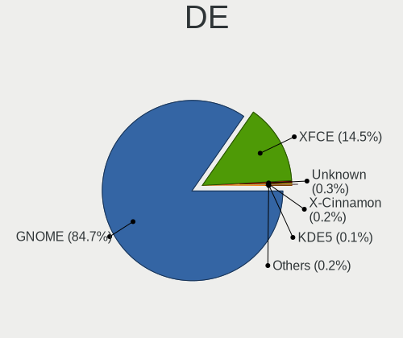
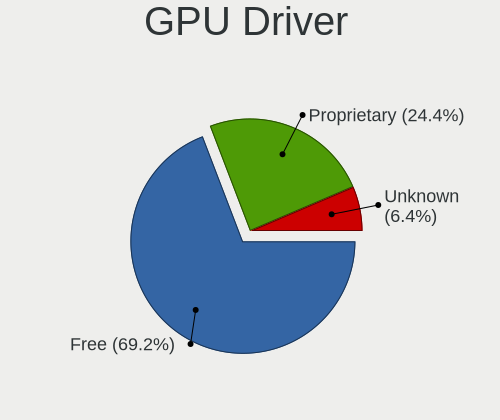
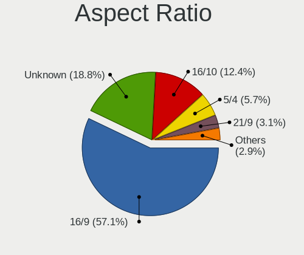

Zorin 16 - Tested Hardware & Statistics (Desktops)
--------------------------------------------------

A project to collect tested hardware configurations for Zorin 16 (Beta test).

Anyone can contribute to this report by the [hw-probe](https://github.com/linuxhw/hw-probe) tool:

    sudo -E hw-probe -all -upload

Please submit a probe of your configuration if it's not presented on the page or is rare.

Full-feature report is available here: https://linux-hardware.org/?view=trends&rel=zorin-16

Contents
--------

* [ Test Cases ](#test-cases)

* [ System ](#system)
  - [ Kernel                   ](#kernel)
  - [ Kernel Family            ](#kernel-family)
  - [ Kernel Major Ver.        ](#kernel-major-ver)
  - [ Arch                     ](#arch)
  - [ DE                       ](#de)
  - [ Display Server           ](#display-server)
  - [ Display Manager          ](#display-manager)
  - [ OS Lang                  ](#os-lang)
  - [ Boot Mode                ](#boot-mode)
  - [ Filesystem               ](#filesystem)
  - [ Part. scheme             ](#part-scheme)
  - [ Dual Boot with Linux/BSD ](#dual-boot-with-linuxbsd)
  - [ Dual Boot (Win)          ](#dual-boot-win)

* [ Board ](#board)
  - [ Vendor                   ](#vendor)
  - [ Model                    ](#model)
  - [ Model Family             ](#model-family)
  - [ MFG Year                 ](#mfg-year)
  - [ Form Factor              ](#form-factor)
  - [ Secure Boot              ](#secure-boot)
  - [ Coreboot                 ](#coreboot)
  - [ RAM Size                 ](#ram-size)
  - [ RAM Used                 ](#ram-used)
  - [ Total Drives             ](#total-drives)
  - [ Has CD-ROM               ](#has-cd-rom)
  - [ Has Ethernet             ](#has-ethernet)
  - [ Has WiFi                 ](#has-wifi)
  - [ Has Bluetooth            ](#has-bluetooth)

* [ Location ](#location)
  - [ Country                  ](#country)
  - [ City                     ](#city)

* [ Drives ](#drives)
  - [ Drive Vendor             ](#drive-vendor)
  - [ Drive Model              ](#drive-model)
  - [ HDD Vendor               ](#hdd-vendor)
  - [ SSD Vendor               ](#ssd-vendor)
  - [ Drive Kind               ](#drive-kind)
  - [ Drive Connector          ](#drive-connector)
  - [ Drive Size               ](#drive-size)
  - [ Space Total              ](#space-total)
  - [ Space Used               ](#space-used)
  - [ Malfunc. Drives          ](#malfunc-drives)
  - [ Malfunc. Drive Vendor    ](#malfunc-drive-vendor)
  - [ Malfunc. HDD Vendor      ](#malfunc-hdd-vendor)
  - [ Malfunc. Drive Kind      ](#malfunc-drive-kind)
  - [ Failed Drives            ](#failed-drives)
  - [ Failed Drive Vendor      ](#failed-drive-vendor)
  - [ Drive Status             ](#drive-status)

* [ Storage controller ](#storage-controller)
  - [ Storage Vendor           ](#storage-vendor)
  - [ Storage Model            ](#storage-model)
  - [ Storage Kind             ](#storage-kind)

* [ Processor ](#processor)
  - [ CPU Vendor               ](#cpu-vendor)
  - [ CPU Model                ](#cpu-model)
  - [ CPU Model Family         ](#cpu-model-family)
  - [ CPU Cores                ](#cpu-cores)
  - [ CPU Sockets              ](#cpu-sockets)
  - [ CPU Threads              ](#cpu-threads)
  - [ CPU Op-Modes             ](#cpu-op-modes)
  - [ CPU Microcode            ](#cpu-microcode)
  - [ CPU Microarch            ](#cpu-microarch)

* [ Graphics ](#graphics)
  - [ GPU Vendor               ](#gpu-vendor)
  - [ GPU Model                ](#gpu-model)
  - [ GPU Combo                ](#gpu-combo)
  - [ GPU Driver               ](#gpu-driver)
  - [ GPU Memory               ](#gpu-memory)

* [ Monitor ](#monitor)
  - [ Monitor Vendor           ](#monitor-vendor)
  - [ Monitor Model            ](#monitor-model)
  - [ Monitor Resolution       ](#monitor-resolution)
  - [ Monitor Diagonal         ](#monitor-diagonal)
  - [ Monitor Width            ](#monitor-width)
  - [ Aspect Ratio             ](#aspect-ratio)
  - [ Monitor Area             ](#monitor-area)
  - [ Pixel Density            ](#pixel-density)
  - [ Multiple Monitors        ](#multiple-monitors)

* [ Network ](#network)
  - [ Net Controller Vendor    ](#net-controller-vendor)
  - [ Net Controller Model     ](#net-controller-model)
  - [ Wireless Vendor          ](#wireless-vendor)
  - [ Wireless Model           ](#wireless-model)
  - [ Ethernet Vendor          ](#ethernet-vendor)
  - [ Ethernet Model           ](#ethernet-model)
  - [ Net Controller Kind      ](#net-controller-kind)
  - [ Used Controller          ](#used-controller)
  - [ NICs                     ](#nics)
  - [ IPv6                     ](#ipv6)

* [ Bluetooth ](#bluetooth)
  - [ Bluetooth Vendor         ](#bluetooth-vendor)
  - [ Bluetooth Model          ](#bluetooth-model)

* [ Sound ](#sound)
  - [ Sound Vendor             ](#sound-vendor)
  - [ Sound Model              ](#sound-model)

* [ Memory ](#memory)
  - [ Memory Vendor            ](#memory-vendor)
  - [ Memory Model             ](#memory-model)
  - [ Memory Kind              ](#memory-kind)
  - [ Memory Form Factor       ](#memory-form-factor)
  - [ Memory Size              ](#memory-size)
  - [ Memory Speed             ](#memory-speed)

* [ Printers & scanners ](#printers--scanners)
  - [ Printer Vendor           ](#printer-vendor)
  - [ Printer Model            ](#printer-model)
  - [ Scanner Vendor           ](#scanner-vendor)
  - [ Scanner Model            ](#scanner-model)

* [ Camera ](#camera)
  - [ Camera Vendor            ](#camera-vendor)
  - [ Camera Model             ](#camera-model)

* [ Security ](#security)
  - [ Fingerprint Vendor       ](#fingerprint-vendor)
  - [ Fingerprint Model        ](#fingerprint-model)
  - [ Chipcard Vendor          ](#chipcard-vendor)
  - [ Chipcard Model           ](#chipcard-model)

* [ Unsupported ](#unsupported)
  - [ Unsupported Devices      ](#unsupported-devices)
  - [ Unsupported Device Types ](#unsupported-device-types)

Test Cases
----------

| Vendor   | Model                       | Probe                                                      | Date         |
|----------|-----------------------------|------------------------------------------------------------|--------------|
| HP       | 1497                        | [fd4cf5c840](https://linux-hardware.org/?probe=fd4cf5c840) | Sep 01, 2021 |
| Gigabyte | B460M DS3H                  | [ef23780b19](https://linux-hardware.org/?probe=ef23780b19) | Aug 31, 2021 |
| Positivo | POS-PIH81DI                 | [baa289fe51](https://linux-hardware.org/?probe=baa289fe51) | Aug 31, 2021 |
| Positivo | POS-PIH81DI                 | [cc326a093e](https://linux-hardware.org/?probe=cc326a093e) | Aug 31, 2021 |
| HP       | 339A                        | [5a5ab8d1c2](https://linux-hardware.org/?probe=5a5ab8d1c2) | Aug 31, 2021 |
| HP       | 339A                        | [c0043e4c4c](https://linux-hardware.org/?probe=c0043e4c4c) | Aug 31, 2021 |
| ASUSTek  | TUF GAMING B550-PLUS        | [4c711d446d](https://linux-hardware.org/?probe=4c711d446d) | Aug 31, 2021 |
| ASUSTek  | TUF GAMING B550-PLUS        | [efb9bccc60](https://linux-hardware.org/?probe=efb9bccc60) | Aug 31, 2021 |
| Intel    | DQ77MK AAG39642-500         | [000d760a55](https://linux-hardware.org/?probe=000d760a55) | Aug 30, 2021 |
| Positivo | POS-PIH81DI                 | [3b05a7b317](https://linux-hardware.org/?probe=3b05a7b317) | Aug 30, 2021 |
| MSI      | Z87-G43                     | [a219ff197d](https://linux-hardware.org/?probe=a219ff197d) | Aug 29, 2021 |
| MSI      | MPG X570 GAMING PLUS        | [01a43874df](https://linux-hardware.org/?probe=01a43874df) | Aug 28, 2021 |
| ASUSTek  | PRIME A320M-K               | [f7a948129f](https://linux-hardware.org/?probe=f7a948129f) | Aug 28, 2021 |
| ASUSTek  | P8H61-M LX2 R2.0            | [5cd3f43e28](https://linux-hardware.org/?probe=5cd3f43e28) | Aug 28, 2021 |
| Gigabyte | A320M-S2H-CF                | [6ed5f8c32b](https://linux-hardware.org/?probe=6ed5f8c32b) | Aug 27, 2021 |
| ASRock   | Z390 Phantom Gaming 4-IB    | [b01269fbc1](https://linux-hardware.org/?probe=b01269fbc1) | Aug 27, 2021 |
| Lenovo   | SHARKBAY SDK0E50510 WIN     | [51661e959e](https://linux-hardware.org/?probe=51661e959e) | Aug 26, 2021 |
| Lenovo   | SHARKBAY SDK0E50510 WIN     | [3a7eb89cd8](https://linux-hardware.org/?probe=3a7eb89cd8) | Aug 25, 2021 |
| HP       | 802E                        | [3ee51e8a56](https://linux-hardware.org/?probe=3ee51e8a56) | Aug 25, 2021 |
| ASUSTek  | P8Z77-V LX                  | [314859d762](https://linux-hardware.org/?probe=314859d762) | Aug 25, 2021 |
| ASUSTek  | P8Z77-V LX                  | [faaf8bc158](https://linux-hardware.org/?probe=faaf8bc158) | Aug 25, 2021 |
| Dell     | 088DT1 A01                  | [8620323354](https://linux-hardware.org/?probe=8620323354) | Aug 25, 2021 |
| Dell     | 0TP406                      | [72a3d9ac12](https://linux-hardware.org/?probe=72a3d9ac12) | Aug 25, 2021 |
| HP       | 2B4B                        | [4c5411522b](https://linux-hardware.org/?probe=4c5411522b) | Aug 25, 2021 |
| Gigabyte | B85M-D3H                    | [906a3e006c](https://linux-hardware.org/?probe=906a3e006c) | Aug 24, 2021 |
| Gigabyte | B85M-D3H                    | [9f369218ff](https://linux-hardware.org/?probe=9f369218ff) | Aug 24, 2021 |
| ASUSTek  | P8Z77-V LE                  | [a720e3326a](https://linux-hardware.org/?probe=a720e3326a) | Aug 23, 2021 |
| MSI      | B450M PRO-M2 MAX            | [e6f053c5be](https://linux-hardware.org/?probe=e6f053c5be) | Aug 22, 2021 |
| ASUSTek  | ROG STRIX Z490-E GAMING     | [15175b4f4f](https://linux-hardware.org/?probe=15175b4f4f) | Aug 22, 2021 |
| ASUSTek  | ROG STRIX Z490-E GAMING     | [02ccc1eb70](https://linux-hardware.org/?probe=02ccc1eb70) | Aug 22, 2021 |
| ASUSTek  | M5A97 R2.0                  | [372a125910](https://linux-hardware.org/?probe=372a125910) | Aug 22, 2021 |
| Lenovo   | Board                       | [b4e9579228](https://linux-hardware.org/?probe=b4e9579228) | Aug 21, 2021 |
| Lenovo   | Board                       | [12088eed17](https://linux-hardware.org/?probe=12088eed17) | Aug 21, 2021 |
| MSI      | B450M PRO-M2 MAX            | [68c6a2734b](https://linux-hardware.org/?probe=68c6a2734b) | Aug 21, 2021 |
| Intel    | DB75EN AAG39650-303         | [4bbb9f60f9](https://linux-hardware.org/?probe=4bbb9f60f9) | Aug 20, 2021 |
| Fujitsu  | D3220-A1 S26361-D3220-A1    | [63cbb9e7fd](https://linux-hardware.org/?probe=63cbb9e7fd) | Aug 19, 2021 |
| MSI      | Z97 XPOWER AC               | [c68138439d](https://linux-hardware.org/?probe=c68138439d) | Aug 19, 2021 |
| ASUSTek  | M5A78L-M/USB3               | [d78450d852](https://linux-hardware.org/?probe=d78450d852) | Aug 19, 2021 |
| Acer     | Aspire XC-605G              | [8bb6f8ef72](https://linux-hardware.org/?probe=8bb6f8ef72) | Aug 18, 2021 |
| ASUSTek  | B85M-G R2.0                 | [daf6bf889f](https://linux-hardware.org/?probe=daf6bf889f) | Aug 18, 2021 |
| MSI      | Z270-A PRO                  | [3be5b7f90e](https://linux-hardware.org/?probe=3be5b7f90e) | Aug 18, 2021 |
| Gigabyte | B550M DS3H                  | [4b687b4c17](https://linux-hardware.org/?probe=4b687b4c17) | Aug 16, 2021 |
| ASUSTek  | Z97-C                       | [97b71d18de](https://linux-hardware.org/?probe=97b71d18de) | Aug 16, 2021 |
| ASUSTek  | Z97-C                       | [06872ddde7](https://linux-hardware.org/?probe=06872ddde7) | Aug 16, 2021 |
| ASUSTek  | Z97-C                       | [a1f448c1f6](https://linux-hardware.org/?probe=a1f448c1f6) | Aug 15, 2021 |
| ASUSTek  | PRIME X570-PRO              | [fb7eb46b29](https://linux-hardware.org/?probe=fb7eb46b29) | Aug 11, 2021 |
| ASUSTek  | SABERTOOTH Z97 MARK 1       | [fb8a0b07d1](https://linux-hardware.org/?probe=fb8a0b07d1) | Aug 10, 2021 |
| ASUSTek  | M5A97 LE R2.0               | [4d9eaaf5a8](https://linux-hardware.org/?probe=4d9eaaf5a8) | Aug 09, 2021 |
| Gigabyte | B550M H                     | [b26c567912](https://linux-hardware.org/?probe=b26c567912) | Aug 03, 2021 |
| ASUSTek  | M5A78L-M/USB3               | [9c841a04d6](https://linux-hardware.org/?probe=9c841a04d6) | Aug 01, 2021 |
| Gigabyte | H61M-USB3-B3                | [3c2020fbb6](https://linux-hardware.org/?probe=3c2020fbb6) | Jul 30, 2021 |
| Gigabyte | H61M-USB3-B3                | [b3bbc6d937](https://linux-hardware.org/?probe=b3bbc6d937) | Jul 30, 2021 |
| Dell     | 0V8WGR A00                  | [2cf38ffd15](https://linux-hardware.org/?probe=2cf38ffd15) | Jul 14, 2021 |
| ASUSTek  | P8H61-M LE                  | [b0270beb17](https://linux-hardware.org/?probe=b0270beb17) | Jul 11, 2021 |
| ASUSTek  | P8H61-M LE                  | [896e6feb8a](https://linux-hardware.org/?probe=896e6feb8a) | Jul 11, 2021 |
| Lenovo   | 36C5 SDK0J40700 WIN 3258... | [20bf622c31](https://linux-hardware.org/?probe=20bf622c31) | Jun 25, 2021 |
| ASUSTek  | PRIME B450M-GAMING/BR       | [35605881d6](https://linux-hardware.org/?probe=35605881d6) | Jun 23, 2021 |
| MSI      | 2AE0                        | [bce75d51cd](https://linux-hardware.org/?probe=bce75d51cd) | Jun 23, 2021 |
| MSI      | 2AE0                        | [0412c710eb](https://linux-hardware.org/?probe=0412c710eb) | Jun 22, 2021 |
| ASUSTek  | PRIME B450M-GAMING/BR       | [b9d86eb932](https://linux-hardware.org/?probe=b9d86eb932) | Jun 17, 2021 |
| ASUSTek  | PRIME B450M-GAMING/BR       | [71de5617aa](https://linux-hardware.org/?probe=71de5617aa) | Jun 17, 2021 |
| ASUSTek  | PRIME X570-P                | [bca1e1b92f](https://linux-hardware.org/?probe=bca1e1b92f) | Jun 16, 2021 |
| ASUSTek  | PRIME X570-P                | [b3f6c76103](https://linux-hardware.org/?probe=b3f6c76103) | Jun 16, 2021 |
| Gigabyte | B85-HD3                     | [c73931b3ff](https://linux-hardware.org/?probe=c73931b3ff) | Jun 13, 2021 |
| HP       | 843C                        | [ccff6e4f39](https://linux-hardware.org/?probe=ccff6e4f39) | Jun 08, 2021 |
| ASRock   | 990FX Extreme6              | [fc3b27abac](https://linux-hardware.org/?probe=fc3b27abac) | Jun 03, 2021 |
| HP       | 8591                        | [6f71430d88](https://linux-hardware.org/?probe=6f71430d88) | Jun 01, 2021 |
| HP       | 8591                        | [fc12c57885](https://linux-hardware.org/?probe=fc12c57885) | Jun 01, 2021 |
| ASRock   | 990FX Extreme6              | [0a228b18c1](https://linux-hardware.org/?probe=0a228b18c1) | May 30, 2021 |
| ASUSTek  | PRIME B450M-GAMING/BR       | [0144616bb9](https://linux-hardware.org/?probe=0144616bb9) | May 27, 2021 |
| Gigabyte | 945GCM-S2L                  | [9890da0efd](https://linux-hardware.org/?probe=9890da0efd) | May 27, 2021 |
| Gigabyte | 945GCM-S2L                  | [61e1972b06](https://linux-hardware.org/?probe=61e1972b06) | May 27, 2021 |
| Lenovo   | SHARKBAY 0B98401 PRO        | [887dbc1614](https://linux-hardware.org/?probe=887dbc1614) | May 24, 2021 |
| Biostar  | A320MH                      | [db3a18e1c3](https://linux-hardware.org/?probe=db3a18e1c3) | May 23, 2021 |
| Biostar  | A320MH                      | [ccb22fc057](https://linux-hardware.org/?probe=ccb22fc057) | May 23, 2021 |
| Lenovo   | SHARKBAY 0B98401 PRO        | [0c314899c1](https://linux-hardware.org/?probe=0c314899c1) | May 23, 2021 |
| ASUSTek  | PRIME B450M-GAMING/BR       | [c41eec9cd3](https://linux-hardware.org/?probe=c41eec9cd3) | May 21, 2021 |
| ASUSTek  | PRIME B450M-GAMING/BR       | [ca773b28ee](https://linux-hardware.org/?probe=ca773b28ee) | May 19, 2021 |
| ASUSTek  | P8H61-I R2.0                | [c641f2aee4](https://linux-hardware.org/?probe=c641f2aee4) | May 16, 2021 |
| ASUSTek  | P8H61-I R2.0                | [500443b449](https://linux-hardware.org/?probe=500443b449) | May 16, 2021 |
| Lenovo   | Annapurna CRB NOK           | [7d4224df3f](https://linux-hardware.org/?probe=7d4224df3f) | May 13, 2021 |
| Lenovo   | Annapurna CRB NOK           | [adef2ac504](https://linux-hardware.org/?probe=adef2ac504) | May 13, 2021 |
| Dell     | 06D7TR A00                  | [1ccb5b0600](https://linux-hardware.org/?probe=1ccb5b0600) | May 01, 2021 |
| Pegatron | Benicia                     | [df847c36d5](https://linux-hardware.org/?probe=df847c36d5) | Apr 25, 2021 |
| Gigabyte | B450 AORUS ELITE            | [7f46cdb7ab](https://linux-hardware.org/?probe=7f46cdb7ab) | Apr 24, 2021 |
| ASUSTek  | M4A88TD-V EVO/USB3          | [b00e95f3db](https://linux-hardware.org/?probe=b00e95f3db) | Apr 22, 2021 |
| ASUSTek  | P5K                         | [0149b6c450](https://linux-hardware.org/?probe=0149b6c450) | Apr 22, 2021 |
| Dell     | 0PGKWF A02                  | [f963717b2c](https://linux-hardware.org/?probe=f963717b2c) | Apr 18, 2021 |
| Acer     | Aspire XC-605G              | [79d3d3a05e](https://linux-hardware.org/?probe=79d3d3a05e) | Mar 18, 2021 |

System
------

Kernel
------

Version of the Linux kernel

| Version           | Desktops | Percent |
|-------------------|----------|---------|
| 5.11.0-27-generic | 32       | 52.46%  |
| 5.8.0-53-generic  | 7        | 11.48%  |
| 5.8.0-55-generic  | 5        | 8.2%    |
| 5.8.0-50-generic  | 5        | 8.2%    |
| 5.8.0-59-generic  | 3        | 4.92%   |
| 5.8.0-49-generic  | 3        | 4.92%   |
| 5.11.0-25-generic | 3        | 4.92%   |
| 5.8.0-63-generic  | 2        | 3.28%   |
| 5.8.0-45-generic  | 1        | 1.64%   |

Kernel Family
-------------

Linux kernel without a distro release

| Version | Desktops | Percent |
|---------|----------|---------|
| 5.11.0  | 35       | 58.33%  |
| 5.8.0   | 25       | 41.67%  |

Kernel Major Ver.
-----------------

Linux kernel major version

| Version | Desktops | Percent |
|---------|----------|---------|
| 5.11    | 35       | 58.33%  |
| 5.8     | 25       | 41.67%  |

Arch
----

OS architecture (x86_64, i586, etc.)

| Name   | Desktops | Percent |
|--------|----------|---------|
| x86_64 | 59       | 100%    |

DE
--

Desktop Environment

| Name     | Desktops | Percent |
|----------|----------|---------|
| GNOME    | 58       | 96.67%  |
| XFCE     | 1        | 1.67%   |
| Cinnamon | 1        | 1.67%   |

Display Server
--------------

X11 or Wayland

| Name | Desktops | Percent |
|------|----------|---------|
| X11  | 59       | 100%    |

Display Manager
---------------

SDDM, LightDM, etc.

| Name    | Desktops | Percent |
|---------|----------|---------|
| Unknown | 56       | 94.92%  |
| GDM     | 2        | 3.39%   |
| TDM     | 1        | 1.69%   |

OS Lang
-------

Language

| Lang  | Desktops | Percent |
|-------|----------|---------|
| en_US | 23       | 38.98%  |
| de_DE | 9        | 15.25%  |
| pt_BR | 8        | 13.56%  |
| en_GB | 4        | 6.78%   |
| es_ES | 3        | 5.08%   |
| pl_PL | 2        | 3.39%   |
| es_MX | 2        | 3.39%   |
| nl_NL | 1        | 1.69%   |
| nl_BE | 1        | 1.69%   |
| hu_HU | 1        | 1.69%   |
| es_PE | 1        | 1.69%   |
| es_CL | 1        | 1.69%   |
| en_ZA | 1        | 1.69%   |
| en_SG | 1        | 1.69%   |
| cs_CZ | 1        | 1.69%   |

Boot Mode
---------

EFI or BIOS

| Mode | Desktops | Percent |
|------|----------|---------|
| EFI  | 32       | 54.24%  |
| BIOS | 27       | 45.76%  |

Filesystem
----------

Type of filesystem

| Type    | Desktops | Percent |
|---------|----------|---------|
| Ext4    | 57       | 96.61%  |
| Overlay | 2        | 3.39%   |

Part. scheme
------------

Scheme of partitioning

| Type    | Desktops | Percent |
|---------|----------|---------|
| Unknown | 56       | 94.92%  |
| GPT     | 2        | 3.39%   |
| MBR     | 1        | 1.69%   |

Dual Boot with Linux/BSD
------------------------

Hosting more than one Linux/BSD

| Dual boot | Desktops | Percent |
|-----------|----------|---------|
| No        | 57       | 95%     |
| Yes       | 3        | 5%      |

Dual Boot (Win)
---------------

Hosting Linux and Windows

| Dual boot | Desktops | Percent |
|-----------|----------|---------|
| No        | 51       | 86.44%  |
| Yes       | 8        | 13.56%  |

Board
-----

Vendor
------

Motherboard manufacturer

| Name                | Desktops | Percent |
|---------------------|----------|---------|
| ASUSTek Computer    | 20       | 33.9%   |
| Gigabyte Technology | 9        | 15.25%  |
| MSI                 | 6        | 10.17%  |
| Hewlett-Packard     | 6        | 10.17%  |
| Lenovo              | 5        | 8.47%   |
| Dell                | 4        | 6.78%   |
| Intel               | 2        | 3.39%   |
| ASRock              | 2        | 3.39%   |
| Positivo            | 1        | 1.69%   |
| Pegatron            | 1        | 1.69%   |
| Fujitsu             | 1        | 1.69%   |
| Biostar             | 1        | 1.69%   |
| Acer                | 1        | 1.69%   |

Model
-----

Motherboard model

| Name                                    | Desktops | Percent |
|-----------------------------------------|----------|---------|
| ASUS All Series                         | 3        | 5.08%   |
| Dell OptiPlex 990                       | 2        | 3.39%   |
| ASUS M5A78L-M/USB3                      | 2        | 3.39%   |
| Positivo POS-PIH81DI                    | 1        | 1.69%   |
| Pegatron NE502AV-ABA a6750t             | 1        | 1.69%   |
| MSI Pro 3515 Series                     | 1        | 1.69%   |
| MSI MS-7C37                             | 1        | 1.69%   |
| MSI MS-7B84                             | 1        | 1.69%   |
| MSI MS-7A71                             | 1        | 1.69%   |
| MSI MS-7914                             | 1        | 1.69%   |
| MSI MS-7816                             | 1        | 1.69%   |
| Lenovo ThinkCentre M83 MT-M 10AJ-0003MB | 1        | 1.69%   |
| Lenovo ThinkCentre M78 10BTA00ELM       | 1        | 1.69%   |
| Lenovo SHARKBAY SDK0E50510 WIN          | 1        | 1.69%   |
| Lenovo IdeaCentre 510S-08IKL 90GB004RUS | 1        | 1.69%   |
| Lenovo Board                            | 1        | 1.69%   |
| Intel DQ77MK-R01                        | 1        | 1.69%   |
| Intel DB75EN AAG39650-303               | 1        | 1.69%   |
| HP Z240 SFF Workstation                 | 1        | 1.69%   |
| HP Z1 Entry Tower G5                    | 1        | 1.69%   |
| HP Compaq Pro 6300 SFF                  | 1        | 1.69%   |
| HP Compaq 6200 Pro SFF PC               | 1        | 1.69%   |
| HP 870-158ng                            | 1        | 1.69%   |
| HP 290 G2 MT Business PC                | 1        | 1.69%   |
| Gigabyte Komputer OPTIMUS               | 1        | 1.69%   |
| Gigabyte H61M-USB3-B3                   | 1        | 1.69%   |
| Gigabyte B85M-D3H                       | 1        | 1.69%   |
| Gigabyte B85-HD3                        | 1        | 1.69%   |
| Gigabyte B550M H                        | 1        | 1.69%   |
| Gigabyte B550M DS3H                     | 1        | 1.69%   |
| Gigabyte B460MDS3H                      | 1        | 1.69%   |
| Gigabyte B450 AORUS ELITE               | 1        | 1.69%   |
| Gigabyte A320M-S2H                      | 1        | 1.69%   |
| Fujitsu ESPRIMO P520                    | 1        | 1.69%   |
| Dell XPS420                             | 1        | 1.69%   |
| Dell Inspiron 3847                      | 1        | 1.69%   |
| Biostar A320MH                          | 1        | 1.69%   |
| ASUS UNLOCK INSTALL                     | 1        | 1.69%   |
| ASUS TUF GAMING B550-PLUS               | 1        | 1.69%   |
| ASUS ROG STRIX Z490-E GAMING            | 1        | 1.69%   |
| ASUS PRIME X570-PRO                     | 1        | 1.69%   |
| ASUS PRIME X570-P                       | 1        | 1.69%   |
| ASUS PRIME B450M-GAMING/BR              | 1        | 1.69%   |
| ASUS P8Z77-V LX                         | 1        | 1.69%   |
| ASUS P8Z77-V LE                         | 1        | 1.69%   |
| ASUS P8H61-M LX2 R2.0                   | 1        | 1.69%   |
| ASUS P8H61-M LE                         | 1        | 1.69%   |
| ASUS P5K                                | 1        | 1.69%   |
| ASUS M5A97 R2.0                         | 1        | 1.69%   |
| ASUS M5A97 LE R2.0                      | 1        | 1.69%   |
| ASUS M4A88TD-V EVO/USB3                 | 1        | 1.69%   |
| ASUS A0000001                           | 1        | 1.69%   |
| ASRock Z390 Phantom Gaming 4-IB         | 1        | 1.69%   |
| ASRock 990FX Extreme6                   | 1        | 1.69%   |
| Acer Aspire XC-605G                     | 1        | 1.69%   |

Model Family
------------

Motherboard model prefix

| Name                  | Desktops | Percent |
|-----------------------|----------|---------|
| ASUS PRIME            | 3        | 5.08%   |
| ASUS All              | 3        | 5.08%   |
| Lenovo ThinkCentre    | 2        | 3.39%   |
| HP Compaq             | 2        | 3.39%   |
| Gigabyte B550M        | 2        | 3.39%   |
| Dell OptiPlex         | 2        | 3.39%   |
| ASUS P8Z77-V          | 2        | 3.39%   |
| ASUS P8H61-M          | 2        | 3.39%   |
| ASUS M5A97            | 2        | 3.39%   |
| ASUS M5A78L-M         | 2        | 3.39%   |
| Positivo POS-PIH81DI  | 1        | 1.69%   |
| Pegatron NE502AV-ABA  | 1        | 1.69%   |
| MSI Pro               | 1        | 1.69%   |
| MSI MS-7C37           | 1        | 1.69%   |
| MSI MS-7B84           | 1        | 1.69%   |
| MSI MS-7A71           | 1        | 1.69%   |
| MSI MS-7914           | 1        | 1.69%   |
| MSI MS-7816           | 1        | 1.69%   |
| Lenovo SHARKBAY       | 1        | 1.69%   |
| Lenovo IdeaCentre     | 1        | 1.69%   |
| Lenovo Board          | 1        | 1.69%   |
| Intel DQ77MK-R01      | 1        | 1.69%   |
| Intel DB75EN          | 1        | 1.69%   |
| HP Z240               | 1        | 1.69%   |
| HP Z1                 | 1        | 1.69%   |
| HP 870-158ng          | 1        | 1.69%   |
| HP 290                | 1        | 1.69%   |
| Gigabyte Komputer     | 1        | 1.69%   |
| Gigabyte H61M-USB3-B3 | 1        | 1.69%   |
| Gigabyte B85M-D3H     | 1        | 1.69%   |
| Gigabyte B85-HD3      | 1        | 1.69%   |
| Gigabyte B460MDS3H    | 1        | 1.69%   |
| Gigabyte B450         | 1        | 1.69%   |
| Gigabyte A320M-S2H    | 1        | 1.69%   |
| Fujitsu ESPRIMO       | 1        | 1.69%   |
| Dell XPS420           | 1        | 1.69%   |
| Dell Inspiron         | 1        | 1.69%   |
| Biostar A320MH        | 1        | 1.69%   |
| ASUS UNLOCK           | 1        | 1.69%   |
| ASUS TUF              | 1        | 1.69%   |
| ASUS ROG              | 1        | 1.69%   |
| ASUS P5K              | 1        | 1.69%   |
| ASUS M4A88TD-V        | 1        | 1.69%   |
| ASUS A0000001         | 1        | 1.69%   |
| ASRock Z390           | 1        | 1.69%   |
| ASRock 990FX          | 1        | 1.69%   |
| Acer Aspire           | 1        | 1.69%   |

MFG Year
--------

Motherboard manufacture year

| Year | Desktops | Percent |
|------|----------|---------|
| 2014 | 9        | 15.25%  |
| 2021 | 8        | 13.56%  |
| 2020 | 7        | 11.86%  |
| 2018 | 6        | 10.17%  |
| 2019 | 5        | 8.47%   |
| 2015 | 5        | 8.47%   |
| 2012 | 5        | 8.47%   |
| 2013 | 4        | 6.78%   |
| 2016 | 3        | 5.08%   |
| 2009 | 2        | 3.39%   |
| 2017 | 1        | 1.69%   |
| 2011 | 1        | 1.69%   |
| 2010 | 1        | 1.69%   |
| 2008 | 1        | 1.69%   |
| 2007 | 1        | 1.69%   |

Form Factor
-----------

Physical design of the computer

| Name    | Desktops | Percent |
|---------|----------|---------|
| Desktop | 59       | 100%    |

Secure Boot
-----------

Enabled or disabled

| State    | Desktops | Percent |
|----------|----------|---------|
| Disabled | 55       | 93.22%  |
| Enabled  | 4        | 6.78%   |

Coreboot
--------

Have coreboot on board

| Used | Desktops | Percent |
|------|----------|---------|
| No   | 59       | 100%    |

RAM Size
--------

Total RAM memory

| Size in GB  | Desktops | Percent |
|-------------|----------|---------|
| 8.01-16.0   | 20       | 32.79%  |
| 16.01-24.0  | 15       | 24.59%  |
| 4.01-8.0    | 10       | 16.39%  |
| 32.01-64.0  | 9        | 14.75%  |
| 3.01-4.0    | 5        | 8.2%    |
| 64.01-256.0 | 1        | 1.64%   |
| 1.01-2.0    | 1        | 1.64%   |

RAM Used
--------

Used RAM memory

| Used GB  | Desktops | Percent |
|----------|----------|---------|
| 1.01-2.0 | 33       | 54.1%   |
| 2.01-3.0 | 18       | 29.51%  |
| 4.01-8.0 | 5        | 8.2%    |
| 3.01-4.0 | 4        | 6.56%   |
| 0.51-1.0 | 1        | 1.64%   |

Total Drives
------------

Number of drives on board

| Drives | Desktops | Percent |
|--------|----------|---------|
| 2      | 19       | 32.2%   |
| 1      | 15       | 25.42%  |
| 3      | 10       | 16.95%  |
| 4      | 8        | 13.56%  |
| 5      | 3        | 5.08%   |
| 8      | 2        | 3.39%   |
| 6      | 1        | 1.69%   |
| 0      | 1        | 1.69%   |

Has CD-ROM
----------

Has CD-ROM on board

| Presented | Desktops | Percent |
|-----------|----------|---------|
| Yes       | 37       | 62.71%  |
| No        | 22       | 37.29%  |

Has Ethernet
------------

Has Ethernet on board

| Presented | Desktops | Percent |
|-----------|----------|---------|
| Yes       | 59       | 100%    |

Has WiFi
--------

Has WiFi module

| Presented | Desktops | Percent |
|-----------|----------|---------|
| No        | 33       | 55.93%  |
| Yes       | 26       | 44.07%  |

Has Bluetooth
-------------

Has Bluetooth module

| Presented | Desktops | Percent |
|-----------|----------|---------|
| No        | 41       | 69.49%  |
| Yes       | 18       | 30.51%  |

Location
--------

Country
-------

Geographic location (country)

| Country      | Desktops | Percent |
|--------------|----------|---------|
| USA          | 17       | 28.81%  |
| Germany      | 9        | 15.25%  |
| Brazil       | 8        | 13.56%  |
| UK           | 4        | 6.78%   |
| Spain        | 3        | 5.08%   |
| Poland       | 2        | 3.39%   |
| Mexico       | 2        | 3.39%   |
| Hungary      | 2        | 3.39%   |
| Taiwan       | 1        | 1.69%   |
| Switzerland  | 1        | 1.69%   |
| South Africa | 1        | 1.69%   |
| Peru         | 1        | 1.69%   |
| Netherlands  | 1        | 1.69%   |
| Malaysia     | 1        | 1.69%   |
| Denmark      | 1        | 1.69%   |
| Czechia      | 1        | 1.69%   |
| Chile        | 1        | 1.69%   |
| Canada       | 1        | 1.69%   |
| Belgium      | 1        | 1.69%   |
| Australia    | 1        | 1.69%   |

City
----

Geographic location (city)

| City                   | Desktops | Percent |
|------------------------|----------|---------|
| Rio de Janeiro         | 2        | 3.39%   |
| Contagem               | 2        | 3.39%   |
| Zurich                 | 1        | 1.69%   |
| Xalapa                 | 1        | 1.69%   |
| Wylie                  | 1        | 1.69%   |
| Vespasiano             | 1        | 1.69%   |
| Vancouver              | 1        | 1.69%   |
| Trujillo               | 1        | 1.69%   |
| São Bernardo do Campo | 1        | 1.69%   |
| Szombathely            | 1        | 1.69%   |
| Szigetvar              | 1        | 1.69%   |
| Sheffield              | 1        | 1.69%   |
| Santiago               | 1        | 1.69%   |
| Santa Cruz de Tenerife | 1        | 1.69%   |
| Sacramento             | 1        | 1.69%   |
| Porto Seguro           | 1        | 1.69%   |
| P?™?­bram              | 1        | 1.69%   |
| Pascoag                | 1        | 1.69%   |
| Palm Coast             | 1        | 1.69%   |
| Oscoda                 | 1        | 1.69%   |
| Oak Creek              | 1        | 1.69%   |
| Niter??i               | 1        | 1.69%   |
| Miami                  | 1        | 1.69%   |
| Mentor                 | 1        | 1.69%   |
| Melbourne              | 1        | 1.69%   |
| Marpingen              | 1        | 1.69%   |
| Ludwigsburg            | 1        | 1.69%   |
| Livingston             | 1        | 1.69%   |
| Laziska Gorne          | 1        | 1.69%   |
| Kuala Lumpur           | 1        | 1.69%   |
| Johannesburg           | 1        | 1.69%   |
| Idaho Falls            | 1        | 1.69%   |
| Helensburgh            | 1        | 1.69%   |
| Hamburg                | 1        | 1.69%   |
| Griesheim              | 1        | 1.69%   |
| Ghent                  | 1        | 1.69%   |
| Gdynia                 | 1        | 1.69%   |
| Fort Worth             | 1        | 1.69%   |
| Emmendingen            | 1        | 1.69%   |
| Duluth                 | 1        | 1.69%   |
| Delaware               | 1        | 1.69%   |
| Copenhagen             | 1        | 1.69%   |
| Cologne                | 1        | 1.69%   |
| Chipiona               | 1        | 1.69%   |
| Chiayi City            | 1        | 1.69%   |
| Charlottesville        | 1        | 1.69%   |
| Carlsbad               | 1        | 1.69%   |
| Carlisle               | 1        | 1.69%   |
| Borna                  | 1        | 1.69%   |
| Bedum                  | 1        | 1.69%   |
| Beacon                 | 1        | 1.69%   |
| Baltimore              | 1        | 1.69%   |
| Bad Mergentheim        | 1        | 1.69%   |
| Augsburg               | 1        | 1.69%   |
| Arlington              | 1        | 1.69%   |
| Apodaca                | 1        | 1.69%   |
| Aldaia                 | 1        | 1.69%   |

Drives
------

Drive Vendor
------------

Hard drive vendors

| Vendor                    | Desktops | Drives | Percent |
|---------------------------|----------|--------|---------|
| Seagate                   | 26       | 35     | 20.97%  |
| WDC                       | 22       | 31     | 17.74%  |
| Samsung Electronics       | 16       | 24     | 12.9%   |
| Kingston                  | 11       | 12     | 8.87%   |
| SanDisk                   | 10       | 13     | 8.06%   |
| Toshiba                   | 6        | 6      | 4.84%   |
| Phison                    | 4        | 5      | 3.23%   |
| Hitachi                   | 3        | 5      | 2.42%   |
| Crucial                   | 3        | 5      | 2.42%   |
| China                     | 3        | 3      | 2.42%   |
| Unknown                   | 2        | 3      | 1.61%   |
| Silicon Motion            | 2        | 4      | 1.61%   |
| Micron/Crucial Technology | 2        | 2      | 1.61%   |
| A-DATA Technology         | 2        | 2      | 1.61%   |
| XPG                       | 1        | 1      | 0.81%   |
| Patriot                   | 1        | 1      | 0.81%   |
| OCZ                       | 1        | 1      | 0.81%   |
| Micron Technology         | 1        | 1      | 0.81%   |
| Maxtor                    | 1        | 1      | 0.81%   |
| Lexar                     | 1        | 1      | 0.81%   |
| KIOXIA-EXCERIA            | 1        | 1      | 0.81%   |
| KingFast                  | 1        | 1      | 0.81%   |
| JMicron                   | 1        | 1      | 0.81%   |
| Intenso                   | 1        | 1      | 0.81%   |
| Hewlett-Packard           | 1        | 1      | 0.81%   |
| Apacer                    | 1        | 1      | 0.81%   |

Drive Model
-----------

Hard drive models

| Model                               | Desktops | Percent |
|-------------------------------------|----------|---------|
| Seagate ST500DM002-1BD142 500GB     | 5        | 3.36%   |
| Seagate ST1000DM010-2EP102 1TB      | 4        | 2.68%   |
| WDC WD10EZEX-08WN4A0 1TB            | 3        | 2.01%   |
| Seagate ST2000DM001-9YN164 2TB      | 3        | 2.01%   |
| Samsung NVMe SSD Drive 500GB        | 3        | 2.01%   |
| Phison NVMe SSD Drive 1TB           | 3        | 2.01%   |
| Kingston SV300S37A120G 120GB SSD    | 3        | 2.01%   |
| Kingston SA400S37240G 240GB SSD     | 3        | 2.01%   |
| WDC WD10EZEX-60M2NA0 1TB            | 2        | 1.34%   |
| Unknown SD/MMC/MS PRO 128GB         | 2        | 1.34%   |
| Toshiba HDWD110 1TB                 | 2        | 1.34%   |
| Silicon Motion NVMe SSD Drive 128GB | 2        | 1.34%   |
| Seagate ST500LM012 HN-M500MBB 500GB | 2        | 1.34%   |
| Seagate ST1000DM003-1CH162 1TB      | 2        | 1.34%   |
| Samsung SSD 860 EVO 500GB           | 2        | 1.34%   |
| Samsung SSD 840 EVO 120GB           | 2        | 1.34%   |
| Samsung HD103UJ 1TB                 | 2        | 1.34%   |
| Samsung HD103SJ 1TB                 | 2        | 1.34%   |
| Kingston SV300S37A240G 240GB SSD    | 2        | 1.34%   |
| Kingston SA400S37120G 120GB SSD     | 2        | 1.34%   |
| XPG NVMe SSD Drive 1024GB           | 1        | 0.67%   |
| WDC WDS250G2B0A-00SM50 250GB SSD    | 1        | 0.67%   |
| WDC WDS240G2G0A-00JH30 240GB SSD    | 1        | 0.67%   |
| WDC WD7500AARS-00Y5B1 752GB         | 1        | 0.67%   |
| WDC WD6400AAKS-65A7B0 640GB         | 1        | 0.67%   |
| WDC WD5000AAKX-08U6AA0 500GB        | 1        | 0.67%   |
| WDC WD5000AAKS-00YGA0 500GB         | 1        | 0.67%   |
| WDC WD5000AADS-00S9B0 500GB         | 1        | 0.67%   |
| WDC WD40EZAZ-00SF3B0 4TB            | 1        | 0.67%   |
| WDC WD3200BUCT-63TWBY0 320GB        | 1        | 0.67%   |
| WDC WD30EZRX-00D8PB0 3TB            | 1        | 0.67%   |
| WDC WD20EZRZ-00Z5HB0 2TB            | 1        | 0.67%   |
| WDC WD20EZRX-00D8PB0 2TB            | 1        | 0.67%   |
| WDC WD20EURX-61T0FY0 2TB            | 1        | 0.67%   |
| WDC WD20EFRX-68EUZN0 2TB            | 1        | 0.67%   |
| WDC WD1600AAJS-75M0A0 160GB         | 1        | 0.67%   |
| WDC WD1600AAJS-22PSA0 160GB         | 1        | 0.67%   |
| WDC WD10EZEX-75M2NA0 1TB            | 1        | 0.67%   |
| WDC WD10EZEX-60WN4A0 1TB            | 1        | 0.67%   |
| WDC WD10EZEX-21M2NA0 1TB            | 1        | 0.67%   |
| WDC WD10EZEX-08M2NA0 1TB            | 1        | 0.67%   |
| WDC WD10EZEX-00KUWA0 1TB            | 1        | 0.67%   |
| WDC WD10EURX-63FH1Y0 1TB            | 1        | 0.67%   |
| WDC WD1002FAEX-00Y9A0 1TB           | 1        | 0.67%   |
| Toshiba MQ01ABD032V -63 320GB       | 1        | 0.67%   |
| Toshiba MK3265GSX 320GB             | 1        | 0.67%   |
| Toshiba KBG30ZMS128G 128GB NVMe SSD | 1        | 0.67%   |
| Toshiba DT01ACA300 3TB              | 1        | 0.67%   |
| Silicon Motion NVME SSD 128GB       | 1        | 0.67%   |
| Seagate ST6000DM003-2CY186 6TB      | 1        | 0.67%   |
| Seagate ST4000DM004-2CV104 4TB      | 1        | 0.67%   |
| Seagate ST4000DM000-1F2168 4TB      | 1        | 0.67%   |
| Seagate ST380811AS 80GB             | 1        | 0.67%   |
| Seagate ST3500620AS 500GB           | 1        | 0.67%   |
| Seagate ST3500418AS 500GB           | 1        | 0.67%   |
| Seagate ST3320820AS 320GB           | 1        | 0.67%   |
| Seagate ST3160815AS 160GB           | 1        | 0.67%   |
| Seagate ST31500341AS 1TB            | 1        | 0.67%   |
| Seagate ST2000LM015-2E8174 2TB      | 1        | 0.67%   |
| Seagate ST2000DM008-2FR102 2TB      | 1        | 0.67%   |

HDD Vendor
----------

Hard disk drive vendors

| Vendor              | Desktops | Drives | Percent |
|---------------------|----------|--------|---------|
| Seagate             | 26       | 33     | 41.94%  |
| WDC                 | 22       | 29     | 35.48%  |
| Toshiba             | 5        | 5      | 8.06%   |
| Samsung Electronics | 4        | 6      | 6.45%   |
| Hitachi             | 3        | 5      | 4.84%   |
| Maxtor              | 1        | 1      | 1.61%   |
| Hewlett-Packard     | 1        | 1      | 1.61%   |

SSD Vendor
----------

Solid state drive vendors

| Vendor              | Desktops | Drives | Percent |
|---------------------|----------|--------|---------|
| Samsung Electronics | 10       | 13     | 21.74%  |
| Kingston            | 10       | 11     | 21.74%  |
| SanDisk             | 7        | 9      | 15.22%  |
| Crucial             | 3        | 5      | 6.52%   |
| China               | 3        | 3      | 6.52%   |
| WDC                 | 2        | 2      | 4.35%   |
| A-DATA Technology   | 2        | 2      | 4.35%   |
| Seagate             | 1        | 1      | 2.17%   |
| PHISON              | 1        | 1      | 2.17%   |
| Patriot             | 1        | 1      | 2.17%   |
| OCZ                 | 1        | 1      | 2.17%   |
| Micron Technology   | 1        | 1      | 2.17%   |
| Lexar               | 1        | 1      | 2.17%   |
| KIOXIA-EXCERIA      | 1        | 1      | 2.17%   |
| Intenso             | 1        | 1      | 2.17%   |
| Apacer              | 1        | 1      | 2.17%   |

Drive Kind
----------

HDD or SSD

| Kind    | Desktops | Drives | Percent |
|---------|----------|--------|---------|
| HDD     | 46       | 80     | 45.1%   |
| SSD     | 35       | 54     | 34.31%  |
| NVMe    | 16       | 22     | 15.69%  |
| Unknown | 5        | 6      | 4.9%    |

Drive Connector
---------------

SATA, SAS, NVMe, etc.

| Type | Desktops | Drives | Percent |
|------|----------|--------|---------|
| SATA | 55       | 135    | 73.33%  |
| NVMe | 16       | 22     | 21.33%  |
| SAS  | 4        | 5      | 5.33%   |

Drive Size
----------

Size of hard drive

| Size in TB | Desktops | Drives | Percent |
|------------|----------|--------|---------|
| 0.01-0.5   | 43       | 67     | 49.43%  |
| 0.51-1.0   | 29       | 46     | 33.33%  |
| 1.01-2.0   | 10       | 15     | 11.49%  |
| 3.01-4.0   | 3        | 3      | 3.45%   |
| 2.01-3.0   | 1        | 2      | 1.15%   |
| 4.01-10.0  | 1        | 1      | 1.15%   |

Space Total
-----------

Amount of disk space available on the file system

| Size in GB     | Desktops | Percent |
|----------------|----------|---------|
| 101-250        | 15       | 25.42%  |
| 251-500        | 9        | 15.25%  |
| 1001-2000      | 9        | 15.25%  |
| 501-1000       | 9        | 15.25%  |
| 51-100         | 7        | 11.86%  |
| More than 3000 | 3        | 5.08%   |
| 2001-3000      | 3        | 5.08%   |
| 1-20           | 3        | 5.08%   |
| 21-50          | 1        | 1.69%   |

Space Used
----------

Amount of used disk space

| Used GB        | Desktops | Percent |
|----------------|----------|---------|
| 1-20           | 24       | 39.34%  |
| 21-50          | 11       | 18.03%  |
| 51-100         | 9        | 14.75%  |
| 101-250        | 5        | 8.2%    |
| 501-1000       | 4        | 6.56%   |
| 1001-2000      | 3        | 4.92%   |
| More than 3000 | 2        | 3.28%   |
| 251-500        | 2        | 3.28%   |
| 2001-3000      | 1        | 1.64%   |

Malfunc. Drives
---------------

Drive models with a malfunction

| Model                    | Desktops | Drives | Percent |
|--------------------------|----------|--------|---------|
| WDC WD10EZEX-21M2NA0 1TB | 1        | 2      | 50%     |
| Toshiba MK3265GSX 320GB  | 1        | 1      | 50%     |

Malfunc. Drive Vendor
---------------------

Vendors of faulty drives

| Vendor  | Desktops | Drives | Percent |
|---------|----------|--------|---------|
| WDC     | 1        | 2      | 50%     |
| Toshiba | 1        | 1      | 50%     |

Malfunc. HDD Vendor
-------------------

Vendors of faulty HDD drives

| Vendor  | Desktops | Drives | Percent |
|---------|----------|--------|---------|
| WDC     | 1        | 2      | 50%     |
| Toshiba | 1        | 1      | 50%     |

Malfunc. Drive Kind
-------------------

Kinds of faulty drives

| Kind | Desktops | Drives | Percent |
|------|----------|--------|---------|
| HDD  | 2        | 3      | 100%    |

Failed Drives
-------------

Failed drive models

Zero info for selected period =(

Failed Drive Vendor
-------------------

Failed drive vendors

Zero info for selected period =(

Drive Status
------------

Number of failed and malfunc. drives

| Status   | Desktops | Drives | Percent |
|----------|----------|--------|---------|
| Detected | 56       | 155    | 90.32%  |
| Works    | 4        | 4      | 6.45%   |
| Malfunc  | 2        | 3      | 3.23%   |

Storage controller
------------------

Storage Vendor
--------------

Storage controller vendors

| Vendor                       | Desktops | Percent |
|------------------------------|----------|---------|
| Intel                        | 39       | 45.88%  |
| AMD                          | 20       | 23.53%  |
| Phison Electronics           | 4        | 4.71%   |
| ASMedia Technology           | 4        | 4.71%   |
| Sandisk                      | 3        | 3.53%   |
| Samsung Electronics          | 3        | 3.53%   |
| Silicon Motion               | 2        | 2.35%   |
| Silicon Image                | 2        | 2.35%   |
| Micron/Crucial Technology    | 2        | 2.35%   |
| VIA Technologies             | 1        | 1.18%   |
| Toshiba America Info Systems | 1        | 1.18%   |
| Marvell Technology Group     | 1        | 1.18%   |
| Kingston Technology Company  | 1        | 1.18%   |
| JMicron Technology           | 1        | 1.18%   |
| ADATA Technology             | 1        | 1.18%   |

Storage Model
-------------

Storage controller models

| Model                                                                                   | Desktops | Percent |
|-----------------------------------------------------------------------------------------|----------|---------|
| Intel 8 Series/C220 Series Chipset Family 6-port SATA Controller 1 [AHCI mode]          | 10       | 9.9%    |
| AMD FCH SATA Controller [AHCI mode]                                                     | 10       | 9.9%    |
| Intel SATA Controller [RAID mode]                                                       | 5        | 4.95%   |
| Intel 7 Series/C210 Series Chipset Family 6-port SATA Controller [AHCI mode]            | 4        | 3.96%   |
| Intel 6 Series/C200 Series Chipset Family Desktop SATA Controller (IDE mode, ports 4-5) | 4        | 3.96%   |
| Intel 6 Series/C200 Series Chipset Family Desktop SATA Controller (IDE mode, ports 0-3) | 4        | 3.96%   |
| ASMedia ASM1062 Serial ATA Controller                                                   | 4        | 3.96%   |
| AMD SB7x0/SB8x0/SB9x0 SATA Controller [AHCI mode]                                       | 4        | 3.96%   |
| AMD SB7x0/SB8x0/SB9x0 IDE Controller                                                    | 4        | 3.96%   |
| Phison E16 PCIe4 NVMe Controller                                                        | 3        | 2.97%   |
| Intel Cannon Lake PCH SATA AHCI Controller                                              | 3        | 2.97%   |
| AMD Starship/Matisse Chipset SATA Controller [AHCI mode]                                | 3        | 2.97%   |
| AMD FCH SATA Controller D                                                               | 3        | 2.97%   |
| AMD 400 Series Chipset SATA Controller                                                  | 3        | 2.97%   |
| Silicon Motion SM2263EN/SM2263XT SSD Controller                                         | 2        | 1.98%   |
| Sandisk WD Black SN750 / PC SN730 NVMe SSD                                              | 2        | 1.98%   |
| Samsung NVMe SSD Controller SM981/PM981/PM983                                           | 2        | 1.98%   |
| Intel NM10/ICH7 Family SATA Controller [IDE mode]                                       | 2        | 1.98%   |
| Intel 9 Series Chipset Family SATA Controller [AHCI Mode]                               | 2        | 1.98%   |
| Intel 200 Series PCH SATA controller [AHCI mode]                                        | 2        | 1.98%   |
| AMD SB7x0/SB8x0/SB9x0 SATA Controller [IDE mode]                                        | 2        | 1.98%   |
| VIA VT6415 PATA IDE Host Controller                                                     | 1        | 0.99%   |
| Toshiba America Info Systems XG4 NVMe SSD Controller                                    | 1        | 0.99%   |
| Silicon Image SiI 3512 [SATALink/SATARaid] Serial ATA Controller                        | 1        | 0.99%   |
| Silicon Image SiI 3114 [SATALink/SATARaid] Serial ATA Controller                        | 1        | 0.99%   |
| Sandisk WD Black 2018/SN750 / PC SN720 NVMe SSD                                         | 1        | 0.99%   |
| Samsung NVMe SSD Controller PM9A1/PM9A3/980PRO                                          | 1        | 0.99%   |
| Phison PS5013 E13 NVMe Controller                                                       | 1        | 0.99%   |
| Micron/Crucial P1 NVMe PCIe SSD                                                         | 1        | 0.99%   |
| Micron/Crucial NVMe Controller                                                          | 1        | 0.99%   |
| Marvell Group 88SE9120 SATA 6Gb/s Controller                                            | 1        | 0.99%   |
| Kingston Company U-SNS8154P3 NVMe SSD                                                   | 1        | 0.99%   |
| JMicron JMB363 SATA/IDE Controller                                                      | 1        | 0.99%   |
| Intel Q170/Q150/B150/H170/H110/Z170/CM236 Chipset SATA Controller [AHCI Mode]           | 1        | 0.99%   |
| Intel Comet Lake SATA AHCI Controller                                                   | 1        | 0.99%   |
| Intel 82801IR/IO/IH (ICH9R/DO/DH) 6 port SATA Controller [AHCI mode]                    | 1        | 0.99%   |
| Intel 82801IB (ICH9) 2 port SATA Controller [IDE mode]                                  | 1        | 0.99%   |
| Intel 82801I (ICH9 Family) 2 port SATA Controller [IDE mode]                            | 1        | 0.99%   |
| Intel 82801G (ICH7 Family) IDE Controller                                               | 1        | 0.99%   |
| Intel 7 Series/C210 Series Chipset Family 4-port SATA Controller [IDE mode]             | 1        | 0.99%   |
| Intel 7 Series/C210 Series Chipset Family 2-port SATA Controller [IDE mode]             | 1        | 0.99%   |
| Intel 6 Series/C200 Series Chipset Family 6 port Desktop SATA AHCI Controller           | 1        | 0.99%   |
| Intel 400 Series Chipset Family SATA AHCI Controller                                    | 1        | 0.99%   |
| ADATA XPG SX8200 Pro PCIe Gen3x4 M.2 2280 Solid State Drive                             | 1        | 0.99%   |

Storage Kind
------------

Kind of storage controller (IDE, SATA, NVMe, SAS, ...)

| Kind | Desktops | Percent |
|------|----------|---------|
| SATA | 46       | 56.79%  |
| NVMe | 16       | 19.75%  |
| IDE  | 12       | 14.81%  |
| RAID | 7        | 8.64%   |

Processor
---------

CPU Vendor
----------

Processor vendors

| Vendor | Desktops | Percent |
|--------|----------|---------|
| Intel  | 39       | 66.1%   |
| AMD    | 20       | 33.9%   |

CPU Model
---------

Processor models

| Model                                       | Desktops | Percent |
|---------------------------------------------|----------|---------|
| Intel Core i7-4790 CPU @ 3.60GHz            | 4        | 6.78%   |
| Intel Core i7-4790K CPU @ 4.00GHz           | 2        | 3.39%   |
| Intel Core i5-2400 CPU @ 3.10GHz            | 2        | 3.39%   |
| Intel Core i3-8100 CPU @ 3.60GHz            | 2        | 3.39%   |
| Intel Core i3-4160 CPU @ 3.60GHz            | 2        | 3.39%   |
| Intel Core i3-2100 CPU @ 3.10GHz            | 2        | 3.39%   |
| Intel Core 2 Quad CPU Q6600 @ 2.40GHz       | 2        | 3.39%   |
| AMD Ryzen 7 3700X 8-Core Processor          | 2        | 3.39%   |
| AMD Ryzen 5 3600 6-Core Processor           | 2        | 3.39%   |
| AMD Ryzen 3 2200G with Radeon Vega Graphics | 2        | 3.39%   |
| AMD FX-8320E Eight-Core Processor           | 2        | 3.39%   |
| Intel Xeon CPU X3220 @ 2.40GHz              | 1        | 1.69%   |
| Intel Pentium Gold G6400 CPU @ 4.00GHz      | 1        | 1.69%   |
| Intel Pentium Dual-Core CPU E5300 @ 2.60GHz | 1        | 1.69%   |
| Intel Pentium Dual CPU E2200 @ 2.20GHz      | 1        | 1.69%   |
| Intel Core i9-10900K CPU @ 3.70GHz          | 1        | 1.69%   |
| Intel Core i7-9700K CPU @ 3.60GHz           | 1        | 1.69%   |
| Intel Core i7-6700 CPU @ 3.40GHz            | 1        | 1.69%   |
| Intel Core i7-3770 CPU @ 3.40GHz            | 1        | 1.69%   |
| Intel Core i5-6600K CPU @ 3.50GHz           | 1        | 1.69%   |
| Intel Core i5-6500 CPU @ 3.20GHz            | 1        | 1.69%   |
| Intel Core i5-4690K CPU @ 3.50GHz           | 1        | 1.69%   |
| Intel Core i5-4590 CPU @ 3.30GHz            | 1        | 1.69%   |
| Intel Core i5-4570 CPU @ 3.20GHz            | 1        | 1.69%   |
| Intel Core i5-4430 CPU @ 3.00GHz            | 1        | 1.69%   |
| Intel Core i5-3570K CPU @ 3.40GHz           | 1        | 1.69%   |
| Intel Core i5-3570 CPU @ 3.40GHz            | 1        | 1.69%   |
| Intel Core i5-3340 CPU @ 3.10GHz            | 1        | 1.69%   |
| Intel Core i5-2500S CPU @ 2.70GHz           | 1        | 1.69%   |
| Intel Core i5-2500 CPU @ 3.30GHz            | 1        | 1.69%   |
| Intel Core i3-7100 CPU @ 3.90GHz            | 1        | 1.69%   |
| Intel Core i3-4360T CPU @ 3.20GHz           | 1        | 1.69%   |
| Intel Core i3-3240 CPU @ 3.40GHz            | 1        | 1.69%   |
| Intel Core i3-3225 CPU @ 3.30GHz            | 1        | 1.69%   |
| AMD Ryzen 9 3900X 12-Core Processor         | 1        | 1.69%   |
| AMD Ryzen 7 2700X Eight-Core Processor      | 1        | 1.69%   |
| AMD Ryzen 7 2700 Eight-Core Processor       | 1        | 1.69%   |
| AMD Ryzen 5 3600XT 6-Core Processor         | 1        | 1.69%   |
| AMD Ryzen 3 3200G with Radeon Vega Graphics | 1        | 1.69%   |
| AMD Ryzen 3 1200 Quad-Core Processor        | 1        | 1.69%   |
| AMD Phenom II X4 965 Processor              | 1        | 1.69%   |
| AMD FX-9590 Eight-Core Processor            | 1        | 1.69%   |
| AMD FX-6350 Six-Core Processor              | 1        | 1.69%   |
| AMD FX-6300 Six-Core Processor              | 1        | 1.69%   |
| AMD A6-5400K APU with Radeon HD Graphics    | 1        | 1.69%   |
| AMD A6-5400B APU with Radeon HD Graphics    | 1        | 1.69%   |

CPU Model Family
----------------

Processor model prefix

| Model                   | Desktops | Percent |
|-------------------------|----------|---------|
| Intel Core i5           | 13       | 22.03%  |
| Intel Core i3           | 10       | 16.95%  |
| Intel Core i7           | 9        | 15.25%  |
| AMD FX                  | 5        | 8.47%   |
| AMD Ryzen 7             | 4        | 6.78%   |
| AMD Ryzen 3             | 4        | 6.78%   |
| AMD Ryzen 5             | 3        | 5.08%   |
| Intel Core 2 Quad       | 2        | 3.39%   |
| AMD A6                  | 2        | 3.39%   |
| Intel Xeon              | 1        | 1.69%   |
| Intel Pentium Gold      | 1        | 1.69%   |
| Intel Pentium Dual-Core | 1        | 1.69%   |
| Intel Pentium Dual      | 1        | 1.69%   |
| Intel Core i9           | 1        | 1.69%   |
| AMD Ryzen 9             | 1        | 1.69%   |
| AMD Phenom II X4        | 1        | 1.69%   |

CPU Cores
---------

Number of processor cores

| Number | Desktops | Percent |
|--------|----------|---------|
| 4      | 34       | 57.63%  |
| 2      | 11       | 18.64%  |
| 8      | 5        | 8.47%   |
| 6      | 3        | 5.08%   |
| 3      | 2        | 3.39%   |
| 1      | 2        | 3.39%   |
| 12     | 1        | 1.69%   |
| 10     | 1        | 1.69%   |

CPU Sockets
-----------

Number of sockets

| Number | Desktops | Percent |
|--------|----------|---------|
| 1      | 59       | 100%    |

CPU Threads
-----------

Threads per core (Hyper-Threading)

| Number | Desktops | Percent |
|--------|----------|---------|
| 2      | 33       | 55.93%  |
| 1      | 26       | 44.07%  |

CPU Op-Modes
------------

CPU Operation Modes (32-bit, 64-bit)

| Op mode        | Desktops | Percent |
|----------------|----------|---------|
| 32-bit, 64-bit | 59       | 100%    |

CPU Microcode
-------------

Microcode number

| Number     | Desktops | Percent |
|------------|----------|---------|
| 0x306c3    | 13       | 22.03%  |
| 0x306a9    | 6        | 10.17%  |
| 0x206a7    | 5        | 8.47%   |
| 0x08701021 | 5        | 8.47%   |
| 0x06000852 | 5        | 8.47%   |
| 0x6fb      | 3        | 5.08%   |
| 0x506e3    | 3        | 5.08%   |
| Unknown    | 3        | 5.08%   |
| 0x906eb    | 2        | 3.39%   |
| 0x0800820d | 2        | 3.39%   |
| 0x06001119 | 2        | 3.39%   |
| 0xa0655    | 1        | 1.69%   |
| 0xa0653    | 1        | 1.69%   |
| 0x906ec    | 1        | 1.69%   |
| 0x6fd      | 1        | 1.69%   |
| 0x1067a    | 1        | 1.69%   |
| 0x08701013 | 1        | 1.69%   |
| 0x08108109 | 1        | 1.69%   |
| 0x08101016 | 1        | 1.69%   |
| 0x08001138 | 1        | 1.69%   |
| 0x010000c8 | 1        | 1.69%   |

CPU Microarch
-------------

Microarchitecture

| Name        | Desktops | Percent |
|-------------|----------|---------|
| Haswell     | 13       | 22.03%  |
| Piledriver  | 7        | 11.86%  |
| Zen 2       | 6        | 10.17%  |
| SandyBridge | 6        | 10.17%  |
| IvyBridge   | 6        | 10.17%  |
| KabyLake    | 4        | 6.78%   |
| Core        | 4        | 6.78%   |
| Zen+        | 3        | 5.08%   |
| Zen         | 3        | 5.08%   |
| Skylake     | 3        | 5.08%   |
| CometLake   | 2        | 3.39%   |
| Penryn      | 1        | 1.69%   |
| K10         | 1        | 1.69%   |

Graphics
--------

GPU Vendor
----------

Vendors of graphics cards

| Vendor | Desktops | Percent |
|--------|----------|---------|
| Nvidia | 28       | 44.44%  |
| Intel  | 18       | 28.57%  |
| AMD    | 17       | 26.98%  |

GPU Model
---------

Graphics card models

| Model                                                                       | Desktops | Percent |
|-----------------------------------------------------------------------------|----------|---------|
| Intel Xeon E3-1200 v3/4th Gen Core Processor Integrated Graphics Controller | 6        | 9.38%   |
| Nvidia GK208B [GeForce GT 710]                                              | 3        | 4.69%   |
| Intel 2nd Generation Core Processor Family Integrated Graphics Controller   | 3        | 4.69%   |
| AMD Ellesmere [Radeon RX 470/480/570/570X/580/580X/590]                     | 3        | 4.69%   |
| AMD Baffin [Radeon RX 550 640SP / RX 560/560X]                              | 3        | 4.69%   |
| Nvidia GP106 [GeForce GTX 1060 6GB]                                         | 2        | 3.13%   |
| Nvidia GP106 [GeForce GTX 1060 3GB]                                         | 2        | 3.13%   |
| Nvidia GK208B [GeForce GT 730]                                              | 2        | 3.13%   |
| Nvidia GF119 [GeForce GT 610]                                               | 2        | 3.13%   |
| Intel CoffeeLake-S GT2 [UHD Graphics 630]                                   | 2        | 3.13%   |
| Intel 4th Generation Core Processor Family Integrated Graphics Controller   | 2        | 3.13%   |
| AMD Trinity 2 [Radeon HD 7540D]                                             | 2        | 3.13%   |
| AMD RS780L [Radeon 3000]                                                    | 2        | 3.13%   |
| AMD Raven Ridge [Radeon Vega Series / Radeon Vega Mobile Series]            | 2        | 3.13%   |
| AMD Cedar [Radeon HD 5000/6000/7350/8350 Series]                            | 2        | 3.13%   |
| Nvidia TU116 [GeForce GTX 1660 SUPER]                                       | 1        | 1.56%   |
| Nvidia TU106 [GeForce RTX 2070]                                             | 1        | 1.56%   |
| Nvidia TU106 [GeForce RTX 2060 Rev. A]                                      | 1        | 1.56%   |
| Nvidia GT218 [GeForce 210]                                                  | 1        | 1.56%   |
| Nvidia GP108 [GeForce GT 1030]                                              | 1        | 1.56%   |
| Nvidia GP107 [GeForce GTX 1050 Ti]                                          | 1        | 1.56%   |
| Nvidia GM204 [GeForce GTX 970]                                              | 1        | 1.56%   |
| Nvidia GM107GL [Quadro K1200]                                               | 1        | 1.56%   |
| Nvidia GM107 [GeForce GTX 750 Ti]                                           | 1        | 1.56%   |
| Nvidia GK208 [GeForce GT 720]                                               | 1        | 1.56%   |
| Nvidia GK107 [GeForce GTX 650]                                              | 1        | 1.56%   |
| Nvidia GK107 [GeForce GT 640]                                               | 1        | 1.56%   |
| Nvidia GK106 [GeForce GTX 660]                                              | 1        | 1.56%   |
| Nvidia GK104 [GeForce GTX 680]                                              | 1        | 1.56%   |
| Nvidia GF108 [GeForce GT 730]                                               | 1        | 1.56%   |
| Nvidia GA106 [GeForce RTX 3060]                                             | 1        | 1.56%   |
| Nvidia GA102 [GeForce RTX 3090]                                             | 1        | 1.56%   |
| Intel Xeon E3-1200 v2/3rd Gen Core processor Graphics Controller            | 1        | 1.56%   |
| Intel HD Graphics 630                                                       | 1        | 1.56%   |
| Intel HD Graphics 530                                                       | 1        | 1.56%   |
| Intel CometLake-S GT2 [UHD Graphics 630]                                    | 1        | 1.56%   |
| Intel 82945G/GZ Integrated Graphics Controller                              | 1        | 1.56%   |
| AMD RS880 [Radeon HD 4250]                                                  | 1        | 1.56%   |
| AMD Picasso                                                                 | 1        | 1.56%   |
| AMD Navi 10 [Radeon RX 5600 OEM/5600 XT / 5700/5700 XT]                     | 1        | 1.56%   |
| AMD Lexa PRO [Radeon 540/540X/550/550X / RX 540X/550/550X]                  | 1        | 1.56%   |

GPU Combo
---------

Combinations of graphics cards

| Name       | Desktops | Percent |
|------------|----------|---------|
| 1 x Nvidia | 28       | 46.67%  |
| 1 x AMD    | 17       | 28.33%  |
| 1 x Intel  | 14       | 23.33%  |
| 2 x AMD    | 1        | 1.67%   |

GPU Driver
----------

Free vs proprietary

| Driver      | Desktops | Percent |
|-------------|----------|---------|
| Free        | 37       | 62.71%  |
| Proprietary | 22       | 37.29%  |

GPU Memory
----------

Total video memory

| Size in GB | Desktops | Percent |
|------------|----------|---------|
| Unknown    | 17       | 28.81%  |
| 1.01-2.0   | 13       | 22.03%  |
| 0.51-1.0   | 7        | 11.86%  |
| 7.01-8.0   | 5        | 8.47%   |
| 3.01-4.0   | 5        | 8.47%   |
| 0.01-0.5   | 5        | 8.47%   |
| 5.01-6.0   | 4        | 6.78%   |
| 2.01-3.0   | 2        | 3.39%   |
| 16.01-24.0 | 1        | 1.69%   |

Monitor
-------

Monitor Vendor
--------------

Monitor vendors

| Vendor               | Desktops | Percent |
|----------------------|----------|---------|
| Samsung Electronics  | 13       | 20.31%  |
| Acer                 | 6        | 9.38%   |
| Philips              | 5        | 7.81%   |
| AOC                  | 5        | 7.81%   |
| Goldstar             | 4        | 6.25%   |
| Hewlett-Packard      | 3        | 4.69%   |
| Dell                 | 3        | 4.69%   |
| Ancor Communications | 3        | 4.69%   |
| Vizio                | 2        | 3.13%   |
| Sony                 | 2        | 3.13%   |
| NEC Computers        | 2        | 3.13%   |
| LG Electronics       | 2        | 3.13%   |
| Lenovo               | 2        | 3.13%   |
| Xiaomi               | 1        | 1.56%   |
| ViewSonic            | 1        | 1.56%   |
| Vestel               | 1        | 1.56%   |
| Unknown              | 1        | 1.56%   |
| Sceptre Tech         | 1        | 1.56%   |
| Iiyama               | 1        | 1.56%   |
| HPN                  | 1        | 1.56%   |
| Gigabyte Technology  | 1        | 1.56%   |
| Gateway              | 1        | 1.56%   |
| Fujitsu Siemens      | 1        | 1.56%   |
| BenQ                 | 1        | 1.56%   |
| AUS                  | 1        | 1.56%   |

Monitor Model
-------------

Monitor models

| Model                                                                   | Desktops | Percent |
|-------------------------------------------------------------------------|----------|---------|
| Xiaomi Mi TV XMD00E2 3840x2160 800x450mm 36.1-inch                      | 1        | 1.52%   |
| Vizio VO37LFHDTV10A VIZ0043 1920x1080 820x460mm 37.0-inch               | 1        | 1.52%   |
| Vizio E241i-A1 VIZ1005 1920x1080 521x293mm 23.5-inch                    | 1        | 1.52%   |
| ViewSonic LCD Monitor VA2256 Series 1920x1080                           | 1        | 1.52%   |
| Vestel LCD Monitor 48UHD_LCD_TV 3840x2160                               | 1        | 1.52%   |
| Unknown LCD Monitor LHC TE-3125 1920x1080                               | 1        | 1.52%   |
| Sony TV *00 SNYA405 3840x2160 952x535mm 43.0-inch                       | 1        | 1.52%   |
| Sony AVAMP SNY9301 1280x720 708x398mm 32.0-inch                         | 1        | 1.52%   |
| Sceptre Tech H32 SPT0CB8 1920x1080 575x323mm 26.0-inch                  | 1        | 1.52%   |
| Samsung Electronics U32R59x SAM0F96 3840x2160 697x392mm 31.5-inch       | 1        | 1.52%   |
| Samsung Electronics U28E590 SAM0C4E 3840x2160 608x345mm 27.5-inch       | 1        | 1.52%   |
| Samsung Electronics U28D590 SAM0B81 3840x2160 608x345mm 27.5-inch       | 1        | 1.52%   |
| Samsung Electronics SyncMaster SAM0604 1920x1080                        | 1        | 1.52%   |
| Samsung Electronics S27R35A SAM7126 1920x1080 598x336mm 27.0-inch       | 1        | 1.52%   |
| Samsung Electronics S22D300 SAM0B3F 1920x1080 477x268mm 21.5-inch       | 1        | 1.52%   |
| Samsung Electronics LCD Monitor SAM7017 3840x2160 1872x1053mm 84.6-inch | 1        | 1.52%   |
| Samsung Electronics LCD Monitor SAM0C3C 1920x1080 700x390mm 31.5-inch   | 1        | 1.52%   |
| Samsung Electronics LCD Monitor SAM0AC6 1920x1080 700x390mm 31.5-inch   | 1        | 1.52%   |
| Samsung Electronics LCD Monitor SAM0A7A 1920x1080 1060x626mm 48.5-inch  | 1        | 1.52%   |
| Samsung Electronics LCD Monitor SAM0902 1920x1080 1020x570mm 46.0-inch  | 1        | 1.52%   |
| Samsung Electronics LCD Monitor C27R50x 1920x1080                       | 1        | 1.52%   |
| Samsung Electronics C49RG9x SAM0F9C 3840x1080 1190x340mm 48.7-inch      | 1        | 1.52%   |
| Philips PHL 278E9Q PHLC17F 1920x1080 598x336mm 27.0-inch                | 1        | 1.52%   |
| Philips PHL 243V7 PHLC155 1920x1080 530x300mm 24.0-inch                 | 1        | 1.52%   |
| Philips PHL 243V5 PHLC0D1 1920x1080 521x293mm 23.5-inch                 | 1        | 1.52%   |
| Philips LCD Monitor 240B 1920x1200                                      | 1        | 1.52%   |
| Philips LCD Monitor 227EQPH 1920x1080                                   | 1        | 1.52%   |
| NEC Computers LCD Monitor E231W 3840x1080                               | 1        | 1.52%   |
| NEC Computers LCD Monitor E231W                                         | 1        | 1.52%   |
| NEC Computers EA244WMi NEC68D7 1920x1080 520x320mm 24.0-inch            | 1        | 1.52%   |
| LG Electronics LCD Monitor LG FULL HD 1920x1080                         | 1        | 1.52%   |
| LG Electronics LCD Monitor EW224 1920x1080                              | 1        | 1.52%   |
| Lenovo LEN T23i-10 LEN61AB 1920x1080 509x286mm 23.0-inch                | 1        | 1.52%   |
| Lenovo D22-20 LEN66AD 1920x1080 477x268mm 21.5-inch                     | 1        | 1.52%   |
| Iiyama PLE2483H IVM6113 1920x1080 531x299mm 24.0-inch                   | 1        | 1.52%   |
| HPN LCD Monitor HP 24ea 1920x1080                                       | 1        | 1.52%   |
| Hewlett-Packard w17e HWP26E0 1440x900 408x255mm 18.9-inch               | 1        | 1.52%   |
| Hewlett-Packard LCD Monitor w1907 3120x1050                             | 1        | 1.52%   |
| Hewlett-Packard Compaq WF1907 HWP26A5 1440x900 408x255mm 18.9-inch      | 1        | 1.52%   |
| Hewlett-Packard 22cwa HWP3183 1920x1080 476x268mm 21.5-inch             | 1        | 1.52%   |
| Goldstar W1942 GSM4B6F 1440x900 408x255mm 18.9-inch                     | 1        | 1.52%   |
| Goldstar LCD Monitor GSM580C 1680x1050 510x290mm 23.1-inch              | 1        | 1.52%   |
| Goldstar L1950SQ GSM4AD3 1280x1024 376x301mm 19.0-inch                  | 1        | 1.52%   |
| Goldstar FULL HD GSM5B55 1920x1080 480x270mm 21.7-inch                  | 1        | 1.52%   |
| Gigabyte Technology G34WQC GBT3400 3440x1440 797x334mm 34.0-inch        | 1        | 1.52%   |
| Gateway VX930 GWY232D 1600x1200 350x262mm 17.2-inch                     | 1        | 1.52%   |
| Fujitsu Siemens LSL 3260W FUS07AE 1920x1200 550x344mm 25.5-inch         | 1        | 1.52%   |
| Dell S2715H DEL40BA 1920x1080 598x336mm 27.0-inch                       | 1        | 1.52%   |
| Dell LCD Monitor E2414H 3840x1080                                       | 1        | 1.52%   |
| Dell LCD Monitor E228WFP                                                | 1        | 1.52%   |
| BenQ G2450 BNQ78A8 1920x1080 531x298mm 24.0-inch                        | 1        | 1.52%   |
| AUS LCD Monitor ASUS VP247 1920x1080                                    | 1        | 1.52%   |
| AOC LM522 AOCA522 1024x768 304x228mm 15.0-inch                          | 1        | 1.52%   |
| AOC LCD Monitor 24B1W 1920x1080                                         | 1        | 1.52%   |
| AOC LCD Monitor 2269W 1920x1080                                         | 1        | 1.52%   |
| AOC AG323FWG3R3 AOC3230 1920x1080 698x393mm 31.5-inch                   | 1        | 1.52%   |
| AOC AG273QS8R4 AOC2730 2560x1440 600x340mm 27.2-inch                    | 1        | 1.52%   |
| Ancor Communications VW22A ACI22E3 1680x1050 473x296mm 22.0-inch        | 1        | 1.52%   |
| Ancor Communications LCD Monitor VE247 3840x1080                        | 1        | 1.52%   |
| Ancor Communications ASUS VS247 ACI249A 1920x1080 521x293mm 23.5-inch   | 1        | 1.52%   |

Monitor Resolution
------------------

Monitor screen resolution

| Resolution         | Desktops | Percent |
|--------------------|----------|---------|
| 1920x1080 (FHD)    | 32       | 53.33%  |
| 3840x2160 (4K)     | 8        | 13.33%  |
| 3840x1080          | 3        | 5%      |
| 1920x1200 (WUXGA)  | 2        | 3.33%   |
| 1680x1050 (WSXGA+) | 2        | 3.33%   |
| 1280x1024 (SXGA)   | 2        | 3.33%   |
| Unknown            | 2        | 3.33%   |
| 3440x1440          | 1        | 1.67%   |
| 3120x1050          | 1        | 1.67%   |
| 2560x1440 (QHD)    | 1        | 1.67%   |
| 1600x900 (HD+)     | 1        | 1.67%   |
| 1600x1200          | 1        | 1.67%   |
| 1440x900 (WXGA+)   | 1        | 1.67%   |
| 1366x768 (WXGA)    | 1        | 1.67%   |
| 1280x720 (HD)      | 1        | 1.67%   |
| 1024x768 (XGA)     | 1        | 1.67%   |

Monitor Diagonal
----------------

Diagonal size in inches

| Inches  | Desktops | Percent |
|---------|----------|---------|
| Unknown | 20       | 32.26%  |
| 27      | 6        | 9.68%   |
| 31      | 5        | 8.06%   |
| 24      | 4        | 6.45%   |
| 23      | 4        | 6.45%   |
| 21      | 4        | 6.45%   |
| 19      | 3        | 4.84%   |
| 48      | 2        | 3.23%   |
| 22      | 2        | 3.23%   |
| 84      | 1        | 1.61%   |
| 46      | 1        | 1.61%   |
| 43      | 1        | 1.61%   |
| 41      | 1        | 1.61%   |
| 40      | 1        | 1.61%   |
| 36      | 1        | 1.61%   |
| 34      | 1        | 1.61%   |
| 32      | 1        | 1.61%   |
| 25      | 1        | 1.61%   |
| 18      | 1        | 1.61%   |
| 17      | 1        | 1.61%   |
| 15      | 1        | 1.61%   |

Monitor Width
-------------

Physical width

| Width in mm | Desktops | Percent |
|-------------|----------|---------|
| Unknown     | 20       | 33.9%   |
| 501-600     | 12       | 20.34%  |
| 401-500     | 8        | 13.56%  |
| 601-700     | 6        | 10.17%  |
| 701-800     | 3        | 5.08%   |
| 1001-1500   | 3        | 5.08%   |
| 301-350     | 2        | 3.39%   |
| 901-1000    | 2        | 3.39%   |
| 801-900     | 1        | 1.69%   |
| 351-400     | 1        | 1.69%   |
| 1501-2000   | 1        | 1.69%   |

Aspect Ratio
------------

Proportional relationship between the width and the height

| Ratio   | Desktops | Percent |
|---------|----------|---------|
| 16/9    | 26       | 47.27%  |
| Unknown | 19       | 34.55%  |
| 16/10   | 5        | 9.09%   |
| 4/3     | 2        | 3.64%   |
| 5/4     | 1        | 1.82%   |
| 32/9    | 1        | 1.82%   |
| 21/9    | 1        | 1.82%   |

Monitor Area
------------

Area in inch²

| Area in inch² | Desktops | Percent |
|----------------|----------|---------|
| Unknown        | 20       | 32.79%  |
| 201-250        | 12       | 19.67%  |
| 351-500        | 7        | 11.48%  |
| 301-350        | 6        | 9.84%   |
| 501-1000       | 6        | 9.84%   |
| 151-200        | 4        | 6.56%   |
| More than 1000 | 2        | 3.28%   |
| 251-300        | 2        | 3.28%   |
| 141-150        | 1        | 1.64%   |
| 101-110        | 1        | 1.64%   |

Pixel Density
-------------

Pixels per inch

| Density | Desktops | Percent |
|---------|----------|---------|
| 51-100  | 23       | 39.66%  |
| Unknown | 20       | 34.48%  |
| 101-120 | 7        | 12.07%  |
| 1-50    | 4        | 6.9%    |
| 121-160 | 4        | 6.9%    |

Multiple Monitors
-----------------

Total monitors connected

| Total | Desktops | Percent |
|-------|----------|---------|
| 1     | 50       | 83.33%  |
| 2     | 10       | 16.67%  |

Network
-------

Net Controller Vendor
---------------------

Controller vendors

| Vendor                   | Desktops | Percent |
|--------------------------|----------|---------|
| Realtek Semiconductor    | 40       | 46.51%  |
| Intel                    | 21       | 24.42%  |
| Qualcomm Atheros         | 6        | 6.98%   |
| TP-Link                  | 5        | 5.81%   |
| Ralink Technology        | 4        | 4.65%   |
| Ralink                   | 3        | 3.49%   |
| Samsung Electronics      | 1        | 1.16%   |
| NetGear                  | 1        | 1.16%   |
| Motorola PCS             | 1        | 1.16%   |
| Marvell Technology Group | 1        | 1.16%   |
| Edimax Technology        | 1        | 1.16%   |
| DisplayLink              | 1        | 1.16%   |
| D-Link System            | 1        | 1.16%   |

Net Controller Model
--------------------

Controller models

| Model                                                             | Desktops | Percent |
|-------------------------------------------------------------------|----------|---------|
| Realtek RTL8111/8168/8411 PCI Express Gigabit Ethernet Controller | 33       | 35.11%  |
| Intel 82579LM Gigabit Network Connection (Lewisville)             | 5        | 5.32%   |
| Ralink MT7601U Wireless Adapter                                   | 3        | 3.19%   |
| Intel Ethernet Connection (2) I218-V                              | 3        | 3.19%   |
| TP-Link 802.11ac WLAN Adapter                                     | 2        | 2.13%   |
| Realtek RTL-8100/8101L/8139 PCI Fast Ethernet Adapter             | 2        | 2.13%   |
| Realtek 802.11ac NIC                                              | 2        | 2.13%   |
| Intel Ethernet Connection I217-LM                                 | 2        | 2.13%   |
| Intel Dual Band Wireless-AC 3168NGW [Stone Peak]                  | 2        | 2.13%   |
| TP-Link TL-WN722N v2/v3 [Realtek RTL8188EUS]                      | 1        | 1.06%   |
| TP-Link Archer T4U ver.3                                          | 1        | 1.06%   |
| TP-Link Archer T3U [Realtek RTL8812BU]                            | 1        | 1.06%   |
| Samsung Galaxy series, misc. (tethering mode)                     | 1        | 1.06%   |
| Realtek RTL88x2bu [AC1200 Techkey]                                | 1        | 1.06%   |
| Realtek RTL8192EU 802.11b/g/n WLAN Adapter                        | 1        | 1.06%   |
| Realtek RTL8188EUS 802.11n Wireless Network Adapter               | 1        | 1.06%   |
| Realtek RTL8187B Wireless 802.11g 54Mbps Network Adapter          | 1        | 1.06%   |
| Realtek RTL8169 PCI Gigabit Ethernet Controller                   | 1        | 1.06%   |
| Realtek RTL8125 2.5GbE Controller                                 | 1        | 1.06%   |
| Ralink RT5370 Wireless Adapter                                    | 1        | 1.06%   |
| Ralink RT5592 PCIe Wireless Network Adapter                       | 1        | 1.06%   |
| Ralink RT2600 802.11 MIMO                                         | 1        | 1.06%   |
| Ralink RT2561/RT61 802.11g PCI                                    | 1        | 1.06%   |
| Qualcomm Atheros QCA9565 / AR9565 Wireless Network Adapter        | 1        | 1.06%   |
| Qualcomm Atheros QCA8171 Gigabit Ethernet                         | 1        | 1.06%   |
| Qualcomm Atheros AR9485 Wireless Network Adapter                  | 1        | 1.06%   |
| Qualcomm Atheros AR9462 Wireless Network Adapter                  | 1        | 1.06%   |
| Qualcomm Atheros AR8161 Gigabit Ethernet                          | 1        | 1.06%   |
| Qualcomm Atheros AR8151 v1.0 Gigabit Ethernet                     | 1        | 1.06%   |
| NetGear A6100 AC600 DB Wireless Adapter [Realtek RTL8811AU]       | 1        | 1.06%   |
| Motorola PCS moto g(30)                                           | 1        | 1.06%   |
| Marvell Group 88E8056 PCI-E Gigabit Ethernet Controller           | 1        | 1.06%   |
| Intel Wireless-AC 9260                                            | 1        | 1.06%   |
| Intel Wi-Fi 6 AX200                                               | 1        | 1.06%   |
| Intel I211 Gigabit Network Connection                             | 1        | 1.06%   |
| Intel I210 Gigabit Network Connection                             | 1        | 1.06%   |
| Intel Ethernet Controller I225-V                                  | 1        | 1.06%   |
| Intel Ethernet Connection I217-V                                  | 1        | 1.06%   |
| Intel Ethernet Connection (7) I219-V                              | 1        | 1.06%   |
| Intel Ethernet Connection (7) I219-LM                             | 1        | 1.06%   |
| Intel Ethernet Connection (2) I219-LM                             | 1        | 1.06%   |
| Intel Dual Band Wireless-AC 3165 Plus Bluetooth                   | 1        | 1.06%   |
| Intel Comet Lake PCH CNVi WiFi                                    | 1        | 1.06%   |
| Intel 82579V Gigabit Network Connection                           | 1        | 1.06%   |
| Intel 82574L Gigabit Network Connection                           | 1        | 1.06%   |
| Intel 82566DC-2 Gigabit Network Connection                        | 1        | 1.06%   |
| Edimax EW-7811Un 802.11n Wireless Adapter [Realtek RTL8188CUS]    | 1        | 1.06%   |
| DisplayLink USB 3.0 Dual Video Dock                               | 1        | 1.06%   |
| D-Link System DGE-528T Gigabit Ethernet Adapter                   | 1        | 1.06%   |

Wireless Vendor
---------------

Wireless vendors

| Vendor                | Desktops | Percent |
|-----------------------|----------|---------|
| Realtek Semiconductor | 6        | 20.69%  |
| Intel                 | 6        | 20.69%  |
| TP-Link               | 5        | 17.24%  |
| Ralink Technology     | 4        | 13.79%  |
| Ralink                | 3        | 10.34%  |
| Qualcomm Atheros      | 3        | 10.34%  |
| NetGear               | 1        | 3.45%   |
| Edimax Technology     | 1        | 3.45%   |

Wireless Model
--------------

Wireless models

| Model                                                          | Desktops | Percent |
|----------------------------------------------------------------|----------|---------|
| Ralink MT7601U Wireless Adapter                                | 3        | 10.34%  |
| TP-Link 802.11ac WLAN Adapter                                  | 2        | 6.9%    |
| Realtek 802.11ac NIC                                           | 2        | 6.9%    |
| Intel Dual Band Wireless-AC 3168NGW [Stone Peak]               | 2        | 6.9%    |
| TP-Link TL-WN722N v2/v3 [Realtek RTL8188EUS]                   | 1        | 3.45%   |
| TP-Link Archer T4U ver.3                                       | 1        | 3.45%   |
| TP-Link Archer T3U [Realtek RTL8812BU]                         | 1        | 3.45%   |
| Realtek RTL88x2bu [AC1200 Techkey]                             | 1        | 3.45%   |
| Realtek RTL8192EU 802.11b/g/n WLAN Adapter                     | 1        | 3.45%   |
| Realtek RTL8188EUS 802.11n Wireless Network Adapter            | 1        | 3.45%   |
| Realtek RTL8187B Wireless 802.11g 54Mbps Network Adapter       | 1        | 3.45%   |
| Ralink RT5370 Wireless Adapter                                 | 1        | 3.45%   |
| Ralink RT5592 PCIe Wireless Network Adapter                    | 1        | 3.45%   |
| Ralink RT2600 802.11 MIMO                                      | 1        | 3.45%   |
| Ralink RT2561/RT61 802.11g PCI                                 | 1        | 3.45%   |
| Qualcomm Atheros QCA9565 / AR9565 Wireless Network Adapter     | 1        | 3.45%   |
| Qualcomm Atheros AR9485 Wireless Network Adapter               | 1        | 3.45%   |
| Qualcomm Atheros AR9462 Wireless Network Adapter               | 1        | 3.45%   |
| NetGear A6100 AC600 DB Wireless Adapter [Realtek RTL8811AU]    | 1        | 3.45%   |
| Intel Wireless-AC 9260                                         | 1        | 3.45%   |
| Intel Wi-Fi 6 AX200                                            | 1        | 3.45%   |
| Intel Dual Band Wireless-AC 3165 Plus Bluetooth                | 1        | 3.45%   |
| Intel Comet Lake PCH CNVi WiFi                                 | 1        | 3.45%   |
| Edimax EW-7811Un 802.11n Wireless Adapter [Realtek RTL8188CUS] | 1        | 3.45%   |

Ethernet Vendor
---------------

Ethernet vendors

| Vendor                   | Desktops | Percent |
|--------------------------|----------|---------|
| Realtek Semiconductor    | 37       | 58.73%  |
| Intel                    | 18       | 28.57%  |
| Qualcomm Atheros         | 3        | 4.76%   |
| Samsung Electronics      | 1        | 1.59%   |
| Motorola PCS             | 1        | 1.59%   |
| Marvell Technology Group | 1        | 1.59%   |
| DisplayLink              | 1        | 1.59%   |
| D-Link System            | 1        | 1.59%   |

Ethernet Model
--------------

Ethernet models

| Model                                                             | Desktops | Percent |
|-------------------------------------------------------------------|----------|---------|
| Realtek RTL8111/8168/8411 PCI Express Gigabit Ethernet Controller | 33       | 50.77%  |
| Intel 82579LM Gigabit Network Connection (Lewisville)             | 5        | 7.69%   |
| Intel Ethernet Connection (2) I218-V                              | 3        | 4.62%   |
| Realtek RTL-8100/8101L/8139 PCI Fast Ethernet Adapter             | 2        | 3.08%   |
| Intel Ethernet Connection I217-LM                                 | 2        | 3.08%   |
| Samsung Galaxy series, misc. (tethering mode)                     | 1        | 1.54%   |
| Realtek RTL8169 PCI Gigabit Ethernet Controller                   | 1        | 1.54%   |
| Realtek RTL8125 2.5GbE Controller                                 | 1        | 1.54%   |
| Qualcomm Atheros QCA8171 Gigabit Ethernet                         | 1        | 1.54%   |
| Qualcomm Atheros AR8161 Gigabit Ethernet                          | 1        | 1.54%   |
| Qualcomm Atheros AR8151 v1.0 Gigabit Ethernet                     | 1        | 1.54%   |
| Motorola PCS moto g(30)                                           | 1        | 1.54%   |
| Marvell Group 88E8056 PCI-E Gigabit Ethernet Controller           | 1        | 1.54%   |
| Intel I211 Gigabit Network Connection                             | 1        | 1.54%   |
| Intel I210 Gigabit Network Connection                             | 1        | 1.54%   |
| Intel Ethernet Controller I225-V                                  | 1        | 1.54%   |
| Intel Ethernet Connection I217-V                                  | 1        | 1.54%   |
| Intel Ethernet Connection (7) I219-V                              | 1        | 1.54%   |
| Intel Ethernet Connection (7) I219-LM                             | 1        | 1.54%   |
| Intel Ethernet Connection (2) I219-LM                             | 1        | 1.54%   |
| Intel 82579V Gigabit Network Connection                           | 1        | 1.54%   |
| Intel 82574L Gigabit Network Connection                           | 1        | 1.54%   |
| Intel 82566DC-2 Gigabit Network Connection                        | 1        | 1.54%   |
| DisplayLink USB 3.0 Dual Video Dock                               | 1        | 1.54%   |
| D-Link System DGE-528T Gigabit Ethernet Adapter                   | 1        | 1.54%   |

Net Controller Kind
-------------------

Ethernet, WiFi or modem

| Kind     | Desktops | Percent |
|----------|----------|---------|
| Ethernet | 59       | 69.41%  |
| WiFi     | 26       | 30.59%  |

Used Controller
---------------

Currently used network controller

| Kind     | Desktops | Percent |
|----------|----------|---------|
| Ethernet | 59       | 73.75%  |
| WiFi     | 21       | 26.25%  |

NICs
----

Total network controllers on board

| Total | Desktops | Percent |
|-------|----------|---------|
| 1     | 45       | 76.27%  |
| 2     | 13       | 22.03%  |
| 3     | 1        | 1.69%   |

IPv6
----

IPv6 vs IPv4

| Used | Desktops | Percent |
|------|----------|---------|
| No   | 37       | 61.67%  |
| Yes  | 23       | 38.33%  |

Bluetooth
---------

Bluetooth Vendor
----------------

Controller vendors

| Vendor                          | Desktops | Percent |
|---------------------------------|----------|---------|
| Intel                           | 6        | 31.58%  |
| Cambridge Silicon Radio         | 5        | 26.32%  |
| Realtek Semiconductor           | 2        | 10.53%  |
| Qualcomm Atheros Communications | 2        | 10.53%  |
| Lite-On Technology              | 1        | 5.26%   |
| Dell                            | 1        | 5.26%   |
| Broadcom                        | 1        | 5.26%   |
| ASUSTek Computer                | 1        | 5.26%   |

Bluetooth Model
---------------

Controller models

| Model                                               | Desktops | Percent |
|-----------------------------------------------------|----------|---------|
| Cambridge Silicon Radio Bluetooth Dongle (HCI mode) | 5        | 26.32%  |
| Realtek Bluetooth Radio                             | 2        | 10.53%  |
| Intel Bluetooth wireless interface                  | 2        | 10.53%  |
| Intel Bluetooth Device                              | 2        | 10.53%  |
| Qualcomm Atheros Bluetooth                          | 1        | 5.26%   |
| Qualcomm Atheros AR9462 Bluetooth                   | 1        | 5.26%   |
| Lite-On Bluetooth Device                            | 1        | 5.26%   |
| Intel Wireless-AC 3168 Bluetooth                    | 1        | 5.26%   |
| Intel AX200 Bluetooth                               | 1        | 5.26%   |
| Dell BT Mini-Receiver                               | 1        | 5.26%   |
| Broadcom BCM20702A0 Bluetooth 4.0                   | 1        | 5.26%   |
| ASUS Broadcom BCM20702A0 Bluetooth                  | 1        | 5.26%   |

Sound
-----

Sound Vendor
------------

Sound card vendors

| Vendor              | Desktops | Percent |
|---------------------|----------|---------|
| Intel               | 38       | 36.89%  |
| Nvidia              | 27       | 26.21%  |
| AMD                 | 24       | 23.3%   |
| JMTek               | 2        | 1.94%   |
| Creative Labs       | 2        | 1.94%   |
| C-Media Electronics | 2        | 1.94%   |
| XMOS                | 1        | 0.97%   |
| Texas Instruments   | 1        | 0.97%   |
| Razer USA           | 1        | 0.97%   |
| Numark              | 1        | 0.97%   |
| Logitech            | 1        | 0.97%   |
| Klipsch Audio       | 1        | 0.97%   |
| iConnectivity       | 1        | 0.97%   |
| GN Netcom           | 1        | 0.97%   |

Sound Model
-----------

Sound card models

| Model                                                                      | Desktops | Percent |
|----------------------------------------------------------------------------|----------|---------|
| Intel 8 Series/C220 Series Chipset High Definition Audio Controller        | 9        | 7.38%   |
| Intel Xeon E3-1200 v3/4th Gen Core Processor HD Audio Controller           | 8        | 6.56%   |
| Intel 6 Series/C200 Series Chipset Family High Definition Audio Controller | 7        | 5.74%   |
| Nvidia GK208 HDMI/DP Audio Controller                                      | 6        | 4.92%   |
| AMD SBx00 Azalia (Intel HDA)                                               | 6        | 4.92%   |
| Intel 7 Series/C216 Chipset Family High Definition Audio Controller        | 5        | 4.1%    |
| AMD Starship/Matisse HD Audio Controller                                   | 5        | 4.1%    |
| Nvidia GP106 High Definition Audio Controller                              | 4        | 3.28%   |
| AMD Baffin HDMI/DP Audio [Radeon RX 550 640SP / RX 560/560X]               | 4        | 3.28%   |
| Intel Cannon Lake PCH cAVS                                                 | 3        | 2.46%   |
| Intel 82801I (ICH9 Family) HD Audio Controller                             | 3        | 2.46%   |
| AMD Raven/Raven2/Fenghuang HDMI/DP Audio Controller                        | 3        | 2.46%   |
| AMD Family 17h (Models 10h-1fh) HD Audio Controller                        | 3        | 2.46%   |
| AMD Family 17h (Models 00h-0fh) HD Audio Controller                        | 3        | 2.46%   |
| AMD Ellesmere HDMI Audio [Radeon RX 470/480 / 570/580/590]                 | 3        | 2.46%   |
| Nvidia TU106 High Definition Audio Controller                              | 2        | 1.64%   |
| Nvidia GM107 High Definition Audio Controller [GeForce 940MX]              | 2        | 1.64%   |
| Nvidia GK107 HDMI Audio Controller                                         | 2        | 1.64%   |
| Nvidia GF119 HDMI Audio Controller                                         | 2        | 1.64%   |
| JMTek USB PnP Audio Device                                                 | 2        | 1.64%   |
| Intel NM10/ICH7 Family High Definition Audio Controller                    | 2        | 1.64%   |
| Intel 9 Series Chipset Family HD Audio Controller                          | 2        | 1.64%   |
| Intel 100 Series/C230 Series Chipset Family HD Audio Controller            | 2        | 1.64%   |
| AMD RS780 HDMI Audio [Radeon 3000/3100 / HD 3200/3300]                     | 2        | 1.64%   |
| AMD FCH Azalia Controller                                                  | 2        | 1.64%   |
| AMD Cedar HDMI Audio [Radeon HD 5400/6300/7300 Series]                     | 2        | 1.64%   |
| XMOS Gustard USB Audio 2.0                                                 | 1        | 0.82%   |
| Texas Instruments PCM2704 16-bit stereo audio DAC                          | 1        | 0.82%   |
| Razer USA Razer USB Sound Card                                             | 1        | 0.82%   |
| Razer USA Razer Seiren Mini                                                | 1        | 0.82%   |
| Nvidia TU116 High Definition Audio Controller                              | 1        | 0.82%   |
| Nvidia GP108 High Definition Audio Controller                              | 1        | 0.82%   |
| Nvidia GP107GL High Definition Audio Controller                            | 1        | 0.82%   |
| Nvidia GM204 High Definition Audio Controller                              | 1        | 0.82%   |
| Nvidia GK106 HDMI Audio Controller                                         | 1        | 0.82%   |
| Nvidia GK104 HDMI Audio Controller                                         | 1        | 0.82%   |
| Nvidia GF108 High Definition Audio Controller                              | 1        | 0.82%   |
| Nvidia GA102 High Definition Audio Controller                              | 1        | 0.82%   |
| Nvidia Audio device                                                        | 1        | 0.82%   |
| Numark MixTrack Pro                                                        | 1        | 0.82%   |
| Logitech H600 [Wireless Headset]                                           | 1        | 0.82%   |
| Klipsch Audio Klipsch KG-200 Headphones                                    | 1        | 0.82%   |
| Intel Comet Lake PCH-V Smart Sound Technology Audio Controller             | 1        | 0.82%   |
| Intel Comet Lake PCH cAVS                                                  | 1        | 0.82%   |
| Intel 200 Series PCH HD Audio                                              | 1        | 0.82%   |
| iConnectivity mio                                                          | 1        | 0.82%   |
| GN Netcom Jabra Link 370                                                   | 1        | 0.82%   |
| Creative Labs Sound Core3D [Sound Blaster Recon3D / Z-Series]              | 1        | 0.82%   |
| Creative Labs CA0108/CA10300 [Sound Blaster Audigy Series]                 | 1        | 0.82%   |
| C-Media Electronics TONOR TC-777 Audio Device                              | 1        | 0.82%   |
| C-Media Electronics CM106 Like Sound Device                                | 1        | 0.82%   |
| AMD Trinity HDMI Audio Controller                                          | 1        | 0.82%   |
| AMD RS880 HDMI Audio [Radeon HD 4200 Series]                               | 1        | 0.82%   |
| AMD Navi 10 HDMI Audio                                                     | 1        | 0.82%   |

Memory
------

Memory Vendor
-------------

Memory module vendors

| Vendor  | Desktops | Percent |
|---------|----------|---------|
| Unknown | 3        | 60%     |
| Team    | 1        | 20%     |
| Corsair | 1        | 20%     |

Memory Model
------------

Memory module models

| Model                                                   | Desktops | Percent |
|---------------------------------------------------------|----------|---------|
| Unknown RAM TM44D18UD04MU-NUK 4096MB DIMM DDR4 2400MT/s | 1        | 14.29%  |
| Unknown RAM Module 8GB DIMM DDR4 2400MT/s               | 1        | 14.29%  |
| Unknown RAM Module 4GB DIMM 1333MT/s                    | 1        | 14.29%  |
| Unknown RAM Module 2048MB DIMM DDR3 1333MT/s            | 1        | 14.29%  |
| Unknown RAM 04S2400CL17A 4096MB DIMM DDR4 2400MT/s      | 1        | 14.29%  |
| Team RAM TEAMGROUP-UD4-2666 8GB DIMM DDR4 2667MT/s      | 1        | 14.29%  |
| Corsair RAM CMW64GX4M2E3200C16 32GB DIMM DDR4 3200MT/s  | 1        | 14.29%  |

Memory Kind
-----------

Memory module kinds

| Kind    | Desktops | Percent |
|---------|----------|---------|
| DDR4    | 3        | 60%     |
| DDR3    | 1        | 20%     |
| Unknown | 1        | 20%     |

Memory Form Factor
------------------

Physical design of the memory module

| Name | Desktops | Percent |
|------|----------|---------|
| DIMM | 5        | 100%    |

Memory Size
-----------

Memory module size

| Size  | Desktops | Percent |
|-------|----------|---------|
| 8192  | 2        | 33.33%  |
| 4096  | 2        | 33.33%  |
| 32768 | 1        | 16.67%  |
| 2048  | 1        | 16.67%  |

Memory Speed
------------

Memory module speed

| Speed | Desktops | Percent |
|-------|----------|---------|
| 1333  | 2        | 40%     |
| 3200  | 1        | 20%     |
| 2667  | 1        | 20%     |
| 2400  | 1        | 20%     |

Printers & scanners
-------------------

Printer Vendor
--------------

Printer device vendors

| Vendor              | Desktops | Percent |
|---------------------|----------|---------|
| Hewlett-Packard     | 2        | 40%     |
| Canon               | 2        | 40%     |
| Samsung Electronics | 1        | 20%     |

Printer Model
-------------

Printer device models

| Model                           | Desktops | Percent |
|---------------------------------|----------|---------|
| Samsung SCX-3400 Series         | 1        | 20%     |
| HP OfficeJet 4650 series        | 1        | 20%     |
| HP LaserJet Professional P1102w | 1        | 20%     |
| Canon PIXMA MG2500 Series       | 1        | 20%     |
| Canon LiDE 400                  | 1        | 20%     |

Scanner Vendor
--------------

Scanner device vendors

Zero info for selected period =(

Scanner Model
-------------

Scanner device models

Zero info for selected period =(

Camera
------

Camera Vendor
-------------

Camera device vendors

| Vendor                 | Desktops | Percent |
|------------------------|----------|---------|
| Teslong Camera         | 1        | 12.5%   |
| Razer USA              | 1        | 12.5%   |
| Microsoft              | 1        | 12.5%   |
| Microdia               | 1        | 12.5%   |
| Logitech               | 1        | 12.5%   |
| Jieli Technology       | 1        | 12.5%   |
| Generalplus Technology | 1        | 12.5%   |
| ARC International      | 1        | 12.5%   |

Camera Model
------------

Camera device models

| Model                                | Desktops | Percent |
|--------------------------------------|----------|---------|
| Teslong Camera Teslong Camera        | 1        | 12.5%   |
| Razer USA Razer Kiyo                 | 1        | 12.5%   |
| Microsoft Microsoft?‚ LifeCam Cinema | 1        | 12.5%   |
| Microdia PC Camera (SN9C110)         | 1        | 12.5%   |
| Logitech HD Pro Webcam C920          | 1        | 12.5%   |
| Jieli USB PHY 2.0                    | 1        | 12.5%   |
| Generalplus GENERAL WEBCAM           | 1        | 12.5%   |
| ARC International Camera             | 1        | 12.5%   |

Security
--------

Fingerprint Vendor
------------------

Fingerprint sensor vendors

Zero info for selected period =(

Fingerprint Model
-----------------

Fingerprint sensor models

Zero info for selected period =(

Chipcard Vendor
---------------

Chipcard module vendors

Zero info for selected period =(

Chipcard Model
--------------

Chipcard module models

Zero info for selected period =(

Unsupported
-----------

Unsupported Devices
-------------------

Total unsupported devices on board

| Total | Desktops | Percent |
|-------|----------|---------|
| 0     | 51       | 86.44%  |
| 1     | 8        | 13.56%  |

Unsupported Device Types
------------------------

Types of unsupported devices

| Type                     | Desktops | Percent |
|--------------------------|----------|---------|
| Net/wireless             | 6        | 75%     |
| Communication controller | 1        | 12.5%   |
| Camera                   | 1        | 12.5%   |

