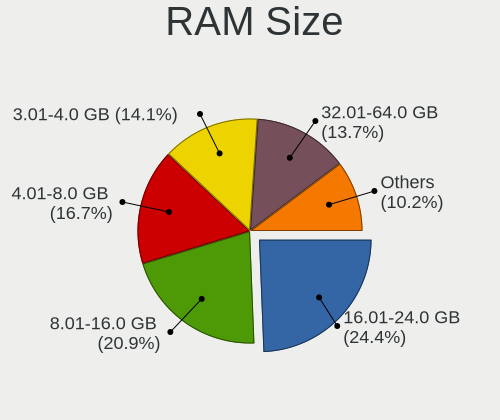
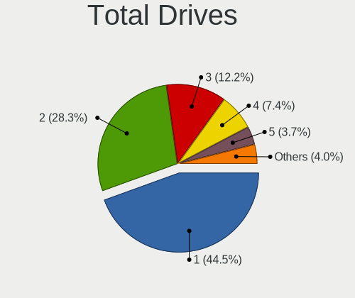
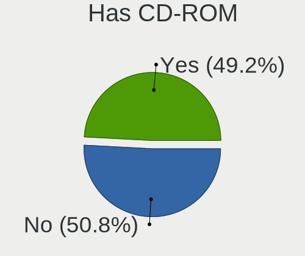
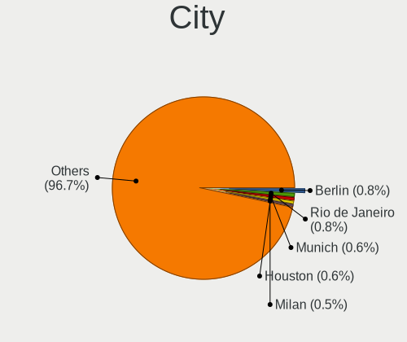
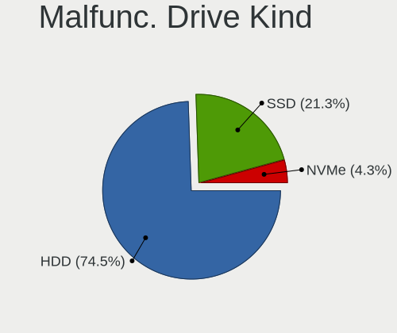

Zorin 16 - Tested Hardware & Statistics (Desktops)
--------------------------------------------------

A project to collect tested hardware configurations for Zorin 16.

Anyone can contribute to this report by the [hw-probe](https://github.com/linuxhw/hw-probe) tool:

    sudo -E hw-probe -all -upload

Please submit a probe of your configuration if it's not presented on the page or is rare.

Full-feature report is available here: https://linux-hardware.org/?view=trends&rel=zorin-16

Contents
--------

* [ Test Cases ](#test-cases)

* [ System ](#system)
  - [ Kernel                   ](#kernel)
  - [ Kernel Family            ](#kernel-family)
  - [ Kernel Major Ver.        ](#kernel-major-ver)
  - [ Arch                     ](#arch)
  - [ DE                       ](#de)
  - [ Display Server           ](#display-server)
  - [ Display Manager          ](#display-manager)
  - [ OS Lang                  ](#os-lang)
  - [ Boot Mode                ](#boot-mode)
  - [ Filesystem               ](#filesystem)
  - [ Part. scheme             ](#part-scheme)
  - [ Dual Boot with Linux/BSD ](#dual-boot-with-linuxbsd)
  - [ Dual Boot (Win)          ](#dual-boot-win)

* [ Board ](#board)
  - [ Vendor                   ](#vendor)
  - [ Model                    ](#model)
  - [ Model Family             ](#model-family)
  - [ MFG Year                 ](#mfg-year)
  - [ Form Factor              ](#form-factor)
  - [ Secure Boot              ](#secure-boot)
  - [ Coreboot                 ](#coreboot)
  - [ RAM Size                 ](#ram-size)
  - [ RAM Used                 ](#ram-used)
  - [ Total Drives             ](#total-drives)
  - [ Has CD-ROM               ](#has-cd-rom)
  - [ Has Ethernet             ](#has-ethernet)
  - [ Has WiFi                 ](#has-wifi)
  - [ Has Bluetooth            ](#has-bluetooth)

* [ Location ](#location)
  - [ Country                  ](#country)
  - [ City                     ](#city)

* [ Drives ](#drives)
  - [ Drive Vendor             ](#drive-vendor)
  - [ Drive Model              ](#drive-model)
  - [ HDD Vendor               ](#hdd-vendor)
  - [ SSD Vendor               ](#ssd-vendor)
  - [ Drive Kind               ](#drive-kind)
  - [ Drive Connector          ](#drive-connector)
  - [ Drive Size               ](#drive-size)
  - [ Space Total              ](#space-total)
  - [ Space Used               ](#space-used)
  - [ Malfunc. Drives          ](#malfunc-drives)
  - [ Malfunc. Drive Vendor    ](#malfunc-drive-vendor)
  - [ Malfunc. HDD Vendor      ](#malfunc-hdd-vendor)
  - [ Malfunc. Drive Kind      ](#malfunc-drive-kind)
  - [ Failed Drives            ](#failed-drives)
  - [ Failed Drive Vendor      ](#failed-drive-vendor)
  - [ Drive Status             ](#drive-status)

* [ Storage controller ](#storage-controller)
  - [ Storage Vendor           ](#storage-vendor)
  - [ Storage Model            ](#storage-model)
  - [ Storage Kind             ](#storage-kind)

* [ Processor ](#processor)
  - [ CPU Vendor               ](#cpu-vendor)
  - [ CPU Model                ](#cpu-model)
  - [ CPU Model Family         ](#cpu-model-family)
  - [ CPU Cores                ](#cpu-cores)
  - [ CPU Sockets              ](#cpu-sockets)
  - [ CPU Threads              ](#cpu-threads)
  - [ CPU Op-Modes             ](#cpu-op-modes)
  - [ CPU Microcode            ](#cpu-microcode)
  - [ CPU Microarch            ](#cpu-microarch)

* [ Graphics ](#graphics)
  - [ GPU Vendor               ](#gpu-vendor)
  - [ GPU Model                ](#gpu-model)
  - [ GPU Combo                ](#gpu-combo)
  - [ GPU Driver               ](#gpu-driver)
  - [ GPU Memory               ](#gpu-memory)

* [ Monitor ](#monitor)
  - [ Monitor Vendor           ](#monitor-vendor)
  - [ Monitor Model            ](#monitor-model)
  - [ Monitor Resolution       ](#monitor-resolution)
  - [ Monitor Diagonal         ](#monitor-diagonal)
  - [ Monitor Width            ](#monitor-width)
  - [ Aspect Ratio             ](#aspect-ratio)
  - [ Monitor Area             ](#monitor-area)
  - [ Pixel Density            ](#pixel-density)
  - [ Multiple Monitors        ](#multiple-monitors)

* [ Network ](#network)
  - [ Net Controller Vendor    ](#net-controller-vendor)
  - [ Net Controller Model     ](#net-controller-model)
  - [ Wireless Vendor          ](#wireless-vendor)
  - [ Wireless Model           ](#wireless-model)
  - [ Ethernet Vendor          ](#ethernet-vendor)
  - [ Ethernet Model           ](#ethernet-model)
  - [ Net Controller Kind      ](#net-controller-kind)
  - [ Used Controller          ](#used-controller)
  - [ NICs                     ](#nics)
  - [ IPv6                     ](#ipv6)

* [ Bluetooth ](#bluetooth)
  - [ Bluetooth Vendor         ](#bluetooth-vendor)
  - [ Bluetooth Model          ](#bluetooth-model)

* [ Sound ](#sound)
  - [ Sound Vendor             ](#sound-vendor)
  - [ Sound Model              ](#sound-model)

* [ Memory ](#memory)
  - [ Memory Vendor            ](#memory-vendor)
  - [ Memory Model             ](#memory-model)
  - [ Memory Kind              ](#memory-kind)
  - [ Memory Form Factor       ](#memory-form-factor)
  - [ Memory Size              ](#memory-size)
  - [ Memory Speed             ](#memory-speed)

* [ Printers & scanners ](#printers--scanners)
  - [ Printer Vendor           ](#printer-vendor)
  - [ Printer Model            ](#printer-model)
  - [ Scanner Vendor           ](#scanner-vendor)
  - [ Scanner Model            ](#scanner-model)

* [ Camera ](#camera)
  - [ Camera Vendor            ](#camera-vendor)
  - [ Camera Model             ](#camera-model)

* [ Security ](#security)
  - [ Fingerprint Vendor       ](#fingerprint-vendor)
  - [ Fingerprint Model        ](#fingerprint-model)
  - [ Chipcard Vendor          ](#chipcard-vendor)
  - [ Chipcard Model           ](#chipcard-model)

* [ Unsupported ](#unsupported)
  - [ Unsupported Devices      ](#unsupported-devices)
  - [ Unsupported Device Types ](#unsupported-device-types)

Test Cases
----------

| Vendor        | Model                       | Probe                                                      | Date         |
|---------------|-----------------------------|------------------------------------------------------------|--------------|
| Lenovo        | IdeaCentre K330             | [ed6e765fea](https://linux-hardware.org/?probe=ed6e765fea) | Sep 29, 2021 |
| Gigabyte      | J4005ND2P-CF                | [699985f9e6](https://linux-hardware.org/?probe=699985f9e6) | Sep 28, 2021 |
| Gigabyte      | J4005ND2P-CF                | [d82bdfcf17](https://linux-hardware.org/?probe=d82bdfcf17) | Sep 28, 2021 |
| ASUSTek       | PRIME B450M-A               | [d5b8eb94d7](https://linux-hardware.org/?probe=d5b8eb94d7) | Sep 28, 2021 |
| Dell          | 0TNXNR A01                  | [781c19cc33](https://linux-hardware.org/?probe=781c19cc33) | Sep 27, 2021 |
| Dell          | 0D6H9T A02                  | [30e914656e](https://linux-hardware.org/?probe=30e914656e) | Sep 27, 2021 |
| ASUSTek       | TUF GAMING X570-PRO         | [0625659706](https://linux-hardware.org/?probe=0625659706) | Sep 27, 2021 |
| Dell          | 0TP406                      | [39f9e67ae2](https://linux-hardware.org/?probe=39f9e67ae2) | Sep 26, 2021 |
| HP            | 18E7                        | [94f692683b](https://linux-hardware.org/?probe=94f692683b) | Sep 26, 2021 |
| ASUSTek       | ROG Maximus XIII HERO       | [4bc5eb3bbc](https://linux-hardware.org/?probe=4bc5eb3bbc) | Sep 25, 2021 |
| eMachines     | EL1850G                     | [f5b47069bb](https://linux-hardware.org/?probe=f5b47069bb) | Sep 25, 2021 |
| Lenovo        | ThinkCentre M58 3231W2Y     | [a2da2733ac](https://linux-hardware.org/?probe=a2da2733ac) | Sep 25, 2021 |
| Gigabyte      | GA-78LMT-USB3               | [5cc1a01b2f](https://linux-hardware.org/?probe=5cc1a01b2f) | Sep 25, 2021 |
| Gigabyte      | GA-78LMT-USB3               | [2b341862f1](https://linux-hardware.org/?probe=2b341862f1) | Sep 25, 2021 |
| ASUSTek       | ROG Maximus XIII HERO       | [65ebe53761](https://linux-hardware.org/?probe=65ebe53761) | Sep 25, 2021 |
| MSI           | B75MA-P45                   | [663af51c43](https://linux-hardware.org/?probe=663af51c43) | Sep 24, 2021 |
| MSI           | B75MA-P45                   | [4d4844cfbe](https://linux-hardware.org/?probe=4d4844cfbe) | Sep 24, 2021 |
| Lenovo        | ThinkCentre M81 0385AW6     | [dc87018670](https://linux-hardware.org/?probe=dc87018670) | Sep 24, 2021 |
| ASUSTek       | ROG STRIX B550-F GAMING     | [8617cbbc27](https://linux-hardware.org/?probe=8617cbbc27) | Sep 24, 2021 |
| ASRock        | 775VM800                    | [e07158e4ab](https://linux-hardware.org/?probe=e07158e4ab) | Sep 24, 2021 |
| HP            | 18E7                        | [29fa39d7e9](https://linux-hardware.org/?probe=29fa39d7e9) | Sep 23, 2021 |
| ASRock        | 880GMH/U3S3                 | [ec55312287](https://linux-hardware.org/?probe=ec55312287) | Sep 23, 2021 |
| Gigabyte      | B75M-D3H                    | [cb23f25d7f](https://linux-hardware.org/?probe=cb23f25d7f) | Sep 23, 2021 |
| ASUSTek       | PRIME B450M-GAMING/BR       | [74410f0d0c](https://linux-hardware.org/?probe=74410f0d0c) | Sep 23, 2021 |
| ASUSTek       | PRIME B450M-GAMING/BR       | [ad81766325](https://linux-hardware.org/?probe=ad81766325) | Sep 23, 2021 |
| ASUSTek       | M32CD_A_F_K20CD_K31CD       | [bc7d0dc232](https://linux-hardware.org/?probe=bc7d0dc232) | Sep 22, 2021 |
| Lenovo        | ThinkCentre M81 0385AW6     | [529a9f4c74](https://linux-hardware.org/?probe=529a9f4c74) | Sep 22, 2021 |
| HP            | 213D A01                    | [8d4dd8359c](https://linux-hardware.org/?probe=8d4dd8359c) | Sep 21, 2021 |
| Gigabyte      | H370 AORUS GAMING 3 WIFI... | [3354edcb58](https://linux-hardware.org/?probe=3354edcb58) | Sep 21, 2021 |
| Gigabyte      | B75M-D3H                    | [3ef59689e6](https://linux-hardware.org/?probe=3ef59689e6) | Sep 21, 2021 |
| MSI           | H81M-E33                    | [5ef84c22e6](https://linux-hardware.org/?probe=5ef84c22e6) | Sep 20, 2021 |
| MSI           | H81M-E33                    | [db96085729](https://linux-hardware.org/?probe=db96085729) | Sep 20, 2021 |
| ASUSTek       | PRIME B450-PLUS             | [a0b7d0cf25](https://linux-hardware.org/?probe=a0b7d0cf25) | Sep 20, 2021 |
| ASUSTek       | PRIME B450M-GAMING/BR       | [c05636068f](https://linux-hardware.org/?probe=c05636068f) | Sep 20, 2021 |
| ASUSTek       | PRIME B450M-GAMING/BR       | [1a012b3021](https://linux-hardware.org/?probe=1a012b3021) | Sep 20, 2021 |
| ASUSTek       | M5A78L-M LX V2              | [b9259e3604](https://linux-hardware.org/?probe=b9259e3604) | Sep 20, 2021 |
| ASUSTek       | M5A78L-M LX V2              | [9eb1254056](https://linux-hardware.org/?probe=9eb1254056) | Sep 19, 2021 |
| Gigabyte      | Z77-D3H                     | [c86625aa34](https://linux-hardware.org/?probe=c86625aa34) | Sep 19, 2021 |
| HP            | 2B28                        | [14681c925a](https://linux-hardware.org/?probe=14681c925a) | Sep 19, 2021 |
| Sapphire T... | PURE PLATINUM 970A-PLUS     | [d64d86eced](https://linux-hardware.org/?probe=d64d86eced) | Sep 19, 2021 |
| ASRock        | FM2A58M-DG3+                | [183fc0dd5e](https://linux-hardware.org/?probe=183fc0dd5e) | Sep 18, 2021 |
| Gigabyte      | B450 AORUS PRO WIFI-CF      | [bc3e2da7f3](https://linux-hardware.org/?probe=bc3e2da7f3) | Sep 18, 2021 |
| Gigabyte      | A320M-S2H-CF                | [e8f361170f](https://linux-hardware.org/?probe=e8f361170f) | Sep 18, 2021 |
| ASUSTek       | M4A88TD-V EVO/USB3          | [30f36dc15d](https://linux-hardware.org/?probe=30f36dc15d) | Sep 17, 2021 |
| ASRock        | B450 Pro4                   | [042032eec7](https://linux-hardware.org/?probe=042032eec7) | Sep 16, 2021 |
| Intel         | X99                         | [814b3326d1](https://linux-hardware.org/?probe=814b3326d1) | Sep 15, 2021 |
| NCR           | Talladega                   | [95445fa221](https://linux-hardware.org/?probe=95445fa221) | Sep 14, 2021 |
| MSI           | B75MA-P45                   | [93a071ca7e](https://linux-hardware.org/?probe=93a071ca7e) | Sep 14, 2021 |
| Foxconn       | 17A0                        | [06052023d3](https://linux-hardware.org/?probe=06052023d3) | Sep 14, 2021 |
| MSI           | B75MA-P45                   | [874dcada55](https://linux-hardware.org/?probe=874dcada55) | Sep 14, 2021 |
| ASUSTek       | M5A97 LE R2.0               | [b3b1991c64](https://linux-hardware.org/?probe=b3b1991c64) | Sep 14, 2021 |
| ASUSTek       | NARRA3                      | [93db4618cc](https://linux-hardware.org/?probe=93db4618cc) | Sep 14, 2021 |
| ASUSTek       | Benicia                     | [2a764dd662](https://linux-hardware.org/?probe=2a764dd662) | Sep 13, 2021 |
| ASUSTek       | Maximus VIII RANGER         | [6928772253](https://linux-hardware.org/?probe=6928772253) | Sep 12, 2021 |
| ASUSTek       | Maximus VIII RANGER         | [93a0d7ac6a](https://linux-hardware.org/?probe=93a0d7ac6a) | Sep 12, 2021 |
| HP            | 339A                        | [9284a70a92](https://linux-hardware.org/?probe=9284a70a92) | Sep 12, 2021 |
| ASUSTek       | P5Q                         | [8693b86435](https://linux-hardware.org/?probe=8693b86435) | Sep 12, 2021 |
| NCR           | Talladega                   | [6de6d8c2a3](https://linux-hardware.org/?probe=6de6d8c2a3) | Sep 12, 2021 |
| ASUSTek       | NARRA3                      | [6b02d3fa6f](https://linux-hardware.org/?probe=6b02d3fa6f) | Sep 11, 2021 |
| Gigabyte      | 970A-DS3P                   | [8b0f703471](https://linux-hardware.org/?probe=8b0f703471) | Sep 11, 2021 |
| Lenovo        | SDK0E50519 WIN              | [7c58527193](https://linux-hardware.org/?probe=7c58527193) | Sep 11, 2021 |
| Intel         | X79M-S                      | [95d22f6e90](https://linux-hardware.org/?probe=95d22f6e90) | Sep 11, 2021 |
| ASUSTek       | P5GC-MX/1333                | [1ff7b16ce4](https://linux-hardware.org/?probe=1ff7b16ce4) | Sep 10, 2021 |
| ASUSTek       | Z170 PRO GAMING             | [dab9a23b27](https://linux-hardware.org/?probe=dab9a23b27) | Sep 10, 2021 |
| Gigabyte      | B450 AORUS PRO WIFI-CF      | [34e6b7697f](https://linux-hardware.org/?probe=34e6b7697f) | Sep 09, 2021 |
| ASUSTek       | ROG Maximus X HERO          | [5ce713a2f7](https://linux-hardware.org/?probe=5ce713a2f7) | Sep 09, 2021 |
| ASUSTek       | NARRA3                      | [52b22746e0](https://linux-hardware.org/?probe=52b22746e0) | Sep 09, 2021 |
| HP            | 2187 A01                    | [0c11e3b726](https://linux-hardware.org/?probe=0c11e3b726) | Sep 09, 2021 |
| MSI           | B450M MORTAR MAX            | [f40c6b596c](https://linux-hardware.org/?probe=f40c6b596c) | Sep 08, 2021 |
| Dell          | 09KPNV A01                  | [f3c9b271f1](https://linux-hardware.org/?probe=f3c9b271f1) | Sep 08, 2021 |
| MSI           | B450M MORTAR MAX            | [7dbf053877](https://linux-hardware.org/?probe=7dbf053877) | Sep 08, 2021 |
| MSI           | H81M-P33                    | [92b799f852](https://linux-hardware.org/?probe=92b799f852) | Sep 08, 2021 |
| MSI           | B450M MORTAR MAX            | [17c58396b6](https://linux-hardware.org/?probe=17c58396b6) | Sep 08, 2021 |
| MSI           | B450M MORTAR MAX            | [dfe73847d3](https://linux-hardware.org/?probe=dfe73847d3) | Sep 08, 2021 |
| Dell          | 0D28YY A03                  | [3eb7b9cb7b](https://linux-hardware.org/?probe=3eb7b9cb7b) | Sep 08, 2021 |
| ASUSTek       | P5G41T-M LX3                | [2f680da4b8](https://linux-hardware.org/?probe=2f680da4b8) | Sep 07, 2021 |
| Unknown       | Unknown                     | [b00795951c](https://linux-hardware.org/?probe=b00795951c) | Sep 07, 2021 |
| MSI           | B560M PRO-VDH               | [807eed7553](https://linux-hardware.org/?probe=807eed7553) | Sep 06, 2021 |
| ASRock        | Q1900M                      | [3f08533d5f](https://linux-hardware.org/?probe=3f08533d5f) | Sep 06, 2021 |
| ASRock        | Q1900M                      | [d342919044](https://linux-hardware.org/?probe=d342919044) | Sep 06, 2021 |
| Intel         | X79M-S                      | [e45160873d](https://linux-hardware.org/?probe=e45160873d) | Sep 06, 2021 |
| ASUSTek       | M5A97                       | [28754f0456](https://linux-hardware.org/?probe=28754f0456) | Sep 06, 2021 |
| Gigabyte      | G31M-ES2L                   | [d94c35ce11](https://linux-hardware.org/?probe=d94c35ce11) | Sep 05, 2021 |
| MSI           | IONA                        | [8a4454604a](https://linux-hardware.org/?probe=8a4454604a) | Sep 05, 2021 |
| ASUSTek       | M5A97 LE R2.0               | [791768dfbd](https://linux-hardware.org/?probe=791768dfbd) | Sep 04, 2021 |
| MSI           | IONA                        | [b775cef84a](https://linux-hardware.org/?probe=b775cef84a) | Sep 04, 2021 |
| ASUSTek       | NARRA3                      | [920ab9b385](https://linux-hardware.org/?probe=920ab9b385) | Sep 04, 2021 |
| Gigabyte      | Z490 AORUS ELITE            | [149099265c](https://linux-hardware.org/?probe=149099265c) | Sep 04, 2021 |
| Intel         | DQ77MK AAG39642-500         | [391c101a92](https://linux-hardware.org/?probe=391c101a92) | Sep 04, 2021 |
| HP            | 2B4B                        | [d36296bddf](https://linux-hardware.org/?probe=d36296bddf) | Sep 04, 2021 |
| ASUSTek       | Z170I PRO GAMING            | [9e6ccaa1f3](https://linux-hardware.org/?probe=9e6ccaa1f3) | Sep 04, 2021 |
| Biostar       | X470NH                      | [f0449b9946](https://linux-hardware.org/?probe=f0449b9946) | Sep 04, 2021 |
| Gigabyte      | A320M-S2H-CF                | [126d9974b1](https://linux-hardware.org/?probe=126d9974b1) | Sep 03, 2021 |
| HP            | 1497                        | [fd4cf5c840](https://linux-hardware.org/?probe=fd4cf5c840) | Sep 01, 2021 |
| Gigabyte      | B460M DS3H                  | [ef23780b19](https://linux-hardware.org/?probe=ef23780b19) | Aug 31, 2021 |
| Positivo      | POS-PIH81DI                 | [baa289fe51](https://linux-hardware.org/?probe=baa289fe51) | Aug 31, 2021 |
| Positivo      | POS-PIH81DI                 | [cc326a093e](https://linux-hardware.org/?probe=cc326a093e) | Aug 31, 2021 |
| HP            | 339A                        | [5a5ab8d1c2](https://linux-hardware.org/?probe=5a5ab8d1c2) | Aug 31, 2021 |
| HP            | 339A                        | [c0043e4c4c](https://linux-hardware.org/?probe=c0043e4c4c) | Aug 31, 2021 |
| ASUSTek       | TUF GAMING B550-PLUS        | [4c711d446d](https://linux-hardware.org/?probe=4c711d446d) | Aug 31, 2021 |
| ASUSTek       | TUF GAMING B550-PLUS        | [efb9bccc60](https://linux-hardware.org/?probe=efb9bccc60) | Aug 31, 2021 |
| Intel         | DQ77MK AAG39642-500         | [000d760a55](https://linux-hardware.org/?probe=000d760a55) | Aug 30, 2021 |
| Positivo      | POS-PIH81DI                 | [3b05a7b317](https://linux-hardware.org/?probe=3b05a7b317) | Aug 30, 2021 |
| MSI           | Z87-G43                     | [a219ff197d](https://linux-hardware.org/?probe=a219ff197d) | Aug 29, 2021 |
| MSI           | MPG X570 GAMING PLUS        | [01a43874df](https://linux-hardware.org/?probe=01a43874df) | Aug 28, 2021 |
| ASUSTek       | PRIME A320M-K               | [f7a948129f](https://linux-hardware.org/?probe=f7a948129f) | Aug 28, 2021 |
| ASUSTek       | P8H61-M LX2 R2.0            | [5cd3f43e28](https://linux-hardware.org/?probe=5cd3f43e28) | Aug 28, 2021 |
| Gigabyte      | A320M-S2H-CF                | [6ed5f8c32b](https://linux-hardware.org/?probe=6ed5f8c32b) | Aug 27, 2021 |
| ASRock        | Z390 Phantom Gaming 4-IB    | [b01269fbc1](https://linux-hardware.org/?probe=b01269fbc1) | Aug 27, 2021 |
| Lenovo        | SHARKBAY SDK0E50510 WIN     | [51661e959e](https://linux-hardware.org/?probe=51661e959e) | Aug 26, 2021 |
| Lenovo        | SHARKBAY SDK0E50510 WIN     | [3a7eb89cd8](https://linux-hardware.org/?probe=3a7eb89cd8) | Aug 25, 2021 |
| HP            | 802E                        | [3ee51e8a56](https://linux-hardware.org/?probe=3ee51e8a56) | Aug 25, 2021 |
| ASUSTek       | P8Z77-V LX                  | [314859d762](https://linux-hardware.org/?probe=314859d762) | Aug 25, 2021 |
| ASUSTek       | P8Z77-V LX                  | [faaf8bc158](https://linux-hardware.org/?probe=faaf8bc158) | Aug 25, 2021 |
| Dell          | 088DT1 A01                  | [8620323354](https://linux-hardware.org/?probe=8620323354) | Aug 25, 2021 |
| Dell          | 0TP406                      | [72a3d9ac12](https://linux-hardware.org/?probe=72a3d9ac12) | Aug 25, 2021 |
| HP            | 2B4B                        | [4c5411522b](https://linux-hardware.org/?probe=4c5411522b) | Aug 25, 2021 |
| Gigabyte      | B85M-D3H                    | [906a3e006c](https://linux-hardware.org/?probe=906a3e006c) | Aug 24, 2021 |
| Gigabyte      | B85M-D3H                    | [9f369218ff](https://linux-hardware.org/?probe=9f369218ff) | Aug 24, 2021 |
| ASUSTek       | P8Z77-V LE                  | [a720e3326a](https://linux-hardware.org/?probe=a720e3326a) | Aug 23, 2021 |
| MSI           | B450M PRO-M2 MAX            | [e6f053c5be](https://linux-hardware.org/?probe=e6f053c5be) | Aug 22, 2021 |
| ASUSTek       | ROG STRIX Z490-E GAMING     | [15175b4f4f](https://linux-hardware.org/?probe=15175b4f4f) | Aug 22, 2021 |
| ASUSTek       | ROG STRIX Z490-E GAMING     | [02ccc1eb70](https://linux-hardware.org/?probe=02ccc1eb70) | Aug 22, 2021 |
| ASUSTek       | M5A97 R2.0                  | [372a125910](https://linux-hardware.org/?probe=372a125910) | Aug 22, 2021 |
| Lenovo        | Board                       | [b4e9579228](https://linux-hardware.org/?probe=b4e9579228) | Aug 21, 2021 |
| Lenovo        | Board                       | [12088eed17](https://linux-hardware.org/?probe=12088eed17) | Aug 21, 2021 |
| MSI           | B450M PRO-M2 MAX            | [68c6a2734b](https://linux-hardware.org/?probe=68c6a2734b) | Aug 21, 2021 |
| Intel         | DB75EN AAG39650-303         | [4bbb9f60f9](https://linux-hardware.org/?probe=4bbb9f60f9) | Aug 20, 2021 |
| Fujitsu       | D3220-A1 S26361-D3220-A1    | [63cbb9e7fd](https://linux-hardware.org/?probe=63cbb9e7fd) | Aug 19, 2021 |
| MSI           | Z97 XPOWER AC               | [c68138439d](https://linux-hardware.org/?probe=c68138439d) | Aug 19, 2021 |
| ASUSTek       | M5A78L-M/USB3               | [d78450d852](https://linux-hardware.org/?probe=d78450d852) | Aug 19, 2021 |
| Acer          | Aspire XC-605G              | [8bb6f8ef72](https://linux-hardware.org/?probe=8bb6f8ef72) | Aug 18, 2021 |
| ASUSTek       | B85M-G R2.0                 | [daf6bf889f](https://linux-hardware.org/?probe=daf6bf889f) | Aug 18, 2021 |
| MSI           | Z270-A PRO                  | [3be5b7f90e](https://linux-hardware.org/?probe=3be5b7f90e) | Aug 18, 2021 |
| Gigabyte      | B550M DS3H                  | [4b687b4c17](https://linux-hardware.org/?probe=4b687b4c17) | Aug 16, 2021 |
| ASUSTek       | Z97-C                       | [97b71d18de](https://linux-hardware.org/?probe=97b71d18de) | Aug 16, 2021 |
| ASUSTek       | Z97-C                       | [06872ddde7](https://linux-hardware.org/?probe=06872ddde7) | Aug 16, 2021 |
| ASUSTek       | Z97-C                       | [a1f448c1f6](https://linux-hardware.org/?probe=a1f448c1f6) | Aug 15, 2021 |
| ASUSTek       | PRIME X570-PRO              | [fb7eb46b29](https://linux-hardware.org/?probe=fb7eb46b29) | Aug 11, 2021 |
| ASUSTek       | SABERTOOTH Z97 MARK 1       | [fb8a0b07d1](https://linux-hardware.org/?probe=fb8a0b07d1) | Aug 10, 2021 |
| ASUSTek       | M5A97 LE R2.0               | [4d9eaaf5a8](https://linux-hardware.org/?probe=4d9eaaf5a8) | Aug 09, 2021 |
| Gigabyte      | B550M H                     | [b26c567912](https://linux-hardware.org/?probe=b26c567912) | Aug 03, 2021 |
| ASUSTek       | M5A78L-M/USB3               | [9c841a04d6](https://linux-hardware.org/?probe=9c841a04d6) | Aug 01, 2021 |
| Gigabyte      | H61M-USB3-B3                | [3c2020fbb6](https://linux-hardware.org/?probe=3c2020fbb6) | Jul 30, 2021 |
| Gigabyte      | H61M-USB3-B3                | [b3bbc6d937](https://linux-hardware.org/?probe=b3bbc6d937) | Jul 30, 2021 |
| Dell          | 0V8WGR A00                  | [2cf38ffd15](https://linux-hardware.org/?probe=2cf38ffd15) | Jul 14, 2021 |
| ASUSTek       | P8H61-M LE                  | [b0270beb17](https://linux-hardware.org/?probe=b0270beb17) | Jul 11, 2021 |
| ASUSTek       | P8H61-M LE                  | [896e6feb8a](https://linux-hardware.org/?probe=896e6feb8a) | Jul 11, 2021 |
| Lenovo        | 36C5 SDK0J40700 WIN 3258... | [20bf622c31](https://linux-hardware.org/?probe=20bf622c31) | Jun 25, 2021 |
| ASUSTek       | PRIME B450M-GAMING/BR       | [35605881d6](https://linux-hardware.org/?probe=35605881d6) | Jun 23, 2021 |
| MSI           | 2AE0                        | [bce75d51cd](https://linux-hardware.org/?probe=bce75d51cd) | Jun 23, 2021 |
| MSI           | 2AE0                        | [0412c710eb](https://linux-hardware.org/?probe=0412c710eb) | Jun 22, 2021 |
| ASUSTek       | PRIME B450M-GAMING/BR       | [b9d86eb932](https://linux-hardware.org/?probe=b9d86eb932) | Jun 17, 2021 |
| ASUSTek       | PRIME B450M-GAMING/BR       | [71de5617aa](https://linux-hardware.org/?probe=71de5617aa) | Jun 17, 2021 |
| ASUSTek       | PRIME X570-P                | [bca1e1b92f](https://linux-hardware.org/?probe=bca1e1b92f) | Jun 16, 2021 |
| ASUSTek       | PRIME X570-P                | [b3f6c76103](https://linux-hardware.org/?probe=b3f6c76103) | Jun 16, 2021 |
| Gigabyte      | B85-HD3                     | [c73931b3ff](https://linux-hardware.org/?probe=c73931b3ff) | Jun 13, 2021 |
| HP            | 843C                        | [ccff6e4f39](https://linux-hardware.org/?probe=ccff6e4f39) | Jun 08, 2021 |
| ASRock        | 990FX Extreme6              | [fc3b27abac](https://linux-hardware.org/?probe=fc3b27abac) | Jun 03, 2021 |
| HP            | 8591                        | [6f71430d88](https://linux-hardware.org/?probe=6f71430d88) | Jun 01, 2021 |
| HP            | 8591                        | [fc12c57885](https://linux-hardware.org/?probe=fc12c57885) | Jun 01, 2021 |
| ASRock        | 990FX Extreme6              | [0a228b18c1](https://linux-hardware.org/?probe=0a228b18c1) | May 30, 2021 |
| ASUSTek       | PRIME B450M-GAMING/BR       | [0144616bb9](https://linux-hardware.org/?probe=0144616bb9) | May 27, 2021 |
| Gigabyte      | 945GCM-S2L                  | [9890da0efd](https://linux-hardware.org/?probe=9890da0efd) | May 27, 2021 |
| Gigabyte      | 945GCM-S2L                  | [61e1972b06](https://linux-hardware.org/?probe=61e1972b06) | May 27, 2021 |
| Lenovo        | SHARKBAY 0B98401 PRO        | [887dbc1614](https://linux-hardware.org/?probe=887dbc1614) | May 24, 2021 |
| Biostar       | A320MH                      | [db3a18e1c3](https://linux-hardware.org/?probe=db3a18e1c3) | May 23, 2021 |
| Biostar       | A320MH                      | [ccb22fc057](https://linux-hardware.org/?probe=ccb22fc057) | May 23, 2021 |
| Lenovo        | SHARKBAY 0B98401 PRO        | [0c314899c1](https://linux-hardware.org/?probe=0c314899c1) | May 23, 2021 |
| ASUSTek       | PRIME B450M-GAMING/BR       | [c41eec9cd3](https://linux-hardware.org/?probe=c41eec9cd3) | May 21, 2021 |
| ASUSTek       | PRIME B450M-GAMING/BR       | [ca773b28ee](https://linux-hardware.org/?probe=ca773b28ee) | May 19, 2021 |
| ASUSTek       | P8H61-I R2.0                | [c641f2aee4](https://linux-hardware.org/?probe=c641f2aee4) | May 16, 2021 |
| ASUSTek       | P8H61-I R2.0                | [500443b449](https://linux-hardware.org/?probe=500443b449) | May 16, 2021 |
| Lenovo        | Annapurna CRB NOK           | [7d4224df3f](https://linux-hardware.org/?probe=7d4224df3f) | May 13, 2021 |
| Lenovo        | Annapurna CRB NOK           | [adef2ac504](https://linux-hardware.org/?probe=adef2ac504) | May 13, 2021 |
| Dell          | 06D7TR A00                  | [1ccb5b0600](https://linux-hardware.org/?probe=1ccb5b0600) | May 01, 2021 |
| Pegatron      | Benicia                     | [df847c36d5](https://linux-hardware.org/?probe=df847c36d5) | Apr 25, 2021 |
| Gigabyte      | B450 AORUS ELITE            | [7f46cdb7ab](https://linux-hardware.org/?probe=7f46cdb7ab) | Apr 24, 2021 |
| ASUSTek       | M4A88TD-V EVO/USB3          | [b00e95f3db](https://linux-hardware.org/?probe=b00e95f3db) | Apr 22, 2021 |
| ASUSTek       | P5K                         | [0149b6c450](https://linux-hardware.org/?probe=0149b6c450) | Apr 22, 2021 |
| Dell          | 0PGKWF A02                  | [f963717b2c](https://linux-hardware.org/?probe=f963717b2c) | Apr 18, 2021 |
| Acer          | Aspire XC-605G              | [79d3d3a05e](https://linux-hardware.org/?probe=79d3d3a05e) | Mar 18, 2021 |

System
------

Kernel
------

Version of the Linux kernel

| Version           | Desktops | Percent |
|-------------------|----------|---------|
| 5.11.0-27-generic | 52       | 41.27%  |
| 5.11.0-34-generic | 31       | 24.6%   |
| 5.11.0-36-generic | 12       | 9.52%   |
| 5.8.0-53-generic  | 7        | 5.56%   |
| 5.8.0-55-generic  | 5        | 3.97%   |
| 5.8.0-50-generic  | 5        | 3.97%   |
| 5.8.0-59-generic  | 3        | 2.38%   |
| 5.8.0-49-generic  | 3        | 2.38%   |
| 5.11.0-25-generic | 3        | 2.38%   |
| 5.8.0-63-generic  | 2        | 1.59%   |
| 5.11.0-37-generic | 2        | 1.59%   |
| 5.8.0-45-generic  | 1        | 0.79%   |

Kernel Family
-------------

Linux kernel without a distro release

| Version | Desktops | Percent |
|---------|----------|---------|
| 5.11.0  | 100      | 80%     |
| 5.8.0   | 25       | 20%     |

Kernel Major Ver.
-----------------

Linux kernel major version

| Version | Desktops | Percent |
|---------|----------|---------|
| 5.11    | 100      | 80%     |
| 5.8     | 25       | 20%     |

Arch
----

OS architecture (x86_64, i586, etc.)

| Name   | Desktops | Percent |
|--------|----------|---------|
| x86_64 | 122      | 100%    |

DE
--

Desktop Environment

| Name     | Desktops | Percent |
|----------|----------|---------|
| GNOME    | 118      | 95.93%  |
| XFCE     | 3        | 2.44%   |
| Cinnamon | 1        | 0.81%   |
| Unknown  | 1        | 0.81%   |

Display Server
--------------

X11 or Wayland

| Name | Desktops | Percent |
|------|----------|---------|
| X11  | 122      | 100%    |

Display Manager
---------------

SDDM, LightDM, etc.

| Name    | Desktops | Percent |
|---------|----------|---------|
| Unknown | 113      | 92.62%  |
| GDM     | 7        | 5.74%   |
| TDM     | 1        | 0.82%   |
| GDM3    | 1        | 0.82%   |

OS Lang
-------

Language

| Lang  | Desktops | Percent |
|-------|----------|---------|
| en_US | 50       | 40.98%  |
| de_DE | 13       | 10.66%  |
| en_GB | 12       | 9.84%   |
| pt_BR | 10       | 8.2%    |
| es_ES | 4        | 3.28%   |
| pl_PL | 3        | 2.46%   |
| nl_NL | 3        | 2.46%   |
| it_IT | 2        | 1.64%   |
| fr_CA | 2        | 1.64%   |
| es_MX | 2        | 1.64%   |
| en_ZA | 2        | 1.64%   |
| en_IN | 2        | 1.64%   |
| en_CA | 2        | 1.64%   |
| en_AU | 2        | 1.64%   |
| zh_CN | 1        | 0.82%   |
| sv_SE | 1        | 0.82%   |
| pt_PT | 1        | 0.82%   |
| nl_BE | 1        | 0.82%   |
| hu_HU | 1        | 0.82%   |
| es_PE | 1        | 0.82%   |
| es_PA | 1        | 0.82%   |
| es_GT | 1        | 0.82%   |
| es_CL | 1        | 0.82%   |
| en_SG | 1        | 0.82%   |
| en_NZ | 1        | 0.82%   |
| de_CH | 1        | 0.82%   |
| cs_CZ | 1        | 0.82%   |

Boot Mode
---------

EFI or BIOS

| Mode | Desktops | Percent |
|------|----------|---------|
| BIOS | 66       | 54.1%   |
| EFI  | 56       | 45.9%   |

Filesystem
----------

Type of filesystem

| Type    | Desktops | Percent |
|---------|----------|---------|
| Ext4    | 114      | 93.44%  |
| Zfs     | 3        | 2.46%   |
| Overlay | 3        | 2.46%   |
| Xfs     | 1        | 0.82%   |
| Btrfs   | 1        | 0.82%   |

Part. scheme
------------

Scheme of partitioning

| Type    | Desktops | Percent |
|---------|----------|---------|
| Unknown | 113      | 92.62%  |
| GPT     | 7        | 5.74%   |
| MBR     | 2        | 1.64%   |

Dual Boot with Linux/BSD
------------------------

Hosting more than one Linux/BSD

| Dual boot | Desktops | Percent |
|-----------|----------|---------|
| No        | 118      | 95.93%  |
| Yes       | 5        | 4.07%   |

Dual Boot (Win)
---------------

Hosting Linux and Windows

| Dual boot | Desktops | Percent |
|-----------|----------|---------|
| No        | 103      | 84.43%  |
| Yes       | 19       | 15.57%  |

Board
-----

Vendor
------

Motherboard manufacturer

| Name                        | Desktops | Percent |
|-----------------------------|----------|---------|
| ASUSTek Computer            | 39       | 31.97%  |
| Gigabyte Technology         | 20       | 16.39%  |
| MSI                         | 12       | 9.84%   |
| Hewlett-Packard             | 11       | 9.02%   |
| Lenovo                      | 9        | 7.38%   |
| Dell                        | 9        | 7.38%   |
| ASRock                      | 7        | 5.74%   |
| Intel                       | 5        | 4.1%    |
| Biostar                     | 2        | 1.64%   |
| Sapphire Technology Limited | 1        | 0.82%   |
| Positivo                    | 1        | 0.82%   |
| Pegatron                    | 1        | 0.82%   |
| NCR                         | 1        | 0.82%   |
| Fujitsu                     | 1        | 0.82%   |
| Foxconn                     | 1        | 0.82%   |
| eMachines                   | 1        | 0.82%   |
| Acer                        | 1        | 0.82%   |

Model
-----

Motherboard model

| Name                                     | Desktops | Percent |
|------------------------------------------|----------|---------|
| Gigabyte A320M-S2H                       | 3        | 2.46%   |
| Dell OptiPlex 990                        | 3        | 2.46%   |
| ASUS All Series                          | 3        | 2.46%   |
| MSI MS-7817                              | 2        | 1.64%   |
| Intel DQ77MK-R01                         | 2        | 1.64%   |
| Dell XPS420                              | 2        | 1.64%   |
| ASUS PRIME B450M-GAMING/BR               | 2        | 1.64%   |
| ASUS M5A97 LE R2.0                       | 2        | 1.64%   |
| ASUS M5A78L-M/USB3                       | 2        | 1.64%   |
| Sapphire Limited PURE PLATINUM 970A-PLUS | 1        | 0.82%   |
| Positivo POS-PIH81DI                     | 1        | 0.82%   |
| Pegatron NE502AV-ABA a6750t              | 1        | 0.82%   |
| NCR xxxx-xxxx-xxxx                       | 1        | 0.82%   |
| MSI WE136AA-UUZ p6337ch                  | 1        | 0.82%   |
| MSI Pro 3515 Series                      | 1        | 0.82%   |
| MSI MS-7D18                              | 1        | 0.82%   |
| MSI MS-7C37                              | 1        | 0.82%   |
| MSI MS-7B89                              | 1        | 0.82%   |
| MSI MS-7B84                              | 1        | 0.82%   |
| MSI MS-7A71                              | 1        | 0.82%   |
| MSI MS-7914                              | 1        | 0.82%   |
| MSI MS-7816                              | 1        | 0.82%   |
| MSI MS-7798                              | 1        | 0.82%   |
| Lenovo ThinkCentre M83 MT-M 10AJ-0003MB  | 1        | 0.82%   |
| Lenovo ThinkCentre M81 0385AW6           | 1        | 0.82%   |
| Lenovo ThinkCentre M78 10BTA00ELM        | 1        | 0.82%   |
| Lenovo ThinkCentre M73 10B7S02L00        | 1        | 0.82%   |
| Lenovo ThinkCentre M58 3231W2Y           | 1        | 0.82%   |
| Lenovo SHARKBAY SDK0E50510 WIN           | 1        | 0.82%   |
| Lenovo IdeaCentre K330                   | 1        | 0.82%   |
| Lenovo IdeaCentre 510S-08IKL 90GB004RUS  | 1        | 0.82%   |
| Lenovo Board                             | 1        | 0.82%   |
| Intel X99                                | 1        | 0.82%   |
| Intel X79M-S                             | 1        | 0.82%   |
| Intel DB75EN AAG39650-303                | 1        | 0.82%   |
| HP Z240 SFF Workstation                  | 1        | 0.82%   |
| HP Z1 Entry Tower G5                     | 1        | 0.82%   |
| HP t620 PLUS Quad Core TC                | 1        | 0.82%   |
| HP t620 Dual Core TC                     | 1        | 0.82%   |
| HP ProDesk 600 G1 SFF                    | 1        | 0.82%   |
| HP Compaq Pro 6300 SFF                   | 1        | 0.82%   |
| HP Compaq Pro 6300 MT                    | 1        | 0.82%   |
| HP Compaq 6200 Pro SFF PC                | 1        | 0.82%   |
| HP 870-158ng                             | 1        | 0.82%   |
| HP 290 G2 MT Business PC                 | 1        | 0.82%   |
| HP 251-a123w                             | 1        | 0.82%   |
| Gigabyte Z77-D3H                         | 1        | 0.82%   |
| Gigabyte Z490 AORUS ELITE                | 1        | 0.82%   |
| Gigabyte Komputer OPTIMUS                | 1        | 0.82%   |
| Gigabyte J4005ND2P-CF                    | 1        | 0.82%   |
| Gigabyte H61M-USB3-B3                    | 1        | 0.82%   |
| Gigabyte H370AORUSGAMING3WIFI            | 1        | 0.82%   |
| Gigabyte GA-78LMT-USB3                   | 1        | 0.82%   |
| Gigabyte G31M-ES2L                       | 1        | 0.82%   |
| Gigabyte B85M-D3H                        | 1        | 0.82%   |
| Gigabyte B85-HD3                         | 1        | 0.82%   |
| Gigabyte B75M-D3H                        | 1        | 0.82%   |
| Gigabyte B550M H                         | 1        | 0.82%   |
| Gigabyte B550M DS3H                      | 1        | 0.82%   |
| Gigabyte B460MDS3H                       | 1        | 0.82%   |

Model Family
------------

Motherboard model prefix

| Name                          | Desktops | Percent |
|-------------------------------|----------|---------|
| ASUS PRIME                    | 6        | 4.92%   |
| Lenovo ThinkCentre            | 5        | 4.1%    |
| Dell OptiPlex                 | 5        | 4.1%    |
| ASUS ROG                      | 4        | 3.28%   |
| ASUS M5A97                    | 4        | 3.28%   |
| HP Compaq                     | 3        | 2.46%   |
| Gigabyte A320M-S2H            | 3        | 2.46%   |
| ASUS M5A78L-M                 | 3        | 2.46%   |
| ASUS All                      | 3        | 2.46%   |
| MSI MS-7817                   | 2        | 1.64%   |
| Lenovo IdeaCentre             | 2        | 1.64%   |
| Intel DQ77MK-R01              | 2        | 1.64%   |
| HP t620                       | 2        | 1.64%   |
| Gigabyte B550M                | 2        | 1.64%   |
| Gigabyte B450                 | 2        | 1.64%   |
| Dell XPS420                   | 2        | 1.64%   |
| ASUS TUF                      | 2        | 1.64%   |
| ASUS P8Z77-V                  | 2        | 1.64%   |
| ASUS P8H61-M                  | 2        | 1.64%   |
| Sapphire Limited PURE         | 1        | 0.82%   |
| Positivo POS-PIH81DI          | 1        | 0.82%   |
| Pegatron NE502AV-ABA          | 1        | 0.82%   |
| NCR xxxx-xxxx-xxxx            | 1        | 0.82%   |
| MSI WE136AA-UUZ               | 1        | 0.82%   |
| MSI Pro                       | 1        | 0.82%   |
| MSI MS-7D18                   | 1        | 0.82%   |
| MSI MS-7C37                   | 1        | 0.82%   |
| MSI MS-7B89                   | 1        | 0.82%   |
| MSI MS-7B84                   | 1        | 0.82%   |
| MSI MS-7A71                   | 1        | 0.82%   |
| MSI MS-7914                   | 1        | 0.82%   |
| MSI MS-7816                   | 1        | 0.82%   |
| MSI MS-7798                   | 1        | 0.82%   |
| Lenovo SHARKBAY               | 1        | 0.82%   |
| Lenovo Board                  | 1        | 0.82%   |
| Intel X99                     | 1        | 0.82%   |
| Intel X79M-S                  | 1        | 0.82%   |
| Intel DB75EN                  | 1        | 0.82%   |
| HP Z240                       | 1        | 0.82%   |
| HP Z1                         | 1        | 0.82%   |
| HP ProDesk                    | 1        | 0.82%   |
| HP 870-158ng                  | 1        | 0.82%   |
| HP 290                        | 1        | 0.82%   |
| HP 251-a123w                  | 1        | 0.82%   |
| Gigabyte Z77-D3H              | 1        | 0.82%   |
| Gigabyte Z490                 | 1        | 0.82%   |
| Gigabyte Komputer             | 1        | 0.82%   |
| Gigabyte J4005ND2P-CF         | 1        | 0.82%   |
| Gigabyte H61M-USB3-B3         | 1        | 0.82%   |
| Gigabyte H370AORUSGAMING3WIFI | 1        | 0.82%   |
| Gigabyte GA-78LMT-USB3        | 1        | 0.82%   |
| Gigabyte G31M-ES2L            | 1        | 0.82%   |
| Gigabyte B85M-D3H             | 1        | 0.82%   |
| Gigabyte B85-HD3              | 1        | 0.82%   |
| Gigabyte B75M-D3H             | 1        | 0.82%   |
| Gigabyte B460MDS3H            | 1        | 0.82%   |
| Gigabyte 970A-DS3P            | 1        | 0.82%   |
| Fujitsu ESPRIMO               | 1        | 0.82%   |
| Foxconn Pro                   | 1        | 0.82%   |
| eMachines EL1850G             | 1        | 0.82%   |

MFG Year
--------

Motherboard manufacture year

| Year | Desktops | Percent |
|------|----------|---------|
| 2020 | 17       | 13.93%  |
| 2021 | 14       | 11.48%  |
| 2014 | 13       | 10.66%  |
| 2018 | 12       | 9.84%   |
| 2015 | 10       | 8.2%    |
| 2013 | 10       | 8.2%    |
| 2012 | 9        | 7.38%   |
| 2019 | 8        | 6.56%   |
| 2010 | 7        | 5.74%   |
| 2016 | 6        | 4.92%   |
| 2011 | 6        | 4.92%   |
| 2008 | 4        | 3.28%   |
| 2009 | 3        | 2.46%   |
| 2017 | 1        | 0.82%   |
| 2007 | 1        | 0.82%   |
| 2006 | 1        | 0.82%   |

Form Factor
-----------

Physical design of the computer

| Name    | Desktops | Percent |
|---------|----------|---------|
| Desktop | 122      | 100%    |

Secure Boot
-----------

Enabled or disabled

| State    | Desktops | Percent |
|----------|----------|---------|
| Disabled | 114      | 93.44%  |
| Enabled  | 8        | 6.56%   |

Coreboot
--------

Have coreboot on board

| Used | Desktops | Percent |
|------|----------|---------|
| No   | 122      | 100%    |

RAM Size
--------

Total RAM memory

| Size in GB  | Desktops | Percent |
|-------------|----------|---------|
| 8.01-16.0   | 38       | 30.4%   |
| 16.01-24.0  | 31       | 24.8%   |
| 32.01-64.0  | 19       | 15.2%   |
| 4.01-8.0    | 17       | 13.6%   |
| 3.01-4.0    | 15       | 12%     |
| 64.01-256.0 | 2        | 1.6%    |
| 1.01-2.0    | 2        | 1.6%    |
| 24.01-32.0  | 1        | 0.8%    |

RAM Used
--------

Used RAM memory

| Used GB    | Desktops | Percent |
|------------|----------|---------|
| 1.01-2.0   | 60       | 48.39%  |
| 2.01-3.0   | 40       | 32.26%  |
| 3.01-4.0   | 12       | 9.68%   |
| 4.01-8.0   | 10       | 8.06%   |
| 16.01-24.0 | 1        | 0.81%   |
| 0.51-1.0   | 1        | 0.81%   |

Total Drives
------------

Number of drives on board

| Drives | Desktops | Percent |
|--------|----------|---------|
| 1      | 42       | 34.43%  |
| 2      | 39       | 31.97%  |
| 3      | 18       | 14.75%  |
| 4      | 11       | 9.02%   |
| 5      | 7        | 5.74%   |
| 8      | 2        | 1.64%   |
| 6      | 2        | 1.64%   |
| 0      | 1        | 0.82%   |

Has CD-ROM
----------

Has CD-ROM on board

| Presented | Desktops | Percent |
|-----------|----------|---------|
| Yes       | 72       | 58.54%  |
| No        | 51       | 41.46%  |

Has Ethernet
------------

Has Ethernet on board

| Presented | Desktops | Percent |
|-----------|----------|---------|
| Yes       | 122      | 100%    |

Has WiFi
--------

Has WiFi module

| Presented | Desktops | Percent |
|-----------|----------|---------|
| No        | 63       | 51.64%  |
| Yes       | 59       | 48.36%  |

Has Bluetooth
-------------

Has Bluetooth module

| Presented | Desktops | Percent |
|-----------|----------|---------|
| No        | 83       | 68.03%  |
| Yes       | 39       | 31.97%  |

Location
--------

Country
-------

Geographic location (country)

| Country      | Desktops | Percent |
|--------------|----------|---------|
| USA          | 32       | 26.23%  |
| Germany      | 13       | 10.66%  |
| UK           | 12       | 9.84%   |
| Brazil       | 11       | 9.02%   |
| Canada       | 5        | 4.1%    |
| Spain        | 4        | 3.28%   |
| Netherlands  | 4        | 3.28%   |
| Poland       | 3        | 2.46%   |
| Hungary      | 3        | 2.46%   |
| Australia    | 3        | 2.46%   |
| Switzerland  | 2        | 1.64%   |
| Sweden       | 2        | 1.64%   |
| South Africa | 2        | 1.64%   |
| Mexico       | 2        | 1.64%   |
| Malaysia     | 2        | 1.64%   |
| Italy        | 2        | 1.64%   |
| India        | 2        | 1.64%   |
| Chile        | 2        | 1.64%   |
| Taiwan       | 1        | 0.82%   |
| Serbia       | 1        | 0.82%   |
| Romania      | 1        | 0.82%   |
| Peru         | 1        | 0.82%   |
| Panama       | 1        | 0.82%   |
| New Zealand  | 1        | 0.82%   |
| Mozambique   | 1        | 0.82%   |
| Indonesia    | 1        | 0.82%   |
| Guatemala    | 1        | 0.82%   |
| El Salvador  | 1        | 0.82%   |
| Denmark      | 1        | 0.82%   |
| Czechia      | 1        | 0.82%   |
| China        | 1        | 0.82%   |
| Belgium      | 1        | 0.82%   |
| Austria      | 1        | 0.82%   |
| Argentina    | 1        | 0.82%   |

City
----

Geographic location (city)

| City                   | Desktops | Percent |
|------------------------|----------|---------|
| Santiago               | 2        | 1.64%   |
| Rio de Janeiro         | 2        | 1.64%   |
| Mentor                 | 2        | 1.64%   |
| Melbourne              | 2        | 1.64%   |
| Livingston             | 2        | 1.64%   |
| Kuala Lumpur           | 2        | 1.64%   |
| Drummondville          | 2        | 1.64%   |
| Contagem               | 2        | 1.64%   |
| Berlin                 | 2        | 1.64%   |
| Zurich                 | 1        | 0.82%   |
| Xalapa                 | 1        | 0.82%   |
| Wylie                  | 1        | 0.82%   |
| Warrenton              | 1        | 0.82%   |
| Wandsworth             | 1        | 0.82%   |
| Vienna                 | 1        | 0.82%   |
| Vespasiano             | 1        | 0.82%   |
| Vancouver              | 1        | 0.82%   |
| Valley Stream          | 1        | 0.82%   |
| Vadodara               | 1        | 0.82%   |
| Utrecht                | 1        | 0.82%   |
| Tucson                 | 1        | 0.82%   |
| Trujillo               | 1        | 0.82%   |
| Thame                  | 1        | 0.82%   |
| Taby                   | 1        | 0.82%   |
| São Bernardo do Campo | 1        | 0.82%   |
| Szombathely            | 1        | 0.82%   |
| Szigetvar              | 1        | 0.82%   |
| Stockholm              | 1        | 0.82%   |
| Spartanburg            | 1        | 0.82%   |
| Solingen               | 1        | 0.82%   |
| Shenzhen               | 1        | 0.82%   |
| Sheffield              | 1        | 0.82%   |
| Sechelt                | 1        | 0.82%   |
| S??o Jos?© dos Campos  | 1        | 0.82%   |
| Satu Mare              | 1        | 0.82%   |
| Santander              | 1        | 0.82%   |
| Santa Tecla            | 1        | 0.82%   |
| Santa Cruz de Tenerife | 1        | 0.82%   |
| Salt Lake City         | 1        | 0.82%   |
| Salem                  | 1        | 0.82%   |
| Sacramento             | 1        | 0.82%   |
| Rotterdam              | 1        | 0.82%   |
| Redruth                | 1        | 0.82%   |
| Porto Seguro           | 1        | 0.82%   |
| Plano                  | 1        | 0.82%   |
| P?™?­bram              | 1        | 0.82%   |
| Pascoag                | 1        | 0.82%   |
| Panama City            | 1        | 0.82%   |
| Palm Coast             | 1        | 0.82%   |
| Oscoda                 | 1        | 0.82%   |
| Oak Creek              | 1        | 0.82%   |
| Novo Hamburgo          | 1        | 0.82%   |
| Niter??i               | 1        | 0.82%   |
| New Port Richey        | 1        | 0.82%   |
| New Malden             | 1        | 0.82%   |
| Milan                  | 1        | 0.82%   |
| Miami                  | 1        | 0.82%   |
| Marshall               | 1        | 0.82%   |
| Marpingen              | 1        | 0.82%   |
| Maputo                 | 1        | 0.82%   |

Drives
------

Drive Vendor
------------

Hard drive vendors

| Vendor                    | Desktops | Drives | Percent |
|---------------------------|----------|--------|---------|
| WDC                       | 43       | 59     | 18.38%  |
| Seagate                   | 43       | 56     | 18.38%  |
| Samsung Electronics       | 32       | 46     | 13.68%  |
| Toshiba                   | 15       | 15     | 6.41%   |
| SanDisk                   | 15       | 21     | 6.41%   |
| Kingston                  | 14       | 16     | 5.98%   |
| Hitachi                   | 9        | 11     | 3.85%   |
| Unknown                   | 6        | 9      | 2.56%   |
| Silicon Motion            | 5        | 9      | 2.14%   |
| PHISON                    | 5        | 6      | 2.14%   |
| Crucial                   | 5        | 7      | 2.14%   |
| A-DATA Technology         | 5        | 6      | 2.14%   |
| HGST                      | 4        | 5      | 1.71%   |
| Lexar                     | 3        | 3      | 1.28%   |
| China                     | 3        | 3      | 1.28%   |
| Micron/Crucial Technology | 2        | 2      | 0.85%   |
| Hewlett-Packard           | 2        | 2      | 0.85%   |
| Gigabyte Technology       | 2        | 2      | 0.85%   |
| XPG                       | 1        | 1      | 0.43%   |
| Verbatim                  | 1        | 1      | 0.43%   |
| Team                      | 1        | 1      | 0.43%   |
| Super Talent              | 1        | 1      | 0.43%   |
| SABRENT                   | 1        | 1      | 0.43%   |
| Realtek Semiconductor     | 1        | 1      | 0.43%   |
| Patriot                   | 1        | 1      | 0.43%   |
| OWC                       | 1        | 1      | 0.43%   |
| OCZ                       | 1        | 1      | 0.43%   |
| Netac                     | 1        | 1      | 0.43%   |
| Micron Technology         | 1        | 1      | 0.43%   |
| MAXTOR                    | 1        | 1      | 0.43%   |
| KIOXIA-EXCERIA            | 1        | 1      | 0.43%   |
| KingSpec                  | 1        | 2      | 0.43%   |
| KingFast                  | 1        | 1      | 0.43%   |
| JMicron                   | 1        | 2      | 0.43%   |
| Intenso                   | 1        | 1      | 0.43%   |
| Intel                     | 1        | 1      | 0.43%   |
| GOODRAM                   | 1        | 1      | 0.43%   |
| Config                    | 1        | 1      | 0.43%   |
| Apacer                    | 1        | 1      | 0.43%   |

Drive Model
-----------

Hard drive models

| Model                                | Desktops | Percent |
|--------------------------------------|----------|---------|
| Seagate ST500DM002-1BD142 500GB      | 6        | 2.17%   |
| Seagate ST1000DM010-2EP102 1TB       | 5        | 1.81%   |
| WDC WD10EZEX-08WN4A0 1TB             | 4        | 1.45%   |
| Seagate ST2000DM001-9YN164 2TB       | 4        | 1.45%   |
| Kingston SA400S37240G 240GB SSD      | 4        | 1.45%   |
| Unknown SD/MMC/MS PRO 128GB          | 3        | 1.09%   |
| Toshiba HDWD110 1TB                  | 3        | 1.09%   |
| Seagate ST1000DM003-1CH162 1TB       | 3        | 1.09%   |
| SanDisk SDSSDA240G 240GB             | 3        | 1.09%   |
| Samsung SSD 860 EVO 500GB            | 3        | 1.09%   |
| Samsung SSD 840 EVO 250GB            | 3        | 1.09%   |
| Samsung NVMe SSD Drive 500GB         | 3        | 1.09%   |
| Samsung NVMe SSD Drive 1TB           | 3        | 1.09%   |
| Samsung HD103UJ 1TB                  | 3        | 1.09%   |
| Phison NVMe SSD Drive 1TB            | 3        | 1.09%   |
| Kingston SV300S37A120G 120GB SSD     | 3        | 1.09%   |
| WDC WD5000AAKX-08U6AA0 500GB         | 2        | 0.72%   |
| WDC WD1600AAJS-75M0A0 160GB          | 2        | 0.72%   |
| WDC WD10EZEX-60WN4A0 1TB             | 2        | 0.72%   |
| WDC WD10EZEX-60M2NA0 1TB             | 2        | 0.72%   |
| Toshiba MQ01ABD032 320GB             | 2        | 0.72%   |
| Toshiba DT01ACA200 2TB               | 2        | 0.72%   |
| Toshiba DT01ACA050 500GB             | 2        | 0.72%   |
| Silicon Motion NVMe SSD Drive 128GB  | 2        | 0.72%   |
| Seagate ST500LM012 HN-M500MBB 500GB  | 2        | 0.72%   |
| Seagate ST4000DM004-2CV104 4TB       | 2        | 0.72%   |
| Seagate ST1000DM003-1ER162 1TB       | 2        | 0.72%   |
| SanDisk SDSSDA120G 120GB             | 2        | 0.72%   |
| Samsung SSD 870 QVO 1TB              | 2        | 0.72%   |
| Samsung SSD 860 EVO 250GB            | 2        | 0.72%   |
| Samsung SSD 850 EVO 500GB            | 2        | 0.72%   |
| Samsung SSD 840 EVO 120GB            | 2        | 0.72%   |
| Samsung HD103SJ 1TB                  | 2        | 0.72%   |
| Phison NVMe SSD Drive 512GB          | 2        | 0.72%   |
| Kingston SV300S37A240G 240GB SSD     | 2        | 0.72%   |
| Kingston SA400S37120G 120GB SSD      | 2        | 0.72%   |
| Hitachi HDT725050VLA360 500GB        | 2        | 0.72%   |
| Gigabyte GP-GSTFS31120GNTD 120GB SSD | 2        | 0.72%   |
| Crucial CT480BX500SSD1 480GB         | 2        | 0.72%   |
| Crucial CT240BX500SSD1 240GB         | 2        | 0.72%   |
| A-DATA SU750 256GB SSD               | 2        | 0.72%   |
| XPG NVMe SSD Drive 1024GB            | 1        | 0.36%   |
| WDC WDS250G2B0A-00SM50 250GB SSD     | 1        | 0.36%   |
| WDC WDS240G2G0A-00JH30 240GB SSD     | 1        | 0.36%   |
| WDC WDS100T2B0A-00SM50 1TB SSD       | 1        | 0.36%   |
| WDC WD800JD-75MSA3 80GB              | 1        | 0.36%   |
| WDC WD7500AARS-00Y5B1 752GB          | 1        | 0.36%   |
| WDC WD7500AADS-00M2B0 752GB          | 1        | 0.36%   |
| WDC WD6400BEVT-22A0RT0 640GB         | 1        | 0.36%   |
| WDC WD6400AAKS-65A7B0 640GB          | 1        | 0.36%   |
| WDC WD6400AADS-00M2B0 640GB          | 1        | 0.36%   |
| WDC WD5000BEVT-22ZAT0 500GB          | 1        | 0.36%   |
| WDC WD5000AVDS-63U7B1 500GB          | 1        | 0.36%   |
| WDC WD5000AAKX-603CA0 500GB          | 1        | 0.36%   |
| WDC WD5000AAKS-00YGA0 500GB          | 1        | 0.36%   |
| WDC WD5000AADS-00S9B0 500GB          | 1        | 0.36%   |
| WDC WD40EZAZ-00SF3B0 4TB             | 1        | 0.36%   |
| WDC WD40EFRX-68N32N0 4TB             | 1        | 0.36%   |
| WDC WD4000FYYZ-05UL1B0 4TB           | 1        | 0.36%   |
| WDC WD3200BUCT-63TWBY0 320GB         | 1        | 0.36%   |

HDD Vendor
----------

Hard disk drive vendors

| Vendor              | Desktops | Drives | Percent |
|---------------------|----------|--------|---------|
| WDC                 | 43       | 56     | 34.4%   |
| Seagate             | 43       | 54     | 34.4%   |
| Toshiba             | 14       | 14     | 11.2%   |
| Hitachi             | 9        | 11     | 7.2%    |
| Samsung Electronics | 6        | 8      | 4.8%    |
| HGST                | 4        | 5      | 3.2%    |
| Unknown             | 3        | 5      | 2.4%    |
| Hewlett-Packard     | 2        | 2      | 1.6%    |
| MAXTOR              | 1        | 1      | 0.8%    |

SSD Vendor
----------

Solid state drive vendors

| Vendor              | Desktops | Drives | Percent |
|---------------------|----------|--------|---------|
| Samsung Electronics | 21       | 25     | 25.3%   |
| SanDisk             | 12       | 17     | 14.46%  |
| Kingston            | 12       | 14     | 14.46%  |
| Crucial             | 5        | 7      | 6.02%   |
| A-DATA Technology   | 5        | 6      | 6.02%   |
| WDC                 | 3        | 3      | 3.61%   |
| Lexar               | 3        | 3      | 3.61%   |
| China               | 3        | 3      | 3.61%   |
| Gigabyte Technology | 2        | 2      | 2.41%   |
| Verbatim            | 1        | 1      | 1.2%    |
| Team                | 1        | 1      | 1.2%    |
| Super Talent        | 1        | 1      | 1.2%    |
| Seagate             | 1        | 1      | 1.2%    |
| SABRENT             | 1        | 1      | 1.2%    |
| PHISON              | 1        | 1      | 1.2%    |
| Patriot             | 1        | 1      | 1.2%    |
| OWC                 | 1        | 1      | 1.2%    |
| OCZ                 | 1        | 1      | 1.2%    |
| Netac               | 1        | 1      | 1.2%    |
| Micron Technology   | 1        | 1      | 1.2%    |
| KIOXIA-EXCERIA      | 1        | 1      | 1.2%    |
| KingSpec            | 1        | 2      | 1.2%    |
| Intenso             | 1        | 1      | 1.2%    |
| Intel               | 1        | 1      | 1.2%    |
| GOODRAM             | 1        | 1      | 1.2%    |
| Apacer              | 1        | 1      | 1.2%    |

Drive Kind
----------

HDD or SSD

| Kind    | Desktops | Drives | Percent |
|---------|----------|--------|---------|
| HDD     | 92       | 156    | 47.92%  |
| SSD     | 65       | 98     | 33.85%  |
| NVMe    | 28       | 38     | 14.58%  |
| Unknown | 7        | 9      | 3.65%   |

Drive Connector
---------------

SATA, SAS, NVMe, etc.

| Type | Desktops | Drives | Percent |
|------|----------|--------|---------|
| SATA | 115      | 248    | 74.68%  |
| NVMe | 28       | 38     | 18.18%  |
| SAS  | 11       | 15     | 7.14%   |

Drive Size
----------

Size of hard drive

| Size in TB | Desktops | Drives | Percent |
|------------|----------|--------|---------|
| 0.01-0.5   | 91       | 131    | 51.7%   |
| 0.51-1.0   | 53       | 81     | 30.11%  |
| 1.01-2.0   | 21       | 28     | 11.93%  |
| 3.01-4.0   | 6        | 8      | 3.41%   |
| 4.01-10.0  | 4        | 4      | 2.27%   |
| 2.01-3.0   | 1        | 2      | 0.57%   |

Space Total
-----------

Amount of disk space available on the file system

| Size in GB     | Desktops | Percent |
|----------------|----------|---------|
| 101-250        | 32       | 26.23%  |
| 251-500        | 23       | 18.85%  |
| 501-1000       | 22       | 18.03%  |
| 1001-2000      | 13       | 10.66%  |
| 51-100         | 12       | 9.84%   |
| More than 3000 | 7        | 5.74%   |
| 2001-3000      | 4        | 3.28%   |
| 1-20           | 4        | 3.28%   |
| Unknown        | 3        | 2.46%   |
| 21-50          | 2        | 1.64%   |

Space Used
----------

Amount of used disk space

| Used GB        | Desktops | Percent |
|----------------|----------|---------|
| 1-20           | 52       | 41.27%  |
| 21-50          | 26       | 20.63%  |
| 101-250        | 13       | 10.32%  |
| 51-100         | 12       | 9.52%   |
| 501-1000       | 6        | 4.76%   |
| More than 3000 | 5        | 3.97%   |
| 251-500        | 4        | 3.17%   |
| 1001-2000      | 4        | 3.17%   |
| Unknown        | 3        | 2.38%   |
| 2001-3000      | 1        | 0.79%   |

Malfunc. Drives
---------------

Drive models with a malfunction

| Model                          | Desktops | Drives | Percent |
|--------------------------------|----------|--------|---------|
| WDC WD10EZEX-21M2NA0 1TB       | 1        | 2      | 25%     |
| Toshiba MK3265GSX 320GB        | 1        | 1      | 25%     |
| Seagate ST9500420AS 500GB      | 1        | 1      | 25%     |
| Seagate ST4000DM004-2CV104 4TB | 1        | 1      | 25%     |

Malfunc. Drive Vendor
---------------------

Vendors of faulty drives

| Vendor  | Desktops | Drives | Percent |
|---------|----------|--------|---------|
| Seagate | 2        | 2      | 50%     |
| WDC     | 1        | 2      | 25%     |
| Toshiba | 1        | 1      | 25%     |

Malfunc. HDD Vendor
-------------------

Vendors of faulty HDD drives

| Vendor  | Desktops | Drives | Percent |
|---------|----------|--------|---------|
| Seagate | 2        | 2      | 50%     |
| WDC     | 1        | 2      | 25%     |
| Toshiba | 1        | 1      | 25%     |

Malfunc. Drive Kind
-------------------

Kinds of faulty drives

| Kind | Desktops | Drives | Percent |
|------|----------|--------|---------|
| HDD  | 4        | 5      | 100%    |

Failed Drives
-------------

Failed drive models

Zero info for selected period =(

Failed Drive Vendor
-------------------

Failed drive vendors

Zero info for selected period =(

Drive Status
------------

Number of failed and malfunc. drives

| Status   | Desktops | Drives | Percent |
|----------|----------|--------|---------|
| Detected | 114      | 277    | 89.76%  |
| Works    | 9        | 19     | 7.09%   |
| Malfunc  | 4        | 5      | 3.15%   |

Storage controller
------------------

Storage Vendor
--------------

Storage controller vendors

| Vendor                       | Desktops | Percent |
|------------------------------|----------|---------|
| Intel                        | 79       | 48.17%  |
| AMD                          | 41       | 25%     |
| Samsung Electronics          | 10       | 6.1%    |
| ASMedia Technology           | 6        | 3.66%   |
| Silicon Motion               | 5        | 3.05%   |
| Phison Electronics           | 5        | 3.05%   |
| Sandisk                      | 3        | 1.83%   |
| VIA Technologies             | 2        | 1.22%   |
| Silicon Image                | 2        | 1.22%   |
| Micron/Crucial Technology    | 2        | 1.22%   |
| Marvell Technology Group     | 2        | 1.22%   |
| Kingston Technology Company  | 2        | 1.22%   |
| Toshiba America Info Systems | 1        | 0.61%   |
| Realtek Semiconductor        | 1        | 0.61%   |
| Nvidia                       | 1        | 0.61%   |
| JMicron Technology           | 1        | 0.61%   |
| ADATA Technology             | 1        | 0.61%   |

Storage Model
-------------

Storage controller models

| Model                                                                                   | Desktops | Percent |
|-----------------------------------------------------------------------------------------|----------|---------|
| AMD FCH SATA Controller [AHCI mode]                                                     | 20       | 9.95%   |
| Intel 8 Series/C220 Series Chipset Family 6-port SATA Controller 1 [AHCI mode]          | 13       | 6.47%   |
| AMD SB7x0/SB8x0/SB9x0 SATA Controller [AHCI mode]                                       | 10       | 4.98%   |
| AMD 400 Series Chipset SATA Controller                                                  | 10       | 4.98%   |
| Intel SATA Controller [RAID mode]                                                       | 9        | 4.48%   |
| AMD SB7x0/SB8x0/SB9x0 IDE Controller                                                    | 9        | 4.48%   |
| Intel 7 Series/C210 Series Chipset Family 6-port SATA Controller [AHCI mode]            | 8        | 3.98%   |
| Samsung NVMe SSD Controller SM981/PM981/PM983                                           | 6        | 2.99%   |
| Intel NM10/ICH7 Family SATA Controller [IDE mode]                                       | 6        | 2.99%   |
| Intel 6 Series/C200 Series Chipset Family 6 port Desktop SATA AHCI Controller           | 6        | 2.99%   |
| ASMedia ASM1062 Serial ATA Controller                                                   | 6        | 2.99%   |
| Silicon Motion SM2263EN/SM2263XT SSD Controller                                         | 5        | 2.49%   |
| Intel Q170/Q150/B150/H170/H110/Z170/CM236 Chipset SATA Controller [AHCI Mode]           | 5        | 2.49%   |
| AMD FCH SATA Controller D                                                               | 5        | 2.49%   |
| Intel Cannon Lake PCH SATA AHCI Controller                                              | 4        | 1.99%   |
| Intel 82801G (ICH7 Family) IDE Controller                                               | 4        | 1.99%   |
| Intel 6 Series/C200 Series Chipset Family Desktop SATA Controller (IDE mode, ports 4-5) | 4        | 1.99%   |
| Intel 6 Series/C200 Series Chipset Family Desktop SATA Controller (IDE mode, ports 0-3) | 4        | 1.99%   |
| AMD Starship/Matisse Chipset SATA Controller [AHCI mode]                                | 4        | 1.99%   |
| Phison E16 PCIe4 NVMe Controller                                                        | 3        | 1.49%   |
| Intel 200 Series PCH SATA controller [AHCI mode]                                        | 3        | 1.49%   |
| Sandisk WD Black SN750 / PC SN730 NVMe SSD                                              | 2        | 1%      |
| Samsung NVMe SSD Controller PM9A1/PM9A3/980PRO                                          | 2        | 1%      |
| Intel Atom Processor E3800 Series SATA AHCI Controller                                  | 2        | 1%      |
| Intel 9 Series Chipset Family SATA Controller [AHCI Mode]                               | 2        | 1%      |
| Intel 82801JI (ICH10 Family) SATA AHCI Controller                                       | 2        | 1%      |
| Intel 82801I (ICH9 Family) 2 port SATA Controller [IDE mode]                            | 2        | 1%      |
| Intel 7 Series/C210 Series Chipset Family 4-port SATA Controller [IDE mode]             | 2        | 1%      |
| Intel 7 Series/C210 Series Chipset Family 2-port SATA Controller [IDE mode]             | 2        | 1%      |
| Intel 500 Series Chipset Family SATA AHCI Controller                                    | 2        | 1%      |
| AMD SB7x0/SB8x0/SB9x0 SATA Controller [IDE mode]                                        | 2        | 1%      |
| VIA VT82C586A/B/VT82C686/A/B/VT823x/A/C PIPC Bus Master IDE                             | 1        | 0.5%    |
| VIA VT6415 PATA IDE Host Controller                                                     | 1        | 0.5%    |
| VIA VIA VT6420 SATA RAID Controller                                                     | 1        | 0.5%    |
| Toshiba America Info Systems XG4 NVMe SSD Controller                                    | 1        | 0.5%    |
| Silicon Image SiI 3512 [SATALink/SATARaid] Serial ATA Controller                        | 1        | 0.5%    |
| Silicon Image SiI 3114 [SATALink/SATARaid] Serial ATA Controller                        | 1        | 0.5%    |
| Sandisk WD Black 2018/SN750 / PC SN720 NVMe SSD                                         | 1        | 0.5%    |
| Samsung NVMe SSD Controller SM961/PM961/SM963                                           | 1        | 0.5%    |
| Samsung NVMe SSD Controller 980                                                         | 1        | 0.5%    |
| Realtek Realtek Non-Volatile memory controller                                          | 1        | 0.5%    |
| Phison PS5013 E13 NVMe Controller                                                       | 1        | 0.5%    |
| Phison E12 NVMe Controller                                                              | 1        | 0.5%    |
| Nvidia MCP61 SATA Controller                                                            | 1        | 0.5%    |
| Nvidia MCP61 IDE                                                                        | 1        | 0.5%    |
| Micron/Crucial P1 NVMe PCIe SSD                                                         | 1        | 0.5%    |
| Micron/Crucial NVMe Controller                                                          | 1        | 0.5%    |
| Marvell Group 88SE9120 SATA 6Gb/s Controller                                            | 1        | 0.5%    |
| Marvell Group 88SE6111/6121 SATA II / PATA Controller                                   | 1        | 0.5%    |
| Kingston Company U-SNS8154P3 NVMe SSD                                                   | 1        | 0.5%    |
| Kingston Company A2000 NVMe SSD                                                         | 1        | 0.5%    |
| JMicron JMB363 SATA/IDE Controller                                                      | 1        | 0.5%    |
| Intel Comet Lake SATA AHCI Controller                                                   | 1        | 0.5%    |
| Intel Celeron/Pentium Silver Processor SATA Controller                                  | 1        | 0.5%    |
| Intel C610/X99 series chipset 6-Port SATA Controller [AHCI mode]                        | 1        | 0.5%    |
| Intel 82801JD/DO (ICH10 Family) SATA AHCI Controller                                    | 1        | 0.5%    |
| Intel 82801IR/IO/IH (ICH9R/DO/DH) 6 port SATA Controller [AHCI mode]                    | 1        | 0.5%    |
| Intel 82801IR/IO/IH (ICH9R/DO/DH) 4 port SATA Controller [IDE mode]                     | 1        | 0.5%    |
| Intel 82801IB (ICH9) 2 port SATA Controller [IDE mode]                                  | 1        | 0.5%    |
| Intel 82801HR/HO/HH (ICH8R/DO/DH) 2 port SATA Controller [IDE mode]                     | 1        | 0.5%    |

Storage Kind
------------

Kind of storage controller (IDE, SATA, NVMe, SAS, ...)

| Kind | Desktops | Percent |
|------|----------|---------|
| SATA | 94       | 56.97%  |
| IDE  | 30       | 18.18%  |
| NVMe | 28       | 16.97%  |
| RAID | 13       | 7.88%   |

Processor
---------

CPU Vendor
----------

Processor vendors

| Vendor | Desktops | Percent |
|--------|----------|---------|
| Intel  | 80       | 65.57%  |
| AMD    | 42       | 34.43%  |

CPU Model
---------

Processor models

| Model                                       | Desktops | Percent |
|---------------------------------------------|----------|---------|
| AMD Ryzen 5 3600 6-Core Processor           | 7        | 5.74%   |
| Intel Core i7-4790 CPU @ 3.60GHz            | 4        | 3.28%   |
| Intel Core i5-2400 CPU @ 3.10GHz            | 4        | 3.28%   |
| Intel Core i5-6600K CPU @ 3.50GHz           | 3        | 2.46%   |
| Intel Core i3-4130 CPU @ 3.40GHz            | 3        | 2.46%   |
| Intel Core 2 Quad CPU Q6600 @ 2.40GHz       | 3        | 2.46%   |
| AMD Ryzen 3 2200G with Radeon Vega Graphics | 3        | 2.46%   |
| Intel Pentium Dual CPU E2200 @ 2.20GHz      | 2        | 1.64%   |
| Intel Core i7-6700 CPU @ 3.40GHz            | 2        | 1.64%   |
| Intel Core i7-4790K CPU @ 4.00GHz           | 2        | 1.64%   |
| Intel Core i5-3470 CPU @ 3.20GHz            | 2        | 1.64%   |
| Intel Core i5-3340 CPU @ 3.10GHz            | 2        | 1.64%   |
| Intel Core i5-2500 CPU @ 3.30GHz            | 2        | 1.64%   |
| Intel Core i3-8100 CPU @ 3.60GHz            | 2        | 1.64%   |
| Intel Core i3-4160 CPU @ 3.60GHz            | 2        | 1.64%   |
| Intel Core i3-2100 CPU @ 3.10GHz            | 2        | 1.64%   |
| AMD Ryzen 7 3700X 8-Core Processor          | 2        | 1.64%   |
| AMD Ryzen 3 3200G with Radeon Vega Graphics | 2        | 1.64%   |
| AMD FX-8320E Eight-Core Processor           | 2        | 1.64%   |
| Intel Xeon CPU X5650 @ 2.67GHz              | 1        | 0.82%   |
| Intel Xeon CPU X3220 @ 2.40GHz              | 1        | 0.82%   |
| Intel Xeon CPU E5-2650 v2 @ 2.60GHz         | 1        | 0.82%   |
| Intel Xeon CPU E5-2620 v3 @ 2.40GHz         | 1        | 0.82%   |
| Intel Xeon CPU E3-1240 V2 @ 3.40GHz         | 1        | 0.82%   |
| Intel Pentium Gold G6400 CPU @ 4.00GHz      | 1        | 0.82%   |
| Intel Pentium Dual-Core CPU E5700 @ 3.00GHz | 1        | 0.82%   |
| Intel Pentium Dual-Core CPU E5300 @ 2.60GHz | 1        | 0.82%   |
| Intel Pentium Dual CPU E2140 @ 1.60GHz      | 1        | 0.82%   |
| Intel Pentium CPU J2900 @ 2.41GHz           | 1        | 0.82%   |
| Intel Pentium 4 CPU 3.40GHz                 | 1        | 0.82%   |
| Intel Core i9-10900K CPU @ 3.70GHz          | 1        | 0.82%   |
| Intel Core i7-9700K CPU @ 3.60GHz           | 1        | 0.82%   |
| Intel Core i7-8700K CPU @ 3.70GHz           | 1        | 0.82%   |
| Intel Core i7-8700 CPU @ 3.20GHz            | 1        | 0.82%   |
| Intel Core i7-6700K CPU @ 4.00GHz           | 1        | 0.82%   |
| Intel Core i7-3770 CPU @ 3.40GHz            | 1        | 0.82%   |
| Intel Core i7-2600 CPU @ 3.40GHz            | 1        | 0.82%   |
| Intel Core i7-10700KF CPU @ 3.80GHz         | 1        | 0.82%   |
| Intel Core i7-10700K CPU @ 3.80GHz          | 1        | 0.82%   |
| Intel Core i5-6500 CPU @ 3.20GHz            | 1        | 0.82%   |
| Intel Core i5-4690K CPU @ 3.50GHz           | 1        | 0.82%   |
| Intel Core i5-4590 CPU @ 3.30GHz            | 1        | 0.82%   |
| Intel Core i5-4570 CPU @ 3.20GHz            | 1        | 0.82%   |
| Intel Core i5-4430 CPU @ 3.00GHz            | 1        | 0.82%   |
| Intel Core i5-3570K CPU @ 3.40GHz           | 1        | 0.82%   |
| Intel Core i5-3570 CPU @ 3.40GHz            | 1        | 0.82%   |
| Intel Core i5-3330 CPU @ 3.00GHz            | 1        | 0.82%   |
| Intel Core i5-2500S CPU @ 2.70GHz           | 1        | 0.82%   |
| Intel Core i5-10400 CPU @ 2.90GHz           | 1        | 0.82%   |
| Intel Core i5 CPU 650 @ 3.20GHz             | 1        | 0.82%   |
| Intel Core i3-7100 CPU @ 3.90GHz            | 1        | 0.82%   |
| Intel Core i3-4360T CPU @ 3.20GHz           | 1        | 0.82%   |
| Intel Core i3-4130T CPU @ 2.90GHz           | 1        | 0.82%   |
| Intel Core i3-3240 CPU @ 3.40GHz            | 1        | 0.82%   |
| Intel Core i3-3225 CPU @ 3.30GHz            | 1        | 0.82%   |
| Intel Core i3-3220 CPU @ 3.30GHz            | 1        | 0.82%   |
| Intel Core 2 Quad CPU Q9505 @ 2.83GHz       | 1        | 0.82%   |
| Intel Core 2 Quad CPU Q6700 @ 2.66GHz       | 1        | 0.82%   |
| Intel Core 2 Duo CPU E8400 @ 3.00GHz        | 1        | 0.82%   |
| Intel Core 2 Duo CPU E7400 @ 2.80GHz        | 1        | 0.82%   |

CPU Model Family
----------------

Processor model prefix

| Model                   | Desktops | Percent |
|-------------------------|----------|---------|
| Intel Core i5           | 24       | 19.67%  |
| Intel Core i7           | 16       | 13.11%  |
| Intel Core i3           | 15       | 12.3%   |
| AMD Ryzen 5             | 12       | 9.84%   |
| AMD FX                  | 9        | 7.38%   |
| AMD Ryzen 3             | 6        | 4.92%   |
| Intel Xeon              | 5        | 4.1%    |
| Intel Core 2 Quad       | 5        | 4.1%    |
| AMD Ryzen 7             | 4        | 3.28%   |
| Intel Pentium Dual      | 3        | 2.46%   |
| Intel Core 2 Duo        | 3        | 2.46%   |
| Intel Celeron           | 3        | 2.46%   |
| Intel Pentium Dual-Core | 2        | 1.64%   |
| AMD Phenom II X4        | 2        | 1.64%   |
| AMD GX                  | 2        | 1.64%   |
| AMD A6                  | 2        | 1.64%   |
| Intel Pentium Gold      | 1        | 0.82%   |
| Intel Pentium 4         | 1        | 0.82%   |
| Intel Pentium           | 1        | 0.82%   |
| Intel Core i9           | 1        | 0.82%   |
| AMD Ryzen 9             | 1        | 0.82%   |
| AMD Opteron             | 1        | 0.82%   |
| AMD Athlon X4           | 1        | 0.82%   |
| AMD Athlon II X3        | 1        | 0.82%   |
| AMD Athlon 64 X2        | 1        | 0.82%   |

CPU Cores
---------

Number of processor cores

| Number | Desktops | Percent |
|--------|----------|---------|
| 4      | 59       | 48.36%  |
| 2      | 30       | 24.59%  |
| 6      | 16       | 13.11%  |
| 8      | 8        | 6.56%   |
| 3      | 4        | 3.28%   |
| 1      | 3        | 2.46%   |
| 12     | 1        | 0.82%   |
| 10     | 1        | 0.82%   |

CPU Sockets
-----------

Number of sockets

| Number | Desktops | Percent |
|--------|----------|---------|
| 1      | 122      | 100%    |

CPU Threads
-----------

Threads per core (Hyper-Threading)

| Number | Desktops | Percent |
|--------|----------|---------|
| 2      | 66       | 54.1%   |
| 1      | 56       | 45.9%   |

CPU Op-Modes
------------

CPU Operation Modes (32-bit, 64-bit)

| Op mode        | Desktops | Percent |
|----------------|----------|---------|
| 32-bit, 64-bit | 122      | 100%    |

CPU Microcode
-------------

Microcode number

| Number     | Desktops | Percent |
|------------|----------|---------|
| 0x306c3    | 16       | 13.11%  |
| 0x306a9    | 12       | 9.84%   |
| 0x08701021 | 11       | 9.02%   |
| 0x206a7    | 9        | 7.38%   |
| 0x06000852 | 8        | 6.56%   |
| Unknown    | 8        | 6.56%   |
| 0x506e3    | 7        | 5.74%   |
| 0x6fb      | 6        | 4.92%   |
| 0x1067a    | 5        | 4.1%    |
| 0xa0655    | 3        | 2.46%   |
| 0x6fd      | 3        | 2.46%   |
| 0x06001119 | 3        | 2.46%   |
| 0x010000c8 | 3        | 2.46%   |
| 0xa0653    | 2        | 1.64%   |
| 0x906eb    | 2        | 1.64%   |
| 0x30678    | 2        | 1.64%   |
| 0x08701013 | 2        | 1.64%   |
| 0x08108109 | 2        | 1.64%   |
| 0x08101016 | 2        | 1.64%   |
| 0x0800820d | 2        | 1.64%   |
| 0x0600063e | 2        | 1.64%   |
| 0xf43      | 1        | 0.82%   |
| 0x906ec    | 1        | 0.82%   |
| 0x906ea    | 1        | 0.82%   |
| 0x706a1    | 1        | 0.82%   |
| 0x306f2    | 1        | 0.82%   |
| 0x306e4    | 1        | 0.82%   |
| 0x206c2    | 1        | 0.82%   |
| 0x20652    | 1        | 0.82%   |
| 0x10676    | 1        | 0.82%   |
| 0x0a201016 | 1        | 0.82%   |
| 0x08001138 | 1        | 0.82%   |
| 0x0700010f | 1        | 0.82%   |

CPU Microarch
-------------

Microarchitecture

| Name          | Desktops | Percent |
|---------------|----------|---------|
| Haswell       | 18       | 14.75%  |
| Zen 2         | 13       | 10.66%  |
| IvyBridge     | 13       | 10.66%  |
| Piledriver    | 11       | 9.02%   |
| SandyBridge   | 10       | 8.2%    |
| Core          | 9        | 7.38%   |
| Skylake       | 7        | 5.74%   |
| Penryn        | 6        | 4.92%   |
| KabyLake      | 6        | 4.92%   |
| Zen           | 5        | 4.1%    |
| CometLake     | 5        | 4.1%    |
| Zen+          | 4        | 3.28%   |
| K10           | 3        | 2.46%   |
| Westmere      | 2        | 1.64%   |
| Silvermont    | 2        | 1.64%   |
| Jaguar        | 2        | 1.64%   |
| Bulldozer     | 2        | 1.64%   |
| Zen 3         | 1        | 0.82%   |
| NetBurst      | 1        | 0.82%   |
| K8 Hammer     | 1        | 0.82%   |
| Goldmont plus | 1        | 0.82%   |

Graphics
--------

GPU Vendor
----------

Vendors of graphics cards

| Vendor           | Desktops | Percent |
|------------------|----------|---------|
| Nvidia           | 56       | 44.09%  |
| AMD              | 38       | 29.92%  |
| Intel            | 32       | 25.2%   |
| VIA Technologies | 1        | 0.79%   |

GPU Model
---------

Graphics card models

| Model                                                                         | Desktops | Percent |
|-------------------------------------------------------------------------------|----------|---------|
| Nvidia GK208B [GeForce GT 710]                                                | 7        | 5.47%   |
| Intel Xeon E3-1200 v3/4th Gen Core Processor Integrated Graphics Controller   | 6        | 4.69%   |
| Intel 2nd Generation Core Processor Family Integrated Graphics Controller     | 5        | 3.91%   |
| Nvidia GF119 [GeForce GT 610]                                                 | 4        | 3.13%   |
| Intel 4th Generation Core Processor Family Integrated Graphics Controller     | 4        | 3.13%   |
| AMD Ellesmere [Radeon RX 470/480/570/570X/580/580X/590]                       | 4        | 3.13%   |
| AMD Cedar [Radeon HD 5000/6000/7350/8350 Series]                              | 4        | 3.13%   |
| Nvidia GP106 [GeForce GTX 1060 3GB]                                           | 3        | 2.34%   |
| Nvidia GM204 [GeForce GTX 970]                                                | 3        | 2.34%   |
| Nvidia GM107 [GeForce GTX 750 Ti]                                             | 3        | 2.34%   |
| Nvidia GK208B [GeForce GT 730]                                                | 3        | 2.34%   |
| Intel Xeon E3-1200 v2/3rd Gen Core processor Graphics Controller              | 3        | 2.34%   |
| Intel 4 Series Chipset Integrated Graphics Controller                         | 3        | 2.34%   |
| AMD RS780L [Radeon 3000]                                                      | 3        | 2.34%   |
| AMD Raven Ridge [Radeon Vega Series / Radeon Vega Mobile Series]              | 3        | 2.34%   |
| AMD Caicos [Radeon HD 6450/7450/8450 / R5 230 OEM]                            | 3        | 2.34%   |
| AMD Baffin [Radeon RX 550 640SP / RX 560/560X]                                | 3        | 2.34%   |
| Nvidia TU106 [GeForce RTX 2070]                                               | 2        | 1.56%   |
| Nvidia GP106 [GeForce GTX 1060 6GB]                                           | 2        | 1.56%   |
| Nvidia GK106 [GeForce GTX 660]                                                | 2        | 1.56%   |
| Intel CometLake-S GT2 [UHD Graphics 630]                                      | 2        | 1.56%   |
| Intel CoffeeLake-S GT2 [UHD Graphics 630]                                     | 2        | 1.56%   |
| AMD Trinity 2 [Radeon HD 7540D]                                               | 2        | 1.56%   |
| AMD RS880 [Radeon HD 4250]                                                    | 2        | 1.56%   |
| AMD Cape Verde PRO [Radeon HD 7750/8740 / R7 250E]                            | 2        | 1.56%   |
| AMD Baffin [Radeon RX 460/560D / Pro 450/455/460/555/555X/560/560X]           | 2        | 1.56%   |
| VIA Technologies CN700/P4M800 Pro/P4M800 CE/VN800 Graphics [S3 UniChrome Pro] | 1        | 0.78%   |
| Nvidia TU117 [GeForce GTX 1650]                                               | 1        | 0.78%   |
| Nvidia TU116 [GeForce GTX 1660]                                               | 1        | 0.78%   |
| Nvidia TU116 [GeForce GTX 1660 SUPER]                                         | 1        | 0.78%   |
| Nvidia TU116 [GeForce GTX 1650 SUPER]                                         | 1        | 0.78%   |
| Nvidia TU106 [GeForce RTX 2060 SUPER]                                         | 1        | 0.78%   |
| Nvidia TU106 [GeForce RTX 2060 Rev. A]                                        | 1        | 0.78%   |
| Nvidia TU104 [GeForce RTX 2060]                                               | 1        | 0.78%   |
| Nvidia GT218 [GeForce 210]                                                    | 1        | 0.78%   |
| Nvidia GP108 [GeForce GT 1030]                                                | 1        | 0.78%   |
| Nvidia GP107 [GeForce GTX 1050 Ti]                                            | 1        | 0.78%   |
| Nvidia GP104 [GeForce GTX 1070 Ti]                                            | 1        | 0.78%   |
| Nvidia GM206 [GeForce GTX 960]                                                | 1        | 0.78%   |
| Nvidia GM204 [GeForce GTX 980]                                                | 1        | 0.78%   |
| Nvidia GM107GL [Quadro K620]                                                  | 1        | 0.78%   |
| Nvidia GM107GL [Quadro K1200]                                                 | 1        | 0.78%   |
| Nvidia GK208 [GeForce GT 720]                                                 | 1        | 0.78%   |
| Nvidia GK107 [GeForce GTX 650]                                                | 1        | 0.78%   |
| Nvidia GK107 [GeForce GT 640]                                                 | 1        | 0.78%   |
| Nvidia GK104 [GeForce GTX 680]                                                | 1        | 0.78%   |
| Nvidia GF114 [GeForce GTX 560 Ti]                                             | 1        | 0.78%   |
| Nvidia GF110 [GeForce GTX 570 Rev. 2]                                         | 1        | 0.78%   |
| Nvidia GF108 [GeForce GT 730]                                                 | 1        | 0.78%   |
| Nvidia GF100GL [Quadro 5000]                                                  | 1        | 0.78%   |
| Nvidia GA106 [GeForce RTX 3060]                                               | 1        | 0.78%   |
| Nvidia GA102 [GeForce RTX 3090]                                               | 1        | 0.78%   |
| Nvidia G96C [GeForce 9400 GT]                                                 | 1        | 0.78%   |
| Nvidia G92 [GeForce 9600 GSO]                                                 | 1        | 0.78%   |
| Intel HD Graphics 630                                                         | 1        | 0.78%   |
| Intel HD Graphics 530                                                         | 1        | 0.78%   |
| Intel GeminiLake [UHD Graphics 600]                                           | 1        | 0.78%   |
| Intel Atom Processor Z36xxx/Z37xxx Series Graphics & Display                  | 1        | 0.78%   |
| Intel 82Q963/Q965 Integrated Graphics Controller                              | 1        | 0.78%   |
| Intel 82G33/G31 Express Integrated Graphics Controller                        | 1        | 0.78%   |

GPU Combo
---------

Combinations of graphics cards

| Name        | Desktops | Percent |
|-------------|----------|---------|
| 1 x Nvidia  | 56       | 45.53%  |
| 1 x AMD     | 37       | 30.08%  |
| 1 x Intel   | 27       | 21.95%  |
| 2 x AMD     | 1        | 0.81%   |
| 1 x VIA     | 1        | 0.81%   |
| Intel + AMD | 1        | 0.81%   |

GPU Driver
----------

Free vs proprietary

| Driver      | Desktops | Percent |
|-------------|----------|---------|
| Free        | 72       | 59.02%  |
| Proprietary | 42       | 34.43%  |
| Unknown     | 8        | 6.56%   |

GPU Memory
----------

Total video memory

| Size in GB | Desktops | Percent |
|------------|----------|---------|
| Unknown    | 42       | 34.43%  |
| 1.01-2.0   | 20       | 16.39%  |
| 0.51-1.0   | 18       | 14.75%  |
| 3.01-4.0   | 11       | 9.02%   |
| 0.01-0.5   | 11       | 9.02%   |
| 7.01-8.0   | 9        | 7.38%   |
| 5.01-6.0   | 6        | 4.92%   |
| 2.01-3.0   | 3        | 2.46%   |
| 16.01-24.0 | 1        | 0.82%   |
| 8.01-16.0  | 1        | 0.82%   |

Monitor
-------

Monitor Vendor
--------------

Monitor vendors

| Vendor               | Desktops | Percent |
|----------------------|----------|---------|
| Samsung Electronics  | 22       | 18.64%  |
| Acer                 | 10       | 8.47%   |
| Goldstar             | 9        | 7.63%   |
| AOC                  | 9        | 7.63%   |
| Dell                 | 8        | 6.78%   |
| Philips              | 7        | 5.93%   |
| Hewlett-Packard      | 6        | 5.08%   |
| Unknown              | 5        | 4.24%   |
| LG Electronics       | 5        | 4.24%   |
| BenQ                 | 5        | 4.24%   |
| Lenovo               | 3        | 2.54%   |
| HPN                  | 3        | 2.54%   |
| Ancor Communications | 3        | 2.54%   |
| Vizio                | 2        | 1.69%   |
| Vestel               | 2        | 1.69%   |
| Sony                 | 2        | 1.69%   |
| NEC Computers        | 2        | 1.69%   |
| Iiyama               | 2        | 1.69%   |
| AUS                  | 2        | 1.69%   |
| Xiaomi               | 1        | 0.85%   |
| ViewSonic            | 1        | 0.85%   |
| Vestel Elektronik    | 1        | 0.85%   |
| Sceptre Tech         | 1        | 0.85%   |
| PKB                  | 1        | 0.85%   |
| Panasonic            | 1        | 0.85%   |
| ONN                  | 1        | 0.85%   |
| OEM                  | 1        | 0.85%   |
| Gigabyte Technology  | 1        | 0.85%   |
| Gateway              | 1        | 0.85%   |
| Fujitsu Siemens      | 1        | 0.85%   |

Monitor Model
-------------

Monitor models

| Model                                                                   | Desktops | Percent |
|-------------------------------------------------------------------------|----------|---------|
| Vestel LCD Monitor 48UHD_LCD_TV 3840x2160                               | 2        | 1.63%   |
| BenQ GL2450H BNQ78A7 1920x1080 530x300mm 24.0-inch                      | 2        | 1.63%   |
| Xiaomi Mi TV XMD00E2 3840x2160 800x450mm 36.1-inch                      | 1        | 0.81%   |
| Vizio VO37LFHDTV10A VIZ0043 1920x1080 820x460mm 37.0-inch               | 1        | 0.81%   |
| Vizio E241i-A1 VIZ1005 1920x1080 521x293mm 23.5-inch                    | 1        | 0.81%   |
| ViewSonic LCD Monitor VA2256 Series 1920x1080                           | 1        | 0.81%   |
| Vestel Elektronik 50UHD_LCD_TV VES3700 3840x2160 1872x1053mm 84.6-inch  | 1        | 0.81%   |
| Unknown LCD Monitor SAMSUNG 2464x900                                    | 1        | 0.81%   |
| Unknown LCD Monitor RTK                                                 | 1        | 0.81%   |
| Unknown LCD Monitor OPD PX227H-HDMI1 4160x1440                          | 1        | 0.81%   |
| Unknown LCD Monitor LHC TE-3125 1920x1080                               | 1        | 0.81%   |
| Unknown LCD Monitor Kingston Technology 40'TV 1834x1031                 | 1        | 0.81%   |
| Unknown LCD Monitor GKK MONITOR 1920x1080                               | 1        | 0.81%   |
| Sony TV *00 SNYA405 3840x2160 952x535mm 43.0-inch                       | 1        | 0.81%   |
| Sony AVAMP SNY9301 1280x720 708x398mm 32.0-inch                         | 1        | 0.81%   |
| Sceptre Tech H32 SPT0CB8 1920x1080 575x323mm 26.0-inch                  | 1        | 0.81%   |
| Samsung Electronics U32R59x SAM0F96 3840x2160 697x392mm 31.5-inch       | 1        | 0.81%   |
| Samsung Electronics U28E590 SAM0C4E 3840x2160 608x345mm 27.5-inch       | 1        | 0.81%   |
| Samsung Electronics U28D590 SAM0B81 3840x2160 608x345mm 27.5-inch       | 1        | 0.81%   |
| Samsung Electronics SyncMaster SAM0604 1920x1080                        | 1        | 0.81%   |
| Samsung Electronics SyncMaster SAM0546 1920x1080 510x287mm 23.0-inch    | 1        | 0.81%   |
| Samsung Electronics SyncMaster SAM03E5 1680x1050 470x300mm 22.0-inch    | 1        | 0.81%   |
| Samsung Electronics S27R35A SAM7126 1920x1080 598x336mm 27.0-inch       | 1        | 0.81%   |
| Samsung Electronics S22F350 SAM0D1A 1920x1080 480x270mm 21.7-inch       | 1        | 0.81%   |
| Samsung Electronics S22D300 SAM0B3F 1920x1080 477x268mm 21.5-inch       | 1        | 0.81%   |
| Samsung Electronics S19D300 SAM0B34 1280x720 410x230mm 18.5-inch        | 1        | 0.81%   |
| Samsung Electronics LCD Monitor SyncMaster                              | 1        | 0.81%   |
| Samsung Electronics LCD Monitor SAM7017 3840x2160 1872x1053mm 84.6-inch | 1        | 0.81%   |
| Samsung Electronics LCD Monitor SAM0FEE 3840x2160 950x540mm 43.0-inch   | 1        | 0.81%   |
| Samsung Electronics LCD Monitor SAM0C3C 1920x1080 700x390mm 31.5-inch   | 1        | 0.81%   |
| Samsung Electronics LCD Monitor SAM0AC6 1920x1080 700x390mm 31.5-inch   | 1        | 0.81%   |
| Samsung Electronics LCD Monitor SAM0A7A 1920x1080 1060x626mm 48.5-inch  | 1        | 0.81%   |
| Samsung Electronics LCD Monitor SAM0902 1920x1080 1020x570mm 46.0-inch  | 1        | 0.81%   |
| Samsung Electronics LCD Monitor SAM07BC 1360x768                        | 1        | 0.81%   |
| Samsung Electronics LCD Monitor SA300/SA350 1920x1080                   | 1        | 0.81%   |
| Samsung Electronics LCD Monitor C27R50x 1920x1080                       | 1        | 0.81%   |
| Samsung Electronics LCD Monitor C24F390 3840x1080                       | 1        | 0.81%   |
| Samsung Electronics LCD Monitor C24F390                                 | 1        | 0.81%   |
| Samsung Electronics C49RG9x SAM0F9C 3840x1080 1190x340mm 48.7-inch      | 1        | 0.81%   |
| PKB LCD Monitor Viseo 190 W 1366x768                                    | 1        | 0.81%   |
| Philips PHL 278E9Q PHLC17F 1920x1080 598x336mm 27.0-inch                | 1        | 0.81%   |
| Philips PHL 245E1 PHLC20B 2560x1440 527x296mm 23.8-inch                 | 1        | 0.81%   |
| Philips PHL 243V7 PHLC155 1920x1080 530x300mm 24.0-inch                 | 1        | 0.81%   |
| Philips PHL 243V5 PHLC0D1 1920x1080 521x293mm 23.5-inch                 | 1        | 0.81%   |
| Philips LCD Monitor PHL 328P6V 5760x2160                                | 1        | 0.81%   |
| Philips LCD Monitor PHL 241S4                                           | 1        | 0.81%   |
| Philips LCD Monitor 240B 1920x1200                                      | 1        | 0.81%   |
| Philips LCD Monitor 227EQPH 1920x1080                                   | 1        | 0.81%   |
| Panasonic TV MEIA07D 1920x1080 698x392mm 31.5-inch                      | 1        | 0.81%   |
| ONN ONA18HO015 ONN0101 1920x1080 698x393mm 31.5-inch                    | 1        | 0.81%   |
| OEM 32W_LCD_TV OEM3700 1920x1080                                        | 1        | 0.81%   |
| NEC Computers LCD Monitor E231W 3840x1080                               | 1        | 0.81%   |
| NEC Computers LCD Monitor E231W                                         | 1        | 0.81%   |
| NEC Computers EA244WMi NEC68D7 1920x1080 520x320mm 24.0-inch            | 1        | 0.81%   |
| LG Electronics LCD Monitor LG FULL HD 3360x1080                         | 1        | 0.81%   |
| LG Electronics LCD Monitor LG FULL HD 1920x1080                         | 1        | 0.81%   |
| LG Electronics LCD Monitor IPS235 2944x1080                             | 1        | 0.81%   |
| LG Electronics LCD Monitor EW224 1920x1080                              | 1        | 0.81%   |
| LG Electronics LCD Monitor 23MP55 1920x1080                             | 1        | 0.81%   |
| Lenovo LEN T23i-10 LEN61AB 1920x1080 509x286mm 23.0-inch                | 1        | 0.81%   |

Monitor Resolution
------------------

Monitor screen resolution

| Resolution         | Desktops | Percent |
|--------------------|----------|---------|
| 1920x1080 (FHD)    | 54       | 46.15%  |
| 3840x2160 (4K)     | 13       | 11.11%  |
| Unknown            | 9        | 7.69%   |
| 3840x1080          | 6        | 5.13%   |
| 1680x1050 (WSXGA+) | 6        | 5.13%   |
| 1366x768 (WXGA)    | 4        | 3.42%   |
| 3440x1440          | 3        | 2.56%   |
| 1920x1200 (WUXGA)  | 3        | 2.56%   |
| 2560x1440 (QHD)    | 2        | 1.71%   |
| 1280x1024 (SXGA)   | 2        | 1.71%   |
| 5760x2160          | 1        | 0.85%   |
| 4160x1440          | 1        | 0.85%   |
| 3360x1080          | 1        | 0.85%   |
| 3120x1050          | 1        | 0.85%   |
| 2944x1080          | 1        | 0.85%   |
| 2560x1080          | 1        | 0.85%   |
| 2464x900           | 1        | 0.85%   |
| 1920x540           | 1        | 0.85%   |
| 1834x1031          | 1        | 0.85%   |
| 1600x900 (HD+)     | 1        | 0.85%   |
| 1600x1200          | 1        | 0.85%   |
| 1440x900 (WXGA+)   | 1        | 0.85%   |
| 1360x768           | 1        | 0.85%   |
| 1280x720 (HD)      | 1        | 0.85%   |
| 1024x768 (XGA)     | 1        | 0.85%   |

Monitor Diagonal
----------------

Diagonal size in inches

| Inches  | Desktops | Percent |
|---------|----------|---------|
| Unknown | 35       | 31.25%  |
| 24      | 14       | 12.5%   |
| 27      | 9        | 8.04%   |
| 21      | 9        | 8.04%   |
| 31      | 8        | 7.14%   |
| 23      | 8        | 7.14%   |
| 34      | 4        | 3.57%   |
| 22      | 4        | 3.57%   |
| 84      | 3        | 2.68%   |
| 19      | 3        | 2.68%   |
| 18      | 3        | 2.68%   |
| 48      | 2        | 1.79%   |
| 46      | 1        | 0.89%   |
| 43      | 1        | 0.89%   |
| 41      | 1        | 0.89%   |
| 40      | 1        | 0.89%   |
| 36      | 1        | 0.89%   |
| 32      | 1        | 0.89%   |
| 25      | 1        | 0.89%   |
| 20      | 1        | 0.89%   |
| 17      | 1        | 0.89%   |
| 15      | 1        | 0.89%   |

Monitor Width
-------------

Physical width

| Width in mm | Desktops | Percent |
|-------------|----------|---------|
| Unknown     | 35       | 32.11%  |
| 501-600     | 28       | 25.69%  |
| 401-500     | 18       | 16.51%  |
| 601-700     | 10       | 9.17%   |
| 701-800     | 6        | 5.5%    |
| 1501-2000   | 3        | 2.75%   |
| 1001-1500   | 3        | 2.75%   |
| 301-350     | 2        | 1.83%   |
| 901-1000    | 2        | 1.83%   |
| 801-900     | 1        | 0.92%   |
| 351-400     | 1        | 0.92%   |

Aspect Ratio
------------

Proportional relationship between the width and the height

| Ratio   | Desktops | Percent |
|---------|----------|---------|
| 16/9    | 50       | 48.08%  |
| Unknown | 34       | 32.69%  |
| 16/10   | 12       | 11.54%  |
| 21/9    | 4        | 3.85%   |
| 4/3     | 2        | 1.92%   |
| 5/4     | 1        | 0.96%   |
| 32/9    | 1        | 0.96%   |

Monitor Area
------------

Area in inch²

| Area in inch² | Desktops | Percent |
|----------------|----------|---------|
| Unknown        | 35       | 31.53%  |
| 201-250        | 28       | 25.23%  |
| 351-500        | 13       | 11.71%  |
| 301-350        | 9        | 8.11%   |
| 251-300        | 6        | 5.41%   |
| 151-200        | 6        | 5.41%   |
| 501-1000       | 6        | 5.41%   |
| More than 1000 | 4        | 3.6%    |
| 141-150        | 3        | 2.7%    |
| 101-110        | 1        | 0.9%    |

Pixel Density
-------------

Pixels per inch

| Density | Desktops | Percent |
|---------|----------|---------|
| 51-100  | 46       | 43.4%   |
| Unknown | 35       | 33.02%  |
| 101-120 | 13       | 12.26%  |
| 121-160 | 6        | 5.66%   |
| 1-50    | 5        | 4.72%   |
| 161-240 | 1        | 0.94%   |

Multiple Monitors
-----------------

Total monitors connected

| Total | Desktops | Percent |
|-------|----------|---------|
| 1     | 95       | 77.24%  |
| 2     | 20       | 16.26%  |
| 0     | 8        | 6.5%    |

Network
-------

Net Controller Vendor
---------------------

Controller vendors

| Vendor                   | Desktops | Percent |
|--------------------------|----------|---------|
| Realtek Semiconductor    | 77       | 43.26%  |
| Intel                    | 46       | 25.84%  |
| Qualcomm Atheros         | 13       | 7.3%    |
| Ralink Technology        | 8        | 4.49%   |
| TP-Link                  | 7        | 3.93%   |
| Ralink                   | 4        | 2.25%   |
| Xiaomi                   | 2        | 1.12%   |
| Samsung Electronics      | 2        | 1.12%   |
| D-Link System            | 2        | 1.12%   |
| Broadcom                 | 2        | 1.12%   |
| OPPO                     | 1        | 0.56%   |
| Nvidia                   | 1        | 0.56%   |
| NetGear                  | 1        | 0.56%   |
| Motorola PCS             | 1        | 0.56%   |
| Microsoft                | 1        | 0.56%   |
| MediaTek                 | 1        | 0.56%   |
| Marvell Technology Group | 1        | 0.56%   |
| Linksys                  | 1        | 0.56%   |
| Lenovo                   | 1        | 0.56%   |
| Huawei Technologies      | 1        | 0.56%   |
| Google                   | 1        | 0.56%   |
| Gemtek                   | 1        | 0.56%   |
| Edimax Technology        | 1        | 0.56%   |
| DisplayLink              | 1        | 0.56%   |
| Broadcom Limited         | 1        | 0.56%   |

Net Controller Model
--------------------

Controller models

| Model                                                             | Desktops | Percent |
|-------------------------------------------------------------------|----------|---------|
| Realtek RTL8111/8168/8411 PCI Express Gigabit Ethernet Controller | 64       | 30.92%  |
| Intel 82579LM Gigabit Network Connection (Lewisville)             | 10       | 4.83%   |
| Realtek 802.11ac NIC                                              | 7        | 3.38%   |
| Intel Wi-Fi 6 AX200                                               | 6        | 2.9%    |
| Ralink MT7601U Wireless Adapter                                   | 5        | 2.42%   |
| Intel Ethernet Controller I225-V                                  | 4        | 1.93%   |
| Intel Ethernet Connection (2) I219-V                              | 4        | 1.93%   |
| Realtek RTL8188FTV 802.11b/g/n 1T1R 2.4G WLAN Adapter             | 3        | 1.45%   |
| Realtek RTL8169 PCI Gigabit Ethernet Controller                   | 3        | 1.45%   |
| Realtek RTL8125 2.5GbE Controller                                 | 3        | 1.45%   |
| Intel Ethernet Connection I217-LM                                 | 3        | 1.45%   |
| Intel Ethernet Connection (2) I218-V                              | 3        | 1.45%   |
| Intel Dual Band Wireless-AC 3168NGW [Stone Peak]                  | 3        | 1.45%   |
| Xiaomi Mi/Redmi series (RNDIS)                                    | 2        | 0.97%   |
| TP-Link 802.11ac WLAN Adapter                                     | 2        | 0.97%   |
| TP-Link 802.11ac NIC                                              | 2        | 0.97%   |
| Samsung Galaxy series, misc. (tethering mode)                     | 2        | 0.97%   |
| Realtek RTL8188EUS 802.11n Wireless Network Adapter               | 2        | 0.97%   |
| Realtek RTL-8100/8101L/8139 PCI Fast Ethernet Adapter             | 2        | 0.97%   |
| Ralink RT5370 Wireless Adapter                                    | 2        | 0.97%   |
| Qualcomm Atheros AR9485 Wireless Network Adapter                  | 2        | 0.97%   |
| Qualcomm Atheros AR8161 Gigabit Ethernet                          | 2        | 0.97%   |
| Qualcomm Atheros AR8151 v2.0 Gigabit Ethernet                     | 2        | 0.97%   |
| Intel Wireless 7265                                               | 2        | 0.97%   |
| Intel Wi-Fi 6 AX210/AX211/AX411 160MHz                            | 2        | 0.97%   |
| Intel I211 Gigabit Network Connection                             | 2        | 0.97%   |
| Intel Ethernet Connection (7) I219-V                              | 2        | 0.97%   |
| Intel 82579V Gigabit Network Connection                           | 2        | 0.97%   |
| Intel 82574L Gigabit Network Connection                           | 2        | 0.97%   |
| Intel 82566DC-2 Gigabit Network Connection                        | 2        | 0.97%   |
| Broadcom NetXtreme BCM5761 Gigabit Ethernet PCIe                  | 2        | 0.97%   |
| TP-Link TL-WN823N v2/v3 [Realtek RTL8192EU]                       | 1        | 0.48%   |
| TP-Link TL-WN722N v2                                              | 1        | 0.48%   |
| TP-Link Archer T4U ver.3                                          | 1        | 0.48%   |
| Realtek RTL8821AE 802.11ac PCIe Wireless Network Adapter          | 1        | 0.48%   |
| Realtek RTL8812AU 802.11a/b/g/n/ac 2T2R DB WLAN Adapter           | 1        | 0.48%   |
| Realtek RTL8192EU 802.11b/g/n WLAN Adapter                        | 1        | 0.48%   |
| Realtek RTL8192EE PCIe Wireless Network Adapter                   | 1        | 0.48%   |
| Realtek RTL8188EE Wireless Network Adapter                        | 1        | 0.48%   |
| Realtek RTL8188CE 802.11b/g/n WiFi Adapter                        | 1        | 0.48%   |
| Realtek RTL8187B Wireless 802.11g 54Mbps Network Adapter          | 1        | 0.48%   |
| Realtek RTL810xE PCI Express Fast Ethernet controller             | 1        | 0.48%   |
| Ralink RT2870/RT3070 Wireless Adapter                             | 1        | 0.48%   |
| Ralink RT5592 PCIe Wireless Network Adapter                       | 1        | 0.48%   |
| Ralink RT2600 802.11 MIMO                                         | 1        | 0.48%   |
| Ralink RT2561/RT61 802.11g PCI                                    | 1        | 0.48%   |
| Ralink RT2500 Wireless 802.11bg                                   | 1        | 0.48%   |
| Qualcomm Atheros QCA9565 / AR9565 Wireless Network Adapter        | 1        | 0.48%   |
| Qualcomm Atheros QCA8171 Gigabit Ethernet                         | 1        | 0.48%   |
| Qualcomm Atheros Attansic L2 Fast Ethernet                        | 1        | 0.48%   |
| Qualcomm Atheros AR9462 Wireless Network Adapter                  | 1        | 0.48%   |
| Qualcomm Atheros AR9227 Wireless Network Adapter                  | 1        | 0.48%   |
| Qualcomm Atheros AR8151 v1.0 Gigabit Ethernet                     | 1        | 0.48%   |
| Qualcomm Atheros AR8131 Gigabit Ethernet                          | 1        | 0.48%   |
| Qualcomm Atheros AR8121/AR8113/AR8114 Gigabit or Fast Ethernet    | 1        | 0.48%   |
| OPPO SDM665-IDP _SN:6A6C23F9                                      | 1        | 0.48%   |
| Nvidia MCP61 Ethernet                                             | 1        | 0.48%   |
| NetGear A6100 AC600 DB Wireless Adapter [Realtek RTL8811AU]       | 1        | 0.48%   |
| Motorola PCS moto e5                                              | 1        | 0.48%   |
| Microsoft Xbox 360 Wireless Adapter                               | 1        | 0.48%   |

Wireless Vendor
---------------

Wireless vendors

| Vendor                | Desktops | Percent |
|-----------------------|----------|---------|
| Realtek Semiconductor | 19       | 28.79%  |
| Intel                 | 16       | 24.24%  |
| Ralink Technology     | 8        | 12.12%  |
| TP-Link               | 7        | 10.61%  |
| Qualcomm Atheros      | 5        | 7.58%   |
| Ralink                | 4        | 6.06%   |
| NetGear               | 1        | 1.52%   |
| Microsoft             | 1        | 1.52%   |
| Linksys               | 1        | 1.52%   |
| Gemtek                | 1        | 1.52%   |
| Edimax Technology     | 1        | 1.52%   |
| D-Link System         | 1        | 1.52%   |
| Broadcom Limited      | 1        | 1.52%   |

Wireless Model
--------------

Wireless models

| Model                                                                  | Desktops | Percent |
|------------------------------------------------------------------------|----------|---------|
| Realtek 802.11ac NIC                                                   | 7        | 10.61%  |
| Intel Wi-Fi 6 AX200                                                    | 6        | 9.09%   |
| Ralink MT7601U Wireless Adapter                                        | 5        | 7.58%   |
| Realtek RTL8188FTV 802.11b/g/n 1T1R 2.4G WLAN Adapter                  | 3        | 4.55%   |
| Intel Dual Band Wireless-AC 3168NGW [Stone Peak]                       | 3        | 4.55%   |
| TP-Link 802.11ac WLAN Adapter                                          | 2        | 3.03%   |
| TP-Link 802.11ac NIC                                                   | 2        | 3.03%   |
| Realtek RTL8188EUS 802.11n Wireless Network Adapter                    | 2        | 3.03%   |
| Ralink RT5370 Wireless Adapter                                         | 2        | 3.03%   |
| Qualcomm Atheros AR9485 Wireless Network Adapter                       | 2        | 3.03%   |
| Intel Wireless 7265                                                    | 2        | 3.03%   |
| Intel Wi-Fi 6 AX210/AX211/AX411 160MHz                                 | 2        | 3.03%   |
| TP-Link TL-WN823N v2/v3 [Realtek RTL8192EU]                            | 1        | 1.52%   |
| TP-Link TL-WN722N v2                                                   | 1        | 1.52%   |
| TP-Link Archer T4U ver.3                                               | 1        | 1.52%   |
| Realtek RTL8821AE 802.11ac PCIe Wireless Network Adapter               | 1        | 1.52%   |
| Realtek RTL8812AU 802.11a/b/g/n/ac 2T2R DB WLAN Adapter                | 1        | 1.52%   |
| Realtek RTL8192EU 802.11b/g/n WLAN Adapter                             | 1        | 1.52%   |
| Realtek RTL8192EE PCIe Wireless Network Adapter                        | 1        | 1.52%   |
| Realtek RTL8188EE Wireless Network Adapter                             | 1        | 1.52%   |
| Realtek RTL8188CE 802.11b/g/n WiFi Adapter                             | 1        | 1.52%   |
| Realtek RTL8187B Wireless 802.11g 54Mbps Network Adapter               | 1        | 1.52%   |
| Ralink RT2870/RT3070 Wireless Adapter                                  | 1        | 1.52%   |
| Ralink RT5592 PCIe Wireless Network Adapter                            | 1        | 1.52%   |
| Ralink RT2600 802.11 MIMO                                              | 1        | 1.52%   |
| Ralink RT2561/RT61 802.11g PCI                                         | 1        | 1.52%   |
| Ralink RT2500 Wireless 802.11bg                                        | 1        | 1.52%   |
| Qualcomm Atheros QCA9565 / AR9565 Wireless Network Adapter             | 1        | 1.52%   |
| Qualcomm Atheros AR9462 Wireless Network Adapter                       | 1        | 1.52%   |
| Qualcomm Atheros AR9227 Wireless Network Adapter                       | 1        | 1.52%   |
| NetGear A6100 AC600 DB Wireless Adapter [Realtek RTL8811AU]            | 1        | 1.52%   |
| Microsoft Xbox 360 Wireless Adapter                                    | 1        | 1.52%   |
| Linksys WUSB6300 802.11a/b/g/n/ac Wireless Adapter [Realtek RTL8812AU] | 1        | 1.52%   |
| Intel Wireless-AC 9260                                                 | 1        | 1.52%   |
| Intel Dual Band Wireless-AC 3165 Plus Bluetooth                        | 1        | 1.52%   |
| Intel Cannon Lake PCH CNVi WiFi                                        | 1        | 1.52%   |
| Gemtek WUBR-177G [Ralink RT2571W]                                      | 1        | 1.52%   |
| Edimax EW-7811Un 802.11n Wireless Adapter [Realtek RTL8188CUS]         | 1        | 1.52%   |
| D-Link System DWA-125 Wireless N 150 Adapter(rev.A2) [Ralink RT3070]   | 1        | 1.52%   |
| Broadcom Limited BCM4312 802.11b/g LP-PHY                              | 1        | 1.52%   |

Ethernet Vendor
---------------

Ethernet vendors

| Vendor                   | Desktops | Percent |
|--------------------------|----------|---------|
| Realtek Semiconductor    | 72       | 54.14%  |
| Intel                    | 37       | 27.82%  |
| Qualcomm Atheros         | 9        | 6.77%   |
| Xiaomi                   | 2        | 1.5%    |
| Samsung Electronics      | 2        | 1.5%    |
| Broadcom                 | 2        | 1.5%    |
| OPPO                     | 1        | 0.75%   |
| Nvidia                   | 1        | 0.75%   |
| Motorola PCS             | 1        | 0.75%   |
| MediaTek                 | 1        | 0.75%   |
| Marvell Technology Group | 1        | 0.75%   |
| Huawei Technologies      | 1        | 0.75%   |
| Google                   | 1        | 0.75%   |
| DisplayLink              | 1        | 0.75%   |
| D-Link System            | 1        | 0.75%   |

Ethernet Model
--------------

Ethernet models

| Model                                                             | Desktops | Percent |
|-------------------------------------------------------------------|----------|---------|
| Realtek RTL8111/8168/8411 PCI Express Gigabit Ethernet Controller | 64       | 45.71%  |
| Intel 82579LM Gigabit Network Connection (Lewisville)             | 10       | 7.14%   |
| Intel Ethernet Controller I225-V                                  | 4        | 2.86%   |
| Intel Ethernet Connection (2) I219-V                              | 4        | 2.86%   |
| Realtek RTL8169 PCI Gigabit Ethernet Controller                   | 3        | 2.14%   |
| Realtek RTL8125 2.5GbE Controller                                 | 3        | 2.14%   |
| Intel Ethernet Connection I217-LM                                 | 3        | 2.14%   |
| Intel Ethernet Connection (2) I218-V                              | 3        | 2.14%   |
| Xiaomi Mi/Redmi series (RNDIS)                                    | 2        | 1.43%   |
| Samsung Galaxy series, misc. (tethering mode)                     | 2        | 1.43%   |
| Realtek RTL-8100/8101L/8139 PCI Fast Ethernet Adapter             | 2        | 1.43%   |
| Qualcomm Atheros AR8161 Gigabit Ethernet                          | 2        | 1.43%   |
| Qualcomm Atheros AR8151 v2.0 Gigabit Ethernet                     | 2        | 1.43%   |
| Intel I211 Gigabit Network Connection                             | 2        | 1.43%   |
| Intel Ethernet Connection (7) I219-V                              | 2        | 1.43%   |
| Intel 82579V Gigabit Network Connection                           | 2        | 1.43%   |
| Intel 82574L Gigabit Network Connection                           | 2        | 1.43%   |
| Intel 82566DC-2 Gigabit Network Connection                        | 2        | 1.43%   |
| Broadcom NetXtreme BCM5761 Gigabit Ethernet PCIe                  | 2        | 1.43%   |
| Realtek RTL810xE PCI Express Fast Ethernet controller             | 1        | 0.71%   |
| Qualcomm Atheros QCA8171 Gigabit Ethernet                         | 1        | 0.71%   |
| Qualcomm Atheros Attansic L2 Fast Ethernet                        | 1        | 0.71%   |
| Qualcomm Atheros AR8151 v1.0 Gigabit Ethernet                     | 1        | 0.71%   |
| Qualcomm Atheros AR8131 Gigabit Ethernet                          | 1        | 0.71%   |
| Qualcomm Atheros AR8121/AR8113/AR8114 Gigabit or Fast Ethernet    | 1        | 0.71%   |
| OPPO SDM665-IDP _SN:6A6C23F9                                      | 1        | 0.71%   |
| Nvidia MCP61 Ethernet                                             | 1        | 0.71%   |
| Motorola PCS moto e5                                              | 1        | 0.71%   |
| MediaTek Titan                                                    | 1        | 0.71%   |
| Marvell Group 88E8056 PCI-E Gigabit Ethernet Controller           | 1        | 0.71%   |
| Intel I210 Gigabit Network Connection                             | 1        | 0.71%   |
| Intel Ethernet Connection I217-V                                  | 1        | 0.71%   |
| Intel Ethernet Connection (7) I219-LM                             | 1        | 0.71%   |
| Intel Ethernet Connection (2) I219-LM                             | 1        | 0.71%   |
| Intel Comet Lake PCH CNVi WiFi                                    | 1        | 0.71%   |
| Intel 82567LM-3 Gigabit Network Connection                        | 1        | 0.71%   |
| Intel 82566DM Gigabit Network Connection                          | 1        | 0.71%   |
| Intel 82541PI Gigabit Ethernet Controller                         | 1        | 0.71%   |
| Huawei SPN-AL00                                                   | 1        | 0.71%   |
| Google Nexus/Pixel Device (tether)                                | 1        | 0.71%   |
| DisplayLink USB3.0 Dual Video Dock                                | 1        | 0.71%   |
| D-Link System DGE-528T Gigabit Ethernet Adapter                   | 1        | 0.71%   |
| Broadcom NetLink BCM57780 Gigabit Ethernet PCIe                   | 1        | 0.71%   |

Net Controller Kind
-------------------

Ethernet, WiFi or modem

| Kind     | Desktops | Percent |
|----------|----------|---------|
| Ethernet | 122      | 67.03%  |
| WiFi     | 59       | 32.42%  |
| Unknown  | 1        | 0.55%   |

Used Controller
---------------

Currently used network controller

| Kind     | Desktops | Percent |
|----------|----------|---------|
| Ethernet | 117      | 70.48%  |
| WiFi     | 48       | 28.92%  |
| Unknown  | 1        | 0.6%    |

NICs
----

Total network controllers on board

| Total | Desktops | Percent |
|-------|----------|---------|
| 1     | 82       | 67.21%  |
| 2     | 37       | 30.33%  |
| 3     | 2        | 1.64%   |
| 0     | 1        | 0.82%   |

IPv6
----

IPv6 vs IPv4

| Used | Desktops | Percent |
|------|----------|---------|
| No   | 86       | 69.92%  |
| Yes  | 37       | 30.08%  |

Bluetooth
---------

Bluetooth Vendor
----------------

Controller vendors

| Vendor                          | Desktops | Percent |
|---------------------------------|----------|---------|
| Intel                           | 14       | 35%     |
| Cambridge Silicon Radio         | 8        | 20%     |
| Realtek Semiconductor           | 6        | 15%     |
| ASUSTek Computer                | 3        | 7.5%    |
| Qualcomm Atheros Communications | 2        | 5%      |
| Dell                            | 2        | 5%      |
| Micro Star International        | 1        | 2.5%    |
| Lite-On Technology              | 1        | 2.5%    |
| IMC Networks                    | 1        | 2.5%    |
| Broadcom                        | 1        | 2.5%    |
| Belkin Components               | 1        | 2.5%    |

Bluetooth Model
---------------

Controller models

| Model                                                 | Desktops | Percent |
|-------------------------------------------------------|----------|---------|
| Intel Bluetooth Device                                | 9        | 22.5%   |
| Cambridge Silicon Radio Bluetooth Dongle (HCI mode)   | 8        | 20%     |
| Realtek Bluetooth Radio                               | 6        | 15%     |
| Intel AX200 Bluetooth                                 | 4        | 10%     |
| Dell BT Mini-Receiver                                 | 2        | 5%      |
| ASUS Broadcom BCM20702A0 Bluetooth                    | 2        | 5%      |
| Qualcomm Atheros Bluetooth USB Host Controller        | 1        | 2.5%    |
| Qualcomm Atheros AR9462 Bluetooth                     | 1        | 2.5%    |
| Micro Star International Bluetooth Device             | 1        | 2.5%    |
| Lite-On Bluetooth Device                              | 1        | 2.5%    |
| Intel Wireless-AC 9260 Bluetooth Adapter              | 1        | 2.5%    |
| IMC Networks Bluetooth Radio                          | 1        | 2.5%    |
| Broadcom BCM20702A0 Bluetooth 4.0                     | 1        | 2.5%    |
| Belkin Components F8T065BF Mini Bluetooth 4.0 Adapter | 1        | 2.5%    |
| ASUS Qualcomm Bluetooth 4.1                           | 1        | 2.5%    |

Sound
-----

Sound Vendor
------------

Sound card vendors

| Vendor              | Desktops | Percent |
|---------------------|----------|---------|
| Intel               | 77       | 36.49%  |
| AMD                 | 54       | 25.59%  |
| Nvidia              | 53       | 25.12%  |
| C-Media Electronics | 5        | 2.37%   |
| Creative Labs       | 3        | 1.42%   |
| Razer USA           | 2        | 0.95%   |
| JMTek               | 2        | 0.95%   |
| XMOS                | 1        | 0.47%   |
| VIA Technologies    | 1        | 0.47%   |
| Valve Software      | 1        | 0.47%   |
| Texas Instruments   | 1        | 0.47%   |
| SteelSeries ApS     | 1        | 0.47%   |
| Numark              | 1        | 0.47%   |
| Logitech            | 1        | 0.47%   |
| Klipsch Audio       | 1        | 0.47%   |
| iConnectivity       | 1        | 0.47%   |
| GN Netcom           | 1        | 0.47%   |
| GEMBIRD             | 1        | 0.47%   |
| Focusrite-Novation  | 1        | 0.47%   |
| FIFINE Microphones  | 1        | 0.47%   |
| Corsair             | 1        | 0.47%   |
| ASUSTek Computer    | 1        | 0.47%   |

Sound Model
-----------

Sound card models

| Model                                                                             | Desktops | Percent |
|-----------------------------------------------------------------------------------|----------|---------|
| Intel 8 Series/C220 Series Chipset High Definition Audio Controller               | 13       | 5.35%   |
| Intel 6 Series/C200 Series Chipset Family High Definition Audio Controller        | 13       | 5.35%   |
| AMD Starship/Matisse HD Audio Controller                                          | 13       | 5.35%   |
| AMD SBx00 Azalia (Intel HDA)                                                      | 13       | 5.35%   |
| Nvidia GK208 HDMI/DP Audio Controller                                             | 11       | 4.53%   |
| Intel Xeon E3-1200 v3/4th Gen Core Processor HD Audio Controller                  | 10       | 4.12%   |
| Intel 7 Series/C216 Chipset Family High Definition Audio Controller               | 10       | 4.12%   |
| Intel 100 Series/C230 Series Chipset Family HD Audio Controller                   | 6        | 2.47%   |
| AMD Family 17h (Models 10h-1fh) HD Audio Controller                               | 6        | 2.47%   |
| AMD Baffin HDMI/DP Audio [Radeon RX 550 640SP / RX 560/560X]                      | 6        | 2.47%   |
| Nvidia GP106 High Definition Audio Controller                                     | 5        | 2.06%   |
| Nvidia GM107 High Definition Audio Controller [GeForce 940MX]                     | 5        | 2.06%   |
| Intel NM10/ICH7 Family High Definition Audio Controller                           | 5        | 2.06%   |
| Intel 82801I (ICH9 Family) HD Audio Controller                                    | 5        | 2.06%   |
| AMD FCH Azalia Controller                                                         | 5        | 2.06%   |
| Nvidia TU106 High Definition Audio Controller                                     | 4        | 1.65%   |
| Nvidia GM204 High Definition Audio Controller                                     | 4        | 1.65%   |
| Nvidia GF119 HDMI Audio Controller                                                | 4        | 1.65%   |
| Intel Cannon Lake PCH cAVS                                                        | 4        | 1.65%   |
| AMD Raven/Raven2/Fenghuang HDMI/DP Audio Controller                               | 4        | 1.65%   |
| AMD Ellesmere HDMI Audio [Radeon RX 470/480 / 570/580/590]                        | 4        | 1.65%   |
| Nvidia TU116 High Definition Audio Controller                                     | 3        | 1.23%   |
| AMD RS780 HDMI Audio [Radeon 3000/3100 / HD 3200/3300]                            | 3        | 1.23%   |
| AMD Family 17h (Models 00h-0fh) HD Audio Controller                               | 3        | 1.23%   |
| AMD Cedar HDMI Audio [Radeon HD 5400/6300/7300 Series]                            | 3        | 1.23%   |
| AMD Caicos HDMI Audio [Radeon HD 6450 / 7450/8450/8490 OEM / R5 230/235/235X OEM] | 3        | 1.23%   |
| Nvidia GK107 HDMI Audio Controller                                                | 2        | 0.82%   |
| Nvidia GK106 HDMI Audio Controller                                                | 2        | 0.82%   |
| JMTek USB PnP Audio Device                                                        | 2        | 0.82%   |
| Intel Comet Lake PCH cAVS                                                         | 2        | 0.82%   |
| Intel Audio device                                                                | 2        | 0.82%   |
| Intel Atom Processor Z36xxx/Z37xxx Series High Definition Audio Controller        | 2        | 0.82%   |
| Intel 9 Series Chipset Family HD Audio Controller                                 | 2        | 0.82%   |
| Intel 82801JI (ICH10 Family) HD Audio Controller                                  | 2        | 0.82%   |
| Intel 82801JD/DO (ICH10 Family) HD Audio Controller                               | 2        | 0.82%   |
| Intel 200 Series PCH HD Audio                                                     | 2        | 0.82%   |
| C-Media Electronics USB Advanced Audio Device                                     | 2        | 0.82%   |
| AMD RV710/730 HDMI Audio [Radeon HD 4000 series]                                  | 2        | 0.82%   |
| AMD RS880 HDMI Audio [Radeon HD 4200 Series]                                      | 2        | 0.82%   |
| AMD Oland/Hainan/Cape Verde/Pitcairn HDMI Audio [Radeon HD 7000 Series]           | 2        | 0.82%   |
| AMD Kabini HDMI/DP Audio                                                          | 2        | 0.82%   |
| XMOS Gustard USB Audio 2.0                                                        | 1        | 0.41%   |
| VIA Technologies VT8233/A/8235/8237 AC97 Audio Controller                         | 1        | 0.41%   |
| Valve Software Valve VR Radio & HMD Mic                                           | 1        | 0.41%   |
| Texas Instruments PCM2704 16-bit stereo audio DAC                                 | 1        | 0.41%   |
| SteelSeries ApS SteelSeries Arctis 1 Wireless                                     | 1        | 0.41%   |
| Razer USA Razer USB Sound Card                                                    | 1        | 0.41%   |
| Razer USA Razer Seiren Mini                                                       | 1        | 0.41%   |
| Razer USA Kraken Tournament Edition                                               | 1        | 0.41%   |
| Nvidia TU107 GeForce GTX 1650 High Definition Audio Controller                    | 1        | 0.41%   |
| Nvidia TU104 HD Audio Controller                                                  | 1        | 0.41%   |
| Nvidia MCP61 High Definition Audio                                                | 1        | 0.41%   |
| Nvidia GP108 High Definition Audio Controller                                     | 1        | 0.41%   |
| Nvidia GP107GL High Definition Audio Controller                                   | 1        | 0.41%   |
| Nvidia GP104 High Definition Audio Controller                                     | 1        | 0.41%   |
| Nvidia GM206 High Definition Audio Controller                                     | 1        | 0.41%   |
| Nvidia GK104 HDMI Audio Controller                                                | 1        | 0.41%   |
| Nvidia GF114 HDMI Audio Controller                                                | 1        | 0.41%   |
| Nvidia GF110 High Definition Audio Controller                                     | 1        | 0.41%   |
| Nvidia GF108 High Definition Audio Controller                                     | 1        | 0.41%   |

Memory
------

Memory Vendor
-------------

Memory module vendors

| Vendor              | Desktops | Percent |
|---------------------|----------|---------|
| Unknown             | 4        | 23.53%  |
| Corsair             | 3        | 17.65%  |
| Samsung Electronics | 2        | 11.76%  |
| G.Skill             | 2        | 11.76%  |
| Crucial             | 2        | 11.76%  |
| Team                | 1        | 5.88%   |
| SK Hynix            | 1        | 5.88%   |
| Ramaxel Technology  | 1        | 5.88%   |
| Kingston            | 1        | 5.88%   |

Memory Model
------------

Memory module models

| Model                                                    | Desktops | Percent |
|----------------------------------------------------------|----------|---------|
| Unknown RAM TM44D18UD04MU-NUK 4096MB DIMM DDR4 2400MT/s  | 1        | 5%      |
| Unknown RAM Module 8GB DIMM DDR4 2400MT/s                | 1        | 5%      |
| Unknown RAM Module 8192MB DIMM DDR4 2400MT/s             | 1        | 5%      |
| Unknown RAM Module 4GB DIMM 1600MT/s                     | 1        | 5%      |
| Unknown RAM Module 4GB DIMM 1333MT/s                     | 1        | 5%      |
| Unknown RAM Module 2048MB DIMM DDR3 1333MT/s             | 1        | 5%      |
| Unknown RAM 04S2400CL17A 4096MB DIMM DDR4 2400MT/s       | 1        | 5%      |
| Team RAM TEAMGROUP-UD4-2666 8192MB DIMM DDR4 2667MT/s    | 1        | 5%      |
| SK Hynix RAM HMT325U6EFR8C-PB 2048MB DIMM DDR3 1600MT/s  | 1        | 5%      |
| Samsung RAM M378B5273DH0-CH9 4GB DIMM DDR3 2133MT/s      | 1        | 5%      |
| Samsung RAM M378B1G73DB0-CK0 8GB DIMM DDR3 2133MT/s      | 1        | 5%      |
| Ramaxel RAM RMR5030ED58E8W1600 2048MB DIMM DDR3 1600MT/s | 1        | 5%      |
| Kingston RAM 99U5403-065.A00LF 4GB DIMM DDR3 1600MT/s    | 1        | 5%      |
| G.Skill RAM F4-3600C19-8GVRB 8192MB DIMM DDR4 2933MT/s   | 1        | 5%      |
| G.Skill RAM F4-2666C15-8GVR 8GB DIMM DDR4 2800MT/s       | 1        | 5%      |
| Crucial RAM CT51264BA160BJ.C8F 4GB DIMM DDR3 1600MT/s    | 1        | 5%      |
| Crucial RAM BL8G32C16U4R.M8FE 8GB DIMM DDR4 2133MT/s     | 1        | 5%      |
| Corsair RAM CMW64GX4M2E3200C16 32GB DIMM DDR4 3200MT/s   | 1        | 5%      |
| Corsair RAM CMK32GX4M4D3600C18 8192MB DIMM DDR4 3600MT/s | 1        | 5%      |
| Corsair RAM CMD16GX4M2A2666C15 8192MB DIMM DDR4 2667MT/s | 1        | 5%      |

Memory Kind
-----------

Memory module kinds

| Kind    | Desktops | Percent |
|---------|----------|---------|
| DDR4    | 7        | 50%     |
| DDR3    | 5        | 35.71%  |
| Unknown | 2        | 14.29%  |

Memory Form Factor
------------------

Physical design of the memory module

| Name | Desktops | Percent |
|------|----------|---------|
| DIMM | 14       | 100%    |

Memory Size
-----------

Memory module size

| Size  | Desktops | Percent |
|-------|----------|---------|
| 8192  | 7        | 46.67%  |
| 4096  | 5        | 33.33%  |
| 2048  | 2        | 13.33%  |
| 32768 | 1        | 6.67%   |

Memory Speed
------------

Memory module speed

| Speed | Desktops | Percent |
|-------|----------|---------|
| 2133  | 3        | 20%     |
| 1600  | 3        | 20%     |
| 2667  | 2        | 13.33%  |
| 1333  | 2        | 13.33%  |
| 3600  | 1        | 6.67%   |
| 3200  | 1        | 6.67%   |
| 2933  | 1        | 6.67%   |
| 2800  | 1        | 6.67%   |
| 2400  | 1        | 6.67%   |

Printers & scanners
-------------------

Printer Vendor
--------------

Printer device vendors

| Vendor              | Desktops | Percent |
|---------------------|----------|---------|
| Hewlett-Packard     | 3        | 50%     |
| Canon               | 2        | 33.33%  |
| Samsung Electronics | 1        | 16.67%  |

Printer Model
-------------

Printer device models

| Model                           | Desktops | Percent |
|---------------------------------|----------|---------|
| Samsung SCX-3400 Series         | 1        | 16.67%  |
| HP OfficeJet 4650 series        | 1        | 16.67%  |
| HP LaserJet Professional P1102w | 1        | 16.67%  |
| HP DeskJet 2700 series          | 1        | 16.67%  |
| Canon PIXMA MG2500 Series       | 1        | 16.67%  |
| Canon LiDE 400                  | 1        | 16.67%  |

Scanner Vendor
--------------

Scanner device vendors

| Vendor | Desktops | Percent |
|--------|----------|---------|
| Canon  | 1        | 100%    |

Scanner Model
-------------

Scanner device models

| Model                | Desktops | Percent |
|----------------------|----------|---------|
| Canon CanoScan 8800F | 1        | 100%    |

Camera
------

Camera Vendor
-------------

Camera device vendors

| Vendor                        | Desktops | Percent |
|-------------------------------|----------|---------|
| Logitech                      | 5        | 27.78%  |
| Microdia                      | 3        | 16.67%  |
| Generalplus Technology        | 2        | 11.11%  |
| Teslong Camera                | 1        | 5.56%   |
| Sunplus Innovation Technology | 1        | 5.56%   |
| Razer USA                     | 1        | 5.56%   |
| Microsoft                     | 1        | 5.56%   |
| Jieli Technology              | 1        | 5.56%   |
| ARC International             | 1        | 5.56%   |
| Apple                         | 1        | 5.56%   |
| Alcor Micro                   | 1        | 5.56%   |

Camera Model
------------

Camera device models

| Model                                | Desktops | Percent |
|--------------------------------------|----------|---------|
| Logitech HD Pro Webcam C920          | 2        | 11.11%  |
| Generalplus GENERAL WEBCAM           | 2        | 11.11%  |
| Teslong Camera Teslong Camera        | 1        | 5.56%   |
| Sunplus HD 720P webcam               | 1        | 5.56%   |
| Razer USA Razer Kiyo                 | 1        | 5.56%   |
| Microsoft Microsoft?‚ LifeCam Cinema | 1        | 5.56%   |
| Microdia USB 2.0 Camera              | 1        | 5.56%   |
| Microdia PC Camera (SN9C110)         | 1        | 5.56%   |
| Microdia Camera                      | 1        | 5.56%   |
| Logitech Webcam C270                 | 1        | 5.56%   |
| Logitech HD Webcam C910              | 1        | 5.56%   |
| Logitech C922 Pro Stream Webcam      | 1        | 5.56%   |
| Jieli USB PHY 2.0                    | 1        | 5.56%   |
| ARC International Camera             | 1        | 5.56%   |
| Apple iPhone5/5C/5S/6                | 1        | 5.56%   |
| Alcor Micro USB 2.0 PC Camera        | 1        | 5.56%   |

Security
--------

Fingerprint Vendor
------------------

Fingerprint sensor vendors

Zero info for selected period =(

Fingerprint Model
-----------------

Fingerprint sensor models

Zero info for selected period =(

Chipcard Vendor
---------------

Chipcard module vendors

| Vendor                | Desktops | Percent |
|-----------------------|----------|---------|
| Advanced Card Systems | 1        | 100%    |

Chipcard Model
--------------

Chipcard module models

| Model                        | Desktops | Percent |
|------------------------------|----------|---------|
| Advanced Card Systems ACR39U | 1        | 100%    |

Unsupported
-----------

Unsupported Devices
-------------------

Total unsupported devices on board

| Total | Desktops | Percent |
|-------|----------|---------|
| 0     | 94       | 77.05%  |
| 1     | 25       | 20.49%  |
| 2     | 3        | 2.46%   |

Unsupported Device Types
------------------------

Types of unsupported devices

| Type                     | Desktops | Percent |
|--------------------------|----------|---------|
| Net/wireless             | 13       | 46.43%  |
| Graphics card            | 9        | 32.14%  |
| Unassigned class         | 1        | 3.57%   |
| Storage/ide              | 1        | 3.57%   |
| Sound                    | 1        | 3.57%   |
| Communication controller | 1        | 3.57%   |
| Chipcard                 | 1        | 3.57%   |
| Camera                   | 1        | 3.57%   |

