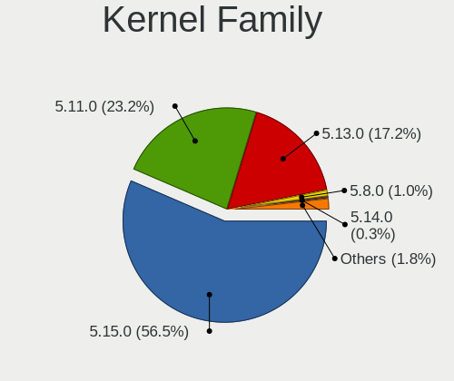
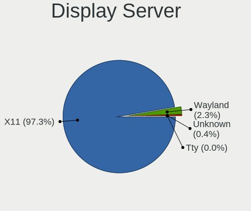
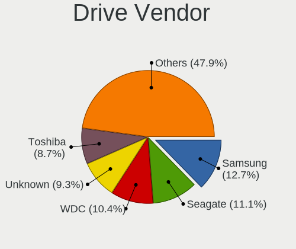
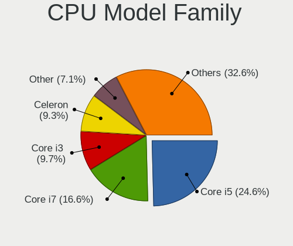
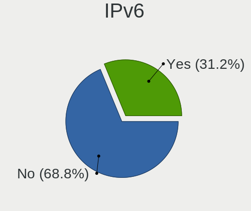
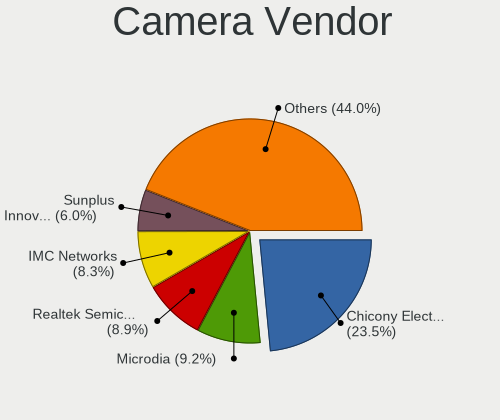

Zorin 16 - Tested Hardware & Statistics (Notebooks)
---------------------------------------------------

A project to collect tested hardware configurations for Zorin 16 (Beta test).

Anyone can contribute to this report by the [hw-probe](https://github.com/linuxhw/hw-probe) tool:

    sudo -E hw-probe -all -upload

Please submit a probe of your configuration if it's not presented on the page or is rare.

Full-feature report is available here: https://linux-hardware.org/?view=trends&rel=zorin-16

Contents
--------

* [ Test Cases ](#test-cases)

* [ System ](#system)
  - [ Kernel                   ](#kernel)
  - [ Kernel Family            ](#kernel-family)
  - [ Kernel Major Ver.        ](#kernel-major-ver)
  - [ Arch                     ](#arch)
  - [ DE                       ](#de)
  - [ Display Server           ](#display-server)
  - [ Display Manager          ](#display-manager)
  - [ OS Lang                  ](#os-lang)
  - [ Boot Mode                ](#boot-mode)
  - [ Filesystem               ](#filesystem)
  - [ Part. scheme             ](#part-scheme)
  - [ Dual Boot with Linux/BSD ](#dual-boot-with-linuxbsd)
  - [ Dual Boot (Win)          ](#dual-boot-win)

* [ Board ](#board)
  - [ Vendor                   ](#vendor)
  - [ Model                    ](#model)
  - [ Model Family             ](#model-family)
  - [ MFG Year                 ](#mfg-year)
  - [ Form Factor              ](#form-factor)
  - [ Secure Boot              ](#secure-boot)
  - [ Coreboot                 ](#coreboot)
  - [ RAM Size                 ](#ram-size)
  - [ RAM Used                 ](#ram-used)
  - [ Total Drives             ](#total-drives)
  - [ Has CD-ROM               ](#has-cd-rom)
  - [ Has Ethernet             ](#has-ethernet)
  - [ Has WiFi                 ](#has-wifi)
  - [ Has Bluetooth            ](#has-bluetooth)

* [ Location ](#location)
  - [ Country                  ](#country)
  - [ City                     ](#city)

* [ Drives ](#drives)
  - [ Drive Vendor             ](#drive-vendor)
  - [ Drive Model              ](#drive-model)
  - [ HDD Vendor               ](#hdd-vendor)
  - [ SSD Vendor               ](#ssd-vendor)
  - [ Drive Kind               ](#drive-kind)
  - [ Drive Connector          ](#drive-connector)
  - [ Drive Size               ](#drive-size)
  - [ Space Total              ](#space-total)
  - [ Space Used               ](#space-used)
  - [ Malfunc. Drives          ](#malfunc-drives)
  - [ Malfunc. Drive Vendor    ](#malfunc-drive-vendor)
  - [ Malfunc. HDD Vendor      ](#malfunc-hdd-vendor)
  - [ Malfunc. Drive Kind      ](#malfunc-drive-kind)
  - [ Failed Drives            ](#failed-drives)
  - [ Failed Drive Vendor      ](#failed-drive-vendor)
  - [ Drive Status             ](#drive-status)

* [ Storage controller ](#storage-controller)
  - [ Storage Vendor           ](#storage-vendor)
  - [ Storage Model            ](#storage-model)
  - [ Storage Kind             ](#storage-kind)

* [ Processor ](#processor)
  - [ CPU Vendor               ](#cpu-vendor)
  - [ CPU Model                ](#cpu-model)
  - [ CPU Model Family         ](#cpu-model-family)
  - [ CPU Cores                ](#cpu-cores)
  - [ CPU Sockets              ](#cpu-sockets)
  - [ CPU Threads              ](#cpu-threads)
  - [ CPU Op-Modes             ](#cpu-op-modes)
  - [ CPU Microcode            ](#cpu-microcode)
  - [ CPU Microarch            ](#cpu-microarch)

* [ Graphics ](#graphics)
  - [ GPU Vendor               ](#gpu-vendor)
  - [ GPU Model                ](#gpu-model)
  - [ GPU Combo                ](#gpu-combo)
  - [ GPU Driver               ](#gpu-driver)
  - [ GPU Memory               ](#gpu-memory)

* [ Monitor ](#monitor)
  - [ Monitor Vendor           ](#monitor-vendor)
  - [ Monitor Model            ](#monitor-model)
  - [ Monitor Resolution       ](#monitor-resolution)
  - [ Monitor Diagonal         ](#monitor-diagonal)
  - [ Monitor Width            ](#monitor-width)
  - [ Aspect Ratio             ](#aspect-ratio)
  - [ Monitor Area             ](#monitor-area)
  - [ Pixel Density            ](#pixel-density)
  - [ Multiple Monitors        ](#multiple-monitors)

* [ Network ](#network)
  - [ Net Controller Vendor    ](#net-controller-vendor)
  - [ Net Controller Model     ](#net-controller-model)
  - [ Wireless Vendor          ](#wireless-vendor)
  - [ Wireless Model           ](#wireless-model)
  - [ Ethernet Vendor          ](#ethernet-vendor)
  - [ Ethernet Model           ](#ethernet-model)
  - [ Net Controller Kind      ](#net-controller-kind)
  - [ Used Controller          ](#used-controller)
  - [ NICs                     ](#nics)
  - [ IPv6                     ](#ipv6)

* [ Bluetooth ](#bluetooth)
  - [ Bluetooth Vendor         ](#bluetooth-vendor)
  - [ Bluetooth Model          ](#bluetooth-model)

* [ Sound ](#sound)
  - [ Sound Vendor             ](#sound-vendor)
  - [ Sound Model              ](#sound-model)

* [ Memory ](#memory)
  - [ Memory Vendor            ](#memory-vendor)
  - [ Memory Model             ](#memory-model)
  - [ Memory Kind              ](#memory-kind)
  - [ Memory Form Factor       ](#memory-form-factor)
  - [ Memory Size              ](#memory-size)
  - [ Memory Speed             ](#memory-speed)

* [ Printers & scanners ](#printers--scanners)
  - [ Printer Vendor           ](#printer-vendor)
  - [ Printer Model            ](#printer-model)
  - [ Scanner Vendor           ](#scanner-vendor)
  - [ Scanner Model            ](#scanner-model)

* [ Camera ](#camera)
  - [ Camera Vendor            ](#camera-vendor)
  - [ Camera Model             ](#camera-model)

* [ Security ](#security)
  - [ Fingerprint Vendor       ](#fingerprint-vendor)
  - [ Fingerprint Model        ](#fingerprint-model)
  - [ Chipcard Vendor          ](#chipcard-vendor)
  - [ Chipcard Model           ](#chipcard-model)

* [ Unsupported ](#unsupported)
  - [ Unsupported Devices      ](#unsupported-devices)
  - [ Unsupported Device Types ](#unsupported-device-types)

Test Cases
----------

| Vendor  | Model                       | Probe                                                      | Date         |
|---------|-----------------------------|------------------------------------------------------------|--------------|
| HP      | ProBook 450 G2              | [67956ca49e](https://linux-hardware.org/?probe=67956ca49e) | Aug 10, 2021 |
| Acer    | Aspire E1-571               | [146f910c76](https://linux-hardware.org/?probe=146f910c76) | Aug 09, 2021 |
| Samsung | 350V5C/351V5C/3540VC/344... | [c7a0820fe0](https://linux-hardware.org/?probe=c7a0820fe0) | Aug 09, 2021 |
| Samsung | 350V5C/351V5C/3540VC/344... | [950d41dbb8](https://linux-hardware.org/?probe=950d41dbb8) | Aug 09, 2021 |
| Dell    | Inspiron 7537               | [7a35ed5eb1](https://linux-hardware.org/?probe=7a35ed5eb1) | Aug 03, 2021 |
| Dell    | Inspiron 7537               | [3c865e72d1](https://linux-hardware.org/?probe=3c865e72d1) | Aug 03, 2021 |
| Acer    | Aspire E5-551G              | [519515ce84](https://linux-hardware.org/?probe=519515ce84) | Jul 15, 2021 |
| Dell    | XPS L501X                   | [a3d8e737a5](https://linux-hardware.org/?probe=a3d8e737a5) | Jul 08, 2021 |
| Dell    | G3 3579                     | [92a8136dc4](https://linux-hardware.org/?probe=92a8136dc4) | Jul 03, 2021 |
| Lenovo  | ThinkBook 13s G2 ITL 20V... | [1196d6821c](https://linux-hardware.org/?probe=1196d6821c) | Jul 02, 2021 |
| Lenovo  | ThinkPad E15 Gen 2 20TD0... | [d63c7755ee](https://linux-hardware.org/?probe=d63c7755ee) | Jun 29, 2021 |
| ASUSTek | TUF Gaming FX505DT_FX505... | [369a214905](https://linux-hardware.org/?probe=369a214905) | Jun 25, 2021 |
| Dell    | Inspiron 3576               | [849d571ef0](https://linux-hardware.org/?probe=849d571ef0) | Jun 24, 2021 |
| Lenovo  | IdeaPad 330-15IKB 81DE      | [9957b51bea](https://linux-hardware.org/?probe=9957b51bea) | Jun 24, 2021 |
| Dell    | Inspiron 3582               | [e2cd9a9c36](https://linux-hardware.org/?probe=e2cd9a9c36) | Jun 20, 2021 |
| Dell    | XPS 13 9370                 | [9e3a58b257](https://linux-hardware.org/?probe=9e3a58b257) | Jun 12, 2021 |
| Dell    | XPS 13 9370                 | [2aa1efb008](https://linux-hardware.org/?probe=2aa1efb008) | Jun 12, 2021 |
| Lenovo  | ThinkPad E15 Gen 2 20TD0... | [01cf29ba72](https://linux-hardware.org/?probe=01cf29ba72) | Jun 10, 2021 |
| HP      | 15                          | [f2132922af](https://linux-hardware.org/?probe=f2132922af) | Jun 08, 2021 |
| Fujitsu | LIFEBOOK AH532              | [a1dd6df8e7](https://linux-hardware.org/?probe=a1dd6df8e7) | Jun 07, 2021 |
| Fujitsu | LIFEBOOK AH532              | [957048adbb](https://linux-hardware.org/?probe=957048adbb) | Jun 06, 2021 |
| Dell    | Inspiron 3582               | [229600e417](https://linux-hardware.org/?probe=229600e417) | Jun 06, 2021 |
| Fujitsu | LIFEBOOK AH532              | [719041c9d4](https://linux-hardware.org/?probe=719041c9d4) | Jun 04, 2021 |
| HP      | ProBook 650 G2              | [bb92ab2244](https://linux-hardware.org/?probe=bb92ab2244) | May 30, 2021 |
| HP      | Unknown                     | [e6e060ca51](https://linux-hardware.org/?probe=e6e060ca51) | May 29, 2021 |
| HP      | Unknown                     | [324d49aba6](https://linux-hardware.org/?probe=324d49aba6) | May 29, 2021 |
| Razer   | Book 13 - RZ09-0357         | [c1cc1fcf2e](https://linux-hardware.org/?probe=c1cc1fcf2e) | May 27, 2021 |
| Dell    | Vostro 5490                 | [9d8401675e](https://linux-hardware.org/?probe=9d8401675e) | May 18, 2021 |
| Dell    | Vostro 5490                 | [3f02204090](https://linux-hardware.org/?probe=3f02204090) | May 18, 2021 |
| Acer    | Swift SF313-51              | [2b27dc30ac](https://linux-hardware.org/?probe=2b27dc30ac) | May 17, 2021 |
| ASUSTek | X406UAR                     | [5c50159b19](https://linux-hardware.org/?probe=5c50159b19) | May 16, 2021 |
| ASUSTek | X406UAR                     | [e3be0eaa69](https://linux-hardware.org/?probe=e3be0eaa69) | May 16, 2021 |
| Lenovo  | ThinkPad Yoga 11e 20DAS0... | [b71b291af5](https://linux-hardware.org/?probe=b71b291af5) | May 10, 2021 |
| Lenovo  | IdeaPad 100-15IBD 80QQ      | [157ae0cc83](https://linux-hardware.org/?probe=157ae0cc83) | May 02, 2021 |
| Lenovo  | IdeaPad 100-15IBD 80QQ      | [12081d4e79](https://linux-hardware.org/?probe=12081d4e79) | Apr 25, 2021 |
| Lenovo  | IdeaPad Y570 0862           | [94d22e7673](https://linux-hardware.org/?probe=94d22e7673) | Apr 23, 2021 |

System
------

Kernel
------

Version of the Linux kernel

| Version           | Notebooks | Percent |
|-------------------|-----------|---------|
| 5.8.0-53-generic  | 6         | 25%     |
| 5.8.0-59-generic  | 5         | 20.83%  |
| 5.8.0-55-generic  | 5         | 20.83%  |
| 5.8.0-50-generic  | 4         | 16.67%  |
| 5.11.0-25-generic | 3         | 12.5%   |
| 5.8.0-63-generic  | 1         | 4.17%   |

Kernel Family
-------------

Linux kernel without a distro release

| Version | Notebooks | Percent |
|---------|-----------|---------|
| 5.8.0   | 21        | 87.5%   |
| 5.11.0  | 3         | 12.5%   |

Kernel Major Ver.
-----------------

Linux kernel major version

| Version | Notebooks | Percent |
|---------|-----------|---------|
| 5.8     | 21        | 87.5%   |
| 5.11    | 3         | 12.5%   |

Arch
----

OS architecture (x86_64, i586, etc.)

| Name   | Notebooks | Percent |
|--------|-----------|---------|
| x86_64 | 24        | 100%    |

DE
--

Desktop Environment

| Name  | Notebooks | Percent |
|-------|-----------|---------|
| GNOME | 24        | 100%    |

Display Server
--------------

X11 or Wayland

| Name    | Notebooks | Percent |
|---------|-----------|---------|
| X11     | 22        | 91.67%  |
| Wayland | 2         | 8.33%   |

Display Manager
---------------

SDDM, LightDM, etc.

| Name    | Notebooks | Percent |
|---------|-----------|---------|
| Unknown | 19        | 79.17%  |
| GDM     | 5         | 20.83%  |

OS Lang
-------

Language

| Lang  | Notebooks | Percent |
|-------|-----------|---------|
| en_IN | 5         | 20.83%  |
| en_US | 4         | 16.67%  |
| nl_NL | 2         | 8.33%   |
| hu_HU | 2         | 8.33%   |
| en_GB | 2         | 8.33%   |
| de_DE | 2         | 8.33%   |
| ru_UA | 1         | 4.17%   |
| ru_RU | 1         | 4.17%   |
| pt_BR | 1         | 4.17%   |
| fr_FR | 1         | 4.17%   |
| en_ZA | 1         | 4.17%   |
| en_PH | 1         | 4.17%   |
| en_CA | 1         | 4.17%   |

Boot Mode
---------

EFI or BIOS

| Mode | Notebooks | Percent |
|------|-----------|---------|
| EFI  | 17        | 70.83%  |
| BIOS | 7         | 29.17%  |

Filesystem
----------

Type of filesystem

| Type  | Notebooks | Percent |
|-------|-----------|---------|
| Ext4  | 23        | 95.83%  |
| Btrfs | 1         | 4.17%   |

Part. scheme
------------

Scheme of partitioning

| Type    | Notebooks | Percent |
|---------|-----------|---------|
| Unknown | 19        | 79.17%  |
| GPT     | 5         | 20.83%  |

Dual Boot with Linux/BSD
------------------------

Hosting more than one Linux/BSD

| Dual boot | Notebooks | Percent |
|-----------|-----------|---------|
| No        | 24        | 100%    |

Dual Boot (Win)
---------------

Hosting Linux and Windows

| Dual boot | Notebooks | Percent |
|-----------|-----------|---------|
| No        | 22        | 91.67%  |
| Yes       | 2         | 8.33%   |

Board
-----

Vendor
------

Motherboard manufacturer

| Name                | Notebooks | Percent |
|---------------------|-----------|---------|
| Dell                | 7         | 29.17%  |
| Lenovo              | 5         | 20.83%  |
| Hewlett-Packard     | 4         | 16.67%  |
| Acer                | 3         | 12.5%   |
| ASUSTek Computer    | 2         | 8.33%   |
| Samsung Electronics | 1         | 4.17%   |
| Razer               | 1         | 4.17%   |
| Fujitsu             | 1         | 4.17%   |

Model
-----

Motherboard model

| Name                                 | Notebooks | Percent |
|--------------------------------------|-----------|---------|
| Samsung 350V5C/351V5C/3540VC/3440VC  | 1         | 4.17%   |
| Razer Book 13 - RZ09-0357            | 1         | 4.17%   |
| Lenovo ThinkPad Yoga 11e 20DAS0SF00  | 1         | 4.17%   |
| Lenovo ThinkPad E15 Gen 2 20TD000HZA | 1         | 4.17%   |
| Lenovo IdeaPad Y570 0862             | 1         | 4.17%   |
| Lenovo IdeaPad 330-15IKB 81DE        | 1         | 4.17%   |
| Lenovo IdeaPad 100-15IBD 80QQ        | 1         | 4.17%   |
| HP ProBook 650 G2                    | 1         | 4.17%   |
| HP ProBook 450 G2                    | 1         | 4.17%   |
| HP 15                                | 1         | 4.17%   |
| Fujitsu LIFEBOOK AH532               | 1         | 4.17%   |
| Dell XPS L501X                       | 1         | 4.17%   |
| Dell XPS 13 9370                     | 1         | 4.17%   |
| Dell Vostro 5490                     | 1         | 4.17%   |
| Dell Inspiron 7537                   | 1         | 4.17%   |
| Dell Inspiron 3582                   | 1         | 4.17%   |
| Dell Inspiron 3576                   | 1         | 4.17%   |
| Dell G3 3579                         | 1         | 4.17%   |
| ASUS X406UAR                         | 1         | 4.17%   |
| ASUS TUF Gaming FX505DT_FX505DT      | 1         | 4.17%   |
| Acer Swift SF313-51                  | 1         | 4.17%   |
| Acer Aspire E5-551G                  | 1         | 4.17%   |
| Acer Aspire E1-571                   | 1         | 4.17%   |
| Unknown                              | 1         | 4.17%   |

Model Family
------------

Motherboard model prefix

| Name             | Notebooks | Percent |
|------------------|-----------|---------|
| Lenovo IdeaPad   | 3         | 12.5%   |
| Dell Inspiron    | 3         | 12.5%   |
| Lenovo ThinkPad  | 2         | 8.33%   |
| HP ProBook       | 2         | 8.33%   |
| Dell XPS         | 2         | 8.33%   |
| Acer Aspire      | 2         | 8.33%   |
| Samsung 350V5C   | 1         | 4.17%   |
| Razer Book       | 1         | 4.17%   |
| HP 15            | 1         | 4.17%   |
| Fujitsu LIFEBOOK | 1         | 4.17%   |
| Dell Vostro      | 1         | 4.17%   |
| Dell G3          | 1         | 4.17%   |
| ASUS X406UAR     | 1         | 4.17%   |
| ASUS TUF         | 1         | 4.17%   |
| Acer Swift       | 1         | 4.17%   |
| Unknown          | 1         | 4.17%   |

MFG Year
--------

Motherboard manufacture year

| Year | Notebooks | Percent |
|------|-----------|---------|
| 2019 | 7         | 29.17%  |
| 2021 | 4         | 16.67%  |
| 2020 | 4         | 16.67%  |
| 2018 | 2         | 8.33%   |
| 2013 | 2         | 8.33%   |
| 2011 | 2         | 8.33%   |
| 2016 | 1         | 4.17%   |
| 2015 | 1         | 4.17%   |
| 2008 | 1         | 4.17%   |

Form Factor
-----------

Physical design of the computer

| Name     | Notebooks | Percent |
|----------|-----------|---------|
| Notebook | 24        | 100%    |

Secure Boot
-----------

Enabled or disabled

| State    | Notebooks | Percent |
|----------|-----------|---------|
| Disabled | 19        | 79.17%  |
| Enabled  | 5         | 20.83%  |

Coreboot
--------

Have coreboot on board

| Used | Notebooks | Percent |
|------|-----------|---------|
| No   | 24        | 100%    |

RAM Size
--------

Total RAM memory

| Size in GB | Notebooks | Percent |
|------------|-----------|---------|
| 4.01-8.0   | 8         | 33.33%  |
| 3.01-4.0   | 7         | 29.17%  |
| 8.01-16.0  | 5         | 20.83%  |
| 16.01-24.0 | 4         | 16.67%  |

RAM Used
--------

Used RAM memory

| Used GB  | Notebooks | Percent |
|----------|-----------|---------|
| 2.01-3.0 | 9         | 37.5%   |
| 1.01-2.0 | 9         | 37.5%   |
| 3.01-4.0 | 4         | 16.67%  |
| 4.01-8.0 | 2         | 8.33%   |

Total Drives
------------

Number of drives on board

| Drives | Notebooks | Percent |
|--------|-----------|---------|
| 1      | 21        | 87.5%   |
| 2      | 3         | 12.5%   |

Has CD-ROM
----------

Has CD-ROM on board

| Presented | Notebooks | Percent |
|-----------|-----------|---------|
| No        | 15        | 62.5%   |
| Yes       | 9         | 37.5%   |

Has Ethernet
------------

Has Ethernet on board

| Presented | Notebooks | Percent |
|-----------|-----------|---------|
| Yes       | 20        | 83.33%  |
| No        | 4         | 16.67%  |

Has WiFi
--------

Has WiFi module

| Presented | Notebooks | Percent |
|-----------|-----------|---------|
| Yes       | 23        | 95.83%  |
| No        | 1         | 4.17%   |

Has Bluetooth
-------------

Has Bluetooth module

| Presented | Notebooks | Percent |
|-----------|-----------|---------|
| Yes       | 20        | 83.33%  |
| No        | 4         | 16.67%  |

Location
--------

Country
-------

Geographic location (country)

| Country      | Notebooks | Percent |
|--------------|-----------|---------|
| India        | 5         | 20.83%  |
| USA          | 2         | 8.33%   |
| UK           | 2         | 8.33%   |
| Netherlands  | 2         | 8.33%   |
| Hungary      | 2         | 8.33%   |
| Ukraine      | 1         | 4.17%   |
| South Africa | 1         | 4.17%   |
| Romania      | 1         | 4.17%   |
| Philippines  | 1         | 4.17%   |
| Mexico       | 1         | 4.17%   |
| Madagascar   | 1         | 4.17%   |
| Germany      | 1         | 4.17%   |
| Canada       | 1         | 4.17%   |
| Brazil       | 1         | 4.17%   |
| Azerbaijan   | 1         | 4.17%   |
| Austria      | 1         | 4.17%   |

City
----

Geographic location (city)

| City             | Notebooks | Percent |
|------------------|-----------|---------|
| Hyderabad        | 2         | 8.33%   |
| Vienna           | 1         | 4.17%   |
| Vancouver        | 1         | 4.17%   |
| Sutton Coldfield | 1         | 4.17%   |
| Stadskanaal      | 1         | 4.17%   |
| San Francisco    | 1         | 4.17%   |
| Quezon City      | 1         | 4.17%   |
| Pretoria         | 1         | 4.17%   |
| Ohmbach          | 1         | 4.17%   |
| Nyiregyhaza      | 1         | 4.17%   |
| Mérida          | 1         | 4.17%   |
| Kyiv             | 1         | 4.17%   |
| Kolkata          | 1         | 4.17%   |
| Galgamacsa       | 1         | 4.17%   |
| Fortaleza        | 1         | 4.17%   |
| Ernakulam        | 1         | 4.17%   |
| Dudley           | 1         | 4.17%   |
| Charlotte        | 1         | 4.17%   |
| Baku             | 1         | 4.17%   |
| Arad             | 1         | 4.17%   |
| Antananarivo     | 1         | 4.17%   |
| Amsterdam        | 1         | 4.17%   |
| Ahmedabad        | 1         | 4.17%   |

Drives
------

Drive Vendor
------------

Hard drive vendors

| Vendor              | Notebooks | Drives | Percent |
|---------------------|-----------|--------|---------|
| WDC                 | 4         | 4      | 15.38%  |
| Samsung Electronics | 4         | 4      | 15.38%  |
| Toshiba             | 3         | 3      | 11.54%  |
| Seagate             | 3         | 3      | 11.54%  |
| SanDisk             | 2         | 2      | 7.69%   |
| Kingston            | 2         | 3      | 7.69%   |
| Intel               | 2         | 2      | 7.69%   |
| Unknown             | 1         | 1      | 3.85%   |
| Phison              | 1         | 1      | 3.85%   |
| KIOXIA              | 1         | 1      | 3.85%   |
| HGST                | 1         | 1      | 3.85%   |
| Crucial             | 1         | 1      | 3.85%   |
| A-DATA Technology   | 1         | 1      | 3.85%   |

Drive Model
-----------

Hard drive models

| Model                                   | Notebooks | Percent |
|-----------------------------------------|-----------|---------|
| WDC WD5000LPVT-22G33T0 500GB            | 1         | 3.85%   |
| WDC WD10JPVX-60JC3T1 1TB                | 1         | 3.85%   |
| WDC WD10JPVX-22JC3T0 1TB                | 1         | 3.85%   |
| WDC PC SN520 SDAPNUW-512G-1014 512GB    | 1         | 3.85%   |
| Unknown SD/MMC/MS PRO 16GB              | 1         | 3.85%   |
| Toshiba THNSNJ128GCSU 128GB SSD         | 1         | 3.85%   |
| Toshiba MQ01ABF050 500GB                | 1         | 3.85%   |
| Toshiba KSG60ZMV256G M.2 2280 256GB SSD | 1         | 3.85%   |
| Seagate ST500LM030-1RK17D 500GB         | 1         | 3.85%   |
| Seagate ST500LM021-1KJ152 500GB         | 1         | 3.85%   |
| Seagate ST1000LM035-1RK172 1TB          | 1         | 3.85%   |
| SanDisk SSD PLUS 480GB                  | 1         | 3.85%   |
| SanDisk SD8SN8U256G1002 256GB SSD       | 1         | 3.85%   |
| Samsung SSD 860 EVO 1TB                 | 1         | 3.85%   |
| Samsung NVMe SSD Drive 512GB            | 1         | 3.85%   |
| Samsung MZVLB512HBJQ-00A00 512GB        | 1         | 3.85%   |
| Samsung HM640JJ 640GB                   | 1         | 3.85%   |
| Phison NVMe SSD Drive 2TB               | 1         | 3.85%   |
| KIOXIA NVMe SSD Drive 512GB             | 1         | 3.85%   |
| Kingston SA400S37480G 480GB SSD         | 1         | 3.85%   |
| Kingston SA400S37240G 240GB SSD         | 1         | 3.85%   |
| Intel SSDSC2KW256G8L 256GB              | 1         | 3.85%   |
| Intel SSDPEKNW512G8 512GB               | 1         | 3.85%   |
| HGST HTS725050A7E630 500GB              | 1         | 3.85%   |
| Crucial CT480BX500SSD1 480GB            | 1         | 3.85%   |
| A-DATA SX900 256GB SSD                  | 1         | 3.85%   |

HDD Vendor
----------

Hard disk drive vendors

| Vendor              | Notebooks | Drives | Percent |
|---------------------|-----------|--------|---------|
| WDC                 | 3         | 3      | 33.33%  |
| Seagate             | 3         | 3      | 33.33%  |
| Toshiba             | 1         | 1      | 11.11%  |
| Samsung Electronics | 1         | 1      | 11.11%  |
| HGST                | 1         | 1      | 11.11%  |

SSD Vendor
----------

Solid state drive vendors

| Vendor              | Notebooks | Drives | Percent |
|---------------------|-----------|--------|---------|
| Toshiba             | 2         | 2      | 20%     |
| SanDisk             | 2         | 2      | 20%     |
| Kingston            | 2         | 3      | 20%     |
| Samsung Electronics | 1         | 1      | 10%     |
| Intel               | 1         | 1      | 10%     |
| Crucial             | 1         | 1      | 10%     |
| A-DATA Technology   | 1         | 1      | 10%     |

Drive Kind
----------

HDD or SSD

| Kind    | Notebooks | Drives | Percent |
|---------|-----------|--------|---------|
| SSD     | 10        | 11     | 38.46%  |
| HDD     | 9         | 9      | 34.62%  |
| NVMe    | 6         | 6      | 23.08%  |
| Unknown | 1         | 1      | 3.85%   |

Drive Connector
---------------

SATA, SAS, NVMe, etc.

| Type | Notebooks | Drives | Percent |
|------|-----------|--------|---------|
| SATA | 18        | 20     | 72%     |
| NVMe | 6         | 6      | 24%     |
| SAS  | 1         | 1      | 4%      |

Drive Size
----------

Size of hard drive

| Size in TB | Notebooks | Drives | Percent |
|------------|-----------|--------|---------|
| 0.01-0.5   | 14        | 15     | 73.68%  |
| 0.51-1.0   | 5         | 5      | 26.32%  |

Space Total
-----------

Amount of disk space available on the file system

| Size in GB | Notebooks | Percent |
|------------|-----------|---------|
| 251-500    | 15        | 62.5%   |
| 101-250    | 5         | 20.83%  |
| 501-1000   | 3         | 12.5%   |
| 1001-2000  | 1         | 4.17%   |

Space Used
----------

Amount of used disk space

| Used GB  | Notebooks | Percent |
|----------|-----------|---------|
| 1-20     | 10        | 41.67%  |
| 21-50    | 8         | 33.33%  |
| 51-100   | 3         | 12.5%   |
| 101-250  | 2         | 8.33%   |
| 501-1000 | 1         | 4.17%   |

Malfunc. Drives
---------------

Drive models with a malfunction

| Model                      | Notebooks | Drives | Percent |
|----------------------------|-----------|--------|---------|
| HGST HTS725050A7E630 500GB | 1         | 1      | 100%    |

Malfunc. Drive Vendor
---------------------

Vendors of faulty drives

| Vendor | Notebooks | Drives | Percent |
|--------|-----------|--------|---------|
| HGST   | 1         | 1      | 100%    |

Malfunc. HDD Vendor
-------------------

Vendors of faulty HDD drives

| Vendor | Notebooks | Drives | Percent |
|--------|-----------|--------|---------|
| HGST   | 1         | 1      | 100%    |

Malfunc. Drive Kind
-------------------

Kinds of faulty drives

| Kind | Notebooks | Drives | Percent |
|------|-----------|--------|---------|
| HDD  | 1         | 1      | 100%    |

Failed Drives
-------------

Failed drive models

Zero info for selected period =(

Failed Drive Vendor
-------------------

Failed drive vendors

Zero info for selected period =(

Drive Status
------------

Number of failed and malfunc. drives

| Status   | Notebooks | Drives | Percent |
|----------|-----------|--------|---------|
| Detected | 19        | 22     | 79.17%  |
| Works    | 4         | 4      | 16.67%  |
| Malfunc  | 1         | 1      | 4.17%   |

Storage controller
------------------

Storage Vendor
--------------

Storage controller vendors

| Vendor              | Notebooks | Percent |
|---------------------|-----------|---------|
| Intel               | 19        | 76%     |
| Samsung Electronics | 2         | 8%      |
| Sandisk             | 1         | 4%      |
| Phison Electronics  | 1         | 4%      |
| KIOXIA              | 1         | 4%      |
| AMD                 | 1         | 4%      |

Storage Model
-------------

Storage controller models

| Model                                                                        | Notebooks | Percent |
|------------------------------------------------------------------------------|-----------|---------|
| Intel Sunrise Point-LP SATA Controller [AHCI mode]                           | 4         | 15.38%  |
| Intel 7 Series Chipset Family 6-port SATA Controller [AHCI mode]             | 3         | 11.54%  |
| Intel Wildcat Point-LP SATA Controller [AHCI Mode]                           | 2         | 7.69%   |
| Intel 8 Series SATA Controller 1 [AHCI mode]                                 | 2         | 7.69%   |
| Sandisk WD Blue SN500 / PC SN520 NVMe SSD                                    | 1         | 3.85%   |
| Samsung NVMe SSD Controller SM981/PM981/PM983                                | 1         | 3.85%   |
| Samsung NVMe Controller                                                      | 1         | 3.85%   |
| Phison E12 NVMe Controller                                                   | 1         | 3.85%   |
| KIOXIA Non-Volatile memory controller                                        | 1         | 3.85%   |
| Intel SSD 660P Series                                                        | 1         | 3.85%   |
| Intel Comet Lake SATA AHCI Controller                                        | 1         | 3.85%   |
| Intel Celeron/Pentium Silver Processor SATA Controller                       | 1         | 3.85%   |
| Intel Atom Processor E3800 Series SATA AHCI Controller                       | 1         | 3.85%   |
| Intel 82801HM/HEM (ICH8M/ICH8M-E) SATA Controller [AHCI mode]                | 1         | 3.85%   |
| Intel 82801HM/HEM (ICH8M/ICH8M-E) IDE Controller                             | 1         | 3.85%   |
| Intel 82801 Mobile SATA Controller [RAID mode]                               | 1         | 3.85%   |
| Intel 6 Series/C200 Series Chipset Family 6 port Mobile SATA AHCI Controller | 1         | 3.85%   |
| Intel 5 Series/3400 Series Chipset 6 port SATA AHCI Controller               | 1         | 3.85%   |
| AMD FCH SATA Controller [AHCI mode]                                          | 1         | 3.85%   |

Storage Kind
------------

Kind of storage controller (IDE, SATA, NVMe, SAS, ...)

| Kind | Notebooks | Percent |
|------|-----------|---------|
| SATA | 18        | 69.23%  |
| NVMe | 6         | 23.08%  |
| RAID | 1         | 3.85%   |
| IDE  | 1         | 3.85%   |

Processor
---------

CPU Vendor
----------

Processor vendors

| Vendor | Notebooks | Percent |
|--------|-----------|---------|
| Intel  | 22        | 91.67%  |
| AMD    | 2         | 8.33%   |

CPU Model
---------

Processor models

| Model                                         | Notebooks | Percent |
|-----------------------------------------------|-----------|---------|
| Intel Core i5-8250U CPU @ 1.60GHz             | 3         | 12.5%   |
| Intel Core i7-8550U CPU @ 1.80GHz             | 2         | 8.33%   |
| Intel Core i5-5200U CPU @ 2.20GHz             | 2         | 8.33%   |
| Intel 11th Gen Core i7-1165G7 @ 2.80GHz       | 2         | 8.33%   |
| Intel Core i7-4500U CPU @ 1.80GHz             | 1         | 4.17%   |
| Intel Core i7-3630QM CPU @ 2.40GHz            | 1         | 4.17%   |
| Intel Core i7-2670QM CPU @ 2.20GHz            | 1         | 4.17%   |
| Intel Core i7 CPU Q 740 @ 1.73GHz             | 1         | 4.17%   |
| Intel Core i5-8300H CPU @ 2.30GHz             | 1         | 4.17%   |
| Intel Core i5-4210U CPU @ 1.70GHz             | 1         | 4.17%   |
| Intel Core i5-3210M CPU @ 2.50GHz             | 1         | 4.17%   |
| Intel Core i5-10210U CPU @ 1.60GHz            | 1         | 4.17%   |
| Intel Core i3-6100U CPU @ 2.30GHz             | 1         | 4.17%   |
| Intel Core i3-3110M CPU @ 2.40GHz             | 1         | 4.17%   |
| Intel Core 2 Duo CPU T7500 @ 2.20GHz          | 1         | 4.17%   |
| Intel Celeron N4000 CPU @ 1.10GHz             | 1         | 4.17%   |
| Intel Celeron CPU N2940 @ 1.83GHz             | 1         | 4.17%   |
| AMD Ryzen 5 3550H with Radeon Vega Mobile Gfx | 1         | 4.17%   |
| AMD FX-7500 Radeon R7, 10 Compute Cores 4C+6G | 1         | 4.17%   |

CPU Model Family
----------------

Processor model prefix

| Model            | Notebooks | Percent |
|------------------|-----------|---------|
| Intel Core i5    | 9         | 37.5%   |
| Intel Core i7    | 6         | 25%     |
| Other            | 2         | 8.33%   |
| Intel Core i3    | 2         | 8.33%   |
| Intel Celeron    | 2         | 8.33%   |
| Intel Core 2 Duo | 1         | 4.17%   |
| AMD Ryzen 5      | 1         | 4.17%   |
| AMD FX           | 1         | 4.17%   |

CPU Cores
---------

Number of processor cores

| Number | Notebooks | Percent |
|--------|-----------|---------|
| 4      | 14        | 58.33%  |
| 2      | 10        | 41.67%  |

CPU Sockets
-----------

Number of sockets

| Number | Notebooks | Percent |
|--------|-----------|---------|
| 1      | 24        | 100%    |

CPU Threads
-----------

Threads per core (Hyper-Threading)

| Number | Notebooks | Percent |
|--------|-----------|---------|
| 2      | 20        | 83.33%  |
| 1      | 4         | 16.67%  |

CPU Op-Modes
------------

CPU Operation Modes (32-bit, 64-bit)

| Op mode        | Notebooks | Percent |
|----------------|-----------|---------|
| 32-bit, 64-bit | 24        | 100%    |

CPU Microcode
-------------

Microcode number

| Number     | Notebooks | Percent |
|------------|-----------|---------|
| 0x806ea    | 5         | 20.83%  |
| 0x306a9    | 3         | 12.5%   |
| 0x806c1    | 2         | 8.33%   |
| 0x40651    | 2         | 8.33%   |
| 0x306d4    | 2         | 8.33%   |
| Unknown    | 2         | 8.33%   |
| 0x906ea    | 1         | 4.17%   |
| 0x806ec    | 1         | 4.17%   |
| 0x706a1    | 1         | 4.17%   |
| 0x6fb      | 1         | 4.17%   |
| 0x30678    | 1         | 4.17%   |
| 0x206a7    | 1         | 4.17%   |
| 0x08108102 | 1         | 4.17%   |
| 0x06003106 | 1         | 4.17%   |

CPU Microarch
-------------

Microarchitecture

| Name          | Notebooks | Percent |
|---------------|-----------|---------|
| KabyLake      | 7         | 29.17%  |
| IvyBridge     | 3         | 12.5%   |
| TigerLake     | 2         | 8.33%   |
| Haswell       | 2         | 8.33%   |
| Broadwell     | 2         | 8.33%   |
| Zen+          | 1         | 4.17%   |
| Steamroller   | 1         | 4.17%   |
| Skylake       | 1         | 4.17%   |
| Silvermont    | 1         | 4.17%   |
| SandyBridge   | 1         | 4.17%   |
| Nehalem       | 1         | 4.17%   |
| Goldmont plus | 1         | 4.17%   |
| Core          | 1         | 4.17%   |

Graphics
--------

GPU Vendor
----------

Vendors of graphics cards

| Vendor | Notebooks | Percent |
|--------|-----------|---------|
| Intel  | 21        | 63.64%  |
| Nvidia | 8         | 24.24%  |
| AMD    | 4         | 12.12%  |

GPU Model
---------

Graphics card models

| Model                                                                     | Notebooks | Percent |
|---------------------------------------------------------------------------|-----------|---------|
| Intel UHD Graphics 620                                                    | 5         | 14.71%  |
| Intel 3rd Gen Core processor Graphics Controller                          | 3         | 8.82%   |
| Intel TigerLake-LP GT2 [Iris Xe Graphics]                                 | 2         | 5.88%   |
| Intel HD Graphics 5500                                                    | 2         | 5.88%   |
| Intel Haswell-ULT Integrated Graphics Controller                          | 2         | 5.88%   |
| Nvidia TU117M [GeForce GTX 1650 Mobile / Max-Q]                           | 1         | 2.94%   |
| Nvidia GP108M [GeForce MX250]                                             | 1         | 2.94%   |
| Nvidia GP107M [GeForce GTX 1050 Mobile]                                   | 1         | 2.94%   |
| Nvidia GK208BM [GeForce 920M]                                             | 1         | 2.94%   |
| Nvidia GK107M [GeForce GT 750M]                                           | 1         | 2.94%   |
| Nvidia GF117M [GeForce 610M/710M/810M/820M / GT 620M/625M/630M/720M]      | 1         | 2.94%   |
| Nvidia GF108M [GeForce GT 555M]                                           | 1         | 2.94%   |
| Nvidia GF108M [GeForce GT 435M]                                           | 1         | 2.94%   |
| Intel Skylake GT2 [HD Graphics 520]                                       | 1         | 2.94%   |
| Intel Mobile GME965/GLE960 Integrated Graphics Controller                 | 1         | 2.94%   |
| Intel GeminiLake [UHD Graphics 600]                                       | 1         | 2.94%   |
| Intel CometLake-U GT2 [UHD Graphics]                                      | 1         | 2.94%   |
| Intel CoffeeLake-H GT2 [UHD Graphics 630]                                 | 1         | 2.94%   |
| Intel Atom Processor Z36xxx/Z37xxx Series Graphics & Display              | 1         | 2.94%   |
| Intel 2nd Generation Core Processor Family Integrated Graphics Controller | 1         | 2.94%   |
| AMD Thames [Radeon HD 7500M/7600M Series]                                 | 1         | 2.94%   |
| AMD Picasso                                                               | 1         | 2.94%   |
| AMD Opal XT [Radeon R7 M265/M365X/M465]                                   | 1         | 2.94%   |
| AMD Kaveri [Radeon R6/R7 Graphics]                                        | 1         | 2.94%   |
| AMD Jet PRO [Radeon R5 M230 / R7 M260DX / Radeon 520 Mobile]              | 1         | 2.94%   |

GPU Combo
---------

Combinations of graphics cards

| Name           | Notebooks | Percent |
|----------------|-----------|---------|
| 1 x Intel      | 13        | 54.17%  |
| Intel + Nvidia | 6         | 25%     |
| Intel + AMD    | 2         | 8.33%   |
| 2 x AMD        | 1         | 4.17%   |
| 1 x Nvidia     | 1         | 4.17%   |
| AMD + Nvidia   | 1         | 4.17%   |

GPU Driver
----------

Free vs proprietary

| Driver      | Notebooks | Percent |
|-------------|-----------|---------|
| Free        | 18        | 75%     |
| Proprietary | 5         | 20.83%  |
| Unknown     | 1         | 4.17%   |

GPU Memory
----------

Total video memory

| Size in GB | Notebooks | Percent |
|------------|-----------|---------|
| Unknown    | 17        | 70.83%  |
| 1.01-2.0   | 4         | 16.67%  |
| 3.01-4.0   | 2         | 8.33%   |
| 0.51-1.0   | 1         | 4.17%   |

Monitor
-------

Monitor Vendor
--------------

Monitor vendors

| Vendor              | Notebooks | Percent |
|---------------------|-----------|---------|
| AU Optronics        | 8         | 30.77%  |
| BOE                 | 5         | 19.23%  |
| Chimei Innolux      | 3         | 11.54%  |
| Sharp               | 2         | 7.69%   |
| Samsung Electronics | 2         | 7.69%   |
| PANDA               | 1         | 3.85%   |
| LG Display          | 1         | 3.85%   |
| Lenovo              | 1         | 3.85%   |
| Dell                | 1         | 3.85%   |
| BenQ                | 1         | 3.85%   |
| Acer                | 1         | 3.85%   |

Monitor Model
-------------

Monitor models

| Model                                                                 | Notebooks | Percent |
|-----------------------------------------------------------------------|-----------|---------|
| AU Optronics LCD Monitor AUO71EC 1366x768 340x190mm 15.3-inch         | 2         | 7.69%   |
| Sharp LQ134R1JX48 SHP1528 3840x2400 288x180mm 13.4-inch               | 1         | 3.85%   |
| Sharp LCD Monitor SHP148B 3840x2160 294x165mm 13.3-inch               | 1         | 3.85%   |
| Samsung Electronics LCD Monitor SEC3642 1366x768 344x194mm 15.5-inch  | 1         | 3.85%   |
| Samsung Electronics LCD Monitor SDC4C48 1920x1080 409x230mm 18.5-inch | 1         | 3.85%   |
| PANDA LCD Monitor NCP0036 1920x1080 344x194mm 15.5-inch               | 1         | 3.85%   |
| LG Display LCD Monitor LGD02DC 1366x768 344x194mm 15.5-inch           | 1         | 3.85%   |
| Lenovo LCD Monitor LEN40BA 1920x1080 344x194mm 15.5-inch              | 1         | 3.85%   |
| Dell P2419H DELD0DA 1920x1080 527x296mm 23.8-inch                     | 1         | 3.85%   |
| Chimei Innolux LCD Monitor CMN15C3 1920x1080 340x190mm 15.3-inch      | 1         | 3.85%   |
| Chimei Innolux LCD Monitor CMN15BE 1366x768 340x190mm 15.3-inch       | 1         | 3.85%   |
| Chimei Innolux LCD Monitor CMN15AB 1366x768 350x190mm 15.7-inch       | 1         | 3.85%   |
| BOE LCD Monitor BOE082E 1920x1080 309x174mm 14.0-inch                 | 1         | 3.85%   |
| BOE LCD Monitor BOE07DD 1920x1080 293x165mm 13.2-inch                 | 1         | 3.85%   |
| BOE LCD Monitor BOE0718 1920x1080 309x173mm 13.9-inch                 | 1         | 3.85%   |
| BOE LCD Monitor BOE0615 1366x768 309x173mm 13.9-inch                  | 1         | 3.85%   |
| BOE LCD Monitor BOE05E9 1366x768 256x144mm 11.6-inch                  | 1         | 3.85%   |
| BenQ GW2480 BNQ78E7 1920x1080 527x296mm 23.8-inch                     | 1         | 3.85%   |
| AU Optronics LCD Monitor AUO8174 1280x800 331x207mm 15.4-inch         | 1         | 3.85%   |
| AU Optronics LCD Monitor AUO63ED 1920x1080 344x193mm 15.5-inch        | 1         | 3.85%   |
| AU Optronics LCD Monitor AUO40EC 1366x768 340x190mm 15.3-inch         | 1         | 3.85%   |
| AU Optronics LCD Monitor AUO38ED 1920x1080 340x190mm 15.3-inch        | 1         | 3.85%   |
| AU Optronics LCD Monitor AUO22EC 1366x768 344x193mm 15.5-inch         | 1         | 3.85%   |
| AU Optronics LCD Monitor 1366x768                                     | 1         | 3.85%   |
| Acer ED273 ACR0575 1920x1080 531x299mm 24.0-inch                      | 1         | 3.85%   |

Monitor Resolution
------------------

Monitor screen resolution

| Resolution      | Notebooks | Percent |
|-----------------|-----------|---------|
| 1366x768 (WXGA) | 11        | 45.83%  |
| 1920x1080 (FHD) | 10        | 41.67%  |
| 3840x2400       | 1         | 4.17%   |
| 3840x2160 (4K)  | 1         | 4.17%   |
| 1280x800 (WXGA) | 1         | 4.17%   |

Monitor Diagonal
----------------

Diagonal size in inches

| Inches  | Notebooks | Percent |
|---------|-----------|---------|
| 15      | 14        | 53.85%  |
| 13      | 5         | 19.23%  |
| 24      | 3         | 11.54%  |
| 18      | 1         | 3.85%   |
| 14      | 1         | 3.85%   |
| 11      | 1         | 3.85%   |
| Unknown | 1         | 3.85%   |

Monitor Width
-------------

Physical width

| Width in mm | Notebooks | Percent |
|-------------|-----------|---------|
| 301-350     | 17        | 65.38%  |
| 201-300     | 4         | 15.38%  |
| 501-600     | 3         | 11.54%  |
| 401-500     | 1         | 3.85%   |
| Unknown     | 1         | 3.85%   |

Aspect Ratio
------------

Proportional relationship between the width and the height

| Ratio   | Notebooks | Percent |
|---------|-----------|---------|
| 16/9    | 20        | 86.96%  |
| 16/10   | 2         | 8.7%    |
| Unknown | 1         | 4.35%   |

Monitor Area
------------

Area in inch²

| Area in inch² | Notebooks | Percent |
|----------------|-----------|---------|
| 101-110        | 14        | 53.85%  |
| 81-90          | 3         | 11.54%  |
| 71-80          | 3         | 11.54%  |
| 201-250        | 3         | 11.54%  |
| 51-60          | 1         | 3.85%   |
| 141-150        | 1         | 3.85%   |
| Unknown        | 1         | 3.85%   |

Pixel Density
-------------

Pixels per inch

| Density       | Notebooks | Percent |
|---------------|-----------|---------|
| 101-120       | 9         | 34.62%  |
| 121-160       | 8         | 30.77%  |
| 51-100        | 5         | 19.23%  |
| More than 240 | 2         | 7.69%   |
| 161-240       | 1         | 3.85%   |
| Unknown       | 1         | 3.85%   |

Multiple Monitors
-----------------

Total monitors connected

| Total | Notebooks | Percent |
|-------|-----------|---------|
| 1     | 20        | 83.33%  |
| 2     | 3         | 12.5%   |
| 0     | 1         | 4.17%   |

Network
-------

Net Controller Vendor
---------------------

Controller vendors

| Vendor                | Notebooks | Percent |
|-----------------------|-----------|---------|
| Realtek Semiconductor | 15        | 35.71%  |
| Intel                 | 15        | 35.71%  |
| Qualcomm Atheros      | 5         | 11.9%   |
| Broadcom              | 3         | 7.14%   |
| Samsung Electronics   | 1         | 2.38%   |
| Ralink                | 1         | 2.38%   |
| DisplayLink           | 1         | 2.38%   |
| Broadcom Limited      | 1         | 2.38%   |

Net Controller Model
--------------------

Controller models

| Model                                                             | Notebooks | Percent |
|-------------------------------------------------------------------|-----------|---------|
| Realtek RTL8111/8168/8411 PCI Express Gigabit Ethernet Controller | 12        | 26.67%  |
| Realtek RTL810xE PCI Express Fast Ethernet controller             | 3         | 6.67%   |
| Intel Wireless 7260                                               | 3         | 6.67%   |
| Qualcomm Atheros QCA9377 802.11ac Wireless Network Adapter        | 2         | 4.44%   |
| Intel Wi-Fi 6 AX201                                               | 2         | 4.44%   |
| Intel Centrino Wireless-N 1000 [Condor Peak]                      | 2         | 4.44%   |
| Samsung Galaxy series, misc. (tethering mode)                     | 1         | 2.22%   |
| Realtek RTL8188EE Wireless Network Adapter                        | 1         | 2.22%   |
| Realtek 802.11ac NIC                                              | 1         | 2.22%   |
| Ralink RT3290 Wireless 802.11n 1T/1R PCIe                         | 1         | 2.22%   |
| Qualcomm Atheros QCA9565 / AR9565 Wireless Network Adapter        | 1         | 2.22%   |
| Qualcomm Atheros QCA6174 802.11ac Wireless Network Adapter        | 1         | 2.22%   |
| Qualcomm Atheros AR9485 Wireless Network Adapter                  | 1         | 2.22%   |
| Intel Wireless 8260                                               | 1         | 2.22%   |
| Intel Wireless 7265                                               | 1         | 2.22%   |
| Intel Ethernet Connection I219-V                                  | 1         | 2.22%   |
| Intel Dual Band Wireless-AC 3165 Plus Bluetooth                   | 1         | 2.22%   |
| Intel Comet Lake PCH-LP CNVi WiFi                                 | 1         | 2.22%   |
| Intel Centrino Wireless-N 2230                                    | 1         | 2.22%   |
| Intel Centrino Wireless-N 105                                     | 1         | 2.22%   |
| Intel Cannon Lake PCH CNVi WiFi                                   | 1         | 2.22%   |
| Intel 82562GT 10/100 Network Connection                           | 1         | 2.22%   |
| DisplayLink Dell Universal Dock D6000                             | 1         | 2.22%   |
| Broadcom NetLink BCM57785 Gigabit Ethernet PCIe                   | 1         | 2.22%   |
| Broadcom Limited NetLink BCM57781 Gigabit Ethernet PCIe           | 1         | 2.22%   |
| Broadcom BCM4322 802.11a/b/g/n Wireless LAN Controller            | 1         | 2.22%   |
| Broadcom BCM43142 802.11b/g/n                                     | 1         | 2.22%   |

Wireless Vendor
---------------

Wireless vendors

| Vendor                | Notebooks | Percent |
|-----------------------|-----------|---------|
| Intel                 | 14        | 58.33%  |
| Qualcomm Atheros      | 5         | 20.83%  |
| Realtek Semiconductor | 2         | 8.33%   |
| Broadcom              | 2         | 8.33%   |
| Ralink                | 1         | 4.17%   |

Wireless Model
--------------

Wireless models

| Model                                                      | Notebooks | Percent |
|------------------------------------------------------------|-----------|---------|
| Intel Wireless 7260                                        | 3         | 12.5%   |
| Qualcomm Atheros QCA9377 802.11ac Wireless Network Adapter | 2         | 8.33%   |
| Intel Wi-Fi 6 AX201                                        | 2         | 8.33%   |
| Intel Centrino Wireless-N 1000 [Condor Peak]               | 2         | 8.33%   |
| Realtek RTL8188EE Wireless Network Adapter                 | 1         | 4.17%   |
| Realtek 802.11ac NIC                                       | 1         | 4.17%   |
| Ralink RT3290 Wireless 802.11n 1T/1R PCIe                  | 1         | 4.17%   |
| Qualcomm Atheros QCA9565 / AR9565 Wireless Network Adapter | 1         | 4.17%   |
| Qualcomm Atheros QCA6174 802.11ac Wireless Network Adapter | 1         | 4.17%   |
| Qualcomm Atheros AR9485 Wireless Network Adapter           | 1         | 4.17%   |
| Intel Wireless 8260                                        | 1         | 4.17%   |
| Intel Wireless 7265                                        | 1         | 4.17%   |
| Intel Dual Band Wireless-AC 3165 Plus Bluetooth            | 1         | 4.17%   |
| Intel Comet Lake PCH-LP CNVi WiFi                          | 1         | 4.17%   |
| Intel Centrino Wireless-N 2230                             | 1         | 4.17%   |
| Intel Centrino Wireless-N 105                              | 1         | 4.17%   |
| Intel Cannon Lake PCH CNVi WiFi                            | 1         | 4.17%   |
| Broadcom BCM4322 802.11a/b/g/n Wireless LAN Controller     | 1         | 4.17%   |
| Broadcom BCM43142 802.11b/g/n                              | 1         | 4.17%   |

Ethernet Vendor
---------------

Ethernet vendors

| Vendor                | Notebooks | Percent |
|-----------------------|-----------|---------|
| Realtek Semiconductor | 15        | 71.43%  |
| Intel                 | 2         | 9.52%   |
| Samsung Electronics   | 1         | 4.76%   |
| DisplayLink           | 1         | 4.76%   |
| Broadcom Limited      | 1         | 4.76%   |
| Broadcom              | 1         | 4.76%   |

Ethernet Model
--------------

Ethernet models

| Model                                                             | Notebooks | Percent |
|-------------------------------------------------------------------|-----------|---------|
| Realtek RTL8111/8168/8411 PCI Express Gigabit Ethernet Controller | 12        | 57.14%  |
| Realtek RTL810xE PCI Express Fast Ethernet controller             | 3         | 14.29%  |
| Samsung Galaxy series, misc. (tethering mode)                     | 1         | 4.76%   |
| Intel Ethernet Connection I219-V                                  | 1         | 4.76%   |
| Intel 82562GT 10/100 Network Connection                           | 1         | 4.76%   |
| DisplayLink Dell Universal Dock D6000                             | 1         | 4.76%   |
| Broadcom NetLink BCM57785 Gigabit Ethernet PCIe                   | 1         | 4.76%   |
| Broadcom Limited NetLink BCM57781 Gigabit Ethernet PCIe           | 1         | 4.76%   |

Net Controller Kind
-------------------

Ethernet, WiFi or modem

| Kind     | Notebooks | Percent |
|----------|-----------|---------|
| WiFi     | 23        | 53.49%  |
| Ethernet | 20        | 46.51%  |

Used Controller
---------------

Currently used network controller

| Kind     | Notebooks | Percent |
|----------|-----------|---------|
| WiFi     | 19        | 52.78%  |
| Ethernet | 17        | 47.22%  |

NICs
----

Total network controllers on board

| Total | Notebooks | Percent |
|-------|-----------|---------|
| 2     | 18        | 75%     |
| 1     | 6         | 25%     |

IPv6
----

IPv6 vs IPv4

| Used | Notebooks | Percent |
|------|-----------|---------|
| No   | 18        | 75%     |
| Yes  | 6         | 25%     |

Bluetooth
---------

Bluetooth Vendor
----------------

Controller vendors

| Vendor                          | Notebooks | Percent |
|---------------------------------|-----------|---------|
| Intel                           | 11        | 55%     |
| Qualcomm Atheros Communications | 3         | 15%     |
| IMC Networks                    | 2         | 10%     |
| Ralink                          | 1         | 5%      |
| Lite-On Technology              | 1         | 5%      |
| Foxconn / Hon Hai               | 1         | 5%      |
| Broadcom                        | 1         | 5%      |

Bluetooth Model
---------------

Controller models

| Model                                          | Notebooks | Percent |
|------------------------------------------------|-----------|---------|
| Intel Bluetooth wireless interface             | 6         | 30%     |
| Qualcomm Atheros  Bluetooth Device             | 2         | 10%     |
| Intel Bluetooth 9460/9560 Jefferson Peak (JfP) | 2         | 10%     |
| Intel AX201 Bluetooth                          | 2         | 10%     |
| Ralink RT3290 Bluetooth                        | 1         | 5%      |
| Qualcomm Atheros AR3012 Bluetooth 4.0          | 1         | 5%      |
| Lite-On BCM43142A0                             | 1         | 5%      |
| Intel Centrino Bluetooth Wireless Transceiver  | 1         | 5%      |
| IMC Networks Bluetooth Radio                   | 1         | 5%      |
| IMC Networks Bluetooth Device                  | 1         | 5%      |
| Foxconn / Hon Hai Bluetooth Device             | 1         | 5%      |
| Broadcom BRCM2070 BT 2.1 + HS USB Module       | 1         | 5%      |

Sound
-----

Sound Vendor
------------

Sound card vendors

| Vendor | Notebooks | Percent |
|--------|-----------|---------|
| Intel  | 22        | 75.86%  |
| Nvidia | 5         | 17.24%  |
| AMD    | 2         | 6.9%    |

Sound Model
-----------

Sound card models

| Model                                                                      | Notebooks | Percent |
|----------------------------------------------------------------------------|-----------|---------|
| Intel Sunrise Point-LP HD Audio                                            | 6         | 17.65%  |
| Intel 7 Series/C216 Chipset Family High Definition Audio Controller        | 3         | 8.82%   |
| Nvidia GF108 High Definition Audio Controller                              | 2         | 5.88%   |
| Intel Wildcat Point-LP High Definition Audio Controller                    | 2         | 5.88%   |
| Intel Tiger Lake-LP Smart Sound Technology Audio Controller                | 2         | 5.88%   |
| Intel Haswell-ULT HD Audio Controller                                      | 2         | 5.88%   |
| Intel Broadwell-U Audio Controller                                         | 2         | 5.88%   |
| Intel 8 Series HD Audio Controller                                         | 2         | 5.88%   |
| Nvidia TU107 GeForce GTX 1650 High Definition Audio Controller             | 1         | 2.94%   |
| Nvidia GP107GL High Definition Audio Controller                            | 1         | 2.94%   |
| Nvidia GK208 HDMI/DP Audio Controller                                      | 1         | 2.94%   |
| Intel Comet Lake PCH-LP cAVS                                               | 1         | 2.94%   |
| Intel Celeron/Pentium Silver Processor High Definition Audio               | 1         | 2.94%   |
| Intel Cannon Lake PCH cAVS                                                 | 1         | 2.94%   |
| Intel Atom Processor Z36xxx/Z37xxx Series High Definition Audio Controller | 1         | 2.94%   |
| Intel 82801H (ICH8 Family) HD Audio Controller                             | 1         | 2.94%   |
| Intel 6 Series/C200 Series Chipset Family High Definition Audio Controller | 1         | 2.94%   |
| Intel 5 Series/3400 Series Chipset High Definition Audio                   | 1         | 2.94%   |
| AMD Kaveri HDMI/DP Audio Controller                                        | 1         | 2.94%   |
| AMD FCH Azalia Controller                                                  | 1         | 2.94%   |
| AMD Family 17h (Models 10h-1fh) HD Audio Controller                        | 1         | 2.94%   |

Memory
------

Memory Vendor
-------------

Memory module vendors

| Vendor              | Notebooks | Percent |
|---------------------|-----------|---------|
| Samsung Electronics | 4         | 44.44%  |
| Micron Technology   | 3         | 33.33%  |
| SK Hynix            | 1         | 11.11%  |
| Kingston            | 1         | 11.11%  |

Memory Model
------------

Memory module models

| Model                                                             | Notebooks | Percent |
|-------------------------------------------------------------------|-----------|---------|
| SK Hynix RAM HMA81GS6JJR8N-VK 8192MB SODIMM DDR4 2667MT/s         | 1         | 10%     |
| Samsung RAM UBE3D4AA-MGCR 2048MB Row Of Chips LPDDR4 4267MT/s     | 1         | 10%     |
| Samsung RAM M471B5773EB0-CK0 2048MB SODIMM DDR3 1600MT/s          | 1         | 10%     |
| Samsung RAM M471B5273EB0-CK0 4096MB SODIMM DDR3 4199MT/s          | 1         | 10%     |
| Samsung RAM M471B5173EB0-YK0 4GB SODIMM DDR3 1600MT/s             | 1         | 10%     |
| Samsung RAM M471B1G73DB0-YK0 8192MB SODIMM DDR3 1600MT/s          | 1         | 10%     |
| Micron RAM MT52L512M32D2PF-10 4096MB Row Of Chips LPDDR3 1867MT/s | 1         | 10%     |
| Micron RAM 4ATF51264HZ-2G6E1 4GB SODIMM DDR4 2667MT/s             | 1         | 10%     |
| Micron RAM 16KTF51264HZ-1G6M1 4096MB SODIMM DDR3 1600MT/s         | 1         | 10%     |
| Kingston RAM ACR16D3LS1KFG/4G 4GB SODIMM DDR3 1600MT/s            | 1         | 10%     |

Memory Kind
-----------

Memory module kinds

| Kind   | Notebooks | Percent |
|--------|-----------|---------|
| DDR3   | 4         | 44.44%  |
| DDR4   | 2         | 22.22%  |
| SDRAM  | 1         | 11.11%  |
| LPDDR4 | 1         | 11.11%  |
| LPDDR3 | 1         | 11.11%  |

Memory Form Factor
------------------

Physical design of the memory module

| Name         | Notebooks | Percent |
|--------------|-----------|---------|
| SODIMM       | 6         | 75%     |
| Row Of Chips | 2         | 25%     |

Memory Size
-----------

Memory module size

| Size | Notebooks | Percent |
|------|-----------|---------|
| 4096 | 5         | 55.56%  |
| 8192 | 2         | 22.22%  |
| 2048 | 2         | 22.22%  |

Memory Speed
------------

Memory module speed

| Speed | Notebooks | Percent |
|-------|-----------|---------|
| 1600  | 4         | 44.44%  |
| 2667  | 2         | 22.22%  |
| 4267  | 1         | 11.11%  |
| 4199  | 1         | 11.11%  |
| 1867  | 1         | 11.11%  |

Printers & scanners
-------------------

Printer Vendor
--------------

Printer device vendors

Zero info for selected period =(

Printer Model
-------------

Printer device models

Zero info for selected period =(

Scanner Vendor
--------------

Scanner device vendors

Zero info for selected period =(

Scanner Model
-------------

Scanner device models

Zero info for selected period =(

Camera
------

Camera Vendor
-------------

Camera device vendors

| Vendor                                 | Notebooks | Percent |
|----------------------------------------|-----------|---------|
| IMC Networks                           | 5         | 22.73%  |
| Sunplus Innovation Technology          | 4         | 18.18%  |
| Microdia                               | 3         | 13.64%  |
| Cheng Uei Precision Industry (Foxlink) | 3         | 13.64%  |
| Realtek Semiconductor                  | 2         | 9.09%   |
| Chicony Electronics                    | 2         | 9.09%   |
| Acer                                   | 2         | 9.09%   |
| Quanta                                 | 1         | 4.55%   |

Camera Model
------------

Camera device models

| Model                                               | Notebooks | Percent |
|-----------------------------------------------------|-----------|---------|
| Sunplus Integrated_Webcam_HD                        | 2         | 9.09%   |
| Realtek Integrated_Webcam_HD                        | 2         | 9.09%   |
| IMC Networks USB2.0 HD UVC WebCam                   | 2         | 9.09%   |
| Sunplus HD WebCam                                   | 1         | 4.55%   |
| Sunplus HD User Facing                              | 1         | 4.55%   |
| Quanta Laptop_Integrated_Webcam_2HDM                | 1         | 4.55%   |
| Microdia WebCam SC-13HDL12639P                      | 1         | 4.55%   |
| Microdia Integrated_Webcam_HD                       | 1         | 4.55%   |
| Microdia Integrated HD Webcam                       | 1         | 4.55%   |
| IMC Networks Lenovo EasyCamera                      | 1         | 4.55%   |
| IMC Networks Integrated Camera                      | 1         | 4.55%   |
| IMC Networks EasyCamera                             | 1         | 4.55%   |
| Chicony HD WebCam                                   | 1         | 4.55%   |
| Chicony FJ Camera                                   | 1         | 4.55%   |
| Cheng Uei Precision Industry (Foxlink) Webcam       | 1         | 4.55%   |
| Cheng Uei Precision Industry (Foxlink) HP HD Webcam | 1         | 4.55%   |
| Cheng Uei Precision Industry (Foxlink) HP HD Camera | 1         | 4.55%   |
| Acer Lenovo EasyCamera                              | 1         | 4.55%   |
| Acer Integrated Camera                              | 1         | 4.55%   |

Security
--------

Fingerprint Vendor
------------------

Fingerprint sensor vendors

| Vendor                | Notebooks | Percent |
|-----------------------|-----------|---------|
| Validity Sensors      | 1         | 50%     |
| LighTuning Technology | 1         | 50%     |

Fingerprint Model
-----------------

Fingerprint sensor models

| Model                                       | Notebooks | Percent |
|---------------------------------------------|-----------|---------|
| Validity Sensors VFS495 Fingerprint Reader  | 1         | 50%     |
| LighTuning EgisTec Touch Fingerprint Sensor | 1         | 50%     |

Chipcard Vendor
---------------

Chipcard module vendors

Zero info for selected period =(

Chipcard Model
--------------

Chipcard module models

Zero info for selected period =(

Unsupported
-----------

Unsupported Devices
-------------------

Total unsupported devices on board

| Total | Notebooks | Percent |
|-------|-----------|---------|
| 0     | 18        | 75%     |
| 2     | 3         | 12.5%   |
| 1     | 3         | 12.5%   |

Unsupported Device Types
------------------------

Types of unsupported devices

| Type               | Notebooks | Percent |
|--------------------|-----------|---------|
| Graphics card      | 3         | 37.5%   |
| Net/wireless       | 2         | 25%     |
| Fingerprint reader | 2         | 25%     |
| Bluetooth          | 1         | 12.5%   |

