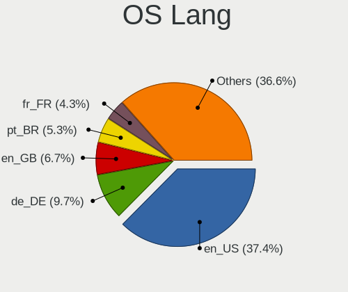
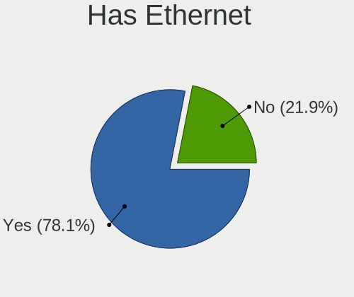
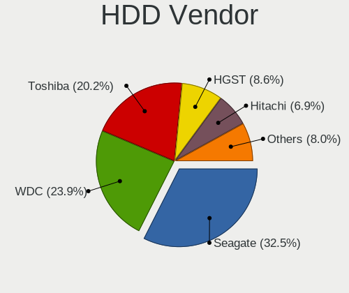

Zorin 16 - Tested Hardware & Statistics (Notebooks)
---------------------------------------------------

A project to collect tested hardware configurations for Zorin 16.

Anyone can contribute to this report by the [hw-probe](https://github.com/linuxhw/hw-probe) tool:

    sudo -E hw-probe -all -upload

Please contribute! Especially if your hardware is rare.

Contents
--------

* [ Test Cases ](#test-cases)

* [ System ](#system)
  - [ Kernel                   ](#kernel)
  - [ Kernel Family            ](#kernel-family)
  - [ Kernel Major Ver.        ](#kernel-major-ver)
  - [ Arch                     ](#arch)
  - [ DE                       ](#de)
  - [ Display Server           ](#display-server)
  - [ Display Manager          ](#display-manager)
  - [ OS Lang                  ](#os-lang)
  - [ Boot Mode                ](#boot-mode)
  - [ Filesystem               ](#filesystem)
  - [ Part. scheme             ](#part-scheme)
  - [ Dual Boot with Linux/BSD ](#dual-boot-with-linuxbsd)
  - [ Dual Boot (Win)          ](#dual-boot-win)

* [ Board ](#board)
  - [ Vendor                   ](#vendor)
  - [ Model                    ](#model)
  - [ Model Family             ](#model-family)
  - [ MFG Year                 ](#mfg-year)
  - [ Form Factor              ](#form-factor)
  - [ Secure Boot              ](#secure-boot)
  - [ Coreboot                 ](#coreboot)
  - [ RAM Size                 ](#ram-size)
  - [ RAM Used                 ](#ram-used)
  - [ Total Drives             ](#total-drives)
  - [ Has CD-ROM               ](#has-cd-rom)
  - [ Has Ethernet             ](#has-ethernet)
  - [ Has WiFi                 ](#has-wifi)
  - [ Has Bluetooth            ](#has-bluetooth)

* [ Location ](#location)
  - [ Country                  ](#country)
  - [ City                     ](#city)

* [ Drives ](#drives)
  - [ Drive Vendor             ](#drive-vendor)
  - [ Drive Model              ](#drive-model)
  - [ HDD Vendor               ](#hdd-vendor)
  - [ SSD Vendor               ](#ssd-vendor)
  - [ Drive Kind               ](#drive-kind)
  - [ Drive Connector          ](#drive-connector)
  - [ Drive Size               ](#drive-size)
  - [ Space Total              ](#space-total)
  - [ Space Used               ](#space-used)
  - [ Malfunc. Drives          ](#malfunc-drives)
  - [ Malfunc. Drive Vendor    ](#malfunc-drive-vendor)
  - [ Malfunc. HDD Vendor      ](#malfunc-hdd-vendor)
  - [ Malfunc. Drive Kind      ](#malfunc-drive-kind)
  - [ Failed Drives            ](#failed-drives)
  - [ Failed Drive Vendor      ](#failed-drive-vendor)
  - [ Drive Status             ](#drive-status)

* [ Storage controller ](#storage-controller)
  - [ Storage Vendor           ](#storage-vendor)
  - [ Storage Model            ](#storage-model)
  - [ Storage Kind             ](#storage-kind)

* [ Processor ](#processor)
  - [ CPU Vendor               ](#cpu-vendor)
  - [ CPU Model                ](#cpu-model)
  - [ CPU Model Family         ](#cpu-model-family)
  - [ CPU Cores                ](#cpu-cores)
  - [ CPU Sockets              ](#cpu-sockets)
  - [ CPU Threads              ](#cpu-threads)
  - [ CPU Op-Modes             ](#cpu-op-modes)
  - [ CPU Microcode            ](#cpu-microcode)
  - [ CPU Microarch            ](#cpu-microarch)

* [ Graphics ](#graphics)
  - [ GPU Vendor               ](#gpu-vendor)
  - [ GPU Model                ](#gpu-model)
  - [ GPU Combo                ](#gpu-combo)
  - [ GPU Driver               ](#gpu-driver)
  - [ GPU Memory               ](#gpu-memory)

* [ Monitor ](#monitor)
  - [ Monitor Vendor           ](#monitor-vendor)
  - [ Monitor Model            ](#monitor-model)
  - [ Monitor Resolution       ](#monitor-resolution)
  - [ Monitor Diagonal         ](#monitor-diagonal)
  - [ Monitor Width            ](#monitor-width)
  - [ Aspect Ratio             ](#aspect-ratio)
  - [ Monitor Area             ](#monitor-area)
  - [ Pixel Density            ](#pixel-density)
  - [ Multiple Monitors        ](#multiple-monitors)

* [ Network ](#network)
  - [ Net Controller Vendor    ](#net-controller-vendor)
  - [ Net Controller Model     ](#net-controller-model)
  - [ Wireless Vendor          ](#wireless-vendor)
  - [ Wireless Model           ](#wireless-model)
  - [ Ethernet Vendor          ](#ethernet-vendor)
  - [ Ethernet Model           ](#ethernet-model)
  - [ Net Controller Kind      ](#net-controller-kind)
  - [ Used Controller          ](#used-controller)
  - [ NICs                     ](#nics)
  - [ IPv6                     ](#ipv6)

* [ Bluetooth ](#bluetooth)
  - [ Bluetooth Vendor         ](#bluetooth-vendor)
  - [ Bluetooth Model          ](#bluetooth-model)

* [ Sound ](#sound)
  - [ Sound Vendor             ](#sound-vendor)
  - [ Sound Model              ](#sound-model)

* [ Memory ](#memory)
  - [ Memory Vendor            ](#memory-vendor)
  - [ Memory Model             ](#memory-model)
  - [ Memory Kind              ](#memory-kind)
  - [ Memory Form Factor       ](#memory-form-factor)
  - [ Memory Size              ](#memory-size)
  - [ Memory Speed             ](#memory-speed)

* [ Printers & scanners ](#printers--scanners)
  - [ Printer Vendor           ](#printer-vendor)
  - [ Printer Model            ](#printer-model)
  - [ Scanner Vendor           ](#scanner-vendor)
  - [ Scanner Model            ](#scanner-model)

* [ Camera ](#camera)
  - [ Camera Vendor            ](#camera-vendor)
  - [ Camera Model             ](#camera-model)

* [ Security ](#security)
  - [ Fingerprint Vendor       ](#fingerprint-vendor)
  - [ Fingerprint Model        ](#fingerprint-model)
  - [ Chipcard Vendor          ](#chipcard-vendor)
  - [ Chipcard Model           ](#chipcard-model)

* [ Unsupported ](#unsupported)
  - [ Unsupported Devices      ](#unsupported-devices)
  - [ Unsupported Device Types ](#unsupported-device-types)

Test Cases
----------

Total: 3313

| Vendor        | Model                       | Probe                                                      | Date         |
|---------------|-----------------------------|------------------------------------------------------------|--------------|
| Lenovo        | IdeaPad 110-15ISK 80UD      | [45207cf034](https://linux-hardware.org/?probe=45207cf034) | Jan 31, 2024 |
| HP            | EliteBook 8460p             | [8ddfa07beb](https://linux-hardware.org/?probe=8ddfa07beb) | Jan 31, 2024 |
| HP            | ProBook 6570b               | [20537302e6](https://linux-hardware.org/?probe=20537302e6) | Jan 31, 2024 |
| Acer          | Aspire 9420                 | [d0c7154097](https://linux-hardware.org/?probe=d0c7154097) | Jan 30, 2024 |
| Dell          | Inspiron 1545               | [3cffc989aa](https://linux-hardware.org/?probe=3cffc989aa) | Jan 29, 2024 |
| Dell          | Inspiron 1545               | [31ce3ae751](https://linux-hardware.org/?probe=31ce3ae751) | Jan 29, 2024 |
| Acer          | Aspire M3-581G              | [b91416ad7c](https://linux-hardware.org/?probe=b91416ad7c) | Jan 28, 2024 |
| Dell          | Latitude E6430              | [237d6e4d3e](https://linux-hardware.org/?probe=237d6e4d3e) | Jan 27, 2024 |
| Toshiba       | Satellite R630              | [c888a8f4d5](https://linux-hardware.org/?probe=c888a8f4d5) | Jan 24, 2024 |
| Apple         | MacBookPro5,5               | [214ebad454](https://linux-hardware.org/?probe=214ebad454) | Jan 24, 2024 |
| Apple         | MacBookPro5,5               | [f2a415adc9](https://linux-hardware.org/?probe=f2a415adc9) | Jan 24, 2024 |
| HP            | ZBook Studio G5             | [114d79aa75](https://linux-hardware.org/?probe=114d79aa75) | Jan 23, 2024 |
| Dell          | Latitude E5420              | [8347319849](https://linux-hardware.org/?probe=8347319849) | Jan 23, 2024 |
| HP            | Pavilion g4                 | [f0cc56ebca](https://linux-hardware.org/?probe=f0cc56ebca) | Jan 23, 2024 |
| Google        | Kefka                       | [6cb0b95d02](https://linux-hardware.org/?probe=6cb0b95d02) | Jan 22, 2024 |
| HP            | Notebook                    | [8359e2a5dd](https://linux-hardware.org/?probe=8359e2a5dd) | Jan 22, 2024 |
| HP            | Laptop 15-fc0xxx            | [8dacf655a4](https://linux-hardware.org/?probe=8dacf655a4) | Jan 22, 2024 |
| HP            | Laptop 15-fc0xxx            | [c3f3bb78c6](https://linux-hardware.org/?probe=c3f3bb78c6) | Jan 22, 2024 |
| HP            | ProBook 430 G4              | [046036e7e3](https://linux-hardware.org/?probe=046036e7e3) | Jan 22, 2024 |
| HP            | ProBook 430 G4              | [262a8552de](https://linux-hardware.org/?probe=262a8552de) | Jan 22, 2024 |
| Dell          | Inspiron 5559               | [a0c06abcbd](https://linux-hardware.org/?probe=a0c06abcbd) | Jan 22, 2024 |
| Dell          | Latitude 5490               | [ebc5bed33f](https://linux-hardware.org/?probe=ebc5bed33f) | Jan 22, 2024 |
| Lenovo        | V15-ADA 82C7                | [a8893e7742](https://linux-hardware.org/?probe=a8893e7742) | Jan 22, 2024 |
| Apple         | MacBookPro14,1              | [af0244605f](https://linux-hardware.org/?probe=af0244605f) | Jan 21, 2024 |
| Apple         | MacBookPro14,1              | [024b0a26f9](https://linux-hardware.org/?probe=024b0a26f9) | Jan 21, 2024 |
| Toshiba       | Satellite L640              | [7478e6971b](https://linux-hardware.org/?probe=7478e6971b) | Jan 21, 2024 |
| HP            | Notebook                    | [2dcfaac5fd](https://linux-hardware.org/?probe=2dcfaac5fd) | Jan 21, 2024 |
| Sony          | VGN-NS11Z_S                 | [64fa921691](https://linux-hardware.org/?probe=64fa921691) | Jan 20, 2024 |
| Lenovo        | IdeaPad S145-15IWL 81MV     | [4257aab3ea](https://linux-hardware.org/?probe=4257aab3ea) | Jan 20, 2024 |
| Dell          | Inspiron 3531               | [afc0f1a968](https://linux-hardware.org/?probe=afc0f1a968) | Jan 20, 2024 |
| HP            | EliteBook 840 G1            | [becbec6f26](https://linux-hardware.org/?probe=becbec6f26) | Jan 20, 2024 |
| Acer          | Aspire E5-551G              | [c4bd469e8d](https://linux-hardware.org/?probe=c4bd469e8d) | Jan 19, 2024 |
| Acer          | Aspire E5-523               | [02378722b6](https://linux-hardware.org/?probe=02378722b6) | Jan 19, 2024 |
| Lenovo        | IdeaPad 3 15ALC6 82KU       | [ae841d1af4](https://linux-hardware.org/?probe=ae841d1af4) | Jan 17, 2024 |
| HP            | ZBook 14u G6                | [668a33bda1](https://linux-hardware.org/?probe=668a33bda1) | Jan 17, 2024 |
| Toshiba       | Satellite A665              | [66c11ee330](https://linux-hardware.org/?probe=66c11ee330) | Jan 17, 2024 |
| Toshiba       | Satellite C850-B820         | [321a8ae666](https://linux-hardware.org/?probe=321a8ae666) | Jan 17, 2024 |
| Toshiba       | Satellite A665              | [640deb41af](https://linux-hardware.org/?probe=640deb41af) | Jan 17, 2024 |
| Lenovo        | ThinkPad X13 Gen 1 20T3S... | [0e05a50329](https://linux-hardware.org/?probe=0e05a50329) | Jan 16, 2024 |
| HP            | Pavilion 17                 | [3594afe0d4](https://linux-hardware.org/?probe=3594afe0d4) | Jan 16, 2024 |
| Intel         | Unknown                     | [dfd975eff3](https://linux-hardware.org/?probe=dfd975eff3) | Jan 15, 2024 |
| Sony          | VGN-NS11Z_S                 | [863785eef9](https://linux-hardware.org/?probe=863785eef9) | Jan 13, 2024 |
| Dell          | Inspiron 3501               | [75a54dcccf](https://linux-hardware.org/?probe=75a54dcccf) | Jan 13, 2024 |
| Toshiba       | Satellite R630              | [0e83a06873](https://linux-hardware.org/?probe=0e83a06873) | Jan 13, 2024 |
| Acer          | Aspire V5-573G              | [09ddfeab43](https://linux-hardware.org/?probe=09ddfeab43) | Jan 12, 2024 |
| ASUSTek       | N56JR                       | [513c456753](https://linux-hardware.org/?probe=513c456753) | Jan 11, 2024 |
| Medion        | E4251 MD61435               | [6a9251fa94](https://linux-hardware.org/?probe=6a9251fa94) | Jan 11, 2024 |
| HP            | Pavilion Sleekbook 14       | [9f54d91b95](https://linux-hardware.org/?probe=9f54d91b95) | Jan 10, 2024 |
| Toshiba       | Satellite L845              | [e45e9517b3](https://linux-hardware.org/?probe=e45e9517b3) | Jan 10, 2024 |
| Dell          | Inspiron 7737               | [ae41cf1d2f](https://linux-hardware.org/?probe=ae41cf1d2f) | Jan 10, 2024 |
| Acer          | Aspire E1-570G              | [2bb5dcf476](https://linux-hardware.org/?probe=2bb5dcf476) | Jan 10, 2024 |
| ASUSTek       | X200CA                      | [c27c1b9fc2](https://linux-hardware.org/?probe=c27c1b9fc2) | Jan 10, 2024 |
| Toshiba       | Satellite C850              | [38fb6d3619](https://linux-hardware.org/?probe=38fb6d3619) | Jan 09, 2024 |
| Toshiba       | Satellite C850              | [c6faf796f4](https://linux-hardware.org/?probe=c6faf796f4) | Jan 09, 2024 |
| HONOR         | BBR-WAX9                    | [b9d1ee2b4c](https://linux-hardware.org/?probe=b9d1ee2b4c) | Jan 08, 2024 |
| HP            | EliteBook 8440p             | [6a5afb5dec](https://linux-hardware.org/?probe=6a5afb5dec) | Jan 08, 2024 |
| HP            | EliteBook Revolve 810 G1    | [c428c1eb3e](https://linux-hardware.org/?probe=c428c1eb3e) | Jan 08, 2024 |
| ASUSTek       | UL50VT                      | [428d20a1eb](https://linux-hardware.org/?probe=428d20a1eb) | Jan 07, 2024 |
| Acer          | Swift SF314-511             | [14eac9efff](https://linux-hardware.org/?probe=14eac9efff) | Jan 07, 2024 |
| Acer          | Aspire E1-570G              | [3c08b1958e](https://linux-hardware.org/?probe=3c08b1958e) | Jan 07, 2024 |
| Dell          | Latitude E5420              | [40835d5737](https://linux-hardware.org/?probe=40835d5737) | Jan 07, 2024 |
| ASUSTek       | ROG Strix G713PI_G713PI     | [b02f06751f](https://linux-hardware.org/?probe=b02f06751f) | Jan 07, 2024 |
| Lenovo        | ThinkPad T520 4243F53       | [900bfdd9a8](https://linux-hardware.org/?probe=900bfdd9a8) | Jan 06, 2024 |
| HP            | ENVY dv6                    | [12f54bd4e0](https://linux-hardware.org/?probe=12f54bd4e0) | Jan 06, 2024 |
| HP            | Pavilion Power Laptop 15... | [37ea5af9b1](https://linux-hardware.org/?probe=37ea5af9b1) | Jan 04, 2024 |
| Dell          | Inspiron 1525               | [debaccaee2](https://linux-hardware.org/?probe=debaccaee2) | Jan 04, 2024 |
| ASUSTek       | E201NA                      | [91cac0307a](https://linux-hardware.org/?probe=91cac0307a) | Jan 04, 2024 |
| Lenovo        | ThinkPad P16s Gen 1 21BT... | [e15430e53e](https://linux-hardware.org/?probe=e15430e53e) | Jan 02, 2024 |
| Lenovo        | ThinkPad T460s 20FAS1V60... | [ca5f55438f](https://linux-hardware.org/?probe=ca5f55438f) | Jan 02, 2024 |
| ASUSTek       | ROG Strix G713PI_G713PI     | [a37bbce8de](https://linux-hardware.org/?probe=a37bbce8de) | Dec 31, 2023 |
| Lenovo        | ThinkPad X270 W10DG 20K5... | [d975ab384e](https://linux-hardware.org/?probe=d975ab384e) | Dec 31, 2023 |
| Acer          | Aspire 8943G                | [a75a2524f2](https://linux-hardware.org/?probe=a75a2524f2) | Dec 31, 2023 |
| Sony          | VGN-CR21S_W                 | [732175d0f6](https://linux-hardware.org/?probe=732175d0f6) | Dec 29, 2023 |
| Lenovo        | ThinkBook 14 G2 ITL 20VD    | [9189ed311a](https://linux-hardware.org/?probe=9189ed311a) | Dec 29, 2023 |
| HP            | ZBook 14u G6                | [409e402108](https://linux-hardware.org/?probe=409e402108) | Dec 28, 2023 |
| Dell          | Vostro 2420                 | [52ae549c99](https://linux-hardware.org/?probe=52ae549c99) | Dec 28, 2023 |
| Acer          | Aspire E1-570               | [403dd9f171](https://linux-hardware.org/?probe=403dd9f171) | Dec 27, 2023 |
| HP            | Compaq 2510p                | [b7b88f9c1c](https://linux-hardware.org/?probe=b7b88f9c1c) | Dec 27, 2023 |
| UNOWHY        | Y13G012S4EI                 | [a3bb952104](https://linux-hardware.org/?probe=a3bb952104) | Dec 27, 2023 |
| HP            | EliteBook Revolve 810 G1    | [30d2bb71e5](https://linux-hardware.org/?probe=30d2bb71e5) | Dec 27, 2023 |
| Lenovo        | ThinkPad T440p 20AWS08S0... | [ae928b9cc1](https://linux-hardware.org/?probe=ae928b9cc1) | Dec 25, 2023 |
| HP            | ENVY dv6                    | [e7d00bdca8](https://linux-hardware.org/?probe=e7d00bdca8) | Dec 25, 2023 |
| HP            | ENVY dv6                    | [7feb95b534](https://linux-hardware.org/?probe=7feb95b534) | Dec 25, 2023 |
| Lenovo        | V110-15ISK 80TL             | [dd911fd507](https://linux-hardware.org/?probe=dd911fd507) | Dec 24, 2023 |
| Dell          | Latitude E6430              | [d949738171](https://linux-hardware.org/?probe=d949738171) | Dec 24, 2023 |
| Dell          | Latitude E6430              | [c821d379ec](https://linux-hardware.org/?probe=c821d379ec) | Dec 24, 2023 |
| Lenovo        | IdeaPad 3 15IAU7 82RK       | [a69b3fa1ca](https://linux-hardware.org/?probe=a69b3fa1ca) | Dec 24, 2023 |
| Lenovo        | IdeaPad 3 15IAU7 82RK       | [9ac48a1719](https://linux-hardware.org/?probe=9ac48a1719) | Dec 24, 2023 |
| HP            | Notebook                    | [69bef099c0](https://linux-hardware.org/?probe=69bef099c0) | Dec 24, 2023 |
| HP            | Victus by 15.6 inch Gami... | [b74170ede4](https://linux-hardware.org/?probe=b74170ede4) | Dec 23, 2023 |
| Toshiba       | Satellite Pro R50-C         | [b4d280ac6a](https://linux-hardware.org/?probe=b4d280ac6a) | Dec 23, 2023 |
| Toshiba       | Satellite Pro R50-C         | [421d62894b](https://linux-hardware.org/?probe=421d62894b) | Dec 23, 2023 |
| Toshiba       | QOSMIO X770                 | [dceb1203ed](https://linux-hardware.org/?probe=dceb1203ed) | Dec 23, 2023 |
| Toshiba       | QOSMIO X770                 | [b9557b6218](https://linux-hardware.org/?probe=b9557b6218) | Dec 23, 2023 |
| Fujitsu       | LIFEBOOK E736               | [49cdf35ca4](https://linux-hardware.org/?probe=49cdf35ca4) | Dec 22, 2023 |
| VTEX          | NOTEBOOK                    | [972b407abc](https://linux-hardware.org/?probe=972b407abc) | Dec 22, 2023 |
| Lenovo        | ThinkPad X131e 33691K7      | [360dc0f244](https://linux-hardware.org/?probe=360dc0f244) | Dec 21, 2023 |
| Dell          | Latitude E7270              | [4574a46c78](https://linux-hardware.org/?probe=4574a46c78) | Dec 21, 2023 |
| Dell          | Inspiron 15-3567            | [f9d9539e00](https://linux-hardware.org/?probe=f9d9539e00) | Dec 21, 2023 |
| ASUSTek       | E201NA                      | [ee5e05ce6d](https://linux-hardware.org/?probe=ee5e05ce6d) | Dec 21, 2023 |
| HP            | 1000                        | [2279f68ba4](https://linux-hardware.org/?probe=2279f68ba4) | Dec 21, 2023 |
| HP            | EliteBook 840 G6            | [5266cee35b](https://linux-hardware.org/?probe=5266cee35b) | Dec 21, 2023 |
| HP            | ProBook 430 G7              | [50a3c349a0](https://linux-hardware.org/?probe=50a3c349a0) | Dec 21, 2023 |
| HP            | ProBook 430 G7              | [f79ed192ac](https://linux-hardware.org/?probe=f79ed192ac) | Dec 21, 2023 |
| Toshiba       | Satellite C850              | [caa584d966](https://linux-hardware.org/?probe=caa584d966) | Dec 20, 2023 |
| ASUSTek       | ROG Strix G713PI_G713PI     | [f7cd6db92f](https://linux-hardware.org/?probe=f7cd6db92f) | Dec 20, 2023 |
| Framework     | Laptop                      | [2aab7ea892](https://linux-hardware.org/?probe=2aab7ea892) | Dec 19, 2023 |
| HP            | Pavilion Gaming Laptop 1... | [bcae8d434f](https://linux-hardware.org/?probe=bcae8d434f) | Dec 19, 2023 |
| HP            | ProBook 650 G1              | [95ab984d32](https://linux-hardware.org/?probe=95ab984d32) | Dec 19, 2023 |
| Lenovo        | V14-IIL 82C4                | [582c2df7b1](https://linux-hardware.org/?probe=582c2df7b1) | Dec 19, 2023 |
| Toshiba       | Satellite Pro C50-A-1E2     | [91b5e05490](https://linux-hardware.org/?probe=91b5e05490) | Dec 19, 2023 |
| Toshiba       | Satellite Pro C50-A-1E2     | [fde7aeea9c](https://linux-hardware.org/?probe=fde7aeea9c) | Dec 19, 2023 |
| Google        | Phaser360                   | [c739678794](https://linux-hardware.org/?probe=c739678794) | Dec 18, 2023 |
| ASUSTek       | ROG Strix G713PI_G713PI     | [780a4cf454](https://linux-hardware.org/?probe=780a4cf454) | Dec 18, 2023 |
| Lenovo        | ThinkPad X240 20AMS0VU00    | [ecca798714](https://linux-hardware.org/?probe=ecca798714) | Dec 18, 2023 |
| HP            | ProBook 430 G4              | [c2b96a9e0f](https://linux-hardware.org/?probe=c2b96a9e0f) | Dec 18, 2023 |
| Dell          | Venue 11 Pro 5130           | [74cdfd92c0](https://linux-hardware.org/?probe=74cdfd92c0) | Dec 18, 2023 |
| HP            | ZBook 14u G6                | [125dbde28d](https://linux-hardware.org/?probe=125dbde28d) | Dec 17, 2023 |
| Sony          | VGN-FW455J                  | [f16255f9d1](https://linux-hardware.org/?probe=f16255f9d1) | Dec 17, 2023 |
| ASUSTek       | K53SD                       | [7962dd075b](https://linux-hardware.org/?probe=7962dd075b) | Dec 17, 2023 |
| HP            | Pavilion Laptop 15-cs3xx... | [304fbf1e83](https://linux-hardware.org/?probe=304fbf1e83) | Dec 17, 2023 |
| Irbis         | NB12                        | [f6eb11e455](https://linux-hardware.org/?probe=f6eb11e455) | Dec 17, 2023 |
| Google        | Phaser360                   | [784ed40440](https://linux-hardware.org/?probe=784ed40440) | Dec 16, 2023 |
| HP            | ProBook 455 15.6 inch G1... | [56e1b0ed26](https://linux-hardware.org/?probe=56e1b0ed26) | Dec 16, 2023 |
| HP            | ProBook 430 G4              | [30f8fe050c](https://linux-hardware.org/?probe=30f8fe050c) | Dec 16, 2023 |
| HP            | Notebook                    | [4973d42380](https://linux-hardware.org/?probe=4973d42380) | Dec 16, 2023 |
| HP            | Notebook                    | [a960b17c37](https://linux-hardware.org/?probe=a960b17c37) | Dec 16, 2023 |
| ASUSTek       | X553MA                      | [1bd6eab773](https://linux-hardware.org/?probe=1bd6eab773) | Dec 15, 2023 |
| Medion        | P7624                       | [4828985ec0](https://linux-hardware.org/?probe=4828985ec0) | Dec 15, 2023 |
| Medion        | P7624                       | [050fbbd613](https://linux-hardware.org/?probe=050fbbd613) | Dec 15, 2023 |
| Dell          | XPS 15 9550                 | [de4b8201ef](https://linux-hardware.org/?probe=de4b8201ef) | Dec 15, 2023 |
| ASUSTek       | ROG Strix G713PI_G713PI     | [b5fefd59fe](https://linux-hardware.org/?probe=b5fefd59fe) | Dec 15, 2023 |
| Medion        | E4251 MD61435               | [7d20d738b1](https://linux-hardware.org/?probe=7d20d738b1) | Dec 14, 2023 |
| Lenovo        | IdeaPad 3 15ADA05 81W1      | [734375c1cc](https://linux-hardware.org/?probe=734375c1cc) | Dec 14, 2023 |
| TUXEDO        | InfinityBook Pro Gen8 (M... | [5ae09c04d4](https://linux-hardware.org/?probe=5ae09c04d4) | Dec 14, 2023 |
| Lenovo        | IdeaPad 3 15ADA05 81W1      | [3eb792873c](https://linux-hardware.org/?probe=3eb792873c) | Dec 14, 2023 |
| Dell          | Inspiron 15 5510            | [41dbdcf594](https://linux-hardware.org/?probe=41dbdcf594) | Dec 13, 2023 |
| ASUSTek       | ASUS TUF Gaming F17 FX70... | [f9933769ef](https://linux-hardware.org/?probe=f9933769ef) | Dec 13, 2023 |
| ASUSTek       | ASUS TUF Gaming F17 FX70... | [27b99be924](https://linux-hardware.org/?probe=27b99be924) | Dec 12, 2023 |
| HP            | Notebook                    | [972e86b7cf](https://linux-hardware.org/?probe=972e86b7cf) | Dec 12, 2023 |
| Lenovo        | G570 20079                  | [bdfc16eb98](https://linux-hardware.org/?probe=bdfc16eb98) | Dec 11, 2023 |
| ASUSTek       | ZenBook UX482EG_UX482EG     | [a644fcc63e](https://linux-hardware.org/?probe=a644fcc63e) | Dec 11, 2023 |
| Lenovo        | ThinkPad T440s 20ARS06C0... | [332492b0c4](https://linux-hardware.org/?probe=332492b0c4) | Dec 11, 2023 |
| HP            | Victus by Gaming Laptop ... | [949de6a6a9](https://linux-hardware.org/?probe=949de6a6a9) | Dec 10, 2023 |
| Dell          | Inspiron 7559               | [3f4af9bbdd](https://linux-hardware.org/?probe=3f4af9bbdd) | Dec 10, 2023 |
| Packard Be... | EasyNote TE11BZ             | [514899b0b9](https://linux-hardware.org/?probe=514899b0b9) | Dec 10, 2023 |
| ASUSTek       | X550VC                      | [e2c932c285](https://linux-hardware.org/?probe=e2c932c285) | Dec 09, 2023 |
| Acer          | AOD257                      | [79c121ca0e](https://linux-hardware.org/?probe=79c121ca0e) | Dec 09, 2023 |
| Dell          | Vostro 3560                 | [d2abe7128b](https://linux-hardware.org/?probe=d2abe7128b) | Dec 09, 2023 |
| Acer          | AOD257                      | [c817dc5cca](https://linux-hardware.org/?probe=c817dc5cca) | Dec 08, 2023 |
| Acer          | Nitro AN515-54              | [045ab5efca](https://linux-hardware.org/?probe=045ab5efca) | Dec 08, 2023 |
| HP            | Compaq 6730b (NB034ET#UU... | [88c39cda86](https://linux-hardware.org/?probe=88c39cda86) | Dec 08, 2023 |
| HP            | Stream Laptop 14-cb1XX      | [fc2efc3edb](https://linux-hardware.org/?probe=fc2efc3edb) | Dec 07, 2023 |
| Lenovo        | ThinkPad P52 20MAS25B1X     | [767b4efa54](https://linux-hardware.org/?probe=767b4efa54) | Dec 06, 2023 |
| Dell          | Latitude 7490               | [364b5c38d4](https://linux-hardware.org/?probe=364b5c38d4) | Dec 06, 2023 |
| Apple         | MacBookAir7,2               | [1748ab2263](https://linux-hardware.org/?probe=1748ab2263) | Dec 05, 2023 |
| HP            | 255 G6 Notebook PC          | [ee58e73f03](https://linux-hardware.org/?probe=ee58e73f03) | Dec 04, 2023 |
| Lenovo        | ThinkPad X1 Carbon Gen 1... | [dcb521e9aa](https://linux-hardware.org/?probe=dcb521e9aa) | Dec 04, 2023 |
| Dell          | Latitude 6430U              | [45d1723559](https://linux-hardware.org/?probe=45d1723559) | Dec 03, 2023 |
| Dell          | Latitude 6430U              | [1e4dda911f](https://linux-hardware.org/?probe=1e4dda911f) | Dec 03, 2023 |
| HP            | Pavilion dv7                | [42ddf2c00c](https://linux-hardware.org/?probe=42ddf2c00c) | Dec 03, 2023 |
| HP            | Pavilion dv5                | [40e03f76cf](https://linux-hardware.org/?probe=40e03f76cf) | Dec 03, 2023 |
| Dell          | XPS 13 9360                 | [f2a9f68180](https://linux-hardware.org/?probe=f2a9f68180) | Dec 02, 2023 |
| Dell          | XPS 13 9360                 | [e6d3755007](https://linux-hardware.org/?probe=e6d3755007) | Dec 02, 2023 |
| Lenovo        | IdeaPad 1 15ALC7 82R4       | [5d98fa1470](https://linux-hardware.org/?probe=5d98fa1470) | Dec 02, 2023 |
| Apple         | MacBookPro14,1              | [9dea837056](https://linux-hardware.org/?probe=9dea837056) | Dec 02, 2023 |
| Fujitsu       | LIFEBOOK E780               | [f1e82db736](https://linux-hardware.org/?probe=f1e82db736) | Dec 01, 2023 |
| Acer          | Swift SF314-511             | [ca692e6dcb](https://linux-hardware.org/?probe=ca692e6dcb) | Dec 01, 2023 |
| Acer          | Aspire A517-52G             | [72702ceb3f](https://linux-hardware.org/?probe=72702ceb3f) | Dec 01, 2023 |
| HP            | 15                          | [7bd98a81f6](https://linux-hardware.org/?probe=7bd98a81f6) | Dec 01, 2023 |
| HP            | Laptop 15-bs0xx             | [02f2ca658e](https://linux-hardware.org/?probe=02f2ca658e) | Dec 01, 2023 |
| HP            | Laptop 15-bs0xx             | [e812beed5d](https://linux-hardware.org/?probe=e812beed5d) | Dec 01, 2023 |
| Acer          | Aspire A517-52G             | [33126bb441](https://linux-hardware.org/?probe=33126bb441) | Nov 30, 2023 |
| Toshiba       | Satellite L850D-131         | [483c7cfdf6](https://linux-hardware.org/?probe=483c7cfdf6) | Nov 30, 2023 |
| AMI           | AMD                         | [9f3f9ba617](https://linux-hardware.org/?probe=9f3f9ba617) | Nov 29, 2023 |
| ASUSTek       | ASUS EXPERTBOOK B5602CBA... | [0c08316018](https://linux-hardware.org/?probe=0c08316018) | Nov 29, 2023 |
| Dell          | Inspiron 5558               | [c934dcacd6](https://linux-hardware.org/?probe=c934dcacd6) | Nov 29, 2023 |
| HP            | EliteBook 8440p             | [9af25bdb99](https://linux-hardware.org/?probe=9af25bdb99) | Nov 28, 2023 |
| Medion        | Erazer P7643 MD60133        | [65f090fe28](https://linux-hardware.org/?probe=65f090fe28) | Nov 28, 2023 |
| HP            | 15                          | [c1ca96368f](https://linux-hardware.org/?probe=c1ca96368f) | Nov 28, 2023 |
| Lenovo        | IdeaPad 3 15ALC6 Ub 82KU    | [f99e3c8556](https://linux-hardware.org/?probe=f99e3c8556) | Nov 28, 2023 |
| ASUSTek       | K93SV                       | [f85fb01be1](https://linux-hardware.org/?probe=f85fb01be1) | Nov 28, 2023 |
| HP            | 15                          | [aba1e87e5c](https://linux-hardware.org/?probe=aba1e87e5c) | Nov 28, 2023 |
| Dell          | XPS 15 9550                 | [6d2e371a5f](https://linux-hardware.org/?probe=6d2e371a5f) | Nov 27, 2023 |
| Dell          | Latitude D830               | [2e017edf81](https://linux-hardware.org/?probe=2e017edf81) | Nov 27, 2023 |
| HP            | ENVY m6                     | [41cff88708](https://linux-hardware.org/?probe=41cff88708) | Nov 26, 2023 |
| Apple         | MacBookPro5,4               | [fb45c81af9](https://linux-hardware.org/?probe=fb45c81af9) | Nov 26, 2023 |
| Toshiba       | TECRA W50-A                 | [91a2348496](https://linux-hardware.org/?probe=91a2348496) | Nov 25, 2023 |
| Lenovo        | Z710 20250                  | [c9522c065e](https://linux-hardware.org/?probe=c9522c065e) | Nov 24, 2023 |
| Lenovo        | ThinkPad T570 20HAS0K501    | [4fe6d8f889](https://linux-hardware.org/?probe=4fe6d8f889) | Nov 24, 2023 |
| Toshiba       | TECRA R850                  | [6930db743c](https://linux-hardware.org/?probe=6930db743c) | Nov 24, 2023 |
| HP            | Stream Laptop 14-cb1xxx     | [eb779ea004](https://linux-hardware.org/?probe=eb779ea004) | Nov 24, 2023 |
| HP            | Stream Laptop 14-cb1xxx     | [0d60447eea](https://linux-hardware.org/?probe=0d60447eea) | Nov 24, 2023 |
| HP            | G5000 (GF767EA#B1A)         | [5239511cca](https://linux-hardware.org/?probe=5239511cca) | Nov 24, 2023 |
| ASUSTek       | ROG Strix G713PI_G713PI     | [9d5752b2d8](https://linux-hardware.org/?probe=9d5752b2d8) | Nov 24, 2023 |
| Unknown       | M17                         | [d3d7d176b4](https://linux-hardware.org/?probe=d3d7d176b4) | Nov 23, 2023 |
| Medion        | E5214                       | [f3ab89b2d3](https://linux-hardware.org/?probe=f3ab89b2d3) | Nov 23, 2023 |
| Acer          | Aspire E5-511               | [87ccf00042](https://linux-hardware.org/?probe=87ccf00042) | Nov 23, 2023 |
| HUAWEI        | NBLB-WAX9N                  | [c883420b97](https://linux-hardware.org/?probe=c883420b97) | Nov 23, 2023 |
| Lenovo        | ThinkPad T430 2347GU8       | [3b995f6b47](https://linux-hardware.org/?probe=3b995f6b47) | Nov 23, 2023 |
| Toshiba       | Satellite L850D-131         | [8810505a5a](https://linux-hardware.org/?probe=8810505a5a) | Nov 23, 2023 |
| Lenovo        | ThinkPad T440 20B7S0VA05    | [37a1e3b979](https://linux-hardware.org/?probe=37a1e3b979) | Nov 23, 2023 |
| Lenovo        | Legion 5 15ARH05 82B5       | [0137a4a556](https://linux-hardware.org/?probe=0137a4a556) | Nov 23, 2023 |
| Acer          | Aspire ES1-731              | [649e8a4e24](https://linux-hardware.org/?probe=649e8a4e24) | Nov 22, 2023 |
| ASUSTek       | ROG Zephyrus M16 GU603HE... | [8d492b21b0](https://linux-hardware.org/?probe=8d492b21b0) | Nov 22, 2023 |
| HUAWEI        | BoDE-WXX9                   | [343ba69496](https://linux-hardware.org/?probe=343ba69496) | Nov 22, 2023 |
| HUAWEI        | BoDE-WXX9                   | [b365872b3f](https://linux-hardware.org/?probe=b365872b3f) | Nov 22, 2023 |
| Samsung       | 530XBB                      | [c31efedbdf](https://linux-hardware.org/?probe=c31efedbdf) | Nov 22, 2023 |
| ASUSTek       | E201NA                      | [11f7e8f675](https://linux-hardware.org/?probe=11f7e8f675) | Nov 22, 2023 |
| HP            | EliteBook Folio 1020 G1     | [022f885fe9](https://linux-hardware.org/?probe=022f885fe9) | Nov 22, 2023 |
| Notebook      | NL40_50CU                   | [94885b9878](https://linux-hardware.org/?probe=94885b9878) | Nov 21, 2023 |
| HP            | Stream Notebook PC 11       | [c363e01e5f](https://linux-hardware.org/?probe=c363e01e5f) | Nov 21, 2023 |
| Apple         | MacBookPro14,3              | [3664fc3164](https://linux-hardware.org/?probe=3664fc3164) | Nov 20, 2023 |
| HUAWEI        | HVY-WXX9                    | [6c2755ced9](https://linux-hardware.org/?probe=6c2755ced9) | Nov 20, 2023 |
| Lenovo        | ThinkPad Edge E530 32599... | [f472f3fd2e](https://linux-hardware.org/?probe=f472f3fd2e) | Nov 20, 2023 |
| HP            | OMEN by Laptop              | [8fbd1e56eb](https://linux-hardware.org/?probe=8fbd1e56eb) | Nov 20, 2023 |
| Lenovo        | ThinkPad T460 20FMS22Q00    | [84df1d0476](https://linux-hardware.org/?probe=84df1d0476) | Nov 20, 2023 |
| HUAWEI        | CREFG-XX                    | [97b8871652](https://linux-hardware.org/?probe=97b8871652) | Nov 20, 2023 |
| Medion        | E5214                       | [8e3148e284](https://linux-hardware.org/?probe=8e3148e284) | Nov 20, 2023 |
| HP            | ProBook 430 G2              | [e0a3622122](https://linux-hardware.org/?probe=e0a3622122) | Nov 20, 2023 |
| HUAWEI        | CREFG-XX                    | [be15ab8952](https://linux-hardware.org/?probe=be15ab8952) | Nov 19, 2023 |
| Lenovo        | ThinkPad T460 20FMS22Q00    | [626d8d9409](https://linux-hardware.org/?probe=626d8d9409) | Nov 19, 2023 |
| HUAWEI        | CREFG-XX                    | [747979b60f](https://linux-hardware.org/?probe=747979b60f) | Nov 19, 2023 |
| Lenovo        | Z50-75 80EC                 | [6876ff8fc6](https://linux-hardware.org/?probe=6876ff8fc6) | Nov 19, 2023 |
| Medion        | E5214                       | [4513f3394d](https://linux-hardware.org/?probe=4513f3394d) | Nov 18, 2023 |
| HP            | 250 G6 Notebook PC          | [b62a8b07f4](https://linux-hardware.org/?probe=b62a8b07f4) | Nov 18, 2023 |
| HUAWEI        | NBLB-WAX9N                  | [ec19f0fa52](https://linux-hardware.org/?probe=ec19f0fa52) | Nov 18, 2023 |
| Dell          | Latitude 5490               | [b3da1a92d0](https://linux-hardware.org/?probe=b3da1a92d0) | Nov 17, 2023 |
| Compaq        | Presario CQ-17              | [7b53a480e4](https://linux-hardware.org/?probe=7b53a480e4) | Nov 17, 2023 |
| ASUSTek       | ROG Strix G814JI_G814JI     | [54bad5da51](https://linux-hardware.org/?probe=54bad5da51) | Nov 17, 2023 |
| Toshiba       | TECRA R850                  | [9974b99f5a](https://linux-hardware.org/?probe=9974b99f5a) | Nov 16, 2023 |
| HP            | Pavilion g7                 | [9f8b6f3432](https://linux-hardware.org/?probe=9f8b6f3432) | Nov 16, 2023 |
| HP            | Pavilion g7                 | [0c4816a4f2](https://linux-hardware.org/?probe=0c4816a4f2) | Nov 16, 2023 |
| Lenovo        | ThinkPad P17 Gen 2i 20YU... | [7edaa0f1be](https://linux-hardware.org/?probe=7edaa0f1be) | Nov 15, 2023 |
| HP            | InsydeH2O EFI BIOS          | [559ef6212b](https://linux-hardware.org/?probe=559ef6212b) | Nov 15, 2023 |
| HP            | ZBook 14u G6                | [c6471dbbfd](https://linux-hardware.org/?probe=c6471dbbfd) | Nov 14, 2023 |
| Adreamer      | PN1308P                     | [8c4d2fca5a](https://linux-hardware.org/?probe=8c4d2fca5a) | Nov 14, 2023 |
| Adreamer      | PN1308P                     | [5efc66eebc](https://linux-hardware.org/?probe=5efc66eebc) | Nov 14, 2023 |
| HP            | Compaq 6910p                | [019a154d30](https://linux-hardware.org/?probe=019a154d30) | Nov 14, 2023 |
| Dell          | System Vostro 3750          | [513485cc8f](https://linux-hardware.org/?probe=513485cc8f) | Nov 14, 2023 |
| Tactus        | GeoBook 110                 | [077bbdc325](https://linux-hardware.org/?probe=077bbdc325) | Nov 14, 2023 |
| Tactus        | GeoBook 110                 | [5e50f31cbb](https://linux-hardware.org/?probe=5e50f31cbb) | Nov 14, 2023 |
| Apple         | MacBookPro12,1              | [d00bbdf844](https://linux-hardware.org/?probe=d00bbdf844) | Nov 14, 2023 |
| Apple         | MacBookPro12,1              | [493702778b](https://linux-hardware.org/?probe=493702778b) | Nov 14, 2023 |
| Dell          | System Vostro 3750          | [3c336ad6e1](https://linux-hardware.org/?probe=3c336ad6e1) | Nov 14, 2023 |
| Lenovo        | ThinkPad E550 20DF00CNGE    | [35e0f85cf3](https://linux-hardware.org/?probe=35e0f85cf3) | Nov 13, 2023 |
| HP            | Laptop 14-ck0xxx            | [73a53ca5a4](https://linux-hardware.org/?probe=73a53ca5a4) | Nov 13, 2023 |
| ASUSTek       | ASUS TUF Gaming A15 FA50... | [a0105ee2c8](https://linux-hardware.org/?probe=a0105ee2c8) | Nov 13, 2023 |
| HP            | 15                          | [20b22b2eeb](https://linux-hardware.org/?probe=20b22b2eeb) | Nov 13, 2023 |
| HUAWEI        | NBLB-WAX9N                  | [83d6eddd15](https://linux-hardware.org/?probe=83d6eddd15) | Nov 12, 2023 |
| HUAWEI        | RLEFG-XX                    | [5f413be4fc](https://linux-hardware.org/?probe=5f413be4fc) | Nov 12, 2023 |
| HUAWEI        | BOHB-WAX9                   | [1d2a92df29](https://linux-hardware.org/?probe=1d2a92df29) | Nov 12, 2023 |
| Lenovo        | ThinkPad E580 20KS001RGE    | [55b706c3ec](https://linux-hardware.org/?probe=55b706c3ec) | Nov 12, 2023 |
| Lenovo        | ThinkPad T460 20FMS22Q00    | [4c40c1d213](https://linux-hardware.org/?probe=4c40c1d213) | Nov 11, 2023 |
| Unknown       | Unknown                     | [16acb0dabc](https://linux-hardware.org/?probe=16acb0dabc) | Nov 11, 2023 |
| Toshiba       | Satellite L655              | [b3c59942a1](https://linux-hardware.org/?probe=b3c59942a1) | Nov 11, 2023 |
| HP            | Presario CQ62               | [584d709751](https://linux-hardware.org/?probe=584d709751) | Nov 11, 2023 |
| Toshiba       | PORTEGE Z30-A               | [1b3661590f](https://linux-hardware.org/?probe=1b3661590f) | Nov 11, 2023 |
| Lenovo        | IdeaPad 3 14ITL6 82H7       | [13798a5389](https://linux-hardware.org/?probe=13798a5389) | Nov 11, 2023 |
| Lenovo        | IdeaPad 3 14ITL6 82H7       | [b962155541](https://linux-hardware.org/?probe=b962155541) | Nov 11, 2023 |
| Dell          | Precision M6800             | [4ad69afe3a](https://linux-hardware.org/?probe=4ad69afe3a) | Nov 11, 2023 |
| Apple         | MacBookPro9,2               | [e4fd0fa1f0](https://linux-hardware.org/?probe=e4fd0fa1f0) | Nov 10, 2023 |
| HP            | 250 G8 Notebook PC          | [fda2670cc5](https://linux-hardware.org/?probe=fda2670cc5) | Nov 10, 2023 |
| Lenovo        | Z40-70 20366                | [f1968605c1](https://linux-hardware.org/?probe=f1968605c1) | Nov 09, 2023 |
| Acer          | Aspire E1-531               | [6a30b05dcb](https://linux-hardware.org/?probe=6a30b05dcb) | Nov 08, 2023 |
| PEAQ          | PNB C1014-I1B1 MD99447      | [33d5a0aa8c](https://linux-hardware.org/?probe=33d5a0aa8c) | Nov 08, 2023 |
| ASUSTek       | ROG Strix G713PI_G713PI     | [cc75144dea](https://linux-hardware.org/?probe=cc75144dea) | Nov 08, 2023 |
| HP            | 250 G8 Notebook PC          | [38b21b9f64](https://linux-hardware.org/?probe=38b21b9f64) | Nov 08, 2023 |
| Acer          | Aspire E5-553G              | [f77e4d524d](https://linux-hardware.org/?probe=f77e4d524d) | Nov 08, 2023 |
| HP            | Compaq 6830s                | [069a45be37](https://linux-hardware.org/?probe=069a45be37) | Nov 08, 2023 |
| Lenovo        | ThinkPad T440p 20AWS08S0... | [b7e993f677](https://linux-hardware.org/?probe=b7e993f677) | Nov 07, 2023 |
| Fujitsu Si... | AMILO Li 1818               | [ab74cc1cc6](https://linux-hardware.org/?probe=ab74cc1cc6) | Nov 07, 2023 |
| Dell          | Venue 11 Pro 5130           | [c2434cadfc](https://linux-hardware.org/?probe=c2434cadfc) | Nov 07, 2023 |
| Dell          | Venue 11 Pro 5130           | [a5628b0f9d](https://linux-hardware.org/?probe=a5628b0f9d) | Nov 07, 2023 |
| Acer          | Aspire ES1-572              | [eea33256f6](https://linux-hardware.org/?probe=eea33256f6) | Nov 07, 2023 |
| Lenovo        | IdeaPad S400u 20213         | [5ddd610c2d](https://linux-hardware.org/?probe=5ddd610c2d) | Nov 06, 2023 |
| Dell          | Venue 11 Pro 5130           | [5d63a1487d](https://linux-hardware.org/?probe=5d63a1487d) | Nov 06, 2023 |
| Acer          | Aspire ES1-521              | [8447756322](https://linux-hardware.org/?probe=8447756322) | Nov 06, 2023 |
| Acer          | Aspire ES1-521              | [af12dd22ba](https://linux-hardware.org/?probe=af12dd22ba) | Nov 06, 2023 |
| Dell          | Venue 11 Pro 5130           | [0facd311dc](https://linux-hardware.org/?probe=0facd311dc) | Nov 05, 2023 |
| Dell          | Venue 11 Pro 5130           | [27740d5118](https://linux-hardware.org/?probe=27740d5118) | Nov 05, 2023 |
| Dell          | Latitude E7450              | [71fe592aa3](https://linux-hardware.org/?probe=71fe592aa3) | Nov 05, 2023 |
| Lenovo        | ThinkPad T14 Gen 1 20S1S... | [4bf4b470a0](https://linux-hardware.org/?probe=4bf4b470a0) | Nov 05, 2023 |
| ASUSTek       | ROG Strix G713PI_G713PI     | [8b3f431a00](https://linux-hardware.org/?probe=8b3f431a00) | Nov 05, 2023 |
| Toshiba       | IS 1412                     | [486d28dfeb](https://linux-hardware.org/?probe=486d28dfeb) | Nov 05, 2023 |
| Toshiba       | IS 1412                     | [d423a5c34a](https://linux-hardware.org/?probe=d423a5c34a) | Nov 04, 2023 |
| Lenovo        | ThinkPad X1 Carbon Gen 8... | [38df9f5382](https://linux-hardware.org/?probe=38df9f5382) | Nov 04, 2023 |
| TrekStor      | Surfbook W2                 | [cfee0c0363](https://linux-hardware.org/?probe=cfee0c0363) | Nov 04, 2023 |
| HP            | 250 G8 Notebook PC          | [7a24e5115a](https://linux-hardware.org/?probe=7a24e5115a) | Nov 04, 2023 |
| Lenovo        | Y520-15IKBN 80WK            | [c07d28d9bc](https://linux-hardware.org/?probe=c07d28d9bc) | Nov 04, 2023 |
| Lenovo        | Y520-15IKBN 80WK            | [00cab2c4d1](https://linux-hardware.org/?probe=00cab2c4d1) | Nov 04, 2023 |
| Timi          | A35                         | [1baa5932cc](https://linux-hardware.org/?probe=1baa5932cc) | Nov 03, 2023 |
| Dell          | Latitude E6520              | [a0e05f5040](https://linux-hardware.org/?probe=a0e05f5040) | Nov 02, 2023 |
| ASUSTek       | T100TAF                     | [ea9f809740](https://linux-hardware.org/?probe=ea9f809740) | Nov 02, 2023 |
| HUAWEI        | BOHK-WAX9X                  | [4372a2d9eb](https://linux-hardware.org/?probe=4372a2d9eb) | Nov 02, 2023 |
| Lenovo        | IdeaPad 3 14ITL6 82H7       | [fb7f16d298](https://linux-hardware.org/?probe=fb7f16d298) | Nov 02, 2023 |
| ASUSTek       | U36SD                       | [e2045d61a5](https://linux-hardware.org/?probe=e2045d61a5) | Nov 02, 2023 |
| ASUSTek       | ROG Strix G713PI_G713PI     | [ef9bc3cc1e](https://linux-hardware.org/?probe=ef9bc3cc1e) | Nov 02, 2023 |
| Acer          | Aspire 5736Z                | [9fff8956bb](https://linux-hardware.org/?probe=9fff8956bb) | Nov 01, 2023 |
| Apple         | MacBookPro3,1               | [73a395f017](https://linux-hardware.org/?probe=73a395f017) | Nov 01, 2023 |
| Sony          | SVS15116GAB                 | [03634a7731](https://linux-hardware.org/?probe=03634a7731) | Oct 30, 2023 |
| MSI           | Delta 15 A5EFK              | [185b65ebc1](https://linux-hardware.org/?probe=185b65ebc1) | Oct 30, 2023 |
| Notebook      | PA70Hx                      | [627ed781b5](https://linux-hardware.org/?probe=627ed781b5) | Oct 30, 2023 |
| HP            | 15                          | [1480b12f56](https://linux-hardware.org/?probe=1480b12f56) | Oct 30, 2023 |
| HP            | Notebook                    | [5538a0e3b2](https://linux-hardware.org/?probe=5538a0e3b2) | Oct 30, 2023 |
| HP            | Pavilion dv4                | [854806c6f4](https://linux-hardware.org/?probe=854806c6f4) | Oct 29, 2023 |
| HP            | ENVY 17                     | [8852bab8c1](https://linux-hardware.org/?probe=8852bab8c1) | Oct 29, 2023 |
| Lenovo        | ThinkPad X270 20HMS1T600    | [97fbe59dd7](https://linux-hardware.org/?probe=97fbe59dd7) | Oct 29, 2023 |
| Notebook      | PA70Hx                      | [e13de47400](https://linux-hardware.org/?probe=e13de47400) | Oct 29, 2023 |
| Lenovo        | ThinkPad E420 1141BTU       | [867e950bca](https://linux-hardware.org/?probe=867e950bca) | Oct 29, 2023 |
| ASUSTek       | VivoBook_ASUSLaptop K650... | [a123ac023f](https://linux-hardware.org/?probe=a123ac023f) | Oct 29, 2023 |
| ASUSTek       | ZenBook UX434IQ_Q407IQ      | [97eabba1a8](https://linux-hardware.org/?probe=97eabba1a8) | Oct 28, 2023 |
| Acer          | Aspire V3-772G              | [d48a91cce4](https://linux-hardware.org/?probe=d48a91cce4) | Oct 28, 2023 |
| HP            | ENVY 17                     | [aaa99aaa53](https://linux-hardware.org/?probe=aaa99aaa53) | Oct 27, 2023 |
| HCL Infosy... | HCL ME Laptop               | [a23dc90a3b](https://linux-hardware.org/?probe=a23dc90a3b) | Oct 27, 2023 |
| Thomson       | WWNEO14C-4BK32F             | [516a5ee33b](https://linux-hardware.org/?probe=516a5ee33b) | Oct 27, 2023 |
| ASUSTek       | ZenBook UX434IQ_Q407IQ      | [763e54c87b](https://linux-hardware.org/?probe=763e54c87b) | Oct 26, 2023 |
| HP            | G61                         | [d184a33522](https://linux-hardware.org/?probe=d184a33522) | Oct 26, 2023 |
| HP            | Pavilion g7                 | [4699d107df](https://linux-hardware.org/?probe=4699d107df) | Oct 26, 2023 |
| HP            | 250 G7 Notebook PC          | [3c8f87fe9e](https://linux-hardware.org/?probe=3c8f87fe9e) | Oct 25, 2023 |
| HP            | 250 G8 Notebook PC          | [cd1abadd3a](https://linux-hardware.org/?probe=cd1abadd3a) | Oct 25, 2023 |
| Acer          | Aspire 5738                 | [039878b1b2](https://linux-hardware.org/?probe=039878b1b2) | Oct 24, 2023 |
| Lenovo        | ThinkPad A485 20MVS0X62X    | [52661c1969](https://linux-hardware.org/?probe=52661c1969) | Oct 22, 2023 |
| Dell          | Precision 7530              | [92f2a2c99e](https://linux-hardware.org/?probe=92f2a2c99e) | Oct 22, 2023 |
| ASUSTek       | X453MA                      | [ef8715c7a7](https://linux-hardware.org/?probe=ef8715c7a7) | Oct 21, 2023 |
| Acer          | Nitro AN515-52              | [081a658255](https://linux-hardware.org/?probe=081a658255) | Oct 21, 2023 |
| TrekStor      | Surfbook W2                 | [001d67067b](https://linux-hardware.org/?probe=001d67067b) | Oct 21, 2023 |
| HP            | Laptop 14-cf2xxx            | [ef8c0bb04c](https://linux-hardware.org/?probe=ef8c0bb04c) | Oct 21, 2023 |
| HP            | Laptop 14s-dq2xxx           | [330cbe85c6](https://linux-hardware.org/?probe=330cbe85c6) | Oct 21, 2023 |
| HP            | Pavilion dv6                | [a7ee33da8f](https://linux-hardware.org/?probe=a7ee33da8f) | Oct 21, 2023 |
| Dell          | Inspiron 7560               | [6b9df8da7d](https://linux-hardware.org/?probe=6b9df8da7d) | Oct 21, 2023 |
| ASUSTek       | X453MA                      | [11d8517f7e](https://linux-hardware.org/?probe=11d8517f7e) | Oct 20, 2023 |
| HUAWEI        | BOHK-WAX9X                  | [9ce038aa93](https://linux-hardware.org/?probe=9ce038aa93) | Oct 20, 2023 |
| HP            | Laptop 14-cf2xxx            | [3dd8426b8f](https://linux-hardware.org/?probe=3dd8426b8f) | Oct 20, 2023 |
| Dell          | Latitude 5490               | [cdf021cc62](https://linux-hardware.org/?probe=cdf021cc62) | Oct 19, 2023 |
| ASUSTek       | X751SA                      | [21a2a5b900](https://linux-hardware.org/?probe=21a2a5b900) | Oct 18, 2023 |
| Lenovo        | IdeaPad 1 15AMN7 82VG       | [cde2726f48](https://linux-hardware.org/?probe=cde2726f48) | Oct 18, 2023 |
| Lenovo        | IdeaPad 1 15AMN7 82VG       | [2985805059](https://linux-hardware.org/?probe=2985805059) | Oct 18, 2023 |
| ASUSTek       | X200MA                      | [c1ea75561b](https://linux-hardware.org/?probe=c1ea75561b) | Oct 18, 2023 |
| Sony          | VGN-FZ31Z                   | [9a6fd46a7d](https://linux-hardware.org/?probe=9a6fd46a7d) | Oct 17, 2023 |
| Lenovo        | ThinkPad T420 4236KU9       | [f1e77b51bc](https://linux-hardware.org/?probe=f1e77b51bc) | Oct 17, 2023 |
| Acer          | Aspire A515-57G             | [7116f7edd9](https://linux-hardware.org/?probe=7116f7edd9) | Oct 17, 2023 |
| Acer          | Aspire SW5-012              | [848b8d7c20](https://linux-hardware.org/?probe=848b8d7c20) | Oct 17, 2023 |
| Lenovo        | ThinkPad T440 20B7S1D200    | [43185c1e5b](https://linux-hardware.org/?probe=43185c1e5b) | Oct 16, 2023 |
| Apple         | MacBookPro9,2               | [fd91b9ece9](https://linux-hardware.org/?probe=fd91b9ece9) | Oct 16, 2023 |
| Multilaser    | MLSH1H LINUX                | [e87c9aab74](https://linux-hardware.org/?probe=e87c9aab74) | Oct 16, 2023 |
| Lenovo        | IdeaPad 3 15ITL6 82H8       | [a0f3ae3d1a](https://linux-hardware.org/?probe=a0f3ae3d1a) | Oct 16, 2023 |
| Multilaser    | MLSH1H LINUX                | [0ca88d127f](https://linux-hardware.org/?probe=0ca88d127f) | Oct 16, 2023 |
| HP            | EliteBook 8570p             | [cfc61d2f3c](https://linux-hardware.org/?probe=cfc61d2f3c) | Oct 15, 2023 |
| Lenovo        | IdeaPad Y580 20132          | [77c1531b00](https://linux-hardware.org/?probe=77c1531b00) | Oct 15, 2023 |
| Lenovo        | IdeaPad Y580 20132          | [2960de2715](https://linux-hardware.org/?probe=2960de2715) | Oct 15, 2023 |
| Apple         | MacBookPro11,1              | [d22b6fa2e4](https://linux-hardware.org/?probe=d22b6fa2e4) | Oct 15, 2023 |
| HP            | Pavilion g7                 | [309ca4d5c7](https://linux-hardware.org/?probe=309ca4d5c7) | Oct 15, 2023 |
| HP            | Compaq Presario CQ60        | [c6321b8063](https://linux-hardware.org/?probe=c6321b8063) | Oct 14, 2023 |
| Dell          | Vostro 1015                 | [35a5d0ac7c](https://linux-hardware.org/?probe=35a5d0ac7c) | Oct 14, 2023 |
| Dell          | Vostro 1015                 | [081856b4e9](https://linux-hardware.org/?probe=081856b4e9) | Oct 14, 2023 |
| Apple         | MacBookPro3,1               | [0db9d6a5cf](https://linux-hardware.org/?probe=0db9d6a5cf) | Oct 14, 2023 |
| HP            | OMEN by Gaming Laptop 16... | [c2cbb1c407](https://linux-hardware.org/?probe=c2cbb1c407) | Oct 13, 2023 |
| HP            | 470 17 inch G9              | [d138f8f9f3](https://linux-hardware.org/?probe=d138f8f9f3) | Oct 13, 2023 |
| HP            | ProBook 455 15.6 inch G1... | [cc3dbe7ccd](https://linux-hardware.org/?probe=cc3dbe7ccd) | Oct 12, 2023 |
| Lenovo        | V110-15IAP 80TG             | [314d81343b](https://linux-hardware.org/?probe=314d81343b) | Oct 12, 2023 |
| Schenker      | XMG CORE (REN/M20)          | [48ee28954d](https://linux-hardware.org/?probe=48ee28954d) | Oct 12, 2023 |
| HP            | ProBook 455 15.6 inch G1... | [8c1ef64452](https://linux-hardware.org/?probe=8c1ef64452) | Oct 12, 2023 |
| HP            | Pavilion g7                 | [e276347e0a](https://linux-hardware.org/?probe=e276347e0a) | Oct 12, 2023 |
| Acer          | Aspire A317-55P             | [a4e8b9c99a](https://linux-hardware.org/?probe=a4e8b9c99a) | Oct 12, 2023 |
| HP            | 250 G8 Notebook PC          | [916bfc1646](https://linux-hardware.org/?probe=916bfc1646) | Oct 11, 2023 |
| Acer          | Aspire A317-55P             | [3805200b55](https://linux-hardware.org/?probe=3805200b55) | Oct 11, 2023 |
| Acer          | Aspire 5750                 | [44a7bac1b9](https://linux-hardware.org/?probe=44a7bac1b9) | Oct 10, 2023 |
| Acer          | Aspire A315-55G             | [df54ad11e5](https://linux-hardware.org/?probe=df54ad11e5) | Oct 10, 2023 |
| ASUSTek       | K42F                        | [0d099eb4f7](https://linux-hardware.org/?probe=0d099eb4f7) | Oct 10, 2023 |
| Toshiba       | Satellite Pro R50-B         | [9b41869902](https://linux-hardware.org/?probe=9b41869902) | Oct 09, 2023 |
| Apple         | MacBookPro4,1               | [407c6f0e29](https://linux-hardware.org/?probe=407c6f0e29) | Oct 09, 2023 |
| Acer          | Aspire A315-55G             | [53e4e70567](https://linux-hardware.org/?probe=53e4e70567) | Oct 09, 2023 |
| Lenovo        | ThinkPad P17 Gen 2i 20YU... | [332ce6061d](https://linux-hardware.org/?probe=332ce6061d) | Oct 09, 2023 |
| Lenovo        | ThinkPad 13 2nd Gen 20J2... | [8984311ce7](https://linux-hardware.org/?probe=8984311ce7) | Oct 09, 2023 |
| HP            | Pavilion 15                 | [ae1e07dd63](https://linux-hardware.org/?probe=ae1e07dd63) | Oct 08, 2023 |
| Apple         | MacBookPro12,1              | [bd6094c5cd](https://linux-hardware.org/?probe=bd6094c5cd) | Oct 08, 2023 |
| Lenovo        | ThinkPad T460s 20FAS08W0... | [24dee8bc07](https://linux-hardware.org/?probe=24dee8bc07) | Oct 07, 2023 |
| UMAX          | N14R                        | [4ac10723f5](https://linux-hardware.org/?probe=4ac10723f5) | Oct 07, 2023 |
| UMAX          | N14R                        | [9852750745](https://linux-hardware.org/?probe=9852750745) | Oct 07, 2023 |
| Alienware     | M14xR2                      | [3b7dd3717c](https://linux-hardware.org/?probe=3b7dd3717c) | Oct 07, 2023 |
| Dell          | Precision 5530              | [38fdcea75f](https://linux-hardware.org/?probe=38fdcea75f) | Oct 06, 2023 |
| Thomson       | GEN360-4C128BK              | [ec04ddb0ba](https://linux-hardware.org/?probe=ec04ddb0ba) | Oct 06, 2023 |
| Dell          | Vostro 3550                 | [d68de2a20e](https://linux-hardware.org/?probe=d68de2a20e) | Oct 06, 2023 |
| HUAWEI        | BOHB-WAX9                   | [7add8932c3](https://linux-hardware.org/?probe=7add8932c3) | Oct 06, 2023 |
| Apple         | MacBookPro12,1              | [d343f99b47](https://linux-hardware.org/?probe=d343f99b47) | Oct 06, 2023 |
| Medion        | E4251 MD61435               | [b8f2dc6919](https://linux-hardware.org/?probe=b8f2dc6919) | Oct 05, 2023 |
| Lenovo        | ThinkPad E14 Gen 4 21E30... | [8313e4fb72](https://linux-hardware.org/?probe=8313e4fb72) | Oct 05, 2023 |
| Dell          | Latitude 7480               | [7eec2f8e4e](https://linux-hardware.org/?probe=7eec2f8e4e) | Oct 05, 2023 |
| Dell          | Latitude 7480               | [a80bc8f591](https://linux-hardware.org/?probe=a80bc8f591) | Oct 05, 2023 |
| Acer          | Aspire M3-581G              | [040dc9b84b](https://linux-hardware.org/?probe=040dc9b84b) | Oct 04, 2023 |
| Dell          | G3 3579                     | [7730315a91](https://linux-hardware.org/?probe=7730315a91) | Oct 04, 2023 |
| Acer          | Aspire ES1-521              | [1e6ec4d559](https://linux-hardware.org/?probe=1e6ec4d559) | Oct 03, 2023 |
| HP            | EliteBook 820 G3            | [c474599b04](https://linux-hardware.org/?probe=c474599b04) | Oct 03, 2023 |
| MSI           | Bravo 15 A4DDR              | [0ebc5c48b5](https://linux-hardware.org/?probe=0ebc5c48b5) | Oct 03, 2023 |
| MSI           | Bravo 15 A4DDR              | [00afde76db](https://linux-hardware.org/?probe=00afde76db) | Oct 03, 2023 |
| HP            | Pavilion dv6                | [b210c95b8e](https://linux-hardware.org/?probe=b210c95b8e) | Oct 02, 2023 |
| HP            | Pavilion dv6                | [2519f8a695](https://linux-hardware.org/?probe=2519f8a695) | Oct 02, 2023 |
| Dell          | XPS 13 9370                 | [320836ef04](https://linux-hardware.org/?probe=320836ef04) | Oct 02, 2023 |
| Lenovo        | ThinkPad T14 Gen 4 21HDC... | [aa2d376e85](https://linux-hardware.org/?probe=aa2d376e85) | Oct 02, 2023 |
| HP            | 470 17 inch G9              | [c6043cc6cc](https://linux-hardware.org/?probe=c6043cc6cc) | Oct 01, 2023 |
| Lenovo        | Yoga Slim 7 Pro 14ACH5 8... | [127980fc54](https://linux-hardware.org/?probe=127980fc54) | Oct 01, 2023 |
| Toshiba       | Satellite C870-1C2          | [d9750c9040](https://linux-hardware.org/?probe=d9750c9040) | Sep 30, 2023 |
| Apple         | MacBookPro5,3               | [0669d0020d](https://linux-hardware.org/?probe=0669d0020d) | Sep 30, 2023 |
| Apple         | MacBookPro8,2               | [237492c356](https://linux-hardware.org/?probe=237492c356) | Sep 30, 2023 |
| Apple         | MacBookPro5,3               | [d249d5e114](https://linux-hardware.org/?probe=d249d5e114) | Sep 30, 2023 |
| Lenovo        | IdeaPad Slim 3 15IRU8 82... | [e9dd0291e0](https://linux-hardware.org/?probe=e9dd0291e0) | Sep 29, 2023 |
| ASUSTek       | X551MA                      | [8ba160ee59](https://linux-hardware.org/?probe=8ba160ee59) | Sep 29, 2023 |
| Lenovo        | ThinkPad R60 9461DXG        | [4f74530d68](https://linux-hardware.org/?probe=4f74530d68) | Sep 28, 2023 |
| Lenovo        | ThinkPad R60 9461DXG        | [5fb1e549ea](https://linux-hardware.org/?probe=5fb1e549ea) | Sep 28, 2023 |
| Acer          | Aspire 5736Z                | [cfd174dbe0](https://linux-hardware.org/?probe=cfd174dbe0) | Sep 28, 2023 |
| Lenovo        | IdeaPad Slim 5 16IRL8 82... | [c717c1ab13](https://linux-hardware.org/?probe=c717c1ab13) | Sep 28, 2023 |
| Lenovo        | ThinkPad E14 20RA0050US     | [097539dde8](https://linux-hardware.org/?probe=097539dde8) | Sep 27, 2023 |
| Medion        | E6431 MD60112               | [f1fee9da62](https://linux-hardware.org/?probe=f1fee9da62) | Sep 27, 2023 |
| HP            | Notebook                    | [4690fda15e](https://linux-hardware.org/?probe=4690fda15e) | Sep 27, 2023 |
| Apple         | MacBookPro11,1              | [7463d4f447](https://linux-hardware.org/?probe=7463d4f447) | Sep 26, 2023 |
| Dell          | Vostro 3550                 | [f87aee7d8f](https://linux-hardware.org/?probe=f87aee7d8f) | Sep 26, 2023 |
| Dell          | Vostro 3550                 | [7214093885](https://linux-hardware.org/?probe=7214093885) | Sep 26, 2023 |
| Dell          | Inspiron 5459               | [1095c770f0](https://linux-hardware.org/?probe=1095c770f0) | Sep 26, 2023 |
| HP            | ZBook Fury 16 G9 Mobile ... | [0c8a57738d](https://linux-hardware.org/?probe=0c8a57738d) | Sep 25, 2023 |
| HP            | ZBook Fury 16 G9 Mobile ... | [a778013e21](https://linux-hardware.org/?probe=a778013e21) | Sep 25, 2023 |
| Intel         | W7645                       | [8a83c23785](https://linux-hardware.org/?probe=8a83c23785) | Sep 25, 2023 |
| Dell          | Inspiron 14 5410            | [863dfa9b96](https://linux-hardware.org/?probe=863dfa9b96) | Sep 25, 2023 |
| Apple         | MacBookAir6,1               | [1bee981c70](https://linux-hardware.org/?probe=1bee981c70) | Sep 25, 2023 |
| Dell          | Inspiron 3581               | [11796876dd](https://linux-hardware.org/?probe=11796876dd) | Sep 25, 2023 |
| Sony          | SVF14A15CXB                 | [cbce21a887](https://linux-hardware.org/?probe=cbce21a887) | Sep 25, 2023 |
| Alienware     | M17x                        | [5c6b700486](https://linux-hardware.org/?probe=5c6b700486) | Sep 25, 2023 |
| Samsung       | 3570R/370R/470R/450R/510... | [6d75f2f29b](https://linux-hardware.org/?probe=6d75f2f29b) | Sep 24, 2023 |
| HUAWEI        | KLVL-WXXW                   | [f2a543d0dd](https://linux-hardware.org/?probe=f2a543d0dd) | Sep 24, 2023 |
| Dell          | XPS 13 9360                 | [6897fc6f5a](https://linux-hardware.org/?probe=6897fc6f5a) | Sep 23, 2023 |
| ASUSTek       | K50IJ                       | [02a39de387](https://linux-hardware.org/?probe=02a39de387) | Sep 23, 2023 |
| Lenovo        | ThinkPad E575 20H8000HUS    | [8b5a2354c5](https://linux-hardware.org/?probe=8b5a2354c5) | Sep 23, 2023 |
| Acer          | Aspire A514-54              | [c74511d498](https://linux-hardware.org/?probe=c74511d498) | Sep 22, 2023 |
| Toshiba       | Satellite Pro R40-D         | [d33d1b7b77](https://linux-hardware.org/?probe=d33d1b7b77) | Sep 22, 2023 |
| Primux Tec... | Primux_1406F_W10            | [a1911e4e9a](https://linux-hardware.org/?probe=a1911e4e9a) | Sep 22, 2023 |
| Primux Tec... | Primux_1406F_W10            | [c267e8d9a3](https://linux-hardware.org/?probe=c267e8d9a3) | Sep 22, 2023 |
| HP            | 250 G7 Notebook PC          | [cc25c24fa5](https://linux-hardware.org/?probe=cc25c24fa5) | Sep 21, 2023 |
| HP            | 255 G8 Notebook PC          | [d92a4fb2af](https://linux-hardware.org/?probe=d92a4fb2af) | Sep 21, 2023 |
| Dell          | Inspiron 3576               | [a76faead17](https://linux-hardware.org/?probe=a76faead17) | Sep 21, 2023 |
| Acer          | TravelMate P246-MG          | [197b2c18c7](https://linux-hardware.org/?probe=197b2c18c7) | Sep 21, 2023 |
| Acer          | Aspire VN7-572G             | [8936ef0637](https://linux-hardware.org/?probe=8936ef0637) | Sep 21, 2023 |
| Lenovo        | ThinkPad T570 20HAS1PC00    | [218325e9e3](https://linux-hardware.org/?probe=218325e9e3) | Sep 21, 2023 |
| Lenovo        | ThinkPad T560 20FJS2BX00    | [85a0203a02](https://linux-hardware.org/?probe=85a0203a02) | Sep 20, 2023 |
| Lenovo        | ThinkPad T560 20FJS2BX00    | [c96d3bf498](https://linux-hardware.org/?probe=c96d3bf498) | Sep 20, 2023 |
| ASUSTek       | VivoBook_ASUSLaptop X415... | [162a680d7d](https://linux-hardware.org/?probe=162a680d7d) | Sep 19, 2023 |
| Acer          | Aspire 5750                 | [9fb8b99e70](https://linux-hardware.org/?probe=9fb8b99e70) | Sep 19, 2023 |
| ASUSTek       | ZenBook UX431DA_UM431DA     | [ca70cb035f](https://linux-hardware.org/?probe=ca70cb035f) | Sep 19, 2023 |
| HP            | Pavilion dv7                | [2bbc187582](https://linux-hardware.org/?probe=2bbc187582) | Sep 19, 2023 |
| HP            | Laptop 15-ef1xxx            | [5ec304bdb6](https://linux-hardware.org/?probe=5ec304bdb6) | Sep 19, 2023 |
| HP            | Laptop 15-fc0xxx            | [bb3c1bf2b9](https://linux-hardware.org/?probe=bb3c1bf2b9) | Sep 18, 2023 |
| HP            | EliteBook 745 G5            | [d03b8c1860](https://linux-hardware.org/?probe=d03b8c1860) | Sep 18, 2023 |
| HP            | Laptop 15-fc0xxx            | [4e845095f4](https://linux-hardware.org/?probe=4e845095f4) | Sep 18, 2023 |
| Dell          | XPS 13 9370                 | [002401cab6](https://linux-hardware.org/?probe=002401cab6) | Sep 18, 2023 |
| Hometech      | Ultra Tab 8W                | [065988c338](https://linux-hardware.org/?probe=065988c338) | Sep 17, 2023 |
| Hometech      | Ultra Tab 8W                | [1a9e79b92e](https://linux-hardware.org/?probe=1a9e79b92e) | Sep 17, 2023 |
| Lenovo        | ThinkPad T430 2349HNU       | [ef3516c115](https://linux-hardware.org/?probe=ef3516c115) | Sep 17, 2023 |
| Acer          | Aspire 5750                 | [e639402c30](https://linux-hardware.org/?probe=e639402c30) | Sep 17, 2023 |
| Apple         | MacBook4,1                  | [3774dfea8e](https://linux-hardware.org/?probe=3774dfea8e) | Sep 16, 2023 |
| Lenovo        | IdeaPad Gaming 3 15IAH7 ... | [87f26cde55](https://linux-hardware.org/?probe=87f26cde55) | Sep 16, 2023 |
| HP            | 250 G7 Notebook PC          | [72503b214c](https://linux-hardware.org/?probe=72503b214c) | Sep 16, 2023 |
| Acer          | Aspire 5755G                | [16c14700d3](https://linux-hardware.org/?probe=16c14700d3) | Sep 16, 2023 |
| Lenovo        | IdeaPad Gaming 3 15IAH7 ... | [00fd2287c0](https://linux-hardware.org/?probe=00fd2287c0) | Sep 16, 2023 |
| Apple         | MacBookPro3,1               | [f6be487f38](https://linux-hardware.org/?probe=f6be487f38) | Sep 16, 2023 |
| ASUSTek       | K54C                        | [23a000c4d4](https://linux-hardware.org/?probe=23a000c4d4) | Sep 16, 2023 |
| Itautec       | Infoway                     | [d4a8bc6420](https://linux-hardware.org/?probe=d4a8bc6420) | Sep 14, 2023 |
| Acer          | Aspire 5735                 | [9d3ceb6624](https://linux-hardware.org/?probe=9d3ceb6624) | Sep 14, 2023 |
| HP            | Notebook                    | [29f1834722](https://linux-hardware.org/?probe=29f1834722) | Sep 14, 2023 |
| MSI           | Bravo 15 A4DDR              | [bba9e61120](https://linux-hardware.org/?probe=bba9e61120) | Sep 13, 2023 |
| Acer          | Aspire 5750ZG               | [c9ce4cde54](https://linux-hardware.org/?probe=c9ce4cde54) | Sep 13, 2023 |
| Dell          | Inspiron 5590               | [32b69241bf](https://linux-hardware.org/?probe=32b69241bf) | Sep 13, 2023 |
| Sony          | VPCEB1E1E                   | [cbd095ee01](https://linux-hardware.org/?probe=cbd095ee01) | Sep 12, 2023 |
| Acer          | Aspire 5750ZG               | [9029730ffb](https://linux-hardware.org/?probe=9029730ffb) | Sep 12, 2023 |
| Acer          | Aspire A514-54              | [8ddb560fdc](https://linux-hardware.org/?probe=8ddb560fdc) | Sep 12, 2023 |
| Apple         | MacBookPro8,2               | [5358fa25ef](https://linux-hardware.org/?probe=5358fa25ef) | Sep 12, 2023 |
| Dell          | Inspiron 5748               | [21baf66690](https://linux-hardware.org/?probe=21baf66690) | Sep 11, 2023 |
| HP            | Pavilion dv7                | [e7c7395c7b](https://linux-hardware.org/?probe=e7c7395c7b) | Sep 11, 2023 |
| Lenovo        | IdeaPad 3 14IIL05 81WD      | [26fc33cb75](https://linux-hardware.org/?probe=26fc33cb75) | Sep 10, 2023 |
| Dell          | Latitude E5430 non-vPro     | [b211a425b2](https://linux-hardware.org/?probe=b211a425b2) | Sep 10, 2023 |
| ASUSTek       | X541UA                      | [a8184365b8](https://linux-hardware.org/?probe=a8184365b8) | Sep 10, 2023 |
| Lenovo        | V110-14IAP 80TF             | [3ee6c9a460](https://linux-hardware.org/?probe=3ee6c9a460) | Sep 09, 2023 |
| Lenovo        | IdeaPad S340-15IIL 81VW     | [382cd978ab](https://linux-hardware.org/?probe=382cd978ab) | Sep 08, 2023 |
| Lenovo        | ThinkPad T430 2349H2G       | [1d9d7c7f78](https://linux-hardware.org/?probe=1d9d7c7f78) | Sep 08, 2023 |
| HP            | 240 G8 Notebook PC          | [62735c1cd9](https://linux-hardware.org/?probe=62735c1cd9) | Sep 07, 2023 |
| HP            | Laptop 14-dq1xxx            | [125a7f7c0d](https://linux-hardware.org/?probe=125a7f7c0d) | Sep 07, 2023 |
| Dell          | Inspiron 5559               | [0428af4d14](https://linux-hardware.org/?probe=0428af4d14) | Sep 06, 2023 |
| HP            | ProBook 650 G5              | [5e6e5cd047](https://linux-hardware.org/?probe=5e6e5cd047) | Sep 06, 2023 |
| Lenovo        | IdeaPad Gaming 3 15ARH05... | [0fdeca1313](https://linux-hardware.org/?probe=0fdeca1313) | Sep 06, 2023 |
| Toshiba       | Satellite A210              | [54f5fb9c03](https://linux-hardware.org/?probe=54f5fb9c03) | Sep 06, 2023 |
| Framework     | Laptop                      | [bd2852cd9e](https://linux-hardware.org/?probe=bd2852cd9e) | Sep 05, 2023 |
| Toshiba       | Satellite C70D-A            | [36070747fd](https://linux-hardware.org/?probe=36070747fd) | Sep 04, 2023 |
| Apple         | MacBookPro8,2               | [371c148953](https://linux-hardware.org/?probe=371c148953) | Sep 04, 2023 |
| Dell          | Latitude E6530              | [e1aa22b8b9](https://linux-hardware.org/?probe=e1aa22b8b9) | Sep 04, 2023 |
| Dell          | G15 5511                    | [e6afc56020](https://linux-hardware.org/?probe=e6afc56020) | Sep 03, 2023 |
| Lenovo        | Legion S7 16IAH7 82TF       | [f4c15b0551](https://linux-hardware.org/?probe=f4c15b0551) | Sep 03, 2023 |
| Toshiba       | Satellite L50-A-1DL         | [d46487843e](https://linux-hardware.org/?probe=d46487843e) | Sep 03, 2023 |
| Dell          | Vostro 14-3468              | [2f75949c09](https://linux-hardware.org/?probe=2f75949c09) | Sep 03, 2023 |
| Apple         | MacBookPro16,2              | [9ab1a9731d](https://linux-hardware.org/?probe=9ab1a9731d) | Sep 03, 2023 |
| Apple         | MacBookPro16,2              | [78d7ccad98](https://linux-hardware.org/?probe=78d7ccad98) | Sep 02, 2023 |
| HP            | EliteBook 840 G5            | [b2b0d3e018](https://linux-hardware.org/?probe=b2b0d3e018) | Sep 02, 2023 |
| Gigabyte      | G5 KF                       | [b38cdf7987](https://linux-hardware.org/?probe=b38cdf7987) | Sep 01, 2023 |
| Gigabyte      | G5 KF                       | [3eef6bf0d1](https://linux-hardware.org/?probe=3eef6bf0d1) | Sep 01, 2023 |
| Dell          | Latitude 5400               | [dee2becb07](https://linux-hardware.org/?probe=dee2becb07) | Sep 01, 2023 |
| Lenovo        | ThinkPad S5-S540 20B3006... | [e33b222d6c](https://linux-hardware.org/?probe=e33b222d6c) | Sep 01, 2023 |
| HP            | ProBook 4740s               | [0ab7fe639e](https://linux-hardware.org/?probe=0ab7fe639e) | Sep 01, 2023 |
| HP            | EliteBook 2570p             | [436e4af3ce](https://linux-hardware.org/?probe=436e4af3ce) | Aug 31, 2023 |
| HP            | 15                          | [39567282e3](https://linux-hardware.org/?probe=39567282e3) | Aug 31, 2023 |
| HP            | Pavilion dv4                | [c84d5215be](https://linux-hardware.org/?probe=c84d5215be) | Aug 30, 2023 |
| Sony          | VPCEE23FX                   | [65714e4d48](https://linux-hardware.org/?probe=65714e4d48) | Aug 30, 2023 |
| Apple         | MacBookPro11,5              | [643e8194ea](https://linux-hardware.org/?probe=643e8194ea) | Aug 30, 2023 |
| Dell          | Venue 11 Pro 5130           | [38c58406bc](https://linux-hardware.org/?probe=38c58406bc) | Aug 29, 2023 |
| ASUSTek       | K93SV                       | [01701d7ab0](https://linux-hardware.org/?probe=01701d7ab0) | Aug 29, 2023 |
| ASUSTek       | K93SV                       | [6da5e2d119](https://linux-hardware.org/?probe=6da5e2d119) | Aug 29, 2023 |
| Dell          | Precision 7710              | [9b92626f63](https://linux-hardware.org/?probe=9b92626f63) | Aug 29, 2023 |
| Acer          | Acadia V1.45                | [4bc36b4d27](https://linux-hardware.org/?probe=4bc36b4d27) | Aug 29, 2023 |
| HP            | Laptop 14-dq1xxx            | [8e13da67ed](https://linux-hardware.org/?probe=8e13da67ed) | Aug 28, 2023 |
| Lenovo        | Yoga 3 14 80JH              | [5268d75df2](https://linux-hardware.org/?probe=5268d75df2) | Aug 28, 2023 |
| Lenovo        | ThinkPad P51s W10DG 20JY... | [4c01a3be17](https://linux-hardware.org/?probe=4c01a3be17) | Aug 28, 2023 |
| HP            | Laptop 14-dk1xxx            | [bdd515fe27](https://linux-hardware.org/?probe=bdd515fe27) | Aug 28, 2023 |
| Lenovo        | ThinkPad P51s W10DG 20JY... | [783bbb68e6](https://linux-hardware.org/?probe=783bbb68e6) | Aug 27, 2023 |
| TERRA         | TERRAPC                     | [2031fd343b](https://linux-hardware.org/?probe=2031fd343b) | Aug 27, 2023 |
| Lenovo        | IdeaPad 3 15ADA05 81W1      | [7e9c9debdf](https://linux-hardware.org/?probe=7e9c9debdf) | Aug 26, 2023 |
| Chuwi         | GemiBook Pro                | [06f19f4198](https://linux-hardware.org/?probe=06f19f4198) | Aug 26, 2023 |
| HP            | Pavilion dv7                | [6fbf874054](https://linux-hardware.org/?probe=6fbf874054) | Aug 26, 2023 |
| Acer          | Aspire A315-56              | [e212f5bc28](https://linux-hardware.org/?probe=e212f5bc28) | Aug 25, 2023 |
| Google        | Rammus                      | [28554e7ce5](https://linux-hardware.org/?probe=28554e7ce5) | Aug 25, 2023 |
| HP            | ProBook 640 G4              | [3b75cf22fb](https://linux-hardware.org/?probe=3b75cf22fb) | Aug 25, 2023 |
| TERRA         | TERRAPC                     | [b33c6ce6e8](https://linux-hardware.org/?probe=b33c6ce6e8) | Aug 24, 2023 |
| Lenovo        | ThinkPad Edge 25453BG       | [188af952b0](https://linux-hardware.org/?probe=188af952b0) | Aug 24, 2023 |
| HP            | ProBook 4740s               | [f9e2a275da](https://linux-hardware.org/?probe=f9e2a275da) | Aug 24, 2023 |
| Lenovo        | ThinkPad X220 4286CTO       | [64859dd75d](https://linux-hardware.org/?probe=64859dd75d) | Aug 24, 2023 |
| ASUSTek       | X756UQ                      | [0ff5520460](https://linux-hardware.org/?probe=0ff5520460) | Aug 22, 2023 |
| Lenovo        | ThinkPad P51 20HJS3MY00     | [010dac0caa](https://linux-hardware.org/?probe=010dac0caa) | Aug 22, 2023 |
| Lenovo        | IdeaPad 3 15ALC6 82KU       | [2a05992a61](https://linux-hardware.org/?probe=2a05992a61) | Aug 21, 2023 |
| Lenovo        | IdeaPad 3 15ABA7 82RN       | [a440d57d28](https://linux-hardware.org/?probe=a440d57d28) | Aug 21, 2023 |
| Dell          | Precision M4700             | [9ec95d5a4d](https://linux-hardware.org/?probe=9ec95d5a4d) | Aug 21, 2023 |
| HP            | Notebook                    | [5b7ff7f278](https://linux-hardware.org/?probe=5b7ff7f278) | Aug 20, 2023 |
| Apple         | MacBookPro8,1               | [41edd1a16e](https://linux-hardware.org/?probe=41edd1a16e) | Aug 20, 2023 |
| Dell          | Latitude 3350               | [e86ce20d6d](https://linux-hardware.org/?probe=e86ce20d6d) | Aug 20, 2023 |
| Lenovo        | Unknown                     | [fbbadac782](https://linux-hardware.org/?probe=fbbadac782) | Aug 20, 2023 |
| Lenovo        | ThinkPad Edge 0578A66       | [6b3703818a](https://linux-hardware.org/?probe=6b3703818a) | Aug 20, 2023 |
| Alienware     | 17                          | [9e7015d530](https://linux-hardware.org/?probe=9e7015d530) | Aug 20, 2023 |
| Apple         | MacBookPro4,1               | [1c57edc329](https://linux-hardware.org/?probe=1c57edc329) | Aug 19, 2023 |
| Sony          | VPCF13Z1E                   | [98c9e71be9](https://linux-hardware.org/?probe=98c9e71be9) | Aug 19, 2023 |
| Apple         | MacBookPro5,2               | [2c20d038ca](https://linux-hardware.org/?probe=2c20d038ca) | Aug 19, 2023 |
| Acer          | Swift SF514-52T             | [9cd2857c01](https://linux-hardware.org/?probe=9cd2857c01) | Aug 18, 2023 |
| ASUSTek       | X550ZA                      | [7f23195701](https://linux-hardware.org/?probe=7f23195701) | Aug 18, 2023 |
| Lenovo        | Flex 2-15 20405             | [77942ee5db](https://linux-hardware.org/?probe=77942ee5db) | Aug 18, 2023 |
| Acer          | Aspire 5755G                | [720c3bfa88](https://linux-hardware.org/?probe=720c3bfa88) | Aug 18, 2023 |
| Lenovo        | G40-30 80FY                 | [d14c477dc9](https://linux-hardware.org/?probe=d14c477dc9) | Aug 18, 2023 |
| Samsung       | RV411/RV511/E3511/S3511/... | [04ebdc3ec0](https://linux-hardware.org/?probe=04ebdc3ec0) | Aug 18, 2023 |
| Lenovo        | ThinkPad X270 W10DG 20K5... | [7092a32ce5](https://linux-hardware.org/?probe=7092a32ce5) | Aug 17, 2023 |
| Dell          | G3 3579                     | [58866ca1fb](https://linux-hardware.org/?probe=58866ca1fb) | Aug 17, 2023 |
| TAGTech       | TAGITOP-UNI C               | [d7402c2c8d](https://linux-hardware.org/?probe=d7402c2c8d) | Aug 17, 2023 |
| TAGTech       | TAGITOP-UNI C               | [1cccdef7f4](https://linux-hardware.org/?probe=1cccdef7f4) | Aug 17, 2023 |
| Google        | Coral                       | [f8ed9b3bda](https://linux-hardware.org/?probe=f8ed9b3bda) | Aug 17, 2023 |
| Lenovo        | ThinkPad T480 20L5S04F00    | [7eb670d219](https://linux-hardware.org/?probe=7eb670d219) | Aug 17, 2023 |
| Lenovo        | G40-30 80FY                 | [6574b3e96d](https://linux-hardware.org/?probe=6574b3e96d) | Aug 16, 2023 |
| Apple         | MacBookPro5,2               | [86c85e57c2](https://linux-hardware.org/?probe=86c85e57c2) | Aug 16, 2023 |
| HP            | OMEN by Laptop              | [b31bf50c6e](https://linux-hardware.org/?probe=b31bf50c6e) | Aug 16, 2023 |
| Dell          | Latitude D630               | [878b00d959](https://linux-hardware.org/?probe=878b00d959) | Aug 15, 2023 |
| HP            | 15                          | [645730bff3](https://linux-hardware.org/?probe=645730bff3) | Aug 15, 2023 |
| HP            | 15                          | [08fc74cb7b](https://linux-hardware.org/?probe=08fc74cb7b) | Aug 15, 2023 |
| Sony          | VGN-SR19VN                  | [7adc151adb](https://linux-hardware.org/?probe=7adc151adb) | Aug 15, 2023 |
| Lenovo        | ThinkPad T510 43842RG       | [9b2f268192](https://linux-hardware.org/?probe=9b2f268192) | Aug 15, 2023 |
| Medion        | E15301                      | [e42771be29](https://linux-hardware.org/?probe=e42771be29) | Aug 14, 2023 |
| HP            | Laptop 14-dq1xxx            | [102a6b136f](https://linux-hardware.org/?probe=102a6b136f) | Aug 14, 2023 |
| Lenovo        | Legion R9000P2021H 82JQ     | [777c4f7fb8](https://linux-hardware.org/?probe=777c4f7fb8) | Aug 13, 2023 |
| ASUSTek       | Zenbook UX535QE_UM535QE     | [c692882ce4](https://linux-hardware.org/?probe=c692882ce4) | Aug 13, 2023 |
| AMI           | Unknown                     | [326999bd6b](https://linux-hardware.org/?probe=326999bd6b) | Aug 12, 2023 |
| AMI           | Unknown                     | [614b443c5c](https://linux-hardware.org/?probe=614b443c5c) | Aug 12, 2023 |
| HP            | 350 G2                      | [f0fa8865d3](https://linux-hardware.org/?probe=f0fa8865d3) | Aug 12, 2023 |
| Lenovo        | Legion 5 15ARH05 82B5       | [71f554fd2c](https://linux-hardware.org/?probe=71f554fd2c) | Aug 12, 2023 |
| Lenovo        | Legion 5 15ARH05 82B5       | [edd42a9a6d](https://linux-hardware.org/?probe=edd42a9a6d) | Aug 12, 2023 |
| HP            | EliteBook 840 G7 Noteboo... | [5ba59f878a](https://linux-hardware.org/?probe=5ba59f878a) | Aug 12, 2023 |
| Acer          | One Z1402                   | [9fd6a2d41b](https://linux-hardware.org/?probe=9fd6a2d41b) | Aug 12, 2023 |
| Unknown       | Unknown                     | [b68d99fd89](https://linux-hardware.org/?probe=b68d99fd89) | Aug 11, 2023 |
| Lenovo        | IdeaPad S340-15IIL 81VW     | [48a0f64b34](https://linux-hardware.org/?probe=48a0f64b34) | Aug 11, 2023 |
| Lenovo        | IdeaPad 330-15IKB 81DE      | [a708832571](https://linux-hardware.org/?probe=a708832571) | Aug 11, 2023 |
| HP            | 350 G2                      | [dde52cb361](https://linux-hardware.org/?probe=dde52cb361) | Aug 10, 2023 |
| Clevo         | W251EFQ/W270EFQ             | [cde80ecaf6](https://linux-hardware.org/?probe=cde80ecaf6) | Aug 10, 2023 |
| HP            | ProBook 450 G6              | [c205f19d5e](https://linux-hardware.org/?probe=c205f19d5e) | Aug 09, 2023 |
| HP            | 350 G2                      | [3b79bb8a69](https://linux-hardware.org/?probe=3b79bb8a69) | Aug 09, 2023 |
| HP            | Presario CQ56               | [cf373b9083](https://linux-hardware.org/?probe=cf373b9083) | Aug 09, 2023 |
| HP            | Laptop 14-dk1xxx            | [7c59be984f](https://linux-hardware.org/?probe=7c59be984f) | Aug 09, 2023 |
| Lenovo        | IdeaPad 3 15ALC6 82KU       | [03a4763a96](https://linux-hardware.org/?probe=03a4763a96) | Aug 08, 2023 |
| Lenovo        | IdeaPad 330-15IKB 81DE      | [de86921bce](https://linux-hardware.org/?probe=de86921bce) | Aug 08, 2023 |
| Lenovo        | ThinkBook 15 G2 ITL 20VE    | [c90663d505](https://linux-hardware.org/?probe=c90663d505) | Aug 08, 2023 |
| Lenovo        | IdeaPad 3 15ALC6 82KU       | [87ee840e89](https://linux-hardware.org/?probe=87ee840e89) | Aug 07, 2023 |
| LG Electro... | 14Z90N-V.AA78B              | [af79c7f5f5](https://linux-hardware.org/?probe=af79c7f5f5) | Aug 07, 2023 |
| Apple         | MacBookPro14,1              | [72a4a0eed2](https://linux-hardware.org/?probe=72a4a0eed2) | Aug 06, 2023 |
| ASUSTek       | X405UA                      | [97acf73dea](https://linux-hardware.org/?probe=97acf73dea) | Aug 06, 2023 |
| Lenovo        | ThinkPad X1 Extreme 20MF... | [c40308638c](https://linux-hardware.org/?probe=c40308638c) | Aug 05, 2023 |
| ONE-NETBOO... | ONEXPLAYER 2 ARP23 Ver.1... | [8b6db0bfbb](https://linux-hardware.org/?probe=8b6db0bfbb) | Aug 05, 2023 |
| Lenovo        | IdeaPad 1 14IGL05 81VU      | [dbbf788e9d](https://linux-hardware.org/?probe=dbbf788e9d) | Aug 05, 2023 |
| HP            | EliteBook 8440p             | [5f0be846f0](https://linux-hardware.org/?probe=5f0be846f0) | Aug 05, 2023 |
| Dell          | Venue 11 Pro 7140           | [7188a418fc](https://linux-hardware.org/?probe=7188a418fc) | Aug 05, 2023 |
| HP            | EliteBook 8460p             | [db336dcf75](https://linux-hardware.org/?probe=db336dcf75) | Aug 05, 2023 |
| Itautec       | Infoway                     | [1708f5baae](https://linux-hardware.org/?probe=1708f5baae) | Aug 04, 2023 |
| GPD           | G1621-02                    | [d7361e9896](https://linux-hardware.org/?probe=d7361e9896) | Aug 04, 2023 |
| Apple         | MacBook8,1                  | [cf6d77d650](https://linux-hardware.org/?probe=cf6d77d650) | Aug 04, 2023 |
| Dell          | Latitude 7490               | [955c961132](https://linux-hardware.org/?probe=955c961132) | Aug 04, 2023 |
| Apple         | MacBookPro8,1               | [61cb65a2e9](https://linux-hardware.org/?probe=61cb65a2e9) | Aug 04, 2023 |
| Dell          | Inspiron 3531               | [f011e5c6cf](https://linux-hardware.org/?probe=f011e5c6cf) | Aug 03, 2023 |
| Notebook      | NJ50_70CU                   | [59cd10f50e](https://linux-hardware.org/?probe=59cd10f50e) | Aug 02, 2023 |
| Acer          | Aspire M3-581G              | [82814fbe1e](https://linux-hardware.org/?probe=82814fbe1e) | Aug 02, 2023 |
| Lenovo        | ThinkPad X270 W10DG 20K5... | [37fe1d55f8](https://linux-hardware.org/?probe=37fe1d55f8) | Aug 02, 2023 |
| HP            | Pavilion dv7                | [bd9bc8e7a6](https://linux-hardware.org/?probe=bd9bc8e7a6) | Aug 02, 2023 |
| Lenovo        | ThinkPad X220 4286CTO       | [ee5b34b232](https://linux-hardware.org/?probe=ee5b34b232) | Aug 02, 2023 |
| ASUSTek       | K54C                        | [f4fcf79e7e](https://linux-hardware.org/?probe=f4fcf79e7e) | Aug 02, 2023 |
| Dell          | Inspiron 5577               | [1204832e26](https://linux-hardware.org/?probe=1204832e26) | Aug 01, 2023 |
| Dell          | Inspiron 5577               | [219723a17d](https://linux-hardware.org/?probe=219723a17d) | Aug 01, 2023 |
| Dell          | Latitude E5470              | [3be826cec4](https://linux-hardware.org/?probe=3be826cec4) | Aug 01, 2023 |
| HP            | Stream Laptop 14-cb1XX      | [957e1805d3](https://linux-hardware.org/?probe=957e1805d3) | Aug 01, 2023 |
| HP            | Stream Laptop 14-cb1XX      | [a522e7336c](https://linux-hardware.org/?probe=a522e7336c) | Aug 01, 2023 |
| MSI           | GE72MVR 7RG                 | [d935650def](https://linux-hardware.org/?probe=d935650def) | Jul 31, 2023 |
| Dell          | Inspiron 3421               | [d1651e3e43](https://linux-hardware.org/?probe=d1651e3e43) | Jul 31, 2023 |
| Chuwi         | GemiBook Pro                | [d4efd6692b](https://linux-hardware.org/?probe=d4efd6692b) | Jul 30, 2023 |
| Apple         | MacBookPro4,1               | [eedbe7eb59](https://linux-hardware.org/?probe=eedbe7eb59) | Jul 30, 2023 |
| Apple         | MacBookAir5,2               | [1a77aeef9d](https://linux-hardware.org/?probe=1a77aeef9d) | Jul 30, 2023 |
| Apple         | MacBookAir5,2               | [a6e35103c8](https://linux-hardware.org/?probe=a6e35103c8) | Jul 30, 2023 |
| Sony          | VPCF13Z1E                   | [e52969e6a8](https://linux-hardware.org/?probe=e52969e6a8) | Jul 30, 2023 |
| MSI           | GS73VR 7RF                  | [9df7170f38](https://linux-hardware.org/?probe=9df7170f38) | Jul 29, 2023 |
| HP            | Pavilion dv4                | [47e9cba85c](https://linux-hardware.org/?probe=47e9cba85c) | Jul 29, 2023 |
| Dell          | XPS 13 9350                 | [472c0bf0b0](https://linux-hardware.org/?probe=472c0bf0b0) | Jul 29, 2023 |
| Dell          | XPS 13 9350                 | [2da43364f8](https://linux-hardware.org/?probe=2da43364f8) | Jul 29, 2023 |
| ASUSTek       | K53U                        | [c1b84117db](https://linux-hardware.org/?probe=c1b84117db) | Jul 29, 2023 |
| HP            | Pavilion 15                 | [df29d1164c](https://linux-hardware.org/?probe=df29d1164c) | Jul 29, 2023 |
| HP            | Pavilion 15                 | [804d28484b](https://linux-hardware.org/?probe=804d28484b) | Jul 29, 2023 |
| HP            | ZBook 15 G5                 | [dfe51162d1](https://linux-hardware.org/?probe=dfe51162d1) | Jul 29, 2023 |
| HP            | Pavilion g7                 | [18eb2a894b](https://linux-hardware.org/?probe=18eb2a894b) | Jul 29, 2023 |
| HP            | ZBook 15 G5                 | [8996d2d4fd](https://linux-hardware.org/?probe=8996d2d4fd) | Jul 28, 2023 |
| Google        | Edgar                       | [7e19b1e507](https://linux-hardware.org/?probe=7e19b1e507) | Jul 28, 2023 |
| ASUSTek       | K50IJ                       | [7e30723b3b](https://linux-hardware.org/?probe=7e30723b3b) | Jul 28, 2023 |
| Lenovo        | ThinkPad X220 4286CTO       | [9e892612ab](https://linux-hardware.org/?probe=9e892612ab) | Jul 28, 2023 |
| HP            | EliteBook 8560p             | [b7ce548e5b](https://linux-hardware.org/?probe=b7ce548e5b) | Jul 27, 2023 |
| Sony          | VPCF13Z1E                   | [5022f7359c](https://linux-hardware.org/?probe=5022f7359c) | Jul 26, 2023 |
| Apple         | MacBookPro12,1              | [45bc8cd978](https://linux-hardware.org/?probe=45bc8cd978) | Jul 26, 2023 |
| Sony          | VPCF13Z1E                   | [f5290b8791](https://linux-hardware.org/?probe=f5290b8791) | Jul 25, 2023 |
| Sony          | VPCF13Z1E                   | [99aacf2d95](https://linux-hardware.org/?probe=99aacf2d95) | Jul 25, 2023 |
| Acer          | TravelMate B113             | [b6fdce48b3](https://linux-hardware.org/?probe=b6fdce48b3) | Jul 25, 2023 |
| Toshiba       | QOSMIO X770                 | [7eda84257a](https://linux-hardware.org/?probe=7eda84257a) | Jul 25, 2023 |
| Dell          | Inspiron 3721               | [a0874e626b](https://linux-hardware.org/?probe=a0874e626b) | Jul 24, 2023 |
| Lenovo        | IdeaPad 330-14AST 81D5      | [c16c981a88](https://linux-hardware.org/?probe=c16c981a88) | Jul 24, 2023 |
| Lenovo        | ThinkPad E15 20RD0011GE     | [8ca6d932b3](https://linux-hardware.org/?probe=8ca6d932b3) | Jul 24, 2023 |
| HP            | Laptop 15s-eq2xxx           | [35d95135f4](https://linux-hardware.org/?probe=35d95135f4) | Jul 23, 2023 |
| HP            | ProBook 640 G1              | [de254aad44](https://linux-hardware.org/?probe=de254aad44) | Jul 23, 2023 |
| Microtech     | ebookPro                    | [4427543f1a](https://linux-hardware.org/?probe=4427543f1a) | Jul 23, 2023 |
| Dell          | Latitude E6400              | [77a598aa4d](https://linux-hardware.org/?probe=77a598aa4d) | Jul 23, 2023 |
| Acer          | AO756                       | [23e3fc369f](https://linux-hardware.org/?probe=23e3fc369f) | Jul 23, 2023 |
| Apple         | MacBookAir7,2               | [c271fa70b8](https://linux-hardware.org/?probe=c271fa70b8) | Jul 23, 2023 |
| Lenovo        | ThinkPad X220 4286CTO       | [19356a725e](https://linux-hardware.org/?probe=19356a725e) | Jul 22, 2023 |
| HP            | Pavilion dv4                | [4854c4b18c](https://linux-hardware.org/?probe=4854c4b18c) | Jul 22, 2023 |
| HP            | EliteBook 820 G4            | [3051483589](https://linux-hardware.org/?probe=3051483589) | Jul 22, 2023 |
| Medion        | E15301                      | [e20403ff58](https://linux-hardware.org/?probe=e20403ff58) | Jul 22, 2023 |
| Toshiba       | Satellite L50-B             | [5e7da1cf33](https://linux-hardware.org/?probe=5e7da1cf33) | Jul 22, 2023 |
| Acer          | Nitro AN515-44              | [306d51185f](https://linux-hardware.org/?probe=306d51185f) | Jul 21, 2023 |
| AMI           | Cherry Trail CR             | [42d75ac45a](https://linux-hardware.org/?probe=42d75ac45a) | Jul 21, 2023 |
| HP            | EliteBook 820 G4            | [c85c21d42e](https://linux-hardware.org/?probe=c85c21d42e) | Jul 21, 2023 |
| Dell          | Latitude E6440              | [b60d8ab453](https://linux-hardware.org/?probe=b60d8ab453) | Jul 21, 2023 |
| Dell          | Latitude 3520               | [7037e164fd](https://linux-hardware.org/?probe=7037e164fd) | Jul 20, 2023 |
| HP            | 15                          | [36b4035b57](https://linux-hardware.org/?probe=36b4035b57) | Jul 20, 2023 |
| Dell          | Inspiron 3501               | [71f9656ab2](https://linux-hardware.org/?probe=71f9656ab2) | Jul 19, 2023 |
| HP            | EliteBook 2570p             | [854bbb5dee](https://linux-hardware.org/?probe=854bbb5dee) | Jul 19, 2023 |
| HP            | 15                          | [0eeb522bec](https://linux-hardware.org/?probe=0eeb522bec) | Jul 19, 2023 |
| HP            | EliteBook 2570p             | [205b94b373](https://linux-hardware.org/?probe=205b94b373) | Jul 19, 2023 |
| Sony          | VPCEE23FX                   | [2cb9bf9d50](https://linux-hardware.org/?probe=2cb9bf9d50) | Jul 18, 2023 |
| Lenovo        | ThinkPad X220 4286CTO       | [9be017a8a3](https://linux-hardware.org/?probe=9be017a8a3) | Jul 16, 2023 |
| Dell          | Inspiron 3421               | [71c4faf60f](https://linux-hardware.org/?probe=71c4faf60f) | Jul 16, 2023 |
| Dell          | Inspiron 5537               | [428df654fb](https://linux-hardware.org/?probe=428df654fb) | Jul 16, 2023 |
| Dell          | Inspiron 3531               | [0e7f83761f](https://linux-hardware.org/?probe=0e7f83761f) | Jul 15, 2023 |
| Dell          | Inspiron 3531               | [d73dcbb938](https://linux-hardware.org/?probe=d73dcbb938) | Jul 15, 2023 |
| Dell          | Latitude E4300              | [a9e8fb7884](https://linux-hardware.org/?probe=a9e8fb7884) | Jul 15, 2023 |
| Unknown       | SLR-0308                    | [8626e36716](https://linux-hardware.org/?probe=8626e36716) | Jul 15, 2023 |
| Alienware     | M11xR3                      | [9397339221](https://linux-hardware.org/?probe=9397339221) | Jul 14, 2023 |
| HUAWEI        | RLEF-XX                     | [23793e7d9c](https://linux-hardware.org/?probe=23793e7d9c) | Jul 14, 2023 |
| HP            | 15                          | [215a87518e](https://linux-hardware.org/?probe=215a87518e) | Jul 13, 2023 |
| Apple         | MacBookPro9,2               | [34fe8ff1ad](https://linux-hardware.org/?probe=34fe8ff1ad) | Jul 13, 2023 |
| Apple         | MacBookPro9,2               | [a3d301a82a](https://linux-hardware.org/?probe=a3d301a82a) | Jul 13, 2023 |
| Lenovo        | IdeaPad Creator 5 15IMH0... | [56093a48aa](https://linux-hardware.org/?probe=56093a48aa) | Jul 13, 2023 |
| HP            | Pavilion dv7                | [b2e0e73adc](https://linux-hardware.org/?probe=b2e0e73adc) | Jul 13, 2023 |
| Apple         | MacBookAir7,2               | [81f693b5b0](https://linux-hardware.org/?probe=81f693b5b0) | Jul 12, 2023 |
| Dell          | Inspiron 3421               | [d347a1b82e](https://linux-hardware.org/?probe=d347a1b82e) | Jul 12, 2023 |
| Samsung       | 300V3A/300V4A/300V5A/200... | [bae54aa498](https://linux-hardware.org/?probe=bae54aa498) | Jul 12, 2023 |
| Dell          | Inspiron 3501               | [7190b16550](https://linux-hardware.org/?probe=7190b16550) | Jul 12, 2023 |
| Lenovo        | IdeaPad 1 15IGL7 82V7       | [052461ef4d](https://linux-hardware.org/?probe=052461ef4d) | Jul 11, 2023 |
| HP            | Compaq 2510p                | [a7cb1d43fb](https://linux-hardware.org/?probe=a7cb1d43fb) | Jul 11, 2023 |
| HP            | Pavilion g4                 | [6e76f09416](https://linux-hardware.org/?probe=6e76f09416) | Jul 11, 2023 |
| ASUSTek       | VivoBook_ASUSLaptop M650... | [ecc4006807](https://linux-hardware.org/?probe=ecc4006807) | Jul 11, 2023 |
| HP            | ProBook 450 G6              | [8e5774c497](https://linux-hardware.org/?probe=8e5774c497) | Jul 11, 2023 |
| ASUSTek       | VivoBook_ASUSLaptop M650... | [2c690e981a](https://linux-hardware.org/?probe=2c690e981a) | Jul 11, 2023 |
| ASUSTek       | VivoBook_ASUSLaptop M650... | [732d09609d](https://linux-hardware.org/?probe=732d09609d) | Jul 10, 2023 |
| HP            | EliteBook 840 G5            | [08770a11c6](https://linux-hardware.org/?probe=08770a11c6) | Jul 10, 2023 |
| HP            | Compaq 2510p                | [98d500c68c](https://linux-hardware.org/?probe=98d500c68c) | Jul 10, 2023 |
| Lenovo        | ThinkPad Yoga 260 20FES3... | [621eaf410c](https://linux-hardware.org/?probe=621eaf410c) | Jul 10, 2023 |
| Lenovo        | ThinkPad Yoga 260 20FES3... | [3631291aa8](https://linux-hardware.org/?probe=3631291aa8) | Jul 10, 2023 |
| HP            | Notebook                    | [7d4bc75f38](https://linux-hardware.org/?probe=7d4bc75f38) | Jul 09, 2023 |
| ASUSTek       | K54C                        | [3f0ca5ad18](https://linux-hardware.org/?probe=3f0ca5ad18) | Jul 09, 2023 |
| HP            | Laptop 15-dy1xxx            | [938e9efd55](https://linux-hardware.org/?probe=938e9efd55) | Jul 09, 2023 |
| Unknown       | SLR-0308                    | [d5b0d30e8d](https://linux-hardware.org/?probe=d5b0d30e8d) | Jul 09, 2023 |
| Apple         | MacBookPro11,2              | [e6693c16ff](https://linux-hardware.org/?probe=e6693c16ff) | Jul 09, 2023 |
| Dell          | Latitude E5470              | [e04195b0f7](https://linux-hardware.org/?probe=e04195b0f7) | Jul 08, 2023 |
| OTVOC         | N1                          | [1b4d619110](https://linux-hardware.org/?probe=1b4d619110) | Jul 07, 2023 |
| Lenovo        | ThinkPad X220 4286CTO       | [7b62ed78d1](https://linux-hardware.org/?probe=7b62ed78d1) | Jul 07, 2023 |
| Toshiba       | Satellite L670              | [fdc3192779](https://linux-hardware.org/?probe=fdc3192779) | Jul 06, 2023 |
| Lenovo        | Legion Y7000P-1060 81LF     | [203ffa97b4](https://linux-hardware.org/?probe=203ffa97b4) | Jul 06, 2023 |
| Toshiba       | Satellite L670              | [1db76edeb5](https://linux-hardware.org/?probe=1db76edeb5) | Jul 06, 2023 |
| Dell          | XPS 13 9370                 | [854ca6ff4f](https://linux-hardware.org/?probe=854ca6ff4f) | Jul 06, 2023 |
| ASUSTek       | ZenBook UX482EG_UX482EG     | [774ebec1d8](https://linux-hardware.org/?probe=774ebec1d8) | Jul 05, 2023 |
| HP            | EliteBook 820 G4            | [58ced183c2](https://linux-hardware.org/?probe=58ced183c2) | Jul 04, 2023 |
| Acer          | Nitro AN515-44              | [d3aeb3e580](https://linux-hardware.org/?probe=d3aeb3e580) | Jul 03, 2023 |
| Digibras      | NH4CU03                     | [c073941827](https://linux-hardware.org/?probe=c073941827) | Jul 03, 2023 |
| OTVOC         | N1                          | [833ed0c86b](https://linux-hardware.org/?probe=833ed0c86b) | Jul 02, 2023 |
| HP            | ENVY m6                     | [748e336af0](https://linux-hardware.org/?probe=748e336af0) | Jul 02, 2023 |
| HP            | Compaq 6830s                | [9a777f4318](https://linux-hardware.org/?probe=9a777f4318) | Jul 01, 2023 |
| Dell          | Latitude E6400              | [c8f88ff5b6](https://linux-hardware.org/?probe=c8f88ff5b6) | Jun 30, 2023 |
| Acer          | Aspire 5738                 | [b4fcb0d0c0](https://linux-hardware.org/?probe=b4fcb0d0c0) | Jun 28, 2023 |
| Lenovo        | ThinkPad T430 2349HNU       | [9d6748ef56](https://linux-hardware.org/?probe=9d6748ef56) | Jun 28, 2023 |
| HP            | ENVY m6                     | [715d68bfc0](https://linux-hardware.org/?probe=715d68bfc0) | Jun 28, 2023 |
| Dell          | Latitude E6400              | [0f9255924f](https://linux-hardware.org/?probe=0f9255924f) | Jun 28, 2023 |
| Lenovo        | ThinkPad T430 2349HNU       | [64433a8783](https://linux-hardware.org/?probe=64433a8783) | Jun 27, 2023 |
| HP            | Laptop 14-ck0xxx            | [663ce69f30](https://linux-hardware.org/?probe=663ce69f30) | Jun 27, 2023 |
| HP            | Laptop 14-ck0xxx            | [73eab89788](https://linux-hardware.org/?probe=73eab89788) | Jun 27, 2023 |
| Lenovo        | V110-15IKB 80TH             | [e6b9f96475](https://linux-hardware.org/?probe=e6b9f96475) | Jun 27, 2023 |
| HP            | Pavilion dv6700             | [182bf6e4a7](https://linux-hardware.org/?probe=182bf6e4a7) | Jun 27, 2023 |
| Lenovo        | ThinkPad Yoga 11e 20DA50... | [b756e54029](https://linux-hardware.org/?probe=b756e54029) | Jun 27, 2023 |
| Dell          | Latitude 3189               | [ad7c98c905](https://linux-hardware.org/?probe=ad7c98c905) | Jun 26, 2023 |
| Dell          | Latitude 3189               | [8547503af5](https://linux-hardware.org/?probe=8547503af5) | Jun 25, 2023 |
| Dell          | Latitude 3189               | [3f44430a36](https://linux-hardware.org/?probe=3f44430a36) | Jun 25, 2023 |
| Lenovo        | ThinkPad E560 20EV000UIX    | [ac6bd9497a](https://linux-hardware.org/?probe=ac6bd9497a) | Jun 25, 2023 |
| Toshiba       | Satellite U400              | [58b2ad81eb](https://linux-hardware.org/?probe=58b2ad81eb) | Jun 25, 2023 |
| Acer          | Aspire M3-581G              | [0c348c2570](https://linux-hardware.org/?probe=0c348c2570) | Jun 25, 2023 |
| Apple         | MacBookPro11,2              | [2d7e4f3505](https://linux-hardware.org/?probe=2d7e4f3505) | Jun 24, 2023 |
| Acer          | Aspire 5738                 | [8112b061f0](https://linux-hardware.org/?probe=8112b061f0) | Jun 24, 2023 |
| Dell          | Latitude E6400              | [74be208929](https://linux-hardware.org/?probe=74be208929) | Jun 24, 2023 |
| Acer          | AOD270                      | [af596f2c11](https://linux-hardware.org/?probe=af596f2c11) | Jun 24, 2023 |
| Acer          | AOD270                      | [d3204f80d5](https://linux-hardware.org/?probe=d3204f80d5) | Jun 24, 2023 |
| Toshiba       | Satellite U400              | [aa6254ebd2](https://linux-hardware.org/?probe=aa6254ebd2) | Jun 24, 2023 |
| HP            | EliteBook 8560p             | [177d2fe509](https://linux-hardware.org/?probe=177d2fe509) | Jun 22, 2023 |
| Google        | Kefka                       | [2580ed90ee](https://linux-hardware.org/?probe=2580ed90ee) | Jun 22, 2023 |
| Apple         | MacBookAir7,2               | [ae8c13c6fd](https://linux-hardware.org/?probe=ae8c13c6fd) | Jun 22, 2023 |
| Lenovo        | ThinkBook 15 G2 ITL 20VE    | [3d558ea9aa](https://linux-hardware.org/?probe=3d558ea9aa) | Jun 21, 2023 |
| Dell          | Vostro 5481                 | [b28f58f09e](https://linux-hardware.org/?probe=b28f58f09e) | Jun 20, 2023 |
| HP            | ENVY m6                     | [ea4c3aca13](https://linux-hardware.org/?probe=ea4c3aca13) | Jun 20, 2023 |
| Dell          | Inspiron 5558               | [72ef7ff0aa](https://linux-hardware.org/?probe=72ef7ff0aa) | Jun 20, 2023 |
| Dell          | G7 7588                     | [946a645897](https://linux-hardware.org/?probe=946a645897) | Jun 20, 2023 |
| Sony          | VPCCA15FX                   | [ed7dba1a4c](https://linux-hardware.org/?probe=ed7dba1a4c) | Jun 19, 2023 |
| Dell          | Vostro 1520                 | [bc371b62c9](https://linux-hardware.org/?probe=bc371b62c9) | Jun 19, 2023 |
| Sony          | VPCCA15FX                   | [c5660d0020](https://linux-hardware.org/?probe=c5660d0020) | Jun 19, 2023 |
| Dell          | Vostro 1520                 | [8086cf1231](https://linux-hardware.org/?probe=8086cf1231) | Jun 19, 2023 |
| Lenovo        | ThinkPad T440 20B7S0VA05    | [307c8a76ab](https://linux-hardware.org/?probe=307c8a76ab) | Jun 19, 2023 |
| GPU Compan... | GWNC21524                   | [46bd956cbf](https://linux-hardware.org/?probe=46bd956cbf) | Jun 19, 2023 |
| Toshiba       | TECRA M10                   | [37f232dce0](https://linux-hardware.org/?probe=37f232dce0) | Jun 19, 2023 |
| HP            | Stream Laptop 14-cb1xxx     | [7546cac791](https://linux-hardware.org/?probe=7546cac791) | Jun 19, 2023 |
| HP            | EliteBook 840 G3            | [e1fc794bc5](https://linux-hardware.org/?probe=e1fc794bc5) | Jun 18, 2023 |
| ASUSTek       | VivoBook S13 X330FA_S330... | [b816a11527](https://linux-hardware.org/?probe=b816a11527) | Jun 18, 2023 |
| Acer          | Aspire 5738                 | [8247e349fc](https://linux-hardware.org/?probe=8247e349fc) | Jun 17, 2023 |
| HP            | Victus by Laptop 16-e0xx... | [bb6859a141](https://linux-hardware.org/?probe=bb6859a141) | Jun 17, 2023 |
| HP            | ProBook 650 G5              | [1d158627b0](https://linux-hardware.org/?probe=1d158627b0) | Jun 17, 2023 |
| Dell          | Latitude 7370               | [5c2378adc5](https://linux-hardware.org/?probe=5c2378adc5) | Jun 17, 2023 |
| Dell          | Latitude 7370               | [44dba24aed](https://linux-hardware.org/?probe=44dba24aed) | Jun 17, 2023 |
| ASUSTek       | ROG Strix G713QM_G713QM     | [3614dc460e](https://linux-hardware.org/?probe=3614dc460e) | Jun 17, 2023 |
| HP            | Laptop 14-bw0xx             | [f38253d79c](https://linux-hardware.org/?probe=f38253d79c) | Jun 17, 2023 |
| Haier         | Y11B                        | [0c2abeea6e](https://linux-hardware.org/?probe=0c2abeea6e) | Jun 17, 2023 |
| HP            | ProBook 650 G5              | [9c53e4cd72](https://linux-hardware.org/?probe=9c53e4cd72) | Jun 17, 2023 |
| HP            | G62                         | [2e1e964887](https://linux-hardware.org/?probe=2e1e964887) | Jun 16, 2023 |
| Acer          | Aspire V5-571P              | [2adeb26f8a](https://linux-hardware.org/?probe=2adeb26f8a) | Jun 15, 2023 |
| Dell          | Venue 11 Pro 5130           | [e1bb6b17b8](https://linux-hardware.org/?probe=e1bb6b17b8) | Jun 14, 2023 |
| Lenovo        | IdeaPad S145-15IIL 82DJ     | [9fe9d9f03f](https://linux-hardware.org/?probe=9fe9d9f03f) | Jun 13, 2023 |
| ASUSTek       | VivoBook 12_ASUS Laptop ... | [b737ce6557](https://linux-hardware.org/?probe=b737ce6557) | Jun 13, 2023 |
| HP            | ENVY m6                     | [b3c165b329](https://linux-hardware.org/?probe=b3c165b329) | Jun 12, 2023 |
| MSI           | GL62M 7RDX                  | [d1fb646d9a](https://linux-hardware.org/?probe=d1fb646d9a) | Jun 11, 2023 |
| HP            | Pavilion Gaming Laptop 1... | [9cb593e9e1](https://linux-hardware.org/?probe=9cb593e9e1) | Jun 11, 2023 |
| ASUSTek       | U43Jc                       | [1af7e59490](https://linux-hardware.org/?probe=1af7e59490) | Jun 11, 2023 |
| ASUSTek       | U43Jc                       | [15e8e27585](https://linux-hardware.org/?probe=15e8e27585) | Jun 11, 2023 |
| Samsung       | N150/N210/N220              | [977d645961](https://linux-hardware.org/?probe=977d645961) | Jun 10, 2023 |
| Notebook      | NJ50_70CU                   | [d39b8694fd](https://linux-hardware.org/?probe=d39b8694fd) | Jun 10, 2023 |
| Packard Be... | EasyNote TE11BZ             | [a8f9a31f17](https://linux-hardware.org/?probe=a8f9a31f17) | Jun 10, 2023 |
| Google        | Pirika                      | [67fce0a645](https://linux-hardware.org/?probe=67fce0a645) | Jun 10, 2023 |
| Dell          | Precision 7520              | [c52fb2f851](https://linux-hardware.org/?probe=c52fb2f851) | Jun 10, 2023 |
| HP            | Pavilion Notebook           | [5254a5fe09](https://linux-hardware.org/?probe=5254a5fe09) | Jun 07, 2023 |
| HP            | Pavilion Laptop 14-ec1xx... | [de4c183b01](https://linux-hardware.org/?probe=de4c183b01) | Jun 06, 2023 |
| Samsung       | 300E5M/300E5L               | [e066300eac](https://linux-hardware.org/?probe=e066300eac) | Jun 06, 2023 |
| Acer          | Aspire 5736Z                | [a98deb1f54](https://linux-hardware.org/?probe=a98deb1f54) | Jun 06, 2023 |
| Apple         | MacBookPro8,1               | [8308d5da16](https://linux-hardware.org/?probe=8308d5da16) | Jun 05, 2023 |
| Apple         | MacBookPro8,1               | [2f8dbb707f](https://linux-hardware.org/?probe=2f8dbb707f) | Jun 05, 2023 |
| HP            | OMEN by Laptop              | [e3b8e1a109](https://linux-hardware.org/?probe=e3b8e1a109) | Jun 04, 2023 |
| Dell          | Latitude E5250              | [e85c6a09d1](https://linux-hardware.org/?probe=e85c6a09d1) | Jun 04, 2023 |
| Toshiba       | IS 1412                     | [b1b0369688](https://linux-hardware.org/?probe=b1b0369688) | Jun 04, 2023 |
| Lenovo        | ThinkPad T450 20BUS0LW02    | [27f6e7df80](https://linux-hardware.org/?probe=27f6e7df80) | Jun 04, 2023 |
| HP            | Stream Laptop 14-cb0XX      | [83967c7908](https://linux-hardware.org/?probe=83967c7908) | Jun 04, 2023 |
| HP            | ProBook 450 G2              | [55f28b41b4](https://linux-hardware.org/?probe=55f28b41b4) | Jun 03, 2023 |
| Toshiba       | IS 1412                     | [6ea1bc7e6a](https://linux-hardware.org/?probe=6ea1bc7e6a) | Jun 03, 2023 |
| IPASON        | P3                          | [bd9e0660a4](https://linux-hardware.org/?probe=bd9e0660a4) | Jun 02, 2023 |
| ASUSTek       | K70IJ                       | [5b877dfec5](https://linux-hardware.org/?probe=5b877dfec5) | Jun 02, 2023 |
| Toshiba       | Satellite L650              | [63eb6978fa](https://linux-hardware.org/?probe=63eb6978fa) | Jun 01, 2023 |
| Lenovo        | IdeaPad 3 17ITL6 82H9       | [a7af6cac2c](https://linux-hardware.org/?probe=a7af6cac2c) | Jun 01, 2023 |
| HP            | Pavilion dv6500             | [0198d67a15](https://linux-hardware.org/?probe=0198d67a15) | May 31, 2023 |
| Sony          | SVF14214CXW                 | [51568ce56e](https://linux-hardware.org/?probe=51568ce56e) | May 30, 2023 |
| Dell          | Latitude 3480               | [56d1834385](https://linux-hardware.org/?probe=56d1834385) | May 30, 2023 |
| Sony          | SVF14214CXW                 | [6cf7c2d7f2](https://linux-hardware.org/?probe=6cf7c2d7f2) | May 30, 2023 |
| Dell          | Inspiron 5748               | [08b61d608c](https://linux-hardware.org/?probe=08b61d608c) | May 30, 2023 |
| ASUSTek       | U43Jc                       | [db28d8f731](https://linux-hardware.org/?probe=db28d8f731) | May 28, 2023 |
| ASUSTek       | U43Jc                       | [36bd3a5288](https://linux-hardware.org/?probe=36bd3a5288) | May 28, 2023 |
| Lenovo        | ThinkPad E490 20N8A01YGI    | [c46cf56eb1](https://linux-hardware.org/?probe=c46cf56eb1) | May 27, 2023 |
| Lenovo        | B50-70 80EU                 | [8c51cdf4ef](https://linux-hardware.org/?probe=8c51cdf4ef) | May 27, 2023 |
| HP            | Pavilion dv6                | [9f96328490](https://linux-hardware.org/?probe=9f96328490) | May 27, 2023 |
| Acer          | Aspire ES1-523              | [681fbd4a1f](https://linux-hardware.org/?probe=681fbd4a1f) | May 27, 2023 |
| Toshiba       | TECRA M10                   | [3ce97963e7](https://linux-hardware.org/?probe=3ce97963e7) | May 26, 2023 |
| Toshiba       | TECRA M10                   | [2c574f9677](https://linux-hardware.org/?probe=2c574f9677) | May 26, 2023 |
| HP            | ProBook 4740s               | [457a56d75c](https://linux-hardware.org/?probe=457a56d75c) | May 26, 2023 |
| ASUSTek       | G50VT                       | [6e4a2588b1](https://linux-hardware.org/?probe=6e4a2588b1) | May 26, 2023 |
| Google        | Lars                        | [25cc6549c3](https://linux-hardware.org/?probe=25cc6549c3) | May 25, 2023 |
| HP            | ProBook 6440b               | [5ed14b01a3](https://linux-hardware.org/?probe=5ed14b01a3) | May 25, 2023 |
| Apple         | MacBookAir4,1               | [d25345cb25](https://linux-hardware.org/?probe=d25345cb25) | May 25, 2023 |
| HP            | Pavilion g6                 | [f6fbdf57b5](https://linux-hardware.org/?probe=f6fbdf57b5) | May 24, 2023 |
| HP            | Pavilion Notebook 15-bc5... | [933989a15b](https://linux-hardware.org/?probe=933989a15b) | May 24, 2023 |
| HP            | Stream Notebook             | [74d40533fc](https://linux-hardware.org/?probe=74d40533fc) | May 24, 2023 |
| Lenovo        | V130-15IGM 81HL             | [504a24887e](https://linux-hardware.org/?probe=504a24887e) | May 24, 2023 |
| Lenovo        | IdeaPad Flex-14API 81SS     | [8c7d3913b8](https://linux-hardware.org/?probe=8c7d3913b8) | May 24, 2023 |
| Apple         | MacBookPro7,1               | [e1baf451db](https://linux-hardware.org/?probe=e1baf451db) | May 23, 2023 |
| Apple         | MacBookPro7,1               | [61ef8e4e63](https://linux-hardware.org/?probe=61ef8e4e63) | May 23, 2023 |
| Lenovo        | IdeaPad Flex-14API 81SS     | [08746538f6](https://linux-hardware.org/?probe=08746538f6) | May 23, 2023 |
| Dell          | Latitude E5450              | [642802d511](https://linux-hardware.org/?probe=642802d511) | May 23, 2023 |
| Dell          | Inspiron 1501               | [4703a17f03](https://linux-hardware.org/?probe=4703a17f03) | May 23, 2023 |
| HP            | Pavilion g6                 | [4d0edc38d5](https://linux-hardware.org/?probe=4d0edc38d5) | May 23, 2023 |
| Packard Be... | EasyNote MH35               | [ea7710b373](https://linux-hardware.org/?probe=ea7710b373) | May 22, 2023 |
| Acer          | Aspire A515-56              | [dfb369a8d2](https://linux-hardware.org/?probe=dfb369a8d2) | May 22, 2023 |
| HP            | EliteBook Folio G1          | [81477cd76f](https://linux-hardware.org/?probe=81477cd76f) | May 22, 2023 |
| HP            | EliteBook Folio G1          | [73d4310fa2](https://linux-hardware.org/?probe=73d4310fa2) | May 22, 2023 |
| HP            | Pavilion Sleekbook 14 PC    | [6bef224193](https://linux-hardware.org/?probe=6bef224193) | May 20, 2023 |
| Apple         | MacBookAir7,2               | [d11ecdffaf](https://linux-hardware.org/?probe=d11ecdffaf) | May 20, 2023 |
| Dell          | Latitude E7450              | [b76cb7567c](https://linux-hardware.org/?probe=b76cb7567c) | May 20, 2023 |
| HP            | 255 G8 Notebook PC          | [c1f679b4d4](https://linux-hardware.org/?probe=c1f679b4d4) | May 20, 2023 |
| HP            | 255 G8 Notebook PC          | [0c163f5c69](https://linux-hardware.org/?probe=0c163f5c69) | May 20, 2023 |
| HP            | Stream Laptop 14-ax0XX      | [aae519e65d](https://linux-hardware.org/?probe=aae519e65d) | May 19, 2023 |
| Tactus        | GeoBook 140                 | [534c32884a](https://linux-hardware.org/?probe=534c32884a) | May 19, 2023 |
| Lenovo        | ThinkPad T470s W10DG 20J... | [0608bc6ac3](https://linux-hardware.org/?probe=0608bc6ac3) | May 18, 2023 |
| Philco        | PHN14C                      | [4efea72b8f](https://linux-hardware.org/?probe=4efea72b8f) | May 18, 2023 |
| Acer          | Aspire A514-55              | [e096b3a75c](https://linux-hardware.org/?probe=e096b3a75c) | May 18, 2023 |
| Apple         | MacBookAir7,2               | [cadb0eb363](https://linux-hardware.org/?probe=cadb0eb363) | May 17, 2023 |
| Apple         | MacBookAir7,2               | [cd3c24c6a2](https://linux-hardware.org/?probe=cd3c24c6a2) | May 17, 2023 |
| Lenovo        | IdeaPad 320-15IAP 80XR      | [e18deba45b](https://linux-hardware.org/?probe=e18deba45b) | May 17, 2023 |
| Framework     | Laptop                      | [b8739c141d](https://linux-hardware.org/?probe=b8739c141d) | May 16, 2023 |
| Dell          | XPS 17 9700                 | [7b95691784](https://linux-hardware.org/?probe=7b95691784) | May 15, 2023 |
| Samsung       | N150/N210/N220              | [3f18889439](https://linux-hardware.org/?probe=3f18889439) | May 15, 2023 |
| ASUSTek       | ROG Strix G512LW_G512LW     | [03c67bbed5](https://linux-hardware.org/?probe=03c67bbed5) | May 15, 2023 |
| HP            | Laptop 15-db0xxx            | [496f6048ec](https://linux-hardware.org/?probe=496f6048ec) | May 15, 2023 |
| Apple         | MacBookPro10,1              | [d27a3510ed](https://linux-hardware.org/?probe=d27a3510ed) | May 14, 2023 |
| HP            | Presario CQ61               | [0967999006](https://linux-hardware.org/?probe=0967999006) | May 14, 2023 |
| Google        | Bluebird                    | [c10880ed1b](https://linux-hardware.org/?probe=c10880ed1b) | May 14, 2023 |
| Acer          | Aspire E5-574               | [89fbcb7903](https://linux-hardware.org/?probe=89fbcb7903) | May 14, 2023 |
| Lenovo        | ThinkPad X1 Carbon Gen 8... | [83e208da09](https://linux-hardware.org/?probe=83e208da09) | May 14, 2023 |
| Lenovo        | IdeaPad Z470                | [2b11351f94](https://linux-hardware.org/?probe=2b11351f94) | May 14, 2023 |
| Dell          | Latitude 3340               | [59d83d9cef](https://linux-hardware.org/?probe=59d83d9cef) | May 14, 2023 |
| SKIKK         | Niflheim 17 II              | [ce9c27f16f](https://linux-hardware.org/?probe=ce9c27f16f) | May 14, 2023 |
| Chuwi         | GemiBook XPro               | [53b6692944](https://linux-hardware.org/?probe=53b6692944) | May 13, 2023 |
| Chuwi         | GemiBook XPro               | [297921aabf](https://linux-hardware.org/?probe=297921aabf) | May 13, 2023 |
| Acer          | Aspire E1-570               | [135675c3ad](https://linux-hardware.org/?probe=135675c3ad) | May 13, 2023 |
| Google        | Kled                        | [f4e834ff36](https://linux-hardware.org/?probe=f4e834ff36) | May 12, 2023 |
| Dell          | Precision M2800             | [571407d9a3](https://linux-hardware.org/?probe=571407d9a3) | May 12, 2023 |
| Chuwi         | GemiBook XPro               | [e13fe43842](https://linux-hardware.org/?probe=e13fe43842) | May 12, 2023 |
| HP            | ProBook 4535s               | [0d2f9561ce](https://linux-hardware.org/?probe=0d2f9561ce) | May 12, 2023 |
| HP            | EliteBook 820 G4            | [34bd8e2402](https://linux-hardware.org/?probe=34bd8e2402) | May 12, 2023 |
| HP            | OMEN by Laptop              | [5a1484127d](https://linux-hardware.org/?probe=5a1484127d) | May 12, 2023 |
| Apple         | MacBookPro10,1              | [381ca3ca78](https://linux-hardware.org/?probe=381ca3ca78) | May 11, 2023 |
| HP            | OMEN by Laptop              | [2c8128a196](https://linux-hardware.org/?probe=2c8128a196) | May 11, 2023 |
| HP            | EliteBook 820 G4            | [a7327f2e2e](https://linux-hardware.org/?probe=a7327f2e2e) | May 11, 2023 |
| HP            | EliteBook 745 G3            | [256ad0c4d8](https://linux-hardware.org/?probe=256ad0c4d8) | May 11, 2023 |
| Acer          | Aspire A315-23              | [2c96614c16](https://linux-hardware.org/?probe=2c96614c16) | May 11, 2023 |
| Toshiba       | TECRA M10                   | [cf43cf62c7](https://linux-hardware.org/?probe=cf43cf62c7) | May 10, 2023 |
| Toshiba       | TECRA M10                   | [d2be66b23b](https://linux-hardware.org/?probe=d2be66b23b) | May 10, 2023 |
| HP            | Pavilion dv7                | [794d198929](https://linux-hardware.org/?probe=794d198929) | May 10, 2023 |
| ASUSTek       | GL702VI                     | [3598875ef3](https://linux-hardware.org/?probe=3598875ef3) | May 09, 2023 |
| HP            | EliteBook 840 G4            | [372fa59e86](https://linux-hardware.org/?probe=372fa59e86) | May 09, 2023 |
| HP            | EliteBook 840 G4            | [9ac068efc7](https://linux-hardware.org/?probe=9ac068efc7) | May 09, 2023 |
| Dell          | Latitude E6520              | [668b26cd28](https://linux-hardware.org/?probe=668b26cd28) | May 09, 2023 |
| HP            | Laptop 15                   | [20a0a03b80](https://linux-hardware.org/?probe=20a0a03b80) | May 08, 2023 |
| Acer          | Aspire E5-574               | [d48affb6b2](https://linux-hardware.org/?probe=d48affb6b2) | May 08, 2023 |
| HP            | 655                         | [be3dec1f65](https://linux-hardware.org/?probe=be3dec1f65) | May 08, 2023 |
| Positivo      | S14CT01                     | [63a129c031](https://linux-hardware.org/?probe=63a129c031) | May 08, 2023 |
| Dell          | Latitude 5520               | [4d8ef45cbc](https://linux-hardware.org/?probe=4d8ef45cbc) | May 07, 2023 |
| SKIKK         | Niflheim 17 II              | [0304fddec7](https://linux-hardware.org/?probe=0304fddec7) | May 07, 2023 |
| SKIKK         | Niflheim 17 II              | [2a30823af1](https://linux-hardware.org/?probe=2a30823af1) | May 07, 2023 |
| Fujitsu Si... | AMILO PRO V3515             | [a6da9a31d7](https://linux-hardware.org/?probe=a6da9a31d7) | May 06, 2023 |
| Dell          | Inspiron 3501               | [b7bf9f8683](https://linux-hardware.org/?probe=b7bf9f8683) | May 06, 2023 |
| HP            | ProBook 6570b               | [480e352bf8](https://linux-hardware.org/?probe=480e352bf8) | May 05, 2023 |
| HP            | Victus by Laptop 16-e0xx... | [9a0649d500](https://linux-hardware.org/?probe=9a0649d500) | May 05, 2023 |
| Lenovo        | IdeaPad 110-15ISK 80UD      | [6069763b68](https://linux-hardware.org/?probe=6069763b68) | May 05, 2023 |
| Lenovo        | Legion 7 16ACHg6 82N6       | [d8582f94de](https://linux-hardware.org/?probe=d8582f94de) | May 05, 2023 |
| Lenovo        | IdeaPad 3 15ITL05 81X8      | [4ac4356e10](https://linux-hardware.org/?probe=4ac4356e10) | May 05, 2023 |
| Lenovo        | IdeaPad 3 15ITL05 81X8      | [37fd24fab6](https://linux-hardware.org/?probe=37fd24fab6) | May 05, 2023 |
| Lenovo        | ThinkPad T520 4242A25       | [6290e7f2fb](https://linux-hardware.org/?probe=6290e7f2fb) | May 05, 2023 |
| Unknown       | X133                        | [b38ee0b3cc](https://linux-hardware.org/?probe=b38ee0b3cc) | May 05, 2023 |
| Lenovo        | ThinkPad E14 Gen 3 20Y70... | [cf49833602](https://linux-hardware.org/?probe=cf49833602) | May 04, 2023 |
| HP            | EliteBook 8470p             | [9684be9c3a](https://linux-hardware.org/?probe=9684be9c3a) | May 04, 2023 |
| Unknown       | E450                        | [a3261aab47](https://linux-hardware.org/?probe=a3261aab47) | May 04, 2023 |
| Dell          | XPS 15 9560                 | [15160b0649](https://linux-hardware.org/?probe=15160b0649) | May 04, 2023 |
| KUU           | Andes II                    | [b15876e521](https://linux-hardware.org/?probe=b15876e521) | May 04, 2023 |
| Acer          | Aspire E1-570               | [bf515886ac](https://linux-hardware.org/?probe=bf515886ac) | May 03, 2023 |
| Acer          | Aspire V5-531               | [d8c61ad691](https://linux-hardware.org/?probe=d8c61ad691) | May 02, 2023 |
| Dell          | Latitude E6540              | [e6f334c91c](https://linux-hardware.org/?probe=e6f334c91c) | May 01, 2023 |
| Acer          | Aspire A315-21              | [f2c5618e4d](https://linux-hardware.org/?probe=f2c5618e4d) | May 01, 2023 |
| ASUSTek       | K53U                        | [0745a61353](https://linux-hardware.org/?probe=0745a61353) | May 01, 2023 |
| Mediacom      | SmartBook 14 FullHD - SB... | [cbc75f825e](https://linux-hardware.org/?probe=cbc75f825e) | May 01, 2023 |
| Lenovo        | IdeaPad 320-17IKB 80XM      | [e316615297](https://linux-hardware.org/?probe=e316615297) | May 01, 2023 |
| Acer          | Aspire E5-574               | [bcd38374a3](https://linux-hardware.org/?probe=bcd38374a3) | May 01, 2023 |
| HP            | Pavilion dv7                | [68b51fde68](https://linux-hardware.org/?probe=68b51fde68) | Apr 30, 2023 |
| Positivo      | S14CT01                     | [b11ef938e1](https://linux-hardware.org/?probe=b11ef938e1) | Apr 29, 2023 |
| Toshiba       | Satellite C650D             | [472dedd62a](https://linux-hardware.org/?probe=472dedd62a) | Apr 29, 2023 |
| Sony          | VPCF215FX                   | [49c7606269](https://linux-hardware.org/?probe=49c7606269) | Apr 29, 2023 |
| Apple         | MacBook6,1                  | [58b09d7887](https://linux-hardware.org/?probe=58b09d7887) | Apr 29, 2023 |
| Apple         | MacBook6,1                  | [7d91fe30f7](https://linux-hardware.org/?probe=7d91fe30f7) | Apr 29, 2023 |
| Positivo      | S14CT01                     | [58988f4876](https://linux-hardware.org/?probe=58988f4876) | Apr 29, 2023 |
| Lenovo        | ThinkPad E14 Gen 2 20T60... | [e908fdb73d](https://linux-hardware.org/?probe=e908fdb73d) | Apr 29, 2023 |
| Lenovo        | ThinkPad X1 Carbon Gen 9... | [a984eefe43](https://linux-hardware.org/?probe=a984eefe43) | Apr 28, 2023 |
| Lenovo        | ThinkBook 14-IIL 20SL       | [d9010fa8d0](https://linux-hardware.org/?probe=d9010fa8d0) | Apr 28, 2023 |
| Lenovo        | ThinkPad Edge 25453BG       | [2b5c6e2ded](https://linux-hardware.org/?probe=2b5c6e2ded) | Apr 28, 2023 |
| HP            | Laptop 14-em0xxx            | [8d06549ae0](https://linux-hardware.org/?probe=8d06549ae0) | Apr 28, 2023 |
| Lenovo        | IdeaPad Y470                | [58c809428e](https://linux-hardware.org/?probe=58c809428e) | Apr 28, 2023 |
| Lenovo        | ThinkPad T430 2349HNU       | [f1290d4846](https://linux-hardware.org/?probe=f1290d4846) | Apr 28, 2023 |
| Dell          | Vostro 1510                 | [71c860d51c](https://linux-hardware.org/?probe=71c860d51c) | Apr 26, 2023 |
| Medion        | E2215T MD60198              | [390ccbba6f](https://linux-hardware.org/?probe=390ccbba6f) | Apr 26, 2023 |
| Acer          | Aspire A515-57              | [86dad710fa](https://linux-hardware.org/?probe=86dad710fa) | Apr 26, 2023 |
| Lenovo        | 3000 N200 0769A97           | [a293f4f1f7](https://linux-hardware.org/?probe=a293f4f1f7) | Apr 26, 2023 |
| Lenovo        | ThinkPad T430 2347GU8       | [c40de2e155](https://linux-hardware.org/?probe=c40de2e155) | Apr 26, 2023 |
| Lenovo        | ThinkPad T430 2347GU8       | [7abd61de30](https://linux-hardware.org/?probe=7abd61de30) | Apr 25, 2023 |
| HP            | EliteBook 2730p             | [51c0fadfdb](https://linux-hardware.org/?probe=51c0fadfdb) | Apr 25, 2023 |
| Lenovo        | ThinkPad T430 2347GU8       | [927c9a0377](https://linux-hardware.org/?probe=927c9a0377) | Apr 25, 2023 |
| Toshiba       | Satellite C45-A             | [7720195dfe](https://linux-hardware.org/?probe=7720195dfe) | Apr 24, 2023 |
| Dell          | Inspiron 5565               | [6622474d4b](https://linux-hardware.org/?probe=6622474d4b) | Apr 24, 2023 |
| Lenovo        | ThinkPad X1 Carbon Gen 8... | [60d1d4aec8](https://linux-hardware.org/?probe=60d1d4aec8) | Apr 24, 2023 |
| HP            | Stream Laptop 14-ax0XX      | [c087d6cbae](https://linux-hardware.org/?probe=c087d6cbae) | Apr 24, 2023 |
| Dell          | XPS 15 9530                 | [d9429d7e06](https://linux-hardware.org/?probe=d9429d7e06) | Apr 23, 2023 |
| Lenovo        | ThinkPad T440s 20ARS1BH0... | [b76462c15b](https://linux-hardware.org/?probe=b76462c15b) | Apr 23, 2023 |
| MSI           | GP62 7RD                    | [277bb2d2e3](https://linux-hardware.org/?probe=277bb2d2e3) | Apr 23, 2023 |
| Acer          | AOD270                      | [d7d653d3d6](https://linux-hardware.org/?probe=d7d653d3d6) | Apr 23, 2023 |
| HP            | Laptop 14-em0xxx            | [55ea4ded18](https://linux-hardware.org/?probe=55ea4ded18) | Apr 22, 2023 |
| Lenovo        | B590 62743NG                | [ca0be4b423](https://linux-hardware.org/?probe=ca0be4b423) | Apr 22, 2023 |
| Lenovo        | B590 62743NG                | [74e38a8db9](https://linux-hardware.org/?probe=74e38a8db9) | Apr 22, 2023 |
| AIERXUAN      | XIAOXUAN Pro                | [e472034313](https://linux-hardware.org/?probe=e472034313) | Apr 21, 2023 |
| AIERXUAN      | XIAOXUAN Pro                | [e500ddd5d9](https://linux-hardware.org/?probe=e500ddd5d9) | Apr 21, 2023 |
| Dell          | Inspiron 3531               | [6222a9aa08](https://linux-hardware.org/?probe=6222a9aa08) | Apr 21, 2023 |
| MSI           | GS73VR 7RF                  | [2eb85cc7fe](https://linux-hardware.org/?probe=2eb85cc7fe) | Apr 20, 2023 |
| ASUSTek       | ASUS EXPERTBOOK B1500CEA... | [7d380bf016](https://linux-hardware.org/?probe=7d380bf016) | Apr 20, 2023 |
| ASUSTek       | ASUS EXPERTBOOK B1500CEA... | [7029b5ee48](https://linux-hardware.org/?probe=7029b5ee48) | Apr 20, 2023 |
| Lenovo        | Yoga 300-11IBR 80M1         | [9093d27c30](https://linux-hardware.org/?probe=9093d27c30) | Apr 19, 2023 |
| Notebook      | NL40_50CU                   | [069a675d2a](https://linux-hardware.org/?probe=069a675d2a) | Apr 19, 2023 |
| Dell          | XPS 15 9530                 | [bb0be3d9e3](https://linux-hardware.org/?probe=bb0be3d9e3) | Apr 19, 2023 |
| Notebook      | NL40_50CU                   | [e58c3ad9d7](https://linux-hardware.org/?probe=e58c3ad9d7) | Apr 19, 2023 |
| Lenovo        | IdeaPad 700-15ISK 80RU      | [c36b1a5778](https://linux-hardware.org/?probe=c36b1a5778) | Apr 19, 2023 |
| Lenovo        | ThinkPad T430 2349HNU       | [1548cc4309](https://linux-hardware.org/?probe=1548cc4309) | Apr 19, 2023 |
| Notebook      | NL40_50CU                   | [85c7be8d12](https://linux-hardware.org/?probe=85c7be8d12) | Apr 19, 2023 |
| HP            | Stream Laptop 11-ak0xxx     | [7da02a75b5](https://linux-hardware.org/?probe=7da02a75b5) | Apr 18, 2023 |
| Acer          | Aspire E5-574               | [2f60207985](https://linux-hardware.org/?probe=2f60207985) | Apr 17, 2023 |
| Lenovo        | Yoga 2 13 20344             | [895f57e6d5](https://linux-hardware.org/?probe=895f57e6d5) | Apr 17, 2023 |
| Dell          | Vostro 3580                 | [b7d9953b54](https://linux-hardware.org/?probe=b7d9953b54) | Apr 16, 2023 |
| Lenovo        | Y50-70 20378                | [f146ce9da7](https://linux-hardware.org/?probe=f146ce9da7) | Apr 16, 2023 |
| Apple         | MacBookPro5,3               | [ea8d83a743](https://linux-hardware.org/?probe=ea8d83a743) | Apr 16, 2023 |
| Lenovo        | ThinkPad P52s 20LCS1DU01    | [3fc78b3451](https://linux-hardware.org/?probe=3fc78b3451) | Apr 16, 2023 |
| HONOR         | BBR-WAX9                    | [a56688fd70](https://linux-hardware.org/?probe=a56688fd70) | Apr 16, 2023 |
| HONOR         | BBR-WAX9                    | [798405022f](https://linux-hardware.org/?probe=798405022f) | Apr 16, 2023 |
| AZW           | SEi                         | [a382976bf2](https://linux-hardware.org/?probe=a382976bf2) | Apr 15, 2023 |
| AZW           | SEi                         | [980b83cf5e](https://linux-hardware.org/?probe=980b83cf5e) | Apr 15, 2023 |
| Acer          | Aspire V3-772               | [2b6f0394d7](https://linux-hardware.org/?probe=2b6f0394d7) | Apr 15, 2023 |
| Acer          | Aspire ES1-731G             | [1ef0f89c83](https://linux-hardware.org/?probe=1ef0f89c83) | Apr 15, 2023 |
| Lenovo        | Legion 5 15ACH6 82JW        | [ba3d9dd7e7](https://linux-hardware.org/?probe=ba3d9dd7e7) | Apr 15, 2023 |
| HP            | Pavilion Power Laptop 15... | [b66c208e18](https://linux-hardware.org/?probe=b66c208e18) | Apr 15, 2023 |
| Apple         | MacBookPro14,1              | [2ca7c3fccc](https://linux-hardware.org/?probe=2ca7c3fccc) | Apr 15, 2023 |
| Lenovo        | ThinkPad T430s 2352CTO      | [a4c5130b84](https://linux-hardware.org/?probe=a4c5130b84) | Apr 15, 2023 |
| Lenovo        | IdeaPad 3 15ALC6 82KU       | [e122e8dab8](https://linux-hardware.org/?probe=e122e8dab8) | Apr 15, 2023 |
| Positivo      | Q4128C-S                    | [8dc2eb7738](https://linux-hardware.org/?probe=8dc2eb7738) | Apr 14, 2023 |
| HP            | EliteBook 830 G6            | [75ce029800](https://linux-hardware.org/?probe=75ce029800) | Apr 13, 2023 |
| Lenovo        | IdeaPad 3 15ITL05 81X8      | [9e6cfba525](https://linux-hardware.org/?probe=9e6cfba525) | Apr 13, 2023 |
| Acer          | Aspire E5-771G              | [504d600530](https://linux-hardware.org/?probe=504d600530) | Apr 13, 2023 |
| HP            | Compaq Presario F700        | [2ae0d7557b](https://linux-hardware.org/?probe=2ae0d7557b) | Apr 13, 2023 |
| Dell          | Inspiron 1545               | [653a25793d](https://linux-hardware.org/?probe=653a25793d) | Apr 12, 2023 |
| Dell          | Inspiron 1545               | [dccecbecf9](https://linux-hardware.org/?probe=dccecbecf9) | Apr 12, 2023 |
| Acer          | Aspire 5742G                | [878333e620](https://linux-hardware.org/?probe=878333e620) | Apr 12, 2023 |
| Acer          | Aspire A315-56              | [b504683b39](https://linux-hardware.org/?probe=b504683b39) | Apr 12, 2023 |
| Acer          | Aspire A315-56              | [8b8d053221](https://linux-hardware.org/?probe=8b8d053221) | Apr 12, 2023 |
| Toshiba       | Satellite C650D             | [fb8b24d111](https://linux-hardware.org/?probe=fb8b24d111) | Apr 12, 2023 |
| Apple         | MacBookPro14,2              | [1bc09aed8a](https://linux-hardware.org/?probe=1bc09aed8a) | Apr 10, 2023 |
| Dell          | XPS 13 9343                 | [f847287142](https://linux-hardware.org/?probe=f847287142) | Apr 09, 2023 |
| Thomson       | WWNEO14C-4BK32F             | [8b461d224b](https://linux-hardware.org/?probe=8b461d224b) | Apr 06, 2023 |
| HP            | ProBook 4540s               | [02754e47f3](https://linux-hardware.org/?probe=02754e47f3) | Apr 05, 2023 |
| Acer          | Aspire 5742G                | [5363e4031e](https://linux-hardware.org/?probe=5363e4031e) | Apr 05, 2023 |
| HP            | Notebook                    | [4ac4839ccd](https://linux-hardware.org/?probe=4ac4839ccd) | Apr 05, 2023 |
| HP            | EliteBook 8460p             | [5a864191a9](https://linux-hardware.org/?probe=5a864191a9) | Apr 05, 2023 |
| HP            | EliteBook 8460p             | [bb24498044](https://linux-hardware.org/?probe=bb24498044) | Apr 05, 2023 |
| Google        | Cyan                        | [f02aa2a210](https://linux-hardware.org/?probe=f02aa2a210) | Apr 04, 2023 |
| Toshiba       | Satellite C650              | [190547d5cd](https://linux-hardware.org/?probe=190547d5cd) | Apr 03, 2023 |
| Dell          | Latitude E6430              | [5c205ea646](https://linux-hardware.org/?probe=5c205ea646) | Apr 03, 2023 |
| Fujitsu       | LIFEBOOK T935               | [1cc4178b9a](https://linux-hardware.org/?probe=1cc4178b9a) | Apr 02, 2023 |
| Apple         | MacBookPro11,2              | [f78d5a9d04](https://linux-hardware.org/?probe=f78d5a9d04) | Apr 02, 2023 |
| Samsung       | 355V4C/356V4C/3445VC/354... | [45086032e1](https://linux-hardware.org/?probe=45086032e1) | Apr 02, 2023 |
| Notebook      | NJ50GU                      | [91e860cd94](https://linux-hardware.org/?probe=91e860cd94) | Apr 02, 2023 |
| Lenovo        | V570 1066EDG                | [8a8a256b79](https://linux-hardware.org/?probe=8a8a256b79) | Apr 02, 2023 |
| Monster       | HUMA H4 V5.2                | [fdd74dbc8c](https://linux-hardware.org/?probe=fdd74dbc8c) | Apr 02, 2023 |
| Dell          | Vostro 1520                 | [2132a3308c](https://linux-hardware.org/?probe=2132a3308c) | Apr 01, 2023 |
| Lenovo        | ThinkPad T410 2518P9G       | [4f74fa6cd2](https://linux-hardware.org/?probe=4f74fa6cd2) | Apr 01, 2023 |
| ASUSTek       | T100TA                      | [1f0b0c32ca](https://linux-hardware.org/?probe=1f0b0c32ca) | Apr 01, 2023 |

...

See full list of test cases in the file [Test_Cases.md](</Dist/Zorin_16/Notebook/Test_Cases.md>).

System
------

Kernel
------

Version of the Linux kernel

| Version           | Notebooks | Percent |
|-------------------|-----------|---------|
| 5.15.0-56-generic | 137       | 5.48%   |
| 5.11.0-38-generic | 101       | 4.04%   |
| 5.11.0-27-generic | 94        | 3.76%   |
| 5.15.0-52-generic | 93        | 3.72%   |
| 5.15.0-58-generic | 91        | 3.64%   |
| 5.15.0-46-generic | 88        | 3.52%   |
| 5.15.0-91-generic | 79        | 3.16%   |
| 5.13.0-30-generic | 74        | 2.96%   |
| 5.15.0-78-generic | 67        | 2.68%   |
| 5.11.0-37-generic | 67        | 2.68%   |
| 5.11.0-40-generic | 65        | 2.6%    |
| 5.15.0-69-generic | 63        | 2.52%   |
| 5.15.0-67-generic | 63        | 2.52%   |
| 5.11.0-41-generic | 63        | 2.52%   |
| 5.13.0-39-generic | 60        | 2.4%    |
| 5.15.0-88-generic | 59        | 2.36%   |
| 5.11.0-34-generic | 57        | 2.28%   |
| 5.15.0-76-generic | 56        | 2.24%   |
| 5.15.0-60-generic | 56        | 2.24%   |
| 5.11.0-43-generic | 56        | 2.24%   |
| 5.15.0-71-generic | 55        | 2.2%    |
| 5.15.0-48-generic | 51        | 2.04%   |
| 5.13.0-44-generic | 48        | 1.92%   |
| 5.13.0-40-generic | 46        | 1.84%   |
| 5.15.0-86-generic | 44        | 1.76%   |
| 5.15.0-84-generic | 43        | 1.72%   |
| 5.15.0-53-generic | 43        | 1.72%   |
| 5.15.0-89-generic | 41        | 1.64%   |
| 5.13.0-35-generic | 40        | 1.6%    |
| 5.13.0-28-generic | 37        | 1.48%   |
| 5.15.0-73-generic | 36        | 1.44%   |
| 5.15.0-41-generic | 35        | 1.4%    |
| 5.15.0-79-generic | 34        | 1.36%   |
| 5.15.0-72-generic | 31        | 1.24%   |
| 5.13.0-52-generic | 31        | 1.24%   |
| 5.15.0-83-generic | 29        | 1.16%   |
| 5.13.0-27-generic | 28        | 1.12%   |
| 5.11.0-46-generic | 26        | 1.04%   |
| 5.13.0-41-generic | 25        | 1%      |
| 5.15.0-87-generic | 22        | 0.88%   |

Kernel Family
-------------

Linux kernel without a distro release

| Version | Notebooks | Percent |
|---------|-----------|---------|
| 5.15.0  | 1227      | 54.51%  |
| 5.11.0  | 550       | 24.43%  |
| 5.13.0  | 406       | 18.04%  |
| 5.8.0   | 24        | 1.07%   |
| 5.14.0  | 8         | 0.36%   |
| 6.3.13  | 4         | 0.18%   |
| 6.5.7   | 2         | 0.09%   |
| 6.2.16  | 2         | 0.09%   |
| 5.19.0  | 2         | 0.09%   |
| 5.18.15 | 2         | 0.09%   |
| 5.16.0  | 2         | 0.09%   |
| 5.10.0  | 2         | 0.09%   |
| 6.6.7   | 1         | 0.04%   |
| 6.6.1   | 1         | 0.04%   |
| 6.3.2   | 1         | 0.04%   |
| 6.3.1   | 1         | 0.04%   |
| 6.2.14  | 1         | 0.04%   |
| 6.1.22  | 1         | 0.04%   |
| 6.0.9   | 1         | 0.04%   |
| 6.0.19  | 1         | 0.04%   |
| 6.0.0   | 1         | 0.04%   |
| 5.4.180 | 1         | 0.04%   |
| 5.4.0   | 1         | 0.04%   |
| 5.19.9  | 1         | 0.04%   |
| 5.19.14 | 1         | 0.04%   |
| 5.19.12 | 1         | 0.04%   |
| 5.19.1  | 1         | 0.04%   |
| 5.18.6  | 1         | 0.04%   |
| 5.16.12 | 1         | 0.04%   |
| 5.15.49 | 1         | 0.04%   |
| 5.15.24 | 1         | 0.04%   |
| 5.13.18 | 1         | 0.04%   |

Kernel Major Ver.
-----------------

Linux kernel major version

| Version | Notebooks | Percent |
|---------|-----------|---------|
| 5.15    | 1229      | 54.6%   |
| 5.11    | 550       | 24.43%  |
| 5.13    | 407       | 18.08%  |
| 5.8     | 24        | 1.07%   |
| 5.14    | 8         | 0.36%   |
| 6.3     | 6         | 0.27%   |
| 5.19    | 6         | 0.27%   |
| 6.2     | 3         | 0.13%   |
| 6.0     | 3         | 0.13%   |
| 5.18    | 3         | 0.13%   |
| 5.16    | 3         | 0.13%   |
| 6.6     | 2         | 0.09%   |
| 6.5     | 2         | 0.09%   |
| 5.4     | 2         | 0.09%   |
| 5.10    | 2         | 0.09%   |
| 6.1     | 1         | 0.04%   |

Arch
----

OS architecture (x86_64, i586, etc.)

| Name   | Notebooks | Percent |
|--------|-----------|---------|
| x86_64 | 2162      | 100%    |

DE
--

Desktop Environment

| Name       | Notebooks | Percent |
|------------|-----------|---------|
| GNOME      | 1816      | 83.19%  |
| XFCE       | 332       | 15.21%  |
| Unknown    | 16        | 0.73%   |
| KDE5       | 6         | 0.27%   |
| X-Cinnamon | 3         | 0.14%   |
| Budgie     | 3         | 0.14%   |
| i3         | 2         | 0.09%   |
| Unity      | 1         | 0.05%   |
| LXQt       | 1         | 0.05%   |
| LXDE       | 1         | 0.05%   |
| KDE        | 1         | 0.05%   |
| Cinnamon   | 1         | 0.05%   |

Display Server
--------------

X11 or Wayland

| Name    | Notebooks | Percent |
|---------|-----------|---------|
| X11     | 2123      | 97.43%  |
| Wayland | 49        | 2.25%   |
| Unknown | 6         | 0.28%   |
| Tty     | 1         | 0.05%   |

Display Manager
---------------

SDDM, LightDM, etc.

| Name    | Notebooks | Percent |
|---------|-----------|---------|
| Unknown | 1611      | 73.46%  |
| GDM     | 266       | 12.13%  |
| GDM3    | 219       | 9.99%   |
| LightDM | 94        | 4.29%   |
| SDDM    | 2         | 0.09%   |
| LXDM    | 1         | 0.05%   |

OS Lang
-------

Language

| Lang  | Notebooks | Percent |
|-------|-----------|---------|
| en_US | 812       | 37.32%  |
| de_DE | 210       | 9.65%   |
| en_GB | 148       | 6.8%    |
| pt_BR | 117       | 5.38%   |
| fr_FR | 89        | 4.09%   |
| es_ES | 81        | 3.72%   |
| it_IT | 76        | 3.49%   |
| en_IN | 69        | 3.17%   |
| pl_PL | 57        | 2.62%   |
| en_CA | 57        | 2.62%   |
| nl_NL | 37        | 1.7%    |
| es_MX | 36        | 1.65%   |
| en_AU | 33        | 1.52%   |
| ru_RU | 26        | 1.19%   |
| en_ZA | 23        | 1.06%   |
| pt_PT | 21        | 0.97%   |
| cs_CZ | 20        | 0.92%   |
| sv_SE | 18        | 0.83%   |
| tr_TR | 15        | 0.69%   |
| de_CH | 15        | 0.69%   |
| hu_HU | 13        | 0.6%    |
| fr_BE | 13        | 0.6%    |
| en_NZ | 13        | 0.6%    |
| de_AT | 13        | 0.6%    |
| es_AR | 12        | 0.55%   |
| es_CL | 11        | 0.51%   |
| nl_BE | 10        | 0.46%   |
| es_CO | 8         | 0.37%   |
| ja_JP | 6         | 0.28%   |
| en_IE | 6         | 0.28%   |
| el_GR | 6         | 0.28%   |
| bg_BG | 6         | 0.28%   |
| hr_HR | 5         | 0.23%   |
| es_PE | 5         | 0.23%   |
| es_CR | 5         | 0.23%   |
| en_PH | 5         | 0.23%   |
| da_DK | 5         | 0.23%   |
| ar_EG | 5         | 0.23%   |
| sr_RS | 4         | 0.18%   |
| ro_RO | 4         | 0.18%   |

Boot Mode
---------

EFI or BIOS

| Mode | Notebooks | Percent |
|------|-----------|---------|
| EFI  | 1333      | 60.9%   |
| BIOS | 856       | 39.1%   |

Filesystem
----------

Type of filesystem

| Type    | Notebooks | Percent |
|---------|-----------|---------|
| Ext4    | 1998      | 91.61%  |
| Tmpfs   | 74        | 3.39%   |
| Overlay | 38        | 1.74%   |
| Zfs     | 36        | 1.65%   |
| Btrfs   | 26        | 1.19%   |
| Xfs     | 4         | 0.18%   |
| Ext2    | 3         | 0.14%   |
| Ext3    | 2         | 0.09%   |

Part. scheme
------------

Scheme of partitioning

| Type    | Notebooks | Percent |
|---------|-----------|---------|
| Unknown | 1721      | 78.44%  |
| GPT     | 378       | 17.23%  |
| MBR     | 95        | 4.33%   |

Dual Boot with Linux/BSD
------------------------

Hosting more than one Linux/BSD

| Dual boot | Notebooks | Percent |
|-----------|-----------|---------|
| No        | 2110      | 97.28%  |
| Yes       | 59        | 2.72%   |

Dual Boot (Win)
---------------

Hosting Linux and Windows

| Dual boot | Notebooks | Percent |
|-----------|-----------|---------|
| No        | 1955      | 90.13%  |
| Yes       | 214       | 9.87%   |

Board
-----

Vendor
------

Motherboard manufacturer

| Name                | Notebooks | Percent |
|---------------------|-----------|---------|
| Hewlett-Packard     | 464       | 21.46%  |
| Lenovo              | 386       | 17.85%  |
| Dell                | 336       | 15.54%  |
| ASUSTek Computer    | 215       | 9.94%   |
| Acer                | 170       | 7.86%   |
| Toshiba             | 92        | 4.26%   |
| Apple               | 75        | 3.47%   |
| Sony                | 34        | 1.57%   |
| Samsung Electronics | 34        | 1.57%   |
| MSI                 | 34        | 1.57%   |
| Google              | 30        | 1.39%   |
| HUAWEI              | 24        | 1.11%   |
| Unknown             | 20        | 0.93%   |
| Packard Bell        | 17        | 0.79%   |
| Medion              | 13        | 0.6%    |
| Positivo            | 12        | 0.56%   |
| Fujitsu             | 10        | 0.46%   |
| Chuwi               | 10        | 0.46%   |
| Alienware           | 10        | 0.46%   |
| Notebook            | 9         | 0.42%   |
| Multilaser          | 7         | 0.32%   |
| GPU Company         | 6         | 0.28%   |
| Fujitsu Siemens     | 6         | 0.28%   |
| AMI                 | 6         | 0.28%   |
| Thomson             | 5         | 0.23%   |
| LG Electronics      | 5         | 0.23%   |
| Razer               | 4         | 0.19%   |
| Microtech           | 4         | 0.19%   |
| Jumper              | 4         | 0.19%   |
| Itautec             | 4         | 0.19%   |
| Framework           | 4         | 0.19%   |
| Digibras            | 4         | 0.19%   |
| TUXEDO              | 3         | 0.14%   |
| Timi                | 3         | 0.14%   |
| Semp Toshiba        | 3         | 0.14%   |
| Intel               | 3         | 0.14%   |
| Insyde              | 3         | 0.14%   |
| Gigabyte Technology | 3         | 0.14%   |
| Gateway             | 3         | 0.14%   |
| UNOWHY              | 2         | 0.09%   |

Model
-----

Motherboard model

| Name                          | Notebooks | Percent |
|-------------------------------|-----------|---------|
| Unknown                       | 32        | 1.48%   |
| HP Notebook                   | 26        | 1.2%    |
| HP Pavilion Notebook          | 14        | 0.65%   |
| HP 15                         | 13        | 0.6%    |
| HP Pavilion dv7               | 9         | 0.42%   |
| HP Pavilion dv6               | 9         | 0.42%   |
| HP Pavilion 15                | 9         | 0.42%   |
| Apple MacBookPro8,1           | 8         | 0.37%   |
| Apple MacBookPro12,1          | 7         | 0.32%   |
| HP Pavilion g7                | 6         | 0.28%   |
| Dell Latitude E6540           | 6         | 0.28%   |
| Dell Latitude E6520           | 6         | 0.28%   |
| Dell Latitude E6430           | 6         | 0.28%   |
| Dell Inspiron 15-3567         | 6         | 0.28%   |
| Lenovo IdeaPad 3 15ALC6 82KU  | 5         | 0.23%   |
| HP ProBook 640 G1             | 5         | 0.23%   |
| HP Pavilion g6                | 5         | 0.23%   |
| HP EliteBook 8460p            | 5         | 0.23%   |
| HP EliteBook 840 G1           | 5         | 0.23%   |
| HP EliteBook 2570p            | 5         | 0.23%   |
| Dell Latitude 5490            | 5         | 0.23%   |
| Dell Inspiron 1545            | 5         | 0.23%   |
| Apple MacBookPro11,1          | 5         | 0.23%   |
| Apple MacBookAir7,2           | 5         | 0.23%   |
| Toshiba Satellite C660        | 4         | 0.19%   |
| Toshiba Satellite C55-C       | 4         | 0.19%   |
| Lenovo IdeaPad 3 15ADA05 81W1 | 4         | 0.19%   |
| HP Victus by Laptop 16-e0xxx  | 4         | 0.19%   |
| HP Stream Notebook            | 4         | 0.19%   |
| HP Stream Laptop 14-ax0XX     | 4         | 0.19%   |
| HP Laptop 15-db0xxx           | 4         | 0.19%   |
| HP Laptop 15-bw0xx            | 4         | 0.19%   |
| HP Laptop 14-ck0xxx           | 4         | 0.19%   |
| HP EliteBook 8570p            | 4         | 0.19%   |
| HP EliteBook 8440p            | 4         | 0.19%   |
| HP EliteBook 840 G6           | 4         | 0.19%   |
| GPU Company GWTC116-2         | 4         | 0.19%   |
| Framework Laptop              | 4         | 0.19%   |
| Digibras NH4CU03              | 4         | 0.19%   |
| Dell Venue 11 Pro 5130        | 4         | 0.19%   |

Model Family
------------

Motherboard model prefix

| Name                  | Notebooks | Percent |
|-----------------------|-----------|---------|
| Lenovo ThinkPad       | 160       | 7.4%    |
| Dell Latitude         | 130       | 6.01%   |
| Acer Aspire           | 124       | 5.74%   |
| Lenovo IdeaPad        | 121       | 5.6%    |
| Dell Inspiron         | 111       | 5.13%   |
| HP Pavilion           | 108       | 5%      |
| Toshiba Satellite     | 75        | 3.47%   |
| HP EliteBook          | 68        | 3.15%   |
| HP ProBook            | 54        | 2.5%    |
| HP Laptop             | 48        | 2.22%   |
| ASUS VivoBook         | 37        | 1.71%   |
| Unknown               | 32        | 1.48%   |
| HP Notebook           | 26        | 1.2%    |
| Dell Vostro           | 26        | 1.2%    |
| Dell XPS              | 22        | 1.02%   |
| HP Compaq             | 21        | 0.97%   |
| HP Stream             | 19        | 0.88%   |
| Dell Precision        | 19        | 0.88%   |
| HP ENVY               | 17        | 0.79%   |
| Packard Bell EasyNote | 15        | 0.69%   |
| HP 15                 | 15        | 0.69%   |
| ASUS ZenBook          | 15        | 0.69%   |
| ASUS ROG              | 15        | 0.69%   |
| Lenovo Yoga           | 13        | 0.6%    |
| HP OMEN               | 13        | 0.6%    |
| ASUS ASUS             | 13        | 0.6%    |
| Lenovo Legion         | 12        | 0.56%   |
| Apple MacBookPro8     | 11        | 0.51%   |
| HP ZBook              | 10        | 0.46%   |
| Apple MacBookPro11    | 10        | 0.46%   |
| Apple MacBookPro5     | 9         | 0.42%   |
| Acer Swift            | 9         | 0.42%   |
| Lenovo ThinkBook      | 8         | 0.37%   |
| HP 255                | 8         | 0.37%   |
| Fujitsu LIFEBOOK      | 8         | 0.37%   |
| Dell Studio           | 8         | 0.37%   |
| Toshiba TECRA         | 7         | 0.32%   |
| HP 250                | 7         | 0.32%   |
| Dell Venue            | 7         | 0.32%   |
| Apple MacBookPro12    | 7         | 0.32%   |

MFG Year
--------

Motherboard manufacture year

| Year | Notebooks | Percent |
|------|-----------|---------|
| 2012 | 193       | 8.93%   |
| 2021 | 184       | 8.51%   |
| 2013 | 184       | 8.51%   |
| 2011 | 182       | 8.42%   |
| 2020 | 161       | 7.45%   |
| 2019 | 142       | 6.57%   |
| 2018 | 138       | 6.38%   |
| 2017 | 137       | 6.34%   |
| 2014 | 137       | 6.34%   |
| 2015 | 129       | 5.97%   |
| 2010 | 125       | 5.78%   |
| 2016 | 122       | 5.64%   |
| 2008 | 98        | 4.53%   |
| 2009 | 68        | 3.15%   |
| 2022 | 63        | 2.91%   |
| 2007 | 56        | 2.59%   |
| 2023 | 32        | 1.48%   |
| 2006 | 11        | 0.51%   |

Form Factor
-----------

Physical design of the computer

| Name     | Notebooks | Percent |
|----------|-----------|---------|
| Notebook | 2162      | 100%    |

Secure Boot
-----------

Enabled or disabled

| State    | Notebooks | Percent |
|----------|-----------|---------|
| Disabled | 1843      | 84.35%  |
| Enabled  | 342       | 15.65%  |

Coreboot
--------

Have coreboot on board

| Used | Notebooks | Percent |
|------|-----------|---------|
| No   | 2128      | 98.43%  |
| Yes  | 34        | 1.57%   |

RAM Size
--------

Total RAM memory

| Size in GB  | Notebooks | Percent |
|-------------|-----------|---------|
| 4.01-8.0    | 749       | 34.39%  |
| 3.01-4.0    | 579       | 26.58%  |
| 8.01-16.0   | 288       | 13.22%  |
| 16.01-24.0  | 278       | 12.76%  |
| 1.01-2.0    | 128       | 5.88%   |
| 32.01-64.0  | 87        | 3.99%   |
| 2.01-3.0    | 35        | 1.61%   |
| 64.01-256.0 | 16        | 0.73%   |
| 24.01-32.0  | 12        | 0.55%   |
| 0.51-1.0    | 6         | 0.28%   |

RAM Used
--------

Used RAM memory

| Used GB    | Notebooks | Percent |
|------------|-----------|---------|
| 1.01-2.0   | 918       | 38.9%   |
| 2.01-3.0   | 798       | 33.81%  |
| 3.01-4.0   | 321       | 13.6%   |
| 4.01-8.0   | 226       | 9.58%   |
| 0.51-1.0   | 58        | 2.46%   |
| 8.01-16.0  | 34        | 1.44%   |
| 24.01-32.0 | 3         | 0.13%   |
| 16.01-24.0 | 2         | 0.08%   |

Total Drives
------------

Number of drives on board

| Drives | Notebooks | Percent |
|--------|-----------|---------|
| 1      | 1666      | 75.76%  |
| 2      | 466       | 21.19%  |
| 3      | 47        | 2.14%   |
| 4      | 9         | 0.41%   |
| 0      | 7         | 0.32%   |
| 5      | 3         | 0.14%   |
| 8      | 1         | 0.05%   |

Has CD-ROM
----------

Has CD-ROM on board

| Presented | Notebooks | Percent |
|-----------|-----------|---------|
| No        | 1278      | 58.84%  |
| Yes       | 894       | 41.16%  |

Has Ethernet
------------

Has Ethernet on board

| Presented | Notebooks | Percent |
|-----------|-----------|---------|
| Yes       | 1683      | 77.63%  |
| No        | 485       | 22.37%  |

Has WiFi
--------

Has WiFi module

| Presented | Notebooks | Percent |
|-----------|-----------|---------|
| Yes       | 2090      | 96.58%  |
| No        | 74        | 3.42%   |

Has Bluetooth
-------------

Has Bluetooth module

| Presented | Notebooks | Percent |
|-----------|-----------|---------|
| Yes       | 1575      | 72.05%  |
| No        | 611       | 27.95%  |

Location
--------

Country
-------

Geographic location (country)

| Country      | Notebooks | Percent |
|--------------|-----------|---------|
| USA          | 437       | 20.14%  |
| Germany      | 232       | 10.69%  |
| Brazil       | 135       | 6.22%   |
| UK           | 128       | 5.9%    |
| Spain        | 86        | 3.96%   |
| France       | 80        | 3.69%   |
| Italy        | 77        | 3.55%   |
| India        | 72        | 3.32%   |
| Canada       | 72        | 3.32%   |
| Netherlands  | 63        | 2.9%    |
| Mexico       | 51        | 2.35%   |
| Poland       | 50        | 2.3%    |
| Austria      | 32        | 1.47%   |
| Australia    | 32        | 1.47%   |
| Belgium      | 31        | 1.43%   |
| Russia       | 30        | 1.38%   |
| Sweden       | 29        | 1.34%   |
| Switzerland  | 28        | 1.29%   |
| South Africa | 27        | 1.24%   |
| Portugal     | 26        | 1.2%    |
| Turkey       | 24        | 1.11%   |
| Czechia      | 22        | 1.01%   |
| Romania      | 19        | 0.88%   |
| Argentina    | 18        | 0.83%   |
| Hungary      | 15        | 0.69%   |
| Greece       | 15        | 0.69%   |
| Norway       | 14        | 0.65%   |
| Japan        | 14        | 0.65%   |
| Indonesia    | 14        | 0.65%   |
| Colombia     | 14        | 0.65%   |
| New Zealand  | 13        | 0.6%    |
| Chile        | 12        | 0.55%   |
| Ireland      | 11        | 0.51%   |
| Finland      | 10        | 0.46%   |
| Egypt        | 10        | 0.46%   |
| Bulgaria     | 10        | 0.46%   |
| Croatia      | 8         | 0.37%   |
| Serbia       | 7         | 0.32%   |
| Saudi Arabia | 7         | 0.32%   |
| Pakistan     | 7         | 0.32%   |

City
----

Geographic location (city)

| City              | Notebooks | Percent |
|-------------------|-----------|---------|
| Berlin            | 18        | 0.79%   |
| Vienna            | 17        | 0.75%   |
| Madrid            | 17        | 0.75%   |
| New York          | 14        | 0.61%   |
| Amsterdam         | 13        | 0.57%   |
| Rome              | 12        | 0.53%   |
| Munich            | 12        | 0.53%   |
| Hamburg           | 12        | 0.53%   |
| Sydney            | 11        | 0.48%   |
| Sao Paulo         | 11        | 0.48%   |
| Athens            | 11        | 0.48%   |
| Paris             | 10        | 0.44%   |
| Glasgow           | 9         | 0.39%   |
| Delhi             | 9         | 0.39%   |
| Bogot           | 9         | 0.39%   |
| Toronto           | 8         | 0.35%   |
| Rio de Janeiro    | 8         | 0.35%   |
| Moscow            | 8         | 0.35%   |
| Montreal          | 8         | 0.35%   |
| Milan             | 8         | 0.35%   |
| Mexico City       | 8         | 0.35%   |
| Johannesburg      | 8         | 0.35%   |
| Denver            | 8         | 0.35%   |
| Widnau            | 7         | 0.31%   |
| Valencia          | 7         | 0.31%   |
| Stockholm         | 7         | 0.31%   |
| Seattle           | 7         | 0.31%   |
| Melbourne         | 7         | 0.31%   |
| London            | 7         | 0.31%   |
| Jakarta           | 7         | 0.31%   |
| Istanbul          | 7         | 0.31%   |
| Frankfurt am Main | 7         | 0.31%   |
| Dallas            | 7         | 0.31%   |
| Bengaluru         | 7         | 0.31%   |
| Barcelona         | 7         | 0.31%   |
| Stuttgart         | 6         | 0.26%   |
| Nairobi           | 6         | 0.26%   |
| Krakow            | 6         | 0.26%   |
| Kolkata           | 6         | 0.26%   |
| Helsinki          | 6         | 0.26%   |

Drives
------

Drive Vendor
------------

Hard drive vendors

| Vendor                      | Notebooks | Drives | Percent |
|-----------------------------|-----------|--------|---------|
| Samsung Electronics         | 327       | 442    | 12.61%  |
| Seagate                     | 287       | 359    | 11.06%  |
| WDC                         | 269       | 336    | 10.37%  |
| Unknown                     | 240       | 323    | 9.25%   |
| Toshiba                     | 226       | 257    | 8.71%   |
| SanDisk                     | 180       | 216    | 6.94%   |
| Kingston                    | 120       | 153    | 4.63%   |
| Crucial                     | 90        | 111    | 3.47%   |
| SK hynix                    | 79        | 89     | 3.05%   |
| Intel                       | 76        | 94     | 2.93%   |
| HGST                        | 70        | 84     | 2.7%    |
| Micron Technology           | 63        | 79     | 2.43%   |
| Hitachi                     | 61        | 75     | 2.35%   |
| China                       | 37        | 49     | 1.43%   |
| Apple                       | 36        | 42     | 1.39%   |
| A-DATA Technology           | 33        | 39     | 1.27%   |
| KIOXIA                      | 28        | 33     | 1.08%   |
| Intenso                     | 23        | 24     | 0.89%   |
| Unknown                     | 22        | 24     | 0.85%   |
| SPCC                        | 18        | 25     | 0.69%   |
| Netac                       | 17        | 17     | 0.66%   |
| LITEONIT                    | 15        | 17     | 0.58%   |
| PNY                         | 14        | 17     | 0.54%   |
| Phison                      | 13        | 17     | 0.5%    |
| LITEON                      | 12        | 14     | 0.46%   |
| Fujitsu                     | 12        | 14     | 0.46%   |
| Silicon Motion              | 11        | 12     | 0.42%   |
| Patriot                     | 11        | 13     | 0.42%   |
| JMicron Technology          | 10        | 11     | 0.39%   |
| GOODRAM                     | 10        | 11     | 0.39%   |
| Team                        | 9         | 10     | 0.35%   |
| Phison Electronics          | 9         | 9      | 0.35%   |
| Transcend                   | 8         | 10     | 0.31%   |
| OCZ                         | 6         | 7      | 0.23%   |
| Kingston Technology Company | 6         | 7      | 0.23%   |
| KingSpec                    | 6         | 6      | 0.23%   |
| SABRENT                     | 5         | 6      | 0.19%   |
| Lite-On                     | 5         | 7      | 0.19%   |
| Hewlett-Packard             | 5         | 7      | 0.19%   |
| ASMT                        | 5         | 5      | 0.19%   |

Drive Model
-----------

Hard drive models

| Model                                               | Notebooks | Percent |
|-----------------------------------------------------|-----------|---------|
| Unknown MMC Card  32GB                              | 75        | 2.77%   |
| Unknown MMC Card  64GB                              | 70        | 2.58%   |
| Seagate ST1000LM035-1RK172 1TB                      | 42        | 1.55%   |
| Toshiba MQ01ABD100 1TB                              | 37        | 1.37%   |
| Unknown MMC Card  128GB                             | 29        | 1.07%   |
| Toshiba MQ01ABF050 500GB                            | 29        | 1.07%   |
| Kingston SA400S37240G 240GB SSD                     | 29        | 1.07%   |
| Seagate ST500LT012-1DG142 500GB                     | 26        | 0.96%   |
| Seagate ST1000LM024 HN-M101MBB 1TB                  | 25        | 0.92%   |
| Toshiba MQ04ABF100 1TB                              | 23        | 0.85%   |
| Unknown                                             | 22        | 0.81%   |
| Kingston SA400S37480G 480GB SSD                     | 21        | 0.78%   |
| SanDisk NVMe SSD Drive 256GB                        | 19        | 0.7%    |
| Unknown MMC Card  16GB                              | 18        | 0.66%   |
| Samsung NVMe SSD Drive 512GB                        | 18        | 0.66%   |
| Seagate ST9500325AS 500GB                           | 17        | 0.63%   |
| Samsung NVMe SSD Controller SM981/PM981/PM983 1TB   | 17        | 0.63%   |
| Kingston SA400S37120G 120GB SSD                     | 17        | 0.63%   |
| HGST HTS721010A9E630 1TB                            | 16        | 0.59%   |
| Crucial CT240BX500SSD1 240GB                        | 16        | 0.59%   |
| Crucial CT500MX500SSD1 500GB                        | 14        | 0.52%   |
| WDC WD10JPVX-22JC3T0 1TB                            | 13        | 0.48%   |
| Unknown SD/MMC/MS PRO 256GB                         | 13        | 0.48%   |
| SanDisk NVMe SSD Drive 512GB                        | 13        | 0.48%   |
| Samsung SSD 850 EVO 500GB                           | 13        | 0.48%   |
| Seagate ST500LM012 HN-M500MBB 500GB                 | 12        | 0.44%   |
| Seagate Expansion 1TB                               | 12        | 0.44%   |
| Samsung PM963 2.5" NVMe PCIe SSD 256GB              | 12        | 0.44%   |
| Intel NVMe SSD Drive 512GB                          | 12        | 0.44%   |
| HGST HTS541010A9E680 1TB                            | 12        | 0.44%   |
| Samsung SSD 860 EVO 500GB                           | 11        | 0.41%   |
| HGST HTS545050A7E680 500GB                          | 11        | 0.41%   |
| Samsung NVMe SSD Controller SM961/PM961/SM963 256GB | 10        | 0.37%   |
| HGST HTS725050A7E630 500GB                          | 10        | 0.37%   |
| Crucial CT480BX500SSD1 480GB                        | 10        | 0.37%   |
| Seagate ST9500420AS 500GB                           | 9         | 0.33%   |
| Samsung SSD 870 EVO 1TB                             | 9         | 0.33%   |
| Samsung SSD 860 EVO 250GB                           | 9         | 0.33%   |
| Samsung SSD 850 EVO 250GB                           | 9         | 0.33%   |
| Netac SSD 128GB                                     | 9         | 0.33%   |

HDD Vendor
----------

Hard disk drive vendors

| Vendor              | Notebooks | Drives | Percent |
|---------------------|-----------|--------|---------|
| Seagate             | 282       | 351    | 32.87%  |
| WDC                 | 209       | 259    | 24.36%  |
| Toshiba             | 175       | 194    | 20.4%   |
| HGST                | 70        | 84     | 8.16%   |
| Hitachi             | 61        | 75     | 7.11%   |
| Samsung Electronics | 18        | 18     | 2.1%    |
| Unknown             | 13        | 15     | 1.52%   |
| Fujitsu             | 12        | 14     | 1.4%    |
| JMicron Technology  | 7         | 8      | 0.82%   |
| Apple               | 4         | 4      | 0.47%   |
| XrayDisk            | 1         | 1      | 0.12%   |
| TO Exter            | 1         | 1      | 0.12%   |
| SSK                 | 1         | 1      | 0.12%   |
| SABRENT             | 1         | 1      | 0.12%   |
| LaCie               | 1         | 1      | 0.12%   |
| KESU                | 1         | 1      | 0.12%   |
| Intenso             | 1         | 1      | 0.12%   |

SSD Vendor
----------

Solid state drive vendors

| Vendor              | Notebooks | Drives | Percent |
|---------------------|-----------|--------|---------|
| Samsung Electronics | 173       | 236    | 19.01%  |
| Kingston            | 105       | 136    | 11.54%  |
| SanDisk             | 91        | 110    | 10%     |
| Crucial             | 87        | 106    | 9.56%   |
| WDC                 | 36        | 47     | 3.96%   |
| China               | 36        | 48     | 3.96%   |
| Intel               | 28        | 33     | 3.08%   |
| Apple               | 27        | 31     | 2.97%   |
| Toshiba             | 26        | 29     | 2.86%   |
| A-DATA Technology   | 26        | 32     | 2.86%   |
| Micron Technology   | 24        | 28     | 2.64%   |
| SK hynix            | 22        | 22     | 2.42%   |
| SPCC                | 17        | 24     | 1.87%   |
| Netac               | 17        | 17     | 1.87%   |
| Intenso             | 16        | 16     | 1.76%   |
| LITEONIT            | 15        | 17     | 1.65%   |
| PNY                 | 14        | 17     | 1.54%   |
| LITEON              | 12        | 14     | 1.32%   |
| Patriot             | 11        | 13     | 1.21%   |
| Team                | 9         | 10     | 0.99%   |
| GOODRAM             | 9         | 10     | 0.99%   |
| Transcend           | 8         | 10     | 0.88%   |
| OCZ                 | 6         | 7      | 0.66%   |
| KingSpec            | 6         | 6      | 0.66%   |
| Unknown             | 6         | 8      | 0.66%   |
| ASMT                | 5         | 5      | 0.55%   |
| SABRENT             | 4         | 5      | 0.44%   |
| Phison              | 4         | 7      | 0.44%   |
| Hewlett-Packard     | 4         | 6      | 0.44%   |
| Teclast             | 3         | 3      | 0.33%   |
| Plextor             | 3         | 3      | 0.33%   |
| Mushkin             | 3         | 3      | 0.33%   |
| Lexar               | 3         | 3      | 0.33%   |
| Fanxiang            | 3         | 4      | 0.33%   |
| Apacer              | 3         | 3      | 0.33%   |
| Verbatim            | 2         | 2      | 0.22%   |
| HS-SSD-E100         | 2         | 2      | 0.22%   |
| Gigabyte Technology | 2         | 2      | 0.22%   |
| BHT                 | 2         | 3      | 0.22%   |
| ZOTAC               | 1         | 1      | 0.11%   |

Drive Kind
----------

HDD or SSD

| Kind    | Notebooks | Drives | Percent |
|---------|-----------|--------|---------|
| SSD     | 866       | 1123   | 34.61%  |
| HDD     | 838       | 1029   | 33.49%  |
| NVMe    | 515       | 680    | 20.58%  |
| MMC     | 243       | 323    | 9.71%   |
| Unknown | 40        | 46     | 1.6%    |

Drive Connector
---------------

SATA, SAS, NVMe, etc.

| Type | Notebooks | Drives | Percent |
|------|-----------|--------|---------|
| SATA | 1573      | 2082   | 65.16%  |
| NVMe | 515       | 678    | 21.33%  |
| MMC  | 243       | 323    | 10.07%  |
| SAS  | 83        | 118    | 3.44%   |

Drive Size
----------

Size of hard drive

| Size in TB | Notebooks | Drives | Percent |
|------------|-----------|--------|---------|
| 0.01-0.5   | 1172      | 1505   | 69.43%  |
| 0.51-1.0   | 458       | 569    | 27.13%  |
| 1.01-2.0   | 49        | 61     | 2.9%    |
| 3.01-4.0   | 4         | 9      | 0.24%   |
| 4.01-10.0  | 4         | 7      | 0.24%   |
| 2.01-3.0   | 1         | 1      | 0.06%   |

Space Total
-----------

Amount of disk space available on the file system

| Size in GB     | Notebooks | Percent |
|----------------|-----------|---------|
| 101-250        | 778       | 34.98%  |
| 251-500        | 570       | 25.63%  |
| 501-1000       | 327       | 14.7%   |
| 51-100         | 212       | 9.53%   |
| 21-50          | 139       | 6.25%   |
| 1001-2000      | 74        | 3.33%   |
| 1-20           | 50        | 2.25%   |
| Unknown        | 29        | 1.3%    |
| More than 3000 | 25        | 1.12%   |
| 2001-3000      | 20        | 0.9%    |

Space Used
----------

Amount of used disk space

| Used GB        | Notebooks | Percent |
|----------------|-----------|---------|
| 1-20           | 927       | 39.67%  |
| 21-50          | 693       | 29.65%  |
| 51-100         | 285       | 12.2%   |
| 101-250        | 237       | 10.14%  |
| 251-500        | 95        | 4.07%   |
| 501-1000       | 47        | 2.01%   |
| Unknown        | 29        | 1.24%   |
| 1001-2000      | 12        | 0.51%   |
| More than 3000 | 8         | 0.34%   |
| 2001-3000      | 4         | 0.17%   |

Malfunc. Drives
---------------

Drive models with a malfunction

| Model                                            | Notebooks | Drives | Percent |
|--------------------------------------------------|-----------|--------|---------|
| Toshiba MQ01ABD100 1TB                           | 3         | 3      | 5%      |
| Toshiba MQ02ABD100H 1TB                          | 2         | 2      | 3.33%   |
| SK hynix BC711 HFM512GD3JX013N 512GB             | 2         | 2      | 3.33%   |
| Seagate ST500LT012-1DG142 500GB                  | 2         | 2      | 3.33%   |
| Seagate ST1000LM048-2E7172 1TB                   | 2         | 2      | 3.33%   |
| Seagate ST1000LM035-1RK172 1TB                   | 2         | 2      | 3.33%   |
| HGST HTS545050A7E680 500GB                       | 2         | 2      | 3.33%   |
| HGST HTS545050A7E380 500GB                       | 2         | 3      | 3.33%   |
| WDC WD6400BEVT-22A0RT0 640GB                     | 1         | 1      | 1.67%   |
| WDC WD5000LPVX-75V0TT0 500GB                     | 1         | 1      | 1.67%   |
| WDC WD5000BEVT-24A0RT0 500GB                     | 1         | 1      | 1.67%   |
| WDC WD1200BEVS-60UST0 120GB                      | 1         | 1      | 1.67%   |
| WDC WD10SPZX-75Z10T2 1TB                         | 1         | 1      | 1.67%   |
| WDC WD10JPVX-22JC3T0 1TB                         | 1         | 1      | 1.67%   |
| WDC WD10JPVT-55A1YT0 1TB                         | 1         | 1      | 1.67%   |
| Toshiba THNSNK256GCS8 SATA 256GB SSD             | 1         | 1      | 1.67%   |
| Toshiba THNSNK128GVN8 M.2 2280 128GB SSD         | 1         | 1      | 1.67%   |
| Toshiba MQ01ABF050 500GB                         | 1         | 1      | 1.67%   |
| Toshiba MQ01ABD075 752GB                         | 1         | 1      | 1.67%   |
| Teclast 128GB NS550-2242 SSD                     | 1         | 1      | 1.67%   |
| Seagate ST9500420AS 500GB                        | 1         | 1      | 1.67%   |
| Seagate ST9500325AS 500GB                        | 1         | 1      | 1.67%   |
| Seagate ST9320310AS 320GB                        | 1         | 1      | 1.67%   |
| Seagate ST9250315AS 250GB                        | 1         | 1      | 1.67%   |
| Seagate ST9200420ASG 200GB                       | 1         | 1      | 1.67%   |
| Seagate ST9160411ASG 160GB                       | 1         | 1      | 1.67%   |
| Seagate ST500LT012-9WS142 500GB                  | 1         | 1      | 1.67%   |
| Seagate ST500LM000-SSHD-8GB                      | 1         | 1      | 1.67%   |
| Seagate ST320LT007-9ZV142 320GB                  | 1         | 1      | 1.67%   |
| Seagate ST1000LX015-1U7172 1TB                   | 1         | 1      | 1.67%   |
| Seagate ST1000LM024 HN-M101MBB 1TB               | 1         | 1      | 1.67%   |
| Samsung Electronics MZHPV256HDGL-00000 256GB SSD | 1         | 1      | 1.67%   |
| Samsung Electronics MMCRE64G8MPP-0VA 64GB SSD    | 1         | 1      | 1.67%   |
| Samsung Electronics HM160JI 160GB                | 1         | 1      | 1.67%   |
| Samsung Electronics HM160HI 160GB                | 1         | 1      | 1.67%   |
| POLION SSD 240GB                                 | 1         | 1      | 1.67%   |
| LITEONIT LCT-256M3S 2.5 7mm 256GB SSD            | 1         | 1      | 1.67%   |
| Kingston SUV400S37240G 240GB SSD                 | 1         | 1      | 1.67%   |
| Kingston SA400S37120G 120GB SSD                  | 1         | 1      | 1.67%   |
| Kingston RBU-SNS8152S3256GG2 256GB SSD           | 1         | 1      | 1.67%   |

Malfunc. Drive Vendor
---------------------

Vendors of faulty drives

| Vendor              | Notebooks | Drives | Percent |
|---------------------|-----------|--------|---------|
| Seagate             | 17        | 17     | 28.33%  |
| Toshiba             | 9         | 9      | 15%     |
| HGST                | 8         | 9      | 13.33%  |
| WDC                 | 7         | 7      | 11.67%  |
| Samsung Electronics | 4         | 4      | 6.67%   |
| Kingston            | 3         | 3      | 5%      |
| Hitachi             | 3         | 3      | 5%      |
| SK hynix            | 2         | 2      | 3.33%   |
| Teclast             | 1         | 1      | 1.67%   |
| POLION              | 1         | 1      | 1.67%   |
| LITEONIT            | 1         | 1      | 1.67%   |
| Intel               | 1         | 1      | 1.67%   |
| Hewlett-Packard     | 1         | 1      | 1.67%   |
| Drevo               | 1         | 1      | 1.67%   |
| Unknown             | 1         | 1      | 1.67%   |

Malfunc. HDD Vendor
-------------------

Vendors of faulty HDD drives

| Vendor              | Notebooks | Drives | Percent |
|---------------------|-----------|--------|---------|
| Seagate             | 17        | 17     | 38.64%  |
| HGST                | 8         | 9      | 18.18%  |
| WDC                 | 7         | 7      | 15.91%  |
| Toshiba             | 7         | 7      | 15.91%  |
| Hitachi             | 3         | 3      | 6.82%   |
| Samsung Electronics | 2         | 2      | 4.55%   |

Malfunc. Drive Kind
-------------------

Kinds of faulty drives

| Kind | Notebooks | Drives | Percent |
|------|-----------|--------|---------|
| HDD  | 44        | 45     | 73.33%  |
| SSD  | 14        | 14     | 23.33%  |
| NVMe | 2         | 2      | 3.33%   |

Failed Drives
-------------

Failed drive models

| Model                          | Notebooks | Drives | Percent |
|--------------------------------|-----------|--------|---------|
| Seagate ST2000LX001-1RG174 2TB | 1         | 1      | 50%     |
| SanDisk SSD i100 24GB          | 1         | 1      | 50%     |

Failed Drive Vendor
-------------------

Failed drive vendors

| Vendor  | Notebooks | Drives | Percent |
|---------|-----------|--------|---------|
| Seagate | 1         | 1      | 50%     |
| SanDisk | 1         | 1      | 50%     |

Drive Status
------------

Number of failed and malfunc. drives

| Status   | Notebooks | Drives | Percent |
|----------|-----------|--------|---------|
| Detected | 1870      | 2780   | 84.16%  |
| Works    | 290       | 357    | 13.05%  |
| Malfunc  | 59        | 61     | 2.66%   |
| Failed   | 2         | 2      | 0.09%   |
| Fixed    | 1         | 1      | 0.05%   |

Storage controller
------------------

Storage Vendor
--------------

Storage controller vendors

| Vendor                           | Notebooks | Percent |
|----------------------------------|-----------|---------|
| Intel                            | 1548      | 65.32%  |
| AMD                              | 260       | 10.97%  |
| Samsung Electronics              | 168       | 7.09%   |
| SanDisk                          | 103       | 4.35%   |
| SK hynix                         | 55        | 2.32%   |
| Micron Technology                | 40        | 1.69%   |
| KIOXIA                           | 28        | 1.18%   |
| Toshiba America Info Systems     | 26        | 1.1%    |
| Nvidia                           | 22        | 0.93%   |
| Kingston Technology Company      | 21        | 0.89%   |
| Phison Electronics               | 20        | 0.84%   |
| Silicon Motion                   | 14        | 0.59%   |
| ADATA Technology                 | 10        | 0.42%   |
| Micron/Crucial Technology        | 8         | 0.34%   |
| MAXIO Technology (Hangzhou)      | 5         | 0.21%   |
| Marvell Technology Group         | 5         | 0.21%   |
| Lite-On Technology               | 5         | 0.21%   |
| Union Memory (Shenzhen)          | 4         | 0.17%   |
| ASMedia Technology               | 4         | 0.17%   |
| Apple                            | 4         | 0.17%   |
| VIA Technologies                 | 3         | 0.13%   |
| Silicon Integrated Systems [SiS] | 3         | 0.13%   |
| Realtek Semiconductor            | 3         | 0.13%   |
| Yangtze Memory Technologies      | 2         | 0.08%   |
| Solid State Storage Technology   | 2         | 0.08%   |
| Lenovo                           | 2         | 0.08%   |
| Silicon Image                    | 1         | 0.04%   |
| Shenzhen Longsys Electronics     | 1         | 0.04%   |
| Seagate Technology               | 1         | 0.04%   |
| INNOGRIT                         | 1         | 0.04%   |
| Biwin Storage Technology         | 1         | 0.04%   |

Storage Model
-------------

Storage controller models

| Model                                                                            | Notebooks | Percent |
|----------------------------------------------------------------------------------|-----------|---------|
| AMD FCH SATA Controller [AHCI mode]                                              | 226       | 8.83%   |
| Intel 7 Series Chipset Family 6-port SATA Controller [AHCI mode]                 | 193       | 7.54%   |
| Intel Sunrise Point-LP SATA Controller [AHCI mode]                               | 169       | 6.6%    |
| Intel 82801 Mobile SATA Controller [RAID mode]                                   | 137       | 5.35%   |
| Intel 6 Series/C200 Series Chipset Family 6 port Mobile SATA AHCI Controller     | 132       | 5.16%   |
| Intel 8 Series SATA Controller 1 [AHCI mode]                                     | 92        | 3.6%    |
| Intel 82801IBM/IEM (ICH9M/ICH9M-E) 4 port SATA Controller [AHCI mode]            | 81        | 3.17%   |
| Intel 5 Series/3400 Series Chipset 4 port SATA AHCI Controller                   | 76        | 2.97%   |
| Intel Wildcat Point-LP SATA Controller [AHCI Mode]                               | 63        | 2.46%   |
| Intel Volume Management Device NVMe RAID Controller                              | 63        | 2.46%   |
| Samsung NVMe SSD Controller SM981/PM981/PM983                                    | 58        | 2.27%   |
| Intel 82801HM/HEM (ICH8M/ICH8M-E) IDE Controller                                 | 58        | 2.27%   |
| Intel Celeron/Pentium Silver Processor SATA Controller                           | 52        | 2.03%   |
| Intel 82801HM/HEM (ICH8M/ICH8M-E) SATA Controller [AHCI mode]                    | 50        | 1.95%   |
| Samsung NVMe SSD Controller 980 (DRAM-less)                                      | 47        | 1.84%   |
| Intel 8 Series/C220 Series Chipset Family 6-port SATA Controller 1 [AHCI mode]   | 46        | 1.8%    |
| Intel Atom Processor E3800 Series SATA AHCI Controller                           | 43        | 1.68%   |
| Intel Tiger Lake-LP SATA Controller                                              | 35        | 1.37%   |
| Intel Celeron N3350/Pentium N4200/Atom E3900 Series SATA AHCI Controller         | 35        | 1.37%   |
| Intel HM170/QM170 Chipset SATA Controller [AHCI Mode]                            | 33        | 1.29%   |
| Intel 5 Series/3400 Series Chipset 6 port SATA AHCI Controller                   | 31        | 1.21%   |
| Intel Cannon Lake Mobile PCH SATA AHCI Controller                                | 30        | 1.17%   |
| SK hynix Gold P31/BC711/PC711 NVMe Solid State Drive                             | 27        | 1.06%   |
| AMD SB7x0/SB8x0/SB9x0 SATA Controller [AHCI mode]                                | 25        | 0.98%   |
| Intel Comet Lake SATA AHCI Controller                                            | 23        | 0.9%    |
| SanDisk Extreme Pro / WD Black SN750 / PC SN730 / Red SN700 NVMe SSD             | 22        | 0.86%   |
| KIOXIA NVMe SSD Controller BG4 (DRAM-less)                                       | 22        | 0.86%   |
| Intel Cannon Point-LP SATA Controller [AHCI Mode]                                | 22        | 0.86%   |
| Intel Ice Lake-LP SATA Controller [AHCI mode]                                    | 21        | 0.82%   |
| SanDisk WD Blue SN500 / PC SN520 x2 M.2 2280 NVMe SSD                            | 19        | 0.74%   |
| Samsung NVMe SSD Controller SM961/PM961/SM963                                    | 19        | 0.74%   |
| Intel Atom/Celeron/Pentium Processor x5-E8000/J3xxx/N3xxx Series SATA Controller | 18        | 0.7%    |
| SanDisk Ultra 3D / WD Blue SN550 NVMe SSD                                        | 17        | 0.66%   |
| Intel SSD 670p Series [Keystone Harbor]                                          | 17        | 0.66%   |
| Micron 2210 NVMe SSD [Cobain]                                                    | 16        | 0.63%   |
| Intel SSD 660P Series                                                            | 14        | 0.55%   |
| Intel 82801IBM/IEM (ICH9M/ICH9M-E) 2 port SATA Controller [IDE mode]             | 14        | 0.55%   |
| Samsung S4LN058A01[SSUBX] AHCI SSD Controller (Apple slot)                       | 13        | 0.51%   |
| Nvidia MCP79 AHCI Controller                                                     | 13        | 0.51%   |
| SK hynix BC511 NVMe SSD                                                          | 12        | 0.47%   |

Storage Kind
------------

Kind of storage controller (IDE, SATA, NVMe, SAS, ...)

| Kind | Notebooks | Percent |
|------|-----------|---------|
| SATA | 1588      | 64.42%  |
| NVMe | 516       | 20.93%  |
| RAID | 209       | 8.48%   |
| IDE  | 152       | 6.17%   |

Processor
---------

CPU Vendor
----------

Processor vendors

| Vendor | Notebooks | Percent |
|--------|-----------|---------|
| Intel  | 1823      | 84.32%  |
| AMD    | 339       | 15.68%  |

CPU Model
---------

Processor models

| Model                                         | Notebooks | Percent |
|-----------------------------------------------|-----------|---------|
| Intel Celeron N4020 CPU @ 1.10GHz             | 32        | 1.48%   |
| Intel 11th Gen Core i5-1135G7 @ 2.40GHz       | 29        | 1.34%   |
| Intel 11th Gen Core i7-1165G7 @ 2.80GHz       | 28        | 1.29%   |
| Intel Core i5-6200U CPU @ 2.30GHz             | 27        | 1.25%   |
| Intel Atom x5-Z8350 CPU @ 1.44GHz             | 27        | 1.25%   |
| Intel Core i5-2520M CPU @ 2.50GHz             | 26        | 1.2%    |
| AMD Ryzen 5 3500U with Radeon Vega Mobile Gfx | 26        | 1.2%    |
| Intel Core i5-7200U CPU @ 2.50GHz             | 25        | 1.16%   |
| Intel Core i5-6300U CPU @ 2.40GHz             | 24        | 1.11%   |
| Intel Core i5-8250U CPU @ 1.60GHz             | 23        | 1.06%   |
| Intel Core i5-5200U CPU @ 2.20GHz             | 22        | 1.02%   |
| Intel Core i7-8550U CPU @ 1.80GHz             | 21        | 0.97%   |
| Intel Core i5-3210M CPU @ 2.50GHz             | 21        | 0.97%   |
| Intel Celeron CPU N2840 @ 2.16GHz             | 21        | 0.97%   |
| Intel Core i7-7700HQ CPU @ 2.80GHz            | 20        | 0.92%   |
| Intel Core i5-3230M CPU @ 2.60GHz             | 19        | 0.88%   |
| Intel Core i5-8265U CPU @ 1.60GHz             | 18        | 0.83%   |
| Intel Celeron CPU N3350 @ 1.10GHz             | 18        | 0.83%   |
| AMD Ryzen 5 5500U with Radeon Graphics        | 18        | 0.83%   |
| Intel Core i5-4200U CPU @ 1.60GHz             | 17        | 0.79%   |
| Intel Core i5-1035G1 CPU @ 1.00GHz            | 16        | 0.74%   |
| Intel Core i7-8750H CPU @ 2.20GHz             | 15        | 0.69%   |
| Intel Core i7-6500U CPU @ 2.50GHz             | 15        | 0.69%   |
| Intel Core i7-4500U CPU @ 1.80GHz             | 15        | 0.69%   |
| Intel Core i5-4210U CPU @ 1.70GHz             | 15        | 0.69%   |
| Intel Core i5-3320M CPU @ 2.60GHz             | 15        | 0.69%   |
| Intel Core i3-3110M CPU @ 2.40GHz             | 15        | 0.69%   |
| Intel Core i5-2430M CPU @ 2.40GHz             | 14        | 0.65%   |
| Intel Core i5 CPU M 520 @ 2.40GHz             | 14        | 0.65%   |
| Intel Core i3-1005G1 CPU @ 1.20GHz            | 14        | 0.65%   |
| Intel Core i3 CPU M 380 @ 2.53GHz             | 14        | 0.65%   |
| Intel Celeron CPU N3060 @ 1.60GHz             | 14        | 0.65%   |
| Intel Atom CPU Z3735F @ 1.33GHz               | 14        | 0.65%   |
| AMD Ryzen 7 4800H with Radeon Graphics        | 14        | 0.65%   |
| Intel Core i5-10210U CPU @ 1.60GHz            | 13        | 0.6%    |
| Intel Core i3-7020U CPU @ 2.30GHz             | 13        | 0.6%    |
| Intel Core i3-4005U CPU @ 1.70GHz             | 13        | 0.6%    |
| Intel Celeron N4000 CPU @ 1.10GHz             | 13        | 0.6%    |
| Intel 11th Gen Core i3-1115G4 @ 3.00GHz       | 12        | 0.55%   |
| Intel Core i7-9750H CPU @ 2.60GHz             | 11        | 0.51%   |

CPU Model Family
----------------

Processor model prefix

| Model                                | Notebooks | Percent |
|--------------------------------------|-----------|---------|
| Intel Core i5                        | 533       | 24.64%  |
| Intel Core i7                        | 359       | 16.6%   |
| Intel Core i3                        | 216       | 9.99%   |
| Intel Celeron                        | 203       | 9.39%   |
| Other                                | 150       | 6.93%   |
| Intel Core 2 Duo                     | 129       | 5.96%   |
| Intel Atom                           | 78        | 3.61%   |
| Intel Pentium                        | 75        | 3.47%   |
| AMD Ryzen 5                          | 75        | 3.47%   |
| AMD Ryzen 7                          | 49        | 2.27%   |
| AMD A6                               | 30        | 1.39%   |
| AMD A4                               | 27        | 1.25%   |
| Intel Pentium Dual-Core              | 22        | 1.02%   |
| AMD A8                               | 21        | 0.97%   |
| AMD A10                              | 20        | 0.92%   |
| Intel Pentium Dual                   | 15        | 0.69%   |
| AMD Ryzen 3                          | 15        | 0.69%   |
| Intel Core 2                         | 12        | 0.55%   |
| AMD E1                               | 12        | 0.55%   |
| Intel Core M                         | 11        | 0.51%   |
| Intel Pentium Silver                 | 10        | 0.46%   |
| AMD Ryzen 9                          | 10        | 0.46%   |
| AMD E                                | 9         | 0.42%   |
| AMD Turion 64 X2 Mobile              | 8         | 0.37%   |
| AMD Athlon II                        | 6         | 0.28%   |
| Intel Core m5                        | 5         | 0.23%   |
| AMD Ryzen 7 PRO                      | 5         | 0.23%   |
| AMD E2                               | 5         | 0.23%   |
| Intel Pentium Gold                   | 4         | 0.18%   |
| Intel Genuine                        | 4         | 0.18%   |
| Intel Celeron Dual-Core              | 4         | 0.18%   |
| AMD Athlon                           | 4         | 0.18%   |
| Intel Celeron M                      | 3         | 0.14%   |
| AMD FX                               | 3         | 0.14%   |
| Intel Core i9                        | 2         | 0.09%   |
| AMD Turion X2 Ultra Dual-Core Mobile | 2         | 0.09%   |
| AMD Turion II                        | 2         | 0.09%   |
| AMD Sempron                          | 2         | 0.09%   |
| AMD Athlon II Neo                    | 2         | 0.09%   |
| AMD Athlon 64 X2                     | 2         | 0.09%   |

CPU Cores
---------

Number of processor cores

| Number | Notebooks | Percent |
|--------|-----------|---------|
| 2      | 1303      | 60.24%  |
| 4      | 639       | 29.54%  |
| 6      | 89        | 4.11%   |
| 8      | 73        | 3.37%   |
| 1      | 25        | 1.16%   |
| 10     | 11        | 0.51%   |
| 14     | 9         | 0.42%   |
| 12     | 8         | 0.37%   |
| 16     | 3         | 0.14%   |
| 24     | 2         | 0.09%   |
| 3      | 1         | 0.05%   |

CPU Sockets
-----------

Number of sockets

| Number | Notebooks | Percent |
|--------|-----------|---------|
| 1      | 2162      | 100%    |

CPU Threads
-----------

Threads per core (Hyper-Threading)

| Number | Notebooks | Percent |
|--------|-----------|---------|
| 2      | 1426      | 65.96%  |
| 1      | 736       | 34.04%  |

CPU Op-Modes
------------

CPU Operation Modes (32-bit, 64-bit)

| Op mode        | Notebooks | Percent |
|----------------|-----------|---------|
| 32-bit, 64-bit | 2162      | 100%    |

CPU Microcode
-------------

Microcode number

| Number     | Notebooks | Percent |
|------------|-----------|---------|
| 0x306a9    | 181       | 8.26%   |
| 0x206a7    | 178       | 8.12%   |
| Unknown    | 145       | 6.62%   |
| 0x40651    | 104       | 4.75%   |
| 0x406e3    | 89        | 4.06%   |
| 0x1067a    | 89        | 4.06%   |
| 0x306d4    | 82        | 3.74%   |
| 0x20655    | 79        | 3.61%   |
| 0x806c1    | 75        | 3.42%   |
| 0x30678    | 70        | 3.19%   |
| 0x806e9    | 65        | 2.97%   |
| 0x806ec    | 59        | 2.69%   |
| 0x306c3    | 57        | 2.6%    |
| 0x806ea    | 55        | 2.51%   |
| 0x706a8    | 49        | 2.24%   |
| 0x406c4    | 49        | 2.24%   |
| 0x6fd      | 39        | 1.78%   |
| 0x706e5    | 38        | 1.73%   |
| 0x906ea    | 37        | 1.69%   |
| 0x506c9    | 36        | 1.64%   |
| 0x906e9    | 30        | 1.37%   |
| 0x20652    | 30        | 1.37%   |
| 0x10676    | 30        | 1.37%   |
| 0x08108109 | 29        | 1.32%   |
| 0x406c3    | 28        | 1.28%   |
| 0x0a50000c | 22        | 1%      |
| 0x07030105 | 22        | 1%      |
| 0xa0652    | 20        | 0.91%   |
| 0x06006705 | 20        | 0.91%   |
| 0x706a1    | 17        | 0.78%   |
| 0x08608103 | 16        | 0.73%   |
| 0x08108102 | 16        | 0.73%   |
| 0x506e3    | 15        | 0.68%   |
| 0x08600106 | 15        | 0.68%   |
| 0x0700010f | 15        | 0.68%   |
| 0x906a3    | 13        | 0.59%   |
| 0x806d1    | 13        | 0.59%   |
| 0x6fb      | 13        | 0.59%   |
| 0x06006704 | 12        | 0.55%   |
| 0x05000119 | 12        | 0.55%   |

CPU Microarch
-------------

Microarchitecture

| Name             | Notebooks | Percent |
|------------------|-----------|---------|
| KabyLake         | 283       | 13.09%  |
| IvyBridge        | 189       | 8.74%   |
| SandyBridge      | 183       | 8.46%   |
| Haswell          | 174       | 8.05%   |
| Silvermont       | 160       | 7.4%    |
| Penryn           | 120       | 5.55%   |
| Westmere         | 111       | 5.13%   |
| Skylake          | 109       | 5.04%   |
| TigerLake        | 87        | 4.02%   |
| Broadwell        | 82        | 3.79%   |
| Core             | 76        | 3.52%   |
| Goldmont plus    | 69        | 3.19%   |
| Icelake          | 51        | 2.36%   |
| Unknown          | 49        | 2.27%   |
| Zen+             | 48        | 2.22%   |
| Excavator        | 48        | 2.22%   |
| Zen 3            | 38        | 1.76%   |
| Goldmont         | 38        | 1.76%   |
| Zen 2            | 35        | 1.62%   |
| Puma             | 32        | 1.48%   |
| CometLake        | 24        | 1.11%   |
| Alderlake Hybrid | 23        | 1.06%   |
| Jaguar           | 19        | 0.88%   |
| Piledriver       | 15        | 0.69%   |
| Bobcat           | 15        | 0.69%   |
| K10              | 14        | 0.65%   |
| K10 Llano        | 12        | 0.56%   |
| Nehalem          | 11        | 0.51%   |
| K8 Hammer        | 11        | 0.51%   |
| Zen              | 9         | 0.42%   |
| Bonnell          | 9         | 0.42%   |
| Tremont          | 7         | 0.32%   |
| Steamroller      | 6         | 0.28%   |
| K8 & K10 hybrid  | 5         | 0.23%   |

Graphics
--------

GPU Vendor
----------

Vendors of graphics cards

| Vendor                           | Notebooks | Percent |
|----------------------------------|-----------|---------|
| Intel                            | 1650      | 63.41%  |
| Nvidia                           | 475       | 18.26%  |
| AMD                              | 472       | 18.14%  |
| Silicon Integrated Systems [SiS] | 3         | 0.12%   |
| VIA Technologies                 | 2         | 0.08%   |

GPU Model
---------

Graphics card models

| Model                                                                                    | Notebooks | Percent |
|------------------------------------------------------------------------------------------|-----------|---------|
| Intel 3rd Gen Core processor Graphics Controller                                         | 180       | 6.69%   |
| Intel 2nd Generation Core Processor Family Integrated Graphics Controller                | 165       | 6.13%   |
| Intel Haswell-ULT Integrated Graphics Controller                                         | 107       | 3.98%   |
| Intel Atom Processor Z36xxx/Z37xxx Series Graphics & Display                             | 82        | 3.05%   |
| Intel Core Processor Integrated Graphics Controller                                      | 80        | 2.97%   |
| Intel Skylake GT2 [HD Graphics 520]                                                      | 79        | 2.94%   |
| Intel Atom/Celeron/Pentium Processor x5-E8000/J3xxx/N3xxx Integrated Graphics Controller | 78        | 2.9%    |
| Intel Mobile 4 Series Chipset Integrated Graphics Controller                             | 71        | 2.64%   |
| Intel TigerLake-LP GT2 [Iris Xe Graphics]                                                | 68        | 2.53%   |
| Intel HD Graphics 620                                                                    | 64        | 2.38%   |
| Intel GeminiLake [UHD Graphics 600]                                                      | 62        | 2.3%    |
| Intel UHD Graphics 620                                                                   | 57        | 2.12%   |
| Intel HD Graphics 5500                                                                   | 53        | 1.97%   |
| Intel 4th Gen Core Processor Integrated Graphics Controller                              | 51        | 1.9%    |
| AMD Picasso/Raven 2 [Radeon Vega Series / Radeon Vega Mobile Series]                     | 50        | 1.86%   |
| Intel CoffeeLake-H GT2 [UHD Graphics 630]                                                | 37        | 1.38%   |
| Intel Mobile GM965/GL960 Integrated Graphics Controller (secondary)                      | 36        | 1.34%   |
| Intel Mobile GM965/GL960 Integrated Graphics Controller (primary)                        | 36        | 1.34%   |
| Intel WhiskeyLake-U GT2 [UHD Graphics 620]                                               | 35        | 1.3%    |
| AMD Renoir [Radeon RX Vega 6 (Ryzen 4000/5000 Mobile Series)]                            | 34        | 1.26%   |
| Intel CometLake-U GT2 [UHD Graphics]                                                     | 33        | 1.23%   |
| AMD Stoney [Radeon R2/R3/R4/R5 Graphics]                                                 | 33        | 1.23%   |
| Nvidia TU117M [GeForce GTX 1650 Mobile / Max-Q]                                          | 31        | 1.15%   |
| Intel HD Graphics 500                                                                    | 31        | 1.15%   |
| Intel Iris Plus Graphics G1 (Ice Lake)                                                   | 30        | 1.12%   |
| Intel HD Graphics 630                                                                    | 30        | 1.12%   |
| AMD Lucienne                                                                             | 23        | 0.86%   |
| AMD Cezanne [Radeon Vega Series / Radeon Vega Mobile Series]                             | 23        | 0.86%   |
| Nvidia GP107M [GeForce GTX 1050 Mobile]                                                  | 22        | 0.82%   |
| Nvidia GF117M [GeForce 610M/710M/810M/820M / GT 620M/625M/630M/720M]                     | 22        | 0.82%   |
| AMD Mullins [Radeon R4/R5 Graphics]                                                      | 22        | 0.82%   |
| Intel CometLake-H GT2 [UHD Graphics]                                                     | 21        | 0.78%   |
| AMD Sun XT [Radeon HD 8670A/8670M/8690M / R5 M330 / M430 / Radeon 520 Mobile]            | 20        | 0.74%   |
| AMD Topaz XT [Radeon R7 M260/M265 / M340/M360 / M440/M445 / 530/535 / 620/625 Mobile]    | 19        | 0.71%   |
| Intel Tiger Lake-LP GT2 [UHD Graphics G4]                                                | 18        | 0.67%   |
| AMD Seymour [Radeon HD 6400M/7400M Series]                                               | 17        | 0.63%   |
| AMD Wani [Radeon R5/R6/R7 Graphics]                                                      | 15        | 0.56%   |
| Intel TigerLake-H GT1 [UHD Graphics]                                                     | 14        | 0.52%   |
| Intel HD Graphics 530                                                                    | 14        | 0.52%   |
| AMD RS880M [Mobility Radeon HD 4225/4250]                                                | 14        | 0.52%   |

GPU Combo
---------

Combinations of graphics cards

| Name           | Notebooks | Percent |
|----------------|-----------|---------|
| 1 x Intel      | 1243      | 57.41%  |
| Intel + Nvidia | 319       | 14.73%  |
| 1 x AMD        | 316       | 14.6%   |
| 1 x Nvidia     | 115       | 5.31%   |
| Intel + AMD    | 83        | 3.83%   |
| 2 x AMD        | 37        | 1.71%   |
| AMD + Nvidia   | 37        | 1.71%   |
| Other          | 6         | 0.28%   |
| 2 x Nvidia     | 4         | 0.18%   |
| 1 x SiS        | 3         | 0.14%   |
| 1 x VIA        | 2         | 0.09%   |

GPU Driver
----------

Free vs proprietary

| Driver      | Notebooks | Percent |
|-------------|-----------|---------|
| Free        | 1880      | 86.68%  |
| Proprietary | 248       | 11.43%  |
| Unknown     | 41        | 1.89%   |

GPU Memory
----------

Total video memory

| Size in GB | Notebooks | Percent |
|------------|-----------|---------|
| Unknown    | 1500      | 68.46%  |
| 0.01-0.5   | 273       | 12.46%  |
| 1.01-2.0   | 173       | 7.9%    |
| 0.51-1.0   | 138       | 6.3%    |
| 3.01-4.0   | 60        | 2.74%   |
| 5.01-6.0   | 19        | 0.87%   |
| 7.01-8.0   | 15        | 0.68%   |
| 2.01-3.0   | 11        | 0.5%    |
| 8.01-16.0  | 2         | 0.09%   |

Monitor
-------

Monitor Vendor
--------------

Monitor vendors

| Vendor                  | Notebooks | Percent |
|-------------------------|-----------|---------|
| AU Optronics            | 446       | 19.61%  |
| Chimei Innolux          | 330       | 14.51%  |
| BOE                     | 328       | 14.42%  |
| LG Display              | 317       | 13.94%  |
| Samsung Electronics     | 256       | 11.26%  |
| Apple                   | 73        | 3.21%   |
| Chi Mei Optoelectronics | 67        | 2.95%   |
| Sharp                   | 44        | 1.93%   |
| Lenovo                  | 38        | 1.67%   |
| Goldstar                | 38        | 1.67%   |
| Dell                    | 34        | 1.5%    |
| LG Philips              | 32        | 1.41%   |
| PANDA                   | 28        | 1.23%   |
| InfoVision              | 21        | 0.92%   |
| Hewlett-Packard         | 18        | 0.79%   |
| CPT                     | 12        | 0.53%   |
| Acer                    | 11        | 0.48%   |
| Philips                 | 10        | 0.44%   |
| BenQ                    | 10        | 0.44%   |
| Vizio                   | 9         | 0.4%    |
| Ancor Communications    | 9         | 0.4%    |
| Sony                    | 8         | 0.35%   |
| AOC                     | 7         | 0.31%   |
| LGD                     | 6         | 0.26%   |
| ASUSTek Computer        | 6         | 0.26%   |
| SLD                     | 5         | 0.22%   |
| InnoLux Display         | 5         | 0.22%   |
| HannStar                | 5         | 0.22%   |
| BOE Technology Group    | 5         | 0.22%   |
| Unknown                 | 5         | 0.22%   |
| Toshiba                 | 4         | 0.18%   |
| Panasonic               | 4         | 0.18%   |
| KDC                     | 4         | 0.18%   |
| CSO                     | 4         | 0.18%   |
| ViewSonic               | 3         | 0.13%   |
| TMX                     | 3         | 0.13%   |
| Iiyama                  | 3         | 0.13%   |
| Eizo                    | 3         | 0.13%   |
| VIE                     | 2         | 0.09%   |
| STA                     | 2         | 0.09%   |

Monitor Model
-------------

Monitor models

| Model                                                                    | Notebooks | Percent |
|--------------------------------------------------------------------------|-----------|---------|
| Samsung Electronics LCD Monitor SEC5441 1366x768 344x194mm 15.5-inch     | 22        | 0.96%   |
| Chimei Innolux LCD Monitor CMN15F5 1920x1080 344x193mm 15.5-inch         | 20        | 0.87%   |
| Chimei Innolux LCD Monitor CMN15DB 1366x768 344x193mm 15.5-inch          | 18        | 0.78%   |
| AU Optronics LCD Monitor AUO235C 1366x768 256x144mm 11.6-inch            | 15        | 0.65%   |
| BOE LCD Monitor BOE0696 1366x768 309x173mm 13.9-inch                     | 14        | 0.61%   |
| AU Optronics LCD Monitor AUO22EC 1366x768 344x193mm 15.5-inch            | 14        | 0.61%   |
| Chimei Innolux LCD Monitor CMN14D4 1920x1080 309x173mm 13.9-inch         | 13        | 0.57%   |
| AU Optronics LCD Monitor AUO403D 1920x1080 309x174mm 14.0-inch           | 13        | 0.57%   |
| LG Display LCD Monitor LGD033A 1366x768 344x194mm 15.5-inch              | 12        | 0.52%   |
| AU Optronics LCD Monitor AUO45EC 1366x768 340x190mm 15.3-inch            | 12        | 0.52%   |
| AU Optronics LCD Monitor AUO38ED 1920x1080 344x193mm 15.5-inch           | 12        | 0.52%   |
| LG Display LCD Monitor LGD02DC 1366x768 344x194mm 15.5-inch              | 11        | 0.48%   |
| Chimei Innolux LCD Monitor CMN15E6 1366x768 344x193mm 15.5-inch          | 11        | 0.48%   |
| Chimei Innolux LCD Monitor CMN15CA 1366x768 344x193mm 15.5-inch          | 11        | 0.48%   |
| AU Optronics LCD Monitor AUO21ED 1920x1080 344x193mm 15.5-inch           | 11        | 0.48%   |
| AU Optronics LCD Monitor AUO26EC 1366x768 344x193mm 15.5-inch            | 10        | 0.44%   |
| Samsung Electronics LCD Monitor SDC4C48 1920x1080 344x194mm 15.5-inch    | 9         | 0.39%   |
| AU Optronics LCD Monitor AUO20EC 1366x768 344x193mm 15.5-inch            | 9         | 0.39%   |
| Chimei Innolux LCD Monitor CMN15AB 1366x768 344x194mm 15.5-inch          | 8         | 0.35%   |
| Chi Mei Optoelectronics LCD Monitor CMO15A7 1366x768 344x193mm 15.5-inch | 8         | 0.35%   |
| AU Optronics LCD Monitor AUO10EC 1366x768 344x193mm 15.5-inch            | 8         | 0.35%   |
| LG Display LCD Monitor LGD038E 1366x768 344x194mm 15.5-inch              | 7         | 0.31%   |
| Lenovo LCD Monitor LEN40B1 1600x900 344x193mm 15.5-inch                  | 7         | 0.31%   |
| Chimei Innolux LCD Monitor CMN15E7 1920x1080 344x193mm 15.5-inch         | 7         | 0.31%   |
| Chimei Innolux LCD Monitor CMN15C6 1366x768 344x193mm 15.5-inch          | 7         | 0.31%   |
| Chimei Innolux LCD Monitor CMN14C3 1366x768 309x173mm 13.9-inch          | 7         | 0.31%   |
| BOE LCD Monitor BOE095F 2256x1504 285x190mm 13.5-inch                    | 7         | 0.31%   |
| BOE LCD Monitor BOE06A4 1366x768 344x194mm 15.5-inch                     | 7         | 0.31%   |
| BOE LCD Monitor BOE0675 1366x768 344x194mm 15.5-inch                     | 7         | 0.31%   |
| BOE LCD Monitor BOE0672 1366x768 344x194mm 15.5-inch                     | 7         | 0.31%   |
| AU Optronics LCD Monitor AUO305C 1366x768 256x144mm 11.6-inch            | 7         | 0.31%   |
| AU Optronics LCD Monitor AUO159E 1600x900 382x214mm 17.2-inch            | 7         | 0.31%   |
| AU Optronics LCD Monitor AUO109D 1920x1080 381x214mm 17.2-inch           | 7         | 0.31%   |
| AU Optronics LCD Monitor AUO106C 1366x768 276x155mm 12.5-inch            | 7         | 0.31%   |
| Samsung Electronics LCD Monitor SDC5441 1366x768 344x194mm 15.5-inch     | 6         | 0.26%   |
| Goldstar ULTRAWIDE GSM59F1 2560x1080 673x284mm 28.8-inch                 | 6         | 0.26%   |
| Chimei Innolux LCD Monitor CMN15DC 1366x768 344x193mm 15.5-inch          | 6         | 0.26%   |
| Chimei Innolux LCD Monitor CMN1490 1366x768 309x173mm 13.9-inch          | 6         | 0.26%   |
| BOE LCD Monitor BOE0872 1920x1080 344x194mm 15.5-inch                    | 6         | 0.26%   |
| BOE LCD Monitor BOE0812 1920x1080 344x194mm 15.5-inch                    | 6         | 0.26%   |

Monitor Resolution
------------------

Monitor screen resolution

| Resolution         | Notebooks | Percent |
|--------------------|-----------|---------|
| 1366x768 (WXGA)    | 888       | 40.4%   |
| 1920x1080 (FHD)    | 748       | 34.03%  |
| 1600x900 (HD+)     | 139       | 6.32%   |
| 1280x800 (WXGA)    | 108       | 4.91%   |
| 1440x900 (WXGA+)   | 50        | 2.27%   |
| 3840x2160 (4K)     | 49        | 2.23%   |
| 2560x1600          | 27        | 1.23%   |
| 2560x1440 (QHD)    | 22        | 1%      |
| 1920x1200 (WUXGA)  | 20        | 0.91%   |
| 1680x1050 (WSXGA+) | 16        | 0.73%   |
| 2880x1800          | 11        | 0.5%    |
| 2560x1080          | 11        | 0.5%    |
| 1280x1024 (SXGA)   | 11        | 0.5%    |
| 2160x1440          | 10        | 0.45%   |
| 1360x768           | 9         | 0.41%   |
| 3200x1800 (QHD+)   | 8         | 0.36%   |
| 2256x1504          | 8         | 0.36%   |
| Unknown            | 8         | 0.36%   |
| 3840x2400          | 6         | 0.27%   |
| 1920x540           | 6         | 0.27%   |
| 3440x1440          | 5         | 0.23%   |
| 1024x600           | 5         | 0.23%   |
| 3840x1080          | 4         | 0.18%   |
| 1920x515           | 3         | 0.14%   |
| 5760x1080          | 2         | 0.09%   |
| 2880x1920          | 2         | 0.09%   |
| 2880x1620          | 2         | 0.09%   |
| 2304x1440          | 2         | 0.09%   |
| 2240x1400          | 2         | 0.09%   |
| 1280x720 (HD)      | 2         | 0.09%   |
| 4480x1600          | 1         | 0.05%   |
| 3840x1200          | 1         | 0.05%   |
| 3600x1080          | 1         | 0.05%   |
| 3456x2160          | 1         | 0.05%   |
| 3072x1920          | 1         | 0.05%   |
| 3000x2000          | 1         | 0.05%   |
| 2520x1680          | 1         | 0.05%   |
| 2288x1287          | 1         | 0.05%   |
| 1920x1280          | 1         | 0.05%   |
| 1680x945           | 1         | 0.05%   |

Monitor Diagonal
----------------

Diagonal size in inches

| Inches  | Notebooks | Percent |
|---------|-----------|---------|
| 15      | 966       | 42.65%  |
| 13      | 338       | 14.92%  |
| 14      | 276       | 12.19%  |
| 17      | 181       | 7.99%   |
| 11      | 90        | 3.97%   |
| 12      | 66        | 2.91%   |
| 27      | 42        | 1.85%   |
| Unknown | 41        | 1.81%   |
| 24      | 36        | 1.59%   |
| 16      | 29        | 1.28%   |
| 23      | 27        | 1.19%   |
| 18      | 26        | 1.15%   |
| 21      | 20        | 0.88%   |
| 31      | 19        | 0.84%   |
| 34      | 18        | 0.79%   |
| 19      | 13        | 0.57%   |
| 10      | 12        | 0.53%   |
| 54      | 8         | 0.35%   |
| 40      | 6         | 0.26%   |
| 22      | 6         | 0.26%   |
| 20      | 6         | 0.26%   |
| 84      | 4         | 0.18%   |
| 72      | 4         | 0.18%   |
| 25      | 4         | 0.18%   |
| 32      | 3         | 0.13%   |
| 26      | 3         | 0.13%   |
| 52      | 2         | 0.09%   |
| 49      | 2         | 0.09%   |
| 48      | 2         | 0.09%   |
| 37      | 2         | 0.09%   |
| 8       | 2         | 0.09%   |
| 86      | 1         | 0.04%   |
| 74      | 1         | 0.04%   |
| 65      | 1         | 0.04%   |
| 64      | 1         | 0.04%   |
| 63      | 1         | 0.04%   |
| 58      | 1         | 0.04%   |
| 46      | 1         | 0.04%   |
| 42      | 1         | 0.04%   |
| 39      | 1         | 0.04%   |

Monitor Width
-------------

Physical width

| Width in mm | Notebooks | Percent |
|-------------|-----------|---------|
| 301-350     | 1415      | 62.69%  |
| 201-300     | 321       | 14.22%  |
| 351-400     | 221       | 9.79%   |
| 501-600     | 103       | 4.56%   |
| 401-500     | 68        | 3.01%   |
| Unknown     | 41        | 1.82%   |
| 601-700     | 25        | 1.11%   |
| 701-800     | 22        | 0.97%   |
| 1001-1500   | 20        | 0.89%   |
| 801-900     | 9         | 0.4%    |
| 1501-2000   | 9         | 0.4%    |
| 101-200     | 2         | 0.09%   |
| 901-1000    | 1         | 0.04%   |

Aspect Ratio
------------

Proportional relationship between the width and the height

| Ratio   | Notebooks | Percent |
|---------|-----------|---------|
| 16/9    | 1757      | 84.19%  |
| 16/10   | 236       | 11.31%  |
| Unknown | 28        | 1.34%   |
| 3/2     | 26        | 1.25%   |
| 21/9    | 17        | 0.81%   |
| 5/4     | 10        | 0.48%   |
| 4/3     | 5         | 0.24%   |
| 3.73    | 3         | 0.14%   |
| 32/9    | 2         | 0.1%    |
| 0.62    | 2         | 0.1%    |
| 0.56    | 1         | 0.05%   |

Monitor Area
------------

Area in inch

| Area in inch | Notebooks | Percent |
|----------------|-----------|---------|
| 101-110        | 965       | 42.62%  |
| 81-90          | 510       | 22.53%  |
| 121-130        | 152       | 6.71%   |
| 71-80          | 104       | 4.59%   |
| 51-60          | 90        | 3.98%   |
| 201-250        | 79        | 3.49%   |
| 61-70          | 64        | 2.83%   |
| 301-350        | 44        | 1.94%   |
| Unknown        | 41        | 1.81%   |
| 351-500        | 40        | 1.77%   |
| 141-150        | 31        | 1.37%   |
| More than 1000 | 28        | 1.24%   |
| 151-200        | 28        | 1.24%   |
| 131-140        | 24        | 1.06%   |
| 111-120        | 21        | 0.93%   |
| 501-1000       | 13        | 0.57%   |
| 41-50          | 12        | 0.53%   |
| 91-100         | 9         | 0.4%    |
| 251-300        | 7         | 0.31%   |
| 1-40           | 2         | 0.09%   |

Pixel Density
-------------

Pixels per inch

| Density       | Notebooks | Percent |
|---------------|-----------|---------|
| 101-120       | 896       | 40.05%  |
| 121-160       | 782       | 34.96%  |
| 51-100        | 308       | 13.77%  |
| 161-240       | 137       | 6.12%   |
| Unknown       | 41        | 1.83%   |
| More than 240 | 40        | 1.79%   |
| 1-50          | 33        | 1.48%   |

Multiple Monitors
-----------------

Total monitors connected

| Total | Notebooks | Percent |
|-------|-----------|---------|
| 1     | 1893      | 86.12%  |
| 2     | 248       | 11.28%  |
| 0     | 38        | 1.73%   |
| 3     | 16        | 0.73%   |
| 4     | 2         | 0.09%   |
| 5     | 1         | 0.05%   |

Network
-------

Net Controller Vendor
---------------------

Controller vendors

| Vendor                            | Notebooks | Percent |
|-----------------------------------|-----------|---------|
| Realtek Semiconductor             | 1103      | 32.37%  |
| Intel                             | 982       | 28.82%  |
| Qualcomm Atheros                  | 530       | 15.56%  |
| Broadcom                          | 292       | 8.57%   |
| Broadcom Limited                  | 94        | 2.76%   |
| Marvell Technology Group          | 45        | 1.32%   |
| Ralink                            | 39        | 1.14%   |
| MediaTek                          | 36        | 1.06%   |
| TP-Link                           | 29        | 0.85%   |
| Dell                              | 24        | 0.7%    |
| ASIX Electronics                  | 21        | 0.62%   |
| Samsung Electronics               | 20        | 0.59%   |
| Nvidia                            | 20        | 0.59%   |
| Ralink Technology                 | 15        | 0.44%   |
| Sierra Wireless                   | 14        | 0.41%   |
| DisplayLink                       | 14        | 0.41%   |
| JMicron Technology                | 12        | 0.35%   |
| Hewlett-Packard                   | 12        | 0.35%   |
| Xiaomi                            | 9         | 0.26%   |
| Huawei Technologies               | 8         | 0.23%   |
| Ericsson Business Mobile Networks | 7         | 0.21%   |
| Qualcomm                          | 6         | 0.18%   |
| OPPO Electronics                  | 6         | 0.18%   |
| NetGear                           | 6         | 0.18%   |
| Qualcomm Atheros Communications   | 5         | 0.15%   |
| OnePlus Technology (Shenzhen)     | 4         | 0.12%   |
| Edimax Technology                 | 4         | 0.12%   |
| Silicon Integrated Systems [SiS]  | 3         | 0.09%   |
| Motorola PCS                      | 3         | 0.09%   |
| Linksys                           | 3         | 0.09%   |
| Google                            | 3         | 0.09%   |
| D-Link System                     | 3         | 0.09%   |
| ASUSTek Computer                  | 3         | 0.09%   |
| VIA Technologies                  | 2         | 0.06%   |
| T & A Mobile Phones               | 2         | 0.06%   |
| Lenovo                            | 2         | 0.06%   |
| ZyXEL Communications              | 1         | 0.03%   |
| ZyDAS                             | 1         | 0.03%   |
| ZTE WCDMA Technologies MSM        | 1         | 0.03%   |
| vivo                              | 1         | 0.03%   |

Net Controller Model
--------------------

Controller models

| Model                                                                  | Notebooks | Percent |
|------------------------------------------------------------------------|-----------|---------|
| Realtek RTL8111/8168/8211/8411 PCI Express Gigabit Ethernet Controller | 594       | 14.7%   |
| Realtek RTL810xE PCI Express Fast Ethernet controller                  | 260       | 6.43%   |
| Qualcomm Atheros QCA9565 / AR9565 Wireless Network Adapter             | 108       | 2.67%   |
| Intel 82579LM Gigabit Network Connection (Lewisville)                  | 93        | 2.3%    |
| Intel Wireless 7260                                                    | 84        | 2.08%   |
| Qualcomm Atheros AR9485 Wireless Network Adapter                       | 83        | 2.05%   |
| Qualcomm Atheros QCA9377 802.11ac Wireless Network Adapter             | 82        | 2.03%   |
| Intel Wireless 7265                                                    | 73        | 1.81%   |
| Qualcomm Atheros AR9285 Wireless Network Adapter (PCI-Express)         | 72        | 1.78%   |
| Intel Wireless 8265 / 8275                                             | 65        | 1.61%   |
| Intel Centrino Advanced-N 6205 [Taylor Peak]                           | 59        | 1.46%   |
| Intel Wi-Fi 6 AX201                                                    | 57        | 1.41%   |
| Realtek RTL8821CE 802.11ac PCIe Wireless Network Adapter               | 54        | 1.34%   |
| Intel Wireless 8260                                                    | 54        | 1.34%   |
| Broadcom BCM43142 802.11b/g/n                                          | 54        | 1.34%   |
| Intel Wi-Fi 6 AX200                                                    | 51        | 1.26%   |
| Broadcom BCM4313 802.11bgn Wireless Network Adapter                    | 48        | 1.19%   |
| Intel Wireless 3165                                                    | 44        | 1.09%   |
| Realtek RTL8822CE 802.11ac PCIe Wireless Network Adapter               | 43        | 1.06%   |
| Realtek RTL8153 Gigabit Ethernet Adapter                               | 43        | 1.06%   |
| Realtek RTL8723BE PCIe Wireless Network Adapter                        | 40        | 0.99%   |
| Qualcomm Atheros QCA6174 802.11ac Wireless Network Adapter             | 36        | 0.89%   |
| Intel Comet Lake PCH-LP CNVi WiFi                                      | 32        | 0.79%   |
| Intel WiFi Link 5100                                                   | 31        | 0.77%   |
| Realtek RTL8188CE 802.11b/g/n WiFi Adapter                             | 30        | 0.74%   |
| Qualcomm Atheros AR8151 v2.0 Gigabit Ethernet                          | 28        | 0.69%   |
| Intel Centrino Ultimate-N 6300                                         | 28        | 0.69%   |
| Intel Cannon Lake PCH CNVi WiFi                                        | 28        | 0.69%   |
| Intel Ethernet Connection I218-LM                                      | 27        | 0.67%   |
| Intel Ethernet Connection I219-LM                                      | 26        | 0.64%   |
| Realtek RTL8188EE Wireless Network Adapter                             | 25        | 0.62%   |
| Intel Wireless 3160                                                    | 25        | 0.62%   |
| Intel Ethernet Connection I217-LM                                      | 25        | 0.62%   |
| Broadcom NetLink BCM57785 Gigabit Ethernet PCIe                        | 25        | 0.62%   |
| MediaTek MT7921 802.11ax PCI Express Wireless Network Adapter          | 24        | 0.59%   |
| Intel 82577LM Gigabit Network Connection                               | 23        | 0.57%   |
| Intel Ethernet Connection (4) I219-LM                                  | 22        | 0.54%   |
| Qualcomm Atheros AR9462 Wireless Network Adapter                       | 20        | 0.49%   |
| Intel Wi-Fi 6E(802.11ax) AX210/AX1675* 2x2 [Typhoon Peak]              | 20        | 0.49%   |
| Intel Ice Lake-LP PCH CNVi WiFi                                        | 20        | 0.49%   |

Wireless Vendor
---------------

Wireless vendors

| Vendor                            | Notebooks | Percent |
|-----------------------------------|-----------|---------|
| Intel                             | 942       | 42.36%  |
| Qualcomm Atheros                  | 449       | 20.19%  |
| Realtek Semiconductor             | 370       | 16.64%  |
| Broadcom                          | 233       | 10.48%  |
| Broadcom Limited                  | 61        | 2.74%   |
| Ralink                            | 39        | 1.75%   |
| MediaTek                          | 30        | 1.35%   |
| TP-Link                           | 21        | 0.94%   |
| Ralink Technology                 | 15        | 0.67%   |
| Sierra Wireless                   | 14        | 0.63%   |
| Dell                              | 14        | 0.63%   |
| NetGear                           | 6         | 0.27%   |
| Qualcomm Atheros Communications   | 5         | 0.22%   |
| Edimax Technology                 | 4         | 0.18%   |
| D-Link System                     | 3         | 0.13%   |
| Linksys                           | 2         | 0.09%   |
| Hewlett-Packard                   | 2         | 0.09%   |
| ASUSTek Computer                  | 2         | 0.09%   |
| ZyXEL Communications              | 1         | 0.04%   |
| ZyDAS                             | 1         | 0.04%   |
| TRENDnet                          | 1         | 0.04%   |
| Tenda                             | 1         | 0.04%   |
| Qualcomm                          | 1         | 0.04%   |
| Microsoft                         | 1         | 0.04%   |
| Mercucys                          | 1         | 0.04%   |
| Fibocom                           | 1         | 0.04%   |
| Ericsson Business Mobile Networks | 1         | 0.04%   |
| D-Link                            | 1         | 0.04%   |
| Belkin Components                 | 1         | 0.04%   |
| Askey Computer                    | 1         | 0.04%   |

Wireless Model
--------------

Wireless models

| Model                                                          | Notebooks | Percent |
|----------------------------------------------------------------|-----------|---------|
| Qualcomm Atheros QCA9565 / AR9565 Wireless Network Adapter     | 108       | 4.81%   |
| Intel Wireless 7260                                            | 84        | 3.74%   |
| Qualcomm Atheros AR9485 Wireless Network Adapter               | 83        | 3.7%    |
| Qualcomm Atheros QCA9377 802.11ac Wireless Network Adapter     | 82        | 3.65%   |
| Intel Wireless 7265                                            | 73        | 3.25%   |
| Qualcomm Atheros AR9285 Wireless Network Adapter (PCI-Express) | 72        | 3.21%   |
| Intel Wireless 8265 / 8275                                     | 65        | 2.89%   |
| Intel Centrino Advanced-N 6205 [Taylor Peak]                   | 59        | 2.63%   |
| Intel Wi-Fi 6 AX201                                            | 57        | 2.54%   |
| Realtek RTL8821CE 802.11ac PCIe Wireless Network Adapter       | 54        | 2.4%    |
| Intel Wireless 8260                                            | 54        | 2.4%    |
| Broadcom BCM43142 802.11b/g/n                                  | 54        | 2.4%    |
| Intel Wi-Fi 6 AX200                                            | 51        | 2.27%   |
| Broadcom BCM4313 802.11bgn Wireless Network Adapter            | 48        | 2.14%   |
| Intel Wireless 3165                                            | 44        | 1.96%   |
| Realtek RTL8822CE 802.11ac PCIe Wireless Network Adapter       | 43        | 1.91%   |
| Realtek RTL8723BE PCIe Wireless Network Adapter                | 40        | 1.78%   |
| Qualcomm Atheros QCA6174 802.11ac Wireless Network Adapter     | 36        | 1.6%    |
| Intel Comet Lake PCH-LP CNVi WiFi                              | 32        | 1.42%   |
| Intel WiFi Link 5100                                           | 31        | 1.38%   |
| Realtek RTL8188CE 802.11b/g/n WiFi Adapter                     | 30        | 1.34%   |
| Intel Centrino Ultimate-N 6300                                 | 28        | 1.25%   |
| Intel Cannon Lake PCH CNVi WiFi                                | 28        | 1.25%   |
| Realtek RTL8188EE Wireless Network Adapter                     | 25        | 1.11%   |
| Intel Wireless 3160                                            | 25        | 1.11%   |
| MediaTek MT7921 802.11ax PCI Express Wireless Network Adapter  | 24        | 1.07%   |
| Qualcomm Atheros AR9462 Wireless Network Adapter               | 20        | 0.89%   |
| Intel Wi-Fi 6E(802.11ax) AX210/AX1675* 2x2 [Typhoon Peak]      | 20        | 0.89%   |
| Intel Ice Lake-LP PCH CNVi WiFi                                | 20        | 0.89%   |
| Intel Centrino Advanced-N 6235                                 | 19        | 0.85%   |
| Intel Centrino Advanced-N 6200                                 | 19        | 0.85%   |
| Intel Cannon Point-LP CNVi [Wireless-AC]                       | 18        | 0.8%    |
| Broadcom Limited BCM4312 802.11b/g LP-PHY                      | 18        | 0.8%    |
| Realtek RTL8852BE PCIe 802.11ax Wireless Network Controller    | 17        | 0.76%   |
| Realtek RTL8723DE Wireless Network Adapter                     | 17        | 0.76%   |
| Realtek 802.11n WLAN Adapter                                   | 17        | 0.76%   |
| Ralink RT3290 Wireless 802.11n 1T/1R PCIe                      | 17        | 0.76%   |
| Intel Gemini Lake PCH CNVi WiFi                                | 17        | 0.76%   |
| Broadcom BCM4331 802.11a/b/g/n                                 | 17        | 0.76%   |
| Realtek RTL8852AE 802.11ax PCIe Wireless Network Adapter       | 16        | 0.71%   |

Ethernet Vendor
---------------

Ethernet vendors

| Vendor                           | Notebooks | Percent |
|----------------------------------|-----------|---------|
| Realtek Semiconductor            | 928       | 53.12%  |
| Intel                            | 357       | 20.44%  |
| Qualcomm Atheros                 | 133       | 7.61%   |
| Broadcom                         | 95        | 5.44%   |
| Marvell Technology Group         | 45        | 2.58%   |
| Broadcom Limited                 | 35        | 2%      |
| ASIX Electronics                 | 21        | 1.2%    |
| Samsung Electronics              | 20        | 1.14%   |
| Nvidia                           | 20        | 1.14%   |
| DisplayLink                      | 14        | 0.8%    |
| JMicron Technology               | 12        | 0.69%   |
| Xiaomi                           | 9         | 0.52%   |
| TP-Link                          | 8         | 0.46%   |
| OPPO Electronics                 | 6         | 0.34%   |
| Huawei Technologies              | 6         | 0.34%   |
| Qualcomm                         | 5         | 0.29%   |
| MediaTek                         | 5         | 0.29%   |
| Silicon Integrated Systems [SiS] | 3         | 0.17%   |
| Hewlett-Packard                  | 3         | 0.17%   |
| Google                           | 3         | 0.17%   |
| VIA Technologies                 | 2         | 0.11%   |
| OnePlus Technology (Shenzhen)    | 2         | 0.11%   |
| Motorola PCS                     | 2         | 0.11%   |
| Lenovo                           | 2         | 0.11%   |
| ZTE WCDMA Technologies MSM       | 1         | 0.06%   |
| T & A Mobile Phones              | 1         | 0.06%   |
| Novatel Wireless                 | 1         | 0.06%   |
| Motorola BCS                     | 1         | 0.06%   |
| Linksys                          | 1         | 0.06%   |
| LG Electronics                   | 1         | 0.06%   |
| ICS Advent                       | 1         | 0.06%   |
| HTC (High Tech Computer)         | 1         | 0.06%   |
| HMD Global                       | 1         | 0.06%   |
| GoPro                            | 1         | 0.06%   |
| ASUSTek Computer                 | 1         | 0.06%   |

Ethernet Model
--------------

Ethernet models

| Model                                                                  | Notebooks | Percent |
|------------------------------------------------------------------------|-----------|---------|
| Realtek RTL8111/8168/8211/8411 PCI Express Gigabit Ethernet Controller | 594       | 33.81%  |
| Realtek RTL810xE PCI Express Fast Ethernet controller                  | 260       | 14.8%   |
| Intel 82579LM Gigabit Network Connection (Lewisville)                  | 93        | 5.29%   |
| Realtek RTL8153 Gigabit Ethernet Adapter                               | 43        | 2.45%   |
| Qualcomm Atheros AR8151 v2.0 Gigabit Ethernet                          | 28        | 1.59%   |
| Intel Ethernet Connection I218-LM                                      | 27        | 1.54%   |
| Intel Ethernet Connection I219-LM                                      | 26        | 1.48%   |
| Intel Ethernet Connection I217-LM                                      | 25        | 1.42%   |
| Broadcom NetLink BCM57785 Gigabit Ethernet PCIe                        | 25        | 1.42%   |
| Intel 82577LM Gigabit Network Connection                               | 23        | 1.31%   |
| Intel Ethernet Connection (4) I219-LM                                  | 22        | 1.25%   |
| ASIX AX88179 Gigabit Ethernet                                          | 19        | 1.08%   |
| Intel 82567LM Gigabit Network Connection                               | 18        | 1.02%   |
| Realtek RTL8152 Fast Ethernet Adapter                                  | 17        | 0.97%   |
| Qualcomm Atheros AR8162 Fast Ethernet                                  | 17        | 0.97%   |
| Intel Ethernet Connection I219-V                                       | 17        | 0.97%   |
| Qualcomm Atheros QCA8171 Gigabit Ethernet                              | 16        | 0.91%   |
| Broadcom NetXtreme BCM57765 Gigabit Ethernet PCIe                      | 15        | 0.85%   |
| Samsung Galaxy series, misc. (tethering mode)                          | 14        | 0.8%    |
| Qualcomm Atheros QCA8172 Fast Ethernet                                 | 13        | 0.74%   |
| Nvidia MCP79 Ethernet                                                  | 13        | 0.74%   |
| Marvell Group 88E8040 PCI-E Fast Ethernet Controller                   | 13        | 0.74%   |
| Intel Ethernet Connection (4) I219-V                                   | 13        | 0.74%   |
| Intel Ethernet Connection (3) I218-LM                                  | 12        | 0.68%   |
| Broadcom Limited NetLink BCM57780 Gigabit Ethernet PCIe                | 12        | 0.68%   |
| Qualcomm Atheros AR8131 Gigabit Ethernet                               | 11        | 0.63%   |
| Intel 82566MM Gigabit Network Connection                               | 11        | 0.63%   |
| Qualcomm Atheros Killer E2500 Gigabit Ethernet Controller              | 10        | 0.57%   |
| JMicron JMC250 PCI Express Gigabit Ethernet Controller                 | 10        | 0.57%   |
| Broadcom NetLink BCM57780 Gigabit Ethernet PCIe                        | 10        | 0.57%   |
| TP-Link UE300 10/100/1000 LAN (ethernet mode) [Realtek RTL8153]        | 8         | 0.46%   |
| Qualcomm Atheros AR8161 Gigabit Ethernet                               | 7         | 0.4%    |
| Qualcomm Atheros AR8152 v2.0 Fast Ethernet                             | 7         | 0.4%    |
| Qualcomm Atheros AR8152 v1.1 Fast Ethernet                             | 7         | 0.4%    |
| Marvell Group 88E8058 PCI-E Gigabit Ethernet Controller                | 7         | 0.4%    |
| Intel Ethernet Connection (6) I219-LM                                  | 7         | 0.4%    |
| Broadcom NetXtreme BCM57786 Gigabit Ethernet PCIe                      | 7         | 0.4%    |
| Xiaomi Mi/Redmi series (RNDIS)                                         | 6         | 0.34%   |
| Qualcomm Atheros Killer E220x Gigabit Ethernet Controller              | 6         | 0.34%   |
| OPPO SM8350-IDP _SN:361A1B3C                                           | 6         | 0.34%   |

Net Controller Kind
-------------------

Ethernet, WiFi or modem

| Kind     | Notebooks | Percent |
|----------|-----------|---------|
| WiFi     | 2091      | 54.95%  |
| Ethernet | 1676      | 44.05%  |
| Modem    | 32        | 0.84%   |
| Unknown  | 6         | 0.16%   |

Used Controller
---------------

Currently used network controller

| Kind     | Notebooks | Percent |
|----------|-----------|---------|
| WiFi     | 1776      | 79.68%  |
| Ethernet | 452       | 20.28%  |
| Unknown  | 1         | 0.04%   |

NICs
----

Total network controllers on board

| Total | Notebooks | Percent |
|-------|-----------|---------|
| 2     | 1528      | 70.61%  |
| 1     | 531       | 24.54%  |
| 0     | 94        | 4.34%   |
| 3     | 10        | 0.46%   |
| 4     | 1         | 0.05%   |

IPv6
----

IPv6 vs IPv4

| Used | Notebooks | Percent |
|------|-----------|---------|
| No   | 1520      | 69.06%  |
| Yes  | 681       | 30.94%  |

Bluetooth
---------

Bluetooth Vendor
----------------

Controller vendors

| Vendor                          | Notebooks | Percent |
|---------------------------------|-----------|---------|
| Intel                           | 682       | 42.76%  |
| Realtek Semiconductor           | 188       | 11.79%  |
| Qualcomm Atheros Communications | 180       | 11.29%  |
| Broadcom                        | 99        | 6.21%   |
| IMC Networks                    | 78        | 4.89%   |
| Apple                           | 66        | 4.14%   |
| Foxconn / Hon Hai               | 57        | 3.57%   |
| Lite-On Technology              | 53        | 3.32%   |
| Dell                            | 41        | 2.57%   |
| Hewlett-Packard                 | 34        | 2.13%   |
| Toshiba                         | 31        | 1.94%   |
| Cambridge Silicon Radio         | 21        | 1.32%   |
| Ralink                          | 17        | 1.07%   |
| ASUSTek Computer                | 11        | 0.69%   |
| Realtek                         | 9         | 0.56%   |
| Foxconn International           | 7         | 0.44%   |
| Alps Electric                   | 7         | 0.44%   |
| Askey Computer                  | 3         | 0.19%   |
| Ralink Technology               | 2         | 0.13%   |
| Integrated System Solution      | 2         | 0.13%   |
| Unknown                         | 2         | 0.13%   |
| Qcom                            | 1         | 0.06%   |
| MediaTek                        | 1         | 0.06%   |
| Conwise Technology              | 1         | 0.06%   |
| Chicony Electronics             | 1         | 0.06%   |
| Belkin Components               | 1         | 0.06%   |

Bluetooth Model
---------------

Controller models

| Model                                               | Notebooks | Percent |
|-----------------------------------------------------|-----------|---------|
| Intel Bluetooth wireless interface                  | 328       | 20.54%  |
| Realtek Bluetooth Radio                             | 129       | 8.08%   |
| Intel AX201 Bluetooth                               | 101       | 6.32%   |
| Intel Bluetooth 9460/9560 Jefferson Peak (JfP)      | 97        | 6.07%   |
| Qualcomm Atheros  Bluetooth Device                  | 78        | 4.88%   |
| Intel AX200 Bluetooth                               | 49        | 3.07%   |
| Realtek  Bluetooth 4.2 Adapter                      | 44        | 2.76%   |
| Apple Bluetooth Host Controller                     | 41        | 2.57%   |
| Intel Bluetooth Device                              | 34        | 2.13%   |
| Intel Centrino Bluetooth Wireless Transceiver       | 32        | 2%      |
| Qualcomm Atheros AR3011 Bluetooth                   | 27        | 1.69%   |
| IMC Networks Bluetooth Device                       | 27        | 1.69%   |
| Qualcomm Atheros AR3012 Bluetooth 4.0               | 24        | 1.5%    |
| Qualcomm Atheros QCA61x4 Bluetooth 4.0              | 21        | 1.31%   |
| Cambridge Silicon Radio Bluetooth Dongle (HCI mode) | 21        | 1.31%   |
| Broadcom BCM43142A0 Bluetooth 4.0                   | 21        | 1.31%   |
| Lite-On Atheros AR3012 Bluetooth                    | 20        | 1.25%   |
| Intel AX210 Bluetooth                               | 20        | 1.25%   |
| HP Bluetooth 2.0 Interface [Broadcom BCM2045]       | 20        | 1.25%   |
| Lite-On Qualcomm Atheros QCA9377 Bluetooth          | 18        | 1.13%   |
| IMC Networks Wireless_Device                        | 18        | 1.13%   |
| IMC Networks Bluetooth Radio                        | 18        | 1.13%   |
| Ralink RT3290 Bluetooth                             | 17        | 1.06%   |
| Foxconn / Hon Hai Bluetooth Device                  | 17        | 1.06%   |
| Dell DW375 Bluetooth Module                         | 15        | 0.94%   |
| Qualcomm Atheros AR9462 Bluetooth                   | 14        | 0.88%   |
| HP Broadcom 2070 Bluetooth Combo                    | 14        | 0.88%   |
| Intel Wireless-AC 3168 Bluetooth                    | 13        | 0.81%   |
| Broadcom BCM2045B (BDC-2.1)                         | 13        | 0.81%   |
| Apple Bluetooth USB Host Controller                 | 12        | 0.75%   |
| Broadcom HP Portable SoftSailing                    | 10        | 0.63%   |
| Broadcom BCM2070 Bluetooth 2.1 + EDR                | 10        | 0.63%   |
| Toshiba Bluetooth Device                            | 9         | 0.56%   |
| Realtek RTL8723B Bluetooth                          | 9         | 0.56%   |
| Realtek Bluetooth Radio                             | 9         | 0.56%   |
| Intel Wireless-AC 9260 Bluetooth Adapter            | 9         | 0.56%   |
| Broadcom BCM20702 Bluetooth 4.0 [ThinkPad]          | 9         | 0.56%   |
| Dell BCM20702A0 Bluetooth Module                    | 8         | 0.5%    |
| Apple Bluetooth HCI                                 | 8         | 0.5%    |
| IMC Networks Atheros AR3012 Bluetooth 4.0 Adapter   | 7         | 0.44%   |

Sound
-----

Sound Vendor
------------

Sound card vendors

| Vendor                               | Notebooks | Percent |
|--------------------------------------|-----------|---------|
| Intel                                | 1735      | 69.62%  |
| AMD                                  | 397       | 15.93%  |
| Nvidia                               | 282       | 11.32%  |
| Generalplus Technology               | 6         | 0.24%   |
| C-Media Electronics                  | 6         | 0.24%   |
| Realtek Semiconductor                | 5         | 0.2%    |
| SteelSeries ApS                      | 4         | 0.16%   |
| Lenovo                               | 4         | 0.16%   |
| Silicon Integrated Systems [SiS]     | 3         | 0.12%   |
| PreSonus Audio Electronics           | 3         | 0.12%   |
| Plantronics                          | 3         | 0.12%   |
| Logitech                             | 3         | 0.12%   |
| JMTek                                | 3         | 0.12%   |
| VIA Technologies                     | 2         | 0.08%   |
| Texas Instruments                    | 2         | 0.08%   |
| Tenx Technology                      | 2         | 0.08%   |
| KTMicro                              | 2         | 0.08%   |
| Focusrite-Novation                   | 2         | 0.08%   |
| Creative Technology                  | 2         | 0.08%   |
| Corsair                              | 2         | 0.08%   |
| Apple                                | 2         | 0.08%   |
| XMOS                                 | 1         | 0.04%   |
| Thesycon Systemsoftware & Consulting | 1         | 0.04%   |
| Sony                                 | 1         | 0.04%   |
| Sennheiser Communications            | 1         | 0.04%   |
| SAVITECH                             | 1         | 0.04%   |
| Roland                               | 1         | 0.04%   |
| Razer USA                            | 1         | 0.04%   |
| M-Audio                              | 1         | 0.04%   |
| Kingston Technology                  | 1         | 0.04%   |
| Huawei Technologies                  | 1         | 0.04%   |
| Hewlett-Packard                      | 1         | 0.04%   |
| GN Netcom                            | 1         | 0.04%   |
| FiiO Electronics Technology          | 1         | 0.04%   |
| DSEA A/S                             | 1         | 0.04%   |
| Dell                                 | 1         | 0.04%   |
| Conexant Systems                     | 1         | 0.04%   |
| CMX Systems                          | 1         | 0.04%   |
| BEHRINGER International              | 1         | 0.04%   |
| ASUSTek Computer                     | 1         | 0.04%   |

Sound Model
-----------

Sound card models

| Model                                                                                             | Notebooks | Percent |
|---------------------------------------------------------------------------------------------------|-----------|---------|
| Intel Sunrise Point-LP HD Audio                                                                   | 225       | 7.42%   |
| Intel 7 Series/C216 Chipset Family High Definition Audio Controller                               | 224       | 7.39%   |
| AMD Family 17h/19h HD Audio Controller                                                            | 157       | 5.18%   |
| Intel 6 Series/C200 Series Chipset Family High Definition Audio Controller                        | 148       | 4.88%   |
| Intel 5 Series/3400 Series Chipset High Definition Audio                                          | 122       | 4.02%   |
| Intel 8 Series HD Audio Controller                                                                | 108       | 3.56%   |
| Intel Haswell-ULT HD Audio Controller                                                             | 104       | 3.43%   |
| Intel 82801I (ICH9 Family) HD Audio Controller                                                    | 101       | 3.33%   |
| AMD FCH Azalia Controller                                                                         | 91        | 3%      |
| Intel Tiger Lake-LP Smart Sound Technology Audio Controller                                       | 87        | 2.87%   |
| Intel Broadwell-U Audio Controller                                                                | 82        | 2.7%    |
| Intel Wildcat Point-LP High Definition Audio Controller                                           | 81        | 2.67%   |
| AMD Renoir Radeon High Definition Audio Controller                                                | 77        | 2.54%   |
| Intel Celeron/Pentium Silver Processor High Definition Audio                                      | 69        | 2.28%   |
| Intel 8 Series/C220 Series Chipset High Definition Audio Controller                               | 66        | 2.18%   |
| AMD Kabini HDMI/DP Audio                                                                          | 66        | 2.18%   |
| Intel 82801H (ICH8 Family) HD Audio Controller                                                    | 59        | 1.95%   |
| Intel Atom Processor Z36xxx/Z37xxx Series High Definition Audio Controller                        | 55        | 1.81%   |
| AMD Raven/Raven2/Fenghuang HDMI/DP Audio Controller                                               | 52        | 1.72%   |
| Intel Xeon E3-1200 v3/4th Gen Core Processor HD Audio Controller                                  | 49        | 1.62%   |
| AMD Family 15h (Models 60h-6fh) Audio Controller                                                  | 46        | 1.52%   |
| Intel Cannon Lake PCH cAVS                                                                        | 44        | 1.45%   |
| Nvidia GF108 High Definition Audio Controller                                                     | 39        | 1.29%   |
| Intel Ice Lake-LP Smart Sound Technology Audio Controller                                         | 38        | 1.25%   |
| Intel Celeron N3350/Pentium N4200/Atom E3900 Series Audio Cluster                                 | 38        | 1.25%   |
| Intel Cannon Point-LP High Definition Audio Controller                                            | 38        | 1.25%   |
| Intel Comet Lake PCH-LP cAVS                                                                      | 36        | 1.19%   |
| Intel Atom/Celeron/Pentium Processor x5-E8000/J3xxx/N3xxx Series High Definition Audio Controller | 36        | 1.19%   |
| Intel CM238 HD Audio Controller                                                                   | 34        | 1.12%   |
| AMD High Definition Audio Controller                                                              | 33        | 1.09%   |
| Nvidia TU107 GeForce GTX 1650 High Definition Audio Controller                                    | 30        | 0.99%   |
| AMD SBx00 Azalia (Intel HDA)                                                                      | 30        | 0.99%   |
| Intel NM10/ICH7 Family High Definition Audio Controller                                           | 23        | 0.76%   |
| Intel Comet Lake PCH cAVS                                                                         | 23        | 0.76%   |
| Nvidia GP107GL High Definition Audio Controller                                                   | 22        | 0.73%   |
| Nvidia Audio device                                                                               | 22        | 0.73%   |
| Intel Alder Lake PCH-P High Definition Audio Controller                                           | 22        | 0.73%   |
| Nvidia TU106 High Definition Audio Controller                                                     | 17        | 0.56%   |
| Nvidia High Definition Audio Controller                                                           | 17        | 0.56%   |
| AMD Cedar HDMI Audio [Radeon HD 5400/6300/7300 Series]                                            | 17        | 0.56%   |

Memory
------

Memory Vendor
-------------

Memory module vendors

| Vendor                 | Notebooks | Percent |
|------------------------|-----------|---------|
| Samsung Electronics    | 162       | 27.88%  |
| SK hynix               | 127       | 21.86%  |
| Micron Technology      | 78        | 13.43%  |
| Kingston               | 41        | 7.06%   |
| Unknown                | 36        | 6.2%    |
| Crucial                | 23        | 3.96%   |
| Unknown (ABCD)         | 21        | 3.61%   |
| A-DATA Technology      | 13        | 2.24%   |
| Elpida                 | 12        | 2.07%   |
| Ramaxel Technology     | 9         | 1.55%   |
| Smart                  | 7         | 1.2%    |
| Nanya Technology       | 4         | 0.69%   |
| Timetec                | 3         | 0.52%   |
| G.Skill                | 3         | 0.52%   |
| Corsair                | 3         | 0.52%   |
| Unknown                | 3         | 0.52%   |
| Transcend              | 2         | 0.34%   |
| Teikon                 | 2         | 0.34%   |
| Team                   | 2         | 0.34%   |
| Patriot                | 2         | 0.34%   |
| ff                     | 2         | 0.34%   |
| fef5                   | 2         | 0.34%   |
| 4ea5                   | 2         | 0.34%   |
| Unknown (08B5)         | 1         | 0.17%   |
| Unknown (07F7)         | 1         | 0.17%   |
| Unknown (000080B30080) | 1         | 0.17%   |
| Strontium              | 1         | 0.17%   |
| Smart Brazil           | 1         | 0.17%   |
| Silicon Power          | 1         | 0.17%   |
| SHARETRONIC            | 1         | 0.17%   |
| Qimonda                | 1         | 0.17%   |
| PUSKILL                | 1         | 0.17%   |
| ProMos/Mosel Vitelic   | 1         | 0.17%   |
| pqi                    | 1         | 0.17%   |
| PNY                    | 1         | 0.17%   |
| Netlist                | 1         | 0.17%   |
| Kllisre                | 1         | 0.17%   |
| Kingmax                | 1         | 0.17%   |
| GSkill                 | 1         | 0.17%   |
| Essencore              | 1         | 0.17%   |

Memory Model
------------

Memory module models

| Model                                                               | Notebooks | Percent |
|---------------------------------------------------------------------|-----------|---------|
| Unknown (ABCD) RAM 123456789012345678 2048MB SODIMM LPDDR4 2400MT/s | 18        | 2.95%   |
| SK hynix RAM HMA81GS6AFR8N-UH 8GB SODIMM DDR4 2667MT/s              | 11        | 1.8%    |
| SK hynix RAM HMT451S6BFR8A-PB 4GB SODIMM DDR3 1600MT/s              | 10        | 1.64%   |
| Samsung RAM M471A5244CB0-CTD 4096MB SODIMM DDR4 3266MT/s            | 8         | 1.31%   |
| SK hynix RAM HMAA1GS6CJR6N-XN 8GB SODIMM DDR4 3200MT/s              | 7         | 1.15%   |
| Samsung RAM M471B5173DB0-YK0 4GB SODIMM DDR3 1600MT/s               | 7         | 1.15%   |
| Samsung RAM M471A1G44AB0-CWE 8GB SODIMM DDR4 3200MT/s               | 7         | 1.15%   |
| Micron RAM 8KTF51264HZ-1G6E1 4096MB SODIMM DDR3 1600MT/s            | 7         | 1.15%   |
| Samsung RAM M471B5273DH0-CH9 4GB SODIMM DDR3 1334MT/s               | 6         | 0.98%   |
| Samsung RAM M471B5173EB0-YK0 4GB SODIMM DDR3 1600MT/s               | 6         | 0.98%   |
| Micron RAM 4ATF1G64HZ-3G2E1 8GB Row Of Chips DDR4 3200MT/s          | 6         | 0.98%   |
| SK hynix RAM HMT425S6AFR6A-PB 2GB SODIMM DDR3 3200MT/s              | 5         | 0.82%   |
| SK hynix RAM HMT351S6CFR8C-PB 4GB SODIMM DDR3 1600MT/s              | 5         | 0.82%   |
| SK hynix RAM HMA851S6CJR6N-VK 4GB SODIMM DDR4 2667MT/s              | 5         | 0.82%   |
| Samsung RAM M471B5173QH0-YK0 4096MB SODIMM DDR3 1600MT/s            | 5         | 0.82%   |
| Samsung RAM M471A5244CB0-CWE 4GB SODIMM DDR4 3200MT/s               | 5         | 0.82%   |
| Samsung RAM M471A1K43DB1-CWE 8GB SODIMM DDR4 3200MT/s               | 5         | 0.82%   |
| Samsung RAM M471A1K43CB1-CRC 8GB SODIMM DDR4 2667MT/s               | 5         | 0.82%   |
| Samsung RAM M471A1G44AB0-CWE 8GB Row Of Chips DDR4 3200MT/s         | 5         | 0.82%   |
| Micron RAM 4ATF51264HZ-2G6E1 4GB SODIMM DDR4 2667MT/s               | 5         | 0.82%   |
| Unknown RAM Module 2048MB SODIMM DDR3 1333MT/s                      | 4         | 0.66%   |
| SK hynix RAM HMT451S6AFR8A-PB 4GB SODIMM DDR3 1600MT/s              | 4         | 0.66%   |
| SK hynix RAM HMT41GS6AFR8A-PB 8GB SODIMM DDR3 1600MT/s              | 4         | 0.66%   |
| Samsung RAM M471B1G73EB0-YK0 8GB SODIMM DDR3 1600MT/s               | 4         | 0.66%   |
| Samsung RAM M471B1G73DB0-YK0 8GB SODIMM DDR3 1600MT/s               | 4         | 0.66%   |
| Samsung RAM M471A5244CB0-CTD 4GB Row Of Chips DDR4 2667MT/s         | 4         | 0.66%   |
| Samsung RAM M471A1K43EB1-CWE 8GB SODIMM DDR4 3200MT/s               | 4         | 0.66%   |
| Samsung RAM M471A1K43CB1-CTD 8GB SODIMM DDR4 2667MT/s               | 4         | 0.66%   |
| Samsung RAM M471A1K43BB1-CRC 8GB SODIMM DDR4 2667MT/s               | 4         | 0.66%   |
| Samsung RAM M471A1G44BB0-CWE 8192MB Row Of Chips DDR4 3200MT/s      | 4         | 0.66%   |
| Micron RAM 4ATF1G64HZ-3G2E1 8GB SODIMM DDR4 3200MT/s                | 4         | 0.66%   |
| Unknown RAM Module 4GB SODIMM DDR3                                  | 3         | 0.49%   |
| Unknown RAM Module 4096MB SODIMM DDR3                               | 3         | 0.49%   |
| Unknown RAM Module 4096MB Chip DDR4 2133MT/s                        | 3         | 0.49%   |
| Unknown (ABCD) RAM 123456789012345678 2GB DIMM LPDDR4 2400MT/s      | 3         | 0.49%   |
| SK hynix RAM HYMP125S64CP8-S6 2048MB SODIMM DDR 975MT/s             | 3         | 0.49%   |
| SK hynix RAM HMT41GS6BFR8A-PB 8GB SODIMM DDR3 1600MT/s              | 3         | 0.49%   |
| SK hynix RAM HMT351S6EFR8A-PB 4096MB SODIMM DDR3 1600MT/s           | 3         | 0.49%   |
| SK hynix RAM HMA851S6CJR6N-VK 4GB Row Of Chips DDR4 2667MT/s        | 3         | 0.49%   |
| SK hynix RAM HMA82GS6JJR8N-VK 16GB SODIMM DDR4 2667MT/s             | 3         | 0.49%   |

Memory Kind
-----------

Memory module kinds

| Kind    | Notebooks | Percent |
|---------|-----------|---------|
| DDR4    | 207       | 42.59%  |
| DDR3    | 175       | 36.01%  |
| LPDDR4  | 40        | 8.23%   |
| DDR2    | 22        | 4.53%   |
| LPDDR3  | 20        | 4.12%   |
| SDRAM   | 10        | 2.06%   |
| LPDDR5  | 4         | 0.82%   |
| DDR5    | 4         | 0.82%   |
| Unknown | 4         | 0.82%   |

Memory Form Factor
------------------

Physical design of the memory module

| Name         | Notebooks | Percent |
|--------------|-----------|---------|
| SODIMM       | 412       | 83.91%  |
| Row Of Chips | 53        | 10.79%  |
| DIMM         | 9         | 1.83%   |
| Chip         | 9         | 1.83%   |
| Unknown      | 8         | 1.63%   |

Memory Size
-----------

Memory module size

| Size  | Notebooks | Percent |
|-------|-----------|---------|
| 8192  | 207       | 38.12%  |
| 4096  | 168       | 30.94%  |
| 2048  | 82        | 15.1%   |
| 16384 | 58        | 10.68%  |
| 1024  | 19        | 3.5%    |
| 32768 | 8         | 1.47%   |
| 512   | 1         | 0.18%   |

Memory Speed
------------

Memory module speed

| Speed   | Notebooks | Percent |
|---------|-----------|---------|
| 1600    | 120       | 22.73%  |
| 3200    | 95        | 17.99%  |
| 2667    | 89        | 16.86%  |
| 2400    | 57        | 10.8%   |
| 1334    | 25        | 4.73%   |
| 2133    | 21        | 3.98%   |
| 1333    | 20        | 3.79%   |
| 4267    | 11        | 2.08%   |
| 667     | 11        | 2.08%   |
| Unknown | 10        | 1.89%   |
| 3266    | 8         | 1.52%   |
| 1867    | 8         | 1.52%   |
| 1066    | 8         | 1.52%   |
| 800     | 8         | 1.52%   |
| 2048    | 7         | 1.33%   |
| 6400    | 5         | 0.95%   |
| 8400    | 4         | 0.76%   |
| 4800    | 4         | 0.76%   |
| 1067    | 4         | 0.76%   |
| 975     | 4         | 0.76%   |
| 4199    | 3         | 0.57%   |
| 5600    | 1         | 0.19%   |
| 4266    | 1         | 0.19%   |
| 3733    | 1         | 0.19%   |
| 2933    | 1         | 0.19%   |
| 1866    | 1         | 0.19%   |
| 533     | 1         | 0.19%   |

Printers & scanners
-------------------

Printer Vendor
--------------

Printer device vendors

| Vendor                | Notebooks | Percent |
|-----------------------|-----------|---------|
| Hewlett-Packard       | 8         | 44.44%  |
| Seiko Epson           | 4         | 22.22%  |
| Canon                 | 2         | 11.11%  |
| Zebra                 | 1         | 5.56%   |
| Samsung Electronics   | 1         | 5.56%   |
| Lexmark International | 1         | 5.56%   |
| Brother Industries    | 1         | 5.56%   |

Printer Model
-------------

Printer device models

| Model                             | Notebooks | Percent |
|-----------------------------------|-----------|---------|
| HP ENVY Photo 6200 series         | 2         | 11.11%  |
| Zebra ZP 450 Printer              | 1         | 5.56%   |
| Seiko Epson XP-235 Series         | 1         | 5.56%   |
| Seiko Epson L3250 Series          | 1         | 5.56%   |
| Seiko Epson L3110 Series          | 1         | 5.56%   |
| Seiko Epson AcuLaser C1700        | 1         | 5.56%   |
| Samsung M2020 Series              | 1         | 5.56%   |
| Lexmark International 2400 series | 1         | 5.56%   |
| HP LaserJet P1102                 | 1         | 5.56%   |
| HP LaserJet 1200                  | 1         | 5.56%   |
| HP LaserJet 1000                  | 1         | 5.56%   |
| HP DeskJet 2300 series            | 1         | 5.56%   |
| HP Deskjet 1510                   | 1         | 5.56%   |
| HP DeskJet 1110 series            | 1         | 5.56%   |
| Canon TS3100 series               | 1         | 5.56%   |
| Canon PIXMA MG3000 series         | 1         | 5.56%   |
| Brother MFC-J5730DW               | 1         | 5.56%   |

Scanner Vendor
--------------

Scanner device vendors

| Vendor      | Notebooks | Percent |
|-------------|-----------|---------|
| Seiko Epson | 3         | 60%     |
| Canon       | 2         | 40%     |

Scanner Model
-------------

Scanner device models

| Model                                       | Notebooks | Percent |
|---------------------------------------------|-----------|---------|
| Seiko Epson GT-X750 [Perfection 4490 Photo] | 3         | 60%     |
| Canon CanoScan LiDE 90                      | 1         | 20%     |
| Canon CanoScan LIDE 25                      | 1         | 20%     |

Camera
------

Camera Vendor
-------------

Camera device vendors

| Vendor                                 | Notebooks | Percent |
|----------------------------------------|-----------|---------|
| Chicony Electronics                    | 438       | 23.47%  |
| Microdia                               | 172       | 9.22%   |
| Realtek Semiconductor                  | 169       | 9.06%   |
| IMC Networks                           | 158       | 8.47%   |
| Sunplus Innovation Technology          | 111       | 5.95%   |
| Bison Electronics                      | 99        | 5.31%   |
| Quanta                                 | 93        | 4.98%   |
| Cheng Uei Precision Industry (Foxlink) | 91        | 4.88%   |
| Suyin                                  | 75        | 4.02%   |
| Syntek                                 | 56        | 3%      |
| Apple                                  | 54        | 2.89%   |
| Lite-On Technology                     | 41        | 2.2%    |
| Acer                                   | 36        | 1.93%   |
| Silicon Motion                         | 34        | 1.82%   |
| Alcor Micro                            | 33        | 1.77%   |
| Luxvisions Innotech Limited            | 24        | 1.29%   |
| Ricoh                                  | 22        | 1.18%   |
| Sonix Technology                       | 15        | 0.8%    |
| Logitech                               | 15        | 0.8%    |
| USB Camera                             | 14        | 0.75%   |
| Primax Electronics                     | 12        | 0.64%   |
| SunplusIT                              | 9         | 0.48%   |
| Samsung Electronics                    | 9         | 0.48%   |
| Lenovo                                 | 8         | 0.43%   |
| ALi                                    | 8         | 0.43%   |
| Z-Star Microelectronics                | 6         | 0.32%   |
| Importek                               | 6         | 0.32%   |
| Y Media                                | 5         | 0.27%   |
| GEMBIRD                                | 5         | 0.27%   |
| OmniVision Technologies                | 4         | 0.21%   |
| Microsoft                              | 4         | 0.21%   |
| Sunplus Technology                     | 3         | 0.16%   |
| Intel                                  | 3         | 0.16%   |
| Genesys Logic                          | 3         | 0.16%   |
| ARC International                      | 3         | 0.16%   |
| Unknown                                | 3         | 0.16%   |
| Tripath Technology                     | 2         | 0.11%   |
| KYE Systems (Mouse Systems)            | 2         | 0.11%   |
| Generalplus Technology                 | 2         | 0.11%   |
| YGTek                                  | 1         | 0.05%   |

Camera Model
------------

Camera device models

| Model                                                   | Notebooks | Percent |
|---------------------------------------------------------|-----------|---------|
| Chicony Integrated Camera                               | 76        | 4.06%   |
| Microdia Integrated_Webcam_HD                           | 46        | 2.46%   |
| IMC Networks USB2.0 HD UVC WebCam                       | 40        | 2.14%   |
| Chicony HD WebCam                                       | 37        | 1.98%   |
| Realtek Integrated_Webcam_HD                            | 36        | 1.92%   |
| Syntek Integrated Camera                                | 35        | 1.87%   |
| Realtek USB Camera                                      | 30        | 1.6%    |
| IMC Networks Integrated Camera                          | 30        | 1.6%    |
| Chicony HP Truevision HD                                | 28        | 1.5%    |
| Microdia Integrated Webcam                              | 26        | 1.39%   |
| Bison Integrated Camera                                 | 25        | 1.34%   |
| Chicony TOSHIBA Web Camera - HD                         | 24        | 1.28%   |
| Bison Lenovo EasyCamera                                 | 23        | 1.23%   |
| Sunplus Integrated_Webcam_HD                            | 22        | 1.18%   |
| IMC Networks USB2.0 VGA UVC WebCam                      | 21        | 1.12%   |
| Lite-On HP HD Camera                                    | 17        | 0.91%   |
| Cheng Uei Precision Industry (Foxlink) HP Webcam        | 17        | 0.91%   |
| Sunplus HD WebCam                                       | 16        | 0.85%   |
| Alcor Micro USB 2.0 Camera                              | 16        | 0.85%   |
| Realtek Integrated Webcam                               | 15        | 0.8%    |
| Apple FaceTime HD Camera                                | 15        | 0.8%    |
| Apple Built-in iSight                                   | 15        | 0.8%    |
| USB Camera USB Camera                                   | 14        | 0.75%   |
| Realtek HP Truevision HD                                | 14        | 0.75%   |
| Quanta HD User Facing                                   | 14        | 0.75%   |
| Chicony VGA WebCam                                      | 14        | 0.75%   |
| Chicony USB2.0 VGA UVC WebCam                           | 14        | 0.75%   |
| Chicony Lenovo EasyCamera                               | 14        | 0.75%   |
| Chicony HP TrueVision HD Camera                         | 14        | 0.75%   |
| Apple iPhone 5/5C/5S/6/SE/7/8/X/XR                      | 14        | 0.75%   |
| Quanta HP Wide Vision HD Camera                         | 13        | 0.69%   |
| Luxvisions Innotech Limited HP TrueVision HD Camera     | 13        | 0.69%   |
| Chicony HP HD Camera                                    | 13        | 0.69%   |
| Chicony EasyCamera                                      | 13        | 0.69%   |
| Quanta HP TrueVision HD Camera                          | 11        | 0.59%   |
| Chicony HP Webcam                                       | 11        | 0.59%   |
| Chicony HP HD Webcam [Fixed]                            | 11        | 0.59%   |
| Chicony HP HD Webcam                                    | 11        | 0.59%   |
| Cheng Uei Precision Industry (Foxlink) HP TrueVision HD | 11        | 0.59%   |
| Acer Integrated Camera                                  | 11        | 0.59%   |

Security
--------

Fingerprint Vendor
------------------

Fingerprint sensor vendors

| Vendor                             | Notebooks | Percent |
|------------------------------------|-----------|---------|
| Validity Sensors                   | 143       | 45.54%  |
| Shenzhen Goodix Technology         | 39        | 12.42%  |
| Synaptics                          | 37        | 11.78%  |
| AuthenTec                          | 34        | 10.83%  |
| Upek                               | 24        | 7.64%   |
| Elan Microelectronics              | 16        | 5.1%    |
| LighTuning Technology              | 8         | 2.55%   |
| STMicroelectronics                 | 7         | 2.23%   |
| Realtek USB2.0 Finger Print Bridge | 3         | 0.96%   |
| Samsung Electronics                | 2         | 0.64%   |
| Focal-systems.Corp                 | 1         | 0.32%   |

Fingerprint Model
-----------------

Fingerprint sensor models

| Model                                                                      | Notebooks | Percent |
|----------------------------------------------------------------------------|-----------|---------|
| Validity Sensors VFS495 Fingerprint Reader                                 | 30        | 9.55%   |
| Shenzhen Goodix  Fingerprint Device                                        | 29        | 9.24%   |
| Upek Biometric Touchchip/Touchstrip Fingerprint Sensor                     | 22        | 7.01%   |
| Validity Sensors VFS471 Fingerprint Reader                                 | 16        | 5.1%    |
| Validity Sensors VFS491                                                    | 15        | 4.78%   |
| Validity Sensors VFS5011 Fingerprint Reader                                | 12        | 3.82%   |
| Validity Sensors Fingerprint scanner                                       | 12        | 3.82%   |
| Elan ELAN:ARM-M4                                                           | 11        | 3.5%    |
| AuthenTec AES2810                                                          | 11        | 3.5%    |
| AuthenTec AES2501 Fingerprint Sensor                                       | 11        | 3.5%    |
| Validity Sensors VFS 5011 fingerprint sensor                               | 10        | 3.18%   |
| Validity Sensors Synaptics WBDI                                            | 10        | 3.18%   |
| Synaptics Prometheus MIS Touch Fingerprint Reader                          | 9         | 2.87%   |
| Synaptics Fingerprint reader [HP G6]                                       | 9         | 2.87%   |
| Validity Sensors Synaptics VFS7552 Touch Fingerprint Sensor with PurePrint | 8         | 2.55%   |
| Validity Sensors Swipe Fingerprint Sensor                                  | 7         | 2.23%   |
| STMicroelectronics Fingerprint Reader                                      | 7         | 2.23%   |
| Shenzhen Goodix Fingerprint Reader                                         | 7         | 2.23%   |
| Validity Sensors VFS7500 Touch Fingerprint Sensor                          | 6         | 1.91%   |
| Synaptics Metallica MIS Touch Fingerprint Reader                           | 6         | 1.91%   |
| LighTuning EgisTec Touch Fingerprint Sensor                                | 5         | 1.59%   |
| Elan ELAN:Fingerprint                                                      | 5         | 1.59%   |
| AuthenTec Fingerprint Sensor                                               | 5         | 1.59%   |
| Validity Sensors VFS451 Fingerprint Reader                                 | 4         | 1.27%   |
| Validity Sensors VFS Fingerprint sensor                                    | 4         | 1.27%   |
| AuthenTec AES1600                                                          | 4         | 1.27%   |
| Validity Sensors VFS7552 Touch Fingerprint Sensor                          | 3         | 0.96%   |
| Validity Sensors VFS301 Fingerprint Reader                                 | 3         | 0.96%   |
| Synaptics Metallica MOH Touch Fingerprint Reader                           | 3         | 0.96%   |
| Shenzhen Goodix FingerPrint                                                | 3         | 0.96%   |
| Realtek USB2.0 Finger Print Bridge FocalTech Fingerprint Device            | 3         | 0.96%   |
| Validity Sensors VFS101 Fingerprint Reader                                 | 2         | 0.64%   |
| Upek TCS5B Fingerprint sensor                                              | 2         | 0.64%   |
| Synaptics WBDI Fingerprint Reader USB 086                                  | 2         | 0.64%   |
| Synaptics WBDI                                                             | 2         | 0.64%   |
| Synaptics  FS7604 Touch Fingerprint Sensor with PurePrint                  | 2         | 0.64%   |
| LighTuning Fingerprint Reader                                              | 2         | 0.64%   |
| AuthenTec AES1660 Fingerprint Sensor                                       | 2         | 0.64%   |
| Validity Sensors VFS300 Fingerprint Reader                                 | 1         | 0.32%   |
| Synaptics WBDI Device                                                      | 1         | 0.32%   |

Chipcard Vendor
---------------

Chipcard module vendors

| Vendor                            | Notebooks | Percent |
|-----------------------------------|-----------|---------|
| Broadcom                          | 79        | 56.03%  |
| Alcor Micro                       | 24        | 17.02%  |
| O2 Micro                          | 15        | 10.64%  |
| Lenovo                            | 7         | 4.96%   |
| Upek                              | 6         | 4.26%   |
| Yubico.com                        | 2         | 1.42%   |
| VASCO Data Security International | 2         | 1.42%   |
| SCM Microsystems                  | 2         | 1.42%   |
| Realtek Semiconductor             | 1         | 0.71%   |
| OmniKey                           | 1         | 0.71%   |
| Gemalto (was Gemplus)             | 1         | 0.71%   |
| Fujitsu Siemens Computers         | 1         | 0.71%   |

Chipcard Model
--------------

Chipcard module models

| Model                                                                        | Notebooks | Percent |
|------------------------------------------------------------------------------|-----------|---------|
| Broadcom BCM5880 Secure Applications Processor                               | 30        | 21.28%  |
| Alcor Micro AU9540 Smartcard Reader                                          | 24        | 17.02%  |
| Broadcom 5880                                                                | 23        | 16.31%  |
| Broadcom BCM5880 Secure Applications Processor with fingerprint swipe sensor | 20        | 14.18%  |
| O2 Micro OZ776 CCID Smartcard Reader                                         | 14        | 9.93%   |
| Lenovo Integrated Smart Card Reader                                          | 7         | 4.96%   |
| Upek TouchChip Fingerprint Coprocessor (WBF advanced mode)                   | 6         | 4.26%   |
| Broadcom 58200                                                               | 4         | 2.84%   |
| Yubico.com Yubikey 4/5 U2F+CCID                                              | 2         | 1.42%   |
| VASCO Data Security International DIGIPASS 870                               | 2         | 1.42%   |
| SCM Microsystems SCR3340 - ExpressCard54 Smart Card Reader                   | 2         | 1.42%   |
| Broadcom BCM5880 Secure Applications Processor with fingerprint touch sensor | 2         | 1.42%   |
| Realtek Semiconductor Smart Card Reader Interface                            | 1         | 0.71%   |
| OmniKey CardMan 3021 / 3121                                                  | 1         | 0.71%   |
| O2 Micro Oz776 SmartCard Reader                                              | 1         | 0.71%   |
| Gemalto (was Gemplus) GemPC Twin SmartCard Reader                            | 1         | 0.71%   |
| Fujitsu Siemens Computers SmartCard Reader 2A                                | 1         | 0.71%   |

Unsupported
-----------

Unsupported Devices
-------------------

Total unsupported devices on board

| Total | Notebooks | Percent |
|-------|-----------|---------|
| 0     | 1441      | 65.59%  |
| 1     | 587       | 26.72%  |
| 2     | 151       | 6.87%   |
| 3     | 17        | 0.77%   |
| 4     | 1         | 0.05%   |

Unsupported Device Types
------------------------

Types of unsupported devices

| Type                     | Notebooks | Percent |
|--------------------------|-----------|---------|
| Fingerprint reader       | 308       | 33.81%  |
| Graphics card            | 155       | 17.01%  |
| Chipcard                 | 133       | 14.6%   |
| Net/wireless             | 109       | 11.96%  |
| Multimedia controller    | 106       | 11.64%  |
| Storage                  | 28        | 3.07%   |
| Bluetooth                | 23        | 2.52%   |
| Communication controller | 10        | 1.1%    |
| Sound                    | 8         | 0.88%   |
| Camera                   | 7         | 0.77%   |
| Net/ethernet             | 5         | 0.55%   |
| Card reader              | 4         | 0.44%   |
| Network                  | 3         | 0.33%   |
| Modem                    | 3         | 0.33%   |
| Storage/nvme             | 2         | 0.22%   |
| Storage/ide              | 2         | 0.22%   |
| Flash memory             | 2         | 0.22%   |
| Dvb card                 | 2         | 0.22%   |
| Unclassified device      | 1         | 0.11%   |

