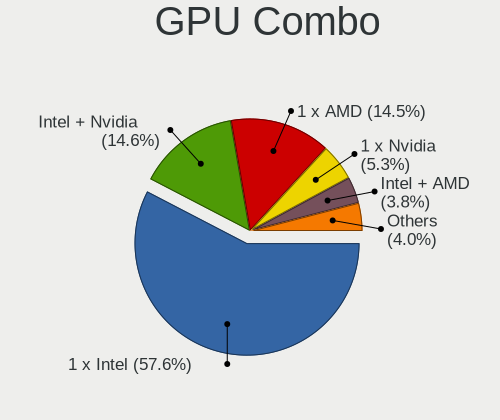
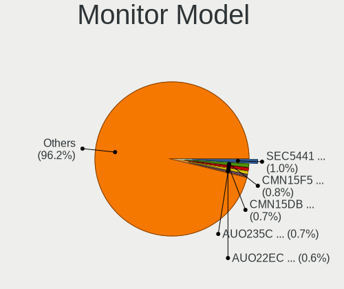
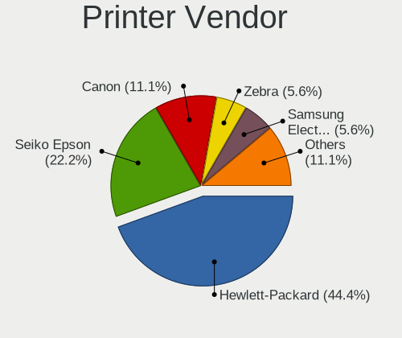
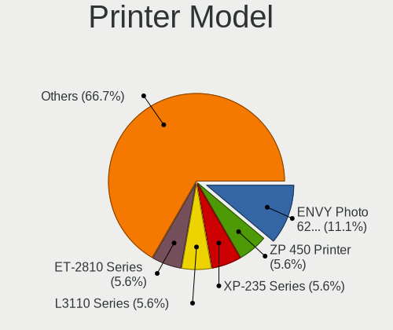

Zorin 16 - Tested Hardware & Statistics (Notebooks)
---------------------------------------------------

A project to collect tested hardware configurations for Zorin 16.

Anyone can contribute to this report by the [hw-probe](https://github.com/linuxhw/hw-probe) tool:

    sudo -E hw-probe -all -upload

Please contribute! Especially if your hardware is rare.

Contents
--------

* [ Test Cases ](#test-cases)

* [ System ](#system)
  - [ Kernel                   ](#kernel)
  - [ Kernel Family            ](#kernel-family)
  - [ Kernel Major Ver.        ](#kernel-major-ver)
  - [ Arch                     ](#arch)
  - [ DE                       ](#de)
  - [ Display Server           ](#display-server)
  - [ Display Manager          ](#display-manager)
  - [ OS Lang                  ](#os-lang)
  - [ Boot Mode                ](#boot-mode)
  - [ Filesystem               ](#filesystem)
  - [ Part. scheme             ](#part-scheme)
  - [ Dual Boot with Linux/BSD ](#dual-boot-with-linuxbsd)
  - [ Dual Boot (Win)          ](#dual-boot-win)

* [ Board ](#board)
  - [ Vendor                   ](#vendor)
  - [ Model                    ](#model)
  - [ Model Family             ](#model-family)
  - [ MFG Year                 ](#mfg-year)
  - [ Form Factor              ](#form-factor)
  - [ Secure Boot              ](#secure-boot)
  - [ Coreboot                 ](#coreboot)
  - [ RAM Size                 ](#ram-size)
  - [ RAM Used                 ](#ram-used)
  - [ Total Drives             ](#total-drives)
  - [ Has CD-ROM               ](#has-cd-rom)
  - [ Has Ethernet             ](#has-ethernet)
  - [ Has WiFi                 ](#has-wifi)
  - [ Has Bluetooth            ](#has-bluetooth)

* [ Location ](#location)
  - [ Country                  ](#country)
  - [ City                     ](#city)

* [ Drives ](#drives)
  - [ Drive Vendor             ](#drive-vendor)
  - [ Drive Model              ](#drive-model)
  - [ HDD Vendor               ](#hdd-vendor)
  - [ SSD Vendor               ](#ssd-vendor)
  - [ Drive Kind               ](#drive-kind)
  - [ Drive Connector          ](#drive-connector)
  - [ Drive Size               ](#drive-size)
  - [ Space Total              ](#space-total)
  - [ Space Used               ](#space-used)
  - [ Malfunc. Drives          ](#malfunc-drives)
  - [ Malfunc. Drive Vendor    ](#malfunc-drive-vendor)
  - [ Malfunc. HDD Vendor      ](#malfunc-hdd-vendor)
  - [ Malfunc. Drive Kind      ](#malfunc-drive-kind)
  - [ Failed Drives            ](#failed-drives)
  - [ Failed Drive Vendor      ](#failed-drive-vendor)
  - [ Drive Status             ](#drive-status)

* [ Storage controller ](#storage-controller)
  - [ Storage Vendor           ](#storage-vendor)
  - [ Storage Model            ](#storage-model)
  - [ Storage Kind             ](#storage-kind)

* [ Processor ](#processor)
  - [ CPU Vendor               ](#cpu-vendor)
  - [ CPU Model                ](#cpu-model)
  - [ CPU Model Family         ](#cpu-model-family)
  - [ CPU Cores                ](#cpu-cores)
  - [ CPU Sockets              ](#cpu-sockets)
  - [ CPU Threads              ](#cpu-threads)
  - [ CPU Op-Modes             ](#cpu-op-modes)
  - [ CPU Microcode            ](#cpu-microcode)
  - [ CPU Microarch            ](#cpu-microarch)

* [ Graphics ](#graphics)
  - [ GPU Vendor               ](#gpu-vendor)
  - [ GPU Model                ](#gpu-model)
  - [ GPU Combo                ](#gpu-combo)
  - [ GPU Driver               ](#gpu-driver)
  - [ GPU Memory               ](#gpu-memory)

* [ Monitor ](#monitor)
  - [ Monitor Vendor           ](#monitor-vendor)
  - [ Monitor Model            ](#monitor-model)
  - [ Monitor Resolution       ](#monitor-resolution)
  - [ Monitor Diagonal         ](#monitor-diagonal)
  - [ Monitor Width            ](#monitor-width)
  - [ Aspect Ratio             ](#aspect-ratio)
  - [ Monitor Area             ](#monitor-area)
  - [ Pixel Density            ](#pixel-density)
  - [ Multiple Monitors        ](#multiple-monitors)

* [ Network ](#network)
  - [ Net Controller Vendor    ](#net-controller-vendor)
  - [ Net Controller Model     ](#net-controller-model)
  - [ Wireless Vendor          ](#wireless-vendor)
  - [ Wireless Model           ](#wireless-model)
  - [ Ethernet Vendor          ](#ethernet-vendor)
  - [ Ethernet Model           ](#ethernet-model)
  - [ Net Controller Kind      ](#net-controller-kind)
  - [ Used Controller          ](#used-controller)
  - [ NICs                     ](#nics)
  - [ IPv6                     ](#ipv6)

* [ Bluetooth ](#bluetooth)
  - [ Bluetooth Vendor         ](#bluetooth-vendor)
  - [ Bluetooth Model          ](#bluetooth-model)

* [ Sound ](#sound)
  - [ Sound Vendor             ](#sound-vendor)
  - [ Sound Model              ](#sound-model)

* [ Memory ](#memory)
  - [ Memory Vendor            ](#memory-vendor)
  - [ Memory Model             ](#memory-model)
  - [ Memory Kind              ](#memory-kind)
  - [ Memory Form Factor       ](#memory-form-factor)
  - [ Memory Size              ](#memory-size)
  - [ Memory Speed             ](#memory-speed)

* [ Printers & scanners ](#printers--scanners)
  - [ Printer Vendor           ](#printer-vendor)
  - [ Printer Model            ](#printer-model)
  - [ Scanner Vendor           ](#scanner-vendor)
  - [ Scanner Model            ](#scanner-model)

* [ Camera ](#camera)
  - [ Camera Vendor            ](#camera-vendor)
  - [ Camera Model             ](#camera-model)

* [ Security ](#security)
  - [ Fingerprint Vendor       ](#fingerprint-vendor)
  - [ Fingerprint Model        ](#fingerprint-model)
  - [ Chipcard Vendor          ](#chipcard-vendor)
  - [ Chipcard Model           ](#chipcard-model)

* [ Unsupported ](#unsupported)
  - [ Unsupported Devices      ](#unsupported-devices)
  - [ Unsupported Device Types ](#unsupported-device-types)

Test Cases
----------

Total: 1669

| Vendor        | Model                       | Probe                                                      | Date         |
|---------------|-----------------------------|------------------------------------------------------------|--------------|
| Samsung       | 600B4B/600B5B               | [56767f430b](https://linux-hardware.org/?probe=56767f430b) | Nov 02, 2022 |
| Samsung       | 600B4B/600B5B               | [b1ffa94d76](https://linux-hardware.org/?probe=b1ffa94d76) | Nov 02, 2022 |
| Samsung       | RV411/RV511/E3511/S3511/... | [ebe8179d26](https://linux-hardware.org/?probe=ebe8179d26) | Nov 02, 2022 |
| HP            | Pavilion Notebook           | [9fef9a6a8a](https://linux-hardware.org/?probe=9fef9a6a8a) | Nov 02, 2022 |
| Lenovo        | ThinkPad Edge E530c 3366... | [4968129a1a](https://linux-hardware.org/?probe=4968129a1a) | Nov 02, 2022 |
| Lenovo        | IdeaPad 100S-11IBY 80R2     | [7c6ddf22b5](https://linux-hardware.org/?probe=7c6ddf22b5) | Nov 02, 2022 |
| GPU Compan... | GWTN156-2BK                 | [a7fb2c2163](https://linux-hardware.org/?probe=a7fb2c2163) | Nov 02, 2022 |
| Lenovo        | IdeaPadFlex 15D 20334       | [005b25ef06](https://linux-hardware.org/?probe=005b25ef06) | Nov 02, 2022 |
| Lenovo        | ThinkPad X1 Carbon 4th 2... | [cd0e637d88](https://linux-hardware.org/?probe=cd0e637d88) | Nov 01, 2022 |
| HP            | Pavilion Sleekbook 15 PC    | [9dea1bfedb](https://linux-hardware.org/?probe=9dea1bfedb) | Nov 01, 2022 |
| HP            | ProBook 650 G1              | [85f1aa7b6d](https://linux-hardware.org/?probe=85f1aa7b6d) | Nov 01, 2022 |
| ASUSTek       | K55VD                       | [6e2ff87fad](https://linux-hardware.org/?probe=6e2ff87fad) | Nov 01, 2022 |
| Lenovo        | ThinkPad Edge E530c 3366... | [9864cd6db6](https://linux-hardware.org/?probe=9864cd6db6) | Nov 01, 2022 |
| GPU Compan... | GWTN156-2BK                 | [99ab599fbc](https://linux-hardware.org/?probe=99ab599fbc) | Nov 01, 2022 |
| Dell          | Latitude E6500              | [b7be8c3204](https://linux-hardware.org/?probe=b7be8c3204) | Oct 31, 2022 |
| Dell          | Latitude E6500              | [cb3b467ba8](https://linux-hardware.org/?probe=cb3b467ba8) | Oct 31, 2022 |
| Lenovo        | ThinkPad Edge 25453BG       | [dc7fa9ac1e](https://linux-hardware.org/?probe=dc7fa9ac1e) | Oct 31, 2022 |
| Lenovo        | ThinkPad Edge 25453BG       | [ba67d47c9c](https://linux-hardware.org/?probe=ba67d47c9c) | Oct 31, 2022 |
| HP            | 2000                        | [ea6e4e2cca](https://linux-hardware.org/?probe=ea6e4e2cca) | Oct 31, 2022 |
| Lenovo        | ThinkPad T420 4180DW1       | [b1e229b9a0](https://linux-hardware.org/?probe=b1e229b9a0) | Oct 31, 2022 |
| HP            | ProBook 450 G8 Notebook ... | [34727cd696](https://linux-hardware.org/?probe=34727cd696) | Oct 31, 2022 |
| Lenovo        | IdeaPad 3 15ADA05 81W1      | [6bf9e760ca](https://linux-hardware.org/?probe=6bf9e760ca) | Oct 30, 2022 |
| Packard Be... | EasyNote TE69KB             | [b83d2dd685](https://linux-hardware.org/?probe=b83d2dd685) | Oct 30, 2022 |
| Lenovo        | IdeaPad 3 15ADA05 81W1      | [1ca9fe180c](https://linux-hardware.org/?probe=1ca9fe180c) | Oct 30, 2022 |
| Lenovo        | ThinkPad T480 20L6S82F0C    | [c06d6a27f5](https://linux-hardware.org/?probe=c06d6a27f5) | Oct 30, 2022 |
| Lenovo        | IdeaPad Slim 1-14AST-05 ... | [50170811fd](https://linux-hardware.org/?probe=50170811fd) | Oct 30, 2022 |
| HP            | Pavilion Laptop 15-eh0xx... | [d8f6faad10](https://linux-hardware.org/?probe=d8f6faad10) | Oct 30, 2022 |
| HP            | Stream Laptop 14-cb1xxx     | [75dcd27c77](https://linux-hardware.org/?probe=75dcd27c77) | Oct 30, 2022 |
| HP            | Pavilion Laptop 15-eh0xx... | [6c3a410233](https://linux-hardware.org/?probe=6c3a410233) | Oct 30, 2022 |
| Dell          | Inspiron 5537               | [4cd1e12a5d](https://linux-hardware.org/?probe=4cd1e12a5d) | Oct 30, 2022 |
| Dell          | Inspiron N5050              | [f844544154](https://linux-hardware.org/?probe=f844544154) | Oct 30, 2022 |
| MSI           | GL72 6QD                    | [2f7c223f5a](https://linux-hardware.org/?probe=2f7c223f5a) | Oct 29, 2022 |
| Acer          | Extensa 5635ZG              | [8c0a7c0aa1](https://linux-hardware.org/?probe=8c0a7c0aa1) | Oct 29, 2022 |
| Toshiba       | Satellite C660              | [242fa16882](https://linux-hardware.org/?probe=242fa16882) | Oct 29, 2022 |
| Dell          | Latitude E6530              | [cdd3b5ce40](https://linux-hardware.org/?probe=cdd3b5ce40) | Oct 28, 2022 |
| HP            | Presario V6000 (RV053UA#... | [ca121e3727](https://linux-hardware.org/?probe=ca121e3727) | Oct 28, 2022 |
| HP            | OMEN Notebook PC 15         | [fea0167027](https://linux-hardware.org/?probe=fea0167027) | Oct 28, 2022 |
| Packard Be... | EasyNote MH45               | [b9aa4cc6d5](https://linux-hardware.org/?probe=b9aa4cc6d5) | Oct 27, 2022 |
| HP            | Pavilion Gaming Laptop 1... | [9986b4ff02](https://linux-hardware.org/?probe=9986b4ff02) | Oct 27, 2022 |
| Acer          | Aspire 5720Z                | [fc0b8944bc](https://linux-hardware.org/?probe=fc0b8944bc) | Oct 26, 2022 |
| MSI           | Creator Z16 A11UET          | [58e18764cb](https://linux-hardware.org/?probe=58e18764cb) | Oct 26, 2022 |
| MSI           | Creator Z16 A11UET          | [06274bdff6](https://linux-hardware.org/?probe=06274bdff6) | Oct 26, 2022 |
| Toshiba       | Satellite C660              | [80c2aeb241](https://linux-hardware.org/?probe=80c2aeb241) | Oct 26, 2022 |
| Toshiba       | Satellite C660              | [6b0380ea4c](https://linux-hardware.org/?probe=6b0380ea4c) | Oct 26, 2022 |
| Dell          | Latitude E6510              | [1949f78888](https://linux-hardware.org/?probe=1949f78888) | Oct 26, 2022 |
| ALURIN        | PR1-M146                    | [af492a458f](https://linux-hardware.org/?probe=af492a458f) | Oct 25, 2022 |
| MSI           | GT70 2PE                    | [26d9f8ba04](https://linux-hardware.org/?probe=26d9f8ba04) | Oct 25, 2022 |
| Toshiba       | K201                        | [63a892bae3](https://linux-hardware.org/?probe=63a892bae3) | Oct 25, 2022 |
| MSI           | GE62 7RE                    | [bd5b8943f4](https://linux-hardware.org/?probe=bd5b8943f4) | Oct 24, 2022 |
| Samsung       | 305V4A/305V5A/3415VA        | [d8f70347cf](https://linux-hardware.org/?probe=d8f70347cf) | Oct 24, 2022 |
| HP            | Pavilion Sleekbook 15 PC    | [26e7b206ef](https://linux-hardware.org/?probe=26e7b206ef) | Oct 24, 2022 |
| Lenovo        | G50-45 80MQ                 | [2628815c23](https://linux-hardware.org/?probe=2628815c23) | Oct 24, 2022 |
| Apple         | MacBookPro8,2               | [200f2ac48e](https://linux-hardware.org/?probe=200f2ac48e) | Oct 24, 2022 |
| Toshiba       | Satellite C660              | [646b07cc4c](https://linux-hardware.org/?probe=646b07cc4c) | Oct 24, 2022 |
| Alienware     | 18                          | [11e8831b9d](https://linux-hardware.org/?probe=11e8831b9d) | Oct 24, 2022 |
| Alienware     | 18                          | [86eb347494](https://linux-hardware.org/?probe=86eb347494) | Oct 24, 2022 |
| Chuwi         | HeroBook Air                | [055a6c2be8](https://linux-hardware.org/?probe=055a6c2be8) | Oct 23, 2022 |
| Chuwi         | HeroBook Air                | [cb299f8f1b](https://linux-hardware.org/?probe=cb299f8f1b) | Oct 23, 2022 |
| Dell          | Inspiron 5567               | [42280c6145](https://linux-hardware.org/?probe=42280c6145) | Oct 23, 2022 |
| AMI           | Unknown                     | [337d94fb96](https://linux-hardware.org/?probe=337d94fb96) | Oct 23, 2022 |
| ASUSTek       | X510UQ                      | [6d976f6f96](https://linux-hardware.org/?probe=6d976f6f96) | Oct 23, 2022 |
| Lenovo        | IdeaPad 3 17ABA7 82RQ       | [a8a9cdfabc](https://linux-hardware.org/?probe=a8a9cdfabc) | Oct 22, 2022 |
| Lenovo        | IdeaPad 3 17ABA7 82RQ       | [d82378ea41](https://linux-hardware.org/?probe=d82378ea41) | Oct 22, 2022 |
| Acer          | Aspire E5-411               | [f4fa3fce70](https://linux-hardware.org/?probe=f4fa3fce70) | Oct 22, 2022 |
| HP            | EliteBook 755 G5            | [b1550ee8e1](https://linux-hardware.org/?probe=b1550ee8e1) | Oct 22, 2022 |
| Dell          | Studio 1558                 | [ac449d0411](https://linux-hardware.org/?probe=ac449d0411) | Oct 21, 2022 |
| HP            | Stream Notebook             | [685271f268](https://linux-hardware.org/?probe=685271f268) | Oct 21, 2022 |
| Acer          | Predator PH517-61           | [e30217884a](https://linux-hardware.org/?probe=e30217884a) | Oct 21, 2022 |
| HP            | Pavilion Notebook           | [31d7e67080](https://linux-hardware.org/?probe=31d7e67080) | Oct 21, 2022 |
| Acer          | Aspire A315-33              | [1358385d49](https://linux-hardware.org/?probe=1358385d49) | Oct 20, 2022 |
| ASUSTek       | T200TAC                     | [0aad9d8ecd](https://linux-hardware.org/?probe=0aad9d8ecd) | Oct 20, 2022 |
| HP            | G62                         | [721c09b331](https://linux-hardware.org/?probe=721c09b331) | Oct 19, 2022 |
| Microtech     | CoreBook                    | [0592b30e41](https://linux-hardware.org/?probe=0592b30e41) | Oct 19, 2022 |
| Microtech     | CoreBook                    | [536451ed8a](https://linux-hardware.org/?probe=536451ed8a) | Oct 19, 2022 |
| Dell          | Studio 1458                 | [57b5c85b2a](https://linux-hardware.org/?probe=57b5c85b2a) | Oct 19, 2022 |
| Dell          | Vostro 3500                 | [5d1bb5d8aa](https://linux-hardware.org/?probe=5d1bb5d8aa) | Oct 19, 2022 |
| ASUSTek       | T200TAC                     | [c33c750766](https://linux-hardware.org/?probe=c33c750766) | Oct 18, 2022 |
| HP            | Notebook                    | [01692e8f30](https://linux-hardware.org/?probe=01692e8f30) | Oct 18, 2022 |
| HP            | Pavilion Gaming Laptop 1... | [ff6d42a3ef](https://linux-hardware.org/?probe=ff6d42a3ef) | Oct 17, 2022 |
| Acer          | Aspire E5-411               | [01979e17ce](https://linux-hardware.org/?probe=01979e17ce) | Oct 17, 2022 |
| HP            | Laptop 15-db0xxx            | [4b0c3a6022](https://linux-hardware.org/?probe=4b0c3a6022) | Oct 17, 2022 |
| HP            | Pavilion Notebook           | [f188526e04](https://linux-hardware.org/?probe=f188526e04) | Oct 17, 2022 |
| HP            | Pavilion Notebook           | [50c44df4fb](https://linux-hardware.org/?probe=50c44df4fb) | Oct 17, 2022 |
| Apple         | MacBookPro5,4               | [bc6696e1d5](https://linux-hardware.org/?probe=bc6696e1d5) | Oct 17, 2022 |
| Toshiba       | Satellite C55-A             | [f93fb31ad5](https://linux-hardware.org/?probe=f93fb31ad5) | Oct 16, 2022 |
| Dell          | Inspiron 14 5401            | [9c955c6521](https://linux-hardware.org/?probe=9c955c6521) | Oct 16, 2022 |
| Dell          | Inspiron 14 5401            | [5fbc33b9bf](https://linux-hardware.org/?probe=5fbc33b9bf) | Oct 16, 2022 |
| Google        | Lars                        | [b607a23c77](https://linux-hardware.org/?probe=b607a23c77) | Oct 14, 2022 |
| HUAWEI        | KLVD-WXX9                   | [bb7d61198e](https://linux-hardware.org/?probe=bb7d61198e) | Oct 14, 2022 |
| HP            | EliteBook 850 G7 Noteboo... | [772645390a](https://linux-hardware.org/?probe=772645390a) | Oct 14, 2022 |
| HP            | EliteBook 850 G7 Noteboo... | [7e770fd62b](https://linux-hardware.org/?probe=7e770fd62b) | Oct 14, 2022 |
| Lenovo        | Yoga S740-15IRH 81NX        | [e4c404552a](https://linux-hardware.org/?probe=e4c404552a) | Oct 13, 2022 |
| Chuwi         | HeroBook Pro                | [4fe76d84fd](https://linux-hardware.org/?probe=4fe76d84fd) | Oct 13, 2022 |
| Dell          | Vostro 3558                 | [855e0d050c](https://linux-hardware.org/?probe=855e0d050c) | Oct 13, 2022 |
| Dell          | Latitude E6330              | [815d48ffba](https://linux-hardware.org/?probe=815d48ffba) | Oct 12, 2022 |
| Dell          | Latitude E6410              | [9ed4124073](https://linux-hardware.org/?probe=9ed4124073) | Oct 11, 2022 |
| TERRA         | TERRAPC                     | [048f3ad5ef](https://linux-hardware.org/?probe=048f3ad5ef) | Oct 11, 2022 |
| HUAWEI        | MACH-WX9                    | [da36ee9925](https://linux-hardware.org/?probe=da36ee9925) | Oct 11, 2022 |
| Acer          | Aspire A315-33              | [8606cbf7cc](https://linux-hardware.org/?probe=8606cbf7cc) | Oct 10, 2022 |
| Dell          | Inspiron 3521               | [f6e7e1585c](https://linux-hardware.org/?probe=f6e7e1585c) | Oct 10, 2022 |
| Lenovo        | G500 20236                  | [897321f579](https://linux-hardware.org/?probe=897321f579) | Oct 09, 2022 |
| Panasonic     | CF-19-8                     | [439e2c8122](https://linux-hardware.org/?probe=439e2c8122) | Oct 09, 2022 |
| Panasonic     | CF-19-8                     | [bc5820629b](https://linux-hardware.org/?probe=bc5820629b) | Oct 09, 2022 |
| Packard Be... | EasyNote TM82               | [8e3ecfd03d](https://linux-hardware.org/?probe=8e3ecfd03d) | Oct 08, 2022 |
| Lenovo        | IdeaPad 3 15ALC6 82KU       | [d1c01a07a2](https://linux-hardware.org/?probe=d1c01a07a2) | Oct 08, 2022 |
| Dell          | Inspiron 3521               | [0b225367b8](https://linux-hardware.org/?probe=0b225367b8) | Oct 08, 2022 |
| Dell          | Latitude E6410              | [0b617be9dd](https://linux-hardware.org/?probe=0b617be9dd) | Oct 08, 2022 |
| ASUSTek       | VivoBook_ASUSLaptop X421... | [46b44504df](https://linux-hardware.org/?probe=46b44504df) | Oct 08, 2022 |
| AXDIA Inte... | WINBOOK 13                  | [35638411ee](https://linux-hardware.org/?probe=35638411ee) | Oct 08, 2022 |
| Fujitsu       | LIFEBOOK LH531              | [21a68d8c0e](https://linux-hardware.org/?probe=21a68d8c0e) | Oct 08, 2022 |
| HP            | ZBook 17 G5                 | [19db5a4e7c](https://linux-hardware.org/?probe=19db5a4e7c) | Oct 07, 2022 |
| TERRA         | TERRAPC                     | [ec9068f7ea](https://linux-hardware.org/?probe=ec9068f7ea) | Oct 07, 2022 |
| HP            | ZBook 17 G5                 | [005d2d7671](https://linux-hardware.org/?probe=005d2d7671) | Oct 07, 2022 |
| Apple         | MacBookPro9,1               | [d5a346bdd1](https://linux-hardware.org/?probe=d5a346bdd1) | Oct 07, 2022 |
| Dell          | Vostro 2520                 | [da789d3a06](https://linux-hardware.org/?probe=da789d3a06) | Oct 06, 2022 |
| Dell          | Latitude E6500              | [84fa5b35ed](https://linux-hardware.org/?probe=84fa5b35ed) | Oct 06, 2022 |
| Acer          | Aspire E1-522               | [769baa3828](https://linux-hardware.org/?probe=769baa3828) | Oct 05, 2022 |
| HP            | EliteBook 840 G6            | [397e5be75c](https://linux-hardware.org/?probe=397e5be75c) | Oct 05, 2022 |
| Dell          | Inspiron 3521               | [5bb972fab4](https://linux-hardware.org/?probe=5bb972fab4) | Oct 05, 2022 |
| Hampoo        | C3W6_AP108_4GB Reserved     | [9b8dc565f9](https://linux-hardware.org/?probe=9b8dc565f9) | Oct 04, 2022 |
| Gigabyte      | AORUS 7 SB                  | [444224d1e0](https://linux-hardware.org/?probe=444224d1e0) | Oct 04, 2022 |
| HP            | ENVY m6                     | [5c828496a7](https://linux-hardware.org/?probe=5c828496a7) | Oct 04, 2022 |
| Google        | Careena                     | [7ac4802a10](https://linux-hardware.org/?probe=7ac4802a10) | Oct 04, 2022 |
| Acer          | Extensa 2530                | [684b31b41d](https://linux-hardware.org/?probe=684b31b41d) | Oct 03, 2022 |
| HP            | ProBook 455 G6              | [acae78b85a](https://linux-hardware.org/?probe=acae78b85a) | Oct 03, 2022 |
| HP            | ProBook 455 G6              | [3697a412bd](https://linux-hardware.org/?probe=3697a412bd) | Oct 03, 2022 |
| ASUSTek       | X756UQ                      | [e17cbbf886](https://linux-hardware.org/?probe=e17cbbf886) | Oct 03, 2022 |
| ASUSTek       | X756UQ                      | [5767aaf6db](https://linux-hardware.org/?probe=5767aaf6db) | Oct 03, 2022 |
| HP            | Pavilion Gaming Laptop 1... | [d3bcd51be1](https://linux-hardware.org/?probe=d3bcd51be1) | Oct 03, 2022 |
| Lenovo        | V570 1066EDG                | [8e2439c590](https://linux-hardware.org/?probe=8e2439c590) | Oct 01, 2022 |
| Lenovo        | ThinkPad Yoga 11e 20DAS0... | [dc7e0ada81](https://linux-hardware.org/?probe=dc7e0ada81) | Oct 01, 2022 |
| Acer          | Aspire 4733Z                | [4be4debbe5](https://linux-hardware.org/?probe=4be4debbe5) | Oct 01, 2022 |
| Apple         | MacBookPro8,1               | [f42501fcc3](https://linux-hardware.org/?probe=f42501fcc3) | Oct 01, 2022 |
| Hampoo        | C3W6_AP108_4GB Reserved     | [93d3e41339](https://linux-hardware.org/?probe=93d3e41339) | Oct 01, 2022 |
| Notebook      | NJ50GU                      | [430d3b2873](https://linux-hardware.org/?probe=430d3b2873) | Sep 30, 2022 |
| Chuwi         | HeroBook Air                | [1f142c7087](https://linux-hardware.org/?probe=1f142c7087) | Sep 30, 2022 |
| Chuwi         | HeroBook Air                | [263313ef38](https://linux-hardware.org/?probe=263313ef38) | Sep 30, 2022 |
| HP            | Pavilion Laptop 17-ar0xx    | [733654d30d](https://linux-hardware.org/?probe=733654d30d) | Sep 30, 2022 |
| HP            | EliteBook 8570p             | [cc4740fa37](https://linux-hardware.org/?probe=cc4740fa37) | Sep 30, 2022 |
| Notebook      | NJ50_70CU                   | [4914d3ffe1](https://linux-hardware.org/?probe=4914d3ffe1) | Sep 29, 2022 |
| Irbis         | NB61 WS001                  | [3fda78e356](https://linux-hardware.org/?probe=3fda78e356) | Sep 29, 2022 |
| HP            | Compaq 6730s                | [565b94d7f4](https://linux-hardware.org/?probe=565b94d7f4) | Sep 29, 2022 |
| Toshiba       | Satellite C55-C             | [01ebd7e70b](https://linux-hardware.org/?probe=01ebd7e70b) | Sep 29, 2022 |
| Toshiba       | Satellite C55-C             | [d2c06711d7](https://linux-hardware.org/?probe=d2c06711d7) | Sep 29, 2022 |
| HP            | Compaq 6730s                | [62fc1b721e](https://linux-hardware.org/?probe=62fc1b721e) | Sep 29, 2022 |
| Dell          | Inspiron 3582               | [8cd21b783a](https://linux-hardware.org/?probe=8cd21b783a) | Sep 28, 2022 |
| Lenovo        | Yoga S740-15IRH 81NX        | [defae2e862](https://linux-hardware.org/?probe=defae2e862) | Sep 28, 2022 |
| Dell          | Inspiron 5559               | [c23649cdd4](https://linux-hardware.org/?probe=c23649cdd4) | Sep 28, 2022 |
| Dell          | Latitude E6520              | [e228fa6546](https://linux-hardware.org/?probe=e228fa6546) | Sep 28, 2022 |
| Toshiba       | Satellite L855              | [19e5b180eb](https://linux-hardware.org/?probe=19e5b180eb) | Sep 28, 2022 |
| HUAWEI        | NBLK-WAX9X                  | [f501591d1b](https://linux-hardware.org/?probe=f501591d1b) | Sep 27, 2022 |
| Dell          | System Inspiron N7110       | [016d5e3146](https://linux-hardware.org/?probe=016d5e3146) | Sep 27, 2022 |
| Lenovo        | IdeaPad 5 14ALC05 82LM      | [e777d38fbd](https://linux-hardware.org/?probe=e777d38fbd) | Sep 26, 2022 |
| Acer          | Aspire A515-51G             | [c45069d56d](https://linux-hardware.org/?probe=c45069d56d) | Sep 26, 2022 |
| Acer          | Aspire A515-51G             | [3441e0cac3](https://linux-hardware.org/?probe=3441e0cac3) | Sep 26, 2022 |
| ASUSTek       | X201EP                      | [4e6c202d5d](https://linux-hardware.org/?probe=4e6c202d5d) | Sep 26, 2022 |
| Unknown       | NB-7000                     | [1713526cff](https://linux-hardware.org/?probe=1713526cff) | Sep 25, 2022 |
| Lenovo        | IdeaPad 130-15IKB 81H7      | [28e086b848](https://linux-hardware.org/?probe=28e086b848) | Sep 25, 2022 |
| Lenovo        | IdeaPad 130-15IKB 81H7      | [6a8d9c1d7a](https://linux-hardware.org/?probe=6a8d9c1d7a) | Sep 25, 2022 |
| Dell          | Inspiron 14-3452            | [bb90844ff6](https://linux-hardware.org/?probe=bb90844ff6) | Sep 25, 2022 |
| HP            | Stream Laptop 14-ax0XX      | [d8a451b3e6](https://linux-hardware.org/?probe=d8a451b3e6) | Sep 25, 2022 |
| Dell          | Inspiron 3185               | [561c02f958](https://linux-hardware.org/?probe=561c02f958) | Sep 25, 2022 |
| Acer          | Extensa 5635ZG              | [ade183eadc](https://linux-hardware.org/?probe=ade183eadc) | Sep 24, 2022 |
| HP            | 250 G8 Notebook PC          | [fab0eac5a6](https://linux-hardware.org/?probe=fab0eac5a6) | Sep 24, 2022 |
| Lenovo        | IdeaPad 110-15ACL 80TJ      | [dc3a97d467](https://linux-hardware.org/?probe=dc3a97d467) | Sep 23, 2022 |
| HP            | EliteBook Revolve 810 G3    | [77b578f861](https://linux-hardware.org/?probe=77b578f861) | Sep 23, 2022 |
| HP            | EliteBook 840 G6            | [9ccc1b86a7](https://linux-hardware.org/?probe=9ccc1b86a7) | Sep 23, 2022 |
| Lenovo        | ThinkPad Edge E530 3259C... | [cdaec9c224](https://linux-hardware.org/?probe=cdaec9c224) | Sep 22, 2022 |
| HP            | ENVY Notebook               | [1eef25f6d8](https://linux-hardware.org/?probe=1eef25f6d8) | Sep 22, 2022 |
| HP            | ENVY Notebook               | [b95a98e133](https://linux-hardware.org/?probe=b95a98e133) | Sep 22, 2022 |
| Acer          | Aspire ES1-512              | [00e679e86c](https://linux-hardware.org/?probe=00e679e86c) | Sep 22, 2022 |
| Acer          | Aspire ES1-512              | [318436c7ab](https://linux-hardware.org/?probe=318436c7ab) | Sep 22, 2022 |
| ASUSTek       | 1201PN                      | [3dd4546344](https://linux-hardware.org/?probe=3dd4546344) | Sep 21, 2022 |
| ASUSTek       | 1201PN                      | [080d9c8964](https://linux-hardware.org/?probe=080d9c8964) | Sep 21, 2022 |
| Toshiba       | Satellite L855              | [4421e54d32](https://linux-hardware.org/?probe=4421e54d32) | Sep 21, 2022 |
| Lenovo        | Yoga S740-15IRH 81NX        | [6d0a2986ad](https://linux-hardware.org/?probe=6d0a2986ad) | Sep 21, 2022 |
| Alienware     | 18                          | [91d0153265](https://linux-hardware.org/?probe=91d0153265) | Sep 20, 2022 |
| Lenovo        | IdeaPad 5 14ALC05 82LM      | [82b3d89bf9](https://linux-hardware.org/?probe=82b3d89bf9) | Sep 20, 2022 |
| Dell          | G15 5515                    | [f308590417](https://linux-hardware.org/?probe=f308590417) | Sep 20, 2022 |
| Dell          | G15 5515                    | [d6a647ab30](https://linux-hardware.org/?probe=d6a647ab30) | Sep 20, 2022 |
| HP            | Pavilion g7                 | [d51d3d282a](https://linux-hardware.org/?probe=d51d3d282a) | Sep 20, 2022 |
| Samsung       | 950XCJ/951XCJ/950XCR        | [9417681a63](https://linux-hardware.org/?probe=9417681a63) | Sep 19, 2022 |
| Dell          | Latitude E6540              | [d3140eaa89](https://linux-hardware.org/?probe=d3140eaa89) | Sep 19, 2022 |
| Alienware     | 18                          | [fda9eabd7e](https://linux-hardware.org/?probe=fda9eabd7e) | Sep 18, 2022 |
| Lenovo        | IdeaPad 130-15AST 81H5      | [bceb6698c2](https://linux-hardware.org/?probe=bceb6698c2) | Sep 18, 2022 |
| Microtech     | CoreBook                    | [6b1a53d2c2](https://linux-hardware.org/?probe=6b1a53d2c2) | Sep 18, 2022 |
| Ematic        | EWT118                      | [41670ebd30](https://linux-hardware.org/?probe=41670ebd30) | Sep 18, 2022 |
| HP            | Pavilion Notebook           | [24534d00db](https://linux-hardware.org/?probe=24534d00db) | Sep 17, 2022 |
| Dell          | Latitude E6510              | [ee09885560](https://linux-hardware.org/?probe=ee09885560) | Sep 16, 2022 |
| HP            | Laptop 15s-fq2xxx           | [e7bb3017fb](https://linux-hardware.org/?probe=e7bb3017fb) | Sep 16, 2022 |
| HP            | Laptop 15s-fq2xxx           | [c81727b775](https://linux-hardware.org/?probe=c81727b775) | Sep 16, 2022 |
| Lenovo        | IdeaPadFlex 15D 20334       | [5620510083](https://linux-hardware.org/?probe=5620510083) | Sep 16, 2022 |
| Dell          | Latitude E4300              | [b3c04d8a81](https://linux-hardware.org/?probe=b3c04d8a81) | Sep 16, 2022 |
| ASUSTek       | ASUS TUF Gaming F15 FX50... | [eeb58ef0f2](https://linux-hardware.org/?probe=eeb58ef0f2) | Sep 15, 2022 |
| ASUSTek       | TUF Gaming FX505DT_FX505... | [258c624b3b](https://linux-hardware.org/?probe=258c624b3b) | Sep 15, 2022 |
| Toshiba       | Satellite C855              | [bd34f35e50](https://linux-hardware.org/?probe=bd34f35e50) | Sep 15, 2022 |
| Lenovo        | IdeaPad 3 15ADA6 82KR       | [676dbc76db](https://linux-hardware.org/?probe=676dbc76db) | Sep 13, 2022 |
| HP            | EliteBook 840 G6            | [3c13816886](https://linux-hardware.org/?probe=3c13816886) | Sep 13, 2022 |
| Samsung       | 800G5M/800G5W               | [ad3cd5381f](https://linux-hardware.org/?probe=ad3cd5381f) | Sep 13, 2022 |
| Dell          | Inspiron 15 7000 Gaming     | [ca9a099cf6](https://linux-hardware.org/?probe=ca9a099cf6) | Sep 12, 2022 |
| Samsung       | 600B4B/600B5B               | [25c2b764a6](https://linux-hardware.org/?probe=25c2b764a6) | Sep 12, 2022 |
| Dell          | Latitude E7240              | [72a8c650c5](https://linux-hardware.org/?probe=72a8c650c5) | Sep 11, 2022 |
| Gigabyte      | P64V7                       | [b9d2c998be](https://linux-hardware.org/?probe=b9d2c998be) | Sep 11, 2022 |
| UMAX          | VisionBook N14G Plus        | [6d05deca49](https://linux-hardware.org/?probe=6d05deca49) | Sep 11, 2022 |
| Dell          | Inspiron 15 7000 Gaming     | [c027a7cf99](https://linux-hardware.org/?probe=c027a7cf99) | Sep 10, 2022 |
| HP            | Pavilion dv6700             | [4e96c157b7](https://linux-hardware.org/?probe=4e96c157b7) | Sep 10, 2022 |
| AZW           | Z83-V                       | [70e8dba2ef](https://linux-hardware.org/?probe=70e8dba2ef) | Sep 10, 2022 |
| AZW           | Z83-V                       | [622725ab19](https://linux-hardware.org/?probe=622725ab19) | Sep 10, 2022 |
| Acer          | Aspire 7745G                | [a41158c2cc](https://linux-hardware.org/?probe=a41158c2cc) | Sep 10, 2022 |
| Toshiba       | Satellite P200              | [c49fec0796](https://linux-hardware.org/?probe=c49fec0796) | Sep 09, 2022 |
| Medion        | Akoya E1318T                | [749a12fd63](https://linux-hardware.org/?probe=749a12fd63) | Sep 09, 2022 |
| HP            | Pavilion Laptop 15-cw0xx... | [e11963681c](https://linux-hardware.org/?probe=e11963681c) | Sep 08, 2022 |
| Dell          | XPS 15 9510                 | [db80996c7a](https://linux-hardware.org/?probe=db80996c7a) | Sep 08, 2022 |
| HP            | Laptop 17-bs0xx             | [ebf0bfea05](https://linux-hardware.org/?probe=ebf0bfea05) | Sep 08, 2022 |
| Dell          | Latitude E5420              | [b80d26540d](https://linux-hardware.org/?probe=b80d26540d) | Sep 08, 2022 |
| ASUSTek       | UX331UA                     | [e1e0acfdf3](https://linux-hardware.org/?probe=e1e0acfdf3) | Sep 08, 2022 |
| Dell          | Latitude E4300              | [5d3a9edf5d](https://linux-hardware.org/?probe=5d3a9edf5d) | Sep 07, 2022 |
| Lenovo        | ThinkPad E570 20H50047US    | [70b198055e](https://linux-hardware.org/?probe=70b198055e) | Sep 07, 2022 |
| HP            | 15                          | [c02361a2ff](https://linux-hardware.org/?probe=c02361a2ff) | Sep 06, 2022 |
| Lenovo        | G400s VILG1                 | [44c27d1083](https://linux-hardware.org/?probe=44c27d1083) | Sep 06, 2022 |
| Lenovo        | G400s VILG1                 | [ec3283d49b](https://linux-hardware.org/?probe=ec3283d49b) | Sep 06, 2022 |
| HP            | Pavilion g7                 | [5ed29a7629](https://linux-hardware.org/?probe=5ed29a7629) | Sep 05, 2022 |
| Apple         | MacBook5,1                  | [88c4e0664a](https://linux-hardware.org/?probe=88c4e0664a) | Sep 05, 2022 |
| HP            | G62                         | [a3f84f3bf8](https://linux-hardware.org/?probe=a3f84f3bf8) | Sep 05, 2022 |
| Acer          | Aspire 5750G                | [d0ec4eb9cc](https://linux-hardware.org/?probe=d0ec4eb9cc) | Sep 05, 2022 |
| Acer          | Aspire 5750G                | [e7061e11ff](https://linux-hardware.org/?probe=e7061e11ff) | Sep 04, 2022 |
| Lenovo        | G560 20042                  | [c661e65b46](https://linux-hardware.org/?probe=c661e65b46) | Sep 04, 2022 |
| Lenovo        | G560 20042                  | [ad86775475](https://linux-hardware.org/?probe=ad86775475) | Sep 04, 2022 |
| HP            | Pavilion dv6500             | [eec792ef79](https://linux-hardware.org/?probe=eec792ef79) | Sep 04, 2022 |
| HP            | Pavilion dv6500             | [0751d35153](https://linux-hardware.org/?probe=0751d35153) | Sep 04, 2022 |
| Apple         | MacBookAir7,2               | [079d33f9b2](https://linux-hardware.org/?probe=079d33f9b2) | Sep 03, 2022 |
| HP            | 620                         | [096486e01d](https://linux-hardware.org/?probe=096486e01d) | Sep 03, 2022 |
| Itautec       | Infoway                     | [d207af3252](https://linux-hardware.org/?probe=d207af3252) | Sep 03, 2022 |
| Itautec       | Infoway                     | [737122a0d1](https://linux-hardware.org/?probe=737122a0d1) | Sep 03, 2022 |
| Apple         | MacBookPro8,2               | [c74752a0d2](https://linux-hardware.org/?probe=c74752a0d2) | Sep 02, 2022 |
| Positivo      | C14CR01                     | [ff4d1d45b7](https://linux-hardware.org/?probe=ff4d1d45b7) | Sep 01, 2022 |
| Positivo      | C14CR01                     | [d1fc217886](https://linux-hardware.org/?probe=d1fc217886) | Sep 01, 2022 |
| Dell          | Inspiron 15-3552            | [2eb780855d](https://linux-hardware.org/?probe=2eb780855d) | Sep 01, 2022 |
| Dell          | Inspiron 15-3552            | [8e2cd928f3](https://linux-hardware.org/?probe=8e2cd928f3) | Aug 31, 2022 |
| HP            | Laptop 15-dy1xxx            | [836644c18b](https://linux-hardware.org/?probe=836644c18b) | Aug 31, 2022 |
| Apple         | MacBookAir7,2               | [a96a893eac](https://linux-hardware.org/?probe=a96a893eac) | Aug 30, 2022 |
| Acer          | Aspire SW5-271              | [3446f93f1d](https://linux-hardware.org/?probe=3446f93f1d) | Aug 29, 2022 |
| Samsung       | 300E5M/300E5L               | [6f920f9002](https://linux-hardware.org/?probe=6f920f9002) | Aug 29, 2022 |
| Dell          | XPS 15 9510                 | [45bba02b35](https://linux-hardware.org/?probe=45bba02b35) | Aug 29, 2022 |
| Dell          | Latitude E5440              | [b0d92d186f](https://linux-hardware.org/?probe=b0d92d186f) | Aug 29, 2022 |
| HP            | EW7-I7D22875GR1             | [307b75624e](https://linux-hardware.org/?probe=307b75624e) | Aug 29, 2022 |
| Lenovo        | ThinkPad L440 20ASA1V8BP    | [64f71278c7](https://linux-hardware.org/?probe=64f71278c7) | Aug 28, 2022 |
| ASUSTek       | VivoBook_ASUSLaptop X509... | [be59676867](https://linux-hardware.org/?probe=be59676867) | Aug 28, 2022 |
| HP            | Pavilion Laptop 14-ec0xx... | [04aec7a28a](https://linux-hardware.org/?probe=04aec7a28a) | Aug 28, 2022 |
| Google        | Butterfly                   | [df8fafaf3b](https://linux-hardware.org/?probe=df8fafaf3b) | Aug 28, 2022 |
| HUAWEI        | KLVD-WXX9                   | [c8eb396b68](https://linux-hardware.org/?probe=c8eb396b68) | Aug 26, 2022 |
| ASUSTek       | ZenBook UX425UG_Q408UG      | [5b80fb349f](https://linux-hardware.org/?probe=5b80fb349f) | Aug 26, 2022 |
| Apple         | MacBook5,1                  | [7c9f388153](https://linux-hardware.org/?probe=7c9f388153) | Aug 26, 2022 |
| Dell          | XPS 15 9570                 | [c6fc39489e](https://linux-hardware.org/?probe=c6fc39489e) | Aug 26, 2022 |
| Lenovo        | Yoga S740-15IRH 81NX        | [b56c1d75a6](https://linux-hardware.org/?probe=b56c1d75a6) | Aug 25, 2022 |
| Framework     | Laptop                      | [87e09551b3](https://linux-hardware.org/?probe=87e09551b3) | Aug 25, 2022 |
| HP            | Pavilion Notebook           | [5d03f69f35](https://linux-hardware.org/?probe=5d03f69f35) | Aug 25, 2022 |
| Dell          | Latitude E7240              | [0e15063cb3](https://linux-hardware.org/?probe=0e15063cb3) | Aug 24, 2022 |
| Dell          | Inspiron M5030              | [59eec9a80d](https://linux-hardware.org/?probe=59eec9a80d) | Aug 24, 2022 |
| Framework     | Laptop                      | [3c4bab3769](https://linux-hardware.org/?probe=3c4bab3769) | Aug 24, 2022 |
| Toshiba       | Satellite L855              | [73de62c6c7](https://linux-hardware.org/?probe=73de62c6c7) | Aug 24, 2022 |
| Dell          | Inspiron M5030              | [a43c618dbb](https://linux-hardware.org/?probe=a43c618dbb) | Aug 23, 2022 |
| HP            | Laptop 14-dq4xxx            | [8171eb84c2](https://linux-hardware.org/?probe=8171eb84c2) | Aug 23, 2022 |
| Alienware     | 15 R4                       | [f53260e0c2](https://linux-hardware.org/?probe=f53260e0c2) | Aug 23, 2022 |
| Dell          | Inspiron 5770               | [49314a1dfe](https://linux-hardware.org/?probe=49314a1dfe) | Aug 23, 2022 |
| Lenovo        | Yoga S740-15IRH 81NX        | [fc9bb1e6fa](https://linux-hardware.org/?probe=fc9bb1e6fa) | Aug 23, 2022 |
| Alienware     | 15 R3                       | [109d7cb528](https://linux-hardware.org/?probe=109d7cb528) | Aug 21, 2022 |
| HP            | 250 G7 Notebook PC          | [ced2388c29](https://linux-hardware.org/?probe=ced2388c29) | Aug 21, 2022 |
| Positivo      | C14CU51                     | [288c810d97](https://linux-hardware.org/?probe=288c810d97) | Aug 21, 2022 |
| ASUSTek       | X542BA                      | [7e86736ebc](https://linux-hardware.org/?probe=7e86736ebc) | Aug 21, 2022 |
| Lenovo        | ThinkPad T500 2055A38       | [f37fce9f01](https://linux-hardware.org/?probe=f37fce9f01) | Aug 20, 2022 |
| Apple         | MacBookPro5,5               | [f429863c5f](https://linux-hardware.org/?probe=f429863c5f) | Aug 19, 2022 |
| Lenovo        | IdeaPad 110-14IBR 80UJ      | [ec1b67985f](https://linux-hardware.org/?probe=ec1b67985f) | Aug 19, 2022 |
| GPU Compan... | GWTN156-11                  | [c22aa4377d](https://linux-hardware.org/?probe=c22aa4377d) | Aug 19, 2022 |
| Dell          | Inspiron N5010              | [a54395e915](https://linux-hardware.org/?probe=a54395e915) | Aug 18, 2022 |
| MSI           | Creator Z16 Hiroshi F A1... | [e056c24d1d](https://linux-hardware.org/?probe=e056c24d1d) | Aug 18, 2022 |
| HP            | 14                          | [0f2cde73bb](https://linux-hardware.org/?probe=0f2cde73bb) | Aug 17, 2022 |
| ASUSTek       | X756UQ                      | [9b30268acb](https://linux-hardware.org/?probe=9b30268acb) | Aug 17, 2022 |
| HP            | 250 G7 Notebook PC          | [8ea659cd8c](https://linux-hardware.org/?probe=8ea659cd8c) | Aug 17, 2022 |
| Dell          | Latitude E6420              | [3e7ce84c59](https://linux-hardware.org/?probe=3e7ce84c59) | Aug 17, 2022 |
| ASUSTek       | K54C                        | [e10b52270f](https://linux-hardware.org/?probe=e10b52270f) | Aug 17, 2022 |
| Lenovo        | G505s 20255                 | [58a439770d](https://linux-hardware.org/?probe=58a439770d) | Aug 15, 2022 |
| Packard Be... | EasyNote TE69KB             | [e80596ea44](https://linux-hardware.org/?probe=e80596ea44) | Aug 15, 2022 |
| ASUSTek       | X555LAB                     | [5171fd1732](https://linux-hardware.org/?probe=5171fd1732) | Aug 15, 2022 |
| Lenovo        | IdeaPad Z580                | [f9d6b2f915](https://linux-hardware.org/?probe=f9d6b2f915) | Aug 14, 2022 |
| HP            | Pavilion Gaming Laptop 1... | [2257302110](https://linux-hardware.org/?probe=2257302110) | Aug 14, 2022 |
| HP            | Laptop 17-cn0xxx            | [0006dc34cf](https://linux-hardware.org/?probe=0006dc34cf) | Aug 14, 2022 |
| HP            | EliteBook 6930p             | [7267931d03](https://linux-hardware.org/?probe=7267931d03) | Aug 13, 2022 |
| ASUSTek       | VivoBook_ASUSLaptop X515... | [fb405688fe](https://linux-hardware.org/?probe=fb405688fe) | Aug 13, 2022 |
| ASUSTek       | VivoBook_ASUSLaptop X515... | [62a1acd85d](https://linux-hardware.org/?probe=62a1acd85d) | Aug 13, 2022 |
| HP            | 240 G7 Notebook PC          | [9321e2df1a](https://linux-hardware.org/?probe=9321e2df1a) | Aug 13, 2022 |
| Lenovo        | IdeaPad S145-14IIL 81W6     | [d08cbbc3d8](https://linux-hardware.org/?probe=d08cbbc3d8) | Aug 12, 2022 |
| ASUSTek       | VivoBook_ASUSLaptop X421... | [3dcb75072e](https://linux-hardware.org/?probe=3dcb75072e) | Aug 12, 2022 |
| HP            | Laptop 15-bs0xx             | [b3e408ce95](https://linux-hardware.org/?probe=b3e408ce95) | Aug 12, 2022 |
| HP            | Laptop 15-bs0xx             | [1fe351cfab](https://linux-hardware.org/?probe=1fe351cfab) | Aug 12, 2022 |
| Lenovo        | IdeaPad Gaming 3 15ARH05... | [3d37c741c8](https://linux-hardware.org/?probe=3d37c741c8) | Aug 12, 2022 |
| Notebook      | NJ50GU                      | [59d1efda98](https://linux-hardware.org/?probe=59d1efda98) | Aug 12, 2022 |
| MSI           | Vector GP76 12UH            | [4549b417bf](https://linux-hardware.org/?probe=4549b417bf) | Aug 12, 2022 |
| MSI           | Vector GP76 12UH            | [8bbf4dd310](https://linux-hardware.org/?probe=8bbf4dd310) | Aug 12, 2022 |
| Unknown       | Unknown                     | [ddeddb54bf](https://linux-hardware.org/?probe=ddeddb54bf) | Aug 12, 2022 |
| Unknown       | Unknown                     | [b19949df5a](https://linux-hardware.org/?probe=b19949df5a) | Aug 12, 2022 |
| ASUSTek       | ROG Zephyrus G14 GA401IV... | [dbbd0524d8](https://linux-hardware.org/?probe=dbbd0524d8) | Aug 12, 2022 |
| Google        | Kasumi                      | [0d1ce61572](https://linux-hardware.org/?probe=0d1ce61572) | Aug 11, 2022 |
| Google        | Kasumi                      | [47ebd6bcac](https://linux-hardware.org/?probe=47ebd6bcac) | Aug 11, 2022 |
| Dell          | Inspiron 15-3567            | [4e54f20c67](https://linux-hardware.org/?probe=4e54f20c67) | Aug 10, 2022 |
| Samsung       | 600B4B/600B5B               | [889eb9531f](https://linux-hardware.org/?probe=889eb9531f) | Aug 10, 2022 |
| Dell          | Inspiron 3542               | [48722889b6](https://linux-hardware.org/?probe=48722889b6) | Aug 10, 2022 |
| HP            | Pro x2 612 G1 Tablet        | [a40ad10b4c](https://linux-hardware.org/?probe=a40ad10b4c) | Aug 10, 2022 |
| Lenovo        | IdeaPad 110-14IBR 80UJ      | [2f4a79e056](https://linux-hardware.org/?probe=2f4a79e056) | Aug 10, 2022 |
| HP            | Stream Notebook PC 13       | [9071c341a9](https://linux-hardware.org/?probe=9071c341a9) | Aug 10, 2022 |
| ASUSTek       | VivoBook_ASUSLaptop X421... | [4312639df6](https://linux-hardware.org/?probe=4312639df6) | Aug 09, 2022 |
| Lenovo        | Yoga S740-15IRH 81NX        | [d1215796fb](https://linux-hardware.org/?probe=d1215796fb) | Aug 08, 2022 |
| Toshiba       | Satellite L655              | [5e3e45b5d5](https://linux-hardware.org/?probe=5e3e45b5d5) | Aug 08, 2022 |
| Lenovo        | IdeaPadFlex 15D 20334       | [69430d4693](https://linux-hardware.org/?probe=69430d4693) | Aug 08, 2022 |
| ASUSTek       | ROG Zephyrus G14 GA401IV... | [404319dfd4](https://linux-hardware.org/?probe=404319dfd4) | Aug 07, 2022 |
| ASUSTek       | X550JK                      | [a90c14a429](https://linux-hardware.org/?probe=a90c14a429) | Aug 07, 2022 |
| AMI           | Unknown                     | [d40dbd9414](https://linux-hardware.org/?probe=d40dbd9414) | Aug 07, 2022 |
| MSI           | CR620                       | [517b816cd7](https://linux-hardware.org/?probe=517b816cd7) | Aug 06, 2022 |
| ASUSTek       | VivoBook_ASUSLaptop X515... | [d19309cb56](https://linux-hardware.org/?probe=d19309cb56) | Aug 06, 2022 |
| Ematic        | EWT118                      | [a5362d970a](https://linux-hardware.org/?probe=a5362d970a) | Aug 05, 2022 |
| Medion        | E7419 MD60990               | [e1b74852bd](https://linux-hardware.org/?probe=e1b74852bd) | Aug 04, 2022 |
| Acer          | Peppy                       | [cc1c91fca6](https://linux-hardware.org/?probe=cc1c91fca6) | Aug 04, 2022 |
| HP            | Pavilion Aero Laptop 13-... | [a6f7e6086b](https://linux-hardware.org/?probe=a6f7e6086b) | Aug 03, 2022 |
| Toshiba       | Satellite Pro L670          | [302749341d](https://linux-hardware.org/?probe=302749341d) | Aug 03, 2022 |
| HP            | Notebook                    | [661237e74a](https://linux-hardware.org/?probe=661237e74a) | Aug 03, 2022 |
| Dell          | G15 5510                    | [f3406b36e3](https://linux-hardware.org/?probe=f3406b36e3) | Aug 02, 2022 |
| Packard Be... | EasyNote TE69KB             | [968a5f757f](https://linux-hardware.org/?probe=968a5f757f) | Aug 02, 2022 |
| Toshiba       | Satellite Pro L670          | [e6189ba78c](https://linux-hardware.org/?probe=e6189ba78c) | Aug 02, 2022 |
| Lenovo        | ThinkPad T420 4236VTQ       | [1ea6046182](https://linux-hardware.org/?probe=1ea6046182) | Aug 02, 2022 |
| HP            | Pro x2 612 G1 Tablet        | [b4bee86632](https://linux-hardware.org/?probe=b4bee86632) | Aug 02, 2022 |
| HP            | Laptop 14-dq4xxx            | [1e57f77386](https://linux-hardware.org/?probe=1e57f77386) | Aug 01, 2022 |
| HP            | 550                         | [efc4b32963](https://linux-hardware.org/?probe=efc4b32963) | Jul 30, 2022 |
| Dell          | Latitude E7450              | [894a489a03](https://linux-hardware.org/?probe=894a489a03) | Jul 30, 2022 |
| Lenovo        | IdeaPad C340-14API 81N6     | [4158c1696a](https://linux-hardware.org/?probe=4158c1696a) | Jul 29, 2022 |
| Lenovo        | IdeaPad C340-14API 81N6     | [1a5b34b200](https://linux-hardware.org/?probe=1a5b34b200) | Jul 29, 2022 |
| Dell          | Inspiron 15-3567            | [ceb521429a](https://linux-hardware.org/?probe=ceb521429a) | Jul 29, 2022 |
| Dell          | System Inspiron N7110       | [d2cbf8528a](https://linux-hardware.org/?probe=d2cbf8528a) | Jul 28, 2022 |
| HP            | ProBook 440 G8 Notebook ... | [b08a0deeff](https://linux-hardware.org/?probe=b08a0deeff) | Jul 28, 2022 |
| ASUSTek       | VivoBook_ASUSLaptop X421... | [4bcdc51e89](https://linux-hardware.org/?probe=4bcdc51e89) | Jul 27, 2022 |
| Dell          | Latitude E7450              | [4a277d4cee](https://linux-hardware.org/?probe=4a277d4cee) | Jul 27, 2022 |
| Sony          | VGN-Z31XN_B                 | [f27c511d04](https://linux-hardware.org/?probe=f27c511d04) | Jul 26, 2022 |
| ASUSTek       | VivoBook_ASUSLaptop X421... | [37ebea2647](https://linux-hardware.org/?probe=37ebea2647) | Jul 25, 2022 |
| Samsung       | 300E4C/300E5C/300E7C        | [ff4dba6b3e](https://linux-hardware.org/?probe=ff4dba6b3e) | Jul 24, 2022 |
| HP            | Unknown                     | [1e1768ebfa](https://linux-hardware.org/?probe=1e1768ebfa) | Jul 24, 2022 |
| HP            | Stream Notebook             | [8422abef44](https://linux-hardware.org/?probe=8422abef44) | Jul 23, 2022 |
| Lenovo        | ThinkPad T500 2055A38       | [3b2f2c3bea](https://linux-hardware.org/?probe=3b2f2c3bea) | Jul 22, 2022 |
| HP            | ProBook 4540s               | [a2d1e2fd68](https://linux-hardware.org/?probe=a2d1e2fd68) | Jul 22, 2022 |
| HP            | Compaq 420                  | [913795a620](https://linux-hardware.org/?probe=913795a620) | Jul 21, 2022 |
| ASUSTek       | X550CL                      | [abd0b78e41](https://linux-hardware.org/?probe=abd0b78e41) | Jul 21, 2022 |
| Dell          | Inspiron 5520               | [ef41a8c220](https://linux-hardware.org/?probe=ef41a8c220) | Jul 20, 2022 |
| Dell          | Inspiron 3541               | [cb0f9c95d2](https://linux-hardware.org/?probe=cb0f9c95d2) | Jul 20, 2022 |
| Toshiba       | Satellite L655              | [e332607406](https://linux-hardware.org/?probe=e332607406) | Jul 19, 2022 |
| Dell          | Inspiron 1545               | [b0e3b75c3b](https://linux-hardware.org/?probe=b0e3b75c3b) | Jul 19, 2022 |
| Google        | Butterfly                   | [ed6aa75ba5](https://linux-hardware.org/?probe=ed6aa75ba5) | Jul 19, 2022 |
| HUAWEI        | HVY-WXX9                    | [82966b0f63](https://linux-hardware.org/?probe=82966b0f63) | Jul 18, 2022 |
| Apple         | MacBookPro12,1              | [4a5f294565](https://linux-hardware.org/?probe=4a5f294565) | Jul 18, 2022 |
| Dell          | Vostro 3559                 | [3770ab3d4c](https://linux-hardware.org/?probe=3770ab3d4c) | Jul 18, 2022 |
| ASUSTek       | VivoBook_ASUSLaptop X421... | [ca9e042e30](https://linux-hardware.org/?probe=ca9e042e30) | Jul 18, 2022 |
| Acer          | NC-A315-41G-R88F            | [8ffe1077fd](https://linux-hardware.org/?probe=8ffe1077fd) | Jul 17, 2022 |
| Lenovo        | ThinkPad T500 2055A38       | [e8b9689526](https://linux-hardware.org/?probe=e8b9689526) | Jul 17, 2022 |
| ASUSTek       | X751MA                      | [e8c8c0d6ec](https://linux-hardware.org/?probe=e8c8c0d6ec) | Jul 16, 2022 |
| Toshiba       | TECRA S11                   | [26ed071525](https://linux-hardware.org/?probe=26ed071525) | Jul 15, 2022 |
| Kogan         | KALAP13S300VA               | [9060455576](https://linux-hardware.org/?probe=9060455576) | Jul 15, 2022 |
| AMI           | Unknown                     | [2d15648f33](https://linux-hardware.org/?probe=2d15648f33) | Jul 14, 2022 |
| Alienware     | x15 R1                      | [95ee5b34a7](https://linux-hardware.org/?probe=95ee5b34a7) | Jul 14, 2022 |
| HP            | Pavilion Laptop 15-eg0xx... | [ea2c3cd9e9](https://linux-hardware.org/?probe=ea2c3cd9e9) | Jul 14, 2022 |
| HP            | Unknown                     | [aa2aa159c9](https://linux-hardware.org/?probe=aa2aa159c9) | Jul 14, 2022 |
| HP            | ProBook 455 G1              | [a0dd163643](https://linux-hardware.org/?probe=a0dd163643) | Jul 14, 2022 |
| HP            | Laptop 15-dw3xxx            | [09e66aef7e](https://linux-hardware.org/?probe=09e66aef7e) | Jul 13, 2022 |
| Lenovo        | IdeaPad 1 14IGL05 81VU      | [e3a3e1cac2](https://linux-hardware.org/?probe=e3a3e1cac2) | Jul 13, 2022 |
| Star Labs     | StarBook                    | [fdae1cd2c3](https://linux-hardware.org/?probe=fdae1cd2c3) | Jul 12, 2022 |
| HP            | Laptop 15-dw3xxx            | [e974774285](https://linux-hardware.org/?probe=e974774285) | Jul 12, 2022 |
| Dell          | Inspiron 5520               | [67d1588e47](https://linux-hardware.org/?probe=67d1588e47) | Jul 12, 2022 |
| HP            | ProBook 640 G1              | [bc5945b570](https://linux-hardware.org/?probe=bc5945b570) | Jul 11, 2022 |
| HP            | ProBook 640 G1              | [f25593cec7](https://linux-hardware.org/?probe=f25593cec7) | Jul 11, 2022 |
| MSI           | Creator 15 A10SET           | [d90f2aec1b](https://linux-hardware.org/?probe=d90f2aec1b) | Jul 10, 2022 |
| Lenovo        | IdeaPad 3 15IIL05 81WE      | [8a02619147](https://linux-hardware.org/?probe=8a02619147) | Jul 10, 2022 |
| eMachines     | E720 V1.06                  | [ec23637bd5](https://linux-hardware.org/?probe=ec23637bd5) | Jul 09, 2022 |
| Packard Be... | EasyNote TE69KB             | [89403f1acb](https://linux-hardware.org/?probe=89403f1acb) | Jul 09, 2022 |
| HP            | Pavilion 15                 | [1fbb699502](https://linux-hardware.org/?probe=1fbb699502) | Jul 09, 2022 |
| Dell          | Latitude 5400               | [46ce7cf7fe](https://linux-hardware.org/?probe=46ce7cf7fe) | Jul 09, 2022 |
| HP            | Pavilion 15                 | [c74f3711f3](https://linux-hardware.org/?probe=c74f3711f3) | Jul 09, 2022 |
| Sony          | VGN-Z31XN_B                 | [e541b7743e](https://linux-hardware.org/?probe=e541b7743e) | Jul 08, 2022 |
| Lenovo        | ThinkPad T400 2768GB4       | [498bb4a509](https://linux-hardware.org/?probe=498bb4a509) | Jul 08, 2022 |
| Acer          | Aspire 5755G                | [37aff6bb24](https://linux-hardware.org/?probe=37aff6bb24) | Jul 08, 2022 |
| HP            | EliteBook 745 G6            | [159ebeaa5e](https://linux-hardware.org/?probe=159ebeaa5e) | Jul 08, 2022 |
| Lenovo        | ThinkPad T61 6457B5S        | [34e97dae1e](https://linux-hardware.org/?probe=34e97dae1e) | Jul 08, 2022 |
| Acer          | Aspire 5560                 | [e9615585f6](https://linux-hardware.org/?probe=e9615585f6) | Jul 07, 2022 |
| HP            | Mini 110-3100               | [5222f63258](https://linux-hardware.org/?probe=5222f63258) | Jul 06, 2022 |
| Samsung       | 550XDA                      | [74bcded10f](https://linux-hardware.org/?probe=74bcded10f) | Jul 06, 2022 |
| Dell          | Inspiron 3542               | [57fc50a4fb](https://linux-hardware.org/?probe=57fc50a4fb) | Jul 06, 2022 |
| Acer          | Aspire 5755G                | [0dcb64ed5f](https://linux-hardware.org/?probe=0dcb64ed5f) | Jul 06, 2022 |
| ASUSTek       | VivoBook_ASUSLaptop M350... | [167fe0c2d1](https://linux-hardware.org/?probe=167fe0c2d1) | Jul 06, 2022 |
| ASUSTek       | ASUS TUF Gaming F15 FX50... | [59923a9781](https://linux-hardware.org/?probe=59923a9781) | Jul 06, 2022 |
| Samsung       | 500R5M/500R5W/501R5M        | [17607e5f03](https://linux-hardware.org/?probe=17607e5f03) | Jul 06, 2022 |
| Acer          | Aspire F5-573               | [1ada0ad162](https://linux-hardware.org/?probe=1ada0ad162) | Jul 06, 2022 |
| Lenovo        | V14-ADA 82C6                | [b8e2b7b6bd](https://linux-hardware.org/?probe=b8e2b7b6bd) | Jul 05, 2022 |
| Lenovo        | S21e-20 80M4                | [968f07d190](https://linux-hardware.org/?probe=968f07d190) | Jul 05, 2022 |
| ASUSTek       | X540LJ                      | [5994a314d0](https://linux-hardware.org/?probe=5994a314d0) | Jul 05, 2022 |
| HP            | ProBook 6475b               | [02eab8bd42](https://linux-hardware.org/?probe=02eab8bd42) | Jul 05, 2022 |
| Packard Be... | H17HV                       | [8b05e7f955](https://linux-hardware.org/?probe=8b05e7f955) | Jul 04, 2022 |
| Acer          | Aspire A515-51G             | [3ab547df65](https://linux-hardware.org/?probe=3ab547df65) | Jul 04, 2022 |
| HP            | Laptop 15s-du2xxx           | [c208a1e955](https://linux-hardware.org/?probe=c208a1e955) | Jul 04, 2022 |
| Deffad        | Unknown                     | [af38c7120e](https://linux-hardware.org/?probe=af38c7120e) | Jul 04, 2022 |
| HP            | Laptop 15s-du2xxx           | [65debb520a](https://linux-hardware.org/?probe=65debb520a) | Jul 04, 2022 |
| Lenovo        | G40-45 80E1                 | [bce4ceea50](https://linux-hardware.org/?probe=bce4ceea50) | Jul 03, 2022 |
| Samsung       | RV411/RV511/E3511/S3511/... | [eb23a7916c](https://linux-hardware.org/?probe=eb23a7916c) | Jul 03, 2022 |
| Dell          | Inspiron 5520               | [2a4654f61b](https://linux-hardware.org/?probe=2a4654f61b) | Jul 03, 2022 |
| Dell          | Inspiron 7520               | [18acc5233d](https://linux-hardware.org/?probe=18acc5233d) | Jul 03, 2022 |
| ASUSTek       | N61Jq                       | [19b3d15d92](https://linux-hardware.org/?probe=19b3d15d92) | Jul 02, 2022 |
| HP            | Pavilion Gaming Laptop 1... | [f54987d748](https://linux-hardware.org/?probe=f54987d748) | Jul 01, 2022 |
| MSI           | CR620                       | [0968b18823](https://linux-hardware.org/?probe=0968b18823) | Jun 30, 2022 |
| Fujitsu Si... | ESPRIMO Mobile V6535        | [7d85e08611](https://linux-hardware.org/?probe=7d85e08611) | Jun 29, 2022 |
| Dell          | Inspiron 3531               | [2c8286100d](https://linux-hardware.org/?probe=2c8286100d) | Jun 29, 2022 |
| Fujitsu Si... | ESPRIMO Mobile V6535        | [3e451a9d00](https://linux-hardware.org/?probe=3e451a9d00) | Jun 28, 2022 |
| HP            | Pavilion Notebook           | [6e098b9c49](https://linux-hardware.org/?probe=6e098b9c49) | Jun 27, 2022 |
| Lenovo        | V14-IIL 82C4                | [740f06d30d](https://linux-hardware.org/?probe=740f06d30d) | Jun 27, 2022 |
| Dell          | XPS 15 9570                 | [8cf2281f01](https://linux-hardware.org/?probe=8cf2281f01) | Jun 27, 2022 |
| Acer          | Aspire A515-55G             | [d05c52e40b](https://linux-hardware.org/?probe=d05c52e40b) | Jun 26, 2022 |
| Google        | Candy                       | [8888e44843](https://linux-hardware.org/?probe=8888e44843) | Jun 25, 2022 |
| HP            | Laptop 15-db0xxx            | [26cd390b15](https://linux-hardware.org/?probe=26cd390b15) | Jun 24, 2022 |
| Lenovo        | ThinkPad X220 Tablet 429... | [8f8ce01734](https://linux-hardware.org/?probe=8f8ce01734) | Jun 24, 2022 |
| Lenovo        | ThinkPad T420 4236J73       | [088ba8b97c](https://linux-hardware.org/?probe=088ba8b97c) | Jun 23, 2022 |
| Dell          | XPS 13 9360                 | [d5d7479c46](https://linux-hardware.org/?probe=d5d7479c46) | Jun 22, 2022 |
| Acer          | Swift SF314-54              | [3e80b4439f](https://linux-hardware.org/?probe=3e80b4439f) | Jun 22, 2022 |
| Dell          | Inspiron 5537               | [6b549dfe09](https://linux-hardware.org/?probe=6b549dfe09) | Jun 22, 2022 |
| Lenovo        | ThinkPad P50 20EQS28400     | [3bd256be91](https://linux-hardware.org/?probe=3bd256be91) | Jun 21, 2022 |
| Lenovo        | ThinkPad T430s 23539MU      | [cb159502de](https://linux-hardware.org/?probe=cb159502de) | Jun 21, 2022 |
| Dell          | XPS 12 9Q23                 | [463461920a](https://linux-hardware.org/?probe=463461920a) | Jun 21, 2022 |
| Toshiba       | Satellite C870-1C2          | [421b2e1975](https://linux-hardware.org/?probe=421b2e1975) | Jun 20, 2022 |
| Lenovo        | Flex 2-15 20405             | [0cae0765c9](https://linux-hardware.org/?probe=0cae0765c9) | Jun 20, 2022 |
| Lenovo        | Yoga 3 Pro-1370 80HE        | [9c4b7a7742](https://linux-hardware.org/?probe=9c4b7a7742) | Jun 20, 2022 |
| HP            | EliteBook 840 G1            | [4a3e29a7c0](https://linux-hardware.org/?probe=4a3e29a7c0) | Jun 20, 2022 |
| Global Dis... | W11651                      | [a28b308f7f](https://linux-hardware.org/?probe=a28b308f7f) | Jun 19, 2022 |
| Dell          | Inspiron N5010              | [82ab434998](https://linux-hardware.org/?probe=82ab434998) | Jun 18, 2022 |
| ASUSTek       | ASUS TUF Gaming F15 FX50... | [a20ee1d5b6](https://linux-hardware.org/?probe=a20ee1d5b6) | Jun 17, 2022 |
| Dell          | Latitude E6540              | [4806aec13b](https://linux-hardware.org/?probe=4806aec13b) | Jun 16, 2022 |
| Dell          | Precision M4700             | [3d10ec3c17](https://linux-hardware.org/?probe=3d10ec3c17) | Jun 15, 2022 |
| Primux Tec... | Primux_1402F_W10            | [c3cf4149c9](https://linux-hardware.org/?probe=c3cf4149c9) | Jun 14, 2022 |
| Dell          | XPS 12 9Q23                 | [77c4dc4a62](https://linux-hardware.org/?probe=77c4dc4a62) | Jun 14, 2022 |
| GPU Compan... | GWTC116-2                   | [e849fd55ad](https://linux-hardware.org/?probe=e849fd55ad) | Jun 14, 2022 |
| Positivo      | Q464C                       | [1cb4cb4da1](https://linux-hardware.org/?probe=1cb4cb4da1) | Jun 13, 2022 |
| Positivo      | Q464C                       | [a772cd7eae](https://linux-hardware.org/?probe=a772cd7eae) | Jun 13, 2022 |
| Lenovo        | IdeaPad 110-14IBR 80UJ      | [9baa7ce30e](https://linux-hardware.org/?probe=9baa7ce30e) | Jun 13, 2022 |
| TrekStor      | Surfbook A13                | [2c8d07851d](https://linux-hardware.org/?probe=2c8d07851d) | Jun 12, 2022 |
| HP            | Pavilion 17                 | [bed3614b80](https://linux-hardware.org/?probe=bed3614b80) | Jun 11, 2022 |
| Positivo      | C4500D                      | [70dc4735fa](https://linux-hardware.org/?probe=70dc4735fa) | Jun 11, 2022 |
| Acer          | Aspire 5736Z                | [dcaa9a66f4](https://linux-hardware.org/?probe=dcaa9a66f4) | Jun 10, 2022 |
| Lenovo        | G50-70 20351                | [828f110a40](https://linux-hardware.org/?probe=828f110a40) | Jun 10, 2022 |
| Dell          | Inspiron 5520               | [d80ec10f91](https://linux-hardware.org/?probe=d80ec10f91) | Jun 09, 2022 |
| Dell          | Inspiron 5520               | [39e10fd449](https://linux-hardware.org/?probe=39e10fd449) | Jun 09, 2022 |
| Toshiba       | QOSMIO X770                 | [d11736c26f](https://linux-hardware.org/?probe=d11736c26f) | Jun 09, 2022 |
| Samsung       | 600B4B/600B5B               | [431ccbf84a](https://linux-hardware.org/?probe=431ccbf84a) | Jun 08, 2022 |
| Toshiba       | Satellite A200              | [9719a84d3e](https://linux-hardware.org/?probe=9719a84d3e) | Jun 08, 2022 |
| Dell          | Inspiron 11-3168            | [9651975542](https://linux-hardware.org/?probe=9651975542) | Jun 07, 2022 |
| Dell          | Inspiron 11-3168            | [b43b02cdeb](https://linux-hardware.org/?probe=b43b02cdeb) | Jun 07, 2022 |
| HP            | Laptop 14-dq0xxx            | [39cfb21bae](https://linux-hardware.org/?probe=39cfb21bae) | Jun 07, 2022 |
| Lenovo        | ThinkPad T540p 20BF0038G... | [e7d830048d](https://linux-hardware.org/?probe=e7d830048d) | Jun 06, 2022 |
| Dell          | Inspiron 3521               | [81fad50492](https://linux-hardware.org/?probe=81fad50492) | Jun 06, 2022 |
| Lenovo        | V14-ADA 82C6                | [94d4930070](https://linux-hardware.org/?probe=94d4930070) | Jun 06, 2022 |
| Fujitsu Si... | ESPRIMO Mobile V5535        | [2e08398c9a](https://linux-hardware.org/?probe=2e08398c9a) | Jun 06, 2022 |
| Fujitsu Si... | ESPRIMO Mobile V5535        | [8edffcde03](https://linux-hardware.org/?probe=8edffcde03) | Jun 06, 2022 |
| Lenovo        | IdeaPad 110-14IBR 80UJ      | [96ed2caf25](https://linux-hardware.org/?probe=96ed2caf25) | Jun 06, 2022 |
| Lenovo        | Yoga710-14ISK 80TY          | [116abb675e](https://linux-hardware.org/?probe=116abb675e) | Jun 06, 2022 |
| Samsung       | 300E5EV/300E4EV/270E5EV/... | [4af3ead1a7](https://linux-hardware.org/?probe=4af3ead1a7) | Jun 06, 2022 |
| Dell          | Latitude E6430              | [0ebbfb5b74](https://linux-hardware.org/?probe=0ebbfb5b74) | Jun 05, 2022 |
| HP            | ProBook 450 G3              | [654b62a3bb](https://linux-hardware.org/?probe=654b62a3bb) | Jun 05, 2022 |
| HUAWEI        | NBLK-WAX9X                  | [63467c4755](https://linux-hardware.org/?probe=63467c4755) | Jun 05, 2022 |
| HUAWEI        | NBLK-WAX9X                  | [8577975269](https://linux-hardware.org/?probe=8577975269) | Jun 05, 2022 |
| HP            | Pavilion dv6                | [8e20121256](https://linux-hardware.org/?probe=8e20121256) | Jun 04, 2022 |
| Dell          | Inspiron 15-5578            | [d88547de78](https://linux-hardware.org/?probe=d88547de78) | Jun 04, 2022 |
| HP            | ZBook Studio G7 Mobile W... | [894d121f66](https://linux-hardware.org/?probe=894d121f66) | Jun 03, 2022 |
| Ematic        | EWT935DK                    | [13c5b6c48c](https://linux-hardware.org/?probe=13c5b6c48c) | Jun 03, 2022 |
| Medion        | WIM2180                     | [0548ef61b7](https://linux-hardware.org/?probe=0548ef61b7) | Jun 03, 2022 |
| Lenovo        | IdeaPad 3 14ALC6 82KT       | [caf55e4146](https://linux-hardware.org/?probe=caf55e4146) | Jun 03, 2022 |
| Medion        | WIM2180                     | [b645a2fa42](https://linux-hardware.org/?probe=b645a2fa42) | Jun 03, 2022 |
| Lenovo        | G780 2182                   | [878e602f7d](https://linux-hardware.org/?probe=878e602f7d) | Jun 02, 2022 |
| Lenovo        | ThinkPad P50 20EQS28400     | [71e59838a5](https://linux-hardware.org/?probe=71e59838a5) | Jun 02, 2022 |
| Lenovo        | ThinkPad P50 20EQS28400     | [702f836250](https://linux-hardware.org/?probe=702f836250) | Jun 02, 2022 |
| Dell          | XPS 15 9510                 | [5eff529610](https://linux-hardware.org/?probe=5eff529610) | Jun 02, 2022 |
| Dell          | Inspiron 15-5578            | [7c1c1fa1ce](https://linux-hardware.org/?probe=7c1c1fa1ce) | Jun 01, 2022 |
| Apple         | MacBook2,1                  | [12cfa4cdb2](https://linux-hardware.org/?probe=12cfa4cdb2) | Jun 01, 2022 |
| Chuwi         | GemiBook Pro                | [24fb23a450](https://linux-hardware.org/?probe=24fb23a450) | May 31, 2022 |
| HP            | EliteBook 8460p             | [a9cca9972f](https://linux-hardware.org/?probe=a9cca9972f) | May 31, 2022 |
| HP            | EliteBook 8460p             | [f05323c723](https://linux-hardware.org/?probe=f05323c723) | May 31, 2022 |
| Dell          | Inspiron 5770               | [02b32c935c](https://linux-hardware.org/?probe=02b32c935c) | May 31, 2022 |
| ASUSTek       | X450LD                      | [b77a4297da](https://linux-hardware.org/?probe=b77a4297da) | May 31, 2022 |
| Dell          | Inspiron 3541               | [20b5815ca3](https://linux-hardware.org/?probe=20b5815ca3) | May 31, 2022 |
| Dell          | Latitude E6510              | [4fe104ba1c](https://linux-hardware.org/?probe=4fe104ba1c) | May 30, 2022 |
| GPU Compan... | GWTC116-2                   | [dbf473f0a0](https://linux-hardware.org/?probe=dbf473f0a0) | May 30, 2022 |
| GPU Compan... | GWTC116-2                   | [574439c3c6](https://linux-hardware.org/?probe=574439c3c6) | May 30, 2022 |
| HP            | Compaq 6510b (KE135EA#AK... | [28c05654fc](https://linux-hardware.org/?probe=28c05654fc) | May 29, 2022 |
| HP            | EW7-I7D22875GR1             | [e34608096b](https://linux-hardware.org/?probe=e34608096b) | May 29, 2022 |
| HP            | EW7-I7D22875GR1             | [d21454c335](https://linux-hardware.org/?probe=d21454c335) | May 29, 2022 |
| ASUSTek       | VivoBook_ASUSLaptop X509... | [33de40a2e1](https://linux-hardware.org/?probe=33de40a2e1) | May 29, 2022 |
| HP            | Laptop 14-dq0xxx            | [fac9e55ae9](https://linux-hardware.org/?probe=fac9e55ae9) | May 29, 2022 |
| Lenovo        | G50-30 80G0                 | [0bf1fadaa2](https://linux-hardware.org/?probe=0bf1fadaa2) | May 29, 2022 |
| Lenovo        | G50-30 80G0                 | [8895ea240a](https://linux-hardware.org/?probe=8895ea240a) | May 29, 2022 |
| Dell          | Latitude 3410               | [b1115f6bbc](https://linux-hardware.org/?probe=b1115f6bbc) | May 28, 2022 |
| HP            | Laptop 14-dq0xxx            | [7d47123b6c](https://linux-hardware.org/?probe=7d47123b6c) | May 28, 2022 |
| Dell          | Latitude D630               | [0560d4c462](https://linux-hardware.org/?probe=0560d4c462) | May 27, 2022 |
| Dell          | Inspiron 5423               | [bd9cd24b2d](https://linux-hardware.org/?probe=bd9cd24b2d) | May 26, 2022 |
| Acer          | Aspire E3-112M              | [240ed3197a](https://linux-hardware.org/?probe=240ed3197a) | May 26, 2022 |
| Lenovo        | IdeaPad 110-14IBR 80UJ      | [ba19793a38](https://linux-hardware.org/?probe=ba19793a38) | May 26, 2022 |
| Lenovo        | ThinkPad T420 4236MBU       | [7a7ef6ced7](https://linux-hardware.org/?probe=7a7ef6ced7) | May 26, 2022 |
| HP            | ZHAN 66 Pro A 14 G3         | [9d27d641ca](https://linux-hardware.org/?probe=9d27d641ca) | May 25, 2022 |
| HP            | ZHAN 66 Pro A 14 G3         | [db3577b92d](https://linux-hardware.org/?probe=db3577b92d) | May 25, 2022 |
| Lenovo        | ThinkPad X230 2324FV6       | [6386696f31](https://linux-hardware.org/?probe=6386696f31) | May 25, 2022 |
| HP            | ZBook 15 G2                 | [42ebc7f075](https://linux-hardware.org/?probe=42ebc7f075) | May 25, 2022 |
| HP            | EliteBook 8760w             | [b4066f49b0](https://linux-hardware.org/?probe=b4066f49b0) | May 25, 2022 |
| Toshiba       | Satellite C55-C             | [0c52032af4](https://linux-hardware.org/?probe=0c52032af4) | May 24, 2022 |
| Lenovo        | ThinkPad P50 20EQS28400     | [a439693491](https://linux-hardware.org/?probe=a439693491) | May 24, 2022 |
| Lenovo        | ThinkPad P50 20EQS28400     | [cca71eec7f](https://linux-hardware.org/?probe=cca71eec7f) | May 24, 2022 |
| Dell          | Venue 8 Pro 5830            | [c07937f5ea](https://linux-hardware.org/?probe=c07937f5ea) | May 24, 2022 |
| ASUSTek       | X201EP                      | [783e306676](https://linux-hardware.org/?probe=783e306676) | May 24, 2022 |
| HP            | OMEN Laptop 15-en0xxx       | [d98649058e](https://linux-hardware.org/?probe=d98649058e) | May 24, 2022 |
| HP            | Laptop 15s-du2xxx           | [aeb154944d](https://linux-hardware.org/?probe=aeb154944d) | May 24, 2022 |
| Dell          | Latitude D520               | [55364bfdc0](https://linux-hardware.org/?probe=55364bfdc0) | May 24, 2022 |
| Lenovo        | ThinkPad X301 277418G       | [0d9a530751](https://linux-hardware.org/?probe=0d9a530751) | May 24, 2022 |
| HP            | Laptop 15s-du2xxx           | [bcccd55aab](https://linux-hardware.org/?probe=bcccd55aab) | May 24, 2022 |
| Toshiba       | Satellite L75D-A            | [0a4b6bedbf](https://linux-hardware.org/?probe=0a4b6bedbf) | May 24, 2022 |
| ASUSTek       | X756UQ                      | [e8736821c1](https://linux-hardware.org/?probe=e8736821c1) | May 23, 2022 |
| Toshiba       | Satellite L10W-C            | [a66d178a46](https://linux-hardware.org/?probe=a66d178a46) | May 21, 2022 |
| HP            | OMEN Laptop 15-en0xxx       | [00a44d4f7e](https://linux-hardware.org/?probe=00a44d4f7e) | May 21, 2022 |
| ASUSTek       | K43U                        | [a46669147d](https://linux-hardware.org/?probe=a46669147d) | May 21, 2022 |
| Positivo      | CHT14B                      | [435bbd3b75](https://linux-hardware.org/?probe=435bbd3b75) | May 20, 2022 |
| HP            | Laptop 15-bs1xx             | [e2a3654000](https://linux-hardware.org/?probe=e2a3654000) | May 20, 2022 |
| Lenovo        | ThinkPad L560 20F1001YGE    | [8e5e8ea1ba](https://linux-hardware.org/?probe=8e5e8ea1ba) | May 20, 2022 |
| Medion        | Akoya S6214T                | [b0a0df98e0](https://linux-hardware.org/?probe=b0a0df98e0) | May 20, 2022 |
| HP            | EliteBook Folio 1040 G3     | [13bc0ce7c5](https://linux-hardware.org/?probe=13bc0ce7c5) | May 19, 2022 |
| ASUSTek       | K43U                        | [2748cd44f0](https://linux-hardware.org/?probe=2748cd44f0) | May 19, 2022 |
| HP            | Pavilion g4                 | [dcb7b65b12](https://linux-hardware.org/?probe=dcb7b65b12) | May 18, 2022 |
| Gateway       | NV55C                       | [16404d222a](https://linux-hardware.org/?probe=16404d222a) | May 18, 2022 |
| Gateway       | NV55C                       | [82fcde80bb](https://linux-hardware.org/?probe=82fcde80bb) | May 18, 2022 |
| ASUSTek       | ROG Strix G731GT_G731GT     | [5c20c841d1](https://linux-hardware.org/?probe=5c20c841d1) | May 18, 2022 |
| Lenovo        | IdeaPad 5 15ARE05 81YQ      | [ecfb1c48d9](https://linux-hardware.org/?probe=ecfb1c48d9) | May 17, 2022 |
| Sony          | VGN-FW51MF_H                | [084402167e](https://linux-hardware.org/?probe=084402167e) | May 17, 2022 |
| ASUSTek       | ROG Strix G713IM_G713IM     | [eb1da20105](https://linux-hardware.org/?probe=eb1da20105) | May 17, 2022 |
| HP            | EliteBook 2570p             | [70ba6585e8](https://linux-hardware.org/?probe=70ba6585e8) | May 16, 2022 |
| Unknown       | Unknown                     | [bb968f8b83](https://linux-hardware.org/?probe=bb968f8b83) | May 16, 2022 |
| Dell          | Vostro 3500                 | [b95339f19d](https://linux-hardware.org/?probe=b95339f19d) | May 15, 2022 |
| ASUSTek       | GL552VW                     | [2f26e2ec6e](https://linux-hardware.org/?probe=2f26e2ec6e) | May 15, 2022 |
| Lenovo        | IdeaPad 100-15IBY 80MJ      | [ddadf86375](https://linux-hardware.org/?probe=ddadf86375) | May 15, 2022 |
| HP            | ProBook 450 G1              | [c9da66f0e8](https://linux-hardware.org/?probe=c9da66f0e8) | May 15, 2022 |
| Thomson       | NEO14SBK                    | [2ae5fbd212](https://linux-hardware.org/?probe=2ae5fbd212) | May 15, 2022 |
| ASUSTek       | N80Vb                       | [74cb7e076b](https://linux-hardware.org/?probe=74cb7e076b) | May 13, 2022 |
| Acer          | Aspire E1-522               | [21a4fc80c7](https://linux-hardware.org/?probe=21a4fc80c7) | May 13, 2022 |
| Alienware     | 17                          | [b9be04342c](https://linux-hardware.org/?probe=b9be04342c) | May 13, 2022 |
| HP            | OMEN by Laptop              | [f08cef4e3b](https://linux-hardware.org/?probe=f08cef4e3b) | May 13, 2022 |
| Lenovo        | ThinkPad T61 7661V72        | [3d40fb11e8](https://linux-hardware.org/?probe=3d40fb11e8) | May 13, 2022 |
| Toshiba       | Satellite C55-C             | [2695dd828d](https://linux-hardware.org/?probe=2695dd828d) | May 13, 2022 |
| Acer          | Aspire E1-522               | [77fdc036b0](https://linux-hardware.org/?probe=77fdc036b0) | May 13, 2022 |
| HUAWEI        | NBLK-WAX9X                  | [048951833f](https://linux-hardware.org/?probe=048951833f) | May 13, 2022 |
| Dell          | Vostro 3500                 | [3824ac02d2](https://linux-hardware.org/?probe=3824ac02d2) | May 12, 2022 |
| Dell          | Latitude E6540              | [422c7a9209](https://linux-hardware.org/?probe=422c7a9209) | May 11, 2022 |
| Acer          | Aspire E1-571               | [72b102de04](https://linux-hardware.org/?probe=72b102de04) | May 10, 2022 |
| ASUSTek       | X200CA                      | [e041ed14b2](https://linux-hardware.org/?probe=e041ed14b2) | May 10, 2022 |
| Apple         | MacBookPro8,1               | [92637583b8](https://linux-hardware.org/?probe=92637583b8) | May 10, 2022 |
| Lenovo        | ThinkBook 14-IIL 20SL       | [81cd3de099](https://linux-hardware.org/?probe=81cd3de099) | May 09, 2022 |
| Lenovo        | ThinkBook 14-IIL 20SL       | [a5deca63d5](https://linux-hardware.org/?probe=a5deca63d5) | May 09, 2022 |
| HP            | Laptop 15-db0xxx            | [42f2a531b5](https://linux-hardware.org/?probe=42f2a531b5) | May 09, 2022 |
| HP            | Pavilion Notebook           | [637a04a2d1](https://linux-hardware.org/?probe=637a04a2d1) | May 09, 2022 |
| ASUSTek       | ASUS TUF Gaming F15 FX50... | [911b8e4c5b](https://linux-hardware.org/?probe=911b8e4c5b) | May 09, 2022 |
| ASUSTek       | ASUS TUF Gaming F15 FX50... | [8e43525285](https://linux-hardware.org/?probe=8e43525285) | May 09, 2022 |
| HP            | Pavilion dv7                | [709b7bc3e0](https://linux-hardware.org/?probe=709b7bc3e0) | May 09, 2022 |
| ASUSTek       | G74Sx                       | [0ed6635d41](https://linux-hardware.org/?probe=0ed6635d41) | May 09, 2022 |
| ASUSTek       | U43F                        | [ad1a88d120](https://linux-hardware.org/?probe=ad1a88d120) | May 08, 2022 |
| Lenovo        | IdeaPad Z580                | [a0751c16d5](https://linux-hardware.org/?probe=a0751c16d5) | May 08, 2022 |
| HP            | Compaq 6530b (WA484LA#AB... | [13cda8fea2](https://linux-hardware.org/?probe=13cda8fea2) | May 08, 2022 |
| ASUSTek       | X200CA                      | [bed44df427](https://linux-hardware.org/?probe=bed44df427) | May 07, 2022 |
| Acer          | Aspire F5-573               | [d6961632c4](https://linux-hardware.org/?probe=d6961632c4) | May 07, 2022 |
| ASUSTek       | G74Sx                       | [44f45ca8ea](https://linux-hardware.org/?probe=44f45ca8ea) | May 07, 2022 |
| Toshiba       | TECRA A50-E                 | [29935ac4c6](https://linux-hardware.org/?probe=29935ac4c6) | May 06, 2022 |
| Lenovo        | G500 20236                  | [8439c948ec](https://linux-hardware.org/?probe=8439c948ec) | May 06, 2022 |
| HP            | Compaq 6730s                | [d1902442d8](https://linux-hardware.org/?probe=d1902442d8) | May 06, 2022 |
| HP            | Compaq 6730s                | [2e53f00a60](https://linux-hardware.org/?probe=2e53f00a60) | May 06, 2022 |
| HP            | Notebook                    | [05f1b18534](https://linux-hardware.org/?probe=05f1b18534) | May 04, 2022 |
| ASUSTek       | VivoBook_ASUSLaptop X512... | [8aadfc9dc1](https://linux-hardware.org/?probe=8aadfc9dc1) | May 04, 2022 |
| Google        | Candy                       | [2c41b3e736](https://linux-hardware.org/?probe=2c41b3e736) | May 04, 2022 |
| ASUSTek       | E200HA                      | [399a40cb14](https://linux-hardware.org/?probe=399a40cb14) | May 03, 2022 |
| ASUSTek       | X550CL                      | [b224821361](https://linux-hardware.org/?probe=b224821361) | May 03, 2022 |
| HP            | Pavilion dv6                | [7587fe8761](https://linux-hardware.org/?probe=7587fe8761) | May 03, 2022 |
| HP            | Pavilion dv6                | [bf79099573](https://linux-hardware.org/?probe=bf79099573) | May 03, 2022 |
| ASUSTek       | ZenBook UX325SA_UM325SA     | [4e21e1d28e](https://linux-hardware.org/?probe=4e21e1d28e) | May 02, 2022 |
| ASUSTek       | X550CL                      | [5340c940c2](https://linux-hardware.org/?probe=5340c940c2) | May 02, 2022 |
| ASUSTek       | X756UQ                      | [130944084d](https://linux-hardware.org/?probe=130944084d) | May 01, 2022 |
| HP            | Pavilion Laptop 15-eg0xx... | [317736e849](https://linux-hardware.org/?probe=317736e849) | May 01, 2022 |
| Lenovo        | Yoga 2 13 20344             | [ce528c379a](https://linux-hardware.org/?probe=ce528c379a) | May 01, 2022 |
| Acer          | Aspire V3-571               | [9cab38ff4f](https://linux-hardware.org/?probe=9cab38ff4f) | May 01, 2022 |
| Acer          | Aspire 5741                 | [f82c315ff4](https://linux-hardware.org/?probe=f82c315ff4) | May 01, 2022 |
| Acer          | V5-171                      | [a07ba20ff0](https://linux-hardware.org/?probe=a07ba20ff0) | Apr 30, 2022 |
| ASUSTek       | X756UQ                      | [2543d87831](https://linux-hardware.org/?probe=2543d87831) | Apr 30, 2022 |
| Toshiba       | Satellite C55-A-1J8         | [26cd3478c5](https://linux-hardware.org/?probe=26cd3478c5) | Apr 30, 2022 |
| Acer          | V5-171                      | [8500a1c376](https://linux-hardware.org/?probe=8500a1c376) | Apr 30, 2022 |
| ASUSTek       | X411UN                      | [c864c65ec1](https://linux-hardware.org/?probe=c864c65ec1) | Apr 29, 2022 |
| Lenovo        | ThinkPad L560 20F1001YGE    | [c4021bd208](https://linux-hardware.org/?probe=c4021bd208) | Apr 29, 2022 |
| Toshiba       | Satellite Pro R50-B         | [6a8bdd387c](https://linux-hardware.org/?probe=6a8bdd387c) | Apr 29, 2022 |
| Toshiba       | Satellite C55-C             | [35e8d13a74](https://linux-hardware.org/?probe=35e8d13a74) | Apr 27, 2022 |
| Razer         | Blade                       | [c5ef4943c4](https://linux-hardware.org/?probe=c5ef4943c4) | Apr 27, 2022 |
| HP            | 15                          | [63e5782bc3](https://linux-hardware.org/?probe=63e5782bc3) | Apr 27, 2022 |
| Toshiba       | Satellite C55-C             | [d48006a0b2](https://linux-hardware.org/?probe=d48006a0b2) | Apr 26, 2022 |
| Toshiba       | Satellite C55-C             | [e9bc1aaf05](https://linux-hardware.org/?probe=e9bc1aaf05) | Apr 26, 2022 |
| HP            | Compaq Presario CQ70        | [ebfb06702f](https://linux-hardware.org/?probe=ebfb06702f) | Apr 25, 2022 |
| Dell          | Inspiron 1525               | [47a349b8db](https://linux-hardware.org/?probe=47a349b8db) | Apr 25, 2022 |
| ASUSTek       | X540LJ                      | [8e0c841b78](https://linux-hardware.org/?probe=8e0c841b78) | Apr 25, 2022 |
| Toshiba       | Satellite A200              | [f940bea00c](https://linux-hardware.org/?probe=f940bea00c) | Apr 25, 2022 |
| Toshiba       | Satellite A200              | [b1594df62f](https://linux-hardware.org/?probe=b1594df62f) | Apr 25, 2022 |
| Packard Be... | EasyNote TS11HR             | [e1731ce27f](https://linux-hardware.org/?probe=e1731ce27f) | Apr 25, 2022 |
| Packard Be... | EasyNote TS11HR             | [a681022e30](https://linux-hardware.org/?probe=a681022e30) | Apr 25, 2022 |
| HP            | Laptop 15-db0xxx            | [127dd69ddf](https://linux-hardware.org/?probe=127dd69ddf) | Apr 25, 2022 |
| HP            | Notebook                    | [339f862ddd](https://linux-hardware.org/?probe=339f862ddd) | Apr 24, 2022 |
| Dell          | Latitude E5500              | [c954cb4ba4](https://linux-hardware.org/?probe=c954cb4ba4) | Apr 24, 2022 |
| Dell          | Latitude E5500              | [ab88dc2482](https://linux-hardware.org/?probe=ab88dc2482) | Apr 24, 2022 |
| Dell          | Latitude 3440               | [a0c0358f78](https://linux-hardware.org/?probe=a0c0358f78) | Apr 24, 2022 |
| ASUSTek       | ROG Strix G731GT_G731GT     | [9edf97b766](https://linux-hardware.org/?probe=9edf97b766) | Apr 24, 2022 |
| Samsung       | 550XCJ/550XCR               | [4f5bd4cb03](https://linux-hardware.org/?probe=4f5bd4cb03) | Apr 23, 2022 |
| HP            | EliteBook 840 G7 Noteboo... | [f57f07921b](https://linux-hardware.org/?probe=f57f07921b) | Apr 23, 2022 |
| ASUSTek       | X55A                        | [9188b40f88](https://linux-hardware.org/?probe=9188b40f88) | Apr 23, 2022 |
| ASUSTek       | X401A1                      | [883c933519](https://linux-hardware.org/?probe=883c933519) | Apr 23, 2022 |
| ASUSTek       | X401A1                      | [9b960298ef](https://linux-hardware.org/?probe=9b960298ef) | Apr 23, 2022 |
| Dell          | Latitude E5440              | [91744e20c7](https://linux-hardware.org/?probe=91744e20c7) | Apr 22, 2022 |
| Google        | Candy                       | [5a31bd1da8](https://linux-hardware.org/?probe=5a31bd1da8) | Apr 22, 2022 |
| Gateway       | NV59C                       | [c7f652c9f8](https://linux-hardware.org/?probe=c7f652c9f8) | Apr 21, 2022 |
| HP            | Laptop 15-bw0xx             | [b251d7f8e6](https://linux-hardware.org/?probe=b251d7f8e6) | Apr 20, 2022 |
| Lenovo        | ThinkPad X220 4286A78       | [d5c9254caa](https://linux-hardware.org/?probe=d5c9254caa) | Apr 20, 2022 |
| HP            | Laptop 15s-du2xxx           | [fe39cbe3d1](https://linux-hardware.org/?probe=fe39cbe3d1) | Apr 20, 2022 |
| Acer          | Nitro AN515-44              | [5549666ce7](https://linux-hardware.org/?probe=5549666ce7) | Apr 20, 2022 |
| Lenovo        | Z40-70 20366                | [c77a5735b7](https://linux-hardware.org/?probe=c77a5735b7) | Apr 20, 2022 |
| HP            | Notebook                    | [f6d84934cd](https://linux-hardware.org/?probe=f6d84934cd) | Apr 19, 2022 |
| Dell          | Inspiron M5010              | [eff0448051](https://linux-hardware.org/?probe=eff0448051) | Apr 19, 2022 |
| Acer          | Aspire A515-54              | [c1a060dd90](https://linux-hardware.org/?probe=c1a060dd90) | Apr 19, 2022 |
| Toshiba       | Satellite C870-1C2          | [c8917c947b](https://linux-hardware.org/?probe=c8917c947b) | Apr 18, 2022 |
| Lenovo        | IdeaPad 3 15IML05 81WB      | [ab4247484f](https://linux-hardware.org/?probe=ab4247484f) | Apr 18, 2022 |
| Lenovo        | IdeaPad 3 15IML05 81WB      | [3bf424720c](https://linux-hardware.org/?probe=3bf424720c) | Apr 18, 2022 |
| ASUSTek       | K73BR                       | [596b3b2df6](https://linux-hardware.org/?probe=596b3b2df6) | Apr 18, 2022 |
| Acer          | Aspire V3-112P              | [c27219930e](https://linux-hardware.org/?probe=c27219930e) | Apr 17, 2022 |
| Lenovo        | ThinkPad T430 2349D53       | [7b1d2ec5a1](https://linux-hardware.org/?probe=7b1d2ec5a1) | Apr 17, 2022 |
| ASUSTek       | VivoBook_ASUSLaptop X513... | [1825f45bfa](https://linux-hardware.org/?probe=1825f45bfa) | Apr 17, 2022 |
| Lenovo        | G40-80 80JE                 | [28c58e21e0](https://linux-hardware.org/?probe=28c58e21e0) | Apr 16, 2022 |
| Lenovo        | ThinkPad E520 11433BU       | [eb10b5f739](https://linux-hardware.org/?probe=eb10b5f739) | Apr 16, 2022 |
| Lenovo        | IdeaPad 5 15ARE05 81YQ      | [7e7136d915](https://linux-hardware.org/?probe=7e7136d915) | Apr 16, 2022 |
| Dell          | Inspiron N5110              | [5ae4706be7](https://linux-hardware.org/?probe=5ae4706be7) | Apr 15, 2022 |
| Insignia      | NS-P89W6100 V1.0            | [dabc8a93a8](https://linux-hardware.org/?probe=dabc8a93a8) | Apr 15, 2022 |
| ASUSTek       | ROG Zephyrus G14 GA401QM... | [c1273dfd07](https://linux-hardware.org/?probe=c1273dfd07) | Apr 15, 2022 |
| Toshiba       | Satellite P50t-A            | [f2eef93c50](https://linux-hardware.org/?probe=f2eef93c50) | Apr 15, 2022 |
| Notebook      | NJ50_70CU                   | [1ec86958b8](https://linux-hardware.org/?probe=1ec86958b8) | Apr 15, 2022 |
| AMI           | Intel                       | [bfee32835f](https://linux-hardware.org/?probe=bfee32835f) | Apr 14, 2022 |
| AMI           | Intel                       | [b7c76035df](https://linux-hardware.org/?probe=b7c76035df) | Apr 14, 2022 |
| Fujitsu       | LIFEBOOK S760               | [6cb98b4c28](https://linux-hardware.org/?probe=6cb98b4c28) | Apr 12, 2022 |
| Toshiba       | Satellite E55-A             | [dc9e2fd729](https://linux-hardware.org/?probe=dc9e2fd729) | Apr 11, 2022 |
| Lenovo        | ThinkPad L560 20F1001YGE    | [9a6b2ad9f9](https://linux-hardware.org/?probe=9a6b2ad9f9) | Apr 11, 2022 |
| Lenovo        | ThinkPad L560 20F1001YGE    | [574edf3e3b](https://linux-hardware.org/?probe=574edf3e3b) | Apr 11, 2022 |
| Framework     | Laptop                      | [14cf383f81](https://linux-hardware.org/?probe=14cf383f81) | Apr 09, 2022 |
| Lenovo        | Flex 2-15 20405             | [b7d6ae3171](https://linux-hardware.org/?probe=b7d6ae3171) | Apr 08, 2022 |
| HP            | Pavilion Notebook           | [94a611644c](https://linux-hardware.org/?probe=94a611644c) | Apr 07, 2022 |
| HP            | ZBook 15 G3                 | [27bddd0a9c](https://linux-hardware.org/?probe=27bddd0a9c) | Apr 07, 2022 |
| Dell          | Latitude E6530              | [46bbc49e43](https://linux-hardware.org/?probe=46bbc49e43) | Apr 07, 2022 |
| Dell          | Studio 1749                 | [14d44c44fc](https://linux-hardware.org/?probe=14d44c44fc) | Apr 07, 2022 |
| Toshiba       | Satellite L755              | [be86a2f36e](https://linux-hardware.org/?probe=be86a2f36e) | Apr 07, 2022 |
| Lenovo        | IdeaPad 330-15IKB 81FD      | [0f8f2d9229](https://linux-hardware.org/?probe=0f8f2d9229) | Apr 07, 2022 |
| HP            | OMEN by Laptop 17-cb0xxx    | [5cc1a973d7](https://linux-hardware.org/?probe=5cc1a973d7) | Apr 06, 2022 |
| HP            | ProBook 4530s               | [1b32584f41](https://linux-hardware.org/?probe=1b32584f41) | Apr 06, 2022 |
| HP            | ProBook 4530s               | [f4dfc894d9](https://linux-hardware.org/?probe=f4dfc894d9) | Apr 06, 2022 |
| Dell          | Inspiron 1545               | [af6989215e](https://linux-hardware.org/?probe=af6989215e) | Apr 06, 2022 |
| Multilaser    | PC121                       | [f93e89718f](https://linux-hardware.org/?probe=f93e89718f) | Apr 05, 2022 |
| Multilaser    | PC121                       | [31f2c02434](https://linux-hardware.org/?probe=31f2c02434) | Apr 05, 2022 |
| HP            | EliteBook 8760w             | [e3a9cdfd95](https://linux-hardware.org/?probe=e3a9cdfd95) | Apr 05, 2022 |
| Lenovo        | B590 37612LG                | [153a6c2343](https://linux-hardware.org/?probe=153a6c2343) | Apr 04, 2022 |
| Medion        | S6417 MD99651               | [2911120bc0](https://linux-hardware.org/?probe=2911120bc0) | Apr 04, 2022 |
| ASUSTek       | T100TA                      | [dbfc15621f](https://linux-hardware.org/?probe=dbfc15621f) | Apr 04, 2022 |
| Dell          | Inspiron 1545               | [8e5b3df957](https://linux-hardware.org/?probe=8e5b3df957) | Apr 03, 2022 |
| Dell          | Inspiron 3185               | [17c6187b71](https://linux-hardware.org/?probe=17c6187b71) | Apr 03, 2022 |
| Lenovo        | ThinkPad T430 23473B2       | [aa0ad3f513](https://linux-hardware.org/?probe=aa0ad3f513) | Apr 03, 2022 |
| Toshiba       | BDB                         | [985b6a2865](https://linux-hardware.org/?probe=985b6a2865) | Apr 03, 2022 |
| HP            | Notebook                    | [e1af57dc16](https://linux-hardware.org/?probe=e1af57dc16) | Apr 02, 2022 |
| Apple         | MacBookAir5,1               | [d8657defc8](https://linux-hardware.org/?probe=d8657defc8) | Apr 02, 2022 |
| HP            | 240 G3                      | [3e6387008c](https://linux-hardware.org/?probe=3e6387008c) | Apr 02, 2022 |
| HP            | Compaq 6730b (NN204ET#AB... | [4f09568c52](https://linux-hardware.org/?probe=4f09568c52) | Apr 01, 2022 |
| Dell          | Latitude E5430 non-vPro     | [b47f5b30db](https://linux-hardware.org/?probe=b47f5b30db) | Apr 01, 2022 |
| HP            | Pavilion Notebook           | [e81da10444](https://linux-hardware.org/?probe=e81da10444) | Apr 01, 2022 |
| HP            | 255 G8 Notebook PC          | [1b1917729b](https://linux-hardware.org/?probe=1b1917729b) | Apr 01, 2022 |
| HP            | Pavilion dv6000 (GA443UA... | [b9a90b57c8](https://linux-hardware.org/?probe=b9a90b57c8) | Apr 01, 2022 |
| ASUSTek       | K55A                        | [71137b6a1e](https://linux-hardware.org/?probe=71137b6a1e) | Apr 01, 2022 |
| ASUSTek       | X102BA                      | [78ecf202d2](https://linux-hardware.org/?probe=78ecf202d2) | Apr 01, 2022 |
| Acer          | Nitro AN515-51              | [61a7788bfa](https://linux-hardware.org/?probe=61a7788bfa) | Mar 31, 2022 |
| Lenovo        | IdeaPad 5 15ARE05 81YQ      | [d13496f68a](https://linux-hardware.org/?probe=d13496f68a) | Mar 31, 2022 |
| Lenovo        | ThinkPad X220 Tablet 429... | [19aa2cf50d](https://linux-hardware.org/?probe=19aa2cf50d) | Mar 31, 2022 |
| Dell          | Venue 8 Pro 5855            | [35a463a0fb](https://linux-hardware.org/?probe=35a463a0fb) | Mar 31, 2022 |
| Toshiba       | Satellite C660              | [60a6bafd86](https://linux-hardware.org/?probe=60a6bafd86) | Mar 30, 2022 |
| Acer          | Aspire ES1-572              | [bf6df72edf](https://linux-hardware.org/?probe=bf6df72edf) | Mar 29, 2022 |
| Notebook      | NJ50_70CU                   | [ba5b62756b](https://linux-hardware.org/?probe=ba5b62756b) | Mar 29, 2022 |
| Lenovo        | IdeaPad Flex-14API 81SS     | [a6218b029c](https://linux-hardware.org/?probe=a6218b029c) | Mar 29, 2022 |
| HP            | Pavilion dv3                | [bd8d09108e](https://linux-hardware.org/?probe=bd8d09108e) | Mar 28, 2022 |
| Acer          | Nitro AN515-44              | [36681f4a2f](https://linux-hardware.org/?probe=36681f4a2f) | Mar 28, 2022 |
| ASUSTek       | T100TA                      | [fa6858ef16](https://linux-hardware.org/?probe=fa6858ef16) | Mar 28, 2022 |
| Dell          | Precision M4800             | [1eacfc1ab5](https://linux-hardware.org/?probe=1eacfc1ab5) | Mar 27, 2022 |
| Acer          | Predator G9-792             | [4720698441](https://linux-hardware.org/?probe=4720698441) | Mar 27, 2022 |
| Lenovo        | IdeaPad Flex-14API 81SS     | [09cccd4869](https://linux-hardware.org/?probe=09cccd4869) | Mar 27, 2022 |
| Dell          | Inspiron M5030              | [7bc7e689a4](https://linux-hardware.org/?probe=7bc7e689a4) | Mar 26, 2022 |
| Insyde        | GeminiLake                  | [44967ed898](https://linux-hardware.org/?probe=44967ed898) | Mar 26, 2022 |
| HP            | ProBook 4530s               | [f4d3c7fddf](https://linux-hardware.org/?probe=f4d3c7fddf) | Mar 25, 2022 |
| Lenovo        | IdeaPad Y550 20017          | [09576b4897](https://linux-hardware.org/?probe=09576b4897) | Mar 25, 2022 |
| Lenovo        | IdeaPad Y550 20017          | [610b3ad535](https://linux-hardware.org/?probe=610b3ad535) | Mar 25, 2022 |
| Dell          | Latitude E5540              | [c743515039](https://linux-hardware.org/?probe=c743515039) | Mar 25, 2022 |
| Dell          | Latitude E5540              | [0059ee485d](https://linux-hardware.org/?probe=0059ee485d) | Mar 25, 2022 |
| Toshiba       | Satellite S55t-C            | [0bebc02627](https://linux-hardware.org/?probe=0bebc02627) | Mar 25, 2022 |
| Dell          | Vostro 1015                 | [5eac01f806](https://linux-hardware.org/?probe=5eac01f806) | Mar 25, 2022 |
| Dell          | Vostro 1015                 | [ce0fa4ee36](https://linux-hardware.org/?probe=ce0fa4ee36) | Mar 25, 2022 |
| Lenovo        | ThinkPad SL500 274677G      | [1fcd4e44f1](https://linux-hardware.org/?probe=1fcd4e44f1) | Mar 25, 2022 |
| HP            | Laptop 15-bw0xx             | [eb140d5b4d](https://linux-hardware.org/?probe=eb140d5b4d) | Mar 25, 2022 |
| Sony          | SVT13125CLS                 | [5332da89c8](https://linux-hardware.org/?probe=5332da89c8) | Mar 25, 2022 |
| Acer          | Nitro AN515-44              | [4e75dbe2d2](https://linux-hardware.org/?probe=4e75dbe2d2) | Mar 23, 2022 |
| Positivo      | C14CU51                     | [1ca3c10e9b](https://linux-hardware.org/?probe=1ca3c10e9b) | Mar 23, 2022 |
| ASUSTek       | X405UA                      | [1895364071](https://linux-hardware.org/?probe=1895364071) | Mar 22, 2022 |
| Apple         | MacBookPro12,1              | [a39345cbf9](https://linux-hardware.org/?probe=a39345cbf9) | Mar 22, 2022 |
| Gateway       | NV59C                       | [ce722c3cc0](https://linux-hardware.org/?probe=ce722c3cc0) | Mar 22, 2022 |
| MSI           | CR643                       | [24e9c1fe40](https://linux-hardware.org/?probe=24e9c1fe40) | Mar 22, 2022 |
| ASUSTek       | G75VW                       | [202d109eb5](https://linux-hardware.org/?probe=202d109eb5) | Mar 22, 2022 |
| HP            | EliteBook 8540p             | [15a215fc17](https://linux-hardware.org/?probe=15a215fc17) | Mar 22, 2022 |
| HP            | EliteBook 8540p             | [f0915a2702](https://linux-hardware.org/?probe=f0915a2702) | Mar 22, 2022 |
| HP            | Laptop 15-db0xxx            | [e0f906e560](https://linux-hardware.org/?probe=e0f906e560) | Mar 21, 2022 |
| HP            | Pavilion g6                 | [141b22c372](https://linux-hardware.org/?probe=141b22c372) | Mar 20, 2022 |
| HP            | ENVY dv7                    | [b15a265c66](https://linux-hardware.org/?probe=b15a265c66) | Mar 20, 2022 |
| Lenovo        | IdeaPad 330-15IKB 81DE      | [a3859ab679](https://linux-hardware.org/?probe=a3859ab679) | Mar 19, 2022 |
| HP            | Pavilion Gaming Laptop 1... | [9323d5d425](https://linux-hardware.org/?probe=9323d5d425) | Mar 19, 2022 |
| Lenovo        | IdeaPad 330-15IKB 81DE      | [a2f09086d6](https://linux-hardware.org/?probe=a2f09086d6) | Mar 19, 2022 |
| HP            | Pavilion Notebook           | [02e461a122](https://linux-hardware.org/?probe=02e461a122) | Mar 19, 2022 |
| HP            | Pavilion dv3                | [3dbd970796](https://linux-hardware.org/?probe=3dbd970796) | Mar 19, 2022 |
| Apple         | MacBookPro10,1              | [6da9c9f35d](https://linux-hardware.org/?probe=6da9c9f35d) | Mar 19, 2022 |
| Lenovo        | ThinkPad T520 424067G       | [3e6c1f772d](https://linux-hardware.org/?probe=3e6c1f772d) | Mar 18, 2022 |
| Lenovo        | IdeaPad Slim 1-14AST-05 ... | [3603330b59](https://linux-hardware.org/?probe=3603330b59) | Mar 18, 2022 |
| ASUSTek       | ZenBook UX433FN_U4300FN     | [0228881558](https://linux-hardware.org/?probe=0228881558) | Mar 18, 2022 |
| Dell          | Vostro 1500                 | [b2d732d46b](https://linux-hardware.org/?probe=b2d732d46b) | Mar 18, 2022 |
| Dell          | Vostro 1500                 | [6dbcdd388c](https://linux-hardware.org/?probe=6dbcdd388c) | Mar 18, 2022 |
| Dell          | Inspiron 7737               | [99852ed093](https://linux-hardware.org/?probe=99852ed093) | Mar 18, 2022 |
| ASUSTek       | VivoBook_ASUSLaptop X521... | [c3ffdf7791](https://linux-hardware.org/?probe=c3ffdf7791) | Mar 17, 2022 |
| ASUSTek       | VivoBook_ASUSLaptop X521... | [77b0be92c8](https://linux-hardware.org/?probe=77b0be92c8) | Mar 17, 2022 |
| Lenovo        | IdeaPad S145-15IIL 82DJ     | [47a984d336](https://linux-hardware.org/?probe=47a984d336) | Mar 17, 2022 |
| Lenovo        | IdeaPad S145-14IWL 81MU     | [662aed3d5d](https://linux-hardware.org/?probe=662aed3d5d) | Mar 17, 2022 |
| Lenovo        | IdeaPad S145-14IWL 81MU     | [b3fc1a1d0f](https://linux-hardware.org/?probe=b3fc1a1d0f) | Mar 17, 2022 |
| Dell          | Latitude E4200              | [7342f497b4](https://linux-hardware.org/?probe=7342f497b4) | Mar 16, 2022 |
| HP            | ProBook 450 G2              | [177d9b8820](https://linux-hardware.org/?probe=177d9b8820) | Mar 16, 2022 |
| Toshiba       | Satellite C855              | [71d2d562d7](https://linux-hardware.org/?probe=71d2d562d7) | Mar 16, 2022 |
| HP            | Stream Laptop 14-cb1xxx     | [9aa148dba8](https://linux-hardware.org/?probe=9aa148dba8) | Mar 16, 2022 |
| Lenovo        | IdeaPad 5 Pro 16ACH6 82L... | [116bb6c003](https://linux-hardware.org/?probe=116bb6c003) | Mar 15, 2022 |
| Sony          | VGN-FW21E                   | [1dbc74cf43](https://linux-hardware.org/?probe=1dbc74cf43) | Mar 15, 2022 |
| Insyde        | i101c                       | [1d1171c005](https://linux-hardware.org/?probe=1d1171c005) | Mar 15, 2022 |
| Gigabyte      | P64V7                       | [13f2e44186](https://linux-hardware.org/?probe=13f2e44186) | Mar 15, 2022 |
| Toshiba       | Satellite C55-C             | [8fade33706](https://linux-hardware.org/?probe=8fade33706) | Mar 15, 2022 |
| ASUSTek       | TUF Gaming FX504GD_FX80G... | [0755c3c4a6](https://linux-hardware.org/?probe=0755c3c4a6) | Mar 14, 2022 |
| Acer          | Aspire E5-571P              | [dd68b81b43](https://linux-hardware.org/?probe=dd68b81b43) | Mar 14, 2022 |
| Acer          | Aspire SW3-016              | [6988255f00](https://linux-hardware.org/?probe=6988255f00) | Mar 14, 2022 |
| Lenovo        | IdeaPad Z580                | [b5a56fb84b](https://linux-hardware.org/?probe=b5a56fb84b) | Mar 14, 2022 |
| ASUSTek       | X550LC                      | [cb90a1c509](https://linux-hardware.org/?probe=cb90a1c509) | Mar 13, 2022 |
| Lenovo        | IdeaPad 320S-15IKB 81BQ     | [088d2bf23b](https://linux-hardware.org/?probe=088d2bf23b) | Mar 13, 2022 |
| HP            | Notebook                    | [2a7e60663b](https://linux-hardware.org/?probe=2a7e60663b) | Mar 13, 2022 |
| Toshiba       | Satellite C50D-A-14E        | [256e08de3d](https://linux-hardware.org/?probe=256e08de3d) | Mar 13, 2022 |
| HP            | Laptop 14-ck0xxx            | [92c7141f37](https://linux-hardware.org/?probe=92c7141f37) | Mar 12, 2022 |
| HP            | 1000                        | [c43fd3bfa5](https://linux-hardware.org/?probe=c43fd3bfa5) | Mar 11, 2022 |
| Lenovo        | V110-15IAP 80TG             | [5989c71041](https://linux-hardware.org/?probe=5989c71041) | Mar 11, 2022 |
| ASUSTek       | VivoBook_ASUSLaptop M350... | [14237b32d9](https://linux-hardware.org/?probe=14237b32d9) | Mar 11, 2022 |
| Dell          | Inspiron 5520               | [5d8f77310a](https://linux-hardware.org/?probe=5d8f77310a) | Mar 11, 2022 |
| Chuwi         | HeroBook Air                | [674a4fbede](https://linux-hardware.org/?probe=674a4fbede) | Mar 10, 2022 |
| HP            | 15 Notebook PC              | [8714d12640](https://linux-hardware.org/?probe=8714d12640) | Mar 09, 2022 |
| HP            | Laptop 14-dq2xxx            | [cb5d9880c6](https://linux-hardware.org/?probe=cb5d9880c6) | Mar 09, 2022 |
| Packard Be... | EasyNote LS11HR             | [7a99940861](https://linux-hardware.org/?probe=7a99940861) | Mar 08, 2022 |
| Dell          | Inspiron 13-7378            | [6c40e8cf0f](https://linux-hardware.org/?probe=6c40e8cf0f) | Mar 08, 2022 |
| Dell          | Vostro 3550                 | [25951f4351](https://linux-hardware.org/?probe=25951f4351) | Mar 08, 2022 |
| Lenovo        | Legion 5 15ACH6H 82JU       | [8a4f961472](https://linux-hardware.org/?probe=8a4f961472) | Mar 08, 2022 |
| Lenovo        | Legion 5 15ACH6H 82JU       | [4d33fc28da](https://linux-hardware.org/?probe=4d33fc28da) | Mar 08, 2022 |
| Toshiba       | Satellite L875              | [ad99a6a57b](https://linux-hardware.org/?probe=ad99a6a57b) | Mar 07, 2022 |
| Acer          | TP-W700-53334G12            | [61d5d1483d](https://linux-hardware.org/?probe=61d5d1483d) | Mar 07, 2022 |
| HP            | ProBook 640 G1              | [bf9c067da8](https://linux-hardware.org/?probe=bf9c067da8) | Mar 07, 2022 |
| Toshiba       | Satellite L875              | [a5487c84f8](https://linux-hardware.org/?probe=a5487c84f8) | Mar 07, 2022 |
| HP            | Notebook                    | [a15666c682](https://linux-hardware.org/?probe=a15666c682) | Mar 07, 2022 |
| HP            | Notebook                    | [85eb96edd4](https://linux-hardware.org/?probe=85eb96edd4) | Mar 07, 2022 |
| ASUSTek       | X550LC                      | [97f4cf8c40](https://linux-hardware.org/?probe=97f4cf8c40) | Mar 06, 2022 |
| Lenovo        | IdeaPad 330-14AST 81D5      | [6e8e3f12d0](https://linux-hardware.org/?probe=6e8e3f12d0) | Mar 06, 2022 |
| AXDIA Inte... | WINBOOK 13                  | [6cf2cc07ed](https://linux-hardware.org/?probe=6cf2cc07ed) | Mar 06, 2022 |
| Toshiba       | Satellite C855              | [6911de7c71](https://linux-hardware.org/?probe=6911de7c71) | Mar 05, 2022 |
| Acer          | TP-W700-53334G12            | [cf6bad7b5c](https://linux-hardware.org/?probe=cf6bad7b5c) | Mar 05, 2022 |
| ASUSTek       | VivoBook_ASUSLaptop X515... | [14fc889e5f](https://linux-hardware.org/?probe=14fc889e5f) | Mar 05, 2022 |
| Dell          | Precision M6700             | [c5cb8cd111](https://linux-hardware.org/?probe=c5cb8cd111) | Mar 05, 2022 |
| Dell          | Latitude E5500              | [0f590ac9e5](https://linux-hardware.org/?probe=0f590ac9e5) | Mar 05, 2022 |
| Toshiba       | Satellite A660              | [1a6607437d](https://linux-hardware.org/?probe=1a6607437d) | Mar 04, 2022 |
| Toshiba       | Satellite A660              | [584c89737c](https://linux-hardware.org/?probe=584c89737c) | Mar 04, 2022 |
| HP            | ProBook 4720s               | [631600dd74](https://linux-hardware.org/?probe=631600dd74) | Mar 04, 2022 |
| ASUSTek       | T100TA                      | [485c2b3aa7](https://linux-hardware.org/?probe=485c2b3aa7) | Mar 04, 2022 |
| HP            | Pavilion dv7                | [db550138fb](https://linux-hardware.org/?probe=db550138fb) | Mar 03, 2022 |
| Samsung       | 300E4A/300E5A/300E7A/343... | [d09a669d80](https://linux-hardware.org/?probe=d09a669d80) | Mar 03, 2022 |
| Acer          | V5-171                      | [8c620eae72](https://linux-hardware.org/?probe=8c620eae72) | Mar 03, 2022 |
| Lenovo        | G560 0679                   | [07bbbdef41](https://linux-hardware.org/?probe=07bbbdef41) | Mar 03, 2022 |
| HP            | ProBook 4720s               | [8afd2b3c97](https://linux-hardware.org/?probe=8afd2b3c97) | Mar 03, 2022 |
| HP            | ProBook 640 G1              | [6acfc75347](https://linux-hardware.org/?probe=6acfc75347) | Mar 03, 2022 |
| Lenovo        | IdeaPad S145-15IIL 82C5     | [d4b6e7276e](https://linux-hardware.org/?probe=d4b6e7276e) | Mar 03, 2022 |
| Lenovo        | HuronRiver Platform         | [a34efebccf](https://linux-hardware.org/?probe=a34efebccf) | Mar 02, 2022 |
| HP            | Compaq 6730b (NN204ET#AB... | [f20f8759b1](https://linux-hardware.org/?probe=f20f8759b1) | Mar 02, 2022 |
| ASUSTek       | ZenBook UX425QA_UM425QA     | [fb9f8e44d0](https://linux-hardware.org/?probe=fb9f8e44d0) | Mar 01, 2022 |
| ASUSTek       | ZenBook UX425QA_UM425QA     | [46271114d7](https://linux-hardware.org/?probe=46271114d7) | Mar 01, 2022 |
| ASUSTek       | ZenBook UX425QA_UM425QA     | [1df5245912](https://linux-hardware.org/?probe=1df5245912) | Mar 01, 2022 |
| ASUSTek       | ZenBook UX425QA_UM425QA     | [bd438d0f08](https://linux-hardware.org/?probe=bd438d0f08) | Mar 01, 2022 |
| Dell          | Latitude 3550               | [5b0d9e3d13](https://linux-hardware.org/?probe=5b0d9e3d13) | Feb 28, 2022 |
| Dell          | G5 5590                     | [f553433011](https://linux-hardware.org/?probe=f553433011) | Feb 27, 2022 |
| ASUSTek       | ZenBook UX482EG_UX482EG     | [f67c401f47](https://linux-hardware.org/?probe=f67c401f47) | Feb 27, 2022 |
| Acer          | Swift SF114-34              | [49fb58c88b](https://linux-hardware.org/?probe=49fb58c88b) | Feb 27, 2022 |
| Dell          | Latitude E5500              | [c84caad5a2](https://linux-hardware.org/?probe=c84caad5a2) | Feb 26, 2022 |
| Dell          | Latitude E5500              | [38a51b4721](https://linux-hardware.org/?probe=38a51b4721) | Feb 26, 2022 |
| HP            | 630                         | [6bf505d86b](https://linux-hardware.org/?probe=6bf505d86b) | Feb 26, 2022 |
| Lenovo        | ThinkPad X1 Extreme 2nd ... | [359368d345](https://linux-hardware.org/?probe=359368d345) | Feb 26, 2022 |
| HP            | EliteBook 840 G6            | [fabf12f128](https://linux-hardware.org/?probe=fabf12f128) | Feb 26, 2022 |
| Dell          | Inspiron 5448               | [2458e07e0d](https://linux-hardware.org/?probe=2458e07e0d) | Feb 25, 2022 |
| Lenovo        | G40-80 80JE                 | [c55ba8cab2](https://linux-hardware.org/?probe=c55ba8cab2) | Feb 25, 2022 |
| Lenovo        | IdeaPad S145-15API 81V7     | [b1354ad7df](https://linux-hardware.org/?probe=b1354ad7df) | Feb 24, 2022 |
| Toshiba       | Satellite C55-B             | [ae66a9051d](https://linux-hardware.org/?probe=ae66a9051d) | Feb 24, 2022 |
| Packard Be... | DOT S                       | [e90543b727](https://linux-hardware.org/?probe=e90543b727) | Feb 24, 2022 |
| Fujitsu       | LIFEBOOK AH512              | [d7889a52d1](https://linux-hardware.org/?probe=d7889a52d1) | Feb 24, 2022 |
| HP            | Stream Laptop 11-ah0XX      | [e224468100](https://linux-hardware.org/?probe=e224468100) | Feb 23, 2022 |
| HP            | Pavilion g6                 | [1c1f4685eb](https://linux-hardware.org/?probe=1c1f4685eb) | Feb 22, 2022 |
| Dell          | XPS 15 9510                 | [6c5203e00a](https://linux-hardware.org/?probe=6c5203e00a) | Feb 22, 2022 |
| Acer          | V5-171                      | [2ef877834d](https://linux-hardware.org/?probe=2ef877834d) | Feb 22, 2022 |
| Gigabyte      | P64V7                       | [fdac76c228](https://linux-hardware.org/?probe=fdac76c228) | Feb 22, 2022 |
| Toshiba       | Satellite S55t-C            | [45b90ca745](https://linux-hardware.org/?probe=45b90ca745) | Feb 21, 2022 |
| Lenovo        | ThinkBook 15 G2 ITL 20VE    | [85c2284ffa](https://linux-hardware.org/?probe=85c2284ffa) | Feb 21, 2022 |
| Multilaser    | PC130                       | [4a49294d21](https://linux-hardware.org/?probe=4a49294d21) | Feb 20, 2022 |
| Multilaser    | PC130                       | [4681b7ae9e](https://linux-hardware.org/?probe=4681b7ae9e) | Feb 20, 2022 |
| Dell          | Studio 1555                 | [19d02a6eb8](https://linux-hardware.org/?probe=19d02a6eb8) | Feb 20, 2022 |
| Dell          | Precision M4800             | [9734390386](https://linux-hardware.org/?probe=9734390386) | Feb 19, 2022 |
| GEO           | GeoBook 120                 | [3eeed29e23](https://linux-hardware.org/?probe=3eeed29e23) | Feb 19, 2022 |
| GEO           | GeoBook 120                 | [5c26a23921](https://linux-hardware.org/?probe=5c26a23921) | Feb 19, 2022 |
| Google        | Akemi                       | [fc9b479395](https://linux-hardware.org/?probe=fc9b479395) | Feb 19, 2022 |
| Lenovo        | ThinkBook 15 G2 ITL 20VE    | [4425c178f2](https://linux-hardware.org/?probe=4425c178f2) | Feb 19, 2022 |
| Lenovo        | Yoga 2 Pro 20266            | [dda75e3ba9](https://linux-hardware.org/?probe=dda75e3ba9) | Feb 19, 2022 |
| Lenovo        | ThinkPad T61 7658CTO        | [99465a8eb3](https://linux-hardware.org/?probe=99465a8eb3) | Feb 19, 2022 |
| HP            | Pavilion Laptop 15-cs3xx... | [aad26f0aa8](https://linux-hardware.org/?probe=aad26f0aa8) | Feb 19, 2022 |
| ASUSTek       | X555LAB                     | [413a122ef8](https://linux-hardware.org/?probe=413a122ef8) | Feb 19, 2022 |
| Lenovo        | ThinkPad T440 20B7008ABR    | [b690de8548](https://linux-hardware.org/?probe=b690de8548) | Feb 19, 2022 |
| Dell          | Inspiron MM061              | [bc37eeb385](https://linux-hardware.org/?probe=bc37eeb385) | Feb 19, 2022 |
| Dell          | Inspiron MM061              | [e5dd39a008](https://linux-hardware.org/?probe=e5dd39a008) | Feb 18, 2022 |
| Gigabyte      | P64V7                       | [646aa28c13](https://linux-hardware.org/?probe=646aa28c13) | Feb 18, 2022 |
| Dell          | Latitude 5179               | [b28766add3](https://linux-hardware.org/?probe=b28766add3) | Feb 18, 2022 |
| HP            | 255 G2                      | [f4f4bcc310](https://linux-hardware.org/?probe=f4f4bcc310) | Feb 17, 2022 |
| HP            | 255 G2                      | [2eee7b6928](https://linux-hardware.org/?probe=2eee7b6928) | Feb 17, 2022 |
| HP            | OMEN Notebook               | [a952f9c2f2](https://linux-hardware.org/?probe=a952f9c2f2) | Feb 17, 2022 |
| ASUSTek       | ZenBook UX334FL_UX334FL     | [89c2a0f939](https://linux-hardware.org/?probe=89c2a0f939) | Feb 17, 2022 |
| Lenovo        | ThinkPad Edge E530 32599... | [d6fafc8b8b](https://linux-hardware.org/?probe=d6fafc8b8b) | Feb 17, 2022 |
| HP            | Stream Laptop 11-ak0xxx     | [59f1a1a3e0](https://linux-hardware.org/?probe=59f1a1a3e0) | Feb 16, 2022 |
| Lenovo        | ThinkPad T470 W10DG 20JN... | [a62793c371](https://linux-hardware.org/?probe=a62793c371) | Feb 16, 2022 |
| Packard Be... | EasyNote TK85               | [9abcb12076](https://linux-hardware.org/?probe=9abcb12076) | Feb 16, 2022 |
| Lenovo        | IdeaPad 110-14IBR 80UJ      | [311429d9ef](https://linux-hardware.org/?probe=311429d9ef) | Feb 16, 2022 |
| Dell          | Vostro 1700                 | [efaa6a2512](https://linux-hardware.org/?probe=efaa6a2512) | Feb 16, 2022 |
| HP            | Pavilion dv6500             | [70b0938bc3](https://linux-hardware.org/?probe=70b0938bc3) | Feb 15, 2022 |
| HP            | Pavilion dv6500             | [918d93ea7a](https://linux-hardware.org/?probe=918d93ea7a) | Feb 15, 2022 |
| Acer          | E1-510                      | [0120aaf250](https://linux-hardware.org/?probe=0120aaf250) | Feb 15, 2022 |
| Acer          | E1-510                      | [7a3678f7d1](https://linux-hardware.org/?probe=7a3678f7d1) | Feb 15, 2022 |
| HP            | Stream Laptop 11-ak0xxx     | [8306c2af49](https://linux-hardware.org/?probe=8306c2af49) | Feb 15, 2022 |
| Dell          | Vostro 1500                 | [1780b4d18b](https://linux-hardware.org/?probe=1780b4d18b) | Feb 14, 2022 |
| Toshiba       | QOSMIO X70-A                | [c3c921f8e2](https://linux-hardware.org/?probe=c3c921f8e2) | Feb 14, 2022 |
| Lenovo        | ThinkPad T420 4178A47       | [cda9da09dc](https://linux-hardware.org/?probe=cda9da09dc) | Feb 14, 2022 |
| E-shop.gr     | V113                        | [e9a1ae2e96](https://linux-hardware.org/?probe=e9a1ae2e96) | Feb 14, 2022 |
| Lenovo        | ThinkPad T420 4236KU9       | [0412384bc2](https://linux-hardware.org/?probe=0412384bc2) | Feb 13, 2022 |
| HP            | Unknown                     | [2f4edd8b04](https://linux-hardware.org/?probe=2f4edd8b04) | Feb 13, 2022 |
| HP            | Unknown                     | [1284e8c58f](https://linux-hardware.org/?probe=1284e8c58f) | Feb 13, 2022 |
| Toshiba       | Satellite C50-A283          | [66f810c5f5](https://linux-hardware.org/?probe=66f810c5f5) | Feb 13, 2022 |
| E-shop.gr     | V113                        | [6d015f399b](https://linux-hardware.org/?probe=6d015f399b) | Feb 12, 2022 |
| Lenovo        | Flex 2-15 20405             | [7ae6513197](https://linux-hardware.org/?probe=7ae6513197) | Feb 12, 2022 |
| HP            | OMEN by Laptop 15-ce0xx     | [bd8bfe9447](https://linux-hardware.org/?probe=bd8bfe9447) | Feb 12, 2022 |
| Sony          | VGN-Z575FN                  | [4998f7ae6d](https://linux-hardware.org/?probe=4998f7ae6d) | Feb 11, 2022 |
| HP            | ProBook 4525s               | [2db6879863](https://linux-hardware.org/?probe=2db6879863) | Feb 11, 2022 |
| HP            | ProBook 450 G5              | [804f3b74e0](https://linux-hardware.org/?probe=804f3b74e0) | Feb 10, 2022 |
| HP            | ProBook 450 G5              | [9e1c3acaf3](https://linux-hardware.org/?probe=9e1c3acaf3) | Feb 10, 2022 |
| Samsung       | 340XAA/350XAA/550XAA        | [3dffdcc5d3](https://linux-hardware.org/?probe=3dffdcc5d3) | Feb 09, 2022 |
| HP            | 550                         | [7e286dd830](https://linux-hardware.org/?probe=7e286dd830) | Feb 08, 2022 |
| Samsung       | 600B4B/600B5B               | [2558403513](https://linux-hardware.org/?probe=2558403513) | Feb 08, 2022 |
| Samsung       | 600B4B/600B5B               | [f37984fec2](https://linux-hardware.org/?probe=f37984fec2) | Feb 08, 2022 |
| Apple         | MacBookPro11,1              | [8233b1191c](https://linux-hardware.org/?probe=8233b1191c) | Feb 07, 2022 |
| Lenovo        | IdeaPad L340-15IRH Gamin... | [7f24cf6cc9](https://linux-hardware.org/?probe=7f24cf6cc9) | Feb 07, 2022 |
| Dell          | Inspiron N5010              | [d14b339c4f](https://linux-hardware.org/?probe=d14b339c4f) | Feb 07, 2022 |
| ASUSTek       | T101HA                      | [3ec67a3424](https://linux-hardware.org/?probe=3ec67a3424) | Feb 06, 2022 |
| Dell          | Vostro 1700                 | [56ab8ae4cc](https://linux-hardware.org/?probe=56ab8ae4cc) | Feb 06, 2022 |
| Lenovo        | G40-80 80JE                 | [dd6e3f3a64](https://linux-hardware.org/?probe=dd6e3f3a64) | Feb 06, 2022 |
| HP            | 635                         | [3f689c9c23](https://linux-hardware.org/?probe=3f689c9c23) | Feb 06, 2022 |
| Unknown       | Unknown                     | [7848918b1d](https://linux-hardware.org/?probe=7848918b1d) | Feb 05, 2022 |
| ASUSTek       | ROG Strix G513QR            | [f562940afa](https://linux-hardware.org/?probe=f562940afa) | Feb 05, 2022 |
| HUAWEI        | NBLK-WAX9X                  | [25fa8ea018](https://linux-hardware.org/?probe=25fa8ea018) | Feb 04, 2022 |
| Samsung       | 300E4A/300E5A/300E7A/343... | [4b20e9f979](https://linux-hardware.org/?probe=4b20e9f979) | Feb 04, 2022 |
| HP            | ProBook 445 G7              | [3f45fd6cf2](https://linux-hardware.org/?probe=3f45fd6cf2) | Feb 03, 2022 |
| Lenovo        | IdeaPad 100S-11IBY 80R2     | [71b93f7b57](https://linux-hardware.org/?probe=71b93f7b57) | Feb 03, 2022 |
| Novatech      | 15.6 nSpire Laptop          | [6fe78d2f4b](https://linux-hardware.org/?probe=6fe78d2f4b) | Feb 02, 2022 |
| HP            | ProBook 4310s               | [6d2a66aa1e](https://linux-hardware.org/?probe=6d2a66aa1e) | Feb 02, 2022 |
| Lenovo        | G710 20252                  | [5683d776e0](https://linux-hardware.org/?probe=5683d776e0) | Feb 02, 2022 |
| Samsung       | 300E4A/300E5A/300E7A/343... | [e14121100b](https://linux-hardware.org/?probe=e14121100b) | Feb 02, 2022 |
| Lenovo        | ThinkPad T420 4236KU9       | [ae25a7a57d](https://linux-hardware.org/?probe=ae25a7a57d) | Feb 02, 2022 |
| Dell          | Inspiron 5748               | [07c8076d3e](https://linux-hardware.org/?probe=07c8076d3e) | Feb 01, 2022 |
| HP            | OMEN by Laptop 15-ce0xx     | [3e6d5943dd](https://linux-hardware.org/?probe=3e6d5943dd) | Feb 01, 2022 |
| HP            | Pavilion Laptop 15z-eh00... | [76a973d25c](https://linux-hardware.org/?probe=76a973d25c) | Feb 01, 2022 |
| Apple         | MacBookPro8,1               | [70e86eb89a](https://linux-hardware.org/?probe=70e86eb89a) | Jan 31, 2022 |
| Sony          | SVF15213CBW                 | [cf01ca64c3](https://linux-hardware.org/?probe=cf01ca64c3) | Jan 31, 2022 |
| Sony          | SVF15213CBW                 | [17015b4fbe](https://linux-hardware.org/?probe=17015b4fbe) | Jan 30, 2022 |
| Dell          | Latitude E5420              | [89a74ff338](https://linux-hardware.org/?probe=89a74ff338) | Jan 29, 2022 |
| HP            | Pavilion dv7                | [504e2036d3](https://linux-hardware.org/?probe=504e2036d3) | Jan 29, 2022 |
| Dell          | Latitude E6220              | [808db5a1c8](https://linux-hardware.org/?probe=808db5a1c8) | Jan 29, 2022 |
| Samsung       | 340XAA/350XAA/550XAA        | [95423d6649](https://linux-hardware.org/?probe=95423d6649) | Jan 28, 2022 |
| ASUSTek       | TAICHI21                    | [ccc3361d04](https://linux-hardware.org/?probe=ccc3361d04) | Jan 28, 2022 |
| Apple         | MacBookPro6,2               | [0143cbef50](https://linux-hardware.org/?probe=0143cbef50) | Jan 28, 2022 |
| ASUSTek       | TAICHI21                    | [6b9b9f727e](https://linux-hardware.org/?probe=6b9b9f727e) | Jan 28, 2022 |
| Jumper        | EZbook                      | [4fa449c0ce](https://linux-hardware.org/?probe=4fa449c0ce) | Jan 27, 2022 |
| Acer          | Aspire 5552                 | [ef57c29f8c](https://linux-hardware.org/?probe=ef57c29f8c) | Jan 27, 2022 |
| HP            | Pavilion dv7                | [927e580b5a](https://linux-hardware.org/?probe=927e580b5a) | Jan 26, 2022 |
| ASUSTek       | ROG Strix G513QR            | [fb81914651](https://linux-hardware.org/?probe=fb81914651) | Jan 26, 2022 |
| Lenovo        | ThinkPad X61 7673C44        | [ab461bd99e](https://linux-hardware.org/?probe=ab461bd99e) | Jan 26, 2022 |
| HP            | Pavilion dv7                | [c639bc4c98](https://linux-hardware.org/?probe=c639bc4c98) | Jan 25, 2022 |
| Lenovo        | ThinkPad Edge E530c 3366... | [7078a1a373](https://linux-hardware.org/?probe=7078a1a373) | Jan 25, 2022 |
| Acer          | Aspire V3-571               | [ed5c6cf88d](https://linux-hardware.org/?probe=ed5c6cf88d) | Jan 24, 2022 |
| Lenovo        | ThinkPad T410s 292494G      | [cd8aef64e1](https://linux-hardware.org/?probe=cd8aef64e1) | Jan 24, 2022 |
| Toshiba       | Satellite C660              | [b3aec22953](https://linux-hardware.org/?probe=b3aec22953) | Jan 24, 2022 |
| ASUSTek       | ROG Strix G513QR            | [a31fd268eb](https://linux-hardware.org/?probe=a31fd268eb) | Jan 24, 2022 |
| ASUSTek       | X550CC                      | [5fa0a123f4](https://linux-hardware.org/?probe=5fa0a123f4) | Jan 24, 2022 |
| Dell          | Latitude E6420              | [1cf74dd114](https://linux-hardware.org/?probe=1cf74dd114) | Jan 23, 2022 |
| ASUSTek       | ASUS EXPERTBOOK B1400CEA... | [06eb5b9d8d](https://linux-hardware.org/?probe=06eb5b9d8d) | Jan 23, 2022 |
| Toshiba       | TECRA A9                    | [7ba32a721d](https://linux-hardware.org/?probe=7ba32a721d) | Jan 23, 2022 |
| Acer          | NC-E1-572-54208G            | [02d40169ec](https://linux-hardware.org/?probe=02d40169ec) | Jan 23, 2022 |
| Clevo         | W24/250CU                   | [64c6f06849](https://linux-hardware.org/?probe=64c6f06849) | Jan 22, 2022 |
| ASUSTek       | T100TAS                     | [a37b7c51fd](https://linux-hardware.org/?probe=a37b7c51fd) | Jan 22, 2022 |
| HP            | Laptop 14q-cs0xxx           | [ec9061dcb1](https://linux-hardware.org/?probe=ec9061dcb1) | Jan 22, 2022 |
| Lenovo        | G780 20138                  | [4b5e81151e](https://linux-hardware.org/?probe=4b5e81151e) | Jan 22, 2022 |
| ASUSTek       | E200HA                      | [0d0222d2e9](https://linux-hardware.org/?probe=0d0222d2e9) | Jan 21, 2022 |
| Lenovo        | ThinkPad E15 Gen 2 20TD0... | [4c95ae549f](https://linux-hardware.org/?probe=4c95ae549f) | Jan 21, 2022 |
| Dell          | Latitude E5470              | [df22d71530](https://linux-hardware.org/?probe=df22d71530) | Jan 21, 2022 |
| HP            | EliteBook 820 G3            | [81cbc7d48a](https://linux-hardware.org/?probe=81cbc7d48a) | Jan 21, 2022 |
| HP            | EliteBook 820 G3            | [c56fbf1529](https://linux-hardware.org/?probe=c56fbf1529) | Jan 20, 2022 |
| ASUSTek       | VivoBook_ASUSLaptop X712... | [c996d7e988](https://linux-hardware.org/?probe=c996d7e988) | Jan 20, 2022 |
| HP            | Notebook                    | [25a9e6d8a1](https://linux-hardware.org/?probe=25a9e6d8a1) | Jan 20, 2022 |
| ASUSTek       | X540YA                      | [99ff6cb58a](https://linux-hardware.org/?probe=99ff6cb58a) | Jan 20, 2022 |
| Acer          | Aspire V5-571PG             | [19c732cd05](https://linux-hardware.org/?probe=19c732cd05) | Jan 20, 2022 |
| Multilaser    | UB32X                       | [bd6f4152df](https://linux-hardware.org/?probe=bd6f4152df) | Jan 20, 2022 |
| ASUSTek       | GL552VW                     | [4544642750](https://linux-hardware.org/?probe=4544642750) | Jan 20, 2022 |
| ASUSTek       | VivoBook_ASUSLaptop E410... | [81be3d94a3](https://linux-hardware.org/?probe=81be3d94a3) | Jan 18, 2022 |
| Acer          | Aspire ES1-531              | [d089029f6c](https://linux-hardware.org/?probe=d089029f6c) | Jan 18, 2022 |
| ASUSTek       | K93SV                       | [30f5830a2d](https://linux-hardware.org/?probe=30f5830a2d) | Jan 18, 2022 |
| ASUSTek       | T100TAS                     | [86df8cdba1](https://linux-hardware.org/?probe=86df8cdba1) | Jan 18, 2022 |
| HP            | 15                          | [4dde4c5c0e](https://linux-hardware.org/?probe=4dde4c5c0e) | Jan 17, 2022 |
| Google        | Ultima                      | [d942b9081b](https://linux-hardware.org/?probe=d942b9081b) | Jan 16, 2022 |
| HP            | 250 G4                      | [4de0cf1eb0](https://linux-hardware.org/?probe=4de0cf1eb0) | Jan 16, 2022 |
| Lenovo        | ThinkPad T460s 20FAS09Y0... | [339ea299c8](https://linux-hardware.org/?probe=339ea299c8) | Jan 16, 2022 |
| Acer          | Aspire A315-53              | [4bcdec655f](https://linux-hardware.org/?probe=4bcdec655f) | Jan 16, 2022 |
| Lenovo        | ThinkPad X230 2325WR3       | [decbecce89](https://linux-hardware.org/?probe=decbecce89) | Jan 16, 2022 |
| HP            | OMEN by Laptop 15-dc1xxx    | [7136b51cd1](https://linux-hardware.org/?probe=7136b51cd1) | Jan 15, 2022 |
| Acer          | Aspire 5552                 | [5d3b462042](https://linux-hardware.org/?probe=5d3b462042) | Jan 14, 2022 |
| Lenovo        | ThinkPad T410s 292494G      | [df5d687786](https://linux-hardware.org/?probe=df5d687786) | Jan 14, 2022 |
| ASUSTek       | K52JT                       | [8545fedf93](https://linux-hardware.org/?probe=8545fedf93) | Jan 14, 2022 |
| ASUSTek       | X550CC                      | [0607e7f57e](https://linux-hardware.org/?probe=0607e7f57e) | Jan 14, 2022 |
| HP            | ProBook 640 G1              | [6261e290d6](https://linux-hardware.org/?probe=6261e290d6) | Jan 13, 2022 |
| Dell          | XPS 15 9510                 | [edb752adea](https://linux-hardware.org/?probe=edb752adea) | Jan 13, 2022 |
| ASUSTek       | K54C                        | [048477ec85](https://linux-hardware.org/?probe=048477ec85) | Jan 13, 2022 |
| ASUSTek       | TUF Gaming FX505DT_TUF50... | [b694d6fa5f](https://linux-hardware.org/?probe=b694d6fa5f) | Jan 13, 2022 |
| ASUSTek       | TUF Gaming FX505DT_TUF50... | [0f2222fc06](https://linux-hardware.org/?probe=0f2222fc06) | Jan 13, 2022 |
| Dell          | XPS 15 9510                 | [eb7e68d366](https://linux-hardware.org/?probe=eb7e68d366) | Jan 13, 2022 |
| Razer         | Blade Stealth               | [3e3430ddeb](https://linux-hardware.org/?probe=3e3430ddeb) | Jan 13, 2022 |
| Acer          | Aspire E5-774G              | [bd6fa29ee0](https://linux-hardware.org/?probe=bd6fa29ee0) | Jan 13, 2022 |
| Toshiba       | Satellite C660              | [a4b1346944](https://linux-hardware.org/?probe=a4b1346944) | Jan 13, 2022 |
| Mediacom      | GTZS                        | [ad6de0b39b](https://linux-hardware.org/?probe=ad6de0b39b) | Jan 12, 2022 |
| HP            | Laptop 15-dy2xxx            | [086b27dc7a](https://linux-hardware.org/?probe=086b27dc7a) | Jan 12, 2022 |
| HP            | Laptop 15-dy2xxx            | [c16f448f2e](https://linux-hardware.org/?probe=c16f448f2e) | Jan 12, 2022 |
| HP            | Pavilion g6                 | [e14f742bb9](https://linux-hardware.org/?probe=e14f742bb9) | Jan 12, 2022 |
| HP            | Pavilion g6                 | [62f049acf1](https://linux-hardware.org/?probe=62f049acf1) | Jan 12, 2022 |
| ASUSTek       | X542BA                      | [d5180ebfbc](https://linux-hardware.org/?probe=d5180ebfbc) | Jan 12, 2022 |
| Lenovo        | G500 20236                  | [2e7bd2b772](https://linux-hardware.org/?probe=2e7bd2b772) | Jan 12, 2022 |
| Acer          | Predator G9-792             | [908edac358](https://linux-hardware.org/?probe=908edac358) | Jan 11, 2022 |
| Dell          | Vostro 1500                 | [d81572b40f](https://linux-hardware.org/?probe=d81572b40f) | Jan 11, 2022 |
| Lenovo        | IdeaPad 330-17ICH 81FL      | [4013d5dc28](https://linux-hardware.org/?probe=4013d5dc28) | Jan 11, 2022 |
| Lenovo        | IdeaPad Yoga 13 20175       | [3cd5068430](https://linux-hardware.org/?probe=3cd5068430) | Jan 10, 2022 |
| HP            | ProBook 6450b               | [73b06fa964](https://linux-hardware.org/?probe=73b06fa964) | Jan 10, 2022 |
| Lenovo        | V14-IIL 82C4                | [8fd207e668](https://linux-hardware.org/?probe=8fd207e668) | Jan 10, 2022 |
| Dell          | Latitude E6510              | [df2d1f8aa1](https://linux-hardware.org/?probe=df2d1f8aa1) | Jan 09, 2022 |
| HP            | Pavilion 15                 | [95f3d87b66](https://linux-hardware.org/?probe=95f3d87b66) | Jan 09, 2022 |
| HP            | Compaq 8510p                | [94c5350957](https://linux-hardware.org/?probe=94c5350957) | Jan 09, 2022 |
| ASUSTek       | K52JT                       | [c5d880e138](https://linux-hardware.org/?probe=c5d880e138) | Jan 09, 2022 |
| Unknown       | SCHNEIDER                   | [03b1f6dfed](https://linux-hardware.org/?probe=03b1f6dfed) | Jan 09, 2022 |
| ASUSTek       | GL552VW                     | [69a4959007](https://linux-hardware.org/?probe=69a4959007) | Jan 09, 2022 |
| ASUSTek       | X553MA                      | [cdf5230fdb](https://linux-hardware.org/?probe=cdf5230fdb) | Jan 09, 2022 |
| Samsung       | R59P/R60P/R61P              | [dd061ae267](https://linux-hardware.org/?probe=dd061ae267) | Jan 08, 2022 |
| HP            | Laptop 15s-du2xxx           | [e6c704567e](https://linux-hardware.org/?probe=e6c704567e) | Jan 08, 2022 |
| Lenovo        | IdeaPad S540-15IWL GTX 8... | [95c067b96e](https://linux-hardware.org/?probe=95c067b96e) | Jan 07, 2022 |
| MSI           | GE75 Raider 8SF             | [23aab4b14f](https://linux-hardware.org/?probe=23aab4b14f) | Jan 06, 2022 |
| ASUSTek       | X542BP                      | [1f13c19485](https://linux-hardware.org/?probe=1f13c19485) | Jan 06, 2022 |
| Toshiba       | Satellite A200              | [613096a5ad](https://linux-hardware.org/?probe=613096a5ad) | Jan 06, 2022 |
| HP            | Laptop 15s-dr0xxx           | [be60e498db](https://linux-hardware.org/?probe=be60e498db) | Jan 06, 2022 |
| HP            | ProBook 4510s               | [cb983f7833](https://linux-hardware.org/?probe=cb983f7833) | Jan 06, 2022 |
| Dell          | Inspiron M5030              | [1715a3e584](https://linux-hardware.org/?probe=1715a3e584) | Jan 06, 2022 |
| Lenovo        | ThinkPad X250 20CLS03Y00    | [64d6a48fd3](https://linux-hardware.org/?probe=64d6a48fd3) | Jan 06, 2022 |
| Acer          | Aspire 7741                 | [2f03831c23](https://linux-hardware.org/?probe=2f03831c23) | Jan 05, 2022 |
| Acer          | E1-510                      | [f5a0998e25](https://linux-hardware.org/?probe=f5a0998e25) | Jan 05, 2022 |
| ASUSTek       | X555QG                      | [a10e6b5ec0](https://linux-hardware.org/?probe=a10e6b5ec0) | Jan 04, 2022 |
| Acer          | Aspire 6930G                | [929cea53e3](https://linux-hardware.org/?probe=929cea53e3) | Jan 04, 2022 |
| Dell          | Inspiron 1750               | [827adb411f](https://linux-hardware.org/?probe=827adb411f) | Jan 04, 2022 |
| Lenovo        | G50-70 20351                | [04b904c594](https://linux-hardware.org/?probe=04b904c594) | Jan 04, 2022 |
| NEC Comput... | PC-LL550RG                  | [43435578b7](https://linux-hardware.org/?probe=43435578b7) | Jan 04, 2022 |
| HUAWEI        | NBLK-WAX9X                  | [9f6ca62b59](https://linux-hardware.org/?probe=9f6ca62b59) | Jan 04, 2022 |
| ASUSTek       | X555QG                      | [9062bc4b1d](https://linux-hardware.org/?probe=9062bc4b1d) | Jan 03, 2022 |
| Dell          | Inspiron 13-5378            | [8d019441d1](https://linux-hardware.org/?probe=8d019441d1) | Jan 03, 2022 |
| Lenovo        | ThinkBook 14 G2 ITL 20VD    | [22a9d41db0](https://linux-hardware.org/?probe=22a9d41db0) | Jan 02, 2022 |

...

See full list of test cases in the file [Test_Cases.md](</Dist/Zorin_16/Notebook/Test_Cases.md>).

System
------

Kernel
------

Version of the Linux kernel

| Version                 | Notebooks | Percent |
|-------------------------|-----------|---------|
| 5.11.0-38-generic       | 97        | 7.47%   |
| 5.11.0-27-generic       | 92        | 7.08%   |
| 5.15.0-46-generic       | 88        | 6.77%   |
| 5.13.0-30-generic       | 72        | 5.54%   |
| 5.11.0-37-generic       | 67        | 5.16%   |
| 5.11.0-40-generic       | 65        | 5%      |
| 5.11.0-41-generic       | 62        | 4.77%   |
| 5.13.0-39-generic       | 60        | 4.62%   |
| 5.11.0-34-generic       | 57        | 4.39%   |
| 5.11.0-43-generic       | 56        | 4.31%   |
| 5.15.0-48-generic       | 50        | 3.85%   |
| 5.13.0-44-generic       | 48        | 3.7%    |
| 5.15.0-52-generic       | 47        | 3.62%   |
| 5.13.0-40-generic       | 45        | 3.46%   |
| 5.13.0-35-generic       | 40        | 3.08%   |
| 5.13.0-28-generic       | 36        | 2.77%   |
| 5.15.0-41-generic       | 31        | 2.39%   |
| 5.13.0-52-generic       | 31        | 2.39%   |
| 5.13.0-27-generic       | 28        | 2.16%   |
| 5.11.0-46-generic       | 26        | 2%      |
| 5.13.0-41-generic       | 25        | 1.92%   |
| 5.11.0-36-generic       | 22        | 1.69%   |
| 5.15.0-43-generic       | 20        | 1.54%   |
| 5.13.0-51-generic       | 19        | 1.46%   |
| 5.11.0-44-generic       | 18        | 1.39%   |
| 5.13.0-37-generic       | 15        | 1.15%   |
| 5.13.0-48-generic       | 12        | 0.92%   |
| 5.15.0-50-generic       | 11        | 0.85%   |
| 5.11.0-25-generic       | 9         | 0.69%   |
| 5.8.0-53-generic        | 6         | 0.46%   |
| 5.8.0-59-generic        | 5         | 0.38%   |
| 5.8.0-55-generic        | 5         | 0.38%   |
| 5.8.0-50-generic        | 4         | 0.31%   |
| 5.14.0-1052-oem         | 2         | 0.15%   |
| 6.0.0-060000-generic    | 1         | 0.08%   |
| 5.8.0-63-generic        | 1         | 0.08%   |
| 5.8.0-49-generic        | 1         | 0.08%   |
| 5.4.180-0504180-generic | 1         | 0.08%   |
| 5.19.9-051909-generic   | 1         | 0.08%   |
| 5.19.14-051914-generic  | 1         | 0.08%   |

Kernel Family
-------------

Linux kernel without a distro release

| Version | Notebooks | Percent |
|---------|-----------|---------|
| 5.11.0  | 544       | 44.55%  |
| 5.13.0  | 402       | 32.92%  |
| 5.15.0  | 230       | 18.84%  |
| 5.8.0   | 22        | 1.8%    |
| 5.14.0  | 6         | 0.49%   |
| 5.16.0  | 2         | 0.16%   |
| 5.10.0  | 2         | 0.16%   |
| 6.0.0   | 1         | 0.08%   |
| 5.4.180 | 1         | 0.08%   |
| 5.19.9  | 1         | 0.08%   |
| 5.19.14 | 1         | 0.08%   |
| 5.19.12 | 1         | 0.08%   |
| 5.19.1  | 1         | 0.08%   |
| 5.19.0  | 1         | 0.08%   |
| 5.18.6  | 1         | 0.08%   |
| 5.18.15 | 1         | 0.08%   |
| 5.16.12 | 1         | 0.08%   |
| 5.15.49 | 1         | 0.08%   |
| 5.15.24 | 1         | 0.08%   |
| 5.13.18 | 1         | 0.08%   |

Kernel Major Ver.
-----------------

Linux kernel major version

| Version | Notebooks | Percent |
|---------|-----------|---------|
| 5.11    | 544       | 44.55%  |
| 5.13    | 403       | 33.01%  |
| 5.15    | 232       | 19%     |
| 5.8     | 22        | 1.8%    |
| 5.14    | 6         | 0.49%   |
| 5.19    | 5         | 0.41%   |
| 5.16    | 3         | 0.25%   |
| 5.18    | 2         | 0.16%   |
| 5.10    | 2         | 0.16%   |
| 6.0     | 1         | 0.08%   |
| 5.4     | 1         | 0.08%   |

Arch
----

OS architecture (x86_64, i586, etc.)

| Name   | Notebooks | Percent |
|--------|-----------|---------|
| x86_64 | 1163      | 100%    |

DE
--

Desktop Environment

| Name       | Notebooks | Percent |
|------------|-----------|---------|
| GNOME      | 1032      | 88.21%  |
| XFCE       | 126       | 10.77%  |
| Unknown    | 7         | 0.6%    |
| X-Cinnamon | 2         | 0.17%   |
| KDE5       | 1         | 0.09%   |
| KDE        | 1         | 0.09%   |
| Cinnamon   | 1         | 0.09%   |

Display Server
--------------

X11 or Wayland

| Name    | Notebooks | Percent |
|---------|-----------|---------|
| X11     | 1145      | 97.78%  |
| Wayland | 24        | 2.05%   |
| Unknown | 2         | 0.17%   |

Display Manager
---------------

SDDM, LightDM, etc.

| Name    | Notebooks | Percent |
|---------|-----------|---------|
| Unknown | 888       | 75.57%  |
| GDM     | 135       | 11.49%  |
| GDM3    | 119       | 10.13%  |
| LightDM | 32        | 2.72%   |
| SDDM    | 1         | 0.09%   |

OS Lang
-------

Language

| Lang  | Notebooks | Percent |
|-------|-----------|---------|
| en_US | 454       | 38.87%  |
| de_DE | 101       | 8.65%   |
| en_GB | 85        | 7.28%   |
| pt_BR | 70        | 5.99%   |
| fr_FR | 40        | 3.42%   |
| en_IN | 39        | 3.34%   |
| es_ES | 37        | 3.17%   |
| en_CA | 33        | 2.83%   |
| it_IT | 31        | 2.65%   |
| pl_PL | 25        | 2.14%   |
| en_AU | 22        | 1.88%   |
| es_MX | 21        | 1.8%    |
| nl_NL | 19        | 1.63%   |
| ru_RU | 15        | 1.28%   |
| en_ZA | 14        | 1.2%    |
| pt_PT | 13        | 1.11%   |
| cs_CZ | 13        | 1.11%   |
| fr_BE | 12        | 1.03%   |
| tr_TR | 9         | 0.77%   |
| sv_SE | 8         | 0.68%   |
| es_CL | 8         | 0.68%   |
| en_NZ | 8         | 0.68%   |
| de_AT | 7         | 0.6%    |
| nl_BE | 5         | 0.43%   |
| es_CO | 5         | 0.43%   |
| es_AR | 4         | 0.34%   |
| el_GR | 4         | 0.34%   |
| de_CH | 4         | 0.34%   |
| sr_RS | 3         | 0.26%   |
| ru_UA | 3         | 0.26%   |
| nb_NO | 3         | 0.26%   |
| ja_JP | 3         | 0.26%   |
| hu_HU | 3         | 0.26%   |
| fi_FI | 3         | 0.26%   |
| es_CR | 3         | 0.26%   |
| en_PH | 3         | 0.26%   |
| en_IE | 3         | 0.26%   |
| bg_BG | 3         | 0.26%   |
| ar_EG | 3         | 0.26%   |
| lt_LT | 2         | 0.17%   |

Boot Mode
---------

EFI or BIOS

| Mode | Notebooks | Percent |
|------|-----------|---------|
| EFI  | 695       | 59.15%  |
| BIOS | 480       | 40.85%  |

Filesystem
----------

Type of filesystem

| Type    | Notebooks | Percent |
|---------|-----------|---------|
| Ext4    | 1106      | 94.85%  |
| Zfs     | 20        | 1.72%   |
| Overlay | 19        | 1.63%   |
| Btrfs   | 16        | 1.37%   |
| Xfs     | 3         | 0.26%   |
| Ext3    | 1         | 0.09%   |
| Ext2    | 1         | 0.09%   |

Part. scheme
------------

Scheme of partitioning

| Type    | Notebooks | Percent |
|---------|-----------|---------|
| Unknown | 1000      | 85.25%  |
| GPT     | 142       | 12.11%  |
| MBR     | 31        | 2.64%   |

Dual Boot with Linux/BSD
------------------------

Hosting more than one Linux/BSD

| Dual boot | Notebooks | Percent |
|-----------|-----------|---------|
| No        | 1145      | 98.2%   |
| Yes       | 21        | 1.8%    |

Dual Boot (Win)
---------------

Hosting Linux and Windows

| Dual boot | Notebooks | Percent |
|-----------|-----------|---------|
| No        | 1056      | 90.33%  |
| Yes       | 113       | 9.67%   |

Board
-----

Vendor
------

Motherboard manufacturer

| Name                | Notebooks | Percent |
|---------------------|-----------|---------|
| Hewlett-Packard     | 259       | 22.27%  |
| Lenovo              | 187       | 16.08%  |
| Dell                | 180       | 15.48%  |
| ASUSTek Computer    | 135       | 11.61%  |
| Acer                | 94        | 8.08%   |
| Toshiba             | 57        | 4.9%    |
| Apple               | 30        | 2.58%   |
| Samsung Electronics | 22        | 1.89%   |
| MSI                 | 22        | 1.89%   |
| Sony                | 15        | 1.29%   |
| Unknown             | 13        | 1.12%   |
| Packard Bell        | 11        | 0.95%   |
| Google              | 11        | 0.95%   |
| HUAWEI              | 9         | 0.77%   |
| Chuwi               | 7         | 0.6%    |
| Positivo            | 6         | 0.52%   |
| Notebook            | 6         | 0.52%   |
| Alienware           | 6         | 0.52%   |
| Medion              | 5         | 0.43%   |
| Fujitsu             | 5         | 0.43%   |
| Razer               | 4         | 0.34%   |
| LG Electronics      | 4         | 0.34%   |
| GPU Company         | 4         | 0.34%   |
| Fujitsu Siemens     | 4         | 0.34%   |
| Multilaser          | 3         | 0.26%   |
| Jumper              | 3         | 0.26%   |
| Insyde              | 3         | 0.26%   |
| AMI                 | 3         | 0.26%   |
| TUXEDO              | 2         | 0.17%   |
| Thomson             | 2         | 0.17%   |
| Star Labs           | 2         | 0.17%   |
| Kogan               | 2         | 0.17%   |
| Gigabyte Technology | 2         | 0.17%   |
| Gateway             | 2         | 0.17%   |
| Framework           | 2         | 0.17%   |
| Ematic              | 2         | 0.17%   |
| Digibras            | 2         | 0.17%   |
| UNOWHY              | 1         | 0.09%   |
| UMAX                | 1         | 0.09%   |
| TrekStor            | 1         | 0.09%   |

Model
-----

Motherboard model

| Name                                     | Notebooks | Percent |
|------------------------------------------|-----------|---------|
| Unknown                                  | 20        | 1.72%   |
| HP Notebook                              | 15        | 1.29%   |
| HP Pavilion Notebook                     | 11        | 0.95%   |
| HP 15                                    | 7         | 0.6%    |
| HP Pavilion 15                           | 5         | 0.43%   |
| Apple MacBookPro8,1                      | 5         | 0.43%   |
| Toshiba Satellite C660                   | 4         | 0.34%   |
| Toshiba Satellite C55-C                  | 4         | 0.34%   |
| HP ProBook 640 G1                        | 4         | 0.34%   |
| HP Pavilion dv7                          | 4         | 0.34%   |
| HP Laptop 15-bw0xx                       | 4         | 0.34%   |
| Dell Latitude E7440                      | 4         | 0.34%   |
| Dell Inspiron 3542                       | 4         | 0.34%   |
| Dell Inspiron 3521                       | 4         | 0.34%   |
| Dell Inspiron 15-3567                    | 4         | 0.34%   |
| Lenovo Yoga 3 Pro-1370 80HE              | 3         | 0.26%   |
| Lenovo IdeaPad S340-14API 81NB           | 3         | 0.26%   |
| Lenovo IdeaPad S145-15API 81V7           | 3         | 0.26%   |
| Lenovo IdeaPad Flex-14API 81SS           | 3         | 0.26%   |
| Lenovo IdeaPad 3 15IIL05 81WE            | 3         | 0.26%   |
| Lenovo G500 20236                        | 3         | 0.26%   |
| Lenovo G50-70 20351                      | 3         | 0.26%   |
| HUAWEI NBLK-WAX9X                        | 3         | 0.26%   |
| HP Pavilion g6                           | 3         | 0.26%   |
| HP Pavilion dv6                          | 3         | 0.26%   |
| HP OMEN by Laptop 15-dc1xxx              | 3         | 0.26%   |
| HP Laptop 15-db0xxx                      | 3         | 0.26%   |
| HP EliteBook 840 G6                      | 3         | 0.26%   |
| HP EliteBook 840 G1                      | 3         | 0.26%   |
| Dell Latitude E6530                      | 3         | 0.26%   |
| Dell Latitude E6520                      | 3         | 0.26%   |
| Dell Latitude E6510                      | 3         | 0.26%   |
| Dell Latitude E6430                      | 3         | 0.26%   |
| Dell Latitude E6420                      | 3         | 0.26%   |
| Dell Latitude E5500                      | 3         | 0.26%   |
| Dell Latitude 3440                       | 3         | 0.26%   |
| Dell Inspiron N5010                      | 3         | 0.26%   |
| Chuwi HeroBook Air                       | 3         | 0.26%   |
| ASUS VivoBook_ASUSLaptop M3500QA_M3500QA | 3         | 0.26%   |
| Apple MacBookPro11,1                     | 3         | 0.26%   |

Model Family
------------

Motherboard model prefix

| Name                  | Notebooks | Percent |
|-----------------------|-----------|---------|
| Lenovo ThinkPad       | 71        | 6.1%    |
| Dell Latitude         | 69        | 5.93%   |
| Dell Inspiron         | 66        | 5.67%   |
| Acer Aspire           | 66        | 5.67%   |
| HP Pavilion           | 62        | 5.33%   |
| Lenovo IdeaPad        | 60        | 5.16%   |
| Toshiba Satellite     | 46        | 3.96%   |
| HP EliteBook          | 34        | 2.92%   |
| HP ProBook            | 32        | 2.75%   |
| HP Laptop             | 26        | 2.24%   |
| ASUS VivoBook         | 23        | 1.98%   |
| Unknown               | 20        | 1.72%   |
| HP Notebook           | 15        | 1.29%   |
| Dell Vostro           | 13        | 1.12%   |
| HP ENVY               | 12        | 1.03%   |
| Dell XPS              | 12        | 1.03%   |
| HP Stream             | 11        | 0.95%   |
| HP OMEN               | 10        | 0.86%   |
| HP Compaq             | 10        | 0.86%   |
| Packard Bell EasyNote | 9         | 0.77%   |
| ASUS ZenBook          | 9         | 0.77%   |
| HP 15                 | 8         | 0.69%   |
| Dell Precision        | 8         | 0.69%   |
| ASUS ASUS             | 8         | 0.69%   |
| ASUS ROG              | 7         | 0.6%    |
| Apple MacBookPro8     | 7         | 0.6%    |
| Lenovo Yoga           | 6         | 0.52%   |
| HP 255                | 6         | 0.52%   |
| Acer Swift            | 6         | 0.52%   |
| Fujitsu LIFEBOOK      | 5         | 0.43%   |
| ASUS TUF              | 5         | 0.43%   |
| Apple MacBookPro11    | 5         | 0.43%   |
| Toshiba TECRA         | 4         | 0.34%   |
| Toshiba PORTEGE       | 4         | 0.34%   |
| Lenovo ThinkBook      | 4         | 0.34%   |
| HP ZBook              | 4         | 0.34%   |
| Dell Studio           | 4         | 0.34%   |
| Chuwi HeroBook        | 4         | 0.34%   |
| Acer Nitro            | 4         | 0.34%   |
| Razer Blade           | 3         | 0.26%   |

MFG Year
--------

Motherboard manufacture year

| Year | Notebooks | Percent |
|------|-----------|---------|
| 2012 | 111       | 9.54%   |
| 2011 | 109       | 9.37%   |
| 2013 | 108       | 9.29%   |
| 2021 | 96        | 8.25%   |
| 2019 | 96        | 8.25%   |
| 2020 | 94        | 8.08%   |
| 2014 | 79        | 6.79%   |
| 2010 | 74        | 6.36%   |
| 2017 | 73        | 6.28%   |
| 2018 | 70        | 6.02%   |
| 2015 | 65        | 5.59%   |
| 2016 | 64        | 5.5%    |
| 2008 | 51        | 4.39%   |
| 2009 | 33        | 2.84%   |
| 2007 | 27        | 2.32%   |
| 2022 | 7         | 0.6%    |
| 2006 | 6         | 0.52%   |

Form Factor
-----------

Physical design of the computer

| Name     | Notebooks | Percent |
|----------|-----------|---------|
| Notebook | 1163      | 100%    |

Secure Boot
-----------

Enabled or disabled

| State    | Notebooks | Percent |
|----------|-----------|---------|
| Disabled | 994       | 84.81%  |
| Enabled  | 178       | 15.19%  |

Coreboot
--------

Have coreboot on board

| Used | Notebooks | Percent |
|------|-----------|---------|
| No   | 1149      | 98.8%   |
| Yes  | 14        | 1.2%    |

RAM Size
--------

Total RAM memory

| Size in GB  | Notebooks | Percent |
|-------------|-----------|---------|
| 4.01-8.0    | 402       | 34.51%  |
| 3.01-4.0    | 327       | 28.07%  |
| 8.01-16.0   | 169       | 14.51%  |
| 16.01-24.0  | 120       | 10.3%   |
| 1.01-2.0    | 71        | 6.09%   |
| 32.01-64.0  | 47        | 4.03%   |
| 2.01-3.0    | 15        | 1.29%   |
| 64.01-256.0 | 9         | 0.77%   |
| 24.01-32.0  | 3         | 0.26%   |
| 0.51-1.0    | 2         | 0.17%   |

RAM Used
--------

Used RAM memory

| Used GB    | Notebooks | Percent |
|------------|-----------|---------|
| 1.01-2.0   | 521       | 41.78%  |
| 2.01-3.0   | 410       | 32.88%  |
| 3.01-4.0   | 167       | 13.39%  |
| 4.01-8.0   | 107       | 8.58%   |
| 0.51-1.0   | 24        | 1.92%   |
| 8.01-16.0  | 15        | 1.2%    |
| 24.01-32.0 | 2         | 0.16%   |
| 16.01-24.0 | 1         | 0.08%   |

Total Drives
------------

Number of drives on board

| Drives | Notebooks | Percent |
|--------|-----------|---------|
| 1      | 882       | 74.75%  |
| 2      | 255       | 21.61%  |
| 3      | 29        | 2.46%   |
| 4      | 7         | 0.59%   |
| 0      | 5         | 0.42%   |
| 8      | 1         | 0.08%   |
| 5      | 1         | 0.08%   |

Has CD-ROM
----------

Has CD-ROM on board

| Presented | Notebooks | Percent |
|-----------|-----------|---------|
| No        | 646       | 55.4%   |
| Yes       | 520       | 44.6%   |

Has Ethernet
------------

Has Ethernet on board

| Presented | Notebooks | Percent |
|-----------|-----------|---------|
| Yes       | 923       | 79.16%  |
| No        | 243       | 20.84%  |

Has WiFi
--------

Has WiFi module

| Presented | Notebooks | Percent |
|-----------|-----------|---------|
| Yes       | 1119      | 96.22%  |
| No        | 44        | 3.78%   |

Has Bluetooth
-------------

Has Bluetooth module

| Presented | Notebooks | Percent |
|-----------|-----------|---------|
| Yes       | 844       | 72.01%  |
| No        | 328       | 27.99%  |

Location
--------

Country
-------

Geographic location (country)

| Country      | Notebooks | Percent |
|--------------|-----------|---------|
| USA          | 258       | 22.13%  |
| Germany      | 112       | 9.61%   |
| Brazil       | 82        | 7.03%   |
| UK           | 71        | 6.09%   |
| Spain        | 42        | 3.6%    |
| India        | 41        | 3.52%   |
| Canada       | 41        | 3.52%   |
| France       | 36        | 3.09%   |
| Italy        | 33        | 2.83%   |
| Mexico       | 27        | 2.32%   |
| Netherlands  | 25        | 2.14%   |
| Poland       | 23        | 1.97%   |
| Australia    | 22        | 1.89%   |
| Belgium      | 21        | 1.8%    |
| South Africa | 19        | 1.63%   |
| Russia       | 18        | 1.54%   |
| Austria      | 18        | 1.54%   |
| Turkey       | 14        | 1.2%    |
| Portugal     | 14        | 1.2%    |
| Czechia      | 14        | 1.2%    |
| Sweden       | 13        | 1.11%   |
| Switzerland  | 11        | 0.94%   |
| Romania      | 10        | 0.86%   |
| Norway       | 9         | 0.77%   |
| Greece       | 9         | 0.77%   |
| Chile        | 9         | 0.77%   |
| New Zealand  | 8         | 0.69%   |
| Japan        | 8         | 0.69%   |
| Colombia     | 7         | 0.6%    |
| Argentina    | 7         | 0.6%    |
| Kenya        | 6         | 0.51%   |
| Ireland      | 6         | 0.51%   |
| Indonesia    | 6         | 0.51%   |
| Finland      | 6         | 0.51%   |
| Bulgaria     | 6         | 0.51%   |
| Hungary      | 5         | 0.43%   |
| Egypt        | 5         | 0.43%   |
| Ukraine      | 4         | 0.34%   |
| Slovenia     | 4         | 0.34%   |
| Morocco      | 4         | 0.34%   |

City
----

Geographic location (city)

| City              | Notebooks | Percent |
|-------------------|-----------|---------|
| New York          | 9         | 0.75%   |
| Madrid            | 9         | 0.75%   |
| Athens            | 9         | 0.75%   |
| Vienna            | 8         | 0.67%   |
| Sydney            | 8         | 0.67%   |
| Munich            | 8         | 0.67%   |
| Berlin            | 8         | 0.67%   |
| Sao Paulo         | 7         | 0.58%   |
| Glasgow           | 7         | 0.58%   |
| Rome              | 6         | 0.5%    |
| Montreal          | 6         | 0.5%    |
| Johannesburg      | 6         | 0.5%    |
| Hamburg           | 6         | 0.5%    |
| Stockholm         | 5         | 0.42%   |
| Seattle           | 5         | 0.42%   |
| Rio de Janeiro    | 5         | 0.42%   |
| Nairobi           | 5         | 0.42%   |
| Moscow            | 5         | 0.42%   |
| Delhi             | 5         | 0.42%   |
| Dallas            | 5         | 0.42%   |
| Bogot           | 5         | 0.42%   |
| Austin            | 5         | 0.42%   |
| Auckland          | 5         | 0.42%   |
| Amsterdam         | 5         | 0.42%   |
| Valencia          | 4         | 0.33%   |
| Toronto           | 4         | 0.33%   |
| Salt Lake City    | 4         | 0.33%   |
| Paris             | 4         | 0.33%   |
| Minneapolis       | 4         | 0.33%   |
| Mexico City       | 4         | 0.33%   |
| London            | 4         | 0.33%   |
| Krakow            | 4         | 0.33%   |
| Istanbul          | 4         | 0.33%   |
| Frankfurt am Main | 4         | 0.33%   |
| Chicago           | 4         | 0.33%   |
| Bernissart        | 4         | 0.33%   |
| Bengaluru         | 4         | 0.33%   |
| Barcelona         | 4         | 0.33%   |
| Zagreb            | 3         | 0.25%   |
| Washington        | 3         | 0.25%   |

Drives
------

Drive Vendor
------------

Hard drive vendors

| Vendor                      | Notebooks | Drives | Percent |
|-----------------------------|-----------|--------|---------|
| Seagate                     | 182       | 223    | 13.17%  |
| Samsung Electronics         | 176       | 236    | 12.74%  |
| WDC                         | 148       | 174    | 10.71%  |
| Toshiba                     | 140       | 152    | 10.13%  |
| Unknown                     | 120       | 159    | 8.68%   |
| SanDisk                     | 95        | 107    | 6.87%   |
| Kingston                    | 67        | 78     | 4.85%   |
| Crucial                     | 53        | 65     | 3.84%   |
| SK hynix                    | 37        | 44     | 2.68%   |
| Intel                       | 36        | 44     | 2.6%    |
| Hitachi                     | 36        | 41     | 2.6%    |
| HGST                        | 36        | 42     | 2.6%    |
| Micron Technology           | 25        | 31     | 1.81%   |
| A-DATA Technology           | 20        | 22     | 1.45%   |
| Intenso                     | 13        | 14     | 0.94%   |
| KIOXIA                      | 12        | 12     | 0.87%   |
| China                       | 12        | 14     | 0.87%   |
| PNY                         | 11        | 12     | 0.8%    |
| Apple                       | 11        | 12     | 0.8%    |
| Netac                       | 10        | 10     | 0.72%   |
| LITEON                      | 10        | 12     | 0.72%   |
| SPCC                        | 9         | 11     | 0.65%   |
| Unknown                     | 8         | 9      | 0.58%   |
| LITEONIT                    | 7         | 8      | 0.51%   |
| Transcend                   | 6         | 8      | 0.43%   |
| Team                        | 6         | 7      | 0.43%   |
| Phison                      | 6         | 7      | 0.43%   |
| GOODRAM                     | 6         | 7      | 0.43%   |
| Fujitsu                     | 6         | 7      | 0.43%   |
| Patriot                     | 5         | 6      | 0.36%   |
| Lite-On                     | 5         | 7      | 0.36%   |
| JMicron Technology          | 5         | 6      | 0.36%   |
| SABRENT                     | 4         | 5      | 0.29%   |
| OCZ                         | 4         | 5      | 0.29%   |
| Lexar                       | 4         | 4      | 0.29%   |
| ASMT                        | 4         | 4      | 0.29%   |
| Yangtze Memory Technologies | 2         | 2      | 0.14%   |
| Mushkin                     | 2         | 2      | 0.14%   |
| Micron/Crucial Technology   | 2         | 2      | 0.14%   |
| KingSpec                    | 2         | 2      | 0.14%   |

Drive Model
-----------

Hard drive models

| Model                                  | Notebooks | Percent |
|----------------------------------------|-----------|---------|
| Unknown MMC Card  32GB                 | 39        | 2.69%   |
| Unknown MMC Card  64GB                 | 34        | 2.34%   |
| Seagate ST1000LM035-1RK172 1TB         | 25        | 1.72%   |
| Toshiba MQ01ABF050 500GB               | 20        | 1.38%   |
| Toshiba MQ01ABD100 1TB                 | 19        | 1.31%   |
| SanDisk NVMe SSD Drive 256GB           | 19        | 1.31%   |
| Seagate ST1000LM024 HN-M101MBB 1TB     | 18        | 1.24%   |
| Samsung NVMe SSD Drive 512GB           | 18        | 1.24%   |
| Unknown MMC Card  128GB                | 17        | 1.17%   |
| Toshiba MQ04ABF100 1TB                 | 15        | 1.03%   |
| Kingston SA400S37240G 240GB SSD        | 13        | 0.9%    |
| Samsung SM963 2.5" NVMe PCIe SSD 256GB | 12        | 0.83%   |
| Kingston SA400S37480G 480GB SSD        | 12        | 0.83%   |
| Intel NVMe SSD Drive 512GB             | 12        | 0.83%   |
| Unknown MMC Card  16GB                 | 11        | 0.76%   |
| Seagate ST500LT012-1DG142 500GB        | 11        | 0.76%   |
| SanDisk NVMe SSD Drive 512GB           | 11        | 0.76%   |
| Seagate Expansion 2TB                  | 10        | 0.69%   |
| Kingston SA400S37120G 120GB SSD        | 10        | 0.69%   |
| Crucial CT500MX500SSD1 500GB           | 10        | 0.69%   |
| Crucial CT240BX500SSD1 240GB           | 10        | 0.69%   |
| Seagate ST9500325AS 500GB              | 9         | 0.62%   |
| Samsung SSD 860 EVO 500GB              | 9         | 0.62%   |
| Samsung SSD 850 EVO 500GB              | 9         | 0.62%   |
| HGST HTS721010A9E630 1TB               | 9         | 0.62%   |
| Unknown SD/MMC/MS PRO 1TB              | 8         | 0.55%   |
| SK hynix NVMe SSD Drive 256GB          | 8         | 0.55%   |
| Unknown                                | 8         | 0.55%   |
| Seagate ST500LM012 HN-M500MBB 500GB    | 7         | 0.48%   |
| Hitachi HTS545032B9A300 320GB          | 7         | 0.48%   |
| HGST HTS725050A7E630 500GB             | 7         | 0.48%   |
| HGST HTS541010A9E680 1TB               | 7         | 0.48%   |
| WDC WD10SPZX-24Z10 1TB                 | 6         | 0.41%   |
| Toshiba NVMe SSD Drive 256GB           | 6         | 0.41%   |
| SK hynix NVMe SSD Drive 512GB          | 6         | 0.41%   |
| Seagate ST500LM021-1KJ152 500GB        | 6         | 0.41%   |
| Samsung SSD 870 EVO 1TB                | 6         | 0.41%   |
| Samsung SSD 860 EVO 250GB              | 6         | 0.41%   |
| Samsung NVMe SSD Drive 1TB             | 6         | 0.41%   |
| WDC WD5000LPVX-22V0TT0 500GB           | 5         | 0.34%   |

HDD Vendor
----------

Hard disk drive vendors

| Vendor              | Notebooks | Drives | Percent |
|---------------------|-----------|--------|---------|
| Seagate             | 181       | 221    | 35.63%  |
| WDC                 | 115       | 132    | 22.64%  |
| Toshiba             | 108       | 116    | 21.26%  |
| Hitachi             | 36        | 41     | 7.09%   |
| HGST                | 36        | 42     | 7.09%   |
| Samsung Electronics | 9         | 9      | 1.77%   |
| Unknown             | 8         | 9      | 1.57%   |
| Fujitsu             | 6         | 7      | 1.18%   |
| SABRENT             | 4         | 5      | 0.79%   |
| USB3.0              | 1         | 1      | 0.2%    |
| KESU                | 1         | 1      | 0.2%    |
| JMicron Technology  | 1         | 1      | 0.2%    |
| Intenso             | 1         | 1      | 0.2%    |
| Apple               | 1         | 1      | 0.2%    |

SSD Vendor
----------

Solid state drive vendors

| Vendor              | Notebooks | Drives | Percent |
|---------------------|-----------|--------|---------|
| Samsung Electronics | 98        | 127    | 19.96%  |
| Kingston            | 56        | 67     | 11.41%  |
| Crucial             | 51        | 61     | 10.39%  |
| SanDisk             | 48        | 57     | 9.78%   |
| WDC                 | 22        | 28     | 4.48%   |
| Toshiba             | 22        | 24     | 4.48%   |
| A-DATA Technology   | 16        | 18     | 3.26%   |
| SK hynix            | 12        | 12     | 2.44%   |
| Intel               | 12        | 14     | 2.44%   |
| China               | 12        | 14     | 2.44%   |
| PNY                 | 11        | 12     | 2.24%   |
| Micron Technology   | 11        | 13     | 2.24%   |
| Netac               | 10        | 10     | 2.04%   |
| LITEON              | 10        | 12     | 2.04%   |
| Intenso             | 9         | 9      | 1.83%   |
| Apple               | 9         | 9      | 1.83%   |
| SPCC                | 8         | 10     | 1.63%   |
| LITEONIT            | 7         | 8      | 1.43%   |
| Transcend           | 6         | 8      | 1.22%   |
| Team                | 6         | 7      | 1.22%   |
| GOODRAM             | 6         | 7      | 1.22%   |
| Patriot             | 5         | 6      | 1.02%   |
| OCZ                 | 4         | 5      | 0.81%   |
| ASMT                | 4         | 4      | 0.81%   |
| Lexar               | 3         | 3      | 0.61%   |
| Unknown             | 3         | 4      | 0.61%   |
| Mushkin             | 2         | 2      | 0.41%   |
| KingSpec            | 2         | 2      | 0.41%   |
| HS-SSD-E100         | 2         | 2      | 0.41%   |
| Hewlett-Packard     | 2         | 2      | 0.41%   |
| BHT                 | 2         | 3      | 0.41%   |
| Verbatim            | 1         | 1      | 0.2%    |
| TO Exter            | 1         | 1      | 0.2%    |
| Teclast             | 1         | 1      | 0.2%    |
| T-CREATE            | 1         | 1      | 0.2%    |
| Star                | 1         | 1      | 0.2%    |
| S3+                 | 1         | 2      | 0.2%    |
| Plextor             | 1         | 1      | 0.2%    |
| OSCOO               | 1         | 1      | 0.2%    |
| MidasForce          | 1         | 1      | 0.2%    |

Drive Kind
----------

HDD or SSD

| Kind    | Notebooks | Drives | Percent |
|---------|-----------|--------|---------|
| HDD     | 496       | 587    | 37.04%  |
| SSD     | 466       | 582    | 34.8%   |
| NVMe    | 240       | 310    | 17.92%  |
| MMC     | 122       | 159    | 9.11%   |
| Unknown | 15        | 18     | 1.12%   |

Drive Connector
---------------

SATA, SAS, NVMe, etc.

| Type | Notebooks | Drives | Percent |
|------|-----------|--------|---------|
| SATA | 885       | 1125   | 68.55%  |
| NVMe | 237       | 306    | 18.36%  |
| MMC  | 122       | 159    | 9.45%   |
| SAS  | 47        | 66     | 3.64%   |

Drive Size
----------

Size of hard drive

| Size in TB | Notebooks | Drives | Percent |
|------------|-----------|--------|---------|
| 0.01-0.5   | 649       | 792    | 67.82%  |
| 0.51-1.0   | 269       | 322    | 28.11%  |
| 1.01-2.0   | 32        | 43     | 3.34%   |
| 3.01-4.0   | 4         | 9      | 0.42%   |
| 4.01-10.0  | 3         | 3      | 0.31%   |

Space Total
-----------

Amount of disk space available on the file system

| Size in GB     | Notebooks | Percent |
|----------------|-----------|---------|
| 101-250        | 403       | 33.89%  |
| 251-500        | 317       | 26.66%  |
| 501-1000       | 172       | 14.47%  |
| 51-100         | 115       | 9.67%   |
| 21-50          | 75        | 6.31%   |
| 1001-2000      | 41        | 3.45%   |
| 1-20           | 25        | 2.1%    |
| Unknown        | 16        | 1.35%   |
| More than 3000 | 15        | 1.26%   |
| 2001-3000      | 10        | 0.84%   |

Space Used
----------

Amount of used disk space

| Used GB        | Notebooks | Percent |
|----------------|-----------|---------|
| 1-20           | 535       | 43.46%  |
| 21-50          | 351       | 28.51%  |
| 51-100         | 125       | 10.15%  |
| 101-250        | 116       | 9.42%   |
| 251-500        | 53        | 4.31%   |
| 501-1000       | 25        | 2.03%   |
| Unknown        | 16        | 1.3%    |
| More than 3000 | 6         | 0.49%   |
| 2001-3000      | 2         | 0.16%   |
| 1001-2000      | 2         | 0.16%   |

Malfunc. Drives
---------------

Drive models with a malfunction

| Model                                         | Notebooks | Drives | Percent |
|-----------------------------------------------|-----------|--------|---------|
| Toshiba MQ02ABD100H 1TB                       | 2         | 2      | 7.69%   |
| WDC WD5000LPVX-75V0TT0 500GB                  | 1         | 1      | 3.85%   |
| WDC WD10SPZX-75Z10T2 1TB                      | 1         | 1      | 3.85%   |
| WDC WD10JPVX-22JC3T0 1TB                      | 1         | 1      | 3.85%   |
| WDC WD10JPVT-55A1YT0 1TB                      | 1         | 1      | 3.85%   |
| Toshiba THNSNK256GCS8 SATA 256GB SSD          | 1         | 1      | 3.85%   |
| Toshiba MQ01ABF050 500GB                      | 1         | 1      | 3.85%   |
| Toshiba MQ01ABD100 1TB                        | 1         | 1      | 3.85%   |
| Toshiba MQ01ABD075 752GB                      | 1         | 1      | 3.85%   |
| SK hynix BC711 HFM512GD3JX013N 512GB          | 1         | 1      | 3.85%   |
| Seagate ST9500420AS 500GB                     | 1         | 1      | 3.85%   |
| Seagate ST9250315AS 250GB                     | 1         | 1      | 3.85%   |
| Seagate ST9200420ASG 200GB                    | 1         | 1      | 3.85%   |
| Seagate ST500LT012-9WS142 500GB               | 1         | 1      | 3.85%   |
| Seagate ST500LM000-SSHD-8GB                   | 1         | 1      | 3.85%   |
| Seagate ST1000LX015-1U7172 1TB                | 1         | 1      | 3.85%   |
| Seagate ST1000LM024 HN-M101MBB 1TB            | 1         | 1      | 3.85%   |
| Samsung Electronics MMCRE64G8MPP-0VA 64GB SSD | 1         | 1      | 3.85%   |
| Kingston SUV400S37240G 240GB SSD              | 1         | 1      | 3.85%   |
| Kingston RBU-SNS8152S3256GG2 256GB SSD        | 1         | 1      | 3.85%   |
| Hitachi HTS725032A9A364 320GB                 | 1         | 1      | 3.85%   |
| HGST HTS725050A7E630 500GB                    | 1         | 1      | 3.85%   |
| HGST HTS545050A7E680 500GB                    | 1         | 1      | 3.85%   |
| HGST HTS541010A9E680 1TB                      | 1         | 1      | 3.85%   |
| Hewlett-Packard SSD S600 240GB                | 1         | 1      | 3.85%   |

Malfunc. Drive Vendor
---------------------

Vendors of faulty drives

| Vendor              | Notebooks | Drives | Percent |
|---------------------|-----------|--------|---------|
| Seagate             | 7         | 7      | 26.92%  |
| Toshiba             | 6         | 6      | 23.08%  |
| WDC                 | 4         | 4      | 15.38%  |
| HGST                | 3         | 3      | 11.54%  |
| Kingston            | 2         | 2      | 7.69%   |
| SK hynix            | 1         | 1      | 3.85%   |
| Samsung Electronics | 1         | 1      | 3.85%   |
| Hitachi             | 1         | 1      | 3.85%   |
| Hewlett-Packard     | 1         | 1      | 3.85%   |

Malfunc. HDD Vendor
-------------------

Vendors of faulty HDD drives

| Vendor  | Notebooks | Drives | Percent |
|---------|-----------|--------|---------|
| Seagate | 7         | 7      | 35%     |
| Toshiba | 5         | 5      | 25%     |
| WDC     | 4         | 4      | 20%     |
| HGST    | 3         | 3      | 15%     |
| Hitachi | 1         | 1      | 5%      |

Malfunc. Drive Kind
-------------------

Kinds of faulty drives

| Kind | Notebooks | Drives | Percent |
|------|-----------|--------|---------|
| HDD  | 20        | 20     | 76.92%  |
| SSD  | 5         | 5      | 19.23%  |
| NVMe | 1         | 1      | 3.85%   |

Failed Drives
-------------

Failed drive models

| Model                          | Notebooks | Drives | Percent |
|--------------------------------|-----------|--------|---------|
| Seagate ST2000LX001-1RG174 2TB | 1         | 1      | 50%     |
| SanDisk SSD i100 24GB          | 1         | 1      | 50%     |

Failed Drive Vendor
-------------------

Failed drive vendors

| Vendor  | Notebooks | Drives | Percent |
|---------|-----------|--------|---------|
| Seagate | 1         | 1      | 50%     |
| SanDisk | 1         | 1      | 50%     |

Drive Status
------------

Number of failed and malfunc. drives

| Status   | Notebooks | Drives | Percent |
|----------|-----------|--------|---------|
| Detected | 1021      | 1459   | 86.02%  |
| Works    | 139       | 169    | 11.71%  |
| Malfunc  | 25        | 26     | 2.11%   |
| Failed   | 2         | 2      | 0.17%   |

Storage controller
------------------

Storage Vendor
--------------

Storage controller vendors

| Vendor                           | Notebooks | Percent |
|----------------------------------|-----------|---------|
| Intel                            | 846       | 67.04%  |
| AMD                              | 157       | 12.44%  |
| Samsung Electronics              | 85        | 6.74%   |
| SanDisk                          | 51        | 4.04%   |
| SK hynix                         | 24        | 1.9%    |
| Micron Technology                | 15        | 1.19%   |
| KIOXIA                           | 12        | 0.95%   |
| Toshiba America Info Systems     | 11        | 0.87%   |
| Kingston Technology Company      | 11        | 0.87%   |
| Nvidia                           | 9         | 0.71%   |
| Phison Electronics               | 8         | 0.63%   |
| Micron/Crucial Technology        | 5         | 0.4%    |
| Marvell Technology Group         | 4         | 0.32%   |
| Lite-On Technology               | 4         | 0.32%   |
| ASMedia Technology               | 4         | 0.32%   |
| ADATA Technology                 | 4         | 0.32%   |
| Yangtze Memory Technologies      | 2         | 0.16%   |
| VIA Technologies                 | 2         | 0.16%   |
| Silicon Integrated Systems [SiS] | 2         | 0.16%   |
| Realtek Semiconductor            | 2         | 0.16%   |
| Silicon Motion                   | 1         | 0.08%   |
| Silicon Image                    | 1         | 0.08%   |
| Lenovo                           | 1         | 0.08%   |
| Apple                            | 1         | 0.08%   |

Storage Model
-------------

Storage controller models

| Model                                                                            | Notebooks | Percent |
|----------------------------------------------------------------------------------|-----------|---------|
| AMD FCH SATA Controller [AHCI mode]                                              | 135       | 9.93%   |
| Intel 7 Series Chipset Family 6-port SATA Controller [AHCI mode]                 | 115       | 8.46%   |
| Intel Sunrise Point-LP SATA Controller [AHCI mode]                               | 84        | 6.18%   |
| Intel 82801 Mobile SATA Controller [RAID mode]                                   | 77        | 5.66%   |
| Intel 6 Series/C200 Series Chipset Family 6 port Mobile SATA AHCI Controller     | 75        | 5.51%   |
| Intel 8 Series SATA Controller 1 [AHCI mode]                                     | 58        | 4.26%   |
| Intel 82801IBM/IEM (ICH9M/ICH9M-E) 4 port SATA Controller [AHCI mode]            | 47        | 3.46%   |
| Intel 5 Series/3400 Series Chipset 4 port SATA AHCI Controller                   | 47        | 3.46%   |
| Samsung NVMe SSD Controller SM981/PM981/PM983                                    | 38        | 2.79%   |
| Intel Wildcat Point-LP SATA Controller [AHCI Mode]                               | 36        | 2.65%   |
| Intel 82801HM/HEM (ICH8M/ICH8M-E) IDE Controller                                 | 32        | 2.35%   |
| Intel 82801HM/HEM (ICH8M/ICH8M-E) SATA Controller [AHCI mode]                    | 30        | 2.21%   |
| Intel Volume Management Device NVMe RAID Controller                              | 29        | 2.13%   |
| Intel 8 Series/C220 Series Chipset Family 6-port SATA Controller 1 [AHCI mode]   | 28        | 2.06%   |
| Samsung NVMe SSD Controller 980                                                  | 24        | 1.76%   |
| Intel Celeron/Pentium Silver Processor SATA Controller                           | 22        | 1.62%   |
| Intel Atom Processor E3800 Series SATA AHCI Controller                           | 21        | 1.54%   |
| Intel 5 Series/3400 Series Chipset 6 port SATA AHCI Controller                   | 20        | 1.47%   |
| Intel Celeron N3350/Pentium N4200/Atom E3900 Series SATA AHCI Controller         | 19        | 1.4%    |
| SanDisk WD Blue SN500 / PC SN520 NVMe SSD                                        | 16        | 1.18%   |
| Intel HM170/QM170 Chipset SATA Controller [AHCI Mode]                            | 16        | 1.18%   |
| Intel Cannon Lake Mobile PCH SATA AHCI Controller                                | 16        | 1.18%   |
| Micron Non-Volatile memory controller                                            | 15        | 1.1%    |
| Intel Ice Lake-LP SATA Controller [AHCI mode]                                    | 14        | 1.03%   |
| AMD SB7x0/SB8x0/SB9x0 SATA Controller [AHCI mode]                                | 14        | 1.03%   |
| Intel Tiger Lake-LP SATA Controller                                              | 13        | 0.96%   |
| SanDisk WD Blue SN550 NVMe SSD                                                   | 12        | 0.88%   |
| Intel Cannon Point-LP SATA Controller [AHCI Mode]                                | 12        | 0.88%   |
| SanDisk WD Black SN750 / PC SN730 NVMe SSD                                       | 11        | 0.81%   |
| KIOXIA NVMe SSD Controller BG4                                                   | 11        | 0.81%   |
| Intel Non-Volatile memory controller                                             | 11        | 0.81%   |
| Intel Comet Lake SATA AHCI Controller                                            | 11        | 0.81%   |
| SK hynix Gold P31 SSD                                                            | 10        | 0.74%   |
| Intel SSD 660P Series                                                            | 9         | 0.66%   |
| Intel Atom/Celeron/Pentium Processor x5-E8000/J3xxx/N3xxx Series SATA Controller | 9         | 0.66%   |
| Samsung NVMe SSD Controller SM961/PM961/SM963                                    | 8         | 0.59%   |
| SK hynix BC501 NVMe Solid State Drive                                            | 7         | 0.51%   |
| SanDisk Non-Volatile memory controller                                           | 7         | 0.51%   |
| AMD SB7x0/SB8x0/SB9x0 IDE Controller                                             | 7         | 0.51%   |
| SK hynix BC511                                                                   | 6         | 0.44%   |

Storage Kind
------------

Kind of storage controller (IDE, SATA, NVMe, SAS, ...)

| Kind | Notebooks | Percent |
|------|-----------|---------|
| SATA | 879       | 66.95%  |
| NVMe | 240       | 18.28%  |
| RAID | 112       | 8.53%   |
| IDE  | 82        | 6.25%   |

Processor
---------

CPU Vendor
----------

Processor vendors

| Vendor | Notebooks | Percent |
|--------|-----------|---------|
| Intel  | 968       | 83.23%  |
| AMD    | 195       | 16.77%  |

CPU Model
---------

Processor models

| Model                                         | Notebooks | Percent |
|-----------------------------------------------|-----------|---------|
| Intel Atom x5-Z8350 CPU @ 1.44GHz             | 18        | 1.55%   |
| AMD Ryzen 5 3500U with Radeon Vega Mobile Gfx | 18        | 1.55%   |
| Intel Core i5-7200U CPU @ 2.50GHz             | 16        | 1.38%   |
| Intel 11th Gen Core i7-1165G7 @ 2.80GHz       | 16        | 1.38%   |
| Intel Core i7-8550U CPU @ 1.80GHz             | 14        | 1.2%    |
| Intel Core i5-8250U CPU @ 1.60GHz             | 13        | 1.12%   |
| Intel Core i5-4200U CPU @ 1.60GHz             | 13        | 1.12%   |
| Intel Core i5-3210M CPU @ 2.50GHz             | 13        | 1.12%   |
| Intel Core i5-6200U CPU @ 2.30GHz             | 11        | 0.95%   |
| Intel Core i5-5200U CPU @ 2.20GHz             | 11        | 0.95%   |
| Intel Core i5-4210U CPU @ 1.70GHz             | 11        | 0.95%   |
| Intel Core i5-2520M CPU @ 2.50GHz             | 11        | 0.95%   |
| Intel Core i5-2430M CPU @ 2.40GHz             | 11        | 0.95%   |
| Intel Core i3-1005G1 CPU @ 1.20GHz            | 11        | 0.95%   |
| Intel Core i3 CPU M 380 @ 2.53GHz             | 11        | 0.95%   |
| Intel Celeron N4020 CPU @ 1.10GHz             | 11        | 0.95%   |
| Intel 11th Gen Core i5-1135G7 @ 2.40GHz       | 11        | 0.95%   |
| Intel Core i7-9750H CPU @ 2.60GHz             | 10        | 0.86%   |
| Intel Core i7-7700HQ CPU @ 2.80GHz            | 10        | 0.86%   |
| Intel Core i5-8265U CPU @ 1.60GHz             | 10        | 0.86%   |
| Intel Core i5 CPU M 520 @ 2.40GHz             | 10        | 0.86%   |
| Intel Core i3-4005U CPU @ 1.70GHz             | 10        | 0.86%   |
| Intel Celeron CPU N2840 @ 2.16GHz             | 10        | 0.86%   |
| Intel Core i7-7500U CPU @ 2.70GHz             | 9         | 0.77%   |
| Intel Core i5-6300U CPU @ 2.40GHz             | 9         | 0.77%   |
| Intel Core i3-3110M CPU @ 2.40GHz             | 9         | 0.77%   |
| Intel Core 2 Duo CPU T7500 @ 2.20GHz          | 9         | 0.77%   |
| AMD Ryzen 7 4800H with Radeon Graphics        | 9         | 0.77%   |
| Intel Pentium CPU N3540 @ 2.16GHz             | 8         | 0.69%   |
| Intel Core i7-8750H CPU @ 2.20GHz             | 8         | 0.69%   |
| Intel Core i5-3230M CPU @ 2.60GHz             | 8         | 0.69%   |
| Intel Core i5-10210U CPU @ 1.60GHz            | 8         | 0.69%   |
| Intel Core i3-4030U CPU @ 1.90GHz             | 8         | 0.69%   |
| Intel Core i7-4500U CPU @ 1.80GHz             | 7         | 0.6%    |
| Intel Core i5-3320M CPU @ 2.60GHz             | 7         | 0.6%    |
| Intel Core i5-2540M CPU @ 2.60GHz             | 7         | 0.6%    |
| Intel Core i5-1035G1 CPU @ 1.00GHz            | 7         | 0.6%    |
| Intel Core i3-7020U CPU @ 2.30GHz             | 7         | 0.6%    |
| Intel Core 2 Duo CPU T8300 @ 2.40GHz          | 7         | 0.6%    |
| Intel Celeron CPU N3060 @ 1.60GHz             | 7         | 0.6%    |

CPU Model Family
----------------

Processor model prefix

| Model                                | Notebooks | Percent |
|--------------------------------------|-----------|---------|
| Intel Core i5                        | 284       | 24.42%  |
| Intel Core i7                        | 198       | 17.02%  |
| Intel Core i3                        | 134       | 11.52%  |
| Intel Celeron                        | 94        | 8.08%   |
| Intel Core 2 Duo                     | 74        | 6.36%   |
| Other                                | 57        | 4.9%    |
| Intel Pentium                        | 48        | 4.13%   |
| Intel Atom                           | 44        | 3.78%   |
| AMD Ryzen 5                          | 41        | 3.53%   |
| AMD Ryzen 7                          | 26        | 2.24%   |
| AMD A6                               | 23        | 1.98%   |
| AMD A4                               | 16        | 1.38%   |
| AMD A10                              | 14        | 1.2%    |
| AMD A8                               | 11        | 0.95%   |
| Intel Pentium Dual-Core              | 9         | 0.77%   |
| AMD E1                               | 9         | 0.77%   |
| AMD Ryzen 3                          | 7         | 0.6%    |
| AMD E                                | 7         | 0.6%    |
| Intel Pentium Dual                   | 6         | 0.52%   |
| Intel Core M                         | 5         | 0.43%   |
| Intel Core 2                         | 5         | 0.43%   |
| AMD Turion 64 X2 Mobile              | 5         | 0.43%   |
| Intel Pentium Silver                 | 4         | 0.34%   |
| Intel Core m5                        | 4         | 0.34%   |
| AMD Ryzen 7 PRO                      | 4         | 0.34%   |
| AMD Ryzen 9                          | 3         | 0.26%   |
| AMD Athlon II                        | 3         | 0.26%   |
| Intel Pentium Gold                   | 2         | 0.17%   |
| Intel Genuine                        | 2         | 0.17%   |
| Intel Core i9                        | 2         | 0.17%   |
| Intel Celeron Dual-Core              | 2         | 0.17%   |
| AMD Turion X2 Ultra Dual-Core Mobile | 2         | 0.17%   |
| AMD FX                               | 2         | 0.17%   |
| AMD E2                               | 2         | 0.17%   |
| AMD Athlon                           | 2         | 0.17%   |
| Intel Xeon                           | 1         | 0.09%   |
| Intel Core 2 Extreme                 | 1         | 0.09%   |
| Intel Celeron M                      | 1         | 0.09%   |
| AMD V120                             | 1         | 0.09%   |
| AMD Turion II                        | 1         | 0.09%   |

CPU Cores
---------

Number of processor cores

| Number | Notebooks | Percent |
|--------|-----------|---------|
| 2      | 716       | 61.56%  |
| 4      | 349       | 30.01%  |
| 6      | 45        | 3.87%   |
| 8      | 38        | 3.27%   |
| 1      | 12        | 1.03%   |
| 14     | 1         | 0.09%   |
| 10     | 1         | 0.09%   |
| 3      | 1         | 0.09%   |

CPU Sockets
-----------

Number of sockets

| Number | Notebooks | Percent |
|--------|-----------|---------|
| 1      | 1163      | 100%    |

CPU Threads
-----------

Threads per core (Hyper-Threading)

| Number | Notebooks | Percent |
|--------|-----------|---------|
| 2      | 774       | 66.55%  |
| 1      | 389       | 33.45%  |

CPU Op-Modes
------------

CPU Operation Modes (32-bit, 64-bit)

| Op mode        | Notebooks | Percent |
|----------------|-----------|---------|
| 32-bit, 64-bit | 1163      | 100%    |

CPU Microcode
-------------

Microcode number

| Number     | Notebooks | Percent |
|------------|-----------|---------|
| 0x206a7    | 105       | 8.91%   |
| 0x306a9    | 103       | 8.74%   |
| Unknown    | 83        | 7.05%   |
| 0x40651    | 65        | 5.52%   |
| 0x20655    | 47        | 3.99%   |
| 0x1067a    | 45        | 3.82%   |
| 0x306d4    | 40        | 3.4%    |
| 0x406e3    | 39        | 3.31%   |
| 0x30678    | 35        | 2.97%   |
| 0x806c1    | 34        | 2.89%   |
| 0x806ea    | 32        | 2.72%   |
| 0x806e9    | 32        | 2.72%   |
| 0x306c3    | 31        | 2.63%   |
| 0x806ec    | 29        | 2.46%   |
| 0x406c4    | 29        | 2.46%   |
| 0x906ea    | 22        | 1.87%   |
| 0x706e5    | 21        | 1.78%   |
| 0x706a8    | 21        | 1.78%   |
| 0x6fd      | 19        | 1.61%   |
| 0x506c9    | 18        | 1.53%   |
| 0x20652    | 18        | 1.53%   |
| 0x10676    | 18        | 1.53%   |
| 0x08108109 | 16        | 1.36%   |
| 0x906e9    | 15        | 1.27%   |
| 0x406c3    | 15        | 1.27%   |
| 0x08108102 | 15        | 1.27%   |
| 0x07030105 | 15        | 1.27%   |
| 0xa0652    | 12        | 1.02%   |
| 0x0700010f | 12        | 1.02%   |
| 0x06006705 | 12        | 1.02%   |
| 0x06006704 | 11        | 0.93%   |
| 0x6fb      | 10        | 0.85%   |
| 0x0a50000c | 10        | 0.85%   |
| 0x08608103 | 10        | 0.85%   |
| 0x08600106 | 10        | 0.85%   |
| 0x806d1    | 9         | 0.76%   |
| 0x706a1    | 7         | 0.59%   |
| 0x506e3    | 7         | 0.59%   |
| 0x06001119 | 7         | 0.59%   |
| 0x05000119 | 7         | 0.59%   |

CPU Microarch
-------------

Microarchitecture

| Name             | Notebooks | Percent |
|------------------|-----------|---------|
| KabyLake         | 152       | 13.07%  |
| SandyBridge      | 110       | 9.46%   |
| IvyBridge        | 107       | 9.2%    |
| Haswell          | 105       | 9.03%   |
| Silvermont       | 85        | 7.31%   |
| Westmere         | 66        | 5.67%   |
| Penryn           | 63        | 5.42%   |
| Skylake          | 49        | 4.21%   |
| Broadwell        | 41        | 3.53%   |
| TigerLake        | 40        | 3.44%   |
| Core             | 39        | 3.35%   |
| Zen+             | 33        | 2.84%   |
| IceLake          | 31        | 2.67%   |
| Excavator        | 31        | 2.67%   |
| Goldmont plus    | 28        | 2.41%   |
| Zen 2            | 22        | 1.89%   |
| Puma             | 20        | 1.72%   |
| Goldmont         | 19        | 1.63%   |
| CometLake        | 16        | 1.38%   |
| Zen 3            | 14        | 1.2%    |
| Jaguar           | 14        | 1.2%    |
| Unknown          | 11        | 0.95%   |
| Piledriver       | 9         | 0.77%   |
| Bobcat           | 9         | 0.77%   |
| Nehalem          | 8         | 0.69%   |
| K10 Llano        | 7         | 0.6%    |
| K10              | 7         | 0.6%    |
| K8 Hammer        | 6         | 0.52%   |
| Bonnell          | 6         | 0.52%   |
| Zen              | 5         | 0.43%   |
| K8 & K10 hybrid  | 4         | 0.34%   |
| Steamroller      | 3         | 0.26%   |
| Tremont          | 2         | 0.17%   |
| Alderlake Hybrid | 1         | 0.09%   |

Graphics
--------

GPU Vendor
----------

Vendors of graphics cards

| Vendor                           | Notebooks | Percent |
|----------------------------------|-----------|---------|
| Intel                            | 879       | 62.7%   |
| AMD                              | 261       | 18.62%  |
| Nvidia                           | 259       | 18.47%  |
| Silicon Integrated Systems [SiS] | 2         | 0.14%   |
| VIA Technologies                 | 1         | 0.07%   |

GPU Model
---------

Graphics card models

| Model                                                                                    | Notebooks | Percent |
|------------------------------------------------------------------------------------------|-----------|---------|
| Intel 3rd Gen Core processor Graphics Controller                                         | 104       | 7.2%    |
| Intel 2nd Generation Core Processor Family Integrated Graphics Controller                | 97        | 6.71%   |
| Intel Haswell-ULT Integrated Graphics Controller                                         | 67        | 4.64%   |
| Intel Core Processor Integrated Graphics Controller                                      | 52        | 3.6%    |
| Intel Atom/Celeron/Pentium Processor x5-E8000/J3xxx/N3xxx Integrated Graphics Controller | 44        | 3.04%   |
| Intel Mobile 4 Series Chipset Integrated Graphics Controller                             | 42        | 2.91%   |
| Intel Atom Processor Z36xxx/Z37xxx Series Graphics & Display                             | 41        | 2.84%   |
| Intel HD Graphics 620                                                                    | 34        | 2.35%   |
| AMD Picasso/Raven 2 [Radeon Vega Series / Radeon Vega Mobile Series]                     | 34        | 2.35%   |
| Intel Skylake GT2 [HD Graphics 520]                                                      | 33        | 2.28%   |
| Intel UHD Graphics 620                                                                   | 32        | 2.21%   |
| Intel TigerLake-LP GT2 [Iris Xe Graphics]                                                | 30        | 2.08%   |
| Intel HD Graphics 5500                                                                   | 29        | 2.01%   |
| Intel 4th Gen Core Processor Integrated Graphics Controller                              | 28        | 1.94%   |
| Intel GeminiLake [UHD Graphics 600]                                                      | 25        | 1.73%   |
| AMD Stoney [Radeon R2/R3/R4/R5 Graphics]                                                 | 24        | 1.66%   |
| Intel CoffeeLake-H GT2 [UHD Graphics 630]                                                | 23        | 1.59%   |
| AMD Renoir                                                                               | 22        | 1.52%   |
| Intel WhiskeyLake-U GT2 [UHD Graphics 620]                                               | 19        | 1.31%   |
| Intel Iris Plus Graphics G1 (Ice Lake)                                                   | 18        | 1.25%   |
| Intel Mobile GM965/GL960 Integrated Graphics Controller (secondary)                      | 17        | 1.18%   |
| Intel Mobile GM965/GL960 Integrated Graphics Controller (primary)                        | 17        | 1.18%   |
| Nvidia TU117M [GeForce GTX 1650 Mobile / Max-Q]                                          | 16        | 1.11%   |
| Intel HD Graphics 630                                                                    | 15        | 1.04%   |
| Intel CometLake-U GT2 [UHD Graphics]                                                     | 15        | 1.04%   |
| Nvidia GF117M [GeForce 610M/710M/810M/820M / GT 620M/625M/630M/720M]                     | 14        | 0.97%   |
| Intel HD Graphics 500                                                                    | 14        | 0.97%   |
| AMD Mullins [Radeon R4/R5 Graphics]                                                      | 14        | 0.97%   |
| Intel CometLake-H GT2 [UHD Graphics]                                                     | 13        | 0.9%    |
| Nvidia GP107M [GeForce GTX 1050 Mobile]                                                  | 12        | 0.83%   |
| AMD Topaz XT [Radeon R7 M260/M265 / M340/M360 / M440/M445 / 530/535 / 620/625 Mobile]    | 12        | 0.83%   |
| AMD Lucienne                                                                             | 11        | 0.76%   |
| AMD Cezanne                                                                              | 11        | 0.76%   |
| Intel TigerLake-H GT1 [UHD Graphics]                                                     | 9         | 0.62%   |
| Intel Tiger Lake UHD Graphics                                                            | 9         | 0.62%   |
| AMD Seymour [Radeon HD 6400M/7400M Series]                                               | 9         | 0.62%   |
| Nvidia GA106M [GeForce RTX 3060 Mobile / Max-Q]                                          | 8         | 0.55%   |
| Intel HD Graphics 530                                                                    | 8         | 0.55%   |
| AMD Sun XT [Radeon HD 8670A/8670M/8690M / R5 M330 / M430 / Radeon 520 Mobile]            | 8         | 0.55%   |
| Nvidia TU116M [GeForce GTX 1660 Ti Mobile]                                               | 7         | 0.48%   |

GPU Combo
---------

Combinations of graphics cards

| Name           | Notebooks | Percent |
|----------------|-----------|---------|
| 1 x Intel      | 661       | 56.74%  |
| 1 x AMD        | 179       | 15.36%  |
| Intel + Nvidia | 174       | 14.94%  |
| 1 x Nvidia     | 64        | 5.49%   |
| Intel + AMD    | 44        | 3.78%   |
| AMD + Nvidia   | 20        | 1.72%   |
| 2 x AMD        | 19        | 1.63%   |
| 1 x SiS        | 2         | 0.17%   |
| 2 x Nvidia     | 1         | 0.09%   |
| 1 x VIA        | 1         | 0.09%   |

GPU Driver
----------

Free vs proprietary

| Driver      | Notebooks | Percent |
|-------------|-----------|---------|
| Free        | 1000      | 85.69%  |
| Proprietary | 149       | 12.77%  |
| Unknown     | 18        | 1.54%   |

GPU Memory
----------

Total video memory

| Size in GB | Notebooks | Percent |
|------------|-----------|---------|
| Unknown    | 787       | 66.58%  |
| 0.01-0.5   | 143       | 12.1%   |
| 1.01-2.0   | 101       | 8.54%   |
| 0.51-1.0   | 81        | 6.85%   |
| 3.01-4.0   | 35        | 2.96%   |
| 5.01-6.0   | 16        | 1.35%   |
| 7.01-8.0   | 13        | 1.1%    |
| 2.01-3.0   | 5         | 0.42%   |
| 8.01-16.0  | 1         | 0.08%   |

Monitor
-------

Monitor Vendor
--------------

Monitor vendors

| Vendor                  | Notebooks | Percent |
|-------------------------|-----------|---------|
| AU Optronics            | 232       | 18.83%  |
| LG Display              | 192       | 15.58%  |
| Chimei Innolux          | 187       | 15.18%  |
| Samsung Electronics     | 151       | 12.26%  |
| BOE                     | 146       | 11.85%  |
| Chi Mei Optoelectronics | 41        | 3.33%   |
| Apple                   | 29        | 2.35%   |
| Sharp                   | 23        | 1.87%   |
| Lenovo                  | 23        | 1.87%   |
| Goldstar                | 23        | 1.87%   |
| Dell                    | 23        | 1.87%   |
| PANDA                   | 19        | 1.54%   |
| LG Philips              | 16        | 1.3%    |
| Hewlett-Packard         | 8         | 0.65%   |
| Vizio                   | 7         | 0.57%   |
| Philips                 | 7         | 0.57%   |
| InfoVision              | 7         | 0.57%   |
| CPT                     | 7         | 0.57%   |
| Acer                    | 7         | 0.57%   |
| LGD                     | 6         | 0.49%   |
| BenQ                    | 6         | 0.49%   |
| Toshiba                 | 4         | 0.32%   |
| Sony                    | 4         | 0.32%   |
| KDC                     | 4         | 0.32%   |
| HannStar                | 4         | 0.32%   |
| ASUSTek Computer        | 4         | 0.32%   |
| AOC                     | 4         | 0.32%   |
| BOE Technology Group    | 3         | 0.24%   |
| Ancor Communications    | 3         | 0.24%   |
| SANYO                   | 2         | 0.16%   |
| Quanta Display          | 2         | 0.16%   |
| ITE                     | 2         | 0.16%   |
| InnoLux Display         | 2         | 0.16%   |
| Iiyama                  | 2         | 0.16%   |
| Eizo                    | 2         | 0.16%   |
| VIE                     | 1         | 0.08%   |
| Unknown (XXX)           | 1         | 0.08%   |
| Unknown                 | 1         | 0.08%   |
| TMX                     | 1         | 0.08%   |
| TLW                     | 1         | 0.08%   |

Monitor Model
-------------

Monitor models

| Model                                                                    | Notebooks | Percent |
|--------------------------------------------------------------------------|-----------|---------|
| AU Optronics LCD Monitor AUO22EC 1366x768 344x193mm 15.5-inch            | 14        | 1.13%   |
| Samsung Electronics LCD Monitor SEC5441 1366x768 344x194mm 15.5-inch     | 12        | 0.97%   |
| Chimei Innolux LCD Monitor CMN15F5 1920x1080 344x193mm 15.5-inch         | 10        | 0.81%   |
| Chimei Innolux LCD Monitor CMN15DB 1366x768 344x193mm 15.5-inch          | 10        | 0.81%   |
| LG Display LCD Monitor LGD033A 1366x768 344x194mm 15.5-inch              | 9         | 0.72%   |
| LG Display LCD Monitor LGD02DC 1366x768 344x194mm 15.5-inch              | 9         | 0.72%   |
| Chimei Innolux LCD Monitor CMN14D4 1920x1080 309x173mm 13.9-inch         | 9         | 0.72%   |
| Chimei Innolux LCD Monitor CMN15E6 1366x768 344x193mm 15.5-inch          | 8         | 0.64%   |
| Chi Mei Optoelectronics LCD Monitor CMO15A7 1366x768 344x193mm 15.5-inch | 7         | 0.56%   |
| BOE LCD Monitor BOE0696 1366x768 309x173mm 13.9-inch                     | 7         | 0.56%   |
| Chimei Innolux LCD Monitor CMN15CA 1366x768 344x193mm 15.5-inch          | 6         | 0.48%   |
| AU Optronics LCD Monitor AUO403D 1920x1080 309x173mm 13.9-inch           | 6         | 0.48%   |
| AU Optronics LCD Monitor AUO38ED 1920x1080 344x193mm 15.5-inch           | 6         | 0.48%   |
| AU Optronics LCD Monitor AUO26EC 1366x768 344x193mm 15.5-inch            | 6         | 0.48%   |
| AU Optronics LCD Monitor AUO235C 1366x768 256x144mm 11.6-inch            | 6         | 0.48%   |
| AU Optronics LCD Monitor AUO10EC 1366x768 344x193mm 15.5-inch            | 6         | 0.48%   |
| Samsung Electronics LCD Monitor SDC5441 1366x768 309x174mm 14.0-inch     | 5         | 0.4%    |
| Samsung Electronics LCD Monitor SDC4C48 1920x1080 410x230mm 18.5-inch    | 5         | 0.4%    |
| LG Display LCD Monitor LGD0456 1366x768 344x194mm 15.5-inch              | 5         | 0.4%    |
| Goldstar ULTRAWIDE GSM59F1 2560x1080 798x334mm 34.1-inch                 | 5         | 0.4%    |
| Chimei Innolux LCD Monitor CMN1728 1600x900 382x215mm 17.3-inch          | 5         | 0.4%    |
| Chimei Innolux LCD Monitor CMN15DC 1366x768 344x193mm 15.5-inch          | 5         | 0.4%    |
| Chimei Innolux LCD Monitor CMN15C6 1366x768 344x193mm 15.5-inch          | 5         | 0.4%    |
| Chimei Innolux LCD Monitor CMN15AB 1366x768 344x194mm 15.5-inch          | 5         | 0.4%    |
| AU Optronics LCD Monitor AUO71EC 1366x768 344x193mm 15.5-inch            | 5         | 0.4%    |
| AU Optronics LCD Monitor AUO45EC 1366x768 344x193mm 15.5-inch            | 5         | 0.4%    |
| AU Optronics LCD Monitor AUO21ED 1920x1080 344x193mm 15.5-inch           | 5         | 0.4%    |
| AU Optronics LCD Monitor AUO20EC 1366x768 344x193mm 15.5-inch            | 5         | 0.4%    |
| AU Optronics LCD Monitor AUO105C 1366x768 256x144mm 11.6-inch            | 5         | 0.4%    |
| Samsung Electronics LCD Monitor SEC544B 1600x900 344x194mm 15.5-inch     | 4         | 0.32%   |
| Samsung Electronics LCD Monitor SEC324A 1366x768 344x194mm 15.5-inch     | 4         | 0.32%   |
| Samsung Electronics LCD Monitor SDC4161 1920x1080 344x194mm 15.5-inch    | 4         | 0.32%   |
| PANDA LCD Monitor NCP0036 1920x1080 344x194mm 15.5-inch                  | 4         | 0.32%   |
| LG Display LCD Monitor LGD02D8 1366x768 277x156mm 12.5-inch              | 4         | 0.32%   |
| Lenovo LCD Monitor LEN40B1 1600x900 345x194mm 15.6-inch                  | 4         | 0.32%   |
| Chimei Innolux LCD Monitor CMN1734 1600x900 382x214mm 17.2-inch          | 4         | 0.32%   |
| Chimei Innolux LCD Monitor CMN15E7 1920x1080 344x193mm 15.5-inch         | 4         | 0.32%   |
| Chimei Innolux LCD Monitor CMN15BE 1366x768 344x193mm 15.5-inch          | 4         | 0.32%   |
| Chimei Innolux LCD Monitor CMN14D5 1920x1080 309x173mm 13.9-inch         | 4         | 0.32%   |
| Chimei Innolux LCD Monitor CMN14C3 1366x768 309x173mm 13.9-inch          | 4         | 0.32%   |

Monitor Resolution
------------------

Monitor screen resolution

| Resolution         | Notebooks | Percent |
|--------------------|-----------|---------|
| 1366x768 (WXGA)    | 508       | 42.65%  |
| 1920x1080 (FHD)    | 379       | 31.82%  |
| 1600x900 (HD+)     | 78        | 6.55%   |
| 1280x800 (WXGA)    | 61        | 5.12%   |
| 3840x2160 (4K)     | 26        | 2.18%   |
| 1440x900 (WXGA+)   | 25        | 2.1%    |
| 2560x1440 (QHD)    | 15        | 1.26%   |
| 2560x1600          | 10        | 0.84%   |
| 1680x1050 (WSXGA+) | 10        | 0.84%   |
| 1920x1200 (WUXGA)  | 8         | 0.67%   |
| 1360x768           | 8         | 0.67%   |
| 1280x1024 (SXGA)   | 7         | 0.59%   |
| 2160x1440          | 6         | 0.5%    |
| Unknown            | 6         | 0.5%    |
| 3200x1800 (QHD+)   | 5         | 0.42%   |
| 2560x1080          | 5         | 0.42%   |
| 2256x1504          | 5         | 0.42%   |
| 3840x2400          | 4         | 0.34%   |
| 2880x1800          | 4         | 0.34%   |
| 1920x540           | 3         | 0.25%   |
| 1024x600           | 3         | 0.25%   |
| 5760x1080          | 2         | 0.17%   |
| 3440x1440          | 2         | 0.17%   |
| 1920x515           | 2         | 0.17%   |
| 4480x1600          | 1         | 0.08%   |
| 3840x1200          | 1         | 0.08%   |
| 3840x1080          | 1         | 0.08%   |
| 3600x1080          | 1         | 0.08%   |
| 3000x2000          | 1         | 0.08%   |
| 1920x1280          | 1         | 0.08%   |
| 1680x945           | 1         | 0.08%   |
| 1600x1200          | 1         | 0.08%   |
| 1280x720 (HD)      | 1         | 0.08%   |

Monitor Diagonal
----------------

Diagonal size in inches

| Inches  | Notebooks | Percent |
|---------|-----------|---------|
| 15      | 548       | 44.63%  |
| 13      | 167       | 13.6%   |
| 14      | 138       | 11.24%  |
| 17      | 104       | 8.47%   |
| 11      | 46        | 3.75%   |
| 12      | 31        | 2.52%   |
| Unknown | 28        | 2.28%   |
| 27      | 23        | 1.87%   |
| 24      | 21        | 1.71%   |
| 23      | 16        | 1.3%    |
| 18      | 14        | 1.14%   |
| 21      | 10        | 0.81%   |
| 34      | 9         | 0.73%   |
| 31      | 9         | 0.73%   |
| 16      | 8         | 0.65%   |
| 19      | 7         | 0.57%   |
| 20      | 6         | 0.49%   |
| 10      | 6         | 0.49%   |
| 40      | 4         | 0.33%   |
| 22      | 4         | 0.33%   |
| 72      | 3         | 0.24%   |
| 54      | 3         | 0.24%   |
| 32      | 3         | 0.24%   |
| 25      | 3         | 0.24%   |
| 84      | 2         | 0.16%   |
| 49      | 2         | 0.16%   |
| 37      | 2         | 0.16%   |
| 26      | 2         | 0.16%   |
| 74      | 1         | 0.08%   |
| 65      | 1         | 0.08%   |
| 64      | 1         | 0.08%   |
| 52      | 1         | 0.08%   |
| 48      | 1         | 0.08%   |
| 47      | 1         | 0.08%   |
| 42      | 1         | 0.08%   |
| 29      | 1         | 0.08%   |
| 8       | 1         | 0.08%   |

Monitor Width
-------------

Physical width

| Width in mm | Notebooks | Percent |
|-------------|-----------|---------|
| 301-350     | 760       | 62.14%  |
| 201-300     | 165       | 13.49%  |
| 351-400     | 123       | 10.06%  |
| 501-600     | 57        | 4.66%   |
| 401-500     | 40        | 3.27%   |
| Unknown     | 28        | 2.29%   |
| 601-700     | 14        | 1.14%   |
| 701-800     | 12        | 0.98%   |
| 1001-1500   | 10        | 0.82%   |
| 801-900     | 6         | 0.49%   |
| 1501-2000   | 6         | 0.49%   |
| 101-200     | 1         | 0.08%   |
| 901-1000    | 1         | 0.08%   |

Aspect Ratio
------------

Proportional relationship between the width and the height

| Ratio   | Notebooks | Percent |
|---------|-----------|---------|
| 16/9    | 953       | 84.64%  |
| 16/10   | 117       | 10.39%  |
| Unknown | 20        | 1.78%   |
| 3/2     | 14        | 1.24%   |
| 21/9    | 9         | 0.8%    |
| 5/4     | 6         | 0.53%   |
| 4/3     | 3         | 0.27%   |
| 3.73    | 2         | 0.18%   |
| 32/9    | 1         | 0.09%   |
| 0.62    | 1         | 0.09%   |

Monitor Area
------------

Area in inch

| Area in inch | Notebooks | Percent |
|----------------|-----------|---------|
| 101-110        | 551       | 44.83%  |
| 81-90          | 248       | 20.18%  |
| 121-130        | 87        | 7.08%   |
| 71-80          | 57        | 4.64%   |
| 51-60          | 46        | 3.74%   |
| 201-250        | 46        | 3.74%   |
| 61-70          | 30        | 2.44%   |
| Unknown        | 28        | 2.28%   |
| 301-350        | 24        | 1.95%   |
| 351-500        | 22        | 1.79%   |
| 141-150        | 18        | 1.46%   |
| 151-200        | 17        | 1.38%   |
| More than 1000 | 15        | 1.22%   |
| 131-140        | 12        | 0.98%   |
| 501-1000       | 8         | 0.65%   |
| 41-50          | 6         | 0.49%   |
| 251-300        | 6         | 0.49%   |
| 111-120        | 5         | 0.41%   |
| 91-100         | 2         | 0.16%   |
| 1-40           | 1         | 0.08%   |

Pixel Density
-------------

Pixels per inch

| Density       | Notebooks | Percent |
|---------------|-----------|---------|
| 101-120       | 507       | 41.9%   |
| 121-160       | 391       | 32.31%  |
| 51-100        | 186       | 15.37%  |
| 161-240       | 57        | 4.71%   |
| Unknown       | 28        | 2.31%   |
| More than 240 | 22        | 1.82%   |
| 1-50          | 19        | 1.57%   |

Multiple Monitors
-----------------

Total monitors connected

| Total | Notebooks | Percent |
|-------|-----------|---------|
| 1     | 1019      | 86.28%  |
| 2     | 137       | 11.6%   |
| 0     | 16        | 1.35%   |
| 3     | 8         | 0.68%   |
| 4     | 1         | 0.08%   |

Network
-------

Net Controller Vendor
---------------------

Controller vendors

| Vendor                            | Notebooks | Percent |
|-----------------------------------|-----------|---------|
| Realtek Semiconductor             | 613       | 33.19%  |
| Intel                             | 496       | 26.85%  |
| Qualcomm Atheros                  | 316       | 17.11%  |
| Broadcom                          | 164       | 8.88%   |
| Broadcom Limited                  | 51        | 2.76%   |
| Ralink                            | 24        | 1.3%    |
| Marvell Technology Group          | 17        | 0.92%   |
| ASIX Electronics                  | 15        | 0.81%   |
| TP-Link                           | 12        | 0.65%   |
| Ralink Technology                 | 12        | 0.65%   |
| Dell                              | 12        | 0.65%   |
| Samsung Electronics               | 11        | 0.6%    |
| MediaTek                          | 11        | 0.6%    |
| DisplayLink                       | 9         | 0.49%   |
| Xiaomi                            | 8         | 0.43%   |
| Nvidia                            | 8         | 0.43%   |
| Hewlett-Packard                   | 6         | 0.32%   |
| Sierra Wireless                   | 5         | 0.27%   |
| Huawei Technologies               | 5         | 0.27%   |
| Qualcomm                          | 4         | 0.22%   |
| JMicron Technology                | 4         | 0.22%   |
| Ericsson Business Mobile Networks | 4         | 0.22%   |
| Edimax Technology                 | 4         | 0.22%   |
| Qualcomm Atheros Communications   | 3         | 0.16%   |
| OPPO Electronics                  | 3         | 0.16%   |
| D-Link System                     | 3         | 0.16%   |
| T & A Mobile Phones               | 2         | 0.11%   |
| Silicon Integrated Systems [SiS]  | 2         | 0.11%   |
| OnePlus Technology (Shenzhen)     | 2         | 0.11%   |
| NetGear                           | 2         | 0.11%   |
| Linksys                           | 2         | 0.11%   |
| ASUSTek Computer                  | 2         | 0.11%   |
| ZyXEL Communications              | 1         | 0.05%   |
| ZyDAS                             | 1         | 0.05%   |
| VIA Technologies                  | 1         | 0.05%   |
| U-Blox                            | 1         | 0.05%   |
| Shenzhen Goodix Technology        | 1         | 0.05%   |
| OnePlus                           | 1         | 0.05%   |
| Novatel Wireless                  | 1         | 0.05%   |
| Motorola PCS                      | 1         | 0.05%   |

Net Controller Model
--------------------

Controller models

| Model                                                             | Notebooks | Percent |
|-------------------------------------------------------------------|-----------|---------|
| Realtek RTL8111/8168/8411 PCI Express Gigabit Ethernet Controller | 330       | 15.12%  |
| Realtek RTL810xE PCI Express Fast Ethernet controller             | 157       | 7.19%   |
| Qualcomm Atheros QCA9565 / AR9565 Wireless Network Adapter        | 76        | 3.48%   |
| Intel 82579LM Gigabit Network Connection (Lewisville)             | 56        | 2.57%   |
| Qualcomm Atheros QCA9377 802.11ac Wireless Network Adapter        | 50        | 2.29%   |
| Qualcomm Atheros AR9485 Wireless Network Adapter                  | 49        | 2.24%   |
| Intel Wireless 7260                                               | 46        | 2.11%   |
| Qualcomm Atheros AR9285 Wireless Network Adapter (PCI-Express)    | 39        | 1.79%   |
| Broadcom BCM43142 802.11b/g/n                                     | 38        | 1.74%   |
| Intel Centrino Advanced-N 6205 [Taylor Peak]                      | 37        | 1.69%   |
| Intel Wi-Fi 6 AX200                                               | 34        | 1.56%   |
| Broadcom BCM4313 802.11bgn Wireless Network Adapter               | 34        | 1.56%   |
| Realtek RTL8821CE 802.11ac PCIe Wireless Network Adapter          | 32        | 1.47%   |
| Intel Wireless 8265 / 8275                                        | 29        | 1.33%   |
| Intel Wireless 8260                                               | 27        | 1.24%   |
| Intel Wireless 7265                                               | 27        | 1.24%   |
| Realtek RTL8723BE PCIe Wireless Network Adapter                   | 26        | 1.19%   |
| Intel Wireless 3165                                               | 26        | 1.19%   |
| Intel Wi-Fi 6 AX201                                               | 24        | 1.1%    |
| Realtek RTL8822CE 802.11ac PCIe Wireless Network Adapter          | 21        | 0.96%   |
| Realtek RTL8153 Gigabit Ethernet Adapter                          | 20        | 0.92%   |
| Realtek RTL8188CE 802.11b/g/n WiFi Adapter                        | 19        | 0.87%   |
| Realtek RTL8188EE Wireless Network Adapter                        | 17        | 0.78%   |
| Intel WiFi Link 5100                                              | 17        | 0.78%   |
| Intel Cannon Lake PCH CNVi WiFi                                   | 16        | 0.73%   |
| Qualcomm Atheros QCA6174 802.11ac Wireless Network Adapter        | 15        | 0.69%   |
| Intel Comet Lake PCH-LP CNVi WiFi                                 | 15        | 0.69%   |
| Intel 82577LM Gigabit Network Connection                          | 15        | 0.69%   |
| Qualcomm Atheros AR8151 v2.0 Gigabit Ethernet                     | 14        | 0.64%   |
| Intel Ethernet Connection I218-LM                                 | 14        | 0.64%   |
| Intel Centrino Ultimate-N 6300                                    | 14        | 0.64%   |
| Broadcom NetLink BCM57785 Gigabit Ethernet PCIe                   | 14        | 0.64%   |
| Intel Ethernet Connection I219-LM                                 | 13        | 0.6%    |
| Intel Ethernet Connection I217-LM                                 | 13        | 0.6%    |
| ASIX AX88179 Gigabit Ethernet                                     | 13        | 0.6%    |
| Realtek RTL8723DE Wireless Network Adapter                        | 12        | 0.55%   |
| Intel 82567LM Gigabit Network Connection                          | 12        | 0.55%   |
| Realtek RTL8822BE 802.11a/b/g/n/ac WiFi adapter                   | 11        | 0.5%    |
| Ralink RT3290 Wireless 802.11n 1T/1R PCIe                         | 11        | 0.5%    |
| Qualcomm Atheros QCA8172 Fast Ethernet                            | 11        | 0.5%    |

Wireless Vendor
---------------

Wireless vendors

| Vendor                          | Notebooks | Percent |
|---------------------------------|-----------|---------|
| Intel                           | 471       | 39.71%  |
| Qualcomm Atheros                | 266       | 22.43%  |
| Realtek Semiconductor           | 201       | 16.95%  |
| Broadcom                        | 132       | 11.13%  |
| Broadcom Limited                | 32        | 2.7%    |
| Ralink                          | 24        | 2.02%   |
| Ralink Technology               | 12        | 1.01%   |
| MediaTek                        | 10        | 0.84%   |
| TP-Link                         | 7         | 0.59%   |
| Dell                            | 6         | 0.51%   |
| Sierra Wireless                 | 5         | 0.42%   |
| Edimax Technology               | 4         | 0.34%   |
| Qualcomm Atheros Communications | 3         | 0.25%   |
| D-Link System                   | 3         | 0.25%   |
| NetGear                         | 2         | 0.17%   |
| Linksys                         | 2         | 0.17%   |
| ZyXEL Communications            | 1         | 0.08%   |
| ZyDAS                           | 1         | 0.08%   |
| Qualcomm                        | 1         | 0.08%   |
| Hewlett-Packard                 | 1         | 0.08%   |
| FIBOCOM                         | 1         | 0.08%   |
| ASUSTek Computer                | 1         | 0.08%   |

Wireless Model
--------------

Wireless models

| Model                                                                   | Notebooks | Percent |
|-------------------------------------------------------------------------|-----------|---------|
| Qualcomm Atheros QCA9565 / AR9565 Wireless Network Adapter              | 76        | 6.35%   |
| Qualcomm Atheros QCA9377 802.11ac Wireless Network Adapter              | 50        | 4.18%   |
| Qualcomm Atheros AR9485 Wireless Network Adapter                        | 49        | 4.09%   |
| Intel Wireless 7260                                                     | 46        | 3.84%   |
| Qualcomm Atheros AR9285 Wireless Network Adapter (PCI-Express)          | 39        | 3.26%   |
| Broadcom BCM43142 802.11b/g/n                                           | 38        | 3.17%   |
| Intel Centrino Advanced-N 6205 [Taylor Peak]                            | 37        | 3.09%   |
| Intel Wi-Fi 6 AX200                                                     | 34        | 2.84%   |
| Broadcom BCM4313 802.11bgn Wireless Network Adapter                     | 34        | 2.84%   |
| Realtek RTL8821CE 802.11ac PCIe Wireless Network Adapter                | 32        | 2.67%   |
| Intel Wireless 8265 / 8275                                              | 29        | 2.42%   |
| Intel Wireless 8260                                                     | 27        | 2.26%   |
| Intel Wireless 7265                                                     | 27        | 2.26%   |
| Realtek RTL8723BE PCIe Wireless Network Adapter                         | 26        | 2.17%   |
| Intel Wireless 3165                                                     | 26        | 2.17%   |
| Intel Wi-Fi 6 AX201                                                     | 24        | 2.01%   |
| Realtek RTL8822CE 802.11ac PCIe Wireless Network Adapter                | 21        | 1.75%   |
| Realtek RTL8188CE 802.11b/g/n WiFi Adapter                              | 19        | 1.59%   |
| Realtek RTL8188EE Wireless Network Adapter                              | 17        | 1.42%   |
| Intel WiFi Link 5100                                                    | 17        | 1.42%   |
| Intel Cannon Lake PCH CNVi WiFi                                         | 16        | 1.34%   |
| Qualcomm Atheros QCA6174 802.11ac Wireless Network Adapter              | 15        | 1.25%   |
| Intel Comet Lake PCH-LP CNVi WiFi                                       | 15        | 1.25%   |
| Intel Centrino Ultimate-N 6300                                          | 14        | 1.17%   |
| Realtek RTL8723DE Wireless Network Adapter                              | 12        | 1%      |
| Realtek RTL8822BE 802.11a/b/g/n/ac WiFi adapter                         | 11        | 0.92%   |
| Ralink RT3290 Wireless 802.11n 1T/1R PCIe                               | 11        | 0.92%   |
| Intel PRO/Wireless 5100 AGN [Shiloh] Network Connection                 | 11        | 0.92%   |
| Intel Ice Lake-LP PCH CNVi WiFi                                         | 11        | 0.92%   |
| Intel Centrino Advanced-N 6200                                          | 11        | 0.92%   |
| Intel Cannon Point-LP CNVi [Wireless-AC]                                | 11        | 0.92%   |
| Qualcomm Atheros AR9462 Wireless Network Adapter                        | 10        | 0.84%   |
| Intel PRO/Wireless 4965 AG or AGN [Kedron] Network Connection           | 10        | 0.84%   |
| Intel Comet Lake PCH CNVi WiFi                                          | 10        | 0.84%   |
| Intel Centrino Advanced-N 6235                                          | 10        | 0.84%   |
| Broadcom Limited BCM4312 802.11b/g LP-PHY                               | 10        | 0.84%   |
| Realtek 802.11ac NIC                                                    | 9         | 0.75%   |
| Qualcomm Atheros AR9287 Wireless Network Adapter (PCI-Express)          | 9         | 0.75%   |
| Qualcomm Atheros AR242x / AR542x Wireless Network Adapter (PCI-Express) | 9         | 0.75%   |
| MediaTek MT7921 802.11ax PCI Express Wireless Network Adapter           | 9         | 0.75%   |

Ethernet Vendor
---------------

Ethernet vendors

| Vendor                           | Notebooks | Percent |
|----------------------------------|-----------|---------|
| Realtek Semiconductor            | 521       | 54.33%  |
| Intel                            | 182       | 18.98%  |
| Qualcomm Atheros                 | 83        | 8.65%   |
| Broadcom                         | 51        | 5.32%   |
| Broadcom Limited                 | 21        | 2.19%   |
| Marvell Technology Group         | 17        | 1.77%   |
| ASIX Electronics                 | 15        | 1.56%   |
| Samsung Electronics              | 11        | 1.15%   |
| DisplayLink                      | 9         | 0.94%   |
| Xiaomi                           | 8         | 0.83%   |
| Nvidia                           | 8         | 0.83%   |
| TP-Link                          | 5         | 0.52%   |
| JMicron Technology               | 4         | 0.42%   |
| Qualcomm                         | 3         | 0.31%   |
| OPPO Electronics                 | 3         | 0.31%   |
| Huawei Technologies              | 3         | 0.31%   |
| Hewlett-Packard                  | 3         | 0.31%   |
| Silicon Integrated Systems [SiS] | 2         | 0.21%   |
| VIA Technologies                 | 1         | 0.1%    |
| OnePlus                          | 1         | 0.1%    |
| Novatel Wireless                 | 1         | 0.1%    |
| Motorola PCS                     | 1         | 0.1%    |
| Motorola BCS                     | 1         | 0.1%    |
| MediaTek                         | 1         | 0.1%    |
| Lenovo                           | 1         | 0.1%    |
| ICS Advent                       | 1         | 0.1%    |
| HMD Global                       | 1         | 0.1%    |
| ASUSTek Computer                 | 1         | 0.1%    |

Ethernet Model
--------------

Ethernet models

| Model                                                             | Notebooks | Percent |
|-------------------------------------------------------------------|-----------|---------|
| Realtek RTL8111/8168/8411 PCI Express Gigabit Ethernet Controller | 330       | 34.23%  |
| Realtek RTL810xE PCI Express Fast Ethernet controller             | 157       | 16.29%  |
| Intel 82579LM Gigabit Network Connection (Lewisville)             | 56        | 5.81%   |
| Realtek RTL8153 Gigabit Ethernet Adapter                          | 20        | 2.07%   |
| Intel 82577LM Gigabit Network Connection                          | 15        | 1.56%   |
| Qualcomm Atheros AR8151 v2.0 Gigabit Ethernet                     | 14        | 1.45%   |
| Intel Ethernet Connection I218-LM                                 | 14        | 1.45%   |
| Broadcom NetLink BCM57785 Gigabit Ethernet PCIe                   | 14        | 1.45%   |
| Intel Ethernet Connection I219-LM                                 | 13        | 1.35%   |
| Intel Ethernet Connection I217-LM                                 | 13        | 1.35%   |
| ASIX AX88179 Gigabit Ethernet                                     | 13        | 1.35%   |
| Intel 82567LM Gigabit Network Connection                          | 12        | 1.24%   |
| Qualcomm Atheros QCA8172 Fast Ethernet                            | 11        | 1.14%   |
| Qualcomm Atheros AR8162 Fast Ethernet                             | 11        | 1.14%   |
| Qualcomm Atheros QCA8171 Gigabit Ethernet                         | 9         | 0.93%   |
| Broadcom NetXtreme BCM57765 Gigabit Ethernet PCIe                 | 9         | 0.93%   |
| Samsung Galaxy series, misc. (tethering mode)                     | 8         | 0.83%   |
| Qualcomm Atheros AR8131 Gigabit Ethernet                          | 7         | 0.73%   |
| Marvell Group 88E8040 PCI-E Fast Ethernet Controller              | 7         | 0.73%   |
| Intel 82566MM Gigabit Network Connection                          | 7         | 0.73%   |
| Broadcom NetLink BCM57780 Gigabit Ethernet PCIe                   | 7         | 0.73%   |
| Xiaomi Mi/Redmi series (RNDIS)                                    | 6         | 0.62%   |
| Qualcomm Atheros Killer E2500 Gigabit Ethernet Controller         | 6         | 0.62%   |
| Intel Ethernet Connection I219-V                                  | 6         | 0.62%   |
| Broadcom Limited NetLink BCM57780 Gigabit Ethernet PCIe           | 6         | 0.62%   |
| TP-Link UE300 10/100/1000 LAN (ethernet mode) [Realtek RTL8153]   | 5         | 0.52%   |
| Qualcomm Atheros Killer E220x Gigabit Ethernet Controller         | 5         | 0.52%   |
| Qualcomm Atheros AR8161 Gigabit Ethernet                          | 5         | 0.52%   |
| Intel Ethernet Connection (4) I219-V                              | 5         | 0.52%   |
| Intel Ethernet Connection (4) I219-LM                             | 5         | 0.52%   |
| Realtek RTL8152 Fast Ethernet Adapter                             | 4         | 0.41%   |
| Qualcomm Atheros AR8152 v2.0 Fast Ethernet                        | 4         | 0.41%   |
| Qualcomm Atheros AR8152 v1.1 Fast Ethernet                        | 4         | 0.41%   |
| Nvidia MCP79 Ethernet                                             | 4         | 0.41%   |
| Intel Ethernet Connection (6) I219-LM                             | 4         | 0.41%   |
| Intel Ethernet Connection (3) I218-LM                             | 4         | 0.41%   |
| Intel Ethernet Connection (2) I219-LM                             | 4         | 0.41%   |
| DisplayLink USB3.0 5K Graphic Docking                             | 4         | 0.41%   |
| Broadcom NetXtreme BCM5761e Gigabit Ethernet PCIe                 | 4         | 0.41%   |
| Broadcom Limited NetLink BCM5787M Gigabit Ethernet PCI Express    | 4         | 0.41%   |

Net Controller Kind
-------------------

Ethernet, WiFi or modem

| Kind     | Notebooks | Percent |
|----------|-----------|---------|
| WiFi     | 1119      | 54.29%  |
| Ethernet | 920       | 44.64%  |
| Modem    | 17        | 0.82%   |
| Unknown  | 5         | 0.24%   |

Used Controller
---------------

Currently used network controller

| Kind     | Notebooks | Percent |
|----------|-----------|---------|
| WiFi     | 951       | 78.53%  |
| Ethernet | 259       | 21.39%  |
| Unknown  | 1         | 0.08%   |

NICs
----

Total network controllers on board

| Total | Notebooks | Percent |
|-------|-----------|---------|
| 2     | 845       | 72.66%  |
| 1     | 263       | 22.61%  |
| 0     | 50        | 4.3%    |
| 3     | 5         | 0.43%   |

IPv6
----

IPv6 vs IPv4

| Used | Notebooks | Percent |
|------|-----------|---------|
| No   | 821       | 69.69%  |
| Yes  | 357       | 30.31%  |

Bluetooth
---------

Bluetooth Vendor
----------------

Controller vendors

| Vendor                          | Notebooks | Percent |
|---------------------------------|-----------|---------|
| Intel                           | 332       | 38.83%  |
| Qualcomm Atheros Communications | 109       | 12.75%  |
| Realtek Semiconductor           | 102       | 11.93%  |
| Broadcom                        | 60        | 7.02%   |
| IMC Networks                    | 50        | 5.85%   |
| Lite-On Technology              | 35        | 4.09%   |
| Apple                           | 28        | 3.27%   |
| Foxconn / Hon Hai               | 27        | 3.16%   |
| Dell                            | 23        | 2.69%   |
| Hewlett-Packard                 | 19        | 2.22%   |
| Toshiba                         | 17        | 1.99%   |
| Cambridge Silicon Radio         | 15        | 1.75%   |
| Ralink                          | 11        | 1.29%   |
| ASUSTek Computer                | 8         | 0.94%   |
| Foxconn International           | 5         | 0.58%   |
| Realtek                         | 4         | 0.47%   |
| Alps Electric                   | 3         | 0.35%   |
| Integrated System Solution      | 2         | 0.23%   |
| Askey Computer                  | 2         | 0.23%   |
| MediaTek                        | 1         | 0.12%   |
| Chicony Electronics             | 1         | 0.12%   |
| Unknown                         | 1         | 0.12%   |

Bluetooth Model
---------------

Controller models

| Model                                               | Notebooks | Percent |
|-----------------------------------------------------|-----------|---------|
| Intel Bluetooth wireless interface                  | 159       | 18.6%   |
| Realtek Bluetooth Radio                             | 64        | 7.49%   |
| Qualcomm Atheros  Bluetooth Device                  | 49        | 5.73%   |
| Intel AX201 Bluetooth                               | 47        | 5.5%    |
| Intel Bluetooth 9460/9560 Jefferson Peak (JfP)      | 44        | 5.15%   |
| Intel AX200 Bluetooth                               | 34        | 3.98%   |
| Realtek  Bluetooth 4.2 Adapter                      | 26        | 3.04%   |
| IMC Networks Bluetooth Device                       | 20        | 2.34%   |
| Intel Centrino Bluetooth Wireless Transceiver       | 19        | 2.22%   |
| Apple Bluetooth Host Controller                     | 18        | 2.11%   |
| Qualcomm Atheros AR3011 Bluetooth                   | 16        | 1.87%   |
| Qualcomm Atheros AR3012 Bluetooth 4.0               | 15        | 1.75%   |
| Cambridge Silicon Radio Bluetooth Dongle (HCI mode) | 15        | 1.75%   |
| Lite-On Atheros AR3012 Bluetooth                    | 14        | 1.64%   |
| Broadcom BCM43142A0 Bluetooth 4.0                   | 14        | 1.64%   |
| IMC Networks Bluetooth Radio                        | 12        | 1.4%    |
| Ralink RT3290 Bluetooth                             | 11        | 1.29%   |
| Qualcomm Atheros AR9462 Bluetooth                   | 11        | 1.29%   |
| Lite-On Qualcomm Atheros QCA9377 Bluetooth          | 11        | 1.29%   |
| HP Broadcom 2070 Bluetooth Combo                    | 11        | 1.29%   |
| Qualcomm Atheros QCA61x4 Bluetooth 4.0              | 9         | 1.05%   |
| Foxconn / Hon Hai Bluetooth Device                  | 9         | 1.05%   |
| Broadcom BCM2045B (BDC-2.1)                         | 9         | 1.05%   |
| Intel Centrino Advanced-N 6230 Bluetooth adapter    | 8         | 0.94%   |
| Intel AX210 Bluetooth                               | 8         | 0.94%   |
| IMC Networks Wireless_Device                        | 8         | 0.94%   |
| HP Bluetooth 2.0 Interface [Broadcom BCM2045]       | 8         | 0.94%   |
| Dell DW375 Bluetooth Module                         | 8         | 0.94%   |
| Intel Wireless-AC 3168 Bluetooth                    | 7         | 0.82%   |
| Broadcom BCM20702 Bluetooth 4.0 [ThinkPad]          | 7         | 0.82%   |
| IMC Networks Atheros AR3012 Bluetooth 4.0 Adapter   | 6         | 0.7%    |
| Dell BCM20702A0 Bluetooth Module                    | 6         | 0.7%    |
| Broadcom BCM43142 Bluetooth 4.0                     | 6         | 0.7%    |
| Broadcom BCM2070 Bluetooth 2.1 + EDR                | 6         | 0.7%    |
| Toshiba BCM43142A0                                  | 5         | 0.58%   |
| Realtek RTL8723B Bluetooth                          | 5         | 0.58%   |
| Lite-On Bluetooth Device                            | 5         | 0.58%   |
| Intel Wireless-AC 9260 Bluetooth Adapter            | 5         | 0.58%   |
| Foxconn International BCM43142A0 Bluetooth module   | 5         | 0.58%   |
| Toshiba Bluetooth Device                            | 4         | 0.47%   |

Sound
-----

Sound Vendor
------------

Sound card vendors

| Vendor                               | Notebooks | Percent |
|--------------------------------------|-----------|---------|
| Intel                                | 923       | 68.88%  |
| AMD                                  | 226       | 16.87%  |
| Nvidia                               | 157       | 11.72%  |
| SteelSeries ApS                      | 3         | 0.22%   |
| Realtek Semiconductor                | 3         | 0.22%   |
| Generalplus Technology               | 3         | 0.22%   |
| Silicon Integrated Systems [SiS]     | 2         | 0.15%   |
| Lenovo                               | 2         | 0.15%   |
| Focusrite-Novation                   | 2         | 0.15%   |
| C-Media Electronics                  | 2         | 0.15%   |
| VIA Technologies                     | 1         | 0.07%   |
| Thesycon Systemsoftware & Consulting | 1         | 0.07%   |
| Texas Instruments                    | 1         | 0.07%   |
| Tenx Technology                      | 1         | 0.07%   |
| Sony                                 | 1         | 0.07%   |
| Sennheiser Communications            | 1         | 0.07%   |
| Roland                               | 1         | 0.07%   |
| Razer USA                            | 1         | 0.07%   |
| PreSonus Audio Electronics           | 1         | 0.07%   |
| Logitech                             | 1         | 0.07%   |
| JMTek                                | 1         | 0.07%   |
| GN Netcom                            | 1         | 0.07%   |
| DSEA A/S                             | 1         | 0.07%   |
| Creative Technology                  | 1         | 0.07%   |
| Corsair                              | 1         | 0.07%   |
| Conexant Systems                     | 1         | 0.07%   |
| CMX Systems                          | 1         | 0.07%   |

Sound Model
-----------

Sound card models

| Model                                                                                             | Notebooks | Percent |
|---------------------------------------------------------------------------------------------------|-----------|---------|
| Intel 7 Series/C216 Chipset Family High Definition Audio Controller                               | 132       | 8.02%   |
| Intel Sunrise Point-LP HD Audio                                                                   | 112       | 6.81%   |
| Intel 6 Series/C200 Series Chipset Family High Definition Audio Controller                        | 85        | 5.17%   |
| AMD Family 17h/19h HD Audio Controller                                                            | 83        | 5.05%   |
| Intel 5 Series/3400 Series Chipset High Definition Audio                                          | 74        | 4.5%    |
| Intel 8 Series HD Audio Controller                                                                | 68        | 4.13%   |
| Intel Haswell-ULT HD Audio Controller                                                             | 64        | 3.89%   |
| AMD FCH Azalia Controller                                                                         | 56        | 3.4%    |
| Intel 82801I (ICH9 Family) HD Audio Controller                                                    | 54        | 3.28%   |
| Intel Wildcat Point-LP High Definition Audio Controller                                           | 41        | 2.49%   |
| Intel Broadwell-U Audio Controller                                                                | 41        | 2.49%   |
| AMD Kabini HDMI/DP Audio                                                                          | 41        | 2.49%   |
| Intel Tiger Lake-LP Smart Sound Technology Audio Controller                                       | 40        | 2.43%   |
| AMD Renoir Radeon High Definition Audio Controller                                                | 38        | 2.31%   |
| Intel 8 Series/C220 Series Chipset High Definition Audio Controller                               | 37        | 2.25%   |
| AMD Raven/Raven2/Fenghuang HDMI/DP Audio Controller                                               | 33        | 2.01%   |
| Intel 82801H (ICH8 Family) HD Audio Controller                                                    | 32        | 1.95%   |
| Intel Atom Processor Z36xxx/Z37xxx Series High Definition Audio Controller                        | 30        | 1.82%   |
| AMD Family 15h (Models 60h-6fh) Audio Controller                                                  | 29        | 1.76%   |
| Intel Celeron/Pentium Silver Processor High Definition Audio                                      | 28        | 1.7%    |
| Intel Cannon Lake PCH cAVS                                                                        | 28        | 1.7%    |
| Intel Xeon E3-1200 v3/4th Gen Core Processor HD Audio Controller                                  | 27        | 1.64%   |
| AMD High Definition Audio Controller                                                              | 24        | 1.46%   |
| Nvidia GF108 High Definition Audio Controller                                                     | 22        | 1.34%   |
| Intel Ice Lake-LP Smart Sound Technology Audio Controller                                         | 22        | 1.34%   |
| Nvidia TU107 GeForce GTX 1650 High Definition Audio Controller                                    | 20        | 1.22%   |
| Intel Cannon Point-LP High Definition Audio Controller                                            | 20        | 1.22%   |
| Intel Celeron N3350/Pentium N4200/Atom E3900 Series Audio Cluster                                 | 19        | 1.16%   |
| AMD SBx00 Azalia (Intel HDA)                                                                      | 18        | 1.09%   |
| Intel Comet Lake PCH-LP cAVS                                                                      | 17        | 1.03%   |
| Intel CM238 HD Audio Controller                                                                   | 17        | 1.03%   |
| Intel Atom/Celeron/Pentium Processor x5-E8000/J3xxx/N3xxx Series High Definition Audio Controller | 17        | 1.03%   |
| Intel Comet Lake PCH cAVS                                                                         | 15        | 0.91%   |
| Nvidia High Definition Audio Controller                                                           | 12        | 0.73%   |
| Intel NM10/ICH7 Family High Definition Audio Controller                                           | 12        | 0.73%   |
| Nvidia TU106 High Definition Audio Controller                                                     | 11        | 0.67%   |
| Nvidia GP107GL High Definition Audio Controller                                                   | 10        | 0.61%   |
| Intel Tiger Lake-H HD Audio Controller                                                            | 9         | 0.55%   |
| AMD Trinity HDMI Audio Controller                                                                 | 9         | 0.55%   |
| Nvidia GA106 High Definition Audio Controller                                                     | 8         | 0.49%   |

Memory
------

Memory Vendor
-------------

Memory module vendors

| Vendor              | Notebooks | Percent |
|---------------------|-----------|---------|
| Samsung Electronics | 80        | 28.88%  |
| SK hynix            | 64        | 23.1%   |
| Micron Technology   | 38        | 13.72%  |
| Kingston            | 19        | 6.86%   |
| Unknown (ABCD)      | 12        | 4.33%   |
| Unknown             | 12        | 4.33%   |
| Crucial             | 10        | 3.61%   |
| A-DATA Technology   | 10        | 3.61%   |
| Nanya Technology    | 4         | 1.44%   |
| Elpida              | 4         | 1.44%   |
| Ramaxel Technology  | 3         | 1.08%   |
| Timetec             | 2         | 0.72%   |
| Patriot             | 2         | 0.72%   |
| Unknown (08B5)      | 1         | 0.36%   |
| Transcend           | 1         | 0.36%   |
| Teikon              | 1         | 0.36%   |
| Team                | 1         | 0.36%   |
| Strontium           | 1         | 0.36%   |
| Smart               | 1         | 0.36%   |
| Qimonda             | 1         | 0.36%   |
| PUSKILL             | 1         | 0.36%   |
| Netlist             | 1         | 0.36%   |
| Kingmax             | 1         | 0.36%   |
| GSkill              | 1         | 0.36%   |
| G.Skill             | 1         | 0.36%   |
| Essencore           | 1         | 0.36%   |
| CSX                 | 1         | 0.36%   |
| Axiom               | 1         | 0.36%   |
| Avant               | 1         | 0.36%   |
| Unknown             | 1         | 0.36%   |

Memory Model
------------

Memory module models

| Model                                                               | Notebooks | Percent |
|---------------------------------------------------------------------|-----------|---------|
| Unknown (ABCD) RAM 123456789012345678 2GB SODIMM LPDDR4 2400MT/s    | 10        | 3.45%   |
| SK hynix RAM HMA81GS6AFR8N-UH 8GB SODIMM DDR4 2667MT/s              | 6         | 2.07%   |
| Samsung RAM M471A5244CB0-CTD 4GB SODIMM DDR4 3266MT/s               | 6         | 2.07%   |
| SK hynix RAM HMT451S6BFR8A-PB 4GB SODIMM DDR3 1600MT/s              | 4         | 1.38%   |
| Samsung RAM M471B5273DH0-CH9 4GB SODIMM DDR3 1334MT/s               | 4         | 1.38%   |
| Samsung RAM M471A1K43CB1-CRC 8GB SODIMM DDR4 2667MT/s               | 4         | 1.38%   |
| SK hynix RAM HMT41GS6AFR8A-PB 8GB SODIMM DDR3 1600MT/s              | 3         | 1.03%   |
| SK hynix RAM HMA851S6CJR6N-VK 4GB SODIMM DDR4 2667MT/s              | 3         | 1.03%   |
| Samsung RAM M471B5173DB0-YK0 4GB SODIMM DDR3 1600MT/s               | 3         | 1.03%   |
| Samsung RAM M471A5244CB0-CWE 4GB SODIMM DDR4 3200MT/s               | 3         | 1.03%   |
| Samsung RAM M471A5244CB0-CWE 4GB Row Of Chips DDR4 3200MT/s         | 3         | 1.03%   |
| Samsung RAM M471A1K43DB1-CWE 8GB SODIMM DDR4 3200MT/s               | 3         | 1.03%   |
| Samsung RAM M471A1G44AB0-CWE 8GB SODIMM DDR4 3200MT/s               | 3         | 1.03%   |
| Samsung RAM M471A1G44AB0-CWE 8GB Row Of Chips DDR4 3200MT/s         | 3         | 1.03%   |
| Micron RAM 4ATF51264HZ-2G6E1 4GB SODIMM DDR4 2667MT/s               | 3         | 1.03%   |
| Micron RAM 4ATF1G64HZ-3G2E1 8GB Row Of Chips DDR4 3200MT/s          | 3         | 1.03%   |
| Kingston RAM ACR16D3LS1KFG/4G 4GB SODIMM DDR3 1600MT/s              | 3         | 1.03%   |
| Elpida RAM EBJ21UE8BDS0-DJ-F 2GB SODIMM DDR3 1334MT/s               | 3         | 1.03%   |
| Unknown RAM Module 4GB SODIMM DDR3                                  | 2         | 0.69%   |
| Unknown RAM Module 4096MB SODIMM DDR3                               | 2         | 0.69%   |
| Unknown (ABCD) RAM 123456789012345678 8GB DIMM DDR4 2400MT/s        | 2         | 0.69%   |
| SK hynix RAM HMT451S6BFR8A-PB 4096MB SODIMM DDR3 1600MT/s           | 2         | 0.69%   |
| SK hynix RAM HMT451S6AFR8A-PB 4GB SODIMM DDR3 1600MT/s              | 2         | 0.69%   |
| SK hynix RAM HMT425S6AFR6A-PB 2GB SODIMM DDR3 3200MT/s              | 2         | 0.69%   |
| SK hynix RAM HMT351S6EFR8A-PB 4GB SODIMM DDR3 1600MT/s              | 2         | 0.69%   |
| SK hynix RAM HMT351S6CFR8C-PB 4GB SODIMM DDR3 1600MT/s              | 2         | 0.69%   |
| SK hynix RAM HMA81GS6JJR8N-VK 8GB SODIMM DDR4 2667MT/s              | 2         | 0.69%   |
| SK hynix RAM HMA41GS6AFR8N-TF 8192MB SODIMM DDR4 2667MT/s           | 2         | 0.69%   |
| SK hynix RAM H9CCNNNCLGALAR-NVD 8192MB Row Of Chips LPDDR3 2133MT/s | 2         | 0.69%   |
| Samsung RAM M471B5773DH0-CH9 2GB SODIMM DDR3 1600MT/s               | 2         | 0.69%   |
| Samsung RAM M471B5173QH0-YK0 4GB SODIMM DDR3 1600MT/s               | 2         | 0.69%   |
| Samsung RAM M471B5173EB0-YK0 4GB SODIMM DDR3 1600MT/s               | 2         | 0.69%   |
| Samsung RAM M471B1G73QH0-YK0 8GB SODIMM DDR3 1600MT/s               | 2         | 0.69%   |
| Samsung RAM M471B1G73EB0-YK0 8GB SODIMM DDR3 1600MT/s               | 2         | 0.69%   |
| Samsung RAM M471A5244CB0-CTD 4GB Row Of Chips DDR4 2667MT/s         | 2         | 0.69%   |
| Samsung RAM M471A5244BB0-CRC 4GB SODIMM DDR4 2667MT/s               | 2         | 0.69%   |
| Samsung RAM M471A2K43CB1-CTD 16GB SODIMM DDR4 8400MT/s              | 2         | 0.69%   |
| Micron RAM 8ATF1G64HZ-3G2J1 8GB SODIMM DDR4 3200MT/s                | 2         | 0.69%   |
| Micron RAM 4ATF51264HZ-3G2J1 4GB SODIMM DDR4 3200MT/s               | 2         | 0.69%   |
| Micron RAM 4ATF1G64HZ-3G2E1 8GB SODIMM DDR4 3200MT/s                | 2         | 0.69%   |

Memory Kind
-----------

Memory module kinds

| Kind   | Notebooks | Percent |
|--------|-----------|---------|
| DDR4   | 104       | 45.41%  |
| DDR3   | 83        | 36.24%  |
| LPDDR4 | 19        | 8.3%    |
| LPDDR3 | 9         | 3.93%   |
| DDR2   | 9         | 3.93%   |
| SDRAM  | 5         | 2.18%   |

Memory Form Factor
------------------

Physical design of the memory module

| Name         | Notebooks | Percent |
|--------------|-----------|---------|
| SODIMM       | 198       | 86.09%  |
| Row Of Chips | 25        | 10.87%  |
| DIMM         | 4         | 1.74%   |
| Chip         | 2         | 0.87%   |
| Unknown      | 1         | 0.43%   |

Memory Size
-----------

Memory module size

| Size  | Notebooks | Percent |
|-------|-----------|---------|
| 4096  | 102       | 40%     |
| 8192  | 86        | 33.73%  |
| 2048  | 34        | 13.33%  |
| 16384 | 23        | 9.02%   |
| 1024  | 7         | 2.75%   |
| 32768 | 3         | 1.18%   |

Memory Speed
------------

Memory module speed

| Speed   | Notebooks | Percent |
|---------|-----------|---------|
| 1600    | 57        | 22.27%  |
| 2667    | 49        | 19.14%  |
| 3200    | 41        | 16.02%  |
| 2400    | 28        | 10.94%  |
| 1334    | 14        | 5.47%   |
| 1333    | 11        | 4.3%    |
| 2133    | 9         | 3.52%   |
| 667     | 7         | 2.73%   |
| 3266    | 6         | 2.34%   |
| 1066    | 6         | 2.34%   |
| 4267    | 5         | 1.95%   |
| Unknown | 4         | 1.56%   |
| 8400    | 3         | 1.17%   |
| 2048    | 3         | 1.17%   |
| 1867    | 3         | 1.17%   |
| 800     | 3         | 1.17%   |
| 4199    | 2         | 0.78%   |
| 975     | 2         | 0.78%   |
| 4266    | 1         | 0.39%   |
| 2933    | 1         | 0.39%   |
| 1067    | 1         | 0.39%   |

Printers & scanners
-------------------

Printer Vendor
--------------

Printer device vendors

| Vendor                | Notebooks | Percent |
|-----------------------|-----------|---------|
| Hewlett-Packard       | 6         | 50%     |
| Canon                 | 2         | 16.67%  |
| Zebra                 | 1         | 8.33%   |
| Seiko Epson           | 1         | 8.33%   |
| Samsung Electronics   | 1         | 8.33%   |
| Lexmark International | 1         | 8.33%   |

Printer Model
-------------

Printer device models

| Model                             | Notebooks | Percent |
|-----------------------------------|-----------|---------|
| HP ENVY Photo 6200 series         | 2         | 16.67%  |
| Zebra ZP 450 Printer              | 1         | 8.33%   |
| Seiko Epson L3110 Series          | 1         | 8.33%   |
| Samsung M2020 Series              | 1         | 8.33%   |
| Lexmark International 2400 series | 1         | 8.33%   |
| HP LaserJet 1200                  | 1         | 8.33%   |
| HP LaserJet 1000                  | 1         | 8.33%   |
| HP DeskJet 2300 series            | 1         | 8.33%   |
| HP DeskJet 1110 series            | 1         | 8.33%   |
| Canon TS3100 series               | 1         | 8.33%   |
| Canon PIXMA MG3000 series         | 1         | 8.33%   |

Scanner Vendor
--------------

Scanner device vendors

| Vendor      | Notebooks | Percent |
|-------------|-----------|---------|
| Seiko Epson | 2         | 50%     |
| Canon       | 2         | 50%     |

Scanner Model
-------------

Scanner device models

| Model                                       | Notebooks | Percent |
|---------------------------------------------|-----------|---------|
| Seiko Epson GT-X750 [Perfection 4490 Photo] | 2         | 50%     |
| Canon CanoScan LiDE 90                      | 1         | 25%     |
| Canon CanoScan LIDE 25                      | 1         | 25%     |

Camera
------

Camera Vendor
-------------

Camera device vendors

| Vendor                                 | Notebooks | Percent |
|----------------------------------------|-----------|---------|
| Chicony Electronics                    | 253       | 25.05%  |
| Realtek Semiconductor                  | 97        | 9.6%    |
| Microdia                               | 91        | 9.01%   |
| IMC Networks                           | 89        | 8.81%   |
| Acer                                   | 63        | 6.24%   |
| Sunplus Innovation Technology          | 60        | 5.94%   |
| Cheng Uei Precision Industry (Foxlink) | 52        | 5.15%   |
| Quanta                                 | 46        | 4.55%   |
| Suyin                                  | 41        | 4.06%   |
| Syntek                                 | 27        | 2.67%   |
| Apple                                  | 25        | 2.48%   |
| Silicon Motion                         | 20        | 1.98%   |
| Lite-On Technology                     | 17        | 1.68%   |
| Ricoh                                  | 16        | 1.58%   |
| Alcor Micro                            | 16        | 1.58%   |
| Luxvisions Innotech Limited            | 13        | 1.29%   |
| Primax Electronics                     | 10        | 0.99%   |
| icSpring                               | 8         | 0.79%   |
| Samsung Electronics                    | 6         | 0.59%   |
| ALi                                    | 6         | 0.59%   |
| Sonix Technology                       | 5         | 0.5%    |
| Lenovo                                 | 5         | 0.5%    |
| Importek                               | 5         | 0.5%    |
| Logitech                               | 4         | 0.4%    |
| GEMBIRD                                | 4         | 0.4%    |
| SunplusIT                              | 3         | 0.3%    |
| Sunplus Technology                     | 3         | 0.3%    |
| ARC International                      | 3         | 0.3%    |
| Z-Star Microelectronics                | 2         | 0.2%    |
| OmniVision Technologies                | 2         | 0.2%    |
| Genesys Logic                          | 2         | 0.2%    |
| Generalplus Technology                 | 2         | 0.2%    |
| YGTek                                  | 1         | 0.1%    |
| Y Media                                | 1         | 0.1%    |
| Unknown                                | 1         | 0.1%    |
| SHENZHEN EMEET TECHNOLOGY              | 1         | 0.1%    |
| Pixart Imaging                         | 1         | 0.1%    |
| Panasonic (Matsushita)                 | 1         | 0.1%    |
| Microsoft                              | 1         | 0.1%    |
| LG Electronics                         | 1         | 0.1%    |

Camera Model
------------

Camera device models

| Model                                                           | Notebooks | Percent |
|-----------------------------------------------------------------|-----------|---------|
| Chicony Integrated Camera                                       | 35        | 3.46%   |
| Microdia Integrated_Webcam_HD                                   | 24        | 2.37%   |
| IMC Networks USB2.0 HD UVC WebCam                               | 24        | 2.37%   |
| Chicony HD Webcam                                               | 20        | 1.97%   |
| Chicony HP Truevision HD                                        | 19        | 1.88%   |
| Realtek Integrated_Webcam_HD                                    | 18        | 1.78%   |
| Microdia Integrated Webcam                                      | 18        | 1.78%   |
| Chicony TOSHIBA Web Camera - HD                                 | 16        | 1.58%   |
| Syntek Integrated Camera                                        | 15        | 1.48%   |
| IMC Networks USB2.0 VGA UVC WebCam                              | 15        | 1.48%   |
| Acer Integrated Camera                                          | 15        | 1.48%   |
| Acer Lenovo EasyCamera                                          | 13        | 1.28%   |
| Realtek USB Camera                                              | 12        | 1.18%   |
| Cheng Uei Precision Industry (Foxlink) HP Webcam                | 12        | 1.18%   |
| Sunplus HD WebCam                                               | 10        | 0.99%   |
| Sunplus Integrated_Webcam_HD                                    | 9         | 0.89%   |
| IMC Networks Integrated Camera                                  | 9         | 0.89%   |
| Chicony USB2.0 VGA UVC WebCam                                   | 9         | 0.89%   |
| Chicony Lenovo EasyCamera                                       | 9         | 0.89%   |
| Chicony HP TrueVision HD Camera                                 | 9         | 0.89%   |
| Chicony HP HD Webcam                                            | 9         | 0.89%   |
| Apple iPhone 5/5C/5S/6/SE                                       | 9         | 0.89%   |
| Apple FaceTime HD Camera                                        | 9         | 0.89%   |
| Realtek Integrated Webcam                                       | 8         | 0.79%   |
| Quanta HP Wide Vision HD Camera                                 | 8         | 0.79%   |
| Quanta HP TrueVision HD Camera                                  | 8         | 0.79%   |
| icSpring camera                                                 | 8         | 0.79%   |
| Chicony USB2.0 HD UVC WebCam                                    | 8         | 0.79%   |
| Chicony USB 2.0 Camera                                          | 8         | 0.79%   |
| Alcor Micro USB 2.0 WebCamera                                   | 8         | 0.79%   |
| Realtek Lenovo EasyCamera                                       | 7         | 0.69%   |
| Realtek Integrated Webcam HD                                    | 7         | 0.69%   |
| Realtek HP Truevision HD                                        | 7         | 0.69%   |
| Microdia Webcam Vitade AF                                       | 7         | 0.69%   |
| Lite-On HP HD Camera                                            | 7         | 0.69%   |
| Chicony VGA WebCam                                              | 7         | 0.69%   |
| Chicony HP HD Camera                                            | 7         | 0.69%   |
| Chicony EasyCamera                                              | 7         | 0.69%   |
| Chicony CNF9055 Toshiba Webcam                                  | 7         | 0.69%   |
| Cheng Uei Precision Industry (Foxlink) HP Wide Vision HD Camera | 7         | 0.69%   |

Security
--------

Fingerprint Vendor
------------------

Fingerprint sensor vendors

| Vendor                     | Notebooks | Percent |
|----------------------------|-----------|---------|
| Validity Sensors           | 74        | 43.79%  |
| AuthenTec                  | 20        | 11.83%  |
| Upek                       | 19        | 11.24%  |
| Shenzhen Goodix Technology | 19        | 11.24%  |
| Synaptics                  | 14        | 8.28%   |
| Elan Microelectronics      | 10        | 5.92%   |
| LighTuning Technology      | 6         | 3.55%   |
| STMicroelectronics         | 5         | 2.96%   |
| Samsung Electronics        | 1         | 0.59%   |
| Focal-systems.Corp         | 1         | 0.59%   |

Fingerprint Model
-----------------

Fingerprint sensor models

| Model                                                                      | Notebooks | Percent |
|----------------------------------------------------------------------------|-----------|---------|
| Upek Biometric Touchchip/Touchstrip Fingerprint Sensor                     | 18        | 10.65%  |
| Validity Sensors VFS495 Fingerprint Reader                                 | 16        | 9.47%   |
| Shenzhen Goodix  Fingerprint Device                                        | 13        | 7.69%   |
| Validity Sensors VFS471 Fingerprint Reader                                 | 9         | 5.33%   |
| AuthenTec AES2810                                                          | 9         | 5.33%   |
| Validity Sensors Fingerprint scanner                                       | 7         | 4.14%   |
| Elan ELAN:ARM-M4                                                           | 7         | 4.14%   |
| Validity Sensors VFS491                                                    | 6         | 3.55%   |
| Validity Sensors VFS 5011 fingerprint sensor                               | 6         | 3.55%   |
| Validity Sensors VFS5011 Fingerprint Reader                                | 5         | 2.96%   |
| Validity Sensors Synaptics VFS7552 Touch Fingerprint Sensor with PurePrint | 5         | 2.96%   |
| STMicroelectronics Fingerprint Reader                                      | 5         | 2.96%   |
| Unknown                                                                    | 5         | 2.96%   |
| Validity Sensors Swipe Fingerprint Sensor                                  | 4         | 2.37%   |
| Synaptics  VFS7552 Touch Fingerprint Sensor with PurePrint                 | 4         | 2.37%   |
| Shenzhen Goodix Fingerprint Reader                                         | 4         | 2.37%   |
| LighTuning EgisTec Touch Fingerprint Sensor                                | 4         | 2.37%   |
| AuthenTec AES2501 Fingerprint Sensor                                       | 4         | 2.37%   |
| Validity Sensors VFS7500 Touch Fingerprint Sensor                          | 3         | 1.78%   |
| Validity Sensors VFS451 Fingerprint Reader                                 | 3         | 1.78%   |
| Validity Sensors Synaptics WBDI                                            | 3         | 1.78%   |
| Synaptics Prometheus MIS Touch Fingerprint Reader                          | 3         | 1.78%   |
| Elan ELAN:Fingerprint                                                      | 3         | 1.78%   |
| AuthenTec Fingerprint Sensor                                               | 3         | 1.78%   |
| AuthenTec AES1600                                                          | 3         | 1.78%   |
| Validity Sensors VFS301 Fingerprint Reader                                 | 2         | 1.18%   |
| Validity Sensors VFS Fingerprint sensor                                    | 2         | 1.18%   |
| Synaptics  FS7604 Touch Fingerprint Sensor with PurePrint                  | 2         | 1.18%   |
| Shenzhen Goodix FingerPrint                                                | 2         | 1.18%   |
| Validity Sensors VFS7552 Touch Fingerprint Sensor                          | 1         | 0.59%   |
| Validity Sensors VFS300 Fingerprint Reader                                 | 1         | 0.59%   |
| Validity Sensors VFS101 Fingerprint Reader                                 | 1         | 0.59%   |
| Upek TCS5B Fingerprint sensor                                              | 1         | 0.59%   |
| Samsung Fingerprint Sensor Device - 730B                                   | 1         | 0.59%   |
| LighTuning Fingerprint Reader                                              | 1         | 0.59%   |
| LighTuning EgisTec_ES603                                                   | 1         | 0.59%   |
| Focal-systems.Corp FT9201Fingerprint.                                      | 1         | 0.59%   |
| AuthenTec AES1660 Fingerprint Sensor                                       | 1         | 0.59%   |

Chipcard Vendor
---------------

Chipcard module vendors

| Vendor                            | Notebooks | Percent |
|-----------------------------------|-----------|---------|
| Broadcom                          | 43        | 57.33%  |
| Alcor Micro                       | 10        | 13.33%  |
| O2 Micro                          | 6         | 8%      |
| Upek                              | 5         | 6.67%   |
| Lenovo                            | 5         | 6.67%   |
| Yubico.com                        | 2         | 2.67%   |
| VASCO Data Security International | 1         | 1.33%   |
| SCM Microsystems                  | 1         | 1.33%   |
| Realtek Semiconductor             | 1         | 1.33%   |
| OmniKey                           | 1         | 1.33%   |

Chipcard Model
--------------

Chipcard module models

| Model                                                                        | Notebooks | Percent |
|------------------------------------------------------------------------------|-----------|---------|
| Broadcom BCM5880 Secure Applications Processor                               | 17        | 22.67%  |
| Broadcom BCM5880 Secure Applications Processor with fingerprint swipe sensor | 14        | 18.67%  |
| Alcor Micro AU9540 Smartcard Reader                                          | 10        | 13.33%  |
| Broadcom 5880                                                                | 9         | 12%     |
| O2 Micro OZ776 CCID Smartcard Reader                                         | 6         | 8%      |
| Upek TouchChip Fingerprint Coprocessor (WBF advanced mode)                   | 5         | 6.67%   |
| Lenovo Integrated Smart Card Reader                                          | 5         | 6.67%   |
| Yubico.com Yubikey 4/5 U2F+CCID                                              | 2         | 2.67%   |
| Broadcom BCM5880 Secure Applications Processor with fingerprint touch sensor | 2         | 2.67%   |
| VASCO Data Security International DIGIPASS 870                               | 1         | 1.33%   |
| SCM Microsystems SCR3340 - ExpressCard54 Smart Card Reader                   | 1         | 1.33%   |
| Realtek Semiconductor Smart Card Reader Interface                            | 1         | 1.33%   |
| OmniKey CardMan 3021 / 3121                                                  | 1         | 1.33%   |
| Broadcom 58200                                                               | 1         | 1.33%   |

Unsupported
-----------

Unsupported Devices
-------------------

Total unsupported devices on board

| Total | Notebooks | Percent |
|-------|-----------|---------|
| 0     | 796       | 67.63%  |
| 1     | 302       | 25.66%  |
| 2     | 72        | 6.12%   |
| 3     | 7         | 0.59%   |

Unsupported Device Types
------------------------

Types of unsupported devices

| Type                     | Notebooks | Percent |
|--------------------------|-----------|---------|
| Fingerprint reader       | 164       | 36.12%  |
| Graphics card            | 74        | 16.3%   |
| Chipcard                 | 68        | 14.98%  |
| Net/wireless             | 48        | 10.57%  |
| Multimedia controller    | 46        | 10.13%  |
| Bluetooth                | 14        | 3.08%   |
| Storage                  | 13        | 2.86%   |
| Sound                    | 5         | 1.1%    |
| Net/ethernet             | 3         | 0.66%   |
| Communication controller | 3         | 0.66%   |
| Camera                   | 3         | 0.66%   |
| Storage/nvme             | 2         | 0.44%   |
| Network                  | 2         | 0.44%   |
| Modem                    | 2         | 0.44%   |
| Flash memory             | 2         | 0.44%   |
| Card reader              | 2         | 0.44%   |
| Unclassified device      | 1         | 0.22%   |
| Storage/ide              | 1         | 0.22%   |
| Dvb card                 | 1         | 0.22%   |

