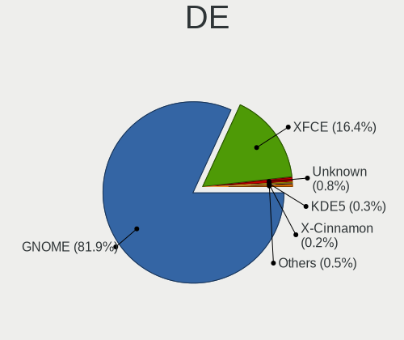
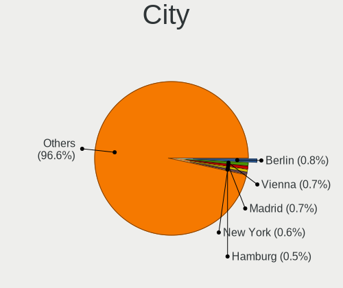
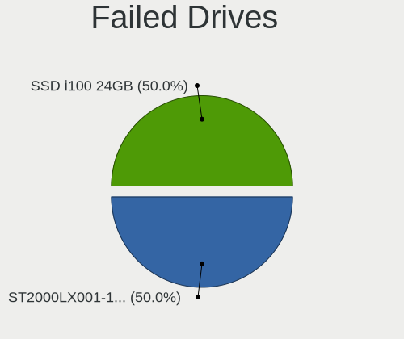
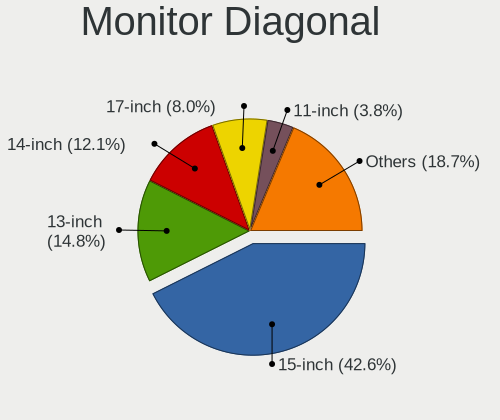

Zorin 16 - Tested Hardware & Statistics (Notebooks)
---------------------------------------------------

A project to collect tested hardware configurations for Zorin 16.

Anyone can contribute to this report by the [hw-probe](https://github.com/linuxhw/hw-probe) tool:

    sudo -E hw-probe -all -upload

Please submit a probe of your configuration if it's not presented on the page or is rare.

Full-feature report is available here: https://linux-hardware.org/?view=trends

Contents
--------

* [ Test Cases ](#test-cases)

* [ System ](#system)
  - [ Kernel                   ](#kernel)
  - [ Kernel Family            ](#kernel-family)
  - [ Kernel Major Ver.        ](#kernel-major-ver)
  - [ Arch                     ](#arch)
  - [ DE                       ](#de)
  - [ Display Server           ](#display-server)
  - [ Display Manager          ](#display-manager)
  - [ OS Lang                  ](#os-lang)
  - [ Boot Mode                ](#boot-mode)
  - [ Filesystem               ](#filesystem)
  - [ Part. scheme             ](#part-scheme)
  - [ Dual Boot with Linux/BSD ](#dual-boot-with-linuxbsd)
  - [ Dual Boot (Win)          ](#dual-boot-win)

* [ Board ](#board)
  - [ Vendor                   ](#vendor)
  - [ Model                    ](#model)
  - [ Model Family             ](#model-family)
  - [ MFG Year                 ](#mfg-year)
  - [ Form Factor              ](#form-factor)
  - [ Secure Boot              ](#secure-boot)
  - [ Coreboot                 ](#coreboot)
  - [ RAM Size                 ](#ram-size)
  - [ RAM Used                 ](#ram-used)
  - [ Total Drives             ](#total-drives)
  - [ Has CD-ROM               ](#has-cd-rom)
  - [ Has Ethernet             ](#has-ethernet)
  - [ Has WiFi                 ](#has-wifi)
  - [ Has Bluetooth            ](#has-bluetooth)

* [ Location ](#location)
  - [ Country                  ](#country)
  - [ City                     ](#city)

* [ Drives ](#drives)
  - [ Drive Vendor             ](#drive-vendor)
  - [ Drive Model              ](#drive-model)
  - [ HDD Vendor               ](#hdd-vendor)
  - [ SSD Vendor               ](#ssd-vendor)
  - [ Drive Kind               ](#drive-kind)
  - [ Drive Connector          ](#drive-connector)
  - [ Drive Size               ](#drive-size)
  - [ Space Total              ](#space-total)
  - [ Space Used               ](#space-used)
  - [ Malfunc. Drives          ](#malfunc-drives)
  - [ Malfunc. Drive Vendor    ](#malfunc-drive-vendor)
  - [ Malfunc. HDD Vendor      ](#malfunc-hdd-vendor)
  - [ Malfunc. Drive Kind      ](#malfunc-drive-kind)
  - [ Failed Drives            ](#failed-drives)
  - [ Failed Drive Vendor      ](#failed-drive-vendor)
  - [ Drive Status             ](#drive-status)

* [ Storage controller ](#storage-controller)
  - [ Storage Vendor           ](#storage-vendor)
  - [ Storage Model            ](#storage-model)
  - [ Storage Kind             ](#storage-kind)

* [ Processor ](#processor)
  - [ CPU Vendor               ](#cpu-vendor)
  - [ CPU Model                ](#cpu-model)
  - [ CPU Model Family         ](#cpu-model-family)
  - [ CPU Cores                ](#cpu-cores)
  - [ CPU Sockets              ](#cpu-sockets)
  - [ CPU Threads              ](#cpu-threads)
  - [ CPU Op-Modes             ](#cpu-op-modes)
  - [ CPU Microcode            ](#cpu-microcode)
  - [ CPU Microarch            ](#cpu-microarch)

* [ Graphics ](#graphics)
  - [ GPU Vendor               ](#gpu-vendor)
  - [ GPU Model                ](#gpu-model)
  - [ GPU Combo                ](#gpu-combo)
  - [ GPU Driver               ](#gpu-driver)
  - [ GPU Memory               ](#gpu-memory)

* [ Monitor ](#monitor)
  - [ Monitor Vendor           ](#monitor-vendor)
  - [ Monitor Model            ](#monitor-model)
  - [ Monitor Resolution       ](#monitor-resolution)
  - [ Monitor Diagonal         ](#monitor-diagonal)
  - [ Monitor Width            ](#monitor-width)
  - [ Aspect Ratio             ](#aspect-ratio)
  - [ Monitor Area             ](#monitor-area)
  - [ Pixel Density            ](#pixel-density)
  - [ Multiple Monitors        ](#multiple-monitors)

* [ Network ](#network)
  - [ Net Controller Vendor    ](#net-controller-vendor)
  - [ Net Controller Model     ](#net-controller-model)
  - [ Wireless Vendor          ](#wireless-vendor)
  - [ Wireless Model           ](#wireless-model)
  - [ Ethernet Vendor          ](#ethernet-vendor)
  - [ Ethernet Model           ](#ethernet-model)
  - [ Net Controller Kind      ](#net-controller-kind)
  - [ Used Controller          ](#used-controller)
  - [ NICs                     ](#nics)
  - [ IPv6                     ](#ipv6)

* [ Bluetooth ](#bluetooth)
  - [ Bluetooth Vendor         ](#bluetooth-vendor)
  - [ Bluetooth Model          ](#bluetooth-model)

* [ Sound ](#sound)
  - [ Sound Vendor             ](#sound-vendor)
  - [ Sound Model              ](#sound-model)

* [ Memory ](#memory)
  - [ Memory Vendor            ](#memory-vendor)
  - [ Memory Model             ](#memory-model)
  - [ Memory Kind              ](#memory-kind)
  - [ Memory Form Factor       ](#memory-form-factor)
  - [ Memory Size              ](#memory-size)
  - [ Memory Speed             ](#memory-speed)

* [ Printers & scanners ](#printers--scanners)
  - [ Printer Vendor           ](#printer-vendor)
  - [ Printer Model            ](#printer-model)
  - [ Scanner Vendor           ](#scanner-vendor)
  - [ Scanner Model            ](#scanner-model)

* [ Camera ](#camera)
  - [ Camera Vendor            ](#camera-vendor)
  - [ Camera Model             ](#camera-model)

* [ Security ](#security)
  - [ Fingerprint Vendor       ](#fingerprint-vendor)
  - [ Fingerprint Model        ](#fingerprint-model)
  - [ Chipcard Vendor          ](#chipcard-vendor)
  - [ Chipcard Model           ](#chipcard-model)

* [ Unsupported ](#unsupported)
  - [ Unsupported Devices      ](#unsupported-devices)
  - [ Unsupported Device Types ](#unsupported-device-types)

Test Cases
----------

| Vendor        | Model                       | Probe                                                      | Date         |
|---------------|-----------------------------|------------------------------------------------------------|--------------|
| Acer          | Aspire A315-58G             | [48e3c0e6c7](https://linux-hardware.org/?probe=48e3c0e6c7) | Dec 03, 2021 |
| HP            | OMEN Notebook               | [5b8b235c98](https://linux-hardware.org/?probe=5b8b235c98) | Dec 03, 2021 |
| Samsung       | 700T                        | [efe2d4bd92](https://linux-hardware.org/?probe=efe2d4bd92) | Dec 03, 2021 |
| Dell          | Latitude E6530              | [fe6dbdef48](https://linux-hardware.org/?probe=fe6dbdef48) | Dec 03, 2021 |
| Lenovo        | IdeaPad S145-15API 81V7     | [29ff3edb05](https://linux-hardware.org/?probe=29ff3edb05) | Dec 03, 2021 |
| Toshiba       | Satellite L655              | [0e3a82aad6](https://linux-hardware.org/?probe=0e3a82aad6) | Dec 03, 2021 |
| HUAWEI        | KLVL-WXX9                   | [c806323840](https://linux-hardware.org/?probe=c806323840) | Dec 03, 2021 |
| Dell          | Latitude 7280               | [8baf21a38d](https://linux-hardware.org/?probe=8baf21a38d) | Dec 02, 2021 |
| HUAWEI        | KLVL-WXX9                   | [57b4dae376](https://linux-hardware.org/?probe=57b4dae376) | Dec 02, 2021 |
| HP            | 15                          | [8d1ef12e0e](https://linux-hardware.org/?probe=8d1ef12e0e) | Dec 02, 2021 |
| HP            | ProBook 450 G3              | [ca49dc0eee](https://linux-hardware.org/?probe=ca49dc0eee) | Dec 02, 2021 |
| HP            | 15                          | [b374916ca6](https://linux-hardware.org/?probe=b374916ca6) | Dec 02, 2021 |
| Toshiba       | Satellite L55-B             | [0bc52401f0](https://linux-hardware.org/?probe=0bc52401f0) | Dec 02, 2021 |
| mPTech        | ARC 11.6 128GB HD           | [cb2302b704](https://linux-hardware.org/?probe=cb2302b704) | Dec 02, 2021 |
| mPTech        | ARC 11.6 128GB HD           | [f580be444b](https://linux-hardware.org/?probe=f580be444b) | Dec 02, 2021 |
| mPTech        | ARC 11.6 128GB HD           | [e2fbd06e2a](https://linux-hardware.org/?probe=e2fbd06e2a) | Dec 02, 2021 |
| TUXEDO        | Pulse 14 Gen1               | [c7eeb775f9](https://linux-hardware.org/?probe=c7eeb775f9) | Dec 02, 2021 |
| HP            | 15                          | [cb278b1a6b](https://linux-hardware.org/?probe=cb278b1a6b) | Dec 02, 2021 |
| Dell          | Latitude E5570              | [d7beab52f4](https://linux-hardware.org/?probe=d7beab52f4) | Dec 02, 2021 |
| Avell High... | B.ON                        | [a7513f22ee](https://linux-hardware.org/?probe=a7513f22ee) | Dec 02, 2021 |
| Primux        | 15R5A                       | [3aef7d25e8](https://linux-hardware.org/?probe=3aef7d25e8) | Dec 01, 2021 |
| ASUSTek       | X751LAB                     | [4383b601f4](https://linux-hardware.org/?probe=4383b601f4) | Nov 30, 2021 |
| MSI           | GF63 Thin 10SC              | [5f908f227a](https://linux-hardware.org/?probe=5f908f227a) | Nov 30, 2021 |
| HP            | EliteBook 8440p             | [cecc697189](https://linux-hardware.org/?probe=cecc697189) | Nov 30, 2021 |
| Dell          | Inspiron 15-3567            | [3a2bf12582](https://linux-hardware.org/?probe=3a2bf12582) | Nov 29, 2021 |
| ASUSTek       | TUF Gaming FX705GM_FX705... | [7184635417](https://linux-hardware.org/?probe=7184635417) | Nov 29, 2021 |
| Dell          | Latitude 7275               | [bf808d506c](https://linux-hardware.org/?probe=bf808d506c) | Nov 29, 2021 |
| Chuwi         | GemiBook                    | [911b855817](https://linux-hardware.org/?probe=911b855817) | Nov 28, 2021 |
| Chuwi         | GemiBook                    | [b8f87029fa](https://linux-hardware.org/?probe=b8f87029fa) | Nov 28, 2021 |
| Dell          | Latitude E5420              | [9f504b4e6b](https://linux-hardware.org/?probe=9f504b4e6b) | Nov 28, 2021 |
| ASUSTek       | P453UJ                      | [056cba6efd](https://linux-hardware.org/?probe=056cba6efd) | Nov 28, 2021 |
| ASUSTek       | X455LJ                      | [018d5bcbac](https://linux-hardware.org/?probe=018d5bcbac) | Nov 27, 2021 |
| Acer          | Aspire 4830T                | [205025f3c7](https://linux-hardware.org/?probe=205025f3c7) | Nov 27, 2021 |
| Acer          | Aspire A315-42              | [a0483c5539](https://linux-hardware.org/?probe=a0483c5539) | Nov 27, 2021 |
| Toshiba       | Satellite L500              | [24645f6ab5](https://linux-hardware.org/?probe=24645f6ab5) | Nov 26, 2021 |
| ASUSTek       | Zephyrus M GU502GW_GU502... | [25e2834604](https://linux-hardware.org/?probe=25e2834604) | Nov 25, 2021 |
| Acer          | Aspire 4830T                | [757863f7de](https://linux-hardware.org/?probe=757863f7de) | Nov 25, 2021 |
| Notebook      | NH50_70RA                   | [baa1c5d2ca](https://linux-hardware.org/?probe=baa1c5d2ca) | Nov 24, 2021 |
| HP            | Elite x2 1012 G1            | [5e2d2a574d](https://linux-hardware.org/?probe=5e2d2a574d) | Nov 24, 2021 |
| Lenovo        | Flex 2-14 20404             | [74894434bb](https://linux-hardware.org/?probe=74894434bb) | Nov 24, 2021 |
| ASUSTek       | GL552VW                     | [77929060f7](https://linux-hardware.org/?probe=77929060f7) | Nov 24, 2021 |
| Sony          | SVE1713Y1EB                 | [755b7b85f5](https://linux-hardware.org/?probe=755b7b85f5) | Nov 24, 2021 |
| HP            | EliteBook 8460p             | [ca30b13118](https://linux-hardware.org/?probe=ca30b13118) | Nov 24, 2021 |
| HP            | EliteBook 8570p             | [6c08986736](https://linux-hardware.org/?probe=6c08986736) | Nov 24, 2021 |
| Acer          | Okinawa                     | [2953f32ed9](https://linux-hardware.org/?probe=2953f32ed9) | Nov 23, 2021 |
| HP            | Pavilion 17                 | [315037ddfd](https://linux-hardware.org/?probe=315037ddfd) | Nov 23, 2021 |
| Sony          | VPCSA3N9E                   | [33a3597313](https://linux-hardware.org/?probe=33a3597313) | Nov 23, 2021 |
| Sony          | VPCSA3N9E                   | [c1bf05d67a](https://linux-hardware.org/?probe=c1bf05d67a) | Nov 23, 2021 |
| ASUSTek       | GL552VW                     | [59670a3933](https://linux-hardware.org/?probe=59670a3933) | Nov 23, 2021 |
| Lenovo        | IdeaPad Yoga 13 20175       | [56ff76e064](https://linux-hardware.org/?probe=56ff76e064) | Nov 23, 2021 |
| ASUSTek       | G750JX                      | [f503f26e28](https://linux-hardware.org/?probe=f503f26e28) | Nov 23, 2021 |
| HP            | Pavilion dv7                | [fa2ac7c179](https://linux-hardware.org/?probe=fa2ac7c179) | Nov 23, 2021 |
| Lenovo        | G580 20150                  | [baade6ba54](https://linux-hardware.org/?probe=baade6ba54) | Nov 22, 2021 |
| Lenovo        | G580 20150                  | [b7718027af](https://linux-hardware.org/?probe=b7718027af) | Nov 22, 2021 |
| HP            | 15                          | [1753404669](https://linux-hardware.org/?probe=1753404669) | Nov 22, 2021 |
| HP            | Notebook                    | [9e9ce14e95](https://linux-hardware.org/?probe=9e9ce14e95) | Nov 22, 2021 |
| ASUSTek       | X751SA                      | [d19fd8c59f](https://linux-hardware.org/?probe=d19fd8c59f) | Nov 22, 2021 |
| Toshiba       | Satellite L500              | [30bfdcb5ff](https://linux-hardware.org/?probe=30bfdcb5ff) | Nov 22, 2021 |
| HP            | ENVY TS 15                  | [ca6e82745c](https://linux-hardware.org/?probe=ca6e82745c) | Nov 22, 2021 |
| Fujitsu Si... | AMILO Pa 1510               | [9f731acb7e](https://linux-hardware.org/?probe=9f731acb7e) | Nov 22, 2021 |
| HP            | 15                          | [bca58eb5e0](https://linux-hardware.org/?probe=bca58eb5e0) | Nov 22, 2021 |
| Apple         | MacBookPro5,3               | [5a4e91eace](https://linux-hardware.org/?probe=5a4e91eace) | Nov 22, 2021 |
| ASUSTek       | U56E                        | [2b347f1923](https://linux-hardware.org/?probe=2b347f1923) | Nov 22, 2021 |
| Lenovo        | G560 0679                   | [15348ebbf9](https://linux-hardware.org/?probe=15348ebbf9) | Nov 22, 2021 |
| HP            | Pavilion 15                 | [0f1442bb2c](https://linux-hardware.org/?probe=0f1442bb2c) | Nov 22, 2021 |
| Toshiba       | PORTEGE R705                | [47688cd36a](https://linux-hardware.org/?probe=47688cd36a) | Nov 21, 2021 |
| Toshiba       | Satellite U300              | [827ec6ed62](https://linux-hardware.org/?probe=827ec6ed62) | Nov 21, 2021 |
| HP            | Pavilion dv7                | [7c745f9e5a](https://linux-hardware.org/?probe=7c745f9e5a) | Nov 21, 2021 |
| HP            | ENVY Notebook               | [09767edae3](https://linux-hardware.org/?probe=09767edae3) | Nov 21, 2021 |
| Dell          | Latitude E6440              | [babff23db6](https://linux-hardware.org/?probe=babff23db6) | Nov 21, 2021 |
| Dell          | G7 7700                     | [730daa1080](https://linux-hardware.org/?probe=730daa1080) | Nov 21, 2021 |
| Fujitsu Si... | ESPRIMO Mobile V6505        | [c99c5700f6](https://linux-hardware.org/?probe=c99c5700f6) | Nov 20, 2021 |
| HP            | Pavilion Notebook           | [ca1ccc6e65](https://linux-hardware.org/?probe=ca1ccc6e65) | Nov 20, 2021 |
| ASUSTek       | K53U                        | [12136b1cbd](https://linux-hardware.org/?probe=12136b1cbd) | Nov 20, 2021 |
| HP            | Pavilion 15                 | [687ecf1c58](https://linux-hardware.org/?probe=687ecf1c58) | Nov 20, 2021 |
| Sony          | SVE1713D1EW                 | [20d3ee7401](https://linux-hardware.org/?probe=20d3ee7401) | Nov 20, 2021 |
| ASUSTek       | K53U                        | [5a5b8c420f](https://linux-hardware.org/?probe=5a5b8c420f) | Nov 20, 2021 |
| Dell          | Latitude E7440              | [89fdff42c1](https://linux-hardware.org/?probe=89fdff42c1) | Nov 20, 2021 |
| Dell          | Precision M6700             | [a8bf3915fb](https://linux-hardware.org/?probe=a8bf3915fb) | Nov 20, 2021 |
| HP            | OMEN by Laptop 15-dc1xxx    | [7ddd35d3e8](https://linux-hardware.org/?probe=7ddd35d3e8) | Nov 20, 2021 |
| Sony          | SVE1713Y1EB                 | [4a77a751d9](https://linux-hardware.org/?probe=4a77a751d9) | Nov 20, 2021 |
| Toshiba       | Satellite C50D-B            | [6c92d7fef6](https://linux-hardware.org/?probe=6c92d7fef6) | Nov 19, 2021 |
| Dell          | Latitude E5550              | [2f52aa274c](https://linux-hardware.org/?probe=2f52aa274c) | Nov 19, 2021 |
| LG Electro... | S460-G.BG31P1               | [96d8266022](https://linux-hardware.org/?probe=96d8266022) | Nov 19, 2021 |
| Sony          | SVE1713D1EW                 | [cf21ed12bc](https://linux-hardware.org/?probe=cf21ed12bc) | Nov 18, 2021 |
| Lenovo        | ThinkPad X260 20F5S1GW1Q    | [3b8a61e460](https://linux-hardware.org/?probe=3b8a61e460) | Nov 18, 2021 |
| Google        | Lars                        | [c346746b7e](https://linux-hardware.org/?probe=c346746b7e) | Nov 18, 2021 |
| Dell          | Latitude 5590               | [8bef1790bd](https://linux-hardware.org/?probe=8bef1790bd) | Nov 18, 2021 |
| Toshiba       | Satellite C870-1C2          | [e3e16a0c1f](https://linux-hardware.org/?probe=e3e16a0c1f) | Nov 17, 2021 |
| Acer          | TravelMate 6292             | [2cec3b7547](https://linux-hardware.org/?probe=2cec3b7547) | Nov 17, 2021 |
| HP            | ENVY m7 Notebook            | [4b101cc132](https://linux-hardware.org/?probe=4b101cc132) | Nov 17, 2021 |
| HP            | Stream Notebook PC 14       | [31499aa79d](https://linux-hardware.org/?probe=31499aa79d) | Nov 17, 2021 |
| HP            | Stream Notebook PC 14       | [8c30001e99](https://linux-hardware.org/?probe=8c30001e99) | Nov 17, 2021 |
| Dell          | Precision M6700             | [fb4051d1de](https://linux-hardware.org/?probe=fb4051d1de) | Nov 17, 2021 |
| Lenovo        | ThinkPad T430 23445PU       | [e5fe64db56](https://linux-hardware.org/?probe=e5fe64db56) | Nov 16, 2021 |
| Toshiba       | Satellite C655D             | [cd8abc5170](https://linux-hardware.org/?probe=cd8abc5170) | Nov 16, 2021 |
| HP            | Compaq 8710p (GC102EA#AB... | [bfef77542f](https://linux-hardware.org/?probe=bfef77542f) | Nov 15, 2021 |
| Samsung       | 900X3C/900X3D/900X4C/900... | [76b69deb69](https://linux-hardware.org/?probe=76b69deb69) | Nov 14, 2021 |
| ASUSTek       | Vivobook_ASUSLaptop M350... | [3a3f503917](https://linux-hardware.org/?probe=3a3f503917) | Nov 14, 2021 |
| HP            | Notebook                    | [226dc7dc39](https://linux-hardware.org/?probe=226dc7dc39) | Nov 12, 2021 |
| HP            | Notebook                    | [c03f407f50](https://linux-hardware.org/?probe=c03f407f50) | Nov 12, 2021 |
| HP            | Notebook                    | [a2bae8d4b8](https://linux-hardware.org/?probe=a2bae8d4b8) | Nov 12, 2021 |
| HP            | Notebook                    | [87dec3cf7c](https://linux-hardware.org/?probe=87dec3cf7c) | Nov 12, 2021 |
| HP            | EliteBook 2560p             | [e3997c3bcb](https://linux-hardware.org/?probe=e3997c3bcb) | Nov 12, 2021 |
| Dell          | Inspiron 15-3567            | [e8879e98df](https://linux-hardware.org/?probe=e8879e98df) | Nov 12, 2021 |
| Google        | Kindred                     | [0046ef8942](https://linux-hardware.org/?probe=0046ef8942) | Nov 12, 2021 |
| Google        | Kindred                     | [9d72c8972c](https://linux-hardware.org/?probe=9d72c8972c) | Nov 12, 2021 |
| Acer          | Aspire 4830T                | [9ae2c69b2a](https://linux-hardware.org/?probe=9ae2c69b2a) | Nov 12, 2021 |
| Dell          | Precision M6700             | [9bf18c23c6](https://linux-hardware.org/?probe=9bf18c23c6) | Nov 12, 2021 |
| Notebook      | N85_N87HCHNHZ               | [32988fae95](https://linux-hardware.org/?probe=32988fae95) | Nov 11, 2021 |
| Lenovo        | IdeaPad 300-17ISK 80QH      | [c948868090](https://linux-hardware.org/?probe=c948868090) | Nov 11, 2021 |
| Dell          | Inspiron 1750               | [6ffff20ec8](https://linux-hardware.org/?probe=6ffff20ec8) | Nov 11, 2021 |
| Sony          | SVF14211CLB                 | [7c0dacdd54](https://linux-hardware.org/?probe=7c0dacdd54) | Nov 10, 2021 |
| HUAWEI        | BOHB-WAX9                   | [3b1f90f3ab](https://linux-hardware.org/?probe=3b1f90f3ab) | Nov 10, 2021 |
| HUAWEI        | BOHB-WAX9                   | [3858faa240](https://linux-hardware.org/?probe=3858faa240) | Nov 10, 2021 |
| Sony          | SVF14211CLB                 | [fdfd650fcc](https://linux-hardware.org/?probe=fdfd650fcc) | Nov 10, 2021 |
| Lenovo        | IdeaPad Yoga 13 20175       | [94da614270](https://linux-hardware.org/?probe=94da614270) | Nov 10, 2021 |
| Fujitsu Si... | ESPRIMO Mobile V6505        | [72dd15e9c5](https://linux-hardware.org/?probe=72dd15e9c5) | Nov 10, 2021 |
| Fujitsu       | LIFEBOOK AH532              | [0d017f9835](https://linux-hardware.org/?probe=0d017f9835) | Nov 10, 2021 |
| ASUSTek       | U46E                        | [d52a43c7fd](https://linux-hardware.org/?probe=d52a43c7fd) | Nov 10, 2021 |
| Dell          | Latitude 3440               | [eb76b9d1cf](https://linux-hardware.org/?probe=eb76b9d1cf) | Nov 09, 2021 |
| HP            | Pavilion dv6                | [605479abf7](https://linux-hardware.org/?probe=605479abf7) | Nov 08, 2021 |
| HP            | Pavilion dv6                | [b7a410c2e6](https://linux-hardware.org/?probe=b7a410c2e6) | Nov 08, 2021 |
| MSI           | GF63 Thin 9SC               | [d85e7a0ad3](https://linux-hardware.org/?probe=d85e7a0ad3) | Nov 07, 2021 |
| Dell          | Latitude E5420              | [b53c6bd6d2](https://linux-hardware.org/?probe=b53c6bd6d2) | Nov 07, 2021 |
| Acer          | Swift SF314-56G             | [bf298c7d2d](https://linux-hardware.org/?probe=bf298c7d2d) | Nov 07, 2021 |
| Lenovo        | IdeaPad 300-17ISK 80QH      | [520a472266](https://linux-hardware.org/?probe=520a472266) | Nov 07, 2021 |
| HP            | Compaq 8510p                | [ddecc261a1](https://linux-hardware.org/?probe=ddecc261a1) | Nov 07, 2021 |
| HP            | Compaq 8510p                | [c2434c1c08](https://linux-hardware.org/?probe=c2434c1c08) | Nov 07, 2021 |
| TUXEDO        | InfinityBook Pro 14 Gen6    | [a0d13572a5](https://linux-hardware.org/?probe=a0d13572a5) | Nov 06, 2021 |
| HP            | Laptop 15-bw0xx             | [746f64d20b](https://linux-hardware.org/?probe=746f64d20b) | Nov 06, 2021 |
| HP            | Laptop 15-bw0xx             | [245941966f](https://linux-hardware.org/?probe=245941966f) | Nov 06, 2021 |
| Sony          | SVE1713D1EW                 | [64fd6b328f](https://linux-hardware.org/?probe=64fd6b328f) | Nov 06, 2021 |
| Sony          | SVE1713D1EW                 | [45609f28be](https://linux-hardware.org/?probe=45609f28be) | Nov 06, 2021 |
| HP            | Compaq 6710b (KE121ET#AB... | [5d577f71a4](https://linux-hardware.org/?probe=5d577f71a4) | Nov 06, 2021 |
| HP            | Compaq 6710b (KE121ET#AB... | [c37780e9ad](https://linux-hardware.org/?probe=c37780e9ad) | Nov 06, 2021 |
| ASUSTek       | K53TA                       | [e924b214bc](https://linux-hardware.org/?probe=e924b214bc) | Nov 06, 2021 |
| Acer          | Aspire ES1-521              | [5ef4af5924](https://linux-hardware.org/?probe=5ef4af5924) | Nov 06, 2021 |
| ASUSTek       | VivoBook_ASUSLaptop X421... | [73b5ea9e0b](https://linux-hardware.org/?probe=73b5ea9e0b) | Nov 06, 2021 |
| HP            | ProBook 450 G4              | [a96a96d455](https://linux-hardware.org/?probe=a96a96d455) | Nov 05, 2021 |
| ASUSTek       | K45A                        | [f9bc7efe7b](https://linux-hardware.org/?probe=f9bc7efe7b) | Nov 05, 2021 |
| ASUSTek       | K45A                        | [096deec12d](https://linux-hardware.org/?probe=096deec12d) | Nov 05, 2021 |
| Sony          | VPCEG23EL                   | [cc967c03fb](https://linux-hardware.org/?probe=cc967c03fb) | Nov 05, 2021 |
| Acer          | Swift SF314-54              | [b506625dc2](https://linux-hardware.org/?probe=b506625dc2) | Nov 05, 2021 |
| ASUSTek       | X751NV                      | [ecf08805fe](https://linux-hardware.org/?probe=ecf08805fe) | Nov 03, 2021 |
| Dell          | Precision M6700             | [1865ed7cca](https://linux-hardware.org/?probe=1865ed7cca) | Nov 03, 2021 |
| Dell          | Latitude 5490               | [c5c1f555f1](https://linux-hardware.org/?probe=c5c1f555f1) | Nov 03, 2021 |
| HP            | Compaq 8710p (GC102EA#AB... | [9e7a883a59](https://linux-hardware.org/?probe=9e7a883a59) | Nov 03, 2021 |
| HP            | Notebook                    | [ee3bc3deef](https://linux-hardware.org/?probe=ee3bc3deef) | Nov 02, 2021 |
| Lenovo        | ThinkPad E15 Gen 3 20YG0... | [3acc230d6a](https://linux-hardware.org/?probe=3acc230d6a) | Nov 02, 2021 |
| Lenovo        | ThinkPad E15 Gen 3 20YG0... | [c88adaac6e](https://linux-hardware.org/?probe=c88adaac6e) | Nov 02, 2021 |
| Lenovo        | ThinkPad T430 2349ED5       | [0697993e7c](https://linux-hardware.org/?probe=0697993e7c) | Nov 02, 2021 |
| Lenovo        | IdeaPad Z580                | [0f9c8eb860](https://linux-hardware.org/?probe=0f9c8eb860) | Nov 02, 2021 |
| Toshiba       | Satellite C870-1C2          | [7e5a2d91f8](https://linux-hardware.org/?probe=7e5a2d91f8) | Nov 02, 2021 |
| HP            | ProBook 440 G4              | [695b9a4e0c](https://linux-hardware.org/?probe=695b9a4e0c) | Nov 01, 2021 |
| HP            | ProBook 440 G4              | [4bba4734e8](https://linux-hardware.org/?probe=4bba4734e8) | Nov 01, 2021 |
| Dell          | XPS 15 9510                 | [9ad082f18e](https://linux-hardware.org/?probe=9ad082f18e) | Nov 01, 2021 |
| ASUSTek       | K52Jc                       | [dfb687f14d](https://linux-hardware.org/?probe=dfb687f14d) | Nov 01, 2021 |
| HP            | 255 G8 Notebook PC          | [600b7b9957](https://linux-hardware.org/?probe=600b7b9957) | Nov 01, 2021 |
| Acer          | Aspire E1-522               | [56b475a93d](https://linux-hardware.org/?probe=56b475a93d) | Nov 01, 2021 |
| Toshiba       | Satellite Pro T110          | [3ae7a19459](https://linux-hardware.org/?probe=3ae7a19459) | Oct 31, 2021 |
| ASUSTek       | N61Ja                       | [e3fc4e0622](https://linux-hardware.org/?probe=e3fc4e0622) | Oct 31, 2021 |
| Samsung       | 300E5EV/300E4EV/270E5EV/... | [83d642714b](https://linux-hardware.org/?probe=83d642714b) | Oct 31, 2021 |
| Apple         | MacBookPro11,2              | [eabb3946ad](https://linux-hardware.org/?probe=eabb3946ad) | Oct 31, 2021 |
| ASUSTek       | N61Ja                       | [3861fce83e](https://linux-hardware.org/?probe=3861fce83e) | Oct 31, 2021 |
| Apple         | MacBookPro11,2              | [2388e68622](https://linux-hardware.org/?probe=2388e68622) | Oct 31, 2021 |
| Dell          | Inspiron 7720               | [9f298535a5](https://linux-hardware.org/?probe=9f298535a5) | Oct 31, 2021 |
| HP            | 255 G8 Notebook PC          | [cb9c15cf6f](https://linux-hardware.org/?probe=cb9c15cf6f) | Oct 30, 2021 |
| Dell          | Latitude E6500              | [e475348b1e](https://linux-hardware.org/?probe=e475348b1e) | Oct 30, 2021 |
| MECER         | Z140C+Home                  | [2fbf6f153b](https://linux-hardware.org/?probe=2fbf6f153b) | Oct 30, 2021 |
| HP            | Pavilion Notebook           | [85a55f5c3c](https://linux-hardware.org/?probe=85a55f5c3c) | Oct 30, 2021 |
| Lenovo        | IdeaPad Z580                | [16ebdc4388](https://linux-hardware.org/?probe=16ebdc4388) | Oct 30, 2021 |
| Lenovo        | IdeaPad Z580                | [6260be6de5](https://linux-hardware.org/?probe=6260be6de5) | Oct 30, 2021 |
| HP            | Pavilion Laptop 14-dv0xx... | [af0a995721](https://linux-hardware.org/?probe=af0a995721) | Oct 30, 2021 |
| Lenovo        | IdeaPad S145-15API 81V7     | [88286c36e9](https://linux-hardware.org/?probe=88286c36e9) | Oct 29, 2021 |
| Acer          | Aspire A315-21              | [f5f4e2457b](https://linux-hardware.org/?probe=f5f4e2457b) | Oct 29, 2021 |
| Lenovo        | ThinkBook 15-IIL 20SM       | [c74557d180](https://linux-hardware.org/?probe=c74557d180) | Oct 29, 2021 |
| Acer          | Aspire A315-21              | [35b5fcb787](https://linux-hardware.org/?probe=35b5fcb787) | Oct 28, 2021 |
| ASUSTek       | N71Jv                       | [29e3747e17](https://linux-hardware.org/?probe=29e3747e17) | Oct 28, 2021 |
| ASUSTek       | X750JB                      | [90fd9f38fc](https://linux-hardware.org/?probe=90fd9f38fc) | Oct 27, 2021 |
| Lenovo        | G570 4334                   | [cc07ebf9b6](https://linux-hardware.org/?probe=cc07ebf9b6) | Oct 27, 2021 |
| HP            | EliteBook 8440p             | [f527983cc9](https://linux-hardware.org/?probe=f527983cc9) | Oct 27, 2021 |
| Toshiba       | PORTEGE Z20t-C              | [ed1722174a](https://linux-hardware.org/?probe=ed1722174a) | Oct 27, 2021 |
| Lenovo        | Legion Y920-17IKB Laptop... | [830d4c9d9d](https://linux-hardware.org/?probe=830d4c9d9d) | Oct 26, 2021 |
| Acer          | Aspire 5737Z                | [9bbf3befab](https://linux-hardware.org/?probe=9bbf3befab) | Oct 26, 2021 |
| Lenovo        | ThinkPad T520 4242W4F       | [4104e265ea](https://linux-hardware.org/?probe=4104e265ea) | Oct 26, 2021 |
| Notebook      | W94_95_97SU2,SUY,-C,-T      | [3da20846f5](https://linux-hardware.org/?probe=3da20846f5) | Oct 26, 2021 |
| Notebook      | W94_95_97SU2,SUY,-C,-T      | [2d19155e7f](https://linux-hardware.org/?probe=2d19155e7f) | Oct 26, 2021 |
| Fujitsu       | LIFEBOOK AH530              | [ed4e9d1a03](https://linux-hardware.org/?probe=ed4e9d1a03) | Oct 26, 2021 |
| Fujitsu       | LIFEBOOK AH530              | [f5b1e904b7](https://linux-hardware.org/?probe=f5b1e904b7) | Oct 26, 2021 |
| HP            | ProBook 445 G7              | [87b3274937](https://linux-hardware.org/?probe=87b3274937) | Oct 26, 2021 |
| HP            | Stream Notebook PC 11       | [c240a088a9](https://linux-hardware.org/?probe=c240a088a9) | Oct 26, 2021 |
| HP            | ENVY m7 Notebook            | [235fa5cacd](https://linux-hardware.org/?probe=235fa5cacd) | Oct 25, 2021 |
| Dell          | Latitude E6430              | [fa4d12994d](https://linux-hardware.org/?probe=fa4d12994d) | Oct 25, 2021 |
| Schenker      | VIA 15 Pro                  | [7242436545](https://linux-hardware.org/?probe=7242436545) | Oct 24, 2021 |
| Toshiba       | Satellite C70-B             | [a17b7c3888](https://linux-hardware.org/?probe=a17b7c3888) | Oct 24, 2021 |
| Thomson       | N17C512                     | [20abb09d3a](https://linux-hardware.org/?probe=20abb09d3a) | Oct 24, 2021 |
| Notebook      | X170SM                      | [2054d0dee6](https://linux-hardware.org/?probe=2054d0dee6) | Oct 24, 2021 |
| Notebook      | X170SM                      | [f704af17a3](https://linux-hardware.org/?probe=f704af17a3) | Oct 24, 2021 |
| Dell          | Latitude D630               | [1cfebe8169](https://linux-hardware.org/?probe=1cfebe8169) | Oct 23, 2021 |
| Dell          | Latitude E6410              | [f4cdc942dc](https://linux-hardware.org/?probe=f4cdc942dc) | Oct 23, 2021 |
| Lenovo        | ThinkPad T470s W10DG 20J... | [fe4aa7e54d](https://linux-hardware.org/?probe=fe4aa7e54d) | Oct 23, 2021 |
| Lenovo        | IdeaPad 3 15IIL05 81WE      | [db85bd77fc](https://linux-hardware.org/?probe=db85bd77fc) | Oct 23, 2021 |
| HP            | ProBook 6550b               | [4db59c8489](https://linux-hardware.org/?probe=4db59c8489) | Oct 23, 2021 |
| Acer          | Aspire ES1-521              | [c6582bba7d](https://linux-hardware.org/?probe=c6582bba7d) | Oct 23, 2021 |
| Acer          | Aspire ES1-521              | [248ab157b8](https://linux-hardware.org/?probe=248ab157b8) | Oct 23, 2021 |
| HP            | Notebook                    | [11013f1334](https://linux-hardware.org/?probe=11013f1334) | Oct 22, 2021 |
| Google        | Kindred                     | [675265477a](https://linux-hardware.org/?probe=675265477a) | Oct 22, 2021 |
| HP            | 255 G4 Notebook PC          | [e7e49e8cc0](https://linux-hardware.org/?probe=e7e49e8cc0) | Oct 22, 2021 |
| Dell          | Latitude E7470              | [061c5e449c](https://linux-hardware.org/?probe=061c5e449c) | Oct 22, 2021 |
| MSI           | Modern 14 B10MW             | [ae43e74753](https://linux-hardware.org/?probe=ae43e74753) | Oct 21, 2021 |
| HP            | Compaq 8710p (GC102EA#AB... | [8668abcc62](https://linux-hardware.org/?probe=8668abcc62) | Oct 21, 2021 |
| HP            | Compaq 8710p (GC102EA#AB... | [18cf55aa72](https://linux-hardware.org/?probe=18cf55aa72) | Oct 21, 2021 |
| Toshiba       | Satellite L755              | [985ff9ba03](https://linux-hardware.org/?probe=985ff9ba03) | Oct 21, 2021 |
| Lenovo        | ThinkPad T470s W10DG 20J... | [63c9d05f24](https://linux-hardware.org/?probe=63c9d05f24) | Oct 20, 2021 |
| Lenovo        | IdeaPad 320-15AST 80XV      | [85036968bb](https://linux-hardware.org/?probe=85036968bb) | Oct 20, 2021 |
| Lenovo        | ThinkPad T460s 20FAS3F30... | [6d2d97674c](https://linux-hardware.org/?probe=6d2d97674c) | Oct 19, 2021 |
| Lenovo        | ThinkPad T460s 20FAS3F30... | [facdd98487](https://linux-hardware.org/?probe=facdd98487) | Oct 19, 2021 |
| Lenovo        | IdeaPad S340-14API 81NB     | [961f066acf](https://linux-hardware.org/?probe=961f066acf) | Oct 19, 2021 |
| Dell          | Latitude E7470              | [fdc6203a6e](https://linux-hardware.org/?probe=fdc6203a6e) | Oct 18, 2021 |
| Dell          | Latitude E6420              | [027441e6d4](https://linux-hardware.org/?probe=027441e6d4) | Oct 18, 2021 |
| ASUSTek       | VivoBook 15_ASUS Laptop ... | [6210b749a1](https://linux-hardware.org/?probe=6210b749a1) | Oct 18, 2021 |
| ASUSTek       | VivoBook 15_ASUS Laptop ... | [dbf1e020b0](https://linux-hardware.org/?probe=dbf1e020b0) | Oct 18, 2021 |
| Dell          | Inspiron 3521               | [2ffe8489e1](https://linux-hardware.org/?probe=2ffe8489e1) | Oct 18, 2021 |
| Toshiba       | Satellite C870-1C2          | [076883700d](https://linux-hardware.org/?probe=076883700d) | Oct 17, 2021 |
| ASUSTek       | ROG Strix G531GT_G531GT     | [10f8e5f5cf](https://linux-hardware.org/?probe=10f8e5f5cf) | Oct 17, 2021 |
| Acer          | Aspire R3-131T              | [014464c088](https://linux-hardware.org/?probe=014464c088) | Oct 17, 2021 |
| Fujitsu       | LIFEBOOK AH530              | [15ce74dcd6](https://linux-hardware.org/?probe=15ce74dcd6) | Oct 17, 2021 |
| Fujitsu       | LIFEBOOK AH530              | [97c3495c65](https://linux-hardware.org/?probe=97c3495c65) | Oct 17, 2021 |
| Unknown       | CherryTrail                 | [01d095b201](https://linux-hardware.org/?probe=01d095b201) | Oct 17, 2021 |
| Acer          | Aspire E5-571               | [76090a2652](https://linux-hardware.org/?probe=76090a2652) | Oct 16, 2021 |
| HP            | Stream Laptop 14-ax0XX      | [ff6de8e062](https://linux-hardware.org/?probe=ff6de8e062) | Oct 16, 2021 |
| Lenovo        | G50-70 20351                | [d0d0d99be6](https://linux-hardware.org/?probe=d0d0d99be6) | Oct 16, 2021 |
| Lenovo        | Flex 2-14 20404             | [ef609865b5](https://linux-hardware.org/?probe=ef609865b5) | Oct 16, 2021 |
| Lenovo        | Flex 2-14 20404             | [4fc5c2f99f](https://linux-hardware.org/?probe=4fc5c2f99f) | Oct 16, 2021 |
| Dell          | Latitude E7440              | [cfe53904bc](https://linux-hardware.org/?probe=cfe53904bc) | Oct 16, 2021 |
| Unknown       | Unknown                     | [3233e1293c](https://linux-hardware.org/?probe=3233e1293c) | Oct 15, 2021 |
| Acer          | Aspire E5-576G              | [6f17f5d2c0](https://linux-hardware.org/?probe=6f17f5d2c0) | Oct 15, 2021 |
| HP            | Pavilion dv7                | [2d35a2ee5d](https://linux-hardware.org/?probe=2d35a2ee5d) | Oct 15, 2021 |
| HP            | ENVY m7 Notebook            | [f0af05f6f9](https://linux-hardware.org/?probe=f0af05f6f9) | Oct 15, 2021 |
| Unknown       | Unknown                     | [ddc6d80716](https://linux-hardware.org/?probe=ddc6d80716) | Oct 15, 2021 |
| Toshiba       | Satellite L755              | [fdaa2dd77e](https://linux-hardware.org/?probe=fdaa2dd77e) | Oct 14, 2021 |
| Lenovo        | ThinkPad X220 Tablet 429... | [6edbff3019](https://linux-hardware.org/?probe=6edbff3019) | Oct 14, 2021 |
| Lenovo        | IdeaPad Flex-14API 81SS     | [3f90ae6d67](https://linux-hardware.org/?probe=3f90ae6d67) | Oct 14, 2021 |
| Dell          | Latitude E6420              | [14b08ab14d](https://linux-hardware.org/?probe=14b08ab14d) | Oct 14, 2021 |
| ASUSTek       | GL702VI                     | [c342d6fdc1](https://linux-hardware.org/?probe=c342d6fdc1) | Oct 14, 2021 |
| HP            | 15                          | [5534f9e3fc](https://linux-hardware.org/?probe=5534f9e3fc) | Oct 14, 2021 |
| Acer          | Swift SF314-59              | [2cd9b13bb1](https://linux-hardware.org/?probe=2cd9b13bb1) | Oct 14, 2021 |
| HP            | 15                          | [bfc196e22b](https://linux-hardware.org/?probe=bfc196e22b) | Oct 13, 2021 |
| ASUSTek       | X501A1                      | [0494cb6f11](https://linux-hardware.org/?probe=0494cb6f11) | Oct 13, 2021 |
| HP            | Notebook                    | [58c6628ba2](https://linux-hardware.org/?probe=58c6628ba2) | Oct 12, 2021 |
| HP            | Notebook                    | [f3f5e6256d](https://linux-hardware.org/?probe=f3f5e6256d) | Oct 12, 2021 |
| Dell          | Inspiron 5721               | [a13d0383b6](https://linux-hardware.org/?probe=a13d0383b6) | Oct 12, 2021 |
| Dell          | Inspiron 5721               | [686377ccd0](https://linux-hardware.org/?probe=686377ccd0) | Oct 12, 2021 |
| HP            | EliteBook 840 G1            | [9bb8ba744e](https://linux-hardware.org/?probe=9bb8ba744e) | Oct 12, 2021 |
| Apple         | MacBookPro8,1               | [01a3f25bec](https://linux-hardware.org/?probe=01a3f25bec) | Oct 12, 2021 |
| Apple         | MacBookPro8,1               | [d8de6fc953](https://linux-hardware.org/?probe=d8de6fc953) | Oct 12, 2021 |
| Giani Limi... | ENY1158M                    | [1f9a85e980](https://linux-hardware.org/?probe=1f9a85e980) | Oct 11, 2021 |
| Giani Limi... | ENY1158M                    | [4516242881](https://linux-hardware.org/?probe=4516242881) | Oct 11, 2021 |
| Lenovo        | ThinkPad X220 4286CTO       | [471414140c](https://linux-hardware.org/?probe=471414140c) | Oct 11, 2021 |
| Unknown       | Z3735F-T02 V1.2             | [6ef4e9edf6](https://linux-hardware.org/?probe=6ef4e9edf6) | Oct 11, 2021 |
| Dell          | Inspiron 3537               | [9614492711](https://linux-hardware.org/?probe=9614492711) | Oct 11, 2021 |
| Lenovo        | IdeaPad S145-15IWL 81S9     | [f5147cd609](https://linux-hardware.org/?probe=f5147cd609) | Oct 10, 2021 |
| Lenovo        | Y520-15IKBM 80YY            | [fc28e4f7f8](https://linux-hardware.org/?probe=fc28e4f7f8) | Oct 10, 2021 |
| HP            | x2 210                      | [ccf01919ab](https://linux-hardware.org/?probe=ccf01919ab) | Oct 09, 2021 |
| HP            | x2 210                      | [a35274c0a7](https://linux-hardware.org/?probe=a35274c0a7) | Oct 09, 2021 |
| HP            | Pavilion Laptop 15z-cw10... | [e1a73cbf10](https://linux-hardware.org/?probe=e1a73cbf10) | Oct 09, 2021 |
| Samsung       | 700Z3C/700Z5C               | [007ba2bac1](https://linux-hardware.org/?probe=007ba2bac1) | Oct 09, 2021 |
| HP            | Pavilion Laptop 15z-cw10... | [63e608b4af](https://linux-hardware.org/?probe=63e608b4af) | Oct 09, 2021 |
| Acer          | Aspire E5-571               | [e988105956](https://linux-hardware.org/?probe=e988105956) | Oct 09, 2021 |
| ASUSTek       | X555YA                      | [7bbcc6c5af](https://linux-hardware.org/?probe=7bbcc6c5af) | Oct 09, 2021 |
| HP            | Laptop 17z-cp000            | [db7c1566db](https://linux-hardware.org/?probe=db7c1566db) | Oct 09, 2021 |
| HP            | ENVY dv6                    | [21a3477c3d](https://linux-hardware.org/?probe=21a3477c3d) | Oct 08, 2021 |
| MSI           | GE66 Raider 10UH            | [43c72c2ff3](https://linux-hardware.org/?probe=43c72c2ff3) | Oct 08, 2021 |
| HP            | Unknown                     | [c65be179d9](https://linux-hardware.org/?probe=c65be179d9) | Oct 08, 2021 |
| Acer          | TravelMate P259-MG          | [c62543cf86](https://linux-hardware.org/?probe=c62543cf86) | Oct 07, 2021 |
| HP            | Laptop 15s-fq1xxx           | [b81ab61049](https://linux-hardware.org/?probe=b81ab61049) | Oct 07, 2021 |
| HP            | Pavilion dv7                | [e139664dbf](https://linux-hardware.org/?probe=e139664dbf) | Oct 07, 2021 |
| Lenovo        | Z50-75 80EC                 | [2550a17ad0](https://linux-hardware.org/?probe=2550a17ad0) | Oct 07, 2021 |
| Star Labs     | LabTop                      | [711f2b9e6d](https://linux-hardware.org/?probe=711f2b9e6d) | Oct 07, 2021 |
| Lenovo        | Legion 5 Pro 16ACH6H 82J... | [ae113c0df0](https://linux-hardware.org/?probe=ae113c0df0) | Oct 06, 2021 |
| Dell          | Latitude E5400              | [6878f58676](https://linux-hardware.org/?probe=6878f58676) | Oct 06, 2021 |
| Lenovo        | Yoga 3 Pro-1370 80HE        | [a87e581c64](https://linux-hardware.org/?probe=a87e581c64) | Oct 06, 2021 |
| Dell          | Latitude E5400              | [b69897eca3](https://linux-hardware.org/?probe=b69897eca3) | Oct 06, 2021 |
| Dell          | Latitude E5530 non-vPro     | [afe8fca994](https://linux-hardware.org/?probe=afe8fca994) | Oct 06, 2021 |
| Lenovo        | Legion 5 Pro 16ACH6H 82J... | [dc9074514c](https://linux-hardware.org/?probe=dc9074514c) | Oct 06, 2021 |
| ASUSTek       | X550LB                      | [d96d114426](https://linux-hardware.org/?probe=d96d114426) | Oct 06, 2021 |
| Lenovo        | ThinkPad X220 Tablet 429... | [6717c35dc9](https://linux-hardware.org/?probe=6717c35dc9) | Oct 05, 2021 |
| Dell          | Inspiron 3542               | [f67c2f8d32](https://linux-hardware.org/?probe=f67c2f8d32) | Oct 05, 2021 |
| Acer          | Aspire V5-471               | [6a5bc4355e](https://linux-hardware.org/?probe=6a5bc4355e) | Oct 05, 2021 |
| HP            | Notebook                    | [88b07c9f57](https://linux-hardware.org/?probe=88b07c9f57) | Oct 05, 2021 |
| HP            | Notebook                    | [28c9b584b1](https://linux-hardware.org/?probe=28c9b584b1) | Oct 05, 2021 |
| Dell          | Inspiron 3521               | [9e18ebff31](https://linux-hardware.org/?probe=9e18ebff31) | Oct 05, 2021 |
| Lenovo        | ThinkPad L470 20J5A00FLM    | [ccc6db1c41](https://linux-hardware.org/?probe=ccc6db1c41) | Oct 05, 2021 |
| Lenovo        | ThinkPad L470 20J5A00FLM    | [55ec005acb](https://linux-hardware.org/?probe=55ec005acb) | Oct 05, 2021 |
| Acer          | Aspire V5-471               | [4b9f0ceb64](https://linux-hardware.org/?probe=4b9f0ceb64) | Oct 05, 2021 |
| HP            | ProBook 430 G1              | [01109c5fde](https://linux-hardware.org/?probe=01109c5fde) | Oct 04, 2021 |
| Toshiba       | Satellite C70-B             | [2d4b467fdc](https://linux-hardware.org/?probe=2d4b467fdc) | Oct 04, 2021 |
| Dell          | Latitude E5570              | [bfc3702626](https://linux-hardware.org/?probe=bfc3702626) | Oct 04, 2021 |
| HP            | EliteBook 8440p             | [0890806446](https://linux-hardware.org/?probe=0890806446) | Oct 04, 2021 |
| HP            | Pavilion Laptop 15z-cw10... | [6d94d45cf0](https://linux-hardware.org/?probe=6d94d45cf0) | Oct 04, 2021 |
| HP            | Pavilion Laptop 15z-cw10... | [ab6b537db8](https://linux-hardware.org/?probe=ab6b537db8) | Oct 04, 2021 |
| HP            | Notebook                    | [c405133048](https://linux-hardware.org/?probe=c405133048) | Oct 03, 2021 |
| Dell          | Latitude 7390               | [50080eb85e](https://linux-hardware.org/?probe=50080eb85e) | Oct 03, 2021 |
| HP            | Pavilion Laptop 15-cs3xx... | [a2ee189c63](https://linux-hardware.org/?probe=a2ee189c63) | Oct 03, 2021 |
| Fujitsu       | LIFEBOOK AH532              | [a4f833babc](https://linux-hardware.org/?probe=a4f833babc) | Oct 03, 2021 |
| HP            | Pavilion dv7                | [30875abc8f](https://linux-hardware.org/?probe=30875abc8f) | Oct 03, 2021 |
| Dell          | Inspiron 7773               | [2713f21dd7](https://linux-hardware.org/?probe=2713f21dd7) | Oct 03, 2021 |
| Dell          | Latitude E5400              | [ffc2d5a399](https://linux-hardware.org/?probe=ffc2d5a399) | Oct 03, 2021 |
| Toshiba       | Satellite L455D             | [9413906eaa](https://linux-hardware.org/?probe=9413906eaa) | Oct 03, 2021 |
| Dell          | Inspiron 3542               | [e3247b14fa](https://linux-hardware.org/?probe=e3247b14fa) | Oct 02, 2021 |
| Dell          | Latitude E5400              | [529e29fb9d](https://linux-hardware.org/?probe=529e29fb9d) | Oct 02, 2021 |
| Toshiba       | Satellite Pro T110          | [3bd8210e7e](https://linux-hardware.org/?probe=3bd8210e7e) | Oct 01, 2021 |
| HP            | Laptop 15-bw0xx             | [642e96374e](https://linux-hardware.org/?probe=642e96374e) | Oct 01, 2021 |
| Dell          | Latitude E6520              | [e1bf1df5ae](https://linux-hardware.org/?probe=e1bf1df5ae) | Oct 01, 2021 |
| Unknown       | Unknown                     | [f92fca6d48](https://linux-hardware.org/?probe=f92fca6d48) | Oct 01, 2021 |
| Acer          | Nitro AN515-44              | [a7a50b0dbf](https://linux-hardware.org/?probe=a7a50b0dbf) | Oct 01, 2021 |
| HP            | Pavilion dv7                | [590a48aff9](https://linux-hardware.org/?probe=590a48aff9) | Sep 30, 2021 |
| Apple         | MacBook5,2                  | [359171629f](https://linux-hardware.org/?probe=359171629f) | Sep 30, 2021 |
| Apple         | MacBook5,2                  | [4e125287e4](https://linux-hardware.org/?probe=4e125287e4) | Sep 30, 2021 |
| HP            | EliteBook 830 G5            | [d0c34db7d4](https://linux-hardware.org/?probe=d0c34db7d4) | Sep 29, 2021 |
| HP            | ENVY 15                     | [4b949c1a1b](https://linux-hardware.org/?probe=4b949c1a1b) | Sep 29, 2021 |
| ASUSTek       | VivoBook 14_ASUS Laptop ... | [3688fae067](https://linux-hardware.org/?probe=3688fae067) | Sep 29, 2021 |
| Lenovo        | IdeaPad S340-14API 81NB     | [3befe3f6e3](https://linux-hardware.org/?probe=3befe3f6e3) | Sep 29, 2021 |
| HP            | Pavilion Laptop 15-cc1xx    | [c5f4555ed5](https://linux-hardware.org/?probe=c5f4555ed5) | Sep 29, 2021 |
| Lenovo        | IdeaPad 3 15IIL05 81WE      | [fb88fc18f4](https://linux-hardware.org/?probe=fb88fc18f4) | Sep 29, 2021 |
| HP            | Pavilion Laptop 15z-cw10... | [cc9cc9e925](https://linux-hardware.org/?probe=cc9cc9e925) | Sep 28, 2021 |
| HP            | Pavilion Laptop 15z-cw10... | [6cf7de2b6b](https://linux-hardware.org/?probe=6cf7de2b6b) | Sep 28, 2021 |
| HP            | Pavilion dv7                | [7e0b76f736](https://linux-hardware.org/?probe=7e0b76f736) | Sep 28, 2021 |
| Acer          | Aspire 4830T                | [d36367eb22](https://linux-hardware.org/?probe=d36367eb22) | Sep 28, 2021 |
| Acer          | Aspire A315-56              | [3fc47b2c92](https://linux-hardware.org/?probe=3fc47b2c92) | Sep 27, 2021 |
| Acer          | Aspire ES1-512              | [d573d0691e](https://linux-hardware.org/?probe=d573d0691e) | Sep 27, 2021 |
| Acer          | Aspire ES1-512              | [f322cce11b](https://linux-hardware.org/?probe=f322cce11b) | Sep 27, 2021 |
| Acer          | Aspire ES1-512              | [6aa9666f2c](https://linux-hardware.org/?probe=6aa9666f2c) | Sep 27, 2021 |
| Dell          | Latitude E5570              | [b4f22d5062](https://linux-hardware.org/?probe=b4f22d5062) | Sep 27, 2021 |
| Dell          | Latitude E5570              | [42c88d1bb8](https://linux-hardware.org/?probe=42c88d1bb8) | Sep 27, 2021 |
| Toshiba       | PORTEGE R700                | [b7b8adedee](https://linux-hardware.org/?probe=b7b8adedee) | Sep 27, 2021 |
| Lenovo        | IdeaPad 120S-14IAP 81A5     | [00b95678dd](https://linux-hardware.org/?probe=00b95678dd) | Sep 27, 2021 |
| ASUSTek       | X405UA                      | [3a78f7edf5](https://linux-hardware.org/?probe=3a78f7edf5) | Sep 26, 2021 |
| ASUSTek       | ZenBook UX433FN_UX433FN     | [a49a61fb7d](https://linux-hardware.org/?probe=a49a61fb7d) | Sep 26, 2021 |
| Lenovo        | ThinkPad T520 4242W19       | [0bbb8d9004](https://linux-hardware.org/?probe=0bbb8d9004) | Sep 26, 2021 |
| Acer          | Aspire 5738                 | [3a72e534d3](https://linux-hardware.org/?probe=3a72e534d3) | Sep 26, 2021 |
| Acer          | Aspire V3-571G              | [8bc152aa27](https://linux-hardware.org/?probe=8bc152aa27) | Sep 25, 2021 |
| HP            | Pavilion Laptop 15z-cw10... | [9267f59e81](https://linux-hardware.org/?probe=9267f59e81) | Sep 25, 2021 |
| HP            | Pavilion Laptop 15z-cw10... | [5404d5874a](https://linux-hardware.org/?probe=5404d5874a) | Sep 25, 2021 |
| Apple         | MacBook3,1                  | [67212f51d0](https://linux-hardware.org/?probe=67212f51d0) | Sep 25, 2021 |
| Dell          | Latitude E6220              | [08e1d2f464](https://linux-hardware.org/?probe=08e1d2f464) | Sep 25, 2021 |
| Acer          | Aspire V3-571G              | [9d3daebd14](https://linux-hardware.org/?probe=9d3daebd14) | Sep 25, 2021 |
| ASUSTek       | ROG Zephyrus G14 GA401IU... | [6b6f1c017d](https://linux-hardware.org/?probe=6b6f1c017d) | Sep 24, 2021 |
| ASUSTek       | ROG Zephyrus G14 GA401IU... | [953ed13df8](https://linux-hardware.org/?probe=953ed13df8) | Sep 24, 2021 |
| Toshiba       | PORTEGE Z30-A               | [a65f8af3ac](https://linux-hardware.org/?probe=a65f8af3ac) | Sep 24, 2021 |
| Apple         | MacBookPro14,1              | [2d0d6ceff3](https://linux-hardware.org/?probe=2d0d6ceff3) | Sep 24, 2021 |
| KOGAN         | KAL11C250SB                 | [b76a44f6d5](https://linux-hardware.org/?probe=b76a44f6d5) | Sep 24, 2021 |
| Dell          | Inspiron 15 7000 Gaming     | [1af2027db5](https://linux-hardware.org/?probe=1af2027db5) | Sep 24, 2021 |
| Dell          | Latitude E6430              | [5e66bde0c9](https://linux-hardware.org/?probe=5e66bde0c9) | Sep 24, 2021 |
| ASUSTek       | E403NA                      | [382c1a7b47](https://linux-hardware.org/?probe=382c1a7b47) | Sep 24, 2021 |
| HP            | Presario V6000 (GM018UA#... | [944d6af89a](https://linux-hardware.org/?probe=944d6af89a) | Sep 23, 2021 |
| MSI           | Modern 15 A11M              | [fe99af6254](https://linux-hardware.org/?probe=fe99af6254) | Sep 23, 2021 |
| HP            | Pavilion Laptop 15-cs0xx... | [25d01e8fc6](https://linux-hardware.org/?probe=25d01e8fc6) | Sep 23, 2021 |
| Fujitsu       | LIFEBOOK AH532              | [4d2aa790e0](https://linux-hardware.org/?probe=4d2aa790e0) | Sep 23, 2021 |
| Apple         | MacBookPro9,2               | [effa7b0365](https://linux-hardware.org/?probe=effa7b0365) | Sep 22, 2021 |
| HP            | Notebook                    | [91d439a6a4](https://linux-hardware.org/?probe=91d439a6a4) | Sep 22, 2021 |
| Dynabook      | PORTEGE A30-E               | [93fd738472](https://linux-hardware.org/?probe=93fd738472) | Sep 21, 2021 |
| Dynabook      | PORTEGE A30-E               | [0ec5acd020](https://linux-hardware.org/?probe=0ec5acd020) | Sep 21, 2021 |
| HP            | Pavilion Gaming Laptop 1... | [a43f2dc4bf](https://linux-hardware.org/?probe=a43f2dc4bf) | Sep 21, 2021 |
| HP            | Pavilion Gaming Laptop 1... | [069c0cafd0](https://linux-hardware.org/?probe=069c0cafd0) | Sep 21, 2021 |
| Toshiba       | Satellite L755              | [10baeecbf5](https://linux-hardware.org/?probe=10baeecbf5) | Sep 21, 2021 |
| Acer          | Aspire ES1-572              | [36c622eabc](https://linux-hardware.org/?probe=36c622eabc) | Sep 21, 2021 |
| Acer          | Aspire ES1-572              | [0ce8da0fe0](https://linux-hardware.org/?probe=0ce8da0fe0) | Sep 21, 2021 |
| Dell          | Inspiron 15 7000 Gaming     | [699803b74c](https://linux-hardware.org/?probe=699803b74c) | Sep 21, 2021 |
| UNOWHY        | Y13G011S4EI                 | [70511c9675](https://linux-hardware.org/?probe=70511c9675) | Sep 21, 2021 |
| Lenovo        | G580                        | [d7e35103d9](https://linux-hardware.org/?probe=d7e35103d9) | Sep 20, 2021 |
| ASUSTek       | VivoBook_ASUSLaptop X571... | [91055c07be](https://linux-hardware.org/?probe=91055c07be) | Sep 20, 2021 |
| LG Electro... | C400-G.BC22P1               | [ae16407ef3](https://linux-hardware.org/?probe=ae16407ef3) | Sep 20, 2021 |
| Acer          | Aspire E1-532               | [b0407bdd1c](https://linux-hardware.org/?probe=b0407bdd1c) | Sep 20, 2021 |
| Acer          | Aspire 5738                 | [01bb66e2a1](https://linux-hardware.org/?probe=01bb66e2a1) | Sep 20, 2021 |
| TianBei       | TB-H7                       | [06300b96a7](https://linux-hardware.org/?probe=06300b96a7) | Sep 19, 2021 |
| HP            | OMEN by Laptop 15-dc1xxx    | [d80cdfb094](https://linux-hardware.org/?probe=d80cdfb094) | Sep 19, 2021 |
| Toshiba       | Satellite C870-1C2          | [6129e531d9](https://linux-hardware.org/?probe=6129e531d9) | Sep 19, 2021 |
| Apple         | MacBookPro9,2               | [37f34b16c5](https://linux-hardware.org/?probe=37f34b16c5) | Sep 19, 2021 |
| Acer          | Aspire 4352                 | [3a9aedb538](https://linux-hardware.org/?probe=3a9aedb538) | Sep 19, 2021 |
| ASUSTek       | U31F                        | [908a7184ae](https://linux-hardware.org/?probe=908a7184ae) | Sep 19, 2021 |
| Dell          | XPS 13 9350                 | [4dda7e9a7e](https://linux-hardware.org/?probe=4dda7e9a7e) | Sep 18, 2021 |
| ASUSTek       | U31F                        | [7cf4ac39de](https://linux-hardware.org/?probe=7cf4ac39de) | Sep 18, 2021 |
| Dell          | System XPS L321X            | [2345076968](https://linux-hardware.org/?probe=2345076968) | Sep 18, 2021 |
| Dell          | Latitude E6430              | [2d96c4a645](https://linux-hardware.org/?probe=2d96c4a645) | Sep 17, 2021 |
| Dell          | Vostro 15-3568              | [42d68963c6](https://linux-hardware.org/?probe=42d68963c6) | Sep 17, 2021 |
| Dell          | Vostro 15-3568              | [50f90e7684](https://linux-hardware.org/?probe=50f90e7684) | Sep 17, 2021 |
| Lenovo        | ThinkPad T520 42435GG       | [73a4cd0692](https://linux-hardware.org/?probe=73a4cd0692) | Sep 17, 2021 |
| HP            | Unknown                     | [b0b3846ace](https://linux-hardware.org/?probe=b0b3846ace) | Sep 17, 2021 |
| Lenovo        | ThinkPad T520 42435GG       | [518209a322](https://linux-hardware.org/?probe=518209a322) | Sep 17, 2021 |
| Dell          | Latitude E5470              | [9a036a26a4](https://linux-hardware.org/?probe=9a036a26a4) | Sep 17, 2021 |
| HP            | Notebook                    | [6b2785c2e0](https://linux-hardware.org/?probe=6b2785c2e0) | Sep 17, 2021 |
| Dell          | Latitude E5500              | [286c99863b](https://linux-hardware.org/?probe=286c99863b) | Sep 16, 2021 |
| HP            | 245 G5 Notebook PC          | [ece740cf39](https://linux-hardware.org/?probe=ece740cf39) | Sep 16, 2021 |
| Lenovo        | ThinkPad P50 20EN001EUS     | [04ba56c326](https://linux-hardware.org/?probe=04ba56c326) | Sep 16, 2021 |
| Toshiba       | Satellite L755              | [142e3e40c2](https://linux-hardware.org/?probe=142e3e40c2) | Sep 16, 2021 |
| Toshiba       | Satellite C75D-B            | [152dd3680d](https://linux-hardware.org/?probe=152dd3680d) | Sep 16, 2021 |
| Jumper        | EZpad .A002                 | [c62d842a68](https://linux-hardware.org/?probe=c62d842a68) | Sep 16, 2021 |
| Lenovo        | ThinkPad P50 20EN001EUS     | [6d381b570b](https://linux-hardware.org/?probe=6d381b570b) | Sep 15, 2021 |
| HP            | 255 G4 Notebook PC          | [c8a384ed00](https://linux-hardware.org/?probe=c8a384ed00) | Sep 15, 2021 |
| HP            | EliteBook 840 G5            | [68305a2ede](https://linux-hardware.org/?probe=68305a2ede) | Sep 15, 2021 |
| Dell          | Latitude E7440              | [803cfd7e73](https://linux-hardware.org/?probe=803cfd7e73) | Sep 15, 2021 |
| Dell          | Latitude E6520              | [1bd8b6a82f](https://linux-hardware.org/?probe=1bd8b6a82f) | Sep 15, 2021 |
| ASUSTek       | VivoBook_ASUSLaptop X712... | [983922cfbf](https://linux-hardware.org/?probe=983922cfbf) | Sep 15, 2021 |
| Acer          | Aspire 5733Z                | [6cfdfd04c6](https://linux-hardware.org/?probe=6cfdfd04c6) | Sep 14, 2021 |
| HP            | Notebook                    | [d6825ad86c](https://linux-hardware.org/?probe=d6825ad86c) | Sep 14, 2021 |
| Lenovo        | G50-80 80E5                 | [ef850713da](https://linux-hardware.org/?probe=ef850713da) | Sep 14, 2021 |
| Sony          | VGN-SR5                     | [199ae9a9dd](https://linux-hardware.org/?probe=199ae9a9dd) | Sep 14, 2021 |
| Dell          | Latitude E5470              | [032f256bab](https://linux-hardware.org/?probe=032f256bab) | Sep 14, 2021 |
| Sony          | VPCF215FX                   | [173d8636d4](https://linux-hardware.org/?probe=173d8636d4) | Sep 14, 2021 |
| HP            | EliteBook Folio 9470m       | [b054524aac](https://linux-hardware.org/?probe=b054524aac) | Sep 14, 2021 |
| ASUSTek       | ZenBook UX482EA_UX482EA     | [29d5b02719](https://linux-hardware.org/?probe=29d5b02719) | Sep 13, 2021 |
| HP            | Pavilion Notebook           | [864dde8a99](https://linux-hardware.org/?probe=864dde8a99) | Sep 13, 2021 |
| Toshiba       | Satellite C870-1C2          | [3818ff8f07](https://linux-hardware.org/?probe=3818ff8f07) | Sep 12, 2021 |
| HP            | Victus by HP Laptop 16-e... | [6a980ac620](https://linux-hardware.org/?probe=6a980ac620) | Sep 12, 2021 |
| Dell          | Latitude E6430              | [aff84b5ec1](https://linux-hardware.org/?probe=aff84b5ec1) | Sep 12, 2021 |
| Google        | Kindred                     | [c9ee8560b8](https://linux-hardware.org/?probe=c9ee8560b8) | Sep 12, 2021 |
| Dell          | XPS M1330                   | [404d33775d](https://linux-hardware.org/?probe=404d33775d) | Sep 12, 2021 |
| Dell          | Latitude E5500              | [1e20247950](https://linux-hardware.org/?probe=1e20247950) | Sep 12, 2021 |
| Dell          | XPS M1330                   | [3dcddbd59e](https://linux-hardware.org/?probe=3dcddbd59e) | Sep 11, 2021 |
| ASUSTek       | VivoBook 15_ASUS Laptop ... | [b565f4eee3](https://linux-hardware.org/?probe=b565f4eee3) | Sep 11, 2021 |
| HP            | Laptop 15-dy1xxx            | [728e0facd6](https://linux-hardware.org/?probe=728e0facd6) | Sep 11, 2021 |
| Acer          | Aspire 4830T                | [4e69ac73e4](https://linux-hardware.org/?probe=4e69ac73e4) | Sep 11, 2021 |
| ASUSTek       | N55SF                       | [33fd6d8c8f](https://linux-hardware.org/?probe=33fd6d8c8f) | Sep 11, 2021 |
| ASUSTek       | N55SF                       | [fa33f94b27](https://linux-hardware.org/?probe=fa33f94b27) | Sep 11, 2021 |
| MSI           | GE75 Raider 8RF             | [350527f093](https://linux-hardware.org/?probe=350527f093) | Sep 10, 2021 |
| Toshiba       | Satellite Pro L450D         | [a15c916899](https://linux-hardware.org/?probe=a15c916899) | Sep 10, 2021 |
| Toshiba       | Satellite C850-1CP          | [8cec9884a8](https://linux-hardware.org/?probe=8cec9884a8) | Sep 10, 2021 |
| Unknown       | Unknown                     | [bbf81cb33e](https://linux-hardware.org/?probe=bbf81cb33e) | Sep 10, 2021 |
| Dell          | Latitude E5470              | [f6d8fa5367](https://linux-hardware.org/?probe=f6d8fa5367) | Sep 10, 2021 |
| Dell          | Latitude E5470              | [87b52d41c7](https://linux-hardware.org/?probe=87b52d41c7) | Sep 10, 2021 |
| HP            | Notebook                    | [24690d1b8b](https://linux-hardware.org/?probe=24690d1b8b) | Sep 09, 2021 |
| Dell          | Vostro 3580                 | [38098784dd](https://linux-hardware.org/?probe=38098784dd) | Sep 09, 2021 |
| Lenovo        | ThinkPad T470s W10DG 20J... | [53c03e65ce](https://linux-hardware.org/?probe=53c03e65ce) | Sep 09, 2021 |
| HP            | 255 G7 Notebook PC          | [6ab68f26ba](https://linux-hardware.org/?probe=6ab68f26ba) | Sep 09, 2021 |
| Dell          | Vostro 3580                 | [e480169372](https://linux-hardware.org/?probe=e480169372) | Sep 09, 2021 |
| HP            | ENVY Laptop 13-ah0xxx       | [c06b09d9c4](https://linux-hardware.org/?probe=c06b09d9c4) | Sep 09, 2021 |
| HP            | ENVY Laptop 13-ah0xxx       | [87e79937c9](https://linux-hardware.org/?probe=87e79937c9) | Sep 09, 2021 |
| Lenovo        | IdeaPad 310 Touch-15IKB ... | [ccb4dc3d9a](https://linux-hardware.org/?probe=ccb4dc3d9a) | Sep 09, 2021 |
| Toshiba       | Satellite C75D-B            | [0f52ac751b](https://linux-hardware.org/?probe=0f52ac751b) | Sep 08, 2021 |
| Toshiba       | Satellite C75D-B            | [97b34f8c7f](https://linux-hardware.org/?probe=97b34f8c7f) | Sep 08, 2021 |
| Lenovo        | ThinkPad P14s Gen 1 20Y1... | [8404b1fc92](https://linux-hardware.org/?probe=8404b1fc92) | Sep 08, 2021 |
| Lenovo        | ThinkPad E14 20RAS1Q800     | [a4d93ee5d2](https://linux-hardware.org/?probe=a4d93ee5d2) | Sep 08, 2021 |
| HP            | EliteBook 8560p             | [6bff88fb9e](https://linux-hardware.org/?probe=6bff88fb9e) | Sep 08, 2021 |
| Sony          | VGN-SR5                     | [7f93c9c366](https://linux-hardware.org/?probe=7f93c9c366) | Sep 08, 2021 |
| MSI           | GS75 Stealth 10SF           | [3fc588a18d](https://linux-hardware.org/?probe=3fc588a18d) | Sep 08, 2021 |
| MSI           | GS75 Stealth 10SF           | [fd38e5bf9d](https://linux-hardware.org/?probe=fd38e5bf9d) | Sep 08, 2021 |
| HP            | EliteBook 840 G3            | [22d88098a9](https://linux-hardware.org/?probe=22d88098a9) | Sep 08, 2021 |
| Toshiba       | Satellite C75D-B            | [be8d4bd453](https://linux-hardware.org/?probe=be8d4bd453) | Sep 08, 2021 |
| Toshiba       | Satellite C75D-B            | [47317abce2](https://linux-hardware.org/?probe=47317abce2) | Sep 08, 2021 |
| HP            | ENVY Sleekbook 4 PC         | [e8f88bd1b2](https://linux-hardware.org/?probe=e8f88bd1b2) | Sep 08, 2021 |
| HP            | Pavilion Gaming Laptop 1... | [98874d48b2](https://linux-hardware.org/?probe=98874d48b2) | Sep 07, 2021 |
| HP            | Pavilion Gaming Laptop 1... | [f872b42a74](https://linux-hardware.org/?probe=f872b42a74) | Sep 07, 2021 |
| Acer          | V5-171                      | [8068be142e](https://linux-hardware.org/?probe=8068be142e) | Sep 07, 2021 |
| HP            | Notebook                    | [62a2618cde](https://linux-hardware.org/?probe=62a2618cde) | Sep 07, 2021 |
| Toshiba       | Satellite L755              | [92d22f65bf](https://linux-hardware.org/?probe=92d22f65bf) | Sep 07, 2021 |
| Samsung       | 550P5C/550P7C               | [a2a7c20bf7](https://linux-hardware.org/?probe=a2a7c20bf7) | Sep 07, 2021 |
| Dell          | Precision 3520              | [15e6e2c91d](https://linux-hardware.org/?probe=15e6e2c91d) | Sep 07, 2021 |
| Dell          | Precision 5550              | [8ae36d685d](https://linux-hardware.org/?probe=8ae36d685d) | Sep 07, 2021 |
| Dell          | Latitude E5430 non-vPro     | [368f488133](https://linux-hardware.org/?probe=368f488133) | Sep 07, 2021 |
| MSI           | GL62 7RDX                   | [be53fd4c86](https://linux-hardware.org/?probe=be53fd4c86) | Sep 07, 2021 |
| ASUSTek       | ASUS Gaming FX570UD         | [3eaf057f6f](https://linux-hardware.org/?probe=3eaf057f6f) | Sep 07, 2021 |
| Acer          | Swift SF114-34              | [8a66ec8e37](https://linux-hardware.org/?probe=8a66ec8e37) | Sep 07, 2021 |
| Lenovo        | B50-30 20382                | [f91b1f41fc](https://linux-hardware.org/?probe=f91b1f41fc) | Sep 06, 2021 |
| HP            | Pavilion dv5                | [27607d962e](https://linux-hardware.org/?probe=27607d962e) | Sep 06, 2021 |
| ASUSTek       | VivoBook_ASUSLaptop X512... | [d1af312696](https://linux-hardware.org/?probe=d1af312696) | Sep 06, 2021 |
| Acer          | Aspire V3-571G              | [46499caf7a](https://linux-hardware.org/?probe=46499caf7a) | Sep 05, 2021 |
| Sony          | VPCS135FX                   | [55c2fa54ae](https://linux-hardware.org/?probe=55c2fa54ae) | Sep 05, 2021 |
| Apple         | MacBook3,1                  | [1473909011](https://linux-hardware.org/?probe=1473909011) | Sep 05, 2021 |
| Lenovo        | G505s 20255                 | [263eeefef0](https://linux-hardware.org/?probe=263eeefef0) | Sep 04, 2021 |
| Lenovo        | G505s 20255                 | [8cd745db58](https://linux-hardware.org/?probe=8cd745db58) | Sep 04, 2021 |
| HP            | ProBook 6450b               | [960930d457](https://linux-hardware.org/?probe=960930d457) | Sep 04, 2021 |
| HP            | ProBook 6450b               | [98041e0acd](https://linux-hardware.org/?probe=98041e0acd) | Sep 04, 2021 |
| Lenovo        | ThinkPad E15 Gen 2 20TD0... | [303c36ac93](https://linux-hardware.org/?probe=303c36ac93) | Sep 03, 2021 |
| HP            | 255 G3                      | [bd1a8b58da](https://linux-hardware.org/?probe=bd1a8b58da) | Sep 03, 2021 |
| HP            | 255 G3                      | [b5f1c73339](https://linux-hardware.org/?probe=b5f1c73339) | Sep 03, 2021 |
| Acer          | Aspire A315-31              | [f07f0d19ca](https://linux-hardware.org/?probe=f07f0d19ca) | Sep 03, 2021 |
| HP            | EliteBook 840 G1            | [980716e0a8](https://linux-hardware.org/?probe=980716e0a8) | Sep 03, 2021 |
| ASUSTek       | GR8                         | [eb4fb4e1f2](https://linux-hardware.org/?probe=eb4fb4e1f2) | Sep 03, 2021 |
| Lenovo        | ThinkPad W520 4284AW3       | [6647a6a4b4](https://linux-hardware.org/?probe=6647a6a4b4) | Sep 03, 2021 |
| Acer          | Aspire R3-131T              | [62485c81e9](https://linux-hardware.org/?probe=62485c81e9) | Sep 02, 2021 |
| Acer          | Aspire E5-521G              | [d1aa71f003](https://linux-hardware.org/?probe=d1aa71f003) | Sep 02, 2021 |
| Acer          | Aspire 4830T                | [52441614fe](https://linux-hardware.org/?probe=52441614fe) | Sep 02, 2021 |
| Acer          | Aspire E1-522               | [8cd8899bae](https://linux-hardware.org/?probe=8cd8899bae) | Sep 02, 2021 |
| Toshiba       | Satellite C850D-11C         | [51748f289f](https://linux-hardware.org/?probe=51748f289f) | Sep 01, 2021 |
| HP            | ENVY 15                     | [d2bb5f165e](https://linux-hardware.org/?probe=d2bb5f165e) | Sep 01, 2021 |
| ASUSTek       | X405UA                      | [9bf230ee3f](https://linux-hardware.org/?probe=9bf230ee3f) | Aug 31, 2021 |
| Insyde        | i101c                       | [de0a5f2925](https://linux-hardware.org/?probe=de0a5f2925) | Aug 31, 2021 |
| HP            | EliteBook 840 G1            | [8439784c2b](https://linux-hardware.org/?probe=8439784c2b) | Aug 31, 2021 |
| HP            | Pavilion 15                 | [13ae124697](https://linux-hardware.org/?probe=13ae124697) | Aug 31, 2021 |
| ASUSTek       | K73SV                       | [e7c8d68b00](https://linux-hardware.org/?probe=e7c8d68b00) | Aug 31, 2021 |
| Dell          | XPS 15 9560                 | [fe38c67cd2](https://linux-hardware.org/?probe=fe38c67cd2) | Aug 30, 2021 |
| Acer          | Aspire E1-522               | [80412fd612](https://linux-hardware.org/?probe=80412fd612) | Aug 30, 2021 |
| Acer          | Aspire E1-522               | [f2542100bc](https://linux-hardware.org/?probe=f2542100bc) | Aug 30, 2021 |
| Lenovo        | B50-70 80EU                 | [9507d559fc](https://linux-hardware.org/?probe=9507d559fc) | Aug 30, 2021 |
| Apple         | MacBookPro11,1              | [1dbc26a990](https://linux-hardware.org/?probe=1dbc26a990) | Aug 29, 2021 |
| Packard Be... | DOT S                       | [0231531196](https://linux-hardware.org/?probe=0231531196) | Aug 29, 2021 |
| Packard Be... | DOT S                       | [4f0a335506](https://linux-hardware.org/?probe=4f0a335506) | Aug 29, 2021 |
| Lenovo        | ThinkPad T520 4242W4F       | [150dd830ac](https://linux-hardware.org/?probe=150dd830ac) | Aug 29, 2021 |
| Fujitsu       | LIFEBOOK AH532              | [e63b8b96dd](https://linux-hardware.org/?probe=e63b8b96dd) | Aug 29, 2021 |
| Acer          | Aspire 5100                 | [2b16fed8a1](https://linux-hardware.org/?probe=2b16fed8a1) | Aug 28, 2021 |
| Toshiba       | Satellite S75Dt-A           | [c3e9c3d13b](https://linux-hardware.org/?probe=c3e9c3d13b) | Aug 28, 2021 |
| Acer          | Aspire A515-51              | [6acb0f573a](https://linux-hardware.org/?probe=6acb0f573a) | Aug 28, 2021 |
| ASUSTek       | K56CA                       | [90d571608f](https://linux-hardware.org/?probe=90d571608f) | Aug 28, 2021 |
| Dell          | Inspiron 5566               | [2c2761e770](https://linux-hardware.org/?probe=2c2761e770) | Aug 27, 2021 |
| Dell          | XPS 13 9310                 | [08009ad892](https://linux-hardware.org/?probe=08009ad892) | Aug 26, 2021 |
| Acer          | AO722                       | [e303d0c046](https://linux-hardware.org/?probe=e303d0c046) | Aug 25, 2021 |
| Lenovo        | IdeaPad Z510 20287          | [2199b6e642](https://linux-hardware.org/?probe=2199b6e642) | Aug 25, 2021 |
| Dell          | Inspiron 7520               | [1798e6404c](https://linux-hardware.org/?probe=1798e6404c) | Aug 25, 2021 |
| Unknown       | Unknown                     | [e18bc8fe09](https://linux-hardware.org/?probe=e18bc8fe09) | Aug 25, 2021 |
| Acer          | Aspire ES1-512              | [48b43bd242](https://linux-hardware.org/?probe=48b43bd242) | Aug 25, 2021 |
| Unknown       | Unknown                     | [e576736426](https://linux-hardware.org/?probe=e576736426) | Aug 25, 2021 |
| TianBei       | TB-H7                       | [455dce9834](https://linux-hardware.org/?probe=455dce9834) | Aug 25, 2021 |
| Lenovo        | Yoga 3 Pro-1370 80HE        | [a64e3a0513](https://linux-hardware.org/?probe=a64e3a0513) | Aug 25, 2021 |
| LG Electro... | S460-G.BG31P1               | [99df59aebd](https://linux-hardware.org/?probe=99df59aebd) | Aug 24, 2021 |
| HP            | ENVY Sleekbook 4 PC         | [3d58cb6ce0](https://linux-hardware.org/?probe=3d58cb6ce0) | Aug 24, 2021 |
| Acer          | Aspire 7715Z                | [4de4de1a31](https://linux-hardware.org/?probe=4de4de1a31) | Aug 24, 2021 |
| Lenovo        | G50-30 80G0                 | [27cdfce14b](https://linux-hardware.org/?probe=27cdfce14b) | Aug 24, 2021 |
| LG Electro... | A410-K.BE47P1               | [bfc75c9c3d](https://linux-hardware.org/?probe=bfc75c9c3d) | Aug 24, 2021 |
| Acer          | Aspire 8940G                | [24ff3cf596](https://linux-hardware.org/?probe=24ff3cf596) | Aug 23, 2021 |
| Lenovo        | IdeaPad 5 15ALC05 82LN      | [b0830bd154](https://linux-hardware.org/?probe=b0830bd154) | Aug 23, 2021 |
| Dell          | Inspiron 5566               | [c56758deca](https://linux-hardware.org/?probe=c56758deca) | Aug 23, 2021 |
| Dell          | Inspiron 5566               | [eaef6e8392](https://linux-hardware.org/?probe=eaef6e8392) | Aug 23, 2021 |
| Dell          | Precision M4800             | [9766c85e7d](https://linux-hardware.org/?probe=9766c85e7d) | Aug 23, 2021 |
| Dell          | Precision M4800             | [cd3dbe3a32](https://linux-hardware.org/?probe=cd3dbe3a32) | Aug 23, 2021 |
| Unknown       | Unknown                     | [b1587c998f](https://linux-hardware.org/?probe=b1587c998f) | Aug 23, 2021 |
| TianBei       | TB-H7                       | [2d1b3b2756](https://linux-hardware.org/?probe=2d1b3b2756) | Aug 23, 2021 |
| ASUSTek       | X550LD                      | [04365cbbbf](https://linux-hardware.org/?probe=04365cbbbf) | Aug 22, 2021 |
| Lenovo        | ThinkPad T440p 20AWS1CH0... | [43f252f22a](https://linux-hardware.org/?probe=43f252f22a) | Aug 22, 2021 |
| Apple         | MacBookPro11,5              | [814f16635c](https://linux-hardware.org/?probe=814f16635c) | Aug 22, 2021 |
| HP            | ProBook 450 G2              | [99f47f1645](https://linux-hardware.org/?probe=99f47f1645) | Aug 21, 2021 |
| Lenovo        | IdeaPad S540-14API 81NH     | [7b1954838a](https://linux-hardware.org/?probe=7b1954838a) | Aug 21, 2021 |
| HP            | Notebook                    | [2586dc3a41](https://linux-hardware.org/?probe=2586dc3a41) | Aug 21, 2021 |
| Lenovo        | G50-30 80G0                 | [afbefeb6d3](https://linux-hardware.org/?probe=afbefeb6d3) | Aug 21, 2021 |
| Lenovo        | ThinkPad X131e 3371AL2      | [1963322393](https://linux-hardware.org/?probe=1963322393) | Aug 21, 2021 |
| ASUSTek       | GR8                         | [88416da5e8](https://linux-hardware.org/?probe=88416da5e8) | Aug 21, 2021 |
| Apple         | MacBook4,1                  | [ad6e3e064f](https://linux-hardware.org/?probe=ad6e3e064f) | Aug 21, 2021 |
| Apple         | MacBook4,1                  | [9a5653e44d](https://linux-hardware.org/?probe=9a5653e44d) | Aug 21, 2021 |
| Sony          | VGN-SR5                     | [3bbd8b33f0](https://linux-hardware.org/?probe=3bbd8b33f0) | Aug 20, 2021 |
| HP            | ENVY 14                     | [34f9505762](https://linux-hardware.org/?probe=34f9505762) | Aug 20, 2021 |
| Lenovo        | G50-70 20351                | [40249b1ea8](https://linux-hardware.org/?probe=40249b1ea8) | Aug 20, 2021 |
| HP            | ENVY Sleekbook 4 PC         | [231e17454e](https://linux-hardware.org/?probe=231e17454e) | Aug 19, 2021 |
| Dell          | Inspiron N5040              | [0554d06022](https://linux-hardware.org/?probe=0554d06022) | Aug 19, 2021 |
| LG Electro... | 17U70N-R.AAS7U1             | [fd3572c46a](https://linux-hardware.org/?probe=fd3572c46a) | Aug 19, 2021 |
| Acer          | Nitro AN515-55              | [3a47dca146](https://linux-hardware.org/?probe=3a47dca146) | Aug 18, 2021 |
| HP            | ProBook 450 G2              | [a3e170c339](https://linux-hardware.org/?probe=a3e170c339) | Aug 17, 2021 |
| Acer          | Swift SF114-34              | [0a37eed9e8](https://linux-hardware.org/?probe=0a37eed9e8) | Aug 15, 2021 |
| ASUSTek       | ASUS TUF Gaming A15 FA50... | [fcfd1e5ba9](https://linux-hardware.org/?probe=fcfd1e5ba9) | Aug 15, 2021 |
| HP            | ProBook 430 G6              | [c5467376e9](https://linux-hardware.org/?probe=c5467376e9) | Aug 13, 2021 |
| Lenovo        | IdeaPad 3 14ADA05 81W0      | [9718804b4a](https://linux-hardware.org/?probe=9718804b4a) | Aug 12, 2021 |
| HP            | ProBook 450 G2              | [67956ca49e](https://linux-hardware.org/?probe=67956ca49e) | Aug 10, 2021 |
| Acer          | Aspire E1-571               | [146f910c76](https://linux-hardware.org/?probe=146f910c76) | Aug 09, 2021 |
| Samsung       | 350V5C/351V5C/3540VC/344... | [c7a0820fe0](https://linux-hardware.org/?probe=c7a0820fe0) | Aug 09, 2021 |
| Samsung       | 350V5C/351V5C/3540VC/344... | [950d41dbb8](https://linux-hardware.org/?probe=950d41dbb8) | Aug 09, 2021 |
| Dell          | Inspiron 7537               | [7a35ed5eb1](https://linux-hardware.org/?probe=7a35ed5eb1) | Aug 03, 2021 |
| Dell          | Inspiron 7537               | [3c865e72d1](https://linux-hardware.org/?probe=3c865e72d1) | Aug 03, 2021 |
| Acer          | Aspire E5-551G              | [519515ce84](https://linux-hardware.org/?probe=519515ce84) | Jul 15, 2021 |
| Dell          | XPS L501X                   | [a3d8e737a5](https://linux-hardware.org/?probe=a3d8e737a5) | Jul 08, 2021 |
| Dell          | G3 3579                     | [92a8136dc4](https://linux-hardware.org/?probe=92a8136dc4) | Jul 03, 2021 |
| Lenovo        | ThinkBook 13s G2 ITL 20V... | [1196d6821c](https://linux-hardware.org/?probe=1196d6821c) | Jul 02, 2021 |
| Lenovo        | ThinkPad E15 Gen 2 20TD0... | [d63c7755ee](https://linux-hardware.org/?probe=d63c7755ee) | Jun 29, 2021 |
| ASUSTek       | TUF Gaming FX505DT_FX505... | [369a214905](https://linux-hardware.org/?probe=369a214905) | Jun 25, 2021 |
| Dell          | Inspiron 3576               | [849d571ef0](https://linux-hardware.org/?probe=849d571ef0) | Jun 24, 2021 |
| Lenovo        | IdeaPad 330-15IKB 81DE      | [9957b51bea](https://linux-hardware.org/?probe=9957b51bea) | Jun 24, 2021 |
| Dell          | Inspiron 3582               | [e2cd9a9c36](https://linux-hardware.org/?probe=e2cd9a9c36) | Jun 20, 2021 |
| Dell          | XPS 13 9370                 | [9e3a58b257](https://linux-hardware.org/?probe=9e3a58b257) | Jun 12, 2021 |
| Dell          | XPS 13 9370                 | [2aa1efb008](https://linux-hardware.org/?probe=2aa1efb008) | Jun 12, 2021 |
| Lenovo        | ThinkPad E15 Gen 2 20TD0... | [01cf29ba72](https://linux-hardware.org/?probe=01cf29ba72) | Jun 10, 2021 |
| HP            | 15                          | [f2132922af](https://linux-hardware.org/?probe=f2132922af) | Jun 08, 2021 |
| Fujitsu       | LIFEBOOK AH532              | [a1dd6df8e7](https://linux-hardware.org/?probe=a1dd6df8e7) | Jun 07, 2021 |
| Fujitsu       | LIFEBOOK AH532              | [957048adbb](https://linux-hardware.org/?probe=957048adbb) | Jun 06, 2021 |
| Dell          | Inspiron 3582               | [229600e417](https://linux-hardware.org/?probe=229600e417) | Jun 06, 2021 |
| Fujitsu       | LIFEBOOK AH532              | [719041c9d4](https://linux-hardware.org/?probe=719041c9d4) | Jun 04, 2021 |
| HP            | ProBook 650 G2              | [bb92ab2244](https://linux-hardware.org/?probe=bb92ab2244) | May 30, 2021 |
| HP            | Unknown                     | [e6e060ca51](https://linux-hardware.org/?probe=e6e060ca51) | May 29, 2021 |
| HP            | Unknown                     | [324d49aba6](https://linux-hardware.org/?probe=324d49aba6) | May 29, 2021 |
| Razer         | Book 13 - RZ09-0357         | [c1cc1fcf2e](https://linux-hardware.org/?probe=c1cc1fcf2e) | May 27, 2021 |
| Dell          | Vostro 5490                 | [9d8401675e](https://linux-hardware.org/?probe=9d8401675e) | May 18, 2021 |
| Dell          | Vostro 5490                 | [3f02204090](https://linux-hardware.org/?probe=3f02204090) | May 18, 2021 |
| Acer          | Swift SF313-51              | [2b27dc30ac](https://linux-hardware.org/?probe=2b27dc30ac) | May 17, 2021 |
| ASUSTek       | X406UAR                     | [5c50159b19](https://linux-hardware.org/?probe=5c50159b19) | May 16, 2021 |
| ASUSTek       | X406UAR                     | [e3be0eaa69](https://linux-hardware.org/?probe=e3be0eaa69) | May 16, 2021 |
| Lenovo        | ThinkPad Yoga 11e 20DAS0... | [b71b291af5](https://linux-hardware.org/?probe=b71b291af5) | May 10, 2021 |
| Lenovo        | IdeaPad 100-15IBD 80QQ      | [157ae0cc83](https://linux-hardware.org/?probe=157ae0cc83) | May 02, 2021 |
| Lenovo        | IdeaPad 100-15IBD 80QQ      | [12081d4e79](https://linux-hardware.org/?probe=12081d4e79) | Apr 25, 2021 |
| Lenovo        | IdeaPad Y570 0862           | [94d22e7673](https://linux-hardware.org/?probe=94d22e7673) | Apr 23, 2021 |

System
------

Kernel
------

Version of the Linux kernel

| Version                    | Notebooks | Percent |
|----------------------------|-----------|---------|
| 5.11.0-27-generic          | 90        | 21.48%  |
| 5.11.0-38-generic          | 76        | 18.14%  |
| 5.11.0-37-generic          | 71        | 16.95%  |
| 5.11.0-40-generic          | 59        | 14.08%  |
| 5.11.0-34-generic          | 57        | 13.6%   |
| 5.11.0-36-generic          | 22        | 5.25%   |
| 5.11.0-41-generic          | 12        | 2.86%   |
| 5.11.0-25-generic          | 8         | 1.91%   |
| 5.8.0-53-generic           | 6         | 1.43%   |
| 5.8.0-59-generic           | 5         | 1.19%   |
| 5.8.0-55-generic           | 5         | 1.19%   |
| 5.8.0-50-generic           | 4         | 0.95%   |
| 5.8.0-63-generic           | 1         | 0.24%   |
| 5.14.0-15.1-liquorix-amd64 | 1         | 0.24%   |
| 5.13.18-xanmod1            | 1         | 0.24%   |
| 5.10.0-1044-oem            | 1         | 0.24%   |

Kernel Family
-------------

Linux kernel without a distro release

| Version | Notebooks | Percent |
|---------|-----------|---------|
| 5.11.0  | 372       | 93.94%  |
| 5.8.0   | 21        | 5.3%    |
| 5.14.0  | 1         | 0.25%   |
| 5.13.18 | 1         | 0.25%   |
| 5.10.0  | 1         | 0.25%   |

Kernel Major Ver.
-----------------

Linux kernel major version

| Version | Notebooks | Percent |
|---------|-----------|---------|
| 5.11    | 372       | 93.94%  |
| 5.8     | 21        | 5.3%    |
| 5.14    | 1         | 0.25%   |
| 5.13    | 1         | 0.25%   |
| 5.10    | 1         | 0.25%   |

Arch
----

OS architecture (x86_64, i586, etc.)

| Name   | Notebooks | Percent |
|--------|-----------|---------|
| x86_64 | 394       | 100%    |

DE
--

Desktop Environment

| Name    | Notebooks | Percent |
|---------|-----------|---------|
| GNOME   | 392       | 99.24%  |
| Unknown | 3         | 0.76%   |

Display Server
--------------

X11 or Wayland

| Name    | Notebooks | Percent |
|---------|-----------|---------|
| X11     | 386       | 97.72%  |
| Wayland | 7         | 1.77%   |
| Unknown | 2         | 0.51%   |

Display Manager
---------------

SDDM, LightDM, etc.

| Name    | Notebooks | Percent |
|---------|-----------|---------|
| Unknown | 310       | 78.28%  |
| GDM     | 45        | 11.36%  |
| GDM3    | 41        | 10.35%  |

OS Lang
-------

Language

| Lang  | Notebooks | Percent |
|-------|-----------|---------|
| en_US | 154       | 39.09%  |
| de_DE | 37        | 9.39%   |
| en_GB | 36        | 9.14%   |
| pt_BR | 19        | 4.82%   |
| en_IN | 17        | 4.31%   |
| es_ES | 13        | 3.3%    |
| en_CA | 13        | 3.3%    |
| fr_FR | 10        | 2.54%   |
| es_MX | 9         | 2.28%   |
| it_IT | 8         | 2.03%   |
| pl_PL | 7         | 1.78%   |
| nl_NL | 7         | 1.78%   |
| ru_RU | 5         | 1.27%   |
| pt_PT | 5         | 1.27%   |
| es_CL | 5         | 1.27%   |
| en_AU | 5         | 1.27%   |
| sv_SE | 4         | 1.02%   |
| en_ZA | 4         | 1.02%   |
| en_NZ | 4         | 1.02%   |
| cs_CZ | 4         | 1.02%   |
| nb_NO | 2         | 0.51%   |
| hu_HU | 2         | 0.51%   |
| hr_HR | 2         | 0.51%   |
| bg_BG | 2         | 0.51%   |
| tr_TR | 1         | 0.25%   |
| sk_SK | 1         | 0.25%   |
| ru_UA | 1         | 0.25%   |
| nl_BE | 1         | 0.25%   |
| ja_JP | 1         | 0.25%   |
| fr_CA | 1         | 0.25%   |
| fr_BE | 1         | 0.25%   |
| es_UY | 1         | 0.25%   |
| es_PE | 1         | 0.25%   |
| es_PA | 1         | 0.25%   |
| es_EC | 1         | 0.25%   |
| es_CR | 1         | 0.25%   |
| es_AR | 1         | 0.25%   |
| en_SG | 1         | 0.25%   |
| en_PH | 1         | 0.25%   |
| en_IL | 1         | 0.25%   |
| de_CH | 1         | 0.25%   |
| de_AT | 1         | 0.25%   |
| da_DK | 1         | 0.25%   |
| C     | 1         | 0.25%   |

Boot Mode
---------

EFI or BIOS

| Mode | Notebooks | Percent |
|------|-----------|---------|
| EFI  | 254       | 64.3%   |
| BIOS | 141       | 35.7%   |

Filesystem
----------

Type of filesystem

| Type    | Notebooks | Percent |
|---------|-----------|---------|
| Ext4    | 369       | 93.65%  |
| Zfs     | 10        | 2.54%   |
| Overlay | 6         | 1.52%   |
| Btrfs   | 6         | 1.52%   |
| Xfs     | 2         | 0.51%   |
| Ext2    | 1         | 0.25%   |

Part. scheme
------------

Scheme of partitioning

| Type    | Notebooks | Percent |
|---------|-----------|---------|
| Unknown | 349       | 88.13%  |
| GPT     | 45        | 11.36%  |
| MBR     | 2         | 0.51%   |

Dual Boot with Linux/BSD
------------------------

Hosting more than one Linux/BSD

| Dual boot | Notebooks | Percent |
|-----------|-----------|---------|
| No        | 387       | 97.97%  |
| Yes       | 8         | 2.03%   |

Dual Boot (Win)
---------------

Hosting Linux and Windows

| Dual boot | Notebooks | Percent |
|-----------|-----------|---------|
| No        | 355       | 89.65%  |
| Yes       | 41        | 10.35%  |

Board
-----

Vendor
------

Motherboard manufacturer

| Name                   | Notebooks | Percent |
|------------------------|-----------|---------|
| Hewlett-Packard        | 85        | 21.57%  |
| Dell                   | 68        | 17.26%  |
| Lenovo                 | 60        | 15.23%  |
| ASUSTek Computer       | 47        | 11.93%  |
| Acer                   | 41        | 10.41%  |
| Toshiba                | 20        | 5.08%   |
| Apple                  | 10        | 2.54%   |
| MSI                    | 8         | 2.03%   |
| Sony                   | 7         | 1.78%   |
| Unknown                | 7         | 1.78%   |
| Samsung Electronics    | 5         | 1.27%   |
| Notebook               | 4         | 1.02%   |
| LG Electronics         | 4         | 1.02%   |
| Google                 | 3         | 0.76%   |
| TUXEDO                 | 2         | 0.51%   |
| HUAWEI                 | 2         | 0.51%   |
| Fujitsu Siemens        | 2         | 0.51%   |
| Fujitsu                | 2         | 0.51%   |
| UNOWHY                 | 1         | 0.25%   |
| TianBei                | 1         | 0.25%   |
| Thomson                | 1         | 0.25%   |
| Star Labs              | 1         | 0.25%   |
| Schenker               | 1         | 0.25%   |
| Razer                  | 1         | 0.25%   |
| Primux                 | 1         | 0.25%   |
| Packard Bell           | 1         | 0.25%   |
| mPTech                 | 1         | 0.25%   |
| MECER                  | 1         | 0.25%   |
| KOGAN                  | 1         | 0.25%   |
| Jumper                 | 1         | 0.25%   |
| Insyde                 | 1         | 0.25%   |
| Giani Limited          | 1         | 0.25%   |
| Dynabook               | 1         | 0.25%   |
| Chuwi                  | 1         | 0.25%   |
| Avell High Performance | 1         | 0.25%   |

Model
-----

Motherboard model

| Name                            | Notebooks | Percent |
|---------------------------------|-----------|---------|
| Unknown                         | 9         | 2.28%   |
| HP Notebook                     | 7         | 1.78%   |
| HP 15                           | 5         | 1.27%   |
| HP Pavilion Notebook            | 3         | 0.76%   |
| HP Pavilion 15                  | 3         | 0.76%   |
| Dell Latitude E7440             | 3         | 0.76%   |
| Lenovo Yoga 3 Pro-1370 80HE     | 2         | 0.51%   |
| Lenovo IdeaPad S340-14API 81NB  | 2         | 0.51%   |
| Lenovo IdeaPad S145-15API 81V7  | 2         | 0.51%   |
| Lenovo IdeaPad 3 15IIL05 81WE   | 2         | 0.51%   |
| HP OMEN by Laptop 15-dc1xxx     | 2         | 0.51%   |
| HP Laptop 15-bw0xx              | 2         | 0.51%   |
| HP ENVY Sleekbook 4 PC          | 2         | 0.51%   |
| HP EliteBook 8440p              | 2         | 0.51%   |
| HP EliteBook 840 G1             | 2         | 0.51%   |
| Google Kindred                  | 2         | 0.51%   |
| Dell Latitude E7470             | 2         | 0.51%   |
| Dell Latitude E6520             | 2         | 0.51%   |
| Dell Latitude E6430             | 2         | 0.51%   |
| Dell Latitude E6420             | 2         | 0.51%   |
| Dell Latitude E5570             | 2         | 0.51%   |
| Dell Inspiron 5566              | 2         | 0.51%   |
| Dell Inspiron 3542              | 2         | 0.51%   |
| Dell Inspiron 15-3567           | 2         | 0.51%   |
| Dell Inspiron 15 7000 Gaming    | 2         | 0.51%   |
| ASUS X405UA                     | 2         | 0.51%   |
| Acer Aspire V3-571G             | 2         | 0.51%   |
| Acer Aspire ES1-512             | 2         | 0.51%   |
| Acer Aspire E1-522              | 2         | 0.51%   |
| UNOWHY Y13G011S4EI              | 1         | 0.25%   |
| TUXEDO Pulse 14 Gen1            | 1         | 0.25%   |
| TUXEDO InfinityBook Pro 14 Gen6 | 1         | 0.25%   |
| Toshiba Satellite U300          | 1         | 0.25%   |
| Toshiba Satellite S75Dt-A       | 1         | 0.25%   |
| Toshiba Satellite Pro T110      | 1         | 0.25%   |
| Toshiba Satellite Pro L450D     | 1         | 0.25%   |
| Toshiba Satellite L755          | 1         | 0.25%   |
| Toshiba Satellite L655          | 1         | 0.25%   |
| Toshiba Satellite L55-B         | 1         | 0.25%   |
| Toshiba Satellite L500          | 1         | 0.25%   |
| Toshiba Satellite L455D         | 1         | 0.25%   |
| Toshiba Satellite C870-1C2      | 1         | 0.25%   |
| Toshiba Satellite C850D-11C     | 1         | 0.25%   |
| Toshiba Satellite C850-1CP      | 1         | 0.25%   |
| Toshiba Satellite C75D-B        | 1         | 0.25%   |
| Toshiba Satellite C70-B         | 1         | 0.25%   |
| Toshiba Satellite C655D         | 1         | 0.25%   |
| Toshiba Satellite C50D-B        | 1         | 0.25%   |
| Toshiba PORTEGE Z30-A           | 1         | 0.25%   |
| Toshiba PORTEGE Z20t-C          | 1         | 0.25%   |
| Toshiba PORTEGE R705            | 1         | 0.25%   |
| Toshiba PORTEGE R700            | 1         | 0.25%   |
| TianBei TB-H7                   | 1         | 0.25%   |
| Thomson N17C512                 | 1         | 0.25%   |
| Star Labs LabTop                | 1         | 0.25%   |
| Sony VPCSA3N9E                  | 1         | 0.25%   |
| Sony VPCS135FX                  | 1         | 0.25%   |
| Sony VPCF215FX                  | 1         | 0.25%   |
| Sony VPCEG23EL                  | 1         | 0.25%   |
| Sony VGN-SR5                    | 1         | 0.25%   |

Model Family
------------

Motherboard model prefix

| Name                | Notebooks | Percent |
|---------------------|-----------|---------|
| Dell Latitude       | 32        | 8.12%   |
| Acer Aspire         | 29        | 7.36%   |
| Lenovo ThinkPad     | 21        | 5.33%   |
| Lenovo IdeaPad      | 21        | 5.33%   |
| Dell Inspiron       | 19        | 4.82%   |
| HP Pavilion         | 17        | 4.31%   |
| Toshiba Satellite   | 16        | 4.06%   |
| HP EliteBook        | 12        | 3.05%   |
| HP ProBook          | 10        | 2.54%   |
| HP ENVY             | 9         | 2.28%   |
| Unknown             | 9         | 2.28%   |
| ASUS VivoBook       | 8         | 2.03%   |
| HP Notebook         | 7         | 1.78%   |
| Dell XPS            | 7         | 1.78%   |
| HP Laptop           | 5         | 1.27%   |
| HP 15               | 5         | 1.27%   |
| Acer Swift          | 5         | 1.27%   |
| Toshiba PORTEGE     | 4         | 1.02%   |
| HP 255              | 4         | 1.02%   |
| Dell Precision      | 4         | 1.02%   |
| HP Stream           | 3         | 0.76%   |
| HP OMEN             | 3         | 0.76%   |
| HP Compaq           | 3         | 0.76%   |
| Dell Vostro         | 3         | 0.76%   |
| Apple MacBookPro11  | 3         | 0.76%   |
| MSI Modern          | 2         | 0.51%   |
| MSI GF63            | 2         | 0.51%   |
| Lenovo Yoga         | 2         | 0.51%   |
| Lenovo Legion       | 2         | 0.51%   |
| Lenovo G580         | 2         | 0.51%   |
| Google Kindred      | 2         | 0.51%   |
| Fujitsu LIFEBOOK    | 2         | 0.51%   |
| ASUS ZenBook        | 2         | 0.51%   |
| ASUS X405UA         | 2         | 0.51%   |
| ASUS TUF            | 2         | 0.51%   |
| ASUS ROG            | 2         | 0.51%   |
| ASUS ASUS           | 2         | 0.51%   |
| Acer TravelMate     | 2         | 0.51%   |
| Acer Nitro          | 2         | 0.51%   |
| UNOWHY Y13G011S4EI  | 1         | 0.25%   |
| TUXEDO Pulse        | 1         | 0.25%   |
| TUXEDO InfinityBook | 1         | 0.25%   |
| TianBei TB-H7       | 1         | 0.25%   |
| Thomson N17C512     | 1         | 0.25%   |
| Star Labs LabTop    | 1         | 0.25%   |
| Sony VPCSA3N9E      | 1         | 0.25%   |
| Sony VPCS135FX      | 1         | 0.25%   |
| Sony VPCF215FX      | 1         | 0.25%   |
| Sony VPCEG23EL      | 1         | 0.25%   |
| Sony VGN-SR5        | 1         | 0.25%   |
| Sony SVF14211CLB    | 1         | 0.25%   |
| Sony SVE1713D1EW    | 1         | 0.25%   |
| Schenker VIA        | 1         | 0.25%   |
| Samsung 900X3C      | 1         | 0.25%   |
| Samsung 700Z3C      | 1         | 0.25%   |
| Samsung 700T        | 1         | 0.25%   |
| Samsung 550P5C      | 1         | 0.25%   |
| Samsung 300E5EV     | 1         | 0.25%   |
| Razer Book          | 1         | 0.25%   |
| Primux 15R5A        | 1         | 0.25%   |

MFG Year
--------

Motherboard manufacture year

| Year | Notebooks | Percent |
|------|-----------|---------|
| 2021 | 81        | 20.56%  |
| 2020 | 49        | 12.44%  |
| 2018 | 40        | 10.15%  |
| 2019 | 38        | 9.64%   |
| 2011 | 29        | 7.36%   |
| 2014 | 25        | 6.35%   |
| 2012 | 23        | 5.84%   |
| 2013 | 22        | 5.58%   |
| 2015 | 20        | 5.08%   |
| 2017 | 16        | 4.06%   |
| 2016 | 15        | 3.81%   |
| 2010 | 11        | 2.79%   |
| 2009 | 10        | 2.54%   |
| 2008 | 9         | 2.28%   |
| 2007 | 4         | 1.02%   |
| 2006 | 2         | 0.51%   |

Form Factor
-----------

Physical design of the computer

| Name     | Notebooks | Percent |
|----------|-----------|---------|
| Notebook | 394       | 100%    |

Secure Boot
-----------

Enabled or disabled

| State    | Notebooks | Percent |
|----------|-----------|---------|
| Disabled | 333       | 84.3%   |
| Enabled  | 62        | 15.7%   |

Coreboot
--------

Have coreboot on board

| Used | Notebooks | Percent |
|------|-----------|---------|
| No   | 390       | 98.98%  |
| Yes  | 4         | 1.02%   |

RAM Size
--------

Total RAM memory

| Size in GB  | Notebooks | Percent |
|-------------|-----------|---------|
| 4.01-8.0    | 140       | 35.53%  |
| 3.01-4.0    | 101       | 25.63%  |
| 8.01-16.0   | 64        | 16.24%  |
| 16.01-24.0  | 45        | 11.42%  |
| 32.01-64.0  | 18        | 4.57%   |
| 1.01-2.0    | 17        | 4.31%   |
| 2.01-3.0    | 4         | 1.02%   |
| 64.01-256.0 | 4         | 1.02%   |
| 24.01-32.0  | 1         | 0.25%   |

RAM Used
--------

Used RAM memory

| Used GB    | Notebooks | Percent |
|------------|-----------|---------|
| 1.01-2.0   | 178       | 42.89%  |
| 2.01-3.0   | 133       | 32.05%  |
| 3.01-4.0   | 57        | 13.73%  |
| 4.01-8.0   | 38        | 9.16%   |
| 0.51-1.0   | 4         | 0.96%   |
| 8.01-16.0  | 3         | 0.72%   |
| 24.01-32.0 | 2         | 0.48%   |

Total Drives
------------

Number of drives on board

| Drives | Notebooks | Percent |
|--------|-----------|---------|
| 1      | 296       | 74.75%  |
| 2      | 89        | 22.47%  |
| 3      | 9         | 2.27%   |
| 4      | 2         | 0.51%   |

Has CD-ROM
----------

Has CD-ROM on board

| Presented | Notebooks | Percent |
|-----------|-----------|---------|
| No        | 234       | 58.94%  |
| Yes       | 163       | 41.06%  |

Has Ethernet
------------

Has Ethernet on board

| Presented | Notebooks | Percent |
|-----------|-----------|---------|
| Yes       | 326       | 82.74%  |
| No        | 68        | 17.26%  |

Has WiFi
--------

Has WiFi module

| Presented | Notebooks | Percent |
|-----------|-----------|---------|
| Yes       | 382       | 96.95%  |
| No        | 12        | 3.05%   |

Has Bluetooth
-------------

Has Bluetooth module

| Presented | Notebooks | Percent |
|-----------|-----------|---------|
| Yes       | 302       | 76.46%  |
| No        | 93        | 23.54%  |

Location
--------

Country
-------

Geographic location (country)

| Country      | Notebooks | Percent |
|--------------|-----------|---------|
| USA          | 79        | 20%     |
| Germany      | 45        | 11.39%  |
| UK           | 29        | 7.34%   |
| Brazil       | 26        | 6.58%   |
| India        | 18        | 4.56%   |
| Canada       | 15        | 3.8%    |
| Spain        | 14        | 3.54%   |
| Mexico       | 12        | 3.04%   |
| Netherlands  | 11        | 2.78%   |
| Italy        | 10        | 2.53%   |
| France       | 10        | 2.53%   |
| South Africa | 7         | 1.77%   |
| Sweden       | 5         | 1.27%   |
| Poland       | 5         | 1.27%   |
| Norway       | 5         | 1.27%   |
| Chile        | 5         | 1.27%   |
| Austria      | 5         | 1.27%   |
| Australia    | 5         | 1.27%   |
| Switzerland  | 4         | 1.01%   |
| Russia       | 4         | 1.01%   |
| Portugal     | 4         | 1.01%   |
| New Zealand  | 4         | 1.01%   |
| Indonesia    | 4         | 1.01%   |
| Hungary      | 4         | 1.01%   |
| Czechia      | 4         | 1.01%   |
| Turkey       | 3         | 0.76%   |
| Romania      | 3         | 0.76%   |
| Japan        | 3         | 0.76%   |
| Belgium      | 3         | 0.76%   |
| Vietnam      | 2         | 0.51%   |
| Singapore    | 2         | 0.51%   |
| Philippines  | 2         | 0.51%   |
| Morocco      | 2         | 0.51%   |
| Kenya        | 2         | 0.51%   |
| Ireland      | 2         | 0.51%   |
| Croatia      | 2         | 0.51%   |
| Colombia     | 2         | 0.51%   |
| Bulgaria     | 2         | 0.51%   |
| Bangladesh   | 2         | 0.51%   |
| Venezuela    | 1         | 0.25%   |
| Uruguay      | 1         | 0.25%   |
| Ukraine      | 1         | 0.25%   |
| Thailand     | 1         | 0.25%   |
| Tanzania     | 1         | 0.25%   |
| Slovakia     | 1         | 0.25%   |
| Saudi Arabia | 1         | 0.25%   |
| Qatar        | 1         | 0.25%   |
| Paraguay     | 1         | 0.25%   |
| Panama       | 1         | 0.25%   |
| Palestine    | 1         | 0.25%   |
| Nigeria      | 1         | 0.25%   |
| Nepal        | 1         | 0.25%   |
| Malaysia     | 1         | 0.25%   |
| Madagascar   | 1         | 0.25%   |
| Jersey       | 1         | 0.25%   |
| Israel       | 1         | 0.25%   |
| Guyana       | 1         | 0.25%   |
| Greece       | 1         | 0.25%   |
| Ghana        | 1         | 0.25%   |
| Egypt        | 1         | 0.25%   |

City
----

Geographic location (city)

| City              | Notebooks | Percent |
|-------------------|-----------|---------|
| S??o Lu?s        | 3         | 0.75%   |
| Madrid            | 3         | 0.75%   |
| London            | 3         | 0.75%   |
| Johannesburg      | 3         | 0.75%   |
| Glasgow           | 3         | 0.75%   |
| Blue Springs      | 3         | 0.75%   |
| Berlin            | 3         | 0.75%   |
| Barcelona         | 3         | 0.75%   |
| Amsterdam         | 3         | 0.75%   |
| Zagreb            | 2         | 0.5%    |
| Warsaw            | 2         | 0.5%    |
| Vienna            | 2         | 0.5%    |
| Vicenza           | 2         | 0.5%    |
| Taboao da Serra   | 2         | 0.5%    |
| Sydney            | 2         | 0.5%    |
| S??o Paulo        | 2         | 0.5%    |
| Santiago          | 2         | 0.5%    |
| San Francisco     | 2         | 0.5%    |
| Rome              | 2         | 0.5%    |
| Paris             | 2         | 0.5%    |
| New York          | 2         | 0.5%    |
| Nairobi           | 2         | 0.5%    |
| Moscow            | 2         | 0.5%    |
| Montreal          | 2         | 0.5%    |
| Mexico City       | 2         | 0.5%    |
| Maca?            | 2         | 0.5%    |
| Hyderabad         | 2         | 0.5%    |
| Herzberg am Harz  | 2         | 0.5%    |
| Freising          | 2         | 0.5%    |
| Ernakulam         | 2         | 0.5%    |
| Dortmund          | 2         | 0.5%    |
| Chennai           | 2         | 0.5%    |
| Charleston        | 2         | 0.5%    |
| Budapest          | 2         | 0.5%    |
| Birmingham        | 2         | 0.5%    |
| Austin            | 2         | 0.5%    |
| Auckland          | 2         | 0.5%    |
| Ahmedabad         | 2         | 0.5%    |
| Zurich            | 1         | 0.25%   |
| Zionsville        | 1         | 0.25%   |
| Zdounky           | 1         | 0.25%   |
| Zacatecas City    | 1         | 0.25%   |
| Zabrze            | 1         | 0.25%   |
| Yuba City         | 1         | 0.25%   |
| Woking            | 1         | 0.25%   |
| Winston-Salem     | 1         | 0.25%   |
| Wigan             | 1         | 0.25%   |
| Whangarei         | 1         | 0.25%   |
| Wetherby          | 1         | 0.25%   |
| Westervoort       | 1         | 0.25%   |
| West Jordan       | 1         | 0.25%   |
| West Fargo        | 1         | 0.25%   |
| Washington        | 1         | 0.25%   |
| Waltershausen     | 1         | 0.25%   |
| Vogtsburg         | 1         | 0.25%   |
| Vila Nova de Gaia | 1         | 0.25%   |
| Vijayawada        | 1         | 0.25%   |
| Veracruz          | 1         | 0.25%   |
| Varna             | 1         | 0.25%   |
| Vancouver         | 1         | 0.25%   |

Drives
------

Drive Vendor
------------

Hard drive vendors

| Vendor                      | Notebooks | Drives | Percent |
|-----------------------------|-----------|--------|---------|
| Samsung Electronics         | 71        | 86     | 15.24%  |
| Seagate                     | 57        | 66     | 12.23%  |
| Toshiba                     | 46        | 46     | 9.87%   |
| WDC                         | 44        | 46     | 9.44%   |
| SanDisk                     | 36        | 42     | 7.73%   |
| Unknown                     | 29        | 35     | 6.22%   |
| Kingston                    | 21        | 25     | 4.51%   |
| Crucial                     | 20        | 23     | 4.29%   |
| Hitachi                     | 16        | 19     | 3.43%   |
| HGST                        | 13        | 16     | 2.79%   |
| SK Hynix                    | 12        | 17     | 2.58%   |
| Micron Technology           | 11        | 12     | 2.36%   |
| A-DATA Technology           | 11        | 12     | 2.36%   |
| Intel                       | 10        | 11     | 2.15%   |
| Intenso                     | 7         | 7      | 1.5%    |
| Apple                       | 5         | 6      | 1.07%   |
| SPCC                        | 4         | 5      | 0.86%   |
| PNY                         | 4         | 5      | 0.86%   |
| LITEONIT                    | 4         | 5      | 0.86%   |
| KIOXIA                      | 4         | 4      | 0.86%   |
| Fujitsu                     | 3         | 4      | 0.64%   |
| SABRENT                     | 2         | 2      | 0.43%   |
| Phison                      | 2         | 2      | 0.43%   |
| Netac                       | 2         | 2      | 0.43%   |
| Lite-On                     | 2         | 3      | 0.43%   |
| JMicron                     | 2         | 3      | 0.43%   |
| Hewlett-Packard             | 2         | 2      | 0.43%   |
| GOODRAM                     | 2         | 2      | 0.43%   |
| BHT                         | 2         | 2      | 0.43%   |
| Unknown                     | 2         | 2      | 0.43%   |
| Yangtze Memory Technologies | 1         | 1      | 0.21%   |
| Verbatim                    | 1         | 1      | 0.21%   |
| Vaseky                      | 1         | 2      | 0.21%   |
| Transcend                   | 1         | 1      | 0.21%   |
| Team                        | 1         | 1      | 0.21%   |
| T-FORCE                     | 1         | 1      | 0.21%   |
| Star                        | 1         | 1      | 0.21%   |
| Realtek Semiconductor       | 1         | 1      | 0.21%   |
| Patriot                     | 1         | 1      | 0.21%   |
| OSCOO                       | 1         | 1      | 0.21%   |
| OCZ                         | 1         | 1      | 0.21%   |
| MidasForce                  | 1         | 1      | 0.21%   |
| Micron/Crucial Technology   | 1         | 1      | 0.21%   |
| LITEON                      | 1         | 1      | 0.21%   |
| KingSpec                    | 1         | 1      | 0.21%   |
| HS-SSD-E100                 | 1         | 1      | 0.21%   |
| FORESEE                     | 1         | 1      | 0.21%   |
| E535N                       | 1         | 1      | 0.21%   |
| China                       | 1         | 2      | 0.21%   |
| BUFFALO                     | 1         | 1      | 0.21%   |

Drive Model
-----------

Hard drive models

| Model                                   | Notebooks | Percent |
|-----------------------------------------|-----------|---------|
| Unknown MMC Card  32GB                  | 13        | 2.67%   |
| Seagate ST1000LM024 HN-M101MBB 1TB      | 10        | 2.06%   |
| Unknown MMC Card  64GB                  | 9         | 1.85%   |
| Seagate ST1000LM035-1RK172 1TB          | 8         | 1.65%   |
| Toshiba MQ01ABF050 500GB                | 7         | 1.44%   |
| Samsung NVMe SSD Drive 512GB            | 7         | 1.44%   |
| Kingston SA400S37240G 240GB SSD         | 7         | 1.44%   |
| Sandisk NVMe SSD Drive 256GB            | 6         | 1.23%   |
| Toshiba MQ04ABF100 1TB                  | 5         | 1.03%   |
| Sandisk NVMe SSD Drive 512GB            | 5         | 1.03%   |
| Samsung SSD 860 EVO 500GB               | 5         | 1.03%   |
| Samsung NVMe SSD Drive 256GB            | 5         | 1.03%   |
| Crucial CT240BX500SSD1 240GB            | 5         | 1.03%   |
| Toshiba MQ01ABD100 1TB                  | 4         | 0.82%   |
| Seagate ST9500325AS 500GB               | 4         | 0.82%   |
| Samsung SSD 860 EVO 250GB               | 4         | 0.82%   |
| Samsung NVMe SSD Drive 500GB            | 4         | 0.82%   |
| Micron NVMe SSD Drive 512GB             | 4         | 0.82%   |
| Kingston SA400S37120G 120GB SSD         | 4         | 0.82%   |
| WDC WD10JPVX-22JC3T0 1TB                | 3         | 0.62%   |
| Unknown SD/MMC/MS PRO 394GB             | 3         | 0.62%   |
| SK Hynix NVMe SSD Drive 512GB           | 3         | 0.62%   |
| SK Hynix NVMe SSD Drive 256GB           | 3         | 0.62%   |
| Seagate ST500LT012-1DG142 500GB         | 3         | 0.62%   |
| Sandisk NVMe SSD Drive 1TB              | 3         | 0.62%   |
| Samsung SSD 860 EVO 1TB                 | 3         | 0.62%   |
| Samsung SSD 850 EVO 500GB               | 3         | 0.62%   |
| Samsung SSD 840 EVO 250GB               | 3         | 0.62%   |
| Samsung NVMe SSD Drive 1TB              | 3         | 0.62%   |
| PNY CS900 120GB SSD                     | 3         | 0.62%   |
| Kingston SA400S37480G 480GB SSD         | 3         | 0.62%   |
| Intel NVMe SSD Drive 512GB              | 3         | 0.62%   |
| Intel NVMe SSD Drive 1024GB             | 3         | 0.62%   |
| Hitachi HTS547575A9E384 752GB           | 3         | 0.62%   |
| HGST HTS725050A7E630 500GB              | 3         | 0.62%   |
| HGST HTS721010A9E630 1TB                | 3         | 0.62%   |
| Crucial CT500MX500SSD1 500GB            | 3         | 0.62%   |
| Crucial CT480BX500SSD1 480GB            | 3         | 0.62%   |
| WDC WDS500G2B0A-00SM50 500GB SSD        | 2         | 0.41%   |
| WDC WDS240G2G0B-00EPW0 240GB SSD        | 2         | 0.41%   |
| WDC WDS240G2G0A-00JH30 240GB SSD        | 2         | 0.41%   |
| WDC WD5000LPLX-60ZNTT1 500GB            | 2         | 0.41%   |
| WDC WD10SPZX-24Z10 1TB                  | 2         | 0.41%   |
| WDC WD10JPVX-60JC3T0 1TB                | 2         | 0.41%   |
| WDC PC SN520 SDAPNUW-512G-1006 512GB    | 2         | 0.41%   |
| Unknown MMC Card  128GB                 | 2         | 0.41%   |
| Toshiba NVMe SSD Drive 256GB            | 2         | 0.41%   |
| Toshiba MQ02ABD100H 1TB                 | 2         | 0.41%   |
| Toshiba MQ01ABD050 500GB                | 2         | 0.41%   |
| Toshiba MK3265GSX 320GB                 | 2         | 0.41%   |
| Toshiba MK2555GSX 250GB                 | 2         | 0.41%   |
| Toshiba MK2552GSX 250GB                 | 2         | 0.41%   |
| Toshiba KSG60ZMV256G M.2 2280 256GB SSD | 2         | 0.41%   |
| SPCC SPCCSolidStateDisk 256GB SSD       | 2         | 0.41%   |
| Seagate ST9750423AS 752GB               | 2         | 0.41%   |
| Seagate ST500LT012-9WS142 500GB         | 2         | 0.41%   |
| Seagate ST500LM021-1KJ152 500GB         | 2         | 0.41%   |
| Seagate ST500LM012 HN-M500MBB 500GB     | 2         | 0.41%   |
| Seagate ST320LT007-9ZV142 320GB         | 2         | 0.41%   |
| Seagate ST2000LM007-1R8174 2TB          | 2         | 0.41%   |

HDD Vendor
----------

Hard disk drive vendors

| Vendor              | Notebooks | Drives | Percent |
|---------------------|-----------|--------|---------|
| Seagate             | 56        | 64     | 35%     |
| Toshiba             | 33        | 33     | 20.63%  |
| WDC                 | 30        | 30     | 18.75%  |
| Hitachi             | 16        | 19     | 10%     |
| HGST                | 13        | 16     | 8.13%   |
| Samsung Electronics | 4         | 4      | 2.5%    |
| Unknown             | 3         | 3      | 1.88%   |
| Fujitsu             | 3         | 4      | 1.88%   |
| Intenso             | 1         | 1      | 0.63%   |
| Apple               | 1         | 1      | 0.63%   |

SSD Vendor
----------

Solid state drive vendors

| Vendor              | Notebooks | Drives | Percent |
|---------------------|-----------|--------|---------|
| Samsung Electronics | 42        | 47     | 23.08%  |
| SanDisk             | 20        | 24     | 10.99%  |
| Crucial             | 20        | 22     | 10.99%  |
| Kingston            | 19        | 23     | 10.44%  |
| WDC                 | 10        | 10     | 5.49%   |
| Toshiba             | 7         | 7      | 3.85%   |
| A-DATA Technology   | 7         | 8      | 3.85%   |
| Intenso             | 6         | 6      | 3.3%    |
| SK Hynix            | 5         | 5      | 2.75%   |
| Micron Technology   | 5         | 6      | 2.75%   |
| SPCC                | 4         | 5      | 2.2%    |
| PNY                 | 4         | 5      | 2.2%    |
| LITEONIT            | 4         | 5      | 2.2%    |
| Intel               | 3         | 3      | 1.65%   |
| Apple               | 3         | 3      | 1.65%   |
| Netac               | 2         | 2      | 1.1%    |
| Hewlett-Packard     | 2         | 2      | 1.1%    |
| GOODRAM             | 2         | 2      | 1.1%    |
| BHT                 | 2         | 2      | 1.1%    |
| Verbatim            | 1         | 1      | 0.55%   |
| Transcend           | 1         | 1      | 0.55%   |
| Team                | 1         | 1      | 0.55%   |
| Star                | 1         | 1      | 0.55%   |
| Patriot             | 1         | 1      | 0.55%   |
| OSCOO               | 1         | 1      | 0.55%   |
| OCZ                 | 1         | 1      | 0.55%   |
| MidasForce          | 1         | 1      | 0.55%   |
| LITEON              | 1         | 1      | 0.55%   |
| KingSpec            | 1         | 1      | 0.55%   |
| JMicron             | 1         | 2      | 0.55%   |
| HS-SSD-E100         | 1         | 1      | 0.55%   |
| FORESEE             | 1         | 1      | 0.55%   |
| China               | 1         | 2      | 0.55%   |
| BUFFALO             | 1         | 1      | 0.55%   |

Drive Kind
----------

HDD or SSD

| Kind    | Notebooks | Drives | Percent |
|---------|-----------|--------|---------|
| SSD     | 171       | 204    | 38.08%  |
| HDD     | 155       | 175    | 34.52%  |
| NVMe    | 91        | 115    | 20.27%  |
| MMC     | 26        | 32     | 5.79%   |
| Unknown | 6         | 8      | 1.34%   |

Drive Connector
---------------

SATA, SAS, NVMe, etc.

| Type | Notebooks | Drives | Percent |
|------|-----------|--------|---------|
| SATA | 308       | 373    | 70.32%  |
| NVMe | 90        | 113    | 20.55%  |
| MMC  | 26        | 32     | 5.94%   |
| SAS  | 14        | 16     | 3.2%    |

Drive Size
----------

Size of hard drive

| Size in TB | Notebooks | Drives | Percent |
|------------|-----------|--------|---------|
| 0.01-0.5   | 224       | 261    | 68.92%  |
| 0.51-1.0   | 91        | 106    | 28%     |
| 1.01-2.0   | 9         | 11     | 2.77%   |
| 3.01-4.0   | 1         | 1      | 0.31%   |

Space Total
-----------

Amount of disk space available on the file system

| Size in GB     | Notebooks | Percent |
|----------------|-----------|---------|
| 101-250        | 143       | 36.02%  |
| 251-500        | 112       | 28.21%  |
| 501-1000       | 52        | 13.1%   |
| 51-100         | 38        | 9.57%   |
| 21-50          | 17        | 4.28%   |
| 1001-2000      | 11        | 2.77%   |
| 1-20           | 8         | 2.02%   |
| Unknown        | 8         | 2.02%   |
| More than 3000 | 4         | 1.01%   |
| 2001-3000      | 4         | 1.01%   |

Space Used
----------

Amount of used disk space

| Used GB        | Notebooks | Percent |
|----------------|-----------|---------|
| 1-20           | 187       | 45.95%  |
| 21-50          | 113       | 27.76%  |
| 101-250        | 38        | 9.34%   |
| 51-100         | 37        | 9.09%   |
| 251-500        | 13        | 3.19%   |
| 501-1000       | 8         | 1.97%   |
| Unknown        | 8         | 1.97%   |
| More than 3000 | 2         | 0.49%   |
| 2001-3000      | 1         | 0.25%   |

Malfunc. Drives
---------------

Drive models with a malfunction

| Model                              | Notebooks | Drives | Percent |
|------------------------------------|-----------|--------|---------|
| Toshiba MQ02ABD100H 1TB            | 2         | 2      | 22.22%  |
| WDC WD10SPZX-75Z10T2 1TB           | 1         | 1      | 11.11%  |
| WDC WD10JPVX-22JC3T0 1TB           | 1         | 1      | 11.11%  |
| Seagate ST9200420ASG 200GB         | 1         | 1      | 11.11%  |
| Seagate ST1000LM024 HN-M101MBB 1TB | 1         | 1      | 11.11%  |
| HGST HTS725050A7E630 500GB         | 1         | 1      | 11.11%  |
| HGST HTS545050A7E680 500GB         | 1         | 1      | 11.11%  |
| Hewlett-Packard SSD S600 240GB     | 1         | 1      | 11.11%  |

Malfunc. Drive Vendor
---------------------

Vendors of faulty drives

| Vendor          | Notebooks | Drives | Percent |
|-----------------|-----------|--------|---------|
| WDC             | 2         | 2      | 22.22%  |
| Toshiba         | 2         | 2      | 22.22%  |
| Seagate         | 2         | 2      | 22.22%  |
| HGST            | 2         | 2      | 22.22%  |
| Hewlett-Packard | 1         | 1      | 11.11%  |

Malfunc. HDD Vendor
-------------------

Vendors of faulty HDD drives

| Vendor  | Notebooks | Drives | Percent |
|---------|-----------|--------|---------|
| WDC     | 2         | 2      | 25%     |
| Toshiba | 2         | 2      | 25%     |
| Seagate | 2         | 2      | 25%     |
| HGST    | 2         | 2      | 25%     |

Malfunc. Drive Kind
-------------------

Kinds of faulty drives

| Kind | Notebooks | Drives | Percent |
|------|-----------|--------|---------|
| HDD  | 8         | 8      | 88.89%  |
| SSD  | 1         | 1      | 11.11%  |

Failed Drives
-------------

Failed drive models

| Model                 | Notebooks | Drives | Percent |
|-----------------------|-----------|--------|---------|
| SanDisk SSD i100 24GB | 1         | 1      | 100%    |

Failed Drive Vendor
-------------------

Failed drive vendors

| Vendor  | Notebooks | Drives | Percent |
|---------|-----------|--------|---------|
| SanDisk | 1         | 1      | 100%    |

Drive Status
------------

Number of failed and malfunc. drives

| Status   | Notebooks | Drives | Percent |
|----------|-----------|--------|---------|
| Detected | 348       | 471    | 86.57%  |
| Works    | 44        | 53     | 10.95%  |
| Malfunc  | 9         | 9      | 2.24%   |
| Failed   | 1         | 1      | 0.25%   |

Storage controller
------------------

Storage Vendor
--------------

Storage controller vendors

| Vendor                           | Notebooks | Percent |
|----------------------------------|-----------|---------|
| Intel                            | 289       | 64.94%  |
| AMD                              | 59        | 13.26%  |
| Samsung Electronics              | 32        | 7.19%   |
| Sandisk                          | 20        | 4.49%   |
| SK Hynix                         | 7         | 1.57%   |
| Micron Technology                | 6         | 1.35%   |
| Toshiba America Info Systems     | 5         | 1.12%   |
| KIOXIA                           | 5         | 1.12%   |
| ADATA Technology                 | 4         | 0.9%    |
| Nvidia                           | 3         | 0.67%   |
| Realtek Semiconductor            | 2         | 0.45%   |
| Phison Electronics               | 2         | 0.45%   |
| Micron/Crucial Technology        | 2         | 0.45%   |
| Lite-On Technology               | 2         | 0.45%   |
| Kingston Technology Company      | 2         | 0.45%   |
| Yangtze Memory Technologies      | 1         | 0.22%   |
| VIA Technologies                 | 1         | 0.22%   |
| Silicon Integrated Systems [SiS] | 1         | 0.22%   |
| Marvell Technology Group         | 1         | 0.22%   |
| Apple                            | 1         | 0.22%   |

Storage Model
-------------

Storage controller models

| Model                                                                            | Notebooks | Percent |
|----------------------------------------------------------------------------------|-----------|---------|
| AMD FCH SATA Controller [AHCI mode]                                              | 51        | 10.83%  |
| Intel Sunrise Point-LP SATA Controller [AHCI mode]                               | 42        | 8.92%   |
| Intel 7 Series Chipset Family 6-port SATA Controller [AHCI mode]                 | 31        | 6.58%   |
| Intel 82801 Mobile SATA Controller [RAID mode]                                   | 29        | 6.16%   |
| Intel 6 Series/C200 Series Chipset Family 6 port Mobile SATA AHCI Controller     | 29        | 6.16%   |
| Intel 8 Series SATA Controller 1 [AHCI mode]                                     | 24        | 5.1%    |
| Samsung NVMe SSD Controller SM981/PM981/PM983                                    | 14        | 2.97%   |
| Intel 5 Series/3400 Series Chipset 4 port SATA AHCI Controller                   | 14        | 2.97%   |
| Intel Wildcat Point-LP SATA Controller [AHCI Mode]                               | 13        | 2.76%   |
| Intel 82801HM/HEM (ICH8M/ICH8M-E) IDE Controller                                 | 10        | 2.12%   |
| Intel 82801HM/HEM (ICH8M/ICH8M-E) SATA Controller [AHCI mode]                    | 9         | 1.91%   |
| Sandisk WD Blue SN500 / PC SN520 NVMe SSD                                        | 8         | 1.7%    |
| Intel HM170/QM170 Chipset SATA Controller [AHCI Mode]                            | 8         | 1.7%    |
| Intel 82801IBM/IEM (ICH9M/ICH9M-E) 4 port SATA Controller [AHCI mode]            | 8         | 1.7%    |
| Intel 5 Series/3400 Series Chipset 6 port SATA AHCI Controller                   | 8         | 1.7%    |
| Samsung NVMe SSD Controller 980                                                  | 7         | 1.49%   |
| Intel Comet Lake SATA AHCI Controller                                            | 7         | 1.49%   |
| Intel Celeron N3350/Pentium N4200/Atom E3900 Series SATA AHCI Controller         | 7         | 1.49%   |
| Intel Atom Processor E3800 Series SATA AHCI Controller                           | 7         | 1.49%   |
| Sandisk WD Blue SN550 NVMe SSD                                                   | 6         | 1.27%   |
| Micron Non-Volatile memory controller                                            | 6         | 1.27%   |
| Intel 8 Series/C220 Series Chipset Family 6-port SATA Controller 1 [AHCI mode]   | 6         | 1.27%   |
| KIOXIA Non-Volatile memory controller                                            | 5         | 1.06%   |
| Intel Volume Management Device NVMe RAID Controller                              | 5         | 1.06%   |
| Intel SSD 660P Series                                                            | 5         | 1.06%   |
| Intel Ice Lake-LP SATA Controller [AHCI mode]                                    | 5         | 1.06%   |
| Intel Celeron/Pentium Silver Processor SATA Controller                           | 5         | 1.06%   |
| Intel Cannon Point-LP SATA Controller [AHCI Mode]                                | 5         | 1.06%   |
| AMD SB7x0/SB8x0/SB9x0 SATA Controller [AHCI mode]                                | 5         | 1.06%   |
| SK Hynix BC501 NVMe Solid State Drive                                            | 4         | 0.85%   |
| Samsung NVMe SSD Controller SM961/PM961/SM963                                    | 4         | 0.85%   |
| Intel Cannon Lake Mobile PCH SATA AHCI Controller                                | 4         | 0.85%   |
| Intel 400 Series Chipset Family SATA AHCI Controller                             | 4         | 0.85%   |
| Nvidia MCP79 AHCI Controller                                                     | 3         | 0.64%   |
| AMD SB7x0/SB8x0/SB9x0 IDE Controller                                             | 3         | 0.64%   |
| Toshiba America Info Systems Toshiba America Info Non-Volatile memory controller | 2         | 0.42%   |
| SK Hynix BC511                                                                   | 2         | 0.42%   |
| Sandisk WD Black SN750 / PC SN730 NVMe SSD                                       | 2         | 0.42%   |
| Sandisk PC SN520 NVMe SSD                                                        | 2         | 0.42%   |
| Sandisk Non-Volatile memory controller                                           | 2         | 0.42%   |
| Samsung NVMe SSD Controller SM951/PM951                                          | 2         | 0.42%   |
| Samsung NVMe SSD Controller PM9A1/PM9A3/980PRO                                   | 2         | 0.42%   |
| Samsung Apple PCIe SSD                                                           | 2         | 0.42%   |
| Realtek Realtek Non-Volatile memory controller                                   | 2         | 0.42%   |
| Lite-On Non-Volatile memory controller                                           | 2         | 0.42%   |
| Intel SATA Controller [RAID mode]                                                | 2         | 0.42%   |
| Intel Q170/Q150/B150/H170/H110/Z170/CM236 Chipset SATA Controller [AHCI Mode]    | 2         | 0.42%   |
| Intel Atom/Celeron/Pentium Processor x5-E8000/J3xxx/N3xxx Series SATA Controller | 2         | 0.42%   |
| Intel 82801HM/HEM (ICH8M/ICH8M-E) SATA Controller [IDE mode]                     | 2         | 0.42%   |
| Intel 8 Series/C220 Series Chipset Family 2-port SATA Controller 2 [IDE mode]    | 2         | 0.42%   |
| Intel 8 Series Chipset Family 4-port SATA Controller 1 [IDE mode] - Mobile       | 2         | 0.42%   |
| AMD IXP SB4x0 IDE Controller                                                     | 2         | 0.42%   |
| AMD FCH IDE Controller                                                           | 2         | 0.42%   |
| ADATA XPG SX8200 Pro PCIe Gen3x4 M.2 2280 Solid State Drive                      | 2         | 0.42%   |
| ADATA Non-Volatile memory controller                                             | 2         | 0.42%   |
| Yangtze Memory Non-Volatile memory controller                                    | 1         | 0.21%   |
| VIA VT6421 IDE/SATA Controller                                                   | 1         | 0.21%   |
| Toshiba America Info Systems XG6 NVMe SSD Controller                             | 1         | 0.21%   |
| Toshiba America Info Systems XG4 NVMe SSD Controller                             | 1         | 0.21%   |
| Toshiba America Info Systems NVMe Controller                                     | 1         | 0.21%   |

Storage Kind
------------

Kind of storage controller (IDE, SATA, NVMe, SAS, ...)

| Kind | Notebooks | Percent |
|------|-----------|---------|
| SATA | 306       | 66.96%  |
| NVMe | 90        | 19.69%  |
| RAID | 37        | 8.1%    |
| IDE  | 24        | 5.25%   |

Processor
---------

CPU Vendor
----------

Processor vendors

| Vendor | Notebooks | Percent |
|--------|-----------|---------|
| Intel  | 322       | 81.73%  |
| AMD    | 72        | 18.27%  |

CPU Model
---------

Processor models

| Model                                         | Notebooks | Percent |
|-----------------------------------------------|-----------|---------|
| Intel Core i5-8250U CPU @ 1.60GHz             | 9         | 2.28%   |
| Intel Core i5-7200U CPU @ 2.50GHz             | 9         | 2.28%   |
| AMD Ryzen 5 3500U with Radeon Vega Mobile Gfx | 8         | 2.03%   |
| Intel Core i7-8550U CPU @ 1.80GHz             | 7         | 1.78%   |
| Intel Core i5-6200U CPU @ 2.30GHz             | 6         | 1.52%   |
| Intel Core i5-5200U CPU @ 2.20GHz             | 6         | 1.52%   |
| Intel 11th Gen Core i7-1165G7 @ 2.80GHz       | 6         | 1.52%   |
| Intel Core i7-7700HQ CPU @ 2.80GHz            | 5         | 1.27%   |
| Intel Core i5-6300U CPU @ 2.40GHz             | 5         | 1.27%   |
| Intel Core i5-4210U CPU @ 1.70GHz             | 5         | 1.27%   |
| Intel Core i5-3210M CPU @ 2.50GHz             | 5         | 1.27%   |
| Intel Core i5-10210U CPU @ 1.60GHz            | 5         | 1.27%   |
| Intel Core i7-9750H CPU @ 2.60GHz             | 4         | 1.02%   |
| Intel Core i5-4200U CPU @ 1.60GHz             | 4         | 1.02%   |
| Intel Core i5-2540M CPU @ 2.60GHz             | 4         | 1.02%   |
| Intel Core i5-2520M CPU @ 2.50GHz             | 4         | 1.02%   |
| Intel Core i5-2430M CPU @ 2.40GHz             | 4         | 1.02%   |
| Intel Core i5 CPU M 520 @ 2.40GHz             | 4         | 1.02%   |
| Intel Core i3-4005U CPU @ 1.70GHz             | 4         | 1.02%   |
| Intel Core i3-1005G1 CPU @ 1.20GHz            | 4         | 1.02%   |
| Intel Core 2 Duo CPU T7500 @ 2.20GHz          | 4         | 1.02%   |
| AMD Ryzen 7 4800H with Radeon Graphics        | 4         | 1.02%   |
| Intel Pentium CPU P6200 @ 2.13GHz             | 3         | 0.76%   |
| Intel Pentium CPU N4200 @ 1.10GHz             | 3         | 0.76%   |
| Intel Core i7-2670QM CPU @ 2.20GHz            | 3         | 0.76%   |
| Intel Core i7-2640M CPU @ 2.80GHz             | 3         | 0.76%   |
| Intel Core i7-2630QM CPU @ 2.00GHz            | 3         | 0.76%   |
| Intel Core i7-10750H CPU @ 2.60GHz            | 3         | 0.76%   |
| Intel Core i5-9300H CPU @ 2.40GHz             | 3         | 0.76%   |
| Intel Core i5-8265U CPU @ 1.60GHz             | 3         | 0.76%   |
| Intel Core i5-7300HQ CPU @ 2.50GHz            | 3         | 0.76%   |
| Intel Core i5-3317U CPU @ 1.70GHz             | 3         | 0.76%   |
| Intel Core i5-2410M CPU @ 2.30GHz             | 3         | 0.76%   |
| Intel Core i5-1035G1 CPU @ 1.00GHz            | 3         | 0.76%   |
| Intel Core i5 CPU M 480 @ 2.67GHz             | 3         | 0.76%   |
| Intel Core i5 CPU M 460 @ 2.53GHz             | 3         | 0.76%   |
| Intel Core i5 CPU M 430 @ 2.27GHz             | 3         | 0.76%   |
| Intel Celeron CPU N3350 @ 1.10GHz             | 3         | 0.76%   |
| Intel Celeron CPU N2840 @ 2.16GHz             | 3         | 0.76%   |
| Intel Atom x5-Z8350 CPU @ 1.44GHz             | 3         | 0.76%   |
| AMD A8-6410 APU with AMD Radeon R5 Graphics   | 3         | 0.76%   |
| AMD A6-6310 APU with AMD Radeon R4 Graphics   | 3         | 0.76%   |
| Intel Pentium CPU P6100 @ 2.00GHz             | 2         | 0.51%   |
| Intel Pentium CPU N3540 @ 2.16GHz             | 2         | 0.51%   |
| Intel Pentium CPU 3825U @ 1.90GHz             | 2         | 0.51%   |
| Intel Pentium CPU 2020M @ 2.40GHz             | 2         | 0.51%   |
| Intel Core m5-6Y57 CPU @ 1.10GHz              | 2         | 0.51%   |
| Intel Core i7-8750H CPU @ 2.20GHz             | 2         | 0.51%   |
| Intel Core i7-8565U CPU @ 1.80GHz             | 2         | 0.51%   |
| Intel Core i7-7500U CPU @ 2.70GHz             | 2         | 0.51%   |
| Intel Core i7-6820HQ CPU @ 2.70GHz            | 2         | 0.51%   |
| Intel Core i7-6600U CPU @ 2.60GHz             | 2         | 0.51%   |
| Intel Core i7-5500U CPU @ 2.40GHz             | 2         | 0.51%   |
| Intel Core i7-4700MQ CPU @ 2.40GHz            | 2         | 0.51%   |
| Intel Core i7-4700HQ CPU @ 2.40GHz            | 2         | 0.51%   |
| Intel Core i7-4600U CPU @ 2.10GHz             | 2         | 0.51%   |
| Intel Core i7-4510U CPU @ 2.00GHz             | 2         | 0.51%   |
| Intel Core i7-4500U CPU @ 1.80GHz             | 2         | 0.51%   |
| Intel Core i7-3632QM CPU @ 2.20GHz            | 2         | 0.51%   |
| Intel Core i7-3520M CPU @ 2.90GHz             | 2         | 0.51%   |

CPU Model Family
----------------

Processor model prefix

| Model                                | Notebooks | Percent |
|--------------------------------------|-----------|---------|
| Intel Core i5                        | 119       | 30.2%   |
| Intel Core i7                        | 76        | 19.29%  |
| Intel Core i3                        | 35        | 8.88%   |
| Intel Celeron                        | 23        | 5.84%   |
| Intel Core 2 Duo                     | 20        | 5.08%   |
| Intel Pentium                        | 19        | 4.82%   |
| AMD Ryzen 5                          | 16        | 4.06%   |
| Other                                | 13        | 3.3%    |
| AMD Ryzen 7                          | 11        | 2.79%   |
| AMD A6                               | 11        | 2.79%   |
| Intel Atom                           | 8         | 2.03%   |
| AMD A10                              | 6         | 1.52%   |
| AMD E1                               | 4         | 1.02%   |
| AMD A8                               | 4         | 1.02%   |
| Intel Core m5                        | 3         | 0.76%   |
| AMD Ryzen 3                          | 3         | 0.76%   |
| AMD E                                | 3         | 0.76%   |
| AMD FX                               | 2         | 0.51%   |
| AMD E2                               | 2         | 0.51%   |
| AMD A4                               | 2         | 0.51%   |
| Intel Pentium Silver                 | 1         | 0.25%   |
| Intel Pentium Dual-Core              | 1         | 0.25%   |
| Intel Pentium Dual                   | 1         | 0.25%   |
| Intel Core M                         | 1         | 0.25%   |
| Intel Core i9                        | 1         | 0.25%   |
| Intel Celeron M                      | 1         | 0.25%   |
| Intel Celeron Dual-Core              | 1         | 0.25%   |
| AMD Turion X2 Ultra Dual-Core Mobile | 1         | 0.25%   |
| AMD Turion 64 X2 Mobile              | 1         | 0.25%   |
| AMD Turion 64 Mobile                 | 1         | 0.25%   |
| AMD Sempron                          | 1         | 0.25%   |
| AMD Ryzen 7 PRO                      | 1         | 0.25%   |
| AMD C-60                             | 1         | 0.25%   |
| AMD Athlon                           | 1         | 0.25%   |

CPU Cores
---------

Number of processor cores

| Number | Notebooks | Percent |
|--------|-----------|---------|
| 2      | 232       | 58.88%  |
| 4      | 130       | 32.99%  |
| 6      | 15        | 3.81%   |
| 8      | 12        | 3.05%   |
| 1      | 4         | 1.02%   |
| 10     | 1         | 0.25%   |

CPU Sockets
-----------

Number of sockets

| Number | Notebooks | Percent |
|--------|-----------|---------|
| 1      | 394       | 100%    |

CPU Threads
-----------

Threads per core (Hyper-Threading)

| Number | Notebooks | Percent |
|--------|-----------|---------|
| 2      | 284       | 72.08%  |
| 1      | 110       | 27.92%  |

CPU Op-Modes
------------

CPU Operation Modes (32-bit, 64-bit)

| Op mode        | Notebooks | Percent |
|----------------|-----------|---------|
| 32-bit, 64-bit | 394       | 100%    |

CPU Microcode
-------------

Microcode number

| Number     | Notebooks | Percent |
|------------|-----------|---------|
| 0x206a7    | 40        | 10.1%   |
| 0x306a9    | 31        | 7.83%   |
| 0x40651    | 25        | 6.31%   |
| Unknown    | 24        | 6.06%   |
| 0x406e3    | 20        | 5.05%   |
| 0x806ea    | 18        | 4.55%   |
| 0x306d4    | 14        | 3.54%   |
| 0x20655    | 13        | 3.28%   |
| 0x806ec    | 11        | 2.78%   |
| 0x1067a    | 11        | 2.78%   |
| 0x806e9    | 10        | 2.53%   |
| 0x906ea    | 9         | 2.27%   |
| 0x806c1    | 9         | 2.27%   |
| 0x30678    | 9         | 2.27%   |
| 0x08108102 | 9         | 2.27%   |
| 0x906e9    | 8         | 2.02%   |
| 0x706e5    | 8         | 2.02%   |
| 0x306c3    | 8         | 2.02%   |
| 0x07030105 | 8         | 2.02%   |
| 0x506c9    | 7         | 1.77%   |
| 0x20652    | 7         | 1.77%   |
| 0xa0652    | 6         | 1.52%   |
| 0x406c4    | 5         | 1.26%   |
| 0x08108109 | 5         | 1.26%   |
| 0x05000119 | 5         | 1.26%   |
| 0x706a8    | 4         | 1.01%   |
| 0x6fb      | 4         | 1.01%   |
| 0x406c3    | 4         | 1.01%   |
| 0x10676    | 4         | 1.01%   |
| 0x08600106 | 4         | 1.01%   |
| 0x07030106 | 4         | 1.01%   |
| 0x806eb    | 3         | 0.76%   |
| 0x6fd      | 3         | 0.76%   |
| 0x08608103 | 3         | 0.76%   |
| 0x08600103 | 3         | 0.76%   |
| 0x06006704 | 3         | 0.76%   |
| 0x06003106 | 3         | 0.76%   |
| 0x6fa      | 2         | 0.51%   |
| 0x506e3    | 2         | 0.51%   |
| 0x40661    | 2         | 0.51%   |
| 0x0a50000c | 2         | 0.51%   |
| 0x08600104 | 2         | 0.51%   |
| 0x0700010f | 2         | 0.51%   |
| 0x06006705 | 2         | 0.51%   |
| 0x0600611a | 2         | 0.51%   |
| 0x06001119 | 2         | 0.51%   |
| 0x03000027 | 2         | 0.51%   |
| 0x02000057 | 2         | 0.51%   |
| 0xa0655    | 1         | 0.25%   |
| 0x906ed    | 1         | 0.25%   |
| 0x906c0    | 1         | 0.25%   |
| 0x806d1    | 1         | 0.25%   |
| 0x706a1    | 1         | 0.25%   |
| 0x6f6      | 1         | 0.25%   |
| 0x30661    | 1         | 0.25%   |
| 0x106e5    | 1         | 0.25%   |
| 0x08608102 | 1         | 0.25%   |
| 0x07030104 | 1         | 0.25%   |
| 0x07000110 | 1         | 0.25%   |
| 0x06006110 | 1         | 0.25%   |

CPU Microarch
-------------

Microarchitecture

| Name            | Notebooks | Percent |
|-----------------|-----------|---------|
| KabyLake        | 68        | 17.26%  |
| SandyBridge     | 41        | 10.41%  |
| Haswell         | 37        | 9.39%   |
| IvyBridge       | 31        | 7.87%   |
| Skylake         | 24        | 6.09%   |
| Westmere        | 21        | 5.33%   |
| Silvermont      | 19        | 4.82%   |
| Zen+            | 15        | 3.81%   |
| Penryn          | 15        | 3.81%   |
| Broadwell       | 14        | 3.55%   |
| Puma            | 13        | 3.3%    |
| Zen 2           | 10        | 2.54%   |
| TigerLake       | 10        | 2.54%   |
| Core            | 10        | 2.54%   |
| Icelake         | 9         | 2.28%   |
| Excavator       | 8         | 2.03%   |
| Goldmont        | 7         | 1.78%   |
| CometLake       | 7         | 1.78%   |
| Goldmont plus   | 5         | 1.27%   |
| Bobcat          | 5         | 1.27%   |
| Unknown         | 4         | 1.02%   |
| Zen 3           | 3         | 0.76%   |
| Steamroller     | 3         | 0.76%   |
| Jaguar          | 3         | 0.76%   |
| Piledriver      | 2         | 0.51%   |
| Nehalem         | 2         | 0.51%   |
| K8 Hammer       | 2         | 0.51%   |
| K8 & K10 hybrid | 2         | 0.51%   |
| K10 Llano       | 2         | 0.51%   |
| Tremont         | 1         | 0.25%   |
| Bonnell         | 1         | 0.25%   |

Graphics
--------

GPU Vendor
----------

Vendors of graphics cards

| Vendor                           | Notebooks | Percent |
|----------------------------------|-----------|---------|
| Intel                            | 295       | 62.11%  |
| Nvidia                           | 92        | 19.37%  |
| AMD                              | 87        | 18.32%  |
| Silicon Integrated Systems [SiS] | 1         | 0.21%   |

GPU Model
---------

Graphics card models

| Model                                                                                    | Notebooks | Percent |
|------------------------------------------------------------------------------------------|-----------|---------|
| Intel 2nd Generation Core Processor Family Integrated Graphics Controller                | 36        | 7.3%    |
| Intel 3rd Gen Core processor Graphics Controller                                         | 31        | 6.29%   |
| Intel Haswell-ULT Integrated Graphics Controller                                         | 26        | 5.27%   |
| Intel UHD Graphics 620                                                                   | 19        | 3.85%   |
| Intel Core Processor Integrated Graphics Controller                                      | 19        | 3.85%   |
| Intel Skylake GT2 [HD Graphics 520]                                                      | 16        | 3.25%   |
| AMD Picasso/Raven 2 [Radeon Vega Series / Radeon Vega Mobile Series]                     | 15        | 3.04%   |
| Intel HD Graphics 620                                                                    | 12        | 2.43%   |
| Intel HD Graphics 5500                                                                   | 10        | 2.03%   |
| Intel Atom Processor Z36xxx/Z37xxx Series Graphics & Display                             | 10        | 2.03%   |
| AMD Renoir                                                                               | 10        | 2.03%   |
| Intel Atom/Celeron/Pentium Processor x5-E8000/J3xxx/N3xxx Integrated Graphics Controller | 9         | 1.83%   |
| AMD Mullins [Radeon R4/R5 Graphics]                                                      | 9         | 1.83%   |
| Intel TigerLake-LP GT2 [Iris Xe Graphics]                                                | 8         | 1.62%   |
| Intel HD Graphics 630                                                                    | 8         | 1.62%   |
| Intel CometLake-U GT2 [UHD Graphics]                                                     | 8         | 1.62%   |
| Intel CoffeeLake-H GT2 [UHD Graphics 630]                                                | 8         | 1.62%   |
| Nvidia TU117M [GeForce GTX 1650 Mobile / Max-Q]                                          | 7         | 1.42%   |
| Intel Mobile GM965/GL960 Integrated Graphics Controller (secondary)                      | 7         | 1.42%   |
| Intel Mobile GM965/GL960 Integrated Graphics Controller (primary)                        | 7         | 1.42%   |
| Intel Mobile 4 Series Chipset Integrated Graphics Controller                             | 7         | 1.42%   |
| Intel Iris Plus Graphics G1 (Ice Lake)                                                   | 7         | 1.42%   |
| Intel WhiskeyLake-U GT2 [UHD Graphics 620]                                               | 6         | 1.22%   |
| Intel 4th Gen Core Processor Integrated Graphics Controller                              | 6         | 1.22%   |
| Nvidia GP107M [GeForce GTX 1050 Mobile]                                                  | 5         | 1.01%   |
| Nvidia GK208M [GeForce GT 740M]                                                          | 5         | 1.01%   |
| Intel GeminiLake [UHD Graphics 600]                                                      | 5         | 1.01%   |
| Intel CometLake-H GT2 [UHD Graphics]                                                     | 5         | 1.01%   |
| AMD Stoney [Radeon R2/R3/R4/R5 Graphics]                                                 | 5         | 1.01%   |
| Intel HD Graphics 500                                                                    | 4         | 0.81%   |
| AMD Topaz XT [Radeon R7 M260/M265 / M340/M360 / M440/M445 / 530/535 / 620/625 Mobile]    | 4         | 0.81%   |
| AMD Lucienne                                                                             | 4         | 0.81%   |
| Nvidia TU117M                                                                            | 3         | 0.61%   |
| Nvidia TU116M [GeForce GTX 1660 Ti Mobile]                                               | 3         | 0.61%   |
| Nvidia GP108M [GeForce MX150]                                                            | 3         | 0.61%   |
| Nvidia GK208BM [GeForce 920M]                                                            | 3         | 0.61%   |
| Nvidia GF117M [GeForce 610M/710M/810M/820M / GT 620M/625M/630M/720M]                     | 3         | 0.61%   |
| Intel HD Graphics 530                                                                    | 3         | 0.61%   |
| Intel HD Graphics 515                                                                    | 3         | 0.61%   |
| Intel Celeron N3350/Pentium N4200/Atom E3900 Series Integrated Graphics Controller       | 3         | 0.61%   |
| AMD Wani [Radeon R5/R6/R7 Graphics]                                                      | 3         | 0.61%   |
| Nvidia TU106M [GeForce RTX 2070 Mobile / Max-Q Refresh]                                  | 2         | 0.41%   |
| Nvidia GT218M [GeForce 310M]                                                             | 2         | 0.41%   |
| Nvidia GP108M [GeForce MX250]                                                            | 2         | 0.41%   |
| Nvidia GP107M [GeForce GTX 1050 Ti Mobile]                                               | 2         | 0.41%   |
| Nvidia GP106M [GeForce GTX 1060 Mobile]                                                  | 2         | 0.41%   |
| Nvidia GM108M [GeForce 940MX]                                                            | 2         | 0.41%   |
| Nvidia GM107M [GeForce GTX 960M]                                                         | 2         | 0.41%   |
| Nvidia GM107M [GeForce GTX 950M]                                                         | 2         | 0.41%   |
| Nvidia GF119M [Quadro NVS 4200M]                                                         | 2         | 0.41%   |
| Nvidia GF119M [NVS 4200M]                                                                | 2         | 0.41%   |
| Nvidia GF108M [GeForce GT 540M]                                                          | 2         | 0.41%   |
| Nvidia GF108GLM [NVS 5200M]                                                              | 2         | 0.41%   |
| Nvidia GA107M [GeForce RTX 3050 Ti Mobile]                                               | 2         | 0.41%   |
| Nvidia C79 [GeForce 9400M G]                                                             | 2         | 0.41%   |
| Intel Tiger Lake UHD Graphics                                                            | 2         | 0.41%   |
| Intel HD Graphics 5300                                                                   | 2         | 0.41%   |
| Intel HD Graphics                                                                        | 2         | 0.41%   |
| AMD Wrestler [Radeon HD 6310]                                                            | 2         | 0.41%   |
| AMD Whistler [Radeon HD 6630M/6650M/6750M/7670M/7690M]                                   | 2         | 0.41%   |

GPU Combo
---------

Combinations of graphics cards

| Name           | Notebooks | Percent |
|----------------|-----------|---------|
| 1 x Intel      | 221       | 56.09%  |
| Intel + Nvidia | 65        | 16.5%   |
| 1 x AMD        | 62        | 15.74%  |
| 1 x Nvidia     | 19        | 4.82%   |
| 2 x AMD        | 9         | 2.28%   |
| Intel + AMD    | 9         | 2.28%   |
| AMD + Nvidia   | 7         | 1.78%   |
| 2 x Nvidia     | 1         | 0.25%   |
| 1 x SiS        | 1         | 0.25%   |

GPU Driver
----------

Free vs proprietary

| Driver      | Notebooks | Percent |
|-------------|-----------|---------|
| Free        | 336       | 85.28%  |
| Proprietary | 53        | 13.45%  |
| Unknown     | 5         | 1.27%   |

GPU Memory
----------

Total video memory

| Size in GB | Notebooks | Percent |
|------------|-----------|---------|
| Unknown    | 256       | 64.32%  |
| 0.01-0.5   | 40        | 10.05%  |
| 1.01-2.0   | 39        | 9.8%    |
| 0.51-1.0   | 35        | 8.79%   |
| 3.01-4.0   | 14        | 3.52%   |
| 5.01-6.0   | 6         | 1.51%   |
| 7.01-8.0   | 5         | 1.26%   |
| 2.01-3.0   | 2         | 0.5%    |
| 8.01-16.0  | 1         | 0.25%   |

Monitor
-------

Monitor Vendor
--------------

Monitor vendors

| Vendor                  | Notebooks | Percent |
|-------------------------|-----------|---------|
| AU Optronics            | 85        | 19.95%  |
| Chimei Innolux          | 64        | 15.02%  |
| Samsung Electronics     | 60        | 14.08%  |
| LG Display              | 60        | 14.08%  |
| BOE                     | 49        | 11.5%   |
| Chi Mei Optoelectronics | 16        | 3.76%   |
| Sharp                   | 11        | 2.58%   |
| PANDA                   | 10        | 2.35%   |
| Apple                   | 10        | 2.35%   |
| Lenovo                  | 6         | 1.41%   |
| Dell                    | 6         | 1.41%   |
| Goldstar                | 5         | 1.17%   |
| LGD                     | 4         | 0.94%   |
| Acer                    | 4         | 0.94%   |
| Vizio                   | 3         | 0.7%    |
| Hewlett-Packard         | 3         | 0.7%    |
| CPT                     | 3         | 0.7%    |
| AOC                     | 3         | 0.7%    |
| LG Philips              | 2         | 0.47%   |
| Iiyama                  | 2         | 0.47%   |
| HannStar                | 2         | 0.47%   |
| BenQ                    | 2         | 0.47%   |
| Unknown                 | 1         | 0.23%   |
| Sony                    | 1         | 0.23%   |
| Sceptre Tech            | 1         | 0.23%   |
| Sanyo                   | 1         | 0.23%   |
| Philips                 | 1         | 0.23%   |
| MStar                   | 1         | 0.23%   |
| KDB                     | 1         | 0.23%   |
| ITE                     | 1         | 0.23%   |
| InnoLux Display         | 1         | 0.23%   |
| InfoVision              | 1         | 0.23%   |
| HIC                     | 1         | 0.23%   |
| Gateway                 | 1         | 0.23%   |
| Eizo                    | 1         | 0.23%   |
| BOE Technology Group    | 1         | 0.23%   |
| Ancor Communications    | 1         | 0.23%   |
| Unknown                 | 1         | 0.23%   |

Monitor Model
-------------

Monitor models

| Model                                                                    | Notebooks | Percent |
|--------------------------------------------------------------------------|-----------|---------|
| Chimei Innolux LCD Monitor CMN14D4 1920x1080 309x173mm 13.9-inch         | 5         | 1.16%   |
| Chi Mei Optoelectronics LCD Monitor CMO15A7 1366x768 350x190mm 15.7-inch | 5         | 1.16%   |
| AU Optronics LCD Monitor AUO38ED 1920x1080 340x190mm 15.3-inch           | 5         | 1.16%   |
| Samsung Electronics LCD Monitor SEC5441 1366x768 344x194mm 15.5-inch     | 4         | 0.93%   |
| Chimei Innolux LCD Monitor CMN15C6 1366x768 340x190mm 15.3-inch          | 4         | 0.93%   |
| AU Optronics LCD Monitor AUO71EC 1366x768 340x190mm 15.3-inch            | 4         | 0.93%   |
| Samsung Electronics LCD Monitor SDC5441 1366x768 340x190mm 15.3-inch     | 3         | 0.7%    |
| LG Display LCD Monitor LGD02D8 1366x768 277x156mm 12.5-inch              | 3         | 0.7%    |
| Chimei Innolux LCD Monitor CMN1734 1600x900 382x214mm 17.2-inch          | 3         | 0.7%    |
| Chimei Innolux LCD Monitor CMN15F5 1920x1080 344x193mm 15.5-inch         | 3         | 0.7%    |
| Chimei Innolux LCD Monitor CMN15E6 1366x768 344x193mm 15.5-inch          | 3         | 0.7%    |
| Chimei Innolux LCD Monitor CMN15DB 1366x768 344x193mm 15.5-inch          | 3         | 0.7%    |
| Chimei Innolux LCD Monitor CMN15AB 1366x768 350x190mm 15.7-inch          | 3         | 0.7%    |
| Chi Mei Optoelectronics LCD Monitor CMO1590 1366x768 344x194mm 15.5-inch | 3         | 0.7%    |
| BOE LCD Monitor BOE0653 1920x1080 309x173mm 13.9-inch                    | 3         | 0.7%    |
| AU Optronics LCD Monitor AUO22EC 1366x768 344x193mm 15.5-inch            | 3         | 0.7%    |
| AU Optronics LCD Monitor AUO20EC 1366x768 344x193mm 15.5-inch            | 3         | 0.7%    |
| Samsung Electronics LCD Monitor SEC544B 1600x900 382x214mm 17.2-inch     | 2         | 0.47%   |
| Samsung Electronics LCD Monitor SEC504B 1600x900 382x215mm 17.3-inch     | 2         | 0.47%   |
| Samsung Electronics LCD Monitor SEC3959 1366x768 344x194mm 15.5-inch     | 2         | 0.47%   |
| Samsung Electronics LCD Monitor SDC4E51 1366x768 340x190mm 15.3-inch     | 2         | 0.47%   |
| Samsung Electronics LCD Monitor SDC4C48 1920x1080 409x230mm 18.5-inch    | 2         | 0.47%   |
| Samsung Electronics LCD Monitor SDC4852 3840x2160 340x190mm 15.3-inch    | 2         | 0.47%   |
| Samsung Electronics LCD Monitor SDC484E 1600x900 309x174mm 14.0-inch     | 2         | 0.47%   |
| Samsung Electronics LCD Monitor SDC4651 1366x768 344x194mm 15.5-inch     | 2         | 0.47%   |
| Samsung Electronics LCD Monitor SDC434A 3200x1800 293x165mm 13.2-inch    | 2         | 0.47%   |
| PANDA LCD Monitor NCP0036 1920x1080 344x194mm 15.5-inch                  | 2         | 0.47%   |
| LG Display LCD Monitor LGD0493 1366x768 344x194mm 15.5-inch              | 2         | 0.47%   |
| LG Display LCD Monitor LGD0465 1366x768 344x194mm 15.5-inch              | 2         | 0.47%   |
| LG Display LCD Monitor LGD0362 1600x900 309x174mm 14.0-inch              | 2         | 0.47%   |
| LG Display LCD Monitor LGD033A 1366x768 340x190mm 15.3-inch              | 2         | 0.47%   |
| LG Display LCD Monitor LGD02E9 1366x768 309x174mm 14.0-inch              | 2         | 0.47%   |
| LG Display LCD Monitor LGD02DC 1366x768 344x194mm 15.5-inch              | 2         | 0.47%   |
| LG Display LCD Monitor LGD0212 1366x768 309x174mm 14.0-inch              | 2         | 0.47%   |
| Lenovo LCD Monitor LEN40B2 1920x1080 344x193mm 15.5-inch                 | 2         | 0.47%   |
| Lenovo LCD Monitor LEN40B1 1600x900 344x194mm 15.5-inch                  | 2         | 0.47%   |
| Chimei Innolux LCD Monitor CMN1728 1600x900 382x215mm 17.3-inch          | 2         | 0.47%   |
| Chimei Innolux LCD Monitor CMN15BF 1366x768 344x193mm 15.5-inch          | 2         | 0.47%   |
| Chimei Innolux LCD Monitor CMN15BE 1366x768 340x190mm 15.3-inch          | 2         | 0.47%   |
| Chimei Innolux LCD Monitor CMN15BD 1366x768 344x194mm 15.5-inch          | 2         | 0.47%   |
| Chimei Innolux LCD Monitor CMN14D6 1366x768 309x173mm 13.9-inch          | 2         | 0.47%   |
| Chimei Innolux LCD Monitor CMN1472 1366x768 309x174mm 14.0-inch          | 2         | 0.47%   |
| BOE LCD Monitor BOE095F 2256x1504 285x190mm 13.5-inch                    | 2         | 0.47%   |
| BOE LCD Monitor BOE0687 1920x1080 344x193mm 15.5-inch                    | 2         | 0.47%   |
| BOE LCD Monitor BOE0672 1366x768 344x194mm 15.5-inch                     | 2         | 0.47%   |
| AU Optronics LCD Monitor AUO63ED 1920x1080 344x193mm 15.5-inch           | 2         | 0.47%   |
| AU Optronics LCD Monitor AUO40EC 1366x768 340x190mm 15.3-inch            | 2         | 0.47%   |
| AU Optronics LCD Monitor AUO403D 1920x1080 309x173mm 13.9-inch           | 2         | 0.47%   |
| AU Optronics LCD Monitor AUO313E 1600x900 309x174mm 14.0-inch            | 2         | 0.47%   |
| AU Optronics LCD Monitor AUO313C 1366x768 310x170mm 13.9-inch            | 2         | 0.47%   |
| AU Optronics LCD Monitor AUO2E3C 1366x768 309x173mm 13.9-inch            | 2         | 0.47%   |
| AU Optronics LCD Monitor AUO2D3C 1366x768 310x170mm 13.9-inch            | 2         | 0.47%   |
| AU Optronics LCD Monitor AUO26EC 1366x768 344x193mm 15.5-inch            | 2         | 0.47%   |
| AU Optronics LCD Monitor AUO253C 1366x768 310x170mm 13.9-inch            | 2         | 0.47%   |
| AU Optronics LCD Monitor AUO21ED 1920x1080 344x194mm 15.5-inch           | 2         | 0.47%   |
| AU Optronics LCD Monitor AUO139E 1600x900 382x214mm 17.2-inch            | 2         | 0.47%   |
| AU Optronics LCD Monitor AUO113D 1920x1080 309x173mm 13.9-inch           | 2         | 0.47%   |
| AU Optronics LCD Monitor AUO10EC 1366x768 340x190mm 15.3-inch            | 2         | 0.47%   |
| AU Optronics LCD Monitor AUO109D 1920x1080 381x214mm 17.2-inch           | 2         | 0.47%   |
| Apple Color LCD APP9C5B 1280x800 290x180mm 13.4-inch                     | 2         | 0.47%   |

Monitor Resolution
------------------

Monitor screen resolution

| Resolution         | Notebooks | Percent |
|--------------------|-----------|---------|
| 1366x768 (WXGA)    | 168       | 40.38%  |
| 1920x1080 (FHD)    | 142       | 34.13%  |
| 1600x900 (HD+)     | 33        | 7.93%   |
| 1280x800 (WXGA)    | 17        | 4.09%   |
| 3840x2160 (4K)     | 11        | 2.64%   |
| 1440x900 (WXGA+)   | 5         | 1.2%    |
| Unknown            | 5         | 1.2%    |
| 2560x1440 (QHD)    | 4         | 0.96%   |
| 3200x1800 (QHD+)   | 3         | 0.72%   |
| 2880x1800          | 3         | 0.72%   |
| 2560x1600          | 3         | 0.72%   |
| 2256x1504          | 3         | 0.72%   |
| 3840x2400          | 2         | 0.48%   |
| 2160x1440          | 2         | 0.48%   |
| 1920x1200 (WUXGA)  | 2         | 0.48%   |
| 5760x1080          | 1         | 0.24%   |
| 4480x1600          | 1         | 0.24%   |
| 3840x1200          | 1         | 0.24%   |
| 3840x1080          | 1         | 0.24%   |
| 3600x1080          | 1         | 0.24%   |
| 2560x1080          | 1         | 0.24%   |
| 1920x515           | 1         | 0.24%   |
| 1920x1280          | 1         | 0.24%   |
| 1680x945           | 1         | 0.24%   |
| 1680x1050 (WSXGA+) | 1         | 0.24%   |
| 1360x768           | 1         | 0.24%   |
| 1280x1024 (SXGA)   | 1         | 0.24%   |
| 1024x600           | 1         | 0.24%   |

Monitor Diagonal
----------------

Diagonal size in inches

| Inches  | Notebooks | Percent |
|---------|-----------|---------|
| 15      | 183       | 43.47%  |
| 13      | 72        | 17.1%   |
| 14      | 47        | 11.16%  |
| 17      | 34        | 8.08%   |
| Unknown | 13        | 3.09%   |
| 12      | 12        | 2.85%   |
| 24      | 9         | 2.14%   |
| 11      | 9         | 2.14%   |
| 27      | 8         | 1.9%    |
| 18      | 6         | 1.43%   |
| 23      | 4         | 0.95%   |
| 21      | 3         | 0.71%   |
| 31      | 2         | 0.48%   |
| 20      | 2         | 0.48%   |
| 10      | 2         | 0.48%   |
| 84      | 1         | 0.24%   |
| 74      | 1         | 0.24%   |
| 72      | 1         | 0.24%   |
| 64      | 1         | 0.24%   |
| 54      | 1         | 0.24%   |
| 52      | 1         | 0.24%   |
| 49      | 1         | 0.24%   |
| 48      | 1         | 0.24%   |
| 46      | 1         | 0.24%   |
| 40      | 1         | 0.24%   |
| 37      | 1         | 0.24%   |
| 34      | 1         | 0.24%   |
| 25      | 1         | 0.24%   |
| 19      | 1         | 0.24%   |
| 16      | 1         | 0.24%   |

Monitor Width
-------------

Physical width

| Width in mm | Notebooks | Percent |
|-------------|-----------|---------|
| 301-350     | 260       | 61.9%   |
| 201-300     | 59        | 14.05%  |
| 351-400     | 40        | 9.52%   |
| 501-600     | 21        | 5%      |
| Unknown     | 13        | 3.1%    |
| 401-500     | 12        | 2.86%   |
| 1001-1500   | 6         | 1.43%   |
| 601-700     | 3         | 0.71%   |
| 1501-2000   | 3         | 0.71%   |
| 801-900     | 2         | 0.48%   |
| 701-800     | 1         | 0.24%   |

Aspect Ratio
------------

Proportional relationship between the width and the height

| Ratio   | Notebooks | Percent |
|---------|-----------|---------|
| 16/9    | 333       | 86.72%  |
| 16/10   | 32        | 8.33%   |
| Unknown | 9         | 2.34%   |
| 3/2     | 6         | 1.56%   |
| 5/4     | 1         | 0.26%   |
| 4/3     | 1         | 0.26%   |
| 3.73    | 1         | 0.26%   |
| 21/9    | 1         | 0.26%   |

Monitor Area
------------

Area in inch

| Area in inch | Notebooks | Percent |
|----------------|-----------|---------|
| 101-110        | 184       | 43.6%   |
| 81-90          | 93        | 22.04%  |
| 121-130        | 30        | 7.11%   |
| 71-80          | 27        | 6.4%    |
| 201-250        | 15        | 3.55%   |
| Unknown        | 13        | 3.08%   |
| 61-70          | 11        | 2.61%   |
| 51-60          | 9         | 2.13%   |
| More than 1000 | 8         | 1.9%    |
| 301-350        | 8         | 1.9%    |
| 141-150        | 6         | 1.42%   |
| 151-200        | 5         | 1.18%   |
| 351-500        | 3         | 0.71%   |
| 131-140        | 3         | 0.71%   |
| 501-1000       | 3         | 0.71%   |
| 41-50          | 2         | 0.47%   |
| 251-300        | 1         | 0.24%   |
| 91-100         | 1         | 0.24%   |

Pixel Density
-------------

Pixels per inch

| Density       | Notebooks | Percent |
|---------------|-----------|---------|
| 101-120       | 177       | 42.45%  |
| 121-160       | 130       | 31.18%  |
| 51-100        | 56        | 13.43%  |
| 161-240       | 23        | 5.52%   |
| Unknown       | 13        | 3.12%   |
| More than 240 | 10        | 2.4%    |
| 1-50          | 8         | 1.92%   |

Multiple Monitors
-----------------

Total monitors connected

| Total | Notebooks | Percent |
|-------|-----------|---------|
| 1     | 340       | 85.86%  |
| 2     | 49        | 12.37%  |
| 0     | 5         | 1.26%   |
| 3     | 2         | 0.51%   |

Network
-------

Net Controller Vendor
---------------------

Controller vendors

| Vendor                            | Notebooks | Percent |
|-----------------------------------|-----------|---------|
| Realtek Semiconductor             | 214       | 33.54%  |
| Intel                             | 191       | 29.94%  |
| Qualcomm Atheros                  | 97        | 15.2%   |
| Broadcom                          | 49        | 7.68%   |
| Broadcom Limited                  | 18        | 2.82%   |
| Ralink                            | 7         | 1.1%    |
| Dell                              | 7         | 1.1%    |
| ASIX Electronics                  | 6         | 0.94%   |
| Xiaomi                            | 4         | 0.63%   |
| Ralink Technology                 | 4         | 0.63%   |
| Marvell Technology Group          | 4         | 0.63%   |
| Huawei Technologies               | 4         | 0.63%   |
| DisplayLink                       | 4         | 0.63%   |
| MEDIATEK                          | 3         | 0.47%   |
| T & A Mobile Phones               | 2         | 0.31%   |
| Qualcomm                          | 2         | 0.31%   |
| Nvidia                            | 2         | 0.31%   |
| Hewlett-Packard                   | 2         | 0.31%   |
| ZyXEL Communications              | 1         | 0.16%   |
| TP-Link                           | 1         | 0.16%   |
| Silicon Integrated Systems [SiS]  | 1         | 0.16%   |
| Sierra Wireless                   | 1         | 0.16%   |
| Samsung Electronics               | 1         | 0.16%   |
| OPPO Electronics                  | 1         | 0.16%   |
| OnePlus Technology (Shenzhen)     | 1         | 0.16%   |
| Novatel Wireless                  | 1         | 0.16%   |
| NetGear                           | 1         | 0.16%   |
| Motorola PCS                      | 1         | 0.16%   |
| Motorola BCS                      | 1         | 0.16%   |
| Linksys                           | 1         | 0.16%   |
| JMicron Technology                | 1         | 0.16%   |
| ICS Advent                        | 1         | 0.16%   |
| Exar                              | 1         | 0.16%   |
| Ericsson Business Mobile Networks | 1         | 0.16%   |
| Edimax Technology                 | 1         | 0.16%   |
| D-Link System                     | 1         | 0.16%   |

Net Controller Model
--------------------

Controller models

| Model                                                             | Notebooks | Percent |
|-------------------------------------------------------------------|-----------|---------|
| Realtek RTL8111/8168/8411 PCI Express Gigabit Ethernet Controller | 126       | 16.67%  |
| Realtek RTL810xE PCI Express Fast Ethernet controller             | 49        | 6.48%   |
| Qualcomm Atheros QCA9565 / AR9565 Wireless Network Adapter        | 25        | 3.31%   |
| Intel 82579LM Gigabit Network Connection (Lewisville)             | 22        | 2.91%   |
| Qualcomm Atheros QCA9377 802.11ac Wireless Network Adapter        | 16        | 2.12%   |
| Qualcomm Atheros AR9285 Wireless Network Adapter (PCI-Express)    | 15        | 1.98%   |
| Intel Wireless 8260                                               | 14        | 1.85%   |
| Intel Centrino Advanced-N 6205 [Taylor Peak]                      | 14        | 1.85%   |
| Broadcom BCM43142 802.11b/g/n                                     | 14        | 1.85%   |
| Intel Wireless 8265 / 8275                                        | 13        | 1.72%   |
| Intel Wireless 7265                                               | 13        | 1.72%   |
| Intel Wireless 7260                                               | 13        | 1.72%   |
| Realtek RTL8821CE 802.11ac PCIe Wireless Network Adapter          | 11        | 1.46%   |
| Realtek RTL8723BE PCIe Wireless Network Adapter                   | 10        | 1.32%   |
| Qualcomm Atheros AR9485 Wireless Network Adapter                  | 10        | 1.32%   |
| Intel Wi-Fi 6 AX200                                               | 10        | 1.32%   |
| Realtek RTL8153 Gigabit Ethernet Adapter                          | 9         | 1.19%   |
| Intel Wireless 3165                                               | 9         | 1.19%   |
| Intel Wi-Fi 6 AX201                                               | 8         | 1.06%   |
| Intel Ethernet Connection I219-LM                                 | 8         | 1.06%   |
| Intel Comet Lake PCH-LP CNVi WiFi                                 | 8         | 1.06%   |
| Intel Cannon Lake PCH CNVi WiFi                                   | 8         | 1.06%   |
| Realtek RTL8188EE Wireless Network Adapter                        | 7         | 0.93%   |
| Qualcomm Atheros AR8151 v2.0 Gigabit Ethernet                     | 7         | 0.93%   |
| Intel WiFi Link 5100                                              | 7         | 0.93%   |
| Intel Centrino Ultimate-N 6300                                    | 7         | 0.93%   |
| Realtek RTL8188CE 802.11b/g/n WiFi Adapter                        | 6         | 0.79%   |
| Ralink RT3290 Wireless 802.11n 1T/1R PCIe                         | 6         | 0.79%   |
| Qualcomm Atheros QCA6174 802.11ac Wireless Network Adapter        | 6         | 0.79%   |
| Intel Comet Lake PCH CNVi WiFi                                    | 6         | 0.79%   |
| Intel Centrino Advanced-N 6200                                    | 6         | 0.79%   |
| Broadcom BCM4313 802.11bgn Wireless Network Adapter               | 6         | 0.79%   |
| ASIX AX88179 Gigabit Ethernet                                     | 6         | 0.79%   |
| Realtek RTL8822CE 802.11ac PCIe Wireless Network Adapter          | 5         | 0.66%   |
| Intel Ethernet Connection I218-LM                                 | 5         | 0.66%   |
| Intel Centrino Advanced-N 6235                                    | 5         | 0.66%   |
| Broadcom NetLink BCM57785 Gigabit Ethernet PCIe                   | 5         | 0.66%   |
| Realtek RTL8852AE 802.11ax PCIe Wireless Network Adapter          | 4         | 0.53%   |
| Realtek RTL8822BE 802.11a/b/g/n/ac WiFi adapter                   | 4         | 0.53%   |
| Qualcomm Atheros QCA8171 Gigabit Ethernet                         | 4         | 0.53%   |
| Intel Wireless 3160                                               | 4         | 0.53%   |
| Intel PRO/Wireless 4965 AG or AGN [Kedron] Network Connection     | 4         | 0.53%   |
| Intel Ice Lake-LP PCH CNVi WiFi                                   | 4         | 0.53%   |
| Intel Dual Band Wireless-AC 3165 Plus Bluetooth                   | 4         | 0.53%   |
| Intel Centrino Wireless-N 2230                                    | 4         | 0.53%   |
| Intel 82577LM Gigabit Network Connection                          | 4         | 0.53%   |
| Xiaomi Mi/Redmi series (RNDIS)                                    | 3         | 0.4%    |
| Realtek RTL8191SEvB Wireless LAN Controller                       | 3         | 0.4%    |
| Realtek RTL8152 Fast Ethernet Adapter                             | 3         | 0.4%    |
| Qualcomm Atheros AR9462 Wireless Network Adapter                  | 3         | 0.4%    |
| Qualcomm Atheros AR8131 Gigabit Ethernet                          | 3         | 0.4%    |
| Intel Ethernet Connection I219-V                                  | 3         | 0.4%    |
| Intel Ethernet Connection I217-LM                                 | 3         | 0.4%    |
| Intel Ethernet Connection (4) I219-V                              | 3         | 0.4%    |
| Intel Ethernet Connection (4) I219-LM                             | 3         | 0.4%    |
| Intel Dual Band Wireless-AC 3168NGW [Stone Peak]                  | 3         | 0.4%    |
| Intel 82577LC Gigabit Network Connection                          | 3         | 0.4%    |
| Dell Hub of E-Port Replicator                                     | 3         | 0.4%    |
| Dell DW5550                                                       | 3         | 0.4%    |
| Broadcom Limited BCM4352 802.11ac Wireless Network Adapter        | 3         | 0.4%    |

Wireless Vendor
---------------

Wireless vendors

| Vendor                | Notebooks | Percent |
|-----------------------|-----------|---------|
| Intel                 | 179       | 44.86%  |
| Qualcomm Atheros      | 82        | 20.55%  |
| Realtek Semiconductor | 65        | 16.29%  |
| Broadcom              | 37        | 9.27%   |
| Broadcom Limited      | 12        | 3.01%   |
| Ralink                | 7         | 1.75%   |
| Ralink Technology     | 4         | 1%      |
| Dell                  | 4         | 1%      |
| MEDIATEK              | 2         | 0.5%    |
| ZyXEL Communications  | 1         | 0.25%   |
| Sierra Wireless       | 1         | 0.25%   |
| Qualcomm              | 1         | 0.25%   |
| NetGear               | 1         | 0.25%   |
| Linksys               | 1         | 0.25%   |
| Edimax Technology     | 1         | 0.25%   |
| D-Link System         | 1         | 0.25%   |

Wireless Model
--------------

Wireless models

| Model                                                                         | Notebooks | Percent |
|-------------------------------------------------------------------------------|-----------|---------|
| Qualcomm Atheros QCA9565 / AR9565 Wireless Network Adapter                    | 25        | 6.2%    |
| Qualcomm Atheros QCA9377 802.11ac Wireless Network Adapter                    | 16        | 3.97%   |
| Qualcomm Atheros AR9285 Wireless Network Adapter (PCI-Express)                | 15        | 3.72%   |
| Intel Wireless 8260                                                           | 14        | 3.47%   |
| Intel Centrino Advanced-N 6205 [Taylor Peak]                                  | 14        | 3.47%   |
| Broadcom BCM43142 802.11b/g/n                                                 | 14        | 3.47%   |
| Intel Wireless 8265 / 8275                                                    | 13        | 3.23%   |
| Intel Wireless 7265                                                           | 13        | 3.23%   |
| Intel Wireless 7260                                                           | 13        | 3.23%   |
| Realtek RTL8821CE 802.11ac PCIe Wireless Network Adapter                      | 11        | 2.73%   |
| Realtek RTL8723BE PCIe Wireless Network Adapter                               | 10        | 2.48%   |
| Qualcomm Atheros AR9485 Wireless Network Adapter                              | 10        | 2.48%   |
| Intel Wi-Fi 6 AX200                                                           | 10        | 2.48%   |
| Intel Wireless 3165                                                           | 9         | 2.23%   |
| Intel Wi-Fi 6 AX201                                                           | 8         | 1.99%   |
| Intel Comet Lake PCH-LP CNVi WiFi                                             | 8         | 1.99%   |
| Intel Cannon Lake PCH CNVi WiFi                                               | 8         | 1.99%   |
| Realtek RTL8188EE Wireless Network Adapter                                    | 7         | 1.74%   |
| Intel WiFi Link 5100                                                          | 7         | 1.74%   |
| Intel Centrino Ultimate-N 6300                                                | 7         | 1.74%   |
| Realtek RTL8188CE 802.11b/g/n WiFi Adapter                                    | 6         | 1.49%   |
| Ralink RT3290 Wireless 802.11n 1T/1R PCIe                                     | 6         | 1.49%   |
| Qualcomm Atheros QCA6174 802.11ac Wireless Network Adapter                    | 6         | 1.49%   |
| Intel Comet Lake PCH CNVi WiFi                                                | 6         | 1.49%   |
| Intel Centrino Advanced-N 6200                                                | 6         | 1.49%   |
| Broadcom BCM4313 802.11bgn Wireless Network Adapter                           | 6         | 1.49%   |
| Realtek RTL8822CE 802.11ac PCIe Wireless Network Adapter                      | 5         | 1.24%   |
| Intel Centrino Advanced-N 6235                                                | 5         | 1.24%   |
| Realtek RTL8852AE 802.11ax PCIe Wireless Network Adapter                      | 4         | 0.99%   |
| Realtek RTL8822BE 802.11a/b/g/n/ac WiFi adapter                               | 4         | 0.99%   |
| Intel Wireless 3160                                                           | 4         | 0.99%   |
| Intel PRO/Wireless 4965 AG or AGN [Kedron] Network Connection                 | 4         | 0.99%   |
| Intel Ice Lake-LP PCH CNVi WiFi                                               | 4         | 0.99%   |
| Intel Dual Band Wireless-AC 3165 Plus Bluetooth                               | 4         | 0.99%   |
| Intel Centrino Wireless-N 2230                                                | 4         | 0.99%   |
| Realtek RTL8191SEvB Wireless LAN Controller                                   | 3         | 0.74%   |
| Qualcomm Atheros AR9462 Wireless Network Adapter                              | 3         | 0.74%   |
| Intel Dual Band Wireless-AC 3168NGW [Stone Peak]                              | 3         | 0.74%   |
| Dell Hub of E-Port Replicator                                                 | 3         | 0.74%   |
| Broadcom Limited BCM4352 802.11ac Wireless Network Adapter                    | 3         | 0.74%   |
| Broadcom BCM43228 802.11a/b/g/n                                               | 3         | 0.74%   |
| Broadcom BCM4322 802.11a/b/g/n Wireless LAN Controller                        | 3         | 0.74%   |
| Realtek RTL88x2bu [AC1200 Techkey]                                            | 2         | 0.5%    |
| Realtek RTL8723DE Wireless Network Adapter                                    | 2         | 0.5%    |
| Realtek RTL8723AE PCIe Wireless Network Adapter                               | 2         | 0.5%    |
| Realtek 802.11ac NIC                                                          | 2         | 0.5%    |
| Qualcomm Atheros AR9287 Wireless Network Adapter (PCI-Express)                | 2         | 0.5%    |
| Qualcomm Atheros AR2413/AR2414 Wireless Network Adapter [AR5005G(S) 802.11bg] | 2         | 0.5%    |
| Intel Centrino Wireless-N 1000 [Condor Peak]                                  | 2         | 0.5%    |
| Intel Centrino Advanced-N 6230 [Rainbow Peak]                                 | 2         | 0.5%    |
| Intel Cannon Point-LP CNVi [Wireless-AC]                                      | 2         | 0.5%    |
| Broadcom Limited BCM4313 802.11bgn Wireless Network Adapter                   | 2         | 0.5%    |
| Broadcom Limited BCM4312 802.11b/g LP-PHY                                     | 2         | 0.5%    |
| Broadcom BCM4350 802.11ac Wireless Network Adapter                            | 2         | 0.5%    |
| Broadcom BCM4331 802.11a/b/g/n                                                | 2         | 0.5%    |
| Broadcom BCM4321 802.11a/b/g/n                                                | 2         | 0.5%    |
| ZyXEL NWD-270N Wireless N-lite USB Adapter                                    | 1         | 0.25%   |
| Sierra Wireless EM7455                                                        | 1         | 0.25%   |
| Realtek RTL8821AE 802.11ac PCIe Wireless Network Adapter                      | 1         | 0.25%   |
| Realtek RTL8812AU 802.11a/b/g/n/ac 2T2R DB WLAN Adapter                       | 1         | 0.25%   |

Ethernet Vendor
---------------

Ethernet vendors

| Vendor                           | Notebooks | Percent |
|----------------------------------|-----------|---------|
| Realtek Semiconductor            | 191       | 55.85%  |
| Intel                            | 67        | 19.59%  |
| Qualcomm Atheros                 | 26        | 7.6%    |
| Broadcom                         | 15        | 4.39%   |
| Broadcom Limited                 | 7         | 2.05%   |
| ASIX Electronics                 | 6         | 1.75%   |
| Xiaomi                           | 4         | 1.17%   |
| Marvell Technology Group         | 4         | 1.17%   |
| DisplayLink                      | 4         | 1.17%   |
| Huawei Technologies              | 3         | 0.88%   |
| Nvidia                           | 2         | 0.58%   |
| TP-Link                          | 1         | 0.29%   |
| Silicon Integrated Systems [SiS] | 1         | 0.29%   |
| Samsung Electronics              | 1         | 0.29%   |
| Qualcomm                         | 1         | 0.29%   |
| OPPO Electronics                 | 1         | 0.29%   |
| OnePlus Technology (Shenzhen)    | 1         | 0.29%   |
| Novatel Wireless                 | 1         | 0.29%   |
| Motorola PCS                     | 1         | 0.29%   |
| Motorola BCS                     | 1         | 0.29%   |
| MediaTek                         | 1         | 0.29%   |
| JMicron Technology               | 1         | 0.29%   |
| ICS Advent                       | 1         | 0.29%   |
| Hewlett-Packard                  | 1         | 0.29%   |

Ethernet Model
--------------

Ethernet models

| Model                                                             | Notebooks | Percent |
|-------------------------------------------------------------------|-----------|---------|
| Realtek RTL8111/8168/8411 PCI Express Gigabit Ethernet Controller | 126       | 36.63%  |
| Realtek RTL810xE PCI Express Fast Ethernet controller             | 49        | 14.24%  |
| Intel 82579LM Gigabit Network Connection (Lewisville)             | 22        | 6.4%    |
| Realtek RTL8153 Gigabit Ethernet Adapter                          | 9         | 2.62%   |
| Intel Ethernet Connection I219-LM                                 | 8         | 2.33%   |
| Qualcomm Atheros AR8151 v2.0 Gigabit Ethernet                     | 7         | 2.03%   |
| ASIX AX88179 Gigabit Ethernet                                     | 6         | 1.74%   |
| Intel Ethernet Connection I218-LM                                 | 5         | 1.45%   |
| Broadcom NetLink BCM57785 Gigabit Ethernet PCIe                   | 5         | 1.45%   |
| Qualcomm Atheros QCA8171 Gigabit Ethernet                         | 4         | 1.16%   |
| Intel 82577LM Gigabit Network Connection                          | 4         | 1.16%   |
| Xiaomi Mi/Redmi series (RNDIS)                                    | 3         | 0.87%   |
| Realtek RTL8152 Fast Ethernet Adapter                             | 3         | 0.87%   |
| Qualcomm Atheros AR8131 Gigabit Ethernet                          | 3         | 0.87%   |
| Intel Ethernet Connection I219-V                                  | 3         | 0.87%   |
| Intel Ethernet Connection I217-LM                                 | 3         | 0.87%   |
| Intel Ethernet Connection (4) I219-V                              | 3         | 0.87%   |
| Intel Ethernet Connection (4) I219-LM                             | 3         | 0.87%   |
| Intel 82577LC Gigabit Network Connection                          | 3         | 0.87%   |
| Realtek RTL-8100/8101L/8139 PCI Fast Ethernet Adapter             | 2         | 0.58%   |
| Realtek Killer E2600 Gigabit Ethernet Controller                  | 2         | 0.58%   |
| Qualcomm Atheros Killer E2500 Gigabit Ethernet Controller         | 2         | 0.58%   |
| Qualcomm Atheros AR8162 Fast Ethernet                             | 2         | 0.58%   |
| Qualcomm Atheros AR8152 v2.0 Fast Ethernet                        | 2         | 0.58%   |
| Qualcomm Atheros AR8152 v1.1 Fast Ethernet                        | 2         | 0.58%   |
| Qualcomm Atheros AR8132 Fast Ethernet                             | 2         | 0.58%   |
| Nvidia MCP79 Ethernet                                             | 2         | 0.58%   |
| Marvell Group 88E8058 PCI-E Gigabit Ethernet Controller           | 2         | 0.58%   |
| Marvell Group 88E8040 PCI-E Fast Ethernet Controller              | 2         | 0.58%   |
| Intel Ethernet controller                                         | 2         | 0.58%   |
| Intel Ethernet Connection I218-V                                  | 2         | 0.58%   |
| Intel Ethernet Connection (2) I219-LM                             | 2         | 0.58%   |
| Intel 82566MM Gigabit Network Connection                          | 2         | 0.58%   |
| Huawei E353/E3131                                                 | 2         | 0.58%   |
| Broadcom NetXtreme BCM57765 Gigabit Ethernet PCIe                 | 2         | 0.58%   |
| Broadcom NetXtreme BCM5761 Gigabit Ethernet PCIe                  | 2         | 0.58%   |
| Broadcom NetLink BCM5787M Gigabit Ethernet PCI Express            | 2         | 0.58%   |
| Xiaomi Mi/Redmi series (RNDIS + ADB)                              | 1         | 0.29%   |
| TP-Link UE300 10/100/1000 LAN (ethernet mode) [Realtek RTL8153]   | 1         | 0.29%   |
| Silicon Integrated Systems [SiS] 191 Gigabit Ethernet Adapter     | 1         | 0.29%   |
| Samsung Galaxy series, misc. (tethering mode)                     | 1         | 0.29%   |
| Realtek Killer E3000 2.5GbE Controller                            | 1         | 0.29%   |
| Realtek Killer E2500 Gigabit Ethernet Controller                  | 1         | 0.29%   |
| Qualcomm SM6150-IDP _SN:86979BB5                                  | 1         | 0.29%   |
| Qualcomm Atheros QCA8172 Fast Ethernet                            | 1         | 0.29%   |
| Qualcomm Atheros AR8161 Gigabit Ethernet                          | 1         | 0.29%   |
| OPPO RMX2027                                                      | 1         | 0.29%   |
| OnePlus (Shenzhen) OnePlus                                        | 1         | 0.29%   |
| Novatel Wireless MiFi 7730L                                       | 1         | 0.29%   |
| Motorola PCS moto g(6) plus                                       | 1         | 0.29%   |
| Motorola BCS SurfBoard SB5101 Cable Modem                         | 1         | 0.29%   |
| MediaTek REVVL V+ 5G                                              | 1         | 0.29%   |
| JMicron JMC250 PCI Express Gigabit Ethernet Controller            | 1         | 0.29%   |
| Intel PRO/100 VE Network Connection                               | 1         | 0.29%   |
| Intel Ethernet Connection (5) I219-LM                             | 1         | 0.29%   |
| Intel Ethernet Connection (3) I218-LM                             | 1         | 0.29%   |
| Intel 82567LM Gigabit Network Connection                          | 1         | 0.29%   |
| Intel 82562GT 10/100 Network Connection                           | 1         | 0.29%   |
| ICS Advent 10/100M LAN                                            | 1         | 0.29%   |
| Huawei DRA-L01                                                    | 1         | 0.29%   |

Net Controller Kind
-------------------

Ethernet, WiFi or modem

| Kind     | Notebooks | Percent |
|----------|-----------|---------|
| WiFi     | 382       | 53.35%  |
| Ethernet | 325       | 45.39%  |
| Modem    | 7         | 0.98%   |
| Unknown  | 2         | 0.28%   |

Used Controller
---------------

Currently used network controller

| Kind     | Notebooks | Percent |
|----------|-----------|---------|
| WiFi     | 362       | 56.3%   |
| Ethernet | 280       | 43.55%  |
| Unknown  | 1         | 0.16%   |

NICs
----

Total network controllers on board

| Total | Notebooks | Percent |
|-------|-----------|---------|
| 2     | 294       | 74.62%  |
| 1     | 86        | 21.83%  |
| 0     | 11        | 2.79%   |
| 3     | 3         | 0.76%   |

IPv6
----

IPv6 vs IPv4

| Used | Notebooks | Percent |
|------|-----------|---------|
| No   | 277       | 69.77%  |
| Yes  | 120       | 30.23%  |

Bluetooth
---------

Bluetooth Vendor
----------------

Controller vendors

| Vendor                          | Notebooks | Percent |
|---------------------------------|-----------|---------|
| Intel                           | 130       | 42.48%  |
| Qualcomm Atheros Communications | 34        | 11.11%  |
| Realtek Semiconductor           | 33        | 10.78%  |
| Broadcom                        | 20        | 6.54%   |
| Lite-On Technology              | 14        | 4.58%   |
| IMC Networks                    | 14        | 4.58%   |
| Foxconn / Hon Hai               | 14        | 4.58%   |
| Apple                           | 8         | 2.61%   |
| Toshiba                         | 7         | 2.29%   |
| Ralink                          | 6         | 1.96%   |
| Dell                            | 6         | 1.96%   |
| Hewlett-Packard                 | 5         | 1.63%   |
| Cambridge Silicon Radio         | 5         | 1.63%   |
| Foxconn International           | 3         | 0.98%   |
| ASUSTek Computer                | 2         | 0.65%   |
| Realtek                         | 1         | 0.33%   |
| MediaTek                        | 1         | 0.33%   |
| Integrated System Solution      | 1         | 0.33%   |
| Askey Computer                  | 1         | 0.33%   |
| Alps Electric                   | 1         | 0.33%   |

Bluetooth Model
---------------

Controller models

| Model                                                                               | Notebooks | Percent |
|-------------------------------------------------------------------------------------|-----------|---------|
| Intel Bluetooth wireless interface                                                  | 67        | 21.9%   |
| Intel Bluetooth Device                                                              | 29        | 9.48%   |
| Realtek Bluetooth Radio                                                             | 20        | 6.54%   |
| Qualcomm Atheros  Bluetooth Device                                                  | 18        | 5.88%   |
| Intel Bluetooth 9460/9560 Jefferson Peak (JfP)                                      | 17        | 5.56%   |
| Intel AX200 Bluetooth                                                               | 10        | 3.27%   |
| Realtek  Bluetooth 4.2 Adapter                                                      | 6         | 1.96%   |
| Ralink RT3290 Bluetooth                                                             | 6         | 1.96%   |
| IMC Networks Bluetooth Device                                                       | 6         | 1.96%   |
| Broadcom BCM43142A0 Bluetooth 4.0                                                   | 6         | 1.96%   |
| Lite-On Qualcomm Atheros QCA9377 Bluetooth                                          | 5         | 1.63%   |
| Lite-On Atheros AR3012 Bluetooth                                                    | 5         | 1.63%   |
| Foxconn / Hon Hai Bluetooth Device                                                  | 5         | 1.63%   |
| Dell BCM20702A0                                                                     | 5         | 1.63%   |
| Cambridge Silicon Radio Bluetooth Dongle (HCI mode)                                 | 5         | 1.63%   |
| Broadcom BCM2045B (BDC-2.1)                                                         | 5         | 1.63%   |
| Qualcomm Atheros AR9462 Bluetooth                                                   | 4         | 1.31%   |
| Qualcomm Atheros AR3012 Bluetooth 4.0                                               | 4         | 1.31%   |
| Intel Centrino Advanced-N 6230 Bluetooth adapter                                    | 4         | 1.31%   |
| IMC Networks Bluetooth Radio                                                        | 4         | 1.31%   |
| Apple Bluetooth Host Controller                                                     | 4         | 1.31%   |
| Realtek RTL8723B Bluetooth                                                          | 3         | 0.98%   |
| Qualcomm Atheros QCA61x4 Bluetooth 4.0                                              | 3         | 0.98%   |
| Qualcomm Atheros AR3011 Bluetooth                                                   | 3         | 0.98%   |
| HP Broadcom 2070 Bluetooth Combo                                                    | 3         | 0.98%   |
| Foxconn International BCM43142A0 Bluetooth module                                   | 3         | 0.98%   |
| Toshiba BCM43142A0                                                                  | 2         | 0.65%   |
| Realtek 802.11n WLAN Adapter                                                        | 2         | 0.65%   |
| Lite-On Bluetooth Device                                                            | 2         | 0.65%   |
| Intel Wireless-AC 3168 Bluetooth                                                    | 2         | 0.65%   |
| HP Bluetooth 2.0 Interface [Broadcom BCM2045]                                       | 2         | 0.65%   |
| Foxconn / Hon Hai Foxconn T77H114 BCM2070 [Single-Chip Bluetooth 2.1 + EDR Adapter] | 2         | 0.65%   |
| Foxconn / Hon Hai BCM20702A0                                                        | 2         | 0.65%   |
| Foxconn / Hon Hai Acer Bluetooth module                                             | 2         | 0.65%   |
| Apple Bluetooth HCI                                                                 | 2         | 0.65%   |
| Toshiba RT Bluetooth Radio                                                          | 1         | 0.33%   |
| Toshiba Integrated Bluetooth HCI                                                    | 1         | 0.33%   |
| Toshiba BRCM Bluetooth Controller BCM2070                                           | 1         | 0.33%   |
| Toshiba Bluetooth Device                                                            | 1         | 0.33%   |
| Toshiba Askey for                                                                   | 1         | 0.33%   |
| Realtek RTL8822BE Bluetooth 4.2 Adapter                                             | 1         | 0.33%   |
| Realtek RTL8821A Bluetooth                                                          | 1         | 0.33%   |
| Realtek Bluetooth Radio                                                             | 1         | 0.33%   |
| Qualcomm Atheros Bluetooth USB Host Controller                                      | 1         | 0.33%   |
| Qualcomm Atheros AR3012 Bluetooth                                                   | 1         | 0.33%   |
| MediaTek MT7630e Bluetooth Adapter                                                  | 1         | 0.33%   |
| Lite-On Broadcom BCM43142A0 Bluetooth Device                                        | 1         | 0.33%   |
| Lite-On BCM43142A0                                                                  | 1         | 0.33%   |
| Intel AX210 Bluetooth                                                               | 1         | 0.33%   |
| Integrated System Solution KY-BT100 Bluetooth Adapter                               | 1         | 0.33%   |
| IMC Networks Wireless_Device                                                        | 1         | 0.33%   |
| IMC Networks Bluetooth                                                              | 1         | 0.33%   |
| IMC Networks BCM20702A0                                                             | 1         | 0.33%   |
| IMC Networks Atheros AR3012 Bluetooth 4.0 Adapter                                   | 1         | 0.33%   |
| Foxconn / Hon Hai Bluetooth USB Host Controller                                     | 1         | 0.33%   |
| Foxconn / Hon Hai BCM43142A0                                                        | 1         | 0.33%   |
| Foxconn / Hon Hai Acer Module                                                       | 1         | 0.33%   |
| Dell DW375 Bluetooth Module                                                         | 1         | 0.33%   |
| Broadcom BRCM2070 BT 2.1 + HS USB Module                                            | 1         | 0.33%   |
| Broadcom Bluetooth 2.1 Device                                                       | 1         | 0.33%   |

Sound
-----

Sound Vendor
------------

Sound card vendors

| Vendor                               | Notebooks | Percent |
|--------------------------------------|-----------|---------|
| Intel                                | 311       | 68.05%  |
| AMD                                  | 79        | 17.29%  |
| Nvidia                               | 56        | 12.25%  |
| Thesycon Systemsoftware & Consulting | 1         | 0.22%   |
| Tenx Technology                      | 1         | 0.22%   |
| SteelSeries ApS                      | 1         | 0.22%   |
| Silicon Integrated Systems [SiS]     | 1         | 0.22%   |
| Sennheiser Communications            | 1         | 0.22%   |
| Realtek Semiconductor                | 1         | 0.22%   |
| Razer USA                            | 1         | 0.22%   |
| Focusrite-Novation                   | 1         | 0.22%   |
| Creative Technology                  | 1         | 0.22%   |
| Corsair                              | 1         | 0.22%   |
| C-Media Electronics                  | 1         | 0.22%   |

Sound Model
-----------

Sound card models

| Model                                                                                             | Notebooks | Percent |
|---------------------------------------------------------------------------------------------------|-----------|---------|
| Intel Sunrise Point-LP HD Audio                                                                   | 55        | 9.7%    |
| Intel 7 Series/C216 Chipset Family High Definition Audio Controller                               | 40        | 7.05%   |
| Intel 6 Series/C200 Series Chipset Family High Definition Audio Controller                        | 32        | 5.64%   |
| AMD Family 17h (Models 10h-1fh) HD Audio Controller                                               | 31        | 5.47%   |
| Intel 8 Series HD Audio Controller                                                                | 26        | 4.59%   |
| Intel Haswell-ULT HD Audio Controller                                                             | 25        | 4.41%   |
| AMD FCH Azalia Controller                                                                         | 25        | 4.41%   |
| Intel 5 Series/3400 Series Chipset High Definition Audio                                          | 23        | 4.06%   |
| AMD Kabini HDMI/DP Audio                                                                          | 19        | 3.35%   |
| Intel Wildcat Point-LP High Definition Audio Controller                                           | 14        | 2.47%   |
| Intel Broadwell-U Audio Controller                                                                | 14        | 2.47%   |
| AMD Renoir Radeon High Definition Audio Controller                                                | 14        | 2.47%   |
| AMD Raven/Raven2/Fenghuang HDMI/DP Audio Controller                                               | 13        | 2.29%   |
| Intel 8 Series/C220 Series Chipset High Definition Audio Controller                               | 11        | 1.94%   |
| Intel Tiger Lake-LP Smart Sound Technology Audio Controller                                       | 10        | 1.76%   |
| Intel CM238 HD Audio Controller                                                                   | 10        | 1.76%   |
| Intel Cannon Lake PCH cAVS                                                                        | 10        | 1.76%   |
| Intel 82801H (ICH8 Family) HD Audio Controller                                                    | 10        | 1.76%   |
| Nvidia GF108 High Definition Audio Controller                                                     | 9         | 1.59%   |
| Intel 82801I (ICH9 Family) HD Audio Controller                                                    | 9         | 1.59%   |
| Intel Ice Lake-LP Smart Sound Technology Audio Controller                                         | 8         | 1.41%   |
| Intel Comet Lake PCH-LP cAVS                                                                      | 8         | 1.41%   |
| Intel Atom Processor Z36xxx/Z37xxx Series High Definition Audio Controller                        | 8         | 1.41%   |
| AMD Family 15h (Models 60h-6fh) Audio Controller                                                  | 8         | 1.41%   |
| Nvidia TU107 GeForce GTX 1650 High Definition Audio Controller                                    | 7         | 1.23%   |
| Intel Xeon E3-1200 v3/4th Gen Core Processor HD Audio Controller                                  | 7         | 1.23%   |
| Intel Comet Lake PCH cAVS                                                                         | 7         | 1.23%   |
| Intel Celeron N3350/Pentium N4200/Atom E3900 Series Audio Cluster                                 | 7         | 1.23%   |
| Intel Cannon Point-LP High Definition Audio Controller                                            | 6         | 1.06%   |
| Nvidia GP107GL High Definition Audio Controller                                                   | 5         | 0.88%   |
| Intel Celeron/Pentium Silver Processor High Definition Audio                                      | 5         | 0.88%   |
| AMD SBx00 Azalia (Intel HDA)                                                                      | 5         | 0.88%   |
| AMD High Definition Audio Controller                                                              | 5         | 0.88%   |
| Nvidia TU106 High Definition Audio Controller                                                     | 4         | 0.71%   |
| Nvidia GF119 HDMI Audio Controller                                                                | 4         | 0.71%   |
| Intel Atom/Celeron/Pentium Processor x5-E8000/J3xxx/N3xxx Series High Definition Audio Controller | 4         | 0.71%   |
| AMD Wrestler HDMI Audio                                                                           | 4         | 0.71%   |
| Nvidia TU116 High Definition Audio Controller                                                     | 3         | 0.53%   |
| Nvidia MCP79 High Definition Audio                                                                | 3         | 0.53%   |
| Nvidia GK208 HDMI/DP Audio Controller                                                             | 3         | 0.53%   |
| Intel 100 Series/C230 Series Chipset Family HD Audio Controller                                   | 3         | 0.53%   |
| AMD Kaveri HDMI/DP Audio Controller                                                               | 3         | 0.53%   |
| Nvidia High Definition Audio Controller                                                           | 2         | 0.35%   |
| Nvidia GT216 HDMI Audio Controller                                                                | 2         | 0.35%   |
| Nvidia GP106 High Definition Audio Controller                                                     | 2         | 0.35%   |
| Nvidia GP104 High Definition Audio Controller                                                     | 2         | 0.35%   |
| Nvidia GM107 High Definition Audio Controller [GeForce 940MX]                                     | 2         | 0.35%   |
| Nvidia Audio device                                                                               | 2         | 0.35%   |
| Intel NM10/ICH7 Family High Definition Audio Controller                                           | 2         | 0.35%   |
| AMD Trinity HDMI Audio Controller                                                                 | 2         | 0.35%   |
| AMD RV710/730 HDMI Audio [Radeon HD 4000 series]                                                  | 2         | 0.35%   |
| AMD IXP SB4x0 High Definition Audio Controller                                                    | 2         | 0.35%   |
| AMD BeaverCreek HDMI Audio [Radeon HD 6500D and 6400G-6600G series]                               | 2         | 0.35%   |
| Thesycon Systemsoftware & Consulting DX3 Pro                                                      | 1         | 0.18%   |
| Tenx Technology USB AUDIO                                                                         | 1         | 0.18%   |
| SteelSeries ApS SteelSeries GameDAC                                                               | 1         | 0.18%   |
| Silicon Integrated Systems [SiS] Azalia Audio Controller                                          | 1         | 0.18%   |
| Sennheiser Communications EPOS GSA 70                                                             | 1         | 0.18%   |
| Realtek Semiconductor TX-384Khz Hifi Type-C Audio                                                 | 1         | 0.18%   |
| Razer USA Nari Ultimate                                                                           | 1         | 0.18%   |

Memory
------

Memory Vendor
-------------

Memory module vendors

| Vendor              | Notebooks | Percent |
|---------------------|-----------|---------|
| Samsung Electronics | 23        | 27.71%  |
| SK Hynix            | 20        | 24.1%   |
| Micron Technology   | 16        | 19.28%  |
| Unknown             | 6         | 7.23%   |
| A-DATA Technology   | 5         | 6.02%   |
| Kingston            | 4         | 4.82%   |
| Ramaxel Technology  | 2         | 2.41%   |
| Unknown (ABCD)      | 1         | 1.2%    |
| Team                | 1         | 1.2%    |
| Strontium           | 1         | 1.2%    |
| Puskill             | 1         | 1.2%    |
| Patriot             | 1         | 1.2%    |
| Nanya Technology    | 1         | 1.2%    |
| Crucial             | 1         | 1.2%    |

Memory Model
------------

Memory module models

| Model                                                             | Notebooks | Percent |
|-------------------------------------------------------------------|-----------|---------|
| SK Hynix RAM HMT451S6BFR8A-PB 4GB SODIMM DDR3 1600MT/s            | 3         | 3.37%   |
| SK Hynix RAM HMA81GS6AFR8N-UH 8192MB SODIMM DDR4 2667MT/s         | 3         | 3.37%   |
| Samsung RAM M471A5244CB0-CTD 4GB SODIMM DDR4 3266MT/s             | 3         | 3.37%   |
| SK Hynix RAM HMA851S6CJR6N-VK 4096MB SODIMM DDR4 2667MT/s         | 2         | 2.25%   |
| Samsung RAM M471B5173EB0-YK0 4096MB SODIMM DDR3 1600MT/s          | 2         | 2.25%   |
| Micron RAM 8ATF1G64HZ-3G2J1 8GB SODIMM DDR4 3200MT/s              | 2         | 2.25%   |
| Micron RAM 4ATF51264HZ-2G6E1 4GB SODIMM DDR4 2667MT/s             | 2         | 2.25%   |
| Kingston RAM ACR16D3LS1KFG/4G 4GB SODIMM DDR3 1600MT/s            | 2         | 2.25%   |
| A-DATA RAM AE4S240038G17-BHYA 8192MB SODIMM DDR4 2400MT/s         | 2         | 2.25%   |
| Unknown RAM Module 8GB SODIMM DDR4 2667MT/s                       | 1         | 1.12%   |
| Unknown RAM Module 4GB SODIMM DDR3                                | 1         | 1.12%   |
| Unknown RAM Module 4096MB SODIMM DDR4 2667MT/s                    | 1         | 1.12%   |
| Unknown RAM Module 4096MB SODIMM DDR3                             | 1         | 1.12%   |
| Unknown RAM Module 4096MB Chip DDR4 2133MT/s                      | 1         | 1.12%   |
| Unknown RAM Module 2GB SODIMM DDR3                                | 1         | 1.12%   |
| Unknown RAM Module 2048MB SODIMM DDR3 1333MT/s                    | 1         | 1.12%   |
| Unknown (ABCD) RAM 123456789012345678 2GB SODIMM DDR4 2400MT/s    | 1         | 1.12%   |
| Team RAM TEAMGROUP-SD4-2400 16GB SODIMM DDR4 2667MT/s             | 1         | 1.12%   |
| Strontium RAM SRT4G86S1-P9H 4GB SODIMM DDR3 1600MT/s              | 1         | 1.12%   |
| SK Hynix RAM Module 4096MB SODIMM LPDDR3 1867MT/s                 | 1         | 1.12%   |
| SK Hynix RAM HMT451S6MFR8C-PB 4GB SODIMM DDR3 1600MT/s            | 1         | 1.12%   |
| SK Hynix RAM HMT351S6EFR8C-PB 4GB SODIMM DDR3 1600MT/s            | 1         | 1.12%   |
| SK Hynix RAM HMT351S6EFR8A-PB 4096MB SODIMM DDR3 1600MT/s         | 1         | 1.12%   |
| SK Hynix RAM HMT351S6CFR8C-PB 4GB SODIMM DDR3 1600MT/s            | 1         | 1.12%   |
| SK Hynix RAM HMT112S6BFR6C-G7 1024MB SODIMM DDR3 1067MT/s         | 1         | 1.12%   |
| SK Hynix RAM HMA851S6AFR6N-UH 4096MB SODIMM DDR4 2667MT/s         | 1         | 1.12%   |
| SK Hynix RAM HMA82GS6JJR8N-VK 16GB SODIMM DDR4 2667MT/s           | 1         | 1.12%   |
| SK Hynix RAM HMA81GS6JJR8N-VK 8GB SODIMM DDR4 2667MT/s            | 1         | 1.12%   |
| SK Hynix RAM HMA81GS6DJR8N-XN 8GB SODIMM DDR4 3200MT/s            | 1         | 1.12%   |
| SK Hynix RAM HMA41GS6AFR8N-TF 8192MB SODIMM DDR4 2667MT/s         | 1         | 1.12%   |
| SK Hynix RAM HCNNNCPMBLHR-NEE 2048MB Row Of Chips LPDDR4 4267MT/s | 1         | 1.12%   |
| SK Hynix RAM H9CCNNNCLGALAR-NVD 8GB Row Of Chips LPDDR3 2133MT/s  | 1         | 1.12%   |
| Samsung RAM UBE3D4AA-MGCR 8GB Row Of Chips LPDDR4 4267MT/s        | 1         | 1.12%   |
| Samsung RAM Module 8192MB SODIMM DDR4 2133MT/s                    | 1         | 1.12%   |
| Samsung RAM Module 4096MB SODIMM LPDDR3 1600MT/s                  | 1         | 1.12%   |
| Samsung RAM M471B5773EB0-CK0 2048MB SODIMM DDR3 1600MT/s          | 1         | 1.12%   |
| Samsung RAM M471B5773DH0-CH9 2GB SODIMM DDR3 1600MT/s             | 1         | 1.12%   |
| Samsung RAM M471B5674BM0-CK0 2GB SODIMM DDR3 1600MT/s             | 1         | 1.12%   |
| Samsung RAM M471B5673EH1-CF8 2048MB SODIMM DDR3 4199MT/s          | 1         | 1.12%   |
| Samsung RAM M471B5273EB0-CK0 4096MB SODIMM DDR3 4199MT/s          | 1         | 1.12%   |
| Samsung RAM M471B5273DH0-CH9 4096MB SODIMM DDR3 1334MT/s          | 1         | 1.12%   |
| Samsung RAM M471B5273CH0-CK0 4GB SODIMM DDR3 1600MT/s             | 1         | 1.12%   |
| Samsung RAM M471B5173BH0-CK0 4096MB SODIMM DDR3 1600MT/s          | 1         | 1.12%   |
| Samsung RAM M471B2873FHS-CH9 1GB SODIMM DDR3 1334MT/s             | 1         | 1.12%   |
| Samsung RAM M471B1G73DB0-YK0 8GB SODIMM DDR3 1600MT/s             | 1         | 1.12%   |
| Samsung RAM M471A5244CB0-CWE 4GB Row Of Chips DDR4 3200MT/s       | 1         | 1.12%   |
| Samsung RAM M471A5244BB0-CRC 4GB SODIMM DDR4 2667MT/s             | 1         | 1.12%   |
| Samsung RAM M471A5143EB0-CPB 4GB SODIMM DDR4 2133MT/s             | 1         | 1.12%   |
| Samsung RAM M471A2K43DB1-CWE 16GB SODIMM DDR4 3200MT/s            | 1         | 1.12%   |
| Samsung RAM M471A2K43CB1-CTD 16384MB SODIMM DDR4 2667MT/s         | 1         | 1.12%   |
| Samsung RAM M471A1K43DB1-CWE 8GB SODIMM DDR4 3200MT/s             | 1         | 1.12%   |
| Samsung RAM M471A1K43CB1-CTD 8192MB SODIMM DDR4 2667MT/s          | 1         | 1.12%   |
| Samsung RAM M471A1K43CB1-CRC 8GB SODIMM DDR4 2667MT/s             | 1         | 1.12%   |
| Samsung RAM M471A1K43BB1-CRC 8GB SODIMM DDR4 2667MT/s             | 1         | 1.12%   |
| Ramaxel RAM RMSA3270MB86H9F2400 4096MB SODIMM DDR4 2400MT/s       | 1         | 1.12%   |
| Ramaxel RAM Module 8GB SODIMM DDR4 2667MT/s                       | 1         | 1.12%   |
| Puskill RAM PJ16TFK512M8 8192MB SODIMM DDR3 1600MT/s              | 1         | 1.12%   |
| Patriot RAM 2666 C18 Series .... 16384MB SODIMM DDR4 2667MT/s     | 1         | 1.12%   |
| Nanya RAM NT1GT64U8HB0BN-3C 1024MB SODIMM DDR 667MT/s             | 1         | 1.12%   |
| Micron RAM MT52L512M32D2PF-10 4GB Row Of Chips LPDDR3 1867MT/s    | 1         | 1.12%   |

Memory Kind
-----------

Memory module kinds

| Kind   | Notebooks | Percent |
|--------|-----------|---------|
| DDR4   | 37        | 50.68%  |
| DDR3   | 23        | 31.51%  |
| LPDDR4 | 5         | 6.85%   |
| LPDDR3 | 4         | 5.48%   |
| SDRAM  | 2         | 2.74%   |
| DDR2   | 2         | 2.74%   |

Memory Form Factor
------------------

Physical design of the memory module

| Name         | Notebooks | Percent |
|--------------|-----------|---------|
| SODIMM       | 64        | 88.89%  |
| Row Of Chips | 7         | 9.72%   |
| Chip         | 1         | 1.39%   |

Memory Size
-----------

Memory module size

| Size  | Notebooks | Percent |
|-------|-----------|---------|
| 4096  | 35        | 42.68%  |
| 8192  | 27        | 32.93%  |
| 16384 | 9         | 10.98%  |
| 2048  | 9         | 10.98%  |
| 1024  | 2         | 2.44%   |

Memory Speed
------------

Memory module speed

| Speed   | Notebooks | Percent |
|---------|-----------|---------|
| 2667    | 20        | 25.64%  |
| 1600    | 18        | 23.08%  |
| 3200    | 9         | 11.54%  |
| 2400    | 6         | 7.69%   |
| 1334    | 4         | 5.13%   |
| 4267    | 3         | 3.85%   |
| 3266    | 3         | 3.85%   |
| 2133    | 3         | 3.85%   |
| 4199    | 2         | 2.56%   |
| 1867    | 2         | 2.56%   |
| 1333    | 2         | 2.56%   |
| 800     | 2         | 2.56%   |
| Unknown | 2         | 2.56%   |
| 1067    | 1         | 1.28%   |
| 667     | 1         | 1.28%   |

Printers & scanners
-------------------

Printer Vendor
--------------

Printer device vendors

| Vendor          | Notebooks | Percent |
|-----------------|-----------|---------|
| Canon           | 2         | 50%     |
| Seiko Epson     | 1         | 25%     |
| Hewlett-Packard | 1         | 25%     |

Printer Model
-------------

Printer device models

| Model                     | Notebooks | Percent |
|---------------------------|-----------|---------|
| Seiko Epson L3110 Series  | 1         | 25%     |
| HP ENVY Photo 6200 series | 1         | 25%     |
| Canon TS3100 series       | 1         | 25%     |
| Canon PIXMA MG3000 series | 1         | 25%     |

Scanner Vendor
--------------

Scanner device vendors

| Vendor      | Notebooks | Percent |
|-------------|-----------|---------|
| Seiko Epson | 1         | 100%    |

Scanner Model
-------------

Scanner device models

| Model                                       | Notebooks | Percent |
|---------------------------------------------|-----------|---------|
| Seiko Epson GT-X750 [Perfection 4490 Photo] | 1         | 100%    |

Camera
------

Camera Vendor
-------------

Camera device vendors

| Vendor                                 | Notebooks | Percent |
|----------------------------------------|-----------|---------|
| Chicony Electronics                    | 90        | 26.32%  |
| Realtek Semiconductor                  | 42        | 12.28%  |
| IMC Networks                           | 32        | 9.36%   |
| Microdia                               | 27        | 7.89%   |
| Sunplus Innovation Technology          | 21        | 6.14%   |
| Cheng Uei Precision Industry (Foxlink) | 20        | 5.85%   |
| Acer                                   | 17        | 4.97%   |
| Quanta                                 | 15        | 4.39%   |
| Suyin                                  | 13        | 3.8%    |
| Syntek                                 | 12        | 3.51%   |
| Lite-On Technology                     | 8         | 2.34%   |
| Apple                                  | 7         | 2.05%   |
| Silicon Motion                         | 5         | 1.46%   |
| Ricoh                                  | 5         | 1.46%   |
| Luxvisions Innotech Limited            | 4         | 1.17%   |
| Alcor Micro                            | 3         | 0.88%   |
| Sunplus Technology                     | 2         | 0.58%   |
| Samsung Electronics                    | 2         | 0.58%   |
| Primax Electronics                     | 2         | 0.58%   |
| YGTek                                  | 1         | 0.29%   |
| Y Media                                | 1         | 0.29%   |
| Panasonic (Matsushita)                 | 1         | 0.29%   |
| OmniVision Technologies                | 1         | 0.29%   |
| Logitech                               | 1         | 0.29%   |
| LG Electronics                         | 1         | 0.29%   |
| KYE Systems (Mouse Systems)            | 1         | 0.29%   |
| Importek                               | 1         | 0.29%   |
| icSpring                               | 1         | 0.29%   |
| Huawei Technologies                    | 1         | 0.29%   |
| Genesys Logic                          | 1         | 0.29%   |
| Generalplus Technology                 | 1         | 0.29%   |
| GEMBIRD                                | 1         | 0.29%   |
| DigiTech                               | 1         | 0.29%   |
| ALi                                    | 1         | 0.29%   |

Camera Model
------------

Camera device models

| Model                                               | Notebooks | Percent |
|-----------------------------------------------------|-----------|---------|
| Chicony HD Webcam                                   | 13        | 3.8%    |
| Realtek Integrated_Webcam_HD                        | 11        | 3.22%   |
| IMC Networks USB2.0 HD UVC WebCam                   | 10        | 2.92%   |
| Microdia Integrated_Webcam_HD                       | 9         | 2.63%   |
| Chicony TOSHIBA Web Camera - HD                     | 8         | 2.34%   |
| Chicony HP Truevision HD                            | 7         | 2.05%   |
| Syntek Integrated Camera                            | 6         | 1.75%   |
| Realtek USB Camera                                  | 6         | 1.75%   |
| Microdia Integrated Webcam                          | 6         | 1.75%   |
| IMC Networks Integrated Camera                      | 6         | 1.75%   |
| Chicony Integrated Camera                           | 6         | 1.75%   |
| Realtek Integrated Webcam                           | 5         | 1.46%   |
| Quanta VGA WebCam                                   | 5         | 1.46%   |
| IMC Networks USB2.0 VGA UVC WebCam                  | 5         | 1.46%   |
| Cheng Uei Precision Industry (Foxlink) HP Webcam    | 5         | 1.46%   |
| Acer Integrated Camera                              | 5         | 1.46%   |
| Syntek Lenovo EasyCamera                            | 4         | 1.17%   |
| Quanta HD User Facing                               | 4         | 1.17%   |
| Chicony VGA Webcam                                  | 4         | 1.17%   |
| Chicony Lenovo Integrated Camera (0.3MP)            | 4         | 1.17%   |
| Acer Lenovo EasyCamera                              | 4         | 1.17%   |
| Suyin Laptop_Integrated_Webcam_HD                   | 3         | 0.88%   |
| Suyin HP TrueVision HD                              | 3         | 0.88%   |
| Suyin Acer/HP Integrated Webcam [CN0314]            | 3         | 0.88%   |
| Sunplus Integrated_Webcam_HD                        | 3         | 0.88%   |
| Realtek Integrated Webcam HD                        | 3         | 0.88%   |
| Quanta HP Wide Vision HD Camera                     | 3         | 0.88%   |
| Microdia Webcam Vitade AF                           | 3         | 0.88%   |
| Lite-On HP HD Camera                                | 3         | 0.88%   |
| Chicony USB2.0 VGA UVC WebCam                       | 3         | 0.88%   |
| Chicony USB2.0 Camera                               | 3         | 0.88%   |
| Chicony USB 2.0 Camera                              | 3         | 0.88%   |
| Chicony Lenovo EasyCamera                           | 3         | 0.88%   |
| Chicony HP Truevision HD camera                     | 3         | 0.88%   |
| Chicony HD User Facing                              | 3         | 0.88%   |
| Chicony EasyCamera                                  | 3         | 0.88%   |
| Cheng Uei Precision Industry (Foxlink) Webcam       | 3         | 0.88%   |
| Apple iPhone 5/5C/5S/6/SE                           | 3         | 0.88%   |
| Sunplus HD WebCam                                   | 2         | 0.58%   |
| Sunplus Asus Webcam                                 | 2         | 0.58%   |
| Samsung Galaxy A5 (MTP)                             | 2         | 0.58%   |
| Ricoh USB2.0 Camera                                 | 2         | 0.58%   |
| Ricoh Laptop_Integrated_Webcam_FHD                  | 2         | 0.58%   |
| Realtek USB2.0 HD UVC WebCam                        | 2         | 0.58%   |
| Realtek Lenovo EasyCamera                           | 2         | 0.58%   |
| Realtek HP Truevision HD integrated webcam          | 2         | 0.58%   |
| Realtek 2SF001                                      | 2         | 0.58%   |
| Quanta HP TrueVision HD Camera                      | 2         | 0.58%   |
| Luxvisions Innotech Limited HP TrueVision HD Camera | 2         | 0.58%   |
| IMC Networks USB Camera                             | 2         | 0.58%   |
| IMC Networks Lenovo EasyCamera                      | 2         | 0.58%   |
| IMC Networks 2M Integrated Webcam                   | 2         | 0.58%   |
| Chicony USB2.0 HD UVC WebCam                        | 2         | 0.58%   |
| Chicony HP Wide Vision HD Camera                    | 2         | 0.58%   |
| Chicony HP Wide Vision HD                           | 2         | 0.58%   |
| Chicony HP HD Camera                                | 2         | 0.58%   |
| Chicony CNFA078                                     | 2         | 0.58%   |
| Cheng Uei Precision Industry (Foxlink) HP HD Camera | 2         | 0.58%   |
| Apple FaceTime HD Camera                            | 2         | 0.58%   |
| Alcor Micro Asus Integrated Webcam                  | 2         | 0.58%   |

Security
--------

Fingerprint Vendor
------------------

Fingerprint sensor vendors

| Vendor                     | Notebooks | Percent |
|----------------------------|-----------|---------|
| Validity Sensors           | 29        | 50.88%  |
| Upek                       | 9         | 15.79%  |
| Shenzhen Goodix Technology | 7         | 12.28%  |
| LighTuning Technology      | 4         | 7.02%   |
| AuthenTec                  | 4         | 7.02%   |
| Synaptics                  | 2         | 3.51%   |
| STMicroelectronics         | 1         | 1.75%   |
| Focal-systems.Corp         | 1         | 1.75%   |

Fingerprint Model
-----------------

Fingerprint sensor models

| Model                                                                      | Notebooks | Percent |
|----------------------------------------------------------------------------|-----------|---------|
| Validity Sensors VFS495 Fingerprint Reader                                 | 8         | 14.04%  |
| Upek Biometric Touchchip/Touchstrip Fingerprint Sensor                     | 8         | 14.04%  |
| Validity Sensors VFS471 Fingerprint Reader                                 | 3         | 5.26%   |
| Validity Sensors Synaptics VFS7552 Touch Fingerprint Sensor with PurePrint | 3         | 5.26%   |
| Validity Sensors Swipe Fingerprint Sensor                                  | 3         | 5.26%   |
| Shenzhen Goodix  Fingerprint Device                                        | 3         | 5.26%   |
| LighTuning EgisTec Touch Fingerprint Sensor                                | 3         | 5.26%   |
| Validity Sensors VFS5011 Fingerprint Reader                                | 2         | 3.51%   |
| Validity Sensors VFS Fingerprint sensor                                    | 2         | 3.51%   |
| Validity Sensors VFS 5011 fingerprint sensor                               | 2         | 3.51%   |
| Validity Sensors Fingerprint scanner                                       | 2         | 3.51%   |
| Shenzhen Goodix Fingerprint Reader                                         | 2         | 3.51%   |
| Shenzhen Goodix FingerPrint                                                | 2         | 3.51%   |
| Validity Sensors VFS7552 Touch Fingerprint Sensor                          | 1         | 1.75%   |
| Validity Sensors VFS7500 Touch Fingerprint Sensor                          | 1         | 1.75%   |
| Validity Sensors VFS491                                                    | 1         | 1.75%   |
| Validity Sensors Synaptics WBDI                                            | 1         | 1.75%   |
| Upek TCS5B Fingerprint sensor                                              | 1         | 1.75%   |
| Synaptics Prometheus MIS Touch Fingerprint Reader                          | 1         | 1.75%   |
| STMicroelectronics Fingerprint Reader                                      | 1         | 1.75%   |
| LighTuning Fingerprint Reader                                              | 1         | 1.75%   |
| Focal-systems.Corp FT9201Fingerprint.                                      | 1         | 1.75%   |
| AuthenTec Fingerprint Sensor                                               | 1         | 1.75%   |
| AuthenTec AES2501 Fingerprint Sensor                                       | 1         | 1.75%   |
| AuthenTec AES1660 Fingerprint Sensor                                       | 1         | 1.75%   |
| AuthenTec AES1600                                                          | 1         | 1.75%   |
| Unknown                                                                    | 1         | 1.75%   |

Chipcard Vendor
---------------

Chipcard module vendors

| Vendor      | Notebooks | Percent |
|-------------|-----------|---------|
| Broadcom    | 19        | 61.29%  |
| Alcor Micro | 4         | 12.9%   |
| Yubico.com  | 2         | 6.45%   |
| O2 Micro    | 2         | 6.45%   |
| Lenovo      | 2         | 6.45%   |
| Upek        | 1         | 3.23%   |
| OmniKey     | 1         | 3.23%   |

Chipcard Model
--------------

Chipcard module models

| Model                                                                        | Notebooks | Percent |
|------------------------------------------------------------------------------|-----------|---------|
| Broadcom BCM5880 Secure Applications Processor with fingerprint swipe sensor | 7         | 22.58%  |
| Broadcom BCM5880 Secure Applications Processor                               | 6         | 19.35%  |
| Broadcom 5880                                                                | 5         | 16.13%  |
| Alcor Micro AU9540 Smartcard Reader                                          | 4         | 12.9%   |
| Yubico.com Yubikey 4 U2F+CCID                                                | 2         | 6.45%   |
| O2 Micro OZ776 CCID Smartcard Reader                                         | 2         | 6.45%   |
| Lenovo Integrated Smart Card Reader                                          | 2         | 6.45%   |
| Upek TouchChip Fingerprint Coprocessor (WBF advanced mode)                   | 1         | 3.23%   |
| OmniKey CardMan 3021 / 3121                                                  | 1         | 3.23%   |
| Broadcom BCM5880 Secure Applications Processor with fingerprint touch sensor | 1         | 3.23%   |

Unsupported
-----------

Unsupported Devices
-------------------

Total unsupported devices on board

| Total | Notebooks | Percent |
|-------|-----------|---------|
| 0     | 262       | 65.66%  |
| 1     | 103       | 25.81%  |
| 2     | 30        | 7.52%   |
| 3     | 4         | 1%      |

Unsupported Device Types
------------------------

Types of unsupported devices

| Type                  | Notebooks | Percent |
|-----------------------|-----------|---------|
| Fingerprint reader    | 56        | 32.94%  |
| Graphics card         | 29        | 17.06%  |
| Chipcard              | 25        | 14.71%  |
| Net/wireless          | 20        | 11.76%  |
| Multimedia controller | 20        | 11.76%  |
| Bluetooth             | 8         | 4.71%   |
| Storage               | 7         | 4.12%   |
| Flash memory          | 2         | 1.18%   |
| Sound                 | 1         | 0.59%   |
| Net/ethernet          | 1         | 0.59%   |
| Dvb card              | 1         | 0.59%   |

