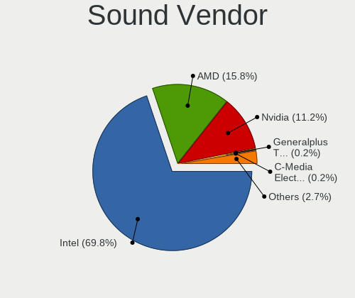
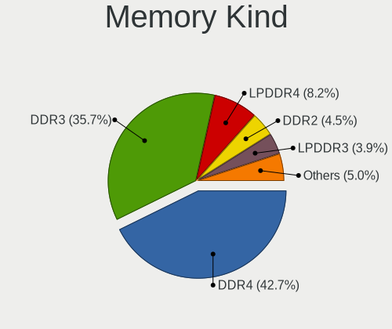

Zorin 16 - Tested Hardware & Statistics (Notebooks)
---------------------------------------------------

A project to collect tested hardware configurations for Zorin 16.

Anyone can contribute to this report by the [hw-probe](https://github.com/linuxhw/hw-probe) tool:

    sudo -E hw-probe -all -upload

Please submit a probe of your configuration if it's not presented on the page or is rare.

Full-feature report is available here: https://linux-hardware.org/?view=trends&rel=zorin-16

Contents
--------

* [ Test Cases ](#test-cases)

* [ System ](#system)
  - [ Kernel                   ](#kernel)
  - [ Kernel Family            ](#kernel-family)
  - [ Kernel Major Ver.        ](#kernel-major-ver)
  - [ Arch                     ](#arch)
  - [ DE                       ](#de)
  - [ Display Server           ](#display-server)
  - [ Display Manager          ](#display-manager)
  - [ OS Lang                  ](#os-lang)
  - [ Boot Mode                ](#boot-mode)
  - [ Filesystem               ](#filesystem)
  - [ Part. scheme             ](#part-scheme)
  - [ Dual Boot with Linux/BSD ](#dual-boot-with-linuxbsd)
  - [ Dual Boot (Win)          ](#dual-boot-win)

* [ Board ](#board)
  - [ Vendor                   ](#vendor)
  - [ Model                    ](#model)
  - [ Model Family             ](#model-family)
  - [ MFG Year                 ](#mfg-year)
  - [ Form Factor              ](#form-factor)
  - [ Secure Boot              ](#secure-boot)
  - [ Coreboot                 ](#coreboot)
  - [ RAM Size                 ](#ram-size)
  - [ RAM Used                 ](#ram-used)
  - [ Total Drives             ](#total-drives)
  - [ Has CD-ROM               ](#has-cd-rom)
  - [ Has Ethernet             ](#has-ethernet)
  - [ Has WiFi                 ](#has-wifi)
  - [ Has Bluetooth            ](#has-bluetooth)

* [ Location ](#location)
  - [ Country                  ](#country)
  - [ City                     ](#city)

* [ Drives ](#drives)
  - [ Drive Vendor             ](#drive-vendor)
  - [ Drive Model              ](#drive-model)
  - [ HDD Vendor               ](#hdd-vendor)
  - [ SSD Vendor               ](#ssd-vendor)
  - [ Drive Kind               ](#drive-kind)
  - [ Drive Connector          ](#drive-connector)
  - [ Drive Size               ](#drive-size)
  - [ Space Total              ](#space-total)
  - [ Space Used               ](#space-used)
  - [ Malfunc. Drives          ](#malfunc-drives)
  - [ Malfunc. Drive Vendor    ](#malfunc-drive-vendor)
  - [ Malfunc. HDD Vendor      ](#malfunc-hdd-vendor)
  - [ Malfunc. Drive Kind      ](#malfunc-drive-kind)
  - [ Failed Drives            ](#failed-drives)
  - [ Failed Drive Vendor      ](#failed-drive-vendor)
  - [ Drive Status             ](#drive-status)

* [ Storage controller ](#storage-controller)
  - [ Storage Vendor           ](#storage-vendor)
  - [ Storage Model            ](#storage-model)
  - [ Storage Kind             ](#storage-kind)

* [ Processor ](#processor)
  - [ CPU Vendor               ](#cpu-vendor)
  - [ CPU Model                ](#cpu-model)
  - [ CPU Model Family         ](#cpu-model-family)
  - [ CPU Cores                ](#cpu-cores)
  - [ CPU Sockets              ](#cpu-sockets)
  - [ CPU Threads              ](#cpu-threads)
  - [ CPU Op-Modes             ](#cpu-op-modes)
  - [ CPU Microcode            ](#cpu-microcode)
  - [ CPU Microarch            ](#cpu-microarch)

* [ Graphics ](#graphics)
  - [ GPU Vendor               ](#gpu-vendor)
  - [ GPU Model                ](#gpu-model)
  - [ GPU Combo                ](#gpu-combo)
  - [ GPU Driver               ](#gpu-driver)
  - [ GPU Memory               ](#gpu-memory)

* [ Monitor ](#monitor)
  - [ Monitor Vendor           ](#monitor-vendor)
  - [ Monitor Model            ](#monitor-model)
  - [ Monitor Resolution       ](#monitor-resolution)
  - [ Monitor Diagonal         ](#monitor-diagonal)
  - [ Monitor Width            ](#monitor-width)
  - [ Aspect Ratio             ](#aspect-ratio)
  - [ Monitor Area             ](#monitor-area)
  - [ Pixel Density            ](#pixel-density)
  - [ Multiple Monitors        ](#multiple-monitors)

* [ Network ](#network)
  - [ Net Controller Vendor    ](#net-controller-vendor)
  - [ Net Controller Model     ](#net-controller-model)
  - [ Wireless Vendor          ](#wireless-vendor)
  - [ Wireless Model           ](#wireless-model)
  - [ Ethernet Vendor          ](#ethernet-vendor)
  - [ Ethernet Model           ](#ethernet-model)
  - [ Net Controller Kind      ](#net-controller-kind)
  - [ Used Controller          ](#used-controller)
  - [ NICs                     ](#nics)
  - [ IPv6                     ](#ipv6)

* [ Bluetooth ](#bluetooth)
  - [ Bluetooth Vendor         ](#bluetooth-vendor)
  - [ Bluetooth Model          ](#bluetooth-model)

* [ Sound ](#sound)
  - [ Sound Vendor             ](#sound-vendor)
  - [ Sound Model              ](#sound-model)

* [ Memory ](#memory)
  - [ Memory Vendor            ](#memory-vendor)
  - [ Memory Model             ](#memory-model)
  - [ Memory Kind              ](#memory-kind)
  - [ Memory Form Factor       ](#memory-form-factor)
  - [ Memory Size              ](#memory-size)
  - [ Memory Speed             ](#memory-speed)

* [ Printers & scanners ](#printers--scanners)
  - [ Printer Vendor           ](#printer-vendor)
  - [ Printer Model            ](#printer-model)
  - [ Scanner Vendor           ](#scanner-vendor)
  - [ Scanner Model            ](#scanner-model)

* [ Camera ](#camera)
  - [ Camera Vendor            ](#camera-vendor)
  - [ Camera Model             ](#camera-model)

* [ Security ](#security)
  - [ Fingerprint Vendor       ](#fingerprint-vendor)
  - [ Fingerprint Model        ](#fingerprint-model)
  - [ Chipcard Vendor          ](#chipcard-vendor)
  - [ Chipcard Model           ](#chipcard-model)

* [ Unsupported ](#unsupported)
  - [ Unsupported Devices      ](#unsupported-devices)
  - [ Unsupported Device Types ](#unsupported-device-types)

Test Cases
----------

| Vendor        | Model                       | Probe                                                      | Date         |
|---------------|-----------------------------|------------------------------------------------------------|--------------|
| Dell          | Vostro 15-3568              | [42d68963c6](https://linux-hardware.org/?probe=42d68963c6) | Sep 17, 2021 |
| Dell          | Vostro 15-3568              | [50f90e7684](https://linux-hardware.org/?probe=50f90e7684) | Sep 17, 2021 |
| Lenovo        | ThinkPad T520 42435GG       | [73a4cd0692](https://linux-hardware.org/?probe=73a4cd0692) | Sep 17, 2021 |
| HP            | Unknown                     | [b0b3846ace](https://linux-hardware.org/?probe=b0b3846ace) | Sep 17, 2021 |
| Lenovo        | ThinkPad T520 42435GG       | [518209a322](https://linux-hardware.org/?probe=518209a322) | Sep 17, 2021 |
| Dell          | Latitude E5470              | [9a036a26a4](https://linux-hardware.org/?probe=9a036a26a4) | Sep 17, 2021 |
| HP            | Notebook                    | [6b2785c2e0](https://linux-hardware.org/?probe=6b2785c2e0) | Sep 17, 2021 |
| Dell          | Latitude E5500              | [286c99863b](https://linux-hardware.org/?probe=286c99863b) | Sep 16, 2021 |
| HP            | 245 G5 Notebook PC          | [ece740cf39](https://linux-hardware.org/?probe=ece740cf39) | Sep 16, 2021 |
| Lenovo        | ThinkPad P50 20EN001EUS     | [04ba56c326](https://linux-hardware.org/?probe=04ba56c326) | Sep 16, 2021 |
| Toshiba       | Satellite L755              | [142e3e40c2](https://linux-hardware.org/?probe=142e3e40c2) | Sep 16, 2021 |
| Toshiba       | Satellite C75D-B            | [152dd3680d](https://linux-hardware.org/?probe=152dd3680d) | Sep 16, 2021 |
| Jumper        | EZpad .A002                 | [c62d842a68](https://linux-hardware.org/?probe=c62d842a68) | Sep 16, 2021 |
| Lenovo        | ThinkPad P50 20EN001EUS     | [6d381b570b](https://linux-hardware.org/?probe=6d381b570b) | Sep 15, 2021 |
| HP            | 255 G4 Notebook PC          | [c8a384ed00](https://linux-hardware.org/?probe=c8a384ed00) | Sep 15, 2021 |
| HP            | EliteBook 840 G5            | [68305a2ede](https://linux-hardware.org/?probe=68305a2ede) | Sep 15, 2021 |
| Dell          | Latitude E7440              | [803cfd7e73](https://linux-hardware.org/?probe=803cfd7e73) | Sep 15, 2021 |
| Dell          | Latitude E6520              | [1bd8b6a82f](https://linux-hardware.org/?probe=1bd8b6a82f) | Sep 15, 2021 |
| ASUSTek       | VivoBook_ASUSLaptop X712... | [983922cfbf](https://linux-hardware.org/?probe=983922cfbf) | Sep 15, 2021 |
| Acer          | Aspire 5733Z                | [6cfdfd04c6](https://linux-hardware.org/?probe=6cfdfd04c6) | Sep 14, 2021 |
| HP            | Notebook                    | [d6825ad86c](https://linux-hardware.org/?probe=d6825ad86c) | Sep 14, 2021 |
| Lenovo        | G50-80 80E5                 | [ef850713da](https://linux-hardware.org/?probe=ef850713da) | Sep 14, 2021 |
| Sony          | VGN-SR5                     | [199ae9a9dd](https://linux-hardware.org/?probe=199ae9a9dd) | Sep 14, 2021 |
| Dell          | Latitude E5470              | [032f256bab](https://linux-hardware.org/?probe=032f256bab) | Sep 14, 2021 |
| Sony          | VPCF215FX                   | [173d8636d4](https://linux-hardware.org/?probe=173d8636d4) | Sep 14, 2021 |
| HP            | EliteBook Folio 9470m       | [b054524aac](https://linux-hardware.org/?probe=b054524aac) | Sep 14, 2021 |
| ASUSTek       | ZenBook UX482EA_UX482EA     | [29d5b02719](https://linux-hardware.org/?probe=29d5b02719) | Sep 13, 2021 |
| HP            | Pavilion Notebook           | [864dde8a99](https://linux-hardware.org/?probe=864dde8a99) | Sep 13, 2021 |
| Toshiba       | Satellite C870-1C2          | [3818ff8f07](https://linux-hardware.org/?probe=3818ff8f07) | Sep 12, 2021 |
| HP            | Victus by HP Laptop 16-e... | [6a980ac620](https://linux-hardware.org/?probe=6a980ac620) | Sep 12, 2021 |
| Dell          | Latitude E6430              | [aff84b5ec1](https://linux-hardware.org/?probe=aff84b5ec1) | Sep 12, 2021 |
| Google        | Kindred                     | [c9ee8560b8](https://linux-hardware.org/?probe=c9ee8560b8) | Sep 12, 2021 |
| Dell          | XPS M1330                   | [404d33775d](https://linux-hardware.org/?probe=404d33775d) | Sep 12, 2021 |
| Dell          | Latitude E5500              | [1e20247950](https://linux-hardware.org/?probe=1e20247950) | Sep 12, 2021 |
| Dell          | XPS M1330                   | [3dcddbd59e](https://linux-hardware.org/?probe=3dcddbd59e) | Sep 11, 2021 |
| ASUSTek       | VivoBook 15_ASUS Laptop ... | [b565f4eee3](https://linux-hardware.org/?probe=b565f4eee3) | Sep 11, 2021 |
| HP            | Laptop 15-dy1xxx            | [728e0facd6](https://linux-hardware.org/?probe=728e0facd6) | Sep 11, 2021 |
| Acer          | Aspire 4830T                | [4e69ac73e4](https://linux-hardware.org/?probe=4e69ac73e4) | Sep 11, 2021 |
| ASUSTek       | N55SF                       | [33fd6d8c8f](https://linux-hardware.org/?probe=33fd6d8c8f) | Sep 11, 2021 |
| ASUSTek       | N55SF                       | [fa33f94b27](https://linux-hardware.org/?probe=fa33f94b27) | Sep 11, 2021 |
| MSI           | GE75 Raider 8RF             | [350527f093](https://linux-hardware.org/?probe=350527f093) | Sep 10, 2021 |
| Toshiba       | Satellite Pro L450D         | [a15c916899](https://linux-hardware.org/?probe=a15c916899) | Sep 10, 2021 |
| Toshiba       | Satellite C850-1CP          | [8cec9884a8](https://linux-hardware.org/?probe=8cec9884a8) | Sep 10, 2021 |
| Unknown       | Unknown                     | [bbf81cb33e](https://linux-hardware.org/?probe=bbf81cb33e) | Sep 10, 2021 |
| Dell          | Latitude E5470              | [f6d8fa5367](https://linux-hardware.org/?probe=f6d8fa5367) | Sep 10, 2021 |
| Dell          | Latitude E5470              | [87b52d41c7](https://linux-hardware.org/?probe=87b52d41c7) | Sep 10, 2021 |
| HP            | Notebook                    | [24690d1b8b](https://linux-hardware.org/?probe=24690d1b8b) | Sep 09, 2021 |
| Dell          | Vostro 3580                 | [38098784dd](https://linux-hardware.org/?probe=38098784dd) | Sep 09, 2021 |
| Lenovo        | ThinkPad T470s W10DG 20J... | [53c03e65ce](https://linux-hardware.org/?probe=53c03e65ce) | Sep 09, 2021 |
| HP            | 255 G7 Notebook PC          | [6ab68f26ba](https://linux-hardware.org/?probe=6ab68f26ba) | Sep 09, 2021 |
| Dell          | Vostro 3580                 | [e480169372](https://linux-hardware.org/?probe=e480169372) | Sep 09, 2021 |
| HP            | ENVY Laptop 13-ah0xxx       | [c06b09d9c4](https://linux-hardware.org/?probe=c06b09d9c4) | Sep 09, 2021 |
| HP            | ENVY Laptop 13-ah0xxx       | [87e79937c9](https://linux-hardware.org/?probe=87e79937c9) | Sep 09, 2021 |
| Lenovo        | IdeaPad 310 Touch-15IKB ... | [ccb4dc3d9a](https://linux-hardware.org/?probe=ccb4dc3d9a) | Sep 09, 2021 |
| Toshiba       | Satellite C75D-B            | [0f52ac751b](https://linux-hardware.org/?probe=0f52ac751b) | Sep 08, 2021 |
| Toshiba       | Satellite C75D-B            | [97b34f8c7f](https://linux-hardware.org/?probe=97b34f8c7f) | Sep 08, 2021 |
| Lenovo        | ThinkPad P14s Gen 1 20Y1... | [8404b1fc92](https://linux-hardware.org/?probe=8404b1fc92) | Sep 08, 2021 |
| Lenovo        | ThinkPad E14 20RAS1Q800     | [a4d93ee5d2](https://linux-hardware.org/?probe=a4d93ee5d2) | Sep 08, 2021 |
| HP            | EliteBook 8560p             | [6bff88fb9e](https://linux-hardware.org/?probe=6bff88fb9e) | Sep 08, 2021 |
| Sony          | VGN-SR5                     | [7f93c9c366](https://linux-hardware.org/?probe=7f93c9c366) | Sep 08, 2021 |
| MSI           | GS75 Stealth 10SF           | [3fc588a18d](https://linux-hardware.org/?probe=3fc588a18d) | Sep 08, 2021 |
| MSI           | GS75 Stealth 10SF           | [fd38e5bf9d](https://linux-hardware.org/?probe=fd38e5bf9d) | Sep 08, 2021 |
| HP            | EliteBook 840 G3            | [22d88098a9](https://linux-hardware.org/?probe=22d88098a9) | Sep 08, 2021 |
| Toshiba       | Satellite C75D-B            | [be8d4bd453](https://linux-hardware.org/?probe=be8d4bd453) | Sep 08, 2021 |
| Toshiba       | Satellite C75D-B            | [47317abce2](https://linux-hardware.org/?probe=47317abce2) | Sep 08, 2021 |
| HP            | ENVY Sleekbook 4 PC         | [e8f88bd1b2](https://linux-hardware.org/?probe=e8f88bd1b2) | Sep 08, 2021 |
| HP            | Pavilion Gaming Laptop 1... | [98874d48b2](https://linux-hardware.org/?probe=98874d48b2) | Sep 07, 2021 |
| HP            | Pavilion Gaming Laptop 1... | [f872b42a74](https://linux-hardware.org/?probe=f872b42a74) | Sep 07, 2021 |
| Acer          | V5-171                      | [8068be142e](https://linux-hardware.org/?probe=8068be142e) | Sep 07, 2021 |
| HP            | Notebook                    | [62a2618cde](https://linux-hardware.org/?probe=62a2618cde) | Sep 07, 2021 |
| Toshiba       | Satellite L755              | [92d22f65bf](https://linux-hardware.org/?probe=92d22f65bf) | Sep 07, 2021 |
| Samsung       | 550P5C/550P7C               | [a2a7c20bf7](https://linux-hardware.org/?probe=a2a7c20bf7) | Sep 07, 2021 |
| Dell          | Precision 3520              | [15e6e2c91d](https://linux-hardware.org/?probe=15e6e2c91d) | Sep 07, 2021 |
| Dell          | Precision 5550              | [8ae36d685d](https://linux-hardware.org/?probe=8ae36d685d) | Sep 07, 2021 |
| Dell          | Latitude E5430 non-vPro     | [368f488133](https://linux-hardware.org/?probe=368f488133) | Sep 07, 2021 |
| MSI           | GL62 7RDX                   | [be53fd4c86](https://linux-hardware.org/?probe=be53fd4c86) | Sep 07, 2021 |
| ASUSTek       | ASUS Gaming FX570UD         | [3eaf057f6f](https://linux-hardware.org/?probe=3eaf057f6f) | Sep 07, 2021 |
| Acer          | Swift SF114-34              | [8a66ec8e37](https://linux-hardware.org/?probe=8a66ec8e37) | Sep 07, 2021 |
| Lenovo        | B50-30 20382                | [f91b1f41fc](https://linux-hardware.org/?probe=f91b1f41fc) | Sep 06, 2021 |
| HP            | Pavilion dv5                | [27607d962e](https://linux-hardware.org/?probe=27607d962e) | Sep 06, 2021 |
| ASUSTek       | VivoBook_ASUSLaptop X512... | [d1af312696](https://linux-hardware.org/?probe=d1af312696) | Sep 06, 2021 |
| Acer          | Aspire V3-571G              | [46499caf7a](https://linux-hardware.org/?probe=46499caf7a) | Sep 05, 2021 |
| Sony          | VPCS135FX                   | [55c2fa54ae](https://linux-hardware.org/?probe=55c2fa54ae) | Sep 05, 2021 |
| Apple         | MacBook3,1                  | [1473909011](https://linux-hardware.org/?probe=1473909011) | Sep 05, 2021 |
| Lenovo        | G505s 20255                 | [263eeefef0](https://linux-hardware.org/?probe=263eeefef0) | Sep 04, 2021 |
| Lenovo        | G505s 20255                 | [8cd745db58](https://linux-hardware.org/?probe=8cd745db58) | Sep 04, 2021 |
| HP            | ProBook 6450b               | [960930d457](https://linux-hardware.org/?probe=960930d457) | Sep 04, 2021 |
| HP            | ProBook 6450b               | [98041e0acd](https://linux-hardware.org/?probe=98041e0acd) | Sep 04, 2021 |
| Lenovo        | ThinkPad E15 Gen 2 20TD0... | [303c36ac93](https://linux-hardware.org/?probe=303c36ac93) | Sep 03, 2021 |
| HP            | 255 G3                      | [bd1a8b58da](https://linux-hardware.org/?probe=bd1a8b58da) | Sep 03, 2021 |
| HP            | 255 G3                      | [b5f1c73339](https://linux-hardware.org/?probe=b5f1c73339) | Sep 03, 2021 |
| Acer          | Aspire A315-31              | [f07f0d19ca](https://linux-hardware.org/?probe=f07f0d19ca) | Sep 03, 2021 |
| HP            | EliteBook 840 G1            | [980716e0a8](https://linux-hardware.org/?probe=980716e0a8) | Sep 03, 2021 |
| ASUSTek       | GR8                         | [eb4fb4e1f2](https://linux-hardware.org/?probe=eb4fb4e1f2) | Sep 03, 2021 |
| Lenovo        | ThinkPad W520 4284AW3       | [6647a6a4b4](https://linux-hardware.org/?probe=6647a6a4b4) | Sep 03, 2021 |
| Acer          | Aspire R3-131T              | [62485c81e9](https://linux-hardware.org/?probe=62485c81e9) | Sep 02, 2021 |
| Acer          | Aspire E5-521G              | [d1aa71f003](https://linux-hardware.org/?probe=d1aa71f003) | Sep 02, 2021 |
| Acer          | Aspire 4830T                | [52441614fe](https://linux-hardware.org/?probe=52441614fe) | Sep 02, 2021 |
| Acer          | Aspire E1-522               | [8cd8899bae](https://linux-hardware.org/?probe=8cd8899bae) | Sep 02, 2021 |
| Toshiba       | Satellite C850D-11C         | [51748f289f](https://linux-hardware.org/?probe=51748f289f) | Sep 01, 2021 |
| HP            | ENVY 15                     | [d2bb5f165e](https://linux-hardware.org/?probe=d2bb5f165e) | Sep 01, 2021 |
| ASUSTek       | X405UA                      | [9bf230ee3f](https://linux-hardware.org/?probe=9bf230ee3f) | Aug 31, 2021 |
| Insyde        | i101c                       | [de0a5f2925](https://linux-hardware.org/?probe=de0a5f2925) | Aug 31, 2021 |
| HP            | EliteBook 840 G1            | [8439784c2b](https://linux-hardware.org/?probe=8439784c2b) | Aug 31, 2021 |
| HP            | Pavilion 15                 | [13ae124697](https://linux-hardware.org/?probe=13ae124697) | Aug 31, 2021 |
| ASUSTek       | K73SV                       | [e7c8d68b00](https://linux-hardware.org/?probe=e7c8d68b00) | Aug 31, 2021 |
| Dell          | XPS 15 9560                 | [fe38c67cd2](https://linux-hardware.org/?probe=fe38c67cd2) | Aug 30, 2021 |
| Acer          | Aspire E1-522               | [80412fd612](https://linux-hardware.org/?probe=80412fd612) | Aug 30, 2021 |
| Acer          | Aspire E1-522               | [f2542100bc](https://linux-hardware.org/?probe=f2542100bc) | Aug 30, 2021 |
| Lenovo        | B50-70 80EU                 | [9507d559fc](https://linux-hardware.org/?probe=9507d559fc) | Aug 30, 2021 |
| Apple         | MacBookPro11,1              | [1dbc26a990](https://linux-hardware.org/?probe=1dbc26a990) | Aug 29, 2021 |
| Packard Be... | DOT S                       | [0231531196](https://linux-hardware.org/?probe=0231531196) | Aug 29, 2021 |
| Packard Be... | DOT S                       | [4f0a335506](https://linux-hardware.org/?probe=4f0a335506) | Aug 29, 2021 |
| Lenovo        | ThinkPad T520 4242W4F       | [150dd830ac](https://linux-hardware.org/?probe=150dd830ac) | Aug 29, 2021 |
| Fujitsu       | LIFEBOOK AH532              | [e63b8b96dd](https://linux-hardware.org/?probe=e63b8b96dd) | Aug 29, 2021 |
| Acer          | Aspire 5100                 | [2b16fed8a1](https://linux-hardware.org/?probe=2b16fed8a1) | Aug 28, 2021 |
| Toshiba       | Satellite S75Dt-A           | [c3e9c3d13b](https://linux-hardware.org/?probe=c3e9c3d13b) | Aug 28, 2021 |
| Acer          | Aspire A515-51              | [6acb0f573a](https://linux-hardware.org/?probe=6acb0f573a) | Aug 28, 2021 |
| ASUSTek       | K56CA                       | [90d571608f](https://linux-hardware.org/?probe=90d571608f) | Aug 28, 2021 |
| Dell          | Inspiron 5566               | [2c2761e770](https://linux-hardware.org/?probe=2c2761e770) | Aug 27, 2021 |
| Dell          | XPS 13 9310                 | [08009ad892](https://linux-hardware.org/?probe=08009ad892) | Aug 26, 2021 |
| Acer          | AO722                       | [e303d0c046](https://linux-hardware.org/?probe=e303d0c046) | Aug 25, 2021 |
| Lenovo        | IdeaPad Z510 20287          | [2199b6e642](https://linux-hardware.org/?probe=2199b6e642) | Aug 25, 2021 |
| Dell          | Inspiron 7520               | [1798e6404c](https://linux-hardware.org/?probe=1798e6404c) | Aug 25, 2021 |
| Unknown       | Unknown                     | [e18bc8fe09](https://linux-hardware.org/?probe=e18bc8fe09) | Aug 25, 2021 |
| Acer          | Aspire ES1-512              | [48b43bd242](https://linux-hardware.org/?probe=48b43bd242) | Aug 25, 2021 |
| Unknown       | Unknown                     | [e576736426](https://linux-hardware.org/?probe=e576736426) | Aug 25, 2021 |
| TianBei       | TB-H7                       | [455dce9834](https://linux-hardware.org/?probe=455dce9834) | Aug 25, 2021 |
| Lenovo        | Yoga 3 Pro-1370 80HE        | [a64e3a0513](https://linux-hardware.org/?probe=a64e3a0513) | Aug 25, 2021 |
| LG Electro... | S460-G.BG31P1               | [99df59aebd](https://linux-hardware.org/?probe=99df59aebd) | Aug 24, 2021 |
| HP            | ENVY Sleekbook 4 PC         | [3d58cb6ce0](https://linux-hardware.org/?probe=3d58cb6ce0) | Aug 24, 2021 |
| Acer          | Aspire 7715Z                | [4de4de1a31](https://linux-hardware.org/?probe=4de4de1a31) | Aug 24, 2021 |
| Lenovo        | G50-30 80G0                 | [27cdfce14b](https://linux-hardware.org/?probe=27cdfce14b) | Aug 24, 2021 |
| LG Electro... | A410-K.BE47P1               | [bfc75c9c3d](https://linux-hardware.org/?probe=bfc75c9c3d) | Aug 24, 2021 |
| Acer          | Aspire 8940G                | [24ff3cf596](https://linux-hardware.org/?probe=24ff3cf596) | Aug 23, 2021 |
| Lenovo        | IdeaPad 5 15ALC05 82LN      | [b0830bd154](https://linux-hardware.org/?probe=b0830bd154) | Aug 23, 2021 |
| Dell          | Inspiron 5566               | [c56758deca](https://linux-hardware.org/?probe=c56758deca) | Aug 23, 2021 |
| Dell          | Inspiron 5566               | [eaef6e8392](https://linux-hardware.org/?probe=eaef6e8392) | Aug 23, 2021 |
| Dell          | Precision M4800             | [9766c85e7d](https://linux-hardware.org/?probe=9766c85e7d) | Aug 23, 2021 |
| Dell          | Precision M4800             | [cd3dbe3a32](https://linux-hardware.org/?probe=cd3dbe3a32) | Aug 23, 2021 |
| Unknown       | Unknown                     | [b1587c998f](https://linux-hardware.org/?probe=b1587c998f) | Aug 23, 2021 |
| TianBei       | TB-H7                       | [2d1b3b2756](https://linux-hardware.org/?probe=2d1b3b2756) | Aug 23, 2021 |
| ASUSTek       | X550LD                      | [04365cbbbf](https://linux-hardware.org/?probe=04365cbbbf) | Aug 22, 2021 |
| Lenovo        | ThinkPad T440p 20AWS1CH0... | [43f252f22a](https://linux-hardware.org/?probe=43f252f22a) | Aug 22, 2021 |
| Apple         | MacBookPro11,5              | [814f16635c](https://linux-hardware.org/?probe=814f16635c) | Aug 22, 2021 |
| HP            | ProBook 450 G2              | [99f47f1645](https://linux-hardware.org/?probe=99f47f1645) | Aug 21, 2021 |
| Lenovo        | IdeaPad S540-14API 81NH     | [7b1954838a](https://linux-hardware.org/?probe=7b1954838a) | Aug 21, 2021 |
| HP            | Notebook                    | [2586dc3a41](https://linux-hardware.org/?probe=2586dc3a41) | Aug 21, 2021 |
| Lenovo        | G50-30 80G0                 | [afbefeb6d3](https://linux-hardware.org/?probe=afbefeb6d3) | Aug 21, 2021 |
| Lenovo        | ThinkPad X131e 3371AL2      | [1963322393](https://linux-hardware.org/?probe=1963322393) | Aug 21, 2021 |
| ASUSTek       | GR8                         | [88416da5e8](https://linux-hardware.org/?probe=88416da5e8) | Aug 21, 2021 |
| Apple         | MacBook4,1                  | [ad6e3e064f](https://linux-hardware.org/?probe=ad6e3e064f) | Aug 21, 2021 |
| Apple         | MacBook4,1                  | [9a5653e44d](https://linux-hardware.org/?probe=9a5653e44d) | Aug 21, 2021 |
| Sony          | VGN-SR5                     | [3bbd8b33f0](https://linux-hardware.org/?probe=3bbd8b33f0) | Aug 20, 2021 |
| HP            | ENVY 14                     | [34f9505762](https://linux-hardware.org/?probe=34f9505762) | Aug 20, 2021 |
| Lenovo        | G50-70 20351                | [40249b1ea8](https://linux-hardware.org/?probe=40249b1ea8) | Aug 20, 2021 |
| HP            | ENVY Sleekbook 4 PC         | [231e17454e](https://linux-hardware.org/?probe=231e17454e) | Aug 19, 2021 |
| Dell          | Inspiron N5040              | [0554d06022](https://linux-hardware.org/?probe=0554d06022) | Aug 19, 2021 |
| LG Electro... | 17U70N-R.AAS7U1             | [fd3572c46a](https://linux-hardware.org/?probe=fd3572c46a) | Aug 19, 2021 |
| Acer          | Nitro AN515-55              | [3a47dca146](https://linux-hardware.org/?probe=3a47dca146) | Aug 18, 2021 |
| HP            | ProBook 450 G2              | [a3e170c339](https://linux-hardware.org/?probe=a3e170c339) | Aug 17, 2021 |
| Acer          | Swift SF114-34              | [0a37eed9e8](https://linux-hardware.org/?probe=0a37eed9e8) | Aug 15, 2021 |
| ASUSTek       | ASUS TUF Gaming A15 FA50... | [fcfd1e5ba9](https://linux-hardware.org/?probe=fcfd1e5ba9) | Aug 15, 2021 |
| HP            | ProBook 430 G6              | [c5467376e9](https://linux-hardware.org/?probe=c5467376e9) | Aug 13, 2021 |
| Lenovo        | IdeaPad 3 14ADA05 81W0      | [9718804b4a](https://linux-hardware.org/?probe=9718804b4a) | Aug 12, 2021 |
| HP            | ProBook 450 G2              | [67956ca49e](https://linux-hardware.org/?probe=67956ca49e) | Aug 10, 2021 |
| Acer          | Aspire E1-571               | [146f910c76](https://linux-hardware.org/?probe=146f910c76) | Aug 09, 2021 |
| Samsung       | 350V5C/351V5C/3540VC/344... | [c7a0820fe0](https://linux-hardware.org/?probe=c7a0820fe0) | Aug 09, 2021 |
| Samsung       | 350V5C/351V5C/3540VC/344... | [950d41dbb8](https://linux-hardware.org/?probe=950d41dbb8) | Aug 09, 2021 |
| Dell          | Inspiron 7537               | [7a35ed5eb1](https://linux-hardware.org/?probe=7a35ed5eb1) | Aug 03, 2021 |
| Dell          | Inspiron 7537               | [3c865e72d1](https://linux-hardware.org/?probe=3c865e72d1) | Aug 03, 2021 |
| Acer          | Aspire E5-551G              | [519515ce84](https://linux-hardware.org/?probe=519515ce84) | Jul 15, 2021 |
| Dell          | XPS L501X                   | [a3d8e737a5](https://linux-hardware.org/?probe=a3d8e737a5) | Jul 08, 2021 |
| Dell          | G3 3579                     | [92a8136dc4](https://linux-hardware.org/?probe=92a8136dc4) | Jul 03, 2021 |
| Lenovo        | ThinkBook 13s G2 ITL 20V... | [1196d6821c](https://linux-hardware.org/?probe=1196d6821c) | Jul 02, 2021 |
| Lenovo        | ThinkPad E15 Gen 2 20TD0... | [d63c7755ee](https://linux-hardware.org/?probe=d63c7755ee) | Jun 29, 2021 |
| ASUSTek       | TUF Gaming FX505DT_FX505... | [369a214905](https://linux-hardware.org/?probe=369a214905) | Jun 25, 2021 |
| Dell          | Inspiron 3576               | [849d571ef0](https://linux-hardware.org/?probe=849d571ef0) | Jun 24, 2021 |
| Lenovo        | IdeaPad 330-15IKB 81DE      | [9957b51bea](https://linux-hardware.org/?probe=9957b51bea) | Jun 24, 2021 |
| Dell          | Inspiron 3582               | [e2cd9a9c36](https://linux-hardware.org/?probe=e2cd9a9c36) | Jun 20, 2021 |
| Dell          | XPS 13 9370                 | [9e3a58b257](https://linux-hardware.org/?probe=9e3a58b257) | Jun 12, 2021 |
| Dell          | XPS 13 9370                 | [2aa1efb008](https://linux-hardware.org/?probe=2aa1efb008) | Jun 12, 2021 |
| Lenovo        | ThinkPad E15 Gen 2 20TD0... | [01cf29ba72](https://linux-hardware.org/?probe=01cf29ba72) | Jun 10, 2021 |
| HP            | 15                          | [f2132922af](https://linux-hardware.org/?probe=f2132922af) | Jun 08, 2021 |
| Fujitsu       | LIFEBOOK AH532              | [a1dd6df8e7](https://linux-hardware.org/?probe=a1dd6df8e7) | Jun 07, 2021 |
| Fujitsu       | LIFEBOOK AH532              | [957048adbb](https://linux-hardware.org/?probe=957048adbb) | Jun 06, 2021 |
| Dell          | Inspiron 3582               | [229600e417](https://linux-hardware.org/?probe=229600e417) | Jun 06, 2021 |
| Fujitsu       | LIFEBOOK AH532              | [719041c9d4](https://linux-hardware.org/?probe=719041c9d4) | Jun 04, 2021 |
| HP            | ProBook 650 G2              | [bb92ab2244](https://linux-hardware.org/?probe=bb92ab2244) | May 30, 2021 |
| HP            | Unknown                     | [e6e060ca51](https://linux-hardware.org/?probe=e6e060ca51) | May 29, 2021 |
| HP            | Unknown                     | [324d49aba6](https://linux-hardware.org/?probe=324d49aba6) | May 29, 2021 |
| Razer         | Book 13 - RZ09-0357         | [c1cc1fcf2e](https://linux-hardware.org/?probe=c1cc1fcf2e) | May 27, 2021 |
| Dell          | Vostro 5490                 | [9d8401675e](https://linux-hardware.org/?probe=9d8401675e) | May 18, 2021 |
| Dell          | Vostro 5490                 | [3f02204090](https://linux-hardware.org/?probe=3f02204090) | May 18, 2021 |
| Acer          | Swift SF313-51              | [2b27dc30ac](https://linux-hardware.org/?probe=2b27dc30ac) | May 17, 2021 |
| ASUSTek       | X406UAR                     | [5c50159b19](https://linux-hardware.org/?probe=5c50159b19) | May 16, 2021 |
| ASUSTek       | X406UAR                     | [e3be0eaa69](https://linux-hardware.org/?probe=e3be0eaa69) | May 16, 2021 |
| Lenovo        | ThinkPad Yoga 11e 20DAS0... | [b71b291af5](https://linux-hardware.org/?probe=b71b291af5) | May 10, 2021 |
| Lenovo        | IdeaPad 100-15IBD 80QQ      | [157ae0cc83](https://linux-hardware.org/?probe=157ae0cc83) | May 02, 2021 |
| Lenovo        | IdeaPad 100-15IBD 80QQ      | [12081d4e79](https://linux-hardware.org/?probe=12081d4e79) | Apr 25, 2021 |
| Lenovo        | IdeaPad Y570 0862           | [94d22e7673](https://linux-hardware.org/?probe=94d22e7673) | Apr 23, 2021 |

System
------

Kernel
------

Version of the Linux kernel

| Version           | Notebooks | Percent |
|-------------------|-----------|---------|
| 5.11.0-27-generic | 80        | 54.05%  |
| 5.11.0-34-generic | 39        | 26.35%  |
| 5.11.0-25-generic | 7         | 4.73%   |
| 5.8.0-53-generic  | 6         | 4.05%   |
| 5.8.0-59-generic  | 5         | 3.38%   |
| 5.8.0-55-generic  | 5         | 3.38%   |
| 5.8.0-50-generic  | 4         | 2.7%    |
| 5.8.0-63-generic  | 1         | 0.68%   |
| 5.10.0-1044-oem   | 1         | 0.68%   |

Kernel Family
-------------

Linux kernel without a distro release

| Version | Notebooks | Percent |
|---------|-----------|---------|
| 5.11.0  | 124       | 84.93%  |
| 5.8.0   | 21        | 14.38%  |
| 5.10.0  | 1         | 0.68%   |

Kernel Major Ver.
-----------------

Linux kernel major version

| Version | Notebooks | Percent |
|---------|-----------|---------|
| 5.11    | 124       | 84.93%  |
| 5.8     | 21        | 14.38%  |
| 5.10    | 1         | 0.68%   |

Arch
----

OS architecture (x86_64, i586, etc.)

| Name   | Notebooks | Percent |
|--------|-----------|---------|
| x86_64 | 144       | 100%    |

DE
--

Desktop Environment

| Name    | Notebooks | Percent |
|---------|-----------|---------|
| GNOME   | 142       | 98.61%  |
| Unknown | 2         | 1.39%   |

Display Server
--------------

X11 or Wayland

| Name    | Notebooks | Percent |
|---------|-----------|---------|
| X11     | 141       | 97.24%  |
| Wayland | 3         | 2.07%   |
| Unknown | 1         | 0.69%   |

Display Manager
---------------

SDDM, LightDM, etc.

| Name    | Notebooks | Percent |
|---------|-----------|---------|
| Unknown | 124       | 86.11%  |
| GDM     | 20        | 13.89%  |

OS Lang
-------

Language

| Lang  | Notebooks | Percent |
|-------|-----------|---------|
| en_US | 47        | 32.64%  |
| en_GB | 17        | 11.81%  |
| de_DE | 14        | 9.72%   |
| en_IN | 11        | 7.64%   |
| pt_BR | 10        | 6.94%   |
| es_ES | 7         | 4.86%   |
| es_MX | 5         | 3.47%   |
| en_ZA | 3         | 2.08%   |
| en_CA | 3         | 2.08%   |
| cs_CZ | 3         | 2.08%   |
| pt_PT | 2         | 1.39%   |
| nl_NL | 2         | 1.39%   |
| it_IT | 2         | 1.39%   |
| hu_HU | 2         | 1.39%   |
| es_CL | 2         | 1.39%   |
| en_NZ | 2         | 1.39%   |
| sv_SE | 1         | 0.69%   |
| ru_UA | 1         | 0.69%   |
| ru_RU | 1         | 0.69%   |
| pl_PL | 1         | 0.69%   |
| ja_JP | 1         | 0.69%   |
| fr_FR | 1         | 0.69%   |
| fr_BE | 1         | 0.69%   |
| es_PE | 1         | 0.69%   |
| en_PH | 1         | 0.69%   |
| de_CH | 1         | 0.69%   |
| de_AT | 1         | 0.69%   |
| bg_BG | 1         | 0.69%   |

Boot Mode
---------

EFI or BIOS

| Mode | Notebooks | Percent |
|------|-----------|---------|
| EFI  | 93        | 64.58%  |
| BIOS | 51        | 35.42%  |

Filesystem
----------

Type of filesystem

| Type    | Notebooks | Percent |
|---------|-----------|---------|
| Ext4    | 137       | 95.14%  |
| Zfs     | 4         | 2.78%   |
| Btrfs   | 2         | 1.39%   |
| Overlay | 1         | 0.69%   |

Part. scheme
------------

Scheme of partitioning

| Type    | Notebooks | Percent |
|---------|-----------|---------|
| Unknown | 123       | 85.42%  |
| GPT     | 20        | 13.89%  |
| MBR     | 1         | 0.69%   |

Dual Boot with Linux/BSD
------------------------

Hosting more than one Linux/BSD

| Dual boot | Notebooks | Percent |
|-----------|-----------|---------|
| No        | 143       | 99.31%  |
| Yes       | 1         | 0.69%   |

Dual Boot (Win)
---------------

Hosting Linux and Windows

| Dual boot | Notebooks | Percent |
|-----------|-----------|---------|
| No        | 129       | 89.58%  |
| Yes       | 15        | 10.42%  |

Board
-----

Vendor
------

Motherboard manufacturer

| Name                | Notebooks | Percent |
|---------------------|-----------|---------|
| Hewlett-Packard     | 30        | 20.83%  |
| Lenovo              | 26        | 18.06%  |
| Dell                | 25        | 17.36%  |
| Acer                | 19        | 13.19%  |
| ASUSTek Computer    | 14        | 9.72%   |
| Toshiba             | 7         | 4.86%   |
| Apple               | 4         | 2.78%   |
| Sony                | 3         | 2.08%   |
| MSI                 | 3         | 2.08%   |
| LG Electronics      | 3         | 2.08%   |
| Unknown             | 2         | 1.39%   |
| TianBei             | 1         | 0.69%   |
| Samsung Electronics | 1         | 0.69%   |
| Razer               | 1         | 0.69%   |
| Packard Bell        | 1         | 0.69%   |
| Jumper              | 1         | 0.69%   |
| Insyde              | 1         | 0.69%   |
| Google              | 1         | 0.69%   |
| Fujitsu             | 1         | 0.69%   |

Model
-----

Motherboard model

| Name                                   | Notebooks | Percent |
|----------------------------------------|-----------|---------|
| Unknown                                | 4         | 2.78%   |
| HP Notebook                            | 3         | 2.08%   |
| HP ENVY Sleekbook 4 PC                 | 2         | 1.39%   |
| Dell Inspiron 5566                     | 2         | 1.39%   |
| Toshiba Satellite S75Dt-A              | 1         | 0.69%   |
| Toshiba Satellite Pro L450D            | 1         | 0.69%   |
| Toshiba Satellite L755                 | 1         | 0.69%   |
| Toshiba Satellite C870-1C2             | 1         | 0.69%   |
| Toshiba Satellite C850D-11C            | 1         | 0.69%   |
| Toshiba Satellite C850-1CP             | 1         | 0.69%   |
| Toshiba Satellite C75D-B               | 1         | 0.69%   |
| TianBei TB-H7                          | 1         | 0.69%   |
| Sony VPCS135FX                         | 1         | 0.69%   |
| Sony VPCF215FX                         | 1         | 0.69%   |
| Sony VGN-SR5                           | 1         | 0.69%   |
| Samsung 550P5C/550P7C                  | 1         | 0.69%   |
| Razer Book 13 - RZ09-0357              | 1         | 0.69%   |
| Packard Bell DOT S                     | 1         | 0.69%   |
| MSI GS75 Stealth 10SF                  | 1         | 0.69%   |
| MSI GL62 7RDX                          | 1         | 0.69%   |
| MSI GE75 Raider 8RF                    | 1         | 0.69%   |
| LG S460-G.BG31P1                       | 1         | 0.69%   |
| LG A410-K.BE47P1                       | 1         | 0.69%   |
| LG 17U70N-R.AAS7U1                     | 1         | 0.69%   |
| Lenovo Yoga 3 Pro-1370 80HE            | 1         | 0.69%   |
| Lenovo ThinkPad Yoga 11e 20DAS0SF00    | 1         | 0.69%   |
| Lenovo ThinkPad X131e 3371AL2          | 1         | 0.69%   |
| Lenovo ThinkPad W520 4284AW3           | 1         | 0.69%   |
| Lenovo ThinkPad T520 42435GG           | 1         | 0.69%   |
| Lenovo ThinkPad T520 4242W4F           | 1         | 0.69%   |
| Lenovo ThinkPad T470s W10DG 20JTS0280G | 1         | 0.69%   |
| Lenovo ThinkPad T440p 20AWS1CH00       | 1         | 0.69%   |
| Lenovo ThinkPad P50 20EN001EUS         | 1         | 0.69%   |
| Lenovo ThinkPad P14s Gen 1 20Y1CTO1WW  | 1         | 0.69%   |
| Lenovo ThinkPad E15 Gen 2 20TD000HZA   | 1         | 0.69%   |
| Lenovo ThinkPad E14 20RAS1Q800         | 1         | 0.69%   |
| Lenovo IdeaPad Z510 20287              | 1         | 0.69%   |
| Lenovo IdeaPad Y570 0862               | 1         | 0.69%   |
| Lenovo IdeaPad S540-14API 81NH         | 1         | 0.69%   |
| Lenovo IdeaPad 5 15ALC05 82LN          | 1         | 0.69%   |
| Lenovo IdeaPad 330-15IKB 81DE          | 1         | 0.69%   |
| Lenovo IdeaPad 310 Touch-15IKB 80TW    | 1         | 0.69%   |
| Lenovo IdeaPad 3 14ADA05 81W0          | 1         | 0.69%   |
| Lenovo IdeaPad 100-15IBD 80QQ          | 1         | 0.69%   |
| Lenovo G505s 20255                     | 1         | 0.69%   |
| Lenovo G50-80 80E5                     | 1         | 0.69%   |
| Lenovo G50-70 20351                    | 1         | 0.69%   |
| Lenovo G50-30 80G0                     | 1         | 0.69%   |
| Lenovo B50-70 80EU                     | 1         | 0.69%   |
| Lenovo B50-30 20382                    | 1         | 0.69%   |
| Jumper EZpad                           | 1         | 0.69%   |
| Insyde i101c                           | 1         | 0.69%   |
| HP Victus by HP Laptop 16-e0xxx        | 1         | 0.69%   |
| HP ProBook 650 G2                      | 1         | 0.69%   |
| HP ProBook 6450b                       | 1         | 0.69%   |
| HP ProBook 450 G2                      | 1         | 0.69%   |
| HP ProBook 430 G6                      | 1         | 0.69%   |
| HP Pavilion Notebook                   | 1         | 0.69%   |
| HP Pavilion Gaming Laptop 15-ec0xxx    | 1         | 0.69%   |
| HP Pavilion dv5                        | 1         | 0.69%   |

Model Family
------------

Motherboard model prefix

| Name               | Notebooks | Percent |
|--------------------|-----------|---------|
| Acer Aspire        | 14        | 9.72%   |
| Lenovo ThinkPad    | 11        | 7.64%   |
| Lenovo IdeaPad     | 8         | 5.56%   |
| Toshiba Satellite  | 7         | 4.86%   |
| Dell Inspiron      | 7         | 4.86%   |
| Dell Latitude      | 6         | 4.17%   |
| HP ENVY            | 5         | 3.47%   |
| HP EliteBook       | 5         | 3.47%   |
| Dell XPS           | 5         | 3.47%   |
| HP ProBook         | 4         | 2.78%   |
| HP Pavilion        | 4         | 2.78%   |
| Unknown            | 4         | 2.78%   |
| HP Notebook        | 3         | 2.08%   |
| HP 255             | 3         | 2.08%   |
| Dell Vostro        | 3         | 2.08%   |
| Dell Precision     | 3         | 2.08%   |
| ASUS VivoBook      | 3         | 2.08%   |
| ASUS ASUS          | 2         | 1.39%   |
| Apple MacBookPro11 | 2         | 1.39%   |
| Acer Swift         | 2         | 1.39%   |
| TianBei TB-H7      | 1         | 0.69%   |
| Sony VPCS135FX     | 1         | 0.69%   |
| Sony VPCF215FX     | 1         | 0.69%   |
| Sony VGN-SR5       | 1         | 0.69%   |
| Samsung 550P5C     | 1         | 0.69%   |
| Razer Book         | 1         | 0.69%   |
| Packard Bell DOT   | 1         | 0.69%   |
| MSI GS75           | 1         | 0.69%   |
| MSI GL62           | 1         | 0.69%   |
| MSI GE75           | 1         | 0.69%   |
| LG S460-G.BG31P1   | 1         | 0.69%   |
| LG A410-K.BE47P1   | 1         | 0.69%   |
| LG 17U70N-R.AAS7U1 | 1         | 0.69%   |
| Lenovo Yoga        | 1         | 0.69%   |
| Lenovo G505s       | 1         | 0.69%   |
| Lenovo G50-80      | 1         | 0.69%   |
| Lenovo G50-70      | 1         | 0.69%   |
| Lenovo G50-30      | 1         | 0.69%   |
| Lenovo B50-70      | 1         | 0.69%   |
| Lenovo B50-30      | 1         | 0.69%   |
| Jumper EZpad       | 1         | 0.69%   |
| Insyde i101c       | 1         | 0.69%   |
| HP Victus          | 1         | 0.69%   |
| HP Laptop          | 1         | 0.69%   |
| HP 245             | 1         | 0.69%   |
| HP 15              | 1         | 0.69%   |
| Google Kindred     | 1         | 0.69%   |
| Fujitsu LIFEBOOK   | 1         | 0.69%   |
| Dell G3            | 1         | 0.69%   |
| ASUS ZenBook       | 1         | 0.69%   |
| ASUS X550LD        | 1         | 0.69%   |
| ASUS X406UAR       | 1         | 0.69%   |
| ASUS X405UA        | 1         | 0.69%   |
| ASUS TUF           | 1         | 0.69%   |
| ASUS N55SF         | 1         | 0.69%   |
| ASUS K73SV         | 1         | 0.69%   |
| ASUS K56CA         | 1         | 0.69%   |
| ASUS GR8           | 1         | 0.69%   |
| Apple MacBook4     | 1         | 0.69%   |
| Apple MacBook3     | 1         | 0.69%   |

MFG Year
--------

Motherboard manufacture year

| Year | Notebooks | Percent |
|------|-----------|---------|
| 2021 | 28        | 19.44%  |
| 2020 | 17        | 11.81%  |
| 2019 | 16        | 11.11%  |
| 2018 | 15        | 10.42%  |
| 2014 | 13        | 9.03%   |
| 2011 | 13        | 9.03%   |
| 2012 | 8         | 5.56%   |
| 2013 | 7         | 4.86%   |
| 2017 | 5         | 3.47%   |
| 2016 | 5         | 3.47%   |
| 2015 | 5         | 3.47%   |
| 2008 | 5         | 3.47%   |
| 2009 | 3         | 2.08%   |
| 2010 | 2         | 1.39%   |
| 2007 | 1         | 0.69%   |
| 2006 | 1         | 0.69%   |

Form Factor
-----------

Physical design of the computer

| Name     | Notebooks | Percent |
|----------|-----------|---------|
| Notebook | 144       | 100%    |

Secure Boot
-----------

Enabled or disabled

| State    | Notebooks | Percent |
|----------|-----------|---------|
| Disabled | 120       | 83.33%  |
| Enabled  | 24        | 16.67%  |

Coreboot
--------

Have coreboot on board

| Used | Notebooks | Percent |
|------|-----------|---------|
| No   | 143       | 99.31%  |
| Yes  | 1         | 0.69%   |

RAM Size
--------

Total RAM memory

| Size in GB | Notebooks | Percent |
|------------|-----------|---------|
| 4.01-8.0   | 52        | 36.11%  |
| 3.01-4.0   | 39        | 27.08%  |
| 8.01-16.0  | 24        | 16.67%  |
| 16.01-24.0 | 17        | 11.81%  |
| 32.01-64.0 | 9         | 6.25%   |
| 1.01-2.0   | 3         | 2.08%   |

RAM Used
--------

Used RAM memory

| Used GB    | Notebooks | Percent |
|------------|-----------|---------|
| 1.01-2.0   | 63        | 41.72%  |
| 2.01-3.0   | 48        | 31.79%  |
| 3.01-4.0   | 26        | 17.22%  |
| 4.01-8.0   | 10        | 6.62%   |
| 0.51-1.0   | 2         | 1.32%   |
| 24.01-32.0 | 1         | 0.66%   |
| 8.01-16.0  | 1         | 0.66%   |

Total Drives
------------

Number of drives on board

| Drives | Notebooks | Percent |
|--------|-----------|---------|
| 1      | 109       | 75.69%  |
| 2      | 30        | 20.83%  |
| 3      | 5         | 3.47%   |

Has CD-ROM
----------

Has CD-ROM on board

| Presented | Notebooks | Percent |
|-----------|-----------|---------|
| No        | 84        | 58.33%  |
| Yes       | 60        | 41.67%  |

Has Ethernet
------------

Has Ethernet on board

| Presented | Notebooks | Percent |
|-----------|-----------|---------|
| Yes       | 124       | 86.11%  |
| No        | 20        | 13.89%  |

Has WiFi
--------

Has WiFi module

| Presented | Notebooks | Percent |
|-----------|-----------|---------|
| Yes       | 142       | 98.61%  |
| No        | 2         | 1.39%   |

Has Bluetooth
-------------

Has Bluetooth module

| Presented | Notebooks | Percent |
|-----------|-----------|---------|
| Yes       | 111       | 77.08%  |
| No        | 33        | 22.92%  |

Location
--------

Country
-------

Geographic location (country)

| Country      | Notebooks | Percent |
|--------------|-----------|---------|
| USA          | 24        | 16.67%  |
| Germany      | 18        | 12.5%   |
| UK           | 14        | 9.72%   |
| Brazil       | 13        | 9.03%   |
| India        | 12        | 8.33%   |
| Spain        | 7         | 4.86%   |
| Mexico       | 6         | 4.17%   |
| South Africa | 4         | 2.78%   |
| Netherlands  | 3         | 2.08%   |
| Italy        | 3         | 2.08%   |
| Hungary      | 3         | 2.08%   |
| Czechia      | 3         | 2.08%   |
| Canada       | 3         | 2.08%   |
| Sweden       | 2         | 1.39%   |
| Romania      | 2         | 1.39%   |
| Philippines  | 2         | 1.39%   |
| New Zealand  | 2         | 1.39%   |
| France       | 2         | 1.39%   |
| Chile        | 2         | 1.39%   |
| Austria      | 2         | 1.39%   |
| Vietnam      | 1         | 0.69%   |
| Ukraine      | 1         | 0.69%   |
| Turkey       | 1         | 0.69%   |
| Thailand     | 1         | 0.69%   |
| Switzerland  | 1         | 0.69%   |
| Portugal     | 1         | 0.69%   |
| Poland       | 1         | 0.69%   |
| Madagascar   | 1         | 0.69%   |
| Kenya        | 1         | 0.69%   |
| Japan        | 1         | 0.69%   |
| Israel       | 1         | 0.69%   |
| Indonesia    | 1         | 0.69%   |
| Greece       | 1         | 0.69%   |
| Colombia     | 1         | 0.69%   |
| Bulgaria     | 1         | 0.69%   |
| Belgium      | 1         | 0.69%   |
| Angola       | 1         | 0.69%   |

City
----

Geographic location (city)

| City                     | Notebooks | Percent |
|--------------------------|-----------|---------|
| S??o Lu?­s               | 3         | 2.07%   |
| Vienna                   | 2         | 1.38%   |
| Taboao da Serra          | 2         | 1.38%   |
| Madrid                   | 2         | 1.38%   |
| London                   | 2         | 1.38%   |
| Hyderabad                | 2         | 1.38%   |
| Glasgow                  | 2         | 1.38%   |
| Chennai                  | 2         | 1.38%   |
| Auckland                 | 2         | 1.38%   |
| Ahmedabad                | 2         | 1.38%   |
| Zurich                   | 1         | 0.69%   |
| Zaventem                 | 1         | 0.69%   |
| Zacatecas City           | 1         | 0.69%   |
| Zabrze                   | 1         | 0.69%   |
| Yokohama                 | 1         | 0.69%   |
| Wigan                    | 1         | 0.69%   |
| West Jordan              | 1         | 0.69%   |
| Veracruz                 | 1         | 0.69%   |
| Vancouver                | 1         | 0.69%   |
| Twinsburg                | 1         | 0.69%   |
| Sutton Coldfield         | 1         | 0.69%   |
| Stuttgart                | 1         | 0.69%   |
| Stockholm                | 1         | 0.69%   |
| Stadskanaal              | 1         | 0.69%   |
| Spremberg                | 1         | 0.69%   |
| Seville                  | 1         | 0.69%   |
| S??o Jo??o del Rei       | 1         | 0.69%   |
| Santa Cruz do Rio Pardo  | 1         | 0.69%   |
| Sant Carles de la Rapita | 1         | 0.69%   |
| San Francisco            | 1         | 0.69%   |
| Sainte-Marie             | 1         | 0.69%   |
| Rome                     | 1         | 0.69%   |
| Rijen                    | 1         | 0.69%   |
| Reus                     | 1         | 0.69%   |
| R??sselsheim am Main     | 1         | 0.69%   |
| Rataje                   | 1         | 0.69%   |
| Quezon City              | 1         | 0.69%   |
| Pretoria                 | 1         | 0.69%   |
| Premnitz                 | 1         | 0.69%   |
| Pontinha                 | 1         | 0.69%   |
| Pittsburgh               | 1         | 0.69%   |
| Pite??                   | 1         | 0.69%   |
| Pilsen                   | 1         | 0.69%   |
| Philadelphia             | 1         | 0.69%   |
| Paranaque City           | 1         | 0.69%   |
| Ohmbach                  | 1         | 0.69%   |
| Nyiregyhaza              | 1         | 0.69%   |
| Nottingham               | 1         | 0.69%   |
| Noblesville              | 1         | 0.69%   |
| New York                 | 1         | 0.69%   |
| New Haven                | 1         | 0.69%   |
| Naumburg                 | 1         | 0.69%   |
| Nairobi                  | 1         | 0.69%   |
| Mérida                  | 1         | 0.69%   |
| Mumbai                   | 1         | 0.69%   |
| Most                     | 1         | 0.69%   |
| Morro do Chapeu          | 1         | 0.69%   |
| Morrisville              | 1         | 0.69%   |
| Mooresville              | 1         | 0.69%   |
| Montreal                 | 1         | 0.69%   |

Drives
------

Drive Vendor
------------

Hard drive vendors

| Vendor              | Notebooks | Drives | Percent |
|---------------------|-----------|--------|---------|
| Seagate             | 28        | 29     | 16.67%  |
| Samsung Electronics | 28        | 33     | 16.67%  |
| Toshiba             | 14        | 14     | 8.33%   |
| WDC                 | 13        | 13     | 7.74%   |
| SanDisk             | 12        | 14     | 7.14%   |
| Hitachi             | 7         | 7      | 4.17%   |
| HGST                | 6         | 7      | 3.57%   |
| Crucial             | 6         | 6      | 3.57%   |
| Unknown             | 5         | 6      | 2.98%   |
| Kingston            | 5         | 6      | 2.98%   |
| SK Hynix            | 4         | 5      | 2.38%   |
| Micron Technology   | 4         | 5      | 2.38%   |
| Intel               | 4         | 4      | 2.38%   |
| A-DATA Technology   | 4         | 4      | 2.38%   |
| Intenso             | 3         | 3      | 1.79%   |
| Fujitsu             | 3         | 4      | 1.79%   |
| SPCC                | 2         | 2      | 1.19%   |
| PNY                 | 2         | 3      | 1.19%   |
| LITEONIT            | 2         | 3      | 1.19%   |
| Lite-On             | 2         | 2      | 1.19%   |
| KIOXIA              | 2         | 2      | 1.19%   |
| Apple               | 2         | 2      | 1.19%   |
| Verbatim            | 1         | 1      | 0.6%    |
| Vaseky              | 1         | 1      | 0.6%    |
| Team                | 1         | 1      | 0.6%    |
| SABRENT             | 1         | 1      | 0.6%    |
| Phison              | 1         | 1      | 0.6%    |
| Patriot             | 1         | 1      | 0.6%    |
| KingSpec            | 1         | 1      | 0.6%    |
| JMicron             | 1         | 2      | 0.6%    |
| China               | 1         | 2      | 0.6%    |
| BUFFALO             | 1         | 1      | 0.6%    |

Drive Model
-----------

Hard drive models

| Model                                   | Notebooks | Percent |
|-----------------------------------------|-----------|---------|
| Seagate ST1000LM035-1RK172 1TB          | 5         | 2.87%   |
| Seagate ST1000LM024 HN-M101MBB 1TB      | 5         | 2.87%   |
| Toshiba MQ01ABF050 500GB                | 4         | 2.3%    |
| Sandisk NVMe SSD Drive 256GB            | 3         | 1.72%   |
| Samsung NVMe SSD Drive 512GB            | 3         | 1.72%   |
| HGST HTS725050A7E630 500GB              | 3         | 1.72%   |
| WDC WD10JPVX-22JC3T0 1TB                | 2         | 1.15%   |
| Unknown SD/MMC/MS PRO 64GB              | 2         | 1.15%   |
| Toshiba MQ02ABD100H 1TB                 | 2         | 1.15%   |
| SK Hynix NVMe SSD Drive 512GB           | 2         | 1.15%   |
| Seagate ST9500325AS 500GB               | 2         | 1.15%   |
| Seagate ST500LM012 HN-M500MBB 500GB     | 2         | 1.15%   |
| Seagate ST2000LM007-1R8174 2TB          | 2         | 1.15%   |
| SanDisk SSD PLUS 480GB                  | 2         | 1.15%   |
| Samsung SSD 850 EVO 500GB               | 2         | 1.15%   |
| KIOXIA NVMe SSD Drive 512GB             | 2         | 1.15%   |
| Kingston SA400S37480G 480GB SSD         | 2         | 1.15%   |
| WDC WDS240G2G0B-00EPW0 240GB SSD        | 1         | 0.57%   |
| WDC WD5000LPVT-22G33T0 500GB            | 1         | 0.57%   |
| WDC WD5000LPCX-60VHAT0 500GB            | 1         | 0.57%   |
| WDC WD5000BPVT-22HXZT3 500GB            | 1         | 0.57%   |
| WDC WD3200BVVT-63A26Y0 320GB            | 1         | 0.57%   |
| WDC WD10SPZX-21Z10T0 1TB                | 1         | 0.57%   |
| WDC WD10JPVX-60JC3T1 1TB                | 1         | 0.57%   |
| WDC WD10JPVX-60JC3T0 1TB                | 1         | 0.57%   |
| WDC PC SN520 SDAPNUW-512G-1014 512GB    | 1         | 0.57%   |
| WDC PC SN520 SDAPNUW-512G-1006 512GB    | 1         | 0.57%   |
| WDC PC SN520 NVMe 256GB                 | 1         | 0.57%   |
| Verbatim Vi550 S3 SSD 512GB             | 1         | 0.57%   |
| Vaseky V820/256G 256GB                  | 1         | 0.57%   |
| Unknown NCard  32GB                     | 1         | 0.57%   |
| Unknown MMC Card  64GB                  | 1         | 0.57%   |
| Unknown MMC Card  32GB                  | 1         | 0.57%   |
| Unknown MMC Card  128GB                 | 1         | 0.57%   |
| Toshiba THNSNJ128GCSU 128GB SSD         | 1         | 0.57%   |
| Toshiba MQ01ABD100 1TB                  | 1         | 0.57%   |
| Toshiba MK5056GSY 500GB                 | 1         | 0.57%   |
| Toshiba MK3265GSX 320GB                 | 1         | 0.57%   |
| Toshiba MK3261GSYN 320GB                | 1         | 0.57%   |
| Toshiba KXG50ZNV1T02 NVMe 1024GB        | 1         | 0.57%   |
| Toshiba KSG60ZMV256G M.2 2280 256GB SSD | 1         | 0.57%   |
| Toshiba KBG40ZMT128G MEMORY 128GB       | 1         | 0.57%   |
| Team T253X1120G 120GB SSD               | 1         | 0.57%   |
| SPCC SPCCSolidStateDisk 256GB SSD       | 1         | 0.57%   |
| SPCC Solid State Disk 1TB               | 1         | 0.57%   |
| SK Hynix NVMe SSD Drive 256GB           | 1         | 0.57%   |
| SK Hynix NVMe SSD Drive 128GB           | 1         | 0.57%   |
| SK Hynix BC501 HFM512GDJTNG-8310A 512GB | 1         | 0.57%   |
| Seagate USB 120GB                       | 1         | 0.57%   |
| Seagate ST9750423AS 752GB               | 1         | 0.57%   |
| Seagate ST9320421AS 320GB               | 1         | 0.57%   |
| Seagate ST9200420ASG 200GB              | 1         | 0.57%   |
| Seagate ST500LM034-2GH17A 500GB         | 1         | 0.57%   |
| Seagate ST500LM030-1RK17D 500GB         | 1         | 0.57%   |
| Seagate ST500LM021-1KJ152 500GB         | 1         | 0.57%   |
| Seagate ST320LT007-9ZV142 320GB         | 1         | 0.57%   |
| Seagate ST320LM001 HN-M320MBB 320GB     | 1         | 0.57%   |
| Seagate ST2000LM015-2E8174 2TB          | 1         | 0.57%   |
| Seagate ST1000LM048-2E7172 1TB          | 1         | 0.57%   |
| Seagate ST1000LM014-1EJ1 1TB            | 1         | 0.57%   |

HDD Vendor
----------

Hard disk drive vendors

| Vendor              | Notebooks | Drives | Percent |
|---------------------|-----------|--------|---------|
| Seagate             | 27        | 27     | 40.3%   |
| Toshiba             | 10        | 10     | 14.93%  |
| WDC                 | 9         | 9      | 13.43%  |
| Hitachi             | 7         | 7      | 10.45%  |
| HGST                | 6         | 7      | 8.96%   |
| Samsung Electronics | 3         | 3      | 4.48%   |
| Fujitsu             | 3         | 4      | 4.48%   |
| Unknown             | 2         | 2      | 2.99%   |

SSD Vendor
----------

Solid state drive vendors

| Vendor              | Notebooks | Drives | Percent |
|---------------------|-----------|--------|---------|
| Samsung Electronics | 15        | 16     | 24.59%  |
| SanDisk             | 6         | 7      | 9.84%   |
| Crucial             | 6         | 6      | 9.84%   |
| Kingston            | 5         | 6      | 8.2%    |
| Micron Technology   | 3         | 4      | 4.92%   |
| Intenso             | 3         | 3      | 4.92%   |
| A-DATA Technology   | 3         | 3      | 4.92%   |
| Toshiba             | 2         | 2      | 3.28%   |
| SPCC                | 2         | 2      | 3.28%   |
| PNY                 | 2         | 3      | 3.28%   |
| LITEONIT            | 2         | 3      | 3.28%   |
| Apple               | 2         | 2      | 3.28%   |
| WDC                 | 1         | 1      | 1.64%   |
| Verbatim            | 1         | 1      | 1.64%   |
| Team                | 1         | 1      | 1.64%   |
| SABRENT             | 1         | 1      | 1.64%   |
| Patriot             | 1         | 1      | 1.64%   |
| KingSpec            | 1         | 1      | 1.64%   |
| JMicron             | 1         | 2      | 1.64%   |
| Intel               | 1         | 1      | 1.64%   |
| China               | 1         | 2      | 1.64%   |
| BUFFALO             | 1         | 1      | 1.64%   |

Drive Kind
----------

HDD or SSD

| Kind    | Notebooks | Drives | Percent |
|---------|-----------|--------|---------|
| HDD     | 66        | 69     | 41.51%  |
| SSD     | 55        | 69     | 34.59%  |
| NVMe    | 33        | 41     | 20.75%  |
| MMC     | 3         | 4      | 1.89%   |
| Unknown | 2         | 3      | 1.26%   |

Drive Connector
---------------

SATA, SAS, NVMe, etc.

| Type | Notebooks | Drives | Percent |
|------|-----------|--------|---------|
| SATA | 113       | 131    | 71.97%  |
| NVMe | 33        | 41     | 21.02%  |
| SAS  | 8         | 10     | 5.1%    |
| MMC  | 3         | 4      | 1.91%   |

Drive Size
----------

Size of hard drive

| Size in TB | Notebooks | Drives | Percent |
|------------|-----------|--------|---------|
| 0.01-0.5   | 82        | 97     | 68.33%  |
| 0.51-1.0   | 34        | 37     | 28.33%  |
| 1.01-2.0   | 4         | 4      | 3.33%   |

Space Total
-----------

Amount of disk space available on the file system

| Size in GB     | Notebooks | Percent |
|----------------|-----------|---------|
| 251-500        | 49        | 34.03%  |
| 101-250        | 43        | 29.86%  |
| 501-1000       | 23        | 15.97%  |
| 51-100         | 13        | 9.03%   |
| 1001-2000      | 6         | 4.17%   |
| 21-50          | 4         | 2.78%   |
| 1-20           | 2         | 1.39%   |
| Unknown        | 2         | 1.39%   |
| More than 3000 | 1         | 0.69%   |
| 2001-3000      | 1         | 0.69%   |

Space Used
----------

Amount of used disk space

| Used GB  | Notebooks | Percent |
|----------|-----------|---------|
| 1-20     | 67        | 46.53%  |
| 21-50    | 41        | 28.47%  |
| 101-250  | 15        | 10.42%  |
| 51-100   | 11        | 7.64%   |
| 251-500  | 5         | 3.47%   |
| 501-1000 | 3         | 2.08%   |
| Unknown  | 2         | 1.39%   |

Malfunc. Drives
---------------

Drive models with a malfunction

| Model                      | Notebooks | Drives | Percent |
|----------------------------|-----------|--------|---------|
| Toshiba MQ02ABD100H 1TB    | 2         | 2      | 40%     |
| WDC WD10JPVX-22JC3T0 1TB   | 1         | 1      | 20%     |
| Seagate ST9200420ASG 200GB | 1         | 1      | 20%     |
| HGST HTS725050A7E630 500GB | 1         | 1      | 20%     |

Malfunc. Drive Vendor
---------------------

Vendors of faulty drives

| Vendor  | Notebooks | Drives | Percent |
|---------|-----------|--------|---------|
| Toshiba | 2         | 2      | 40%     |
| WDC     | 1         | 1      | 20%     |
| Seagate | 1         | 1      | 20%     |
| HGST    | 1         | 1      | 20%     |

Malfunc. HDD Vendor
-------------------

Vendors of faulty HDD drives

| Vendor  | Notebooks | Drives | Percent |
|---------|-----------|--------|---------|
| Toshiba | 2         | 2      | 40%     |
| WDC     | 1         | 1      | 20%     |
| Seagate | 1         | 1      | 20%     |
| HGST    | 1         | 1      | 20%     |

Malfunc. Drive Kind
-------------------

Kinds of faulty drives

| Kind | Notebooks | Drives | Percent |
|------|-----------|--------|---------|
| HDD  | 5         | 5      | 100%    |

Failed Drives
-------------

Failed drive models

| Model                 | Notebooks | Drives | Percent |
|-----------------------|-----------|--------|---------|
| SanDisk SSD i100 24GB | 1         | 1      | 100%    |

Failed Drive Vendor
-------------------

Failed drive vendors

| Vendor  | Notebooks | Drives | Percent |
|---------|-----------|--------|---------|
| SanDisk | 1         | 1      | 100%    |

Drive Status
------------

Number of failed and malfunc. drives

| Status   | Notebooks | Drives | Percent |
|----------|-----------|--------|---------|
| Detected | 123       | 159    | 83.67%  |
| Works    | 18        | 21     | 12.24%  |
| Malfunc  | 5         | 5      | 3.4%    |
| Failed   | 1         | 1      | 0.68%   |

Storage controller
------------------

Storage Vendor
--------------

Storage controller vendors

| Vendor                           | Notebooks | Percent |
|----------------------------------|-----------|---------|
| Intel                            | 104       | 63.8%   |
| AMD                              | 23        | 14.11%  |
| Samsung Electronics              | 14        | 8.59%   |
| Sandisk                          | 8         | 4.91%   |
| SK Hynix                         | 4         | 2.45%   |
| KIOXIA                           | 3         | 1.84%   |
| Lite-On Technology               | 2         | 1.23%   |
| Toshiba America Info Systems     | 1         | 0.61%   |
| Silicon Integrated Systems [SiS] | 1         | 0.61%   |
| Phison Electronics               | 1         | 0.61%   |
| Micron Technology                | 1         | 0.61%   |
| ADATA Technology                 | 1         | 0.61%   |

Storage Model
-------------

Storage controller models

| Model                                                                            | Notebooks | Percent |
|----------------------------------------------------------------------------------|-----------|---------|
| AMD FCH SATA Controller [AHCI mode]                                              | 19        | 11.05%  |
| Intel Sunrise Point-LP SATA Controller [AHCI mode]                               | 13        | 7.56%   |
| Intel 6 Series/C200 Series Chipset Family 6 port Mobile SATA AHCI Controller     | 11        | 6.4%    |
| Intel 7 Series Chipset Family 6-port SATA Controller [AHCI mode]                 | 10        | 5.81%   |
| Intel 82801 Mobile SATA Controller [RAID mode]                                   | 9         | 5.23%   |
| Intel 8 Series SATA Controller 1 [AHCI mode]                                     | 9         | 5.23%   |
| Samsung NVMe SSD Controller SM981/PM981/PM983                                    | 6         | 3.49%   |
| Intel Wildcat Point-LP SATA Controller [AHCI Mode]                               | 6         | 3.49%   |
| Intel 82801HM/HEM (ICH8M/ICH8M-E) IDE Controller                                 | 5         | 2.91%   |
| Sandisk WD Blue SN500 / PC SN520 NVMe SSD                                        | 4         | 2.33%   |
| Intel Atom Processor E3800 Series SATA AHCI Controller                           | 4         | 2.33%   |
| Intel 82801HM/HEM (ICH8M/ICH8M-E) SATA Controller [AHCI mode]                    | 4         | 2.33%   |
| Intel 5 Series/3400 Series Chipset 6 port SATA AHCI Controller                   | 4         | 2.33%   |
| Intel 5 Series/3400 Series Chipset 4 port SATA AHCI Controller                   | 4         | 2.33%   |
| SK Hynix BC501 NVMe Solid State Drive                                            | 3         | 1.74%   |
| Samsung NVMe SSD Controller 980                                                  | 3         | 1.74%   |
| KIOXIA Non-Volatile memory controller                                            | 3         | 1.74%   |
| Intel SSD 660P Series                                                            | 3         | 1.74%   |
| Intel HM170/QM170 Chipset SATA Controller [AHCI Mode]                            | 3         | 1.74%   |
| Intel Comet Lake SATA AHCI Controller                                            | 3         | 1.74%   |
| Intel Cannon Point-LP SATA Controller [AHCI Mode]                                | 3         | 1.74%   |
| Intel 82801IBM/IEM (ICH9M/ICH9M-E) 4 port SATA Controller [AHCI mode]            | 3         | 1.74%   |
| Intel 8 Series/C220 Series Chipset Family 6-port SATA Controller 1 [AHCI mode]   | 3         | 1.74%   |
| Sandisk PC SN520 NVMe SSD                                                        | 2         | 1.16%   |
| Lite-On Non-Volatile memory controller                                           | 2         | 1.16%   |
| Intel Volume Management Device NVMe RAID Controller                              | 2         | 1.16%   |
| Intel Celeron N3350/Pentium N4200/Atom E3900 Series SATA AHCI Controller         | 2         | 1.16%   |
| Intel 400 Series Chipset Family SATA AHCI Controller                             | 2         | 1.16%   |
| AMD SB7x0/SB8x0/SB9x0 SATA Controller [AHCI mode]                                | 2         | 1.16%   |
| Toshiba America Info Systems Toshiba America Info Non-Volatile memory controller | 1         | 0.58%   |
| SK Hynix BC511                                                                   | 1         | 0.58%   |
| Silicon Integrated Systems [SiS] SATA Controller / IDE mode                      | 1         | 0.58%   |
| Silicon Integrated Systems [SiS] 5513 IDE Controller                             | 1         | 0.58%   |
| Sandisk WD Black SN750 / PC SN730 NVMe SSD                                       | 1         | 0.58%   |
| Sandisk Non-Volatile memory controller                                           | 1         | 0.58%   |
| Samsung NVMe SSD Controller SM961/PM961/SM963                                    | 1         | 0.58%   |
| Samsung NVMe SSD Controller SM951/PM951                                          | 1         | 0.58%   |
| Samsung NVMe SSD Controller PM9A1/PM9A3/980PRO                                   | 1         | 0.58%   |
| Samsung Electronics SATA controller                                              | 1         | 0.58%   |
| Samsung Apple PCIe SSD                                                           | 1         | 0.58%   |
| Phison E12 NVMe Controller                                                       | 1         | 0.58%   |
| Micron Non-Volatile memory controller                                            | 1         | 0.58%   |
| Intel SATA Controller [RAID mode]                                                | 1         | 0.58%   |
| Intel Q170/Q150/B150/H170/H110/Z170/CM236 Chipset SATA Controller [AHCI Mode]    | 1         | 0.58%   |
| Intel NM10/ICH7 Family SATA Controller [AHCI mode]                               | 1         | 0.58%   |
| Intel Celeron/Pentium Silver Processor SATA Controller                           | 1         | 0.58%   |
| Intel Cannon Lake Mobile PCH SATA AHCI Controller                                | 1         | 0.58%   |
| Intel 82801HM/HEM (ICH8M/ICH8M-E) SATA Controller [IDE mode]                     | 1         | 0.58%   |
| Intel 8 Series/C220 Series Chipset Family 2-port SATA Controller 2 [IDE mode]    | 1         | 0.58%   |
| Intel 8 Series Chipset Family 4-port SATA Controller 1 [IDE mode] - Mobile       | 1         | 0.58%   |
| AMD SB7x0/SB8x0/SB9x0 IDE Controller                                             | 1         | 0.58%   |
| AMD IXP SB4x0 IDE Controller                                                     | 1         | 0.58%   |
| AMD FCH SATA Controller [IDE mode]                                               | 1         | 0.58%   |
| ADATA XPG SX8200 Pro PCIe Gen3x4 M.2 2280 Solid State Drive                      | 1         | 0.58%   |

Storage Kind
------------

Kind of storage controller (IDE, SATA, NVMe, SAS, ...)

| Kind | Notebooks | Percent |
|------|-----------|---------|
| SATA | 112       | 67.47%  |
| NVMe | 33        | 19.88%  |
| RAID | 12        | 7.23%   |
| IDE  | 9         | 5.42%   |

Processor
---------

CPU Vendor
----------

Processor vendors

| Vendor | Notebooks | Percent |
|--------|-----------|---------|
| Intel  | 116       | 80.56%  |
| AMD    | 28        | 19.44%  |

CPU Model
---------

Processor models

| Model                                         | Notebooks | Percent |
|-----------------------------------------------|-----------|---------|
| Intel Core i7-8550U CPU @ 1.80GHz             | 5         | 3.47%   |
| Intel Core i5-7200U CPU @ 2.50GHz             | 5         | 3.47%   |
| Intel Core i5-8250U CPU @ 1.60GHz             | 4         | 2.78%   |
| Intel Core i5-5200U CPU @ 2.20GHz             | 4         | 2.78%   |
| Intel Core i7-7700HQ CPU @ 2.80GHz            | 3         | 2.08%   |
| Intel Core i7-2630QM CPU @ 2.00GHz            | 3         | 2.08%   |
| Intel Core i5-2410M CPU @ 2.30GHz             | 3         | 2.08%   |
| Intel Core i5-10210U CPU @ 1.60GHz            | 3         | 2.08%   |
| Intel 11th Gen Core i7-1165G7 @ 2.80GHz       | 3         | 2.08%   |
| AMD Ryzen 5 3500U with Radeon Vega Mobile Gfx | 3         | 2.08%   |
| Intel Core i7-3632QM CPU @ 2.20GHz            | 2         | 1.39%   |
| Intel Core i7-2670QM CPU @ 2.20GHz            | 2         | 1.39%   |
| Intel Core i5-8265U CPU @ 1.60GHz             | 2         | 1.39%   |
| Intel Core i5-4310U CPU @ 2.00GHz             | 2         | 1.39%   |
| Intel Core i5-4210U CPU @ 1.70GHz             | 2         | 1.39%   |
| Intel Core i5-3317U CPU @ 1.70GHz             | 2         | 1.39%   |
| Intel Core i5-3210M CPU @ 2.50GHz             | 2         | 1.39%   |
| Intel Core i5 CPU M 480 @ 2.67GHz             | 2         | 1.39%   |
| Intel Core i3-3110M CPU @ 2.40GHz             | 2         | 1.39%   |
| Intel Core 2 Duo CPU T8300 @ 2.40GHz          | 2         | 1.39%   |
| Intel Core 2 Duo CPU T7500 @ 2.20GHz          | 2         | 1.39%   |
| Intel Celeron CPU N2940 @ 1.83GHz             | 2         | 1.39%   |
| AMD Ryzen 5 3550H with Radeon Vega Mobile Gfx | 2         | 1.39%   |
| AMD A6-6310 APU with AMD Radeon R4 Graphics   | 2         | 1.39%   |
| AMD A10-5750M APU with Radeon HD Graphics     | 2         | 1.39%   |
| Intel Processor 5Y70 CPU @ 1.10GHz            | 1         | 0.69%   |
| Intel Pentium Silver N6000 @ 1.10GHz          | 1         | 0.69%   |
| Intel Pentium Dual-Core CPU T4500 @ 2.30GHz   | 1         | 0.69%   |
| Intel Pentium CPU P6200 @ 2.13GHz             | 1         | 0.69%   |
| Intel Pentium CPU P6100 @ 2.00GHz             | 1         | 0.69%   |
| Intel Pentium CPU N4200 @ 1.10GHz             | 1         | 0.69%   |
| Intel Pentium CPU 3825U @ 1.90GHz             | 1         | 0.69%   |
| Intel Pentium CPU 3550M @ 2.30GHz             | 1         | 0.69%   |
| Intel Core i7-8750H CPU @ 2.20GHz             | 1         | 0.69%   |
| Intel Core i7-6820HQ CPU @ 2.70GHz            | 1         | 0.69%   |
| Intel Core i7-6600U CPU @ 2.60GHz             | 1         | 0.69%   |
| Intel Core i7-4940MX CPU @ 3.10GHz            | 1         | 0.69%   |
| Intel Core i7-4870HQ CPU @ 2.50GHz            | 1         | 0.69%   |
| Intel Core i7-4700MQ CPU @ 2.40GHz            | 1         | 0.69%   |
| Intel Core i7-4600M CPU @ 2.90GHz             | 1         | 0.69%   |
| Intel Core i7-4510U CPU @ 2.00GHz             | 1         | 0.69%   |
| Intel Core i7-4500U CPU @ 1.80GHz             | 1         | 0.69%   |
| Intel Core i7-3687U CPU @ 2.10GHz             | 1         | 0.69%   |
| Intel Core i7-10750H CPU @ 2.60GHz            | 1         | 0.69%   |
| Intel Core i7-10510U CPU @ 1.80GHz            | 1         | 0.69%   |
| Intel Core i7 CPU Q 740 @ 1.73GHz             | 1         | 0.69%   |
| Intel Core i7 CPU Q 720 @ 1.60GHz             | 1         | 0.69%   |
| Intel Core i5-8300H CPU @ 2.30GHz             | 1         | 0.69%   |
| Intel Core i5-7440HQ CPU @ 2.80GHz            | 1         | 0.69%   |
| Intel Core i5-6300U CPU @ 2.40GHz             | 1         | 0.69%   |
| Intel Core i5-6200U CPU @ 2.30GHz             | 1         | 0.69%   |
| Intel Core i5-4258U CPU @ 2.40GHz             | 1         | 0.69%   |
| Intel Core i5-4200U CPU @ 1.60GHz             | 1         | 0.69%   |
| Intel Core i5-3320M CPU @ 2.60GHz             | 1         | 0.69%   |
| Intel Core i5-2540M CPU @ 2.60GHz             | 1         | 0.69%   |
| Intel Core i5-2520M CPU @ 2.50GHz             | 1         | 0.69%   |
| Intel Core i5-2430M CPU @ 2.40GHz             | 1         | 0.69%   |
| Intel Core i5-10400H CPU @ 2.60GHz            | 1         | 0.69%   |
| Intel Core i5-10300H CPU @ 2.50GHz            | 1         | 0.69%   |
| Intel Core i5 CPU M 520 @ 2.40GHz             | 1         | 0.69%   |

CPU Model Family
----------------

Processor model prefix

| Model                                | Notebooks | Percent |
|--------------------------------------|-----------|---------|
| Intel Core i5                        | 45        | 31.25%  |
| Intel Core i7                        | 29        | 20.14%  |
| Intel Core i3                        | 13        | 9.03%   |
| Intel Core 2 Duo                     | 8         | 5.56%   |
| Intel Celeron                        | 7         | 4.86%   |
| Other                                | 6         | 4.17%   |
| AMD Ryzen 5                          | 6         | 4.17%   |
| Intel Pentium                        | 5         | 3.47%   |
| AMD A6                               | 4         | 2.78%   |
| Intel Atom                           | 2         | 1.39%   |
| AMD Ryzen 7                          | 2         | 1.39%   |
| AMD E1                               | 2         | 1.39%   |
| AMD A10                              | 2         | 1.39%   |
| Intel Pentium Silver                 | 1         | 0.69%   |
| Intel Pentium Dual-Core              | 1         | 0.69%   |
| AMD Turion X2 Ultra Dual-Core Mobile | 1         | 0.69%   |
| AMD Turion 64 Mobile                 | 1         | 0.69%   |
| AMD Ryzen 7 PRO                      | 1         | 0.69%   |
| AMD Ryzen 3                          | 1         | 0.69%   |
| AMD FX                               | 1         | 0.69%   |
| AMD E2                               | 1         | 0.69%   |
| AMD E                                | 1         | 0.69%   |
| AMD C-60                             | 1         | 0.69%   |
| AMD Athlon                           | 1         | 0.69%   |
| AMD A8                               | 1         | 0.69%   |
| AMD A4                               | 1         | 0.69%   |

CPU Cores
---------

Number of processor cores

| Number | Notebooks | Percent |
|--------|-----------|---------|
| 2      | 80        | 55.56%  |
| 4      | 57        | 39.58%  |
| 8      | 3         | 2.08%   |
| 6      | 3         | 2.08%   |
| 1      | 1         | 0.69%   |

CPU Sockets
-----------

Number of sockets

| Number | Notebooks | Percent |
|--------|-----------|---------|
| 1      | 144       | 100%    |

CPU Threads
-----------

Threads per core (Hyper-Threading)

| Number | Notebooks | Percent |
|--------|-----------|---------|
| 2      | 106       | 73.61%  |
| 1      | 38        | 26.39%  |

CPU Op-Modes
------------

CPU Operation Modes (32-bit, 64-bit)

| Op mode        | Notebooks | Percent |
|----------------|-----------|---------|
| 32-bit, 64-bit | 144       | 100%    |

CPU Microcode
-------------

Microcode number

| Number     | Notebooks | Percent |
|------------|-----------|---------|
| Unknown    | 15        | 10.34%  |
| 0x206a7    | 14        | 9.66%   |
| 0x306a9    | 12        | 8.28%   |
| 0x40651    | 9         | 6.21%   |
| 0x806ea    | 8         | 5.52%   |
| 0x806ec    | 6         | 4.14%   |
| 0x306d4    | 6         | 4.14%   |
| 0x806c1    | 4         | 2.76%   |
| 0x406e3    | 4         | 2.76%   |
| 0x306c3    | 4         | 2.76%   |
| 0x30678    | 4         | 2.76%   |
| 0xa0652    | 3         | 2.07%   |
| 0x20655    | 3         | 2.07%   |
| 0x1067a    | 3         | 2.07%   |
| 0x08108109 | 3         | 2.07%   |
| 0x08108102 | 3         | 2.07%   |
| 0x07030106 | 3         | 2.07%   |
| 0x05000119 | 3         | 2.07%   |
| 0x906ea    | 2         | 1.38%   |
| 0x906e9    | 2         | 1.38%   |
| 0x806e9    | 2         | 1.38%   |
| 0x6fb      | 2         | 1.38%   |
| 0x506c9    | 2         | 1.38%   |
| 0x20652    | 2         | 1.38%   |
| 0x10676    | 2         | 1.38%   |
| 0x07030105 | 2         | 1.38%   |
| 0x06001119 | 2         | 1.38%   |
| 0x906c0    | 1         | 0.69%   |
| 0x806eb    | 1         | 0.69%   |
| 0x706e5    | 1         | 0.69%   |
| 0x706a1    | 1         | 0.69%   |
| 0x6fd      | 1         | 0.69%   |
| 0x6fa      | 1         | 0.69%   |
| 0x506e3    | 1         | 0.69%   |
| 0x406c4    | 1         | 0.69%   |
| 0x40661    | 1         | 0.69%   |
| 0x30661    | 1         | 0.69%   |
| 0x106e5    | 1         | 0.69%   |
| 0x08608102 | 1         | 0.69%   |
| 0x08600106 | 1         | 0.69%   |
| 0x08600104 | 1         | 0.69%   |
| 0x07030104 | 1         | 0.69%   |
| 0x07000110 | 1         | 0.69%   |
| 0x0700010f | 1         | 0.69%   |
| 0x06006704 | 1         | 0.69%   |
| 0x06003106 | 1         | 0.69%   |
| 0x02000057 | 1         | 0.69%   |

CPU Microarch
-------------

Microarchitecture

| Name            | Notebooks | Percent |
|-----------------|-----------|---------|
| KabyLake        | 27        | 18.75%  |
| Haswell         | 15        | 10.42%  |
| SandyBridge     | 14        | 9.72%   |
| IvyBridge       | 12        | 8.33%   |
| Zen+            | 7         | 4.86%   |
| Westmere        | 6         | 4.17%   |
| Skylake         | 6         | 4.17%   |
| Silvermont      | 6         | 4.17%   |
| Puma            | 6         | 4.17%   |
| Broadwell       | 6         | 4.17%   |
| Penryn          | 5         | 3.47%   |
| TigerLake       | 4         | 2.78%   |
| Core            | 4         | 2.78%   |
| CometLake       | 3         | 2.08%   |
| Bobcat          | 3         | 2.08%   |
| Zen 2           | 2         | 1.39%   |
| Piledriver      | 2         | 1.39%   |
| Nehalem         | 2         | 1.39%   |
| Jaguar          | 2         | 1.39%   |
| Goldmont        | 2         | 1.39%   |
| Zen 3           | 1         | 0.69%   |
| Tremont         | 1         | 0.69%   |
| Steamroller     | 1         | 0.69%   |
| K8 Hammer       | 1         | 0.69%   |
| K8 & K10 hybrid | 1         | 0.69%   |
| IceLake         | 1         | 0.69%   |
| Goldmont plus   | 1         | 0.69%   |
| Excavator       | 1         | 0.69%   |
| Bonnell         | 1         | 0.69%   |
| Unknown         | 1         | 0.69%   |

Graphics
--------

GPU Vendor
----------

Vendors of graphics cards

| Vendor                           | Notebooks | Percent |
|----------------------------------|-----------|---------|
| Intel                            | 103       | 59.2%   |
| AMD                              | 36        | 20.69%  |
| Nvidia                           | 34        | 19.54%  |
| Silicon Integrated Systems [SiS] | 1         | 0.57%   |

GPU Model
---------

Graphics card models

| Model                                                                     | Notebooks | Percent |
|---------------------------------------------------------------------------|-----------|---------|
| Intel 3rd Gen Core processor Graphics Controller                          | 12        | 6.67%   |
| Intel Haswell-ULT Integrated Graphics Controller                          | 10        | 5.56%   |
| Intel 2nd Generation Core Processor Family Integrated Graphics Controller | 10        | 5.56%   |
| Intel UHD Graphics 620                                                    | 9         | 5%      |
| AMD Picasso                                                               | 7         | 3.89%   |
| Nvidia GP107M [GeForce GTX 1050 Mobile]                                   | 5         | 2.78%   |
| Intel Skylake GT2 [HD Graphics 520]                                       | 5         | 2.78%   |
| Intel HD Graphics 620                                                     | 5         | 2.78%   |
| Intel Core Processor Integrated Graphics Controller                       | 5         | 2.78%   |
| Intel Atom Processor Z36xxx/Z37xxx Series Graphics & Display              | 5         | 2.78%   |
| Intel TigerLake-LP GT2 [Iris Xe Graphics]                                 | 4         | 2.22%   |
| Intel HD Graphics 630                                                     | 4         | 2.22%   |
| Intel HD Graphics 5500                                                    | 4         | 2.22%   |
| Intel CometLake-U GT2 [UHD Graphics]                                      | 4         | 2.22%   |
| AMD Mullins [Radeon R4/R5 Graphics]                                       | 4         | 2.22%   |
| Intel WhiskeyLake-U GT2 [UHD Graphics 620]                                | 3         | 1.67%   |
| Intel Mobile GM965/GL960 Integrated Graphics Controller (secondary)       | 3         | 1.67%   |
| Intel Mobile GM965/GL960 Integrated Graphics Controller (primary)         | 3         | 1.67%   |
| Nvidia TU117M [GeForce GTX 1650 Mobile / Max-Q]                           | 2         | 1.11%   |
| Nvidia GF117M [GeForce 610M/710M/810M/820M / GT 620M/625M/630M/720M]      | 2         | 1.11%   |
| Nvidia GF108M [GeForce GT 540M]                                           | 2         | 1.11%   |
| Intel Mobile 4 Series Chipset Integrated Graphics Controller              | 2         | 1.11%   |
| Intel CometLake-H GT2 [UHD Graphics]                                      | 2         | 1.11%   |
| Intel CoffeeLake-H GT2 [UHD Graphics 630]                                 | 2         | 1.11%   |
| Intel 4th Gen Core Processor Integrated Graphics Controller               | 2         | 1.11%   |
| AMD Richland [Radeon HD 8650G]                                            | 2         | 1.11%   |
| AMD Renoir                                                                | 2         | 1.11%   |
| Silicon Integrated Systems [SiS] 771/671 PCIE VGA Display Adapter         | 1         | 0.56%   |
| Nvidia TU117M [GeForce GTX 1650 Ti Mobile]                                | 1         | 0.56%   |
| Nvidia TU117M                                                             | 1         | 0.56%   |
| Nvidia TU106M [GeForce RTX 2070 Mobile / Max-Q Refresh]                   | 1         | 0.56%   |
| Nvidia GT218M [GeForce 310M]                                              | 1         | 0.56%   |
| Nvidia GT216M [GeForce GT 240M]                                           | 1         | 0.56%   |
| Nvidia GP108M [GeForce MX250]                                             | 1         | 0.56%   |
| Nvidia GP108M [GeForce MX150]                                             | 1         | 0.56%   |
| Nvidia GP107M [GeForce GTX 1050 3 GB Max-Q]                               | 1         | 0.56%   |
| Nvidia GM107M [GeForce GTX 860M]                                          | 1         | 0.56%   |
| Nvidia GM107GLM [Quadro M620 Mobile]                                      | 1         | 0.56%   |
| Nvidia GM107GLM [Quadro M2000M]                                           | 1         | 0.56%   |
| Nvidia GK208M [GeForce GT 740M]                                           | 1         | 0.56%   |
| Nvidia GK208BM [GeForce 920M]                                             | 1         | 0.56%   |
| Nvidia GK107M [GeForce GT 750M]                                           | 1         | 0.56%   |
| Nvidia GK107GLM [Quadro K1100M]                                           | 1         | 0.56%   |
| Nvidia GF119M [Quadro NVS 4200M]                                          | 1         | 0.56%   |
| Nvidia GF116M [GeForce GT 555M/635M]                                      | 1         | 0.56%   |
| Nvidia GF108M [GeForce GT 555M]                                           | 1         | 0.56%   |
| Nvidia GF108M [GeForce GT 525M]                                           | 1         | 0.56%   |
| Nvidia GF108M [GeForce GT 435M]                                           | 1         | 0.56%   |
| Nvidia GF106GLM [Quadro 2000M]                                            | 1         | 0.56%   |
| Nvidia GA107M [GeForce RTX 3050 Ti Mobile]                                | 1         | 0.56%   |
| Nvidia G84M [GeForce 8600M GT]                                            | 1         | 0.56%   |
| Intel Mobile GME965/GLE960 Integrated Graphics Controller                 | 1         | 0.56%   |
| Intel JasperLake [UHD Graphics]                                           | 1         | 0.56%   |
| Intel Iris Plus Graphics G1 (Ice Lake)                                    | 1         | 0.56%   |
| Intel HD Graphics 5300                                                    | 1         | 0.56%   |
| Intel HD Graphics 530                                                     | 1         | 0.56%   |
| Intel HD Graphics 500                                                     | 1         | 0.56%   |
| Intel HD Graphics                                                         | 1         | 0.56%   |
| Intel Haswell Integrated Graphics Controller                              | 1         | 0.56%   |
| Intel GeminiLake [UHD Graphics 600]                                       | 1         | 0.56%   |

GPU Combo
---------

Combinations of graphics cards

| Name           | Notebooks | Percent |
|----------------|-----------|---------|
| 1 x Intel      | 77        | 53.47%  |
| 1 x AMD        | 25        | 17.36%  |
| Intel + Nvidia | 22        | 15.28%  |
| 1 x Nvidia     | 8         | 5.56%   |
| Intel + AMD    | 4         | 2.78%   |
| AMD + Nvidia   | 4         | 2.78%   |
| 2 x AMD        | 3         | 2.08%   |
| 1 x SiS        | 1         | 0.69%   |

GPU Driver
----------

Free vs proprietary

| Driver      | Notebooks | Percent |
|-------------|-----------|---------|
| Free        | 122       | 84.72%  |
| Proprietary | 20        | 13.89%  |
| Unknown     | 2         | 1.39%   |

GPU Memory
----------

Total video memory

| Size in GB | Notebooks | Percent |
|------------|-----------|---------|
| Unknown    | 89        | 61.81%  |
| 1.01-2.0   | 21        | 14.58%  |
| 0.51-1.0   | 13        | 9.03%   |
| 0.01-0.5   | 13        | 9.03%   |
| 3.01-4.0   | 7         | 4.86%   |
| 7.01-8.0   | 1         | 0.69%   |

Monitor
-------

Monitor Vendor
--------------

Monitor vendors

| Vendor                  | Notebooks | Percent |
|-------------------------|-----------|---------|
| AU Optronics            | 32        | 21.05%  |
| Chimei Innolux          | 25        | 16.45%  |
| LG Display              | 22        | 14.47%  |
| BOE                     | 20        | 13.16%  |
| Samsung Electronics     | 16        | 10.53%  |
| Sharp                   | 7         | 4.61%   |
| Chi Mei Optoelectronics | 5         | 3.29%   |
| Lenovo                  | 4         | 2.63%   |
| Apple                   | 4         | 2.63%   |
| Dell                    | 3         | 1.97%   |
| PANDA                   | 2         | 1.32%   |
| Hewlett-Packard         | 2         | 1.32%   |
| Acer                    | 2         | 1.32%   |
| Vizio                   | 1         | 0.66%   |
| LGD                     | 1         | 0.66%   |
| LG Philips              | 1         | 0.66%   |
| HannStar                | 1         | 0.66%   |
| Goldstar                | 1         | 0.66%   |
| CPT                     | 1         | 0.66%   |
| BenQ                    | 1         | 0.66%   |
| AOC                     | 1         | 0.66%   |

Monitor Model
-------------

Monitor models

| Model                                                                   | Notebooks | Percent |
|-------------------------------------------------------------------------|-----------|---------|
| Chimei Innolux LCD Monitor CMN15C6 1366x768 340x190mm 15.3-inch         | 3         | 1.96%   |
| AU Optronics LCD Monitor AUO71EC 1366x768 340x190mm 15.3-inch           | 3         | 1.96%   |
| LG Display LCD Monitor LGD033A 1366x768 340x190mm 15.3-inch             | 2         | 1.31%   |
| LG Display LCD Monitor LGD02DC 1366x768 344x194mm 15.5-inch             | 2         | 1.31%   |
| Lenovo LCD Monitor LEN40B2 1920x1080 344x193mm 15.5-inch                | 2         | 1.31%   |
| Chimei Innolux LCD Monitor CMN15BF 1366x768 344x193mm 15.5-inch         | 2         | 1.31%   |
| Chimei Innolux LCD Monitor CMN15BE 1366x768 340x190mm 15.3-inch         | 2         | 1.31%   |
| Chimei Innolux LCD Monitor CMN15BD 1366x768 344x194mm 15.5-inch         | 2         | 1.31%   |
| BOE LCD Monitor BOE0687 1920x1080 344x193mm 15.5-inch                   | 2         | 1.31%   |
| AU Optronics LCD Monitor AUO38ED 1920x1080 340x190mm 15.3-inch          | 2         | 1.31%   |
| AU Optronics LCD Monitor AUO26EC 1366x768 344x193mm 15.5-inch           | 2         | 1.31%   |
| AU Optronics LCD Monitor AUO253C 1366x768 310x170mm 13.9-inch           | 2         | 1.31%   |
| AU Optronics LCD Monitor AUO20EC 1366x768 344x193mm 15.5-inch           | 2         | 1.31%   |
| Vizio E43u-D2 VIZ1018 3840x2160 953x543mm 43.2-inch                     | 1         | 0.65%   |
| Sharp LQ134R1JX48 SHP1528 3840x2400 288x180mm 13.4-inch                 | 1         | 0.65%   |
| Sharp LCD Monitor SHP14FA 3840x2400 288x180mm 13.4-inch                 | 1         | 0.65%   |
| Sharp LCD Monitor SHP14D1 1920x1200 336x210mm 15.6-inch                 | 1         | 0.65%   |
| Sharp LCD Monitor SHP148B 3840x2160 294x165mm 13.3-inch                 | 1         | 0.65%   |
| Sharp LCD Monitor SHP1476 3840x2160 346x194mm 15.6-inch                 | 1         | 0.65%   |
| Sharp LCD Monitor SHP143B 3840x2160 350x190mm 15.7-inch                 | 1         | 0.65%   |
| Sharp HDMI SHP101E 1920x1080 820x460mm 37.0-inch                        | 1         | 0.65%   |
| Samsung Electronics S24D300 SAM0B45 1920x1080 521x293mm 23.5-inch       | 1         | 0.65%   |
| Samsung Electronics LCD Monitor SEC504B 1600x900 382x215mm 17.3-inch    | 1         | 0.65%   |
| Samsung Electronics LCD Monitor SEC3959 1366x768 344x194mm 15.5-inch    | 1         | 0.65%   |
| Samsung Electronics LCD Monitor SEC3642 1366x768 344x194mm 15.5-inch    | 1         | 0.65%   |
| Samsung Electronics LCD Monitor SEC325A 1366x768 344x194mm 15.5-inch    | 1         | 0.65%   |
| Samsung Electronics LCD Monitor SEC324A 1366x768 344x194mm 15.5-inch    | 1         | 0.65%   |
| Samsung Electronics LCD Monitor SEC314C 1920x1080 344x194mm 15.5-inch   | 1         | 0.65%   |
| Samsung Electronics LCD Monitor SEC3143 1366x768 256x144mm 11.6-inch    | 1         | 0.65%   |
| Samsung Electronics LCD Monitor SDC4E51 1366x768 340x190mm 15.3-inch    | 1         | 0.65%   |
| Samsung Electronics LCD Monitor SDC4C48 1920x1080 409x230mm 18.5-inch   | 1         | 0.65%   |
| Samsung Electronics LCD Monitor SDC4852 3840x2160 340x190mm 15.3-inch   | 1         | 0.65%   |
| Samsung Electronics LCD Monitor SDC484E 1600x900 309x174mm 14.0-inch    | 1         | 0.65%   |
| Samsung Electronics LCD Monitor SDC4651 1366x768 344x194mm 15.5-inch    | 1         | 0.65%   |
| Samsung Electronics LCD Monitor SDC434A 3200x1800 293x165mm 13.2-inch   | 1         | 0.65%   |
| Samsung Electronics LCD Monitor SAM7017 3840x2160 1872x1053mm 84.6-inch | 1         | 0.65%   |
| Samsung Electronics LCD Monitor SAM094E 1920x1080 1020x570mm 46.0-inch  | 1         | 0.65%   |
| PANDA LCD Monitor NCP004D 1920x1080 344x194mm 15.5-inch                 | 1         | 0.65%   |
| PANDA LCD Monitor NCP0036 1920x1080 344x194mm 15.5-inch                 | 1         | 0.65%   |
| LGD LCD Monitor 3840x1200                                               | 1         | 0.65%   |
| LG Philips LCD Monitor LPLBC00 1280x800 331x207mm 15.4-inch             | 1         | 0.65%   |
| LG Display LCD Monitor LGD05FA 1920x1080 309x174mm 14.0-inch            | 1         | 0.65%   |
| LG Display LCD Monitor LGD05F8 2560x1600 366x229mm 17.0-inch            | 1         | 0.65%   |
| LG Display LCD Monitor LGD05EC 1920x1080 309x174mm 14.0-inch            | 1         | 0.65%   |
| LG Display LCD Monitor LGD0597 1920x1080 294x165mm 13.3-inch            | 1         | 0.65%   |
| LG Display LCD Monitor LGD0546 1920x1080 344x194mm 15.5-inch            | 1         | 0.65%   |
| LG Display LCD Monitor LGD0540 1920x1080 344x194mm 15.5-inch            | 1         | 0.65%   |
| LG Display LCD Monitor LGD0493 1366x768 344x194mm 15.5-inch             | 1         | 0.65%   |
| LG Display LCD Monitor LGD0468 1366x768 340x190mm 15.3-inch             | 1         | 0.65%   |
| LG Display LCD Monitor LGD0465 1366x768 344x194mm 15.5-inch             | 1         | 0.65%   |
| LG Display LCD Monitor LGD0456 1366x768 344x194mm 15.5-inch             | 1         | 0.65%   |
| LG Display LCD Monitor LGD039F 1366x768 345x194mm 15.6-inch             | 1         | 0.65%   |
| LG Display LCD Monitor LGD033E 1366x768 309x174mm 14.0-inch             | 1         | 0.65%   |
| LG Display LCD Monitor LGD033C 1366x768 309x174mm 14.0-inch             | 1         | 0.65%   |
| LG Display LCD Monitor LGD02E9 1366x768 309x174mm 14.0-inch             | 1         | 0.65%   |
| LG Display LCD Monitor LGD02E3 1366x768 344x194mm 15.5-inch             | 1         | 0.65%   |
| LG Display LCD Monitor LGD02D1 1600x900 382x215mm 17.3-inch             | 1         | 0.65%   |
| LG Display LCD Monitor LGD0293 1366x768 321x181mm 14.5-inch             | 1         | 0.65%   |
| LG Display LCD Monitor LGD028D 1366x768 310x174mm 14.0-inch             | 1         | 0.65%   |
| Lenovo LCD Monitor LEN40BA 1920x1080 344x194mm 15.5-inch                | 1         | 0.65%   |

Monitor Resolution
------------------

Monitor screen resolution

| Resolution        | Notebooks | Percent |
|-------------------|-----------|---------|
| 1366x768 (WXGA)   | 63        | 42.57%  |
| 1920x1080 (FHD)   | 50        | 33.78%  |
| 1600x900 (HD+)    | 8         | 5.41%   |
| 3840x2160 (4K)    | 6         | 4.05%   |
| 1280x800 (WXGA)   | 5         | 3.38%   |
| 3840x2400         | 2         | 1.35%   |
| 2560x1600         | 2         | 1.35%   |
| Unknown           | 2         | 1.35%   |
| 3840x1200         | 1         | 0.68%   |
| 3600x1080         | 1         | 0.68%   |
| 3200x1800 (QHD+)  | 1         | 0.68%   |
| 2880x1800         | 1         | 0.68%   |
| 2560x1440 (QHD)   | 1         | 0.68%   |
| 2256x1504         | 1         | 0.68%   |
| 1920x515          | 1         | 0.68%   |
| 1920x1200 (WUXGA) | 1         | 0.68%   |
| 1440x900 (WXGA+)  | 1         | 0.68%   |
| 1024x600          | 1         | 0.68%   |

Monitor Diagonal
----------------

Diagonal size in inches

| Inches  | Notebooks | Percent |
|---------|-----------|---------|
| 15      | 72        | 48%     |
| 13      | 27        | 18%     |
| 14      | 15        | 10%     |
| 17      | 9         | 6%      |
| 24      | 5         | 3.33%   |
| Unknown | 5         | 3.33%   |
| 11      | 4         | 2.67%   |
| 23      | 2         | 1.33%   |
| 18      | 2         | 1.33%   |
| 84      | 1         | 0.67%   |
| 74      | 1         | 0.67%   |
| 46      | 1         | 0.67%   |
| 37      | 1         | 0.67%   |
| 27      | 1         | 0.67%   |
| 25      | 1         | 0.67%   |
| 21      | 1         | 0.67%   |
| 16      | 1         | 0.67%   |
| 10      | 1         | 0.67%   |

Monitor Width
-------------

Physical width

| Width in mm | Notebooks | Percent |
|-------------|-----------|---------|
| 301-350     | 100       | 66.67%  |
| 201-300     | 18        | 12%     |
| 351-400     | 11        | 7.33%   |
| 501-600     | 9         | 6%      |
| Unknown     | 5         | 3.33%   |
| 401-500     | 3         | 2%      |
| 1501-2000   | 2         | 1.33%   |
| 801-900     | 1         | 0.67%   |
| 1001-1500   | 1         | 0.67%   |

Aspect Ratio
------------

Proportional relationship between the width and the height

| Ratio   | Notebooks | Percent |
|---------|-----------|---------|
| 16/9    | 121       | 87.05%  |
| 16/10   | 12        | 8.63%   |
| Unknown | 4         | 2.88%   |
| 3/2     | 1         | 0.72%   |
| 3.73    | 1         | 0.72%   |

Monitor Area
------------

Area in inch²

| Area in inch² | Notebooks | Percent |
|----------------|-----------|---------|
| 101-110        | 73        | 48.34%  |
| 81-90          | 33        | 21.85%  |
| 71-80          | 9         | 5.96%   |
| 201-250        | 8         | 5.3%    |
| 121-130        | 8         | 5.3%    |
| Unknown        | 5         | 3.31%   |
| 51-60          | 4         | 2.65%   |
| More than 1000 | 2         | 1.32%   |
| 141-150        | 2         | 1.32%   |
| 501-1000       | 2         | 1.32%   |
| 41-50          | 1         | 0.66%   |
| 301-350        | 1         | 0.66%   |
| 251-300        | 1         | 0.66%   |
| 131-140        | 1         | 0.66%   |
| 91-100         | 1         | 0.66%   |

Pixel Density
-------------

Pixels per inch

| Density       | Notebooks | Percent |
|---------------|-----------|---------|
| 101-120       | 70        | 47.3%   |
| 121-160       | 43        | 29.05%  |
| 51-100        | 16        | 10.81%  |
| 161-240       | 7         | 4.73%   |
| More than 240 | 6         | 4.05%   |
| Unknown       | 5         | 3.38%   |
| 1-50          | 1         | 0.68%   |

Multiple Monitors
-----------------

Total monitors connected

| Total | Notebooks | Percent |
|-------|-----------|---------|
| 1     | 128       | 88.28%  |
| 2     | 15        | 10.34%  |
| 3     | 1         | 0.69%   |
| 0     | 1         | 0.69%   |

Network
-------

Net Controller Vendor
---------------------

Controller vendors

| Vendor                           | Notebooks | Percent |
|----------------------------------|-----------|---------|
| Realtek Semiconductor            | 80        | 33.9%   |
| Intel                            | 64        | 27.12%  |
| Qualcomm Atheros                 | 40        | 16.95%  |
| Broadcom                         | 21        | 8.9%    |
| Broadcom Limited                 | 6         | 2.54%   |
| Ralink                           | 3         | 1.27%   |
| Marvell Technology Group         | 3         | 1.27%   |
| DisplayLink                      | 3         | 1.27%   |
| ASIX Electronics                 | 2         | 0.85%   |
| ZyXEL Communications             | 1         | 0.42%   |
| Xiaomi                           | 1         | 0.42%   |
| T & A Mobile Phones              | 1         | 0.42%   |
| Silicon Integrated Systems [SiS] | 1         | 0.42%   |
| Sierra Wireless                  | 1         | 0.42%   |
| Samsung Electronics              | 1         | 0.42%   |
| Qualcomm                         | 1         | 0.42%   |
| OnePlus Technology (Shenzhen)    | 1         | 0.42%   |
| NetGear                          | 1         | 0.42%   |
| MediaTek                         | 1         | 0.42%   |
| ICS Advent                       | 1         | 0.42%   |
| Huawei Technologies              | 1         | 0.42%   |
| Dell                             | 1         | 0.42%   |
| D-Link System                    | 1         | 0.42%   |

Net Controller Model
--------------------

Controller models

| Model                                                             | Notebooks | Percent |
|-------------------------------------------------------------------|-----------|---------|
| Realtek RTL8111/8168/8411 PCI Express Gigabit Ethernet Controller | 47        | 16.73%  |
| Realtek RTL810xE PCI Express Fast Ethernet controller             | 20        | 7.12%   |
| Qualcomm Atheros QCA9565 / AR9565 Wireless Network Adapter        | 9         | 3.2%    |
| Qualcomm Atheros QCA9377 802.11ac Wireless Network Adapter        | 8         | 2.85%   |
| Intel Wireless 7260                                               | 7         | 2.49%   |
| Intel 82579LM Gigabit Network Connection (Lewisville)             | 7         | 2.49%   |
| Realtek RTL8821CE 802.11ac PCIe Wireless Network Adapter          | 6         | 2.14%   |
| Intel Centrino Advanced-N 6205 [Taylor Peak]                      | 6         | 2.14%   |
| Broadcom BCM43142 802.11b/g/n                                     | 6         | 2.14%   |
| Qualcomm Atheros AR9485 Wireless Network Adapter                  | 5         | 1.78%   |
| Intel Wireless 8260                                               | 5         | 1.78%   |
| Realtek RTL8188EE Wireless Network Adapter                        | 4         | 1.42%   |
| Qualcomm Atheros QCA6174 802.11ac Wireless Network Adapter        | 4         | 1.42%   |
| Qualcomm Atheros AR8151 v2.0 Gigabit Ethernet                     | 4         | 1.42%   |
| Intel WiFi Link 5100                                              | 4         | 1.42%   |
| Intel Comet Lake PCH-LP CNVi WiFi                                 | 4         | 1.42%   |
| Realtek RTL8723BE PCIe Wireless Network Adapter                   | 3         | 1.07%   |
| Realtek RTL8188CE 802.11b/g/n WiFi Adapter                        | 3         | 1.07%   |
| Ralink RT3290 Wireless 802.11n 1T/1R PCIe                         | 3         | 1.07%   |
| Qualcomm Atheros AR9285 Wireless Network Adapter (PCI-Express)    | 3         | 1.07%   |
| Intel Wireless 3160                                               | 3         | 1.07%   |
| Intel Comet Lake PCH CNVi WiFi                                    | 3         | 1.07%   |
| Intel Centrino Advanced-N 6235                                    | 3         | 1.07%   |
| Broadcom NetLink BCM57785 Gigabit Ethernet PCIe                   | 3         | 1.07%   |
| Broadcom BCM4313 802.11bgn Wireless Network Adapter               | 3         | 1.07%   |
| Realtek RTL8852AE 802.11ax PCIe Wireless Network Adapter          | 2         | 0.71%   |
| Realtek RTL8822CE 802.11ac PCIe Wireless Network Adapter          | 2         | 0.71%   |
| Realtek RTL8822BE 802.11a/b/g/n/ac WiFi adapter                   | 2         | 0.71%   |
| Realtek RTL8723AE PCIe Wireless Network Adapter                   | 2         | 0.71%   |
| Realtek RTL8153 Gigabit Ethernet Adapter                          | 2         | 0.71%   |
| Qualcomm Atheros QCA8171 Gigabit Ethernet                         | 2         | 0.71%   |
| Marvell Group 88E8058 PCI-E Gigabit Ethernet Controller           | 2         | 0.71%   |
| Intel Wireless 8265 / 8275                                        | 2         | 0.71%   |
| Intel Wireless 7265                                               | 2         | 0.71%   |
| Intel Wi-Fi 6 AX201                                               | 2         | 0.71%   |
| Intel Wi-Fi 6 AX200                                               | 2         | 0.71%   |
| Intel Ethernet Connection I219-V                                  | 2         | 0.71%   |
| Intel Ethernet Connection I219-LM                                 | 2         | 0.71%   |
| Intel Ethernet Connection I218-LM                                 | 2         | 0.71%   |
| Intel Ethernet Connection I217-LM                                 | 2         | 0.71%   |
| Intel Dual Band Wireless-AC 3165 Plus Bluetooth                   | 2         | 0.71%   |
| Intel Centrino Wireless-N 2230                                    | 2         | 0.71%   |
| Intel Centrino Wireless-N 1000 [Condor Peak]                      | 2         | 0.71%   |
| Intel Centrino Advanced-N 6200                                    | 2         | 0.71%   |
| Intel Cannon Lake PCH CNVi WiFi                                   | 2         | 0.71%   |
| Broadcom BCM4321 802.11a/b/g/n                                    | 2         | 0.71%   |
| ASIX AX88179 Gigabit Ethernet                                     | 2         | 0.71%   |
| ZyXEL NWD-270N Wireless N-lite USB Adapter                        | 1         | 0.36%   |
| Xiaomi Mi/Redmi series (RNDIS + ADB)                              | 1         | 0.36%   |
| T & A Mobile Phones TCL T790S                                     | 1         | 0.36%   |
| Silicon Integrated Systems [SiS] 191 Gigabit Ethernet Adapter     | 1         | 0.36%   |
| Sierra Wireless EM7455 Qualcomm Snapdragon X7 LTE-A               | 1         | 0.36%   |
| Samsung Galaxy series, misc. (tethering mode)                     | 1         | 0.36%   |
| Realtek RTL8811AU 802.11a/b/g/n/ac WLAN Adapter                   | 1         | 0.36%   |
| Realtek RTL8723BU 802.11b/g/n WLAN Adapter                        | 1         | 0.36%   |
| Realtek RTL8192EU 802.11b/g/n WLAN Adapter                        | 1         | 0.36%   |
| Realtek RTL8191SU 802.11n WLAN Adapter                            | 1         | 0.36%   |
| Realtek RTL8191SEvB Wireless LAN Controller                       | 1         | 0.36%   |
| Realtek RTL-8100/8101L/8139 PCI Fast Ethernet Adapter             | 1         | 0.36%   |
| Realtek Killer E2600 Gigabit Ethernet Controller                  | 1         | 0.36%   |

Wireless Vendor
---------------

Wireless vendors

| Vendor                | Notebooks | Percent |
|-----------------------|-----------|---------|
| Intel                 | 60        | 40.27%  |
| Qualcomm Atheros      | 32        | 21.48%  |
| Realtek Semiconductor | 29        | 19.46%  |
| Broadcom              | 15        | 10.07%  |
| Broadcom Limited      | 4         | 2.68%   |
| Ralink                | 3         | 2.01%   |
| ZyXEL Communications  | 1         | 0.67%   |
| Sierra Wireless       | 1         | 0.67%   |
| Qualcomm              | 1         | 0.67%   |
| NetGear               | 1         | 0.67%   |
| Dell                  | 1         | 0.67%   |
| D-Link System         | 1         | 0.67%   |

Wireless Model
--------------

Wireless models

| Model                                                                         | Notebooks | Percent |
|-------------------------------------------------------------------------------|-----------|---------|
| Qualcomm Atheros QCA9565 / AR9565 Wireless Network Adapter                    | 9         | 6%      |
| Qualcomm Atheros QCA9377 802.11ac Wireless Network Adapter                    | 8         | 5.33%   |
| Intel Wireless 7260                                                           | 7         | 4.67%   |
| Realtek RTL8821CE 802.11ac PCIe Wireless Network Adapter                      | 6         | 4%      |
| Intel Centrino Advanced-N 6205 [Taylor Peak]                                  | 6         | 4%      |
| Broadcom BCM43142 802.11b/g/n                                                 | 6         | 4%      |
| Qualcomm Atheros AR9485 Wireless Network Adapter                              | 5         | 3.33%   |
| Intel Wireless 8260                                                           | 5         | 3.33%   |
| Realtek RTL8188EE Wireless Network Adapter                                    | 4         | 2.67%   |
| Qualcomm Atheros QCA6174 802.11ac Wireless Network Adapter                    | 4         | 2.67%   |
| Intel WiFi Link 5100                                                          | 4         | 2.67%   |
| Intel Comet Lake PCH-LP CNVi WiFi                                             | 4         | 2.67%   |
| Realtek RTL8723BE PCIe Wireless Network Adapter                               | 3         | 2%      |
| Realtek RTL8188CE 802.11b/g/n WiFi Adapter                                    | 3         | 2%      |
| Ralink RT3290 Wireless 802.11n 1T/1R PCIe                                     | 3         | 2%      |
| Qualcomm Atheros AR9285 Wireless Network Adapter (PCI-Express)                | 3         | 2%      |
| Intel Wireless 3160                                                           | 3         | 2%      |
| Intel Comet Lake PCH CNVi WiFi                                                | 3         | 2%      |
| Intel Centrino Advanced-N 6235                                                | 3         | 2%      |
| Broadcom BCM4313 802.11bgn Wireless Network Adapter                           | 3         | 2%      |
| Realtek RTL8852AE 802.11ax PCIe Wireless Network Adapter                      | 2         | 1.33%   |
| Realtek RTL8822CE 802.11ac PCIe Wireless Network Adapter                      | 2         | 1.33%   |
| Realtek RTL8822BE 802.11a/b/g/n/ac WiFi adapter                               | 2         | 1.33%   |
| Realtek RTL8723AE PCIe Wireless Network Adapter                               | 2         | 1.33%   |
| Intel Wireless 8265 / 8275                                                    | 2         | 1.33%   |
| Intel Wireless 7265                                                           | 2         | 1.33%   |
| Intel Wi-Fi 6 AX201                                                           | 2         | 1.33%   |
| Intel Wi-Fi 6 AX200                                                           | 2         | 1.33%   |
| Intel Dual Band Wireless-AC 3165 Plus Bluetooth                               | 2         | 1.33%   |
| Intel Centrino Wireless-N 2230                                                | 2         | 1.33%   |
| Intel Centrino Wireless-N 1000 [Condor Peak]                                  | 2         | 1.33%   |
| Intel Centrino Advanced-N 6200                                                | 2         | 1.33%   |
| Intel Cannon Lake PCH CNVi WiFi                                               | 2         | 1.33%   |
| Broadcom BCM4321 802.11a/b/g/n                                                | 2         | 1.33%   |
| ZyXEL NWD-270N Wireless N-lite USB Adapter                                    | 1         | 0.67%   |
| Sierra Wireless EM7455 Qualcomm Snapdragon X7 LTE-A                           | 1         | 0.67%   |
| Realtek RTL8811AU 802.11a/b/g/n/ac WLAN Adapter                               | 1         | 0.67%   |
| Realtek RTL8723BU 802.11b/g/n WLAN Adapter                                    | 1         | 0.67%   |
| Realtek RTL8192EU 802.11b/g/n WLAN Adapter                                    | 1         | 0.67%   |
| Realtek RTL8191SU 802.11n WLAN Adapter                                        | 1         | 0.67%   |
| Realtek RTL8191SEvB Wireless LAN Controller                                   | 1         | 0.67%   |
| Realtek 802.11ac NIC                                                          | 1         | 0.67%   |
| Qualcomm QCA6390 Wireless Network Adapter [AX500-DBS (2x2)]                   | 1         | 0.67%   |
| Qualcomm Atheros AR9462 Wireless Network Adapter                              | 1         | 0.67%   |
| Qualcomm Atheros AR9287 Wireless Network Adapter (PCI-Express)                | 1         | 0.67%   |
| Qualcomm Atheros AR2413/AR2414 Wireless Network Adapter [AR5005G(S) 802.11bg] | 1         | 0.67%   |
| NetGear WNA3100(v1) Wireless-N 300 [Broadcom BCM43231]                        | 1         | 0.67%   |
| Intel Wireless 3165                                                           | 1         | 0.67%   |
| Intel Wi-Fi 6 AX201 160MHz                                                    | 1         | 0.67%   |
| Intel Ultimate N WiFi Link 5300                                               | 1         | 0.67%   |
| Intel PRO/Wireless 4965 AG or AGN [Kedron] Network Connection                 | 1         | 0.67%   |
| Intel Centrino Wireless-N 130                                                 | 1         | 0.67%   |
| Intel Centrino Wireless-N 105                                                 | 1         | 0.67%   |
| Intel Centrino Ultimate-N 6300                                                | 1         | 0.67%   |
| Dell Hub of E-Port Replicator                                                 | 1         | 0.67%   |
| D-Link System DWA-140 RangeBooster N Adapter(rev.B1) [Ralink RT2870]          | 1         | 0.67%   |
| Broadcom Limited BCM4360 802.11ac Wireless Network Adapter                    | 1         | 0.67%   |
| Broadcom Limited BCM4352 802.11ac Wireless Network Adapter                    | 1         | 0.67%   |
| Broadcom Limited BCM4321 802.11a/b/g/n                                        | 1         | 0.67%   |
| Broadcom Limited BCM4313 802.11bgn Wireless Network Adapter                   | 1         | 0.67%   |

Ethernet Vendor
---------------

Ethernet vendors

| Vendor                           | Notebooks | Percent |
|----------------------------------|-----------|---------|
| Realtek Semiconductor            | 71        | 54.62%  |
| Intel                            | 22        | 16.92%  |
| Qualcomm Atheros                 | 12        | 9.23%   |
| Broadcom                         | 7         | 5.38%   |
| Marvell Technology Group         | 3         | 2.31%   |
| DisplayLink                      | 3         | 2.31%   |
| Broadcom Limited                 | 3         | 2.31%   |
| ASIX Electronics                 | 2         | 1.54%   |
| Xiaomi                           | 1         | 0.77%   |
| Silicon Integrated Systems [SiS] | 1         | 0.77%   |
| Samsung Electronics              | 1         | 0.77%   |
| OnePlus Technology (Shenzhen)    | 1         | 0.77%   |
| MediaTek                         | 1         | 0.77%   |
| ICS Advent                       | 1         | 0.77%   |
| Huawei Technologies              | 1         | 0.77%   |

Ethernet Model
--------------

Ethernet models

| Model                                                             | Notebooks | Percent |
|-------------------------------------------------------------------|-----------|---------|
| Realtek RTL8111/8168/8411 PCI Express Gigabit Ethernet Controller | 47        | 36.15%  |
| Realtek RTL810xE PCI Express Fast Ethernet controller             | 20        | 15.38%  |
| Intel 82579LM Gigabit Network Connection (Lewisville)             | 7         | 5.38%   |
| Qualcomm Atheros AR8151 v2.0 Gigabit Ethernet                     | 4         | 3.08%   |
| Broadcom NetLink BCM57785 Gigabit Ethernet PCIe                   | 3         | 2.31%   |
| Realtek RTL8153 Gigabit Ethernet Adapter                          | 2         | 1.54%   |
| Qualcomm Atheros QCA8171 Gigabit Ethernet                         | 2         | 1.54%   |
| Marvell Group 88E8058 PCI-E Gigabit Ethernet Controller           | 2         | 1.54%   |
| Intel Ethernet Connection I219-V                                  | 2         | 1.54%   |
| Intel Ethernet Connection I219-LM                                 | 2         | 1.54%   |
| Intel Ethernet Connection I218-LM                                 | 2         | 1.54%   |
| Intel Ethernet Connection I217-LM                                 | 2         | 1.54%   |
| ASIX AX88179 Gigabit Ethernet                                     | 2         | 1.54%   |
| Xiaomi Mi/Redmi series (RNDIS + ADB)                              | 1         | 0.77%   |
| Silicon Integrated Systems [SiS] 191 Gigabit Ethernet Adapter     | 1         | 0.77%   |
| Samsung Galaxy series, misc. (tethering mode)                     | 1         | 0.77%   |
| Realtek RTL-8100/8101L/8139 PCI Fast Ethernet Adapter             | 1         | 0.77%   |
| Realtek Killer E2600 Gigabit Ethernet Controller                  | 1         | 0.77%   |
| Qualcomm Atheros QCA8172 Fast Ethernet                            | 1         | 0.77%   |
| Qualcomm Atheros Killer E2500 Gigabit Ethernet Controller         | 1         | 0.77%   |
| Qualcomm Atheros AR8161 Gigabit Ethernet                          | 1         | 0.77%   |
| Qualcomm Atheros AR8152 v2.0 Fast Ethernet                        | 1         | 0.77%   |
| Qualcomm Atheros AR8132 Fast Ethernet                             | 1         | 0.77%   |
| Qualcomm Atheros AR8131 Gigabit Ethernet                          | 1         | 0.77%   |
| OnePlus (Shenzhen) IN2013                                         | 1         | 0.77%   |
| MediaTek TECNO Camon CX                                           | 1         | 0.77%   |
| Marvell Group 88E8040 PCI-E Fast Ethernet Controller              | 1         | 0.77%   |
| Intel Ethernet controller                                         | 1         | 0.77%   |
| Intel Ethernet Connection I218-V                                  | 1         | 0.77%   |
| Intel Ethernet Connection (5) I219-LM                             | 1         | 0.77%   |
| Intel Ethernet Connection (4) I219-V                              | 1         | 0.77%   |
| Intel Ethernet Connection (2) I219-LM                             | 1         | 0.77%   |
| Intel 82577LC Gigabit Network Connection                          | 1         | 0.77%   |
| Intel 82562GT 10/100 Network Connection                           | 1         | 0.77%   |
| ICS Advent USB 10/100 LAN                                         | 1         | 0.77%   |
| Huawei MRD-LX1F                                                   | 1         | 0.77%   |
| DisplayLink USB3.0 5K Graphic Docking                             | 1         | 0.77%   |
| DisplayLink dynadock U3.0                                         | 1         | 0.77%   |
| DisplayLink Dell Universal Dock D6000                             | 1         | 0.77%   |
| Broadcom NetXtreme BCM5761e Gigabit Ethernet PCIe                 | 1         | 0.77%   |
| Broadcom NetXtreme BCM5761 Gigabit Ethernet PCIe                  | 1         | 0.77%   |
| Broadcom NetLink BCM5787M Gigabit Ethernet PCI Express            | 1         | 0.77%   |
| Broadcom NetLink BCM57780 Gigabit Ethernet PCIe                   | 1         | 0.77%   |
| Broadcom Limited NetLink BCM5906M Fast Ethernet PCI Express       | 1         | 0.77%   |
| Broadcom Limited NetLink BCM5784M Gigabit Ethernet PCIe           | 1         | 0.77%   |
| Broadcom Limited NetLink BCM57781 Gigabit Ethernet PCIe           | 1         | 0.77%   |

Net Controller Kind
-------------------

Ethernet, WiFi or modem

| Kind     | Notebooks | Percent |
|----------|-----------|---------|
| WiFi     | 142       | 53.18%  |
| Ethernet | 124       | 46.44%  |
| Unknown  | 1         | 0.37%   |

Used Controller
---------------

Currently used network controller

| Kind     | Notebooks | Percent |
|----------|-----------|---------|
| WiFi     | 133       | 54.51%  |
| Ethernet | 110       | 45.08%  |
| Unknown  | 1         | 0.41%   |

NICs
----

Total network controllers on board

| Total | Notebooks | Percent |
|-------|-----------|---------|
| 2     | 114       | 79.17%  |
| 1     | 27        | 18.75%  |
| 0     | 2         | 1.39%   |
| 3     | 1         | 0.69%   |

IPv6
----

IPv6 vs IPv4

| Used | Notebooks | Percent |
|------|-----------|---------|
| No   | 96        | 66.21%  |
| Yes  | 49        | 33.79%  |

Bluetooth
---------

Bluetooth Vendor
----------------

Controller vendors

| Vendor                          | Notebooks | Percent |
|---------------------------------|-----------|---------|
| Intel                           | 41        | 36.94%  |
| Qualcomm Atheros Communications | 14        | 12.61%  |
| Realtek Semiconductor           | 12        | 10.81%  |
| IMC Networks                    | 8         | 7.21%   |
| Foxconn / Hon Hai               | 8         | 7.21%   |
| Broadcom                        | 7         | 6.31%   |
| Lite-On Technology              | 6         | 5.41%   |
| Apple                           | 4         | 3.6%    |
| Ralink                          | 3         | 2.7%    |
| Toshiba                         | 2         | 1.8%    |
| Foxconn International           | 2         | 1.8%    |
| Dell                            | 2         | 1.8%    |
| Cambridge Silicon Radio         | 1         | 0.9%    |
| Alps Electric                   | 1         | 0.9%    |

Bluetooth Model
---------------

Controller models

| Model                                                                               | Notebooks | Percent |
|-------------------------------------------------------------------------------------|-----------|---------|
| Intel Bluetooth Device                                                              | 16        | 14.41%  |
| Intel Bluetooth wireless interface                                                  | 15        | 13.51%  |
| Qualcomm Atheros  Bluetooth Device                                                  | 9         | 8.11%   |
| Realtek Bluetooth Radio                                                             | 7         | 6.31%   |
| Intel Centrino Bluetooth Wireless Transceiver                                       | 5         | 4.5%    |
| Realtek  Bluetooth 4.2 Adapter                                                      | 4         | 3.6%    |
| IMC Networks Bluetooth Radio                                                        | 4         | 3.6%    |
| Ralink RT3290 Bluetooth                                                             | 3         | 2.7%    |
| Qualcomm Atheros AR3012 Bluetooth 4.0                                               | 3         | 2.7%    |
| Intel Bluetooth 9460/9560 Jefferson Peak (JfP)                                      | 3         | 2.7%    |
| Foxconn / Hon Hai Bluetooth Device                                                  | 3         | 2.7%    |
| Lite-On Qualcomm Atheros QCA9377 Bluetooth                                          | 2         | 1.8%    |
| Lite-On Atheros AR3012 Bluetooth                                                    | 2         | 1.8%    |
| Intel AX200 Bluetooth                                                               | 2         | 1.8%    |
| IMC Networks Bluetooth Device                                                       | 2         | 1.8%    |
| Foxconn International BCM43142A0 Bluetooth module                                   | 2         | 1.8%    |
| Foxconn / Hon Hai Foxconn T77H114 BCM2070 [Single-Chip Bluetooth 2.1 + EDR Adapter] | 2         | 1.8%    |
| Dell BCM20702A0 Bluetooth Module                                                    | 2         | 1.8%    |
| Broadcom BCM43142A0 Bluetooth 4.0                                                   | 2         | 1.8%    |
| Broadcom BCM2045B (BDC-2.1)                                                         | 2         | 1.8%    |
| Apple Bluetooth Host Controller                                                     | 2         | 1.8%    |
| Apple Bluetooth HCI                                                                 | 2         | 1.8%    |
| Toshiba RT Bluetooth Radio                                                          | 1         | 0.9%    |
| Toshiba BCM43142A0                                                                  | 1         | 0.9%    |
| Realtek RTL8723B Bluetooth                                                          | 1         | 0.9%    |
| Qualcomm Atheros QCA61x4 Bluetooth 4.0                                              | 1         | 0.9%    |
| Qualcomm Atheros AR3011 Bluetooth                                                   | 1         | 0.9%    |
| Lite-On Bluetooth Device                                                            | 1         | 0.9%    |
| Lite-On BCM43142A0                                                                  | 1         | 0.9%    |
| IMC Networks Bluetooth                                                              | 1         | 0.9%    |
| IMC Networks Atheros AR3012 Bluetooth 4.0 Adapter                                   | 1         | 0.9%    |
| Foxconn / Hon Hai BCM20702A0                                                        | 1         | 0.9%    |
| Foxconn / Hon Hai Acer Module                                                       | 1         | 0.9%    |
| Foxconn / Hon Hai Acer Bluetooth module                                             | 1         | 0.9%    |
| Cambridge Silicon Radio Bluetooth Dongle (HCI mode)                                 | 1         | 0.9%    |
| Broadcom BRCM2070 BT 2.1 + HS USB Module                                            | 1         | 0.9%    |
| Broadcom Bluetooth                                                                  | 1         | 0.9%    |
| Broadcom BCM2070 Bluetooth 2.1 + EDR                                                | 1         | 0.9%    |
| Alps Electric BCM2046 Bluetooth Device                                              | 1         | 0.9%    |

Sound
-----

Sound Vendor
------------

Sound card vendors

| Vendor                           | Notebooks | Percent |
|----------------------------------|-----------|---------|
| Intel                            | 114       | 67.86%  |
| AMD                              | 32        | 19.05%  |
| Nvidia                           | 21        | 12.5%   |
| Silicon Integrated Systems [SiS] | 1         | 0.6%    |

Sound Model
-----------

Sound card models

| Model                                                                                             | Notebooks | Percent |
|---------------------------------------------------------------------------------------------------|-----------|---------|
| Intel Sunrise Point-LP HD Audio                                                                   | 19        | 8.96%   |
| Intel 7 Series/C216 Chipset Family High Definition Audio Controller                               | 15        | 7.08%   |
| AMD FCH Azalia Controller                                                                         | 13        | 6.13%   |
| Intel 6 Series/C200 Series Chipset Family High Definition Audio Controller                        | 11        | 5.19%   |
| AMD Family 17h (Models 10h-1fh) HD Audio Controller                                               | 11        | 5.19%   |
| Intel Haswell-ULT HD Audio Controller                                                             | 10        | 4.72%   |
| Intel 8 Series HD Audio Controller                                                                | 10        | 4.72%   |
| Intel 5 Series/3400 Series Chipset High Definition Audio                                          | 8         | 3.77%   |
| AMD Kabini HDMI/DP Audio                                                                          | 8         | 3.77%   |
| Intel Wildcat Point-LP High Definition Audio Controller                                           | 6         | 2.83%   |
| Intel Broadwell-U Audio Controller                                                                | 6         | 2.83%   |
| Nvidia GF108 High Definition Audio Controller                                                     | 5         | 2.36%   |
| Intel 82801H (ICH8 Family) HD Audio Controller                                                    | 5         | 2.36%   |
| Intel 8 Series/C220 Series Chipset High Definition Audio Controller                               | 5         | 2.36%   |
| AMD Raven/Raven2/Fenghuang HDMI/DP Audio Controller                                               | 5         | 2.36%   |
| Intel Tiger Lake-LP Smart Sound Technology Audio Controller                                       | 4         | 1.89%   |
| Intel Comet Lake PCH-LP cAVS                                                                      | 4         | 1.89%   |
| Intel CM238 HD Audio Controller                                                                   | 4         | 1.89%   |
| Intel Atom Processor Z36xxx/Z37xxx Series High Definition Audio Controller                        | 4         | 1.89%   |
| AMD Renoir Radeon High Definition Audio Controller                                                | 4         | 1.89%   |
| Nvidia TU107 GeForce GTX 1650 High Definition Audio Controller                                    | 3         | 1.42%   |
| Nvidia GP107GL High Definition Audio Controller                                                   | 3         | 1.42%   |
| Intel Xeon E3-1200 v3/4th Gen Core Processor HD Audio Controller                                  | 3         | 1.42%   |
| Intel Comet Lake PCH cAVS                                                                         | 3         | 1.42%   |
| Intel Cannon Point-LP High Definition Audio Controller                                            | 3         | 1.42%   |
| Intel 82801I (ICH9 Family) HD Audio Controller                                                    | 3         | 1.42%   |
| AMD Wrestler HDMI Audio                                                                           | 3         | 1.42%   |
| Intel Celeron N3350/Pentium N4200/Atom E3900 Series Audio Cluster                                 | 2         | 0.94%   |
| Intel Cannon Lake PCH cAVS                                                                        | 2         | 0.94%   |
| AMD Trinity HDMI Audio Controller                                                                 | 2         | 0.94%   |
| AMD SBx00 Azalia (Intel HDA)                                                                      | 2         | 0.94%   |
| Silicon Integrated Systems [SiS] Azalia Audio Controller                                          | 1         | 0.47%   |
| Nvidia TU106 High Definition Audio Controller                                                     | 1         | 0.47%   |
| Nvidia High Definition Audio Controller                                                           | 1         | 0.47%   |
| Nvidia GT216 HDMI Audio Controller                                                                | 1         | 0.47%   |
| Nvidia GM107 High Definition Audio Controller [GeForce 940MX]                                     | 1         | 0.47%   |
| Nvidia GK208 HDMI/DP Audio Controller                                                             | 1         | 0.47%   |
| Nvidia GK107 HDMI Audio Controller                                                                | 1         | 0.47%   |
| Nvidia GF119 HDMI Audio Controller                                                                | 1         | 0.47%   |
| Nvidia GF116 High Definition Audio Controller                                                     | 1         | 0.47%   |
| Nvidia GF106 High Definition Audio Controller                                                     | 1         | 0.47%   |
| Nvidia Audio device                                                                               | 1         | 0.47%   |
| Intel NM10/ICH7 Family High Definition Audio Controller                                           | 1         | 0.47%   |
| Intel Jasper Lake HD Graphics SGPC                                                                | 1         | 0.47%   |
| Intel Ice Lake-LP Smart Sound Technology Audio Controller                                         | 1         | 0.47%   |
| Intel Celeron/Pentium Silver Processor High Definition Audio                                      | 1         | 0.47%   |
| Intel Atom/Celeron/Pentium Processor x5-E8000/J3xxx/N3xxx Series High Definition Audio Controller | 1         | 0.47%   |
| Intel 100 Series/C230 Series Chipset Family HD Audio Controller                                   | 1         | 0.47%   |
| AMD Turks HDMI Audio [Radeon HD 6500/6600 / 6700M Series]                                         | 1         | 0.47%   |
| AMD RV710/730 HDMI Audio [Radeon HD 4000 series]                                                  | 1         | 0.47%   |
| AMD RS780 HDMI Audio [Radeon 3000/3100 / HD 3200/3300]                                            | 1         | 0.47%   |
| AMD Oland/Hainan/Cape Verde/Pitcairn HDMI Audio [Radeon HD 7000 Series]                           | 1         | 0.47%   |
| AMD Kaveri HDMI/DP Audio Controller                                                               | 1         | 0.47%   |
| AMD IXP SB4x0 High Definition Audio Controller                                                    | 1         | 0.47%   |
| AMD High Definition Audio Controller                                                              | 1         | 0.47%   |
| AMD Family 15h (Models 60h-6fh) Audio Controller                                                  | 1         | 0.47%   |
| AMD Caicos HDMI Audio [Radeon HD 6450 / 7450/8450/8490 OEM / R5 230/235/235X OEM]                 | 1         | 0.47%   |

Memory
------

Memory Vendor
-------------

Memory module vendors

| Vendor              | Notebooks | Percent |
|---------------------|-----------|---------|
| Samsung Electronics | 10        | 27.03%  |
| SK Hynix            | 8         | 21.62%  |
| Micron Technology   | 6         | 16.22%  |
| A-DATA Technology   | 4         | 10.81%  |
| Kingston            | 3         | 8.11%   |
| Unknown             | 2         | 5.41%   |
| Strontium           | 1         | 2.7%    |
| Ramaxel Technology  | 1         | 2.7%    |
| Nanya Technology    | 1         | 2.7%    |
| Crucial             | 1         | 2.7%    |

Memory Model
------------

Memory module models

| Model                                                            | Notebooks | Percent |
|------------------------------------------------------------------|-----------|---------|
| Kingston RAM ACR16D3LS1KFG/4G 4096MB SODIMM DDR3 1600MT/s        | 2         | 4.76%   |
| A-DATA RAM AE4S240038G17-BHYA 8192MB SODIMM DDR4 2400MT/s        | 2         | 4.76%   |
| Unknown SODIMM 2048MB SODIMM DDR2 667MT/s                        | 1         | 2.38%   |
| Unknown RAM Module 2048MB SODIMM DDR3 1333MT/s                   | 1         | 2.38%   |
| Strontium RAM SRT4G86S1-P9H 4GB SODIMM DDR3 1600MT/s             | 1         | 2.38%   |
| SK Hynix RAM HMT451S6MFR8C-PB 4GB SODIMM DDR3 1600MT/s           | 1         | 2.38%   |
| SK Hynix RAM HMT351S6EFR8C-PB 4GB SODIMM DDR3 1600MT/s           | 1         | 2.38%   |
| SK Hynix RAM HMT351S6CFR8C-PB 4GB SODIMM DDR3 1600MT/s           | 1         | 2.38%   |
| SK Hynix RAM HMT112S6BFR6C-G7 1024MB SODIMM DDR3 1067MT/s        | 1         | 2.38%   |
| SK Hynix RAM HMA851S6AFR6N-UH 4GB SODIMM DDR4 2667MT/s           | 1         | 2.38%   |
| SK Hynix RAM HMA81GS6JJR8N-VK 8192MB SODIMM DDR4 2667MT/s        | 1         | 2.38%   |
| SK Hynix RAM HMA81GS6DJR8N-XN 8GB SODIMM DDR4 3200MT/s           | 1         | 2.38%   |
| SK Hynix RAM HMA81GS6AFR8N-UH 8192MB SODIMM DDR4 2667MT/s        | 1         | 2.38%   |
| SK Hynix RAM H9CCNNNCLGALAR-NVD 8GB Row Of Chips LPDDR3 2133MT/s | 1         | 2.38%   |
| Samsung RAM UBE3D4AA-MGCR 2GB Row Of Chips LPDDR4 4267MT/s       | 1         | 2.38%   |
| Samsung RAM Module 8192MB SODIMM DDR4 2133MT/s                   | 1         | 2.38%   |
| Samsung RAM M471B5773EB0-CK0 2048MB SODIMM DDR3 1600MT/s         | 1         | 2.38%   |
| Samsung RAM M471B5773DH0-CH9 2048MB SODIMM DDR3 1600MT/s         | 1         | 2.38%   |
| Samsung RAM M471B5673EH1-CF8 2048MB SODIMM DDR3 4199MT/s         | 1         | 2.38%   |
| Samsung RAM M471B5273EB0-CK0 4096MB SODIMM DDR3 4199MT/s         | 1         | 2.38%   |
| Samsung RAM M471B5273DH0-CH9 4096MB SODIMM DDR3 1334MT/s         | 1         | 2.38%   |
| Samsung RAM M471B5273CH0-CK0 4GB SODIMM DDR3 1600MT/s            | 1         | 2.38%   |
| Samsung RAM M471B5173EB0-YK0 4096MB SODIMM DDR3 1600MT/s         | 1         | 2.38%   |
| Samsung RAM M471B2873FHS-CH9 1024MB SODIMM DDR3 1334MT/s         | 1         | 2.38%   |
| Samsung RAM M471B1G73DB0-YK0 8192MB SODIMM DDR3 1600MT/s         | 1         | 2.38%   |
| Samsung RAM M471A5244CB0-CWE 4GB Row Of Chips DDR4 3200MT/s      | 1         | 2.38%   |
| Samsung RAM M471A5244CB0-CTD 4GB SODIMM DDR4 3266MT/s            | 1         | 2.38%   |
| Samsung RAM M471A5244BB0-CRC 4096MB SODIMM DDR4 2667MT/s         | 1         | 2.38%   |
| Ramaxel RAM Module 8GB SODIMM DDR4 2667MT/s                      | 1         | 2.38%   |
| Nanya RAM NT1GT64U8HB0BN-3C 1024MB SODIMM DDR 667MT/s            | 1         | 2.38%   |
| Micron RAM MT52L512M32D2PF-10 4GB Row Of Chips LPDDR3 1867MT/s   | 1         | 2.38%   |
| Micron RAM 8ATF1G64HZ-3G2J1 8GB SODIMM DDR4 3200MT/s             | 1         | 2.38%   |
| Micron RAM 4ATF51264HZ-3G2J1 4GB SODIMM DDR4 3200MT/s            | 1         | 2.38%   |
| Micron RAM 4ATF51264HZ-2G6E1 4GB SODIMM DDR4 2667MT/s            | 1         | 2.38%   |
| Micron RAM 4ATF1G64HZ-3G2E1 8192MB Row Of Chips DDR4 3200MT/s    | 1         | 2.38%   |
| Micron RAM 16KTF51264HZ-1G6M1 4GB SODIMM DDR3 1600MT/s           | 1         | 2.38%   |
| Kingston RAM K821PJ-MID 16384MB SODIMM DDR4 2400MT/s             | 1         | 2.38%   |
| Crucial RAM CT8G4SFRA266.C8FJ 8GB SODIMM DDR4 2667MT/s           | 1         | 2.38%   |
| A-DATA RAM DOVF1B163BE 2048MB SODIMM DDR 800MT/s                 | 1         | 2.38%   |
| A-DATA RAM AM1P24HC4U1-BBGS 4096MB SODIMM DDR4 2400MT/s          | 1         | 2.38%   |

Memory Kind
-----------

Memory module kinds

| Kind   | Notebooks | Percent |
|--------|-----------|---------|
| DDR4   | 15        | 44.12%  |
| DDR3   | 11        | 32.35%  |
| SDRAM  | 2         | 5.88%   |
| LPDDR4 | 2         | 5.88%   |
| LPDDR3 | 2         | 5.88%   |
| DDR2   | 2         | 5.88%   |

Memory Form Factor
------------------

Physical design of the memory module

| Name         | Notebooks | Percent |
|--------------|-----------|---------|
| SODIMM       | 27        | 84.38%  |
| Row Of Chips | 5         | 15.63%  |

Memory Size
-----------

Memory module size

| Size  | Notebooks | Percent |
|-------|-----------|---------|
| 4096  | 15        | 40.54%  |
| 8192  | 12        | 32.43%  |
| 2048  | 7         | 18.92%  |
| 1024  | 2         | 5.41%   |
| 16384 | 1         | 2.7%    |

Memory Speed
------------

Memory module speed

| Speed | Notebooks | Percent |
|-------|-----------|---------|
| 1600  | 10        | 26.32%  |
| 3200  | 5         | 13.16%  |
| 2667  | 5         | 13.16%  |
| 2400  | 4         | 10.53%  |
| 4199  | 2         | 5.26%   |
| 2133  | 2         | 5.26%   |
| 1334  | 2         | 5.26%   |
| 667   | 2         | 5.26%   |
| 4267  | 1         | 2.63%   |
| 3266  | 1         | 2.63%   |
| 1867  | 1         | 2.63%   |
| 1333  | 1         | 2.63%   |
| 1067  | 1         | 2.63%   |
| 800   | 1         | 2.63%   |

Printers & scanners
-------------------

Printer Vendor
--------------

Printer device vendors

Zero info for selected period =(

Printer Model
-------------

Printer device models

Zero info for selected period =(

Scanner Vendor
--------------

Scanner device vendors

Zero info for selected period =(

Scanner Model
-------------

Scanner device models

Zero info for selected period =(

Camera
------

Camera Vendor
-------------

Camera device vendors

| Vendor                                 | Notebooks | Percent |
|----------------------------------------|-----------|---------|
| Chicony Electronics                    | 22        | 17.6%   |
| IMC Networks                           | 15        | 12%     |
| Realtek Semiconductor                  | 14        | 11.2%   |
| Microdia                               | 11        | 8.8%    |
| Acer                                   | 11        | 8.8%    |
| Cheng Uei Precision Industry (Foxlink) | 10        | 8%      |
| Sunplus Innovation Technology          | 9         | 7.2%    |
| Suyin                                  | 6         | 4.8%    |
| Quanta                                 | 6         | 4.8%    |
| Lite-On Technology                     | 5         | 4%      |
| Syntek                                 | 2         | 1.6%    |
| Ricoh                                  | 2         | 1.6%    |
| Primax Electronics                     | 2         | 1.6%    |
| Silicon Motion                         | 1         | 0.8%    |
| Samsung Electronics                    | 1         | 0.8%    |
| OmniVision Technologies                | 1         | 0.8%    |
| Luxvisions Innotech Limited            | 1         | 0.8%    |
| KYE Systems (Mouse Systems)            | 1         | 0.8%    |
| Importek                               | 1         | 0.8%    |
| Generalplus Technology                 | 1         | 0.8%    |
| Apple                                  | 1         | 0.8%    |
| ALi                                    | 1         | 0.8%    |
| Alcor Micro                            | 1         | 0.8%    |

Camera Model
------------

Camera device models

| Model                                               | Notebooks | Percent |
|-----------------------------------------------------|-----------|---------|
| Realtek Integrated_Webcam_HD                        | 6         | 4.8%    |
| IMC Networks USB2.0 HD UVC WebCam                   | 6         | 4.8%    |
| Chicony TOSHIBA Web Camera - HD                     | 5         | 4%      |
| Microdia Integrated_Webcam_HD                       | 4         | 3.2%    |
| Microdia Integrated Webcam                          | 4         | 3.2%    |
| Acer Lenovo EasyCamera                              | 4         | 3.2%    |
| Acer Integrated Camera                              | 4         | 3.2%    |
| IMC Networks USB2.0 VGA UVC WebCam                  | 3         | 2.4%    |
| IMC Networks Integrated Camera                      | 3         | 2.4%    |
| Chicony Integrated Camera                           | 3         | 2.4%    |
| Chicony HP Truevision HD                            | 3         | 2.4%    |
| Chicony HD WebCam                                   | 3         | 2.4%    |
| Suyin HP Truevision HD                              | 2         | 1.6%    |
| Sunplus Integrated_Webcam_HD                        | 2         | 1.6%    |
| Sunplus HD WebCam                                   | 2         | 1.6%    |
| Realtek USB Camera                                  | 2         | 1.6%    |
| Realtek Lenovo EasyCamera                           | 2         | 1.6%    |
| Realtek Integrated Webcam                           | 2         | 1.6%    |
| Quanta HD User Facing                               | 2         | 1.6%    |
| Lite-On HP HD Camera                                | 2         | 1.6%    |
| Cheng Uei Precision Industry (Foxlink) Webcam       | 2         | 1.6%    |
| Cheng Uei Precision Industry (Foxlink) HP Webcam    | 2         | 1.6%    |
| Syntek USB Camera Device                            | 1         | 0.8%    |
| Syntek Integrated Camera                            | 1         | 0.8%    |
| Suyin WebCam                                        | 1         | 0.8%    |
| Suyin Acer/HP Integrated Webcam [CN0314]            | 1         | 0.8%    |
| Suyin Acer HD Crystal Eye webcam                    | 1         | 0.8%    |
| Suyin 1.3M HD WebCam                                | 1         | 0.8%    |
| Sunplus Laptop_Integrated_Webcam_FHD                | 1         | 0.8%    |
| Sunplus Integrated Webcam                           | 1         | 0.8%    |
| Sunplus HP Wide Vision HD                           | 1         | 0.8%    |
| Sunplus HD User Facing                              | 1         | 0.8%    |
| Sunplus Asus Webcam                                 | 1         | 0.8%    |
| Silicon Motion WebCam SC-13HDL11939N                | 1         | 0.8%    |
| Samsung Galaxy A5 (MTP)                             | 1         | 0.8%    |
| Ricoh Visual Communication Camera VGP-VCC9 [R5U870] | 1         | 0.8%    |
| Ricoh USB2.0 Camera                                 | 1         | 0.8%    |
| Realtek HD Webcam - Realtek                         | 1         | 0.8%    |
| Realtek HD WebCam                                   | 1         | 0.8%    |
| Quanta VGA WebCam                                   | 1         | 0.8%    |
| Quanta Laptop_Integrated_Webcam_2HDM                | 1         | 0.8%    |
| Quanta HP Wide Vision HD Camera                     | 1         | 0.8%    |
| Quanta HP TrueVision HD Camera                      | 1         | 0.8%    |
| Primax Villem                                       | 1         | 0.8%    |
| Primax HP HD Webcam [Fixed]                         | 1         | 0.8%    |
| OmniVision OV2640 Webcam                            | 1         | 0.8%    |
| Microdia Webcam Vitade AF                           | 1         | 0.8%    |
| Microdia Lenovo EasyCamera                          | 1         | 0.8%    |
| Microdia Integrated HD Webcam                       | 1         | 0.8%    |
| Luxvisions Innotech Limited HP TrueVision HD Camera | 1         | 0.8%    |
| Lite-On Integrated Camera                           | 1         | 0.8%    |
| Lite-On HP Wide Vision HD Camera                    | 1         | 0.8%    |
| Lite-On HP HD Webcam                                | 1         | 0.8%    |
| KYE Systems (Mouse Systems) Genius Webcam           | 1         | 0.8%    |
| Importek HP Webcam                                  | 1         | 0.8%    |
| IMC Networks USB Camera                             | 1         | 0.8%    |
| IMC Networks Lenovo EasyCamera                      | 1         | 0.8%    |
| IMC Networks EasyCamera                             | 1         | 0.8%    |
| Generalplus GENERAL WEBCAM                          | 1         | 0.8%    |
| Chicony WebCam                                      | 1         | 0.8%    |

Security
--------

Fingerprint Vendor
------------------

Fingerprint sensor vendors

| Vendor                     | Notebooks | Percent |
|----------------------------|-----------|---------|
| Validity Sensors           | 14        | 50%     |
| Upek                       | 5         | 17.86%  |
| Shenzhen Goodix Technology | 2         | 7.14%   |
| LighTuning Technology      | 2         | 7.14%   |
| Goodix                     | 2         | 7.14%   |
| Synaptics                  | 1         | 3.57%   |
| STMicroelectronics         | 1         | 3.57%   |
| Focal-systems.Corp         | 1         | 3.57%   |

Fingerprint Model
-----------------

Fingerprint sensor models

| Model                                                                      | Notebooks | Percent |
|----------------------------------------------------------------------------|-----------|---------|
| Upek Biometric Touchchip/Touchstrip Fingerprint Sensor                     | 4         | 14.29%  |
| Validity Sensors VFS495 Fingerprint Reader                                 | 3         | 10.71%  |
| Validity Sensors Synaptics VFS7552 Touch Fingerprint Sensor with PurePrint | 2         | 7.14%   |
| Validity Sensors Swipe Fingerprint Sensor                                  | 2         | 7.14%   |
| Goodix FingerPrint                                                         | 2         | 7.14%   |
| Validity Sensors VFS7552 Touch Fingerprint Sensor                          | 1         | 3.57%   |
| Validity Sensors VFS7500 Touch Fingerprint Sensor                          | 1         | 3.57%   |
| Validity Sensors VFS5011 Fingerprint Reader                                | 1         | 3.57%   |
| Validity Sensors VFS491                                                    | 1         | 3.57%   |
| Validity Sensors VFS471 Fingerprint Reader                                 | 1         | 3.57%   |
| Validity Sensors VFS 5011 fingerprint sensor                               | 1         | 3.57%   |
| Validity Sensors Synaptics WBDI                                            | 1         | 3.57%   |
| Upek TCS5B Fingerprint sensor                                              | 1         | 3.57%   |
| Synaptics Prometheus MIS Touch Fingerprint Reader                          | 1         | 3.57%   |
| STMicroelectronics Fingerprint Reader                                      | 1         | 3.57%   |
| Shenzhen Goodix  FingerPrint Device                                        | 1         | 3.57%   |
| Shenzhen Goodix Fingerprint Reader                                         | 1         | 3.57%   |
| LighTuning Fingerprint Reader                                              | 1         | 3.57%   |
| LighTuning EgisTec Touch Fingerprint Sensor                                | 1         | 3.57%   |
| Focal-systems.Corp FT9201Fingerprint.                                      | 1         | 3.57%   |

Chipcard Vendor
---------------

Chipcard module vendors

| Vendor      | Notebooks | Percent |
|-------------|-----------|---------|
| Broadcom    | 4         | 57.14%  |
| Alcor Micro | 2         | 28.57%  |
| Lenovo      | 1         | 14.29%  |

Chipcard Model
--------------

Chipcard module models

| Model                                                                        | Notebooks | Percent |
|------------------------------------------------------------------------------|-----------|---------|
| Broadcom BCM5880 Secure Applications Processor                               | 2         | 28.57%  |
| Alcor Micro AU9540 Smartcard Reader                                          | 2         | 28.57%  |
| Lenovo Integrated Smart Card Reader                                          | 1         | 14.29%  |
| Broadcom BCM5880 Secure Applications Processor with fingerprint touch sensor | 1         | 14.29%  |
| Broadcom BCM5880 Secure Applications Processor with fingerprint swipe sensor | 1         | 14.29%  |

Unsupported
-----------

Unsupported Devices
-------------------

Total unsupported devices on board

| Total | Notebooks | Percent |
|-------|-----------|---------|
| 0     | 93        | 64.14%  |
| 1     | 39        | 26.9%   |
| 2     | 13        | 8.97%   |

Unsupported Device Types
------------------------

Types of unsupported devices

| Type                  | Notebooks | Percent |
|-----------------------|-----------|---------|
| Fingerprint reader    | 28        | 43.75%  |
| Graphics card         | 11        | 17.19%  |
| Net/wireless          | 10        | 15.63%  |
| Chipcard              | 5         | 7.81%   |
| Multimedia controller | 3         | 4.69%   |
| Bluetooth             | 3         | 4.69%   |
| Storage               | 1         | 1.56%   |
| Net/ethernet          | 1         | 1.56%   |
| Flash memory          | 1         | 1.56%   |
| Dvb card              | 1         | 1.56%   |

