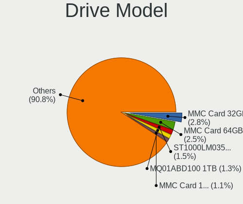
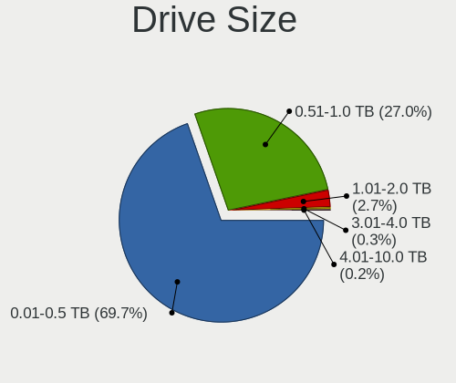
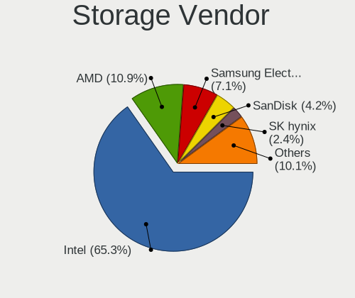
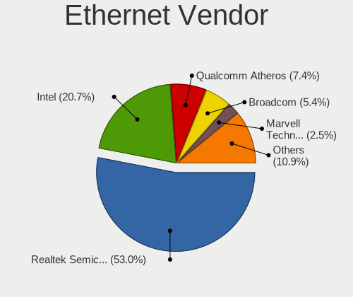
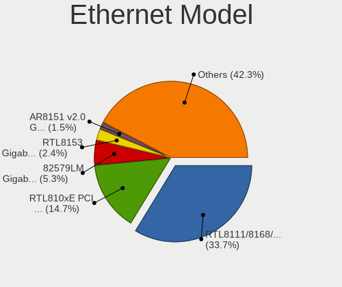
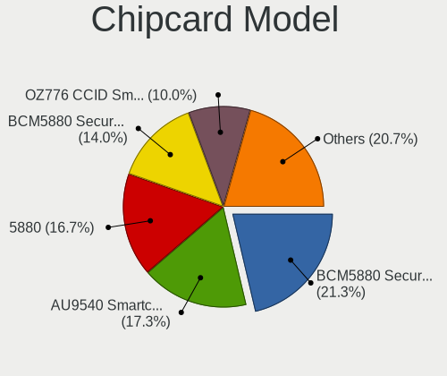

Zorin 16 - Tested Hardware & Statistics (Notebooks)
---------------------------------------------------

A project to collect tested hardware configurations for Zorin 16.

Anyone can contribute to this report by the [hw-probe](https://github.com/linuxhw/hw-probe) tool:

    sudo -E hw-probe -all -upload

Please contribute! Especially if your hardware is rare.

Contents
--------

* [ Test Cases ](#test-cases)

* [ System ](#system)
  - [ Kernel                   ](#kernel)
  - [ Kernel Family            ](#kernel-family)
  - [ Kernel Major Ver.        ](#kernel-major-ver)
  - [ Arch                     ](#arch)
  - [ DE                       ](#de)
  - [ Display Server           ](#display-server)
  - [ Display Manager          ](#display-manager)
  - [ OS Lang                  ](#os-lang)
  - [ Boot Mode                ](#boot-mode)
  - [ Filesystem               ](#filesystem)
  - [ Part. scheme             ](#part-scheme)
  - [ Dual Boot with Linux/BSD ](#dual-boot-with-linuxbsd)
  - [ Dual Boot (Win)          ](#dual-boot-win)

* [ Board ](#board)
  - [ Vendor                   ](#vendor)
  - [ Model                    ](#model)
  - [ Model Family             ](#model-family)
  - [ MFG Year                 ](#mfg-year)
  - [ Form Factor              ](#form-factor)
  - [ Secure Boot              ](#secure-boot)
  - [ Coreboot                 ](#coreboot)
  - [ RAM Size                 ](#ram-size)
  - [ RAM Used                 ](#ram-used)
  - [ Total Drives             ](#total-drives)
  - [ Has CD-ROM               ](#has-cd-rom)
  - [ Has Ethernet             ](#has-ethernet)
  - [ Has WiFi                 ](#has-wifi)
  - [ Has Bluetooth            ](#has-bluetooth)

* [ Location ](#location)
  - [ Country                  ](#country)
  - [ City                     ](#city)

* [ Drives ](#drives)
  - [ Drive Vendor             ](#drive-vendor)
  - [ Drive Model              ](#drive-model)
  - [ HDD Vendor               ](#hdd-vendor)
  - [ SSD Vendor               ](#ssd-vendor)
  - [ Drive Kind               ](#drive-kind)
  - [ Drive Connector          ](#drive-connector)
  - [ Drive Size               ](#drive-size)
  - [ Space Total              ](#space-total)
  - [ Space Used               ](#space-used)
  - [ Malfunc. Drives          ](#malfunc-drives)
  - [ Malfunc. Drive Vendor    ](#malfunc-drive-vendor)
  - [ Malfunc. HDD Vendor      ](#malfunc-hdd-vendor)
  - [ Malfunc. Drive Kind      ](#malfunc-drive-kind)
  - [ Failed Drives            ](#failed-drives)
  - [ Failed Drive Vendor      ](#failed-drive-vendor)
  - [ Drive Status             ](#drive-status)

* [ Storage controller ](#storage-controller)
  - [ Storage Vendor           ](#storage-vendor)
  - [ Storage Model            ](#storage-model)
  - [ Storage Kind             ](#storage-kind)

* [ Processor ](#processor)
  - [ CPU Vendor               ](#cpu-vendor)
  - [ CPU Model                ](#cpu-model)
  - [ CPU Model Family         ](#cpu-model-family)
  - [ CPU Cores                ](#cpu-cores)
  - [ CPU Sockets              ](#cpu-sockets)
  - [ CPU Threads              ](#cpu-threads)
  - [ CPU Op-Modes             ](#cpu-op-modes)
  - [ CPU Microcode            ](#cpu-microcode)
  - [ CPU Microarch            ](#cpu-microarch)

* [ Graphics ](#graphics)
  - [ GPU Vendor               ](#gpu-vendor)
  - [ GPU Model                ](#gpu-model)
  - [ GPU Combo                ](#gpu-combo)
  - [ GPU Driver               ](#gpu-driver)
  - [ GPU Memory               ](#gpu-memory)

* [ Monitor ](#monitor)
  - [ Monitor Vendor           ](#monitor-vendor)
  - [ Monitor Model            ](#monitor-model)
  - [ Monitor Resolution       ](#monitor-resolution)
  - [ Monitor Diagonal         ](#monitor-diagonal)
  - [ Monitor Width            ](#monitor-width)
  - [ Aspect Ratio             ](#aspect-ratio)
  - [ Monitor Area             ](#monitor-area)
  - [ Pixel Density            ](#pixel-density)
  - [ Multiple Monitors        ](#multiple-monitors)

* [ Network ](#network)
  - [ Net Controller Vendor    ](#net-controller-vendor)
  - [ Net Controller Model     ](#net-controller-model)
  - [ Wireless Vendor          ](#wireless-vendor)
  - [ Wireless Model           ](#wireless-model)
  - [ Ethernet Vendor          ](#ethernet-vendor)
  - [ Ethernet Model           ](#ethernet-model)
  - [ Net Controller Kind      ](#net-controller-kind)
  - [ Used Controller          ](#used-controller)
  - [ NICs                     ](#nics)
  - [ IPv6                     ](#ipv6)

* [ Bluetooth ](#bluetooth)
  - [ Bluetooth Vendor         ](#bluetooth-vendor)
  - [ Bluetooth Model          ](#bluetooth-model)

* [ Sound ](#sound)
  - [ Sound Vendor             ](#sound-vendor)
  - [ Sound Model              ](#sound-model)

* [ Memory ](#memory)
  - [ Memory Vendor            ](#memory-vendor)
  - [ Memory Model             ](#memory-model)
  - [ Memory Kind              ](#memory-kind)
  - [ Memory Form Factor       ](#memory-form-factor)
  - [ Memory Size              ](#memory-size)
  - [ Memory Speed             ](#memory-speed)

* [ Printers & scanners ](#printers--scanners)
  - [ Printer Vendor           ](#printer-vendor)
  - [ Printer Model            ](#printer-model)
  - [ Scanner Vendor           ](#scanner-vendor)
  - [ Scanner Model            ](#scanner-model)

* [ Camera ](#camera)
  - [ Camera Vendor            ](#camera-vendor)
  - [ Camera Model             ](#camera-model)

* [ Security ](#security)
  - [ Fingerprint Vendor       ](#fingerprint-vendor)
  - [ Fingerprint Model        ](#fingerprint-model)
  - [ Chipcard Vendor          ](#chipcard-vendor)
  - [ Chipcard Model           ](#chipcard-model)

* [ Unsupported ](#unsupported)
  - [ Unsupported Devices      ](#unsupported-devices)
  - [ Unsupported Device Types ](#unsupported-device-types)

Test Cases
----------

Total: 2911

| Vendor        | Model                       | Probe                                                      | Date         |
|---------------|-----------------------------|------------------------------------------------------------|--------------|
| Toshiba       | Satellite C870-1C2          | [d9750c9040](https://linux-hardware.org/?probe=d9750c9040) | Sep 30, 2023 |
| Apple         | MacBookPro5,3               | [0669d0020d](https://linux-hardware.org/?probe=0669d0020d) | Sep 30, 2023 |
| Apple         | MacBookPro8,2               | [237492c356](https://linux-hardware.org/?probe=237492c356) | Sep 30, 2023 |
| Apple         | MacBookPro5,3               | [d249d5e114](https://linux-hardware.org/?probe=d249d5e114) | Sep 30, 2023 |
| Lenovo        | IdeaPad Slim 3 15IRU8 82... | [e9dd0291e0](https://linux-hardware.org/?probe=e9dd0291e0) | Sep 29, 2023 |
| ASUSTek       | X551MA                      | [8ba160ee59](https://linux-hardware.org/?probe=8ba160ee59) | Sep 29, 2023 |
| Lenovo        | ThinkPad R60 9461DXG        | [4f74530d68](https://linux-hardware.org/?probe=4f74530d68) | Sep 28, 2023 |
| Lenovo        | ThinkPad R60 9461DXG        | [5fb1e549ea](https://linux-hardware.org/?probe=5fb1e549ea) | Sep 28, 2023 |
| Acer          | Aspire 5736Z                | [cfd174dbe0](https://linux-hardware.org/?probe=cfd174dbe0) | Sep 28, 2023 |
| Lenovo        | IdeaPad Slim 5 16IRL8 82... | [c717c1ab13](https://linux-hardware.org/?probe=c717c1ab13) | Sep 28, 2023 |
| Lenovo        | ThinkPad E14 20RA0050US     | [097539dde8](https://linux-hardware.org/?probe=097539dde8) | Sep 27, 2023 |
| Medion        | E6431 MD60112               | [f1fee9da62](https://linux-hardware.org/?probe=f1fee9da62) | Sep 27, 2023 |
| HP            | Notebook                    | [4690fda15e](https://linux-hardware.org/?probe=4690fda15e) | Sep 27, 2023 |
| Apple         | MacBookPro11,1              | [7463d4f447](https://linux-hardware.org/?probe=7463d4f447) | Sep 26, 2023 |
| Dell          | Vostro 3550                 | [f87aee7d8f](https://linux-hardware.org/?probe=f87aee7d8f) | Sep 26, 2023 |
| Dell          | Vostro 3550                 | [7214093885](https://linux-hardware.org/?probe=7214093885) | Sep 26, 2023 |
| Dell          | Inspiron 5459               | [1095c770f0](https://linux-hardware.org/?probe=1095c770f0) | Sep 26, 2023 |
| HP            | ZBook Fury 16 G9 Mobile ... | [0c8a57738d](https://linux-hardware.org/?probe=0c8a57738d) | Sep 25, 2023 |
| HP            | ZBook Fury 16 G9 Mobile ... | [a778013e21](https://linux-hardware.org/?probe=a778013e21) | Sep 25, 2023 |
| Intel         | W7645                       | [8a83c23785](https://linux-hardware.org/?probe=8a83c23785) | Sep 25, 2023 |
| Dell          | Inspiron 14 5410            | [863dfa9b96](https://linux-hardware.org/?probe=863dfa9b96) | Sep 25, 2023 |
| Apple         | MacBookAir6,1               | [1bee981c70](https://linux-hardware.org/?probe=1bee981c70) | Sep 25, 2023 |
| Dell          | Inspiron 3581               | [11796876dd](https://linux-hardware.org/?probe=11796876dd) | Sep 25, 2023 |
| Sony          | SVF14A15CXB                 | [cbce21a887](https://linux-hardware.org/?probe=cbce21a887) | Sep 25, 2023 |
| Alienware     | M17x                        | [5c6b700486](https://linux-hardware.org/?probe=5c6b700486) | Sep 25, 2023 |
| Samsung       | 3570R/370R/470R/450R/510... | [6d75f2f29b](https://linux-hardware.org/?probe=6d75f2f29b) | Sep 24, 2023 |
| HUAWEI        | KLVL-WXXW                   | [f2a543d0dd](https://linux-hardware.org/?probe=f2a543d0dd) | Sep 24, 2023 |
| Dell          | XPS 13 9360                 | [6897fc6f5a](https://linux-hardware.org/?probe=6897fc6f5a) | Sep 23, 2023 |
| ASUSTek       | K50IJ                       | [02a39de387](https://linux-hardware.org/?probe=02a39de387) | Sep 23, 2023 |
| Lenovo        | ThinkPad E575 20H8000HUS    | [8b5a2354c5](https://linux-hardware.org/?probe=8b5a2354c5) | Sep 23, 2023 |
| Acer          | Aspire A514-54              | [c74511d498](https://linux-hardware.org/?probe=c74511d498) | Sep 22, 2023 |
| Toshiba       | Satellite Pro R40-D         | [d33d1b7b77](https://linux-hardware.org/?probe=d33d1b7b77) | Sep 22, 2023 |
| Primux Tec... | Primux_1406F_W10            | [a1911e4e9a](https://linux-hardware.org/?probe=a1911e4e9a) | Sep 22, 2023 |
| Primux Tec... | Primux_1406F_W10            | [c267e8d9a3](https://linux-hardware.org/?probe=c267e8d9a3) | Sep 22, 2023 |
| HP            | 250 G7 Notebook PC          | [cc25c24fa5](https://linux-hardware.org/?probe=cc25c24fa5) | Sep 21, 2023 |
| HP            | 255 G8 Notebook PC          | [d92a4fb2af](https://linux-hardware.org/?probe=d92a4fb2af) | Sep 21, 2023 |
| Dell          | Inspiron 3576               | [a76faead17](https://linux-hardware.org/?probe=a76faead17) | Sep 21, 2023 |
| Acer          | TravelMate P246-MG          | [197b2c18c7](https://linux-hardware.org/?probe=197b2c18c7) | Sep 21, 2023 |
| Acer          | Aspire VN7-572G             | [8936ef0637](https://linux-hardware.org/?probe=8936ef0637) | Sep 21, 2023 |
| Lenovo        | ThinkPad T570 20HAS1PC00    | [218325e9e3](https://linux-hardware.org/?probe=218325e9e3) | Sep 21, 2023 |
| Lenovo        | ThinkPad T560 20FJS2BX00    | [85a0203a02](https://linux-hardware.org/?probe=85a0203a02) | Sep 20, 2023 |
| Lenovo        | ThinkPad T560 20FJS2BX00    | [c96d3bf498](https://linux-hardware.org/?probe=c96d3bf498) | Sep 20, 2023 |
| ASUSTek       | VivoBook_ASUSLaptop X415... | [162a680d7d](https://linux-hardware.org/?probe=162a680d7d) | Sep 19, 2023 |
| Acer          | Aspire 5750                 | [9fb8b99e70](https://linux-hardware.org/?probe=9fb8b99e70) | Sep 19, 2023 |
| ASUSTek       | ZenBook UX431DA_UM431DA     | [ca70cb035f](https://linux-hardware.org/?probe=ca70cb035f) | Sep 19, 2023 |
| HP            | Pavilion dv7                | [2bbc187582](https://linux-hardware.org/?probe=2bbc187582) | Sep 19, 2023 |
| HP            | Laptop 15-ef1xxx            | [5ec304bdb6](https://linux-hardware.org/?probe=5ec304bdb6) | Sep 19, 2023 |
| HP            | Laptop 15-fc0xxx            | [bb3c1bf2b9](https://linux-hardware.org/?probe=bb3c1bf2b9) | Sep 18, 2023 |
| HP            | EliteBook 745 G5            | [d03b8c1860](https://linux-hardware.org/?probe=d03b8c1860) | Sep 18, 2023 |
| HP            | Laptop 15-fc0xxx            | [4e845095f4](https://linux-hardware.org/?probe=4e845095f4) | Sep 18, 2023 |
| Dell          | XPS 13 9370                 | [002401cab6](https://linux-hardware.org/?probe=002401cab6) | Sep 18, 2023 |
| Hometech      | Ultra Tab 8W                | [065988c338](https://linux-hardware.org/?probe=065988c338) | Sep 17, 2023 |
| Hometech      | Ultra Tab 8W                | [1a9e79b92e](https://linux-hardware.org/?probe=1a9e79b92e) | Sep 17, 2023 |
| Lenovo        | ThinkPad T430 2349HNU       | [ef3516c115](https://linux-hardware.org/?probe=ef3516c115) | Sep 17, 2023 |
| Acer          | Aspire 5750                 | [e639402c30](https://linux-hardware.org/?probe=e639402c30) | Sep 17, 2023 |
| Apple         | MacBook4,1                  | [3774dfea8e](https://linux-hardware.org/?probe=3774dfea8e) | Sep 16, 2023 |
| Lenovo        | IdeaPad Gaming 3 15IAH7 ... | [87f26cde55](https://linux-hardware.org/?probe=87f26cde55) | Sep 16, 2023 |
| HP            | 250 G7 Notebook PC          | [72503b214c](https://linux-hardware.org/?probe=72503b214c) | Sep 16, 2023 |
| Acer          | Aspire 5755G                | [16c14700d3](https://linux-hardware.org/?probe=16c14700d3) | Sep 16, 2023 |
| Lenovo        | IdeaPad Gaming 3 15IAH7 ... | [00fd2287c0](https://linux-hardware.org/?probe=00fd2287c0) | Sep 16, 2023 |
| Apple         | MacBookPro3,1               | [f6be487f38](https://linux-hardware.org/?probe=f6be487f38) | Sep 16, 2023 |
| ASUSTek       | K54C                        | [23a000c4d4](https://linux-hardware.org/?probe=23a000c4d4) | Sep 16, 2023 |
| Itautec       | Infoway                     | [d4a8bc6420](https://linux-hardware.org/?probe=d4a8bc6420) | Sep 14, 2023 |
| Acer          | Aspire 5735                 | [9d3ceb6624](https://linux-hardware.org/?probe=9d3ceb6624) | Sep 14, 2023 |
| HP            | Notebook                    | [29f1834722](https://linux-hardware.org/?probe=29f1834722) | Sep 14, 2023 |
| MSI           | Bravo 15 A4DDR              | [bba9e61120](https://linux-hardware.org/?probe=bba9e61120) | Sep 13, 2023 |
| Acer          | Aspire 5750ZG               | [c9ce4cde54](https://linux-hardware.org/?probe=c9ce4cde54) | Sep 13, 2023 |
| Dell          | Inspiron 5590               | [32b69241bf](https://linux-hardware.org/?probe=32b69241bf) | Sep 13, 2023 |
| Sony          | VPCEB1E1E                   | [cbd095ee01](https://linux-hardware.org/?probe=cbd095ee01) | Sep 12, 2023 |
| Acer          | Aspire 5750ZG               | [9029730ffb](https://linux-hardware.org/?probe=9029730ffb) | Sep 12, 2023 |
| Acer          | Aspire A514-54              | [8ddb560fdc](https://linux-hardware.org/?probe=8ddb560fdc) | Sep 12, 2023 |
| Apple         | MacBookPro8,2               | [5358fa25ef](https://linux-hardware.org/?probe=5358fa25ef) | Sep 12, 2023 |
| Dell          | Inspiron 5748               | [21baf66690](https://linux-hardware.org/?probe=21baf66690) | Sep 11, 2023 |
| HP            | Pavilion dv7                | [e7c7395c7b](https://linux-hardware.org/?probe=e7c7395c7b) | Sep 11, 2023 |
| Lenovo        | IdeaPad 3 14IIL05 81WD      | [26fc33cb75](https://linux-hardware.org/?probe=26fc33cb75) | Sep 10, 2023 |
| Dell          | Latitude E5430 non-vPro     | [b211a425b2](https://linux-hardware.org/?probe=b211a425b2) | Sep 10, 2023 |
| ASUSTek       | X541UA                      | [a8184365b8](https://linux-hardware.org/?probe=a8184365b8) | Sep 10, 2023 |
| Lenovo        | V110-14IAP 80TF             | [3ee6c9a460](https://linux-hardware.org/?probe=3ee6c9a460) | Sep 09, 2023 |
| Lenovo        | IdeaPad S340-15IIL 81VW     | [382cd978ab](https://linux-hardware.org/?probe=382cd978ab) | Sep 08, 2023 |
| Lenovo        | ThinkPad T430 2349H2G       | [1d9d7c7f78](https://linux-hardware.org/?probe=1d9d7c7f78) | Sep 08, 2023 |
| HP            | 240 G8 Notebook PC          | [62735c1cd9](https://linux-hardware.org/?probe=62735c1cd9) | Sep 07, 2023 |
| HP            | Laptop 14-dq1xxx            | [125a7f7c0d](https://linux-hardware.org/?probe=125a7f7c0d) | Sep 07, 2023 |
| Dell          | Inspiron 5559               | [0428af4d14](https://linux-hardware.org/?probe=0428af4d14) | Sep 06, 2023 |
| HP            | ProBook 650 G5              | [5e6e5cd047](https://linux-hardware.org/?probe=5e6e5cd047) | Sep 06, 2023 |
| Lenovo        | IdeaPad Gaming 3 15ARH05... | [0fdeca1313](https://linux-hardware.org/?probe=0fdeca1313) | Sep 06, 2023 |
| Toshiba       | Satellite A210              | [54f5fb9c03](https://linux-hardware.org/?probe=54f5fb9c03) | Sep 06, 2023 |
| Framework     | Laptop                      | [bd2852cd9e](https://linux-hardware.org/?probe=bd2852cd9e) | Sep 05, 2023 |
| Toshiba       | Satellite C70D-A            | [36070747fd](https://linux-hardware.org/?probe=36070747fd) | Sep 04, 2023 |
| Apple         | MacBookPro8,2               | [371c148953](https://linux-hardware.org/?probe=371c148953) | Sep 04, 2023 |
| Dell          | Latitude E6530              | [e1aa22b8b9](https://linux-hardware.org/?probe=e1aa22b8b9) | Sep 04, 2023 |
| Dell          | G15 5511                    | [e6afc56020](https://linux-hardware.org/?probe=e6afc56020) | Sep 03, 2023 |
| Lenovo        | Legion S7 16IAH7 82TF       | [f4c15b0551](https://linux-hardware.org/?probe=f4c15b0551) | Sep 03, 2023 |
| Toshiba       | Satellite L50-A-1DL         | [d46487843e](https://linux-hardware.org/?probe=d46487843e) | Sep 03, 2023 |
| Dell          | Vostro 14-3468              | [2f75949c09](https://linux-hardware.org/?probe=2f75949c09) | Sep 03, 2023 |
| Apple         | MacBookPro16,2              | [9ab1a9731d](https://linux-hardware.org/?probe=9ab1a9731d) | Sep 03, 2023 |
| Apple         | MacBookPro16,2              | [78d7ccad98](https://linux-hardware.org/?probe=78d7ccad98) | Sep 02, 2023 |
| HP            | EliteBook 840 G5            | [b2b0d3e018](https://linux-hardware.org/?probe=b2b0d3e018) | Sep 02, 2023 |
| Gigabyte      | G5 KF                       | [b38cdf7987](https://linux-hardware.org/?probe=b38cdf7987) | Sep 01, 2023 |
| Gigabyte      | G5 KF                       | [3eef6bf0d1](https://linux-hardware.org/?probe=3eef6bf0d1) | Sep 01, 2023 |
| Dell          | Latitude 5400               | [dee2becb07](https://linux-hardware.org/?probe=dee2becb07) | Sep 01, 2023 |
| Lenovo        | ThinkPad S5-S540 20B3006... | [e33b222d6c](https://linux-hardware.org/?probe=e33b222d6c) | Sep 01, 2023 |
| HP            | ProBook 4740s               | [0ab7fe639e](https://linux-hardware.org/?probe=0ab7fe639e) | Sep 01, 2023 |
| HP            | EliteBook 2570p             | [436e4af3ce](https://linux-hardware.org/?probe=436e4af3ce) | Aug 31, 2023 |
| HP            | 15                          | [39567282e3](https://linux-hardware.org/?probe=39567282e3) | Aug 31, 2023 |
| HP            | Pavilion dv4                | [c84d5215be](https://linux-hardware.org/?probe=c84d5215be) | Aug 30, 2023 |
| Sony          | VPCEE23FX                   | [65714e4d48](https://linux-hardware.org/?probe=65714e4d48) | Aug 30, 2023 |
| Apple         | MacBookPro11,5              | [643e8194ea](https://linux-hardware.org/?probe=643e8194ea) | Aug 30, 2023 |
| Dell          | Venue 11 Pro 5130           | [38c58406bc](https://linux-hardware.org/?probe=38c58406bc) | Aug 29, 2023 |
| ASUSTek       | K93SV                       | [01701d7ab0](https://linux-hardware.org/?probe=01701d7ab0) | Aug 29, 2023 |
| ASUSTek       | K93SV                       | [6da5e2d119](https://linux-hardware.org/?probe=6da5e2d119) | Aug 29, 2023 |
| Dell          | Precision 7710              | [9b92626f63](https://linux-hardware.org/?probe=9b92626f63) | Aug 29, 2023 |
| Acer          | Acadia V1.45                | [4bc36b4d27](https://linux-hardware.org/?probe=4bc36b4d27) | Aug 29, 2023 |
| HP            | Laptop 14-dq1xxx            | [8e13da67ed](https://linux-hardware.org/?probe=8e13da67ed) | Aug 28, 2023 |
| Lenovo        | Yoga 3 14 80JH              | [5268d75df2](https://linux-hardware.org/?probe=5268d75df2) | Aug 28, 2023 |
| Lenovo        | ThinkPad P51s W10DG 20JY... | [4c01a3be17](https://linux-hardware.org/?probe=4c01a3be17) | Aug 28, 2023 |
| HP            | Laptop 14-dk1xxx            | [bdd515fe27](https://linux-hardware.org/?probe=bdd515fe27) | Aug 28, 2023 |
| Lenovo        | ThinkPad P51s W10DG 20JY... | [783bbb68e6](https://linux-hardware.org/?probe=783bbb68e6) | Aug 27, 2023 |
| TERRA         | TERRAPC                     | [2031fd343b](https://linux-hardware.org/?probe=2031fd343b) | Aug 27, 2023 |
| Lenovo        | IdeaPad 3 15ADA05 81W1      | [7e9c9debdf](https://linux-hardware.org/?probe=7e9c9debdf) | Aug 26, 2023 |
| Chuwi         | GemiBook Pro                | [06f19f4198](https://linux-hardware.org/?probe=06f19f4198) | Aug 26, 2023 |
| HP            | Pavilion dv7                | [6fbf874054](https://linux-hardware.org/?probe=6fbf874054) | Aug 26, 2023 |
| Acer          | Aspire A315-56              | [e212f5bc28](https://linux-hardware.org/?probe=e212f5bc28) | Aug 25, 2023 |
| Google        | Rammus                      | [28554e7ce5](https://linux-hardware.org/?probe=28554e7ce5) | Aug 25, 2023 |
| HP            | ProBook 640 G4              | [3b75cf22fb](https://linux-hardware.org/?probe=3b75cf22fb) | Aug 25, 2023 |
| TERRA         | TERRAPC                     | [b33c6ce6e8](https://linux-hardware.org/?probe=b33c6ce6e8) | Aug 24, 2023 |
| Lenovo        | ThinkPad Edge 25453BG       | [188af952b0](https://linux-hardware.org/?probe=188af952b0) | Aug 24, 2023 |
| HP            | ProBook 4740s               | [f9e2a275da](https://linux-hardware.org/?probe=f9e2a275da) | Aug 24, 2023 |
| Lenovo        | ThinkPad X220 4286CTO       | [64859dd75d](https://linux-hardware.org/?probe=64859dd75d) | Aug 24, 2023 |
| ASUSTek       | X756UQ                      | [0ff5520460](https://linux-hardware.org/?probe=0ff5520460) | Aug 22, 2023 |
| Lenovo        | ThinkPad P51 20HJS3MY00     | [010dac0caa](https://linux-hardware.org/?probe=010dac0caa) | Aug 22, 2023 |
| Lenovo        | IdeaPad 3 15ALC6 82KU       | [2a05992a61](https://linux-hardware.org/?probe=2a05992a61) | Aug 21, 2023 |
| Lenovo        | IdeaPad 3 15ABA7 82RN       | [a440d57d28](https://linux-hardware.org/?probe=a440d57d28) | Aug 21, 2023 |
| Dell          | Precision M4700             | [9ec95d5a4d](https://linux-hardware.org/?probe=9ec95d5a4d) | Aug 21, 2023 |
| HP            | Notebook                    | [5b7ff7f278](https://linux-hardware.org/?probe=5b7ff7f278) | Aug 20, 2023 |
| Apple         | MacBookPro8,1               | [41edd1a16e](https://linux-hardware.org/?probe=41edd1a16e) | Aug 20, 2023 |
| Dell          | Latitude 3350               | [e86ce20d6d](https://linux-hardware.org/?probe=e86ce20d6d) | Aug 20, 2023 |
| Lenovo        | Unknown                     | [fbbadac782](https://linux-hardware.org/?probe=fbbadac782) | Aug 20, 2023 |
| Lenovo        | ThinkPad Edge 0578A66       | [6b3703818a](https://linux-hardware.org/?probe=6b3703818a) | Aug 20, 2023 |
| Alienware     | 17                          | [9e7015d530](https://linux-hardware.org/?probe=9e7015d530) | Aug 20, 2023 |
| Apple         | MacBookPro4,1               | [1c57edc329](https://linux-hardware.org/?probe=1c57edc329) | Aug 19, 2023 |
| Sony          | VPCF13Z1E                   | [98c9e71be9](https://linux-hardware.org/?probe=98c9e71be9) | Aug 19, 2023 |
| Apple         | MacBookPro5,2               | [2c20d038ca](https://linux-hardware.org/?probe=2c20d038ca) | Aug 19, 2023 |
| Acer          | Swift SF514-52T             | [9cd2857c01](https://linux-hardware.org/?probe=9cd2857c01) | Aug 18, 2023 |
| ASUSTek       | X550ZA                      | [7f23195701](https://linux-hardware.org/?probe=7f23195701) | Aug 18, 2023 |
| Lenovo        | Flex 2-15 20405             | [77942ee5db](https://linux-hardware.org/?probe=77942ee5db) | Aug 18, 2023 |
| Acer          | Aspire 5755G                | [720c3bfa88](https://linux-hardware.org/?probe=720c3bfa88) | Aug 18, 2023 |
| Lenovo        | G40-30 80FY                 | [d14c477dc9](https://linux-hardware.org/?probe=d14c477dc9) | Aug 18, 2023 |
| Samsung       | RV411/RV511/E3511/S3511/... | [04ebdc3ec0](https://linux-hardware.org/?probe=04ebdc3ec0) | Aug 18, 2023 |
| Lenovo        | ThinkPad X270 W10DG 20K5... | [7092a32ce5](https://linux-hardware.org/?probe=7092a32ce5) | Aug 17, 2023 |
| Dell          | G3 3579                     | [58866ca1fb](https://linux-hardware.org/?probe=58866ca1fb) | Aug 17, 2023 |
| TAGTech       | TAGITOP-UNI C               | [d7402c2c8d](https://linux-hardware.org/?probe=d7402c2c8d) | Aug 17, 2023 |
| TAGTech       | TAGITOP-UNI C               | [1cccdef7f4](https://linux-hardware.org/?probe=1cccdef7f4) | Aug 17, 2023 |
| Google        | Coral                       | [f8ed9b3bda](https://linux-hardware.org/?probe=f8ed9b3bda) | Aug 17, 2023 |
| Lenovo        | ThinkPad T480 20L5S04F00    | [7eb670d219](https://linux-hardware.org/?probe=7eb670d219) | Aug 17, 2023 |
| Lenovo        | G40-30 80FY                 | [6574b3e96d](https://linux-hardware.org/?probe=6574b3e96d) | Aug 16, 2023 |
| Apple         | MacBookPro5,2               | [86c85e57c2](https://linux-hardware.org/?probe=86c85e57c2) | Aug 16, 2023 |
| HP            | OMEN by Laptop              | [b31bf50c6e](https://linux-hardware.org/?probe=b31bf50c6e) | Aug 16, 2023 |
| Dell          | Latitude D630               | [878b00d959](https://linux-hardware.org/?probe=878b00d959) | Aug 15, 2023 |
| HP            | 15                          | [645730bff3](https://linux-hardware.org/?probe=645730bff3) | Aug 15, 2023 |
| HP            | 15                          | [08fc74cb7b](https://linux-hardware.org/?probe=08fc74cb7b) | Aug 15, 2023 |
| Sony          | VGN-SR19VN                  | [7adc151adb](https://linux-hardware.org/?probe=7adc151adb) | Aug 15, 2023 |
| Lenovo        | ThinkPad T510 43842RG       | [9b2f268192](https://linux-hardware.org/?probe=9b2f268192) | Aug 15, 2023 |
| Medion        | E15301                      | [e42771be29](https://linux-hardware.org/?probe=e42771be29) | Aug 14, 2023 |
| HP            | Laptop 14-dq1xxx            | [102a6b136f](https://linux-hardware.org/?probe=102a6b136f) | Aug 14, 2023 |
| Lenovo        | Legion R9000P2021H 82JQ     | [777c4f7fb8](https://linux-hardware.org/?probe=777c4f7fb8) | Aug 13, 2023 |
| ASUSTek       | Zenbook UX535QE_UM535QE     | [c692882ce4](https://linux-hardware.org/?probe=c692882ce4) | Aug 13, 2023 |
| AMI           | Unknown                     | [326999bd6b](https://linux-hardware.org/?probe=326999bd6b) | Aug 12, 2023 |
| AMI           | Unknown                     | [614b443c5c](https://linux-hardware.org/?probe=614b443c5c) | Aug 12, 2023 |
| HP            | 350 G2                      | [f0fa8865d3](https://linux-hardware.org/?probe=f0fa8865d3) | Aug 12, 2023 |
| Lenovo        | Legion 5 15ARH05 82B5       | [71f554fd2c](https://linux-hardware.org/?probe=71f554fd2c) | Aug 12, 2023 |
| Lenovo        | Legion 5 15ARH05 82B5       | [edd42a9a6d](https://linux-hardware.org/?probe=edd42a9a6d) | Aug 12, 2023 |
| HP            | EliteBook 840 G7 Noteboo... | [5ba59f878a](https://linux-hardware.org/?probe=5ba59f878a) | Aug 12, 2023 |
| Acer          | One Z1402                   | [9fd6a2d41b](https://linux-hardware.org/?probe=9fd6a2d41b) | Aug 12, 2023 |
| Unknown       | Unknown                     | [b68d99fd89](https://linux-hardware.org/?probe=b68d99fd89) | Aug 11, 2023 |
| Lenovo        | IdeaPad S340-15IIL 81VW     | [48a0f64b34](https://linux-hardware.org/?probe=48a0f64b34) | Aug 11, 2023 |
| Lenovo        | IdeaPad 330-15IKB 81DE      | [a708832571](https://linux-hardware.org/?probe=a708832571) | Aug 11, 2023 |
| HP            | 350 G2                      | [dde52cb361](https://linux-hardware.org/?probe=dde52cb361) | Aug 10, 2023 |
| Clevo         | W251EFQ/W270EFQ             | [cde80ecaf6](https://linux-hardware.org/?probe=cde80ecaf6) | Aug 10, 2023 |
| HP            | ProBook 450 G6              | [c205f19d5e](https://linux-hardware.org/?probe=c205f19d5e) | Aug 09, 2023 |
| HP            | 350 G2                      | [3b79bb8a69](https://linux-hardware.org/?probe=3b79bb8a69) | Aug 09, 2023 |
| HP            | Presario CQ56               | [cf373b9083](https://linux-hardware.org/?probe=cf373b9083) | Aug 09, 2023 |
| HP            | Laptop 14-dk1xxx            | [7c59be984f](https://linux-hardware.org/?probe=7c59be984f) | Aug 09, 2023 |
| Lenovo        | IdeaPad 3 15ALC6 82KU       | [03a4763a96](https://linux-hardware.org/?probe=03a4763a96) | Aug 08, 2023 |
| Lenovo        | IdeaPad 330-15IKB 81DE      | [de86921bce](https://linux-hardware.org/?probe=de86921bce) | Aug 08, 2023 |
| Lenovo        | ThinkBook 15 G2 ITL 20VE    | [c90663d505](https://linux-hardware.org/?probe=c90663d505) | Aug 08, 2023 |
| Lenovo        | IdeaPad 3 15ALC6 82KU       | [87ee840e89](https://linux-hardware.org/?probe=87ee840e89) | Aug 07, 2023 |
| LG Electro... | 14Z90N-V.AA78B              | [af79c7f5f5](https://linux-hardware.org/?probe=af79c7f5f5) | Aug 07, 2023 |
| Apple         | MacBookPro14,1              | [72a4a0eed2](https://linux-hardware.org/?probe=72a4a0eed2) | Aug 06, 2023 |
| ASUSTek       | X405UA                      | [97acf73dea](https://linux-hardware.org/?probe=97acf73dea) | Aug 06, 2023 |
| Lenovo        | ThinkPad X1 Extreme 20MF... | [c40308638c](https://linux-hardware.org/?probe=c40308638c) | Aug 05, 2023 |
| ONE-NETBOO... | ONEXPLAYER 2 ARP23 Ver.1... | [8b6db0bfbb](https://linux-hardware.org/?probe=8b6db0bfbb) | Aug 05, 2023 |
| Lenovo        | IdeaPad 1 14IGL05 81VU      | [dbbf788e9d](https://linux-hardware.org/?probe=dbbf788e9d) | Aug 05, 2023 |
| HP            | EliteBook 8440p             | [5f0be846f0](https://linux-hardware.org/?probe=5f0be846f0) | Aug 05, 2023 |
| Dell          | Venue 11 Pro 7140           | [7188a418fc](https://linux-hardware.org/?probe=7188a418fc) | Aug 05, 2023 |
| HP            | EliteBook 8460p             | [db336dcf75](https://linux-hardware.org/?probe=db336dcf75) | Aug 05, 2023 |
| Itautec       | Infoway                     | [1708f5baae](https://linux-hardware.org/?probe=1708f5baae) | Aug 04, 2023 |
| GPD           | G1621-02                    | [d7361e9896](https://linux-hardware.org/?probe=d7361e9896) | Aug 04, 2023 |
| Apple         | MacBook8,1                  | [cf6d77d650](https://linux-hardware.org/?probe=cf6d77d650) | Aug 04, 2023 |
| Dell          | Latitude 7490               | [955c961132](https://linux-hardware.org/?probe=955c961132) | Aug 04, 2023 |
| Apple         | MacBookPro8,1               | [61cb65a2e9](https://linux-hardware.org/?probe=61cb65a2e9) | Aug 04, 2023 |
| Dell          | Inspiron 3531               | [f011e5c6cf](https://linux-hardware.org/?probe=f011e5c6cf) | Aug 03, 2023 |
| Notebook      | NJ50_70CU                   | [59cd10f50e](https://linux-hardware.org/?probe=59cd10f50e) | Aug 02, 2023 |
| Acer          | Aspire M3-581G              | [82814fbe1e](https://linux-hardware.org/?probe=82814fbe1e) | Aug 02, 2023 |
| Lenovo        | ThinkPad X270 W10DG 20K5... | [37fe1d55f8](https://linux-hardware.org/?probe=37fe1d55f8) | Aug 02, 2023 |
| HP            | Pavilion dv7                | [bd9bc8e7a6](https://linux-hardware.org/?probe=bd9bc8e7a6) | Aug 02, 2023 |
| Lenovo        | ThinkPad X220 4286CTO       | [ee5b34b232](https://linux-hardware.org/?probe=ee5b34b232) | Aug 02, 2023 |
| ASUSTek       | K54C                        | [f4fcf79e7e](https://linux-hardware.org/?probe=f4fcf79e7e) | Aug 02, 2023 |
| Dell          | Inspiron 5577               | [1204832e26](https://linux-hardware.org/?probe=1204832e26) | Aug 01, 2023 |
| Dell          | Inspiron 5577               | [219723a17d](https://linux-hardware.org/?probe=219723a17d) | Aug 01, 2023 |
| Dell          | Latitude E5470              | [3be826cec4](https://linux-hardware.org/?probe=3be826cec4) | Aug 01, 2023 |
| HP            | Stream Laptop 14-cb1XX      | [957e1805d3](https://linux-hardware.org/?probe=957e1805d3) | Aug 01, 2023 |
| HP            | Stream Laptop 14-cb1XX      | [a522e7336c](https://linux-hardware.org/?probe=a522e7336c) | Aug 01, 2023 |
| MSI           | GE72MVR 7RG                 | [d935650def](https://linux-hardware.org/?probe=d935650def) | Jul 31, 2023 |
| Dell          | Inspiron 3421               | [d1651e3e43](https://linux-hardware.org/?probe=d1651e3e43) | Jul 31, 2023 |
| Chuwi         | GemiBook Pro                | [d4efd6692b](https://linux-hardware.org/?probe=d4efd6692b) | Jul 30, 2023 |
| Apple         | MacBookPro4,1               | [eedbe7eb59](https://linux-hardware.org/?probe=eedbe7eb59) | Jul 30, 2023 |
| Apple         | MacBookAir5,2               | [1a77aeef9d](https://linux-hardware.org/?probe=1a77aeef9d) | Jul 30, 2023 |
| Apple         | MacBookAir5,2               | [a6e35103c8](https://linux-hardware.org/?probe=a6e35103c8) | Jul 30, 2023 |
| Sony          | VPCF13Z1E                   | [e52969e6a8](https://linux-hardware.org/?probe=e52969e6a8) | Jul 30, 2023 |
| MSI           | GS73VR 7RF                  | [9df7170f38](https://linux-hardware.org/?probe=9df7170f38) | Jul 29, 2023 |
| HP            | Pavilion dv4                | [47e9cba85c](https://linux-hardware.org/?probe=47e9cba85c) | Jul 29, 2023 |
| Dell          | XPS 13 9350                 | [472c0bf0b0](https://linux-hardware.org/?probe=472c0bf0b0) | Jul 29, 2023 |
| Dell          | XPS 13 9350                 | [2da43364f8](https://linux-hardware.org/?probe=2da43364f8) | Jul 29, 2023 |
| ASUSTek       | K53U                        | [c1b84117db](https://linux-hardware.org/?probe=c1b84117db) | Jul 29, 2023 |
| HP            | Pavilion 15                 | [df29d1164c](https://linux-hardware.org/?probe=df29d1164c) | Jul 29, 2023 |
| HP            | Pavilion 15                 | [804d28484b](https://linux-hardware.org/?probe=804d28484b) | Jul 29, 2023 |
| HP            | ZBook 15 G5                 | [dfe51162d1](https://linux-hardware.org/?probe=dfe51162d1) | Jul 29, 2023 |
| HP            | Pavilion g7                 | [18eb2a894b](https://linux-hardware.org/?probe=18eb2a894b) | Jul 29, 2023 |
| HP            | ZBook 15 G5                 | [8996d2d4fd](https://linux-hardware.org/?probe=8996d2d4fd) | Jul 28, 2023 |
| Google        | Edgar                       | [7e19b1e507](https://linux-hardware.org/?probe=7e19b1e507) | Jul 28, 2023 |
| ASUSTek       | K50IJ                       | [7e30723b3b](https://linux-hardware.org/?probe=7e30723b3b) | Jul 28, 2023 |
| Lenovo        | ThinkPad X220 4286CTO       | [9e892612ab](https://linux-hardware.org/?probe=9e892612ab) | Jul 28, 2023 |
| HP            | EliteBook 8560p             | [b7ce548e5b](https://linux-hardware.org/?probe=b7ce548e5b) | Jul 27, 2023 |
| Sony          | VPCF13Z1E                   | [5022f7359c](https://linux-hardware.org/?probe=5022f7359c) | Jul 26, 2023 |
| Apple         | MacBookPro12,1              | [45bc8cd978](https://linux-hardware.org/?probe=45bc8cd978) | Jul 26, 2023 |
| Sony          | VPCF13Z1E                   | [f5290b8791](https://linux-hardware.org/?probe=f5290b8791) | Jul 25, 2023 |
| Sony          | VPCF13Z1E                   | [99aacf2d95](https://linux-hardware.org/?probe=99aacf2d95) | Jul 25, 2023 |
| Acer          | TravelMate B113             | [b6fdce48b3](https://linux-hardware.org/?probe=b6fdce48b3) | Jul 25, 2023 |
| Toshiba       | QOSMIO X770                 | [7eda84257a](https://linux-hardware.org/?probe=7eda84257a) | Jul 25, 2023 |
| Dell          | Inspiron 3721               | [a0874e626b](https://linux-hardware.org/?probe=a0874e626b) | Jul 24, 2023 |
| Lenovo        | IdeaPad 330-14AST 81D5      | [c16c981a88](https://linux-hardware.org/?probe=c16c981a88) | Jul 24, 2023 |
| Lenovo        | ThinkPad E15 20RD0011GE     | [8ca6d932b3](https://linux-hardware.org/?probe=8ca6d932b3) | Jul 24, 2023 |
| HP            | Laptop 15s-eq2xxx           | [35d95135f4](https://linux-hardware.org/?probe=35d95135f4) | Jul 23, 2023 |
| HP            | ProBook 640 G1              | [de254aad44](https://linux-hardware.org/?probe=de254aad44) | Jul 23, 2023 |
| Microtech     | ebookPro                    | [4427543f1a](https://linux-hardware.org/?probe=4427543f1a) | Jul 23, 2023 |
| Dell          | Latitude E6400              | [77a598aa4d](https://linux-hardware.org/?probe=77a598aa4d) | Jul 23, 2023 |
| Acer          | AO756                       | [23e3fc369f](https://linux-hardware.org/?probe=23e3fc369f) | Jul 23, 2023 |
| Apple         | MacBookAir7,2               | [c271fa70b8](https://linux-hardware.org/?probe=c271fa70b8) | Jul 23, 2023 |
| Lenovo        | ThinkPad X220 4286CTO       | [19356a725e](https://linux-hardware.org/?probe=19356a725e) | Jul 22, 2023 |
| HP            | Pavilion dv4                | [4854c4b18c](https://linux-hardware.org/?probe=4854c4b18c) | Jul 22, 2023 |
| HP            | EliteBook 820 G4            | [3051483589](https://linux-hardware.org/?probe=3051483589) | Jul 22, 2023 |
| Medion        | E15301                      | [e20403ff58](https://linux-hardware.org/?probe=e20403ff58) | Jul 22, 2023 |
| Toshiba       | Satellite L50-B             | [5e7da1cf33](https://linux-hardware.org/?probe=5e7da1cf33) | Jul 22, 2023 |
| Acer          | Nitro AN515-44              | [306d51185f](https://linux-hardware.org/?probe=306d51185f) | Jul 21, 2023 |
| AMI           | Cherry Trail CR             | [42d75ac45a](https://linux-hardware.org/?probe=42d75ac45a) | Jul 21, 2023 |
| HP            | EliteBook 820 G4            | [c85c21d42e](https://linux-hardware.org/?probe=c85c21d42e) | Jul 21, 2023 |
| Dell          | Latitude E6440              | [b60d8ab453](https://linux-hardware.org/?probe=b60d8ab453) | Jul 21, 2023 |
| Dell          | Latitude 3520               | [7037e164fd](https://linux-hardware.org/?probe=7037e164fd) | Jul 20, 2023 |
| HP            | 15                          | [36b4035b57](https://linux-hardware.org/?probe=36b4035b57) | Jul 20, 2023 |
| Dell          | Inspiron 3501               | [71f9656ab2](https://linux-hardware.org/?probe=71f9656ab2) | Jul 19, 2023 |
| HP            | EliteBook 2570p             | [854bbb5dee](https://linux-hardware.org/?probe=854bbb5dee) | Jul 19, 2023 |
| HP            | 15                          | [0eeb522bec](https://linux-hardware.org/?probe=0eeb522bec) | Jul 19, 2023 |
| HP            | EliteBook 2570p             | [205b94b373](https://linux-hardware.org/?probe=205b94b373) | Jul 19, 2023 |
| Sony          | VPCEE23FX                   | [2cb9bf9d50](https://linux-hardware.org/?probe=2cb9bf9d50) | Jul 18, 2023 |
| Lenovo        | ThinkPad X220 4286CTO       | [9be017a8a3](https://linux-hardware.org/?probe=9be017a8a3) | Jul 16, 2023 |
| Dell          | Inspiron 3421               | [71c4faf60f](https://linux-hardware.org/?probe=71c4faf60f) | Jul 16, 2023 |
| Dell          | Inspiron 5537               | [428df654fb](https://linux-hardware.org/?probe=428df654fb) | Jul 16, 2023 |
| Dell          | Inspiron 3531               | [0e7f83761f](https://linux-hardware.org/?probe=0e7f83761f) | Jul 15, 2023 |
| Dell          | Inspiron 3531               | [d73dcbb938](https://linux-hardware.org/?probe=d73dcbb938) | Jul 15, 2023 |
| Dell          | Latitude E4300              | [a9e8fb7884](https://linux-hardware.org/?probe=a9e8fb7884) | Jul 15, 2023 |
| Unknown       | SLR-0308                    | [8626e36716](https://linux-hardware.org/?probe=8626e36716) | Jul 15, 2023 |
| Alienware     | M11xR3                      | [9397339221](https://linux-hardware.org/?probe=9397339221) | Jul 14, 2023 |
| HUAWEI        | RLEF-XX                     | [23793e7d9c](https://linux-hardware.org/?probe=23793e7d9c) | Jul 14, 2023 |
| HP            | 15                          | [215a87518e](https://linux-hardware.org/?probe=215a87518e) | Jul 13, 2023 |
| Apple         | MacBookPro9,2               | [34fe8ff1ad](https://linux-hardware.org/?probe=34fe8ff1ad) | Jul 13, 2023 |
| Apple         | MacBookPro9,2               | [a3d301a82a](https://linux-hardware.org/?probe=a3d301a82a) | Jul 13, 2023 |
| Lenovo        | IdeaPad Creator 5 15IMH0... | [56093a48aa](https://linux-hardware.org/?probe=56093a48aa) | Jul 13, 2023 |
| HP            | Pavilion dv7                | [b2e0e73adc](https://linux-hardware.org/?probe=b2e0e73adc) | Jul 13, 2023 |
| Apple         | MacBookAir7,2               | [81f693b5b0](https://linux-hardware.org/?probe=81f693b5b0) | Jul 12, 2023 |
| Dell          | Inspiron 3421               | [d347a1b82e](https://linux-hardware.org/?probe=d347a1b82e) | Jul 12, 2023 |
| Samsung       | 300V3A/300V4A/300V5A/200... | [bae54aa498](https://linux-hardware.org/?probe=bae54aa498) | Jul 12, 2023 |
| Dell          | Inspiron 3501               | [7190b16550](https://linux-hardware.org/?probe=7190b16550) | Jul 12, 2023 |
| Lenovo        | IdeaPad 1 15IGL7 82V7       | [052461ef4d](https://linux-hardware.org/?probe=052461ef4d) | Jul 11, 2023 |
| HP            | Compaq 2510p                | [a7cb1d43fb](https://linux-hardware.org/?probe=a7cb1d43fb) | Jul 11, 2023 |
| HP            | Pavilion g4                 | [6e76f09416](https://linux-hardware.org/?probe=6e76f09416) | Jul 11, 2023 |
| ASUSTek       | VivoBook_ASUSLaptop M650... | [ecc4006807](https://linux-hardware.org/?probe=ecc4006807) | Jul 11, 2023 |
| HP            | ProBook 450 G6              | [8e5774c497](https://linux-hardware.org/?probe=8e5774c497) | Jul 11, 2023 |
| ASUSTek       | VivoBook_ASUSLaptop M650... | [2c690e981a](https://linux-hardware.org/?probe=2c690e981a) | Jul 11, 2023 |
| ASUSTek       | VivoBook_ASUSLaptop M650... | [732d09609d](https://linux-hardware.org/?probe=732d09609d) | Jul 10, 2023 |
| HP            | EliteBook 840 G5            | [08770a11c6](https://linux-hardware.org/?probe=08770a11c6) | Jul 10, 2023 |
| HP            | Compaq 2510p                | [98d500c68c](https://linux-hardware.org/?probe=98d500c68c) | Jul 10, 2023 |
| Lenovo        | ThinkPad Yoga 260 20FES3... | [621eaf410c](https://linux-hardware.org/?probe=621eaf410c) | Jul 10, 2023 |
| Lenovo        | ThinkPad Yoga 260 20FES3... | [3631291aa8](https://linux-hardware.org/?probe=3631291aa8) | Jul 10, 2023 |
| HP            | Notebook                    | [7d4bc75f38](https://linux-hardware.org/?probe=7d4bc75f38) | Jul 09, 2023 |
| ASUSTek       | K54C                        | [3f0ca5ad18](https://linux-hardware.org/?probe=3f0ca5ad18) | Jul 09, 2023 |
| HP            | Laptop 15-dy1xxx            | [938e9efd55](https://linux-hardware.org/?probe=938e9efd55) | Jul 09, 2023 |
| Unknown       | SLR-0308                    | [d5b0d30e8d](https://linux-hardware.org/?probe=d5b0d30e8d) | Jul 09, 2023 |
| Apple         | MacBookPro11,2              | [e6693c16ff](https://linux-hardware.org/?probe=e6693c16ff) | Jul 09, 2023 |
| Dell          | Latitude E5470              | [e04195b0f7](https://linux-hardware.org/?probe=e04195b0f7) | Jul 08, 2023 |
| OTVOC         | N1                          | [1b4d619110](https://linux-hardware.org/?probe=1b4d619110) | Jul 07, 2023 |
| Lenovo        | ThinkPad X220 4286CTO       | [7b62ed78d1](https://linux-hardware.org/?probe=7b62ed78d1) | Jul 07, 2023 |
| Toshiba       | Satellite L670              | [fdc3192779](https://linux-hardware.org/?probe=fdc3192779) | Jul 06, 2023 |
| Lenovo        | Legion Y7000P-1060 81LF     | [203ffa97b4](https://linux-hardware.org/?probe=203ffa97b4) | Jul 06, 2023 |
| Toshiba       | Satellite L670              | [1db76edeb5](https://linux-hardware.org/?probe=1db76edeb5) | Jul 06, 2023 |
| Dell          | XPS 13 9370                 | [854ca6ff4f](https://linux-hardware.org/?probe=854ca6ff4f) | Jul 06, 2023 |
| ASUSTek       | ZenBook UX482EG_UX482EG     | [774ebec1d8](https://linux-hardware.org/?probe=774ebec1d8) | Jul 05, 2023 |
| HP            | EliteBook 820 G4            | [58ced183c2](https://linux-hardware.org/?probe=58ced183c2) | Jul 04, 2023 |
| Acer          | Nitro AN515-44              | [d3aeb3e580](https://linux-hardware.org/?probe=d3aeb3e580) | Jul 03, 2023 |
| Digibras      | NH4CU03                     | [c073941827](https://linux-hardware.org/?probe=c073941827) | Jul 03, 2023 |
| OTVOC         | N1                          | [833ed0c86b](https://linux-hardware.org/?probe=833ed0c86b) | Jul 02, 2023 |
| HP            | ENVY m6                     | [748e336af0](https://linux-hardware.org/?probe=748e336af0) | Jul 02, 2023 |
| HP            | Compaq 6830s                | [9a777f4318](https://linux-hardware.org/?probe=9a777f4318) | Jul 01, 2023 |
| Dell          | Latitude E6400              | [c8f88ff5b6](https://linux-hardware.org/?probe=c8f88ff5b6) | Jun 30, 2023 |
| Acer          | Aspire 5738                 | [b4fcb0d0c0](https://linux-hardware.org/?probe=b4fcb0d0c0) | Jun 28, 2023 |
| Lenovo        | ThinkPad T430 2349HNU       | [9d6748ef56](https://linux-hardware.org/?probe=9d6748ef56) | Jun 28, 2023 |
| HP            | ENVY m6                     | [715d68bfc0](https://linux-hardware.org/?probe=715d68bfc0) | Jun 28, 2023 |
| Dell          | Latitude E6400              | [0f9255924f](https://linux-hardware.org/?probe=0f9255924f) | Jun 28, 2023 |
| Lenovo        | ThinkPad T430 2349HNU       | [64433a8783](https://linux-hardware.org/?probe=64433a8783) | Jun 27, 2023 |
| HP            | Laptop 14-ck0xxx            | [663ce69f30](https://linux-hardware.org/?probe=663ce69f30) | Jun 27, 2023 |
| HP            | Laptop 14-ck0xxx            | [73eab89788](https://linux-hardware.org/?probe=73eab89788) | Jun 27, 2023 |
| Lenovo        | V110-15IKB 80TH             | [e6b9f96475](https://linux-hardware.org/?probe=e6b9f96475) | Jun 27, 2023 |
| HP            | Pavilion dv6700             | [182bf6e4a7](https://linux-hardware.org/?probe=182bf6e4a7) | Jun 27, 2023 |
| Lenovo        | ThinkPad Yoga 11e 20DA50... | [b756e54029](https://linux-hardware.org/?probe=b756e54029) | Jun 27, 2023 |
| Dell          | Latitude 3189               | [ad7c98c905](https://linux-hardware.org/?probe=ad7c98c905) | Jun 26, 2023 |
| Dell          | Latitude 3189               | [8547503af5](https://linux-hardware.org/?probe=8547503af5) | Jun 25, 2023 |
| Dell          | Latitude 3189               | [3f44430a36](https://linux-hardware.org/?probe=3f44430a36) | Jun 25, 2023 |
| Lenovo        | ThinkPad E560 20EV000UIX    | [ac6bd9497a](https://linux-hardware.org/?probe=ac6bd9497a) | Jun 25, 2023 |
| Toshiba       | Satellite U400              | [58b2ad81eb](https://linux-hardware.org/?probe=58b2ad81eb) | Jun 25, 2023 |
| Acer          | Aspire M3-581G              | [0c348c2570](https://linux-hardware.org/?probe=0c348c2570) | Jun 25, 2023 |
| Apple         | MacBookPro11,2              | [2d7e4f3505](https://linux-hardware.org/?probe=2d7e4f3505) | Jun 24, 2023 |
| Acer          | Aspire 5738                 | [8112b061f0](https://linux-hardware.org/?probe=8112b061f0) | Jun 24, 2023 |
| Dell          | Latitude E6400              | [74be208929](https://linux-hardware.org/?probe=74be208929) | Jun 24, 2023 |
| Acer          | AOD270                      | [af596f2c11](https://linux-hardware.org/?probe=af596f2c11) | Jun 24, 2023 |
| Acer          | AOD270                      | [d3204f80d5](https://linux-hardware.org/?probe=d3204f80d5) | Jun 24, 2023 |
| Toshiba       | Satellite U400              | [aa6254ebd2](https://linux-hardware.org/?probe=aa6254ebd2) | Jun 24, 2023 |
| HP            | EliteBook 8560p             | [177d2fe509](https://linux-hardware.org/?probe=177d2fe509) | Jun 22, 2023 |
| Google        | Kefka                       | [2580ed90ee](https://linux-hardware.org/?probe=2580ed90ee) | Jun 22, 2023 |
| Apple         | MacBookAir7,2               | [ae8c13c6fd](https://linux-hardware.org/?probe=ae8c13c6fd) | Jun 22, 2023 |
| Lenovo        | ThinkBook 15 G2 ITL 20VE    | [3d558ea9aa](https://linux-hardware.org/?probe=3d558ea9aa) | Jun 21, 2023 |
| Dell          | Vostro 5481                 | [b28f58f09e](https://linux-hardware.org/?probe=b28f58f09e) | Jun 20, 2023 |
| HP            | ENVY m6                     | [ea4c3aca13](https://linux-hardware.org/?probe=ea4c3aca13) | Jun 20, 2023 |
| Dell          | Inspiron 5558               | [72ef7ff0aa](https://linux-hardware.org/?probe=72ef7ff0aa) | Jun 20, 2023 |
| Dell          | G7 7588                     | [946a645897](https://linux-hardware.org/?probe=946a645897) | Jun 20, 2023 |
| Sony          | VPCCA15FX                   | [ed7dba1a4c](https://linux-hardware.org/?probe=ed7dba1a4c) | Jun 19, 2023 |
| Dell          | Vostro 1520                 | [bc371b62c9](https://linux-hardware.org/?probe=bc371b62c9) | Jun 19, 2023 |
| Sony          | VPCCA15FX                   | [c5660d0020](https://linux-hardware.org/?probe=c5660d0020) | Jun 19, 2023 |
| Dell          | Vostro 1520                 | [8086cf1231](https://linux-hardware.org/?probe=8086cf1231) | Jun 19, 2023 |
| Lenovo        | ThinkPad T440 20B7S0VA05    | [307c8a76ab](https://linux-hardware.org/?probe=307c8a76ab) | Jun 19, 2023 |
| GPU Compan... | GWNC21524                   | [46bd956cbf](https://linux-hardware.org/?probe=46bd956cbf) | Jun 19, 2023 |
| Toshiba       | TECRA M10                   | [37f232dce0](https://linux-hardware.org/?probe=37f232dce0) | Jun 19, 2023 |
| HP            | Stream Laptop 14-cb1xxx     | [7546cac791](https://linux-hardware.org/?probe=7546cac791) | Jun 19, 2023 |
| HP            | EliteBook 840 G3            | [e1fc794bc5](https://linux-hardware.org/?probe=e1fc794bc5) | Jun 18, 2023 |
| ASUSTek       | VivoBook S13 X330FA_S330... | [b816a11527](https://linux-hardware.org/?probe=b816a11527) | Jun 18, 2023 |
| Acer          | Aspire 5738                 | [8247e349fc](https://linux-hardware.org/?probe=8247e349fc) | Jun 17, 2023 |
| HP            | Victus by Laptop 16-e0xx... | [bb6859a141](https://linux-hardware.org/?probe=bb6859a141) | Jun 17, 2023 |
| HP            | ProBook 650 G5              | [1d158627b0](https://linux-hardware.org/?probe=1d158627b0) | Jun 17, 2023 |
| Dell          | Latitude 7370               | [5c2378adc5](https://linux-hardware.org/?probe=5c2378adc5) | Jun 17, 2023 |
| Dell          | Latitude 7370               | [44dba24aed](https://linux-hardware.org/?probe=44dba24aed) | Jun 17, 2023 |
| ASUSTek       | ROG Strix G713QM_G713QM     | [3614dc460e](https://linux-hardware.org/?probe=3614dc460e) | Jun 17, 2023 |
| HP            | Laptop 14-bw0xx             | [f38253d79c](https://linux-hardware.org/?probe=f38253d79c) | Jun 17, 2023 |
| Haier         | Y11B                        | [0c2abeea6e](https://linux-hardware.org/?probe=0c2abeea6e) | Jun 17, 2023 |
| HP            | ProBook 650 G5              | [9c53e4cd72](https://linux-hardware.org/?probe=9c53e4cd72) | Jun 17, 2023 |
| HP            | G62                         | [2e1e964887](https://linux-hardware.org/?probe=2e1e964887) | Jun 16, 2023 |
| Acer          | Aspire V5-571P              | [2adeb26f8a](https://linux-hardware.org/?probe=2adeb26f8a) | Jun 15, 2023 |
| Dell          | Venue 11 Pro 5130           | [e1bb6b17b8](https://linux-hardware.org/?probe=e1bb6b17b8) | Jun 14, 2023 |
| Lenovo        | IdeaPad S145-15IIL 82DJ     | [9fe9d9f03f](https://linux-hardware.org/?probe=9fe9d9f03f) | Jun 13, 2023 |
| ASUSTek       | VivoBook 12_ASUS Laptop ... | [b737ce6557](https://linux-hardware.org/?probe=b737ce6557) | Jun 13, 2023 |
| HP            | ENVY m6                     | [b3c165b329](https://linux-hardware.org/?probe=b3c165b329) | Jun 12, 2023 |
| MSI           | GL62M 7RDX                  | [d1fb646d9a](https://linux-hardware.org/?probe=d1fb646d9a) | Jun 11, 2023 |
| HP            | Pavilion Gaming Laptop 1... | [9cb593e9e1](https://linux-hardware.org/?probe=9cb593e9e1) | Jun 11, 2023 |
| ASUSTek       | U43Jc                       | [1af7e59490](https://linux-hardware.org/?probe=1af7e59490) | Jun 11, 2023 |
| ASUSTek       | U43Jc                       | [15e8e27585](https://linux-hardware.org/?probe=15e8e27585) | Jun 11, 2023 |
| Samsung       | N150/N210/N220              | [977d645961](https://linux-hardware.org/?probe=977d645961) | Jun 10, 2023 |
| Notebook      | NJ50_70CU                   | [d39b8694fd](https://linux-hardware.org/?probe=d39b8694fd) | Jun 10, 2023 |
| Packard Be... | EasyNote TE11BZ             | [a8f9a31f17](https://linux-hardware.org/?probe=a8f9a31f17) | Jun 10, 2023 |
| Google        | Pirika                      | [67fce0a645](https://linux-hardware.org/?probe=67fce0a645) | Jun 10, 2023 |
| Dell          | Precision 7520              | [c52fb2f851](https://linux-hardware.org/?probe=c52fb2f851) | Jun 10, 2023 |
| HP            | Pavilion Notebook           | [5254a5fe09](https://linux-hardware.org/?probe=5254a5fe09) | Jun 07, 2023 |
| HP            | Pavilion Laptop 14-ec1xx... | [de4c183b01](https://linux-hardware.org/?probe=de4c183b01) | Jun 06, 2023 |
| Samsung       | 300E5M/300E5L               | [e066300eac](https://linux-hardware.org/?probe=e066300eac) | Jun 06, 2023 |
| Acer          | Aspire 5736Z                | [a98deb1f54](https://linux-hardware.org/?probe=a98deb1f54) | Jun 06, 2023 |
| Apple         | MacBookPro8,1               | [8308d5da16](https://linux-hardware.org/?probe=8308d5da16) | Jun 05, 2023 |
| Apple         | MacBookPro8,1               | [2f8dbb707f](https://linux-hardware.org/?probe=2f8dbb707f) | Jun 05, 2023 |
| HP            | OMEN by Laptop              | [e3b8e1a109](https://linux-hardware.org/?probe=e3b8e1a109) | Jun 04, 2023 |
| Dell          | Latitude E5250              | [e85c6a09d1](https://linux-hardware.org/?probe=e85c6a09d1) | Jun 04, 2023 |
| Toshiba       | IS 1412                     | [b1b0369688](https://linux-hardware.org/?probe=b1b0369688) | Jun 04, 2023 |
| Lenovo        | ThinkPad T450 20BUS0LW02    | [27f6e7df80](https://linux-hardware.org/?probe=27f6e7df80) | Jun 04, 2023 |
| HP            | Stream Laptop 14-cb0XX      | [83967c7908](https://linux-hardware.org/?probe=83967c7908) | Jun 04, 2023 |
| HP            | ProBook 450 G2              | [55f28b41b4](https://linux-hardware.org/?probe=55f28b41b4) | Jun 03, 2023 |
| Toshiba       | IS 1412                     | [6ea1bc7e6a](https://linux-hardware.org/?probe=6ea1bc7e6a) | Jun 03, 2023 |
| IPASON        | P3                          | [bd9e0660a4](https://linux-hardware.org/?probe=bd9e0660a4) | Jun 02, 2023 |
| ASUSTek       | K70IJ                       | [5b877dfec5](https://linux-hardware.org/?probe=5b877dfec5) | Jun 02, 2023 |
| Toshiba       | Satellite L650              | [63eb6978fa](https://linux-hardware.org/?probe=63eb6978fa) | Jun 01, 2023 |
| Lenovo        | IdeaPad 3 17ITL6 82H9       | [a7af6cac2c](https://linux-hardware.org/?probe=a7af6cac2c) | Jun 01, 2023 |
| HP            | Pavilion dv6500             | [0198d67a15](https://linux-hardware.org/?probe=0198d67a15) | May 31, 2023 |
| Sony          | SVF14214CXW                 | [51568ce56e](https://linux-hardware.org/?probe=51568ce56e) | May 30, 2023 |
| Dell          | Latitude 3480               | [56d1834385](https://linux-hardware.org/?probe=56d1834385) | May 30, 2023 |
| Sony          | SVF14214CXW                 | [6cf7c2d7f2](https://linux-hardware.org/?probe=6cf7c2d7f2) | May 30, 2023 |
| Dell          | Inspiron 5748               | [08b61d608c](https://linux-hardware.org/?probe=08b61d608c) | May 30, 2023 |
| ASUSTek       | U43Jc                       | [db28d8f731](https://linux-hardware.org/?probe=db28d8f731) | May 28, 2023 |
| ASUSTek       | U43Jc                       | [36bd3a5288](https://linux-hardware.org/?probe=36bd3a5288) | May 28, 2023 |
| Lenovo        | ThinkPad E490 20N8A01YGI    | [c46cf56eb1](https://linux-hardware.org/?probe=c46cf56eb1) | May 27, 2023 |
| Lenovo        | B50-70 80EU                 | [8c51cdf4ef](https://linux-hardware.org/?probe=8c51cdf4ef) | May 27, 2023 |
| HP            | Pavilion dv6                | [9f96328490](https://linux-hardware.org/?probe=9f96328490) | May 27, 2023 |
| Acer          | Aspire ES1-523              | [681fbd4a1f](https://linux-hardware.org/?probe=681fbd4a1f) | May 27, 2023 |
| Toshiba       | TECRA M10                   | [3ce97963e7](https://linux-hardware.org/?probe=3ce97963e7) | May 26, 2023 |
| Toshiba       | TECRA M10                   | [2c574f9677](https://linux-hardware.org/?probe=2c574f9677) | May 26, 2023 |
| HP            | ProBook 4740s               | [457a56d75c](https://linux-hardware.org/?probe=457a56d75c) | May 26, 2023 |
| ASUSTek       | G50VT                       | [6e4a2588b1](https://linux-hardware.org/?probe=6e4a2588b1) | May 26, 2023 |
| Google        | Lars                        | [25cc6549c3](https://linux-hardware.org/?probe=25cc6549c3) | May 25, 2023 |
| HP            | ProBook 6440b               | [5ed14b01a3](https://linux-hardware.org/?probe=5ed14b01a3) | May 25, 2023 |
| Apple         | MacBookAir4,1               | [d25345cb25](https://linux-hardware.org/?probe=d25345cb25) | May 25, 2023 |
| HP            | Pavilion g6                 | [f6fbdf57b5](https://linux-hardware.org/?probe=f6fbdf57b5) | May 24, 2023 |
| HP            | Pavilion Notebook 15-bc5... | [933989a15b](https://linux-hardware.org/?probe=933989a15b) | May 24, 2023 |
| HP            | Stream Notebook             | [74d40533fc](https://linux-hardware.org/?probe=74d40533fc) | May 24, 2023 |
| Lenovo        | V130-15IGM 81HL             | [504a24887e](https://linux-hardware.org/?probe=504a24887e) | May 24, 2023 |
| Lenovo        | IdeaPad Flex-14API 81SS     | [8c7d3913b8](https://linux-hardware.org/?probe=8c7d3913b8) | May 24, 2023 |
| Apple         | MacBookPro7,1               | [e1baf451db](https://linux-hardware.org/?probe=e1baf451db) | May 23, 2023 |
| Apple         | MacBookPro7,1               | [61ef8e4e63](https://linux-hardware.org/?probe=61ef8e4e63) | May 23, 2023 |
| Lenovo        | IdeaPad Flex-14API 81SS     | [08746538f6](https://linux-hardware.org/?probe=08746538f6) | May 23, 2023 |
| Dell          | Latitude E5450              | [642802d511](https://linux-hardware.org/?probe=642802d511) | May 23, 2023 |
| Dell          | Inspiron 1501               | [4703a17f03](https://linux-hardware.org/?probe=4703a17f03) | May 23, 2023 |
| HP            | Pavilion g6                 | [4d0edc38d5](https://linux-hardware.org/?probe=4d0edc38d5) | May 23, 2023 |
| Packard Be... | EasyNote MH35               | [ea7710b373](https://linux-hardware.org/?probe=ea7710b373) | May 22, 2023 |
| Acer          | Aspire A515-56              | [dfb369a8d2](https://linux-hardware.org/?probe=dfb369a8d2) | May 22, 2023 |
| HP            | EliteBook Folio G1          | [81477cd76f](https://linux-hardware.org/?probe=81477cd76f) | May 22, 2023 |
| HP            | EliteBook Folio G1          | [73d4310fa2](https://linux-hardware.org/?probe=73d4310fa2) | May 22, 2023 |
| HP            | Pavilion Sleekbook 14 PC    | [6bef224193](https://linux-hardware.org/?probe=6bef224193) | May 20, 2023 |
| Apple         | MacBookAir7,2               | [d11ecdffaf](https://linux-hardware.org/?probe=d11ecdffaf) | May 20, 2023 |
| Dell          | Latitude E7450              | [b76cb7567c](https://linux-hardware.org/?probe=b76cb7567c) | May 20, 2023 |
| HP            | 255 G8 Notebook PC          | [c1f679b4d4](https://linux-hardware.org/?probe=c1f679b4d4) | May 20, 2023 |
| HP            | 255 G8 Notebook PC          | [0c163f5c69](https://linux-hardware.org/?probe=0c163f5c69) | May 20, 2023 |
| HP            | Stream Laptop 14-ax0XX      | [aae519e65d](https://linux-hardware.org/?probe=aae519e65d) | May 19, 2023 |
| Tactus        | GeoBook 140                 | [534c32884a](https://linux-hardware.org/?probe=534c32884a) | May 19, 2023 |
| Lenovo        | ThinkPad T470s W10DG 20J... | [0608bc6ac3](https://linux-hardware.org/?probe=0608bc6ac3) | May 18, 2023 |
| Philco        | PHN14C                      | [4efea72b8f](https://linux-hardware.org/?probe=4efea72b8f) | May 18, 2023 |
| Acer          | Aspire A514-55              | [e096b3a75c](https://linux-hardware.org/?probe=e096b3a75c) | May 18, 2023 |
| Apple         | MacBookAir7,2               | [cadb0eb363](https://linux-hardware.org/?probe=cadb0eb363) | May 17, 2023 |
| Apple         | MacBookAir7,2               | [cd3c24c6a2](https://linux-hardware.org/?probe=cd3c24c6a2) | May 17, 2023 |
| Lenovo        | IdeaPad 320-15IAP 80XR      | [e18deba45b](https://linux-hardware.org/?probe=e18deba45b) | May 17, 2023 |
| Framework     | Laptop                      | [b8739c141d](https://linux-hardware.org/?probe=b8739c141d) | May 16, 2023 |
| Dell          | XPS 17 9700                 | [7b95691784](https://linux-hardware.org/?probe=7b95691784) | May 15, 2023 |
| Samsung       | N150/N210/N220              | [3f18889439](https://linux-hardware.org/?probe=3f18889439) | May 15, 2023 |
| ASUSTek       | ROG Strix G512LW_G512LW     | [03c67bbed5](https://linux-hardware.org/?probe=03c67bbed5) | May 15, 2023 |
| HP            | Laptop 15-db0xxx            | [496f6048ec](https://linux-hardware.org/?probe=496f6048ec) | May 15, 2023 |
| Apple         | MacBookPro10,1              | [d27a3510ed](https://linux-hardware.org/?probe=d27a3510ed) | May 14, 2023 |
| HP            | Presario CQ61               | [0967999006](https://linux-hardware.org/?probe=0967999006) | May 14, 2023 |
| Google        | Bluebird                    | [c10880ed1b](https://linux-hardware.org/?probe=c10880ed1b) | May 14, 2023 |
| Acer          | Aspire E5-574               | [89fbcb7903](https://linux-hardware.org/?probe=89fbcb7903) | May 14, 2023 |
| Lenovo        | ThinkPad X1 Carbon Gen 8... | [83e208da09](https://linux-hardware.org/?probe=83e208da09) | May 14, 2023 |
| Lenovo        | IdeaPad Z470                | [2b11351f94](https://linux-hardware.org/?probe=2b11351f94) | May 14, 2023 |
| Dell          | Latitude 3340               | [59d83d9cef](https://linux-hardware.org/?probe=59d83d9cef) | May 14, 2023 |
| SKIKK         | Niflheim 17 II              | [ce9c27f16f](https://linux-hardware.org/?probe=ce9c27f16f) | May 14, 2023 |
| Chuwi         | GemiBook XPro               | [53b6692944](https://linux-hardware.org/?probe=53b6692944) | May 13, 2023 |
| Chuwi         | GemiBook XPro               | [297921aabf](https://linux-hardware.org/?probe=297921aabf) | May 13, 2023 |
| Acer          | Aspire E1-570               | [135675c3ad](https://linux-hardware.org/?probe=135675c3ad) | May 13, 2023 |
| Google        | Kled                        | [f4e834ff36](https://linux-hardware.org/?probe=f4e834ff36) | May 12, 2023 |
| Dell          | Precision M2800             | [571407d9a3](https://linux-hardware.org/?probe=571407d9a3) | May 12, 2023 |
| Chuwi         | GemiBook XPro               | [e13fe43842](https://linux-hardware.org/?probe=e13fe43842) | May 12, 2023 |
| HP            | ProBook 4535s               | [0d2f9561ce](https://linux-hardware.org/?probe=0d2f9561ce) | May 12, 2023 |
| HP            | EliteBook 820 G4            | [34bd8e2402](https://linux-hardware.org/?probe=34bd8e2402) | May 12, 2023 |
| HP            | OMEN by Laptop              | [5a1484127d](https://linux-hardware.org/?probe=5a1484127d) | May 12, 2023 |
| Apple         | MacBookPro10,1              | [381ca3ca78](https://linux-hardware.org/?probe=381ca3ca78) | May 11, 2023 |
| HP            | OMEN by Laptop              | [2c8128a196](https://linux-hardware.org/?probe=2c8128a196) | May 11, 2023 |
| HP            | EliteBook 820 G4            | [a7327f2e2e](https://linux-hardware.org/?probe=a7327f2e2e) | May 11, 2023 |
| HP            | EliteBook 745 G3            | [256ad0c4d8](https://linux-hardware.org/?probe=256ad0c4d8) | May 11, 2023 |
| Acer          | Aspire A315-23              | [2c96614c16](https://linux-hardware.org/?probe=2c96614c16) | May 11, 2023 |
| Toshiba       | TECRA M10                   | [cf43cf62c7](https://linux-hardware.org/?probe=cf43cf62c7) | May 10, 2023 |
| Toshiba       | TECRA M10                   | [d2be66b23b](https://linux-hardware.org/?probe=d2be66b23b) | May 10, 2023 |
| HP            | Pavilion dv7                | [794d198929](https://linux-hardware.org/?probe=794d198929) | May 10, 2023 |
| ASUSTek       | GL702VI                     | [3598875ef3](https://linux-hardware.org/?probe=3598875ef3) | May 09, 2023 |
| HP            | EliteBook 840 G4            | [372fa59e86](https://linux-hardware.org/?probe=372fa59e86) | May 09, 2023 |
| HP            | EliteBook 840 G4            | [9ac068efc7](https://linux-hardware.org/?probe=9ac068efc7) | May 09, 2023 |
| Dell          | Latitude E6520              | [668b26cd28](https://linux-hardware.org/?probe=668b26cd28) | May 09, 2023 |
| HP            | Laptop 15                   | [20a0a03b80](https://linux-hardware.org/?probe=20a0a03b80) | May 08, 2023 |
| Acer          | Aspire E5-574               | [d48affb6b2](https://linux-hardware.org/?probe=d48affb6b2) | May 08, 2023 |
| HP            | 655                         | [be3dec1f65](https://linux-hardware.org/?probe=be3dec1f65) | May 08, 2023 |
| Positivo      | S14CT01                     | [63a129c031](https://linux-hardware.org/?probe=63a129c031) | May 08, 2023 |
| Dell          | Latitude 5520               | [4d8ef45cbc](https://linux-hardware.org/?probe=4d8ef45cbc) | May 07, 2023 |
| SKIKK         | Niflheim 17 II              | [0304fddec7](https://linux-hardware.org/?probe=0304fddec7) | May 07, 2023 |
| SKIKK         | Niflheim 17 II              | [2a30823af1](https://linux-hardware.org/?probe=2a30823af1) | May 07, 2023 |
| Fujitsu Si... | AMILO PRO V3515             | [a6da9a31d7](https://linux-hardware.org/?probe=a6da9a31d7) | May 06, 2023 |
| Dell          | Inspiron 3501               | [b7bf9f8683](https://linux-hardware.org/?probe=b7bf9f8683) | May 06, 2023 |
| HP            | ProBook 6570b               | [480e352bf8](https://linux-hardware.org/?probe=480e352bf8) | May 05, 2023 |
| HP            | Victus by Laptop 16-e0xx... | [9a0649d500](https://linux-hardware.org/?probe=9a0649d500) | May 05, 2023 |
| Lenovo        | IdeaPad 110-15ISK 80UD      | [6069763b68](https://linux-hardware.org/?probe=6069763b68) | May 05, 2023 |
| Lenovo        | Legion 7 16ACHg6 82N6       | [d8582f94de](https://linux-hardware.org/?probe=d8582f94de) | May 05, 2023 |
| Lenovo        | IdeaPad 3 15ITL05 81X8      | [4ac4356e10](https://linux-hardware.org/?probe=4ac4356e10) | May 05, 2023 |
| Lenovo        | IdeaPad 3 15ITL05 81X8      | [37fd24fab6](https://linux-hardware.org/?probe=37fd24fab6) | May 05, 2023 |
| Lenovo        | ThinkPad T520 4242A25       | [6290e7f2fb](https://linux-hardware.org/?probe=6290e7f2fb) | May 05, 2023 |
| Unknown       | X133                        | [b38ee0b3cc](https://linux-hardware.org/?probe=b38ee0b3cc) | May 05, 2023 |
| Lenovo        | ThinkPad E14 Gen 3 20Y70... | [cf49833602](https://linux-hardware.org/?probe=cf49833602) | May 04, 2023 |
| HP            | EliteBook 8470p             | [9684be9c3a](https://linux-hardware.org/?probe=9684be9c3a) | May 04, 2023 |
| Unknown       | E450                        | [a3261aab47](https://linux-hardware.org/?probe=a3261aab47) | May 04, 2023 |
| Dell          | XPS 15 9560                 | [15160b0649](https://linux-hardware.org/?probe=15160b0649) | May 04, 2023 |
| KUU           | Andes II                    | [b15876e521](https://linux-hardware.org/?probe=b15876e521) | May 04, 2023 |
| Acer          | Aspire E1-570               | [bf515886ac](https://linux-hardware.org/?probe=bf515886ac) | May 03, 2023 |
| Acer          | Aspire V5-531               | [d8c61ad691](https://linux-hardware.org/?probe=d8c61ad691) | May 02, 2023 |
| Dell          | Latitude E6540              | [e6f334c91c](https://linux-hardware.org/?probe=e6f334c91c) | May 01, 2023 |
| Acer          | Aspire A315-21              | [f2c5618e4d](https://linux-hardware.org/?probe=f2c5618e4d) | May 01, 2023 |
| ASUSTek       | K53U                        | [0745a61353](https://linux-hardware.org/?probe=0745a61353) | May 01, 2023 |
| Mediacom      | SmartBook 14 FullHD - SB... | [cbc75f825e](https://linux-hardware.org/?probe=cbc75f825e) | May 01, 2023 |
| Lenovo        | IdeaPad 320-17IKB 80XM      | [e316615297](https://linux-hardware.org/?probe=e316615297) | May 01, 2023 |
| Acer          | Aspire E5-574               | [bcd38374a3](https://linux-hardware.org/?probe=bcd38374a3) | May 01, 2023 |
| HP            | Pavilion dv7                | [68b51fde68](https://linux-hardware.org/?probe=68b51fde68) | Apr 30, 2023 |
| Positivo      | S14CT01                     | [b11ef938e1](https://linux-hardware.org/?probe=b11ef938e1) | Apr 29, 2023 |
| Toshiba       | Satellite C650D             | [472dedd62a](https://linux-hardware.org/?probe=472dedd62a) | Apr 29, 2023 |
| Sony          | VPCF215FX                   | [49c7606269](https://linux-hardware.org/?probe=49c7606269) | Apr 29, 2023 |
| Apple         | MacBook6,1                  | [58b09d7887](https://linux-hardware.org/?probe=58b09d7887) | Apr 29, 2023 |
| Apple         | MacBook6,1                  | [7d91fe30f7](https://linux-hardware.org/?probe=7d91fe30f7) | Apr 29, 2023 |
| Positivo      | S14CT01                     | [58988f4876](https://linux-hardware.org/?probe=58988f4876) | Apr 29, 2023 |
| Lenovo        | ThinkPad E14 Gen 2 20T60... | [e908fdb73d](https://linux-hardware.org/?probe=e908fdb73d) | Apr 29, 2023 |
| Lenovo        | ThinkPad X1 Carbon Gen 9... | [a984eefe43](https://linux-hardware.org/?probe=a984eefe43) | Apr 28, 2023 |
| Lenovo        | ThinkBook 14-IIL 20SL       | [d9010fa8d0](https://linux-hardware.org/?probe=d9010fa8d0) | Apr 28, 2023 |
| Lenovo        | ThinkPad Edge 25453BG       | [2b5c6e2ded](https://linux-hardware.org/?probe=2b5c6e2ded) | Apr 28, 2023 |
| HP            | Laptop 14-em0xxx            | [8d06549ae0](https://linux-hardware.org/?probe=8d06549ae0) | Apr 28, 2023 |
| Lenovo        | IdeaPad Y470                | [58c809428e](https://linux-hardware.org/?probe=58c809428e) | Apr 28, 2023 |
| Lenovo        | ThinkPad T430 2349HNU       | [f1290d4846](https://linux-hardware.org/?probe=f1290d4846) | Apr 28, 2023 |
| Dell          | Vostro 1510                 | [71c860d51c](https://linux-hardware.org/?probe=71c860d51c) | Apr 26, 2023 |
| Medion        | E2215T MD60198              | [390ccbba6f](https://linux-hardware.org/?probe=390ccbba6f) | Apr 26, 2023 |
| Acer          | Aspire A515-57              | [86dad710fa](https://linux-hardware.org/?probe=86dad710fa) | Apr 26, 2023 |
| Lenovo        | 3000 N200 0769A97           | [a293f4f1f7](https://linux-hardware.org/?probe=a293f4f1f7) | Apr 26, 2023 |
| Lenovo        | ThinkPad T430 2347GU8       | [c40de2e155](https://linux-hardware.org/?probe=c40de2e155) | Apr 26, 2023 |
| Lenovo        | ThinkPad T430 2347GU8       | [7abd61de30](https://linux-hardware.org/?probe=7abd61de30) | Apr 25, 2023 |
| HP            | EliteBook 2730p             | [51c0fadfdb](https://linux-hardware.org/?probe=51c0fadfdb) | Apr 25, 2023 |
| Lenovo        | ThinkPad T430 2347GU8       | [927c9a0377](https://linux-hardware.org/?probe=927c9a0377) | Apr 25, 2023 |
| Toshiba       | Satellite C45-A             | [7720195dfe](https://linux-hardware.org/?probe=7720195dfe) | Apr 24, 2023 |
| Dell          | Inspiron 5565               | [6622474d4b](https://linux-hardware.org/?probe=6622474d4b) | Apr 24, 2023 |
| Lenovo        | ThinkPad X1 Carbon Gen 8... | [60d1d4aec8](https://linux-hardware.org/?probe=60d1d4aec8) | Apr 24, 2023 |
| HP            | Stream Laptop 14-ax0XX      | [c087d6cbae](https://linux-hardware.org/?probe=c087d6cbae) | Apr 24, 2023 |
| Dell          | XPS 15 9530                 | [d9429d7e06](https://linux-hardware.org/?probe=d9429d7e06) | Apr 23, 2023 |
| Lenovo        | ThinkPad T440s 20ARS1BH0... | [b76462c15b](https://linux-hardware.org/?probe=b76462c15b) | Apr 23, 2023 |
| MSI           | GP62 7RD                    | [277bb2d2e3](https://linux-hardware.org/?probe=277bb2d2e3) | Apr 23, 2023 |
| Acer          | AOD270                      | [d7d653d3d6](https://linux-hardware.org/?probe=d7d653d3d6) | Apr 23, 2023 |
| HP            | Laptop 14-em0xxx            | [55ea4ded18](https://linux-hardware.org/?probe=55ea4ded18) | Apr 22, 2023 |
| Lenovo        | B590 62743NG                | [ca0be4b423](https://linux-hardware.org/?probe=ca0be4b423) | Apr 22, 2023 |
| Lenovo        | B590 62743NG                | [74e38a8db9](https://linux-hardware.org/?probe=74e38a8db9) | Apr 22, 2023 |
| AIERXUAN      | XIAOXUAN Pro                | [e472034313](https://linux-hardware.org/?probe=e472034313) | Apr 21, 2023 |
| AIERXUAN      | XIAOXUAN Pro                | [e500ddd5d9](https://linux-hardware.org/?probe=e500ddd5d9) | Apr 21, 2023 |
| Dell          | Inspiron 3531               | [6222a9aa08](https://linux-hardware.org/?probe=6222a9aa08) | Apr 21, 2023 |
| MSI           | GS73VR 7RF                  | [2eb85cc7fe](https://linux-hardware.org/?probe=2eb85cc7fe) | Apr 20, 2023 |
| ASUSTek       | ASUS EXPERTBOOK B1500CEA... | [7d380bf016](https://linux-hardware.org/?probe=7d380bf016) | Apr 20, 2023 |
| ASUSTek       | ASUS EXPERTBOOK B1500CEA... | [7029b5ee48](https://linux-hardware.org/?probe=7029b5ee48) | Apr 20, 2023 |
| Lenovo        | Yoga 300-11IBR 80M1         | [9093d27c30](https://linux-hardware.org/?probe=9093d27c30) | Apr 19, 2023 |
| Notebook      | NL40_50CU                   | [069a675d2a](https://linux-hardware.org/?probe=069a675d2a) | Apr 19, 2023 |
| Dell          | XPS 15 9530                 | [bb0be3d9e3](https://linux-hardware.org/?probe=bb0be3d9e3) | Apr 19, 2023 |
| Notebook      | NL40_50CU                   | [e58c3ad9d7](https://linux-hardware.org/?probe=e58c3ad9d7) | Apr 19, 2023 |
| Lenovo        | IdeaPad 700-15ISK 80RU      | [c36b1a5778](https://linux-hardware.org/?probe=c36b1a5778) | Apr 19, 2023 |
| Lenovo        | ThinkPad T430 2349HNU       | [1548cc4309](https://linux-hardware.org/?probe=1548cc4309) | Apr 19, 2023 |
| Notebook      | NL40_50CU                   | [85c7be8d12](https://linux-hardware.org/?probe=85c7be8d12) | Apr 19, 2023 |
| HP            | Stream Laptop 11-ak0xxx     | [7da02a75b5](https://linux-hardware.org/?probe=7da02a75b5) | Apr 18, 2023 |
| Acer          | Aspire E5-574               | [2f60207985](https://linux-hardware.org/?probe=2f60207985) | Apr 17, 2023 |
| Lenovo        | Yoga 2 13 20344             | [895f57e6d5](https://linux-hardware.org/?probe=895f57e6d5) | Apr 17, 2023 |
| Dell          | Vostro 3580                 | [b7d9953b54](https://linux-hardware.org/?probe=b7d9953b54) | Apr 16, 2023 |
| Lenovo        | Y50-70 20378                | [f146ce9da7](https://linux-hardware.org/?probe=f146ce9da7) | Apr 16, 2023 |
| Apple         | MacBookPro5,3               | [ea8d83a743](https://linux-hardware.org/?probe=ea8d83a743) | Apr 16, 2023 |
| Lenovo        | ThinkPad P52s 20LCS1DU01    | [3fc78b3451](https://linux-hardware.org/?probe=3fc78b3451) | Apr 16, 2023 |
| HONOR         | BBR-WAX9                    | [a56688fd70](https://linux-hardware.org/?probe=a56688fd70) | Apr 16, 2023 |
| HONOR         | BBR-WAX9                    | [798405022f](https://linux-hardware.org/?probe=798405022f) | Apr 16, 2023 |
| AZW           | SEi                         | [a382976bf2](https://linux-hardware.org/?probe=a382976bf2) | Apr 15, 2023 |
| AZW           | SEi                         | [980b83cf5e](https://linux-hardware.org/?probe=980b83cf5e) | Apr 15, 2023 |
| Acer          | Aspire V3-772               | [2b6f0394d7](https://linux-hardware.org/?probe=2b6f0394d7) | Apr 15, 2023 |
| Acer          | Aspire ES1-731G             | [1ef0f89c83](https://linux-hardware.org/?probe=1ef0f89c83) | Apr 15, 2023 |
| Lenovo        | Legion 5 15ACH6 82JW        | [ba3d9dd7e7](https://linux-hardware.org/?probe=ba3d9dd7e7) | Apr 15, 2023 |
| HP            | Pavilion Power Laptop 15... | [b66c208e18](https://linux-hardware.org/?probe=b66c208e18) | Apr 15, 2023 |
| Apple         | MacBookPro14,1              | [2ca7c3fccc](https://linux-hardware.org/?probe=2ca7c3fccc) | Apr 15, 2023 |
| Lenovo        | ThinkPad T430s 2352CTO      | [a4c5130b84](https://linux-hardware.org/?probe=a4c5130b84) | Apr 15, 2023 |
| Lenovo        | IdeaPad 3 15ALC6 82KU       | [e122e8dab8](https://linux-hardware.org/?probe=e122e8dab8) | Apr 15, 2023 |
| Positivo      | Q4128C-S                    | [8dc2eb7738](https://linux-hardware.org/?probe=8dc2eb7738) | Apr 14, 2023 |
| HP            | EliteBook 830 G6            | [75ce029800](https://linux-hardware.org/?probe=75ce029800) | Apr 13, 2023 |
| Lenovo        | IdeaPad 3 15ITL05 81X8      | [9e6cfba525](https://linux-hardware.org/?probe=9e6cfba525) | Apr 13, 2023 |
| Acer          | Aspire E5-771G              | [504d600530](https://linux-hardware.org/?probe=504d600530) | Apr 13, 2023 |
| HP            | Compaq Presario F700        | [2ae0d7557b](https://linux-hardware.org/?probe=2ae0d7557b) | Apr 13, 2023 |
| Dell          | Inspiron 1545               | [653a25793d](https://linux-hardware.org/?probe=653a25793d) | Apr 12, 2023 |
| Dell          | Inspiron 1545               | [dccecbecf9](https://linux-hardware.org/?probe=dccecbecf9) | Apr 12, 2023 |
| Acer          | Aspire 5742G                | [878333e620](https://linux-hardware.org/?probe=878333e620) | Apr 12, 2023 |
| Acer          | Aspire A315-56              | [b504683b39](https://linux-hardware.org/?probe=b504683b39) | Apr 12, 2023 |
| Acer          | Aspire A315-56              | [8b8d053221](https://linux-hardware.org/?probe=8b8d053221) | Apr 12, 2023 |
| Toshiba       | Satellite C650D             | [fb8b24d111](https://linux-hardware.org/?probe=fb8b24d111) | Apr 12, 2023 |
| Apple         | MacBookPro14,2              | [1bc09aed8a](https://linux-hardware.org/?probe=1bc09aed8a) | Apr 10, 2023 |
| Dell          | XPS 13 9343                 | [f847287142](https://linux-hardware.org/?probe=f847287142) | Apr 09, 2023 |
| Thomson       | WWNEO14C-4BK32F             | [8b461d224b](https://linux-hardware.org/?probe=8b461d224b) | Apr 06, 2023 |
| HP            | ProBook 4540s               | [02754e47f3](https://linux-hardware.org/?probe=02754e47f3) | Apr 05, 2023 |
| Acer          | Aspire 5742G                | [5363e4031e](https://linux-hardware.org/?probe=5363e4031e) | Apr 05, 2023 |
| HP            | Notebook                    | [4ac4839ccd](https://linux-hardware.org/?probe=4ac4839ccd) | Apr 05, 2023 |
| HP            | EliteBook 8460p             | [5a864191a9](https://linux-hardware.org/?probe=5a864191a9) | Apr 05, 2023 |
| HP            | EliteBook 8460p             | [bb24498044](https://linux-hardware.org/?probe=bb24498044) | Apr 05, 2023 |
| Google        | Cyan                        | [f02aa2a210](https://linux-hardware.org/?probe=f02aa2a210) | Apr 04, 2023 |
| Toshiba       | Satellite C650              | [190547d5cd](https://linux-hardware.org/?probe=190547d5cd) | Apr 03, 2023 |
| Dell          | Latitude E6430              | [5c205ea646](https://linux-hardware.org/?probe=5c205ea646) | Apr 03, 2023 |
| Fujitsu       | LIFEBOOK T935               | [1cc4178b9a](https://linux-hardware.org/?probe=1cc4178b9a) | Apr 02, 2023 |
| Apple         | MacBookPro11,2              | [f78d5a9d04](https://linux-hardware.org/?probe=f78d5a9d04) | Apr 02, 2023 |
| Samsung       | 355V4C/356V4C/3445VC/354... | [45086032e1](https://linux-hardware.org/?probe=45086032e1) | Apr 02, 2023 |
| Notebook      | NJ50GU                      | [91e860cd94](https://linux-hardware.org/?probe=91e860cd94) | Apr 02, 2023 |
| Lenovo        | V570 1066EDG                | [8a8a256b79](https://linux-hardware.org/?probe=8a8a256b79) | Apr 02, 2023 |
| Monster       | HUMA H4 V5.2                | [fdd74dbc8c](https://linux-hardware.org/?probe=fdd74dbc8c) | Apr 02, 2023 |
| Dell          | Vostro 1520                 | [2132a3308c](https://linux-hardware.org/?probe=2132a3308c) | Apr 01, 2023 |
| Lenovo        | ThinkPad T410 2518P9G       | [4f74fa6cd2](https://linux-hardware.org/?probe=4f74fa6cd2) | Apr 01, 2023 |
| ASUSTek       | T100TA                      | [1f0b0c32ca](https://linux-hardware.org/?probe=1f0b0c32ca) | Apr 01, 2023 |
| Lenovo        | Legion Y540-15IRH-PG0 81... | [af258dcd36](https://linux-hardware.org/?probe=af258dcd36) | Mar 31, 2023 |
| ASUSTek       | X450LD                      | [1ca0cdc1e8](https://linux-hardware.org/?probe=1ca0cdc1e8) | Mar 31, 2023 |
| Positivo      | S14SL01                     | [e1c79f71b7](https://linux-hardware.org/?probe=e1c79f71b7) | Mar 30, 2023 |
| HP            | kip                         | [fe84eac39e](https://linux-hardware.org/?probe=fe84eac39e) | Mar 30, 2023 |
| Positivo      | Q232A                       | [2282c5ce96](https://linux-hardware.org/?probe=2282c5ce96) | Mar 30, 2023 |
| Positivo      | Q232A                       | [98e6b249af](https://linux-hardware.org/?probe=98e6b249af) | Mar 29, 2023 |
| Dell          | Precision M4500             | [cf7e033a17](https://linux-hardware.org/?probe=cf7e033a17) | Mar 29, 2023 |
| Dell          | Latitude 7430               | [fdef205301](https://linux-hardware.org/?probe=fdef205301) | Mar 29, 2023 |
| Dell          | Latitude 3590               | [9b5971401c](https://linux-hardware.org/?probe=9b5971401c) | Mar 29, 2023 |
| ASUSTek       | VivoBook_ASUSLaptop X515... | [ebf2728d28](https://linux-hardware.org/?probe=ebf2728d28) | Mar 29, 2023 |
| Apple         | MacBookPro11,2              | [422e4056ea](https://linux-hardware.org/?probe=422e4056ea) | Mar 28, 2023 |
| Thomson       | WWNEO14C-4BK32F             | [90fa9585c9](https://linux-hardware.org/?probe=90fa9585c9) | Mar 28, 2023 |
| Acer          | Swift SF314-511             | [ccef379a7f](https://linux-hardware.org/?probe=ccef379a7f) | Mar 28, 2023 |
| Toshiba       | Satellite C55-A-1J8         | [c6ba40cd5c](https://linux-hardware.org/?probe=c6ba40cd5c) | Mar 27, 2023 |
| Packard Be... | EasyNote TE11HC             | [dd242e4ae3](https://linux-hardware.org/?probe=dd242e4ae3) | Mar 27, 2023 |
| Dell          | Inspiron 5555               | [cf226d028d](https://linux-hardware.org/?probe=cf226d028d) | Mar 27, 2023 |
| Lenovo        | ThinkPad Edge E530c 3366... | [b4787579d2](https://linux-hardware.org/?probe=b4787579d2) | Mar 25, 2023 |
| HP            | Compaq 6730s                | [ca30390612](https://linux-hardware.org/?probe=ca30390612) | Mar 25, 2023 |
| WEIPAI        | S15                         | [e6a15d7fa9](https://linux-hardware.org/?probe=e6a15d7fa9) | Mar 25, 2023 |
| HP            | Stream Notebook             | [b1ae4b8667](https://linux-hardware.org/?probe=b1ae4b8667) | Mar 25, 2023 |
| ASUSTek       | G53SX                       | [ab9ed0121f](https://linux-hardware.org/?probe=ab9ed0121f) | Mar 25, 2023 |
| Dell          | Latitude E5510              | [8a9a1eec2c](https://linux-hardware.org/?probe=8a9a1eec2c) | Mar 24, 2023 |
| Framework     | Laptop                      | [4e1bd28ce3](https://linux-hardware.org/?probe=4e1bd28ce3) | Mar 24, 2023 |
| Acer          | Aspire A315-59              | [628d2ea05c](https://linux-hardware.org/?probe=628d2ea05c) | Mar 24, 2023 |
| Dell          | Inspiron 5555               | [efab305a00](https://linux-hardware.org/?probe=efab305a00) | Mar 24, 2023 |
| Dell          | Inspiron 3721               | [e992b8f3a0](https://linux-hardware.org/?probe=e992b8f3a0) | Mar 23, 2023 |
| HP            | Pavilion 15                 | [32a0c3ec32](https://linux-hardware.org/?probe=32a0c3ec32) | Mar 23, 2023 |
| HP            | Pavilion dv6                | [625fff449a](https://linux-hardware.org/?probe=625fff449a) | Mar 23, 2023 |
| Dell          | Latitude E7240              | [a3e408033c](https://linux-hardware.org/?probe=a3e408033c) | Mar 21, 2023 |
| ASUSTek       | G53SX                       | [a6c90e3ad8](https://linux-hardware.org/?probe=a6c90e3ad8) | Mar 21, 2023 |
| Dell          | Inspiron 5405               | [bb59d0b5e9](https://linux-hardware.org/?probe=bb59d0b5e9) | Mar 20, 2023 |
| Lenovo        | IdeaPad 100-15IBY 80MJ      | [e7344d03c0](https://linux-hardware.org/?probe=e7344d03c0) | Mar 20, 2023 |
| Dell          | Inspiron 5423               | [70f51cbfcb](https://linux-hardware.org/?probe=70f51cbfcb) | Mar 19, 2023 |
| Acer          | Aspire M3-581G              | [1434607f7e](https://linux-hardware.org/?probe=1434607f7e) | Mar 19, 2023 |
| Microtech     | CoreBook                    | [d50c0297a6](https://linux-hardware.org/?probe=d50c0297a6) | Mar 19, 2023 |
| Lenovo        | ThinkPad X260 20F600A2MZ    | [5c59b55c2a](https://linux-hardware.org/?probe=5c59b55c2a) | Mar 19, 2023 |
| Lenovo        | ThinkPad T420 4180RK8       | [752373923e](https://linux-hardware.org/?probe=752373923e) | Mar 18, 2023 |
| ASUSTek       | VivoBook_ASUSLaptop X509... | [ee8b155a83](https://linux-hardware.org/?probe=ee8b155a83) | Mar 18, 2023 |
| Dell          | Inspiron 3721               | [c7b5ea67bb](https://linux-hardware.org/?probe=c7b5ea67bb) | Mar 18, 2023 |
| ASUSTek       | K52Jc                       | [07dc0a0959](https://linux-hardware.org/?probe=07dc0a0959) | Mar 18, 2023 |
| ASUSTek       | K52Jc                       | [f61ec5ce9f](https://linux-hardware.org/?probe=f61ec5ce9f) | Mar 18, 2023 |
| ASUSTek       | G53SX                       | [901e03fa6e](https://linux-hardware.org/?probe=901e03fa6e) | Mar 17, 2023 |
| ASUSTek       | G53SX                       | [a012da47e9](https://linux-hardware.org/?probe=a012da47e9) | Mar 17, 2023 |
| HP            | Pavilion dm1                | [8707341105](https://linux-hardware.org/?probe=8707341105) | Mar 16, 2023 |
| Alienware     | 15 R3                       | [c1f4b90efb](https://linux-hardware.org/?probe=c1f4b90efb) | Mar 16, 2023 |
| Dell          | Vostro 1520                 | [a029e62352](https://linux-hardware.org/?probe=a029e62352) | Mar 16, 2023 |
| Lenovo        | Yoga 2 13 20344             | [06dd580c2e](https://linux-hardware.org/?probe=06dd580c2e) | Mar 16, 2023 |
| Google        | Babymega                    | [beead110bb](https://linux-hardware.org/?probe=beead110bb) | Mar 16, 2023 |
| Google        | Babymega                    | [0a45acf149](https://linux-hardware.org/?probe=0a45acf149) | Mar 16, 2023 |
| Acer          | Aspire 5736Z                | [d9e1bb3da7](https://linux-hardware.org/?probe=d9e1bb3da7) | Mar 16, 2023 |
| Clevo         | W251EFQ/W270EFQ             | [f5175006b7](https://linux-hardware.org/?probe=f5175006b7) | Mar 15, 2023 |
| Clevo         | W251EFQ/W270EFQ             | [9565625dc4](https://linux-hardware.org/?probe=9565625dc4) | Mar 15, 2023 |
| Lenovo        | ThinkPad T430 23492D1       | [34e2b05336](https://linux-hardware.org/?probe=34e2b05336) | Mar 14, 2023 |
| Lenovo        | IdeaPad 3 15ITL05 81X8      | [f6a3a68640](https://linux-hardware.org/?probe=f6a3a68640) | Mar 14, 2023 |
| HP            | EliteBook 840 G1            | [cbb20e87cb](https://linux-hardware.org/?probe=cbb20e87cb) | Mar 14, 2023 |
| ASUSTek       | U36SD                       | [74e2dfbbc6](https://linux-hardware.org/?probe=74e2dfbbc6) | Mar 14, 2023 |
| Dell          | Inspiron 5423               | [4987f344f2](https://linux-hardware.org/?probe=4987f344f2) | Mar 14, 2023 |
| Google        | Celes                       | [4fd0271747](https://linux-hardware.org/?probe=4fd0271747) | Mar 13, 2023 |
| MSI           | GF63 Thin 11UC              | [77569b52db](https://linux-hardware.org/?probe=77569b52db) | Mar 13, 2023 |
| HP            | Pavilion dv6                | [9d5d0051ea](https://linux-hardware.org/?probe=9d5d0051ea) | Mar 13, 2023 |
| HP            | Pavilion 15                 | [d5eb709e13](https://linux-hardware.org/?probe=d5eb709e13) | Mar 12, 2023 |
| Toshiba       | PORTEGE X30-D               | [9b7e4e10af](https://linux-hardware.org/?probe=9b7e4e10af) | Mar 12, 2023 |
| Lenovo        | IdeaPad 1 14IGL05 81VU      | [d777dadd73](https://linux-hardware.org/?probe=d777dadd73) | Mar 12, 2023 |
| Novatech      | 15.6 nSpire Laptop          | [f5814aa2e6](https://linux-hardware.org/?probe=f5814aa2e6) | Mar 12, 2023 |
| Lenovo        | ThinkPad X270 20HMS1KL0C    | [f27bb76a32](https://linux-hardware.org/?probe=f27bb76a32) | Mar 12, 2023 |
| Acer          | TravelMate B113             | [e5f001172d](https://linux-hardware.org/?probe=e5f001172d) | Mar 12, 2023 |
| Apple         | MacBookPro9,2               | [fd63e92774](https://linux-hardware.org/?probe=fd63e92774) | Mar 12, 2023 |
| Apple         | MacBookPro9,2               | [6a0426cb65](https://linux-hardware.org/?probe=6a0426cb65) | Mar 12, 2023 |
| Acer          | TravelMate B113             | [ba6dc5dcb5](https://linux-hardware.org/?probe=ba6dc5dcb5) | Mar 11, 2023 |
| HP            | Pavilion dv6                | [fca49aa86c](https://linux-hardware.org/?probe=fca49aa86c) | Mar 11, 2023 |
| Clevo         | W251EFQ/W270EFQ             | [daad1ee8d5](https://linux-hardware.org/?probe=daad1ee8d5) | Mar 11, 2023 |
| HP            | ZBook 17 G2                 | [4b9462a4ff](https://linux-hardware.org/?probe=4b9462a4ff) | Mar 11, 2023 |
| ASUSTek       | T100TAM                     | [1d647e564b](https://linux-hardware.org/?probe=1d647e564b) | Mar 10, 2023 |
| Medion        | Akoya E1318T                | [8b24b109ec](https://linux-hardware.org/?probe=8b24b109ec) | Mar 10, 2023 |
| Acer          | Aspire V3-772               | [6648af3696](https://linux-hardware.org/?probe=6648af3696) | Mar 10, 2023 |
| Lenovo        | G50-45 80E3                 | [807d1626b4](https://linux-hardware.org/?probe=807d1626b4) | Mar 10, 2023 |
| Toshiba       | Satellite L855              | [3b0a7cfbf0](https://linux-hardware.org/?probe=3b0a7cfbf0) | Mar 10, 2023 |
| Toshiba       | Satellite L855              | [08bfa4188e](https://linux-hardware.org/?probe=08bfa4188e) | Mar 10, 2023 |
| HP            | ProBook 4530s               | [e9c9dd943e](https://linux-hardware.org/?probe=e9c9dd943e) | Mar 10, 2023 |
| Dell          | Precision M6700             | [7a02d78344](https://linux-hardware.org/?probe=7a02d78344) | Mar 10, 2023 |
| HP            | ZBook 17 G2                 | [565c8963d4](https://linux-hardware.org/?probe=565c8963d4) | Mar 10, 2023 |
| Lenovo        | ThinkPad T430 2349HNU       | [99d5f17b22](https://linux-hardware.org/?probe=99d5f17b22) | Mar 09, 2023 |
| Acer          | Aspire M3-581G              | [65b41dc560](https://linux-hardware.org/?probe=65b41dc560) | Mar 09, 2023 |
| HP            | Pavilion TS 15              | [5c0b7a773e](https://linux-hardware.org/?probe=5c0b7a773e) | Mar 09, 2023 |
| Dell          | Latitude 3180               | [07a18f8eb1](https://linux-hardware.org/?probe=07a18f8eb1) | Mar 09, 2023 |
| ASUSTek       | X550CL                      | [9acfcb9b4f](https://linux-hardware.org/?probe=9acfcb9b4f) | Mar 09, 2023 |
| ASUSTek       | X550CL                      | [21f11cf791](https://linux-hardware.org/?probe=21f11cf791) | Mar 09, 2023 |
| Multilaser    | PC130                       | [37212994df](https://linux-hardware.org/?probe=37212994df) | Mar 09, 2023 |
| Lenovo        | ThinkPad 11e 20DAS0T500     | [e6fd8c46b0](https://linux-hardware.org/?probe=e6fd8c46b0) | Mar 08, 2023 |
| HUAWEI        | NBLK-WAX9X                  | [d01b6ad50c](https://linux-hardware.org/?probe=d01b6ad50c) | Mar 08, 2023 |
| Dell          | Latitude E4310              | [8dbe3e01fa](https://linux-hardware.org/?probe=8dbe3e01fa) | Mar 08, 2023 |
| ASUSTek       | K54HR                       | [a7c688e9be](https://linux-hardware.org/?probe=a7c688e9be) | Mar 08, 2023 |
| Google        | Candy                       | [e74102ff2c](https://linux-hardware.org/?probe=e74102ff2c) | Mar 07, 2023 |
| Lenovo        | ThinkPad X240 20AMA3PVAR    | [367f53195a](https://linux-hardware.org/?probe=367f53195a) | Mar 07, 2023 |
| Lenovo        | ThinkPad L480 20LS001AMX    | [3f1ebc8271](https://linux-hardware.org/?probe=3f1ebc8271) | Mar 07, 2023 |
| Google        | Lillipup                    | [33350c987b](https://linux-hardware.org/?probe=33350c987b) | Mar 07, 2023 |
| Packard Be... | EasyNote TM82               | [33de288525](https://linux-hardware.org/?probe=33de288525) | Mar 07, 2023 |
| YJKC          | vBOOK Plus RVP7             | [acdf0dca1d](https://linux-hardware.org/?probe=acdf0dca1d) | Mar 06, 2023 |
| Google        | Lillipup                    | [214481f959](https://linux-hardware.org/?probe=214481f959) | Mar 06, 2023 |
| Clevo         | W251EFQ/W270EFQ             | [df192a1871](https://linux-hardware.org/?probe=df192a1871) | Mar 05, 2023 |
| Clevo         | W251EFQ/W270EFQ             | [12c8945329](https://linux-hardware.org/?probe=12c8945329) | Mar 05, 2023 |
| ASUSTek       | ASUS TUF Gaming F15 FX50... | [657175938b](https://linux-hardware.org/?probe=657175938b) | Mar 05, 2023 |
| Timi          | TM1701                      | [4faac58613](https://linux-hardware.org/?probe=4faac58613) | Mar 04, 2023 |
| Lenovo        | ThinkPad X201 3680Z38       | [414dc8dc29](https://linux-hardware.org/?probe=414dc8dc29) | Mar 04, 2023 |
| Lenovo        | ThinkPad X201 3680Z38       | [3e60e33df2](https://linux-hardware.org/?probe=3e60e33df2) | Mar 04, 2023 |
| ASUSTek       | X550CL                      | [c16eae7537](https://linux-hardware.org/?probe=c16eae7537) | Mar 04, 2023 |
| HP            | EliteBook 8570p             | [767045c44e](https://linux-hardware.org/?probe=767045c44e) | Mar 03, 2023 |
| Lenovo        | IdeaPad 5 15ITL05 82FG      | [1237954f03](https://linux-hardware.org/?probe=1237954f03) | Mar 03, 2023 |
| ASUSTek       | UX331UA                     | [310d69ff6f](https://linux-hardware.org/?probe=310d69ff6f) | Mar 03, 2023 |
| Lenovo        | ThinkPad X230 2333BR3       | [a3b6a280c1](https://linux-hardware.org/?probe=a3b6a280c1) | Mar 02, 2023 |
| HP            | Notebook                    | [453811c44a](https://linux-hardware.org/?probe=453811c44a) | Mar 02, 2023 |
| MSI           | GF63 Thin 11UC              | [188ba8d836](https://linux-hardware.org/?probe=188ba8d836) | Mar 02, 2023 |
| MSI           | GF63 Thin 11UC              | [0ad3a8182e](https://linux-hardware.org/?probe=0ad3a8182e) | Mar 02, 2023 |
| ASUSTek       | T100HAN                     | [5729d41d01](https://linux-hardware.org/?probe=5729d41d01) | Mar 02, 2023 |
| Toshiba       | Satellite A100              | [51e1183b15](https://linux-hardware.org/?probe=51e1183b15) | Mar 02, 2023 |
| ASUSTek       | UX331UA                     | [52c7446693](https://linux-hardware.org/?probe=52c7446693) | Mar 02, 2023 |
| Lenovo        | ThinkPad X230 2333BR3       | [7b17e49d0f](https://linux-hardware.org/?probe=7b17e49d0f) | Mar 02, 2023 |
| ASUSTek       | X200MA                      | [95b0a4d944](https://linux-hardware.org/?probe=95b0a4d944) | Mar 02, 2023 |
| ASUSTek       | ROG Strix G713IH_G713IH     | [e9b7ee04ec](https://linux-hardware.org/?probe=e9b7ee04ec) | Mar 01, 2023 |
| Toshiba       | Satellite S55t-B            | [69734289ba](https://linux-hardware.org/?probe=69734289ba) | Mar 01, 2023 |
| MSI           | Raider GE66 12UHS           | [3fcfdd9fba](https://linux-hardware.org/?probe=3fcfdd9fba) | Mar 01, 2023 |
| ASUSTek       | T100HAN                     | [a8b1a02128](https://linux-hardware.org/?probe=a8b1a02128) | Mar 01, 2023 |
| ASUSTek       | ROG Zephyrus G14 GA402RK... | [c698fc199a](https://linux-hardware.org/?probe=c698fc199a) | Feb 28, 2023 |
| ASUSTek       | T100HAN                     | [4f835a4f35](https://linux-hardware.org/?probe=4f835a4f35) | Feb 28, 2023 |
| Lenovo        | IdeaPad 3 15ITL05 81X8      | [7478549a38](https://linux-hardware.org/?probe=7478549a38) | Feb 28, 2023 |
| Dell          | Latitude E6440              | [80131cd2a4](https://linux-hardware.org/?probe=80131cd2a4) | Feb 28, 2023 |
| Dell          | Inspiron 3793               | [d7b51f6048](https://linux-hardware.org/?probe=d7b51f6048) | Feb 27, 2023 |
| HP            | Pavilion dv7                | [d5da5f62b8](https://linux-hardware.org/?probe=d5da5f62b8) | Feb 27, 2023 |
| Acer          | TravelMate B113             | [31691f9681](https://linux-hardware.org/?probe=31691f9681) | Feb 27, 2023 |
| Lenovo        | IdeaPad 530S-14ARR 81H1     | [42acb38635](https://linux-hardware.org/?probe=42acb38635) | Feb 27, 2023 |
| Lenovo        | IdeaPad 530S-14ARR 81H1     | [e8c76a33fe](https://linux-hardware.org/?probe=e8c76a33fe) | Feb 27, 2023 |
| Dell          | Vostro 1540                 | [8f09ea4351](https://linux-hardware.org/?probe=8f09ea4351) | Feb 27, 2023 |
| HP            | ENVY m7 Notebook            | [14374fbcc8](https://linux-hardware.org/?probe=14374fbcc8) | Feb 27, 2023 |
| Lenovo        | V570 1066EDG                | [deb326cc4b](https://linux-hardware.org/?probe=deb326cc4b) | Feb 26, 2023 |
| Lenovo        | V570 1066EDG                | [cc220b6122](https://linux-hardware.org/?probe=cc220b6122) | Feb 26, 2023 |
| HP            | 620                         | [e3bf80caf7](https://linux-hardware.org/?probe=e3bf80caf7) | Feb 25, 2023 |
| Dell          | Latitude E6440              | [a4139e4774](https://linux-hardware.org/?probe=a4139e4774) | Feb 25, 2023 |
| Samsung       | 300E4A/300E5A/300E7A/343... | [eca93ca661](https://linux-hardware.org/?probe=eca93ca661) | Feb 25, 2023 |
| HP            | Laptop 15-dy2xxx            | [7f88a11698](https://linux-hardware.org/?probe=7f88a11698) | Feb 25, 2023 |
| Digibras      | NH4CU03                     | [85ea6dded1](https://linux-hardware.org/?probe=85ea6dded1) | Feb 24, 2023 |
| Digibras      | NH4CU03                     | [1fb9cfd7d4](https://linux-hardware.org/?probe=1fb9cfd7d4) | Feb 24, 2023 |
| HP            | Laptop 14-ck0xxx            | [bafb67390c](https://linux-hardware.org/?probe=bafb67390c) | Feb 24, 2023 |
| HP            | Pavilion g6                 | [602cac9f15](https://linux-hardware.org/?probe=602cac9f15) | Feb 24, 2023 |
| Apple         | MacBookPro12,1              | [3b27d3609f](https://linux-hardware.org/?probe=3b27d3609f) | Feb 24, 2023 |
| HP            | ProBook 4545s               | [0f56422e2d](https://linux-hardware.org/?probe=0f56422e2d) | Feb 24, 2023 |
| ASUSTek       | T100TAF                     | [4fce660f2d](https://linux-hardware.org/?probe=4fce660f2d) | Feb 23, 2023 |
| Dell          | Latitude 7480               | [fd80b301db](https://linux-hardware.org/?probe=fd80b301db) | Feb 23, 2023 |
| Lenovo        | G500 20236                  | [294c5c45e6](https://linux-hardware.org/?probe=294c5c45e6) | Feb 23, 2023 |
| DERE          | V14                         | [bb2d40e676](https://linux-hardware.org/?probe=bb2d40e676) | Feb 22, 2023 |
| Teclast       | F7                          | [3f5fdc3aa9](https://linux-hardware.org/?probe=3f5fdc3aa9) | Feb 21, 2023 |
| HP            | Laptop 15-dy2xxx            | [5d32bc7f7c](https://linux-hardware.org/?probe=5d32bc7f7c) | Feb 21, 2023 |
| HP            | Laptop 15-dy2xxx            | [a00e724475](https://linux-hardware.org/?probe=a00e724475) | Feb 21, 2023 |
| Dell          | System XPS L502X            | [7352f47bb0](https://linux-hardware.org/?probe=7352f47bb0) | Feb 20, 2023 |
| Apple         | MacBookAir7,1               | [5002433b97](https://linux-hardware.org/?probe=5002433b97) | Feb 20, 2023 |
| HP            | 620                         | [c3dae62545](https://linux-hardware.org/?probe=c3dae62545) | Feb 20, 2023 |
| Toshiba       | PORTEGE Z30-A               | [882e2c977d](https://linux-hardware.org/?probe=882e2c977d) | Feb 20, 2023 |
| Dell          | Inspiron N4050              | [115fa87a77](https://linux-hardware.org/?probe=115fa87a77) | Feb 20, 2023 |
| Dell          | Latitude E5440              | [10b94a411c](https://linux-hardware.org/?probe=10b94a411c) | Feb 20, 2023 |
| HP            | Laptop 15s-dr0xxx           | [6733a448f9](https://linux-hardware.org/?probe=6733a448f9) | Feb 20, 2023 |
| Packard Be... | EasyNote TS11HR             | [d20a6e81f8](https://linux-hardware.org/?probe=d20a6e81f8) | Feb 19, 2023 |
| Toshiba       | Satellite L50-B             | [3c53a60245](https://linux-hardware.org/?probe=3c53a60245) | Feb 19, 2023 |
| Lenovo        | ThinkPad T460 20FN003LMZ    | [1752223e74](https://linux-hardware.org/?probe=1752223e74) | Feb 19, 2023 |
| HP            | Pavilion Laptop 15-eg0xx... | [752cdf5b2b](https://linux-hardware.org/?probe=752cdf5b2b) | Feb 19, 2023 |
| Multilaser    | PC130                       | [3526846c1f](https://linux-hardware.org/?probe=3526846c1f) | Feb 19, 2023 |
| Dell          | Inspiron N4050              | [16350a9c3b](https://linux-hardware.org/?probe=16350a9c3b) | Feb 19, 2023 |
| Lenovo        | ThinkPad T570 20H90002MZ    | [6694311da2](https://linux-hardware.org/?probe=6694311da2) | Feb 19, 2023 |
| Lenovo        | ThinkPad T550 20CK003LMZ    | [e3b00dc0f6](https://linux-hardware.org/?probe=e3b00dc0f6) | Feb 18, 2023 |
| HP            | Unknown                     | [3fea6a053b](https://linux-hardware.org/?probe=3fea6a053b) | Feb 18, 2023 |
| Lenovo        | ThinkPad T560 20FJS24T00    | [91a1aa0a0d](https://linux-hardware.org/?probe=91a1aa0a0d) | Feb 18, 2023 |
| Lenovo        | ThinkPad X260 20F600A2MZ    | [bba1f53762](https://linux-hardware.org/?probe=bba1f53762) | Feb 18, 2023 |
| Samsung       | 300E4A/300E5A/300E7A/343... | [215ae5796f](https://linux-hardware.org/?probe=215ae5796f) | Feb 18, 2023 |
| Dell          | Inspiron 14 Plus 7420       | [59387e9081](https://linux-hardware.org/?probe=59387e9081) | Feb 18, 2023 |
| Medion        | E7220                       | [289b7dc6aa](https://linux-hardware.org/?probe=289b7dc6aa) | Feb 17, 2023 |
| Acer          | Aspire 5738                 | [48bbbc04c4](https://linux-hardware.org/?probe=48bbbc04c4) | Feb 17, 2023 |
| ASUSTek       | X450LD                      | [b4fb1ddc5a](https://linux-hardware.org/?probe=b4fb1ddc5a) | Feb 17, 2023 |
| Google        | Robo                        | [303c72db93](https://linux-hardware.org/?probe=303c72db93) | Feb 17, 2023 |
| HP            | Laptop 15-bs1xx             | [88d9514231](https://linux-hardware.org/?probe=88d9514231) | Feb 17, 2023 |
| Dell          | Inspiron 3793               | [b997f44969](https://linux-hardware.org/?probe=b997f44969) | Feb 16, 2023 |
| ASUSTek       | ROG Zephyrus G14 GA401QM... | [8043264215](https://linux-hardware.org/?probe=8043264215) | Feb 16, 2023 |
| Lenovo        | ThinkPad P15s Gen 2i 20W... | [c08ad0f295](https://linux-hardware.org/?probe=c08ad0f295) | Feb 16, 2023 |
| HP            | ENVY TS Sleekbook 4         | [1189701feb](https://linux-hardware.org/?probe=1189701feb) | Feb 15, 2023 |
| Acer          | Extensa 5230                | [2716bcf519](https://linux-hardware.org/?probe=2716bcf519) | Feb 15, 2023 |
| Dell          | Latitude 3320               | [fecee449d4](https://linux-hardware.org/?probe=fecee449d4) | Feb 15, 2023 |
| Lenovo        | ThinkPad L480 20LS001AMX    | [6c1c0027b1](https://linux-hardware.org/?probe=6c1c0027b1) | Feb 15, 2023 |
| ASUSTek       | VivoBook_ASUSLaptop X515... | [c2d957f650](https://linux-hardware.org/?probe=c2d957f650) | Feb 15, 2023 |
| Dell          | System XPS L502X            | [2ea016be2a](https://linux-hardware.org/?probe=2ea016be2a) | Feb 14, 2023 |
| Apple         | MacBook2,1                  | [915e87767b](https://linux-hardware.org/?probe=915e87767b) | Feb 14, 2023 |
| Dell          | Latitude 5480               | [03123ee601](https://linux-hardware.org/?probe=03123ee601) | Feb 14, 2023 |
| Samsung       | 700T1C                      | [66c15f037d](https://linux-hardware.org/?probe=66c15f037d) | Feb 14, 2023 |
| Samsung       | 700T1C                      | [9e154ea3a4](https://linux-hardware.org/?probe=9e154ea3a4) | Feb 14, 2023 |
| Lenovo        | IdeaPad 3 15ITL05 81X8      | [d1edc30dac](https://linux-hardware.org/?probe=d1edc30dac) | Feb 13, 2023 |
| Lenovo        | IdeaPad U330p 20267         | [de30205f54](https://linux-hardware.org/?probe=de30205f54) | Feb 12, 2023 |
| Lenovo        | IdeaPad U330p 20267         | [19700ab1bd](https://linux-hardware.org/?probe=19700ab1bd) | Feb 12, 2023 |
| HP            | Compaq 6730b (NB034ET#UU... | [baa5f72e80](https://linux-hardware.org/?probe=baa5f72e80) | Feb 12, 2023 |
| HP            | Notebook                    | [a17adfd867](https://linux-hardware.org/?probe=a17adfd867) | Feb 12, 2023 |
| Lenovo        | ThinkPad X1 Carbon 2nd 2... | [6f7c0f381e](https://linux-hardware.org/?probe=6f7c0f381e) | Feb 12, 2023 |
| HP            | Laptop 15-dy2xxx            | [131d5052d1](https://linux-hardware.org/?probe=131d5052d1) | Feb 11, 2023 |
| Dell          | Inspiron 16 5625            | [d4951f7e68](https://linux-hardware.org/?probe=d4951f7e68) | Feb 11, 2023 |
| Dell          | Vostro 1520                 | [698006ab18](https://linux-hardware.org/?probe=698006ab18) | Feb 11, 2023 |
| Lenovo        | ThinkPad L480 20LS001AMX    | [518f413d2f](https://linux-hardware.org/?probe=518f413d2f) | Feb 11, 2023 |
| Lenovo        | ThinkPad L480 20LS001AMX    | [a24d7423c4](https://linux-hardware.org/?probe=a24d7423c4) | Feb 11, 2023 |
| Dell          | Latitude E6400              | [8c489c529a](https://linux-hardware.org/?probe=8c489c529a) | Feb 11, 2023 |
| Acer          | TravelMate P253             | [8947050124](https://linux-hardware.org/?probe=8947050124) | Feb 11, 2023 |
| HONOR         | HLYL-WXX9                   | [9d916e8e03](https://linux-hardware.org/?probe=9d916e8e03) | Feb 10, 2023 |
| Acer          | Aspire 5720                 | [9b71ff828e](https://linux-hardware.org/?probe=9b71ff828e) | Feb 10, 2023 |
| HP            | Pavilion Laptop 14-ce0xx... | [49b463f14c](https://linux-hardware.org/?probe=49b463f14c) | Feb 10, 2023 |
| Acer          | Predator G3-571             | [50fe192ea1](https://linux-hardware.org/?probe=50fe192ea1) | Feb 10, 2023 |
| Lenovo        | Yoga 500-14ACL 80NA         | [3bdbc623a8](https://linux-hardware.org/?probe=3bdbc623a8) | Feb 10, 2023 |
| Lenovo        | IdeaPad 3 15ABA7 82RN       | [8513e7eb92](https://linux-hardware.org/?probe=8513e7eb92) | Feb 09, 2023 |
| Positivo      | Smash2                      | [1948e9489d](https://linux-hardware.org/?probe=1948e9489d) | Feb 09, 2023 |
| Positivo      | Smash2                      | [47760ee46f](https://linux-hardware.org/?probe=47760ee46f) | Feb 09, 2023 |
| Lenovo        | ThinkPad Edge E430 62715... | [5c9ca6cd47](https://linux-hardware.org/?probe=5c9ca6cd47) | Feb 09, 2023 |
| HP            | Pavilion dv7                | [6b7ba3365e](https://linux-hardware.org/?probe=6b7ba3365e) | Feb 08, 2023 |
| Acer          | Aspire 5755G                | [0d0c6fe86c](https://linux-hardware.org/?probe=0d0c6fe86c) | Feb 08, 2023 |
| HP            | Compaq 6510b (KV178EC#AB... | [26f7ad82d9](https://linux-hardware.org/?probe=26f7ad82d9) | Feb 08, 2023 |
| HP            | Compaq 6510b (KV178EC#AB... | [d54546bce9](https://linux-hardware.org/?probe=d54546bce9) | Feb 08, 2023 |
| Lenovo        | V570 1066EDG                | [f963048c4c](https://linux-hardware.org/?probe=f963048c4c) | Feb 08, 2023 |
| ASUSTek       | ZenBook UX325EA_UX325EA     | [e32b918f95](https://linux-hardware.org/?probe=e32b918f95) | Feb 07, 2023 |
| HP            | Compaq 6510b (KV178EC#AB... | [c0aab06a5c](https://linux-hardware.org/?probe=c0aab06a5c) | Feb 07, 2023 |
| HP            | Compaq 6510b (KV178EC#AB... | [830072137a](https://linux-hardware.org/?probe=830072137a) | Feb 07, 2023 |
| Lenovo        | ThinkPad Edge E430 62715... | [ae78404854](https://linux-hardware.org/?probe=ae78404854) | Feb 07, 2023 |
| Lenovo        | ThinkPad Edge E430 62715... | [b2c3e0fa85](https://linux-hardware.org/?probe=b2c3e0fa85) | Feb 07, 2023 |
| Multilaser    | UB23X LINUX                 | [d630a4eeff](https://linux-hardware.org/?probe=d630a4eeff) | Feb 07, 2023 |
| Lenovo        | V570 1066EDG                | [e3ffc73e43](https://linux-hardware.org/?probe=e3ffc73e43) | Feb 06, 2023 |
| Acer          | Okinawa                     | [eab799e6dc](https://linux-hardware.org/?probe=eab799e6dc) | Feb 06, 2023 |
| Sony          | VGN-Z31XN_B                 | [d7795277f3](https://linux-hardware.org/?probe=d7795277f3) | Feb 06, 2023 |
| Multilaser    | MLSH1H LINUX                | [0e47e3afd8](https://linux-hardware.org/?probe=0e47e3afd8) | Feb 06, 2023 |
| MSI           | GF63 Thin 11UC              | [a57b142e05](https://linux-hardware.org/?probe=a57b142e05) | Feb 06, 2023 |
| Intel         | Unknown                     | [a1044e362f](https://linux-hardware.org/?probe=a1044e362f) | Feb 06, 2023 |
| Sony          | VPCEG36FX                   | [d760d9e79b](https://linux-hardware.org/?probe=d760d9e79b) | Feb 06, 2023 |
| Acer          | TravelMate P253             | [050d7b5d68](https://linux-hardware.org/?probe=050d7b5d68) | Feb 06, 2023 |
| Lenovo        | ThinkPad T420 4236KU9       | [f536be92d0](https://linux-hardware.org/?probe=f536be92d0) | Feb 06, 2023 |
| Lenovo        | V570 1066EDG                | [00714979fe](https://linux-hardware.org/?probe=00714979fe) | Feb 06, 2023 |
| Acer          | One S1002                   | [2d98ceddca](https://linux-hardware.org/?probe=2d98ceddca) | Feb 05, 2023 |
| Insyde        | CherryTrail                 | [b3ad379bdc](https://linux-hardware.org/?probe=b3ad379bdc) | Feb 05, 2023 |
| Lenovo        | V14-IIL 82C4                | [d33be0bc3f](https://linux-hardware.org/?probe=d33be0bc3f) | Feb 05, 2023 |
| Apple         | MacBookPro5,3               | [e8b8e1b8e5](https://linux-hardware.org/?probe=e8b8e1b8e5) | Feb 04, 2023 |
| Apple         | MacBookPro5,3               | [0f57b84fe7](https://linux-hardware.org/?probe=0f57b84fe7) | Feb 04, 2023 |
| Lenovo        | 14w 81MQ00AVCL              | [bd59f68ce8](https://linux-hardware.org/?probe=bd59f68ce8) | Feb 03, 2023 |
| Dell          | Latitude D630               | [aa435d7701](https://linux-hardware.org/?probe=aa435d7701) | Feb 03, 2023 |
| Dell          | Latitude D630               | [b191402036](https://linux-hardware.org/?probe=b191402036) | Feb 03, 2023 |
| Acer          | Aspire A517-51G             | [7555fafa98](https://linux-hardware.org/?probe=7555fafa98) | Feb 03, 2023 |
| Dell          | Inspiron 5537               | [5bfa4ad142](https://linux-hardware.org/?probe=5bfa4ad142) | Feb 02, 2023 |
| Intel         | Unknown                     | [ba5bda9424](https://linux-hardware.org/?probe=ba5bda9424) | Feb 02, 2023 |
| Sony          | VGN-Z31XN_B                 | [324ab7fbd3](https://linux-hardware.org/?probe=324ab7fbd3) | Feb 02, 2023 |
| HUAWEI        | KLVL-WXXW                   | [741a1b90bd](https://linux-hardware.org/?probe=741a1b90bd) | Feb 02, 2023 |
| MSI           | GF63 Thin 11UC              | [b34b3228d3](https://linux-hardware.org/?probe=b34b3228d3) | Feb 01, 2023 |
| Lenovo        | IdeaPad 3 15ADA05 81W1      | [95e019beb2](https://linux-hardware.org/?probe=95e019beb2) | Feb 01, 2023 |
| Dell          | Latitude 7490               | [b2c18d04be](https://linux-hardware.org/?probe=b2c18d04be) | Feb 01, 2023 |
| Dell          | Latitude 7490               | [050126f7f7](https://linux-hardware.org/?probe=050126f7f7) | Feb 01, 2023 |
| MSI           | Raider GE66 12UHS           | [75e83dae8b](https://linux-hardware.org/?probe=75e83dae8b) | Feb 01, 2023 |
| Dell          | Vostro 1520                 | [3fab7107b7](https://linux-hardware.org/?probe=3fab7107b7) | Feb 01, 2023 |
| Acer          | Aspire A315-53              | [d221bc6b8d](https://linux-hardware.org/?probe=d221bc6b8d) | Feb 01, 2023 |
| Dell          | Latitude E6540              | [156a047a82](https://linux-hardware.org/?probe=156a047a82) | Jan 31, 2023 |
| Dell          | Vostro 3700                 | [a663152b7c](https://linux-hardware.org/?probe=a663152b7c) | Jan 31, 2023 |
| Dell          | Vostro 3700                 | [ae3838cc5d](https://linux-hardware.org/?probe=ae3838cc5d) | Jan 31, 2023 |
| HP            | Compaq 6730s                | [1b083e5b64](https://linux-hardware.org/?probe=1b083e5b64) | Jan 31, 2023 |
| HP            | Compaq 6730s                | [ced2899d20](https://linux-hardware.org/?probe=ced2899d20) | Jan 31, 2023 |
| HP            | Pavilion Notebook           | [912213d849](https://linux-hardware.org/?probe=912213d849) | Jan 30, 2023 |
| HP            | Pavilion Notebook           | [456415a23e](https://linux-hardware.org/?probe=456415a23e) | Jan 30, 2023 |
| Dell          | Latitude E6520              | [f042c5966b](https://linux-hardware.org/?probe=f042c5966b) | Jan 30, 2023 |
| HP            | EliteBook 840 G5            | [7b2b210afd](https://linux-hardware.org/?probe=7b2b210afd) | Jan 30, 2023 |
| Lenovo        | ThinkPad T460s 20FAS1F20... | [39b709296b](https://linux-hardware.org/?probe=39b709296b) | Jan 30, 2023 |
| Dell          | Inspiron 5770               | [b5612c2501](https://linux-hardware.org/?probe=b5612c2501) | Jan 29, 2023 |
| Lenovo        | IdeaPad Y560                | [47438e081a](https://linux-hardware.org/?probe=47438e081a) | Jan 29, 2023 |
| ASUSTek       | G750JX                      | [d868c23c4b](https://linux-hardware.org/?probe=d868c23c4b) | Jan 29, 2023 |
| Dell          | Precision 5530              | [92399ea8dc](https://linux-hardware.org/?probe=92399ea8dc) | Jan 29, 2023 |
| Lenovo        | IdeaPad Y560                | [621aca8707](https://linux-hardware.org/?probe=621aca8707) | Jan 29, 2023 |
| Lenovo        | IdeaPad Y560                | [55fe252b4e](https://linux-hardware.org/?probe=55fe252b4e) | Jan 29, 2023 |
| Toshiba       | QOSMIO X770                 | [62b104b3d2](https://linux-hardware.org/?probe=62b104b3d2) | Jan 29, 2023 |
| Toshiba       | QOSMIO X770                 | [b7cf9bee5c](https://linux-hardware.org/?probe=b7cf9bee5c) | Jan 28, 2023 |
| Dell          | Latitude E5430 non-vPro     | [ae644e258a](https://linux-hardware.org/?probe=ae644e258a) | Jan 28, 2023 |
| Acer          | Swift SF314-511             | [eeaf26e835](https://linux-hardware.org/?probe=eeaf26e835) | Jan 28, 2023 |
| Dell          | Precision 5530              | [a9a54c5b7f](https://linux-hardware.org/?probe=a9a54c5b7f) | Jan 28, 2023 |
| Lenovo        | IdeaPad 3 15ADA05 81W1      | [a6f188ab67](https://linux-hardware.org/?probe=a6f188ab67) | Jan 28, 2023 |
| Lenovo        | IdeaPad 3 17ABA7 82RQ       | [57e0449f0f](https://linux-hardware.org/?probe=57e0449f0f) | Jan 28, 2023 |
| Dell          | Vostro 1520                 | [b2eb47268c](https://linux-hardware.org/?probe=b2eb47268c) | Jan 27, 2023 |
| Dell          | Vostro 1520                 | [6a8408404e](https://linux-hardware.org/?probe=6a8408404e) | Jan 27, 2023 |
| I-Life Dig... | ZED AIR 2 SABMS             | [8bd062dd40](https://linux-hardware.org/?probe=8bd062dd40) | Jan 27, 2023 |
| Dell          | Latitude E7470              | [4245585e75](https://linux-hardware.org/?probe=4245585e75) | Jan 27, 2023 |
| Lenovo        | ThinkPad R61 8918DEG        | [5e0dfe2630](https://linux-hardware.org/?probe=5e0dfe2630) | Jan 27, 2023 |
| Apple         | MacBook8,1                  | [02cd28549c](https://linux-hardware.org/?probe=02cd28549c) | Jan 27, 2023 |
| HP            | Notebook                    | [4c632128bf](https://linux-hardware.org/?probe=4c632128bf) | Jan 26, 2023 |
| Lenovo        | IdeaPad 1 15ADA7 82R1       | [de7bee1cd6](https://linux-hardware.org/?probe=de7bee1cd6) | Jan 26, 2023 |
| Alienware     | M11xR3                      | [634b7f8eb0](https://linux-hardware.org/?probe=634b7f8eb0) | Jan 26, 2023 |
| Lenovo        | ThinkPad R61 8918DEG        | [c29f24d0ca](https://linux-hardware.org/?probe=c29f24d0ca) | Jan 26, 2023 |
| HP            | 625                         | [06c4fa5119](https://linux-hardware.org/?probe=06c4fa5119) | Jan 25, 2023 |
| Google        | Blorb                       | [adae28c837](https://linux-hardware.org/?probe=adae28c837) | Jan 25, 2023 |
| HP            | EliteBook Folio 9470m       | [5dfd026f77](https://linux-hardware.org/?probe=5dfd026f77) | Jan 25, 2023 |
| Lenovo        | Z51-70 80K6                 | [c083024afa](https://linux-hardware.org/?probe=c083024afa) | Jan 25, 2023 |
| Sony          | SVE1513C5E                  | [48ee443aef](https://linux-hardware.org/?probe=48ee443aef) | Jan 25, 2023 |
| Lenovo        | ThinkPad T470 20HES0PF00    | [61d7aa3ef9](https://linux-hardware.org/?probe=61d7aa3ef9) | Jan 25, 2023 |
| Google        | Kip                         | [b450bb3bcf](https://linux-hardware.org/?probe=b450bb3bcf) | Jan 24, 2023 |
| Google        | Kip                         | [bf5c5ab5e6](https://linux-hardware.org/?probe=bf5c5ab5e6) | Jan 24, 2023 |
| I-Life Dig... | ZED AIR 2 SABMS             | [da316254bb](https://linux-hardware.org/?probe=da316254bb) | Jan 24, 2023 |
| HP            | Laptop 15-dy2xxx            | [af9518a90a](https://linux-hardware.org/?probe=af9518a90a) | Jan 24, 2023 |
| Dell          | Latitude E7470              | [db73b82761](https://linux-hardware.org/?probe=db73b82761) | Jan 24, 2023 |
| Dell          | Latitude E7470              | [6fd520f670](https://linux-hardware.org/?probe=6fd520f670) | Jan 23, 2023 |
| Acer          | Aspire SW5-012              | [247455614c](https://linux-hardware.org/?probe=247455614c) | Jan 23, 2023 |
| HP            | ProBook 440 G5              | [788d350490](https://linux-hardware.org/?probe=788d350490) | Jan 23, 2023 |
| Dell          | Latitude E7470              | [525bcdd915](https://linux-hardware.org/?probe=525bcdd915) | Jan 23, 2023 |
| ASUSTek       | T300CHI                     | [bc020f2d3e](https://linux-hardware.org/?probe=bc020f2d3e) | Jan 23, 2023 |
| Acer          | Aspire A315-59              | [20b73bd156](https://linux-hardware.org/?probe=20b73bd156) | Jan 23, 2023 |
| Lenovo        | E51-80 80QB                 | [37073c4323](https://linux-hardware.org/?probe=37073c4323) | Jan 22, 2023 |
| HP            | Pavilion Gaming Laptop 1... | [6d5ca0b2e3](https://linux-hardware.org/?probe=6d5ca0b2e3) | Jan 22, 2023 |
| Packard Be... | EasyNote TE69KB             | [8363dc95c3](https://linux-hardware.org/?probe=8363dc95c3) | Jan 22, 2023 |
| Dell          | Precision M6800             | [a6beff01de](https://linux-hardware.org/?probe=a6beff01de) | Jan 22, 2023 |
| HP            | 625                         | [838d72399b](https://linux-hardware.org/?probe=838d72399b) | Jan 22, 2023 |
| Lenovo        | V110-15IAP 80TG             | [1707a21fed](https://linux-hardware.org/?probe=1707a21fed) | Jan 22, 2023 |
| Itautec       | Infoway w7430               | [b33318e6e0](https://linux-hardware.org/?probe=b33318e6e0) | Jan 22, 2023 |
| HP            | 625                         | [9a8a243973](https://linux-hardware.org/?probe=9a8a243973) | Jan 21, 2023 |
| I-Life Dig... | ZED AIR 2 SABMS             | [aa8fbd29c9](https://linux-hardware.org/?probe=aa8fbd29c9) | Jan 21, 2023 |
| Dell          | Inspiron 1525               | [548d331968](https://linux-hardware.org/?probe=548d331968) | Jan 21, 2023 |
| ASUSTek       | X453MA                      | [94b155d9c2](https://linux-hardware.org/?probe=94b155d9c2) | Jan 21, 2023 |
| Chuwi         | GemiBook Pro                | [f52614c5aa](https://linux-hardware.org/?probe=f52614c5aa) | Jan 21, 2023 |
| Timi          | Mi Notebook Pro             | [1db1382f0b](https://linux-hardware.org/?probe=1db1382f0b) | Jan 21, 2023 |
| Lenovo        | G560 20042                  | [9c78155cfe](https://linux-hardware.org/?probe=9c78155cfe) | Jan 20, 2023 |
| Lenovo        | G560 20042                  | [61e3ee0517](https://linux-hardware.org/?probe=61e3ee0517) | Jan 20, 2023 |
| ASUSTek       | G74Sx                       | [f3af245bf8](https://linux-hardware.org/?probe=f3af245bf8) | Jan 20, 2023 |
| Acer          | Aspire A317-33              | [b7147af4f6](https://linux-hardware.org/?probe=b7147af4f6) | Jan 20, 2023 |
| Lenovo        | IdeaPad 5 15ITL05 82FG      | [d7344938fb](https://linux-hardware.org/?probe=d7344938fb) | Jan 19, 2023 |
| Lenovo        | IdeaPad 5 15ITL05 82FG      | [9b3bbccece](https://linux-hardware.org/?probe=9b3bbccece) | Jan 19, 2023 |
| Lenovo        | Z51-70 80K6                 | [90746298fc](https://linux-hardware.org/?probe=90746298fc) | Jan 19, 2023 |
| HP            | ProBook 4740s               | [3392f975ec](https://linux-hardware.org/?probe=3392f975ec) | Jan 19, 2023 |
| Acer          | Aspire E5-774G              | [f3ab78c392](https://linux-hardware.org/?probe=f3ab78c392) | Jan 19, 2023 |
| Lenovo        | B51-80 80LM                 | [4908236396](https://linux-hardware.org/?probe=4908236396) | Jan 19, 2023 |
| Lenovo        | B51-80 80LM                 | [9e17ffeecc](https://linux-hardware.org/?probe=9e17ffeecc) | Jan 19, 2023 |
| Lenovo        | V110-15IAP 80TG             | [cfe9a9d924](https://linux-hardware.org/?probe=cfe9a9d924) | Jan 18, 2023 |
| Lenovo        | IdeaPad 330-15AST 81D6      | [7be5d0d09b](https://linux-hardware.org/?probe=7be5d0d09b) | Jan 18, 2023 |
| HP            | 15                          | [cebe1b150e](https://linux-hardware.org/?probe=cebe1b150e) | Jan 18, 2023 |
| Packard Be... | EasyNote TM82               | [49ae8de234](https://linux-hardware.org/?probe=49ae8de234) | Jan 18, 2023 |
| HP            | Pavilion Laptop 15-eh1xx... | [6f91cb09e7](https://linux-hardware.org/?probe=6f91cb09e7) | Jan 18, 2023 |
| Google        | Kip                         | [e74935629a](https://linux-hardware.org/?probe=e74935629a) | Jan 17, 2023 |
| Google        | Kip                         | [558cff5048](https://linux-hardware.org/?probe=558cff5048) | Jan 17, 2023 |
| HP            | Pavilion dv7                | [2efb4b16de](https://linux-hardware.org/?probe=2efb4b16de) | Jan 17, 2023 |
| Lenovo        | IdeaPad 100S-11IBY 80R2     | [5ebc1885c3](https://linux-hardware.org/?probe=5ebc1885c3) | Jan 17, 2023 |
| Lenovo        | ThinkPad S1 Yoga 12 20DL... | [e9e902c625](https://linux-hardware.org/?probe=e9e902c625) | Jan 17, 2023 |
| Lenovo        | ThinkPad S1 Yoga 12 20DL... | [00ebda8ae9](https://linux-hardware.org/?probe=00ebda8ae9) | Jan 17, 2023 |
| Lenovo        | IdeaPad 310-15ABR 80ST      | [473ae331ec](https://linux-hardware.org/?probe=473ae331ec) | Jan 16, 2023 |
| Wortmann      | Mobile 1524                 | [17fc7e2f75](https://linux-hardware.org/?probe=17fc7e2f75) | Jan 16, 2023 |
| Lenovo        | G560 0679                   | [26e16a5898](https://linux-hardware.org/?probe=26e16a5898) | Jan 15, 2023 |
| Dell          | Inspiron 7437               | [df8d69926f](https://linux-hardware.org/?probe=df8d69926f) | Jan 15, 2023 |
| Dell          | Inspiron 7437               | [0670d91eb0](https://linux-hardware.org/?probe=0670d91eb0) | Jan 15, 2023 |
| Apple         | MacBookPro5,5               | [2f2fec82c8](https://linux-hardware.org/?probe=2f2fec82c8) | Jan 15, 2023 |
| Lenovo        | IdeaPadFlex 15D 20334       | [331b5e3efa](https://linux-hardware.org/?probe=331b5e3efa) | Jan 14, 2023 |
| ASUSTek       | K75VM                       | [6cd0e1793b](https://linux-hardware.org/?probe=6cd0e1793b) | Jan 14, 2023 |
| Lenovo        | IdeaPadFlex 15D 20334       | [19531b68b1](https://linux-hardware.org/?probe=19531b68b1) | Jan 14, 2023 |
| HP            | EliteBook 745 G5            | [941c62872e](https://linux-hardware.org/?probe=941c62872e) | Jan 14, 2023 |
| HP            | ZBook 17 G3                 | [6c53f137fd](https://linux-hardware.org/?probe=6c53f137fd) | Jan 14, 2023 |
| HP            | Presario F500 (GF795EA#A... | [588148e349](https://linux-hardware.org/?probe=588148e349) | Jan 14, 2023 |
| Acer          | Swift SF314-511             | [8a4bbb603e](https://linux-hardware.org/?probe=8a4bbb603e) | Jan 14, 2023 |
| Sony          | SVE1513U1ESI                | [d1c4a0dc83](https://linux-hardware.org/?probe=d1c4a0dc83) | Jan 14, 2023 |
| ASUSTek       | ZenBook UX325SA_UM325SA     | [ddf679df3a](https://linux-hardware.org/?probe=ddf679df3a) | Jan 14, 2023 |
| Acer          | Swift SF314-511             | [baa87ed4e0](https://linux-hardware.org/?probe=baa87ed4e0) | Jan 13, 2023 |
| Acer          | Swift SF314-511             | [cb94045e18](https://linux-hardware.org/?probe=cb94045e18) | Jan 13, 2023 |
| Fujitsu       | FARQ02010                   | [5d3f5fcee2](https://linux-hardware.org/?probe=5d3f5fcee2) | Jan 13, 2023 |
| ASUSTek       | K93SV                       | [250b4a09a0](https://linux-hardware.org/?probe=250b4a09a0) | Jan 13, 2023 |
| Kiano         | Elegance 13.3               | [2e77ce51b9](https://linux-hardware.org/?probe=2e77ce51b9) | Jan 13, 2023 |
| HP            | Laptop 14-bw0xx             | [0092ec8702](https://linux-hardware.org/?probe=0092ec8702) | Jan 12, 2023 |
| Acer          | Aspire 2920                 | [0766ea34c6](https://linux-hardware.org/?probe=0766ea34c6) | Jan 12, 2023 |
| Lenovo        | IdeaPad Gaming 3 15ARH05... | [fb5857252b](https://linux-hardware.org/?probe=fb5857252b) | Jan 12, 2023 |
| Samsung       | R520/R522/R620              | [78eb96d148](https://linux-hardware.org/?probe=78eb96d148) | Jan 11, 2023 |
| Samsung       | R520/R522/R620              | [9dfcb68d9a](https://linux-hardware.org/?probe=9dfcb68d9a) | Jan 11, 2023 |
| HP            | Notebook                    | [8df5d522da](https://linux-hardware.org/?probe=8df5d522da) | Jan 10, 2023 |
| HP            | Notebook                    | [c58dde8021](https://linux-hardware.org/?probe=c58dde8021) | Jan 10, 2023 |
| Dell          | Inspiron 3583               | [cb037b984e](https://linux-hardware.org/?probe=cb037b984e) | Jan 10, 2023 |
| HUAWEI        | NBLB-WAX9N                  | [04a9deb0c1](https://linux-hardware.org/?probe=04a9deb0c1) | Jan 10, 2023 |
| Dell          | Inspiron 15-3567            | [5aaaf24b85](https://linux-hardware.org/?probe=5aaaf24b85) | Jan 09, 2023 |
| HP            | Pavilion dv6                | [852e84ccaa](https://linux-hardware.org/?probe=852e84ccaa) | Jan 09, 2023 |
| Dell          | Latitude E6510              | [28cceb82e3](https://linux-hardware.org/?probe=28cceb82e3) | Jan 09, 2023 |
| Acer          | Aspire A315-53              | [a8f14a8a8e](https://linux-hardware.org/?probe=a8f14a8a8e) | Jan 08, 2023 |
| ASUSTek       | VivoBook_ASUSLaptop X712... | [5bd32eb6f6](https://linux-hardware.org/?probe=5bd32eb6f6) | Jan 08, 2023 |
| ASUSTek       | X555LF                      | [0ff44cdd4f](https://linux-hardware.org/?probe=0ff44cdd4f) | Jan 08, 2023 |
| Lenovo        | IdeaPad 3 17IML05 81WC      | [88ba7d805e](https://linux-hardware.org/?probe=88ba7d805e) | Jan 08, 2023 |
| Lenovo        | IdeaPad 3 17IML05 81WC      | [b5b4c3f6ef](https://linux-hardware.org/?probe=b5b4c3f6ef) | Jan 08, 2023 |
| MSI           | CR62 6M                     | [942ca0f3b3](https://linux-hardware.org/?probe=942ca0f3b3) | Jan 07, 2023 |
| Dell          | Inspiron 5559               | [4c680e9948](https://linux-hardware.org/?probe=4c680e9948) | Jan 07, 2023 |
| HP            | Laptop 17-cp1xxx            | [d699356fd1](https://linux-hardware.org/?probe=d699356fd1) | Jan 07, 2023 |
| HP            | Stream Laptop 14-cb1xxx     | [6148bc3313](https://linux-hardware.org/?probe=6148bc3313) | Jan 06, 2023 |
| Multilaser    | PC024                       | [006690ac84](https://linux-hardware.org/?probe=006690ac84) | Jan 06, 2023 |
| Lenovo        | ThinkPad S1 Yoga 20CD003... | [1afcc520de](https://linux-hardware.org/?probe=1afcc520de) | Jan 05, 2023 |
| Lenovo        | V14-IIL 82C4                | [9b828358df](https://linux-hardware.org/?probe=9b828358df) | Jan 05, 2023 |
| Lenovo        | V14-IIL 82C4                | [7cf92f3f43](https://linux-hardware.org/?probe=7cf92f3f43) | Jan 05, 2023 |
| Multilaser    | PC024                       | [8d9a2a1304](https://linux-hardware.org/?probe=8d9a2a1304) | Jan 05, 2023 |
| Dell          | Precision M90               | [b622160555](https://linux-hardware.org/?probe=b622160555) | Jan 05, 2023 |
| HP            | ProBook 4540s               | [6e2638a12e](https://linux-hardware.org/?probe=6e2638a12e) | Jan 04, 2023 |
| Toshiba       | Satellite C50D-B            | [e4bc0d4130](https://linux-hardware.org/?probe=e4bc0d4130) | Jan 04, 2023 |
| Acer          | Aspire V3-772G              | [4ec59dca55](https://linux-hardware.org/?probe=4ec59dca55) | Jan 04, 2023 |
| Sony          | VPCEB3L1E                   | [e8ac8a5d95](https://linux-hardware.org/?probe=e8ac8a5d95) | Jan 04, 2023 |
| Lenovo        | Z51-70 80K6                 | [7fff20462c](https://linux-hardware.org/?probe=7fff20462c) | Jan 03, 2023 |
| HP            | EliteBook Folio 9470m       | [309e449325](https://linux-hardware.org/?probe=309e449325) | Jan 03, 2023 |
| HP            | Pavilion dv7                | [574f62a8ad](https://linux-hardware.org/?probe=574f62a8ad) | Jan 03, 2023 |
| Apple         | MacBookPro12,1              | [ce3dc1998f](https://linux-hardware.org/?probe=ce3dc1998f) | Jan 02, 2023 |
| HP            | EliteBook 2570p             | [fcf5d132a5](https://linux-hardware.org/?probe=fcf5d132a5) | Jan 02, 2023 |
| Acer          | Aspire 4310                 | [e179184ea3](https://linux-hardware.org/?probe=e179184ea3) | Jan 02, 2023 |
| Dell          | Latitude E5440              | [d8b08abf08](https://linux-hardware.org/?probe=d8b08abf08) | Jan 02, 2023 |
| HP            | Pavilion dv6                | [d735200dcf](https://linux-hardware.org/?probe=d735200dcf) | Jan 01, 2023 |
| HP            | EliteBook 850 G3            | [64c803c589](https://linux-hardware.org/?probe=64c803c589) | Jan 01, 2023 |
| Toshiba       | Satellite C50-B             | [b1007671e3](https://linux-hardware.org/?probe=b1007671e3) | Jan 01, 2023 |
| HP            | EliteBook 2760p             | [91741e63eb](https://linux-hardware.org/?probe=91741e63eb) | Jan 01, 2023 |
| HP            | EliteBook 2760p             | [6ac462efda](https://linux-hardware.org/?probe=6ac462efda) | Jan 01, 2023 |
| HP            | Victus by Laptop 16-e0xx... | [0360bb01d0](https://linux-hardware.org/?probe=0360bb01d0) | Jan 01, 2023 |

...

See full list of test cases in the file [Test_Cases.md](</Dist/Zorin_16/Notebook/Test_Cases.md>).

System
------

Kernel
------

Version of the Linux kernel

| Version           | Notebooks | Percent |
|-------------------|-----------|---------|
| 5.15.0-56-generic | 133       | 6.05%   |
| 5.11.0-38-generic | 101       | 4.59%   |
| 5.11.0-27-generic | 94        | 4.27%   |
| 5.15.0-52-generic | 93        | 4.23%   |
| 5.15.0-58-generic | 90        | 4.09%   |
| 5.15.0-46-generic | 88        | 4%      |
| 5.13.0-30-generic | 74        | 3.36%   |
| 5.11.0-37-generic | 67        | 3.05%   |
| 5.11.0-40-generic | 65        | 2.95%   |
| 5.15.0-69-generic | 63        | 2.86%   |
| 5.15.0-67-generic | 63        | 2.86%   |
| 5.11.0-41-generic | 63        | 2.86%   |
| 5.13.0-39-generic | 60        | 2.73%   |
| 5.15.0-78-generic | 57        | 2.59%   |
| 5.11.0-34-generic | 57        | 2.59%   |
| 5.15.0-60-generic | 56        | 2.55%   |
| 5.11.0-43-generic | 56        | 2.55%   |
| 5.15.0-76-generic | 55        | 2.5%    |
| 5.15.0-71-generic | 52        | 2.36%   |
| 5.15.0-48-generic | 51        | 2.32%   |
| 5.13.0-44-generic | 48        | 2.18%   |
| 5.13.0-40-generic | 46        | 2.09%   |
| 5.15.0-53-generic | 43        | 1.95%   |
| 5.13.0-35-generic | 40        | 1.82%   |
| 5.13.0-28-generic | 37        | 1.68%   |
| 5.15.0-41-generic | 35        | 1.59%   |
| 5.15.0-79-generic | 34        | 1.55%   |
| 5.15.0-73-generic | 34        | 1.55%   |
| 5.15.0-72-generic | 31        | 1.41%   |
| 5.13.0-52-generic | 31        | 1.41%   |
| 5.15.0-84-generic | 28        | 1.27%   |
| 5.15.0-83-generic | 28        | 1.27%   |
| 5.13.0-27-generic | 28        | 1.27%   |
| 5.11.0-46-generic | 26        | 1.18%   |
| 5.13.0-41-generic | 25        | 1.14%   |
| 5.11.0-36-generic | 22        | 1%      |
| 5.15.0-43-generic | 21        | 0.95%   |
| 5.15.0-75-generic | 20        | 0.91%   |
| 5.13.0-51-generic | 20        | 0.91%   |
| 5.15.0-57-generic | 18        | 0.82%   |

Kernel Family
-------------

Linux kernel without a distro release

| Version | Notebooks | Percent |
|---------|-----------|---------|
| 5.15.0  | 986       | 49.3%   |
| 5.11.0  | 550       | 27.5%   |
| 5.13.0  | 406       | 20.3%   |
| 5.8.0   | 23        | 1.15%   |
| 5.14.0  | 8         | 0.4%    |
| 6.3.13  | 2         | 0.1%    |
| 5.18.15 | 2         | 0.1%    |
| 5.16.0  | 2         | 0.1%    |
| 5.10.0  | 2         | 0.1%    |
| 6.3.2   | 1         | 0.05%   |
| 6.3.1   | 1         | 0.05%   |
| 6.2.16  | 1         | 0.05%   |
| 6.2.14  | 1         | 0.05%   |
| 6.0.9   | 1         | 0.05%   |
| 6.0.19  | 1         | 0.05%   |
| 6.0.0   | 1         | 0.05%   |
| 5.4.180 | 1         | 0.05%   |
| 5.4.0   | 1         | 0.05%   |
| 5.19.9  | 1         | 0.05%   |
| 5.19.14 | 1         | 0.05%   |
| 5.19.12 | 1         | 0.05%   |
| 5.19.1  | 1         | 0.05%   |
| 5.19.0  | 1         | 0.05%   |
| 5.18.6  | 1         | 0.05%   |
| 5.16.12 | 1         | 0.05%   |
| 5.15.49 | 1         | 0.05%   |
| 5.15.24 | 1         | 0.05%   |
| 5.13.18 | 1         | 0.05%   |

Kernel Major Ver.
-----------------

Linux kernel major version

| Version | Notebooks | Percent |
|---------|-----------|---------|
| 5.15    | 988       | 49.4%   |
| 5.11    | 550       | 27.5%   |
| 5.13    | 407       | 20.35%  |
| 5.8     | 23        | 1.15%   |
| 5.14    | 8         | 0.4%    |
| 5.19    | 5         | 0.25%   |
| 6.3     | 4         | 0.2%    |
| 6.0     | 3         | 0.15%   |
| 5.18    | 3         | 0.15%   |
| 5.16    | 3         | 0.15%   |
| 6.2     | 2         | 0.1%    |
| 5.4     | 2         | 0.1%    |
| 5.10    | 2         | 0.1%    |

Arch
----

OS architecture (x86_64, i586, etc.)

| Name   | Notebooks | Percent |
|--------|-----------|---------|
| x86_64 | 1915      | 100%    |

DE
--

Desktop Environment

| Name       | Notebooks | Percent |
|------------|-----------|---------|
| GNOME      | 1619      | 83.89%  |
| XFCE       | 282       | 14.61%  |
| Unknown    | 15        | 0.78%   |
| X-Cinnamon | 3         | 0.16%   |
| KDE5       | 3         | 0.16%   |
| i3         | 2         | 0.1%    |
| Budgie     | 2         | 0.1%    |
| Unity      | 1         | 0.05%   |
| LXDE       | 1         | 0.05%   |
| KDE        | 1         | 0.05%   |
| Cinnamon   | 1         | 0.05%   |

Display Server
--------------

X11 or Wayland

| Name    | Notebooks | Percent |
|---------|-----------|---------|
| X11     | 1884      | 97.62%  |
| Wayland | 40        | 2.07%   |
| Unknown | 5         | 0.26%   |
| Tty     | 1         | 0.05%   |

Display Manager
---------------

SDDM, LightDM, etc.

| Name    | Notebooks | Percent |
|---------|-----------|---------|
| Unknown | 1431      | 73.76%  |
| GDM     | 228       | 11.75%  |
| GDM3    | 193       | 9.95%   |
| LightDM | 85        | 4.38%   |
| SDDM    | 2         | 0.1%    |
| LXDM    | 1         | 0.05%   |

OS Lang
-------

Language

| Lang  | Notebooks | Percent |
|-------|-----------|---------|
| en_US | 728       | 37.78%  |
| de_DE | 175       | 9.08%   |
| en_GB | 130       | 6.75%   |
| pt_BR | 111       | 5.76%   |
| fr_FR | 75        | 3.89%   |
| es_ES | 72        | 3.74%   |
| it_IT | 68        | 3.53%   |
| en_IN | 61        | 3.17%   |
| en_CA | 53        | 2.75%   |
| pl_PL | 48        | 2.49%   |
| es_MX | 32        | 1.66%   |
| nl_NL | 31        | 1.61%   |
| en_AU | 31        | 1.61%   |
| ru_RU | 24        | 1.25%   |
| en_ZA | 22        | 1.14%   |
| pt_PT | 20        | 1.04%   |
| cs_CZ | 18        | 0.93%   |
| sv_SE | 16        | 0.83%   |
| tr_TR | 13        | 0.67%   |
| fr_BE | 13        | 0.67%   |
| de_CH | 13        | 0.67%   |
| es_AR | 12        | 0.62%   |
| en_NZ | 11        | 0.57%   |
| de_AT | 11        | 0.57%   |
| hu_HU | 10        | 0.52%   |
| es_CL | 10        | 0.52%   |
| nl_BE | 9         | 0.47%   |
| ja_JP | 6         | 0.31%   |
| es_CO | 6         | 0.31%   |
| hr_HR | 5         | 0.26%   |
| es_CR | 5         | 0.26%   |
| en_PH | 5         | 0.26%   |
| el_GR | 5         | 0.26%   |
| ar_EG | 5         | 0.26%   |
| en_IE | 4         | 0.21%   |
| bg_BG | 4         | 0.21%   |
| zh_CN | 3         | 0.16%   |
| sr_RS | 3         | 0.16%   |
| sk_SK | 3         | 0.16%   |
| ru_UA | 3         | 0.16%   |

Boot Mode
---------

EFI or BIOS

| Mode | Notebooks | Percent |
|------|-----------|---------|
| EFI  | 1163      | 60.01%  |
| BIOS | 775       | 39.99%  |

Filesystem
----------

Type of filesystem

| Type    | Notebooks | Percent |
|---------|-----------|---------|
| Ext4    | 1788      | 92.79%  |
| Tmpfs   | 44        | 2.28%   |
| Overlay | 36        | 1.87%   |
| Zfs     | 31        | 1.61%   |
| Btrfs   | 21        | 1.09%   |
| Xfs     | 4         | 0.21%   |
| Ext2    | 2         | 0.1%    |
| Ext3    | 1         | 0.05%   |

Part. scheme
------------

Scheme of partitioning

| Type    | Notebooks | Percent |
|---------|-----------|---------|
| Unknown | 1540      | 79.38%  |
| GPT     | 318       | 16.39%  |
| MBR     | 82        | 4.23%   |

Dual Boot with Linux/BSD
------------------------

Hosting more than one Linux/BSD

| Dual boot | Notebooks | Percent |
|-----------|-----------|---------|
| No        | 1868      | 97.24%  |
| Yes       | 53        | 2.76%   |

Dual Boot (Win)
---------------

Hosting Linux and Windows

| Dual boot | Notebooks | Percent |
|-----------|-----------|---------|
| No        | 1737      | 90.37%  |
| Yes       | 185       | 9.63%   |

Board
-----

Vendor
------

Motherboard manufacturer

| Name                | Notebooks | Percent |
|---------------------|-----------|---------|
| Hewlett-Packard     | 406       | 21.2%   |
| Lenovo              | 339       | 17.7%   |
| Dell                | 303       | 15.82%  |
| ASUSTek Computer    | 195       | 10.18%  |
| Acer                | 147       | 7.68%   |
| Toshiba             | 80        | 4.18%   |
| Apple               | 68        | 3.55%   |
| Samsung Electronics | 33        | 1.72%   |
| MSI                 | 33        | 1.72%   |
| Sony                | 29        | 1.51%   |
| Google              | 28        | 1.46%   |
| Unknown             | 18        | 0.94%   |
| Packard Bell        | 17        | 0.89%   |
| HUAWEI              | 15        | 0.78%   |
| Positivo            | 12        | 0.63%   |
| Chuwi               | 10        | 0.52%   |
| Medion              | 9         | 0.47%   |
| Alienware           | 9         | 0.47%   |
| Notebook            | 8         | 0.42%   |
| Fujitsu             | 8         | 0.42%   |
| Multilaser          | 6         | 0.31%   |
| GPU Company         | 6         | 0.31%   |
| LG Electronics      | 5         | 0.26%   |
| Fujitsu Siemens     | 5         | 0.26%   |
| AMI                 | 5         | 0.26%   |
| Thomson             | 4         | 0.21%   |
| Razer               | 4         | 0.21%   |
| Microtech           | 4         | 0.21%   |
| Jumper              | 4         | 0.21%   |
| Itautec             | 4         | 0.21%   |
| Framework           | 4         | 0.21%   |
| Digibras            | 4         | 0.21%   |
| Insyde              | 3         | 0.16%   |
| Gigabyte Technology | 3         | 0.16%   |
| Gateway             | 3         | 0.16%   |
| TUXEDO              | 2         | 0.1%    |
| Timi                | 2         | 0.1%    |
| Star Labs           | 2         | 0.1%    |
| Semp Toshiba        | 2         | 0.1%    |
| Primux Tech         | 2         | 0.1%    |

Model
-----

Motherboard model

| Name                         | Notebooks | Percent |
|------------------------------|-----------|---------|
| Unknown                      | 29        | 1.51%   |
| HP Notebook                  | 21        | 1.1%    |
| HP Pavilion Notebook         | 14        | 0.73%   |
| HP 15                        | 12        | 0.63%   |
| HP Pavilion dv7              | 9         | 0.47%   |
| HP Pavilion dv6              | 8         | 0.42%   |
| HP Pavilion 15               | 8         | 0.42%   |
| Apple MacBookPro8,1          | 8         | 0.42%   |
| Dell Latitude E6540          | 6         | 0.31%   |
| HP ProBook 640 G1            | 5         | 0.26%   |
| HP Pavilion g6               | 5         | 0.26%   |
| HP EliteBook 2570p           | 5         | 0.26%   |
| Dell Latitude E6520          | 5         | 0.26%   |
| Dell Inspiron 15-3567        | 5         | 0.26%   |
| Apple MacBookPro12,1         | 5         | 0.26%   |
| Toshiba Satellite C660       | 4         | 0.21%   |
| Toshiba Satellite C55-C      | 4         | 0.21%   |
| Lenovo IdeaPad 3 15ALC6 82KU | 4         | 0.21%   |
| HP Victus by Laptop 16-e0xxx | 4         | 0.21%   |
| HP Stream Notebook           | 4         | 0.21%   |
| HP Stream Laptop 14-ax0XX    | 4         | 0.21%   |
| HP Pavilion g7               | 4         | 0.21%   |
| HP Laptop 15-db0xxx          | 4         | 0.21%   |
| HP Laptop 15-bw0xx           | 4         | 0.21%   |
| HP EliteBook 8460p           | 4         | 0.21%   |
| HP EliteBook 840 G1          | 4         | 0.21%   |
| GPU Company GWTC116-2        | 4         | 0.21%   |
| Framework Laptop             | 4         | 0.21%   |
| Digibras NH4CU03             | 4         | 0.21%   |
| Dell Studio 1558             | 4         | 0.21%   |
| Dell Latitude E7440          | 4         | 0.21%   |
| Dell Latitude E6530          | 4         | 0.21%   |
| Dell Latitude E6430          | 4         | 0.21%   |
| Dell Latitude E6400          | 4         | 0.21%   |
| Dell Latitude E5500          | 4         | 0.21%   |
| Dell Latitude E5470          | 4         | 0.21%   |
| Dell Latitude E5430 non-vPro | 4         | 0.21%   |
| Dell Latitude D630           | 4         | 0.21%   |
| Dell Latitude 7490           | 4         | 0.21%   |
| Dell Inspiron 5537           | 4         | 0.21%   |

Model Family
------------

Motherboard model prefix

| Name                  | Notebooks | Percent |
|-----------------------|-----------|---------|
| Lenovo ThinkPad       | 136       | 7.1%    |
| Dell Latitude         | 118       | 6.16%   |
| Lenovo IdeaPad        | 108       | 5.64%   |
| Acer Aspire           | 105       | 5.48%   |
| Dell Inspiron         | 101       | 5.27%   |
| HP Pavilion           | 97        | 5.07%   |
| Toshiba Satellite     | 65        | 3.39%   |
| HP EliteBook          | 60        | 3.13%   |
| HP ProBook            | 47        | 2.45%   |
| HP Laptop             | 43        | 2.25%   |
| ASUS VivoBook         | 36        | 1.88%   |
| Unknown               | 29        | 1.51%   |
| Dell Vostro           | 23        | 1.2%    |
| HP Notebook           | 21        | 1.1%    |
| Dell XPS              | 20        | 1.04%   |
| HP Stream             | 18        | 0.94%   |
| HP Compaq             | 18        | 0.94%   |
| Dell Precision        | 17        | 0.89%   |
| Packard Bell EasyNote | 15        | 0.78%   |
| HP ENVY               | 15        | 0.78%   |
| HP 15                 | 14        | 0.73%   |
| ASUS ZenBook          | 14        | 0.73%   |
| Lenovo Yoga           | 12        | 0.63%   |
| ASUS ROG              | 12        | 0.63%   |
| Lenovo Legion         | 11        | 0.57%   |
| HP OMEN               | 11        | 0.57%   |
| Apple MacBookPro8     | 11        | 0.57%   |
| ASUS ASUS             | 10        | 0.52%   |
| Apple MacBookPro11    | 9         | 0.47%   |
| HP ZBook              | 8         | 0.42%   |
| Dell Studio           | 8         | 0.42%   |
| Acer Swift            | 8         | 0.42%   |
| Lenovo ThinkBook      | 7         | 0.37%   |
| HP 255                | 7         | 0.37%   |
| Apple MacBookPro5     | 7         | 0.37%   |
| Toshiba PORTEGE       | 6         | 0.31%   |
| Fujitsu LIFEBOOK      | 6         | 0.31%   |
| Acer TravelMate       | 6         | 0.31%   |
| Toshiba TECRA         | 5         | 0.26%   |
| HP Presario           | 5         | 0.26%   |

MFG Year
--------

Motherboard manufacture year

| Year    | Notebooks | Percent |
|---------|-----------|---------|
| 2012    | 173       | 9.03%   |
| 2011    | 168       | 8.77%   |
| 2021    | 164       | 8.56%   |
| 2013    | 160       | 8.36%   |
| 2020    | 142       | 7.42%   |
| 2019    | 135       | 7.05%   |
| 2018    | 125       | 6.53%   |
| 2014    | 124       | 6.48%   |
| 2017    | 122       | 6.37%   |
| 2015    | 116       | 6.06%   |
| 2010    | 114       | 5.95%   |
| 2016    | 105       | 5.48%   |
| 2008    | 89        | 4.65%   |
| 2009    | 59        | 3.08%   |
| 2022    | 48        | 2.51%   |
| 2007    | 44        | 2.3%    |
| 2023    | 16        | 0.84%   |
| 2006    | 10        | 0.52%   |
| Unknown | 1         | 0.05%   |

Form Factor
-----------

Physical design of the computer

| Name     | Notebooks | Percent |
|----------|-----------|---------|
| Notebook | 1915      | 100%    |

Secure Boot
-----------

Enabled or disabled

| State    | Notebooks | Percent |
|----------|-----------|---------|
| Disabled | 1632      | 84.43%  |
| Enabled  | 301       | 15.57%  |

Coreboot
--------

Have coreboot on board

| Used | Notebooks | Percent |
|------|-----------|---------|
| No   | 1883      | 98.33%  |
| Yes  | 32        | 1.67%   |

RAM Size
--------

Total RAM memory

| Size in GB  | Notebooks | Percent |
|-------------|-----------|---------|
| 4.01-8.0    | 656       | 34.04%  |
| 3.01-4.0    | 527       | 27.35%  |
| 8.01-16.0   | 254       | 13.18%  |
| 16.01-24.0  | 240       | 12.45%  |
| 1.01-2.0    | 113       | 5.86%   |
| 32.01-64.0  | 75        | 3.89%   |
| 2.01-3.0    | 32        | 1.66%   |
| 64.01-256.0 | 15        | 0.78%   |
| 24.01-32.0  | 10        | 0.52%   |
| 0.51-1.0    | 5         | 0.26%   |

RAM Used
--------

Used RAM memory

| Used GB    | Notebooks | Percent |
|------------|-----------|---------|
| 1.01-2.0   | 843       | 40.49%  |
| 2.01-3.0   | 690       | 33.14%  |
| 3.01-4.0   | 279       | 13.4%   |
| 4.01-8.0   | 191       | 9.17%   |
| 0.51-1.0   | 47        | 2.26%   |
| 8.01-16.0  | 27        | 1.3%    |
| 24.01-32.0 | 3         | 0.14%   |
| 16.01-24.0 | 2         | 0.1%    |

Total Drives
------------

Number of drives on board

| Drives | Notebooks | Percent |
|--------|-----------|---------|
| 1      | 1475      | 75.8%   |
| 2      | 413       | 21.22%  |
| 3      | 41        | 2.11%   |
| 4      | 7         | 0.36%   |
| 0      | 7         | 0.36%   |
| 5      | 2         | 0.1%    |
| 8      | 1         | 0.05%   |

Has CD-ROM
----------

Has CD-ROM on board

| Presented | Notebooks | Percent |
|-----------|-----------|---------|
| No        | 1118      | 58.14%  |
| Yes       | 805       | 41.86%  |

Has Ethernet
------------

Has Ethernet on board

| Presented | Notebooks | Percent |
|-----------|-----------|---------|
| Yes       | 1486      | 77.4%   |
| No        | 434       | 22.6%   |

Has WiFi
--------

Has WiFi module

| Presented | Notebooks | Percent |
|-----------|-----------|---------|
| Yes       | 1849      | 96.55%  |
| No        | 66        | 3.45%   |

Has Bluetooth
-------------

Has Bluetooth module

| Presented | Notebooks | Percent |
|-----------|-----------|---------|
| Yes       | 1380      | 71.28%  |
| No        | 556       | 28.72%  |

Location
--------

Country
-------

Geographic location (country)

| Country      | Notebooks | Percent |
|--------------|-----------|---------|
| USA          | 404       | 21.04%  |
| Germany      | 193       | 10.05%  |
| Brazil       | 127       | 6.61%   |
| UK           | 111       | 5.78%   |
| Spain        | 78        | 4.06%   |
| Italy        | 69        | 3.59%   |
| France       | 68        | 3.54%   |
| Canada       | 66        | 3.44%   |
| India        | 64        | 3.33%   |
| Netherlands  | 53        | 2.76%   |
| Mexico       | 45        | 2.34%   |
| Poland       | 42        | 2.19%   |
| Australia    | 30        | 1.56%   |
| Russia       | 28        | 1.46%   |
| Belgium      | 27        | 1.41%   |
| South Africa | 26        | 1.35%   |
| Sweden       | 25        | 1.3%    |
| Austria      | 25        | 1.3%    |
| Portugal     | 24        | 1.25%   |
| Turkey       | 22        | 1.15%   |
| Switzerland  | 21        | 1.09%   |
| Czechia      | 20        | 1.04%   |
| Argentina    | 18        | 0.94%   |
| Romania      | 17        | 0.89%   |
| Norway       | 14        | 0.73%   |
| Japan        | 14        | 0.73%   |
| Hungary      | 13        | 0.68%   |
| Indonesia    | 12        | 0.63%   |
| Greece       | 12        | 0.63%   |
| New Zealand  | 11        | 0.57%   |
| Colombia     | 11        | 0.57%   |
| Chile        | 11        | 0.57%   |
| Ireland      | 9         | 0.47%   |
| Egypt        | 9         | 0.47%   |
| Bulgaria     | 9         | 0.47%   |
| Finland      | 8         | 0.42%   |
| Pakistan     | 7         | 0.36%   |
| Croatia      | 7         | 0.36%   |
| Philippines  | 6         | 0.31%   |
| Kenya        | 6         | 0.31%   |

City
----

Geographic location (city)

| City              | Notebooks | Percent |
|-------------------|-----------|---------|
| Madrid            | 14        | 0.7%    |
| Berlin            | 14        | 0.7%    |
| Vienna            | 12        | 0.6%    |
| New York          | 12        | 0.6%    |
| Munich            | 12        | 0.6%    |
| Sao Paulo         | 11        | 0.55%   |
| Rome              | 11        | 0.55%   |
| Sydney            | 10        | 0.5%    |
| Paris             | 10        | 0.5%    |
| Athens            | 10        | 0.5%    |
| Amsterdam         | 10        | 0.5%    |
| Hamburg           | 9         | 0.45%   |
| Moscow            | 8         | 0.4%    |
| Montreal          | 8         | 0.4%    |
| Mexico City       | 8         | 0.4%    |
| Johannesburg      | 8         | 0.4%    |
| Delhi             | 8         | 0.4%    |
| Widnau            | 7         | 0.35%   |
| Valencia          | 7         | 0.35%   |
| Toronto           | 7         | 0.35%   |
| Seattle           | 7         | 0.35%   |
| Rio de Janeiro    | 7         | 0.35%   |
| London            | 7         | 0.35%   |
| Glasgow           | 7         | 0.35%   |
| Frankfurt am Main | 7         | 0.35%   |
| Dallas            | 7         | 0.35%   |
| Bogot           | 7         | 0.35%   |
| Barcelona         | 7         | 0.35%   |
| Stuttgart         | 6         | 0.3%    |
| Stockholm         | 6         | 0.3%    |
| Melbourne         | 6         | 0.3%    |
| Krakow            | 6         | 0.3%    |
| Kolkata           | 6         | 0.3%    |
| Jakarta           | 6         | 0.3%    |
| Istanbul          | 6         | 0.3%    |
| Denver            | 6         | 0.3%    |
| Bengaluru         | 6         | 0.3%    |
| Austin            | 6         | 0.3%    |
| Zagreb            | 5         | 0.25%   |
| Philadelphia      | 5         | 0.25%   |

Drives
------

Drive Vendor
------------

Hard drive vendors

| Vendor                      | Notebooks | Drives | Percent |
|-----------------------------|-----------|--------|---------|
| Samsung Electronics         | 285       | 382    | 12.46%  |
| Seagate                     | 258       | 323    | 11.28%  |
| WDC                         | 236       | 293    | 10.32%  |
| Unknown                     | 211       | 283    | 9.23%   |
| Toshiba                     | 200       | 225    | 8.75%   |
| SanDisk                     | 160       | 189    | 7%      |
| Kingston                    | 106       | 133    | 4.63%   |
| Crucial                     | 82        | 100    | 3.59%   |
| SK hynix                    | 68        | 77     | 2.97%   |
| Intel                       | 67        | 85     | 2.93%   |
| HGST                        | 63        | 75     | 2.75%   |
| Hitachi                     | 57        | 69     | 2.49%   |
| Micron Technology           | 52        | 62     | 2.27%   |
| A-DATA Technology           | 33        | 39     | 1.44%   |
| Apple                       | 32        | 38     | 1.4%    |
| China                       | 31        | 41     | 1.36%   |
| KIOXIA                      | 24        | 29     | 1.05%   |
| Intenso                     | 20        | 21     | 0.87%   |
| SPCC                        | 17        | 23     | 0.74%   |
| Netac                       | 17        | 17     | 0.74%   |
| Unknown                     | 16        | 18     | 0.7%    |
| PNY                         | 13        | 15     | 0.57%   |
| LITEONIT                    | 12        | 14     | 0.52%   |
| Fujitsu                     | 12        | 14     | 0.52%   |
| Phison                      | 11        | 13     | 0.48%   |
| Patriot                     | 11        | 13     | 0.48%   |
| LITEON                      | 11        | 13     | 0.48%   |
| GOODRAM                     | 10        | 11     | 0.44%   |
| Transcend                   | 8         | 10     | 0.35%   |
| Silicon Motion              | 8         | 8      | 0.35%   |
| Team                        | 7         | 8      | 0.31%   |
| Phison Electronics          | 6         | 6      | 0.26%   |
| JMicron Technology          | 6         | 7      | 0.26%   |
| SABRENT                     | 5         | 6      | 0.22%   |
| OCZ                         | 5         | 6      | 0.22%   |
| Lite-On                     | 5         | 7      | 0.22%   |
| KingSpec                    | 5         | 5      | 0.22%   |
| MAXIO Technology (Hangzhou) | 4         | 4      | 0.17%   |
| Lexar                       | 4         | 4      | 0.17%   |
| Kingston Technology Company | 4         | 4      | 0.17%   |

Drive Model
-----------

Hard drive models

| Model                                               | Notebooks | Percent |
|-----------------------------------------------------|-----------|---------|
| Unknown MMC Card  32GB                              | 70        | 2.93%   |
| Unknown MMC Card  64GB                              | 59        | 2.47%   |
| Seagate ST1000LM035-1RK172 1TB                      | 36        | 1.51%   |
| Toshiba MQ01ABD100 1TB                              | 31        | 1.3%    |
| Unknown MMC Card  128GB                             | 26        | 1.09%   |
| Toshiba MQ01ABF050 500GB                            | 26        | 1.09%   |
| Kingston SA400S37240G 240GB SSD                     | 26        | 1.09%   |
| Seagate ST1000LM024 HN-M101MBB 1TB                  | 24        | 1%      |
| Toshiba MQ04ABF100 1TB                              | 22        | 0.92%   |
| Seagate ST500LT012-1DG142 500GB                     | 22        | 0.92%   |
| SanDisk NVMe SSD Drive 256GB                        | 19        | 0.79%   |
| Kingston SA400S37480G 480GB SSD                     | 19        | 0.79%   |
| Unknown MMC Card  16GB                              | 18        | 0.75%   |
| Samsung NVMe SSD Drive 512GB                        | 18        | 0.75%   |
| Seagate ST9500325AS 500GB                           | 16        | 0.67%   |
| Kingston SA400S37120G 120GB SSD                     | 16        | 0.67%   |
| Unknown                                             | 16        | 0.67%   |
| Samsung NVMe SSD Controller SM981/PM981/PM983 256GB | 15        | 0.63%   |
| HGST HTS721010A9E630 1TB                            | 15        | 0.63%   |
| Crucial CT500MX500SSD1 500GB                        | 13        | 0.54%   |
| Crucial CT240BX500SSD1 240GB                        | 13        | 0.54%   |
| SanDisk NVMe SSD Drive 512GB                        | 12        | 0.5%    |
| Samsung PM963 2.5" NVMe PCIe SSD 256GB              | 12        | 0.5%    |
| Intel NVMe SSD Drive 512GB                          | 12        | 0.5%    |
| HGST HTS541010A9E680 1TB                            | 12        | 0.5%    |
| Unknown SD/MMC/MS PRO 128GB                         | 11        | 0.46%   |
| Seagate ST500LM012 HN-M500MBB 500GB                 | 11        | 0.46%   |
| Seagate Expansion 1TB                               | 11        | 0.46%   |
| Samsung SSD 860 EVO 500GB                           | 11        | 0.46%   |
| Samsung SSD 850 EVO 500GB                           | 11        | 0.46%   |
| HGST HTS725050A7E630 500GB                          | 10        | 0.42%   |
| Samsung SSD 870 EVO 1TB                             | 9         | 0.38%   |
| Netac SSD 128GB                                     | 9         | 0.38%   |
| Crucial CT480BX500SSD1 480GB                        | 9         | 0.38%   |
| WDC WD10JPVX-22JC3T0 1TB                            | 8         | 0.33%   |
| SK hynix NVMe SSD Drive 256GB                       | 8         | 0.33%   |
| Seagate ST9500420AS 500GB                           | 8         | 0.33%   |
| SanDisk SSD PLUS 480GB                              | 8         | 0.33%   |
| Samsung SSD 860 EVO 250GB                           | 8         | 0.33%   |
| Hitachi HTS545032B9A300 320GB                       | 8         | 0.33%   |

HDD Vendor
----------

Hard disk drive vendors

| Vendor              | Notebooks | Drives | Percent |
|---------------------|-----------|--------|---------|
| Seagate             | 255       | 319    | 33.03%  |
| WDC                 | 187       | 230    | 24.22%  |
| Toshiba             | 154       | 169    | 19.95%  |
| HGST                | 63        | 75     | 8.16%   |
| Hitachi             | 57        | 69     | 7.38%   |
| Samsung Electronics | 17        | 17     | 2.2%    |
| Fujitsu             | 12        | 14     | 1.55%   |
| Unknown             | 11        | 13     | 1.42%   |
| SABRENT             | 5         | 6      | 0.65%   |
| Apple               | 4         | 4      | 0.52%   |
| JMicron Technology  | 2         | 2      | 0.26%   |
| USB3.0              | 1         | 1      | 0.13%   |
| SSK                 | 1         | 1      | 0.13%   |
| LaCie               | 1         | 1      | 0.13%   |
| KESU                | 1         | 1      | 0.13%   |
| Intenso             | 1         | 1      | 0.13%   |

SSD Vendor
----------

Solid state drive vendors

| Vendor              | Notebooks | Drives | Percent |
|---------------------|-----------|--------|---------|
| Samsung Electronics | 152       | 208    | 18.72%  |
| Kingston            | 93        | 118    | 11.45%  |
| SanDisk             | 83        | 98     | 10.22%  |
| Crucial             | 80        | 96     | 9.85%   |
| WDC                 | 30        | 40     | 3.69%   |
| China               | 30        | 40     | 3.69%   |
| Toshiba             | 26        | 29     | 3.2%    |
| A-DATA Technology   | 26        | 32     | 3.2%    |
| Intel               | 25        | 30     | 3.08%   |
| Apple               | 23        | 27     | 2.83%   |
| Micron Technology   | 21        | 24     | 2.59%   |
| SK hynix            | 20        | 20     | 2.46%   |
| Netac               | 17        | 17     | 2.09%   |
| SPCC                | 16        | 22     | 1.97%   |
| Intenso             | 14        | 14     | 1.72%   |
| PNY                 | 13        | 15     | 1.6%    |
| LITEONIT            | 12        | 14     | 1.48%   |
| Patriot             | 11        | 13     | 1.35%   |
| LITEON              | 11        | 13     | 1.35%   |
| GOODRAM             | 9         | 10     | 1.11%   |
| Transcend           | 8         | 10     | 0.99%   |
| Team                | 7         | 8      | 0.86%   |
| Unknown             | 6         | 8      | 0.74%   |
| OCZ                 | 5         | 6      | 0.62%   |
| KingSpec            | 5         | 5      | 0.62%   |
| ASMT                | 4         | 4      | 0.49%   |
| Plextor             | 3         | 3      | 0.37%   |
| Mushkin             | 3         | 3      | 0.37%   |
| Lexar               | 3         | 3      | 0.37%   |
| JMicron Technology  | 3         | 4      | 0.37%   |
| Hewlett-Packard     | 3         | 3      | 0.37%   |
| Apacer              | 3         | 3      | 0.37%   |
| Verbatim            | 2         | 2      | 0.25%   |
| Teclast             | 2         | 2      | 0.25%   |
| Phison              | 2         | 3      | 0.25%   |
| HS-SSD-E100         | 2         | 2      | 0.25%   |
| Gigabyte Technology | 2         | 2      | 0.25%   |
| BHT                 | 2         | 3      | 0.25%   |
| ZOTAC               | 1         | 1      | 0.12%   |
| Wibtek              | 1         | 2      | 0.12%   |

Drive Kind
----------

HDD or SSD

| Kind    | Notebooks | Drives | Percent |
|---------|-----------|--------|---------|
| SSD     | 772       | 995    | 34.93%  |
| HDD     | 755       | 923    | 34.16%  |
| NVMe    | 440       | 573    | 19.91%  |
| MMC     | 214       | 282    | 9.68%   |
| Unknown | 29        | 32     | 1.31%   |

Drive Connector
---------------

SATA, SAS, NVMe, etc.

| Type | Notebooks | Drives | Percent |
|------|-----------|--------|---------|
| SATA | 1406      | 1854   | 65.98%  |
| NVMe | 440       | 573    | 20.65%  |
| MMC  | 214       | 282    | 10.04%  |
| SAS  | 71        | 96     | 3.33%   |

Drive Size
----------

Size of hard drive

| Size in TB | Notebooks | Drives | Percent |
|------------|-----------|--------|---------|
| 0.01-0.5   | 1054      | 1339   | 69.8%   |
| 0.51-1.0   | 410       | 514    | 27.15%  |
| 1.01-2.0   | 39        | 52     | 2.58%   |
| 3.01-4.0   | 3         | 6      | 0.2%    |
| 4.01-10.0  | 3         | 6      | 0.2%    |
| 2.01-3.0   | 1         | 1      | 0.07%   |

Space Total
-----------

Amount of disk space available on the file system

| Size in GB     | Notebooks | Percent |
|----------------|-----------|---------|
| 101-250        | 693       | 35.18%  |
| 251-500        | 510       | 25.89%  |
| 501-1000       | 281       | 14.26%  |
| 51-100         | 187       | 9.49%   |
| 21-50          | 125       | 6.35%   |
| 1001-2000      | 65        | 3.3%    |
| 1-20           | 47        | 2.39%   |
| Unknown        | 24        | 1.22%   |
| More than 3000 | 19        | 0.96%   |
| 2001-3000      | 19        | 0.96%   |

Space Used
----------

Amount of used disk space

| Used GB        | Notebooks | Percent |
|----------------|-----------|---------|
| 1-20           | 851       | 41.33%  |
| 21-50          | 596       | 28.95%  |
| 51-100         | 242       | 11.75%  |
| 101-250        | 207       | 10.05%  |
| 251-500        | 80        | 3.89%   |
| 501-1000       | 40        | 1.94%   |
| Unknown        | 24        | 1.17%   |
| 1001-2000      | 9         | 0.44%   |
| More than 3000 | 7         | 0.34%   |
| 2001-3000      | 3         | 0.15%   |

Malfunc. Drives
---------------

Drive models with a malfunction

| Model                                            | Notebooks | Drives | Percent |
|--------------------------------------------------|-----------|--------|---------|
| Toshiba MQ01ABD100 1TB                           | 3         | 3      | 5.17%   |
| Toshiba MQ02ABD100H 1TB                          | 2         | 2      | 3.45%   |
| SK hynix BC711 HFM512GD3JX013N 512GB             | 2         | 2      | 3.45%   |
| Seagate ST500LT012-1DG142 500GB                  | 2         | 2      | 3.45%   |
| Seagate ST1000LM035-1RK172 1TB                   | 2         | 2      | 3.45%   |
| HGST HTS545050A7E680 500GB                       | 2         | 2      | 3.45%   |
| HGST HTS545050A7E380 500GB                       | 2         | 3      | 3.45%   |
| WDC WD6400BEVT-22A0RT0 640GB                     | 1         | 1      | 1.72%   |
| WDC WD5000LPVX-75V0TT0 500GB                     | 1         | 1      | 1.72%   |
| WDC WD5000BEVT-24A0RT0 500GB                     | 1         | 1      | 1.72%   |
| WDC WD1200BEVS-60UST0 120GB                      | 1         | 1      | 1.72%   |
| WDC WD10SPZX-75Z10T2 1TB                         | 1         | 1      | 1.72%   |
| WDC WD10JPVX-22JC3T0 1TB                         | 1         | 1      | 1.72%   |
| WDC WD10JPVT-55A1YT0 1TB                         | 1         | 1      | 1.72%   |
| Toshiba THNSNK256GCS8 SATA 256GB SSD             | 1         | 1      | 1.72%   |
| Toshiba THNSNK128GVN8 M.2 2280 128GB SSD         | 1         | 1      | 1.72%   |
| Toshiba MQ01ABF050 500GB                         | 1         | 1      | 1.72%   |
| Toshiba MQ01ABD075 752GB                         | 1         | 1      | 1.72%   |
| Teclast 128GB NS550-2242 SSD                     | 1         | 1      | 1.72%   |
| Seagate ST9500420AS 500GB                        | 1         | 1      | 1.72%   |
| Seagate ST9500325AS 500GB                        | 1         | 1      | 1.72%   |
| Seagate ST9320310AS 320GB                        | 1         | 1      | 1.72%   |
| Seagate ST9250315AS 250GB                        | 1         | 1      | 1.72%   |
| Seagate ST9200420ASG 200GB                       | 1         | 1      | 1.72%   |
| Seagate ST9160411ASG 160GB                       | 1         | 1      | 1.72%   |
| Seagate ST500LT012-9WS142 500GB                  | 1         | 1      | 1.72%   |
| Seagate ST500LM000-SSHD-8GB                      | 1         | 1      | 1.72%   |
| Seagate ST320LT007-9ZV142 320GB                  | 1         | 1      | 1.72%   |
| Seagate ST1000LX015-1U7172 1TB                   | 1         | 1      | 1.72%   |
| Seagate ST1000LM048-2E7172 1TB                   | 1         | 1      | 1.72%   |
| Seagate ST1000LM024 HN-M101MBB 1TB               | 1         | 1      | 1.72%   |
| Samsung Electronics MZHPV256HDGL-00000 256GB SSD | 1         | 1      | 1.72%   |
| Samsung Electronics MMCRE64G8MPP-0VA 64GB SSD    | 1         | 1      | 1.72%   |
| Samsung Electronics HM160JI 160GB                | 1         | 1      | 1.72%   |
| Samsung Electronics HM160HI 160GB                | 1         | 1      | 1.72%   |
| POLION SSD 240GB                                 | 1         | 1      | 1.72%   |
| LITEONIT LCT-256M3S 2.5 7mm 256GB SSD            | 1         | 1      | 1.72%   |
| Kingston SUV400S37240G 240GB SSD                 | 1         | 1      | 1.72%   |
| Kingston SA400S37120G 120GB SSD                  | 1         | 1      | 1.72%   |
| Kingston RBU-SNS8152S3256GG2 256GB SSD           | 1         | 1      | 1.72%   |

Malfunc. Drive Vendor
---------------------

Vendors of faulty drives

| Vendor              | Notebooks | Drives | Percent |
|---------------------|-----------|--------|---------|
| Seagate             | 16        | 16     | 27.59%  |
| Toshiba             | 9         | 9      | 15.52%  |
| WDC                 | 7         | 7      | 12.07%  |
| HGST                | 7         | 8      | 12.07%  |
| Samsung Electronics | 4         | 4      | 6.9%    |
| Kingston            | 3         | 3      | 5.17%   |
| Hitachi             | 3         | 3      | 5.17%   |
| SK hynix            | 2         | 2      | 3.45%   |
| Teclast             | 1         | 1      | 1.72%   |
| POLION              | 1         | 1      | 1.72%   |
| LITEONIT            | 1         | 1      | 1.72%   |
| Intel               | 1         | 1      | 1.72%   |
| Hewlett-Packard     | 1         | 1      | 1.72%   |
| Drevo               | 1         | 1      | 1.72%   |
| Unknown             | 1         | 1      | 1.72%   |

Malfunc. HDD Vendor
-------------------

Vendors of faulty HDD drives

| Vendor              | Notebooks | Drives | Percent |
|---------------------|-----------|--------|---------|
| Seagate             | 16        | 16     | 38.1%   |
| WDC                 | 7         | 7      | 16.67%  |
| Toshiba             | 7         | 7      | 16.67%  |
| HGST                | 7         | 8      | 16.67%  |
| Hitachi             | 3         | 3      | 7.14%   |
| Samsung Electronics | 2         | 2      | 4.76%   |

Malfunc. Drive Kind
-------------------

Kinds of faulty drives

| Kind | Notebooks | Drives | Percent |
|------|-----------|--------|---------|
| HDD  | 42        | 43     | 72.41%  |
| SSD  | 14        | 14     | 24.14%  |
| NVMe | 2         | 2      | 3.45%   |

Failed Drives
-------------

Failed drive models

| Model                          | Notebooks | Drives | Percent |
|--------------------------------|-----------|--------|---------|
| Seagate ST2000LX001-1RG174 2TB | 1         | 1      | 50%     |
| SanDisk SSD i100 24GB          | 1         | 1      | 50%     |

Failed Drive Vendor
-------------------

Failed drive vendors

| Vendor  | Notebooks | Drives | Percent |
|---------|-----------|--------|---------|
| Seagate | 1         | 1      | 50%     |
| SanDisk | 1         | 1      | 50%     |

Drive Status
------------

Number of failed and malfunc. drives

| Status   | Notebooks | Drives | Percent |
|----------|-----------|--------|---------|
| Detected | 1655      | 2441   | 84.27%  |
| Works    | 249       | 302    | 12.68%  |
| Malfunc  | 57        | 59     | 2.9%    |
| Failed   | 2         | 2      | 0.1%    |
| Fixed    | 1         | 1      | 0.05%   |

Storage controller
------------------

Storage Vendor
--------------

Storage controller vendors

| Vendor                           | Notebooks | Percent |
|----------------------------------|-----------|---------|
| Intel                            | 1372      | 65.74%  |
| AMD                              | 237       | 11.36%  |
| Samsung Electronics              | 142       | 6.8%    |
| SanDisk                          | 85        | 4.07%   |
| SK hynix                         | 47        | 2.25%   |
| Micron Technology                | 32        | 1.53%   |
| KIOXIA                           | 24        | 1.15%   |
| Toshiba America Info Systems     | 21        | 1.01%   |
| Nvidia                           | 20        | 0.96%   |
| Kingston Technology Company      | 17        | 0.81%   |
| Phison Electronics               | 16        | 0.77%   |
| Silicon Motion                   | 11        | 0.53%   |
| ADATA Technology                 | 10        | 0.48%   |
| Micron/Crucial Technology        | 6         | 0.29%   |
| MAXIO Technology (Hangzhou)      | 5         | 0.24%   |
| Marvell Technology Group         | 5         | 0.24%   |
| Lite-On Technology               | 5         | 0.24%   |
| Union Memory (Shenzhen)          | 4         | 0.19%   |
| ASMedia Technology               | 4         | 0.19%   |
| Apple                            | 4         | 0.19%   |
| VIA Technologies                 | 3         | 0.14%   |
| Silicon Integrated Systems [SiS] | 3         | 0.14%   |
| Realtek Semiconductor            | 3         | 0.14%   |
| Yangtze Memory Technologies      | 2         | 0.1%    |
| Solid State Storage Technology   | 2         | 0.1%    |
| Lenovo                           | 2         | 0.1%    |
| Silicon Image                    | 1         | 0.05%   |
| Shenzhen Longsys Electronics     | 1         | 0.05%   |
| Seagate Technology               | 1         | 0.05%   |
| INNOGRIT                         | 1         | 0.05%   |
| Biwin Storage Technology         | 1         | 0.05%   |

Storage Model
-------------

Storage controller models

| Model                                                                            | Notebooks | Percent |
|----------------------------------------------------------------------------------|-----------|---------|
| AMD FCH SATA Controller [AHCI mode]                                              | 204       | 9.05%   |
| Intel 7 Series Chipset Family 6-port SATA Controller [AHCI mode]                 | 174       | 7.72%   |
| Intel Sunrise Point-LP SATA Controller [AHCI mode]                               | 142       | 6.3%    |
| Intel 82801 Mobile SATA Controller [RAID mode]                                   | 125       | 5.55%   |
| Intel 6 Series/C200 Series Chipset Family 6 port Mobile SATA AHCI Controller     | 124       | 5.5%    |
| Intel 8 Series SATA Controller 1 [AHCI mode]                                     | 82        | 3.64%   |
| Intel 82801IBM/IEM (ICH9M/ICH9M-E) 4 port SATA Controller [AHCI mode]            | 74        | 3.28%   |
| Intel 5 Series/3400 Series Chipset 4 port SATA AHCI Controller                   | 70        | 3.11%   |
| Intel Wildcat Point-LP SATA Controller [AHCI Mode]                               | 60        | 2.66%   |
| Intel Volume Management Device NVMe RAID Controller                              | 53        | 2.35%   |
| Intel 82801HM/HEM (ICH8M/ICH8M-E) IDE Controller                                 | 52        | 2.31%   |
| Samsung NVMe SSD Controller SM981/PM981/PM983                                    | 51        | 2.26%   |
| Intel 82801HM/HEM (ICH8M/ICH8M-E) SATA Controller [AHCI mode]                    | 46        | 2.04%   |
| Samsung NVMe SSD Controller 980                                                  | 44        | 1.95%   |
| Intel Celeron/Pentium Silver Processor SATA Controller                           | 41        | 1.82%   |
| Intel 8 Series/C220 Series Chipset Family 6-port SATA Controller 1 [AHCI mode]   | 38        | 1.69%   |
| Intel Atom Processor E3800 Series SATA AHCI Controller                           | 37        | 1.64%   |
| Intel Celeron N3350/Pentium N4200/Atom E3900 Series SATA AHCI Controller         | 32        | 1.42%   |
| Intel Tiger Lake-LP SATA Controller                                              | 29        | 1.29%   |
| Intel 5 Series/3400 Series Chipset 6 port SATA AHCI Controller                   | 29        | 1.29%   |
| Intel HM170/QM170 Chipset SATA Controller [AHCI Mode]                            | 28        | 1.24%   |
| SK hynix Gold P31/BC711/PC711 NVMe Solid State Drive                             | 24        | 1.06%   |
| Intel Cannon Lake Mobile PCH SATA AHCI Controller                                | 24        | 1.06%   |
| AMD SB7x0/SB8x0/SB9x0 SATA Controller [AHCI mode]                                | 24        | 1.06%   |
| KIOXIA NVMe SSD Controller BG4 (DRAM-less)                                       | 21        | 0.93%   |
| Intel Ice Lake-LP SATA Controller [AHCI mode]                                    | 21        | 0.93%   |
| Intel Cannon Point-LP SATA Controller [AHCI Mode]                                | 21        | 0.93%   |
| SanDisk WD Black SN750 / PC SN730 NVMe SSD                                       | 20        | 0.89%   |
| Intel Comet Lake SATA AHCI Controller                                            | 19        | 0.84%   |
| SanDisk WD Blue SN500 / PC SN520 NVMe SSD                                        | 17        | 0.75%   |
| Samsung NVMe SSD Controller SM961/PM961/SM963                                    | 15        | 0.67%   |
| Intel Atom/Celeron/Pentium Processor x5-E8000/J3xxx/N3xxx Series SATA Controller | 15        | 0.67%   |
| SanDisk WD Blue SN550 NVMe SSD                                                   | 14        | 0.62%   |
| Micron 2210 NVMe SSD [Cobain]                                                    | 14        | 0.62%   |
| Intel SSD 670p Series [Keystone Harbor]                                          | 14        | 0.62%   |
| Intel SSD 660P Series                                                            | 13        | 0.58%   |
| Intel 82801IBM/IEM (ICH9M/ICH9M-E) 2 port SATA Controller [IDE mode]             | 12        | 0.53%   |
| SK hynix BC511 NVMe SSD                                                          | 11        | 0.49%   |
| Nvidia MCP79 AHCI Controller                                                     | 11        | 0.49%   |
| SanDisk PC SN520 NVMe SSD                                                        | 10        | 0.44%   |

Storage Kind
------------

Kind of storage controller (IDE, SATA, NVMe, SAS, ...)

| Kind | Notebooks | Percent |
|------|-----------|---------|
| SATA | 1415      | 65%     |
| NVMe | 441       | 20.26%  |
| RAID | 186       | 8.54%   |
| IDE  | 135       | 6.2%    |

Processor
---------

CPU Vendor
----------

Processor vendors

| Vendor | Notebooks | Percent |
|--------|-----------|---------|
| Intel  | 1612      | 84.18%  |
| AMD    | 303       | 15.82%  |

CPU Model
---------

Processor models

| Model                                         | Notebooks | Percent |
|-----------------------------------------------|-----------|---------|
| Intel Celeron N4020 CPU @ 1.10GHz             | 26        | 1.36%   |
| Intel Atom x5-Z8350 CPU @ 1.44GHz             | 26        | 1.36%   |
| Intel 11th Gen Core i7-1165G7 @ 2.80GHz       | 26        | 1.36%   |
| Intel 11th Gen Core i5-1135G7 @ 2.40GHz       | 26        | 1.36%   |
| Intel Core i5-6200U CPU @ 2.30GHz             | 24        | 1.25%   |
| Intel Core i5-7200U CPU @ 2.50GHz             | 23        | 1.2%    |
| AMD Ryzen 5 3500U with Radeon Vega Mobile Gfx | 23        | 1.2%    |
| Intel Core i5-8250U CPU @ 1.60GHz             | 21        | 1.1%    |
| Intel Core i5-5200U CPU @ 2.20GHz             | 21        | 1.1%    |
| Intel Core i7-8550U CPU @ 1.80GHz             | 20        | 1.04%   |
| Intel Core i5-3210M CPU @ 2.50GHz             | 20        | 1.04%   |
| Intel Core i5-2520M CPU @ 2.50GHz             | 20        | 1.04%   |
| Intel Celeron CPU N2840 @ 2.16GHz             | 20        | 1.04%   |
| Intel Core i5-6300U CPU @ 2.40GHz             | 19        | 0.99%   |
| Intel Core i7-7700HQ CPU @ 2.80GHz            | 18        | 0.94%   |
| Intel Core i5-8265U CPU @ 1.60GHz             | 18        | 0.94%   |
| Intel Core i5-4200U CPU @ 1.60GHz             | 17        | 0.89%   |
| Intel Core i5-3230M CPU @ 2.60GHz             | 16        | 0.84%   |
| Intel Celeron CPU N3350 @ 1.10GHz             | 16        | 0.84%   |
| Intel Core i5-4210U CPU @ 1.70GHz             | 15        | 0.78%   |
| Intel Core i5-1035G1 CPU @ 1.00GHz            | 15        | 0.78%   |
| AMD Ryzen 5 5500U with Radeon Graphics        | 15        | 0.78%   |
| Intel Core i5-3320M CPU @ 2.60GHz             | 14        | 0.73%   |
| Intel Core i5 CPU M 520 @ 2.40GHz             | 14        | 0.73%   |
| Intel Core i3-1005G1 CPU @ 1.20GHz            | 14        | 0.73%   |
| Intel Core i3 CPU M 380 @ 2.53GHz             | 14        | 0.73%   |
| Intel Core i7-6500U CPU @ 2.50GHz             | 13        | 0.68%   |
| Intel Core i5-2430M CPU @ 2.40GHz             | 13        | 0.68%   |
| Intel Core i3-3110M CPU @ 2.40GHz             | 13        | 0.68%   |
| Intel Celeron CPU N3060 @ 1.60GHz             | 13        | 0.68%   |
| AMD Ryzen 7 4800H with Radeon Graphics        | 13        | 0.68%   |
| Intel Core i7-8750H CPU @ 2.20GHz             | 12        | 0.63%   |
| Intel Core i7-4500U CPU @ 1.80GHz             | 12        | 0.63%   |
| Intel Core i3-7020U CPU @ 2.30GHz             | 11        | 0.57%   |
| Intel Core i3-4005U CPU @ 1.70GHz             | 11        | 0.57%   |
| Intel Core 2 Duo CPU T7500 @ 2.20GHz          | 11        | 0.57%   |
| Intel Celeron N4000 CPU @ 1.10GHz             | 11        | 0.57%   |
| Intel Atom CPU Z3735F @ 1.33GHz               | 11        | 0.57%   |
| AMD Ryzen 7 5800H with Radeon Graphics        | 11        | 0.57%   |
| Intel Core i7-9750H CPU @ 2.60GHz             | 10        | 0.52%   |

CPU Model Family
----------------

Processor model prefix

| Model                                | Notebooks | Percent |
|--------------------------------------|-----------|---------|
| Intel Core i5                        | 478       | 24.95%  |
| Intel Core i7                        | 319       | 16.65%  |
| Intel Core i3                        | 191       | 9.97%   |
| Intel Celeron                        | 177       | 9.24%   |
| Other                                | 119       | 6.21%   |
| Intel Core 2 Duo                     | 119       | 6.21%   |
| Intel Atom                           | 71        | 3.71%   |
| Intel Pentium                        | 68        | 3.55%   |
| AMD Ryzen 5                          | 63        | 3.29%   |
| AMD Ryzen 7                          | 46        | 2.4%    |
| AMD A6                               | 27        | 1.41%   |
| AMD A4                               | 26        | 1.36%   |
| Intel Pentium Dual-Core              | 19        | 0.99%   |
| AMD A8                               | 18        | 0.94%   |
| AMD A10                              | 18        | 0.94%   |
| Intel Pentium Dual                   | 13        | 0.68%   |
| AMD Ryzen 3                          | 13        | 0.68%   |
| AMD E1                               | 11        | 0.57%   |
| Intel Core M                         | 10        | 0.52%   |
| Intel Core 2                         | 10        | 0.52%   |
| Intel Pentium Silver                 | 9         | 0.47%   |
| AMD E                                | 9         | 0.47%   |
| AMD Turion 64 X2 Mobile              | 8         | 0.42%   |
| AMD Ryzen 9                          | 7         | 0.37%   |
| AMD Athlon II                        | 6         | 0.31%   |
| Intel Core m5                        | 5         | 0.26%   |
| AMD E2                               | 5         | 0.26%   |
| Intel Pentium Gold                   | 4         | 0.21%   |
| AMD Ryzen 7 PRO                      | 4         | 0.21%   |
| AMD Athlon                           | 4         | 0.21%   |
| Intel Genuine                        | 3         | 0.16%   |
| Intel Celeron Dual-Core              | 3         | 0.16%   |
| Intel Core i9                        | 2         | 0.1%    |
| Intel Celeron M                      | 2         | 0.1%    |
| AMD Turion X2 Ultra Dual-Core Mobile | 2         | 0.1%    |
| AMD Sempron                          | 2         | 0.1%    |
| AMD FX                               | 2         | 0.1%    |
| AMD Athlon II Neo                    | 2         | 0.1%    |
| AMD Athlon 64 X2                     | 2         | 0.1%    |
| Intel Xeon                           | 1         | 0.05%   |

CPU Cores
---------

Number of processor cores

| Number | Notebooks | Percent |
|--------|-----------|---------|
| 2      | 1166      | 60.86%  |
| 4      | 569       | 29.7%   |
| 6      | 76        | 3.97%   |
| 8      | 66        | 3.44%   |
| 1      | 22        | 1.15%   |
| 10     | 7         | 0.37%   |
| 14     | 5         | 0.26%   |
| 16     | 2         | 0.1%    |
| 24     | 1         | 0.05%   |
| 12     | 1         | 0.05%   |
| 3      | 1         | 0.05%   |

CPU Sockets
-----------

Number of sockets

| Number | Notebooks | Percent |
|--------|-----------|---------|
| 1      | 1915      | 100%    |

CPU Threads
-----------

Threads per core (Hyper-Threading)

| Number | Notebooks | Percent |
|--------|-----------|---------|
| 2      | 1259      | 65.74%  |
| 1      | 656       | 34.26%  |

CPU Op-Modes
------------

CPU Operation Modes (32-bit, 64-bit)

| Op mode        | Notebooks | Percent |
|----------------|-----------|---------|
| 32-bit, 64-bit | 1915      | 100%    |

CPU Microcode
-------------

Microcode number

| Number     | Notebooks | Percent |
|------------|-----------|---------|
| 0x206a7    | 164       | 8.44%   |
| 0x306a9    | 161       | 8.29%   |
| Unknown    | 126       | 6.49%   |
| 0x40651    | 94        | 4.84%   |
| 0x1067a    | 79        | 4.07%   |
| 0x406e3    | 75        | 3.86%   |
| 0x306d4    | 75        | 3.86%   |
| 0x20655    | 72        | 3.71%   |
| 0x806c1    | 67        | 3.45%   |
| 0x30678    | 60        | 3.09%   |
| 0x806e9    | 56        | 2.88%   |
| 0x806ec    | 51        | 2.63%   |
| 0x806ea    | 51        | 2.63%   |
| 0x306c3    | 49        | 2.52%   |
| 0x406c4    | 46        | 2.37%   |
| 0x706a8    | 38        | 1.96%   |
| 0x706e5    | 37        | 1.91%   |
| 0x6fd      | 34        | 1.75%   |
| 0x906ea    | 33        | 1.7%    |
| 0x506c9    | 33        | 1.7%    |
| 0x10676    | 29        | 1.49%   |
| 0x20652    | 28        | 1.44%   |
| 0x906e9    | 27        | 1.39%   |
| 0x406c3    | 26        | 1.34%   |
| 0x08108109 | 25        | 1.29%   |
| 0x0a50000c | 21        | 1.08%   |
| 0x07030105 | 20        | 1.03%   |
| 0xa0652    | 19        | 0.98%   |
| 0x06006705 | 18        | 0.93%   |
| 0x08108102 | 16        | 0.82%   |
| 0x0700010f | 15        | 0.77%   |
| 0x706a1    | 14        | 0.72%   |
| 0x506e3    | 13        | 0.67%   |
| 0x08608103 | 13        | 0.67%   |
| 0x6fb      | 12        | 0.62%   |
| 0x08600106 | 12        | 0.62%   |
| 0x05000119 | 12        | 0.62%   |
| 0x806d1    | 11        | 0.57%   |
| 0x06006704 | 11        | 0.57%   |
| 0x03000027 | 11        | 0.57%   |

CPU Microarch
-------------

Microarchitecture

| Name             | Notebooks | Percent |
|------------------|-----------|---------|
| KabyLake         | 248       | 12.95%  |
| SandyBridge      | 169       | 8.83%   |
| IvyBridge        | 167       | 8.72%   |
| Haswell          | 155       | 8.09%   |
| Silvermont       | 144       | 7.52%   |
| Penryn           | 109       | 5.69%   |
| Westmere         | 102       | 5.33%   |
| Skylake          | 92        | 4.8%    |
| TigerLake        | 76        | 3.97%   |
| Broadwell        | 75        | 3.92%   |
| Core             | 66        | 3.45%   |
| Goldmont plus    | 55        | 2.87%   |
| IceLake          | 49        | 2.56%   |
| Zen+             | 44        | 2.3%    |
| Excavator        | 43        | 2.25%   |
| Goldmont         | 35        | 1.83%   |
| Unknown          | 34        | 1.78%   |
| Zen 3            | 33        | 1.72%   |
| Zen 2            | 30        | 1.57%   |
| Puma             | 30        | 1.57%   |
| CometLake        | 23        | 1.2%    |
| Jaguar           | 18        | 0.94%   |
| Bobcat           | 15        | 0.78%   |
| Alderlake Hybrid | 14        | 0.73%   |
| K10              | 13        | 0.68%   |
| Piledriver       | 12        | 0.63%   |
| K10 Llano        | 12        | 0.63%   |
| K8 Hammer        | 11        | 0.57%   |
| Nehalem          | 10        | 0.52%   |
| Bonnell          | 8         | 0.42%   |
| Zen              | 7         | 0.37%   |
| Tremont          | 7         | 0.37%   |
| K8 & K10 hybrid  | 5         | 0.26%   |
| Steamroller      | 4         | 0.21%   |

Graphics
--------

GPU Vendor
----------

Vendors of graphics cards

| Vendor                           | Notebooks | Percent |
|----------------------------------|-----------|---------|
| Intel                            | 1451      | 63.14%  |
| AMD                              | 423       | 18.41%  |
| Nvidia                           | 419       | 18.23%  |
| Silicon Integrated Systems [SiS] | 3         | 0.13%   |
| VIA Technologies                 | 2         | 0.09%   |

GPU Model
---------

Graphics card models

| Model                                                                                    | Notebooks | Percent |
|------------------------------------------------------------------------------------------|-----------|---------|
| Intel 3rd Gen Core processor Graphics Controller                                         | 159       | 6.7%    |
| Intel 2nd Generation Core Processor Family Integrated Graphics Controller                | 151       | 6.36%   |
| Intel Haswell-ULT Integrated Graphics Controller                                         | 96        | 4.05%   |
| Intel Atom/Celeron/Pentium Processor x5-E8000/J3xxx/N3xxx Integrated Graphics Controller | 73        | 3.08%   |
| Intel Core Processor Integrated Graphics Controller                                      | 72        | 3.03%   |
| Intel Atom Processor Z36xxx/Z37xxx Series Graphics & Display                             | 71        | 2.99%   |
| Intel Skylake GT2 [HD Graphics 520]                                                      | 65        | 2.74%   |
| Intel Mobile 4 Series Chipset Integrated Graphics Controller                             | 64        | 2.7%    |
| Intel TigerLake-LP GT2 [Iris Xe Graphics]                                                | 60        | 2.53%   |
| Intel HD Graphics 620                                                                    | 55        | 2.32%   |
| Intel UHD Graphics 620                                                                   | 52        | 2.19%   |
| Intel HD Graphics 5500                                                                   | 50        | 2.11%   |
| Intel GeminiLake [UHD Graphics 600]                                                      | 49        | 2.06%   |
| AMD Picasso/Raven 2 [Radeon Vega Series / Radeon Vega Mobile Series]                     | 45        | 1.9%    |
| Intel 4th Gen Core Processor Integrated Graphics Controller                              | 44        | 1.85%   |
| Intel WhiskeyLake-U GT2 [UHD Graphics 620]                                               | 33        | 1.39%   |
| Intel CoffeeLake-H GT2 [UHD Graphics 630]                                                | 32        | 1.35%   |
| Intel Mobile GM965/GL960 Integrated Graphics Controller (secondary)                      | 31        | 1.31%   |
| Intel Mobile GM965/GL960 Integrated Graphics Controller (primary)                        | 31        | 1.31%   |
| AMD Stoney [Radeon R2/R3/R4/R5 Graphics]                                                 | 30        | 1.26%   |
| AMD Renoir                                                                               | 30        | 1.26%   |
| Intel Iris Plus Graphics G1 (Ice Lake)                                                   | 29        | 1.22%   |
| Intel HD Graphics 500                                                                    | 28        | 1.18%   |
| Intel HD Graphics 630                                                                    | 26        | 1.1%    |
| Intel CometLake-U GT2 [UHD Graphics]                                                     | 26        | 1.1%    |
| Intel CometLake-H GT2 [UHD Graphics]                                                     | 20        | 0.84%   |
| AMD Mullins [Radeon R4/R5 Graphics]                                                      | 20        | 0.84%   |
| AMD Lucienne                                                                             | 20        | 0.84%   |
| AMD Cezanne [Radeon Vega Series / Radeon Vega Mobile Series]                             | 20        | 0.84%   |
| Nvidia TU117M [GeForce GTX 1650 Mobile / Max-Q]                                          | 19        | 0.8%    |
| Nvidia GP107M [GeForce GTX 1050 Mobile]                                                  | 19        | 0.8%    |
| Nvidia GF117M [GeForce 610M/710M/810M/820M / GT 620M/625M/630M/720M]                     | 19        | 0.8%    |
| AMD Topaz XT [Radeon R7 M260/M265 / M340/M360 / M440/M445 / 530/535 / 620/625 Mobile]    | 18        | 0.76%   |
| AMD Sun XT [Radeon HD 8670A/8670M/8690M / R5 M330 / M430 / Radeon 520 Mobile]            | 18        | 0.76%   |
| AMD Seymour [Radeon HD 6400M/7400M Series]                                               | 16        | 0.67%   |
| Intel Tiger Lake-LP GT2 [UHD Graphics G4]                                                | 15        | 0.63%   |
| Nvidia GA106M [GeForce RTX 3060 Mobile / Max-Q]                                          | 13        | 0.55%   |
| AMD Wani [Radeon R5/R6/R7 Graphics]                                                      | 13        | 0.55%   |
| AMD RS880M [Mobility Radeon HD 4225/4250]                                                | 13        | 0.55%   |
| AMD Park [Mobility Radeon HD 5430/5450/5470]                                             | 13        | 0.55%   |

GPU Combo
---------

Combinations of graphics cards

| Name           | Notebooks | Percent |
|----------------|-----------|---------|
| 1 x Intel      | 1098      | 57.25%  |
| 1 x AMD        | 284       | 14.81%  |
| Intel + Nvidia | 273       | 14.23%  |
| 1 x Nvidia     | 109       | 5.68%   |
| Intel + AMD    | 76        | 3.96%   |
| AMD + Nvidia   | 33        | 1.72%   |
| 2 x AMD        | 31        | 1.62%   |
| Other          | 5         | 0.26%   |
| 2 x Nvidia     | 4         | 0.21%   |
| 1 x SiS        | 3         | 0.16%   |
| 1 x VIA        | 2         | 0.1%    |

GPU Driver
----------

Free vs proprietary

| Driver      | Notebooks | Percent |
|-------------|-----------|---------|
| Free        | 1671      | 86.94%  |
| Proprietary | 218       | 11.34%  |
| Unknown     | 33        | 1.72%   |

GPU Memory
----------

Total video memory

| Size in GB | Notebooks | Percent |
|------------|-----------|---------|
| Unknown    | 1311      | 67.51%  |
| 0.01-0.5   | 249       | 12.82%  |
| 1.01-2.0   | 157       | 8.08%   |
| 0.51-1.0   | 127       | 6.54%   |
| 3.01-4.0   | 54        | 2.78%   |
| 5.01-6.0   | 18        | 0.93%   |
| 7.01-8.0   | 14        | 0.72%   |
| 2.01-3.0   | 11        | 0.57%   |
| 8.01-16.0  | 1         | 0.05%   |

Monitor
-------

Monitor Vendor
--------------

Monitor vendors

| Vendor                  | Notebooks | Percent |
|-------------------------|-----------|---------|
| AU Optronics            | 385       | 19.06%  |
| Chimei Innolux          | 295       | 14.6%   |
| BOE                     | 287       | 14.21%  |
| LG Display              | 283       | 14.01%  |
| Samsung Electronics     | 227       | 11.24%  |
| Apple                   | 66        | 3.27%   |
| Chi Mei Optoelectronics | 62        | 3.07%   |
| Sharp                   | 38        | 1.88%   |
| Lenovo                  | 35        | 1.73%   |
| Goldstar                | 35        | 1.73%   |
| Dell                    | 33        | 1.63%   |
| LG Philips              | 29        | 1.44%   |
| PANDA                   | 26        | 1.29%   |
| InfoVision              | 18        | 0.89%   |
| Hewlett-Packard         | 13        | 0.64%   |
| CPT                     | 12        | 0.59%   |
| Acer                    | 11        | 0.54%   |
| Philips                 | 10        | 0.5%    |
| Vizio                   | 9         | 0.45%   |
| BenQ                    | 9         | 0.45%   |
| Sony                    | 8         | 0.4%    |
| Ancor Communications    | 8         | 0.4%    |
| LGD                     | 6         | 0.3%    |
| AOC                     | 6         | 0.3%    |
| InnoLux Display         | 5         | 0.25%   |
| HannStar                | 5         | 0.25%   |
| BOE Technology Group    | 5         | 0.25%   |
| ASUSTek Computer        | 5         | 0.25%   |
| Unknown                 | 5         | 0.25%   |
| Toshiba                 | 4         | 0.2%    |
| SLD                     | 4         | 0.2%    |
| Panasonic               | 4         | 0.2%    |
| KDC                     | 4         | 0.2%    |
| TMX                     | 3         | 0.15%   |
| Iiyama                  | 3         | 0.15%   |
| CSO                     | 3         | 0.15%   |
| VIE                     | 2         | 0.1%    |
| SANYO                   | 2         | 0.1%    |
| Quanta Display          | 2         | 0.1%    |
| MSI                     | 2         | 0.1%    |

Monitor Model
-------------

Monitor models

| Model                                                                    | Notebooks | Percent |
|--------------------------------------------------------------------------|-----------|---------|
| Samsung Electronics LCD Monitor SEC5441 1366x768 344x194mm 15.5-inch     | 20        | 0.98%   |
| Chimei Innolux LCD Monitor CMN15F5 1920x1080 344x193mm 15.5-inch         | 17        | 0.84%   |
| Chimei Innolux LCD Monitor CMN15DB 1366x768 344x193mm 15.5-inch          | 15        | 0.74%   |
| AU Optronics LCD Monitor AUO22EC 1366x768 344x193mm 15.5-inch            | 14        | 0.69%   |
| Chimei Innolux LCD Monitor CMN14D4 1920x1080 309x173mm 13.9-inch         | 13        | 0.64%   |
| BOE LCD Monitor BOE0696 1366x768 309x173mm 13.9-inch                     | 13        | 0.64%   |
| AU Optronics LCD Monitor AUO235C 1366x768 256x144mm 11.6-inch            | 13        | 0.64%   |
| LG Display LCD Monitor LGD033A 1366x768 344x194mm 15.5-inch              | 11        | 0.54%   |
| LG Display LCD Monitor LGD02DC 1366x768 344x194mm 15.5-inch              | 11        | 0.54%   |
| Chimei Innolux LCD Monitor CMN15CA 1366x768 344x193mm 15.5-inch          | 11        | 0.54%   |
| AU Optronics LCD Monitor AUO45EC 1366x768 344x193mm 15.5-inch            | 11        | 0.54%   |
| AU Optronics LCD Monitor AUO21ED 1920x1080 344x194mm 15.5-inch           | 11        | 0.54%   |
| AU Optronics LCD Monitor AUO403D 1920x1080 309x173mm 13.9-inch           | 10        | 0.49%   |
| AU Optronics LCD Monitor AUO38ED 1920x1080 344x193mm 15.5-inch           | 10        | 0.49%   |
| AU Optronics LCD Monitor AUO26EC 1366x768 344x193mm 15.5-inch            | 10        | 0.49%   |
| Chimei Innolux LCD Monitor CMN15E6 1366x768 344x193mm 15.5-inch          | 9         | 0.44%   |
| Samsung Electronics LCD Monitor SDC4C48 1920x1080 239x134mm 10.8-inch    | 8         | 0.39%   |
| Chi Mei Optoelectronics LCD Monitor CMO15A7 1366x768 344x193mm 15.5-inch | 8         | 0.39%   |
| AU Optronics LCD Monitor AUO20EC 1366x768 344x193mm 15.5-inch            | 8         | 0.39%   |
| Chimei Innolux LCD Monitor CMN15E7 1920x1080 344x193mm 15.5-inch         | 7         | 0.34%   |
| Chimei Innolux LCD Monitor CMN15C6 1366x768 344x193mm 15.5-inch          | 7         | 0.34%   |
| Chimei Innolux LCD Monitor CMN15AB 1366x768 344x193mm 15.5-inch          | 7         | 0.34%   |
| Chimei Innolux LCD Monitor CMN14C3 1366x768 309x173mm 13.9-inch          | 7         | 0.34%   |
| BOE LCD Monitor BOE095F 2256x1504 285x190mm 13.5-inch                    | 7         | 0.34%   |
| AU Optronics LCD Monitor AUO10EC 1366x768 344x193mm 15.5-inch            | 7         | 0.34%   |
| Samsung Electronics LCD Monitor SDC5441 1366x768 309x174mm 14.0-inch     | 6         | 0.29%   |
| Lenovo LCD Monitor LEN40B1 1600x900 345x194mm 15.6-inch                  | 6         | 0.29%   |
| Goldstar ULTRAWIDE GSM59F1 2560x1080 673x284mm 28.8-inch                 | 6         | 0.29%   |
| Chimei Innolux LCD Monitor CMN15DC 1366x768 344x193mm 15.5-inch          | 6         | 0.29%   |
| BOE LCD Monitor BOE0812 1920x1080 344x194mm 15.5-inch                    | 6         | 0.29%   |
| BOE LCD Monitor BOE06A4 1366x768 344x194mm 15.5-inch                     | 6         | 0.29%   |
| AU Optronics LCD Monitor AUO46EC 1366x768 344x193mm 15.5-inch            | 6         | 0.29%   |
| AU Optronics LCD Monitor AUO405C 1366x768 256x144mm 11.6-inch            | 6         | 0.29%   |
| AU Optronics LCD Monitor AUO159E 1600x900 382x214mm 17.2-inch            | 6         | 0.29%   |
| AU Optronics LCD Monitor AUO109D 1920x1080 381x214mm 17.2-inch           | 6         | 0.29%   |
| AU Optronics LCD Monitor AUO106C 1366x768 277x156mm 12.5-inch            | 6         | 0.29%   |
| Samsung Electronics LCD Monitor SEC544B 1600x900 382x215mm 17.3-inch     | 5         | 0.25%   |
| Samsung Electronics LCD Monitor SDC4161 1920x1080 344x194mm 15.5-inch    | 5         | 0.25%   |
| LG Display LCD Monitor LGD0456 1366x768 344x194mm 15.5-inch              | 5         | 0.25%   |
| LG Display LCD Monitor LGD039F 1366x768 345x194mm 15.6-inch              | 5         | 0.25%   |

Monitor Resolution
------------------

Monitor screen resolution

| Resolution         | Notebooks | Percent |
|--------------------|-----------|---------|
| 1366x768 (WXGA)    | 806       | 41.27%  |
| 1920x1080 (FHD)    | 641       | 32.82%  |
| 1600x900 (HD+)     | 122       | 6.25%   |
| 1280x800 (WXGA)    | 103       | 5.27%   |
| 3840x2160 (4K)     | 45        | 2.3%    |
| 1440x900 (WXGA+)   | 44        | 2.25%   |
| 2560x1600          | 22        | 1.13%   |
| 2560x1440 (QHD)    | 19        | 0.97%   |
| 1920x1200 (WUXGA)  | 17        | 0.87%   |
| 1680x1050 (WSXGA+) | 15        | 0.77%   |
| 2880x1800          | 11        | 0.56%   |
| 2560x1080          | 10        | 0.51%   |
| 2160x1440          | 10        | 0.51%   |
| 1280x1024 (SXGA)   | 10        | 0.51%   |
| 3200x1800 (QHD+)   | 8         | 0.41%   |
| 2256x1504          | 8         | 0.41%   |
| 1360x768           | 8         | 0.41%   |
| Unknown            | 7         | 0.36%   |
| 3840x2400          | 5         | 0.26%   |
| 3440x1440          | 5         | 0.26%   |
| 1920x540           | 5         | 0.26%   |
| 1024x600           | 4         | 0.2%    |
| 3840x1080          | 3         | 0.15%   |
| 1920x515           | 3         | 0.15%   |
| 5760x1080          | 2         | 0.1%    |
| 2880x1920          | 2         | 0.1%    |
| 2304x1440          | 2         | 0.1%    |
| 1280x720 (HD)      | 2         | 0.1%    |
| 4480x1600          | 1         | 0.05%   |
| 3840x1200          | 1         | 0.05%   |
| 3600x1080          | 1         | 0.05%   |
| 3072x1920          | 1         | 0.05%   |
| 3000x2000          | 1         | 0.05%   |
| 2880x1620          | 1         | 0.05%   |
| 2288x1287          | 1         | 0.05%   |
| 2240x1400          | 1         | 0.05%   |
| 1920x1280          | 1         | 0.05%   |
| 1680x945           | 1         | 0.05%   |
| 1600x2560          | 1         | 0.05%   |
| 1600x1200          | 1         | 0.05%   |

Monitor Diagonal
----------------

Diagonal size in inches

| Inches  | Notebooks | Percent |
|---------|-----------|---------|
| 15      | 864       | 42.94%  |
| 13      | 300       | 14.91%  |
| 14      | 241       | 11.98%  |
| 17      | 158       | 7.85%   |
| 11      | 82        | 4.08%   |
| 12      | 60        | 2.98%   |
| 27      | 38        | 1.89%   |
| Unknown | 38        | 1.89%   |
| 24      | 33        | 1.64%   |
| 23      | 24        | 1.19%   |
| 18      | 23        | 1.14%   |
| 16      | 20        | 0.99%   |
| 34      | 17        | 0.84%   |
| 31      | 16        | 0.8%    |
| 21      | 16        | 0.8%    |
| 19      | 11        | 0.55%   |
| 10      | 10        | 0.5%    |
| 54      | 7         | 0.35%   |
| 22      | 6         | 0.3%    |
| 20      | 6         | 0.3%    |
| 40      | 5         | 0.25%   |
| 84      | 4         | 0.2%    |
| 25      | 4         | 0.2%    |
| 72      | 3         | 0.15%   |
| 32      | 3         | 0.15%   |
| 26      | 3         | 0.15%   |
| 52      | 2         | 0.1%    |
| 49      | 2         | 0.1%    |
| 48      | 2         | 0.1%    |
| 37      | 2         | 0.1%    |
| 8       | 2         | 0.1%    |
| 86      | 1         | 0.05%   |
| 74      | 1         | 0.05%   |
| 65      | 1         | 0.05%   |
| 64      | 1         | 0.05%   |
| 58      | 1         | 0.05%   |
| 46      | 1         | 0.05%   |
| 42      | 1         | 0.05%   |
| 39      | 1         | 0.05%   |
| 36      | 1         | 0.05%   |

Monitor Width
-------------

Physical width

| Width in mm | Notebooks | Percent |
|-------------|-----------|---------|
| 301-350     | 1255      | 62.59%  |
| 201-300     | 289       | 14.41%  |
| 351-400     | 190       | 9.48%   |
| 501-600     | 93        | 4.64%   |
| 401-500     | 60        | 2.99%   |
| Unknown     | 38        | 1.9%    |
| 601-700     | 22        | 1.1%    |
| 701-800     | 21        | 1.05%   |
| 1001-1500   | 18        | 0.9%    |
| 801-900     | 8         | 0.4%    |
| 1501-2000   | 8         | 0.4%    |
| 101-200     | 2         | 0.1%    |
| 901-1000    | 1         | 0.05%   |

Aspect Ratio
------------

Proportional relationship between the width and the height

| Ratio   | Notebooks | Percent |
|---------|-----------|---------|
| 16/9    | 1552      | 83.71%  |
| 16/10   | 212       | 11.43%  |
| Unknown | 27        | 1.46%   |
| 3/2     | 25        | 1.35%   |
| 21/9    | 16        | 0.86%   |
| 5/4     | 9         | 0.49%   |
| 4/3     | 5         | 0.27%   |
| 3.73    | 3         | 0.16%   |
| 32/9    | 2         | 0.11%   |
| 0.62    | 2         | 0.11%   |
| 0.56    | 1         | 0.05%   |

Monitor Area
------------

Area in inch

| Area in inch | Notebooks | Percent |
|----------------|-----------|---------|
| 101-110        | 862       | 42.86%  |
| 81-90          | 450       | 22.38%  |
| 121-130        | 130       | 6.46%   |
| 71-80          | 91        | 4.53%   |
| 51-60          | 82        | 4.08%   |
| 201-250        | 70        | 3.48%   |
| 61-70          | 58        | 2.88%   |
| 301-350        | 40        | 1.99%   |
| Unknown        | 38        | 1.89%   |
| 351-500        | 36        | 1.79%   |
| 141-150        | 27        | 1.34%   |
| More than 1000 | 25        | 1.24%   |
| 151-200        | 25        | 1.24%   |
| 131-140        | 21        | 1.04%   |
| 111-120        | 17        | 0.85%   |
| 501-1000       | 12        | 0.6%    |
| 41-50          | 10        | 0.5%    |
| 91-100         | 8         | 0.4%    |
| 251-300        | 7         | 0.35%   |
| 1-40           | 2         | 0.1%    |

Pixel Density
-------------

Pixels per inch

| Density       | Notebooks | Percent |
|---------------|-----------|---------|
| 101-120       | 811       | 40.84%  |
| 121-160       | 676       | 34.04%  |
| 51-100        | 278       | 14%     |
| 161-240       | 117       | 5.89%   |
| Unknown       | 38        | 1.91%   |
| More than 240 | 36        | 1.81%   |
| 1-50          | 30        | 1.51%   |

Multiple Monitors
-----------------

Total monitors connected

| Total | Notebooks | Percent |
|-------|-----------|---------|
| 1     | 1678      | 86.23%  |
| 2     | 222       | 11.41%  |
| 0     | 30        | 1.54%   |
| 3     | 13        | 0.67%   |
| 4     | 2         | 0.1%    |
| 5     | 1         | 0.05%   |

Network
-------

Net Controller Vendor
---------------------

Controller vendors

| Vendor                            | Notebooks | Percent |
|-----------------------------------|-----------|---------|
| Realtek Semiconductor             | 966       | 32.09%  |
| Intel                             | 857       | 28.47%  |
| Qualcomm Atheros                  | 478       | 15.88%  |
| Broadcom                          | 271       | 9%      |
| Broadcom Limited                  | 86        | 2.86%   |
| Marvell Technology Group          | 40        | 1.33%   |
| Ralink                            | 36        | 1.2%    |
| MediaTek                          | 27        | 0.9%    |
| TP-Link                           | 21        | 0.7%    |
| Dell                              | 21        | 0.7%    |
| ASIX Electronics                  | 19        | 0.63%   |
| Samsung Electronics               | 18        | 0.6%    |
| Nvidia                            | 18        | 0.6%    |
| Ralink Technology                 | 15        | 0.5%    |
| Hewlett-Packard                   | 11        | 0.37%   |
| Sierra Wireless                   | 10        | 0.33%   |
| JMicron Technology                | 10        | 0.33%   |
| DisplayLink                       | 10        | 0.33%   |
| Xiaomi                            | 9         | 0.3%    |
| Huawei Technologies               | 7         | 0.23%   |
| Qualcomm                          | 6         | 0.2%    |
| NetGear                           | 6         | 0.2%    |
| Ericsson Business Mobile Networks | 6         | 0.2%    |
| Qualcomm Atheros Communications   | 5         | 0.17%   |
| OPPO Electronics                  | 5         | 0.17%   |
| OnePlus Technology (Shenzhen)     | 4         | 0.13%   |
| Edimax Technology                 | 4         | 0.13%   |
| Silicon Integrated Systems [SiS]  | 3         | 0.1%    |
| Google                            | 3         | 0.1%    |
| D-Link System                     | 3         | 0.1%    |
| ASUSTek Computer                  | 3         | 0.1%    |
| VIA Technologies                  | 2         | 0.07%   |
| T & A Mobile Phones               | 2         | 0.07%   |
| Motorola PCS                      | 2         | 0.07%   |
| Linksys                           | 2         | 0.07%   |
| Lenovo                            | 2         | 0.07%   |
| ZyXEL Communications              | 1         | 0.03%   |
| ZyDAS                             | 1         | 0.03%   |
| ZTE WCDMA Technologies MSM        | 1         | 0.03%   |
| U-Blox                            | 1         | 0.03%   |

Net Controller Model
--------------------

Controller models

| Model                                                             | Notebooks | Percent |
|-------------------------------------------------------------------|-----------|---------|
| Realtek RTL8111/8168/8411 PCI Express Gigabit Ethernet Controller | 524       | 14.7%   |
| Realtek RTL810xE PCI Express Fast Ethernet controller             | 230       | 6.45%   |
| Qualcomm Atheros QCA9565 / AR9565 Wireless Network Adapter        | 99        | 2.78%   |
| Intel 82579LM Gigabit Network Connection (Lewisville)             | 84        | 2.36%   |
| Qualcomm Atheros QCA9377 802.11ac Wireless Network Adapter        | 75        | 2.1%    |
| Intel Wireless 7260                                               | 75        | 2.1%    |
| Qualcomm Atheros AR9485 Wireless Network Adapter                  | 71        | 1.99%   |
| Qualcomm Atheros AR9285 Wireless Network Adapter (PCI-Express)    | 66        | 1.85%   |
| Intel Wireless 7265                                               | 66        | 1.85%   |
| Intel Centrino Advanced-N 6205 [Taylor Peak]                      | 56        | 1.57%   |
| Intel Wireless 8265 / 8275                                        | 55        | 1.54%   |
| Broadcom BCM43142 802.11b/g/n                                     | 51        | 1.43%   |
| Realtek RTL8821CE 802.11ac PCIe Wireless Network Adapter          | 49        | 1.37%   |
| Intel Wi-Fi 6 AX201                                               | 49        | 1.37%   |
| Intel Wireless 8260                                               | 47        | 1.32%   |
| Intel Wi-Fi 6 AX200                                               | 47        | 1.32%   |
| Broadcom BCM4313 802.11bgn Wireless Network Adapter               | 42        | 1.18%   |
| Intel Wireless 3165                                               | 40        | 1.12%   |
| Realtek RTL8153 Gigabit Ethernet Adapter                          | 39        | 1.09%   |
| Realtek RTL8723BE PCIe Wireless Network Adapter                   | 36        | 1.01%   |
| Realtek RTL8822CE 802.11ac PCIe Wireless Network Adapter          | 34        | 0.95%   |
| Qualcomm Atheros QCA6174 802.11ac Wireless Network Adapter        | 30        | 0.84%   |
| Realtek RTL8188CE 802.11b/g/n WiFi Adapter                        | 27        | 0.76%   |
| Intel WiFi Link 5100                                              | 27        | 0.76%   |
| Intel Comet Lake PCH-LP CNVi WiFi                                 | 26        | 0.73%   |
| Realtek 802.11n WLAN Adapter                                      | 25        | 0.7%    |
| Qualcomm Atheros AR8151 v2.0 Gigabit Ethernet                     | 25        | 0.7%    |
| Intel Centrino Ultimate-N 6300                                    | 25        | 0.7%    |
| Intel Cannon Lake PCH CNVi WiFi                                   | 24        | 0.67%   |
| Broadcom NetLink BCM57785 Gigabit Ethernet PCIe                   | 24        | 0.67%   |
| Realtek RTL8188EE Wireless Network Adapter                        | 23        | 0.65%   |
| Intel Ethernet Connection I218-LM                                 | 23        | 0.65%   |
| Intel Ethernet Connection I219-LM                                 | 22        | 0.62%   |
| Intel Ethernet Connection I217-LM                                 | 22        | 0.62%   |
| Intel Wireless 3160                                               | 21        | 0.59%   |
| Intel 82577LM Gigabit Network Connection                          | 21        | 0.59%   |
| MediaTek MT7921 802.11ax PCI Express Wireless Network Adapter     | 20        | 0.56%   |
| Intel Ice Lake-LP PCH CNVi WiFi                                   | 19        | 0.53%   |
| Intel 82567LM Gigabit Network Connection                          | 18        | 0.51%   |
| Qualcomm Atheros AR9462 Wireless Network Adapter                  | 17        | 0.48%   |

Wireless Vendor
---------------

Wireless vendors

| Vendor                          | Notebooks | Percent |
|---------------------------------|-----------|---------|
| Intel                           | 825       | 42.07%  |
| Qualcomm Atheros                | 405       | 20.65%  |
| Realtek Semiconductor           | 319       | 16.27%  |
| Broadcom                        | 214       | 10.91%  |
| Broadcom Limited                | 56        | 2.86%   |
| Ralink                          | 36        | 1.84%   |
| MediaTek                        | 24        | 1.22%   |
| Ralink Technology               | 15        | 0.76%   |
| TP-Link                         | 14        | 0.71%   |
| Sierra Wireless                 | 10        | 0.51%   |
| Dell                            | 10        | 0.51%   |
| NetGear                         | 6         | 0.31%   |
| Qualcomm Atheros Communications | 5         | 0.25%   |
| Edimax Technology               | 4         | 0.2%    |
| D-Link System                   | 3         | 0.15%   |
| Linksys                         | 2         | 0.1%    |
| ASUSTek Computer                | 2         | 0.1%    |
| ZyXEL Communications            | 1         | 0.05%   |
| ZyDAS                           | 1         | 0.05%   |
| TRENDnet                        | 1         | 0.05%   |
| Tenda                           | 1         | 0.05%   |
| Qualcomm                        | 1         | 0.05%   |
| Mercucys                        | 1         | 0.05%   |
| Hewlett-Packard                 | 1         | 0.05%   |
| Fibocom                         | 1         | 0.05%   |
| D-Link                          | 1         | 0.05%   |
| Belkin Components               | 1         | 0.05%   |
| Askey Computer                  | 1         | 0.05%   |

Wireless Model
--------------

Wireless models

| Model                                                          | Notebooks | Percent |
|----------------------------------------------------------------|-----------|---------|
| Qualcomm Atheros QCA9565 / AR9565 Wireless Network Adapter     | 99        | 5%      |
| Qualcomm Atheros QCA9377 802.11ac Wireless Network Adapter     | 75        | 3.79%   |
| Intel Wireless 7260                                            | 75        | 3.79%   |
| Qualcomm Atheros AR9485 Wireless Network Adapter               | 71        | 3.59%   |
| Qualcomm Atheros AR9285 Wireless Network Adapter (PCI-Express) | 66        | 3.34%   |
| Intel Wireless 7265                                            | 66        | 3.34%   |
| Intel Centrino Advanced-N 6205 [Taylor Peak]                   | 56        | 2.83%   |
| Intel Wireless 8265 / 8275                                     | 55        | 2.78%   |
| Broadcom BCM43142 802.11b/g/n                                  | 51        | 2.58%   |
| Realtek RTL8821CE 802.11ac PCIe Wireless Network Adapter       | 49        | 2.48%   |
| Intel Wi-Fi 6 AX201                                            | 49        | 2.48%   |
| Intel Wireless 8260                                            | 47        | 2.37%   |
| Intel Wi-Fi 6 AX200                                            | 47        | 2.37%   |
| Broadcom BCM4313 802.11bgn Wireless Network Adapter            | 42        | 2.12%   |
| Intel Wireless 3165                                            | 40        | 2.02%   |
| Realtek RTL8723BE PCIe Wireless Network Adapter                | 36        | 1.82%   |
| Realtek RTL8822CE 802.11ac PCIe Wireless Network Adapter       | 34        | 1.72%   |
| Qualcomm Atheros QCA6174 802.11ac Wireless Network Adapter     | 30        | 1.52%   |
| Realtek RTL8188CE 802.11b/g/n WiFi Adapter                     | 27        | 1.36%   |
| Intel WiFi Link 5100                                           | 27        | 1.36%   |
| Intel Comet Lake PCH-LP CNVi WiFi                              | 26        | 1.31%   |
| Realtek 802.11n WLAN Adapter                                   | 25        | 1.26%   |
| Intel Centrino Ultimate-N 6300                                 | 25        | 1.26%   |
| Intel Cannon Lake PCH CNVi WiFi                                | 24        | 1.21%   |
| Realtek RTL8188EE Wireless Network Adapter                     | 23        | 1.16%   |
| Intel Wireless 3160                                            | 21        | 1.06%   |
| MediaTek MT7921 802.11ax PCI Express Wireless Network Adapter  | 20        | 1.01%   |
| Intel Ice Lake-LP PCH CNVi WiFi                                | 19        | 0.96%   |
| Qualcomm Atheros AR9462 Wireless Network Adapter               | 17        | 0.86%   |
| Intel Wi-Fi 6 AX210/AX211/AX411 160MHz                         | 17        | 0.86%   |
| Intel Centrino Advanced-N 6235                                 | 17        | 0.86%   |
| Intel Centrino Advanced-N 6200                                 | 17        | 0.86%   |
| Broadcom Limited BCM4312 802.11b/g LP-PHY                      | 17        | 0.86%   |
| Realtek RTL8723DE Wireless Network Adapter                     | 16        | 0.81%   |
| Ralink RT3290 Wireless 802.11n 1T/1R PCIe                      | 16        | 0.81%   |
| Intel PRO/Wireless 5100 AGN [Shiloh] Network Connection        | 16        | 0.81%   |
| Intel Comet Lake PCH CNVi WiFi                                 | 16        | 0.81%   |
| Intel Cannon Point-LP CNVi [Wireless-AC]                       | 16        | 0.81%   |
| Broadcom BCM4331 802.11a/b/g/n                                 | 16        | 0.81%   |
| Realtek RTL8822BE 802.11a/b/g/n/ac WiFi adapter                | 15        | 0.76%   |

Ethernet Vendor
---------------

Ethernet vendors

| Vendor                           | Notebooks | Percent |
|----------------------------------|-----------|---------|
| Realtek Semiconductor            | 816       | 52.95%  |
| Intel                            | 307       | 19.92%  |
| Qualcomm Atheros                 | 120       | 7.79%   |
| Broadcom                         | 91        | 5.91%   |
| Marvell Technology Group         | 40        | 2.6%    |
| Broadcom Limited                 | 32        | 2.08%   |
| ASIX Electronics                 | 19        | 1.23%   |
| Samsung Electronics              | 18        | 1.17%   |
| Nvidia                           | 18        | 1.17%   |
| JMicron Technology               | 10        | 0.65%   |
| DisplayLink                      | 10        | 0.65%   |
| Xiaomi                           | 9         | 0.58%   |
| TP-Link                          | 7         | 0.45%   |
| Qualcomm                         | 5         | 0.32%   |
| OPPO Electronics                 | 5         | 0.32%   |
| Huawei Technologies              | 5         | 0.32%   |
| Silicon Integrated Systems [SiS] | 3         | 0.19%   |
| MediaTek                         | 3         | 0.19%   |
| Hewlett-Packard                  | 3         | 0.19%   |
| Google                           | 3         | 0.19%   |
| VIA Technologies                 | 2         | 0.13%   |
| OnePlus Technology (Shenzhen)    | 2         | 0.13%   |
| Lenovo                           | 2         | 0.13%   |
| ZTE WCDMA Technologies MSM       | 1         | 0.06%   |
| T & A Mobile Phones              | 1         | 0.06%   |
| Novatel Wireless                 | 1         | 0.06%   |
| Motorola PCS                     | 1         | 0.06%   |
| Motorola BCS                     | 1         | 0.06%   |
| LG Electronics                   | 1         | 0.06%   |
| ICS Advent                       | 1         | 0.06%   |
| HTC (High Tech Computer)         | 1         | 0.06%   |
| HMD Global                       | 1         | 0.06%   |
| GoPro                            | 1         | 0.06%   |
| ASUSTek Computer                 | 1         | 0.06%   |

Ethernet Model
--------------

Ethernet models

| Model                                                             | Notebooks | Percent |
|-------------------------------------------------------------------|-----------|---------|
| Realtek RTL8111/8168/8411 PCI Express Gigabit Ethernet Controller | 524       | 33.81%  |
| Realtek RTL810xE PCI Express Fast Ethernet controller             | 230       | 14.84%  |
| Intel 82579LM Gigabit Network Connection (Lewisville)             | 84        | 5.42%   |
| Realtek RTL8153 Gigabit Ethernet Adapter                          | 39        | 2.52%   |
| Qualcomm Atheros AR8151 v2.0 Gigabit Ethernet                     | 25        | 1.61%   |
| Broadcom NetLink BCM57785 Gigabit Ethernet PCIe                   | 24        | 1.55%   |
| Intel Ethernet Connection I218-LM                                 | 23        | 1.48%   |
| Intel Ethernet Connection I219-LM                                 | 22        | 1.42%   |
| Intel Ethernet Connection I217-LM                                 | 22        | 1.42%   |
| Intel 82577LM Gigabit Network Connection                          | 21        | 1.35%   |
| Intel 82567LM Gigabit Network Connection                          | 18        | 1.16%   |
| ASIX AX88179 Gigabit Ethernet                                     | 17        | 1.1%    |
| Qualcomm Atheros AR8162 Fast Ethernet                             | 16        | 1.03%   |
| Intel Ethernet Connection (4) I219-LM                             | 16        | 1.03%   |
| Broadcom NetXtreme BCM57765 Gigabit Ethernet PCIe                 | 15        | 0.97%   |
| Qualcomm Atheros QCA8171 Gigabit Ethernet                         | 14        | 0.9%    |
| Intel Ethernet Connection I219-V                                  | 14        | 0.9%    |
| Samsung Galaxy series, misc. (tethering mode)                     | 12        | 0.77%   |
| Realtek RTL8152 Fast Ethernet Adapter                             | 12        | 0.77%   |
| Qualcomm Atheros QCA8172 Fast Ethernet                            | 12        | 0.77%   |
| Intel Ethernet Connection (4) I219-V                              | 12        | 0.77%   |
| Nvidia MCP79 Ethernet                                             | 11        | 0.71%   |
| Marvell Group 88E8040 PCI-E Fast Ethernet Controller              | 11        | 0.71%   |
| Broadcom Limited NetLink BCM57780 Gigabit Ethernet PCIe           | 11        | 0.71%   |
| Qualcomm Atheros Killer E2500 Gigabit Ethernet Controller         | 10        | 0.65%   |
| Qualcomm Atheros AR8131 Gigabit Ethernet                          | 10        | 0.65%   |
| Intel Ethernet Connection (3) I218-LM                             | 10        | 0.65%   |
| Broadcom NetLink BCM57780 Gigabit Ethernet PCIe                   | 10        | 0.65%   |
| Intel 82566MM Gigabit Network Connection                          | 9         | 0.58%   |
| JMicron JMC250 PCI Express Gigabit Ethernet Controller            | 8         | 0.52%   |
| TP-Link UE300 10/100/1000 LAN (ethernet mode) [Realtek RTL8153]   | 7         | 0.45%   |
| Marvell Group 88E8058 PCI-E Gigabit Ethernet Controller           | 7         | 0.45%   |
| Xiaomi Mi/Redmi series (RNDIS)                                    | 6         | 0.39%   |
| Qualcomm Atheros Killer E220x Gigabit Ethernet Controller         | 6         | 0.39%   |
| Qualcomm Atheros AR8161 Gigabit Ethernet                          | 6         | 0.39%   |
| Qualcomm Atheros AR8152 v1.1 Fast Ethernet                        | 6         | 0.39%   |
| Intel Ethernet Connection (6) I219-LM                             | 6         | 0.39%   |
| Intel Ethernet Connection (2) I219-LM                             | 6         | 0.39%   |
| Broadcom NetXtreme BCM5761 Gigabit Ethernet PCIe                  | 6         | 0.39%   |
| Broadcom NetLink BCM5787M Gigabit Ethernet PCI Express            | 6         | 0.39%   |

Net Controller Kind
-------------------

Ethernet, WiFi or modem

| Kind     | Notebooks | Percent |
|----------|-----------|---------|
| WiFi     | 1850      | 54.98%  |
| Ethernet | 1480      | 43.98%  |
| Modem    | 29        | 0.86%   |
| Unknown  | 6         | 0.18%   |

Used Controller
---------------

Currently used network controller

| Kind     | Notebooks | Percent |
|----------|-----------|---------|
| WiFi     | 1571      | 79.34%  |
| Ethernet | 408       | 20.61%  |
| Unknown  | 1         | 0.05%   |

NICs
----

Total network controllers on board

| Total | Notebooks | Percent |
|-------|-----------|---------|
| 2     | 1355      | 70.68%  |
| 1     | 467       | 24.36%  |
| 0     | 86        | 4.49%   |
| 3     | 9         | 0.47%   |

IPv6
----

IPv6 vs IPv4

| Used | Notebooks | Percent |
|------|-----------|---------|
| No   | 1351      | 69.39%  |
| Yes  | 596       | 30.61%  |

Bluetooth
---------

Bluetooth Vendor
----------------

Controller vendors

| Vendor                          | Notebooks | Percent |
|---------------------------------|-----------|---------|
| Intel                           | 589       | 42.1%   |
| Qualcomm Atheros Communications | 164       | 11.72%  |
| Realtek Semiconductor           | 161       | 11.51%  |
| Broadcom                        | 94        | 6.72%   |
| IMC Networks                    | 70        | 5%      |
| Apple                           | 60        | 4.29%   |
| Foxconn / Hon Hai               | 51        | 3.65%   |
| Lite-On Technology              | 45        | 3.22%   |
| Dell                            | 35        | 2.5%    |
| Hewlett-Packard                 | 31        | 2.22%   |
| Toshiba                         | 25        | 1.79%   |
| Cambridge Silicon Radio         | 20        | 1.43%   |
| Ralink                          | 16        | 1.14%   |
| ASUSTek Computer                | 10        | 0.71%   |
| Realtek                         | 7         | 0.5%    |
| Foxconn International           | 6         | 0.43%   |
| Alps Electric                   | 5         | 0.36%   |
| Integrated System Solution      | 2         | 0.14%   |
| Askey Computer                  | 2         | 0.14%   |
| Ralink Technology               | 1         | 0.07%   |
| Qcom                            | 1         | 0.07%   |
| MediaTek                        | 1         | 0.07%   |
| Chicony Electronics             | 1         | 0.07%   |
| Belkin Components               | 1         | 0.07%   |
| Unknown                         | 1         | 0.07%   |

Bluetooth Model
---------------

Controller models

| Model                                               | Notebooks | Percent |
|-----------------------------------------------------|-----------|---------|
| Intel Bluetooth wireless interface                  | 290       | 20.7%   |
| Realtek Bluetooth Radio                             | 103       | 7.35%   |
| Intel AX201 Bluetooth                               | 86        | 6.14%   |
| Intel Bluetooth 9460/9560 Jefferson Peak (JfP)      | 82        | 5.85%   |
| Qualcomm Atheros  Bluetooth Device                  | 71        | 5.07%   |
| Intel AX200 Bluetooth                               | 45        | 3.21%   |
| Realtek  Bluetooth 4.2 Adapter                      | 42        | 3%      |
| Apple Bluetooth Host Controller                     | 36        | 2.57%   |
| Intel Centrino Bluetooth Wireless Transceiver       | 28        | 2%      |
| IMC Networks Bluetooth Device                       | 25        | 1.78%   |
| Qualcomm Atheros AR3011 Bluetooth                   | 24        | 1.71%   |
| Qualcomm Atheros AR3012 Bluetooth 4.0               | 23        | 1.64%   |
| Cambridge Silicon Radio Bluetooth Dongle (HCI mode) | 20        | 1.43%   |
| Broadcom BCM43142A0 Bluetooth 4.0                   | 20        | 1.43%   |
| Qualcomm Atheros QCA61x4 Bluetooth 4.0              | 19        | 1.36%   |
| IMC Networks Bluetooth Radio                        | 18        | 1.28%   |
| HP Bluetooth 2.0 Interface [Broadcom BCM2045]       | 18        | 1.28%   |
| Intel AX210 Bluetooth                               | 17        | 1.21%   |
| Ralink RT3290 Bluetooth                             | 16        | 1.14%   |
| Lite-On Qualcomm Atheros QCA9377 Bluetooth          | 16        | 1.14%   |
| Lite-On Atheros AR3012 Bluetooth                    | 16        | 1.14%   |
| Foxconn / Hon Hai Bluetooth Device                  | 15        | 1.07%   |
| Qualcomm Atheros AR9462 Bluetooth                   | 14        | 1%      |
| Intel Centrino Advanced-N 6230 Bluetooth adapter    | 14        | 1%      |
| IMC Networks Wireless_Device                        | 13        | 0.93%   |
| HP Broadcom 2070 Bluetooth Combo                    | 13        | 0.93%   |
| Dell DW375 Bluetooth Module                         | 13        | 0.93%   |
| Broadcom BCM2045B (BDC-2.1)                         | 13        | 0.93%   |
| Apple Bluetooth USB Host Controller                 | 11        | 0.79%   |
| Intel Wireless-AC 3168 Bluetooth                    | 10        | 0.71%   |
| Toshiba Bluetooth Device                            | 9         | 0.64%   |
| Intel Wireless-AC 9260 Bluetooth Adapter            | 9         | 0.64%   |
| Intel Bluetooth Device                              | 9         | 0.64%   |
| Broadcom BCM20702 Bluetooth 4.0 [ThinkPad]          | 9         | 0.64%   |
| Broadcom BCM2070 Bluetooth 2.1 + EDR                | 9         | 0.64%   |
| Realtek RTL8723B Bluetooth                          | 8         | 0.57%   |
| Broadcom HP Portable SoftSailing                    | 8         | 0.57%   |
| Apple Bluetooth HCI                                 | 8         | 0.57%   |
| Realtek Bluetooth Radio                             | 7         | 0.5%    |
| Dell Wireless 370 Bluetooth Mini-card               | 7         | 0.5%    |

Sound
-----

Sound Vendor
------------

Sound card vendors

| Vendor                               | Notebooks | Percent |
|--------------------------------------|-----------|---------|
| Intel                                | 1532      | 69.26%  |
| AMD                                  | 356       | 16.09%  |
| Nvidia                               | 255       | 11.53%  |
| Realtek Semiconductor                | 5         | 0.23%   |
| Generalplus Technology               | 5         | 0.23%   |
| C-Media Electronics                  | 5         | 0.23%   |
| Lenovo                               | 4         | 0.18%   |
| SteelSeries ApS                      | 3         | 0.14%   |
| Silicon Integrated Systems [SiS]     | 3         | 0.14%   |
| Plantronics                          | 3         | 0.14%   |
| Logitech                             | 3         | 0.14%   |
| JMTek                                | 3         | 0.14%   |
| VIA Technologies                     | 2         | 0.09%   |
| Texas Instruments                    | 2         | 0.09%   |
| Tenx Technology                      | 2         | 0.09%   |
| PreSonus Audio Electronics           | 2         | 0.09%   |
| Focusrite-Novation                   | 2         | 0.09%   |
| DCMT Technology                      | 2         | 0.09%   |
| Corsair                              | 2         | 0.09%   |
| XMOS                                 | 1         | 0.05%   |
| Thesycon Systemsoftware & Consulting | 1         | 0.05%   |
| Sony                                 | 1         | 0.05%   |
| Sennheiser Communications            | 1         | 0.05%   |
| SAVITECH                             | 1         | 0.05%   |
| Roland                               | 1         | 0.05%   |
| Razer USA                            | 1         | 0.05%   |
| Kingston Technology                  | 1         | 0.05%   |
| Hewlett-Packard                      | 1         | 0.05%   |
| GN Netcom                            | 1         | 0.05%   |
| FiiO Electronics Technology          | 1         | 0.05%   |
| DSEA A/S                             | 1         | 0.05%   |
| Dell                                 | 1         | 0.05%   |
| Creative Technology                  | 1         | 0.05%   |
| Conexant Systems                     | 1         | 0.05%   |
| CMX Systems                          | 1         | 0.05%   |
| BEHRINGER International              | 1         | 0.05%   |
| ASUSTek Computer                     | 1         | 0.05%   |
| Apple                                | 1         | 0.05%   |
| Antelope Audio                       | 1         | 0.05%   |
| Unknown                              | 1         | 0.05%   |

Sound Model
-----------

Sound card models

| Model                                                                                             | Notebooks | Percent |
|---------------------------------------------------------------------------------------------------|-----------|---------|
| Intel 7 Series/C216 Chipset Family High Definition Audio Controller                               | 199       | 7.39%   |
| Intel Sunrise Point-LP HD Audio                                                                   | 195       | 7.24%   |
| Intel 6 Series/C200 Series Chipset Family High Definition Audio Controller                        | 137       | 5.09%   |
| AMD Family 17h/19h HD Audio Controller                                                            | 136       | 5.05%   |
| Intel 5 Series/3400 Series Chipset High Definition Audio                                          | 112       | 4.16%   |
| Intel 8 Series HD Audio Controller                                                                | 97        | 3.6%    |
| Intel Haswell-ULT HD Audio Controller                                                             | 93        | 3.45%   |
| Intel 82801I (ICH9 Family) HD Audio Controller                                                    | 92        | 3.42%   |
| AMD FCH Azalia Controller                                                                         | 83        | 3.08%   |
| Intel Tiger Lake-LP Smart Sound Technology Audio Controller                                       | 76        | 2.82%   |
| Intel Broadwell-U Audio Controller                                                                | 75        | 2.78%   |
| Intel Wildcat Point-LP High Definition Audio Controller                                           | 74        | 2.75%   |
| AMD Renoir Radeon High Definition Audio Controller                                                | 66        | 2.45%   |
| AMD Kabini HDMI/DP Audio                                                                          | 61        | 2.27%   |
| Intel 8 Series/C220 Series Chipset High Definition Audio Controller                               | 58        | 2.15%   |
| Intel Celeron/Pentium Silver Processor High Definition Audio                                      | 55        | 2.04%   |
| Intel 82801H (ICH8 Family) HD Audio Controller                                                    | 52        | 1.93%   |
| Intel Atom Processor Z36xxx/Z37xxx Series High Definition Audio Controller                        | 49        | 1.82%   |
| AMD Raven/Raven2/Fenghuang HDMI/DP Audio Controller                                               | 46        | 1.71%   |
| Intel Xeon E3-1200 v3/4th Gen Core Processor HD Audio Controller                                  | 42        | 1.56%   |
| AMD Family 15h (Models 60h-6fh) Audio Controller                                                  | 41        | 1.52%   |
| Intel Cannon Lake PCH cAVS                                                                        | 39        | 1.45%   |
| Nvidia GF108 High Definition Audio Controller                                                     | 37        | 1.37%   |
| Intel Ice Lake-LP Smart Sound Technology Audio Controller                                         | 37        | 1.37%   |
| Intel Celeron N3350/Pentium N4200/Atom E3900 Series Audio Cluster                                 | 35        | 1.3%    |
| Intel Cannon Point-LP High Definition Audio Controller                                            | 35        | 1.3%    |
| Intel Atom/Celeron/Pentium Processor x5-E8000/J3xxx/N3xxx Series High Definition Audio Controller | 32        | 1.19%   |
| Intel CM238 HD Audio Controller                                                                   | 30        | 1.11%   |
| AMD High Definition Audio Controller                                                              | 30        | 1.11%   |
| Intel Comet Lake PCH-LP cAVS                                                                      | 29        | 1.08%   |
| AMD SBx00 Azalia (Intel HDA)                                                                      | 29        | 1.08%   |
| Nvidia TU107 GeForce GTX 1650 High Definition Audio Controller                                    | 28        | 1.04%   |
| Intel Comet Lake PCH cAVS                                                                         | 22        | 0.82%   |
| Intel NM10/ICH7 Family High Definition Audio Controller                                           | 19        | 0.71%   |
| Nvidia GP107GL High Definition Audio Controller                                                   | 17        | 0.63%   |
| Nvidia High Definition Audio Controller                                                           | 16        | 0.59%   |
| AMD Cedar HDMI Audio [Radeon HD 5400/6300/7300 Series]                                            | 16        | 0.59%   |
| Nvidia TU106 High Definition Audio Controller                                                     | 15        | 0.56%   |
| Nvidia GA106 High Definition Audio Controller                                                     | 14        | 0.52%   |
| Nvidia Audio device                                                                               | 14        | 0.52%   |

Memory
------

Memory Vendor
-------------

Memory module vendors

| Vendor                 | Notebooks | Percent |
|------------------------|-----------|---------|
| Samsung Electronics    | 140       | 27.67%  |
| SK hynix               | 113       | 22.33%  |
| Micron Technology      | 67        | 13.24%  |
| Kingston               | 32        | 6.32%   |
| Unknown                | 30        | 5.93%   |
| Unknown (ABCD)         | 18        | 3.56%   |
| Crucial                | 18        | 3.56%   |
| A-DATA Technology      | 12        | 2.37%   |
| Elpida                 | 11        | 2.17%   |
| Ramaxel Technology     | 9         | 1.78%   |
| Smart                  | 7         | 1.38%   |
| Nanya Technology       | 4         | 0.79%   |
| Timetec                | 3         | 0.59%   |
| Unknown                | 3         | 0.59%   |
| Teikon                 | 2         | 0.4%    |
| Team                   | 2         | 0.4%    |
| Patriot                | 2         | 0.4%    |
| G.Skill                | 2         | 0.4%    |
| ff                     | 2         | 0.4%    |
| fef5                   | 2         | 0.4%    |
| Corsair                | 2         | 0.4%    |
| 4ea5                   | 2         | 0.4%    |
| Unknown (08B5)         | 1         | 0.2%    |
| Unknown (07F7)         | 1         | 0.2%    |
| Unknown (000080B30080) | 1         | 0.2%    |
| Transcend              | 1         | 0.2%    |
| Strontium              | 1         | 0.2%    |
| Smart Brazil           | 1         | 0.2%    |
| Silicon Power          | 1         | 0.2%    |
| SHARETRONIC            | 1         | 0.2%    |
| Qimonda                | 1         | 0.2%    |
| PUSKILL                | 1         | 0.2%    |
| ProMos/Mosel Vitelic   | 1         | 0.2%    |
| pqi                    | 1         | 0.2%    |
| PNY                    | 1         | 0.2%    |
| Netlist                | 1         | 0.2%    |
| Kllisre                | 1         | 0.2%    |
| Kingmax                | 1         | 0.2%    |
| GSkill                 | 1         | 0.2%    |
| Essencore              | 1         | 0.2%    |

Memory Model
------------

Memory module models

| Model                                                            | Notebooks | Percent |
|------------------------------------------------------------------|-----------|---------|
| Unknown (ABCD) RAM 123456789012345678 1GB SODIMM LPDDR4 2400MT/s | 16        | 3%      |
| SK hynix RAM HMT451S6BFR8A-PB 4GB SODIMM DDR3 1600MT/s           | 9         | 1.69%   |
| SK hynix RAM HMA81GS6AFR8N-UH 8GB SODIMM DDR4 2667MT/s           | 9         | 1.69%   |
| Samsung RAM M471A5244CB0-CTD 4GB SODIMM DDR4 3266MT/s            | 7         | 1.31%   |
| SK hynix RAM HMAA1GS6CJR6N-XN 8GB SODIMM DDR4 3200MT/s           | 6         | 1.12%   |
| Samsung RAM M471B5273DH0-CH9 4GB SODIMM DDR3 1334MT/s            | 6         | 1.12%   |
| Samsung RAM M471B5173DB0-YK0 4GB SODIMM DDR3 1600MT/s            | 6         | 1.12%   |
| Samsung RAM M471A1G44AB0-CWE 8GB SODIMM DDR4 3200MT/s            | 6         | 1.12%   |
| SK hynix RAM HMT425S6AFR6A-PB 2GB SODIMM DDR3 3200MT/s           | 5         | 0.94%   |
| SK hynix RAM HMT351S6CFR8C-PB 4GB SODIMM DDR3 1600MT/s           | 5         | 0.94%   |
| Samsung RAM M471B5173QH0-YK0 4GB SODIMM DDR3 1600MT/s            | 5         | 0.94%   |
| Samsung RAM M471B5173EB0-YK0 4GB SODIMM DDR3 1600MT/s            | 5         | 0.94%   |
| Samsung RAM M471A1K43CB1-CRC 8GB SODIMM DDR4 2667MT/s            | 5         | 0.94%   |
| Micron RAM 8KTF51264HZ-1G6E1 4096MB SODIMM DDR3 1600MT/s         | 5         | 0.94%   |
| Micron RAM 4ATF51264HZ-2G6E1 4GB SODIMM DDR4 2667MT/s            | 5         | 0.94%   |
| SK hynix RAM HMT451S6AFR8A-PB 4GB SODIMM DDR3 1600MT/s           | 4         | 0.75%   |
| SK hynix RAM HMA851S6CJR6N-VK 4096MB SODIMM DDR4 2667MT/s        | 4         | 0.75%   |
| Samsung RAM M471B1G73EB0-YK0 8GB SODIMM DDR3 1600MT/s            | 4         | 0.75%   |
| Samsung RAM M471A5244CB0-CWE 4GB SODIMM DDR4 3200MT/s            | 4         | 0.75%   |
| Samsung RAM M471A5244CB0-CTD 4GB Row Of Chips DDR4 2667MT/s      | 4         | 0.75%   |
| Samsung RAM M471A1K43DB1-CWE 8GB SODIMM DDR4 3200MT/s            | 4         | 0.75%   |
| Samsung RAM M471A1K43CB1-CTD 8GB SODIMM DDR4 2667MT/s            | 4         | 0.75%   |
| Samsung RAM M471A1K43BB1-CRC 8GB SODIMM DDR4 2667MT/s            | 4         | 0.75%   |
| Samsung RAM M471A1G44BB0-CWE 8GB Row Of Chips DDR4 3200MT/s      | 4         | 0.75%   |
| Micron RAM 4ATF1G64HZ-3G2E1 8GB Row Of Chips DDR4 3200MT/s       | 4         | 0.75%   |
| Unknown RAM Module 4GB SODIMM DDR3                               | 3         | 0.56%   |
| Unknown RAM Module 4096MB SODIMM DDR3                            | 3         | 0.56%   |
| SK hynix RAM HYMP125S64CP8-S6 2GB SODIMM DDR2 975MT/s            | 3         | 0.56%   |
| SK hynix RAM HMT41GS6AFR8A-PB 8192MB SODIMM DDR3 1600MT/s        | 3         | 0.56%   |
| SK hynix RAM HMA82GS6JJR8N-VK 16GB SODIMM DDR4 2667MT/s          | 3         | 0.56%   |
| SK hynix RAM HMA41GS6AFR8N-TF 8GB SODIMM DDR4 2667MT/s           | 3         | 0.56%   |
| SK hynix RAM H9CCNNNCLGALAR-NVD 8GB Row Of Chips LPDDR3 2133MT/s | 3         | 0.56%   |
| Samsung RAM M471B5273DH0-CK0 4GB SODIMM DDR3 1600MT/s            | 3         | 0.56%   |
| Samsung RAM M471B5273CH0-CH9 4GB SODIMM DDR3 1334MT/s            | 3         | 0.56%   |
| Samsung RAM M471B1G73QH0-YK0 8GB SODIMM DDR3 1867MT/s            | 3         | 0.56%   |
| Samsung RAM M471B1G73DB0-YK0 8GB SODIMM DDR3 1600MT/s            | 3         | 0.56%   |
| Samsung RAM M471A5244CB0-CWE 4GB Row Of Chips DDR4 3200MT/s      | 3         | 0.56%   |
| Samsung RAM M471A1K43EB1-CWE 8GB SODIMM DDR4 3200MT/s            | 3         | 0.56%   |
| Samsung RAM M471A1G44AB0-CWE 8GB Row Of Chips DDR4 3200MT/s      | 3         | 0.56%   |
| Samsung RAM M4 70T5663EH3-CF7 2GB SODIMM DDR2 975MT/s            | 3         | 0.56%   |

Memory Kind
-----------

Memory module kinds

| Kind    | Notebooks | Percent |
|---------|-----------|---------|
| DDR4    | 174       | 40.85%  |
| DDR3    | 158       | 37.09%  |
| LPDDR4  | 37        | 8.69%   |
| DDR2    | 20        | 4.69%   |
| LPDDR3  | 18        | 4.23%   |
| SDRAM   | 9         | 2.11%   |
| LPDDR5  | 4         | 0.94%   |
| Unknown | 4         | 0.94%   |
| DDR5    | 2         | 0.47%   |

Memory Form Factor
------------------

Physical design of the memory module

| Name         | Notebooks | Percent |
|--------------|-----------|---------|
| SODIMM       | 362       | 84.58%  |
| Row Of Chips | 45        | 10.51%  |
| Unknown      | 8         | 1.87%   |
| DIMM         | 7         | 1.64%   |
| Chip         | 6         | 1.4%    |

Memory Size
-----------

Memory module size

| Size  | Notebooks | Percent |
|-------|-----------|---------|
| 8192  | 179       | 37.53%  |
| 4096  | 155       | 32.49%  |
| 2048  | 76        | 15.93%  |
| 16384 | 42        | 8.81%   |
| 1024  | 17        | 3.56%   |
| 32768 | 7         | 1.47%   |
| 512   | 1         | 0.21%   |

Memory Speed
------------

Memory module speed

| Speed   | Notebooks | Percent |
|---------|-----------|---------|
| 1600    | 108       | 23.43%  |
| 2667    | 79        | 17.14%  |
| 3200    | 75        | 16.27%  |
| 2400    | 49        | 10.63%  |
| 1334    | 25        | 5.42%   |
| 2133    | 16        | 3.47%   |
| 1333    | 15        | 3.25%   |
| 4267    | 11        | 2.39%   |
| 667     | 11        | 2.39%   |
| Unknown | 9         | 1.95%   |
| 1867    | 8         | 1.74%   |
| 3266    | 7         | 1.52%   |
| 2048    | 7         | 1.52%   |
| 1066    | 7         | 1.52%   |
| 800     | 7         | 1.52%   |
| 6400    | 5         | 1.08%   |
| 1067    | 4         | 0.87%   |
| 975     | 4         | 0.87%   |
| 8400    | 3         | 0.65%   |
| 4800    | 3         | 0.65%   |
| 4199    | 2         | 0.43%   |
| 4266    | 1         | 0.22%   |
| 3733    | 1         | 0.22%   |
| 2933    | 1         | 0.22%   |
| 1866    | 1         | 0.22%   |
| 666     | 1         | 0.22%   |
| 533     | 1         | 0.22%   |

Printers & scanners
-------------------

Printer Vendor
--------------

Printer device vendors

| Vendor                | Notebooks | Percent |
|-----------------------|-----------|---------|
| Hewlett-Packard       | 7         | 46.67%  |
| Seiko Epson           | 3         | 20%     |
| Canon                 | 2         | 13.33%  |
| Zebra                 | 1         | 6.67%   |
| Samsung Electronics   | 1         | 6.67%   |
| Lexmark International | 1         | 6.67%   |

Printer Model
-------------

Printer device models

| Model                             | Notebooks | Percent |
|-----------------------------------|-----------|---------|
| HP ENVY Photo 6200 series         | 2         | 13.33%  |
| Zebra ZP 450 Printer              | 1         | 6.67%   |
| Seiko Epson L3110 Series          | 1         | 6.67%   |
| Seiko Epson ET-2810 Series        | 1         | 6.67%   |
| Seiko Epson AcuLaser C1700        | 1         | 6.67%   |
| Samsung M2020 Series              | 1         | 6.67%   |
| Lexmark International 2400 series | 1         | 6.67%   |
| HP LaserJet P1102                 | 1         | 6.67%   |
| HP LaserJet 1200                  | 1         | 6.67%   |
| HP LaserJet 1000                  | 1         | 6.67%   |
| HP DeskJet 2300 series            | 1         | 6.67%   |
| HP DeskJet 1110 series            | 1         | 6.67%   |
| Canon TS3100 series               | 1         | 6.67%   |
| Canon PIXMA MG3000 series         | 1         | 6.67%   |

Scanner Vendor
--------------

Scanner device vendors

| Vendor      | Notebooks | Percent |
|-------------|-----------|---------|
| Seiko Epson | 2         | 50%     |
| Canon       | 2         | 50%     |

Scanner Model
-------------

Scanner device models

| Model                                       | Notebooks | Percent |
|---------------------------------------------|-----------|---------|
| Seiko Epson GT-X750 [Perfection 4490 Photo] | 2         | 50%     |
| Canon CanoScan LiDE 90                      | 1         | 25%     |
| Canon CanoScan LIDE 25                      | 1         | 25%     |

Camera
------

Camera Vendor
-------------

Camera device vendors

| Vendor                                 | Notebooks | Percent |
|----------------------------------------|-----------|---------|
| Chicony Electronics                    | 390       | 23.67%  |
| Microdia                               | 159       | 9.65%   |
| Realtek Semiconductor                  | 149       | 9.04%   |
| IMC Networks                           | 137       | 8.31%   |
| Sunplus Innovation Technology          | 98        | 5.95%   |
| Bison Electronics                      | 85        | 5.16%   |
| Cheng Uei Precision Industry (Foxlink) | 83        | 5.04%   |
| Quanta                                 | 76        | 4.61%   |
| Suyin                                  | 65        | 3.94%   |
| Apple                                  | 50        | 3.03%   |
| Syntek                                 | 48        | 2.91%   |
| Acer                                   | 35        | 2.12%   |
| Silicon Motion                         | 32        | 1.94%   |
| Lite-On Technology                     | 30        | 1.82%   |
| Alcor Micro                            | 29        | 1.76%   |
| Luxvisions Innotech Limited            | 20        | 1.21%   |
| Ricoh                                  | 17        | 1.03%   |
| Logitech                               | 15        | 0.91%   |
| icSpring                               | 14        | 0.85%   |
| Sonix Technology                       | 11        | 0.67%   |
| Primax Electronics                     | 11        | 0.67%   |
| Samsung Electronics                    | 9         | 0.55%   |
| Lenovo                                 | 8         | 0.49%   |
| ALi                                    | 8         | 0.49%   |
| SunplusIT                              | 7         | 0.42%   |
| Z-Star Microelectronics                | 6         | 0.36%   |
| Importek                               | 5         | 0.3%    |
| GEMBIRD                                | 5         | 0.3%    |
| Y Media                                | 4         | 0.24%   |
| Sunplus Technology                     | 3         | 0.18%   |
| OmniVision Technologies                | 3         | 0.18%   |
| Intel                                  | 3         | 0.18%   |
| Genesys Logic                          | 3         | 0.18%   |
| ARC International                      | 3         | 0.18%   |
| Tripath Technology                     | 2         | 0.12%   |
| Microsoft                              | 2         | 0.12%   |
| KYE Systems (Mouse Systems)            | 2         | 0.12%   |
| Generalplus Technology                 | 2         | 0.12%   |
| YGTek                                  | 1         | 0.06%   |
| Xiaomi                                 | 1         | 0.06%   |

Camera Model
------------

Camera device models

| Model                                               | Notebooks | Percent |
|-----------------------------------------------------|-----------|---------|
| Chicony Integrated Camera                           | 66        | 3.99%   |
| Microdia Integrated_Webcam_HD                       | 42        | 2.54%   |
| IMC Networks USB2.0 HD UVC WebCam                   | 36        | 2.18%   |
| Chicony HD WebCam                                   | 31        | 1.87%   |
| Syntek Integrated Camera                            | 30        | 1.81%   |
| Realtek Integrated_Webcam_HD                        | 27        | 1.63%   |
| Microdia Integrated Webcam                          | 26        | 1.57%   |
| Chicony HP TrueVision HD                            | 25        | 1.51%   |
| IMC Networks Integrated Camera                      | 23        | 1.39%   |
| Bison Integrated Camera                             | 22        | 1.33%   |
| IMC Networks USB2.0 VGA UVC WebCam                  | 20        | 1.21%   |
| Sunplus Integrated_Webcam_HD                        | 18        | 1.09%   |
| Sunplus HD WebCam                                   | 18        | 1.09%   |
| Realtek USB Camera                                  | 16        | 0.97%   |
| Cheng Uei Precision Industry (Foxlink) HP Webcam    | 16        | 0.97%   |
| Bison Lenovo EasyCamera                             | 16        | 0.97%   |
| Apple FaceTime HD Camera                            | 15        | 0.91%   |
| Realtek Integrated Webcam                           | 14        | 0.85%   |
| Lite-On HP HD Camera                                | 14        | 0.85%   |
| icSpring camera                                     | 14        | 0.85%   |
| Chicony TOSHIBA Web Camera - HD                     | 14        | 0.85%   |
| Realtek HP Truevision HD                            | 13        | 0.79%   |
| Chicony Lenovo EasyCamera                           | 13        | 0.79%   |
| Apple iPhone 5/5C/5S/6/SE/7/8/X/XR                  | 13        | 0.79%   |
| Apple Built-in iSight                               | 13        | 0.79%   |
| Alcor Micro USB 2.0 Web Camera                      | 13        | 0.79%   |
| Chicony USB2.0 VGA UVC WebCam                       | 12        | 0.73%   |
| Chicony HP TrueVision HD Camera                     | 12        | 0.73%   |
| Chicony HP HD Camera                                | 12        | 0.73%   |
| Acer Integrated Camera                              | 12        | 0.73%   |
| Quanta HP Wide Vision HD Camera                     | 11        | 0.67%   |
| Quanta HP TrueVision HD Camera                      | 11        | 0.67%   |
| Luxvisions Innotech Limited HP TrueVision HD Camera | 11        | 0.67%   |
| Chicony VGA WebCam                                  | 11        | 0.67%   |
| Chicony EasyCamera                                  | 11        | 0.67%   |
| Realtek Lenovo EasyCamera                           | 10        | 0.6%    |
| Realtek Integrated Webcam HD                        | 10        | 0.6%    |
| Quanta HD User Facing                               | 10        | 0.6%    |
| Microdia Webcam Vitade AF                           | 10        | 0.6%    |
| Chicony HP HD Webcam                                | 10        | 0.6%    |

Security
--------

Fingerprint Vendor
------------------

Fingerprint sensor vendors

| Vendor                             | Notebooks | Percent |
|------------------------------------|-----------|---------|
| Validity Sensors                   | 124       | 45.26%  |
| Shenzhen Goodix Technology         | 35        | 12.77%  |
| Synaptics                          | 29        | 10.58%  |
| AuthenTec                          | 29        | 10.58%  |
| Upek                               | 24        | 8.76%   |
| Elan Microelectronics              | 15        | 5.47%   |
| STMicroelectronics                 | 7         | 2.55%   |
| LighTuning Technology              | 7         | 2.55%   |
| Realtek USB2.0 Finger Print Bridge | 2         | 0.73%   |
| Samsung Electronics                | 1         | 0.36%   |
| Focal-systems.Corp                 | 1         | 0.36%   |

Fingerprint Model
-----------------

Fingerprint sensor models

| Model                                                                      | Notebooks | Percent |
|----------------------------------------------------------------------------|-----------|---------|
| Validity Sensors VFS495 Fingerprint Reader                                 | 25        | 9.12%   |
| Shenzhen Goodix  Fingerprint Device                                        | 25        | 9.12%   |
| Upek Biometric Touchchip/Touchstrip Fingerprint Sensor                     | 22        | 8.03%   |
| Validity Sensors VFS471 Fingerprint Reader                                 | 15        | 5.47%   |
| Validity Sensors VFS491                                                    | 14        | 5.11%   |
| Validity Sensors Fingerprint scanner                                       | 11        | 4.01%   |
| AuthenTec AES2810                                                          | 11        | 4.01%   |
| Validity Sensors VFS 5011 fingerprint sensor                               | 10        | 3.65%   |
| Elan ELAN:ARM-M4                                                           | 10        | 3.65%   |
| Validity Sensors VFS5011 Fingerprint Reader                                | 9         | 3.28%   |
| Validity Sensors Synaptics WBDI                                            | 9         | 3.28%   |
| AuthenTec AES2501 Fingerprint Sensor                                       | 9         | 3.28%   |
| Validity Sensors Synaptics VFS7552 Touch Fingerprint Sensor with PurePrint | 7         | 2.55%   |
| Synaptics Fingerprint reader [HP G6]                                       | 7         | 2.55%   |
| STMicroelectronics Fingerprint Reader                                      | 7         | 2.55%   |
| Shenzhen Goodix Fingerprint Reader                                         | 7         | 2.55%   |
| Synaptics Prometheus MIS Touch Fingerprint Reader                          | 6         | 2.19%   |
| Validity Sensors VFS7500 Touch Fingerprint Sensor                          | 5         | 1.82%   |
| Validity Sensors Swipe Fingerprint Sensor                                  | 5         | 1.82%   |
| Synaptics Metallica MIS Touch Fingerprint Reader                           | 5         | 1.82%   |
| LighTuning EgisTec Touch Fingerprint Sensor                                | 5         | 1.82%   |
| AuthenTec Fingerprint Sensor                                               | 4         | 1.46%   |
| AuthenTec AES1600                                                          | 4         | 1.46%   |
| Validity Sensors VFS7552 Touch Fingerprint Sensor                          | 3         | 1.09%   |
| Validity Sensors VFS451 Fingerprint Reader                                 | 3         | 1.09%   |
| Validity Sensors VFS Fingerprint sensor                                    | 3         | 1.09%   |
| Shenzhen Goodix FingerPrint                                                | 3         | 1.09%   |
| Elan ELAN:Fingerprint                                                      | 3         | 1.09%   |
| Validity Sensors VFS301 Fingerprint Reader                                 | 2         | 0.73%   |
| Validity Sensors VFS101 Fingerprint Reader                                 | 2         | 0.73%   |
| Upek TCS5B Fingerprint sensor                                              | 2         | 0.73%   |
| Synaptics WBDI Fingerprint Reader USB 086                                  | 2         | 0.73%   |
| Synaptics WBDI                                                             | 2         | 0.73%   |
| Synaptics  FS7604 Touch Fingerprint Sensor with PurePrint                  | 2         | 0.73%   |
| Synaptics Metallica MOH Touch Fingerprint Reader                           | 2         | 0.73%   |
| Realtek USB2.0 Finger Print Bridge FocalTech Fingerprint Device            | 2         | 0.73%   |
| Elan WBF Fingerprint Sensor                                                | 2         | 0.73%   |
| Validity Sensors VFS300 Fingerprint Reader                                 | 1         | 0.36%   |
| Synaptics UWP WBDI Device                                                  | 1         | 0.36%   |
| Synaptics  WBDI                                                            | 1         | 0.36%   |

Chipcard Vendor
---------------

Chipcard module vendors

| Vendor                            | Notebooks | Percent |
|-----------------------------------|-----------|---------|
| Broadcom                          | 70        | 56.91%  |
| Alcor Micro                       | 21        | 17.07%  |
| O2 Micro                          | 13        | 10.57%  |
| Upek                              | 6         | 4.88%   |
| Lenovo                            | 6         | 4.88%   |
| Yubico.com                        | 2         | 1.63%   |
| VASCO Data Security International | 1         | 0.81%   |
| SCM Microsystems                  | 1         | 0.81%   |
| Realtek Semiconductor             | 1         | 0.81%   |
| OmniKey                           | 1         | 0.81%   |
| Fujitsu Siemens Computers         | 1         | 0.81%   |

Chipcard Model
--------------

Chipcard module models

| Model                                                                        | Notebooks | Percent |
|------------------------------------------------------------------------------|-----------|---------|
| Broadcom BCM5880 Secure Applications Processor                               | 29        | 23.58%  |
| Alcor Micro AU9540 Smartcard Reader                                          | 21        | 17.07%  |
| Broadcom BCM5880 Secure Applications Processor with fingerprint swipe sensor | 18        | 14.63%  |
| Broadcom 5880                                                                | 17        | 13.82%  |
| O2 Micro OZ776 CCID Smartcard Reader                                         | 12        | 9.76%   |
| Upek TouchChip Fingerprint Coprocessor (WBF advanced mode)                   | 6         | 4.88%   |
| Lenovo Integrated Smart Card Reader                                          | 6         | 4.88%   |
| Broadcom 58200                                                               | 4         | 3.25%   |
| Yubico.com Yubikey 4/5 U2F+CCID                                              | 2         | 1.63%   |
| Broadcom BCM5880 Secure Applications Processor with fingerprint touch sensor | 2         | 1.63%   |
| VASCO Data Security International DIGIPASS 870                               | 1         | 0.81%   |
| SCM Microsystems SCR3340 - ExpressCard54 Smart Card Reader                   | 1         | 0.81%   |
| Realtek Semiconductor Smart Card Reader Interface                            | 1         | 0.81%   |
| OmniKey CardMan 3021 / 3121                                                  | 1         | 0.81%   |
| O2 Micro Oz776 SmartCard Reader                                              | 1         | 0.81%   |
| Fujitsu Siemens Computers SmartCard Reader 2A                                | 1         | 0.81%   |

Unsupported
-----------

Unsupported Devices
-------------------

Total unsupported devices on board

| Total | Notebooks | Percent |
|-------|-----------|---------|
| 0     | 1290      | 66.26%  |
| 1     | 509       | 26.14%  |
| 2     | 132       | 6.78%   |
| 3     | 16        | 0.82%   |

Unsupported Device Types
------------------------

Types of unsupported devices

| Type                     | Notebooks | Percent |
|--------------------------|-----------|---------|
| Fingerprint reader       | 268       | 33.84%  |
| Graphics card            | 136       | 17.17%  |
| Chipcard                 | 116       | 14.65%  |
| Multimedia controller    | 92        | 11.62%  |
| Net/wireless             | 90        | 11.36%  |
| Storage                  | 24        | 3.03%   |
| Bluetooth                | 21        | 2.65%   |
| Sound                    | 8         | 1.01%   |
| Communication controller | 7         | 0.88%   |
| Camera                   | 6         | 0.76%   |
| Net/ethernet             | 5         | 0.63%   |
| Card reader              | 4         | 0.51%   |
| Network                  | 3         | 0.38%   |
| Modem                    | 3         | 0.38%   |
| Storage/nvme             | 2         | 0.25%   |
| Storage/ide              | 2         | 0.25%   |
| Flash memory             | 2         | 0.25%   |
| Dvb card                 | 2         | 0.25%   |
| Unclassified device      | 1         | 0.13%   |

