Zorin 16 - Tested Hardware & Statistics
---------------------------------------

A project to collect tested hardware configurations for Zorin 16.

Anyone can contribute to this report by the [hw-probe](https://github.com/linuxhw/hw-probe) tool:

    sudo -E hw-probe -all -upload

Please contribute! Especially if your hardware is rare.

This is a report for all computer types. See also reports for [desktops](/Dist/Zorin_16/Desktop/README.md) and [notebooks](/Dist/Zorin_16/Notebook/README.md).

Contents
--------

* [ Test Cases ](#test-cases)

* [ System ](#system)
  - [ Kernel                   ](#kernel)
  - [ Kernel Family            ](#kernel-family)
  - [ Kernel Major Ver.        ](#kernel-major-ver)
  - [ Arch                     ](#arch)
  - [ DE                       ](#de)
  - [ Display Server           ](#display-server)
  - [ Display Manager          ](#display-manager)
  - [ OS Lang                  ](#os-lang)
  - [ Boot Mode                ](#boot-mode)
  - [ Filesystem               ](#filesystem)
  - [ Part. scheme             ](#part-scheme)
  - [ Dual Boot with Linux/BSD ](#dual-boot-with-linuxbsd)
  - [ Dual Boot (Win)          ](#dual-boot-win)

* [ Board ](#board)
  - [ Vendor                   ](#vendor)
  - [ Model                    ](#model)
  - [ Model Family             ](#model-family)
  - [ MFG Year                 ](#mfg-year)
  - [ Form Factor              ](#form-factor)
  - [ Secure Boot              ](#secure-boot)
  - [ Coreboot                 ](#coreboot)
  - [ RAM Size                 ](#ram-size)
  - [ RAM Used                 ](#ram-used)
  - [ Total Drives             ](#total-drives)
  - [ Has CD-ROM               ](#has-cd-rom)
  - [ Has Ethernet             ](#has-ethernet)
  - [ Has WiFi                 ](#has-wifi)
  - [ Has Bluetooth            ](#has-bluetooth)

* [ Location ](#location)
  - [ Country                  ](#country)
  - [ City                     ](#city)

* [ Drives ](#drives)
  - [ Drive Vendor             ](#drive-vendor)
  - [ Drive Model              ](#drive-model)
  - [ HDD Vendor               ](#hdd-vendor)
  - [ SSD Vendor               ](#ssd-vendor)
  - [ Drive Kind               ](#drive-kind)
  - [ Drive Connector          ](#drive-connector)
  - [ Drive Size               ](#drive-size)
  - [ Space Total              ](#space-total)
  - [ Space Used               ](#space-used)
  - [ Malfunc. Drives          ](#malfunc-drives)
  - [ Malfunc. Drive Vendor    ](#malfunc-drive-vendor)
  - [ Malfunc. HDD Vendor      ](#malfunc-hdd-vendor)
  - [ Malfunc. Drive Kind      ](#malfunc-drive-kind)
  - [ Failed Drives            ](#failed-drives)
  - [ Failed Drive Vendor      ](#failed-drive-vendor)
  - [ Drive Status             ](#drive-status)

* [ Storage controller ](#storage-controller)
  - [ Storage Vendor           ](#storage-vendor)
  - [ Storage Model            ](#storage-model)
  - [ Storage Kind             ](#storage-kind)

* [ Processor ](#processor)
  - [ CPU Vendor               ](#cpu-vendor)
  - [ CPU Model                ](#cpu-model)
  - [ CPU Model Family         ](#cpu-model-family)
  - [ CPU Cores                ](#cpu-cores)
  - [ CPU Sockets              ](#cpu-sockets)
  - [ CPU Threads              ](#cpu-threads)
  - [ CPU Op-Modes             ](#cpu-op-modes)
  - [ CPU Microcode            ](#cpu-microcode)
  - [ CPU Microarch            ](#cpu-microarch)

* [ Graphics ](#graphics)
  - [ GPU Vendor               ](#gpu-vendor)
  - [ GPU Model                ](#gpu-model)
  - [ GPU Combo                ](#gpu-combo)
  - [ GPU Driver               ](#gpu-driver)
  - [ GPU Memory               ](#gpu-memory)

* [ Monitor ](#monitor)
  - [ Monitor Vendor           ](#monitor-vendor)
  - [ Monitor Model            ](#monitor-model)
  - [ Monitor Resolution       ](#monitor-resolution)
  - [ Monitor Diagonal         ](#monitor-diagonal)
  - [ Monitor Width            ](#monitor-width)
  - [ Aspect Ratio             ](#aspect-ratio)
  - [ Monitor Area             ](#monitor-area)
  - [ Pixel Density            ](#pixel-density)
  - [ Multiple Monitors        ](#multiple-monitors)

* [ Network ](#network)
  - [ Net Controller Vendor    ](#net-controller-vendor)
  - [ Net Controller Model     ](#net-controller-model)
  - [ Wireless Vendor          ](#wireless-vendor)
  - [ Wireless Model           ](#wireless-model)
  - [ Ethernet Vendor          ](#ethernet-vendor)
  - [ Ethernet Model           ](#ethernet-model)
  - [ Net Controller Kind      ](#net-controller-kind)
  - [ Used Controller          ](#used-controller)
  - [ NICs                     ](#nics)
  - [ IPv6                     ](#ipv6)

* [ Bluetooth ](#bluetooth)
  - [ Bluetooth Vendor         ](#bluetooth-vendor)
  - [ Bluetooth Model          ](#bluetooth-model)

* [ Sound ](#sound)
  - [ Sound Vendor             ](#sound-vendor)
  - [ Sound Model              ](#sound-model)

* [ Memory ](#memory)
  - [ Memory Vendor            ](#memory-vendor)
  - [ Memory Model             ](#memory-model)
  - [ Memory Kind              ](#memory-kind)
  - [ Memory Form Factor       ](#memory-form-factor)
  - [ Memory Size              ](#memory-size)
  - [ Memory Speed             ](#memory-speed)

* [ Printers & scanners ](#printers--scanners)
  - [ Printer Vendor           ](#printer-vendor)
  - [ Printer Model            ](#printer-model)
  - [ Scanner Vendor           ](#scanner-vendor)
  - [ Scanner Model            ](#scanner-model)

* [ Camera ](#camera)
  - [ Camera Vendor            ](#camera-vendor)
  - [ Camera Model             ](#camera-model)

* [ Security ](#security)
  - [ Fingerprint Vendor       ](#fingerprint-vendor)
  - [ Fingerprint Model        ](#fingerprint-model)
  - [ Chipcard Vendor          ](#chipcard-vendor)
  - [ Chipcard Model           ](#chipcard-model)

* [ Unsupported ](#unsupported)
  - [ Unsupported Devices      ](#unsupported-devices)
  - [ Unsupported Device Types ](#unsupported-device-types)

Test Cases
----------

Total: 6564

| Vendor        | Model                       | Form-Factor | Probe                                                      | Date         |
|---------------|-----------------------------|-------------|------------------------------------------------------------|--------------|
| ASUSTek       | U46SM                       | Notebook    | [bd0d38e805](https://linux-hardware.org/?probe=bd0d38e805) | Dec 24, 2025 |
| Gigabyte      | GB-BNi7HG4-950              | Notebook    | [36b5ed19b7](https://linux-hardware.org/?probe=36b5ed19b7) | Dec 18, 2025 |
| ASUSTek       | PRIME B850M-F               | Desktop     | [1d8d21ca70](https://linux-hardware.org/?probe=1d8d21ca70) | Dec 10, 2025 |
| Intel         | DQ67SW AAG12527-310         | Desktop     | [32db532870](https://linux-hardware.org/?probe=32db532870) | Dec 10, 2025 |
| Intel         | DQ67SW AAG12527-310         | Desktop     | [9180926153](https://linux-hardware.org/?probe=9180926153) | Dec 09, 2025 |
| HP            | ProBook 6570b               | Notebook    | [d7001cb8ee](https://linux-hardware.org/?probe=d7001cb8ee) | Dec 08, 2025 |
| HP            | EliteBook 840 G6            | Notebook    | [7dc5ad1a57](https://linux-hardware.org/?probe=7dc5ad1a57) | Dec 08, 2025 |
| HP            | 2000                        | Notebook    | [258adeab9d](https://linux-hardware.org/?probe=258adeab9d) | Dec 01, 2025 |
| HP            | ProBook 6570b               | Notebook    | [445f74db55](https://linux-hardware.org/?probe=445f74db55) | Nov 17, 2025 |
| HP            | ProBook 6570b               | Notebook    | [5294c39f37](https://linux-hardware.org/?probe=5294c39f37) | Nov 17, 2025 |
| Samsung       | 300E4A/300E5A/300E7A/343... | Notebook    | [4d492c7379](https://linux-hardware.org/?probe=4d492c7379) | Nov 12, 2025 |
| Samsung       | 300E4A/300E5A/300E7A/343... | Notebook    | [19f27c6a17](https://linux-hardware.org/?probe=19f27c6a17) | Nov 12, 2025 |
| HP            | Laptop 15-db1xxx            | Notebook    | [b494afa7ad](https://linux-hardware.org/?probe=b494afa7ad) | Nov 09, 2025 |
| Samsung       | Q35/Q36                     | Notebook    | [a27441fd37](https://linux-hardware.org/?probe=a27441fd37) | Nov 09, 2025 |
| HP            | Laptop 15-db1xxx            | Notebook    | [675998e2d7](https://linux-hardware.org/?probe=675998e2d7) | Nov 04, 2025 |
| HP            | Laptop 15-db1xxx            | Notebook    | [4e62083a10](https://linux-hardware.org/?probe=4e62083a10) | Nov 02, 2025 |
| Lenovo        | V14-IIL 82C4                | Notebook    | [14172561f0](https://linux-hardware.org/?probe=14172561f0) | Nov 02, 2025 |
| Lenovo        | G50-80 80L0                 | Notebook    | [46a2e403d4](https://linux-hardware.org/?probe=46a2e403d4) | Oct 27, 2025 |
| ASUSTek       | M5A97 LE R2.0               | Desktop     | [4d97bd82c7](https://linux-hardware.org/?probe=4d97bd82c7) | Oct 26, 2025 |
| Toshiba       | Satellite L50-B             | Notebook    | [23657e9fe1](https://linux-hardware.org/?probe=23657e9fe1) | Oct 22, 2025 |
| HP            | Pavilion g6                 | Notebook    | [e698edc08e](https://linux-hardware.org/?probe=e698edc08e) | Oct 21, 2025 |
| MSI           | Z390-A PRO                  | Desktop     | [6189cfe61c](https://linux-hardware.org/?probe=6189cfe61c) | Oct 19, 2025 |
| Lenovo        | ThinkPad Edge E530c 3366... | Notebook    | [384ac4ede4](https://linux-hardware.org/?probe=384ac4ede4) | Oct 09, 2025 |
| ASRock        | H77M-ITX                    | Desktop     | [9e3b4e4651](https://linux-hardware.org/?probe=9e3b4e4651) | Oct 08, 2025 |
| ASUSTek       | Vivobook Go E1504GAB_E15... | Notebook    | [ec00f26275](https://linux-hardware.org/?probe=ec00f26275) | Sep 28, 2025 |
| ASRock        | H77M-ITX                    | Desktop     | [9d1f04b695](https://linux-hardware.org/?probe=9d1f04b695) | Sep 20, 2025 |
| Dell          | Latitude E4200              | Notebook    | [55f2e5f4a6](https://linux-hardware.org/?probe=55f2e5f4a6) | Sep 17, 2025 |
| Acer          | Aspire A315-44P             | Notebook    | [77bf25fcae](https://linux-hardware.org/?probe=77bf25fcae) | Sep 17, 2025 |
| Lenovo        | G70-70 80HW                 | Notebook    | [3dd3d8ca13](https://linux-hardware.org/?probe=3dd3d8ca13) | Sep 12, 2025 |
| Lenovo        | ThinkBook 14 G7 IML 21MR    | Notebook    | [e28d40e2a9](https://linux-hardware.org/?probe=e28d40e2a9) | Sep 11, 2025 |
| Samsung       | Q35/Q36                     | Notebook    | [cfc5c4693c](https://linux-hardware.org/?probe=cfc5c4693c) | Sep 11, 2025 |
| Lenovo        | ThinkPad Edge E530c 3366... | Notebook    | [5c1a9a8f53](https://linux-hardware.org/?probe=5c1a9a8f53) | Sep 06, 2025 |
| Lenovo        | ThinkPad Edge E530c 3366... | Notebook    | [93d48e2eb9](https://linux-hardware.org/?probe=93d48e2eb9) | Sep 05, 2025 |
| Toshiba       | Satellite L775D             | Notebook    | [3a8cc5d45c](https://linux-hardware.org/?probe=3a8cc5d45c) | Aug 31, 2025 |
| HP            | Stream Laptop 14-cb1xxx     | Notebook    | [9ab8634b7d](https://linux-hardware.org/?probe=9ab8634b7d) | Aug 17, 2025 |
| Pegatron      | 2A99                        | Desktop     | [e69ed0fb2f](https://linux-hardware.org/?probe=e69ed0fb2f) | Aug 09, 2025 |
| ASUSTek       | K45VD                       | Notebook    | [2d02858be7](https://linux-hardware.org/?probe=2d02858be7) | Jul 31, 2025 |
| ONDA          | Tablet                      | Tablet      | [1f78e406cb](https://linux-hardware.org/?probe=1f78e406cb) | Jul 27, 2025 |
| HP            | ProBook 4730s               | Notebook    | [c42c3c35fd](https://linux-hardware.org/?probe=c42c3c35fd) | Jul 19, 2025 |
| HP            | ProBook 4730s               | Notebook    | [d3917b5489](https://linux-hardware.org/?probe=d3917b5489) | Jul 19, 2025 |
| Lenovo        | IdeaPad 3 14IGL05 81WH      | Notebook    | [57b8c9fb76](https://linux-hardware.org/?probe=57b8c9fb76) | Jul 17, 2025 |
| Dell          | 0YXT71 A03                  | Desktop     | [ab40c37e42](https://linux-hardware.org/?probe=ab40c37e42) | Jul 13, 2025 |
| Dell          | Latitude E7450              | Notebook    | [57dc610746](https://linux-hardware.org/?probe=57dc610746) | Jul 10, 2025 |
| Toshiba       | Satellite C660              | Notebook    | [ba1abe69bf](https://linux-hardware.org/?probe=ba1abe69bf) | Jul 08, 2025 |
| Dell          | Inspiron 1564               | Notebook    | [30723ae2c0](https://linux-hardware.org/?probe=30723ae2c0) | Jul 07, 2025 |
| Dell          | Latitude D530               | Notebook    | [0053d61dc3](https://linux-hardware.org/?probe=0053d61dc3) | Jul 05, 2025 |
| Gigabyte      | B760 DS3H AC                | Desktop     | [35905b252e](https://linux-hardware.org/?probe=35905b252e) | Jun 14, 2025 |
| Gigabyte      | B760 DS3H AC                | Desktop     | [420035b397](https://linux-hardware.org/?probe=420035b397) | Jun 14, 2025 |
| Dell          | Latitude D530               | Notebook    | [3eaae2ab74](https://linux-hardware.org/?probe=3eaae2ab74) | Jun 12, 2025 |
| Dell          | Inspiron 1545               | Notebook    | [7e4203164e](https://linux-hardware.org/?probe=7e4203164e) | Jun 09, 2025 |
| Lenovo        | IdeaPad Flex-14API 81SS     | Notebook    | [7cb1e1a974](https://linux-hardware.org/?probe=7cb1e1a974) | Jun 09, 2025 |
| Compal        | Unknown                     | Notebook    | [ac5ec91466](https://linux-hardware.org/?probe=ac5ec91466) | Jun 03, 2025 |
| MSI           | 2A9C                        | Desktop     | [9ac5e1276c](https://linux-hardware.org/?probe=9ac5e1276c) | Jun 01, 2025 |
| Lenovo        | IdeaPad Gaming 3 15ARH7 ... | Notebook    | [bdada53092](https://linux-hardware.org/?probe=bdada53092) | May 23, 2025 |
| Lenovo        | ThinkPad E590 20NB001DUS    | Notebook    | [810686a741](https://linux-hardware.org/?probe=810686a741) | May 22, 2025 |
| MSI           | Z390-A PRO                  | Desktop     | [aff1245dcc](https://linux-hardware.org/?probe=aff1245dcc) | May 17, 2025 |
| Lenovo        | ThinkPad Edge E530c 3366... | Notebook    | [b78651468a](https://linux-hardware.org/?probe=b78651468a) | May 17, 2025 |
| ASUSTek       | ROG Maximus XIII HERO       | Desktop     | [317bc99b1e](https://linux-hardware.org/?probe=317bc99b1e) | May 16, 2025 |
| Acer          | Aspire 5750                 | Notebook    | [12008603ac](https://linux-hardware.org/?probe=12008603ac) | May 12, 2025 |
| Dell          | Latitude E6510              | Notebook    | [6e8d264b2d](https://linux-hardware.org/?probe=6e8d264b2d) | May 09, 2025 |
| HP            | ENVY x360 2-in-1 Laptop ... | Convertible | [b6073f0e8b](https://linux-hardware.org/?probe=b6073f0e8b) | May 09, 2025 |
| ASRock        | AB350 Pro4                  | Desktop     | [4abba8c09a](https://linux-hardware.org/?probe=4abba8c09a) | May 04, 2025 |
| Colorful T... | H410M-K PRO V20             | Desktop     | [49be1b2559](https://linux-hardware.org/?probe=49be1b2559) | May 04, 2025 |
| Apple         | MacBookPro10,2              | Notebook    | [eae725d054](https://linux-hardware.org/?probe=eae725d054) | May 02, 2025 |
| Dell          | Latitude D530               | Notebook    | [008aee6053](https://linux-hardware.org/?probe=008aee6053) | Apr 30, 2025 |
| Apple         | MacBookPro10,2              | Notebook    | [5452c915bd](https://linux-hardware.org/?probe=5452c915bd) | Apr 29, 2025 |
| Dell          | Latitude D830               | Notebook    | [41e3d3257b](https://linux-hardware.org/?probe=41e3d3257b) | Apr 27, 2025 |
| Samsung       | Q35/Q36                     | Notebook    | [226aa6a75e](https://linux-hardware.org/?probe=226aa6a75e) | Apr 16, 2025 |
| HP            | Laptop 17-bs0xx             | Notebook    | [f34354deb7](https://linux-hardware.org/?probe=f34354deb7) | Apr 13, 2025 |
| HP            | EliteBook x360 1030 G2      | Convertible | [c22db460be](https://linux-hardware.org/?probe=c22db460be) | Apr 09, 2025 |
| Apple         | MacBook8,1                  | Notebook    | [0c1206faa7](https://linux-hardware.org/?probe=0c1206faa7) | Apr 06, 2025 |
| ASUSTek       | PRIME B560M-A               | Desktop     | [c8c25fbd9e](https://linux-hardware.org/?probe=c8c25fbd9e) | Mar 30, 2025 |
| Lenovo        | ThinkPad T410 2522AF6       | Notebook    | [b7291b991b](https://linux-hardware.org/?probe=b7291b991b) | Mar 28, 2025 |
| Dell          | Vostro 3558                 | Notebook    | [6140b9f9eb](https://linux-hardware.org/?probe=6140b9f9eb) | Mar 26, 2025 |
| Pegatron      | EVANS                       | Desktop     | [a584a230ff](https://linux-hardware.org/?probe=a584a230ff) | Mar 26, 2025 |
| Dell          | Precision 3520              | Notebook    | [b321c3a06e](https://linux-hardware.org/?probe=b321c3a06e) | Mar 22, 2025 |
| ASUSTek       | M5A97 LE R2.0               | Desktop     | [8b331ff9ed](https://linux-hardware.org/?probe=8b331ff9ed) | Mar 22, 2025 |
| ASUSTek       | M5A97 LE R2.0               | Desktop     | [2b9b3ff556](https://linux-hardware.org/?probe=2b9b3ff556) | Mar 19, 2025 |
| Toshiba       | Satellite L50-B             | Notebook    | [5a1d23174a](https://linux-hardware.org/?probe=5a1d23174a) | Mar 18, 2025 |
| Dell          | Latitude E4300              | Notebook    | [4b85adb345](https://linux-hardware.org/?probe=4b85adb345) | Mar 16, 2025 |
| HP            | Pavilion 17                 | Notebook    | [86d5e97cd7](https://linux-hardware.org/?probe=86d5e97cd7) | Mar 14, 2025 |
| Dell          | XPS 13 9365                 | Convertible | [f9505c5d95](https://linux-hardware.org/?probe=f9505c5d95) | Mar 10, 2025 |
| Lenovo        | ThinkPad W510 4213630       | Notebook    | [adcb6b4414](https://linux-hardware.org/?probe=adcb6b4414) | Mar 09, 2025 |
| HP            | ProBook 6545b               | Notebook    | [0282e61c1d](https://linux-hardware.org/?probe=0282e61c1d) | Mar 06, 2025 |
| Dell          | 042P49 A01                  | Desktop     | [63d501b1d0](https://linux-hardware.org/?probe=63d501b1d0) | Mar 03, 2025 |
| Dell          | 042P49 A01                  | Desktop     | [e6a3f69cca](https://linux-hardware.org/?probe=e6a3f69cca) | Mar 03, 2025 |
| Apple         | MacBookAir7,2               | Notebook    | [f19f132b1a](https://linux-hardware.org/?probe=f19f132b1a) | Mar 02, 2025 |
| HP            | 8076                        | Desktop     | [1da734f50f](https://linux-hardware.org/?probe=1da734f50f) | Feb 22, 2025 |
| HP            | 8076                        | Desktop     | [060f295c86](https://linux-hardware.org/?probe=060f295c86) | Feb 22, 2025 |
| UMAX          | N14R                        | Notebook    | [ffd9e38b16](https://linux-hardware.org/?probe=ffd9e38b16) | Feb 17, 2025 |
| Gigabyte      | H61M-DS2                    | Desktop     | [0f495a1d35](https://linux-hardware.org/?probe=0f495a1d35) | Feb 16, 2025 |
| Lenovo        | ThinkPad E555 20DH000WGE    | Notebook    | [ca6830af49](https://linux-hardware.org/?probe=ca6830af49) | Feb 13, 2025 |
| Dell          | Latitude E4300              | Notebook    | [65d0fb553a](https://linux-hardware.org/?probe=65d0fb553a) | Feb 11, 2025 |
| HP            | ZBook 17 G5                 | Notebook    | [2345c8673c](https://linux-hardware.org/?probe=2345c8673c) | Feb 11, 2025 |
| HP            | 2000                        | Notebook    | [4778c8e731](https://linux-hardware.org/?probe=4778c8e731) | Feb 09, 2025 |
| Dell          | Latitude 5500               | Notebook    | [350828035d](https://linux-hardware.org/?probe=350828035d) | Feb 07, 2025 |
| Dell          | Latitude 5500               | Notebook    | [a00d52df90](https://linux-hardware.org/?probe=a00d52df90) | Feb 07, 2025 |
| MSI           | GL75 9SD                    | Notebook    | [dc97a18785](https://linux-hardware.org/?probe=dc97a18785) | Feb 02, 2025 |
| Acer          | Aspire E1-531               | Notebook    | [f824f69578](https://linux-hardware.org/?probe=f824f69578) | Jan 26, 2025 |
| Gigabyte      | A320M-S2H-CF                | Desktop     | [c66abd7bbe](https://linux-hardware.org/?probe=c66abd7bbe) | Jan 22, 2025 |
| Intel         | DQ67SW AAG12527-310         | Desktop     | [28e3797805](https://linux-hardware.org/?probe=28e3797805) | Jan 21, 2025 |
| Apple         | Mac-35C5E08120C7EEAF Mac... | Mini pc     | [c3c35e4791](https://linux-hardware.org/?probe=c3c35e4791) | Jan 20, 2025 |
| HP            | 8076                        | Desktop     | [60ae0cbe8a](https://linux-hardware.org/?probe=60ae0cbe8a) | Jan 18, 2025 |
| AMI           | Cherry Trail CR             | Desktop     | [4f6089ecf6](https://linux-hardware.org/?probe=4f6089ecf6) | Jan 14, 2025 |
| Intel         | DQ67SW AAG12527-310         | Desktop     | [709d8d899c](https://linux-hardware.org/?probe=709d8d899c) | Jan 11, 2025 |
| Dell          | 03D1TV A00                  | Desktop     | [2abc70cf32](https://linux-hardware.org/?probe=2abc70cf32) | Jan 11, 2025 |
| Gigabyte      | H110M-S2H-CF                | Desktop     | [cfddb04481](https://linux-hardware.org/?probe=cfddb04481) | Jan 11, 2025 |
| Biostar       | TA970 Plus                  | Desktop     | [afb51cfe18](https://linux-hardware.org/?probe=afb51cfe18) | Jan 06, 2025 |
| Acer          | TravelMate 5210             | Notebook    | [379e44855f](https://linux-hardware.org/?probe=379e44855f) | Jan 05, 2025 |
| Intel         | H61 V1.6B                   | Desktop     | [699b915313](https://linux-hardware.org/?probe=699b915313) | Jan 03, 2025 |
| Dell          | Vostro 1500                 | Notebook    | [b5ecc28563](https://linux-hardware.org/?probe=b5ecc28563) | Dec 31, 2024 |
| Lenovo        | ThinkPad T520 42424UU       | Notebook    | [b4a2895025](https://linux-hardware.org/?probe=b4a2895025) | Dec 28, 2024 |
| Lenovo        | ThinkPad T420 418062U       | Notebook    | [f06b701043](https://linux-hardware.org/?probe=f06b701043) | Dec 27, 2024 |
| Fujitsu Si... | LIFEBOOK S7220              | Notebook    | [7aa92e6daf](https://linux-hardware.org/?probe=7aa92e6daf) | Dec 27, 2024 |
| Fujitsu Si... | LIFEBOOK S7220              | Notebook    | [2f65653f5c](https://linux-hardware.org/?probe=2f65653f5c) | Dec 27, 2024 |
| Lenovo        | ThinkPad T520 42424UU       | Notebook    | [5de1acb22e](https://linux-hardware.org/?probe=5de1acb22e) | Dec 27, 2024 |
| Dell          | Latitude E4300              | Notebook    | [cfcc3cbd9f](https://linux-hardware.org/?probe=cfcc3cbd9f) | Dec 23, 2024 |
| Dell          | Latitude E4300              | Notebook    | [e67d828b77](https://linux-hardware.org/?probe=e67d828b77) | Dec 23, 2024 |
| Gigabyte      | A320M-S2H-CF                | Desktop     | [0e08cf46c1](https://linux-hardware.org/?probe=0e08cf46c1) | Dec 22, 2024 |
| Fujitsu       | D2990-A2 S26361-D2990-A2    | Desktop     | [f6869ae032](https://linux-hardware.org/?probe=f6869ae032) | Dec 21, 2024 |
| ASUSTek       | P8P67                       | Desktop     | [6322c78de6](https://linux-hardware.org/?probe=6322c78de6) | Dec 15, 2024 |
| ASUSTek       | P8P67                       | Desktop     | [ee3b9d1e1e](https://linux-hardware.org/?probe=ee3b9d1e1e) | Dec 15, 2024 |
| HP            | 81C5 MVB                    | Desktop     | [d1d4415deb](https://linux-hardware.org/?probe=d1d4415deb) | Dec 14, 2024 |
| Gateway       | NE56R                       | Notebook    | [cefc202761](https://linux-hardware.org/?probe=cefc202761) | Dec 10, 2024 |
| ASUSTek       | TUF Gaming X570-PRO WIFI... | Desktop     | [2ea7e62746](https://linux-hardware.org/?probe=2ea7e62746) | Dec 08, 2024 |
| HP            | EliteBook x360 1040 G6      | Convertible | [8ac510b0dc](https://linux-hardware.org/?probe=8ac510b0dc) | Dec 07, 2024 |
| HP            | Pavilion 17                 | Notebook    | [0ca43719ed](https://linux-hardware.org/?probe=0ca43719ed) | Dec 06, 2024 |
| Toshiba       | Satellite C660D             | Notebook    | [ae20ba1091](https://linux-hardware.org/?probe=ae20ba1091) | Dec 03, 2024 |
| Gigabyte      | A320M-S2H-CF                | Desktop     | [cff02d6c2f](https://linux-hardware.org/?probe=cff02d6c2f) | Nov 28, 2024 |
| MSI           | MS-N014                     | Notebook    | [8f4f502803](https://linux-hardware.org/?probe=8f4f502803) | Nov 27, 2024 |
| HP            | 0B4Ch D                     | Desktop     | [8ce4158fcc](https://linux-hardware.org/?probe=8ce4158fcc) | Nov 26, 2024 |
| HP            | 0B4Ch D                     | Desktop     | [5565676cca](https://linux-hardware.org/?probe=5565676cca) | Nov 26, 2024 |
| Dell          | 0XPDFK A01                  | Desktop     | [31b83f832c](https://linux-hardware.org/?probe=31b83f832c) | Nov 26, 2024 |
| Lenovo        | ThinkBook 15 G2 ITL 20VE    | Notebook    | [066e955a01](https://linux-hardware.org/?probe=066e955a01) | Nov 24, 2024 |
| ASUSTek       | ASUS TUF Gaming F15 FX50... | Notebook    | [412e0842bc](https://linux-hardware.org/?probe=412e0842bc) | Nov 21, 2024 |
| ASUSTek       | ASUS TUF Gaming F15 FX50... | Notebook    | [6cd8e82a85](https://linux-hardware.org/?probe=6cd8e82a85) | Nov 21, 2024 |
| Lenovo        | ThinkPad X201 36803D7       | Notebook    | [2488665eda](https://linux-hardware.org/?probe=2488665eda) | Nov 15, 2024 |
| MSI           | A320M-A PRO MAX             | Desktop     | [2ab5021d2a](https://linux-hardware.org/?probe=2ab5021d2a) | Nov 15, 2024 |
| ASUSTek       | P8Z77-V PRO                 | Desktop     | [d4267ac21d](https://linux-hardware.org/?probe=d4267ac21d) | Nov 10, 2024 |
| HP            | EliteBook 820 G1            | Notebook    | [c4b2bda42d](https://linux-hardware.org/?probe=c4b2bda42d) | Nov 09, 2024 |
| HP            | Pavilion Sleekbook 15 PC    | Notebook    | [06aea2ac21](https://linux-hardware.org/?probe=06aea2ac21) | Nov 05, 2024 |
| Acer          | Aspire SW5-012              | Notebook    | [aed9a62d9a](https://linux-hardware.org/?probe=aed9a62d9a) | Nov 04, 2024 |
| Gigabyte      | Z77-DS3H                    | Desktop     | [6a09c5bd87](https://linux-hardware.org/?probe=6a09c5bd87) | Nov 04, 2024 |
| Acer          | Extensa 5635ZG              | Notebook    | [46d4a76e28](https://linux-hardware.org/?probe=46d4a76e28) | Nov 02, 2024 |
| Lenovo        | Z70-80 80FG                 | Notebook    | [36e44b1959](https://linux-hardware.org/?probe=36e44b1959) | Oct 29, 2024 |
| Dell          | 0N826N A03                  | Desktop     | [c3e4a08e65](https://linux-hardware.org/?probe=c3e4a08e65) | Oct 29, 2024 |
| Dell          | Latitude D830               | Notebook    | [9dcccfc8bd](https://linux-hardware.org/?probe=9dcccfc8bd) | Oct 28, 2024 |
| Dell          | Latitude D530               | Notebook    | [c1459031b7](https://linux-hardware.org/?probe=c1459031b7) | Oct 25, 2024 |
| ASUSTek       | K55A                        | Notebook    | [d0eea3c30a](https://linux-hardware.org/?probe=d0eea3c30a) | Oct 25, 2024 |
| Lenovo        | SHARKBAY 0B98401 PRO        | Desktop     | [abc719cbd3](https://linux-hardware.org/?probe=abc719cbd3) | Oct 24, 2024 |
| Intel         | X79 (INTEL Xeon E5/Corei... | Desktop     | [ea01741e08](https://linux-hardware.org/?probe=ea01741e08) | Oct 20, 2024 |
| Intel         | X79 (INTEL Xeon E5/Corei... | Desktop     | [5c0c4c8a95](https://linux-hardware.org/?probe=5c0c4c8a95) | Oct 20, 2024 |
| HP            | 1588h                       | Desktop     | [786517e71e](https://linux-hardware.org/?probe=786517e71e) | Oct 16, 2024 |
| MSI           | 2AE0                        | Desktop     | [5bc9ad1a3b](https://linux-hardware.org/?probe=5bc9ad1a3b) | Oct 13, 2024 |
| ASUSTek       | M5A97 R2.0                  | Desktop     | [8646abd860](https://linux-hardware.org/?probe=8646abd860) | Oct 13, 2024 |
| Dell          | Latitude E7450              | Notebook    | [49d9a72f4e](https://linux-hardware.org/?probe=49d9a72f4e) | Oct 07, 2024 |
| HP            | ENVY 17 Leap Motion SE N... | Notebook    | [a8c1a124a9](https://linux-hardware.org/?probe=a8c1a124a9) | Oct 06, 2024 |
| Dell          | Inspiron 3543               | Notebook    | [8867a3f043](https://linux-hardware.org/?probe=8867a3f043) | Oct 05, 2024 |
| HP            | 625 (VW697EC)               | Notebook    | [ae4660d758](https://linux-hardware.org/?probe=ae4660d758) | Oct 04, 2024 |
| HP            | 625 (VW697EC)               | Notebook    | [933fa4ee91](https://linux-hardware.org/?probe=933fa4ee91) | Oct 03, 2024 |
| Gigabyte      | 965P-DS3                    | Desktop     | [ef897b50d1](https://linux-hardware.org/?probe=ef897b50d1) | Oct 02, 2024 |
| Huanan        | X99-F8                      | Desktop     | [619b6f5845](https://linux-hardware.org/?probe=619b6f5845) | Oct 02, 2024 |
| Dell          | 0GDG8Y A00                  | Desktop     | [6ecee0fbfa](https://linux-hardware.org/?probe=6ecee0fbfa) | Sep 26, 2024 |
| ASUSTek       | M5A78L-M LX PLUS            | Desktop     | [8d920340a6](https://linux-hardware.org/?probe=8d920340a6) | Sep 25, 2024 |
| Lenovo        | ThinkPad Yoga 260 20FES3... | Convertible | [4e27890172](https://linux-hardware.org/?probe=4e27890172) | Sep 25, 2024 |
| Lenovo        | ThinkPad Yoga 260 20FES3... | Convertible | [97b05d088e](https://linux-hardware.org/?probe=97b05d088e) | Sep 24, 2024 |
| ASUSTek       | X405UA                      | Notebook    | [d9a22e6539](https://linux-hardware.org/?probe=d9a22e6539) | Sep 23, 2024 |
| HP            | 1588h                       | Desktop     | [8ffd21442a](https://linux-hardware.org/?probe=8ffd21442a) | Sep 20, 2024 |
| MACHINIST     | X99-RS9 V1.11               | Desktop     | [845631b912](https://linux-hardware.org/?probe=845631b912) | Sep 17, 2024 |
| Acer          | Aspire M5-583P              | Notebook    | [402d480ac7](https://linux-hardware.org/?probe=402d480ac7) | Sep 16, 2024 |
| HP            | ProBook 6570b               | Notebook    | [5b28f08307](https://linux-hardware.org/?probe=5b28f08307) | Sep 15, 2024 |
| Dell          | 0XCR8D A01                  | Desktop     | [193c008674](https://linux-hardware.org/?probe=193c008674) | Sep 11, 2024 |
| Lenovo        | ThinkPad X201 36803D7       | Notebook    | [0951b0296f](https://linux-hardware.org/?probe=0951b0296f) | Sep 06, 2024 |
| Dell          | 0XCR8D A01                  | Desktop     | [54958cec9e](https://linux-hardware.org/?probe=54958cec9e) | Sep 05, 2024 |
| Dell          | 0XCR8D A01                  | Desktop     | [9a5f1a7fc5](https://linux-hardware.org/?probe=9a5f1a7fc5) | Sep 05, 2024 |
| Dell          | 0XPDFK A01                  | Desktop     | [1a28c32ab7](https://linux-hardware.org/?probe=1a28c32ab7) | Sep 02, 2024 |
| Lenovo        | ThinkPad X1 Carbon 3rd 2... | Notebook    | [17b6d58dd6](https://linux-hardware.org/?probe=17b6d58dd6) | Sep 02, 2024 |
| Lenovo        | ThinkPad X1 Carbon 3rd 2... | Notebook    | [2c9b283a47](https://linux-hardware.org/?probe=2c9b283a47) | Sep 01, 2024 |
| Lenovo        | MIIX 320-10ICR 80XF         | Tablet      | [0c81175b45](https://linux-hardware.org/?probe=0c81175b45) | Aug 29, 2024 |
| MSI           | B85M-E45                    | Desktop     | [7869cac8af](https://linux-hardware.org/?probe=7869cac8af) | Aug 28, 2024 |
| Lenovo        | V14-IIL 82C4                | Notebook    | [6cce07e59a](https://linux-hardware.org/?probe=6cce07e59a) | Aug 27, 2024 |
| Lenovo        | G50-80 80R0                 | Notebook    | [fef5f4b6e6](https://linux-hardware.org/?probe=fef5f4b6e6) | Aug 27, 2024 |
| Intel         | DQ67SW AAG12527-310         | Desktop     | [cc5d283911](https://linux-hardware.org/?probe=cc5d283911) | Aug 27, 2024 |
| ASUSTek       | K93SV                       | Notebook    | [22b7252c1e](https://linux-hardware.org/?probe=22b7252c1e) | Aug 27, 2024 |
| Lenovo        | G50-80 80R0                 | Notebook    | [e2934da80c](https://linux-hardware.org/?probe=e2934da80c) | Aug 26, 2024 |
| Gigabyte      | 965P-DS3                    | Desktop     | [2c84d9fba6](https://linux-hardware.org/?probe=2c84d9fba6) | Aug 25, 2024 |
| Gigabyte      | 965P-DS3                    | Desktop     | [f710d2efd4](https://linux-hardware.org/?probe=f710d2efd4) | Aug 23, 2024 |
| ASUSTek       | P8Z77-V LX                  | Desktop     | [5155a3774a](https://linux-hardware.org/?probe=5155a3774a) | Aug 22, 2024 |
| MSI           | GF63 Thin 9RCX              | Notebook    | [6ebcf05841](https://linux-hardware.org/?probe=6ebcf05841) | Aug 21, 2024 |
| ASUSTek       | P8Z77-V LX                  | Desktop     | [74426e6a03](https://linux-hardware.org/?probe=74426e6a03) | Aug 19, 2024 |
| Biostar       | TA970 Plus                  | Desktop     | [377448fd65](https://linux-hardware.org/?probe=377448fd65) | Aug 18, 2024 |
| HP            | ProBook 6570b               | Notebook    | [742d48f2c5](https://linux-hardware.org/?probe=742d48f2c5) | Aug 18, 2024 |
| Biostar       | TA970 Plus                  | Desktop     | [acb6724986](https://linux-hardware.org/?probe=acb6724986) | Aug 18, 2024 |
| Dell          | Inspiron 5447               | Notebook    | [3ca233c313](https://linux-hardware.org/?probe=3ca233c313) | Aug 16, 2024 |
| Toshiba       | Satellite L50-B             | Notebook    | [fe95a4d9d9](https://linux-hardware.org/?probe=fe95a4d9d9) | Aug 16, 2024 |
| Lenovo        | ThinkPad A485 20MVS0X62X    | Notebook    | [4e79a5dba0](https://linux-hardware.org/?probe=4e79a5dba0) | Aug 12, 2024 |
| HC Technol... | HCAR5000-MI                 | Desktop     | [94a808c7bd](https://linux-hardware.org/?probe=94a808c7bd) | Aug 11, 2024 |
| Dell          | XPS 13 9365                 | Convertible | [5a46f96a43](https://linux-hardware.org/?probe=5a46f96a43) | Aug 07, 2024 |
| MSI           | PRO Z790-A WIFI             | Desktop     | [8fed693674](https://linux-hardware.org/?probe=8fed693674) | Aug 07, 2024 |
| HC Technol... | HCAR5000-MI                 | Desktop     | [cc25e78cc9](https://linux-hardware.org/?probe=cc25e78cc9) | Aug 04, 2024 |
| HP            | Laptop 15s-du3xxx           | Notebook    | [b08bd4b9be](https://linux-hardware.org/?probe=b08bd4b9be) | Aug 03, 2024 |
| Biostar       | TA970 Plus                  | Desktop     | [b9ca2cb935](https://linux-hardware.org/?probe=b9ca2cb935) | Aug 02, 2024 |
| Toshiba       | Satellite L50-B             | Notebook    | [00b4917faf](https://linux-hardware.org/?probe=00b4917faf) | Aug 02, 2024 |
| Acer          | Predator PO3-640            | Desktop     | [efe0a9a9ec](https://linux-hardware.org/?probe=efe0a9a9ec) | Aug 01, 2024 |
| Dell          | 0VYXHD A00                  | Desktop     | [179bff5118](https://linux-hardware.org/?probe=179bff5118) | Jul 31, 2024 |
| ASUSTek       | VivoBook_ASUSLaptop E410... | Notebook    | [ee57a214a5](https://linux-hardware.org/?probe=ee57a214a5) | Jul 31, 2024 |
| Acer          | Aspire M5-583P              | Notebook    | [9b35f780ba](https://linux-hardware.org/?probe=9b35f780ba) | Jul 28, 2024 |
| Medion        | S5610                       | Notebook    | [9f7039a688](https://linux-hardware.org/?probe=9f7039a688) | Jul 28, 2024 |
| Wortmann      | FR1220578_1470116           | Notebook    | [45c3f64216](https://linux-hardware.org/?probe=45c3f64216) | Jul 28, 2024 |
| Lenovo        | IdeaPad U410                | Notebook    | [b8b8a7241d](https://linux-hardware.org/?probe=b8b8a7241d) | Jul 27, 2024 |
| ASRock        | H510M-HDV/M.2               | Desktop     | [2e993c4215](https://linux-hardware.org/?probe=2e993c4215) | Jul 27, 2024 |
| ASRock        | H510M-HDV/M.2               | Desktop     | [a9d457cbfe](https://linux-hardware.org/?probe=a9d457cbfe) | Jul 27, 2024 |
| Acer          | Aspire M5-583P              | Notebook    | [5c5abd6cdc](https://linux-hardware.org/?probe=5c5abd6cdc) | Jul 25, 2024 |
| ASUSTek       | K93SV                       | Notebook    | [5d544a09dd](https://linux-hardware.org/?probe=5d544a09dd) | Jul 25, 2024 |
| HP            | 14                          | Notebook    | [6381dc091b](https://linux-hardware.org/?probe=6381dc091b) | Jul 24, 2024 |
| Lenovo        | Yoga C930-13IKB 81C4        | Convertible | [59517eb777](https://linux-hardware.org/?probe=59517eb777) | Jul 23, 2024 |
| HP            | 14                          | Notebook    | [0c704da202](https://linux-hardware.org/?probe=0c704da202) | Jul 22, 2024 |
| HP            | 2000                        | Notebook    | [08dc7124d2](https://linux-hardware.org/?probe=08dc7124d2) | Jul 22, 2024 |
| ASUSTek       | VivoBook_ASUSLaptop E410... | Notebook    | [977e94dbb3](https://linux-hardware.org/?probe=977e94dbb3) | Jul 20, 2024 |
| Dell          | Latitude 7390               | Notebook    | [7fbd8bda9a](https://linux-hardware.org/?probe=7fbd8bda9a) | Jul 20, 2024 |
| Biostar       | A78MD                       | Desktop     | [b290e933bc](https://linux-hardware.org/?probe=b290e933bc) | Jul 18, 2024 |
| ASUSTek       | UL50VT                      | Notebook    | [bc1ff179a3](https://linux-hardware.org/?probe=bc1ff179a3) | Jul 14, 2024 |
| Lenovo        | ThinkPad A485 20MVS0X62X    | Notebook    | [037fb75cc0](https://linux-hardware.org/?probe=037fb75cc0) | Jul 14, 2024 |
| Apple         | MacBook7,1                  | Notebook    | [118264dd2e](https://linux-hardware.org/?probe=118264dd2e) | Jul 13, 2024 |
| Lenovo        | SKYBAY SDK0J40697 WIN 33... | Desktop     | [03b1e14dfa](https://linux-hardware.org/?probe=03b1e14dfa) | Jul 13, 2024 |
| AMI           | Unknown                     | Notebook    | [bbd263c78b](https://linux-hardware.org/?probe=bbd263c78b) | Jul 10, 2024 |
| Lenovo        | MAHOBAY 0B98401 PRO         | Desktop     | [9f531c5ee5](https://linux-hardware.org/?probe=9f531c5ee5) | Jul 10, 2024 |
| ASRock        | H61M-DGS                    | Desktop     | [02c4a7193c](https://linux-hardware.org/?probe=02c4a7193c) | Jul 10, 2024 |
| Lenovo        | Yoga Pro 9 16IMH9 83DN      | Notebook    | [efdb6c4558](https://linux-hardware.org/?probe=efdb6c4558) | Jul 06, 2024 |
| Dell          | Latitude E6520              | Notebook    | [4945d904f3](https://linux-hardware.org/?probe=4945d904f3) | Jul 05, 2024 |
| Dell          | Latitude E6520              | Notebook    | [43f678ce52](https://linux-hardware.org/?probe=43f678ce52) | Jul 02, 2024 |
| ASUSTek       | M5A97 LE R2.0               | Desktop     | [39a502bca7](https://linux-hardware.org/?probe=39a502bca7) | Jul 02, 2024 |
| HP            | Notebook                    | Notebook    | [a093e1b594](https://linux-hardware.org/?probe=a093e1b594) | Jun 28, 2024 |
| HP            | Notebook                    | Notebook    | [6e535b1fd1](https://linux-hardware.org/?probe=6e535b1fd1) | Jun 28, 2024 |
| ASRock        | H61M-DGS                    | Desktop     | [c4e9309c19](https://linux-hardware.org/?probe=c4e9309c19) | Jun 26, 2024 |
| ASRock        | H61M-DGS                    | Desktop     | [a7a6fdf1ad](https://linux-hardware.org/?probe=a7a6fdf1ad) | Jun 24, 2024 |
| HP            | 250 15.6 inch G9 Noteboo... | Notebook    | [1990e46def](https://linux-hardware.org/?probe=1990e46def) | Jun 23, 2024 |
| Lenovo        | Z51-70 80K6                 | Notebook    | [3aea2776ac](https://linux-hardware.org/?probe=3aea2776ac) | Jun 19, 2024 |
| Dell          | Latitude E5500              | Notebook    | [1264354878](https://linux-hardware.org/?probe=1264354878) | Jun 18, 2024 |
| HP            | 0AA8h                       | Desktop     | [bb1f36cf41](https://linux-hardware.org/?probe=bb1f36cf41) | Jun 17, 2024 |
| Unknown       | Unknown                     | Notebook    | [77d1ea732e](https://linux-hardware.org/?probe=77d1ea732e) | Jun 17, 2024 |
| ASUSTek       | M5A97 LE R2.0               | Desktop     | [2b6170b0aa](https://linux-hardware.org/?probe=2b6170b0aa) | Jun 16, 2024 |
| Dell          | 0478VN A00                  | Desktop     | [3c2b013a6a](https://linux-hardware.org/?probe=3c2b013a6a) | Jun 13, 2024 |
| Dell          | 005TWW A00                  | All in one  | [55463a9572](https://linux-hardware.org/?probe=55463a9572) | Jun 12, 2024 |
| ASUSTek       | P8Z68-V GEN3                | Desktop     | [0f19c1f26e](https://linux-hardware.org/?probe=0f19c1f26e) | Jun 10, 2024 |
| Lenovo        | ThinkPad X230 2325PB3       | Notebook    | [391a3f4d0f](https://linux-hardware.org/?probe=391a3f4d0f) | Jun 09, 2024 |
| Lenovo        | ThinkPad X230 2325PB3       | Notebook    | [51ddff7468](https://linux-hardware.org/?probe=51ddff7468) | Jun 08, 2024 |
| Lenovo        | IdeaPad U410                | Notebook    | [6945d0a8b4](https://linux-hardware.org/?probe=6945d0a8b4) | Jun 08, 2024 |
| HP            | 3047h                       | Desktop     | [dfd7376062](https://linux-hardware.org/?probe=dfd7376062) | Jun 07, 2024 |
| ASUSTek       | P8Z68-V GEN3                | Desktop     | [2a4b7aab93](https://linux-hardware.org/?probe=2a4b7aab93) | Jun 07, 2024 |
| Acer          | Aspire A515-54              | Notebook    | [4964dddf37](https://linux-hardware.org/?probe=4964dddf37) | Jun 04, 2024 |
| Samsung       | DP505A2G-K01IT SAMSUNG_S... | All in one  | [4ce36be5f9](https://linux-hardware.org/?probe=4ce36be5f9) | Jun 03, 2024 |
| HP            | 18E7                        | Desktop     | [ba9c5c09c3](https://linux-hardware.org/?probe=ba9c5c09c3) | May 31, 2024 |
| Acer          | Aspire Z5700                | All in one  | [ddd2686715](https://linux-hardware.org/?probe=ddd2686715) | May 31, 2024 |
| Microsoft     | Surface Pro                 | Tablet      | [299c786f25](https://linux-hardware.org/?probe=299c786f25) | May 30, 2024 |
| Lenovo        | IdeaPad 5 15ITL05 82FG      | Notebook    | [df8e59b402](https://linux-hardware.org/?probe=df8e59b402) | May 30, 2024 |
| MSI           | GS73VR 7RF                  | Notebook    | [9be3005158](https://linux-hardware.org/?probe=9be3005158) | May 28, 2024 |
| HP            | Pavilion dv6                | Notebook    | [295d1b4150](https://linux-hardware.org/?probe=295d1b4150) | May 26, 2024 |
| Lenovo        | V15-ADA 82C7                | Notebook    | [a12122eb2a](https://linux-hardware.org/?probe=a12122eb2a) | May 25, 2024 |
| ASUSTek       | SABERTOOTH P67              | Desktop     | [7c94b2b143](https://linux-hardware.org/?probe=7c94b2b143) | May 25, 2024 |
| Dell          | 0HJ054                      | Desktop     | [8d6c3f640c](https://linux-hardware.org/?probe=8d6c3f640c) | May 22, 2024 |
| Acer          | Aspire V3-572G              | Notebook    | [afbfc24291](https://linux-hardware.org/?probe=afbfc24291) | May 22, 2024 |
| Dell          | 0NW6H5 A00                  | Desktop     | [e3518a98e8](https://linux-hardware.org/?probe=e3518a98e8) | May 21, 2024 |
| Dell          | 005TWW A00                  | All in one  | [23e2167883](https://linux-hardware.org/?probe=23e2167883) | May 20, 2024 |
| HP            | 3047h                       | Desktop     | [689ae554d7](https://linux-hardware.org/?probe=689ae554d7) | May 19, 2024 |
| HP            | EliteBook 8470p             | Notebook    | [68781bf67c](https://linux-hardware.org/?probe=68781bf67c) | May 18, 2024 |
| Dell          | 0RCPW3 A03                  | Desktop     | [fc65edcfa7](https://linux-hardware.org/?probe=fc65edcfa7) | May 17, 2024 |
| ASUSTek       | VivoBook_ASUSLaptop M360... | Notebook    | [b853bbc409](https://linux-hardware.org/?probe=b853bbc409) | May 16, 2024 |
| ASUSTek       | VivoBook_ASUSLaptop M360... | Notebook    | [6e282ab8d7](https://linux-hardware.org/?probe=6e282ab8d7) | May 15, 2024 |
| Dell          | 0G261D A00                  | Desktop     | [614c8593f0](https://linux-hardware.org/?probe=614c8593f0) | May 15, 2024 |
| Lenovo        | V15 G4 IAH 83FS             | Notebook    | [bfcdaa0e75](https://linux-hardware.org/?probe=bfcdaa0e75) | May 15, 2024 |
| ASUSTek       | Benicia                     | Desktop     | [b35fe58600](https://linux-hardware.org/?probe=b35fe58600) | May 14, 2024 |
| Samsung       | 305E4A/305E5A/305E7A        | Notebook    | [471865ac80](https://linux-hardware.org/?probe=471865ac80) | May 11, 2024 |
| Gigabyte      | B550M AORUS ELITE           | Desktop     | [7b6f52d80d](https://linux-hardware.org/?probe=7b6f52d80d) | May 10, 2024 |
| Gigabyte      | B550M AORUS ELITE           | Desktop     | [15a3aa2281](https://linux-hardware.org/?probe=15a3aa2281) | May 10, 2024 |
| ASUSTek       | Zenbook UX3402VA_UX3402V... | Notebook    | [34e765cb75](https://linux-hardware.org/?probe=34e765cb75) | May 10, 2024 |
| Fujitsu Si... | D2598-A1 S26361-D2598-A1    | Desktop     | [3ed0f3bd70](https://linux-hardware.org/?probe=3ed0f3bd70) | May 09, 2024 |
| Lenovo        | ThinkPad Edge E530c 3366... | Notebook    | [d4d583a573](https://linux-hardware.org/?probe=d4d583a573) | May 07, 2024 |
| Intel         | H55                         | Desktop     | [83c1ac4239](https://linux-hardware.org/?probe=83c1ac4239) | May 07, 2024 |
| Fujitsu       | LIFEBOOK U7510              | Notebook    | [a52ed98e85](https://linux-hardware.org/?probe=a52ed98e85) | May 07, 2024 |
| SCHNEIDER     | SCL141CTP                   | Notebook    | [ce0a785c29](https://linux-hardware.org/?probe=ce0a785c29) | May 07, 2024 |
| Dell          | 0M5DCD A00                  | Desktop     | [f390e47ea1](https://linux-hardware.org/?probe=f390e47ea1) | May 03, 2024 |
| Intel         | X79 (INTEL Xeon E5/Corei... | Desktop     | [257f9cdad4](https://linux-hardware.org/?probe=257f9cdad4) | May 03, 2024 |
| Intel         | X79 (INTEL Xeon E5/Corei... | Desktop     | [1a3ebd462f](https://linux-hardware.org/?probe=1a3ebd462f) | May 02, 2024 |
| HP            | Pavilion Notebook           | Notebook    | [2fc15c8d5c](https://linux-hardware.org/?probe=2fc15c8d5c) | May 02, 2024 |
| Lenovo        | IdeaPadFlex 5 14ITL05 82... | Convertible | [fcd6ae5579](https://linux-hardware.org/?probe=fcd6ae5579) | May 02, 2024 |
| Lenovo        | ThinkPad X200s 7469W92      | Notebook    | [687cc00e33](https://linux-hardware.org/?probe=687cc00e33) | May 01, 2024 |
| Dell          | System Vostro 3450          | Notebook    | [eede1fda8a](https://linux-hardware.org/?probe=eede1fda8a) | Apr 30, 2024 |
| Lenovo        | B50-80 80EW                 | Notebook    | [5f20d3fde3](https://linux-hardware.org/?probe=5f20d3fde3) | Apr 29, 2024 |
| HP            | ProBook 450 G1              | Notebook    | [9c5d161110](https://linux-hardware.org/?probe=9c5d161110) | Apr 28, 2024 |
| AOpen         | D1009 A1A4                  | Desktop     | [f5399e68ef](https://linux-hardware.org/?probe=f5399e68ef) | Apr 27, 2024 |
| ASUSTek       | M4A78 PRO                   | Desktop     | [4a79911a5b](https://linux-hardware.org/?probe=4a79911a5b) | Apr 24, 2024 |
| ASUSTek       | TUF Gaming X570-PLUS        | Desktop     | [12f44c7a5a](https://linux-hardware.org/?probe=12f44c7a5a) | Apr 23, 2024 |
| Lenovo        | 3098 SDK0E50510 WIN         | Desktop     | [6f1ba910cd](https://linux-hardware.org/?probe=6f1ba910cd) | Apr 23, 2024 |
| Acer          | Aspire E5-575T              | Notebook    | [d91600e2a3](https://linux-hardware.org/?probe=d91600e2a3) | Apr 22, 2024 |
| Dell          | XPS MXC062                  | Notebook    | [3d7326b94d](https://linux-hardware.org/?probe=3d7326b94d) | Apr 22, 2024 |
| Dell          | XPS MXC062                  | Notebook    | [d217b8e5ee](https://linux-hardware.org/?probe=d217b8e5ee) | Apr 22, 2024 |
| ASUSTek       | K75VM                       | Notebook    | [c863c3ba6b](https://linux-hardware.org/?probe=c863c3ba6b) | Apr 21, 2024 |
| Mediacom      | SmartBook Pro i5            | Notebook    | [fdc40cdd18](https://linux-hardware.org/?probe=fdc40cdd18) | Apr 19, 2024 |
| AXDIA Inte... | MAVEN WIN 12 PRO            | Tablet      | [963dab8edc](https://linux-hardware.org/?probe=963dab8edc) | Apr 19, 2024 |
| Dell          | Latitude E5420              | Notebook    | [f937473451](https://linux-hardware.org/?probe=f937473451) | Apr 19, 2024 |
| Acer          | Aspire A515-43              | Notebook    | [fcd5e8e59d](https://linux-hardware.org/?probe=fcd5e8e59d) | Apr 16, 2024 |
| ASUSTek       | TUF Gaming B550M-PLUS WI... | Desktop     | [b3fc204759](https://linux-hardware.org/?probe=b3fc204759) | Apr 14, 2024 |
| Dell          | XPS 15 9550                 | Notebook    | [22d857c49c](https://linux-hardware.org/?probe=22d857c49c) | Apr 14, 2024 |
| Dell          | Latitude 3440               | Notebook    | [e334ba82e5](https://linux-hardware.org/?probe=e334ba82e5) | Apr 14, 2024 |
| Dell          | Latitude 3440               | Notebook    | [77e2af784e](https://linux-hardware.org/?probe=77e2af784e) | Apr 14, 2024 |
| HP            | Pavilion dv6000 (GM695LA... | Notebook    | [21796df3a5](https://linux-hardware.org/?probe=21796df3a5) | Apr 14, 2024 |
| ASUSTek       | E402SA                      | Notebook    | [5266b4e65d](https://linux-hardware.org/?probe=5266b4e65d) | Apr 13, 2024 |
| ASUSTek       | N552VW                      | Notebook    | [02c36db055](https://linux-hardware.org/?probe=02c36db055) | Apr 12, 2024 |
| ASUSTek       | P8Z68-V GEN3                | Desktop     | [39d3eeda79](https://linux-hardware.org/?probe=39d3eeda79) | Apr 12, 2024 |
| Lenovo        | G550 2958                   | Notebook    | [2cebfc34df](https://linux-hardware.org/?probe=2cebfc34df) | Apr 12, 2024 |
| Lenovo        | ThinkPad T520 4243F53       | Notebook    | [9996ba8710](https://linux-hardware.org/?probe=9996ba8710) | Apr 12, 2024 |
| ASUSTek       | N552VW                      | Notebook    | [981a9ddf63](https://linux-hardware.org/?probe=981a9ddf63) | Apr 11, 2024 |
| ASUSTek       | CM6870                      | Desktop     | [0c29f72def](https://linux-hardware.org/?probe=0c29f72def) | Apr 10, 2024 |
| Dell          | 0XCR8D A01                  | Desktop     | [9d38e92df0](https://linux-hardware.org/?probe=9d38e92df0) | Apr 09, 2024 |
| Dell          | 0XCR8D A01                  | Desktop     | [a0b8193ba4](https://linux-hardware.org/?probe=a0b8193ba4) | Apr 09, 2024 |
| Dell          | 0VYXHD A00                  | Desktop     | [c0cfa74664](https://linux-hardware.org/?probe=c0cfa74664) | Apr 09, 2024 |
| Lenovo        | IdeaPad 3 17ABA7 82RQ       | Notebook    | [b87b1a20b9](https://linux-hardware.org/?probe=b87b1a20b9) | Apr 06, 2024 |
| MSI           | GT70 2PE                    | Notebook    | [13f21446e0](https://linux-hardware.org/?probe=13f21446e0) | Apr 06, 2024 |
| Acer          | Aspire 5750                 | Notebook    | [ee4bb4963a](https://linux-hardware.org/?probe=ee4bb4963a) | Apr 04, 2024 |
| Dell          | Latitude E7470              | Notebook    | [ea70b2caa0](https://linux-hardware.org/?probe=ea70b2caa0) | Apr 04, 2024 |
| MSI           | H81M-E34                    | Desktop     | [62882b5228](https://linux-hardware.org/?probe=62882b5228) | Apr 02, 2024 |
| Apple         | MacBookPro9,2               | Notebook    | [cccef069f7](https://linux-hardware.org/?probe=cccef069f7) | Apr 01, 2024 |
| Dell          | Latitude 7480               | Notebook    | [0ab21a354e](https://linux-hardware.org/?probe=0ab21a354e) | Mar 31, 2024 |
| HP            | 15                          | Notebook    | [e1c7ccf97a](https://linux-hardware.org/?probe=e1c7ccf97a) | Mar 31, 2024 |
| ASUSTek       | PRIME X570-PRO              | Desktop     | [740eb90402](https://linux-hardware.org/?probe=740eb90402) | Mar 30, 2024 |
| Lenovo        | ThinkPad Yoga 370 20JJS0... | Convertible | [2436c8e791](https://linux-hardware.org/?probe=2436c8e791) | Mar 29, 2024 |
| ASUSTek       | TUF Gaming X570-PLUS        | Desktop     | [00e4cbdc6e](https://linux-hardware.org/?probe=00e4cbdc6e) | Mar 29, 2024 |
| Lenovo        | ThinkPad E470 20H1006KGE    | Notebook    | [494ac5439c](https://linux-hardware.org/?probe=494ac5439c) | Mar 28, 2024 |
| Dell          | Inspiron 5537               | Notebook    | [f081fc7478](https://linux-hardware.org/?probe=f081fc7478) | Mar 26, 2024 |
| Dell          | Inspiron 5537               | Notebook    | [bbe46521b3](https://linux-hardware.org/?probe=bbe46521b3) | Mar 26, 2024 |
| ASUSTek       | M5A78L-M LX3                | Desktop     | [a549e35cf7](https://linux-hardware.org/?probe=a549e35cf7) | Mar 26, 2024 |
| Toshiba       | Satellite L355D             | Notebook    | [fd8ddd8b99](https://linux-hardware.org/?probe=fd8ddd8b99) | Mar 25, 2024 |
| HP            | 3029h                       | Desktop     | [1913f87768](https://linux-hardware.org/?probe=1913f87768) | Mar 25, 2024 |
| HP            | 8767 A                      | Desktop     | [167796eedc](https://linux-hardware.org/?probe=167796eedc) | Mar 25, 2024 |
| Fujitsu       | LIFEBOOK S760               | Notebook    | [9ef9218d97](https://linux-hardware.org/?probe=9ef9218d97) | Mar 24, 2024 |
| Lenovo        | MAHOBAY 0B98401 PRO         | Desktop     | [f8ca0e66e2](https://linux-hardware.org/?probe=f8ca0e66e2) | Mar 24, 2024 |
| Lenovo        | ThinkPad X230 2325PB3       | Notebook    | [399c0cd75c](https://linux-hardware.org/?probe=399c0cd75c) | Mar 23, 2024 |
| HP            | 15                          | Notebook    | [139e556699](https://linux-hardware.org/?probe=139e556699) | Mar 23, 2024 |
| Positivo      | Q232A                       | Notebook    | [46c3ff72eb](https://linux-hardware.org/?probe=46c3ff72eb) | Mar 23, 2024 |
| Positivo      | Q232A                       | Notebook    | [924bb4b4ee](https://linux-hardware.org/?probe=924bb4b4ee) | Mar 23, 2024 |
| MSI           | H81M-E34                    | Desktop     | [5ab741f203](https://linux-hardware.org/?probe=5ab741f203) | Mar 21, 2024 |
| Fujitsu       | D3221-A1 S26361-D3221-A1    | Desktop     | [f7f667d127](https://linux-hardware.org/?probe=f7f667d127) | Mar 21, 2024 |
| Google        | Magma                       | Notebook    | [8fe3986816](https://linux-hardware.org/?probe=8fe3986816) | Mar 20, 2024 |
| Intel         | DQ45CB AAE30148-207         | Desktop     | [779eb3b38f](https://linux-hardware.org/?probe=779eb3b38f) | Mar 20, 2024 |
| Fujitsu       | D3221-A1 S26361-D3221-A1    | Desktop     | [9ce06e146a](https://linux-hardware.org/?probe=9ce06e146a) | Mar 19, 2024 |
| Apple         | Mac-F2218EA9                | All in one  | [04aea2f042](https://linux-hardware.org/?probe=04aea2f042) | Mar 19, 2024 |
| HP            | Compaq 6715s (KE068ET#AB... | Notebook    | [93f757d8b3](https://linux-hardware.org/?probe=93f757d8b3) | Mar 18, 2024 |
| Dell          | 0T656F A01                  | Desktop     | [325c5efb6e](https://linux-hardware.org/?probe=325c5efb6e) | Mar 18, 2024 |
| ASUSTek       | PRIME B250M-A               | Desktop     | [6477033da6](https://linux-hardware.org/?probe=6477033da6) | Mar 18, 2024 |
| eMachines     | MCP61PM-GM                  | Desktop     | [c92849e391](https://linux-hardware.org/?probe=c92849e391) | Mar 18, 2024 |
| ASUSTek       | K42F                        | Notebook    | [f36df8e399](https://linux-hardware.org/?probe=f36df8e399) | Mar 18, 2024 |
| Chuwi         | Hi10 X                      | Tablet      | [e746a7b752](https://linux-hardware.org/?probe=e746a7b752) | Mar 17, 2024 |
| HP            | Pavilion dv6000 (GF677EA... | Notebook    | [ecbe5ffb1f](https://linux-hardware.org/?probe=ecbe5ffb1f) | Mar 16, 2024 |
| Dell          | 0M9KCM A02                  | Desktop     | [7823cafa72](https://linux-hardware.org/?probe=7823cafa72) | Mar 15, 2024 |
| Dell          | 0M9KCM A02                  | Desktop     | [6dd5b76d21](https://linux-hardware.org/?probe=6dd5b76d21) | Mar 15, 2024 |
| Apple         | MacBook5,2                  | Notebook    | [e482eea403](https://linux-hardware.org/?probe=e482eea403) | Mar 13, 2024 |
| Apple         | MacBook5,2                  | Notebook    | [7e0aa86d1c](https://linux-hardware.org/?probe=7e0aa86d1c) | Mar 13, 2024 |
| Supermicro    | C7Q67 V1.01                 | Desktop     | [4fe003a84f](https://linux-hardware.org/?probe=4fe003a84f) | Mar 13, 2024 |
| Chuwi         | UBook X                     | Tablet      | [bab0a4bcb7](https://linux-hardware.org/?probe=bab0a4bcb7) | Mar 12, 2024 |
| Chuwi         | UBook X                     | Tablet      | [5bc5d0dcde](https://linux-hardware.org/?probe=5bc5d0dcde) | Mar 12, 2024 |
| Fujitsu       | LIFEBOOK U7510              | Notebook    | [b78e24d0f3](https://linux-hardware.org/?probe=b78e24d0f3) | Mar 11, 2024 |
| HP            | ProBook 650 G2              | Notebook    | [532a823ad7](https://linux-hardware.org/?probe=532a823ad7) | Mar 11, 2024 |
| HP            | ProBook 450 G6              | Notebook    | [6fb4193bc2](https://linux-hardware.org/?probe=6fb4193bc2) | Mar 10, 2024 |
| Acer          | Aspire 9410                 | Notebook    | [3307f5eede](https://linux-hardware.org/?probe=3307f5eede) | Mar 09, 2024 |
| HP            | 1000                        | Notebook    | [12df954c4d](https://linux-hardware.org/?probe=12df954c4d) | Mar 09, 2024 |
| Foxconn       | 946 7MA Series              | Desktop     | [7453cdde18](https://linux-hardware.org/?probe=7453cdde18) | Mar 09, 2024 |
| HP            | Compaq 6715s (KE068ET#AB... | Notebook    | [bd5a3177a0](https://linux-hardware.org/?probe=bd5a3177a0) | Mar 09, 2024 |
| Biostar       | G41-M7                      | Desktop     | [54836e3fbe](https://linux-hardware.org/?probe=54836e3fbe) | Mar 08, 2024 |
| HP            | Laptop 15s-du3xxx           | Notebook    | [d3e9bec32e](https://linux-hardware.org/?probe=d3e9bec32e) | Mar 08, 2024 |
| ASUSTek       | P8Z77-V PRO                 | Desktop     | [b18d2c6cab](https://linux-hardware.org/?probe=b18d2c6cab) | Mar 08, 2024 |
| ASUSTek       | X205TAW                     | Notebook    | [6ed323ca5c](https://linux-hardware.org/?probe=6ed323ca5c) | Mar 07, 2024 |
| ASUSTek       | X205TAW                     | Notebook    | [2dd874e62c](https://linux-hardware.org/?probe=2dd874e62c) | Mar 07, 2024 |
| Lenovo        | ThinkPad X1 Carbon 6th 2... | Notebook    | [e545b12914](https://linux-hardware.org/?probe=e545b12914) | Mar 07, 2024 |
| HP            | ZBook Fury 17.3 inch G8 ... | Notebook    | [0111e861f4](https://linux-hardware.org/?probe=0111e861f4) | Mar 07, 2024 |
| Apple         | Mac-F22C86C8                | Mini pc     | [523b960a7e](https://linux-hardware.org/?probe=523b960a7e) | Mar 06, 2024 |
| Acer          | Aspire M3-581G              | Notebook    | [7ab92d79ee](https://linux-hardware.org/?probe=7ab92d79ee) | Mar 06, 2024 |
| Lenovo        | V15-ADA 82C7                | Notebook    | [06c5a79ab1](https://linux-hardware.org/?probe=06c5a79ab1) | Mar 06, 2024 |
| TongFang      | GM7PX0N                     | Notebook    | [632d2a6962](https://linux-hardware.org/?probe=632d2a6962) | Mar 06, 2024 |
| Fujitsu       | STYLISTIC Q665              | Tablet      | [9bc073f366](https://linux-hardware.org/?probe=9bc073f366) | Mar 05, 2024 |
| TongFang      | GM7PX0N                     | Notebook    | [4282677961](https://linux-hardware.org/?probe=4282677961) | Mar 05, 2024 |
| Acer          | Extensa 5635ZG              | Notebook    | [736943715c](https://linux-hardware.org/?probe=736943715c) | Mar 04, 2024 |
| Acer          | Extensa 5635ZG              | Notebook    | [e32263435e](https://linux-hardware.org/?probe=e32263435e) | Mar 04, 2024 |
| Lenovo        | IdeaPad S145-15API 81V7     | Notebook    | [f9efc24735](https://linux-hardware.org/?probe=f9efc24735) | Mar 03, 2024 |
| Apple         | MacBookPro5,3               | Notebook    | [20e198611e](https://linux-hardware.org/?probe=20e198611e) | Mar 02, 2024 |
| ASUSTek       | E201NA                      | Notebook    | [39326f3b72](https://linux-hardware.org/?probe=39326f3b72) | Mar 01, 2024 |
| HP            | Laptop 15-ef2xxx            | Notebook    | [aae4ff4009](https://linux-hardware.org/?probe=aae4ff4009) | Feb 29, 2024 |
| ASUSTek       | M5A78L-M LX3                | Desktop     | [445ff9dc64](https://linux-hardware.org/?probe=445ff9dc64) | Feb 28, 2024 |
| HP            | Pavilion Sleekbook 14       | Notebook    | [9727db31ca](https://linux-hardware.org/?probe=9727db31ca) | Feb 28, 2024 |
| Dell          | Latitude E7470              | Notebook    | [d4890f7ed2](https://linux-hardware.org/?probe=d4890f7ed2) | Feb 27, 2024 |
| Lenovo        | ThinkPad T480 20L5000UUS    | Notebook    | [79b3e2b85f](https://linux-hardware.org/?probe=79b3e2b85f) | Feb 26, 2024 |
| Toshiba       | Satellite Pro C50-A-1EM     | Notebook    | [a0d0bf0a80](https://linux-hardware.org/?probe=a0d0bf0a80) | Feb 25, 2024 |
| Apple         | Mac-F4218EC8 DVT            | All in one  | [9498f74025](https://linux-hardware.org/?probe=9498f74025) | Feb 24, 2024 |
| Toshiba       | Satellite Pro C50-A-1EM     | Notebook    | [c398b93c14](https://linux-hardware.org/?probe=c398b93c14) | Feb 24, 2024 |
| HP            | Pavilion 17                 | Notebook    | [274b953249](https://linux-hardware.org/?probe=274b953249) | Feb 23, 2024 |
| HP            | 240 14 inch G9              | Notebook    | [54ea49a49a](https://linux-hardware.org/?probe=54ea49a49a) | Feb 23, 2024 |
| ASUSTek       | X501U                       | Notebook    | [1ebbe09ae2](https://linux-hardware.org/?probe=1ebbe09ae2) | Feb 21, 2024 |
| Lenovo        | IdeaPad 700-15ISK 80RU      | Notebook    | [d7f17aa5fd](https://linux-hardware.org/?probe=d7f17aa5fd) | Feb 21, 2024 |
| ASUSTek       | P8Z77-V LX                  | Desktop     | [4d913de0c0](https://linux-hardware.org/?probe=4d913de0c0) | Feb 21, 2024 |
| ASUSTek       | P8Z77-V LX                  | Desktop     | [bddbc049f7](https://linux-hardware.org/?probe=bddbc049f7) | Feb 21, 2024 |
| Lenovo        | ThinkPad X230 2325CY4       | Notebook    | [6491a02f07](https://linux-hardware.org/?probe=6491a02f07) | Feb 20, 2024 |
| Lenovo        | SHARKBAY 0B98401 PRO        | Desktop     | [9d5c5dfeb7](https://linux-hardware.org/?probe=9d5c5dfeb7) | Feb 20, 2024 |
| Gigabyte      | H61M-DS2                    | Desktop     | [581dd97a4d](https://linux-hardware.org/?probe=581dd97a4d) | Feb 20, 2024 |
| ASUSTek       | B85M-E                      | Desktop     | [d1bbdc0a03](https://linux-hardware.org/?probe=d1bbdc0a03) | Feb 19, 2024 |
| ALLDOCUBE     | KnoteGo                     | Tablet      | [ce5ed12e45](https://linux-hardware.org/?probe=ce5ed12e45) | Feb 19, 2024 |
| AZW           | Gemini T45                  | Desktop     | [9a81383d10](https://linux-hardware.org/?probe=9a81383d10) | Feb 19, 2024 |
| Medion        | Akoya THE TOUCH 10          | Notebook    | [55af4d803a](https://linux-hardware.org/?probe=55af4d803a) | Feb 19, 2024 |
| Acer          | Swift SF314-54              | Notebook    | [a08666a01c](https://linux-hardware.org/?probe=a08666a01c) | Feb 18, 2024 |
| Dell          | Latitude E6410              | Notebook    | [a074f7ca62](https://linux-hardware.org/?probe=a074f7ca62) | Feb 17, 2024 |
| Gigabyte      | M720-US3                    | Desktop     | [79c1cffeae](https://linux-hardware.org/?probe=79c1cffeae) | Feb 17, 2024 |
| Gigabyte      | M720-US3                    | Desktop     | [340b590f33](https://linux-hardware.org/?probe=340b590f33) | Feb 17, 2024 |
| ASUSTek       | P8Z77-V LX                  | Desktop     | [2d74906a7d](https://linux-hardware.org/?probe=2d74906a7d) | Feb 16, 2024 |
| Notebook      | P95_96_97Ex,Rx              | Notebook    | [b3549ef96d](https://linux-hardware.org/?probe=b3549ef96d) | Feb 16, 2024 |
| ASUSTek       | Rampage II Extreme          | Desktop     | [42f4db38c2](https://linux-hardware.org/?probe=42f4db38c2) | Feb 16, 2024 |
| ASUSTek       | M5A78L-M LX3                | Desktop     | [78b9324e29](https://linux-hardware.org/?probe=78b9324e29) | Feb 16, 2024 |
| Dell          | 0C522T A00                  | Desktop     | [fc865abc9f](https://linux-hardware.org/?probe=fc865abc9f) | Feb 16, 2024 |
| Dell          | Studio XPS 1640             | Notebook    | [79baf0c0bf](https://linux-hardware.org/?probe=79baf0c0bf) | Feb 15, 2024 |
| MSI           | CR61 3M                     | Notebook    | [6a7b9ef9b5](https://linux-hardware.org/?probe=6a7b9ef9b5) | Feb 15, 2024 |
| ASRock        | AB350 Pro4                  | Desktop     | [5b8e7f1992](https://linux-hardware.org/?probe=5b8e7f1992) | Feb 14, 2024 |
| Acer          | Aspire VX5-591G             | Notebook    | [ab712b6e6c](https://linux-hardware.org/?probe=ab712b6e6c) | Feb 14, 2024 |
| Acer          | Acadia V1.34                | Desktop     | [6807342689](https://linux-hardware.org/?probe=6807342689) | Feb 13, 2024 |
| Lenovo        | ThinkPad T460 20FMS22Q00    | Notebook    | [85e7855e2c](https://linux-hardware.org/?probe=85e7855e2c) | Feb 13, 2024 |
| Unknown       | W1415A                      | Notebook    | [a0c020f290](https://linux-hardware.org/?probe=a0c020f290) | Feb 13, 2024 |
| Lenovo        | G40-45 80E1                 | Notebook    | [23bd060420](https://linux-hardware.org/?probe=23bd060420) | Feb 12, 2024 |
| HP            | Notebook                    | Notebook    | [bdd85f3367](https://linux-hardware.org/?probe=bdd85f3367) | Feb 12, 2024 |
| Dell          | 0VYXHD A00                  | Desktop     | [134cac2a6d](https://linux-hardware.org/?probe=134cac2a6d) | Feb 11, 2024 |
| Dell          | 0VYXHD A00                  | Desktop     | [8178dd22d5](https://linux-hardware.org/?probe=8178dd22d5) | Feb 11, 2024 |
| HP            | Laptop 14-ck0xxx            | Notebook    | [eb7f318e9b](https://linux-hardware.org/?probe=eb7f318e9b) | Feb 11, 2024 |
| Lenovo        | ThinkPad T410 2537CF3       | Notebook    | [7be1e6e033](https://linux-hardware.org/?probe=7be1e6e033) | Feb 10, 2024 |
| HP            | 250 G7 Notebook PC          | Notebook    | [284bdb6d3c](https://linux-hardware.org/?probe=284bdb6d3c) | Feb 10, 2024 |
| HP            | ProBook 430 G1              | Notebook    | [191e61f6f6](https://linux-hardware.org/?probe=191e61f6f6) | Feb 09, 2024 |
| Dell          | 0VRWRC A00                  | Desktop     | [1dfe3721a8](https://linux-hardware.org/?probe=1dfe3721a8) | Feb 09, 2024 |
| Dell          | Latitude D630               | Notebook    | [3de4290e6a](https://linux-hardware.org/?probe=3de4290e6a) | Feb 09, 2024 |
| Dell          | Latitude D630               | Notebook    | [bb2c9bba3c](https://linux-hardware.org/?probe=bb2c9bba3c) | Feb 09, 2024 |
| MSI           | GF63 Thin 11UC              | Notebook    | [1c9674a221](https://linux-hardware.org/?probe=1c9674a221) | Feb 08, 2024 |
| ASRock        | B250M-HDV PS                | Desktop     | [b18ea679bb](https://linux-hardware.org/?probe=b18ea679bb) | Feb 08, 2024 |
| HP            | ProBook 450 G2              | Notebook    | [7a2fbcd83a](https://linux-hardware.org/?probe=7a2fbcd83a) | Feb 08, 2024 |
| HP            | ProBook 450 G2              | Notebook    | [77995292b4](https://linux-hardware.org/?probe=77995292b4) | Feb 08, 2024 |
| Positivo      | C14CR21                     | Notebook    | [0c5f4aa87b](https://linux-hardware.org/?probe=0c5f4aa87b) | Feb 07, 2024 |
| ASUSTek       | UL50VT                      | Notebook    | [b25f172725](https://linux-hardware.org/?probe=b25f172725) | Feb 07, 2024 |
| MSI           | B450M GAMING PLUS           | Desktop     | [62af32fc16](https://linux-hardware.org/?probe=62af32fc16) | Feb 07, 2024 |
| ASUSTek       | M2N68-AM Plus               | Desktop     | [8800fba01e](https://linux-hardware.org/?probe=8800fba01e) | Feb 06, 2024 |
| HP            | Pavilion Laptop 15-eg0xx... | Notebook    | [1b1a2efc3f](https://linux-hardware.org/?probe=1b1a2efc3f) | Feb 05, 2024 |
| HP            | Pavilion Laptop 15-eg0xx... | Notebook    | [a16ea9a89e](https://linux-hardware.org/?probe=a16ea9a89e) | Feb 05, 2024 |
| HP            | 650                         | Notebook    | [1787878b4c](https://linux-hardware.org/?probe=1787878b4c) | Feb 05, 2024 |
| Lenovo        | IdeaPad 3 15ITL05 81X8      | Notebook    | [facc68443a](https://linux-hardware.org/?probe=facc68443a) | Feb 05, 2024 |
| Lenovo        | SHARKBAY 0B98401 PRO        | Desktop     | [927466a797](https://linux-hardware.org/?probe=927466a797) | Feb 05, 2024 |
| Dell          | Latitude E7470              | Notebook    | [cb6d054e87](https://linux-hardware.org/?probe=cb6d054e87) | Feb 04, 2024 |
| Acer          | Extensa 5635ZG              | Notebook    | [8b36e2aaa6](https://linux-hardware.org/?probe=8b36e2aaa6) | Feb 04, 2024 |
| ASUSTek       | ASUS TUF Gaming F15 FX50... | Notebook    | [c4e7517d41](https://linux-hardware.org/?probe=c4e7517d41) | Feb 04, 2024 |
| ASUSTek       | ASUS TUF Gaming F15 FX50... | Notebook    | [db0469bd8f](https://linux-hardware.org/?probe=db0469bd8f) | Feb 04, 2024 |
| Positivo      | Schoolmate 17 SF20PA2       | Notebook    | [d779dcc224](https://linux-hardware.org/?probe=d779dcc224) | Feb 04, 2024 |
| Positivo      | Schoolmate 17 SF20PA2       | Notebook    | [4be4aaae01](https://linux-hardware.org/?probe=4be4aaae01) | Feb 04, 2024 |
| Dell          | 0G214D A00                  | Desktop     | [1a1b425da2](https://linux-hardware.org/?probe=1a1b425da2) | Feb 04, 2024 |
| ASRock        | 4Core1600-D800              | Desktop     | [70cc10cb2c](https://linux-hardware.org/?probe=70cc10cb2c) | Feb 04, 2024 |
| Dell          | Venue 11 Pro 7140           | Notebook    | [35aa24fc01](https://linux-hardware.org/?probe=35aa24fc01) | Feb 04, 2024 |
| Gigabyte      | GA-990FXA-UD7               | Desktop     | [50c2a07f8a](https://linux-hardware.org/?probe=50c2a07f8a) | Feb 04, 2024 |
| ASRock        | 4Core1600-D800              | Desktop     | [c34e1b1365](https://linux-hardware.org/?probe=c34e1b1365) | Feb 04, 2024 |
| MSI           | MPG X570 GAMING EDGE WIF... | Desktop     | [39712fdfe2](https://linux-hardware.org/?probe=39712fdfe2) | Feb 03, 2024 |
| Lenovo        | ThinkPad T430 2349HNU       | Notebook    | [f73b7b76a2](https://linux-hardware.org/?probe=f73b7b76a2) | Feb 03, 2024 |
| Toshiba       | Satellite L55-C             | Notebook    | [747bf6b034](https://linux-hardware.org/?probe=747bf6b034) | Feb 03, 2024 |
| ASRock        | G31M-S                      | Desktop     | [a596a04111](https://linux-hardware.org/?probe=a596a04111) | Feb 03, 2024 |
| Apple         | Mac-F4218FC8 DVT            | All in one  | [7e9ecedb98](https://linux-hardware.org/?probe=7e9ecedb98) | Feb 02, 2024 |
| Gigabyte      | GA-990FXA-UD7               | Desktop     | [66768ccdf7](https://linux-hardware.org/?probe=66768ccdf7) | Feb 02, 2024 |
| Lenovo        | MAHOBAY 0B98401 PRO         | Desktop     | [3074b7c2a6](https://linux-hardware.org/?probe=3074b7c2a6) | Feb 02, 2024 |
| Gigabyte      | GA-990FXA-UD7               | Desktop     | [4726161c35](https://linux-hardware.org/?probe=4726161c35) | Feb 02, 2024 |
| Lenovo        | SHARKBAY 0B98401 PRO        | Desktop     | [62dc25b8b6](https://linux-hardware.org/?probe=62dc25b8b6) | Feb 02, 2024 |
| Apple         | Mac-F4218FC8 DVT            | All in one  | [9b97e0a028](https://linux-hardware.org/?probe=9b97e0a028) | Feb 01, 2024 |
| Unknown       | Unknown                     | Desktop     | [4fa0768f2b](https://linux-hardware.org/?probe=4fa0768f2b) | Feb 01, 2024 |
| Unknown       | Unknown                     | Desktop     | [69b18742b6](https://linux-hardware.org/?probe=69b18742b6) | Feb 01, 2024 |
| Lenovo        | MAHOBAY 0B98401 PRO         | Desktop     | [3cedb3c573](https://linux-hardware.org/?probe=3cedb3c573) | Feb 01, 2024 |
| Lenovo        | IdeaPad 110-15ISK 80UD      | Notebook    | [45207cf034](https://linux-hardware.org/?probe=45207cf034) | Jan 31, 2024 |
| HP            | EliteBook 8460p             | Notebook    | [8ddfa07beb](https://linux-hardware.org/?probe=8ddfa07beb) | Jan 31, 2024 |
| HP            | ProBook 6570b               | Notebook    | [20537302e6](https://linux-hardware.org/?probe=20537302e6) | Jan 31, 2024 |
| Huanan        | X99-8M-F V1.4               | Desktop     | [7625188b91](https://linux-hardware.org/?probe=7625188b91) | Jan 31, 2024 |
| Gigabyte      | H110M-H-CF                  | Desktop     | [d1065a1aca](https://linux-hardware.org/?probe=d1065a1aca) | Jan 30, 2024 |
| Acer          | Aspire 9420                 | Notebook    | [d0c7154097](https://linux-hardware.org/?probe=d0c7154097) | Jan 30, 2024 |
| Lenovo        | MAHOBAY 0B98401 PRO         | Desktop     | [073f673b78](https://linux-hardware.org/?probe=073f673b78) | Jan 29, 2024 |
| Dell          | 0RY007                      | Desktop     | [151f303198](https://linux-hardware.org/?probe=151f303198) | Jan 29, 2024 |
| Dell          | Inspiron 1545               | Notebook    | [3cffc989aa](https://linux-hardware.org/?probe=3cffc989aa) | Jan 29, 2024 |
| Dell          | Inspiron 1545               | Notebook    | [31ce3ae751](https://linux-hardware.org/?probe=31ce3ae751) | Jan 29, 2024 |
| Fujitsu       | D3221-A1 S26361-D3221-A1    | Desktop     | [292b1b06ca](https://linux-hardware.org/?probe=292b1b06ca) | Jan 28, 2024 |
| ASRock        | G31M-S                      | Desktop     | [3030db55a6](https://linux-hardware.org/?probe=3030db55a6) | Jan 28, 2024 |
| Acer          | Aspire M3-581G              | Notebook    | [b91416ad7c](https://linux-hardware.org/?probe=b91416ad7c) | Jan 28, 2024 |
| MSI           | Z490-A PRO                  | Desktop     | [a851d2d2fe](https://linux-hardware.org/?probe=a851d2d2fe) | Jan 28, 2024 |
| Gigabyte      | Z97X-UD5H                   | Desktop     | [fd0ab9a9ac](https://linux-hardware.org/?probe=fd0ab9a9ac) | Jan 28, 2024 |
| Dell          | 0GDG8Y A00                  | Desktop     | [47f8ef1ba6](https://linux-hardware.org/?probe=47f8ef1ba6) | Jan 27, 2024 |
| Dell          | Latitude E6430              | Notebook    | [237d6e4d3e](https://linux-hardware.org/?probe=237d6e4d3e) | Jan 27, 2024 |
| Dell          | 0Y5DDC A00                  | Desktop     | [1912506274](https://linux-hardware.org/?probe=1912506274) | Jan 26, 2024 |
| Quanta        | XV1                         | All in one  | [b39049cedd](https://linux-hardware.org/?probe=b39049cedd) | Jan 26, 2024 |
| ASUSTek       | CM6870                      | Desktop     | [1abc8128a3](https://linux-hardware.org/?probe=1abc8128a3) | Jan 26, 2024 |
| HP            | 3647h                       | Desktop     | [14bc5e74bc](https://linux-hardware.org/?probe=14bc5e74bc) | Jan 26, 2024 |
| Dell          | 048DY8 A01                  | Desktop     | [d5e6914489](https://linux-hardware.org/?probe=d5e6914489) | Jan 26, 2024 |
| Toshiba       | Satellite R630              | Notebook    | [c888a8f4d5](https://linux-hardware.org/?probe=c888a8f4d5) | Jan 24, 2024 |
| Dell          | 0GDG8Y A00                  | Desktop     | [18de9933d4](https://linux-hardware.org/?probe=18de9933d4) | Jan 24, 2024 |
| Alienware     | 07W25T A01                  | Desktop     | [538d2e2b5f](https://linux-hardware.org/?probe=538d2e2b5f) | Jan 24, 2024 |
| Apple         | MacBookPro5,5               | Notebook    | [214ebad454](https://linux-hardware.org/?probe=214ebad454) | Jan 24, 2024 |
| Apple         | MacBookPro5,5               | Notebook    | [f2a415adc9](https://linux-hardware.org/?probe=f2a415adc9) | Jan 24, 2024 |
| Dell          | 0D28YY A00                  | Desktop     | [8d8d8005b1](https://linux-hardware.org/?probe=8d8d8005b1) | Jan 23, 2024 |
| HP            | ZBook Studio G5             | Notebook    | [114d79aa75](https://linux-hardware.org/?probe=114d79aa75) | Jan 23, 2024 |
| Dell          | Latitude E5420              | Notebook    | [8347319849](https://linux-hardware.org/?probe=8347319849) | Jan 23, 2024 |
| HP            | Pavilion g4                 | Notebook    | [f0cc56ebca](https://linux-hardware.org/?probe=f0cc56ebca) | Jan 23, 2024 |
| Gigabyte      | X58A-UD3R                   | Desktop     | [eed9a3591f](https://linux-hardware.org/?probe=eed9a3591f) | Jan 23, 2024 |
| Gigabyte      | X58A-UD3R                   | Desktop     | [8479b771e4](https://linux-hardware.org/?probe=8479b771e4) | Jan 23, 2024 |
| HP            | 8523 A01                    | Mini pc     | [cfec865f42](https://linux-hardware.org/?probe=cfec865f42) | Jan 23, 2024 |
| HP            | 8523 A01                    | Mini pc     | [ad950a4d7d](https://linux-hardware.org/?probe=ad950a4d7d) | Jan 23, 2024 |
| Google        | Kefka                       | Notebook    | [6cb0b95d02](https://linux-hardware.org/?probe=6cb0b95d02) | Jan 22, 2024 |
| HP            | Notebook                    | Notebook    | [8359e2a5dd](https://linux-hardware.org/?probe=8359e2a5dd) | Jan 22, 2024 |
| HP            | Laptop 15-fc0xxx            | Notebook    | [8dacf655a4](https://linux-hardware.org/?probe=8dacf655a4) | Jan 22, 2024 |
| HP            | Laptop 15-fc0xxx            | Notebook    | [c3f3bb78c6](https://linux-hardware.org/?probe=c3f3bb78c6) | Jan 22, 2024 |
| HP            | ProBook 430 G4              | Notebook    | [046036e7e3](https://linux-hardware.org/?probe=046036e7e3) | Jan 22, 2024 |
| HP            | ProBook 430 G4              | Notebook    | [262a8552de](https://linux-hardware.org/?probe=262a8552de) | Jan 22, 2024 |
| Dell          | Inspiron 5559               | Notebook    | [a0c06abcbd](https://linux-hardware.org/?probe=a0c06abcbd) | Jan 22, 2024 |
| Dell          | Latitude 5490               | Notebook    | [ebc5bed33f](https://linux-hardware.org/?probe=ebc5bed33f) | Jan 22, 2024 |
| ASUSTek       | K30AD_M31AD_M51AD_M32AD     | Desktop     | [41a378391c](https://linux-hardware.org/?probe=41a378391c) | Jan 22, 2024 |
| Lenovo        | V15-ADA 82C7                | Notebook    | [a8893e7742](https://linux-hardware.org/?probe=a8893e7742) | Jan 22, 2024 |
| Alienware     | 07W25T A01                  | Desktop     | [2a7a6fd405](https://linux-hardware.org/?probe=2a7a6fd405) | Jan 22, 2024 |
| Apple         | MacBookPro14,1              | Notebook    | [af0244605f](https://linux-hardware.org/?probe=af0244605f) | Jan 21, 2024 |
| Apple         | MacBookPro14,1              | Notebook    | [024b0a26f9](https://linux-hardware.org/?probe=024b0a26f9) | Jan 21, 2024 |
| MSI           | 760GM-P34                   | Desktop     | [3eb4ebb737](https://linux-hardware.org/?probe=3eb4ebb737) | Jan 21, 2024 |
| Toshiba       | Satellite L640              | Notebook    | [7478e6971b](https://linux-hardware.org/?probe=7478e6971b) | Jan 21, 2024 |
| HP            | Notebook                    | Notebook    | [2dcfaac5fd](https://linux-hardware.org/?probe=2dcfaac5fd) | Jan 21, 2024 |
| Foxconn       | 946 7MA Series              | Desktop     | [40261803d6](https://linux-hardware.org/?probe=40261803d6) | Jan 21, 2024 |
| Acer          | TravelMate Spin P614RN-5    | Convertible | [875bdb70a2](https://linux-hardware.org/?probe=875bdb70a2) | Jan 20, 2024 |
| Sony          | VGN-NS11Z_S                 | Notebook    | [64fa921691](https://linux-hardware.org/?probe=64fa921691) | Jan 20, 2024 |
| Lenovo        | IdeaPad S145-15IWL 81MV     | Notebook    | [4257aab3ea](https://linux-hardware.org/?probe=4257aab3ea) | Jan 20, 2024 |
| Dell          | Inspiron 3531               | Notebook    | [afc0f1a968](https://linux-hardware.org/?probe=afc0f1a968) | Jan 20, 2024 |
| AZW           | SER                         | Mini pc     | [c91aa206d4](https://linux-hardware.org/?probe=c91aa206d4) | Jan 20, 2024 |
| HP            | EliteBook 840 G1            | Notebook    | [becbec6f26](https://linux-hardware.org/?probe=becbec6f26) | Jan 20, 2024 |
| Acer          | Aspire E5-551G              | Notebook    | [c4bd469e8d](https://linux-hardware.org/?probe=c4bd469e8d) | Jan 19, 2024 |
| Acer          | Aspire E5-523               | Notebook    | [02378722b6](https://linux-hardware.org/?probe=02378722b6) | Jan 19, 2024 |
| Lenovo        | MAHOBAY 0B98401 PRO         | Desktop     | [c3733ef1e3](https://linux-hardware.org/?probe=c3733ef1e3) | Jan 18, 2024 |
| ASUSTek       | PRIME B460M-A               | Desktop     | [518ca600f6](https://linux-hardware.org/?probe=518ca600f6) | Jan 18, 2024 |
| Dell          | 0GTK4K A02                  | Desktop     | [a4aef81553](https://linux-hardware.org/?probe=a4aef81553) | Jan 18, 2024 |
| Lenovo        | IdeaPad 3 15ALC6 82KU       | Notebook    | [ae841d1af4](https://linux-hardware.org/?probe=ae841d1af4) | Jan 17, 2024 |
| HP            | ZBook 14u G6                | Notebook    | [668a33bda1](https://linux-hardware.org/?probe=668a33bda1) | Jan 17, 2024 |
| Toshiba       | Satellite A665              | Notebook    | [66c11ee330](https://linux-hardware.org/?probe=66c11ee330) | Jan 17, 2024 |
| Toshiba       | Satellite C850-B820         | Notebook    | [321a8ae666](https://linux-hardware.org/?probe=321a8ae666) | Jan 17, 2024 |
| Toshiba       | Satellite A665              | Notebook    | [640deb41af](https://linux-hardware.org/?probe=640deb41af) | Jan 17, 2024 |
| Lenovo        | ThinkPad X13 Gen 1 20T3S... | Notebook    | [0e05a50329](https://linux-hardware.org/?probe=0e05a50329) | Jan 16, 2024 |
| HP            | Pavilion 17                 | Notebook    | [3594afe0d4](https://linux-hardware.org/?probe=3594afe0d4) | Jan 16, 2024 |
| Intel         | Unknown                     | Notebook    | [dfd975eff3](https://linux-hardware.org/?probe=dfd975eff3) | Jan 15, 2024 |
| Intel         | DQ67SW AAG12527-310         | Desktop     | [4c5f54d07e](https://linux-hardware.org/?probe=4c5f54d07e) | Jan 15, 2024 |
| Dell          | OptiPlex 7050               | Desktop     | [f0c2b782ff](https://linux-hardware.org/?probe=f0c2b782ff) | Jan 15, 2024 |
| Intel         | X99-P4 V5.0                 | Desktop     | [574a971f93](https://linux-hardware.org/?probe=574a971f93) | Jan 14, 2024 |
| ASUSTek       | Z170-P                      | Desktop     | [b3d8c3265d](https://linux-hardware.org/?probe=b3d8c3265d) | Jan 14, 2024 |
| Lenovo        | ThinkCentre M70E 0830W36    | Desktop     | [f28fd8d379](https://linux-hardware.org/?probe=f28fd8d379) | Jan 14, 2024 |
| Sony          | VGN-NS11Z_S                 | Notebook    | [863785eef9](https://linux-hardware.org/?probe=863785eef9) | Jan 13, 2024 |
| Quanta        | XV1                         | All in one  | [112581cd19](https://linux-hardware.org/?probe=112581cd19) | Jan 13, 2024 |
| Dell          | Inspiron 3501               | Notebook    | [75a54dcccf](https://linux-hardware.org/?probe=75a54dcccf) | Jan 13, 2024 |
| Toshiba       | Satellite R630              | Notebook    | [0e83a06873](https://linux-hardware.org/?probe=0e83a06873) | Jan 13, 2024 |
| Acer          | Aspire V5-573G              | Notebook    | [09ddfeab43](https://linux-hardware.org/?probe=09ddfeab43) | Jan 12, 2024 |
| HP            | 3647h                       | Desktop     | [e9767a4e96](https://linux-hardware.org/?probe=e9767a4e96) | Jan 12, 2024 |
| HP            | 3647h                       | Desktop     | [39414040e7](https://linux-hardware.org/?probe=39414040e7) | Jan 12, 2024 |
| Lenovo        | 310B SDK0J40697 WIN 3305... | Mini pc     | [de5d52bcd5](https://linux-hardware.org/?probe=de5d52bcd5) | Jan 12, 2024 |
| Gateway       | SX2851                      | Desktop     | [0cbcae7c27](https://linux-hardware.org/?probe=0cbcae7c27) | Jan 11, 2024 |
| Acer          | Veriton X490G               | Desktop     | [1110362d9a](https://linux-hardware.org/?probe=1110362d9a) | Jan 11, 2024 |
| ASUSTek       | N56JR                       | Notebook    | [513c456753](https://linux-hardware.org/?probe=513c456753) | Jan 11, 2024 |
| Dell          | 0T1D10 A01                  | Desktop     | [0c1256487e](https://linux-hardware.org/?probe=0c1256487e) | Jan 11, 2024 |
| Medion        | E4251 MD61435               | Notebook    | [6a9251fa94](https://linux-hardware.org/?probe=6a9251fa94) | Jan 11, 2024 |
| HP            | Pavilion Sleekbook 14       | Notebook    | [9f54d91b95](https://linux-hardware.org/?probe=9f54d91b95) | Jan 10, 2024 |
| Toshiba       | Satellite L845              | Notebook    | [e45e9517b3](https://linux-hardware.org/?probe=e45e9517b3) | Jan 10, 2024 |
| Dell          | Inspiron 7737               | Notebook    | [ae41cf1d2f](https://linux-hardware.org/?probe=ae41cf1d2f) | Jan 10, 2024 |
| Acer          | Aspire E1-570G              | Notebook    | [2bb5dcf476](https://linux-hardware.org/?probe=2bb5dcf476) | Jan 10, 2024 |
| ASUSTek       | X200CA                      | Notebook    | [c27c1b9fc2](https://linux-hardware.org/?probe=c27c1b9fc2) | Jan 10, 2024 |
| Toshiba       | Satellite C850              | Notebook    | [38fb6d3619](https://linux-hardware.org/?probe=38fb6d3619) | Jan 09, 2024 |
| Toshiba       | Satellite C850              | Notebook    | [c6faf796f4](https://linux-hardware.org/?probe=c6faf796f4) | Jan 09, 2024 |
| Unknown       | Unknown                     | Desktop     | [ca7b5632f4](https://linux-hardware.org/?probe=ca7b5632f4) | Jan 09, 2024 |
| Lenovo        | SKYBAY SDK0J40697 WIN 33... | Desktop     | [d5486716d1](https://linux-hardware.org/?probe=d5486716d1) | Jan 09, 2024 |
| HONOR         | BBR-WAX9                    | Notebook    | [b9d1ee2b4c](https://linux-hardware.org/?probe=b9d1ee2b4c) | Jan 08, 2024 |
| HP            | EliteBook 8440p             | Notebook    | [6a5afb5dec](https://linux-hardware.org/?probe=6a5afb5dec) | Jan 08, 2024 |
| HP            | EliteBook Revolve 810 G1    | Notebook    | [c428c1eb3e](https://linux-hardware.org/?probe=c428c1eb3e) | Jan 08, 2024 |
| ASUSTek       | ROG Maximus Z790 HERO       | Desktop     | [50877161c2](https://linux-hardware.org/?probe=50877161c2) | Jan 08, 2024 |
| ASUSTek       | ROG Maximus Z790 HERO       | Desktop     | [cb7c295dc6](https://linux-hardware.org/?probe=cb7c295dc6) | Jan 08, 2024 |
| ASUSTek       | UL50VT                      | Notebook    | [428d20a1eb](https://linux-hardware.org/?probe=428d20a1eb) | Jan 07, 2024 |
| MSI           | X470 GAMING PLUS MAX        | Desktop     | [ac3aa9697a](https://linux-hardware.org/?probe=ac3aa9697a) | Jan 07, 2024 |
| Acer          | Swift SF314-511             | Notebook    | [14eac9efff](https://linux-hardware.org/?probe=14eac9efff) | Jan 07, 2024 |
| Acer          | Aspire E1-570G              | Notebook    | [3c08b1958e](https://linux-hardware.org/?probe=3c08b1958e) | Jan 07, 2024 |
| Intel         | H61                         | Desktop     | [a0d05acffb](https://linux-hardware.org/?probe=a0d05acffb) | Jan 07, 2024 |
| Dell          | Latitude E5420              | Notebook    | [40835d5737](https://linux-hardware.org/?probe=40835d5737) | Jan 07, 2024 |
| ASUSTek       | ROG Strix G713PI_G713PI     | Notebook    | [b02f06751f](https://linux-hardware.org/?probe=b02f06751f) | Jan 07, 2024 |
| ASUSTek       | TUF Gaming Z790-PLUS WIF... | Desktop     | [8f181c2fb8](https://linux-hardware.org/?probe=8f181c2fb8) | Jan 07, 2024 |
| Biostar       | A320MH                      | Desktop     | [9bec9420ab](https://linux-hardware.org/?probe=9bec9420ab) | Jan 06, 2024 |
| ASUSTek       | B85M-E                      | Desktop     | [1f5304b336](https://linux-hardware.org/?probe=1f5304b336) | Jan 06, 2024 |
| ASUSTek       | B85M-E                      | Desktop     | [7c7fb3af69](https://linux-hardware.org/?probe=7c7fb3af69) | Jan 06, 2024 |
| Lenovo        | ThinkPad T520 4243F53       | Notebook    | [900bfdd9a8](https://linux-hardware.org/?probe=900bfdd9a8) | Jan 06, 2024 |
| ASRock        | G31M-S                      | Desktop     | [1b44835106](https://linux-hardware.org/?probe=1b44835106) | Jan 06, 2024 |
| Lenovo        | IdeaPadFlex 5 14ARE05 81... | Convertible | [f9b4427f39](https://linux-hardware.org/?probe=f9b4427f39) | Jan 06, 2024 |
| Dell          | 0HN7XN A01                  | Desktop     | [f154d2ee51](https://linux-hardware.org/?probe=f154d2ee51) | Jan 06, 2024 |
| HP            | ENVY dv6                    | Notebook    | [12f54bd4e0](https://linux-hardware.org/?probe=12f54bd4e0) | Jan 06, 2024 |
| ASUSTek       | PRIME X399-A                | Desktop     | [5f016cc67b](https://linux-hardware.org/?probe=5f016cc67b) | Jan 05, 2024 |
| Dell          | 0T1D10 A01                  | Desktop     | [36fd42ae37](https://linux-hardware.org/?probe=36fd42ae37) | Jan 05, 2024 |
| Dell          | 0HN7XN A01                  | Desktop     | [91b070152e](https://linux-hardware.org/?probe=91b070152e) | Jan 05, 2024 |
| HP            | Pavilion Power Laptop 15... | Notebook    | [37ea5af9b1](https://linux-hardware.org/?probe=37ea5af9b1) | Jan 04, 2024 |
| Dell          | Inspiron 1525               | Notebook    | [debaccaee2](https://linux-hardware.org/?probe=debaccaee2) | Jan 04, 2024 |
| ASUSTek       | E201NA                      | Notebook    | [91cac0307a](https://linux-hardware.org/?probe=91cac0307a) | Jan 04, 2024 |
| Lenovo        | ThinkCentre M71e 3156PT5    | Desktop     | [53089d138d](https://linux-hardware.org/?probe=53089d138d) | Jan 03, 2024 |
| Intel         | DQ67SW AAG12527-310         | Desktop     | [64811dfb22](https://linux-hardware.org/?probe=64811dfb22) | Jan 03, 2024 |
| Lenovo        | ThinkPad P16s Gen 1 21BT... | Notebook    | [e15430e53e](https://linux-hardware.org/?probe=e15430e53e) | Jan 02, 2024 |
| Dell          | 0D28YY A01                  | Desktop     | [f67d5d22eb](https://linux-hardware.org/?probe=f67d5d22eb) | Jan 02, 2024 |
| Lenovo        | ThinkPad T460s 20FAS1V60... | Notebook    | [ca5f55438f](https://linux-hardware.org/?probe=ca5f55438f) | Jan 02, 2024 |
| Gigabyte      | Z590 UD AC                  | Desktop     | [0db9ec67ac](https://linux-hardware.org/?probe=0db9ec67ac) | Jan 02, 2024 |
| Apple         | Mac-F22C86C8                | Mini pc     | [b1e1f0314c](https://linux-hardware.org/?probe=b1e1f0314c) | Jan 01, 2024 |
| Samsung       | DT1234567890 SEC_SW_REVI... | Desktop     | [d2112b91c1](https://linux-hardware.org/?probe=d2112b91c1) | Jan 01, 2024 |
| Samsung       | DT1234567890 SEC_SW_REVI... | Desktop     | [252e78398a](https://linux-hardware.org/?probe=252e78398a) | Jan 01, 2024 |
| ASUSTek       | ROG Strix G713PI_G713PI     | Notebook    | [a37bbce8de](https://linux-hardware.org/?probe=a37bbce8de) | Dec 31, 2023 |
| ASUSTek       | CM6870                      | Desktop     | [bdc19328ef](https://linux-hardware.org/?probe=bdc19328ef) | Dec 31, 2023 |
| Lenovo        | ThinkPad X270 W10DG 20K5... | Notebook    | [d975ab384e](https://linux-hardware.org/?probe=d975ab384e) | Dec 31, 2023 |
| Dell          | 0RW199                      | Desktop     | [62dc9ffa33](https://linux-hardware.org/?probe=62dc9ffa33) | Dec 31, 2023 |
| Gigabyte      | Z790 GAMING X AX            | Desktop     | [e330d0191e](https://linux-hardware.org/?probe=e330d0191e) | Dec 31, 2023 |
| Acer          | Aspire 8943G                | Notebook    | [a75a2524f2](https://linux-hardware.org/?probe=a75a2524f2) | Dec 31, 2023 |
| ASUSTek       | PRIME X399-A                | Desktop     | [ac506b01e6](https://linux-hardware.org/?probe=ac506b01e6) | Dec 30, 2023 |
| HP            | 82F1                        | Desktop     | [9fc9cb3de0](https://linux-hardware.org/?probe=9fc9cb3de0) | Dec 30, 2023 |
| Dell          | 0VRWRC A00                  | Desktop     | [c58ff5350b](https://linux-hardware.org/?probe=c58ff5350b) | Dec 30, 2023 |
| Pegatron      | 2A9A                        | Desktop     | [92def1bf4a](https://linux-hardware.org/?probe=92def1bf4a) | Dec 30, 2023 |
| ASUSTek       | TUF Gaming X570-PLUS        | Desktop     | [7dca6779be](https://linux-hardware.org/?probe=7dca6779be) | Dec 29, 2023 |
| Sony          | VGN-CR21S_W                 | Notebook    | [732175d0f6](https://linux-hardware.org/?probe=732175d0f6) | Dec 29, 2023 |
| ASRock        | B550M-C                     | Desktop     | [ba3fa09385](https://linux-hardware.org/?probe=ba3fa09385) | Dec 29, 2023 |
| Lenovo        | 36EB SDK0J40700 WIN 3258... | Desktop     | [7a34810f0e](https://linux-hardware.org/?probe=7a34810f0e) | Dec 29, 2023 |
| Lenovo        | ThinkBook 14 G2 ITL 20VD    | Notebook    | [9189ed311a](https://linux-hardware.org/?probe=9189ed311a) | Dec 29, 2023 |
| ASUSTek       | PRIME X399-A                | Desktop     | [4d46811257](https://linux-hardware.org/?probe=4d46811257) | Dec 29, 2023 |
| HP            | ZBook 14u G6                | Notebook    | [409e402108](https://linux-hardware.org/?probe=409e402108) | Dec 28, 2023 |
| Lenovo        | No DPK                      | All in one  | [e47b692f60](https://linux-hardware.org/?probe=e47b692f60) | Dec 28, 2023 |
| Dell          | Vostro 2420                 | Notebook    | [52ae549c99](https://linux-hardware.org/?probe=52ae549c99) | Dec 28, 2023 |
| Dell          | 0GDG8Y A00                  | Desktop     | [59c76d34e1](https://linux-hardware.org/?probe=59c76d34e1) | Dec 27, 2023 |
| Acer          | Aspire E1-570               | Notebook    | [403dd9f171](https://linux-hardware.org/?probe=403dd9f171) | Dec 27, 2023 |
| HP            | Compaq 2510p                | Notebook    | [b7b88f9c1c](https://linux-hardware.org/?probe=b7b88f9c1c) | Dec 27, 2023 |
| UNOWHY        | Y13G012S4EI                 | Notebook    | [a3bb952104](https://linux-hardware.org/?probe=a3bb952104) | Dec 27, 2023 |
| ASUSTek       | M4A79T Deluxe               | Desktop     | [167d330ef0](https://linux-hardware.org/?probe=167d330ef0) | Dec 27, 2023 |
| HP            | EliteBook Revolve 810 G1    | Notebook    | [30d2bb71e5](https://linux-hardware.org/?probe=30d2bb71e5) | Dec 27, 2023 |
| Lenovo        | No DPK                      | All in one  | [961bd36b3d](https://linux-hardware.org/?probe=961bd36b3d) | Dec 27, 2023 |
| Lenovo        | SHARKBAY 0B98401 PRO        | Desktop     | [bc9feace53](https://linux-hardware.org/?probe=bc9feace53) | Dec 27, 2023 |
| Pegatron      | 2A9A                        | Desktop     | [e67022179a](https://linux-hardware.org/?probe=e67022179a) | Dec 26, 2023 |
| Lenovo        | ThinkPad T440p 20AWS08S0... | Notebook    | [ae928b9cc1](https://linux-hardware.org/?probe=ae928b9cc1) | Dec 25, 2023 |
| Dell          | 0GDG8Y A00                  | Desktop     | [52a5621ef8](https://linux-hardware.org/?probe=52a5621ef8) | Dec 25, 2023 |
| Intel         | DH77EB AAG39073-304         | Desktop     | [0cee3977a0](https://linux-hardware.org/?probe=0cee3977a0) | Dec 25, 2023 |
| Dell          | 0MN1TX A04                  | Desktop     | [ba94c75ba0](https://linux-hardware.org/?probe=ba94c75ba0) | Dec 25, 2023 |
| HP            | ENVY dv6                    | Notebook    | [e7d00bdca8](https://linux-hardware.org/?probe=e7d00bdca8) | Dec 25, 2023 |
| HP            | ENVY dv6                    | Notebook    | [7feb95b534](https://linux-hardware.org/?probe=7feb95b534) | Dec 25, 2023 |
| HP            | 2AF7                        | Desktop     | [2fc4d5dd6b](https://linux-hardware.org/?probe=2fc4d5dd6b) | Dec 24, 2023 |
| HP            | 2AF7                        | Desktop     | [baa5012432](https://linux-hardware.org/?probe=baa5012432) | Dec 24, 2023 |
| HP            | 0B4Ch D                     | Desktop     | [2f8f606e9f](https://linux-hardware.org/?probe=2f8f606e9f) | Dec 24, 2023 |
| Lenovo        | V110-15ISK 80TL             | Notebook    | [dd911fd507](https://linux-hardware.org/?probe=dd911fd507) | Dec 24, 2023 |
| HP            | 0B4Ch D                     | Desktop     | [6ee70cb266](https://linux-hardware.org/?probe=6ee70cb266) | Dec 24, 2023 |
| Dell          | Latitude E6430              | Notebook    | [d949738171](https://linux-hardware.org/?probe=d949738171) | Dec 24, 2023 |
| Dell          | Latitude E6430              | Notebook    | [c821d379ec](https://linux-hardware.org/?probe=c821d379ec) | Dec 24, 2023 |
| Lenovo        | IdeaPad 3 15IAU7 82RK       | Notebook    | [a69b3fa1ca](https://linux-hardware.org/?probe=a69b3fa1ca) | Dec 24, 2023 |
| Lenovo        | IdeaPad 3 15IAU7 82RK       | Notebook    | [9ac48a1719](https://linux-hardware.org/?probe=9ac48a1719) | Dec 24, 2023 |
| HP            | Notebook                    | Notebook    | [69bef099c0](https://linux-hardware.org/?probe=69bef099c0) | Dec 24, 2023 |
| ASUSTek       | M2V                         | Desktop     | [67c7bc43ed](https://linux-hardware.org/?probe=67c7bc43ed) | Dec 23, 2023 |
| ASUSTek       | M2V                         | Desktop     | [1d6970f290](https://linux-hardware.org/?probe=1d6970f290) | Dec 23, 2023 |
| HP            | 1998                        | Desktop     | [8eb25518c4](https://linux-hardware.org/?probe=8eb25518c4) | Dec 23, 2023 |
| HP            | Victus by 15.6 inch Gami... | Notebook    | [b74170ede4](https://linux-hardware.org/?probe=b74170ede4) | Dec 23, 2023 |
| Toshiba       | Satellite Pro R50-C         | Notebook    | [b4d280ac6a](https://linux-hardware.org/?probe=b4d280ac6a) | Dec 23, 2023 |
| Toshiba       | Satellite Pro R50-C         | Notebook    | [421d62894b](https://linux-hardware.org/?probe=421d62894b) | Dec 23, 2023 |
| Toshiba       | QOSMIO X770                 | Notebook    | [dceb1203ed](https://linux-hardware.org/?probe=dceb1203ed) | Dec 23, 2023 |
| Toshiba       | QOSMIO X770                 | Notebook    | [b9557b6218](https://linux-hardware.org/?probe=b9557b6218) | Dec 23, 2023 |
| Gigabyte      | B650 GAMING X AX            | Desktop     | [9c0210d1ed](https://linux-hardware.org/?probe=9c0210d1ed) | Dec 22, 2023 |
| Fujitsu       | LIFEBOOK E736               | Notebook    | [49cdf35ca4](https://linux-hardware.org/?probe=49cdf35ca4) | Dec 22, 2023 |
| VTEX          | NOTEBOOK                    | Notebook    | [972b407abc](https://linux-hardware.org/?probe=972b407abc) | Dec 22, 2023 |
| Gigabyte      | B450 AORUS M                | Desktop     | [084e48827c](https://linux-hardware.org/?probe=084e48827c) | Dec 21, 2023 |
| Intel         | DH77EB AAG39073-304         | Desktop     | [83183dbb01](https://linux-hardware.org/?probe=83183dbb01) | Dec 21, 2023 |
| Lenovo        | ThinkPad X131e 33691K7      | Notebook    | [360dc0f244](https://linux-hardware.org/?probe=360dc0f244) | Dec 21, 2023 |
| Dell          | Latitude E7270              | Notebook    | [4574a46c78](https://linux-hardware.org/?probe=4574a46c78) | Dec 21, 2023 |
| Dell          | Inspiron 15-3567            | Notebook    | [f9d9539e00](https://linux-hardware.org/?probe=f9d9539e00) | Dec 21, 2023 |
| ASUSTek       | E201NA                      | Notebook    | [ee5e05ce6d](https://linux-hardware.org/?probe=ee5e05ce6d) | Dec 21, 2023 |
| ASUSTek       | TUF Gaming B550M-PLUS       | Desktop     | [6311def15e](https://linux-hardware.org/?probe=6311def15e) | Dec 21, 2023 |
| ASUSTek       | M4A785TD-V EVO              | Desktop     | [8b094a74c9](https://linux-hardware.org/?probe=8b094a74c9) | Dec 21, 2023 |
| HP            | 1000                        | Notebook    | [2279f68ba4](https://linux-hardware.org/?probe=2279f68ba4) | Dec 21, 2023 |
| HP            | EliteBook 840 G6            | Notebook    | [5266cee35b](https://linux-hardware.org/?probe=5266cee35b) | Dec 21, 2023 |
| ASUSTek       | M5A99X EVO                  | Desktop     | [c0c637bbba](https://linux-hardware.org/?probe=c0c637bbba) | Dec 21, 2023 |
| HP            | ProBook 430 G7              | Notebook    | [50a3c349a0](https://linux-hardware.org/?probe=50a3c349a0) | Dec 21, 2023 |
| HP            | ProBook 430 G7              | Notebook    | [f79ed192ac](https://linux-hardware.org/?probe=f79ed192ac) | Dec 21, 2023 |
| Dell          | 0FM586                      | Desktop     | [eadcdb629b](https://linux-hardware.org/?probe=eadcdb629b) | Dec 20, 2023 |
| Toshiba       | Satellite C850              | Notebook    | [caa584d966](https://linux-hardware.org/?probe=caa584d966) | Dec 20, 2023 |
| ASUSTek       | M4A89GTD-PRO/USB3           | Desktop     | [af51ef8978](https://linux-hardware.org/?probe=af51ef8978) | Dec 20, 2023 |
| ASUSTek       | M4A89GTD-PRO/USB3           | Desktop     | [7cda066ff6](https://linux-hardware.org/?probe=7cda066ff6) | Dec 20, 2023 |
| Lenovo        | Yoga 7 16IRL8 82YN          | Convertible | [6a601de5d5](https://linux-hardware.org/?probe=6a601de5d5) | Dec 20, 2023 |
| ASUSTek       | ROG Strix G713PI_G713PI     | Notebook    | [f7cd6db92f](https://linux-hardware.org/?probe=f7cd6db92f) | Dec 20, 2023 |
| HP            | 1998                        | Desktop     | [bc41363911](https://linux-hardware.org/?probe=bc41363911) | Dec 20, 2023 |
| Framework     | Laptop                      | Notebook    | [2aab7ea892](https://linux-hardware.org/?probe=2aab7ea892) | Dec 19, 2023 |
| HP            | Pavilion Gaming Laptop 1... | Notebook    | [bcae8d434f](https://linux-hardware.org/?probe=bcae8d434f) | Dec 19, 2023 |
| HP            | ProBook 650 G1              | Notebook    | [95ab984d32](https://linux-hardware.org/?probe=95ab984d32) | Dec 19, 2023 |
| Lenovo        | V14-IIL 82C4                | Notebook    | [582c2df7b1](https://linux-hardware.org/?probe=582c2df7b1) | Dec 19, 2023 |
| Toshiba       | Satellite Pro C50-A-1E2     | Notebook    | [91b5e05490](https://linux-hardware.org/?probe=91b5e05490) | Dec 19, 2023 |
| Toshiba       | Satellite Pro C50-A-1E2     | Notebook    | [fde7aeea9c](https://linux-hardware.org/?probe=fde7aeea9c) | Dec 19, 2023 |
| Google        | Phaser360                   | Notebook    | [c739678794](https://linux-hardware.org/?probe=c739678794) | Dec 18, 2023 |
| ASUSTek       | ROG Strix G713PI_G713PI     | Notebook    | [780a4cf454](https://linux-hardware.org/?probe=780a4cf454) | Dec 18, 2023 |
| Lenovo        | ThinkPad X240 20AMS0VU00    | Notebook    | [ecca798714](https://linux-hardware.org/?probe=ecca798714) | Dec 18, 2023 |
| HP            | ProBook 430 G4              | Notebook    | [c2b96a9e0f](https://linux-hardware.org/?probe=c2b96a9e0f) | Dec 18, 2023 |
| Dell          | Venue 11 Pro 5130           | Notebook    | [74cdfd92c0](https://linux-hardware.org/?probe=74cdfd92c0) | Dec 18, 2023 |
| HP            | ZBook 14u G6                | Notebook    | [125dbde28d](https://linux-hardware.org/?probe=125dbde28d) | Dec 17, 2023 |
| Lenovo        | Yoga 7 16IRL8 82YN          | Convertible | [2b9510004d](https://linux-hardware.org/?probe=2b9510004d) | Dec 17, 2023 |
| Apple         | Mac-F60DEB81FF30ACF6 Mac... | Desktop     | [a411802ac6](https://linux-hardware.org/?probe=a411802ac6) | Dec 17, 2023 |
| Sony          | VGN-FW455J                  | Notebook    | [f16255f9d1](https://linux-hardware.org/?probe=f16255f9d1) | Dec 17, 2023 |
| ASUSTek       | K53SD                       | Notebook    | [7962dd075b](https://linux-hardware.org/?probe=7962dd075b) | Dec 17, 2023 |
| HP            | Pavilion Laptop 15-cs3xx... | Notebook    | [304fbf1e83](https://linux-hardware.org/?probe=304fbf1e83) | Dec 17, 2023 |
| Lenovo        | Yoga 7 16IRL8 82YN          | Convertible | [4e3b49ab8e](https://linux-hardware.org/?probe=4e3b49ab8e) | Dec 17, 2023 |
| Irbis         | NB12                        | Notebook    | [f6eb11e455](https://linux-hardware.org/?probe=f6eb11e455) | Dec 17, 2023 |
| ASUSTek       | M4A89GTD-PRO/USB3           | Desktop     | [ad9eaf3ae6](https://linux-hardware.org/?probe=ad9eaf3ae6) | Dec 16, 2023 |
| Google        | Phaser360                   | Notebook    | [784ed40440](https://linux-hardware.org/?probe=784ed40440) | Dec 16, 2023 |
| HP            | ProBook 455 15.6 inch G1... | Notebook    | [56e1b0ed26](https://linux-hardware.org/?probe=56e1b0ed26) | Dec 16, 2023 |
| HP            | ProBook 430 G4              | Notebook    | [30f8fe050c](https://linux-hardware.org/?probe=30f8fe050c) | Dec 16, 2023 |
| HP            | Notebook                    | Notebook    | [4973d42380](https://linux-hardware.org/?probe=4973d42380) | Dec 16, 2023 |
| MSI           | MPG Z490 GAMING PLUS        | Desktop     | [faf62fd1be](https://linux-hardware.org/?probe=faf62fd1be) | Dec 16, 2023 |
| HP            | Notebook                    | Notebook    | [a960b17c37](https://linux-hardware.org/?probe=a960b17c37) | Dec 16, 2023 |
| ASUSTek       | X553MA                      | Notebook    | [1bd6eab773](https://linux-hardware.org/?probe=1bd6eab773) | Dec 15, 2023 |
| Dell          | 0FM586                      | Desktop     | [c895a8d51f](https://linux-hardware.org/?probe=c895a8d51f) | Dec 15, 2023 |
| Medion        | P7624                       | Notebook    | [4828985ec0](https://linux-hardware.org/?probe=4828985ec0) | Dec 15, 2023 |
| Medion        | P7624                       | Notebook    | [050fbbd613](https://linux-hardware.org/?probe=050fbbd613) | Dec 15, 2023 |
| Dell          | XPS 15 9550                 | Notebook    | [de4b8201ef](https://linux-hardware.org/?probe=de4b8201ef) | Dec 15, 2023 |
| ASUSTek       | ROG STRIX B550-F GAMING     | Desktop     | [646c709529](https://linux-hardware.org/?probe=646c709529) | Dec 15, 2023 |
| ASUSTek       | ROG Strix G713PI_G713PI     | Notebook    | [b5fefd59fe](https://linux-hardware.org/?probe=b5fefd59fe) | Dec 15, 2023 |
| Medion        | E4251 MD61435               | Notebook    | [7d20d738b1](https://linux-hardware.org/?probe=7d20d738b1) | Dec 14, 2023 |
| Lenovo        | IdeaPad 3 15ADA05 81W1      | Notebook    | [734375c1cc](https://linux-hardware.org/?probe=734375c1cc) | Dec 14, 2023 |
| TUXEDO        | InfinityBook Pro Gen8 (M... | Notebook    | [5ae09c04d4](https://linux-hardware.org/?probe=5ae09c04d4) | Dec 14, 2023 |
| Lenovo        | IdeaPad 3 15ADA05 81W1      | Notebook    | [3eb792873c](https://linux-hardware.org/?probe=3eb792873c) | Dec 14, 2023 |
| Gigabyte      | H410M H V3                  | Desktop     | [048f7ace00](https://linux-hardware.org/?probe=048f7ace00) | Dec 14, 2023 |
| Dell          | 0GDG8Y A00                  | Desktop     | [85f532c1c5](https://linux-hardware.org/?probe=85f532c1c5) | Dec 13, 2023 |
| Positivo      | POS-PIQ57BQ POSITIVO        | Desktop     | [1a2fe7c9ef](https://linux-hardware.org/?probe=1a2fe7c9ef) | Dec 13, 2023 |
| Dell          | Inspiron 15 5510            | Notebook    | [41dbdcf594](https://linux-hardware.org/?probe=41dbdcf594) | Dec 13, 2023 |
| ASUSTek       | ASUS TUF Gaming F17 FX70... | Notebook    | [f9933769ef](https://linux-hardware.org/?probe=f9933769ef) | Dec 13, 2023 |
| ASUSTek       | ASUS TUF Gaming F17 FX70... | Notebook    | [27b99be924](https://linux-hardware.org/?probe=27b99be924) | Dec 12, 2023 |
| HP            | Notebook                    | Notebook    | [972e86b7cf](https://linux-hardware.org/?probe=972e86b7cf) | Dec 12, 2023 |
| Lenovo        | G570 20079                  | Notebook    | [bdfc16eb98](https://linux-hardware.org/?probe=bdfc16eb98) | Dec 11, 2023 |
| ASUSTek       | Maximus VII HERO            | Desktop     | [f779186ae7](https://linux-hardware.org/?probe=f779186ae7) | Dec 11, 2023 |
| AZW           | SER V1.0                    | Mini pc     | [311c3a6954](https://linux-hardware.org/?probe=311c3a6954) | Dec 11, 2023 |
| ASUSTek       | ZenBook UX482EG_UX482EG     | Notebook    | [a644fcc63e](https://linux-hardware.org/?probe=a644fcc63e) | Dec 11, 2023 |
| Lenovo        | ThinkPad T440s 20ARS06C0... | Notebook    | [332492b0c4](https://linux-hardware.org/?probe=332492b0c4) | Dec 11, 2023 |
| HP            | 8643 SMVB                   | Desktop     | [d0ff744f50](https://linux-hardware.org/?probe=d0ff744f50) | Dec 10, 2023 |
| HP            | 8643 SMVB                   | Desktop     | [e7dbed1e89](https://linux-hardware.org/?probe=e7dbed1e89) | Dec 10, 2023 |
| Dell          | 0FM586                      | Desktop     | [2bf8665376](https://linux-hardware.org/?probe=2bf8665376) | Dec 10, 2023 |
| MSI           | 2AE0                        | Desktop     | [29c5d75dcf](https://linux-hardware.org/?probe=29c5d75dcf) | Dec 10, 2023 |
| MSI           | 2AE0                        | Desktop     | [63543021ec](https://linux-hardware.org/?probe=63543021ec) | Dec 10, 2023 |
| ASUSTek       | ROG STRIX Z390-E GAMING     | Desktop     | [5522722e53](https://linux-hardware.org/?probe=5522722e53) | Dec 10, 2023 |
| ASUSTek       | ROG STRIX Z390-E GAMING     | Desktop     | [52e1cb6958](https://linux-hardware.org/?probe=52e1cb6958) | Dec 10, 2023 |
| HP            | Victus by Gaming Laptop ... | Notebook    | [949de6a6a9](https://linux-hardware.org/?probe=949de6a6a9) | Dec 10, 2023 |
| Dell          | Inspiron 7559               | Notebook    | [3f4af9bbdd](https://linux-hardware.org/?probe=3f4af9bbdd) | Dec 10, 2023 |
| Packard Be... | EasyNote TE11BZ             | Notebook    | [514899b0b9](https://linux-hardware.org/?probe=514899b0b9) | Dec 10, 2023 |
| ASUSTek       | PRIME A320M-K               | Desktop     | [bc892e5d3b](https://linux-hardware.org/?probe=bc892e5d3b) | Dec 09, 2023 |
| ASUSTek       | X550VC                      | Notebook    | [e2c932c285](https://linux-hardware.org/?probe=e2c932c285) | Dec 09, 2023 |
| Acer          | AOD257                      | Notebook    | [79c121ca0e](https://linux-hardware.org/?probe=79c121ca0e) | Dec 09, 2023 |
| Dell          | Vostro 3560                 | Notebook    | [d2abe7128b](https://linux-hardware.org/?probe=d2abe7128b) | Dec 09, 2023 |
| ASUSTek       | TUF Gaming X570-PLUS        | Desktop     | [955f530c70](https://linux-hardware.org/?probe=955f530c70) | Dec 08, 2023 |
| Acer          | AOD257                      | Notebook    | [c817dc5cca](https://linux-hardware.org/?probe=c817dc5cca) | Dec 08, 2023 |
| Acer          | Nitro AN515-54              | Notebook    | [045ab5efca](https://linux-hardware.org/?probe=045ab5efca) | Dec 08, 2023 |
| HP            | Compaq 6730b (NB034ET#UU... | Notebook    | [88c39cda86](https://linux-hardware.org/?probe=88c39cda86) | Dec 08, 2023 |
| HP            | Stream Laptop 14-cb1XX      | Notebook    | [fc2efc3edb](https://linux-hardware.org/?probe=fc2efc3edb) | Dec 07, 2023 |
| Lenovo        | ThinkPad P52 20MAS25B1X     | Notebook    | [767b4efa54](https://linux-hardware.org/?probe=767b4efa54) | Dec 06, 2023 |
| MSI           | MS-7309                     | Desktop     | [bfc6167f25](https://linux-hardware.org/?probe=bfc6167f25) | Dec 06, 2023 |
| MSI           | MS-7309                     | Desktop     | [556b1ebd9a](https://linux-hardware.org/?probe=556b1ebd9a) | Dec 06, 2023 |
| HP            | Pavilion x360 Convertibl... | Convertible | [bfd0ab0fc0](https://linux-hardware.org/?probe=bfd0ab0fc0) | Dec 06, 2023 |
| Dell          | Latitude 7490               | Notebook    | [364b5c38d4](https://linux-hardware.org/?probe=364b5c38d4) | Dec 06, 2023 |
| Gateway       | SX2851                      | Desktop     | [2ec497373d](https://linux-hardware.org/?probe=2ec497373d) | Dec 05, 2023 |
| Apple         | MacBookAir7,2               | Notebook    | [1748ab2263](https://linux-hardware.org/?probe=1748ab2263) | Dec 05, 2023 |
| ASUSTek       | P8Z68-V GEN3                | Desktop     | [3792e939db](https://linux-hardware.org/?probe=3792e939db) | Dec 05, 2023 |
| Lenovo        | SHARKBAY NOK                | Desktop     | [549c56d2f8](https://linux-hardware.org/?probe=549c56d2f8) | Dec 04, 2023 |
| Lenovo        | SHARKBAY NOK                | Desktop     | [9714fadd61](https://linux-hardware.org/?probe=9714fadd61) | Dec 04, 2023 |
| HP            | 255 G6 Notebook PC          | Notebook    | [ee58e73f03](https://linux-hardware.org/?probe=ee58e73f03) | Dec 04, 2023 |
| ASUSTek       | PRIME B450M-A               | Desktop     | [23937a8b80](https://linux-hardware.org/?probe=23937a8b80) | Dec 04, 2023 |
| Gigabyte      | B365M DS3H                  | Desktop     | [0d13c9a0b6](https://linux-hardware.org/?probe=0d13c9a0b6) | Dec 04, 2023 |
| Lenovo        | ThinkPad X1 Carbon Gen 1... | Notebook    | [dcb521e9aa](https://linux-hardware.org/?probe=dcb521e9aa) | Dec 04, 2023 |
| Unknown       | Unknown                     | Desktop     | [4800fa6c99](https://linux-hardware.org/?probe=4800fa6c99) | Dec 04, 2023 |
| Dell          | 042P49 A00                  | Desktop     | [6bc5e84b91](https://linux-hardware.org/?probe=6bc5e84b91) | Dec 04, 2023 |
| Dell          | 042P49 A00                  | Desktop     | [813edffc94](https://linux-hardware.org/?probe=813edffc94) | Dec 04, 2023 |
| HP            | 3031h                       | Desktop     | [06a9e0c346](https://linux-hardware.org/?probe=06a9e0c346) | Dec 04, 2023 |
| SONIQ Digi... | Soniq 11.6inch Convertib... | Convertible | [4e67d597e1](https://linux-hardware.org/?probe=4e67d597e1) | Dec 04, 2023 |
| Dell          | Latitude 6430U              | Notebook    | [45d1723559](https://linux-hardware.org/?probe=45d1723559) | Dec 03, 2023 |
| Dell          | Latitude 6430U              | Notebook    | [1e4dda911f](https://linux-hardware.org/?probe=1e4dda911f) | Dec 03, 2023 |
| Lenovo        | YB1-X91L                    | Convertible | [e4f6d008cc](https://linux-hardware.org/?probe=e4f6d008cc) | Dec 03, 2023 |
| MSI           | 870A-G54                    | Desktop     | [46f9552be9](https://linux-hardware.org/?probe=46f9552be9) | Dec 03, 2023 |
| HP            | Pavilion dv7                | Notebook    | [42ddf2c00c](https://linux-hardware.org/?probe=42ddf2c00c) | Dec 03, 2023 |
| Unknown       | Unknown                     | Desktop     | [dca543f661](https://linux-hardware.org/?probe=dca543f661) | Dec 03, 2023 |
| HP            | Pavilion dv5                | Notebook    | [40e03f76cf](https://linux-hardware.org/?probe=40e03f76cf) | Dec 03, 2023 |
| Gigabyte      | GA-890GPA-UD3H              | Desktop     | [7a932c5570](https://linux-hardware.org/?probe=7a932c5570) | Dec 02, 2023 |
| ASRock        | B550 Phantom Gaming 4       | Desktop     | [9b46bc6583](https://linux-hardware.org/?probe=9b46bc6583) | Dec 02, 2023 |
| Dell          | XPS 13 9360                 | Notebook    | [f2a9f68180](https://linux-hardware.org/?probe=f2a9f68180) | Dec 02, 2023 |
| Dell          | XPS 13 9360                 | Notebook    | [e6d3755007](https://linux-hardware.org/?probe=e6d3755007) | Dec 02, 2023 |
| Lenovo        | IdeaPad 1 15ALC7 82R4       | Notebook    | [5d98fa1470](https://linux-hardware.org/?probe=5d98fa1470) | Dec 02, 2023 |
| Apple         | MacBookPro14,1              | Notebook    | [9dea837056](https://linux-hardware.org/?probe=9dea837056) | Dec 02, 2023 |
| Fujitsu       | LIFEBOOK E780               | Notebook    | [f1e82db736](https://linux-hardware.org/?probe=f1e82db736) | Dec 01, 2023 |
| HP            | ENVY x360 Convertible 13... | Convertible | [aab717794b](https://linux-hardware.org/?probe=aab717794b) | Dec 01, 2023 |
| Acer          | Swift SF314-511             | Notebook    | [ca692e6dcb](https://linux-hardware.org/?probe=ca692e6dcb) | Dec 01, 2023 |
| MSI           | MPG Z590M GAMING EDGE WI... | Desktop     | [a8495b2209](https://linux-hardware.org/?probe=a8495b2209) | Dec 01, 2023 |
| Acer          | Aspire A517-52G             | Notebook    | [72702ceb3f](https://linux-hardware.org/?probe=72702ceb3f) | Dec 01, 2023 |
| HP            | 15                          | Notebook    | [7bd98a81f6](https://linux-hardware.org/?probe=7bd98a81f6) | Dec 01, 2023 |
| HP            | Laptop 15-bs0xx             | Notebook    | [02f2ca658e](https://linux-hardware.org/?probe=02f2ca658e) | Dec 01, 2023 |
| HP            | Laptop 15-bs0xx             | Notebook    | [e812beed5d](https://linux-hardware.org/?probe=e812beed5d) | Dec 01, 2023 |
| Acer          | Extensa M2610 V:1.0         | Desktop     | [e4c1bd6f51](https://linux-hardware.org/?probe=e4c1bd6f51) | Nov 30, 2023 |
| Acer          | Aspire A517-52G             | Notebook    | [33126bb441](https://linux-hardware.org/?probe=33126bb441) | Nov 30, 2023 |
| Toshiba       | Satellite L850D-131         | Notebook    | [483c7cfdf6](https://linux-hardware.org/?probe=483c7cfdf6) | Nov 30, 2023 |
| AMI           | AMD                         | Notebook    | [9f3f9ba617](https://linux-hardware.org/?probe=9f3f9ba617) | Nov 29, 2023 |
| ASUSTek       | ASUS EXPERTBOOK B5602CBA... | Notebook    | [0c08316018](https://linux-hardware.org/?probe=0c08316018) | Nov 29, 2023 |
| Gigabyte      | GA-870A-UD3                 | Desktop     | [062cd64553](https://linux-hardware.org/?probe=062cd64553) | Nov 29, 2023 |
| HP            | Spectre x360 Convertible... | Convertible | [423e8001ab](https://linux-hardware.org/?probe=423e8001ab) | Nov 29, 2023 |
| Dell          | Inspiron 5558               | Notebook    | [c934dcacd6](https://linux-hardware.org/?probe=c934dcacd6) | Nov 29, 2023 |
| HP            | EliteBook 8440p             | Notebook    | [9af25bdb99](https://linux-hardware.org/?probe=9af25bdb99) | Nov 28, 2023 |
| Medion        | Erazer P7643 MD60133        | Notebook    | [65f090fe28](https://linux-hardware.org/?probe=65f090fe28) | Nov 28, 2023 |
| HP            | 15                          | Notebook    | [c1ca96368f](https://linux-hardware.org/?probe=c1ca96368f) | Nov 28, 2023 |
| Lenovo        | IdeaPad 3 15ALC6 Ub 82KU    | Notebook    | [f99e3c8556](https://linux-hardware.org/?probe=f99e3c8556) | Nov 28, 2023 |
| ASUSTek       | K93SV                       | Notebook    | [f85fb01be1](https://linux-hardware.org/?probe=f85fb01be1) | Nov 28, 2023 |
| HP            | 15                          | Notebook    | [aba1e87e5c](https://linux-hardware.org/?probe=aba1e87e5c) | Nov 28, 2023 |
| Gigabyte      | Z87X-D3H-CF                 | Desktop     | [7d6885561f](https://linux-hardware.org/?probe=7d6885561f) | Nov 28, 2023 |
| Gigabyte      | Z87X-D3H-CF                 | Desktop     | [e106315577](https://linux-hardware.org/?probe=e106315577) | Nov 28, 2023 |
| Dell          | XPS 15 9550                 | Notebook    | [6d2e371a5f](https://linux-hardware.org/?probe=6d2e371a5f) | Nov 27, 2023 |
| Acer          | Aspire TC-280               | Desktop     | [bfd90230bc](https://linux-hardware.org/?probe=bfd90230bc) | Nov 27, 2023 |
| Lenovo        | Yoga 730-13IWL 81JR         | Convertible | [38dd158d3e](https://linux-hardware.org/?probe=38dd158d3e) | Nov 27, 2023 |
| Acer          | Aspire TC-280               | Desktop     | [4b2fec8699](https://linux-hardware.org/?probe=4b2fec8699) | Nov 27, 2023 |
| Dell          | Latitude D830               | Notebook    | [2e017edf81](https://linux-hardware.org/?probe=2e017edf81) | Nov 27, 2023 |
| HP            | ENVY m6                     | Notebook    | [41cff88708](https://linux-hardware.org/?probe=41cff88708) | Nov 26, 2023 |
| Apple         | MacBookPro5,4               | Notebook    | [fb45c81af9](https://linux-hardware.org/?probe=fb45c81af9) | Nov 26, 2023 |
| AZW           | Green G3                    | Desktop     | [c08be7a4cf](https://linux-hardware.org/?probe=c08be7a4cf) | Nov 26, 2023 |
| Toshiba       | TECRA W50-A                 | Notebook    | [91a2348496](https://linux-hardware.org/?probe=91a2348496) | Nov 25, 2023 |
| ASUSTek       | ROG Maximus Z790 HERO       | Desktop     | [e4062fc1e4](https://linux-hardware.org/?probe=e4062fc1e4) | Nov 25, 2023 |
| HP            | 82F1                        | Desktop     | [09c7b87413](https://linux-hardware.org/?probe=09c7b87413) | Nov 24, 2023 |
| Lenovo        | Z710 20250                  | Notebook    | [c9522c065e](https://linux-hardware.org/?probe=c9522c065e) | Nov 24, 2023 |
| HP            | 82F1                        | Desktop     | [9ed00910d4](https://linux-hardware.org/?probe=9ed00910d4) | Nov 24, 2023 |
| Lenovo        | ThinkPad T570 20HAS0K501    | Notebook    | [4fe6d8f889](https://linux-hardware.org/?probe=4fe6d8f889) | Nov 24, 2023 |
| Lenovo        | MAHOBAY Win8 STD EM DPK ... | All in one  | [a86dba284f](https://linux-hardware.org/?probe=a86dba284f) | Nov 24, 2023 |
| Toshiba       | TECRA R850                  | Notebook    | [6930db743c](https://linux-hardware.org/?probe=6930db743c) | Nov 24, 2023 |
| HP            | Stream Laptop 14-cb1xxx     | Notebook    | [eb779ea004](https://linux-hardware.org/?probe=eb779ea004) | Nov 24, 2023 |
| HP            | Stream Laptop 14-cb1xxx     | Notebook    | [0d60447eea](https://linux-hardware.org/?probe=0d60447eea) | Nov 24, 2023 |
| HP            | G5000 (GF767EA#B1A)         | Notebook    | [5239511cca](https://linux-hardware.org/?probe=5239511cca) | Nov 24, 2023 |
| ASUSTek       | ROG Strix G713PI_G713PI     | Notebook    | [9d5752b2d8](https://linux-hardware.org/?probe=9d5752b2d8) | Nov 24, 2023 |
| Unknown       | M17                         | Notebook    | [d3d7d176b4](https://linux-hardware.org/?probe=d3d7d176b4) | Nov 23, 2023 |
| Medion        | E5214                       | Notebook    | [f3ab89b2d3](https://linux-hardware.org/?probe=f3ab89b2d3) | Nov 23, 2023 |
| Acer          | Aspire E5-511               | Notebook    | [87ccf00042](https://linux-hardware.org/?probe=87ccf00042) | Nov 23, 2023 |
| HUAWEI        | NBLB-WAX9N                  | Notebook    | [c883420b97](https://linux-hardware.org/?probe=c883420b97) | Nov 23, 2023 |
| Gigabyte      | GA-MA74GMT-S2               | Desktop     | [440e7b6c7c](https://linux-hardware.org/?probe=440e7b6c7c) | Nov 23, 2023 |
| Lenovo        | ThinkPad T430 2347GU8       | Notebook    | [3b995f6b47](https://linux-hardware.org/?probe=3b995f6b47) | Nov 23, 2023 |
| Toshiba       | Satellite L850D-131         | Notebook    | [8810505a5a](https://linux-hardware.org/?probe=8810505a5a) | Nov 23, 2023 |
| Lenovo        | ThinkPad T440 20B7S0VA05    | Notebook    | [37a1e3b979](https://linux-hardware.org/?probe=37a1e3b979) | Nov 23, 2023 |
| Lenovo        | Legion 5 15ARH05 82B5       | Notebook    | [0137a4a556](https://linux-hardware.org/?probe=0137a4a556) | Nov 23, 2023 |
| ASUSTek       | Maximus VIII RANGER         | Desktop     | [c5a84018e9](https://linux-hardware.org/?probe=c5a84018e9) | Nov 23, 2023 |
| HP            | 3029h                       | Desktop     | [2dd2ec759b](https://linux-hardware.org/?probe=2dd2ec759b) | Nov 23, 2023 |
| ASUSTek       | P5G41T-M LX                 | Desktop     | [fca11dfd70](https://linux-hardware.org/?probe=fca11dfd70) | Nov 23, 2023 |
| Acer          | Aspire ES1-731              | Notebook    | [649e8a4e24](https://linux-hardware.org/?probe=649e8a4e24) | Nov 22, 2023 |
| ASUSTek       | ROG Zephyrus M16 GU603HE... | Notebook    | [8d492b21b0](https://linux-hardware.org/?probe=8d492b21b0) | Nov 22, 2023 |
| HUAWEI        | BoDE-WXX9                   | Notebook    | [343ba69496](https://linux-hardware.org/?probe=343ba69496) | Nov 22, 2023 |
| HP            | 3561                        | All in one  | [aef249e21a](https://linux-hardware.org/?probe=aef249e21a) | Nov 22, 2023 |
| HUAWEI        | BoDE-WXX9                   | Notebook    | [b365872b3f](https://linux-hardware.org/?probe=b365872b3f) | Nov 22, 2023 |
| MSI           | Z390-A PRO                  | Desktop     | [1f07a66db1](https://linux-hardware.org/?probe=1f07a66db1) | Nov 22, 2023 |
| Samsung       | 530XBB                      | Notebook    | [c31efedbdf](https://linux-hardware.org/?probe=c31efedbdf) | Nov 22, 2023 |
| ASUSTek       | E201NA                      | Notebook    | [11f7e8f675](https://linux-hardware.org/?probe=11f7e8f675) | Nov 22, 2023 |
| HP            | EliteBook Folio 1020 G1     | Notebook    | [022f885fe9](https://linux-hardware.org/?probe=022f885fe9) | Nov 22, 2023 |
| Notebook      | NL40_50CU                   | Notebook    | [94885b9878](https://linux-hardware.org/?probe=94885b9878) | Nov 21, 2023 |
| AZW           | MINI S 10                   | Desktop     | [47bd270ae8](https://linux-hardware.org/?probe=47bd270ae8) | Nov 21, 2023 |
| HP            | Stream Notebook PC 11       | Notebook    | [c363e01e5f](https://linux-hardware.org/?probe=c363e01e5f) | Nov 21, 2023 |
| Microsoft     | Surface Pro                 | Tablet      | [f9136272f9](https://linux-hardware.org/?probe=f9136272f9) | Nov 21, 2023 |
| Gigabyte      | H77N-WIFI                   | Desktop     | [6e0d000498](https://linux-hardware.org/?probe=6e0d000498) | Nov 20, 2023 |
| Apple         | MacBookPro14,3              | Notebook    | [3664fc3164](https://linux-hardware.org/?probe=3664fc3164) | Nov 20, 2023 |
| HUAWEI        | HVY-WXX9                    | Notebook    | [6c2755ced9](https://linux-hardware.org/?probe=6c2755ced9) | Nov 20, 2023 |
| Lenovo        | ThinkPad Edge E530 32599... | Notebook    | [f472f3fd2e](https://linux-hardware.org/?probe=f472f3fd2e) | Nov 20, 2023 |
| HP            | OMEN by Laptop              | Notebook    | [8fbd1e56eb](https://linux-hardware.org/?probe=8fbd1e56eb) | Nov 20, 2023 |
| Lenovo        | ThinkPad T460 20FMS22Q00    | Notebook    | [84df1d0476](https://linux-hardware.org/?probe=84df1d0476) | Nov 20, 2023 |
| HUAWEI        | CREFG-XX                    | Notebook    | [97b8871652](https://linux-hardware.org/?probe=97b8871652) | Nov 20, 2023 |
| Medion        | E5214                       | Notebook    | [8e3148e284](https://linux-hardware.org/?probe=8e3148e284) | Nov 20, 2023 |
| HP            | ProBook 430 G2              | Notebook    | [e0a3622122](https://linux-hardware.org/?probe=e0a3622122) | Nov 20, 2023 |
| Gigabyte      | GA-MA78G-DS3H               | Desktop     | [8047aac511](https://linux-hardware.org/?probe=8047aac511) | Nov 20, 2023 |
| MSI           | Z97-G55 SLI                 | Desktop     | [9137a70965](https://linux-hardware.org/?probe=9137a70965) | Nov 20, 2023 |
| AZW           | MINI S 10                   | Desktop     | [a1358be402](https://linux-hardware.org/?probe=a1358be402) | Nov 20, 2023 |
| Apple         | Mac-27ADBB7B4CEE8E61 iMa... | All in one  | [468cc043b8](https://linux-hardware.org/?probe=468cc043b8) | Nov 19, 2023 |
| HUAWEI        | CREFG-XX                    | Notebook    | [be15ab8952](https://linux-hardware.org/?probe=be15ab8952) | Nov 19, 2023 |
| Lenovo        | ThinkPad T460 20FMS22Q00    | Notebook    | [626d8d9409](https://linux-hardware.org/?probe=626d8d9409) | Nov 19, 2023 |
| Intel         | H61                         | Desktop     | [bdab1dc80a](https://linux-hardware.org/?probe=bdab1dc80a) | Nov 19, 2023 |
| HUAWEI        | CREFG-XX                    | Notebook    | [747979b60f](https://linux-hardware.org/?probe=747979b60f) | Nov 19, 2023 |
| Intel         | H61                         | Desktop     | [4b5806ba4c](https://linux-hardware.org/?probe=4b5806ba4c) | Nov 19, 2023 |
| Acer          | Spin SP513-52N              | Convertible | [339c8003a9](https://linux-hardware.org/?probe=339c8003a9) | Nov 19, 2023 |
| Lenovo        | Z50-75 80EC                 | Notebook    | [6876ff8fc6](https://linux-hardware.org/?probe=6876ff8fc6) | Nov 19, 2023 |
| Acer          | Extensa M2610 V:1.0         | Desktop     | [7b70ac1965](https://linux-hardware.org/?probe=7b70ac1965) | Nov 19, 2023 |
| Medion        | E5214                       | Notebook    | [4513f3394d](https://linux-hardware.org/?probe=4513f3394d) | Nov 18, 2023 |
| HP            | 250 G6 Notebook PC          | Notebook    | [b62a8b07f4](https://linux-hardware.org/?probe=b62a8b07f4) | Nov 18, 2023 |
| ASUSTek       | TUF Gaming B460M-PLUS AC    | Desktop     | [cb10d99771](https://linux-hardware.org/?probe=cb10d99771) | Nov 18, 2023 |
| HUAWEI        | NBLB-WAX9N                  | Notebook    | [ec19f0fa52](https://linux-hardware.org/?probe=ec19f0fa52) | Nov 18, 2023 |
| Lenovo        | ThinkCentre M90p 5536Y1K    | Desktop     | [6bdc4cb524](https://linux-hardware.org/?probe=6bdc4cb524) | Nov 18, 2023 |
| Lenovo        | ThinkPad Yoga 11e 3rd Ge... | Convertible | [75cd18198b](https://linux-hardware.org/?probe=75cd18198b) | Nov 18, 2023 |
| Dell          | Latitude 5490               | Notebook    | [b3da1a92d0](https://linux-hardware.org/?probe=b3da1a92d0) | Nov 17, 2023 |
| Compaq        | Presario CQ-17              | Notebook    | [7b53a480e4](https://linux-hardware.org/?probe=7b53a480e4) | Nov 17, 2023 |
| ASUSTek       | ROG Strix G814JI_G814JI     | Notebook    | [54bad5da51](https://linux-hardware.org/?probe=54bad5da51) | Nov 17, 2023 |
| Lenovo        | SHARKBAY NOK                | Desktop     | [d087235304](https://linux-hardware.org/?probe=d087235304) | Nov 17, 2023 |
| Toshiba       | TECRA R850                  | Notebook    | [9974b99f5a](https://linux-hardware.org/?probe=9974b99f5a) | Nov 16, 2023 |
| HP            | Pavilion g7                 | Notebook    | [9f8b6f3432](https://linux-hardware.org/?probe=9f8b6f3432) | Nov 16, 2023 |
| HP            | Pavilion g7                 | Notebook    | [0c4816a4f2](https://linux-hardware.org/?probe=0c4816a4f2) | Nov 16, 2023 |
| ECS           | H61H2-M2                    | Desktop     | [df572cd989](https://linux-hardware.org/?probe=df572cd989) | Nov 15, 2023 |
| Lenovo        | ThinkPad P17 Gen 2i 20YU... | Notebook    | [7edaa0f1be](https://linux-hardware.org/?probe=7edaa0f1be) | Nov 15, 2023 |
| HP            | InsydeH2O EFI BIOS          | Notebook    | [559ef6212b](https://linux-hardware.org/?probe=559ef6212b) | Nov 15, 2023 |
| Lenovo        | Yoga C640-13IML 81UE        | Convertible | [d79f8e5ed5](https://linux-hardware.org/?probe=d79f8e5ed5) | Nov 14, 2023 |
| HP            | ZBook 14u G6                | Notebook    | [c6471dbbfd](https://linux-hardware.org/?probe=c6471dbbfd) | Nov 14, 2023 |
| Adreamer      | PN1308P                     | Notebook    | [8c4d2fca5a](https://linux-hardware.org/?probe=8c4d2fca5a) | Nov 14, 2023 |
| Adreamer      | PN1308P                     | Notebook    | [5efc66eebc](https://linux-hardware.org/?probe=5efc66eebc) | Nov 14, 2023 |
| HP            | Compaq 6910p                | Notebook    | [019a154d30](https://linux-hardware.org/?probe=019a154d30) | Nov 14, 2023 |
| Dell          | System Vostro 3750          | Notebook    | [513485cc8f](https://linux-hardware.org/?probe=513485cc8f) | Nov 14, 2023 |
| Tactus        | GeoBook 110                 | Notebook    | [077bbdc325](https://linux-hardware.org/?probe=077bbdc325) | Nov 14, 2023 |
| Tactus        | GeoBook 110                 | Notebook    | [5e50f31cbb](https://linux-hardware.org/?probe=5e50f31cbb) | Nov 14, 2023 |
| Apple         | MacBookPro12,1              | Notebook    | [d00bbdf844](https://linux-hardware.org/?probe=d00bbdf844) | Nov 14, 2023 |
| Apple         | MacBookPro12,1              | Notebook    | [493702778b](https://linux-hardware.org/?probe=493702778b) | Nov 14, 2023 |
| Fujitsu       | D2619 S26361-D2619-N15 W... | Server      | [d9f5b1502c](https://linux-hardware.org/?probe=d9f5b1502c) | Nov 14, 2023 |
| Fujitsu       | D2619 S26361-D2619-N15 W... | Server      | [56925134d7](https://linux-hardware.org/?probe=56925134d7) | Nov 14, 2023 |
| JHZD          | BQM5                        | Desktop     | [cab813ae6e](https://linux-hardware.org/?probe=cab813ae6e) | Nov 14, 2023 |
| Gigabyte      | Z390 UD                     | Desktop     | [f961fee784](https://linux-hardware.org/?probe=f961fee784) | Nov 14, 2023 |
| Dell          | System Vostro 3750          | Notebook    | [3c336ad6e1](https://linux-hardware.org/?probe=3c336ad6e1) | Nov 14, 2023 |
| Lenovo        | ThinkPad E550 20DF00CNGE    | Notebook    | [35e0f85cf3](https://linux-hardware.org/?probe=35e0f85cf3) | Nov 13, 2023 |
| HP            | Laptop 14-ck0xxx            | Notebook    | [73a53ca5a4](https://linux-hardware.org/?probe=73a53ca5a4) | Nov 13, 2023 |
| Dell          | 0RW199                      | Desktop     | [e3b364ccd6](https://linux-hardware.org/?probe=e3b364ccd6) | Nov 13, 2023 |
| Intel         | H61                         | Desktop     | [cbefae3544](https://linux-hardware.org/?probe=cbefae3544) | Nov 13, 2023 |
| ASUSTek       | ASUS TUF Gaming A15 FA50... | Notebook    | [a0105ee2c8](https://linux-hardware.org/?probe=a0105ee2c8) | Nov 13, 2023 |
| HP            | 15                          | Notebook    | [20b22b2eeb](https://linux-hardware.org/?probe=20b22b2eeb) | Nov 13, 2023 |
| HUAWEI        | NBLB-WAX9N                  | Notebook    | [83d6eddd15](https://linux-hardware.org/?probe=83d6eddd15) | Nov 12, 2023 |
| Fujitsu       | D3221-A1 S26361-D3221-A1    | Desktop     | [8bcc86ef17](https://linux-hardware.org/?probe=8bcc86ef17) | Nov 12, 2023 |
| HP            | ProLiant ML350e Gen8 v2     | Desktop     | [f5de128dd1](https://linux-hardware.org/?probe=f5de128dd1) | Nov 12, 2023 |
| Lenovo        | SHARKBAY SDK0E50510 PRO     | Desktop     | [d46548a5e6](https://linux-hardware.org/?probe=d46548a5e6) | Nov 12, 2023 |
| Dell          | 0HN7XN A01                  | Desktop     | [cd4230cf5b](https://linux-hardware.org/?probe=cd4230cf5b) | Nov 12, 2023 |
| HUAWEI        | RLEFG-XX                    | Notebook    | [5f413be4fc](https://linux-hardware.org/?probe=5f413be4fc) | Nov 12, 2023 |
| HUAWEI        | BOHB-WAX9                   | Notebook    | [1d2a92df29](https://linux-hardware.org/?probe=1d2a92df29) | Nov 12, 2023 |
| Lenovo        | ThinkPad E580 20KS001RGE    | Notebook    | [55b706c3ec](https://linux-hardware.org/?probe=55b706c3ec) | Nov 12, 2023 |
| Lenovo        | ThinkPad T460 20FMS22Q00    | Notebook    | [4c40c1d213](https://linux-hardware.org/?probe=4c40c1d213) | Nov 11, 2023 |
| Unknown       | Unknown                     | Notebook    | [16acb0dabc](https://linux-hardware.org/?probe=16acb0dabc) | Nov 11, 2023 |
| Toshiba       | Satellite L655              | Notebook    | [b3c59942a1](https://linux-hardware.org/?probe=b3c59942a1) | Nov 11, 2023 |
| Intel         | H61                         | Desktop     | [c65f2e03f6](https://linux-hardware.org/?probe=c65f2e03f6) | Nov 11, 2023 |
| HP            | Presario CQ62               | Notebook    | [584d709751](https://linux-hardware.org/?probe=584d709751) | Nov 11, 2023 |
| Toshiba       | PORTEGE Z30-A               | Notebook    | [1b3661590f](https://linux-hardware.org/?probe=1b3661590f) | Nov 11, 2023 |
| Lenovo        | IdeaPad 3 14ITL6 82H7       | Notebook    | [13798a5389](https://linux-hardware.org/?probe=13798a5389) | Nov 11, 2023 |
| Lenovo        | IdeaPad 3 14ITL6 82H7       | Notebook    | [b962155541](https://linux-hardware.org/?probe=b962155541) | Nov 11, 2023 |
| Dell          | Precision M6800             | Notebook    | [4ad69afe3a](https://linux-hardware.org/?probe=4ad69afe3a) | Nov 11, 2023 |
| Apple         | MacBookPro9,2               | Notebook    | [e4fd0fa1f0](https://linux-hardware.org/?probe=e4fd0fa1f0) | Nov 10, 2023 |
| HP            | 250 G8 Notebook PC          | Notebook    | [fda2670cc5](https://linux-hardware.org/?probe=fda2670cc5) | Nov 10, 2023 |
| Gigabyte      | H510M H                     | Desktop     | [08c8ac6e4d](https://linux-hardware.org/?probe=08c8ac6e4d) | Nov 09, 2023 |
| Gigabyte      | H510M H                     | Desktop     | [c0e0567705](https://linux-hardware.org/?probe=c0e0567705) | Nov 09, 2023 |
| Lenovo        | Z40-70 20366                | Notebook    | [f1968605c1](https://linux-hardware.org/?probe=f1968605c1) | Nov 09, 2023 |
| ASUSTek       | P8H61-M LE/USB3             | Desktop     | [97e4b3093b](https://linux-hardware.org/?probe=97e4b3093b) | Nov 09, 2023 |
| Dell          | 0RW199                      | Desktop     | [11e414d343](https://linux-hardware.org/?probe=11e414d343) | Nov 08, 2023 |
| Acer          | Aspire E1-531               | Notebook    | [6a30b05dcb](https://linux-hardware.org/?probe=6a30b05dcb) | Nov 08, 2023 |
| PEAQ          | PNB C1014-I1B1 MD99447      | Notebook    | [33d5a0aa8c](https://linux-hardware.org/?probe=33d5a0aa8c) | Nov 08, 2023 |
| MSI           | MAG B650 TOMAHAWK WIFI      | Desktop     | [b48cc5df9c](https://linux-hardware.org/?probe=b48cc5df9c) | Nov 08, 2023 |
| ASUSTek       | ROG Strix G713PI_G713PI     | Notebook    | [cc75144dea](https://linux-hardware.org/?probe=cc75144dea) | Nov 08, 2023 |
| HP            | 250 G8 Notebook PC          | Notebook    | [38b21b9f64](https://linux-hardware.org/?probe=38b21b9f64) | Nov 08, 2023 |
| Acer          | Aspire E5-553G              | Notebook    | [f77e4d524d](https://linux-hardware.org/?probe=f77e4d524d) | Nov 08, 2023 |
| HP            | Compaq 6830s                | Notebook    | [069a45be37](https://linux-hardware.org/?probe=069a45be37) | Nov 08, 2023 |
| Gigabyte      | GA-890FXA-UD5               | Desktop     | [abb549b943](https://linux-hardware.org/?probe=abb549b943) | Nov 07, 2023 |
| Lenovo        | ThinkPad T440p 20AWS08S0... | Notebook    | [b7e993f677](https://linux-hardware.org/?probe=b7e993f677) | Nov 07, 2023 |
| Dell          | 0KWVT8 A03                  | Desktop     | [864f50cabf](https://linux-hardware.org/?probe=864f50cabf) | Nov 07, 2023 |
| Fujitsu Si... | AMILO Li 1818               | Notebook    | [ab74cc1cc6](https://linux-hardware.org/?probe=ab74cc1cc6) | Nov 07, 2023 |
| Dell          | Venue 11 Pro 5130           | Notebook    | [c2434cadfc](https://linux-hardware.org/?probe=c2434cadfc) | Nov 07, 2023 |
| Dell          | Venue 11 Pro 5130           | Notebook    | [a5628b0f9d](https://linux-hardware.org/?probe=a5628b0f9d) | Nov 07, 2023 |
| Lenovo        | Gardenia CRB SDK0J40709 ... | All in one  | [ef772812b1](https://linux-hardware.org/?probe=ef772812b1) | Nov 07, 2023 |
| Acer          | Aspire ES1-572              | Notebook    | [eea33256f6](https://linux-hardware.org/?probe=eea33256f6) | Nov 07, 2023 |
| Lenovo        | IdeaPad S400u 20213         | Notebook    | [5ddd610c2d](https://linux-hardware.org/?probe=5ddd610c2d) | Nov 06, 2023 |
| Dell          | Venue 11 Pro 5130           | Notebook    | [5d63a1487d](https://linux-hardware.org/?probe=5d63a1487d) | Nov 06, 2023 |
| Samsung       | DT1234567890 SEC_SW_REVI... | Desktop     | [4ef314d383](https://linux-hardware.org/?probe=4ef314d383) | Nov 06, 2023 |
| Acer          | Aspire ES1-521              | Notebook    | [8447756322](https://linux-hardware.org/?probe=8447756322) | Nov 06, 2023 |
| Acer          | Aspire ES1-521              | Notebook    | [af12dd22ba](https://linux-hardware.org/?probe=af12dd22ba) | Nov 06, 2023 |
| ASUSTek       | ROG Maximus XII FORMULA     | Desktop     | [6c8bb1840e](https://linux-hardware.org/?probe=6c8bb1840e) | Nov 05, 2023 |
| Dell          | Venue 11 Pro 5130           | Notebook    | [0facd311dc](https://linux-hardware.org/?probe=0facd311dc) | Nov 05, 2023 |
| Dell          | Venue 11 Pro 5130           | Notebook    | [27740d5118](https://linux-hardware.org/?probe=27740d5118) | Nov 05, 2023 |
| MSI           | MAG B650 TOMAHAWK WIFI      | Desktop     | [38b95c0462](https://linux-hardware.org/?probe=38b95c0462) | Nov 05, 2023 |
| Dell          | Latitude E7450              | Notebook    | [71fe592aa3](https://linux-hardware.org/?probe=71fe592aa3) | Nov 05, 2023 |
| Lenovo        | ThinkPad T14 Gen 1 20S1S... | Notebook    | [4bf4b470a0](https://linux-hardware.org/?probe=4bf4b470a0) | Nov 05, 2023 |
| HP            | 1497                        | Desktop     | [734abf0595](https://linux-hardware.org/?probe=734abf0595) | Nov 05, 2023 |
| ASUSTek       | ROG Strix G713PI_G713PI     | Notebook    | [8b3f431a00](https://linux-hardware.org/?probe=8b3f431a00) | Nov 05, 2023 |
| Toshiba       | IS 1412                     | Notebook    | [486d28dfeb](https://linux-hardware.org/?probe=486d28dfeb) | Nov 05, 2023 |
| ASUSTek       | TUF Gaming Z790-PLUS WIF... | Desktop     | [9d8a12d929](https://linux-hardware.org/?probe=9d8a12d929) | Nov 05, 2023 |
| Gigabyte      | M5NM1AI-GB                  | Desktop     | [99e2275a93](https://linux-hardware.org/?probe=99e2275a93) | Nov 05, 2023 |
| Unknown       | Unknown                     | Desktop     | [dbd2e07499](https://linux-hardware.org/?probe=dbd2e07499) | Nov 05, 2023 |
| Unknown       | Unknown                     | Desktop     | [e98e6bb977](https://linux-hardware.org/?probe=e98e6bb977) | Nov 05, 2023 |
| Toshiba       | IS 1412                     | Notebook    | [d423a5c34a](https://linux-hardware.org/?probe=d423a5c34a) | Nov 04, 2023 |
| Toshiba       | STI 001359                  | Desktop     | [ebf464dbb3](https://linux-hardware.org/?probe=ebf464dbb3) | Nov 04, 2023 |
| Apple         | Mac-F2268DC8                | All in one  | [1173519349](https://linux-hardware.org/?probe=1173519349) | Nov 04, 2023 |
| Lenovo        | ThinkPad X1 Carbon Gen 8... | Notebook    | [38df9f5382](https://linux-hardware.org/?probe=38df9f5382) | Nov 04, 2023 |
| TrekStor      | Surfbook W2                 | Notebook    | [cfee0c0363](https://linux-hardware.org/?probe=cfee0c0363) | Nov 04, 2023 |
| HP            | 250 G8 Notebook PC          | Notebook    | [7a24e5115a](https://linux-hardware.org/?probe=7a24e5115a) | Nov 04, 2023 |
| Lenovo        | Y520-15IKBN 80WK            | Notebook    | [c07d28d9bc](https://linux-hardware.org/?probe=c07d28d9bc) | Nov 04, 2023 |
| Lenovo        | Y520-15IKBN 80WK            | Notebook    | [00cab2c4d1](https://linux-hardware.org/?probe=00cab2c4d1) | Nov 04, 2023 |
| Timi          | A35                         | Notebook    | [1baa5932cc](https://linux-hardware.org/?probe=1baa5932cc) | Nov 03, 2023 |
| ASUSTek       | TUF B450M-PLUS GAMING       | Desktop     | [239e99c725](https://linux-hardware.org/?probe=239e99c725) | Nov 03, 2023 |
| Dell          | Latitude E6520              | Notebook    | [a0e05f5040](https://linux-hardware.org/?probe=a0e05f5040) | Nov 02, 2023 |
| ASUSTek       | T100TAF                     | Notebook    | [ea9f809740](https://linux-hardware.org/?probe=ea9f809740) | Nov 02, 2023 |
| Gigabyte      | Z790 GAMING X AX            | Desktop     | [c5e282cbad](https://linux-hardware.org/?probe=c5e282cbad) | Nov 02, 2023 |
| HUAWEI        | BOHK-WAX9X                  | Notebook    | [4372a2d9eb](https://linux-hardware.org/?probe=4372a2d9eb) | Nov 02, 2023 |
| Lenovo        | IdeaPad 3 14ITL6 82H7       | Notebook    | [fb7f16d298](https://linux-hardware.org/?probe=fb7f16d298) | Nov 02, 2023 |
| ASUSTek       | U36SD                       | Notebook    | [e2045d61a5](https://linux-hardware.org/?probe=e2045d61a5) | Nov 02, 2023 |
| ASUSTek       | ROG Strix G713PI_G713PI     | Notebook    | [ef9bc3cc1e](https://linux-hardware.org/?probe=ef9bc3cc1e) | Nov 02, 2023 |
| ONDA          | Tablet                      | Tablet      | [1f8b5d6c72](https://linux-hardware.org/?probe=1f8b5d6c72) | Nov 01, 2023 |
| Dell          | 0XCR8D A01                  | Desktop     | [bc8414b164](https://linux-hardware.org/?probe=bc8414b164) | Nov 01, 2023 |
| Gigabyte      | H510M H                     | Desktop     | [6db0212093](https://linux-hardware.org/?probe=6db0212093) | Nov 01, 2023 |
| Acer          | Aspire 5736Z                | Notebook    | [9fff8956bb](https://linux-hardware.org/?probe=9fff8956bb) | Nov 01, 2023 |
| Apple         | MacBookPro3,1               | Notebook    | [73a395f017](https://linux-hardware.org/?probe=73a395f017) | Nov 01, 2023 |
| Lenovo        | MAHOBAY                     | Desktop     | [319e545ba5](https://linux-hardware.org/?probe=319e545ba5) | Oct 31, 2023 |
| MSI           | A320M PRO-M2 V2             | Desktop     | [3b667e2123](https://linux-hardware.org/?probe=3b667e2123) | Oct 31, 2023 |
| Pegatron      | EVANS                       | Desktop     | [3ea2a80843](https://linux-hardware.org/?probe=3ea2a80843) | Oct 31, 2023 |
| Pegatron      | EVANS                       | Desktop     | [52c3eeea68](https://linux-hardware.org/?probe=52c3eeea68) | Oct 31, 2023 |
| RCA           | W122SC24T2                  | Tablet      | [1313389b98](https://linux-hardware.org/?probe=1313389b98) | Oct 31, 2023 |
| RCA           | W122SC24T2                  | Tablet      | [f46f159a0c](https://linux-hardware.org/?probe=f46f159a0c) | Oct 31, 2023 |
| Sony          | SVS15116GAB                 | Notebook    | [03634a7731](https://linux-hardware.org/?probe=03634a7731) | Oct 30, 2023 |
| MSI           | Delta 15 A5EFK              | Notebook    | [185b65ebc1](https://linux-hardware.org/?probe=185b65ebc1) | Oct 30, 2023 |
| HP            | 21F5 0A                     | Desktop     | [097ce56daf](https://linux-hardware.org/?probe=097ce56daf) | Oct 30, 2023 |
| ASUSTek       | ROG STRIX Z690-I GAMING ... | Desktop     | [c447277c0b](https://linux-hardware.org/?probe=c447277c0b) | Oct 30, 2023 |
| Notebook      | PA70Hx                      | Notebook    | [627ed781b5](https://linux-hardware.org/?probe=627ed781b5) | Oct 30, 2023 |
| HP            | 15                          | Notebook    | [1480b12f56](https://linux-hardware.org/?probe=1480b12f56) | Oct 30, 2023 |
| HP            | Notebook                    | Notebook    | [5538a0e3b2](https://linux-hardware.org/?probe=5538a0e3b2) | Oct 30, 2023 |
| HP            | Pavilion dv4                | Notebook    | [854806c6f4](https://linux-hardware.org/?probe=854806c6f4) | Oct 29, 2023 |
| HP            | 1998                        | Desktop     | [2182b05a45](https://linux-hardware.org/?probe=2182b05a45) | Oct 29, 2023 |

...

See full list of test cases in the file [Test_Cases.md](</Dist/Zorin_16/All/Test_Cases.md>).

System
------

Kernel
------

Version of the Linux kernel

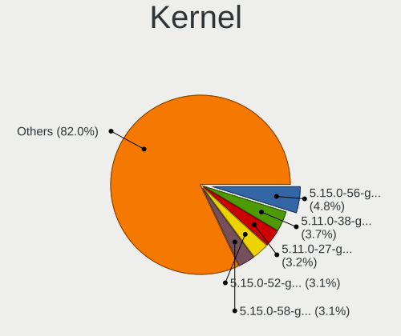

| Version           | Computers | Percent |
|-------------------|-----------|---------|
| 5.15.0-56-generic | 238       | 4.84%   |
| 5.11.0-38-generic | 184       | 3.74%   |
| 5.11.0-27-generic | 157       | 3.19%   |
| 5.15.0-52-generic | 153       | 3.11%   |
| 5.15.0-58-generic | 152       | 3.09%   |
| 5.15.0-46-generic | 152       | 3.09%   |
| 5.15.0-91-generic | 151       | 3.07%   |
| 5.15.0-67-generic | 144       | 2.93%   |
| 5.15.0-78-generic | 138       | 2.81%   |
| 5.15.0-69-generic | 136       | 2.77%   |
| 5.13.0-30-generic | 128       | 2.6%    |
| 5.11.0-40-generic | 123       | 2.5%    |
| 5.13.0-39-generic | 122       | 2.48%   |
| 5.15.0-60-generic | 112       | 2.28%   |
| 5.11.0-41-generic | 109       | 2.22%   |
| 5.15.0-76-generic | 108       | 2.2%    |
| 5.15.0-71-generic | 108       | 2.2%    |
| 5.11.0-37-generic | 106       | 2.16%   |
| 5.11.0-43-generic | 100       | 2.03%   |
| 5.15.0-48-generic | 95        | 1.93%   |
| 5.11.0-34-generic | 95        | 1.93%   |
| 5.15.0-88-generic | 94        | 1.91%   |
| 5.13.0-40-generic | 90        | 1.83%   |
| 5.15.0-84-generic | 81        | 1.65%   |
| 5.15.0-53-generic | 81        | 1.65%   |
| 5.15.0-41-generic | 77        | 1.57%   |
| 5.13.0-44-generic | 76        | 1.55%   |
| 5.13.0-35-generic | 74        | 1.5%    |
| 5.13.0-28-generic | 73        | 1.48%   |
| 5.15.0-89-generic | 71        | 1.44%   |
| 5.15.0-73-generic | 71        | 1.44%   |
| 5.15.0-86-generic | 69        | 1.4%    |
| 5.15.0-83-generic | 60        | 1.22%   |
| 5.15.0-72-generic | 60        | 1.22%   |
| 5.13.0-27-generic | 60        | 1.22%   |
| 5.13.0-52-generic | 59        | 1.2%    |
| 5.15.0-79-generic | 55        | 1.12%   |
| 5.13.0-41-generic | 54        | 1.1%    |
| 5.15.0-87-generic | 46        | 0.94%   |
| 5.13.0-51-generic | 42        | 0.85%   |

Kernel Family
-------------

Linux kernel without a distro release

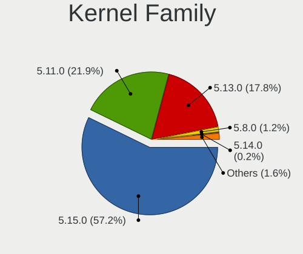

| Version | Computers | Percent |
|---------|-----------|---------|
| 5.15.0  | 2485      | 57.23%  |
| 5.11.0  | 951       | 21.9%   |
| 5.13.0  | 772       | 17.78%  |
| 5.8.0   | 54        | 1.24%   |
| 5.14.0  | 10        | 0.23%   |
| 6.3.13  | 8         | 0.18%   |
| 5.4.0   | 5         | 0.12%   |
| 6.5.7   | 4         | 0.09%   |
| 6.2.16  | 3         | 0.07%   |
| 6.3.2   | 2         | 0.05%   |
| 5.19.12 | 2         | 0.05%   |
| 5.19.0  | 2         | 0.05%   |
| 5.18.15 | 2         | 0.05%   |
| 5.17.5  | 2         | 0.05%   |
| 5.17.1  | 2         | 0.05%   |
| 5.16.0  | 2         | 0.05%   |
| 5.10.0  | 2         | 0.05%   |
| 6.6.7   | 1         | 0.02%   |
| 6.6.1   | 1         | 0.02%   |
| 6.5.0   | 1         | 0.02%   |
| 6.3.1   | 1         | 0.02%   |
| 6.3.0   | 1         | 0.02%   |
| 6.2.7   | 1         | 0.02%   |
| 6.2.14  | 1         | 0.02%   |
| 6.10.2  | 1         | 0.02%   |
| 6.1.8   | 1         | 0.02%   |
| 6.1.7   | 1         | 0.02%   |
| 6.1.22  | 1         | 0.02%   |
| 6.0.9   | 1         | 0.02%   |
| 6.0.8   | 1         | 0.02%   |
| 6.0.19  | 1         | 0.02%   |
| 6.0.0   | 1         | 0.02%   |
| 5.4.180 | 1         | 0.02%   |
| 5.19.9  | 1         | 0.02%   |
| 5.19.6  | 1         | 0.02%   |
| 5.19.2  | 1         | 0.02%   |
| 5.19.14 | 1         | 0.02%   |
| 5.19.1  | 1         | 0.02%   |
| 5.18.6  | 1         | 0.02%   |
| 5.18.19 | 1         | 0.02%   |

Kernel Major Ver.
-----------------

Linux kernel major version

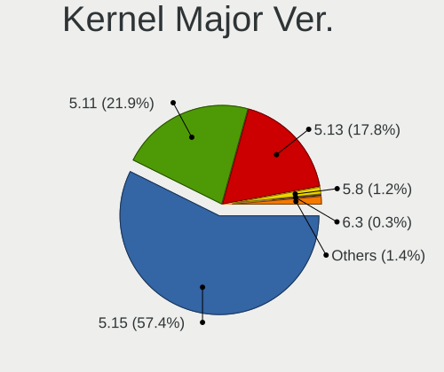

| Version | Computers | Percent |
|---------|-----------|---------|
| 5.15    | 2489      | 57.35%  |
| 5.11    | 951       | 21.91%  |
| 5.13    | 774       | 17.83%  |
| 5.8     | 54        | 1.24%   |
| 6.3     | 12        | 0.28%   |
| 5.14    | 10        | 0.23%   |
| 5.19    | 9         | 0.21%   |
| 5.4     | 6         | 0.14%   |
| 6.5     | 5         | 0.12%   |
| 6.2     | 5         | 0.12%   |
| 5.17    | 5         | 0.12%   |
| 5.16    | 5         | 0.12%   |
| 6.0     | 4         | 0.09%   |
| 5.18    | 4         | 0.09%   |
| 6.6     | 2         | 0.05%   |
| 6.1     | 2         | 0.05%   |
| 5.10    | 2         | 0.05%   |
| 6.10    | 1         | 0.02%   |

Arch
----

OS architecture (x86_64, i586, etc.)

| Name   | Computers | Percent |
|--------|-----------|---------|
| x86_64 | 4174      | 100%    |

DE
--

Desktop Environment

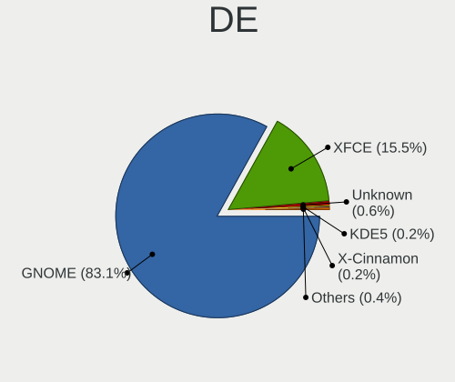

| Name            | Computers | Percent |
|-----------------|-----------|---------|
| GNOME           | 3498      | 83.07%  |
| XFCE            | 654       | 15.53%  |
| Unknown         | 26        | 0.62%   |
| KDE5            | 10        | 0.24%   |
| X-Cinnamon      | 7         | 0.17%   |
| Budgie          | 4         | 0.09%   |
| Cinnamon        | 3         | 0.07%   |
| Unity           | 2         | 0.05%   |
| i3              | 2         | 0.05%   |
| MATE            | 1         | 0.02%   |
| LXQt            | 1         | 0.02%   |
| LXDE            | 1         | 0.02%   |
| KDE             | 1         | 0.02%   |
| GNOME Flashback | 1         | 0.02%   |

Display Server
--------------

X11 or Wayland

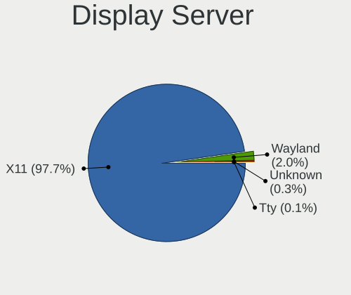

| Name    | Computers | Percent |
|---------|-----------|---------|
| X11     | 4105      | 97.69%  |
| Wayland | 82        | 1.95%   |
| Unknown | 12        | 0.29%   |
| Tty     | 3         | 0.07%   |

Display Manager
---------------

SDDM, LightDM, etc.

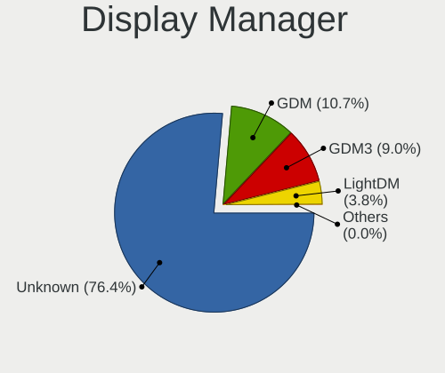

| Name    | Computers | Percent |
|---------|-----------|---------|
| Unknown | 3239      | 76.39%  |
| GDM     | 452       | 10.66%  |
| GDM3    | 383       | 9.03%   |
| LightDM | 162       | 3.82%   |
| SDDM    | 2         | 0.05%   |
| TDM     | 1         | 0.02%   |
| LXDM    | 1         | 0.02%   |

OS Lang
-------

Language

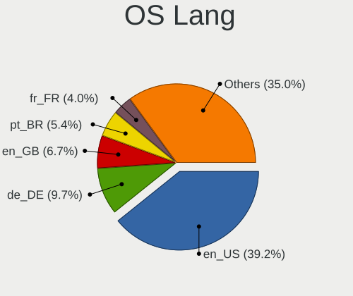

| Lang  | Computers | Percent |
|-------|-----------|---------|
| en_US | 1646      | 39.23%  |
| de_DE | 406       | 9.68%   |
| en_GB | 281       | 6.7%    |
| pt_BR | 227       | 5.41%   |
| fr_FR | 166       | 3.96%   |
| it_IT | 136       | 3.24%   |
| es_ES | 133       | 3.17%   |
| en_CA | 118       | 2.81%   |
| pl_PL | 102       | 2.43%   |
| en_IN | 100       | 2.38%   |
| nl_NL | 77        | 1.84%   |
| en_AU | 76        | 1.81%   |
| es_MX | 60        | 1.43%   |
| ru_RU | 48        | 1.14%   |
| en_ZA | 38        | 0.91%   |
| pt_PT | 36        | 0.86%   |
| cs_CZ | 33        | 0.79%   |
| hu_HU | 32        | 0.76%   |
| es_AR | 31        | 0.74%   |
| sv_SE | 26        | 0.62%   |
| en_NZ | 26        | 0.62%   |
| tr_TR | 25        | 0.6%    |
| nl_BE | 20        | 0.48%   |
| fr_BE | 20        | 0.48%   |
| es_CL | 20        | 0.48%   |
| de_CH | 19        | 0.45%   |
| de_AT | 17        | 0.41%   |
| fr_CA | 14        | 0.33%   |
| es_CO | 14        | 0.33%   |
| da_DK | 13        | 0.31%   |
| ja_JP | 12        | 0.29%   |
| fi_FI | 12        | 0.29%   |
| el_GR | 12        | 0.29%   |
| sk_SK | 11        | 0.26%   |
| nb_NO | 10        | 0.24%   |
| es_VE | 10        | 0.24%   |
| en_PH | 10        | 0.24%   |
| en_IE | 10        | 0.24%   |
| ar_EG | 10        | 0.24%   |
| es_CR | 9         | 0.21%   |

Boot Mode
---------

EFI or BIOS

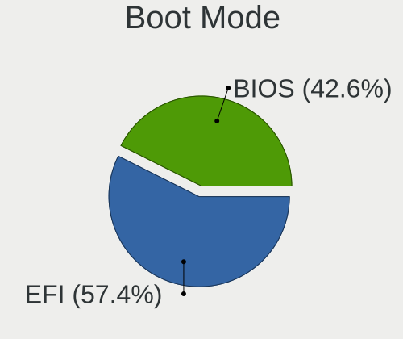

| Mode | Computers | Percent |
|------|-----------|---------|
| EFI  | 2429      | 57.4%   |
| BIOS | 1803      | 42.6%   |

Filesystem
----------

Type of filesystem

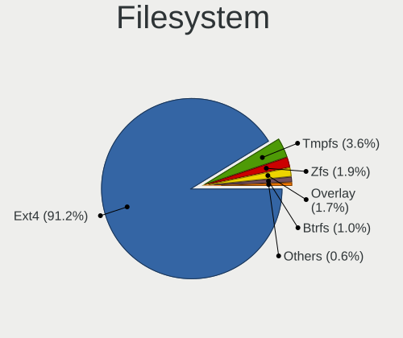

| Type     | Computers | Percent |
|----------|-----------|---------|
| Ext4     | 3840      | 91.23%  |
| Tmpfs    | 152       | 3.61%   |
| Zfs      | 78        | 1.85%   |
| Overlay  | 70        | 1.66%   |
| Btrfs    | 42        | 1%      |
| Xfs      | 9         | 0.21%   |
| Ext2     | 9         | 0.21%   |
| Ext3     | 7         | 0.17%   |
| Reiserfs | 1         | 0.02%   |
| Jfs      | 1         | 0.02%   |

Part. scheme
------------

Scheme of partitioning

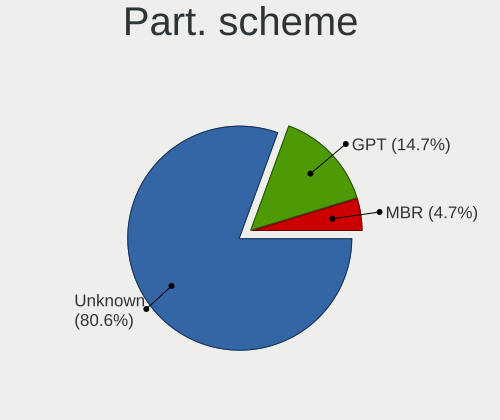

| Type    | Computers | Percent |
|---------|-----------|---------|
| Unknown | 3412      | 80.57%  |
| GPT     | 623       | 14.71%  |
| MBR     | 200       | 4.72%   |

Dual Boot with Linux/BSD
------------------------

Hosting more than one Linux/BSD

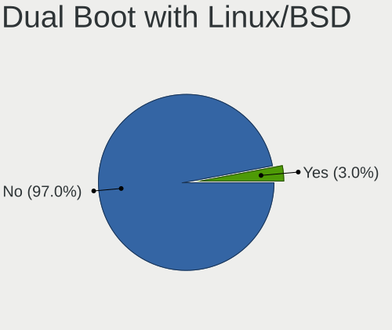

| Dual boot | Computers | Percent |
|-----------|-----------|---------|
| No        | 4062      | 97.04%  |
| Yes       | 124       | 2.96%   |

Dual Boot (Win)
---------------

Hosting Linux and Windows

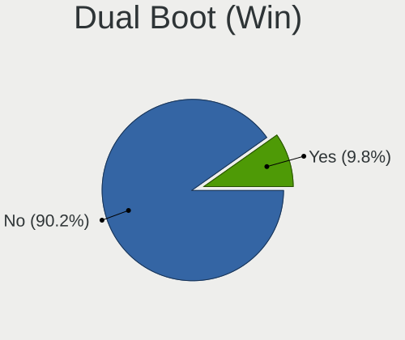

| Dual boot | Computers | Percent |
|-----------|-----------|---------|
| No        | 3782      | 90.22%  |
| Yes       | 410       | 9.78%   |

Board
-----

Vendor
------

Motherboard manufacturer

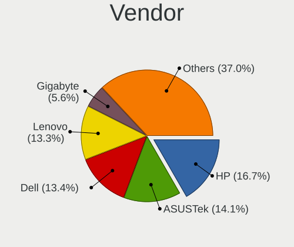

| Name                | Computers | Percent |
|---------------------|-----------|---------|
| Hewlett-Packard     | 696       | 16.67%  |
| ASUSTek Computer    | 587       | 14.06%  |
| Dell                | 559       | 13.39%  |
| Lenovo              | 556       | 13.32%  |
| Gigabyte Technology | 233       | 5.58%   |
| Acer                | 220       | 5.27%   |
| MSI                 | 198       | 4.74%   |
| Apple               | 153       | 3.67%   |
| Toshiba             | 99        | 2.37%   |
| ASRock              | 99        | 2.37%   |
| Intel               | 70        | 1.68%   |
| Unknown             | 48        | 1.15%   |
| Samsung Electronics | 44        | 1.05%   |
| Sony                | 35        | 0.84%   |
| Google              | 35        | 0.84%   |
| Fujitsu             | 34        | 0.81%   |
| Microsoft           | 27        | 0.65%   |
| HUAWEI              | 25        | 0.6%    |
| Biostar             | 23        | 0.55%   |
| Positivo            | 21        | 0.5%    |
| Pegatron            | 21        | 0.5%    |
| Packard Bell        | 19        | 0.46%   |
| Medion              | 18        | 0.43%   |
| AZW                 | 18        | 0.43%   |
| Foxconn             | 16        | 0.38%   |
| Alienware           | 16        | 0.38%   |
| Chuwi               | 13        | 0.31%   |
| AMI                 | 12        | 0.29%   |
| Notebook            | 10        | 0.24%   |
| Fujitsu Siemens     | 10        | 0.24%   |
| Multilaser          | 7         | 0.17%   |
| GPU Company         | 7         | 0.17%   |
| Gateway             | 7         | 0.17%   |
| BESSTAR Tech        | 6         | 0.14%   |
| Thomson             | 5         | 0.12%   |
| LG Electronics      | 5         | 0.12%   |
| Huanan              | 5         | 0.12%   |
| ECS                 | 5         | 0.12%   |
| Wortmann AG         | 4         | 0.1%    |
| TrekStor            | 4         | 0.1%    |

Model
-----

Motherboard model

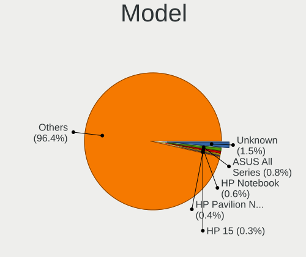

| Name                             | Computers | Percent |
|----------------------------------|-----------|---------|
| Unknown                          | 62        | 1.49%   |
| ASUS All Series                  | 33        | 0.79%   |
| HP Notebook                      | 26        | 0.62%   |
| HP Pavilion Notebook             | 15        | 0.36%   |
| HP 15                            | 14        | 0.34%   |
| Dell OptiPlex 7010               | 14        | 0.34%   |
| MSI MS-7817                      | 10        | 0.24%   |
| HP Pavilion dv6                  | 10        | 0.24%   |
| HP Pavilion dv7                  | 9         | 0.22%   |
| HP Pavilion 15                   | 9         | 0.22%   |
| Dell OptiPlex 790                | 9         | 0.22%   |
| ASUS TUF Gaming X570-PLUS        | 9         | 0.22%   |
| Microsoft Surface Pro            | 8         | 0.19%   |
| Lenovo MIIX 320-10ICR 80XF       | 8         | 0.19%   |
| Intel H61                        | 8         | 0.19%   |
| Gigabyte A320M-S2H               | 8         | 0.19%   |
| Apple MacBookPro8,1              | 8         | 0.19%   |
| Apple iMac12,2                   | 8         | 0.19%   |
| Apple iMac12,1                   | 8         | 0.19%   |
| Dell Precision WorkStation T3500 | 7         | 0.17%   |
| Dell OptiPlex 780                | 7         | 0.17%   |
| Dell OptiPlex 380                | 7         | 0.17%   |
| Dell OptiPlex 3010               | 7         | 0.17%   |
| Dell Latitude E6520              | 7         | 0.17%   |
| ASUS M5A78L-M/USB3               | 7         | 0.17%   |
| Apple MacBookPro12,1             | 7         | 0.17%   |
| Apple iMac10,1                   | 7         | 0.17%   |
| MSI MS-7C37                      | 6         | 0.14%   |
| MSI MS-7C02                      | 6         | 0.14%   |
| Microsoft Surface Pro 4          | 6         | 0.14%   |
| HP Pavilion g7                   | 6         | 0.14%   |
| HP Pavilion g6                   | 6         | 0.14%   |
| Gigabyte B450 AORUS M            | 6         | 0.14%   |
| Dell Latitude E6540              | 6         | 0.14%   |
| Dell Latitude E6430              | 6         | 0.14%   |
| Dell Inspiron 1545               | 6         | 0.14%   |
| Dell Inspiron 15-3567            | 6         | 0.14%   |
| ASUS M5A97 R2.0                  | 6         | 0.14%   |
| Apple MacBookAir7,2              | 6         | 0.14%   |
| Toshiba Satellite C660           | 5         | 0.12%   |

Model Family
------------

Motherboard model prefix

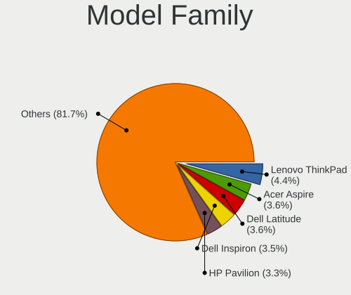

| Name                  | Computers | Percent |
|-----------------------|-----------|---------|
| Lenovo ThinkPad       | 184       | 4.41%   |
| Acer Aspire           | 150       | 3.59%   |
| Dell Latitude         | 149       | 3.57%   |
| Dell Inspiron         | 145       | 3.47%   |
| HP Pavilion           | 137       | 3.28%   |
| Lenovo IdeaPad        | 130       | 3.11%   |
| Dell OptiPlex         | 107       | 2.56%   |
| Toshiba Satellite     | 82        | 1.96%   |
| HP EliteBook          | 75        | 1.8%    |
| HP Compaq             | 64        | 1.53%   |
| HP ProBook            | 62        | 1.49%   |
| Unknown               | 62        | 1.49%   |
| ASUS ROG              | 58        | 1.39%   |
| ASUS PRIME            | 54        | 1.29%   |
| Lenovo ThinkCentre    | 53        | 1.27%   |
| HP Laptop             | 52        | 1.25%   |
| ASUS TUF              | 44        | 1.05%   |
| Dell Precision        | 42        | 1.01%   |
| ASUS VivoBook         | 41        | 0.98%   |
| Dell XPS              | 35        | 0.84%   |
| Dell Vostro           | 35        | 0.84%   |
| Lenovo Yoga           | 34        | 0.81%   |
| HP ENVY               | 33        | 0.79%   |
| ASUS All              | 33        | 0.79%   |
| Microsoft Surface     | 27        | 0.65%   |
| HP Notebook           | 26        | 0.62%   |
| HP EliteDesk          | 23        | 0.55%   |
| HP Stream             | 19        | 0.46%   |
| ASUS ASUS             | 17        | 0.41%   |
| HP 15                 | 16        | 0.38%   |
| ASUS ZenBook          | 16        | 0.38%   |
| Apple iMac12          | 16        | 0.38%   |
| Packard Bell EasyNote | 15        | 0.36%   |
| HP ProDesk            | 15        | 0.36%   |
| Lenovo Legion         | 14        | 0.34%   |
| HP OMEN               | 14        | 0.34%   |
| Fujitsu ESPRIMO       | 14        | 0.34%   |
| Gigabyte B450         | 13        | 0.31%   |
| Lenovo MIIX           | 12        | 0.29%   |
| Dell Studio           | 12        | 0.29%   |

MFG Year
--------

Motherboard manufacture year

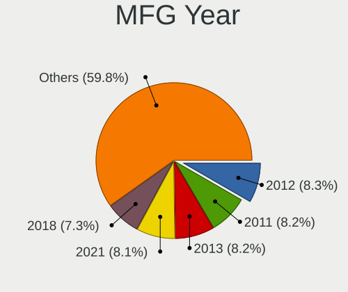

| Year    | Computers | Percent |
|---------|-----------|---------|
| 2012    | 348       | 8.34%   |
| 2011    | 344       | 8.24%   |
| 2013    | 342       | 8.19%   |
| 2021    | 338       | 8.1%    |
| 2018    | 304       | 7.28%   |
| 2020    | 299       | 7.16%   |
| 2019    | 286       | 6.85%   |
| 2014    | 275       | 6.59%   |
| 2017    | 265       | 6.35%   |
| 2010    | 234       | 5.61%   |
| 2016    | 221       | 5.29%   |
| 2015    | 216       | 5.17%   |
| 2008    | 184       | 4.41%   |
| 2009    | 179       | 4.29%   |
| 2022    | 125       | 2.99%   |
| 2007    | 99        | 2.37%   |
| 2023    | 64        | 1.53%   |
| 2006    | 37        | 0.89%   |
| 2005    | 6         | 0.14%   |
| 2024    | 3         | 0.07%   |
| Unknown | 3         | 0.07%   |
| 2025    | 1         | 0.02%   |
| 2004    | 1         | 0.02%   |

Form Factor
-----------

Physical design of the computer

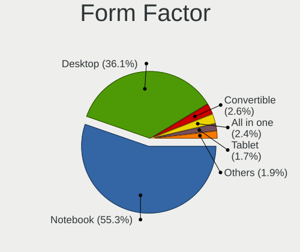

| Name        | Computers | Percent |
|-------------|-----------|---------|
| Notebook    | 2308      | 55.29%  |
| Desktop     | 1507      | 36.1%   |
| Convertible | 109       | 2.61%   |
| All in one  | 99        | 2.37%   |
| Tablet      | 73        | 1.75%   |
| Mini pc     | 68        | 1.63%   |
| Server      | 10        | 0.24%   |

Secure Boot
-----------

Enabled or disabled

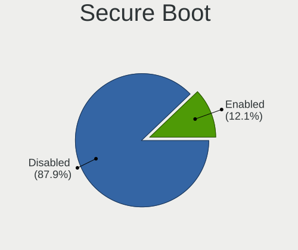

| State    | Computers | Percent |
|----------|-----------|---------|
| Disabled | 3701      | 87.87%  |
| Enabled  | 511       | 12.13%  |

Coreboot
--------

Have coreboot on board

| Used | Computers | Percent |
|------|-----------|---------|
| No   | 4135      | 99.07%  |
| Yes  | 39        | 0.93%   |

RAM Size
--------

Total RAM memory

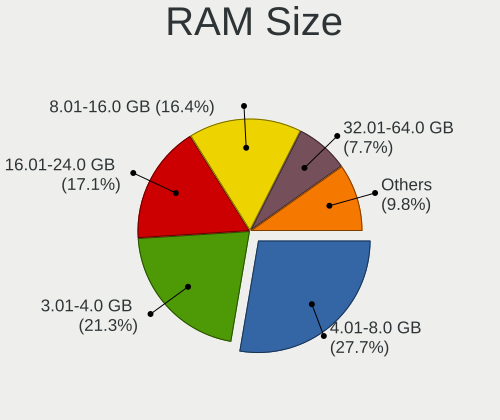

| Size in GB      | Computers | Percent |
|-----------------|-----------|---------|
| 4.01-8.0        | 1169      | 27.67%  |
| 3.01-4.0        | 901       | 21.33%  |
| 16.01-24.0      | 722       | 17.09%  |
| 8.01-16.0       | 692       | 16.38%  |
| 32.01-64.0      | 327       | 7.74%   |
| 1.01-2.0        | 194       | 4.59%   |
| 64.01-256.0     | 85        | 2.01%   |
| 2.01-3.0        | 64        | 1.51%   |
| 24.01-32.0      | 61        | 1.44%   |
| 0.51-1.0        | 9         | 0.21%   |
| More than 256.0 | 1         | 0.02%   |

RAM Used
--------

Used RAM memory

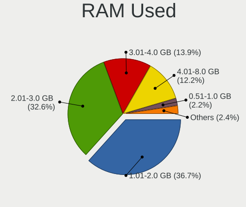

| Used GB    | Computers | Percent |
|------------|-----------|---------|
| 1.01-2.0   | 1693      | 36.68%  |
| 2.01-3.0   | 1506      | 32.63%  |
| 3.01-4.0   | 643       | 13.93%  |
| 4.01-8.0   | 562       | 12.18%  |
| 0.51-1.0   | 100       | 2.17%   |
| 8.01-16.0  | 87        | 1.89%   |
| 16.01-24.0 | 14        | 0.3%    |
| 24.01-32.0 | 7         | 0.15%   |
| 32.01-64.0 | 2         | 0.04%   |
| 0.01-0.5   | 1         | 0.02%   |

Total Drives
------------

Number of drives on board

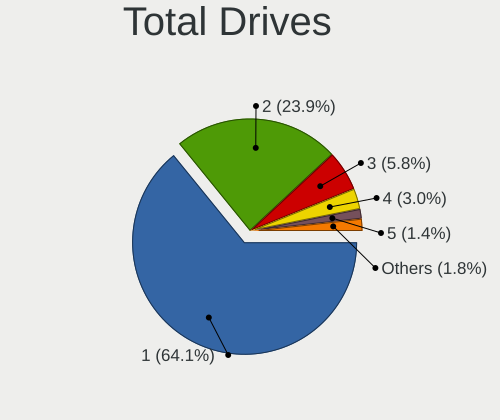

| Drives | Computers | Percent |
|--------|-----------|---------|
| 1      | 2740      | 64.14%  |
| 2      | 1022      | 23.92%  |
| 3      | 248       | 5.81%   |
| 4      | 127       | 2.97%   |
| 5      | 60        | 1.4%    |
| 6      | 34        | 0.8%    |
| 0      | 16        | 0.37%   |
| 7      | 12        | 0.28%   |
| 8      | 9         | 0.21%   |
| 51     | 1         | 0.02%   |
| 30     | 1         | 0.02%   |
| 11     | 1         | 0.02%   |
| 9      | 1         | 0.02%   |

Has CD-ROM
----------

Has CD-ROM on board

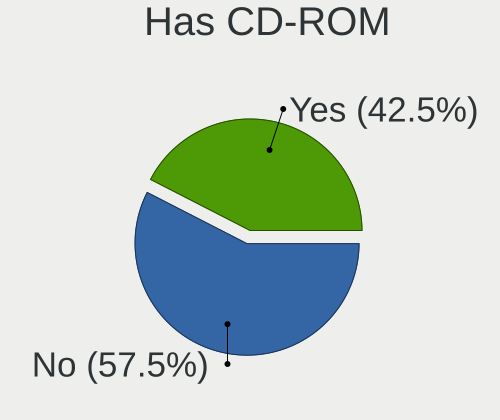

| Presented | Computers | Percent |
|-----------|-----------|---------|
| No        | 2414      | 57.54%  |
| Yes       | 1781      | 42.46%  |

Has Ethernet
------------

Has Ethernet on board

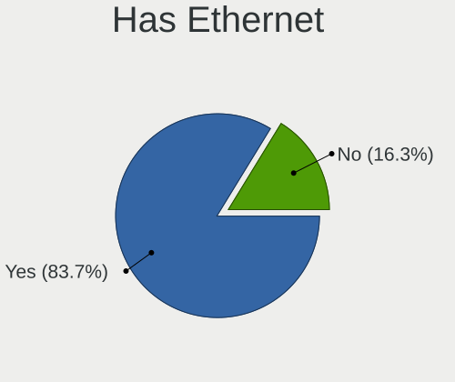

| Presented | Computers | Percent |
|-----------|-----------|---------|
| Yes       | 3503      | 83.74%  |
| No        | 680       | 16.26%  |

Has WiFi
--------

Has WiFi module

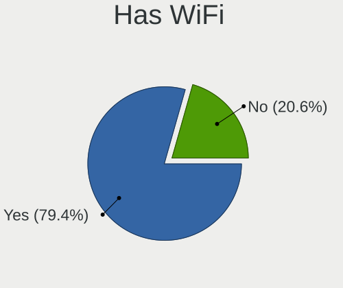

| Presented | Computers | Percent |
|-----------|-----------|---------|
| Yes       | 3328      | 79.39%  |
| No        | 864       | 20.61%  |

Has Bluetooth
-------------

Has Bluetooth module

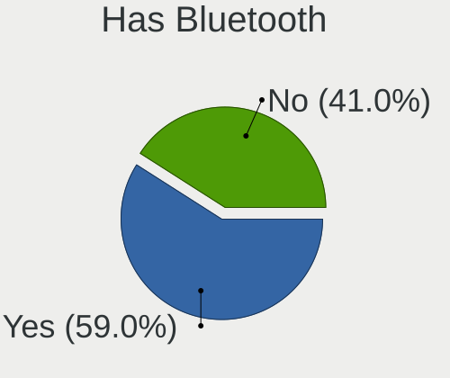

| Presented | Computers | Percent |
|-----------|-----------|---------|
| Yes       | 2493      | 59.03%  |
| No        | 1730      | 40.97%  |

Location
--------

Country
-------

Geographic location (country)

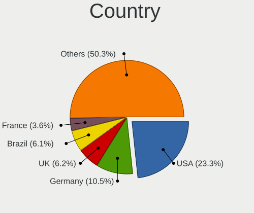

| Country      | Computers | Percent |
|--------------|-----------|---------|
| USA          | 978       | 23.33%  |
| Germany      | 442       | 10.54%  |
| UK           | 258       | 6.15%   |
| Brazil       | 256       | 6.11%   |
| France       | 150       | 3.58%   |
| Italy        | 149       | 3.55%   |
| Canada       | 148       | 3.53%   |
| Spain        | 140       | 3.34%   |
| Netherlands  | 121       | 2.89%   |
| India        | 104       | 2.48%   |
| Poland       | 98        | 2.34%   |
| Mexico       | 80        | 1.91%   |
| Australia    | 78        | 1.86%   |
| Belgium      | 60        | 1.43%   |
| Sweden       | 48        | 1.15%   |
| Russia       | 48        | 1.15%   |
| Portugal     | 47        | 1.12%   |
| Austria      | 44        | 1.05%   |
| South Africa | 43        | 1.03%   |
| Switzerland  | 41        | 0.98%   |
| Argentina    | 40        | 0.95%   |
| Turkey       | 39        | 0.93%   |
| Czechia      | 38        | 0.91%   |
| Hungary      | 37        | 0.88%   |
| Romania      | 33        | 0.79%   |
| Norway       | 31        | 0.74%   |
| Greece       | 31        | 0.74%   |
| New Zealand  | 28        | 0.67%   |
| Denmark      | 26        | 0.62%   |
| Chile        | 26        | 0.62%   |
| Egypt        | 24        | 0.57%   |
| Japan        | 23        | 0.55%   |
| Finland      | 22        | 0.52%   |
| Colombia     | 22        | 0.52%   |
| Serbia       | 21        | 0.5%    |
| Indonesia    | 20        | 0.48%   |
| Ireland      | 16        | 0.38%   |
| Bulgaria     | 16        | 0.38%   |
| Slovakia     | 15        | 0.36%   |
| Malaysia     | 14        | 0.33%   |

City
----

Geographic location (city)

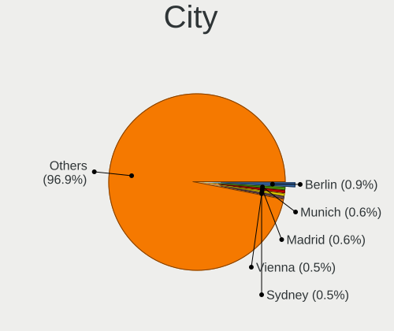

| City              | Computers | Percent |
|-------------------|-----------|---------|
| Berlin            | 39        | 0.88%   |
| Munich            | 26        | 0.59%   |
| Madrid            | 25        | 0.57%   |
| Vienna            | 24        | 0.54%   |
| Sydney            | 22        | 0.5%    |
| Sao Paulo         | 21        | 0.47%   |
| Rome              | 21        | 0.47%   |
| Rio de Janeiro    | 21        | 0.47%   |
| Athens            | 21        | 0.47%   |
| New York          | 20        | 0.45%   |
| Milan             | 20        | 0.45%   |
| Hamburg           | 20        | 0.45%   |
| Amsterdam         | 18        | 0.41%   |
| Paris             | 17        | 0.38%   |
| Montreal          | 17        | 0.38%   |
| Denver            | 16        | 0.36%   |
| Dallas            | 16        | 0.36%   |
| Melbourne         | 14        | 0.32%   |
| London            | 14        | 0.32%   |
| Frankfurt am Main | 14        | 0.32%   |
| Johannesburg      | 13        | 0.29%   |
| Houston           | 13        | 0.29%   |
| Cape Town         | 13        | 0.29%   |
| Valencia          | 12        | 0.27%   |
| Stockholm         | 12        | 0.27%   |
| Phoenix           | 12        | 0.27%   |
| Mexico City       | 12        | 0.27%   |
| Delhi             | 12        | 0.27%   |
| Budapest          | 12        | 0.27%   |
| Bucharest         | 12        | 0.27%   |
| Bogotá           | 12        | 0.27%   |
| Warsaw            | 11        | 0.25%   |
| Toronto           | 11        | 0.25%   |
| Salt Lake City    | 11        | 0.25%   |
| Istanbul          | 11        | 0.25%   |
| Calgary           | 11        | 0.25%   |
| Bengaluru         | 11        | 0.25%   |
| Auckland          | 11        | 0.25%   |
| Seattle           | 10        | 0.23%   |
| Santiago          | 10        | 0.23%   |

Drives
------

Drive Vendor
------------

Hard drive vendors

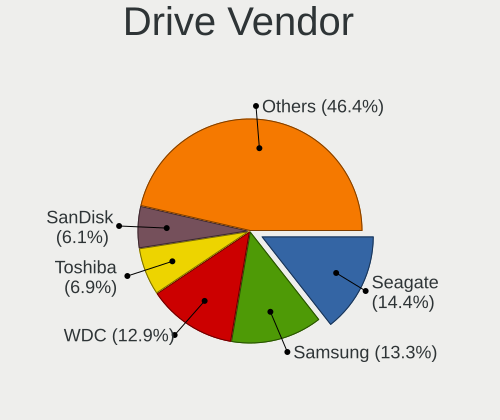

| Vendor                      | Computers | Drives | Percent |
|-----------------------------|-----------|--------|---------|
| Seagate                     | 850       | 1248   | 14.43%  |
| Samsung Electronics         | 782       | 1148   | 13.27%  |
| WDC                         | 761       | 1075   | 12.92%  |
| Toshiba                     | 407       | 535    | 6.91%   |
| SanDisk                     | 357       | 454    | 6.06%   |
| Unknown                     | 352       | 501    | 5.98%   |
| Kingston                    | 317       | 452    | 5.38%   |
| Crucial                     | 206       | 256    | 3.5%    |
| Hitachi                     | 175       | 229    | 2.97%   |
| SK hynix                    | 122       | 145    | 2.07%   |
| Intel                       | 121       | 154    | 2.05%   |
| HGST                        | 101       | 127    | 1.71%   |
| China                       | 89        | 113    | 1.51%   |
| Micron Technology           | 83        | 102    | 1.41%   |
| A-DATA Technology           | 77        | 101    | 1.31%   |
| Apple                       | 69        | 80     | 1.17%   |
| Intenso                     | 52        | 59     | 0.88%   |
| Silicon Motion              | 42        | 55     | 0.71%   |
| KIOXIA                      | 42        | 49     | 0.71%   |
| PNY                         | 39        | 52     | 0.66%   |
| Unknown                     | 39        | 43     | 0.66%   |
| Phison                      | 36        | 43     | 0.61%   |
| SPCC                        | 33        | 49     | 0.56%   |
| Netac                       | 32        | 37     | 0.54%   |
| Patriot                     | 29        | 38     | 0.49%   |
| Micron/Crucial Technology   | 28        | 36     | 0.48%   |
| JMicron Technology          | 25        | 30     | 0.42%   |
| GOODRAM                     | 25        | 30     | 0.42%   |
| Phison Electronics          | 23        | 26     | 0.39%   |
| Team                        | 19        | 22     | 0.32%   |
| OCZ                         | 19        | 22     | 0.32%   |
| MAXIO Technology (Hangzhou) | 19        | 20     | 0.32%   |
| LITEON                      | 18        | 20     | 0.31%   |
| Lexar                       | 18        | 20     | 0.31%   |
| Kingston Technology Company | 18        | 22     | 0.31%   |
| Transcend                   | 17        | 42     | 0.29%   |
| LITEONIT                    | 17        | 22     | 0.29%   |
| KingSpec                    | 17        | 20     | 0.29%   |
| Fujitsu                     | 17        | 20     | 0.29%   |
| Hewlett-Packard             | 15        | 21     | 0.25%   |

Drive Model
-----------

Hard drive models

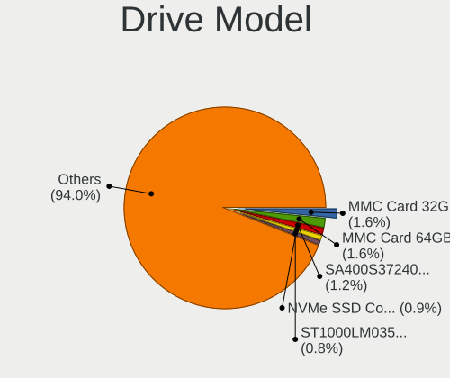

| Model                                                 | Computers | Percent |
|-------------------------------------------------------|-----------|---------|
| Unknown MMC Card  32GB                                | 103       | 1.6%    |
| Unknown MMC Card  64GB                                | 102       | 1.58%   |
| Kingston SA400S37240G 240GB SSD                       | 77        | 1.19%   |
| Samsung NVMe SSD Controller SM981/PM981/PM983 1TB     | 56        | 0.87%   |
| Seagate ST1000LM035-1RK172 1TB                        | 50        | 0.77%   |
| Seagate ST500DM002-1BD142 500GB                       | 49        | 0.76%   |
| Toshiba MQ01ABD100 1TB                                | 46        | 0.71%   |
| Unknown MMC Card  128GB                               | 43        | 0.67%   |
| Kingston SA400S37480G 480GB SSD                       | 43        | 0.67%   |
| Crucial CT240BX500SSD1 240GB                          | 43        | 0.67%   |
| Samsung SSD 860 EVO 500GB                             | 41        | 0.64%   |
| Kingston SA400S37120G 120GB SSD                       | 39        | 0.6%    |
| Unknown                                               | 39        | 0.6%    |
| Seagate ST1000LM024 HN-M101MBB 1TB                    | 38        | 0.59%   |
| Toshiba MQ01ABF050 500GB                              | 33        | 0.51%   |
| Unknown SD/MMC/MS PRO 2GB                             | 32        | 0.5%    |
| Seagate ST500LT012-1DG142 500GB                       | 32        | 0.5%    |
| Seagate ST1000DM010-2EP102 1TB                        | 32        | 0.5%    |
| Samsung SSD 850 EVO 250GB                             | 32        | 0.5%    |
| Toshiba MQ04ABF100 1TB                                | 29        | 0.45%   |
| Crucial CT500MX500SSD1 500GB                          | 27        | 0.42%   |
| Seagate ST9500325AS 500GB                             | 26        | 0.4%    |
| Samsung SSD 850 EVO 500GB                             | 26        | 0.4%    |
| Samsung NVMe SSD Drive 256GB                          | 26        | 0.4%    |
| Samsung NVMe SSD Controller SM961/PM961/SM963 1024GB  | 26        | 0.4%    |
| Samsung NVMe SSD Drive 512GB                          | 25        | 0.39%   |
| Samsung NVMe SSD Drive 1TB                            | 25        | 0.39%   |
| Seagate ST1000DM003-1CH162 1TB                        | 24        | 0.37%   |
| WDC WD10EZEX-08WN4A0 1TB                              | 23        | 0.36%   |
| Samsung NVMe SSD Controller PM9A1/PM9A3/980PRO 1TB    | 22        | 0.34%   |
| Seagate Expansion 2TB                                 | 21        | 0.33%   |
| SanDisk NVMe SSD Drive 256GB                          | 21        | 0.33%   |
| Samsung SSD 870 EVO 1TB                               | 21        | 0.33%   |
| Samsung NVMe SSD Drive 500GB                          | 21        | 0.33%   |
| Kingston SV300S37A120G 120GB SSD                      | 21        | 0.33%   |
| Crucial CT1000MX500SSD1 1TB                           | 21        | 0.33%   |
| Toshiba HDWD110 1TB                                   | 20        | 0.31%   |
| HGST HTS721010A9E630 1TB                              | 20        | 0.31%   |
| Unknown MMC Card  16GB                                | 19        | 0.29%   |
| Silicon Motion SM2263EN/SM2263XT SSD Controller 512GB | 19        | 0.29%   |

HDD Vendor
----------

Hard disk drive vendors

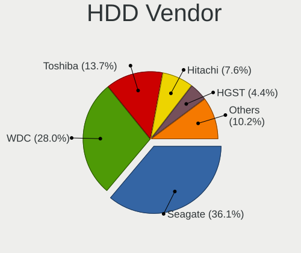

| Vendor              | Computers | Drives | Percent |
|---------------------|-----------|--------|---------|
| Seagate             | 837       | 1213   | 36.14%  |
| WDC                 | 649       | 903    | 28.02%  |
| Toshiba             | 318       | 427    | 13.73%  |
| Hitachi             | 175       | 229    | 7.56%   |
| HGST                | 101       | 127    | 4.36%   |
| Samsung Electronics | 93        | 114    | 4.02%   |
| Unknown             | 35        | 43     | 1.51%   |
| Apple               | 30        | 34     | 1.3%    |
| Fujitsu             | 17        | 20     | 0.73%   |
| JMicron Technology  | 15        | 17     | 0.65%   |
| Maxtor              | 14        | 18     | 0.6%    |
| Intenso             | 5         | 5      | 0.22%   |
| USB3.0              | 4         | 5      | 0.17%   |
| Hewlett-Packard     | 4         | 7      | 0.17%   |
| T-FORCE             | 2         | 3      | 0.09%   |
| SSK                 | 2         | 2      | 0.09%   |
| SABRENT             | 2         | 2      | 0.09%   |
| XrayDisk            | 1         | 1      | 0.04%   |
| WD MediaMax         | 1         | 1      | 0.04%   |
| TO Exter            | 1         | 1      | 0.04%   |
| TDAS                | 1         | 3      | 0.04%   |
| Shenzhen            | 1         | 1      | 0.04%   |
| QUANTUM             | 1         | 1      | 0.04%   |
| LaCie               | 1         | 1      | 0.04%   |
| KESU                | 1         | 1      | 0.04%   |
| IBM/Hitachi         | 1         | 1      | 0.04%   |
| HGST HTS            | 1         | 1      | 0.04%   |
| External            | 1         | 1      | 0.04%   |
| ASMT                | 1         | 2      | 0.04%   |
| ACASIS              | 1         | 1      | 0.04%   |

SSD Vendor
----------

Solid state drive vendors

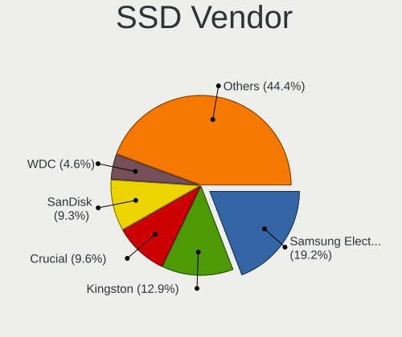

| Vendor              | Computers | Drives | Percent |
|---------------------|-----------|--------|---------|
| Samsung Electronics | 388       | 558    | 19.17%  |
| Kingston            | 262       | 360    | 12.94%  |
| Crucial             | 195       | 243    | 9.63%   |
| SanDisk             | 188       | 241    | 9.29%   |
| WDC                 | 93        | 127    | 4.59%   |
| China               | 88        | 112    | 4.35%   |
| A-DATA Technology   | 68        | 92     | 3.36%   |
| Intel               | 49        | 56     | 2.42%   |
| Toshiba             | 42        | 49     | 2.08%   |
| PNY                 | 39        | 52     | 1.93%   |
| Intenso             | 36        | 40     | 1.78%   |
| Micron Technology   | 35        | 42     | 1.73%   |
| SK hynix            | 33        | 33     | 1.63%   |
| SPCC                | 32        | 48     | 1.58%   |
| Netac               | 32        | 36     | 1.58%   |
| Apple               | 32        | 37     | 1.58%   |
| Patriot             | 28        | 37     | 1.38%   |
| GOODRAM             | 23        | 28     | 1.14%   |
| Team                | 19        | 22     | 0.94%   |
| OCZ                 | 18        | 21     | 0.89%   |
| LITEON              | 18        | 20     | 0.89%   |
| Transcend           | 17        | 42     | 0.84%   |
| LITEONIT            | 17        | 22     | 0.84%   |
| Lexar               | 16        | 17     | 0.79%   |
| KingSpec            | 16        | 19     | 0.79%   |
| Unknown             | 14        | 18     | 0.69%   |
| Apacer              | 12        | 15     | 0.59%   |
| Hewlett-Packard     | 10        | 13     | 0.49%   |
| Gigabyte Technology | 10        | 12     | 0.49%   |
| SABRENT             | 9         | 11     | 0.44%   |
| Fanxiang            | 8         | 10     | 0.4%    |
| Leven               | 6         | 7      | 0.3%    |
| ASMT                | 6         | 6      | 0.3%    |
| Verbatim            | 5         | 5      | 0.25%   |
| Teclast             | 5         | 5      | 0.25%   |
| Plextor             | 5         | 6      | 0.25%   |
| Phison              | 5         | 8      | 0.25%   |
| Mushkin             | 5         | 5      | 0.25%   |
| KIOXIA-EXCERIA      | 5         | 9      | 0.25%   |
| FORESEE             | 5         | 6      | 0.25%   |

Drive Kind
----------

HDD or SSD

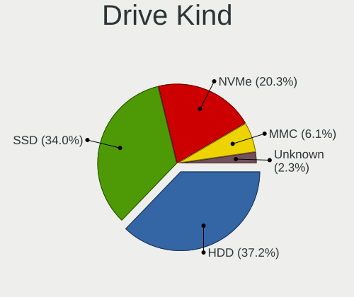

| Kind    | Computers | Drives | Percent |
|---------|-----------|--------|---------|
| HDD     | 1987      | 3185   | 37.2%   |
| SSD     | 1817      | 2669   | 34.01%  |
| NVMe    | 1087      | 1525   | 20.35%  |
| MMC     | 328       | 450    | 6.14%   |
| Unknown | 123       | 153    | 2.3%    |

Drive Connector
---------------

SATA, SAS, NVMe, etc.

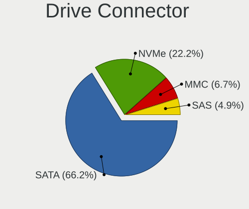

| Type | Computers | Drives | Percent |
|------|-----------|--------|---------|
| SATA | 3228      | 5661   | 66.17%  |
| NVMe | 1084      | 1514   | 22.22%  |
| MMC  | 328       | 450    | 6.72%   |
| SAS  | 238       | 357    | 4.88%   |

Drive Size
----------

Size of hard drive

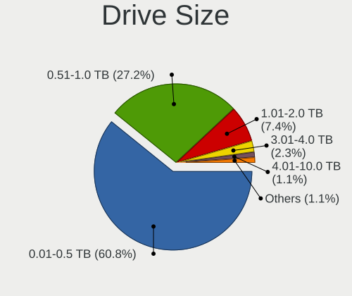

| Size in TB | Computers | Drives | Percent |
|------------|-----------|--------|---------|
| 0.01-0.5   | 2386      | 3575   | 60.82%  |
| 0.51-1.0   | 1068      | 1530   | 27.22%  |
| 1.01-2.0   | 292       | 416    | 7.44%   |
| 3.01-4.0   | 90        | 172    | 2.29%   |
| 4.01-10.0  | 43        | 70     | 1.1%    |
| 2.01-3.0   | 36        | 63     | 0.92%   |
| 10.01-20.0 | 6         | 25     | 0.15%   |
| 20.01-50.0 | 2         | 3      | 0.05%   |

Space Total
-----------

Amount of disk space available on the file system

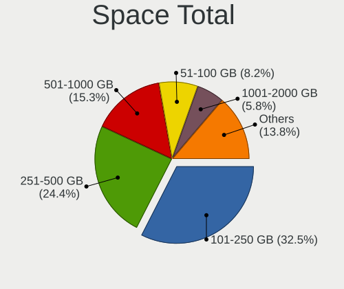

| Size in GB     | Computers | Percent |
|----------------|-----------|---------|
| 101-250        | 1411      | 32.53%  |
| 251-500        | 1059      | 24.41%  |
| 501-1000       | 665       | 15.33%  |
| 51-100         | 355       | 8.18%   |
| 1001-2000      | 251       | 5.79%   |
| 21-50          | 206       | 4.75%   |
| More than 3000 | 157       | 3.62%   |
| 1-20           | 101       | 2.33%   |
| 2001-3000      | 79        | 1.82%   |
| Unknown        | 54        | 1.24%   |

Space Used
----------

Amount of used disk space

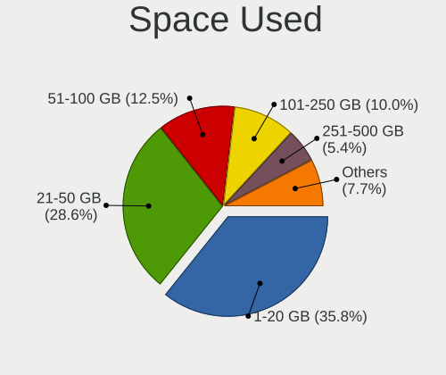

| Used GB        | Computers | Percent |
|----------------|-----------|---------|
| 1-20           | 1635      | 35.77%  |
| 21-50          | 1306      | 28.57%  |
| 51-100         | 572       | 12.51%  |
| 101-250        | 459       | 10.04%  |
| 251-500        | 249       | 5.45%   |
| 501-1000       | 142       | 3.11%   |
| More than 3000 | 67        | 1.47%   |
| 1001-2000      | 61        | 1.33%   |
| Unknown        | 54        | 1.18%   |
| 2001-3000      | 26        | 0.57%   |

Malfunc. Drives
---------------

Drive models with a malfunction

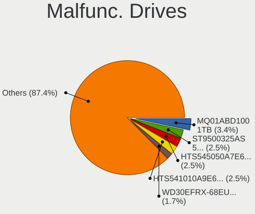

| Model                                    | Computers | Drives | Percent |
|------------------------------------------|-----------|--------|---------|
| Toshiba MQ01ABD100 1TB                   | 4         | 4      | 3.36%   |
| Seagate ST9500325AS 500GB                | 3         | 3      | 2.52%   |
| HGST HTS545050A7E680 500GB               | 3         | 3      | 2.52%   |
| HGST HTS541010A9E680 1TB                 | 3         | 3      | 2.52%   |
| WDC WD30EFRX-68EUZN0 3TB                 | 2         | 2      | 1.68%   |
| Toshiba MQ02ABD100H 1TB                  | 2         | 2      | 1.68%   |
| SK hynix BC711 HFM512GD3JX013N 512GB     | 2         | 2      | 1.68%   |
| Seagate ST9500420AS 500GB                | 2         | 2      | 1.68%   |
| Seagate ST500LT012-1DG142 500GB          | 2         | 2      | 1.68%   |
| Seagate ST500DM002-1BD142 500GB          | 2         | 2      | 1.68%   |
| Seagate ST1000LM048-2E7172 1TB           | 2         | 2      | 1.68%   |
| Seagate ST1000LM035-1RK172 1TB           | 2         | 2      | 1.68%   |
| Kingston SUV400S37240G 240GB SSD         | 2         | 2      | 1.68%   |
| HGST HTS545050A7E380 500GB               | 2         | 3      | 1.68%   |
| WDC WDS500G2B0A-00SM50 500GB             | 1         | 1      | 0.84%   |
| WDC WD6400BEVT-22A0RT0 640GB             | 1         | 1      | 0.84%   |
| WDC WD5000LPVX-75V0TT0 500GB             | 1         | 1      | 0.84%   |
| WDC WD5000LPCX-60VHAT0 500GB             | 1         | 1      | 0.84%   |
| WDC WD5000BEVT-24A0RT0 500GB             | 1         | 1      | 0.84%   |
| WDC WD3200AAKS-22B3A0 320GB              | 1         | 1      | 0.84%   |
| WDC WD3200AAJS-00L7A0 320GB              | 1         | 1      | 0.84%   |
| WDC WD2500AAJS-00B4A0 250GB              | 1         | 1      | 0.84%   |
| WDC WD20EZRX-22D8PB0 2TB                 | 1         | 1      | 0.84%   |
| WDC WD20EZRX-00D8PB0 2TB                 | 1         | 1      | 0.84%   |
| WDC WD1200BEVS-60UST0 120GB              | 1         | 1      | 0.84%   |
| WDC WD10SPZX-75Z10T2 1TB                 | 1         | 1      | 0.84%   |
| WDC WD10JPVX-22JC3T0 1TB                 | 1         | 1      | 0.84%   |
| WDC WD10JPVT-55A1YT0 1TB                 | 1         | 1      | 0.84%   |
| WDC WD10EZEX-21M2NA0 1TB                 | 1         | 2      | 0.84%   |
| WDC WD10EURX-63FH1Y0 1TB                 | 1         | 1      | 0.84%   |
| WDC WD Green 2.5 1000GB                  | 1         | 1      | 0.84%   |
| Toshiba THNSNK256GVN8 M.2 2280 256GB SSD | 1         | 1      | 0.84%   |
| Toshiba THNSNK256GCS8 SATA 256GB SSD     | 1         | 1      | 0.84%   |
| Toshiba THNSNK128GVN8 M.2 2280 128GB SSD | 1         | 1      | 0.84%   |
| Toshiba MQ01ABF050 500GB                 | 1         | 1      | 0.84%   |
| Toshiba MQ01ABD075 752GB                 | 1         | 1      | 0.84%   |
| Toshiba MK8046GSX 80GB                   | 1         | 1      | 0.84%   |
| Toshiba MK3265GSX 320GB                  | 1         | 1      | 0.84%   |
| Toshiba MG03ACA200 2TB                   | 1         | 1      | 0.84%   |
| Toshiba DT01ACA100 1TB                   | 1         | 1      | 0.84%   |

Malfunc. Drive Vendor
---------------------

Vendors of faulty drives

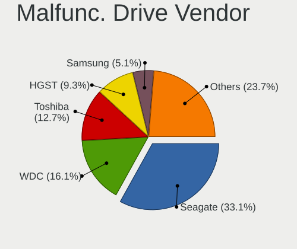

| Vendor              | Computers | Drives | Percent |
|---------------------|-----------|--------|---------|
| Seagate             | 39        | 40     | 33.05%  |
| WDC                 | 19        | 20     | 16.1%   |
| Toshiba             | 15        | 15     | 12.71%  |
| HGST                | 11        | 12     | 9.32%   |
| Samsung Electronics | 6         | 6      | 5.08%   |
| Kingston            | 6         | 6      | 5.08%   |
| Intel               | 3         | 3      | 2.54%   |
| Hitachi             | 3         | 3      | 2.54%   |
| SK hynix            | 2         | 2      | 1.69%   |
| A-DATA Technology   | 2         | 2      | 1.69%   |
| Teclast             | 1         | 1      | 0.85%   |
| Silicon Motion      | 1         | 1      | 0.85%   |
| POLION              | 1         | 1      | 0.85%   |
| OCZ                 | 1         | 1      | 0.85%   |
| Netac               | 1         | 1      | 0.85%   |
| Maxtor              | 1         | 1      | 0.85%   |
| LITEONIT            | 1         | 1      | 0.85%   |
| Hewlett-Packard     | 1         | 1      | 0.85%   |
| Fanxiang            | 1         | 2      | 0.85%   |
| Drevo               | 1         | 1      | 0.85%   |
| China               | 1         | 1      | 0.85%   |
| Unknown             | 1         | 1      | 0.85%   |

Malfunc. HDD Vendor
-------------------

Vendors of faulty HDD drives

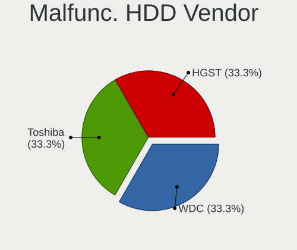

| Vendor              | Computers | Drives | Percent |
|---------------------|-----------|--------|---------|
| Seagate             | 39        | 40     | 44.83%  |
| WDC                 | 17        | 18     | 19.54%  |
| Toshiba             | 12        | 12     | 13.79%  |
| HGST                | 11        | 12     | 12.64%  |
| Samsung Electronics | 4         | 4      | 4.6%    |
| Hitachi             | 3         | 3      | 3.45%   |
| Maxtor              | 1         | 1      | 1.15%   |

Malfunc. Drive Kind
-------------------

Kinds of faulty drives

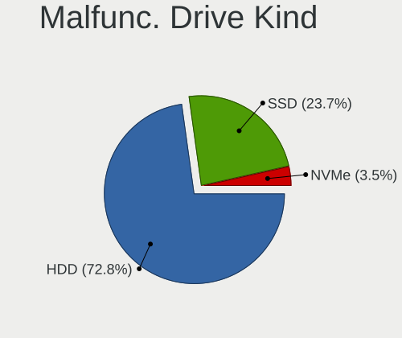

| Kind | Computers | Drives | Percent |
|------|-----------|--------|---------|
| HDD  | 83        | 90     | 72.81%  |
| SSD  | 27        | 28     | 23.68%  |
| NVMe | 4         | 4      | 3.51%   |

Failed Drives
-------------

Failed drive models

| Model                          | Computers | Drives | Percent |
|--------------------------------|-----------|--------|---------|
| Seagate ST2000LX001-1RG174 2TB | 1         | 1      | 50%     |
| SanDisk SSD i100 24GB          | 1         | 1      | 50%     |

Failed Drive Vendor
-------------------

Failed drive vendors

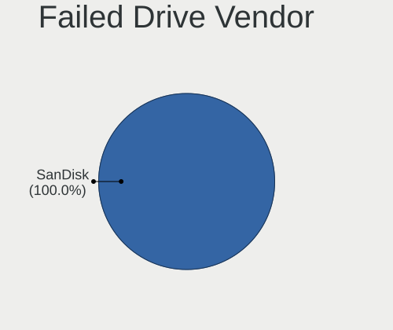

| Vendor  | Computers | Drives | Percent |
|---------|-----------|--------|---------|
| Seagate | 1         | 1      | 50%     |
| SanDisk | 1         | 1      | 50%     |

Drive Status
------------

Number of failed and malfunc. drives

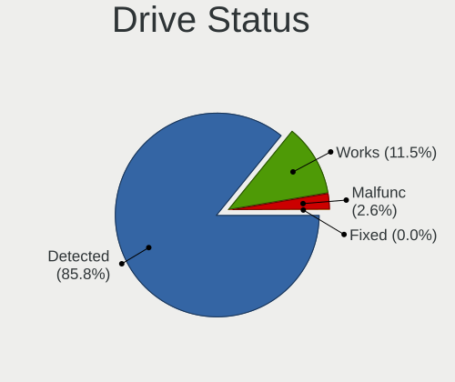

| Status   | Computers | Drives | Percent |
|----------|-----------|--------|---------|
| Detected | 3706      | 7075   | 85.85%  |
| Works    | 496       | 782    | 11.49%  |
| Malfunc  | 112       | 122    | 2.59%   |
| Failed   | 2         | 2      | 0.05%   |
| Fixed    | 1         | 1      | 0.02%   |

Storage controller
------------------

Storage Vendor
--------------

Storage controller vendors

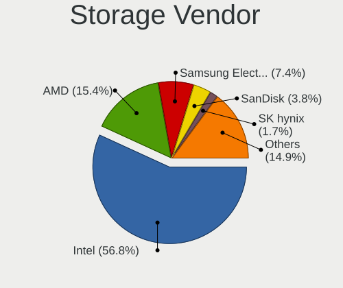

| Vendor                           | Computers | Percent |
|----------------------------------|-----------|---------|
| Intel                            | 2839      | 56.84%  |
| AMD                              | 769       | 15.4%   |
| Samsung Electronics              | 372       | 7.45%   |
| SanDisk                          | 189       | 3.78%   |
| SK hynix                         | 84        | 1.68%   |
| Kingston Technology Company      | 80        | 1.6%    |
| Nvidia                           | 76        | 1.52%   |
| ASMedia Technology               | 64        | 1.28%   |
| Phison Electronics               | 61        | 1.22%   |
| Micron Technology                | 49        | 0.98%   |
| Silicon Motion                   | 48        | 0.96%   |
| Toshiba America Info Systems     | 47        | 0.94%   |
| KIOXIA                           | 44        | 0.88%   |
| JMicron Technology               | 43        | 0.86%   |
| Micron/Crucial Technology        | 39        | 0.78%   |
| Marvell Technology Group         | 38        | 0.76%   |
| ADATA Technology                 | 24        | 0.48%   |
| MAXIO Technology (Hangzhou)      | 21        | 0.42%   |
| Realtek Semiconductor            | 15        | 0.3%    |
| VIA Technologies                 | 11        | 0.22%   |
| Seagate Technology               | 10        | 0.2%    |
| Silicon Image                    | 9         | 0.18%   |
| Union Memory (Shenzhen)          | 7         | 0.14%   |
| Solid State Storage Technology   | 6         | 0.12%   |
| Shenzhen Longsys Electronics     | 6         | 0.12%   |
| Lite-On Technology               | 6         | 0.12%   |
| Apple                            | 6         | 0.12%   |
| Silicon Integrated Systems [SiS] | 4         | 0.08%   |
| LSI Logic / Symbios Logic        | 4         | 0.08%   |
| INNOGRIT                         | 4         | 0.08%   |
| Broadcom / LSI                   | 4         | 0.08%   |
| Yangtze Memory Technologies      | 2         | 0.04%   |
| OCZ Technology Group             | 2         | 0.04%   |
| Netac Technology                 | 2         | 0.04%   |
| Lenovo                           | 2         | 0.04%   |
| TenaFe                           | 1         | 0.02%   |
| Nextorage                        | 1         | 0.02%   |
| Integrated Technology Express    | 1         | 0.02%   |
| HighPoint Technologies           | 1         | 0.02%   |
| Dell                             | 1         | 0.02%   |

Storage Model
-------------

Storage controller models

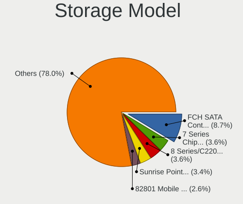

| Model                                                                          | Computers | Percent |
|--------------------------------------------------------------------------------|-----------|---------|
| AMD FCH SATA Controller [AHCI mode]                                            | 500       | 8.67%   |
| Intel 7 Series Chipset Family 6-port SATA Controller [AHCI mode]               | 210       | 3.64%   |
| Intel 8 Series/C220 Series Chipset Family 6-port SATA Controller 1 [AHCI mode] | 208       | 3.61%   |
| Intel Sunrise Point-LP SATA Controller [AHCI mode]                             | 198       | 3.44%   |
| Intel 82801 Mobile SATA Controller [RAID mode]                                 | 152       | 2.64%   |
| Intel 6 Series/C200 Series Chipset Family 6 port Mobile SATA AHCI Controller   | 143       | 2.48%   |
| Samsung NVMe SSD Controller SM981/PM981/PM983                                  | 138       | 2.39%   |
| Intel 6 Series/C200 Series Chipset Family 6 port Desktop SATA AHCI Controller  | 116       | 2.01%   |
| Intel 8 Series SATA Controller 1 [AHCI mode]                                   | 111       | 1.93%   |
| AMD SB7x0/SB8x0/SB9x0 SATA Controller [AHCI mode]                              | 97        | 1.68%   |
| AMD SB7x0/SB8x0/SB9x0 IDE Controller                                           | 95        | 1.65%   |
| Intel Volume Management Device NVMe RAID Controller                            | 94        | 1.63%   |
| Intel NM10/ICH7 Family SATA Controller [IDE mode]                              | 89        | 1.54%   |
| Intel 82801IBM/IEM (ICH9M/ICH9M-E) 4 port SATA Controller [AHCI mode]          | 89        | 1.54%   |
| AMD 400 Series Chipset SATA Controller                                         | 88        | 1.53%   |
| Intel SATA Controller [RAID mode]                                              | 84        | 1.46%   |
| Intel 82801G (ICH7 Family) IDE Controller                                      | 84        | 1.46%   |
| Samsung NVMe SSD Controller 980 (DRAM-less)                                    | 82        | 1.42%   |
| Intel 5 Series/3400 Series Chipset 4 port SATA AHCI Controller                 | 81        | 1.41%   |
| Intel Wildcat Point-LP SATA Controller [AHCI Mode]                             | 80        | 1.39%   |
| Intel Celeron/Pentium Silver Processor SATA Controller                         | 76        | 1.32%   |
| Intel Q170/Q150/B150/H170/H110/Z170/CM236 Chipset SATA Controller [AHCI Mode]  | 75        | 1.3%    |
| Intel 7 Series/C210 Series Chipset Family 6-port SATA Controller [AHCI mode]   | 75        | 1.3%    |
| Intel 82801HM/HEM (ICH8M/ICH8M-E) IDE Controller                               | 67        | 1.16%   |
| AMD SB7x0/SB8x0/SB9x0 SATA Controller [IDE mode]                               | 63        | 1.09%   |
| Intel 5 Series/3400 Series Chipset 6 port SATA AHCI Controller                 | 58        | 1.01%   |
| ASMedia ASM1061/ASM1062 Serial ATA Controller                                  | 58        | 1.01%   |
| Intel 82801HM/HEM (ICH8M/ICH8M-E) SATA Controller [AHCI mode]                  | 57        | 0.99%   |
| Intel 200 Series PCH SATA controller [AHCI mode]                               | 55        | 0.95%   |
| Intel Atom Processor E3800 Series SATA AHCI Controller                         | 53        | 0.92%   |
| Samsung NVMe SSD Controller PM9A1/PM9A3/980PRO                                 | 51        | 0.88%   |
| Intel Celeron N3350/Pentium N4200/Atom E3900 Series SATA AHCI Controller       | 48        | 0.83%   |
| AMD 500 Series Chipset SATA Controller                                         | 48        | 0.83%   |
| Intel Tiger Lake-LP SATA Controller                                            | 47        | 0.82%   |
| Samsung NVMe SSD Controller SM961/PM961/SM963                                  | 46        | 0.8%    |
| Intel Cannon Lake PCH SATA AHCI Controller                                     | 43        | 0.75%   |
| Intel Comet Lake SATA AHCI Controller                                          | 41        | 0.71%   |
| Intel 500 Series Chipset Family SATA AHCI Controller                           | 38        | 0.66%   |
| Silicon Motion SM2263EN/SM2263XT (DRAM-less) NVMe SSD Controllers              | 37        | 0.64%   |
| Intel HM170/QM170 Chipset SATA Controller [AHCI Mode]                          | 37        | 0.64%   |

Storage Kind
------------

Kind of storage controller (IDE, SATA, NVMe, SAS, ...)

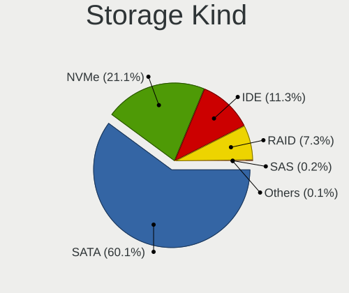

| Kind | Computers | Percent |
|------|-----------|---------|
| SATA | 3085      | 60.11%  |
| NVMe | 1084      | 21.12%  |
| IDE  | 579       | 11.28%  |
| RAID | 373       | 7.27%   |
| SAS  | 8         | 0.16%   |
| SCSI | 3         | 0.06%   |

Processor
---------

CPU Vendor
----------

Processor vendors

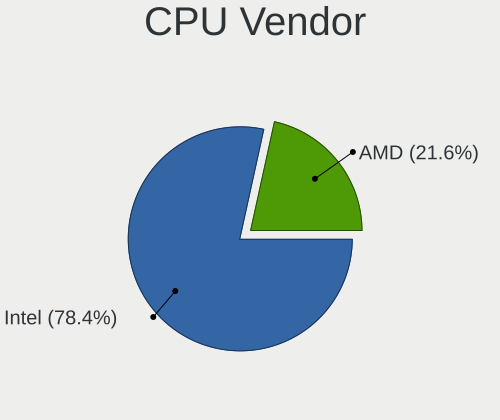

| Vendor | Computers | Percent |
|--------|-----------|---------|
| Intel  | 3274      | 78.44%  |
| AMD    | 900       | 21.56%  |

CPU Model
---------

Processor models

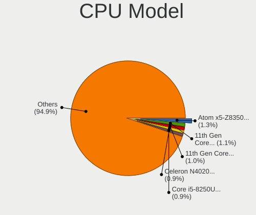

| Model                                         | Computers | Percent |
|-----------------------------------------------|-----------|---------|
| Intel Atom x5-Z8350 CPU @ 1.44GHz             | 56        | 1.34%   |
| Intel 11th Gen Core i5-1135G7 @ 2.40GHz       | 44        | 1.05%   |
| Intel 11th Gen Core i7-1165G7 @ 2.80GHz       | 42        | 1%      |
| Intel Celeron N4020 CPU @ 1.10GHz             | 37        | 0.88%   |
| Intel Core i5-8250U CPU @ 1.60GHz             | 36        | 0.86%   |
| Intel Core i5-6300U CPU @ 2.40GHz             | 31        | 0.74%   |
| Intel Core i5-7200U CPU @ 2.50GHz             | 29        | 0.69%   |
| Intel Core i5-2520M CPU @ 2.50GHz             | 29        | 0.69%   |
| Intel Core i5-2400 CPU @ 3.10GHz              | 29        | 0.69%   |
| AMD Ryzen 5 3600 6-Core Processor             | 29        | 0.69%   |
| Intel Core i5-6200U CPU @ 2.30GHz             | 27        | 0.65%   |
| Intel Core i5-5200U CPU @ 2.20GHz             | 26        | 0.62%   |
| AMD Ryzen 5 3500U with Radeon Vega Mobile Gfx | 26        | 0.62%   |
| Intel Core i5-3470 CPU @ 3.20GHz              | 25        | 0.6%    |
| Intel Core i7-8550U CPU @ 1.80GHz             | 24        | 0.57%   |
| Intel Core i7-4790 CPU @ 3.60GHz              | 24        | 0.57%   |
| Intel Core i5-3210M CPU @ 2.50GHz             | 24        | 0.57%   |
| Intel Celeron CPU N3350 @ 1.10GHz             | 24        | 0.57%   |
| AMD Ryzen 5 5500U with Radeon Graphics        | 24        | 0.57%   |
| Intel Core i7-7700HQ CPU @ 2.80GHz            | 23        | 0.55%   |
| Intel Core i5-3230M CPU @ 2.60GHz             | 22        | 0.53%   |
| Intel Core i5-8265U CPU @ 1.60GHz             | 21        | 0.5%    |
| Intel Celeron CPU N2840 @ 2.16GHz             | 21        | 0.5%    |
| Intel Core i5-4200U CPU @ 1.60GHz             | 19        | 0.45%   |
| Intel Core i5-4210U CPU @ 1.70GHz             | 18        | 0.43%   |
| Intel Core i5-1035G1 CPU @ 1.00GHz            | 18        | 0.43%   |
| Intel Core i5-10210U CPU @ 1.60GHz            | 18        | 0.43%   |
| Intel Atom CPU Z3735F @ 1.33GHz               | 18        | 0.43%   |
| Intel Core i7-6500U CPU @ 2.50GHz             | 17        | 0.41%   |
| Intel Core i5 CPU M 520 @ 2.40GHz             | 17        | 0.41%   |
| Intel Core 2 Duo CPU E8400 @ 3.00GHz          | 17        | 0.41%   |
| AMD Ryzen 5 5600X 6-Core Processor            | 17        | 0.41%   |
| Intel Core i7-4500U CPU @ 1.80GHz             | 16        | 0.38%   |
| Intel Core i7-3770 CPU @ 3.40GHz              | 16        | 0.38%   |
| Intel Core i5-4460 CPU @ 3.20GHz              | 16        | 0.38%   |
| Intel Core i5-3320M CPU @ 2.60GHz             | 16        | 0.38%   |
| Intel Core i3-3110M CPU @ 2.40GHz             | 16        | 0.38%   |
| Intel Core i3-2120 CPU @ 3.30GHz              | 16        | 0.38%   |
| Intel 11th Gen Core i3-1115G4 @ 3.00GHz       | 16        | 0.38%   |
| AMD Ryzen 9 5900X 12-Core Processor           | 16        | 0.38%   |

CPU Model Family
----------------

Processor model prefix

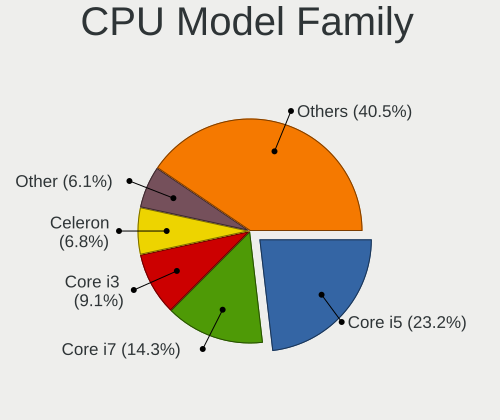

| Model                   | Computers | Percent |
|-------------------------|-----------|---------|
| Intel Core i5           | 968       | 23.16%  |
| Intel Core i7           | 599       | 14.33%  |
| Intel Core i3           | 381       | 9.11%   |
| Intel Celeron           | 284       | 6.79%   |
| Other                   | 255       | 6.1%    |
| Intel Core 2 Duo        | 213       | 5.1%    |
| AMD Ryzen 5             | 212       | 5.07%   |
| Intel Atom              | 131       | 3.13%   |
| AMD Ryzen 7             | 130       | 3.11%   |
| Intel Pentium           | 118       | 2.82%   |
| Intel Xeon              | 94        | 2.25%   |
| AMD FX                  | 63        | 1.51%   |
| AMD Ryzen 9             | 60        | 1.44%   |
| Intel Pentium Dual-Core | 59        | 1.41%   |
| AMD A6                  | 50        | 1.2%    |
| AMD Ryzen 3             | 42        | 1%      |
| Intel Core 2 Quad       | 38        | 0.91%   |
| AMD A8                  | 38        | 0.91%   |
| Intel Pentium Dual      | 37        | 0.89%   |
| AMD A10                 | 36        | 0.86%   |
| AMD A4                  | 33        | 0.79%   |
| Intel Core 2            | 29        | 0.69%   |
| AMD Athlon II X2        | 26        | 0.62%   |
| AMD Phenom II X4        | 20        | 0.48%   |
| AMD E1                  | 19        | 0.45%   |
| Intel Pentium Silver    | 16        | 0.38%   |
| Intel Core i9           | 16        | 0.38%   |
| Intel Core M            | 14        | 0.33%   |
| AMD E                   | 14        | 0.33%   |
| AMD Athlon 64 X2        | 14        | 0.33%   |
| AMD Athlon              | 13        | 0.31%   |
| Intel Pentium Gold      | 12        | 0.29%   |
| AMD Phenom II X6        | 11        | 0.26%   |
| AMD Turion 64 X2 Mobile | 10        | 0.24%   |
| Intel Pentium 4         | 7         | 0.17%   |
| AMD E2                  | 7         | 0.17%   |
| AMD Athlon II X4        | 7         | 0.17%   |
| AMD Athlon II           | 6         | 0.14%   |
| Intel Core m5           | 5         | 0.12%   |
| AMD Sempron             | 5         | 0.12%   |

CPU Cores
---------

Number of processor cores

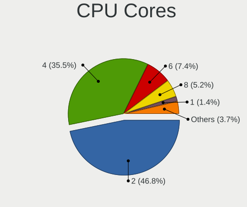

| Number | Computers | Percent |
|--------|-----------|---------|
| 2      | 1956      | 46.78%  |
| 4      | 1484      | 35.49%  |
| 6      | 310       | 7.41%   |
| 8      | 217       | 5.19%   |
| 1      | 60        | 1.44%   |
| 12     | 53        | 1.27%   |
| 10     | 30        | 0.72%   |
| 16     | 26        | 0.62%   |
| 3      | 24        | 0.57%   |
| 14     | 13        | 0.31%   |
| 24     | 5         | 0.12%   |
| 28     | 2         | 0.05%   |
| 40     | 1         | 0.02%   |

CPU Sockets
-----------

Number of sockets

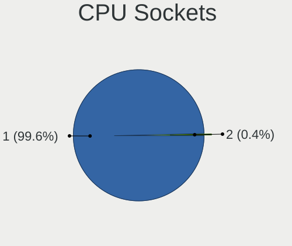

| Number | Computers | Percent |
|--------|-----------|---------|
| 1      | 4158      | 99.62%  |
| 2      | 16        | 0.38%   |

CPU Threads
-----------

Threads per core (Hyper-Threading)

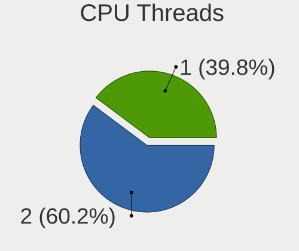

| Number | Computers | Percent |
|--------|-----------|---------|
| 2      | 2516      | 60.22%  |
| 1      | 1662      | 39.78%  |

CPU Op-Modes
------------

CPU Operation Modes (32-bit, 64-bit)

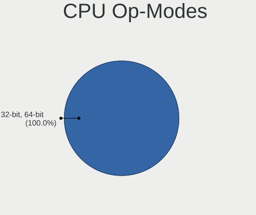

| Op mode        | Computers | Percent |
|----------------|-----------|---------|
| 32-bit, 64-bit | 4174      | 100%    |

CPU Microcode
-------------

Microcode number

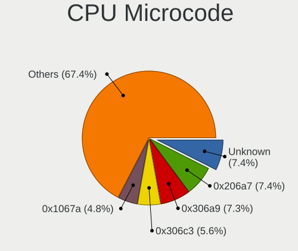

| Number     | Computers | Percent |
|------------|-----------|---------|
| Unknown    | 316       | 7.44%   |
| 0x206a7    | 314       | 7.39%   |
| 0x306a9    | 312       | 7.34%   |
| 0x306c3    | 239       | 5.62%   |
| 0x1067a    | 204       | 4.8%    |
| 0x40651    | 122       | 2.87%   |
| 0x806c1    | 111       | 2.61%   |
| 0x406e3    | 108       | 2.54%   |
| 0x306d4    | 103       | 2.42%   |
| 0x20655    | 103       | 2.42%   |
| 0x806e9    | 101       | 2.38%   |
| 0x506e3    | 88        | 2.07%   |
| 0x406c4    | 87        | 2.05%   |
| 0x30678    | 86        | 2.02%   |
| 0x806ea    | 77        | 1.81%   |
| 0x806ec    | 76        | 1.79%   |
| 0x906ea    | 74        | 1.74%   |
| 0x906e9    | 71        | 1.67%   |
| 0x6fd      | 69        | 1.62%   |
| 0x706a8    | 67        | 1.58%   |
| 0x08701021 | 51        | 1.2%    |
| 0x08108109 | 51        | 1.2%    |
| 0x506c9    | 48        | 1.13%   |
| 0x10676    | 48        | 1.13%   |
| 0x706e5    | 45        | 1.06%   |
| 0x20652    | 42        | 0.99%   |
| 0x06000852 | 42        | 0.99%   |
| 0x010000c8 | 41        | 0.96%   |
| 0x406c3    | 35        | 0.82%   |
| 0x6fb      | 31        | 0.73%   |
| 0x0a50000c | 31        | 0.73%   |
| 0x0800820d | 30        | 0.71%   |
| 0x06001119 | 29        | 0.68%   |
| 0x07030105 | 28        | 0.66%   |
| 0xa0655    | 26        | 0.61%   |
| 0xa0653    | 26        | 0.61%   |
| 0x6f6      | 26        | 0.61%   |
| 0x0a50000d | 26        | 0.61%   |
| 0x08600106 | 26        | 0.61%   |
| 0x06006705 | 26        | 0.61%   |

CPU Microarch
-------------

Microarchitecture

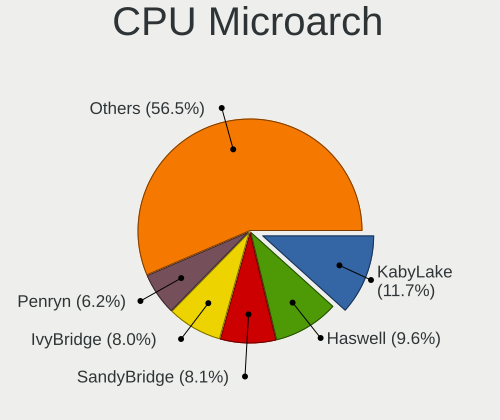

| Name             | Computers | Percent |
|------------------|-----------|---------|
| KabyLake         | 488       | 11.68%  |
| Haswell          | 399       | 9.55%   |
| SandyBridge      | 338       | 8.09%   |
| IvyBridge        | 335       | 8.02%   |
| Penryn           | 259       | 6.2%    |
| Silvermont       | 224       | 5.36%   |
| Skylake          | 206       | 4.93%   |
| Westmere         | 160       | 3.83%   |
| Core             | 148       | 3.54%   |
| TigerLake        | 127       | 3.04%   |
| Zen 2            | 125       | 2.99%   |
| Zen 3            | 117       | 2.8%    |
| Broadwell        | 111       | 2.66%   |
| Unknown          | 111       | 2.66%   |
| Zen+             | 110       | 2.63%   |
| K10              | 93        | 2.23%   |
| Goldmont plus    | 93        | 2.23%   |
| CometLake        | 81        | 1.94%   |
| Piledriver       | 78        | 1.87%   |
| IceLake          | 78        | 1.87%   |
| Excavator        | 68        | 1.63%   |
| Zen              | 56        | 1.34%   |
| Goldmont         | 51        | 1.22%   |
| Puma             | 44        | 1.05%   |
| Nehalem          | 43        | 1.03%   |
| Alderlake Hybrid | 42        | 1.01%   |
| K8 Hammer        | 33        | 0.79%   |
| Jaguar           | 28        | 0.67%   |
| Bobcat           | 25        | 0.6%    |
| K10 Llano        | 19        | 0.45%   |
| Tremont          | 18        | 0.43%   |
| Steamroller      | 18        | 0.43%   |
| Bulldozer        | 17        | 0.41%   |
| Bonnell          | 17        | 0.41%   |
| NetBurst         | 11        | 0.26%   |
| K8 & K10 hybrid  | 6         | 0.14%   |

Graphics
--------

GPU Vendor
----------

Vendors of graphics cards

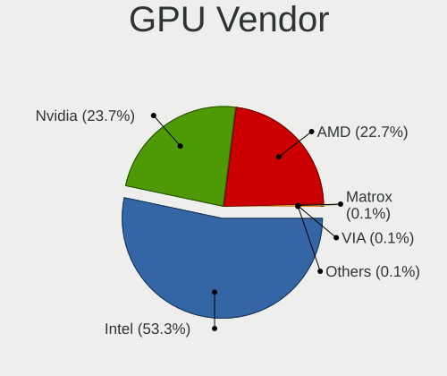

| Vendor                           | Computers | Percent |
|----------------------------------|-----------|---------|
| Intel                            | 2551      | 53.31%  |
| Nvidia                           | 1133      | 23.68%  |
| AMD                              | 1084      | 22.65%  |
| Matrox Electronics Systems       | 6         | 0.13%   |
| VIA Technologies                 | 4         | 0.08%   |
| Silicon Integrated Systems [SiS] | 4         | 0.08%   |
| ASPEED Technology                | 2         | 0.04%   |
| ATI Technologies                 | 1         | 0.02%   |

GPU Model
---------

Graphics card models

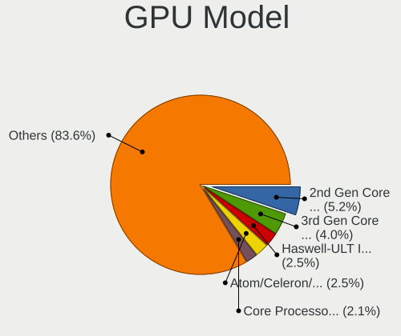

| Model                                                                                    | Computers | Percent |
|------------------------------------------------------------------------------------------|-----------|---------|
| Intel 2nd Generation Core Processor Family Integrated Graphics Controller                | 256       | 5.2%    |
| Intel 3rd Gen Core processor Graphics Controller                                         | 197       | 4%      |
| Intel Haswell-ULT Integrated Graphics Controller                                         | 125       | 2.54%   |
| Intel Atom/Celeron/Pentium Processor x5-E8000/J3xxx/N3xxx Integrated Graphics Controller | 124       | 2.52%   |
| Intel Core Processor Integrated Graphics Controller                                      | 105       | 2.13%   |
| Intel TigerLake-LP GT2 [Iris Xe Graphics]                                                | 100       | 2.03%   |
| Intel Xeon E3-1200 v3/4th Gen Core Processor Integrated Graphics Controller              | 98        | 1.99%   |
| Intel Atom Processor Z36xxx/Z37xxx Series Graphics & Display                             | 98        | 1.99%   |
| Intel Skylake-U GT2 [HD Graphics 520]                                                    | 94        | 1.91%   |
| Intel GeminiLake [UHD Graphics 600]                                                      | 82        | 1.67%   |
| Intel Kaby Lake-U GT2 [HD Graphics 620]                                                  | 80        | 1.63%   |
| Intel Mobile 4 Series Chipset Integrated Graphics Controller                             | 77        | 1.57%   |
| Intel Kaby Lake-R GT2 [UHD Graphics 620]                                                 | 77        | 1.57%   |
| AMD Picasso/Raven 2 [Radeon Vega Series / Radeon Vega Mobile Series]                     | 76        | 1.55%   |
| Intel Broadwell-U GT2 [HD Graphics 5500]                                                 | 66        | 1.34%   |
| AMD Ellesmere [Radeon RX 470/480/570/570X/580/580X/590]                                  | 57        | 1.16%   |
| Intel Xeon E3-1200 v2/3rd Gen Core processor Graphics Controller                         | 53        | 1.08%   |
| Intel 4th Gen Core Processor Integrated Graphics Controller                              | 53        | 1.08%   |
| AMD Renoir [Radeon Vega Series / Radeon Vega Mobile Series]                              | 48        | 0.98%   |
| Intel CometLake-U GT2 [UHD Graphics]                                                     | 46        | 0.94%   |
| Intel WhiskeyLake-U GT2 [UHD Graphics 620]                                               | 45        | 0.91%   |
| Intel Apollo Lake GT1 [HD Graphics 500]                                                  | 43        | 0.87%   |
| AMD Cezanne [Radeon Vega Series / Radeon Vega Mobile Series]                             | 43        | 0.87%   |
| Nvidia GK208B [GeForce GT 710]                                                           | 42        | 0.85%   |
| Intel Mobile GM965/GL960 Integrated Graphics Controller (secondary)                      | 42        | 0.85%   |
| Intel Mobile GM965/GL960 Integrated Graphics Controller (primary)                        | 42        | 0.85%   |
| Intel CoffeeLake-H GT2 [UHD Graphics 630]                                                | 41        | 0.83%   |
| AMD Stoney [Radeon R2/R3/R4/R5 Graphics]                                                 | 41        | 0.83%   |
| Intel 4 Series Chipset Integrated Graphics Controller                                    | 38        | 0.77%   |
| Intel Skylake-S GT2 [HD Graphics 530]                                                    | 36        | 0.73%   |
| AMD Lucienne                                                                             | 35        | 0.71%   |
| Nvidia GP107 [GeForce GTX 1050 Ti]                                                       | 34        | 0.69%   |
| Nvidia TU117M [GeForce GTX 1650 Mobile / Max-Q]                                          | 33        | 0.67%   |
| Intel Kaby Lake-H GT2 [HD Graphics 630]                                                  | 33        | 0.67%   |
| Intel Iris Plus Graphics G1 (Ice Lake)                                                   | 33        | 0.67%   |
| AMD Cedar [Radeon HD 5000/6000/7350/8350 Series]                                         | 29        | 0.59%   |
| AMD Mullins [Radeon R4/R5 Graphics]                                                      | 28        | 0.57%   |
| Intel 4th Generation Core Processor Family Integrated Graphics Controller                | 26        | 0.53%   |
| Intel Tiger Lake-LP GT2 [UHD Graphics G4]                                                | 25        | 0.51%   |
| Intel Kaby Lake-S GT2 [HD Graphics 630]                                                  | 25        | 0.51%   |

GPU Combo
---------

Combinations of graphics cards

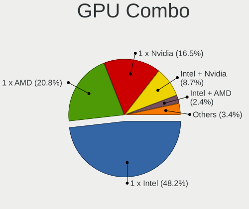

| Name                 | Computers | Percent |
|----------------------|-----------|---------|
| 1 x Intel            | 2023      | 48.2%   |
| 1 x AMD              | 874       | 20.82%  |
| 1 x Nvidia           | 692       | 16.49%  |
| Intel + Nvidia       | 366       | 8.72%   |
| Intel + AMD          | 100       | 2.38%   |
| AMD + Nvidia         | 55        | 1.31%   |
| 2 x AMD              | 54        | 1.29%   |
| 2 x Nvidia           | 9         | 0.21%   |
| Other                | 6         | 0.14%   |
| 1 x VIA              | 4         | 0.1%    |
| 1 x SiS              | 4         | 0.1%    |
| 1 x Matrox           | 4         | 0.1%    |
| 1 x ASPEED           | 2         | 0.05%   |
| 2 x Intel            | 1         | 0.02%   |
| 2 x AMD + 1 x Nvidia | 1         | 0.02%   |
| Nvidia + Matrox      | 1         | 0.02%   |
| AMD + Matrox         | 1         | 0.02%   |

GPU Driver
----------

Free vs proprietary

| Driver      | Computers | Percent |
|-------------|-----------|---------|
| Free        | 3442      | 81.85%  |
| Proprietary | 608       | 14.46%  |
| Unknown     | 155       | 3.69%   |

GPU Memory
----------

Total video memory

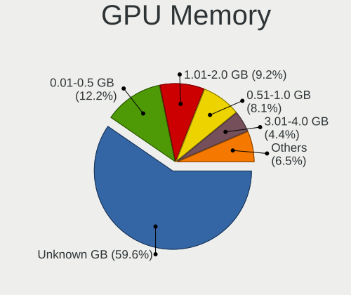

| Size in GB | Computers | Percent |
|------------|-----------|---------|
| Unknown    | 2531      | 59.58%  |
| 0.01-0.5   | 518       | 12.19%  |
| 1.01-2.0   | 391       | 9.2%    |
| 0.51-1.0   | 345       | 8.12%   |
| 3.01-4.0   | 189       | 4.45%   |
| 7.01-8.0   | 132       | 3.11%   |
| 5.01-6.0   | 61        | 1.44%   |
| 8.01-16.0  | 44        | 1.04%   |
| 2.01-3.0   | 32        | 0.75%   |
| 16.01-24.0 | 4         | 0.09%   |
| 4.01-5.0   | 1         | 0.02%   |

Monitor
-------

Monitor Vendor
--------------

Monitor vendors

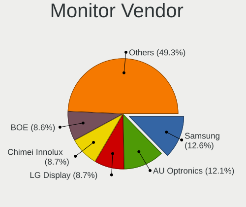

| Vendor                  | Computers | Percent |
|-------------------------|-----------|---------|
| Samsung Electronics     | 537       | 12.64%  |
| AU Optronics            | 512       | 12.06%  |
| LG Display              | 371       | 8.74%   |
| Chimei Innolux          | 368       | 8.66%   |
| BOE                     | 367       | 8.64%   |
| Dell                    | 205       | 4.83%   |
| Goldstar                | 187       | 4.4%    |
| Hewlett-Packard         | 153       | 3.6%    |
| Apple                   | 132       | 3.11%   |
| Acer                    | 124       | 2.92%   |
| AOC                     | 94        | 2.21%   |
| Philips                 | 93        | 2.19%   |
| Lenovo                  | 82        | 1.93%   |
| Ancor Communications    | 71        | 1.67%   |
| Chi Mei Optoelectronics | 69        | 1.62%   |
| BenQ                    | 67        | 1.58%   |
| Sharp                   | 56        | 1.32%   |
| ViewSonic               | 34        | 0.8%    |
| LG Philips              | 34        | 0.8%    |
| Sony                    | 33        | 0.78%   |
| PANDA                   | 32        | 0.75%   |
| InfoVision              | 32        | 0.75%   |
| LG Electronics          | 31        | 0.73%   |
| Unknown                 | 31        | 0.73%   |
| Unknown                 | 29        | 0.68%   |
| Vizio                   | 25        | 0.59%   |
| ASUSTek Computer        | 25        | 0.59%   |
| Iiyama                  | 21        | 0.49%   |
| Fujitsu Siemens         | 18        | 0.42%   |
| Sceptre Tech            | 17        | 0.4%    |
| CPT                     | 15        | 0.35%   |
| Toshiba                 | 14        | 0.33%   |
| Panasonic               | 13        | 0.31%   |
| NEC Computers           | 13        | 0.31%   |
| Eizo                    | 13        | 0.31%   |
| MSI                     | 12        | 0.28%   |
| HannStar                | 11        | 0.26%   |
| HPN                     | 10        | 0.24%   |
| FUS                     | 8         | 0.19%   |
| SLD                     | 6         | 0.14%   |

Monitor Model
-------------

Monitor models

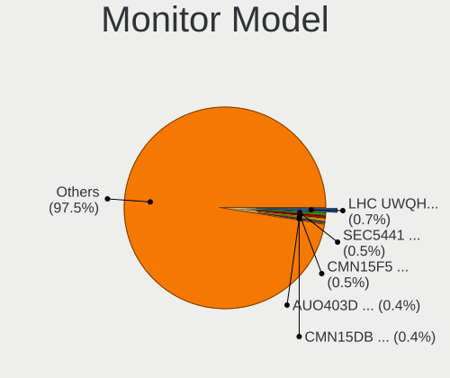

| Model                                                                    | Computers | Percent |
|--------------------------------------------------------------------------|-----------|---------|
| Unknown                                                                  | 31        | 0.71%   |
| Samsung Electronics LCD Monitor SEC5441 1280x800 331x207mm 15.4-inch     | 23        | 0.53%   |
| Chimei Innolux LCD Monitor CMN15F5 1920x1080 344x193mm 15.5-inch         | 20        | 0.46%   |
| AU Optronics LCD Monitor AUO403D 1920x1080 309x174mm 14.0-inch           | 19        | 0.44%   |
| Chimei Innolux LCD Monitor CMN15DB 1366x768 344x193mm 15.5-inch          | 18        | 0.41%   |
| Chimei Innolux LCD Monitor CMN14D4 1920x1080 309x173mm 13.9-inch         | 17        | 0.39%   |
| AU Optronics LCD Monitor AUO22EC 1366x768 344x193mm 15.5-inch            | 17        | 0.39%   |
| AU Optronics LCD Monitor AUO235C 1366x768 256x144mm 11.6-inch            | 16        | 0.37%   |
| Goldstar LG ULTRAWIDE GSM59F1 2560x1080 670x280mm 28.6-inch              | 15        | 0.34%   |
| Goldstar FULL HD GSM5B55 1920x1080 480x270mm 21.7-inch                   | 14        | 0.32%   |
| BOE LCD Monitor BOE0696 1366x768 309x173mm 13.9-inch                     | 14        | 0.32%   |
| AU Optronics LCD Monitor AUO38ED 1920x1080 344x193mm 15.5-inch           | 13        | 0.3%    |
| LG Display LCD Monitor LGD0555 2736x1824 260x173mm 12.3-inch             | 12        | 0.27%   |
| LG Display LCD Monitor LGD033A 1366x768 344x194mm 15.5-inch              | 12        | 0.27%   |
| AU Optronics LCD Monitor AUO45EC 1366x768 344x193mm 15.5-inch            | 12        | 0.27%   |
| AU Optronics LCD Monitor AUO21ED 1920x1080 344x193mm 15.5-inch           | 12        | 0.27%   |
| LG Display LCD Monitor LGD02DC 1366x768 344x194mm 15.5-inch              | 11        | 0.25%   |
| Chimei Innolux LCD Monitor CMN15E6 1366x768 344x193mm 15.5-inch          | 11        | 0.25%   |
| Chimei Innolux LCD Monitor CMN15CA 1366x768 344x193mm 15.5-inch          | 11        | 0.25%   |
| Samsung Electronics LCD Monitor SDC4C48 1920x1080 293x165mm 13.2-inch    | 10        | 0.23%   |
| AU Optronics LCD Monitor AUO26EC 1366x768 344x193mm 15.5-inch            | 10        | 0.23%   |
| Lenovo LCD Monitor LEN40B1 1600x900 345x194mm 15.6-inch                  | 9         | 0.21%   |
| Chimei Innolux LCD Monitor CMN15AB 1366x768 344x193mm 15.5-inch          | 9         | 0.21%   |
| Chimei Innolux LCD Monitor CMN14D6 1366x768 309x173mm 13.9-inch          | 9         | 0.21%   |
| BOE LCD Monitor BOE095F 2256x1504 285x190mm 13.5-inch                    | 9         | 0.21%   |
| AU Optronics LCD Monitor AUO20EC 1366x768 344x193mm 15.5-inch            | 9         | 0.21%   |
| AU Optronics LCD Monitor AUO10EC 1366x768 344x193mm 15.5-inch            | 9         | 0.21%   |
| AU Optronics LCD Monitor AUO106C 1366x768 276x155mm 12.5-inch            | 9         | 0.21%   |
| Samsung Electronics C27F390 SAM0D32 1920x1080 598x336mm 27.0-inch        | 8         | 0.18%   |
| LG Display LCD Monitor LGD038E 1366x768 344x194mm 15.5-inch              | 8         | 0.18%   |
| Chimei Innolux LCD Monitor CMN15E7 1920x1080 344x193mm 15.5-inch         | 8         | 0.18%   |
| Chimei Innolux LCD Monitor CMN14C3 1366x768 309x173mm 13.9-inch          | 8         | 0.18%   |
| Chi Mei Optoelectronics LCD Monitor CMO15A7 1366x768 344x193mm 15.5-inch | 8         | 0.18%   |
| AU Optronics LCD Monitor AUO405C 1366x768 256x144mm 11.6-inch            | 8         | 0.18%   |
| AU Optronics LCD Monitor AUO193C 1366x768 309x173mm 13.9-inch            | 8         | 0.18%   |
| Apple iMac APPA00C 1920x1080 475x267mm 21.5-inch                         | 8         | 0.18%   |
| LG Display LCD Monitor LGD0395 1366x768 344x194mm 15.5-inch              | 7         | 0.16%   |
| Chimei Innolux LCD Monitor CMN15DC 1366x768 344x193mm 15.5-inch          | 7         | 0.16%   |
| Chimei Innolux LCD Monitor CMN15C6 1366x768 344x193mm 15.5-inch          | 7         | 0.16%   |
| BOE LCD Monitor BOE06A4 1366x768 344x194mm 15.5-inch                     | 7         | 0.16%   |

Monitor Resolution
------------------

Monitor screen resolution

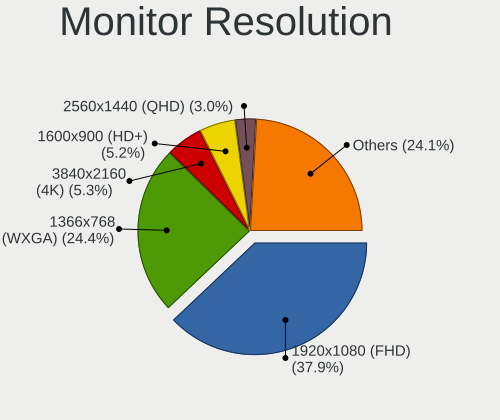

| Resolution         | Computers | Percent |
|--------------------|-----------|---------|
| 1920x1080 (FHD)    | 1571      | 37.94%  |
| 1366x768 (WXGA)    | 1010      | 24.39%  |
| 3840x2160 (4K)     | 220       | 5.31%   |
| 1600x900 (HD+)     | 217       | 5.24%   |
| 2560x1440 (QHD)    | 124       | 2.99%   |
| 1280x800 (WXGA)    | 123       | 2.97%   |
| 1440x900 (WXGA+)   | 116       | 2.8%    |
| 1680x1050 (WSXGA+) | 109       | 2.63%   |
| 1280x1024 (SXGA)   | 104       | 2.51%   |
| 1920x1200 (WUXGA)  | 80        | 1.93%   |
| Unknown            | 74        | 1.79%   |
| 1360x768           | 40        | 0.97%   |
| 3440x1440          | 39        | 0.94%   |
| 3840x1080          | 37        | 0.89%   |
| 2560x1600          | 33        | 0.8%    |
| 2560x1080          | 33        | 0.8%    |
| 1920x540           | 20        | 0.48%   |
| 2880x1920          | 17        | 0.41%   |
| 2160x1440          | 13        | 0.31%   |
| 2880x1800          | 12        | 0.29%   |
| 1024x768 (XGA)     | 12        | 0.29%   |
| 3200x1800 (QHD+)   | 10        | 0.24%   |
| 2256x1504          | 10        | 0.24%   |
| 1600x1200          | 9         | 0.22%   |
| 3840x2400          | 7         | 0.17%   |
| 2736x1824          | 7         | 0.17%   |
| 1024x600           | 6         | 0.14%   |
| 3840x1600          | 5         | 0.12%   |
| 1920x1280          | 5         | 0.12%   |
| 1280x720 (HD)      | 5         | 0.12%   |
| 5760x1080          | 4         | 0.1%    |
| 4480x1440          | 3         | 0.07%   |
| 3600x1080          | 3         | 0.07%   |
| 2304x1440          | 3         | 0.07%   |
| 1920x515           | 3         | 0.07%   |
| 7680x2160          | 2         | 0.05%   |
| 5760x2160          | 2         | 0.05%   |
| 5120x1440          | 2         | 0.05%   |
| 4480x1600          | 2         | 0.05%   |
| 4480x1080          | 2         | 0.05%   |

Monitor Diagonal
----------------

Diagonal size in inches

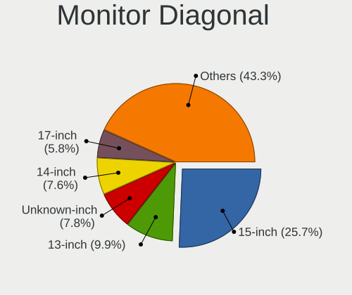

| Inches  | Computers | Percent |
|---------|-----------|---------|
| 15      | 1079      | 25.67%  |
| 13      | 416       | 9.9%    |
| Unknown | 326       | 7.76%   |
| 14      | 320       | 7.61%   |
| 17      | 244       | 5.81%   |
| 27      | 234       | 5.57%   |
| 24      | 217       | 5.16%   |
| 21      | 186       | 4.43%   |
| 23      | 177       | 4.21%   |
| 19      | 111       | 2.64%   |
| 31      | 107       | 2.55%   |
| 11      | 100       | 2.38%   |
| 20      | 89        | 2.12%   |
| 12      | 85        | 2.02%   |
| 18      | 84        | 2%      |
| 22      | 70        | 1.67%   |
| 34      | 53        | 1.26%   |
| 16      | 31        | 0.74%   |
| 40      | 29        | 0.69%   |
| 84      | 26        | 0.62%   |
| 54      | 21        | 0.5%    |
| 32      | 20        | 0.48%   |
| 72      | 19        | 0.45%   |
| 10      | 18        | 0.43%   |
| 26      | 16        | 0.38%   |
| 25      | 13        | 0.31%   |
| 63      | 8         | 0.19%   |
| 52      | 8         | 0.19%   |
| 49      | 8         | 0.19%   |
| 65      | 7         | 0.17%   |
| 48      | 7         | 0.17%   |
| 46      | 6         | 0.14%   |
| 37      | 6         | 0.14%   |
| 36      | 5         | 0.12%   |
| 29      | 5         | 0.12%   |
| 28      | 5         | 0.12%   |
| 74      | 4         | 0.1%    |
| 64      | 4         | 0.1%    |
| 42      | 4         | 0.1%    |
| 58      | 3         | 0.07%   |

Monitor Width
-------------

Physical width

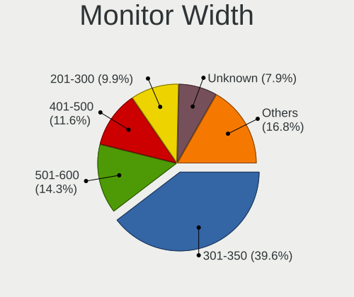

| Width in mm    | Computers | Percent |
|----------------|-----------|---------|
| 301-350        | 1641      | 39.62%  |
| 501-600        | 591       | 14.27%  |
| 401-500        | 479       | 11.56%  |
| 201-300        | 410       | 9.9%    |
| Unknown        | 326       | 7.87%   |
| 351-400        | 282       | 6.81%   |
| 601-700        | 145       | 3.5%    |
| 1001-1500      | 83        | 2%      |
| 701-800        | 81        | 1.96%   |
| 1501-2000      | 52        | 1.26%   |
| 801-900        | 40        | 0.97%   |
| 901-1000       | 9         | 0.22%   |
| 101-200        | 2         | 0.05%   |
| More than 2000 | 1         | 0.02%   |

Aspect Ratio
------------

Proportional relationship between the width and the height

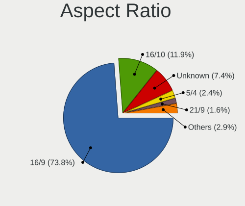

| Ratio   | Computers | Percent |
|---------|-----------|---------|
| 16/9    | 2875      | 73.79%  |
| 16/10   | 465       | 11.94%  |
| Unknown | 289       | 7.42%   |
| 5/4     | 93        | 2.39%   |
| 21/9    | 61        | 1.57%   |
| 3/2     | 58        | 1.49%   |
| 4/3     | 29        | 0.74%   |
| 32/9    | 13        | 0.33%   |
| 6/5     | 5         | 0.13%   |
| 3.73    | 3         | 0.08%   |
| 0.62    | 2         | 0.05%   |
| 1.96    | 1         | 0.03%   |
| 1.00    | 1         | 0.03%   |
| 0.56    | 1         | 0.03%   |

Monitor Area
------------

Area in inch²

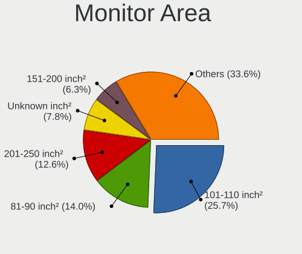

| Area in inch² | Computers | Percent |
|----------------|-----------|---------|
| 101-110        | 1072      | 25.67%  |
| 81-90          | 586       | 14.03%  |
| 201-250        | 526       | 12.6%   |
| Unknown        | 326       | 7.81%   |
| 151-200        | 262       | 6.27%   |
| 301-350        | 243       | 5.82%   |
| 351-500        | 189       | 4.53%   |
| 121-130        | 164       | 3.93%   |
| 71-80          | 151       | 3.62%   |
| More than 1000 | 121       | 2.9%    |
| 141-150        | 120       | 2.87%   |
| 51-60          | 103       | 2.47%   |
| 61-70          | 82        | 1.96%   |
| 251-300        | 78        | 1.87%   |
| 501-1000       | 69        | 1.65%   |
| 131-140        | 29        | 0.69%   |
| 111-120        | 28        | 0.67%   |
| 41-50          | 15        | 0.36%   |
| 91-100         | 10        | 0.24%   |
| 1-40           | 2         | 0.05%   |

Pixel Density
-------------

Pixels per inch

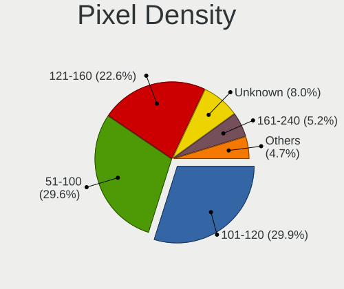

| Density       | Computers | Percent |
|---------------|-----------|---------|
| 101-120       | 1220      | 29.87%  |
| 51-100        | 1209      | 29.6%   |
| 121-160       | 921       | 22.55%  |
| Unknown       | 327       | 8.01%   |
| 161-240       | 214       | 5.24%   |
| 1-50          | 120       | 2.94%   |
| More than 240 | 73        | 1.79%   |

Multiple Monitors
-----------------

Total monitors connected

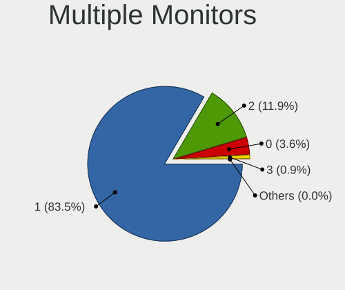

| Total | Computers | Percent |
|-------|-----------|---------|
| 1     | 3553      | 83.48%  |
| 2     | 505       | 11.87%  |
| 0     | 154       | 3.62%   |
| 3     | 39        | 0.92%   |
| 4     | 4         | 0.09%   |
| 5     | 1         | 0.02%   |

Network
-------

Net Controller Vendor
---------------------

Controller vendors

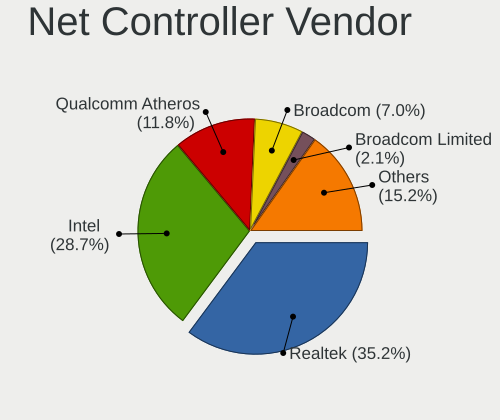

| Vendor                            | Computers | Percent |
|-----------------------------------|-----------|---------|
| Realtek Semiconductor             | 2246      | 35.18%  |
| Intel                             | 1833      | 28.71%  |
| Qualcomm Atheros                  | 754       | 11.81%  |
| Broadcom                          | 449       | 7.03%   |
| Broadcom Limited                  | 132       | 2.07%   |
| Ralink Technology                 | 97        | 1.52%   |
| TP-Link                           | 92        | 1.44%   |
| Marvell Technology Group          | 90        | 1.41%   |
| Ralink                            | 77        | 1.21%   |
| MediaTek                          | 75        | 1.17%   |
| Nvidia                            | 67        | 1.05%   |
| Samsung Electronics               | 43        | 0.67%   |
| ASIX Electronics                  | 33        | 0.52%   |
| Dell                              | 27        | 0.42%   |
| NetGear                           | 25        | 0.39%   |
| DisplayLink                       | 23        | 0.36%   |
| Xiaomi                            | 20        | 0.31%   |
| Huawei Technologies               | 18        | 0.28%   |
| Sierra Wireless                   | 17        | 0.27%   |
| Qualcomm Atheros Communications   | 17        | 0.27%   |
| Microsoft                         | 17        | 0.27%   |
| JMicron Technology                | 14        | 0.22%   |
| D-Link                            | 14        | 0.22%   |
| D-Link System                     | 13        | 0.2%    |
| Hewlett-Packard                   | 12        | 0.19%   |
| Shenzhen Goodix Technology        | 11        | 0.17%   |
| Edimax Technology                 | 11        | 0.17%   |
| ASUSTek Computer                  | 11        | 0.17%   |
| OPPO Electronics                  | 10        | 0.16%   |
| Motorola PCS                      | 9         | 0.14%   |
| Qualcomm                          | 8         | 0.13%   |
| Linksys                           | 7         | 0.11%   |
| Ericsson Business Mobile Networks | 7         | 0.11%   |
| Aquantia                          | 7         | 0.11%   |
| Belkin Components                 | 6         | 0.09%   |
| VIA Technologies                  | 5         | 0.08%   |
| T & A Mobile Phones               | 5         | 0.08%   |
| Google                            | 5         | 0.08%   |
| Silicon Integrated Systems [SiS]  | 4         | 0.06%   |
| OnePlus Technology (Shenzhen)     | 4         | 0.06%   |

Net Controller Model
--------------------

Controller models

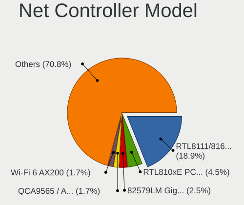

| Model                                                                  | Computers | Percent |
|------------------------------------------------------------------------|-----------|---------|
| Realtek RTL8111/8168/8211/8411 PCI Express Gigabit Ethernet Controller | 1409      | 18.93%  |
| Realtek RTL810xE PCI Express Fast Ethernet controller                  | 334       | 4.49%   |
| Intel 82579LM Gigabit Network Connection (Lewisville)                  | 184       | 2.47%   |
| Qualcomm Atheros QCA9565 / AR9565 Wireless Network Adapter             | 123       | 1.65%   |
| Intel Wi-Fi 6 AX200                                                    | 123       | 1.65%   |
| Intel Wireless 7265                                                    | 120       | 1.61%   |
| Qualcomm Atheros QCA9377 802.11ac Wireless Network Adapter             | 105       | 1.41%   |
| Qualcomm Atheros AR9485 Wireless Network Adapter                       | 104       | 1.4%    |
| Intel Wireless 7260                                                    | 100       | 1.34%   |
| Intel Wireless 8265 / 8275                                             | 99        | 1.33%   |
| Intel Wi-Fi 6 AX201                                                    | 89        | 1.2%    |
| Realtek RTL8821CE 802.11ac PCIe Wireless Network Adapter               | 88        | 1.18%   |
| Qualcomm Atheros AR9285 Wireless Network Adapter (PCI-Express)         | 87        | 1.17%   |
| Intel Ethernet Connection I217-LM                                      | 85        | 1.14%   |
| Realtek RTL8125 2.5GbE Controller                                      | 84        | 1.13%   |
| Realtek RTL8153 Gigabit Ethernet Adapter                               | 69        | 0.93%   |
| Intel Wireless 3165                                                    | 68        | 0.91%   |
| Intel Wireless 8260                                                    | 66        | 0.89%   |
| Intel Centrino Advanced-N 6205 [Taylor Peak]                           | 63        | 0.85%   |
| Broadcom BCM43142 802.11b/g/n                                          | 63        | 0.85%   |
| Intel I211 Gigabit Network Connection                                  | 61        | 0.82%   |
| Realtek RTL8822CE 802.11ac PCIe Wireless Network Adapter               | 58        | 0.78%   |
| Intel Wi-Fi 6E(802.11ax) AX210/AX1675* 2x2 [Typhoon Peak]              | 58        | 0.78%   |
| Realtek RTL88x2bu [AC1200 Techkey]                                     | 53        | 0.71%   |
| Realtek 802.11ac NIC                                                   | 53        | 0.71%   |
| Realtek RTL8723BE PCIe Wireless Network Adapter                        | 51        | 0.69%   |
| Broadcom BCM4313 802.11bgn Wireless Network Adapter                    | 49        | 0.66%   |
| Qualcomm Atheros QCA6174 802.11ac Wireless Network Adapter             | 47        | 0.63%   |
| Intel Ethernet Controller I225-V                                       | 44        | 0.59%   |
| Intel Ethernet Connection (2) I219-V                                   | 44        | 0.59%   |
| Qualcomm Atheros AR8151 v2.0 Gigabit Ethernet                          | 43        | 0.58%   |
| Intel Comet Lake PCH-LP CNVi WiFi                                      | 43        | 0.58%   |
| Ralink MT7601U Wireless Adapter                                        | 42        | 0.56%   |
| Intel Dual Band Wireless-AC 3168NGW [Stone Peak]                       | 42        | 0.56%   |
| Intel Cannon Lake PCH CNVi WiFi                                        | 41        | 0.55%   |
| Realtek RTL8188CE 802.11b/g/n WiFi Adapter                             | 39        | 0.52%   |
| Realtek RTL8188EUS 802.11n Wireless Network Adapter                    | 38        | 0.51%   |
| Broadcom NetXtreme BCM57765 Gigabit Ethernet PCIe                      | 36        | 0.48%   |
| Realtek RTL8188EE Wireless Network Adapter                             | 35        | 0.47%   |
| Intel WiFi Link 5100                                                   | 35        | 0.47%   |

Wireless Vendor
---------------

Wireless vendors

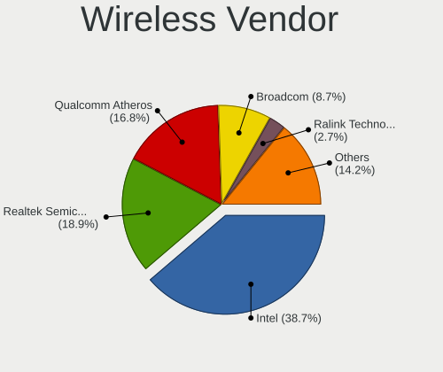

| Vendor                                | Computers | Percent |
|---------------------------------------|-----------|---------|
| Intel                                 | 1385      | 38.74%  |
| Realtek Semiconductor                 | 676       | 18.91%  |
| Qualcomm Atheros                      | 601       | 16.81%  |
| Broadcom                              | 310       | 8.67%   |
| Ralink Technology                     | 97        | 2.71%   |
| Broadcom Limited                      | 89        | 2.49%   |
| TP-Link                               | 81        | 2.27%   |
| Ralink                                | 77        | 2.15%   |
| MediaTek                              | 64        | 1.79%   |
| NetGear                               | 25        | 0.7%    |
| Marvell Technology Group              | 23        | 0.64%   |
| Sierra Wireless                       | 17        | 0.48%   |
| Qualcomm Atheros Communications       | 17        | 0.48%   |
| Dell                                  | 15        | 0.42%   |
| D-Link                                | 14        | 0.39%   |
| Microsoft                             | 13        | 0.36%   |
| Edimax Technology                     | 11        | 0.31%   |
| D-Link System                         | 11        | 0.31%   |
| ASUSTek Computer                      | 9         | 0.25%   |
| Linksys                               | 6         | 0.17%   |
| Belkin Components                     | 6         | 0.17%   |
| ZyDAS                                 | 3         | 0.08%   |
| AVM                                   | 3         | 0.08%   |
| ZyXEL Communications                  | 2         | 0.06%   |
| TRENDnet                              | 2         | 0.06%   |
| Hewlett-Packard                       | 2         | 0.06%   |
| Gemtek                                | 2         | 0.06%   |
| Fibocom                               | 2         | 0.06%   |
| Xiaomi                                | 1         | 0.03%   |
| Tenda                                 | 1         | 0.03%   |
| Sitecom Europe                        | 1         | 0.03%   |
| Samsung Electronics                   | 1         | 0.03%   |
| Qualcomm                              | 1         | 0.03%   |
| Panasonic (Matsushita)                | 1         | 0.03%   |
| Ovislink                              | 1         | 0.03%   |
| Mercucys                              | 1         | 0.03%   |
| Ericsson Business Mobile Networks     | 1         | 0.03%   |
| Askey Computer                        | 1         | 0.03%   |
| ADMtek                                | 1         | 0.03%   |
| 802.11g Adapter [Linksys WUSB54GC v3] | 1         | 0.03%   |

Wireless Model
--------------

Wireless models

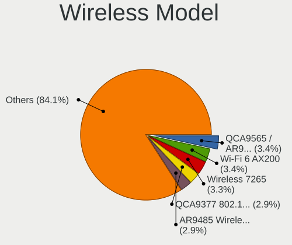

| Model                                                                | Computers | Percent |
|----------------------------------------------------------------------|-----------|---------|
| Qualcomm Atheros QCA9565 / AR9565 Wireless Network Adapter           | 123       | 3.4%    |
| Intel Wi-Fi 6 AX200                                                  | 123       | 3.4%    |
| Intel Wireless 7265                                                  | 120       | 3.32%   |
| Qualcomm Atheros QCA9377 802.11ac Wireless Network Adapter           | 105       | 2.91%   |
| Qualcomm Atheros AR9485 Wireless Network Adapter                     | 104       | 2.88%   |
| Intel Wireless 7260                                                  | 100       | 2.77%   |
| Intel Wireless 8265 / 8275                                           | 99        | 2.74%   |
| Intel Wi-Fi 6 AX201                                                  | 89        | 2.46%   |
| Realtek RTL8821CE 802.11ac PCIe Wireless Network Adapter             | 88        | 2.44%   |
| Qualcomm Atheros AR9285 Wireless Network Adapter (PCI-Express)       | 87        | 2.41%   |
| Intel Wireless 3165                                                  | 68        | 1.88%   |
| Intel Wireless 8260                                                  | 66        | 1.83%   |
| Intel Centrino Advanced-N 6205 [Taylor Peak]                         | 63        | 1.74%   |
| Broadcom BCM43142 802.11b/g/n                                        | 63        | 1.74%   |
| Realtek RTL8822CE 802.11ac PCIe Wireless Network Adapter             | 58        | 1.61%   |
| Intel Wi-Fi 6E(802.11ax) AX210/AX1675* 2x2 [Typhoon Peak]            | 58        | 1.61%   |
| Realtek RTL88x2bu [AC1200 Techkey]                                   | 53        | 1.47%   |
| Realtek 802.11ac NIC                                                 | 53        | 1.47%   |
| Realtek RTL8723BE PCIe Wireless Network Adapter                      | 51        | 1.41%   |
| Broadcom BCM4313 802.11bgn Wireless Network Adapter                  | 49        | 1.36%   |
| Qualcomm Atheros QCA6174 802.11ac Wireless Network Adapter           | 47        | 1.3%    |
| Intel Comet Lake PCH-LP CNVi WiFi                                    | 43        | 1.19%   |
| Ralink MT7601U Wireless Adapter                                      | 42        | 1.16%   |
| Intel Dual Band Wireless-AC 3168NGW [Stone Peak]                     | 42        | 1.16%   |
| Intel Cannon Lake PCH CNVi WiFi                                      | 41        | 1.13%   |
| Realtek RTL8188CE 802.11b/g/n WiFi Adapter                           | 39        | 1.08%   |
| Realtek RTL8188EUS 802.11n Wireless Network Adapter                  | 38        | 1.05%   |
| Realtek RTL8188EE Wireless Network Adapter                           | 35        | 0.97%   |
| Intel WiFi Link 5100                                                 | 35        | 0.97%   |
| MediaTek MT7921 802.11ax PCIe Wireless Network Adapter [Filogic 330] | 31        | 0.86%   |
| Intel Wi-Fi 5(802.11ac) Wireless-AC 9x6x [Thunder Peak]              | 31        | 0.86%   |
| Intel Wireless 3160                                                  | 30        | 0.83%   |
| Intel Centrino Ultimate-N 6300                                       | 30        | 0.83%   |
| Qualcomm Atheros AR9462 Wireless Network Adapter                     | 27        | 0.75%   |
| Qualcomm Atheros AR93xx Wireless Network Adapter                     | 24        | 0.66%   |
| Intel Ice Lake-LP PCH CNVi WiFi                                      | 24        | 0.66%   |
| Intel Gemini Lake PCH CNVi WiFi                                      | 24        | 0.66%   |
| Broadcom BCM4360 802.11ac Dual Band Wireless Network Adapter         | 24        | 0.66%   |
| Realtek RTL8852BE PCIe 802.11ax Wireless Network Controller          | 22        | 0.61%   |
| Realtek RTL8822BE 802.11a/b/g/n/ac WiFi adapter                      | 22        | 0.61%   |

Ethernet Vendor
---------------

Ethernet vendors

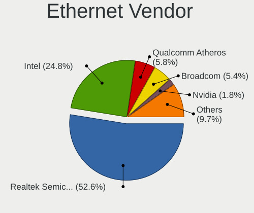

| Vendor                            | Computers | Percent |
|-----------------------------------|-----------|---------|
| Realtek Semiconductor             | 1943      | 52.56%  |
| Intel                             | 916       | 24.78%  |
| Qualcomm Atheros                  | 213       | 5.76%   |
| Broadcom                          | 198       | 5.36%   |
| Nvidia                            | 67        | 1.81%   |
| Marvell Technology Group          | 67        | 1.81%   |
| Broadcom Limited                  | 47        | 1.27%   |
| Samsung Electronics               | 41        | 1.11%   |
| ASIX Electronics                  | 33        | 0.89%   |
| DisplayLink                       | 23        | 0.62%   |
| Xiaomi                            | 19        | 0.51%   |
| JMicron Technology                | 14        | 0.38%   |
| Huawei Technologies               | 14        | 0.38%   |
| TP-Link                           | 11        | 0.3%    |
| OPPO Electronics                  | 10        | 0.27%   |
| MediaTek                          | 10        | 0.27%   |
| Motorola PCS                      | 9         | 0.24%   |
| Qualcomm                          | 7         | 0.19%   |
| Aquantia                          | 7         | 0.19%   |
| VIA Technologies                  | 5         | 0.14%   |
| Google                            | 5         | 0.14%   |
| Silicon Integrated Systems [SiS]  | 4         | 0.11%   |
| Hewlett-Packard                   | 3         | 0.08%   |
| Sundance Technology Inc / IC Plus | 2         | 0.05%   |
| OnePlus Technology (Shenzhen)     | 2         | 0.05%   |
| Microsoft                         | 2         | 0.05%   |
| Lenovo                            | 2         | 0.05%   |
| ICS Advent                        | 2         | 0.05%   |
| HMD Global                        | 2         | 0.05%   |
| D-Link System                     | 2         | 0.05%   |
| ASUSTek Computer                  | 2         | 0.05%   |
| vivo                              | 1         | 0.03%   |
| T & A Mobile Phones               | 1         | 0.03%   |
| Sun Microsystems                  | 1         | 0.03%   |
| Spreadtrum Communications         | 1         | 0.03%   |
| Research In Motion                | 1         | 0.03%   |
| Novatel Wireless                  | 1         | 0.03%   |
| Motorola BCS                      | 1         | 0.03%   |
| Linksys                           | 1         | 0.03%   |
| LG Electronics                    | 1         | 0.03%   |

Ethernet Model
--------------

Ethernet models

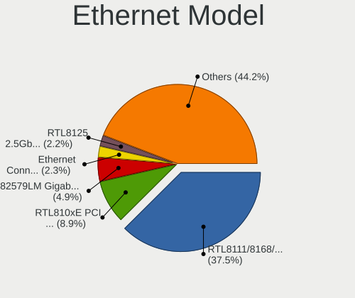

| Model                                                                  | Computers | Percent |
|------------------------------------------------------------------------|-----------|---------|
| Realtek RTL8111/8168/8211/8411 PCI Express Gigabit Ethernet Controller | 1409      | 37.54%  |
| Realtek RTL810xE PCI Express Fast Ethernet controller                  | 334       | 8.9%    |
| Intel 82579LM Gigabit Network Connection (Lewisville)                  | 184       | 4.9%    |
| Intel Ethernet Connection I217-LM                                      | 85        | 2.26%   |
| Realtek RTL8125 2.5GbE Controller                                      | 84        | 2.24%   |
| Realtek RTL8153 Gigabit Ethernet Adapter                               | 69        | 1.84%   |
| Intel I211 Gigabit Network Connection                                  | 61        | 1.63%   |
| Intel Ethernet Controller I225-V                                       | 44        | 1.17%   |
| Intel Ethernet Connection (2) I219-V                                   | 44        | 1.17%   |
| Qualcomm Atheros AR8151 v2.0 Gigabit Ethernet                          | 43        | 1.15%   |
| Broadcom NetXtreme BCM57765 Gigabit Ethernet PCIe                      | 36        | 0.96%   |
| Intel Ethernet Connection I219-LM                                      | 31        | 0.83%   |
| Nvidia MCP79 Ethernet                                                  | 30        | 0.8%    |
| Samsung Galaxy series, misc. (tethering mode)                          | 29        | 0.77%   |
| Intel 82577LM Gigabit Network Connection                               | 29        | 0.77%   |
| Intel Ethernet Connection I218-LM                                      | 28        | 0.75%   |
| Intel Ethernet Connection I217-V                                       | 28        | 0.75%   |
| ASIX AX88179 Gigabit Ethernet                                          | 28        | 0.75%   |
| Intel Ethernet Connection (4) I219-LM                                  | 26        | 0.69%   |
| Broadcom NetLink BCM57785 Gigabit Ethernet PCIe                        | 26        | 0.69%   |
| Qualcomm Atheros QCA8171 Gigabit Ethernet                              | 24        | 0.64%   |
| Intel Ethernet Connection (2) I219-LM                                  | 24        | 0.64%   |
| Intel 82579V Gigabit Network Connection                                | 22        | 0.59%   |
| Broadcom NetXtreme BCM57766 Gigabit Ethernet PCIe                      | 22        | 0.59%   |
| Intel 82567LM Gigabit Network Connection                               | 21        | 0.56%   |
| Nvidia MCP61 Ethernet                                                  | 20        | 0.53%   |
| Intel 82567LM-3 Gigabit Network Connection                             | 19        | 0.51%   |
| Broadcom NetXtreme BCM5761 Gigabit Ethernet PCIe                       | 19        | 0.51%   |
| Realtek RTL8152 Fast Ethernet Adapter                                  | 18        | 0.48%   |
| Intel Ethernet Connection I219-V                                       | 18        | 0.48%   |
| Intel Ethernet Connection (7) I219-V                                   | 18        | 0.48%   |
| Broadcom NetLink BCM57780 Gigabit Ethernet PCIe                        | 18        | 0.48%   |
| Qualcomm Atheros AR8162 Fast Ethernet                                  | 17        | 0.45%   |
| Qualcomm Atheros AR8161 Gigabit Ethernet                               | 17        | 0.45%   |
| Qualcomm Atheros AR8131 Gigabit Ethernet                               | 17        | 0.45%   |
| Intel Ethernet Connection (4) I219-V                                   | 17        | 0.45%   |
| Realtek RTL-8100/8101L/8139 PCI Fast Ethernet Adapter                  | 16        | 0.43%   |
| Intel Ethernet Connection (3) I218-LM                                  | 16        | 0.43%   |
| Qualcomm Atheros Killer E220x Gigabit Ethernet Controller              | 15        | 0.4%    |
| Intel Ethernet Connection (5) I219-LM                                  | 15        | 0.4%    |

Net Controller Kind
-------------------

Ethernet, WiFi or modem

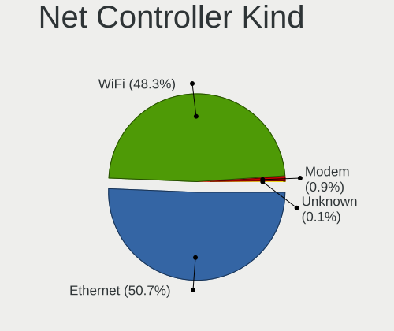

| Kind     | Computers | Percent |
|----------|-----------|---------|
| Ethernet | 3495      | 50.65%  |
| WiFi     | 3331      | 48.28%  |
| Modem    | 64        | 0.93%   |
| Unknown  | 10        | 0.14%   |

Used Controller
---------------

Currently used network controller

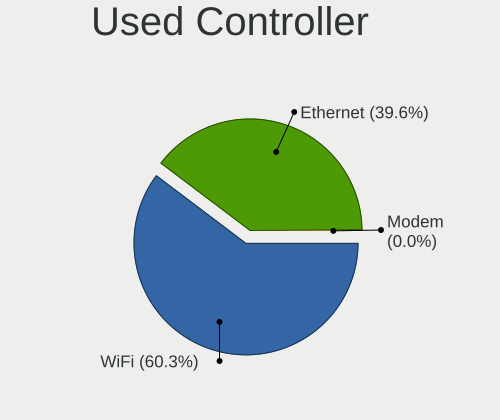

| Kind     | Computers | Percent |
|----------|-----------|---------|
| WiFi     | 2618      | 60.29%  |
| Ethernet | 1719      | 39.59%  |
| Unknown  | 3         | 0.07%   |
| Modem    | 2         | 0.05%   |

NICs
----

Total network controllers on board

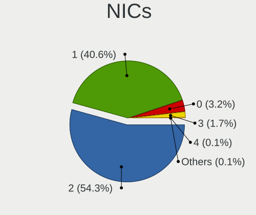

| Total | Computers | Percent |
|-------|-----------|---------|
| 2     | 2275      | 54.3%   |
| 1     | 1700      | 40.57%  |
| 0     | 136       | 3.25%   |
| 3     | 71        | 1.69%   |
| 4     | 4         | 0.1%    |
| 5     | 3         | 0.07%   |
| 7     | 1         | 0.02%   |

IPv6
----

IPv6 vs IPv4

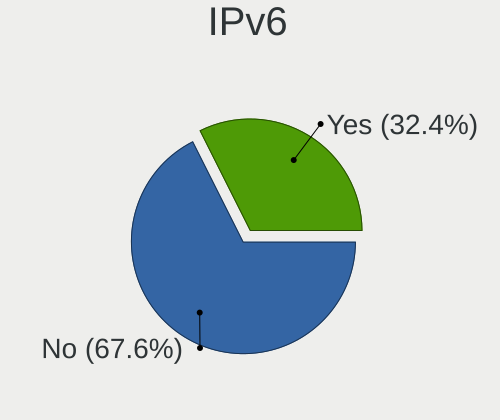

| Used | Computers | Percent |
|------|-----------|---------|
| No   | 2873      | 67.58%  |
| Yes  | 1378      | 32.42%  |

Bluetooth
---------

Bluetooth Vendor
----------------

Controller vendors

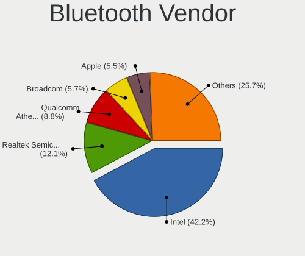

| Vendor                          | Computers | Percent |
|---------------------------------|-----------|---------|
| Intel                           | 1068      | 42.23%  |
| Realtek Semiconductor           | 307       | 12.14%  |
| Qualcomm Atheros Communications | 222       | 8.78%   |
| Broadcom                        | 144       | 5.69%   |
| Apple                           | 139       | 5.5%    |
| Cambridge Silicon Radio         | 131       | 5.18%   |
| IMC Networks                    | 107       | 4.23%   |
| Foxconn / Hon Hai               | 67        | 2.65%   |
| Lite-On Technology              | 62        | 2.45%   |
| Dell                            | 47        | 1.86%   |
| Hewlett-Packard                 | 35        | 1.38%   |
| ASUSTek Computer                | 35        | 1.38%   |
| Toshiba                         | 32        | 1.27%   |
| Marvell Semiconductor           | 22        | 0.87%   |
| Ralink                          | 19        | 0.75%   |
| MediaTek                        | 16        | 0.63%   |
| Realtek                         | 12        | 0.47%   |
| TP-Link                         | 8         | 0.32%   |
| Foxconn International           | 7         | 0.28%   |
| Alps Electric                   | 7         | 0.28%   |
| Integrated System Solution      | 6         | 0.24%   |
| Unknown                         | 6         | 0.24%   |
| Dynex                           | 5         | 0.2%    |
| Belkin Components               | 4         | 0.16%   |
| Ralink Technology               | 3         | 0.12%   |
| Askey Computer                  | 3         | 0.12%   |
| Actions                         | 3         | 0.12%   |
| Qcom                            | 2         | 0.08%   |
| Edimax Technology               | 2         | 0.08%   |
| Taiyo Yuden                     | 1         | 0.04%   |
| Sitecom Europe                  | 1         | 0.04%   |
| National Semiconductor          | 1         | 0.04%   |
| Micro Star International        | 1         | 0.04%   |
| Logitech                        | 1         | 0.04%   |
| D-Link System                   | 1         | 0.04%   |
| Conwise Technology              | 1         | 0.04%   |
| Chicony Electronics             | 1         | 0.04%   |

Bluetooth Model
---------------

Controller models

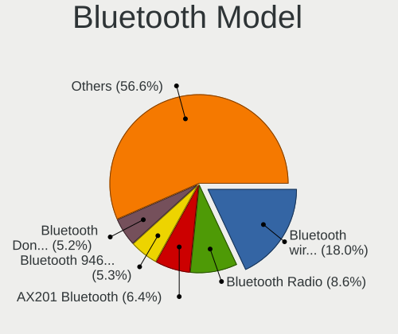

| Model                                               | Computers | Percent |
|-----------------------------------------------------|-----------|---------|
| Intel Bluetooth wireless interface                  | 456       | 18.01%  |
| Realtek Bluetooth Radio                             | 218       | 8.61%   |
| Intel AX201 Bluetooth                               | 162       | 6.4%    |
| Intel Bluetooth 9460/9560 Jefferson Peak (JfP)      | 133       | 5.25%   |
| Cambridge Silicon Radio Bluetooth Dongle (HCI mode) | 131       | 5.17%   |
| Intel AX200 Bluetooth                               | 107       | 4.23%   |
| Qualcomm Atheros  Bluetooth Device                  | 93        | 3.67%   |
| Apple Bluetooth Host Controller                     | 63        | 2.49%   |
| Realtek  Bluetooth 4.2 Adapter                      | 60        | 2.37%   |
| Intel AX210 Bluetooth                               | 54        | 2.13%   |
| Intel Centrino Bluetooth Wireless Transceiver       | 41        | 1.62%   |
| Intel Wireless-AC 3168 Bluetooth                    | 40        | 1.58%   |
| IMC Networks Bluetooth Device                       | 36        | 1.42%   |
| Apple Built-in Bluetooth 2.0+EDR HCI                | 35        | 1.38%   |
| Qualcomm Atheros AR3011 Bluetooth                   | 34        | 1.34%   |
| Intel Wireless-AC 9260 Bluetooth Adapter            | 31        | 1.22%   |
| Qualcomm Atheros AR3012 Bluetooth 4.0               | 30        | 1.18%   |
| IMC Networks Bluetooth Radio                        | 30        | 1.18%   |
| Qualcomm Atheros QCA61x4 Bluetooth 4.0              | 26        | 1.03%   |
| Broadcom BCM43142A0 Bluetooth 4.0                   | 26        | 1.03%   |
| Apple Bluetooth USB Host Controller                 | 26        | 1.03%   |
| Intel Bluetooth Device                              | 25        | 0.99%   |
| IMC Networks Wireless_Device                        | 23        | 0.91%   |
| Marvell Bluetooth and Wireless LAN Composite        | 21        | 0.83%   |
| HP Bluetooth 2.0 Interface [Broadcom BCM2045]       | 21        | 0.83%   |
| Lite-On Qualcomm Atheros QCA9377 Bluetooth          | 20        | 0.79%   |
| Lite-On Atheros AR3012 Bluetooth                    | 20        | 0.79%   |
| Intel Centrino Advanced-N 6230 Bluetooth adapter    | 20        | 0.79%   |
| Foxconn / Hon Hai Bluetooth Device                  | 20        | 0.79%   |
| Ralink RT3290 Bluetooth                             | 19        | 0.75%   |
| Qualcomm Atheros AR9462 Bluetooth                   | 19        | 0.75%   |
| Broadcom BCM20702A0 Bluetooth 4.0                   | 19        | 0.75%   |
| Dell DW375 Bluetooth Module                         | 16        | 0.63%   |
| Broadcom BCM2045B (BDC-2.1)                         | 16        | 0.63%   |
| MediaTek Wireless_Device                            | 15        | 0.59%   |
| Apple Bluetooth HCI                                 | 15        | 0.59%   |
| HP Broadcom 2070 Bluetooth Combo                    | 14        | 0.55%   |
| ASUS Broadcom BCM20702A0 Bluetooth                  | 13        | 0.51%   |
| Realtek RTL8723B Bluetooth                          | 12        | 0.47%   |
| Realtek Bluetooth Radio                             | 12        | 0.47%   |

Sound
-----

Sound Vendor
------------

Sound card vendors

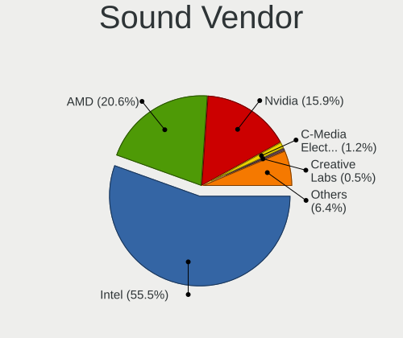

| Vendor                                       | Computers | Percent |
|----------------------------------------------|-----------|---------|
| Intel                                        | 3090      | 55.5%   |
| AMD                                          | 1147      | 20.6%   |
| Nvidia                                       | 884       | 15.88%  |
| C-Media Electronics                          | 66        | 1.19%   |
| Creative Labs                                | 27        | 0.48%   |
| Logitech                                     | 23        | 0.41%   |
| JMTek                                        | 22        | 0.4%    |
| Texas Instruments                            | 18        | 0.32%   |
| Generalplus Technology                       | 18        | 0.32%   |
| ASUSTek Computer                             | 18        | 0.32%   |
| Kingston Technology                          | 17        | 0.31%   |
| Realtek Semiconductor                        | 13        | 0.23%   |
| Plantronics                                  | 11        | 0.2%    |
| VIA Technologies                             | 10        | 0.18%   |
| Razer USA                                    | 10        | 0.18%   |
| GN Netcom                                    | 10        | 0.18%   |
| Creative Technology                          | 10        | 0.18%   |
| KTMicro                                      | 9         | 0.16%   |
| Lenovo                                       | 8         | 0.14%   |
| Tenx Technology                              | 7         | 0.13%   |
| SteelSeries ApS                              | 7         | 0.13%   |
| Micro Star International                     | 7         | 0.13%   |
| Focusrite-Novation                           | 6         | 0.11%   |
| Zoran Co. Personal Media Division (Nogatech) | 5         | 0.09%   |
| Jieli Technology                             | 5         | 0.09%   |
| Corsair                                      | 5         | 0.09%   |
| Sony                                         | 4         | 0.07%   |
| Silicon Integrated Systems [SiS]             | 4         | 0.07%   |
| PreSonus Audio Electronics                   | 4         | 0.07%   |
| DSEA A/S                                     | 4         | 0.07%   |
| Samsung Electronics                          | 3         | 0.05%   |
| RODE Microphones                             | 3         | 0.05%   |
| BEHRINGER International                      | 3         | 0.05%   |
| Astro Gaming                                 | 3         | 0.05%   |
| Asahi Kasei Microsystems                     | 3         | 0.05%   |
| Apple                                        | 3         | 0.05%   |
| AKAI Professional M.I.                       | 3         | 0.05%   |
| Yamaha                                       | 2         | 0.04%   |
| XMOS                                         | 2         | 0.04%   |
| Thesycon Systemsoftware & Consulting         | 2         | 0.04%   |

Sound Model
-----------

Sound card models

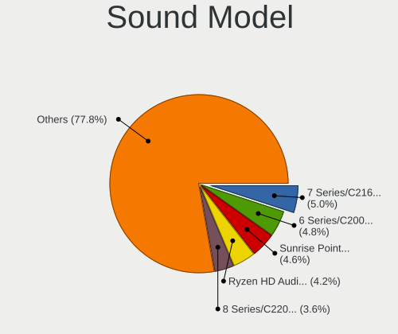

| Model                                                                                             | Computers | Percent |
|---------------------------------------------------------------------------------------------------|-----------|---------|
| Intel 7 Series/C216 Chipset Family High Definition Audio Controller                               | 333       | 5.02%   |
| Intel 6 Series/C200 Series Chipset Family High Definition Audio Controller                        | 319       | 4.81%   |
| Intel Sunrise Point-LP HD Audio                                                                   | 303       | 4.57%   |
| AMD Ryzen HD Audio Controller                                                                     | 279       | 4.21%   |
| Intel 8 Series/C220 Series Chipset High Definition Audio Controller                               | 238       | 3.59%   |
| Intel 5 Series/3400 Series Chipset High Definition Audio                                          | 175       | 2.64%   |
| Intel Xeon E3-1200 v3/4th Gen Core Processor HD Audio Controller                                  | 165       | 2.49%   |
| AMD SBx00 Azalia (Intel HDA)                                                                      | 164       | 2.47%   |
| AMD FCH Azalia Controller                                                                         | 154       | 2.32%   |
| Intel 82801I (ICH9 Family) HD Audio Controller                                                    | 139       | 2.1%    |
| AMD Renoir/Cezanne HDMI/DP Audio Controller                                                       | 133       | 2.01%   |
| Intel Tiger Lake-LP Smart Sound Technology Audio Controller                                       | 127       | 1.92%   |
| Intel 8 Series HD Audio Controller                                                                | 127       | 1.92%   |
| Intel NM10/ICH7 Family High Definition Audio Controller                                           | 124       | 1.87%   |
| Intel Haswell-ULT HD Audio Controller                                                             | 123       | 1.86%   |
| AMD Starship/Matisse HD Audio Controller                                                          | 122       | 1.84%   |
| Intel Broadwell-U Audio Controller                                                                | 105       | 1.58%   |
| Intel Wildcat Point-LP High Definition Audio Controller                                           | 99        | 1.49%   |
| Intel Cannon Lake PCH cAVS                                                                        | 98        | 1.48%   |
| AMD Raven/Raven2/Fenghuang HDMI/DP Audio Controller                                               | 96        | 1.45%   |
| Intel Celeron/Pentium Silver Processor High Definition Audio                                      | 93        | 1.4%    |
| AMD Kabini HDMI/DP Audio                                                                          | 92        | 1.39%   |
| Intel 100 Series/C230 Series Chipset Family HD Audio Controller                                   | 88        | 1.33%   |
| Nvidia GK208 HDMI/DP Audio Controller                                                             | 74        | 1.12%   |
| Nvidia GF108 High Definition Audio Controller                                                     | 73        | 1.1%    |
| Intel 82801H (ICH8 Family) HD Audio Controller                                                    | 72        | 1.09%   |
| Nvidia GP107GL High Definition Audio Controller                                                   | 65        | 0.98%   |
| Intel Atom Processor Z36xxx/Z37xxx Series High Definition Audio Controller                        | 65        | 0.98%   |
| AMD Family 15h (Models 60h-6fh) Audio Controller                                                  | 65        | 0.98%   |
| AMD Ellesmere HDMI Audio [Radeon RX 470/480 / 570/580/590]                                        | 61        | 0.92%   |
| Intel 200 Series PCH HD Audio                                                                     | 60        | 0.91%   |
| AMD Family 17h (Models 00h-0fh) HD Audio Controller                                               | 56        | 0.85%   |
| Intel Celeron N3350/Pentium N4200/Atom E3900 Series Audio Cluster                                 | 51        | 0.77%   |
| Intel Cannon Point-LP High Definition Audio Controller                                            | 51        | 0.77%   |
| Intel Comet Lake PCH-LP cAVS                                                                      | 49        | 0.74%   |
| Nvidia TU107 GeForce GTX 1650 High Definition Audio Controller                                    | 48        | 0.72%   |
| Intel Ice Lake-LP Smart Sound Technology Audio Controller                                         | 47        | 0.71%   |
| AMD Cedar HDMI Audio [Radeon HD 5400/6300/7300 Series]                                            | 47        | 0.71%   |
| Nvidia High Definition Audio Controller                                                           | 45        | 0.68%   |
| Intel Atom/Celeron/Pentium Processor x5-E8000/J3xxx/N3xxx Series High Definition Audio Controller | 45        | 0.68%   |

Memory
------

Memory Vendor
-------------

Memory module vendors

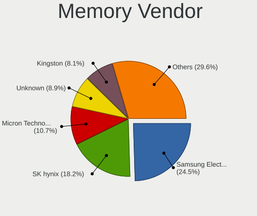

| Vendor                 | Computers | Percent |
|------------------------|-----------|---------|
| Samsung Electronics    | 229       | 24.52%  |
| SK hynix               | 170       | 18.2%   |
| Micron Technology      | 100       | 10.71%  |
| Unknown                | 83        | 8.89%   |
| Kingston               | 76        | 8.14%   |
| Crucial                | 49        | 5.25%   |
| Corsair                | 28        | 3%      |
| Unknown (ABCD)         | 27        | 2.89%   |
| G.Skill                | 25        | 2.68%   |
| A-DATA Technology      | 17        | 1.82%   |
| Team                   | 16        | 1.71%   |
| Elpida                 | 14        | 1.5%    |
| Ramaxel Technology     | 12        | 1.28%   |
| Nanya Technology       | 10        | 1.07%   |
| Unknown                | 10        | 1.07%   |
| Smart                  | 7         | 0.75%   |
| Patriot                | 7         | 0.75%   |
| Transcend              | 4         | 0.43%   |
| Timetec                | 4         | 0.43%   |
| Avant                  | 3         | 0.32%   |
| Wilk                   | 2         | 0.21%   |
| Unifosa                | 2         | 0.21%   |
| Teikon                 | 2         | 0.21%   |
| Qimonda                | 2         | 0.21%   |
| ff                     | 2         | 0.21%   |
| fef5                   | 2         | 0.21%   |
| Apacer                 | 2         | 0.21%   |
| 4ea5                   | 2         | 0.21%   |
| V-GEN                  | 1         | 0.11%   |
| Unknown (08B5)         | 1         | 0.11%   |
| Unknown (07F7)         | 1         | 0.11%   |
| Unknown (000080B30080) | 1         | 0.11%   |
| SUPER KINGSTEK         | 1         | 0.11%   |
| Strontium              | 1         | 0.11%   |
| Smart Brazil           | 1         | 0.11%   |
| Silicon Power          | 1         | 0.11%   |
| SHARETRONIC            | 1         | 0.11%   |
| PUSKILL                | 1         | 0.11%   |
| ProMos/Mosel Vitelic   | 1         | 0.11%   |
| pqi                    | 1         | 0.11%   |

Memory Model
------------

Memory module models

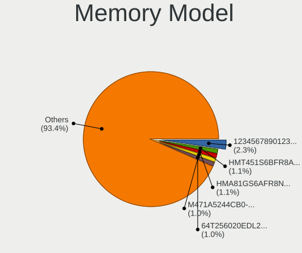

| Model                                                            | Computers | Percent |
|------------------------------------------------------------------|-----------|---------|
| Unknown (ABCD) RAM 123456789012345678 2GB SODIMM LPDDR4 2400MT/s | 23        | 2.33%   |
| SK hynix RAM HMT451S6BFR8A-PB 4GB SODIMM DDR3 1600MT/s           | 11        | 1.11%   |
| SK hynix RAM HMA81GS6AFR8N-UH 8GB SODIMM DDR4 2667MT/s           | 11        | 1.11%   |
| Samsung RAM M471A5244CB0-CTD 4GB SODIMM DDR4 3266MT/s            | 10        | 1.01%   |
| Unknown                                                          | 10        | 1.01%   |
| Samsung RAM M471B5173DB0-YK0 4GB SODIMM DDR3 1600MT/s            | 8         | 0.81%   |
| Samsung RAM M471A1K43DB1-CWE 8GB SODIMM DDR4 3200MT/s            | 8         | 0.81%   |
| Samsung RAM M471A1G44AB0-CWE 8GiB SODIMM DDR4 3200MT/s           | 8         | 0.81%   |
| Samsung RAM M471A1G44AB0-CWE 8GB Row Of Chips DDR4 3200MT/s      | 8         | 0.81%   |
| SK hynix RAM HMAA1GS6CJR6N-XN 8GB SODIMM DDR4 3200MT/s           | 7         | 0.71%   |
| Samsung RAM M471B5173QH0-YK0 4GB SODIMM DDR3 1600MT/s            | 7         | 0.71%   |
| Samsung RAM M471B5173EB0-YK0 4GB SODIMM DDR3 1600MT/s            | 7         | 0.71%   |
| Samsung RAM M471A5244CB0-CWE 4GB SODIMM DDR4 3200MT/s            | 7         | 0.71%   |
| Micron RAM 8KTF51264HZ-1G6E1 4GB SODIMM DDR3 1600MT/s            | 7         | 0.71%   |
| Unknown RAM Module 4096MB DIMM DDR3 1333MT/s                     | 6         | 0.61%   |
| SK hynix RAM HMT351S6CFR8C-PB 4GB SODIMM DDR3 1600MT/s           | 6         | 0.61%   |
| Samsung RAM M471B5273DH0-CH9 4GB SODIMM DDR3 1600MT/s            | 6         | 0.61%   |
| Samsung RAM M471A1K43EB1-CWE 8GB SODIMM DDR4 3200MT/s            | 6         | 0.61%   |
| Micron RAM 4ATF1G64HZ-3G2E1 8GB Row Of Chips DDR4 3200MT/s       | 6         | 0.61%   |
| Unknown RAM Module 2048MB SODIMM DDR3 1600MT/s                   | 5         | 0.51%   |
| SK hynix RAM HMT425S6AFR6A-PB 2GB SODIMM DDR3 3200MT/s           | 5         | 0.51%   |
| SK hynix RAM HMA851S6CJR6N-VK 4GB SODIMM DDR4 2667MT/s           | 5         | 0.51%   |
| Samsung RAM M471A5244CB0-CTD 4GB Row Of Chips DDR4 2667MT/s      | 5         | 0.51%   |
| Samsung RAM M471A1K43CB1-CRC 8GB SODIMM DDR4 8400MT/s            | 5         | 0.51%   |
| Micron RAM 4ATF51264HZ-2G6E1 4GB SODIMM DDR4 2667MT/s            | 5         | 0.51%   |
| Unknown RAM Module 4096MB SODIMM DDR3                            | 4         | 0.4%    |
| Unknown RAM Module 2048MB SODIMM DDR3 1333MT/s                   | 4         | 0.4%    |
| Unknown (ABCD) RAM 123456789012345678 2GB DIMM LPDDR4 2133MT/s   | 4         | 0.4%    |
| SK hynix RAM HMT451S6AFR8A-PB 4GB SODIMM DDR3 1600MT/s           | 4         | 0.4%    |
| SK hynix RAM HMT351S6EFR8A-PB 4GB SODIMM DDR3 1600MT/s           | 4         | 0.4%    |
| SK hynix RAM HMA851S6AFR6N-UH 4GB SODIMM DDR4 2667MT/s           | 4         | 0.4%    |
| SK hynix RAM HMA41GS6AFR8N-TF 8GB SODIMM DDR4 2667MT/s           | 4         | 0.4%    |
| Samsung RAM UBE3D4AA-MGCR 2GB Row Of Chips LPDDR4 4267MT/s       | 4         | 0.4%    |
| Samsung RAM M471B1G73QH0-YK0 8GB SODIMM DDR3 1600MT/s            | 4         | 0.4%    |
| Samsung RAM M471B1G73EB0-YK0 8192MB SODIMM DDR3 1600MT/s         | 4         | 0.4%    |
| Samsung RAM M471B1G73DB0-YK0 8GB SODIMM DDR3 1600MT/s            | 4         | 0.4%    |
| Samsung RAM M471A5244CB0-CWE 4GB Row Of Chips DDR4 3200MT/s      | 4         | 0.4%    |
| Samsung RAM M471A1K43CB1-CTD 8GB SODIMM DDR4 3200MT/s            | 4         | 0.4%    |
| Samsung RAM M471A1K43BB1-CRC 8GB SODIMM DDR4 2667MT/s            | 4         | 0.4%    |
| Samsung RAM M471A1G44BB0-CWE 8GB Row Of Chips DDR4 3200MT/s      | 4         | 0.4%    |

Memory Kind
-----------

Memory module kinds

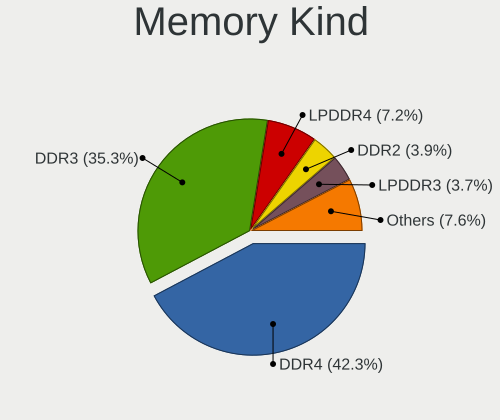

| Kind    | Computers | Percent |
|---------|-----------|---------|
| DDR4    | 339       | 42.27%  |
| DDR3    | 283       | 35.29%  |
| LPDDR4  | 58        | 7.23%   |
| DDR2    | 31        | 3.87%   |
| LPDDR3  | 30        | 3.74%   |
| SDRAM   | 22        | 2.74%   |
| Unknown | 17        | 2.12%   |
| DDR5    | 11        | 1.37%   |
| LPDDR5  | 5         | 0.62%   |
| DDR     | 5         | 0.62%   |
| DRAM    | 1         | 0.12%   |

Memory Form Factor
------------------

Physical design of the memory module

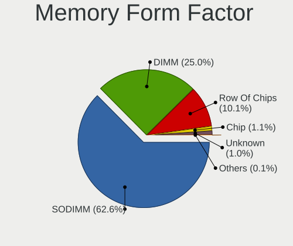

| Name         | Computers | Percent |
|--------------|-----------|---------|
| SODIMM       | 500       | 62.58%  |
| DIMM         | 200       | 25.03%  |
| Row Of Chips | 81        | 10.14%  |
| Chip         | 9         | 1.13%   |
| Unknown      | 8         | 1%      |
| FB-DIMM      | 1         | 0.13%   |

Memory Size
-----------

Memory module size

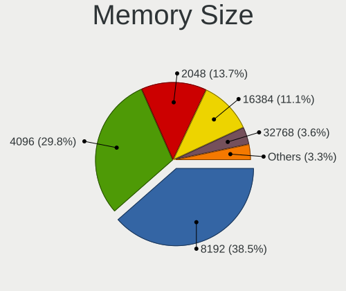

| Size  | Computers | Percent |
|-------|-----------|---------|
| 8192  | 341       | 38.53%  |
| 4096  | 264       | 29.83%  |
| 2048  | 121       | 13.67%  |
| 16384 | 98        | 11.07%  |
| 32768 | 32        | 3.62%   |
| 1024  | 27        | 3.05%   |
| 512   | 2         | 0.23%   |

Memory Speed
------------

Memory module speed

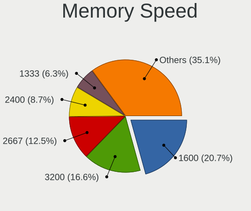

| Speed   | Computers | Percent |
|---------|-----------|---------|
| 1600    | 180       | 20.71%  |
| 3200    | 144       | 16.57%  |
| 2667    | 109       | 12.54%  |
| 2400    | 76        | 8.75%   |
| 1333    | 55        | 6.33%   |
| 2133    | 37        | 4.26%   |
| 1334    | 25        | 2.88%   |
| 4267    | 17        | 1.96%   |
| 3600    | 17        | 1.96%   |
| 1867    | 17        | 1.96%   |
| Unknown | 16        | 1.84%   |
| 800     | 15        | 1.73%   |
| 667     | 15        | 1.73%   |
| 1066    | 13        | 1.5%    |
| 3266    | 10        | 1.15%   |
| 8400    | 9         | 1.04%   |
| 1866    | 9         | 1.04%   |
| 3733    | 8         | 0.92%   |
| 2048    | 8         | 0.92%   |
| 3000    | 7         | 0.81%   |
| 1067    | 7         | 0.81%   |
| 6400    | 6         | 0.69%   |
| 4800    | 6         | 0.69%   |
| 1800    | 6         | 0.69%   |
| 4000    | 4         | 0.46%   |
| 3800    | 4         | 0.46%   |
| 975     | 4         | 0.46%   |
| 4266    | 3         | 0.35%   |
| 4199    | 3         | 0.35%   |
| 2933    | 3         | 0.35%   |
| 2666    | 3         | 0.35%   |
| 6000    | 2         | 0.23%   |
| 3666    | 2         | 0.23%   |
| 3500    | 2         | 0.23%   |
| 3467    | 2         | 0.23%   |
| 3466    | 2         | 0.23%   |
| 3400    | 2         | 0.23%   |
| 400     | 2         | 0.23%   |
| 7467    | 1         | 0.12%   |
| 6200    | 1         | 0.12%   |

Printers & scanners
-------------------

Printer Vendor
--------------

Printer device vendors

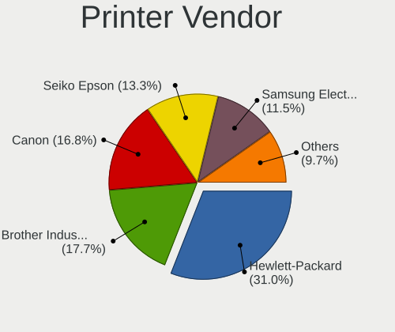

| Vendor                | Computers | Percent |
|-----------------------|-----------|---------|
| Hewlett-Packard       | 35        | 30.97%  |
| Brother Industries    | 20        | 17.7%   |
| Canon                 | 19        | 16.81%  |
| Seiko Epson           | 15        | 13.27%  |
| Samsung Electronics   | 13        | 11.5%   |
| Lexmark International | 3         | 2.65%   |
| Konica Minolta        | 2         | 1.77%   |
| Zebra                 | 1         | 0.88%   |
| Ricoh                 | 1         | 0.88%   |
| QinHeng Electronics   | 1         | 0.88%   |
| Prolific Technology   | 1         | 0.88%   |
| Oki Data              | 1         | 0.88%   |
| GG IMAGE              | 1         | 0.88%   |

Printer Model
-------------

Printer device models

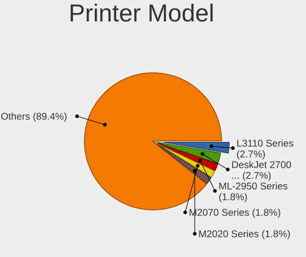

| Model                                        | Computers | Percent |
|----------------------------------------------|-----------|---------|
| Seiko Epson L3110 Series                     | 3         | 2.65%   |
| HP DeskJet 2700 series                       | 3         | 2.65%   |
| Samsung ML-2950 Series                       | 2         | 1.77%   |
| Samsung M2070 Series                         | 2         | 1.77%   |
| Samsung M2020 Series                         | 2         | 1.77%   |
| Samsung C460 Series                          | 2         | 1.77%   |
| HP OfficeJet 6950                            | 2         | 1.77%   |
| HP LaserJet Professional P1102w              | 2         | 1.77%   |
| HP ENVY Photo 6200 series                    | 2         | 1.77%   |
| HP ENVY 4520 series                          | 2         | 1.77%   |
| HP DeskJet 2130 series                       | 2         | 1.77%   |
| Canon TS3100 series                          | 2         | 1.77%   |
| Canon PIXMA MG3600 Series                    | 2         | 1.77%   |
| Canon LiDE 400                               | 2         | 1.77%   |
| Brother HL-2140 series                       | 2         | 1.77%   |
| Zebra ZP 450 Printer                         | 1         | 0.88%   |
| Seiko Epson XP-7100 Series                   | 1         | 0.88%   |
| Seiko Epson XP-235 Series                    | 1         | 0.88%   |
| Seiko Epson ME 320/330 Series [Stylus SX125] | 1         | 0.88%   |
| Seiko Epson L805 Series                      | 1         | 0.88%   |
| Seiko Epson L6270 Series                     | 1         | 0.88%   |
| Seiko Epson L355 Series                      | 1         | 0.88%   |
| Seiko Epson ET-2820 Series                   | 1         | 0.88%   |
| Seiko Epson ET-2810 Series                   | 1         | 0.88%   |
| Seiko Epson ET-2800 Series                   | 1         | 0.88%   |
| Seiko Epson ET-2710 Series                   | 1         | 0.88%   |
| Seiko Epson EPSON XP-205 207 Series          | 1         | 0.88%   |
| Seiko Epson AcuLaser C1700                   | 1         | 0.88%   |
| Samsung SCX-483x 5x3x Series                 | 1         | 0.88%   |
| Samsung SCX-4623 Series                      | 1         | 0.88%   |
| Samsung SCX-4200 series                      | 1         | 0.88%   |
| Samsung SCX-3400 Series                      | 1         | 0.88%   |
| Samsung ML-216x Series Laser Printer         | 1         | 0.88%   |
| Ricoh SP 111SU                               | 1         | 0.88%   |
| QinHeng CH340S                               | 1         | 0.88%   |
| Prolific PL2305 Parallel Port                | 1         | 0.88%   |
| Oki Data USB Device                          | 1         | 0.88%   |
| Lexmark International MX310dn                | 1         | 0.88%   |
| Lexmark International Laser Printer E232     | 1         | 0.88%   |
| Lexmark International 2400 series            | 1         | 0.88%   |

Scanner Vendor
--------------

Scanner device vendors

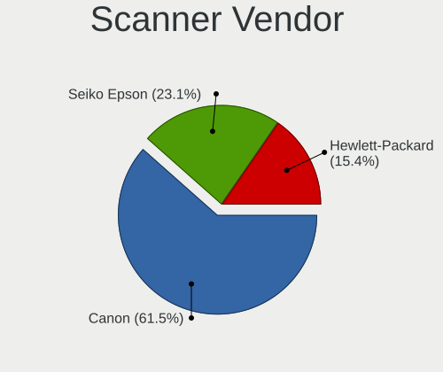

| Vendor          | Computers | Percent |
|-----------------|-----------|---------|
| Canon           | 16        | 69.57%  |
| Seiko Epson     | 4         | 17.39%  |
| Hewlett-Packard | 3         | 13.04%  |

Scanner Model
-------------

Scanner device models

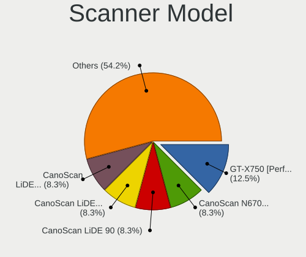

| Model                                       | Computers | Percent |
|---------------------------------------------|-----------|---------|
| Seiko Epson GT-X750 [Perfection 4490 Photo] | 3         | 12.5%   |
| Canon CanoScan N670U/N676U/LiDE 20          | 2         | 8.33%   |
| Canon CanoScan LiDE 90                      | 2         | 8.33%   |
| Canon CanoScan LiDE 220                     | 2         | 8.33%   |
| Canon CanoScan LiDE 110                     | 2         | 8.33%   |
| Seiko Epson Scanner                         | 1         | 4.17%   |
| HP ScanJet 2400c                            | 1         | 4.17%   |
| HP Scanjet 200                              | 1         | 4.17%   |
| HP PSC 1200                                 | 1         | 4.17%   |
| Canon CanoScan LiDE 700F                    | 1         | 4.17%   |
| Canon CanoScan LiDE 60                      | 1         | 4.17%   |
| Canon CanoScan LiDE 50/LiDE 35/LiDE 40      | 1         | 4.17%   |
| Canon CanoScan LIDE 25                      | 1         | 4.17%   |
| Canon CanoScan LiDE 210                     | 1         | 4.17%   |
| Canon CanoScan LiDE 100                     | 1         | 4.17%   |
| Canon CanoScan D660U                        | 1         | 4.17%   |
| Canon CanoScan 8800F                        | 1         | 4.17%   |
| Canon CanoScan 5600F                        | 1         | 4.17%   |

Camera
------

Camera Vendor
-------------

Camera device vendors

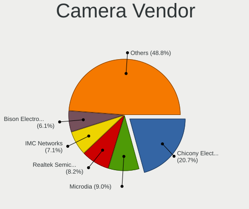

| Vendor                                 | Computers | Percent |
|----------------------------------------|-----------|---------|
| Chicony Electronics                    | 510       | 20.75%  |
| Microdia                               | 221       | 8.99%   |
| Realtek Semiconductor                  | 202       | 8.22%   |
| IMC Networks                           | 175       | 7.12%   |
| Bison Electronics                      | 151       | 6.14%   |
| Sunplus Innovation Technology          | 143       | 5.82%   |
| Apple                                  | 120       | 4.88%   |
| Cheng Uei Precision Industry (Foxlink) | 107       | 4.35%   |
| Quanta                                 | 104       | 4.23%   |
| Logitech                               | 95        | 3.86%   |
| Suyin                                  | 84        | 3.42%   |
| Syntek                                 | 67        | 2.73%   |
| Lite-On Technology                     | 50        | 2.03%   |
| Alcor Micro                            | 41        | 1.67%   |
| Silicon Motion                         | 38        | 1.55%   |
| Luxvisions Innotech Limited            | 30        | 1.22%   |
| Ricoh                                  | 22        | 0.9%    |
| Microsoft                              | 22        | 0.9%    |
| Samsung Electronics                    | 21        | 0.85%   |
| Sonix Technology                       | 19        | 0.77%   |
| Z-Star Microelectronics                | 15        | 0.61%   |
| icSpring                               | 14        | 0.57%   |
| Generalplus Technology                 | 13        | 0.53%   |
| Primax Electronics                     | 12        | 0.49%   |
| Acer                                   | 12        | 0.49%   |
| Lenovo                                 | 11        | 0.45%   |
| ARC International                      | 10        | 0.41%   |
| SunplusIT                              | 9         | 0.37%   |
| GEMBIRD                                | 9         | 0.37%   |
| ALi                                    | 8         | 0.33%   |
| Importek                               | 7         | 0.28%   |
| OmniVision Technologies                | 6         | 0.24%   |
| Y Media                                | 5         | 0.2%    |
| Shenzhen Kingcome Optoelectronic       | 5         | 0.2%    |
| Jieli Technology                       | 5         | 0.2%    |
| Genesys Logic                          | 5         | 0.2%    |
| Sunplus Technology                     | 4         | 0.16%   |
| Razer USA                              | 4         | 0.16%   |
| Intel                                  | 4         | 0.16%   |
| Creative Technology                    | 4         | 0.16%   |

Camera Model
------------

Camera device models

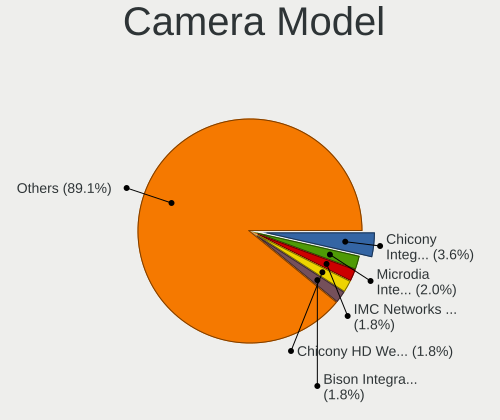

| Model                                               | Computers | Percent |
|-----------------------------------------------------|-----------|---------|
| Chicony Integrated Camera                           | 88        | 3.56%   |
| Microdia Integrated_Webcam_HD                       | 50        | 2.02%   |
| IMC Networks USB2.0 HD UVC WebCam                   | 44        | 1.78%   |
| Chicony HD WebCam                                   | 44        | 1.78%   |
| Bison Integrated Camera                             | 44        | 1.78%   |
| Syntek Integrated Camera                            | 42        | 1.7%    |
| Realtek Integrated_Webcam_HD                        | 42        | 1.7%    |
| Apple FaceTime HD Camera (Built-in)                 | 42        | 1.7%    |
| IMC Networks Integrated Camera                      | 36        | 1.46%   |
| Apple Built-in iSight                               | 32        | 1.29%   |
| Sunplus Integrated_Webcam_HD                        | 29        | 1.17%   |
| Chicony HP Truevision HD                            | 29        | 1.17%   |
| Bison Lenovo EasyCamera                             | 27        | 1.09%   |
| Microdia Integrated Webcam                          | 26        | 1.05%   |
| Chicony TOSHIBA Web Camera - HD                     | 26        | 1.05%   |
| Apple iPhone 5/5C/5S/6/SE/7/8/X                     | 25        | 1.01%   |
| IMC Networks USB2.0 VGA UVC WebCam                  | 22        | 0.89%   |
| Samsung Galaxy series, misc. (MTP mode)             | 21        | 0.85%   |
| Realtek USB Camera                                  | 21        | 0.85%   |
| Alcor Micro USB 2.0 Camera                          | 21        | 0.85%   |
| Logitech Webcam C270                                | 20        | 0.81%   |
| Microdia Webcam Vitade AF                           | 19        | 0.77%   |
| Lite-On HP HD Camera                                | 18        | 0.73%   |
| Cheng Uei Precision Industry (Foxlink) HP Webcam    | 18        | 0.73%   |
| Chicony EasyCamera                                  | 17        | 0.69%   |
| Sunplus HD WebCam                                   | 16        | 0.65%   |
| Realtek HP Truevision HD                            | 16        | 0.65%   |
| Quanta HD User Facing                               | 16        | 0.65%   |
| Luxvisions Innotech Limited HP TrueVision HD Camera | 16        | 0.65%   |
| Realtek Integrated Webcam HD                        | 15        | 0.61%   |
| Realtek Integrated Webcam                           | 15        | 0.61%   |
| Chicony USB2.0 VGA UVC WebCam                       | 15        | 0.61%   |
| Chicony Lenovo EasyCamera                           | 15        | 0.61%   |
| Chicony HP Truevision HD camera                     | 15        | 0.61%   |
| Chicony HP HD Camera                                | 15        | 0.61%   |
| Apple FaceTime HD Camera                            | 15        | 0.61%   |
| Quanta HP Wide Vision HD Camera                     | 14        | 0.57%   |
| Logitech HD Pro Webcam C920                         | 14        | 0.57%   |
| icSpring camera                                     | 14        | 0.57%   |
| Chicony VGA WebCam                                  | 14        | 0.57%   |

Security
--------

Fingerprint Vendor
------------------

Fingerprint sensor vendors

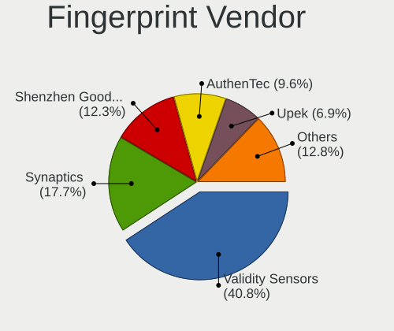

| Vendor                             | Computers | Percent |
|------------------------------------|-----------|---------|
| Validity Sensors                   | 166       | 40.79%  |
| Synaptics                          | 72        | 17.69%  |
| Shenzhen Goodix Technology         | 50        | 12.29%  |
| AuthenTec                          | 39        | 9.58%   |
| Upek                               | 28        | 6.88%   |
| Elan Microelectronics              | 22        | 5.41%   |
| LighTuning Technology              | 14        | 3.44%   |
| STMicroelectronics                 | 7         | 1.72%   |
| Samsung Electronics                | 3         | 0.74%   |
| Realtek USB2.0 Finger Print Bridge | 3         | 0.74%   |
| Next Biometrics                    | 1         | 0.25%   |
| HOLTEK                             | 1         | 0.25%   |
| Focal-systems.Corp                 | 1         | 0.25%   |

Fingerprint Model
-----------------

Fingerprint sensor models

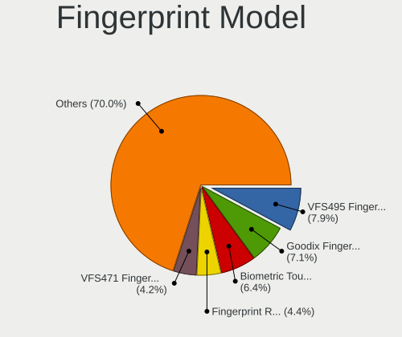

| Model                                                                      | Computers | Percent |
|----------------------------------------------------------------------------|-----------|---------|
| Validity Sensors VFS495 Fingerprint Reader                                 | 32        | 7.86%   |
| Shenzhen Goodix  Fingerprint Device                                        | 29        | 7.13%   |
| Upek Biometric Touchchip/Touchstrip Fingerprint Sensor                     | 26        | 6.39%   |
| Shenzhen Goodix Fingerprint Reader                                         | 18        | 4.42%   |
| Validity Sensors VFS471 Fingerprint Reader                                 | 17        | 4.18%   |
| Validity Sensors VFS5011 Fingerprint Reader                                | 16        | 3.93%   |
| Validity Sensors VFS491                                                    | 16        | 3.93%   |
| Elan ELAN:ARM-M4                                                           | 15        | 3.69%   |
| AuthenTec AES2501 Fingerprint Sensor                                       | 13        | 3.19%   |
| Validity Sensors Fingerprint scanner                                       | 12        | 2.95%   |
| AuthenTec AES2810                                                          | 12        | 2.95%   |
| Validity Sensors VFS 5011 fingerprint sensor                               | 11        | 2.7%    |
| Validity Sensors Synaptics WBDI                                            | 11        | 2.7%    |
| Validity Sensors Synaptics VFS7552 Touch Fingerprint Sensor with PurePrint | 10        | 2.46%   |
| Synaptics  WBDI                                                            | 10        | 2.46%   |
| Synaptics Fingerprint reader [HP G6]                                       | 10        | 2.46%   |
| Synaptics WBDI                                                             | 9         | 2.21%   |
| Synaptics UWP WBDI                                                         | 9         | 2.21%   |
| Synaptics Prometheus MIS Touch Fingerprint Reader                          | 9         | 2.21%   |
| Validity Sensors Swipe Fingerprint Sensor                                  | 8         | 1.97%   |
| Synaptics Metallica MIS Touch Fingerprint Reader                           | 8         | 1.97%   |
| Validity Sensors VFS7552 Touch Fingerprint Sensor                          | 7         | 1.72%   |
| Validity Sensors VFS7500 Touch Fingerprint Sensor                          | 7         | 1.72%   |
| STMicroelectronics Fingerprint Reader                                      | 7         | 1.72%   |
| Elan ELAN:Fingerprint                                                      | 7         | 1.72%   |
| LighTuning EgisTec Touch Fingerprint Sensor                                | 6         | 1.47%   |
| Validity Sensors VFS451 Fingerprint Reader                                 | 5         | 1.23%   |
| LighTuning Fingerprint Sensor                                              | 5         | 1.23%   |
| AuthenTec Fingerprint Sensor                                               | 5         | 1.23%   |
| AuthenTec AES1600                                                          | 5         | 1.23%   |
| Validity Sensors VFS301 Fingerprint Reader                                 | 4         | 0.98%   |
| Validity Sensors VFS Fingerprint sensor                                    | 4         | 0.98%   |
| Synaptics Metallica MOH Touch Fingerprint Reader                           | 4         | 0.98%   |
| Validity Sensors Synaptics VFS7552 Touch Fingerprint Sensor                | 3         | 0.74%   |
| Shenzhen Goodix FingerPrint                                                | 3         | 0.74%   |
| Realtek USB2.0 Finger Print Bridge FocalTech Fingerprint Device            | 3         | 0.74%   |
| Validity Sensors VFS101 Fingerprint Reader                                 | 2         | 0.49%   |
| Upek TCS5B Fingerprint sensor                                              | 2         | 0.49%   |
| Synaptics WBDI Fingerprint Reader USB 086                                  | 2         | 0.49%   |
| Synaptics  FS7604 Touch Fingerprint Sensor with PurePrint                  | 2         | 0.49%   |

Chipcard Vendor
---------------

Chipcard module vendors

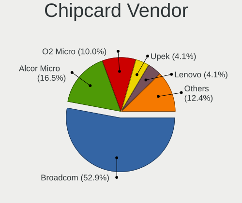

| Vendor                            | Computers | Percent |
|-----------------------------------|-----------|---------|
| Broadcom                          | 90        | 52.94%  |
| Alcor Micro                       | 28        | 16.47%  |
| O2 Micro                          | 17        | 10%     |
| Upek                              | 7         | 4.12%   |
| Lenovo                            | 7         | 4.12%   |
| VASCO Data Security International | 3         | 1.76%   |
| SCM Microsystems                  | 3         | 1.76%   |
| Realtek Semiconductor             | 3         | 1.76%   |
| Yubico.com                        | 2         | 1.18%   |
| Gemalto (was Gemplus)             | 2         | 1.18%   |
| Fujitsu Siemens Computers         | 2         | 1.18%   |
| Advanced Card Systems             | 2         | 1.18%   |
| Reiner SCT Kartensysteme          | 1         | 0.59%   |
| OmniKey                           | 1         | 0.59%   |
| Jing-Mold Enterprise              | 1         | 0.59%   |
| Chicony Electronics               | 1         | 0.59%   |

Chipcard Model
--------------

Chipcard module models

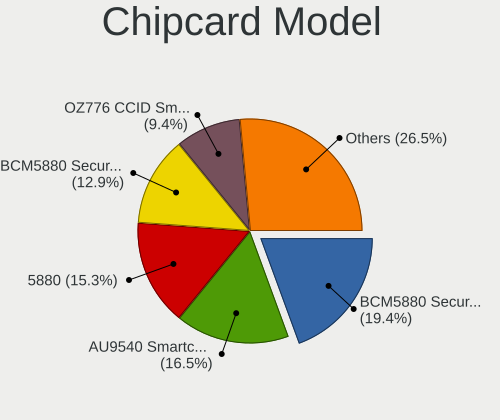

| Model                                                                        | Computers | Percent |
|------------------------------------------------------------------------------|-----------|---------|
| Broadcom BCM5880 Secure Applications Processor                               | 33        | 19.41%  |
| Alcor Micro AU9540 Smartcard Reader                                          | 28        | 16.47%  |
| Broadcom 5880                                                                | 26        | 15.29%  |
| Broadcom BCM5880 Secure Applications Processor with fingerprint swipe sensor | 22        | 12.94%  |
| O2 Micro OZ776 CCID Smartcard Reader                                         | 16        | 9.41%   |
| Upek TouchChip Fingerprint Coprocessor (WBF advanced mode)                   | 7         | 4.12%   |
| Lenovo Integrated Smart Card Reader                                          | 7         | 4.12%   |
| Broadcom BCM58200 ControlVault 3 (FingerPrint sensor + Contacted SmartCard)  | 6         | 3.53%   |
| Realtek Semiconductor Smart Card Reader Interface                            | 3         | 1.76%   |
| Yubico.com Yubikey 4/5 U2F+CCID                                              | 2         | 1.18%   |
| VASCO Data Security International DIGIPASS 870                               | 2         | 1.18%   |
| SCM Microsystems SCR3340 - ExpressCard54 Smart Card Reader                   | 2         | 1.18%   |
| Gemalto (was Gemplus) GemPC Twin SmartCard Reader                            | 2         | 1.18%   |
| Fujitsu Siemens Computers SmartCard Reader 2A                                | 2         | 1.18%   |
| Broadcom BCM5880 Secure Applications Processor with fingerprint touch sensor | 2         | 1.18%   |
| VASCO Data Security International Digipass 905 SmartCard Reader              | 1         | 0.59%   |
| SCM Microsystems SCR331-LC1 / SCR3310 SmartCard Reader                       | 1         | 0.59%   |
| Reiner SCT Kartensysteme cyberJack e-com/pinpad                              | 1         | 0.59%   |
| OmniKey CardMan 3021 / 3121                                                  | 1         | 0.59%   |
| O2 Micro Oz776 SmartCard Reader                                              | 1         | 0.59%   |
| Jing-Mold Enterprise HP USB Business Slim Smartcard CCID Keyboard            | 1         | 0.59%   |
| Chicony Electronics HP Skylab USB Smartcard Keyboard                         | 1         | 0.59%   |
| Broadcom 58200                                                               | 1         | 0.59%   |
| Advanced Card Systems ACR39U                                                 | 1         | 0.59%   |
| Advanced Card Systems ACR1281 1S Dual Reader                                 | 1         | 0.59%   |

Unsupported
-----------

Unsupported Devices
-------------------

Total unsupported devices on board

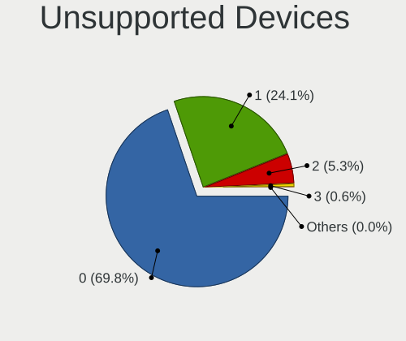

| Total | Computers | Percent |
|-------|-----------|---------|
| 0     | 2968      | 69.8%   |
| 1     | 1026      | 24.13%  |
| 2     | 226       | 5.32%   |
| 3     | 27        | 0.63%   |
| 4     | 4         | 0.09%   |
| 8     | 1         | 0.02%   |

Unsupported Device Types
------------------------

Types of unsupported devices

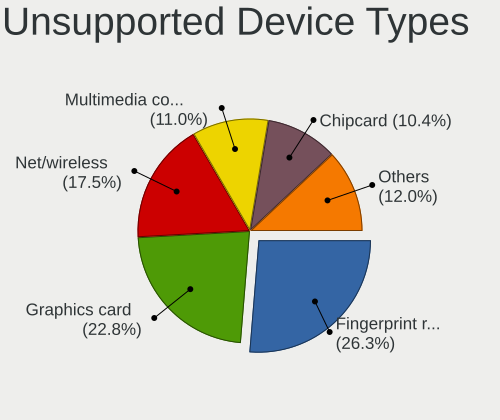

| Type                     | Computers | Percent |
|--------------------------|-----------|---------|
| Fingerprint reader       | 400       | 26.3%   |
| Graphics card            | 347       | 22.81%  |
| Net/wireless             | 266       | 17.49%  |
| Multimedia controller    | 168       | 11.05%  |
| Chipcard                 | 158       | 10.39%  |
| Communication controller | 31        | 2.04%   |
| Storage                  | 30        | 1.97%   |
| Bluetooth                | 29        | 1.91%   |
| Sound                    | 16        | 1.05%   |
| Unassigned class         | 12        | 0.79%   |
| Camera                   | 11        | 0.72%   |
| Net/ethernet             | 9         | 0.59%   |
| Storage/raid             | 7         | 0.46%   |
| Modem                    | 7         | 0.46%   |
| Card reader              | 7         | 0.46%   |
| Network                  | 6         | 0.39%   |
| Dvb card                 | 6         | 0.39%   |
| Storage/ide              | 5         | 0.33%   |
| Flash memory             | 3         | 0.2%    |
| Storage/nvme             | 2         | 0.13%   |
| Unclassified device      | 1         | 0.07%   |

