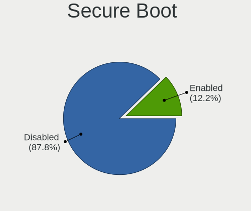
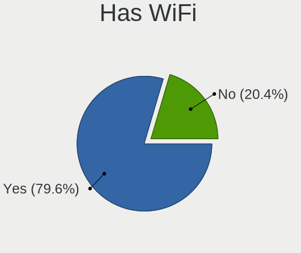
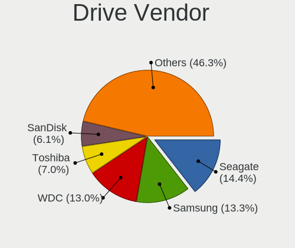
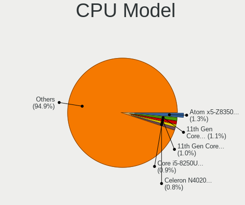
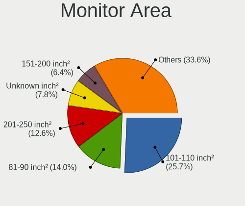
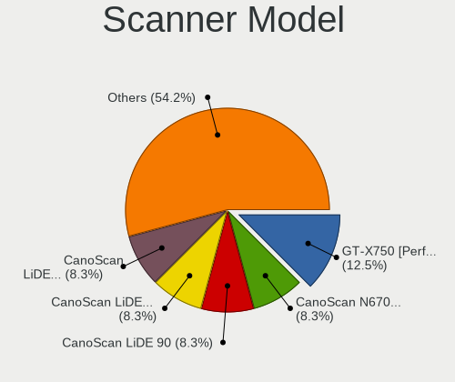

Zorin 16 - Tested Hardware & Statistics
---------------------------------------

A project to collect tested hardware configurations for Zorin 16.

Anyone can contribute to this report by the [hw-probe](https://github.com/linuxhw/hw-probe) tool:

    sudo -E hw-probe -all -upload

Please contribute! Especially if your hardware is rare.

This is a report for all computer types. See also reports for [desktops](/Dist/Zorin_16/Desktop/README.md) and [notebooks](/Dist/Zorin_16/Notebook/README.md).

Contents
--------

* [ Test Cases ](#test-cases)

* [ System ](#system)
  - [ Kernel                   ](#kernel)
  - [ Kernel Family            ](#kernel-family)
  - [ Kernel Major Ver.        ](#kernel-major-ver)
  - [ Arch                     ](#arch)
  - [ DE                       ](#de)
  - [ Display Server           ](#display-server)
  - [ Display Manager          ](#display-manager)
  - [ OS Lang                  ](#os-lang)
  - [ Boot Mode                ](#boot-mode)
  - [ Filesystem               ](#filesystem)
  - [ Part. scheme             ](#part-scheme)
  - [ Dual Boot with Linux/BSD ](#dual-boot-with-linuxbsd)
  - [ Dual Boot (Win)          ](#dual-boot-win)

* [ Board ](#board)
  - [ Vendor                   ](#vendor)
  - [ Model                    ](#model)
  - [ Model Family             ](#model-family)
  - [ MFG Year                 ](#mfg-year)
  - [ Form Factor              ](#form-factor)
  - [ Secure Boot              ](#secure-boot)
  - [ Coreboot                 ](#coreboot)
  - [ RAM Size                 ](#ram-size)
  - [ RAM Used                 ](#ram-used)
  - [ Total Drives             ](#total-drives)
  - [ Has CD-ROM               ](#has-cd-rom)
  - [ Has Ethernet             ](#has-ethernet)
  - [ Has WiFi                 ](#has-wifi)
  - [ Has Bluetooth            ](#has-bluetooth)

* [ Location ](#location)
  - [ Country                  ](#country)
  - [ City                     ](#city)

* [ Drives ](#drives)
  - [ Drive Vendor             ](#drive-vendor)
  - [ Drive Model              ](#drive-model)
  - [ HDD Vendor               ](#hdd-vendor)
  - [ SSD Vendor               ](#ssd-vendor)
  - [ Drive Kind               ](#drive-kind)
  - [ Drive Connector          ](#drive-connector)
  - [ Drive Size               ](#drive-size)
  - [ Space Total              ](#space-total)
  - [ Space Used               ](#space-used)
  - [ Malfunc. Drives          ](#malfunc-drives)
  - [ Malfunc. Drive Vendor    ](#malfunc-drive-vendor)
  - [ Malfunc. HDD Vendor      ](#malfunc-hdd-vendor)
  - [ Malfunc. Drive Kind      ](#malfunc-drive-kind)
  - [ Failed Drives            ](#failed-drives)
  - [ Failed Drive Vendor      ](#failed-drive-vendor)
  - [ Drive Status             ](#drive-status)

* [ Storage controller ](#storage-controller)
  - [ Storage Vendor           ](#storage-vendor)
  - [ Storage Model            ](#storage-model)
  - [ Storage Kind             ](#storage-kind)

* [ Processor ](#processor)
  - [ CPU Vendor               ](#cpu-vendor)
  - [ CPU Model                ](#cpu-model)
  - [ CPU Model Family         ](#cpu-model-family)
  - [ CPU Cores                ](#cpu-cores)
  - [ CPU Sockets              ](#cpu-sockets)
  - [ CPU Threads              ](#cpu-threads)
  - [ CPU Op-Modes             ](#cpu-op-modes)
  - [ CPU Microcode            ](#cpu-microcode)
  - [ CPU Microarch            ](#cpu-microarch)

* [ Graphics ](#graphics)
  - [ GPU Vendor               ](#gpu-vendor)
  - [ GPU Model                ](#gpu-model)
  - [ GPU Combo                ](#gpu-combo)
  - [ GPU Driver               ](#gpu-driver)
  - [ GPU Memory               ](#gpu-memory)

* [ Monitor ](#monitor)
  - [ Monitor Vendor           ](#monitor-vendor)
  - [ Monitor Model            ](#monitor-model)
  - [ Monitor Resolution       ](#monitor-resolution)
  - [ Monitor Diagonal         ](#monitor-diagonal)
  - [ Monitor Width            ](#monitor-width)
  - [ Aspect Ratio             ](#aspect-ratio)
  - [ Monitor Area             ](#monitor-area)
  - [ Pixel Density            ](#pixel-density)
  - [ Multiple Monitors        ](#multiple-monitors)

* [ Network ](#network)
  - [ Net Controller Vendor    ](#net-controller-vendor)
  - [ Net Controller Model     ](#net-controller-model)
  - [ Wireless Vendor          ](#wireless-vendor)
  - [ Wireless Model           ](#wireless-model)
  - [ Ethernet Vendor          ](#ethernet-vendor)
  - [ Ethernet Model           ](#ethernet-model)
  - [ Net Controller Kind      ](#net-controller-kind)
  - [ Used Controller          ](#used-controller)
  - [ NICs                     ](#nics)
  - [ IPv6                     ](#ipv6)

* [ Bluetooth ](#bluetooth)
  - [ Bluetooth Vendor         ](#bluetooth-vendor)
  - [ Bluetooth Model          ](#bluetooth-model)

* [ Sound ](#sound)
  - [ Sound Vendor             ](#sound-vendor)
  - [ Sound Model              ](#sound-model)

* [ Memory ](#memory)
  - [ Memory Vendor            ](#memory-vendor)
  - [ Memory Model             ](#memory-model)
  - [ Memory Kind              ](#memory-kind)
  - [ Memory Form Factor       ](#memory-form-factor)
  - [ Memory Size              ](#memory-size)
  - [ Memory Speed             ](#memory-speed)

* [ Printers & scanners ](#printers--scanners)
  - [ Printer Vendor           ](#printer-vendor)
  - [ Printer Model            ](#printer-model)
  - [ Scanner Vendor           ](#scanner-vendor)
  - [ Scanner Model            ](#scanner-model)

* [ Camera ](#camera)
  - [ Camera Vendor            ](#camera-vendor)
  - [ Camera Model             ](#camera-model)

* [ Security ](#security)
  - [ Fingerprint Vendor       ](#fingerprint-vendor)
  - [ Fingerprint Model        ](#fingerprint-model)
  - [ Chipcard Vendor          ](#chipcard-vendor)
  - [ Chipcard Model           ](#chipcard-model)

* [ Unsupported ](#unsupported)
  - [ Unsupported Devices      ](#unsupported-devices)
  - [ Unsupported Device Types ](#unsupported-device-types)

Test Cases
----------

Total: 2907

| Vendor        | Model                       | Form-Factor | Probe                                                      | Date         |
|---------------|-----------------------------|-------------|------------------------------------------------------------|--------------|
| Lenovo        | V570 1066EDG                | Notebook    | [8e2439c590](https://linux-hardware.org/?probe=8e2439c590) | Oct 01, 2022 |
| ASRock        | 970 Pro3 R2.0               | Desktop     | [592adc6c9b](https://linux-hardware.org/?probe=592adc6c9b) | Oct 01, 2022 |
| HP            | 843B                        | Desktop     | [b683039e3b](https://linux-hardware.org/?probe=b683039e3b) | Oct 01, 2022 |
| Lenovo        | ThinkPad Yoga 11e 20DAS0... | Notebook    | [dc7e0ada81](https://linux-hardware.org/?probe=dc7e0ada81) | Oct 01, 2022 |
| Acer          | Aspire 4733Z                | Notebook    | [4be4debbe5](https://linux-hardware.org/?probe=4be4debbe5) | Oct 01, 2022 |
| Apple         | MacBookPro8,1               | Notebook    | [f42501fcc3](https://linux-hardware.org/?probe=f42501fcc3) | Oct 01, 2022 |
| Hampoo        | C3W6_AP108_4GB Reserved     | Notebook    | [93d3e41339](https://linux-hardware.org/?probe=93d3e41339) | Oct 01, 2022 |
| Biostar       | B350ET2                     | Desktop     | [d7c5b1ad40](https://linux-hardware.org/?probe=d7c5b1ad40) | Oct 01, 2022 |
| Biostar       | B350ET2                     | Desktop     | [2b7bea0eda](https://linux-hardware.org/?probe=2b7bea0eda) | Sep 30, 2022 |
| Notebook      | NJ50GU                      | Notebook    | [430d3b2873](https://linux-hardware.org/?probe=430d3b2873) | Sep 30, 2022 |
| Chuwi         | HeroBook Air                | Notebook    | [1f142c7087](https://linux-hardware.org/?probe=1f142c7087) | Sep 30, 2022 |
| Chuwi         | HeroBook Air                | Notebook    | [263313ef38](https://linux-hardware.org/?probe=263313ef38) | Sep 30, 2022 |
| MSI           | Z97 MPOWER                  | Desktop     | [f16a15a5b7](https://linux-hardware.org/?probe=f16a15a5b7) | Sep 30, 2022 |
| Apple         | Mac-F4218EC8 DVT            | All in one  | [1a331f2583](https://linux-hardware.org/?probe=1a331f2583) | Sep 30, 2022 |
| ASUSTek       | ROG CROSSHAIR VIII HERO     | Desktop     | [8c116d30f9](https://linux-hardware.org/?probe=8c116d30f9) | Sep 30, 2022 |
| HP            | Pavilion Laptop 17-ar0xx    | Notebook    | [733654d30d](https://linux-hardware.org/?probe=733654d30d) | Sep 30, 2022 |
| HP            | EliteBook 8570p             | Notebook    | [cc4740fa37](https://linux-hardware.org/?probe=cc4740fa37) | Sep 30, 2022 |
| Notebook      | NJ50_70CU                   | Notebook    | [4914d3ffe1](https://linux-hardware.org/?probe=4914d3ffe1) | Sep 29, 2022 |
| Lenovo        | SHARKBAY SDK0E50510 WIN     | Desktop     | [7bffcb84c2](https://linux-hardware.org/?probe=7bffcb84c2) | Sep 29, 2022 |
| Lenovo        | SHARKBAY SDK0E50510 WIN     | Desktop     | [e3e6ad5c35](https://linux-hardware.org/?probe=e3e6ad5c35) | Sep 29, 2022 |
| Irbis         | NB61 WS001                  | Notebook    | [3fda78e356](https://linux-hardware.org/?probe=3fda78e356) | Sep 29, 2022 |
| HP            | 8055                        | Desktop     | [aa3bd09485](https://linux-hardware.org/?probe=aa3bd09485) | Sep 29, 2022 |
| HP            | Compaq 6730s                | Notebook    | [565b94d7f4](https://linux-hardware.org/?probe=565b94d7f4) | Sep 29, 2022 |
| HP            | 843C                        | Desktop     | [e27595d303](https://linux-hardware.org/?probe=e27595d303) | Sep 29, 2022 |
| Toshiba       | Satellite C55-C             | Notebook    | [01ebd7e70b](https://linux-hardware.org/?probe=01ebd7e70b) | Sep 29, 2022 |
| Toshiba       | Satellite C55-C             | Notebook    | [d2c06711d7](https://linux-hardware.org/?probe=d2c06711d7) | Sep 29, 2022 |
| HP            | Compaq 6730s                | Notebook    | [62fc1b721e](https://linux-hardware.org/?probe=62fc1b721e) | Sep 29, 2022 |
| Dell          | Inspiron 3582               | Notebook    | [8cd21b783a](https://linux-hardware.org/?probe=8cd21b783a) | Sep 28, 2022 |
| Lenovo        | Yoga S740-15IRH 81NX        | Notebook    | [defae2e862](https://linux-hardware.org/?probe=defae2e862) | Sep 28, 2022 |
| Dell          | Inspiron 5559               | Notebook    | [c23649cdd4](https://linux-hardware.org/?probe=c23649cdd4) | Sep 28, 2022 |
| Dell          | Latitude E6520              | Notebook    | [e228fa6546](https://linux-hardware.org/?probe=e228fa6546) | Sep 28, 2022 |
| Apple         | Mac-031B6874CF7F642A iMa... | All in one  | [3052bded51](https://linux-hardware.org/?probe=3052bded51) | Sep 28, 2022 |
| ASUSTek       | P5K                         | Desktop     | [2d278ddcdf](https://linux-hardware.org/?probe=2d278ddcdf) | Sep 28, 2022 |
| Toshiba       | Satellite L855              | Notebook    | [19e5b180eb](https://linux-hardware.org/?probe=19e5b180eb) | Sep 28, 2022 |
| HUAWEI        | NBLK-WAX9X                  | Notebook    | [f501591d1b](https://linux-hardware.org/?probe=f501591d1b) | Sep 27, 2022 |
| ASUSTek       | B85M-E/BR                   | Desktop     | [5116d1cae9](https://linux-hardware.org/?probe=5116d1cae9) | Sep 27, 2022 |
| Dell          | XPS 8700                    | Desktop     | [19fff8b508](https://linux-hardware.org/?probe=19fff8b508) | Sep 27, 2022 |
| Dell          | 0WN7Y6 A01                  | Desktop     | [356dc77824](https://linux-hardware.org/?probe=356dc77824) | Sep 27, 2022 |
| Dell          | System Inspiron N7110       | Notebook    | [016d5e3146](https://linux-hardware.org/?probe=016d5e3146) | Sep 27, 2022 |
| ASUSTek       | M3A78-EM                    | Desktop     | [34287ac52a](https://linux-hardware.org/?probe=34287ac52a) | Sep 27, 2022 |
| HP            | EliteBook 840 G6            | Notebook    | [c9e87b7962](https://linux-hardware.org/?probe=c9e87b7962) | Sep 26, 2022 |
| ASRock        | A75M-HVS                    | Desktop     | [75d51e6237](https://linux-hardware.org/?probe=75d51e6237) | Sep 26, 2022 |
| Lenovo        | IdeaPad 5 14ALC05 82LM      | Notebook    | [e777d38fbd](https://linux-hardware.org/?probe=e777d38fbd) | Sep 26, 2022 |
| Acer          | Aspire A515-51G             | Notebook    | [c45069d56d](https://linux-hardware.org/?probe=c45069d56d) | Sep 26, 2022 |
| Acer          | Aspire A515-51G             | Notebook    | [3441e0cac3](https://linux-hardware.org/?probe=3441e0cac3) | Sep 26, 2022 |
| ASUSTek       | X201EP                      | Notebook    | [4e6c202d5d](https://linux-hardware.org/?probe=4e6c202d5d) | Sep 26, 2022 |
| Unknown       | NB-7000                     | Notebook    | [1713526cff](https://linux-hardware.org/?probe=1713526cff) | Sep 25, 2022 |
| Lenovo        | IdeaPad 130-15IKB 81H7      | Notebook    | [28e086b848](https://linux-hardware.org/?probe=28e086b848) | Sep 25, 2022 |
| ASRock        | A75M-HVS                    | Desktop     | [fa3be9d376](https://linux-hardware.org/?probe=fa3be9d376) | Sep 25, 2022 |
| Lenovo        | IdeaPad 130-15IKB 81H7      | Notebook    | [6a8d9c1d7a](https://linux-hardware.org/?probe=6a8d9c1d7a) | Sep 25, 2022 |
| Gateway       | FMCP7AM                     | Desktop     | [0cb51f3e6f](https://linux-hardware.org/?probe=0cb51f3e6f) | Sep 25, 2022 |
| ASUSTek       | PRO A320M-R WI-FI           | Desktop     | [e760f06cef](https://linux-hardware.org/?probe=e760f06cef) | Sep 25, 2022 |
| Dell          | Inspiron 14-3452            | Notebook    | [bb90844ff6](https://linux-hardware.org/?probe=bb90844ff6) | Sep 25, 2022 |
| Gigabyte      | GA-870A-UD3                 | Desktop     | [33a0b663ea](https://linux-hardware.org/?probe=33a0b663ea) | Sep 25, 2022 |
| HP            | Stream Laptop 14-ax0XX      | Notebook    | [d8a451b3e6](https://linux-hardware.org/?probe=d8a451b3e6) | Sep 25, 2022 |
| Dell          | Inspiron 3185               | Notebook    | [561c02f958](https://linux-hardware.org/?probe=561c02f958) | Sep 25, 2022 |
| ASRock        | QC5000M-ITX/PH              | Desktop     | [571b95c201](https://linux-hardware.org/?probe=571b95c201) | Sep 25, 2022 |
| Acer          | Extensa 5635ZG              | Notebook    | [ade183eadc](https://linux-hardware.org/?probe=ade183eadc) | Sep 24, 2022 |
| HP            | 18E7                        | Desktop     | [71a12280de](https://linux-hardware.org/?probe=71a12280de) | Sep 24, 2022 |
| HP            | 250 G8 Notebook PC          | Notebook    | [fab0eac5a6](https://linux-hardware.org/?probe=fab0eac5a6) | Sep 24, 2022 |
| Lenovo        | IdeaPad 110-15ACL 80TJ      | Notebook    | [dc3a97d467](https://linux-hardware.org/?probe=dc3a97d467) | Sep 23, 2022 |
| HP            | EliteBook Revolve 810 G3    | Notebook    | [77b578f861](https://linux-hardware.org/?probe=77b578f861) | Sep 23, 2022 |
| HP            | EliteBook 840 G6            | Notebook    | [9ccc1b86a7](https://linux-hardware.org/?probe=9ccc1b86a7) | Sep 23, 2022 |
| ASRock        | B85M Pro4                   | Desktop     | [cd75d968d7](https://linux-hardware.org/?probe=cd75d968d7) | Sep 23, 2022 |
| Lenovo        | ThinkPad Edge E530 3259C... | Notebook    | [cdaec9c224](https://linux-hardware.org/?probe=cdaec9c224) | Sep 22, 2022 |
| ASUSTek       | P5K                         | Desktop     | [0ddf0a48dd](https://linux-hardware.org/?probe=0ddf0a48dd) | Sep 22, 2022 |
| Pegatron      | 2ACD                        | Desktop     | [d6270f88cc](https://linux-hardware.org/?probe=d6270f88cc) | Sep 22, 2022 |
| HP            | ENVY Notebook               | Notebook    | [1eef25f6d8](https://linux-hardware.org/?probe=1eef25f6d8) | Sep 22, 2022 |
| HP            | ENVY Notebook               | Notebook    | [b95a98e133](https://linux-hardware.org/?probe=b95a98e133) | Sep 22, 2022 |
| HP            | 8055                        | Desktop     | [c72e0ed04b](https://linux-hardware.org/?probe=c72e0ed04b) | Sep 22, 2022 |
| Acer          | Aspire ES1-512              | Notebook    | [00e679e86c](https://linux-hardware.org/?probe=00e679e86c) | Sep 22, 2022 |
| Acer          | Aspire ES1-512              | Notebook    | [318436c7ab](https://linux-hardware.org/?probe=318436c7ab) | Sep 22, 2022 |
| ASUSTek       | 1201PN                      | Notebook    | [3dd4546344](https://linux-hardware.org/?probe=3dd4546344) | Sep 21, 2022 |
| ASUSTek       | 1201PN                      | Notebook    | [080d9c8964](https://linux-hardware.org/?probe=080d9c8964) | Sep 21, 2022 |
| ASUSTek       | Benicia                     | Desktop     | [22bf75699c](https://linux-hardware.org/?probe=22bf75699c) | Sep 21, 2022 |
| ASRock        | A75M-HVS                    | Desktop     | [a2fb3b0ed7](https://linux-hardware.org/?probe=a2fb3b0ed7) | Sep 21, 2022 |
| ASRock        | A75M-HVS                    | Desktop     | [0f81852612](https://linux-hardware.org/?probe=0f81852612) | Sep 21, 2022 |
| Toshiba       | Satellite L855              | Notebook    | [4421e54d32](https://linux-hardware.org/?probe=4421e54d32) | Sep 21, 2022 |
| Lenovo        | Yoga S740-15IRH 81NX        | Notebook    | [6d0a2986ad](https://linux-hardware.org/?probe=6d0a2986ad) | Sep 21, 2022 |
| Gigabyte      | Z390 AORUS MASTER-CF        | Desktop     | [f49e8d08ef](https://linux-hardware.org/?probe=f49e8d08ef) | Sep 20, 2022 |
| Alienware     | 18                          | Notebook    | [91d0153265](https://linux-hardware.org/?probe=91d0153265) | Sep 20, 2022 |
| Dell          | 0D441T A01                  | Desktop     | [c315329853](https://linux-hardware.org/?probe=c315329853) | Sep 20, 2022 |
| Lenovo        | IdeaPad 5 14ALC05 82LM      | Notebook    | [82b3d89bf9](https://linux-hardware.org/?probe=82b3d89bf9) | Sep 20, 2022 |
| Gigabyte      | A320M-S2H V2-CF             | Desktop     | [37dbdb48dd](https://linux-hardware.org/?probe=37dbdb48dd) | Sep 20, 2022 |
| Dell          | G15 5515                    | Notebook    | [f308590417](https://linux-hardware.org/?probe=f308590417) | Sep 20, 2022 |
| Dell          | G15 5515                    | Notebook    | [d6a647ab30](https://linux-hardware.org/?probe=d6a647ab30) | Sep 20, 2022 |
| HP            | Pavilion g7                 | Notebook    | [d51d3d282a](https://linux-hardware.org/?probe=d51d3d282a) | Sep 20, 2022 |
| ASUSTek       | PRIME Z690-P D4             | Desktop     | [493f68c9d6](https://linux-hardware.org/?probe=493f68c9d6) | Sep 19, 2022 |
| Samsung       | 950XCJ/951XCJ/950XCR        | Notebook    | [9417681a63](https://linux-hardware.org/?probe=9417681a63) | Sep 19, 2022 |
| Lenovo        | ThinkCentre M71e 3157AE2    | Desktop     | [9022058466](https://linux-hardware.org/?probe=9022058466) | Sep 19, 2022 |
| Dell          | Latitude E6540              | Notebook    | [d3140eaa89](https://linux-hardware.org/?probe=d3140eaa89) | Sep 19, 2022 |
| Dell          | Latitude E6540              | Notebook    | [7bf393c147](https://linux-hardware.org/?probe=7bf393c147) | Sep 19, 2022 |
| Alienware     | 18                          | Notebook    | [fda9eabd7e](https://linux-hardware.org/?probe=fda9eabd7e) | Sep 18, 2022 |
| Lenovo        | IdeaPad 130-15AST 81H5      | Notebook    | [bceb6698c2](https://linux-hardware.org/?probe=bceb6698c2) | Sep 18, 2022 |
| Microtech     | CoreBook                    | Notebook    | [6b1a53d2c2](https://linux-hardware.org/?probe=6b1a53d2c2) | Sep 18, 2022 |
| HP            | 0AA8h                       | Desktop     | [c79bdb21ed](https://linux-hardware.org/?probe=c79bdb21ed) | Sep 18, 2022 |
| HP            | 0AA8h                       | Desktop     | [5e6f953759](https://linux-hardware.org/?probe=5e6f953759) | Sep 18, 2022 |
| Ematic        | EWT118                      | Notebook    | [41670ebd30](https://linux-hardware.org/?probe=41670ebd30) | Sep 18, 2022 |
| ASUSTek       | ROG CROSSHAIR VIII HERO     | Desktop     | [a5d838868a](https://linux-hardware.org/?probe=a5d838868a) | Sep 18, 2022 |
| Lenovo        | ThinkCentre M58e 7298A76    | Desktop     | [4775ccd67f](https://linux-hardware.org/?probe=4775ccd67f) | Sep 18, 2022 |
| HP            | Pavilion Notebook           | Notebook    | [24534d00db](https://linux-hardware.org/?probe=24534d00db) | Sep 17, 2022 |
| Dell          | Latitude E6510              | Notebook    | [ee09885560](https://linux-hardware.org/?probe=ee09885560) | Sep 16, 2022 |
| HP            | Laptop 15s-fq2xxx           | Notebook    | [e7bb3017fb](https://linux-hardware.org/?probe=e7bb3017fb) | Sep 16, 2022 |
| HP            | Laptop 15s-fq2xxx           | Notebook    | [c81727b775](https://linux-hardware.org/?probe=c81727b775) | Sep 16, 2022 |
| Lenovo        | IdeaPadFlex 15D 20334       | Notebook    | [5620510083](https://linux-hardware.org/?probe=5620510083) | Sep 16, 2022 |
| Dell          | Latitude E4300              | Notebook    | [b3c04d8a81](https://linux-hardware.org/?probe=b3c04d8a81) | Sep 16, 2022 |
| ASUSTek       | ASUS TUF Gaming F15 FX50... | Notebook    | [eeb58ef0f2](https://linux-hardware.org/?probe=eeb58ef0f2) | Sep 15, 2022 |
| ASUSTek       | TUF Gaming FX505DT_FX505... | Notebook    | [258c624b3b](https://linux-hardware.org/?probe=258c624b3b) | Sep 15, 2022 |
| Fujitsu       | D3221-A1 S26361-D3221-A1    | Desktop     | [875435f3f0](https://linux-hardware.org/?probe=875435f3f0) | Sep 15, 2022 |
| Fujitsu       | D3221-A1 S26361-D3221-A1    | Desktop     | [3ff6899749](https://linux-hardware.org/?probe=3ff6899749) | Sep 15, 2022 |
| Lenovo        | IdeaPadFlex 15D 20334       | Notebook    | [437d152a42](https://linux-hardware.org/?probe=437d152a42) | Sep 15, 2022 |
| Toshiba       | Satellite C855              | Notebook    | [bd34f35e50](https://linux-hardware.org/?probe=bd34f35e50) | Sep 15, 2022 |
| ASRock        | H61M-DGS                    | Desktop     | [aeac7cfb74](https://linux-hardware.org/?probe=aeac7cfb74) | Sep 14, 2022 |
| IP3 Tech      | GB3B                        | Mini pc     | [32884ec101](https://linux-hardware.org/?probe=32884ec101) | Sep 14, 2022 |
| Dell          | 0TW904 A01                  | Desktop     | [141188a631](https://linux-hardware.org/?probe=141188a631) | Sep 14, 2022 |
| Lenovo        | IdeaPad 3 15ADA6 82KR       | Notebook    | [676dbc76db](https://linux-hardware.org/?probe=676dbc76db) | Sep 13, 2022 |
| Gigabyte      | Z77-D3H                     | Desktop     | [b1b929517d](https://linux-hardware.org/?probe=b1b929517d) | Sep 13, 2022 |
| HP            | EliteBook 840 G6            | Notebook    | [3c13816886](https://linux-hardware.org/?probe=3c13816886) | Sep 13, 2022 |
| Samsung       | 800G5M/800G5W               | Notebook    | [ad3cd5381f](https://linux-hardware.org/?probe=ad3cd5381f) | Sep 13, 2022 |
| ASUSTek       | PRIME Z270-A                | Desktop     | [b404f51fbe](https://linux-hardware.org/?probe=b404f51fbe) | Sep 12, 2022 |
| Dell          | Inspiron 15 7000 Gaming     | Notebook    | [ca9a099cf6](https://linux-hardware.org/?probe=ca9a099cf6) | Sep 12, 2022 |
| Samsung       | 600B4B/600B5B               | Notebook    | [25c2b764a6](https://linux-hardware.org/?probe=25c2b764a6) | Sep 12, 2022 |
| HP            | 0AA8h                       | Desktop     | [fc09b092c1](https://linux-hardware.org/?probe=fc09b092c1) | Sep 11, 2022 |
| HP            | Stream Notebook PC 14       | Notebook    | [4618d27b09](https://linux-hardware.org/?probe=4618d27b09) | Sep 11, 2022 |
| Dell          | Latitude E7240              | Notebook    | [72a8c650c5](https://linux-hardware.org/?probe=72a8c650c5) | Sep 11, 2022 |
| Lenovo        | SDK0J40700 WIN              | Desktop     | [b8f3a58a03](https://linux-hardware.org/?probe=b8f3a58a03) | Sep 11, 2022 |
| Gigabyte      | G1.Sniper Z97               | Desktop     | [445e54016b](https://linux-hardware.org/?probe=445e54016b) | Sep 11, 2022 |
| Gigabyte      | P64V7                       | Notebook    | [b9d2c998be](https://linux-hardware.org/?probe=b9d2c998be) | Sep 11, 2022 |
| UMAX          | VisionBook N14G Plus        | Notebook    | [6d05deca49](https://linux-hardware.org/?probe=6d05deca49) | Sep 11, 2022 |
| ASUSTek       | ROG CROSSHAIR VIII HERO     | Desktop     | [0701918099](https://linux-hardware.org/?probe=0701918099) | Sep 11, 2022 |
| Dell          | Inspiron 15 7000 Gaming     | Notebook    | [4c6d525103](https://linux-hardware.org/?probe=4c6d525103) | Sep 11, 2022 |
| HP            | 0A54h                       | Desktop     | [2c88c7fd30](https://linux-hardware.org/?probe=2c88c7fd30) | Sep 10, 2022 |
| Apple         | Mac-031B6874CF7F642A iMa... | All in one  | [e6bf2b7f3f](https://linux-hardware.org/?probe=e6bf2b7f3f) | Sep 10, 2022 |
| ASUSTek       | ROG STRIX Z690-I GAMING ... | Desktop     | [d13cf99728](https://linux-hardware.org/?probe=d13cf99728) | Sep 10, 2022 |
| ASUSTek       | ROG STRIX B450-F GAMING     | Desktop     | [1e43753d7a](https://linux-hardware.org/?probe=1e43753d7a) | Sep 10, 2022 |
| MSI           | 2AE0                        | Desktop     | [a2b046dd4e](https://linux-hardware.org/?probe=a2b046dd4e) | Sep 10, 2022 |
| MSI           | 2AE0                        | Desktop     | [df247fd9d0](https://linux-hardware.org/?probe=df247fd9d0) | Sep 10, 2022 |
| Dell          | Inspiron 15 7000 Gaming     | Notebook    | [c027a7cf99](https://linux-hardware.org/?probe=c027a7cf99) | Sep 10, 2022 |
| HP            | Pavilion dv6700             | Notebook    | [4e96c157b7](https://linux-hardware.org/?probe=4e96c157b7) | Sep 10, 2022 |
| HP            | 3031h                       | Desktop     | [ea434d67b5](https://linux-hardware.org/?probe=ea434d67b5) | Sep 10, 2022 |
| HP            | 3031h                       | Desktop     | [feddf42c9f](https://linux-hardware.org/?probe=feddf42c9f) | Sep 10, 2022 |
| AZW           | Z83-V                       | Notebook    | [70e8dba2ef](https://linux-hardware.org/?probe=70e8dba2ef) | Sep 10, 2022 |
| AZW           | Z83-V                       | Notebook    | [622725ab19](https://linux-hardware.org/?probe=622725ab19) | Sep 10, 2022 |
| Acer          | Aspire 7745G                | Notebook    | [a41158c2cc](https://linux-hardware.org/?probe=a41158c2cc) | Sep 10, 2022 |
| HP            | 0AA8h                       | Desktop     | [4e9a1e883c](https://linux-hardware.org/?probe=4e9a1e883c) | Sep 09, 2022 |
| Toshiba       | Satellite P200              | Notebook    | [c49fec0796](https://linux-hardware.org/?probe=c49fec0796) | Sep 09, 2022 |
| Medion        | Akoya E1318T                | Notebook    | [749a12fd63](https://linux-hardware.org/?probe=749a12fd63) | Sep 09, 2022 |
| Apple         | Mac-031B6874CF7F642A iMa... | All in one  | [678759289b](https://linux-hardware.org/?probe=678759289b) | Sep 09, 2022 |
| Acer          | Aspire C22-820              | All in one  | [7b21589632](https://linux-hardware.org/?probe=7b21589632) | Sep 09, 2022 |
| HP            | Pavilion Laptop 15-cw0xx... | Notebook    | [e11963681c](https://linux-hardware.org/?probe=e11963681c) | Sep 08, 2022 |
| Dell          | XPS 15 9510                 | Notebook    | [db80996c7a](https://linux-hardware.org/?probe=db80996c7a) | Sep 08, 2022 |
| HP            | Laptop 17-bs0xx             | Notebook    | [ebf0bfea05](https://linux-hardware.org/?probe=ebf0bfea05) | Sep 08, 2022 |
| Dell          | Latitude E5420              | Notebook    | [b80d26540d](https://linux-hardware.org/?probe=b80d26540d) | Sep 08, 2022 |
| ASUSTek       | UX331UA                     | Notebook    | [e1e0acfdf3](https://linux-hardware.org/?probe=e1e0acfdf3) | Sep 08, 2022 |
| Dell          | Latitude E4300              | Notebook    | [5d3a9edf5d](https://linux-hardware.org/?probe=5d3a9edf5d) | Sep 07, 2022 |
| Lenovo        | MAHOBAY                     | Desktop     | [2619e261d1](https://linux-hardware.org/?probe=2619e261d1) | Sep 07, 2022 |
| Lenovo        | ThinkPad E570 20H50047US    | Notebook    | [70b198055e](https://linux-hardware.org/?probe=70b198055e) | Sep 07, 2022 |
| Fujitsu       | D3222-A1 S26361-D3222-A1    | Desktop     | [dd20f0351c](https://linux-hardware.org/?probe=dd20f0351c) | Sep 06, 2022 |
| Fujitsu       | D3222-A1 S26361-D3222-A1    | Desktop     | [3aca46f88b](https://linux-hardware.org/?probe=3aca46f88b) | Sep 06, 2022 |
| HP            | 15                          | Notebook    | [c02361a2ff](https://linux-hardware.org/?probe=c02361a2ff) | Sep 06, 2022 |
| ASUSTek       | A88X-GAMER                  | Desktop     | [15fe45edd7](https://linux-hardware.org/?probe=15fe45edd7) | Sep 06, 2022 |
| Lenovo        | G400s VILG1                 | Notebook    | [44c27d1083](https://linux-hardware.org/?probe=44c27d1083) | Sep 06, 2022 |
| Lenovo        | G400s VILG1                 | Notebook    | [ec3283d49b](https://linux-hardware.org/?probe=ec3283d49b) | Sep 06, 2022 |
| ASUSTek       | ROG STRIX Z690-I GAMING ... | Desktop     | [92ff48d462](https://linux-hardware.org/?probe=92ff48d462) | Sep 06, 2022 |
| HP            | 2AF7                        | Desktop     | [9b7ccd5aa0](https://linux-hardware.org/?probe=9b7ccd5aa0) | Sep 06, 2022 |
| HP            | Pavilion g7                 | Notebook    | [5ed29a7629](https://linux-hardware.org/?probe=5ed29a7629) | Sep 05, 2022 |
| Dell          | 0HY9JP A02                  | Desktop     | [7cbf141461](https://linux-hardware.org/?probe=7cbf141461) | Sep 05, 2022 |
| Apple         | MacBook5,1                  | Notebook    | [88c4e0664a](https://linux-hardware.org/?probe=88c4e0664a) | Sep 05, 2022 |
| HP            | G62                         | Notebook    | [a3f84f3bf8](https://linux-hardware.org/?probe=a3f84f3bf8) | Sep 05, 2022 |
| Acer          | Aspire 5750G                | Notebook    | [d0ec4eb9cc](https://linux-hardware.org/?probe=d0ec4eb9cc) | Sep 05, 2022 |
| Acer          | Aspire 5750G                | Notebook    | [e7061e11ff](https://linux-hardware.org/?probe=e7061e11ff) | Sep 04, 2022 |
| Lenovo        | G560 20042                  | Notebook    | [c661e65b46](https://linux-hardware.org/?probe=c661e65b46) | Sep 04, 2022 |
| Lenovo        | G560 20042                  | Notebook    | [ad86775475](https://linux-hardware.org/?probe=ad86775475) | Sep 04, 2022 |
| HP            | Pavilion dv6500             | Notebook    | [eec792ef79](https://linux-hardware.org/?probe=eec792ef79) | Sep 04, 2022 |
| HP            | Pavilion dv6500             | Notebook    | [0751d35153](https://linux-hardware.org/?probe=0751d35153) | Sep 04, 2022 |
| ASRock        | B550M/ac                    | Desktop     | [b8ccaa27ef](https://linux-hardware.org/?probe=b8ccaa27ef) | Sep 04, 2022 |
| HP            | 821D                        | Desktop     | [459bdd177e](https://linux-hardware.org/?probe=459bdd177e) | Sep 03, 2022 |
| Apple         | MacBookAir7,2               | Notebook    | [079d33f9b2](https://linux-hardware.org/?probe=079d33f9b2) | Sep 03, 2022 |
| ASUSTek       | P8B75-V                     | Desktop     | [2ae6d7c950](https://linux-hardware.org/?probe=2ae6d7c950) | Sep 03, 2022 |
| HP            | 620                         | Notebook    | [096486e01d](https://linux-hardware.org/?probe=096486e01d) | Sep 03, 2022 |
| Itautec       | Infoway                     | Notebook    | [d207af3252](https://linux-hardware.org/?probe=d207af3252) | Sep 03, 2022 |
| Itautec       | Infoway                     | Notebook    | [737122a0d1](https://linux-hardware.org/?probe=737122a0d1) | Sep 03, 2022 |
| HP            | 87D6 SMVB                   | Desktop     | [e597d54472](https://linux-hardware.org/?probe=e597d54472) | Sep 03, 2022 |
| Apple         | MacBookPro8,2               | Notebook    | [c74752a0d2](https://linux-hardware.org/?probe=c74752a0d2) | Sep 02, 2022 |
| MSI           | H97 GAMING 3                | Desktop     | [a5fb8d7651](https://linux-hardware.org/?probe=a5fb8d7651) | Sep 02, 2022 |
| ASRock        | H61M-DGS                    | Desktop     | [8b36704183](https://linux-hardware.org/?probe=8b36704183) | Sep 02, 2022 |
| ASUSTek       | PRIME B450M-A II            | Desktop     | [63e2adf3a9](https://linux-hardware.org/?probe=63e2adf3a9) | Sep 02, 2022 |
| ASUSTek       | X201EP                      | Notebook    | [1bfbfd28f4](https://linux-hardware.org/?probe=1bfbfd28f4) | Sep 02, 2022 |
| MSI           | MS-B9201                    | Desktop     | [7bbae05d63](https://linux-hardware.org/?probe=7bbae05d63) | Sep 01, 2022 |
| MSI           | MS-B9201                    | Desktop     | [0d04798699](https://linux-hardware.org/?probe=0d04798699) | Sep 01, 2022 |
| Positivo      | C14CR01                     | Notebook    | [ff4d1d45b7](https://linux-hardware.org/?probe=ff4d1d45b7) | Sep 01, 2022 |
| Positivo      | C14CR01                     | Notebook    | [d1fc217886](https://linux-hardware.org/?probe=d1fc217886) | Sep 01, 2022 |
| Dell          | Inspiron 15-3552            | Notebook    | [2eb780855d](https://linux-hardware.org/?probe=2eb780855d) | Sep 01, 2022 |
| Dell          | Inspiron 15-3552            | Notebook    | [a5e4d22ccd](https://linux-hardware.org/?probe=a5e4d22ccd) | Sep 01, 2022 |
| MSI           | MAG B550M MORTAR WIFI       | Desktop     | [f4d5b9fc69](https://linux-hardware.org/?probe=f4d5b9fc69) | Aug 31, 2022 |
| MSI           | MAG X570S TOMAHAWK MAX W... | Desktop     | [82cda7dfe9](https://linux-hardware.org/?probe=82cda7dfe9) | Aug 31, 2022 |
| ASRock        | B450 Gaming-ITX/ac          | Desktop     | [194290f42c](https://linux-hardware.org/?probe=194290f42c) | Aug 31, 2022 |
| MSI           | H410M PRO                   | Desktop     | [e1184c4522](https://linux-hardware.org/?probe=e1184c4522) | Aug 31, 2022 |
| ASUSTek       | Benicia                     | Desktop     | [13454a57f9](https://linux-hardware.org/?probe=13454a57f9) | Aug 31, 2022 |
| Dell          | Inspiron 15-3552            | Notebook    | [8e2cd928f3](https://linux-hardware.org/?probe=8e2cd928f3) | Aug 31, 2022 |
| HP            | Laptop 15-dy1xxx            | Notebook    | [836644c18b](https://linux-hardware.org/?probe=836644c18b) | Aug 31, 2022 |
| Dell          | 0GXM1W A00                  | Desktop     | [b358b1d32b](https://linux-hardware.org/?probe=b358b1d32b) | Aug 31, 2022 |
| HP            | 2B38                        | Desktop     | [9170225d70](https://linux-hardware.org/?probe=9170225d70) | Aug 30, 2022 |
| JGINYUE       | B85M VH PLUS V1.0           | Desktop     | [8712171422](https://linux-hardware.org/?probe=8712171422) | Aug 30, 2022 |
| Gigabyte      | H61M-D2H-USB3               | Desktop     | [eb74fdbbbc](https://linux-hardware.org/?probe=eb74fdbbbc) | Aug 30, 2022 |
| Dell          | 0R092H                      | Desktop     | [85871600b3](https://linux-hardware.org/?probe=85871600b3) | Aug 30, 2022 |
| Apple         | MacBook5,1                  | Notebook    | [436d2b29aa](https://linux-hardware.org/?probe=436d2b29aa) | Aug 30, 2022 |
| Apple         | MacBookAir7,2               | Notebook    | [a96a893eac](https://linux-hardware.org/?probe=a96a893eac) | Aug 30, 2022 |
| JGINYUE       | B85M VH PLUS V1.0           | Desktop     | [f065870080](https://linux-hardware.org/?probe=f065870080) | Aug 30, 2022 |
| Ematic        | EWT118                      | Notebook    | [3fa43d450e](https://linux-hardware.org/?probe=3fa43d450e) | Aug 30, 2022 |
| Acer          | Aspire SW5-271              | Notebook    | [3446f93f1d](https://linux-hardware.org/?probe=3446f93f1d) | Aug 29, 2022 |
| Samsung       | 300E5M/300E5L               | Notebook    | [6f920f9002](https://linux-hardware.org/?probe=6f920f9002) | Aug 29, 2022 |
| Microsoft     | Surface Pro 6               | Tablet      | [be30fd63a0](https://linux-hardware.org/?probe=be30fd63a0) | Aug 29, 2022 |
| Microsoft     | Surface Pro 6               | Tablet      | [135f83007e](https://linux-hardware.org/?probe=135f83007e) | Aug 29, 2022 |
| Dell          | XPS 15 9510                 | Notebook    | [45bba02b35](https://linux-hardware.org/?probe=45bba02b35) | Aug 29, 2022 |
| MSI           | B250M PRO-VD                | Desktop     | [d462e3b9d0](https://linux-hardware.org/?probe=d462e3b9d0) | Aug 29, 2022 |
| Dell          | Latitude E5440              | Notebook    | [b0d92d186f](https://linux-hardware.org/?probe=b0d92d186f) | Aug 29, 2022 |
| HP            | EW7-I7D22875GR1             | Notebook    | [307b75624e](https://linux-hardware.org/?probe=307b75624e) | Aug 29, 2022 |
| ASRock        | Z170 Pro4                   | Desktop     | [eaa574481f](https://linux-hardware.org/?probe=eaa574481f) | Aug 29, 2022 |
| Lenovo        | ThinkPad L440 20ASA1V8BP    | Notebook    | [64f71278c7](https://linux-hardware.org/?probe=64f71278c7) | Aug 28, 2022 |
| HP            | 339A                        | Desktop     | [7338bebb05](https://linux-hardware.org/?probe=7338bebb05) | Aug 28, 2022 |
| ASRock        | H61M-DGS                    | Desktop     | [023204fa1f](https://linux-hardware.org/?probe=023204fa1f) | Aug 28, 2022 |
| ASUSTek       | VivoBook_ASUSLaptop X509... | Notebook    | [be59676867](https://linux-hardware.org/?probe=be59676867) | Aug 28, 2022 |
| WIPRO         | G31T-M                      | Desktop     | [51cea718eb](https://linux-hardware.org/?probe=51cea718eb) | Aug 28, 2022 |
| HP            | Pavilion Laptop 14-ec0xx... | Notebook    | [04aec7a28a](https://linux-hardware.org/?probe=04aec7a28a) | Aug 28, 2022 |
| Google        | Butterfly                   | Notebook    | [df8fafaf3b](https://linux-hardware.org/?probe=df8fafaf3b) | Aug 28, 2022 |
| BESSTAR Te... | HM90                        | Desktop     | [134adccc85](https://linux-hardware.org/?probe=134adccc85) | Aug 27, 2022 |
| GHIA          | 2 en 1                      | Tablet      | [5ed07e6854](https://linux-hardware.org/?probe=5ed07e6854) | Aug 27, 2022 |
| ASRock        | B550M Pro4                  | Desktop     | [9a05044c38](https://linux-hardware.org/?probe=9a05044c38) | Aug 27, 2022 |
| HUAWEI        | KLVD-WXX9                   | Notebook    | [c8eb396b68](https://linux-hardware.org/?probe=c8eb396b68) | Aug 26, 2022 |
| ASUSTek       | ZenBook UX425UG_Q408UG      | Notebook    | [5b80fb349f](https://linux-hardware.org/?probe=5b80fb349f) | Aug 26, 2022 |
| Apple         | MacBook5,1                  | Notebook    | [7c9f388153](https://linux-hardware.org/?probe=7c9f388153) | Aug 26, 2022 |
| Dell          | 0T656F A01                  | Desktop     | [d1bb410d06](https://linux-hardware.org/?probe=d1bb410d06) | Aug 26, 2022 |
| Dell          | XPS 15 9570                 | Notebook    | [c6fc39489e](https://linux-hardware.org/?probe=c6fc39489e) | Aug 26, 2022 |
| Lenovo        | Yoga S740-15IRH 81NX        | Notebook    | [b56c1d75a6](https://linux-hardware.org/?probe=b56c1d75a6) | Aug 25, 2022 |
| Framework     | Laptop                      | Notebook    | [87e09551b3](https://linux-hardware.org/?probe=87e09551b3) | Aug 25, 2022 |
| ASUSTek       | SABERTOOTH Z87              | Desktop     | [02072aee33](https://linux-hardware.org/?probe=02072aee33) | Aug 25, 2022 |
| Gigabyte      | 970-GAMING                  | Desktop     | [dad1ede2be](https://linux-hardware.org/?probe=dad1ede2be) | Aug 25, 2022 |
| HP            | Pavilion Notebook           | Notebook    | [5d03f69f35](https://linux-hardware.org/?probe=5d03f69f35) | Aug 25, 2022 |
| BESSTAR Te... | HM90                        | Desktop     | [8f13ff6ebd](https://linux-hardware.org/?probe=8f13ff6ebd) | Aug 24, 2022 |
| Dell          | Latitude E7240              | Notebook    | [0e15063cb3](https://linux-hardware.org/?probe=0e15063cb3) | Aug 24, 2022 |
| Dell          | Inspiron M5030              | Notebook    | [59eec9a80d](https://linux-hardware.org/?probe=59eec9a80d) | Aug 24, 2022 |
| Framework     | Laptop                      | Notebook    | [3c4bab3769](https://linux-hardware.org/?probe=3c4bab3769) | Aug 24, 2022 |
| Gigabyte      | 970-GAMING                  | Desktop     | [faa79b7d62](https://linux-hardware.org/?probe=faa79b7d62) | Aug 24, 2022 |
| HP            | 2AFB                        | Desktop     | [ea3ce3f8dd](https://linux-hardware.org/?probe=ea3ce3f8dd) | Aug 24, 2022 |
| Toshiba       | Satellite L855              | Notebook    | [73de62c6c7](https://linux-hardware.org/?probe=73de62c6c7) | Aug 24, 2022 |
| ASUSTek       | H81M-A/BR                   | Desktop     | [b9ac5d4051](https://linux-hardware.org/?probe=b9ac5d4051) | Aug 23, 2022 |
| Gigabyte      | H61M-D2H-USB3               | Desktop     | [eae2c82e26](https://linux-hardware.org/?probe=eae2c82e26) | Aug 23, 2022 |
| Dell          | Inspiron M5030              | Notebook    | [a43c618dbb](https://linux-hardware.org/?probe=a43c618dbb) | Aug 23, 2022 |
| HP            | Laptop 14-dq4xxx            | Notebook    | [8171eb84c2](https://linux-hardware.org/?probe=8171eb84c2) | Aug 23, 2022 |
| Alienware     | 15 R4                       | Notebook    | [f53260e0c2](https://linux-hardware.org/?probe=f53260e0c2) | Aug 23, 2022 |
| Dell          | Inspiron 5770               | Notebook    | [49314a1dfe](https://linux-hardware.org/?probe=49314a1dfe) | Aug 23, 2022 |
| MSI           | 2AE0                        | Desktop     | [beb918fbc9](https://linux-hardware.org/?probe=beb918fbc9) | Aug 23, 2022 |
| Lenovo        | Yoga S740-15IRH 81NX        | Notebook    | [fc9bb1e6fa](https://linux-hardware.org/?probe=fc9bb1e6fa) | Aug 23, 2022 |
| HP            | 2AF7                        | Desktop     | [29826a67d9](https://linux-hardware.org/?probe=29826a67d9) | Aug 22, 2022 |
| HP            | 2AF7                        | Desktop     | [fbc1710ad8](https://linux-hardware.org/?probe=fbc1710ad8) | Aug 22, 2022 |
| MSI           | X99S GAMING 7               | Desktop     | [f729654c4a](https://linux-hardware.org/?probe=f729654c4a) | Aug 22, 2022 |
| ASUSTek       | J1800I-C/BR                 | Desktop     | [f2f76737ad](https://linux-hardware.org/?probe=f2f76737ad) | Aug 22, 2022 |
| Samsung       | Galaxy Book 12 LTE          | Tablet      | [e7f6559a38](https://linux-hardware.org/?probe=e7f6559a38) | Aug 21, 2022 |
| Dell          | 0C27VV A03                  | Desktop     | [4e894e1897](https://linux-hardware.org/?probe=4e894e1897) | Aug 21, 2022 |
| ZOTAC         | ZBOX-CI323NANO              | Mini pc     | [a8bf4ad2a0](https://linux-hardware.org/?probe=a8bf4ad2a0) | Aug 21, 2022 |
| Alienware     | 15 R3                       | Notebook    | [109d7cb528](https://linux-hardware.org/?probe=109d7cb528) | Aug 21, 2022 |
| HP            | 250 G7 Notebook PC          | Notebook    | [ced2388c29](https://linux-hardware.org/?probe=ced2388c29) | Aug 21, 2022 |
| Positivo      | C14CU51                     | Notebook    | [288c810d97](https://linux-hardware.org/?probe=288c810d97) | Aug 21, 2022 |
| ASUSTek       | X542BA                      | Notebook    | [7e86736ebc](https://linux-hardware.org/?probe=7e86736ebc) | Aug 21, 2022 |
| Lenovo        | ThinkPad T500 2055A38       | Notebook    | [f37fce9f01](https://linux-hardware.org/?probe=f37fce9f01) | Aug 20, 2022 |
| ASUSTek       | ROG STRIX X570-E GAMING     | Desktop     | [4dc3a452d9](https://linux-hardware.org/?probe=4dc3a452d9) | Aug 19, 2022 |
| Apple         | MacBookPro5,5               | Notebook    | [f429863c5f](https://linux-hardware.org/?probe=f429863c5f) | Aug 19, 2022 |
| ASUSTek       | ProArt B660-CREATOR D4      | Desktop     | [0b9e6d6ad9](https://linux-hardware.org/?probe=0b9e6d6ad9) | Aug 19, 2022 |
| Lenovo        | IdeaPad 110-14IBR 80UJ      | Notebook    | [ec1b67985f](https://linux-hardware.org/?probe=ec1b67985f) | Aug 19, 2022 |
| GPU Compan... | GWTN156-11                  | Notebook    | [c22aa4377d](https://linux-hardware.org/?probe=c22aa4377d) | Aug 19, 2022 |
| MSI           | MAG B550 TOMAHAWK           | Desktop     | [6865f5ed0b](https://linux-hardware.org/?probe=6865f5ed0b) | Aug 19, 2022 |
| BESSTAR Te... | UM350                       | Desktop     | [c7bb6b56fb](https://linux-hardware.org/?probe=c7bb6b56fb) | Aug 18, 2022 |
| ASUSTek       | PRIME Z390-A                | Desktop     | [e03daeba5f](https://linux-hardware.org/?probe=e03daeba5f) | Aug 18, 2022 |
| MSI           | MS-AE611 100                | All in one  | [336e0dfd12](https://linux-hardware.org/?probe=336e0dfd12) | Aug 18, 2022 |
| ASRock        | H61M-DGS                    | Desktop     | [ffb9dcb065](https://linux-hardware.org/?probe=ffb9dcb065) | Aug 18, 2022 |
| Dell          | Inspiron N5010              | Notebook    | [a54395e915](https://linux-hardware.org/?probe=a54395e915) | Aug 18, 2022 |
| ASUSTek       | P8B75-V                     | Desktop     | [a37b0b7e18](https://linux-hardware.org/?probe=a37b0b7e18) | Aug 18, 2022 |
| MSI           | Creator Z16 Hiroshi F A1... | Notebook    | [e056c24d1d](https://linux-hardware.org/?probe=e056c24d1d) | Aug 18, 2022 |
| HP            | 14                          | Notebook    | [0f2cde73bb](https://linux-hardware.org/?probe=0f2cde73bb) | Aug 17, 2022 |
| ASUSTek       | X756UQ                      | Notebook    | [9b30268acb](https://linux-hardware.org/?probe=9b30268acb) | Aug 17, 2022 |
| HP            | 250 G7 Notebook PC          | Notebook    | [8ea659cd8c](https://linux-hardware.org/?probe=8ea659cd8c) | Aug 17, 2022 |
| ASRock        | B550M Pro4                  | Desktop     | [ab3425dd99](https://linux-hardware.org/?probe=ab3425dd99) | Aug 17, 2022 |
| Dell          | Latitude E6420              | Notebook    | [3e7ce84c59](https://linux-hardware.org/?probe=3e7ce84c59) | Aug 17, 2022 |
| ASUSTek       | K54C                        | Notebook    | [e10b52270f](https://linux-hardware.org/?probe=e10b52270f) | Aug 17, 2022 |
| ASUSTek       | PRIME H370-A                | Desktop     | [da477254e7](https://linux-hardware.org/?probe=da477254e7) | Aug 16, 2022 |
| MSI           | MS-AE611 100                | All in one  | [1074f0ba0d](https://linux-hardware.org/?probe=1074f0ba0d) | Aug 16, 2022 |
| Gigabyte      | M4HM87P-00                  | Desktop     | [5bb7e42eae](https://linux-hardware.org/?probe=5bb7e42eae) | Aug 16, 2022 |
| Lenovo        | G505s 20255                 | Notebook    | [58a439770d](https://linux-hardware.org/?probe=58a439770d) | Aug 15, 2022 |
| Packard Be... | EasyNote TE69KB             | Notebook    | [e80596ea44](https://linux-hardware.org/?probe=e80596ea44) | Aug 15, 2022 |
| ASUSTek       | J1800I-C/BR                 | Desktop     | [01beed2be8](https://linux-hardware.org/?probe=01beed2be8) | Aug 15, 2022 |
| HP            | 339A                        | Desktop     | [c3e5458c9a](https://linux-hardware.org/?probe=c3e5458c9a) | Aug 15, 2022 |
| ASUSTek       | X555LAB                     | Notebook    | [5171fd1732](https://linux-hardware.org/?probe=5171fd1732) | Aug 15, 2022 |
| MSI           | MS-AE611 100                | All in one  | [702827bd22](https://linux-hardware.org/?probe=702827bd22) | Aug 15, 2022 |
| MSI           | B450 TOMAHAWK MAX II        | Desktop     | [08fa90340d](https://linux-hardware.org/?probe=08fa90340d) | Aug 14, 2022 |
| MAXSUN        | MS-TZZ A520M                | Desktop     | [aa844d0dce](https://linux-hardware.org/?probe=aa844d0dce) | Aug 14, 2022 |
| Lenovo        | IdeaPad Z580                | Notebook    | [f9d6b2f915](https://linux-hardware.org/?probe=f9d6b2f915) | Aug 14, 2022 |
| HP            | Pavilion Gaming Laptop 1... | Notebook    | [2257302110](https://linux-hardware.org/?probe=2257302110) | Aug 14, 2022 |
| ASUSTek       | PRIME Z690-P WIFI D4        | Desktop     | [58d97fbc16](https://linux-hardware.org/?probe=58d97fbc16) | Aug 14, 2022 |
| HP            | Laptop 17-cn0xxx            | Notebook    | [0006dc34cf](https://linux-hardware.org/?probe=0006dc34cf) | Aug 14, 2022 |
| Lenovo        | 364F SDK0J40700 WIN 3258... | Desktop     | [0c80c167e4](https://linux-hardware.org/?probe=0c80c167e4) | Aug 13, 2022 |
| HP            | EliteBook 6930p             | Notebook    | [7267931d03](https://linux-hardware.org/?probe=7267931d03) | Aug 13, 2022 |
| ASUSTek       | VivoBook_ASUSLaptop X515... | Notebook    | [fb405688fe](https://linux-hardware.org/?probe=fb405688fe) | Aug 13, 2022 |
| ASUSTek       | VivoBook_ASUSLaptop X515... | Notebook    | [62a1acd85d](https://linux-hardware.org/?probe=62a1acd85d) | Aug 13, 2022 |
| HP            | 240 G7 Notebook PC          | Notebook    | [9321e2df1a](https://linux-hardware.org/?probe=9321e2df1a) | Aug 13, 2022 |
| Lenovo        | IdeaPad S145-14IIL 81W6     | Notebook    | [d08cbbc3d8](https://linux-hardware.org/?probe=d08cbbc3d8) | Aug 12, 2022 |
| ASUSTek       | VivoBook_ASUSLaptop X421... | Notebook    | [3dcb75072e](https://linux-hardware.org/?probe=3dcb75072e) | Aug 12, 2022 |
| ASUSTek       | A88X-PRO                    | Desktop     | [399f7ec1da](https://linux-hardware.org/?probe=399f7ec1da) | Aug 12, 2022 |
| HP            | Laptop 15-bs0xx             | Notebook    | [b3e408ce95](https://linux-hardware.org/?probe=b3e408ce95) | Aug 12, 2022 |
| HP            | Laptop 15-bs0xx             | Notebook    | [1fe351cfab](https://linux-hardware.org/?probe=1fe351cfab) | Aug 12, 2022 |
| Lenovo        | IdeaPad Gaming 3 15ARH05... | Notebook    | [3d37c741c8](https://linux-hardware.org/?probe=3d37c741c8) | Aug 12, 2022 |
| Notebook      | NJ50GU                      | Notebook    | [59d1efda98](https://linux-hardware.org/?probe=59d1efda98) | Aug 12, 2022 |
| MSI           | Vector GP76 12UH            | Notebook    | [4549b417bf](https://linux-hardware.org/?probe=4549b417bf) | Aug 12, 2022 |
| MSI           | Vector GP76 12UH            | Notebook    | [8bbf4dd310](https://linux-hardware.org/?probe=8bbf4dd310) | Aug 12, 2022 |
| Unknown       | Unknown                     | Notebook    | [ddeddb54bf](https://linux-hardware.org/?probe=ddeddb54bf) | Aug 12, 2022 |
| Unknown       | Unknown                     | Notebook    | [b19949df5a](https://linux-hardware.org/?probe=b19949df5a) | Aug 12, 2022 |
| ASUSTek       | P5GC-MX                     | Desktop     | [346a48750b](https://linux-hardware.org/?probe=346a48750b) | Aug 12, 2022 |
| ASUSTek       | ROG Zephyrus G14 GA401IV... | Notebook    | [dbbd0524d8](https://linux-hardware.org/?probe=dbbd0524d8) | Aug 12, 2022 |
| Google        | Kasumi                      | Notebook    | [0d1ce61572](https://linux-hardware.org/?probe=0d1ce61572) | Aug 11, 2022 |
| Google        | Kasumi                      | Notebook    | [47ebd6bcac](https://linux-hardware.org/?probe=47ebd6bcac) | Aug 11, 2022 |
| ASUSTek       | J1800I-C/BR                 | Desktop     | [41cd4b02f1](https://linux-hardware.org/?probe=41cd4b02f1) | Aug 11, 2022 |
| ASUSTek       | TUF Gaming X570-PLUS        | Desktop     | [687375ec7c](https://linux-hardware.org/?probe=687375ec7c) | Aug 11, 2022 |
| Dell          | Inspiron 15-3567            | Notebook    | [4e54f20c67](https://linux-hardware.org/?probe=4e54f20c67) | Aug 10, 2022 |
| Samsung       | 600B4B/600B5B               | Notebook    | [889eb9531f](https://linux-hardware.org/?probe=889eb9531f) | Aug 10, 2022 |
| MSI           | MS-AE611 100                | All in one  | [94bcb206d3](https://linux-hardware.org/?probe=94bcb206d3) | Aug 10, 2022 |
| Lenovo        | IdeaPad C340-14IWL 81N4     | Convertible | [af03bf80b5](https://linux-hardware.org/?probe=af03bf80b5) | Aug 10, 2022 |
| Dell          | Inspiron 3542               | Notebook    | [48722889b6](https://linux-hardware.org/?probe=48722889b6) | Aug 10, 2022 |
| HP            | Pro x2 612 G1 Tablet        | Notebook    | [a40ad10b4c](https://linux-hardware.org/?probe=a40ad10b4c) | Aug 10, 2022 |
| Lenovo        | IdeaPad 110-14IBR 80UJ      | Notebook    | [2f4a79e056](https://linux-hardware.org/?probe=2f4a79e056) | Aug 10, 2022 |
| HP            | Stream Notebook PC 13       | Notebook    | [9071c341a9](https://linux-hardware.org/?probe=9071c341a9) | Aug 10, 2022 |
| Apple         | Mac-42FD25EABCABB274 iMa... | All in one  | [bee60f5725](https://linux-hardware.org/?probe=bee60f5725) | Aug 09, 2022 |
| ASRock        | H61M-DGS                    | Desktop     | [7005dd1f5f](https://linux-hardware.org/?probe=7005dd1f5f) | Aug 09, 2022 |
| ASUSTek       | VivoBook_ASUSLaptop X421... | Notebook    | [4312639df6](https://linux-hardware.org/?probe=4312639df6) | Aug 09, 2022 |
| Apple         | Mac-63001698E7A34814 iMa... | All in one  | [4c372a442f](https://linux-hardware.org/?probe=4c372a442f) | Aug 09, 2022 |
| Lenovo        | Yoga S740-15IRH 81NX        | Notebook    | [d1215796fb](https://linux-hardware.org/?probe=d1215796fb) | Aug 08, 2022 |
| HP            | 1589                        | Desktop     | [0519e046d2](https://linux-hardware.org/?probe=0519e046d2) | Aug 08, 2022 |
| Toshiba       | Satellite L655              | Notebook    | [5e3e45b5d5](https://linux-hardware.org/?probe=5e3e45b5d5) | Aug 08, 2022 |
| ASUSTek       | ROG Zephyrus G14 GA401IV... | Notebook    | [0e2f35ef5e](https://linux-hardware.org/?probe=0e2f35ef5e) | Aug 08, 2022 |
| Lenovo        | IdeaPadFlex 15D 20334       | Notebook    | [69430d4693](https://linux-hardware.org/?probe=69430d4693) | Aug 08, 2022 |
| HP            | 18E7                        | Desktop     | [7dd119f85e](https://linux-hardware.org/?probe=7dd119f85e) | Aug 08, 2022 |
| ASUSTek       | ROG Zephyrus G14 GA401IV... | Notebook    | [404319dfd4](https://linux-hardware.org/?probe=404319dfd4) | Aug 07, 2022 |
| MSI           | Z97 GAMING 5                | Desktop     | [7f1e38b57b](https://linux-hardware.org/?probe=7f1e38b57b) | Aug 07, 2022 |
| Lenovo        | MAHOBAY 0B98401 PRO         | Desktop     | [ab0da3a7ec](https://linux-hardware.org/?probe=ab0da3a7ec) | Aug 07, 2022 |
| ASUSTek       | P9X79 LE                    | Desktop     | [f8a36826db](https://linux-hardware.org/?probe=f8a36826db) | Aug 07, 2022 |
| ASUSTek       | ET2701I-W8                  | Desktop     | [5f9c4b50db](https://linux-hardware.org/?probe=5f9c4b50db) | Aug 07, 2022 |
| ASUSTek       | X550JK                      | Notebook    | [a90c14a429](https://linux-hardware.org/?probe=a90c14a429) | Aug 07, 2022 |
| AMI           | Unknown                     | Notebook    | [d40dbd9414](https://linux-hardware.org/?probe=d40dbd9414) | Aug 07, 2022 |
| MSI           | CR620                       | Notebook    | [517b816cd7](https://linux-hardware.org/?probe=517b816cd7) | Aug 06, 2022 |
| ASUSTek       | VivoBook_ASUSLaptop X515... | Notebook    | [d19309cb56](https://linux-hardware.org/?probe=d19309cb56) | Aug 06, 2022 |
| MP            | MS-7848                     | Desktop     | [8d4402905d](https://linux-hardware.org/?probe=8d4402905d) | Aug 06, 2022 |
| Lenovo        | ThinkCentre M57 6087YD2     | Desktop     | [9ad2c07771](https://linux-hardware.org/?probe=9ad2c07771) | Aug 06, 2022 |
| Pegatron      | Benicia                     | Desktop     | [d67d37efce](https://linux-hardware.org/?probe=d67d37efce) | Aug 05, 2022 |
| HP            | 339A                        | Desktop     | [53a3b6e834](https://linux-hardware.org/?probe=53a3b6e834) | Aug 05, 2022 |
| HP            | 339A                        | Desktop     | [8883c2cb6c](https://linux-hardware.org/?probe=8883c2cb6c) | Aug 05, 2022 |
| Ematic        | EWT118                      | Notebook    | [a5362d970a](https://linux-hardware.org/?probe=a5362d970a) | Aug 05, 2022 |
| Medion        | E7419 MD60990               | Notebook    | [e1b74852bd](https://linux-hardware.org/?probe=e1b74852bd) | Aug 04, 2022 |
| ASUSTek       | PN51-E1                     | Mini pc     | [d345f9ab52](https://linux-hardware.org/?probe=d345f9ab52) | Aug 04, 2022 |
| Gigabyte      | Z77-D3H                     | Desktop     | [2fd7410925](https://linux-hardware.org/?probe=2fd7410925) | Aug 04, 2022 |
| Acer          | Peppy                       | Notebook    | [cc1c91fca6](https://linux-hardware.org/?probe=cc1c91fca6) | Aug 04, 2022 |
| Microsoft     | Surface Pro                 | Tablet      | [db66e72de8](https://linux-hardware.org/?probe=db66e72de8) | Aug 04, 2022 |
| Gigabyte      | G1.Sniper Z97               | Desktop     | [6e5ce364b3](https://linux-hardware.org/?probe=6e5ce364b3) | Aug 03, 2022 |
| HP            | Pavilion Aero Laptop 13-... | Notebook    | [a6f7e6086b](https://linux-hardware.org/?probe=a6f7e6086b) | Aug 03, 2022 |
| LORD ELECT... | GM965 Series                | Desktop     | [b60dce21e7](https://linux-hardware.org/?probe=b60dce21e7) | Aug 03, 2022 |
| Lenovo        | SDK0J40700 WIN              | Desktop     | [299ac7a8ff](https://linux-hardware.org/?probe=299ac7a8ff) | Aug 03, 2022 |
| HP            | 1589                        | Desktop     | [738de77596](https://linux-hardware.org/?probe=738de77596) | Aug 03, 2022 |
| Lenovo        | MIIX 310-10ICR 80SG         | Tablet      | [d1ca5eafe5](https://linux-hardware.org/?probe=d1ca5eafe5) | Aug 03, 2022 |
| Toshiba       | Satellite Pro L670          | Notebook    | [302749341d](https://linux-hardware.org/?probe=302749341d) | Aug 03, 2022 |
| HP            | Notebook                    | Notebook    | [661237e74a](https://linux-hardware.org/?probe=661237e74a) | Aug 03, 2022 |
| MSI           | Boston                      | Desktop     | [32021cecf7](https://linux-hardware.org/?probe=32021cecf7) | Aug 03, 2022 |
| Acer          | Spin SP513-55N              | Convertible | [295df2a1d7](https://linux-hardware.org/?probe=295df2a1d7) | Aug 03, 2022 |
| Dell          | G15 5510                    | Notebook    | [f3406b36e3](https://linux-hardware.org/?probe=f3406b36e3) | Aug 02, 2022 |
| Packard Be... | EasyNote TE69KB             | Notebook    | [968a5f757f](https://linux-hardware.org/?probe=968a5f757f) | Aug 02, 2022 |
| ASUSTek       | P7H55-M LX                  | Desktop     | [ad8af5c718](https://linux-hardware.org/?probe=ad8af5c718) | Aug 02, 2022 |
| ASUSTek       | P7H55-M LX                  | Desktop     | [b4e172e88b](https://linux-hardware.org/?probe=b4e172e88b) | Aug 02, 2022 |
| Toshiba       | Satellite Pro L670          | Notebook    | [e6189ba78c](https://linux-hardware.org/?probe=e6189ba78c) | Aug 02, 2022 |
| Lenovo        | ThinkPad T420 4236VTQ       | Notebook    | [1ea6046182](https://linux-hardware.org/?probe=1ea6046182) | Aug 02, 2022 |
| ASRock        | B450 Pro4                   | Desktop     | [aacc138812](https://linux-hardware.org/?probe=aacc138812) | Aug 02, 2022 |
| HP            | Pro x2 612 G1 Tablet        | Notebook    | [b4bee86632](https://linux-hardware.org/?probe=b4bee86632) | Aug 02, 2022 |
| MSI           | MAG B550 TOMAHAWK           | Desktop     | [cc8b9aa8f6](https://linux-hardware.org/?probe=cc8b9aa8f6) | Aug 01, 2022 |
| ASUSTek       | PRIME X570-P                | Desktop     | [405a75cb1d](https://linux-hardware.org/?probe=405a75cb1d) | Aug 01, 2022 |
| HP            | Laptop 14-dq4xxx            | Notebook    | [1e57f77386](https://linux-hardware.org/?probe=1e57f77386) | Aug 01, 2022 |
| Gigabyte      | B450M DS3H-CF               | Desktop     | [7c68dbe47e](https://linux-hardware.org/?probe=7c68dbe47e) | Aug 01, 2022 |
| Gigabyte      | B450M DS3H-CF               | Desktop     | [6532751d00](https://linux-hardware.org/?probe=6532751d00) | Aug 01, 2022 |
| Dell          | 0T656F A01                  | Desktop     | [02ae993867](https://linux-hardware.org/?probe=02ae993867) | Jul 31, 2022 |
| Gigabyte      | Z77-D3H                     | Desktop     | [a954bc2f31](https://linux-hardware.org/?probe=a954bc2f31) | Jul 31, 2022 |
| ASRock        | Z170 Pro4                   | Desktop     | [e8dba6ab7e](https://linux-hardware.org/?probe=e8dba6ab7e) | Jul 31, 2022 |
| HP            | 82F2                        | Desktop     | [0c2d091c2e](https://linux-hardware.org/?probe=0c2d091c2e) | Jul 31, 2022 |
| HP            | 550                         | Notebook    | [efc4b32963](https://linux-hardware.org/?probe=efc4b32963) | Jul 30, 2022 |
| Supermicro    | C7Q67 V1.01                 | Desktop     | [15508d1eff](https://linux-hardware.org/?probe=15508d1eff) | Jul 30, 2022 |
| Dell          | Latitude E7450              | Notebook    | [894a489a03](https://linux-hardware.org/?probe=894a489a03) | Jul 30, 2022 |
| Dell          | Latitude E7450              | Notebook    | [268b4ca289](https://linux-hardware.org/?probe=268b4ca289) | Jul 30, 2022 |
| Lenovo        | SDK0J40700 WIN              | Desktop     | [f50872e350](https://linux-hardware.org/?probe=f50872e350) | Jul 29, 2022 |
| Packard Be... | H57M01                      | Desktop     | [55e1536ab6](https://linux-hardware.org/?probe=55e1536ab6) | Jul 29, 2022 |
| Fujitsu       | D3162-A1 S26361-D3162-A1    | Desktop     | [2bc22894c8](https://linux-hardware.org/?probe=2bc22894c8) | Jul 29, 2022 |
| Lenovo        | IdeaPad C340-14API 81N6     | Notebook    | [4158c1696a](https://linux-hardware.org/?probe=4158c1696a) | Jul 29, 2022 |
| Lenovo        | IdeaPad C340-14API 81N6     | Notebook    | [1a5b34b200](https://linux-hardware.org/?probe=1a5b34b200) | Jul 29, 2022 |
| Dell          | Inspiron 15-3567            | Notebook    | [ceb521429a](https://linux-hardware.org/?probe=ceb521429a) | Jul 29, 2022 |
| Packard Be... | H57M01                      | Desktop     | [4789405230](https://linux-hardware.org/?probe=4789405230) | Jul 29, 2022 |
| Lenovo        | SDK0J40700 WIN              | Desktop     | [6d95a05ee7](https://linux-hardware.org/?probe=6d95a05ee7) | Jul 28, 2022 |
| ASRock        | Z170 Pro4                   | Desktop     | [73c8bc2ae1](https://linux-hardware.org/?probe=73c8bc2ae1) | Jul 28, 2022 |
| Dell          | System Inspiron N7110       | Notebook    | [d2cbf8528a](https://linux-hardware.org/?probe=d2cbf8528a) | Jul 28, 2022 |
| HP            | ProBook 440 G8 Notebook ... | Notebook    | [b08a0deeff](https://linux-hardware.org/?probe=b08a0deeff) | Jul 28, 2022 |
| ASUSTek       | VivoBook_ASUSLaptop X421... | Notebook    | [4bcdc51e89](https://linux-hardware.org/?probe=4bcdc51e89) | Jul 27, 2022 |
| Gigabyte      | B150N Phoenix-WIFI-CF       | Desktop     | [e214df8838](https://linux-hardware.org/?probe=e214df8838) | Jul 27, 2022 |
| Dell          | Latitude E7450              | Notebook    | [4a277d4cee](https://linux-hardware.org/?probe=4a277d4cee) | Jul 27, 2022 |
| Gigabyte      | B450 AORUS M                | Desktop     | [f9b0fe48d6](https://linux-hardware.org/?probe=f9b0fe48d6) | Jul 27, 2022 |
| ASUSTek       | PRIME A520M-K               | Desktop     | [cea12b9c9c](https://linux-hardware.org/?probe=cea12b9c9c) | Jul 27, 2022 |
| Sony          | VGN-Z31XN_B                 | Notebook    | [f27c511d04](https://linux-hardware.org/?probe=f27c511d04) | Jul 26, 2022 |
| ASRock        | Z170 Pro4                   | Desktop     | [876c60188f](https://linux-hardware.org/?probe=876c60188f) | Jul 26, 2022 |
| ASUSTek       | PRIME B450M-GAMING/BR       | Desktop     | [e33f8c0a93](https://linux-hardware.org/?probe=e33f8c0a93) | Jul 26, 2022 |
| ASUSTek       | K30AD_M31AD_M51AD_M32AD     | Desktop     | [a059cf305d](https://linux-hardware.org/?probe=a059cf305d) | Jul 25, 2022 |
| ASUSTek       | VivoBook_ASUSLaptop X421... | Notebook    | [37ebea2647](https://linux-hardware.org/?probe=37ebea2647) | Jul 25, 2022 |
| Lenovo        | YB1-X91L                    | Convertible | [99c0ca0d0b](https://linux-hardware.org/?probe=99c0ca0d0b) | Jul 25, 2022 |
| Lenovo        | YB1-X91L                    | Convertible | [e39f15a1b5](https://linux-hardware.org/?probe=e39f15a1b5) | Jul 25, 2022 |
| Lenovo        | SDK0J40700 WIN              | Desktop     | [96d6480781](https://linux-hardware.org/?probe=96d6480781) | Jul 25, 2022 |
| ASUSTek       | A88X-PRO                    | Desktop     | [c8e578f98f](https://linux-hardware.org/?probe=c8e578f98f) | Jul 24, 2022 |
| ASUSTek       | A88X-PRO                    | Desktop     | [48e39039fc](https://linux-hardware.org/?probe=48e39039fc) | Jul 24, 2022 |
| Samsung       | 300E4C/300E5C/300E7C        | Notebook    | [ff4dba6b3e](https://linux-hardware.org/?probe=ff4dba6b3e) | Jul 24, 2022 |
| Dell          | XPS 13 9365                 | Convertible | [d06c0db3ce](https://linux-hardware.org/?probe=d06c0db3ce) | Jul 24, 2022 |
| Fujitsu       | D2901-A1 S26361-D2901-A1    | Desktop     | [aa952e11aa](https://linux-hardware.org/?probe=aa952e11aa) | Jul 24, 2022 |
| HP            | Unknown                     | Notebook    | [1e1768ebfa](https://linux-hardware.org/?probe=1e1768ebfa) | Jul 24, 2022 |
| Dell          | 03NVJ6 A03                  | Desktop     | [9c0bb64bd9](https://linux-hardware.org/?probe=9c0bb64bd9) | Jul 24, 2022 |
| ASUSTek       | CROSSHAIR II FORMULA        | Desktop     | [aa2242c51f](https://linux-hardware.org/?probe=aa2242c51f) | Jul 23, 2022 |
| HP            | Stream Notebook             | Notebook    | [8422abef44](https://linux-hardware.org/?probe=8422abef44) | Jul 23, 2022 |
| Gigabyte      | Z97X-SLI-CF                 | Desktop     | [177a181771](https://linux-hardware.org/?probe=177a181771) | Jul 23, 2022 |
| Supermicro    | C7Q67 V1.01                 | Desktop     | [722f3df811](https://linux-hardware.org/?probe=722f3df811) | Jul 23, 2022 |
| Dell          | 0FDY5C A00                  | Desktop     | [f5d81fb635](https://linux-hardware.org/?probe=f5d81fb635) | Jul 23, 2022 |
| Dell          | 0FDY5C A00                  | Desktop     | [83cf5f7085](https://linux-hardware.org/?probe=83cf5f7085) | Jul 23, 2022 |
| Lenovo        | MIIX 310-10ICR 80SG         | Tablet      | [1512e3bf4d](https://linux-hardware.org/?probe=1512e3bf4d) | Jul 22, 2022 |
| Lenovo        | ThinkPad T500 2055A38       | Notebook    | [3b2f2c3bea](https://linux-hardware.org/?probe=3b2f2c3bea) | Jul 22, 2022 |
| Gigabyte      | M68M-S2P                    | Desktop     | [7d4ba4168a](https://linux-hardware.org/?probe=7d4ba4168a) | Jul 22, 2022 |
| HP            | ProBook 4540s               | Notebook    | [a2d1e2fd68](https://linux-hardware.org/?probe=a2d1e2fd68) | Jul 22, 2022 |
| HP            | Compaq 420                  | Notebook    | [913795a620](https://linux-hardware.org/?probe=913795a620) | Jul 21, 2022 |
| ASUSTek       | X550CL                      | Notebook    | [abd0b78e41](https://linux-hardware.org/?probe=abd0b78e41) | Jul 21, 2022 |
| Intel         | NUC11PABi5 K90634-305       | Mini pc     | [84f435a6d0](https://linux-hardware.org/?probe=84f435a6d0) | Jul 21, 2022 |
| MSI           | Z97 GAMING 5                | Desktop     | [89e0889e94](https://linux-hardware.org/?probe=89e0889e94) | Jul 21, 2022 |
| Dell          | 09KPNV A00                  | Desktop     | [711546ab63](https://linux-hardware.org/?probe=711546ab63) | Jul 21, 2022 |
| Dell          | Inspiron 5520               | Notebook    | [ef41a8c220](https://linux-hardware.org/?probe=ef41a8c220) | Jul 20, 2022 |
| Foxconn       | 2AAF                        | Desktop     | [b97dc9fd47](https://linux-hardware.org/?probe=b97dc9fd47) | Jul 20, 2022 |
| Dell          | Inspiron 3541               | Notebook    | [cb0f9c95d2](https://linux-hardware.org/?probe=cb0f9c95d2) | Jul 20, 2022 |
| Toshiba       | Satellite L655              | Notebook    | [e332607406](https://linux-hardware.org/?probe=e332607406) | Jul 19, 2022 |
| MSI           | B75MA-P45                   | Desktop     | [89af63cf6f](https://linux-hardware.org/?probe=89af63cf6f) | Jul 19, 2022 |
| Dell          | Inspiron 1545               | Notebook    | [b0e3b75c3b](https://linux-hardware.org/?probe=b0e3b75c3b) | Jul 19, 2022 |
| Google        | Butterfly                   | Notebook    | [ed6aa75ba5](https://linux-hardware.org/?probe=ed6aa75ba5) | Jul 19, 2022 |
| HUAWEI        | HVY-WXX9                    | Notebook    | [82966b0f63](https://linux-hardware.org/?probe=82966b0f63) | Jul 18, 2022 |
| Apple         | MacBookPro12,1              | Notebook    | [4a5f294565](https://linux-hardware.org/?probe=4a5f294565) | Jul 18, 2022 |
| Dell          | Vostro 3559                 | Notebook    | [3770ab3d4c](https://linux-hardware.org/?probe=3770ab3d4c) | Jul 18, 2022 |
| Lenovo        | YB1-X91L                    | Convertible | [c6888145e7](https://linux-hardware.org/?probe=c6888145e7) | Jul 18, 2022 |
| ASUSTek       | VivoBook_ASUSLaptop X421... | Notebook    | [ac616e6f37](https://linux-hardware.org/?probe=ac616e6f37) | Jul 18, 2022 |
| ASUSTek       | VivoBook_ASUSLaptop X421... | Notebook    | [ca9e042e30](https://linux-hardware.org/?probe=ca9e042e30) | Jul 18, 2022 |
| Acer          | NC-A315-41G-R88F            | Notebook    | [8ffe1077fd](https://linux-hardware.org/?probe=8ffe1077fd) | Jul 17, 2022 |
| Lenovo        | MIIX 320-10ICR 80XF         | Tablet      | [08446807d6](https://linux-hardware.org/?probe=08446807d6) | Jul 17, 2022 |
| Gigabyte      | G1.Sniper Z97               | Desktop     | [75a19b4509](https://linux-hardware.org/?probe=75a19b4509) | Jul 17, 2022 |
| Lenovo        | ThinkPad T500 2055A38       | Notebook    | [e8b9689526](https://linux-hardware.org/?probe=e8b9689526) | Jul 17, 2022 |
| MSI           | CR620                       | Notebook    | [68a2718dd2](https://linux-hardware.org/?probe=68a2718dd2) | Jul 17, 2022 |
| Dell          | 09KPNV A00                  | Desktop     | [c47ecbd03f](https://linux-hardware.org/?probe=c47ecbd03f) | Jul 16, 2022 |
| Gigabyte      | GA-78LMT-S2P                | Desktop     | [0cf64c41f0](https://linux-hardware.org/?probe=0cf64c41f0) | Jul 16, 2022 |
| Intel         | NUC8BEB J72692-310          | Mini pc     | [84cd652e24](https://linux-hardware.org/?probe=84cd652e24) | Jul 16, 2022 |
| ASUSTek       | X751MA                      | Notebook    | [e8c8c0d6ec](https://linux-hardware.org/?probe=e8c8c0d6ec) | Jul 16, 2022 |
| ASUSTek       | PRIME Z690-P D4             | Desktop     | [e5fed36e22](https://linux-hardware.org/?probe=e5fed36e22) | Jul 15, 2022 |
| Toshiba       | TECRA S11                   | Notebook    | [26ed071525](https://linux-hardware.org/?probe=26ed071525) | Jul 15, 2022 |
| Dell          | 0C27VV A01                  | Desktop     | [56bd2a162b](https://linux-hardware.org/?probe=56bd2a162b) | Jul 15, 2022 |
| Dell          | 0C27VV A01                  | Desktop     | [ccc3bc2a39](https://linux-hardware.org/?probe=ccc3bc2a39) | Jul 15, 2022 |
| Kogan         | KALAP13S300VA               | Notebook    | [9060455576](https://linux-hardware.org/?probe=9060455576) | Jul 15, 2022 |
| Intel         | X79 V2.72B                  | Desktop     | [f244f6157b](https://linux-hardware.org/?probe=f244f6157b) | Jul 15, 2022 |
| AMI           | Unknown                     | Notebook    | [2d15648f33](https://linux-hardware.org/?probe=2d15648f33) | Jul 14, 2022 |
| Alienware     | x15 R1                      | Notebook    | [95ee5b34a7](https://linux-hardware.org/?probe=95ee5b34a7) | Jul 14, 2022 |
| HP            | Pavilion Laptop 15-eg0xx... | Notebook    | [ea2c3cd9e9](https://linux-hardware.org/?probe=ea2c3cd9e9) | Jul 14, 2022 |
| HP            | Unknown                     | Notebook    | [aa2aa159c9](https://linux-hardware.org/?probe=aa2aa159c9) | Jul 14, 2022 |
| Gigabyte      | Z390 AORUS PRO WIFI-CF      | Desktop     | [66efd060ca](https://linux-hardware.org/?probe=66efd060ca) | Jul 14, 2022 |
| HP            | ProBook 455 G1              | Notebook    | [a0dd163643](https://linux-hardware.org/?probe=a0dd163643) | Jul 14, 2022 |
| Unknown       | Intel X79                   | Desktop     | [b0bb64b9ea](https://linux-hardware.org/?probe=b0bb64b9ea) | Jul 13, 2022 |
| HP            | Laptop 15-dw3xxx            | Notebook    | [09e66aef7e](https://linux-hardware.org/?probe=09e66aef7e) | Jul 13, 2022 |
| Samsung       | Galaxy Book 12 LTE          | Tablet      | [27ab632ec8](https://linux-hardware.org/?probe=27ab632ec8) | Jul 13, 2022 |
| Gigabyte      | H87M-D3H                    | Desktop     | [5056c4f640](https://linux-hardware.org/?probe=5056c4f640) | Jul 13, 2022 |
| Lenovo        | IdeaPad 1 14IGL05 81VU      | Notebook    | [e3a3e1cac2](https://linux-hardware.org/?probe=e3a3e1cac2) | Jul 13, 2022 |
| Gigabyte      | Z270X-Ultra Gaming-CF       | Desktop     | [c90a0cbab7](https://linux-hardware.org/?probe=c90a0cbab7) | Jul 13, 2022 |
| Gigabyte      | Z270X-Ultra Gaming-CF       | Desktop     | [87fa08ea59](https://linux-hardware.org/?probe=87fa08ea59) | Jul 13, 2022 |
| Star Labs     | StarBook                    | Notebook    | [fdae1cd2c3](https://linux-hardware.org/?probe=fdae1cd2c3) | Jul 12, 2022 |
| System76      | Thelio thelio-r2            | Desktop     | [2d990d7afe](https://linux-hardware.org/?probe=2d990d7afe) | Jul 12, 2022 |
| HP            | 3398                        | Desktop     | [1b964004d9](https://linux-hardware.org/?probe=1b964004d9) | Jul 12, 2022 |
| HP            | Laptop 15-dw3xxx            | Notebook    | [e974774285](https://linux-hardware.org/?probe=e974774285) | Jul 12, 2022 |
| ASUSTek       | V-P8H61E                    | Desktop     | [f8e5b72d1c](https://linux-hardware.org/?probe=f8e5b72d1c) | Jul 12, 2022 |
| Dell          | Inspiron 5520               | Notebook    | [67d1588e47](https://linux-hardware.org/?probe=67d1588e47) | Jul 12, 2022 |
| Gigabyte      | X570S AORUS PRO AX          | Desktop     | [42b248f049](https://linux-hardware.org/?probe=42b248f049) | Jul 11, 2022 |
| ASUSTek       | T101HA                      | Tablet      | [d234e8543d](https://linux-hardware.org/?probe=d234e8543d) | Jul 11, 2022 |
| HP            | ProBook 640 G1              | Notebook    | [bc5945b570](https://linux-hardware.org/?probe=bc5945b570) | Jul 11, 2022 |
| HP            | ProBook 640 G1              | Notebook    | [f25593cec7](https://linux-hardware.org/?probe=f25593cec7) | Jul 11, 2022 |
| Lenovo        | ThinkCentre M91 7516AD1     | Desktop     | [19660ae71a](https://linux-hardware.org/?probe=19660ae71a) | Jul 11, 2022 |
| HP            | ENVY x360 Convertible 13... | Convertible | [6d6b4c9d06](https://linux-hardware.org/?probe=6d6b4c9d06) | Jul 11, 2022 |
| OEM_MB        | NARRA3                      | Desktop     | [845bdfd72c](https://linux-hardware.org/?probe=845bdfd72c) | Jul 11, 2022 |
| ASUSTek       | T101HA                      | Tablet      | [0d90a39160](https://linux-hardware.org/?probe=0d90a39160) | Jul 10, 2022 |
| MSI           | Creator 15 A10SET           | Notebook    | [d90f2aec1b](https://linux-hardware.org/?probe=d90f2aec1b) | Jul 10, 2022 |
| Dell          | 0J3C2F A00                  | Desktop     | [36252f70d6](https://linux-hardware.org/?probe=36252f70d6) | Jul 10, 2022 |
| Dell          | 0J3C2F A00                  | Desktop     | [e3197762a9](https://linux-hardware.org/?probe=e3197762a9) | Jul 10, 2022 |
| Lenovo        | IdeaPad 3 15IIL05 81WE      | Notebook    | [8a02619147](https://linux-hardware.org/?probe=8a02619147) | Jul 10, 2022 |
| eMachines     | E720 V1.06                  | Notebook    | [ec23637bd5](https://linux-hardware.org/?probe=ec23637bd5) | Jul 09, 2022 |
| Packard Be... | EasyNote TE69KB             | Notebook    | [89403f1acb](https://linux-hardware.org/?probe=89403f1acb) | Jul 09, 2022 |
| Pegatron      | Benicia                     | Desktop     | [2360476ad3](https://linux-hardware.org/?probe=2360476ad3) | Jul 09, 2022 |
| Gigabyte      | H110M-A-CF                  | Desktop     | [42335e5c5c](https://linux-hardware.org/?probe=42335e5c5c) | Jul 09, 2022 |
| HP            | Pavilion 15                 | Notebook    | [1fbb699502](https://linux-hardware.org/?probe=1fbb699502) | Jul 09, 2022 |
| Dell          | Latitude 5400               | Notebook    | [46ce7cf7fe](https://linux-hardware.org/?probe=46ce7cf7fe) | Jul 09, 2022 |
| HP            | Pavilion 15                 | Notebook    | [c74f3711f3](https://linux-hardware.org/?probe=c74f3711f3) | Jul 09, 2022 |
| Sony          | VGN-Z31XN_B                 | Notebook    | [e541b7743e](https://linux-hardware.org/?probe=e541b7743e) | Jul 08, 2022 |
| Lenovo        | ThinkPad T400 2768GB4       | Notebook    | [498bb4a509](https://linux-hardware.org/?probe=498bb4a509) | Jul 08, 2022 |
| Acer          | Aspire 5755G                | Notebook    | [37aff6bb24](https://linux-hardware.org/?probe=37aff6bb24) | Jul 08, 2022 |
| HP            | 18E4                        | Desktop     | [bf615fe0ae](https://linux-hardware.org/?probe=bf615fe0ae) | Jul 08, 2022 |
| Gigabyte      | Z97X-UD3H-CF                | Desktop     | [b7ed1ecdf2](https://linux-hardware.org/?probe=b7ed1ecdf2) | Jul 08, 2022 |
| HP            | EliteBook 745 G6            | Notebook    | [159ebeaa5e](https://linux-hardware.org/?probe=159ebeaa5e) | Jul 08, 2022 |
| Lenovo        | ThinkPad T61 6457B5S        | Notebook    | [34e97dae1e](https://linux-hardware.org/?probe=34e97dae1e) | Jul 08, 2022 |
| Gigabyte      | EP45-UD3P                   | Desktop     | [9118f548bb](https://linux-hardware.org/?probe=9118f548bb) | Jul 08, 2022 |
| Acer          | Aspire 5560                 | Notebook    | [e9615585f6](https://linux-hardware.org/?probe=e9615585f6) | Jul 07, 2022 |
| Acer          | Spin SP513-55N              | Convertible | [bd077334f0](https://linux-hardware.org/?probe=bd077334f0) | Jul 07, 2022 |
| HP            | Mini 110-3100               | Notebook    | [5222f63258](https://linux-hardware.org/?probe=5222f63258) | Jul 06, 2022 |
| Samsung       | 550XDA                      | Notebook    | [74bcded10f](https://linux-hardware.org/?probe=74bcded10f) | Jul 06, 2022 |
| Dell          | Inspiron 3542               | Notebook    | [57fc50a4fb](https://linux-hardware.org/?probe=57fc50a4fb) | Jul 06, 2022 |
| Acer          | Aspire 5755G                | Notebook    | [0dcb64ed5f](https://linux-hardware.org/?probe=0dcb64ed5f) | Jul 06, 2022 |
| Acer          | E91M                        | Desktop     | [4e55aacdd7](https://linux-hardware.org/?probe=4e55aacdd7) | Jul 06, 2022 |
| ASUSTek       | VivoBook_ASUSLaptop M350... | Notebook    | [167fe0c2d1](https://linux-hardware.org/?probe=167fe0c2d1) | Jul 06, 2022 |
| MSI           | Boston                      | Desktop     | [3dfcd01115](https://linux-hardware.org/?probe=3dfcd01115) | Jul 06, 2022 |
| ASUSTek       | ASUS TUF Gaming F15 FX50... | Notebook    | [59923a9781](https://linux-hardware.org/?probe=59923a9781) | Jul 06, 2022 |
| Samsung       | 500R5M/500R5W/501R5M        | Notebook    | [17607e5f03](https://linux-hardware.org/?probe=17607e5f03) | Jul 06, 2022 |
| Acer          | Aspire F5-573               | Notebook    | [1ada0ad162](https://linux-hardware.org/?probe=1ada0ad162) | Jul 06, 2022 |
| Lenovo        | V14-ADA 82C6                | Notebook    | [b8e2b7b6bd](https://linux-hardware.org/?probe=b8e2b7b6bd) | Jul 05, 2022 |
| Lenovo        | S21e-20 80M4                | Notebook    | [968f07d190](https://linux-hardware.org/?probe=968f07d190) | Jul 05, 2022 |
| ASUSTek       | X540LJ                      | Notebook    | [5994a314d0](https://linux-hardware.org/?probe=5994a314d0) | Jul 05, 2022 |
| Gigabyte      | H77N-WIFI                   | Desktop     | [dc12f11117](https://linux-hardware.org/?probe=dc12f11117) | Jul 05, 2022 |
| Biostar       | P4M90-M7A Ver:1.0           | Desktop     | [0567d5e337](https://linux-hardware.org/?probe=0567d5e337) | Jul 05, 2022 |
| HP            | ProBook 6475b               | Notebook    | [02eab8bd42](https://linux-hardware.org/?probe=02eab8bd42) | Jul 05, 2022 |
| OEM           | G41 775 ICH7 8712           | Desktop     | [4f82c838cb](https://linux-hardware.org/?probe=4f82c838cb) | Jul 04, 2022 |
| Packard Be... | H17HV                       | Notebook    | [8b05e7f955](https://linux-hardware.org/?probe=8b05e7f955) | Jul 04, 2022 |
| Acer          | Aspire A515-51G             | Notebook    | [3ab547df65](https://linux-hardware.org/?probe=3ab547df65) | Jul 04, 2022 |
| HP            | Laptop 15s-du2xxx           | Notebook    | [c208a1e955](https://linux-hardware.org/?probe=c208a1e955) | Jul 04, 2022 |
| Deffad        | Unknown                     | Notebook    | [af38c7120e](https://linux-hardware.org/?probe=af38c7120e) | Jul 04, 2022 |
| HP            | ENVY x360 Convertible 13... | Convertible | [e20dba9308](https://linux-hardware.org/?probe=e20dba9308) | Jul 04, 2022 |
| HP            | Laptop 15s-du2xxx           | Notebook    | [65debb520a](https://linux-hardware.org/?probe=65debb520a) | Jul 04, 2022 |
| Intel         | NUC6i7KYB H90766-402        | Mini pc     | [b847a4a45d](https://linux-hardware.org/?probe=b847a4a45d) | Jul 03, 2022 |
| Intel         | NUC6i7KYB H90766-402        | Mini pc     | [0aa196cd0c](https://linux-hardware.org/?probe=0aa196cd0c) | Jul 03, 2022 |
| ASUSTek       | ROG Flow X13 GV301RA_GV3... | Convertible | [c186124284](https://linux-hardware.org/?probe=c186124284) | Jul 03, 2022 |
| ASUSTek       | ROG Flow X13 GV301RA_GV3... | Convertible | [fce4d4547c](https://linux-hardware.org/?probe=fce4d4547c) | Jul 03, 2022 |
| Lenovo        | G40-45 80E1                 | Notebook    | [bce4ceea50](https://linux-hardware.org/?probe=bce4ceea50) | Jul 03, 2022 |
| Samsung       | RV411/RV511/E3511/S3511/... | Notebook    | [eb23a7916c](https://linux-hardware.org/?probe=eb23a7916c) | Jul 03, 2022 |
| Dell          | Inspiron 5520               | Notebook    | [2a4654f61b](https://linux-hardware.org/?probe=2a4654f61b) | Jul 03, 2022 |
| Dell          | Inspiron 7520               | Notebook    | [18acc5233d](https://linux-hardware.org/?probe=18acc5233d) | Jul 03, 2022 |
| HP            | 8350                        | Desktop     | [39a8a75ebe](https://linux-hardware.org/?probe=39a8a75ebe) | Jul 03, 2022 |
| ASUSTek       | TUF Gaming B550-PLUS        | Desktop     | [31a8bd72d6](https://linux-hardware.org/?probe=31a8bd72d6) | Jul 02, 2022 |
| Foxconn       | 2AB1                        | Desktop     | [83a3a5794d](https://linux-hardware.org/?probe=83a3a5794d) | Jul 02, 2022 |
| Foxconn       | 2AB1                        | Desktop     | [7b7c8244af](https://linux-hardware.org/?probe=7b7c8244af) | Jul 02, 2022 |
| ASUSTek       | N61Jq                       | Notebook    | [19b3d15d92](https://linux-hardware.org/?probe=19b3d15d92) | Jul 02, 2022 |
| Acer          | Aspire C22-820              | All in one  | [0bb41ffb71](https://linux-hardware.org/?probe=0bb41ffb71) | Jul 01, 2022 |
| HP            | Pavilion Gaming Laptop 1... | Notebook    | [f54987d748](https://linux-hardware.org/?probe=f54987d748) | Jul 01, 2022 |
| MSI           | CR620                       | Notebook    | [0968b18823](https://linux-hardware.org/?probe=0968b18823) | Jun 30, 2022 |
| Dell          | Latitude 7389               | Convertible | [6cc0f640ed](https://linux-hardware.org/?probe=6cc0f640ed) | Jun 29, 2022 |
| Fujitsu Si... | ESPRIMO Mobile V6535        | Notebook    | [7d85e08611](https://linux-hardware.org/?probe=7d85e08611) | Jun 29, 2022 |
| Dell          | Inspiron 3531               | Notebook    | [2c8286100d](https://linux-hardware.org/?probe=2c8286100d) | Jun 29, 2022 |
| Gigabyte      | B360M HD3                   | Desktop     | [b35e9f3e5c](https://linux-hardware.org/?probe=b35e9f3e5c) | Jun 28, 2022 |
| Fujitsu Si... | ESPRIMO Mobile V6535        | Notebook    | [3e451a9d00](https://linux-hardware.org/?probe=3e451a9d00) | Jun 28, 2022 |
| HP            | Pavilion Notebook           | Notebook    | [6e098b9c49](https://linux-hardware.org/?probe=6e098b9c49) | Jun 27, 2022 |
| Lenovo        | V14-IIL 82C4                | Notebook    | [740f06d30d](https://linux-hardware.org/?probe=740f06d30d) | Jun 27, 2022 |
| Dell          | XPS 15 9570                 | Notebook    | [8cf2281f01](https://linux-hardware.org/?probe=8cf2281f01) | Jun 27, 2022 |
| Dell          | 0U880P A00                  | Desktop     | [e14832f09c](https://linux-hardware.org/?probe=e14832f09c) | Jun 26, 2022 |
| Gigabyte      | B450 AORUS M                | Desktop     | [6262e08c1f](https://linux-hardware.org/?probe=6262e08c1f) | Jun 26, 2022 |
| Pegatron      | IPPSB-DB                    | Desktop     | [a63cdffc5b](https://linux-hardware.org/?probe=a63cdffc5b) | Jun 26, 2022 |
| Acer          | Aspire A515-55G             | Notebook    | [d05c52e40b](https://linux-hardware.org/?probe=d05c52e40b) | Jun 26, 2022 |
| Dell          | 08NPPY A00                  | Desktop     | [3dc935ecb1](https://linux-hardware.org/?probe=3dc935ecb1) | Jun 26, 2022 |
| ASUSTek       | ROG CROSSHAIR VIII HERO     | Desktop     | [c78b132d02](https://linux-hardware.org/?probe=c78b132d02) | Jun 26, 2022 |
| ASUSTek       | TUF Gaming X570-PRO WIFI... | Desktop     | [b232a434fd](https://linux-hardware.org/?probe=b232a434fd) | Jun 26, 2022 |
| Google        | Candy                       | Notebook    | [8888e44843](https://linux-hardware.org/?probe=8888e44843) | Jun 25, 2022 |
| Gigabyte      | B450 AORUS M                | Desktop     | [0297d9c8c1](https://linux-hardware.org/?probe=0297d9c8c1) | Jun 25, 2022 |
| Gigabyte      | Z77-DS3H                    | Desktop     | [fbde5d214f](https://linux-hardware.org/?probe=fbde5d214f) | Jun 24, 2022 |
| HP            | Laptop 15-db0xxx            | Notebook    | [26cd390b15](https://linux-hardware.org/?probe=26cd390b15) | Jun 24, 2022 |
| Gigabyte      | EP45-UD3P                   | Desktop     | [05449d9e5c](https://linux-hardware.org/?probe=05449d9e5c) | Jun 24, 2022 |
| Lenovo        | ThinkPad X220 Tablet 429... | Notebook    | [8f8ce01734](https://linux-hardware.org/?probe=8f8ce01734) | Jun 24, 2022 |
| Lenovo        | ThinkPad T420 4236J73       | Notebook    | [088ba8b97c](https://linux-hardware.org/?probe=088ba8b97c) | Jun 23, 2022 |
| HP            | ENVY x360 Convertible 15... | Convertible | [dede0c6694](https://linux-hardware.org/?probe=dede0c6694) | Jun 23, 2022 |
| MSI           | A75A-G35                    | Desktop     | [9e3dd8051c](https://linux-hardware.org/?probe=9e3dd8051c) | Jun 23, 2022 |
| ASUSTek       | PRIME X570-PRO              | Desktop     | [a24305d670](https://linux-hardware.org/?probe=a24305d670) | Jun 23, 2022 |
| Fujitsu       | D3221-A1 S26361-D3221-A1    | Desktop     | [b21a0caebf](https://linux-hardware.org/?probe=b21a0caebf) | Jun 22, 2022 |
| HP            | ENVY x360 Convertible 15... | Convertible | [ebacc3616d](https://linux-hardware.org/?probe=ebacc3616d) | Jun 22, 2022 |
| Dell          | XPS 13 9360                 | Notebook    | [d5d7479c46](https://linux-hardware.org/?probe=d5d7479c46) | Jun 22, 2022 |
| Acer          | Swift SF314-54              | Notebook    | [3e80b4439f](https://linux-hardware.org/?probe=3e80b4439f) | Jun 22, 2022 |
| ASUSTek       | PRIME X570-PRO              | Desktop     | [ecea2bb4ad](https://linux-hardware.org/?probe=ecea2bb4ad) | Jun 22, 2022 |
| Dell          | Inspiron 5537               | Notebook    | [6b549dfe09](https://linux-hardware.org/?probe=6b549dfe09) | Jun 22, 2022 |
| Intel         | NUC5i3RYB H41000-507        | Mini pc     | [d3feec9910](https://linux-hardware.org/?probe=d3feec9910) | Jun 21, 2022 |
| Lenovo        | ThinkPad P50 20EQS28400     | Notebook    | [3bd256be91](https://linux-hardware.org/?probe=3bd256be91) | Jun 21, 2022 |
| Gigabyte      | EX58-UD3R                   | Desktop     | [4014366c8a](https://linux-hardware.org/?probe=4014366c8a) | Jun 21, 2022 |
| Lenovo        | ThinkPad T430s 23539MU      | Notebook    | [cb159502de](https://linux-hardware.org/?probe=cb159502de) | Jun 21, 2022 |
| Dell          | Latitude E6540              | Notebook    | [c0f2801648](https://linux-hardware.org/?probe=c0f2801648) | Jun 21, 2022 |
| Dell          | XPS 12 9Q23                 | Notebook    | [463461920a](https://linux-hardware.org/?probe=463461920a) | Jun 21, 2022 |
| Dell          | Latitude E6540              | Notebook    | [7d19e0b30e](https://linux-hardware.org/?probe=7d19e0b30e) | Jun 20, 2022 |
| Toshiba       | Satellite C870-1C2          | Notebook    | [421b2e1975](https://linux-hardware.org/?probe=421b2e1975) | Jun 20, 2022 |
| Lenovo        | Flex 2-15 20405             | Notebook    | [0cae0765c9](https://linux-hardware.org/?probe=0cae0765c9) | Jun 20, 2022 |
| Lenovo        | Yoga 3 Pro-1370 80HE        | Notebook    | [9c4b7a7742](https://linux-hardware.org/?probe=9c4b7a7742) | Jun 20, 2022 |
| HP            | EliteBook 840 G1            | Notebook    | [4a3e29a7c0](https://linux-hardware.org/?probe=4a3e29a7c0) | Jun 20, 2022 |
| AWOW          | NY41                        | Mini pc     | [f420b36754](https://linux-hardware.org/?probe=f420b36754) | Jun 19, 2022 |
| AWOW          | NY41                        | Mini pc     | [e8f74093f9](https://linux-hardware.org/?probe=e8f74093f9) | Jun 19, 2022 |
| Global Dis... | W11651                      | Notebook    | [a28b308f7f](https://linux-hardware.org/?probe=a28b308f7f) | Jun 19, 2022 |
| Dell          | Inspiron N5010              | Notebook    | [82ab434998](https://linux-hardware.org/?probe=82ab434998) | Jun 18, 2022 |
| Lenovo        | SDK0J40700 WIN              | Desktop     | [82be38e941](https://linux-hardware.org/?probe=82be38e941) | Jun 17, 2022 |
| HP            | ENVY x360 Convertible 15... | Convertible | [99eb49831a](https://linux-hardware.org/?probe=99eb49831a) | Jun 17, 2022 |
| ASUSTek       | ASUS TUF Gaming F15 FX50... | Notebook    | [a20ee1d5b6](https://linux-hardware.org/?probe=a20ee1d5b6) | Jun 17, 2022 |
| MSI           | B85M-E45                    | Desktop     | [58c2ff96e3](https://linux-hardware.org/?probe=58c2ff96e3) | Jun 17, 2022 |
| ASUSTek       | ROG CROSSHAIR VIII DARK ... | Desktop     | [85a022001e](https://linux-hardware.org/?probe=85a022001e) | Jun 16, 2022 |
| Dell          | Latitude E6540              | Notebook    | [4806aec13b](https://linux-hardware.org/?probe=4806aec13b) | Jun 16, 2022 |
| Lenovo        | IdeaPadFlex 5 14ITL05 82... | Convertible | [14500170b0](https://linux-hardware.org/?probe=14500170b0) | Jun 16, 2022 |
| ASUSTek       | X540LJ                      | Notebook    | [a07f3b6954](https://linux-hardware.org/?probe=a07f3b6954) | Jun 16, 2022 |
| Dell          | Inspiron 7500 2n1 Black     | Convertible | [d08495e5aa](https://linux-hardware.org/?probe=d08495e5aa) | Jun 16, 2022 |
| AMI           | Aptio CRB                   | Mini pc     | [8932d07801](https://linux-hardware.org/?probe=8932d07801) | Jun 16, 2022 |
| Dell          | 0X501H A02                  | Desktop     | [b9cb2a1e48](https://linux-hardware.org/?probe=b9cb2a1e48) | Jun 15, 2022 |
| Dell          | Precision M4700             | Notebook    | [3d10ec3c17](https://linux-hardware.org/?probe=3d10ec3c17) | Jun 15, 2022 |
| Acer          | Aspire M3970                | Desktop     | [b966120966](https://linux-hardware.org/?probe=b966120966) | Jun 14, 2022 |
| Primux Tec... | Primux_1402F_W10            | Notebook    | [c3cf4149c9](https://linux-hardware.org/?probe=c3cf4149c9) | Jun 14, 2022 |
| Dell          | XPS 12 9Q23                 | Notebook    | [77c4dc4a62](https://linux-hardware.org/?probe=77c4dc4a62) | Jun 14, 2022 |
| GPU Compan... | GWTC116-2                   | Notebook    | [e849fd55ad](https://linux-hardware.org/?probe=e849fd55ad) | Jun 14, 2022 |
| Lenovo        | 3717 SDK0J40709 WIN 3259... | Desktop     | [aa63e13a60](https://linux-hardware.org/?probe=aa63e13a60) | Jun 13, 2022 |
| Positivo      | Q464C                       | Notebook    | [1cb4cb4da1](https://linux-hardware.org/?probe=1cb4cb4da1) | Jun 13, 2022 |
| Lenovo        | 3717 SDK0J40709 WIN 3259... | Desktop     | [ba6786bbe8](https://linux-hardware.org/?probe=ba6786bbe8) | Jun 13, 2022 |
| Positivo      | Q464C                       | Notebook    | [a772cd7eae](https://linux-hardware.org/?probe=a772cd7eae) | Jun 13, 2022 |
| ASUSTek       | P5GC-MX/1333                | Desktop     | [428eebd42f](https://linux-hardware.org/?probe=428eebd42f) | Jun 13, 2022 |
| Lenovo        | IdeaPad 110-14IBR 80UJ      | Notebook    | [9baa7ce30e](https://linux-hardware.org/?probe=9baa7ce30e) | Jun 13, 2022 |
| TrekStor      | Surfbook A13                | Notebook    | [2c8d07851d](https://linux-hardware.org/?probe=2c8d07851d) | Jun 12, 2022 |
| MSI           | MEG Z690 UNIFY              | Desktop     | [4e227cff8b](https://linux-hardware.org/?probe=4e227cff8b) | Jun 12, 2022 |
| ASUSTek       | TUF Gaming X570-PLUS_BR     | Desktop     | [2a772cecf4](https://linux-hardware.org/?probe=2a772cecf4) | Jun 12, 2022 |
| ASUSTek       | PRIME B550M-A               | Desktop     | [14b9e721b7](https://linux-hardware.org/?probe=14b9e721b7) | Jun 11, 2022 |
| HP            | Pavilion 17                 | Notebook    | [bed3614b80](https://linux-hardware.org/?probe=bed3614b80) | Jun 11, 2022 |
| Positivo      | C4500D                      | Notebook    | [70dc4735fa](https://linux-hardware.org/?probe=70dc4735fa) | Jun 11, 2022 |
| Acer          | Aspire 5736Z                | Notebook    | [dcaa9a66f4](https://linux-hardware.org/?probe=dcaa9a66f4) | Jun 10, 2022 |
| Lenovo        | G50-70 20351                | Notebook    | [828f110a40](https://linux-hardware.org/?probe=828f110a40) | Jun 10, 2022 |
| Dell          | Inspiron 5520               | Notebook    | [d80ec10f91](https://linux-hardware.org/?probe=d80ec10f91) | Jun 09, 2022 |
| Dell          | Inspiron 5520               | Notebook    | [39e10fd449](https://linux-hardware.org/?probe=39e10fd449) | Jun 09, 2022 |
| Dell          | 0XFWHV A00                  | Desktop     | [4102e98034](https://linux-hardware.org/?probe=4102e98034) | Jun 09, 2022 |
| Toshiba       | QOSMIO X770                 | Notebook    | [d11736c26f](https://linux-hardware.org/?probe=d11736c26f) | Jun 09, 2022 |
| ASUSTek       | Benicia                     | Desktop     | [4b56f8a972](https://linux-hardware.org/?probe=4b56f8a972) | Jun 08, 2022 |
| Toshiba       | QOSMIO X770                 | Notebook    | [8b2e214403](https://linux-hardware.org/?probe=8b2e214403) | Jun 08, 2022 |
| Samsung       | 600B4B/600B5B               | Notebook    | [431ccbf84a](https://linux-hardware.org/?probe=431ccbf84a) | Jun 08, 2022 |
| Toshiba       | Satellite A200              | Notebook    | [9719a84d3e](https://linux-hardware.org/?probe=9719a84d3e) | Jun 08, 2022 |
| Dell          | Inspiron 11-3168            | Notebook    | [9651975542](https://linux-hardware.org/?probe=9651975542) | Jun 07, 2022 |
| Dell          | Inspiron 11-3168            | Notebook    | [b43b02cdeb](https://linux-hardware.org/?probe=b43b02cdeb) | Jun 07, 2022 |
| HP            | Laptop 14-dq0xxx            | Notebook    | [39cfb21bae](https://linux-hardware.org/?probe=39cfb21bae) | Jun 07, 2022 |
| Lenovo        | ThinkPad T540p 20BF0038G... | Notebook    | [e7d830048d](https://linux-hardware.org/?probe=e7d830048d) | Jun 06, 2022 |
| Dell          | Inspiron 3521               | Notebook    | [81fad50492](https://linux-hardware.org/?probe=81fad50492) | Jun 06, 2022 |
| Dell          | 0WR7PY A03                  | Desktop     | [902546cb45](https://linux-hardware.org/?probe=902546cb45) | Jun 06, 2022 |
| Lenovo        | V14-ADA 82C6                | Notebook    | [94d4930070](https://linux-hardware.org/?probe=94d4930070) | Jun 06, 2022 |
| Fujitsu Si... | ESPRIMO Mobile V5535        | Notebook    | [2e08398c9a](https://linux-hardware.org/?probe=2e08398c9a) | Jun 06, 2022 |
| Fujitsu Si... | ESPRIMO Mobile V5535        | Notebook    | [8edffcde03](https://linux-hardware.org/?probe=8edffcde03) | Jun 06, 2022 |
| ASUSTek       | TUF Z270 MARK 2             | Desktop     | [e993e32a56](https://linux-hardware.org/?probe=e993e32a56) | Jun 06, 2022 |
| Lenovo        | IdeaPad 110-14IBR 80UJ      | Notebook    | [96ed2caf25](https://linux-hardware.org/?probe=96ed2caf25) | Jun 06, 2022 |
| Lenovo        | Yoga710-14ISK 80TY          | Notebook    | [116abb675e](https://linux-hardware.org/?probe=116abb675e) | Jun 06, 2022 |
| Samsung       | 300E5EV/300E4EV/270E5EV/... | Notebook    | [4af3ead1a7](https://linux-hardware.org/?probe=4af3ead1a7) | Jun 06, 2022 |
| Dell          | Latitude E6430              | Notebook    | [0ebbfb5b74](https://linux-hardware.org/?probe=0ebbfb5b74) | Jun 05, 2022 |
| HP            | ProBook 450 G3              | Notebook    | [654b62a3bb](https://linux-hardware.org/?probe=654b62a3bb) | Jun 05, 2022 |
| ASUSTek       | K30AD_M31AD_M51AD_M32AD     | Desktop     | [07808a7cbf](https://linux-hardware.org/?probe=07808a7cbf) | Jun 05, 2022 |
| Acer          | Aspire C22-820              | All in one  | [32cb850c67](https://linux-hardware.org/?probe=32cb850c67) | Jun 05, 2022 |
| HP            | 8350                        | Desktop     | [63a9e40af6](https://linux-hardware.org/?probe=63a9e40af6) | Jun 05, 2022 |
| HUAWEI        | NBLK-WAX9X                  | Notebook    | [63467c4755](https://linux-hardware.org/?probe=63467c4755) | Jun 05, 2022 |
| HUAWEI        | NBLK-WAX9X                  | Notebook    | [8577975269](https://linux-hardware.org/?probe=8577975269) | Jun 05, 2022 |
| Biostar       | A68N-2100K                  | Desktop     | [480a4c12b1](https://linux-hardware.org/?probe=480a4c12b1) | Jun 05, 2022 |
| HP            | Pavilion dv6                | Notebook    | [8e20121256](https://linux-hardware.org/?probe=8e20121256) | Jun 04, 2022 |
| Acer          | Aspire C22-820              | All in one  | [682fb84b70](https://linux-hardware.org/?probe=682fb84b70) | Jun 04, 2022 |
| ASRock        | 970 Extreme3                | Desktop     | [d5648a1a95](https://linux-hardware.org/?probe=d5648a1a95) | Jun 04, 2022 |
| MSI           | B85M-G43                    | Desktop     | [097b308b60](https://linux-hardware.org/?probe=097b308b60) | Jun 04, 2022 |
| ASUSTek       | K30AD_M31AD_M51AD_M32AD     | Desktop     | [94c2c3411a](https://linux-hardware.org/?probe=94c2c3411a) | Jun 04, 2022 |
| Dell          | Inspiron 15-5578            | Notebook    | [d88547de78](https://linux-hardware.org/?probe=d88547de78) | Jun 04, 2022 |
| Gigabyte      | X570 AORUS ELITE            | Desktop     | [9404638832](https://linux-hardware.org/?probe=9404638832) | Jun 03, 2022 |
| HP            | ZBook Studio G7 Mobile W... | Notebook    | [894d121f66](https://linux-hardware.org/?probe=894d121f66) | Jun 03, 2022 |
| BESSTAR Te... | TL50                        | Desktop     | [0455aba8a3](https://linux-hardware.org/?probe=0455aba8a3) | Jun 03, 2022 |
| HP            | 3029h                       | Desktop     | [d536fb8e36](https://linux-hardware.org/?probe=d536fb8e36) | Jun 03, 2022 |
| Ematic        | EWT935DK                    | Notebook    | [13c5b6c48c](https://linux-hardware.org/?probe=13c5b6c48c) | Jun 03, 2022 |
| Medion        | WIM2180                     | Notebook    | [0548ef61b7](https://linux-hardware.org/?probe=0548ef61b7) | Jun 03, 2022 |
| Lenovo        | IdeaPad 3 14ALC6 82KT       | Notebook    | [caf55e4146](https://linux-hardware.org/?probe=caf55e4146) | Jun 03, 2022 |
| Medion        | WIM2180                     | Notebook    | [b645a2fa42](https://linux-hardware.org/?probe=b645a2fa42) | Jun 03, 2022 |
| ASUSTek       | TUF Z390-PLUS GAMING        | Desktop     | [61b90c102c](https://linux-hardware.org/?probe=61b90c102c) | Jun 03, 2022 |
| ASUSTek       | P5E-VM DO                   | Desktop     | [935c03cd63](https://linux-hardware.org/?probe=935c03cd63) | Jun 03, 2022 |
| ASUSTek       | T102HA                      | Tablet      | [ec87718c8c](https://linux-hardware.org/?probe=ec87718c8c) | Jun 02, 2022 |
| Lenovo        | G780 2182                   | Notebook    | [878e602f7d](https://linux-hardware.org/?probe=878e602f7d) | Jun 02, 2022 |
| Lenovo        | ThinkPad P50 20EQS28400     | Notebook    | [71e59838a5](https://linux-hardware.org/?probe=71e59838a5) | Jun 02, 2022 |
| Lenovo        | ThinkPad P50 20EQS28400     | Notebook    | [702f836250](https://linux-hardware.org/?probe=702f836250) | Jun 02, 2022 |
| Biostar       | A78MD                       | Desktop     | [206b04b6d8](https://linux-hardware.org/?probe=206b04b6d8) | Jun 02, 2022 |
| Dell          | XPS 15 9510                 | Notebook    | [5eff529610](https://linux-hardware.org/?probe=5eff529610) | Jun 02, 2022 |
| ASUSTek       | P5QL-ASUS-SE                | Desktop     | [5c9f7b1ab9](https://linux-hardware.org/?probe=5c9f7b1ab9) | Jun 02, 2022 |
| ASUSTek       | P5QL-ASUS-SE                | Desktop     | [0e1e2765fc](https://linux-hardware.org/?probe=0e1e2765fc) | Jun 01, 2022 |
| Intel         | NUC7i3DNB J57625-512        | Mini pc     | [8b67a50c5e](https://linux-hardware.org/?probe=8b67a50c5e) | Jun 01, 2022 |
| Biostar       | A78MD                       | Desktop     | [49ea0bd0e4](https://linux-hardware.org/?probe=49ea0bd0e4) | Jun 01, 2022 |
| ZOTAC         | ZBOX-ECM73070C/53060C       | Mini pc     | [01a41f9d99](https://linux-hardware.org/?probe=01a41f9d99) | Jun 01, 2022 |
| Dell          | Inspiron 15-5578            | Notebook    | [7c1c1fa1ce](https://linux-hardware.org/?probe=7c1c1fa1ce) | Jun 01, 2022 |
| Apple         | MacBook2,1                  | Notebook    | [12cfa4cdb2](https://linux-hardware.org/?probe=12cfa4cdb2) | Jun 01, 2022 |
| Chuwi         | GemiBook Pro                | Notebook    | [24fb23a450](https://linux-hardware.org/?probe=24fb23a450) | May 31, 2022 |
| ASUSTek       | TUF Gaming X570-PLUS        | Desktop     | [951bd2ea8d](https://linux-hardware.org/?probe=951bd2ea8d) | May 31, 2022 |
| HP            | EliteBook 8460p             | Notebook    | [a9cca9972f](https://linux-hardware.org/?probe=a9cca9972f) | May 31, 2022 |
| HP            | EliteBook 8460p             | Notebook    | [f05323c723](https://linux-hardware.org/?probe=f05323c723) | May 31, 2022 |
| Dell          | Inspiron 5770               | Notebook    | [02b32c935c](https://linux-hardware.org/?probe=02b32c935c) | May 31, 2022 |
| Positivo      | POS-PIG41BAG                | Desktop     | [7bfeaeb75b](https://linux-hardware.org/?probe=7bfeaeb75b) | May 31, 2022 |
| Positivo      | POS-PIG41BAG                | Desktop     | [3ca7484fcf](https://linux-hardware.org/?probe=3ca7484fcf) | May 31, 2022 |
| ASUSTek       | X450LD                      | Notebook    | [b77a4297da](https://linux-hardware.org/?probe=b77a4297da) | May 31, 2022 |
| Dell          | Inspiron 3541               | Notebook    | [20b5815ca3](https://linux-hardware.org/?probe=20b5815ca3) | May 31, 2022 |
| ASUSTek       | PRIME A320M-K               | Desktop     | [d078b8d5dd](https://linux-hardware.org/?probe=d078b8d5dd) | May 30, 2022 |
| Gigabyte      | H410M H V3                  | Desktop     | [1dbf357f4f](https://linux-hardware.org/?probe=1dbf357f4f) | May 30, 2022 |
| Dell          | Latitude E6510              | Notebook    | [4fe104ba1c](https://linux-hardware.org/?probe=4fe104ba1c) | May 30, 2022 |
| GPU Compan... | GWTC116-2                   | Notebook    | [dbf473f0a0](https://linux-hardware.org/?probe=dbf473f0a0) | May 30, 2022 |
| GPU Compan... | GWTC116-2                   | Notebook    | [574439c3c6](https://linux-hardware.org/?probe=574439c3c6) | May 30, 2022 |
| Intel         | NUC5i3RYB H41000-507        | Mini pc     | [5874582cbc](https://linux-hardware.org/?probe=5874582cbc) | May 29, 2022 |
| Intel         | NUC5i3RYB H41000-507        | Mini pc     | [8435958f2a](https://linux-hardware.org/?probe=8435958f2a) | May 29, 2022 |
| HP            | Compaq 6510b (KE135EA#AK... | Notebook    | [28c05654fc](https://linux-hardware.org/?probe=28c05654fc) | May 29, 2022 |
| Gigabyte      | G1.Sniper Z97               | Desktop     | [2c3ba3123f](https://linux-hardware.org/?probe=2c3ba3123f) | May 29, 2022 |
| HP            | EW7-I7D22875GR1             | Notebook    | [e34608096b](https://linux-hardware.org/?probe=e34608096b) | May 29, 2022 |
| ASUSTek       | P7P55D DELUXE               | Desktop     | [ba2d55d308](https://linux-hardware.org/?probe=ba2d55d308) | May 29, 2022 |
| HP            | EW7-I7D22875GR1             | Notebook    | [d21454c335](https://linux-hardware.org/?probe=d21454c335) | May 29, 2022 |
| ASUSTek       | VivoBook_ASUSLaptop X509... | Notebook    | [33de40a2e1](https://linux-hardware.org/?probe=33de40a2e1) | May 29, 2022 |
| HP            | Laptop 14-dq0xxx            | Notebook    | [fac9e55ae9](https://linux-hardware.org/?probe=fac9e55ae9) | May 29, 2022 |
| Lenovo        | G50-30 80G0                 | Notebook    | [0bf1fadaa2](https://linux-hardware.org/?probe=0bf1fadaa2) | May 29, 2022 |
| Lenovo        | G50-30 80G0                 | Notebook    | [8895ea240a](https://linux-hardware.org/?probe=8895ea240a) | May 29, 2022 |
| ASRock        | B450 Pro4                   | Desktop     | [fa0b4c98df](https://linux-hardware.org/?probe=fa0b4c98df) | May 29, 2022 |
| Dell          | 0HN7XN A01                  | Desktop     | [9ebd09a280](https://linux-hardware.org/?probe=9ebd09a280) | May 29, 2022 |
| Dell          | Latitude 3410               | Notebook    | [b1115f6bbc](https://linux-hardware.org/?probe=b1115f6bbc) | May 28, 2022 |
| Gigabyte      | F2A58M-DS2                  | Desktop     | [3b95da87e9](https://linux-hardware.org/?probe=3b95da87e9) | May 28, 2022 |
| HP            | Laptop 14-dq0xxx            | Notebook    | [7d47123b6c](https://linux-hardware.org/?probe=7d47123b6c) | May 28, 2022 |
| AMI           | Aptio CRB                   | Mini pc     | [3302c5de16](https://linux-hardware.org/?probe=3302c5de16) | May 27, 2022 |
| ASUSTek       | K30AD_M31AD_M51AD_M32AD     | Desktop     | [4e77d22694](https://linux-hardware.org/?probe=4e77d22694) | May 27, 2022 |
| Dell          | Latitude D630               | Notebook    | [0560d4c462](https://linux-hardware.org/?probe=0560d4c462) | May 27, 2022 |
| AMI           | Aptio CRB                   | Mini pc     | [9011cf0a9b](https://linux-hardware.org/?probe=9011cf0a9b) | May 27, 2022 |
| ASUSTek       | TUF B365M-PLUS GAMING       | Desktop     | [1137f80fcd](https://linux-hardware.org/?probe=1137f80fcd) | May 27, 2022 |
| ASUSTek       | TUF B365M-PLUS GAMING       | Desktop     | [57dbc86807](https://linux-hardware.org/?probe=57dbc86807) | May 27, 2022 |
| Dell          | Inspiron 5423               | Notebook    | [bd9cd24b2d](https://linux-hardware.org/?probe=bd9cd24b2d) | May 26, 2022 |
| Lenovo        | IdeaPadFlex 5 14ALC05 82... | Convertible | [0d0af584d5](https://linux-hardware.org/?probe=0d0af584d5) | May 26, 2022 |
| Acer          | Aspire E3-112M              | Notebook    | [240ed3197a](https://linux-hardware.org/?probe=240ed3197a) | May 26, 2022 |
| Lenovo        | IdeaPad 110-14IBR 80UJ      | Notebook    | [ba19793a38](https://linux-hardware.org/?probe=ba19793a38) | May 26, 2022 |
| Lenovo        | ThinkPad T420 4236MBU       | Notebook    | [7a7ef6ced7](https://linux-hardware.org/?probe=7a7ef6ced7) | May 26, 2022 |
| ASUSTek       | H81M-A/BR                   | Desktop     | [5df43d2ecd](https://linux-hardware.org/?probe=5df43d2ecd) | May 26, 2022 |
| HP            | ZHAN 66 Pro A 14 G3         | Notebook    | [9d27d641ca](https://linux-hardware.org/?probe=9d27d641ca) | May 25, 2022 |
| HP            | ZHAN 66 Pro A 14 G3         | Notebook    | [db3577b92d](https://linux-hardware.org/?probe=db3577b92d) | May 25, 2022 |
| Dell          | 088DT1 A01                  | Desktop     | [19d760099e](https://linux-hardware.org/?probe=19d760099e) | May 25, 2022 |
| Lenovo        | ThinkPad X230 2324FV6       | Notebook    | [6386696f31](https://linux-hardware.org/?probe=6386696f31) | May 25, 2022 |
| Dell          | 088DT1 A01                  | Desktop     | [3334efe1e7](https://linux-hardware.org/?probe=3334efe1e7) | May 25, 2022 |
| HP            | ZBook 15 G2                 | Notebook    | [42ebc7f075](https://linux-hardware.org/?probe=42ebc7f075) | May 25, 2022 |
| Intel         | D946GZIS AAD66165-301       | Desktop     | [24c058da74](https://linux-hardware.org/?probe=24c058da74) | May 25, 2022 |
| HP            | EliteBook 8760w             | Notebook    | [b4066f49b0](https://linux-hardware.org/?probe=b4066f49b0) | May 25, 2022 |
| Microsoft     | Surface Pro 4               | Tablet      | [dd317d92a3](https://linux-hardware.org/?probe=dd317d92a3) | May 25, 2022 |
| Intel         | NUC11PABi5 K90634-305       | Mini pc     | [18427eddde](https://linux-hardware.org/?probe=18427eddde) | May 25, 2022 |
| ASUSTek       | X201EP                      | Notebook    | [a6e55f9bd8](https://linux-hardware.org/?probe=a6e55f9bd8) | May 25, 2022 |
| Toshiba       | Satellite C55-C             | Notebook    | [0c52032af4](https://linux-hardware.org/?probe=0c52032af4) | May 24, 2022 |
| Lenovo        | ThinkPad P50 20EQS28400     | Notebook    | [a439693491](https://linux-hardware.org/?probe=a439693491) | May 24, 2022 |
| Lenovo        | ThinkPad P50 20EQS28400     | Notebook    | [cca71eec7f](https://linux-hardware.org/?probe=cca71eec7f) | May 24, 2022 |
| Dell          | Venue 8 Pro 5830            | Notebook    | [c07937f5ea](https://linux-hardware.org/?probe=c07937f5ea) | May 24, 2022 |
| ASUSTek       | X201EP                      | Notebook    | [783e306676](https://linux-hardware.org/?probe=783e306676) | May 24, 2022 |
| HP            | OMEN Laptop 15-en0xxx       | Notebook    | [d98649058e](https://linux-hardware.org/?probe=d98649058e) | May 24, 2022 |
| Gigabyte      | B450 AORUS PRO WIFI-CF      | Desktop     | [6e45ae9f7c](https://linux-hardware.org/?probe=6e45ae9f7c) | May 24, 2022 |
| HP            | Laptop 15s-du2xxx           | Notebook    | [aeb154944d](https://linux-hardware.org/?probe=aeb154944d) | May 24, 2022 |
| Dell          | Latitude D520               | Notebook    | [55364bfdc0](https://linux-hardware.org/?probe=55364bfdc0) | May 24, 2022 |
| Lenovo        | ThinkPad X301 277418G       | Notebook    | [0d9a530751](https://linux-hardware.org/?probe=0d9a530751) | May 24, 2022 |
| HP            | Laptop 15s-du2xxx           | Notebook    | [bcccd55aab](https://linux-hardware.org/?probe=bcccd55aab) | May 24, 2022 |
| Toshiba       | Satellite L75D-A            | Notebook    | [0a4b6bedbf](https://linux-hardware.org/?probe=0a4b6bedbf) | May 24, 2022 |
| ASUSTek       | X756UQ                      | Notebook    | [e8736821c1](https://linux-hardware.org/?probe=e8736821c1) | May 23, 2022 |
| MSI           | MEG Z390 GODLIKE            | Desktop     | [4249d49f41](https://linux-hardware.org/?probe=4249d49f41) | May 22, 2022 |
| Toshiba       | Satellite L10W-C            | Notebook    | [a66d178a46](https://linux-hardware.org/?probe=a66d178a46) | May 21, 2022 |
| Gigabyte      | B550 AORUS PRO V2           | Desktop     | [dffc3ea80a](https://linux-hardware.org/?probe=dffc3ea80a) | May 21, 2022 |
| ASUSTek       | Z97-DELUXE                  | Desktop     | [084bacdad3](https://linux-hardware.org/?probe=084bacdad3) | May 21, 2022 |
| HP            | OMEN Laptop 15-en0xxx       | Notebook    | [00a44d4f7e](https://linux-hardware.org/?probe=00a44d4f7e) | May 21, 2022 |
| ASUSTek       | K43U                        | Notebook    | [a46669147d](https://linux-hardware.org/?probe=a46669147d) | May 21, 2022 |
| Positivo      | CHT14B                      | Notebook    | [435bbd3b75](https://linux-hardware.org/?probe=435bbd3b75) | May 20, 2022 |
| Samsung       | 930QDB                      | Convertible | [ecaa182549](https://linux-hardware.org/?probe=ecaa182549) | May 20, 2022 |
| MSI           | Z170A GAMING PRO            | Desktop     | [3a9789ed8a](https://linux-hardware.org/?probe=3a9789ed8a) | May 20, 2022 |
| HP            | Laptop 15-bs1xx             | Notebook    | [e2a3654000](https://linux-hardware.org/?probe=e2a3654000) | May 20, 2022 |
| Apple         | Mac-4BC72D62AD45599E Mac... | Mini pc     | [4ae1475168](https://linux-hardware.org/?probe=4ae1475168) | May 20, 2022 |
| Lenovo        | ThinkPad L560 20F1001YGE    | Notebook    | [8e5e8ea1ba](https://linux-hardware.org/?probe=8e5e8ea1ba) | May 20, 2022 |
| Medion        | Akoya S6214T                | Notebook    | [b0a0df98e0](https://linux-hardware.org/?probe=b0a0df98e0) | May 20, 2022 |
| ASUSTek       | PRIME B550M-A               | Desktop     | [1d5fec86a8](https://linux-hardware.org/?probe=1d5fec86a8) | May 20, 2022 |
| MSI           | 760GM-P21                   | Desktop     | [b6b5e0738c](https://linux-hardware.org/?probe=b6b5e0738c) | May 19, 2022 |
| HP            | EliteBook Folio 1040 G3     | Notebook    | [13bc0ce7c5](https://linux-hardware.org/?probe=13bc0ce7c5) | May 19, 2022 |
| ASUSTek       | K43U                        | Notebook    | [2748cd44f0](https://linux-hardware.org/?probe=2748cd44f0) | May 19, 2022 |
| MSI           | B85M-G43                    | Desktop     | [ef33bf347c](https://linux-hardware.org/?probe=ef33bf347c) | May 18, 2022 |
| Foxconn       | 2AAF                        | Desktop     | [dd1193f7ab](https://linux-hardware.org/?probe=dd1193f7ab) | May 18, 2022 |
| ASUSTek       | H81M-K                      | Desktop     | [c5cdf9ba52](https://linux-hardware.org/?probe=c5cdf9ba52) | May 18, 2022 |
| HP            | Pavilion g4                 | Notebook    | [dcb7b65b12](https://linux-hardware.org/?probe=dcb7b65b12) | May 18, 2022 |
| Gateway       | NV55C                       | Notebook    | [16404d222a](https://linux-hardware.org/?probe=16404d222a) | May 18, 2022 |
| Gateway       | NV55C                       | Notebook    | [82fcde80bb](https://linux-hardware.org/?probe=82fcde80bb) | May 18, 2022 |
| ASUSTek       | ROG Strix G731GT_G731GT     | Notebook    | [5c20c841d1](https://linux-hardware.org/?probe=5c20c841d1) | May 18, 2022 |
| Gigabyte      | B550 AORUS PRO V2           | Desktop     | [2b889fc85b](https://linux-hardware.org/?probe=2b889fc85b) | May 17, 2022 |
| Lenovo        | Yoga Duet 7 13ITL6 82MA     | Tablet      | [d8b886317a](https://linux-hardware.org/?probe=d8b886317a) | May 17, 2022 |
| ASUSTek       | G15DK                       | Desktop     | [1df44e40e2](https://linux-hardware.org/?probe=1df44e40e2) | May 17, 2022 |
| Lenovo        | IdeaPad 5 15ARE05 81YQ      | Notebook    | [ecfb1c48d9](https://linux-hardware.org/?probe=ecfb1c48d9) | May 17, 2022 |
| Gigabyte      | M61PME-S2P                  | Desktop     | [7ab57b617f](https://linux-hardware.org/?probe=7ab57b617f) | May 17, 2022 |
| Sony          | VGN-FW51MF_H                | Notebook    | [084402167e](https://linux-hardware.org/?probe=084402167e) | May 17, 2022 |
| Dell          | 0C27VV A01                  | Desktop     | [aea8e14bff](https://linux-hardware.org/?probe=aea8e14bff) | May 17, 2022 |
| ASUSTek       | ROG Strix G713IM_G713IM     | Notebook    | [eb1da20105](https://linux-hardware.org/?probe=eb1da20105) | May 17, 2022 |
| Dell          | 0GTK4K A02                  | Desktop     | [fba6de28d9](https://linux-hardware.org/?probe=fba6de28d9) | May 16, 2022 |
| ASUSTek       | P5KPL-AM SE                 | Desktop     | [ebbd363703](https://linux-hardware.org/?probe=ebbd363703) | May 16, 2022 |
| Intel         | D946GZIS AAD66165-301       | Desktop     | [4555cff448](https://linux-hardware.org/?probe=4555cff448) | May 16, 2022 |
| Gigabyte      | GA-78LMT-USB3               | Desktop     | [7fcd8503ab](https://linux-hardware.org/?probe=7fcd8503ab) | May 16, 2022 |
| HP            | EliteBook 2570p             | Notebook    | [70ba6585e8](https://linux-hardware.org/?probe=70ba6585e8) | May 16, 2022 |
| Unknown       | Unknown                     | Notebook    | [bb968f8b83](https://linux-hardware.org/?probe=bb968f8b83) | May 16, 2022 |
| Dell          | Vostro 3500                 | Notebook    | [b95339f19d](https://linux-hardware.org/?probe=b95339f19d) | May 15, 2022 |
| ASUSTek       | GL552VW                     | Notebook    | [2f26e2ec6e](https://linux-hardware.org/?probe=2f26e2ec6e) | May 15, 2022 |
| ASRock        | A88M-G                      | Desktop     | [81d094b2ec](https://linux-hardware.org/?probe=81d094b2ec) | May 15, 2022 |
| ASRock        | A88M-G                      | Desktop     | [8883591354](https://linux-hardware.org/?probe=8883591354) | May 15, 2022 |
| ASUSTek       | ROG STRIX B550-I GAMING     | Desktop     | [0d9d6b919b](https://linux-hardware.org/?probe=0d9d6b919b) | May 15, 2022 |
| Lenovo        | IdeaPad 100-15IBY 80MJ      | Notebook    | [ddadf86375](https://linux-hardware.org/?probe=ddadf86375) | May 15, 2022 |
| ASUSTek       | PRIME H310-PLUS             | Desktop     | [770fbfefd3](https://linux-hardware.org/?probe=770fbfefd3) | May 15, 2022 |
| HP            | ProBook 450 G1              | Notebook    | [c9da66f0e8](https://linux-hardware.org/?probe=c9da66f0e8) | May 15, 2022 |
| Thomson       | NEO14SBK                    | Notebook    | [2ae5fbd212](https://linux-hardware.org/?probe=2ae5fbd212) | May 15, 2022 |
| ASUSTek       | PRIME H310-PLUS             | Desktop     | [8baee6f2e6](https://linux-hardware.org/?probe=8baee6f2e6) | May 14, 2022 |
| MSI           | MPG B560I GAMING EDGE WI... | Desktop     | [08ba1e652c](https://linux-hardware.org/?probe=08ba1e652c) | May 14, 2022 |
| Intel         | S5520HC E26045-457          | Server      | [ce6fe2a9cd](https://linux-hardware.org/?probe=ce6fe2a9cd) | May 14, 2022 |
| ASUSTek       | N80Vb                       | Notebook    | [74cb7e076b](https://linux-hardware.org/?probe=74cb7e076b) | May 13, 2022 |
| Acer          | Aspire E1-522               | Notebook    | [21a4fc80c7](https://linux-hardware.org/?probe=21a4fc80c7) | May 13, 2022 |
| Alienware     | 17                          | Notebook    | [b9be04342c](https://linux-hardware.org/?probe=b9be04342c) | May 13, 2022 |
| HP            | OMEN by Laptop              | Notebook    | [f08cef4e3b](https://linux-hardware.org/?probe=f08cef4e3b) | May 13, 2022 |
| Lenovo        | ThinkPad T61 7661V72        | Notebook    | [3d40fb11e8](https://linux-hardware.org/?probe=3d40fb11e8) | May 13, 2022 |
| HP            | EliteBook x360 1030 G3      | Convertible | [602289ad13](https://linux-hardware.org/?probe=602289ad13) | May 13, 2022 |
| Toshiba       | Satellite C55-C             | Notebook    | [2695dd828d](https://linux-hardware.org/?probe=2695dd828d) | May 13, 2022 |
| Acer          | Aspire E1-522               | Notebook    | [77fdc036b0](https://linux-hardware.org/?probe=77fdc036b0) | May 13, 2022 |
| HUAWEI        | NBLK-WAX9X                  | Notebook    | [048951833f](https://linux-hardware.org/?probe=048951833f) | May 13, 2022 |
| Intel         | DH77EB AAG39073-304         | Desktop     | [f45bf21321](https://linux-hardware.org/?probe=f45bf21321) | May 12, 2022 |
| Dell          | 0F2A30 A00                  | All in one  | [ae5664a81f](https://linux-hardware.org/?probe=ae5664a81f) | May 12, 2022 |
| ASUSTek       | ROG STRIX Z370-F GAMING     | Desktop     | [86d60d0227](https://linux-hardware.org/?probe=86d60d0227) | May 12, 2022 |
| Dell          | Vostro 3500                 | Notebook    | [3824ac02d2](https://linux-hardware.org/?probe=3824ac02d2) | May 12, 2022 |
| Pegatron      | 2A99h                       | Desktop     | [6a47713af6](https://linux-hardware.org/?probe=6a47713af6) | May 12, 2022 |
| AOpen         | i67QMx-DV R1.00BC1 55MP6... | Desktop     | [151db99970](https://linux-hardware.org/?probe=151db99970) | May 11, 2022 |
| Acer          | Aspire X3990                | Desktop     | [c6753ff37f](https://linux-hardware.org/?probe=c6753ff37f) | May 11, 2022 |
| ASUSTek       | ROG STRIX B560-I GAMING ... | Desktop     | [8f62053ddd](https://linux-hardware.org/?probe=8f62053ddd) | May 11, 2022 |
| Dell          | Latitude E6540              | Notebook    | [422c7a9209](https://linux-hardware.org/?probe=422c7a9209) | May 11, 2022 |
| ASUSTek       | ROG STRIX B560-I GAMING ... | Desktop     | [018c90008f](https://linux-hardware.org/?probe=018c90008f) | May 11, 2022 |
| MSI           | X370 GAMING PRO CARBON      | Desktop     | [b1d977cd69](https://linux-hardware.org/?probe=b1d977cd69) | May 11, 2022 |
| Gigabyte      | EX58-EXTREME                | Desktop     | [b558000bcc](https://linux-hardware.org/?probe=b558000bcc) | May 10, 2022 |
| Acer          | Aspire E1-571               | Notebook    | [72b102de04](https://linux-hardware.org/?probe=72b102de04) | May 10, 2022 |
| ASUSTek       | X200CA                      | Notebook    | [e041ed14b2](https://linux-hardware.org/?probe=e041ed14b2) | May 10, 2022 |
| Dell          | 0DR845                      | Desktop     | [ab501b0efe](https://linux-hardware.org/?probe=ab501b0efe) | May 10, 2022 |
| Apple         | MacBookPro8,1               | Notebook    | [92637583b8](https://linux-hardware.org/?probe=92637583b8) | May 10, 2022 |
| Gigabyte      | X58A-UD3R                   | Desktop     | [838a99f17a](https://linux-hardware.org/?probe=838a99f17a) | May 10, 2022 |
| Gigabyte      | B365M GAMING HD             | Desktop     | [5590d9a0f3](https://linux-hardware.org/?probe=5590d9a0f3) | May 10, 2022 |
| Lenovo        | ThinkBook 14-IIL 20SL       | Notebook    | [81cd3de099](https://linux-hardware.org/?probe=81cd3de099) | May 09, 2022 |
| Lenovo        | ThinkBook 14-IIL 20SL       | Notebook    | [a5deca63d5](https://linux-hardware.org/?probe=a5deca63d5) | May 09, 2022 |
| Dell          | 0GXM1W A02                  | Desktop     | [1606b44e03](https://linux-hardware.org/?probe=1606b44e03) | May 09, 2022 |
| HP            | Laptop 15-db0xxx            | Notebook    | [42f2a531b5](https://linux-hardware.org/?probe=42f2a531b5) | May 09, 2022 |
| HP            | Pavilion Notebook           | Notebook    | [637a04a2d1](https://linux-hardware.org/?probe=637a04a2d1) | May 09, 2022 |
| ASUSTek       | ASUS TUF Gaming F15 FX50... | Notebook    | [911b8e4c5b](https://linux-hardware.org/?probe=911b8e4c5b) | May 09, 2022 |
| ASUSTek       | ASUS TUF Gaming F15 FX50... | Notebook    | [8e43525285](https://linux-hardware.org/?probe=8e43525285) | May 09, 2022 |
| Gigabyte      | B550 AORUS PRO V2           | Desktop     | [485a4916ed](https://linux-hardware.org/?probe=485a4916ed) | May 09, 2022 |
| ASRock        | H87M                        | Desktop     | [9c031f1e71](https://linux-hardware.org/?probe=9c031f1e71) | May 09, 2022 |
| Dell          | 0GXM1W A02                  | Desktop     | [bf028580b1](https://linux-hardware.org/?probe=bf028580b1) | May 09, 2022 |
| HP            | Pavilion dv7                | Notebook    | [709b7bc3e0](https://linux-hardware.org/?probe=709b7bc3e0) | May 09, 2022 |
| Gateway       | SX2185                      | Desktop     | [ddb64bc283](https://linux-hardware.org/?probe=ddb64bc283) | May 09, 2022 |
| Gigabyte      | GA-990X-Gaming SLI-CF       | Desktop     | [be0cecd40a](https://linux-hardware.org/?probe=be0cecd40a) | May 09, 2022 |
| ASUSTek       | P8H61-M LX                  | Desktop     | [9a00d24f58](https://linux-hardware.org/?probe=9a00d24f58) | May 09, 2022 |
| ASUSTek       | P8H61-M LX                  | Desktop     | [3f3089216f](https://linux-hardware.org/?probe=3f3089216f) | May 09, 2022 |
| ASUSTek       | G74Sx                       | Notebook    | [0ed6635d41](https://linux-hardware.org/?probe=0ed6635d41) | May 09, 2022 |
| ASUSTek       | U43F                        | Notebook    | [ad1a88d120](https://linux-hardware.org/?probe=ad1a88d120) | May 08, 2022 |
| Apple         | Mac-F2268DC8                | All in one  | [6b8870d38c](https://linux-hardware.org/?probe=6b8870d38c) | May 08, 2022 |
| Lenovo        | IdeaPad Z580                | Notebook    | [a0751c16d5](https://linux-hardware.org/?probe=a0751c16d5) | May 08, 2022 |
| HP            | Compaq 6530b (WA484LA#AB... | Notebook    | [13cda8fea2](https://linux-hardware.org/?probe=13cda8fea2) | May 08, 2022 |
| Lenovo        | MAHOBAY Win8 STD MM DPK ... | Desktop     | [5c2fec5833](https://linux-hardware.org/?probe=5c2fec5833) | May 08, 2022 |
| Gigabyte      | H410M H V3                  | Desktop     | [c401229392](https://linux-hardware.org/?probe=c401229392) | May 08, 2022 |
| Gigabyte      | X570 GAMING X               | Desktop     | [ffc6dac164](https://linux-hardware.org/?probe=ffc6dac164) | May 07, 2022 |
| ASUSTek       | X200CA                      | Notebook    | [bed44df427](https://linux-hardware.org/?probe=bed44df427) | May 07, 2022 |
| Acer          | Aspire F5-573               | Notebook    | [d6961632c4](https://linux-hardware.org/?probe=d6961632c4) | May 07, 2022 |
| Gigabyte      | H410M H V3                  | Desktop     | [4c6f4d04bb](https://linux-hardware.org/?probe=4c6f4d04bb) | May 07, 2022 |
| ASUSTek       | G74Sx                       | Notebook    | [44f45ca8ea](https://linux-hardware.org/?probe=44f45ca8ea) | May 07, 2022 |
| Gigabyte      | GA-78LMT-USB3 SEx           | Desktop     | [79c87fe48c](https://linux-hardware.org/?probe=79c87fe48c) | May 07, 2022 |
| HP            | Spectre x360 Convertible... | Convertible | [f5c19a4d13](https://linux-hardware.org/?probe=f5c19a4d13) | May 07, 2022 |
| Toshiba       | TECRA A50-E                 | Notebook    | [29935ac4c6](https://linux-hardware.org/?probe=29935ac4c6) | May 06, 2022 |
| Lenovo        | G500 20236                  | Notebook    | [8439c948ec](https://linux-hardware.org/?probe=8439c948ec) | May 06, 2022 |
| Gigabyte      | X570 GAMING X               | Desktop     | [816a78b4cd](https://linux-hardware.org/?probe=816a78b4cd) | May 06, 2022 |
| ASUSTek       | 2A73h                       | Desktop     | [458bf998ee](https://linux-hardware.org/?probe=458bf998ee) | May 06, 2022 |
| Intel         | H55                         | Desktop     | [138637d12c](https://linux-hardware.org/?probe=138637d12c) | May 06, 2022 |
| HP            | Compaq 6730s                | Notebook    | [d1902442d8](https://linux-hardware.org/?probe=d1902442d8) | May 06, 2022 |
| HP            | Compaq 6730s                | Notebook    | [2e53f00a60](https://linux-hardware.org/?probe=2e53f00a60) | May 06, 2022 |
| Gigabyte      | G41M-Combo                  | Desktop     | [9940073216](https://linux-hardware.org/?probe=9940073216) | May 05, 2022 |
| Intel         | NUC11PABi5 K90634-305       | Mini pc     | [3c83210e52](https://linux-hardware.org/?probe=3c83210e52) | May 05, 2022 |
| Gigabyte      | G41MT-S2                    | Desktop     | [fd9ed9a035](https://linux-hardware.org/?probe=fd9ed9a035) | May 05, 2022 |
| HP            | 1906                        | Desktop     | [6f7f0536a9](https://linux-hardware.org/?probe=6f7f0536a9) | May 05, 2022 |
| Google        | Candy                       | Notebook    | [d461281743](https://linux-hardware.org/?probe=d461281743) | May 04, 2022 |
| HP            | Notebook                    | Notebook    | [05f1b18534](https://linux-hardware.org/?probe=05f1b18534) | May 04, 2022 |
| Fujitsu       | D3128-A1 S26361-D3128-A1    | Desktop     | [31eaff1b28](https://linux-hardware.org/?probe=31eaff1b28) | May 04, 2022 |
| ASUSTek       | VivoBook_ASUSLaptop X512... | Notebook    | [8aadfc9dc1](https://linux-hardware.org/?probe=8aadfc9dc1) | May 04, 2022 |
| HUAWEI        | DRC-WXX                     | Tablet      | [4398a5b70f](https://linux-hardware.org/?probe=4398a5b70f) | May 04, 2022 |
| MSI           | B85M-G43                    | Desktop     | [f5deeb2d19](https://linux-hardware.org/?probe=f5deeb2d19) | May 04, 2022 |
| Google        | Candy                       | Notebook    | [2c41b3e736](https://linux-hardware.org/?probe=2c41b3e736) | May 04, 2022 |
| ASUSTek       | E200HA                      | Notebook    | [399a40cb14](https://linux-hardware.org/?probe=399a40cb14) | May 03, 2022 |
| MSI           | Z590 PRO WIFI               | Desktop     | [17aad0bb78](https://linux-hardware.org/?probe=17aad0bb78) | May 03, 2022 |
| HP            | 1906                        | Desktop     | [60ce09d82e](https://linux-hardware.org/?probe=60ce09d82e) | May 03, 2022 |
| ASUSTek       | X550CL                      | Notebook    | [b224821361](https://linux-hardware.org/?probe=b224821361) | May 03, 2022 |
| Gigabyte      | B365M GAMING HD             | Desktop     | [637890bd75](https://linux-hardware.org/?probe=637890bd75) | May 03, 2022 |
| HP            | Pavilion dv6                | Notebook    | [7587fe8761](https://linux-hardware.org/?probe=7587fe8761) | May 03, 2022 |
| HP            | Pavilion dv6                | Notebook    | [bf79099573](https://linux-hardware.org/?probe=bf79099573) | May 03, 2022 |
| ASUSTek       | ZenBook UX325SA_UM325SA     | Notebook    | [4e21e1d28e](https://linux-hardware.org/?probe=4e21e1d28e) | May 02, 2022 |
| Lenovo        | IdeaPadFlex 5 14ALC05 82... | Convertible | [0698d33be4](https://linux-hardware.org/?probe=0698d33be4) | May 02, 2022 |
| ASUSTek       | X550CL                      | Notebook    | [5340c940c2](https://linux-hardware.org/?probe=5340c940c2) | May 02, 2022 |
| Gigabyte      | G1.Sniper A88X-CF           | Desktop     | [7f9e8dd9f6](https://linux-hardware.org/?probe=7f9e8dd9f6) | May 02, 2022 |
| ASUSTek       | H97I-PLUS                   | Desktop     | [c8e857524b](https://linux-hardware.org/?probe=c8e857524b) | May 01, 2022 |
| ASUSTek       | X756UQ                      | Notebook    | [130944084d](https://linux-hardware.org/?probe=130944084d) | May 01, 2022 |
| HP            | Pavilion Laptop 15-eg0xx... | Notebook    | [317736e849](https://linux-hardware.org/?probe=317736e849) | May 01, 2022 |
| Lenovo        | Yoga 2 13 20344             | Notebook    | [ce528c379a](https://linux-hardware.org/?probe=ce528c379a) | May 01, 2022 |
| ASRock        | B365M-HDV                   | Desktop     | [51b0e7e57f](https://linux-hardware.org/?probe=51b0e7e57f) | May 01, 2022 |
| Acer          | Aspire V3-571               | Notebook    | [9cab38ff4f](https://linux-hardware.org/?probe=9cab38ff4f) | May 01, 2022 |
| Acer          | Aspire 5741                 | Notebook    | [f82c315ff4](https://linux-hardware.org/?probe=f82c315ff4) | May 01, 2022 |
| Dell          | 0M017G A01                  | Desktop     | [653212f53c](https://linux-hardware.org/?probe=653212f53c) | May 01, 2022 |
| Acer          | V5-171                      | Notebook    | [a07ba20ff0](https://linux-hardware.org/?probe=a07ba20ff0) | Apr 30, 2022 |
| ASUSTek       | X756UQ                      | Notebook    | [2543d87831](https://linux-hardware.org/?probe=2543d87831) | Apr 30, 2022 |
| HP            | 1791                        | Desktop     | [877270ede6](https://linux-hardware.org/?probe=877270ede6) | Apr 30, 2022 |
| Toshiba       | Satellite C55-A-1J8         | Notebook    | [26cd3478c5](https://linux-hardware.org/?probe=26cd3478c5) | Apr 30, 2022 |
| Intel         | DCP847SKE G80890-105        | Desktop     | [45dc47c8aa](https://linux-hardware.org/?probe=45dc47c8aa) | Apr 30, 2022 |
| Gigabyte      | G1.Sniper A88X-CF           | Desktop     | [89323fb22d](https://linux-hardware.org/?probe=89323fb22d) | Apr 30, 2022 |
| Acer          | V5-171                      | Notebook    | [8500a1c376](https://linux-hardware.org/?probe=8500a1c376) | Apr 30, 2022 |
| Foxconn       | 2A92                        | Desktop     | [298326d530](https://linux-hardware.org/?probe=298326d530) | Apr 30, 2022 |
| Foxconn       | 2A92                        | Desktop     | [a710d4a58f](https://linux-hardware.org/?probe=a710d4a58f) | Apr 30, 2022 |
| Gigabyte      | Z68AP-D3                    | Desktop     | [af8b52acd3](https://linux-hardware.org/?probe=af8b52acd3) | Apr 29, 2022 |
| Gigabyte      | P31-ES3G                    | Desktop     | [dc8419dcb3](https://linux-hardware.org/?probe=dc8419dcb3) | Apr 29, 2022 |
| ASUSTek       | X411UN                      | Notebook    | [c864c65ec1](https://linux-hardware.org/?probe=c864c65ec1) | Apr 29, 2022 |
| Lenovo        | ThinkPad L560 20F1001YGE    | Notebook    | [c4021bd208](https://linux-hardware.org/?probe=c4021bd208) | Apr 29, 2022 |
| Toshiba       | Satellite Pro R50-B         | Notebook    | [6a8bdd387c](https://linux-hardware.org/?probe=6a8bdd387c) | Apr 29, 2022 |
| ASUSTek       | ROG STRIX Z370-F GAMING     | Desktop     | [965985d6f4](https://linux-hardware.org/?probe=965985d6f4) | Apr 29, 2022 |
| Lenovo        | ThinkCentre M91p 7052A9G    | Desktop     | [277754d8c1](https://linux-hardware.org/?probe=277754d8c1) | Apr 29, 2022 |
| BESSTAR Te... | HM90                        | Desktop     | [814f90b822](https://linux-hardware.org/?probe=814f90b822) | Apr 28, 2022 |
| Toshiba       | Satellite C55-C             | Notebook    | [35e8d13a74](https://linux-hardware.org/?probe=35e8d13a74) | Apr 27, 2022 |
| Gigabyte      | P31-ES3G                    | Desktop     | [c3df637d15](https://linux-hardware.org/?probe=c3df637d15) | Apr 27, 2022 |
| Razer         | Blade                       | Notebook    | [c5ef4943c4](https://linux-hardware.org/?probe=c5ef4943c4) | Apr 27, 2022 |
| HP            | 15                          | Notebook    | [63e5782bc3](https://linux-hardware.org/?probe=63e5782bc3) | Apr 27, 2022 |
| ASUSTek       | PRIME Z690-P WIFI D4        | Desktop     | [97a2717eb9](https://linux-hardware.org/?probe=97a2717eb9) | Apr 27, 2022 |
| Gigabyte      | G1.Sniper A88X-CF           | Desktop     | [68fdd1e81a](https://linux-hardware.org/?probe=68fdd1e81a) | Apr 27, 2022 |
| ASUSTek       | Hematite                    | Desktop     | [a6eec927f0](https://linux-hardware.org/?probe=a6eec927f0) | Apr 26, 2022 |
| Toshiba       | Satellite C55-C             | Notebook    | [d48006a0b2](https://linux-hardware.org/?probe=d48006a0b2) | Apr 26, 2022 |
| Toshiba       | Satellite C55-C             | Notebook    | [e9bc1aaf05](https://linux-hardware.org/?probe=e9bc1aaf05) | Apr 26, 2022 |
| HP            | Compaq Presario CQ70        | Notebook    | [ebfb06702f](https://linux-hardware.org/?probe=ebfb06702f) | Apr 25, 2022 |
| Dell          | Inspiron 1525               | Notebook    | [47a349b8db](https://linux-hardware.org/?probe=47a349b8db) | Apr 25, 2022 |
| ASUSTek       | X540LJ                      | Notebook    | [982005a931](https://linux-hardware.org/?probe=982005a931) | Apr 25, 2022 |
| MSI           | B450 TOMAHAWK               | Desktop     | [148f1cc5e8](https://linux-hardware.org/?probe=148f1cc5e8) | Apr 25, 2022 |
| ASUSTek       | X540LJ                      | Notebook    | [8e0c841b78](https://linux-hardware.org/?probe=8e0c841b78) | Apr 25, 2022 |
| Dell          | 0HN7XN A01                  | Desktop     | [a282e15540](https://linux-hardware.org/?probe=a282e15540) | Apr 25, 2022 |
| Toshiba       | Satellite A200              | Notebook    | [f940bea00c](https://linux-hardware.org/?probe=f940bea00c) | Apr 25, 2022 |
| Toshiba       | Satellite A200              | Notebook    | [b1594df62f](https://linux-hardware.org/?probe=b1594df62f) | Apr 25, 2022 |
| Gigabyte      | G1.Sniper A88X-CF           | Desktop     | [392c7e4d0d](https://linux-hardware.org/?probe=392c7e4d0d) | Apr 25, 2022 |
| Packard Be... | EasyNote TS11HR             | Notebook    | [e1731ce27f](https://linux-hardware.org/?probe=e1731ce27f) | Apr 25, 2022 |
| Packard Be... | EasyNote TS11HR             | Notebook    | [a681022e30](https://linux-hardware.org/?probe=a681022e30) | Apr 25, 2022 |
| HP            | Laptop 15-db0xxx            | Notebook    | [127dd69ddf](https://linux-hardware.org/?probe=127dd69ddf) | Apr 25, 2022 |
| MSI           | 760GM-P21                   | Desktop     | [3582362347](https://linux-hardware.org/?probe=3582362347) | Apr 24, 2022 |
| HP            | Notebook                    | Notebook    | [339f862ddd](https://linux-hardware.org/?probe=339f862ddd) | Apr 24, 2022 |
| ASUSTek       | H97I-PLUS                   | Desktop     | [1b392b96c3](https://linux-hardware.org/?probe=1b392b96c3) | Apr 24, 2022 |
| Lenovo        | SHARKBAY 31900058 STD       | Desktop     | [b36aa38e8a](https://linux-hardware.org/?probe=b36aa38e8a) | Apr 24, 2022 |
| Dell          | Latitude E5500              | Notebook    | [c954cb4ba4](https://linux-hardware.org/?probe=c954cb4ba4) | Apr 24, 2022 |
| Dell          | Latitude E5500              | Notebook    | [ab88dc2482](https://linux-hardware.org/?probe=ab88dc2482) | Apr 24, 2022 |
| Dell          | Latitude 3440               | Notebook    | [a0c0358f78](https://linux-hardware.org/?probe=a0c0358f78) | Apr 24, 2022 |
| ASUSTek       | ROG Strix G731GT_G731GT     | Notebook    | [9edf97b766](https://linux-hardware.org/?probe=9edf97b766) | Apr 24, 2022 |
| Samsung       | 550XCJ/550XCR               | Notebook    | [4f5bd4cb03](https://linux-hardware.org/?probe=4f5bd4cb03) | Apr 23, 2022 |
| HP            | EliteBook 840 G7 Noteboo... | Notebook    | [f57f07921b](https://linux-hardware.org/?probe=f57f07921b) | Apr 23, 2022 |
| ASUSTek       | X55A                        | Notebook    | [9188b40f88](https://linux-hardware.org/?probe=9188b40f88) | Apr 23, 2022 |
| ASUSTek       | X401A1                      | Notebook    | [883c933519](https://linux-hardware.org/?probe=883c933519) | Apr 23, 2022 |
| ASUSTek       | X401A1                      | Notebook    | [9b960298ef](https://linux-hardware.org/?probe=9b960298ef) | Apr 23, 2022 |
| Gigabyte      | A320M-H-CF                  | Desktop     | [da2e3a603d](https://linux-hardware.org/?probe=da2e3a603d) | Apr 23, 2022 |
| Dell          | Latitude E5440              | Notebook    | [91744e20c7](https://linux-hardware.org/?probe=91744e20c7) | Apr 22, 2022 |
| Dell          | 0GDG8Y A00                  | Desktop     | [a0ab7e8078](https://linux-hardware.org/?probe=a0ab7e8078) | Apr 22, 2022 |
| Google        | Candy                       | Notebook    | [5a31bd1da8](https://linux-hardware.org/?probe=5a31bd1da8) | Apr 22, 2022 |
| Dell          | Latitude 7285               | Tablet      | [0ec990ab1e](https://linux-hardware.org/?probe=0ec990ab1e) | Apr 22, 2022 |
| Gateway       | NV59C                       | Notebook    | [c7f652c9f8](https://linux-hardware.org/?probe=c7f652c9f8) | Apr 21, 2022 |
| Acer          | Nitro N50-600 V:1.1         | Desktop     | [15332404e6](https://linux-hardware.org/?probe=15332404e6) | Apr 21, 2022 |
| Acer          | Nitro N50-600 V:1.1         | Desktop     | [b272388aa6](https://linux-hardware.org/?probe=b272388aa6) | Apr 21, 2022 |
| HP            | Laptop 15-bw0xx             | Notebook    | [b251d7f8e6](https://linux-hardware.org/?probe=b251d7f8e6) | Apr 20, 2022 |
| ASUSTek       | P5GC-MX                     | Desktop     | [810607b312](https://linux-hardware.org/?probe=810607b312) | Apr 20, 2022 |
| Lenovo        | ThinkPad X220 4286A78       | Notebook    | [d5c9254caa](https://linux-hardware.org/?probe=d5c9254caa) | Apr 20, 2022 |
| HP            | Laptop 15s-du2xxx           | Notebook    | [fe39cbe3d1](https://linux-hardware.org/?probe=fe39cbe3d1) | Apr 20, 2022 |
| Acer          | Nitro AN515-44              | Notebook    | [5549666ce7](https://linux-hardware.org/?probe=5549666ce7) | Apr 20, 2022 |
| HP            | ENVY x360 Convertible       | Convertible | [ce9f79fdbe](https://linux-hardware.org/?probe=ce9f79fdbe) | Apr 20, 2022 |
| HP            | ENVY x360 Convertible       | Convertible | [e65ff110bb](https://linux-hardware.org/?probe=e65ff110bb) | Apr 20, 2022 |
| ASUSTek       | M5A78L-M LX V2              | Desktop     | [f830e867e5](https://linux-hardware.org/?probe=f830e867e5) | Apr 20, 2022 |
| Lenovo        | Z40-70 20366                | Notebook    | [c77a5735b7](https://linux-hardware.org/?probe=c77a5735b7) | Apr 20, 2022 |
| Gigabyte      | Z68AP-D3                    | Desktop     | [76d25fd5c1](https://linux-hardware.org/?probe=76d25fd5c1) | Apr 20, 2022 |
| MSI           | 2AE0                        | Desktop     | [da90dbf2f2](https://linux-hardware.org/?probe=da90dbf2f2) | Apr 19, 2022 |
| HP            | Notebook                    | Notebook    | [f6d84934cd](https://linux-hardware.org/?probe=f6d84934cd) | Apr 19, 2022 |
| MSI           | B450M PRO-VDH MAX           | Desktop     | [73dbb7e52a](https://linux-hardware.org/?probe=73dbb7e52a) | Apr 19, 2022 |
| HP            | 8265                        | Desktop     | [6a7abd0db8](https://linux-hardware.org/?probe=6a7abd0db8) | Apr 19, 2022 |
| Dell          | Inspiron M5010              | Notebook    | [eff0448051](https://linux-hardware.org/?probe=eff0448051) | Apr 19, 2022 |
| Acer          | Aspire A515-54              | Notebook    | [c1a060dd90](https://linux-hardware.org/?probe=c1a060dd90) | Apr 19, 2022 |
| Toshiba       | Satellite C870-1C2          | Notebook    | [c8917c947b](https://linux-hardware.org/?probe=c8917c947b) | Apr 18, 2022 |
| Huanan        | X79 249PC V2.2              | Desktop     | [209e881793](https://linux-hardware.org/?probe=209e881793) | Apr 18, 2022 |
| ASRock        | X570 Taichi Razer Editio... | Desktop     | [b3f2a146ea](https://linux-hardware.org/?probe=b3f2a146ea) | Apr 18, 2022 |
| ASRock        | X570 Taichi Razer Editio... | Desktop     | [d597e4df9c](https://linux-hardware.org/?probe=d597e4df9c) | Apr 18, 2022 |
| Acer          | Aspire TC-115               | Desktop     | [16d5411ae8](https://linux-hardware.org/?probe=16d5411ae8) | Apr 18, 2022 |
| Lenovo        | IdeaPad 3 15IML05 81WB      | Notebook    | [ab4247484f](https://linux-hardware.org/?probe=ab4247484f) | Apr 18, 2022 |
| Lenovo        | IdeaPad 3 15IML05 81WB      | Notebook    | [3bf424720c](https://linux-hardware.org/?probe=3bf424720c) | Apr 18, 2022 |
| ASUSTek       | K73BR                       | Notebook    | [596b3b2df6](https://linux-hardware.org/?probe=596b3b2df6) | Apr 18, 2022 |
| Acer          | Aspire V3-112P              | Notebook    | [c27219930e](https://linux-hardware.org/?probe=c27219930e) | Apr 17, 2022 |
| Lenovo        | ThinkPad T430 2349D53       | Notebook    | [7b1d2ec5a1](https://linux-hardware.org/?probe=7b1d2ec5a1) | Apr 17, 2022 |
| ASUSTek       | VivoBook_ASUSLaptop X513... | Notebook    | [1825f45bfa](https://linux-hardware.org/?probe=1825f45bfa) | Apr 17, 2022 |
| Lenovo        | G40-80 80JE                 | Notebook    | [28c58e21e0](https://linux-hardware.org/?probe=28c58e21e0) | Apr 16, 2022 |
| Lenovo        | ThinkPad E520 11433BU       | Notebook    | [eb10b5f739](https://linux-hardware.org/?probe=eb10b5f739) | Apr 16, 2022 |
| ASUSTek       | M5A78L-M/USB3               | Desktop     | [f20c2c3665](https://linux-hardware.org/?probe=f20c2c3665) | Apr 16, 2022 |
| Lenovo        | IdeaPad 5 15ARE05 81YQ      | Notebook    | [7e7136d915](https://linux-hardware.org/?probe=7e7136d915) | Apr 16, 2022 |
| HP            | 845A                        | Desktop     | [cc8c320581](https://linux-hardware.org/?probe=cc8c320581) | Apr 16, 2022 |
| Apple         | Mac-63001698E7A34814 iMa... | All in one  | [2ed6fa2459](https://linux-hardware.org/?probe=2ed6fa2459) | Apr 16, 2022 |
| AWOW          | AK34Pro                     | Mini pc     | [676c8502ff](https://linux-hardware.org/?probe=676c8502ff) | Apr 15, 2022 |
| MSI           | 2AE0                        | Desktop     | [b1059198e0](https://linux-hardware.org/?probe=b1059198e0) | Apr 15, 2022 |
| HP            | Pavilion x2 Detachable      | Tablet      | [fdcebf57ee](https://linux-hardware.org/?probe=fdcebf57ee) | Apr 15, 2022 |
| Dell          | Inspiron N5110              | Notebook    | [5ae4706be7](https://linux-hardware.org/?probe=5ae4706be7) | Apr 15, 2022 |
| ASRock        | H170M Pro4                  | Desktop     | [0dd1b326c0](https://linux-hardware.org/?probe=0dd1b326c0) | Apr 15, 2022 |
| Insignia      | NS-P89W6100 V1.0            | Notebook    | [dabc8a93a8](https://linux-hardware.org/?probe=dabc8a93a8) | Apr 15, 2022 |
| MSI           | MAG B460M MORTAR            | Desktop     | [eeccee9c29](https://linux-hardware.org/?probe=eeccee9c29) | Apr 15, 2022 |
| ASUSTek       | ROG Zephyrus G14 GA401QM... | Notebook    | [c1273dfd07](https://linux-hardware.org/?probe=c1273dfd07) | Apr 15, 2022 |
| Toshiba       | Satellite P50t-A            | Notebook    | [f2eef93c50](https://linux-hardware.org/?probe=f2eef93c50) | Apr 15, 2022 |
| Notebook      | NJ50_70CU                   | Notebook    | [1ec86958b8](https://linux-hardware.org/?probe=1ec86958b8) | Apr 15, 2022 |
| AMI           | Intel                       | Notebook    | [bfee32835f](https://linux-hardware.org/?probe=bfee32835f) | Apr 14, 2022 |
| AMI           | Intel                       | Notebook    | [b7c76035df](https://linux-hardware.org/?probe=b7c76035df) | Apr 14, 2022 |
| ASUSTek       | F2A85-V                     | Desktop     | [6200a8f946](https://linux-hardware.org/?probe=6200a8f946) | Apr 14, 2022 |
| Gigabyte      | Z77-D3H                     | Desktop     | [2ddb0d0765](https://linux-hardware.org/?probe=2ddb0d0765) | Apr 13, 2022 |

...

See full list of test cases in the file [Test_Cases.md](</Dist/Zorin_16/All/Test_Cases.md>).

System
------

Kernel
------

Version of the Linux kernel

| Version                 | Computers | Percent |
|-------------------------|-----------|---------|
| 5.11.0-38-generic       | 176       | 8%      |
| 5.11.0-27-generic       | 154       | 7%      |
| 5.15.0-46-generic       | 146       | 6.64%   |
| 5.11.0-40-generic       | 124       | 5.64%   |
| 5.13.0-39-generic       | 120       | 5.45%   |
| 5.13.0-30-generic       | 113       | 5.14%   |
| 5.11.0-41-generic       | 107       | 4.86%   |
| 5.11.0-37-generic       | 107       | 4.86%   |
| 5.11.0-43-generic       | 101       | 4.59%   |
| 5.11.0-34-generic       | 94        | 4.27%   |
| 5.13.0-40-generic       | 90        | 4.09%   |
| 5.13.0-44-generic       | 77        | 3.5%    |
| 5.13.0-35-generic       | 75        | 3.41%   |
| 5.15.0-41-generic       | 74        | 3.36%   |
| 5.13.0-28-generic       | 71        | 3.23%   |
| 5.13.0-52-generic       | 59        | 2.68%   |
| 5.13.0-27-generic       | 59        | 2.68%   |
| 5.13.0-41-generic       | 54        | 2.45%   |
| 5.15.0-48-generic       | 48        | 2.18%   |
| 5.13.0-51-generic       | 42        | 1.91%   |
| 5.11.0-36-generic       | 39        | 1.77%   |
| 5.15.0-43-generic       | 37        | 1.68%   |
| 5.11.0-46-generic       | 36        | 1.64%   |
| 5.11.0-44-generic       | 35        | 1.59%   |
| 5.13.0-37-generic       | 29        | 1.32%   |
| 5.13.0-48-generic       | 22        | 1%      |
| 5.11.0-25-generic       | 16        | 0.73%   |
| 5.8.0-53-generic        | 13        | 0.59%   |
| 5.8.0-50-generic        | 12        | 0.55%   |
| 5.8.0-59-generic        | 9         | 0.41%   |
| 5.8.0-55-generic        | 9         | 0.41%   |
| 5.8.0-49-generic        | 5         | 0.23%   |
| 5.8.0-63-generic        | 4         | 0.18%   |
| 5.13.0-25-generic       | 3         | 0.14%   |
| 5.8.0-45-generic        | 1         | 0.05%   |
| 5.4.180-0504180-generic | 1         | 0.05%   |
| 5.4.0-58-generic        | 1         | 0.05%   |
| 5.4.0-42-generic        | 1         | 0.05%   |
| 5.19.9-051909-generic   | 1         | 0.05%   |
| 5.19.6-xanmod1          | 1         | 0.05%   |

Kernel Family
-------------

Linux kernel without a distro release

| Version | Computers | Percent |
|---------|-----------|---------|
| 5.11.0  | 944       | 45.54%  |
| 5.13.0  | 750       | 36.18%  |
| 5.15.0  | 294       | 14.18%  |
| 5.8.0   | 52        | 2.51%   |
| 5.14.0  | 6         | 0.29%   |
| 5.4.0   | 2         | 0.1%    |
| 5.17.5  | 2         | 0.1%    |
| 5.17.1  | 2         | 0.1%    |
| 5.16.0  | 2         | 0.1%    |
| 5.10.0  | 2         | 0.1%    |
| 5.4.180 | 1         | 0.05%   |
| 5.19.9  | 1         | 0.05%   |
| 5.19.6  | 1         | 0.05%   |
| 5.19.2  | 1         | 0.05%   |
| 5.19.12 | 1         | 0.05%   |
| 5.19.1  | 1         | 0.05%   |
| 5.19.0  | 1         | 0.05%   |
| 5.18.6  | 1         | 0.05%   |
| 5.18.15 | 1         | 0.05%   |
| 5.17.9  | 1         | 0.05%   |
| 5.16.5  | 1         | 0.05%   |
| 5.16.14 | 1         | 0.05%   |
| 5.16.12 | 1         | 0.05%   |
| 5.15.49 | 1         | 0.05%   |
| 5.15.24 | 1         | 0.05%   |
| 5.15.13 | 1         | 0.05%   |
| 5.13.18 | 1         | 0.05%   |

Kernel Major Ver.
-----------------

Linux kernel major version

| Version | Computers | Percent |
|---------|-----------|---------|
| 5.11    | 944       | 45.54%  |
| 5.13    | 751       | 36.23%  |
| 5.15    | 297       | 14.33%  |
| 5.8     | 52        | 2.51%   |
| 5.19    | 6         | 0.29%   |
| 5.14    | 6         | 0.29%   |
| 5.17    | 5         | 0.24%   |
| 5.16    | 5         | 0.24%   |
| 5.4     | 3         | 0.14%   |
| 5.18    | 2         | 0.1%    |
| 5.10    | 2         | 0.1%    |

Arch
----

OS architecture (x86_64, i586, etc.)

| Name   | Computers | Percent |
|--------|-----------|---------|
| x86_64 | 1978      | 100%    |

DE
--

Desktop Environment

| Name       | Computers | Percent |
|------------|-----------|---------|
| GNOME      | 1770      | 88.94%  |
| XFCE       | 197       | 9.9%    |
| Unknown    | 13        | 0.65%   |
| X-Cinnamon | 3         | 0.15%   |
| Cinnamon   | 2         | 0.1%    |
| Unity      | 1         | 0.05%   |
| MATE       | 1         | 0.05%   |
| KDE5       | 1         | 0.05%   |
| KDE        | 1         | 0.05%   |
| Budgie     | 1         | 0.05%   |

Display Server
--------------

X11 or Wayland

| Name    | Computers | Percent |
|---------|-----------|---------|
| X11     | 1955      | 98.19%  |
| Wayland | 31        | 1.56%   |
| Unknown | 4         | 0.2%    |
| Tty     | 1         | 0.05%   |

Display Manager
---------------

SDDM, LightDM, etc.

| Name    | Computers | Percent |
|---------|-----------|---------|
| Unknown | 1571      | 78.75%  |
| GDM     | 193       | 9.67%   |
| GDM3    | 186       | 9.32%   |
| LightDM | 43        | 2.16%   |
| TDM     | 1         | 0.05%   |
| SDDM    | 1         | 0.05%   |

OS Lang
-------

Language

| Lang  | Computers | Percent |
|-------|-----------|---------|
| en_US | 784       | 39.48%  |
| de_DE | 194       | 9.77%   |
| en_GB | 146       | 7.35%   |
| pt_BR | 120       | 6.04%   |
| fr_FR | 59        | 2.97%   |
| es_ES | 55        | 2.77%   |
| en_IN | 54        | 2.72%   |
| en_CA | 50        | 2.52%   |
| pl_PL | 48        | 2.42%   |
| it_IT | 47        | 2.37%   |
| en_AU | 42        | 2.11%   |
| nl_NL | 40        | 2.01%   |
| es_MX | 34        | 1.71%   |
| ru_RU | 28        | 1.41%   |
| cs_CZ | 21        | 1.06%   |
| en_ZA | 20        | 1.01%   |
| pt_PT | 17        | 0.86%   |
| fr_BE | 13        | 0.65%   |
| tr_TR | 12        | 0.6%    |
| es_CL | 12        | 0.6%    |
| es_AR | 12        | 0.6%    |
| en_NZ | 12        | 0.6%    |
| sv_SE | 10        | 0.5%    |
| hu_HU | 10        | 0.5%    |
| nl_BE | 9         | 0.45%   |
| fr_CA | 9         | 0.45%   |
| de_AT | 8         | 0.4%    |
| nb_NO | 6         | 0.3%    |
| fi_FI | 6         | 0.3%    |
| es_CO | 6         | 0.3%    |
| el_GR | 6         | 0.3%    |
| de_CH | 6         | 0.3%    |
| ja_JP | 5         | 0.25%   |
| es_VE | 5         | 0.25%   |
| en_IL | 5         | 0.25%   |
| ar_EG | 5         | 0.25%   |
| sr_RS | 4         | 0.2%    |
| sk_SK | 4         | 0.2%    |
| ru_UA | 4         | 0.2%    |
| es_EC | 4         | 0.2%    |

Boot Mode
---------

EFI or BIOS

| Mode | Computers | Percent |
|------|-----------|---------|
| EFI  | 1108      | 55.46%  |
| BIOS | 890       | 44.54%  |

Filesystem
----------

Type of filesystem

| Type     | Computers | Percent |
|----------|-----------|---------|
| Ext4     | 1874      | 94.6%   |
| Zfs      | 39        | 1.97%   |
| Overlay  | 29        | 1.46%   |
| Btrfs    | 23        | 1.16%   |
| Xfs      | 6         | 0.3%    |
| Ext3     | 5         | 0.25%   |
| Ext2     | 4         | 0.2%    |
| Reiserfs | 1         | 0.05%   |

Part. scheme
------------

Scheme of partitioning

| Type    | Computers | Percent |
|---------|-----------|---------|
| Unknown | 1752      | 88.17%  |
| GPT     | 190       | 9.56%   |
| MBR     | 45        | 2.26%   |

Dual Boot with Linux/BSD
------------------------

Hosting more than one Linux/BSD

| Dual boot | Computers | Percent |
|-----------|-----------|---------|
| No        | 1939      | 97.78%  |
| Yes       | 44        | 2.22%   |

Dual Boot (Win)
---------------

Hosting Linux and Windows

| Dual boot | Computers | Percent |
|-----------|-----------|---------|
| No        | 1790      | 90.22%  |
| Yes       | 194       | 9.78%   |

Board
-----

Vendor
------

Motherboard manufacturer

| Name                | Computers | Percent |
|---------------------|-----------|---------|
| ASUSTek Computer    | 332       | 16.78%  |
| Hewlett-Packard     | 330       | 16.68%  |
| Dell                | 261       | 13.2%   |
| Lenovo              | 233       | 11.78%  |
| Gigabyte Technology | 121       | 6.12%   |
| Acer                | 103       | 5.21%   |
| MSI                 | 93        | 4.7%    |
| ASRock              | 61        | 3.08%   |
| Apple               | 59        | 2.98%   |
| Toshiba             | 54        | 2.73%   |
| Intel               | 35        | 1.77%   |
| Samsung Electronics | 25        | 1.26%   |
| Unknown             | 18        | 0.91%   |
| Sony                | 15        | 0.76%   |
| Fujitsu             | 13        | 0.66%   |
| Google              | 12        | 0.61%   |
| Biostar             | 12        | 0.61%   |
| Microsoft           | 11        | 0.56%   |
| Packard Bell        | 10        | 0.51%   |
| Foxconn             | 10        | 0.51%   |
| Positivo            | 9         | 0.46%   |
| HUAWEI              | 8         | 0.4%    |
| Pegatron            | 7         | 0.35%   |
| Medion              | 7         | 0.35%   |
| Alienware           | 7         | 0.35%   |
| Notebook            | 6         | 0.3%    |
| AMI                 | 6         | 0.3%    |
| Chuwi               | 5         | 0.25%   |
| Razer               | 4         | 0.2%    |
| LG Electronics      | 4         | 0.2%    |
| Gateway             | 4         | 0.2%    |
| Fujitsu Siemens     | 4         | 0.2%    |
| BESSTAR Tech        | 4         | 0.2%    |
| RCA                 | 3         | 0.15%   |
| Multilaser          | 3         | 0.15%   |
| Jumper              | 3         | 0.15%   |
| Insyde              | 3         | 0.15%   |
| GPU Company         | 3         | 0.15%   |
| ZOTAC               | 2         | 0.1%    |
| TUXEDO              | 2         | 0.1%    |

Model
-----

Motherboard model

| Name                             | Computers | Percent |
|----------------------------------|-----------|---------|
| Unknown                          | 26        | 1.31%   |
| ASUS All Series                  | 20        | 1.01%   |
| HP Notebook                      | 14        | 0.71%   |
| HP Pavilion Notebook             | 9         | 0.46%   |
| Dell OptiPlex 7010               | 8         | 0.4%    |
| HP 15                            | 7         | 0.35%   |
| Dell OptiPlex 790                | 7         | 0.35%   |
| MSI MS-7C02                      | 5         | 0.25%   |
| HP Pavilion 15                   | 5         | 0.25%   |
| Dell OptiPlex 990                | 5         | 0.25%   |
| ASUS M5A78L-M/USB3               | 5         | 0.25%   |
| Apple MacBookPro8,1              | 5         | 0.25%   |
| Toshiba Satellite C55-C          | 4         | 0.2%    |
| MSI MS-7817                      | 4         | 0.2%    |
| HP ProBook 640 G1                | 4         | 0.2%    |
| HP Pavilion dv7                  | 4         | 0.2%    |
| HP Laptop 15-bw0xx               | 4         | 0.2%    |
| HP Compaq Pro 6300 SFF           | 4         | 0.2%    |
| Gigabyte B450 AORUS M            | 4         | 0.2%    |
| Dell Precision WorkStation T3500 | 4         | 0.2%    |
| Dell OptiPlex 780                | 4         | 0.2%    |
| Dell Latitude E7440              | 4         | 0.2%    |
| Dell Inspiron 3542               | 4         | 0.2%    |
| Dell Inspiron 15-3567            | 4         | 0.2%    |
| ASUS TUF Gaming X570-PLUS        | 4         | 0.2%    |
| ASRock B450 Pro4                 | 4         | 0.2%    |
| Microsoft Surface Pro 4          | 3         | 0.15%   |
| Microsoft Surface Pro            | 3         | 0.15%   |
| Lenovo Yoga 3 Pro-1370 80HE      | 3         | 0.15%   |
| Lenovo IdeaPad S340-14API 81NB   | 3         | 0.15%   |
| Lenovo IdeaPad S145-15API 81V7   | 3         | 0.15%   |
| Lenovo IdeaPad Flex-14API 81SS   | 3         | 0.15%   |
| Lenovo IdeaPad 3 15IIL05 81WE    | 3         | 0.15%   |
| Lenovo G50-70 20351              | 3         | 0.15%   |
| Intel X79M-S                     | 3         | 0.15%   |
| HUAWEI NBLK-WAX9X                | 3         | 0.15%   |
| HP ProDesk 600 G1 SFF            | 3         | 0.15%   |
| HP Pavilion g6                   | 3         | 0.15%   |
| HP Pavilion dv6                  | 3         | 0.15%   |
| HP OMEN by Laptop 15-dc1xxx      | 3         | 0.15%   |

Model Family
------------

Motherboard model prefix

| Name                  | Computers | Percent |
|-----------------------|-----------|---------|
| Dell Inspiron         | 75        | 3.79%   |
| Acer Aspire           | 71        | 3.59%   |
| Dell Latitude         | 69        | 3.49%   |
| Lenovo ThinkPad       | 68        | 3.44%   |
| HP Pavilion           | 65        | 3.29%   |
| Lenovo IdeaPad        | 58        | 2.93%   |
| Dell OptiPlex         | 48        | 2.43%   |
| Toshiba Satellite     | 43        | 2.17%   |
| HP EliteBook          | 34        | 1.72%   |
| ASUS ROG              | 31        | 1.57%   |
| ASUS PRIME            | 31        | 1.57%   |
| HP ProBook            | 29        | 1.47%   |
| HP Compaq             | 29        | 1.47%   |
| Unknown               | 26        | 1.31%   |
| HP Laptop             | 25        | 1.26%   |
| ASUS VivoBook         | 24        | 1.21%   |
| Lenovo ThinkCentre    | 21        | 1.06%   |
| HP ENVY               | 20        | 1.01%   |
| ASUS TUF              | 20        | 1.01%   |
| ASUS All              | 20        | 1.01%   |
| Dell XPS              | 18        | 0.91%   |
| Dell Precision        | 17        | 0.86%   |
| Dell Vostro           | 15        | 0.76%   |
| HP Notebook           | 14        | 0.71%   |
| Lenovo Yoga           | 13        | 0.66%   |
| Microsoft Surface     | 11        | 0.56%   |
| HP Stream             | 11        | 0.56%   |
| HP OMEN               | 10        | 0.51%   |
| HP EliteDesk          | 10        | 0.51%   |
| Gigabyte B450         | 9         | 0.46%   |
| ASUS ZenBook          | 9         | 0.46%   |
| HP 15                 | 8         | 0.4%    |
| ASUS M5A78L-M         | 8         | 0.4%    |
| ASUS ASUS             | 8         | 0.4%    |
| Packard Bell EasyNote | 7         | 0.35%   |
| Gigabyte X570         | 7         | 0.35%   |
| ASRock B450           | 7         | 0.35%   |
| HP 255                | 6         | 0.3%    |
| Fujitsu ESPRIMO       | 6         | 0.3%    |
| ASUS M5A97            | 6         | 0.3%    |

MFG Year
--------

Motherboard manufacture year

| Year    | Computers | Percent |
|---------|-----------|---------|
| 2013    | 177       | 8.95%   |
| 2012    | 175       | 8.85%   |
| 2011    | 173       | 8.75%   |
| 2021    | 166       | 8.39%   |
| 2019    | 159       | 8.04%   |
| 2020    | 157       | 7.94%   |
| 2018    | 157       | 7.94%   |
| 2014    | 141       | 7.13%   |
| 2017    | 116       | 5.86%   |
| 2016    | 110       | 5.56%   |
| 2010    | 108       | 5.46%   |
| 2015    | 95        | 4.8%    |
| 2008    | 89        | 4.5%    |
| 2009    | 71        | 3.59%   |
| 2007    | 53        | 2.68%   |
| 2022    | 13        | 0.66%   |
| 2006    | 13        | 0.66%   |
| 2005    | 4         | 0.2%    |
| Unknown | 1         | 0.05%   |

Form Factor
-----------

Physical design of the computer

| Name        | Computers | Percent |
|-------------|-----------|---------|
| Notebook    | 1087      | 54.95%  |
| Desktop     | 734       | 37.11%  |
| Convertible | 48        | 2.43%   |
| All in one  | 43        | 2.17%   |
| Mini pc     | 32        | 1.62%   |
| Tablet      | 29        | 1.47%   |
| Server      | 5         | 0.25%   |

Secure Boot
-----------

Enabled or disabled

| State    | Computers | Percent |
|----------|-----------|---------|
| Disabled | 1754      | 87.96%  |
| Enabled  | 240       | 12.04%  |

Coreboot
--------

Have coreboot on board

| Used | Computers | Percent |
|------|-----------|---------|
| No   | 1963      | 99.24%  |
| Yes  | 15        | 0.76%   |

RAM Size
--------

Total RAM memory

| Size in GB  | Computers | Percent |
|-------------|-----------|---------|
| 4.01-8.0    | 517       | 26.01%  |
| 3.01-4.0    | 440       | 22.13%  |
| 8.01-16.0   | 360       | 18.11%  |
| 16.01-24.0  | 332       | 16.7%   |
| 32.01-64.0  | 161       | 8.1%    |
| 1.01-2.0    | 98        | 4.93%   |
| 64.01-256.0 | 34        | 1.71%   |
| 2.01-3.0    | 26        | 1.31%   |
| 24.01-32.0  | 17        | 0.86%   |
| 0.51-1.0    | 3         | 0.15%   |

RAM Used
--------

Used RAM memory

| Used GB    | Computers | Percent |
|------------|-----------|---------|
| 1.01-2.0   | 855       | 40.41%  |
| 2.01-3.0   | 692       | 32.7%   |
| 3.01-4.0   | 274       | 12.95%  |
| 4.01-8.0   | 221       | 10.44%  |
| 0.51-1.0   | 33        | 1.56%   |
| 8.01-16.0  | 32        | 1.51%   |
| 16.01-24.0 | 5         | 0.24%   |
| 24.01-32.0 | 3         | 0.14%   |
| 0.01-0.5   | 1         | 0.05%   |

Total Drives
------------

Number of drives on board

| Drives | Computers | Percent |
|--------|-----------|---------|
| 1      | 1253      | 62.25%  |
| 2      | 491       | 24.39%  |
| 3      | 130       | 6.46%   |
| 4      | 60        | 2.98%   |
| 5      | 29        | 1.44%   |
| 6      | 21        | 1.04%   |
| 0      | 12        | 0.6%    |
| 7      | 8         | 0.4%    |
| 8      | 7         | 0.35%   |
| 30     | 1         | 0.05%   |
| 11     | 1         | 0.05%   |

Has CD-ROM
----------

Has CD-ROM on board

| Presented | Computers | Percent |
|-----------|-----------|---------|
| No        | 1089      | 54.83%  |
| Yes       | 897       | 45.17%  |

Has Ethernet
------------

Has Ethernet on board

| Presented | Computers | Percent |
|-----------|-----------|---------|
| Yes       | 1669      | 84.21%  |
| No        | 313       | 15.79%  |

Has WiFi
--------

Has WiFi module

| Presented | Computers | Percent |
|-----------|-----------|---------|
| Yes       | 1553      | 78.47%  |
| No        | 426       | 21.53%  |

Has Bluetooth
-------------

Has Bluetooth module

| Presented | Computers | Percent |
|-----------|-----------|---------|
| Yes       | 1162      | 58.27%  |
| No        | 832       | 41.73%  |

Location
--------

Country
-------

Geographic location (country)

| Country      | Computers | Percent |
|--------------|-----------|---------|
| USA          | 480       | 24.22%  |
| Germany      | 207       | 10.44%  |
| Brazil       | 133       | 6.71%   |
| UK           | 129       | 6.51%   |
| Canada       | 67        | 3.38%   |
| Spain        | 62        | 3.13%   |
| Netherlands  | 56        | 2.83%   |
| India        | 55        | 2.77%   |
| France       | 54        | 2.72%   |
| Italy        | 52        | 2.62%   |
| Poland       | 45        | 2.27%   |
| Australia    | 44        | 2.22%   |
| Mexico       | 39        | 1.97%   |
| Belgium      | 29        | 1.46%   |
| Russia       | 28        | 1.41%   |
| South Africa | 25        | 1.26%   |
| Czechia      | 22        | 1.11%   |
| Austria      | 21        | 1.06%   |
| Sweden       | 20        | 1.01%   |
| Turkey       | 18        | 0.91%   |
| Portugal     | 18        | 0.91%   |
| Norway       | 18        | 0.91%   |
| Switzerland  | 17        | 0.86%   |
| Argentina    | 17        | 0.86%   |
| Hungary      | 16        | 0.81%   |
| Romania      | 15        | 0.76%   |
| Greece       | 14        | 0.71%   |
| Chile        | 14        | 0.71%   |
| New Zealand  | 13        | 0.66%   |
| Japan        | 13        | 0.66%   |
| Denmark      | 13        | 0.66%   |
| Slovenia     | 9         | 0.45%   |
| Finland      | 9         | 0.45%   |
| Serbia       | 8         | 0.4%    |
| Indonesia    | 8         | 0.4%    |
| Egypt        | 8         | 0.4%    |
| Colombia     | 8         | 0.4%    |
| Bulgaria     | 8         | 0.4%    |
| Ukraine      | 7         | 0.35%   |
| Malaysia     | 7         | 0.35%   |

City
----

Geographic location (city)

| City              | Computers | Percent |
|-------------------|-----------|---------|
| Munich            | 16        | 0.79%   |
| Berlin            | 16        | 0.79%   |
| Athens            | 16        | 0.79%   |
| Sydney            | 13        | 0.64%   |
| Sao Paulo         | 12        | 0.59%   |
| Vienna            | 11        | 0.54%   |
| Dallas            | 11        | 0.54%   |
| New York          | 10        | 0.49%   |
| Rome              | 9         | 0.44%   |
| Madrid            | 9         | 0.44%   |
| Rio de Janeiro    | 8         | 0.39%   |
| Montreal          | 8         | 0.39%   |
| Hamburg           | 8         | 0.39%   |
| Glasgow           | 8         | 0.39%   |
| Salt Lake City    | 7         | 0.35%   |
| London            | 7         | 0.35%   |
| Johannesburg      | 7         | 0.35%   |
| Frankfurt am Main | 7         | 0.35%   |
| Auckland          | 7         | 0.35%   |
| Amsterdam         | 7         | 0.35%   |
| Valencia          | 6         | 0.3%    |
| Stuttgart         | 6         | 0.3%    |
| Seattle           | 6         | 0.3%    |
| Richmond          | 6         | 0.3%    |
| Prague            | 6         | 0.3%    |
| Perth             | 6         | 0.3%    |
| Moscow            | 6         | 0.3%    |
| Denver            | 6         | 0.3%    |
| Cape Town         | 6         | 0.3%    |
| Buenos Aires      | 6         | 0.3%    |
| Brisbane          | 6         | 0.3%    |
| Austin            | 6         | 0.3%    |
| Zagreb            | 5         | 0.25%   |
| Warsaw            | 5         | 0.25%   |
| Tel Aviv          | 5         | 0.25%   |
| Stockholm         | 5         | 0.25%   |
| Nairobi           | 5         | 0.25%   |
| Minneapolis       | 5         | 0.25%   |
| Mexico City       | 5         | 0.25%   |
| Melbourne         | 5         | 0.25%   |

Drives
------

Drive Vendor
------------

Hard drive vendors

| Vendor                    | Computers | Drives | Percent |
|---------------------------|-----------|--------|---------|
| Seagate                   | 458       | 645    | 16.34%  |
| Samsung Electronics       | 374       | 544    | 13.34%  |
| WDC                       | 365       | 485    | 13.02%  |
| Toshiba                   | 211       | 237    | 7.53%   |
| SanDisk                   | 177       | 200    | 6.31%   |
| Kingston                  | 161       | 206    | 5.74%   |
| Unknown                   | 152       | 208    | 5.42%   |
| Crucial                   | 105       | 129    | 3.75%   |
| Hitachi                   | 94        | 127    | 3.35%   |
| Intel                     | 55        | 70     | 1.96%   |
| SK hynix                  | 52        | 63     | 1.86%   |
| HGST                      | 44        | 56     | 1.57%   |
| A-DATA Technology         | 42        | 50     | 1.5%    |
| Micron Technology         | 34        | 40     | 1.21%   |
| China                     | 27        | 31     | 0.96%   |
| Phison                    | 26        | 30     | 0.93%   |
| Apple                     | 26        | 29     | 0.93%   |
| Intenso                   | 23        | 24     | 0.82%   |
| PNY                       | 19        | 23     | 0.68%   |
| Silicon Motion            | 18        | 25     | 0.64%   |
| SPCC                      | 14        | 17     | 0.5%    |
| OCZ                       | 14        | 16     | 0.5%    |
| KIOXIA                    | 14        | 14     | 0.5%    |
| Netac                     | 13        | 14     | 0.46%   |
| Patriot                   | 12        | 16     | 0.43%   |
| LITEON                    | 11        | 13     | 0.39%   |
| Lexar                     | 11        | 11     | 0.39%   |
| JMicron Technology        | 11        | 13     | 0.39%   |
| GOODRAM                   | 11        | 12     | 0.39%   |
| Team                      | 10        | 13     | 0.36%   |
| Hewlett-Packard           | 10        | 14     | 0.36%   |
| Unknown                   | 10        | 10     | 0.36%   |
| Transcend                 | 9         | 26     | 0.32%   |
| SABRENT                   | 8         | 9      | 0.29%   |
| Micron/Crucial Technology | 8         | 8      | 0.29%   |
| Gigabyte Technology       | 8         | 10     | 0.29%   |
| Realtek Semiconductor     | 7         | 8      | 0.25%   |
| LITEONIT                  | 7         | 8      | 0.25%   |
| KingSpec                  | 7         | 9      | 0.25%   |
| Maxtor                    | 6         | 7      | 0.21%   |

Drive Model
-----------

Hard drive models

| Model                              | Computers | Percent |
|------------------------------------|-----------|---------|
| Unknown MMC Card  32GB             | 48        | 1.54%   |
| Unknown MMC Card  64GB             | 42        | 1.35%   |
| Kingston SA400S37240G 240GB SSD    | 35        | 1.13%   |
| Seagate ST500DM002-1BD142 500GB    | 29        | 0.93%   |
| Samsung SSD 860 EVO 500GB          | 27        | 0.87%   |
| Crucial CT240BX500SSD1 240GB       | 27        | 0.87%   |
| Samsung NVMe SSD Drive 256GB       | 26        | 0.84%   |
| Seagate ST1000LM035-1RK172 1TB     | 25        | 0.8%    |
| Samsung NVMe SSD Drive 512GB       | 25        | 0.8%    |
| Samsung NVMe SSD Drive 1TB         | 25        | 0.8%    |
| Seagate ST1000LM024 HN-M101MBB 1TB | 23        | 0.74%   |
| Toshiba MQ01ABD100 1TB             | 22        | 0.71%   |
| Kingston SA400S37480G 480GB SSD    | 22        | 0.71%   |
| SanDisk NVMe SSD Drive 256GB       | 21        | 0.68%   |
| Samsung NVMe SSD Drive 500GB       | 21        | 0.68%   |
| Kingston SA400S37120G 120GB SSD    | 21        | 0.68%   |
| Unknown MMC Card  128GB            | 20        | 0.64%   |
| Toshiba MQ01ABF050 500GB           | 19        | 0.61%   |
| Toshiba MQ04ABF100 1TB             | 18        | 0.58%   |
| Seagate ST1000DM010-2EP102 1TB     | 18        | 0.58%   |
| Samsung SSD 850 EVO 250GB          | 18        | 0.58%   |
| Unknown SD/MMC/MS PRO 2GB          | 17        | 0.55%   |
| Seagate Expansion 1TB              | 16        | 0.51%   |
| Samsung SSD 850 EVO 500GB          | 16        | 0.51%   |
| Crucial CT500MX500SSD1 500GB       | 16        | 0.51%   |
| SanDisk NVMe SSD Drive 512GB       | 15        | 0.48%   |
| SanDisk NVMe SSD Drive 1TB         | 15        | 0.48%   |
| WDC WD10EZEX-08WN4A0 1TB           | 14        | 0.45%   |
| Intel NVMe SSD Drive 512GB         | 14        | 0.45%   |
| Seagate ST3500418AS 500GB          | 13        | 0.42%   |
| Kingston SV300S37A120G 120GB SSD   | 13        | 0.42%   |
| Seagate ST9500325AS 500GB          | 12        | 0.39%   |
| Seagate ST1000DM003-1CH162 1TB     | 12        | 0.39%   |
| Samsung SSD 870 EVO 1TB            | 12        | 0.39%   |
| Samsung SSD 860 EVO 250GB          | 12        | 0.39%   |
| SK hynix NVMe SSD Drive 512GB      | 11        | 0.35%   |
| Seagate ST500LT012-1DG142 500GB    | 11        | 0.35%   |
| Seagate ST1000DM003-1SB102 1TB     | 11        | 0.35%   |
| SanDisk SSD PLUS 240GB             | 11        | 0.35%   |
| Samsung SSD 840 EVO 250GB          | 11        | 0.35%   |

HDD Vendor
----------

Hard disk drive vendors

| Vendor              | Computers | Drives | Percent |
|---------------------|-----------|--------|---------|
| Seagate             | 453       | 629    | 38.75%  |
| WDC                 | 318       | 415    | 27.2%   |
| Toshiba             | 164       | 185    | 14.03%  |
| Hitachi             | 94        | 127    | 8.04%   |
| HGST                | 44        | 56     | 3.76%   |
| Samsung Electronics | 43        | 53     | 3.68%   |
| Unknown             | 17        | 19     | 1.45%   |
| Apple               | 13        | 15     | 1.11%   |
| Maxtor              | 6         | 7      | 0.51%   |
| Fujitsu             | 6         | 7      | 0.51%   |
| USB3.0              | 3         | 4      | 0.26%   |
| Hewlett-Packard     | 3         | 6      | 0.26%   |
| Intenso             | 2         | 2      | 0.17%   |
| SABRENT             | 1         | 1      | 0.09%   |
| KESU                | 1         | 1      | 0.09%   |
| JMicron Technology  | 1         | 1      | 0.09%   |

SSD Vendor
----------

Solid state drive vendors

| Vendor              | Computers | Drives | Percent |
|---------------------|-----------|--------|---------|
| Samsung Electronics | 202       | 279    | 20.55%  |
| Kingston            | 130       | 166    | 13.22%  |
| Crucial             | 102       | 124    | 10.38%  |
| SanDisk             | 101       | 118    | 10.27%  |
| WDC                 | 42        | 52     | 4.27%   |
| A-DATA Technology   | 37        | 45     | 3.76%   |
| China               | 27        | 31     | 2.75%   |
| Toshiba             | 24        | 26     | 2.44%   |
| Intel               | 21        | 25     | 2.14%   |
| SK hynix            | 19        | 19     | 1.93%   |
| PNY                 | 19        | 23     | 1.93%   |
| Micron Technology   | 18        | 21     | 1.83%   |
| Intenso             | 16        | 17     | 1.63%   |
| SPCC                | 13        | 16     | 1.32%   |
| OCZ                 | 13        | 15     | 1.32%   |
| Netac               | 13        | 14     | 1.32%   |
| Patriot             | 12        | 16     | 1.22%   |
| LITEON              | 11        | 13     | 1.12%   |
| Apple               | 11        | 11     | 1.12%   |
| Team                | 10        | 13     | 1.02%   |
| Lexar               | 10        | 10     | 1.02%   |
| GOODRAM             | 10        | 11     | 1.02%   |
| Transcend           | 9         | 26     | 0.92%   |
| LITEONIT            | 7         | 8      | 0.71%   |
| KingSpec            | 7         | 9      | 0.71%   |
| Hewlett-Packard     | 7         | 8      | 0.71%   |
| Gigabyte Technology | 7         | 8      | 0.71%   |
| Leven               | 6         | 7      | 0.61%   |
| Super Talent        | 4         | 5      | 0.41%   |
| FORESEE             | 4         | 4      | 0.41%   |
| ASMT                | 4         | 4      | 0.41%   |
| Seagate             | 3         | 4      | 0.31%   |
| Plextor             | 3         | 4      | 0.31%   |
| OWC                 | 3         | 3      | 0.31%   |
| Mushkin             | 3         | 3      | 0.31%   |
| KIOXIA-EXCERIA      | 3         | 6      | 0.31%   |
| BHT                 | 3         | 4      | 0.31%   |
| Apacer              | 3         | 3      | 0.31%   |
| Unknown             | 3         | 3      | 0.31%   |
| Verbatim            | 2         | 2      | 0.2%    |

Drive Kind
----------

HDD or SSD

| Kind    | Computers | Drives | Percent |
|---------|-----------|--------|---------|
| HDD     | 996       | 1528   | 39.21%  |
| SSD     | 878       | 1229   | 34.57%  |
| NVMe    | 470       | 622    | 18.5%   |
| MMC     | 141       | 184    | 5.55%   |
| Unknown | 55        | 76     | 2.17%   |

Drive Connector
---------------

SATA, SAS, NVMe, etc.

| Type | Computers | Drives | Percent |
|------|-----------|--------|---------|
| SATA | 1582      | 2669   | 68.51%  |
| NVMe | 462       | 607    | 20.01%  |
| MMC  | 141       | 184    | 6.11%   |
| SAS  | 124       | 179    | 5.37%   |

Drive Size
----------

Size of hard drive

| Size in TB | Computers | Drives | Percent |
|------------|-----------|--------|---------|
| 0.01-0.5   | 1184      | 1687   | 61%     |
| 0.51-1.0   | 539       | 740    | 27.77%  |
| 1.01-2.0   | 137       | 195    | 7.06%   |
| 3.01-4.0   | 33        | 51     | 1.7%    |
| 4.01-10.0  | 27        | 41     | 1.39%   |
| 2.01-3.0   | 19        | 41     | 0.98%   |
| 10.01-20.0 | 2         | 2      | 0.1%    |

Space Total
-----------

Amount of disk space available on the file system

| Size in GB     | Computers | Percent |
|----------------|-----------|---------|
| 101-250        | 639       | 31.49%  |
| 251-500        | 496       | 24.45%  |
| 501-1000       | 306       | 15.08%  |
| 51-100         | 182       | 8.97%   |
| 1001-2000      | 111       | 5.47%   |
| 21-50          | 100       | 4.93%   |
| More than 3000 | 80        | 3.94%   |
| 2001-3000      | 44        | 2.17%   |
| 1-20           | 43        | 2.12%   |
| Unknown        | 28        | 1.38%   |

Space Used
----------

Amount of used disk space

| Used GB        | Computers | Percent |
|----------------|-----------|---------|
| 1-20           | 855       | 40.56%  |
| 21-50          | 569       | 26.99%  |
| 51-100         | 232       | 11.01%  |
| 101-250        | 172       | 8.16%   |
| 251-500        | 112       | 5.31%   |
| 501-1000       | 61        | 2.89%   |
| More than 3000 | 40        | 1.9%    |
| 1001-2000      | 28        | 1.33%   |
| Unknown        | 28        | 1.33%   |
| 2001-3000      | 11        | 0.52%   |

Malfunc. Drives
---------------

Drive models with a malfunction

| Model                                         | Computers | Drives | Percent |
|-----------------------------------------------|-----------|--------|---------|
| Toshiba MQ02ABD100H 1TB                       | 2         | 2      | 4.26%   |
| Seagate ST9500420AS 500GB                     | 2         | 2      | 4.26%   |
| WDC WD5000LPVX-75V0TT0 500GB                  | 1         | 1      | 2.13%   |
| WDC WD3200AAKS-22B3A0 320GB                   | 1         | 1      | 2.13%   |
| WDC WD3200AAJS-00L7A0 320GB                   | 1         | 1      | 2.13%   |
| WDC WD30EFRX-68EUZN0 3TB                      | 1         | 1      | 2.13%   |
| WDC WD10SPZX-75Z10T2 1TB                      | 1         | 1      | 2.13%   |
| WDC WD10JPVX-22JC3T0 1TB                      | 1         | 1      | 2.13%   |
| WDC WD10JPVT-55A1YT0 1TB                      | 1         | 1      | 2.13%   |
| WDC WD10EZEX-21M2NA0 1TB                      | 1         | 2      | 2.13%   |
| WDC WD10EURX-63FH1Y0 1TB                      | 1         | 1      | 2.13%   |
| Toshiba MQ01ABF050 500GB                      | 1         | 1      | 2.13%   |
| Toshiba MQ01ABD100 1TB                        | 1         | 1      | 2.13%   |
| Toshiba MQ01ABD075 752GB                      | 1         | 1      | 2.13%   |
| Toshiba MK8046GSX 80GB                        | 1         | 1      | 2.13%   |
| Toshiba MK3265GSX 320GB                       | 1         | 1      | 2.13%   |
| Toshiba MG03ACA200 2TB                        | 1         | 1      | 2.13%   |
| SK hynix BC711 HFM512GD3JX013N 512GB          | 1         | 1      | 2.13%   |
| Silicon Motion Inland NVMe SSD 256GB          | 1         | 1      | 2.13%   |
| Seagate ST9250315AS 250GB                     | 1         | 1      | 2.13%   |
| Seagate ST9200420ASG 200GB                    | 1         | 1      | 2.13%   |
| Seagate ST500LM000-SSHD-8GB                   | 1         | 1      | 2.13%   |
| Seagate ST500DM002-1BD142 500GB               | 1         | 1      | 2.13%   |
| Seagate ST4000DM004-2CV104 4TB                | 1         | 1      | 2.13%   |
| Seagate ST3500514NS 500GB                     | 1         | 1      | 2.13%   |
| Seagate ST3500413AS 500GB                     | 1         | 1      | 2.13%   |
| Seagate ST3320620AS 320GB                     | 1         | 1      | 2.13%   |
| Seagate ST3250318AS 250GB                     | 1         | 1      | 2.13%   |
| Seagate ST320LT012-1DG14C 320GB               | 1         | 1      | 2.13%   |
| Seagate ST2000LM003 HN-M201RAD 2TB            | 1         | 1      | 2.13%   |
| Seagate ST2000DM008-2FR102 2TB                | 1         | 1      | 2.13%   |
| Seagate ST2000DM001-9YN164 2TB                | 1         | 1      | 2.13%   |
| Seagate ST2000DL003-9VT166 2TB                | 1         | 1      | 2.13%   |
| Seagate ST1000LX015-1U7172 1TB                | 1         | 1      | 2.13%   |
| Seagate ST1000LM024 HN-M101MBB 1TB            | 1         | 1      | 2.13%   |
| Samsung Electronics MMCRE64G8MPP-0VA 64GB SSD | 1         | 1      | 2.13%   |
| OCZ VERTEX3 120GB SSD                         | 1         | 1      | 2.13%   |
| Kingston SUV400S37240G 240GB SSD              | 1         | 1      | 2.13%   |
| Kingston SNS4151S316GD 16GB SSD               | 1         | 1      | 2.13%   |
| Intel SSDSC2CW060A3 64GB                      | 1         | 1      | 2.13%   |

Malfunc. Drive Vendor
---------------------

Vendors of faulty drives

| Vendor              | Computers | Drives | Percent |
|---------------------|-----------|--------|---------|
| Seagate             | 17        | 18     | 36.96%  |
| WDC                 | 9         | 10     | 19.57%  |
| Toshiba             | 8         | 8      | 17.39%  |
| Kingston            | 2         | 2      | 4.35%   |
| HGST                | 2         | 2      | 4.35%   |
| SK hynix            | 1         | 1      | 2.17%   |
| Silicon Motion      | 1         | 1      | 2.17%   |
| Samsung Electronics | 1         | 1      | 2.17%   |
| OCZ                 | 1         | 1      | 2.17%   |
| Intel               | 1         | 1      | 2.17%   |
| Hitachi             | 1         | 1      | 2.17%   |
| Hewlett-Packard     | 1         | 1      | 2.17%   |
| A-DATA Technology   | 1         | 1      | 2.17%   |

Malfunc. HDD Vendor
-------------------

Vendors of faulty HDD drives

| Vendor  | Computers | Drives | Percent |
|---------|-----------|--------|---------|
| Seagate | 17        | 18     | 45.95%  |
| WDC     | 9         | 10     | 24.32%  |
| Toshiba | 8         | 8      | 21.62%  |
| HGST    | 2         | 2      | 5.41%   |
| Hitachi | 1         | 1      | 2.7%    |

Malfunc. Drive Kind
-------------------

Kinds of faulty drives

| Kind | Computers | Drives | Percent |
|------|-----------|--------|---------|
| HDD  | 36        | 39     | 80%     |
| SSD  | 6         | 6      | 13.33%  |
| NVMe | 3         | 3      | 6.67%   |

Failed Drives
-------------

Failed drive models

| Model                 | Computers | Drives | Percent |
|-----------------------|-----------|--------|---------|
| SanDisk SSD i100 24GB | 1         | 1      | 100%    |

Failed Drive Vendor
-------------------

Failed drive vendors

| Vendor  | Computers | Drives | Percent |
|---------|-----------|--------|---------|
| SanDisk | 1         | 1      | 100%    |

Drive Status
------------

Number of failed and malfunc. drives

| Status   | Computers | Drives | Percent |
|----------|-----------|--------|---------|
| Detected | 1768      | 3262   | 87.27%  |
| Works    | 212       | 328    | 10.46%  |
| Malfunc  | 45        | 48     | 2.22%   |
| Failed   | 1         | 1      | 0.05%   |

Storage controller
------------------

Storage Vendor
--------------

Storage controller vendors

| Vendor                           | Computers | Percent |
|----------------------------------|-----------|---------|
| Intel                            | 1367      | 58.47%  |
| AMD                              | 382       | 16.34%  |
| Samsung Electronics              | 166       | 7.1%    |
| SanDisk                          | 80        | 3.42%   |
| ASMedia Technology               | 35        | 1.5%    |
| Kingston Technology Company      | 34        | 1.45%   |
| SK hynix                         | 31        | 1.33%   |
| Phison Electronics               | 30        | 1.28%   |
| Nvidia                           | 30        | 1.28%   |
| Toshiba America Info Systems     | 22        | 0.94%   |
| Silicon Motion                   | 20        | 0.86%   |
| JMicron Technology               | 20        | 0.86%   |
| Micron Technology                | 17        | 0.73%   |
| Marvell Technology Group         | 16        | 0.68%   |
| KIOXIA                           | 16        | 0.68%   |
| Micron/Crucial Technology        | 11        | 0.47%   |
| ADATA Technology                 | 11        | 0.47%   |
| Silicon Image                    | 8         | 0.34%   |
| Realtek Semiconductor            | 8         | 0.34%   |
| VIA Technologies                 | 6         | 0.26%   |
| Lite-On Technology               | 5         | 0.21%   |
| Seagate Technology               | 4         | 0.17%   |
| Broadcom / LSI                   | 3         | 0.13%   |
| Yangtze Memory Technologies      | 2         | 0.09%   |
| Solid State Storage Technology   | 2         | 0.09%   |
| Silicon Integrated Systems [SiS] | 2         | 0.09%   |
| MAXIO Technology (Hangzhou)      | 2         | 0.09%   |
| LSI Logic / Symbios Logic        | 2         | 0.09%   |
| Apple                            | 2         | 0.09%   |
| Union Memory (Shenzhen)          | 1         | 0.04%   |
| OCZ Technology Group             | 1         | 0.04%   |
| Dell                             | 1         | 0.04%   |
| Adaptec                          | 1         | 0.04%   |

Storage Model
-------------

Storage controller models

| Model                                                                                   | Computers | Percent |
|-----------------------------------------------------------------------------------------|-----------|---------|
| AMD FCH SATA Controller [AHCI mode]                                                     | 256       | 9.43%   |
| Intel 7 Series Chipset Family 6-port SATA Controller [AHCI mode]                        | 110       | 4.05%   |
| Intel 8 Series/C220 Series Chipset Family 6-port SATA Controller 1 [AHCI mode]          | 102       | 3.76%   |
| Intel Sunrise Point-LP SATA Controller [AHCI mode]                                      | 93        | 3.43%   |
| Samsung NVMe SSD Controller SM981/PM981/PM983                                           | 77        | 2.84%   |
| Intel 82801 Mobile SATA Controller [RAID mode]                                          | 75        | 2.76%   |
| Intel 6 Series/C200 Series Chipset Family 6 port Mobile SATA AHCI Controller            | 74        | 2.73%   |
| Intel 8 Series SATA Controller 1 [AHCI mode]                                            | 58        | 2.14%   |
| Intel 6 Series/C200 Series Chipset Family 6 port Desktop SATA AHCI Controller           | 56        | 2.06%   |
| AMD 400 Series Chipset SATA Controller                                                  | 50        | 1.84%   |
| AMD SB7x0/SB8x0/SB9x0 IDE Controller                                                    | 49        | 1.81%   |
| Intel 82801IBM/IEM (ICH9M/ICH9M-E) 4 port SATA Controller [AHCI mode]                   | 46        | 1.69%   |
| AMD SB7x0/SB8x0/SB9x0 SATA Controller [AHCI mode]                                       | 46        | 1.69%   |
| Intel NM10/ICH7 Family SATA Controller [IDE mode]                                       | 42        | 1.55%   |
| Intel 7 Series/C210 Series Chipset Family 6-port SATA Controller [AHCI mode]            | 41        | 1.51%   |
| Intel Volume Management Device NVMe RAID Controller                                     | 40        | 1.47%   |
| Intel SATA Controller [RAID mode]                                                       | 40        | 1.47%   |
| Intel 82801G (ICH7 Family) IDE Controller                                               | 40        | 1.47%   |
| Intel 5 Series/3400 Series Chipset 4 port SATA AHCI Controller                          | 40        | 1.47%   |
| Intel Wildcat Point-LP SATA Controller [AHCI Mode]                                      | 38        | 1.4%    |
| Intel 82801HM/HEM (ICH8M/ICH8M-E) IDE Controller                                        | 34        | 1.25%   |
| Intel Q170/Q150/B150/H170/H110/Z170/CM236 Chipset SATA Controller [AHCI Mode]           | 33        | 1.22%   |
| ASMedia ASM1062 Serial ATA Controller                                                   | 33        | 1.22%   |
| Samsung NVMe SSD Controller 980                                                         | 32        | 1.18%   |
| Intel 82801HM/HEM (ICH8M/ICH8M-E) SATA Controller [AHCI mode]                           | 32        | 1.18%   |
| AMD SB7x0/SB8x0/SB9x0 SATA Controller [IDE mode]                                        | 31        | 1.14%   |
| Intel Cannon Lake PCH SATA AHCI Controller                                              | 28        | 1.03%   |
| Samsung NVMe SSD Controller PM9A1/PM9A3/980PRO                                          | 26        | 0.96%   |
| Intel Celeron/Pentium Silver Processor SATA Controller                                  | 26        | 0.96%   |
| Intel Atom Processor E3800 Series SATA AHCI Controller                                  | 26        | 0.96%   |
| Intel 5 Series/3400 Series Chipset 6 port SATA AHCI Controller                          | 26        | 0.96%   |
| Intel 6 Series/C200 Series Chipset Family Desktop SATA Controller (IDE mode, ports 4-5) | 22        | 0.81%   |
| Intel 200 Series PCH SATA controller [AHCI mode]                                        | 22        | 0.81%   |
| Intel Celeron N3350/Pentium N4200/Atom E3900 Series SATA AHCI Controller                | 21        | 0.77%   |
| Intel 6 Series/C200 Series Chipset Family Desktop SATA Controller (IDE mode, ports 0-3) | 21        | 0.77%   |
| AMD 500 Series Chipset SATA Controller                                                  | 21        | 0.77%   |
| SanDisk WD Blue SN550 NVMe SSD                                                          | 20        | 0.74%   |
| Samsung NVMe SSD Controller SM961/PM961/SM963                                           | 19        | 0.7%    |
| Intel Tiger Lake-LP SATA Controller                                                     | 19        | 0.7%    |
| SanDisk WD Blue SN500 / PC SN520 NVMe SSD                                               | 17        | 0.63%   |

Storage Kind
------------

Kind of storage controller (IDE, SATA, NVMe, SAS, ...)

| Kind | Computers | Percent |
|------|-----------|---------|
| SATA | 1483      | 61.28%  |
| NVMe | 463       | 19.13%  |
| IDE  | 285       | 11.78%  |
| RAID | 183       | 7.56%   |
| SAS  | 4         | 0.17%   |
| SCSI | 2         | 0.08%   |

Processor
---------

CPU Vendor
----------

Processor vendors

| Vendor | Computers | Percent |
|--------|-----------|---------|
| Intel  | 1542      | 77.96%  |
| AMD    | 436       | 22.04%  |

CPU Model
---------

Processor models

| Model                                         | Computers | Percent |
|-----------------------------------------------|-----------|---------|
| Intel Atom x5-Z8350 CPU @ 1.44GHz             | 32        | 1.62%   |
| Intel 11th Gen Core i7-1165G7 @ 2.80GHz       | 24        | 1.21%   |
| Intel Core i5-2400 CPU @ 3.10GHz              | 20        | 1.01%   |
| AMD Ryzen 5 3500U with Radeon Vega Mobile Gfx | 18        | 0.91%   |
| Intel Core i5-8250U CPU @ 1.60GHz             | 17        | 0.86%   |
| Intel Core i5-7200U CPU @ 2.50GHz             | 17        | 0.86%   |
| AMD Ryzen 5 3600 6-Core Processor             | 17        | 0.86%   |
| Intel 11th Gen Core i5-1135G7 @ 2.40GHz       | 15        | 0.76%   |
| Intel Core i7-8550U CPU @ 1.80GHz             | 14        | 0.71%   |
| Intel Core i5-3470 CPU @ 3.20GHz              | 13        | 0.66%   |
| Intel Core i5-3210M CPU @ 2.50GHz             | 13        | 0.66%   |
| Intel Core i5-4200U CPU @ 1.60GHz             | 12        | 0.61%   |
| Intel Core i5-8265U CPU @ 1.60GHz             | 11        | 0.56%   |
| Intel Core i5-6200U CPU @ 2.30GHz             | 11        | 0.56%   |
| Intel Core i5-5200U CPU @ 2.20GHz             | 11        | 0.56%   |
| Intel Core i5-4210U CPU @ 1.70GHz             | 11        | 0.56%   |
| Intel Core i5-2520M CPU @ 2.50GHz             | 11        | 0.56%   |
| Intel Core i5-10210U CPU @ 1.60GHz            | 11        | 0.56%   |
| Intel Core i3-1005G1 CPU @ 1.20GHz            | 11        | 0.56%   |
| AMD Ryzen 5 5600X 6-Core Processor            | 11        | 0.56%   |
| Intel Core i7-9750H CPU @ 2.60GHz             | 10        | 0.51%   |
| Intel Core i7-4790 CPU @ 3.60GHz              | 10        | 0.51%   |
| Intel Core i5-6300U CPU @ 2.40GHz             | 10        | 0.51%   |
| Intel Core i5-2430M CPU @ 2.40GHz             | 10        | 0.51%   |
| Intel Core i5 CPU M 520 @ 2.40GHz             | 10        | 0.51%   |
| Intel Core 2 Duo CPU E8400 @ 3.00GHz          | 10        | 0.51%   |
| AMD Ryzen 5 5500U with Radeon Graphics        | 10        | 0.51%   |
| Intel Core i7-7700HQ CPU @ 2.80GHz            | 9         | 0.45%   |
| Intel Core i7-3770 CPU @ 3.40GHz              | 9         | 0.45%   |
| Intel Core i3-4005U CPU @ 1.70GHz             | 9         | 0.45%   |
| Intel Core i3-3220 CPU @ 3.30GHz              | 9         | 0.45%   |
| Intel Core i3-3110M CPU @ 2.40GHz             | 9         | 0.45%   |
| Intel Core 2 Duo CPU T7500 @ 2.20GHz          | 9         | 0.45%   |
| Intel Celeron N4020 CPU @ 1.10GHz             | 9         | 0.45%   |
| Intel Celeron CPU N2840 @ 2.16GHz             | 9         | 0.45%   |
| AMD Ryzen 9 5900X 12-Core Processor           | 9         | 0.45%   |
| AMD Ryzen 7 4800H with Radeon Graphics        | 9         | 0.45%   |
| AMD Ryzen 7 3700X 8-Core Processor            | 9         | 0.45%   |
| Intel Pentium CPU N3540 @ 2.16GHz             | 8         | 0.4%    |
| Intel Core i7-8750H CPU @ 2.20GHz             | 8         | 0.4%    |

CPU Model Family
----------------

Processor model prefix

| Model                   | Computers | Percent |
|-------------------------|-----------|---------|
| Intel Core i5           | 454       | 22.94%  |
| Intel Core i7           | 287       | 14.5%   |
| Intel Core i3           | 203       | 10.26%  |
| Intel Celeron           | 118       | 5.96%   |
| Intel Core 2 Duo        | 105       | 5.31%   |
| AMD Ryzen 5             | 105       | 5.31%   |
| Other                   | 90        | 4.55%   |
| Intel Pentium           | 66        | 3.34%   |
| Intel Atom              | 65        | 3.28%   |
| AMD Ryzen 7             | 63        | 3.18%   |
| Intel Xeon              | 41        | 2.07%   |
| AMD FX                  | 34        | 1.72%   |
| AMD A6                  | 34        | 1.72%   |
| Intel Pentium Dual-Core | 25        | 1.26%   |
| Intel Core 2 Quad       | 22        | 1.11%   |
| AMD Ryzen 9             | 21        | 1.06%   |
| AMD A10                 | 21        | 1.06%   |
| AMD Ryzen 3             | 18        | 0.91%   |
| Intel Pentium Dual      | 17        | 0.86%   |
| AMD A8                  | 16        | 0.81%   |
| AMD A4                  | 16        | 0.81%   |
| AMD E1                  | 12        | 0.61%   |
| Intel Core 2            | 11        | 0.56%   |
| Intel Core i9           | 9         | 0.45%   |
| Intel Pentium Silver    | 8         | 0.4%    |
| AMD Phenom II X4        | 8         | 0.4%    |
| AMD Athlon II X2        | 8         | 0.4%    |
| Intel Pentium Gold      | 7         | 0.35%   |
| AMD Phenom II X6        | 7         | 0.35%   |
| AMD E                   | 7         | 0.35%   |
| AMD Athlon II X4        | 7         | 0.35%   |
| AMD Athlon              | 6         | 0.3%    |
| Intel Core M            | 5         | 0.25%   |
| AMD Athlon 64 X2        | 5         | 0.25%   |
| Intel Pentium 4         | 4         | 0.2%    |
| Intel Core m5           | 4         | 0.2%    |
| AMD Turion 64 X2 Mobile | 4         | 0.2%    |
| AMD Athlon II X3        | 3         | 0.15%   |
| AMD Athlon II           | 3         | 0.15%   |
| Intel Pentium D         | 2         | 0.1%    |

CPU Cores
---------

Number of processor cores

| Number | Computers | Percent |
|--------|-----------|---------|
| 2      | 931       | 47.04%  |
| 4      | 727       | 36.74%  |
| 6      | 153       | 7.73%   |
| 8      | 96        | 4.85%   |
| 1      | 24        | 1.21%   |
| 12     | 17        | 0.86%   |
| 3      | 14        | 0.71%   |
| 16     | 9         | 0.45%   |
| 10     | 6         | 0.3%    |
| 40     | 1         | 0.05%   |
| 14     | 1         | 0.05%   |

CPU Sockets
-----------

Number of sockets

| Number | Computers | Percent |
|--------|-----------|---------|
| 1      | 1969      | 99.54%  |
| 2      | 9         | 0.46%   |

CPU Threads
-----------

Threads per core (Hyper-Threading)

| Number | Computers | Percent |
|--------|-----------|---------|
| 2      | 1179      | 59.61%  |
| 1      | 799       | 40.39%  |

CPU Op-Modes
------------

CPU Operation Modes (32-bit, 64-bit)

| Op mode        | Computers | Percent |
|----------------|-----------|---------|
| 32-bit, 64-bit | 1978      | 100%    |

CPU Microcode
-------------

Microcode number

| Number     | Computers | Percent |
|------------|-----------|---------|
| 0x306a9    | 163       | 8.14%   |
| 0x206a7    | 163       | 8.14%   |
| Unknown    | 138       | 6.89%   |
| 0x306c3    | 117       | 5.84%   |
| 0x1067a    | 97        | 4.84%   |
| 0x40651    | 65        | 3.25%   |
| 0x806c1    | 52        | 2.6%    |
| 0x406c4    | 48        | 2.4%    |
| 0x806e9    | 46        | 2.3%    |
| 0x20655    | 45        | 2.25%   |
| 0x406e3    | 44        | 2.2%    |
| 0x306d4    | 44        | 2.2%    |
| 0x506e3    | 41        | 2.05%   |
| 0x30678    | 41        | 2.05%   |
| 0x906ea    | 39        | 1.95%   |
| 0x806ea    | 37        | 1.85%   |
| 0x806ec    | 36        | 1.8%    |
| 0x08701021 | 33        | 1.65%   |
| 0x6fd      | 31        | 1.55%   |
| 0x906e9    | 28        | 1.4%    |
| 0x08108109 | 25        | 1.25%   |
| 0x10676    | 24        | 1.2%    |
| 0x06000852 | 24        | 1.2%    |
| 0x6fb      | 23        | 1.15%   |
| 0x706a8    | 22        | 1.1%    |
| 0x20652    | 21        | 1.05%   |
| 0x706e5    | 20        | 1%      |
| 0x506c9    | 19        | 0.95%   |
| 0x07030105 | 19        | 0.95%   |
| 0x06001119 | 18        | 0.9%    |
| 0x406c3    | 17        | 0.85%   |
| 0x0a201016 | 17        | 0.85%   |
| 0x0700010f | 17        | 0.85%   |
| 0x08108102 | 16        | 0.8%    |
| 0x08600106 | 15        | 0.75%   |
| 0x0800820d | 14        | 0.7%    |
| 0x06006705 | 14        | 0.7%    |
| 0x010000c8 | 14        | 0.7%    |
| 0xa0653    | 13        | 0.65%   |
| 0x0a50000c | 12        | 0.6%    |

CPU Microarch
-------------

Microarchitecture

| Name             | Computers | Percent |
|------------------|-----------|---------|
| KabyLake         | 237       | 11.98%  |
| Haswell          | 200       | 10.11%  |
| SandyBridge      | 177       | 8.95%   |
| IvyBridge        | 172       | 8.7%    |
| Penryn           | 125       | 6.32%   |
| Silvermont       | 113       | 5.71%   |
| Skylake          | 90        | 4.55%   |
| Zen 2            | 73        | 3.69%   |
| Core             | 73        | 3.69%   |
| Westmere         | 71        | 3.59%   |
| TigerLake        | 59        | 2.98%   |
| Zen+             | 58        | 2.93%   |
| Zen 3            | 48        | 2.43%   |
| Piledriver       | 45        | 2.28%   |
| Broadwell        | 45        | 2.28%   |
| K10              | 40        | 2.02%   |
| CometLake        | 39        | 1.97%   |
| Icelake          | 37        | 1.87%   |
| Excavator        | 34        | 1.72%   |
| Goldmont plus    | 32        | 1.62%   |
| Puma             | 28        | 1.42%   |
| Zen              | 24        | 1.21%   |
| Nehalem          | 22        | 1.11%   |
| Goldmont         | 21        | 1.06%   |
| Jaguar           | 20        | 1.01%   |
| Unknown          | 17        | 0.86%   |
| K8 Hammer        | 14        | 0.71%   |
| Steamroller      | 9         | 0.46%   |
| Bobcat           | 9         | 0.46%   |
| K10 Llano        | 8         | 0.4%    |
| Bulldozer        | 8         | 0.4%    |
| Bonnell          | 8         | 0.4%    |
| NetBurst         | 7         | 0.35%   |
| Alderlake Hybrid | 7         | 0.35%   |
| Tremont          | 4         | 0.2%    |
| K8 & K10 hybrid  | 4         | 0.2%    |

Graphics
--------

GPU Vendor
----------

Vendors of graphics cards

| Vendor                           | Computers | Percent |
|----------------------------------|-----------|---------|
| Intel                            | 1191      | 52.7%   |
| Nvidia                           | 567       | 25.09%  |
| AMD                              | 495       | 21.9%   |
| VIA Technologies                 | 2         | 0.09%   |
| Silicon Integrated Systems [SiS] | 2         | 0.09%   |
| Matrox Electronics Systems       | 2         | 0.09%   |
| ASPEED Technology                | 1         | 0.04%   |

GPU Model
---------

Graphics card models

| Model                                                                                    | Computers | Percent |
|------------------------------------------------------------------------------------------|-----------|---------|
| Intel 2nd Generation Core Processor Family Integrated Graphics Controller                | 134       | 5.79%   |
| Intel 3rd Gen Core processor Graphics Controller                                         | 102       | 4.41%   |
| Intel Haswell-ULT Integrated Graphics Controller                                         | 67        | 2.9%    |
| Intel Atom/Celeron/Pentium Processor x5-E8000/J3xxx/N3xxx Integrated Graphics Controller | 66        | 2.85%   |
| Intel Core Processor Integrated Graphics Controller                                      | 52        | 2.25%   |
| Intel Atom Processor Z36xxx/Z37xxx Series Graphics & Display                             | 46        | 1.99%   |
| Intel TigerLake-LP GT2 [Iris Xe Graphics]                                                | 44        | 1.9%    |
| Intel Xeon E3-1200 v3/4th Gen Core Processor Integrated Graphics Controller              | 43        | 1.86%   |
| Intel Mobile 4 Series Chipset Integrated Graphics Controller                             | 40        | 1.73%   |
| AMD Picasso/Raven 2 [Radeon Vega Series / Radeon Vega Mobile Series]                     | 40        | 1.73%   |
| Intel HD Graphics 620                                                                    | 39        | 1.69%   |
| Intel Skylake GT2 [HD Graphics 520]                                                      | 38        | 1.64%   |
| Intel UHD Graphics 620                                                                   | 36        | 1.56%   |
| Intel HD Graphics 5500                                                                   | 30        | 1.3%    |
| AMD Renoir                                                                               | 28        | 1.21%   |
| Intel GeminiLake [UHD Graphics 600]                                                      | 27        | 1.17%   |
| AMD Ellesmere [Radeon RX 470/480/570/570X/580/580X/590]                                  | 27        | 1.17%   |
| Intel Xeon E3-1200 v2/3rd Gen Core processor Graphics Controller                         | 25        | 1.08%   |
| Intel 4th Gen Core Processor Integrated Graphics Controller                              | 25        | 1.08%   |
| Intel HD Graphics 630                                                                    | 24        | 1.04%   |
| AMD Stoney [Radeon R2/R3/R4/R5 Graphics]                                                 | 24        | 1.04%   |
| Intel WhiskeyLake-U GT2 [UHD Graphics 620]                                               | 22        | 0.95%   |
| Intel HD Graphics 530                                                                    | 22        | 0.95%   |
| Intel CometLake-U GT2 [UHD Graphics]                                                     | 21        | 0.91%   |
| Intel CoffeeLake-H GT2 [UHD Graphics 630]                                                | 21        | 0.91%   |
| Nvidia GK208B [GeForce GT 710]                                                           | 20        | 0.86%   |
| Intel Mobile GM965/GL960 Integrated Graphics Controller (secondary)                      | 19        | 0.82%   |
| Intel Mobile GM965/GL960 Integrated Graphics Controller (primary)                        | 19        | 0.82%   |
| AMD Mullins [Radeon R4/R5 Graphics]                                                      | 18        | 0.78%   |
| Intel Iris Plus Graphics G1 (Ice Lake)                                                   | 17        | 0.73%   |
| Intel HD Graphics 500                                                                    | 17        | 0.73%   |
| AMD Cezanne                                                                              | 17        | 0.73%   |
| Nvidia TU117M [GeForce GTX 1650 Mobile / Max-Q]                                          | 16        | 0.69%   |
| Intel 4 Series Chipset Integrated Graphics Controller                                    | 16        | 0.69%   |
| Nvidia GK208B [GeForce GT 730]                                                           | 15        | 0.65%   |
| Nvidia GF119 [GeForce GT 610]                                                            | 15        | 0.65%   |
| Nvidia GP107 [GeForce GTX 1050 Ti]                                                       | 14        | 0.61%   |
| Nvidia GF117M [GeForce 610M/710M/810M/820M / GT 620M/625M/630M/720M]                     | 14        | 0.61%   |
| AMD Lucienne                                                                             | 14        | 0.61%   |
| Intel Tiger Lake UHD Graphics                                                            | 13        | 0.56%   |

GPU Combo
---------

Combinations of graphics cards

| Name           | Computers | Percent |
|----------------|-----------|---------|
| 1 x Intel      | 943       | 47.48%  |
| 1 x AMD        | 404       | 20.34%  |
| 1 x Nvidia     | 364       | 18.33%  |
| Intel + Nvidia | 173       | 8.71%   |
| Intel + AMD    | 46        | 2.32%   |
| AMD + Nvidia   | 23        | 1.16%   |
| 2 x AMD        | 22        | 1.11%   |
| 2 x Nvidia     | 3         | 0.15%   |
| 1 x VIA        | 2         | 0.1%    |
| 1 x SiS        | 2         | 0.1%    |
| 1 x Matrox     | 2         | 0.1%    |
| 2 x Intel      | 1         | 0.05%   |
| 1 x ASPEED     | 1         | 0.05%   |

GPU Driver
----------

Free vs proprietary

| Driver      | Computers | Percent |
|-------------|-----------|---------|
| Free        | 1566      | 78.89%  |
| Proprietary | 354       | 17.83%  |
| Unknown     | 65        | 3.27%   |

GPU Memory
----------

Total video memory

| Size in GB | Computers | Percent |
|------------|-----------|---------|
| Unknown    | 1154      | 57.58%  |
| 0.01-0.5   | 226       | 11.28%  |
| 1.01-2.0   | 207       | 10.33%  |
| 0.51-1.0   | 180       | 8.98%   |
| 3.01-4.0   | 100       | 4.99%   |
| 7.01-8.0   | 63        | 3.14%   |
| 5.01-6.0   | 36        | 1.8%    |
| 8.01-16.0  | 22        | 1.1%    |
| 2.01-3.0   | 12        | 0.6%    |
| 16.01-24.0 | 4         | 0.2%    |

Monitor
-------

Monitor Vendor
--------------

Monitor vendors

| Vendor                  | Computers | Percent |
|-------------------------|-----------|---------|
| Samsung Electronics     | 275       | 13.62%  |
| AU Optronics            | 230       | 11.39%  |
| LG Display              | 187       | 9.26%   |
| Chimei Innolux          | 183       | 9.06%   |
| BOE                     | 150       | 7.43%   |
| Dell                    | 107       | 5.3%    |
| Goldstar                | 98        | 4.85%   |
| Hewlett-Packard         | 68        | 3.37%   |
| Acer                    | 53        | 2.63%   |
| Philips                 | 52        | 2.58%   |
| Apple                   | 49        | 2.43%   |
| AOC                     | 47        | 2.33%   |
| BenQ                    | 37        | 1.83%   |
| Chi Mei Optoelectronics | 36        | 1.78%   |
| Lenovo                  | 34        | 1.68%   |
| Ancor Communications    | 32        | 1.58%   |
| Sharp                   | 29        | 1.44%   |
| LG Electronics          | 21        | 1.04%   |
| PANDA                   | 17        | 0.84%   |
| Sony                    | 16        | 0.79%   |
| Unknown                 | 16        | 0.79%   |
| ViewSonic               | 15        | 0.74%   |
| LG Philips              | 15        | 0.74%   |
| Vizio                   | 14        | 0.69%   |
| Unknown                 | 12        | 0.59%   |
| Iiyama                  | 12        | 0.59%   |
| Sceptre Tech            | 11        | 0.54%   |
| ASUSTek Computer        | 11        | 0.54%   |
| InfoVision              | 10        | 0.5%    |
| NEC Computers           | 9         | 0.45%   |
| HPN                     | 9         | 0.45%   |
| Fujitsu Siemens         | 8         | 0.4%    |
| HannStar                | 7         | 0.35%   |
| CPT                     | 7         | 0.35%   |
| Panasonic               | 6         | 0.3%    |
| LGD                     | 6         | 0.3%    |
| Toshiba                 | 5         | 0.25%   |
| Microstep               | 5         | 0.25%   |
| Eizo                    | 5         | 0.25%   |
| MSI                     | 4         | 0.2%    |

Monitor Model
-------------

Monitor models

| Model                                                                    | Computers | Percent |
|--------------------------------------------------------------------------|-----------|---------|
| Unknown                                                                  | 16        | 0.77%   |
| AU Optronics LCD Monitor AUO22EC 1366x768 344x193mm 15.5-inch            | 14        | 0.68%   |
| Samsung Electronics LCD Monitor SEC5441 1366x768 353x198mm 15.9-inch     | 10        | 0.48%   |
| Chimei Innolux LCD Monitor CMN15DB 1366x768 344x193mm 15.5-inch          | 10        | 0.48%   |
| Chimei Innolux LCD Monitor CMN14D4 1920x1080 309x173mm 13.9-inch         | 10        | 0.48%   |
| LG Display LCD Monitor LGD033A 1366x768 344x194mm 15.5-inch              | 9         | 0.44%   |
| LG Display LCD Monitor LGD02DC 1366x768 344x194mm 15.5-inch              | 9         | 0.44%   |
| Goldstar ULTRAWIDE GSM59F1 2560x1080 673x284mm 28.8-inch                 | 9         | 0.44%   |
| Chimei Innolux LCD Monitor CMN15F5 1920x1080 344x193mm 15.5-inch         | 9         | 0.44%   |
| AU Optronics LCD Monitor AUO403D 1920x1080 309x174mm 14.0-inch           | 9         | 0.44%   |
| Goldstar FULL HD GSM5B55 1920x1080 480x270mm 21.7-inch                   | 8         | 0.39%   |
| Chimei Innolux LCD Monitor CMN15E6 1366x768 344x193mm 15.5-inch          | 8         | 0.39%   |
| Chi Mei Optoelectronics LCD Monitor CMO15A7 1366x768 344x193mm 15.5-inch | 7         | 0.34%   |
| BOE LCD Monitor BOE0696 1366x768 309x173mm 13.9-inch                     | 7         | 0.34%   |
| BOE LCD Monitor BOE095F 2256x1504 285x190mm 13.5-inch                    | 6         | 0.29%   |
| AU Optronics LCD Monitor AUO71EC 1366x768 344x193mm 15.5-inch            | 6         | 0.29%   |
| AU Optronics LCD Monitor AUO38ED 1920x1080 344x193mm 15.5-inch           | 6         | 0.29%   |
| AU Optronics LCD Monitor AUO235C 1366x768 256x144mm 11.6-inch            | 6         | 0.29%   |
| Samsung Electronics LCD Monitor SDC5441 1366x768 344x193mm 15.5-inch     | 5         | 0.24%   |
| LG Display LCD Monitor LGD0555 1536x1024 263x175mm 12.4-inch             | 5         | 0.24%   |
| LG Display LCD Monitor LGD0456 1366x768 344x194mm 15.5-inch              | 5         | 0.24%   |
| Chimei Innolux LCD Monitor CMN1728 1600x900 382x215mm 17.3-inch          | 5         | 0.24%   |
| Chimei Innolux LCD Monitor CMN15CA 1366x768 344x193mm 15.5-inch          | 5         | 0.24%   |
| Chimei Innolux LCD Monitor CMN15C6 1366x768 344x193mm 15.5-inch          | 5         | 0.24%   |
| Chimei Innolux LCD Monitor CMN15AB 1366x768 344x193mm 15.5-inch          | 5         | 0.24%   |
| Chimei Innolux LCD Monitor CMN14D6 1366x768 309x173mm 13.9-inch          | 5         | 0.24%   |
| AU Optronics LCD Monitor AUO26EC 1366x768 344x193mm 15.5-inch            | 5         | 0.24%   |
| AU Optronics LCD Monitor AUO21ED 1920x1080 344x193mm 15.5-inch           | 5         | 0.24%   |
| AU Optronics LCD Monitor AUO20EC 1366x768 344x193mm 15.5-inch            | 5         | 0.24%   |
| AU Optronics LCD Monitor AUO10EC 1366x768 344x193mm 15.5-inch            | 5         | 0.24%   |
| AU Optronics LCD Monitor AUO105C 1366x768 256x144mm 11.6-inch            | 5         | 0.24%   |
| Samsung Electronics LCD Monitor SEC544B 1600x900 382x215mm 17.3-inch     | 4         | 0.19%   |
| Samsung Electronics LCD Monitor SDC4C48 1920x1080 344x194mm 15.5-inch    | 4         | 0.19%   |
| Samsung Electronics LCD Monitor SDC4161 1920x1080 344x194mm 15.5-inch    | 4         | 0.19%   |
| Samsung Electronics C27F390 SAM0D32 1920x1080 600x340mm 27.2-inch        | 4         | 0.19%   |
| LG Display LCD Monitor LGD02D8 1366x768 277x156mm 12.5-inch              | 4         | 0.19%   |
| Lenovo LCD Monitor LEN40B1 1600x900 345x194mm 15.6-inch                  | 4         | 0.19%   |
| Goldstar IPS FULLHD GSM5AB8 1920x1080 480x270mm 21.7-inch                | 4         | 0.19%   |
| Goldstar HD GSM5ACB 1366x768 410x230mm 18.5-inch                         | 4         | 0.19%   |
| Dell P2419H DELD0DA 1920x1080 527x296mm 23.8-inch                        | 4         | 0.19%   |

Monitor Resolution
------------------

Monitor screen resolution

| Resolution         | Computers | Percent |
|--------------------|-----------|---------|
| 1920x1080 (FHD)    | 730       | 37.21%  |
| 1366x768 (WXGA)    | 510       | 25.99%  |
| 1600x900 (HD+)     | 113       | 5.76%   |
| 3840x2160 (4K)     | 102       | 5.2%    |
| 1280x800 (WXGA)    | 58        | 2.96%   |
| 1680x1050 (WSXGA+) | 57        | 2.91%   |
| 1280x1024 (SXGA)   | 52        | 2.65%   |
| 2560x1440 (QHD)    | 47        | 2.4%    |
| 1440x900 (WXGA+)   | 46        | 2.34%   |
| Unknown            | 45        | 2.29%   |
| 1920x1200 (WUXGA)  | 26        | 1.33%   |
| 1360x768           | 25        | 1.27%   |
| 3840x1080          | 17        | 0.87%   |
| 3440x1440          | 15        | 0.76%   |
| 2560x1080          | 13        | 0.66%   |
| 2560x1600          | 12        | 0.61%   |
| 2736x1824          | 8         | 0.41%   |
| 2256x1504          | 7         | 0.36%   |
| 1920x540           | 7         | 0.36%   |
| 3200x1800 (QHD+)   | 6         | 0.31%   |
| 3840x2400          | 5         | 0.25%   |
| 2160x1440          | 5         | 0.25%   |
| 2880x1800          | 4         | 0.2%    |
| 1024x768 (XGA)     | 4         | 0.2%    |
| 4480x1440          | 3         | 0.15%   |
| 3840x1600          | 3         | 0.15%   |
| 1280x720 (HD)      | 3         | 0.15%   |
| 1024x600           | 3         | 0.15%   |
| 5760x2160          | 2         | 0.1%    |
| 5760x1080          | 2         | 0.1%    |
| 3600x1080          | 2         | 0.1%    |
| 3360x1080          | 2         | 0.1%    |
| 3200x1200          | 2         | 0.1%    |
| 3120x1050          | 2         | 0.1%    |
| 1920x515           | 2         | 0.1%    |
| 1920x1280          | 2         | 0.1%    |
| 1600x1200          | 2         | 0.1%    |
| 7680x2160          | 1         | 0.05%   |
| 6400x1440          | 1         | 0.05%   |
| 5440x1080          | 1         | 0.05%   |

Monitor Diagonal
----------------

Diagonal size in inches

| Inches  | Computers | Percent |
|---------|-----------|---------|
| 15      | 520       | 26.05%  |
| Unknown | 191       | 9.57%   |
| 13      | 181       | 9.07%   |
| 14      | 145       | 7.26%   |
| 17      | 124       | 6.21%   |
| 27      | 110       | 5.51%   |
| 24      | 100       | 5.01%   |
| 23      | 90        | 4.51%   |
| 21      | 84        | 4.21%   |
| 19      | 53        | 2.66%   |
| 31      | 46        | 2.3%    |
| 18      | 44        | 2.2%    |
| 11      | 44        | 2.2%    |
| 20      | 41        | 2.05%   |
| 12      | 40        | 2%      |
| 22      | 37        | 1.85%   |
| 34      | 23        | 1.15%   |
| 54      | 12        | 0.6%    |
| 32      | 12        | 0.6%    |
| 84      | 11        | 0.55%   |
| 40      | 9         | 0.45%   |
| 26      | 8         | 0.4%    |
| 25      | 8         | 0.4%    |
| 72      | 7         | 0.35%   |
| 16      | 7         | 0.35%   |
| 10      | 7         | 0.35%   |
| 52      | 4         | 0.2%    |
| 65      | 3         | 0.15%   |
| 49      | 3         | 0.15%   |
| 48      | 3         | 0.15%   |
| 37      | 3         | 0.15%   |
| 36      | 3         | 0.15%   |
| 29      | 3         | 0.15%   |
| 74      | 2         | 0.1%    |
| 64      | 2         | 0.1%    |
| 41      | 2         | 0.1%    |
| 35      | 2         | 0.1%    |
| 33      | 2         | 0.1%    |
| 28      | 2         | 0.1%    |
| 86      | 1         | 0.05%   |

Monitor Width
-------------

Physical width

| Width in mm | Computers | Percent |
|-------------|-----------|---------|
| 301-350     | 764       | 38.84%  |
| 501-600     | 281       | 14.29%  |
| 401-500     | 231       | 11.74%  |
| Unknown     | 191       | 9.71%   |
| 201-300     | 185       | 9.41%   |
| 351-400     | 140       | 7.12%   |
| 601-700     | 64        | 3.25%   |
| 701-800     | 40        | 2.03%   |
| 1001-1500   | 30        | 1.53%   |
| 1501-2000   | 22        | 1.12%   |
| 801-900     | 14        | 0.71%   |
| 901-1000    | 4         | 0.2%    |
| 101-200     | 1         | 0.05%   |

Aspect Ratio
------------

Proportional relationship between the width and the height

| Ratio   | Computers | Percent |
|---------|-----------|---------|
| 16/9    | 1357      | 73.43%  |
| 16/10   | 199       | 10.77%  |
| Unknown | 174       | 9.42%   |
| 5/4     | 47        | 2.54%   |
| 21/9    | 28        | 1.52%   |
| 3/2     | 26        | 1.41%   |
| 4/3     | 9         | 0.49%   |
| 32/9    | 3         | 0.16%   |
| 6/5     | 2         | 0.11%   |
| 3.73    | 2         | 0.11%   |
| 0.62    | 1         | 0.05%   |

Monitor Area
------------

Area in inch

| Area in inch | Computers | Percent |
|----------------|-----------|---------|
| 101-110        | 523       | 26.35%  |
| 81-90          | 257       | 12.95%  |
| 201-250        | 249       | 12.54%  |
| Unknown        | 191       | 9.62%   |
| 151-200        | 127       | 6.4%    |
| 301-350        | 112       | 5.64%   |
| 351-500        | 90        | 4.53%   |
| 121-130        | 84        | 4.23%   |
| 71-80          | 74        | 3.73%   |
| 141-150        | 63        | 3.17%   |
| More than 1000 | 50        | 2.52%   |
| 51-60          | 45        | 2.27%   |
| 251-300        | 40        | 2.02%   |
| 61-70          | 34        | 1.71%   |
| 501-1000       | 20        | 1.01%   |
| 131-140        | 13        | 0.65%   |
| 41-50          | 6         | 0.3%    |
| 111-120        | 4         | 0.2%    |
| 91-100         | 2         | 0.1%    |
| 1-40           | 1         | 0.05%   |

Pixel Density
-------------

Pixels per inch

| Density       | Computers | Percent |
|---------------|-----------|---------|
| 101-120       | 589       | 30.41%  |
| 51-100        | 573       | 29.58%  |
| 121-160       | 412       | 21.27%  |
| Unknown       | 191       | 9.86%   |
| 161-240       | 86        | 4.44%   |
| 1-50          | 54        | 2.79%   |
| More than 240 | 32        | 1.65%   |

Multiple Monitors
-----------------

Total monitors connected

| Total | Computers | Percent |
|-------|-----------|---------|
| 1     | 1679      | 84.03%  |
| 2     | 237       | 11.86%  |
| 0     | 64        | 3.2%    |
| 3     | 17        | 0.85%   |
| 4     | 1         | 0.05%   |

Network
-------

Net Controller Vendor
---------------------

Controller vendors

| Vendor                            | Computers | Percent |
|-----------------------------------|-----------|---------|
| Realtek Semiconductor             | 1067      | 35.47%  |
| Intel                             | 833       | 27.69%  |
| Qualcomm Atheros                  | 393       | 13.07%  |
| Broadcom                          | 215       | 7.15%   |
| Broadcom Limited                  | 59        | 1.96%   |
| Ralink Technology                 | 48        | 1.6%    |
| TP-Link                           | 42        | 1.4%    |
| Ralink                            | 41        | 1.36%   |
| Marvell Technology Group          | 36        | 1.2%    |
| Nvidia                            | 27        | 0.9%    |
| MediaTek                          | 22        | 0.73%   |
| Samsung Electronics               | 20        | 0.66%   |
| ASIX Electronics                  | 18        | 0.6%    |
| DisplayLink                       | 13        | 0.43%   |
| Xiaomi                            | 12        | 0.4%    |
| NetGear                           | 12        | 0.4%    |
| Dell                              | 12        | 0.4%    |
| Qualcomm Atheros Communications   | 10        | 0.33%   |
| Huawei Technologies               | 10        | 0.33%   |
| Microsoft                         | 9         | 0.3%    |
| Edimax Technology                 | 8         | 0.27%   |
| D-Link System                     | 8         | 0.27%   |
| Hewlett-Packard                   | 6         | 0.2%    |
| D-Link                            | 6         | 0.2%    |
| Motorola PCS                      | 5         | 0.17%   |
| JMicron Technology                | 5         | 0.17%   |
| T & A Mobile Phones               | 4         | 0.13%   |
| Sierra Wireless                   | 4         | 0.13%   |
| OPPO Electronics                  | 4         | 0.13%   |
| Ericsson Business Mobile Networks | 4         | 0.13%   |
| ASUSTek Computer                  | 4         | 0.13%   |
| Qualcomm                          | 3         | 0.1%    |
| OnePlus Technology (Shenzhen)     | 3         | 0.1%    |
| Linksys                           | 3         | 0.1%    |
| ZyDAS                             | 2         | 0.07%   |
| Silicon Integrated Systems [SiS]  | 2         | 0.07%   |
| Lenovo                            | 2         | 0.07%   |
| Google                            | 2         | 0.07%   |
| Gemtek                            | 2         | 0.07%   |
| Exar                              | 2         | 0.07%   |

Net Controller Model
--------------------

Controller models

| Model                                                             | Computers | Percent |
|-------------------------------------------------------------------|-----------|---------|
| Realtek RTL8111/8168/8411 PCI Express Gigabit Ethernet Controller | 679       | 19.36%  |
| Realtek RTL810xE PCI Express Fast Ethernet controller             | 170       | 4.85%   |
| Intel 82579LM Gigabit Network Connection (Lewisville)             | 105       | 2.99%   |
| Qualcomm Atheros QCA9565 / AR9565 Wireless Network Adapter        | 81        | 2.31%   |
| Intel Wi-Fi 6 AX200                                               | 66        | 1.88%   |
| Qualcomm Atheros QCA9377 802.11ac Wireless Network Adapter        | 57        | 1.63%   |
| Qualcomm Atheros AR9485 Wireless Network Adapter                  | 53        | 1.51%   |
| Realtek 802.11ac NIC                                              | 47        | 1.34%   |
| Intel Wireless 7265                                               | 45        | 1.28%   |
| Intel Wireless 7260                                               | 45        | 1.28%   |
| Qualcomm Atheros AR9285 Wireless Network Adapter (PCI-Express)    | 43        | 1.23%   |
| Realtek RTL8125 2.5GbE Controller                                 | 39        | 1.11%   |
| Intel Wireless 8265 / 8275                                        | 39        | 1.11%   |
| Intel Wi-Fi 6 AX201                                               | 39        | 1.11%   |
| Broadcom BCM43142 802.11b/g/n                                     | 39        | 1.11%   |
| Realtek RTL8821CE 802.11ac PCIe Wireless Network Adapter          | 38        | 1.08%   |
| Intel I211 Gigabit Network Connection                             | 38        | 1.08%   |
| Intel Ethernet Connection I217-LM                                 | 36        | 1.03%   |
| Intel Centrino Advanced-N 6205 [Taylor Peak]                      | 36        | 1.03%   |
| Realtek RTL8153 Gigabit Ethernet Adapter                          | 34        | 0.97%   |
| Intel Wireless 8260                                               | 32        | 0.91%   |
| Realtek RTL8723BE PCIe Wireless Network Adapter                   | 31        | 0.88%   |
| Broadcom BCM4313 802.11bgn Wireless Network Adapter               | 30        | 0.86%   |
| Intel Wireless 3165                                               | 29        | 0.83%   |
| Realtek RTL8822CE 802.11ac PCIe Wireless Network Adapter          | 26        | 0.74%   |
| Intel Wi-Fi 6 AX210/AX211/AX411 160MHz                            | 24        | 0.68%   |
| Intel Ethernet Connection (2) I219-V                              | 24        | 0.68%   |
| Ralink MT7601U Wireless Adapter                                   | 22        | 0.63%   |
| Qualcomm Atheros AR8151 v2.0 Gigabit Ethernet                     | 22        | 0.63%   |
| Intel Ethernet Controller I225-V                                  | 21        | 0.6%    |
| Intel Cannon Lake PCH CNVi WiFi                                   | 21        | 0.6%    |
| Realtek RTL8188EE Wireless Network Adapter                        | 20        | 0.57%   |
| Realtek RTL8188CE 802.11b/g/n WiFi Adapter                        | 19        | 0.54%   |
| Intel Comet Lake PCH-LP CNVi WiFi                                 | 19        | 0.54%   |
| Intel Dual Band Wireless-AC 3168NGW [Stone Peak]                  | 18        | 0.51%   |
| Intel WiFi Link 5100                                              | 16        | 0.46%   |
| Realtek RTL8188EUS 802.11n Wireless Network Adapter               | 15        | 0.43%   |
| Qualcomm Atheros QCA6174 802.11ac Wireless Network Adapter        | 15        | 0.43%   |
| Intel Ethernet Connection I217-V                                  | 15        | 0.43%   |
| Broadcom NetXtreme BCM57765 Gigabit Ethernet PCIe                 | 15        | 0.43%   |

Wireless Vendor
---------------

Wireless vendors

| Vendor                                | Computers | Percent |
|---------------------------------------|-----------|---------|
| Intel                                 | 617       | 37.06%  |
| Qualcomm Atheros                      | 310       | 18.62%  |
| Realtek Semiconductor                 | 305       | 18.32%  |
| Broadcom                              | 157       | 9.43%   |
| Ralink Technology                     | 48        | 2.88%   |
| Ralink                                | 41        | 2.46%   |
| Broadcom Limited                      | 38        | 2.28%   |
| TP-Link                               | 36        | 2.16%   |
| MediaTek                              | 19        | 1.14%   |
| NetGear                               | 12        | 0.72%   |
| Qualcomm Atheros Communications       | 10        | 0.6%    |
| Marvell Technology Group              | 9         | 0.54%   |
| Microsoft                             | 8         | 0.48%   |
| Edimax Technology                     | 8         | 0.48%   |
| D-Link System                         | 7         | 0.42%   |
| Dell                                  | 6         | 0.36%   |
| D-Link                                | 6         | 0.36%   |
| Sierra Wireless                       | 4         | 0.24%   |
| ASUSTek Computer                      | 4         | 0.24%   |
| Linksys                               | 3         | 0.18%   |
| ZyDAS                                 | 2         | 0.12%   |
| Gemtek                                | 2         | 0.12%   |
| AVM                                   | 2         | 0.12%   |
| ZyXEL Communications                  | 1         | 0.06%   |
| Xiaomi                                | 1         | 0.06%   |
| TRENDnet                              | 1         | 0.06%   |
| Samsung Electronics                   | 1         | 0.06%   |
| Qualcomm                              | 1         | 0.06%   |
| Panasonic (Matsushita)                | 1         | 0.06%   |
| Hewlett-Packard                       | 1         | 0.06%   |
| Fibocom                               | 1         | 0.06%   |
| Belkin Components                     | 1         | 0.06%   |
| ADMtek                                | 1         | 0.06%   |
| 802.11g Adapter [Linksys WUSB54GC v3] | 1         | 0.06%   |

Wireless Model
--------------

Wireless models

| Model                                                          | Computers | Percent |
|----------------------------------------------------------------|-----------|---------|
| Qualcomm Atheros QCA9565 / AR9565 Wireless Network Adapter     | 81        | 4.83%   |
| Intel Wi-Fi 6 AX200                                            | 66        | 3.94%   |
| Qualcomm Atheros QCA9377 802.11ac Wireless Network Adapter     | 57        | 3.4%    |
| Qualcomm Atheros AR9485 Wireless Network Adapter               | 53        | 3.16%   |
| Realtek 802.11ac NIC                                           | 47        | 2.8%    |
| Intel Wireless 7265                                            | 45        | 2.68%   |
| Intel Wireless 7260                                            | 45        | 2.68%   |
| Qualcomm Atheros AR9285 Wireless Network Adapter (PCI-Express) | 43        | 2.56%   |
| Intel Wireless 8265 / 8275                                     | 39        | 2.33%   |
| Intel Wi-Fi 6 AX201                                            | 39        | 2.33%   |
| Broadcom BCM43142 802.11b/g/n                                  | 39        | 2.33%   |
| Realtek RTL8821CE 802.11ac PCIe Wireless Network Adapter       | 38        | 2.27%   |
| Intel Centrino Advanced-N 6205 [Taylor Peak]                   | 36        | 2.15%   |
| Intel Wireless 8260                                            | 32        | 1.91%   |
| Realtek RTL8723BE PCIe Wireless Network Adapter                | 31        | 1.85%   |
| Broadcom BCM4313 802.11bgn Wireless Network Adapter            | 30        | 1.79%   |
| Intel Wireless 3165                                            | 29        | 1.73%   |
| Realtek RTL8822CE 802.11ac PCIe Wireless Network Adapter       | 26        | 1.55%   |
| Intel Wi-Fi 6 AX210/AX211/AX411 160MHz                         | 24        | 1.43%   |
| Ralink MT7601U Wireless Adapter                                | 22        | 1.31%   |
| Intel Cannon Lake PCH CNVi WiFi                                | 21        | 1.25%   |
| Realtek RTL8188EE Wireless Network Adapter                     | 20        | 1.19%   |
| Realtek RTL8188CE 802.11b/g/n WiFi Adapter                     | 19        | 1.13%   |
| Intel Comet Lake PCH-LP CNVi WiFi                              | 19        | 1.13%   |
| Intel Dual Band Wireless-AC 3168NGW [Stone Peak]               | 18        | 1.07%   |
| Intel WiFi Link 5100                                           | 16        | 0.95%   |
| Realtek RTL8188EUS 802.11n Wireless Network Adapter            | 15        | 0.89%   |
| Qualcomm Atheros QCA6174 802.11ac Wireless Network Adapter     | 15        | 0.89%   |
| Realtek RTL8822BE 802.11a/b/g/n/ac WiFi adapter                | 14        | 0.83%   |
| Intel Wireless-AC 9260                                         | 14        | 0.83%   |
| Intel Centrino Ultimate-N 6300                                 | 14        | 0.83%   |
| Broadcom BCM4360 802.11ac Wireless Network Adapter             | 14        | 0.83%   |
| Qualcomm Atheros AR9462 Wireless Network Adapter               | 13        | 0.78%   |
| Realtek RTL8821AE 802.11ac PCIe Wireless Network Adapter       | 12        | 0.72%   |
| Realtek RTL8723DE Wireless Network Adapter                     | 12        | 0.72%   |
| Ralink RT2870/RT3070 Wireless Adapter                          | 12        | 0.72%   |
| Intel Comet Lake PCH CNVi WiFi                                 | 12        | 0.72%   |
| Intel Cannon Point-LP CNVi [Wireless-AC]                       | 12        | 0.72%   |
| Qualcomm Atheros AR9287 Wireless Network Adapter (PCI-Express) | 11        | 0.66%   |
| Intel PRO/Wireless 5100 AGN [Shiloh] Network Connection        | 11        | 0.66%   |

Ethernet Vendor
---------------

Ethernet vendors

| Vendor                            | Computers | Percent |
|-----------------------------------|-----------|---------|
| Realtek Semiconductor             | 940       | 53.29%  |
| Intel                             | 433       | 24.55%  |
| Qualcomm Atheros                  | 117       | 6.63%   |
| Broadcom                          | 86        | 4.88%   |
| Nvidia                            | 27        | 1.53%   |
| Marvell Technology Group          | 27        | 1.53%   |
| Broadcom Limited                  | 23        | 1.3%    |
| Samsung Electronics               | 19        | 1.08%   |
| ASIX Electronics                  | 18        | 1.02%   |
| DisplayLink                       | 13        | 0.74%   |
| Xiaomi                            | 11        | 0.62%   |
| Huawei Technologies               | 7         | 0.4%    |
| TP-Link                           | 6         | 0.34%   |
| JMicron Technology                | 5         | 0.28%   |
| OPPO Electronics                  | 4         | 0.23%   |
| Motorola PCS                      | 3         | 0.17%   |
| MediaTek                          | 3         | 0.17%   |
| Hewlett-Packard                   | 3         | 0.17%   |
| Silicon Integrated Systems [SiS]  | 2         | 0.11%   |
| Qualcomm                          | 2         | 0.11%   |
| Google                            | 2         | 0.11%   |
| Aquantia                          | 2         | 0.11%   |
| VIA Technologies                  | 1         | 0.06%   |
| Sundance Technology Inc / IC Plus | 1         | 0.06%   |
| Sun Microsystems                  | 1         | 0.06%   |
| Research In Motion                | 1         | 0.06%   |
| OnePlus Technology (Shenzhen)     | 1         | 0.06%   |
| Novatel Wireless                  | 1         | 0.06%   |
| Motorola BCS                      | 1         | 0.06%   |
| Lenovo                            | 1         | 0.06%   |
| ICS Advent                        | 1         | 0.06%   |
| HMD Global                        | 1         | 0.06%   |
| D-Link System                     | 1         | 0.06%   |

Ethernet Model
--------------

Ethernet models

| Model                                                             | Computers | Percent |
|-------------------------------------------------------------------|-----------|---------|
| Realtek RTL8111/8168/8411 PCI Express Gigabit Ethernet Controller | 679       | 37.89%  |
| Realtek RTL810xE PCI Express Fast Ethernet controller             | 170       | 9.49%   |
| Intel 82579LM Gigabit Network Connection (Lewisville)             | 105       | 5.86%   |
| Realtek RTL8125 2.5GbE Controller                                 | 39        | 2.18%   |
| Intel I211 Gigabit Network Connection                             | 38        | 2.12%   |
| Intel Ethernet Connection I217-LM                                 | 36        | 2.01%   |
| Realtek RTL8153 Gigabit Ethernet Adapter                          | 34        | 1.9%    |
| Intel Ethernet Connection (2) I219-V                              | 24        | 1.34%   |
| Qualcomm Atheros AR8151 v2.0 Gigabit Ethernet                     | 22        | 1.23%   |
| Intel Ethernet Controller I225-V                                  | 21        | 1.17%   |
| Intel Ethernet Connection I217-V                                  | 15        | 0.84%   |
| Broadcom NetXtreme BCM57765 Gigabit Ethernet PCIe                 | 15        | 0.84%   |
| Samsung Galaxy series, misc. (tethering mode)                     | 14        | 0.78%   |
| Intel Ethernet Connection I218-LM                                 | 14        | 0.78%   |
| Intel 82577LM Gigabit Network Connection                          | 14        | 0.78%   |
| Broadcom NetLink BCM57785 Gigabit Ethernet PCIe                   | 14        | 0.78%   |
| ASIX AX88179 Gigabit Ethernet                                     | 14        | 0.78%   |
| Intel Ethernet Connection I219-LM                                 | 13        | 0.73%   |
| Realtek RTL-8100/8101L/8139 PCI Fast Ethernet Adapter             | 12        | 0.67%   |
| Qualcomm Atheros QCA8171 Gigabit Ethernet                         | 12        | 0.67%   |
| Intel Ethernet Connection (7) I219-V                              | 12        | 0.67%   |
| Qualcomm Atheros AR8161 Gigabit Ethernet                          | 11        | 0.61%   |
| Intel 82567LM Gigabit Network Connection                          | 11        | 0.61%   |
| Broadcom NetXtreme BCM57766 Gigabit Ethernet PCIe                 | 11        | 0.61%   |
| Qualcomm Atheros QCA8172 Fast Ethernet                            | 10        | 0.56%   |
| Qualcomm Atheros Killer E220x Gigabit Ethernet Controller         | 10        | 0.56%   |
| Qualcomm Atheros AR8162 Fast Ethernet                             | 10        | 0.56%   |
| Nvidia MCP79 Ethernet                                             | 10        | 0.56%   |
| Xiaomi Mi/Redmi series (RNDIS)                                    | 9         | 0.5%    |
| Qualcomm Atheros AR8131 Gigabit Ethernet                          | 9         | 0.5%    |
| Intel Ethernet Connection (2) I219-LM                             | 9         | 0.5%    |
| Nvidia MCP61 Ethernet                                             | 8         | 0.45%   |
| Intel Ethernet Connection (2) I218-V                              | 8         | 0.45%   |
| Intel 82579V Gigabit Network Connection                           | 8         | 0.45%   |
| Broadcom NetXtreme BCM5761 Gigabit Ethernet PCIe                  | 8         | 0.45%   |
| Broadcom NetLink BCM57780 Gigabit Ethernet PCIe                   | 8         | 0.45%   |
| Marvell Group 88E8040 PCI-E Fast Ethernet Controller              | 7         | 0.39%   |
| Intel Ethernet Connection (4) I219-V                              | 7         | 0.39%   |
| Intel 82567LM-3 Gigabit Network Connection                        | 7         | 0.39%   |
| Intel 82566MM Gigabit Network Connection                          | 7         | 0.39%   |

Net Controller Kind
-------------------

Ethernet, WiFi or modem

| Kind     | Computers | Percent |
|----------|-----------|---------|
| Ethernet | 1666      | 51.12%  |
| WiFi     | 1555      | 47.71%  |
| Modem    | 27        | 0.83%   |
| Unknown  | 11        | 0.34%   |

Used Controller
---------------

Currently used network controller

| Kind     | Computers | Percent |
|----------|-----------|---------|
| WiFi     | 1222      | 59.38%  |
| Ethernet | 832       | 40.43%  |
| Modem    | 2         | 0.1%    |
| Unknown  | 2         | 0.1%    |

NICs
----

Total network controllers on board

| Total | Computers | Percent |
|-------|-----------|---------|
| 2     | 1082      | 54.62%  |
| 1     | 791       | 39.93%  |
| 0     | 68        | 3.43%   |
| 3     | 36        | 1.82%   |
| 5     | 2         | 0.1%    |
| 7     | 1         | 0.05%   |
| 4     | 1         | 0.05%   |

IPv6
----

IPv6 vs IPv4

| Used | Computers | Percent |
|------|-----------|---------|
| No   | 1382      | 69.1%   |
| Yes  | 618       | 30.9%   |

Bluetooth
---------

Bluetooth Vendor
----------------

Controller vendors

| Vendor                          | Computers | Percent |
|---------------------------------|-----------|---------|
| Intel                           | 457       | 38.83%  |
| Realtek Semiconductor           | 144       | 12.23%  |
| Qualcomm Atheros Communications | 117       | 9.94%   |
| Broadcom                        | 74        | 6.29%   |
| Cambridge Silicon Radio         | 69        | 5.86%   |
| IMC Networks                    | 62        | 5.27%   |
| Apple                           | 55        | 4.67%   |
| Lite-On Technology              | 36        | 3.06%   |
| Foxconn / Hon Hai               | 29        | 2.46%   |
| Dell                            | 23        | 1.95%   |
| ASUSTek Computer                | 22        | 1.87%   |
| Hewlett-Packard                 | 19        | 1.61%   |
| Toshiba                         | 17        | 1.44%   |
| Ralink                          | 10        | 0.85%   |
| Marvell Semiconductor           | 8         | 0.68%   |
| Foxconn International           | 5         | 0.42%   |
| Realtek                         | 4         | 0.34%   |
| MediaTek                        | 4         | 0.34%   |
| Integrated System Solution      | 4         | 0.34%   |
| Dynex                           | 3         | 0.25%   |
| Alps Electric                   | 3         | 0.25%   |
| TP-Link                         | 2         | 0.17%   |
| Askey Computer                  | 2         | 0.17%   |
| Sitecom Europe                  | 1         | 0.08%   |
| National Semiconductor          | 1         | 0.08%   |
| Micro Star International        | 1         | 0.08%   |
| Edimax Technology               | 1         | 0.08%   |
| D-Link System                   | 1         | 0.08%   |
| Chicony Electronics             | 1         | 0.08%   |
| Belkin Components               | 1         | 0.08%   |
| Unknown                         | 1         | 0.08%   |

Bluetooth Model
---------------

Controller models

| Model                                               | Computers | Percent |
|-----------------------------------------------------|-----------|---------|
| Intel Bluetooth wireless interface                  | 194       | 16.48%  |
| Realtek Bluetooth Radio                             | 101       | 8.58%   |
| Cambridge Silicon Radio Bluetooth Dongle (HCI mode) | 69        | 5.86%   |
| Intel AX201 Bluetooth                               | 66        | 5.61%   |
| Intel Bluetooth 9460/9560 Jefferson Peak (JfP)      | 58        | 4.93%   |
| Intel AX200 Bluetooth                               | 56        | 4.76%   |
| Qualcomm Atheros  Bluetooth Device                  | 53        | 4.5%    |
| Realtek  Bluetooth 4.2 Adapter                      | 32        | 2.72%   |
| IMC Networks Bluetooth Device                       | 26        | 2.21%   |
| Intel AX210 Bluetooth                               | 22        | 1.87%   |
| Intel Centrino Bluetooth Wireless Transceiver       | 21        | 1.78%   |
| Apple Bluetooth Host Controller                     | 21        | 1.78%   |
| Qualcomm Atheros AR3011 Bluetooth                   | 18        | 1.53%   |
| IMC Networks Bluetooth Radio                        | 17        | 1.44%   |
| Intel Wireless-AC 3168 Bluetooth                    | 16        | 1.36%   |
| Broadcom BCM43142A0 Bluetooth 4.0                   | 16        | 1.36%   |
| Intel Wireless-AC 9260 Bluetooth Adapter            | 15        | 1.27%   |
| Apple Bluetooth USB Host Controller                 | 15        | 1.27%   |
| Qualcomm Atheros AR9462 Bluetooth                   | 14        | 1.19%   |
| Qualcomm Atheros AR3012 Bluetooth 4.0               | 14        | 1.19%   |
| Lite-On Atheros AR3012 Bluetooth                    | 14        | 1.19%   |
| Lite-On Qualcomm Atheros QCA9377 Bluetooth          | 11        | 0.93%   |
| HP Broadcom 2070 Bluetooth Combo                    | 11        | 0.93%   |
| Apple Built-in Bluetooth 2.0+EDR HCI                | 11        | 0.93%   |
| Ralink RT3290 Bluetooth                             | 10        | 0.85%   |
| Foxconn / Hon Hai Bluetooth Device                  | 10        | 0.85%   |
| Broadcom BCM2045B (BDC-2.1)                         | 9         | 0.76%   |
| ASUS Broadcom BCM20702A0 Bluetooth                  | 9         | 0.76%   |
| Qualcomm Atheros QCA61x4 Bluetooth 4.0              | 8         | 0.68%   |
| Marvell Bluetooth and Wireless LAN Composite        | 8         | 0.68%   |
| Intel Centrino Advanced-N 6230 Bluetooth adapter    | 8         | 0.68%   |
| IMC Networks Wireless_Device                        | 8         | 0.68%   |
| HP Bluetooth 2.0 Interface [Broadcom BCM2045]       | 8         | 0.68%   |
| Apple Bluetooth HCI                                 | 8         | 0.68%   |
| Lite-On Bluetooth Device                            | 7         | 0.59%   |
| Dell DW375 Bluetooth Module                         | 7         | 0.59%   |
| Broadcom BCM20702A0 Bluetooth 4.0                   | 7         | 0.59%   |
| Broadcom BCM20702 Bluetooth 4.0 [ThinkPad]          | 7         | 0.59%   |
| Realtek RTL8723B Bluetooth                          | 6         | 0.51%   |
| IMC Networks Atheros AR3012 Bluetooth 4.0 Adapter   | 6         | 0.51%   |

Sound
-----

Sound Vendor
------------

Sound card vendors

| Vendor                               | Computers | Percent |
|--------------------------------------|-----------|---------|
| Intel                                | 1456      | 54.9%   |
| AMD                                  | 550       | 20.74%  |
| Nvidia                               | 449       | 16.93%  |
| C-Media Electronics                  | 32        | 1.21%   |
| Creative Labs                        | 14        | 0.53%   |
| Texas Instruments                    | 12        | 0.45%   |
| Logitech                             | 10        | 0.38%   |
| Kingston Technology                  | 9         | 0.34%   |
| JMTek                                | 9         | 0.34%   |
| Realtek Semiconductor                | 8         | 0.3%    |
| SteelSeries ApS                      | 6         | 0.23%   |
| Razer USA                            | 6         | 0.23%   |
| GN Netcom                            | 6         | 0.23%   |
| ASUSTek Computer                     | 6         | 0.23%   |
| VIA Technologies                     | 5         | 0.19%   |
| Plantronics                          | 5         | 0.19%   |
| Generalplus Technology               | 5         | 0.19%   |
| Sennheiser Communications            | 3         | 0.11%   |
| Focusrite-Novation                   | 3         | 0.11%   |
| Creative Technology                  | 3         | 0.11%   |
| Corsair                              | 3         | 0.11%   |
| Thesycon Systemsoftware & Consulting | 2         | 0.08%   |
| Tenx Technology                      | 2         | 0.08%   |
| Silicon Integrated Systems [SiS]     | 2         | 0.08%   |
| Samsung Electronics                  | 2         | 0.08%   |
| Numark                               | 2         | 0.08%   |
| Micro Star International             | 2         | 0.08%   |
| XMOS                                 | 1         | 0.04%   |
| Valve Software                       | 1         | 0.04%   |
| Swissonic                            | 1         | 0.04%   |
| Sony                                 | 1         | 0.04%   |
| Silicon Labs                         | 1         | 0.04%   |
| SAVITECH                             | 1         | 0.04%   |
| Roland                               | 1         | 0.04%   |
| RODE Microphones                     | 1         | 0.04%   |
| ROCCAT                               | 1         | 0.04%   |
| Qualcomm                             | 1         | 0.04%   |
| PreSonus Audio Electronics           | 1         | 0.04%   |
| Philips (or NXP)                     | 1         | 0.04%   |
| Microsoft                            | 1         | 0.04%   |

Sound Model
-----------

Sound card models

| Model                                                                      | Computers | Percent |
|----------------------------------------------------------------------------|-----------|---------|
| Intel 7 Series/C216 Chipset Family High Definition Audio Controller        | 174       | 5.54%   |
| Intel 6 Series/C200 Series Chipset Family High Definition Audio Controller | 167       | 5.32%   |
| Intel Sunrise Point-LP HD Audio                                            | 137       | 4.37%   |
| AMD Family 17h/19h HD Audio Controller                                     | 115       | 3.66%   |
| Intel 8 Series/C220 Series Chipset High Definition Audio Controller        | 113       | 3.6%    |
| AMD FCH Azalia Controller                                                  | 88        | 2.8%    |
| Intel 5 Series/3400 Series Chipset High Definition Audio                   | 80        | 2.55%   |
| AMD SBx00 Azalia (Intel HDA)                                               | 77        | 2.45%   |
| Intel Xeon E3-1200 v3/4th Gen Core Processor HD Audio Controller           | 76        | 2.42%   |
| AMD Starship/Matisse HD Audio Controller                                   | 72        | 2.29%   |
| Intel 82801I (ICH9 Family) HD Audio Controller                             | 70        | 2.23%   |
| Intel 8 Series HD Audio Controller                                         | 68        | 2.17%   |
| Intel Haswell-ULT HD Audio Controller                                      | 64        | 2.04%   |
| Intel Cannon Lake PCH cAVS                                                 | 61        | 1.94%   |
| Intel Tiger Lake-LP Smart Sound Technology Audio Controller                | 59        | 1.88%   |
| Intel NM10/ICH7 Family High Definition Audio Controller                    | 56        | 1.78%   |
| AMD Renoir Radeon High Definition Audio Controller                         | 53        | 1.69%   |
| AMD Kabini HDMI/DP Audio                                                   | 53        | 1.69%   |
| AMD Raven/Raven2/Fenghuang HDMI/DP Audio Controller                        | 48        | 1.53%   |
| Intel Broadwell-U Audio Controller                                         | 44        | 1.4%    |
| Intel Wildcat Point-LP High Definition Audio Controller                    | 43        | 1.37%   |
| Nvidia GK208 HDMI/DP Audio Controller                                      | 42        | 1.34%   |
| Nvidia GF108 High Definition Audio Controller                              | 39        | 1.24%   |
| Intel 100 Series/C230 Series Chipset Family HD Audio Controller            | 39        | 1.24%   |
| Intel 82801H (ICH8 Family) HD Audio Controller                             | 36        | 1.15%   |
| Intel Atom Processor Z36xxx/Z37xxx Series High Definition Audio Controller | 34        | 1.08%   |
| AMD Family 15h (Models 60h-6fh) Audio Controller                           | 33        | 1.05%   |
| Intel Celeron/Pentium Silver Processor High Definition Audio               | 32        | 1.02%   |
| Nvidia TU107 GeForce GTX 1650 High Definition Audio Controller             | 27        | 0.86%   |
| AMD Ellesmere HDMI Audio [Radeon RX 470/480 / 570/580/590]                 | 27        | 0.86%   |
| Nvidia GP107GL High Definition Audio Controller                            | 25        | 0.8%    |
| AMD Family 17h (Models 00h-0fh) HD Audio Controller                        | 25        | 0.8%    |
| Nvidia TU116 High Definition Audio Controller                              | 24        | 0.76%   |
| Nvidia High Definition Audio Controller                                    | 24        | 0.76%   |
| Intel Cannon Point-LP High Definition Audio Controller                     | 24        | 0.76%   |
| AMD High Definition Audio Controller                                       | 24        | 0.76%   |
| Nvidia GM107 High Definition Audio Controller [GeForce 940MX]              | 23        | 0.73%   |
| Intel Comet Lake PCH-LP cAVS                                               | 23        | 0.73%   |
| Intel 200 Series PCH HD Audio                                              | 23        | 0.73%   |
| Nvidia TU106 High Definition Audio Controller                              | 22        | 0.7%    |

Memory
------

Memory Vendor
-------------

Memory module vendors

| Vendor              | Computers | Percent |
|---------------------|-----------|---------|
| Samsung Electronics | 98        | 24.38%  |
| SK hynix            | 73        | 18.16%  |
| Micron Technology   | 44        | 10.95%  |
| Kingston            | 34        | 8.46%   |
| Unknown             | 32        | 7.96%   |
| Crucial             | 23        | 5.72%   |
| G.Skill             | 16        | 3.98%   |
| Corsair             | 13        | 3.23%   |
| Unknown (ABCD)      | 12        | 2.99%   |
| A-DATA Technology   | 10        | 2.49%   |
| Ramaxel Technology  | 6         | 1.49%   |
| Nanya Technology    | 6         | 1.49%   |
| Team                | 5         | 1.24%   |
| Elpida              | 5         | 1.24%   |
| Patriot             | 4         | 1%      |
| Timetec             | 2         | 0.5%    |
| Qimonda             | 2         | 0.5%    |
| Unknown             | 2         | 0.5%    |
| Unknown (08B5)      | 1         | 0.25%   |
| Unifosa             | 1         | 0.25%   |
| Transcend           | 1         | 0.25%   |
| Teikon              | 1         | 0.25%   |
| Strontium           | 1         | 0.25%   |
| Smart               | 1         | 0.25%   |
| PUSKILL             | 1         | 0.25%   |
| Netlist             | 1         | 0.25%   |
| Kingmax             | 1         | 0.25%   |
| GSkill              | 1         | 0.25%   |
| Goldkey             | 1         | 0.25%   |
| F7852C80            | 1         | 0.25%   |
| Essencore           | 1         | 0.25%   |
| Axiom               | 1         | 0.25%   |
| Avant               | 1         | 0.25%   |

Memory Model
------------

Memory module models

| Model                                                            | Computers | Percent |
|------------------------------------------------------------------|-----------|---------|
| Unknown (ABCD) RAM 123456789012345678 1GB SODIMM LPDDR4 2400MT/s | 10        | 2.36%   |
| Samsung RAM M471A5244CB0-CTD 4GB SODIMM DDR4 3266MT/s            | 8         | 1.89%   |
| SK hynix RAM HMA81GS6AFR8N-UH 8192MB SODIMM DDR4 2667MT/s        | 5         | 1.18%   |
| SK hynix RAM HMT451S6BFR8A-PB 4096MB SODIMM DDR3 1600MT/s        | 4         | 0.95%   |
| Samsung RAM UBE3D4AA-MGCR 2GB Row Of Chips LPDDR4 4267MT/s       | 4         | 0.95%   |
| Samsung RAM M471B5273DH0-CH9 4GB SODIMM DDR3 1334MT/s            | 4         | 0.95%   |
| Samsung RAM M471A1K43CB1-CRC 8GB SODIMM DDR4 2667MT/s            | 4         | 0.95%   |
| SK hynix RAM HMT41GS6AFR8A-PB 8GB SODIMM DDR3 1600MT/s           | 3         | 0.71%   |
| SK hynix RAM HMA851S6CJR6N-VK 4GB SODIMM DDR4 2667MT/s           | 3         | 0.71%   |
| Samsung RAM M471B5173QH0-YK0 4GB SODIMM DDR3 1600MT/s            | 3         | 0.71%   |
| Samsung RAM M471B5173DB0-YK0 4GB SODIMM DDR3 1600MT/s            | 3         | 0.71%   |
| Samsung RAM M471A5244CB0-CWE 4GB SODIMM DDR4 3200MT/s            | 3         | 0.71%   |
| Samsung RAM M471A5244CB0-CWE 4GB Row Of Chips DDR4 3200MT/s      | 3         | 0.71%   |
| Samsung RAM M471A1K43DB1-CWE 8192MB SODIMM DDR4 3200MT/s         | 3         | 0.71%   |
| Samsung RAM M471A1G44AB0-CWE 8GB SODIMM DDR4 3200MT/s            | 3         | 0.71%   |
| Micron RAM 4ATF51264HZ-2G6E1 4GB SODIMM DDR4 2667MT/s            | 3         | 0.71%   |
| Micron RAM 4ATF1G64HZ-3G2E1 8GB Row Of Chips DDR4 3200MT/s       | 3         | 0.71%   |
| Kingston RAM ACR16D3LS1KFG/4G 4GB SODIMM DDR3 1600MT/s           | 3         | 0.71%   |
| Elpida RAM EBJ21UE8BDS0-DJ-F 2GB SODIMM DDR3 1334MT/s            | 3         | 0.71%   |
| Unknown RAM Module 4GB SODIMM DDR3                               | 2         | 0.47%   |
| Unknown RAM Module 4096MB SODIMM DDR3                            | 2         | 0.47%   |
| Unknown RAM Module 4096MB DIMM DDR3 1333MT/s                     | 2         | 0.47%   |
| Unknown RAM Module 2048MB SODIMM DDR3 1600MT/s                   | 2         | 0.47%   |
| Unknown (ABCD) RAM 123456789012345678 2048MB DIMM DDR3 2133MT/s  | 2         | 0.47%   |
| SK hynix RAM HMT451U6AFR8C-PB 4GB DIMM DDR3 1600MT/s             | 2         | 0.47%   |
| SK hynix RAM HMT451S6BFR8A-PB 4GB SODIMM DDR3 1600MT/s           | 2         | 0.47%   |
| SK hynix RAM HMT451S6AFR8A-PB 4GB SODIMM DDR3 1600MT/s           | 2         | 0.47%   |
| SK hynix RAM HMT425S6AFR6A-PB 2GB SODIMM DDR3 3200MT/s           | 2         | 0.47%   |
| SK hynix RAM HMT351U6CFR8C-PB 4GB DIMM DDR3 1800MT/s             | 2         | 0.47%   |
| SK hynix RAM HMT351S6EFR8A-PB 4GB SODIMM DDR3 1600MT/s           | 2         | 0.47%   |
| SK hynix RAM HMT351S6CFR8C-PB 4GB SODIMM DDR3 1600MT/s           | 2         | 0.47%   |
| SK hynix RAM HMT125S6BFR8C-H9 2048MB SODIMM DDR3 1333MT/s        | 2         | 0.47%   |
| SK hynix RAM HMAA1GS6CJR6N-XN 8GB SODIMM DDR4 3200MT/s           | 2         | 0.47%   |
| SK hynix RAM HMA851S6AFR6N-UH 4GB SODIMM DDR4 2667MT/s           | 2         | 0.47%   |
| SK hynix RAM HCNNNCPMBLHR-NEE 2GB Row Of Chips LPDDR4 4267MT/s   | 2         | 0.47%   |
| SK hynix RAM H9CCNNNCLGALAR-NVD 8GB Row Of Chips LPDDR3 2133MT/s | 2         | 0.47%   |
| Samsung RAM Module 4096MB Row Of Chips LPDDR3 1867MT/s           | 2         | 0.47%   |
| Samsung RAM M471B5773DH0-CH9 2GB SODIMM DDR3 1600MT/s            | 2         | 0.47%   |
| Samsung RAM M471B5173EB0-YK0 4GB SODIMM DDR3 1600MT/s            | 2         | 0.47%   |
| Samsung RAM M471B1G73EB0-YK0 8GB SODIMM DDR3 1600MT/s            | 2         | 0.47%   |

Memory Kind
-----------

Memory module kinds

| Kind    | Computers | Percent |
|---------|-----------|---------|
| DDR4    | 145       | 42.27%  |
| DDR3    | 130       | 37.9%   |
| LPDDR4  | 25        | 7.29%   |
| DDR2    | 15        | 4.37%   |
| LPDDR3  | 12        | 3.5%    |
| SDRAM   | 7         | 2.04%   |
| Unknown | 7         | 2.04%   |
| DDR     | 2         | 0.58%   |

Memory Form Factor
------------------

Physical design of the memory module

| Name         | Computers | Percent |
|--------------|-----------|---------|
| SODIMM       | 206       | 60.41%  |
| DIMM         | 97        | 28.45%  |
| Row Of Chips | 35        | 10.26%  |
| FB-DIMM      | 1         | 0.29%   |
| Chip         | 1         | 0.29%   |
| Unknown      | 1         | 0.29%   |

Memory Size
-----------

Memory module size

| Size  | Computers | Percent |
|-------|-----------|---------|
| 4096  | 141       | 37.2%   |
| 8192  | 132       | 34.83%  |
| 2048  | 51        | 13.46%  |
| 16384 | 37        | 9.76%   |
| 1024  | 10        | 2.64%   |
| 32768 | 8         | 2.11%   |

Memory Speed
------------

Memory module speed

| Speed   | Computers | Percent |
|---------|-----------|---------|
| 1600    | 82        | 21.75%  |
| 3200    | 56        | 14.85%  |
| 2667    | 50        | 13.26%  |
| 2400    | 29        | 7.69%   |
| 1333    | 29        | 7.69%   |
| 2133    | 15        | 3.98%   |
| 1334    | 15        | 3.98%   |
| 3600    | 10        | 2.65%   |
| 4267    | 9         | 2.39%   |
| 1867    | 9         | 2.39%   |
| 3266    | 8         | 2.12%   |
| 667     | 8         | 2.12%   |
| 800     | 7         | 1.86%   |
| 1066    | 6         | 1.59%   |
| Unknown | 5         | 1.33%   |
| 3466    | 4         | 1.06%   |
| 1866    | 4         | 1.06%   |
| 1800    | 4         | 1.06%   |
| 8400    | 3         | 0.8%    |
| 2048    | 3         | 0.8%    |
| 4199    | 2         | 0.53%   |
| 3333    | 2         | 0.53%   |
| 3000    | 2         | 0.53%   |
| 975     | 2         | 0.53%   |
| 4266    | 1         | 0.27%   |
| 4000    | 1         | 0.27%   |
| 3800    | 1         | 0.27%   |
| 3666    | 1         | 0.27%   |
| 2933    | 1         | 0.27%   |
| 2800    | 1         | 0.27%   |
| 2666    | 1         | 0.27%   |
| 2200    | 1         | 0.27%   |
| 1400    | 1         | 0.27%   |
| 1067    | 1         | 0.27%   |
| 976     | 1         | 0.27%   |
| 400     | 1         | 0.27%   |
| 333     | 1         | 0.27%   |

Printers & scanners
-------------------

Printer Vendor
--------------

Printer device vendors

| Vendor                | Computers | Percent |
|-----------------------|-----------|---------|
| Hewlett-Packard       | 12        | 27.91%  |
| Canon                 | 9         | 20.93%  |
| Samsung Electronics   | 7         | 16.28%  |
| Seiko Epson           | 6         | 13.95%  |
| Brother Industries    | 6         | 13.95%  |
| Zebra                 | 1         | 2.33%   |
| QinHeng Electronics   | 1         | 2.33%   |
| Lexmark International | 1         | 2.33%   |

Printer Model
-------------

Printer device models

| Model                                | Computers | Percent |
|--------------------------------------|-----------|---------|
| Seiko Epson L3110 Series             | 3         | 6.98%   |
| HP ENVY Photo 6200 series            | 2         | 4.65%   |
| Canon TS3100 series                  | 2         | 4.65%   |
| Zebra ZP 450 Printer                 | 1         | 2.33%   |
| Seiko Epson XP-7100 Series           | 1         | 2.33%   |
| Seiko Epson XP-202 203 206 Series    | 1         | 2.33%   |
| Seiko Epson ET-2820 Series           | 1         | 2.33%   |
| Samsung SCX-483x 5x3x Series         | 1         | 2.33%   |
| Samsung SCX-4200 series              | 1         | 2.33%   |
| Samsung SCX-3400 Series              | 1         | 2.33%   |
| Samsung ML-2950 Series               | 1         | 2.33%   |
| Samsung ML-216x Series Laser Printer | 1         | 2.33%   |
| Samsung M2020 Series                 | 1         | 2.33%   |
| Samsung C460 Series                  | 1         | 2.33%   |
| QinHeng CH340S                       | 1         | 2.33%   |
| Lexmark International 2400 series    | 1         | 2.33%   |
| HP Smart Tank 510 series             | 1         | 2.33%   |
| HP OfficeJet Pro 9010 series         | 1         | 2.33%   |
| HP OfficeJet 4650 series             | 1         | 2.33%   |
| HP LaserJet Professional P1102w      | 1         | 2.33%   |
| HP LaserJet 1200                     | 1         | 2.33%   |
| HP LaserJet 1000                     | 1         | 2.33%   |
| HP ENVY 4520 series                  | 1         | 2.33%   |
| HP DeskJet 2700 series               | 1         | 2.33%   |
| HP DeskJet 2300 series               | 1         | 2.33%   |
| HP DeskJet 1110 series               | 1         | 2.33%   |
| Canon TR4500 series                  | 1         | 2.33%   |
| Canon PIXMA MG3000 series            | 1         | 2.33%   |
| Canon PIXMA MG2500 Series            | 1         | 2.33%   |
| Canon LiDE 400                       | 1         | 2.33%   |
| Canon iP4200                         | 1         | 2.33%   |
| Canon G3010 series                   | 1         | 2.33%   |
| Canon E410 series                    | 1         | 2.33%   |
| Brother MFC-J1010DW                  | 1         | 2.33%   |
| Brother MFC-9140CDN                  | 1         | 2.33%   |
| Brother MFC-1810                     | 1         | 2.33%   |
| Brother HL-3142CW series             | 1         | 2.33%   |
| Brother HL-2140 series               | 1         | 2.33%   |
| Brother DCP-L2540DW                  | 1         | 2.33%   |

Scanner Vendor
--------------

Scanner device vendors

| Vendor          | Computers | Percent |
|-----------------|-----------|---------|
| Canon           | 7         | 63.64%  |
| Seiko Epson     | 2         | 18.18%  |
| Hewlett-Packard | 2         | 18.18%  |

Scanner Model
-------------

Scanner device models

| Model                                       | Computers | Percent |
|---------------------------------------------|-----------|---------|
| Seiko Epson GT-X750 [Perfection 4490 Photo] | 2         | 18.18%  |
| HP ScanJet 2400c                            | 1         | 9.09%   |
| HP PSC 1200                                 | 1         | 9.09%   |
| Canon CanoScan LiDE 90                      | 1         | 9.09%   |
| Canon CanoScan LiDE 60                      | 1         | 9.09%   |
| Canon CanoScan LIDE 25                      | 1         | 9.09%   |
| Canon CanoScan LiDE 110                     | 1         | 9.09%   |
| Canon CanoScan LiDE 100                     | 1         | 9.09%   |
| Canon CanoScan D660U                        | 1         | 9.09%   |
| Canon CanoScan 8800F                        | 1         | 9.09%   |

Camera
------

Camera Vendor
-------------

Camera device vendors

| Vendor                                 | Computers | Percent |
|----------------------------------------|-----------|---------|
| Chicony Electronics                    | 253       | 22.08%  |
| Realtek Semiconductor                  | 104       | 9.08%   |
| Microdia                               | 99        | 8.64%   |
| IMC Networks                           | 92        | 8.03%   |
| Sunplus Innovation Technology          | 63        | 5.5%    |
| Acer                                   | 62        | 5.41%   |
| Cheng Uei Precision Industry (Foxlink) | 55        | 4.8%    |
| Apple                                  | 49        | 4.28%   |
| Quanta                                 | 43        | 3.75%   |
| Logitech                               | 43        | 3.75%   |
| Suyin                                  | 38        | 3.32%   |
| Syntek                                 | 28        | 2.44%   |
| Silicon Motion                         | 18        | 1.57%   |
| Lite-On Technology                     | 18        | 1.57%   |
| Alcor Micro                            | 17        | 1.48%   |
| Ricoh                                  | 16        | 1.4%    |
| Samsung Electronics                    | 13        | 1.13%   |
| Luxvisions Innotech Limited            | 13        | 1.13%   |
| Primax Electronics                     | 10        | 0.87%   |
| Microsoft                              | 10        | 0.87%   |
| ARC International                      | 8         | 0.7%    |
| Generalplus Technology                 | 7         | 0.61%   |
| Unknown                                | 6         | 0.52%   |
| Sonix Technology                       | 6         | 0.52%   |
| ALi                                    | 6         | 0.52%   |
| Lenovo                                 | 5         | 0.44%   |
| Importek                               | 5         | 0.44%   |
| icSpring                               | 5         | 0.44%   |
| Sunplus Technology                     | 4         | 0.35%   |
| GEMBIRD                                | 4         | 0.35%   |
| SunplusIT                              | 3         | 0.26%   |
| Jieli Technology                       | 3         | 0.26%   |
| Huawei Technologies                    | 3         | 0.26%   |
| Genesys Logic                          | 3         | 0.26%   |
| Z-Star Microelectronics                | 2         | 0.17%   |
| Xiongmai                               | 2         | 0.17%   |
| Razer USA                              | 2         | 0.17%   |
| OmniVision Technologies                | 2         | 0.17%   |
| Guillemot                              | 2         | 0.17%   |
| Creative Technology                    | 2         | 0.17%   |

Camera Model
------------

Camera device models

| Model                                            | Computers | Percent |
|--------------------------------------------------|-----------|---------|
| Chicony Integrated Camera                        | 34        | 2.95%   |
| Microdia Integrated_Webcam_HD                    | 26        | 2.26%   |
| IMC Networks USB2.0 HD UVC WebCam                | 24        | 2.09%   |
| Realtek Integrated_Webcam_HD                     | 22        | 1.91%   |
| Chicony HD WebCam                                | 21        | 1.82%   |
| Acer Integrated Camera                           | 20        | 1.74%   |
| Chicony HP Truevision HD                         | 18        | 1.56%   |
| Apple FaceTime HD Camera (Built-in)              | 18        | 1.56%   |
| Microdia Integrated Webcam                       | 17        | 1.48%   |
| Chicony TOSHIBA Web Camera - HD                  | 16        | 1.39%   |
| Realtek USB Camera                               | 15        | 1.3%    |
| IMC Networks USB2.0 VGA UVC WebCam               | 15        | 1.3%    |
| Syntek Integrated Camera                         | 14        | 1.22%   |
| Samsung Galaxy A5 (MTP)                          | 13        | 1.13%   |
| IMC Networks Integrated Camera                   | 13        | 1.13%   |
| Logitech Webcam C270                             | 12        | 1.04%   |
| Cheng Uei Precision Industry (Foxlink) HP Webcam | 12        | 1.04%   |
| Apple iPhone5/5C/5S/6                            | 12        | 1.04%   |
| Apple Built-in iSight                            | 11        | 0.96%   |
| Acer Lenovo EasyCamera                           | 11        | 0.96%   |
| Sunplus Integrated_Webcam_HD                     | 10        | 0.87%   |
| Sunplus HD WebCam                                | 10        | 0.87%   |
| Chicony USB2.0 VGA UVC WebCam                    | 10        | 0.87%   |
| Chicony HP TrueVision HD Camera                  | 10        | 0.87%   |
| Chicony Lenovo EasyCamera                        | 9         | 0.78%   |
| Alcor Micro SHUNCCM2MP                           | 9         | 0.78%   |
| Realtek Integrated Webcam HD                     | 8         | 0.7%    |
| Realtek Integrated Webcam                        | 8         | 0.7%    |
| Quanta HP TrueVision HD Camera                   | 8         | 0.7%    |
| Microdia Webcam Vitade AF                        | 8         | 0.7%    |
| Chicony USB2.0 HD UVC WebCam                     | 8         | 0.7%    |
| Chicony USB 2.0 Camera                           | 8         | 0.7%    |
| Chicony HP HD Webcam                             | 8         | 0.7%    |
| ARC International Camera                         | 8         | 0.7%    |
| Chicony EasyCamera                               | 7         | 0.61%   |
| Apple FaceTime HD Camera                         | 7         | 0.61%   |
| Syntek Lenovo EasyCamera                         | 6         | 0.52%   |
| Realtek Lenovo EasyCamera                        | 6         | 0.52%   |
| Realtek HP Truevision HD                         | 6         | 0.52%   |
| Quanta HP Wide Vision HD Camera                  | 6         | 0.52%   |

Security
--------

Fingerprint Vendor
------------------

Fingerprint sensor vendors

| Vendor                     | Computers | Percent |
|----------------------------|-----------|---------|
| Validity Sensors           | 74        | 40.44%  |
| Synaptics                  | 23        | 12.57%  |
| Shenzhen Goodix Technology | 22        | 12.02%  |
| AuthenTec                  | 20        | 10.93%  |
| Upek                       | 19        | 10.38%  |
| Elan Microelectronics      | 11        | 6.01%   |
| LighTuning Technology      | 6         | 3.28%   |
| STMicroelectronics         | 5         | 2.73%   |
| Samsung Electronics        | 2         | 1.09%   |
| Focal-systems.Corp         | 1         | 0.55%   |

Fingerprint Model
-----------------

Fingerprint sensor models

| Model                                                                      | Computers | Percent |
|----------------------------------------------------------------------------|-----------|---------|
| Upek Biometric Touchchip/Touchstrip Fingerprint Sensor                     | 18        | 9.84%   |
| Validity Sensors VFS495 Fingerprint Reader                                 | 16        | 8.74%   |
| Shenzhen Goodix  Fingerprint Device                                        | 12        | 6.56%   |
| Unknown                                                                    | 12        | 6.56%   |
| Validity Sensors VFS471 Fingerprint Reader                                 | 9         | 4.92%   |
| AuthenTec AES2810                                                          | 9         | 4.92%   |
| Shenzhen Goodix Fingerprint Reader                                         | 8         | 4.37%   |
| Elan ELAN:ARM-M4                                                           | 7         | 3.83%   |
| Validity Sensors VFS491                                                    | 6         | 3.28%   |
| Validity Sensors VFS 5011 fingerprint sensor                               | 6         | 3.28%   |
| Validity Sensors Fingerprint scanner                                       | 6         | 3.28%   |
| Validity Sensors VFS5011 Fingerprint Reader                                | 5         | 2.73%   |
| Validity Sensors Synaptics VFS7552 Touch Fingerprint Sensor with PurePrint | 5         | 2.73%   |
| STMicroelectronics Fingerprint Reader                                      | 5         | 2.73%   |
| Validity Sensors Swipe Fingerprint Sensor                                  | 4         | 2.19%   |
| LighTuning EgisTec Touch Fingerprint Sensor                                | 4         | 2.19%   |
| Elan ELAN:Fingerprint                                                      | 4         | 2.19%   |
| AuthenTec AES2501 Fingerprint Sensor                                       | 4         | 2.19%   |
| Validity Sensors VFS7552 Touch Fingerprint Sensor                          | 3         | 1.64%   |
| Validity Sensors VFS451 Fingerprint Reader                                 | 3         | 1.64%   |
| Validity Sensors Synaptics WBDI                                            | 3         | 1.64%   |
| Synaptics  WBDI                                                            | 3         | 1.64%   |
| Synaptics  VFS7552 Touch Fingerprint Sensor with PurePrint                 | 3         | 1.64%   |
| Synaptics Prometheus MIS Touch Fingerprint Reader                          | 3         | 1.64%   |
| AuthenTec Fingerprint Sensor                                               | 3         | 1.64%   |
| AuthenTec AES1600                                                          | 3         | 1.64%   |
| Validity Sensors VFS7500 Touch Fingerprint Sensor                          | 2         | 1.09%   |
| Validity Sensors VFS301 Fingerprint Reader                                 | 2         | 1.09%   |
| Validity Sensors VFS Fingerprint sensor                                    | 2         | 1.09%   |
| Synaptics  FS7604 Touch Fingerprint Sensor with PurePrint                  | 2         | 1.09%   |
| Shenzhen Goodix FingerPrint                                                | 2         | 1.09%   |
| Samsung Fingerprint Sensor Device - 730B                                   | 2         | 1.09%   |
| Validity Sensors VFS300 Fingerprint Reader                                 | 1         | 0.55%   |
| Validity Sensors VFS101 Fingerprint Reader                                 | 1         | 0.55%   |
| Upek TCS5B Fingerprint sensor                                              | 1         | 0.55%   |
| LighTuning Fingerprint Reader                                              | 1         | 0.55%   |
| LighTuning ES603 Swipe Fingerprint Sensor                                  | 1         | 0.55%   |
| Focal-systems.Corp FT9201Fingerprint.                                      | 1         | 0.55%   |
| AuthenTec AES1660 Fingerprint Sensor                                       | 1         | 0.55%   |

Chipcard Vendor
---------------

Chipcard module vendors

| Vendor                            | Computers | Percent |
|-----------------------------------|-----------|---------|
| Broadcom                          | 42        | 52.5%   |
| Alcor Micro                       | 12        | 15%     |
| O2 Micro                          | 6         | 7.5%    |
| Upek                              | 5         | 6.25%   |
| Lenovo                            | 5         | 6.25%   |
| Yubico.com                        | 2         | 2.5%    |
| Realtek Semiconductor             | 2         | 2.5%    |
| VASCO Data Security International | 1         | 1.25%   |
| SCM Microsystems                  | 1         | 1.25%   |
| Reiner SCT Kartensysteme          | 1         | 1.25%   |
| OmniKey                           | 1         | 1.25%   |
| Fujitsu Siemens Computers         | 1         | 1.25%   |
| Advanced Card Systems             | 1         | 1.25%   |

Chipcard Model
--------------

Chipcard module models

| Model                                                                        | Computers | Percent |
|------------------------------------------------------------------------------|-----------|---------|
| Broadcom BCM5880 Secure Applications Processor                               | 15        | 18.75%  |
| Broadcom BCM5880 Secure Applications Processor with fingerprint swipe sensor | 14        | 17.5%   |
| Alcor Micro AU9540 Smartcard Reader                                          | 12        | 15%     |
| Broadcom 5880                                                                | 9         | 11.25%  |
| O2 Micro OZ776 CCID Smartcard Reader                                         | 6         | 7.5%    |
| Upek TouchChip Fingerprint Coprocessor (WBF advanced mode)                   | 5         | 6.25%   |
| Lenovo Integrated Smart Card Reader                                          | 5         | 6.25%   |
| Yubico.com Yubikey 4/5 U2F+CCID                                              | 2         | 2.5%    |
| Realtek Semiconductor Smart Card Reader Interface                            | 2         | 2.5%    |
| Broadcom BCM5880 Secure Applications Processor with fingerprint touch sensor | 2         | 2.5%    |
| Broadcom 58200                                                               | 2         | 2.5%    |
| VASCO Data Security International DIGIPASS 870                               | 1         | 1.25%   |
| SCM Microsystems SCR3340 - ExpressCard54 Smart Card Reader                   | 1         | 1.25%   |
| Reiner SCT Kartensysteme cyberJack e-com/pinpad                              | 1         | 1.25%   |
| OmniKey CardMan 3021 / 3121                                                  | 1         | 1.25%   |
| Fujitsu Siemens Computers SmartCard Reader 2A                                | 1         | 1.25%   |
| Advanced Card Systems ACR39U                                                 | 1         | 1.25%   |

Unsupported
-----------

Unsupported Devices
-------------------

Total unsupported devices on board

| Total | Computers | Percent |
|-------|-----------|---------|
| 0     | 1449      | 72.38%  |
| 1     | 457       | 22.83%  |
| 2     | 88        | 4.4%    |
| 3     | 8         | 0.4%    |

Unsupported Device Types
------------------------

Types of unsupported devices

| Type                     | Computers | Percent |
|--------------------------|-----------|---------|
| Fingerprint reader       | 179       | 27.88%  |
| Graphics card            | 133       | 20.72%  |
| Net/wireless             | 111       | 17.29%  |
| Multimedia controller    | 72        | 11.21%  |
| Chipcard                 | 72        | 11.21%  |
| Storage                  | 13        | 2.02%   |
| Bluetooth                | 13        | 2.02%   |
| Communication controller | 12        | 1.87%   |
| Sound                    | 6         | 0.93%   |
| Camera                   | 6         | 0.93%   |
| Unassigned class         | 4         | 0.62%   |
| Modem                    | 4         | 0.62%   |
| Storage/ide              | 3         | 0.47%   |
| Net/ethernet             | 3         | 0.47%   |
| Network                  | 2         | 0.31%   |
| Flash memory             | 2         | 0.31%   |
| Dvb card                 | 2         | 0.31%   |
| Card reader              | 2         | 0.31%   |
| Unclassified device      | 1         | 0.16%   |
| Storage/raid             | 1         | 0.16%   |
| Storage/nvme             | 1         | 0.16%   |

