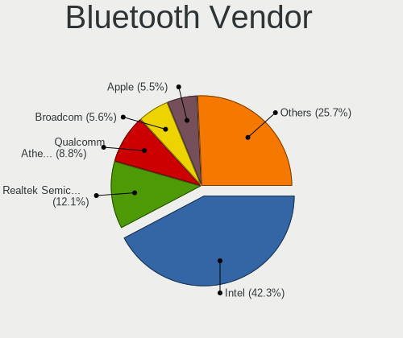
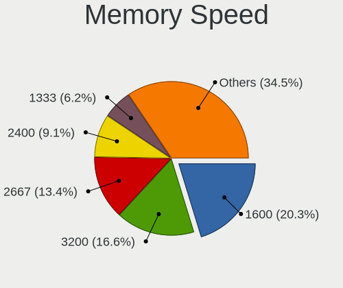
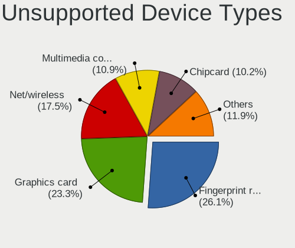

Zorin 16 - Tested Hardware & Statistics
---------------------------------------

A project to collect tested hardware configurations for Zorin 16.

Anyone can contribute to this report by the [hw-probe](https://github.com/linuxhw/hw-probe) tool:

    sudo -E hw-probe -all -upload

Please submit a probe of your configuration if it's not presented on the page or is rare.

This is a report for all computer types. See also reports for [desktops](/Dist/Zorin_16/Desktop/README.md) and [notebooks](/Dist/Zorin_16/Notebook/README.md).

Full-feature report is available here: https://linux-hardware.org/?view=trends&rel=zorin-16

Contents
--------

* [ Test Cases ](#test-cases)

* [ System ](#system)
  - [ Kernel                   ](#kernel)
  - [ Kernel Family            ](#kernel-family)
  - [ Kernel Major Ver.        ](#kernel-major-ver)
  - [ Arch                     ](#arch)
  - [ DE                       ](#de)
  - [ Display Server           ](#display-server)
  - [ Display Manager          ](#display-manager)
  - [ OS Lang                  ](#os-lang)
  - [ Boot Mode                ](#boot-mode)
  - [ Filesystem               ](#filesystem)
  - [ Part. scheme             ](#part-scheme)
  - [ Dual Boot with Linux/BSD ](#dual-boot-with-linuxbsd)
  - [ Dual Boot (Win)          ](#dual-boot-win)

* [ Board ](#board)
  - [ Vendor                   ](#vendor)
  - [ Model                    ](#model)
  - [ Model Family             ](#model-family)
  - [ MFG Year                 ](#mfg-year)
  - [ Form Factor              ](#form-factor)
  - [ Secure Boot              ](#secure-boot)
  - [ Coreboot                 ](#coreboot)
  - [ RAM Size                 ](#ram-size)
  - [ RAM Used                 ](#ram-used)
  - [ Total Drives             ](#total-drives)
  - [ Has CD-ROM               ](#has-cd-rom)
  - [ Has Ethernet             ](#has-ethernet)
  - [ Has WiFi                 ](#has-wifi)
  - [ Has Bluetooth            ](#has-bluetooth)

* [ Location ](#location)
  - [ Country                  ](#country)
  - [ City                     ](#city)

* [ Drives ](#drives)
  - [ Drive Vendor             ](#drive-vendor)
  - [ Drive Model              ](#drive-model)
  - [ HDD Vendor               ](#hdd-vendor)
  - [ SSD Vendor               ](#ssd-vendor)
  - [ Drive Kind               ](#drive-kind)
  - [ Drive Connector          ](#drive-connector)
  - [ Drive Size               ](#drive-size)
  - [ Space Total              ](#space-total)
  - [ Space Used               ](#space-used)
  - [ Malfunc. Drives          ](#malfunc-drives)
  - [ Malfunc. Drive Vendor    ](#malfunc-drive-vendor)
  - [ Malfunc. HDD Vendor      ](#malfunc-hdd-vendor)
  - [ Malfunc. Drive Kind      ](#malfunc-drive-kind)
  - [ Failed Drives            ](#failed-drives)
  - [ Failed Drive Vendor      ](#failed-drive-vendor)
  - [ Drive Status             ](#drive-status)

* [ Storage controller ](#storage-controller)
  - [ Storage Vendor           ](#storage-vendor)
  - [ Storage Model            ](#storage-model)
  - [ Storage Kind             ](#storage-kind)

* [ Processor ](#processor)
  - [ CPU Vendor               ](#cpu-vendor)
  - [ CPU Model                ](#cpu-model)
  - [ CPU Model Family         ](#cpu-model-family)
  - [ CPU Cores                ](#cpu-cores)
  - [ CPU Sockets              ](#cpu-sockets)
  - [ CPU Threads              ](#cpu-threads)
  - [ CPU Op-Modes             ](#cpu-op-modes)
  - [ CPU Microcode            ](#cpu-microcode)
  - [ CPU Microarch            ](#cpu-microarch)

* [ Graphics ](#graphics)
  - [ GPU Vendor               ](#gpu-vendor)
  - [ GPU Model                ](#gpu-model)
  - [ GPU Combo                ](#gpu-combo)
  - [ GPU Driver               ](#gpu-driver)
  - [ GPU Memory               ](#gpu-memory)

* [ Monitor ](#monitor)
  - [ Monitor Vendor           ](#monitor-vendor)
  - [ Monitor Model            ](#monitor-model)
  - [ Monitor Resolution       ](#monitor-resolution)
  - [ Monitor Diagonal         ](#monitor-diagonal)
  - [ Monitor Width            ](#monitor-width)
  - [ Aspect Ratio             ](#aspect-ratio)
  - [ Monitor Area             ](#monitor-area)
  - [ Pixel Density            ](#pixel-density)
  - [ Multiple Monitors        ](#multiple-monitors)

* [ Network ](#network)
  - [ Net Controller Vendor    ](#net-controller-vendor)
  - [ Net Controller Model     ](#net-controller-model)
  - [ Wireless Vendor          ](#wireless-vendor)
  - [ Wireless Model           ](#wireless-model)
  - [ Ethernet Vendor          ](#ethernet-vendor)
  - [ Ethernet Model           ](#ethernet-model)
  - [ Net Controller Kind      ](#net-controller-kind)
  - [ Used Controller          ](#used-controller)
  - [ NICs                     ](#nics)
  - [ IPv6                     ](#ipv6)

* [ Bluetooth ](#bluetooth)
  - [ Bluetooth Vendor         ](#bluetooth-vendor)
  - [ Bluetooth Model          ](#bluetooth-model)

* [ Sound ](#sound)
  - [ Sound Vendor             ](#sound-vendor)
  - [ Sound Model              ](#sound-model)

* [ Memory ](#memory)
  - [ Memory Vendor            ](#memory-vendor)
  - [ Memory Model             ](#memory-model)
  - [ Memory Kind              ](#memory-kind)
  - [ Memory Form Factor       ](#memory-form-factor)
  - [ Memory Size              ](#memory-size)
  - [ Memory Speed             ](#memory-speed)

* [ Printers & scanners ](#printers--scanners)
  - [ Printer Vendor           ](#printer-vendor)
  - [ Printer Model            ](#printer-model)
  - [ Scanner Vendor           ](#scanner-vendor)
  - [ Scanner Model            ](#scanner-model)

* [ Camera ](#camera)
  - [ Camera Vendor            ](#camera-vendor)
  - [ Camera Model             ](#camera-model)

* [ Security ](#security)
  - [ Fingerprint Vendor       ](#fingerprint-vendor)
  - [ Fingerprint Model        ](#fingerprint-model)
  - [ Chipcard Vendor          ](#chipcard-vendor)
  - [ Chipcard Model           ](#chipcard-model)

* [ Unsupported ](#unsupported)
  - [ Unsupported Devices      ](#unsupported-devices)
  - [ Unsupported Device Types ](#unsupported-device-types)

Test Cases
----------

| Vendor        | Model                       | Form-Factor | Probe                                                      | Date         |
|---------------|-----------------------------|-------------|------------------------------------------------------------|--------------|
| HP            | ENVY Laptop 13-ah0xxx       | Notebook    | [c06b09d9c4](https://linux-hardware.org/?probe=c06b09d9c4) | Sep 09, 2021 |
| HP            | ENVY Laptop 13-ah0xxx       | Notebook    | [87e79937c9](https://linux-hardware.org/?probe=87e79937c9) | Sep 09, 2021 |
| ASUSTek       | PN50                        | Mini pc     | [15f063a517](https://linux-hardware.org/?probe=15f063a517) | Sep 09, 2021 |
| ASUSTek       | PN50                        | Mini pc     | [5b8b652e27](https://linux-hardware.org/?probe=5b8b652e27) | Sep 09, 2021 |
| ASUSTek       | PN50                        | Mini pc     | [e3e702ab7b](https://linux-hardware.org/?probe=e3e702ab7b) | Sep 09, 2021 |
| HP            | 2187 A01                    | Desktop     | [0c11e3b726](https://linux-hardware.org/?probe=0c11e3b726) | Sep 09, 2021 |
| Lenovo        | IdeaPad 310 Touch-15IKB ... | Notebook    | [ccb4dc3d9a](https://linux-hardware.org/?probe=ccb4dc3d9a) | Sep 09, 2021 |
| Toshiba       | Satellite C75D-B            | Notebook    | [0f52ac751b](https://linux-hardware.org/?probe=0f52ac751b) | Sep 08, 2021 |
| Toshiba       | Satellite C75D-B            | Notebook    | [97b34f8c7f](https://linux-hardware.org/?probe=97b34f8c7f) | Sep 08, 2021 |
| Lenovo        | ThinkPad P14s Gen 1 20Y1... | Notebook    | [8404b1fc92](https://linux-hardware.org/?probe=8404b1fc92) | Sep 08, 2021 |
| MSI           | B450M MORTAR MAX            | Desktop     | [f40c6b596c](https://linux-hardware.org/?probe=f40c6b596c) | Sep 08, 2021 |
| Dell          | 09KPNV A01                  | Desktop     | [f3c9b271f1](https://linux-hardware.org/?probe=f3c9b271f1) | Sep 08, 2021 |
| MSI           | B450M MORTAR MAX            | Desktop     | [7dbf053877](https://linux-hardware.org/?probe=7dbf053877) | Sep 08, 2021 |
| MSI           | H81M-P33                    | Desktop     | [92b799f852](https://linux-hardware.org/?probe=92b799f852) | Sep 08, 2021 |
| Lenovo        | ThinkPad E14 20RAS1Q800     | Notebook    | [a4d93ee5d2](https://linux-hardware.org/?probe=a4d93ee5d2) | Sep 08, 2021 |
| HP            | EliteBook 8560p             | Notebook    | [6bff88fb9e](https://linux-hardware.org/?probe=6bff88fb9e) | Sep 08, 2021 |
| MSI           | B450M MORTAR MAX            | Desktop     | [17c58396b6](https://linux-hardware.org/?probe=17c58396b6) | Sep 08, 2021 |
| Sony          | VGN-SR5                     | Notebook    | [7f93c9c366](https://linux-hardware.org/?probe=7f93c9c366) | Sep 08, 2021 |
| MSI           | B450M MORTAR MAX            | Desktop     | [dfe73847d3](https://linux-hardware.org/?probe=dfe73847d3) | Sep 08, 2021 |
| MSI           | GS75 Stealth 10SF           | Notebook    | [3fc588a18d](https://linux-hardware.org/?probe=3fc588a18d) | Sep 08, 2021 |
| MSI           | GS75 Stealth 10SF           | Notebook    | [fd38e5bf9d](https://linux-hardware.org/?probe=fd38e5bf9d) | Sep 08, 2021 |
| HP            | EliteBook 840 G3            | Notebook    | [22d88098a9](https://linux-hardware.org/?probe=22d88098a9) | Sep 08, 2021 |
| Dell          | 0D28YY A03                  | Desktop     | [3eb7b9cb7b](https://linux-hardware.org/?probe=3eb7b9cb7b) | Sep 08, 2021 |
| RCA           | W101-CS                     | Tablet      | [7ba24072d5](https://linux-hardware.org/?probe=7ba24072d5) | Sep 08, 2021 |
| Toshiba       | Satellite C75D-B            | Notebook    | [be8d4bd453](https://linux-hardware.org/?probe=be8d4bd453) | Sep 08, 2021 |
| Toshiba       | Satellite C75D-B            | Notebook    | [47317abce2](https://linux-hardware.org/?probe=47317abce2) | Sep 08, 2021 |
| HP            | ENVY Sleekbook 4 PC         | Notebook    | [e8f88bd1b2](https://linux-hardware.org/?probe=e8f88bd1b2) | Sep 08, 2021 |
| HP            | Pavilion Gaming Laptop 1... | Notebook    | [98874d48b2](https://linux-hardware.org/?probe=98874d48b2) | Sep 07, 2021 |
| HP            | Pavilion Gaming Laptop 1... | Notebook    | [f872b42a74](https://linux-hardware.org/?probe=f872b42a74) | Sep 07, 2021 |
| ASUSTek       | P5G41T-M LX3                | Desktop     | [2f680da4b8](https://linux-hardware.org/?probe=2f680da4b8) | Sep 07, 2021 |
| Acer          | V5-171                      | Notebook    | [8068be142e](https://linux-hardware.org/?probe=8068be142e) | Sep 07, 2021 |
| HP            | Notebook                    | Notebook    | [62a2618cde](https://linux-hardware.org/?probe=62a2618cde) | Sep 07, 2021 |
| Unknown       | Unknown                     | Desktop     | [b00795951c](https://linux-hardware.org/?probe=b00795951c) | Sep 07, 2021 |
| Toshiba       | Satellite L755              | Notebook    | [92d22f65bf](https://linux-hardware.org/?probe=92d22f65bf) | Sep 07, 2021 |
| Samsung       | 550P5C/550P7C               | Notebook    | [a2a7c20bf7](https://linux-hardware.org/?probe=a2a7c20bf7) | Sep 07, 2021 |
| Dell          | Precision 3520              | Notebook    | [15e6e2c91d](https://linux-hardware.org/?probe=15e6e2c91d) | Sep 07, 2021 |
| Dell          | Precision 5550              | Notebook    | [8ae36d685d](https://linux-hardware.org/?probe=8ae36d685d) | Sep 07, 2021 |
| Dell          | Latitude E5430 non-vPro     | Notebook    | [368f488133](https://linux-hardware.org/?probe=368f488133) | Sep 07, 2021 |
| MSI           | GL62 7RDX                   | Notebook    | [be53fd4c86](https://linux-hardware.org/?probe=be53fd4c86) | Sep 07, 2021 |
| ASUSTek       | ASUS Gaming FX570UD         | Notebook    | [3eaf057f6f](https://linux-hardware.org/?probe=3eaf057f6f) | Sep 07, 2021 |
| Acer          | Swift SF114-34              | Notebook    | [8a66ec8e37](https://linux-hardware.org/?probe=8a66ec8e37) | Sep 07, 2021 |
| Lenovo        | B50-30 20382                | Notebook    | [f91b1f41fc](https://linux-hardware.org/?probe=f91b1f41fc) | Sep 06, 2021 |
| MSI           | B560M PRO-VDH               | Desktop     | [807eed7553](https://linux-hardware.org/?probe=807eed7553) | Sep 06, 2021 |
| ASRock        | Q1900M                      | Desktop     | [3f08533d5f](https://linux-hardware.org/?probe=3f08533d5f) | Sep 06, 2021 |
| ASRock        | Q1900M                      | Desktop     | [d342919044](https://linux-hardware.org/?probe=d342919044) | Sep 06, 2021 |
| Intel         | X79M-S                      | Desktop     | [e45160873d](https://linux-hardware.org/?probe=e45160873d) | Sep 06, 2021 |
| ASUSTek       | M5A97                       | Desktop     | [28754f0456](https://linux-hardware.org/?probe=28754f0456) | Sep 06, 2021 |
| HP            | Pavilion dv5                | Notebook    | [27607d962e](https://linux-hardware.org/?probe=27607d962e) | Sep 06, 2021 |
| ASUSTek       | VivoBook_ASUSLaptop X512... | Notebook    | [d1af312696](https://linux-hardware.org/?probe=d1af312696) | Sep 06, 2021 |
| Acer          | Aspire V3-571G              | Notebook    | [46499caf7a](https://linux-hardware.org/?probe=46499caf7a) | Sep 05, 2021 |
| Sony          | VPCS135FX                   | Notebook    | [55c2fa54ae](https://linux-hardware.org/?probe=55c2fa54ae) | Sep 05, 2021 |
| Gigabyte      | G31M-ES2L                   | Desktop     | [d94c35ce11](https://linux-hardware.org/?probe=d94c35ce11) | Sep 05, 2021 |
| Acer          | One S1003                   | Tablet      | [879a8ee9da](https://linux-hardware.org/?probe=879a8ee9da) | Sep 05, 2021 |
| Acer          | One S1003                   | Tablet      | [e5d901c7a5](https://linux-hardware.org/?probe=e5d901c7a5) | Sep 05, 2021 |
| MSI           | IONA                        | Desktop     | [8a4454604a](https://linux-hardware.org/?probe=8a4454604a) | Sep 05, 2021 |
| Apple         | MacBook3,1                  | Notebook    | [1473909011](https://linux-hardware.org/?probe=1473909011) | Sep 05, 2021 |
| ASUSTek       | M5A97 LE R2.0               | Desktop     | [791768dfbd](https://linux-hardware.org/?probe=791768dfbd) | Sep 04, 2021 |
| ASUSTek       | PN50                        | Mini pc     | [ff8f35986b](https://linux-hardware.org/?probe=ff8f35986b) | Sep 04, 2021 |
| MSI           | IONA                        | Desktop     | [b775cef84a](https://linux-hardware.org/?probe=b775cef84a) | Sep 04, 2021 |
| ASUSTek       | NARRA3                      | Desktop     | [920ab9b385](https://linux-hardware.org/?probe=920ab9b385) | Sep 04, 2021 |
| Gigabyte      | Z490 AORUS ELITE            | Desktop     | [149099265c](https://linux-hardware.org/?probe=149099265c) | Sep 04, 2021 |
| Intel         | DQ77MK AAG39642-500         | Desktop     | [391c101a92](https://linux-hardware.org/?probe=391c101a92) | Sep 04, 2021 |
| Lenovo        | G505s 20255                 | Notebook    | [263eeefef0](https://linux-hardware.org/?probe=263eeefef0) | Sep 04, 2021 |
| HP            | 2B4B                        | Desktop     | [d36296bddf](https://linux-hardware.org/?probe=d36296bddf) | Sep 04, 2021 |
| Lenovo        | G505s 20255                 | Notebook    | [8cd745db58](https://linux-hardware.org/?probe=8cd745db58) | Sep 04, 2021 |
| ASUSTek       | Z170I PRO GAMING            | Desktop     | [9e6ccaa1f3](https://linux-hardware.org/?probe=9e6ccaa1f3) | Sep 04, 2021 |
| Biostar       | X470NH                      | Desktop     | [f0449b9946](https://linux-hardware.org/?probe=f0449b9946) | Sep 04, 2021 |
| HP            | ProBook 6450b               | Notebook    | [960930d457](https://linux-hardware.org/?probe=960930d457) | Sep 04, 2021 |
| HP            | ProBook 6450b               | Notebook    | [98041e0acd](https://linux-hardware.org/?probe=98041e0acd) | Sep 04, 2021 |
| Lenovo        | ThinkPad E15 Gen 2 20TD0... | Notebook    | [303c36ac93](https://linux-hardware.org/?probe=303c36ac93) | Sep 03, 2021 |
| HP            | 255 G3                      | Notebook    | [bd1a8b58da](https://linux-hardware.org/?probe=bd1a8b58da) | Sep 03, 2021 |
| HP            | 255 G3                      | Notebook    | [b5f1c73339](https://linux-hardware.org/?probe=b5f1c73339) | Sep 03, 2021 |
| Acer          | Aspire A315-31              | Notebook    | [f07f0d19ca](https://linux-hardware.org/?probe=f07f0d19ca) | Sep 03, 2021 |
| HP            | EliteBook 840 G1            | Notebook    | [980716e0a8](https://linux-hardware.org/?probe=980716e0a8) | Sep 03, 2021 |
| Gigabyte      | A320M-S2H-CF                | Desktop     | [126d9974b1](https://linux-hardware.org/?probe=126d9974b1) | Sep 03, 2021 |
| ASUSTek       | GR8                         | Notebook    | [eb4fb4e1f2](https://linux-hardware.org/?probe=eb4fb4e1f2) | Sep 03, 2021 |
| Lenovo        | ThinkPad W520 4284AW3       | Notebook    | [6647a6a4b4](https://linux-hardware.org/?probe=6647a6a4b4) | Sep 03, 2021 |
| Acer          | Aspire R3-131T              | Notebook    | [62485c81e9](https://linux-hardware.org/?probe=62485c81e9) | Sep 02, 2021 |
| Acer          | Aspire E5-521G              | Notebook    | [d1aa71f003](https://linux-hardware.org/?probe=d1aa71f003) | Sep 02, 2021 |
| Acer          | Aspire 4830T                | Notebook    | [52441614fe](https://linux-hardware.org/?probe=52441614fe) | Sep 02, 2021 |
| Acer          | Aspire E1-522               | Notebook    | [8cd8899bae](https://linux-hardware.org/?probe=8cd8899bae) | Sep 02, 2021 |
| Toshiba       | Satellite C850D-11C         | Notebook    | [51748f289f](https://linux-hardware.org/?probe=51748f289f) | Sep 01, 2021 |
| HP            | 1497                        | Desktop     | [fd4cf5c840](https://linux-hardware.org/?probe=fd4cf5c840) | Sep 01, 2021 |
| Intel         | NUC7JYB J67969-404          | Mini pc     | [3c88709f8a](https://linux-hardware.org/?probe=3c88709f8a) | Sep 01, 2021 |
| HP            | ENVY 15                     | Notebook    | [d2bb5f165e](https://linux-hardware.org/?probe=d2bb5f165e) | Sep 01, 2021 |
| ASUSTek       | X405UA                      | Notebook    | [9bf230ee3f](https://linux-hardware.org/?probe=9bf230ee3f) | Aug 31, 2021 |
| Gigabyte      | B460M DS3H                  | Desktop     | [ef23780b19](https://linux-hardware.org/?probe=ef23780b19) | Aug 31, 2021 |
| Insyde        | i101c                       | Notebook    | [de0a5f2925](https://linux-hardware.org/?probe=de0a5f2925) | Aug 31, 2021 |
| Positivo      | POS-PIH81DI                 | Desktop     | [baa289fe51](https://linux-hardware.org/?probe=baa289fe51) | Aug 31, 2021 |
| Positivo      | POS-PIH81DI                 | Desktop     | [cc326a093e](https://linux-hardware.org/?probe=cc326a093e) | Aug 31, 2021 |
| HP            | 339A                        | Desktop     | [5a5ab8d1c2](https://linux-hardware.org/?probe=5a5ab8d1c2) | Aug 31, 2021 |
| HP            | EliteBook 840 G1            | Notebook    | [8439784c2b](https://linux-hardware.org/?probe=8439784c2b) | Aug 31, 2021 |
| HP            | 339A                        | Desktop     | [c0043e4c4c](https://linux-hardware.org/?probe=c0043e4c4c) | Aug 31, 2021 |
| ASUSTek       | TUF GAMING B550-PLUS        | Desktop     | [4c711d446d](https://linux-hardware.org/?probe=4c711d446d) | Aug 31, 2021 |
| ASUSTek       | TUF GAMING B550-PLUS        | Desktop     | [efb9bccc60](https://linux-hardware.org/?probe=efb9bccc60) | Aug 31, 2021 |
| HP            | Pavilion 15                 | Notebook    | [13ae124697](https://linux-hardware.org/?probe=13ae124697) | Aug 31, 2021 |
| ASUSTek       | K73SV                       | Notebook    | [e7c8d68b00](https://linux-hardware.org/?probe=e7c8d68b00) | Aug 31, 2021 |
| Intel         | DQ77MK AAG39642-500         | Desktop     | [000d760a55](https://linux-hardware.org/?probe=000d760a55) | Aug 30, 2021 |
| Dell          | XPS 15 9560                 | Notebook    | [fe38c67cd2](https://linux-hardware.org/?probe=fe38c67cd2) | Aug 30, 2021 |
| Positivo      | POS-PIH81DI                 | Desktop     | [3b05a7b317](https://linux-hardware.org/?probe=3b05a7b317) | Aug 30, 2021 |
| Acer          | Aspire E1-522               | Notebook    | [80412fd612](https://linux-hardware.org/?probe=80412fd612) | Aug 30, 2021 |
| Acer          | Aspire E1-522               | Notebook    | [f2542100bc](https://linux-hardware.org/?probe=f2542100bc) | Aug 30, 2021 |
| Lenovo        | B50-70 80EU                 | Notebook    | [9507d559fc](https://linux-hardware.org/?probe=9507d559fc) | Aug 30, 2021 |
| Apple         | MacBookPro11,1              | Notebook    | [1dbc26a990](https://linux-hardware.org/?probe=1dbc26a990) | Aug 29, 2021 |
| Packard Be... | DOT S                       | Notebook    | [0231531196](https://linux-hardware.org/?probe=0231531196) | Aug 29, 2021 |
| Packard Be... | DOT S                       | Notebook    | [4f0a335506](https://linux-hardware.org/?probe=4f0a335506) | Aug 29, 2021 |
| Lenovo        | ThinkPad T520 4242W4F       | Notebook    | [150dd830ac](https://linux-hardware.org/?probe=150dd830ac) | Aug 29, 2021 |
| Fujitsu       | LIFEBOOK AH532              | Notebook    | [e63b8b96dd](https://linux-hardware.org/?probe=e63b8b96dd) | Aug 29, 2021 |
| MSI           | Z87-G43                     | Desktop     | [a219ff197d](https://linux-hardware.org/?probe=a219ff197d) | Aug 29, 2021 |
| MSI           | MPG X570 GAMING PLUS        | Desktop     | [01a43874df](https://linux-hardware.org/?probe=01a43874df) | Aug 28, 2021 |
| Acer          | Aspire 5100                 | Notebook    | [2b16fed8a1](https://linux-hardware.org/?probe=2b16fed8a1) | Aug 28, 2021 |
| Toshiba       | Satellite S75Dt-A           | Notebook    | [c3e9c3d13b](https://linux-hardware.org/?probe=c3e9c3d13b) | Aug 28, 2021 |
| Acer          | Aspire A515-51              | Notebook    | [6acb0f573a](https://linux-hardware.org/?probe=6acb0f573a) | Aug 28, 2021 |
| ASUSTek       | PRIME A320M-K               | Desktop     | [f7a948129f](https://linux-hardware.org/?probe=f7a948129f) | Aug 28, 2021 |
| ASUSTek       | K56CA                       | Notebook    | [90d571608f](https://linux-hardware.org/?probe=90d571608f) | Aug 28, 2021 |
| ASUSTek       | P8H61-M LX2 R2.0            | Desktop     | [5cd3f43e28](https://linux-hardware.org/?probe=5cd3f43e28) | Aug 28, 2021 |
| Dell          | Inspiron 5566               | Notebook    | [2c2761e770](https://linux-hardware.org/?probe=2c2761e770) | Aug 27, 2021 |
| Gigabyte      | A320M-S2H-CF                | Desktop     | [6ed5f8c32b](https://linux-hardware.org/?probe=6ed5f8c32b) | Aug 27, 2021 |
| ASRock        | Z390 Phantom Gaming 4-IB    | Desktop     | [b01269fbc1](https://linux-hardware.org/?probe=b01269fbc1) | Aug 27, 2021 |
| Dell          | XPS 13 9310                 | Notebook    | [08009ad892](https://linux-hardware.org/?probe=08009ad892) | Aug 26, 2021 |
| Apple         | Mac-FC02E91DDD3FA6A4 iMa... | All in one  | [c59a1fff0d](https://linux-hardware.org/?probe=c59a1fff0d) | Aug 26, 2021 |
| Apple         | Mac-942B59F58194171B iMa... | All in one  | [accc3b9ebb](https://linux-hardware.org/?probe=accc3b9ebb) | Aug 26, 2021 |
| Lenovo        | SHARKBAY SDK0E50510 WIN     | Desktop     | [51661e959e](https://linux-hardware.org/?probe=51661e959e) | Aug 26, 2021 |
| Lenovo        | SHARKBAY SDK0E50510 WIN     | Desktop     | [3a7eb89cd8](https://linux-hardware.org/?probe=3a7eb89cd8) | Aug 25, 2021 |
| Acer          | AO722                       | Notebook    | [e303d0c046](https://linux-hardware.org/?probe=e303d0c046) | Aug 25, 2021 |
| Lenovo        | IdeaPad Z510 20287          | Notebook    | [2199b6e642](https://linux-hardware.org/?probe=2199b6e642) | Aug 25, 2021 |
| Dell          | Inspiron 7520               | Notebook    | [1798e6404c](https://linux-hardware.org/?probe=1798e6404c) | Aug 25, 2021 |
| Unknown       | Unknown                     | Notebook    | [e18bc8fe09](https://linux-hardware.org/?probe=e18bc8fe09) | Aug 25, 2021 |
| HP            | 802E                        | Desktop     | [3ee51e8a56](https://linux-hardware.org/?probe=3ee51e8a56) | Aug 25, 2021 |
| ASUSTek       | P8Z77-V LX                  | Desktop     | [314859d762](https://linux-hardware.org/?probe=314859d762) | Aug 25, 2021 |
| ASUSTek       | P8Z77-V LX                  | Desktop     | [faaf8bc158](https://linux-hardware.org/?probe=faaf8bc158) | Aug 25, 2021 |
| Acer          | Aspire ES1-512              | Notebook    | [48b43bd242](https://linux-hardware.org/?probe=48b43bd242) | Aug 25, 2021 |
| Unknown       | Unknown                     | Notebook    | [e576736426](https://linux-hardware.org/?probe=e576736426) | Aug 25, 2021 |
| Dell          | 088DT1 A01                  | Desktop     | [8620323354](https://linux-hardware.org/?probe=8620323354) | Aug 25, 2021 |
| TianBei       | TB-H7                       | Notebook    | [455dce9834](https://linux-hardware.org/?probe=455dce9834) | Aug 25, 2021 |
| Lenovo        | Yoga 3 Pro-1370 80HE        | Notebook    | [a64e3a0513](https://linux-hardware.org/?probe=a64e3a0513) | Aug 25, 2021 |
| Dell          | 0TP406                      | Desktop     | [72a3d9ac12](https://linux-hardware.org/?probe=72a3d9ac12) | Aug 25, 2021 |
| HP            | 2B4B                        | Desktop     | [4c5411522b](https://linux-hardware.org/?probe=4c5411522b) | Aug 25, 2021 |
| LG Electro... | S460-G.BG31P1               | Notebook    | [99df59aebd](https://linux-hardware.org/?probe=99df59aebd) | Aug 24, 2021 |
| HP            | ENVY Sleekbook 4 PC         | Notebook    | [3d58cb6ce0](https://linux-hardware.org/?probe=3d58cb6ce0) | Aug 24, 2021 |
| Acer          | Aspire 7715Z                | Notebook    | [4de4de1a31](https://linux-hardware.org/?probe=4de4de1a31) | Aug 24, 2021 |
| Gigabyte      | B85M-D3H                    | Desktop     | [906a3e006c](https://linux-hardware.org/?probe=906a3e006c) | Aug 24, 2021 |
| Gigabyte      | B85M-D3H                    | Desktop     | [9f369218ff](https://linux-hardware.org/?probe=9f369218ff) | Aug 24, 2021 |
| Lenovo        | G50-30 80G0                 | Notebook    | [27cdfce14b](https://linux-hardware.org/?probe=27cdfce14b) | Aug 24, 2021 |
| LG Electro... | A410-K.BE47P1               | Notebook    | [bfc75c9c3d](https://linux-hardware.org/?probe=bfc75c9c3d) | Aug 24, 2021 |
| ASUSTek       | P8Z77-V LE                  | Desktop     | [a720e3326a](https://linux-hardware.org/?probe=a720e3326a) | Aug 23, 2021 |
| Acer          | Aspire 8940G                | Notebook    | [24ff3cf596](https://linux-hardware.org/?probe=24ff3cf596) | Aug 23, 2021 |
| Lenovo        | IdeaPad 5 15ALC05 82LN      | Notebook    | [b0830bd154](https://linux-hardware.org/?probe=b0830bd154) | Aug 23, 2021 |
| Dell          | Inspiron 5566               | Notebook    | [c56758deca](https://linux-hardware.org/?probe=c56758deca) | Aug 23, 2021 |
| Dell          | Inspiron 5566               | Notebook    | [eaef6e8392](https://linux-hardware.org/?probe=eaef6e8392) | Aug 23, 2021 |
| Dell          | Precision M4800             | Notebook    | [9766c85e7d](https://linux-hardware.org/?probe=9766c85e7d) | Aug 23, 2021 |
| Dell          | Precision M4800             | Notebook    | [cd3dbe3a32](https://linux-hardware.org/?probe=cd3dbe3a32) | Aug 23, 2021 |
| Unknown       | Unknown                     | Notebook    | [b1587c998f](https://linux-hardware.org/?probe=b1587c998f) | Aug 23, 2021 |
| TianBei       | TB-H7                       | Notebook    | [2d1b3b2756](https://linux-hardware.org/?probe=2d1b3b2756) | Aug 23, 2021 |
| ASUSTek       | X550LD                      | Notebook    | [04365cbbbf](https://linux-hardware.org/?probe=04365cbbbf) | Aug 22, 2021 |
| Lenovo        | ThinkPad T440p 20AWS1CH0... | Notebook    | [43f252f22a](https://linux-hardware.org/?probe=43f252f22a) | Aug 22, 2021 |
| MSI           | B450M PRO-M2 MAX            | Desktop     | [e6f053c5be](https://linux-hardware.org/?probe=e6f053c5be) | Aug 22, 2021 |
| Apple         | MacBookPro11,5              | Notebook    | [814f16635c](https://linux-hardware.org/?probe=814f16635c) | Aug 22, 2021 |
| Intel         | NUC11PABi7 K90104-302       | Mini pc     | [8eed93b589](https://linux-hardware.org/?probe=8eed93b589) | Aug 22, 2021 |
| ASUSTek       | ROG STRIX Z490-E GAMING     | Desktop     | [15175b4f4f](https://linux-hardware.org/?probe=15175b4f4f) | Aug 22, 2021 |
| ASUSTek       | ROG STRIX Z490-E GAMING     | Desktop     | [02ccc1eb70](https://linux-hardware.org/?probe=02ccc1eb70) | Aug 22, 2021 |
| ASUSTek       | M5A97 R2.0                  | Desktop     | [372a125910](https://linux-hardware.org/?probe=372a125910) | Aug 22, 2021 |
| Lenovo        | Board                       | Desktop     | [b4e9579228](https://linux-hardware.org/?probe=b4e9579228) | Aug 21, 2021 |
| Lenovo        | Board                       | Desktop     | [12088eed17](https://linux-hardware.org/?probe=12088eed17) | Aug 21, 2021 |
| HP            | ProBook 450 G2              | Notebook    | [99f47f1645](https://linux-hardware.org/?probe=99f47f1645) | Aug 21, 2021 |
| MSI           | B450M PRO-M2 MAX            | Desktop     | [68c6a2734b](https://linux-hardware.org/?probe=68c6a2734b) | Aug 21, 2021 |
| Lenovo        | IdeaPad S540-14API 81NH     | Notebook    | [7b1954838a](https://linux-hardware.org/?probe=7b1954838a) | Aug 21, 2021 |
| HP            | Notebook                    | Notebook    | [2586dc3a41](https://linux-hardware.org/?probe=2586dc3a41) | Aug 21, 2021 |
| Lenovo        | G50-30 80G0                 | Notebook    | [afbefeb6d3](https://linux-hardware.org/?probe=afbefeb6d3) | Aug 21, 2021 |
| Lenovo        | ThinkPad X131e 3371AL2      | Notebook    | [1963322393](https://linux-hardware.org/?probe=1963322393) | Aug 21, 2021 |
| ASUSTek       | GR8                         | Notebook    | [88416da5e8](https://linux-hardware.org/?probe=88416da5e8) | Aug 21, 2021 |
| Apple         | MacBook4,1                  | Notebook    | [ad6e3e064f](https://linux-hardware.org/?probe=ad6e3e064f) | Aug 21, 2021 |
| Apple         | MacBook4,1                  | Notebook    | [9a5653e44d](https://linux-hardware.org/?probe=9a5653e44d) | Aug 21, 2021 |
| Sony          | VGN-SR5                     | Notebook    | [3bbd8b33f0](https://linux-hardware.org/?probe=3bbd8b33f0) | Aug 20, 2021 |
| HP            | ENVY 14                     | Notebook    | [34f9505762](https://linux-hardware.org/?probe=34f9505762) | Aug 20, 2021 |
| Intel         | DB75EN AAG39650-303         | Desktop     | [4bbb9f60f9](https://linux-hardware.org/?probe=4bbb9f60f9) | Aug 20, 2021 |
| HP            | 84F0 0100                   | All in one  | [0acfc1ab65](https://linux-hardware.org/?probe=0acfc1ab65) | Aug 20, 2021 |
| HP            | 84F0 0100                   | All in one  | [27898f0b8e](https://linux-hardware.org/?probe=27898f0b8e) | Aug 20, 2021 |
| Lenovo        | G50-70 20351                | Notebook    | [40249b1ea8](https://linux-hardware.org/?probe=40249b1ea8) | Aug 20, 2021 |
| HP            | ENVY Sleekbook 4 PC         | Notebook    | [231e17454e](https://linux-hardware.org/?probe=231e17454e) | Aug 19, 2021 |
| Fujitsu       | D3220-A1 S26361-D3220-A1    | Desktop     | [63cbb9e7fd](https://linux-hardware.org/?probe=63cbb9e7fd) | Aug 19, 2021 |
| Dell          | Inspiron N5040              | Notebook    | [0554d06022](https://linux-hardware.org/?probe=0554d06022) | Aug 19, 2021 |
| LG Electro... | 17U70N-R.AAS7U1             | Notebook    | [fd3572c46a](https://linux-hardware.org/?probe=fd3572c46a) | Aug 19, 2021 |
| MSI           | Z97 XPOWER AC               | Desktop     | [c68138439d](https://linux-hardware.org/?probe=c68138439d) | Aug 19, 2021 |
| ASUSTek       | M5A78L-M/USB3               | Desktop     | [d78450d852](https://linux-hardware.org/?probe=d78450d852) | Aug 19, 2021 |
| Acer          | Aspire XC-605G              | Desktop     | [8bb6f8ef72](https://linux-hardware.org/?probe=8bb6f8ef72) | Aug 18, 2021 |
| ASUSTek       | B85M-G R2.0                 | Desktop     | [daf6bf889f](https://linux-hardware.org/?probe=daf6bf889f) | Aug 18, 2021 |
| Acer          | Nitro AN515-55              | Notebook    | [3a47dca146](https://linux-hardware.org/?probe=3a47dca146) | Aug 18, 2021 |
| MSI           | Z270-A PRO                  | Desktop     | [3be5b7f90e](https://linux-hardware.org/?probe=3be5b7f90e) | Aug 18, 2021 |
| HP            | ProBook 450 G2              | Notebook    | [a3e170c339](https://linux-hardware.org/?probe=a3e170c339) | Aug 17, 2021 |
| Gigabyte      | B550M DS3H                  | Desktop     | [4b687b4c17](https://linux-hardware.org/?probe=4b687b4c17) | Aug 16, 2021 |
| ASUSTek       | Z97-C                       | Desktop     | [97b71d18de](https://linux-hardware.org/?probe=97b71d18de) | Aug 16, 2021 |
| ASUSTek       | Z97-C                       | Desktop     | [06872ddde7](https://linux-hardware.org/?probe=06872ddde7) | Aug 16, 2021 |
| ASUSTek       | Z97-C                       | Desktop     | [a1f448c1f6](https://linux-hardware.org/?probe=a1f448c1f6) | Aug 15, 2021 |
| Acer          | Swift SF114-34              | Notebook    | [0a37eed9e8](https://linux-hardware.org/?probe=0a37eed9e8) | Aug 15, 2021 |
| ASUSTek       | ASUS TUF Gaming A15 FA50... | Notebook    | [fcfd1e5ba9](https://linux-hardware.org/?probe=fcfd1e5ba9) | Aug 15, 2021 |
| HP            | ProBook 430 G6              | Notebook    | [c5467376e9](https://linux-hardware.org/?probe=c5467376e9) | Aug 13, 2021 |
| Lenovo        | IdeaPad 3 14ADA05 81W0      | Notebook    | [9718804b4a](https://linux-hardware.org/?probe=9718804b4a) | Aug 12, 2021 |
| ASUSTek       | PRIME X570-PRO              | Desktop     | [fb7eb46b29](https://linux-hardware.org/?probe=fb7eb46b29) | Aug 11, 2021 |
| HP            | ProBook 450 G2              | Notebook    | [67956ca49e](https://linux-hardware.org/?probe=67956ca49e) | Aug 10, 2021 |
| Lenovo        | Yoga 730-13IWL 81JR         | Convertible | [65567a1be4](https://linux-hardware.org/?probe=65567a1be4) | Aug 10, 2021 |
| ASUSTek       | SABERTOOTH Z97 MARK 1       | Desktop     | [fb8a0b07d1](https://linux-hardware.org/?probe=fb8a0b07d1) | Aug 10, 2021 |
| Acer          | Aspire E1-571               | Notebook    | [146f910c76](https://linux-hardware.org/?probe=146f910c76) | Aug 09, 2021 |
| Samsung       | 350V5C/351V5C/3540VC/344... | Notebook    | [c7a0820fe0](https://linux-hardware.org/?probe=c7a0820fe0) | Aug 09, 2021 |
| Samsung       | 350V5C/351V5C/3540VC/344... | Notebook    | [950d41dbb8](https://linux-hardware.org/?probe=950d41dbb8) | Aug 09, 2021 |
| ASUSTek       | M5A97 LE R2.0               | Desktop     | [4d9eaaf5a8](https://linux-hardware.org/?probe=4d9eaaf5a8) | Aug 09, 2021 |
| Lenovo        | Yoga 330-11IGM 81A6         | Convertible | [01e77d1c5f](https://linux-hardware.org/?probe=01e77d1c5f) | Aug 04, 2021 |
| Dell          | Inspiron 7537               | Notebook    | [7a35ed5eb1](https://linux-hardware.org/?probe=7a35ed5eb1) | Aug 03, 2021 |
| Dell          | Inspiron 7537               | Notebook    | [3c865e72d1](https://linux-hardware.org/?probe=3c865e72d1) | Aug 03, 2021 |
| Lenovo        | Yoga 330-11IGM 81A6         | Convertible | [c5d61df0df](https://linux-hardware.org/?probe=c5d61df0df) | Aug 03, 2021 |
| Gigabyte      | B550M H                     | Desktop     | [b26c567912](https://linux-hardware.org/?probe=b26c567912) | Aug 03, 2021 |
| ASUSTek       | M5A78L-M/USB3               | Desktop     | [9c841a04d6](https://linux-hardware.org/?probe=9c841a04d6) | Aug 01, 2021 |
| Gigabyte      | H61M-USB3-B3                | Desktop     | [3c2020fbb6](https://linux-hardware.org/?probe=3c2020fbb6) | Jul 30, 2021 |
| Gigabyte      | H61M-USB3-B3                | Desktop     | [b3bbc6d937](https://linux-hardware.org/?probe=b3bbc6d937) | Jul 30, 2021 |
| HP            | ENVY x360 Convertible 15... | Convertible | [733eb370f2](https://linux-hardware.org/?probe=733eb370f2) | Jul 27, 2021 |
| Lenovo        | Yoga 330-11IGM 81A6         | Convertible | [79b20f33a0](https://linux-hardware.org/?probe=79b20f33a0) | Jul 24, 2021 |
| Lenovo        | Yoga 330-11IGM 81A6         | Convertible | [94ef768b69](https://linux-hardware.org/?probe=94ef768b69) | Jul 24, 2021 |
| Acer          | Aspire E5-551G              | Notebook    | [519515ce84](https://linux-hardware.org/?probe=519515ce84) | Jul 15, 2021 |
| Apple         | Mac-65CE76090165799A iMa... | All in one  | [3bed53aab7](https://linux-hardware.org/?probe=3bed53aab7) | Jul 14, 2021 |
| Dell          | 0V8WGR A00                  | Desktop     | [2cf38ffd15](https://linux-hardware.org/?probe=2cf38ffd15) | Jul 14, 2021 |
| ASUSTek       | P8H61-M LE                  | Desktop     | [b0270beb17](https://linux-hardware.org/?probe=b0270beb17) | Jul 11, 2021 |
| ASUSTek       | P8H61-M LE                  | Desktop     | [896e6feb8a](https://linux-hardware.org/?probe=896e6feb8a) | Jul 11, 2021 |
| Dell          | XPS L501X                   | Notebook    | [a3d8e737a5](https://linux-hardware.org/?probe=a3d8e737a5) | Jul 08, 2021 |
| Dell          | G3 3579                     | Notebook    | [92a8136dc4](https://linux-hardware.org/?probe=92a8136dc4) | Jul 03, 2021 |
| Lenovo        | ThinkBook 13s G2 ITL 20V... | Notebook    | [1196d6821c](https://linux-hardware.org/?probe=1196d6821c) | Jul 02, 2021 |
| Lenovo        | ThinkPad E15 Gen 2 20TD0... | Notebook    | [d63c7755ee](https://linux-hardware.org/?probe=d63c7755ee) | Jun 29, 2021 |
| ASUSTek       | TUF Gaming FX505DT_FX505... | Notebook    | [369a214905](https://linux-hardware.org/?probe=369a214905) | Jun 25, 2021 |
| Lenovo        | 36C5 SDK0J40700 WIN 3258... | Desktop     | [20bf622c31](https://linux-hardware.org/?probe=20bf622c31) | Jun 25, 2021 |
| Dell          | Inspiron 3576               | Notebook    | [849d571ef0](https://linux-hardware.org/?probe=849d571ef0) | Jun 24, 2021 |
| Lenovo        | IdeaPad 330-15IKB 81DE      | Notebook    | [9957b51bea](https://linux-hardware.org/?probe=9957b51bea) | Jun 24, 2021 |
| ASUSTek       | PRIME B450M-GAMING/BR       | Desktop     | [35605881d6](https://linux-hardware.org/?probe=35605881d6) | Jun 23, 2021 |
| MSI           | 2AE0                        | Desktop     | [bce75d51cd](https://linux-hardware.org/?probe=bce75d51cd) | Jun 23, 2021 |
| MSI           | 2AE0                        | Desktop     | [0412c710eb](https://linux-hardware.org/?probe=0412c710eb) | Jun 22, 2021 |
| Dell          | Inspiron 3582               | Notebook    | [e2cd9a9c36](https://linux-hardware.org/?probe=e2cd9a9c36) | Jun 20, 2021 |
| ASUSTek       | PRIME B450M-GAMING/BR       | Desktop     | [b9d86eb932](https://linux-hardware.org/?probe=b9d86eb932) | Jun 17, 2021 |
| ASUSTek       | PRIME B450M-GAMING/BR       | Desktop     | [71de5617aa](https://linux-hardware.org/?probe=71de5617aa) | Jun 17, 2021 |
| ASUSTek       | PRIME X570-P                | Desktop     | [bca1e1b92f](https://linux-hardware.org/?probe=bca1e1b92f) | Jun 16, 2021 |
| ASUSTek       | PRIME X570-P                | Desktop     | [b3f6c76103](https://linux-hardware.org/?probe=b3f6c76103) | Jun 16, 2021 |
| Gigabyte      | B85-HD3                     | Desktop     | [c73931b3ff](https://linux-hardware.org/?probe=c73931b3ff) | Jun 13, 2021 |
| Dell          | XPS 13 9370                 | Notebook    | [9e3a58b257](https://linux-hardware.org/?probe=9e3a58b257) | Jun 12, 2021 |
| Dell          | XPS 13 9370                 | Notebook    | [2aa1efb008](https://linux-hardware.org/?probe=2aa1efb008) | Jun 12, 2021 |
| Lenovo        | ThinkPad E15 Gen 2 20TD0... | Notebook    | [01cf29ba72](https://linux-hardware.org/?probe=01cf29ba72) | Jun 10, 2021 |
| HP            | 15                          | Notebook    | [f2132922af](https://linux-hardware.org/?probe=f2132922af) | Jun 08, 2021 |
| HP            | 843C                        | Desktop     | [ccff6e4f39](https://linux-hardware.org/?probe=ccff6e4f39) | Jun 08, 2021 |
| Fujitsu       | LIFEBOOK AH532              | Notebook    | [a1dd6df8e7](https://linux-hardware.org/?probe=a1dd6df8e7) | Jun 07, 2021 |
| Fujitsu       | LIFEBOOK AH532              | Notebook    | [957048adbb](https://linux-hardware.org/?probe=957048adbb) | Jun 06, 2021 |
| Dell          | Inspiron 3582               | Notebook    | [229600e417](https://linux-hardware.org/?probe=229600e417) | Jun 06, 2021 |
| Fujitsu       | LIFEBOOK AH532              | Notebook    | [719041c9d4](https://linux-hardware.org/?probe=719041c9d4) | Jun 04, 2021 |
| ASRock        | 990FX Extreme6              | Desktop     | [fc3b27abac](https://linux-hardware.org/?probe=fc3b27abac) | Jun 03, 2021 |
| HP            | 8591                        | Desktop     | [6f71430d88](https://linux-hardware.org/?probe=6f71430d88) | Jun 01, 2021 |
| HP            | 8591                        | Desktop     | [fc12c57885](https://linux-hardware.org/?probe=fc12c57885) | Jun 01, 2021 |
| HP            | ProBook 650 G2              | Notebook    | [bb92ab2244](https://linux-hardware.org/?probe=bb92ab2244) | May 30, 2021 |
| ASRock        | 990FX Extreme6              | Desktop     | [0a228b18c1](https://linux-hardware.org/?probe=0a228b18c1) | May 30, 2021 |
| HP            | Unknown                     | Notebook    | [e6e060ca51](https://linux-hardware.org/?probe=e6e060ca51) | May 29, 2021 |
| HP            | Unknown                     | Notebook    | [324d49aba6](https://linux-hardware.org/?probe=324d49aba6) | May 29, 2021 |
| ASUSTek       | PRIME B450M-GAMING/BR       | Desktop     | [0144616bb9](https://linux-hardware.org/?probe=0144616bb9) | May 27, 2021 |
| Gigabyte      | 945GCM-S2L                  | Desktop     | [9890da0efd](https://linux-hardware.org/?probe=9890da0efd) | May 27, 2021 |
| Gigabyte      | 945GCM-S2L                  | Desktop     | [61e1972b06](https://linux-hardware.org/?probe=61e1972b06) | May 27, 2021 |
| Razer         | Book 13 - RZ09-0357         | Notebook    | [c1cc1fcf2e](https://linux-hardware.org/?probe=c1cc1fcf2e) | May 27, 2021 |
| Lenovo        | SHARKBAY 0B98401 PRO        | Desktop     | [887dbc1614](https://linux-hardware.org/?probe=887dbc1614) | May 24, 2021 |
| Biostar       | A320MH                      | Desktop     | [db3a18e1c3](https://linux-hardware.org/?probe=db3a18e1c3) | May 23, 2021 |
| Biostar       | A320MH                      | Desktop     | [ccb22fc057](https://linux-hardware.org/?probe=ccb22fc057) | May 23, 2021 |
| Lenovo        | SHARKBAY 0B98401 PRO        | Desktop     | [0c314899c1](https://linux-hardware.org/?probe=0c314899c1) | May 23, 2021 |
| ASUSTek       | PRIME B450M-GAMING/BR       | Desktop     | [c41eec9cd3](https://linux-hardware.org/?probe=c41eec9cd3) | May 21, 2021 |
| ASUSTek       | PRIME B450M-GAMING/BR       | Desktop     | [ca773b28ee](https://linux-hardware.org/?probe=ca773b28ee) | May 19, 2021 |
| Dell          | Vostro 5490                 | Notebook    | [9d8401675e](https://linux-hardware.org/?probe=9d8401675e) | May 18, 2021 |
| Dell          | Vostro 5490                 | Notebook    | [3f02204090](https://linux-hardware.org/?probe=3f02204090) | May 18, 2021 |
| Acer          | Swift SF313-51              | Notebook    | [2b27dc30ac](https://linux-hardware.org/?probe=2b27dc30ac) | May 17, 2021 |
| ASUSTek       | P8H61-I R2.0                | Desktop     | [c641f2aee4](https://linux-hardware.org/?probe=c641f2aee4) | May 16, 2021 |
| ASUSTek       | P8H61-I R2.0                | Desktop     | [500443b449](https://linux-hardware.org/?probe=500443b449) | May 16, 2021 |
| ASUSTek       | X406UAR                     | Notebook    | [5c50159b19](https://linux-hardware.org/?probe=5c50159b19) | May 16, 2021 |
| ASUSTek       | X406UAR                     | Notebook    | [e3be0eaa69](https://linux-hardware.org/?probe=e3be0eaa69) | May 16, 2021 |
| Lenovo        | Annapurna CRB NOK           | Desktop     | [7d4224df3f](https://linux-hardware.org/?probe=7d4224df3f) | May 13, 2021 |
| Lenovo        | Annapurna CRB NOK           | Desktop     | [adef2ac504](https://linux-hardware.org/?probe=adef2ac504) | May 13, 2021 |
| Lenovo        | ThinkPad Yoga 11e 20DAS0... | Notebook    | [b71b291af5](https://linux-hardware.org/?probe=b71b291af5) | May 10, 2021 |
| Quanta        | XV1                         | All in one  | [d3b0fddedf](https://linux-hardware.org/?probe=d3b0fddedf) | May 05, 2021 |
| Lenovo        | IdeaPad 100-15IBD 80QQ      | Notebook    | [157ae0cc83](https://linux-hardware.org/?probe=157ae0cc83) | May 02, 2021 |
| Dell          | 06D7TR A00                  | Desktop     | [1ccb5b0600](https://linux-hardware.org/?probe=1ccb5b0600) | May 01, 2021 |
| Quanta        | XV1                         | All in one  | [5d38d7934e](https://linux-hardware.org/?probe=5d38d7934e) | Apr 30, 2021 |
| Pegatron      | Benicia                     | Desktop     | [df847c36d5](https://linux-hardware.org/?probe=df847c36d5) | Apr 25, 2021 |
| Lenovo        | IdeaPad 100-15IBD 80QQ      | Notebook    | [12081d4e79](https://linux-hardware.org/?probe=12081d4e79) | Apr 25, 2021 |
| Gigabyte      | B450 AORUS ELITE            | Desktop     | [7f46cdb7ab](https://linux-hardware.org/?probe=7f46cdb7ab) | Apr 24, 2021 |
| Lenovo        | Yoga C740-15IML 81TD        | Convertible | [236ed4432a](https://linux-hardware.org/?probe=236ed4432a) | Apr 24, 2021 |
| Lenovo        | IdeaPad Y570 0862           | Notebook    | [94d22e7673](https://linux-hardware.org/?probe=94d22e7673) | Apr 23, 2021 |
| ASUSTek       | M4A88TD-V EVO/USB3          | Desktop     | [b00e95f3db](https://linux-hardware.org/?probe=b00e95f3db) | Apr 22, 2021 |
| ASUSTek       | P5K                         | Desktop     | [0149b6c450](https://linux-hardware.org/?probe=0149b6c450) | Apr 22, 2021 |
| Dell          | 0PGKWF A02                  | Desktop     | [f963717b2c](https://linux-hardware.org/?probe=f963717b2c) | Apr 18, 2021 |
| Apple         | Mac-031B6874CF7F642A iMa... | All in one  | [0761ed6181](https://linux-hardware.org/?probe=0761ed6181) | Apr 16, 2021 |
| Acer          | Aspire XC-605G              | Desktop     | [79d3d3a05e](https://linux-hardware.org/?probe=79d3d3a05e) | Mar 18, 2021 |

System
------

Kernel
------

Version of the Linux kernel

| Version           | Computers | Percent |
|-------------------|-----------|---------|
| 5.11.0-27-generic | 128       | 61.54%  |
| 5.11.0-34-generic | 14        | 6.73%   |
| 5.8.0-53-generic  | 13        | 6.25%   |
| 5.8.0-50-generic  | 12        | 5.77%   |
| 5.11.0-25-generic | 12        | 5.77%   |
| 5.8.0-55-generic  | 10        | 4.81%   |
| 5.8.0-59-generic  | 8         | 3.85%   |
| 5.8.0-63-generic  | 4         | 1.92%   |
| 5.8.0-49-generic  | 4         | 1.92%   |
| 5.8.0-45-generic  | 1         | 0.48%   |
| 5.4.0-42-generic  | 1         | 0.48%   |
| 5.10.0-1044-oem   | 1         | 0.48%   |

Kernel Family
-------------

Linux kernel without a distro release

| Version | Computers | Percent |
|---------|-----------|---------|
| 5.11.0  | 152       | 74.15%  |
| 5.8.0   | 51        | 24.88%  |
| 5.4.0   | 1         | 0.49%   |
| 5.10.0  | 1         | 0.49%   |

Kernel Major Ver.
-----------------

Linux kernel major version

| Version | Computers | Percent |
|---------|-----------|---------|
| 5.11    | 152       | 74.15%  |
| 5.8     | 51        | 24.88%  |
| 5.4     | 1         | 0.49%   |
| 5.10    | 1         | 0.49%   |

Arch
----

OS architecture (x86_64, i586, etc.)

| Name   | Computers | Percent |
|--------|-----------|---------|
| x86_64 | 202       | 100%    |

DE
--

Desktop Environment

| Name     | Computers | Percent |
|----------|-----------|---------|
| GNOME    | 200       | 98.52%  |
| XFCE     | 1         | 0.49%   |
| Cinnamon | 1         | 0.49%   |
| Unknown  | 1         | 0.49%   |

Display Server
--------------

X11 or Wayland

| Name    | Computers | Percent |
|---------|-----------|---------|
| X11     | 199       | 98.03%  |
| Wayland | 3         | 1.48%   |
| Unknown | 1         | 0.49%   |

Display Manager
---------------

SDDM, LightDM, etc.

| Name    | Computers | Percent |
|---------|-----------|---------|
| Unknown | 177       | 87.62%  |
| GDM     | 24        | 11.88%  |
| TDM     | 1         | 0.5%    |

OS Lang
-------

Language

| Lang  | Computers | Percent |
|-------|-----------|---------|
| en_US | 71        | 35.15%  |
| de_DE | 22        | 10.89%  |
| en_GB | 19        | 9.41%   |
| pt_BR | 18        | 8.91%   |
| es_ES | 10        | 4.95%   |
| en_IN | 9         | 4.46%   |
| es_MX | 7         | 3.47%   |
| pl_PL | 5         | 2.48%   |
| en_CA | 4         | 1.98%   |
| nl_NL | 3         | 1.49%   |
| it_IT | 3         | 1.49%   |
| hu_HU | 3         | 1.49%   |
| es_CL | 3         | 1.49%   |
| en_ZA | 3         | 1.49%   |
| fr_FR | 2         | 0.99%   |
| es_PE | 2         | 0.99%   |
| en_NZ | 2         | 0.99%   |
| de_CH | 2         | 0.99%   |
| cs_CZ | 2         | 0.99%   |
| zh_TW | 1         | 0.5%    |
| ru_UA | 1         | 0.5%    |
| pt_PT | 1         | 0.5%    |
| nl_BE | 1         | 0.5%    |
| ja_JP | 1         | 0.5%    |
| fr_BE | 1         | 0.5%    |
| es_PA | 1         | 0.5%    |
| es_CO | 1         | 0.5%    |
| en_SG | 1         | 0.5%    |
| en_PH | 1         | 0.5%    |
| de_AT | 1         | 0.5%    |
| bg_BG | 1         | 0.5%    |

Boot Mode
---------

EFI or BIOS

| Mode | Computers | Percent |
|------|-----------|---------|
| EFI  | 126       | 62.07%  |
| BIOS | 77        | 37.93%  |

Filesystem
----------

Type of filesystem

| Type    | Computers | Percent |
|---------|-----------|---------|
| Ext4    | 189       | 93.56%  |
| Zfs     | 5         | 2.48%   |
| Overlay | 5         | 2.48%   |
| Btrfs   | 2         | 0.99%   |
| Ext3    | 1         | 0.5%    |

Part. scheme
------------

Scheme of partitioning

| Type    | Computers | Percent |
|---------|-----------|---------|
| Unknown | 177       | 87.62%  |
| GPT     | 24        | 11.88%  |
| MBR     | 1         | 0.5%    |

Dual Boot with Linux/BSD
------------------------

Hosting more than one Linux/BSD

| Dual boot | Computers | Percent |
|-----------|-----------|---------|
| No        | 199       | 98.03%  |
| Yes       | 4         | 1.97%   |

Dual Boot (Win)
---------------

Hosting Linux and Windows

| Dual boot | Computers | Percent |
|-----------|-----------|---------|
| No        | 175       | 86.63%  |
| Yes       | 27        | 13.37%  |

Board
-----

Vendor
------

Motherboard manufacturer

| Name                | Computers | Percent |
|---------------------|-----------|---------|
| ASUSTek Computer    | 36        | 17.82%  |
| Lenovo              | 30        | 14.85%  |
| Hewlett-Packard     | 29        | 14.36%  |
| Dell                | 23        | 11.39%  |
| Acer                | 20        | 9.9%    |
| MSI                 | 12        | 5.94%   |
| Gigabyte Technology | 12        | 5.94%   |
| Apple               | 8         | 3.96%   |
| Intel               | 6         | 2.97%   |
| Toshiba             | 4         | 1.98%   |
| LG Electronics      | 3         | 1.49%   |
| ASRock              | 3         | 1.49%   |
| Sony                | 2         | 0.99%   |
| Fujitsu             | 2         | 0.99%   |
| Biostar             | 2         | 0.99%   |
| TianBei             | 1         | 0.5%    |
| Samsung Electronics | 1         | 0.5%    |
| RCA                 | 1         | 0.5%    |
| Razer               | 1         | 0.5%    |
| Quanta              | 1         | 0.5%    |
| Positivo            | 1         | 0.5%    |
| Pegatron            | 1         | 0.5%    |
| Packard Bell        | 1         | 0.5%    |
| Insyde              | 1         | 0.5%    |
| Unknown             | 1         | 0.5%    |

Model
-----

Motherboard model

| Name                                    | Computers | Percent |
|-----------------------------------------|-----------|---------|
| ASUS All Series                         | 3         | 1.49%   |
| Intel DQ77MK-R01                        | 2         | 0.99%   |
| HP Notebook                             | 2         | 0.99%   |
| HP ENVY Sleekbook 4 PC                  | 2         | 0.99%   |
| Gigabyte A320M-S2H                      | 2         | 0.99%   |
| Dell OptiPlex 990                       | 2         | 0.99%   |
| Dell Inspiron 5566                      | 2         | 0.99%   |
| ASUS M5A97 LE R2.0                      | 2         | 0.99%   |
| ASUS M5A78L-M/USB3                      | 2         | 0.99%   |
| Unknown                                 | 2         | 0.99%   |
| Toshiba Satellite S75Dt-A               | 1         | 0.5%    |
| Toshiba Satellite L755                  | 1         | 0.5%    |
| Toshiba Satellite C850D-11C             | 1         | 0.5%    |
| Toshiba Satellite C75D-B                | 1         | 0.5%    |
| TianBei TB-H7                           | 1         | 0.5%    |
| Sony VPCS135FX                          | 1         | 0.5%    |
| Sony VGN-SR5                            | 1         | 0.5%    |
| Samsung 550P5C/550P7C                   | 1         | 0.5%    |
| RCA W101-CS                             | 1         | 0.5%    |
| Razer Book 13 - RZ09-0357               | 1         | 0.5%    |
| Quanta CA27                             | 1         | 0.5%    |
| Positivo POS-PIH81DI                    | 1         | 0.5%    |
| Pegatron NE502AV-ABA a6750t             | 1         | 0.5%    |
| Packard Bell DOT S                      | 1         | 0.5%    |
| MSI WE136AA-UUZ p6337ch                 | 1         | 0.5%    |
| MSI Pro 3515 Series                     | 1         | 0.5%    |
| MSI MS-7D18                             | 1         | 0.5%    |
| MSI MS-7C37                             | 1         | 0.5%    |
| MSI MS-7B89                             | 1         | 0.5%    |
| MSI MS-7B84                             | 1         | 0.5%    |
| MSI MS-7A71                             | 1         | 0.5%    |
| MSI MS-7914                             | 1         | 0.5%    |
| MSI MS-7817                             | 1         | 0.5%    |
| MSI MS-7816                             | 1         | 0.5%    |
| MSI GS75 Stealth 10SF                   | 1         | 0.5%    |
| MSI GL62 7RDX                           | 1         | 0.5%    |
| LG S460-G.BG31P1                        | 1         | 0.5%    |
| LG A410-K.BE47P1                        | 1         | 0.5%    |
| LG 17U70N-R.AAS7U1                      | 1         | 0.5%    |
| Lenovo Yoga C740-15IML 81TD             | 1         | 0.5%    |
| Lenovo Yoga 730-13IWL 81JR              | 1         | 0.5%    |
| Lenovo Yoga 330-11IGM 81A6              | 1         | 0.5%    |
| Lenovo Yoga 3 Pro-1370 80HE             | 1         | 0.5%    |
| Lenovo ThinkPad Yoga 11e 20DAS0SF00     | 1         | 0.5%    |
| Lenovo ThinkPad X131e 3371AL2           | 1         | 0.5%    |
| Lenovo ThinkPad W520 4284AW3            | 1         | 0.5%    |
| Lenovo ThinkPad T520 4242W4F            | 1         | 0.5%    |
| Lenovo ThinkPad T440p 20AWS1CH00        | 1         | 0.5%    |
| Lenovo ThinkPad P14s Gen 1 20Y1CTO1WW   | 1         | 0.5%    |
| Lenovo ThinkPad E15 Gen 2 20TD000HZA    | 1         | 0.5%    |
| Lenovo ThinkPad E14 20RAS1Q800          | 1         | 0.5%    |
| Lenovo ThinkCentre M83 MT-M 10AJ-0003MB | 1         | 0.5%    |
| Lenovo ThinkCentre M78 10BTA00ELM       | 1         | 0.5%    |
| Lenovo SHARKBAY SDK0E50510 WIN          | 1         | 0.5%    |
| Lenovo IdeaPad Z510 20287               | 1         | 0.5%    |
| Lenovo IdeaPad Y570 0862                | 1         | 0.5%    |
| Lenovo IdeaPad S540-14API 81NH          | 1         | 0.5%    |
| Lenovo IdeaPad 5 15ALC05 82LN           | 1         | 0.5%    |
| Lenovo IdeaPad 330-15IKB 81DE           | 1         | 0.5%    |
| Lenovo IdeaPad 310 Touch-15IKB 80TW     | 1         | 0.5%    |

Model Family
------------

Motherboard model prefix

| Name                 | Computers | Percent |
|----------------------|-----------|---------|
| Acer Aspire          | 14        | 6.93%   |
| Lenovo ThinkPad      | 8         | 3.96%   |
| Lenovo IdeaPad       | 8         | 3.96%   |
| Dell Inspiron        | 8         | 3.96%   |
| HP ENVY              | 6         | 2.97%   |
| Toshiba Satellite    | 4         | 1.98%   |
| Lenovo Yoga          | 4         | 1.98%   |
| HP ProBook           | 4         | 1.98%   |
| HP Pavilion          | 4         | 1.98%   |
| Dell XPS             | 4         | 1.98%   |
| Dell Precision       | 4         | 1.98%   |
| ASUS M5A97           | 4         | 1.98%   |
| HP EliteBook         | 3         | 1.49%   |
| Dell OptiPlex        | 3         | 1.49%   |
| ASUS PRIME           | 3         | 1.49%   |
| ASUS All             | 3         | 1.49%   |
| Lenovo ThinkCentre   | 2         | 0.99%   |
| Intel DQ77MK-R01     | 2         | 0.99%   |
| HP Notebook          | 2         | 0.99%   |
| HP Compaq            | 2         | 0.99%   |
| Gigabyte B550M       | 2         | 0.99%   |
| Gigabyte A320M-S2H   | 2         | 0.99%   |
| ASUS TUF             | 2         | 0.99%   |
| ASUS P8Z77-V         | 2         | 0.99%   |
| ASUS P8H61-M         | 2         | 0.99%   |
| ASUS M5A78L-M        | 2         | 0.99%   |
| ASUS ASUS            | 2         | 0.99%   |
| Apple MacBookPro11   | 2         | 0.99%   |
| Acer Swift           | 2         | 0.99%   |
| Unknown              | 2         | 0.99%   |
| TianBei TB-H7        | 1         | 0.5%    |
| Sony VPCS135FX       | 1         | 0.5%    |
| Sony VGN-SR5         | 1         | 0.5%    |
| Samsung 550P5C       | 1         | 0.5%    |
| RCA W101-CS          | 1         | 0.5%    |
| Razer Book           | 1         | 0.5%    |
| Quanta CA27          | 1         | 0.5%    |
| Positivo POS-PIH81DI | 1         | 0.5%    |
| Pegatron NE502AV-ABA | 1         | 0.5%    |
| Packard Bell DOT     | 1         | 0.5%    |
| MSI WE136AA-UUZ      | 1         | 0.5%    |
| MSI Pro              | 1         | 0.5%    |
| MSI MS-7D18          | 1         | 0.5%    |
| MSI MS-7C37          | 1         | 0.5%    |
| MSI MS-7B89          | 1         | 0.5%    |
| MSI MS-7B84          | 1         | 0.5%    |
| MSI MS-7A71          | 1         | 0.5%    |
| MSI MS-7914          | 1         | 0.5%    |
| MSI MS-7817          | 1         | 0.5%    |
| MSI MS-7816          | 1         | 0.5%    |
| MSI GS75             | 1         | 0.5%    |
| MSI GL62             | 1         | 0.5%    |
| LG S460-G.BG31P1     | 1         | 0.5%    |
| LG A410-K.BE47P1     | 1         | 0.5%    |
| LG 17U70N-R.AAS7U1   | 1         | 0.5%    |
| Lenovo SHARKBAY      | 1         | 0.5%    |
| Lenovo IdeaCentre    | 1         | 0.5%    |
| Lenovo G505s         | 1         | 0.5%    |
| Lenovo G50-70        | 1         | 0.5%    |
| Lenovo G50-30        | 1         | 0.5%    |

MFG Year
--------

Motherboard manufacture year

| Year | Computers | Percent |
|------|-----------|---------|
| 2021 | 34        | 16.83%  |
| 2020 | 29        | 14.36%  |
| 2014 | 23        | 11.39%  |
| 2019 | 20        | 9.9%    |
| 2018 | 19        | 9.41%   |
| 2012 | 16        | 7.92%   |
| 2011 | 11        | 5.45%   |
| 2015 | 10        | 4.95%   |
| 2013 | 10        | 4.95%   |
| 2016 | 8         | 3.96%   |
| 2017 | 6         | 2.97%   |
| 2008 | 6         | 2.97%   |
| 2010 | 5         | 2.48%   |
| 2009 | 3         | 1.49%   |
| 2007 | 1         | 0.5%    |
| 2006 | 1         | 0.5%    |

Form Factor
-----------

Physical design of the computer

| Name        | Computers | Percent |
|-------------|-----------|---------|
| Notebook    | 109       | 53.96%  |
| Desktop     | 78        | 38.61%  |
| All in one  | 6         | 2.97%   |
| Convertible | 4         | 1.98%   |
| Mini pc     | 3         | 1.49%   |
| Tablet      | 2         | 0.99%   |

Secure Boot
-----------

Enabled or disabled

| State    | Computers | Percent |
|----------|-----------|---------|
| Disabled | 173       | 85.64%  |
| Enabled  | 29        | 14.36%  |

Coreboot
--------

Have coreboot on board

| Used | Computers | Percent |
|------|-----------|---------|
| No   | 202       | 100%    |

RAM Size
--------

Total RAM memory

| Size in GB  | Computers | Percent |
|-------------|-----------|---------|
| 4.01-8.0    | 50        | 24.51%  |
| 8.01-16.0   | 47        | 23.04%  |
| 3.01-4.0    | 40        | 19.61%  |
| 16.01-24.0  | 36        | 17.65%  |
| 32.01-64.0  | 22        | 10.78%  |
| 1.01-2.0    | 7         | 3.43%   |
| 64.01-256.0 | 2         | 0.98%   |

RAM Used
--------

Used RAM memory

| Used GB  | Computers | Percent |
|----------|-----------|---------|
| 1.01-2.0 | 97        | 45.75%  |
| 2.01-3.0 | 69        | 32.55%  |
| 3.01-4.0 | 26        | 12.26%  |
| 4.01-8.0 | 16        | 7.55%   |
| 0.51-1.0 | 4         | 1.89%   |

Total Drives
------------

Number of drives on board

| Drives | Computers | Percent |
|--------|-----------|---------|
| 1      | 115       | 56.93%  |
| 2      | 55        | 27.23%  |
| 3      | 15        | 7.43%   |
| 4      | 10        | 4.95%   |
| 5      | 3         | 1.49%   |
| 8      | 2         | 0.99%   |
| 6      | 1         | 0.5%    |
| 0      | 1         | 0.5%    |

Has CD-ROM
----------

Has CD-ROM on board

| Presented | Computers | Percent |
|-----------|-----------|---------|
| No        | 110       | 54.19%  |
| Yes       | 93        | 45.81%  |

Has Ethernet
------------

Has Ethernet on board

| Presented | Computers | Percent |
|-----------|-----------|---------|
| Yes       | 182       | 89.66%  |
| No        | 21        | 10.34%  |

Has WiFi
--------

Has WiFi module

| Presented | Computers | Percent |
|-----------|-----------|---------|
| Yes       | 155       | 76.73%  |
| No        | 47        | 23.27%  |

Has Bluetooth
-------------

Has Bluetooth module

| Presented | Computers | Percent |
|-----------|-----------|---------|
| Yes       | 122       | 60.4%   |
| No        | 80        | 39.6%   |

Location
--------

Country
-------

Geographic location (country)

| Country      | Computers | Percent |
|--------------|-----------|---------|
| USA          | 42        | 20.79%  |
| Germany      | 25        | 12.38%  |
| Brazil       | 21        | 10.4%   |
| UK           | 15        | 7.43%   |
| Spain        | 10        | 4.95%   |
| India        | 10        | 4.95%   |
| Mexico       | 8         | 3.96%   |
| Hungary      | 5         | 2.48%   |
| Canada       | 5         | 2.48%   |
| South Africa | 4         | 1.98%   |
| Poland       | 4         | 1.98%   |
| Italy        | 4         | 1.98%   |
| Chile        | 4         | 1.98%   |
| Switzerland  | 3         | 1.49%   |
| Netherlands  | 3         | 1.49%   |
| France       | 3         | 1.49%   |
| Austria      | 3         | 1.49%   |
| Taiwan       | 2         | 0.99%   |
| Romania      | 2         | 0.99%   |
| New Zealand  | 2         | 0.99%   |
| Malaysia     | 2         | 0.99%   |
| Czechia      | 2         | 0.99%   |
| Colombia     | 2         | 0.99%   |
| Belgium      | 2         | 0.99%   |
| Australia    | 2         | 0.99%   |
| Vietnam      | 1         | 0.5%    |
| Ukraine      | 1         | 0.5%    |
| Turkey       | 1         | 0.5%    |
| Sweden       | 1         | 0.5%    |
| Serbia       | 1         | 0.5%    |
| Philippines  | 1         | 0.5%    |
| Peru         | 1         | 0.5%    |
| Panama       | 1         | 0.5%    |
| Madagascar   | 1         | 0.5%    |
| Kenya        | 1         | 0.5%    |
| Japan        | 1         | 0.5%    |
| Indonesia    | 1         | 0.5%    |
| Greece       | 1         | 0.5%    |
| Denmark      | 1         | 0.5%    |
| Bulgaria     | 1         | 0.5%    |
| Argentina    | 1         | 0.5%    |
| Angola       | 1         | 0.5%    |

City
----

Geographic location (city)

| City                     | Computers | Percent |
|--------------------------|-----------|---------|
| Vienna                   | 3         | 1.48%   |
| S??o Lu?s               | 3         | 1.48%   |
| Zurich                   | 2         | 0.99%   |
| Vancouver                | 2         | 0.99%   |
| Taboao da Serra          | 2         | 0.99%   |
| Santiago                 | 2         | 0.99%   |
| Rome                     | 2         | 0.99%   |
| Rio de Janeiro           | 2         | 0.99%   |
| Mentor                   | 2         | 0.99%   |
| Madrid                   | 2         | 0.99%   |
| London                   | 2         | 0.99%   |
| Livingston               | 2         | 0.99%   |
| Kuala Lumpur             | 2         | 0.99%   |
| Johannesburg             | 2         | 0.99%   |
| Hyderabad                | 2         | 0.99%   |
| Dortmund                 | 2         | 0.99%   |
| Contagem                 | 2         | 0.99%   |
| Chennai                  | 2         | 0.99%   |
| Auckland                 | 2         | 0.99%   |
| Zaventem                 | 1         | 0.49%   |
| Zacatecas City           | 1         | 0.49%   |
| Zabrze                   | 1         | 0.49%   |
| Yokohama                 | 1         | 0.49%   |
| Xalapa                   | 1         | 0.49%   |
| Wylie                    | 1         | 0.49%   |
| Vespasiano               | 1         | 0.49%   |
| Veracruz                 | 1         | 0.49%   |
| Vadodara                 | 1         | 0.49%   |
| Twinsburg                | 1         | 0.49%   |
| Trujillo                 | 1         | 0.49%   |
| So Bernardo do Campo   | 1         | 0.49%   |
| Szombathely              | 1         | 0.49%   |
| Szigetvar                | 1         | 0.49%   |
| Szczecin                 | 1         | 0.49%   |
| Sutton Coldfield         | 1         | 0.49%   |
| Stuttgart                | 1         | 0.49%   |
| Stockholm                | 1         | 0.49%   |
| Stadskanaal              | 1         | 0.49%   |
| St. Cloud                | 1         | 0.49%   |
| Spremberg                | 1         | 0.49%   |
| Sheffield                | 1         | 0.49%   |
| Seville                  | 1         | 0.49%   |
| Sechelt                  | 1         | 0.49%   |
| S??o Jo??o del Rei       | 1         | 0.49%   |
| Santa Cruz do Rio Pardo  | 1         | 0.49%   |
| Santa Cruz de Tenerife   | 1         | 0.49%   |
| Sant Carles de la Rapita | 1         | 0.49%   |
| San Jose                 | 1         | 0.49%   |
| San Francisco            | 1         | 0.49%   |
| Sainte-Marie             | 1         | 0.49%   |
| Sacramento               | 1         | 0.49%   |
| Reus                     | 1         | 0.49%   |
| Redruth                  | 1         | 0.49%   |
| R??sselsheim am Main     | 1         | 0.49%   |
| Rancagua                 | 1         | 0.49%   |
| Quezon City              | 1         | 0.49%   |
| Pretoria                 | 1         | 0.49%   |
| Porto Seguro             | 1         | 0.49%   |
| Pittsburgh               | 1         | 0.49%   |
| Philadelphia             | 1         | 0.49%   |

Drives
------

Drive Vendor
------------

Hard drive vendors

| Vendor                    | Computers | Drives | Percent |
|---------------------------|-----------|--------|---------|
| Seagate                   | 51        | 63     | 16.78%  |
| Samsung Electronics       | 43        | 56     | 14.14%  |
| WDC                       | 38        | 50     | 12.5%   |
| Sandisk                   | 25        | 32     | 8.22%   |
| Toshiba                   | 21        | 21     | 6.91%   |
| Kingston                  | 19        | 22     | 6.25%   |
| Unknown                   | 12        | 17     | 3.95%   |
| Hitachi                   | 12        | 14     | 3.95%   |
| Crucial                   | 9         | 11     | 2.96%   |
| HGST                      | 6         | 7      | 1.97%   |
| A-DATA Technology         | 6         | 6      | 1.97%   |
| Phison                    | 5         | 6      | 1.64%   |
| Apple                     | 5         | 5      | 1.64%   |
| Silicon Motion            | 4         | 6      | 1.32%   |
| China                     | 4         | 5      | 1.32%   |
| Intenso                   | 3         | 3      | 0.99%   |
| Intel                     | 3         | 3      | 0.99%   |
| Fujitsu                   | 3         | 4      | 0.99%   |
| Team                      | 2         | 2      | 0.66%   |
| SPCC                      | 2         | 2      | 0.66%   |
| SK Hynix                  | 2         | 3      | 0.66%   |
| Patriot                   | 2         | 2      | 0.66%   |
| Micron/Crucial Technology | 2         | 2      | 0.66%   |
| Micron Technology         | 2         | 3      | 0.66%   |
| LITEONIT                  | 2         | 3      | 0.66%   |
| KIOXIA                    | 2         | 2      | 0.66%   |
| Hewlett-Packard           | 2         | 2      | 0.66%   |
| Gigabyte Technology       | 2         | 2      | 0.66%   |
| XPG                       | 1         | 1      | 0.33%   |
| Vaseky                    | 1         | 1      | 0.33%   |
| USB30                     | 1         | 2      | 0.33%   |
| SABRENT                   | 1         | 1      | 0.33%   |
| PNY                       | 1         | 2      | 0.33%   |
| OCZ                       | 1         | 1      | 0.33%   |
| Netac                     | 1         | 1      | 0.33%   |
| Maxtor                    | 1         | 1      | 0.33%   |
| Lexar                     | 1         | 1      | 0.33%   |
| KIOXIA-EXCERIA            | 1         | 1      | 0.33%   |
| KingSpec                  | 1         | 1      | 0.33%   |
| KingFast                  | 1         | 1      | 0.33%   |
| JMicron                   | 1         | 1      | 0.33%   |
| BUFFALO                   | 1         | 1      | 0.33%   |
| Apacer                    | 1         | 1      | 0.33%   |

Drive Model
-----------

Hard drive models

| Model                               | Computers | Percent |
|-------------------------------------|-----------|---------|
| Seagate ST500DM002-1BD142 500GB     | 5         | 1.47%   |
| Seagate ST1000LM024 HN-M101MBB 1TB  | 5         | 1.47%   |
| Unknown SD/MMC/MS PRO 64GB          | 4         | 1.18%   |
| Unknown MMC Card  32GB              | 4         | 1.18%   |
| Seagate ST500LM012 HN-M500MBB 500GB | 4         | 1.18%   |
| Seagate ST1000DM010-2EP102 1TB      | 4         | 1.18%   |
| Samsung SSD 860 EVO 500GB           | 4         | 1.18%   |
| Samsung NVMe SSD Drive 500GB        | 4         | 1.18%   |
| Kingston SA400S37240G 240GB SSD     | 4         | 1.18%   |
| WDC WD10EZEX-08WN4A0 1TB            | 3         | 0.88%   |
| Toshiba MQ01ABF050 500GB            | 3         | 0.88%   |
| Toshiba HDWD110 1TB                 | 3         | 0.88%   |
| Seagate ST2000DM001-9YN164 2TB      | 3         | 0.88%   |
| Seagate ST1000LM035-1RK172 1TB      | 3         | 0.88%   |
| SanDisk SSD PLUS 1000GB             | 3         | 0.88%   |
| Samsung HD103UJ 1TB                 | 3         | 0.88%   |
| Phison NVMe SSD Drive 1TB           | 3         | 0.88%   |
| Kingston SV300S37A120G 120GB SSD    | 3         | 0.88%   |
| Kingston SA400S37120G 120GB SSD     | 3         | 0.88%   |
| HGST HTS725050A7E630 500GB          | 3         | 0.88%   |
| WDC WD5000AAKX-08U6AA0 500GB        | 2         | 0.59%   |
| WDC WD10JPVX-22JC3T0 1TB            | 2         | 0.59%   |
| WDC WD10EZEX-60M2NA0 1TB            | 2         | 0.59%   |
| Unknown MMC Card  128GB             | 2         | 0.59%   |
| Toshiba MQ02ABD100H 1TB             | 2         | 0.59%   |
| Toshiba MK3265GSX 320GB             | 2         | 0.59%   |
| SK Hynix NVMe SSD Drive 512GB       | 2         | 0.59%   |
| Silicon Motion NVMe SSD Drive 128GB | 2         | 0.59%   |
| Seagate ST9500325AS 500GB           | 2         | 0.59%   |
| Seagate ST1000DM003-1CH162 1TB      | 2         | 0.59%   |
| SanDisk SSD PLUS 480GB              | 2         | 0.59%   |
| SanDisk SDSSDA120G 120GB            | 2         | 0.59%   |
| Sandisk NVMe SSD Drive 512GB        | 2         | 0.59%   |
| Sandisk NVMe SSD Drive 256GB        | 2         | 0.59%   |
| Samsung SSD 860 EVO 1TB             | 2         | 0.59%   |
| Samsung SSD 840 EVO 250GB           | 2         | 0.59%   |
| Samsung SSD 840 EVO 120GB           | 2         | 0.59%   |
| Samsung NVMe SSD Drive 512GB        | 2         | 0.59%   |
| Samsung HD103SJ 1TB                 | 2         | 0.59%   |
| Patriot Burst 240GB SSD             | 2         | 0.59%   |
| KIOXIA NVMe SSD Drive 512GB         | 2         | 0.59%   |
| Kingston SV300S37A240G 240GB SSD    | 2         | 0.59%   |
| Kingston SA400S37480G 480GB SSD     | 2         | 0.59%   |
| Intenso SSD SATAIII 960GB           | 2         | 0.59%   |
| Hitachi HDT725050VLA360 500GB       | 2         | 0.59%   |
| Gigabyte GP-GSTFS31120GNTD 120GB    | 2         | 0.59%   |
| Crucial CT500MX500SSD1 500GB        | 2         | 0.59%   |
| Crucial CT480BX500SSD1 480GB        | 2         | 0.59%   |
| Crucial CT240BX500SSD1 240GB        | 2         | 0.59%   |
| XPG NVMe SSD Drive 1024GB           | 1         | 0.29%   |
| WDC WDS250G2B0A-00SM50 250GB SSD    | 1         | 0.29%   |
| WDC WDS240G2G0B-00EPW0 240GB SSD    | 1         | 0.29%   |
| WDC WDS240G2G0A-00JH30 240GB SSD    | 1         | 0.29%   |
| WDC WDS100T2B0B-00YS70 1TB SSD      | 1         | 0.29%   |
| WDC WDS100T2B0A-00SM50 1TB SSD      | 1         | 0.29%   |
| WDC WD7500AARS-00Y5B1 752GB         | 1         | 0.29%   |
| WDC WD7500AADS-00M2B0 752GB         | 1         | 0.29%   |
| WDC WD6400AAKS-65A7B0 640GB         | 1         | 0.29%   |
| WDC WD5000LPVT-22G33T0 500GB        | 1         | 0.29%   |
| WDC WD5000BPVT-22HXZT3 500GB        | 1         | 0.29%   |

HDD Vendor
----------

Hard disk drive vendors

| Vendor              | Computers | Drives | Percent |
|---------------------|-----------|--------|---------|
| Seagate             | 50        | 59     | 37.31%  |
| WDC                 | 34        | 42     | 25.37%  |
| Toshiba             | 16        | 16     | 11.94%  |
| Hitachi             | 12        | 14     | 8.96%   |
| Samsung Electronics | 8         | 10     | 5.97%   |
| HGST                | 6         | 7      | 4.48%   |
| Fujitsu             | 3         | 4      | 2.24%   |
| Hewlett-Packard     | 2         | 2      | 1.49%   |
| Apple               | 2         | 2      | 1.49%   |
| Maxtor              | 1         | 1      | 0.75%   |

SSD Vendor
----------

Solid state drive vendors

| Vendor              | Computers | Drives | Percent |
|---------------------|-----------|--------|---------|
| Samsung Electronics | 22        | 26     | 19.64%  |
| SanDisk             | 17        | 22     | 15.18%  |
| Kingston            | 17        | 20     | 15.18%  |
| Crucial             | 9         | 11     | 8.04%   |
| WDC                 | 5         | 5      | 4.46%   |
| A-DATA Technology   | 5         | 5      | 4.46%   |
| China               | 4         | 5      | 3.57%   |
| Intenso             | 3         | 3      | 2.68%   |
| Apple               | 3         | 3      | 2.68%   |
| Toshiba             | 2         | 2      | 1.79%   |
| Team                | 2         | 2      | 1.79%   |
| SPCC                | 2         | 2      | 1.79%   |
| Patriot             | 2         | 2      | 1.79%   |
| Micron Technology   | 2         | 3      | 1.79%   |
| LITEONIT            | 2         | 3      | 1.79%   |
| Gigabyte Technology | 2         | 2      | 1.79%   |
| USB30               | 1         | 2      | 0.89%   |
| Seagate             | 1         | 1      | 0.89%   |
| SABRENT             | 1         | 1      | 0.89%   |
| PNY                 | 1         | 2      | 0.89%   |
| PHISON              | 1         | 1      | 0.89%   |
| OCZ                 | 1         | 1      | 0.89%   |
| Netac               | 1         | 1      | 0.89%   |
| Lexar               | 1         | 1      | 0.89%   |
| KIOXIA-EXCERIA      | 1         | 1      | 0.89%   |
| KingSpec            | 1         | 1      | 0.89%   |
| Intel               | 1         | 1      | 0.89%   |
| BUFFALO             | 1         | 1      | 0.89%   |
| Apacer              | 1         | 1      | 0.89%   |

Drive Kind
----------

HDD or SSD

| Kind    | Computers | Drives | Percent |
|---------|-----------|--------|---------|
| HDD     | 114       | 157    | 42.22%  |
| SSD     | 92        | 131    | 34.07%  |
| NVMe    | 47        | 60     | 17.41%  |
| Unknown | 10        | 13     | 3.7%    |
| MMC     | 7         | 10     | 2.59%   |

Drive Connector
---------------

SATA, SAS, NVMe, etc.

| Type | Computers | Drives | Percent |
|------|-----------|--------|---------|
| SATA | 166       | 284    | 71.24%  |
| NVMe | 47        | 60     | 20.17%  |
| SAS  | 13        | 17     | 5.58%   |
| MMC  | 7         | 10     | 3%      |

Drive Size
----------

Size of hard drive

| Size in TB | Computers | Drives | Percent |
|------------|-----------|--------|---------|
| 0.01-0.5   | 122       | 162    | 56.74%  |
| 0.51-1.0   | 70        | 96     | 32.56%  |
| 1.01-2.0   | 16        | 22     | 7.44%   |
| 3.01-4.0   | 4         | 4      | 1.86%   |
| 4.01-10.0  | 2         | 2      | 0.93%   |
| 2.01-3.0   | 1         | 2      | 0.47%   |

Space Total
-----------

Amount of disk space available on the file system

| Size in GB     | Computers | Percent |
|----------------|-----------|---------|
| 251-500        | 55        | 27.23%  |
| 101-250        | 48        | 23.76%  |
| 501-1000       | 37        | 18.32%  |
| 51-100         | 18        | 8.91%   |
| 1001-2000      | 17        | 8.42%   |
| 21-50          | 8         | 3.96%   |
| 1-20           | 7         | 3.47%   |
| More than 3000 | 6         | 2.97%   |
| 2001-3000      | 3         | 1.49%   |
| Unknown        | 3         | 1.49%   |

Space Used
----------

Amount of used disk space

| Used GB        | Computers | Percent |
|----------------|-----------|---------|
| 1-20           | 99        | 48.29%  |
| 21-50          | 44        | 21.46%  |
| 101-250        | 19        | 9.27%   |
| 51-100         | 16        | 7.8%    |
| 251-500        | 9         | 4.39%   |
| 501-1000       | 7         | 3.41%   |
| More than 3000 | 4         | 1.95%   |
| 1001-2000      | 3         | 1.46%   |
| Unknown        | 3         | 1.46%   |
| 2001-3000      | 1         | 0.49%   |

Malfunc. Drives
---------------

Drive models with a malfunction

| Model                      | Computers | Drives | Percent |
|----------------------------|-----------|--------|---------|
| Toshiba MQ02ABD100H 1TB    | 2         | 2      | 33.33%  |
| WDC WD10JPVX-22JC3T0 1TB   | 1         | 1      | 16.67%  |
| WDC WD10EZEX-21M2NA0 1TB   | 1         | 2      | 16.67%  |
| Toshiba MK3265GSX 320GB    | 1         | 1      | 16.67%  |
| HGST HTS725050A7E630 500GB | 1         | 1      | 16.67%  |

Malfunc. Drive Vendor
---------------------

Vendors of faulty drives

| Vendor  | Computers | Drives | Percent |
|---------|-----------|--------|---------|
| Toshiba | 3         | 3      | 50%     |
| WDC     | 2         | 3      | 33.33%  |
| HGST    | 1         | 1      | 16.67%  |

Malfunc. HDD Vendor
-------------------

Vendors of faulty HDD drives

| Vendor  | Computers | Drives | Percent |
|---------|-----------|--------|---------|
| Toshiba | 3         | 3      | 50%     |
| WDC     | 2         | 3      | 33.33%  |
| HGST    | 1         | 1      | 16.67%  |

Malfunc. Drive Kind
-------------------

Kinds of faulty drives

| Kind | Computers | Drives | Percent |
|------|-----------|--------|---------|
| HDD  | 6         | 7      | 100%    |

Failed Drives
-------------

Failed drive models

| Model                 | Computers | Drives | Percent |
|-----------------------|-----------|--------|---------|
| SanDisk SSD i100 24GB | 1         | 1      | 100%    |

Failed Drive Vendor
-------------------

Failed drive vendors

| Vendor  | Computers | Drives | Percent |
|---------|-----------|--------|---------|
| SanDisk | 1         | 1      | 100%    |

Drive Status
------------

Number of failed and malfunc. drives

| Status   | Computers | Drives | Percent |
|----------|-----------|--------|---------|
| Detected | 177       | 335    | 85.1%   |
| Works    | 24        | 28     | 11.54%  |
| Malfunc  | 6         | 7      | 2.88%   |
| Failed   | 1         | 1      | 0.48%   |

Storage controller
------------------

Storage Vendor
--------------

Storage controller vendors

| Vendor                           | Computers | Percent |
|----------------------------------|-----------|---------|
| Intel                            | 138       | 56.56%  |
| AMD                              | 45        | 18.44%  |
| Samsung Electronics              | 18        | 7.38%   |
| Sandisk                          | 10        | 4.1%    |
| Phison Electronics               | 5         | 2.05%   |
| Silicon Motion                   | 4         | 1.64%   |
| ASMedia Technology               | 4         | 1.64%   |
| KIOXIA                           | 3         | 1.23%   |
| Toshiba America Info Systems     | 2         | 0.82%   |
| SK Hynix                         | 2         | 0.82%   |
| Silicon Image                    | 2         | 0.82%   |
| Micron/Crucial Technology        | 2         | 0.82%   |
| Kingston Technology Company      | 2         | 0.82%   |
| ADATA Technology                 | 2         | 0.82%   |
| VIA Technologies                 | 1         | 0.41%   |
| Silicon Integrated Systems [SiS] | 1         | 0.41%   |
| Nvidia                           | 1         | 0.41%   |
| Marvell Technology Group         | 1         | 0.41%   |
| JMicron Technology               | 1         | 0.41%   |

Storage Model
-------------

Storage controller models

| Model                                                                                   | Computers | Percent |
|-----------------------------------------------------------------------------------------|-----------|---------|
| AMD FCH SATA Controller [AHCI mode]                                                     | 28        | 10.41%  |
| Intel 8 Series/C220 Series Chipset Family 6-port SATA Controller 1 [AHCI mode]          | 15        | 5.58%   |
| Intel Sunrise Point-LP SATA Controller [AHCI mode]                                      | 11        | 4.09%   |
| Samsung NVMe SSD Controller SM981/PM981/PM983                                           | 9         | 3.35%   |
| Intel 8 Series SATA Controller 1 [AHCI mode]                                            | 8         | 2.97%   |
| Intel SATA Controller [RAID mode]                                                       | 7         | 2.6%    |
| Intel 82801 Mobile SATA Controller [RAID mode]                                          | 7         | 2.6%    |
| Intel 7 Series Chipset Family 6-port SATA Controller [AHCI mode]                        | 7         | 2.6%    |
| Intel 6 Series/C200 Series Chipset Family 6 port Mobile SATA AHCI Controller            | 7         | 2.6%    |
| AMD SB7x0/SB8x0/SB9x0 SATA Controller [AHCI mode]                                       | 7         | 2.6%    |
| Intel Atom Processor E3800 Series SATA AHCI Controller                                  | 5         | 1.86%   |
| Intel 7 Series/C210 Series Chipset Family 6-port SATA Controller [AHCI mode]            | 5         | 1.86%   |
| Intel 5 Series/3400 Series Chipset 6 port SATA AHCI Controller                          | 5         | 1.86%   |
| AMD 400 Series Chipset SATA Controller                                                  | 5         | 1.86%   |
| Silicon Motion SM2263EN/SM2263XT SSD Controller                                         | 4         | 1.49%   |
| Sandisk WD Blue SN500 / PC SN520 NVMe SSD                                               | 4         | 1.49%   |
| Intel Wildcat Point-LP SATA Controller [AHCI Mode]                                      | 4         | 1.49%   |
| Intel NM10/ICH7 Family SATA Controller [IDE mode]                                       | 4         | 1.49%   |
| Intel Comet Lake SATA AHCI Controller                                                   | 4         | 1.49%   |
| Intel 6 Series/C200 Series Chipset Family Desktop SATA Controller (IDE mode, ports 4-5) | 4         | 1.49%   |
| Intel 6 Series/C200 Series Chipset Family Desktop SATA Controller (IDE mode, ports 0-3) | 4         | 1.49%   |
| Intel 6 Series/C200 Series Chipset Family 6 port Desktop SATA AHCI Controller           | 4         | 1.49%   |
| ASMedia ASM1062 Serial ATA Controller                                                   | 4         | 1.49%   |
| AMD SB7x0/SB8x0/SB9x0 IDE Controller                                                    | 4         | 1.49%   |
| AMD FCH SATA Controller D                                                               | 4         | 1.49%   |
| Samsung NVMe SSD Controller PM9A1/PM9A3/980PRO                                          | 3         | 1.12%   |
| Samsung NVMe Controller                                                                 | 3         | 1.12%   |
| Phison E16 PCIe4 NVMe Controller                                                        | 3         | 1.12%   |
| KIOXIA Non-Volatile memory controller                                                   | 3         | 1.12%   |
| Intel Q170/Q150/B150/H170/H110/Z170/CM236 Chipset SATA Controller [AHCI Mode]           | 3         | 1.12%   |
| Intel Celeron/Pentium Silver Processor SATA Controller                                  | 3         | 1.12%   |
| Intel Cannon Lake PCH SATA AHCI Controller                                              | 3         | 1.12%   |
| Intel 82801HM/HEM (ICH8M/ICH8M-E) SATA Controller [AHCI mode]                           | 3         | 1.12%   |
| Intel 82801HM/HEM (ICH8M/ICH8M-E) IDE Controller                                        | 3         | 1.12%   |
| Intel 5 Series/3400 Series Chipset 4 port SATA AHCI Controller                          | 3         | 1.12%   |
| Intel 400 Series Chipset Family SATA AHCI Controller                                    | 3         | 1.12%   |
| AMD Starship/Matisse Chipset SATA Controller [AHCI mode]                                | 3         | 1.12%   |
| Sandisk WD Black SN750 / PC SN730 NVMe SSD                                              | 2         | 0.74%   |
| Sandisk WD Black 2018/SN750 / PC SN720 NVMe SSD                                         | 2         | 0.74%   |
| Sandisk PC SN520 NVMe SSD                                                               | 2         | 0.74%   |
| Intel SSD 660P Series                                                                   | 2         | 0.74%   |
| Intel HM170/QM170 Chipset SATA Controller [AHCI Mode]                                   | 2         | 0.74%   |
| Intel Cannon Point-LP SATA Controller [AHCI Mode]                                       | 2         | 0.74%   |
| Intel 9 Series Chipset Family SATA Controller [AHCI Mode]                               | 2         | 0.74%   |
| Intel 82801IBM/IEM (ICH9M/ICH9M-E) 4 port SATA Controller [AHCI mode]                   | 2         | 0.74%   |
| Intel 82801G (ICH7 Family) IDE Controller                                               | 2         | 0.74%   |
| Intel 7 Series/C210 Series Chipset Family 4-port SATA Controller [IDE mode]             | 2         | 0.74%   |
| Intel 7 Series/C210 Series Chipset Family 2-port SATA Controller [IDE mode]             | 2         | 0.74%   |
| Intel 200 Series PCH SATA controller [AHCI mode]                                        | 2         | 0.74%   |
| AMD SB7x0/SB8x0/SB9x0 SATA Controller [IDE mode]                                        | 2         | 0.74%   |
| ADATA XPG SX8200 Pro PCIe Gen3x4 M.2 2280 Solid State Drive                             | 2         | 0.74%   |
| VIA VT6415 PATA IDE Host Controller                                                     | 1         | 0.37%   |
| Toshiba America Info Systems XG4 NVMe SSD Controller                                    | 1         | 0.37%   |
| Toshiba America Info Systems Toshiba America Info Non-Volatile memory controller        | 1         | 0.37%   |
| SK Hynix BC511                                                                          | 1         | 0.37%   |
| SK Hynix BC501 NVMe Solid State Drive                                                   | 1         | 0.37%   |
| Silicon Integrated Systems [SiS] SATA Controller / IDE mode                             | 1         | 0.37%   |
| Silicon Integrated Systems [SiS] 5513 IDE Controller                                    | 1         | 0.37%   |
| Silicon Image SiI 3512 [SATALink/SATARaid] Serial ATA Controller                        | 1         | 0.37%   |
| Silicon Image SiI 3114 [SATALink/SATARaid] Serial ATA Controller                        | 1         | 0.37%   |

Storage Kind
------------

Kind of storage controller (IDE, SATA, NVMe, SAS, ...)

| Kind | Computers | Percent |
|------|-----------|---------|
| SATA | 155       | 64.32%  |
| NVMe | 47        | 19.5%   |
| IDE  | 22        | 9.13%   |
| RAID | 17        | 7.05%   |

Processor
---------

CPU Vendor
----------

Processor vendors

| Vendor | Computers | Percent |
|--------|-----------|---------|
| Intel  | 151       | 74.75%  |
| AMD    | 51        | 25.25%  |

CPU Model
---------

Processor models

| Model                                         | Computers | Percent |
|-----------------------------------------------|-----------|---------|
| Intel Core i5-7200U CPU @ 2.50GHz             | 5         | 2.48%   |
| Intel Core i7-8550U CPU @ 1.80GHz             | 4         | 1.98%   |
| Intel Core i7-4790 CPU @ 3.60GHz              | 4         | 1.98%   |
| Intel Core i5-2400 CPU @ 3.10GHz              | 4         | 1.98%   |
| Intel Core i5-8250U CPU @ 1.60GHz             | 3         | 1.49%   |
| Intel Core i5-5200U CPU @ 2.20GHz             | 3         | 1.49%   |
| Intel Core i5-3210M CPU @ 2.50GHz             | 3         | 1.49%   |
| Intel Core i5-10210U CPU @ 1.60GHz            | 3         | 1.49%   |
| Intel 11th Gen Core i7-1165G7 @ 2.80GHz       | 3         | 1.49%   |
| AMD Ryzen 5 3600 6-Core Processor             | 3         | 1.49%   |
| AMD Ryzen 3 2200G with Radeon Vega Graphics   | 3         | 1.49%   |
| Intel Core i7-7700HQ CPU @ 2.80GHz            | 2         | 0.99%   |
| Intel Core i7-4790K CPU @ 4.00GHz             | 2         | 0.99%   |
| Intel Core i7-3770 CPU @ 3.40GHz              | 2         | 0.99%   |
| Intel Core i7-3632QM CPU @ 2.20GHz            | 2         | 0.99%   |
| Intel Core i5-8265U CPU @ 1.60GHz             | 2         | 0.99%   |
| Intel Core i5-6600K CPU @ 3.50GHz             | 2         | 0.99%   |
| Intel Core i5-6500 CPU @ 3.20GHz              | 2         | 0.99%   |
| Intel Core i5-4210U CPU @ 1.70GHz             | 2         | 0.99%   |
| Intel Core i5-3340 CPU @ 3.10GHz              | 2         | 0.99%   |
| Intel Core i5-3317U CPU @ 1.70GHz             | 2         | 0.99%   |
| Intel Core i5-2410M CPU @ 2.30GHz             | 2         | 0.99%   |
| Intel Core i5 CPU M 480 @ 2.67GHz             | 2         | 0.99%   |
| Intel Core i3-8100 CPU @ 3.60GHz              | 2         | 0.99%   |
| Intel Core i3-4160 CPU @ 3.60GHz              | 2         | 0.99%   |
| Intel Core i3-3110M CPU @ 2.40GHz             | 2         | 0.99%   |
| Intel Core i3-2100 CPU @ 3.10GHz              | 2         | 0.99%   |
| Intel Core 2 Quad CPU Q6600 @ 2.40GHz         | 2         | 0.99%   |
| Intel Celeron N4000 CPU @ 1.10GHz             | 2         | 0.99%   |
| Intel Celeron CPU N2940 @ 1.83GHz             | 2         | 0.99%   |
| Intel Atom x5-Z8350 CPU @ 1.44GHz             | 2         | 0.99%   |
| AMD Ryzen 7 3700X 8-Core Processor            | 2         | 0.99%   |
| AMD Ryzen 5 3550H with Radeon Vega Mobile Gfx | 2         | 0.99%   |
| AMD Ryzen 5 3500U with Radeon Vega Mobile Gfx | 2         | 0.99%   |
| AMD Ryzen 3 3200G with Radeon Vega Graphics   | 2         | 0.99%   |
| AMD FX-8320E Eight-Core Processor             | 2         | 0.99%   |
| AMD A10-5750M APU with Radeon HD Graphics     | 2         | 0.99%   |
| Intel Xeon CPU X5650 @ 2.67GHz                | 1         | 0.5%    |
| Intel Xeon CPU X3220 @ 2.40GHz                | 1         | 0.5%    |
| Intel Xeon CPU E5-2650 v2 @ 2.60GHz           | 1         | 0.5%    |
| Intel Processor 5Y70 CPU @ 1.10GHz            | 1         | 0.5%    |
| Intel Pentium Silver N6000 @ 1.10GHz          | 1         | 0.5%    |
| Intel Pentium Silver J5005 CPU @ 1.50GHz      | 1         | 0.5%    |
| Intel Pentium Gold G6400 CPU @ 4.00GHz        | 1         | 0.5%    |
| Intel Pentium Dual-Core CPU T4500 @ 2.30GHz   | 1         | 0.5%    |
| Intel Pentium Dual-Core CPU E5700 @ 3.00GHz   | 1         | 0.5%    |
| Intel Pentium Dual-Core CPU E5300 @ 2.60GHz   | 1         | 0.5%    |
| Intel Pentium Dual CPU E2200 @ 2.20GHz        | 1         | 0.5%    |
| Intel Pentium Dual CPU E2140 @ 1.60GHz        | 1         | 0.5%    |
| Intel Pentium CPU P6200 @ 2.13GHz             | 1         | 0.5%    |
| Intel Pentium CPU N4200 @ 1.10GHz             | 1         | 0.5%    |
| Intel Pentium CPU 3550M @ 2.30GHz             | 1         | 0.5%    |
| Intel Core i9-10900K CPU @ 3.70GHz            | 1         | 0.5%    |
| Intel Core i7-9700K CPU @ 3.60GHz             | 1         | 0.5%    |
| Intel Core i7-8565U CPU @ 1.80GHz             | 1         | 0.5%    |
| Intel Core i7-6700 CPU @ 3.40GHz              | 1         | 0.5%    |
| Intel Core i7-4940MX CPU @ 3.10GHz            | 1         | 0.5%    |
| Intel Core i7-4870HQ CPU @ 2.50GHz            | 1         | 0.5%    |
| Intel Core i7-4700MQ CPU @ 2.40GHz            | 1         | 0.5%    |
| Intel Core i7-4600M CPU @ 2.90GHz             | 1         | 0.5%    |

CPU Model Family
----------------

Processor model prefix

| Model                   | Computers | Percent |
|-------------------------|-----------|---------|
| Intel Core i5           | 61        | 30.2%   |
| Intel Core i7           | 32        | 15.84%  |
| Intel Core i3           | 19        | 9.41%   |
| AMD Ryzen 5             | 9         | 4.46%   |
| Intel Celeron           | 8         | 3.96%   |
| AMD Ryzen 7             | 7         | 3.47%   |
| AMD FX                  | 7         | 3.47%   |
| Other                   | 6         | 2.97%   |
| AMD Ryzen 3             | 6         | 2.97%   |
| Intel Core 2 Duo        | 5         | 2.48%   |
| Intel Atom              | 4         | 1.98%   |
| AMD A6                  | 4         | 1.98%   |
| Intel Xeon              | 3         | 1.49%   |
| Intel Pentium Dual-Core | 3         | 1.49%   |
| Intel Pentium           | 3         | 1.49%   |
| Intel Pentium Silver    | 2         | 0.99%   |
| Intel Pentium Dual      | 2         | 0.99%   |
| Intel Core 2 Quad       | 2         | 0.99%   |
| AMD E1                  | 2         | 0.99%   |
| AMD A10                 | 2         | 0.99%   |
| Intel Pentium Gold      | 1         | 0.5%    |
| Intel Core i9           | 1         | 0.5%    |
| AMD Turion 64 Mobile    | 1         | 0.5%    |
| AMD Ryzen 9             | 1         | 0.5%    |
| AMD Ryzen 7 PRO         | 1         | 0.5%    |
| AMD Phenom II X4        | 1         | 0.5%    |
| AMD GX                  | 1         | 0.5%    |
| AMD E2                  | 1         | 0.5%    |
| AMD E                   | 1         | 0.5%    |
| AMD C-60                | 1         | 0.5%    |
| AMD Athlon II X3        | 1         | 0.5%    |
| AMD Athlon 64 X2        | 1         | 0.5%    |
| AMD Athlon              | 1         | 0.5%    |
| AMD A8                  | 1         | 0.5%    |
| AMD A4                  | 1         | 0.5%    |

CPU Cores
---------

Number of processor cores

| Number | Computers | Percent |
|--------|-----------|---------|
| 4      | 94        | 46.53%  |
| 2      | 80        | 39.6%   |
| 8      | 11        | 5.45%   |
| 6      | 8         | 3.96%   |
| 3      | 4         | 1.98%   |
| 1      | 3         | 1.49%   |
| 12     | 1         | 0.5%    |
| 10     | 1         | 0.5%    |

CPU Sockets
-----------

Number of sockets

| Number | Computers | Percent |
|--------|-----------|---------|
| 1      | 202       | 100%    |

CPU Threads
-----------

Threads per core (Hyper-Threading)

| Number | Computers | Percent |
|--------|-----------|---------|
| 2      | 127       | 62.87%  |
| 1      | 75        | 37.13%  |

CPU Op-Modes
------------

CPU Operation Modes (32-bit, 64-bit)

| Op mode        | Computers | Percent |
|----------------|-----------|---------|
| 32-bit, 64-bit | 202       | 100%    |

CPU Microcode
-------------

Microcode number

| Number     | Computers | Percent |
|------------|-----------|---------|
| 0x306a9    | 19        | 9.31%   |
| 0x306c3    | 18        | 8.82%   |
| Unknown    | 16        | 7.84%   |
| 0x206a7    | 15        | 7.35%   |
| 0x40651    | 9         | 4.41%   |
| 0x806ea    | 7         | 3.43%   |
| 0x806ec    | 6         | 2.94%   |
| 0x08701021 | 6         | 2.94%   |
| 0x6fb      | 5         | 2.45%   |
| 0x506e3    | 5         | 2.45%   |
| 0x30678    | 5         | 2.45%   |
| 0x08108109 | 5         | 2.45%   |
| 0x06000852 | 5         | 2.45%   |
| 0x806c1    | 4         | 1.96%   |
| 0x306d4    | 4         | 1.96%   |
| 0x1067a    | 4         | 1.96%   |
| 0x06001119 | 4         | 1.96%   |
| 0xa0652    | 3         | 1.47%   |
| 0x706a1    | 3         | 1.47%   |
| 0x406c4    | 3         | 1.47%   |
| 0x20655    | 3         | 1.47%   |
| 0x20652    | 3         | 1.47%   |
| 0x08600106 | 3         | 1.47%   |
| 0x05000119 | 3         | 1.47%   |
| 0xa0655    | 2         | 0.98%   |
| 0xa0653    | 2         | 0.98%   |
| 0x906eb    | 2         | 0.98%   |
| 0x806e9    | 2         | 0.98%   |
| 0x6fd      | 2         | 0.98%   |
| 0x40661    | 2         | 0.98%   |
| 0x08101016 | 2         | 0.98%   |
| 0x0800820d | 2         | 0.98%   |
| 0x07030106 | 2         | 0.98%   |
| 0x0700010f | 2         | 0.98%   |
| 0x010000c8 | 2         | 0.98%   |
| 0x906ec    | 1         | 0.49%   |
| 0x906ea    | 1         | 0.49%   |
| 0x906e9    | 1         | 0.49%   |
| 0x906c0    | 1         | 0.49%   |
| 0x806eb    | 1         | 0.49%   |
| 0x6fa      | 1         | 0.49%   |
| 0x506c9    | 1         | 0.49%   |
| 0x406e3    | 1         | 0.49%   |
| 0x306e4    | 1         | 0.49%   |
| 0x30661    | 1         | 0.49%   |
| 0x206c2    | 1         | 0.49%   |
| 0x106e5    | 1         | 0.49%   |
| 0x10676    | 1         | 0.49%   |
| 0x08701013 | 1         | 0.49%   |
| 0x08608102 | 1         | 0.49%   |
| 0x08600104 | 1         | 0.49%   |
| 0x08108102 | 1         | 0.49%   |
| 0x08001138 | 1         | 0.49%   |
| 0x07030105 | 1         | 0.49%   |
| 0x07030104 | 1         | 0.49%   |
| 0x07000110 | 1         | 0.49%   |
| 0x06006705 | 1         | 0.49%   |
| 0x06003106 | 1         | 0.49%   |
| 0x0600063e | 1         | 0.49%   |

CPU Microarch
-------------

Microarchitecture

| Name          | Computers | Percent |
|---------------|-----------|---------|
| Haswell       | 29        | 14.36%  |
| KabyLake      | 27        | 13.37%  |
| IvyBridge     | 20        | 9.9%    |
| SandyBridge   | 16        | 7.92%   |
| Zen 2         | 11        | 5.45%   |
| Zen+          | 9         | 4.46%   |
| Silvermont    | 9         | 4.46%   |
| Piledriver    | 9         | 4.46%   |
| Core          | 8         | 3.96%   |
| Westmere      | 7         | 3.47%   |
| Skylake       | 7         | 3.47%   |
| CometLake     | 7         | 3.47%   |
| Penryn        | 5         | 2.48%   |
| Zen           | 4         | 1.98%   |
| TigerLake     | 4         | 1.98%   |
| Puma          | 4         | 1.98%   |
| Broadwell     | 4         | 1.98%   |
| Jaguar        | 3         | 1.49%   |
| Goldmont plus | 3         | 1.49%   |
| Bobcat        | 3         | 1.49%   |
| Nehalem       | 2         | 0.99%   |
| K8 Hammer     | 2         | 0.99%   |
| K10           | 2         | 0.99%   |
| Tremont       | 1         | 0.5%    |
| Steamroller   | 1         | 0.5%    |
| Goldmont      | 1         | 0.5%    |
| Excavator     | 1         | 0.5%    |
| Bulldozer     | 1         | 0.5%    |
| Bonnell       | 1         | 0.5%    |
| Unknown       | 1         | 0.5%    |

Graphics
--------

GPU Vendor
----------

Vendors of graphics cards

| Vendor                           | Computers | Percent |
|----------------------------------|-----------|---------|
| Intel                            | 110       | 47.21%  |
| Nvidia                           | 68        | 29.18%  |
| AMD                              | 54        | 23.18%  |
| Silicon Integrated Systems [SiS] | 1         | 0.43%   |

GPU Model
---------

Graphics card models

| Model                                                                                    | Computers | Percent |
|------------------------------------------------------------------------------------------|-----------|---------|
| Intel 3rd Gen Core processor Graphics Controller                                         | 11        | 4.6%    |
| Intel 2nd Generation Core Processor Family Integrated Graphics Controller                | 11        | 4.6%    |
| Intel Haswell-ULT Integrated Graphics Controller                                         | 9         | 3.77%   |
| Intel UHD Graphics 620                                                                   | 7         | 2.93%   |
| Intel Xeon E3-1200 v3/4th Gen Core Processor Integrated Graphics Controller              | 6         | 2.51%   |
| AMD Picasso                                                                              | 6         | 2.51%   |
| Intel HD Graphics 620                                                                    | 5         | 2.09%   |
| Intel Atom Processor Z36xxx/Z37xxx Series Graphics & Display                             | 5         | 2.09%   |
| Nvidia GP107M [GeForce GTX 1050 Mobile]                                                  | 4         | 1.67%   |
| Nvidia GK208B [GeForce GT 710]                                                           | 4         | 1.67%   |
| Intel TigerLake-LP GT2 [Iris Xe Graphics]                                                | 4         | 1.67%   |
| Intel HD Graphics 630                                                                    | 4         | 1.67%   |
| Intel Core Processor Integrated Graphics Controller                                      | 4         | 1.67%   |
| Intel CometLake-U GT2 [UHD Graphics]                                                     | 4         | 1.67%   |
| AMD Renoir                                                                               | 4         | 1.67%   |
| Nvidia GP106 [GeForce GTX 1060 3GB]                                                      | 3         | 1.26%   |
| Nvidia GM204 [GeForce GTX 970]                                                           | 3         | 1.26%   |
| Nvidia GK208B [GeForce GT 730]                                                           | 3         | 1.26%   |
| Nvidia GF119 [GeForce GT 610]                                                            | 3         | 1.26%   |
| Intel WhiskeyLake-U GT2 [UHD Graphics 620]                                               | 3         | 1.26%   |
| Intel HD Graphics 5500                                                                   | 3         | 1.26%   |
| Intel Atom/Celeron/Pentium Processor x5-E8000/J3xxx/N3xxx Integrated Graphics Controller | 3         | 1.26%   |
| AMD Raven Ridge [Radeon Vega Series / Radeon Vega Mobile Series]                         | 3         | 1.26%   |
| AMD Ellesmere [Radeon RX 470/480/570/570X/580/580X/590]                                  | 3         | 1.26%   |
| AMD Baffin [Radeon RX 550 640SP / RX 560/560X]                                           | 3         | 1.26%   |
| Nvidia TU117M [GeForce GTX 1650 Mobile / Max-Q]                                          | 2         | 0.84%   |
| Nvidia GP106 [GeForce GTX 1060 6GB]                                                      | 2         | 0.84%   |
| Nvidia GM107 [GeForce GTX 750 Ti]                                                        | 2         | 0.84%   |
| Nvidia GF117M [GeForce 610M/710M/810M/820M / GT 620M/625M/630M/720M]                     | 2         | 0.84%   |
| Intel Skylake GT2 [HD Graphics 520]                                                      | 2         | 0.84%   |
| Intel Mobile GM965/GL960 Integrated Graphics Controller (secondary)                      | 2         | 0.84%   |
| Intel Mobile GM965/GL960 Integrated Graphics Controller (primary)                        | 2         | 0.84%   |
| Intel GeminiLake [UHD Graphics 600]                                                      | 2         | 0.84%   |
| Intel CometLake-S GT2 [UHD Graphics 630]                                                 | 2         | 0.84%   |
| Intel CometLake-H GT2 [UHD Graphics]                                                     | 2         | 0.84%   |
| Intel CoffeeLake-S GT2 [UHD Graphics 630]                                                | 2         | 0.84%   |
| Intel 4th Generation Core Processor Family Integrated Graphics Controller                | 2         | 0.84%   |
| Intel 4th Gen Core Processor Integrated Graphics Controller                              | 2         | 0.84%   |
| AMD Trinity 2 [Radeon HD 7540D]                                                          | 2         | 0.84%   |
| AMD RS780L [Radeon 3000]                                                                 | 2         | 0.84%   |
| AMD Richland [Radeon HD 8650G]                                                           | 2         | 0.84%   |
| AMD Mullins [Radeon R4/R5 Graphics]                                                      | 2         | 0.84%   |
| AMD Cedar [Radeon HD 5000/6000/7350/8350 Series]                                         | 2         | 0.84%   |
| Silicon Integrated Systems [SiS] 771/671 PCIE VGA Display Adapter                        | 1         | 0.42%   |
| Nvidia TU117M [GeForce GTX 1650 Ti Mobile]                                               | 1         | 0.42%   |
| Nvidia TU117M                                                                            | 1         | 0.42%   |
| Nvidia TU116 [GeForce GTX 1660 SUPER]                                                    | 1         | 0.42%   |
| Nvidia TU106M [GeForce RTX 2070 Mobile / Max-Q Refresh]                                  | 1         | 0.42%   |
| Nvidia TU106 [GeForce RTX 2070]                                                          | 1         | 0.42%   |
| Nvidia TU106 [GeForce RTX 2060 Rev. A]                                                   | 1         | 0.42%   |
| Nvidia TU104 [GeForce RTX 2060]                                                          | 1         | 0.42%   |
| Nvidia GT218M [GeForce 310M]                                                             | 1         | 0.42%   |
| Nvidia GT218 [GeForce 210]                                                               | 1         | 0.42%   |
| Nvidia GT216M [GeForce GT 240M]                                                          | 1         | 0.42%   |
| Nvidia GP108M [GeForce MX250]                                                            | 1         | 0.42%   |
| Nvidia GP108M [GeForce MX150]                                                            | 1         | 0.42%   |
| Nvidia GP108 [GeForce GT 1030]                                                           | 1         | 0.42%   |
| Nvidia GP107M [GeForce GTX 1050 3 GB Max-Q]                                              | 1         | 0.42%   |
| Nvidia GP107 [GeForce GTX 1050 Ti]                                                       | 1         | 0.42%   |
| Nvidia GM107M [GeForce GTX 860M]                                                         | 1         | 0.42%   |

GPU Combo
---------

Combinations of graphics cards

| Name           | Computers | Percent |
|----------------|-----------|---------|
| 1 x Intel      | 82        | 40.39%  |
| 1 x Nvidia     | 46        | 22.66%  |
| 1 x AMD        | 44        | 21.67%  |
| Intel + Nvidia | 19        | 9.36%   |
| 2 x AMD        | 4         | 1.97%   |
| Intel + AMD    | 4         | 1.97%   |
| AMD + Nvidia   | 3         | 1.48%   |
| 1 x SiS        | 1         | 0.49%   |

GPU Driver
----------

Free vs proprietary

| Driver      | Computers | Percent |
|-------------|-----------|---------|
| Free        | 147       | 72.77%  |
| Proprietary | 50        | 24.75%  |
| Unknown     | 5         | 2.48%   |

GPU Memory
----------

Total video memory

| Size in GB | Computers | Percent |
|------------|-----------|---------|
| Unknown    | 98        | 48.51%  |
| 1.01-2.0   | 37        | 18.32%  |
| 0.51-1.0   | 21        | 10.4%   |
| 0.01-0.5   | 18        | 8.91%   |
| 3.01-4.0   | 13        | 6.44%   |
| 7.01-8.0   | 6         | 2.97%   |
| 5.01-6.0   | 5         | 2.48%   |
| 2.01-3.0   | 3         | 1.49%   |
| 16.01-24.0 | 1         | 0.5%    |

Monitor
-------

Monitor Vendor
--------------

Monitor vendors

| Vendor                  | Computers | Percent |
|-------------------------|-----------|---------|
| Samsung Electronics     | 30        | 14.08%  |
| Chimei Innolux          | 22        | 10.33%  |
| LG Display              | 20        | 9.39%   |
| AU Optronics            | 20        | 9.39%   |
| BOE                     | 12        | 5.63%   |
| Acer                    | 11        | 5.16%   |
| Goldstar                | 8         | 3.76%   |
| Dell                    | 7         | 3.29%   |
| Apple                   | 7         | 3.29%   |
| AOC                     | 7         | 3.29%   |
| Sharp                   | 6         | 2.82%   |
| Hewlett-Packard         | 6         | 2.82%   |
| Philips                 | 5         | 2.35%   |
| Lenovo                  | 5         | 2.35%   |
| Chi Mei Optoelectronics | 5         | 2.35%   |
| Vizio                   | 4         | 1.88%   |
| Unknown                 | 4         | 1.88%   |
| BenQ                    | 4         | 1.88%   |
| Sony                    | 3         | 1.41%   |
| LG Electronics          | 3         | 1.41%   |
| Ancor Communications    | 3         | 1.41%   |
| Vestel                  | 2         | 0.94%   |
| PANDA                   | 2         | 0.94%   |
| NEC Computers           | 2         | 0.94%   |
| InfoVision              | 2         | 0.94%   |
| Iiyama                  | 2         | 0.94%   |
| Xiaomi                  | 1         | 0.47%   |
| ViewSonic               | 1         | 0.47%   |
| Sceptre Tech            | 1         | 0.47%   |
| LGD                     | 1         | 0.47%   |
| LG Philips              | 1         | 0.47%   |
| HPN                     | 1         | 0.47%   |
| HannStar                | 1         | 0.47%   |
| Gigabyte Technology     | 1         | 0.47%   |
| Gateway                 | 1         | 0.47%   |
| Fujitsu Siemens         | 1         | 0.47%   |
| AUS                     | 1         | 0.47%   |

Monitor Model
-------------

Monitor models

| Model                                                                   | Computers | Percent |
|-------------------------------------------------------------------------|-----------|---------|
| Chimei Innolux LCD Monitor CMN15C6 1366x768 340x190mm 15.3-inch         | 3         | 1.38%   |
| Vestel LCD Monitor 48UHD_LCD_TV 3840x2160                               | 2         | 0.92%   |
| Samsung Electronics LCD Monitor SAM7017 3840x2160 1872x1053mm 84.6-inch | 2         | 0.92%   |
| LG Display LCD Monitor LGD033A 1366x768 340x190mm 15.3-inch             | 2         | 0.92%   |
| LG Display LCD Monitor LGD02DC 1366x768 344x194mm 15.5-inch             | 2         | 0.92%   |
| Goldstar Ultra HD GSM5B09 3840x2160 600x340mm 27.2-inch                 | 2         | 0.92%   |
| Chimei Innolux LCD Monitor CMN15BF 1366x768 344x193mm 15.5-inch         | 2         | 0.92%   |
| Chimei Innolux LCD Monitor CMN15BD 1366x768 344x194mm 15.5-inch         | 2         | 0.92%   |
| AU Optronics LCD Monitor AUO71EC 1366x768 340x190mm 15.3-inch           | 2         | 0.92%   |
| AU Optronics LCD Monitor AUO38ED 1920x1080 340x190mm 15.3-inch          | 2         | 0.92%   |
| AU Optronics LCD Monitor AUO253C 1366x768 310x170mm 13.9-inch           | 2         | 0.92%   |
| Xiaomi Mi TV XMD00E2 3840x2160 800x450mm 36.1-inch                      | 1         | 0.46%   |
| Vizio VO37LFHDTV10A VIZ0043 1920x1080 820x460mm 37.0-inch               | 1         | 0.46%   |
| Vizio PC VIZCA27 1920x1080 597x336mm 27.0-inch                          | 1         | 0.46%   |
| Vizio E43u-D2 VIZ1018 3840x2160 953x543mm 43.2-inch                     | 1         | 0.46%   |
| Vizio E241i-A1 VIZ1005 1920x1080 521x293mm 23.5-inch                    | 1         | 0.46%   |
| ViewSonic LCD Monitor VA2256 Series 1920x1080                           | 1         | 0.46%   |
| Unknown LCD Monitor SAMSUNG 2464x900                                    | 1         | 0.46%   |
| Unknown LCD Monitor RTK                                                 | 1         | 0.46%   |
| Unknown LCD Monitor OPD PX227H-HDMI1 4160x1440                          | 1         | 0.46%   |
| Unknown LCD Monitor LHC TE-3125 1920x1080                               | 1         | 0.46%   |
| Unknown LCD Monitor Kingston Technology 40'TV 1834x1031                 | 1         | 0.46%   |
| Sony TV *02 SNY9403 1920x1080 1218x685mm 55.0-inch                      | 1         | 0.46%   |
| Sony TV *00 SNYA405 3840x2160 952x535mm 43.0-inch                       | 1         | 0.46%   |
| Sony AVAMP SNY9301 1280x720 708x398mm 32.0-inch                         | 1         | 0.46%   |
| Sharp LQ134R1JX48 SHP1528 3840x2400 288x180mm 13.4-inch                 | 1         | 0.46%   |
| Sharp LCD Monitor SHP14FA 3840x2400 288x180mm 13.4-inch                 | 1         | 0.46%   |
| Sharp LCD Monitor SHP14D1 1920x1200 336x210mm 15.6-inch                 | 1         | 0.46%   |
| Sharp LCD Monitor SHP148B 3840x2160 294x165mm 13.3-inch                 | 1         | 0.46%   |
| Sharp LCD Monitor SHP1476 3840x2160 346x194mm 15.6-inch                 | 1         | 0.46%   |
| Sharp HDMI SHP101E 1920x1080 820x460mm 37.0-inch                        | 1         | 0.46%   |
| Sceptre Tech H32 SPT0CB8 1920x1080 575x323mm 26.0-inch                  | 1         | 0.46%   |
| Samsung Electronics U32R59x SAM0F96 3840x2160 697x392mm 31.5-inch       | 1         | 0.46%   |
| Samsung Electronics U28E590 SAM0C4E 3840x2160 608x345mm 27.5-inch       | 1         | 0.46%   |
| Samsung Electronics U28D590 SAM0B81 3840x2160 608x345mm 27.5-inch       | 1         | 0.46%   |
| Samsung Electronics SyncMaster SAM0604 1920x1080                        | 1         | 0.46%   |
| Samsung Electronics SyncMaster SAM0546 1920x1080 510x287mm 23.0-inch    | 1         | 0.46%   |
| Samsung Electronics S27R65x SAM1046 1920x1080 600x340mm 27.2-inch       | 1         | 0.46%   |
| Samsung Electronics S27R65 SAM1045 1920x1080 598x336mm 27.0-inch        | 1         | 0.46%   |
| Samsung Electronics S27R35A SAM7126 1920x1080 598x336mm 27.0-inch       | 1         | 0.46%   |
| Samsung Electronics S24D300 SAM0B45 1920x1080 521x293mm 23.5-inch       | 1         | 0.46%   |
| Samsung Electronics S22D300 SAM0B3F 1920x1080 477x268mm 21.5-inch       | 1         | 0.46%   |
| Samsung Electronics S19D300 SAM0B34 1280x720 410x230mm 18.5-inch        | 1         | 0.46%   |
| Samsung Electronics LCD Monitor SEC504B 1600x900 382x215mm 17.3-inch    | 1         | 0.46%   |
| Samsung Electronics LCD Monitor SEC3959 1366x768 344x194mm 15.5-inch    | 1         | 0.46%   |
| Samsung Electronics LCD Monitor SEC3642 1366x768 344x194mm 15.5-inch    | 1         | 0.46%   |
| Samsung Electronics LCD Monitor SEC325A 1366x768 344x194mm 15.5-inch    | 1         | 0.46%   |
| Samsung Electronics LCD Monitor SEC324A 1366x768 344x194mm 15.5-inch    | 1         | 0.46%   |
| Samsung Electronics LCD Monitor SEC3143 1366x768 256x144mm 11.6-inch    | 1         | 0.46%   |
| Samsung Electronics LCD Monitor SDC4C48 1920x1080 409x230mm 18.5-inch   | 1         | 0.46%   |
| Samsung Electronics LCD Monitor SDC4852 3840x2160 340x190mm 15.3-inch   | 1         | 0.46%   |
| Samsung Electronics LCD Monitor SDC484E 1600x900 309x174mm 14.0-inch    | 1         | 0.46%   |
| Samsung Electronics LCD Monitor SDC4651 1366x768 344x194mm 15.5-inch    | 1         | 0.46%   |
| Samsung Electronics LCD Monitor SDC434A 3200x1800 293x165mm 13.2-inch   | 1         | 0.46%   |
| Samsung Electronics LCD Monitor SAM0C3C 1920x1080 700x390mm 31.5-inch   | 1         | 0.46%   |
| Samsung Electronics LCD Monitor SAM0AC6 1920x1080 700x390mm 31.5-inch   | 1         | 0.46%   |
| Samsung Electronics LCD Monitor SAM0A7A 1920x1080 1060x626mm 48.5-inch  | 1         | 0.46%   |
| Samsung Electronics LCD Monitor SAM0902 1920x1080 1020x570mm 46.0-inch  | 1         | 0.46%   |
| Samsung Electronics LCD Monitor SA300/SA350 1920x1080                   | 1         | 0.46%   |
| Samsung Electronics LCD Monitor C27R50x 1920x1080                       | 1         | 0.46%   |

Monitor Resolution
------------------

Monitor screen resolution

| Resolution         | Computers | Percent |
|--------------------|-----------|---------|
| 1920x1080 (FHD)    | 84        | 40.78%  |
| 1366x768 (WXGA)    | 56        | 27.18%  |
| 3840x2160 (4K)     | 17        | 8.25%   |
| 1600x900 (HD+)     | 7         | 3.4%    |
| Unknown            | 6         | 2.91%   |
| 3840x1080          | 4         | 1.94%   |
| 1280x800 (WXGA)    | 4         | 1.94%   |
| 2560x1440 (QHD)    | 3         | 1.46%   |
| 1920x1200 (WUXGA)  | 3         | 1.46%   |
| 3840x2400          | 2         | 0.97%   |
| 3440x1440          | 2         | 0.97%   |
| 2560x1600          | 2         | 0.97%   |
| 1680x1050 (WSXGA+) | 2         | 0.97%   |
| 1280x1024 (SXGA)   | 2         | 0.97%   |
| 4160x1440          | 1         | 0.49%   |
| 3840x1200          | 1         | 0.49%   |
| 3200x1800 (QHD+)   | 1         | 0.49%   |
| 3120x1050          | 1         | 0.49%   |
| 2880x1800          | 1         | 0.49%   |
| 2464x900           | 1         | 0.49%   |
| 1834x1031          | 1         | 0.49%   |
| 1600x1200          | 1         | 0.49%   |
| 1440x900 (WXGA+)   | 1         | 0.49%   |
| 1280x720 (HD)      | 1         | 0.49%   |
| 1024x768 (XGA)     | 1         | 0.49%   |
| 1024x600           | 1         | 0.49%   |

Monitor Diagonal
----------------

Diagonal size in inches

| Inches  | Computers | Percent |
|---------|-----------|---------|
| 15      | 60        | 28.85%  |
| Unknown | 31        | 14.9%   |
| 13      | 22        | 10.58%  |
| 27      | 13        | 6.25%   |
| 24      | 11        | 5.29%   |
| 14      | 11        | 5.29%   |
| 23      | 8         | 3.85%   |
| 21      | 8         | 3.85%   |
| 17      | 6         | 2.88%   |
| 31      | 5         | 2.4%    |
| 18      | 5         | 2.4%    |
| 11      | 5         | 2.4%    |
| 19      | 3         | 1.44%   |
| 84      | 2         | 0.96%   |
| 48      | 2         | 0.96%   |
| 34      | 2         | 0.96%   |
| 25      | 2         | 0.96%   |
| 22      | 2         | 0.96%   |
| 74      | 1         | 0.48%   |
| 55      | 1         | 0.48%   |
| 46      | 1         | 0.48%   |
| 43      | 1         | 0.48%   |
| 41      | 1         | 0.48%   |
| 40      | 1         | 0.48%   |
| 37      | 1         | 0.48%   |
| 36      | 1         | 0.48%   |
| 32      | 1         | 0.48%   |
| 10      | 1         | 0.48%   |

Monitor Width
-------------

Physical width

| Width in mm | Computers | Percent |
|-------------|-----------|---------|
| 301-350     | 82        | 40%     |
| 501-600     | 31        | 15.12%  |
| Unknown     | 31        | 15.12%  |
| 201-300     | 18        | 8.78%   |
| 401-500     | 16        | 7.8%    |
| 601-700     | 6         | 2.93%   |
| 351-400     | 6         | 2.93%   |
| 701-800     | 4         | 1.95%   |
| 1001-1500   | 4         | 1.95%   |
| 1501-2000   | 3         | 1.46%   |
| 801-900     | 2         | 0.98%   |
| 901-1000    | 2         | 0.98%   |

Aspect Ratio
------------

Proportional relationship between the width and the height

| Ratio   | Computers | Percent |
|---------|-----------|---------|
| 16/9    | 139       | 73.16%  |
| Unknown | 30        | 15.79%  |
| 16/10   | 15        | 7.89%   |
| 4/3     | 2         | 1.05%   |
| 21/9    | 2         | 1.05%   |
| 5/4     | 1         | 0.53%   |
| 32/9    | 1         | 0.53%   |

Monitor Area
------------

Area in inch

| Area in inch | Computers | Percent |
|----------------|-----------|---------|
| 101-110        | 60        | 28.85%  |
| Unknown        | 31        | 14.9%   |
| 201-250        | 26        | 12.5%   |
| 81-90          | 23        | 11.06%  |
| 301-350        | 13        | 6.25%   |
| 71-80          | 10        | 4.81%   |
| 351-500        | 8         | 3.85%   |
| 501-1000       | 7         | 3.37%   |
| More than 1000 | 5         | 2.4%    |
| 51-60          | 5         | 2.4%    |
| 151-200        | 5         | 2.4%    |
| 141-150        | 5         | 2.4%    |
| 121-130        | 5         | 2.4%    |
| 251-300        | 3         | 1.44%   |
| 41-50          | 1         | 0.48%   |
| 91-100         | 1         | 0.48%   |

Pixel Density
-------------

Pixels per inch

| Density       | Computers | Percent |
|---------------|-----------|---------|
| 101-120       | 67        | 33.17%  |
| 51-100        | 47        | 23.27%  |
| 121-160       | 37        | 18.32%  |
| Unknown       | 31        | 15.35%  |
| 161-240       | 10        | 4.95%   |
| More than 240 | 5         | 2.48%   |
| 1-50          | 5         | 2.48%   |

Multiple Monitors
-----------------

Total monitors connected

| Total | Computers | Percent |
|-------|-----------|---------|
| 1     | 174       | 85.29%  |
| 2     | 26        | 12.75%  |
| 0     | 3         | 1.47%   |
| 3     | 1         | 0.49%   |

Network
-------

Net Controller Vendor
---------------------

Controller vendors

| Vendor                           | Computers | Percent |
|----------------------------------|-----------|---------|
| Realtek Semiconductor            | 120       | 37.97%  |
| Intel                            | 80        | 25.32%  |
| Qualcomm Atheros                 | 46        | 14.56%  |
| Broadcom                         | 20        | 6.33%   |
| TP-Link                          | 6         | 1.9%    |
| Ralink Technology                | 6         | 1.9%    |
| Ralink                           | 6         | 1.9%    |
| Broadcom Limited                 | 6         | 1.9%    |
| Marvell Technology Group         | 4         | 1.27%   |
| DisplayLink                      | 3         | 0.95%   |
| Samsung Electronics              | 2         | 0.63%   |
| D-Link System                    | 2         | 0.63%   |
| Xiaomi                           | 1         | 0.32%   |
| T & A Mobile Phones              | 1         | 0.32%   |
| Silicon Integrated Systems [SiS] | 1         | 0.32%   |
| Qualcomm                         | 1         | 0.32%   |
| OnePlus Technology (Shenzhen)    | 1         | 0.32%   |
| Nvidia                           | 1         | 0.32%   |
| NetGear                          | 1         | 0.32%   |
| Motorola PCS                     | 1         | 0.32%   |
| MediaTek                         | 1         | 0.32%   |
| Linksys                          | 1         | 0.32%   |
| ICS Advent                       | 1         | 0.32%   |
| Huawei Technologies              | 1         | 0.32%   |
| Google                           | 1         | 0.32%   |
| Edimax Technology                | 1         | 0.32%   |
| ASIX Electronics                 | 1         | 0.32%   |

Net Controller Model
--------------------

Controller models

| Model                                                             | Computers | Percent |
|-------------------------------------------------------------------|-----------|---------|
| Realtek RTL8111/8168/8411 PCI Express Gigabit Ethernet Controller | 86        | 23.82%  |
| Realtek RTL810xE PCI Express Fast Ethernet controller             | 14        | 3.88%   |
| Qualcomm Atheros QCA9565 / AR9565 Wireless Network Adapter        | 10        | 2.77%   |
| Intel 82579LM Gigabit Network Connection (Lewisville)             | 10        | 2.77%   |
| Qualcomm Atheros QCA9377 802.11ac Wireless Network Adapter        | 7         | 1.94%   |
| Qualcomm Atheros AR9485 Wireless Network Adapter                  | 7         | 1.94%   |
| Intel Wireless 7260                                               | 6         | 1.66%   |
| Realtek 802.11ac NIC                                              | 5         | 1.39%   |
| Ralink MT7601U Wireless Adapter                                   | 4         | 1.11%   |
| Qualcomm Atheros QCA6174 802.11ac Wireless Network Adapter        | 4         | 1.11%   |
| Qualcomm Atheros AR8151 v2.0 Gigabit Ethernet                     | 4         | 1.11%   |
| Intel WiFi Link 5100                                              | 4         | 1.11%   |
| Intel Wi-Fi 6 AX200                                               | 4         | 1.11%   |
| Intel Ethernet Connection I217-LM                                 | 4         | 1.11%   |
| Intel Comet Lake PCH-LP CNVi WiFi                                 | 4         | 1.11%   |
| Intel Comet Lake PCH CNVi WiFi                                    | 4         | 1.11%   |
| Intel Centrino Advanced-N 6205 [Taylor Peak]                      | 4         | 1.11%   |
| Broadcom BCM43142 802.11b/g/n                                     | 4         | 1.11%   |
| Realtek RTL88x2bu [AC1200 Techkey]                                | 3         | 0.83%   |
| Realtek RTL8821CE 802.11ac PCIe Wireless Network Adapter          | 3         | 0.83%   |
| Realtek RTL8188EE Wireless Network Adapter                        | 3         | 0.83%   |
| Realtek RTL8125 2.5GbE Controller                                 | 3         | 0.83%   |
| Realtek RTL-8100/8101L/8139 PCI Fast Ethernet Adapter             | 3         | 0.83%   |
| Ralink RT3290 Wireless 802.11n 1T/1R PCIe                         | 3         | 0.83%   |
| Qualcomm Atheros QCA8171 Gigabit Ethernet                         | 3         | 0.83%   |
| Qualcomm Atheros AR9462 Wireless Network Adapter                  | 3         | 0.83%   |
| Intel Wireless 3160                                               | 3         | 0.83%   |
| Intel Wi-Fi 6 AX201                                               | 3         | 0.83%   |
| Intel Ethernet Connection (2) I218-V                              | 3         | 0.83%   |
| Intel Dual Band Wireless-AC 3165 Plus Bluetooth                   | 3         | 0.83%   |
| Broadcom NetXtreme BCM57766 Gigabit Ethernet PCIe                 | 3         | 0.83%   |
| Broadcom NetLink BCM57785 Gigabit Ethernet PCIe                   | 3         | 0.83%   |
| TP-Link 802.11ac WLAN Adapter                                     | 2         | 0.55%   |
| Samsung Galaxy series, misc. (tethering mode)                     | 2         | 0.55%   |
| Realtek RTL8822CE 802.11ac PCIe Wireless Network Adapter          | 2         | 0.55%   |
| Realtek RTL8192EU 802.11b/g/n WLAN Adapter                        | 2         | 0.55%   |
| Realtek RTL8188FTV 802.11b/g/n 1T1R 2.4G WLAN Adapter             | 2         | 0.55%   |
| Realtek RTL8188CE 802.11b/g/n WiFi Adapter                        | 2         | 0.55%   |
| Realtek RTL8169 PCI Gigabit Ethernet Controller                   | 2         | 0.55%   |
| Realtek RTL8153 Gigabit Ethernet Adapter                          | 2         | 0.55%   |
| Ralink RT5370 Wireless Adapter                                    | 2         | 0.55%   |
| Qualcomm Atheros AR9285 Wireless Network Adapter (PCI-Express)    | 2         | 0.55%   |
| Qualcomm Atheros AR8161 Gigabit Ethernet                          | 2         | 0.55%   |
| Qualcomm Atheros AR8131 Gigabit Ethernet                          | 2         | 0.55%   |
| Marvell Group 88E8058 PCI-E Gigabit Ethernet Controller           | 2         | 0.55%   |
| Intel Wireless-AC 9260                                            | 2         | 0.55%   |
| Intel Wireless 8260                                               | 2         | 0.55%   |
| Intel Wireless 7265                                               | 2         | 0.55%   |
| Intel Ethernet Controller I225-V                                  | 2         | 0.55%   |
| Intel Ethernet Connection I219-V                                  | 2         | 0.55%   |
| Intel Dual Band Wireless-AC 3168NGW [Stone Peak]                  | 2         | 0.55%   |
| Intel Centrino Wireless-N 2230                                    | 2         | 0.55%   |
| Intel Centrino Wireless-N 1000 [Condor Peak]                      | 2         | 0.55%   |
| Intel Centrino Advanced-N 6200                                    | 2         | 0.55%   |
| Intel 82574L Gigabit Network Connection                           | 2         | 0.55%   |
| Broadcom NetXtreme BCM5761 Gigabit Ethernet PCIe                  | 2         | 0.55%   |
| Broadcom BCM43602 802.11ac Wireless LAN SoC                       | 2         | 0.55%   |
| Broadcom BCM4321 802.11a/b/g/n                                    | 2         | 0.55%   |
| Broadcom BCM4313 802.11bgn Wireless Network Adapter               | 2         | 0.55%   |
| Xiaomi Mi/Redmi series (RNDIS)                                    | 1         | 0.28%   |

Wireless Vendor
---------------

Wireless vendors

| Vendor                | Computers | Percent |
|-----------------------|-----------|---------|
| Intel                 | 59        | 36.2%   |
| Qualcomm Atheros      | 35        | 21.47%  |
| Realtek Semiconductor | 28        | 17.18%  |
| Broadcom              | 14        | 8.59%   |
| TP-Link               | 6         | 3.68%   |
| Ralink Technology     | 6         | 3.68%   |
| Ralink                | 6         | 3.68%   |
| Broadcom Limited      | 4         | 2.45%   |
| Qualcomm              | 1         | 0.61%   |
| NetGear               | 1         | 0.61%   |
| Linksys               | 1         | 0.61%   |
| Edimax Technology     | 1         | 0.61%   |
| D-Link System         | 1         | 0.61%   |

Wireless Model
--------------

Wireless models

| Model                                                                         | Computers | Percent |
|-------------------------------------------------------------------------------|-----------|---------|
| Qualcomm Atheros QCA9565 / AR9565 Wireless Network Adapter                    | 10        | 6.06%   |
| Qualcomm Atheros QCA9377 802.11ac Wireless Network Adapter                    | 7         | 4.24%   |
| Qualcomm Atheros AR9485 Wireless Network Adapter                              | 7         | 4.24%   |
| Intel Wireless 7260                                                           | 6         | 3.64%   |
| Realtek 802.11ac NIC                                                          | 5         | 3.03%   |
| Ralink MT7601U Wireless Adapter                                               | 4         | 2.42%   |
| Qualcomm Atheros QCA6174 802.11ac Wireless Network Adapter                    | 4         | 2.42%   |
| Intel WiFi Link 5100                                                          | 4         | 2.42%   |
| Intel Wi-Fi 6 AX200                                                           | 4         | 2.42%   |
| Intel Comet Lake PCH-LP CNVi WiFi                                             | 4         | 2.42%   |
| Intel Comet Lake PCH CNVi WiFi                                                | 4         | 2.42%   |
| Intel Centrino Advanced-N 6205 [Taylor Peak]                                  | 4         | 2.42%   |
| Broadcom BCM43142 802.11b/g/n                                                 | 4         | 2.42%   |
| Realtek RTL88x2bu [AC1200 Techkey]                                            | 3         | 1.82%   |
| Realtek RTL8821CE 802.11ac PCIe Wireless Network Adapter                      | 3         | 1.82%   |
| Realtek RTL8188EE Wireless Network Adapter                                    | 3         | 1.82%   |
| Ralink RT3290 Wireless 802.11n 1T/1R PCIe                                     | 3         | 1.82%   |
| Qualcomm Atheros AR9462 Wireless Network Adapter                              | 3         | 1.82%   |
| Intel Wireless 3160                                                           | 3         | 1.82%   |
| Intel Wi-Fi 6 AX201                                                           | 3         | 1.82%   |
| Intel Dual Band Wireless-AC 3165 Plus Bluetooth                               | 3         | 1.82%   |
| TP-Link 802.11ac WLAN Adapter                                                 | 2         | 1.21%   |
| Realtek RTL8822CE 802.11ac PCIe Wireless Network Adapter                      | 2         | 1.21%   |
| Realtek RTL8192EU 802.11b/g/n WLAN Adapter                                    | 2         | 1.21%   |
| Realtek RTL8188FTV 802.11b/g/n 1T1R 2.4G WLAN Adapter                         | 2         | 1.21%   |
| Realtek RTL8188CE 802.11b/g/n WiFi Adapter                                    | 2         | 1.21%   |
| Ralink RT5370 Wireless Adapter                                                | 2         | 1.21%   |
| Qualcomm Atheros AR9285 Wireless Network Adapter (PCI-Express)                | 2         | 1.21%   |
| Intel Wireless-AC 9260                                                        | 2         | 1.21%   |
| Intel Wireless 8260                                                           | 2         | 1.21%   |
| Intel Wireless 7265                                                           | 2         | 1.21%   |
| Intel Dual Band Wireless-AC 3168NGW [Stone Peak]                              | 2         | 1.21%   |
| Intel Centrino Wireless-N 2230                                                | 2         | 1.21%   |
| Intel Centrino Wireless-N 1000 [Condor Peak]                                  | 2         | 1.21%   |
| Intel Centrino Advanced-N 6200                                                | 2         | 1.21%   |
| Broadcom BCM43602 802.11ac Wireless LAN SoC                                   | 2         | 1.21%   |
| Broadcom BCM4321 802.11a/b/g/n                                                | 2         | 1.21%   |
| Broadcom BCM4313 802.11bgn Wireless Network Adapter                           | 2         | 1.21%   |
| TP-Link TL-WN823N v2/v3 [Realtek RTL8192EU]                                   | 1         | 0.61%   |
| TP-Link TL-WN722N v2/v3 [Realtek RTL8188EUS]                                  | 1         | 0.61%   |
| TP-Link Archer T4U ver.3                                                      | 1         | 0.61%   |
| TP-Link Archer T3U [Realtek RTL8812BU]                                        | 1         | 0.61%   |
| Realtek RTL8852AE 802.11ax PCIe Wireless Network Adapter                      | 1         | 0.61%   |
| Realtek RTL8822BE 802.11a/b/g/n/ac WiFi adapter                               | 1         | 0.61%   |
| Realtek RTL8811AU 802.11a/b/g/n/ac WLAN Adapter                               | 1         | 0.61%   |
| Realtek RTL8723BE PCIe Wireless Network Adapter                               | 1         | 0.61%   |
| Realtek RTL8723AE PCIe Wireless Network Adapter                               | 1         | 0.61%   |
| Realtek RTL8191SU 802.11n WLAN Adapter                                        | 1         | 0.61%   |
| Realtek RTL8188EUS 802.11n Wireless Network Adapter                           | 1         | 0.61%   |
| Realtek RTL8187B Wireless 802.11g 54Mbps Network Adapter                      | 1         | 0.61%   |
| Ralink RT5592 PCIe Wireless Network Adapter                                   | 1         | 0.61%   |
| Ralink RT2600 802.11 MIMO                                                     | 1         | 0.61%   |
| Ralink RT2561/RT61 802.11g PCI                                                | 1         | 0.61%   |
| Qualcomm QCA6390 Wireless Network Adapter [AX500-DBS (2x2)]                   | 1         | 0.61%   |
| Qualcomm Atheros AR93xx Wireless Network Adapter                              | 1         | 0.61%   |
| Qualcomm Atheros AR2413/AR2414 Wireless Network Adapter [AR5005G(S) 802.11bg] | 1         | 0.61%   |
| NetGear A6100 AC600 DB Wireless Adapter [Realtek RTL8811AU]                   | 1         | 0.61%   |
| Linksys WUSB6300 802.11a/b/g/n/ac Wireless Adapter [Realtek RTL8812AU]        | 1         | 0.61%   |
| Intel Wireless 8265 / 8275                                                    | 1         | 0.61%   |
| Intel Wireless 3165                                                           | 1         | 0.61%   |

Ethernet Vendor
---------------

Ethernet vendors

| Vendor                           | Computers | Percent |
|----------------------------------|-----------|---------|
| Realtek Semiconductor            | 111       | 57.81%  |
| Intel                            | 35        | 18.23%  |
| Qualcomm Atheros                 | 15        | 7.81%   |
| Broadcom                         | 9         | 4.69%   |
| Marvell Technology Group         | 4         | 2.08%   |
| DisplayLink                      | 3         | 1.56%   |
| Samsung Electronics              | 2         | 1.04%   |
| Broadcom Limited                 | 2         | 1.04%   |
| Xiaomi                           | 1         | 0.52%   |
| Silicon Integrated Systems [SiS] | 1         | 0.52%   |
| OnePlus Technology (Shenzhen)    | 1         | 0.52%   |
| Nvidia                           | 1         | 0.52%   |
| Motorola PCS                     | 1         | 0.52%   |
| MediaTek                         | 1         | 0.52%   |
| ICS Advent                       | 1         | 0.52%   |
| Huawei Technologies              | 1         | 0.52%   |
| Google                           | 1         | 0.52%   |
| D-Link System                    | 1         | 0.52%   |
| ASIX Electronics                 | 1         | 0.52%   |

Ethernet Model
--------------

Ethernet models

| Model                                                             | Computers | Percent |
|-------------------------------------------------------------------|-----------|---------|
| Realtek RTL8111/8168/8411 PCI Express Gigabit Ethernet Controller | 86        | 44.1%   |
| Realtek RTL810xE PCI Express Fast Ethernet controller             | 14        | 7.18%   |
| Intel 82579LM Gigabit Network Connection (Lewisville)             | 10        | 5.13%   |
| Qualcomm Atheros AR8151 v2.0 Gigabit Ethernet                     | 4         | 2.05%   |
| Intel Ethernet Connection I217-LM                                 | 4         | 2.05%   |
| Realtek RTL8125 2.5GbE Controller                                 | 3         | 1.54%   |
| Realtek RTL-8100/8101L/8139 PCI Fast Ethernet Adapter             | 3         | 1.54%   |
| Qualcomm Atheros QCA8171 Gigabit Ethernet                         | 3         | 1.54%   |
| Intel Ethernet Connection (2) I218-V                              | 3         | 1.54%   |
| Broadcom NetXtreme BCM57766 Gigabit Ethernet PCIe                 | 3         | 1.54%   |
| Broadcom NetLink BCM57785 Gigabit Ethernet PCIe                   | 3         | 1.54%   |
| Samsung Galaxy series, misc. (tethering mode)                     | 2         | 1.03%   |
| Realtek RTL8169 PCI Gigabit Ethernet Controller                   | 2         | 1.03%   |
| Realtek RTL8153 Gigabit Ethernet Adapter                          | 2         | 1.03%   |
| Qualcomm Atheros AR8161 Gigabit Ethernet                          | 2         | 1.03%   |
| Qualcomm Atheros AR8131 Gigabit Ethernet                          | 2         | 1.03%   |
| Marvell Group 88E8058 PCI-E Gigabit Ethernet Controller           | 2         | 1.03%   |
| Intel Ethernet Controller I225-V                                  | 2         | 1.03%   |
| Intel Ethernet Connection I219-V                                  | 2         | 1.03%   |
| Intel 82574L Gigabit Network Connection                           | 2         | 1.03%   |
| Broadcom NetXtreme BCM5761 Gigabit Ethernet PCIe                  | 2         | 1.03%   |
| Xiaomi Mi/Redmi series (RNDIS)                                    | 1         | 0.51%   |
| Silicon Integrated Systems [SiS] 191 Gigabit Ethernet Adapter     | 1         | 0.51%   |
| Realtek Killer E2600 Gigabit Ethernet Controller                  | 1         | 0.51%   |
| Qualcomm Atheros QCA8172 Fast Ethernet                            | 1         | 0.51%   |
| Qualcomm Atheros AR8152 v2.0 Fast Ethernet                        | 1         | 0.51%   |
| Qualcomm Atheros AR8151 v1.0 Gigabit Ethernet                     | 1         | 0.51%   |
| Qualcomm Atheros AR8132 Fast Ethernet                             | 1         | 0.51%   |
| OnePlus (Shenzhen) IN2013                                         | 1         | 0.51%   |
| Nvidia MCP61 Ethernet                                             | 1         | 0.51%   |
| Motorola PCS Moto G (4)                                           | 1         | 0.51%   |
| MediaTek Titan                                                    | 1         | 0.51%   |
| Marvell Group 88E8056 PCI-E Gigabit Ethernet Controller           | 1         | 0.51%   |
| Marvell Group 88E8040 PCI-E Fast Ethernet Controller              | 1         | 0.51%   |
| Intel I211 Gigabit Network Connection                             | 1         | 0.51%   |
| Intel I210 Gigabit Network Connection                             | 1         | 0.51%   |
| Intel Ethernet controller                                         | 1         | 0.51%   |
| Intel Ethernet Connection I218-V                                  | 1         | 0.51%   |
| Intel Ethernet Connection I218-LM                                 | 1         | 0.51%   |
| Intel Ethernet Connection I217-V                                  | 1         | 0.51%   |
| Intel Ethernet Connection (7) I219-V                              | 1         | 0.51%   |
| Intel Ethernet Connection (7) I219-LM                             | 1         | 0.51%   |
| Intel Ethernet Connection (5) I219-LM                             | 1         | 0.51%   |
| Intel Ethernet Connection (2) I219-V                              | 1         | 0.51%   |
| Intel Ethernet Connection (2) I219-LM                             | 1         | 0.51%   |
| Intel 82579V Gigabit Network Connection                           | 1         | 0.51%   |
| Intel 82577LC Gigabit Network Connection                          | 1         | 0.51%   |
| Intel 82566DC-2 Gigabit Network Connection                        | 1         | 0.51%   |
| Intel 82562GT 10/100 Network Connection                           | 1         | 0.51%   |
| ICS Advent USB 10/100 LAN                                         | 1         | 0.51%   |
| Huawei VOG-L09                                                    | 1         | 0.51%   |
| Google Nexus/Pixel Device (tether)                                | 1         | 0.51%   |
| DisplayLink USB 3.0 Dual Video Dock                               | 1         | 0.51%   |
| DisplayLink dynadock U3.0                                         | 1         | 0.51%   |
| DisplayLink Dell Universal Dock D6000                             | 1         | 0.51%   |
| D-Link System DGE-528T Gigabit Ethernet Adapter                   | 1         | 0.51%   |
| Broadcom NetXtreme BCM57765 Gigabit Ethernet PCIe                 | 1         | 0.51%   |
| Broadcom Limited NetLink BCM5784M Gigabit Ethernet PCIe           | 1         | 0.51%   |
| Broadcom Limited NetLink BCM57781 Gigabit Ethernet PCIe           | 1         | 0.51%   |
| ASIX AX88179 Gigabit Ethernet                                     | 1         | 0.51%   |

Net Controller Kind
-------------------

Ethernet, WiFi or modem

| Kind     | Computers | Percent |
|----------|-----------|---------|
| Ethernet | 182       | 53.85%  |
| WiFi     | 155       | 45.86%  |
| Unknown  | 1         | 0.3%    |

Used Controller
---------------

Currently used network controller

| Kind     | Computers | Percent |
|----------|-----------|---------|
| Ethernet | 169       | 54.87%  |
| WiFi     | 138       | 44.81%  |
| Unknown  | 1         | 0.32%   |

NICs
----

Total network controllers on board

| Total | Computers | Percent |
|-------|-----------|---------|
| 2     | 112       | 55.45%  |
| 1     | 85        | 42.08%  |
| 0     | 3         | 1.49%   |
| 3     | 2         | 0.99%   |

IPv6
----

IPv6 vs IPv4

| Used | Computers | Percent |
|------|-----------|---------|
| No   | 138       | 67.65%  |
| Yes  | 66        | 32.35%  |

Bluetooth
---------

Bluetooth Vendor
----------------

Controller vendors

| Vendor                          | Computers | Percent |
|---------------------------------|-----------|---------|
| Intel                           | 44        | 35.77%  |
| Qualcomm Atheros Communications | 15        | 12.2%   |
| Realtek Semiconductor           | 12        | 9.76%   |
| Lite-On Technology              | 8         | 6.5%    |
| Apple                           | 8         | 6.5%    |
| Foxconn / Hon Hai               | 7         | 5.69%   |
| IMC Networks                    | 6         | 4.88%   |
| Cambridge Silicon Radio         | 6         | 4.88%   |
| Broadcom                        | 6         | 4.88%   |
| Ralink                          | 3         | 2.44%   |
| Foxconn International           | 2         | 1.63%   |
| Dell                            | 2         | 1.63%   |
| ASUSTek Computer                | 2         | 1.63%   |
| Toshiba                         | 1         | 0.81%   |
| Alps Electric                   | 1         | 0.81%   |

Bluetooth Model
---------------

Controller models

| Model                                                                               | Computers | Percent |
|-------------------------------------------------------------------------------------|-----------|---------|
| Intel Bluetooth Device                                                              | 24        | 19.51%  |
| Realtek Bluetooth Radio                                                             | 10        | 8.13%   |
| Intel Bluetooth wireless interface                                                  | 9         | 7.32%   |
| Qualcomm Atheros  Bluetooth Device                                                  | 8         | 6.5%    |
| Cambridge Silicon Radio Bluetooth Dongle (HCI mode)                                 | 6         | 4.88%   |
| Intel Bluetooth 9460/9560 Jefferson Peak (JfP)                                      | 4         | 3.25%   |
| Ralink RT3290 Bluetooth                                                             | 3         | 2.44%   |
| Qualcomm Atheros AR3012 Bluetooth 4.0                                               | 3         | 2.44%   |
| Lite-On Bluetooth Device                                                            | 3         | 2.44%   |
| Intel Centrino Bluetooth Wireless Transceiver                                       | 3         | 2.44%   |
| Foxconn / Hon Hai Bluetooth Device                                                  | 3         | 2.44%   |
| Apple Bluetooth USB Host Controller                                                 | 3         | 2.44%   |
| Realtek  Bluetooth 4.2 Adapter                                                      | 2         | 1.63%   |
| Lite-On Qualcomm Atheros QCA9377 Bluetooth                                          | 2         | 1.63%   |
| Lite-On Atheros AR3012 Bluetooth                                                    | 2         | 1.63%   |
| Intel Wireless-AC 9260 Bluetooth Adapter                                            | 2         | 1.63%   |
| IMC Networks Bluetooth Radio                                                        | 2         | 1.63%   |
| IMC Networks Bluetooth Device                                                       | 2         | 1.63%   |
| Foxconn International BCM43142A0 Bluetooth module                                   | 2         | 1.63%   |
| Broadcom BCM2045B (BDC-2.1)                                                         | 2         | 1.63%   |
| Apple Bluetooth Host Controller                                                     | 2         | 1.63%   |
| Apple Bluetooth HCI                                                                 | 2         | 1.63%   |
| Toshiba BCM43142A0                                                                  | 1         | 0.81%   |
| Qualcomm Atheros QCA61x4 Bluetooth 4.0                                              | 1         | 0.81%   |
| Qualcomm Atheros Bluetooth                                                          | 1         | 0.81%   |
| Qualcomm Atheros AR9462 Bluetooth                                                   | 1         | 0.81%   |
| Qualcomm Atheros AR3011 Bluetooth                                                   | 1         | 0.81%   |
| Lite-On BCM43142A0                                                                  | 1         | 0.81%   |
| Intel Wireless-AC 3168 Bluetooth                                                    | 1         | 0.81%   |
| Intel Centrino Advanced-N 6230 Bluetooth adapter                                    | 1         | 0.81%   |
| IMC Networks Bluetooth                                                              | 1         | 0.81%   |
| IMC Networks Atheros AR3012 Bluetooth 4.0 Adapter                                   | 1         | 0.81%   |
| Foxconn / Hon Hai Foxconn T77H114 BCM2070 [Single-Chip Bluetooth 2.1 + EDR Adapter] | 1         | 0.81%   |
| Foxconn / Hon Hai BCM20702A0                                                        | 1         | 0.81%   |
| Foxconn / Hon Hai Acer Module                                                       | 1         | 0.81%   |
| Foxconn / Hon Hai Acer Bluetooth module                                             | 1         | 0.81%   |
| Dell BT Mini-Receiver                                                               | 1         | 0.81%   |
| Dell BCM20702A0 Bluetooth Module                                                    | 1         | 0.81%   |
| Broadcom BRCM2070 BT 2.1 + HS USB Module                                            | 1         | 0.81%   |
| Broadcom Bluetooth                                                                  | 1         | 0.81%   |
| Broadcom BCM20702A0 Bluetooth 4.0                                                   | 1         | 0.81%   |
| Broadcom BCM2070 Bluetooth 2.1 + EDR                                                | 1         | 0.81%   |
| ASUS Qualcomm Bluetooth 4.1                                                         | 1         | 0.81%   |
| ASUS Broadcom BCM20702A0 Bluetooth                                                  | 1         | 0.81%   |
| Apple Built-in Bluetooth 2.0+EDR HCI                                                | 1         | 0.81%   |
| Alps Electric BCM2046 Bluetooth Device                                              | 1         | 0.81%   |

Sound
-----

Sound Vendor
------------

Sound card vendors

| Vendor                           | Computers | Percent |
|----------------------------------|-----------|---------|
| Intel                            | 145       | 51.79%  |
| AMD                              | 61        | 21.79%  |
| Nvidia                           | 54        | 19.29%  |
| C-Media Electronics              | 4         | 1.43%   |
| Texas Instruments                | 2         | 0.71%   |
| JMTek                            | 2         | 0.71%   |
| Creative Labs                    | 2         | 0.71%   |
| XMOS                             | 1         | 0.36%   |
| Silicon Integrated Systems [SiS] | 1         | 0.36%   |
| Razer USA                        | 1         | 0.36%   |
| Numark                           | 1         | 0.36%   |
| Logitech                         | 1         | 0.36%   |
| Klipsch Audio                    | 1         | 0.36%   |
| iConnectivity                    | 1         | 0.36%   |
| GN Netcom                        | 1         | 0.36%   |
| GEMBIRD                          | 1         | 0.36%   |
| Focusrite-Novation               | 1         | 0.36%   |

Sound Model
-----------

Sound card models

| Model                                                                             | Computers | Percent |
|-----------------------------------------------------------------------------------|-----------|---------|
| Intel 7 Series/C216 Chipset Family High Definition Audio Controller               | 19        | 5.59%   |
| Intel 6 Series/C200 Series Chipset Family High Definition Audio Controller        | 17        | 5%      |
| Intel 8 Series/C220 Series Chipset High Definition Audio Controller               | 16        | 4.71%   |
| AMD Family 17h (Models 10h-1fh) HD Audio Controller                               | 15        | 4.41%   |
| Intel Sunrise Point-LP HD Audio                                                   | 14        | 4.12%   |
| AMD FCH Azalia Controller                                                         | 14        | 4.12%   |
| Intel Xeon E3-1200 v3/4th Gen Core Processor HD Audio Controller                  | 11        | 3.24%   |
| Nvidia GK208 HDMI/DP Audio Controller                                             | 9         | 2.65%   |
| Intel Haswell-ULT HD Audio Controller                                             | 9         | 2.65%   |
| Intel 8 Series HD Audio Controller                                                | 9         | 2.65%   |
| AMD SBx00 Azalia (Intel HDA)                                                      | 9         | 2.65%   |
| Intel 5 Series/3400 Series Chipset High Definition Audio                          | 8         | 2.35%   |
| AMD Raven/Raven2/Fenghuang HDMI/DP Audio Controller                               | 7         | 2.06%   |
| AMD Kabini HDMI/DP Audio                                                          | 7         | 2.06%   |
| AMD Starship/Matisse HD Audio Controller                                          | 6         | 1.76%   |
| Nvidia GP106 High Definition Audio Controller                                     | 5         | 1.47%   |
| Nvidia GF108 High Definition Audio Controller                                     | 5         | 1.47%   |
| Intel Comet Lake PCH cAVS                                                         | 5         | 1.47%   |
| Intel Atom Processor Z36xxx/Z37xxx Series High Definition Audio Controller        | 5         | 1.47%   |
| Intel 82801I (ICH9 Family) HD Audio Controller                                    | 5         | 1.47%   |
| AMD Renoir Radeon High Definition Audio Controller                                | 5         | 1.47%   |
| Nvidia GM107 High Definition Audio Controller [GeForce 940MX]                     | 4         | 1.18%   |
| Intel Wildcat Point-LP High Definition Audio Controller                           | 4         | 1.18%   |
| Intel Tiger Lake-LP Smart Sound Technology Audio Controller                       | 4         | 1.18%   |
| Intel NM10/ICH7 Family High Definition Audio Controller                           | 4         | 1.18%   |
| Intel Comet Lake PCH-LP cAVS                                                      | 4         | 1.18%   |
| Intel Cannon Lake PCH cAVS                                                        | 4         | 1.18%   |
| Intel Broadwell-U Audio Controller                                                | 4         | 1.18%   |
| Intel 100 Series/C230 Series Chipset Family HD Audio Controller                   | 4         | 1.18%   |
| AMD Baffin HDMI/DP Audio [Radeon RX 550 640SP / RX 560/560X]                      | 4         | 1.18%   |
| Nvidia TU107 GeForce GTX 1650 High Definition Audio Controller                    | 3         | 0.88%   |
| Nvidia TU106 High Definition Audio Controller                                     | 3         | 0.88%   |
| Nvidia GP107GL High Definition Audio Controller                                   | 3         | 0.88%   |
| Nvidia GM204 High Definition Audio Controller                                     | 3         | 0.88%   |
| Nvidia GK107 HDMI Audio Controller                                                | 3         | 0.88%   |
| Nvidia GF119 HDMI Audio Controller                                                | 3         | 0.88%   |
| Intel CM238 HD Audio Controller                                                   | 3         | 0.88%   |
| Intel Celeron/Pentium Silver Processor High Definition Audio                      | 3         | 0.88%   |
| Intel Cannon Point-LP High Definition Audio Controller                            | 3         | 0.88%   |
| Intel 82801H (ICH8 Family) HD Audio Controller                                    | 3         | 0.88%   |
| AMD Wrestler HDMI Audio                                                           | 3         | 0.88%   |
| AMD Trinity HDMI Audio Controller                                                 | 3         | 0.88%   |
| AMD Family 17h (Models 00h-0fh) HD Audio Controller                               | 3         | 0.88%   |
| AMD Ellesmere HDMI Audio [Radeon RX 470/480 / 570/580/590]                        | 3         | 0.88%   |
| Nvidia GK104 HDMI Audio Controller                                                | 2         | 0.59%   |
| JMTek USB PnP Audio Device                                                        | 2         | 0.59%   |
| Intel 9 Series Chipset Family HD Audio Controller                                 | 2         | 0.59%   |
| C-Media Electronics USB Advanced Audio Device                                     | 2         | 0.59%   |
| AMD RV710/730 HDMI Audio [Radeon HD 4000 series]                                  | 2         | 0.59%   |
| AMD RS780 HDMI Audio [Radeon 3000/3100 / HD 3200/3300]                            | 2         | 0.59%   |
| AMD Cedar HDMI Audio [Radeon HD 5400/6300/7300 Series]                            | 2         | 0.59%   |
| AMD Caicos HDMI Audio [Radeon HD 6450 / 7450/8450/8490 OEM / R5 230/235/235X OEM] | 2         | 0.59%   |
| XMOS Gustard USB Audio 2.0                                                        | 1         | 0.29%   |
| Texas Instruments PCM2901 Audio Codec                                             | 1         | 0.29%   |
| Texas Instruments PCM2704 16-bit stereo audio DAC                                 | 1         | 0.29%   |
| Silicon Integrated Systems [SiS] Azalia Audio Controller                          | 1         | 0.29%   |
| Razer USA Razer USB Sound Card                                                    | 1         | 0.29%   |
| Razer USA Razer Seiren Mini                                                       | 1         | 0.29%   |
| Nvidia TU116 High Definition Audio Controller                                     | 1         | 0.29%   |
| Nvidia TU104 HD Audio Controller                                                  | 1         | 0.29%   |

Memory
------

Memory Vendor
-------------

Memory module vendors

| Vendor              | Computers | Percent |
|---------------------|-----------|---------|
| Samsung Electronics | 9         | 23.08%  |
| SK Hynix            | 6         | 15.38%  |
| Micron Technology   | 6         | 15.38%  |
| Unknown             | 4         | 10.26%  |
| Kingston            | 3         | 7.69%   |
| A-DATA Technology   | 3         | 7.69%   |
| Crucial             | 2         | 5.13%   |
| Corsair             | 2         | 5.13%   |
| Team                | 1         | 2.56%   |
| Strontium           | 1         | 2.56%   |
| Ramaxel Technology  | 1         | 2.56%   |
| G.Skill             | 1         | 2.56%   |

Memory Model
------------

Memory module models

| Model                                                               | Computers | Percent |
|---------------------------------------------------------------------|-----------|---------|
| Kingston RAM ACR16D3LS1KFG/4G 4096MB SODIMM DDR3 1600MT/s           | 2         | 4.44%   |
| A-DATA RAM AE4S240038G17-BHYA 8192MB SODIMM DDR4 2400MT/s           | 2         | 4.44%   |
| Unknown RAM TM44D18UD04MU-NUK 4096MB DIMM DDR4 2400MT/s             | 1         | 2.22%   |
| Unknown RAM Module 8GB DIMM DDR4 2400MT/s                           | 1         | 2.22%   |
| Unknown RAM Module 4GB DIMM 1333MT/s                                | 1         | 2.22%   |
| Unknown RAM Module 2048MB SODIMM DDR3 1333MT/s                      | 1         | 2.22%   |
| Unknown RAM Module 2048MB DIMM DDR3 1333MT/s                        | 1         | 2.22%   |
| Unknown RAM 04S2400CL17A 4096MB DIMM DDR4 2400MT/s                  | 1         | 2.22%   |
| Team RAM TEAMGROUP-UD4-2666 8GB DIMM DDR4 2667MT/s                  | 1         | 2.22%   |
| Strontium RAM SRT4G86S1-P9H 4GB SODIMM DDR3 1600MT/s                | 1         | 2.22%   |
| SK Hynix RAM HMT451S6MFR8C-PB 4GB SODIMM DDR3 1600MT/s              | 1         | 2.22%   |
| SK Hynix RAM HMT351S6EFR8C-PB 4GB SODIMM DDR3 1600MT/s              | 1         | 2.22%   |
| SK Hynix RAM HMT351S6CFR8C-PB 4GB SODIMM DDR3 1600MT/s              | 1         | 2.22%   |
| SK Hynix RAM HMT112S6BFR6C-G7 1024MB SODIMM DDR3 1067MT/s           | 1         | 2.22%   |
| SK Hynix RAM HMA81GS6JJR8N-VK 8GB SODIMM DDR4 2667MT/s              | 1         | 2.22%   |
| SK Hynix RAM HMA81GS6AFR8N-UH 8GB SODIMM DDR4 2667MT/s              | 1         | 2.22%   |
| SK Hynix RAM H9CCNNNCLGALAR-NVD 8192MB Row Of Chips LPDDR3 2133MT/s | 1         | 2.22%   |
| Samsung RAM UBE3D4AA-MGCR 2048MB Row Of Chips LPDDR4 4267MT/s       | 1         | 2.22%   |
| Samsung RAM Module 8192MB SODIMM DDR4 2133MT/s                      | 1         | 2.22%   |
| Samsung RAM M471B5773EB0-CK0 2048MB SODIMM DDR3 1600MT/s            | 1         | 2.22%   |
| Samsung RAM M471B5673EH1-CF8 2048MB SODIMM DDR3 4199MT/s            | 1         | 2.22%   |
| Samsung RAM M471B5273EB0-CK0 4GB SODIMM DDR3 4199MT/s               | 1         | 2.22%   |
| Samsung RAM M471B5273CH0-CK0 4096MB SODIMM DDR3 1600MT/s            | 1         | 2.22%   |
| Samsung RAM M471B5173EB0-YK0 4GB SODIMM DDR3 1600MT/s               | 1         | 2.22%   |
| Samsung RAM M471B2873FHS-CH9 1024MB SODIMM DDR3 1334MT/s            | 1         | 2.22%   |
| Samsung RAM M471B1G73DB0-YK0 8GB SODIMM DDR3 1600MT/s               | 1         | 2.22%   |
| Samsung RAM M471A5244CB0-CWE 4096MB Row Of Chips DDR4 3200MT/s      | 1         | 2.22%   |
| Samsung RAM M471A5244CB0-CTD 4096MB SODIMM DDR4 2667MT/s            | 1         | 2.22%   |
| Samsung RAM M471A4G43AB1-CWE 32GB SODIMM DDR4 3200MT/s              | 1         | 2.22%   |
| Ramaxel RAM Module 8GB SODIMM DDR4 2667MT/s                         | 1         | 2.22%   |
| Micron RAM MT52L512M32D2PF-10 4096MB Row Of Chips LPDDR3 1867MT/s   | 1         | 2.22%   |
| Micron RAM 8ATF1G64HZ-3G2J1 8GB SODIMM DDR4 3200MT/s                | 1         | 2.22%   |
| Micron RAM 4ATF51264HZ-3G2J1 4096MB SODIMM DDR4 3200MT/s            | 1         | 2.22%   |
| Micron RAM 4ATF51264HZ-2G6E1 4GB SODIMM DDR4 2667MT/s               | 1         | 2.22%   |
| Micron RAM 4ATF1G64HZ-3G2E1 8192MB Row Of Chips DDR4 3200MT/s       | 1         | 2.22%   |
| Micron RAM 16KTF51264HZ-1G6M1 4096MB SODIMM DDR3 1600MT/s           | 1         | 2.22%   |
| Kingston RAM K821PJ-MID 16384MB SODIMM DDR4 2400MT/s                | 1         | 2.22%   |
| G.Skill RAM F4-3600C19-8GVRB 8192MB DIMM DDR4 2933MT/s              | 1         | 2.22%   |
| Crucial RAM CT8G4SFRA266.C8FJ 8GB SODIMM DDR4 2667MT/s              | 1         | 2.22%   |
| Crucial RAM BL32G32C16S4B.M16FB1 32GB SODIMM DDR4 2667MT/s          | 1         | 2.22%   |
| Corsair RAM CMW64GX4M2E3200C16 32GB DIMM DDR4 3200MT/s              | 1         | 2.22%   |
| Corsair RAM CMD16GX4M2A2666C15 8192MB DIMM DDR4 2667MT/s            | 1         | 2.22%   |
| A-DATA RAM AM1P24HC4U1-BBGS 4096MB SODIMM DDR4 2400MT/s             | 1         | 2.22%   |

Memory Kind
-----------

Memory module kinds

| Kind    | Computers | Percent |
|---------|-----------|---------|
| DDR4    | 20        | 54.05%  |
| DDR3    | 11        | 29.73%  |
| SDRAM   | 2         | 5.41%   |
| LPDDR3  | 2         | 5.41%   |
| LPDDR4  | 1         | 2.7%    |
| Unknown | 1         | 2.7%    |

Memory Form Factor
------------------

Physical design of the memory module

| Name         | Computers | Percent |
|--------------|-----------|---------|
| SODIMM       | 24        | 66.67%  |
| DIMM         | 7         | 19.44%  |
| Row Of Chips | 5         | 13.89%  |

Memory Size
-----------

Memory module size

| Size  | Computers | Percent |
|-------|-----------|---------|
| 4096  | 15        | 38.46%  |
| 8192  | 14        | 35.9%   |
| 2048  | 5         | 12.82%  |
| 32768 | 3         | 7.69%   |
| 16384 | 1         | 2.56%   |
| 1024  | 1         | 2.56%   |

Memory Speed
------------

Memory module speed

| Speed | Computers | Percent |
|-------|-----------|---------|
| 1600  | 9         | 22.5%   |
| 2667  | 8         | 20%     |
| 3200  | 6         | 15%     |
| 2400  | 5         | 12.5%   |
| 1333  | 3         | 7.5%    |
| 4199  | 2         | 5%      |
| 2133  | 2         | 5%      |
| 4267  | 1         | 2.5%    |
| 2933  | 1         | 2.5%    |
| 1867  | 1         | 2.5%    |
| 1334  | 1         | 2.5%    |
| 1067  | 1         | 2.5%    |

Printers & scanners
-------------------

Printer Vendor
--------------

Printer device vendors

| Vendor              | Computers | Percent |
|---------------------|-----------|---------|
| Hewlett-Packard     | 2         | 40%     |
| Canon               | 2         | 40%     |
| Samsung Electronics | 1         | 20%     |

Printer Model
-------------

Printer device models

| Model                           | Computers | Percent |
|---------------------------------|-----------|---------|
| Samsung SCX-3400 Series         | 1         | 20%     |
| HP OfficeJet 4650 series        | 1         | 20%     |
| HP LaserJet Professional P1102w | 1         | 20%     |
| Canon PIXMA MG2500 Series       | 1         | 20%     |
| Canon LiDE 400                  | 1         | 20%     |

Scanner Vendor
--------------

Scanner device vendors

Zero info for selected period =(

Scanner Model
-------------

Scanner device models

Zero info for selected period =(

Camera
------

Camera Vendor
-------------

Camera device vendors

| Vendor                                 | Computers | Percent |
|----------------------------------------|-----------|---------|
| Chicony Electronics                    | 19        | 16.52%  |
| IMC Networks                           | 13        | 11.3%   |
| Realtek Semiconductor                  | 11        | 9.57%   |
| Acer                                   | 11        | 9.57%   |
| Microdia                               | 9         | 7.83%   |
| Cheng Uei Precision Industry (Foxlink) | 7         | 6.09%   |
| Sunplus Innovation Technology          | 6         | 5.22%   |
| Lite-On Technology                     | 5         | 4.35%   |
| Apple                                  | 5         | 4.35%   |
| Suyin                                  | 4         | 3.48%   |
| Quanta                                 | 4         | 3.48%   |
| Logitech                               | 3         | 2.61%   |
| Syntek                                 | 2         | 1.74%   |
| Primax Electronics                     | 2         | 1.74%   |
| Generalplus Technology                 | 2         | 1.74%   |
| Teslong Camera                         | 1         | 0.87%   |
| Silicon Motion                         | 1         | 0.87%   |
| Samsung Electronics                    | 1         | 0.87%   |
| Ricoh                                  | 1         | 0.87%   |
| Razer USA                              | 1         | 0.87%   |
| Microsoft                              | 1         | 0.87%   |
| Luxvisions Innotech Limited            | 1         | 0.87%   |
| Jieli Technology                       | 1         | 0.87%   |
| Importek                               | 1         | 0.87%   |
| ARC International                      | 1         | 0.87%   |
| ALi                                    | 1         | 0.87%   |
| Alcor Micro                            | 1         | 0.87%   |

Camera Model
------------

Camera device models

| Model                                               | Computers | Percent |
|-----------------------------------------------------|-----------|---------|
| Realtek Integrated_Webcam_HD                        | 5         | 4.35%   |
| IMC Networks USB2.0 HD UVC WebCam                   | 4         | 3.48%   |
| IMC Networks Integrated Camera                      | 4         | 3.48%   |
| Apple FaceTime HD Camera (Built-in)                 | 4         | 3.48%   |
| Acer Lenovo EasyCamera                              | 4         | 3.48%   |
| Microdia Integrated_Webcam_HD                       | 3         | 2.61%   |
| Chicony TOSHIBA Web Camera - HD                     | 3         | 2.61%   |
| Chicony HD WebCam                                   | 3         | 2.61%   |
| Acer Integrated Camera                              | 3         | 2.61%   |
| Sunplus Integrated_Webcam_HD                        | 2         | 1.74%   |
| Sunplus HD WebCam                                   | 2         | 1.74%   |
| Realtek USB Camera                                  | 2         | 1.74%   |
| Quanta HD User Facing                               | 2         | 1.74%   |
| Microdia Integrated Webcam                          | 2         | 1.74%   |
| Lite-On HP HD Camera                                | 2         | 1.74%   |
| IMC Networks USB2.0 VGA UVC WebCam                  | 2         | 1.74%   |
| Generalplus GENERAL WEBCAM                          | 2         | 1.74%   |
| Chicony Integrated Camera                           | 2         | 1.74%   |
| Chicony HP Truevision HD                            | 2         | 1.74%   |
| Chicony EasyCamera                                  | 2         | 1.74%   |
| Cheng Uei Precision Industry (Foxlink) Webcam       | 2         | 1.74%   |
| Cheng Uei Precision Industry (Foxlink) HP Webcam    | 2         | 1.74%   |
| Teslong Camera Teslong Camera                       | 1         | 0.87%   |
| Syntek USB Camera Device                            | 1         | 0.87%   |
| Syntek Integrated Camera                            | 1         | 0.87%   |
| Suyin HP Truevision HD                              | 1         | 0.87%   |
| Suyin HD Video WebCam                               | 1         | 0.87%   |
| Suyin Acer/HP Integrated Webcam [CN0314]            | 1         | 0.87%   |
| Suyin 1.3M HD WebCam                                | 1         | 0.87%   |
| Sunplus Integrated Webcam                           | 1         | 0.87%   |
| Sunplus HD User Facing                              | 1         | 0.87%   |
| Silicon Motion WebCam SC-13HDL11939N                | 1         | 0.87%   |
| Samsung Galaxy A5 (MTP)                             | 1         | 0.87%   |
| Ricoh Visual Communication Camera VGP-VCC9 [R5U870] | 1         | 0.87%   |
| Realtek Lenovo EasyCamera                           | 1         | 0.87%   |
| Realtek Integrated Webcam                           | 1         | 0.87%   |
| Realtek HD Webcam - Realtek                         | 1         | 0.87%   |
| Realtek HD WebCam                                   | 1         | 0.87%   |
| Razer USA Razer Kiyo                                | 1         | 0.87%   |
| Quanta VGA WebCam                                   | 1         | 0.87%   |
| Quanta Laptop_Integrated_Webcam_2HDM                | 1         | 0.87%   |
| Primax Villem                                       | 1         | 0.87%   |
| Primax HP HD Webcam [Fixed]                         | 1         | 0.87%   |
| Microsoft Microsoft? LifeCam Cinema                | 1         | 0.87%   |
| Microdia Webcam Vitade AF                           | 1         | 0.87%   |
| Microdia PC Camera (SN9C110)                        | 1         | 0.87%   |
| Microdia Lenovo EasyCamera                          | 1         | 0.87%   |
| Microdia Integrated HD Webcam                       | 1         | 0.87%   |
| Luxvisions Innotech Limited HP TrueVision HD Camera | 1         | 0.87%   |
| Logitech Webcam C270                                | 1         | 0.87%   |
| Logitech HD Webcam C910                             | 1         | 0.87%   |
| Logitech HD Pro Webcam C920                         | 1         | 0.87%   |
| Lite-On HP Wide Vision HD Camera                    | 1         | 0.87%   |
| Lite-On HP HD Webcam                                | 1         | 0.87%   |
| Lite-On HP 2.0MP High Definition Webcam             | 1         | 0.87%   |
| Jieli USB PHY 2.0                                   | 1         | 0.87%   |
| Importek HP Webcam                                  | 1         | 0.87%   |
| IMC Networks USB Camera                             | 1         | 0.87%   |
| IMC Networks Lenovo EasyCamera                      | 1         | 0.87%   |
| IMC Networks EasyCamera                             | 1         | 0.87%   |

Security
--------

Fingerprint Vendor
------------------

Fingerprint sensor vendors

| Vendor                     | Computers | Percent |
|----------------------------|-----------|---------|
| Validity Sensors           | 10        | 43.48%  |
| Shenzhen Goodix Technology | 6         | 26.09%  |
| Upek                       | 3         | 13.04%  |
| LighTuning Technology      | 2         | 8.7%    |
| Synaptics                  | 1         | 4.35%   |
| Focal-systems.Corp         | 1         | 4.35%   |

Fingerprint Model
-----------------

Fingerprint sensor models

| Model                                                                      | Computers | Percent |
|----------------------------------------------------------------------------|-----------|---------|
| Validity Sensors VFS495 Fingerprint Reader                                 | 3         | 13.04%  |
| Shenzhen Goodix Fingerprint Reader                                         | 3         | 13.04%  |
| Validity Sensors Swipe Fingerprint Sensor                                  | 2         | 8.7%    |
| Upek Biometric Touchchip/Touchstrip Fingerprint Sensor                     | 2         | 8.7%    |
| Shenzhen Goodix FingerPrint                                                | 2         | 8.7%    |
| Validity Sensors VFS7552 Touch Fingerprint Sensor                          | 1         | 4.35%   |
| Validity Sensors VFS5011 Fingerprint Reader                                | 1         | 4.35%   |
| Validity Sensors VFS471 Fingerprint Reader                                 | 1         | 4.35%   |
| Validity Sensors VFS 5011 fingerprint sensor                               | 1         | 4.35%   |
| Validity Sensors Synaptics VFS7552 Touch Fingerprint Sensor with PurePrint | 1         | 4.35%   |
| Upek TCS5B Fingerprint sensor                                              | 1         | 4.35%   |
| Synaptics Prometheus MIS Touch Fingerprint Reader                          | 1         | 4.35%   |
| Shenzhen Goodix  FingerPrint Device                                        | 1         | 4.35%   |
| LighTuning Fingerprint Reader                                              | 1         | 4.35%   |
| LighTuning EgisTec Touch Fingerprint Sensor                                | 1         | 4.35%   |
| Focal-systems.Corp FT9201Fingerprint.                                      | 1         | 4.35%   |

Chipcard Vendor
---------------

Chipcard module vendors

| Vendor      | Computers | Percent |
|-------------|-----------|---------|
| Alcor Micro | 2         | 66.67%  |
| Broadcom    | 1         | 33.33%  |

Chipcard Model
--------------

Chipcard module models

| Model                                                                        | Computers | Percent |
|------------------------------------------------------------------------------|-----------|---------|
| Alcor Micro AU9540 Smartcard Reader                                          | 2         | 66.67%  |
| Broadcom BCM5880 Secure Applications Processor with fingerprint touch sensor | 1         | 33.33%  |

Unsupported
-----------

Unsupported Devices
-------------------

Total unsupported devices on board

| Total | Computers | Percent |
|-------|-----------|---------|
| 0     | 143       | 70.79%  |
| 1     | 48        | 23.76%  |
| 2     | 11        | 5.45%   |

Unsupported Device Types
------------------------

Types of unsupported devices

| Type                     | Computers | Percent |
|--------------------------|-----------|---------|
| Fingerprint reader       | 23        | 33.82%  |
| Net/wireless             | 17        | 25%     |
| Graphics card            | 12        | 17.65%  |
| Multimedia controller    | 5         | 7.35%   |
| Bluetooth                | 3         | 4.41%   |
| Chipcard                 | 2         | 2.94%   |
| Sound                    | 1         | 1.47%   |
| Net/ethernet             | 1         | 1.47%   |
| Flash memory             | 1         | 1.47%   |
| Dvb card                 | 1         | 1.47%   |
| Communication controller | 1         | 1.47%   |
| Camera                   | 1         | 1.47%   |

