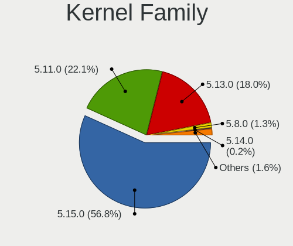
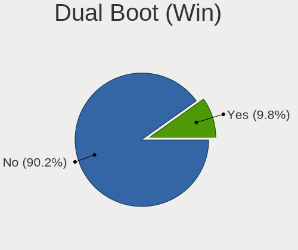
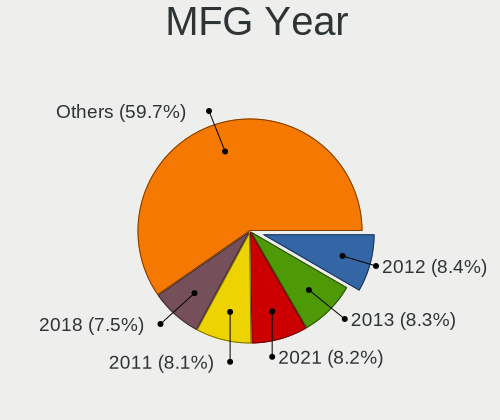
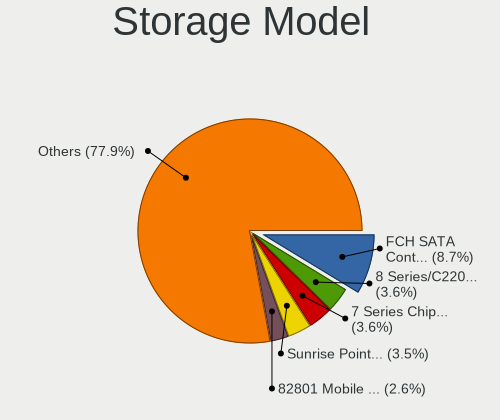
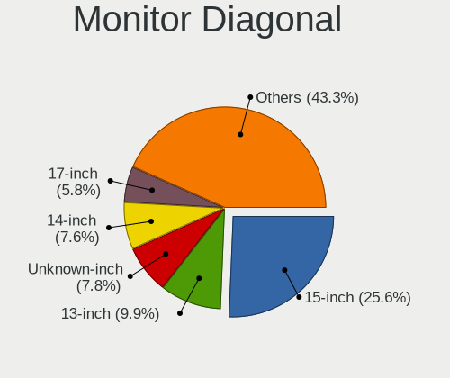
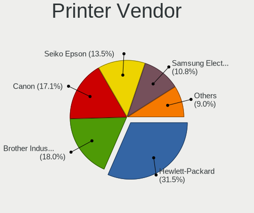

Zorin 16 - Tested Hardware & Statistics
---------------------------------------

A project to collect tested hardware configurations for Zorin 16.

Anyone can contribute to this report by the [hw-probe](https://github.com/linuxhw/hw-probe) tool:

    sudo -E hw-probe -all -upload

Please contribute! Especially if your hardware is rare.

This is a report for all computer types. See also reports for [desktops](/Dist/Zorin_16/Desktop/README.md) and [notebooks](/Dist/Zorin_16/Notebook/README.md).

Contents
--------

* [ Test Cases ](#test-cases)

* [ System ](#system)
  - [ Kernel                   ](#kernel)
  - [ Kernel Family            ](#kernel-family)
  - [ Kernel Major Ver.        ](#kernel-major-ver)
  - [ Arch                     ](#arch)
  - [ DE                       ](#de)
  - [ Display Server           ](#display-server)
  - [ Display Manager          ](#display-manager)
  - [ OS Lang                  ](#os-lang)
  - [ Boot Mode                ](#boot-mode)
  - [ Filesystem               ](#filesystem)
  - [ Part. scheme             ](#part-scheme)
  - [ Dual Boot with Linux/BSD ](#dual-boot-with-linuxbsd)
  - [ Dual Boot (Win)          ](#dual-boot-win)

* [ Board ](#board)
  - [ Vendor                   ](#vendor)
  - [ Model                    ](#model)
  - [ Model Family             ](#model-family)
  - [ MFG Year                 ](#mfg-year)
  - [ Form Factor              ](#form-factor)
  - [ Secure Boot              ](#secure-boot)
  - [ Coreboot                 ](#coreboot)
  - [ RAM Size                 ](#ram-size)
  - [ RAM Used                 ](#ram-used)
  - [ Total Drives             ](#total-drives)
  - [ Has CD-ROM               ](#has-cd-rom)
  - [ Has Ethernet             ](#has-ethernet)
  - [ Has WiFi                 ](#has-wifi)
  - [ Has Bluetooth            ](#has-bluetooth)

* [ Location ](#location)
  - [ Country                  ](#country)
  - [ City                     ](#city)

* [ Drives ](#drives)
  - [ Drive Vendor             ](#drive-vendor)
  - [ Drive Model              ](#drive-model)
  - [ HDD Vendor               ](#hdd-vendor)
  - [ SSD Vendor               ](#ssd-vendor)
  - [ Drive Kind               ](#drive-kind)
  - [ Drive Connector          ](#drive-connector)
  - [ Drive Size               ](#drive-size)
  - [ Space Total              ](#space-total)
  - [ Space Used               ](#space-used)
  - [ Malfunc. Drives          ](#malfunc-drives)
  - [ Malfunc. Drive Vendor    ](#malfunc-drive-vendor)
  - [ Malfunc. HDD Vendor      ](#malfunc-hdd-vendor)
  - [ Malfunc. Drive Kind      ](#malfunc-drive-kind)
  - [ Failed Drives            ](#failed-drives)
  - [ Failed Drive Vendor      ](#failed-drive-vendor)
  - [ Drive Status             ](#drive-status)

* [ Storage controller ](#storage-controller)
  - [ Storage Vendor           ](#storage-vendor)
  - [ Storage Model            ](#storage-model)
  - [ Storage Kind             ](#storage-kind)

* [ Processor ](#processor)
  - [ CPU Vendor               ](#cpu-vendor)
  - [ CPU Model                ](#cpu-model)
  - [ CPU Model Family         ](#cpu-model-family)
  - [ CPU Cores                ](#cpu-cores)
  - [ CPU Sockets              ](#cpu-sockets)
  - [ CPU Threads              ](#cpu-threads)
  - [ CPU Op-Modes             ](#cpu-op-modes)
  - [ CPU Microcode            ](#cpu-microcode)
  - [ CPU Microarch            ](#cpu-microarch)

* [ Graphics ](#graphics)
  - [ GPU Vendor               ](#gpu-vendor)
  - [ GPU Model                ](#gpu-model)
  - [ GPU Combo                ](#gpu-combo)
  - [ GPU Driver               ](#gpu-driver)
  - [ GPU Memory               ](#gpu-memory)

* [ Monitor ](#monitor)
  - [ Monitor Vendor           ](#monitor-vendor)
  - [ Monitor Model            ](#monitor-model)
  - [ Monitor Resolution       ](#monitor-resolution)
  - [ Monitor Diagonal         ](#monitor-diagonal)
  - [ Monitor Width            ](#monitor-width)
  - [ Aspect Ratio             ](#aspect-ratio)
  - [ Monitor Area             ](#monitor-area)
  - [ Pixel Density            ](#pixel-density)
  - [ Multiple Monitors        ](#multiple-monitors)

* [ Network ](#network)
  - [ Net Controller Vendor    ](#net-controller-vendor)
  - [ Net Controller Model     ](#net-controller-model)
  - [ Wireless Vendor          ](#wireless-vendor)
  - [ Wireless Model           ](#wireless-model)
  - [ Ethernet Vendor          ](#ethernet-vendor)
  - [ Ethernet Model           ](#ethernet-model)
  - [ Net Controller Kind      ](#net-controller-kind)
  - [ Used Controller          ](#used-controller)
  - [ NICs                     ](#nics)
  - [ IPv6                     ](#ipv6)

* [ Bluetooth ](#bluetooth)
  - [ Bluetooth Vendor         ](#bluetooth-vendor)
  - [ Bluetooth Model          ](#bluetooth-model)

* [ Sound ](#sound)
  - [ Sound Vendor             ](#sound-vendor)
  - [ Sound Model              ](#sound-model)

* [ Memory ](#memory)
  - [ Memory Vendor            ](#memory-vendor)
  - [ Memory Model             ](#memory-model)
  - [ Memory Kind              ](#memory-kind)
  - [ Memory Form Factor       ](#memory-form-factor)
  - [ Memory Size              ](#memory-size)
  - [ Memory Speed             ](#memory-speed)

* [ Printers & scanners ](#printers--scanners)
  - [ Printer Vendor           ](#printer-vendor)
  - [ Printer Model            ](#printer-model)
  - [ Scanner Vendor           ](#scanner-vendor)
  - [ Scanner Model            ](#scanner-model)

* [ Camera ](#camera)
  - [ Camera Vendor            ](#camera-vendor)
  - [ Camera Model             ](#camera-model)

* [ Security ](#security)
  - [ Fingerprint Vendor       ](#fingerprint-vendor)
  - [ Fingerprint Model        ](#fingerprint-model)
  - [ Chipcard Vendor          ](#chipcard-vendor)
  - [ Chipcard Model           ](#chipcard-model)

* [ Unsupported ](#unsupported)
  - [ Unsupported Devices      ](#unsupported-devices)
  - [ Unsupported Device Types ](#unsupported-device-types)

Test Cases
----------

Total: 4792

| Vendor        | Model                       | Form-Factor | Probe                                                      | Date         |
|---------------|-----------------------------|-------------|------------------------------------------------------------|--------------|
| Dell          | Latitude E6400              | Notebook    | [c8f88ff5b6](https://linux-hardware.org/?probe=c8f88ff5b6) | Jun 30, 2023 |
| HP            | Pro x2 612 G2               | Tablet      | [e47898dc3d](https://linux-hardware.org/?probe=e47898dc3d) | Jun 29, 2023 |
| MSI           | H61M-P31                    | Desktop     | [9012219f61](https://linux-hardware.org/?probe=9012219f61) | Jun 29, 2023 |
| Gigabyte      | A320M-S2H-CF                | Desktop     | [bb1cb1ef13](https://linux-hardware.org/?probe=bb1cb1ef13) | Jun 29, 2023 |
| Gigabyte      | P31-DS3L                    | Desktop     | [0d32728bdf](https://linux-hardware.org/?probe=0d32728bdf) | Jun 28, 2023 |
| Acer          | Aspire 5738                 | Notebook    | [b4fcb0d0c0](https://linux-hardware.org/?probe=b4fcb0d0c0) | Jun 28, 2023 |
| Lenovo        | ThinkPad T430 2349HNU       | Notebook    | [9d6748ef56](https://linux-hardware.org/?probe=9d6748ef56) | Jun 28, 2023 |
| HP            | ENVY m6                     | Notebook    | [715d68bfc0](https://linux-hardware.org/?probe=715d68bfc0) | Jun 28, 2023 |
| Dell          | Latitude E6400              | Notebook    | [0f9255924f](https://linux-hardware.org/?probe=0f9255924f) | Jun 28, 2023 |
| Lenovo        | ThinkPad T430 2349HNU       | Notebook    | [64433a8783](https://linux-hardware.org/?probe=64433a8783) | Jun 27, 2023 |
| HP            | Laptop 14-ck0xxx            | Notebook    | [663ce69f30](https://linux-hardware.org/?probe=663ce69f30) | Jun 27, 2023 |
| HP            | Laptop 14-ck0xxx            | Notebook    | [73eab89788](https://linux-hardware.org/?probe=73eab89788) | Jun 27, 2023 |
| Lenovo        | V110-15IKB 80TH             | Notebook    | [e6b9f96475](https://linux-hardware.org/?probe=e6b9f96475) | Jun 27, 2023 |
| HP            | Pavilion dv6700             | Notebook    | [182bf6e4a7](https://linux-hardware.org/?probe=182bf6e4a7) | Jun 27, 2023 |
| Lenovo        | ThinkPad Yoga 11e 20DA50... | Notebook    | [b756e54029](https://linux-hardware.org/?probe=b756e54029) | Jun 27, 2023 |
| ASUSTek       | ROG STRIX B650E-E GAMING... | Desktop     | [0a35c3c750](https://linux-hardware.org/?probe=0a35c3c750) | Jun 27, 2023 |
| HP            | 8906 SMVB                   | Desktop     | [18ab778722](https://linux-hardware.org/?probe=18ab778722) | Jun 26, 2023 |
| Dell          | XPS 13 9365                 | Convertible | [da86501858](https://linux-hardware.org/?probe=da86501858) | Jun 26, 2023 |
| Dell          | Latitude 3189               | Notebook    | [ad7c98c905](https://linux-hardware.org/?probe=ad7c98c905) | Jun 26, 2023 |
| Dell          | Latitude 3189               | Notebook    | [8547503af5](https://linux-hardware.org/?probe=8547503af5) | Jun 25, 2023 |
| Dell          | Latitude 3189               | Notebook    | [3f44430a36](https://linux-hardware.org/?probe=3f44430a36) | Jun 25, 2023 |
| Lenovo        | ThinkPad E560 20EV000UIX    | Notebook    | [ac6bd9497a](https://linux-hardware.org/?probe=ac6bd9497a) | Jun 25, 2023 |
| Toshiba       | Satellite U400              | Notebook    | [58b2ad81eb](https://linux-hardware.org/?probe=58b2ad81eb) | Jun 25, 2023 |
| Acer          | Aspire M3-581G              | Notebook    | [0c348c2570](https://linux-hardware.org/?probe=0c348c2570) | Jun 25, 2023 |
| Apple         | MacBookPro11,2              | Notebook    | [2d7e4f3505](https://linux-hardware.org/?probe=2d7e4f3505) | Jun 24, 2023 |
| Acer          | Aspire 5738                 | Notebook    | [8112b061f0](https://linux-hardware.org/?probe=8112b061f0) | Jun 24, 2023 |
| Gigabyte      | G31M-ES2L                   | Desktop     | [be14b80f2c](https://linux-hardware.org/?probe=be14b80f2c) | Jun 24, 2023 |
| Positivo      | POS-AG31AP                  | Desktop     | [bd3b3228c6](https://linux-hardware.org/?probe=bd3b3228c6) | Jun 24, 2023 |
| Intel         | D946GZIS AAD66165-301       | Desktop     | [dac65b1c2c](https://linux-hardware.org/?probe=dac65b1c2c) | Jun 24, 2023 |
| Dell          | 00V62H A01                  | Desktop     | [23134d6c71](https://linux-hardware.org/?probe=23134d6c71) | Jun 24, 2023 |
| Dell          | Latitude E6400              | Notebook    | [74be208929](https://linux-hardware.org/?probe=74be208929) | Jun 24, 2023 |
| ASUSTek       | P5B                         | Desktop     | [a62968d622](https://linux-hardware.org/?probe=a62968d622) | Jun 24, 2023 |
| Acer          | AOD270                      | Notebook    | [af596f2c11](https://linux-hardware.org/?probe=af596f2c11) | Jun 24, 2023 |
| Acer          | AOD270                      | Notebook    | [d3204f80d5](https://linux-hardware.org/?probe=d3204f80d5) | Jun 24, 2023 |
| Toshiba       | Satellite U400              | Notebook    | [aa6254ebd2](https://linux-hardware.org/?probe=aa6254ebd2) | Jun 24, 2023 |
| ASUSTek       | F2A85-V PRO                 | Desktop     | [011552703c](https://linux-hardware.org/?probe=011552703c) | Jun 24, 2023 |
| Lenovo        | ThinkPad 10 2nd 20E4S0JA... | Tablet      | [1773c81302](https://linux-hardware.org/?probe=1773c81302) | Jun 23, 2023 |
| Lenovo        | ThinkPad 10 2nd 20E4S0JA... | Tablet      | [80b535ff26](https://linux-hardware.org/?probe=80b535ff26) | Jun 23, 2023 |
| HP            | EliteBook 8560p             | Notebook    | [177d2fe509](https://linux-hardware.org/?probe=177d2fe509) | Jun 22, 2023 |
| Positivo      | POS-AG31AP                  | Desktop     | [1dd704fab9](https://linux-hardware.org/?probe=1dd704fab9) | Jun 22, 2023 |
| Google        | Kefka                       | Notebook    | [2580ed90ee](https://linux-hardware.org/?probe=2580ed90ee) | Jun 22, 2023 |
| Apple         | MacBookAir7,2               | Notebook    | [ae8c13c6fd](https://linux-hardware.org/?probe=ae8c13c6fd) | Jun 22, 2023 |
| Dell          | 0G9322                      | Desktop     | [a742a26282](https://linux-hardware.org/?probe=a742a26282) | Jun 22, 2023 |
| AZW           | SER                         | Mini pc     | [9ef166eb46](https://linux-hardware.org/?probe=9ef166eb46) | Jun 22, 2023 |
| Lenovo        | 30D2 SDK0J40705 WIN 3425... | Desktop     | [1e11366a3e](https://linux-hardware.org/?probe=1e11366a3e) | Jun 21, 2023 |
| Lenovo        | ThinkBook 15 G2 ITL 20VE    | Notebook    | [3d558ea9aa](https://linux-hardware.org/?probe=3d558ea9aa) | Jun 21, 2023 |
| Dell          | Vostro 5481                 | Notebook    | [b28f58f09e](https://linux-hardware.org/?probe=b28f58f09e) | Jun 20, 2023 |
| Intel         | D34010WYK H14771-304        | Desktop     | [0d3af8114b](https://linux-hardware.org/?probe=0d3af8114b) | Jun 20, 2023 |
| HP            | ENVY m6                     | Notebook    | [ea4c3aca13](https://linux-hardware.org/?probe=ea4c3aca13) | Jun 20, 2023 |
| Dell          | Inspiron 5558               | Notebook    | [72ef7ff0aa](https://linux-hardware.org/?probe=72ef7ff0aa) | Jun 20, 2023 |
| Dell          | G7 7588                     | Notebook    | [946a645897](https://linux-hardware.org/?probe=946a645897) | Jun 20, 2023 |
| HP            | Pavilion x360 Convertibl... | Convertible | [88d7f8992f](https://linux-hardware.org/?probe=88d7f8992f) | Jun 19, 2023 |
| HP            | Pavilion x360 Convertibl... | Convertible | [93587f51a9](https://linux-hardware.org/?probe=93587f51a9) | Jun 19, 2023 |
| Sony          | VPCCA15FX                   | Notebook    | [ed7dba1a4c](https://linux-hardware.org/?probe=ed7dba1a4c) | Jun 19, 2023 |
| Dell          | Vostro 1520                 | Notebook    | [bc371b62c9](https://linux-hardware.org/?probe=bc371b62c9) | Jun 19, 2023 |
| Sony          | VPCCA15FX                   | Notebook    | [c5660d0020](https://linux-hardware.org/?probe=c5660d0020) | Jun 19, 2023 |
| Dell          | Vostro 1520                 | Notebook    | [8086cf1231](https://linux-hardware.org/?probe=8086cf1231) | Jun 19, 2023 |
| Lenovo        | ThinkPad T440 20B7S0VA05    | Notebook    | [307c8a76ab](https://linux-hardware.org/?probe=307c8a76ab) | Jun 19, 2023 |
| AZW           | GTR V02                     | Desktop     | [f9bee18426](https://linux-hardware.org/?probe=f9bee18426) | Jun 19, 2023 |
| GPU Compan... | GWNC21524                   | Notebook    | [46bd956cbf](https://linux-hardware.org/?probe=46bd956cbf) | Jun 19, 2023 |
| Toshiba       | TECRA M10                   | Notebook    | [37f232dce0](https://linux-hardware.org/?probe=37f232dce0) | Jun 19, 2023 |
| HP            | Stream Laptop 14-cb1xxx     | Notebook    | [7546cac791](https://linux-hardware.org/?probe=7546cac791) | Jun 19, 2023 |
| ASUSTek       | P5LD2                       | Desktop     | [7038963b77](https://linux-hardware.org/?probe=7038963b77) | Jun 18, 2023 |
| HP            | EliteBook 840 G3            | Notebook    | [e1fc794bc5](https://linux-hardware.org/?probe=e1fc794bc5) | Jun 18, 2023 |
| ASUSTek       | VivoBook S13 X330FA_S330... | Notebook    | [b816a11527](https://linux-hardware.org/?probe=b816a11527) | Jun 18, 2023 |
| Acer          | Aspire 5738                 | Notebook    | [8247e349fc](https://linux-hardware.org/?probe=8247e349fc) | Jun 17, 2023 |
| HP            | Victus by Laptop 16-e0xx... | Notebook    | [bb6859a141](https://linux-hardware.org/?probe=bb6859a141) | Jun 17, 2023 |
| HP            | ProBook 650 G5              | Notebook    | [1d158627b0](https://linux-hardware.org/?probe=1d158627b0) | Jun 17, 2023 |
| Dell          | Latitude 7370               | Notebook    | [5c2378adc5](https://linux-hardware.org/?probe=5c2378adc5) | Jun 17, 2023 |
| Dell          | Latitude 7370               | Notebook    | [44dba24aed](https://linux-hardware.org/?probe=44dba24aed) | Jun 17, 2023 |
| ASUSTek       | ROG Strix G713QM_G713QM     | Notebook    | [3614dc460e](https://linux-hardware.org/?probe=3614dc460e) | Jun 17, 2023 |
| HP            | Laptop 14-bw0xx             | Notebook    | [f38253d79c](https://linux-hardware.org/?probe=f38253d79c) | Jun 17, 2023 |
| Apple         | Mac-F2238AC8                | All in one  | [7d9f25dc5f](https://linux-hardware.org/?probe=7d9f25dc5f) | Jun 17, 2023 |
| Pegatron      | BOWIE                       | Desktop     | [a2bbc6abd3](https://linux-hardware.org/?probe=a2bbc6abd3) | Jun 17, 2023 |
| Haier         | Y11B                        | Notebook    | [0c2abeea6e](https://linux-hardware.org/?probe=0c2abeea6e) | Jun 17, 2023 |
| HP            | ProBook 650 G5              | Notebook    | [9c53e4cd72](https://linux-hardware.org/?probe=9c53e4cd72) | Jun 17, 2023 |
| HP            | G62                         | Notebook    | [2e1e964887](https://linux-hardware.org/?probe=2e1e964887) | Jun 16, 2023 |
| Acer          | Aspire V5-571P              | Notebook    | [2adeb26f8a](https://linux-hardware.org/?probe=2adeb26f8a) | Jun 15, 2023 |
| ASRock        | B85M                        | Desktop     | [19f8b16937](https://linux-hardware.org/?probe=19f8b16937) | Jun 15, 2023 |
| Lenovo        | Win8 STD MM DPK IPG         | All in one  | [c503081708](https://linux-hardware.org/?probe=c503081708) | Jun 15, 2023 |
| Dell          | 0KC9NP A01                  | Desktop     | [b00d413241](https://linux-hardware.org/?probe=b00d413241) | Jun 14, 2023 |
| Dell          | 0KC9NP A01                  | Desktop     | [1d487a1ed5](https://linux-hardware.org/?probe=1d487a1ed5) | Jun 14, 2023 |
| Dell          | 0WR7PY A02                  | Desktop     | [eab79964fb](https://linux-hardware.org/?probe=eab79964fb) | Jun 14, 2023 |
| Dell          | Venue 11 Pro 5130           | Notebook    | [e1bb6b17b8](https://linux-hardware.org/?probe=e1bb6b17b8) | Jun 14, 2023 |
| Vorke         | V1 Plus                     | Desktop     | [a63988d437](https://linux-hardware.org/?probe=a63988d437) | Jun 14, 2023 |
| Lenovo        | IdeaPad S145-15IIL 82DJ     | Notebook    | [9fe9d9f03f](https://linux-hardware.org/?probe=9fe9d9f03f) | Jun 13, 2023 |
| Lenovo        | 30D2 SDK0J40705 WIN 3425... | Desktop     | [c1992a1680](https://linux-hardware.org/?probe=c1992a1680) | Jun 13, 2023 |
| ASUSTek       | VivoBook 12_ASUS Laptop ... | Notebook    | [b737ce6557](https://linux-hardware.org/?probe=b737ce6557) | Jun 13, 2023 |
| Microsoft     | Surface Pro 7               | Tablet      | [f46f1000c0](https://linux-hardware.org/?probe=f46f1000c0) | Jun 13, 2023 |
| Microsoft     | Surface Pro 7               | Tablet      | [535d3d42b7](https://linux-hardware.org/?probe=535d3d42b7) | Jun 13, 2023 |
| Pegatron      | BOWIE                       | Desktop     | [2794a5aa86](https://linux-hardware.org/?probe=2794a5aa86) | Jun 12, 2023 |
| ASUSTek       | P5B                         | Desktop     | [6308a1c633](https://linux-hardware.org/?probe=6308a1c633) | Jun 12, 2023 |
| HP            | ENVY m6                     | Notebook    | [b3c165b329](https://linux-hardware.org/?probe=b3c165b329) | Jun 12, 2023 |
| MSI           | MPG B550 GAMING EDGE WIF... | Desktop     | [373e36422d](https://linux-hardware.org/?probe=373e36422d) | Jun 12, 2023 |
| MSI           | GL62M 7RDX                  | Notebook    | [d1fb646d9a](https://linux-hardware.org/?probe=d1fb646d9a) | Jun 11, 2023 |
| HP            | Pavilion Gaming Laptop 1... | Notebook    | [9cb593e9e1](https://linux-hardware.org/?probe=9cb593e9e1) | Jun 11, 2023 |
| ASUSTek       | U43Jc                       | Notebook    | [1af7e59490](https://linux-hardware.org/?probe=1af7e59490) | Jun 11, 2023 |
| ASUSTek       | U43Jc                       | Notebook    | [15e8e27585](https://linux-hardware.org/?probe=15e8e27585) | Jun 11, 2023 |
| Fujitsu       | D3417-A2 S26361-D3417-A2    | Desktop     | [9ea7188339](https://linux-hardware.org/?probe=9ea7188339) | Jun 11, 2023 |
| HP            | 8350                        | Desktop     | [8a40ff28c8](https://linux-hardware.org/?probe=8a40ff28c8) | Jun 11, 2023 |
| ASUSTek       | P5B                         | Desktop     | [794635cbea](https://linux-hardware.org/?probe=794635cbea) | Jun 10, 2023 |
| Samsung       | N150/N210/N220              | Notebook    | [977d645961](https://linux-hardware.org/?probe=977d645961) | Jun 10, 2023 |
| Notebook      | NJ50_70CU                   | Notebook    | [d39b8694fd](https://linux-hardware.org/?probe=d39b8694fd) | Jun 10, 2023 |
| Packard Be... | EasyNote TE11BZ             | Notebook    | [a8f9a31f17](https://linux-hardware.org/?probe=a8f9a31f17) | Jun 10, 2023 |
| MP            | MS-7848                     | Desktop     | [cd63c98850](https://linux-hardware.org/?probe=cd63c98850) | Jun 10, 2023 |
| Google        | Pirika                      | Notebook    | [67fce0a645](https://linux-hardware.org/?probe=67fce0a645) | Jun 10, 2023 |
| Dell          | Precision 7520              | Notebook    | [c52fb2f851](https://linux-hardware.org/?probe=c52fb2f851) | Jun 10, 2023 |
| Nvidia        | MCP79                       | Desktop     | [8203509a77](https://linux-hardware.org/?probe=8203509a77) | Jun 09, 2023 |
| ASRock        | H81M-HDS                    | Desktop     | [e1ff6f4e2f](https://linux-hardware.org/?probe=e1ff6f4e2f) | Jun 08, 2023 |
| ASUSTek       | P5B                         | Desktop     | [32baec6c0f](https://linux-hardware.org/?probe=32baec6c0f) | Jun 08, 2023 |
| Shenzhen M... | F7BFD                       | Desktop     | [74cf1d0b63](https://linux-hardware.org/?probe=74cf1d0b63) | Jun 08, 2023 |
| Shenzhen M... | F7BFD                       | Desktop     | [88cbeea389](https://linux-hardware.org/?probe=88cbeea389) | Jun 08, 2023 |
| MSI           | MPG X570 GAMING PRO CARB... | Desktop     | [20d28155d8](https://linux-hardware.org/?probe=20d28155d8) | Jun 08, 2023 |
| MSI           | MPG X570 GAMING PRO CARB... | Desktop     | [517cbd7f48](https://linux-hardware.org/?probe=517cbd7f48) | Jun 08, 2023 |
| MSI           | B450 TOMAHAWK MAX II        | Desktop     | [2ad7aefc45](https://linux-hardware.org/?probe=2ad7aefc45) | Jun 07, 2023 |
| Apple         | Mac-77F17D7DA9285301 iMa... | All in one  | [2ad409f60a](https://linux-hardware.org/?probe=2ad409f60a) | Jun 07, 2023 |
| HP            | 8350                        | Desktop     | [113be26d4c](https://linux-hardware.org/?probe=113be26d4c) | Jun 07, 2023 |
| Dell          | 0G9322                      | Desktop     | [e81a7f788a](https://linux-hardware.org/?probe=e81a7f788a) | Jun 07, 2023 |
| HP            | Pavilion Notebook           | Notebook    | [5254a5fe09](https://linux-hardware.org/?probe=5254a5fe09) | Jun 07, 2023 |
| HP            | Pavilion Laptop 14-ec1xx... | Notebook    | [de4c183b01](https://linux-hardware.org/?probe=de4c183b01) | Jun 06, 2023 |
| Samsung       | 300E5M/300E5L               | Notebook    | [e066300eac](https://linux-hardware.org/?probe=e066300eac) | Jun 06, 2023 |
| Nvidia        | MCP79                       | Desktop     | [bf109ed28f](https://linux-hardware.org/?probe=bf109ed28f) | Jun 06, 2023 |
| MSI           | B450 TOMAHAWK MAX II        | Desktop     | [79f63dcf8e](https://linux-hardware.org/?probe=79f63dcf8e) | Jun 06, 2023 |
| Apple         | Mac-F2268CC8                | All in one  | [d48dc73993](https://linux-hardware.org/?probe=d48dc73993) | Jun 06, 2023 |
| Acer          | Aspire 5736Z                | Notebook    | [a98deb1f54](https://linux-hardware.org/?probe=a98deb1f54) | Jun 06, 2023 |
| ASUSTek       | CM1730,CM1830               | Desktop     | [2cc76d0cd9](https://linux-hardware.org/?probe=2cc76d0cd9) | Jun 05, 2023 |
| ASUSTek       | CM1730,CM1830               | Desktop     | [7dc46d923e](https://linux-hardware.org/?probe=7dc46d923e) | Jun 05, 2023 |
| Apple         | MacBookPro8,1               | Notebook    | [8308d5da16](https://linux-hardware.org/?probe=8308d5da16) | Jun 05, 2023 |
| ASUSTek       | P5Q                         | Desktop     | [85c6e06d3b](https://linux-hardware.org/?probe=85c6e06d3b) | Jun 05, 2023 |
| Apple         | MacBookPro8,1               | Notebook    | [2f8dbb707f](https://linux-hardware.org/?probe=2f8dbb707f) | Jun 05, 2023 |
| Dell          | 00010C A00                  | Desktop     | [fb12198605](https://linux-hardware.org/?probe=fb12198605) | Jun 05, 2023 |
| Dell          | 00010C A00                  | Desktop     | [d94442285c](https://linux-hardware.org/?probe=d94442285c) | Jun 05, 2023 |
| HP            | OMEN by Laptop              | Notebook    | [e3b8e1a109](https://linux-hardware.org/?probe=e3b8e1a109) | Jun 04, 2023 |
| Dell          | Latitude E5250              | Notebook    | [e85c6a09d1](https://linux-hardware.org/?probe=e85c6a09d1) | Jun 04, 2023 |
| Toshiba       | IS 1412                     | Notebook    | [b1b0369688](https://linux-hardware.org/?probe=b1b0369688) | Jun 04, 2023 |
| Lenovo        | ThinkPad T450 20BUS0LW02    | Notebook    | [27f6e7df80](https://linux-hardware.org/?probe=27f6e7df80) | Jun 04, 2023 |
| ASUSTek       | B75M-A                      | Desktop     | [55139a968d](https://linux-hardware.org/?probe=55139a968d) | Jun 04, 2023 |
| ASUSTek       | ROG STRIX Z690-I GAMING ... | Desktop     | [413aba0d3f](https://linux-hardware.org/?probe=413aba0d3f) | Jun 04, 2023 |
| HP            | Stream Laptop 14-cb0XX      | Notebook    | [83967c7908](https://linux-hardware.org/?probe=83967c7908) | Jun 04, 2023 |
| Intel         | NUC8BEB J72693-304          | Mini pc     | [a20f9c3365](https://linux-hardware.org/?probe=a20f9c3365) | Jun 03, 2023 |
| Dell          | 0G9322                      | Desktop     | [a1c5ec8909](https://linux-hardware.org/?probe=a1c5ec8909) | Jun 03, 2023 |
| HP            | ProBook 450 G2              | Notebook    | [55f28b41b4](https://linux-hardware.org/?probe=55f28b41b4) | Jun 03, 2023 |
| Toshiba       | IS 1412                     | Notebook    | [6ea1bc7e6a](https://linux-hardware.org/?probe=6ea1bc7e6a) | Jun 03, 2023 |
| Dell          | 0NW6H5 A00                  | Desktop     | [01387c3030](https://linux-hardware.org/?probe=01387c3030) | Jun 03, 2023 |
| ASUSTek       | TUF Gaming B550M-PLUS WI... | Desktop     | [20260fb3b3](https://linux-hardware.org/?probe=20260fb3b3) | Jun 03, 2023 |
| HP            | 339A                        | Desktop     | [bb4619f4eb](https://linux-hardware.org/?probe=bb4619f4eb) | Jun 02, 2023 |
| Gateway       | SX2851                      | Desktop     | [262ddffda9](https://linux-hardware.org/?probe=262ddffda9) | Jun 02, 2023 |
| IPASON        | P3                          | Notebook    | [bd9e0660a4](https://linux-hardware.org/?probe=bd9e0660a4) | Jun 02, 2023 |
| ASUSTek       | K70IJ                       | Notebook    | [5b877dfec5](https://linux-hardware.org/?probe=5b877dfec5) | Jun 02, 2023 |
| MSI           | H81M-E34                    | Desktop     | [26362cac22](https://linux-hardware.org/?probe=26362cac22) | Jun 02, 2023 |
| MSI           | H81M-E34                    | Desktop     | [9f04387a7c](https://linux-hardware.org/?probe=9f04387a7c) | Jun 01, 2023 |
| Toshiba       | Satellite L650              | Notebook    | [63eb6978fa](https://linux-hardware.org/?probe=63eb6978fa) | Jun 01, 2023 |
| Lenovo        | SHARKBAY SDK0E50512 STD     | Desktop     | [abc4bba144](https://linux-hardware.org/?probe=abc4bba144) | Jun 01, 2023 |
| MSI           | 890FXA-GD70                 | Desktop     | [bcc4cd9597](https://linux-hardware.org/?probe=bcc4cd9597) | Jun 01, 2023 |
| HP            | 82B5                        | All in one  | [77ecbfa91c](https://linux-hardware.org/?probe=77ecbfa91c) | Jun 01, 2023 |
| Lenovo        | IdeaPad 3 17ITL6 82H9       | Notebook    | [a7af6cac2c](https://linux-hardware.org/?probe=a7af6cac2c) | Jun 01, 2023 |
| Gigabyte      | B450M DS3H-CF               | Desktop     | [923c9a18ff](https://linux-hardware.org/?probe=923c9a18ff) | Jun 01, 2023 |
| HP            | Pavilion dv6500             | Notebook    | [0198d67a15](https://linux-hardware.org/?probe=0198d67a15) | May 31, 2023 |
| Apple         | Mac-77F17D7DA9285301 iMa... | All in one  | [449b742c95](https://linux-hardware.org/?probe=449b742c95) | May 31, 2023 |
| MSI           | B450 TOMAHAWK               | Desktop     | [0ddd2982db](https://linux-hardware.org/?probe=0ddd2982db) | May 31, 2023 |
| MSI           | B450 TOMAHAWK               | Desktop     | [93d1ee7e2d](https://linux-hardware.org/?probe=93d1ee7e2d) | May 31, 2023 |
| Sony          | SVF14214CXW                 | Notebook    | [51568ce56e](https://linux-hardware.org/?probe=51568ce56e) | May 30, 2023 |
| Dell          | Latitude 3480               | Notebook    | [56d1834385](https://linux-hardware.org/?probe=56d1834385) | May 30, 2023 |
| Sony          | SVF14214CXW                 | Notebook    | [6cf7c2d7f2](https://linux-hardware.org/?probe=6cf7c2d7f2) | May 30, 2023 |
| Dell          | Inspiron 5748               | Notebook    | [08b61d608c](https://linux-hardware.org/?probe=08b61d608c) | May 30, 2023 |
| ASUSTek       | U43Jc                       | Notebook    | [db28d8f731](https://linux-hardware.org/?probe=db28d8f731) | May 28, 2023 |
| ASUSTek       | U43Jc                       | Notebook    | [36bd3a5288](https://linux-hardware.org/?probe=36bd3a5288) | May 28, 2023 |
| Lenovo        | ThinkPad E490 20N8A01YGI    | Notebook    | [c46cf56eb1](https://linux-hardware.org/?probe=c46cf56eb1) | May 27, 2023 |
| Acer          | Predator G3-605             | Desktop     | [f33c170be3](https://linux-hardware.org/?probe=f33c170be3) | May 27, 2023 |
| Lenovo        | B50-70 80EU                 | Notebook    | [8c51cdf4ef](https://linux-hardware.org/?probe=8c51cdf4ef) | May 27, 2023 |
| HP            | Pavilion dv6                | Notebook    | [9f96328490](https://linux-hardware.org/?probe=9f96328490) | May 27, 2023 |
| Acer          | Aspire ES1-523              | Notebook    | [681fbd4a1f](https://linux-hardware.org/?probe=681fbd4a1f) | May 27, 2023 |
| Lenovo        | Yoga 6 13ALC7 82UD          | Convertible | [48a2156205](https://linux-hardware.org/?probe=48a2156205) | May 27, 2023 |
| Dell          | 0G9322                      | Desktop     | [4d1450ba3a](https://linux-hardware.org/?probe=4d1450ba3a) | May 27, 2023 |
| Dell          | 0G9322                      | Desktop     | [d742ccb0c4](https://linux-hardware.org/?probe=d742ccb0c4) | May 27, 2023 |
| HP            | 21D0                        | Desktop     | [7f83859a91](https://linux-hardware.org/?probe=7f83859a91) | May 27, 2023 |
| HP            | 81BA                        | All in one  | [d41186191f](https://linux-hardware.org/?probe=d41186191f) | May 27, 2023 |
| MSI           | H97 GUARD-PRO               | Desktop     | [3737e6c832](https://linux-hardware.org/?probe=3737e6c832) | May 27, 2023 |
| Toshiba       | TECRA M10                   | Notebook    | [3ce97963e7](https://linux-hardware.org/?probe=3ce97963e7) | May 26, 2023 |
| Toshiba       | TECRA M10                   | Notebook    | [2c574f9677](https://linux-hardware.org/?probe=2c574f9677) | May 26, 2023 |
| HP            | ProBook 4740s               | Notebook    | [457a56d75c](https://linux-hardware.org/?probe=457a56d75c) | May 26, 2023 |
| Intel         | NUC6CAYB J23203-408         | Mini pc     | [53d45d0d79](https://linux-hardware.org/?probe=53d45d0d79) | May 26, 2023 |
| ASUSTek       | G50VT                       | Notebook    | [6e4a2588b1](https://linux-hardware.org/?probe=6e4a2588b1) | May 26, 2023 |
| Intel         | NUC6CAYB J23203-408         | Mini pc     | [8d7ce86449](https://linux-hardware.org/?probe=8d7ce86449) | May 26, 2023 |
| HP            | 18E5                        | Desktop     | [23e2edb1fe](https://linux-hardware.org/?probe=23e2edb1fe) | May 26, 2023 |
| Dell          | 0K095G A02                  | Desktop     | [f11b8418c9](https://linux-hardware.org/?probe=f11b8418c9) | May 26, 2023 |
| HP            | 21D0                        | Desktop     | [8e52c2613c](https://linux-hardware.org/?probe=8e52c2613c) | May 26, 2023 |
| Google        | Lars                        | Notebook    | [25cc6549c3](https://linux-hardware.org/?probe=25cc6549c3) | May 25, 2023 |
| HP            | ProBook 6440b               | Notebook    | [5ed14b01a3](https://linux-hardware.org/?probe=5ed14b01a3) | May 25, 2023 |
| MSI           | B450 TOMAHAWK MAX II        | Desktop     | [61dc4c5620](https://linux-hardware.org/?probe=61dc4c5620) | May 25, 2023 |
| Apple         | MacBookAir4,1               | Notebook    | [d25345cb25](https://linux-hardware.org/?probe=d25345cb25) | May 25, 2023 |
| ECS           | H510H6-M2                   | Desktop     | [eba710b3de](https://linux-hardware.org/?probe=eba710b3de) | May 24, 2023 |
| Vorke         | V1 Plus                     | Desktop     | [81c0b82d6c](https://linux-hardware.org/?probe=81c0b82d6c) | May 24, 2023 |
| HP            | Pavilion g6                 | Notebook    | [f6fbdf57b5](https://linux-hardware.org/?probe=f6fbdf57b5) | May 24, 2023 |
| ECS           | H510H6-M2                   | Desktop     | [b36784601b](https://linux-hardware.org/?probe=b36784601b) | May 24, 2023 |
| HP            | Pavilion Notebook 15-bc5... | Notebook    | [933989a15b](https://linux-hardware.org/?probe=933989a15b) | May 24, 2023 |
| HP            | Stream Notebook             | Notebook    | [74d40533fc](https://linux-hardware.org/?probe=74d40533fc) | May 24, 2023 |
| Lenovo        | V130-15IGM 81HL             | Notebook    | [504a24887e](https://linux-hardware.org/?probe=504a24887e) | May 24, 2023 |
| HP            | 8906 SMVB                   | Desktop     | [ca3ed99a5c](https://linux-hardware.org/?probe=ca3ed99a5c) | May 24, 2023 |
| Pegatron      | 2AC2A                       | Desktop     | [f9e504a430](https://linux-hardware.org/?probe=f9e504a430) | May 24, 2023 |
| Lenovo        | IdeaPad Flex-14API 81SS     | Notebook    | [8c7d3913b8](https://linux-hardware.org/?probe=8c7d3913b8) | May 24, 2023 |
| Apple         | MacBookPro7,1               | Notebook    | [e1baf451db](https://linux-hardware.org/?probe=e1baf451db) | May 23, 2023 |
| Apple         | MacBookPro7,1               | Notebook    | [61ef8e4e63](https://linux-hardware.org/?probe=61ef8e4e63) | May 23, 2023 |
| HP            | 21EF                        | Desktop     | [f1d5c9381c](https://linux-hardware.org/?probe=f1d5c9381c) | May 23, 2023 |
| MSI           | H81M-E34                    | Desktop     | [4247f30888](https://linux-hardware.org/?probe=4247f30888) | May 23, 2023 |
| Unknown       | Unknown                     | Desktop     | [977cf42905](https://linux-hardware.org/?probe=977cf42905) | May 23, 2023 |
| Lenovo        | IdeaPad Flex-14API 81SS     | Notebook    | [08746538f6](https://linux-hardware.org/?probe=08746538f6) | May 23, 2023 |
| Dell          | Latitude E5450              | Notebook    | [642802d511](https://linux-hardware.org/?probe=642802d511) | May 23, 2023 |
| Dell          | Inspiron 1501               | Notebook    | [4703a17f03](https://linux-hardware.org/?probe=4703a17f03) | May 23, 2023 |
| HP            | Pavilion g6                 | Notebook    | [4d0edc38d5](https://linux-hardware.org/?probe=4d0edc38d5) | May 23, 2023 |
| HP            | 21EF                        | Desktop     | [3249975d27](https://linux-hardware.org/?probe=3249975d27) | May 22, 2023 |
| Packard Be... | EasyNote MH35               | Notebook    | [ea7710b373](https://linux-hardware.org/?probe=ea7710b373) | May 22, 2023 |
| ASRock        | H77M                        | Desktop     | [7f173e0b75](https://linux-hardware.org/?probe=7f173e0b75) | May 22, 2023 |
| Acer          | Aspire A515-56              | Notebook    | [dfb369a8d2](https://linux-hardware.org/?probe=dfb369a8d2) | May 22, 2023 |
| HP            | EliteBook Folio G1          | Notebook    | [81477cd76f](https://linux-hardware.org/?probe=81477cd76f) | May 22, 2023 |
| HP            | EliteBook Folio G1          | Notebook    | [73d4310fa2](https://linux-hardware.org/?probe=73d4310fa2) | May 22, 2023 |
| HP            | 18E5                        | Desktop     | [d1bc34770d](https://linux-hardware.org/?probe=d1bc34770d) | May 22, 2023 |
| Microsoft     | Surface Book                | Tablet      | [01c76b5ed7](https://linux-hardware.org/?probe=01c76b5ed7) | May 21, 2023 |
| ASUSTek       | ROG STRIX Z590-E GAMING ... | Desktop     | [b6465d2950](https://linux-hardware.org/?probe=b6465d2950) | May 21, 2023 |
| Lenovo        | Yoga 6 13ALC7 82UD          | Convertible | [b9de7bf2f3](https://linux-hardware.org/?probe=b9de7bf2f3) | May 21, 2023 |
| Dell          | 0FGCC7 A01                  | Server      | [3900d6a330](https://linux-hardware.org/?probe=3900d6a330) | May 21, 2023 |
| Dell          | 02N3WF A01                  | Desktop     | [8d0096c040](https://linux-hardware.org/?probe=8d0096c040) | May 21, 2023 |
| Dell          | 0M5DCD A00                  | Desktop     | [4087cdd6cb](https://linux-hardware.org/?probe=4087cdd6cb) | May 20, 2023 |
| Dell          | 0M5DCD A00                  | Desktop     | [8db744994d](https://linux-hardware.org/?probe=8db744994d) | May 20, 2023 |
| HP            | Pavilion Sleekbook 14 PC    | Notebook    | [6bef224193](https://linux-hardware.org/?probe=6bef224193) | May 20, 2023 |
| Apple         | MacBookAir7,2               | Notebook    | [d11ecdffaf](https://linux-hardware.org/?probe=d11ecdffaf) | May 20, 2023 |
| MSI           | B450 GAMING PLUS MAX        | Desktop     | [0bcd2c7244](https://linux-hardware.org/?probe=0bcd2c7244) | May 20, 2023 |
| MSI           | B450 GAMING PLUS MAX        | Desktop     | [c1594f6dab](https://linux-hardware.org/?probe=c1594f6dab) | May 20, 2023 |
| Dell          | Latitude E7450              | Notebook    | [b76cb7567c](https://linux-hardware.org/?probe=b76cb7567c) | May 20, 2023 |
| HP            | 255 G8 Notebook PC          | Notebook    | [c1f679b4d4](https://linux-hardware.org/?probe=c1f679b4d4) | May 20, 2023 |
| HP            | 255 G8 Notebook PC          | Notebook    | [0c163f5c69](https://linux-hardware.org/?probe=0c163f5c69) | May 20, 2023 |
| Gigabyte      | X570 GAMING X               | Desktop     | [8a6ad6c590](https://linux-hardware.org/?probe=8a6ad6c590) | May 19, 2023 |
| Dell          | 0GDG8Y A00                  | Desktop     | [514fe06c9e](https://linux-hardware.org/?probe=514fe06c9e) | May 19, 2023 |
| HP            | Stream Laptop 14-ax0XX      | Notebook    | [aae519e65d](https://linux-hardware.org/?probe=aae519e65d) | May 19, 2023 |
| Tactus        | GeoBook 140                 | Notebook    | [534c32884a](https://linux-hardware.org/?probe=534c32884a) | May 19, 2023 |
| ASUSTek       | ROG STRIX Z590-E GAMING ... | Desktop     | [31568d83f7](https://linux-hardware.org/?probe=31568d83f7) | May 18, 2023 |
| Gigabyte      | H81M-DS2                    | Desktop     | [754dc9d1fc](https://linux-hardware.org/?probe=754dc9d1fc) | May 18, 2023 |
| Lenovo        | ThinkPad T470s W10DG 20J... | Notebook    | [0608bc6ac3](https://linux-hardware.org/?probe=0608bc6ac3) | May 18, 2023 |
| Philco        | PHN14C                      | Notebook    | [4efea72b8f](https://linux-hardware.org/?probe=4efea72b8f) | May 18, 2023 |
| Acer          | Aspire A514-55              | Notebook    | [e096b3a75c](https://linux-hardware.org/?probe=e096b3a75c) | May 18, 2023 |
| ASUSTek       | PRIME H410M-R               | Desktop     | [ee37475637](https://linux-hardware.org/?probe=ee37475637) | May 18, 2023 |
| ASUSTek       | PRIME H410M-R               | Desktop     | [68406e2c40](https://linux-hardware.org/?probe=68406e2c40) | May 18, 2023 |
| Apple         | MacBookAir7,2               | Notebook    | [cadb0eb363](https://linux-hardware.org/?probe=cadb0eb363) | May 17, 2023 |
| Apple         | MacBookAir7,2               | Notebook    | [cd3c24c6a2](https://linux-hardware.org/?probe=cd3c24c6a2) | May 17, 2023 |
| Acer          | Revo 70                     | Desktop     | [6cbc11e75b](https://linux-hardware.org/?probe=6cbc11e75b) | May 17, 2023 |
| Lenovo        | IdeaPad 320-15IAP 80XR      | Notebook    | [e18deba45b](https://linux-hardware.org/?probe=e18deba45b) | May 17, 2023 |
| HP            | 2B02                        | Desktop     | [a6bf09d51c](https://linux-hardware.org/?probe=a6bf09d51c) | May 17, 2023 |
| Pegatron      | Benicia                     | Desktop     | [e6ee1c66f6](https://linux-hardware.org/?probe=e6ee1c66f6) | May 17, 2023 |
| Framework     | Laptop                      | Notebook    | [b8739c141d](https://linux-hardware.org/?probe=b8739c141d) | May 16, 2023 |
| Lenovo        | SHARKBAY 0B98401 WIN        | Desktop     | [d3c3cc9f96](https://linux-hardware.org/?probe=d3c3cc9f96) | May 15, 2023 |
| Dell          | XPS 17 9700                 | Notebook    | [7b95691784](https://linux-hardware.org/?probe=7b95691784) | May 15, 2023 |
| Intel         | Tiger Hill                  | Desktop     | [fdbe67045c](https://linux-hardware.org/?probe=fdbe67045c) | May 15, 2023 |
| Samsung       | N150/N210/N220              | Notebook    | [3f18889439](https://linux-hardware.org/?probe=3f18889439) | May 15, 2023 |
| ASUSTek       | ROG Strix G512LW_G512LW     | Notebook    | [03c67bbed5](https://linux-hardware.org/?probe=03c67bbed5) | May 15, 2023 |
| HP            | Laptop 15-db0xxx            | Notebook    | [496f6048ec](https://linux-hardware.org/?probe=496f6048ec) | May 15, 2023 |
| Lenovo        | SHARKBAY 0B98401 WIN        | Desktop     | [dd8c6c3811](https://linux-hardware.org/?probe=dd8c6c3811) | May 15, 2023 |
| HP            | 18E5                        | Desktop     | [7d5ceb9f5d](https://linux-hardware.org/?probe=7d5ceb9f5d) | May 15, 2023 |
| Apple         | MacBookPro10,1              | Notebook    | [d27a3510ed](https://linux-hardware.org/?probe=d27a3510ed) | May 14, 2023 |
| HP            | Presario CQ61               | Notebook    | [0967999006](https://linux-hardware.org/?probe=0967999006) | May 14, 2023 |
| Google        | Bluebird                    | Notebook    | [c10880ed1b](https://linux-hardware.org/?probe=c10880ed1b) | May 14, 2023 |
| Gigabyte      | GA-970A-UD3                 | Desktop     | [24c81ddf59](https://linux-hardware.org/?probe=24c81ddf59) | May 14, 2023 |
| Acer          | Aspire E5-574               | Notebook    | [89fbcb7903](https://linux-hardware.org/?probe=89fbcb7903) | May 14, 2023 |
| Lenovo        | ThinkPad X1 Carbon Gen 8... | Notebook    | [83e208da09](https://linux-hardware.org/?probe=83e208da09) | May 14, 2023 |
| Lenovo        | IdeaPad Z470                | Notebook    | [2b11351f94](https://linux-hardware.org/?probe=2b11351f94) | May 14, 2023 |
| ASUSTek       | PRIME B350-PLUS             | Desktop     | [38b6dd7b3f](https://linux-hardware.org/?probe=38b6dd7b3f) | May 14, 2023 |
| Dell          | Latitude 3340               | Notebook    | [59d83d9cef](https://linux-hardware.org/?probe=59d83d9cef) | May 14, 2023 |
| SKIKK         | Niflheim 17 II              | Notebook    | [ce9c27f16f](https://linux-hardware.org/?probe=ce9c27f16f) | May 14, 2023 |
| ASUSTek       | K8N-DRE                     | Desktop     | [395dc0cfb3](https://linux-hardware.org/?probe=395dc0cfb3) | May 13, 2023 |
| ASUSTek       | K8N-DRE                     | Desktop     | [f55a0c735f](https://linux-hardware.org/?probe=f55a0c735f) | May 13, 2023 |
| Vorke         | V1 Plus                     | Desktop     | [19f095fc02](https://linux-hardware.org/?probe=19f095fc02) | May 13, 2023 |
| Lenovo        | SHARKBAY 0B98401 WIN        | Desktop     | [e844f3a6fe](https://linux-hardware.org/?probe=e844f3a6fe) | May 13, 2023 |
| Lenovo        | 3111 SDK0J40697 WIN 3305... | Mini pc     | [bd9eca79bb](https://linux-hardware.org/?probe=bd9eca79bb) | May 13, 2023 |
| Acer          | Predator G3-605             | Desktop     | [2d1485d58b](https://linux-hardware.org/?probe=2d1485d58b) | May 13, 2023 |
| Gigabyte      | A520M DS3H                  | Desktop     | [e053d0d304](https://linux-hardware.org/?probe=e053d0d304) | May 13, 2023 |
| Chuwi         | GemiBook XPro               | Notebook    | [53b6692944](https://linux-hardware.org/?probe=53b6692944) | May 13, 2023 |
| Chuwi         | GemiBook XPro               | Notebook    | [297921aabf](https://linux-hardware.org/?probe=297921aabf) | May 13, 2023 |
| Acer          | Predator G3-605             | Desktop     | [d3fc5ad399](https://linux-hardware.org/?probe=d3fc5ad399) | May 13, 2023 |
| Gigabyte      | GA-970A-UD3                 | Desktop     | [080f1c13d8](https://linux-hardware.org/?probe=080f1c13d8) | May 13, 2023 |
| Lenovo        | SHARKBAY 0B98401 WIN        | Desktop     | [e2c57c80fc](https://linux-hardware.org/?probe=e2c57c80fc) | May 13, 2023 |
| Acer          | Aspire E1-570               | Notebook    | [135675c3ad](https://linux-hardware.org/?probe=135675c3ad) | May 13, 2023 |
| Google        | Kled                        | Notebook    | [f4e834ff36](https://linux-hardware.org/?probe=f4e834ff36) | May 12, 2023 |
| ASUSTek       | PRIME X370-PRO              | Desktop     | [d041d35517](https://linux-hardware.org/?probe=d041d35517) | May 12, 2023 |
| ASUSTek       | PRIME X370-PRO              | Desktop     | [d3ab5dcb5d](https://linux-hardware.org/?probe=d3ab5dcb5d) | May 12, 2023 |
| Dell          | Precision M2800             | Notebook    | [571407d9a3](https://linux-hardware.org/?probe=571407d9a3) | May 12, 2023 |
| Gigabyte      | H110M-H-CF                  | Desktop     | [89b8dfaad7](https://linux-hardware.org/?probe=89b8dfaad7) | May 12, 2023 |
| Chuwi         | GemiBook XPro               | Notebook    | [e13fe43842](https://linux-hardware.org/?probe=e13fe43842) | May 12, 2023 |
| Gigabyte      | Z77-DS3H                    | Desktop     | [c86f346e1d](https://linux-hardware.org/?probe=c86f346e1d) | May 12, 2023 |
| HP            | ProBook 4535s               | Notebook    | [0d2f9561ce](https://linux-hardware.org/?probe=0d2f9561ce) | May 12, 2023 |
| HP            | EliteBook 820 G4            | Notebook    | [34bd8e2402](https://linux-hardware.org/?probe=34bd8e2402) | May 12, 2023 |
| HP            | OMEN by Laptop              | Notebook    | [5a1484127d](https://linux-hardware.org/?probe=5a1484127d) | May 12, 2023 |
| Apple         | Mac-4BC72D62AD45599E Mac... | Mini pc     | [730cce9495](https://linux-hardware.org/?probe=730cce9495) | May 12, 2023 |
| Apple         | MacBookPro10,1              | Notebook    | [381ca3ca78](https://linux-hardware.org/?probe=381ca3ca78) | May 11, 2023 |
| HP            | Pavilion x360 Convertibl... | Convertible | [40b6afc886](https://linux-hardware.org/?probe=40b6afc886) | May 11, 2023 |
| HP            | OMEN by Laptop              | Notebook    | [2c8128a196](https://linux-hardware.org/?probe=2c8128a196) | May 11, 2023 |
| HP            | EliteBook 820 G4            | Notebook    | [a7327f2e2e](https://linux-hardware.org/?probe=a7327f2e2e) | May 11, 2023 |
| HP            | EliteBook 745 G3            | Notebook    | [256ad0c4d8](https://linux-hardware.org/?probe=256ad0c4d8) | May 11, 2023 |
| Acer          | Aspire A315-23              | Notebook    | [2c96614c16](https://linux-hardware.org/?probe=2c96614c16) | May 11, 2023 |
| Toshiba       | TECRA M10                   | Notebook    | [cf43cf62c7](https://linux-hardware.org/?probe=cf43cf62c7) | May 10, 2023 |
| Toshiba       | TECRA M10                   | Notebook    | [d2be66b23b](https://linux-hardware.org/?probe=d2be66b23b) | May 10, 2023 |
| HP            | Pavilion dv7                | Notebook    | [794d198929](https://linux-hardware.org/?probe=794d198929) | May 10, 2023 |
| 16280-BM-3... | BADWARE-335861024712484 ... | Desktop     | [8f3baa5ed5](https://linux-hardware.org/?probe=8f3baa5ed5) | May 10, 2023 |
| Gigabyte      | GA-78LMT-USB3               | Desktop     | [719d80a236](https://linux-hardware.org/?probe=719d80a236) | May 10, 2023 |
| Gigabyte      | GA-78LMT-USB3               | Desktop     | [b25b524237](https://linux-hardware.org/?probe=b25b524237) | May 10, 2023 |
| Lenovo        | SHARKBAY 0B98401 WIN        | Desktop     | [22778449cc](https://linux-hardware.org/?probe=22778449cc) | May 10, 2023 |
| ASUSTek       | A55BM-E                     | Desktop     | [4b1cb4d8cf](https://linux-hardware.org/?probe=4b1cb4d8cf) | May 10, 2023 |
| Gigabyte      | GA-78LMT-S2                 | Desktop     | [ffd84ff48e](https://linux-hardware.org/?probe=ffd84ff48e) | May 09, 2023 |
| Lenovo        | Yoga 7 14ACN6 82N7          | Convertible | [ba75f23f44](https://linux-hardware.org/?probe=ba75f23f44) | May 09, 2023 |
| Lenovo        | SHARKBAY 0B98401 WIN        | Desktop     | [abf6d2bf1d](https://linux-hardware.org/?probe=abf6d2bf1d) | May 09, 2023 |
| ASRock        | H61M-DGS                    | Desktop     | [0b1518261e](https://linux-hardware.org/?probe=0b1518261e) | May 09, 2023 |
| ASUSTek       | H81I-PLUS                   | Desktop     | [93d7a459be](https://linux-hardware.org/?probe=93d7a459be) | May 09, 2023 |
| ASUSTek       | ROG CROSSHAIR VIII HERO     | Desktop     | [d45b33c736](https://linux-hardware.org/?probe=d45b33c736) | May 09, 2023 |
| ASUSTek       | GL702VI                     | Notebook    | [3598875ef3](https://linux-hardware.org/?probe=3598875ef3) | May 09, 2023 |
| HP            | EliteBook 840 G4            | Notebook    | [372fa59e86](https://linux-hardware.org/?probe=372fa59e86) | May 09, 2023 |
| HP            | EliteBook 840 G4            | Notebook    | [9ac068efc7](https://linux-hardware.org/?probe=9ac068efc7) | May 09, 2023 |
| Dell          | Latitude E6520              | Notebook    | [668b26cd28](https://linux-hardware.org/?probe=668b26cd28) | May 09, 2023 |
| HP            | Laptop 15                   | Notebook    | [20a0a03b80](https://linux-hardware.org/?probe=20a0a03b80) | May 08, 2023 |
| Acer          | Aspire E5-574               | Notebook    | [d48affb6b2](https://linux-hardware.org/?probe=d48affb6b2) | May 08, 2023 |
| HP            | 655                         | Notebook    | [be3dec1f65](https://linux-hardware.org/?probe=be3dec1f65) | May 08, 2023 |
| Positivo      | S14CT01                     | Notebook    | [63a129c031](https://linux-hardware.org/?probe=63a129c031) | May 08, 2023 |
| Dell          | Latitude 5520               | Notebook    | [4d8ef45cbc](https://linux-hardware.org/?probe=4d8ef45cbc) | May 07, 2023 |
| TrekStor      | SurfTab twin 11.6           | Convertible | [d6085d9a0b](https://linux-hardware.org/?probe=d6085d9a0b) | May 07, 2023 |
| ASRock        | H61M-DGS                    | Desktop     | [96cfd64792](https://linux-hardware.org/?probe=96cfd64792) | May 07, 2023 |
| SKIKK         | Niflheim 17 II              | Notebook    | [0304fddec7](https://linux-hardware.org/?probe=0304fddec7) | May 07, 2023 |
| SKIKK         | Niflheim 17 II              | Notebook    | [2a30823af1](https://linux-hardware.org/?probe=2a30823af1) | May 07, 2023 |
| HP            | 339A                        | Desktop     | [8b646a0fa1](https://linux-hardware.org/?probe=8b646a0fa1) | May 07, 2023 |
| HP            | 339A                        | Desktop     | [e23aaae239](https://linux-hardware.org/?probe=e23aaae239) | May 07, 2023 |
| Intel         | D946GZIS AAD66165-301       | Desktop     | [c350f5ed12](https://linux-hardware.org/?probe=c350f5ed12) | May 06, 2023 |
| Fujitsu Si... | AMILO PRO V3515             | Notebook    | [a6da9a31d7](https://linux-hardware.org/?probe=a6da9a31d7) | May 06, 2023 |
| ASUSTek       | P8Z68 DELUXE/GEN3           | Desktop     | [288e495c16](https://linux-hardware.org/?probe=288e495c16) | May 06, 2023 |
| ASRockRack    | D1521D4I2                   | Desktop     | [136a9303c0](https://linux-hardware.org/?probe=136a9303c0) | May 06, 2023 |
| MSI           | MAG B550M BAZOOKA           | Desktop     | [7b0b45831c](https://linux-hardware.org/?probe=7b0b45831c) | May 06, 2023 |
| Dell          | Inspiron 3501               | Notebook    | [b7bf9f8683](https://linux-hardware.org/?probe=b7bf9f8683) | May 06, 2023 |
| MSI           | X570-A PRO                  | Desktop     | [46894747b1](https://linux-hardware.org/?probe=46894747b1) | May 05, 2023 |
| HP            | ProBook 6570b               | Notebook    | [480e352bf8](https://linux-hardware.org/?probe=480e352bf8) | May 05, 2023 |
| MSI           | X570-A PRO                  | Desktop     | [2723e21a6e](https://linux-hardware.org/?probe=2723e21a6e) | May 05, 2023 |
| TrekStor      | SurfTab twin 11.6           | Convertible | [2d5ecba977](https://linux-hardware.org/?probe=2d5ecba977) | May 05, 2023 |
| HP            | Victus by Laptop 16-e0xx... | Notebook    | [9a0649d500](https://linux-hardware.org/?probe=9a0649d500) | May 05, 2023 |
| Lenovo        | IdeaPad 110-15ISK 80UD      | Notebook    | [6069763b68](https://linux-hardware.org/?probe=6069763b68) | May 05, 2023 |
| Lenovo        | Legion 7 16ACHg6 82N6       | Notebook    | [d8582f94de](https://linux-hardware.org/?probe=d8582f94de) | May 05, 2023 |
| Lenovo        | IdeaPad 3 15ITL05 81X8      | Notebook    | [4ac4356e10](https://linux-hardware.org/?probe=4ac4356e10) | May 05, 2023 |
| Lenovo        | IdeaPad 3 15ITL05 81X8      | Notebook    | [37fd24fab6](https://linux-hardware.org/?probe=37fd24fab6) | May 05, 2023 |
| Lenovo        | ThinkPad Yoga 11e 4th Ge... | Convertible | [b9ef1562db](https://linux-hardware.org/?probe=b9ef1562db) | May 05, 2023 |
| Lenovo        | ThinkPad T520 4242A25       | Notebook    | [6290e7f2fb](https://linux-hardware.org/?probe=6290e7f2fb) | May 05, 2023 |
| Lenovo        | ThinkPad Yoga 11e 4th Ge... | Convertible | [02fa09745c](https://linux-hardware.org/?probe=02fa09745c) | May 05, 2023 |
| Gigabyte      | M68MT-S2                    | Desktop     | [d571b75547](https://linux-hardware.org/?probe=d571b75547) | May 05, 2023 |
| Unknown       | X133                        | Notebook    | [b38ee0b3cc](https://linux-hardware.org/?probe=b38ee0b3cc) | May 05, 2023 |
| Lenovo        | ThinkPad E14 Gen 3 20Y70... | Notebook    | [cf49833602](https://linux-hardware.org/?probe=cf49833602) | May 04, 2023 |
| ASRock        | B550M-HDV                   | Desktop     | [408cbd96c0](https://linux-hardware.org/?probe=408cbd96c0) | May 04, 2023 |
| HP            | EliteBook 8470p             | Notebook    | [9684be9c3a](https://linux-hardware.org/?probe=9684be9c3a) | May 04, 2023 |
| Unknown       | Unknown                     | Desktop     | [5b46ed614a](https://linux-hardware.org/?probe=5b46ed614a) | May 04, 2023 |
| Unknown       | E450                        | Notebook    | [a3261aab47](https://linux-hardware.org/?probe=a3261aab47) | May 04, 2023 |
| Gigabyte      | Z590 VISION G               | Desktop     | [d37eb8bf49](https://linux-hardware.org/?probe=d37eb8bf49) | May 04, 2023 |
| Dell          | XPS 15 9560                 | Notebook    | [15160b0649](https://linux-hardware.org/?probe=15160b0649) | May 04, 2023 |
| ASRock        | H81M-HDS                    | Desktop     | [60e11bdf11](https://linux-hardware.org/?probe=60e11bdf11) | May 04, 2023 |
| KUU           | Andes II                    | Notebook    | [b15876e521](https://linux-hardware.org/?probe=b15876e521) | May 04, 2023 |
| Gigabyte      | MFLP5IP-00                  | Desktop     | [c9c14a6da2](https://linux-hardware.org/?probe=c9c14a6da2) | May 03, 2023 |
| Gigabyte      | P55A-UD3                    | Desktop     | [c338210639](https://linux-hardware.org/?probe=c338210639) | May 03, 2023 |
| Acer          | Aspire E1-570               | Notebook    | [bf515886ac](https://linux-hardware.org/?probe=bf515886ac) | May 03, 2023 |
| Dell          | 09WH54 A00                  | Desktop     | [0afa4006cd](https://linux-hardware.org/?probe=0afa4006cd) | May 03, 2023 |
| Acer          | Aspire V5-531               | Notebook    | [d8c61ad691](https://linux-hardware.org/?probe=d8c61ad691) | May 02, 2023 |
| ASUSTek       | PRIME X370-PRO              | Desktop     | [d3757c615f](https://linux-hardware.org/?probe=d3757c615f) | May 02, 2023 |
| Intel         | D946GZIS AAD66165-301       | Desktop     | [e61e22863f](https://linux-hardware.org/?probe=e61e22863f) | May 02, 2023 |
| Dell          | Latitude E6540              | Notebook    | [e6f334c91c](https://linux-hardware.org/?probe=e6f334c91c) | May 01, 2023 |
| Intel         | H55                         | Desktop     | [04dd5e834e](https://linux-hardware.org/?probe=04dd5e834e) | May 01, 2023 |
| Acer          | Aspire A315-21              | Notebook    | [f2c5618e4d](https://linux-hardware.org/?probe=f2c5618e4d) | May 01, 2023 |
| Lenovo        | MIIX 320-10ICR 80XF         | Tablet      | [83abb6a8e0](https://linux-hardware.org/?probe=83abb6a8e0) | May 01, 2023 |
| ASRock        | H61M-DGS                    | Desktop     | [f395109c45](https://linux-hardware.org/?probe=f395109c45) | May 01, 2023 |
| ASUSTek       | K53U                        | Notebook    | [0745a61353](https://linux-hardware.org/?probe=0745a61353) | May 01, 2023 |
| Mediacom      | SmartBook 14 FullHD - SB... | Notebook    | [cbc75f825e](https://linux-hardware.org/?probe=cbc75f825e) | May 01, 2023 |
| Lenovo        | IdeaPad 320-17IKB 80XM      | Notebook    | [e316615297](https://linux-hardware.org/?probe=e316615297) | May 01, 2023 |
| Acer          | Aspire E5-574               | Notebook    | [bcd38374a3](https://linux-hardware.org/?probe=bcd38374a3) | May 01, 2023 |
| ASUSTek       | PN41                        | Mini pc     | [99d3eca719](https://linux-hardware.org/?probe=99d3eca719) | May 01, 2023 |
| Dell          | 02YYK5 A01                  | Desktop     | [1a00a1321e](https://linux-hardware.org/?probe=1a00a1321e) | Apr 30, 2023 |
| MSI           | IONA                        | Desktop     | [966ec83038](https://linux-hardware.org/?probe=966ec83038) | Apr 30, 2023 |
| Lenovo        | MIIX 320-10ICR 80XF         | Tablet      | [6987a21849](https://linux-hardware.org/?probe=6987a21849) | Apr 30, 2023 |
| Foxconn       | G41S/G41S-K                 | Desktop     | [946a95c594](https://linux-hardware.org/?probe=946a95c594) | Apr 30, 2023 |
| Foxconn       | G41S/G41S-K                 | Desktop     | [58cebf39d1](https://linux-hardware.org/?probe=58cebf39d1) | Apr 30, 2023 |
| HP            | Pavilion x360 Convertibl... | Convertible | [f1faff33de](https://linux-hardware.org/?probe=f1faff33de) | Apr 30, 2023 |
| Microsoft     | Surface Pro                 | Tablet      | [8b89ffd983](https://linux-hardware.org/?probe=8b89ffd983) | Apr 30, 2023 |
| HP            | Pavilion dv7                | Notebook    | [68b51fde68](https://linux-hardware.org/?probe=68b51fde68) | Apr 30, 2023 |
| Positivo      | S14CT01                     | Notebook    | [b11ef938e1](https://linux-hardware.org/?probe=b11ef938e1) | Apr 29, 2023 |
| Toshiba       | Satellite C650D             | Notebook    | [472dedd62a](https://linux-hardware.org/?probe=472dedd62a) | Apr 29, 2023 |
| Unknown       | Unknown                     | Desktop     | [4b0542737c](https://linux-hardware.org/?probe=4b0542737c) | Apr 29, 2023 |
| Apple         | Mac-F2208EC8                | Mini pc     | [6bad65ad2d](https://linux-hardware.org/?probe=6bad65ad2d) | Apr 29, 2023 |
| Dell          | 08NPPY A00                  | Desktop     | [25bc3aa225](https://linux-hardware.org/?probe=25bc3aa225) | Apr 29, 2023 |
| Sony          | VPCF215FX                   | Notebook    | [49c7606269](https://linux-hardware.org/?probe=49c7606269) | Apr 29, 2023 |
| Apple         | MacBook6,1                  | Notebook    | [58b09d7887](https://linux-hardware.org/?probe=58b09d7887) | Apr 29, 2023 |
| Apple         | MacBook6,1                  | Notebook    | [7d91fe30f7](https://linux-hardware.org/?probe=7d91fe30f7) | Apr 29, 2023 |
| Positivo      | S14CT01                     | Notebook    | [58988f4876](https://linux-hardware.org/?probe=58988f4876) | Apr 29, 2023 |
| Lenovo        | ThinkPad E14 Gen 2 20T60... | Notebook    | [e908fdb73d](https://linux-hardware.org/?probe=e908fdb73d) | Apr 29, 2023 |
| Lenovo        | ThinkPad X1 Carbon Gen 9... | Notebook    | [a984eefe43](https://linux-hardware.org/?probe=a984eefe43) | Apr 28, 2023 |
| Lenovo        | ThinkBook 14-IIL 20SL       | Notebook    | [d9010fa8d0](https://linux-hardware.org/?probe=d9010fa8d0) | Apr 28, 2023 |
| Lenovo        | ThinkPad Edge 25453BG       | Notebook    | [2b5c6e2ded](https://linux-hardware.org/?probe=2b5c6e2ded) | Apr 28, 2023 |
| HP            | Laptop 14-em0xxx            | Notebook    | [8d06549ae0](https://linux-hardware.org/?probe=8d06549ae0) | Apr 28, 2023 |
| Lenovo        | IdeaPad Y470                | Notebook    | [58c809428e](https://linux-hardware.org/?probe=58c809428e) | Apr 28, 2023 |
| Microsoft     | Surface Pro                 | Tablet      | [896574c24a](https://linux-hardware.org/?probe=896574c24a) | Apr 28, 2023 |
| Lenovo        | ThinkPad T430 2349HNU       | Notebook    | [f1290d4846](https://linux-hardware.org/?probe=f1290d4846) | Apr 28, 2023 |
| Unknown       | Unknown                     | Desktop     | [c4941a5c16](https://linux-hardware.org/?probe=c4941a5c16) | Apr 27, 2023 |
| Pegatron      | IPM41-D3                    | Desktop     | [faf8704eb3](https://linux-hardware.org/?probe=faf8704eb3) | Apr 26, 2023 |
| Dell          | Vostro 1510                 | Notebook    | [71c860d51c](https://linux-hardware.org/?probe=71c860d51c) | Apr 26, 2023 |
| Medion        | E2215T MD60198              | Notebook    | [390ccbba6f](https://linux-hardware.org/?probe=390ccbba6f) | Apr 26, 2023 |
| Acer          | Aspire A515-57              | Notebook    | [86dad710fa](https://linux-hardware.org/?probe=86dad710fa) | Apr 26, 2023 |
| Lenovo        | 3000 N200 0769A97           | Notebook    | [a293f4f1f7](https://linux-hardware.org/?probe=a293f4f1f7) | Apr 26, 2023 |
| Lenovo        | ThinkPad T430 2347GU8       | Notebook    | [c40de2e155](https://linux-hardware.org/?probe=c40de2e155) | Apr 26, 2023 |
| Intel         | D34010WYK H14771-304        | Desktop     | [4fbbe6e603](https://linux-hardware.org/?probe=4fbbe6e603) | Apr 26, 2023 |
| Lenovo        | 30FD SDK0J40697 WIN 3305... | Desktop     | [07e9099105](https://linux-hardware.org/?probe=07e9099105) | Apr 26, 2023 |
| HP            | 1632                        | Desktop     | [0355cb4e69](https://linux-hardware.org/?probe=0355cb4e69) | Apr 25, 2023 |
| Lenovo        | ThinkPad T430 2347GU8       | Notebook    | [7abd61de30](https://linux-hardware.org/?probe=7abd61de30) | Apr 25, 2023 |
| HP            | EliteBook 2730p             | Notebook    | [51c0fadfdb](https://linux-hardware.org/?probe=51c0fadfdb) | Apr 25, 2023 |
| Lenovo        | ThinkPad T430 2347GU8       | Notebook    | [927c9a0377](https://linux-hardware.org/?probe=927c9a0377) | Apr 25, 2023 |
| ASUSTek       | M5A97 R2.0                  | Desktop     | [4231d023e9](https://linux-hardware.org/?probe=4231d023e9) | Apr 25, 2023 |
| eMachines     | MCP61PM-GM                  | Desktop     | [ff00693839](https://linux-hardware.org/?probe=ff00693839) | Apr 25, 2023 |
| Gigabyte      | GA-78LMT-USB3               | Desktop     | [9bab79728a](https://linux-hardware.org/?probe=9bab79728a) | Apr 24, 2023 |
| Toshiba       | Satellite C45-A             | Notebook    | [7720195dfe](https://linux-hardware.org/?probe=7720195dfe) | Apr 24, 2023 |
| ASUSTek       | P5Q                         | Desktop     | [57e3cfa7dc](https://linux-hardware.org/?probe=57e3cfa7dc) | Apr 24, 2023 |
| Intel         | D946GZIS AAD66165-301       | Desktop     | [9d5ada0fc4](https://linux-hardware.org/?probe=9d5ada0fc4) | Apr 24, 2023 |
| ASRock        | H61M-DGS                    | Desktop     | [154380c27c](https://linux-hardware.org/?probe=154380c27c) | Apr 24, 2023 |
| Dell          | Inspiron 5565               | Notebook    | [6622474d4b](https://linux-hardware.org/?probe=6622474d4b) | Apr 24, 2023 |
| Lenovo        | ThinkPad X1 Carbon Gen 8... | Notebook    | [60d1d4aec8](https://linux-hardware.org/?probe=60d1d4aec8) | Apr 24, 2023 |
| HP            | Stream Laptop 14-ax0XX      | Notebook    | [c087d6cbae](https://linux-hardware.org/?probe=c087d6cbae) | Apr 24, 2023 |
| Gigabyte      | B650M DS3H                  | Desktop     | [3d07651a47](https://linux-hardware.org/?probe=3d07651a47) | Apr 24, 2023 |
| Dell          | XPS 15 9530                 | Notebook    | [d9429d7e06](https://linux-hardware.org/?probe=d9429d7e06) | Apr 23, 2023 |
| Lenovo        | ThinkPad T440s 20ARS1BH0... | Notebook    | [b76462c15b](https://linux-hardware.org/?probe=b76462c15b) | Apr 23, 2023 |
| Dell          | 03NVJ6 A01                  | Desktop     | [8db1376917](https://linux-hardware.org/?probe=8db1376917) | Apr 23, 2023 |
| Pegatron      | 2AB5                        | Desktop     | [5f771d8ee5](https://linux-hardware.org/?probe=5f771d8ee5) | Apr 23, 2023 |
| Unknown       | G41                         | Desktop     | [cbe978cc34](https://linux-hardware.org/?probe=cbe978cc34) | Apr 23, 2023 |
| Apple         | Mac-F4238CC8 PVT            | All in one  | [49a0b005f8](https://linux-hardware.org/?probe=49a0b005f8) | Apr 23, 2023 |
| MSI           | GP62 7RD                    | Notebook    | [277bb2d2e3](https://linux-hardware.org/?probe=277bb2d2e3) | Apr 23, 2023 |
| Acer          | AOD270                      | Notebook    | [d7d653d3d6](https://linux-hardware.org/?probe=d7d653d3d6) | Apr 23, 2023 |
| ASUSTek       | TUF Gaming X670E-PLUS WI... | Desktop     | [25ee911879](https://linux-hardware.org/?probe=25ee911879) | Apr 23, 2023 |
| ASUSTek       | TUF Gaming X670E-PLUS WI... | Desktop     | [468824c4d9](https://linux-hardware.org/?probe=468824c4d9) | Apr 23, 2023 |
| Gigabyte      | B760M GAMING X AX DDR4      | Desktop     | [a68d32d442](https://linux-hardware.org/?probe=a68d32d442) | Apr 23, 2023 |
| Apple         | Mac-4BC72D62AD45599E Mac... | Mini pc     | [401f407dae](https://linux-hardware.org/?probe=401f407dae) | Apr 23, 2023 |
| HP            | Laptop 14-em0xxx            | Notebook    | [55ea4ded18](https://linux-hardware.org/?probe=55ea4ded18) | Apr 22, 2023 |
| Lenovo        | 30D2 SDK0J40705 WIN 3425... | Desktop     | [3c3719b07f](https://linux-hardware.org/?probe=3c3719b07f) | Apr 22, 2023 |
| Dell          | 0F373D A00                  | Desktop     | [206de0188d](https://linux-hardware.org/?probe=206de0188d) | Apr 22, 2023 |
| Lenovo        | B590 62743NG                | Notebook    | [ca0be4b423](https://linux-hardware.org/?probe=ca0be4b423) | Apr 22, 2023 |
| Lenovo        | B590 62743NG                | Notebook    | [74e38a8db9](https://linux-hardware.org/?probe=74e38a8db9) | Apr 22, 2023 |
| Dell          | 03NVJ6 A01                  | Desktop     | [e60b9070a6](https://linux-hardware.org/?probe=e60b9070a6) | Apr 22, 2023 |
| ASUSTek       | M5A78L LE                   | Desktop     | [b19724085f](https://linux-hardware.org/?probe=b19724085f) | Apr 21, 2023 |
| Lenovo        | 3111 SDK0J40697 WIN 3305... | Mini pc     | [4dc6862db9](https://linux-hardware.org/?probe=4dc6862db9) | Apr 21, 2023 |
| Lenovo        | IdeaPadFlex 6-14IKB 81EM    | Convertible | [0a5da1a9a0](https://linux-hardware.org/?probe=0a5da1a9a0) | Apr 21, 2023 |
| Apple         | Mac-FFE5EF870D7BA81A iMa... | All in one  | [570077aa64](https://linux-hardware.org/?probe=570077aa64) | Apr 21, 2023 |
| AIERXUAN      | XIAOXUAN Pro                | Notebook    | [e472034313](https://linux-hardware.org/?probe=e472034313) | Apr 21, 2023 |
| AIERXUAN      | XIAOXUAN Pro                | Notebook    | [e500ddd5d9](https://linux-hardware.org/?probe=e500ddd5d9) | Apr 21, 2023 |
| Dell          | Inspiron 3531               | Notebook    | [6222a9aa08](https://linux-hardware.org/?probe=6222a9aa08) | Apr 21, 2023 |
| Gigabyte      | B650M DS3H                  | Desktop     | [de196a2cfa](https://linux-hardware.org/?probe=de196a2cfa) | Apr 21, 2023 |
| Microsoft     | Surface Book                | Tablet      | [13c23678aa](https://linux-hardware.org/?probe=13c23678aa) | Apr 21, 2023 |
| MSI           | GS73VR 7RF                  | Notebook    | [2eb85cc7fe](https://linux-hardware.org/?probe=2eb85cc7fe) | Apr 20, 2023 |
| ASUSTek       | H110M-R                     | Desktop     | [d428839f7c](https://linux-hardware.org/?probe=d428839f7c) | Apr 20, 2023 |
| HP            | 2ADE                        | Desktop     | [1a3d108a58](https://linux-hardware.org/?probe=1a3d108a58) | Apr 20, 2023 |
| HP            | 8054                        | Desktop     | [0f2c12c877](https://linux-hardware.org/?probe=0f2c12c877) | Apr 20, 2023 |
| ASUSTek       | ASUS EXPERTBOOK B1500CEA... | Notebook    | [7d380bf016](https://linux-hardware.org/?probe=7d380bf016) | Apr 20, 2023 |
| ASUSTek       | ASUS EXPERTBOOK B1500CEA... | Notebook    | [7029b5ee48](https://linux-hardware.org/?probe=7029b5ee48) | Apr 20, 2023 |
| Lenovo        | Yoga 300-11IBR 80M1         | Notebook    | [9093d27c30](https://linux-hardware.org/?probe=9093d27c30) | Apr 19, 2023 |
| Notebook      | NL40_50CU                   | Notebook    | [069a675d2a](https://linux-hardware.org/?probe=069a675d2a) | Apr 19, 2023 |
| Dell          | XPS 15 9530                 | Notebook    | [bb0be3d9e3](https://linux-hardware.org/?probe=bb0be3d9e3) | Apr 19, 2023 |
| Notebook      | NL40_50CU                   | Notebook    | [e58c3ad9d7](https://linux-hardware.org/?probe=e58c3ad9d7) | Apr 19, 2023 |
| Lenovo        | SHARKBAY 31900058 STD or... | Desktop     | [1331c6ef06](https://linux-hardware.org/?probe=1331c6ef06) | Apr 19, 2023 |
| HP            | 8906 SMVB                   | Desktop     | [65eb0fa6be](https://linux-hardware.org/?probe=65eb0fa6be) | Apr 19, 2023 |
| Lenovo        | IdeaPad 700-15ISK 80RU      | Notebook    | [c36b1a5778](https://linux-hardware.org/?probe=c36b1a5778) | Apr 19, 2023 |
| Apple         | Mac-F2268DC8                | All in one  | [86e2d42f73](https://linux-hardware.org/?probe=86e2d42f73) | Apr 19, 2023 |
| Lenovo        | ThinkPad T430 2349HNU       | Notebook    | [1548cc4309](https://linux-hardware.org/?probe=1548cc4309) | Apr 19, 2023 |
| Notebook      | NL40_50CU                   | Notebook    | [85c7be8d12](https://linux-hardware.org/?probe=85c7be8d12) | Apr 19, 2023 |
| Dell          | 0WMJ54 A01                  | Desktop     | [2a7fe6d74b](https://linux-hardware.org/?probe=2a7fe6d74b) | Apr 18, 2023 |
| Dell          | 0WMJ54 A01                  | Desktop     | [be92b53515](https://linux-hardware.org/?probe=be92b53515) | Apr 18, 2023 |
| HP            | Stream Laptop 11-ak0xxx     | Notebook    | [7da02a75b5](https://linux-hardware.org/?probe=7da02a75b5) | Apr 18, 2023 |
| ASL           | BayTrail JHS773             | Desktop     | [3a5977ad04](https://linux-hardware.org/?probe=3a5977ad04) | Apr 18, 2023 |
| Dell          | 0T656F A02                  | Desktop     | [0d291f14a1](https://linux-hardware.org/?probe=0d291f14a1) | Apr 18, 2023 |
| ASUSTek       | PRIME X370-PRO              | Desktop     | [119560d8db](https://linux-hardware.org/?probe=119560d8db) | Apr 17, 2023 |
| Lenovo        | Yoga 520-14IKB 80X8         | Convertible | [79029817b8](https://linux-hardware.org/?probe=79029817b8) | Apr 17, 2023 |
| Apple         | Mac-942B5BF58194151B        | All in one  | [a99920ebba](https://linux-hardware.org/?probe=a99920ebba) | Apr 17, 2023 |
| Acer          | Aspire E5-574               | Notebook    | [2f60207985](https://linux-hardware.org/?probe=2f60207985) | Apr 17, 2023 |
| Gigabyte      | B550 AORUS ELITE AX V2      | Desktop     | [307e22b0d6](https://linux-hardware.org/?probe=307e22b0d6) | Apr 17, 2023 |
| Lenovo        | Yoga 2 13 20344             | Notebook    | [895f57e6d5](https://linux-hardware.org/?probe=895f57e6d5) | Apr 17, 2023 |
| MSI           | MEG X570 UNIFY              | Desktop     | [b2311e7cac](https://linux-hardware.org/?probe=b2311e7cac) | Apr 17, 2023 |
| ASUSTek       | PRIME Z370-A                | Desktop     | [b9d869fe6b](https://linux-hardware.org/?probe=b9d869fe6b) | Apr 16, 2023 |
| Dell          | Vostro 3580                 | Notebook    | [b7d9953b54](https://linux-hardware.org/?probe=b7d9953b54) | Apr 16, 2023 |
| Lenovo        | Y50-70 20378                | Notebook    | [f146ce9da7](https://linux-hardware.org/?probe=f146ce9da7) | Apr 16, 2023 |
| Apple         | MacBookPro5,3               | Notebook    | [ea8d83a743](https://linux-hardware.org/?probe=ea8d83a743) | Apr 16, 2023 |
| Lenovo        | ThinkPad P52s 20LCS1DU01    | Notebook    | [3fc78b3451](https://linux-hardware.org/?probe=3fc78b3451) | Apr 16, 2023 |
| HONOR         | BBR-WAX9                    | Notebook    | [a56688fd70](https://linux-hardware.org/?probe=a56688fd70) | Apr 16, 2023 |
| HONOR         | BBR-WAX9                    | Notebook    | [798405022f](https://linux-hardware.org/?probe=798405022f) | Apr 16, 2023 |
| AZW           | SEi                         | Notebook    | [a382976bf2](https://linux-hardware.org/?probe=a382976bf2) | Apr 15, 2023 |
| AZW           | SEi                         | Notebook    | [980b83cf5e](https://linux-hardware.org/?probe=980b83cf5e) | Apr 15, 2023 |
| Acer          | Aspire V3-772               | Notebook    | [2b6f0394d7](https://linux-hardware.org/?probe=2b6f0394d7) | Apr 15, 2023 |
| Acer          | Aspire ES1-731G             | Notebook    | [1ef0f89c83](https://linux-hardware.org/?probe=1ef0f89c83) | Apr 15, 2023 |
| Lenovo        | Legion 5 15ACH6 82JW        | Notebook    | [ba3d9dd7e7](https://linux-hardware.org/?probe=ba3d9dd7e7) | Apr 15, 2023 |
| ASRock        | H61M-DGS                    | Desktop     | [506ba2605a](https://linux-hardware.org/?probe=506ba2605a) | Apr 15, 2023 |
| Gigabyte      | GA-MA74GM-S2H               | Desktop     | [c7568482a9](https://linux-hardware.org/?probe=c7568482a9) | Apr 15, 2023 |
| HP            | Pavilion Power Laptop 15... | Notebook    | [b66c208e18](https://linux-hardware.org/?probe=b66c208e18) | Apr 15, 2023 |
| Apple         | MacBookPro14,1              | Notebook    | [2ca7c3fccc](https://linux-hardware.org/?probe=2ca7c3fccc) | Apr 15, 2023 |
| Intel         | H61                         | Desktop     | [81c7094e68](https://linux-hardware.org/?probe=81c7094e68) | Apr 15, 2023 |
| Lenovo        | ThinkPad T430s 2352CTO      | Notebook    | [a4c5130b84](https://linux-hardware.org/?probe=a4c5130b84) | Apr 15, 2023 |
| Lenovo        | IdeaPad 3 15ALC6 82KU       | Notebook    | [e122e8dab8](https://linux-hardware.org/?probe=e122e8dab8) | Apr 15, 2023 |
| MSI           | B75MA-E33                   | Desktop     | [d50de3a52c](https://linux-hardware.org/?probe=d50de3a52c) | Apr 14, 2023 |
| QIYIDA        | X99-H9 V2.0                 | Desktop     | [fcfa1ed488](https://linux-hardware.org/?probe=fcfa1ed488) | Apr 14, 2023 |
| Biostar       | TZ75B                       | Desktop     | [c6720e2db2](https://linux-hardware.org/?probe=c6720e2db2) | Apr 14, 2023 |
| Foxconn       | G31MVP FAB:1.0              | Desktop     | [41eac5ca2f](https://linux-hardware.org/?probe=41eac5ca2f) | Apr 14, 2023 |
| Gigabyte      | B550M AORUS ELITE           | Desktop     | [e9c2f8d5ba](https://linux-hardware.org/?probe=e9c2f8d5ba) | Apr 14, 2023 |
| HP            | 8430 1000                   | All in one  | [b813f95c6f](https://linux-hardware.org/?probe=b813f95c6f) | Apr 14, 2023 |
| HP            | 8430 1000                   | All in one  | [59572d294b](https://linux-hardware.org/?probe=59572d294b) | Apr 14, 2023 |
| Positivo      | Q4128C-S                    | Notebook    | [8dc2eb7738](https://linux-hardware.org/?probe=8dc2eb7738) | Apr 14, 2023 |
| Intel         | H61                         | Desktop     | [8aeeb449f8](https://linux-hardware.org/?probe=8aeeb449f8) | Apr 14, 2023 |
| ASRock        | B550 Steel Legend           | Desktop     | [9da868694f](https://linux-hardware.org/?probe=9da868694f) | Apr 14, 2023 |
| HP            | EliteBook 830 G6            | Notebook    | [75ce029800](https://linux-hardware.org/?probe=75ce029800) | Apr 13, 2023 |
| Gigabyte      | GA-78LMT-USB3               | Desktop     | [4267100894](https://linux-hardware.org/?probe=4267100894) | Apr 13, 2023 |
| ASUSTek       | TUF Gaming X570-PLUS_BR     | Desktop     | [5e9f89e556](https://linux-hardware.org/?probe=5e9f89e556) | Apr 13, 2023 |
| Lenovo        | IdeaPad 3 15ITL05 81X8      | Notebook    | [9e6cfba525](https://linux-hardware.org/?probe=9e6cfba525) | Apr 13, 2023 |
| ASUSTek       | TUF Gaming B550M-E WIFI     | Desktop     | [d72e78c1b0](https://linux-hardware.org/?probe=d72e78c1b0) | Apr 13, 2023 |
| Acer          | Aspire E5-771G              | Notebook    | [504d600530](https://linux-hardware.org/?probe=504d600530) | Apr 13, 2023 |
| HP            | Compaq Presario F700        | Notebook    | [2ae0d7557b](https://linux-hardware.org/?probe=2ae0d7557b) | Apr 13, 2023 |
| Gigabyte      | M68MT-S2                    | Desktop     | [ac4059b403](https://linux-hardware.org/?probe=ac4059b403) | Apr 13, 2023 |
| MSI           | B450M PRO-M2 MAX            | Desktop     | [6f7e9a6bb2](https://linux-hardware.org/?probe=6f7e9a6bb2) | Apr 13, 2023 |
| ASUSTek       | B85M-G                      | Desktop     | [27bfaf568a](https://linux-hardware.org/?probe=27bfaf568a) | Apr 12, 2023 |
| Dell          | Inspiron 1545               | Notebook    | [653a25793d](https://linux-hardware.org/?probe=653a25793d) | Apr 12, 2023 |
| Dell          | Inspiron 1545               | Notebook    | [dccecbecf9](https://linux-hardware.org/?probe=dccecbecf9) | Apr 12, 2023 |
| Acer          | Aspire 5742G                | Notebook    | [878333e620](https://linux-hardware.org/?probe=878333e620) | Apr 12, 2023 |
| Acer          | Aspire A315-56              | Notebook    | [b504683b39](https://linux-hardware.org/?probe=b504683b39) | Apr 12, 2023 |
| Acer          | Aspire A315-56              | Notebook    | [8b8d053221](https://linux-hardware.org/?probe=8b8d053221) | Apr 12, 2023 |
| Toshiba       | Satellite C650D             | Notebook    | [fb8b24d111](https://linux-hardware.org/?probe=fb8b24d111) | Apr 12, 2023 |
| Gigabyte      | EX58-EXTREME                | Desktop     | [82a946e356](https://linux-hardware.org/?probe=82a946e356) | Apr 12, 2023 |
| ASUSTek       | P8H67-M PRO                 | Desktop     | [1627e0654a](https://linux-hardware.org/?probe=1627e0654a) | Apr 11, 2023 |
| ASUSTek       | P8H67-M PRO                 | Desktop     | [57aa7d103d](https://linux-hardware.org/?probe=57aa7d103d) | Apr 11, 2023 |
| ASUSTek       | P5K                         | Desktop     | [36bc294c5b](https://linux-hardware.org/?probe=36bc294c5b) | Apr 11, 2023 |
| Apple         | Mac-942B5BF58194151B        | All in one  | [a2aa745e5c](https://linux-hardware.org/?probe=a2aa745e5c) | Apr 10, 2023 |
| Apple         | MacBookPro14,2              | Notebook    | [1bc09aed8a](https://linux-hardware.org/?probe=1bc09aed8a) | Apr 10, 2023 |
| Dell          | XPS 13 9343                 | Notebook    | [f847287142](https://linux-hardware.org/?probe=f847287142) | Apr 09, 2023 |
| Lenovo        | Yoga Duet 7 13ITL6 82MA     | Tablet      | [5c0467f4cb](https://linux-hardware.org/?probe=5c0467f4cb) | Apr 09, 2023 |
| Lenovo        | Yoga Duet 7 13ITL6 82MA     | Tablet      | [f410666614](https://linux-hardware.org/?probe=f410666614) | Apr 09, 2023 |
| Lenovo        | Yoga Duet 7 13ITL6 82MA     | Tablet      | [a651483f3c](https://linux-hardware.org/?probe=a651483f3c) | Apr 07, 2023 |
| Lenovo        | MIIX 310-10ICR 80SG         | Tablet      | [c871e7c68b](https://linux-hardware.org/?probe=c871e7c68b) | Apr 07, 2023 |
| Thomson       | WWNEO14C-4BK32F             | Notebook    | [8b461d224b](https://linux-hardware.org/?probe=8b461d224b) | Apr 06, 2023 |
| Quanta        | XV1                         | All in one  | [7cce1c6f6f](https://linux-hardware.org/?probe=7cce1c6f6f) | Apr 06, 2023 |
| MSI           | B75MA-E33                   | Desktop     | [27e5e2df0d](https://linux-hardware.org/?probe=27e5e2df0d) | Apr 06, 2023 |
| Dell          | 0GY6Y8 A01                  | Desktop     | [ecba971f16](https://linux-hardware.org/?probe=ecba971f16) | Apr 06, 2023 |
| HP            | ProBook 4540s               | Notebook    | [02754e47f3](https://linux-hardware.org/?probe=02754e47f3) | Apr 05, 2023 |
| Acer          | Aspire 5742G                | Notebook    | [5363e4031e](https://linux-hardware.org/?probe=5363e4031e) | Apr 05, 2023 |
| ASUSTek       | H87-PRO                     | Desktop     | [085dc66a77](https://linux-hardware.org/?probe=085dc66a77) | Apr 05, 2023 |
| HP            | Notebook                    | Notebook    | [4ac4839ccd](https://linux-hardware.org/?probe=4ac4839ccd) | Apr 05, 2023 |
| HP            | EliteBook 8460p             | Notebook    | [5a864191a9](https://linux-hardware.org/?probe=5a864191a9) | Apr 05, 2023 |
| HP            | EliteBook 8460p             | Notebook    | [bb24498044](https://linux-hardware.org/?probe=bb24498044) | Apr 05, 2023 |
| Gigabyte      | B450 AORUS PRO WIFI-CF      | Desktop     | [68d14e873f](https://linux-hardware.org/?probe=68d14e873f) | Apr 05, 2023 |
| eMachines     | MCP61PM-GM                  | Desktop     | [dc35ec4564](https://linux-hardware.org/?probe=dc35ec4564) | Apr 04, 2023 |
| Google        | Cyan                        | Notebook    | [f02aa2a210](https://linux-hardware.org/?probe=f02aa2a210) | Apr 04, 2023 |
| Gigabyte      | H410M S2 V3                 | Desktop     | [fdff0f112e](https://linux-hardware.org/?probe=fdff0f112e) | Apr 04, 2023 |
| HP            | 82B5                        | All in one  | [59fe255866](https://linux-hardware.org/?probe=59fe255866) | Apr 04, 2023 |
| Medion        | MS-7707                     | Desktop     | [c490d9dc74](https://linux-hardware.org/?probe=c490d9dc74) | Apr 04, 2023 |
| eMachines     | MCP61PM-GM                  | Desktop     | [59f9325843](https://linux-hardware.org/?probe=59f9325843) | Apr 03, 2023 |
| Toshiba       | Satellite C650              | Notebook    | [190547d5cd](https://linux-hardware.org/?probe=190547d5cd) | Apr 03, 2023 |
| ASRock        | H61M-DGS                    | Desktop     | [e05fcde338](https://linux-hardware.org/?probe=e05fcde338) | Apr 03, 2023 |
| Acer          | Veriton X4610G              | Desktop     | [49b3c45306](https://linux-hardware.org/?probe=49b3c45306) | Apr 03, 2023 |
| Dell          | Latitude E6430              | Notebook    | [5c205ea646](https://linux-hardware.org/?probe=5c205ea646) | Apr 03, 2023 |
| Fujitsu       | LIFEBOOK T935               | Notebook    | [1cc4178b9a](https://linux-hardware.org/?probe=1cc4178b9a) | Apr 02, 2023 |
| Apple         | MacBookPro11,2              | Notebook    | [f78d5a9d04](https://linux-hardware.org/?probe=f78d5a9d04) | Apr 02, 2023 |
| Samsung       | 355V4C/356V4C/3445VC/354... | Notebook    | [45086032e1](https://linux-hardware.org/?probe=45086032e1) | Apr 02, 2023 |
| Notebook      | NJ50GU                      | Notebook    | [91e860cd94](https://linux-hardware.org/?probe=91e860cd94) | Apr 02, 2023 |
| ASUSTek       | PRIME B350-PLUS             | Desktop     | [ea4626fdcc](https://linux-hardware.org/?probe=ea4626fdcc) | Apr 02, 2023 |
| ASUSTek       | PRIME B350-PLUS             | Desktop     | [118effffda](https://linux-hardware.org/?probe=118effffda) | Apr 02, 2023 |
| Dell          | 0D883F A04                  | Desktop     | [5bdaaa0d23](https://linux-hardware.org/?probe=5bdaaa0d23) | Apr 02, 2023 |
| Lenovo        | V570 1066EDG                | Notebook    | [8a8a256b79](https://linux-hardware.org/?probe=8a8a256b79) | Apr 02, 2023 |
| Fujitsu       | STYLISTIC Q508              | Tablet      | [50862798b5](https://linux-hardware.org/?probe=50862798b5) | Apr 02, 2023 |
| Fujitsu       | STYLISTIC Q508              | Tablet      | [1340f929dd](https://linux-hardware.org/?probe=1340f929dd) | Apr 02, 2023 |
| Monster       | HUMA H4 V5.2                | Notebook    | [fdd74dbc8c](https://linux-hardware.org/?probe=fdd74dbc8c) | Apr 02, 2023 |
| Lenovo        | ThinkPad 10 20C3S0Q200      | Tablet      | [e014609915](https://linux-hardware.org/?probe=e014609915) | Apr 01, 2023 |
| Pegatron      | 2ACF                        | Desktop     | [c015b7fd50](https://linux-hardware.org/?probe=c015b7fd50) | Apr 01, 2023 |
| HP            | ENVY x360 Convertible 13... | Convertible | [644ab9aa21](https://linux-hardware.org/?probe=644ab9aa21) | Apr 01, 2023 |
| HP            | Spectre x360 Convertible... | Convertible | [61b490cae8](https://linux-hardware.org/?probe=61b490cae8) | Apr 01, 2023 |
| Lenovo        | ThinkPad 10 20C3S0Q200      | Tablet      | [9ee9bc67cf](https://linux-hardware.org/?probe=9ee9bc67cf) | Apr 01, 2023 |
| Medion        | H61H2-LM3                   | Desktop     | [1fb4c6ac6a](https://linux-hardware.org/?probe=1fb4c6ac6a) | Apr 01, 2023 |
| Dell          | Vostro 1520                 | Notebook    | [2132a3308c](https://linux-hardware.org/?probe=2132a3308c) | Apr 01, 2023 |
| Acer          | Predator G3-605             | Desktop     | [eb21663788](https://linux-hardware.org/?probe=eb21663788) | Apr 01, 2023 |
| Medion        | H61H2-LM3                   | Desktop     | [80bb5bbf28](https://linux-hardware.org/?probe=80bb5bbf28) | Apr 01, 2023 |
| Lenovo        | ThinkPad T410 2518P9G       | Notebook    | [4f74fa6cd2](https://linux-hardware.org/?probe=4f74fa6cd2) | Apr 01, 2023 |
| ASUSTek       | ROG STRIX Z690-A GAMING ... | Desktop     | [1fa4ec7b05](https://linux-hardware.org/?probe=1fa4ec7b05) | Apr 01, 2023 |
| Medion        | H61H2-LM3                   | Desktop     | [2e79b95cb4](https://linux-hardware.org/?probe=2e79b95cb4) | Apr 01, 2023 |
| ASUSTek       | T100TA                      | Notebook    | [1f0b0c32ca](https://linux-hardware.org/?probe=1f0b0c32ca) | Apr 01, 2023 |
| Lenovo        | Legion Y540-15IRH-PG0 81... | Notebook    | [af258dcd36](https://linux-hardware.org/?probe=af258dcd36) | Mar 31, 2023 |
| ASUSTek       | X450LD                      | Notebook    | [1ca0cdc1e8](https://linux-hardware.org/?probe=1ca0cdc1e8) | Mar 31, 2023 |
| Dell          | 0K240Y A02                  | Desktop     | [ca6aacf14e](https://linux-hardware.org/?probe=ca6aacf14e) | Mar 31, 2023 |
| Positivo      | S14SL01                     | Notebook    | [e1c79f71b7](https://linux-hardware.org/?probe=e1c79f71b7) | Mar 30, 2023 |
| Dell          | 09M8Y8 A01                  | Desktop     | [2c13e40cd2](https://linux-hardware.org/?probe=2c13e40cd2) | Mar 30, 2023 |
| ASUSTek       | Benicia                     | Desktop     | [7332efabad](https://linux-hardware.org/?probe=7332efabad) | Mar 30, 2023 |
| HP            | kip                         | Notebook    | [fe84eac39e](https://linux-hardware.org/?probe=fe84eac39e) | Mar 30, 2023 |
| Positivo      | Q232A                       | Notebook    | [2282c5ce96](https://linux-hardware.org/?probe=2282c5ce96) | Mar 30, 2023 |
| Apple         | Mac-F2268DC8                | All in one  | [0e8950a217](https://linux-hardware.org/?probe=0e8950a217) | Mar 30, 2023 |
| Positivo      | Q232A                       | Notebook    | [98e6b249af](https://linux-hardware.org/?probe=98e6b249af) | Mar 29, 2023 |
| HOUTER        | ORO-PC                      | Desktop     | [9547c4bdac](https://linux-hardware.org/?probe=9547c4bdac) | Mar 29, 2023 |
| Acer          | FIH57                       | All in one  | [7a6b0e67f0](https://linux-hardware.org/?probe=7a6b0e67f0) | Mar 29, 2023 |
| Dell          | Precision M4500             | Notebook    | [cf7e033a17](https://linux-hardware.org/?probe=cf7e033a17) | Mar 29, 2023 |
| Dell          | Latitude 7430               | Notebook    | [fdef205301](https://linux-hardware.org/?probe=fdef205301) | Mar 29, 2023 |
| Dell          | Latitude 3590               | Notebook    | [9b5971401c](https://linux-hardware.org/?probe=9b5971401c) | Mar 29, 2023 |
| Gigabyte      | H310M H x.x                 | Desktop     | [a927671ce2](https://linux-hardware.org/?probe=a927671ce2) | Mar 29, 2023 |
| ASUSTek       | VivoBook_ASUSLaptop X515... | Notebook    | [ebf2728d28](https://linux-hardware.org/?probe=ebf2728d28) | Mar 29, 2023 |
| Apple         | MacBookPro11,2              | Notebook    | [422e4056ea](https://linux-hardware.org/?probe=422e4056ea) | Mar 28, 2023 |
| MSI           | B560M-A PRO                 | Desktop     | [62bfea11fe](https://linux-hardware.org/?probe=62bfea11fe) | Mar 28, 2023 |
| Gigabyte      | B550M AORUS PRO-P           | Desktop     | [c97dbb0917](https://linux-hardware.org/?probe=c97dbb0917) | Mar 28, 2023 |
| Thomson       | WWNEO14C-4BK32F             | Notebook    | [90fa9585c9](https://linux-hardware.org/?probe=90fa9585c9) | Mar 28, 2023 |
| Acer          | Swift SF314-511             | Notebook    | [ccef379a7f](https://linux-hardware.org/?probe=ccef379a7f) | Mar 28, 2023 |
| ASRock        | Z68 Pro3-M                  | Desktop     | [60f0809fbf](https://linux-hardware.org/?probe=60f0809fbf) | Mar 28, 2023 |
| Toshiba       | Satellite C55-A-1J8         | Notebook    | [c6ba40cd5c](https://linux-hardware.org/?probe=c6ba40cd5c) | Mar 27, 2023 |
| ASUSTek       | TUF B450M-PLUS GAMING       | Desktop     | [dcbcf69a04](https://linux-hardware.org/?probe=dcbcf69a04) | Mar 27, 2023 |
| Packard Be... | EasyNote TE11HC             | Notebook    | [dd242e4ae3](https://linux-hardware.org/?probe=dd242e4ae3) | Mar 27, 2023 |
| Dell          | 0J8H4R A00                  | Desktop     | [63d85fd315](https://linux-hardware.org/?probe=63d85fd315) | Mar 27, 2023 |
| Dell          | Inspiron 5555               | Notebook    | [cf226d028d](https://linux-hardware.org/?probe=cf226d028d) | Mar 27, 2023 |
| HP            | 8430 1000                   | All in one  | [c0d9a96bbf](https://linux-hardware.org/?probe=c0d9a96bbf) | Mar 27, 2023 |
| Lenovo        | 11061GG ThinkServer TS13... | Desktop     | [174e514c30](https://linux-hardware.org/?probe=174e514c30) | Mar 26, 2023 |
| Packard Be... | MCP73PV                     | Desktop     | [87d1fd7511](https://linux-hardware.org/?probe=87d1fd7511) | Mar 26, 2023 |
| Dell          | XPS 13 9365                 | Convertible | [05ecadea38](https://linux-hardware.org/?probe=05ecadea38) | Mar 26, 2023 |
| ASRock        | H61M-DGS                    | Desktop     | [76fc7291a6](https://linux-hardware.org/?probe=76fc7291a6) | Mar 26, 2023 |
| Lenovo        | Yoga 7 14ITL5 82BH          | Convertible | [c322e1c537](https://linux-hardware.org/?probe=c322e1c537) | Mar 26, 2023 |
| Lenovo        | 3111 SDK0J40697 WIN 3305... | Mini pc     | [7fa1fc4759](https://linux-hardware.org/?probe=7fa1fc4759) | Mar 26, 2023 |
| Lenovo        | 3111 SDK0J40697 WIN 3305... | Mini pc     | [cca501adf9](https://linux-hardware.org/?probe=cca501adf9) | Mar 26, 2023 |
| Lenovo        | ThinkPad Edge E530c 3366... | Notebook    | [b4787579d2](https://linux-hardware.org/?probe=b4787579d2) | Mar 25, 2023 |
| HP            | Compaq 6730s                | Notebook    | [ca30390612](https://linux-hardware.org/?probe=ca30390612) | Mar 25, 2023 |
| AZW           | MINI S                      | Desktop     | [f3381963ae](https://linux-hardware.org/?probe=f3381963ae) | Mar 25, 2023 |
| ASRock        | AB350 Gaming K4             | Desktop     | [ecc09c1362](https://linux-hardware.org/?probe=ecc09c1362) | Mar 25, 2023 |
| WEIPAI        | S15                         | Notebook    | [e6a15d7fa9](https://linux-hardware.org/?probe=e6a15d7fa9) | Mar 25, 2023 |
| HP            | Stream Notebook             | Notebook    | [b1ae4b8667](https://linux-hardware.org/?probe=b1ae4b8667) | Mar 25, 2023 |
| ASUSTek       | G53SX                       | Notebook    | [ab9ed0121f](https://linux-hardware.org/?probe=ab9ed0121f) | Mar 25, 2023 |
| Dell          | 0D28YY A01                  | Desktop     | [38b08369e7](https://linux-hardware.org/?probe=38b08369e7) | Mar 25, 2023 |
| Dell          | Latitude E5510              | Notebook    | [8a9a1eec2c](https://linux-hardware.org/?probe=8a9a1eec2c) | Mar 24, 2023 |
| Framework     | Laptop                      | Notebook    | [4e1bd28ce3](https://linux-hardware.org/?probe=4e1bd28ce3) | Mar 24, 2023 |
| QIYIDA        | X99-H9 V2.0                 | Desktop     | [ce9cdcc598](https://linux-hardware.org/?probe=ce9cdcc598) | Mar 24, 2023 |
| Acer          | Aspire A315-59              | Notebook    | [628d2ea05c](https://linux-hardware.org/?probe=628d2ea05c) | Mar 24, 2023 |
| Dell          | 0HD5W2 A01                  | Desktop     | [e859e77bc7](https://linux-hardware.org/?probe=e859e77bc7) | Mar 24, 2023 |
| Dell          | Inspiron 5555               | Notebook    | [efab305a00](https://linux-hardware.org/?probe=efab305a00) | Mar 24, 2023 |
| Dell          | 0HD5W2 A01                  | Desktop     | [ce7e17cb45](https://linux-hardware.org/?probe=ce7e17cb45) | Mar 24, 2023 |
| ASRock        | X570 Steel Legend           | Desktop     | [05d4059f59](https://linux-hardware.org/?probe=05d4059f59) | Mar 24, 2023 |
| Acer          | FIH57                       | All in one  | [1f63978352](https://linux-hardware.org/?probe=1f63978352) | Mar 23, 2023 |
| Dell          | Inspiron 3721               | Notebook    | [e992b8f3a0](https://linux-hardware.org/?probe=e992b8f3a0) | Mar 23, 2023 |
| HP            | Pavilion 15                 | Notebook    | [32a0c3ec32](https://linux-hardware.org/?probe=32a0c3ec32) | Mar 23, 2023 |
| HP            | Pavilion x360 Convertibl... | Convertible | [78fab808a1](https://linux-hardware.org/?probe=78fab808a1) | Mar 23, 2023 |
| HP            | Pavilion dv6                | Notebook    | [625fff449a](https://linux-hardware.org/?probe=625fff449a) | Mar 23, 2023 |
| MSI           | B450M PRO-VDH MAX           | Desktop     | [c83000783a](https://linux-hardware.org/?probe=c83000783a) | Mar 23, 2023 |
| ASRock        | B550M-ITX/ac                | Desktop     | [e8ad290196](https://linux-hardware.org/?probe=e8ad290196) | Mar 23, 2023 |
| Intel         | G41                         | Desktop     | [c9fccfc8c1](https://linux-hardware.org/?probe=c9fccfc8c1) | Mar 22, 2023 |
| ASUSTek       | TUF Gaming B550M-PLUS WI... | Desktop     | [d0b0015eb2](https://linux-hardware.org/?probe=d0b0015eb2) | Mar 22, 2023 |
| Orbsmart      | AW-11L                      | Mini pc     | [f66ed5bf1f](https://linux-hardware.org/?probe=f66ed5bf1f) | Mar 21, 2023 |
| Dell          | Latitude E7240              | Notebook    | [a3e408033c](https://linux-hardware.org/?probe=a3e408033c) | Mar 21, 2023 |
| ASUSTek       | G53SX                       | Notebook    | [a6c90e3ad8](https://linux-hardware.org/?probe=a6c90e3ad8) | Mar 21, 2023 |
| ASUSTek       | PRIME X370-PRO              | Desktop     | [9409e4e133](https://linux-hardware.org/?probe=9409e4e133) | Mar 20, 2023 |
| Acer          | Revo RL80                   | Desktop     | [23ee51b834](https://linux-hardware.org/?probe=23ee51b834) | Mar 20, 2023 |
| ASUSTek       | TUF Gaming Z790-PLUS WIF... | Desktop     | [93ae4afbbc](https://linux-hardware.org/?probe=93ae4afbbc) | Mar 20, 2023 |
| Dell          | Inspiron 5405               | Notebook    | [bb59d0b5e9](https://linux-hardware.org/?probe=bb59d0b5e9) | Mar 20, 2023 |
| Lenovo        | IdeaPad 100-15IBY 80MJ      | Notebook    | [e7344d03c0](https://linux-hardware.org/?probe=e7344d03c0) | Mar 20, 2023 |
| Apple         | Mac-F2208EC8                | Mini pc     | [4b47e3ed6c](https://linux-hardware.org/?probe=4b47e3ed6c) | Mar 20, 2023 |
| MSI           | B75MA-E33                   | Desktop     | [cddf0b016f](https://linux-hardware.org/?probe=cddf0b016f) | Mar 20, 2023 |
| ASUSTek       | PRIME X370-PRO              | Desktop     | [75996f8bcf](https://linux-hardware.org/?probe=75996f8bcf) | Mar 19, 2023 |
| HP            | 158A                        | Desktop     | [61467de4d5](https://linux-hardware.org/?probe=61467de4d5) | Mar 19, 2023 |
| ASRock        | H61M-DGS                    | Desktop     | [2b86166550](https://linux-hardware.org/?probe=2b86166550) | Mar 19, 2023 |
| Dell          | Inspiron 5423               | Notebook    | [70f51cbfcb](https://linux-hardware.org/?probe=70f51cbfcb) | Mar 19, 2023 |
| ASUSTek       | PRIME A320M-K               | Desktop     | [f0f20a06ef](https://linux-hardware.org/?probe=f0f20a06ef) | Mar 19, 2023 |
| Acer          | Aspire M3-581G              | Notebook    | [1434607f7e](https://linux-hardware.org/?probe=1434607f7e) | Mar 19, 2023 |
| Microtech     | CoreBook                    | Notebook    | [d50c0297a6](https://linux-hardware.org/?probe=d50c0297a6) | Mar 19, 2023 |
| HP            | 2B01                        | Desktop     | [1a096f9b36](https://linux-hardware.org/?probe=1a096f9b36) | Mar 19, 2023 |
| Lenovo        | ThinkPad X260 20F600A2MZ    | Notebook    | [5c59b55c2a](https://linux-hardware.org/?probe=5c59b55c2a) | Mar 19, 2023 |
| Lenovo        | ThinkPad T420 4180RK8       | Notebook    | [752373923e](https://linux-hardware.org/?probe=752373923e) | Mar 18, 2023 |
| ASUSTek       | VivoBook_ASUSLaptop X509... | Notebook    | [ee8b155a83](https://linux-hardware.org/?probe=ee8b155a83) | Mar 18, 2023 |
| Quanta        | XV1                         | All in one  | [2bbbb73d41](https://linux-hardware.org/?probe=2bbbb73d41) | Mar 18, 2023 |
| MSI           | B75MA-E33                   | Desktop     | [314245636a](https://linux-hardware.org/?probe=314245636a) | Mar 18, 2023 |
| Dell          | Inspiron 3721               | Notebook    | [c7b5ea67bb](https://linux-hardware.org/?probe=c7b5ea67bb) | Mar 18, 2023 |
| HP            | EliteBook x360 1030 G2      | Convertible | [211a71ed78](https://linux-hardware.org/?probe=211a71ed78) | Mar 18, 2023 |
| Gigabyte      | B650M AORUS ELITE AX        | Desktop     | [5f4a932bcd](https://linux-hardware.org/?probe=5f4a932bcd) | Mar 18, 2023 |
| ASUSTek       | K52Jc                       | Notebook    | [07dc0a0959](https://linux-hardware.org/?probe=07dc0a0959) | Mar 18, 2023 |
| ASUSTek       | K52Jc                       | Notebook    | [f61ec5ce9f](https://linux-hardware.org/?probe=f61ec5ce9f) | Mar 18, 2023 |
| HP            | 83E1                        | Desktop     | [2a1ade4f84](https://linux-hardware.org/?probe=2a1ade4f84) | Mar 17, 2023 |
| Dell          | 0D28YY A01                  | Desktop     | [76b31023a4](https://linux-hardware.org/?probe=76b31023a4) | Mar 17, 2023 |
| ASUSTek       | G53SX                       | Notebook    | [901e03fa6e](https://linux-hardware.org/?probe=901e03fa6e) | Mar 17, 2023 |
| ASUSTek       | G53SX                       | Notebook    | [a012da47e9](https://linux-hardware.org/?probe=a012da47e9) | Mar 17, 2023 |
| HP            | Pavilion dm1                | Notebook    | [8707341105](https://linux-hardware.org/?probe=8707341105) | Mar 16, 2023 |
| Alienware     | 15 R3                       | Notebook    | [c1f4b90efb](https://linux-hardware.org/?probe=c1f4b90efb) | Mar 16, 2023 |
| Dell          | Vostro 1520                 | Notebook    | [a029e62352](https://linux-hardware.org/?probe=a029e62352) | Mar 16, 2023 |
| HP            | 158A                        | Desktop     | [4a023a55d8](https://linux-hardware.org/?probe=4a023a55d8) | Mar 16, 2023 |
| Lenovo        | Yoga 2 13 20344             | Notebook    | [06dd580c2e](https://linux-hardware.org/?probe=06dd580c2e) | Mar 16, 2023 |
| Google        | Babymega                    | Notebook    | [beead110bb](https://linux-hardware.org/?probe=beead110bb) | Mar 16, 2023 |
| Google        | Babymega                    | Notebook    | [0a45acf149](https://linux-hardware.org/?probe=0a45acf149) | Mar 16, 2023 |
| Acer          | Aspire 5736Z                | Notebook    | [d9e1bb3da7](https://linux-hardware.org/?probe=d9e1bb3da7) | Mar 16, 2023 |
| Lenovo        | SHARKBAY NOK                | Desktop     | [3388dd991a](https://linux-hardware.org/?probe=3388dd991a) | Mar 15, 2023 |
| AZW           | GTR V01                     | Mini pc     | [98d84656e8](https://linux-hardware.org/?probe=98d84656e8) | Mar 15, 2023 |
| Clevo         | W251EFQ/W270EFQ             | Notebook    | [f5175006b7](https://linux-hardware.org/?probe=f5175006b7) | Mar 15, 2023 |
| Clevo         | W251EFQ/W270EFQ             | Notebook    | [9565625dc4](https://linux-hardware.org/?probe=9565625dc4) | Mar 15, 2023 |
| Lenovo        | ThinkPad T430 23492D1       | Notebook    | [34e2b05336](https://linux-hardware.org/?probe=34e2b05336) | Mar 14, 2023 |
| Lenovo        | IdeaPad 3 15ITL05 81X8      | Notebook    | [f6a3a68640](https://linux-hardware.org/?probe=f6a3a68640) | Mar 14, 2023 |
| HP            | EliteBook 840 G1            | Notebook    | [cbb20e87cb](https://linux-hardware.org/?probe=cbb20e87cb) | Mar 14, 2023 |
| Fujitsu       | D3500-A1 S26361-D3500-A1    | Desktop     | [eb761f4a30](https://linux-hardware.org/?probe=eb761f4a30) | Mar 14, 2023 |
| ASUSTek       | U36SD                       | Notebook    | [74e2dfbbc6](https://linux-hardware.org/?probe=74e2dfbbc6) | Mar 14, 2023 |
| Gigabyte      | H110M-H-CF                  | Desktop     | [cc372ccf7d](https://linux-hardware.org/?probe=cc372ccf7d) | Mar 14, 2023 |
| Dell          | Inspiron 5423               | Notebook    | [4987f344f2](https://linux-hardware.org/?probe=4987f344f2) | Mar 14, 2023 |
| QIYIDA        | X99-H9 V2.0                 | Desktop     | [0f440670f2](https://linux-hardware.org/?probe=0f440670f2) | Mar 14, 2023 |
| Gigabyte      | H55M-S2H                    | Desktop     | [55d6288663](https://linux-hardware.org/?probe=55d6288663) | Mar 14, 2023 |
| Google        | Celes                       | Notebook    | [4fd0271747](https://linux-hardware.org/?probe=4fd0271747) | Mar 13, 2023 |
| HP            | 83E1                        | Desktop     | [d286798430](https://linux-hardware.org/?probe=d286798430) | Mar 13, 2023 |
| Soncview      | G41D3C                      | Desktop     | [877ff67a70](https://linux-hardware.org/?probe=877ff67a70) | Mar 13, 2023 |
| MSI           | GF63 Thin 11UC              | Notebook    | [77569b52db](https://linux-hardware.org/?probe=77569b52db) | Mar 13, 2023 |
| Quanta        | XV1                         | All in one  | [930e98f517](https://linux-hardware.org/?probe=930e98f517) | Mar 13, 2023 |
| HP            | Pavilion dv6                | Notebook    | [9d5d0051ea](https://linux-hardware.org/?probe=9d5d0051ea) | Mar 13, 2023 |
| Gigabyte      | H97M-D3H                    | Desktop     | [178af6e35b](https://linux-hardware.org/?probe=178af6e35b) | Mar 12, 2023 |
| HP            | Pavilion 15                 | Notebook    | [d5eb709e13](https://linux-hardware.org/?probe=d5eb709e13) | Mar 12, 2023 |
| HP            | 18E7                        | Desktop     | [2042edf904](https://linux-hardware.org/?probe=2042edf904) | Mar 12, 2023 |
| Toshiba       | PORTEGE X30-D               | Notebook    | [9b7e4e10af](https://linux-hardware.org/?probe=9b7e4e10af) | Mar 12, 2023 |
| Lenovo        | IdeaPad 1 14IGL05 81VU      | Notebook    | [d777dadd73](https://linux-hardware.org/?probe=d777dadd73) | Mar 12, 2023 |
| Novatech      | 15.6 nSpire Laptop          | Notebook    | [f5814aa2e6](https://linux-hardware.org/?probe=f5814aa2e6) | Mar 12, 2023 |
| Dell          | 0GM819                      | Desktop     | [1db4004d05](https://linux-hardware.org/?probe=1db4004d05) | Mar 12, 2023 |
| Medion        | MS-7707                     | Desktop     | [a0621e0cd1](https://linux-hardware.org/?probe=a0621e0cd1) | Mar 12, 2023 |
| Lenovo        | ThinkPad X270 20HMS1KL0C    | Notebook    | [f27bb76a32](https://linux-hardware.org/?probe=f27bb76a32) | Mar 12, 2023 |
| Gigabyte      | EX58-EXTREME                | Desktop     | [f45a0d4c01](https://linux-hardware.org/?probe=f45a0d4c01) | Mar 12, 2023 |
| Medion        | MS-7707                     | Desktop     | [4c9432026b](https://linux-hardware.org/?probe=4c9432026b) | Mar 12, 2023 |
| Acer          | TravelMate B113             | Notebook    | [e5f001172d](https://linux-hardware.org/?probe=e5f001172d) | Mar 12, 2023 |
| Gigabyte      | H110M-H-CF                  | Desktop     | [91da2169aa](https://linux-hardware.org/?probe=91da2169aa) | Mar 12, 2023 |
| Gigabyte      | X670E AORUS XTREME          | Desktop     | [83cb566647](https://linux-hardware.org/?probe=83cb566647) | Mar 12, 2023 |
| Apple         | MacBookPro9,2               | Notebook    | [fd63e92774](https://linux-hardware.org/?probe=fd63e92774) | Mar 12, 2023 |
| Apple         | MacBookPro9,2               | Notebook    | [6a0426cb65](https://linux-hardware.org/?probe=6a0426cb65) | Mar 12, 2023 |
| Gigabyte      | B550M AORUS PRO-P           | Desktop     | [bd0c265909](https://linux-hardware.org/?probe=bd0c265909) | Mar 11, 2023 |
| Acer          | TravelMate B113             | Notebook    | [ba6dc5dcb5](https://linux-hardware.org/?probe=ba6dc5dcb5) | Mar 11, 2023 |
| HP            | Pavilion dv6                | Notebook    | [fca49aa86c](https://linux-hardware.org/?probe=fca49aa86c) | Mar 11, 2023 |
| Acer          | WG43M                       | Desktop     | [5858448536](https://linux-hardware.org/?probe=5858448536) | Mar 11, 2023 |
| Acer          | WG43M                       | Desktop     | [3d562885d0](https://linux-hardware.org/?probe=3d562885d0) | Mar 11, 2023 |
| Clevo         | W251EFQ/W270EFQ             | Notebook    | [daad1ee8d5](https://linux-hardware.org/?probe=daad1ee8d5) | Mar 11, 2023 |
| HP            | ZBook 17 G2                 | Notebook    | [4b9462a4ff](https://linux-hardware.org/?probe=4b9462a4ff) | Mar 11, 2023 |
| Dell          | 0T10XW A00                  | Desktop     | [a47baaadde](https://linux-hardware.org/?probe=a47baaadde) | Mar 11, 2023 |
| HP            | 2B3B                        | All in one  | [cb25c51987](https://linux-hardware.org/?probe=cb25c51987) | Mar 11, 2023 |
| ASUSTek       | T100TAM                     | Notebook    | [1d647e564b](https://linux-hardware.org/?probe=1d647e564b) | Mar 10, 2023 |
| ASUSTek       | H110M-R                     | Desktop     | [434a8e0e37](https://linux-hardware.org/?probe=434a8e0e37) | Mar 10, 2023 |
| Medion        | Akoya E1318T                | Notebook    | [8b24b109ec](https://linux-hardware.org/?probe=8b24b109ec) | Mar 10, 2023 |
| Acer          | Aspire V3-772               | Notebook    | [6648af3696](https://linux-hardware.org/?probe=6648af3696) | Mar 10, 2023 |
| Lenovo        | G50-45 80E3                 | Notebook    | [807d1626b4](https://linux-hardware.org/?probe=807d1626b4) | Mar 10, 2023 |
| Toshiba       | Satellite L855              | Notebook    | [3b0a7cfbf0](https://linux-hardware.org/?probe=3b0a7cfbf0) | Mar 10, 2023 |
| Toshiba       | Satellite L855              | Notebook    | [08bfa4188e](https://linux-hardware.org/?probe=08bfa4188e) | Mar 10, 2023 |
| HP            | ProBook 4530s               | Notebook    | [e9c9dd943e](https://linux-hardware.org/?probe=e9c9dd943e) | Mar 10, 2023 |
| Dell          | Precision M6700             | Notebook    | [7a02d78344](https://linux-hardware.org/?probe=7a02d78344) | Mar 10, 2023 |
| HP            | ZBook 17 G2                 | Notebook    | [565c8963d4](https://linux-hardware.org/?probe=565c8963d4) | Mar 10, 2023 |
| Lenovo        | ThinkPad T430 2349HNU       | Notebook    | [99d5f17b22](https://linux-hardware.org/?probe=99d5f17b22) | Mar 09, 2023 |
| Acer          | Aspire M3-581G              | Notebook    | [65b41dc560](https://linux-hardware.org/?probe=65b41dc560) | Mar 09, 2023 |
| HP            | Pavilion TS 15              | Notebook    | [5c0b7a773e](https://linux-hardware.org/?probe=5c0b7a773e) | Mar 09, 2023 |
| Lenovo        | IdeaPadFlex 5 14ARE05 81... | Convertible | [bd1ab8d62d](https://linux-hardware.org/?probe=bd1ab8d62d) | Mar 09, 2023 |
| Dell          | Latitude 3180               | Notebook    | [07a18f8eb1](https://linux-hardware.org/?probe=07a18f8eb1) | Mar 09, 2023 |
| ASUSTek       | X550CL                      | Notebook    | [9acfcb9b4f](https://linux-hardware.org/?probe=9acfcb9b4f) | Mar 09, 2023 |
| HP            | 81C7 MVB 0C                 | Server      | [2ad477ea6c](https://linux-hardware.org/?probe=2ad477ea6c) | Mar 09, 2023 |
| Pegatron      | 2ACB                        | Desktop     | [1599d2a2ef](https://linux-hardware.org/?probe=1599d2a2ef) | Mar 09, 2023 |
| ASUSTek       | X550CL                      | Notebook    | [21f11cf791](https://linux-hardware.org/?probe=21f11cf791) | Mar 09, 2023 |
| Unknown       | HX90                        | Desktop     | [21530c00a4](https://linux-hardware.org/?probe=21530c00a4) | Mar 09, 2023 |
| Multilaser    | PC130                       | Notebook    | [37212994df](https://linux-hardware.org/?probe=37212994df) | Mar 09, 2023 |
| Gigabyte      | Z370 HD3P-CF                | Desktop     | [8115c702cb](https://linux-hardware.org/?probe=8115c702cb) | Mar 09, 2023 |
| MSI           | B450 GAMING PLUS            | Desktop     | [5fd5c7db62](https://linux-hardware.org/?probe=5fd5c7db62) | Mar 09, 2023 |
| Apple         | Mac-942B59F58194171B iMa... | All in one  | [0dc84b30aa](https://linux-hardware.org/?probe=0dc84b30aa) | Mar 09, 2023 |
| Lenovo        | ThinkPad 11e 20DAS0T500     | Notebook    | [e6fd8c46b0](https://linux-hardware.org/?probe=e6fd8c46b0) | Mar 08, 2023 |
| HUAWEI        | NBLK-WAX9X                  | Notebook    | [d01b6ad50c](https://linux-hardware.org/?probe=d01b6ad50c) | Mar 08, 2023 |
| Dell          | 0T10XW A00                  | Desktop     | [fd255666fc](https://linux-hardware.org/?probe=fd255666fc) | Mar 08, 2023 |
| Dell          | Latitude E4310              | Notebook    | [8dbe3e01fa](https://linux-hardware.org/?probe=8dbe3e01fa) | Mar 08, 2023 |
| Gigabyte      | B450 GAMING X               | Desktop     | [6f7b473b62](https://linux-hardware.org/?probe=6f7b473b62) | Mar 08, 2023 |
| HP            | Pavilion x360 Convertibl... | Convertible | [a598fd0bed](https://linux-hardware.org/?probe=a598fd0bed) | Mar 08, 2023 |
| Lenovo        | YB1-X91F                    | Tablet      | [5582ce4ba9](https://linux-hardware.org/?probe=5582ce4ba9) | Mar 08, 2023 |
| ASRock        | B450M Pro4-F                | Desktop     | [5f93500136](https://linux-hardware.org/?probe=5f93500136) | Mar 08, 2023 |
| ASUSTek       | K54HR                       | Notebook    | [a7c688e9be](https://linux-hardware.org/?probe=a7c688e9be) | Mar 08, 2023 |
| ASRock        | B450M Pro4-F                | Desktop     | [fdba382132](https://linux-hardware.org/?probe=fdba382132) | Mar 08, 2023 |
| Dell          | Latitude 5310 2-in-1        | Convertible | [cccaedd7d3](https://linux-hardware.org/?probe=cccaedd7d3) | Mar 07, 2023 |
| Gigabyte      | A320M-S2H-CF                | Desktop     | [00ddbf4ad1](https://linux-hardware.org/?probe=00ddbf4ad1) | Mar 07, 2023 |
| ASUSTek       | H97M-PLUS                   | Desktop     | [10c9c37ebc](https://linux-hardware.org/?probe=10c9c37ebc) | Mar 07, 2023 |
| ASUSTek       | P5GC-MX                     | Desktop     | [c7ccf3de7b](https://linux-hardware.org/?probe=c7ccf3de7b) | Mar 07, 2023 |
| Google        | Candy                       | Notebook    | [e74102ff2c](https://linux-hardware.org/?probe=e74102ff2c) | Mar 07, 2023 |
| ASUSTek       | H97M-PLUS                   | Desktop     | [aa987a6626](https://linux-hardware.org/?probe=aa987a6626) | Mar 07, 2023 |
| Lenovo        | ThinkPad X240 20AMA3PVAR    | Notebook    | [367f53195a](https://linux-hardware.org/?probe=367f53195a) | Mar 07, 2023 |
| HP            | ENVY x360 Convertible 13... | Convertible | [0a85b4da67](https://linux-hardware.org/?probe=0a85b4da67) | Mar 07, 2023 |
| Lenovo        | ThinkPad L480 20LS001AMX    | Notebook    | [3f1ebc8271](https://linux-hardware.org/?probe=3f1ebc8271) | Mar 07, 2023 |
| Google        | Lillipup                    | Notebook    | [33350c987b](https://linux-hardware.org/?probe=33350c987b) | Mar 07, 2023 |
| Chuwi         | HeroBox                     | Mini pc     | [6e8a20eb98](https://linux-hardware.org/?probe=6e8a20eb98) | Mar 07, 2023 |
| Packard Be... | EasyNote TM82               | Notebook    | [33de288525](https://linux-hardware.org/?probe=33de288525) | Mar 07, 2023 |
| Gigabyte      | H61M-S2P-B3                 | Desktop     | [83c569f727](https://linux-hardware.org/?probe=83c569f727) | Mar 06, 2023 |
| Gigabyte      | H61M-S2P-B3                 | Desktop     | [ca3531a813](https://linux-hardware.org/?probe=ca3531a813) | Mar 06, 2023 |
| HP            | 81C7 MVB 0C                 | Server      | [e717a99f1f](https://linux-hardware.org/?probe=e717a99f1f) | Mar 06, 2023 |
| YJKC          | vBOOK Plus RVP7             | Notebook    | [acdf0dca1d](https://linux-hardware.org/?probe=acdf0dca1d) | Mar 06, 2023 |
| Google        | Lillipup                    | Notebook    | [214481f959](https://linux-hardware.org/?probe=214481f959) | Mar 06, 2023 |
| Dell          | 0JC474                      | Desktop     | [90db9efd8d](https://linux-hardware.org/?probe=90db9efd8d) | Mar 06, 2023 |
| ASUSTek       | SABERTOOTH Z87              | Desktop     | [7c9b56f288](https://linux-hardware.org/?probe=7c9b56f288) | Mar 05, 2023 |
| Clevo         | W251EFQ/W270EFQ             | Notebook    | [df192a1871](https://linux-hardware.org/?probe=df192a1871) | Mar 05, 2023 |
| Clevo         | W251EFQ/W270EFQ             | Notebook    | [12c8945329](https://linux-hardware.org/?probe=12c8945329) | Mar 05, 2023 |
| Gigabyte      | B450M DS3H V2               | Desktop     | [d1a55c59a3](https://linux-hardware.org/?probe=d1a55c59a3) | Mar 05, 2023 |
| ASUSTek       | ASUS TUF Gaming F15 FX50... | Notebook    | [657175938b](https://linux-hardware.org/?probe=657175938b) | Mar 05, 2023 |
| Microsoft     | Surface Pro 3               | Tablet      | [47eeabee04](https://linux-hardware.org/?probe=47eeabee04) | Mar 05, 2023 |
| Apple         | Mac-F221BEC8                | Desktop     | [f3c06b377f](https://linux-hardware.org/?probe=f3c06b377f) | Mar 04, 2023 |
| ASUSTek       | H81M-K                      | Desktop     | [05507dab01](https://linux-hardware.org/?probe=05507dab01) | Mar 04, 2023 |
| ASUSTek       | PRIME H410M-R               | Desktop     | [240adbe154](https://linux-hardware.org/?probe=240adbe154) | Mar 04, 2023 |
| Timi          | TM1701                      | Notebook    | [4faac58613](https://linux-hardware.org/?probe=4faac58613) | Mar 04, 2023 |
| Lenovo        | ThinkPad X201 3680Z38       | Notebook    | [414dc8dc29](https://linux-hardware.org/?probe=414dc8dc29) | Mar 04, 2023 |
| Lenovo        | ThinkPad X201 3680Z38       | Notebook    | [3e60e33df2](https://linux-hardware.org/?probe=3e60e33df2) | Mar 04, 2023 |
| ASUSTek       | X550CL                      | Notebook    | [c16eae7537](https://linux-hardware.org/?probe=c16eae7537) | Mar 04, 2023 |
| Gigabyte      | B460M AORUS PRO             | Desktop     | [829848b662](https://linux-hardware.org/?probe=829848b662) | Mar 04, 2023 |
| HP            | EliteBook 8570p             | Notebook    | [767045c44e](https://linux-hardware.org/?probe=767045c44e) | Mar 03, 2023 |
| Unknown       | Rev.00                      | Desktop     | [89ff2d84f4](https://linux-hardware.org/?probe=89ff2d84f4) | Mar 03, 2023 |
| ASUSTek       | P7H55-M LX                  | Desktop     | [80e66c5eac](https://linux-hardware.org/?probe=80e66c5eac) | Mar 03, 2023 |
| Lenovo        | IdeaPad 5 15ITL05 82FG      | Notebook    | [1237954f03](https://linux-hardware.org/?probe=1237954f03) | Mar 03, 2023 |
| ReachingTe... | DreamQuest Pro 2022         | Mini pc     | [03db87f6d8](https://linux-hardware.org/?probe=03db87f6d8) | Mar 03, 2023 |
| ASUSTek       | M5A78L-M/USB3               | Desktop     | [1e039a31d1](https://linux-hardware.org/?probe=1e039a31d1) | Mar 03, 2023 |
| ASUSTek       | UX331UA                     | Notebook    | [310d69ff6f](https://linux-hardware.org/?probe=310d69ff6f) | Mar 03, 2023 |
| AZW           | GTR V01                     | Mini pc     | [fb4847e7ac](https://linux-hardware.org/?probe=fb4847e7ac) | Mar 03, 2023 |
| Apple         | Mac-F2238BAE iMac11,3       | All in one  | [81889ddc9c](https://linux-hardware.org/?probe=81889ddc9c) | Mar 02, 2023 |
| Lenovo        | ThinkPad X230 2333BR3       | Notebook    | [a3b6a280c1](https://linux-hardware.org/?probe=a3b6a280c1) | Mar 02, 2023 |
| HP            | Notebook                    | Notebook    | [453811c44a](https://linux-hardware.org/?probe=453811c44a) | Mar 02, 2023 |
| MSI           | GF63 Thin 11UC              | Notebook    | [188ba8d836](https://linux-hardware.org/?probe=188ba8d836) | Mar 02, 2023 |
| MSI           | GF63 Thin 11UC              | Notebook    | [0ad3a8182e](https://linux-hardware.org/?probe=0ad3a8182e) | Mar 02, 2023 |
| ASUSTek       | T100HAN                     | Notebook    | [5729d41d01](https://linux-hardware.org/?probe=5729d41d01) | Mar 02, 2023 |
| Toshiba       | Satellite A100              | Notebook    | [51e1183b15](https://linux-hardware.org/?probe=51e1183b15) | Mar 02, 2023 |
| ASUSTek       | UX331UA                     | Notebook    | [52c7446693](https://linux-hardware.org/?probe=52c7446693) | Mar 02, 2023 |
| Lenovo        | ThinkPad X230 2333BR3       | Notebook    | [7b17e49d0f](https://linux-hardware.org/?probe=7b17e49d0f) | Mar 02, 2023 |
| ASUSTek       | X200MA                      | Notebook    | [95b0a4d944](https://linux-hardware.org/?probe=95b0a4d944) | Mar 02, 2023 |
| HP            | 805D                        | Desktop     | [4638c85566](https://linux-hardware.org/?probe=4638c85566) | Mar 01, 2023 |
| ASUSTek       | ROG Strix G713IH_G713IH     | Notebook    | [e9b7ee04ec](https://linux-hardware.org/?probe=e9b7ee04ec) | Mar 01, 2023 |
| ASUSTek       | SABERTOOTH P67              | Desktop     | [fa7df5da3b](https://linux-hardware.org/?probe=fa7df5da3b) | Mar 01, 2023 |
| Toshiba       | Satellite S55t-B            | Notebook    | [69734289ba](https://linux-hardware.org/?probe=69734289ba) | Mar 01, 2023 |
| MSI           | Raider GE66 12UHS           | Notebook    | [3fcfdd9fba](https://linux-hardware.org/?probe=3fcfdd9fba) | Mar 01, 2023 |
| ASUSTek       | T100HAN                     | Notebook    | [a8b1a02128](https://linux-hardware.org/?probe=a8b1a02128) | Mar 01, 2023 |
| ASUSTek       | ROG Zephyrus G14 GA402RK... | Notebook    | [c698fc199a](https://linux-hardware.org/?probe=c698fc199a) | Feb 28, 2023 |
| Apple         | Mac-F2238BAE iMac11,3       | All in one  | [b4be9a72dd](https://linux-hardware.org/?probe=b4be9a72dd) | Feb 28, 2023 |
| Apple         | Mac-F2238BAE iMac11,3       | All in one  | [66e63a311d](https://linux-hardware.org/?probe=66e63a311d) | Feb 28, 2023 |
| ASUSTek       | T100HAN                     | Notebook    | [4f835a4f35](https://linux-hardware.org/?probe=4f835a4f35) | Feb 28, 2023 |
| Lenovo        | IdeaPad 3 15ITL05 81X8      | Notebook    | [7478549a38](https://linux-hardware.org/?probe=7478549a38) | Feb 28, 2023 |
| Dell          | Latitude E6440              | Notebook    | [80131cd2a4](https://linux-hardware.org/?probe=80131cd2a4) | Feb 28, 2023 |
| ASUSTek       | ROG STRIX B450-F GAMING ... | Desktop     | [ca7d449be6](https://linux-hardware.org/?probe=ca7d449be6) | Feb 28, 2023 |
| Lenovo        | SKYBAY SDK0J40697 WIN 33... | Desktop     | [75e0fb99ed](https://linux-hardware.org/?probe=75e0fb99ed) | Feb 28, 2023 |
| Google        | Buddy                       | Desktop     | [ac3d9aaed0](https://linux-hardware.org/?probe=ac3d9aaed0) | Feb 27, 2023 |
| Dell          | Inspiron 3793               | Notebook    | [d7b51f6048](https://linux-hardware.org/?probe=d7b51f6048) | Feb 27, 2023 |
| AZW           | SER                         | Mini pc     | [e086890e6a](https://linux-hardware.org/?probe=e086890e6a) | Feb 27, 2023 |
| HP            | Pavilion dv7                | Notebook    | [d5da5f62b8](https://linux-hardware.org/?probe=d5da5f62b8) | Feb 27, 2023 |
| Acer          | TravelMate B113             | Notebook    | [31691f9681](https://linux-hardware.org/?probe=31691f9681) | Feb 27, 2023 |
| Lenovo        | IdeaPad 530S-14ARR 81H1     | Notebook    | [42acb38635](https://linux-hardware.org/?probe=42acb38635) | Feb 27, 2023 |
| Lenovo        | IdeaPad 530S-14ARR 81H1     | Notebook    | [e8c76a33fe](https://linux-hardware.org/?probe=e8c76a33fe) | Feb 27, 2023 |
| Dell          | 0WMJ54 A01                  | Desktop     | [7f907fadb7](https://linux-hardware.org/?probe=7f907fadb7) | Feb 27, 2023 |
| Dell          | 0WMJ54 A01                  | Desktop     | [766991da5e](https://linux-hardware.org/?probe=766991da5e) | Feb 27, 2023 |
| Dell          | Vostro 1540                 | Notebook    | [8f09ea4351](https://linux-hardware.org/?probe=8f09ea4351) | Feb 27, 2023 |
| HP            | ENVY m7 Notebook            | Notebook    | [14374fbcc8](https://linux-hardware.org/?probe=14374fbcc8) | Feb 27, 2023 |
| Dell          | 0Y2MRG A00                  | Desktop     | [6c62bbbf3b](https://linux-hardware.org/?probe=6c62bbbf3b) | Feb 27, 2023 |
| Dell          | 0Y2MRG A00                  | Desktop     | [2479c3c245](https://linux-hardware.org/?probe=2479c3c245) | Feb 27, 2023 |
| HP            | 1998                        | Desktop     | [90794415e9](https://linux-hardware.org/?probe=90794415e9) | Feb 26, 2023 |
| ASUSTek       | TUF Gaming B550M-PLUS WI... | Desktop     | [a21ea9613b](https://linux-hardware.org/?probe=a21ea9613b) | Feb 26, 2023 |
| Lenovo        | V570 1066EDG                | Notebook    | [deb326cc4b](https://linux-hardware.org/?probe=deb326cc4b) | Feb 26, 2023 |
| Lenovo        | V570 1066EDG                | Notebook    | [cc220b6122](https://linux-hardware.org/?probe=cc220b6122) | Feb 26, 2023 |
| HP            | 620                         | Notebook    | [e3bf80caf7](https://linux-hardware.org/?probe=e3bf80caf7) | Feb 25, 2023 |
| Quanta        | XV1                         | All in one  | [fa596130ae](https://linux-hardware.org/?probe=fa596130ae) | Feb 25, 2023 |
| MSI           | B75MA-E33                   | Desktop     | [57a009cdd4](https://linux-hardware.org/?probe=57a009cdd4) | Feb 25, 2023 |
| MSI           | B75MA-E33                   | Desktop     | [fc1a3d88ae](https://linux-hardware.org/?probe=fc1a3d88ae) | Feb 25, 2023 |
| MSI           | H81M-P33                    | Desktop     | [1bc1cedec6](https://linux-hardware.org/?probe=1bc1cedec6) | Feb 25, 2023 |
| Dell          | Latitude E6440              | Notebook    | [a4139e4774](https://linux-hardware.org/?probe=a4139e4774) | Feb 25, 2023 |
| Samsung       | 300E4A/300E5A/300E7A/343... | Notebook    | [eca93ca661](https://linux-hardware.org/?probe=eca93ca661) | Feb 25, 2023 |
| ASUSTek       | PRIME B560M-A               | Desktop     | [7357439273](https://linux-hardware.org/?probe=7357439273) | Feb 25, 2023 |
| HP            | Laptop 15-dy2xxx            | Notebook    | [7f88a11698](https://linux-hardware.org/?probe=7f88a11698) | Feb 25, 2023 |
| HP            | 2AF7                        | Desktop     | [a8eba0b0c4](https://linux-hardware.org/?probe=a8eba0b0c4) | Feb 25, 2023 |
| HP            | 2AF7                        | Desktop     | [3bf3afd1d5](https://linux-hardware.org/?probe=3bf3afd1d5) | Feb 25, 2023 |
| Digibras      | NH4CU03                     | Notebook    | [85ea6dded1](https://linux-hardware.org/?probe=85ea6dded1) | Feb 24, 2023 |
| Digibras      | NH4CU03                     | Notebook    | [1fb9cfd7d4](https://linux-hardware.org/?probe=1fb9cfd7d4) | Feb 24, 2023 |
| HP            | Laptop 14-ck0xxx            | Notebook    | [bafb67390c](https://linux-hardware.org/?probe=bafb67390c) | Feb 24, 2023 |
| HP            | Pavilion g6                 | Notebook    | [602cac9f15](https://linux-hardware.org/?probe=602cac9f15) | Feb 24, 2023 |
| Apple         | MacBookPro12,1              | Notebook    | [3b27d3609f](https://linux-hardware.org/?probe=3b27d3609f) | Feb 24, 2023 |
| HP            | ProBook 4545s               | Notebook    | [0f56422e2d](https://linux-hardware.org/?probe=0f56422e2d) | Feb 24, 2023 |
| HP            | 2129                        | Desktop     | [5118eb06d4](https://linux-hardware.org/?probe=5118eb06d4) | Feb 24, 2023 |
| ASUSTek       | T100TAF                     | Notebook    | [4fce660f2d](https://linux-hardware.org/?probe=4fce660f2d) | Feb 23, 2023 |
| Dell          | Latitude 7480               | Notebook    | [fd80b301db](https://linux-hardware.org/?probe=fd80b301db) | Feb 23, 2023 |
| Dell          | 0HN7XN A01                  | Desktop     | [f283ae7cb2](https://linux-hardware.org/?probe=f283ae7cb2) | Feb 23, 2023 |
| Lenovo        | G500 20236                  | Notebook    | [294c5c45e6](https://linux-hardware.org/?probe=294c5c45e6) | Feb 23, 2023 |
| DERE          | V14                         | Notebook    | [bb2d40e676](https://linux-hardware.org/?probe=bb2d40e676) | Feb 22, 2023 |
| HP            | 2129                        | Desktop     | [5a6b1e7169](https://linux-hardware.org/?probe=5a6b1e7169) | Feb 21, 2023 |
| ASUSTek       | SABERTOOTH Z87              | Desktop     | [e861797e74](https://linux-hardware.org/?probe=e861797e74) | Feb 21, 2023 |
| ASUSTek       | F2A55-M                     | Desktop     | [c9d150f24c](https://linux-hardware.org/?probe=c9d150f24c) | Feb 21, 2023 |
| ASUSTek       | SABERTOOTH Z87              | Desktop     | [40e2157901](https://linux-hardware.org/?probe=40e2157901) | Feb 21, 2023 |
| HP            | Elite x2 1012 G2            | Tablet      | [9a9c8192de](https://linux-hardware.org/?probe=9a9c8192de) | Feb 21, 2023 |
| Teclast       | F7                          | Notebook    | [3f5fdc3aa9](https://linux-hardware.org/?probe=3f5fdc3aa9) | Feb 21, 2023 |
| HP            | Laptop 15-dy2xxx            | Notebook    | [5d32bc7f7c](https://linux-hardware.org/?probe=5d32bc7f7c) | Feb 21, 2023 |
| HP            | Laptop 15-dy2xxx            | Notebook    | [a00e724475](https://linux-hardware.org/?probe=a00e724475) | Feb 21, 2023 |
| HP            | 1850                        | Desktop     | [f184ff6250](https://linux-hardware.org/?probe=f184ff6250) | Feb 21, 2023 |
| ASUSTek       | BM6630_BM6330_BP6230        | Desktop     | [e062475561](https://linux-hardware.org/?probe=e062475561) | Feb 20, 2023 |
| Dell          | System XPS L502X            | Notebook    | [7352f47bb0](https://linux-hardware.org/?probe=7352f47bb0) | Feb 20, 2023 |
| Apple         | MacBookAir7,1               | Notebook    | [5002433b97](https://linux-hardware.org/?probe=5002433b97) | Feb 20, 2023 |
| HP            | 620                         | Notebook    | [c3dae62545](https://linux-hardware.org/?probe=c3dae62545) | Feb 20, 2023 |
| Toshiba       | PORTEGE Z30-A               | Notebook    | [882e2c977d](https://linux-hardware.org/?probe=882e2c977d) | Feb 20, 2023 |
| Dell          | Inspiron N4050              | Notebook    | [115fa87a77](https://linux-hardware.org/?probe=115fa87a77) | Feb 20, 2023 |
| Dell          | Latitude E5440              | Notebook    | [10b94a411c](https://linux-hardware.org/?probe=10b94a411c) | Feb 20, 2023 |
| HP            | Laptop 15s-dr0xxx           | Notebook    | [6733a448f9](https://linux-hardware.org/?probe=6733a448f9) | Feb 20, 2023 |
| eMachines     | MCP61PM-GM                  | Desktop     | [aeafa2dbee](https://linux-hardware.org/?probe=aeafa2dbee) | Feb 19, 2023 |
| Packard Be... | EasyNote TS11HR             | Notebook    | [d20a6e81f8](https://linux-hardware.org/?probe=d20a6e81f8) | Feb 19, 2023 |
| Toshiba       | Satellite L50-B             | Notebook    | [3c53a60245](https://linux-hardware.org/?probe=3c53a60245) | Feb 19, 2023 |
| ASUSTek       | BM6630_BM6330_BP6230        | Desktop     | [5d6240bcc6](https://linux-hardware.org/?probe=5d6240bcc6) | Feb 19, 2023 |
| ASUSTek       | Zenbook UX562UG_Q508UG      | Convertible | [2bb870a042](https://linux-hardware.org/?probe=2bb870a042) | Feb 19, 2023 |
| Lenovo        | ThinkPad T460 20FN003LMZ    | Notebook    | [1752223e74](https://linux-hardware.org/?probe=1752223e74) | Feb 19, 2023 |
| HOUTER        | ORO-PC                      | Desktop     | [09aad96389](https://linux-hardware.org/?probe=09aad96389) | Feb 19, 2023 |
| Gigabyte      | H97M-D3H                    | Desktop     | [be0f73193d](https://linux-hardware.org/?probe=be0f73193d) | Feb 19, 2023 |
| HP            | Pavilion Laptop 15-eg0xx... | Notebook    | [752cdf5b2b](https://linux-hardware.org/?probe=752cdf5b2b) | Feb 19, 2023 |
| Gigabyte      | H97M-D3H                    | Desktop     | [c784a261d4](https://linux-hardware.org/?probe=c784a261d4) | Feb 19, 2023 |
| Gigabyte      | H81M-S2H                    | Desktop     | [d6f4d9d8df](https://linux-hardware.org/?probe=d6f4d9d8df) | Feb 19, 2023 |
| Multilaser    | PC130                       | Notebook    | [3526846c1f](https://linux-hardware.org/?probe=3526846c1f) | Feb 19, 2023 |
| Dell          | Inspiron N4050              | Notebook    | [16350a9c3b](https://linux-hardware.org/?probe=16350a9c3b) | Feb 19, 2023 |
| Lenovo        | ThinkPad T570 20H90002MZ    | Notebook    | [6694311da2](https://linux-hardware.org/?probe=6694311da2) | Feb 19, 2023 |
| HOUTER        | ORO-PC                      | Desktop     | [af7ffdc7a9](https://linux-hardware.org/?probe=af7ffdc7a9) | Feb 18, 2023 |
| Lenovo        | ThinkPad T550 20CK003LMZ    | Notebook    | [e3b00dc0f6](https://linux-hardware.org/?probe=e3b00dc0f6) | Feb 18, 2023 |
| HP            | Unknown                     | Notebook    | [3fea6a053b](https://linux-hardware.org/?probe=3fea6a053b) | Feb 18, 2023 |
| Lenovo        | ThinkPad T560 20FJS24T00    | Notebook    | [91a1aa0a0d](https://linux-hardware.org/?probe=91a1aa0a0d) | Feb 18, 2023 |
| Lenovo        | ThinkPad X260 20F600A2MZ    | Notebook    | [bba1f53762](https://linux-hardware.org/?probe=bba1f53762) | Feb 18, 2023 |
| ASUSTek       | P5KC                        | Desktop     | [b2a9f21210](https://linux-hardware.org/?probe=b2a9f21210) | Feb 18, 2023 |
| Gigabyte      | AB350-Gaming 3-CF           | Desktop     | [6cc82a744e](https://linux-hardware.org/?probe=6cc82a744e) | Feb 18, 2023 |
| Samsung       | 300E4A/300E5A/300E7A/343... | Notebook    | [215ae5796f](https://linux-hardware.org/?probe=215ae5796f) | Feb 18, 2023 |
| Dell          | Inspiron 14 Plus 7420       | Notebook    | [59387e9081](https://linux-hardware.org/?probe=59387e9081) | Feb 18, 2023 |
| Gigabyte      | AB350-Gaming 3-CF           | Desktop     | [96c9f07207](https://linux-hardware.org/?probe=96c9f07207) | Feb 18, 2023 |
| Gigabyte      | AB350-Gaming 3-CF           | Desktop     | [2734c1a2ae](https://linux-hardware.org/?probe=2734c1a2ae) | Feb 18, 2023 |
| Medion        | E7220                       | Notebook    | [289b7dc6aa](https://linux-hardware.org/?probe=289b7dc6aa) | Feb 17, 2023 |
| MSI           | H270 PC MATE                | Desktop     | [6581748d54](https://linux-hardware.org/?probe=6581748d54) | Feb 17, 2023 |
| Acer          | Aspire 5738                 | Notebook    | [48bbbc04c4](https://linux-hardware.org/?probe=48bbbc04c4) | Feb 17, 2023 |
| ASUSTek       | X450LD                      | Notebook    | [b4fb1ddc5a](https://linux-hardware.org/?probe=b4fb1ddc5a) | Feb 17, 2023 |
| Google        | Robo                        | Notebook    | [303c72db93](https://linux-hardware.org/?probe=303c72db93) | Feb 17, 2023 |
| MSI           | 760GM-P23                   | Desktop     | [529e0929d2](https://linux-hardware.org/?probe=529e0929d2) | Feb 17, 2023 |
| HP            | Laptop 15-bs1xx             | Notebook    | [88d9514231](https://linux-hardware.org/?probe=88d9514231) | Feb 17, 2023 |
| Dell          | Inspiron 3793               | Notebook    | [b997f44969](https://linux-hardware.org/?probe=b997f44969) | Feb 16, 2023 |
| Gigabyte      | 990FXA-UD3                  | Desktop     | [97e017594b](https://linux-hardware.org/?probe=97e017594b) | Feb 16, 2023 |
| ASUSTek       | ROG Zephyrus G14 GA401QM... | Notebook    | [8043264215](https://linux-hardware.org/?probe=8043264215) | Feb 16, 2023 |
| Gigabyte      | 990FXA-UD3                  | Desktop     | [51b7c93a69](https://linux-hardware.org/?probe=51b7c93a69) | Feb 16, 2023 |
| ASUSTek       | ROG STRIX X670E-E GAMING... | Desktop     | [4275665066](https://linux-hardware.org/?probe=4275665066) | Feb 16, 2023 |
| Quanta        | XV1                         | All in one  | [6c4ea36dc2](https://linux-hardware.org/?probe=6c4ea36dc2) | Feb 16, 2023 |
| Lenovo        | ThinkPad P15s Gen 2i 20W... | Notebook    | [c08ad0f295](https://linux-hardware.org/?probe=c08ad0f295) | Feb 16, 2023 |
| HP            | ENVY TS Sleekbook 4         | Notebook    | [1189701feb](https://linux-hardware.org/?probe=1189701feb) | Feb 15, 2023 |
| Acer          | Extensa 5230                | Notebook    | [2716bcf519](https://linux-hardware.org/?probe=2716bcf519) | Feb 15, 2023 |
| Dell          | Latitude 3320               | Notebook    | [fecee449d4](https://linux-hardware.org/?probe=fecee449d4) | Feb 15, 2023 |
| MSI           | Z370M MORTAR                | Desktop     | [5ac9c9a924](https://linux-hardware.org/?probe=5ac9c9a924) | Feb 15, 2023 |
| Lenovo        | ThinkPad L480 20LS001AMX    | Notebook    | [6c1c0027b1](https://linux-hardware.org/?probe=6c1c0027b1) | Feb 15, 2023 |
| ASUSTek       | VivoBook_ASUSLaptop X515... | Notebook    | [c2d957f650](https://linux-hardware.org/?probe=c2d957f650) | Feb 15, 2023 |
| Dell          | System XPS L502X            | Notebook    | [2ea016be2a](https://linux-hardware.org/?probe=2ea016be2a) | Feb 14, 2023 |
| Lenovo        | Yoga 7 14ACN6 82N7          | Convertible | [b9301138cc](https://linux-hardware.org/?probe=b9301138cc) | Feb 14, 2023 |
| Apple         | MacBook2,1                  | Notebook    | [915e87767b](https://linux-hardware.org/?probe=915e87767b) | Feb 14, 2023 |
| Dell          | Latitude 5480               | Notebook    | [03123ee601](https://linux-hardware.org/?probe=03123ee601) | Feb 14, 2023 |
| Fujitsu       | D3041-A1 S26361-D3041-A1    | Desktop     | [995da369f0](https://linux-hardware.org/?probe=995da369f0) | Feb 14, 2023 |
| Lenovo        | 30FD SDK0J40697 WIN 3305... | Desktop     | [b6b09f6455](https://linux-hardware.org/?probe=b6b09f6455) | Feb 14, 2023 |
| Gigabyte      | B450M DS3H V2               | Desktop     | [92fc220243](https://linux-hardware.org/?probe=92fc220243) | Feb 14, 2023 |
| Google        | Teemo                       | Desktop     | [53bf6d19ca](https://linux-hardware.org/?probe=53bf6d19ca) | Feb 14, 2023 |
| Samsung       | 700T1C                      | Notebook    | [66c15f037d](https://linux-hardware.org/?probe=66c15f037d) | Feb 14, 2023 |
| Samsung       | 700T1C                      | Notebook    | [9e154ea3a4](https://linux-hardware.org/?probe=9e154ea3a4) | Feb 14, 2023 |
| MSI           | MS-B9181                    | Desktop     | [a155bc9fc3](https://linux-hardware.org/?probe=a155bc9fc3) | Feb 13, 2023 |
| Fujitsu       | D3041-A1 S26361-D3041-A1    | Desktop     | [1e3c885566](https://linux-hardware.org/?probe=1e3c885566) | Feb 13, 2023 |
| Dell          | 0Y7WYT A00                  | Desktop     | [e289b5bb8d](https://linux-hardware.org/?probe=e289b5bb8d) | Feb 13, 2023 |
| ASRock        | X570 Phantom Gaming X       | Desktop     | [5efd07985b](https://linux-hardware.org/?probe=5efd07985b) | Feb 13, 2023 |
| Lenovo        | IdeaPad 3 15ITL05 81X8      | Notebook    | [d1edc30dac](https://linux-hardware.org/?probe=d1edc30dac) | Feb 13, 2023 |
| Lenovo        | IdeaPad U330p 20267         | Notebook    | [de30205f54](https://linux-hardware.org/?probe=de30205f54) | Feb 12, 2023 |
| Lenovo        | IdeaPad U330p 20267         | Notebook    | [19700ab1bd](https://linux-hardware.org/?probe=19700ab1bd) | Feb 12, 2023 |
| Alienware     | 0N43JM A00                  | Desktop     | [ef1d9239ab](https://linux-hardware.org/?probe=ef1d9239ab) | Feb 12, 2023 |
| Lenovo        | ThinkServer TS140           | Desktop     | [59eeaafe59](https://linux-hardware.org/?probe=59eeaafe59) | Feb 12, 2023 |
| MSI           | H310M PRO-M2 PLUS           | Desktop     | [45f78c29cb](https://linux-hardware.org/?probe=45f78c29cb) | Feb 12, 2023 |
| HP            | Compaq 6730b (NB034ET#UU... | Notebook    | [baa5f72e80](https://linux-hardware.org/?probe=baa5f72e80) | Feb 12, 2023 |
| HP            | Notebook                    | Notebook    | [a17adfd867](https://linux-hardware.org/?probe=a17adfd867) | Feb 12, 2023 |
| Gigabyte      | B560 HD3                    | Desktop     | [498c449a46](https://linux-hardware.org/?probe=498c449a46) | Feb 12, 2023 |
| Lenovo        | ThinkPad X1 Carbon 2nd 2... | Notebook    | [6f7c0f381e](https://linux-hardware.org/?probe=6f7c0f381e) | Feb 12, 2023 |
| HP            | Laptop 15-dy2xxx            | Notebook    | [131d5052d1](https://linux-hardware.org/?probe=131d5052d1) | Feb 11, 2023 |
| Dell          | Inspiron 16 5625            | Notebook    | [d4951f7e68](https://linux-hardware.org/?probe=d4951f7e68) | Feb 11, 2023 |
| ASUSTek       | M5A78L-M/USB3               | Desktop     | [43e0c40499](https://linux-hardware.org/?probe=43e0c40499) | Feb 11, 2023 |
| Dell          | Vostro 1520                 | Notebook    | [698006ab18](https://linux-hardware.org/?probe=698006ab18) | Feb 11, 2023 |
| Unknown       | Unknown                     | Desktop     | [ce78e6cdb9](https://linux-hardware.org/?probe=ce78e6cdb9) | Feb 11, 2023 |
| Gigabyte      | H81M-S2H                    | Desktop     | [a789235fe3](https://linux-hardware.org/?probe=a789235fe3) | Feb 11, 2023 |
| HP            | 8054                        | Desktop     | [55c5642509](https://linux-hardware.org/?probe=55c5642509) | Feb 11, 2023 |
| Gigabyte      | H81M-S2H                    | Desktop     | [f3919f8d69](https://linux-hardware.org/?probe=f3919f8d69) | Feb 11, 2023 |
| Unknown       | Unknown                     | Desktop     | [f5e5e27e8e](https://linux-hardware.org/?probe=f5e5e27e8e) | Feb 11, 2023 |
| Lenovo        | ThinkPad L480 20LS001AMX    | Notebook    | [518f413d2f](https://linux-hardware.org/?probe=518f413d2f) | Feb 11, 2023 |
| Lenovo        | ThinkPad L480 20LS001AMX    | Notebook    | [a24d7423c4](https://linux-hardware.org/?probe=a24d7423c4) | Feb 11, 2023 |
| ASUSTek       | ROG STRIX X570-I GAMING     | Desktop     | [7a6b34f58c](https://linux-hardware.org/?probe=7a6b34f58c) | Feb 11, 2023 |
| Dell          | Latitude E6400              | Notebook    | [8c489c529a](https://linux-hardware.org/?probe=8c489c529a) | Feb 11, 2023 |
| HP            | 8643 SMVB                   | Desktop     | [5e8a88b237](https://linux-hardware.org/?probe=5e8a88b237) | Feb 11, 2023 |
| ASUSTek       | P5K                         | Desktop     | [9f8790812d](https://linux-hardware.org/?probe=9f8790812d) | Feb 11, 2023 |
| Acer          | TravelMate P253             | Notebook    | [8947050124](https://linux-hardware.org/?probe=8947050124) | Feb 11, 2023 |
| HONOR         | HLYL-WXX9                   | Notebook    | [9d916e8e03](https://linux-hardware.org/?probe=9d916e8e03) | Feb 10, 2023 |
| Acer          | Aspire 5720                 | Notebook    | [9b71ff828e](https://linux-hardware.org/?probe=9b71ff828e) | Feb 10, 2023 |
| HP            | Pavilion Laptop 14-ce0xx... | Notebook    | [49b463f14c](https://linux-hardware.org/?probe=49b463f14c) | Feb 10, 2023 |
| ASUSTek       | ROG STRIX X570-I GAMING     | Desktop     | [6d9d60d4b8](https://linux-hardware.org/?probe=6d9d60d4b8) | Feb 10, 2023 |
| Unknown       | Unknown                     | Desktop     | [cb0a834e1a](https://linux-hardware.org/?probe=cb0a834e1a) | Feb 10, 2023 |
| Apple         | Mac-27ADBB7B4CEE8E61 iMa... | All in one  | [477eb8ad3c](https://linux-hardware.org/?probe=477eb8ad3c) | Feb 10, 2023 |
| MSI           | GF615M-P31                  | Desktop     | [36dcd2e516](https://linux-hardware.org/?probe=36dcd2e516) | Feb 10, 2023 |
| Acer          | Predator G3-571             | Notebook    | [50fe192ea1](https://linux-hardware.org/?probe=50fe192ea1) | Feb 10, 2023 |
| Lenovo        | Yoga 500-14ACL 80NA         | Notebook    | [3bdbc623a8](https://linux-hardware.org/?probe=3bdbc623a8) | Feb 10, 2023 |
| Microsoft     | Surface Pro 4               | Tablet      | [dba0167a53](https://linux-hardware.org/?probe=dba0167a53) | Feb 09, 2023 |
| Microsoft     | Surface Pro 4               | Tablet      | [ad403b2126](https://linux-hardware.org/?probe=ad403b2126) | Feb 09, 2023 |
| Lenovo        | IdeaPad 3 15ABA7 82RN       | Notebook    | [8513e7eb92](https://linux-hardware.org/?probe=8513e7eb92) | Feb 09, 2023 |
| Gigabyte      | X570 GAMING X               | Desktop     | [458744c54d](https://linux-hardware.org/?probe=458744c54d) | Feb 09, 2023 |
| Positivo      | Smash2                      | Notebook    | [1948e9489d](https://linux-hardware.org/?probe=1948e9489d) | Feb 09, 2023 |
| Positivo      | Smash2                      | Notebook    | [47760ee46f](https://linux-hardware.org/?probe=47760ee46f) | Feb 09, 2023 |
| Gigabyte      | B560 HD3                    | Desktop     | [628151aedd](https://linux-hardware.org/?probe=628151aedd) | Feb 09, 2023 |
| Gigabyte      | X570 GAMING X               | Desktop     | [dd9b71e8d2](https://linux-hardware.org/?probe=dd9b71e8d2) | Feb 09, 2023 |
| Gigabyte      | B660 DS3H AX DDR4           | Desktop     | [73ae27760d](https://linux-hardware.org/?probe=73ae27760d) | Feb 09, 2023 |
| Lenovo        | ThinkPad Edge E430 62715... | Notebook    | [5c9ca6cd47](https://linux-hardware.org/?probe=5c9ca6cd47) | Feb 09, 2023 |
| ASUSTek       | PRIME B550M-A               | Desktop     | [dd76c764a1](https://linux-hardware.org/?probe=dd76c764a1) | Feb 08, 2023 |
| Fujitsu       | D3041-A1 S26361-D3041-A1    | Desktop     | [37aec8a881](https://linux-hardware.org/?probe=37aec8a881) | Feb 08, 2023 |
| Gigabyte      | GA-MA74GM-S2H               | Desktop     | [e7ee51ecdd](https://linux-hardware.org/?probe=e7ee51ecdd) | Feb 08, 2023 |
| HP            | Pavilion dv7                | Notebook    | [6b7ba3365e](https://linux-hardware.org/?probe=6b7ba3365e) | Feb 08, 2023 |
| Acer          | Aspire 5755G                | Notebook    | [0d0c6fe86c](https://linux-hardware.org/?probe=0d0c6fe86c) | Feb 08, 2023 |
| HP            | Compaq 6510b (KV178EC#AB... | Notebook    | [26f7ad82d9](https://linux-hardware.org/?probe=26f7ad82d9) | Feb 08, 2023 |
| HP            | Compaq 6510b (KV178EC#AB... | Notebook    | [d54546bce9](https://linux-hardware.org/?probe=d54546bce9) | Feb 08, 2023 |
| ASUSTek       | SABERTOOTH P67              | Desktop     | [1fdf18a3ed](https://linux-hardware.org/?probe=1fdf18a3ed) | Feb 08, 2023 |
| AZW           | GTR V01                     | Mini pc     | [69bc815c6d](https://linux-hardware.org/?probe=69bc815c6d) | Feb 08, 2023 |
| Lenovo        | V570 1066EDG                | Notebook    | [f963048c4c](https://linux-hardware.org/?probe=f963048c4c) | Feb 08, 2023 |
| ASUSTek       | ZenBook UX325EA_UX325EA     | Notebook    | [e32b918f95](https://linux-hardware.org/?probe=e32b918f95) | Feb 07, 2023 |
| HP            | Compaq 6510b (KV178EC#AB... | Notebook    | [c0aab06a5c](https://linux-hardware.org/?probe=c0aab06a5c) | Feb 07, 2023 |
| HP            | Compaq 6510b (KV178EC#AB... | Notebook    | [830072137a](https://linux-hardware.org/?probe=830072137a) | Feb 07, 2023 |
| Lenovo        | ThinkPad Edge E430 62715... | Notebook    | [ae78404854](https://linux-hardware.org/?probe=ae78404854) | Feb 07, 2023 |
| Lenovo        | ThinkPad Edge E430 62715... | Notebook    | [b2c3e0fa85](https://linux-hardware.org/?probe=b2c3e0fa85) | Feb 07, 2023 |
| Multilaser    | UB23X LINUX                 | Notebook    | [d630a4eeff](https://linux-hardware.org/?probe=d630a4eeff) | Feb 07, 2023 |
| Foxconn       | NT-A2400&NT-A3500 FAB       | Desktop     | [000ed6c589](https://linux-hardware.org/?probe=000ed6c589) | Feb 07, 2023 |
| Intel         | CRESCENTBAY                 | Desktop     | [1830edf54c](https://linux-hardware.org/?probe=1830edf54c) | Feb 07, 2023 |
| Lenovo        | V570 1066EDG                | Notebook    | [e3ffc73e43](https://linux-hardware.org/?probe=e3ffc73e43) | Feb 06, 2023 |
| Acer          | Okinawa                     | Notebook    | [eab799e6dc](https://linux-hardware.org/?probe=eab799e6dc) | Feb 06, 2023 |

...

See full list of test cases in the file [Test_Cases.md](</Dist/Zorin_16/All/Test_Cases.md>).

System
------

Kernel
------

Version of the Linux kernel

| Version           | Computers | Percent |
|-------------------|-----------|---------|
| 5.15.0-56-generic | 225       | 6.25%   |
| 5.11.0-38-generic | 180       | 5%      |
| 5.11.0-27-generic | 155       | 4.31%   |
| 5.15.0-46-generic | 152       | 4.22%   |
| 5.15.0-52-generic | 151       | 4.19%   |
| 5.15.0-58-generic | 150       | 4.17%   |
| 5.15.0-67-generic | 141       | 3.92%   |
| 5.15.0-69-generic | 136       | 3.78%   |
| 5.13.0-30-generic | 126       | 3.5%    |
| 5.11.0-40-generic | 124       | 3.44%   |
| 5.13.0-39-generic | 121       | 3.36%   |
| 5.15.0-60-generic | 107       | 2.97%   |
| 5.11.0-41-generic | 107       | 2.97%   |
| 5.11.0-37-generic | 107       | 2.97%   |
| 5.11.0-43-generic | 101       | 2.81%   |
| 5.15.0-71-generic | 98        | 2.72%   |
| 5.15.0-48-generic | 95        | 2.64%   |
| 5.11.0-34-generic | 94        | 2.61%   |
| 5.13.0-40-generic | 90        | 2.5%    |
| 5.15.0-53-generic | 81        | 2.25%   |
| 5.15.0-41-generic | 76        | 2.11%   |
| 5.13.0-44-generic | 76        | 2.11%   |
| 5.13.0-35-generic | 74        | 2.06%   |
| 5.13.0-28-generic | 73        | 2.03%   |
| 5.15.0-73-generic | 62        | 1.72%   |
| 5.13.0-52-generic | 59        | 1.64%   |
| 5.13.0-27-generic | 59        | 1.64%   |
| 5.15.0-72-generic | 57        | 1.58%   |
| 5.13.0-41-generic | 54        | 1.5%    |
| 5.13.0-51-generic | 42        | 1.17%   |
| 5.15.0-43-generic | 40        | 1.11%   |
| 5.11.0-36-generic | 39        | 1.08%   |
| 5.15.0-57-generic | 35        | 0.97%   |
| 5.11.0-46-generic | 35        | 0.97%   |
| 5.11.0-44-generic | 34        | 0.94%   |
| 5.15.0-75-generic | 32        | 0.89%   |
| 5.13.0-37-generic | 29        | 0.81%   |
| 5.13.0-48-generic | 23        | 0.64%   |
| 5.15.0-50-generic | 20        | 0.56%   |
| 5.11.0-25-generic | 17        | 0.47%   |

Kernel Family
-------------

Linux kernel without a distro release

| Version | Computers | Percent |
|---------|-----------|---------|
| 5.15.0  | 1473      | 44.68%  |
| 5.11.0  | 950       | 28.81%  |
| 5.13.0  | 768       | 23.29%  |
| 5.8.0   | 53        | 1.61%   |
| 5.14.0  | 10        | 0.3%    |
| 5.4.0   | 3         | 0.09%   |
| 6.3.2   | 2         | 0.06%   |
| 5.19.12 | 2         | 0.06%   |
| 5.18.15 | 2         | 0.06%   |
| 5.17.5  | 2         | 0.06%   |
| 5.17.1  | 2         | 0.06%   |
| 5.16.0  | 2         | 0.06%   |
| 5.10.0  | 2         | 0.06%   |
| 6.3.1   | 1         | 0.03%   |
| 6.2.7   | 1         | 0.03%   |
| 6.2.16  | 1         | 0.03%   |
| 6.2.14  | 1         | 0.03%   |
| 6.1.8   | 1         | 0.03%   |
| 6.1.7   | 1         | 0.03%   |
| 6.0.9   | 1         | 0.03%   |
| 6.0.8   | 1         | 0.03%   |
| 6.0.19  | 1         | 0.03%   |
| 6.0.0   | 1         | 0.03%   |
| 5.4.180 | 1         | 0.03%   |
| 5.19.9  | 1         | 0.03%   |
| 5.19.6  | 1         | 0.03%   |
| 5.19.2  | 1         | 0.03%   |
| 5.19.14 | 1         | 0.03%   |
| 5.19.1  | 1         | 0.03%   |
| 5.19.0  | 1         | 0.03%   |
| 5.18.6  | 1         | 0.03%   |
| 5.17.9  | 1         | 0.03%   |
| 5.16.5  | 1         | 0.03%   |
| 5.16.14 | 1         | 0.03%   |
| 5.16.12 | 1         | 0.03%   |
| 5.15.49 | 1         | 0.03%   |
| 5.15.24 | 1         | 0.03%   |
| 5.15.13 | 1         | 0.03%   |
| 5.13.18 | 1         | 0.03%   |

Kernel Major Ver.
-----------------

Linux kernel major version

| Version | Computers | Percent |
|---------|-----------|---------|
| 5.15    | 1476      | 44.78%  |
| 5.11    | 950       | 28.82%  |
| 5.13    | 769       | 23.33%  |
| 5.8     | 53        | 1.61%   |
| 5.14    | 10        | 0.3%    |
| 5.19    | 8         | 0.24%   |
| 5.17    | 5         | 0.15%   |
| 5.16    | 5         | 0.15%   |
| 6.0     | 4         | 0.12%   |
| 5.4     | 4         | 0.12%   |
| 6.3     | 3         | 0.09%   |
| 6.2     | 3         | 0.09%   |
| 5.18    | 3         | 0.09%   |
| 5.10    | 2         | 0.06%   |
| 6.1     | 1         | 0.03%   |

Arch
----

OS architecture (x86_64, i586, etc.)

| Name   | Computers | Percent |
|--------|-----------|---------|
| x86_64 | 3149      | 100%    |

DE
--

Desktop Environment

| Name       | Computers | Percent |
|------------|-----------|---------|
| GNOME      | 2726      | 85.99%  |
| XFCE       | 408       | 12.87%  |
| Unknown    | 18        | 0.57%   |
| X-Cinnamon | 4         | 0.13%   |
| KDE5       | 3         | 0.09%   |
| Cinnamon   | 3         | 0.09%   |
| Budgie     | 3         | 0.09%   |
| Unity      | 1         | 0.03%   |
| MATE       | 1         | 0.03%   |
| LXDE       | 1         | 0.03%   |
| KDE        | 1         | 0.03%   |
| i3         | 1         | 0.03%   |

Display Server
--------------

X11 or Wayland

| Name    | Computers | Percent |
|---------|-----------|---------|
| X11     | 3105      | 98.14%  |
| Wayland | 51        | 1.61%   |
| Unknown | 6         | 0.19%   |
| Tty     | 2         | 0.06%   |

Display Manager
---------------

SDDM, LightDM, etc.

| Name    | Computers | Percent |
|---------|-----------|---------|
| Unknown | 2477      | 77.6%   |
| GDM     | 321       | 10.06%  |
| GDM3    | 288       | 9.02%   |
| LightDM | 102       | 3.2%    |
| SDDM    | 2         | 0.06%   |
| TDM     | 1         | 0.03%   |
| LXDM    | 1         | 0.03%   |

OS Lang
-------

Language

| Lang  | Computers | Percent |
|-------|-----------|---------|
| en_US | 1253      | 39.61%  |
| de_DE | 296       | 9.36%   |
| en_GB | 216       | 6.83%   |
| pt_BR | 181       | 5.72%   |
| fr_FR | 112       | 3.54%   |
| it_IT | 99        | 3.13%   |
| es_ES | 95        | 3%      |
| en_CA | 88        | 2.78%   |
| en_IN | 83        | 2.62%   |
| pl_PL | 75        | 2.37%   |
| en_AU | 66        | 2.09%   |
| nl_NL | 56        | 1.77%   |
| ru_RU | 43        | 1.36%   |
| es_MX | 43        | 1.36%   |
| en_ZA | 31        | 0.98%   |
| pt_PT | 30        | 0.95%   |
| cs_CZ | 27        | 0.85%   |
| es_AR | 24        | 0.76%   |
| hu_HU | 22        | 0.7%    |
| sv_SE | 18        | 0.57%   |
| en_NZ | 18        | 0.57%   |
| tr_TR | 17        | 0.54%   |
| nl_BE | 16        | 0.51%   |
| fr_BE | 16        | 0.51%   |
| es_CL | 14        | 0.44%   |
| de_CH | 14        | 0.44%   |
| fr_CA | 12        | 0.38%   |
| de_AT | 12        | 0.38%   |
| ja_JP | 11        | 0.35%   |
| es_CO | 10        | 0.32%   |
| nb_NO | 9         | 0.28%   |
| fi_FI | 9         | 0.28%   |
| en_PH | 9         | 0.28%   |
| el_GR | 9         | 0.28%   |
| es_VE | 7         | 0.22%   |
| es_CR | 7         | 0.22%   |
| ar_EG | 7         | 0.22%   |
| hr_HR | 6         | 0.19%   |
| da_DK | 6         | 0.19%   |
| sk_SK | 5         | 0.16%   |

Boot Mode
---------

EFI or BIOS

| Mode | Computers | Percent |
|------|-----------|---------|
| EFI  | 1819      | 57.08%  |
| BIOS | 1368      | 42.92%  |

Filesystem
----------

Type of filesystem

| Type     | Computers | Percent |
|----------|-----------|---------|
| Ext4     | 2971      | 93.87%  |
| Zfs      | 60        | 1.9%    |
| Overlay  | 50        | 1.58%   |
| Tmpfs    | 32        | 1.01%   |
| Btrfs    | 28        | 0.88%   |
| Xfs      | 9         | 0.28%   |
| Ext2     | 8         | 0.25%   |
| Ext3     | 5         | 0.16%   |
| Reiserfs | 1         | 0.03%   |
| Jfs      | 1         | 0.03%   |

Part. scheme
------------

Scheme of partitioning

| Type    | Computers | Percent |
|---------|-----------|---------|
| Unknown | 2653      | 83.24%  |
| GPT     | 416       | 13.05%  |
| MBR     | 118       | 3.7%    |

Dual Boot with Linux/BSD
------------------------

Hosting more than one Linux/BSD

| Dual boot | Computers | Percent |
|-----------|-----------|---------|
| No        | 3073      | 97.34%  |
| Yes       | 84        | 2.66%   |

Dual Boot (Win)
---------------

Hosting Linux and Windows

| Dual boot | Computers | Percent |
|-----------|-----------|---------|
| No        | 2848      | 90.1%   |
| Yes       | 313       | 9.9%    |

Board
-----

Vendor
------

Motherboard manufacturer

| Name                | Computers | Percent |
|---------------------|-----------|---------|
| Hewlett-Packard     | 526       | 16.7%   |
| ASUSTek Computer    | 468       | 14.86%  |
| Dell                | 417       | 13.24%  |
| Lenovo              | 397       | 12.61%  |
| Gigabyte Technology | 186       | 5.91%   |
| Acer                | 160       | 5.08%   |
| MSI                 | 152       | 4.83%   |
| Apple               | 112       | 3.56%   |
| ASRock              | 82        | 2.6%    |
| Toshiba             | 74        | 2.35%   |
| Intel               | 51        | 1.62%   |
| Samsung Electronics | 35        | 1.11%   |
| Unknown             | 32        | 1.02%   |
| Google              | 29        | 0.92%   |
| Sony                | 26        | 0.83%   |
| Fujitsu             | 25        | 0.79%   |
| Microsoft           | 22        | 0.7%    |
| Packard Bell        | 19        | 0.6%    |
| Biostar             | 17        | 0.54%   |
| Positivo            | 16        | 0.51%   |
| Foxconn             | 15        | 0.48%   |
| Pegatron            | 14        | 0.44%   |
| HUAWEI              | 14        | 0.44%   |
| Alienware           | 11        | 0.35%   |
| Medion              | 10        | 0.32%   |
| Chuwi               | 10        | 0.32%   |
| AZW                 | 9         | 0.29%   |
| Notebook            | 8         | 0.25%   |
| GPU Company         | 7         | 0.22%   |
| Multilaser          | 6         | 0.19%   |
| Gateway             | 6         | 0.19%   |
| Fujitsu Siemens     | 6         | 0.19%   |
| AMI                 | 6         | 0.19%   |
| BESSTAR Tech        | 5         | 0.16%   |
| Thomson             | 4         | 0.13%   |
| Razer               | 4         | 0.13%   |
| OEM                 | 4         | 0.13%   |
| LG Electronics      | 4         | 0.13%   |
| Jumper              | 4         | 0.13%   |
| Framework           | 4         | 0.13%   |

Model
-----

Motherboard model

| Name                             | Computers | Percent |
|----------------------------------|-----------|---------|
| Unknown                          | 42        | 1.33%   |
| ASUS All Series                  | 29        | 0.92%   |
| HP Notebook                      | 20        | 0.64%   |
| HP Pavilion Notebook             | 14        | 0.44%   |
| Dell OptiPlex 7010               | 10        | 0.32%   |
| MSI MS-7817                      | 8         | 0.25%   |
| HP Pavilion dv6                  | 8         | 0.25%   |
| HP 15                            | 8         | 0.25%   |
| Dell OptiPlex 790                | 8         | 0.25%   |
| HP Pavilion dv7                  | 7         | 0.22%   |
| HP Pavilion 15                   | 7         | 0.22%   |
| Dell OptiPlex 780                | 7         | 0.22%   |
| Apple MacBookPro8,1              | 7         | 0.22%   |
| Apple iMac12,2                   | 7         | 0.22%   |
| Apple iMac10,1                   | 7         | 0.22%   |
| MSI MS-7C02                      | 6         | 0.19%   |
| Microsoft Surface Pro            | 6         | 0.19%   |
| Lenovo MIIX 320-10ICR 80XF       | 6         | 0.19%   |
| Gigabyte A320M-S2H               | 6         | 0.19%   |
| Dell OptiPlex 380                | 6         | 0.19%   |
| Dell Latitude E6540              | 6         | 0.19%   |
| ASUS M5A78L-M/USB3               | 6         | 0.19%   |
| Apple iMac12,1                   | 6         | 0.19%   |
| Microsoft Surface Pro 4          | 5         | 0.16%   |
| HP ProBook 640 G1                | 5         | 0.16%   |
| HP Pavilion g6                   | 5         | 0.16%   |
| HP Compaq Pro 6300 SFF           | 5         | 0.16%   |
| GPU Company GWTC116-2            | 5         | 0.16%   |
| Dell Precision WorkStation T3500 | 5         | 0.16%   |
| Dell OptiPlex 990                | 5         | 0.16%   |
| Dell OptiPlex 3010               | 5         | 0.16%   |
| Dell Latitude E6520              | 5         | 0.16%   |
| Dell Inspiron 15-3567            | 5         | 0.16%   |
| ASUS M5A97 R2.0                  | 5         | 0.16%   |
| Toshiba Satellite C660           | 4         | 0.13%   |
| Toshiba Satellite C55-C          | 4         | 0.13%   |
| MSI MS-7C37                      | 4         | 0.13%   |
| Intel H61                        | 4         | 0.13%   |
| HP Victus by Laptop 16-e0xxx     | 4         | 0.13%   |
| HP Stream Notebook               | 4         | 0.13%   |

Model Family
------------

Motherboard model prefix

| Name                  | Computers | Percent |
|-----------------------|-----------|---------|
| Lenovo ThinkPad       | 125       | 3.97%   |
| HP Pavilion           | 111       | 3.52%   |
| Dell Inspiron         | 111       | 3.52%   |
| Dell Latitude         | 110       | 3.49%   |
| Acer Aspire           | 109       | 3.46%   |
| Lenovo IdeaPad        | 99        | 3.14%   |
| Dell OptiPlex         | 78        | 2.48%   |
| Toshiba Satellite     | 59        | 1.87%   |
| HP EliteBook          | 57        | 1.81%   |
| ASUS ROG              | 48        | 1.52%   |
| HP ProBook            | 44        | 1.4%    |
| HP Compaq             | 44        | 1.4%    |
| ASUS PRIME            | 42        | 1.33%   |
| Unknown               | 42        | 1.33%   |
| HP Laptop             | 36        | 1.14%   |
| Lenovo ThinkCentre    | 34        | 1.08%   |
| ASUS VivoBook         | 34        | 1.08%   |
| Dell Precision        | 31        | 0.98%   |
| ASUS TUF              | 29        | 0.92%   |
| ASUS All              | 29        | 0.92%   |
| HP ENVY               | 28        | 0.89%   |
| Dell XPS              | 28        | 0.89%   |
| Lenovo Yoga           | 26        | 0.83%   |
| Dell Vostro           | 26        | 0.83%   |
| Microsoft Surface     | 22        | 0.7%    |
| HP Notebook           | 20        | 0.64%   |
| HP Stream             | 18        | 0.57%   |
| HP EliteDesk          | 16        | 0.51%   |
| Packard Bell EasyNote | 15        | 0.48%   |
| Apple iMac12          | 13        | 0.41%   |
| HP OMEN               | 12        | 0.38%   |
| ASUS ZenBook          | 12        | 0.38%   |
| ASUS ASUS             | 12        | 0.38%   |
| HP ProDesk            | 11        | 0.35%   |
| Gigabyte B450         | 11        | 0.35%   |
| Fujitsu ESPRIMO       | 11        | 0.35%   |
| Dell Studio           | 11        | 0.35%   |
| Lenovo MIIX           | 10        | 0.32%   |
| HP 15                 | 10        | 0.32%   |
| Lenovo Legion         | 9         | 0.29%   |

MFG Year
--------

Motherboard manufacture year

| Year    | Computers | Percent |
|---------|-----------|---------|
| 2012    | 275       | 8.73%   |
| 2021    | 272       | 8.64%   |
| 2011    | 269       | 8.54%   |
| 2013    | 259       | 8.22%   |
| 2018    | 246       | 7.81%   |
| 2020    | 234       | 7.43%   |
| 2019    | 222       | 7.05%   |
| 2014    | 213       | 6.76%   |
| 2017    | 198       | 6.29%   |
| 2010    | 180       | 5.72%   |
| 2016    | 174       | 5.53%   |
| 2015    | 156       | 4.95%   |
| 2008    | 133       | 4.22%   |
| 2009    | 114       | 3.62%   |
| 2022    | 83        | 2.64%   |
| 2007    | 75        | 2.38%   |
| 2006    | 21        | 0.67%   |
| 2023    | 16        | 0.51%   |
| 2005    | 6         | 0.19%   |
| Unknown | 3         | 0.1%    |

Form Factor
-----------

Physical design of the computer

| Name        | Computers | Percent |
|-------------|-----------|---------|
| Notebook    | 1727      | 54.84%  |
| Desktop     | 1146      | 36.39%  |
| Convertible | 82        | 2.6%    |
| All in one  | 79        | 2.51%   |
| Tablet      | 57        | 1.81%   |
| Mini pc     | 51        | 1.62%   |
| Server      | 7         | 0.22%   |

Secure Boot
-----------

Enabled or disabled

| State    | Computers | Percent |
|----------|-----------|---------|
| Disabled | 2776      | 87.38%  |
| Enabled  | 401       | 12.62%  |

Coreboot
--------

Have coreboot on board

| Used | Computers | Percent |
|------|-----------|---------|
| No   | 3116      | 98.95%  |
| Yes  | 33        | 1.05%   |

RAM Size
--------

Total RAM memory

| Size in GB      | Computers | Percent |
|-----------------|-----------|---------|
| 4.01-8.0        | 851       | 26.82%  |
| 3.01-4.0        | 706       | 22.25%  |
| 8.01-16.0       | 539       | 16.99%  |
| 16.01-24.0      | 534       | 16.83%  |
| 32.01-64.0      | 251       | 7.91%   |
| 1.01-2.0        | 152       | 4.79%   |
| 64.01-256.0     | 53        | 1.67%   |
| 2.01-3.0        | 41        | 1.29%   |
| 24.01-32.0      | 39        | 1.23%   |
| 0.51-1.0        | 6         | 0.19%   |
| More than 256.0 | 1         | 0.03%   |

RAM Used
--------

Used RAM memory

| Used GB    | Computers | Percent |
|------------|-----------|---------|
| 1.01-2.0   | 1326      | 38.76%  |
| 2.01-3.0   | 1113      | 32.53%  |
| 3.01-4.0   | 463       | 13.53%  |
| 4.01-8.0   | 387       | 11.31%  |
| 0.51-1.0   | 60        | 1.75%   |
| 8.01-16.0  | 57        | 1.67%   |
| 16.01-24.0 | 8         | 0.23%   |
| 24.01-32.0 | 4         | 0.12%   |
| 32.01-64.0 | 2         | 0.06%   |
| 0.01-0.5   | 1         | 0.03%   |

Total Drives
------------

Number of drives on board

| Drives | Computers | Percent |
|--------|-----------|---------|
| 1      | 2050      | 63.72%  |
| 2      | 773       | 24.03%  |
| 3      | 186       | 5.78%   |
| 4      | 95        | 2.95%   |
| 5      | 48        | 1.49%   |
| 6      | 28        | 0.87%   |
| 0      | 15        | 0.47%   |
| 7      | 11        | 0.34%   |
| 8      | 8         | 0.25%   |
| 51     | 1         | 0.03%   |
| 30     | 1         | 0.03%   |
| 11     | 1         | 0.03%   |

Has CD-ROM
----------

Has CD-ROM on board

| Presented | Computers | Percent |
|-----------|-----------|---------|
| No        | 1796      | 56.78%  |
| Yes       | 1367      | 43.22%  |

Has Ethernet
------------

Has Ethernet on board

| Presented | Computers | Percent |
|-----------|-----------|---------|
| Yes       | 2625      | 83.17%  |
| No        | 531       | 16.83%  |

Has WiFi
--------

Has WiFi module

| Presented | Computers | Percent |
|-----------|-----------|---------|
| Yes       | 2510      | 79.41%  |
| No        | 651       | 20.59%  |

Has Bluetooth
-------------

Has Bluetooth module

| Presented | Computers | Percent |
|-----------|-----------|---------|
| Yes       | 1868      | 58.78%  |
| No        | 1310      | 41.22%  |

Location
--------

Country
-------

Geographic location (country)

| Country      | Computers | Percent |
|--------------|-----------|---------|
| USA          | 753       | 23.84%  |
| Germany      | 319       | 10.1%   |
| Brazil       | 201       | 6.36%   |
| UK           | 198       | 6.27%   |
| Canada       | 114       | 3.61%   |
| Italy        | 111       | 3.51%   |
| Spain        | 104       | 3.29%   |
| France       | 102       | 3.23%   |
| Netherlands  | 91        | 2.88%   |
| India        | 86        | 2.72%   |
| Poland       | 74        | 2.34%   |
| Australia    | 66        | 2.09%   |
| Mexico       | 57        | 1.8%    |
| Russia       | 42        | 1.33%   |
| Belgium      | 42        | 1.33%   |
| Portugal     | 36        | 1.14%   |
| South Africa | 35        | 1.11%   |
| Sweden       | 32        | 1.01%   |
| Argentina    | 32        | 1.01%   |
| Switzerland  | 30        | 0.95%   |
| Czechia      | 30        | 0.95%   |
| Austria      | 29        | 0.92%   |
| Turkey       | 27        | 0.85%   |
| Hungary      | 27        | 0.85%   |
| Romania      | 26        | 0.82%   |
| Norway       | 25        | 0.79%   |
| Greece       | 24        | 0.76%   |
| New Zealand  | 20        | 0.63%   |
| Japan        | 19        | 0.6%    |
| Egypt        | 18        | 0.57%   |
| Denmark      | 18        | 0.57%   |
| Chile        | 18        | 0.57%   |
| Finland      | 17        | 0.54%   |
| Colombia     | 16        | 0.51%   |
| Indonesia    | 15        | 0.47%   |
| Serbia       | 11        | 0.35%   |
| Malaysia     | 11        | 0.35%   |
| Croatia      | 11        | 0.35%   |
| Bulgaria     | 11        | 0.35%   |
| Venezuela    | 10        | 0.32%   |

City
----

Geographic location (city)

| City              | Computers | Percent |
|-------------------|-----------|---------|
| Berlin            | 29        | 0.88%   |
| Munich            | 25        | 0.76%   |
| Athens            | 20        | 0.61%   |
| Madrid            | 19        | 0.58%   |
| Sydney            | 18        | 0.55%   |
| Sao Paulo         | 17        | 0.52%   |
| Rome              | 17        | 0.52%   |
| New York          | 16        | 0.49%   |
| Vienna            | 15        | 0.46%   |
| Milan             | 14        | 0.43%   |
| Rio de Janeiro    | 13        | 0.4%    |
| Paris             | 13        | 0.4%    |
| Montreal          | 13        | 0.4%    |
| Hamburg           | 13        | 0.4%    |
| Dallas            | 13        | 0.4%    |
| London            | 12        | 0.37%   |
| Denver            | 12        | 0.37%   |
| Amsterdam         | 11        | 0.33%   |
| Salt Lake City    | 10        | 0.3%    |
| Perth             | 10        | 0.3%    |
| Melbourne         | 10        | 0.3%    |
| Johannesburg      | 10        | 0.3%    |
| Istanbul          | 10        | 0.3%    |
| Delhi             | 10        | 0.3%    |
| Cape Town         | 10        | 0.3%    |
| Bucharest         | 10        | 0.3%    |
| Bengaluru         | 10        | 0.3%    |
| Valencia          | 9         | 0.27%   |
| Phoenix           | 9         | 0.27%   |
| Moscow            | 9         | 0.27%   |
| Krakow            | 9         | 0.27%   |
| Frankfurt am Main | 9         | 0.27%   |
| Cairo             | 9         | 0.27%   |
| Brisbane          | 9         | 0.27%   |
| Barcelona         | 9         | 0.27%   |
| Auckland          | 9         | 0.27%   |
| Warsaw            | 8         | 0.24%   |
| Toronto           | 8         | 0.24%   |
| Stuttgart         | 8         | 0.24%   |
| Stockholm         | 8         | 0.24%   |

Drives
------

Drive Vendor
------------

Hard drive vendors

| Vendor                    | Computers | Drives | Percent |
|---------------------------|-----------|--------|---------|
| Seagate                   | 677       | 971    | 15.22%  |
| Samsung Electronics       | 598       | 858    | 13.44%  |
| WDC                       | 570       | 780    | 12.81%  |
| Toshiba                   | 311       | 397    | 6.99%   |
| Sandisk                   | 270       | 320    | 6.07%   |
| Unknown                   | 265       | 363    | 5.96%   |
| Kingston                  | 241       | 329    | 5.42%   |
| Crucial                   | 165       | 198    | 3.71%   |
| Hitachi                   | 136       | 184    | 3.06%   |
| Intel                     | 95        | 124    | 2.14%   |
| SK hynix                  | 81        | 96     | 1.82%   |
| HGST                      | 78        | 96     | 1.75%   |
| A-DATA Technology         | 66        | 80     | 1.48%   |
| Micron Technology         | 60        | 70     | 1.35%   |
| China                     | 55        | 64     | 1.24%   |
| Apple                     | 50        | 56     | 1.12%   |
| Intenso                   | 35        | 38     | 0.79%   |
| Silicon Motion            | 34        | 42     | 0.76%   |
| Phison                    | 30        | 34     | 0.67%   |
| PNY                       | 28        | 35     | 0.63%   |
| KIOXIA                    | 28        | 31     | 0.63%   |
| Patriot                   | 25        | 31     | 0.56%   |
| SPCC                      | 24        | 29     | 0.54%   |
| Netac                     | 22        | 25     | 0.49%   |
| Unknown                   | 22        | 25     | 0.49%   |
| JMicron Technology        | 20        | 25     | 0.45%   |
| GOODRAM                   | 20        | 21     | 0.45%   |
| OCZ                       | 17        | 20     | 0.38%   |
| Micron/Crucial Technology | 16        | 19     | 0.36%   |
| LITEON                    | 15        | 17     | 0.34%   |
| Lexar                     | 15        | 15     | 0.34%   |
| Phison Electronics        | 14        | 16     | 0.31%   |
| Team                      | 12        | 15     | 0.27%   |
| Maxtor                    | 12        | 16     | 0.27%   |
| KingSpec                  | 12        | 14     | 0.27%   |
| Transcend                 | 11        | 28     | 0.25%   |
| Realtek Semiconductor     | 11        | 12     | 0.25%   |
| LITEONIT                  | 11        | 13     | 0.25%   |
| Hewlett-Packard           | 11        | 15     | 0.25%   |
| Gigabyte Technology       | 11        | 13     | 0.25%   |

Drive Model
-----------

Hard drive models

| Model                                               | Computers | Percent |
|-----------------------------------------------------|-----------|---------|
| Unknown MMC Card  32GB                              | 85        | 1.74%   |
| Unknown MMC Card  64GB                              | 75        | 1.53%   |
| Kingston SA400S37240G 240GB SSD                     | 56        | 1.15%   |
| Seagate ST500DM002-1BD142 500GB                     | 44        | 0.9%    |
| Seagate ST1000LM035-1RK172 1TB                      | 42        | 0.86%   |
| Crucial CT240BX500SSD1 240GB                        | 36        | 0.74%   |
| Unknown MMC Card  128GB                             | 35        | 0.72%   |
| Toshiba MQ01ABD100 1TB                              | 35        | 0.72%   |
| Samsung SSD 860 EVO 500GB                           | 35        | 0.72%   |
| Samsung NVMe SSD Controller SM981/PM981/PM983 250GB | 33        | 0.67%   |
| Kingston SA400S37480G 480GB SSD                     | 33        | 0.67%   |
| Kingston SA400S37120G 120GB SSD                     | 31        | 0.63%   |
| Seagate ST1000LM024 HN-M101MBB 1TB                  | 28        | 0.57%   |
| Unknown SD/MMC/MS PRO 250GB                         | 27        | 0.55%   |
| Toshiba MQ04ABF100 1TB                              | 26        | 0.53%   |
| Toshiba MQ01ABF050 500GB                            | 26        | 0.53%   |
| Seagate ST1000DM010-2EP102 1TB                      | 26        | 0.53%   |
| Samsung NVMe SSD Drive 256GB                        | 26        | 0.53%   |
| Samsung NVMe SSD Drive 512GB                        | 25        | 0.51%   |
| Samsung NVMe SSD Drive 1TB                          | 25        | 0.51%   |
| Seagate ST500LT012-1DG142 500GB                     | 24        | 0.49%   |
| Crucial CT500MX500SSD1 500GB                        | 24        | 0.49%   |
| Samsung SSD 850 EVO 500GB                           | 23        | 0.47%   |
| Samsung SSD 850 EVO 250GB                           | 23        | 0.47%   |
| Unknown                                             | 22        | 0.45%   |
| SanDisk NVMe SSD Drive 256GB                        | 21        | 0.43%   |
| Samsung NVMe SSD Drive 500GB                        | 21        | 0.43%   |
| Seagate ST9500325AS 500GB                           | 20        | 0.41%   |
| Seagate Expansion 1TB                               | 19        | 0.39%   |
| WDC WD10EZEX-08WN4A0 1TB                            | 18        | 0.37%   |
| Unknown MMC Card  16GB                              | 18        | 0.37%   |
| Samsung SSD 870 EVO 1TB                             | 18        | 0.37%   |
| Seagate ST1000DM003-1CH162 1TB                      | 17        | 0.35%   |
| Kingston SV300S37A120G 120GB SSD                    | 17        | 0.35%   |
| HGST HTS721010A9E630 1TB                            | 17        | 0.35%   |
| Crucial CT1000MX500SSD1 1TB                         | 17        | 0.35%   |
| Toshiba HDWD110 1TB                                 | 16        | 0.33%   |
| Toshiba DT01ACA100 1TB                              | 16        | 0.33%   |
| Seagate ST3500418AS 500GB                           | 16        | 0.33%   |
| Seagate ST2000DM008-2FR102 2TB                      | 16        | 0.33%   |

HDD Vendor
----------

Hard disk drive vendors

| Vendor              | Computers | Drives | Percent |
|---------------------|-----------|--------|---------|
| Seagate             | 670       | 950    | 37.43%  |
| WDC                 | 493       | 663    | 27.54%  |
| Toshiba             | 245       | 319    | 13.69%  |
| Hitachi             | 136       | 184    | 7.6%    |
| HGST                | 78        | 96     | 4.36%   |
| Samsung Electronics | 75        | 94     | 4.19%   |
| Unknown             | 27        | 34     | 1.51%   |
| Apple               | 25        | 27     | 1.4%    |
| Maxtor              | 12        | 16     | 0.67%   |
| Fujitsu             | 10        | 11     | 0.56%   |
| USB3.0              | 3         | 4      | 0.17%   |
| Super Talent        | 3         | 4      | 0.17%   |
| Hewlett-Packard     | 3         | 6      | 0.17%   |
| SSK                 | 2         | 2      | 0.11%   |
| JMicron Technology  | 2         | 2      | 0.11%   |
| Intenso             | 2         | 2      | 0.11%   |
| SABRENT             | 1         | 1      | 0.06%   |
| QUANTUM             | 1         | 1      | 0.06%   |
| KESU                | 1         | 1      | 0.06%   |
| ACASIS              | 1         | 1      | 0.06%   |

SSD Vendor
----------

Solid state drive vendors

| Vendor              | Computers | Drives | Percent |
|---------------------|-----------|--------|---------|
| Samsung Electronics | 305       | 424    | 19.92%  |
| Kingston            | 200       | 266    | 13.06%  |
| Crucial             | 158       | 189    | 10.32%  |
| SanDisk             | 155       | 182    | 10.12%  |
| WDC                 | 65        | 85     | 4.25%   |
| A-DATA Technology   | 59        | 73     | 3.85%   |
| China               | 54        | 63     | 3.53%   |
| Intel               | 36        | 43     | 2.35%   |
| Toshiba             | 35        | 41     | 2.29%   |
| PNY                 | 28        | 35     | 1.83%   |
| Micron Technology   | 27        | 31     | 1.76%   |
| SK hynix            | 24        | 24     | 1.57%   |
| Patriot             | 24        | 30     | 1.57%   |
| SPCC                | 23        | 28     | 1.5%    |
| Intenso             | 23        | 25     | 1.5%    |
| Netac               | 22        | 24     | 1.44%   |
| Apple               | 21        | 23     | 1.37%   |
| GOODRAM             | 18        | 19     | 1.18%   |
| OCZ                 | 16        | 19     | 1.05%   |
| LITEON              | 15        | 17     | 0.98%   |
| Lexar               | 14        | 14     | 0.91%   |
| Team                | 12        | 15     | 0.78%   |
| Transcend           | 11        | 28     | 0.72%   |
| LITEONIT            | 11        | 13     | 0.72%   |
| KingSpec            | 11        | 13     | 0.72%   |
| Unknown             | 10        | 12     | 0.65%   |
| Gigabyte Technology | 9         | 10     | 0.59%   |
| Hewlett-Packard     | 8         | 9      | 0.52%   |
| Apacer              | 8         | 10     | 0.52%   |
| Leven               | 6         | 7      | 0.39%   |
| FORESEE             | 5         | 6      | 0.33%   |
| Verbatim            | 4         | 4      | 0.26%   |
| Plextor             | 4         | 5      | 0.26%   |
| Mushkin             | 4         | 4      | 0.26%   |
| KIOXIA-EXCERIA      | 4         | 8      | 0.26%   |
| ASMT                | 4         | 4      | 0.26%   |
| Teclast             | 3         | 3      | 0.2%    |
| Seagate             | 3         | 6      | 0.2%    |
| OWC                 | 3         | 3      | 0.2%    |
| NGFF                | 3         | 3      | 0.2%    |

Drive Kind
----------

HDD or SSD

| Kind    | Computers | Drives | Percent |
|---------|-----------|--------|---------|
| HDD     | 1542      | 2418   | 38.13%  |
| SSD     | 1372      | 1932   | 33.93%  |
| NVMe    | 788       | 1064   | 19.49%  |
| MMC     | 249       | 331    | 6.16%   |
| Unknown | 93        | 119    | 2.3%    |

Drive Connector
---------------

SATA, SAS, NVMe, etc.

| Type | Computers | Drives | Percent |
|------|-----------|--------|---------|
| SATA | 2470      | 4230   | 67.17%  |
| NVMe | 777       | 1040   | 21.13%  |
| MMC  | 249       | 331    | 6.77%   |
| SAS  | 181       | 263    | 4.92%   |

Drive Size
----------

Size of hard drive

| Size in TB | Computers | Drives | Percent |
|------------|-----------|--------|---------|
| 0.01-0.5   | 1830      | 2641   | 61.06%  |
| 0.51-1.0   | 837       | 1169   | 27.93%  |
| 1.01-2.0   | 201       | 284    | 6.71%   |
| 3.01-4.0   | 48        | 109    | 1.6%    |
| 4.01-10.0  | 48        | 74     | 1.6%    |
| 2.01-3.0   | 29        | 54     | 0.97%   |
| 10.01-20.0 | 4         | 19     | 0.13%   |

Space Total
-----------

Amount of disk space available on the file system

| Size in GB     | Computers | Percent |
|----------------|-----------|---------|
| 101-250        | 1047      | 32.11%  |
| 251-500        | 802       | 24.59%  |
| 501-1000       | 491       | 15.06%  |
| 51-100         | 272       | 8.34%   |
| 1001-2000      | 193       | 5.92%   |
| 21-50          | 164       | 5.03%   |
| More than 3000 | 111       | 3.4%    |
| 1-20           | 76        | 2.33%   |
| 2001-3000      | 65        | 1.99%   |
| Unknown        | 40        | 1.23%   |

Space Used
----------

Amount of used disk space

| Used GB        | Computers | Percent |
|----------------|-----------|---------|
| 1-20           | 1306      | 38.45%  |
| 21-50          | 933       | 27.47%  |
| 51-100         | 413       | 12.16%  |
| 101-250        | 324       | 9.54%   |
| 251-500        | 169       | 4.97%   |
| 501-1000       | 103       | 3.03%   |
| More than 3000 | 52        | 1.53%   |
| 1001-2000      | 41        | 1.21%   |
| Unknown        | 40        | 1.18%   |
| 2001-3000      | 16        | 0.47%   |

Malfunc. Drives
---------------

Drive models with a malfunction

| Model                                    | Computers | Drives | Percent |
|------------------------------------------|-----------|--------|---------|
| Toshiba MQ01ABD100 1TB                   | 3         | 3      | 3.26%   |
| HGST HTS541010A9E680 1TB                 | 3         | 3      | 3.26%   |
| Toshiba MQ02ABD100H 1TB                  | 2         | 2      | 2.17%   |
| SK hynix BC711 HFM512GD3JX013N 512GB     | 2         | 2      | 2.17%   |
| Seagate ST9500420AS 500GB                | 2         | 2      | 2.17%   |
| Kingston SUV400S37240G 240GB SSD         | 2         | 2      | 2.17%   |
| HGST HTS545050A7E380 500GB               | 2         | 2      | 2.17%   |
| WDC WD6400BEVT-22A0RT0 640GB             | 1         | 1      | 1.09%   |
| WDC WD5000LPVX-75V0TT0 500GB             | 1         | 1      | 1.09%   |
| WDC WD5000LPCX-60VHAT0 500GB             | 1         | 1      | 1.09%   |
| WDC WD5000BEVT-24A0RT0 500GB             | 1         | 1      | 1.09%   |
| WDC WD3200AAKS-22B3A0 320GB              | 1         | 1      | 1.09%   |
| WDC WD3200AAJS-00L7A0 320GB              | 1         | 1      | 1.09%   |
| WDC WD30EFRX-68EUZN0 3TB                 | 1         | 1      | 1.09%   |
| WDC WD1200BEVS-60UST0 120GB              | 1         | 1      | 1.09%   |
| WDC WD10SPZX-75Z10T2 1TB                 | 1         | 1      | 1.09%   |
| WDC WD10JPVX-22JC3T0 1TB                 | 1         | 1      | 1.09%   |
| WDC WD10JPVT-55A1YT0 1TB                 | 1         | 1      | 1.09%   |
| WDC WD10EZEX-21M2NA0 1TB                 | 1         | 2      | 1.09%   |
| WDC WD10EURX-63FH1Y0 1TB                 | 1         | 1      | 1.09%   |
| WDC WD Green 2.5 1000GB SSD              | 1         | 1      | 1.09%   |
| Toshiba THNSNK256GVN8 M.2 2280 256GB SSD | 1         | 1      | 1.09%   |
| Toshiba THNSNK256GCS8 SATA 256GB SSD     | 1         | 1      | 1.09%   |
| Toshiba MQ01ABF050 500GB                 | 1         | 1      | 1.09%   |
| Toshiba MQ01ABD075 752GB                 | 1         | 1      | 1.09%   |
| Toshiba MK8046GSX 80GB                   | 1         | 1      | 1.09%   |
| Toshiba MK3265GSX 320GB                  | 1         | 1      | 1.09%   |
| Toshiba MG03ACA200 2TB                   | 1         | 1      | 1.09%   |
| Toshiba DT01ACA100 1TB                   | 1         | 1      | 1.09%   |
| Teclast 128GB NS550-2242 SSD             | 1         | 1      | 1.09%   |
| Silicon Motion Inland NVMe SSD 256GB     | 1         | 1      | 1.09%   |
| Seagate ST9500325AS 500GB                | 1         | 1      | 1.09%   |
| Seagate ST9320310AS 320GB                | 1         | 1      | 1.09%   |
| Seagate ST9250315AS 250GB                | 1         | 1      | 1.09%   |
| Seagate ST9200420ASG 200GB               | 1         | 1      | 1.09%   |
| Seagate ST9160411ASG 160GB               | 1         | 1      | 1.09%   |
| Seagate ST8000DM004-2CX188 8TB           | 1         | 1      | 1.09%   |
| Seagate ST500LT012-9WS142 500GB          | 1         | 1      | 1.09%   |
| Seagate ST500LT012-1DG142 500GB          | 1         | 1      | 1.09%   |
| Seagate ST500LM000-SSHD-8GB              | 1         | 1      | 1.09%   |

Malfunc. Drive Vendor
---------------------

Vendors of faulty drives

| Vendor              | Computers | Drives | Percent |
|---------------------|-----------|--------|---------|
| Seagate             | 30        | 31     | 32.97%  |
| WDC                 | 14        | 15     | 15.38%  |
| Toshiba             | 13        | 13     | 14.29%  |
| HGST                | 8         | 8      | 8.79%   |
| Kingston            | 6         | 6      | 6.59%   |
| Samsung Electronics | 4         | 4      | 4.4%    |
| Hitachi             | 3         | 3      | 3.3%    |
| SK hynix            | 2         | 2      | 2.2%    |
| A-DATA Technology   | 2         | 2      | 2.2%    |
| Teclast             | 1         | 1      | 1.1%    |
| Silicon Motion      | 1         | 1      | 1.1%    |
| OCZ                 | 1         | 1      | 1.1%    |
| Maxtor              | 1         | 1      | 1.1%    |
| LITEONIT            | 1         | 1      | 1.1%    |
| Intel               | 1         | 1      | 1.1%    |
| Hewlett-Packard     | 1         | 1      | 1.1%    |
| Drevo               | 1         | 1      | 1.1%    |
| Unknown             | 1         | 1      | 1.1%    |

Malfunc. HDD Vendor
-------------------

Vendors of faulty HDD drives

| Vendor              | Computers | Drives | Percent |
|---------------------|-----------|--------|---------|
| Seagate             | 30        | 31     | 44.12%  |
| WDC                 | 13        | 14     | 19.12%  |
| Toshiba             | 11        | 11     | 16.18%  |
| HGST                | 8         | 8      | 11.76%  |
| Hitachi             | 3         | 3      | 4.41%   |
| Samsung Electronics | 2         | 2      | 2.94%   |
| Maxtor              | 1         | 1      | 1.47%   |

Malfunc. Drive Kind
-------------------

Kinds of faulty drives

| Kind | Computers | Drives | Percent |
|------|-----------|--------|---------|
| HDD  | 64        | 70     | 73.56%  |
| SSD  | 19        | 19     | 21.84%  |
| NVMe | 4         | 4      | 4.6%    |

Failed Drives
-------------

Failed drive models

| Model                          | Computers | Drives | Percent |
|--------------------------------|-----------|--------|---------|
| Seagate ST2000LX001-1RG174 2TB | 1         | 1      | 50%     |
| SanDisk SSD i100 24GB          | 1         | 1      | 50%     |

Failed Drive Vendor
-------------------

Failed drive vendors

| Vendor  | Computers | Drives | Percent |
|---------|-----------|--------|---------|
| Seagate | 1         | 1      | 50%     |
| SanDisk | 1         | 1      | 50%     |

Drive Status
------------

Number of failed and malfunc. drives

| Status   | Computers | Drives | Percent |
|----------|-----------|--------|---------|
| Detected | 2799      | 5176   | 86.15%  |
| Works    | 362       | 593    | 11.14%  |
| Malfunc  | 86        | 93     | 2.65%   |
| Failed   | 2         | 2      | 0.06%   |

Storage controller
------------------

Storage Vendor
--------------

Storage controller vendors

| Vendor                           | Computers | Percent |
|----------------------------------|-----------|---------|
| Intel                            | 2142      | 57.52%  |
| AMD                              | 602       | 16.17%  |
| Samsung Electronics              | 276       | 7.41%   |
| SanDisk                          | 125       | 3.36%   |
| Nvidia                           | 55        | 1.48%   |
| SK hynix                         | 54        | 1.45%   |
| Kingston Technology Company      | 54        | 1.45%   |
| ASMedia Technology               | 49        | 1.32%   |
| Phison Electronics               | 48        | 1.29%   |
| Silicon Motion                   | 38        | 1.02%   |
| Micron Technology                | 34        | 0.91%   |
| Toshiba America Info Systems     | 31        | 0.83%   |
| JMicron Technology               | 31        | 0.83%   |
| KIOXIA                           | 30        | 0.81%   |
| Marvell Technology Group         | 28        | 0.75%   |
| Micron/Crucial Technology        | 23        | 0.62%   |
| ADATA Technology                 | 19        | 0.51%   |
| Realtek Semiconductor            | 12        | 0.32%   |
| VIA Technologies                 | 9         | 0.24%   |
| Silicon Image                    | 8         | 0.21%   |
| Seagate Technology               | 7         | 0.19%   |
| MAXIO Technology (Hangzhou)      | 6         | 0.16%   |
| Lite-On Technology               | 6         | 0.16%   |
| Union Memory (Shenzhen)          | 5         | 0.13%   |
| Solid State Storage Technology   | 4         | 0.11%   |
| Broadcom / LSI                   | 4         | 0.11%   |
| Silicon Integrated Systems [SiS] | 3         | 0.08%   |
| LSI Logic / Symbios Logic        | 3         | 0.08%   |
| Apple                            | 3         | 0.08%   |
| Yangtze Memory Technologies      | 2         | 0.05%   |
| OCZ Technology Group             | 2         | 0.05%   |
| INNOGRIT                         | 2         | 0.05%   |
| TenaFe                           | 1         | 0.03%   |
| Netac Technology                 | 1         | 0.03%   |
| Lenovo                           | 1         | 0.03%   |
| Integrated Technology Express    | 1         | 0.03%   |
| HighPoint Technologies           | 1         | 0.03%   |
| Dell                             | 1         | 0.03%   |
| Biwin Storage Technology         | 1         | 0.03%   |
| Beijing Starblaze Technology     | 1         | 0.03%   |

Storage Model
-------------

Storage controller models

| Model                                                                                   | Computers | Percent |
|-----------------------------------------------------------------------------------------|-----------|---------|
| AMD FCH SATA Controller [AHCI mode]                                                     | 403       | 9.36%   |
| Intel 7 Series Chipset Family 6-port SATA Controller [AHCI mode]                        | 169       | 3.92%   |
| Intel 8 Series/C220 Series Chipset Family 6-port SATA Controller 1 [AHCI mode]          | 161       | 3.74%   |
| Intel Sunrise Point-LP SATA Controller [AHCI mode]                                      | 146       | 3.39%   |
| Intel 6 Series/C200 Series Chipset Family 6 port Mobile SATA AHCI Controller            | 120       | 2.79%   |
| Intel 82801 Mobile SATA Controller [RAID mode]                                          | 118       | 2.74%   |
| Samsung NVMe SSD Controller SM981/PM981/PM983                                           | 110       | 2.55%   |
| Intel 6 Series/C200 Series Chipset Family 6 port Desktop SATA AHCI Controller           | 85        | 1.97%   |
| Intel 8 Series SATA Controller 1 [AHCI mode]                                            | 84        | 1.95%   |
| AMD 400 Series Chipset SATA Controller                                                  | 76        | 1.76%   |
| AMD SB7x0/SB8x0/SB9x0 IDE Controller                                                    | 75        | 1.74%   |
| AMD SB7x0/SB8x0/SB9x0 SATA Controller [AHCI mode]                                       | 72        | 1.67%   |
| Intel Volume Management Device NVMe RAID Controller                                     | 70        | 1.63%   |
| Intel NM10/ICH7 Family SATA Controller [IDE mode]                                       | 68        | 1.58%   |
| Intel 5 Series/3400 Series Chipset 4 port SATA AHCI Controller                          | 67        | 1.56%   |
| Intel 82801IBM/IEM (ICH9M/ICH9M-E) 4 port SATA Controller [AHCI mode]                   | 66        | 1.53%   |
| Samsung NVMe SSD Controller 980                                                         | 63        | 1.46%   |
| Intel 82801G (ICH7 Family) IDE Controller                                               | 63        | 1.46%   |
| Intel 7 Series/C210 Series Chipset Family 6-port SATA Controller [AHCI mode]            | 60        | 1.39%   |
| Intel Wildcat Point-LP SATA Controller [AHCI Mode]                                      | 59        | 1.37%   |
| Intel Q170/Q150/B150/H170/H110/Z170/CM236 Chipset SATA Controller [AHCI Mode]           | 57        | 1.32%   |
| Intel SATA Controller [RAID mode]                                                       | 56        | 1.3%    |
| Intel 82801HM/HEM (ICH8M/ICH8M-E) IDE Controller                                        | 50        | 1.16%   |
| Intel Celeron/Pentium Silver Processor SATA Controller                                  | 49        | 1.14%   |
| AMD SB7x0/SB8x0/SB9x0 SATA Controller [IDE mode]                                        | 48        | 1.11%   |
| Intel 82801HM/HEM (ICH8M/ICH8M-E) SATA Controller [AHCI mode]                           | 46        | 1.07%   |
| ASMedia ASM1062 Serial ATA Controller                                                   | 45        | 1.05%   |
| Intel 5 Series/3400 Series Chipset 6 port SATA AHCI Controller                          | 44        | 1.02%   |
| Intel Atom Processor E3800 Series SATA AHCI Controller                                  | 41        | 0.95%   |
| Intel 200 Series PCH SATA controller [AHCI mode]                                        | 39        | 0.91%   |
| Samsung NVMe SSD Controller PM9A1/PM9A3/980PRO                                          | 38        | 0.88%   |
| AMD 500 Series Chipset SATA Controller                                                  | 38        | 0.88%   |
| Intel Celeron N3350/Pentium N4200/Atom E3900 Series SATA AHCI Controller                | 37        | 0.86%   |
| Samsung NVMe SSD Controller SM961/PM961/SM963                                           | 35        | 0.81%   |
| Intel Cannon Lake PCH SATA AHCI Controller                                              | 35        | 0.81%   |
| Intel Tiger Lake-LP SATA Controller                                                     | 33        | 0.77%   |
| Silicon Motion SM2263EN/SM2263XT SSD Controller                                         | 31        | 0.72%   |
| Intel 6 Series/C200 Series Chipset Family Desktop SATA Controller (IDE mode, ports 4-5) | 30        | 0.7%    |
| Intel 6 Series/C200 Series Chipset Family Desktop SATA Controller (IDE mode, ports 0-3) | 29        | 0.67%   |
| SanDisk WD Blue SN550 NVMe SSD                                                          | 28        | 0.65%   |

Storage Kind
------------

Kind of storage controller (IDE, SATA, NVMe, SAS, ...)

| Kind | Computers | Percent |
|------|-----------|---------|
| SATA | 2348      | 61%     |
| NVMe | 777       | 20.19%  |
| IDE  | 433       | 11.25%  |
| RAID | 282       | 7.33%   |
| SAS  | 6         | 0.16%   |
| SCSI | 3         | 0.08%   |

Processor
---------

CPU Vendor
----------

Processor vendors

| Vendor | Computers | Percent |
|--------|-----------|---------|
| Intel  | 2454      | 77.93%  |
| AMD    | 695       | 22.07%  |

CPU Model
---------

Processor models

| Model                                         | Computers | Percent |
|-----------------------------------------------|-----------|---------|
| Intel Atom x5-Z8350 CPU @ 1.44GHz             | 47        | 1.49%   |
| Intel 11th Gen Core i7-1165G7 @ 2.80GHz       | 37        | 1.17%   |
| Intel 11th Gen Core i5-1135G7 @ 2.40GHz       | 33        | 1.05%   |
| AMD Ryzen 5 3600 6-Core Processor             | 27        | 0.86%   |
| Intel Core i5-8250U CPU @ 1.60GHz             | 26        | 0.82%   |
| Intel Core i5-7200U CPU @ 2.50GHz             | 26        | 0.82%   |
| Intel Core i5-2400 CPU @ 3.10GHz              | 25        | 0.79%   |
| Intel Celeron N4020 CPU @ 1.10GHz             | 25        | 0.79%   |
| Intel Core i5-6200U CPU @ 2.30GHz             | 21        | 0.67%   |
| Intel Core i5-2520M CPU @ 2.50GHz             | 21        | 0.67%   |
| AMD Ryzen 5 3500U with Radeon Vega Mobile Gfx | 20        | 0.63%   |
| Intel Core i7-8550U CPU @ 1.80GHz             | 19        | 0.6%    |
| Intel Core i5-3470 CPU @ 3.20GHz              | 19        | 0.6%    |
| Intel Core i5-3210M CPU @ 2.50GHz             | 19        | 0.6%    |
| Intel Core i5-6300U CPU @ 2.40GHz             | 18        | 0.57%   |
| Intel Core i5-4200U CPU @ 1.60GHz             | 18        | 0.57%   |
| Intel Celeron CPU N2840 @ 2.16GHz             | 18        | 0.57%   |
| Intel Core i5-8265U CPU @ 1.60GHz             | 17        | 0.54%   |
| Intel Core i5-5200U CPU @ 2.20GHz             | 17        | 0.54%   |
| Intel Core i7-7700HQ CPU @ 2.80GHz            | 16        | 0.51%   |
| Intel Core i7-4790 CPU @ 3.60GHz              | 16        | 0.51%   |
| Intel Core i5-3230M CPU @ 2.60GHz             | 16        | 0.51%   |
| Intel Celeron CPU N3350 @ 1.10GHz             | 16        | 0.51%   |
| AMD Ryzen 5 5500U with Radeon Graphics        | 16        | 0.51%   |
| AMD Ryzen 5 5600X 6-Core Processor            | 15        | 0.48%   |
| Intel Core i7-6700 CPU @ 3.40GHz              | 14        | 0.44%   |
| Intel Core i5-4210U CPU @ 1.70GHz             | 14        | 0.44%   |
| Intel Core i5-3320M CPU @ 2.60GHz             | 14        | 0.44%   |
| Intel Core i5-10210U CPU @ 1.60GHz            | 14        | 0.44%   |
| AMD Ryzen 9 5900X 12-Core Processor           | 14        | 0.44%   |
| Intel Core i7-2600 CPU @ 3.40GHz              | 13        | 0.41%   |
| Intel Core i5-2430M CPU @ 2.40GHz             | 13        | 0.41%   |
| Intel Core i5 CPU M 520 @ 2.40GHz             | 13        | 0.41%   |
| Intel Core i3-4160 CPU @ 3.60GHz              | 13        | 0.41%   |
| Intel Core i3-3110M CPU @ 2.40GHz             | 13        | 0.41%   |
| Intel Core i3-1005G1 CPU @ 1.20GHz            | 13        | 0.41%   |
| Intel Core i3 CPU M 380 @ 2.53GHz             | 13        | 0.41%   |
| Intel Core 2 Duo CPU E8400 @ 3.00GHz          | 13        | 0.41%   |
| Intel Celeron CPU N3060 @ 1.60GHz             | 13        | 0.41%   |
| Intel Atom CPU Z3735F @ 1.33GHz               | 13        | 0.41%   |

CPU Model Family
----------------

Processor model prefix

| Model                   | Computers | Percent |
|-------------------------|-----------|---------|
| Intel Core i5           | 737       | 23.39%  |
| Intel Core i7           | 437       | 13.87%  |
| Intel Core i3           | 298       | 9.46%   |
| Intel Celeron           | 214       | 6.79%   |
| AMD Ryzen 5             | 166       | 5.27%   |
| Other                   | 163       | 5.17%   |
| Intel Core 2 Duo        | 159       | 5.05%   |
| Intel Atom              | 104       | 3.3%    |
| AMD Ryzen 7             | 102       | 3.24%   |
| Intel Pentium           | 95        | 3.01%   |
| Intel Xeon              | 69        | 2.19%   |
| AMD FX                  | 49        | 1.56%   |
| AMD Ryzen 9             | 43        | 1.36%   |
| Intel Pentium Dual-Core | 42        | 1.33%   |
| AMD A6                  | 38        | 1.21%   |
| AMD Ryzen 3             | 31        | 0.98%   |
| Intel Core 2 Quad       | 30        | 0.95%   |
| AMD A4                  | 30        | 0.95%   |
| AMD A10                 | 30        | 0.95%   |
| Intel Pentium Dual      | 28        | 0.89%   |
| AMD A8                  | 28        | 0.89%   |
| Intel Core 2            | 19        | 0.6%    |
| AMD Athlon II X2        | 17        | 0.54%   |
| AMD E1                  | 15        | 0.48%   |
| Intel Core i9           | 14        | 0.44%   |
| AMD Phenom II X4        | 13        | 0.41%   |
| Intel Pentium Silver    | 12        | 0.38%   |
| Intel Pentium Gold      | 11        | 0.35%   |
| AMD E                   | 11        | 0.35%   |
| AMD Athlon              | 10        | 0.32%   |
| Intel Core M            | 9         | 0.29%   |
| AMD Phenom II X6        | 9         | 0.29%   |
| AMD Athlon 64 X2        | 9         | 0.29%   |
| AMD Turion 64 X2 Mobile | 8         | 0.25%   |
| Intel Pentium 4         | 7         | 0.22%   |
| AMD E2                  | 7         | 0.22%   |
| AMD Athlon II X4        | 7         | 0.22%   |
| Intel Core m5           | 5         | 0.16%   |
| AMD Athlon II           | 5         | 0.16%   |
| AMD Sempron             | 4         | 0.13%   |

CPU Cores
---------

Number of processor cores

| Number | Computers | Percent |
|--------|-----------|---------|
| 2      | 1485      | 47.11%  |
| 4      | 1129      | 35.82%  |
| 6      | 246       | 7.8%    |
| 8      | 160       | 5.08%   |
| 1      | 43        | 1.36%   |
| 12     | 28        | 0.89%   |
| 3      | 20        | 0.63%   |
| 10     | 17        | 0.54%   |
| 16     | 16        | 0.51%   |
| 14     | 5         | 0.16%   |
| 40     | 1         | 0.03%   |
| 28     | 1         | 0.03%   |
| 24     | 1         | 0.03%   |

CPU Sockets
-----------

Number of sockets

| Number | Computers | Percent |
|--------|-----------|---------|
| 1      | 3137      | 99.62%  |
| 2      | 12        | 0.38%   |

CPU Threads
-----------

Threads per core (Hyper-Threading)

| Number | Computers | Percent |
|--------|-----------|---------|
| 2      | 1891      | 60.03%  |
| 1      | 1259      | 39.97%  |

CPU Op-Modes
------------

CPU Operation Modes (32-bit, 64-bit)

| Op mode        | Computers | Percent |
|----------------|-----------|---------|
| 32-bit, 64-bit | 3149      | 100%    |

CPU Microcode
-------------

Microcode number

| Number     | Computers | Percent |
|------------|-----------|---------|
| 0x206a7    | 251       | 7.84%   |
| 0x306a9    | 243       | 7.59%   |
| Unknown    | 223       | 6.97%   |
| 0x306c3    | 181       | 5.66%   |
| 0x1067a    | 153       | 4.78%   |
| 0x40651    | 94        | 2.94%   |
| 0x806c1    | 90        | 2.81%   |
| 0x806e9    | 80        | 2.5%    |
| 0x20655    | 80        | 2.5%    |
| 0x406e3    | 77        | 2.41%   |
| 0x306d4    | 73        | 2.28%   |
| 0x406c4    | 72        | 2.25%   |
| 0x30678    | 69        | 2.16%   |
| 0x506e3    | 65        | 2.03%   |
| 0x906ea    | 59        | 1.84%   |
| 0x806ea    | 58        | 1.81%   |
| 0x806ec    | 53        | 1.66%   |
| 0x906e9    | 50        | 1.56%   |
| 0x6fd      | 49        | 1.53%   |
| 0x08701021 | 48        | 1.5%    |
| 0x706a8    | 43        | 1.34%   |
| 0x506c9    | 36        | 1.13%   |
| 0x08108109 | 36        | 1.13%   |
| 0x20652    | 34        | 1.06%   |
| 0x06000852 | 34        | 1.06%   |
| 0x10676    | 33        | 1.03%   |
| 0x706e5    | 32        | 1%      |
| 0x406c3    | 30        | 0.94%   |
| 0x6fb      | 29        | 0.91%   |
| 0x0a50000c | 28        | 0.88%   |
| 0x010000c8 | 28        | 0.88%   |
| 0x07030105 | 25        | 0.78%   |
| 0x06001119 | 25        | 0.78%   |
| 0x06006705 | 22        | 0.69%   |
| 0x08600106 | 21        | 0.66%   |
| 0xa0653    | 20        | 0.63%   |
| 0x0800820d | 20        | 0.63%   |
| 0xa0652    | 19        | 0.59%   |
| 0x08608103 | 19        | 0.59%   |
| 0x0700010f | 19        | 0.59%   |

CPU Microarch
-------------

Microarchitecture

| Name             | Computers | Percent |
|------------------|-----------|---------|
| KabyLake         | 368       | 11.68%  |
| Haswell          | 304       | 9.65%   |
| SandyBridge      | 271       | 8.6%    |
| IvyBridge        | 257       | 8.16%   |
| Penryn           | 191       | 6.06%   |
| Silvermont       | 182       | 5.78%   |
| Skylake          | 149       | 4.73%   |
| Westmere         | 124       | 3.94%   |
| Core             | 110       | 3.49%   |
| Zen 2            | 106       | 3.37%   |
| TigerLake        | 101       | 3.21%   |
| Zen 3            | 92        | 2.92%   |
| Zen+             | 80        | 2.54%   |
| Broadwell        | 79        | 2.51%   |
| K10              | 66        | 2.1%    |
| Piledriver       | 65        | 2.06%   |
| Goldmont plus    | 62        | 1.97%   |
| CometLake        | 62        | 1.97%   |
| IceLake          | 55        | 1.75%   |
| Excavator        | 55        | 1.75%   |
| Unknown          | 53        | 1.68%   |
| Zen              | 46        | 1.46%   |
| Puma             | 39        | 1.24%   |
| Goldmont         | 39        | 1.24%   |
| Nehalem          | 33        | 1.05%   |
| K8 Hammer        | 24        | 0.76%   |
| Jaguar           | 23        | 0.73%   |
| Bobcat           | 19        | 0.6%    |
| Alderlake Hybrid | 19        | 0.6%    |
| K10 Llano        | 15        | 0.48%   |
| Tremont          | 12        | 0.38%   |
| Bulldozer        | 12        | 0.38%   |
| Bonnell          | 12        | 0.38%   |
| Steamroller      | 10        | 0.32%   |
| NetBurst         | 10        | 0.32%   |
| K8 & K10 hybrid  | 5         | 0.16%   |

Graphics
--------

GPU Vendor
----------

Vendors of graphics cards

| Vendor                           | Computers | Percent |
|----------------------------------|-----------|---------|
| Intel                            | 1911      | 53.04%  |
| Nvidia                           | 863       | 23.95%  |
| AMD                              | 817       | 22.68%  |
| VIA Technologies                 | 4         | 0.11%   |
| Silicon Integrated Systems [SiS] | 3         | 0.08%   |
| Matrox Electronics Systems       | 3         | 0.08%   |
| ASPEED Technology                | 2         | 0.06%   |

GPU Model
---------

Graphics card models

| Model                                                                                    | Computers | Percent |
|------------------------------------------------------------------------------------------|-----------|---------|
| Intel 2nd Generation Core Processor Family Integrated Graphics Controller                | 207       | 5.6%    |
| Intel 3rd Gen Core processor Graphics Controller                                         | 154       | 4.17%   |
| Intel Atom/Celeron/Pentium Processor x5-E8000/J3xxx/N3xxx Integrated Graphics Controller | 104       | 2.82%   |
| Intel Haswell-ULT Integrated Graphics Controller                                         | 95        | 2.57%   |
| Intel TigerLake-LP GT2 [Iris Xe Graphics]                                                | 80        | 2.17%   |
| Intel Core Processor Integrated Graphics Controller                                      | 79        | 2.14%   |
| Intel Atom Processor Z36xxx/Z37xxx Series Graphics & Display                             | 76        | 2.06%   |
| Intel Xeon E3-1200 v3/4th Gen Core Processor Integrated Graphics Controller              | 69        | 1.87%   |
| Intel HD Graphics 620                                                                    | 67        | 1.81%   |
| Intel Skylake GT2 [HD Graphics 520]                                                      | 64        | 1.73%   |
| Intel Mobile 4 Series Chipset Integrated Graphics Controller                             | 57        | 1.54%   |
| Intel UHD Graphics 620                                                                   | 56        | 1.52%   |
| AMD Picasso/Raven 2 [Radeon Vega Series / Radeon Vega Mobile Series]                     | 56        | 1.52%   |
| Intel GeminiLake [UHD Graphics 600]                                                      | 55        | 1.49%   |
| Intel HD Graphics 5500                                                                   | 47        | 1.27%   |
| Intel Xeon E3-1200 v2/3rd Gen Core processor Graphics Controller                         | 42        | 1.14%   |
| Intel 4th Gen Core Processor Integrated Graphics Controller                              | 42        | 1.14%   |
| AMD Ellesmere [Radeon RX 470/480/570/570X/580/580X/590]                                  | 41        | 1.11%   |
| Intel HD Graphics 630                                                                    | 40        | 1.08%   |
| Intel HD Graphics 530                                                                    | 39        | 1.06%   |
| AMD Renoir                                                                               | 39        | 1.06%   |
| Intel WhiskeyLake-U GT2 [UHD Graphics 620]                                               | 34        | 0.92%   |
| AMD Cezanne [Radeon Vega Series / Radeon Vega Mobile Series]                             | 34        | 0.92%   |
| Intel HD Graphics 500                                                                    | 33        | 0.89%   |
| AMD Stoney [Radeon R2/R3/R4/R5 Graphics]                                                 | 33        | 0.89%   |
| Intel CometLake-U GT2 [UHD Graphics]                                                     | 31        | 0.84%   |
| Intel CoffeeLake-H GT2 [UHD Graphics 630]                                                | 30        | 0.81%   |
| Intel 4 Series Chipset Integrated Graphics Controller                                    | 30        | 0.81%   |
| Intel Mobile GM965/GL960 Integrated Graphics Controller (secondary)                      | 29        | 0.79%   |
| Intel Mobile GM965/GL960 Integrated Graphics Controller (primary)                        | 29        | 0.79%   |
| Nvidia GK208B [GeForce GT 710]                                                           | 28        | 0.76%   |
| Nvidia GP107 [GeForce GTX 1050 Ti]                                                       | 27        | 0.73%   |
| AMD Lucienne                                                                             | 26        | 0.7%    |
| Intel Iris Plus Graphics G1 (Ice Lake)                                                   | 25        | 0.68%   |
| AMD Mullins [Radeon R4/R5 Graphics]                                                      | 24        | 0.65%   |
| AMD Raven Ridge [Radeon Vega Series / Radeon Vega Mobile Series]                         | 22        | 0.6%    |
| AMD Cedar [Radeon HD 5000/6000/7350/8350 Series]                                         | 21        | 0.57%   |
| Nvidia TU117M [GeForce GTX 1650 Mobile / Max-Q]                                          | 20        | 0.54%   |
| Intel CometLake-H GT2 [UHD Graphics]                                                     | 20        | 0.54%   |
| Intel 4th Generation Core Processor Family Integrated Graphics Controller                | 20        | 0.54%   |

GPU Combo
---------

Combinations of graphics cards

| Name                 | Computers | Percent |
|----------------------|-----------|---------|
| 1 x Intel            | 1516      | 47.91%  |
| 1 x AMD              | 662       | 20.92%  |
| 1 x Nvidia           | 539       | 17.04%  |
| Intel + Nvidia       | 269       | 8.5%    |
| Intel + AMD          | 76        | 2.4%    |
| AMD + Nvidia         | 40        | 1.26%   |
| 2 x AMD              | 38        | 1.2%    |
| Other                | 5         | 0.16%   |
| 2 x Nvidia           | 5         | 0.16%   |
| 1 x VIA              | 4         | 0.13%   |
| 1 x SiS              | 3         | 0.09%   |
| 1 x Matrox           | 2         | 0.06%   |
| 1 x ASPEED           | 2         | 0.06%   |
| 2 x Intel            | 1         | 0.03%   |
| 2 x AMD + 1 x Nvidia | 1         | 0.03%   |
| AMD + Matrox         | 1         | 0.03%   |

GPU Driver
----------

Free vs proprietary

| Driver      | Computers | Percent |
|-------------|-----------|---------|
| Free        | 2568      | 80.96%  |
| Proprietary | 510       | 16.08%  |
| Unknown     | 94        | 2.96%   |

GPU Memory
----------

Total video memory

| Size in GB | Computers | Percent |
|------------|-----------|---------|
| Unknown    | 1880      | 58.62%  |
| 0.01-0.5   | 387       | 12.07%  |
| 1.01-2.0   | 302       | 9.42%   |
| 0.51-1.0   | 268       | 8.36%   |
| 3.01-4.0   | 153       | 4.77%   |
| 7.01-8.0   | 103       | 3.21%   |
| 5.01-6.0   | 50        | 1.56%   |
| 8.01-16.0  | 36        | 1.12%   |
| 2.01-3.0   | 24        | 0.75%   |
| 16.01-24.0 | 4         | 0.12%   |

Monitor
-------

Monitor Vendor
--------------

Monitor vendors

| Vendor                  | Computers | Percent |
|-------------------------|-----------|---------|
| Samsung Electronics     | 405       | 12.64%  |
| AU Optronics            | 377       | 11.77%  |
| Chimei Innolux          | 283       | 8.83%   |
| LG Display              | 275       | 8.58%   |
| BOE                     | 274       | 8.55%   |
| Dell                    | 156       | 4.87%   |
| Goldstar                | 142       | 4.43%   |
| Hewlett-Packard         | 114       | 3.56%   |
| Apple                   | 97        | 3.03%   |
| Acer                    | 95        | 2.97%   |
| AOC                     | 73        | 2.28%   |
| Philips                 | 72        | 2.25%   |
| Chi Mei Optoelectronics | 58        | 1.81%   |
| BenQ                    | 55        | 1.72%   |
| Ancor Communications    | 54        | 1.69%   |
| Lenovo                  | 50        | 1.56%   |
| Sharp                   | 43        | 1.34%   |
| LG Electronics          | 28        | 0.87%   |
| Sony                    | 25        | 0.78%   |
| PANDA                   | 25        | 0.78%   |
| LG Philips              | 25        | 0.78%   |
| InfoVision              | 24        | 0.75%   |
| Unknown                 | 23        | 0.72%   |
| ViewSonic               | 22        | 0.69%   |
| Unknown                 | 22        | 0.69%   |
| Vizio                   | 20        | 0.62%   |
| Iiyama                  | 19        | 0.59%   |
| ASUSTek Computer        | 18        | 0.56%   |
| Fujitsu Siemens         | 15        | 0.47%   |
| Sceptre Tech            | 12        | 0.37%   |
| Panasonic               | 12        | 0.37%   |
| Eizo                    | 12        | 0.37%   |
| CPT                     | 11        | 0.34%   |
| Toshiba                 | 10        | 0.31%   |
| NEC Computers           | 10        | 0.31%   |
| MSI                     | 10        | 0.31%   |
| HPN                     | 10        | 0.31%   |
| HannStar                | 9         | 0.28%   |
| Microstep               | 6         | 0.19%   |
| LGD                     | 6         | 0.19%   |

Monitor Model
-------------

Monitor models

| Model                                                                    | Computers | Percent |
|--------------------------------------------------------------------------|-----------|---------|
| Unknown                                                                  | 23        | 0.7%    |
| Samsung Electronics LCD Monitor SEC5441 1366x768 293x165mm 13.2-inch     | 20        | 0.61%   |
| Chimei Innolux LCD Monitor CMN14D4 1920x1080 309x173mm 13.9-inch         | 15        | 0.46%   |
| AU Optronics LCD Monitor AUO22EC 1366x768 344x193mm 15.5-inch            | 15        | 0.46%   |
| Chimei Innolux LCD Monitor CMN15F5 1920x1080 344x193mm 15.5-inch         | 14        | 0.43%   |
| Chimei Innolux LCD Monitor CMN15DB 1366x768 344x193mm 15.5-inch          | 14        | 0.43%   |
| BOE LCD Monitor BOE0696 1366x768 309x173mm 13.9-inch                     | 13        | 0.4%    |
| AU Optronics LCD Monitor AUO403D 1920x1080 309x174mm 14.0-inch           | 13        | 0.4%    |
| AU Optronics LCD Monitor AUO235C 1366x768 256x144mm 11.6-inch            | 13        | 0.4%    |
| LG Display LCD Monitor LGD033A 1366x768 344x194mm 15.5-inch              | 11        | 0.33%   |
| Goldstar ULTRAWIDE GSM59F1 2560x1080 673x284mm 28.8-inch                 | 11        | 0.33%   |
| Chimei Innolux LCD Monitor CMN15CA 1366x768 344x193mm 15.5-inch          | 11        | 0.33%   |
| Goldstar FULL HD GSM5B55 1920x1080 480x270mm 21.7-inch                   | 10        | 0.3%    |
| AU Optronics LCD Monitor AUO21ED 1920x1080 344x194mm 15.5-inch           | 10        | 0.3%    |
| LG Display LCD Monitor LGD0555 1536x1024 263x175mm 12.4-inch             | 9         | 0.27%   |
| LG Display LCD Monitor LGD02DC 1366x768 344x194mm 15.5-inch              | 9         | 0.27%   |
| Chimei Innolux LCD Monitor CMN15E6 1366x768 344x193mm 15.5-inch          | 9         | 0.27%   |
| BOE LCD Monitor BOE095F 2256x1504 285x190mm 13.5-inch                    | 9         | 0.27%   |
| AU Optronics LCD Monitor AUO38ED 1920x1080 344x193mm 15.5-inch           | 9         | 0.27%   |
| AU Optronics LCD Monitor AUO26EC 1366x768 344x193mm 15.5-inch            | 9         | 0.27%   |
| Chi Mei Optoelectronics LCD Monitor CMO15A7 1366x768 344x193mm 15.5-inch | 8         | 0.24%   |
| AU Optronics LCD Monitor AUO45EC 1366x768 344x193mm 15.5-inch            | 8         | 0.24%   |
| AU Optronics LCD Monitor AUO405C 1366x768 256x144mm 11.6-inch            | 8         | 0.24%   |
| Samsung Electronics LCD Monitor SDC4C48 1920x1080 409x230mm 18.5-inch    | 7         | 0.21%   |
| Samsung Electronics C27F390 SAM0D32 1920x1080 598x336mm 27.0-inch        | 7         | 0.21%   |
| Chimei Innolux LCD Monitor CMN15C6 1366x768 344x193mm 15.5-inch          | 7         | 0.21%   |
| Chimei Innolux LCD Monitor CMN14D6 1366x768 309x173mm 13.9-inch          | 7         | 0.21%   |
| AU Optronics LCD Monitor AUO20EC 1366x768 344x193mm 15.5-inch            | 7         | 0.21%   |
| AU Optronics LCD Monitor AUO10EC 1366x768 344x193mm 15.5-inch            | 7         | 0.21%   |
| Chimei Innolux LCD Monitor CMN15E7 1920x1080 344x193mm 15.5-inch         | 6         | 0.18%   |
| Chimei Innolux LCD Monitor CMN15DC 1366x768 344x193mm 15.5-inch          | 6         | 0.18%   |
| Chimei Innolux LCD Monitor CMN15AB 1366x768 344x193mm 15.5-inch          | 6         | 0.18%   |
| Chimei Innolux LCD Monitor CMN14C3 1366x768 309x173mm 13.9-inch          | 6         | 0.18%   |
| BOE LCD Monitor BOE06A4 1366x768 344x194mm 15.5-inch                     | 6         | 0.18%   |
| AU Optronics LCD Monitor AUO71EC 1366x768 344x193mm 15.5-inch            | 6         | 0.18%   |
| AU Optronics LCD Monitor AUO159E 1600x900 382x214mm 17.2-inch            | 6         | 0.18%   |
| AU Optronics LCD Monitor AUO109D 1920x1080 381x214mm 17.2-inch           | 6         | 0.18%   |
| Apple iMac APPA00C 1920x1080 475x267mm 21.5-inch                         | 6         | 0.18%   |
| Apple iMac APPA007 2560x1440 597x336mm 27.0-inch                         | 6         | 0.18%   |
| Samsung Electronics S24F350 SAM0D20 1920x1080 521x293mm 23.5-inch        | 5         | 0.15%   |

Monitor Resolution
------------------

Monitor screen resolution

| Resolution         | Computers | Percent |
|--------------------|-----------|---------|
| 1920x1080 (FHD)    | 1153      | 36.93%  |
| 1366x768 (WXGA)    | 801       | 25.66%  |
| 1600x900 (HD+)     | 172       | 5.51%   |
| 3840x2160 (4K)     | 163       | 5.22%   |
| 2560x1440 (QHD)    | 96        | 3.07%   |
| 1280x800 (WXGA)    | 91        | 2.91%   |
| 1680x1050 (WSXGA+) | 88        | 2.82%   |
| 1440x900 (WXGA+)   | 80        | 2.56%   |
| 1280x1024 (SXGA)   | 76        | 2.43%   |
| Unknown            | 59        | 1.89%   |
| 1920x1200 (WUXGA)  | 46        | 1.47%   |
| 1360x768           | 36        | 1.15%   |
| 3440x1440          | 29        | 0.93%   |
| 3840x1080          | 26        | 0.83%   |
| 2560x1600          | 21        | 0.67%   |
| 2560x1080          | 20        | 0.64%   |
| 1920x540           | 16        | 0.51%   |
| 2736x1824          | 15        | 0.48%   |
| 2256x1504          | 10        | 0.32%   |
| 2160x1440          | 10        | 0.32%   |
| 3200x1800 (QHD+)   | 9         | 0.29%   |
| 2880x1800          | 9         | 0.29%   |
| 1024x768 (XGA)     | 9         | 0.29%   |
| 1600x1200          | 7         | 0.22%   |
| 3840x2400          | 6         | 0.19%   |
| 5760x1080          | 4         | 0.13%   |
| 3840x1600          | 4         | 0.13%   |
| 1920x1280          | 4         | 0.13%   |
| 1280x720 (HD)      | 4         | 0.13%   |
| 1024x600           | 4         | 0.13%   |
| 4480x1440          | 3         | 0.1%    |
| 3600x1080          | 3         | 0.1%    |
| 2880x1920          | 3         | 0.1%    |
| 5760x2160          | 2         | 0.06%   |
| 4480x1600          | 2         | 0.06%   |
| 4480x1080          | 2         | 0.06%   |
| 3360x1080          | 2         | 0.06%   |
| 3200x1200          | 2         | 0.06%   |
| 3120x1050          | 2         | 0.06%   |
| 3000x2000          | 2         | 0.06%   |

Monitor Diagonal
----------------

Diagonal size in inches

| Inches  | Computers | Percent |
|---------|-----------|---------|
| 15      | 822       | 25.92%  |
| 13      | 302       | 9.52%   |
| Unknown | 256       | 8.07%   |
| 14      | 227       | 7.16%   |
| 17      | 188       | 5.93%   |
| 27      | 180       | 5.68%   |
| 24      | 153       | 4.82%   |
| 21      | 144       | 4.54%   |
| 23      | 140       | 4.42%   |
| 11      | 87        | 2.74%   |
| 19      | 80        | 2.52%   |
| 31      | 70        | 2.21%   |
| 20      | 70        | 2.21%   |
| 12      | 69        | 2.18%   |
| 18      | 67        | 2.11%   |
| 22      | 61        | 1.92%   |
| 34      | 37        | 1.17%   |
| 40      | 21        | 0.66%   |
| 84      | 19        | 0.6%    |
| 16      | 17        | 0.54%   |
| 54      | 16        | 0.5%    |
| 72      | 14        | 0.44%   |
| 32      | 14        | 0.44%   |
| 26      | 13        | 0.41%   |
| 10      | 12        | 0.38%   |
| 25      | 10        | 0.32%   |
| 36      | 7         | 0.22%   |
| 52      | 6         | 0.19%   |
| 49      | 6         | 0.19%   |
| 65      | 5         | 0.16%   |
| 28      | 5         | 0.16%   |
| 48      | 4         | 0.13%   |
| 47      | 4         | 0.13%   |
| 37      | 4         | 0.13%   |
| 35      | 4         | 0.13%   |
| 29      | 4         | 0.13%   |
| 64      | 3         | 0.09%   |
| 42      | 3         | 0.09%   |
| 39      | 3         | 0.09%   |
| 33      | 3         | 0.09%   |

Monitor Width
-------------

Physical width

| Width in mm | Computers | Percent |
|-------------|-----------|---------|
| 301-350     | 1216      | 38.91%  |
| 501-600     | 448       | 14.34%  |
| 401-500     | 378       | 12.1%   |
| 201-300     | 316       | 10.11%  |
| Unknown     | 256       | 8.19%   |
| 351-400     | 222       | 7.1%    |
| 601-700     | 97        | 3.1%    |
| 701-800     | 61        | 1.95%   |
| 1001-1500   | 53        | 1.7%    |
| 1501-2000   | 38        | 1.22%   |
| 801-900     | 32        | 1.02%   |
| 901-1000    | 7         | 0.22%   |
| 101-200     | 1         | 0.03%   |

Aspect Ratio
------------

Proportional relationship between the width and the height

| Ratio   | Computers | Percent |
|---------|-----------|---------|
| 16/9    | 2180      | 74.15%  |
| 16/10   | 333       | 11.33%  |
| Unknown | 231       | 7.86%   |
| 5/4     | 67        | 2.28%   |
| 3/2     | 48        | 1.63%   |
| 21/9    | 45        | 1.53%   |
| 4/3     | 23        | 0.78%   |
| 32/9    | 8         | 0.27%   |
| 6/5     | 2         | 0.07%   |
| 3.73    | 2         | 0.07%   |
| 0.62    | 1         | 0.03%   |

Monitor Area
------------

Area in inch

| Area in inch | Computers | Percent |
|----------------|-----------|---------|
| 101-110        | 818       | 25.97%  |
| 81-90          | 423       | 13.43%  |
| 201-250        | 398       | 12.63%  |
| Unknown        | 256       | 8.13%   |
| 151-200        | 207       | 6.57%   |
| 301-350        | 186       | 5.9%    |
| 351-500        | 134       | 4.25%   |
| 121-130        | 133       | 4.22%   |
| 71-80          | 115       | 3.65%   |
| 51-60          | 89        | 2.83%   |
| 141-150        | 89        | 2.83%   |
| More than 1000 | 82        | 2.6%    |
| 61-70          | 58        | 1.84%   |
| 251-300        | 57        | 1.81%   |
| 501-1000       | 51        | 1.62%   |
| 131-140        | 19        | 0.6%    |
| 111-120        | 18        | 0.57%   |
| 41-50          | 10        | 0.32%   |
| 91-100         | 6         | 0.19%   |
| 1-40           | 1         | 0.03%   |

Pixel Density
-------------

Pixels per inch

| Density       | Computers | Percent |
|---------------|-----------|---------|
| 101-120       | 944       | 30.69%  |
| 51-100        | 905       | 29.42%  |
| 121-160       | 680       | 22.11%  |
| Unknown       | 256       | 8.32%   |
| 161-240       | 155       | 5.04%   |
| 1-50          | 82        | 2.67%   |
| More than 240 | 54        | 1.76%   |

Multiple Monitors
-----------------

Total monitors connected

| Total | Computers | Percent |
|-------|-----------|---------|
| 1     | 2687      | 84.15%  |
| 2     | 379       | 11.87%  |
| 0     | 95        | 2.98%   |
| 3     | 29        | 0.91%   |
| 4     | 2         | 0.06%   |
| 5     | 1         | 0.03%   |

Network
-------

Net Controller Vendor
---------------------

Controller vendors

| Vendor                            | Computers | Percent |
|-----------------------------------|-----------|---------|
| Realtek Semiconductor             | 1684      | 35.17%  |
| Intel                             | 1345      | 28.09%  |
| Qualcomm Atheros                  | 598       | 12.49%  |
| Broadcom                          | 353       | 7.37%   |
| Broadcom Limited                  | 100       | 2.09%   |
| Ralink Technology                 | 71        | 1.48%   |
| TP-Link                           | 66        | 1.38%   |
| Marvell Technology Group          | 64        | 1.34%   |
| Ralink                            | 57        | 1.19%   |
| MediaTek                          | 52        | 1.09%   |
| Nvidia                            | 47        | 0.98%   |
| Samsung Electronics               | 32        | 0.67%   |
| ASIX Electronics                  | 26        | 0.54%   |
| NetGear                           | 20        | 0.42%   |
| Dell                              | 18        | 0.38%   |
| Xiaomi                            | 17        | 0.36%   |
| Qualcomm Atheros Communications   | 14        | 0.29%   |
| Microsoft                         | 14        | 0.29%   |
| DisplayLink                       | 14        | 0.29%   |
| Huawei Technologies               | 13        | 0.27%   |
| D-Link                            | 11        | 0.23%   |
| JMicron Technology                | 10        | 0.21%   |
| Hewlett-Packard                   | 10        | 0.21%   |
| D-Link System                     | 10        | 0.21%   |
| Sierra Wireless                   | 9         | 0.19%   |
| OPPO Electronics                  | 9         | 0.19%   |
| Edimax Technology                 | 9         | 0.19%   |
| ASUSTek Computer                  | 9         | 0.19%   |
| Qualcomm                          | 7         | 0.15%   |
| Motorola PCS                      | 6         | 0.13%   |
| Linksys                           | 6         | 0.13%   |
| T & A Mobile Phones               | 5         | 0.1%    |
| Google                            | 5         | 0.1%    |
| Ericsson Business Mobile Networks | 5         | 0.1%    |
| Aquantia                          | 5         | 0.1%    |
| VIA Technologies                  | 4         | 0.08%   |
| OnePlus Technology (Shenzhen)     | 4         | 0.08%   |
| Belkin Components                 | 4         | 0.08%   |
| Silicon Integrated Systems [SiS]  | 3         | 0.06%   |
| ZyDAS                             | 2         | 0.04%   |

Net Controller Model
--------------------

Controller models

| Model                                                             | Computers | Percent |
|-------------------------------------------------------------------|-----------|---------|
| Realtek RTL8111/8168/8411 PCI Express Gigabit Ethernet Controller | 1073      | 19.24%  |
| Realtek RTL810xE PCI Express Fast Ethernet controller             | 250       | 4.48%   |
| Intel 82579LM Gigabit Network Connection (Lewisville)             | 147       | 2.64%   |
| Intel Wi-Fi 6 AX200                                               | 104       | 1.86%   |
| Qualcomm Atheros QCA9565 / AR9565 Wireless Network Adapter        | 103       | 1.85%   |
| Intel Wireless 7265                                               | 91        | 1.63%   |
| Qualcomm Atheros QCA9377 802.11ac Wireless Network Adapter        | 85        | 1.52%   |
| Qualcomm Atheros AR9485 Wireless Network Adapter                  | 79        | 1.42%   |
| Intel Wireless 7260                                               | 78        | 1.4%    |
| Qualcomm Atheros AR9285 Wireless Network Adapter (PCI-Express)    | 72        | 1.29%   |
| Intel Wireless 8265 / 8275                                        | 71        | 1.27%   |
| Intel Wi-Fi 6 AX201                                               | 68        | 1.22%   |
| Realtek RTL8125 2.5GbE Controller                                 | 66        | 1.18%   |
| Realtek RTL8821CE 802.11ac PCIe Wireless Network Adapter          | 61        | 1.09%   |
| Intel Ethernet Connection I217-LM                                 | 61        | 1.09%   |
| Broadcom BCM43142 802.11b/g/n                                     | 55        | 0.99%   |
| Intel I211 Gigabit Network Connection                             | 54        | 0.97%   |
| Realtek RTL8153 Gigabit Ethernet Adapter                          | 52        | 0.93%   |
| Intel Centrino Advanced-N 6205 [Taylor Peak]                      | 52        | 0.93%   |
| Intel Wireless 3165                                               | 49        | 0.88%   |
| Intel Wireless 8260                                               | 47        | 0.84%   |
| Intel Wi-Fi 6 AX210/AX211/AX411 160MHz                            | 45        | 0.81%   |
| Broadcom BCM4313 802.11bgn Wireless Network Adapter               | 42        | 0.75%   |
| Realtek RTL88x2bu [AC1200 Techkey]                                | 40        | 0.72%   |
| Realtek RTL8723BE PCIe Wireless Network Adapter                   | 40        | 0.72%   |
| Realtek 802.11ac NIC                                              | 40        | 0.72%   |
| Realtek RTL8822CE 802.11ac PCIe Wireless Network Adapter          | 39        | 0.7%    |
| Intel Ethernet Controller I225-V                                  | 35        | 0.63%   |
| Qualcomm Atheros AR8151 v2.0 Gigabit Ethernet                     | 34        | 0.61%   |
| Intel Ethernet Connection (2) I219-V                              | 34        | 0.61%   |
| Ralink MT7601U Wireless Adapter                                   | 33        | 0.59%   |
| Qualcomm Atheros QCA6174 802.11ac Wireless Network Adapter        | 30        | 0.54%   |
| Intel Dual Band Wireless-AC 3168NGW [Stone Peak]                  | 30        | 0.54%   |
| Intel Comet Lake PCH-LP CNVi WiFi                                 | 30        | 0.54%   |
| Broadcom NetXtreme BCM57765 Gigabit Ethernet PCIe                 | 30        | 0.54%   |
| Realtek RTL8188EE Wireless Network Adapter                        | 28        | 0.5%    |
| Realtek RTL8188CE 802.11b/g/n WiFi Adapter                        | 28        | 0.5%    |
| Intel Cannon Lake PCH CNVi WiFi                                   | 28        | 0.5%    |
| Realtek RTL8188EUS 802.11n Wireless Network Adapter               | 24        | 0.43%   |
| Intel WiFi Link 5100                                              | 24        | 0.43%   |

Wireless Vendor
---------------

Wireless vendors

| Vendor                                | Computers | Percent |
|---------------------------------------|-----------|---------|
| Intel                                 | 1025      | 38.18%  |
| Realtek Semiconductor                 | 496       | 18.47%  |
| Qualcomm Atheros                      | 474       | 17.65%  |
| Broadcom                              | 249       | 9.27%   |
| Ralink Technology                     | 71        | 2.64%   |
| Broadcom Limited                      | 64        | 2.38%   |
| Ralink                                | 57        | 2.12%   |
| TP-Link                               | 56        | 2.09%   |
| MediaTek                              | 46        | 1.71%   |
| NetGear                               | 20        | 0.74%   |
| Marvell Technology Group              | 18        | 0.67%   |
| Qualcomm Atheros Communications       | 14        | 0.52%   |
| Microsoft                             | 11        | 0.41%   |
| D-Link                                | 11        | 0.41%   |
| Sierra Wireless                       | 9         | 0.34%   |
| Edimax Technology                     | 9         | 0.34%   |
| Dell                                  | 8         | 0.3%    |
| D-Link System                         | 8         | 0.3%    |
| ASUSTek Computer                      | 8         | 0.3%    |
| Linksys                               | 6         | 0.22%   |
| Belkin Components                     | 4         | 0.15%   |
| ZyDAS                                 | 2         | 0.07%   |
| TRENDnet                              | 2         | 0.07%   |
| Gemtek                                | 2         | 0.07%   |
| Fibocom                               | 2         | 0.07%   |
| AVM                                   | 2         | 0.07%   |
| ZyXEL Communications                  | 1         | 0.04%   |
| Xiaomi                                | 1         | 0.04%   |
| Realtek                               | 1         | 0.04%   |
| Qualcomm                              | 1         | 0.04%   |
| Panasonic (Matsushita)                | 1         | 0.04%   |
| Ovislink                              | 1         | 0.04%   |
| Mercucys                              | 1         | 0.04%   |
| Hewlett-Packard                       | 1         | 0.04%   |
| Askey Computer                        | 1         | 0.04%   |
| ADMtek                                | 1         | 0.04%   |
| 802.11g Adapter [Linksys WUSB54GC v3] | 1         | 0.04%   |

Wireless Model
--------------

Wireless models

| Model                                                          | Computers | Percent |
|----------------------------------------------------------------|-----------|---------|
| Intel Wi-Fi 6 AX200                                            | 104       | 3.83%   |
| Qualcomm Atheros QCA9565 / AR9565 Wireless Network Adapter     | 103       | 3.8%    |
| Intel Wireless 7265                                            | 91        | 3.36%   |
| Qualcomm Atheros QCA9377 802.11ac Wireless Network Adapter     | 85        | 3.13%   |
| Qualcomm Atheros AR9485 Wireless Network Adapter               | 79        | 2.91%   |
| Intel Wireless 7260                                            | 78        | 2.88%   |
| Qualcomm Atheros AR9285 Wireless Network Adapter (PCI-Express) | 72        | 2.65%   |
| Intel Wireless 8265 / 8275                                     | 71        | 2.62%   |
| Intel Wi-Fi 6 AX201                                            | 68        | 2.51%   |
| Realtek RTL8821CE 802.11ac PCIe Wireless Network Adapter       | 61        | 2.25%   |
| Broadcom BCM43142 802.11b/g/n                                  | 55        | 2.03%   |
| Intel Centrino Advanced-N 6205 [Taylor Peak]                   | 52        | 1.92%   |
| Intel Wireless 3165                                            | 49        | 1.81%   |
| Intel Wireless 8260                                            | 47        | 1.73%   |
| Intel Wi-Fi 6 AX210/AX211/AX411 160MHz                         | 45        | 1.66%   |
| Broadcom BCM4313 802.11bgn Wireless Network Adapter            | 42        | 1.55%   |
| Realtek RTL88x2bu [AC1200 Techkey]                             | 40        | 1.47%   |
| Realtek RTL8723BE PCIe Wireless Network Adapter                | 40        | 1.47%   |
| Realtek 802.11ac NIC                                           | 40        | 1.47%   |
| Realtek RTL8822CE 802.11ac PCIe Wireless Network Adapter       | 39        | 1.44%   |
| Ralink MT7601U Wireless Adapter                                | 33        | 1.22%   |
| Qualcomm Atheros QCA6174 802.11ac Wireless Network Adapter     | 30        | 1.11%   |
| Intel Dual Band Wireless-AC 3168NGW [Stone Peak]               | 30        | 1.11%   |
| Intel Comet Lake PCH-LP CNVi WiFi                              | 30        | 1.11%   |
| Realtek RTL8188EE Wireless Network Adapter                     | 28        | 1.03%   |
| Realtek RTL8188CE 802.11b/g/n WiFi Adapter                     | 28        | 1.03%   |
| Intel Cannon Lake PCH CNVi WiFi                                | 28        | 1.03%   |
| Realtek RTL8188EUS 802.11n Wireless Network Adapter            | 24        | 0.88%   |
| Intel WiFi Link 5100                                           | 24        | 0.88%   |
| Qualcomm Atheros AR9462 Wireless Network Adapter               | 22        | 0.81%   |
| MediaTek MT7921 802.11ax PCI Express Wireless Network Adapter  | 22        | 0.81%   |
| Intel Centrino Ultimate-N 6300                                 | 22        | 0.81%   |
| Broadcom BCM4360 802.11ac Wireless Network Adapter             | 22        | 0.81%   |
| Realtek RTL8822BE 802.11a/b/g/n/ac WiFi adapter                | 20        | 0.74%   |
| Intel Comet Lake PCH CNVi WiFi                                 | 20        | 0.74%   |
| Intel Wireless-AC 9260                                         | 19        | 0.7%    |
| Intel Wireless 3160                                            | 19        | 0.7%    |
| Qualcomm Atheros AR93xx Wireless Network Adapter               | 18        | 0.66%   |
| Intel Ice Lake-LP PCH CNVi WiFi                                | 18        | 0.66%   |
| Intel Dual Band Wireless-AC 3165 Plus Bluetooth                | 18        | 0.66%   |

Ethernet Vendor
---------------

Ethernet vendors

| Vendor                            | Computers | Percent |
|-----------------------------------|-----------|---------|
| Realtek Semiconductor             | 1467      | 53.17%  |
| Intel                             | 666       | 24.14%  |
| Qualcomm Atheros                  | 169       | 6.13%   |
| Broadcom                          | 155       | 5.62%   |
| Nvidia                            | 47        | 1.7%    |
| Marvell Technology Group          | 46        | 1.67%   |
| Broadcom Limited                  | 38        | 1.38%   |
| ASIX Electronics                  | 26        | 0.94%   |
| Samsung Electronics               | 20        | 0.72%   |
| Xiaomi                            | 16        | 0.58%   |
| DisplayLink                       | 14        | 0.51%   |
| TP-Link                           | 10        | 0.36%   |
| JMicron Technology                | 10        | 0.36%   |
| Huawei Technologies               | 10        | 0.36%   |
| OPPO Electronics                  | 9         | 0.33%   |
| Qualcomm                          | 6         | 0.22%   |
| MediaTek                          | 6         | 0.22%   |
| Google                            | 5         | 0.18%   |
| Aquantia                          | 5         | 0.18%   |
| VIA Technologies                  | 4         | 0.14%   |
| Motorola PCS                      | 4         | 0.14%   |
| Silicon Integrated Systems [SiS]  | 3         | 0.11%   |
| Hewlett-Packard                   | 3         | 0.11%   |
| Sundance Technology Inc / IC Plus | 2         | 0.07%   |
| OnePlus Technology (Shenzhen)     | 2         | 0.07%   |
| Microsoft                         | 2         | 0.07%   |
| HMD Global                        | 2         | 0.07%   |
| D-Link System                     | 2         | 0.07%   |
| Sun Microsystems                  | 1         | 0.04%   |
| Research In Motion                | 1         | 0.04%   |
| Novatel Wireless                  | 1         | 0.04%   |
| Motorola BCS                      | 1         | 0.04%   |
| LG Electronics                    | 1         | 0.04%   |
| Lenovo                            | 1         | 0.04%   |
| ICS Advent                        | 1         | 0.04%   |
| GoPro                             | 1         | 0.04%   |
| Dell                              | 1         | 0.04%   |
| ASUSTek Computer                  | 1         | 0.04%   |

Ethernet Model
--------------

Ethernet models

| Model                                                             | Computers | Percent |
|-------------------------------------------------------------------|-----------|---------|
| Realtek RTL8111/8168/8411 PCI Express Gigabit Ethernet Controller | 1073      | 38.35%  |
| Realtek RTL810xE PCI Express Fast Ethernet controller             | 250       | 8.93%   |
| Intel 82579LM Gigabit Network Connection (Lewisville)             | 147       | 5.25%   |
| Realtek RTL8125 2.5GbE Controller                                 | 66        | 2.36%   |
| Intel Ethernet Connection I217-LM                                 | 61        | 2.18%   |
| Intel I211 Gigabit Network Connection                             | 54        | 1.93%   |
| Realtek RTL8153 Gigabit Ethernet Adapter                          | 52        | 1.86%   |
| Intel Ethernet Controller I225-V                                  | 35        | 1.25%   |
| Qualcomm Atheros AR8151 v2.0 Gigabit Ethernet                     | 34        | 1.22%   |
| Intel Ethernet Connection (2) I219-V                              | 34        | 1.22%   |
| Broadcom NetXtreme BCM57765 Gigabit Ethernet PCIe                 | 30        | 1.07%   |
| Intel Ethernet Connection I218-LM                                 | 23        | 0.82%   |
| Intel Ethernet Connection I217-V                                  | 21        | 0.75%   |
| ASIX AX88179 Gigabit Ethernet                                     | 21        | 0.75%   |
| Broadcom NetXtreme BCM57766 Gigabit Ethernet PCIe                 | 20        | 0.71%   |
| Broadcom NetLink BCM57785 Gigabit Ethernet PCIe                   | 20        | 0.71%   |
| Samsung Galaxy series, misc. (tethering mode)                     | 19        | 0.68%   |
| Qualcomm Atheros QCA8171 Gigabit Ethernet                         | 19        | 0.68%   |
| Nvidia MCP79 Ethernet                                             | 19        | 0.68%   |
| Intel Ethernet Connection I219-LM                                 | 19        | 0.68%   |
| Intel 82577LM Gigabit Network Connection                          | 19        | 0.68%   |
| Intel Ethernet Connection (2) I219-LM                             | 18        | 0.64%   |
| Intel 82567LM Gigabit Network Connection                          | 16        | 0.57%   |
| Broadcom NetLink BCM57780 Gigabit Ethernet PCIe                   | 16        | 0.57%   |
| Qualcomm Atheros AR8162 Fast Ethernet                             | 15        | 0.54%   |
| Intel 82579V Gigabit Network Connection                           | 15        | 0.54%   |
| Qualcomm Atheros AR8131 Gigabit Ethernet                          | 14        | 0.5%    |
| Realtek RTL-8100/8101L/8139 PCI Fast Ethernet Adapter             | 13        | 0.46%   |
| Nvidia MCP61 Ethernet                                             | 13        | 0.46%   |
| Intel Ethernet Connection I219-V                                  | 13        | 0.46%   |
| Intel Ethernet Connection (7) I219-V                              | 13        | 0.46%   |
| Intel Ethernet Connection (4) I219-LM                             | 13        | 0.46%   |
| Xiaomi Mi/Redmi series (RNDIS)                                    | 12        | 0.43%   |
| Qualcomm Atheros QCA8172 Fast Ethernet                            | 12        | 0.43%   |
| Qualcomm Atheros Killer E220x Gigabit Ethernet Controller         | 12        | 0.43%   |
| Qualcomm Atheros AR8161 Gigabit Ethernet                          | 12        | 0.43%   |
| Intel Ethernet Connection (4) I219-V                              | 12        | 0.43%   |
| Broadcom NetXtreme BCM5761 Gigabit Ethernet PCIe                  | 12        | 0.43%   |
| Marvell Group 88E8040 PCI-E Fast Ethernet Controller              | 11        | 0.39%   |
| Intel Ethernet Connection (2) I218-V                              | 11        | 0.39%   |

Net Controller Kind
-------------------

Ethernet, WiFi or modem

| Kind     | Computers | Percent |
|----------|-----------|---------|
| Ethernet | 2617      | 50.39%  |
| WiFi     | 2512      | 48.36%  |
| Modem    | 54        | 1.04%   |
| Unknown  | 11        | 0.21%   |

Used Controller
---------------

Currently used network controller

| Kind     | Computers | Percent |
|----------|-----------|---------|
| WiFi     | 1970      | 60.23%  |
| Ethernet | 1296      | 39.62%  |
| Modem    | 3         | 0.09%   |
| Unknown  | 2         | 0.06%   |

NICs
----

Total network controllers on board

| Total | Computers | Percent |
|-------|-----------|---------|
| 2     | 1714      | 54.21%  |
| 1     | 1281      | 40.51%  |
| 0     | 110       | 3.48%   |
| 3     | 51        | 1.61%   |
| 5     | 3         | 0.09%   |
| 4     | 2         | 0.06%   |
| 7     | 1         | 0.03%   |

IPv6
----

IPv6 vs IPv4

| Used | Computers | Percent |
|------|-----------|---------|
| No   | 2179      | 68.18%  |
| Yes  | 1017      | 31.82%  |

Bluetooth
---------

Bluetooth Vendor
----------------

Controller vendors

| Vendor                          | Computers | Percent |
|---------------------------------|-----------|---------|
| Intel                           | 778       | 41.06%  |
| Realtek Semiconductor           | 224       | 11.82%  |
| Qualcomm Atheros Communications | 174       | 9.18%   |
| Broadcom                        | 111       | 5.86%   |
| Apple                           | 105       | 5.54%   |
| Cambridge Silicon Radio         | 103       | 5.44%   |
| IMC Networks                    | 85        | 4.49%   |
| Lite-On Technology              | 51        | 2.69%   |
| Foxconn / Hon Hai               | 50        | 2.64%   |
| Dell                            | 35        | 1.85%   |
| ASUSTek Computer                | 30        | 1.58%   |
| Hewlett-Packard                 | 28        | 1.48%   |
| Toshiba                         | 23        | 1.21%   |
| Ralink                          | 16        | 0.84%   |
| Marvell Semiconductor           | 16        | 0.84%   |
| MediaTek                        | 13        | 0.69%   |
| Realtek                         | 7         | 0.37%   |
| TP-Link                         | 6         | 0.32%   |
| Foxconn International           | 6         | 0.32%   |
| Integrated System Solution      | 5         | 0.26%   |
| Dynex                           | 5         | 0.26%   |
| Alps Electric                   | 5         | 0.26%   |
| Belkin Components               | 4         | 0.21%   |
| Unknown                         | 3         | 0.16%   |
| Askey Computer                  | 2         | 0.11%   |
| Actions                         | 2         | 0.11%   |
| Sitecom Europe                  | 1         | 0.05%   |
| Ralink Technology               | 1         | 0.05%   |
| Qcom                            | 1         | 0.05%   |
| National Semiconductor          | 1         | 0.05%   |
| Micro Star International        | 1         | 0.05%   |
| Edimax Technology               | 1         | 0.05%   |
| D-Link System                   | 1         | 0.05%   |
| Chicony Electronics             | 1         | 0.05%   |

Bluetooth Model
---------------

Controller models

| Model                                               | Computers | Percent |
|-----------------------------------------------------|-----------|---------|
| Intel Bluetooth wireless interface                  | 340       | 17.92%  |
| Realtek Bluetooth Radio                             | 154       | 8.12%   |
| Intel AX201 Bluetooth                               | 115       | 6.06%   |
| Cambridge Silicon Radio Bluetooth Dongle (HCI mode) | 103       | 5.43%   |
| Intel Bluetooth 9460/9560 Jefferson Peak (JfP)      | 93        | 4.9%    |
| Intel AX200 Bluetooth                               | 90        | 4.74%   |
| Qualcomm Atheros  Bluetooth Device                  | 75        | 3.95%   |
| Realtek  Bluetooth 4.2 Adapter                      | 48        | 2.53%   |
| Intel AX210 Bluetooth                               | 42        | 2.21%   |
| Apple Bluetooth Host Controller                     | 38        | 2%      |
| IMC Networks Bluetooth Device                       | 32        | 1.69%   |
| Intel Centrino Bluetooth Wireless Transceiver       | 31        | 1.63%   |
| Apple Built-in Bluetooth 2.0+EDR HCI                | 29        | 1.53%   |
| Intel Wireless-AC 3168 Bluetooth                    | 28        | 1.48%   |
| Qualcomm Atheros AR3011 Bluetooth                   | 27        | 1.42%   |
| Apple Bluetooth USB Host Controller                 | 27        | 1.42%   |
| IMC Networks Bluetooth Radio                        | 25        | 1.32%   |
| Broadcom BCM43142A0 Bluetooth 4.0                   | 25        | 1.32%   |
| Qualcomm Atheros AR3012 Bluetooth 4.0               | 24        | 1.27%   |
| Intel Wireless-AC 9260 Bluetooth Adapter            | 20        | 1.05%   |
| Lite-On Qualcomm Atheros QCA9377 Bluetooth          | 18        | 0.95%   |
| Qualcomm Atheros QCA61x4 Bluetooth 4.0              | 17        | 0.9%    |
| Qualcomm Atheros AR9462 Bluetooth                   | 17        | 0.9%    |
| Ralink RT3290 Bluetooth                             | 16        | 0.84%   |
| Marvell Bluetooth and Wireless LAN Composite        | 16        | 0.84%   |
| Lite-On Atheros AR3012 Bluetooth                    | 16        | 0.84%   |
| Foxconn / Hon Hai Bluetooth Device                  | 16        | 0.84%   |
| HP Bluetooth 2.0 Interface [Broadcom BCM2045]       | 15        | 0.79%   |
| IMC Networks Wireless_Device                        | 13        | 0.69%   |
| HP Broadcom 2070 Bluetooth Combo                    | 13        | 0.69%   |
| Dell DW375 Bluetooth Module                         | 13        | 0.69%   |
| Broadcom BCM20702A0 Bluetooth 4.0                   | 13        | 0.69%   |
| MediaTek Wireless_Device                            | 12        | 0.63%   |
| Intel Centrino Advanced-N 6230 Bluetooth adapter    | 12        | 0.63%   |
| Broadcom BCM2045B (BDC-2.1)                         | 12        | 0.63%   |
| ASUS Broadcom BCM20702A0 Bluetooth                  | 12        | 0.63%   |
| Apple Bluetooth HCI                                 | 11        | 0.58%   |
| Lite-On Bluetooth Device                            | 10        | 0.53%   |
| Broadcom BCM2070 Bluetooth 2.1 + EDR                | 9         | 0.47%   |
| Toshiba Bluetooth Device                            | 8         | 0.42%   |

Sound
-----

Sound Vendor
------------

Sound card vendors

| Vendor                                       | Computers | Percent |
|----------------------------------------------|-----------|---------|
| Intel                                        | 2313      | 55.1%   |
| AMD                                          | 874       | 20.82%  |
| Nvidia                                       | 683       | 16.27%  |
| C-Media Electronics                          | 48        | 1.14%   |
| Creative Labs                                | 20        | 0.48%   |
| Logitech                                     | 18        | 0.43%   |
| Texas Instruments                            | 16        | 0.38%   |
| Kingston Technology                          | 14        | 0.33%   |
| Generalplus Technology                       | 13        | 0.31%   |
| JMTek                                        | 12        | 0.29%   |
| ASUSTek Computer                             | 12        | 0.29%   |
| Realtek Semiconductor                        | 11        | 0.26%   |
| VIA Technologies                             | 9         | 0.21%   |
| Razer USA                                    | 9         | 0.21%   |
| Plantronics                                  | 8         | 0.19%   |
| Creative Technology                          | 8         | 0.19%   |
| GN Netcom                                    | 7         | 0.17%   |
| SteelSeries ApS                              | 6         | 0.14%   |
| Tenx Technology                              | 5         | 0.12%   |
| Lenovo                                       | 5         | 0.12%   |
| Focusrite-Novation                           | 5         | 0.12%   |
| DCMT Technology                              | 5         | 0.12%   |
| Corsair                                      | 4         | 0.1%    |
| Silicon Integrated Systems [SiS]             | 3         | 0.07%   |
| Sennheiser Communications                    | 3         | 0.07%   |
| RODE Microphones                             | 3         | 0.07%   |
| Micro Star International                     | 3         | 0.07%   |
| Astro Gaming                                 | 3         | 0.07%   |
| Zoran Co. Personal Media Division (Nogatech) | 2         | 0.05%   |
| Yamaha                                       | 2         | 0.05%   |
| XMOS                                         | 2         | 0.05%   |
| Thesycon Systemsoftware & Consulting         | 2         | 0.05%   |
| Sony                                         | 2         | 0.05%   |
| SAVITECH                                     | 2         | 0.05%   |
| Samsung Electronics                          | 2         | 0.05%   |
| Numark                                       | 2         | 0.05%   |
| KTMicro                                      | 2         | 0.05%   |
| Jieli Technology                             | 2         | 0.05%   |
| Dell                                         | 2         | 0.05%   |
| Cambridge Audio                              | 2         | 0.05%   |

Sound Model
-----------

Sound card models

| Model                                                                                             | Computers | Percent |
|---------------------------------------------------------------------------------------------------|-----------|---------|
| Intel 7 Series/C216 Chipset Family High Definition Audio Controller                               | 262       | 5.25%   |
| Intel 6 Series/C200 Series Chipset Family High Definition Audio Controller                        | 252       | 5.05%   |
| Intel Sunrise Point-LP HD Audio                                                                   | 226       | 4.52%   |
| AMD Family 17h/19h HD Audio Controller                                                            | 205       | 4.1%    |
| Intel 8 Series/C220 Series Chipset High Definition Audio Controller                               | 181       | 3.62%   |
| Intel 5 Series/3400 Series Chipset High Definition Audio                                          | 136       | 2.72%   |
| AMD FCH Azalia Controller                                                                         | 125       | 2.5%    |
| Intel Xeon E3-1200 v3/4th Gen Core Processor HD Audio Controller                                  | 121       | 2.42%   |
| AMD SBx00 Azalia (Intel HDA)                                                                      | 121       | 2.42%   |
| AMD Starship/Matisse HD Audio Controller                                                          | 105       | 2.1%    |
| Intel 82801I (ICH9 Family) HD Audio Controller                                                    | 104       | 2.08%   |
| AMD Renoir Radeon High Definition Audio Controller                                                | 103       | 2.06%   |
| Intel Tiger Lake-LP Smart Sound Technology Audio Controller                                       | 101       | 2.02%   |
| Intel 8 Series HD Audio Controller                                                                | 97        | 1.94%   |
| Intel Haswell-ULT HD Audio Controller                                                             | 93        | 1.86%   |
| Intel NM10/ICH7 Family High Definition Audio Controller                                           | 90        | 1.8%    |
| Intel Cannon Lake PCH cAVS                                                                        | 79        | 1.58%   |
| AMD Kabini HDMI/DP Audio                                                                          | 78        | 1.56%   |
| Intel Broadwell-U Audio Controller                                                                | 75        | 1.5%    |
| AMD Raven/Raven2/Fenghuang HDMI/DP Audio Controller                                               | 74        | 1.48%   |
| Intel Wildcat Point-LP High Definition Audio Controller                                           | 70        | 1.4%    |
| Intel 100 Series/C230 Series Chipset Family HD Audio Controller                                   | 66        | 1.32%   |
| Intel Celeron/Pentium Silver Processor High Definition Audio                                      | 62        | 1.24%   |
| Nvidia GF108 High Definition Audio Controller                                                     | 61        | 1.22%   |
| Nvidia GK208 HDMI/DP Audio Controller                                                             | 57        | 1.14%   |
| Intel Atom Processor Z36xxx/Z37xxx Series High Definition Audio Controller                        | 53        | 1.06%   |
| Intel 82801H (ICH8 Family) HD Audio Controller                                                    | 53        | 1.06%   |
| AMD Family 15h (Models 60h-6fh) Audio Controller                                                  | 52        | 1.04%   |
| Nvidia GP107GL High Definition Audio Controller                                                   | 46        | 0.92%   |
| AMD Family 17h (Models 00h-0fh) HD Audio Controller                                               | 42        | 0.84%   |
| AMD Ellesmere HDMI Audio [Radeon RX 470/480 / 570/580/590]                                        | 42        | 0.84%   |
| Intel 200 Series PCH HD Audio                                                                     | 41        | 0.82%   |
| Intel Celeron N3350/Pentium N4200/Atom E3900 Series Audio Cluster                                 | 39        | 0.78%   |
| Nvidia TU107 GeForce GTX 1650 High Definition Audio Controller                                    | 38        | 0.76%   |
| Intel Cannon Point-LP High Definition Audio Controller                                            | 38        | 0.76%   |
| Nvidia High Definition Audio Controller                                                           | 37        | 0.74%   |
| Intel Atom/Celeron/Pentium Processor x5-E8000/J3xxx/N3xxx Series High Definition Audio Controller | 37        | 0.74%   |
| Nvidia TU106 High Definition Audio Controller                                                     | 35        | 0.7%    |
| AMD Cedar HDMI Audio [Radeon HD 5400/6300/7300 Series]                                            | 35        | 0.7%    |
| Intel Ice Lake-LP Smart Sound Technology Audio Controller                                         | 34        | 0.68%   |

Memory
------

Memory Vendor
-------------

Memory module vendors

| Vendor                 | Computers | Percent |
|------------------------|-----------|---------|
| Samsung Electronics    | 168       | 24.28%  |
| SK hynix               | 127       | 18.35%  |
| Micron Technology      | 68        | 9.83%   |
| Unknown                | 65        | 9.39%   |
| Kingston               | 55        | 7.95%   |
| Crucial                | 37        | 5.35%   |
| Unknown (ABCD)         | 20        | 2.89%   |
| G.Skill                | 20        | 2.89%   |
| Corsair                | 18        | 2.6%    |
| A-DATA Technology      | 14        | 2.02%   |
| Ramaxel Technology     | 11        | 1.59%   |
| Elpida                 | 11        | 1.59%   |
| Team                   | 10        | 1.45%   |
| Nanya Technology       | 8         | 1.16%   |
| Unknown                | 7         | 1.01%   |
| Patriot                | 5         | 0.72%   |
| Smart                  | 4         | 0.58%   |
| Avant                  | 3         | 0.43%   |
| Wilk                   | 2         | 0.29%   |
| Unifosa                | 2         | 0.29%   |
| Transcend              | 2         | 0.29%   |
| Timetec                | 2         | 0.29%   |
| Teikon                 | 2         | 0.29%   |
| Qimonda                | 2         | 0.29%   |
| ff                     | 2         | 0.29%   |
| fef5                   | 2         | 0.29%   |
| 4ea5                   | 2         | 0.29%   |
| Unknown (08B5)         | 1         | 0.14%   |
| Unknown (07F7)         | 1         | 0.14%   |
| Unknown (000080B30080) | 1         | 0.14%   |
| SUPER KINGSTEK         | 1         | 0.14%   |
| Strontium              | 1         | 0.14%   |
| Smart Brazil           | 1         | 0.14%   |
| SHARETRONIC            | 1         | 0.14%   |
| PUSKILL                | 1         | 0.14%   |
| ProMos/Mosel Vitelic   | 1         | 0.14%   |
| PNY                    | 1         | 0.14%   |
| Patriot Memory         | 1         | 0.14%   |
| Netlist                | 1         | 0.14%   |
| Kllisre                | 1         | 0.14%   |

Memory Model
------------

Memory module models

| Model                                                             | Computers | Percent |
|-------------------------------------------------------------------|-----------|---------|
| Unknown (ABCD) RAM 123456789012345678 3GB SODIMM LPDDR4 2400MT/s  | 18        | 2.44%   |
| Samsung RAM M471A5244CB0-CTD 4GB SODIMM DDR4 3266MT/s             | 9         | 1.22%   |
| SK hynix RAM HMT451S6BFR8A-PB 4GB SODIMM DDR3 1600MT/s            | 7         | 0.95%   |
| SK hynix RAM HMA81GS6AFR8N-UH 8GB SODIMM DDR4 2667MT/s            | 7         | 0.95%   |
| Samsung RAM M471B5173DB0-YK0 4GB SODIMM DDR3 1600MT/s             | 7         | 0.95%   |
| Samsung RAM M471A1G44AB0-CWE 8GB SODIMM DDR4 3200MT/s             | 7         | 0.95%   |
| Unknown                                                           | 7         | 0.95%   |
| SK hynix RAM HMAA1GS6CJR6N-XN 8GB SODIMM DDR4 3200MT/s            | 6         | 0.81%   |
| Samsung RAM M471B5273DH0-CH9 4GB SODIMM DDR3 1334MT/s             | 6         | 0.81%   |
| Samsung RAM M471B5173QH0-YK0 4GB SODIMM DDR3 1600MT/s             | 6         | 0.81%   |
| Samsung RAM M471A1K43DB1-CWE 8GB SODIMM DDR4 3200MT/s             | 6         | 0.81%   |
| SK hynix RAM HMT425S6AFR6A-PB 2GB SODIMM DDR3 3200MT/s            | 5         | 0.68%   |
| Samsung RAM M471B5173EB0-YK0 4096MB SODIMM DDR3 1600MT/s          | 5         | 0.68%   |
| Samsung RAM M471A5244CB0-CWE 4GB SODIMM DDR4 3200MT/s             | 5         | 0.68%   |
| Unknown RAM Module 4096MB SODIMM DDR3                             | 4         | 0.54%   |
| Unknown RAM Module 4096MB DIMM DDR3 1333MT/s                      | 4         | 0.54%   |
| Unknown RAM Module 2048MB SODIMM DDR3 1600MT/s                    | 4         | 0.54%   |
| SK hynix RAM HMT451S6AFR8A-PB 4GB SODIMM DDR3 1600MT/s            | 4         | 0.54%   |
| SK hynix RAM HMT351S6CFR8C-PB 4GB SODIMM DDR3 1600MT/s            | 4         | 0.54%   |
| Samsung RAM UBE3D4AA-MGCR 2GB Row Of Chips LPDDR4 4267MT/s        | 4         | 0.54%   |
| Samsung RAM M471B1G73EB0-YK0 8GB SODIMM DDR3 1600MT/s             | 4         | 0.54%   |
| Samsung RAM M471A5244CB0-CWE 4GB Row Of Chips DDR4 3200MT/s       | 4         | 0.54%   |
| Samsung RAM M471A1K43CB1-CRC 8GB SODIMM DDR4 2667MT/s             | 4         | 0.54%   |
| Samsung RAM M471A1G44BB0-CWE 8GB Row Of Chips DDR4 3200MT/s       | 4         | 0.54%   |
| Micron RAM 4ATF1G64HZ-3G2E1 8GB Row Of Chips DDR4 3200MT/s        | 4         | 0.54%   |
| Unknown RAM Module 2048MB SODIMM DDR3                             | 3         | 0.41%   |
| Team RAM TEAMGROUP-UD4-2666 8GB DIMM DDR4 3000MT/s                | 3         | 0.41%   |
| SK hynix RAM HYMP125S64CP8-S6 2GB SODIMM DDR 800MT/s              | 3         | 0.41%   |
| SK hynix RAM HMT351S6EFR8A-PB 4GB SODIMM DDR3 1600MT/s            | 3         | 0.41%   |
| SK hynix RAM HMA851S6CJR6N-VK 8GB SODIMM DDR4 2667MT/s            | 3         | 0.41%   |
| SK hynix RAM HMA41GS6AFR8N-TF 8GB SODIMM DDR4 2667MT/s            | 3         | 0.41%   |
| SK hynix RAM H9CCNNNCLGALAR-NVD 8GB Row Of Chips LPDDR3 2133MT/s  | 3         | 0.41%   |
| Samsung RAM M471B5273CH0-CH9 4GB SODIMM DDR3 1334MT/s             | 3         | 0.41%   |
| Samsung RAM M471B1G73QH0-YK0 8GB SODIMM DDR3 1867MT/s             | 3         | 0.41%   |
| Samsung RAM M471A1K43EB1-CWE 8GB SODIMM DDR4 3200MT/s             | 3         | 0.41%   |
| Samsung RAM M471A1K43CB1-CTD 8GB SODIMM DDR4 2667MT/s             | 3         | 0.41%   |
| Samsung RAM M471A1K43BB1-CRC 8GB SODIMM DDR4 2667MT/s             | 3         | 0.41%   |
| Samsung RAM M471A1G44AB0-CWE 8GB Row Of Chips DDR4 3200MT/s       | 3         | 0.41%   |
| Samsung RAM M4 70T5663EH3-CF7 2GB SODIMM DDR2 975MT/s             | 3         | 0.41%   |
| Micron RAM MT40A512M16TB-062E:J 4096MB Row Of Chips DDR4 3200MT/s | 3         | 0.41%   |

Memory Kind
-----------

Memory module kinds

| Kind    | Computers | Percent |
|---------|-----------|---------|
| DDR4    | 251       | 41.97%  |
| DDR3    | 215       | 35.95%  |
| LPDDR4  | 45        | 7.53%   |
| LPDDR3  | 26        | 4.35%   |
| DDR2    | 25        | 4.18%   |
| SDRAM   | 15        | 2.51%   |
| Unknown | 12        | 2.01%   |
| DDR5    | 4         | 0.67%   |
| DDR     | 4         | 0.67%   |
| LPDDR5  | 1         | 0.17%   |

Memory Form Factor
------------------

Physical design of the memory module

| Name         | Computers | Percent |
|--------------|-----------|---------|
| SODIMM       | 368       | 61.85%  |
| DIMM         | 156       | 26.22%  |
| Row Of Chips | 59        | 9.92%   |
| Unknown      | 7         | 1.18%   |
| Chip         | 4         | 0.67%   |
| FB-DIMM      | 1         | 0.17%   |

Memory Size
-----------

Memory module size

| Size  | Computers | Percent |
|-------|-----------|---------|
| 8192  | 239       | 36.05%  |
| 4096  | 210       | 31.67%  |
| 2048  | 103       | 15.54%  |
| 16384 | 71        | 10.71%  |
| 1024  | 22        | 3.32%   |
| 32768 | 16        | 2.41%   |
| 512   | 2         | 0.3%    |

Memory Speed
------------

Memory module speed

| Speed   | Computers | Percent |
|---------|-----------|---------|
| 1600    | 135       | 20.8%   |
| 3200    | 101       | 15.56%  |
| 2667    | 82        | 12.63%  |
| 2400    | 59        | 9.09%   |
| 1333    | 42        | 6.47%   |
| 1334    | 25        | 3.85%   |
| 2133    | 24        | 3.7%    |
| 1867    | 17        | 2.62%   |
| 4267    | 15        | 2.31%   |
| 667     | 14        | 2.16%   |
| 3600    | 12        | 1.85%   |
| Unknown | 12        | 1.85%   |
| 800     | 11        | 1.69%   |
| 3266    | 10        | 1.54%   |
| 1066    | 10        | 1.54%   |
| 3000    | 6         | 0.92%   |
| 2048    | 6         | 0.92%   |
| 2933    | 5         | 0.77%   |
| 1866    | 5         | 0.77%   |
| 1800    | 5         | 0.77%   |
| 1067    | 5         | 0.77%   |
| 4800    | 4         | 0.62%   |
| 975     | 4         | 0.62%   |
| 8400    | 3         | 0.46%   |
| 4266    | 3         | 0.46%   |
| 3733    | 3         | 0.46%   |
| 6400    | 2         | 0.31%   |
| 4199    | 2         | 0.31%   |
| 3866    | 2         | 0.31%   |
| 3800    | 2         | 0.31%   |
| 3666    | 2         | 0.31%   |
| 3466    | 2         | 0.31%   |
| 3333    | 2         | 0.31%   |
| 2666    | 2         | 0.31%   |
| 5354    | 1         | 0.15%   |
| 4000    | 1         | 0.15%   |
| 3933    | 1         | 0.15%   |
| 3500    | 1         | 0.15%   |
| 3467    | 1         | 0.15%   |
| 3400    | 1         | 0.15%   |

Printers & scanners
-------------------

Printer Vendor
--------------

Printer device vendors

| Vendor                | Computers | Percent |
|-----------------------|-----------|---------|
| Hewlett-Packard       | 20        | 27.78%  |
| Canon                 | 13        | 18.06%  |
| Brother Industries    | 13        | 18.06%  |
| Seiko Epson           | 11        | 15.28%  |
| Samsung Electronics   | 9         | 12.5%   |
| Lexmark International | 3         | 4.17%   |
| Zebra                 | 1         | 1.39%   |
| QinHeng Electronics   | 1         | 1.39%   |
| Konica Minolta        | 1         | 1.39%   |

Printer Model
-------------

Printer device models

| Model                                        | Computers | Percent |
|----------------------------------------------|-----------|---------|
| Seiko Epson L3110 Series                     | 3         | 4.17%   |
| Samsung C460 Series                          | 2         | 2.78%   |
| HP LaserJet Professional P1102w              | 2         | 2.78%   |
| HP ENVY Photo 6200 series                    | 2         | 2.78%   |
| HP DeskJet 2700 series                       | 2         | 2.78%   |
| HP DeskJet 2130 series                       | 2         | 2.78%   |
| Canon TS3100 series                          | 2         | 2.78%   |
| Canon LiDE 400                               | 2         | 2.78%   |
| Brother HL-2140 series                       | 2         | 2.78%   |
| Zebra ZP 450 Printer                         | 1         | 1.39%   |
| Seiko Epson XP-7100 Series                   | 1         | 1.39%   |
| Seiko Epson XP-200 Series                    | 1         | 1.39%   |
| Seiko Epson ME 320/330 Series [Stylus SX125] | 1         | 1.39%   |
| Seiko Epson L355 Series                      | 1         | 1.39%   |
| Seiko Epson ET-2820 Series                   | 1         | 1.39%   |
| Seiko Epson ET-2810 Series                   | 1         | 1.39%   |
| Seiko Epson ET-2710 Series                   | 1         | 1.39%   |
| Seiko Epson AcuLaser C1700                   | 1         | 1.39%   |
| Samsung SCX-483x 5x3x Series                 | 1         | 1.39%   |
| Samsung SCX-4623 Series                      | 1         | 1.39%   |
| Samsung SCX-4200 series                      | 1         | 1.39%   |
| Samsung SCX-3400 Series                      | 1         | 1.39%   |
| Samsung ML-2950 Series                       | 1         | 1.39%   |
| Samsung ML-216x Series Laser Printer         | 1         | 1.39%   |
| Samsung M2020 Series                         | 1         | 1.39%   |
| QinHeng CH340S                               | 1         | 1.39%   |
| Lexmark International MX317dn                | 1         | 1.39%   |
| Lexmark International Laser Printer E232     | 1         | 1.39%   |
| Lexmark International 2400 series            | 1         | 1.39%   |
| Konica Minolta PagePro 1380MF                | 1         | 1.39%   |
| HP Smart Tank 510 series                     | 1         | 1.39%   |
| HP PSC 1100 series                           | 1         | 1.39%   |
| HP OfficeJet Pro 9010 series                 | 1         | 1.39%   |
| HP Officejet 6600                            | 1         | 1.39%   |
| HP OfficeJet 5600 (USBHUB)                   | 1         | 1.39%   |
| HP OfficeJet 4650 series                     | 1         | 1.39%   |
| HP LaserJet 1200                             | 1         | 1.39%   |
| HP LaserJet 1000                             | 1         | 1.39%   |
| HP ENVY Photo 7800 series                    | 1         | 1.39%   |
| HP ENVY 4520 series                          | 1         | 1.39%   |

Scanner Vendor
--------------

Scanner device vendors

| Vendor          | Computers | Percent |
|-----------------|-----------|---------|
| Canon           | 8         | 66.67%  |
| Seiko Epson     | 2         | 16.67%  |
| Hewlett-Packard | 2         | 16.67%  |

Scanner Model
-------------

Scanner device models

| Model                                       | Computers | Percent |
|---------------------------------------------|-----------|---------|
| Seiko Epson GT-X750 [Perfection 4490 Photo] | 2         | 16.67%  |
| HP ScanJet 2400c                            | 1         | 8.33%   |
| HP PSC 1200                                 | 1         | 8.33%   |
| Canon CanoScan N670U/N676U/LiDE 20          | 1         | 8.33%   |
| Canon CanoScan LiDE 90                      | 1         | 8.33%   |
| Canon CanoScan LiDE 60                      | 1         | 8.33%   |
| Canon CanoScan LIDE 25                      | 1         | 8.33%   |
| Canon CanoScan LiDE 110                     | 1         | 8.33%   |
| Canon CanoScan LiDE 100                     | 1         | 8.33%   |
| Canon CanoScan D660U                        | 1         | 8.33%   |
| Canon CanoScan 8800F                        | 1         | 8.33%   |

Camera
------

Camera Vendor
-------------

Camera device vendors

| Vendor                                 | Computers | Percent |
|----------------------------------------|-----------|---------|
| Chicony Electronics                    | 381       | 20.61%  |
| Microdia                               | 168       | 9.09%   |
| Realtek Semiconductor                  | 158       | 8.55%   |
| IMC Networks                           | 135       | 7.3%    |
| Sunplus Innovation Technology          | 101       | 5.46%   |
| Apple                                  | 98        | 5.3%    |
| Cheng Uei Precision Industry (Foxlink) | 82        | 4.43%   |
| Bison Electronics                      | 75        | 4.06%   |
| Quanta                                 | 74        | 4%      |
| Logitech                               | 72        | 3.89%   |
| Suyin                                  | 66        | 3.57%   |
| Syntek                                 | 49        | 2.65%   |
| Acer                                   | 46        | 2.49%   |
| Lite-On Technology                     | 32        | 1.73%   |
| Silicon Motion                         | 29        | 1.57%   |
| Alcor Micro                            | 27        | 1.46%   |
| Samsung Electronics                    | 19        | 1.03%   |
| Microsoft                              | 18        | 0.97%   |
| Ricoh                                  | 17        | 0.92%   |
| Luxvisions Innotech Limited            | 17        | 0.92%   |
| USB Camera                             | 13        | 0.7%    |
| Primax Electronics                     | 12        | 0.65%   |
| Generalplus Technology                 | 11        | 0.59%   |
| Sonix Technology                       | 10        | 0.54%   |
| ARC International                      | 10        | 0.54%   |
| Z-Star Microelectronics                | 8         | 0.43%   |
| Lenovo                                 | 8         | 0.43%   |
| GEMBIRD                                | 8         | 0.43%   |
| ALi                                    | 8         | 0.43%   |
| SunplusIT                              | 7         | 0.38%   |
| Shenzhen Kingcome Optoelectronic       | 5         | 0.27%   |
| Importek                               | 5         | 0.27%   |
| Sunplus Technology                     | 4         | 0.22%   |
| Razer USA                              | 4         | 0.22%   |
| Jieli Technology                       | 4         | 0.22%   |
| Y Media                                | 3         | 0.16%   |
| Tobii Technology AB                    | 3         | 0.16%   |
| OmniVision Technologies                | 3         | 0.16%   |
| Intel                                  | 3         | 0.16%   |
| Huawei Technologies                    | 3         | 0.16%   |

Camera Model
------------

Camera device models

| Model                                            | Computers | Percent |
|--------------------------------------------------|-----------|---------|
| Chicony Integrated Camera                        | 59        | 3.17%   |
| Microdia Integrated_Webcam_HD                    | 39        | 2.09%   |
| Apple FaceTime HD Camera (Built-in)              | 37        | 1.99%   |
| IMC Networks USB2.0 HD UVC WebCam                | 35        | 1.88%   |
| Realtek Integrated_Webcam_HD                     | 32        | 1.72%   |
| Syntek Integrated Camera                         | 30        | 1.61%   |
| Chicony HD WebCam                                | 30        | 1.61%   |
| Microdia Integrated Webcam                       | 26        | 1.4%    |
| Chicony HP Truevision HD                         | 25        | 1.34%   |
| Apple Built-in iSight                            | 24        | 1.29%   |
| IMC Networks Integrated Camera                   | 23        | 1.24%   |
| Bison Integrated Camera                          | 23        | 1.24%   |
| Apple iPhone 5/5C/5S/6/SE/7/8/X                  | 21        | 1.13%   |
| Chicony TOSHIBA Web Camera - HD                  | 20        | 1.07%   |
| Samsung Galaxy A5 (MTP)                          | 19        | 1.02%   |
| IMC Networks USB2.0 VGA UVC WebCam               | 19        | 1.02%   |
| Realtek USB Camera                               | 16        | 0.86%   |
| Logitech Webcam C270                             | 16        | 0.86%   |
| Acer Lenovo EasyCamera                           | 15        | 0.81%   |
| Sunplus Integrated_Webcam_HD                     | 14        | 0.75%   |
| Sunplus HD WebCam                                | 14        | 0.75%   |
| Realtek Integrated Webcam                        | 14        | 0.75%   |
| Realtek HP Truevision HD                         | 14        | 0.75%   |
| Cheng Uei Precision Industry (Foxlink) HP Webcam | 14        | 0.75%   |
| Acer Integrated Camera                           | 14        | 0.75%   |
| USB Camera USB Camera                            | 13        | 0.7%    |
| Microdia Webcam Vitade AF                        | 13        | 0.7%    |
| Logitech HD Pro Webcam C920                      | 13        | 0.7%    |
| Chicony Lenovo EasyCamera                        | 13        | 0.7%    |
| Chicony HP Wide Vision HD Camera                 | 13        | 0.7%    |
| Chicony HP TrueVision HD Camera                  | 13        | 0.7%    |
| Quanta HP Wide Vision HD Camera                  | 12        | 0.64%   |
| Chicony HP HD Camera                             | 12        | 0.64%   |
| Apple FaceTime HD Camera                         | 12        | 0.64%   |
| Realtek Integrated Webcam HD                     | 11        | 0.59%   |
| Quanta VGA WebCam                                | 11        | 0.59%   |
| Lite-On HP HD Camera                             | 11        | 0.59%   |
| Chicony VGA WebCam                               | 11        | 0.59%   |
| Chicony USB2.0 VGA UVC WebCam                    | 11        | 0.59%   |
| Chicony EasyCamera                               | 11        | 0.59%   |

Security
--------

Fingerprint Vendor
------------------

Fingerprint sensor vendors

| Vendor                     | Computers | Percent |
|----------------------------|-----------|---------|
| Validity Sensors           | 120       | 41.1%   |
| Synaptics                  | 43        | 14.73%  |
| Shenzhen Goodix Technology | 42        | 14.38%  |
| AuthenTec                  | 28        | 9.59%   |
| Upek                       | 21        | 7.19%   |
| Elan Microelectronics      | 18        | 6.16%   |
| LighTuning Technology      | 9         | 3.08%   |
| STMicroelectronics         | 6         | 2.05%   |
| Samsung Electronics        | 2         | 0.68%   |
| Next Biometrics            | 1         | 0.34%   |
| HOLTEK                     | 1         | 0.34%   |
| Focal-systems.Corp         | 1         | 0.34%   |

Fingerprint Model
-----------------

Fingerprint sensor models

| Model                                                                      | Computers | Percent |
|----------------------------------------------------------------------------|-----------|---------|
| Validity Sensors VFS495 Fingerprint Reader                                 | 24        | 8.22%   |
| Shenzhen Goodix  FingerPrint Device                                        | 24        | 8.22%   |
| Upek Biometric Touchchip/Touchstrip Fingerprint Sensor                     | 20        | 6.85%   |
| Shenzhen Goodix Fingerprint Reader                                         | 15        | 5.14%   |
| Validity Sensors VFS471 Fingerprint Reader                                 | 14        | 4.79%   |
| Validity Sensors VFS491                                                    | 13        | 4.45%   |
| Elan ELAN:ARM-M4                                                           | 13        | 4.45%   |
| Validity Sensors Fingerprint scanner                                       | 11        | 3.77%   |
| AuthenTec AES2810                                                          | 11        | 3.77%   |
| Validity Sensors VFS 5011 fingerprint sensor                               | 10        | 3.42%   |
| Validity Sensors VFS5011 Fingerprint Reader                                | 8         | 2.74%   |
| Validity Sensors Synaptics VFS7552 Touch Fingerprint Sensor with PurePrint | 8         | 2.74%   |
| Synaptics  WBDI                                                            | 8         | 2.74%   |
| AuthenTec AES2501 Fingerprint Sensor                                       | 8         | 2.74%   |
| Validity Sensors VFS7552 Touch Fingerprint Sensor                          | 7         | 2.4%    |
| Validity Sensors Synaptics WBDI                                            | 6         | 2.05%   |
| Synaptics UWP WBDI                                                         | 6         | 2.05%   |
| Synaptics  VFS7552 Touch Fingerprint Sensor with PurePrint                 | 6         | 2.05%   |
| Synaptics Prometheus MIS Touch Fingerprint Reader                          | 6         | 2.05%   |
| STMicroelectronics Fingerprint Reader                                      | 6         | 2.05%   |
| Synaptics WBDI                                                             | 5         | 1.71%   |
| Elan ELAN:Fingerprint                                                      | 5         | 1.71%   |
| Validity Sensors VFS7500 Touch Fingerprint Sensor                          | 4         | 1.37%   |
| Validity Sensors Swipe Fingerprint Sensor                                  | 4         | 1.37%   |
| LighTuning EgisTec Touch Fingerprint Sensor                                | 4         | 1.37%   |
| AuthenTec Fingerprint Sensor                                               | 4         | 1.37%   |
| AuthenTec AES1600                                                          | 4         | 1.37%   |
| Validity Sensors VFS451 Fingerprint Reader                                 | 3         | 1.03%   |
| Synaptics Metallica MIS Touch Fingerprint Reader                           | 3         | 1.03%   |
| Shenzhen Goodix FingerPrint                                                | 3         | 1.03%   |
| LighTuning Fingerprint Sensor                                              | 3         | 1.03%   |
| Validity Sensors VFS301 Fingerprint Reader                                 | 2         | 0.68%   |
| Validity Sensors VFS Fingerprint sensor                                    | 2         | 0.68%   |
| Validity Sensors Synaptics VFS7552 Touch Fingerprint Sensor                | 2         | 0.68%   |
| Synaptics WBDI Fingerprint Reader USB 086                                  | 2         | 0.68%   |
| Synaptics  FS7604 Touch Fingerprint Sensor with PurePrint                  | 2         | 0.68%   |
| Synaptics Metallica MOH Touch Fingerprint Reader                           | 2         | 0.68%   |
| Samsung Fingerprint Sensor Device - 730B                                   | 2         | 0.68%   |
| Validity Sensors VFS300 Fingerprint Reader                                 | 1         | 0.34%   |
| Validity Sensors VFS101 Fingerprint Reader                                 | 1         | 0.34%   |

Chipcard Vendor
---------------

Chipcard module vendors

| Vendor                            | Computers | Percent |
|-----------------------------------|-----------|---------|
| Broadcom                          | 63        | 52.5%   |
| Alcor Micro                       | 17        | 14.17%  |
| O2 Micro                          | 13        | 10.83%  |
| Lenovo                            | 6         | 5%      |
| Upek                              | 5         | 4.17%   |
| Realtek Semiconductor             | 3         | 2.5%    |
| Yubico.com                        | 2         | 1.67%   |
| VASCO Data Security International | 2         | 1.67%   |
| SCM Microsystems                  | 2         | 1.67%   |
| Fujitsu Siemens Computers         | 2         | 1.67%   |
| Advanced Card Systems             | 2         | 1.67%   |
| Reiner SCT Kartensysteme          | 1         | 0.83%   |
| OmniKey                           | 1         | 0.83%   |
| Chicony Electronics               | 1         | 0.83%   |

Chipcard Model
--------------

Chipcard module models

| Model                                                                        | Computers | Percent |
|------------------------------------------------------------------------------|-----------|---------|
| Broadcom BCM5880 Secure Applications Processor                               | 26        | 21.67%  |
| Broadcom BCM5880 Secure Applications Processor with fingerprint swipe sensor | 17        | 14.17%  |
| Alcor Micro AU9540 Smartcard Reader                                          | 17        | 14.17%  |
| Broadcom 5880                                                                | 13        | 10.83%  |
| O2 Micro OZ776 CCID Smartcard Reader                                         | 12        | 10%     |
| Lenovo Integrated Smart Card Reader                                          | 6         | 5%      |
| Upek TouchChip Fingerprint Coprocessor (WBF advanced mode)                   | 5         | 4.17%   |
| Broadcom 58200                                                               | 5         | 4.17%   |
| Realtek Semiconductor Smart Card Reader Interface                            | 3         | 2.5%    |
| Yubico.com Yubikey 4/5 U2F+CCID                                              | 2         | 1.67%   |
| Fujitsu Siemens Computers SmartCard Reader 2A                                | 2         | 1.67%   |
| Broadcom BCM5880 Secure Applications Processor with fingerprint touch sensor | 2         | 1.67%   |
| VASCO Data Security International Digipass 905 SmartCard Reader              | 1         | 0.83%   |
| VASCO Data Security International DIGIPASS 870                               | 1         | 0.83%   |
| SCM Microsystems SCR3340 - ExpressCard54 Smart Card Reader                   | 1         | 0.83%   |
| SCM Microsystems SCR331-LC1 / SCR3310 SmartCard Reader                       | 1         | 0.83%   |
| Reiner SCT Kartensysteme cyberJack e-com/pinpad                              | 1         | 0.83%   |
| OmniKey CardMan 3021 / 3121                                                  | 1         | 0.83%   |
| O2 Micro Oz776 SmartCard Reader                                              | 1         | 0.83%   |
| Chicony Electronics HP Skylab USB Smartcard Keyboard                         | 1         | 0.83%   |
| Advanced Card Systems ACR39U                                                 | 1         | 0.83%   |
| Advanced Card Systems ACR1281 1S Dual Reader                                 | 1         | 0.83%   |

Unsupported
-----------

Unsupported Devices
-------------------

Total unsupported devices on board

| Total | Computers | Percent |
|-------|-----------|---------|
| 0     | 2303      | 71.88%  |
| 1     | 731       | 22.82%  |
| 2     | 155       | 4.84%   |
| 3     | 13        | 0.41%   |
| 8     | 1         | 0.03%   |
| 4     | 1         | 0.03%   |

Unsupported Device Types
------------------------

Types of unsupported devices

| Type                     | Computers | Percent |
|--------------------------|-----------|---------|
| Fingerprint reader       | 286       | 27.13%  |
| Graphics card            | 210       | 19.92%  |
| Net/wireless             | 184       | 17.46%  |
| Multimedia controller    | 125       | 11.86%  |
| Chipcard                 | 110       | 10.44%  |
| Storage                  | 24        | 2.28%   |
| Bluetooth                | 23        | 2.18%   |
| Communication controller | 21        | 1.99%   |
| Sound                    | 11        | 1.04%   |
| Unassigned class         | 9         | 0.85%   |
| Camera                   | 9         | 0.85%   |
| Net/ethernet             | 8         | 0.76%   |
| Modem                    | 7         | 0.66%   |
| Storage/raid             | 5         | 0.47%   |
| Network                  | 5         | 0.47%   |
| Storage/ide              | 4         | 0.38%   |
| Dvb card                 | 4         | 0.38%   |
| Card reader              | 4         | 0.38%   |
| Storage/nvme             | 2         | 0.19%   |
| Flash memory             | 2         | 0.19%   |
| Unclassified device      | 1         | 0.09%   |

