Zorin 17 - Tested Hardware & Statistics
---------------------------------------

A project to collect tested hardware configurations for Zorin 17.

Anyone can contribute to this report by the [hw-probe](https://github.com/linuxhw/hw-probe) tool:

    sudo -E hw-probe -all -upload

Please contribute! Especially if your hardware is rare.

This is a report for all computer types. See also reports for [desktops](/Dist/Zorin_17/Desktop/README.md) and [notebooks](/Dist/Zorin_17/Notebook/README.md).

Contents
--------

* [ Test Cases ](#test-cases)

* [ System ](#system)
  - [ Kernel                   ](#kernel)
  - [ Kernel Family            ](#kernel-family)
  - [ Kernel Major Ver.        ](#kernel-major-ver)
  - [ Arch                     ](#arch)
  - [ DE                       ](#de)
  - [ Display Server           ](#display-server)
  - [ Display Manager          ](#display-manager)
  - [ OS Lang                  ](#os-lang)
  - [ Boot Mode                ](#boot-mode)
  - [ Filesystem               ](#filesystem)
  - [ Part. scheme             ](#part-scheme)
  - [ Dual Boot with Linux/BSD ](#dual-boot-with-linuxbsd)
  - [ Dual Boot (Win)          ](#dual-boot-win)

* [ Board ](#board)
  - [ Vendor                   ](#vendor)
  - [ Model                    ](#model)
  - [ Model Family             ](#model-family)
  - [ MFG Year                 ](#mfg-year)
  - [ Form Factor              ](#form-factor)
  - [ Secure Boot              ](#secure-boot)
  - [ Coreboot                 ](#coreboot)
  - [ RAM Size                 ](#ram-size)
  - [ RAM Used                 ](#ram-used)
  - [ Total Drives             ](#total-drives)
  - [ Has CD-ROM               ](#has-cd-rom)
  - [ Has Ethernet             ](#has-ethernet)
  - [ Has WiFi                 ](#has-wifi)
  - [ Has Bluetooth            ](#has-bluetooth)

* [ Location ](#location)
  - [ Country                  ](#country)
  - [ City                     ](#city)

* [ Drives ](#drives)
  - [ Drive Vendor             ](#drive-vendor)
  - [ Drive Model              ](#drive-model)
  - [ HDD Vendor               ](#hdd-vendor)
  - [ SSD Vendor               ](#ssd-vendor)
  - [ Drive Kind               ](#drive-kind)
  - [ Drive Connector          ](#drive-connector)
  - [ Drive Size               ](#drive-size)
  - [ Space Total              ](#space-total)
  - [ Space Used               ](#space-used)
  - [ Malfunc. Drives          ](#malfunc-drives)
  - [ Malfunc. Drive Vendor    ](#malfunc-drive-vendor)
  - [ Malfunc. HDD Vendor      ](#malfunc-hdd-vendor)
  - [ Malfunc. Drive Kind      ](#malfunc-drive-kind)
  - [ Failed Drives            ](#failed-drives)
  - [ Failed Drive Vendor      ](#failed-drive-vendor)
  - [ Drive Status             ](#drive-status)

* [ Storage controller ](#storage-controller)
  - [ Storage Vendor           ](#storage-vendor)
  - [ Storage Model            ](#storage-model)
  - [ Storage Kind             ](#storage-kind)

* [ Processor ](#processor)
  - [ CPU Vendor               ](#cpu-vendor)
  - [ CPU Model                ](#cpu-model)
  - [ CPU Model Family         ](#cpu-model-family)
  - [ CPU Cores                ](#cpu-cores)
  - [ CPU Sockets              ](#cpu-sockets)
  - [ CPU Threads              ](#cpu-threads)
  - [ CPU Op-Modes             ](#cpu-op-modes)
  - [ CPU Microcode            ](#cpu-microcode)
  - [ CPU Microarch            ](#cpu-microarch)

* [ Graphics ](#graphics)
  - [ GPU Vendor               ](#gpu-vendor)
  - [ GPU Model                ](#gpu-model)
  - [ GPU Combo                ](#gpu-combo)
  - [ GPU Driver               ](#gpu-driver)
  - [ GPU Memory               ](#gpu-memory)

* [ Monitor ](#monitor)
  - [ Monitor Vendor           ](#monitor-vendor)
  - [ Monitor Model            ](#monitor-model)
  - [ Monitor Resolution       ](#monitor-resolution)
  - [ Monitor Diagonal         ](#monitor-diagonal)
  - [ Monitor Width            ](#monitor-width)
  - [ Aspect Ratio             ](#aspect-ratio)
  - [ Monitor Area             ](#monitor-area)
  - [ Pixel Density            ](#pixel-density)
  - [ Multiple Monitors        ](#multiple-monitors)

* [ Network ](#network)
  - [ Net Controller Vendor    ](#net-controller-vendor)
  - [ Net Controller Model     ](#net-controller-model)
  - [ Wireless Vendor          ](#wireless-vendor)
  - [ Wireless Model           ](#wireless-model)
  - [ Ethernet Vendor          ](#ethernet-vendor)
  - [ Ethernet Model           ](#ethernet-model)
  - [ Net Controller Kind      ](#net-controller-kind)
  - [ Used Controller          ](#used-controller)
  - [ NICs                     ](#nics)
  - [ IPv6                     ](#ipv6)

* [ Bluetooth ](#bluetooth)
  - [ Bluetooth Vendor         ](#bluetooth-vendor)
  - [ Bluetooth Model          ](#bluetooth-model)

* [ Sound ](#sound)
  - [ Sound Vendor             ](#sound-vendor)
  - [ Sound Model              ](#sound-model)

* [ Memory ](#memory)
  - [ Memory Vendor            ](#memory-vendor)
  - [ Memory Model             ](#memory-model)
  - [ Memory Kind              ](#memory-kind)
  - [ Memory Form Factor       ](#memory-form-factor)
  - [ Memory Size              ](#memory-size)
  - [ Memory Speed             ](#memory-speed)

* [ Printers & scanners ](#printers--scanners)
  - [ Printer Vendor           ](#printer-vendor)
  - [ Printer Model            ](#printer-model)
  - [ Scanner Vendor           ](#scanner-vendor)
  - [ Scanner Model            ](#scanner-model)

* [ Camera ](#camera)
  - [ Camera Vendor            ](#camera-vendor)
  - [ Camera Model             ](#camera-model)

* [ Security ](#security)
  - [ Fingerprint Vendor       ](#fingerprint-vendor)
  - [ Fingerprint Model        ](#fingerprint-model)
  - [ Chipcard Vendor          ](#chipcard-vendor)
  - [ Chipcard Model           ](#chipcard-model)

* [ Unsupported ](#unsupported)
  - [ Unsupported Devices      ](#unsupported-devices)
  - [ Unsupported Device Types ](#unsupported-device-types)

Test Cases
----------

Total: 6899

| Vendor        | Model                       | Form-Factor | Probe                                                      | Date         |
|---------------|-----------------------------|-------------|------------------------------------------------------------|--------------|
| Dell          | 042P49 A01                  | Desktop     | [175500ac35](https://linux-hardware.org/?probe=175500ac35) | Jan 03, 2026 |
| Fujitsu       | LIFEBOOK T732               | Notebook    | [2fe9801a6a](https://linux-hardware.org/?probe=2fe9801a6a) | Jan 03, 2026 |
| Fujitsu       | LIFEBOOK T732               | Notebook    | [2e6f1de3a0](https://linux-hardware.org/?probe=2e6f1de3a0) | Jan 03, 2026 |
| HP            | Pavilion Gaming Laptop 1... | Notebook    | [24c6012497](https://linux-hardware.org/?probe=24c6012497) | Jan 03, 2026 |
| Unknown       | AX16PRO                     | Notebook    | [d0382f0dc3](https://linux-hardware.org/?probe=d0382f0dc3) | Jan 02, 2026 |
| MSI           | Z77A-GD65                   | Desktop     | [46c97e75a3](https://linux-hardware.org/?probe=46c97e75a3) | Jan 02, 2026 |
| ASUSTek       | A8N-E                       | Desktop     | [e7d4feb0e5](https://linux-hardware.org/?probe=e7d4feb0e5) | Dec 31, 2025 |
| Intel         | D34010WYK H14771-304        | Desktop     | [0067043374](https://linux-hardware.org/?probe=0067043374) | Dec 31, 2025 |
| Intel         | D34010WYK H14771-304        | Desktop     | [86338f7dfe](https://linux-hardware.org/?probe=86338f7dfe) | Dec 31, 2025 |
| ASUSTek       | K53SJ                       | Notebook    | [701597645a](https://linux-hardware.org/?probe=701597645a) | Dec 30, 2025 |
| ASUSTek       | ProArt StudioBook W730G5... | Notebook    | [b58bba13b8](https://linux-hardware.org/?probe=b58bba13b8) | Dec 29, 2025 |
| Google        | Snappy                      | Notebook    | [61791f4bcd](https://linux-hardware.org/?probe=61791f4bcd) | Dec 29, 2025 |
| MSI           | B450M GAMING PLUS           | Desktop     | [f665f5f502](https://linux-hardware.org/?probe=f665f5f502) | Dec 29, 2025 |
| AMI           | Intel                       | Convertible | [8defd7f10d](https://linux-hardware.org/?probe=8defd7f10d) | Dec 29, 2025 |
| Acer          | Aspire A515-51G             | Notebook    | [04d35727f9](https://linux-hardware.org/?probe=04d35727f9) | Dec 28, 2025 |
| ASUSTek       | K53SJ                       | Notebook    | [f31db14b8b](https://linux-hardware.org/?probe=f31db14b8b) | Dec 28, 2025 |
| Lenovo        | ThinkPad T450s 20BWS5SJ0... | Notebook    | [442899b7fc](https://linux-hardware.org/?probe=442899b7fc) | Dec 28, 2025 |
| HP            | Pavilion dv6                | Notebook    | [ba5230a7c0](https://linux-hardware.org/?probe=ba5230a7c0) | Dec 28, 2025 |
| Gigabyte      | B450M DS3H-CF               | Desktop     | [a320475a38](https://linux-hardware.org/?probe=a320475a38) | Dec 28, 2025 |
| Biostar       | A320MH PRO                  | Desktop     | [b99a12247a](https://linux-hardware.org/?probe=b99a12247a) | Dec 27, 2025 |
| Dell          | Latitude E6430              | Notebook    | [5669b9c9cf](https://linux-hardware.org/?probe=5669b9c9cf) | Dec 27, 2025 |
| Lenovo        | MAHOBAY NOK                 | Desktop     | [824d0b5aee](https://linux-hardware.org/?probe=824d0b5aee) | Dec 27, 2025 |
| HP            | 2B47                        | Desktop     | [1148ed9096](https://linux-hardware.org/?probe=1148ed9096) | Dec 27, 2025 |
| Dell          | 0658N7 A03                  | Server      | [6f1bd15410](https://linux-hardware.org/?probe=6f1bd15410) | Dec 26, 2025 |
| ASRock        | FM2A68M-HD+ R2.0            | Desktop     | [52d78a3235](https://linux-hardware.org/?probe=52d78a3235) | Dec 26, 2025 |
| ASRock        | FM2A68M-HD+ R2.0            | Desktop     | [0f8b8ab7bc](https://linux-hardware.org/?probe=0f8b8ab7bc) | Dec 26, 2025 |
| ASRock        | Z270M Extreme4              | Desktop     | [d4e4c78ea0](https://linux-hardware.org/?probe=d4e4c78ea0) | Dec 25, 2025 |
| Positivo      | AT560                       | Notebook    | [79e8d0130b](https://linux-hardware.org/?probe=79e8d0130b) | Dec 25, 2025 |
| Apple         | MacBookPro9,2               | Notebook    | [4bc137ee6c](https://linux-hardware.org/?probe=4bc137ee6c) | Dec 25, 2025 |
| Apple         | MacBookPro9,2               | Notebook    | [26b1c3bc66](https://linux-hardware.org/?probe=26b1c3bc66) | Dec 25, 2025 |
| GEEKOM        | IT12                        | Server      | [d7d9402baf](https://linux-hardware.org/?probe=d7d9402baf) | Dec 24, 2025 |
| HP            | Pavilion dv6                | Notebook    | [1ea0bc11a3](https://linux-hardware.org/?probe=1ea0bc11a3) | Dec 24, 2025 |
| ASUSTek       | K55VM                       | Notebook    | [425ed05c6b](https://linux-hardware.org/?probe=425ed05c6b) | Dec 24, 2025 |
| Intel         | DQ45CB AAE30148-301         | Desktop     | [aa42ef11c4](https://linux-hardware.org/?probe=aa42ef11c4) | Dec 23, 2025 |
| Lenovo        | G50-45 80E3                 | Notebook    | [effe44e9b0](https://linux-hardware.org/?probe=effe44e9b0) | Dec 22, 2025 |
| Acer          | Aspire V3-571               | Notebook    | [bebb69b2da](https://linux-hardware.org/?probe=bebb69b2da) | Dec 22, 2025 |
| Lenovo        | IdeaPad 3 15IIL05 81WE      | Notebook    | [b6198affc8](https://linux-hardware.org/?probe=b6198affc8) | Dec 22, 2025 |
| Gigabyte      | M68MT-S2P                   | Desktop     | [c325acb01d](https://linux-hardware.org/?probe=c325acb01d) | Dec 22, 2025 |
| ASUSTek       | H110M-A                     | Desktop     | [0257348136](https://linux-hardware.org/?probe=0257348136) | Dec 22, 2025 |
| Sony          | VPCF22SFX                   | Notebook    | [b894011b05](https://linux-hardware.org/?probe=b894011b05) | Dec 22, 2025 |
| HP            | ProBook 4446s               | Notebook    | [758eba67b3](https://linux-hardware.org/?probe=758eba67b3) | Dec 22, 2025 |
| Dell          | 0HHV7N A00                  | Desktop     | [e23b323c3c](https://linux-hardware.org/?probe=e23b323c3c) | Dec 21, 2025 |
| HP            | ProBook 470 G3              | Notebook    | [ca3a48b2f0](https://linux-hardware.org/?probe=ca3a48b2f0) | Dec 21, 2025 |
| HP            | 8594                        | Desktop     | [9a5bb6ef6f](https://linux-hardware.org/?probe=9a5bb6ef6f) | Dec 21, 2025 |
| Lenovo        | ThinkPad T60 2007FH7        | Notebook    | [5d2a8d664a](https://linux-hardware.org/?probe=5d2a8d664a) | Dec 21, 2025 |
| Apple         | MacBookPro12,1              | Notebook    | [237acf53b0](https://linux-hardware.org/?probe=237acf53b0) | Dec 21, 2025 |
| ASUSTek       | K30AD_M31AD_M51AD_M32AD     | Desktop     | [de70b382af](https://linux-hardware.org/?probe=de70b382af) | Dec 21, 2025 |
| Foxconn       | 2ABF                        | Desktop     | [cfc4468bc8](https://linux-hardware.org/?probe=cfc4468bc8) | Dec 20, 2025 |
| Toshiba       | Satellite C855D             | Notebook    | [56442b2eba](https://linux-hardware.org/?probe=56442b2eba) | Dec 20, 2025 |
| Acer          | Predator PHN16-71           | Notebook    | [2becc0cbb4](https://linux-hardware.org/?probe=2becc0cbb4) | Dec 20, 2025 |
| HP            | ProBook 4446s               | Notebook    | [b9065994a0](https://linux-hardware.org/?probe=b9065994a0) | Dec 20, 2025 |
| Acer          | Predator PHN16-71           | Notebook    | [a4402ec711](https://linux-hardware.org/?probe=a4402ec711) | Dec 20, 2025 |
| HP            | 2B47                        | Desktop     | [8759e67437](https://linux-hardware.org/?probe=8759e67437) | Dec 19, 2025 |
| Packard Be... | ONETWO M3730                | All in one  | [7bd5462fbe](https://linux-hardware.org/?probe=7bd5462fbe) | Dec 19, 2025 |
| Dell          | 0KWVT8 A00                  | Desktop     | [88a0e8aa3c](https://linux-hardware.org/?probe=88a0e8aa3c) | Dec 19, 2025 |
| Gigabyte      | H77-D3H                     | Desktop     | [970618be47](https://linux-hardware.org/?probe=970618be47) | Dec 19, 2025 |
| Gigabyte      | H77-D3H                     | Desktop     | [b0d1dbf1c5](https://linux-hardware.org/?probe=b0d1dbf1c5) | Dec 19, 2025 |
| Gigabyte      | Z790 GAMING X AX            | Desktop     | [f553dd88d5](https://linux-hardware.org/?probe=f553dd88d5) | Dec 18, 2025 |
| ASUSTek       | Vivobook Go E1504FA_E150... | Notebook    | [317fc1d8b1](https://linux-hardware.org/?probe=317fc1d8b1) | Dec 17, 2025 |
| Dell          | Latitude E6230              | Notebook    | [a53a87edf0](https://linux-hardware.org/?probe=a53a87edf0) | Dec 17, 2025 |
| Lenovo        | ThinkPad T450s 20BWS3P40... | Notebook    | [9bd8d0e4a8](https://linux-hardware.org/?probe=9bd8d0e4a8) | Dec 16, 2025 |
| Dell          | Latitude E7240              | Notebook    | [e759961b95](https://linux-hardware.org/?probe=e759961b95) | Dec 16, 2025 |
| Dell          | Latitude 3420               | Notebook    | [ca5a7c0dcb](https://linux-hardware.org/?probe=ca5a7c0dcb) | Dec 16, 2025 |
| Dell          | 0VYXHD A00                  | Desktop     | [08692848fd](https://linux-hardware.org/?probe=08692848fd) | Dec 16, 2025 |
| HP            | Pro x360 435 13.3 inch G... | Convertible | [c35fb028ac](https://linux-hardware.org/?probe=c35fb028ac) | Dec 16, 2025 |
| HP            | EliteBook 8530w             | Notebook    | [63130fbd89](https://linux-hardware.org/?probe=63130fbd89) | Dec 15, 2025 |
| HP            | 84DE 01100                  | All in one  | [a097544ae1](https://linux-hardware.org/?probe=a097544ae1) | Dec 15, 2025 |
| Gigabyte      | Z390 UD                     | Desktop     | [c67657043c](https://linux-hardware.org/?probe=c67657043c) | Dec 15, 2025 |
| Samsung       | Galaxy TabPro S             | Tablet      | [36cf0ccda4](https://linux-hardware.org/?probe=36cf0ccda4) | Dec 14, 2025 |
| Samsung       | Galaxy TabPro S             | Tablet      | [4157b66a74](https://linux-hardware.org/?probe=4157b66a74) | Dec 14, 2025 |
| HP            | 0AE8h C                     | Desktop     | [d51a13406e](https://linux-hardware.org/?probe=d51a13406e) | Dec 14, 2025 |
| Samsung       | 355V4C/356V4C/3445VC/354... | Notebook    | [b84ef7649f](https://linux-hardware.org/?probe=b84ef7649f) | Dec 14, 2025 |
| Samsung       | R530/R730                   | Notebook    | [53a2d116df](https://linux-hardware.org/?probe=53a2d116df) | Dec 13, 2025 |
| PELADN        | HA-3                        | Desktop     | [e861a94e6d](https://linux-hardware.org/?probe=e861a94e6d) | Dec 13, 2025 |
| Dell          | Inspiron 15 3520            | Notebook    | [598acdb1ed](https://linux-hardware.org/?probe=598acdb1ed) | Dec 13, 2025 |
| ASRock        | B365 Phantom Gaming 4       | Desktop     | [6a7efda68c](https://linux-hardware.org/?probe=6a7efda68c) | Dec 13, 2025 |
| Dell          | Inspiron 5555               | Notebook    | [039a38660f](https://linux-hardware.org/?probe=039a38660f) | Dec 12, 2025 |
| Apple         | Mac-F221BEC8                | Desktop     | [254d101b4f](https://linux-hardware.org/?probe=254d101b4f) | Dec 12, 2025 |
| MSI           | PRO Z790-A MAX WIFI         | Desktop     | [8d56eb67aa](https://linux-hardware.org/?probe=8d56eb67aa) | Dec 12, 2025 |
| Lenovo        | 3106 SDK0J40697 WIN 3305... | Desktop     | [7a969591ae](https://linux-hardware.org/?probe=7a969591ae) | Dec 12, 2025 |
| Lenovo        | Win8 STD MM DPK IPG         | All in one  | [fad02d7ebc](https://linux-hardware.org/?probe=fad02d7ebc) | Dec 12, 2025 |
| HP            | 84EE 1100                   | All in one  | [134c00948d](https://linux-hardware.org/?probe=134c00948d) | Dec 11, 2025 |
| Samsung       | R530/R730                   | Notebook    | [ebaff68f1b](https://linux-hardware.org/?probe=ebaff68f1b) | Dec 11, 2025 |
| HP            | 0A1Ch E                     | Desktop     | [d8a078f17b](https://linux-hardware.org/?probe=d8a078f17b) | Dec 11, 2025 |
| HP            | Pro x360 435 13.3 inch G... | Convertible | [76af065dd6](https://linux-hardware.org/?probe=76af065dd6) | Dec 11, 2025 |
| Acer          | Aspire 4810T                | Notebook    | [fdfa37b68c](https://linux-hardware.org/?probe=fdfa37b68c) | Dec 10, 2025 |
| ASRock        | A320M Pro4                  | Desktop     | [4ac2ca035e](https://linux-hardware.org/?probe=4ac2ca035e) | Dec 10, 2025 |
| ASRock        | A320M Pro4                  | Desktop     | [4b695afdd1](https://linux-hardware.org/?probe=4b695afdd1) | Dec 10, 2025 |
| HP            | ProBook 4 G1iR 16 inch N... | Notebook    | [108bffd4d4](https://linux-hardware.org/?probe=108bffd4d4) | Dec 09, 2025 |
| Panasonic     | FZM1-3                      | Tablet      | [c042a65f84](https://linux-hardware.org/?probe=c042a65f84) | Dec 09, 2025 |
| HP            | 8712                        | Desktop     | [0410e50cae](https://linux-hardware.org/?probe=0410e50cae) | Dec 09, 2025 |
| ASUSTek       | ROG Strix G713PV_G713PV     | Notebook    | [74b6dceec7](https://linux-hardware.org/?probe=74b6dceec7) | Dec 09, 2025 |
| ASUSTek       | K52N                        | Notebook    | [4638cead7c](https://linux-hardware.org/?probe=4638cead7c) | Dec 08, 2025 |
| ASUSTek       | K52N                        | Notebook    | [f5bf255419](https://linux-hardware.org/?probe=f5bf255419) | Dec 08, 2025 |
| ASUSTek       | K52N                        | Notebook    | [5851285ae9](https://linux-hardware.org/?probe=5851285ae9) | Dec 08, 2025 |
| Acer          | Aspire ES1-531              | Notebook    | [01843603ee](https://linux-hardware.org/?probe=01843603ee) | Dec 08, 2025 |
| Gigabyte      | B650 EAGLE AX               | Desktop     | [9a213e827d](https://linux-hardware.org/?probe=9a213e827d) | Dec 07, 2025 |
| HP            | Pavilion dv6                | Notebook    | [35482fff5e](https://linux-hardware.org/?probe=35482fff5e) | Dec 07, 2025 |
| Acer          | Aspire ES1-531              | Notebook    | [b8f6ce5b38](https://linux-hardware.org/?probe=b8f6ce5b38) | Dec 07, 2025 |
| HP            | 550                         | Notebook    | [ec3c9ae52d](https://linux-hardware.org/?probe=ec3c9ae52d) | Dec 07, 2025 |
| ASUSTek       | PN50                        | Mini pc     | [34df6e141f](https://linux-hardware.org/?probe=34df6e141f) | Dec 07, 2025 |
| Lenovo        | ThinkPad T410 2522DV7       | Notebook    | [a10d0f26a0](https://linux-hardware.org/?probe=a10d0f26a0) | Dec 07, 2025 |
| Dell          | 040DDP A01                  | Desktop     | [c02d0a1769](https://linux-hardware.org/?probe=c02d0a1769) | Dec 07, 2025 |
| Infinix       | INBOOK Y1 PLUS NEO          | Notebook    | [88fa5dcf2a](https://linux-hardware.org/?probe=88fa5dcf2a) | Dec 07, 2025 |
| Infinix       | INBOOK Y1 PLUS NEO          | Notebook    | [e2fece8541](https://linux-hardware.org/?probe=e2fece8541) | Dec 07, 2025 |
| Gigabyte      | X299X AORUS MASTER          | Desktop     | [dbf9010dda](https://linux-hardware.org/?probe=dbf9010dda) | Dec 06, 2025 |
| MSI           | Z97 GAMING 5                | Desktop     | [9ad8e49e14](https://linux-hardware.org/?probe=9ad8e49e14) | Dec 06, 2025 |
| HP            | 0A1Ch E                     | Desktop     | [6f776bb678](https://linux-hardware.org/?probe=6f776bb678) | Dec 05, 2025 |
| ASRock        | A75M-HVS                    | Desktop     | [bd6ac01de8](https://linux-hardware.org/?probe=bd6ac01de8) | Dec 05, 2025 |
| ASRock        | A75M-HVS                    | Desktop     | [4d17984ee3](https://linux-hardware.org/?probe=4d17984ee3) | Dec 04, 2025 |
| Lenovo        | IdeaPadFlex 5-1570 81CA     | Convertible | [f82c15e963](https://linux-hardware.org/?probe=f82c15e963) | Dec 04, 2025 |
| ASUSTek       | ProArt B550-CREATOR         | Desktop     | [f8eb74cf4a](https://linux-hardware.org/?probe=f8eb74cf4a) | Dec 04, 2025 |
| HP            | Pavilion dv6                | Notebook    | [128e98e4a5](https://linux-hardware.org/?probe=128e98e4a5) | Dec 04, 2025 |
| Intel         | NUC7i3BNB J22859-313        | Mini pc     | [37d7f61772](https://linux-hardware.org/?probe=37d7f61772) | Dec 04, 2025 |
| Dell          | Latitude 7400 2-in-1        | Convertible | [009b33491b](https://linux-hardware.org/?probe=009b33491b) | Dec 03, 2025 |
| Lenovo        | ThinkPad X250 20CLS0H800    | Notebook    | [2bbfe0e737](https://linux-hardware.org/?probe=2bbfe0e737) | Dec 03, 2025 |
| Acer          | Aspire 4810T                | Notebook    | [cce13c0a37](https://linux-hardware.org/?probe=cce13c0a37) | Dec 03, 2025 |
| Acer          | aFender AXC100A             | Desktop     | [08b48d7b0d](https://linux-hardware.org/?probe=08b48d7b0d) | Dec 02, 2025 |
| Gigabyte      | H510M K V2                  | Desktop     | [4d96edb203](https://linux-hardware.org/?probe=4d96edb203) | Dec 02, 2025 |
| HP            | EliteBook 840 G6            | Notebook    | [e44c7e5c89](https://linux-hardware.org/?probe=e44c7e5c89) | Dec 02, 2025 |
| HP            | EliteBook 840 G6            | Notebook    | [e4d8989fd8](https://linux-hardware.org/?probe=e4d8989fd8) | Dec 02, 2025 |
| MSI           | Z270 SLI PLUS               | Desktop     | [630cb4afc8](https://linux-hardware.org/?probe=630cb4afc8) | Dec 02, 2025 |
| Lenovo        | Yoga Pro 7 14APH8 82Y8      | Notebook    | [49361809e1](https://linux-hardware.org/?probe=49361809e1) | Dec 01, 2025 |
| Sony          | VAIO                        | All in one  | [ec06eaa850](https://linux-hardware.org/?probe=ec06eaa850) | Dec 01, 2025 |
| Sony          | VAIO                        | All in one  | [7cf454c3f7](https://linux-hardware.org/?probe=7cf454c3f7) | Dec 01, 2025 |
| Dell          | Inspiron 1501               | Notebook    | [a1a245d0ba](https://linux-hardware.org/?probe=a1a245d0ba) | Dec 01, 2025 |
| HP            | 18E5                        | Desktop     | [10bbe9c235](https://linux-hardware.org/?probe=10bbe9c235) | Dec 01, 2025 |
| American M... | X133JR610                   | Notebook    | [f5c43ef4c5](https://linux-hardware.org/?probe=f5c43ef4c5) | Dec 01, 2025 |
| Dell          | 0773VG A01                  | Desktop     | [5c33da3c09](https://linux-hardware.org/?probe=5c33da3c09) | Nov 30, 2025 |
| HP            | Pavilion g7                 | Notebook    | [847b1047c9](https://linux-hardware.org/?probe=847b1047c9) | Nov 30, 2025 |
| Quanta        | XV1                         | All in one  | [4568578bf8](https://linux-hardware.org/?probe=4568578bf8) | Nov 30, 2025 |
| Cisco Syst... | UCSC-C240-M5S 74-105773-... | Server      | [f8ce1c5b73](https://linux-hardware.org/?probe=f8ce1c5b73) | Nov 29, 2025 |
| Cisco Syst... | UCSC-C240-M5S 74-105773-... | Server      | [6c8e026a0c](https://linux-hardware.org/?probe=6c8e026a0c) | Nov 29, 2025 |
| Apple         | MacBookPro7,1               | Notebook    | [75bc711146](https://linux-hardware.org/?probe=75bc711146) | Nov 29, 2025 |
| ASUSTek       | TUF Gaming B650M-PLUS       | Desktop     | [616f7f09cd](https://linux-hardware.org/?probe=616f7f09cd) | Nov 29, 2025 |
| Apple         | MacBookPro12,1              | Notebook    | [f4b9d7e0a8](https://linux-hardware.org/?probe=f4b9d7e0a8) | Nov 29, 2025 |
| Apple         | MacBookPro7,1               | Notebook    | [23eafdcc92](https://linux-hardware.org/?probe=23eafdcc92) | Nov 29, 2025 |
| Biostar       | A320MH PRO                  | Desktop     | [987ce86888](https://linux-hardware.org/?probe=987ce86888) | Nov 29, 2025 |
| ASUSTek       | TUF Gaming B650M-E WIFI     | Desktop     | [6c4f60e386](https://linux-hardware.org/?probe=6c4f60e386) | Nov 29, 2025 |
| Lenovo        | ThinkPad T480s 20L70025U... | Notebook    | [3d8a36346b](https://linux-hardware.org/?probe=3d8a36346b) | Nov 29, 2025 |
| Dell          | 0X501H A03                  | Desktop     | [1ffa529577](https://linux-hardware.org/?probe=1ffa529577) | Nov 29, 2025 |
| Intel         | X99M-A                      | Desktop     | [a86d30ee87](https://linux-hardware.org/?probe=a86d30ee87) | Nov 28, 2025 |
| Dell          | Precision M6400             | Notebook    | [c73e9ff167](https://linux-hardware.org/?probe=c73e9ff167) | Nov 27, 2025 |
| Shenzhen D... | H30                         | Desktop     | [248ab1f06d](https://linux-hardware.org/?probe=248ab1f06d) | Nov 27, 2025 |
| Acer          | F5-573G-59ZR                | Notebook    | [219cc38f32](https://linux-hardware.org/?probe=219cc38f32) | Nov 27, 2025 |
| HP            | 2000                        | Notebook    | [fd22d0fa35](https://linux-hardware.org/?probe=fd22d0fa35) | Nov 26, 2025 |
| Gigabyte      | H81M-H                      | Desktop     | [3212a2cb08](https://linux-hardware.org/?probe=3212a2cb08) | Nov 26, 2025 |
| Lenovo        | ThinkPad T470s 20HGS6Y80... | Notebook    | [2b00334fc6](https://linux-hardware.org/?probe=2b00334fc6) | Nov 25, 2025 |
| Apple         | MacBookPro12,1              | Notebook    | [cd57c26a5b](https://linux-hardware.org/?probe=cd57c26a5b) | Nov 25, 2025 |
| Toshiba       | Satellite U300              | Notebook    | [361a846f1e](https://linux-hardware.org/?probe=361a846f1e) | Nov 24, 2025 |
| HP            | 1495                        | Desktop     | [be2a87592d](https://linux-hardware.org/?probe=be2a87592d) | Nov 23, 2025 |
| Cisco Syst... | UCSC-C240-M5S 74-105773-... | Server      | [0da9ae4e15](https://linux-hardware.org/?probe=0da9ae4e15) | Nov 23, 2025 |
| Quanta        | XV1                         | All in one  | [3371a74e1c](https://linux-hardware.org/?probe=3371a74e1c) | Nov 23, 2025 |
| Lenovo        | IdeaPad 5 15ABA7 82SG       | Notebook    | [f7923bd940](https://linux-hardware.org/?probe=f7923bd940) | Nov 23, 2025 |
| HP            | Pavilion Laptop 14-ce0xx... | Notebook    | [0db935a593](https://linux-hardware.org/?probe=0db935a593) | Nov 22, 2025 |
| Acer          | Extensa 5635                | Notebook    | [8c85d02fea](https://linux-hardware.org/?probe=8c85d02fea) | Nov 22, 2025 |
| ASUSTek       | S551LN                      | Notebook    | [54ca866cc1](https://linux-hardware.org/?probe=54ca866cc1) | Nov 22, 2025 |
| ASUSTek       | S551LN                      | Notebook    | [f5e8adcb34](https://linux-hardware.org/?probe=f5e8adcb34) | Nov 22, 2025 |
| MSI           | GL62 7QF                    | Notebook    | [0e9dc98b5f](https://linux-hardware.org/?probe=0e9dc98b5f) | Nov 21, 2025 |
| Acer          | Veriton X4630G V:1.0        | Desktop     | [722edb4ffc](https://linux-hardware.org/?probe=722edb4ffc) | Nov 21, 2025 |
| Lenovo        | ThinkPad X250 20CLS0H800    | Notebook    | [ebee19ca70](https://linux-hardware.org/?probe=ebee19ca70) | Nov 20, 2025 |
| Lenovo        | 316E SDK0J40697 WIN 3305... | Mini pc     | [3572c971e2](https://linux-hardware.org/?probe=3572c971e2) | Nov 20, 2025 |
| Lenovo        | 316E SDK0J40697 WIN 3305... | Mini pc     | [6cc11396b1](https://linux-hardware.org/?probe=6cc11396b1) | Nov 20, 2025 |
| Foxconn       | 2ADA                        | Desktop     | [d9cceeb343](https://linux-hardware.org/?probe=d9cceeb343) | Nov 19, 2025 |
| Lenovo        | ThinkPad X250 20CLS0H800    | Notebook    | [892bf6167d](https://linux-hardware.org/?probe=892bf6167d) | Nov 19, 2025 |
| ASUSTek       | TUF Gaming Z790-PLUS WIF... | Desktop     | [f0736fc039](https://linux-hardware.org/?probe=f0736fc039) | Nov 19, 2025 |
| Lenovo        | G505 20240                  | Notebook    | [d8567d13c3](https://linux-hardware.org/?probe=d8567d13c3) | Nov 18, 2025 |
| Acer          | Swift SF313-52              | Notebook    | [819fcf7f16](https://linux-hardware.org/?probe=819fcf7f16) | Nov 18, 2025 |
| Acer          | Swift SF313-52              | Notebook    | [0eefd786d0](https://linux-hardware.org/?probe=0eefd786d0) | Nov 18, 2025 |
| HP            | 2B34                        | Desktop     | [a38928c1c2](https://linux-hardware.org/?probe=a38928c1c2) | Nov 17, 2025 |
| Toshiba       | Satellite Pro L770-12R      | Notebook    | [1ce9b50f15](https://linux-hardware.org/?probe=1ce9b50f15) | Nov 17, 2025 |
| Dell          | Latitude E6520              | Notebook    | [b84e07c7e4](https://linux-hardware.org/?probe=b84e07c7e4) | Nov 16, 2025 |
| ASUSTek       | VivoBook_ASUSLaptop X430... | Notebook    | [f5096b01f3](https://linux-hardware.org/?probe=f5096b01f3) | Nov 16, 2025 |
| HP            | Pavilion Laptop 14-ce0xx... | Notebook    | [c254b63287](https://linux-hardware.org/?probe=c254b63287) | Nov 16, 2025 |
| ASRock        | A55M-HVS                    | Desktop     | [33354a41f1](https://linux-hardware.org/?probe=33354a41f1) | Nov 15, 2025 |
| Sony          | VPCEB2C5E                   | Notebook    | [282cca00c5](https://linux-hardware.org/?probe=282cca00c5) | Nov 15, 2025 |
| Packard Be... | AAXSKB-VA                   | All in one  | [206c057cfc](https://linux-hardware.org/?probe=206c057cfc) | Nov 15, 2025 |
| HP            | 0A1Ch E                     | Desktop     | [06354dc0ce](https://linux-hardware.org/?probe=06354dc0ce) | Nov 14, 2025 |
| Dell          | Vostro 1510                 | Notebook    | [c91f254d7f](https://linux-hardware.org/?probe=c91f254d7f) | Nov 14, 2025 |
| Dell          | 0K2NWM A00                  | Desktop     | [97689ca4af](https://linux-hardware.org/?probe=97689ca4af) | Nov 13, 2025 |
| ASUSTek       | VivoBook_ASUSLaptop X412... | Notebook    | [46aaf99b53](https://linux-hardware.org/?probe=46aaf99b53) | Nov 13, 2025 |
| ASUSTek       | Z87-A                       | Desktop     | [19e8efc40f](https://linux-hardware.org/?probe=19e8efc40f) | Nov 13, 2025 |
| Gigabyte      | H61N-USB3                   | Desktop     | [d30d702891](https://linux-hardware.org/?probe=d30d702891) | Nov 12, 2025 |
| Dell          | 0KRXWM A02                  | Desktop     | [1feeaa28c0](https://linux-hardware.org/?probe=1feeaa28c0) | Nov 12, 2025 |
| Lenovo        | MIIX 310-10ICR 80SG         | Tablet      | [2a934b630e](https://linux-hardware.org/?probe=2a934b630e) | Nov 12, 2025 |
| ASUSTek       | F5SL                        | Notebook    | [87809e3461](https://linux-hardware.org/?probe=87809e3461) | Nov 11, 2025 |
| Avell High... | A70 MOB                     | Notebook    | [d3464efb20](https://linux-hardware.org/?probe=d3464efb20) | Nov 11, 2025 |
| MSI           | A68HM-E33 V2                | Desktop     | [712ef32924](https://linux-hardware.org/?probe=712ef32924) | Nov 11, 2025 |
| Dell          | 0X37H9 A01                  | Desktop     | [4a386808b3](https://linux-hardware.org/?probe=4a386808b3) | Nov 10, 2025 |
| Fujitsu       | D3120-A1 S26361-D3120-A1    | Desktop     | [a6f69b514f](https://linux-hardware.org/?probe=a6f69b514f) | Nov 10, 2025 |
| Gigabyte      | A520M S2H                   | Desktop     | [22388385e2](https://linux-hardware.org/?probe=22388385e2) | Nov 10, 2025 |
| ASUSTek       | PRIME X470-PRO              | Desktop     | [7fd7559c2d](https://linux-hardware.org/?probe=7fd7559c2d) | Nov 10, 2025 |
| HP            | OMEN by Gaming Laptop 16... | Notebook    | [7d01fb8275](https://linux-hardware.org/?probe=7d01fb8275) | Nov 10, 2025 |
| Acer          | Aspire 5733Z                | Notebook    | [3e063ea35d](https://linux-hardware.org/?probe=3e063ea35d) | Nov 10, 2025 |
| HP            | Pavilion dv6                | Notebook    | [13e7bbb31a](https://linux-hardware.org/?probe=13e7bbb31a) | Nov 10, 2025 |
| HP            | 0A1Ch E                     | Desktop     | [ebaeddebf4](https://linux-hardware.org/?probe=ebaeddebf4) | Nov 09, 2025 |
| HP            | OMEN by Gaming Laptop 16... | Notebook    | [f1d8998f04](https://linux-hardware.org/?probe=f1d8998f04) | Nov 09, 2025 |
| Lenovo        | ThinkPad L13 Yoga 20R5A0... | Convertible | [556e24c568](https://linux-hardware.org/?probe=556e24c568) | Nov 09, 2025 |
| HONOR         | HYM-WXX                     | Notebook    | [cc997ae406](https://linux-hardware.org/?probe=cc997ae406) | Nov 09, 2025 |
| Acer          | Aspire 5741                 | Notebook    | [1b7cbc3b39](https://linux-hardware.org/?probe=1b7cbc3b39) | Nov 09, 2025 |
| HONOR         | HYM-WXX                     | Notebook    | [429e264672](https://linux-hardware.org/?probe=429e264672) | Nov 09, 2025 |
| HP            | 3396                        | Desktop     | [234d62e2bf](https://linux-hardware.org/?probe=234d62e2bf) | Nov 09, 2025 |
| Lenovo        | ThinkPad T510 4349AF5       | Notebook    | [24a212a8d5](https://linux-hardware.org/?probe=24a212a8d5) | Nov 08, 2025 |
| Lenovo        | ThinkPad T510 4349AF5       | Notebook    | [3acaef2510](https://linux-hardware.org/?probe=3acaef2510) | Nov 08, 2025 |
| MSI           | H310M PRO-VDH               | Desktop     | [c9502de63a](https://linux-hardware.org/?probe=c9502de63a) | Nov 08, 2025 |
| Lenovo        | ThinkPad L430 2466DN6       | Notebook    | [16d669308c](https://linux-hardware.org/?probe=16d669308c) | Nov 08, 2025 |
| Dell          | Inspiron 5721               | Notebook    | [a98c06a316](https://linux-hardware.org/?probe=a98c06a316) | Nov 08, 2025 |
| Toshiba       | TECRA Z40-C                 | Notebook    | [7d97036c5d](https://linux-hardware.org/?probe=7d97036c5d) | Nov 08, 2025 |
| Samsung       | 550XED                      | Notebook    | [5cb84633df](https://linux-hardware.org/?probe=5cb84633df) | Nov 08, 2025 |
| Lenovo        | 106F NOK                    | Desktop     | [65fde3e18c](https://linux-hardware.org/?probe=65fde3e18c) | Nov 08, 2025 |
| GPU Compan... | GWTN156-7                   | Notebook    | [a2fcff3ea0](https://linux-hardware.org/?probe=a2fcff3ea0) | Nov 07, 2025 |
| Intel         | NUC10i7FNB K61360-306       | Mini pc     | [4300382e15](https://linux-hardware.org/?probe=4300382e15) | Nov 07, 2025 |
| HP            | 250 G4 Notebook PC          | Notebook    | [50059fa851](https://linux-hardware.org/?probe=50059fa851) | Nov 07, 2025 |
| Dell          | Latitude 5480               | Notebook    | [62df8b5caa](https://linux-hardware.org/?probe=62df8b5caa) | Nov 06, 2025 |
| ASRock        | A55M-HVS                    | Desktop     | [48e96f1134](https://linux-hardware.org/?probe=48e96f1134) | Nov 06, 2025 |
| Toshiba       | Satellite Pro L770-12R      | Notebook    | [b26c4ad391](https://linux-hardware.org/?probe=b26c4ad391) | Nov 06, 2025 |
| HP            | ProBook 430 G7              | Notebook    | [9b998d1b76](https://linux-hardware.org/?probe=9b998d1b76) | Nov 06, 2025 |
| Dell          | 0K2NWM A00                  | Desktop     | [105d2a4301](https://linux-hardware.org/?probe=105d2a4301) | Nov 06, 2025 |
| MSI           | B450 GAMING PRO CARBON A... | Desktop     | [4a538cefdc](https://linux-hardware.org/?probe=4a538cefdc) | Nov 05, 2025 |
| Quanta        | XV1                         | All in one  | [9a7aed617e](https://linux-hardware.org/?probe=9a7aed617e) | Nov 05, 2025 |
| MACHINIST     | E5 MR9A PRO MAX V1.1        | Desktop     | [32d810084a](https://linux-hardware.org/?probe=32d810084a) | Nov 05, 2025 |
| HP            | 8184 X4                     | Desktop     | [059cf7bbac](https://linux-hardware.org/?probe=059cf7bbac) | Nov 05, 2025 |
| ASRock        | G41M-GE3                    | Desktop     | [d1bca55d28](https://linux-hardware.org/?probe=d1bca55d28) | Nov 05, 2025 |
| Apple         | MacBookPro8,1               | Notebook    | [3c1e44de52](https://linux-hardware.org/?probe=3c1e44de52) | Nov 05, 2025 |
| Sony          | VGN-TT150FN                 | Notebook    | [f3f641b1a1](https://linux-hardware.org/?probe=f3f641b1a1) | Nov 05, 2025 |
| ASUSTek       | TUF Gaming Z890-PLUS WIF... | Desktop     | [a646b556af](https://linux-hardware.org/?probe=a646b556af) | Nov 04, 2025 |
| ASUSTek       | TUF Gaming Z890-PLUS WIF... | Desktop     | [ddf1f28d45](https://linux-hardware.org/?probe=ddf1f28d45) | Nov 04, 2025 |
| ASUSTek       | TUF Gaming X570-PLUS        | Desktop     | [ab5952a7ff](https://linux-hardware.org/?probe=ab5952a7ff) | Nov 04, 2025 |
| HP            | 3647h                       | Desktop     | [3e69bddbbe](https://linux-hardware.org/?probe=3e69bddbbe) | Nov 04, 2025 |
| ASUSTek       | GL502VMK                    | Notebook    | [73078c8249](https://linux-hardware.org/?probe=73078c8249) | Nov 04, 2025 |
| Toshiba       | Satellite Pro R50-B         | Notebook    | [bb4e61062c](https://linux-hardware.org/?probe=bb4e61062c) | Nov 04, 2025 |
| Lenovo        | V14-ADA 82C6                | Notebook    | [15942d7538](https://linux-hardware.org/?probe=15942d7538) | Nov 03, 2025 |
| MSI           | X670E GAMING PLUS WIFI      | Desktop     | [7bc26bed21](https://linux-hardware.org/?probe=7bc26bed21) | Nov 03, 2025 |
| Toshiba       | Satellite C870-1GV          | Notebook    | [1ca2297c0b](https://linux-hardware.org/?probe=1ca2297c0b) | Nov 03, 2025 |
| Dell          | 0T1D10 A01                  | Desktop     | [06b1d8ef38](https://linux-hardware.org/?probe=06b1d8ef38) | Nov 03, 2025 |
| HP            | 0A1Ch E                     | Desktop     | [556aa0e503](https://linux-hardware.org/?probe=556aa0e503) | Nov 03, 2025 |
| Toshiba       | Satellite C870-1GV          | Notebook    | [e5ea18470d](https://linux-hardware.org/?probe=e5ea18470d) | Nov 03, 2025 |
| Dell          | 00V62H A01                  | Desktop     | [46914a0dab](https://linux-hardware.org/?probe=46914a0dab) | Nov 02, 2025 |
| ASUSTek       | ASUS Vivobook Go 15 E150... | Notebook    | [03fb731618](https://linux-hardware.org/?probe=03fb731618) | Nov 02, 2025 |
| Fujitsu       | D2991-A1 S26361-D2991-A1    | Desktop     | [a1d1f2cbaf](https://linux-hardware.org/?probe=a1d1f2cbaf) | Nov 02, 2025 |
| Intel         | DN2820FYK H24582-204        | Desktop     | [0fbe6088f9](https://linux-hardware.org/?probe=0fbe6088f9) | Nov 02, 2025 |
| HP            | 0A1Ch E                     | Desktop     | [5596dbdd0f](https://linux-hardware.org/?probe=5596dbdd0f) | Nov 02, 2025 |
| Medion        | Defender P30                | Notebook    | [a8755c1c63](https://linux-hardware.org/?probe=a8755c1c63) | Nov 02, 2025 |
| ASUSTek       | TUF Gaming X570-PLUS        | Desktop     | [af62ffd68f](https://linux-hardware.org/?probe=af62ffd68f) | Nov 02, 2025 |
| Dell          | 0FDY5C A00                  | Desktop     | [3aa8ba598a](https://linux-hardware.org/?probe=3aa8ba598a) | Nov 02, 2025 |
| ASUSTek       | TUF Gaming Z790-PLUS WIF... | Desktop     | [b77c9cadc7](https://linux-hardware.org/?probe=b77c9cadc7) | Nov 01, 2025 |
| Lenovo        | ThinkPad T530 2434A43       | Notebook    | [dfe88f5eaa](https://linux-hardware.org/?probe=dfe88f5eaa) | Nov 01, 2025 |
| Lenovo        | ThinkPad T530 2434A43       | Notebook    | [86afc5f334](https://linux-hardware.org/?probe=86afc5f334) | Nov 01, 2025 |
| Medion        | Crawler E30e                | Notebook    | [a487cad53c](https://linux-hardware.org/?probe=a487cad53c) | Nov 01, 2025 |
| ASUSTek       | H110M-R                     | Desktop     | [f535a0f8eb](https://linux-hardware.org/?probe=f535a0f8eb) | Nov 01, 2025 |
| Acer          | Aspire XC101 V1.2           | Desktop     | [28b960bc10](https://linux-hardware.org/?probe=28b960bc10) | Nov 01, 2025 |
| Sony          | VPCEH1M1E                   | Notebook    | [83b707c913](https://linux-hardware.org/?probe=83b707c913) | Oct 31, 2025 |
| HP            | Laptop 14-ep2xxx            | Notebook    | [362586d4ff](https://linux-hardware.org/?probe=362586d4ff) | Oct 31, 2025 |
| Dell          | 0VRWRC A00                  | Desktop     | [b8e26c4dab](https://linux-hardware.org/?probe=b8e26c4dab) | Oct 31, 2025 |
| Dell          | 0X501H A03                  | Desktop     | [30c7433f25](https://linux-hardware.org/?probe=30c7433f25) | Oct 31, 2025 |
| Apple         | Mac-942B5BF58194151B        | All in one  | [1ff70e4df8](https://linux-hardware.org/?probe=1ff70e4df8) | Oct 30, 2025 |
| ASUSTek       | PRIME B450M-A II            | Desktop     | [e0573c71d1](https://linux-hardware.org/?probe=e0573c71d1) | Oct 30, 2025 |
| Lenovo        | G70-70 80HW000LIX           | Notebook    | [7f4b5be1c6](https://linux-hardware.org/?probe=7f4b5be1c6) | Oct 30, 2025 |
| Gigabyte      | H61N-USB3                   | Desktop     | [b859a1acce](https://linux-hardware.org/?probe=b859a1acce) | Oct 30, 2025 |
| MSI           | B550M PRO-VDH WIFI          | Desktop     | [cb6b5c3f62](https://linux-hardware.org/?probe=cb6b5c3f62) | Oct 30, 2025 |
| HP            | Pavilion 17                 | Notebook    | [daab06c7e4](https://linux-hardware.org/?probe=daab06c7e4) | Oct 29, 2025 |
| Firebat_Co... | ZY-AK2PLUS                  | Desktop     | [119def07a9](https://linux-hardware.org/?probe=119def07a9) | Oct 29, 2025 |
| HP            | x2 Detachable 10-p0XX       | Tablet      | [857da21816](https://linux-hardware.org/?probe=857da21816) | Oct 29, 2025 |
| Apple         | MacBookPro12,1              | Notebook    | [399ac07264](https://linux-hardware.org/?probe=399ac07264) | Oct 29, 2025 |
| HP            | Pavilion 17                 | Notebook    | [526806e2e6](https://linux-hardware.org/?probe=526806e2e6) | Oct 28, 2025 |
| Apple         | Mac-27ADBB7B4CEE8E61 iMa... | All in one  | [93eccef843](https://linux-hardware.org/?probe=93eccef843) | Oct 28, 2025 |
| HP            | ProBook 430 G1              | Notebook    | [0685b26d04](https://linux-hardware.org/?probe=0685b26d04) | Oct 28, 2025 |
| Exo           | H510H6-M2                   | Desktop     | [b67dcab629](https://linux-hardware.org/?probe=b67dcab629) | Oct 27, 2025 |
| Toshiba       | Satellite Pro L770-12R      | Notebook    | [20af28d8b5](https://linux-hardware.org/?probe=20af28d8b5) | Oct 27, 2025 |
| Toshiba       | Satellite Pro L770-12R      | Notebook    | [df089fd4d3](https://linux-hardware.org/?probe=df089fd4d3) | Oct 27, 2025 |
| Dell          | Precision M90               | Notebook    | [79bd4957e1](https://linux-hardware.org/?probe=79bd4957e1) | Oct 27, 2025 |
| Dell          | 0HHV7N A00                  | Desktop     | [8a358ca7c1](https://linux-hardware.org/?probe=8a358ca7c1) | Oct 26, 2025 |
| Dell          | 0HHV7N A00                  | Desktop     | [ee4b6a2286](https://linux-hardware.org/?probe=ee4b6a2286) | Oct 26, 2025 |
| LG Electro... | SUPERSIGN                   | Tablet      | [cf72980a3c](https://linux-hardware.org/?probe=cf72980a3c) | Oct 26, 2025 |
| MSI           | MS-B0A81                    | Desktop     | [6c2793905e](https://linux-hardware.org/?probe=6c2793905e) | Oct 26, 2025 |
| Sragon        | LNS-35                      | Notebook    | [c139009876](https://linux-hardware.org/?probe=c139009876) | Oct 26, 2025 |
| Acer          | Aspire M3985                | Desktop     | [200c2a06e1](https://linux-hardware.org/?probe=200c2a06e1) | Oct 26, 2025 |
| HP            | ProBook 4710s               | Notebook    | [53f5989086](https://linux-hardware.org/?probe=53f5989086) | Oct 26, 2025 |
| HP            | Compaq 620                  | Notebook    | [43b5eacc8b](https://linux-hardware.org/?probe=43b5eacc8b) | Oct 25, 2025 |
| Intel         | X99H                        | Desktop     | [ca607eaacd](https://linux-hardware.org/?probe=ca607eaacd) | Oct 24, 2025 |
| Dell          | 03D1TV A00                  | Desktop     | [2bdd14bb6a](https://linux-hardware.org/?probe=2bdd14bb6a) | Oct 24, 2025 |
| Lenovo        | Yoga 730-13IKB 81CT         | Convertible | [fadcc652dd](https://linux-hardware.org/?probe=fadcc652dd) | Oct 24, 2025 |
| Toshiba       | Satellite C55D-A            | Notebook    | [2daecc05e8](https://linux-hardware.org/?probe=2daecc05e8) | Oct 23, 2025 |
| Samsung       | 530U3C/530U4C/532U3C        | Notebook    | [7b2d4ac1b6](https://linux-hardware.org/?probe=7b2d4ac1b6) | Oct 23, 2025 |
| MSI           | MAG B550M MORTAR WIFI       | Desktop     | [f66becaaaf](https://linux-hardware.org/?probe=f66becaaaf) | Oct 23, 2025 |
| Dell          | Latitude E5270              | Notebook    | [9192d3641e](https://linux-hardware.org/?probe=9192d3641e) | Oct 23, 2025 |
| ASRock        | B550M PG Riptide            | Desktop     | [417e2a8f33](https://linux-hardware.org/?probe=417e2a8f33) | Oct 23, 2025 |
| ASUSTek       | P7P55D PRO                  | Desktop     | [c561131007](https://linux-hardware.org/?probe=c561131007) | Oct 22, 2025 |
| MSI           | B550M PRO-VDH WIFI          | Desktop     | [c05413343a](https://linux-hardware.org/?probe=c05413343a) | Oct 22, 2025 |
| ASUSTek       | PRIME B550M-K               | Desktop     | [47c8996687](https://linux-hardware.org/?probe=47c8996687) | Oct 21, 2025 |
| Lenovo        | ThinkPad X260 20F5S14P00    | Notebook    | [617f37b4fc](https://linux-hardware.org/?probe=617f37b4fc) | Oct 21, 2025 |
| Acer          | IPMBW-BR                    | All in one  | [b77ed32947](https://linux-hardware.org/?probe=b77ed32947) | Oct 21, 2025 |
| Positivo      | Mobile                      | Notebook    | [edd12f1c95](https://linux-hardware.org/?probe=edd12f1c95) | Oct 21, 2025 |
| Dell          | 0VRWRC A00                  | Desktop     | [eaabbeadf7](https://linux-hardware.org/?probe=eaabbeadf7) | Oct 20, 2025 |
| Multilaser    | PC024                       | Notebook    | [8fb762c889](https://linux-hardware.org/?probe=8fb762c889) | Oct 20, 2025 |
| Microsoft     | Surface Pro 7               | Tablet      | [c850764034](https://linux-hardware.org/?probe=c850764034) | Oct 20, 2025 |
| Lenovo        | ThinkPad T430 2349S7X       | Notebook    | [7664f9c653](https://linux-hardware.org/?probe=7664f9c653) | Oct 20, 2025 |
| MSI           | MS-B0A81                    | Desktop     | [72470b06c3](https://linux-hardware.org/?probe=72470b06c3) | Oct 20, 2025 |
| Samsung       | 300E4C/300E5C/300E7C        | Notebook    | [91bc3c367a](https://linux-hardware.org/?probe=91bc3c367a) | Oct 20, 2025 |
| HP            | EliteBook 840 G3            | Notebook    | [00a7982f3e](https://linux-hardware.org/?probe=00a7982f3e) | Oct 20, 2025 |
| Lenovo        | IdeaPadFlex 3 11ADA05 82... | Convertible | [582c6de73e](https://linux-hardware.org/?probe=582c6de73e) | Oct 20, 2025 |
| Dell          | Latitude 3550               | Notebook    | [a74eac3c81](https://linux-hardware.org/?probe=a74eac3c81) | Oct 20, 2025 |
| Lenovo        | ThinkPad T420 4236KU9       | Notebook    | [7781229e37](https://linux-hardware.org/?probe=7781229e37) | Oct 19, 2025 |
| Dell          | Latitude 5590               | Notebook    | [6c81fb40af](https://linux-hardware.org/?probe=6c81fb40af) | Oct 19, 2025 |
| Acer          | Aspire ES1-523              | Notebook    | [40193c5597](https://linux-hardware.org/?probe=40193c5597) | Oct 19, 2025 |
| Samsung       | 370E4K                      | Notebook    | [96d8b4375e](https://linux-hardware.org/?probe=96d8b4375e) | Oct 19, 2025 |
| Samsung       | 370E4K                      | Notebook    | [dd28c6a63c](https://linux-hardware.org/?probe=dd28c6a63c) | Oct 19, 2025 |
| Toshiba       | PORTEGE Z930                | Notebook    | [6bf21cd46c](https://linux-hardware.org/?probe=6bf21cd46c) | Oct 18, 2025 |
| Gigabyte      | X570 AORUS ELITE            | Desktop     | [a72270a0e9](https://linux-hardware.org/?probe=a72270a0e9) | Oct 18, 2025 |
| Apple         | MacBookPro11,3              | Notebook    | [2b87958e6d](https://linux-hardware.org/?probe=2b87958e6d) | Oct 18, 2025 |
| Gigabyte      | Z170X-Gaming 7              | Desktop     | [006ca8e0a8](https://linux-hardware.org/?probe=006ca8e0a8) | Oct 18, 2025 |
| Gigabyte      | 990FXA-UD7                  | Desktop     | [96c47a7c61](https://linux-hardware.org/?probe=96c47a7c61) | Oct 18, 2025 |
| Sony          | VGN-FZ21M                   | Notebook    | [a43edc8123](https://linux-hardware.org/?probe=a43edc8123) | Oct 17, 2025 |
| Sony          | VGN-FZ21M                   | Notebook    | [c08287d821](https://linux-hardware.org/?probe=c08287d821) | Oct 17, 2025 |
| HP            | Pavilion g7                 | Notebook    | [e4a0e82dc1](https://linux-hardware.org/?probe=e4a0e82dc1) | Oct 17, 2025 |
| HP            | Pavilion g7                 | Notebook    | [ee885a922d](https://linux-hardware.org/?probe=ee885a922d) | Oct 17, 2025 |
| Lenovo        | IdeaPadFlex 5-1570 81CA     | Convertible | [f951c43b1a](https://linux-hardware.org/?probe=f951c43b1a) | Oct 17, 2025 |
| HP            | G62                         | Notebook    | [10204ad4f1](https://linux-hardware.org/?probe=10204ad4f1) | Oct 17, 2025 |
| HP            | G62                         | Notebook    | [f5f821ba76](https://linux-hardware.org/?probe=f5f821ba76) | Oct 17, 2025 |
| HP            | Pavilion dv4                | Notebook    | [455e5ed3f5](https://linux-hardware.org/?probe=455e5ed3f5) | Oct 17, 2025 |
| HP            | Pavilion dv4                | Notebook    | [cec4a876f9](https://linux-hardware.org/?probe=cec4a876f9) | Oct 17, 2025 |
| ASUSTek       | G771JW                      | Notebook    | [29b00a62d4](https://linux-hardware.org/?probe=29b00a62d4) | Oct 16, 2025 |
| Dell          | 0W0CHX A00                  | Desktop     | [b0b293fc93](https://linux-hardware.org/?probe=b0b293fc93) | Oct 16, 2025 |
| Gigabyte      | B760M DS3H DDR4             | Desktop     | [8ed1ab8dd6](https://linux-hardware.org/?probe=8ed1ab8dd6) | Oct 16, 2025 |
| HP            | 8055                        | Desktop     | [f2bf1bff57](https://linux-hardware.org/?probe=f2bf1bff57) | Oct 16, 2025 |
| Standard      | Unknown                     | Notebook    | [6d21312287](https://linux-hardware.org/?probe=6d21312287) | Oct 16, 2025 |
| HP            | 3646h                       | Desktop     | [77a710b362](https://linux-hardware.org/?probe=77a710b362) | Oct 16, 2025 |
| Toshiba       | Satellite C55D-A            | Notebook    | [cc0b03c511](https://linux-hardware.org/?probe=cc0b03c511) | Oct 16, 2025 |
| Dell          | Latitude E6440              | Notebook    | [f199f890ea](https://linux-hardware.org/?probe=f199f890ea) | Oct 16, 2025 |
| Gigabyte      | X670 AORUS ELITE AX         | Desktop     | [ffc70bd4df](https://linux-hardware.org/?probe=ffc70bd4df) | Oct 16, 2025 |
| Apple         | MacBookPro11,1              | Notebook    | [0f73bdab09](https://linux-hardware.org/?probe=0f73bdab09) | Oct 15, 2025 |
| Conectar I... | SF20GM7                     | Notebook    | [b61038691b](https://linux-hardware.org/?probe=b61038691b) | Oct 15, 2025 |
| Alienware     | 17                          | Notebook    | [e304588bee](https://linux-hardware.org/?probe=e304588bee) | Oct 15, 2025 |
| Acer          | Aspire A515-51G             | Notebook    | [1b0f62d0dd](https://linux-hardware.org/?probe=1b0f62d0dd) | Oct 15, 2025 |
| Dell          | XPS 9315                    | Notebook    | [2620d61385](https://linux-hardware.org/?probe=2620d61385) | Oct 15, 2025 |
| Pegatron      | IPMH61P1                    | Desktop     | [fb672fff9e](https://linux-hardware.org/?probe=fb672fff9e) | Oct 15, 2025 |
| Lenovo        | IdeaPad Duet 3 10IGL5 82... | Tablet      | [433bbbb251](https://linux-hardware.org/?probe=433bbbb251) | Oct 15, 2025 |
| ASUSTek       | PRIME H310M-E R2.0          | Desktop     | [c6b87d9340](https://linux-hardware.org/?probe=c6b87d9340) | Oct 15, 2025 |
| ASUSTek       | VivoBook_ASUSLaptop E210... | Notebook    | [bfa08524fd](https://linux-hardware.org/?probe=bfa08524fd) | Oct 15, 2025 |
| Fujitsu       | D3120-A1 S26361-D3120-A1    | Desktop     | [ffeaecf182](https://linux-hardware.org/?probe=ffeaecf182) | Oct 14, 2025 |
| Lenovo        | 14w Gen 2 82N9              | Notebook    | [b3fef720dc](https://linux-hardware.org/?probe=b3fef720dc) | Oct 14, 2025 |
| Lenovo        | IdeaCentre B550 F0A60004... | All in one  | [7f3552063a](https://linux-hardware.org/?probe=7f3552063a) | Oct 14, 2025 |
| Lenovo        | 14w Gen 2 82N9              | Notebook    | [6bc925de98](https://linux-hardware.org/?probe=6bc925de98) | Oct 14, 2025 |
| MSI           | B450 TOMAHAWK MAX           | Desktop     | [d6bfbe491e](https://linux-hardware.org/?probe=d6bfbe491e) | Oct 14, 2025 |
| ASUSTek       | VivoBook_ASUSLaptop E210... | Notebook    | [b84f679e65](https://linux-hardware.org/?probe=b84f679e65) | Oct 14, 2025 |
| HP            | 18E7                        | Desktop     | [c2ad9f0547](https://linux-hardware.org/?probe=c2ad9f0547) | Oct 14, 2025 |
| MSI           | PRO H610M-G DDR4            | Desktop     | [8e6f99ba73](https://linux-hardware.org/?probe=8e6f99ba73) | Oct 14, 2025 |
| Lenovo        | ThinkBook 14 G3 ACL 21A2    | Notebook    | [de930c4a16](https://linux-hardware.org/?probe=de930c4a16) | Oct 14, 2025 |
| HP            | Laptop 14-ee0xxx            | Notebook    | [3010cfeab6](https://linux-hardware.org/?probe=3010cfeab6) | Oct 14, 2025 |
| Dell          | G16 7630                    | Notebook    | [8c91a6f297](https://linux-hardware.org/?probe=8c91a6f297) | Oct 14, 2025 |
| Toshiba       | Satellite S855D             | Notebook    | [0ac92e12ad](https://linux-hardware.org/?probe=0ac92e12ad) | Oct 14, 2025 |
| Dell          | Latitude 7430               | Notebook    | [ac2e3a5a22](https://linux-hardware.org/?probe=ac2e3a5a22) | Oct 14, 2025 |
| Gigabyte      | B660M GAMING X DDR4         | Desktop     | [dfa55d79d4](https://linux-hardware.org/?probe=dfa55d79d4) | Oct 13, 2025 |
| Acer          | Switch SW312-31             | Tablet      | [c065de0d7c](https://linux-hardware.org/?probe=c065de0d7c) | Oct 13, 2025 |
| ASUSTek       | ASUS TUF Gaming A15 FA50... | Notebook    | [d5f87db05b](https://linux-hardware.org/?probe=d5f87db05b) | Oct 13, 2025 |
| Dell          | 0KJCC5 A00                  | Desktop     | [10d8dc84a6](https://linux-hardware.org/?probe=10d8dc84a6) | Oct 13, 2025 |
| Apple         | Mac-7BA5B2DFE22DDD8C Mac... | Mini pc     | [07a4b977a8](https://linux-hardware.org/?probe=07a4b977a8) | Oct 13, 2025 |
| Acer          | Swift SF515-51T             | Notebook    | [fd724afe49](https://linux-hardware.org/?probe=fd724afe49) | Oct 13, 2025 |
| Toshiba       | QOSMIO X300                 | Notebook    | [60857d5cde](https://linux-hardware.org/?probe=60857d5cde) | Oct 13, 2025 |
| Acer          | Extensa 5635G               | Notebook    | [e0bba8271a](https://linux-hardware.org/?probe=e0bba8271a) | Oct 13, 2025 |
| ASUSTek       | VivoBook_ASUSLaptop X430... | Notebook    | [4d34bece4d](https://linux-hardware.org/?probe=4d34bece4d) | Oct 13, 2025 |
| Lenovo        | SHARKBAY SDK0J40700 WIN     | Desktop     | [fd7b613c19](https://linux-hardware.org/?probe=fd7b613c19) | Oct 13, 2025 |
| Toshiba       | Satellite C50D-A-10E        | Notebook    | [19cc6e0a57](https://linux-hardware.org/?probe=19cc6e0a57) | Oct 13, 2025 |
| Dell          | Latitude 5290 2-in-1        | Tablet      | [c4aeb99db6](https://linux-hardware.org/?probe=c4aeb99db6) | Oct 13, 2025 |
| Toshiba       | Satellite C50D-A-10E        | Notebook    | [752e82a8fc](https://linux-hardware.org/?probe=752e82a8fc) | Oct 13, 2025 |
| Lenovo        | IdeaPad 110-15ACL 80TJ      | Notebook    | [7acccfa375](https://linux-hardware.org/?probe=7acccfa375) | Oct 13, 2025 |
| Sony          | VPCEE43EB                   | Notebook    | [d62cc49203](https://linux-hardware.org/?probe=d62cc49203) | Oct 13, 2025 |
| Apple         | Mac-35C5E08120C7EEAF Mac... | Mini pc     | [35985cc9fc](https://linux-hardware.org/?probe=35985cc9fc) | Oct 13, 2025 |
| HP            | 15 Notebook PC              | Notebook    | [2c14114391](https://linux-hardware.org/?probe=2c14114391) | Oct 13, 2025 |
| ASUSTek       | K55VM                       | Notebook    | [e767e74299](https://linux-hardware.org/?probe=e767e74299) | Oct 13, 2025 |
| Novatech      | N85_N87,HJ,HJ1,HK1          | Notebook    | [e1aaa7ee66](https://linux-hardware.org/?probe=e1aaa7ee66) | Oct 12, 2025 |
| Unknown       | Unknown                     | Desktop     | [024f483101](https://linux-hardware.org/?probe=024f483101) | Oct 12, 2025 |
| Lenovo        | ThinkPad T410 2522G32       | Notebook    | [13d16b697b](https://linux-hardware.org/?probe=13d16b697b) | Oct 12, 2025 |
| Dell          | Inspiron 3593               | Notebook    | [5ff433a867](https://linux-hardware.org/?probe=5ff433a867) | Oct 12, 2025 |
| ASUSTek       | M5A78L-M LX V2              | Desktop     | [c8bec165a0](https://linux-hardware.org/?probe=c8bec165a0) | Oct 12, 2025 |
| Haier Comp... | C14B                        | Notebook    | [6df4df9bac](https://linux-hardware.org/?probe=6df4df9bac) | Oct 12, 2025 |
| Lenovo        | ThinkPad T540p 20BFS02S0... | Notebook    | [12db6997d1](https://linux-hardware.org/?probe=12db6997d1) | Oct 12, 2025 |
| Intel         | H61                         | Desktop     | [a37fc0c7d2](https://linux-hardware.org/?probe=a37fc0c7d2) | Oct 12, 2025 |
| Acer          | Aspire 4745Z                | Notebook    | [2097033e92](https://linux-hardware.org/?probe=2097033e92) | Oct 12, 2025 |
| Centrium      | C2018-H310CH5-M2            | Desktop     | [8f20332550](https://linux-hardware.org/?probe=8f20332550) | Oct 11, 2025 |
| Lenovo        | SKYBAY SDK0J40700 WIN 32... | Desktop     | [7c177487a1](https://linux-hardware.org/?probe=7c177487a1) | Oct 11, 2025 |
| ASUSTek       | VivoBook_ASUSLaptop X430... | Notebook    | [26ac6efe7a](https://linux-hardware.org/?probe=26ac6efe7a) | Oct 11, 2025 |
| Acer          | Aspire A317-55P             | Notebook    | [2e4c4c39cb](https://linux-hardware.org/?probe=2e4c4c39cb) | Oct 11, 2025 |
| MSI           | H87-G43                     | Desktop     | [c46363fc7c](https://linux-hardware.org/?probe=c46363fc7c) | Oct 11, 2025 |
| ASUSTek       | TUF Gaming Z890-PLUS WIF... | Desktop     | [43222e0c6e](https://linux-hardware.org/?probe=43222e0c6e) | Oct 11, 2025 |
| Dell          | Inspiron 5521               | Notebook    | [c6ce972316](https://linux-hardware.org/?probe=c6ce972316) | Oct 11, 2025 |
| Dell          | Inspiron 5521               | Notebook    | [a28abf3ef8](https://linux-hardware.org/?probe=a28abf3ef8) | Oct 11, 2025 |
| HP            | EliteBook 840 G3            | Notebook    | [9187736d25](https://linux-hardware.org/?probe=9187736d25) | Oct 11, 2025 |
| Lenovo        | SHARKBAY SDK0J40700 WIN     | Desktop     | [0e95e74f81](https://linux-hardware.org/?probe=0e95e74f81) | Oct 11, 2025 |
| AMI           | Intel                       | Desktop     | [dd5eb926ac](https://linux-hardware.org/?probe=dd5eb926ac) | Oct 11, 2025 |
| AMI           | Intel                       | Desktop     | [f54accee34](https://linux-hardware.org/?probe=f54accee34) | Oct 11, 2025 |
| ASRock        | X570 Taichi                 | Desktop     | [43961c2249](https://linux-hardware.org/?probe=43961c2249) | Oct 11, 2025 |
| Packard Be... | EasyNote TE11HC             | Notebook    | [86f2e3004d](https://linux-hardware.org/?probe=86f2e3004d) | Oct 11, 2025 |
| ASUSTek       | M5A99X EVO R2.0             | Desktop     | [5004eeac27](https://linux-hardware.org/?probe=5004eeac27) | Oct 11, 2025 |
| Acer          | Aspire ES1-523              | Notebook    | [7a4c623ab1](https://linux-hardware.org/?probe=7a4c623ab1) | Oct 11, 2025 |
| Positivo      | POS-PIH81DL                 | Desktop     | [c819e3261b](https://linux-hardware.org/?probe=c819e3261b) | Oct 11, 2025 |
| Microsoft     | Surface Pro                 | Tablet      | [efedf01948](https://linux-hardware.org/?probe=efedf01948) | Oct 11, 2025 |
| HP            | 1497                        | Desktop     | [c08a1bd7eb](https://linux-hardware.org/?probe=c08a1bd7eb) | Oct 10, 2025 |
| Acer          | Aspire 4736Z                | Notebook    | [42f14c969f](https://linux-hardware.org/?probe=42f14c969f) | Oct 10, 2025 |
| MSI           | B450 TOMAHAWK MAX II        | Desktop     | [20faad4e67](https://linux-hardware.org/?probe=20faad4e67) | Oct 10, 2025 |
| Dell          | Inspiron 5537               | Notebook    | [e4ee80152e](https://linux-hardware.org/?probe=e4ee80152e) | Oct 10, 2025 |
| Lenovo        | SHARKBAY SDK0J40700 WIN     | Desktop     | [0f4e8af233](https://linux-hardware.org/?probe=0f4e8af233) | Oct 10, 2025 |
| ASUSTek       | ASUS TUF Gaming F15 FX50... | Notebook    | [cf04e44d33](https://linux-hardware.org/?probe=cf04e44d33) | Oct 10, 2025 |
| ASUSTek       | P8Z77-V LX                  | Desktop     | [d02d64d2bb](https://linux-hardware.org/?probe=d02d64d2bb) | Oct 09, 2025 |
| Dell          | 05XGC8 A01                  | Desktop     | [09c868c37f](https://linux-hardware.org/?probe=09c868c37f) | Oct 09, 2025 |
| ASUSTek       | X550CA                      | Notebook    | [8d8caaf70e](https://linux-hardware.org/?probe=8d8caaf70e) | Oct 09, 2025 |
| ASUSTek       | ASUS TUF Gaming F15 FX50... | Notebook    | [f853eb0502](https://linux-hardware.org/?probe=f853eb0502) | Oct 09, 2025 |
| Lenovo        | IdeaPad 530S-14ARR 81H1     | Notebook    | [307cc64765](https://linux-hardware.org/?probe=307cc64765) | Oct 09, 2025 |
| Dell          | Latitude D830               | Notebook    | [5eb4bec66d](https://linux-hardware.org/?probe=5eb4bec66d) | Oct 09, 2025 |
| ASUSTek       | Vivobook Go E1504FA_E150... | Notebook    | [40234768b3](https://linux-hardware.org/?probe=40234768b3) | Oct 09, 2025 |
| Gigabyte      | B650 EAGLE                  | Desktop     | [f94a1e9b38](https://linux-hardware.org/?probe=f94a1e9b38) | Oct 09, 2025 |
| HP            | EliteBook 840 G3            | Notebook    | [1aab9d5d9a](https://linux-hardware.org/?probe=1aab9d5d9a) | Oct 08, 2025 |
| Lenovo        | ThinkPad X13 Yoga Gen 2 ... | Convertible | [872668bc5d](https://linux-hardware.org/?probe=872668bc5d) | Oct 08, 2025 |
| Dell          | 06NWYK A00                  | Desktop     | [b55512c466](https://linux-hardware.org/?probe=b55512c466) | Oct 08, 2025 |
| Positivo      | W540EU                      | Notebook    | [2c9fd81aed](https://linux-hardware.org/?probe=2c9fd81aed) | Oct 08, 2025 |
| MSI           | 2A9C                        | Desktop     | [d836966f5b](https://linux-hardware.org/?probe=d836966f5b) | Oct 08, 2025 |
| Toshiba       | Satellite P55-A             | Notebook    | [7d101a5290](https://linux-hardware.org/?probe=7d101a5290) | Oct 07, 2025 |
| Acer          | Veriton X2640G V:1.0        | Desktop     | [7ff61ab99b](https://linux-hardware.org/?probe=7ff61ab99b) | Oct 07, 2025 |
| HP            | Laptop 15-fd0xxx            | Notebook    | [66c724994e](https://linux-hardware.org/?probe=66c724994e) | Oct 07, 2025 |
| Dell          | Latitude E5570              | Notebook    | [d9565f7583](https://linux-hardware.org/?probe=d9565f7583) | Oct 07, 2025 |
| HP            | 82A5                        | Mini pc     | [34fbdf47bf](https://linux-hardware.org/?probe=34fbdf47bf) | Oct 07, 2025 |
| MSI           | MS-B0A81                    | Desktop     | [b1696a0f31](https://linux-hardware.org/?probe=b1696a0f31) | Oct 07, 2025 |
| Dell          | 0KWVT8 A03                  | Desktop     | [561baf5434](https://linux-hardware.org/?probe=561baf5434) | Oct 07, 2025 |
| HP            | EliteBook 840 G2            | Notebook    | [890007667b](https://linux-hardware.org/?probe=890007667b) | Oct 06, 2025 |
| Toshiba       | Satellite C55t-C            | Notebook    | [1ee544f1d5](https://linux-hardware.org/?probe=1ee544f1d5) | Oct 06, 2025 |
| Fujitsu       | D3224-A1 S26361-D3224-A1    | Desktop     | [36c1a1a29e](https://linux-hardware.org/?probe=36c1a1a29e) | Oct 06, 2025 |
| HP            | 250 G7 Notebook PC          | Notebook    | [22be193eca](https://linux-hardware.org/?probe=22be193eca) | Oct 06, 2025 |
| Dell          | 0KJCC5 A00                  | Desktop     | [b6aa1a0398](https://linux-hardware.org/?probe=b6aa1a0398) | Oct 06, 2025 |
| Dell          | G16 7630                    | Notebook    | [71e359db63](https://linux-hardware.org/?probe=71e359db63) | Oct 06, 2025 |
| Gigabyte      | X570 UD                     | Desktop     | [67ea33d272](https://linux-hardware.org/?probe=67ea33d272) | Oct 06, 2025 |
| HP            | Notebook                    | Notebook    | [ea5de3d4ff](https://linux-hardware.org/?probe=ea5de3d4ff) | Oct 06, 2025 |
| ASUSTek       | VivoBook_ASUSLaptop X415... | Notebook    | [578767b897](https://linux-hardware.org/?probe=578767b897) | Oct 05, 2025 |
| ASUSTek       | TUF Gaming Z490-PLUS        | Desktop     | [56558b65e1](https://linux-hardware.org/?probe=56558b65e1) | Oct 05, 2025 |
| Intel         | B75                         | Desktop     | [983ea706db](https://linux-hardware.org/?probe=983ea706db) | Oct 05, 2025 |
| Lenovo        | 30BC SDK0J40697 WIN 3305... | Desktop     | [347848cac1](https://linux-hardware.org/?probe=347848cac1) | Oct 05, 2025 |
| ASUSTek       | N61Jq                       | Notebook    | [e76f3c35d0](https://linux-hardware.org/?probe=e76f3c35d0) | Oct 05, 2025 |
| HP            | Notebook                    | Notebook    | [6c0078cf73](https://linux-hardware.org/?probe=6c0078cf73) | Oct 05, 2025 |
| Acer          | Aspire XC101 V1.2           | Desktop     | [6cef7a96c8](https://linux-hardware.org/?probe=6cef7a96c8) | Oct 05, 2025 |
| HP            | ProBook 4540s               | Notebook    | [bfe9f7d4d6](https://linux-hardware.org/?probe=bfe9f7d4d6) | Oct 05, 2025 |
| ASRock        | H61M-VG3                    | Desktop     | [bacee2c226](https://linux-hardware.org/?probe=bacee2c226) | Oct 05, 2025 |
| ASUSTek       | ROG STRIX B850-F GAMING ... | Desktop     | [12e9f8c770](https://linux-hardware.org/?probe=12e9f8c770) | Oct 05, 2025 |
| HP            | 8598                        | Desktop     | [360a269034](https://linux-hardware.org/?probe=360a269034) | Oct 05, 2025 |
| Acer          | Veriton X490G               | Desktop     | [7ce362f41f](https://linux-hardware.org/?probe=7ce362f41f) | Oct 05, 2025 |
| ASUSTek       | X751BP                      | Notebook    | [c6e808572a](https://linux-hardware.org/?probe=c6e808572a) | Oct 04, 2025 |
| Fujitsu       | LIFEBOOK T936               | Convertible | [57b98f3708](https://linux-hardware.org/?probe=57b98f3708) | Oct 04, 2025 |
| Apple         | MacBookPro12,1              | Notebook    | [29585688bc](https://linux-hardware.org/?probe=29585688bc) | Oct 04, 2025 |
| HP            | 2B2C                        | Desktop     | [4db249d94f](https://linux-hardware.org/?probe=4db249d94f) | Oct 04, 2025 |
| Unknown       | Unknown                     | Mini pc     | [c22cf391ed](https://linux-hardware.org/?probe=c22cf391ed) | Oct 04, 2025 |
| HP            | EliteBook 840 G2            | Notebook    | [e318a42770](https://linux-hardware.org/?probe=e318a42770) | Oct 04, 2025 |
| Sony          | VPCEJ1M1E                   | Notebook    | [1430f67cd5](https://linux-hardware.org/?probe=1430f67cd5) | Oct 04, 2025 |
| Lenovo        | ThinkPad X260 20F600A2MZ    | Notebook    | [da4f2bdeb9](https://linux-hardware.org/?probe=da4f2bdeb9) | Oct 04, 2025 |
| Lenovo        | ThinkPad X260 20F600A2MZ    | Notebook    | [bc6752c689](https://linux-hardware.org/?probe=bc6752c689) | Oct 04, 2025 |
| Fujitsu       | LIFEBOOK T936               | Convertible | [f4cdfbab8d](https://linux-hardware.org/?probe=f4cdfbab8d) | Oct 04, 2025 |
| Lenovo        | G50-45 80E3                 | Notebook    | [bb8e2265dc](https://linux-hardware.org/?probe=bb8e2265dc) | Oct 04, 2025 |
| Apple         | MacBook3,1                  | Notebook    | [9f2e8b003d](https://linux-hardware.org/?probe=9f2e8b003d) | Oct 04, 2025 |
| Acer          | Aspire 4352                 | Notebook    | [f4520f691a](https://linux-hardware.org/?probe=f4520f691a) | Oct 03, 2025 |
| Acer          | Aspire 4352                 | Notebook    | [a80cce2514](https://linux-hardware.org/?probe=a80cce2514) | Oct 03, 2025 |
| Lenovo        | IdeaPad S145-15IIL 82DJ     | Notebook    | [e4bac297f1](https://linux-hardware.org/?probe=e4bac297f1) | Oct 03, 2025 |
| Dell          | Inspiron 5720               | Notebook    | [d28f20bcea](https://linux-hardware.org/?probe=d28f20bcea) | Oct 03, 2025 |
| Alienware     | 14                          | Notebook    | [e278340397](https://linux-hardware.org/?probe=e278340397) | Oct 02, 2025 |
| MSI           | MAG Z890 TOMAHAWK WIFI      | Desktop     | [d376fd836c](https://linux-hardware.org/?probe=d376fd836c) | Oct 02, 2025 |
| HP            | 8598                        | Desktop     | [fd32152d36](https://linux-hardware.org/?probe=fd32152d36) | Oct 02, 2025 |
| Apple         | MacBookAir7,2               | Notebook    | [d320457558](https://linux-hardware.org/?probe=d320457558) | Oct 02, 2025 |
| Lenovo        | LOQ 15IAX9 83GS             | Notebook    | [27f3b5ebfd](https://linux-hardware.org/?probe=27f3b5ebfd) | Oct 02, 2025 |
| Exo           | H510H6-M2                   | Desktop     | [f23088dbd7](https://linux-hardware.org/?probe=f23088dbd7) | Oct 02, 2025 |
| Lenovo        | 3102 SDK0J40697 WIN 3305... | Desktop     | [6f07f3fc03](https://linux-hardware.org/?probe=6f07f3fc03) | Oct 02, 2025 |
| HP            | EliteBook 2560p             | Notebook    | [cd7ba530f7](https://linux-hardware.org/?probe=cd7ba530f7) | Oct 02, 2025 |
| Fujitsu       | LIFEBOOK AH512              | Notebook    | [5252f83071](https://linux-hardware.org/?probe=5252f83071) | Oct 02, 2025 |
| HP            | Pavilion dv4                | Notebook    | [898eedcd43](https://linux-hardware.org/?probe=898eedcd43) | Oct 01, 2025 |
| Acer          | Aspire 5820T                | Notebook    | [98f26ac277](https://linux-hardware.org/?probe=98f26ac277) | Oct 01, 2025 |
| Dell          | Vostro 14 3435              | Notebook    | [f64c381be0](https://linux-hardware.org/?probe=f64c381be0) | Oct 01, 2025 |
| HP            | Laptop 14-dq0xxx            | Notebook    | [0fbf0c89e6](https://linux-hardware.org/?probe=0fbf0c89e6) | Oct 01, 2025 |
| MiTAC         | PH11SI_M2_HDout             | All in one  | [215d8cba2d](https://linux-hardware.org/?probe=215d8cba2d) | Oct 01, 2025 |
| Intel         | H61                         | Desktop     | [5b6115f448](https://linux-hardware.org/?probe=5b6115f448) | Oct 01, 2025 |
| HP            | 8054                        | Desktop     | [aadf3c7b58](https://linux-hardware.org/?probe=aadf3c7b58) | Oct 01, 2025 |
| HP            | 1998                        | Desktop     | [4712012fa2](https://linux-hardware.org/?probe=4712012fa2) | Oct 01, 2025 |
| HP            | 1998                        | Desktop     | [293fd36c3f](https://linux-hardware.org/?probe=293fd36c3f) | Oct 01, 2025 |
| Hampoo        | I1D6_C109K                  | Tablet      | [d2cffa994f](https://linux-hardware.org/?probe=d2cffa994f) | Oct 01, 2025 |
| HP            | EliteBook 840 G3            | Notebook    | [8b487e6146](https://linux-hardware.org/?probe=8b487e6146) | Oct 01, 2025 |
| Apple         | MacBook6,1                  | Notebook    | [03117f8976](https://linux-hardware.org/?probe=03117f8976) | Sep 30, 2025 |
| Acer          | Aspire M3-581G              | Notebook    | [d0d5df8199](https://linux-hardware.org/?probe=d0d5df8199) | Sep 30, 2025 |
| QRLSFNXV9D... | G9A8MQQ38AJ7                | Desktop     | [57314a97e9](https://linux-hardware.org/?probe=57314a97e9) | Sep 30, 2025 |
| Microsoft     | Surface Pro 8               | Tablet      | [a53742dca7](https://linux-hardware.org/?probe=a53742dca7) | Sep 30, 2025 |
| HP            | ProBook 4730s               | Notebook    | [9d92b73414](https://linux-hardware.org/?probe=9d92b73414) | Sep 30, 2025 |
| Lenovo        | ThinkPad X250 20CLS09C00    | Notebook    | [d802c6c9e1](https://linux-hardware.org/?probe=d802c6c9e1) | Sep 29, 2025 |
| ASUSTek       | Z97-A                       | Desktop     | [032df9bc6e](https://linux-hardware.org/?probe=032df9bc6e) | Sep 29, 2025 |
| Apple         | Mac-27ADBB7B4CEE8E61 iMa... | All in one  | [a3eaccd986](https://linux-hardware.org/?probe=a3eaccd986) | Sep 29, 2025 |
| Huanan        | X99-F8 GAMING V2.0          | Desktop     | [35b5b38f7c](https://linux-hardware.org/?probe=35b5b38f7c) | Sep 29, 2025 |
| Intel         | H61                         | Desktop     | [77d2a70caf](https://linux-hardware.org/?probe=77d2a70caf) | Sep 29, 2025 |
| Samsung       | 300E4C/300E5C/300E7C        | Notebook    | [8e17e6891d](https://linux-hardware.org/?probe=8e17e6891d) | Sep 29, 2025 |
| Samsung       | 300E4C/300E5C/300E7C        | Notebook    | [5d3d2ebdfe](https://linux-hardware.org/?probe=5d3d2ebdfe) | Sep 29, 2025 |
| HP            | EliteBook 755 G5            | Notebook    | [18cc4fe589](https://linux-hardware.org/?probe=18cc4fe589) | Sep 29, 2025 |
| Apple         | MacBookAir6,1               | Notebook    | [b9177e069a](https://linux-hardware.org/?probe=b9177e069a) | Sep 29, 2025 |
| Apple         | MacBookAir6,1               | Notebook    | [0e938d0117](https://linux-hardware.org/?probe=0e938d0117) | Sep 29, 2025 |
| Dell          | 0KWVT8 A02                  | Desktop     | [1d2cb597ee](https://linux-hardware.org/?probe=1d2cb597ee) | Sep 28, 2025 |
| HP            | ProLiant ML350 Gen9         | Desktop     | [02dd6c98b1](https://linux-hardware.org/?probe=02dd6c98b1) | Sep 28, 2025 |
| Star Labs     | Byte                        | Mini pc     | [aef3002728](https://linux-hardware.org/?probe=aef3002728) | Sep 28, 2025 |
| ASUSTek       | F50SL                       | Notebook    | [cf6f12e9f1](https://linux-hardware.org/?probe=cf6f12e9f1) | Sep 28, 2025 |
| ASUSTek       | TUF Gaming Z890-PLUS WIF... | Desktop     | [b5ba2c2a4d](https://linux-hardware.org/?probe=b5ba2c2a4d) | Sep 28, 2025 |
| Lenovo        | B50-30 80ES                 | Notebook    | [be8d653f8b](https://linux-hardware.org/?probe=be8d653f8b) | Sep 28, 2025 |
| Multilaser    | UB22X                       | Notebook    | [d5df2c4713](https://linux-hardware.org/?probe=d5df2c4713) | Sep 28, 2025 |
| Dell          | Precision M3800             | Notebook    | [b27f025913](https://linux-hardware.org/?probe=b27f025913) | Sep 28, 2025 |
| MSI           | 970 GAMING                  | Desktop     | [7657265fdb](https://linux-hardware.org/?probe=7657265fdb) | Sep 28, 2025 |
| Samsung       | 950XEE                      | Notebook    | [df350a67c9](https://linux-hardware.org/?probe=df350a67c9) | Sep 28, 2025 |
| Samsung       | 950XEE                      | Notebook    | [cfa1e02326](https://linux-hardware.org/?probe=cfa1e02326) | Sep 28, 2025 |
| Intel         | H110                        | Desktop     | [ea2962c860](https://linux-hardware.org/?probe=ea2962c860) | Sep 28, 2025 |
| Lenovo        | IdeaPad 320-15IKB 80YE      | Notebook    | [ac16b98442](https://linux-hardware.org/?probe=ac16b98442) | Sep 28, 2025 |
| MSI           | MAG X570 TOMAHAWK WIFI      | Desktop     | [a0d53e2529](https://linux-hardware.org/?probe=a0d53e2529) | Sep 28, 2025 |
| Dell          | Precision M3800             | Notebook    | [38f39efef4](https://linux-hardware.org/?probe=38f39efef4) | Sep 28, 2025 |
| HP            | 250 G3                      | Notebook    | [bde1f8b5ff](https://linux-hardware.org/?probe=bde1f8b5ff) | Sep 28, 2025 |
| HP            | 250 G3                      | Notebook    | [547b485646](https://linux-hardware.org/?probe=547b485646) | Sep 28, 2025 |
| Acer          | Aspire ES1-512              | Notebook    | [5bb1f69c5e](https://linux-hardware.org/?probe=5bb1f69c5e) | Sep 28, 2025 |
| Acer          | Aspire ES1-512              | Notebook    | [89f24df9a0](https://linux-hardware.org/?probe=89f24df9a0) | Sep 28, 2025 |
| Dell          | Latitude E7240              | Notebook    | [a81c6da240](https://linux-hardware.org/?probe=a81c6da240) | Sep 28, 2025 |
| AZW           | SER V3.0                    | Mini pc     | [844fdb2fc7](https://linux-hardware.org/?probe=844fdb2fc7) | Sep 28, 2025 |
| Lenovo        | IdeaPad 110-15IBR 80T7      | Notebook    | [48fab82820](https://linux-hardware.org/?probe=48fab82820) | Sep 28, 2025 |
| HP            | Pavilion x360 Convertibl... | Convertible | [050c80a395](https://linux-hardware.org/?probe=050c80a395) | Sep 27, 2025 |
| Lenovo        | Yoga 7 2-in-1 14IML9 83D... | Convertible | [add6f9e461](https://linux-hardware.org/?probe=add6f9e461) | Sep 27, 2025 |
| Lenovo        | Yoga 7 2-in-1 14IML9 83D... | Convertible | [b65bbb298e](https://linux-hardware.org/?probe=b65bbb298e) | Sep 27, 2025 |
| GEEKOM        | GT1 Mega                    | Desktop     | [397ee525d6](https://linux-hardware.org/?probe=397ee525d6) | Sep 27, 2025 |
| Dell          | 07F37C A01                  | Desktop     | [18c094ce6f](https://linux-hardware.org/?probe=18c094ce6f) | Sep 27, 2025 |
| HP            | Pavilion x360 Convertibl... | Convertible | [bab2618e69](https://linux-hardware.org/?probe=bab2618e69) | Sep 27, 2025 |
| Acer          | Aspire 4745Z                | Notebook    | [b832c6b2a1](https://linux-hardware.org/?probe=b832c6b2a1) | Sep 27, 2025 |
| ASUSTek       | SABERTOOTH Z97 MARK 1       | Desktop     | [23a99a476f](https://linux-hardware.org/?probe=23a99a476f) | Sep 27, 2025 |
| ASUSTek       | ROG STRIX Z790-F GAMING ... | Desktop     | [9aa81b1243](https://linux-hardware.org/?probe=9aa81b1243) | Sep 27, 2025 |
| Samsung       | 950QDB                      | Convertible | [0a13253dc1](https://linux-hardware.org/?probe=0a13253dc1) | Sep 27, 2025 |
| Dell          | 0N4YC8 A00                  | Desktop     | [cd0ae33a14](https://linux-hardware.org/?probe=cd0ae33a14) | Sep 27, 2025 |
| Dell          | Latitude 5414               | Notebook    | [b446c3b2ae](https://linux-hardware.org/?probe=b446c3b2ae) | Sep 27, 2025 |
| Samsung       | 950QDB                      | Convertible | [75dcfc9685](https://linux-hardware.org/?probe=75dcfc9685) | Sep 27, 2025 |
| ASUSTek       | Z87-K                       | Desktop     | [80b66327e4](https://linux-hardware.org/?probe=80b66327e4) | Sep 27, 2025 |
| ASRock        | H310CM-HDV/M.2              | Desktop     | [add087cc7a](https://linux-hardware.org/?probe=add087cc7a) | Sep 27, 2025 |
| Gigabyte      | A520M S2H                   | Desktop     | [699f0b85bd](https://linux-hardware.org/?probe=699f0b85bd) | Sep 26, 2025 |
| Acer          | Aspire AL14-51M             | Notebook    | [37f6827eab](https://linux-hardware.org/?probe=37f6827eab) | Sep 26, 2025 |
| Dell          | Inspiron 5584               | Notebook    | [4c022d562c](https://linux-hardware.org/?probe=4c022d562c) | Sep 26, 2025 |
| ASUSTek       | VivoBook_ASUSLaptop TP36... | Convertible | [41bf6ff079](https://linux-hardware.org/?probe=41bf6ff079) | Sep 26, 2025 |
| Acer          | Aspire ES1-572              | Notebook    | [01d5430e00](https://linux-hardware.org/?probe=01d5430e00) | Sep 26, 2025 |
| Lenovo        | G510 20238                  | Notebook    | [651ab2e1d2](https://linux-hardware.org/?probe=651ab2e1d2) | Sep 26, 2025 |
| Acer          | Aspire 5820T                | Notebook    | [a2653db58b](https://linux-hardware.org/?probe=a2653db58b) | Sep 26, 2025 |
| Dell          | Inspiron 5584               | Notebook    | [3e7ccd53b0](https://linux-hardware.org/?probe=3e7ccd53b0) | Sep 26, 2025 |
| Dell          | 0KWVT8 A03                  | Desktop     | [0db7d403b2](https://linux-hardware.org/?probe=0db7d403b2) | Sep 26, 2025 |
| ASUSTek       | Vivobook Go E1504FA_E150... | Notebook    | [fa8cea3262](https://linux-hardware.org/?probe=fa8cea3262) | Sep 26, 2025 |
| ASUSTek       | Vivobook Go E1504FA_E150... | Notebook    | [7a24bb8f7f](https://linux-hardware.org/?probe=7a24bb8f7f) | Sep 26, 2025 |
| MSI           | PRO H610M-E DDR4            | Desktop     | [df87a2f410](https://linux-hardware.org/?probe=df87a2f410) | Sep 26, 2025 |
| Lenovo        | Flex 2-14 20404             | Notebook    | [57e4bcbfcf](https://linux-hardware.org/?probe=57e4bcbfcf) | Sep 25, 2025 |
| Gigabyte      | H81ND2H                     | Desktop     | [e82e1bbe01](https://linux-hardware.org/?probe=e82e1bbe01) | Sep 25, 2025 |
| Lenovo        | ThinkPad T540p 20BFS02S0... | Notebook    | [eb381f5fc4](https://linux-hardware.org/?probe=eb381f5fc4) | Sep 25, 2025 |
| Dell          | Latitude E5430 non-vPro     | Notebook    | [8ddce627e5](https://linux-hardware.org/?probe=8ddce627e5) | Sep 25, 2025 |
| HP            | EliteBook 840 G3            | Notebook    | [4aa4410804](https://linux-hardware.org/?probe=4aa4410804) | Sep 25, 2025 |
| ASUSTek       | X441UV                      | Notebook    | [be09cfdb07](https://linux-hardware.org/?probe=be09cfdb07) | Sep 25, 2025 |
| HUAWEI        | MACHD-WXX9                  | Notebook    | [2d66ee7703](https://linux-hardware.org/?probe=2d66ee7703) | Sep 25, 2025 |
| Gigabyte      | B650 GAMING X AX            | Desktop     | [2746a27a2c](https://linux-hardware.org/?probe=2746a27a2c) | Sep 25, 2025 |
| Dell          | Latitude E5570              | Notebook    | [bdbf9e981a](https://linux-hardware.org/?probe=bdbf9e981a) | Sep 25, 2025 |
| MSI           | B550M PRO-VDH WIFI          | Desktop     | [15340a0ed4](https://linux-hardware.org/?probe=15340a0ed4) | Sep 25, 2025 |
| Acer          | Aspire A315-53G             | Notebook    | [462d24ff56](https://linux-hardware.org/?probe=462d24ff56) | Sep 25, 2025 |
| Acer          | Aspire ES1-572              | Notebook    | [3d7505d478](https://linux-hardware.org/?probe=3d7505d478) | Sep 25, 2025 |
| ASUSTek       | VivoBook_ASUSLaptop M140... | Notebook    | [f0253dfd4d](https://linux-hardware.org/?probe=f0253dfd4d) | Sep 25, 2025 |
| ASUSTek       | K55VD                       | Notebook    | [9c1d23cf22](https://linux-hardware.org/?probe=9c1d23cf22) | Sep 24, 2025 |
| Gateway       | NV59C                       | Notebook    | [b8f3d8c00e](https://linux-hardware.org/?probe=b8f3d8c00e) | Sep 24, 2025 |
| Lenovo        | 30C7                        | Desktop     | [845b16722e](https://linux-hardware.org/?probe=845b16722e) | Sep 24, 2025 |
| MSI           | 2A9C                        | Desktop     | [bfdb44ac91](https://linux-hardware.org/?probe=bfdb44ac91) | Sep 24, 2025 |
| ASUSTek       | P5P43TD                     | Desktop     | [acf9e4c4a4](https://linux-hardware.org/?probe=acf9e4c4a4) | Sep 24, 2025 |
| HP            | EliteBook x360 1040 G8 N... | Convertible | [41a8e523ce](https://linux-hardware.org/?probe=41a8e523ce) | Sep 24, 2025 |
| Acer          | Aspire E1-572G              | Notebook    | [a996f0ecab](https://linux-hardware.org/?probe=a996f0ecab) | Sep 24, 2025 |
| ASUSTek       | PRIME H610M-A WIFI          | Desktop     | [db8969428a](https://linux-hardware.org/?probe=db8969428a) | Sep 24, 2025 |
| Inter Sale... | NID-11125DE                 | Notebook    | [d0b1df37ca](https://linux-hardware.org/?probe=d0b1df37ca) | Sep 23, 2025 |
| Lenovo        | 3102 SDK0J40697 WIN 3305... | Desktop     | [1f1402d59f](https://linux-hardware.org/?probe=1f1402d59f) | Sep 23, 2025 |
| Dell          | Precision M6800             | Notebook    | [2f7fb39ad4](https://linux-hardware.org/?probe=2f7fb39ad4) | Sep 23, 2025 |
| Dell          | Precision M6800             | Notebook    | [0166250c84](https://linux-hardware.org/?probe=0166250c84) | Sep 23, 2025 |
| HP            | 21B4 A01                    | Desktop     | [69b2dbf23d](https://linux-hardware.org/?probe=69b2dbf23d) | Sep 23, 2025 |
| Dell          | 06D7TR A03                  | Desktop     | [fafb05df18](https://linux-hardware.org/?probe=fafb05df18) | Sep 23, 2025 |
| Lenovo        | ThinkPad T420 4236SB4       | Notebook    | [c423faf70a](https://linux-hardware.org/?probe=c423faf70a) | Sep 23, 2025 |
| HP            | EliteBook 845 G8 Noteboo... | Notebook    | [032308173d](https://linux-hardware.org/?probe=032308173d) | Sep 23, 2025 |
| HP            | 21B4 A01                    | Desktop     | [f9e36ccc64](https://linux-hardware.org/?probe=f9e36ccc64) | Sep 22, 2025 |
| HP            | Pavilion Laptop 15-eh0xx... | Notebook    | [5f13a167cf](https://linux-hardware.org/?probe=5f13a167cf) | Sep 22, 2025 |
| Apple         | MacBookAir7,2               | Notebook    | [ea88a4bbfe](https://linux-hardware.org/?probe=ea88a4bbfe) | Sep 22, 2025 |
| ASUSTek       | Vivobook Go E1504FA_E150... | Notebook    | [ccc73ce7eb](https://linux-hardware.org/?probe=ccc73ce7eb) | Sep 22, 2025 |
| Intel         | MAHOBAY                     | Desktop     | [c3295308da](https://linux-hardware.org/?probe=c3295308da) | Sep 22, 2025 |
| ASUSTek       | Vivobook Go E1504FA_E150... | Notebook    | [041bfca5e5](https://linux-hardware.org/?probe=041bfca5e5) | Sep 22, 2025 |
| Lenovo        | ThinkPad T450s 20BWS5SJ0... | Notebook    | [98e2440fb0](https://linux-hardware.org/?probe=98e2440fb0) | Sep 21, 2025 |
| Lenovo        | IdeaPadFlex 5 14ARE05 81... | Convertible | [ad49ac45eb](https://linux-hardware.org/?probe=ad49ac45eb) | Sep 21, 2025 |
| GEEKOM        | Mini IT12                   | Server      | [eadbb86f81](https://linux-hardware.org/?probe=eadbb86f81) | Sep 21, 2025 |
| GEEKOM        | Mini IT12                   | Server      | [520ffa9760](https://linux-hardware.org/?probe=520ffa9760) | Sep 21, 2025 |
| Intel         | MAHOBAY                     | Desktop     | [8ceada31a4](https://linux-hardware.org/?probe=8ceada31a4) | Sep 21, 2025 |
| Lenovo        | IdeaPad Z560 0914           | Notebook    | [ccf37f87c1](https://linux-hardware.org/?probe=ccf37f87c1) | Sep 21, 2025 |
| Intel         | H61                         | Desktop     | [d67dea4dee](https://linux-hardware.org/?probe=d67dea4dee) | Sep 21, 2025 |
| Intel         | H61                         | Desktop     | [567598414f](https://linux-hardware.org/?probe=567598414f) | Sep 21, 2025 |
| MSI           | PRO H510M-B                 | Desktop     | [96a88961b2](https://linux-hardware.org/?probe=96a88961b2) | Sep 21, 2025 |
| Acer          | Aspire M3-581G              | Notebook    | [47e195eeed](https://linux-hardware.org/?probe=47e195eeed) | Sep 21, 2025 |
| LattePanda    | 3 Delta LP-BS-7-S70JR200... | Desktop     | [24352bf87c](https://linux-hardware.org/?probe=24352bf87c) | Sep 21, 2025 |
| Lenovo        | ThinkPad X260 20F5S14P00    | Notebook    | [8b94fc4b9c](https://linux-hardware.org/?probe=8b94fc4b9c) | Sep 21, 2025 |
| ASUSTek       | X75VCP                      | Notebook    | [5463b0cc85](https://linux-hardware.org/?probe=5463b0cc85) | Sep 21, 2025 |
| Intel         | NUC10i5FNB M38063-308       | Mini pc     | [d01ef1cd9f](https://linux-hardware.org/?probe=d01ef1cd9f) | Sep 21, 2025 |
| MSI           | MS-B0A81                    | Desktop     | [0bbcc42820](https://linux-hardware.org/?probe=0bbcc42820) | Sep 21, 2025 |
| Lenovo        | Z50-75 80EC                 | Notebook    | [68eba43dfd](https://linux-hardware.org/?probe=68eba43dfd) | Sep 21, 2025 |
| Dell          | 0VYXHD A00                  | Desktop     | [3d31f201ed](https://linux-hardware.org/?probe=3d31f201ed) | Sep 21, 2025 |
| ASUSTek       | VivoBook_ASUSLaptop X160... | Notebook    | [ce3c168b39](https://linux-hardware.org/?probe=ce3c168b39) | Sep 21, 2025 |
| Lenovo        | ThinkPad E520 1143A14       | Notebook    | [f9409c1692](https://linux-hardware.org/?probe=f9409c1692) | Sep 20, 2025 |
| ASUSTek       | VivoBook_ASUSLaptop X140... | Notebook    | [abbf451f78](https://linux-hardware.org/?probe=abbf451f78) | Sep 20, 2025 |
| UNOWHY        | Y13G012S4EI                 | Notebook    | [9636fc0e87](https://linux-hardware.org/?probe=9636fc0e87) | Sep 20, 2025 |
| ASUSTek       | M4A78LT-M                   | Desktop     | [c79db64779](https://linux-hardware.org/?probe=c79db64779) | Sep 20, 2025 |
| ASUSTek       | VivoBook_ASUSLaptop X571... | Notebook    | [bcc527075b](https://linux-hardware.org/?probe=bcc527075b) | Sep 19, 2025 |
| Samsung       | 670Z5E                      | Notebook    | [c9fe7b35f4](https://linux-hardware.org/?probe=c9fe7b35f4) | Sep 19, 2025 |
| Dell          | Latitude E6430              | Notebook    | [119326d0ee](https://linux-hardware.org/?probe=119326d0ee) | Sep 19, 2025 |
| Lenovo        | ThinkPad E580 20KS003WUS    | Notebook    | [45761bbf9a](https://linux-hardware.org/?probe=45761bbf9a) | Sep 19, 2025 |
| Lenovo        | ThinkPad E580 20KS003WUS    | Notebook    | [45e36d9407](https://linux-hardware.org/?probe=45e36d9407) | Sep 19, 2025 |
| Lenovo        | G50-80 80E5                 | Notebook    | [4ea3644df6](https://linux-hardware.org/?probe=4ea3644df6) | Sep 19, 2025 |
| ASUSTek       | PRIME A520M-K               | Desktop     | [e938dd38a1](https://linux-hardware.org/?probe=e938dd38a1) | Sep 19, 2025 |
| Pegatron      | EVE                         | Desktop     | [23d68169ef](https://linux-hardware.org/?probe=23d68169ef) | Sep 19, 2025 |
| HP            | ProBook 645 G4              | Notebook    | [16a7921a43](https://linux-hardware.org/?probe=16a7921a43) | Sep 18, 2025 |
| ASUSTek       | SABERTOOTH 990FX R2.0       | Desktop     | [f319a2764b](https://linux-hardware.org/?probe=f319a2764b) | Sep 18, 2025 |
| Biostar       | A960D+                      | Desktop     | [a568332286](https://linux-hardware.org/?probe=a568332286) | Sep 18, 2025 |
| OEM           | Unknown                     | Notebook    | [71ef04d541](https://linux-hardware.org/?probe=71ef04d541) | Sep 18, 2025 |
| Sony          | SVD1321X9EW                 | Notebook    | [546f23f580](https://linux-hardware.org/?probe=546f23f580) | Sep 18, 2025 |
| Dell          | 0FDY5C A00                  | Desktop     | [745ad6f84d](https://linux-hardware.org/?probe=745ad6f84d) | Sep 18, 2025 |
| Dell          | 0FDY5C A00                  | Desktop     | [cd42bffd93](https://linux-hardware.org/?probe=cd42bffd93) | Sep 18, 2025 |
| AZW           | MINI S                      | Mini pc     | [d32a649885](https://linux-hardware.org/?probe=d32a649885) | Sep 18, 2025 |
| Google        | Yaviks                      | Notebook    | [b0e921f9d9](https://linux-hardware.org/?probe=b0e921f9d9) | Sep 18, 2025 |
| HP            | Pro x360 435 13.3 inch G... | Convertible | [0baa0d5810](https://linux-hardware.org/?probe=0baa0d5810) | Sep 18, 2025 |
| Dell          | Latitude E5570              | Notebook    | [488c29636b](https://linux-hardware.org/?probe=488c29636b) | Sep 17, 2025 |
| HP            | 3033h                       | Desktop     | [b8cd3fdbaf](https://linux-hardware.org/?probe=b8cd3fdbaf) | Sep 17, 2025 |
| Lenovo        | Y520-15IKBM 80YY            | Notebook    | [73147d8fe6](https://linux-hardware.org/?probe=73147d8fe6) | Sep 17, 2025 |
| Exo           | H510H6-M2                   | Desktop     | [b3c3fd8bcc](https://linux-hardware.org/?probe=b3c3fd8bcc) | Sep 17, 2025 |
| Lenovo        | Y520-15IKBM 80YY            | Notebook    | [b4b05c7ceb](https://linux-hardware.org/?probe=b4b05c7ceb) | Sep 17, 2025 |
| Exo           | H510H6-M2                   | Desktop     | [7df4cd1528](https://linux-hardware.org/?probe=7df4cd1528) | Sep 17, 2025 |
| Sony          | SVJ2021E9EWI                | Notebook    | [69ce0ca4ab](https://linux-hardware.org/?probe=69ce0ca4ab) | Sep 17, 2025 |
| Acer          | Nitro AN17-42               | Notebook    | [327497e785](https://linux-hardware.org/?probe=327497e785) | Sep 17, 2025 |
| ASUSTek       | PRIME B450M-GAMING/BR       | Desktop     | [430c5bca33](https://linux-hardware.org/?probe=430c5bca33) | Sep 16, 2025 |
| Acer          | Veriton X2632G V:1.0        | Desktop     | [316ef8cec0](https://linux-hardware.org/?probe=316ef8cec0) | Sep 16, 2025 |
| HP            | EliteBook 8570p             | Notebook    | [9dff2e0af9](https://linux-hardware.org/?probe=9dff2e0af9) | Sep 16, 2025 |
| Toshiba       | Satellite C650D             | Notebook    | [07f060a134](https://linux-hardware.org/?probe=07f060a134) | Sep 15, 2025 |
| Dell          | Latitude E6410              | Notebook    | [4c1daad5ff](https://linux-hardware.org/?probe=4c1daad5ff) | Sep 15, 2025 |
| Lenovo        | ThinkPad T460p 20FXS1110... | Notebook    | [2b61708b7c](https://linux-hardware.org/?probe=2b61708b7c) | Sep 15, 2025 |
| Apple         | MacBookPro12,1              | Notebook    | [c850cd0fe1](https://linux-hardware.org/?probe=c850cd0fe1) | Sep 15, 2025 |
| ASUSTek       | VivoBook 15_ASUS Laptop ... | Notebook    | [5b86b8976b](https://linux-hardware.org/?probe=5b86b8976b) | Sep 15, 2025 |
| Gigabyte      | Z87MX-D3H-CF                | Desktop     | [acfad37386](https://linux-hardware.org/?probe=acfad37386) | Sep 15, 2025 |
| Unknown       | Unknown                     | Notebook    | [383472fcfd](https://linux-hardware.org/?probe=383472fcfd) | Sep 14, 2025 |
| Pegatron      | IPMIP-GS                    | Desktop     | [5d23a22583](https://linux-hardware.org/?probe=5d23a22583) | Sep 14, 2025 |
| Microsoft     | Surface Laptop 3            | Tablet      | [aab585e807](https://linux-hardware.org/?probe=aab585e807) | Sep 14, 2025 |
| Gigabyte      | B550 AORUS ELITE AX V2      | Desktop     | [32fa74db10](https://linux-hardware.org/?probe=32fa74db10) | Sep 14, 2025 |
| Lenovo        | B50-80 80EW                 | Notebook    | [0ef80e88e6](https://linux-hardware.org/?probe=0ef80e88e6) | Sep 14, 2025 |
| Positivo      | S14CT01                     | Notebook    | [70d514da7b](https://linux-hardware.org/?probe=70d514da7b) | Sep 14, 2025 |
| Acer          | Aspire V5-571P              | Notebook    | [855b2269c0](https://linux-hardware.org/?probe=855b2269c0) | Sep 14, 2025 |
| HUAWEI        | BoDE-WXX9                   | Notebook    | [5558317979](https://linux-hardware.org/?probe=5558317979) | Sep 13, 2025 |
| Dell          | Latitude 7480               | Notebook    | [c2b7008e46](https://linux-hardware.org/?probe=c2b7008e46) | Sep 13, 2025 |
| ASUSTek       | P8P67 DELUXE                | Desktop     | [95c9bd11be](https://linux-hardware.org/?probe=95c9bd11be) | Sep 13, 2025 |
| HP            | ProBook 4540s               | Notebook    | [1faf7eea9e](https://linux-hardware.org/?probe=1faf7eea9e) | Sep 13, 2025 |
| Gigabyte      | GA-890GPA-UD3H              | Desktop     | [5cb6ac1394](https://linux-hardware.org/?probe=5cb6ac1394) | Sep 13, 2025 |
| Toshiba       | TECRA R850                  | Notebook    | [b9b4e1969f](https://linux-hardware.org/?probe=b9b4e1969f) | Sep 13, 2025 |
| Lenovo        | ThinkPad T420 4236SB4       | Notebook    | [361d571086](https://linux-hardware.org/?probe=361d571086) | Sep 13, 2025 |
| Acer          | Aspire V5-571P              | Notebook    | [393d28324a](https://linux-hardware.org/?probe=393d28324a) | Sep 13, 2025 |
| Lenovo        | ThinkPad X1 Yoga 1st 20F... | Notebook    | [7d34ee0f55](https://linux-hardware.org/?probe=7d34ee0f55) | Sep 13, 2025 |
| Acer          | Aspire A315-21              | Notebook    | [05c972dc5a](https://linux-hardware.org/?probe=05c972dc5a) | Sep 13, 2025 |
| Acer          | Aspire A315-21              | Notebook    | [1f18d48927](https://linux-hardware.org/?probe=1f18d48927) | Sep 12, 2025 |
| Dell          | Inspiron 5559               | Notebook    | [6821323812](https://linux-hardware.org/?probe=6821323812) | Sep 12, 2025 |
| Dell          | Precision 7530              | Notebook    | [eb284a9a77](https://linux-hardware.org/?probe=eb284a9a77) | Sep 12, 2025 |
| ASUSTek       | VivoBook E14 E402WAS        | Notebook    | [fc391525b1](https://linux-hardware.org/?probe=fc391525b1) | Sep 12, 2025 |
| ASUSTek       | X550ZA                      | Notebook    | [52269b9718](https://linux-hardware.org/?probe=52269b9718) | Sep 12, 2025 |
| Samsung       | RV420/RV520/RV720/E3530/... | Notebook    | [3d45d82b29](https://linux-hardware.org/?probe=3d45d82b29) | Sep 12, 2025 |
| Fujitsu       | D3417-A2 S26361-D3417-A2    | Desktop     | [cdd08c50a8](https://linux-hardware.org/?probe=cdd08c50a8) | Sep 12, 2025 |
| Samsung       | 300E4C/300E5C/300E7C        | Notebook    | [3875e81748](https://linux-hardware.org/?probe=3875e81748) | Sep 12, 2025 |
| ASUSTek       | X550LA                      | Notebook    | [7fdaef5453](https://linux-hardware.org/?probe=7fdaef5453) | Sep 12, 2025 |
| HP            | Pavilion 13 x360 PC         | Notebook    | [98cb219e9b](https://linux-hardware.org/?probe=98cb219e9b) | Sep 12, 2025 |
| ASUSTek       | VivoBook E14 E402WAS        | Notebook    | [d0dd417ed9](https://linux-hardware.org/?probe=d0dd417ed9) | Sep 12, 2025 |
| ASUSTek       | BM6630_BM6330_BP6230        | Desktop     | [8cfa6b32e7](https://linux-hardware.org/?probe=8cfa6b32e7) | Sep 12, 2025 |
| MSI           | MS-B0A81                    | Desktop     | [4d7724e411](https://linux-hardware.org/?probe=4d7724e411) | Sep 12, 2025 |
| HP            | EliteBook 820 G1            | Notebook    | [c42af64caa](https://linux-hardware.org/?probe=c42af64caa) | Sep 12, 2025 |
| Lenovo        | ThinkBook 14 G7 IML 21MR    | Notebook    | [466774c66f](https://linux-hardware.org/?probe=466774c66f) | Sep 12, 2025 |
| Framework     | Laptop 16 (AMD Ryzen 704... | Notebook    | [3d2219e0ff](https://linux-hardware.org/?probe=3d2219e0ff) | Sep 11, 2025 |
| Dell          | G15 5530                    | Notebook    | [cfb386b971](https://linux-hardware.org/?probe=cfb386b971) | Sep 11, 2025 |
| ASUSTek       | X550ZA                      | Notebook    | [bc4ab76241](https://linux-hardware.org/?probe=bc4ab76241) | Sep 11, 2025 |
| Samsung       | 550P5C/550P7C               | Notebook    | [4d3674bad7](https://linux-hardware.org/?probe=4d3674bad7) | Sep 11, 2025 |
| Lenovo        | ThinkPad T530 2434A43       | Notebook    | [42f911057a](https://linux-hardware.org/?probe=42f911057a) | Sep 11, 2025 |
| Lenovo        | ThinkPad T470s 20HGS4AL0... | Notebook    | [1c6c28583a](https://linux-hardware.org/?probe=1c6c28583a) | Sep 11, 2025 |
| Toshiba       | STI 005492G                 | Desktop     | [3ede5bfa94](https://linux-hardware.org/?probe=3ede5bfa94) | Sep 11, 2025 |
| Lenovo        | ThinkPad X260 20F5S14P00    | Notebook    | [be73b86b2f](https://linux-hardware.org/?probe=be73b86b2f) | Sep 11, 2025 |
| Acer          | Aspire A315-59              | Notebook    | [ce2fccbba1](https://linux-hardware.org/?probe=ce2fccbba1) | Sep 11, 2025 |
| Acer          | Aspire A315-59              | Notebook    | [ca643d0472](https://linux-hardware.org/?probe=ca643d0472) | Sep 11, 2025 |
| HP            | 8055                        | Desktop     | [8e19972bbd](https://linux-hardware.org/?probe=8e19972bbd) | Sep 10, 2025 |
| Tactus        | GeoFlex 140                 | Convertible | [8c4ebfad33](https://linux-hardware.org/?probe=8c4ebfad33) | Sep 10, 2025 |
| HP            | 8055                        | Desktop     | [0bfacbd1d2](https://linux-hardware.org/?probe=0bfacbd1d2) | Sep 10, 2025 |
| HP            | ProBook 4540s               | Notebook    | [e6b3f2e512](https://linux-hardware.org/?probe=e6b3f2e512) | Sep 10, 2025 |
| Intel         | H61                         | Desktop     | [6deca30b35](https://linux-hardware.org/?probe=6deca30b35) | Sep 10, 2025 |
| HP            | 250 G7 Notebook PC          | Notebook    | [c56e13aa8a](https://linux-hardware.org/?probe=c56e13aa8a) | Sep 10, 2025 |
| HP            | 0B4Ch D                     | Desktop     | [0c67a7a769](https://linux-hardware.org/?probe=0c67a7a769) | Sep 10, 2025 |
| HP            | 0B4Ch D                     | Desktop     | [06bde6fe38](https://linux-hardware.org/?probe=06bde6fe38) | Sep 10, 2025 |
| MACHINIST     | X99 PR9                     | Desktop     | [b3d13d050c](https://linux-hardware.org/?probe=b3d13d050c) | Sep 10, 2025 |
| Framework     | Laptop 16 (AMD Ryzen 704... | Notebook    | [702260c082](https://linux-hardware.org/?probe=702260c082) | Sep 10, 2025 |
| HP            | 8265                        | Desktop     | [906e3f9b3e](https://linux-hardware.org/?probe=906e3f9b3e) | Sep 09, 2025 |
| Dell          | Latitude 5414               | Notebook    | [8e97fe3379](https://linux-hardware.org/?probe=8e97fe3379) | Sep 09, 2025 |
| HP            | Pavilion 15                 | Notebook    | [34d636e553](https://linux-hardware.org/?probe=34d636e553) | Sep 09, 2025 |
| ASUSTek       | Z97M-PLUS/BR                | Desktop     | [7c0d2ba93e](https://linux-hardware.org/?probe=7c0d2ba93e) | Sep 09, 2025 |
| Positivo      | C4128A-14                   | Notebook    | [cc845ea61f](https://linux-hardware.org/?probe=cc845ea61f) | Sep 09, 2025 |
| ASUSTek       | ASUS EXPERTBOOK PM1503CD... | Notebook    | [f2c8cd0b11](https://linux-hardware.org/?probe=f2c8cd0b11) | Sep 09, 2025 |
| Apple         | Mac-F226BEC8 PVT            | All in one  | [0d28e6a2ac](https://linux-hardware.org/?probe=0d28e6a2ac) | Sep 09, 2025 |
| Apple         | Mac-F226BEC8 PVT            | All in one  | [40c60a16bf](https://linux-hardware.org/?probe=40c60a16bf) | Sep 09, 2025 |
| ASUSTek       | Rampage IV EXTREME          | Desktop     | [da9c807e1f](https://linux-hardware.org/?probe=da9c807e1f) | Sep 09, 2025 |
| ASUSTek       | PRIME A320M-K               | Desktop     | [ef8afa5c99](https://linux-hardware.org/?probe=ef8afa5c99) | Sep 08, 2025 |
| Positivo      | Smash                       | Notebook    | [8428ef7a65](https://linux-hardware.org/?probe=8428ef7a65) | Sep 08, 2025 |
| Pegatron      | T14AF                       | Notebook    | [7a2ea20409](https://linux-hardware.org/?probe=7a2ea20409) | Sep 08, 2025 |
| Gigabyte      | Z170X-Gaming 7              | Desktop     | [19a72a7474](https://linux-hardware.org/?probe=19a72a7474) | Sep 08, 2025 |
| HP            | Compaq Presario C700        | Notebook    | [6d5e244dc8](https://linux-hardware.org/?probe=6d5e244dc8) | Sep 08, 2025 |
| HP            | Compaq Presario C700        | Notebook    | [0c22519fa3](https://linux-hardware.org/?probe=0c22519fa3) | Sep 08, 2025 |
| Gigabyte      | B450M DS3H-CF               | Desktop     | [b233b96c42](https://linux-hardware.org/?probe=b233b96c42) | Sep 07, 2025 |
| Gigabyte      | B360M DS3H                  | Desktop     | [11a0fc75f0](https://linux-hardware.org/?probe=11a0fc75f0) | Sep 07, 2025 |
| ASUSTek       | N76VB                       | Notebook    | [529f288924](https://linux-hardware.org/?probe=529f288924) | Sep 07, 2025 |
| ASUSTek       | PRIME B360-PLUS             | Desktop     | [538aefbab1](https://linux-hardware.org/?probe=538aefbab1) | Sep 07, 2025 |
| Positivo      | C4128B-1                    | Convertible | [eaa4396c61](https://linux-hardware.org/?probe=eaa4396c61) | Sep 07, 2025 |
| Positivo      | C4128B-1                    | Convertible | [bdce2a710d](https://linux-hardware.org/?probe=bdce2a710d) | Sep 07, 2025 |
| Dell          | 0VYXHD A00                  | Desktop     | [d28e15b095](https://linux-hardware.org/?probe=d28e15b095) | Sep 07, 2025 |
| Lenovo        | SKYBAY SDK0J40700 WIN 32... | All in one  | [246c2c2366](https://linux-hardware.org/?probe=246c2c2366) | Sep 07, 2025 |
| Gigabyte      | B850 EAGLE WIFI6E           | Desktop     | [8f7932914b](https://linux-hardware.org/?probe=8f7932914b) | Sep 07, 2025 |
| Acer          | Aspire 4349                 | Notebook    | [92f5c5cdb4](https://linux-hardware.org/?probe=92f5c5cdb4) | Sep 07, 2025 |
| Acer          | Aspire E1-570G              | Notebook    | [778a1f5206](https://linux-hardware.org/?probe=778a1f5206) | Sep 07, 2025 |
| Acer          | Aspire E1-570G              | Notebook    | [b06be86e65](https://linux-hardware.org/?probe=b06be86e65) | Sep 07, 2025 |
| MSI           | GS66 Stealth 10SE           | Notebook    | [2cbc0329e7](https://linux-hardware.org/?probe=2cbc0329e7) | Sep 07, 2025 |
| HP            | Pavilion x360 Convertibl... | Convertible | [eeac7b6cf5](https://linux-hardware.org/?probe=eeac7b6cf5) | Sep 07, 2025 |
| HP            | Pavilion x360 Convertibl... | Convertible | [70290328bd](https://linux-hardware.org/?probe=70290328bd) | Sep 07, 2025 |
| ASUSTek       | ASUS EXPERTBOOK PM1503CD... | Notebook    | [915d73d3fb](https://linux-hardware.org/?probe=915d73d3fb) | Sep 07, 2025 |
| Inter Sale... | NID-11125DE                 | Notebook    | [e0208b4e34](https://linux-hardware.org/?probe=e0208b4e34) | Sep 06, 2025 |
| Lenovo        | IdeaPadFlex 5 14ARE05 81... | Convertible | [513d381827](https://linux-hardware.org/?probe=513d381827) | Sep 06, 2025 |
| Lenovo        | IdeaPadFlex 5 14ARE05 81... | Convertible | [faa4698c1e](https://linux-hardware.org/?probe=faa4698c1e) | Sep 06, 2025 |
| HP            | 82A2                        | Desktop     | [52d95e9d87](https://linux-hardware.org/?probe=52d95e9d87) | Sep 06, 2025 |
| Toshiba       | Satellite C645              | Notebook    | [99c368c5f0](https://linux-hardware.org/?probe=99c368c5f0) | Sep 06, 2025 |
| Comexr        | Clevo                       | Notebook    | [02dc2bc8eb](https://linux-hardware.org/?probe=02dc2bc8eb) | Sep 05, 2025 |
| Acer          | Extensa 5635G               | Notebook    | [d06ce5211c](https://linux-hardware.org/?probe=d06ce5211c) | Sep 05, 2025 |
| Toshiba       | Satellite L755              | Notebook    | [c678d23e69](https://linux-hardware.org/?probe=c678d23e69) | Sep 05, 2025 |
| Lenovo        | IdeaPad Slim 3 15ABR8 82... | Notebook    | [479a18d0ee](https://linux-hardware.org/?probe=479a18d0ee) | Sep 05, 2025 |
| Toshiba       | Satellite L755              | Notebook    | [b1f8ab1d30](https://linux-hardware.org/?probe=b1f8ab1d30) | Sep 05, 2025 |
| HP            | EliteBook 840 G5            | Notebook    | [8b9f5c9192](https://linux-hardware.org/?probe=8b9f5c9192) | Sep 05, 2025 |
| Intel         | H81                         | Desktop     | [fe1bb6b1a7](https://linux-hardware.org/?probe=fe1bb6b1a7) | Sep 05, 2025 |
| Toshiba       | Satellite C55-C             | Notebook    | [73761b40ea](https://linux-hardware.org/?probe=73761b40ea) | Sep 05, 2025 |
| Intel         | H81                         | Desktop     | [d14ff170e6](https://linux-hardware.org/?probe=d14ff170e6) | Sep 05, 2025 |
| HP            | Laptop 15-dy5xxx            | Notebook    | [3e55ff4fbe](https://linux-hardware.org/?probe=3e55ff4fbe) | Sep 05, 2025 |
| Gigabyte      | P35-DS3L                    | Desktop     | [83482d1be8](https://linux-hardware.org/?probe=83482d1be8) | Sep 04, 2025 |
| Lenovo        | Flex 2-14 20404             | Notebook    | [e5f3c78566](https://linux-hardware.org/?probe=e5f3c78566) | Sep 04, 2025 |
| ASUSTek       | X550CA                      | Notebook    | [e897ab30af](https://linux-hardware.org/?probe=e897ab30af) | Sep 04, 2025 |
| HP            | 2ADC                        | Desktop     | [a9600fdc36](https://linux-hardware.org/?probe=a9600fdc36) | Sep 04, 2025 |
| Fujitsu Si... | D2840-A1 S26361-D2840-A1    | Desktop     | [f5925caf3c](https://linux-hardware.org/?probe=f5925caf3c) | Sep 04, 2025 |
| HP            | 250 G7 Notebook PC          | Notebook    | [424167c93e](https://linux-hardware.org/?probe=424167c93e) | Sep 04, 2025 |
| Lenovo        | ThinkPad X1 Extreme 20MF... | Notebook    | [c2bc95e2f7](https://linux-hardware.org/?probe=c2bc95e2f7) | Sep 04, 2025 |
| Toshiba       | Satellite L755              | Notebook    | [59ca2ff7fb](https://linux-hardware.org/?probe=59ca2ff7fb) | Sep 04, 2025 |
| Dell          | Inspiron 3505               | Notebook    | [4b7c023e51](https://linux-hardware.org/?probe=4b7c023e51) | Sep 04, 2025 |
| Dell          | 0KWVT8 A03                  | Desktop     | [5530898386](https://linux-hardware.org/?probe=5530898386) | Sep 04, 2025 |
| Lenovo        | ThinkPad T530 2434A43       | Notebook    | [285784d7ab](https://linux-hardware.org/?probe=285784d7ab) | Sep 04, 2025 |
| ASUSTek       | H97-PLUS                    | Desktop     | [1ae2bd6a23](https://linux-hardware.org/?probe=1ae2bd6a23) | Sep 04, 2025 |
| Acer          | TravelMate P278-MG          | Notebook    | [058ec8b965](https://linux-hardware.org/?probe=058ec8b965) | Sep 04, 2025 |
| HP            | ProBook 4540s               | Notebook    | [644a8e3e0f](https://linux-hardware.org/?probe=644a8e3e0f) | Sep 03, 2025 |
| ASUSTek       | ASUS EXPERTBOOK PM1503CD... | Notebook    | [cc5bf89104](https://linux-hardware.org/?probe=cc5bf89104) | Sep 03, 2025 |
| Lenovo        | ThinkPad T460s 20F9004FU... | Notebook    | [d6ae9645b7](https://linux-hardware.org/?probe=d6ae9645b7) | Sep 03, 2025 |
| Dell          | Latitude E5440              | Notebook    | [c95ad85050](https://linux-hardware.org/?probe=c95ad85050) | Sep 03, 2025 |
| Teclast       | F5                          | Convertible | [d554a24adc](https://linux-hardware.org/?probe=d554a24adc) | Sep 03, 2025 |
| Gigabyte      | H110M-H-CF                  | Desktop     | [db3c3a7df8](https://linux-hardware.org/?probe=db3c3a7df8) | Sep 03, 2025 |
| ASRock        | AB350 Pro4                  | Desktop     | [6c36d3f8eb](https://linux-hardware.org/?probe=6c36d3f8eb) | Sep 03, 2025 |
| MSI           | Z270 GAMING PLUS            | Desktop     | [91a274d3b4](https://linux-hardware.org/?probe=91a274d3b4) | Sep 02, 2025 |
| Google        | Sand                        | Notebook    | [022fa548e2](https://linux-hardware.org/?probe=022fa548e2) | Sep 02, 2025 |
| Lenovo        | Legion 5 15IMH6 82NL        | Notebook    | [b9b5f822b5](https://linux-hardware.org/?probe=b9b5f822b5) | Sep 02, 2025 |
| HP            | EliteBook 840 G6            | Notebook    | [cf834fa508](https://linux-hardware.org/?probe=cf834fa508) | Sep 02, 2025 |
| HP            | Pavilion dv7                | Notebook    | [a39afb10cb](https://linux-hardware.org/?probe=a39afb10cb) | Sep 02, 2025 |
| Framework     | Laptop 16 (AMD Ryzen 704... | Notebook    | [9bdf3d9efe](https://linux-hardware.org/?probe=9bdf3d9efe) | Sep 01, 2025 |
| Dell          | 0KWVT8 A03                  | Desktop     | [8bfea6dc93](https://linux-hardware.org/?probe=8bfea6dc93) | Sep 01, 2025 |
| Gigabyte      | H310M H x.x                 | Desktop     | [5144817b64](https://linux-hardware.org/?probe=5144817b64) | Sep 01, 2025 |
| ASUSTek       | Z97-AR                      | Desktop     | [97ef9ca9ea](https://linux-hardware.org/?probe=97ef9ca9ea) | Sep 01, 2025 |
| HP            | EliteBook 8470p             | Notebook    | [eeb0687de0](https://linux-hardware.org/?probe=eeb0687de0) | Sep 01, 2025 |
| ASUSTek       | PRIME H410M-E               | Desktop     | [e6824894ca](https://linux-hardware.org/?probe=e6824894ca) | Sep 01, 2025 |
| Tactus        | GeoFlex 140                 | Convertible | [ff8166b860](https://linux-hardware.org/?probe=ff8166b860) | Sep 01, 2025 |
| Dell          | 0F5C5X A00                  | Desktop     | [b4a86e5a3a](https://linux-hardware.org/?probe=b4a86e5a3a) | Sep 01, 2025 |
| Acer          | aFender AXC100A             | Desktop     | [c6e17b23de](https://linux-hardware.org/?probe=c6e17b23de) | Sep 01, 2025 |
| Dell          | 0YXT71 A02                  | Desktop     | [8d1a23dae7](https://linux-hardware.org/?probe=8d1a23dae7) | Aug 31, 2025 |
| Intel         | H61                         | Desktop     | [513be8d6d4](https://linux-hardware.org/?probe=513be8d6d4) | Aug 31, 2025 |
| HP            | Pavilion x360 Convertibl... | Convertible | [22dac91965](https://linux-hardware.org/?probe=22dac91965) | Aug 31, 2025 |
| Framework     | Laptop 16 (AMD Ryzen 704... | Notebook    | [1f445e1c58](https://linux-hardware.org/?probe=1f445e1c58) | Aug 31, 2025 |
| HP            | 0A58h                       | Desktop     | [f9067487ff](https://linux-hardware.org/?probe=f9067487ff) | Aug 31, 2025 |
| Apple         | MacBookAir6,2               | Notebook    | [3876baf159](https://linux-hardware.org/?probe=3876baf159) | Aug 31, 2025 |
| Dell          | Latitude 3440               | Notebook    | [84f0cbb4a0](https://linux-hardware.org/?probe=84f0cbb4a0) | Aug 31, 2025 |
| Samsung       | 550XED                      | Notebook    | [049bda193f](https://linux-hardware.org/?probe=049bda193f) | Aug 31, 2025 |
| ASRock        | 960GM/U3S3 FX               | Desktop     | [1981bf8004](https://linux-hardware.org/?probe=1981bf8004) | Aug 31, 2025 |
| HP            | Pavilion dv6700             | Notebook    | [dbac8c5fa4](https://linux-hardware.org/?probe=dbac8c5fa4) | Aug 31, 2025 |
| Dell          | 0P03DX A00                  | Desktop     | [a00c4261fb](https://linux-hardware.org/?probe=a00c4261fb) | Aug 31, 2025 |
| Lenovo        | Yoga C940-14IIL 81Q9        | Convertible | [aa981c3c0a](https://linux-hardware.org/?probe=aa981c3c0a) | Aug 31, 2025 |
| MSI           | MAG B550M MORTAR WIFI       | Desktop     | [7cb809ff65](https://linux-hardware.org/?probe=7cb809ff65) | Aug 30, 2025 |
| Dell          | 0773VG A02                  | Desktop     | [c708262983](https://linux-hardware.org/?probe=c708262983) | Aug 30, 2025 |
| Lenovo        | Unknown                     | Notebook    | [0bfc587944](https://linux-hardware.org/?probe=0bfc587944) | Aug 30, 2025 |
| Dell          | 0KWVT8 A03                  | Desktop     | [37f71b1193](https://linux-hardware.org/?probe=37f71b1193) | Aug 30, 2025 |
| Gigabyte      | B650 GAMING X AX            | Desktop     | [6f98fe8a7f](https://linux-hardware.org/?probe=6f98fe8a7f) | Aug 30, 2025 |
| Dell          | 0773VG A02                  | Desktop     | [a8dcc1fa07](https://linux-hardware.org/?probe=a8dcc1fa07) | Aug 30, 2025 |
| Lenovo        | ThinkPad L520 5017W87       | Notebook    | [79f77a3729](https://linux-hardware.org/?probe=79f77a3729) | Aug 30, 2025 |
| HP            | 250 G7 Notebook PC          | Notebook    | [b50558b0ba](https://linux-hardware.org/?probe=b50558b0ba) | Aug 30, 2025 |
| Dell          | 0KRXWM A02                  | Desktop     | [0477ac0a4c](https://linux-hardware.org/?probe=0477ac0a4c) | Aug 30, 2025 |
| Apple         | Mac-F2238AC8                | All in one  | [bf4ce5fa65](https://linux-hardware.org/?probe=bf4ce5fa65) | Aug 30, 2025 |
| Lenovo        | ThinkPad X1 Extreme 20MF... | Notebook    | [c3184c157b](https://linux-hardware.org/?probe=c3184c157b) | Aug 29, 2025 |
| Lenovo        | ThinkPad L13 Yoga Gen 4 ... | Convertible | [97ae788770](https://linux-hardware.org/?probe=97ae788770) | Aug 29, 2025 |
| ASUSTek       | G74Sx                       | Notebook    | [7d864db12b](https://linux-hardware.org/?probe=7d864db12b) | Aug 29, 2025 |
| ASUSTek       | TUF Gaming Z590-PLUS WIF... | Desktop     | [6f1202ada0](https://linux-hardware.org/?probe=6f1202ada0) | Aug 29, 2025 |
| Lenovo        | ThinkBook 14 G6 IRL 21KG    | Notebook    | [665cab915a](https://linux-hardware.org/?probe=665cab915a) | Aug 29, 2025 |
| Lenovo        | ThinkBook 14 G6 IRL 21KG    | Notebook    | [091ebded28](https://linux-hardware.org/?probe=091ebded28) | Aug 29, 2025 |
| ASRock        | Z68 Extreme3 Gen3           | Desktop     | [2efa19b8a8](https://linux-hardware.org/?probe=2efa19b8a8) | Aug 29, 2025 |
| MSI           | Z77MA-G45                   | Desktop     | [41985dc81a](https://linux-hardware.org/?probe=41985dc81a) | Aug 29, 2025 |
| Gigabyte      | Z890 AERO G                 | Desktop     | [42c4aa475d](https://linux-hardware.org/?probe=42c4aa475d) | Aug 29, 2025 |
| MACHINIST     | E5-MR9A V1.0                | Desktop     | [bf355df24b](https://linux-hardware.org/?probe=bf355df24b) | Aug 29, 2025 |
| MSI           | A68HM-E33 V2                | Desktop     | [43b2e2037d](https://linux-hardware.org/?probe=43b2e2037d) | Aug 28, 2025 |
| Dell          | Latitude E5520              | Notebook    | [43d6ef37d1](https://linux-hardware.org/?probe=43d6ef37d1) | Aug 28, 2025 |
| Intel         | B75                         | Desktop     | [dcb2050142](https://linux-hardware.org/?probe=dcb2050142) | Aug 28, 2025 |
| ASRock        | A785GM-LE                   | Desktop     | [d43cda157c](https://linux-hardware.org/?probe=d43cda157c) | Aug 28, 2025 |
| Dell          | Latitude E6430              | Notebook    | [868f31aff4](https://linux-hardware.org/?probe=868f31aff4) | Aug 28, 2025 |
| MSI           | MPG B550 GAMING PLUS        | Desktop     | [a60dbc6068](https://linux-hardware.org/?probe=a60dbc6068) | Aug 28, 2025 |
| Dell          | Vostro 15 5510              | Notebook    | [492485e161](https://linux-hardware.org/?probe=492485e161) | Aug 28, 2025 |
| Lenovo        | SKYBAY SDK0J40700 WIN 32... | All in one  | [afc985ae26](https://linux-hardware.org/?probe=afc985ae26) | Aug 28, 2025 |
| Gigabyte      | F2A68HM-H                   | Desktop     | [1688361761](https://linux-hardware.org/?probe=1688361761) | Aug 28, 2025 |
| Acer          | aFender AXC100A             | Desktop     | [bb6224adbe](https://linux-hardware.org/?probe=bb6224adbe) | Aug 28, 2025 |
| HUAWEI        | BOM-WXX9                    | Notebook    | [92c138a750](https://linux-hardware.org/?probe=92c138a750) | Aug 27, 2025 |
| Lenovo        | YB1-X91L                    | Convertible | [57ca44a106](https://linux-hardware.org/?probe=57ca44a106) | Aug 27, 2025 |
| Lenovo        | YB1-X91L                    | Convertible | [b99917eb75](https://linux-hardware.org/?probe=b99917eb75) | Aug 27, 2025 |
| ASRock        | B550M PG Riptide            | Desktop     | [a1bd84448d](https://linux-hardware.org/?probe=a1bd84448d) | Aug 27, 2025 |
| Apple         | MacBookPro6,1               | Notebook    | [2b56558cc2](https://linux-hardware.org/?probe=2b56558cc2) | Aug 27, 2025 |
| HP            | 2B2F MVB,A                  | All in one  | [194a509d4c](https://linux-hardware.org/?probe=194a509d4c) | Aug 27, 2025 |
| HP            | 2B2F MVB,A                  | All in one  | [32dccfa890](https://linux-hardware.org/?probe=32dccfa890) | Aug 27, 2025 |
| Lenovo        | ThinkPad X260 20F5A050IG    | Notebook    | [6943bfca8a](https://linux-hardware.org/?probe=6943bfca8a) | Aug 27, 2025 |
| AZW           | Green G2                    | Desktop     | [4c39c7b15d](https://linux-hardware.org/?probe=4c39c7b15d) | Aug 27, 2025 |
| HP            | EliteBook x360 1030 G2      | Convertible | [0b154e8041](https://linux-hardware.org/?probe=0b154e8041) | Aug 27, 2025 |
| HP            | Spectre x360 Convertible... | Convertible | [8dfebe98c9](https://linux-hardware.org/?probe=8dfebe98c9) | Aug 27, 2025 |
| Microsoft     | Surface Laptop Go           | Tablet      | [594918b712](https://linux-hardware.org/?probe=594918b712) | Aug 27, 2025 |
| HP            | EliteBook 840 G7 Noteboo... | Notebook    | [0b60abff41](https://linux-hardware.org/?probe=0b60abff41) | Aug 27, 2025 |
| Lenovo        | IdeaPad 5 Pro 16ACH6 82L... | Notebook    | [f14f9e275a](https://linux-hardware.org/?probe=f14f9e275a) | Aug 26, 2025 |
| ASUSTek       | GL502VMK                    | Notebook    | [ef7e5dbd9f](https://linux-hardware.org/?probe=ef7e5dbd9f) | Aug 26, 2025 |
| Dell          | Latitude 5414               | Notebook    | [7d3b75be08](https://linux-hardware.org/?probe=7d3b75be08) | Aug 25, 2025 |
| Dell          | Latitude 5414               | Notebook    | [f05caf4daa](https://linux-hardware.org/?probe=f05caf4daa) | Aug 25, 2025 |
| Apple         | MacBookPro7,1               | Notebook    | [372f5133c9](https://linux-hardware.org/?probe=372f5133c9) | Aug 25, 2025 |
| Multilaser    | MLSH0N                      | Notebook    | [5b3bd815a7](https://linux-hardware.org/?probe=5b3bd815a7) | Aug 25, 2025 |
| HUAWEI        | FLMH-XX                     | Notebook    | [be845977d2](https://linux-hardware.org/?probe=be845977d2) | Aug 25, 2025 |
| GMKtec        | NucBox K8 Plus              | Desktop     | [6e711510b7](https://linux-hardware.org/?probe=6e711510b7) | Aug 24, 2025 |
| ASUSTek       | M5A97 R2.0                  | Desktop     | [6d9dd134a7](https://linux-hardware.org/?probe=6d9dd134a7) | Aug 24, 2025 |
| ASRock        | B450M Steel Legend          | Desktop     | [b835779de2](https://linux-hardware.org/?probe=b835779de2) | Aug 24, 2025 |
| Samsung       | 300E4C/300E5C/300E7C        | Notebook    | [3c7b8e3775](https://linux-hardware.org/?probe=3c7b8e3775) | Aug 24, 2025 |
| ASRock        | B450M Steel Legend          | Desktop     | [a27b1e9af9](https://linux-hardware.org/?probe=a27b1e9af9) | Aug 24, 2025 |
| Dell          | Latitude 5480               | Notebook    | [50f653a9aa](https://linux-hardware.org/?probe=50f653a9aa) | Aug 24, 2025 |
| Dell          | System Inspiron N7110       | Notebook    | [e8edbd40b9](https://linux-hardware.org/?probe=e8edbd40b9) | Aug 24, 2025 |
| Dell          | System Inspiron N7110       | Notebook    | [8d702bfd7b](https://linux-hardware.org/?probe=8d702bfd7b) | Aug 24, 2025 |
| ASUSTek       | G74Sx                       | Notebook    | [a243f9942e](https://linux-hardware.org/?probe=a243f9942e) | Aug 23, 2025 |
| ASUSTek       | ASUS TUF Gaming A15 FA50... | Notebook    | [f4f9874441](https://linux-hardware.org/?probe=f4f9874441) | Aug 23, 2025 |
| MAXSUN        | MS-Challenger H610M         | Desktop     | [9862fb1a07](https://linux-hardware.org/?probe=9862fb1a07) | Aug 23, 2025 |
| Alienware     | 16X Aurora AC16251          | Notebook    | [17d9f75a93](https://linux-hardware.org/?probe=17d9f75a93) | Aug 23, 2025 |
| Alienware     | 14                          | Notebook    | [6ddedfd070](https://linux-hardware.org/?probe=6ddedfd070) | Aug 23, 2025 |
| Gigabyte      | X79-UD3                     | Desktop     | [c2044ec1b7](https://linux-hardware.org/?probe=c2044ec1b7) | Aug 23, 2025 |
| Chuwi         | RZBOX                       | Desktop     | [c31c739db2](https://linux-hardware.org/?probe=c31c739db2) | Aug 23, 2025 |
| Dell          | Latitude 7350 Detachable    | Tablet      | [4fcb737390](https://linux-hardware.org/?probe=4fcb737390) | Aug 23, 2025 |
| ASUSTek       | A68HM-PLUS                  | Desktop     | [8e3d2db280](https://linux-hardware.org/?probe=8e3d2db280) | Aug 23, 2025 |
| HP            | 82F1                        | Desktop     | [2eff2daf47](https://linux-hardware.org/?probe=2eff2daf47) | Aug 22, 2025 |
| HP            | G62                         | Notebook    | [fa9cfed83c](https://linux-hardware.org/?probe=fa9cfed83c) | Aug 22, 2025 |
| ASUSTek       | M5A97                       | Desktop     | [9a15fe0ec9](https://linux-hardware.org/?probe=9a15fe0ec9) | Aug 22, 2025 |
| ASUSTek       | F5SR                        | Notebook    | [dd52be8b03](https://linux-hardware.org/?probe=dd52be8b03) | Aug 22, 2025 |
| HP            | ProBook 4540s               | Notebook    | [e71f077f32](https://linux-hardware.org/?probe=e71f077f32) | Aug 22, 2025 |
| ASUSTek       | ROG STRIX B550-F GAMING     | Desktop     | [ec07ffff0f](https://linux-hardware.org/?probe=ec07ffff0f) | Aug 22, 2025 |
| Lenovo        | ThinkPad T460s 20F9004FU... | Notebook    | [0f3e9a92e9](https://linux-hardware.org/?probe=0f3e9a92e9) | Aug 22, 2025 |
| ASRock        | B450M-HDV R4.0              | Desktop     | [dd08740bc7](https://linux-hardware.org/?probe=dd08740bc7) | Aug 22, 2025 |
| HP            | G62                         | Notebook    | [85d79af210](https://linux-hardware.org/?probe=85d79af210) | Aug 21, 2025 |
| Dell          | 0T656F A02                  | Desktop     | [8318883b6c](https://linux-hardware.org/?probe=8318883b6c) | Aug 21, 2025 |
| Acer          | Aspire E5-773G              | Notebook    | [911f478d1e](https://linux-hardware.org/?probe=911f478d1e) | Aug 21, 2025 |
| HP            | Pavilion g7                 | Notebook    | [7cd7290c2d](https://linux-hardware.org/?probe=7cd7290c2d) | Aug 21, 2025 |
| Apple         | Mac-F221BEC8                | Desktop     | [d467b8510e](https://linux-hardware.org/?probe=d467b8510e) | Aug 21, 2025 |
| Lenovo        | ThinkPad L430 2466DN6       | Notebook    | [ad8b3607e7](https://linux-hardware.org/?probe=ad8b3607e7) | Aug 21, 2025 |
| Gigabyte      | X570S AORUS ELITE AX        | Desktop     | [6b05366d5c](https://linux-hardware.org/?probe=6b05366d5c) | Aug 20, 2025 |
| Fujitsu       | FMVP02001                   | Convertible | [13b220cff7](https://linux-hardware.org/?probe=13b220cff7) | Aug 20, 2025 |
| Lenovo        | ThinkPad T440 20B7000CUS    | Notebook    | [9352ce4c49](https://linux-hardware.org/?probe=9352ce4c49) | Aug 20, 2025 |
| Unknown       | Unknown                     | Desktop     | [e7a16af176](https://linux-hardware.org/?probe=e7a16af176) | Aug 20, 2025 |
| HP            | Pavilion x360 Convertibl... | Convertible | [5afe17349f](https://linux-hardware.org/?probe=5afe17349f) | Aug 19, 2025 |
| Dell          | 0KRXWM A02                  | Desktop     | [f466f4a03e](https://linux-hardware.org/?probe=f466f4a03e) | Aug 19, 2025 |
| Dell          | Inspiron 15 3530            | Notebook    | [5c6527da9b](https://linux-hardware.org/?probe=5c6527da9b) | Aug 19, 2025 |
| Dell          | 01D4TT A00                  | Desktop     | [77412bf4f0](https://linux-hardware.org/?probe=77412bf4f0) | Aug 19, 2025 |
| HUAWEI        | BOHK-WAX9X                  | Notebook    | [b03640cf4f](https://linux-hardware.org/?probe=b03640cf4f) | Aug 19, 2025 |
| HP            | EliteBook x360 830 G7 No... | Convertible | [3f505986a4](https://linux-hardware.org/?probe=3f505986a4) | Aug 19, 2025 |
| Apple         | Mac-942B5BF58194151B        | All in one  | [aabeec9d4c](https://linux-hardware.org/?probe=aabeec9d4c) | Aug 19, 2025 |
| GMKtec        | NucBox K3 Pro               | Other       | [3bb9954436](https://linux-hardware.org/?probe=3bb9954436) | Aug 19, 2025 |
| HP            | Laptop 15-dy2xxx            | Notebook    | [29588be73c](https://linux-hardware.org/?probe=29588be73c) | Aug 19, 2025 |
| Lenovo        | V110-15ISK 80TL             | Notebook    | [a8b3032afa](https://linux-hardware.org/?probe=a8b3032afa) | Aug 18, 2025 |
| Acer          | TravelMate P276-MG          | Notebook    | [307f59f727](https://linux-hardware.org/?probe=307f59f727) | Aug 18, 2025 |
| ASUSTek       | PRIME B660-PLUS D4          | Desktop     | [1826829dfc](https://linux-hardware.org/?probe=1826829dfc) | Aug 18, 2025 |
| HP            | EliteBook x360 830 G7 No... | Convertible | [67c92157a6](https://linux-hardware.org/?probe=67c92157a6) | Aug 18, 2025 |
| Dell          | 05GRXT A00                  | Notebook    | [c234a17f23](https://linux-hardware.org/?probe=c234a17f23) | Aug 17, 2025 |
| Dell          | Precision 5540              | Notebook    | [83d6c9afdb](https://linux-hardware.org/?probe=83d6c9afdb) | Aug 17, 2025 |
| HUAWEI        | FLMH-XX                     | Notebook    | [4e96f40051](https://linux-hardware.org/?probe=4e96f40051) | Aug 17, 2025 |
| HP            | 2B47                        | Desktop     | [e1f44ef13b](https://linux-hardware.org/?probe=e1f44ef13b) | Aug 17, 2025 |
| Lenovo        | 3708 SDK0J40700 WIN 3258... | Desktop     | [da8678b159](https://linux-hardware.org/?probe=da8678b159) | Aug 17, 2025 |
| Microsoft     | Surface Book                | Tablet      | [160c839686](https://linux-hardware.org/?probe=160c839686) | Aug 17, 2025 |
| Lenovo        | ThinkPad 10 2nd 20E4S0JA... | Tablet      | [11224e4546](https://linux-hardware.org/?probe=11224e4546) | Aug 17, 2025 |
| Dell          | Latitude 7390               | Notebook    | [d787e4d6ea](https://linux-hardware.org/?probe=d787e4d6ea) | Aug 17, 2025 |
| Microsoft     | Surface Book                | Tablet      | [54bf75927e](https://linux-hardware.org/?probe=54bf75927e) | Aug 17, 2025 |
| MSI           | 760GM-P23                   | Desktop     | [fc0ac4efb9](https://linux-hardware.org/?probe=fc0ac4efb9) | Aug 17, 2025 |
| ASUSTek       | X55U                        | Notebook    | [ffddd760e8](https://linux-hardware.org/?probe=ffddd760e8) | Aug 17, 2025 |
| Lenovo        | ThinkPad E580 20KS003NUS    | Notebook    | [771e6ef161](https://linux-hardware.org/?probe=771e6ef161) | Aug 16, 2025 |
| HP            | Pavilion x360 Convertibl... | Convertible | [a6ce12e633](https://linux-hardware.org/?probe=a6ce12e633) | Aug 16, 2025 |
| Dell          | Inspiron 15 3530            | Notebook    | [04864d79d9](https://linux-hardware.org/?probe=04864d79d9) | Aug 16, 2025 |
| Dell          | 0TNDVR A01                  | Desktop     | [c6e762f171](https://linux-hardware.org/?probe=c6e762f171) | Aug 16, 2025 |
| HP            | 2000                        | Notebook    | [910566df90](https://linux-hardware.org/?probe=910566df90) | Aug 16, 2025 |
| HP            | Laptop 15-fd1xxx            | Notebook    | [33cb897a4b](https://linux-hardware.org/?probe=33cb897a4b) | Aug 16, 2025 |
| HP            | 2000                        | Notebook    | [b268cb2391](https://linux-hardware.org/?probe=b268cb2391) | Aug 16, 2025 |
| Lenovo        | IdeaPad S145-15IIL 82DJ     | Notebook    | [0946baa6ca](https://linux-hardware.org/?probe=0946baa6ca) | Aug 16, 2025 |
| ASUSTek       | TUF Gaming B650M-E WIFI     | Desktop     | [6037f0a85a](https://linux-hardware.org/?probe=6037f0a85a) | Aug 16, 2025 |
| HP            | 240 G7 Notebook PC          | Notebook    | [b71ec2c410](https://linux-hardware.org/?probe=b71ec2c410) | Aug 16, 2025 |
| ASRock        | B550M Pro4                  | Desktop     | [28fa2c743b](https://linux-hardware.org/?probe=28fa2c743b) | Aug 16, 2025 |
| HP            | OmniBook Ultra Flip Lapt... | Convertible | [b777b1455c](https://linux-hardware.org/?probe=b777b1455c) | Aug 16, 2025 |
| HP            | OmniBook Ultra Flip Lapt... | Convertible | [8e1fc18191](https://linux-hardware.org/?probe=8e1fc18191) | Aug 16, 2025 |
| Unknown       | ECOBOOK                     | Notebook    | [8857aee640](https://linux-hardware.org/?probe=8857aee640) | Aug 15, 2025 |
| HP            | Laptop 15-fd1xxx            | Notebook    | [6623baf153](https://linux-hardware.org/?probe=6623baf153) | Aug 15, 2025 |
| Intel         | NUC11PABi5 M68265-500       | Mini pc     | [d0833f3fa2](https://linux-hardware.org/?probe=d0833f3fa2) | Aug 15, 2025 |
| GMKtec        | NucBox K3 Pro               | Other       | [09d2b4ab95](https://linux-hardware.org/?probe=09d2b4ab95) | Aug 15, 2025 |
| HP            | Pavilion dv4                | Notebook    | [a3fde70d17](https://linux-hardware.org/?probe=a3fde70d17) | Aug 15, 2025 |
| HP            | Pavilion dv4                | Notebook    | [b5acc98c3d](https://linux-hardware.org/?probe=b5acc98c3d) | Aug 15, 2025 |
| Toshiba       | PORTEGE R930                | Notebook    | [c0fdf07416](https://linux-hardware.org/?probe=c0fdf07416) | Aug 15, 2025 |
| Intel         | DH61CR AAG14064-208         | Desktop     | [c50c886c0c](https://linux-hardware.org/?probe=c50c886c0c) | Aug 15, 2025 |
| HP            | Pavilion dm4                | Notebook    | [e37ca24d56](https://linux-hardware.org/?probe=e37ca24d56) | Aug 14, 2025 |
| MSI           | A520M-A PRO                 | Desktop     | [f757bd4d6e](https://linux-hardware.org/?probe=f757bd4d6e) | Aug 14, 2025 |
| Unknown       | Unknown                     | Desktop     | [37da7ffcdf](https://linux-hardware.org/?probe=37da7ffcdf) | Aug 14, 2025 |
| Acer          | Aspire V5-561G              | Notebook    | [c0506d1d7c](https://linux-hardware.org/?probe=c0506d1d7c) | Aug 14, 2025 |
| Acer          | Aspire 5920G                | Notebook    | [8ee58770aa](https://linux-hardware.org/?probe=8ee58770aa) | Aug 14, 2025 |
| ASUSTek       | ROG Strix G733QS_G743QS     | Notebook    | [684c54fe45](https://linux-hardware.org/?probe=684c54fe45) | Aug 14, 2025 |
| HP            | Pavilion g7                 | Notebook    | [6a03518e88](https://linux-hardware.org/?probe=6a03518e88) | Aug 14, 2025 |
| Gigabyte      | B850 GAMING WIFI6           | Desktop     | [a576a83553](https://linux-hardware.org/?probe=a576a83553) | Aug 14, 2025 |
| Gigabyte      | MMLP3AP-00                  | Notebook    | [8a2e3a01bc](https://linux-hardware.org/?probe=8a2e3a01bc) | Aug 14, 2025 |
| Gigabyte      | MMLP3AP-00                  | Notebook    | [455883b5e9](https://linux-hardware.org/?probe=455883b5e9) | Aug 14, 2025 |
| Unknown       | Unknown                     | Desktop     | [fb4094d54d](https://linux-hardware.org/?probe=fb4094d54d) | Aug 14, 2025 |
| Pegatron      | 2A99                        | Desktop     | [9a9443d09c](https://linux-hardware.org/?probe=9a9443d09c) | Aug 13, 2025 |
| Dell          | Latitude E6420              | Notebook    | [59ebc9bcc2](https://linux-hardware.org/?probe=59ebc9bcc2) | Aug 13, 2025 |
| Dell          | Inspiron 15 3530            | Notebook    | [6fbec9675e](https://linux-hardware.org/?probe=6fbec9675e) | Aug 13, 2025 |
| ASUSTek       | H61M-C                      | Desktop     | [2f49070211](https://linux-hardware.org/?probe=2f49070211) | Aug 13, 2025 |
| Acer          | Aspire XC600 v1.0           | Desktop     | [1a0d0ca65e](https://linux-hardware.org/?probe=1a0d0ca65e) | Aug 13, 2025 |
| HP            | 8055                        | Desktop     | [6cbca3885b](https://linux-hardware.org/?probe=6cbca3885b) | Aug 13, 2025 |
| HP            | Pavilion Power Laptop 15... | Notebook    | [0c4b8bd52f](https://linux-hardware.org/?probe=0c4b8bd52f) | Aug 13, 2025 |
| HP            | Pavilion Power Laptop 15... | Notebook    | [eb94e8b06e](https://linux-hardware.org/?probe=eb94e8b06e) | Aug 13, 2025 |
| Intel         | X99-P4 V9.01                | Desktop     | [f34591df33](https://linux-hardware.org/?probe=f34591df33) | Aug 13, 2025 |
| HP            | Pavilion x360 Convertibl... | Convertible | [8f5f0d9e62](https://linux-hardware.org/?probe=8f5f0d9e62) | Aug 13, 2025 |
| Gigabyte      | F2A88XM-D3H                 | Desktop     | [1b873da266](https://linux-hardware.org/?probe=1b873da266) | Aug 12, 2025 |
| HP            | 82A2                        | Desktop     | [9d6e552a9a](https://linux-hardware.org/?probe=9d6e552a9a) | Aug 12, 2025 |
| Microsoft     | Surface Pro 4               | Tablet      | [77c2237f0c](https://linux-hardware.org/?probe=77c2237f0c) | Aug 12, 2025 |
| Lenovo        | SKYBAY SDK0J40700 WIN 32... | Desktop     | [9befadef2d](https://linux-hardware.org/?probe=9befadef2d) | Aug 12, 2025 |
| ASUSTek       | H110M-K                     | Desktop     | [84679066c8](https://linux-hardware.org/?probe=84679066c8) | Aug 12, 2025 |
| Microsoft     | Surface Pro 4               | Tablet      | [fe6859364c](https://linux-hardware.org/?probe=fe6859364c) | Aug 12, 2025 |
| GMKtec        | NucBoxG5                    | Other       | [f441f54876](https://linux-hardware.org/?probe=f441f54876) | Aug 12, 2025 |
| Microsoft     | Surface Laptop              | Tablet      | [3ee8a8ae98](https://linux-hardware.org/?probe=3ee8a8ae98) | Aug 12, 2025 |
| HP            | 86F0 11000                  | All in one  | [bc90ced456](https://linux-hardware.org/?probe=bc90ced456) | Aug 12, 2025 |
| ASUSTek       | VivoBook_ASUSLaptop X412... | Notebook    | [5e29a83715](https://linux-hardware.org/?probe=5e29a83715) | Aug 12, 2025 |
| Fujitsu       | LIFEBOOK E756               | Notebook    | [5568c46049](https://linux-hardware.org/?probe=5568c46049) | Aug 12, 2025 |
| ASUSTek       | CROSSBLADE RANGER           | Desktop     | [c87d928f1a](https://linux-hardware.org/?probe=c87d928f1a) | Aug 12, 2025 |
| Lenovo        | IdeaPad Slim 3 14IAH8 83... | Notebook    | [5fadb3c020](https://linux-hardware.org/?probe=5fadb3c020) | Aug 12, 2025 |
| HP            | 2000                        | Notebook    | [2b638ea7a7](https://linux-hardware.org/?probe=2b638ea7a7) | Aug 11, 2025 |
| Lenovo        | ThinkPad Yoga 460 20EM00... | Convertible | [a538671bbc](https://linux-hardware.org/?probe=a538671bbc) | Aug 11, 2025 |
| Sony          | SVE1712W1EB                 | Notebook    | [bb825deace](https://linux-hardware.org/?probe=bb825deace) | Aug 11, 2025 |
| ASUSTek       | X202E                       | Notebook    | [1e6333f486](https://linux-hardware.org/?probe=1e6333f486) | Aug 11, 2025 |
| Dell          | Latitude 7350               | Notebook    | [b99a7ab490](https://linux-hardware.org/?probe=b99a7ab490) | Aug 11, 2025 |
| Dell          | Latitude E6420              | Notebook    | [f43a0ec357](https://linux-hardware.org/?probe=f43a0ec357) | Aug 11, 2025 |
| ASUSTek       | GRYPHON Z97                 | Desktop     | [fa93d58ac7](https://linux-hardware.org/?probe=fa93d58ac7) | Aug 11, 2025 |
| Intel         | X99-P4 V8.2                 | Desktop     | [de15ccb19e](https://linux-hardware.org/?probe=de15ccb19e) | Aug 11, 2025 |
| Gigabyte      | EX58-UD5                    | Desktop     | [b02301b21b](https://linux-hardware.org/?probe=b02301b21b) | Aug 10, 2025 |
| Dell          | Latitude E5450              | Notebook    | [2cbad68366](https://linux-hardware.org/?probe=2cbad68366) | Aug 10, 2025 |
| Acer          | Aspire A315-21              | Notebook    | [b3b18d6c83](https://linux-hardware.org/?probe=b3b18d6c83) | Aug 10, 2025 |
| HP            | 3047h                       | Desktop     | [2c32d4f457](https://linux-hardware.org/?probe=2c32d4f457) | Aug 10, 2025 |
| Lenovo        | SKYBAY SDK0J40700 WIN 32... | Desktop     | [3cd184b310](https://linux-hardware.org/?probe=3cd184b310) | Aug 10, 2025 |
| ASUSTek       | ASUS EXPERTBOOK B1500CEA... | Notebook    | [9736ec7b61](https://linux-hardware.org/?probe=9736ec7b61) | Aug 10, 2025 |
| HP            | Pavilion dv7                | Notebook    | [d73d39376d](https://linux-hardware.org/?probe=d73d39376d) | Aug 10, 2025 |
| Dell          | Latitude E6420              | Notebook    | [7e885b4280](https://linux-hardware.org/?probe=7e885b4280) | Aug 10, 2025 |
| ASUSTek       | VivoBook_ASUSLaptop E410... | Notebook    | [3779e2f3cb](https://linux-hardware.org/?probe=3779e2f3cb) | Aug 10, 2025 |
| GPD           | MicroPC                     | Notebook    | [63fdd093c8](https://linux-hardware.org/?probe=63fdd093c8) | Aug 10, 2025 |
| Intel         | DH77KC AAG39641-400         | Desktop     | [5260fbfe8b](https://linux-hardware.org/?probe=5260fbfe8b) | Aug 10, 2025 |
| ASUSTek       | B85M-G R2.0                 | Desktop     | [186bc018c8](https://linux-hardware.org/?probe=186bc018c8) | Aug 09, 2025 |
| Toshiba       | TECRA R850                  | Notebook    | [a53974dafe](https://linux-hardware.org/?probe=a53974dafe) | Aug 09, 2025 |
| Lenovo        | 3106 SDK0J40697 WIN 3305... | Desktop     | [460058bb6d](https://linux-hardware.org/?probe=460058bb6d) | Aug 09, 2025 |
| ASUSTek       | ROG Strix G733QS_G743QS     | Notebook    | [5d2ee9ae49](https://linux-hardware.org/?probe=5d2ee9ae49) | Aug 09, 2025 |
| HP            | EliteBook 840 G3            | Notebook    | [301abe595a](https://linux-hardware.org/?probe=301abe595a) | Aug 09, 2025 |
| HP            | EliteBook 840 G3            | Notebook    | [fd79005e88](https://linux-hardware.org/?probe=fd79005e88) | Aug 09, 2025 |
| GMKtec        | NucBoxG5                    | Other       | [4b3356fbcd](https://linux-hardware.org/?probe=4b3356fbcd) | Aug 09, 2025 |
| ASUSTek       | PRIME B550-PLUS             | Notebook    | [f7cafa8003](https://linux-hardware.org/?probe=f7cafa8003) | Aug 09, 2025 |
| Toshiba       | PORTEGE R930                | Notebook    | [407c939b48](https://linux-hardware.org/?probe=407c939b48) | Aug 08, 2025 |
| Acer          | Aspire ES1-311              | Notebook    | [d384cde574](https://linux-hardware.org/?probe=d384cde574) | Aug 08, 2025 |
| Apple         | MacBookPro11,4              | Notebook    | [0c687bb37d](https://linux-hardware.org/?probe=0c687bb37d) | Aug 08, 2025 |
| MSI           | H270M BAZOOKA               | Desktop     | [19857ec222](https://linux-hardware.org/?probe=19857ec222) | Aug 08, 2025 |
| Apple         | MacBookPro11,4              | Notebook    | [0212fcfc26](https://linux-hardware.org/?probe=0212fcfc26) | Aug 08, 2025 |
| Lenovo        | ThinkPad L440 20AS008DBP    | Notebook    | [7d45e91873](https://linux-hardware.org/?probe=7d45e91873) | Aug 08, 2025 |
| Lenovo        | ThinkPad L440 20AS008DBP    | Notebook    | [48291ed4e7](https://linux-hardware.org/?probe=48291ed4e7) | Aug 08, 2025 |
| Lenovo        | IdeaPadFlex Pro-13IKB 81... | Convertible | [c265352049](https://linux-hardware.org/?probe=c265352049) | Aug 08, 2025 |
| HP            | Spectre x360 Convertible... | Convertible | [a189b82ce7](https://linux-hardware.org/?probe=a189b82ce7) | Aug 08, 2025 |
| MSI           | A320M-A PRO MAX             | Desktop     | [35dc2692ae](https://linux-hardware.org/?probe=35dc2692ae) | Aug 08, 2025 |
| HP            | 8534 MVB                    | Desktop     | [37a3db917f](https://linux-hardware.org/?probe=37a3db917f) | Aug 08, 2025 |
| Dell          | Latitude E6410              | Notebook    | [669edc75cd](https://linux-hardware.org/?probe=669edc75cd) | Aug 08, 2025 |
| ASUSTek       | VivoBook_ASUSLaptop X150... | Notebook    | [adb5f9665e](https://linux-hardware.org/?probe=adb5f9665e) | Aug 08, 2025 |
| Gigabyte      | P75-D3P                     | Desktop     | [ad99467d1d](https://linux-hardware.org/?probe=ad99467d1d) | Aug 08, 2025 |
| ASUSTek       | P7P55D                      | Desktop     | [70c6a61675](https://linux-hardware.org/?probe=70c6a61675) | Aug 08, 2025 |
| ASUSTek       | A78M-E                      | Desktop     | [8c1e2f4b16](https://linux-hardware.org/?probe=8c1e2f4b16) | Aug 07, 2025 |
| ASUSTek       | A78M-E                      | Desktop     | [bac6f89adf](https://linux-hardware.org/?probe=bac6f89adf) | Aug 07, 2025 |
| Toshiba       | Satellite C855              | Notebook    | [0bc2d30705](https://linux-hardware.org/?probe=0bc2d30705) | Aug 07, 2025 |
| Lenovo        | 36E7 SDK0J40700 WIN 3258... | Desktop     | [6454ab8bf9](https://linux-hardware.org/?probe=6454ab8bf9) | Aug 07, 2025 |
| Fujitsu Si... | MS-7504VP-PV                | Desktop     | [e5ec881c7a](https://linux-hardware.org/?probe=e5ec881c7a) | Aug 07, 2025 |
| ASUSTek       | ROG STRIX B650E-E GAMING... | Desktop     | [0dd1b84b33](https://linux-hardware.org/?probe=0dd1b84b33) | Aug 07, 2025 |
| GMKtec        | NucBoxG5                    | Other       | [366ef50aaa](https://linux-hardware.org/?probe=366ef50aaa) | Aug 07, 2025 |
| Lenovo        | IdeaPad S400u 20213         | Notebook    | [e1fc04dc23](https://linux-hardware.org/?probe=e1fc04dc23) | Aug 07, 2025 |
| ASUSTek       | M5A78L-M/USB3               | Desktop     | [c08629e9f1](https://linux-hardware.org/?probe=c08629e9f1) | Aug 07, 2025 |
| Samsung       | 550XED                      | Notebook    | [ccbc3820c7](https://linux-hardware.org/?probe=ccbc3820c7) | Aug 06, 2025 |
| Medion        | Defender P30                | Notebook    | [712cbfeb21](https://linux-hardware.org/?probe=712cbfeb21) | Aug 05, 2025 |
| HP            | 18EA                        | Desktop     | [695a17a741](https://linux-hardware.org/?probe=695a17a741) | Aug 05, 2025 |
| Dell          | 0Y7WYT A00                  | Desktop     | [b40229ef29](https://linux-hardware.org/?probe=b40229ef29) | Aug 05, 2025 |
| ASUSTek       | H110M-K                     | Desktop     | [7a5aaf7344](https://linux-hardware.org/?probe=7a5aaf7344) | Aug 05, 2025 |
| Samsung       | 750XGK                      | Notebook    | [441c8631fa](https://linux-hardware.org/?probe=441c8631fa) | Aug 05, 2025 |
| ASRock        | Z690M-ITX/ax                | Desktop     | [4bab1b3310](https://linux-hardware.org/?probe=4bab1b3310) | Aug 05, 2025 |

...

See full list of test cases in the file [Test_Cases.md](</Dist/Zorin_17/All/Test_Cases.md>).

System
------

Kernel
------

Version of the Linux kernel

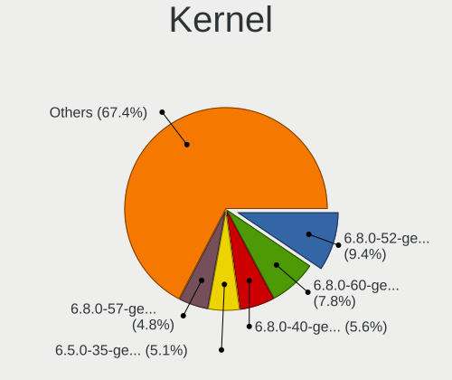

| Version               | Computers | Percent |
|-----------------------|-----------|---------|
| 6.8.0-52-generic      | 514       | 9.44%   |
| 6.8.0-60-generic      | 423       | 7.77%   |
| 6.8.0-40-generic      | 305       | 5.6%    |
| 6.5.0-35-generic      | 276       | 5.07%   |
| 6.8.0-57-generic      | 259       | 4.75%   |
| 6.8.0-49-generic      | 225       | 4.13%   |
| 6.8.0-59-generic      | 216       | 3.97%   |
| 6.5.0-41-generic      | 197       | 3.62%   |
| 6.8.0-65-generic      | 189       | 3.47%   |
| 6.2.0-39-generic      | 188       | 3.45%   |
| 6.8.0-45-generic      | 186       | 3.41%   |
| 6.5.0-28-generic      | 164       | 3.01%   |
| 6.5.0-26-generic      | 154       | 2.83%   |
| 6.8.0-51-generic      | 153       | 2.81%   |
| 6.8.0-85-generic      | 147       | 2.7%    |
| 6.5.0-45-generic      | 137       | 2.52%   |
| 6.8.0-79-generic      | 126       | 2.31%   |
| 6.8.0-47-generic      | 125       | 2.29%   |
| 6.8.0-48-generic      | 124       | 2.28%   |
| 6.8.0-50-generic      | 120       | 2.2%    |
| 6.8.0-87-generic      | 111       | 2.04%   |
| 6.5.0-21-generic      | 104       | 1.91%   |
| 6.5.0-14-generic      | 99        | 1.82%   |
| 6.5.0-27-generic      | 98        | 1.8%    |
| 6.5.0-25-generic      | 97        | 1.78%   |
| 6.8.0-58-generic      | 93        | 1.71%   |
| 6.5.0-15-generic      | 93        | 1.71%   |
| 6.8.0-64-generic      | 67        | 1.23%   |
| 6.8.0-83-generic      | 66        | 1.21%   |
| 6.5.0-18-generic      | 55        | 1.01%   |
| 6.8.0-84-generic      | 53        | 0.97%   |
| 6.8.0-90-generic      | 52        | 0.95%   |
| 6.5.0-44-generic      | 50        | 0.92%   |
| 6.5.0-17-generic      | 50        | 0.92%   |
| 6.8.0-78-generic      | 15        | 0.28%   |
| 6.2.0-37-generic      | 7         | 0.13%   |
| 6.8.0-88-generic      | 5         | 0.09%   |
| 6.8.0-86-generic      | 5         | 0.09%   |
| 6.12.3-surface-2      | 4         | 0.07%   |
| 6.12.3-061203-generic | 3         | 0.06%   |

Kernel Family
-------------

Linux kernel without a distro release

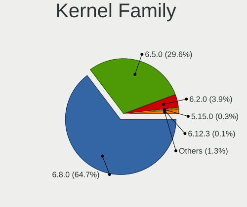

| Version | Computers | Percent |
|---------|-----------|---------|
| 6.8.0   | 3232      | 64.69%  |
| 6.5.0   | 1480      | 29.62%  |
| 6.2.0   | 195       | 3.9%    |
| 5.15.0  | 16        | 0.32%   |
| 6.12.3  | 7         | 0.14%   |
| 6.11.0  | 3         | 0.06%   |
| 6.9.9   | 2         | 0.04%   |
| 6.9.5   | 2         | 0.04%   |
| 6.9.3   | 2         | 0.04%   |
| 6.8.8   | 2         | 0.04%   |
| 6.8.7   | 2         | 0.04%   |
| 6.8.12  | 2         | 0.04%   |
| 6.8.10  | 2         | 0.04%   |
| 6.15.6  | 2         | 0.04%   |
| 6.15.4  | 2         | 0.04%   |
| 6.15.1  | 2         | 0.04%   |
| 6.14.2  | 2         | 0.04%   |
| 6.14.0  | 2         | 0.04%   |
| 6.9.12  | 1         | 0.02%   |
| 6.8.9   | 1         | 0.02%   |
| 6.8.5   | 1         | 0.02%   |
| 6.7.7   | 1         | 0.02%   |
| 6.7.6   | 1         | 0.02%   |
| 6.7.5   | 1         | 0.02%   |
| 6.7.3   | 1         | 0.02%   |
| 6.7.2   | 1         | 0.02%   |
| 6.7.10  | 1         | 0.02%   |
| 6.6.13  | 1         | 0.02%   |
| 6.6.11  | 1         | 0.02%   |
| 6.6.10  | 1         | 0.02%   |
| 6.17.3  | 1         | 0.02%   |
| 6.17.0  | 1         | 0.02%   |
| 6.16.0  | 1         | 0.02%   |
| 6.15.5  | 1         | 0.02%   |
| 6.14.8  | 1         | 0.02%   |
| 6.14.5  | 1         | 0.02%   |
| 6.14.3  | 1         | 0.02%   |
| 6.13.8  | 1         | 0.02%   |
| 6.13.6  | 1         | 0.02%   |
| 6.13.5  | 1         | 0.02%   |

Kernel Major Ver.
-----------------

Linux kernel major version

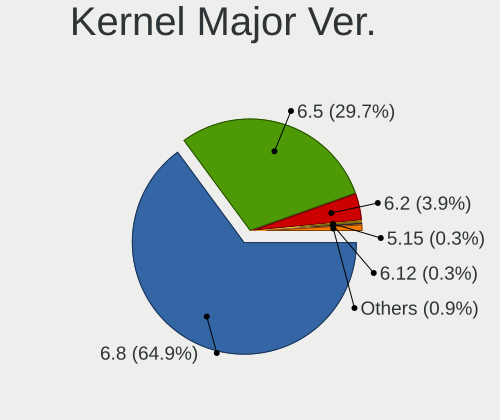

| Version | Computers | Percent |
|---------|-----------|---------|
| 6.8     | 3239      | 64.91%  |
| 6.5     | 1480      | 29.66%  |
| 6.2     | 195       | 3.91%   |
| 5.15    | 16        | 0.32%   |
| 6.12    | 13        | 0.26%   |
| 6.9     | 7         | 0.14%   |
| 6.15    | 7         | 0.14%   |
| 6.14    | 7         | 0.14%   |
| 6.7     | 5         | 0.1%    |
| 6.13    | 5         | 0.1%    |
| 6.10    | 5         | 0.1%    |
| 6.11    | 4         | 0.08%   |
| 6.6     | 3         | 0.06%   |
| 6.17    | 2         | 0.04%   |
| 6.16    | 1         | 0.02%   |
| 6.1     | 1         | 0.02%   |

Arch
----

OS architecture (x86_64, i586, etc.)

| Name   | Computers | Percent |
|--------|-----------|---------|
| x86_64 | 4851      | 100%    |

DE
--

Desktop Environment

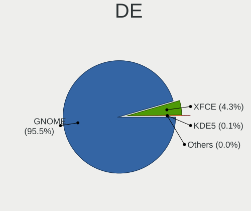

| Name          | Computers | Percent |
|---------------|-----------|---------|
| GNOME         | 4643      | 95.5%   |
| XFCE          | 207       | 4.26%   |
| KDE5          | 6         | 0.12%   |
| X-Cinnamon    | 3         | 0.06%   |
| Enlightenment | 1         | 0.02%   |
| Budgie        | 1         | 0.02%   |
| Unknown       | 1         | 0.02%   |

Display Server
--------------

X11 or Wayland

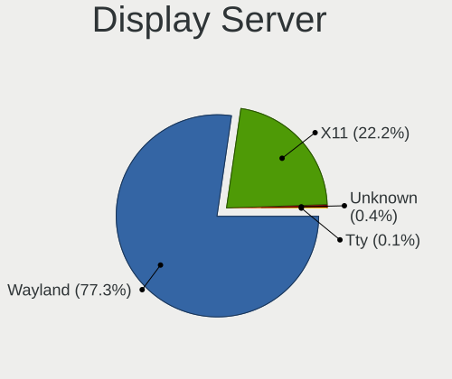

| Name    | Computers | Percent |
|---------|-----------|---------|
| Wayland | 3807      | 77.28%  |
| X11     | 1092      | 22.17%  |
| Unknown | 20        | 0.41%   |
| Tty     | 7         | 0.14%   |

Display Manager
---------------

SDDM, LightDM, etc.

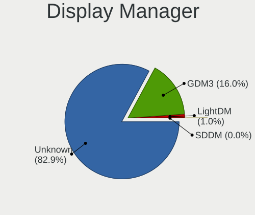

| Name    | Computers | Percent |
|---------|-----------|---------|
| Unknown | 4079      | 82.92%  |
| GDM3    | 786       | 15.98%  |
| LightDM | 47        | 0.96%   |
| GDM     | 5         | 0.1%    |
| SDDM    | 2         | 0.04%   |

OS Lang
-------

Language

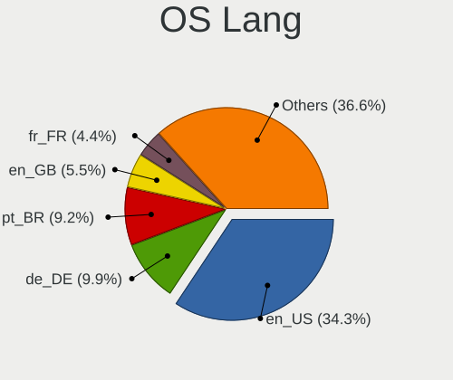

| Lang  | Computers | Percent |
|-------|-----------|---------|
| en_US | 1670      | 34.33%  |
| de_DE | 482       | 9.91%   |
| pt_BR | 449       | 9.23%   |
| en_GB | 269       | 5.53%   |
| fr_FR | 212       | 4.36%   |
| it_IT | 202       | 4.15%   |
| es_ES | 181       | 3.72%   |
| en_CA | 152       | 3.12%   |
| en_IN | 98        | 2.01%   |
| en_AU | 94        | 1.93%   |
| nl_NL | 77        | 1.58%   |
| pl_PL | 75        | 1.54%   |
| es_MX | 72        | 1.48%   |
| pt_PT | 59        | 1.21%   |
| tr_TR | 57        | 1.17%   |
| es_AR | 53        | 1.09%   |
| ru_RU | 47        | 0.97%   |
| en_ZA | 41        | 0.84%   |
| es_CO | 40        | 0.82%   |
| hu_HU | 37        | 0.76%   |
| cs_CZ | 36        | 0.74%   |
| de_AT | 33        | 0.68%   |
| es_CL | 26        | 0.53%   |
| en_NZ | 25        | 0.51%   |
| da_DK | 21        | 0.43%   |
| es_VE | 20        | 0.41%   |
| en_IE | 20        | 0.41%   |
| nl_BE | 18        | 0.37%   |
| sv_SE | 17        | 0.35%   |
| ja_JP | 17        | 0.35%   |
| ro_RO | 15        | 0.31%   |
| nb_NO | 15        | 0.31%   |
| de_CH | 15        | 0.31%   |
| es_EC | 13        | 0.27%   |
| bg_BG | 12        | 0.25%   |
| es_BO | 10        | 0.21%   |
| en_IL | 9         | 0.18%   |
| fi_FI | 8         | 0.16%   |
| en_PH | 8         | 0.16%   |
| el_GR | 8         | 0.16%   |

Boot Mode
---------

EFI or BIOS

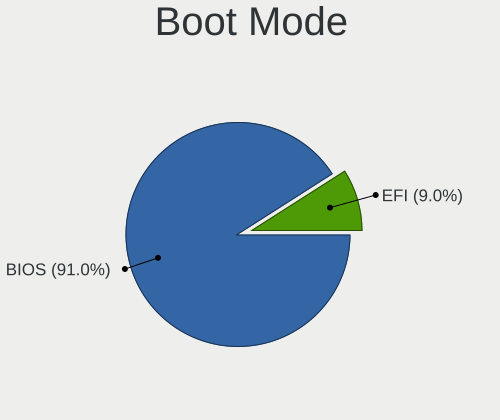

| Mode | Computers | Percent |
|------|-----------|---------|
| BIOS | 4436      | 90.96%  |
| EFI  | 441       | 9.04%   |

Filesystem
----------

Type of filesystem

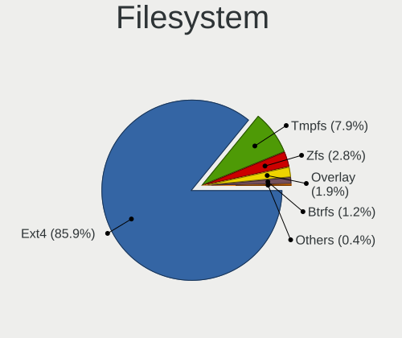

| Type    | Computers | Percent |
|---------|-----------|---------|
| Ext4    | 4216      | 85.88%  |
| Tmpfs   | 390       | 7.94%   |
| Zfs     | 136       | 2.77%   |
| Overlay | 91        | 1.85%   |
| Btrfs   | 58        | 1.18%   |
| Ext2    | 8         | 0.16%   |
| Ext3    | 6         | 0.12%   |
| Xfs     | 4         | 0.08%   |

Part. scheme
------------

Scheme of partitioning

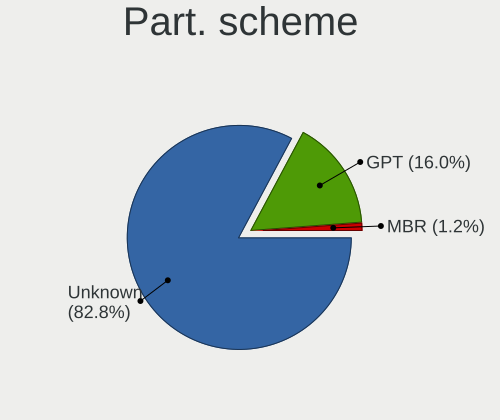

| Type    | Computers | Percent |
|---------|-----------|---------|
| Unknown | 4074      | 82.8%   |
| GPT     | 787       | 16%     |
| MBR     | 59        | 1.2%    |

Dual Boot with Linux/BSD
------------------------

Hosting more than one Linux/BSD

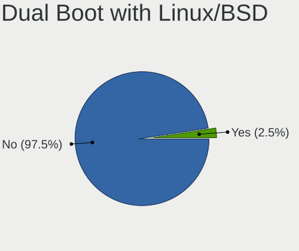

| Dual boot | Computers | Percent |
|-----------|-----------|---------|
| No        | 4749      | 97.54%  |
| Yes       | 120       | 2.46%   |

Dual Boot (Win)
---------------

Hosting Linux and Windows

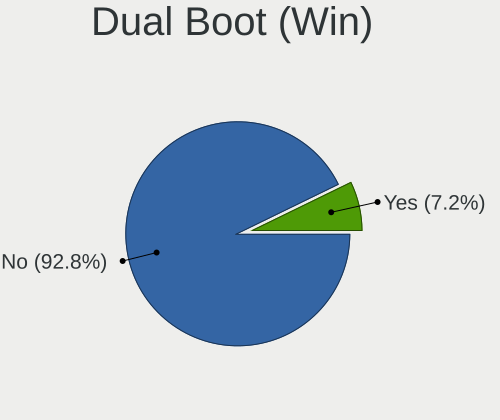

| Dual boot | Computers | Percent |
|-----------|-----------|---------|
| No        | 4538      | 92.78%  |
| Yes       | 353       | 7.22%   |

Board
-----

Vendor
------

Motherboard manufacturer

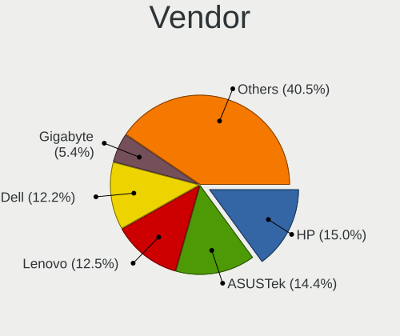

| Name                                 | Computers | Percent |
|--------------------------------------|-----------|---------|
| Hewlett-Packard                      | 726       | 14.97%  |
| ASUSTek Computer                     | 700       | 14.43%  |
| Lenovo                               | 605       | 12.47%  |
| Dell                                 | 594       | 12.24%  |
| Gigabyte Technology                  | 260       | 5.36%   |
| Acer                                 | 252       | 5.19%   |
| Apple                                | 237       | 4.89%   |
| MSI                                  | 227       | 4.68%   |
| ASRock                               | 116       | 2.39%   |
| Intel                                | 98        | 2.02%   |
| Toshiba                              | 92        | 1.9%    |
| Unknown                              | 80        | 1.65%   |
| Samsung Electronics                  | 68        | 1.4%    |
| Sony                                 | 53        | 1.09%   |
| Microsoft                            | 53        | 1.09%   |
| Fujitsu                              | 53        | 1.09%   |
| Positivo                             | 41        | 0.85%   |
| HUAWEI                               | 41        | 0.85%   |
| Google                               | 26        | 0.54%   |
| AZW                                  | 24        | 0.49%   |
| Medion                               | 22        | 0.45%   |
| Pegatron                             | 21        | 0.43%   |
| Packard Bell                         | 21        | 0.43%   |
| Alienware                            | 17        | 0.35%   |
| Biostar                              | 15        | 0.31%   |
| Foxconn                              | 13        | 0.27%   |
| Chuwi                                | 13        | 0.27%   |
| Panasonic                            | 12        | 0.25%   |
| MACHINIST                            | 12        | 0.25%   |
| LG Electronics                       | 12        | 0.25%   |
| AMI                                  | 12        | 0.25%   |
| GEEKOM                               | 10        | 0.21%   |
| Fujitsu Siemens                      | 10        | 0.21%   |
| ECS                                  | 9         | 0.19%   |
| Teclast                              | 8         | 0.16%   |
| OEM                                  | 8         | 0.16%   |
| Shenzhen Meigao Electronic Equipment | 7         | 0.14%   |
| Huanan                               | 7         | 0.14%   |
| Semp Toshiba                         | 6         | 0.12%   |
| Razer                                | 6         | 0.12%   |

Model
-----

Motherboard model

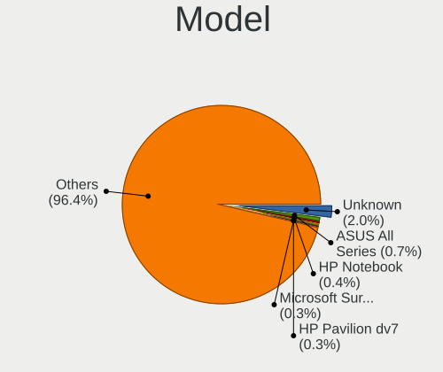

| Name                             | Computers | Percent |
|----------------------------------|-----------|---------|
| Unknown                          | 97        | 2%      |
| ASUS All Series                  | 33        | 0.68%   |
| HP Notebook                      | 18        | 0.37%   |
| Microsoft Surface Pro 4          | 16        | 0.33%   |
| HP Pavilion dv7                  | 13        | 0.27%   |
| HP Pavilion dv6                  | 13        | 0.27%   |
| Dell OptiPlex 9020               | 13        | 0.27%   |
| Apple MacBookPro9,2              | 13        | 0.27%   |
| Intel H61                        | 12        | 0.25%   |
| Apple MacBookAir6,2              | 12        | 0.25%   |
| Dell OptiPlex 7010               | 11        | 0.23%   |
| Apple MacBookPro8,1              | 11        | 0.23%   |
| MSI MS-7C56                      | 10        | 0.21%   |
| HP EliteBook 840 G2              | 10        | 0.21%   |
| Dell Latitude E6420              | 10        | 0.21%   |
| Apple MacBookPro14,1             | 10        | 0.21%   |
| HP 15                            | 9         | 0.19%   |
| ASUS TUF Gaming X570-PLUS        | 9         | 0.19%   |
| AMI Intel                        | 9         | 0.19%   |
| HP Pavilion g7                   | 8         | 0.16%   |
| Dell XPS 8700                    | 8         | 0.16%   |
| Dell Inspiron 15-3567            | 8         | 0.16%   |
| AZW SER                          | 8         | 0.16%   |
| ASUS Vivobook Go E1504FA_E1504FA | 8         | 0.16%   |
| Apple Macmini7,1                 | 8         | 0.16%   |
| Apple MacBookPro5,5              | 8         | 0.16%   |
| Apple iMac14,2                   | 8         | 0.16%   |
| Apple iMac12,1                   | 8         | 0.16%   |
| MSI MS-7C37                      | 7         | 0.14%   |
| Dell OptiPlex 790                | 7         | 0.14%   |
| Dell Latitude E6430              | 7         | 0.14%   |
| Apple MacBookPro7,1              | 7         | 0.14%   |
| Apple MacBookAir7,2              | 7         | 0.14%   |
| MSI MS-7C91                      | 6         | 0.12%   |
| MSI MS-7B86                      | 6         | 0.12%   |
| Lenovo G50-45 80E3               | 6         | 0.12%   |
| Intel H55                        | 6         | 0.12%   |
| Intel B75                        | 6         | 0.12%   |
| HP Pavilion Notebook             | 6         | 0.12%   |
| HP Pavilion 17                   | 6         | 0.12%   |

Model Family
------------

Motherboard model prefix

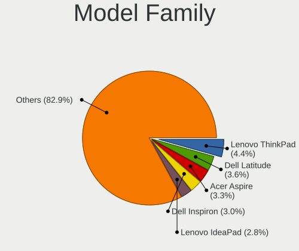

| Name               | Computers | Percent |
|--------------------|-----------|---------|
| Lenovo ThinkPad    | 212       | 4.37%   |
| Dell Latitude      | 175       | 3.61%   |
| Acer Aspire        | 160       | 3.3%    |
| Dell Inspiron      | 146       | 3.01%   |
| Lenovo IdeaPad     | 135       | 2.78%   |
| HP Pavilion        | 129       | 2.66%   |
| Dell OptiPlex      | 108       | 2.23%   |
| Unknown            | 97        | 2%      |
| HP EliteBook       | 87        | 1.79%   |
| ASUS Vivobook      | 79        | 1.63%   |
| HP Laptop          | 76        | 1.57%   |
| Toshiba Satellite  | 71        | 1.46%   |
| HP ProBook         | 67        | 1.38%   |
| ASUS PRIME         | 65        | 1.34%   |
| ASUS ROG           | 59        | 1.22%   |
| Microsoft Surface  | 53        | 1.09%   |
| ASUS TUF           | 53        | 1.09%   |
| Dell Precision     | 51        | 1.05%   |
| Dell XPS           | 49        | 1.01%   |
| HP Compaq          | 48        | 0.99%   |
| Lenovo ThinkCentre | 46        | 0.95%   |
| HP ENVY            | 35        | 0.72%   |
| ASUS All           | 33        | 0.68%   |
| ASUS ASUS          | 30        | 0.62%   |
| HP EliteDesk       | 29        | 0.6%    |
| Dell Vostro        | 29        | 0.6%    |
| HP ProDesk         | 28        | 0.58%   |
| Acer Nitro         | 28        | 0.58%   |
| Fujitsu LIFEBOOK   | 27        | 0.56%   |
| Lenovo Yoga        | 26        | 0.54%   |
| HP ZBook           | 20        | 0.41%   |
| Lenovo IdeaCentre  | 19        | 0.39%   |
| Apple MacBookPro11 | 19        | 0.39%   |
| HP Notebook        | 18        | 0.37%   |
| Fujitsu ESPRIMO    | 18        | 0.37%   |
| Lenovo IdeaPadFlex | 17        | 0.35%   |
| ASUS Zenbook       | 17        | 0.35%   |
| Lenovo Legion      | 16        | 0.33%   |
| HP 15              | 15        | 0.31%   |
| Apple MacBookPro8  | 15        | 0.31%   |

MFG Year
--------

Motherboard manufacture year

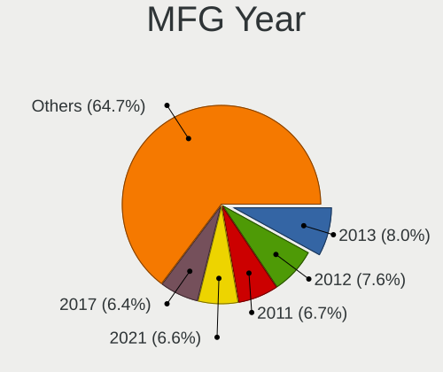

| Year    | Computers | Percent |
|---------|-----------|---------|
| 2013    | 388       | 8%      |
| 2012    | 369       | 7.61%   |
| 2011    | 323       | 6.66%   |
| 2021    | 320       | 6.6%    |
| 2017    | 311       | 6.41%   |
| 2020    | 307       | 6.33%   |
| 2019    | 304       | 6.27%   |
| 2018    | 301       | 6.2%    |
| 2023    | 294       | 6.06%   |
| 2014    | 291       | 6%      |
| 2022    | 273       | 5.63%   |
| 2016    | 260       | 5.36%   |
| 2010    | 236       | 4.86%   |
| 2015    | 233       | 4.8%    |
| 2009    | 197       | 4.06%   |
| 2024    | 162       | 3.34%   |
| 2008    | 149       | 3.07%   |
| 2007    | 68        | 1.4%    |
| 2025    | 38        | 0.78%   |
| 2006    | 21        | 0.43%   |
| 2005    | 3         | 0.06%   |
| Unknown | 2         | 0.04%   |
| 2000    | 1         | 0.02%   |

Form Factor
-----------

Physical design of the computer

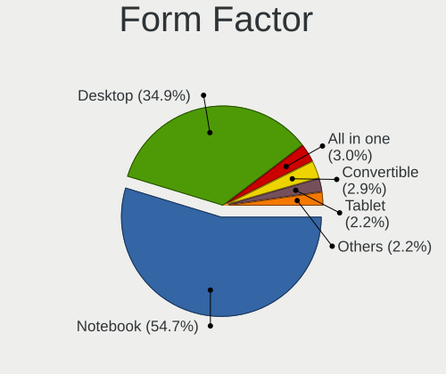

| Name        | Computers | Percent |
|-------------|-----------|---------|
| Notebook    | 2654      | 54.71%  |
| Desktop     | 1695      | 34.94%  |
| All in one  | 145       | 2.99%   |
| Convertible | 141       | 2.91%   |
| Tablet      | 109       | 2.25%   |
| Mini pc     | 87        | 1.79%   |
| Server      | 15        | 0.31%   |
| Other       | 5         | 0.1%    |

Secure Boot
-----------

Enabled or disabled

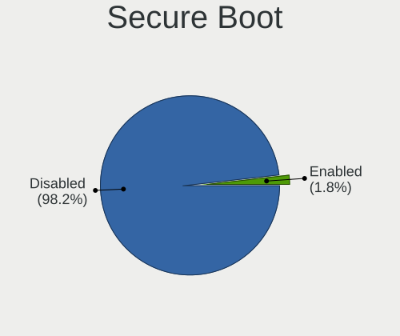

| State    | Computers | Percent |
|----------|-----------|---------|
| Disabled | 4769      | 98.21%  |
| Enabled  | 87        | 1.79%   |

Coreboot
--------

Have coreboot on board

| Used | Computers | Percent |
|------|-----------|---------|
| No   | 4817      | 99.3%   |
| Yes  | 34        | 0.7%    |

RAM Size
--------

Total RAM memory

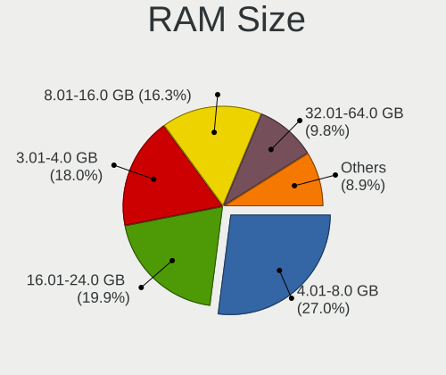

| Size in GB      | Computers | Percent |
|-----------------|-----------|---------|
| 4.01-8.0        | 1321      | 27.03%  |
| 16.01-24.0      | 972       | 19.89%  |
| 3.01-4.0        | 881       | 18.02%  |
| 8.01-16.0       | 799       | 16.35%  |
| 32.01-64.0      | 480       | 9.82%   |
| 64.01-256.0     | 160       | 3.27%   |
| 24.01-32.0      | 141       | 2.88%   |
| 1.01-2.0        | 87        | 1.78%   |
| 2.01-3.0        | 46        | 0.94%   |
| More than 256.0 | 1         | 0.02%   |

RAM Used
--------

Used RAM memory

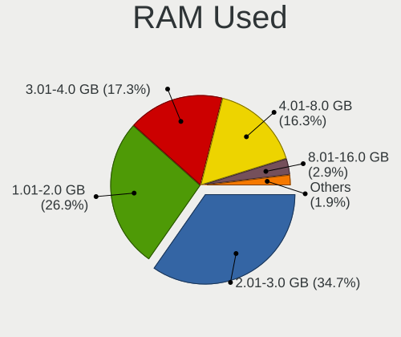

| Used GB    | Computers | Percent |
|------------|-----------|---------|
| 2.01-3.0   | 1811      | 34.69%  |
| 1.01-2.0   | 1405      | 26.92%  |
| 3.01-4.0   | 903       | 17.3%   |
| 4.01-8.0   | 850       | 16.28%  |
| 8.01-16.0  | 152       | 2.91%   |
| 0.51-1.0   | 63        | 1.21%   |
| 16.01-24.0 | 28        | 0.54%   |
| 24.01-32.0 | 5         | 0.1%    |
| 32.01-64.0 | 3         | 0.06%   |

Total Drives
------------

Number of drives on board

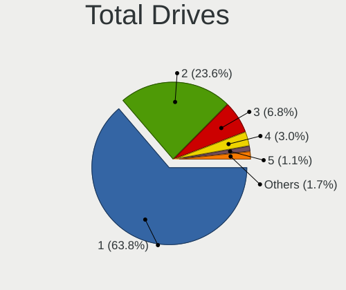

| Drives | Computers | Percent |
|--------|-----------|---------|
| 1      | 3149      | 63.76%  |
| 2      | 1168      | 23.65%  |
| 3      | 334       | 6.76%   |
| 4      | 149       | 3.02%   |
| 5      | 56        | 1.13%   |
| 6      | 37        | 0.75%   |
| 8      | 13        | 0.26%   |
| 7      | 11        | 0.22%   |
| 0      | 11        | 0.22%   |
| 9      | 5         | 0.1%    |
| 11     | 4         | 0.08%   |
| 10     | 2         | 0.04%   |

Has CD-ROM
----------

Has CD-ROM on board

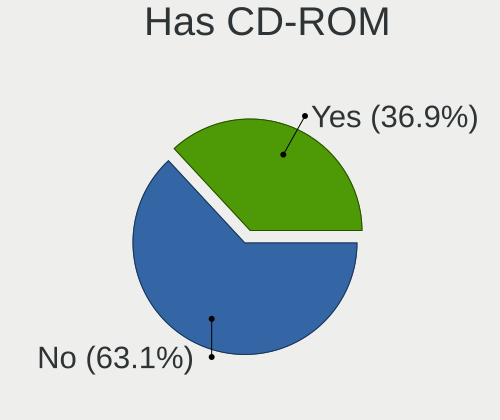

| Presented | Computers | Percent |
|-----------|-----------|---------|
| No        | 3072      | 63.09%  |
| Yes       | 1797      | 36.91%  |

Has Ethernet
------------

Has Ethernet on board

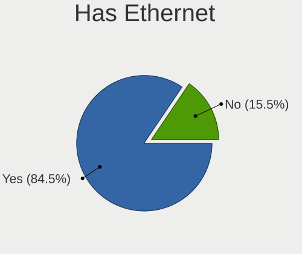

| Presented | Computers | Percent |
|-----------|-----------|---------|
| Yes       | 4102      | 84.47%  |
| No        | 754       | 15.53%  |

Has WiFi
--------

Has WiFi module

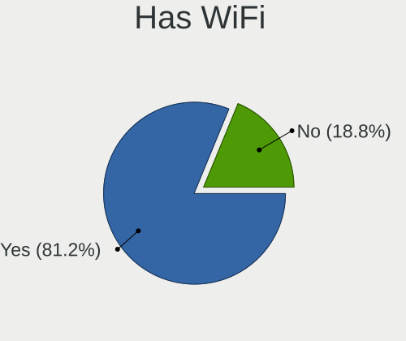

| Presented | Computers | Percent |
|-----------|-----------|---------|
| Yes       | 3954      | 81.22%  |
| No        | 914       | 18.78%  |

Has Bluetooth
-------------

Has Bluetooth module

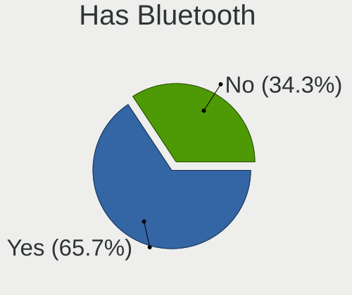

| Presented | Computers | Percent |
|-----------|-----------|---------|
| Yes       | 3210      | 65.71%  |
| No        | 1675      | 34.29%  |

Location
--------

Country
-------

Geographic location (country)

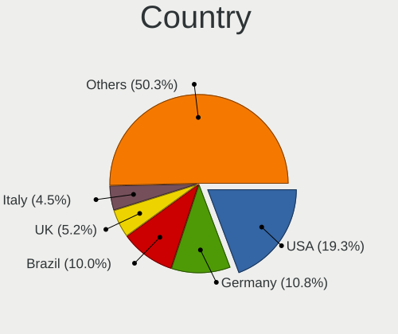

| Country         | Computers | Percent |
|-----------------|-----------|---------|
| USA             | 940       | 19.28%  |
| Germany         | 525       | 10.77%  |
| Brazil          | 486       | 9.97%   |
| UK              | 252       | 5.17%   |
| Italy           | 218       | 4.47%   |
| France          | 210       | 4.31%   |
| Canada          | 179       | 3.67%   |
| Spain           | 167       | 3.42%   |
| Netherlands     | 112       | 2.3%    |
| India           | 104       | 2.13%   |
| Mexico          | 100       | 2.05%   |
| Australia       | 91        | 1.87%   |
| Poland          | 86        | 1.76%   |
| Portugal        | 71        | 1.46%   |
| Turkey          | 67        | 1.37%   |
| Argentina       | 63        | 1.29%   |
| Austria         | 54        | 1.11%   |
| Switzerland     | 51        | 1.05%   |
| Belgium         | 50        | 1.03%   |
| Czechia         | 46        | 0.94%   |
| South Africa    | 44        | 0.9%    |
| Russia          | 44        | 0.9%    |
| Colombia        | 44        | 0.9%    |
| Romania         | 41        | 0.84%   |
| Hungary         | 38        | 0.78%   |
| Indonesia       | 37        | 0.76%   |
| Sweden          | 36        | 0.74%   |
| Egypt           | 33        | 0.68%   |
| Denmark         | 33        | 0.68%   |
| New Zealand     | 31        | 0.64%   |
| Chile           | 31        | 0.64%   |
| Norway          | 29        | 0.59%   |
| Japan           | 27        | 0.55%   |
| Ireland         | 25        | 0.51%   |
| Greece          | 25        | 0.51%   |
| Bulgaria        | 21        | 0.43%   |
| Saudi Arabia    | 19        | 0.39%   |
| Venezuela       | 17        | 0.35%   |
| The Netherlands | 17        | 0.35%   |
| Finland         | 17        | 0.35%   |

City
----

Geographic location (city)

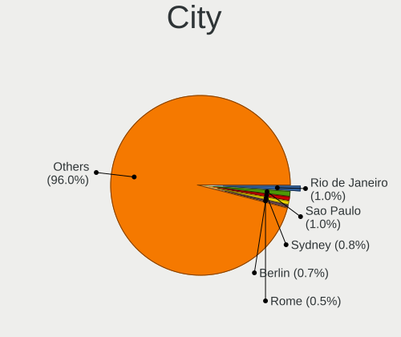

| City              | Computers | Percent |
|-------------------|-----------|---------|
| Rio de Janeiro    | 51        | 1.01%   |
| Sao Paulo         | 50        | 0.99%   |
| Sydney            | 38        | 0.75%   |
| Berlin            | 37        | 0.73%   |
| Rome              | 26        | 0.51%   |
| Madrid            | 26        | 0.51%   |
| Istanbul          | 24        | 0.47%   |
| Amsterdam         | 24        | 0.47%   |
| Milan             | 23        | 0.46%   |
| Melbourne         | 23        | 0.46%   |
| Prague            | 22        | 0.44%   |
| Paris             | 22        | 0.44%   |
| Hamburg           | 22        | 0.44%   |
| Budapest          | 22        | 0.44%   |
| Vienna            | 19        | 0.38%   |
| Santiago          | 19        | 0.38%   |
| Mexico City       | 19        | 0.38%   |
| Johannesburg      | 19        | 0.38%   |
| Dublin            | 19        | 0.38%   |
| Montreal          | 17        | 0.34%   |
| Warsaw            | 16        | 0.32%   |
| Toronto           | 16        | 0.32%   |
| Cologne           | 16        | 0.32%   |
| Cairo             | 16        | 0.32%   |
| Seattle           | 15        | 0.3%    |
| London            | 15        | 0.3%    |
| New York          | 14        | 0.28%   |
| Lisbon            | 14        | 0.28%   |
| Bogotá           | 14        | 0.28%   |
| Munich            | 13        | 0.26%   |
| Milano            | 13        | 0.26%   |
| Frankfurt am Main | 13        | 0.26%   |
| Brisbane          | 13        | 0.26%   |
| Brasília         | 13        | 0.26%   |
| Porto             | 12        | 0.24%   |
| Houston           | 12        | 0.24%   |
| Curitiba          | 12        | 0.24%   |
| Chennai           | 12        | 0.24%   |
| Cape Town         | 12        | 0.24%   |
| Buenos Aires      | 12        | 0.24%   |

Drives
------

Drive Vendor
------------

Hard drive vendors

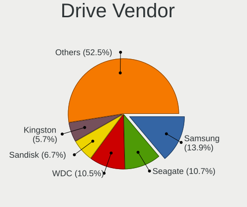

| Vendor                       | Computers | Drives | Percent |
|------------------------------|-----------|--------|---------|
| Samsung Electronics          | 967       | 1368   | 13.89%  |
| Seagate                      | 748       | 1003   | 10.74%  |
| WDC                          | 728       | 999    | 10.45%  |
| Sandisk                      | 464       | 595    | 6.66%   |
| Kingston                     | 400       | 489    | 5.74%   |
| Toshiba                      | 348       | 397    | 5%      |
| Unknown                      | 304       | 387    | 4.37%   |
| Crucial                      | 250       | 302    | 3.59%   |
| SK hynix                     | 179       | 207    | 2.57%   |
| Micron Technology            | 157       | 178    | 2.25%   |
| Hitachi                      | 156       | 201    | 2.24%   |
| China                        | 152       | 175    | 2.18%   |
| Intel                        | 116       | 149    | 1.67%   |
| Apple                        | 110       | 140    | 1.58%   |
| HGST                         | 106       | 134    | 1.52%   |
| A-DATA Technology            | 85        | 96     | 1.22%   |
| Micron/Crucial Technology    | 81        | 118    | 1.16%   |
| Phison Electronics           | 80        | 118    | 1.15%   |
| Kingston Technology Company  | 76        | 93     | 1.09%   |
| MAXIO Technology (Hangzhou)  | 75        | 92     | 1.08%   |
| Intenso                      | 70        | 86     | 1.01%   |
| Silicon Motion               | 62        | 66     | 0.89%   |
| SPCC                         | 56        | 65     | 0.8%    |
| Unknown                      | 49        | 59     | 0.7%    |
| PNY                          | 46        | 53     | 0.66%   |
| KIOXIA                       | 45        | 49     | 0.65%   |
| Realtek Semiconductor        | 40        | 51     | 0.57%   |
| ADATA Technology             | 40        | 44     | 0.57%   |
| Lexar                        | 39        | 43     | 0.56%   |
| Patriot                      | 33        | 38     | 0.47%   |
| Fanxiang                     | 33        | 42     | 0.47%   |
| LITEON                       | 28        | 35     | 0.4%    |
| Shenzhen Longsys Electronics | 27        | 32     | 0.39%   |
| JMicron Technology           | 27        | 29     | 0.39%   |
| Netac                        | 25        | 30     | 0.36%   |
| KingSpec                     | 23        | 25     | 0.33%   |
| Transcend                    | 22        | 26     | 0.32%   |
| Team                         | 20        | 20     | 0.29%   |
| OCZ                          | 20        | 29     | 0.29%   |
| Hewlett-Packard              | 20        | 23     | 0.29%   |

Drive Model
-----------

Hard drive models

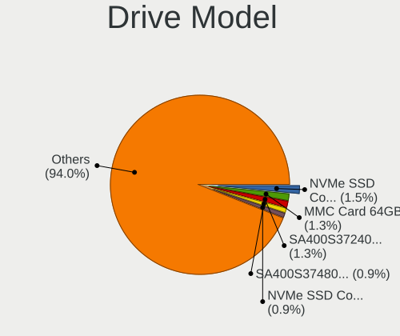

| Model                                                 | Computers | Percent |
|-------------------------------------------------------|-----------|---------|
| Samsung NVMe SSD Controller SM981/PM981/PM983 1TB     | 115       | 1.54%   |
| Unknown MMC Card  64GB                                | 100       | 1.34%   |
| Kingston SA400S37240G 240GB SSD                       | 95        | 1.27%   |
| Kingston SA400S37480G 480GB SSD                       | 70        | 0.94%   |
| Samsung NVMe SSD Controller PM9A1/PM9A3/980PRO 1TB    | 67        | 0.9%    |
| Unknown MMC Card  128GB                               | 61        | 0.82%   |
| Unknown MMC Card  32GB                                | 57        | 0.76%   |
| MAXIO (Hangzhou) NVMe SSD Controller MAP1202 2TB      | 51        | 0.68%   |
| Unknown                                               | 49        | 0.66%   |
| Silicon Motion SM2263EN/SM2263XT SSD Controller 512GB | 44        | 0.59%   |
| Samsung NVMe SSD Controller SM961/PM961/SM963 1024GB  | 44        | 0.59%   |
| Micron/Crucial P2 NVMe PCIe SSD 2TB                   | 44        | 0.59%   |
| Samsung SSD 850 EVO 250GB                             | 43        | 0.58%   |
| Seagate ST1000LM035-1RK172 1TB                        | 41        | 0.55%   |
| Samsung SSD 870 EVO 500GB                             | 39        | 0.52%   |
| Crucial CT500MX500SSD1 500GB                          | 38        | 0.51%   |
| Seagate ST1000LM024 HN-M101MBB 1TB                    | 37        | 0.5%    |
| Sandisk WD Blue SN550 NVMe SSD 1024GB                 | 37        | 0.5%    |
| Samsung SSD 860 EVO 500GB                             | 36        | 0.48%   |
| Toshiba MQ01ABF050 500GB                              | 35        | 0.47%   |
| Seagate ST500DM002-1BD142 500GB                       | 32        | 0.43%   |
| Kingston SA400S37120G 120GB SSD                       | 31        | 0.42%   |
| Crucial CT1000MX500SSD1 1TB                           | 28        | 0.38%   |
| Toshiba MQ01ABD100 1TB                                | 27        | 0.36%   |
| Samsung SSD 850 EVO 500GB                             | 27        | 0.36%   |
| China SSD 256GB                                       | 27        | 0.36%   |
| Samsung SSD 860 EVO 250GB                             | 26        | 0.35%   |
| Kingston SA400S37960G 960GB SSD                       | 26        | 0.35%   |
| Crucial CT480BX500SSD1 480GB                          | 26        | 0.35%   |
| Crucial CT240BX500SSD1 240GB                          | 25        | 0.34%   |
| Toshiba MQ04ABF100 1TB                                | 24        | 0.32%   |
| Seagate ST500LT012-1DG142 500GB                       | 24        | 0.32%   |
| Seagate ST1000DM010-2EP102 1TB                        | 24        | 0.32%   |
| Seagate ST1000DM003-1CH162 1TB                        | 24        | 0.32%   |
| Kingston Company SNV2S1000G 1TB                       | 24        | 0.32%   |
| SK hynix BC501 NVMe Solid State Drive 512GB           | 23        | 0.31%   |
| Kingston SV300S37A120G 120GB SSD                      | 23        | 0.31%   |
| Unknown SD/MMC/MS PRO 2GB                             | 22        | 0.3%    |
| Seagate ST9500325AS 500GB                             | 22        | 0.3%    |
| Toshiba DT01ACA100 1TB                                | 21        | 0.28%   |

HDD Vendor
----------

Hard disk drive vendors

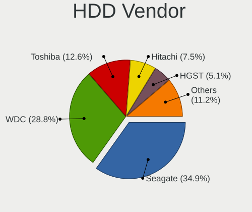

| Vendor              | Computers | Drives | Percent |
|---------------------|-----------|--------|---------|
| Seagate             | 726       | 965    | 34.87%  |
| WDC                 | 599       | 806    | 28.77%  |
| Toshiba             | 262       | 299    | 12.58%  |
| Hitachi             | 156       | 201    | 7.49%   |
| HGST                | 106       | 134    | 5.09%   |
| Samsung Electronics | 77        | 92     | 3.7%    |
| Apple               | 29        | 29     | 1.39%   |
| Unknown             | 25        | 26     | 1.2%    |
| Fujitsu             | 16        | 16     | 0.77%   |
| JMicron Technology  | 12        | 13     | 0.58%   |
| Maxtor              | 8         | 12     | 0.38%   |
| External            | 8         | 8      | 0.38%   |
| ASMT                | 7         | 8      | 0.34%   |
| TO Exter            | 6         | 6      | 0.29%   |
| T-FORCE             | 5         | 5      | 0.24%   |
| Intenso             | 4         | 5      | 0.19%   |
| USB3.0              | 3         | 3      | 0.14%   |
| LaCie               | 3         | 3      | 0.14%   |
| Hewlett-Packard     | 3         | 3      | 0.14%   |
| SABRENT             | 2         | 4      | 0.1%    |
| HGST HTS            | 2         | 2      | 0.1%    |
| EAGET               | 2         | 2      | 0.1%    |
| ASMedia             | 2         | 2      | 0.1%    |
| XrayDisk            | 1         | 1      | 0.05%   |
| WD MediaMax         | 1         | 1      | 0.05%   |
| WALRAM              | 1         | 1      | 0.05%   |
| USB                 | 1         | 1      | 0.05%   |
| TDAS                | 1         | 4      | 0.05%   |
| SSK                 | 1         | 1      | 0.05%   |
| Shenzhen            | 1         | 1      | 0.05%   |
| PRO Z               | 1         | 1      | 0.05%   |
| Min Yi U            | 1         | 1      | 0.05%   |
| MARVELL             | 1         | 1      | 0.05%   |
| KESU                | 1         | 1      | 0.05%   |
| JetFlash            | 1         | 1      | 0.05%   |
| Inateck             | 1         | 2      | 0.05%   |
| HPE                 | 1         | 1      | 0.05%   |
| Fantom              | 1         | 1      | 0.05%   |
| Extemal             | 1         | 1      | 0.05%   |
| ExcelStor           | 1         | 1      | 0.05%   |

SSD Vendor
----------

Solid state drive vendors

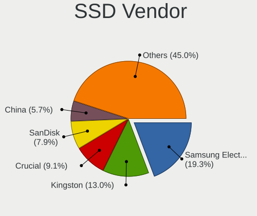

| Vendor              | Computers | Drives | Percent |
|---------------------|-----------|--------|---------|
| Samsung Electronics | 504       | 665    | 19.26%  |
| Kingston            | 341       | 407    | 13.03%  |
| Crucial             | 239       | 290    | 9.13%   |
| SanDisk             | 207       | 242    | 7.91%   |
| China               | 149       | 171    | 5.69%   |
| WDC                 | 126       | 169    | 4.81%   |
| A-DATA Technology   | 76        | 86     | 2.9%    |
| Apple               | 57        | 67     | 2.18%   |
| SPCC                | 53        | 61     | 2.03%   |
| Intenso             | 52        | 64     | 1.99%   |
| PNY                 | 46        | 53     | 1.76%   |
| Micron Technology   | 46        | 55     | 1.76%   |
| Intel               | 46        | 50     | 1.76%   |
| SK hynix            | 39        | 47     | 1.49%   |
| Lexar               | 37        | 40     | 1.41%   |
| Toshiba             | 33        | 36     | 1.26%   |
| Patriot             | 31        | 36     | 1.18%   |
| LITEON              | 28        | 35     | 1.07%   |
| KingSpec            | 23        | 25     | 0.88%   |
| Transcend           | 22        | 26     | 0.84%   |
| Team                | 20        | 20     | 0.76%   |
| OCZ                 | 20        | 29     | 0.76%   |
| Netac               | 19        | 24     | 0.73%   |
| Unknown             | 19        | 22     | 0.73%   |
| LITEONIT            | 17        | 20     | 0.65%   |
| Hewlett-Packard     | 16        | 19     | 0.61%   |
| Verbatim            | 13        | 21     | 0.5%    |
| Gigabyte Technology | 13        | 15     | 0.5%    |
| Corsair             | 13        | 17     | 0.5%    |
| GOODRAM             | 12        | 18     | 0.46%   |
| SABRENT             | 11        | 13     | 0.42%   |
| Seagate             | 10        | 12     | 0.38%   |
| Emtec               | 10        | 10     | 0.38%   |
| Dogfish             | 10        | 12     | 0.38%   |
| Apacer              | 10        | 12     | 0.38%   |
| XrayDisk            | 9         | 10     | 0.34%   |
| Fanxiang            | 9         | 10     | 0.34%   |
| Teclast             | 7         | 9      | 0.27%   |
| FORESEE             | 7         | 8      | 0.27%   |
| KIOXIA-EXCERIA      | 6         | 8      | 0.23%   |

Drive Kind
----------

HDD or SSD

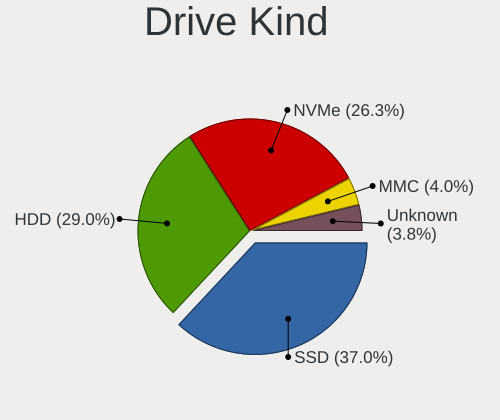

| Kind    | Computers | Drives | Percent |
|---------|-----------|--------|---------|
| SSD     | 2314      | 3168   | 36.95%  |
| HDD     | 1816      | 2669   | 29%     |
| NVMe    | 1644      | 2396   | 26.25%  |
| MMC     | 252       | 306    | 4.02%   |
| Unknown | 236       | 294    | 3.77%   |

Drive Connector
---------------

SATA, SAS, NVMe, etc.

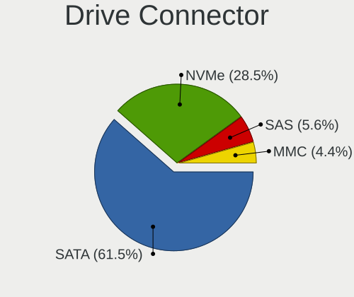

| Type | Computers | Drives | Percent |
|------|-----------|--------|---------|
| SATA | 3537      | 5700   | 61.5%   |
| NVMe | 1639      | 2377   | 28.5%   |
| SAS  | 323       | 450    | 5.62%   |
| MMC  | 252       | 306    | 4.38%   |

Drive Size
----------

Size of hard drive

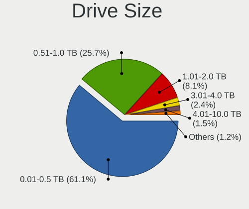

| Size in TB | Computers | Drives | Percent |
|------------|-----------|--------|---------|
| 0.01-0.5   | 2603      | 3534   | 61.09%  |
| 0.51-1.0   | 1093      | 1478   | 25.65%  |
| 1.01-2.0   | 347       | 497    | 8.14%   |
| 3.01-4.0   | 103       | 156    | 2.42%   |
| 4.01-10.0  | 63        | 105    | 1.48%   |
| 2.01-3.0   | 37        | 43     | 0.87%   |
| 10.01-20.0 | 14        | 21     | 0.33%   |
| 20.01-50.0 | 1         | 3      | 0.02%   |

Space Total
-----------

Amount of disk space available on the file system

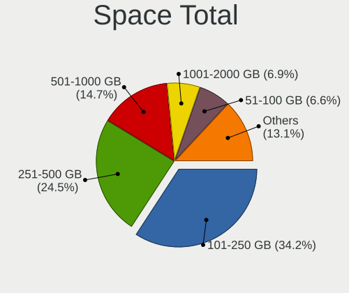

| Size in GB     | Computers | Percent |
|----------------|-----------|---------|
| 101-250        | 1704      | 34.2%   |
| 251-500        | 1221      | 24.51%  |
| 501-1000       | 733       | 14.71%  |
| 1001-2000      | 343       | 6.88%   |
| 51-100         | 330       | 6.62%   |
| More than 3000 | 201       | 4.03%   |
| 21-50          | 138       | 2.77%   |
| 1-20           | 122       | 2.45%   |
| 2001-3000      | 96        | 1.93%   |
| Unknown        | 93        | 1.87%   |
| 0              | 1         | 0.02%   |

Space Used
----------

Amount of used disk space

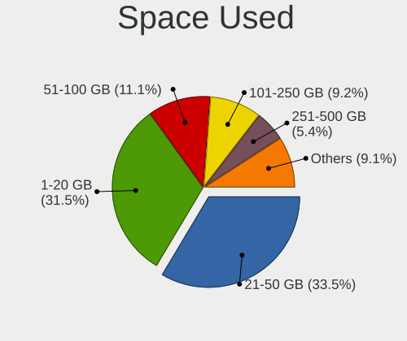

| Used GB        | Computers | Percent |
|----------------|-----------|---------|
| 21-50          | 1737      | 33.55%  |
| 1-20           | 1632      | 31.52%  |
| 51-100         | 577       | 11.14%  |
| 101-250        | 477       | 9.21%   |
| 251-500        | 282       | 5.45%   |
| 501-1000       | 175       | 3.38%   |
| 1001-2000      | 106       | 2.05%   |
| Unknown        | 93        | 1.8%    |
| More than 3000 | 62        | 1.2%    |
| 2001-3000      | 35        | 0.68%   |
| 0              | 2         | 0.04%   |

Malfunc. Drives
---------------

Drive models with a malfunction

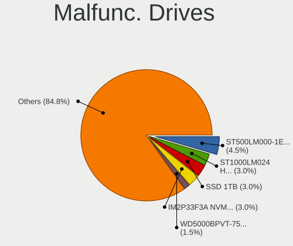

| Model                                            | Computers | Drives | Percent |
|--------------------------------------------------|-----------|--------|---------|
| Seagate ST500LM000-1EJ162 500GB                  | 3         | 3      | 4.55%   |
| Seagate ST1000LM024 HN-M101MBB 1TB               | 2         | 2      | 3.03%   |
| China SSD 1TB                                    | 2         | 2      | 3.03%   |
| A-DATA Technology IM2P33F3A NVMe 256GB           | 2         | 2      | 3.03%   |
| WDC WD5000BPVT-75HXZT1 500GB                     | 1         | 1      | 1.52%   |
| WDC WD5000AAKX-001CA0 500GB                      | 1         | 1      | 1.52%   |
| WDC WD5000AAKS-75V0A0 500GB                      | 1         | 1      | 1.52%   |
| WDC WD3200AAJS-56M0A0 320GB                      | 1         | 1      | 1.52%   |
| WDC WD3200AAJS-22L7A0 320GB                      | 1         | 1      | 1.52%   |
| WDC WD3200AAJS-08B4A0 320GB                      | 1         | 1      | 1.52%   |
| WDC WD2500BEKT-75PVMT1 250GB                     | 1         | 1      | 1.52%   |
| WDC WD20EARS-22MVWB0 2TB                         | 1         | 1      | 1.52%   |
| WDC WD15EARS-00MVWB0 1TB                         | 1         | 1      | 1.52%   |
| WDC WD10JPVX-60JC3T0 1TB                         | 1         | 1      | 1.52%   |
| WDC WD10EZRX-00D8PB0 1TB                         | 1         | 1      | 1.52%   |
| WDC WD Green 2.5 240GB                           | 1         | 2      | 1.52%   |
| Toshiba MQ01ACF050 500GB                         | 1         | 1      | 1.52%   |
| Toshiba MQ01ABF050 500GB                         | 1         | 2      | 1.52%   |
| Toshiba MK6465GSX 640GB                          | 1         | 1      | 1.52%   |
| Toshiba MK5059GSXP 500GB                         | 1         | 1      | 1.52%   |
| Toshiba MK3276GSX 320GB                          | 1         | 1      | 1.52%   |
| Toshiba MK2565GSX 250GB                          | 1         | 1      | 1.52%   |
| SSSTC CVB-8D128-HP 128GB                         | 1         | 1      | 1.52%   |
| SPCC Solid State Disk 512GB                      | 1         | 1      | 1.52%   |
| Seagate ST320LT012-9WS14C 320GB                  | 1         | 1      | 1.52%   |
| Seagate ST3160212SCE 160GB                       | 1         | 1      | 1.52%   |
| Seagate ST2000LM007-1R8174 2TB                   | 1         | 1      | 1.52%   |
| Seagate ST1000LM035-1RK172 1TB                   | 1         | 1      | 1.52%   |
| Seagate ST1000DM010-2EP102 1TB                   | 1         | 1      | 1.52%   |
| SanDisk SSD PLUS 480GB                           | 1         | 1      | 1.52%   |
| SanDisk SSD PLUS 240GB                           | 1         | 2      | 1.52%   |
| SanDisk SSD i100 24GB                            | 1         | 1      | 1.52%   |
| Samsung Electronics SSD 870 EVO 500GB            | 1         | 1      | 1.52%   |
| Samsung Electronics SSD 870 EVO 1TB              | 1         | 1      | 1.52%   |
| Samsung Electronics SSD 850 PRO 512GB            | 1         | 1      | 1.52%   |
| Samsung Electronics SSD 840 PRO Series 256GB     | 1         | 1      | 1.52%   |
| Samsung Electronics MZNLN256HAJQ-000L7 256GB SSD | 1         | 1      | 1.52%   |
| Samsung Electronics MZNLH128HBHQ-000H1 128GB SSD | 1         | 1      | 1.52%   |
| Samsung Electronics HD322HJ 320GB                | 1         | 1      | 1.52%   |
| Micron Technology 1100_MTFDDAK256TBN 256GB SSD   | 1         | 1      | 1.52%   |

Malfunc. Drive Vendor
---------------------

Vendors of faulty drives

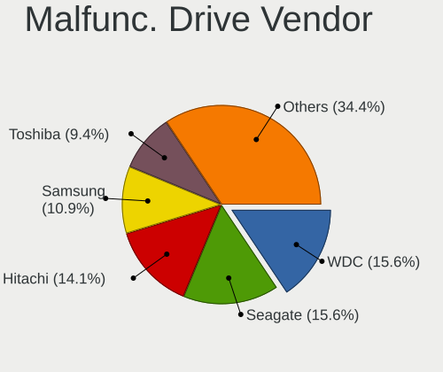

| Vendor              | Computers | Drives | Percent |
|---------------------|-----------|--------|---------|
| WDC                 | 10        | 13     | 15.63%  |
| Seagate             | 10        | 10     | 15.63%  |
| Hitachi             | 9         | 10     | 14.06%  |
| Samsung Electronics | 7         | 7      | 10.94%  |
| Toshiba             | 6         | 7      | 9.38%   |
| SanDisk             | 3         | 4      | 4.69%   |
| HGST                | 3         | 3      | 4.69%   |
| China               | 3         | 3      | 4.69%   |
| A-DATA Technology   | 3         | 3      | 4.69%   |
| SSSTC               | 1         | 1      | 1.56%   |
| SPCC                | 1         | 1      | 1.56%   |
| Micron Technology   | 1         | 1      | 1.56%   |
| Kingston            | 1         | 1      | 1.56%   |
| KingFast            | 1         | 1      | 1.56%   |
| JMicron Technology  | 1         | 1      | 1.56%   |
| Intel               | 1         | 1      | 1.56%   |
| Crucial             | 1         | 1      | 1.56%   |
| BIWIN               | 1         | 1      | 1.56%   |
| Apple               | 1         | 1      | 1.56%   |

Malfunc. HDD Vendor
-------------------

Vendors of faulty HDD drives

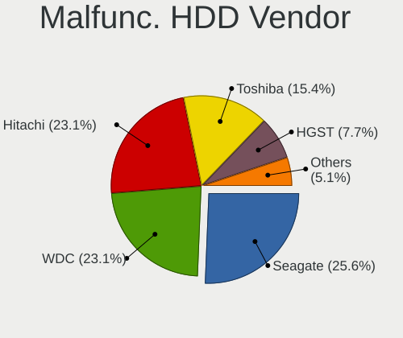

| Vendor              | Computers | Drives | Percent |
|---------------------|-----------|--------|---------|
| Seagate             | 10        | 10     | 25.64%  |
| WDC                 | 9         | 11     | 23.08%  |
| Hitachi             | 9         | 10     | 23.08%  |
| Toshiba             | 6         | 7      | 15.38%  |
| HGST                | 3         | 3      | 7.69%   |
| Samsung Electronics | 1         | 1      | 2.56%   |
| Apple               | 1         | 1      | 2.56%   |

Malfunc. Drive Kind
-------------------

Kinds of faulty drives

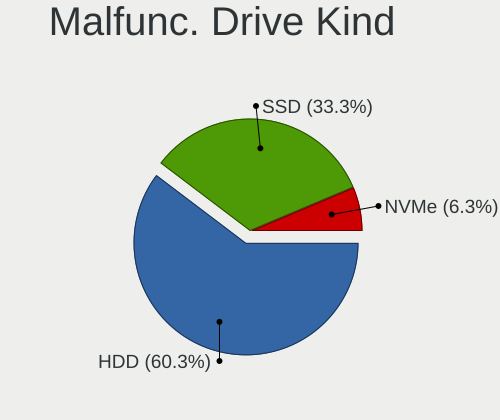

| Kind | Computers | Drives | Percent |
|------|-----------|--------|---------|
| HDD  | 38        | 43     | 60.32%  |
| SSD  | 21        | 23     | 33.33%  |
| NVMe | 4         | 4      | 6.35%   |

Failed Drives
-------------

Failed drive models

Zero info for selected period =(

Failed Drive Vendor
-------------------

Failed drive vendors

Zero info for selected period =(

Drive Status
------------

Number of failed and malfunc. drives

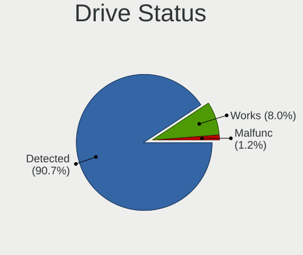

| Status   | Computers | Drives | Percent |
|----------|-----------|--------|---------|
| Detected | 4488      | 8183   | 90.74%  |
| Works    | 397       | 580    | 8.03%   |
| Malfunc  | 61        | 70     | 1.23%   |

Storage controller
------------------

Storage Vendor
--------------

Storage controller vendors

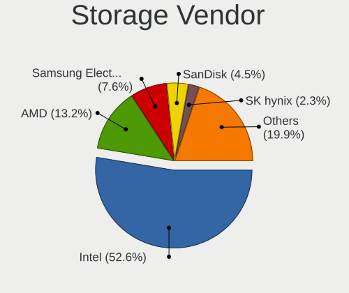

| Vendor                           | Computers | Percent |
|----------------------------------|-----------|---------|
| Intel                            | 3262      | 52.62%  |
| AMD                              | 817       | 13.18%  |
| Samsung Electronics              | 471       | 7.6%    |
| SanDisk                          | 277       | 4.47%   |
| SK hynix                         | 140       | 2.26%   |
| Kingston Technology Company      | 140       | 2.26%   |
| Micron Technology                | 113       | 1.82%   |
| Phison Electronics               | 93        | 1.5%    |
| ASMedia Technology               | 91        | 1.47%   |
| Micron/Crucial Technology        | 89        | 1.44%   |
| MAXIO Technology (Hangzhou)      | 83        | 1.34%   |
| Nvidia                           | 66        | 1.06%   |
| Silicon Motion                   | 65        | 1.05%   |
| Marvell Technology Group         | 60        | 0.97%   |
| Toshiba America Info Systems     | 52        | 0.84%   |
| JMicron Technology               | 51        | 0.82%   |
| KIOXIA                           | 49        | 0.79%   |
| ADATA Technology                 | 48        | 0.77%   |
| Realtek Semiconductor            | 42        | 0.68%   |
| Shenzhen Longsys Electronics     | 31        | 0.5%    |
| Apple                            | 25        | 0.4%    |
| Solid State Storage Technology   | 14        | 0.23%   |
| INNOGRIT                         | 14        | 0.23%   |
| Silicon Integrated Systems [SiS] | 13        | 0.21%   |
| VIA Technologies                 | 9         | 0.15%   |
| Broadcom / LSI                   | 9         | 0.15%   |
| Solidigm                         | 8         | 0.13%   |
| LSI Logic / Symbios Logic        | 8         | 0.13%   |
| Seagate Technology               | 7         | 0.11%   |
| Netac Technology                 | 6         | 0.1%    |
| Unknown                          | 6         | 0.1%    |
| Hosin Global Electronics         | 5         | 0.08%   |
| Yangtze Memory Technologies      | 4         | 0.06%   |
| Union Memory (Shenzhen)          | 4         | 0.06%   |
| Lite-On Technology               | 4         | 0.06%   |
| Biwin Storage Technology         | 4         | 0.06%   |
| Integrated Technology Express    | 3         | 0.05%   |
| TenaFe                           | 2         | 0.03%   |
| Silicon Image                    | 2         | 0.03%   |
| Shenzhen Shichuangyi Electronics | 2         | 0.03%   |

Storage Model
-------------

Storage controller models

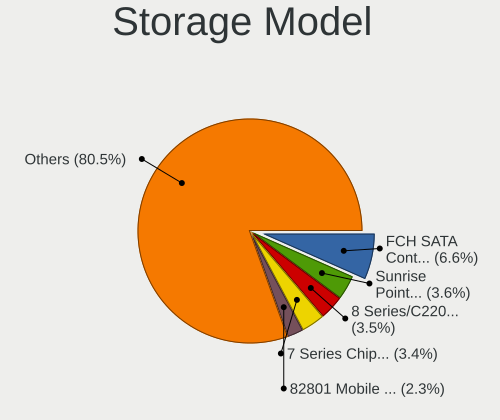

| Model                                                                          | Computers | Percent |
|--------------------------------------------------------------------------------|-----------|---------|
| AMD FCH SATA Controller [AHCI mode]                                            | 456       | 6.63%   |
| Intel Sunrise Point-LP SATA Controller [AHCI mode]                             | 246       | 3.58%   |
| Intel 8 Series/C220 Series Chipset Family 6-port SATA Controller 1 [AHCI mode] | 244       | 3.55%   |
| Intel 7 Series Chipset Family 6-port SATA Controller [AHCI mode]               | 237       | 3.45%   |
| Intel 82801 Mobile SATA Controller [RAID mode]                                 | 159       | 2.31%   |
| Intel 6 Series/C200 Series Chipset Family 6 port Mobile SATA AHCI Controller   | 157       | 2.28%   |
| Samsung NVMe SSD Controller SM981/PM981/PM983                                  | 134       | 1.95%   |
| Intel 6 Series/C200 Series Chipset Family 6 port Desktop SATA AHCI Controller  | 134       | 1.95%   |
| Intel 8 Series SATA Controller 1 [AHCI mode]                                   | 129       | 1.88%   |
| Intel Celeron/Pentium Silver Processor SATA Controller                         | 121       | 1.76%   |
| Intel Volume Management Device NVMe RAID Controller                            | 117       | 1.7%    |
| Intel Q170/Q150/B150/H170/H110/Z170/CM236 Chipset SATA Controller [AHCI Mode]  | 117       | 1.7%    |
| Intel 82801IBM/IEM (ICH9M/ICH9M-E) 4 port SATA Controller [AHCI mode]          | 108       | 1.57%   |
| Intel 7 Series/C210 Series Chipset Family 6-port SATA Controller [AHCI mode]   | 95        | 1.38%   |
| AMD 500 Series Chipset SATA Controller                                         | 91        | 1.32%   |
| AMD SB7x0/SB8x0/SB9x0 SATA Controller [AHCI mode]                              | 87        | 1.27%   |
| Samsung NVMe SSD Controller PM9A1/PM9A3/980PRO                                 | 85        | 1.24%   |
| Intel 5 Series/3400 Series Chipset 4 port SATA AHCI Controller                 | 85        | 1.24%   |
| Intel 200 Series PCH SATA controller [AHCI mode]                               | 85        | 1.24%   |
| Intel Wildcat Point-LP SATA Controller [AHCI Mode]                             | 84        | 1.22%   |
| ASMedia ASM1061/ASM1062 Serial ATA Controller                                  | 81        | 1.18%   |
| Samsung NVMe SSD Controller 980 (DRAM-less)                                    | 77        | 1.12%   |
| AMD 400 Series Chipset SATA Controller                                         | 77        | 1.12%   |
| Intel SATA Controller [RAID Mode]                                              | 76        | 1.11%   |
| AMD SB7x0/SB8x0/SB9x0 IDE Controller                                           | 75        | 1.09%   |
| AMD 600 Series Chipset SATA Controller                                         | 75        | 1.09%   |
| SanDisk WD SN560/SN740/SN770/SN5000 NVMe SSD                                   | 71        | 1.03%   |
| Intel 5 Series/3400 Series Chipset 6 port SATA AHCI Controller                 | 59        | 0.86%   |
| MAXIO (Hangzhou) NVMe SSD Controller MAP1202 (DRAM-less)                       | 55        | 0.8%    |
| Intel 82801HM/HEM (ICH8M/ICH8M-E) IDE Controller                               | 55        | 0.8%    |
| Intel Comet Lake SATA AHCI Controller                                          | 52        | 0.76%   |
| Intel Celeron N3350/Pentium N4200/Atom E3900 Series SATA AHCI Controller       | 51        | 0.74%   |
| Intel Cannon Lake PCH SATA AHCI Controller                                     | 51        | 0.74%   |
| Samsung NVMe SSD Controller SM961/PM961/SM963                                  | 49        | 0.71%   |
| Intel 82801HM/HEM (ICH8M/ICH8M-E) SATA Controller [AHCI mode]                  | 48        | 0.7%    |
| Silicon Motion SM2263EN/SM2263XT (DRAM-less) NVMe SSD Controllers              | 47        | 0.68%   |
| AMD SB7x0/SB8x0/SB9x0 SATA Controller [IDE mode]                               | 47        | 0.68%   |
| Micron/Crucial P2 [Nick P2] / P3 / P3 Plus NVMe PCIe SSD (DRAM-less)           | 46        | 0.67%   |
| Intel Alder Lake-P SATA AHCI Controller                                        | 46        | 0.67%   |
| Intel NM10/ICH7 Family SATA Controller [IDE mode]                              | 45        | 0.65%   |

Storage Kind
------------

Kind of storage controller (IDE, SATA, NVMe, SAS, ...)

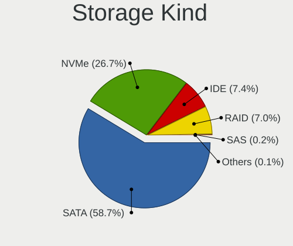

| Kind | Computers | Percent |
|------|-----------|---------|
| SATA | 3592      | 58.65%  |
| NVMe | 1637      | 26.73%  |
| IDE  | 451       | 7.36%   |
| RAID | 427       | 6.97%   |
| SAS  | 11        | 0.18%   |
| SCSI | 6         | 0.1%    |

Processor
---------

CPU Vendor
----------

Processor vendors

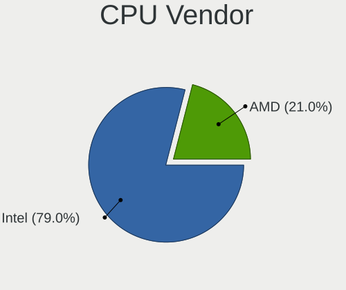

| Vendor | Computers | Percent |
|--------|-----------|---------|
| Intel  | 3832      | 78.99%  |
| AMD    | 1019      | 21.01%  |

CPU Model
---------

Processor models

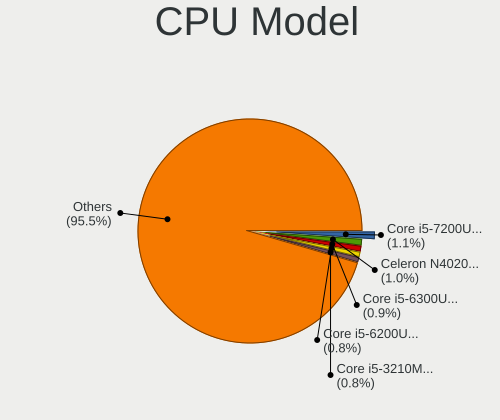

| Model                                   | Computers | Percent |
|-----------------------------------------|-----------|---------|
| Intel Core i5-7200U CPU @ 2.50GHz       | 54        | 1.11%   |
| Intel Celeron N4020 CPU @ 1.10GHz       | 48        | 0.99%   |
| Intel Core i5-6300U CPU @ 2.40GHz       | 42        | 0.86%   |
| Intel Core i5-6200U CPU @ 2.30GHz       | 38        | 0.78%   |
| Intel Core i5-3210M CPU @ 2.50GHz       | 37        | 0.76%   |
| Intel 11th Gen Core i5-1135G7 @ 2.40GHz | 36        | 0.74%   |
| Intel Core i5-8250U CPU @ 1.60GHz       | 35        | 0.72%   |
| Intel Celeron CPU N3350 @ 1.10GHz       | 35        | 0.72%   |
| Intel 11th Gen Core i7-1165G7 @ 2.80GHz | 34        | 0.7%    |
| Intel Core i5-2520M CPU @ 2.50GHz       | 30        | 0.62%   |
| Intel Atom x5-Z8350 CPU @ 1.44GHz       | 28        | 0.58%   |
| Intel Core i7-3770 CPU @ 3.40GHz        | 27        | 0.56%   |
| Intel Core i5-3470 CPU @ 3.20GHz        | 27        | 0.56%   |
| Intel N100                              | 26        | 0.54%   |
| Intel Celeron N4000 CPU @ 1.10GHz       | 26        | 0.54%   |
| Intel Core i3-6006U CPU @ 2.00GHz       | 25        | 0.51%   |
| Intel Core i5-8350U CPU @ 1.70GHz       | 24        | 0.49%   |
| AMD Ryzen 5 5600G with Radeon Graphics  | 24        | 0.49%   |
| AMD Ryzen 5 5500U with Radeon Graphics  | 24        | 0.49%   |
| Intel Core i7-2600 CPU @ 3.40GHz        | 23        | 0.47%   |
| Intel Core i5-5300U CPU @ 2.30GHz       | 23        | 0.47%   |
| Intel Core i7-2670QM CPU @ 2.20GHz      | 22        | 0.45%   |
| Intel Core i5-7300U CPU @ 2.60GHz       | 22        | 0.45%   |
| Intel Core i5-5200U CPU @ 2.20GHz       | 22        | 0.45%   |
| Intel Core i5-10210U CPU @ 1.60GHz      | 22        | 0.45%   |
| AMD Ryzen 9 5900X 12-Core Processor     | 22        | 0.45%   |
| AMD Ryzen 5 3600 6-Core Processor       | 22        | 0.45%   |
| Intel Core i7-4790 CPU @ 3.60GHz        | 21        | 0.43%   |
| Intel Core i5-6500 CPU @ 3.20GHz        | 21        | 0.43%   |
| Intel Core i3-3110M CPU @ 2.40GHz       | 21        | 0.43%   |
| AMD FX-6300 Six-Core Processor          | 21        | 0.43%   |
| Intel Core i7-7700HQ CPU @ 2.80GHz      | 20        | 0.41%   |
| Intel Core i5-2400 CPU @ 3.10GHz        | 20        | 0.41%   |
| Intel Celeron N4120 CPU @ 1.10GHz       | 20        | 0.41%   |
| Intel Core i7-7500U CPU @ 2.70GHz       | 19        | 0.39%   |
| Intel Core i5-3230M CPU @ 2.60GHz       | 19        | 0.39%   |
| Intel 12th Gen Core i5-1235U            | 19        | 0.39%   |
| Intel Core i7-8550U CPU @ 1.80GHz       | 18        | 0.37%   |
| Intel Core i5-2430M CPU @ 2.40GHz       | 18        | 0.37%   |
| AMD Ryzen 7 5800X 8-Core Processor      | 18        | 0.37%   |

CPU Model Family
----------------

Processor model prefix

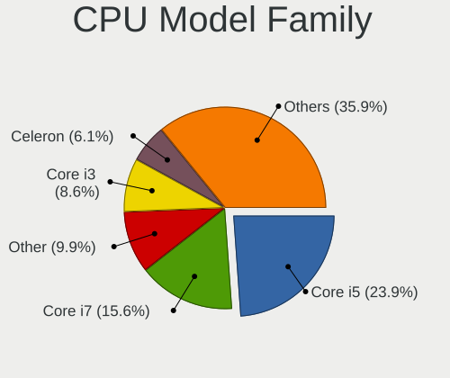

| Model                   | Computers | Percent |
|-------------------------|-----------|---------|
| Intel Core i5           | 1159      | 23.87%  |
| Intel Core i7           | 756       | 15.57%  |
| Other                   | 482       | 9.93%   |
| Intel Core i3           | 418       | 8.61%   |
| Intel Celeron           | 298       | 6.14%   |
| AMD Ryzen 5             | 248       | 5.11%   |
| Intel Core 2 Duo        | 220       | 4.53%   |
| AMD Ryzen 7             | 218       | 4.49%   |
| Intel Pentium           | 124       | 2.55%   |
| Intel Xeon              | 103       | 2.12%   |
| AMD Ryzen 9             | 79        | 1.63%   |
| AMD FX                  | 56        | 1.15%   |
| Intel Atom              | 52        | 1.07%   |
| Intel Pentium Dual-Core | 48        | 0.99%   |
| AMD Ryzen 3             | 47        | 0.97%   |
| AMD A6                  | 47        | 0.97%   |
| Intel Core              | 39        | 0.8%    |
| AMD A8                  | 38        | 0.78%   |
| Intel Core 2 Quad       | 37        | 0.76%   |
| AMD E1                  | 28        | 0.58%   |
| AMD A10                 | 28        | 0.58%   |
| Intel Core i9           | 27        | 0.56%   |
| AMD Ryzen 5 PRO         | 21        | 0.43%   |
| Intel Pentium Dual      | 19        | 0.39%   |
| AMD A4                  | 19        | 0.39%   |
| AMD E                   | 18        | 0.37%   |
| AMD Athlon              | 17        | 0.35%   |
| Intel Core 2            | 15        | 0.31%   |
| Intel Pentium Silver    | 13        | 0.27%   |
| Intel Core m3           | 13        | 0.27%   |
| AMD Phenom II X4        | 13        | 0.27%   |
| AMD E2                  | 12        | 0.25%   |
| AMD A12                 | 11        | 0.23%   |
| Intel Pentium Gold      | 8         | 0.16%   |
| AMD Athlon II           | 8         | 0.16%   |
| Intel Genuine           | 7         | 0.14%   |
| AMD Ryzen 7 PRO         | 7         | 0.14%   |
| AMD Ryzen 3 PRO         | 7         | 0.14%   |
| AMD Athlon II X2        | 7         | 0.14%   |
| AMD Phenom II X6        | 6         | 0.12%   |

CPU Cores
---------

Number of processor cores

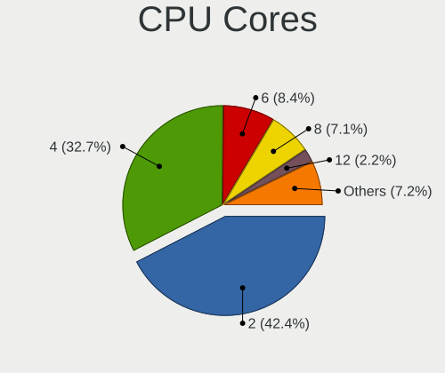

| Number | Computers | Percent |
|--------|-----------|---------|
| 2      | 2061      | 42.42%  |
| 4      | 1589      | 32.71%  |
| 6      | 407       | 8.38%   |
| 8      | 344       | 7.08%   |
| 12     | 105       | 2.16%   |
| 10     | 90        | 1.85%   |
| 14     | 76        | 1.56%   |
| 16     | 51        | 1.05%   |
| 1      | 44        | 0.91%   |
| 3      | 35        | 0.72%   |
| 24     | 30        | 0.62%   |
| 20     | 15        | 0.31%   |
| 18     | 5         | 0.1%    |
| 32     | 3         | 0.06%   |
| 5      | 2         | 0.04%   |
| 36     | 1         | 0.02%   |

CPU Sockets
-----------

Number of sockets

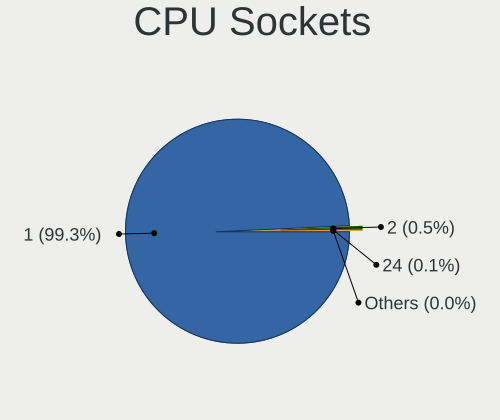

| Number | Computers | Percent |
|--------|-----------|---------|
| 1      | 4816      | 99.26%  |
| 2      | 25        | 0.52%   |
| 24     | 4         | 0.08%   |
| 8      | 4         | 0.08%   |
| 20     | 2         | 0.04%   |
| 14     | 1         | 0.02%   |

CPU Threads
-----------

Threads per core (Hyper-Threading)

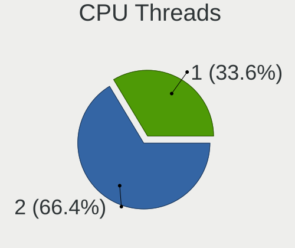

| Number | Computers | Percent |
|--------|-----------|---------|
| 2      | 3223      | 66.37%  |
| 1      | 1633      | 33.63%  |

CPU Op-Modes
------------

CPU Operation Modes (32-bit, 64-bit)

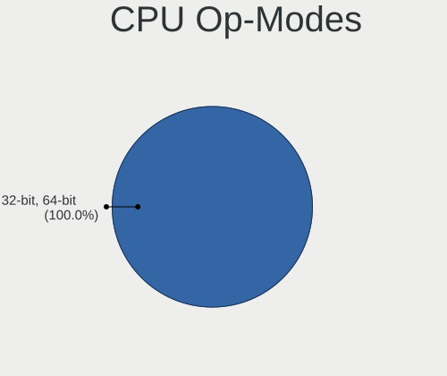

| Op mode        | Computers | Percent |
|----------------|-----------|---------|
| 32-bit, 64-bit | 4851      | 100%    |

CPU Microcode
-------------

Microcode number

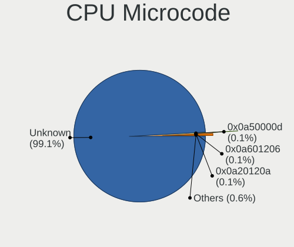

| Number     | Computers | Percent |
|------------|-----------|---------|
| Unknown    | 4814      | 99.09%  |
| 0x0a50000d | 5         | 0.1%    |
| 0x0a50000c | 4         | 0.08%   |
| 0x0a601206 | 3         | 0.06%   |
| 0x0a20120a | 3         | 0.06%   |
| 0x0a601203 | 2         | 0.04%   |
| 0x08608103 | 2         | 0.04%   |
| 0x08600109 | 2         | 0.04%   |
| 0x08600106 | 2         | 0.04%   |
| 0x08108109 | 2         | 0.04%   |
| 0x08001138 | 2         | 0.04%   |
| 0x906ed    | 1         | 0.02%   |
| 0x806d1    | 1         | 0.02%   |
| 0x306c3    | 1         | 0.02%   |
| 0x0a20102b | 1         | 0.02%   |
| 0x08a00008 | 1         | 0.02%   |
| 0x08701030 | 1         | 0.02%   |
| 0x08701021 | 1         | 0.02%   |
| 0x08608107 | 1         | 0.02%   |
| 0x08608104 | 1         | 0.02%   |
| 0x0860010c | 1         | 0.02%   |
| 0x08108102 | 1         | 0.02%   |
| 0x08101007 | 1         | 0.02%   |
| 0x0800820d | 1         | 0.02%   |
| 0x0700010f | 1         | 0.02%   |
| 0x06006705 | 1         | 0.02%   |
| 0x06003109 | 1         | 0.02%   |
| 0x05000119 | 1         | 0.02%   |

CPU Microarch
-------------

Microarchitecture

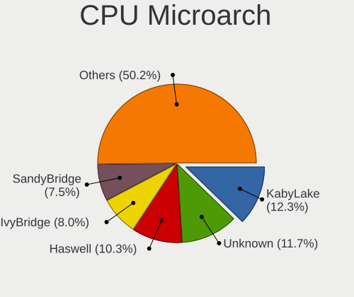

| Name              | Computers | Percent |
|-------------------|-----------|---------|
| KabyLake          | 595       | 12.25%  |
| Unknown           | 570       | 11.74%  |
| Haswell           | 500       | 10.3%   |
| IvyBridge         | 388       | 7.99%   |
| SandyBridge       | 366       | 7.54%   |
| Skylake           | 283       | 5.83%   |
| Penryn            | 262       | 5.4%    |
| Zen 3             | 199       | 4.1%    |
| Westmere          | 165       | 3.4%    |
| Goldmont plus     | 138       | 2.84%   |
| Silvermont        | 125       | 2.57%   |
| Broadwell         | 124       | 2.55%   |
| TigerLake         | 115       | 2.37%   |
| Core              | 104       | 2.14%   |
| Zen 2             | 101       | 2.08%   |
| Zen+              | 83        | 1.71%   |
| Piledriver        | 78        | 1.61%   |
| CometLake         | 68        | 1.4%    |
| K10               | 63        | 1.3%    |
| Zen               | 62        | 1.28%   |
| Excavator         | 57        | 1.17%   |
| Goldmont          | 56        | 1.15%   |
| Nehalem           | 51        | 1.05%   |
| Alderlake Hybrid  | 51        | 1.05%   |
| IceLake           | 50        | 1.03%   |
| Puma              | 43        | 0.89%   |
| Jaguar            | 31        | 0.64%   |
| Bobcat            | 30        | 0.62%   |
| K8 Hammer         | 18        | 0.37%   |
| Steamroller       | 17        | 0.35%   |
| K10 Llano         | 16        | 0.33%   |
| Bulldozer         | 13        | 0.27%   |
| Bonnell           | 8         | 0.16%   |
| K8 & K10 hybrid   | 7         | 0.14%   |
| Gracemont         | 7         | 0.14%   |
| Meteorlake Hybrid | 5         | 0.1%    |
| Tremont           | 4         | 0.08%   |
| NetBurst          | 3         | 0.06%   |

Graphics
--------

GPU Vendor
----------

Vendors of graphics cards

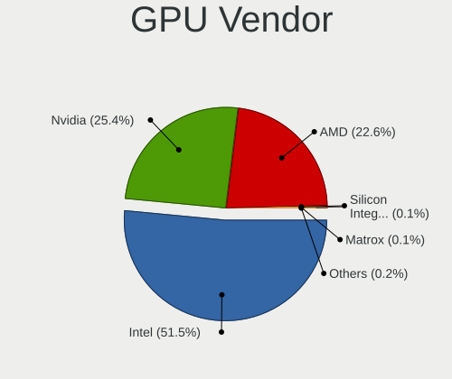

| Vendor                                       | Computers | Percent |
|----------------------------------------------|-----------|---------|
| Intel                                        | 2908      | 51.51%  |
| Nvidia                                       | 1436      | 25.43%  |
| AMD                                          | 1278      | 22.64%  |
| Silicon Integrated Systems [SiS]             | 8         | 0.14%   |
| Matrox Electronics Systems                   | 7         | 0.12%   |
| ASPEED Technology                            | 4         | 0.07%   |
| ATI Technologies                             | 2         | 0.04%   |
| XGI Technology (eXtreme Graphics Innovation) | 1         | 0.02%   |
| VIA Technologies                             | 1         | 0.02%   |
| 3DLabs                                       | 1         | 0.02%   |

GPU Model
---------

Graphics card models

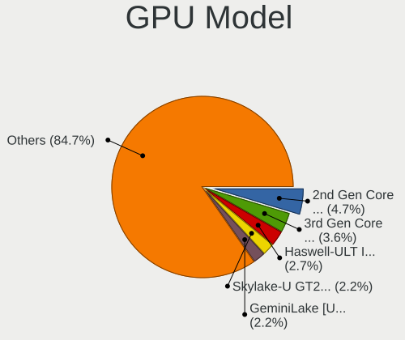

| Model                                                                                    | Computers | Percent |
|------------------------------------------------------------------------------------------|-----------|---------|
| Intel 2nd Generation Core Processor Family Integrated Graphics Controller                | 269       | 4.65%   |
| Intel 3rd Gen Core processor Graphics Controller                                         | 207       | 3.58%   |
| Intel Haswell-ULT Integrated Graphics Controller                                         | 157       | 2.71%   |
| Intel Skylake-U GT2 [HD Graphics 520]                                                    | 127       | 2.2%    |
| Intel GeminiLake [UHD Graphics 600]                                                      | 127       | 2.2%    |
| Intel Kaby Lake-U GT2 [HD Graphics 620]                                                  | 117       | 2.02%   |
| Intel Xeon E3-1200 v3/4th Gen Core Processor Integrated Graphics Controller              | 101       | 1.75%   |
| Intel Kaby Lake-R GT2 [UHD Graphics 620]                                                 | 101       | 1.75%   |
| Intel TigerLake-LP GT2 [Iris Xe Graphics]                                                | 96        | 1.66%   |
| Intel Core Processor Integrated Graphics Controller                                      | 93        | 1.61%   |
| Intel Broadwell-U GT2 [HD Graphics 5500]                                                 | 86        | 1.49%   |
| Intel Atom/Celeron/Pentium Processor x5-E8000/J3xxx/N3xxx Integrated Graphics Controller | 80        | 1.38%   |
| Intel 4th Gen Core Processor Integrated Graphics Controller                              | 78        | 1.35%   |
| Intel Mobile 4 Series Chipset Integrated Graphics Controller                             | 76        | 1.31%   |
| AMD Cezanne [Radeon Vega Series / Radeon Vega Mobile Series]                             | 67        | 1.16%   |
| AMD Picasso/Raven 2 [Radeon Vega Series / Radeon Vega Mobile Series]                     | 66        | 1.14%   |
| AMD Ellesmere [Radeon RX 470/480/570/570X/580/580X/590]                                  | 66        | 1.14%   |
| Intel Skylake-S GT2 [HD Graphics 530]                                                    | 63        | 1.09%   |
| Intel Xeon E3-1200 v2/3rd Gen Core processor Graphics Controller                         | 58        | 1%      |
| Intel Raptor Lake-P [Iris Xe Graphics]                                                   | 50        | 0.86%   |
| Intel Apollo Lake GT1 [HD Graphics 500]                                                  | 50        | 0.86%   |
| Intel Alder Lake-N [UHD Graphics]                                                        | 49        | 0.85%   |
| AMD Lucienne                                                                             | 47        | 0.81%   |
| Intel WhiskeyLake-U GT2 [UHD Graphics 620]                                               | 46        | 0.8%    |
| Intel CometLake-U GT2 [UHD Graphics]                                                     | 46        | 0.8%    |
| AMD Renoir [Radeon Vega Series / Radeon Vega Mobile Series]                              | 46        | 0.8%    |
| Nvidia GK208B [GeForce GT 710]                                                           | 44        | 0.76%   |
| Intel Atom Processor Z36xxx/Z37xxx Series Graphics & Display                             | 44        | 0.76%   |
| AMD Raphael                                                                              | 44        | 0.76%   |
| Intel CoffeeLake-S GT2 [UHD Graphics 630]                                                | 42        | 0.73%   |
| Intel CoffeeLake-H GT2 [UHD Graphics 630]                                                | 41        | 0.71%   |
| Intel Alder Lake-P GT2 [Iris Xe Graphics]                                                | 34        | 0.59%   |
| AMD Stoney [Radeon R2/R3/R4/R5 Graphics]                                                 | 33        | 0.57%   |
| AMD Raven Ridge [Radeon Vega Series / Radeon Vega Mobile Series]                         | 32        | 0.55%   |
| AMD Mullins [Radeon R4/R5 Graphics]                                                      | 32        | 0.55%   |
| Nvidia GP107 [GeForce GTX 1050 Ti]                                                       | 30        | 0.52%   |
| Intel 4 Series Chipset Integrated Graphics Controller                                    | 30        | 0.52%   |
| Nvidia GF117M [GeForce 610M/710M/810M/820M / GT 620M/625M/630M/720M]                     | 29        | 0.5%    |
| Intel Kaby Lake-S GT2 [HD Graphics 630]                                                  | 29        | 0.5%    |
| AMD Barcelo                                                                              | 29        | 0.5%    |

GPU Combo
---------

Combinations of graphics cards

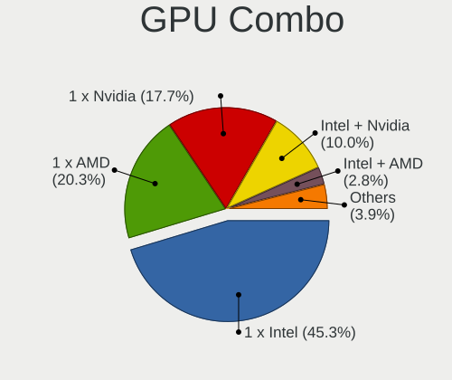

| Name                    | Computers | Percent |
|-------------------------|-----------|---------|
| 1 x Intel               | 2210      | 45.34%  |
| 1 x AMD                 | 987       | 20.25%  |
| 1 x Nvidia              | 863       | 17.71%  |
| Intel + Nvidia          | 486       | 9.97%   |
| Intel + AMD             | 136       | 2.79%   |
| AMD + Nvidia            | 79        | 1.62%   |
| 2 x AMD                 | 70        | 1.44%   |
| Other                   | 9         | 0.18%   |
| 2 x Nvidia              | 8         | 0.16%   |
| 1 x SiS                 | 8         | 0.16%   |
| 1 x Matrox              | 4         | 0.08%   |
| 2 x Intel               | 2         | 0.04%   |
| 1 x ASPEED              | 2         | 0.04%   |
| 3 x AMD                 | 1         | 0.02%   |
| 2 x Nvidia + 1 x ASPEED | 1         | 0.02%   |
| 2 x AMD + 1 x Nvidia    | 1         | 0.02%   |
| 2 x AMD + 1 x 3DLabs    | 1         | 0.02%   |
| 1 x XGI                 | 1         | 0.02%   |
| 1 x VIA                 | 1         | 0.02%   |
| Nvidia + Matrox         | 1         | 0.02%   |
| Nvidia + ASPEED         | 1         | 0.02%   |
| Intel + 2 x Nvidia      | 1         | 0.02%   |
| AMD + Matrox            | 1         | 0.02%   |

GPU Driver
----------

Free vs proprietary

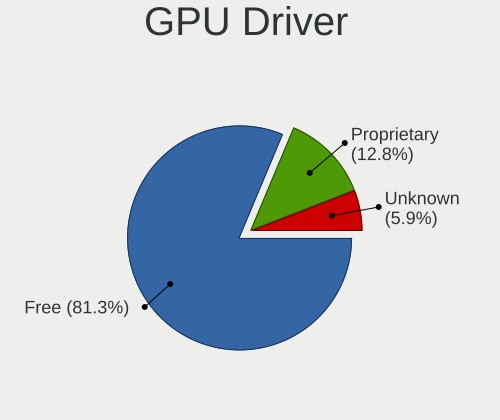

| Driver      | Computers | Percent |
|-------------|-----------|---------|
| Free        | 3987      | 81.32%  |
| Proprietary | 627       | 12.79%  |
| Unknown     | 289       | 5.89%   |

GPU Memory
----------

Total video memory

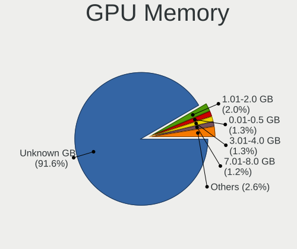

| Size in GB | Computers | Percent |
|------------|-----------|---------|
| Unknown    | 4479      | 91.61%  |
| 1.01-2.0   | 99        | 2.02%   |
| 0.01-0.5   | 65        | 1.33%   |
| 3.01-4.0   | 62        | 1.27%   |
| 7.01-8.0   | 59        | 1.21%   |
| 8.01-16.0  | 42        | 0.86%   |
| 0.51-1.0   | 35        | 0.72%   |
| 5.01-6.0   | 31        | 0.63%   |
| 2.01-3.0   | 10        | 0.2%    |
| 16.01-24.0 | 7         | 0.14%   |

Monitor
-------

Monitor Vendor
--------------

Monitor vendors

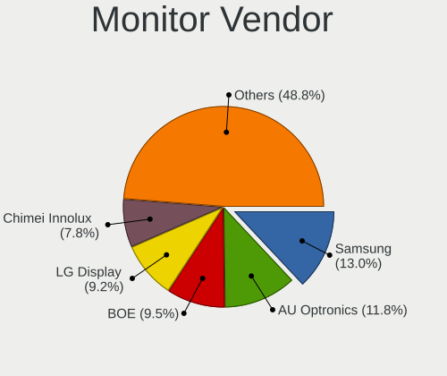

| Vendor                  | Computers | Percent |
|-------------------------|-----------|---------|
| Samsung Electronics     | 646       | 13%     |
| AU Optronics            | 586       | 11.8%   |
| BOE                     | 470       | 9.46%   |
| LG Display              | 457       | 9.2%    |
| Chimei Innolux          | 387       | 7.79%   |
| Goldstar                | 253       | 5.09%   |
| Dell                    | 210       | 4.23%   |
| Apple                   | 207       | 4.17%   |
| Hewlett-Packard         | 164       | 3.3%    |
| Acer                    | 147       | 2.96%   |
| AOC                     | 118       | 2.38%   |
| Philips                 | 91        | 1.83%   |
| Chi Mei Optoelectronics | 84        | 1.69%   |
| Lenovo                  | 79        | 1.59%   |
| BenQ                    | 79        | 1.59%   |
| Sharp                   | 65        | 1.31%   |
| Ancor Communications    | 62        | 1.25%   |
| ASUSTek Computer        | 43        | 0.87%   |
| ViewSonic               | 42        | 0.85%   |
| InfoVision              | 40        | 0.81%   |
| PANDA                   | 38        | 0.76%   |
| Sony                    | 36        | 0.72%   |
| Iiyama                  | 35        | 0.7%    |
| Panasonic               | 26        | 0.52%   |
| MSI                     | 24        | 0.48%   |
| HKC                     | 24        | 0.48%   |
| Hitachi                 | 21        | 0.42%   |
| Fujitsu Siemens         | 21        | 0.42%   |
| Vizio                   | 20        | 0.4%    |
| LG Philips              | 18        | 0.36%   |
| Sceptre Tech            | 16        | 0.32%   |
| CSO                     | 16        | 0.32%   |
| RTK                     | 15        | 0.3%    |
| Unknown                 | 14        | 0.28%   |
| Eizo                    | 13        | 0.26%   |
| Toshiba                 | 12        | 0.24%   |
| CPT                     | 12        | 0.24%   |
| Unknown (XXX)           | 10        | 0.2%    |
| NEC Computers           | 10        | 0.2%    |
| Vestel Elektronik       | 9         | 0.18%   |

Monitor Model
-------------

Monitor models

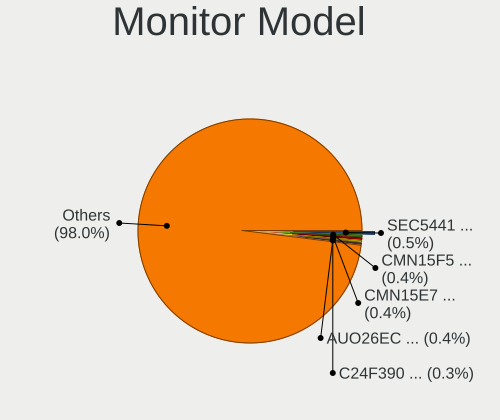

| Model                                                                 | Computers | Percent |
|-----------------------------------------------------------------------|-----------|---------|
| Samsung Electronics LCD Monitor SEC5441 1280x800 331x207mm 15.4-inch  | 26        | 0.51%   |
| Chimei Innolux LCD Monitor CMN15F5 1920x1080 344x193mm 15.5-inch      | 20        | 0.39%   |
| Chimei Innolux LCD Monitor CMN15E7 1920x1080 344x193mm 15.5-inch      | 19        | 0.37%   |
| AU Optronics LCD Monitor AUO26EC 1366x768 344x193mm 15.5-inch         | 19        | 0.37%   |
| Samsung Electronics C24F390 SAM0D2C 1920x1080 521x293mm 23.5-inch     | 16        | 0.31%   |
| Goldstar FULL HD GSM5B55 1920x1080 480x270mm 21.7-inch                | 16        | 0.31%   |
| AU Optronics LCD Monitor AUO38ED 1920x1080 344x193mm 15.5-inch        | 16        | 0.31%   |
| Chimei Innolux LCD Monitor CMN14D4 1920x1080 309x173mm 13.9-inch      | 15        | 0.3%    |
| Samsung Electronics LCD Monitor SDC3853 2736x1824 260x173mm 12.3-inch | 14        | 0.28%   |
| Apple Color LCD APP9CC7 1280x800 286x179mm 13.3-inch                  | 14        | 0.28%   |
| LG Display LCD Monitor LGD0555 2736x1824 260x173mm 12.3-inch          | 13        | 0.26%   |
| Chimei Innolux LCD Monitor CMN1521 1920x1080 344x193mm 15.5-inch      | 13        | 0.26%   |
| AU Optronics LCD Monitor AUO71EC 1366x768 344x193mm 15.5-inch         | 13        | 0.26%   |
| AU Optronics LCD Monitor AUO2E3C 1366x768 309x173mm 13.9-inch         | 12        | 0.24%   |
| AU Optronics LCD Monitor AUO183C 1366x768 309x173mm 13.9-inch         | 12        | 0.24%   |
| Samsung Electronics C27F390 SAM0D32 1920x1080 598x336mm 27.0-inch     | 11        | 0.22%   |
| Panasonic VVX11F009G00 MEI96A2 1920x1080 344x193mm 15.5-inch          | 11        | 0.22%   |
| Chimei Innolux LCD Monitor CMN15DB 1366x768 344x193mm 15.5-inch       | 11        | 0.22%   |
| Chimei Innolux LCD Monitor CMN14D6 1366x768 309x173mm 13.9-inch       | 11        | 0.22%   |
| BOE LCD Monitor BOE0872 1920x1080 344x194mm 15.5-inch                 | 11        | 0.22%   |
| AU Optronics LCD Monitor AUO22EC 1366x768 344x193mm 15.5-inch         | 11        | 0.22%   |
| AU Optronics LCD Monitor AUO106C 1366x768 276x155mm 12.5-inch         | 11        | 0.22%   |
| AOC 27G2G4 AOC2702 1920x1080 598x336mm 27.0-inch                      | 11        | 0.22%   |
| Samsung Electronics LCD Monitor SEC544B 1600x900 382x214mm 17.2-inch  | 10        | 0.2%    |
| LG Display LCD Monitor LGD046F 1920x1080 344x194mm 15.5-inch          | 10        | 0.2%    |
| Goldstar HDR WFHD GSM7714 2560x1080 798x334mm 34.1-inch               | 10        | 0.2%    |
| AU Optronics LCD Monitor AUO21EC 1366x768 344x193mm 15.5-inch         | 10        | 0.2%    |
| AU Optronics LCD Monitor AUO213D 1920x1080 309x173mm 13.9-inch        | 10        | 0.2%    |
| AU Optronics LCD Monitor AUO20EC 1366x768 344x193mm 15.5-inch         | 10        | 0.2%    |
| Apple LCD Monitor APP9CC5 1280x800 286x179mm 13.3-inch                | 10        | 0.2%    |
| Apple Color LCD APP9CDF 1440x900 286x179mm 13.3-inch                  | 10        | 0.2%    |
| Vestel Elektronik 40UHD_LCD_TV VES3700 3840x2160 880x500mm 39.8-inch  | 9         | 0.18%   |
| PANDA LCD Monitor NCP004D 1920x1080 344x194mm 15.5-inch               | 9         | 0.18%   |
| LG Display LCD Monitor LGD033A 1366x768 344x194mm 15.5-inch           | 9         | 0.18%   |
| Hitachi HISENSE HEC0030 3840x2160 1872x1053mm 84.6-inch               | 9         | 0.18%   |
| Hitachi HISENSE HEC002F 3840x2160 1872x1053mm 84.6-inch               | 9         | 0.18%   |
| Goldstar LG ULTRAWIDE GSM59F1 2560x1080 670x280mm 28.6-inch           | 9         | 0.18%   |
| Goldstar LG IPS FULLHD GSM5AB8 1920x1080 480x270mm 21.7-inch          | 9         | 0.18%   |
| Chimei Innolux LCD Monitor CMN15E6 1366x768 344x193mm 15.5-inch       | 9         | 0.18%   |
| Chimei Innolux LCD Monitor CMN15DC 1366x768 344x193mm 15.5-inch       | 9         | 0.18%   |

Monitor Resolution
------------------

Monitor screen resolution

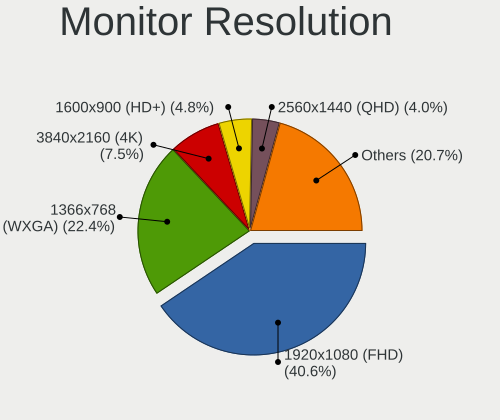

| Resolution         | Computers | Percent |
|--------------------|-----------|---------|
| 1920x1080 (FHD)    | 1944      | 40.56%  |
| 1366x768 (WXGA)    | 1075      | 22.43%  |
| 3840x2160 (4K)     | 359       | 7.49%   |
| 1600x900 (HD+)     | 231       | 4.82%   |
| 2560x1440 (QHD)    | 191       | 3.98%   |
| 1920x1200 (WUXGA)  | 142       | 2.96%   |
| 1440x900 (WXGA+)   | 121       | 2.52%   |
| 1280x800 (WXGA)    | 117       | 2.44%   |
| 1680x1050 (WSXGA+) | 91        | 1.9%    |
| 2880x1800          | 59        | 1.23%   |
| 1280x1024 (SXGA)   | 58        | 1.21%   |
| 2560x1600          | 55        | 1.15%   |
| 3440x1440          | 45        | 0.94%   |
| 2560x1080          | 42        | 0.88%   |
| 1360x768           | 38        | 0.79%   |
| 3840x1080          | 22        | 0.46%   |
| 2160x1440          | 21        | 0.44%   |
| 2880x1920          | 18        | 0.38%   |
| 2736x1824          | 17        | 0.35%   |
| Unknown            | 16        | 0.33%   |
| 1920x1280          | 15        | 0.31%   |
| 1920x540           | 12        | 0.25%   |
| 2256x1504          | 10        | 0.21%   |
| 3200x2000          | 9         | 0.19%   |
| 3840x2400          | 6         | 0.13%   |
| 2304x1440          | 6         | 0.13%   |
| 1024x768 (XGA)     | 6         | 0.13%   |
| 2288x1287          | 5         | 0.1%    |
| 3840x1600          | 4         | 0.08%   |
| 3200x1800 (QHD+)   | 4         | 0.08%   |
| 1680x945           | 4         | 0.08%   |
| 1600x1200          | 4         | 0.08%   |
| 1024x600           | 4         | 0.08%   |
| 2880x1620          | 3         | 0.06%   |
| 1280x720 (HD)      | 3         | 0.06%   |
| 5120x1440          | 2         | 0.04%   |
| 504x315            | 2         | 0.04%   |
| 3840x2560          | 2         | 0.04%   |
| 3840x1200          | 2         | 0.04%   |
| 3072x1920          | 2         | 0.04%   |

Monitor Diagonal
----------------

Diagonal size in inches

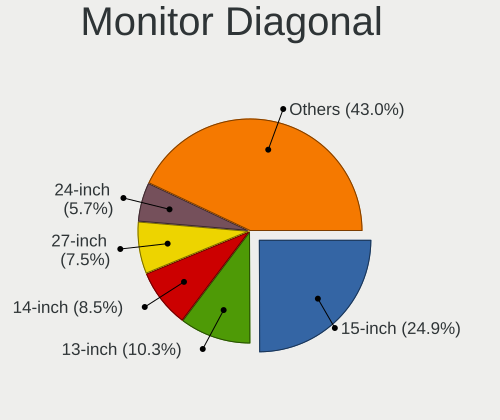

| Inches  | Computers | Percent |
|---------|-----------|---------|
| 15      | 1240      | 24.95%  |
| 13      | 514       | 10.34%  |
| 14      | 423       | 8.51%   |
| 27      | 375       | 7.55%   |
| 24      | 282       | 5.67%   |
| 23      | 279       | 5.61%   |
| 17      | 272       | 5.47%   |
| 21      | 224       | 4.51%   |
| 31      | 171       | 3.44%   |
| 18      | 121       | 2.43%   |
| Unknown | 115       | 2.31%   |
| 12      | 102       | 2.05%   |
| 16      | 92        | 1.85%   |
| 19      | 85        | 1.71%   |
| 20      | 66        | 1.33%   |
| 11      | 66        | 1.33%   |
| 84      | 65        | 1.31%   |
| 34      | 62        | 1.25%   |
| 22      | 60        | 1.21%   |
| 32      | 43        | 0.87%   |
| 54      | 30        | 0.6%    |
| 72      | 27        | 0.54%   |
| 40      | 27        | 0.54%   |
| 63      | 22        | 0.44%   |
| 26      | 22        | 0.44%   |
| 48      | 19        | 0.38%   |
| 49      | 18        | 0.36%   |
| 28      | 16        | 0.32%   |
| 10      | 16        | 0.32%   |
| 25      | 14        | 0.28%   |
| 42      | 12        | 0.24%   |
| 65      | 10        | 0.2%    |
| 52      | 9         | 0.18%   |
| 46      | 6         | 0.12%   |
| 39      | 6         | 0.12%   |
| 37      | 6         | 0.12%   |
| 74      | 5         | 0.1%    |
| 60      | 5         | 0.1%    |
| 43      | 5         | 0.1%    |
| 75      | 4         | 0.08%   |

Monitor Width
-------------

Physical width

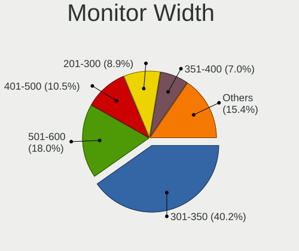

| Width in mm    | Computers | Percent |
|----------------|-----------|---------|
| 301-350        | 1972      | 40.24%  |
| 501-600        | 881       | 17.98%  |
| 401-500        | 514       | 10.49%  |
| 201-300        | 436       | 8.9%    |
| 351-400        | 341       | 6.96%   |
| 601-700        | 232       | 4.73%   |
| 1001-1500      | 128       | 2.61%   |
| Unknown        | 115       | 2.35%   |
| 701-800        | 110       | 2.24%   |
| 1501-2000      | 104       | 2.12%   |
| 801-900        | 40        | 0.82%   |
| 901-1000       | 21        | 0.43%   |
| More than 2000 | 3         | 0.06%   |
| 101-200        | 2         | 0.04%   |
| 1-100          | 1         | 0.02%   |

Aspect Ratio
------------

Proportional relationship between the width and the height

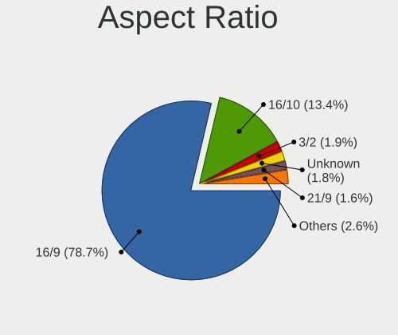

| Ratio   | Computers | Percent |
|---------|-----------|---------|
| 16/9    | 3595      | 78.68%  |
| 16/10   | 612       | 13.39%  |
| 3/2     | 88        | 1.93%   |
| Unknown | 80        | 1.75%   |
| 21/9    | 74        | 1.62%   |
| 5/4     | 53        | 1.16%   |
| 32/9    | 27        | 0.59%   |
| 4/3     | 17        | 0.37%   |
| 6/5     | 5         | 0.11%   |
| 2.00    | 3         | 0.07%   |
| 1.00    | 3         | 0.07%   |
| 0.89    | 2         | 0.04%   |
| 3.73    | 1         | 0.02%   |
| 3.40    | 1         | 0.02%   |
| 3.20    | 1         | 0.02%   |
| 2.01    | 1         | 0.02%   |
| 1.96    | 1         | 0.02%   |
| 0.80    | 1         | 0.02%   |
| 0.67    | 1         | 0.02%   |
| 0.56    | 1         | 0.02%   |
| 0.31    | 1         | 0.02%   |
| 0.25    | 1         | 0.02%   |

Monitor Area
------------

Area in inch²

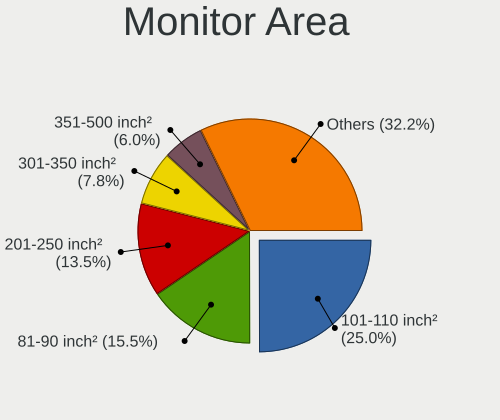

| Area in inch² | Computers | Percent |
|----------------|-----------|---------|
| 101-110        | 1230      | 24.97%  |
| 81-90          | 765       | 15.53%  |
| 201-250        | 663       | 13.46%  |
| 301-350        | 385       | 7.82%   |
| 351-500        | 294       | 5.97%   |
| 151-200        | 231       | 4.69%   |
| 121-130        | 209       | 4.24%   |
| More than 1000 | 202       | 4.1%    |
| 71-80          | 165       | 3.35%   |
| 141-150        | 124       | 2.52%   |
| Unknown        | 115       | 2.34%   |
| 251-300        | 114       | 2.31%   |
| 61-70          | 96        | 1.95%   |
| 501-1000       | 92        | 1.87%   |
| 111-120        | 88        | 1.79%   |
| 51-60          | 69        | 1.4%    |
| 131-140        | 48        | 0.97%   |
| 91-100         | 18        | 0.37%   |
| 41-50          | 14        | 0.28%   |
| 1-40           | 3         | 0.06%   |

Pixel Density
-------------

Pixels per inch

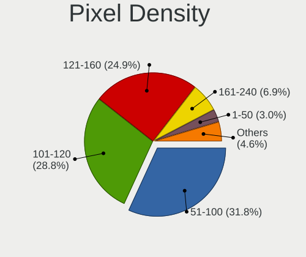

| Density       | Computers | Percent |
|---------------|-----------|---------|
| 51-100        | 1537      | 31.85%  |
| 101-120       | 1388      | 28.76%  |
| 121-160       | 1201      | 24.89%  |
| 161-240       | 331       | 6.86%   |
| 1-50          | 146       | 3.03%   |
| Unknown       | 115       | 2.38%   |
| More than 240 | 108       | 2.24%   |

Multiple Monitors
-----------------

Total monitors connected

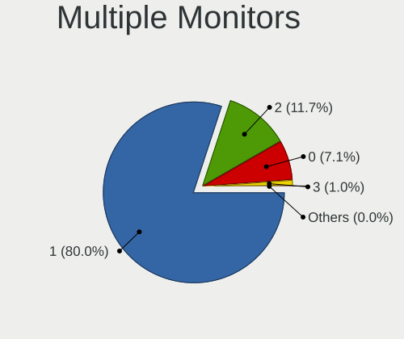

| Total | Computers | Percent |
|-------|-----------|---------|
| 1     | 3930      | 80.02%  |
| 2     | 573       | 11.67%  |
| 0     | 351       | 7.15%   |
| 3     | 50        | 1.02%   |
| 4     | 6         | 0.12%   |
| 5     | 1         | 0.02%   |

Network
-------

Net Controller Vendor
---------------------

Controller vendors

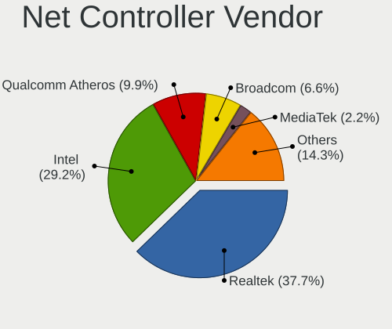

| Vendor                            | Computers | Percent |
|-----------------------------------|-----------|---------|
| Realtek Semiconductor             | 2810      | 37.74%  |
| Intel                             | 2171      | 29.16%  |
| Qualcomm Atheros                  | 739       | 9.93%   |
| Broadcom                          | 495       | 6.65%   |
| MediaTek                          | 165       | 2.22%   |
| TP-Link                           | 110       | 1.48%   |
| Broadcom Limited                  | 109       | 1.46%   |
| Marvell Technology Group          | 104       | 1.4%    |
| Ralink Technology                 | 89        | 1.2%    |
| Ralink                            | 82        | 1.1%    |
| Nvidia                            | 51        | 0.69%   |
| ASIX Electronics                  | 51        | 0.69%   |
| Samsung Electronics               | 46        | 0.62%   |
| Sierra Wireless                   | 32        | 0.43%   |
| Microsoft                         | 27        | 0.36%   |
| NetGear                           | 20        | 0.27%   |
| Xiaomi                            | 19        | 0.26%   |
| Qualcomm Atheros Communications   | 19        | 0.26%   |
| JMicron Technology                | 19        | 0.26%   |
| DisplayLink                       | 18        | 0.24%   |
| D-Link                            | 17        | 0.23%   |
| Dell                              | 15        | 0.2%    |
| Qualcomm                          | 14        | 0.19%   |
| Silicon Integrated Systems [SiS]  | 12        | 0.16%   |
| Qualcomm Technologies             | 11        | 0.15%   |
| Hewlett-Packard                   | 11        | 0.15%   |
| Shenzhen Goodix Technology        | 10        | 0.13%   |
| Lenovo                            | 10        | 0.13%   |
| D-Link System                     | 10        | 0.13%   |
| Ericsson Business Mobile Networks | 9         | 0.12%   |
| ASUSTek Computer                  | 9         | 0.12%   |
| Aquantia                          | 9         | 0.12%   |
| OPPO Electronics                  | 7         | 0.09%   |
| Huawei Technologies               | 7         | 0.09%   |
| Edimax Technology                 | 7         | 0.09%   |
| QinHeng Electronics               | 6         | 0.08%   |
| Google                            | 6         | 0.08%   |
| ZyXEL Communications              | 5         | 0.07%   |
| U-Blox                            | 5         | 0.07%   |
| Motorola PCS                      | 5         | 0.07%   |

Net Controller Model
--------------------

Controller models

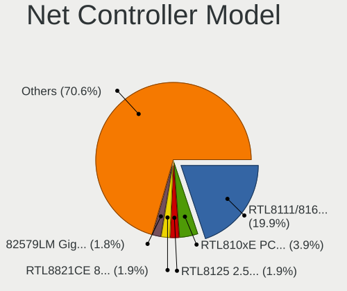

| Model                                                                  | Computers | Percent |
|------------------------------------------------------------------------|-----------|---------|
| Realtek RTL8111/8168/8211/8411 PCI Express Gigabit Ethernet Controller | 1749      | 19.88%  |
| Realtek RTL810xE PCI Express Fast Ethernet controller                  | 346       | 3.93%   |
| Realtek RTL8125 2.5GbE Controller                                      | 167       | 1.9%    |
| Realtek RTL8821CE 802.11ac PCIe Wireless Network Adapter               | 165       | 1.88%   |
| Intel 82579LM Gigabit Network Connection (Lewisville)                  | 161       | 1.83%   |
| Qualcomm Atheros QCA9565 / AR9565 Wireless Network Adapter             | 127       | 1.44%   |
| Intel Wireless 8265 / 8275                                             | 121       | 1.38%   |
| Intel Wireless 7260                                                    | 116       | 1.32%   |
| Realtek RTL8153 Gigabit Ethernet Adapter                               | 113       | 1.28%   |
| Intel Wi-Fi 6 AX200                                                    | 113       | 1.28%   |
| Intel Wireless 7265                                                    | 112       | 1.27%   |
| Qualcomm Atheros QCA9377 802.11ac Wireless Network Adapter             | 104       | 1.18%   |
| Qualcomm Atheros AR9485 Wireless Network Adapter                       | 97        | 1.1%    |
| Qualcomm Atheros AR9285 Wireless Network Adapter (PCI-Express)         | 95        | 1.08%   |
| Intel Wi-Fi 6 AX201                                                    | 95        | 1.08%   |
| Intel Ethernet Connection I217-LM                                      | 94        | 1.07%   |
| Intel Wireless 8260                                                    | 84        | 0.95%   |
| Intel Wireless 3165                                                    | 75        | 0.85%   |
| Intel Wi-Fi 6E(802.11ax) AX210/AX1675* 2x2 [Typhoon Peak]              | 74        | 0.84%   |
| Intel Alder Lake-P PCH CNVi WiFi                                       | 73        | 0.83%   |
| Realtek 802.11ac NIC                                                   | 72        | 0.82%   |
| Realtek RTL8822CE 802.11ac PCIe Wireless Network Adapter               | 68        | 0.77%   |
| Realtek RTL8852BE PCIe 802.11ax Wireless Network Controller            | 61        | 0.69%   |
| Intel Ethernet Connection (2) I219-V                                   | 61        | 0.69%   |
| Intel Ethernet Controller I225-V                                       | 60        | 0.68%   |
| Intel Raptor Lake PCH CNVi WiFi                                        | 57        | 0.65%   |
| Intel Ethernet Connection (4) I219-LM                                  | 57        | 0.65%   |
| MediaTek MT7922 802.11ax PCI Express Wireless Network Adapter          | 51        | 0.58%   |
| Realtek RTL8188EE Wireless Network Adapter                             | 50        | 0.57%   |
| Intel Centrino Advanced-N 6205 [Taylor Peak]                           | 50        | 0.57%   |
| Ralink MT7601U Wireless Adapter                                        | 49        | 0.56%   |
| Realtek RTL88x2bu [AC1200 Techkey]                                     | 48        | 0.55%   |
| MediaTek MT7921 802.11ax PCIe Wireless Network Adapter [Filogic 330]   | 48        | 0.55%   |
| Broadcom BCM43142 802.11b/g/n                                          | 48        | 0.55%   |
| ASIX AX88179 Gigabit Ethernet                                          | 46        | 0.52%   |
| Realtek RTL8723BE PCIe Wireless Network Adapter                        | 45        | 0.51%   |
| Qualcomm Atheros QCA6174 802.11ac Wireless Network Adapter             | 45        | 0.51%   |
| Broadcom BCM4313 802.11bgn Wireless Network Adapter                    | 45        | 0.51%   |
| Intel I211 Gigabit Network Connection                                  | 44        | 0.5%    |
| Broadcom NetXtreme BCM57766 Gigabit Ethernet PCIe                      | 44        | 0.5%    |

Wireless Vendor
---------------

Wireless vendors

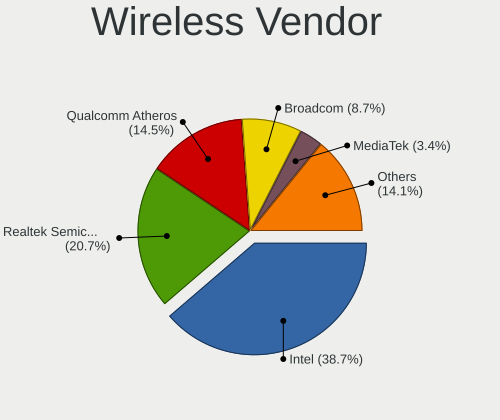

| Vendor                                | Computers | Percent |
|---------------------------------------|-----------|---------|
| Intel                                 | 1628      | 38.7%   |
| Realtek Semiconductor                 | 870       | 20.68%  |
| Qualcomm Atheros                      | 608       | 14.45%  |
| Broadcom                              | 365       | 8.68%   |
| MediaTek                              | 142       | 3.38%   |
| TP-Link                               | 106       | 2.52%   |
| Ralink Technology                     | 89        | 2.12%   |
| Broadcom Limited                      | 84        | 2%      |
| Ralink                                | 82        | 1.95%   |
| Marvell Technology Group              | 33        | 0.78%   |
| Sierra Wireless                       | 32        | 0.76%   |
| Microsoft                             | 21        | 0.5%    |
| NetGear                               | 20        | 0.48%   |
| Qualcomm Atheros Communications       | 19        | 0.45%   |
| D-Link                                | 17        | 0.4%    |
| Dell                                  | 12        | 0.29%   |
| ASUSTek Computer                      | 8         | 0.19%   |
| Edimax Technology                     | 7         | 0.17%   |
| D-Link System                         | 7         | 0.17%   |
| Qualcomm                              | 6         | 0.14%   |
| ZyXEL Communications                  | 5         | 0.12%   |
| Linksys                               | 5         | 0.12%   |
| Belkin Components                     | 5         | 0.12%   |
| Mercucys                              | 4         | 0.1%    |
| AVM                                   | 4         | 0.1%    |
| 802.11g Adapter [Linksys WUSB54GC v3] | 3         | 0.07%   |
| Sitecom Europe                        | 2         | 0.05%   |
| Realtek                               | 2         | 0.05%   |
| Hewlett-Packard                       | 2         | 0.05%   |
| Gemtek                                | 2         | 0.05%   |
| Fibocom                               | 2         | 0.05%   |
| BUFFALO                               | 2         | 0.05%   |
| ZyDAS                                 | 1         | 0.02%   |
| ZTopInc                               | 1         | 0.02%   |
| Wilocity                              | 1         | 0.02%   |
| TRENDnet                              | 1         | 0.02%   |
| Sweex                                 | 1         | 0.02%   |
| Quectel Wireless Solutions            | 1         | 0.02%   |
| Qualcomm Technologies                 | 1         | 0.02%   |
| Micro Star International              | 1         | 0.02%   |

Wireless Model
--------------

Wireless models

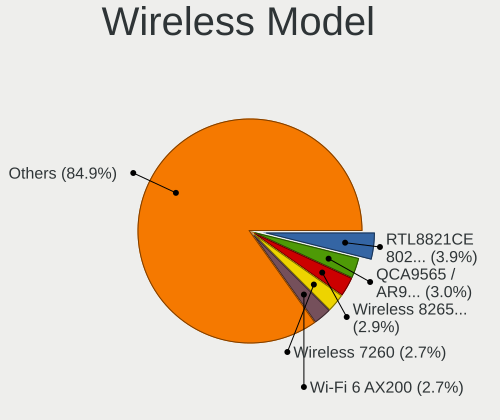

| Model                                                                | Computers | Percent |
|----------------------------------------------------------------------|-----------|---------|
| Realtek RTL8821CE 802.11ac PCIe Wireless Network Adapter             | 165       | 3.89%   |
| Qualcomm Atheros QCA9565 / AR9565 Wireless Network Adapter           | 127       | 2.99%   |
| Intel Wireless 8265 / 8275                                           | 121       | 2.85%   |
| Intel Wireless 7260                                                  | 116       | 2.74%   |
| Intel Wi-Fi 6 AX200                                                  | 113       | 2.66%   |
| Intel Wireless 7265                                                  | 112       | 2.64%   |
| Qualcomm Atheros QCA9377 802.11ac Wireless Network Adapter           | 104       | 2.45%   |
| Qualcomm Atheros AR9485 Wireless Network Adapter                     | 97        | 2.29%   |
| Qualcomm Atheros AR9285 Wireless Network Adapter (PCI-Express)       | 95        | 2.24%   |
| Intel Wi-Fi 6 AX201                                                  | 95        | 2.24%   |
| Intel Wireless 8260                                                  | 84        | 1.98%   |
| Intel Wireless 3165                                                  | 75        | 1.77%   |
| Intel Wi-Fi 6E(802.11ax) AX210/AX1675* 2x2 [Typhoon Peak]            | 74        | 1.74%   |
| Realtek 802.11ac NIC                                                 | 72        | 1.7%    |
| Realtek RTL8822CE 802.11ac PCIe Wireless Network Adapter             | 68        | 1.6%    |
| Intel Raptor Lake PCH CNVi WiFi                                      | 54        | 1.27%   |
| Realtek RTL8188EE Wireless Network Adapter                           | 50        | 1.18%   |
| Intel Centrino Advanced-N 6205 [Taylor Peak]                         | 50        | 1.18%   |
| Ralink MT7601U Wireless Adapter                                      | 49        | 1.16%   |
| Realtek RTL88x2bu [AC1200 Techkey]                                   | 48        | 1.13%   |
| MediaTek MT7921 802.11ax PCIe Wireless Network Adapter [Filogic 330] | 48        | 1.13%   |
| Broadcom BCM43142 802.11b/g/n                                        | 48        | 1.13%   |
| Intel Alder Lake-P PCH CNVi WiFi                                     | 47        | 1.11%   |
| Realtek RTL8723BE PCIe Wireless Network Adapter                      | 45        | 1.06%   |
| Qualcomm Atheros QCA6174 802.11ac Wireless Network Adapter           | 45        | 1.06%   |
| Broadcom BCM4313 802.11bgn Wireless Network Adapter                  | 45        | 1.06%   |
| Realtek RTL8852BE PCIe 802.11ax Wireless Network Controller          | 43        | 1.01%   |
| Intel Comet Lake PCH-LP CNVi WiFi                                    | 43        | 1.01%   |
| Realtek RTL8188CE 802.11b/g/n WiFi Adapter                           | 40        | 0.94%   |
| Qualcomm Atheros AR928X Wireless Network Adapter (PCI-Express)       | 40        | 0.94%   |
| MediaTek MT7922 802.11ax PCI Express Wireless Network Adapter        | 38        | 0.9%    |
| Intel Cannon Lake PCH CNVi WiFi                                      | 38        | 0.9%    |
| Broadcom Limited BCM4360 802.11ac Dual Band Wireless Network Adapter | 36        | 0.85%   |
| Intel Dual Band Wireless-AC 3168NGW [Stone Peak]                     | 35        | 0.83%   |
| Intel Centrino Advanced-N 6235                                       | 34        | 0.8%    |
| Broadcom BCM4331 802.11a/b/g/n                                       | 34        | 0.8%    |
| Broadcom BCM4322 802.11a/b/g/n Wireless LAN Controller               | 34        | 0.8%    |
| Intel 700 Series Chipset CNVi WiFi                                   | 33        | 0.78%   |
| Broadcom BCM4360 802.11ac Dual Band Wireless Network Adapter         | 33        | 0.78%   |
| Qualcomm Atheros AR9462 Wireless Network Adapter                     | 32        | 0.75%   |

Ethernet Vendor
---------------

Ethernet vendors

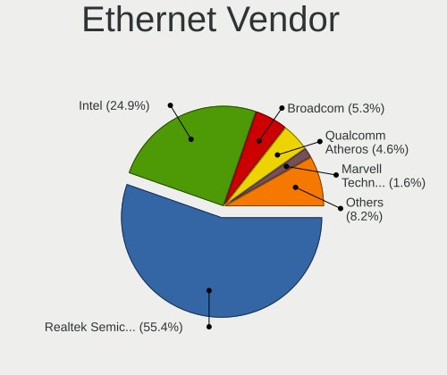

| Vendor                            | Computers | Percent |
|-----------------------------------|-----------|---------|
| Realtek Semiconductor             | 2430      | 55.38%  |
| Intel                             | 1093      | 24.91%  |
| Broadcom                          | 232       | 5.29%   |
| Qualcomm Atheros                  | 203       | 4.63%   |
| Marvell Technology Group          | 71        | 1.62%   |
| Nvidia                            | 51        | 1.16%   |
| ASIX Electronics                  | 51        | 1.16%   |
| Samsung Electronics               | 46        | 1.05%   |
| Broadcom Limited                  | 25        | 0.57%   |
| MediaTek                          | 21        | 0.48%   |
| Xiaomi                            | 19        | 0.43%   |
| JMicron Technology                | 19        | 0.43%   |
| DisplayLink                       | 18        | 0.41%   |
| Silicon Integrated Systems [SiS]  | 12        | 0.27%   |
| Qualcomm Technologies             | 10        | 0.23%   |
| Lenovo                            | 10        | 0.23%   |
| Aquantia                          | 9         | 0.21%   |
| Qualcomm                          | 7         | 0.16%   |
| OPPO Electronics                  | 7         | 0.16%   |
| Hewlett-Packard                   | 7         | 0.16%   |
| Microsoft                         | 6         | 0.14%   |
| Google                            | 6         | 0.14%   |
| Motorola PCS                      | 5         | 0.11%   |
| TP-Link                           | 4         | 0.09%   |
| Huawei Technologies               | 4         | 0.09%   |
| VIA Technologies                  | 3         | 0.07%   |
| D-Link System                     | 3         | 0.07%   |
| T & A Mobile Phones               | 2         | 0.05%   |
| QinHeng Electronics               | 2         | 0.05%   |
| Apple                             | 2         | 0.05%   |
| ZTE WCDMA Technologies MSM        | 1         | 0.02%   |
| Sundance Technology Inc / IC Plus | 1         | 0.02%   |
| Spreadtrum Communications         | 1         | 0.02%   |
| Panini                            | 1         | 0.02%   |
| NetXen Incorporated               | 1         | 0.02%   |
| Mellanox Technologies             | 1         | 0.02%   |
| ICS Advent                        | 1         | 0.02%   |
| HMD Global                        | 1         | 0.02%   |
| Attansic Technology               | 1         | 0.02%   |
| ASUSTek Computer                  | 1         | 0.02%   |

Ethernet Model
--------------

Ethernet models

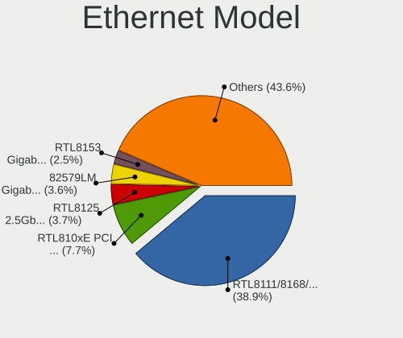

| Model                                                                  | Computers | Percent |
|------------------------------------------------------------------------|-----------|---------|
| Realtek RTL8111/8168/8211/8411 PCI Express Gigabit Ethernet Controller | 1749      | 38.93%  |
| Realtek RTL810xE PCI Express Fast Ethernet controller                  | 346       | 7.7%    |
| Realtek RTL8125 2.5GbE Controller                                      | 167       | 3.72%   |
| Intel 82579LM Gigabit Network Connection (Lewisville)                  | 161       | 3.58%   |
| Realtek RTL8153 Gigabit Ethernet Adapter                               | 113       | 2.52%   |
| Intel Ethernet Connection I217-LM                                      | 94        | 2.09%   |
| Intel Ethernet Connection (2) I219-V                                   | 61        | 1.36%   |
| Intel Ethernet Controller I225-V                                       | 60        | 1.34%   |
| Intel Ethernet Connection (4) I219-LM                                  | 57        | 1.27%   |
| ASIX AX88179 Gigabit Ethernet                                          | 46        | 1.02%   |
| Intel I211 Gigabit Network Connection                                  | 44        | 0.98%   |
| Broadcom NetXtreme BCM57766 Gigabit Ethernet PCIe                      | 44        | 0.98%   |
| Broadcom NetXtreme BCM57765 Gigabit Ethernet PCIe                      | 43        | 0.96%   |
| Intel Ethernet Connection (2) I219-LM                                  | 42        | 0.93%   |
| Intel 82579V Gigabit Network Connection                                | 42        | 0.93%   |
| Qualcomm Atheros AR8151 v2.0 Gigabit Ethernet                          | 41        | 0.91%   |
| Intel Ethernet Connection I219-LM                                      | 36        | 0.8%    |
| Samsung Galaxy series, misc. (tethering mode)                          | 35        | 0.78%   |
| Intel Ethernet Connection (3) I218-LM                                  | 34        | 0.76%   |
| Intel Ethernet Connection I218-LM                                      | 33        | 0.73%   |
| Intel Ethernet Connection I217-V                                       | 33        | 0.73%   |
| Intel Ethernet Controller I226-V                                       | 31        | 0.69%   |
| Nvidia MCP79 Ethernet                                                  | 29        | 0.65%   |
| Intel 82577LM Gigabit Network Connection                               | 27        | 0.6%    |
| Broadcom NetXtreme BCM5764M Gigabit Ethernet PCIe                      | 27        | 0.6%    |
| Intel Alder Lake-P PCH CNVi WiFi                                       | 26        | 0.58%   |
| Realtek Killer E2600 GbE Controller                                    | 24        | 0.53%   |
| Realtek RTL8152 Fast Ethernet Adapter                                  | 23        | 0.51%   |
| Intel Ethernet Connection I219-V                                       | 22        | 0.49%   |
| Qualcomm Atheros Killer E220x Gigabit Ethernet Controller              | 21        | 0.47%   |
| Qualcomm Atheros AR8131 Gigabit Ethernet                               | 21        | 0.47%   |
| Qualcomm Atheros AR8161 Gigabit Ethernet                               | 20        | 0.45%   |
| Broadcom NetXtreme BCM5761 Gigabit Ethernet PCIe                       | 20        | 0.45%   |
| Intel Ethernet Connection (7) I219-LM                                  | 19        | 0.42%   |
| Realtek RTL8852BE PCIe 802.11ax Wireless Network Controller            | 18        | 0.4%    |
| Broadcom NetLink BCM57780 Gigabit Ethernet PCIe                        | 18        | 0.4%    |
| Marvell Group 88E8040 PCI-E Fast Ethernet Controller                   | 16        | 0.36%   |
| JMicron JMC250 PCI Express Gigabit Ethernet Controller                 | 16        | 0.36%   |
| Qualcomm Atheros AR8162 Fast Ethernet                                  | 15        | 0.33%   |
| Intel Ethernet Connection (7) I219-V                                   | 15        | 0.33%   |

Net Controller Kind
-------------------

Ethernet, WiFi or modem

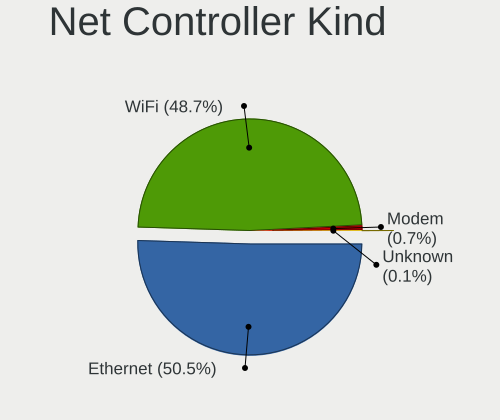

| Kind     | Computers | Percent |
|----------|-----------|---------|
| Ethernet | 4098      | 50.49%  |
| WiFi     | 3952      | 48.69%  |
| Modem    | 57        | 0.7%    |
| Unknown  | 9         | 0.11%   |

Used Controller
---------------

Currently used network controller

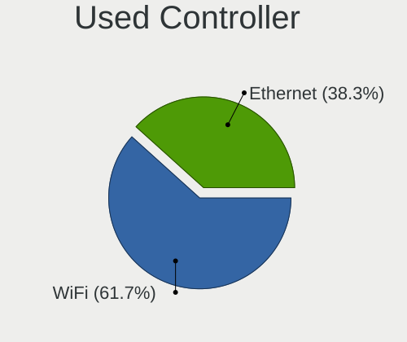

| Kind     | Computers | Percent |
|----------|-----------|---------|
| WiFi     | 3125      | 61.67%  |
| Ethernet | 1942      | 38.33%  |

NICs
----

Total network controllers on board

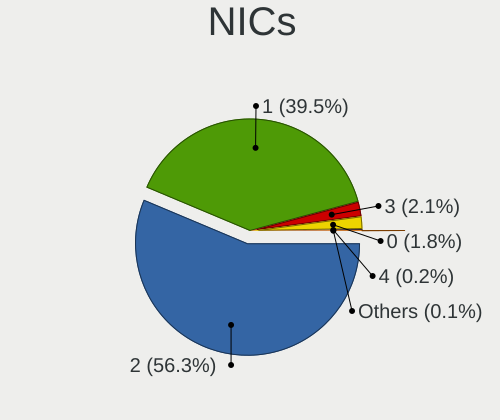

| Total | Computers | Percent |
|-------|-----------|---------|
| 2     | 2737      | 56.33%  |
| 1     | 1918      | 39.47%  |
| 3     | 102       | 2.1%    |
| 0     | 88        | 1.81%   |
| 4     | 9         | 0.19%   |
| 5     | 4         | 0.08%   |
| 6     | 1         | 0.02%   |

IPv6
----

IPv6 vs IPv4

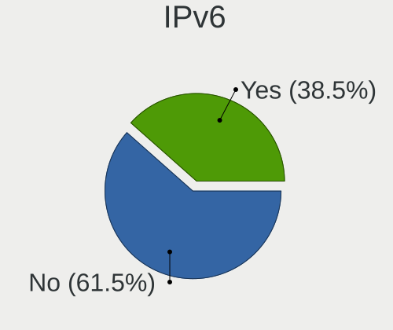

| Used | Computers | Percent |
|------|-----------|---------|
| No   | 3018      | 61.54%  |
| Yes  | 1886      | 38.46%  |

Bluetooth
---------

Bluetooth Vendor
----------------

Controller vendors

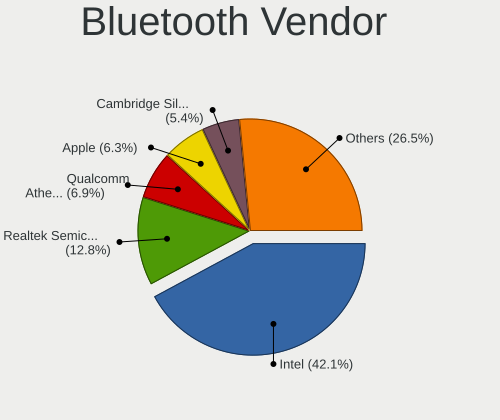

| Vendor                          | Computers | Percent |
|---------------------------------|-----------|---------|
| Intel                           | 1373      | 42.13%  |
| Realtek Semiconductor           | 416       | 12.76%  |
| Qualcomm Atheros Communications | 225       | 6.9%    |
| Apple                           | 204       | 6.26%   |
| Cambridge Silicon Radio         | 176       | 5.4%    |
| IMC Networks                    | 170       | 5.22%   |
| Foxconn / Hon Hai               | 113       | 3.47%   |
| Broadcom                        | 109       | 3.34%   |
| Lite-On Technology              | 89        | 2.73%   |
| MediaTek                        | 52        | 1.6%    |
| ASUSTek Computer                | 47        | 1.44%   |
| Dell                            | 42        | 1.29%   |
| Hewlett-Packard                 | 39        | 1.2%    |
| Toshiba                         | 35        | 1.07%   |
| Marvell Semiconductor           | 33        | 1.01%   |
| Ralink                          | 24        | 0.74%   |
| TP-Link                         | 23        | 0.71%   |
| Realtek                         | 16        | 0.49%   |
| Alps Electric                   | 12        | 0.37%   |
| Actions                         | 11        | 0.34%   |
| Unknown                         | 9         | 0.28%   |
| Foxconn International           | 8         | 0.25%   |
| Ralink Technology               | 5         | 0.15%   |
| Integrated System Solution      | 4         | 0.12%   |
| Qcom                            | 3         | 0.09%   |
| Micro Star International        | 3         | 0.09%   |
| Dynex                           | 3         | 0.09%   |
| USI                             | 2         | 0.06%   |
| Mercucys                        | 2         | 0.06%   |
| Edimax Technology               | 2         | 0.06%   |
| Taiyo Yuden                     | 1         | 0.03%   |
| Smart Modular Technologies      | 1         | 0.03%   |
| Roper                           | 1         | 0.03%   |
| Kensington                      | 1         | 0.03%   |
| Fujitsu                         | 1         | 0.03%   |
| D-Link System                   | 1         | 0.03%   |
| Belkin Components               | 1         | 0.03%   |
| Askey Computer                  | 1         | 0.03%   |
| AICSemi                         | 1         | 0.03%   |

Bluetooth Model
---------------

Controller models

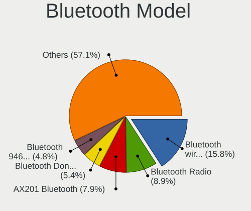

| Model                                               | Computers | Percent |
|-----------------------------------------------------|-----------|---------|
| Intel Bluetooth wireless interface                  | 516       | 15.83%  |
| Realtek Bluetooth Radio                             | 291       | 8.93%   |
| Intel AX201 Bluetooth                               | 256       | 7.85%   |
| Cambridge Silicon Radio Bluetooth Dongle (HCI mode) | 176       | 5.4%    |
| Intel Bluetooth 9460/9560 Jefferson Peak (JfP)      | 158       | 4.85%   |
| Intel Bluetooth Device                              | 132       | 4.05%   |
| Intel AX200 Bluetooth                               | 108       | 3.31%   |
| Qualcomm Atheros  Bluetooth Device                  | 102       | 3.13%   |
| Apple Bluetooth Host Controller                     | 97        | 2.98%   |
| Realtek  Bluetooth 4.2 Adapter                      | 77        | 2.36%   |
| Intel AX210 Bluetooth                               | 66        | 2.02%   |
| IMC Networks Wireless_Device                        | 65        | 1.99%   |
| Apple Bluetooth USB Host Controller                 | 56        | 1.72%   |
| IMC Networks Bluetooth Radio                        | 55        | 1.69%   |
| Intel Centrino Bluetooth Wireless Transceiver       | 54        | 1.66%   |
| MediaTek Wireless_Device                            | 51        | 1.56%   |
| Qualcomm Atheros AR3012 Bluetooth 4.0               | 42        | 1.29%   |
| Qualcomm Atheros AR3011 Bluetooth                   | 39        | 1.2%    |
| Foxconn / Hon Hai Bluetooth Device                  | 39        | 1.2%    |
| Apple Built-in Bluetooth 2.0+EDR HCI                | 37        | 1.13%   |
| IMC Networks Bluetooth Device                       | 34        | 1.04%   |
| Intel Wireless-AC 3168 Bluetooth                    | 33        | 1.01%   |
| Intel Wireless-AC 9260 Bluetooth Adapter            | 29        | 0.89%   |
| Marvell Bluetooth and Wireless LAN Composite        | 27        | 0.83%   |
| Lite-On Bluetooth Device                            | 25        | 0.77%   |
| Ralink RT3290 Bluetooth                             | 24        | 0.74%   |
| TP-Link TP-T@- UB500 Adapter                        | 23        | 0.71%   |
| Lite-On Qualcomm Atheros QCA9377 Bluetooth          | 22        | 0.67%   |
| Foxconn / Hon Hai Wireless_Device                   | 22        | 0.67%   |
| Qualcomm Atheros QCA61x4 Bluetooth 4.0              | 20        | 0.61%   |
| HP Broadcom 2070 Bluetooth Combo                    | 20        | 0.61%   |
| Lite-On Atheros AR3012 Bluetooth                    | 18        | 0.55%   |
| Intel Centrino Advanced-N 6230 Bluetooth adapter    | 18        | 0.55%   |
| HP Bluetooth 2.0 Interface [Broadcom BCM2045]       | 17        | 0.52%   |
| Dell DW375 Bluetooth Module                         | 17        | 0.52%   |
| Realtek Bluetooth Radio                             | 16        | 0.49%   |
| Broadcom BCM20702 Bluetooth 4.0 [ThinkPad]          | 15        | 0.46%   |
| Apple Bluetooth HCI                                 | 14        | 0.43%   |
| Realtek RTL8723B Bluetooth                          | 13        | 0.4%    |
| Broadcom BCM2045B (BDC-2.1)                         | 13        | 0.4%    |

Sound
-----

Sound Vendor
------------

Sound card vendors

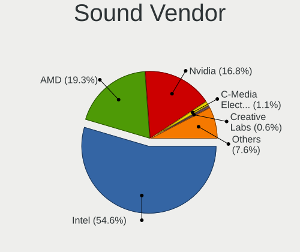

| Vendor                                       | Computers | Percent |
|----------------------------------------------|-----------|---------|
| Intel                                        | 3696      | 54.56%  |
| AMD                                          | 1306      | 19.28%  |
| Nvidia                                       | 1141      | 16.84%  |
| C-Media Electronics                          | 75        | 1.11%   |
| Creative Labs                                | 40        | 0.59%   |
| Zoran Co. Personal Media Division (Nogatech) | 25        | 0.37%   |
| ASUSTek Computer                             | 24        | 0.35%   |
| JMTek                                        | 22        | 0.32%   |
| Texas Instruments                            | 20        | 0.3%    |
| Micro Star International                     | 20        | 0.3%    |
| Logitech                                     | 20        | 0.3%    |
| GN Netcom                                    | 17        | 0.25%   |
| Generalplus Technology                       | 17        | 0.25%   |
| Realtek Semiconductor                        | 14        | 0.21%   |
| Razer USA                                    | 14        | 0.21%   |
| Silicon Integrated Systems [SiS]             | 13        | 0.19%   |
| Plantronics                                  | 13        | 0.19%   |
| Hewlett-Packard                              | 13        | 0.19%   |
| SteelSeries ApS                              | 12        | 0.18%   |
| Unknown                                      | 12        | 0.18%   |
| Sony                                         | 11        | 0.16%   |
| Jieli Technology                             | 11        | 0.16%   |
| Focusrite-Novation                           | 10        | 0.15%   |
| Creative Technology                          | 10        | 0.15%   |
| KTMICRO                                      | 9         | 0.13%   |
| Kingston Technology                          | 9         | 0.13%   |
| Walmart                                      | 7         | 0.1%    |
| VIA Technologies                             | 7         | 0.1%    |
| Thesycon Systemsoftware & Consulting         | 7         | 0.1%    |
| Tenx Technology                              | 7         | 0.1%    |
| Lenovo                                       | 7         | 0.1%    |
| Dell                                         | 7         | 0.1%    |
| Corsair                                      | 7         | 0.1%    |
| Apple                                        | 7         | 0.1%    |
| Trust                                        | 5         | 0.07%   |
| BEHRINGER International                      | 5         | 0.07%   |
| RODE Microphones                             | 4         | 0.06%   |
| Medeli Electronics                           | 4         | 0.06%   |
| M-Audio                                      | 4         | 0.06%   |
| Blue Microphones                             | 4         | 0.06%   |

Sound Model
-----------

Sound card models

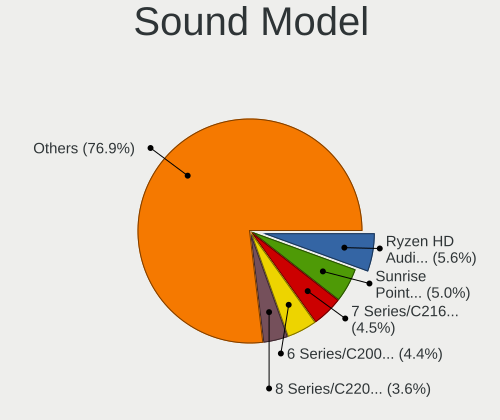

| Model                                                                      | Computers | Percent |
|----------------------------------------------------------------------------|-----------|---------|
| AMD Ryzen HD Audio Controller                                              | 450       | 5.56%   |
| Intel Sunrise Point-LP HD Audio                                            | 405       | 5%      |
| Intel 7 Series/C216 Chipset Family High Definition Audio Controller        | 368       | 4.54%   |
| Intel 6 Series/C200 Series Chipset Family High Definition Audio Controller | 359       | 4.43%   |
| Intel 8 Series/C220 Series Chipset High Definition Audio Controller        | 290       | 3.58%   |
| AMD Renoir/Cezanne HDMI/DP Audio Controller                                | 203       | 2.51%   |
| Intel Xeon E3-1200 v3/4th Gen Core Processor HD Audio Controller           | 192       | 2.37%   |
| Intel 5 Series/3400 Series Chipset High Definition Audio                   | 187       | 2.31%   |
| Intel 8 Series HD Audio Controller                                         | 159       | 1.96%   |
| Intel Haswell-ULT HD Audio Controller                                      | 158       | 1.95%   |
| AMD FCH Azalia Controller                                                  | 158       | 1.95%   |
| Intel 82801I (ICH9 Family) HD Audio Controller                             | 148       | 1.83%   |
| Intel Celeron/Pentium Silver Processor High Definition Audio               | 138       | 1.7%    |
| AMD SBx00 Azalia (Intel HDA)                                               | 136       | 1.68%   |
| Intel 100 Series/C230 Series Chipset Family HD Audio Controller            | 134       | 1.65%   |
| AMD Radeon High Definition Audio Controller                                | 132       | 1.63%   |
| AMD Starship/Matisse HD Audio Controller                                   | 127       | 1.57%   |
| Intel Tiger Lake-LP Smart Sound Technology Audio Controller                | 115       | 1.42%   |
| Intel Broadwell-U Audio Controller                                         | 110       | 1.36%   |
| Intel Wildcat Point-LP High Definition Audio Controller                    | 104       | 1.28%   |
| Intel Alder Lake PCH-P High Definition Audio Controller                    | 104       | 1.28%   |
| Intel Cannon Lake PCH cAVS                                                 | 103       | 1.27%   |
| AMD Kabini HDMI/DP Audio                                                   | 95        | 1.17%   |
| AMD Raven/Raven2/Fenghuang HDMI/DP Audio Controller                        | 93        | 1.15%   |
| Intel 200 Series PCH HD Audio                                              | 91        | 1.12%   |
| AMD Ellesmere HDMI Audio [Radeon RX 470/480 / 570/580/590]                 | 90        | 1.11%   |
| Nvidia GK208 HDMI/DP Audio Controller                                      | 82        | 1.01%   |
| Nvidia GP107GL High Definition Audio Controller                            | 80        | 0.99%   |
| Nvidia GF108 High Definition Audio Controller                              | 77        | 0.95%   |
| Intel Raptor Lake-P/U/H cAVS                                               | 71        | 0.88%   |
| Intel NM10/ICH7 Family High Definition Audio Controller                    | 64        | 0.79%   |
| Intel 82801H (ICH8 Family) HD Audio Controller                             | 61        | 0.75%   |
| Nvidia High Definition Audio Controller                                    | 60        | 0.74%   |
| Intel Raptor Lake High Definition Audio Controller                         | 60        | 0.74%   |
| Intel Celeron N3350/Pentium N4200/Atom E3900 Series Audio Cluster          | 56        | 0.69%   |
| Intel Alder Lake-N PCH High Definition Audio Controller                    | 56        | 0.69%   |
| Intel Cannon Point-LP High Definition Audio Controller                     | 55        | 0.68%   |
| AMD Navi 21/23 HDMI/DP Audio Controller                                    | 55        | 0.68%   |
| AMD Oland/Hainan/Cape Verde/Pitcairn HDMI Audio [Radeon HD 7000 Series]    | 54        | 0.67%   |
| AMD Family 15h (Models 60h-6fh) Audio Controller                           | 54        | 0.67%   |

Memory
------

Memory Vendor
-------------

Memory module vendors

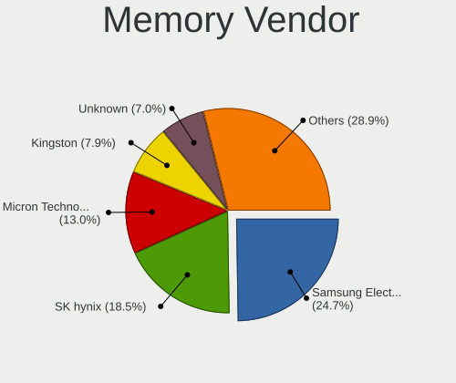

| Vendor              | Computers | Percent |
|---------------------|-----------|---------|
| Samsung Electronics | 173       | 24.75%  |
| SK hynix            | 129       | 18.45%  |
| Micron Technology   | 91        | 13.02%  |
| Kingston            | 55        | 7.87%   |
| Unknown             | 49        | 7.01%   |
| Crucial             | 36        | 5.15%   |
| Corsair             | 31        | 4.43%   |
| Unknown (ABCD)      | 19        | 2.72%   |
| A-DATA Technology   | 18        | 2.58%   |
| G.Skill             | 16        | 2.29%   |
| Elpida              | 10        | 1.43%   |
| Ramaxel Technology  | 8         | 1.14%   |
| Unknown             | 8         | 1.14%   |
| Team                | 7         | 1%      |
| Smart               | 6         | 0.86%   |
| Unknown (0x0B45)    | 4         | 0.57%   |
| Transcend           | 4         | 0.57%   |
| Lexar               | 3         | 0.43%   |
| Unknown (0x0E9D)    | 2         | 0.29%   |
| Unifosa             | 2         | 0.29%   |
| Teikon              | 2         | 0.29%   |
| Smart Brazil        | 2         | 0.29%   |
| Avant               | 2         | 0.29%   |
| Unknown (C289)      | 1         | 0.14%   |
| Unknown (B608)      | 1         | 0.14%   |
| Unknown (0x8945)    | 1         | 0.14%   |
| Unknown (0x8551)    | 1         | 0.14%   |
| Unknown (0x0B38)    | 1         | 0.14%   |
| Unknown (0B85)      | 1         | 0.14%   |
| Timetec             | 1         | 0.14%   |
| Super Talent        | 1         | 0.14%   |
| Silicon Power       | 1         | 0.14%   |
| Patriot             | 1         | 0.14%   |
| Neo Forza           | 1         | 0.14%   |
| Nanya Technology    | 1         | 0.14%   |
| Multilaser          | 1         | 0.14%   |
| Lexar Co Limited    | 1         | 0.14%   |
| Juhor               | 1         | 0.14%   |
| INNOVATION PC       | 1         | 0.14%   |
| HT Micron           | 1         | 0.14%   |

Memory Model
------------

Memory module models

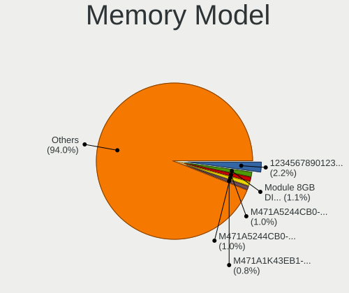

| Model                                                            | Computers | Percent |
|------------------------------------------------------------------|-----------|---------|
| Unknown (ABCD) RAM 123456789012345678 2GB SODIMM LPDDR4 2400MT/s | 16        | 2.18%   |
| Unknown                                                          | 8         | 1.09%   |
| Samsung RAM M471A5244CB0-CWE 4GB SODIMM DDR4 3200MT/s            | 7         | 0.95%   |
| Samsung RAM M471A5244CB0-CTD 4GB SODIMM DDR4 3266MT/s            | 7         | 0.95%   |
| SK hynix RAM HMA81GS6AFR8N-UH 8GB SODIMM DDR4 2667MT/s           | 6         | 0.82%   |
| Samsung RAM M471A1K43EB1-CWE 8GB SODIMM DDR4 3200MT/s            | 6         | 0.82%   |
| Samsung RAM M471A1K43DB1-CTD 8GB SODIMM DDR4 2667MT/s            | 6         | 0.82%   |
| Unknown RAM Module 4GB DIMM DDR3 1333MT/s                        | 5         | 0.68%   |
| SK hynix RAM Module 4GB SODIMM DDR3 1600MT/s                     | 5         | 0.68%   |
| SK hynix RAM HMT351S6CFR8C-PB 4GB SODIMM DDR3 1600MT/s           | 5         | 0.68%   |
| Samsung RAM M471B5273CH0-CH9 4GB SODIMM DDR3 1334MT/s            | 5         | 0.68%   |
| Samsung RAM M471B1G73EB0-YK0 8192MB SODIMM DDR3 1600MT/s         | 5         | 0.68%   |
| Samsung RAM M471A1G44AB0-CWE 8GiB SODIMM DDR4 3200MT/s           | 5         | 0.68%   |
| Micron RAM 4ATF1G64HZ-3G2F1 8GB SODIMM DDR4 3200MT/s             | 5         | 0.68%   |
| SK hynix RAM HMT451S6BFR8A-PB 4GB SODIMM DDR3 1600MT/s           | 4         | 0.54%   |
| SK hynix RAM HMAA1GS6CJR6N-XN 8GB Row Of Chips DDR4 3200MT/s     | 4         | 0.54%   |
| SK hynix RAM HMA851S6CJR6N-VK 4GB SODIMM DDR4 2667MT/s           | 4         | 0.54%   |
| Samsung RAM Module 8GB SODIMM DDR4 2400MT/s                      | 4         | 0.54%   |
| Samsung RAM M471B5273DH0-CH9 4GB SODIMM DDR3 1600MT/s            | 4         | 0.54%   |
| Samsung RAM M471B5173EB0-YK0 4GB SODIMM DDR3 1600MT/s            | 4         | 0.54%   |
| Samsung RAM M471B1G73DB0-YK0 8GB SODIMM DDR3 1600MT/s            | 4         | 0.54%   |
| Samsung RAM M471A1G44BB0-CWE 8GB SODIMM DDR4 3200MT/s            | 4         | 0.54%   |
| Samsung RAM M471A1G44AB0-CWE 8GB Row Of Chips DDR4 3200MT/s      | 4         | 0.54%   |
| Samsung RAM M425R1GB4BB0-CQKOL 8GB SODIMM DDR5 4800MT/s          | 4         | 0.54%   |
| Micron RAM MT62F1G32D4DR-031 2GB Row Of Chips LPDDR5 6400MT/s    | 4         | 0.54%   |
| Micron RAM 8ATF1G64HZ-3G2R1 8GB SODIMM DDR4 3200MT/s             | 4         | 0.54%   |
| Unknown RAM Module 4GB SODIMM DDR3                               | 3         | 0.41%   |
| Unknown RAM Module 2GB SODIMM SDRAM                              | 3         | 0.41%   |
| Unknown RAM Module 2GB SODIMM DDR2 667MT/s                       | 3         | 0.41%   |
| Unknown (ABCD) RAM 123456789012345678 2GB DIMM LPDDR4 2133MT/s   | 3         | 0.41%   |
| Unknown (0x0B45) RAM WPBH32D408SWM-16G 16GB SODIMM DDR4 3200MT/s | 3         | 0.41%   |
| SK hynix RAM Module 4GB SODIMM DDR4 2400MT/s                     | 3         | 0.41%   |
| SK hynix RAM HMT351U6CFR8C-PB 4GB DIMM DDR3 1800MT/s             | 3         | 0.41%   |
| SK hynix RAM HMAA1GS6CJR6N-XN 8GB SODIMM DDR4 3200MT/s           | 3         | 0.41%   |
| SK hynix RAM HMA81GS6DJR8N-VK 8GB SODIMM DDR4 2667MT/s           | 3         | 0.41%   |
| Samsung RAM M471A5244CB0-CRC 4GB SODIMM DDR4 2667MT/s            | 3         | 0.41%   |
| Samsung RAM M471A1K43DB1-CWE 8GB SODIMM DDR4 3200MT/s            | 3         | 0.41%   |
| Samsung RAM M471A1K43BB0-CPB 8GiB SODIMM DDR4 2133MT/s           | 3         | 0.41%   |
| Micron RAM MTC4C10163S1SC56BD1 8GB SODIMM DDR5 5600MT/s          | 3         | 0.41%   |
| Micron RAM MTC4C10163S1SC48BA1 8GB SODIMM DDR5 4800MT/s          | 3         | 0.41%   |

Memory Kind
-----------

Memory module kinds

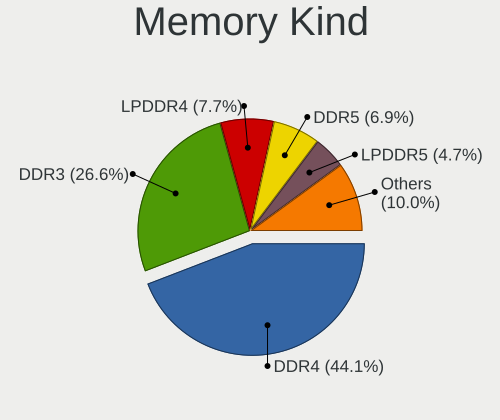

| Kind    | Computers | Percent |
|---------|-----------|---------|
| DDR4    | 264       | 44.15%  |
| DDR3    | 159       | 26.59%  |
| LPDDR4  | 46        | 7.69%   |
| DDR5    | 41        | 6.86%   |
| LPDDR5  | 28        | 4.68%   |
| DDR2    | 21        | 3.51%   |
| SDRAM   | 14        | 2.34%   |
| LPDDR3  | 13        | 2.17%   |
| Unknown | 10        | 1.67%   |
| DDR     | 2         | 0.33%   |

Memory Form Factor
------------------

Physical design of the memory module

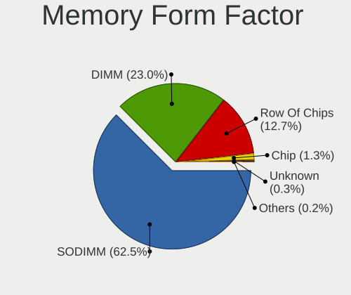

| Name         | Computers | Percent |
|--------------|-----------|---------|
| SODIMM       | 375       | 62.5%   |
| DIMM         | 138       | 23%     |
| Row Of Chips | 76        | 12.67%  |
| Chip         | 8         | 1.33%   |
| Unknown      | 2         | 0.33%   |
| FB-DIMM      | 1         | 0.17%   |

Memory Size
-----------

Memory module size

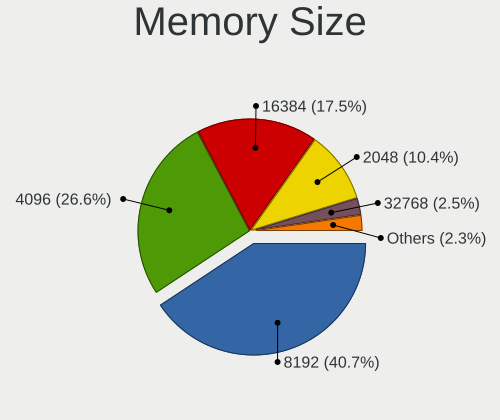

| Size  | Computers | Percent |
|-------|-----------|---------|
| 8192  | 265       | 40.71%  |
| 4096  | 173       | 26.57%  |
| 16384 | 114       | 17.51%  |
| 2048  | 68        | 10.45%  |
| 32768 | 16        | 2.46%   |
| 1024  | 10        | 1.54%   |
| 49152 | 2         | 0.31%   |
| 12288 | 2         | 0.31%   |
| 512   | 1         | 0.15%   |

Memory Speed
------------

Memory module speed

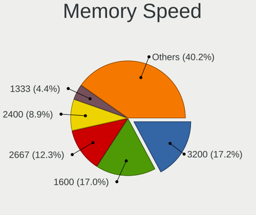

| Speed   | Computers | Percent |
|---------|-----------|---------|
| 3200    | 110       | 17.16%  |
| 1600    | 109       | 17%     |
| 2667    | 79        | 12.32%  |
| 2400    | 57        | 8.89%   |
| 1333    | 28        | 4.37%   |
| 6400    | 20        | 3.12%   |
| 3600    | 20        | 3.12%   |
| 2133    | 17        | 2.65%   |
| 4800    | 16        | 2.5%    |
| 4267    | 16        | 2.5%    |
| 5600    | 13        | 2.03%   |
| 1867    | 13        | 2.03%   |
| Unknown | 13        | 2.03%   |
| 667     | 12        | 1.87%   |
| 1067    | 11        | 1.72%   |
| 3733    | 10        | 1.56%   |
| 1334    | 10        | 1.56%   |
| 800     | 9         | 1.4%    |
| 3266    | 7         | 1.09%   |
| 6000    | 6         | 0.94%   |
| 7500    | 5         | 0.78%   |
| 1800    | 5         | 0.78%   |
| 1066    | 5         | 0.78%   |
| 4199    | 4         | 0.62%   |
| 1866    | 4         | 0.62%   |
| 7467    | 3         | 0.47%   |
| 3000    | 3         | 0.47%   |
| 2933    | 3         | 0.47%   |
| 2048    | 3         | 0.47%   |
| 8400    | 2         | 0.31%   |
| 5200    | 2         | 0.31%   |
| 4266    | 2         | 0.31%   |
| 3466    | 2         | 0.31%   |
| 3400    | 2         | 0.31%   |
| 2666    | 2         | 0.31%   |
| 1648    | 2         | 0.31%   |
| 533     | 2         | 0.31%   |
| 49926   | 1         | 0.16%   |
| 8533    | 1         | 0.16%   |
| 7000    | 1         | 0.16%   |

Printers & scanners
-------------------

Printer Vendor
--------------

Printer device vendors

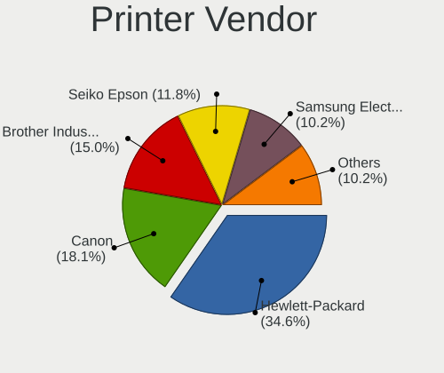

| Vendor                   | Computers | Percent |
|--------------------------|-----------|---------|
| Hewlett-Packard          | 44        | 34.65%  |
| Canon                    | 23        | 18.11%  |
| Brother Industries       | 19        | 14.96%  |
| Seiko Epson              | 15        | 11.81%  |
| Samsung Electronics      | 13        | 10.24%  |
| Dymo-CoStar              | 5         | 3.94%   |
| Lexmark International    | 2         | 1.57%   |
| Kyocera                  | 2         | 1.57%   |
| Zhuhai Poskey Technology | 1         | 0.79%   |
| Zebra Technologies       | 1         | 0.79%   |
| Ricoh                    | 1         | 0.79%   |
| Prolific Technology      | 1         | 0.79%   |

Printer Model
-------------

Printer device models

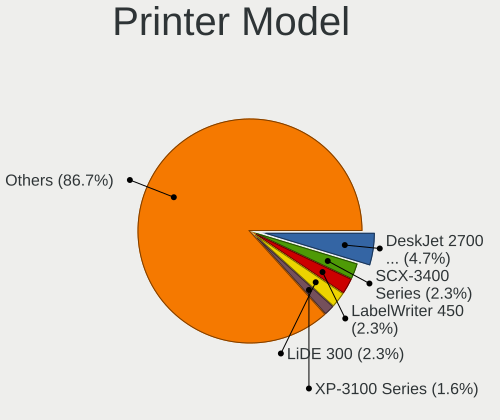

| Model                                | Computers | Percent |
|--------------------------------------|-----------|---------|
| HP DeskJet 2700 series               | 6         | 4.69%   |
| Samsung SCX-3400 Series              | 3         | 2.34%   |
| Dymo-CoStar LabelWriter 450          | 3         | 2.34%   |
| Canon LiDE 300                       | 3         | 2.34%   |
| Seiko Epson XP-3100 Series           | 2         | 1.56%   |
| Seiko Epson ET-4850 Series           | 2         | 1.56%   |
| Seiko Epson ET-2710 Series           | 2         | 1.56%   |
| HP LaserJet M109-M112                | 2         | 1.56%   |
| HP LaserJet 400 M401dne              | 2         | 1.56%   |
| HP LaserJet 1020                     | 2         | 1.56%   |
| HP HP LaserJet M101-M106             | 2         | 1.56%   |
| HP DeskJet 3700 series               | 2         | 1.56%   |
| HP Color LaserJet CP1215             | 2         | 1.56%   |
| Canon PIXMA MG2500 Series            | 2         | 1.56%   |
| Canon LiDE 400                       | 2         | 1.56%   |
| Canon G3010 series                   | 2         | 1.56%   |
| Brother HL-L2350DW series            | 2         | 1.56%   |
| Zhuhai Poskey 4B-2054L               | 1         | 0.78%   |
| Zebra GK420d Label Printer           | 1         | 0.78%   |
| Seiko Epson XP-4200 Series           | 1         | 0.78%   |
| Seiko Epson XP-4100 Series           | 1         | 0.78%   |
| Seiko Epson XP-2100 Series           | 1         | 0.78%   |
| Seiko Epson TM-T20X                  | 1         | 0.78%   |
| Seiko Epson L6270 Series             | 1         | 0.78%   |
| Seiko Epson L5190 Series             | 1         | 0.78%   |
| Seiko Epson L355 Series              | 1         | 0.78%   |
| Seiko Epson L3110 Series             | 1         | 0.78%   |
| Seiko Epson ET-8550 Series           | 1         | 0.78%   |
| Samsung ML-551x 651x Series          | 1         | 0.78%   |
| Samsung ML-216x Series Laser Printer | 1         | 0.78%   |
| Samsung ML-2010P Mono Laser Printer  | 1         | 0.78%   |
| Samsung ML-1865                      | 1         | 0.78%   |
| Samsung M267x 287x Series            | 1         | 0.78%   |
| Samsung M2020 Series                 | 1         | 0.78%   |
| Samsung CLX-3180 Series              | 1         | 0.78%   |
| Samsung CLX-3170 Series              | 1         | 0.78%   |
| Samsung C48x Series                  | 1         | 0.78%   |
| Samsung C43x Series                  | 1         | 0.78%   |
| Ricoh Printing Support               | 1         | 0.78%   |
| Prolific PL2305 Parallel Port        | 1         | 0.78%   |

Scanner Vendor
--------------

Scanner device vendors

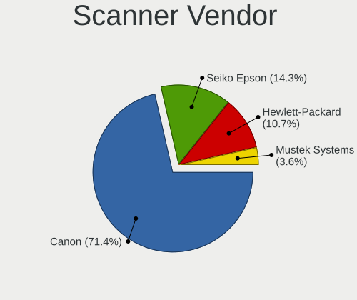

| Vendor          | Computers | Percent |
|-----------------|-----------|---------|
| Canon           | 20        | 71.43%  |
| Seiko Epson     | 4         | 14.29%  |
| Hewlett-Packard | 3         | 10.71%  |
| Mustek Systems  | 1         | 3.57%   |

Scanner Model
-------------

Scanner device models

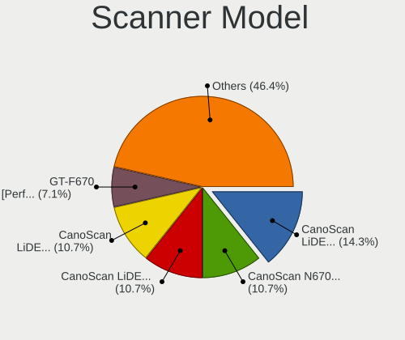

| Model                                             | Computers | Percent |
|---------------------------------------------------|-----------|---------|
| Canon CanoScan LiDE 210                           | 4         | 14.29%  |
| Canon CanoScan N670U/N676U/LiDE 20                | 3         | 10.71%  |
| Canon CanoScan LiDE 200                           | 3         | 10.71%  |
| Canon CanoScan LiDE 110                           | 3         | 10.71%  |
| Seiko Epson GT-F670 [Perfection V200 Photo]       | 2         | 7.14%   |
| Canon CanoScan LiDE 220                           | 2         | 7.14%   |
| Canon CanoScan LiDE 120                           | 2         | 7.14%   |
| Seiko Epson GT-X750 [Perfection 4490 Photo]       | 1         | 3.57%   |
| Seiko Epson GT-7300U [Perfection 1260/1260 PHOTO] | 1         | 3.57%   |
| Mustek Systems ScanExpress 1200 UB                | 1         | 3.57%   |
| HP Scanjet G2710                                  | 1         | 3.57%   |
| HP ScanJet 5300c/5370c                            | 1         | 3.57%   |
| HP ScanJet 4370                                   | 1         | 3.57%   |
| Canon CanoScan LiDE 90                            | 1         | 3.57%   |
| Canon CanoScan 8800F                              | 1         | 3.57%   |
| Canon CanoScan 4400F                              | 1         | 3.57%   |

Camera
------

Camera Vendor
-------------

Camera device vendors

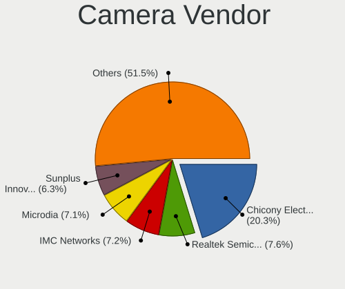

| Vendor                                 | Computers | Percent |
|----------------------------------------|-----------|---------|
| Chicony Electronics                    | 599       | 20.27%  |
| Realtek Semiconductor                  | 224       | 7.58%   |
| IMC Networks                           | 214       | 7.24%   |
| Microdia                               | 211       | 7.14%   |
| Sunplus Innovation Technology          | 186       | 6.29%   |
| Bison Electronics                      | 165       | 5.58%   |
| Apple                                  | 153       | 5.18%   |
| Quanta                                 | 147       | 4.97%   |
| Logitech                               | 139       | 4.7%    |
| Suyin                                  | 115       | 3.89%   |
| Cheng Uei Precision Industry (Foxlink) | 105       | 3.55%   |
| Lite-On Technology                     | 60        | 2.03%   |
| Syntek                                 | 58        | 1.96%   |
| Silicon Motion                         | 55        | 1.86%   |
| Luxvisions Innotech Limited            | 49        | 1.66%   |
| Sonix Technology                       | 39        | 1.32%   |
| Alcor Micro                            | 39        | 1.32%   |
| Ricoh                                  | 34        | 1.15%   |
| SunplusIT                              | 31        | 1.05%   |
| Microsoft                              | 28        | 0.95%   |
| icSpring                               | 24        | 0.81%   |
| Shinetech                              | 20        | 0.68%   |
| Acer                                   | 17        | 0.58%   |
| Importek                               | 14        | 0.47%   |
| Samsung Electronics                    | 13        | 0.44%   |
| Primax Electronics                     | 10        | 0.34%   |
| Lenovo                                 | 10        | 0.34%   |
| Generalplus Technology                 | 10        | 0.34%   |
| ALi                                    | 10        | 0.34%   |
| Unknown                                | 10        | 0.34%   |
| Z-Star Microelectronics                | 9         | 0.3%    |
| Y Media                                | 8         | 0.27%   |
| Shine-optics                           | 7         | 0.24%   |
| MacroSilicon                           | 7         | 0.24%   |
| Genesys Logic                          | 6         | 0.2%    |
| Razer USA                              | 5         | 0.17%   |
| OmniVision Technologies                | 5         | 0.17%   |
| DigiTech                               | 5         | 0.17%   |
| webcam                                 | 4         | 0.14%   |
| Sunplus Technology                     | 4         | 0.14%   |

Camera Model
------------

Camera device models

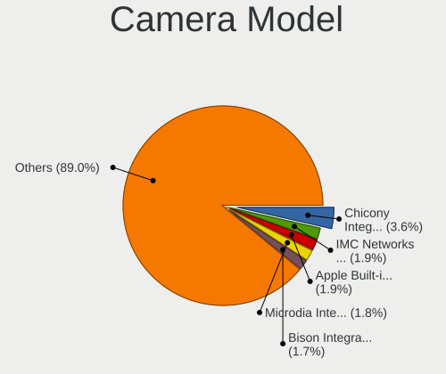

| Model                                                   | Computers | Percent |
|---------------------------------------------------------|-----------|---------|
| Chicony Integrated Camera                               | 106       | 3.56%   |
| IMC Networks USB2.0 HD UVC WebCam                       | 57        | 1.91%   |
| Apple Built-in iSight                                   | 57        | 1.91%   |
| Microdia Integrated_Webcam_HD                           | 55        | 1.85%   |
| Bison Integrated Camera                                 | 52        | 1.74%   |
| Realtek Integrated_Webcam_HD                            | 51        | 1.71%   |
| Apple FaceTime HD Camera (Built-in)                     | 50        | 1.68%   |
| IMC Networks Integrated Camera                          | 47        | 1.58%   |
| Sunplus Integrated_Webcam_HD                            | 41        | 1.38%   |
| Logitech Webcam C270                                    | 35        | 1.17%   |
| Chicony HD WebCam                                       | 35        | 1.17%   |
| Syntek Integrated Camera                                | 32        | 1.07%   |
| Realtek USB Camera                                      | 32        | 1.07%   |
| IMC Networks USB2.0 VGA UVC WebCam                      | 29        | 0.97%   |
| Chicony HP Truevision HD camera                         | 27        | 0.91%   |
| Chicony HP Truevision HD                                | 27        | 0.91%   |
| Chicony EasyCamera                                      | 27        | 0.91%   |
| Apple FaceTime HD Camera                                | 26        | 0.87%   |
| Microdia Integrated Webcam                              | 25        | 0.84%   |
| icSpring camera                                         | 24        | 0.81%   |
| Suyin HP TrueVision HD                                  | 23        | 0.77%   |
| Sunplus HD WebCam                                       | 23        | 0.77%   |
| Logitech HD Pro Webcam C920                             | 23        | 0.77%   |
| Chicony HP HD Camera                                    | 23        | 0.77%   |
| Chicony FJ Camera                                       | 21        | 0.7%    |
| Bison Lenovo EasyCamera                                 | 21        | 0.7%    |
| Quanta HD User Facing                                   | 19        | 0.64%   |
| Microdia Laptop_Integrated_Webcam_HD                    | 19        | 0.64%   |
| Chicony TOSHIBA Web Camera - HD                         | 19        | 0.64%   |
| Lite-On Integrated Camera                               | 18        | 0.6%    |
| Alcor Micro USB 2.0 Camera                              | 18        | 0.6%    |
| Sonix USB2.0 HD UVC WebCam                              | 17        | 0.57%   |
| Cheng Uei Precision Industry (Foxlink) HP TrueVision HD | 17        | 0.57%   |
| Quanta HP HD Camera                                     | 16        | 0.54%   |
| Luxvisions Innotech Limited HP TrueVision HD Camera     | 16        | 0.54%   |
| Lite-On HP HD Camera                                    | 16        | 0.54%   |
| Chicony HP HD Webcam                                    | 16        | 0.54%   |
| Sunplus Laptop Integrated Webcam HD                     | 14        | 0.47%   |
| Sonix USB2.0 FHD UVC WebCam                             | 14        | 0.47%   |
| Quanta HP Wide Vision HD Camera                         | 14        | 0.47%   |

Security
--------

Fingerprint Vendor
------------------

Fingerprint sensor vendors

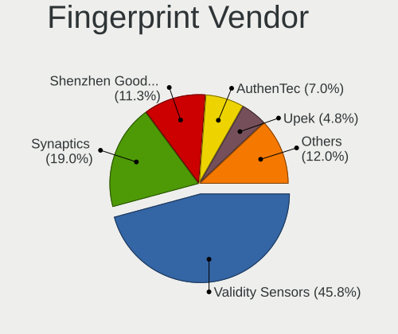

| Vendor                             | Computers | Percent |
|------------------------------------|-----------|---------|
| Validity Sensors                   | 202       | 45.8%   |
| Synaptics                          | 84        | 19.05%  |
| Shenzhen Goodix Technology         | 50        | 11.34%  |
| AuthenTec                          | 31        | 7.03%   |
| Upek                               | 21        | 4.76%   |
| Elan Microelectronics              | 19        | 4.31%   |
| LighTuning Technology              | 15        | 3.4%    |
| STMicroelectronics                 | 5         | 1.13%   |
| Realtek USB2.0 Finger Print Bridge | 3         | 0.68%   |
| HOLTEK                             | 3         | 0.68%   |
| Samsung Electronics                | 2         | 0.45%   |
| Focal-systems.Corp                 | 2         | 0.45%   |
| Dell                               | 2         | 0.45%   |
| Microsoft                          | 1         | 0.23%   |
| DigitalPersona                     | 1         | 0.23%   |

Fingerprint Model
-----------------

Fingerprint sensor models

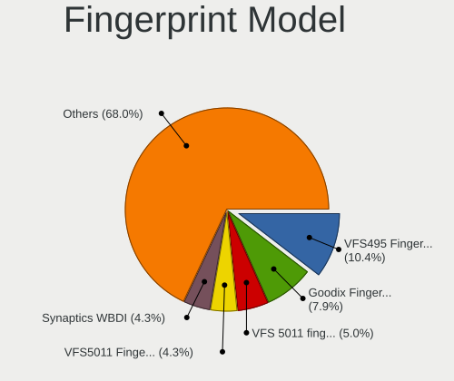

| Model                                                                      | Computers | Percent |
|----------------------------------------------------------------------------|-----------|---------|
| Validity Sensors VFS495 Fingerprint Reader                                 | 46        | 10.43%  |
| Shenzhen Goodix  FingerPrint Device                                        | 35        | 7.94%   |
| Validity Sensors VFS 5011 fingerprint sensor                               | 22        | 4.99%   |
| Validity Sensors VFS5011 Fingerprint Reader                                | 19        | 4.31%   |
| Validity Sensors Synaptics WBDI                                            | 19        | 4.31%   |
| Upek Biometric Touchchip/Touchstrip Fingerprint Sensor                     | 19        | 4.31%   |
| Validity Sensors VFS471 Fingerprint Reader                                 | 15        | 3.4%    |
| Synaptics Metallica MIS Touch Fingerprint Reader                           | 15        | 3.4%    |
| Validity Sensors Synaptics VFS7552 Touch Fingerprint Sensor with PurePrint | 13        | 2.95%   |
| Validity Sensors Swipe Fingerprint Sensor                                  | 13        | 2.95%   |
| Validity Sensors Fingerprint scanner                                       | 12        | 2.72%   |
| Validity Sensors VFS7500 Touch Fingerprint Sensor                          | 11        | 2.49%   |
| Synaptics Prometheus MIS Touch Fingerprint Reader                          | 11        | 2.49%   |
| Shenzhen Goodix Fingerprint Reader                                         | 11        | 2.49%   |
| Elan ELAN:ARM-M4                                                           | 11        | 2.49%   |
| Validity Sensors VFS491                                                    | 10        | 2.27%   |
| Synaptics WBDI                                                             | 10        | 2.27%   |
| Synaptics  WBDI                                                            | 10        | 2.27%   |
| Synaptics Fingerprint reader [HP G6]                                       | 9         | 2.04%   |
| AuthenTec Fingerprint Sensor                                               | 9         | 2.04%   |
| Validity Sensors VFS451 Fingerprint Reader                                 | 8         | 1.81%   |
| Synaptics FS7604 Touch Fingerprint Sensor with PurePrint                   | 8         | 1.81%   |
| Elan ELAN:Fingerprint                                                      | 8         | 1.81%   |
| AuthenTec AES1600                                                          | 8         | 1.81%   |
| Synaptics  FS7604 Touch Fingerprint Sensor with PurePrint                  | 6         | 1.36%   |
| AuthenTec AES2810                                                          | 6         | 1.36%   |
| AuthenTec AES2501 Fingerprint Sensor                                       | 6         | 1.36%   |
| Synaptics UWP WBDI Device                                                  | 5         | 1.13%   |
| Synaptics Metallica MOH Touch Fingerprint Reader                           | 5         | 1.13%   |
| STMicroelectronics Fingerprint Reader                                      | 5         | 1.13%   |
| LighTuning Fingerprint Reader                                              | 5         | 1.13%   |
| Validity Sensors VFS301 Fingerprint Reader                                 | 4         | 0.91%   |
| Validity Sensors Synaptics VFS7552 Touch Fingerprint Sensor                | 4         | 0.91%   |
| Synaptics UWP WBDI                                                         | 4         | 0.91%   |
| Shenzhen Goodix FingerPrint                                                | 4         | 0.91%   |
| LighTuning ES603 Swipe Fingerprint Sensor                                  | 4         | 0.91%   |
| LighTuning EgisTec Touch Fingerprint Sensor                                | 4         | 0.91%   |
| Validity Sensors VFS Fingerprint sensor                                    | 3         | 0.68%   |
| Realtek USB2.0 Finger Print Bridge FocalTech Fingerprint Device            | 3         | 0.68%   |
| HOLTEK FocalTech Fingerprint Device                                        | 3         | 0.68%   |

Chipcard Vendor
---------------

Chipcard module vendors

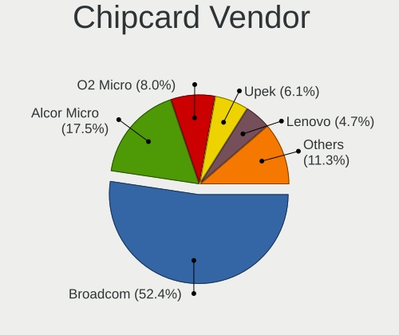

| Vendor                            | Computers | Percent |
|-----------------------------------|-----------|---------|
| Broadcom                          | 111       | 52.36%  |
| Alcor Micro                       | 37        | 17.45%  |
| O2 Micro                          | 17        | 8.02%   |
| Upek                              | 13        | 6.13%   |
| Lenovo                            | 10        | 4.72%   |
| SCM Microsystems                  | 5         | 2.36%   |
| Reiner SCT Kartensysteme          | 3         | 1.42%   |
| Gemalto (was Gemplus)             | 3         | 1.42%   |
| NXP Semiconductors                | 2         | 0.94%   |
| Chicony Electronics               | 2         | 0.94%   |
| Bit4id                            | 2         | 0.94%   |
| Advanced Card Systems             | 2         | 0.94%   |
| VASCO Data Security International | 1         | 0.47%   |
| Hewlett-Packard                   | 1         | 0.47%   |
| Athena Smartcard Solutions        | 1         | 0.47%   |
| Aladdin Knowledge Systems         | 1         | 0.47%   |
| Aktiv                             | 1         | 0.47%   |

Chipcard Model
--------------

Chipcard module models

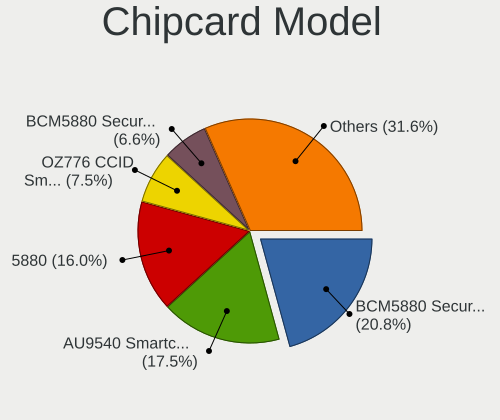

| Model                                                                        | Computers | Percent |
|------------------------------------------------------------------------------|-----------|---------|
| Broadcom BCM5880 Secure Applications Processor                               | 44        | 20.75%  |
| Alcor Micro AU9540 Smartcard Reader                                          | 37        | 17.45%  |
| Broadcom 5880                                                                | 34        | 16.04%  |
| O2 Micro OZ776 CCID Smartcard Reader                                         | 16        | 7.55%   |
| Broadcom BCM5880 Secure Applications Processor with fingerprint swipe sensor | 14        | 6.6%    |
| Upek TouchChip Fingerprint Coprocessor (WBF advanced mode)                   | 13        | 6.13%   |
| Broadcom BCM58200 ControlVault 3 (FingerPrint sensor + Contacted SmartCard)  | 13        | 6.13%   |
| Lenovo Integrated Smart Card Reader                                          | 9         | 4.25%   |
| Broadcom 58200                                                               | 6         | 2.83%   |
| Reiner SCT Kartensysteme cyberJack RFID basis contactless smartcard reader   | 3         | 1.42%   |
| SCM Microsystems SCR35xx Smart Card Reader                                   | 2         | 0.94%   |
| SCM Microsystems SCR331-LC1 / SCR3310 SmartCard Reader                       | 2         | 0.94%   |
| Gemalto (was Gemplus) GemPC Twin SmartCard Reader                            | 2         | 0.94%   |
| Chicony Electronics HP Skylab USB Smartcard Keyboard                         | 2         | 0.94%   |
| Bit4id miniLector EVO                                                        | 2         | 0.94%   |
| Advanced Card Systems ACR39U                                                 | 2         | 0.94%   |
| VASCO Data Security International DIGIPASS 870                               | 1         | 0.47%   |
| SCM Microsystems SCR3340 - ExpressCard54 Smart Card Reader                   | 1         | 0.47%   |
| O2 Micro Oz776 SmartCard Reader                                              | 1         | 0.47%   |
| NXP Semiconductors PR533                                                     | 1         | 0.47%   |
| NXP Semiconductors HUSCR-NFC                                                 | 1         | 0.47%   |
| Lenovo Smartcard Keyboard                                                    | 1         | 0.47%   |
| Hewlett-Packard SC Keyboard - Apollo (Liteon)                                | 1         | 0.47%   |
| Gemalto (was Gemplus) Compact Smart Card Reader Writer                       | 1         | 0.47%   |
| Athena Smartcard Solutions ASEDrive V3C                                      | 1         | 0.47%   |
| Aladdin Knowledge Systems Token JC                                           | 1         | 0.47%   |
| Aktiv Rutoken lite                                                           | 1         | 0.47%   |

Unsupported
-----------

Unsupported Devices
-------------------

Total unsupported devices on board

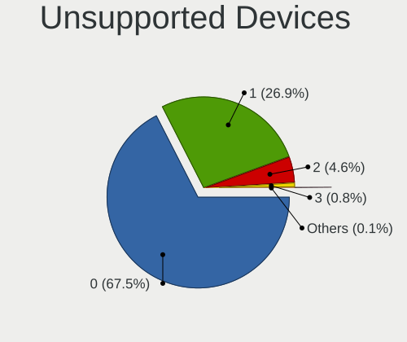

| Total | Computers | Percent |
|-------|-----------|---------|
| 0     | 3328      | 67.48%  |
| 1     | 1329      | 26.95%  |
| 2     | 227       | 4.6%    |
| 3     | 40        | 0.81%   |
| 5     | 5         | 0.1%    |
| 4     | 3         | 0.06%   |

Unsupported Device Types
------------------------

Types of unsupported devices

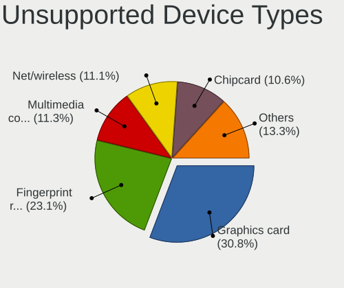

| Type                     | Computers | Percent |
|--------------------------|-----------|---------|
| Graphics card            | 579       | 30.77%  |
| Fingerprint reader       | 434       | 23.06%  |
| Multimedia controller    | 212       | 11.26%  |
| Net/wireless             | 208       | 11.05%  |
| Chipcard                 | 199       | 10.57%  |
| Bluetooth                | 40        | 2.13%   |
| Storage                  | 33        | 1.75%   |
| Camera                   | 32        | 1.7%    |
| Communication controller | 30        | 1.59%   |
| Unassigned class         | 25        | 1.33%   |
| Sound                    | 23        | 1.22%   |
| Net/ethernet             | 23        | 1.22%   |
| Card reader              | 11        | 0.58%   |
| Network                  | 10        | 0.53%   |
| Storage/raid             | 5         | 0.27%   |
| Storage/ide              | 5         | 0.27%   |
| Unclassified device      | 3         | 0.16%   |
| Modem                    | 3         | 0.16%   |
| Dvb card                 | 3         | 0.16%   |
| Video                    | 1         | 0.05%   |
| Tv card                  | 1         | 0.05%   |
| Storage/nvme             | 1         | 0.05%   |
| Firewire controller      | 1         | 0.05%   |

