Zorin 17 - Tested Hardware & Statistics
---------------------------------------

A project to collect tested hardware configurations for Zorin 17.

Anyone can contribute to this report by the [hw-probe](https://github.com/linuxhw/hw-probe) tool:

    sudo -E hw-probe -all -upload

Please contribute! Especially if your hardware is rare.

This is a report for all computer types. See also reports for [desktops](/Dist/Zorin_17/Desktop/README.md) and [notebooks](/Dist/Zorin_17/Notebook/README.md).

Contents
--------

* [ Test Cases ](#test-cases)

* [ System ](#system)
  - [ Kernel                   ](#kernel)
  - [ Kernel Family            ](#kernel-family)
  - [ Kernel Major Ver.        ](#kernel-major-ver)
  - [ Arch                     ](#arch)
  - [ DE                       ](#de)
  - [ Display Server           ](#display-server)
  - [ Display Manager          ](#display-manager)
  - [ OS Lang                  ](#os-lang)
  - [ Boot Mode                ](#boot-mode)
  - [ Filesystem               ](#filesystem)
  - [ Part. scheme             ](#part-scheme)
  - [ Dual Boot with Linux/BSD ](#dual-boot-with-linuxbsd)
  - [ Dual Boot (Win)          ](#dual-boot-win)

* [ Board ](#board)
  - [ Vendor                   ](#vendor)
  - [ Model                    ](#model)
  - [ Model Family             ](#model-family)
  - [ MFG Year                 ](#mfg-year)
  - [ Form Factor              ](#form-factor)
  - [ Secure Boot              ](#secure-boot)
  - [ Coreboot                 ](#coreboot)
  - [ RAM Size                 ](#ram-size)
  - [ RAM Used                 ](#ram-used)
  - [ Total Drives             ](#total-drives)
  - [ Has CD-ROM               ](#has-cd-rom)
  - [ Has Ethernet             ](#has-ethernet)
  - [ Has WiFi                 ](#has-wifi)
  - [ Has Bluetooth            ](#has-bluetooth)

* [ Location ](#location)
  - [ Country                  ](#country)
  - [ City                     ](#city)

* [ Drives ](#drives)
  - [ Drive Vendor             ](#drive-vendor)
  - [ Drive Model              ](#drive-model)
  - [ HDD Vendor               ](#hdd-vendor)
  - [ SSD Vendor               ](#ssd-vendor)
  - [ Drive Kind               ](#drive-kind)
  - [ Drive Connector          ](#drive-connector)
  - [ Drive Size               ](#drive-size)
  - [ Space Total              ](#space-total)
  - [ Space Used               ](#space-used)
  - [ Malfunc. Drives          ](#malfunc-drives)
  - [ Malfunc. Drive Vendor    ](#malfunc-drive-vendor)
  - [ Malfunc. HDD Vendor      ](#malfunc-hdd-vendor)
  - [ Malfunc. Drive Kind      ](#malfunc-drive-kind)
  - [ Failed Drives            ](#failed-drives)
  - [ Failed Drive Vendor      ](#failed-drive-vendor)
  - [ Drive Status             ](#drive-status)

* [ Storage controller ](#storage-controller)
  - [ Storage Vendor           ](#storage-vendor)
  - [ Storage Model            ](#storage-model)
  - [ Storage Kind             ](#storage-kind)

* [ Processor ](#processor)
  - [ CPU Vendor               ](#cpu-vendor)
  - [ CPU Model                ](#cpu-model)
  - [ CPU Model Family         ](#cpu-model-family)
  - [ CPU Cores                ](#cpu-cores)
  - [ CPU Sockets              ](#cpu-sockets)
  - [ CPU Threads              ](#cpu-threads)
  - [ CPU Op-Modes             ](#cpu-op-modes)
  - [ CPU Microcode            ](#cpu-microcode)
  - [ CPU Microarch            ](#cpu-microarch)

* [ Graphics ](#graphics)
  - [ GPU Vendor               ](#gpu-vendor)
  - [ GPU Model                ](#gpu-model)
  - [ GPU Combo                ](#gpu-combo)
  - [ GPU Driver               ](#gpu-driver)
  - [ GPU Memory               ](#gpu-memory)

* [ Monitor ](#monitor)
  - [ Monitor Vendor           ](#monitor-vendor)
  - [ Monitor Model            ](#monitor-model)
  - [ Monitor Resolution       ](#monitor-resolution)
  - [ Monitor Diagonal         ](#monitor-diagonal)
  - [ Monitor Width            ](#monitor-width)
  - [ Aspect Ratio             ](#aspect-ratio)
  - [ Monitor Area             ](#monitor-area)
  - [ Pixel Density            ](#pixel-density)
  - [ Multiple Monitors        ](#multiple-monitors)

* [ Network ](#network)
  - [ Net Controller Vendor    ](#net-controller-vendor)
  - [ Net Controller Model     ](#net-controller-model)
  - [ Wireless Vendor          ](#wireless-vendor)
  - [ Wireless Model           ](#wireless-model)
  - [ Ethernet Vendor          ](#ethernet-vendor)
  - [ Ethernet Model           ](#ethernet-model)
  - [ Net Controller Kind      ](#net-controller-kind)
  - [ Used Controller          ](#used-controller)
  - [ NICs                     ](#nics)
  - [ IPv6                     ](#ipv6)

* [ Bluetooth ](#bluetooth)
  - [ Bluetooth Vendor         ](#bluetooth-vendor)
  - [ Bluetooth Model          ](#bluetooth-model)

* [ Sound ](#sound)
  - [ Sound Vendor             ](#sound-vendor)
  - [ Sound Model              ](#sound-model)

* [ Memory ](#memory)
  - [ Memory Vendor            ](#memory-vendor)
  - [ Memory Model             ](#memory-model)
  - [ Memory Kind              ](#memory-kind)
  - [ Memory Form Factor       ](#memory-form-factor)
  - [ Memory Size              ](#memory-size)
  - [ Memory Speed             ](#memory-speed)

* [ Printers & scanners ](#printers--scanners)
  - [ Printer Vendor           ](#printer-vendor)
  - [ Printer Model            ](#printer-model)
  - [ Scanner Vendor           ](#scanner-vendor)
  - [ Scanner Model            ](#scanner-model)

* [ Camera ](#camera)
  - [ Camera Vendor            ](#camera-vendor)
  - [ Camera Model             ](#camera-model)

* [ Security ](#security)
  - [ Fingerprint Vendor       ](#fingerprint-vendor)
  - [ Fingerprint Model        ](#fingerprint-model)
  - [ Chipcard Vendor          ](#chipcard-vendor)
  - [ Chipcard Model           ](#chipcard-model)

* [ Unsupported ](#unsupported)
  - [ Unsupported Devices      ](#unsupported-devices)
  - [ Unsupported Device Types ](#unsupported-device-types)

Test Cases
----------

Total: 374

| Vendor        | Model                       | Form-Factor | Probe                                                      | Date         |
|---------------|-----------------------------|-------------|------------------------------------------------------------|--------------|
| Dell          | 0YC03K A03                  | Desktop     | [e6d016f309](https://linux-hardware.org/?probe=e6d016f309) | Feb 02, 2024 |
| Medion        | E7214                       | Notebook    | [cb37ec8f5d](https://linux-hardware.org/?probe=cb37ec8f5d) | Feb 02, 2024 |
| HP            | ENVY m7                     | Notebook    | [b38e23bdbe](https://linux-hardware.org/?probe=b38e23bdbe) | Feb 02, 2024 |
| Microsoft     | Surface Pro 4               | Tablet      | [07e24523f9](https://linux-hardware.org/?probe=07e24523f9) | Feb 02, 2024 |
| Dell          | Latitude 7420               | Notebook    | [5eb0b85732](https://linux-hardware.org/?probe=5eb0b85732) | Feb 02, 2024 |
| HP            | 3647h                       | Desktop     | [5f1a400767](https://linux-hardware.org/?probe=5f1a400767) | Feb 02, 2024 |
| Acer          | TravelMate 7740G            | Notebook    | [78bfa1b270](https://linux-hardware.org/?probe=78bfa1b270) | Feb 01, 2024 |
| HP            | 2B34                        | Desktop     | [8d74dccabc](https://linux-hardware.org/?probe=8d74dccabc) | Feb 01, 2024 |
| Lenovo        | Yoga Slim 7 14ITL05 82A3    | Notebook    | [98dc9736d7](https://linux-hardware.org/?probe=98dc9736d7) | Feb 01, 2024 |
| Lenovo        | Yoga Slim 7 14ITL05 82A3    | Notebook    | [4661ceab45](https://linux-hardware.org/?probe=4661ceab45) | Feb 01, 2024 |
| HP            | 620                         | Notebook    | [adcf9577e4](https://linux-hardware.org/?probe=adcf9577e4) | Feb 01, 2024 |
| Dell          | Latitude E6420              | Notebook    | [ff73a45b61](https://linux-hardware.org/?probe=ff73a45b61) | Feb 01, 2024 |
| COM1          | E15-5A165-BM (9)            | Notebook    | [41d123782c](https://linux-hardware.org/?probe=41d123782c) | Feb 01, 2024 |
| HP            | EliteBook 1050 G1           | Notebook    | [8799a2e9ae](https://linux-hardware.org/?probe=8799a2e9ae) | Feb 01, 2024 |
| HP            | EliteBook 1050 G1           | Notebook    | [c95847728d](https://linux-hardware.org/?probe=c95847728d) | Feb 01, 2024 |
| Dell          | 0VNGWR A00                  | All in one  | [cc68f4d744](https://linux-hardware.org/?probe=cc68f4d744) | Feb 01, 2024 |
| Apple         | MacBookPro10,2              | Notebook    | [fca71d08b7](https://linux-hardware.org/?probe=fca71d08b7) | Feb 01, 2024 |
| ASUSTek       | ROG Zephyrus G14 GA402RK... | Notebook    | [172f182e36](https://linux-hardware.org/?probe=172f182e36) | Feb 01, 2024 |
| HP            | Elite x2 1012 G1            | Notebook    | [44bbb3b748](https://linux-hardware.org/?probe=44bbb3b748) | Jan 31, 2024 |
| ASUSTek       | B85M-K                      | Desktop     | [3058093889](https://linux-hardware.org/?probe=3058093889) | Jan 31, 2024 |
| ASUSTek       | K50IJ                       | Notebook    | [061ca8b8ca](https://linux-hardware.org/?probe=061ca8b8ca) | Jan 31, 2024 |
| Lenovo        | IdeaPad Y560                | Notebook    | [e9a51b1fa8](https://linux-hardware.org/?probe=e9a51b1fa8) | Jan 31, 2024 |
| ASUSTek       | K50IJ                       | Notebook    | [0eefe2c89f](https://linux-hardware.org/?probe=0eefe2c89f) | Jan 31, 2024 |
| ASUSTek       | GL552JX                     | Notebook    | [4aebfef2d8](https://linux-hardware.org/?probe=4aebfef2d8) | Jan 31, 2024 |
| ASUSTek       | N55SF                       | Notebook    | [03c3d9aa25](https://linux-hardware.org/?probe=03c3d9aa25) | Jan 31, 2024 |
| Dell          | Studio 1450                 | Notebook    | [cdeeb53e43](https://linux-hardware.org/?probe=cdeeb53e43) | Jan 31, 2024 |
| HP            | ZBook 17 G3                 | Notebook    | [fefc37bfa1](https://linux-hardware.org/?probe=fefc37bfa1) | Jan 30, 2024 |
| HP            | ZBook 17 G3                 | Notebook    | [525b120614](https://linux-hardware.org/?probe=525b120614) | Jan 30, 2024 |
| ASUSTek       | GL552JX                     | Notebook    | [4acec8f3e2](https://linux-hardware.org/?probe=4acec8f3e2) | Jan 30, 2024 |
| Lenovo        | IdeaPad Y560                | Notebook    | [a32d1d3fa7](https://linux-hardware.org/?probe=a32d1d3fa7) | Jan 30, 2024 |
| HP            | Laptop 17-ak0xx             | Notebook    | [0b511ae973](https://linux-hardware.org/?probe=0b511ae973) | Jan 30, 2024 |
| MSI           | B450M BAZOOKA V2            | Desktop     | [fbf883eddb](https://linux-hardware.org/?probe=fbf883eddb) | Jan 30, 2024 |
| Dell          | XPS 13 7390 2-in-1          | Convertible | [2c365787da](https://linux-hardware.org/?probe=2c365787da) | Jan 30, 2024 |
| ASUSTek       | VivoBook_ASUSLaptop X150... | Notebook    | [028ce3b254](https://linux-hardware.org/?probe=028ce3b254) | Jan 29, 2024 |
| MSI           | PRO H610M-G DDR4            | Desktop     | [3f4325d337](https://linux-hardware.org/?probe=3f4325d337) | Jan 29, 2024 |
| HUAWEI        | HKD-WXX                     | Notebook    | [7c98d9521b](https://linux-hardware.org/?probe=7c98d9521b) | Jan 29, 2024 |
| Apple         | MacBookPro10,1              | Notebook    | [4a9032156a](https://linux-hardware.org/?probe=4a9032156a) | Jan 29, 2024 |
| Apple         | Mac-942B5BF58194151B        | All in one  | [a86d2d1cf6](https://linux-hardware.org/?probe=a86d2d1cf6) | Jan 29, 2024 |
| HP            | ENVY x360 Convertible 15... | Convertible | [8c24292658](https://linux-hardware.org/?probe=8c24292658) | Jan 29, 2024 |
| Supermicro    | C2SBC-Q                     | Desktop     | [41edfdd3b7](https://linux-hardware.org/?probe=41edfdd3b7) | Jan 29, 2024 |
| Medion        | P651x series                | Notebook    | [078e2924c4](https://linux-hardware.org/?probe=078e2924c4) | Jan 28, 2024 |
| Panasonic     | CFXZ6-1                     | Tablet      | [4bd23f4463](https://linux-hardware.org/?probe=4bd23f4463) | Jan 28, 2024 |
| Gigabyte      | EP43-S3L                    | Desktop     | [47a46bffc3](https://linux-hardware.org/?probe=47a46bffc3) | Jan 28, 2024 |
| Foxconn       | 946 7MA Series              | Desktop     | [8ef460557c](https://linux-hardware.org/?probe=8ef460557c) | Jan 28, 2024 |
| Colorful T... | C.Z77 X5 V20                | Desktop     | [9209512720](https://linux-hardware.org/?probe=9209512720) | Jan 28, 2024 |
| Lenovo        | IdeaPad 3 15IML05 81WB      | Notebook    | [67781b5f97](https://linux-hardware.org/?probe=67781b5f97) | Jan 28, 2024 |
| Intel         | H110                        | Desktop     | [2252be4fdb](https://linux-hardware.org/?probe=2252be4fdb) | Jan 28, 2024 |
| Gigabyte      | B760 AORUS ELITE AX         | Desktop     | [7c3e9a14d3](https://linux-hardware.org/?probe=7c3e9a14d3) | Jan 28, 2024 |
| HP            | Laptop 15-bw0xx             | Notebook    | [118dcfd484](https://linux-hardware.org/?probe=118dcfd484) | Jan 28, 2024 |
| ASUSTek       | ROG STRIX Z690-A GAMING ... | Desktop     | [37e7442cca](https://linux-hardware.org/?probe=37e7442cca) | Jan 27, 2024 |
| Dell          | Inspiron 5570               | Notebook    | [f8c5ba731b](https://linux-hardware.org/?probe=f8c5ba731b) | Jan 27, 2024 |
| Apple         | MacBookPro14,1              | Notebook    | [75f6092ef1](https://linux-hardware.org/?probe=75f6092ef1) | Jan 27, 2024 |
| ASUSTek       | H81M-PLUS                   | Desktop     | [be944e9cf6](https://linux-hardware.org/?probe=be944e9cf6) | Jan 27, 2024 |
| MSI           | Z97 PC Mate                 | Desktop     | [f4242c1634](https://linux-hardware.org/?probe=f4242c1634) | Jan 27, 2024 |
| Intel         | 35901                       | Desktop     | [2851a5f3bd](https://linux-hardware.org/?probe=2851a5f3bd) | Jan 27, 2024 |
| Lenovo        | ThinkPad T430s 2356GRS      | Notebook    | [c12736937f](https://linux-hardware.org/?probe=c12736937f) | Jan 26, 2024 |
| Dell          | 088DT1 A01                  | Desktop     | [b8db5c0293](https://linux-hardware.org/?probe=b8db5c0293) | Jan 26, 2024 |
| Lenovo        | IdeaPad C340-14API 81N6     | Notebook    | [ad13a93817](https://linux-hardware.org/?probe=ad13a93817) | Jan 26, 2024 |
| Gigabyte      | H81M-S2PV                   | Desktop     | [e458188420](https://linux-hardware.org/?probe=e458188420) | Jan 26, 2024 |
| LTD Delovo... | EVE 1470D ES1278EW          | Tablet      | [81aa769b3d](https://linux-hardware.org/?probe=81aa769b3d) | Jan 26, 2024 |
| HP            | Victus by Gaming Laptop ... | Notebook    | [510b7f5cc7](https://linux-hardware.org/?probe=510b7f5cc7) | Jan 26, 2024 |
| ASUSTek       | PRIME B450M-GAMING/BR       | Desktop     | [99eeba6228](https://linux-hardware.org/?probe=99eeba6228) | Jan 26, 2024 |
| ASUSTek       | PRIME B450M-GAMING/BR       | Desktop     | [411e5a0261](https://linux-hardware.org/?probe=411e5a0261) | Jan 26, 2024 |
| ASRock        | Z370 Extreme4               | Desktop     | [30a58d5556](https://linux-hardware.org/?probe=30a58d5556) | Jan 26, 2024 |
| Acer          | Swift SF314-43              | Notebook    | [cdae9f5af3](https://linux-hardware.org/?probe=cdae9f5af3) | Jan 25, 2024 |
| Unknown       | Unknown                     | Desktop     | [5cfa0912f9](https://linux-hardware.org/?probe=5cfa0912f9) | Jan 25, 2024 |
| Gigabyte      | H81M-S2PV                   | Desktop     | [c609c40476](https://linux-hardware.org/?probe=c609c40476) | Jan 25, 2024 |
| Samsung       | Galaxy TabPro S             | Tablet      | [c84ed2f2e4](https://linux-hardware.org/?probe=c84ed2f2e4) | Jan 25, 2024 |
| Apple         | Mac-F22C86C8                | Mini pc     | [7434ec9fa6](https://linux-hardware.org/?probe=7434ec9fa6) | Jan 25, 2024 |
| Samsung       | DT1234567890 SEC_SW_REVI... | Desktop     | [fe98e7026e](https://linux-hardware.org/?probe=fe98e7026e) | Jan 25, 2024 |
| ASUSTek       | ROG STRIX X570-E GAMING     | Desktop     | [fd825e1d58](https://linux-hardware.org/?probe=fd825e1d58) | Jan 25, 2024 |
| Sony          | VPCEB3B4E                   | Notebook    | [afa1b50b5a](https://linux-hardware.org/?probe=afa1b50b5a) | Jan 25, 2024 |
| Fujitsu       | LIFEBOOK A531               | Notebook    | [647bf81332](https://linux-hardware.org/?probe=647bf81332) | Jan 25, 2024 |
| Lenovo        | ThinkPad T480 20L6S3L400    | Notebook    | [3861071640](https://linux-hardware.org/?probe=3861071640) | Jan 24, 2024 |
| Samsung       | 450R4E/450R5E/450R4V/450... | Notebook    | [0f69d36c02](https://linux-hardware.org/?probe=0f69d36c02) | Jan 24, 2024 |
| ASUSTek       | ASUS EXPERTBOOK P3540FA_... | Notebook    | [a20369a079](https://linux-hardware.org/?probe=a20369a079) | Jan 24, 2024 |
| ASUSTek       | ASUS EXPERTBOOK P3540FA_... | Notebook    | [9ac42c58bf](https://linux-hardware.org/?probe=9ac42c58bf) | Jan 24, 2024 |
| HP            | Compaq 6530b (GW688AV)      | Notebook    | [aa8bc496ed](https://linux-hardware.org/?probe=aa8bc496ed) | Jan 24, 2024 |
| ASUSTek       | M5A97 R2.0                  | Desktop     | [738c84d746](https://linux-hardware.org/?probe=738c84d746) | Jan 23, 2024 |
| HP            | EliteBook 840 G2            | Notebook    | [9ad67b6f8d](https://linux-hardware.org/?probe=9ad67b6f8d) | Jan 23, 2024 |
| Intel         | Unknown                     | Desktop     | [e4094a3abf](https://linux-hardware.org/?probe=e4094a3abf) | Jan 23, 2024 |
| HP            | EliteBook 840 G2            | Notebook    | [04f0c2393d](https://linux-hardware.org/?probe=04f0c2393d) | Jan 23, 2024 |
| Lenovo        | ThinkPad X201 4492W36       | Notebook    | [1ab7e95399](https://linux-hardware.org/?probe=1ab7e95399) | Jan 23, 2024 |
| Dell          | Inspiron 5567               | Notebook    | [6869d9559d](https://linux-hardware.org/?probe=6869d9559d) | Jan 22, 2024 |
| Acer          | Aspire 7736                 | Notebook    | [47521c1811](https://linux-hardware.org/?probe=47521c1811) | Jan 22, 2024 |
| Samsung       | DT1234567890 SEC_SW_REVI... | Desktop     | [8edec841f0](https://linux-hardware.org/?probe=8edec841f0) | Jan 22, 2024 |
| Intel         | D54250WYK H13922-303        | Desktop     | [0c54cab119](https://linux-hardware.org/?probe=0c54cab119) | Jan 22, 2024 |
| Acer          | Predator PH315-53           | Notebook    | [a6dd1aa2a0](https://linux-hardware.org/?probe=a6dd1aa2a0) | Jan 22, 2024 |
| Microsoft     | Surface Pro 4               | Tablet      | [459284a7da](https://linux-hardware.org/?probe=459284a7da) | Jan 22, 2024 |
| Dell          | Latitude E7450              | Notebook    | [95b7e8d2fa](https://linux-hardware.org/?probe=95b7e8d2fa) | Jan 21, 2024 |
| MSI           | H81M ECO                    | Desktop     | [6b904323a3](https://linux-hardware.org/?probe=6b904323a3) | Jan 21, 2024 |
| ASUSTek       | PRIME A320M-K               | Desktop     | [9ba427246b](https://linux-hardware.org/?probe=9ba427246b) | Jan 21, 2024 |
| Toshiba       | Satellite A350              | Notebook    | [bc48f2f41a](https://linux-hardware.org/?probe=bc48f2f41a) | Jan 21, 2024 |
| Gigabyte      | B560M AORUS PRO             | Desktop     | [93137ffd8d](https://linux-hardware.org/?probe=93137ffd8d) | Jan 21, 2024 |
| Acer          | Aspire A315-59              | Notebook    | [07f3899f3a](https://linux-hardware.org/?probe=07f3899f3a) | Jan 21, 2024 |
| Acer          | Aspire A315-59              | Notebook    | [7bb9b69a14](https://linux-hardware.org/?probe=7bb9b69a14) | Jan 21, 2024 |
| Acer          | Aspire A315-59              | Notebook    | [124da06515](https://linux-hardware.org/?probe=124da06515) | Jan 21, 2024 |
| Acer          | Aspire A315-59              | Notebook    | [01d1c30937](https://linux-hardware.org/?probe=01d1c30937) | Jan 21, 2024 |
| AMI           | Aptio CRB                   | Mini pc     | [8316bd6b18](https://linux-hardware.org/?probe=8316bd6b18) | Jan 21, 2024 |
| ASUSTek       | ZN242GD                     | All in one  | [c55e6cfa06](https://linux-hardware.org/?probe=c55e6cfa06) | Jan 21, 2024 |
| Microsoft     | Surface Laptop 3            | Tablet      | [51f361caf2](https://linux-hardware.org/?probe=51f361caf2) | Jan 20, 2024 |
| Lenovo        | ThinkPad T470s W10DG 20J... | Notebook    | [aa2c5d9a1a](https://linux-hardware.org/?probe=aa2c5d9a1a) | Jan 20, 2024 |
| Sony          | VPCEB2JFX                   | Notebook    | [f648777cf1](https://linux-hardware.org/?probe=f648777cf1) | Jan 20, 2024 |
| Sony          | VPCEB2JFX                   | Notebook    | [bdc5adc95b](https://linux-hardware.org/?probe=bdc5adc95b) | Jan 20, 2024 |
| Toshiba       | NB550D                      | Notebook    | [1f743ab40e](https://linux-hardware.org/?probe=1f743ab40e) | Jan 20, 2024 |
| MACHINIST     | X79 Z9-D7 PRO V1.0          | Desktop     | [066ef702e4](https://linux-hardware.org/?probe=066ef702e4) | Jan 20, 2024 |
| ASUSTek       | PRIME B550M-A               | Desktop     | [4dfe57b817](https://linux-hardware.org/?probe=4dfe57b817) | Jan 20, 2024 |
| ASRock        | B550 Steel Legend           | Desktop     | [4b1c9b076b](https://linux-hardware.org/?probe=4b1c9b076b) | Jan 20, 2024 |
| MACHINIST     | X79 Z9-D7 PRO V1.0          | Desktop     | [278fae59fe](https://linux-hardware.org/?probe=278fae59fe) | Jan 20, 2024 |
| ECS           | H61H2-M2                    | Desktop     | [ecb9ae8bed](https://linux-hardware.org/?probe=ecb9ae8bed) | Jan 20, 2024 |
| Acer          | Aspire X3990                | Desktop     | [7d4a040306](https://linux-hardware.org/?probe=7d4a040306) | Jan 20, 2024 |
| Dell          | 0427JK A00                  | Desktop     | [7f8cfea83b](https://linux-hardware.org/?probe=7f8cfea83b) | Jan 20, 2024 |
| HP            | 1850                        | Desktop     | [20cf1f695e](https://linux-hardware.org/?probe=20cf1f695e) | Jan 20, 2024 |
| HP            | 8055                        | Desktop     | [e895f1b502](https://linux-hardware.org/?probe=e895f1b502) | Jan 20, 2024 |
| Lenovo        | IdeaPad S145-15IKB 81XM     | Notebook    | [f88694f40b](https://linux-hardware.org/?probe=f88694f40b) | Jan 20, 2024 |
| Lenovo        | IdeaPad S145-15IKB 81XM     | Notebook    | [1ce9d8eb2f](https://linux-hardware.org/?probe=1ce9d8eb2f) | Jan 20, 2024 |
| Dell          | 040DDP A01                  | Desktop     | [521a18e93d](https://linux-hardware.org/?probe=521a18e93d) | Jan 20, 2024 |
| Sony          | VGN-NW11S_S                 | Notebook    | [082d37eaf4](https://linux-hardware.org/?probe=082d37eaf4) | Jan 19, 2024 |
| ASUSTek       | PRIME H410M-E               | Desktop     | [29a0aa8446](https://linux-hardware.org/?probe=29a0aa8446) | Jan 19, 2024 |
| Apple         | Mac-77F17D7DA9285301 iMa... | All in one  | [47316e2746](https://linux-hardware.org/?probe=47316e2746) | Jan 19, 2024 |
| MSI           | MAG B660M BAZOOKA DDR4      | Desktop     | [c2522bf7b3](https://linux-hardware.org/?probe=c2522bf7b3) | Jan 19, 2024 |
| Lenovo        | V330-15IKB 81AX             | Notebook    | [b1151b6885](https://linux-hardware.org/?probe=b1151b6885) | Jan 19, 2024 |
| Dell          | Inspiron 15-3567            | Notebook    | [dafbbbb67c](https://linux-hardware.org/?probe=dafbbbb67c) | Jan 19, 2024 |
| Toshiba       | Satellite C55D-B            | Notebook    | [7f1090301b](https://linux-hardware.org/?probe=7f1090301b) | Jan 18, 2024 |
| Gigabyte      | X570S AERO G                | Desktop     | [15b13f2e8c](https://linux-hardware.org/?probe=15b13f2e8c) | Jan 18, 2024 |
| Intel         | X99                         | Desktop     | [44d8693e2b](https://linux-hardware.org/?probe=44d8693e2b) | Jan 18, 2024 |
| Lenovo        | IdeaPad Z510 20287          | Notebook    | [ba4eb41acd](https://linux-hardware.org/?probe=ba4eb41acd) | Jan 18, 2024 |
| GPD           | MicroPC                     | Notebook    | [80b3061910](https://linux-hardware.org/?probe=80b3061910) | Jan 18, 2024 |
| Dell          | 040DDP A01                  | Desktop     | [c332d169ee](https://linux-hardware.org/?probe=c332d169ee) | Jan 18, 2024 |
| Alienware     | 14                          | Notebook    | [a0109babcd](https://linux-hardware.org/?probe=a0109babcd) | Jan 18, 2024 |
| Lenovo        | SHARKBAY 0B98401 PRO        | Desktop     | [f830d5e5f7](https://linux-hardware.org/?probe=f830d5e5f7) | Jan 18, 2024 |
| ASUSTek       | P5G41T-M LX                 | Desktop     | [27cfeb78bf](https://linux-hardware.org/?probe=27cfeb78bf) | Jan 17, 2024 |
| Microsoft     | Surface Pro 3               | Tablet      | [daced9894a](https://linux-hardware.org/?probe=daced9894a) | Jan 17, 2024 |
| ASUSTek       | Zenbook UM5401QAB_UM5401... | Notebook    | [7b068dc524](https://linux-hardware.org/?probe=7b068dc524) | Jan 17, 2024 |
| Packard Be... | IMEDIA S3810                | Desktop     | [616954684d](https://linux-hardware.org/?probe=616954684d) | Jan 17, 2024 |
| HP            | Laptop 14-cf1xxx            | Notebook    | [b26a65cafd](https://linux-hardware.org/?probe=b26a65cafd) | Jan 16, 2024 |
| Lenovo        | ThinkPad L412 0585A38       | Notebook    | [d3c2d88045](https://linux-hardware.org/?probe=d3c2d88045) | Jan 16, 2024 |
| HP            | 15                          | Notebook    | [c84c138cef](https://linux-hardware.org/?probe=c84c138cef) | Jan 16, 2024 |
| Toshiba       | Satellite L55-C             | Notebook    | [004a2ecf6b](https://linux-hardware.org/?probe=004a2ecf6b) | Jan 16, 2024 |
| Dell          | 0NW6H5 A00                  | Desktop     | [f1ec7dddcf](https://linux-hardware.org/?probe=f1ec7dddcf) | Jan 16, 2024 |
| Lenovo        | Legion Pro 5 16ARX8 82WM    | Notebook    | [dddcaf6303](https://linux-hardware.org/?probe=dddcaf6303) | Jan 16, 2024 |
| Lenovo        | Legion Pro 5 16ARX8 82WM    | Notebook    | [26452561bd](https://linux-hardware.org/?probe=26452561bd) | Jan 16, 2024 |
| Gigabyte      | H110M-H-CF                  | Desktop     | [e5de4620f2](https://linux-hardware.org/?probe=e5de4620f2) | Jan 16, 2024 |
| Lenovo        | ThinkPad W520 42844ZG       | Notebook    | [6c360c2400](https://linux-hardware.org/?probe=6c360c2400) | Jan 15, 2024 |
| ASUSTek       | PRIME B450M-K II            | Desktop     | [fac0f6dfa7](https://linux-hardware.org/?probe=fac0f6dfa7) | Jan 15, 2024 |
| Dell          | Latitude E5470              | Notebook    | [d9fcb7e121](https://linux-hardware.org/?probe=d9fcb7e121) | Jan 15, 2024 |
| ASUSTek       | TUF Gaming Z790-PLUS WIF... | Desktop     | [e7fea8c963](https://linux-hardware.org/?probe=e7fea8c963) | Jan 15, 2024 |
| MSI           | B85-G41 PC Mate             | Desktop     | [a31032a308](https://linux-hardware.org/?probe=a31032a308) | Jan 15, 2024 |
| Lenovo        | ThinkPad X240 20AL0097US    | Notebook    | [7c13db701b](https://linux-hardware.org/?probe=7c13db701b) | Jan 15, 2024 |
| MSI           | A320M PRO-VH PLUS           | Desktop     | [b18b5a87c1](https://linux-hardware.org/?probe=b18b5a87c1) | Jan 15, 2024 |
| Gigabyte      | Z170X-UD5-CF                | Desktop     | [56be497bb3](https://linux-hardware.org/?probe=56be497bb3) | Jan 15, 2024 |
| Dell          | Latitude 14 Rugged (5404... | Notebook    | [fdbb4ec35e](https://linux-hardware.org/?probe=fdbb4ec35e) | Jan 15, 2024 |
| ASUSTek       | M4A87TD/USB3                | Desktop     | [7d6c792c7c](https://linux-hardware.org/?probe=7d6c792c7c) | Jan 14, 2024 |
| Samsung       | 700Z3C/700Z5C               | Notebook    | [6055feefa2](https://linux-hardware.org/?probe=6055feefa2) | Jan 14, 2024 |
| ASUSTek       | PRIME N100I-D D4            | Desktop     | [da3a345b8c](https://linux-hardware.org/?probe=da3a345b8c) | Jan 14, 2024 |
| ASUSTek       | ROG STRIX X570-I GAMING     | Desktop     | [4205f233da](https://linux-hardware.org/?probe=4205f233da) | Jan 14, 2024 |
| Apple         | Mac-8ED6AF5B48C039E1 Mac... | Mini pc     | [016fce8667](https://linux-hardware.org/?probe=016fce8667) | Jan 14, 2024 |
| Apple         | Mac-8ED6AF5B48C039E1 Mac... | Mini pc     | [c77044bdbd](https://linux-hardware.org/?probe=c77044bdbd) | Jan 14, 2024 |
| Dell          | Latitude 7390               | Notebook    | [837b633afe](https://linux-hardware.org/?probe=837b633afe) | Jan 14, 2024 |
| HP            | 15                          | Notebook    | [c247a8a3fb](https://linux-hardware.org/?probe=c247a8a3fb) | Jan 14, 2024 |
| Acer          | Aspire GX-781               | Desktop     | [a12a5666f0](https://linux-hardware.org/?probe=a12a5666f0) | Jan 14, 2024 |
| ASUSTek       | VivoBook_ASUSLaptop M650... | Notebook    | [a6d483fa69](https://linux-hardware.org/?probe=a6d483fa69) | Jan 14, 2024 |
| MSI           | A320M PRO-VH PLUS           | Desktop     | [fd91d64dae](https://linux-hardware.org/?probe=fd91d64dae) | Jan 14, 2024 |
| HP            | Spectre x360 Convertible... | Convertible | [eae86d20de](https://linux-hardware.org/?probe=eae86d20de) | Jan 13, 2024 |
| Intel         | B75                         | Desktop     | [9043007717](https://linux-hardware.org/?probe=9043007717) | Jan 13, 2024 |
| HP            | 843B                        | Desktop     | [1a5460ffda](https://linux-hardware.org/?probe=1a5460ffda) | Jan 13, 2024 |
| HP            | 843B                        | Desktop     | [6f49885414](https://linux-hardware.org/?probe=6f49885414) | Jan 13, 2024 |
| MSI           | H310M PRO-M2 PLUS           | Desktop     | [89b8dbd2bb](https://linux-hardware.org/?probe=89b8dbd2bb) | Jan 13, 2024 |
| ASUSTek       | ROG Rampage VI EXTREME      | Desktop     | [d69cce27fe](https://linux-hardware.org/?probe=d69cce27fe) | Jan 13, 2024 |
| Apple         | MacBookPro10,2              | Notebook    | [8b5e54c037](https://linux-hardware.org/?probe=8b5e54c037) | Jan 13, 2024 |
| ASUSTek       | P5G41T-M LX                 | Desktop     | [4560285085](https://linux-hardware.org/?probe=4560285085) | Jan 13, 2024 |
| Gateway       | SX2851                      | Desktop     | [148edc701f](https://linux-hardware.org/?probe=148edc701f) | Jan 12, 2024 |
| HP            | Laptop 14s-dq0xxx           | Notebook    | [d8a2561e72](https://linux-hardware.org/?probe=d8a2561e72) | Jan 12, 2024 |
| ASRock        | H61M-DGS                    | Desktop     | [5b064e0d5c](https://linux-hardware.org/?probe=5b064e0d5c) | Jan 12, 2024 |
| Acer          | Nitro AN517-41              | Notebook    | [3f38b8085c](https://linux-hardware.org/?probe=3f38b8085c) | Jan 12, 2024 |
| Lenovo        | 1046 SDK0K17763 WIN 1801... | Desktop     | [04f69940d9](https://linux-hardware.org/?probe=04f69940d9) | Jan 12, 2024 |
| SGIN          | M15                         | Notebook    | [022c34815c](https://linux-hardware.org/?probe=022c34815c) | Jan 12, 2024 |
| Lenovo        | ThinkPad W520 42844ZG       | Notebook    | [e085204d13](https://linux-hardware.org/?probe=e085204d13) | Jan 12, 2024 |
| Lenovo        | ThinkPad T430 2347GU8       | Notebook    | [b521a115f8](https://linux-hardware.org/?probe=b521a115f8) | Jan 12, 2024 |
| Lenovo        | ThinkPad T430 2347GU8       | Notebook    | [7d95af598c](https://linux-hardware.org/?probe=7d95af598c) | Jan 12, 2024 |
| MSI           | H110M GAMING                | Desktop     | [cb524a284a](https://linux-hardware.org/?probe=cb524a284a) | Jan 12, 2024 |
| Chuwi         | LapBook Pro                 | Notebook    | [9b26a023b9](https://linux-hardware.org/?probe=9b26a023b9) | Jan 12, 2024 |
| Chuwi         | LapBook Pro                 | Notebook    | [efa337f154](https://linux-hardware.org/?probe=efa337f154) | Jan 12, 2024 |
| HP            | 250 G5 Notebook PC          | Notebook    | [8fb1c8650f](https://linux-hardware.org/?probe=8fb1c8650f) | Jan 12, 2024 |
| HP            | 8055                        | Desktop     | [f92ba3c747](https://linux-hardware.org/?probe=f92ba3c747) | Jan 12, 2024 |
| Lenovo        | Yoga C940-14IIL 81Q9        | Convertible | [097b734fd7](https://linux-hardware.org/?probe=097b734fd7) | Jan 12, 2024 |
| Dell          | 0WR7PY A02                  | Desktop     | [623fed7d14](https://linux-hardware.org/?probe=623fed7d14) | Jan 11, 2024 |
| ASUSTek       | ZenBook UX431DA_UM431DA     | Notebook    | [da41d1e19b](https://linux-hardware.org/?probe=da41d1e19b) | Jan 11, 2024 |
| Dell          | Inspiron 1545               | Notebook    | [8740fc7c08](https://linux-hardware.org/?probe=8740fc7c08) | Jan 11, 2024 |
| Lenovo        | Aptio CRB SDK0E50510 WIN    | Mini pc     | [75ab39eb43](https://linux-hardware.org/?probe=75ab39eb43) | Jan 11, 2024 |
| Acer          | Aspire A515-58M             | Notebook    | [459fc30547](https://linux-hardware.org/?probe=459fc30547) | Jan 11, 2024 |
| HP            | 86F3 00100                  | All in one  | [3d82b7b8e6](https://linux-hardware.org/?probe=3d82b7b8e6) | Jan 11, 2024 |
| Toshiba       | Satellite L750              | Notebook    | [44ec4c7459](https://linux-hardware.org/?probe=44ec4c7459) | Jan 11, 2024 |
| Dell          | 0D6H9T A01                  | Desktop     | [afb3c3cb61](https://linux-hardware.org/?probe=afb3c3cb61) | Jan 11, 2024 |
| Apple         | MacBookPro14,1              | Notebook    | [8762757dc7](https://linux-hardware.org/?probe=8762757dc7) | Jan 10, 2024 |
| HUAWEI        | HVY-WXX9                    | Notebook    | [2a28690851](https://linux-hardware.org/?probe=2a28690851) | Jan 10, 2024 |
| Toshiba       | STI NI 1401                 | Notebook    | [be4bcf5468](https://linux-hardware.org/?probe=be4bcf5468) | Jan 10, 2024 |
| ASUSTek       | PRIME Z690-P WIFI           | Desktop     | [864517b348](https://linux-hardware.org/?probe=864517b348) | Jan 10, 2024 |
| ASUSTek       | H81I-PLUS                   | Desktop     | [c51ffcf76e](https://linux-hardware.org/?probe=c51ffcf76e) | Jan 10, 2024 |
| Gigabyte      | GA-78LMT-USB3 x.x           | Desktop     | [fda5ec8f8d](https://linux-hardware.org/?probe=fda5ec8f8d) | Jan 10, 2024 |
| Lenovo        | Win8 Pro DPK TPG            | Desktop     | [dc6bb19505](https://linux-hardware.org/?probe=dc6bb19505) | Jan 10, 2024 |
| ASUSTek       | ROG STRIX X570-E GAMING     | Desktop     | [5c2e8e03c6](https://linux-hardware.org/?probe=5c2e8e03c6) | Jan 10, 2024 |
| Lenovo        | Win8 Pro DPK TPG            | Desktop     | [66eedf0a68](https://linux-hardware.org/?probe=66eedf0a68) | Jan 10, 2024 |
| AZW           | SER V01                     | Mini pc     | [3ea9c8a571](https://linux-hardware.org/?probe=3ea9c8a571) | Jan 09, 2024 |
| Acer          | Aspire 6530G                | Notebook    | [184836d752](https://linux-hardware.org/?probe=184836d752) | Jan 09, 2024 |
| MSI           | H81M-E33 V2                 | Desktop     | [7f2af9d905](https://linux-hardware.org/?probe=7f2af9d905) | Jan 09, 2024 |
| ASUSTek       | P8P67 DELUXE                | Desktop     | [7d5b232fca](https://linux-hardware.org/?probe=7d5b232fca) | Jan 09, 2024 |
| ASUSTek       | ROG STRIX Z690-F GAMING ... | Desktop     | [f7db7dfd14](https://linux-hardware.org/?probe=f7db7dfd14) | Jan 09, 2024 |
| ASUSTek       | PRIME Z490-P                | Desktop     | [1ec23b4600](https://linux-hardware.org/?probe=1ec23b4600) | Jan 09, 2024 |
| Acer          | FG965M                      | Desktop     | [1c08b35011](https://linux-hardware.org/?probe=1c08b35011) | Jan 09, 2024 |
| HP            | ZBook 15u G5                | Notebook    | [6636e9d9f7](https://linux-hardware.org/?probe=6636e9d9f7) | Jan 09, 2024 |
| Dell          | Latitude E5520              | Notebook    | [cae81ff9aa](https://linux-hardware.org/?probe=cae81ff9aa) | Jan 09, 2024 |
| ASUSTek       | Zenbook UM3402YA_UM3402Y... | Notebook    | [2c022aaecf](https://linux-hardware.org/?probe=2c022aaecf) | Jan 09, 2024 |
| Samsung       | 550XBE/350XBE               | Notebook    | [40266fb2b6](https://linux-hardware.org/?probe=40266fb2b6) | Jan 08, 2024 |
| Shuttle       | FZ87                        | Desktop     | [e06b37d26f](https://linux-hardware.org/?probe=e06b37d26f) | Jan 08, 2024 |
| SGIN          | M15                         | Notebook    | [b0b7267ad7](https://linux-hardware.org/?probe=b0b7267ad7) | Jan 08, 2024 |
| ASUSTek       | X550CC                      | Notebook    | [b4987d6897](https://linux-hardware.org/?probe=b4987d6897) | Jan 08, 2024 |
| Lenovo        | ThinkPad W550s 20E2000PM... | Notebook    | [0a3bac66b1](https://linux-hardware.org/?probe=0a3bac66b1) | Jan 08, 2024 |
| HP            | Pavilion Gaming Laptop 1... | Notebook    | [a24204426f](https://linux-hardware.org/?probe=a24204426f) | Jan 08, 2024 |
| HP            | Presario CQ42               | Notebook    | [6addf001a5](https://linux-hardware.org/?probe=6addf001a5) | Jan 08, 2024 |
| Fujitsu       | LIFEBOOK T935               | Notebook    | [c3454270ef](https://linux-hardware.org/?probe=c3454270ef) | Jan 08, 2024 |
| ASUSTek       | X756UV                      | Notebook    | [8e9a0ad7c4](https://linux-hardware.org/?probe=8e9a0ad7c4) | Jan 08, 2024 |
| HP            | Pavilion TS 15              | Notebook    | [730453df05](https://linux-hardware.org/?probe=730453df05) | Jan 08, 2024 |
| HP            | Pavilion Gaming Laptop 1... | Notebook    | [1a8316e6ab](https://linux-hardware.org/?probe=1a8316e6ab) | Jan 08, 2024 |
| HP            | ZBook 15 G2                 | Notebook    | [1db012c1ff](https://linux-hardware.org/?probe=1db012c1ff) | Jan 07, 2024 |
| ASUSTek       | K54LY                       | Notebook    | [58b75cfaa8](https://linux-hardware.org/?probe=58b75cfaa8) | Jan 07, 2024 |
| Lenovo        | IdeaPad 320-15ABR 80XS      | Notebook    | [cc9bcb19e4](https://linux-hardware.org/?probe=cc9bcb19e4) | Jan 07, 2024 |
| HP            | 2215                        | Desktop     | [cea6ba103b](https://linux-hardware.org/?probe=cea6ba103b) | Jan 07, 2024 |
| Dell          | Latitude E5470              | Notebook    | [959af07fd5](https://linux-hardware.org/?probe=959af07fd5) | Jan 07, 2024 |
| Lenovo        | Legion S7 16IAH7 82TF       | Notebook    | [c372a02c46](https://linux-hardware.org/?probe=c372a02c46) | Jan 07, 2024 |
| ASUSTek       | M5A99FX PRO R2.0            | Desktop     | [2b0d355816](https://linux-hardware.org/?probe=2b0d355816) | Jan 07, 2024 |
| Lenovo        | Legion S7 16IAH7 82TF       | Notebook    | [9d297cdfcb](https://linux-hardware.org/?probe=9d297cdfcb) | Jan 06, 2024 |
| Acer          | Aspire 7530G                | Notebook    | [412d583cbd](https://linux-hardware.org/?probe=412d583cbd) | Jan 06, 2024 |
| Google        | Zako                        | Desktop     | [1daf09e8e8](https://linux-hardware.org/?probe=1daf09e8e8) | Jan 06, 2024 |
| Acer          | Aspire ES1-512              | Notebook    | [c24ea3ef71](https://linux-hardware.org/?probe=c24ea3ef71) | Jan 06, 2024 |
| ASUSTek       | P7P55D                      | Desktop     | [3d2ef1558b](https://linux-hardware.org/?probe=3d2ef1558b) | Jan 06, 2024 |
| Lenovo        | ThinkPad L412 0585A38       | Notebook    | [527b75e8b3](https://linux-hardware.org/?probe=527b75e8b3) | Jan 06, 2024 |
| Gigabyte      | AX370-Gaming K5-CF          | Desktop     | [99a8eed63b](https://linux-hardware.org/?probe=99a8eed63b) | Jan 05, 2024 |
| ASUSTek       | PRIME A320M-K               | Desktop     | [aa3bcd9633](https://linux-hardware.org/?probe=aa3bcd9633) | Jan 05, 2024 |
| ASUSTek       | ROG STRIX B450-F GAMING     | Desktop     | [09e0325d35](https://linux-hardware.org/?probe=09e0325d35) | Jan 05, 2024 |
| ASUSTek       | H110M-A/M.2                 | Desktop     | [7b663d0c10](https://linux-hardware.org/?probe=7b663d0c10) | Jan 05, 2024 |
| ASUSTek       | Zenbook UM3402YA_UM3402Y... | Notebook    | [ef882bce34](https://linux-hardware.org/?probe=ef882bce34) | Jan 05, 2024 |
| Shuttle       | FG31 V30                    | Desktop     | [ad4f57194c](https://linux-hardware.org/?probe=ad4f57194c) | Jan 04, 2024 |
| Apple         | MacBookPro9,2               | Notebook    | [c606f10b1d](https://linux-hardware.org/?probe=c606f10b1d) | Jan 04, 2024 |
| Apple         | MacBookPro5,5               | Notebook    | [5242f988d3](https://linux-hardware.org/?probe=5242f988d3) | Jan 04, 2024 |
| HP            | 84EE 1100                   | All in one  | [fe1416b7fa](https://linux-hardware.org/?probe=fe1416b7fa) | Jan 04, 2024 |
| Dell          | 0Y7WYT A00                  | Desktop     | [75fac6e117](https://linux-hardware.org/?probe=75fac6e117) | Jan 04, 2024 |
| Fujitsu       | STYLISTIC Q702              | Notebook    | [27863be159](https://linux-hardware.org/?probe=27863be159) | Jan 04, 2024 |
| Apple         | MacBookAir7,2               | Notebook    | [8e378cce52](https://linux-hardware.org/?probe=8e378cce52) | Jan 04, 2024 |
| Lenovo        | 32CB SDK0T76530 WIN 3556... | Desktop     | [085c7817a1](https://linux-hardware.org/?probe=085c7817a1) | Jan 04, 2024 |
| Compal        | JHL90 REFERENCE             | Notebook    | [ba4b52e111](https://linux-hardware.org/?probe=ba4b52e111) | Jan 04, 2024 |
| ASUSTek       | PRIME B450M-K II            | Desktop     | [798bc45ec5](https://linux-hardware.org/?probe=798bc45ec5) | Jan 03, 2024 |
| ASUSTek       | P50IJ                       | Notebook    | [5a72912f2f](https://linux-hardware.org/?probe=5a72912f2f) | Jan 03, 2024 |
| Apple         | MacBookPro5,5               | Notebook    | [76f1cdbedb](https://linux-hardware.org/?probe=76f1cdbedb) | Jan 03, 2024 |
| ASUSTek       | ASUS TUF Gaming A17 FA70... | Notebook    | [602ef69f04](https://linux-hardware.org/?probe=602ef69f04) | Jan 03, 2024 |
| Dell          | 0D6H9T A01                  | Desktop     | [4d3db6e376](https://linux-hardware.org/?probe=4d3db6e376) | Jan 03, 2024 |
| Lenovo        | ThinkBook 16p Gen 2 20YM    | Notebook    | [2cf15e0bf0](https://linux-hardware.org/?probe=2cf15e0bf0) | Jan 02, 2024 |
| Gigabyte      | P55A-UD4                    | Desktop     | [aef8e25f5a](https://linux-hardware.org/?probe=aef8e25f5a) | Jan 02, 2024 |
| Gigabyte      | P55A-UD4                    | Desktop     | [e050707d30](https://linux-hardware.org/?probe=e050707d30) | Jan 02, 2024 |
| HUAWEI        | BOHL-WXX9                   | Notebook    | [bc70b50aec](https://linux-hardware.org/?probe=bc70b50aec) | Jan 02, 2024 |
| Lenovo        | ThinkPad E560 20EV000TUK    | Notebook    | [0781004009](https://linux-hardware.org/?probe=0781004009) | Jan 02, 2024 |
| ASUSTek       | K53SV                       | Notebook    | [0cc0c3f5e0](https://linux-hardware.org/?probe=0cc0c3f5e0) | Jan 02, 2024 |
| iQual         | NQ4X                        | Notebook    | [5c66dfd710](https://linux-hardware.org/?probe=5c66dfd710) | Jan 02, 2024 |
| ASUSTek       | M4A87TD/USB3                | Desktop     | [8c2ae70cdd](https://linux-hardware.org/?probe=8c2ae70cdd) | Jan 02, 2024 |
| Unknown       | Unknown                     | Desktop     | [b101d94fff](https://linux-hardware.org/?probe=b101d94fff) | Jan 01, 2024 |
| Gigabyte      | X79-UP4                     | Desktop     | [4c7ec5ec88](https://linux-hardware.org/?probe=4c7ec5ec88) | Jan 01, 2024 |
| MSI           | N6105                       | Notebook    | [0b934bf922](https://linux-hardware.org/?probe=0b934bf922) | Jan 01, 2024 |
| ASUSTek       | ROG Zephyrus G15 GA503QR... | Notebook    | [9c0957293d](https://linux-hardware.org/?probe=9c0957293d) | Jan 01, 2024 |
| Sony          | VJF153                      | Notebook    | [9bf924f424](https://linux-hardware.org/?probe=9bf924f424) | Jan 01, 2024 |
| ASUSTek       | PRIME A320M-K               | Desktop     | [685d971973](https://linux-hardware.org/?probe=685d971973) | Jan 01, 2024 |
| MSI           | N6105                       | Notebook    | [24f1343e04](https://linux-hardware.org/?probe=24f1343e04) | Jan 01, 2024 |
| Acer          | One 14 Z8-415               | Notebook    | [b022baea77](https://linux-hardware.org/?probe=b022baea77) | Jan 01, 2024 |
| Acer          | One 14 Z8-415               | Notebook    | [0e2bbf3d20](https://linux-hardware.org/?probe=0e2bbf3d20) | Jan 01, 2024 |
| Sony          | VJF153                      | Notebook    | [b3949d3670](https://linux-hardware.org/?probe=b3949d3670) | Jan 01, 2024 |
| Apple         | Mac-F2208EC8                | Mini pc     | [c649800a53](https://linux-hardware.org/?probe=c649800a53) | Jan 01, 2024 |
| HP            | 1850                        | Desktop     | [b635f6412c](https://linux-hardware.org/?probe=b635f6412c) | Jan 01, 2024 |
| ASUSTek       | P5G41T-M LX                 | Desktop     | [ab74a1228a](https://linux-hardware.org/?probe=ab74a1228a) | Jan 01, 2024 |
| ASUSTek       | PRIME J4005I-C/BR           | Desktop     | [12a957b14b](https://linux-hardware.org/?probe=12a957b14b) | Jan 01, 2024 |
| Sony          | VGN-NW11S_S                 | Notebook    | [6d47430c42](https://linux-hardware.org/?probe=6d47430c42) | Jan 01, 2024 |
| Sony          | VGN-NW11S_S                 | Notebook    | [e898dd413e](https://linux-hardware.org/?probe=e898dd413e) | Jan 01, 2024 |
| ASUSTek       | PRIME J4005I-C/BR           | Desktop     | [7f4bbc6a71](https://linux-hardware.org/?probe=7f4bbc6a71) | Dec 31, 2023 |
| ASUSTek       | PRIME J4005I-C/BR           | Desktop     | [5b8817b3de](https://linux-hardware.org/?probe=5b8817b3de) | Dec 31, 2023 |
| HP            | Pavilion Gaming Notebook    | Notebook    | [8fdfce9fb8](https://linux-hardware.org/?probe=8fdfce9fb8) | Dec 31, 2023 |
| ASUSTek       | X75VC                       | Notebook    | [92906e6c95](https://linux-hardware.org/?probe=92906e6c95) | Dec 31, 2023 |
| ASUSTek       | X75VC                       | Notebook    | [e2ebd9354f](https://linux-hardware.org/?probe=e2ebd9354f) | Dec 31, 2023 |
| MACHINIST     | X99-RS9 V2.0                | Desktop     | [daee98e116](https://linux-hardware.org/?probe=daee98e116) | Dec 31, 2023 |
| Gigabyte      | Z790 AORUS ELITE AX         | Desktop     | [5d368c5304](https://linux-hardware.org/?probe=5d368c5304) | Dec 31, 2023 |
| Sony          | VGN-CS21Z_Q                 | Notebook    | [6c9140100e](https://linux-hardware.org/?probe=6c9140100e) | Dec 30, 2023 |
| DERE          | Unknown                     | Notebook    | [0c27b482df](https://linux-hardware.org/?probe=0c27b482df) | Dec 30, 2023 |
| Gigabyte      | AX370-Gaming K5-CF          | Desktop     | [ba1b2a738a](https://linux-hardware.org/?probe=ba1b2a738a) | Dec 30, 2023 |
| ASUSTek       | TUF Gaming B760M-PLUS WI... | Desktop     | [843542e7eb](https://linux-hardware.org/?probe=843542e7eb) | Dec 30, 2023 |
| Dell          | 0M5DCD A00                  | Desktop     | [a85c9d93c8](https://linux-hardware.org/?probe=a85c9d93c8) | Dec 30, 2023 |
| Gigabyte      | P55A-UD4                    | Desktop     | [c1694a8923](https://linux-hardware.org/?probe=c1694a8923) | Dec 29, 2023 |
| Gigabyte      | H81M-S2H                    | Desktop     | [a3a0b274d0](https://linux-hardware.org/?probe=a3a0b274d0) | Dec 29, 2023 |
| ASUSTek       | VivoBook_ASUSLaptop E410... | Notebook    | [9e856c326a](https://linux-hardware.org/?probe=9e856c326a) | Dec 29, 2023 |
| ASUSTek       | K54LY                       | Notebook    | [d2e504447e](https://linux-hardware.org/?probe=d2e504447e) | Dec 29, 2023 |
| Gigabyte      | P55A-UD4                    | Desktop     | [580efd7b07](https://linux-hardware.org/?probe=580efd7b07) | Dec 29, 2023 |
| ASUSTek       | M4A87TD/USB3                | Desktop     | [62939d6430](https://linux-hardware.org/?probe=62939d6430) | Dec 29, 2023 |
| Dell          | Inspiron 7348               | Notebook    | [a55c6eef41](https://linux-hardware.org/?probe=a55c6eef41) | Dec 29, 2023 |
| HP            | ENVY x360 Convertible 15... | Convertible | [3f7e7324a4](https://linux-hardware.org/?probe=3f7e7324a4) | Dec 29, 2023 |
| HP            | OMEN by Laptop              | Notebook    | [71d20fd45b](https://linux-hardware.org/?probe=71d20fd45b) | Dec 28, 2023 |
| Gigabyte      | H61M-D2H-USB3               | Desktop     | [018e344b4d](https://linux-hardware.org/?probe=018e344b4d) | Dec 28, 2023 |
| Fujitsu       | LIFEBOOK E734               | Notebook    | [2265b1d34f](https://linux-hardware.org/?probe=2265b1d34f) | Dec 28, 2023 |
| ASUSTek       | TUF Gaming X570-PLUS        | Desktop     | [ee1b832527](https://linux-hardware.org/?probe=ee1b832527) | Dec 28, 2023 |
| Apple         | MacBookPro8,3               | Notebook    | [e47426bf12](https://linux-hardware.org/?probe=e47426bf12) | Dec 28, 2023 |
| Dell          | 033FF6 A00                  | Desktop     | [f54cfd23ee](https://linux-hardware.org/?probe=f54cfd23ee) | Dec 28, 2023 |
| ASUSTek       | X555LB                      | Notebook    | [f29fe264f5](https://linux-hardware.org/?probe=f29fe264f5) | Dec 28, 2023 |
| Dell          | Latitude 3380               | Notebook    | [4f9660f132](https://linux-hardware.org/?probe=4f9660f132) | Dec 28, 2023 |
| HP            | Pavilion dv7                | Notebook    | [4b1ea284d3](https://linux-hardware.org/?probe=4b1ea284d3) | Dec 28, 2023 |
| Dell          | Latitude 3380               | Notebook    | [bb1422b9bd](https://linux-hardware.org/?probe=bb1422b9bd) | Dec 28, 2023 |
| HP            | 8055                        | Desktop     | [0829ea2c26](https://linux-hardware.org/?probe=0829ea2c26) | Dec 28, 2023 |
| MSI           | MAG B650 TOMAHAWK WIFI      | Desktop     | [a6041ee7fc](https://linux-hardware.org/?probe=a6041ee7fc) | Dec 27, 2023 |
| Gigabyte      | H61M-D2H-USB3               | Desktop     | [64a4b468b6](https://linux-hardware.org/?probe=64a4b468b6) | Dec 27, 2023 |
| HP            | Laptop 14s-dk0xxx           | Notebook    | [cce90b21c6](https://linux-hardware.org/?probe=cce90b21c6) | Dec 27, 2023 |
| ASUSTek       | TUF Gaming B650M-E WIFI     | Desktop     | [d476db4ac3](https://linux-hardware.org/?probe=d476db4ac3) | Dec 27, 2023 |
| ASUSTek       | PRIME B450M-K II            | Desktop     | [45f0a0ac2d](https://linux-hardware.org/?probe=45f0a0ac2d) | Dec 27, 2023 |
| ASUSTek       | PRIME B450M-K II            | Desktop     | [a74968ee9c](https://linux-hardware.org/?probe=a74968ee9c) | Dec 27, 2023 |
| Hampoo        | L1W6_I1101_C Reserved       | Notebook    | [ad4de7dcab](https://linux-hardware.org/?probe=ad4de7dcab) | Dec 26, 2023 |
| Dell          | Latitude E7450              | Notebook    | [84dc5f09e7](https://linux-hardware.org/?probe=84dc5f09e7) | Dec 26, 2023 |
| ASUSTek       | TP401NAS                    | Convertible | [c8494c780f](https://linux-hardware.org/?probe=c8494c780f) | Dec 26, 2023 |
| ASUSTek       | ROG Strix G713RW_G713RW     | Notebook    | [44db3755d8](https://linux-hardware.org/?probe=44db3755d8) | Dec 26, 2023 |
| Dell          | 0M5DCD A00                  | Desktop     | [3444d7393c](https://linux-hardware.org/?probe=3444d7393c) | Dec 26, 2023 |
| Juana Mans... | SF20GM7                     | Notebook    | [697c873386](https://linux-hardware.org/?probe=697c873386) | Dec 26, 2023 |
| MSI           | MS-B090                     | All in one  | [0f3dce1bfb](https://linux-hardware.org/?probe=0f3dce1bfb) | Dec 26, 2023 |
| HP            | 255 15.6 inch G9 Noteboo... | Notebook    | [b35c9836e7](https://linux-hardware.org/?probe=b35c9836e7) | Dec 26, 2023 |
| Lenovo        | ThinkPad E480 20KN003XUS    | Notebook    | [b83c19a718](https://linux-hardware.org/?probe=b83c19a718) | Dec 26, 2023 |
| Unknown       | Unknown                     | Notebook    | [64873f6716](https://linux-hardware.org/?probe=64873f6716) | Dec 26, 2023 |
| ASUSTek       | M4A87TD/USB3                | Desktop     | [ac88b7e1f2](https://linux-hardware.org/?probe=ac88b7e1f2) | Dec 26, 2023 |
| Intel         | X99-P4 V1.0                 | Desktop     | [69e399de83](https://linux-hardware.org/?probe=69e399de83) | Dec 25, 2023 |
| HP            | Laptop 15-db1xxx            | Notebook    | [692cf22259](https://linux-hardware.org/?probe=692cf22259) | Dec 25, 2023 |
| Dell          | 0D4VY1 A00                  | All in one  | [794c976b9f](https://linux-hardware.org/?probe=794c976b9f) | Dec 25, 2023 |
| Dell          | 084J0R A00                  | Desktop     | [856558c97d](https://linux-hardware.org/?probe=856558c97d) | Dec 25, 2023 |
| Lenovo        | Unknown                     | Notebook    | [9faf2278bb](https://linux-hardware.org/?probe=9faf2278bb) | Dec 24, 2023 |
| Lenovo        | 3098 0B98417 PRO            | Desktop     | [770682ab90](https://linux-hardware.org/?probe=770682ab90) | Dec 24, 2023 |
| HP            | 8299                        | Desktop     | [b579f81db7](https://linux-hardware.org/?probe=b579f81db7) | Dec 24, 2023 |
| ASRock        | 990FX Professional          | Desktop     | [34c4b1fbd4](https://linux-hardware.org/?probe=34c4b1fbd4) | Dec 24, 2023 |
| HP            | 8299                        | Desktop     | [9d48e9f8cb](https://linux-hardware.org/?probe=9d48e9f8cb) | Dec 24, 2023 |
| Gigabyte      | Z790 AORUS ELITE AX         | Desktop     | [6c327c054f](https://linux-hardware.org/?probe=6c327c054f) | Dec 24, 2023 |
| Dell          | 0D4VY1 A00                  | All in one  | [2d510640fd](https://linux-hardware.org/?probe=2d510640fd) | Dec 24, 2023 |
| Dell          | Latitude 5300               | Notebook    | [68336d8bc1](https://linux-hardware.org/?probe=68336d8bc1) | Dec 24, 2023 |
| Teclast       | F6 Plus                     | Notebook    | [a8fee53f37](https://linux-hardware.org/?probe=a8fee53f37) | Dec 24, 2023 |
| Acer          | Nitro AN517-55              | Notebook    | [f3e3de235b](https://linux-hardware.org/?probe=f3e3de235b) | Dec 23, 2023 |
| Acer          | Aspire A3SP14-31PT          | Convertible | [d9850a7566](https://linux-hardware.org/?probe=d9850a7566) | Dec 23, 2023 |
| Microsoft     | Surface Go 2                | Tablet      | [0e05c29504](https://linux-hardware.org/?probe=0e05c29504) | Dec 23, 2023 |
| Unknown       | W1415A                      | Notebook    | [f1fbd72c23](https://linux-hardware.org/?probe=f1fbd72c23) | Dec 23, 2023 |
| Sony          | VPCF215FX                   | Notebook    | [1a79c8b60f](https://linux-hardware.org/?probe=1a79c8b60f) | Dec 23, 2023 |
| Apple         | MacBookPro7,1               | Notebook    | [0f291ca562](https://linux-hardware.org/?probe=0f291ca562) | Dec 23, 2023 |
| ASUSTek       | M5A99FX PRO R2.0            | Desktop     | [1622d9b25b](https://linux-hardware.org/?probe=1622d9b25b) | Dec 23, 2023 |
| HP            | EliteBook 745 G6            | Notebook    | [9bf64ae4b7](https://linux-hardware.org/?probe=9bf64ae4b7) | Dec 23, 2023 |
| Medion        | X682X                       | Notebook    | [c0deb0e748](https://linux-hardware.org/?probe=c0deb0e748) | Dec 22, 2023 |
| Fujitsu       | LIFEBOOK T939               | Convertible | [2f5eddacdb](https://linux-hardware.org/?probe=2f5eddacdb) | Dec 22, 2023 |
| ASUSTek       | VivoBook_ASUSLaptop E203... | Notebook    | [ae01ab2ebe](https://linux-hardware.org/?probe=ae01ab2ebe) | Dec 22, 2023 |
| Dell          | 0JP3NX A01                  | Desktop     | [706947928d](https://linux-hardware.org/?probe=706947928d) | Dec 21, 2023 |
| Fujitsu       | LIFEBOOK T939               | Convertible | [b9c3b5a089](https://linux-hardware.org/?probe=b9c3b5a089) | Dec 21, 2023 |
| Gigabyte      | Z170X-UD5-CF                | Desktop     | [67662437e4](https://linux-hardware.org/?probe=67662437e4) | Dec 21, 2023 |
| Dell          | Latitude 5440               | Notebook    | [bd5e743ebb](https://linux-hardware.org/?probe=bd5e743ebb) | Dec 21, 2023 |
| Unknown       | Unknown                     | Desktop     | [ded73c0619](https://linux-hardware.org/?probe=ded73c0619) | Dec 21, 2023 |
| Apple         | MacBookPro14,1              | Notebook    | [e221a6befb](https://linux-hardware.org/?probe=e221a6befb) | Dec 21, 2023 |
| Acer          | Swift SF314-59              | Notebook    | [13432c28a6](https://linux-hardware.org/?probe=13432c28a6) | Dec 21, 2023 |
| Acer          | Swift SF314-59              | Notebook    | [0eb55bee7d](https://linux-hardware.org/?probe=0eb55bee7d) | Dec 20, 2023 |
| Lenovo        | IdeaPad 1 15ALC7 82R4       | Notebook    | [2dcde776ad](https://linux-hardware.org/?probe=2dcde776ad) | Dec 20, 2023 |
| Acer          | Spin SP315-51               | Convertible | [042f9d77a0](https://linux-hardware.org/?probe=042f9d77a0) | Dec 20, 2023 |
| HP            | 8653 A                      | Desktop     | [0fd89faa0c](https://linux-hardware.org/?probe=0fd89faa0c) | Dec 18, 2023 |
| Medion        | E6246 MD63200               | Notebook    | [eda979df79](https://linux-hardware.org/?probe=eda979df79) | Dec 18, 2023 |
| Dell          | 02YYK5 A01                  | Desktop     | [0558258245](https://linux-hardware.org/?probe=0558258245) | Dec 16, 2023 |
| HP            | 15                          | Notebook    | [b1de66d4ed](https://linux-hardware.org/?probe=b1de66d4ed) | Dec 16, 2023 |
| ASUSTek       | ROG Maximus Z790 HERO       | Desktop     | [64bf6abdc6](https://linux-hardware.org/?probe=64bf6abdc6) | Dec 16, 2023 |
| Dell          | 0HHV7N A00                  | Desktop     | [be9d84c772](https://linux-hardware.org/?probe=be9d84c772) | Dec 13, 2023 |
| Dell          | 0HHV7N A00                  | Desktop     | [eb16cdaf5c](https://linux-hardware.org/?probe=eb16cdaf5c) | Dec 13, 2023 |
| Dell          | Inspiron 3501               | Notebook    | [67a35f1dd7](https://linux-hardware.org/?probe=67a35f1dd7) | Dec 10, 2023 |
| Apple         | MacBookPro8,3               | Notebook    | [08a4bea1d7](https://linux-hardware.org/?probe=08a4bea1d7) | Dec 09, 2023 |
| Lenovo        | ThinkPad X1 Extreme 20MF... | Notebook    | [45c2afd3f1](https://linux-hardware.org/?probe=45c2afd3f1) | Dec 08, 2023 |
| Gigabyte      | 970A-DS3P                   | Desktop     | [396f3e6e9e](https://linux-hardware.org/?probe=396f3e6e9e) | Dec 06, 2023 |
| ASRock        | B550M PG Riptide            | Desktop     | [6132709ecd](https://linux-hardware.org/?probe=6132709ecd) | Dec 05, 2023 |

System
------

Kernel
------

Version of the Linux kernel

| Version               | Computers | Percent |
|-----------------------|-----------|---------|
| 6.2.0-39-generic      | 148       | 48.68%  |
| 6.5.0-14-generic      | 97        | 31.91%  |
| 6.5.0-15-generic      | 51        | 16.78%  |
| 6.2.0-37-generic      | 5         | 1.64%   |
| 6.7.3-060703-generic  | 1         | 0.33%   |
| 6.6.13-060613-generic | 1         | 0.33%   |
| 6.6.11-surface-1      | 1         | 0.33%   |

Kernel Family
-------------

Linux kernel without a distro release

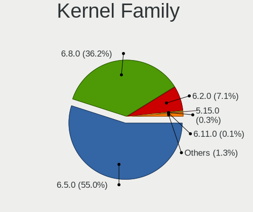

| Version | Computers | Percent |
|---------|-----------|---------|
| 6.2.0   | 153       | 50.5%   |
| 6.5.0   | 147       | 48.51%  |
| 6.7.3   | 1         | 0.33%   |
| 6.6.13  | 1         | 0.33%   |
| 6.6.11  | 1         | 0.33%   |

Kernel Major Ver.
-----------------

Linux kernel major version

| Version | Computers | Percent |
|---------|-----------|---------|
| 6.2     | 153       | 50.5%   |
| 6.5     | 147       | 48.51%  |
| 6.6     | 2         | 0.66%   |
| 6.7     | 1         | 0.33%   |

Arch
----

OS architecture (x86_64, i586, etc.)

| Name   | Computers | Percent |
|--------|-----------|---------|
| x86_64 | 300       | 100%    |

DE
--

Desktop Environment

| Name  | Computers | Percent |
|-------|-----------|---------|
| GNOME | 299       | 99.67%  |
| KDE5  | 1         | 0.33%   |

Display Server
--------------

X11 or Wayland

| Name    | Computers | Percent |
|---------|-----------|---------|
| Wayland | 217       | 72.09%  |
| X11     | 81        | 26.91%  |
| Unknown | 3         | 1%      |

Display Manager
---------------

SDDM, LightDM, etc.

| Name    | Computers | Percent |
|---------|-----------|---------|
| Unknown | 263       | 87.09%  |
| GDM3    | 39        | 12.91%  |

OS Lang
-------

Language

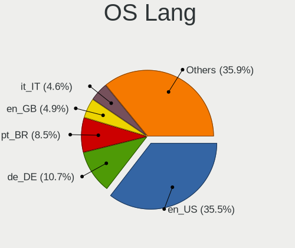

| Lang  | Computers | Percent |
|-------|-----------|---------|
| en_US | 122       | 40.67%  |
| de_DE | 37        | 12.33%  |
| pt_BR | 16        | 5.33%   |
| en_GB | 16        | 5.33%   |
| it_IT | 9         | 3%      |
| fr_FR | 9         | 3%      |
| en_IN | 9         | 3%      |
| es_ES | 8         | 2.67%   |
| en_CA | 8         | 2.67%   |
| pt_PT | 7         | 2.33%   |
| en_AU | 7         | 2.33%   |
| es_MX | 6         | 2%      |
| pl_PL | 5         | 1.67%   |
| ru_RU | 4         | 1.33%   |
| nl_NL | 4         | 1.33%   |
| en_ZA | 4         | 1.33%   |
| es_AR | 3         | 1%      |
| tr_TR | 2         | 0.67%   |
| ro_RO | 2         | 0.67%   |
| hu_HU | 2         | 0.67%   |
| en_SG | 2         | 0.67%   |
| en_NZ | 2         | 0.67%   |
| de_AT | 2         | 0.67%   |
| cs_CZ | 2         | 0.67%   |
| sv_SE | 1         | 0.33%   |
| et_EE | 1         | 0.33%   |
| es_UY | 1         | 0.33%   |
| es_US | 1         | 0.33%   |
| es_PY | 1         | 0.33%   |
| es_PE | 1         | 0.33%   |
| es_CL | 1         | 0.33%   |
| es_BO | 1         | 0.33%   |
| en_IL | 1         | 0.33%   |
| en_HK | 1         | 0.33%   |
| de_IT | 1         | 0.33%   |
| bg_BG | 1         | 0.33%   |

Boot Mode
---------

EFI or BIOS

| Mode | Computers | Percent |
|------|-----------|---------|
| BIOS | 278       | 92.36%  |
| EFI  | 23        | 7.64%   |

Filesystem
----------

Type of filesystem

| Type    | Computers | Percent |
|---------|-----------|---------|
| Ext4    | 270       | 89.4%   |
| Tmpfs   | 16        | 5.3%    |
| Zfs     | 6         | 1.99%   |
| Btrfs   | 6         | 1.99%   |
| Overlay | 3         | 0.99%   |
| Ext2    | 1         | 0.33%   |

Part. scheme
------------

Scheme of partitioning

| Type    | Computers | Percent |
|---------|-----------|---------|
| Unknown | 262       | 86.75%  |
| GPT     | 39        | 12.91%  |
| MBR     | 1         | 0.33%   |

Dual Boot with Linux/BSD
------------------------

Hosting more than one Linux/BSD

| Dual boot | Computers | Percent |
|-----------|-----------|---------|
| No        | 297       | 99%     |
| Yes       | 3         | 1%      |

Dual Boot (Win)
---------------

Hosting Linux and Windows

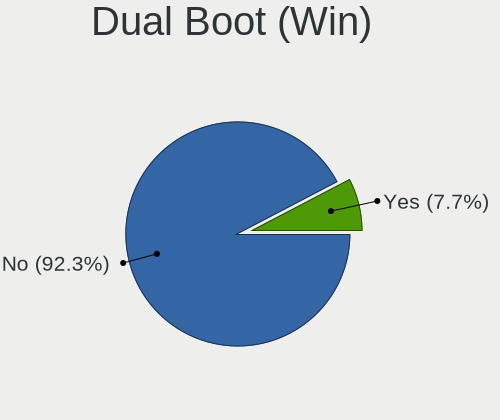

| Dual boot | Computers | Percent |
|-----------|-----------|---------|
| No        | 287       | 95.03%  |
| Yes       | 15        | 4.97%   |

Board
-----

Vendor
------

Motherboard manufacturer

| Name                | Computers | Percent |
|---------------------|-----------|---------|
| ASUSTek Computer    | 55        | 18.33%  |
| Hewlett-Packard     | 40        | 13.33%  |
| Dell                | 36        | 12%     |
| Lenovo              | 32        | 10.67%  |
| Acer                | 18        | 6%      |
| Gigabyte Technology | 15        | 5%      |
| Apple               | 14        | 4.67%   |
| MSI                 | 13        | 4.33%   |
| Intel               | 7         | 2.33%   |
| Sony                | 6         | 2%      |
| Toshiba             | 5         | 1.67%   |
| Samsung Electronics | 5         | 1.67%   |
| Microsoft           | 5         | 1.67%   |
| Fujitsu             | 5         | 1.67%   |
| ASRock              | 5         | 1.67%   |
| Unknown             | 5         | 1.67%   |
| Medion              | 4         | 1.33%   |
| HUAWEI              | 3         | 1%      |
| Shuttle             | 2         | 0.67%   |
| MACHINIST           | 2         | 0.67%   |
| Teclast             | 1         | 0.33%   |
| Supermicro          | 1         | 0.33%   |
| SGIN                | 1         | 0.33%   |
| Semp Toshiba        | 1         | 0.33%   |
| Panasonic           | 1         | 0.33%   |
| Packard Bell        | 1         | 0.33%   |
| LTD Delovoy Office  | 1         | 0.33%   |
| Juana Manso         | 1         | 0.33%   |
| iQual               | 1         | 0.33%   |
| Hampoo              | 1         | 0.33%   |
| GPD                 | 1         | 0.33%   |
| Google              | 1         | 0.33%   |
| Gateway             | 1         | 0.33%   |
| Foxconn             | 1         | 0.33%   |
| ECS                 | 1         | 0.33%   |
| DERE                | 1         | 0.33%   |
| Compal              | 1         | 0.33%   |
| COM1                | 1         | 0.33%   |
| Colorful Technology | 1         | 0.33%   |
| Chuwi               | 1         | 0.33%   |

Model
-----

Motherboard model

| Name                                | Computers | Percent |
|-------------------------------------|-----------|---------|
| Unknown                             | 8         | 2.67%   |
| ASUS All Series                     | 3         | 1%      |
| ASUS A0000001                       | 3         | 1%      |
| MSI MS-7850                         | 2         | 0.67%   |
| Microsoft Surface Pro 4             | 2         | 0.67%   |
| HP 15                               | 2         | 0.67%   |
| Dell Latitude E7450                 | 2         | 0.67%   |
| Dell Latitude E5470                 | 2         | 0.67%   |
| ASUS ROG STRIX X570-E GAMING        | 2         | 0.67%   |
| ASUS P5G41T-M LX                    | 2         | 0.67%   |
| Apple MacBookPro14,1                | 2         | 0.67%   |
| Toshiba Satellite L750              | 1         | 0.33%   |
| Toshiba Satellite L55-C             | 1         | 0.33%   |
| Toshiba Satellite C55D-B            | 1         | 0.33%   |
| Toshiba Satellite A350              | 1         | 0.33%   |
| Toshiba NB550D                      | 1         | 0.33%   |
| Teclast F6 Plus                     | 1         | 0.33%   |
| Supermicro C2SBC-Q                  | 1         | 0.33%   |
| Sony VPCF215FX                      | 1         | 0.33%   |
| Sony VPCEB3B4E                      | 1         | 0.33%   |
| Sony VPCEB2JFX                      | 1         | 0.33%   |
| Sony VJF153                         | 1         | 0.33%   |
| Sony VGN-NW11S_S                    | 1         | 0.33%   |
| Sony VGN-CS21Z_Q                    | 1         | 0.33%   |
| Shuttle SZ87R                       | 1         | 0.33%   |
| Shuttle SG31                        | 1         | 0.33%   |
| SGIN M15                            | 1         | 0.33%   |
| Semp Toshiba STI NI 1401            | 1         | 0.33%   |
| Samsung Galaxy TabPro S             | 1         | 0.33%   |
| Samsung DeskTop System              | 1         | 0.33%   |
| Samsung 700Z3C/700Z5C               | 1         | 0.33%   |
| Samsung 550XBE/350XBE               | 1         | 0.33%   |
| Samsung 450R4E/450R5E/450R4V/450R5V | 1         | 0.33%   |
| Panasonic CFXZ6-1                   | 1         | 0.33%   |
| Packard Bell IMEDIA S3810           | 1         | 0.33%   |
| MSI N6105                           | 1         | 0.33%   |
| MSI MS-B09012                       | 1         | 0.33%   |
| MSI MS-7D75                         | 1         | 0.33%   |
| MSI MS-7D46                         | 1         | 0.33%   |
| MSI MS-7D43                         | 1         | 0.33%   |

Model Family
------------

Motherboard model prefix

| Name               | Computers | Percent |
|--------------------|-----------|---------|
| Lenovo ThinkPad    | 12        | 4%      |
| Dell Latitude      | 12        | 4%      |
| ASUS ROG           | 11        | 3.67%   |
| Dell OptiPlex      | 10        | 3.33%   |
| Acer Aspire        | 10        | 3.33%   |
| Dell Inspiron      | 9         | 3%      |
| Unknown            | 8         | 2.67%   |
| Lenovo IdeaPad     | 7         | 2.33%   |
| ASUS PRIME         | 7         | 2.33%   |
| HP Pavilion        | 6         | 2%      |
| HP Laptop          | 6         | 2%      |
| Microsoft Surface  | 5         | 1.67%   |
| Toshiba Satellite  | 4         | 1.33%   |
| Lenovo ThinkCentre | 4         | 1.33%   |
| HP ENVY            | 4         | 1.33%   |
| Fujitsu LIFEBOOK   | 4         | 1.33%   |
| ASUS VivoBook      | 4         | 1.33%   |
| HP ZBook           | 3         | 1%      |
| HP EliteDesk       | 3         | 1%      |
| HP EliteBook       | 3         | 1%      |
| HP Compaq          | 3         | 1%      |
| Dell XPS           | 3         | 1%      |
| ASUS Zenbook       | 3         | 1%      |
| ASUS TUF           | 3         | 1%      |
| ASUS All           | 3         | 1%      |
| ASUS A0000001      | 3         | 1%      |
| MSI MS-7850        | 2         | 0.67%   |
| Lenovo Yoga        | 2         | 0.67%   |
| Lenovo Legion      | 2         | 0.67%   |
| HP 15              | 2         | 0.67%   |
| ASUS P5G41T-M      | 2         | 0.67%   |
| Apple MacBookPro14 | 2         | 0.67%   |
| Apple MacBookPro10 | 2         | 0.67%   |
| Acer Swift         | 2         | 0.67%   |
| Acer Nitro         | 2         | 0.67%   |
| Toshiba NB550D     | 1         | 0.33%   |
| Teclast F6         | 1         | 0.33%   |
| Supermicro C2SBC-Q | 1         | 0.33%   |
| Sony VPCF215FX     | 1         | 0.33%   |
| Sony VPCEB3B4E     | 1         | 0.33%   |

MFG Year
--------

Motherboard manufacture year

| Year    | Computers | Percent |
|---------|-----------|---------|
| 2017    | 26        | 8.67%   |
| 2022    | 25        | 8.33%   |
| 2019    | 24        | 8%      |
| 2020    | 22        | 7.33%   |
| 2018    | 20        | 6.67%   |
| 2013    | 20        | 6.67%   |
| 2010    | 20        | 6.67%   |
| 2014    | 19        | 6.33%   |
| 2021    | 18        | 6%      |
| 2012    | 17        | 5.67%   |
| 2011    | 17        | 5.67%   |
| 2015    | 16        | 5.33%   |
| 2016    | 15        | 5%      |
| 2023    | 14        | 4.67%   |
| 2008    | 12        | 4%      |
| 2009    | 11        | 3.67%   |
| 2007    | 2         | 0.67%   |
| 2006    | 1         | 0.33%   |
| Unknown | 1         | 0.33%   |

Form Factor
-----------

Physical design of the computer

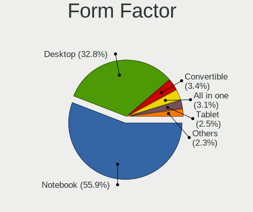

| Name        | Computers | Percent |
|-------------|-----------|---------|
| Notebook    | 154       | 51.33%  |
| Desktop     | 115       | 38.33%  |
| Convertible | 9         | 3%      |
| Tablet      | 8         | 2.67%   |
| All in one  | 8         | 2.67%   |
| Mini pc     | 6         | 2%      |

Secure Boot
-----------

Enabled or disabled

| State    | Computers | Percent |
|----------|-----------|---------|
| Disabled | 294       | 98%     |
| Enabled  | 6         | 2%      |

Coreboot
--------

Have coreboot on board

| Used | Computers | Percent |
|------|-----------|---------|
| No   | 299       | 99.67%  |
| Yes  | 1         | 0.33%   |

RAM Size
--------

Total RAM memory

| Size in GB      | Computers | Percent |
|-----------------|-----------|---------|
| 4.01-8.0        | 95        | 31.67%  |
| 8.01-16.0       | 54        | 18%     |
| 16.01-24.0      | 52        | 17.33%  |
| 3.01-4.0        | 51        | 17%     |
| 32.01-64.0      | 29        | 9.67%   |
| 64.01-256.0     | 11        | 3.67%   |
| 24.01-32.0      | 6         | 2%      |
| More than 256.0 | 1         | 0.33%   |
| 1.01-2.0        | 1         | 0.33%   |

RAM Used
--------

Used RAM memory

| Used GB    | Computers | Percent |
|------------|-----------|---------|
| 2.01-3.0   | 138       | 44.95%  |
| 1.01-2.0   | 61        | 19.87%  |
| 3.01-4.0   | 55        | 17.92%  |
| 4.01-8.0   | 48        | 15.64%  |
| 8.01-16.0  | 3         | 0.98%   |
| 16.01-24.0 | 1         | 0.33%   |
| 0.51-1.0   | 1         | 0.33%   |

Total Drives
------------

Number of drives on board

| Drives | Computers | Percent |
|--------|-----------|---------|
| 1      | 179       | 59.27%  |
| 2      | 82        | 27.15%  |
| 3      | 21        | 6.95%   |
| 4      | 9         | 2.98%   |
| 8      | 3         | 0.99%   |
| 6      | 3         | 0.99%   |
| 5      | 3         | 0.99%   |
| 11     | 1         | 0.33%   |
| 9      | 1         | 0.33%   |

Has CD-ROM
----------

Has CD-ROM on board

| Presented | Computers | Percent |
|-----------|-----------|---------|
| No        | 187       | 62.33%  |
| Yes       | 113       | 37.67%  |

Has Ethernet
------------

Has Ethernet on board

| Presented | Computers | Percent |
|-----------|-----------|---------|
| Yes       | 254       | 84.39%  |
| No        | 47        | 15.61%  |

Has WiFi
--------

Has WiFi module

| Presented | Computers | Percent |
|-----------|-----------|---------|
| Yes       | 242       | 80.67%  |
| No        | 58        | 19.33%  |

Has Bluetooth
-------------

Has Bluetooth module

| Presented | Computers | Percent |
|-----------|-----------|---------|
| Yes       | 201       | 67%     |
| No        | 99        | 33%     |

Location
--------

Country
-------

Geographic location (country)

| Country                | Computers | Percent |
|------------------------|-----------|---------|
| USA                    | 58        | 19.33%  |
| Germany                | 45        | 15%     |
| Brazil                 | 19        | 6.33%   |
| UK                     | 15        | 5%      |
| Italy                  | 11        | 3.67%   |
| India                  | 10        | 3.33%   |
| France                 | 9         | 3%      |
| Mexico                 | 8         | 2.67%   |
| Spain                  | 7         | 2.33%   |
| Portugal               | 7         | 2.33%   |
| Netherlands            | 7         | 2.33%   |
| Canada                 | 7         | 2.33%   |
| Australia              | 7         | 2.33%   |
| Poland                 | 5         | 1.67%   |
| Indonesia              | 5         | 1.67%   |
| Sweden                 | 4         | 1.33%   |
| South Africa           | 4         | 1.33%   |
| Russia                 | 4         | 1.33%   |
| Romania                | 4         | 1.33%   |
| Egypt                  | 4         | 1.33%   |
| Austria                | 4         | 1.33%   |
| Jamaica                | 3         | 1%      |
| Belgium                | 3         | 1%      |
| Argentina              | 3         | 1%      |
| Turkey                 | 2         | 0.67%   |
| Singapore              | 2         | 0.67%   |
| Peru                   | 2         | 0.67%   |
| New Zealand            | 2         | 0.67%   |
| Morocco                | 2         | 0.67%   |
| Malaysia               | 2         | 0.67%   |
| Hungary                | 2         | 0.67%   |
| Greece                 | 2         | 0.67%   |
| Finland                | 2         | 0.67%   |
| Denmark                | 2         | 0.67%   |
| Czechia                | 2         | 0.67%   |
| Croatia                | 2         | 0.67%   |
| Bosnia and Herzegovina | 2         | 0.67%   |
| Uruguay                | 1         | 0.33%   |
| Ukraine                | 1         | 0.33%   |
| Thailand               | 1         | 0.33%   |

City
----

Geographic location (city)

| City                      | Computers | Percent |
|---------------------------|-----------|---------|
| Sao Paulo                 | 3         | 1%      |
| Lisbon                    | 3         | 1%      |
| Berlin                    | 3         | 1%      |
| Adelaide                  | 3         | 1%      |
| Warsaw                    | 2         | 0.67%   |
| Wakefield                 | 2         | 0.67%   |
| Vienna                    | 2         | 0.67%   |
| Sydney                    | 2         | 0.67%   |
| Stockton                  | 2         | 0.67%   |
| Stockholm                 | 2         | 0.67%   |
| Singapore                 | 2         | 0.67%   |
| Sarajevo                  | 2         | 0.67%   |
| Saint-Germain-les-Arpajon | 2         | 0.67%   |
| Richmond                  | 2         | 0.67%   |
| Porto                     | 2         | 0.67%   |
| Mumbai                    | 2         | 0.67%   |
| Milan                     | 2         | 0.67%   |
| Miami                     | 2         | 0.67%   |
| Marshfield                | 2         | 0.67%   |
| Manaus                    | 2         | 0.67%   |
| London                    | 2         | 0.67%   |
| Lima                      | 2         | 0.67%   |
| Las Vegas                 | 2         | 0.67%   |
| Kingston                  | 2         | 0.67%   |
| Johannesburg              | 2         | 0.67%   |
| Indianapolis              | 2         | 0.67%   |
| Frankfurt am Main         | 2         | 0.67%   |
| Cologne                   | 2         | 0.67%   |
| Ciudad Obregn           | 2         | 0.67%   |
| Chennai                   | 2         | 0.67%   |
| Calgary                   | 2         | 0.67%   |
| Cairo                     | 2         | 0.67%   |
| Bonn                      | 2         | 0.67%   |
| Baia Mare                 | 2         | 0.67%   |
| Atlanta                   | 2         | 0.67%   |
| Amsterdam                 | 2         | 0.67%   |
| Zuid-Scharwoude           | 1         | 0.33%   |
| Zaragoza                  | 1         | 0.33%   |
| Zagreb                    | 1         | 0.33%   |
| Wrzburg                 | 1         | 0.33%   |

Drives
------

Drive Vendor
------------

Hard drive vendors

| Vendor                       | Computers | Drives | Percent |
|------------------------------|-----------|--------|---------|
| Samsung Electronics          | 76        | 103    | 16.85%  |
| Seagate                      | 44        | 53     | 9.76%   |
| WDC                          | 43        | 52     | 9.53%   |
| SanDisk                      | 31        | 41     | 6.87%   |
| Kingston                     | 28        | 30     | 6.21%   |
| Toshiba                      | 21        | 22     | 4.66%   |
| Unknown                      | 18        | 19     | 3.99%   |
| SK hynix                     | 17        | 18     | 3.77%   |
| Hitachi                      | 14        | 16     | 3.1%    |
| Crucial                      | 14        | 17     | 3.1%    |
| HGST                         | 11        | 14     | 2.44%   |
| China                        | 10        | 11     | 2.22%   |
| Micron Technology            | 7         | 8      | 1.55%   |
| Kingston Technology Company  | 7         | 8      | 1.55%   |
| PNY                          | 6         | 6      | 1.33%   |
| Micron/Crucial Technology    | 6         | 8      | 1.33%   |
| Intenso                      | 6         | 7      | 1.33%   |
| Silicon Motion               | 5         | 5      | 1.11%   |
| Phison Electronics           | 5         | 7      | 1.11%   |
| MAXIO Technology (Hangzhou)  | 5         | 5      | 1.11%   |
| KIOXIA                       | 4         | 4      | 0.89%   |
| Intel                        | 4         | 6      | 0.89%   |
| Apple                        | 4         | 8      | 0.89%   |
| A-DATA Technology            | 4         | 4      | 0.89%   |
| Transcend                    | 3         | 3      | 0.67%   |
| SPCC                         | 3         | 3      | 0.67%   |
| Netac                        | 3         | 4      | 0.67%   |
| ADATA Technology             | 3         | 3      | 0.67%   |
| Realtek Semiconductor        | 2         | 2      | 0.44%   |
| Lexar                        | 2         | 3      | 0.44%   |
| Gigabyte Technology          | 2         | 2      | 0.44%   |
| External                     | 2         | 2      | 0.44%   |
| Verbatim                     | 1         | 4      | 0.22%   |
| USB                          | 1         | 1      | 0.22%   |
| Teclast                      | 1         | 1      | 0.22%   |
| TEAM T25                     | 1         | 1      | 0.22%   |
| Team                         | 1         | 1      | 0.22%   |
| T-FORCE                      | 1         | 1      | 0.22%   |
| Shenzhen Longsys Electronics | 1         | 1      | 0.22%   |
| Seagate Technology           | 1         | 1      | 0.22%   |

Drive Model
-----------

Hard drive models

| Model                                                 | Computers | Percent |
|-------------------------------------------------------|-----------|---------|
| Unknown MMC Card  64GB                                | 10        | 2.04%   |
| Samsung NVMe SSD Controller SM981/PM981/PM983 1TB     | 8         | 1.63%   |
| Kingston SA400S37240G 240GB SSD                       | 7         | 1.43%   |
| Kingston SA400S37120G 120GB SSD                       | 6         | 1.22%   |
| Samsung SSD 860 EVO 500GB                             | 5         | 1.02%   |
| Micron/Crucial P2 NVMe PCIe SSD 1TB                   | 5         | 1.02%   |
| Unknown MMC Card  128GB                               | 4         | 0.82%   |
| SK hynix BC511 256GB                                  | 4         | 0.82%   |
| Samsung SSD 850 EVO 500GB                             | 4         | 0.82%   |
| Toshiba MQ01ABF050 500GB                              | 3         | 0.61%   |
| Silicon Motion SM2263EN/SM2263XT SSD Controller 128GB | 3         | 0.61%   |
| Seagate ST500LM021-1KJ152 500GB                       | 3         | 0.61%   |
| Seagate ST1000LM035-1RK172 1TB                        | 3         | 0.61%   |
| Sandisk WD Blue SN550 NVMe SSD 512GB                  | 3         | 0.61%   |
| Sandisk WD Black SN850 1024GB                         | 3         | 0.61%   |
| Samsung SSD 870 EVO 500GB                             | 3         | 0.61%   |
| Samsung SSD 840 Series 120GB                          | 3         | 0.61%   |
| Samsung NVMe SSD Controller SM961/PM961/SM963 256GB   | 3         | 0.61%   |
| Samsung NVMe SSD Controller PM9A1/PM9A3/980PRO 2TB    | 3         | 0.61%   |
| PNY CS900 120GB SSD                                   | 3         | 0.61%   |
| Kingston SV300S37A240G 240GB SSD                      | 3         | 0.61%   |
| WDC WDS500G2B0A-00SM50 500GB SSD                      | 2         | 0.41%   |
| WDC WDS100T2B0A-00SM50 1TB SSD                        | 2         | 0.41%   |
| WDC WD20EARX-00PASB0 2TB                              | 2         | 0.41%   |
| WDC WD10JPVX-22JC3T0 1TB                              | 2         | 0.41%   |
| Toshiba MQ04ABF100 1TB                                | 2         | 0.41%   |
| Toshiba MK5061GSYN 500GB                              | 2         | 0.41%   |
| Toshiba KXG50ZNV512G 512GB                            | 2         | 0.41%   |
| Toshiba DT01ACA100 1TB                                | 2         | 0.41%   |
| SPCC Solid State Disk 512GB                           | 2         | 0.41%   |
| SK hynix BC501 NVMe Solid State Drive 512GB           | 2         | 0.41%   |
| Seagate ST9500325AS 500GB                             | 2         | 0.41%   |
| Seagate ST500DM002-1BD142 500GB                       | 2         | 0.41%   |
| Seagate ST4000DM004-2CV104 4TB                        | 2         | 0.41%   |
| Seagate ST1000DM010-2EP102 1TB                        | 2         | 0.41%   |
| SanDisk SSD PLUS 480GB                                | 2         | 0.41%   |
| Samsung SSD 990 PRO 2TB                               | 2         | 0.41%   |
| Samsung SSD 990 PRO 1TB                               | 2         | 0.41%   |
| Samsung SSD 970 EVO Plus 1TB                          | 2         | 0.41%   |
| Samsung SSD 870 QVO 1TB                               | 2         | 0.41%   |

HDD Vendor
----------

Hard disk drive vendors

| Vendor              | Computers | Drives | Percent |
|---------------------|-----------|--------|---------|
| Seagate             | 41        | 49     | 32.8%   |
| WDC                 | 33        | 40     | 26.4%   |
| Toshiba             | 17        | 18     | 13.6%   |
| Hitachi             | 14        | 16     | 11.2%   |
| HGST                | 11        | 14     | 8.8%    |
| Samsung Electronics | 4         | 5      | 3.2%    |
| External            | 2         | 2      | 1.6%    |
| Unknown             | 1         | 1      | 0.8%    |
| Intenso             | 1         | 2      | 0.8%    |
| Fujitsu             | 1         | 1      | 0.8%    |

SSD Vendor
----------

Solid state drive vendors

| Vendor              | Computers | Drives | Percent |
|---------------------|-----------|--------|---------|
| Samsung Electronics | 46        | 59     | 26.9%   |
| Kingston            | 22        | 24     | 12.87%  |
| Crucial             | 14        | 17     | 8.19%   |
| SanDisk             | 13        | 14     | 7.6%    |
| China               | 10        | 11     | 5.85%   |
| WDC                 | 8         | 9      | 4.68%   |
| PNY                 | 6         | 6      | 3.51%   |
| SK hynix            | 4         | 4      | 2.34%   |
| A-DATA Technology   | 4         | 4      | 2.34%   |
| Transcend           | 3         | 3      | 1.75%   |
| SPCC                | 3         | 3      | 1.75%   |
| Micron Technology   | 3         | 4      | 1.75%   |
| Lexar               | 2         | 3      | 1.17%   |
| Intenso             | 2         | 2      | 1.17%   |
| Gigabyte Technology | 2         | 2      | 1.17%   |
| Apple               | 2         | 2      | 1.17%   |
| Verbatim            | 1         | 4      | 0.58%   |
| Toshiba             | 1         | 1      | 0.58%   |
| Teclast             | 1         | 1      | 0.58%   |
| TEAM T25            | 1         | 1      | 0.58%   |
| Team                | 1         | 1      | 0.58%   |
| Seagate             | 1         | 2      | 0.58%   |
| SCUDA               | 1         | 1      | 0.58%   |
| SABRENT             | 1         | 1      | 0.58%   |
| S3+                 | 1         | 1      | 0.58%   |
| QSSDS25240G         | 1         | 1      | 0.58%   |
| Phison              | 1         | 1      | 0.58%   |
| Patriot             | 1         | 1      | 0.58%   |
| OWC                 | 1         | 2      | 0.58%   |
| Netac               | 1         | 2      | 0.58%   |
| Mushkin             | 1         | 1      | 0.58%   |
| MOVESPEED           | 1         | 1      | 0.58%   |
| Min Yi U            | 1         | 1      | 0.58%   |
| LITEONIT            | 1         | 1      | 0.58%   |
| KingSpec            | 1         | 1      | 0.58%   |
| Integral            | 1         | 1      | 0.58%   |
| GLOWAY              | 1         | 1      | 0.58%   |
| Emtec               | 1         | 1      | 0.58%   |
| Drevo               | 1         | 2      | 0.58%   |
| BlueRay             | 1         | 1      | 0.58%   |

Drive Kind
----------

HDD or SSD

| Kind    | Computers | Drives | Percent |
|---------|-----------|--------|---------|
| SSD     | 149       | 201    | 37.44%  |
| NVMe    | 111       | 161    | 27.89%  |
| HDD     | 108       | 148    | 27.14%  |
| MMC     | 16        | 17     | 4.02%   |
| Unknown | 14        | 15     | 3.52%   |

Drive Connector
---------------

SATA, SAS, NVMe, etc.

| Type | Computers | Drives | Percent |
|------|-----------|--------|---------|
| SATA | 215       | 346    | 60.06%  |
| NVMe | 111       | 160    | 31.01%  |
| SAS  | 16        | 19     | 4.47%   |
| MMC  | 16        | 17     | 4.47%   |

Drive Size
----------

Size of hard drive

| Size in TB | Computers | Drives | Percent |
|------------|-----------|--------|---------|
| 0.01-0.5   | 162       | 209    | 62.07%  |
| 0.51-1.0   | 70        | 95     | 26.82%  |
| 1.01-2.0   | 14        | 20     | 5.36%   |
| 3.01-4.0   | 6         | 9      | 2.3%    |
| 2.01-3.0   | 4         | 6      | 1.53%   |
| 4.01-10.0  | 4         | 9      | 1.53%   |
| 10.01-20.0 | 1         | 1      | 0.38%   |

Space Total
-----------

Amount of disk space available on the file system

| Size in GB     | Computers | Percent |
|----------------|-----------|---------|
| 101-250        | 107       | 35.43%  |
| 251-500        | 65        | 21.52%  |
| 501-1000       | 49        | 16.23%  |
| 51-100         | 27        | 8.94%   |
| 1001-2000      | 20        | 6.62%   |
| More than 3000 | 12        | 3.97%   |
| 21-50          | 8         | 2.65%   |
| 2001-3000      | 5         | 1.66%   |
| 1-20           | 5         | 1.66%   |
| Unknown        | 4         | 1.32%   |

Space Used
----------

Amount of used disk space

| Used GB        | Computers | Percent |
|----------------|-----------|---------|
| 1-20           | 109       | 35.5%   |
| 21-50          | 95        | 30.94%  |
| 51-100         | 42        | 13.68%  |
| 251-500        | 19        | 6.19%   |
| 101-250        | 19        | 6.19%   |
| 501-1000       | 11        | 3.58%   |
| Unknown        | 4         | 1.3%    |
| More than 3000 | 3         | 0.98%   |
| 1001-2000      | 3         | 0.98%   |
| 2001-3000      | 2         | 0.65%   |

Malfunc. Drives
---------------

Drive models with a malfunction

| Model                                 | Computers | Drives | Percent |
|---------------------------------------|-----------|--------|---------|
| WDC WD10JPVX-60JC3T0 1TB              | 1         | 1      | 12.5%   |
| Seagate ST500LM000-1EJ162 500GB       | 1         | 1      | 12.5%   |
| Seagate ST2000LM007-1R8174 2TB        | 1         | 1      | 12.5%   |
| SanDisk SSD PLUS 480GB                | 1         | 1      | 12.5%   |
| Samsung Electronics SSD 870 EVO 500GB | 1         | 1      | 12.5%   |
| Hitachi HTS723232L9A360 320GB         | 1         | 1      | 12.5%   |
| Hitachi HDS721680PLA380 80GB          | 1         | 1      | 12.5%   |
| HGST HTS721010A9E630 1TB              | 1         | 1      | 12.5%   |

Malfunc. Drive Vendor
---------------------

Vendors of faulty drives

| Vendor              | Computers | Drives | Percent |
|---------------------|-----------|--------|---------|
| Seagate             | 2         | 2      | 25%     |
| Hitachi             | 2         | 2      | 25%     |
| WDC                 | 1         | 1      | 12.5%   |
| SanDisk             | 1         | 1      | 12.5%   |
| Samsung Electronics | 1         | 1      | 12.5%   |
| HGST                | 1         | 1      | 12.5%   |

Malfunc. HDD Vendor
-------------------

Vendors of faulty HDD drives

| Vendor  | Computers | Drives | Percent |
|---------|-----------|--------|---------|
| Seagate | 2         | 2      | 33.33%  |
| Hitachi | 2         | 2      | 33.33%  |
| WDC     | 1         | 1      | 16.67%  |
| HGST    | 1         | 1      | 16.67%  |

Malfunc. Drive Kind
-------------------

Kinds of faulty drives

| Kind | Computers | Drives | Percent |
|------|-----------|--------|---------|
| HDD  | 6         | 6      | 75%     |
| SSD  | 2         | 2      | 25%     |

Failed Drives
-------------

Failed drive models

Zero info for selected period =(

Failed Drive Vendor
-------------------

Failed drive vendors

Zero info for selected period =(

Drive Status
------------

Number of failed and malfunc. drives

| Status   | Computers | Drives | Percent |
|----------|-----------|--------|---------|
| Detected | 279       | 492    | 90.29%  |
| Works    | 22        | 42     | 7.12%   |
| Malfunc  | 8         | 8      | 2.59%   |

Storage controller
------------------

Storage Vendor
--------------

Storage controller vendors

| Vendor                        | Computers | Percent |
|-------------------------------|-----------|---------|
| Intel                         | 214       | 52.71%  |
| AMD                           | 42        | 10.34%  |
| Samsung Electronics           | 31        | 7.64%   |
| SanDisk                       | 21        | 5.17%   |
| SK hynix                      | 13        | 3.2%    |
| Kingston Technology Company   | 11        | 2.71%   |
| ASMedia Technology            | 9         | 2.22%   |
| Silicon Motion                | 6         | 1.48%   |
| Phison Electronics            | 6         | 1.48%   |
| Micron/Crucial Technology     | 6         | 1.48%   |
| Nvidia                        | 5         | 1.23%   |
| MAXIO Technology (Hangzhou)   | 5         | 1.23%   |
| KIOXIA                        | 5         | 1.23%   |
| Micron Technology             | 4         | 0.99%   |
| Marvell Technology Group      | 4         | 0.99%   |
| JMicron Technology            | 4         | 0.99%   |
| ADATA Technology              | 3         | 0.74%   |
| Toshiba America Info Systems  | 2         | 0.49%   |
| Seagate Technology            | 2         | 0.49%   |
| Realtek Semiconductor         | 2         | 0.49%   |
| Netac Technology              | 2         | 0.49%   |
| Integrated Technology Express | 2         | 0.49%   |
| Apple                         | 2         | 0.49%   |
| Shenzhen Longsys Electronics  | 1         | 0.25%   |
| Lite-On Technology            | 1         | 0.25%   |
| HighPoint Technologies        | 1         | 0.25%   |
| Adaptec                       | 1         | 0.25%   |
| Unknown                       | 1         | 0.25%   |

Storage Model
-------------

Storage controller models

| Model                                                                                   | Computers | Percent |
|-----------------------------------------------------------------------------------------|-----------|---------|
| AMD FCH SATA Controller [AHCI mode]                                                     | 24        | 5.29%   |
| Intel 8 Series/C220 Series Chipset Family 6-port SATA Controller 1 [AHCI mode]          | 21        | 4.63%   |
| Intel Sunrise Point-LP SATA Controller [AHCI mode]                                      | 14        | 3.08%   |
| Intel Q170/Q150/B150/H170/H110/Z170/CM236 Chipset SATA Controller [AHCI Mode]           | 12        | 2.64%   |
| Intel Celeron/Pentium Silver Processor SATA Controller                                  | 12        | 2.64%   |
| Samsung NVMe SSD Controller SM981/PM981/PM983                                           | 11        | 2.42%   |
| Intel 82801IBM/IEM (ICH9M/ICH9M-E) 4 port SATA Controller [AHCI mode]                   | 11        | 2.42%   |
| Intel 7 Series Chipset Family 6-port SATA Controller [AHCI mode]                        | 11        | 2.42%   |
| Intel 6 Series/C200 Series Chipset Family 6 port Mobile SATA AHCI Controller            | 11        | 2.42%   |
| Intel 82801 Mobile SATA Controller [RAID mode]                                          | 9         | 1.98%   |
| ASMedia ASM1061/ASM1062 Serial ATA Controller                                           | 9         | 1.98%   |
| Intel Wildcat Point-LP SATA Controller [AHCI Mode]                                      | 8         | 1.76%   |
| AMD SB7x0/SB8x0/SB9x0 SATA Controller [AHCI mode]                                       | 8         | 1.76%   |
| Intel Volume Management Device NVMe RAID Controller                                     | 7         | 1.54%   |
| Intel 8 Series SATA Controller 1 [AHCI mode]                                            | 7         | 1.54%   |
| Intel 5 Series/3400 Series Chipset 4 port SATA AHCI Controller                          | 7         | 1.54%   |
| Intel Alder Lake-S PCH SATA Controller [AHCI Mode]                                      | 6         | 1.32%   |
| Intel 6 Series/C200 Series Chipset Family 6 port Desktop SATA AHCI Controller           | 6         | 1.32%   |
| Intel 200 Series PCH SATA controller [AHCI mode]                                        | 6         | 1.32%   |
| AMD SB7x0/SB8x0/SB9x0 IDE Controller                                                    | 6         | 1.32%   |
| SanDisk WD Black SN770 / PC SN740 256GB / PC SN560 (DRAM-less) NVMe SSD                 | 5         | 1.1%    |
| Samsung NVMe SSD Controller PM9A1/PM9A3/980PRO                                          | 5         | 1.1%    |
| Micron/Crucial P2 [Nick P2] / P3 / P3 Plus NVMe PCIe SSD (DRAM-less)                    | 5         | 1.1%    |
| KIOXIA NVMe SSD Controller BG4 (DRAM-less)                                              | 5         | 1.1%    |
| Intel Raptor Lake SATA AHCI Controller                                                  | 5         | 1.1%    |
| Intel NM10/ICH7 Family SATA Controller [IDE mode]                                       | 5         | 1.1%    |
| Intel 82801G (ICH7 Family) IDE Controller                                               | 5         | 1.1%    |
| SK hynix Gold P31/BC711/PC711 NVMe Solid State Drive                                    | 4         | 0.88%   |
| SK hynix BC511 NVMe SSD                                                                 | 4         | 0.88%   |
| Silicon Motion SM2263EN/SM2263XT (DRAM-less) NVMe SSD Controllers                       | 4         | 0.88%   |
| Samsung NVMe SSD Controller S4LV008[Pascal]                                             | 4         | 0.88%   |
| Kingston Company KC3000/FURY Renegade NVMe SSD E18                                      | 4         | 0.88%   |
| Intel Volume Management Device NVMe RAID Controller Intel Corporation                   | 4         | 0.88%   |
| Intel Comet Lake SATA AHCI Controller                                                   | 4         | 0.88%   |
| Intel Celeron N3350/Pentium N4200/Atom E3900 Series SATA AHCI Controller                | 4         | 0.88%   |
| Intel Cannon Lake PCH SATA AHCI Controller                                              | 4         | 0.88%   |
| Intel 7 Series/C210 Series Chipset Family 6-port SATA Controller [AHCI mode]            | 4         | 0.88%   |
| Intel 6 Series/C200 Series Chipset Family Desktop SATA Controller (IDE mode, ports 4-5) | 4         | 0.88%   |
| Intel 6 Series/C200 Series Chipset Family Desktop SATA Controller (IDE mode, ports 0-3) | 4         | 0.88%   |
| Intel 5 Series/3400 Series Chipset 6 port SATA AHCI Controller                          | 4         | 0.88%   |

Storage Kind
------------

Kind of storage controller (IDE, SATA, NVMe, SAS, ...)

| Kind | Computers | Percent |
|------|-----------|---------|
| SATA | 228       | 58.46%  |
| NVMe | 111       | 28.46%  |
| IDE  | 26        | 6.67%   |
| RAID | 25        | 6.41%   |

Processor
---------

CPU Vendor
----------

Processor vendors

| Vendor | Computers | Percent |
|--------|-----------|---------|
| Intel  | 240       | 80%     |
| AMD    | 60        | 20%     |

CPU Model
---------

Processor models

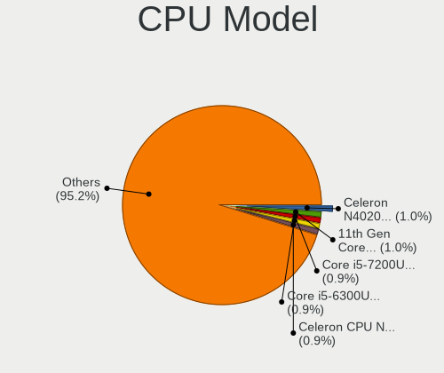

| Model                                  | Computers | Percent |
|----------------------------------------|-----------|---------|
| Intel Core i3-6006U CPU @ 2.00GHz      | 5         | 1.67%   |
| Intel Core i5-8265U CPU @ 1.60GHz      | 4         | 1.33%   |
| Intel Core i5-4460 CPU @ 3.20GHz       | 4         | 1.33%   |
| Intel Core i7-8750H CPU @ 2.20GHz      | 3         | 1%      |
| Intel Core i7-5500U CPU @ 2.40GHz      | 3         | 1%      |
| Intel Core i7-1065G7 CPU @ 1.30GHz     | 3         | 1%      |
| Intel Core i5-7500 CPU @ 3.40GHz       | 3         | 1%      |
| Intel Core i5-6300U CPU @ 2.40GHz      | 3         | 1%      |
| Intel Core i5-5300U CPU @ 2.30GHz      | 3         | 1%      |
| Intel Core i5-5200U CPU @ 2.20GHz      | 3         | 1%      |
| Intel Celeron N4020 CPU @ 1.10GHz      | 3         | 1%      |
| Intel Celeron CPU N3350 @ 1.10GHz      | 3         | 1%      |
| Intel Pentium Dual CPU E2180 @ 2.00GHz | 2         | 0.67%   |
| Intel Core m3-6Y30 CPU @ 0.90GHz       | 2         | 0.67%   |
| Intel Core i7-7500U CPU @ 2.70GHz      | 2         | 0.67%   |
| Intel Core i7-6700HQ CPU @ 2.60GHz     | 2         | 0.67%   |
| Intel Core i7-4790K CPU @ 4.00GHz      | 2         | 0.67%   |
| Intel Core i7-4650U CPU @ 1.70GHz      | 2         | 0.67%   |
| Intel Core i7-2760QM CPU @ 2.40GHz     | 2         | 0.67%   |
| Intel Core i7-2630QM CPU @ 2.00GHz     | 2         | 0.67%   |
| Intel Core i5-8350U CPU @ 1.70GHz      | 2         | 0.67%   |
| Intel Core i5-7400 CPU @ 3.00GHz       | 2         | 0.67%   |
| Intel Core i5-7360U CPU @ 2.30GHz      | 2         | 0.67%   |
| Intel Core i5-3320M CPU @ 2.60GHz      | 2         | 0.67%   |
| Intel Core i5-3230M CPU @ 2.60GHz      | 2         | 0.67%   |
| Intel Core i5-3210M CPU @ 2.50GHz      | 2         | 0.67%   |
| Intel Core i5-2520M CPU @ 2.50GHz      | 2         | 0.67%   |
| Intel Core i5-2400 CPU @ 3.10GHz       | 2         | 0.67%   |
| Intel Core i5 CPU M 520 @ 2.40GHz      | 2         | 0.67%   |
| Intel Core i5 CPU M 460 @ 2.53GHz      | 2         | 0.67%   |
| Intel Core i5 CPU 750 @ 2.67GHz        | 2         | 0.67%   |
| Intel Core i3-10110U CPU @ 2.10GHz     | 2         | 0.67%   |
| Intel Core i3 CPU M 350 @ 2.27GHz      | 2         | 0.67%   |
| Intel Core i3 CPU 530 @ 2.93GHz        | 2         | 0.67%   |
| Intel Core 2 Duo CPU P8700 @ 2.53GHz   | 2         | 0.67%   |
| Intel Core 2 Duo CPU P8600 @ 2.40GHz   | 2         | 0.67%   |
| Intel Core 2 Duo CPU P7550 @ 2.26GHz   | 2         | 0.67%   |
| Intel Celeron N4100 CPU @ 1.10GHz      | 2         | 0.67%   |
| Intel Celeron N4000 CPU @ 1.10GHz      | 2         | 0.67%   |
| Intel Celeron J4125 CPU @ 2.00GHz      | 2         | 0.67%   |

CPU Model Family
----------------

Processor model prefix

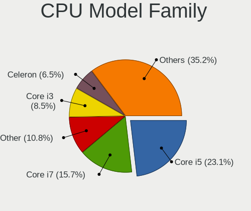

| Model                                | Computers | Percent |
|--------------------------------------|-----------|---------|
| Intel Core i5                        | 73        | 24.33%  |
| Intel Core i7                        | 49        | 16.33%  |
| Intel Core i3                        | 27        | 9%      |
| Other                                | 26        | 8.67%   |
| Intel Celeron                        | 20        | 6.67%   |
| AMD Ryzen 5                          | 17        | 5.67%   |
| Intel Core 2 Duo                     | 16        | 5.33%   |
| AMD Ryzen 7                          | 14        | 4.67%   |
| Intel Pentium                        | 10        | 3.33%   |
| Intel Xeon                           | 5         | 1.67%   |
| Intel Core 2 Quad                    | 5         | 1.67%   |
| AMD FX                               | 5         | 1.67%   |
| AMD Ryzen 9                          | 4         | 1.33%   |
| AMD A8                               | 3         | 1%      |
| Intel Pentium Dual                   | 2         | 0.67%   |
| Intel Core m3                        | 2         | 0.67%   |
| Intel Core i9                        | 2         | 0.67%   |
| AMD Ryzen 5 PRO                      | 2         | 0.67%   |
| AMD Ryzen 3                          | 2         | 0.67%   |
| AMD E2                               | 2         | 0.67%   |
| AMD Athlon II                        | 2         | 0.67%   |
| Intel Pentium Silver                 | 1         | 0.33%   |
| Intel Pentium Dual-Core              | 1         | 0.33%   |
| Intel Core m5                        | 1         | 0.33%   |
| AMD Turion X2 Ultra Dual-Core Mobile | 1         | 0.33%   |
| AMD Turion X2 Dual-Core Mobile       | 1         | 0.33%   |
| AMD Ryzen Threadripper               | 1         | 0.33%   |
| AMD Phenom II X4                     | 1         | 0.33%   |
| AMD C-60                             | 1         | 0.33%   |
| AMD A6                               | 1         | 0.33%   |
| AMD A4                               | 1         | 0.33%   |
| AMD A12                              | 1         | 0.33%   |
| AMD A10                              | 1         | 0.33%   |

CPU Cores
---------

Number of processor cores

| Number | Computers | Percent |
|--------|-----------|---------|
| 2      | 123       | 40.86%  |
| 4      | 100       | 33.22%  |
| 6      | 27        | 8.97%   |
| 8      | 22        | 7.31%   |
| 10     | 6         | 1.99%   |
| 14     | 5         | 1.66%   |
| 12     | 4         | 1.33%   |
| 3      | 4         | 1.33%   |
| 1      | 4         | 1.33%   |
| 16     | 3         | 1%      |
| 32     | 1         | 0.33%   |
| 24     | 1         | 0.33%   |
| 18     | 1         | 0.33%   |

CPU Sockets
-----------

Number of sockets

| Number | Computers | Percent |
|--------|-----------|---------|
| 1      | 300       | 100%    |

CPU Threads
-----------

Threads per core (Hyper-Threading)

| Number | Computers | Percent |
|--------|-----------|---------|
| 2      | 200       | 66.67%  |
| 1      | 100       | 33.33%  |

CPU Op-Modes
------------

CPU Operation Modes (32-bit, 64-bit)

| Op mode        | Computers | Percent |
|----------------|-----------|---------|
| 32-bit, 64-bit | 300       | 100%    |

CPU Microcode
-------------

Microcode number

| Number     | Computers | Percent |
|------------|-----------|---------|
| Unknown    | 292       | 97.33%  |
| 0x0a601203 | 2         | 0.67%   |
| 0x0a50000d | 2         | 0.67%   |
| 0x0a601206 | 1         | 0.33%   |
| 0x0a50000c | 1         | 0.33%   |
| 0x08600106 | 1         | 0.33%   |
| 0x08001138 | 1         | 0.33%   |

CPU Microarch
-------------

Microarchitecture

| Name             | Computers | Percent |
|------------------|-----------|---------|
| KabyLake         | 37        | 12.33%  |
| Haswell          | 33        | 11%     |
| Unknown          | 28        | 9.33%   |
| Skylake          | 24        | 8%      |
| SandyBridge      | 22        | 7.33%   |
| Penryn           | 20        | 6.67%   |
| IvyBridge        | 18        | 6%      |
| Zen 3            | 15        | 5%      |
| Goldmont plus    | 13        | 4.33%   |
| Westmere         | 11        | 3.67%   |
| Broadwell        | 11        | 3.67%   |
| Zen 2            | 8         | 2.67%   |
| Zen+             | 6         | 2%      |
| TigerLake        | 6         | 2%      |
| Piledriver       | 6         | 2%      |
| Core             | 6         | 2%      |
| Excavator        | 5         | 1.67%   |
| CometLake        | 5         | 1.67%   |
| IceLake          | 4         | 1.33%   |
| Goldmont         | 4         | 1.33%   |
| Silvermont       | 3         | 1%      |
| K10              | 3         | 1%      |
| Alderlake Hybrid | 3         | 1%      |
| Nehalem          | 2         | 0.67%   |
| K8 & K10 hybrid  | 2         | 0.67%   |
| Bulldozer        | 2         | 0.67%   |
| Zen              | 1         | 0.33%   |
| Puma             | 1         | 0.33%   |
| Bobcat           | 1         | 0.33%   |

Graphics
--------

GPU Vendor
----------

Vendors of graphics cards

| Vendor | Computers | Percent |
|--------|-----------|---------|
| Intel  | 173       | 49.86%  |
| Nvidia | 100       | 28.82%  |
| AMD    | 74        | 21.33%  |

GPU Model
---------

Graphics card models

| Model                                                                                 | Computers | Percent |
|---------------------------------------------------------------------------------------|-----------|---------|
| Intel 2nd Generation Core Processor Family Integrated Graphics Controller             | 13        | 3.66%   |
| Intel GeminiLake [UHD Graphics 600]                                                   | 12        | 3.38%   |
| Intel Skylake GT2 [HD Graphics 520]                                                   | 10        | 2.82%   |
| Intel Core Processor Integrated Graphics Controller                                   | 10        | 2.82%   |
| Intel 3rd Gen Core processor Graphics Controller                                      | 10        | 2.82%   |
| Intel HD Graphics 5500                                                                | 9         | 2.54%   |
| Intel Xeon E3-1200 v3/4th Gen Core Processor Integrated Graphics Controller           | 8         | 2.25%   |
| AMD Cezanne [Radeon Vega Series / Radeon Vega Mobile Series]                          | 8         | 2.25%   |
| Intel HD Graphics 530                                                                 | 7         | 1.97%   |
| Intel Haswell-ULT Integrated Graphics Controller                                      | 7         | 1.97%   |
| Intel Mobile 4 Series Chipset Integrated Graphics Controller                          | 6         | 1.69%   |
| AMD Picasso/Raven 2 [Radeon Vega Series / Radeon Vega Mobile Series]                  | 6         | 1.69%   |
| Nvidia GK208B [GeForce GT 710]                                                        | 5         | 1.41%   |
| Nvidia GF119 [GeForce GT 610]                                                         | 5         | 1.41%   |
| Intel WhiskeyLake-U GT2 [UHD Graphics 620]                                            | 5         | 1.41%   |
| Intel UHD Graphics 620                                                                | 5         | 1.41%   |
| Intel TigerLake-LP GT2 [Iris Xe Graphics]                                             | 5         | 1.41%   |
| Intel HD Graphics 620                                                                 | 5         | 1.41%   |
| Intel 4th Gen Core Processor Integrated Graphics Controller                           | 5         | 1.41%   |
| Nvidia GA106M [GeForce RTX 3060 Mobile / Max-Q]                                       | 4         | 1.13%   |
| Intel Xeon E3-1200 v2/3rd Gen Core processor Graphics Controller                      | 4         | 1.13%   |
| Intel Iris Plus Graphics G7                                                           | 4         | 1.13%   |
| Intel HD Graphics 500                                                                 | 4         | 1.13%   |
| Intel CoffeeLake-S GT2 [UHD Graphics 630]                                             | 4         | 1.13%   |
| AMD Renoir [Radeon RX Vega 6 (Ryzen 4000/5000 Mobile Series)]                         | 4         | 1.13%   |
| AMD Ellesmere [Radeon RX 470/480/570/570X/580/580X/590]                               | 4         | 1.13%   |
| Nvidia GP107M [GeForce GTX 1050 Mobile]                                               | 3         | 0.85%   |
| Nvidia GM206 [GeForce GTX 960]                                                        | 3         | 0.85%   |
| Nvidia GF117M [GeForce 610M/710M/810M/820M / GT 620M/625M/630M/720M]                  | 3         | 0.85%   |
| Nvidia GA104 [GeForce RTX 3060 Ti Lite Hash Rate]                                     | 3         | 0.85%   |
| Intel HD Graphics 630                                                                 | 3         | 0.85%   |
| Intel HD Graphics 515                                                                 | 3         | 0.85%   |
| Intel Atom Processor Z36xxx/Z37xxx Series Graphics & Display                          | 3         | 0.85%   |
| Intel Alder Lake-N [UHD Graphics]                                                     | 3         | 0.85%   |
| AMD Topaz XT [Radeon R7 M260/M265 / M340/M360 / M440/M445 / 530/535 / 620/625 Mobile] | 3         | 0.85%   |
| AMD RV710/M92 [Mobility Radeon HD 4530/4570/5145/530v/540v/545v]                      | 3         | 0.85%   |
| AMD Rembrandt [Radeon 680M]                                                           | 3         | 0.85%   |
| AMD Raphael                                                                           | 3         | 0.85%   |
| AMD Lucienne                                                                          | 3         | 0.85%   |
| Nvidia TU106 [GeForce RTX 2060 SUPER]                                                 | 2         | 0.56%   |

GPU Combo
---------

Combinations of graphics cards

| Name           | Computers | Percent |
|----------------|-----------|---------|
| 1 x Intel      | 134       | 44.67%  |
| 1 x Nvidia     | 63        | 21%     |
| 1 x AMD        | 54        | 18%     |
| Intel + Nvidia | 28        | 9.33%   |
| AMD + Nvidia   | 8         | 2.67%   |
| 2 x AMD        | 6         | 2%      |
| Intel + AMD    | 6         | 2%      |
| 2 x Nvidia     | 1         | 0.33%   |

GPU Driver
----------

Free vs proprietary

| Driver      | Computers | Percent |
|-------------|-----------|---------|
| Free        | 235       | 78.07%  |
| Proprietary | 52        | 17.28%  |
| Unknown     | 14        | 4.65%   |

GPU Memory
----------

Total video memory

| Size in GB | Computers | Percent |
|------------|-----------|---------|
| Unknown    | 271       | 90.03%  |
| 0.01-0.5   | 7         | 2.33%   |
| 1.01-2.0   | 6         | 1.99%   |
| 8.01-16.0  | 6         | 1.99%   |
| 7.01-8.0   | 5         | 1.66%   |
| 5.01-6.0   | 2         | 0.66%   |
| 3.01-4.0   | 2         | 0.66%   |
| 0.51-1.0   | 2         | 0.66%   |

Monitor
-------

Monitor Vendor
--------------

Monitor vendors

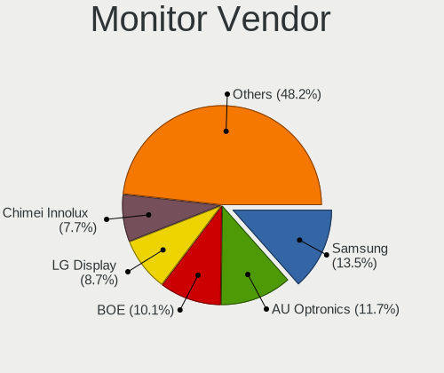

| Vendor               | Computers | Percent |
|----------------------|-----------|---------|
| Samsung Electronics  | 48        | 15.69%  |
| BOE                  | 35        | 11.44%  |
| AU Optronics         | 28        | 9.15%   |
| LG Display           | 26        | 8.5%    |
| Chimei Innolux       | 22        | 7.19%   |
| Goldstar             | 18        | 5.88%   |
| Dell                 | 15        | 4.9%    |
| Hewlett-Packard      | 12        | 3.92%   |
| Apple                | 12        | 3.92%   |
| Acer                 | 9         | 2.94%   |
| Lenovo               | 7         | 2.29%   |
| BenQ                 | 7         | 2.29%   |
| ViewSonic            | 6         | 1.96%   |
| AOC                  | 6         | 1.96%   |
| ASUSTek Computer     | 5         | 1.63%   |
| Sharp                | 4         | 1.31%   |
| Philips              | 4         | 1.31%   |
| InfoVision           | 4         | 1.31%   |
| Ancor Communications | 4         | 1.31%   |
| Sony                 | 3         | 0.98%   |
| PANDA                | 3         | 0.98%   |
| TMX                  | 2         | 0.65%   |
| NEC Computers        | 2         | 0.65%   |
| Hitachi              | 2         | 0.65%   |
| CSO                  | 2         | 0.65%   |
| Xiaomi               | 1         | 0.33%   |
| Vizio                | 1         | 0.33%   |
| Vestel Elektronik    | 1         | 0.33%   |
| UGD                  | 1         | 0.33%   |
| TMA                  | 1         | 0.33%   |
| STD                  | 1         | 0.33%   |
| SLD                  | 1         | 0.33%   |
| RTK                  | 1         | 0.33%   |
| Panasonic            | 1         | 0.33%   |
| MSI                  | 1         | 0.33%   |
| LOE                  | 1         | 0.33%   |
| KDB                  | 1         | 0.33%   |
| JINGLITAI            | 1         | 0.33%   |
| GreenWood            | 1         | 0.33%   |
| Fujitsu Siemens      | 1         | 0.33%   |

Monitor Model
-------------

Monitor models

| Model                                                                 | Computers | Percent |
|-----------------------------------------------------------------------|-----------|---------|
| Samsung Electronics LU28R55 SAM1017 3840x2160 632x360mm 28.6-inch     | 3         | 0.96%   |
| LG Display LCD Monitor LGD039F 1366x768 345x194mm 15.6-inch           | 3         | 0.96%   |
| Goldstar HDR WFHD GSM7714 2560x1080 798x334mm 34.1-inch               | 3         | 0.96%   |
| Samsung Electronics LCD Monitor SEC5441 1366x768 344x194mm 15.5-inch  | 2         | 0.64%   |
| Samsung Electronics LCD Monitor SEC314C 1920x1080 344x194mm 15.5-inch | 2         | 0.64%   |
| Samsung Electronics LCD Monitor SDC3853 2736x1824 260x173mm 12.3-inch | 2         | 0.64%   |
| LG Display LCD Monitor LGD0362 1600x900 309x174mm 14.0-inch           | 2         | 0.64%   |
| Hitachi HISENSE HEC002F 3840x2160 1872x1053mm 84.6-inch               | 2         | 0.64%   |
| Chimei Innolux LCD Monitor CMN15D5 1920x1080 344x193mm 15.5-inch      | 2         | 0.64%   |
| Chimei Innolux LCD Monitor CMN14D6 1366x768 309x173mm 13.9-inch       | 2         | 0.64%   |
| Chimei Innolux LCD Monitor CMN14D4 1920x1080 309x173mm 13.9-inch      | 2         | 0.64%   |
| AU Optronics LCD Monitor AUO109E 1600x900 382x214mm 17.2-inch         | 2         | 0.64%   |
| Apple Color LCD APPA037 2880x1800 286x179mm 13.3-inch                 | 2         | 0.64%   |
| Xiaomi Mi TV XMD0002 1920x1080 708x398mm 32.0-inch                    | 1         | 0.32%   |
| Vizio D32f-E1 VIZ1027 1920x1080 698x392mm 31.5-inch                   | 1         | 0.32%   |
| ViewSonic XG3220 SERIES VSC1D35 3840x2160 698x393mm 31.5-inch         | 1         | 0.32%   |
| ViewSonic VX2457 VSCB931 1920x1080 521x293mm 23.5-inch                | 1         | 0.32%   |
| ViewSonic VX2416-FHD VSC423D 1920x1080 527x296mm 23.8-inch            | 1         | 0.32%   |
| ViewSonic VX2370 SERIES VSC342C 1920x1080 509x286mm 23.0-inch         | 1         | 0.32%   |
| ViewSonic VX2025wm VSCE51D 1680x1050 433x271mm 20.1-inch              | 1         | 0.32%   |
| ViewSonic LCD Monitor VX922 1280x1024                                 | 1         | 0.32%   |
| Vestel Elektronik 32FHD_LCD_TV VES3700 1920x1080 700x400mm 31.7-inch  | 1         | 0.32%   |
| UGD Artist22R Pro UGD2202 1920x1080 476x268mm 21.5-inch               | 1         | 0.32%   |
| TMX TL142GDXP02-0 TMX1420 2520x1680 300x200mm 14.2-inch               | 1         | 0.32%   |
| TMX TL140VDXP10 TMX1485 1920x1200 301x188mm 14.0-inch                 | 1         | 0.32%   |
| TMA LCD Monitor TMA1201 2160x1440 254x169mm 12.0-inch                 | 1         | 0.32%   |
| STD HDMI TV STD00C7 1440x900 698x392mm 31.5-inch                      | 1         | 0.32%   |
| Sony TV SNY6604 1920x1080                                             | 1         | 0.32%   |
| Sony TV *01 SNYD902 1920x1080 1107x623mm 50.0-inch                    | 1         | 0.32%   |
| Sony TV *00 SNY7E04 3840x2160 1660x934mm 75.0-inch                    | 1         | 0.32%   |
| SLD LCD Monitor SLD003C 1366x768 309x173mm 13.9-inch                  | 1         | 0.32%   |
| Sharp LQ135P1JX51 SHP14B3 2256x1504 285x190mm 13.5-inch               | 1         | 0.32%   |
| Sharp LQ133M1JW01 SHP141B 1920x1080 294x165mm 13.3-inch               | 1         | 0.32%   |
| Sharp LCD Monitor SHP14AB 1920x1080 294x165mm 13.3-inch               | 1         | 0.32%   |
| Sharp LCD Monitor SHP14A8 3840x2400 288x180mm 13.4-inch               | 1         | 0.32%   |
| Samsung Electronics U28E590 SAM0C4E 3840x2160 608x345mm 27.5-inch     | 1         | 0.32%   |
| Samsung Electronics U28E590 SAM0C4D 3840x2160 607x345mm 27.5-inch     | 1         | 0.32%   |
| Samsung Electronics SyncMaster SAM04D4 1920x1080 531x298mm 24.0-inch  | 1         | 0.32%   |
| Samsung Electronics SyncMaster SAM043F 1920x1200 518x324mm 24.1-inch  | 1         | 0.32%   |
| Samsung Electronics SyncMaster SAM0354 1920x1200 291x364mm 18.3-inch  | 1         | 0.32%   |

Monitor Resolution
------------------

Monitor screen resolution

| Resolution         | Computers | Percent |
|--------------------|-----------|---------|
| 1920x1080 (FHD)    | 129       | 43.14%  |
| 1366x768 (WXGA)    | 57        | 19.06%  |
| 3840x2160 (4K)     | 30        | 10.03%  |
| 1600x900 (HD+)     | 11        | 3.68%   |
| 2560x1440 (QHD)    | 10        | 3.34%   |
| 1920x1200 (WUXGA)  | 10        | 3.34%   |
| 1440x900 (WXGA+)   | 9         | 3.01%   |
| 2880x1800          | 5         | 1.67%   |
| 1280x800 (WXGA)    | 5         | 1.67%   |
| 2560x1080          | 4         | 1.34%   |
| 1680x1050 (WSXGA+) | 4         | 1.34%   |
| 3840x1080          | 3         | 1%      |
| 2560x1600          | 3         | 1%      |
| 1280x1024 (SXGA)   | 3         | 1%      |
| 2736x1824          | 2         | 0.67%   |
| 2160x1440          | 2         | 0.67%   |
| 1920x1280          | 2         | 0.67%   |
| 3840x2400          | 1         | 0.33%   |
| 3440x1440          | 1         | 0.33%   |
| 3072x1920          | 1         | 0.33%   |
| 2880x1440          | 1         | 0.33%   |
| 2520x1680          | 1         | 0.33%   |
| 2256x1504          | 1         | 0.33%   |
| 1920x540           | 1         | 0.33%   |
| 1680x945           | 1         | 0.33%   |
| 1360x768           | 1         | 0.33%   |
| 1024x600           | 1         | 0.33%   |

Monitor Diagonal
----------------

Diagonal size in inches

| Inches  | Computers | Percent |
|---------|-----------|---------|
| 15      | 70        | 22.65%  |
| 13      | 34        | 11%     |
| 27      | 25        | 8.09%   |
| 14      | 23        | 7.44%   |
| 24      | 20        | 6.47%   |
| 23      | 19        | 6.15%   |
| 21      | 16        | 5.18%   |
| 17      | 16        | 5.18%   |
| 18      | 11        | 3.56%   |
| 31      | 9         | 2.91%   |
| 16      | 9         | 2.91%   |
| 12      | 7         | 2.27%   |
| Unknown | 7         | 2.27%   |
| 84      | 6         | 1.94%   |
| 34      | 5         | 1.62%   |
| 48      | 3         | 0.97%   |
| 40      | 3         | 0.97%   |
| 28      | 3         | 0.97%   |
| 20      | 3         | 0.97%   |
| 19      | 3         | 0.97%   |
| 11      | 3         | 0.97%   |
| 72      | 2         | 0.65%   |
| 49      | 2         | 0.65%   |
| 22      | 2         | 0.65%   |
| 10      | 2         | 0.65%   |
| 75      | 1         | 0.32%   |
| 65      | 1         | 0.32%   |
| 55      | 1         | 0.32%   |
| 54      | 1         | 0.32%   |
| 39      | 1         | 0.32%   |
| 26      | 1         | 0.32%   |

Monitor Width
-------------

Physical width

| Width in mm | Computers | Percent |
|-------------|-----------|---------|
| 301-350     | 111       | 36.63%  |
| 501-600     | 56        | 18.48%  |
| 401-500     | 33        | 10.89%  |
| 201-300     | 29        | 9.57%   |
| 351-400     | 25        | 8.25%   |
| 601-700     | 16        | 5.28%   |
| 1501-2000   | 9         | 2.97%   |
| 1001-1500   | 8         | 2.64%   |
| Unknown     | 7         | 2.31%   |
| 701-800     | 5         | 1.65%   |
| 801-900     | 3         | 0.99%   |
| 901-1000    | 1         | 0.33%   |

Aspect Ratio
------------

Proportional relationship between the width and the height

| Ratio   | Computers | Percent |
|---------|-----------|---------|
| 16/9    | 220       | 78.01%  |
| 16/10   | 35        | 12.41%  |
| 3/2     | 9         | 3.19%   |
| 21/9    | 6         | 2.13%   |
| Unknown | 5         | 1.77%   |
| 32/9    | 3         | 1.06%   |
| 6/5     | 1         | 0.35%   |
| 5/4     | 1         | 0.35%   |
| 2.00    | 1         | 0.35%   |
| 0.80    | 1         | 0.35%   |

Monitor Area
------------

Area in inch

| Area in inch | Computers | Percent |
|----------------|-----------|---------|
| 101-110        | 72        | 23.61%  |
| 81-90          | 45        | 14.75%  |
| 201-250        | 41        | 13.44%  |
| 301-350        | 25        | 8.2%    |
| 351-500        | 17        | 5.57%   |
| 151-200        | 17        | 5.57%   |
| 121-130        | 14        | 4.59%   |
| More than 1000 | 13        | 4.26%   |
| 71-80          | 11        | 3.61%   |
| 141-150        | 8         | 2.62%   |
| 61-70          | 7         | 2.3%    |
| 251-300        | 7         | 2.3%    |
| 501-1000       | 7         | 2.3%    |
| Unknown        | 7         | 2.3%    |
| 51-60          | 4         | 1.31%   |
| 111-120        | 4         | 1.31%   |
| 131-140        | 3         | 0.98%   |
| 91-100         | 2         | 0.66%   |
| 41-50          | 1         | 0.33%   |

Pixel Density
-------------

Pixels per inch

| Density       | Computers | Percent |
|---------------|-----------|---------|
| 51-100        | 101       | 33.78%  |
| 121-160       | 80        | 26.76%  |
| 101-120       | 69        | 23.08%  |
| 161-240       | 24        | 8.03%   |
| More than 240 | 12        | 4.01%   |
| Unknown       | 7         | 2.34%   |
| 1-50          | 6         | 2.01%   |

Multiple Monitors
-----------------

Total monitors connected

| Total | Computers | Percent |
|-------|-----------|---------|
| 1     | 242       | 80.4%   |
| 2     | 32        | 10.63%  |
| 0     | 23        | 7.64%   |
| 3     | 3         | 1%      |
| 4     | 1         | 0.33%   |

Network
-------

Net Controller Vendor
---------------------

Controller vendors

| Vendor                                | Computers | Percent |
|---------------------------------------|-----------|---------|
| Realtek Semiconductor                 | 163       | 36.22%  |
| Intel                                 | 143       | 31.78%  |
| Qualcomm Atheros                      | 46        | 10.22%  |
| Broadcom                              | 28        | 6.22%   |
| MediaTek                              | 11        | 2.44%   |
| Marvell Technology Group              | 10        | 2.22%   |
| Ralink                                | 7         | 1.56%   |
| Broadcom Limited                      | 7         | 1.56%   |
| TP-Link                               | 6         | 1.33%   |
| Sierra Wireless                       | 4         | 0.89%   |
| Samsung Electronics                   | 4         | 0.89%   |
| Ralink Technology                     | 4         | 0.89%   |
| DisplayLink                           | 3         | 0.67%   |
| Nvidia                                | 2         | 0.44%   |
| Edimax Technology                     | 2         | 0.44%   |
| Aquantia                              | 2         | 0.44%   |
| Wilocity                              | 1         | 0.22%   |
| Qualcomm                              | 1         | 0.22%   |
| Microsoft                             | 1         | 0.22%   |
| JMicron Technology                    | 1         | 0.22%   |
| Hewlett-Packard                       | 1         | 0.22%   |
| D-Link                                | 1         | 0.22%   |
| ASIX Electronics                      | 1         | 0.22%   |
| 802.11g Adapter [Linksys WUSB54GC v3] | 1         | 0.22%   |

Net Controller Model
--------------------

Controller models

| Model                                                                  | Computers | Percent |
|------------------------------------------------------------------------|-----------|---------|
| Realtek RTL8111/8168/8211/8411 PCI Express Gigabit Ethernet Controller | 100       | 18.83%  |
| Realtek RTL810xE PCI Express Fast Ethernet controller                  | 18        | 3.39%   |
| Realtek RTL8125 2.5GbE Controller                                      | 13        | 2.45%   |
| Intel Wi-Fi 6 AX200                                                    | 11        | 2.07%   |
| Intel Wireless 7265                                                    | 9         | 1.69%   |
| Intel Wireless 7260                                                    | 9         | 1.69%   |
| Intel 82579LM Gigabit Network Connection (Lewisville)                  | 9         | 1.69%   |
| Realtek RTL8153 Gigabit Ethernet Adapter                               | 8         | 1.51%   |
| Qualcomm Atheros QCA9377 802.11ac Wireless Network Adapter             | 8         | 1.51%   |
| Qualcomm Atheros AR9285 Wireless Network Adapter (PCI-Express)         | 8         | 1.51%   |
| Intel Wireless 3165                                                    | 8         | 1.51%   |
| Realtek RTL8821CE 802.11ac PCIe Wireless Network Adapter               | 7         | 1.32%   |
| Intel I211 Gigabit Network Connection                                  | 7         | 1.32%   |
| Qualcomm Atheros QCA9565 / AR9565 Wireless Network Adapter             | 6         | 1.13%   |
| Intel Wi-Fi 6 AX201                                                    | 6         | 1.13%   |
| Intel Ethernet Connection I217-LM                                      | 6         | 1.13%   |
| Intel Ethernet Connection (2) I219-V                                   | 6         | 1.13%   |
| Realtek RTL8192EU 802.11b/g/n WLAN Adapter                             | 5         | 0.94%   |
| Qualcomm Atheros AR8151 v2.0 Gigabit Ethernet                          | 5         | 0.94%   |
| Intel Wireless 8265 / 8275                                             | 5         | 0.94%   |
| Intel Wireless 8260                                                    | 5         | 0.94%   |
| Intel Ethernet Controller I225-V                                       | 5         | 0.94%   |
| Broadcom NetXtreme BCM57765 Gigabit Ethernet PCIe                      | 5         | 0.94%   |
| Realtek Killer E2600 GbE Controller                                    | 4         | 0.75%   |
| Realtek 802.11ac NIC                                                   | 4         | 0.75%   |
| Qualcomm Atheros QCA6174 802.11ac Wireless Network Adapter             | 4         | 0.75%   |
| MediaTek MT7921 802.11ax PCI Express Wireless Network Adapter          | 4         | 0.75%   |
| Intel WiFi Link 5100                                                   | 4         | 0.75%   |
| Intel Wi-Fi 6E(802.11ax) AX210/AX1675* 2x2 [Typhoon Peak]              | 4         | 0.75%   |
| Intel Raptor Lake-S PCH CNVi WiFi                                      | 4         | 0.75%   |
| Intel Ice Lake-LP PCH CNVi WiFi                                        | 4         | 0.75%   |
| Intel Ethernet Connection (3) I218-LM                                  | 4         | 0.75%   |
| Intel Ethernet Connection (2) I219-LM                                  | 4         | 0.75%   |
| Intel Dual Band Wireless-AC 3165 Plus Bluetooth                        | 4         | 0.75%   |
| Intel Cannon Point-LP CNVi [Wireless-AC]                               | 4         | 0.75%   |
| Broadcom BCM4331 802.11a/b/g/n                                         | 4         | 0.75%   |
| Samsung GT-I9070 (network tethering, USB debugging enabled)            | 3         | 0.56%   |
| Realtek RTL88x2bu [AC1200 Techkey]                                     | 3         | 0.56%   |
| Realtek RTL8822CE 802.11ac PCIe Wireless Network Adapter               | 3         | 0.56%   |
| Realtek RTL8723DE Wireless Network Adapter                             | 3         | 0.56%   |

Wireless Vendor
---------------

Wireless vendors

| Vendor                                | Computers | Percent |
|---------------------------------------|-----------|---------|
| Intel                                 | 111       | 43.19%  |
| Realtek Semiconductor                 | 45        | 17.51%  |
| Qualcomm Atheros                      | 37        | 14.4%   |
| Broadcom                              | 20        | 7.78%   |
| MediaTek                              | 10        | 3.89%   |
| Ralink                                | 7         | 2.72%   |
| TP-Link                               | 6         | 2.33%   |
| Sierra Wireless                       | 4         | 1.56%   |
| Ralink Technology                     | 4         | 1.56%   |
| Broadcom Limited                      | 4         | 1.56%   |
| Marvell Technology Group              | 3         | 1.17%   |
| Edimax Technology                     | 2         | 0.78%   |
| Wilocity                              | 1         | 0.39%   |
| Microsoft                             | 1         | 0.39%   |
| D-Link                                | 1         | 0.39%   |
| 802.11g Adapter [Linksys WUSB54GC v3] | 1         | 0.39%   |

Wireless Model
--------------

Wireless models

| Model                                                          | Computers | Percent |
|----------------------------------------------------------------|-----------|---------|
| Intel Wi-Fi 6 AX200                                            | 11        | 4.26%   |
| Intel Wireless 7265                                            | 9         | 3.49%   |
| Intel Wireless 7260                                            | 9         | 3.49%   |
| Qualcomm Atheros QCA9377 802.11ac Wireless Network Adapter     | 8         | 3.1%    |
| Qualcomm Atheros AR9285 Wireless Network Adapter (PCI-Express) | 8         | 3.1%    |
| Intel Wireless 3165                                            | 8         | 3.1%    |
| Realtek RTL8821CE 802.11ac PCIe Wireless Network Adapter       | 7         | 2.71%   |
| Qualcomm Atheros QCA9565 / AR9565 Wireless Network Adapter     | 6         | 2.33%   |
| Intel Wi-Fi 6 AX201                                            | 6         | 2.33%   |
| Realtek RTL8192EU 802.11b/g/n WLAN Adapter                     | 5         | 1.94%   |
| Intel Wireless 8265 / 8275                                     | 5         | 1.94%   |
| Intel Wireless 8260                                            | 5         | 1.94%   |
| Realtek 802.11ac NIC                                           | 4         | 1.55%   |
| Qualcomm Atheros QCA6174 802.11ac Wireless Network Adapter     | 4         | 1.55%   |
| MediaTek MT7921 802.11ax PCI Express Wireless Network Adapter  | 4         | 1.55%   |
| Intel WiFi Link 5100                                           | 4         | 1.55%   |
| Intel Wi-Fi 6E(802.11ax) AX210/AX1675* 2x2 [Typhoon Peak]      | 4         | 1.55%   |
| Intel Raptor Lake-S PCH CNVi WiFi                              | 4         | 1.55%   |
| Intel Ice Lake-LP PCH CNVi WiFi                                | 4         | 1.55%   |
| Intel Dual Band Wireless-AC 3165 Plus Bluetooth                | 4         | 1.55%   |
| Intel Cannon Point-LP CNVi [Wireless-AC]                       | 4         | 1.55%   |
| Broadcom BCM4331 802.11a/b/g/n                                 | 4         | 1.55%   |
| Realtek RTL88x2bu [AC1200 Techkey]                             | 3         | 1.16%   |
| Realtek RTL8822CE 802.11ac PCIe Wireless Network Adapter       | 3         | 1.16%   |
| Realtek RTL8723DE Wireless Network Adapter                     | 3         | 1.16%   |
| Ralink MT7601U Wireless Adapter                                | 3         | 1.16%   |
| Ralink RT3090 Wireless 802.11n 1T/1R PCIe                      | 3         | 1.16%   |
| Qualcomm Atheros AR9485 Wireless Network Adapter               | 3         | 1.16%   |
| Marvell Group 88W8897 [AVASTAR] 802.11ac Wireless              | 3         | 1.16%   |
| Intel Gemini Lake PCH CNVi WiFi                                | 3         | 1.16%   |
| Intel Centrino Advanced-N 6205 [Taylor Peak]                   | 3         | 1.16%   |
| Intel Centrino Advanced-N 6200                                 | 3         | 1.16%   |
| Intel Cannon Lake PCH CNVi WiFi                                | 3         | 1.16%   |
| Intel Alder Lake-S PCH CNVi WiFi                               | 3         | 1.16%   |
| Intel Alder Lake-P PCH CNVi WiFi                               | 3         | 1.16%   |
| Sierra Wireless EM7305 Modem                                   | 2         | 0.78%   |
| Realtek RTL8852CE PCIe 802.11ax Wireless Network Controller    | 2         | 0.78%   |
| Realtek RTL8852BE PCIe 802.11ax Wireless Network Controller    | 2         | 0.78%   |
| Realtek RTL8852AE 802.11ax PCIe Wireless Network Adapter       | 2         | 0.78%   |
| Realtek RTL8191SEvB Wireless LAN Controller                    | 2         | 0.78%   |

Ethernet Vendor
---------------

Ethernet vendors

| Vendor                   | Computers | Percent |
|--------------------------|-----------|---------|
| Realtek Semiconductor    | 143       | 52.96%  |
| Intel                    | 70        | 25.93%  |
| Broadcom                 | 16        | 5.93%   |
| Qualcomm Atheros         | 15        | 5.56%   |
| Marvell Technology Group | 7         | 2.59%   |
| Samsung Electronics      | 4         | 1.48%   |
| DisplayLink              | 3         | 1.11%   |
| Broadcom Limited         | 3         | 1.11%   |
| Nvidia                   | 2         | 0.74%   |
| Aquantia                 | 2         | 0.74%   |
| Qualcomm                 | 1         | 0.37%   |
| MediaTek                 | 1         | 0.37%   |
| JMicron Technology       | 1         | 0.37%   |
| Hewlett-Packard          | 1         | 0.37%   |
| ASIX Electronics         | 1         | 0.37%   |

Ethernet Model
--------------

Ethernet models

| Model                                                                          | Computers | Percent |
|--------------------------------------------------------------------------------|-----------|---------|
| Realtek RTL8111/8168/8211/8411 PCI Express Gigabit Ethernet Controller         | 100       | 36.63%  |
| Realtek RTL810xE PCI Express Fast Ethernet controller                          | 18        | 6.59%   |
| Realtek RTL8125 2.5GbE Controller                                              | 13        | 4.76%   |
| Intel 82579LM Gigabit Network Connection (Lewisville)                          | 9         | 3.3%    |
| Realtek RTL8153 Gigabit Ethernet Adapter                                       | 8         | 2.93%   |
| Intel I211 Gigabit Network Connection                                          | 7         | 2.56%   |
| Intel Ethernet Connection I217-LM                                              | 6         | 2.2%    |
| Intel Ethernet Connection (2) I219-V                                           | 6         | 2.2%    |
| Qualcomm Atheros AR8151 v2.0 Gigabit Ethernet                                  | 5         | 1.83%   |
| Intel Ethernet Controller I225-V                                               | 5         | 1.83%   |
| Broadcom NetXtreme BCM57765 Gigabit Ethernet PCIe                              | 5         | 1.83%   |
| Realtek Killer E2600 GbE Controller                                            | 4         | 1.47%   |
| Intel Ethernet Connection (3) I218-LM                                          | 4         | 1.47%   |
| Intel Ethernet Connection (2) I219-LM                                          | 4         | 1.47%   |
| Samsung GT-I9070 (network tethering, USB debugging enabled)                    | 3         | 1.1%    |
| Qualcomm Atheros AR8121/AR8113/AR8114 Gigabit or Fast Ethernet                 | 3         | 1.1%    |
| Intel Ethernet Connection I219-LM                                              | 3         | 1.1%    |
| Intel Ethernet Connection (4) I219-LM                                          | 3         | 1.1%    |
| Qualcomm Atheros Killer E220x Gigabit Ethernet Controller                      | 2         | 0.73%   |
| Qualcomm Atheros AR8131 Gigabit Ethernet                                       | 2         | 0.73%   |
| Nvidia MCP79 Ethernet                                                          | 2         | 0.73%   |
| Marvell Group Yukon Optima 88E8059 [PCIe Gigabit Ethernet Controller with AVB] | 2         | 0.73%   |
| Marvell Group 88E8057 PCI-E Gigabit Ethernet Controller                        | 2         | 0.73%   |
| Marvell Group 88E8040 PCI-E Fast Ethernet Controller                           | 2         | 0.73%   |
| Intel Ethernet Controller I226-V                                               | 2         | 0.73%   |
| Intel Ethernet Connection I218-LM                                              | 2         | 0.73%   |
| Intel Ethernet Connection (5) I219-LM                                          | 2         | 0.73%   |
| Intel 82579V Gigabit Network Connection                                        | 2         | 0.73%   |
| DisplayLink USB-C Triple-4K Dock                                               | 2         | 0.73%   |
| Broadcom NetXtreme BCM57786 Gigabit Ethernet PCIe                              | 2         | 0.73%   |
| Broadcom NetXtreme BCM5764M Gigabit Ethernet PCIe                              | 2         | 0.73%   |
| Broadcom NetLink BCM5784M Gigabit Ethernet PCIe                                | 2         | 0.73%   |
| Aquantia AQtion AQC107 NBase-T/IEEE 802.3an Ethernet Controller [Atlantic 10G] | 2         | 0.73%   |
| Samsung Galaxy series, misc. (tethering mode)                                  | 1         | 0.37%   |
| Realtek Realtek Ethernet controller                                            | 1         | 0.37%   |
| Qualcomm MDM9207-MTP _SN:F0565CAE                                              | 1         | 0.37%   |
| Qualcomm Atheros AR8161 Gigabit Ethernet                                       | 1         | 0.37%   |
| Qualcomm Atheros AR8152 v2.0 Fast Ethernet                                     | 1         | 0.37%   |
| Qualcomm Atheros AR8151 v1.0 Gigabit Ethernet                                  | 1         | 0.37%   |
| MediaTek File-CD Gadget                                                        | 1         | 0.37%   |

Net Controller Kind
-------------------

Ethernet, WiFi or modem

| Kind     | Computers | Percent |
|----------|-----------|---------|
| Ethernet | 254       | 51.21%  |
| WiFi     | 242       | 48.79%  |

Used Controller
---------------

Currently used network controller

| Kind     | Computers | Percent |
|----------|-----------|---------|
| WiFi     | 184       | 59.55%  |
| Ethernet | 125       | 40.45%  |

NICs
----

Total network controllers on board

| Total | Computers | Percent |
|-------|-----------|---------|
| 2     | 167       | 55.48%  |
| 1     | 127       | 42.19%  |
| 3     | 4         | 1.33%   |
| 0     | 2         | 0.66%   |
| 4     | 1         | 0.33%   |

IPv6
----

IPv6 vs IPv4

| Used | Computers | Percent |
|------|-----------|---------|
| No   | 189       | 63%     |
| Yes  | 111       | 37%     |

Bluetooth
---------

Bluetooth Vendor
----------------

Controller vendors

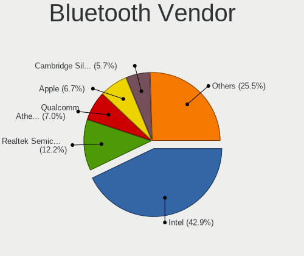

| Vendor                          | Computers | Percent |
|---------------------------------|-----------|---------|
| Intel                           | 93        | 46.27%  |
| Realtek Semiconductor           | 22        | 10.95%  |
| Cambridge Silicon Radio         | 17        | 8.46%   |
| Qualcomm Atheros Communications | 14        | 6.97%   |
| Apple                           | 12        | 5.97%   |
| IMC Networks                    | 11        | 5.47%   |
| Foxconn / Hon Hai               | 5         | 2.49%   |
| Toshiba                         | 4         | 1.99%   |
| MediaTek                        | 3         | 1.49%   |
| Marvell Semiconductor           | 3         | 1.49%   |
| Lite-On Technology              | 3         | 1.49%   |
| Broadcom                        | 3         | 1.49%   |
| ASUSTek Computer                | 3         | 1.49%   |
| Hewlett-Packard                 | 2         | 1%      |
| TP-Link                         | 1         | 0.5%    |
| Realtek                         | 1         | 0.5%    |
| Ralink Technology               | 1         | 0.5%    |
| Integrated System Solution      | 1         | 0.5%    |
| Dell                            | 1         | 0.5%    |
| Actions                         | 1         | 0.5%    |

Bluetooth Model
---------------

Controller models

| Model                                                                               | Computers | Percent |
|-------------------------------------------------------------------------------------|-----------|---------|
| Intel Bluetooth wireless interface                                                  | 39        | 19.4%   |
| Intel AX201 Bluetooth                                                               | 18        | 8.96%   |
| Cambridge Silicon Radio Bluetooth Dongle (HCI mode)                                 | 17        | 8.46%   |
| Realtek Bluetooth Radio                                                             | 13        | 6.47%   |
| Intel Bluetooth 9460/9560 Jefferson Peak (JfP)                                      | 12        | 5.97%   |
| Intel AX200 Bluetooth                                                               | 10        | 4.98%   |
| Qualcomm Atheros  Bluetooth Device                                                  | 9         | 4.48%   |
| Realtek  Bluetooth 4.2 Adapter                                                      | 8         | 3.98%   |
| Apple Bluetooth Host Controller                                                     | 7         | 3.48%   |
| Intel Bluetooth Device                                                              | 6         | 2.99%   |
| IMC Networks Wireless_Device                                                        | 5         | 2.49%   |
| IMC Networks Bluetooth Device                                                       | 5         | 2.49%   |
| Apple Bluetooth USB Host Controller                                                 | 4         | 1.99%   |
| MediaTek Wireless_Device                                                            | 3         | 1.49%   |
| Intel AX210 Bluetooth                                                               | 3         | 1.49%   |
| Toshiba Bluetooth Device                                                            | 2         | 1%      |
| Qualcomm Atheros AR3011 Bluetooth                                                   | 2         | 1%      |
| Marvell Bluetooth and Wireless LAN Composite                                        | 2         | 1%      |
| Lite-On Wireless_Device                                                             | 2         | 1%      |
| Intel Wireless-AC 9260 Bluetooth Adapter                                            | 2         | 1%      |
| Intel Centrino Bluetooth Wireless Transceiver                                       | 2         | 1%      |
| Foxconn / Hon Hai Foxconn T77H114 BCM2070 [Single-Chip Bluetooth 2.1 + EDR Adapter] | 2         | 1%      |
| Broadcom BCM2045B (BDC-2.1)                                                         | 2         | 1%      |
| TP-Link UB500 Adapter                                                               | 1         | 0.5%    |
| Toshiba Integrated Bluetooth (Taiyo Yuden)                                          | 1         | 0.5%    |
| Toshiba BCM43142A0                                                                  | 1         | 0.5%    |
| Realtek RTL8723B Bluetooth                                                          | 1         | 0.5%    |
| Realtek Bluetooth Radio                                                             | 1         | 0.5%    |
| Ralink Motorola BC4 Bluetooth 3.0+HS Adapter                                        | 1         | 0.5%    |
| Qualcomm Atheros QCA61x4 Bluetooth 4.0                                              | 1         | 0.5%    |
| Qualcomm Atheros AR9462 Bluetooth                                                   | 1         | 0.5%    |
| Qualcomm Atheros AR3012 Bluetooth 4.0                                               | 1         | 0.5%    |
| Marvell Bluetooth and Wireless LAN Composite Device                                 | 1         | 0.5%    |
| Lite-On Qualcomm Atheros QCA9377 Bluetooth                                          | 1         | 0.5%    |
| Intel Wireless-AC 3168 Bluetooth                                                    | 1         | 0.5%    |
| Integrated System Solution KY-BT100 Bluetooth Adapter                               | 1         | 0.5%    |
| IMC Networks BCM20702A0                                                             | 1         | 0.5%    |
| HP Broadcom 2070 Bluetooth Combo                                                    | 1         | 0.5%    |
| HP Bluetooth 2.0 Interface [Broadcom BCM2045]                                       | 1         | 0.5%    |
| Foxconn / Hon Hai Broadcom Bluetooth 2.1 Device                                     | 1         | 0.5%    |

Sound
-----

Sound Vendor
------------

Sound card vendors

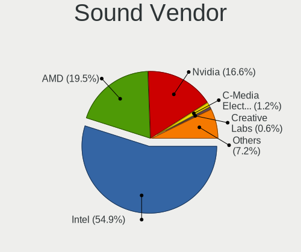

| Vendor                               | Computers | Percent |
|--------------------------------------|-----------|---------|
| Intel                                | 234       | 54.93%  |
| Nvidia                               | 82        | 19.25%  |
| AMD                                  | 74        | 17.37%  |
| ASUSTek Computer                     | 6         | 1.41%   |
| Creative Labs                        | 5         | 1.17%   |
| JMTek                                | 4         | 0.94%   |
| C-Media Electronics                  | 4         | 0.94%   |
| Texas Instruments                    | 2         | 0.47%   |
| Hewlett-Packard                      | 2         | 0.47%   |
| USB Audio                            | 1         | 0.23%   |
| Trust                                | 1         | 0.23%   |
| Thesycon Systemsoftware & Consulting | 1         | 0.23%   |
| Sony                                 | 1         | 0.23%   |
| Setek Elektronik                     | 1         | 0.23%   |
| Realtek Semiconductor                | 1         | 0.23%   |
| Razer USA                            | 1         | 0.23%   |
| Micro Star International             | 1         | 0.23%   |
| Logitech                             | 1         | 0.23%   |
| Lautsprecher Teufel                  | 1         | 0.23%   |
| Creative Technology                  | 1         | 0.23%   |
| BEHRINGER International              | 1         | 0.23%   |
| Apple                                | 1         | 0.23%   |

Sound Model
-----------

Sound card models

| Model                                                                      | Computers | Percent |
|----------------------------------------------------------------------------|-----------|---------|
| AMD Family 17h/19h HD Audio Controller                                     | 30        | 5.89%   |
| Intel Sunrise Point-LP HD Audio                                            | 27        | 5.3%    |
| Intel 8 Series/C220 Series Chipset High Definition Audio Controller        | 25        | 4.91%   |
| Intel 6 Series/C200 Series Chipset Family High Definition Audio Controller | 20        | 3.93%   |
| Intel 7 Series/C216 Chipset Family High Definition Audio Controller        | 17        | 3.34%   |
| AMD Renoir Radeon High Definition Audio Controller                         | 16        | 3.14%   |
| Intel 100 Series/C230 Series Chipset Family HD Audio Controller            | 14        | 2.75%   |
| Intel Xeon E3-1200 v3/4th Gen Core Processor HD Audio Controller           | 13        | 2.55%   |
| Intel Celeron/Pentium Silver Processor High Definition Audio               | 13        | 2.55%   |
| Intel 82801I (ICH9 Family) HD Audio Controller                             | 13        | 2.55%   |
| Intel 5 Series/3400 Series Chipset High Definition Audio                   | 13        | 2.55%   |
| Intel Wildcat Point-LP High Definition Audio Controller                    | 10        | 1.96%   |
| Intel Broadwell-U Audio Controller                                         | 10        | 1.96%   |
| Nvidia GF119 HDMI Audio Controller                                         | 9         | 1.77%   |
| AMD SBx00 Azalia (Intel HDA)                                               | 9         | 1.77%   |
| Nvidia GP107GL High Definition Audio Controller                            | 7         | 1.38%   |
| Nvidia GA104 High Definition Audio Controller                              | 7         | 1.38%   |
| Intel Haswell-ULT HD Audio Controller                                      | 7         | 1.38%   |
| Intel Cannon Lake PCH cAVS                                                 | 7         | 1.38%   |
| Intel 8 Series HD Audio Controller                                         | 7         | 1.38%   |
| Nvidia GK208 HDMI/DP Audio Controller                                      | 6         | 1.18%   |
| Nvidia GA106 High Definition Audio Controller                              | 6         | 1.18%   |
| Intel Tiger Lake-LP Smart Sound Technology Audio Controller                | 6         | 1.18%   |
| Intel Alder Lake-S HD Audio Controller                                     | 6         | 1.18%   |
| AMD Starship/Matisse HD Audio Controller                                   | 6         | 1.18%   |
| AMD Raven/Raven2/Fenghuang HDMI/DP Audio Controller                        | 6         | 1.18%   |
| Nvidia High Definition Audio Controller                                    | 5         | 0.98%   |
| Nvidia GM206 High Definition Audio Controller                              | 5         | 0.98%   |
| Nvidia Audio device                                                        | 5         | 0.98%   |
| Intel Raptor Lake High Definition Audio Controller                         | 5         | 0.98%   |
| Intel NM10/ICH7 Family High Definition Audio Controller                    | 5         | 0.98%   |
| Intel Cannon Point-LP High Definition Audio Controller                     | 5         | 0.98%   |
| Intel 200 Series PCH HD Audio                                              | 5         | 0.98%   |
| AMD Family 15h (Models 60h-6fh) Audio Controller                           | 5         | 0.98%   |
| AMD Ellesmere HDMI Audio [Radeon RX 470/480 / 570/580/590]                 | 5         | 0.98%   |
| Nvidia GK106 HDMI Audio Controller                                         | 4         | 0.79%   |
| Intel Ice Lake-LP Smart Sound Technology Audio Controller                  | 4         | 0.79%   |
| Intel Celeron N3350/Pentium N4200/Atom E3900 Series Audio Cluster          | 4         | 0.79%   |
| Intel Alder Lake PCH-P High Definition Audio Controller                    | 4         | 0.79%   |
| AMD RV710/730 HDMI Audio [Radeon HD 4000 series]                           | 4         | 0.79%   |

Memory
------

Memory Vendor
-------------

Memory module vendors

| Vendor              | Computers | Percent |
|---------------------|-----------|---------|
| SK hynix            | 6         | 15.79%  |
| Micron Technology   | 6         | 15.79%  |
| Samsung Electronics | 5         | 13.16%  |
| Corsair             | 5         | 13.16%  |
| Unknown             | 4         | 10.53%  |
| Kingston            | 4         | 10.53%  |
| G.Skill             | 2         | 5.26%   |
| Unknown (ABCD)      | 1         | 2.63%   |
| Unknown (0x8945)    | 1         | 2.63%   |
| Teikon              | 1         | 2.63%   |
| Team                | 1         | 2.63%   |
| Smart Brazil        | 1         | 2.63%   |
| Ramaxel Technology  | 1         | 2.63%   |

Memory Model
------------

Memory module models

| Model                                                               | Computers | Percent |
|---------------------------------------------------------------------|-----------|---------|
| Micron RAM 4ATF1G64HZ-3G2E1 8GB Row Of Chips DDR4 3200MT/s          | 2         | 5.13%   |
| Unknown RAM Module 4GB SODIMM DDR3                                  | 1         | 2.56%   |
| Unknown RAM Module 4GB SODIMM DDR2                                  | 1         | 2.56%   |
| Unknown RAM Module 4GB DIMM                                         | 1         | 2.56%   |
| Unknown RAM Module 2GB SODIMM DDR2 800MT/s                          | 1         | 2.56%   |
| Unknown (ABCD) RAM 123456789012345678 2048MB SODIMM LPDDR4 2400MT/s | 1         | 2.56%   |
| Unknown (0x8945) RAM Module 8GB SODIMM DDR4 2400MT/s                | 1         | 2.56%   |
| Teikon RAM TMT451S6BFR8A-PBSC 4GB SODIMM DDR3 1600MT/s              | 1         | 2.56%   |
| Team RAM TEAMGROUP-UD4-3200 16GB DIMM DDR4 3733MT/s                 | 1         | 2.56%   |
| Smart Brazil RAM SMS4TDC3C0K0446SCG 4GB SODIMM DDR4 2667MT/s        | 1         | 2.56%   |
| SK hynix RAM Module 4GB SODIMM DDR4 2400MT/s                        | 1         | 2.56%   |
| SK hynix RAM Module 2GB Row Of Chips LPDDR3 1867MT/s                | 1         | 2.56%   |
| SK hynix RAM HMT451U6BFR8A-PB 4GB DIMM DDR3 1600MT/s                | 1         | 2.56%   |
| SK hynix RAM HMA851S6CJR6N-VK 4GB SODIMM DDR4 2667MT/s              | 1         | 2.56%   |
| SK hynix RAM HMA82GS6CJR8N-VK 16GB SODIMM DDR4 2667MT/s             | 1         | 2.56%   |
| SK hynix RAM HMA81GS6AFR8N-UH 8GB SODIMM DDR4 2667MT/s              | 1         | 2.56%   |
| SK hynix RAM HCNNNCPMBLHR-NEE 2GB Row Of Chips LPDDR4 4267MT/s      | 1         | 2.56%   |
| Samsung RAM M471A2K43CB1-CRC 16GB SODIMM DDR4 2667MT/s              | 1         | 2.56%   |
| Samsung RAM M471A1K44BM0-CRC 8GB SODIMM DDR4 2400MT/s               | 1         | 2.56%   |
| Samsung RAM M425R2GA3BB0-CWMOD 16GB SODIMM DDR5 5600MT/s            | 1         | 2.56%   |
| Samsung RAM K4UBE3D4AA-MGCL 8GB Row Of Chips LPDDR4 4267MT/s        | 1         | 2.56%   |
| Samsung RAM K3LKBKB0BM-MGCP 4GB Row Of Chips LPDDR5 6400MT/s        | 1         | 2.56%   |
| Ramaxel RAM RMSA3320MR78HAF-3200 8GB SODIMM DDR4 3200MT/s           | 1         | 2.56%   |
| Micron RAM MT53E2G32D8QD-046 16GB Row Of Chips LPDDR4 4267MT/s      | 1         | 2.56%   |
| Micron RAM 8KTF51264HZ-1G6E1 4096MB SODIMM DDR3 1600MT/s            | 1         | 2.56%   |
| Micron RAM 4ATF1G64HZ-3G2F1 8GB SODIMM DDR4 3200MT/s                | 1         | 2.56%   |
| Micron RAM 18JSF51272AZ-1G6K1 4GB DIMM 1333MT/s                     | 1         | 2.56%   |
| Kingston RAM Module 16GB DIMM DDR4 3200MT/s                         | 1         | 2.56%   |
| Kingston RAM KVT8FP-HYC 4GB DIMM 1600MT/s                           | 1         | 2.56%   |
| Kingston RAM KHX2400C15/8G 8GB DIMM DDR4 3400MT/s                   | 1         | 2.56%   |
| Kingston RAM 9905428-131.A00LF 4GB SODIMM DDR3 1067MT/s             | 1         | 2.56%   |
| G.Skill RAM F5-6400J3239G16G 16GB DIMM DDR5 7000MT/s                | 1         | 2.56%   |
| G.Skill RAM F4-2400C16-8GRS 8GB SODIMM DDR4 2400MT/s                | 1         | 2.56%   |
| Corsair RAM Module 4GB SODIMM DDR3 1333MT/s                         | 1         | 2.56%   |
| Corsair RAM CMW32GX4M2E3200C16 16GB DIMM DDR4 3200MT/s              | 1         | 2.56%   |
| Corsair RAM CMK16GX4M2B3200C16 8GB DIMM DDR4 3600MT/s               | 1         | 2.56%   |
| Corsair RAM CMH32GX5M2E6000C36 16GB DIMM DDR5 4800MT/s              | 1         | 2.56%   |
| Corsair RAM CMH32GX5M2B6000Z30 16GB DIMM DDR5 4800MT/s              | 1         | 2.56%   |

Memory Kind
-----------

Memory module kinds

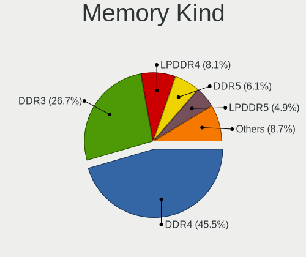

| Kind    | Computers | Percent |
|---------|-----------|---------|
| DDR4    | 14        | 41.18%  |
| DDR3    | 6         | 17.65%  |
| LPDDR4  | 4         | 11.76%  |
| DDR5    | 4         | 11.76%  |
| DDR2    | 2         | 5.88%   |
| Unknown | 2         | 5.88%   |
| LPDDR5  | 1         | 2.94%   |
| LPDDR3  | 1         | 2.94%   |

Memory Form Factor
------------------

Physical design of the memory module

| Name         | Computers | Percent |
|--------------|-----------|---------|
| SODIMM       | 16        | 47.06%  |
| DIMM         | 11        | 32.35%  |
| Row Of Chips | 7         | 20.59%  |

Memory Size
-----------

Memory module size

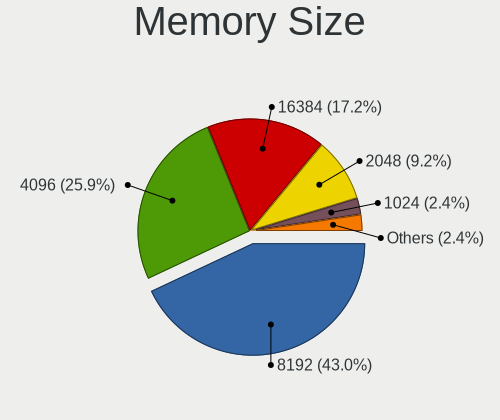

| Size  | Computers | Percent |
|-------|-----------|---------|
| 8192  | 12        | 35.29%  |
| 4096  | 10        | 29.41%  |
| 16384 | 8         | 23.53%  |
| 32768 | 2         | 5.88%   |
| 2048  | 2         | 5.88%   |

Memory Speed
------------

Memory module speed

| Speed   | Computers | Percent |
|---------|-----------|---------|
| 3200    | 5         | 14.29%  |
| 2667    | 4         | 11.43%  |
| 4267    | 3         | 8.57%   |
| 2400    | 3         | 8.57%   |
| 1600    | 3         | 8.57%   |
| Unknown | 3         | 8.57%   |
| 4800    | 2         | 5.71%   |
| 1333    | 2         | 5.71%   |
| 7000    | 1         | 2.86%   |
| 6400    | 1         | 2.86%   |
| 5600    | 1         | 2.86%   |
| 3733    | 1         | 2.86%   |
| 3600    | 1         | 2.86%   |
| 3400    | 1         | 2.86%   |
| 1867    | 1         | 2.86%   |
| 1648    | 1         | 2.86%   |
| 1067    | 1         | 2.86%   |
| 800     | 1         | 2.86%   |

Printers & scanners
-------------------

Printer Vendor
--------------

Printer device vendors

| Vendor                | Computers | Percent |
|-----------------------|-----------|---------|
| Hewlett-Packard       | 3         | 30%     |
| Brother Industries    | 3         | 30%     |
| Seiko Epson           | 1         | 10%     |
| Lexmark International | 1         | 10%     |
| Dymo-CoStar           | 1         | 10%     |
| Canon                 | 1         | 10%     |

Printer Model
-------------

Printer device models

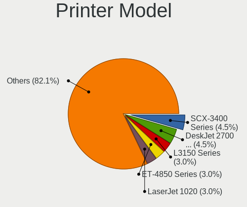

| Model                         | Computers | Percent |
|-------------------------------|-----------|---------|
| Seiko Epson ET-4850 Series    | 1         | 10%     |
| Lexmark International CX310dn | 1         | 10%     |
| HP LaserJet 400 M401dn        | 1         | 10%     |
| HP LaserJet 1020              | 1         | 10%     |
| HP Color LaserJet CP1215      | 1         | 10%     |
| Dymo-CoStar LabelWriter 450   | 1         | 10%     |
| Canon PIXMA MP230             | 1         | 10%     |
| Brother MFC-1910W             | 1         | 10%     |
| Brother HL-L2350DW series     | 1         | 10%     |
| Brother DCP-T300              | 1         | 10%     |

Scanner Vendor
--------------

Scanner device vendors

| Vendor | Computers | Percent |
|--------|-----------|---------|
| Canon  | 2         | 100%    |

Scanner Model
-------------

Scanner device models

| Model                   | Computers | Percent |
|-------------------------|-----------|---------|
| Canon CanoScan LiDE 90  | 1         | 50%     |
| Canon CanoScan LiDE 200 | 1         | 50%     |

Camera
------

Camera Vendor
-------------

Camera device vendors

| Vendor                                 | Computers | Percent |
|----------------------------------------|-----------|---------|
| Chicony Electronics                    | 35        | 19.89%  |
| IMC Networks                           | 16        | 9.09%   |
| Microdia                               | 15        | 8.52%   |
| Realtek Semiconductor                  | 13        | 7.39%   |
| Quanta                                 | 11        | 6.25%   |
| Logitech                               | 10        | 5.68%   |
| Apple                                  | 10        | 5.68%   |
| Bison Electronics                      | 9         | 5.11%   |
| Sunplus Innovation Technology          | 8         | 4.55%   |
| Cheng Uei Precision Industry (Foxlink) | 7         | 3.98%   |
| Suyin                                  | 5         | 2.84%   |
| Microsoft                              | 4         | 2.27%   |
| Luxvisions Innotech Limited            | 4         | 2.27%   |
| Silicon Motion                         | 3         | 1.7%    |
| Lite-On Technology                     | 3         | 1.7%    |
| Ricoh                                  | 2         | 1.14%   |
| Alcor Micro                            | 2         | 1.14%   |
| Y Media                                | 1         | 0.57%   |
| USB Camera CS                          | 1         | 0.57%   |
| USB Camera                             | 1         | 0.57%   |
| Syntek                                 | 1         | 0.57%   |
| SunplusIT                              | 1         | 0.57%   |
| Sonix Technology                       | 1         | 0.57%   |
| SJ-180517-N                            | 1         | 0.57%   |
| ShineTech                              | 1         | 0.57%   |
| MacroSilicon                           | 1         | 0.57%   |
| Lenovo                                 | 1         | 0.57%   |
| kingcome                               | 1         | 0.57%   |
| icSpring                               | 1         | 0.57%   |
| Generalplus Technology                 | 1         | 0.57%   |
| GEMBIRD                                | 1         | 0.57%   |
| eMeet                                  | 1         | 0.57%   |
| Elecom                                 | 1         | 0.57%   |
| ALi                                    | 1         | 0.57%   |
| Acer                                   | 1         | 0.57%   |
| 8SSC21K12273V1SR33X2817                | 1         | 0.57%   |

Camera Model
------------

Camera device models

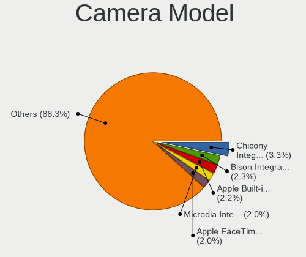

| Model                                                          | Computers | Percent |
|----------------------------------------------------------------|-----------|---------|
| Chicony Integrated Camera                                      | 5         | 2.81%   |
| Realtek Integrated_Webcam_HD                                   | 4         | 2.25%   |
| Microdia Integrated_Webcam_HD                                  | 4         | 2.25%   |
| Logitech Webcam C270                                           | 4         | 2.25%   |
| IMC Networks USB2.0 HD UVC WebCam                              | 4         | 2.25%   |
| IMC Networks Integrated Camera                                 | 4         | 2.25%   |
| Chicony FJ Camera                                              | 4         | 2.25%   |
| Apple FaceTime HD Camera (Built-in)                            | 4         | 2.25%   |
| Quanta HD User Facing                                          | 3         | 1.69%   |
| Chicony HP HD Camera                                           | 3         | 1.69%   |
| Bison Integrated Camera                                        | 3         | 1.69%   |
| Suyin Acer/HP Integrated Webcam [CN0314]                       | 2         | 1.12%   |
| Sunplus Integrated_Webcam_HD                                   | 2         | 1.12%   |
| Sunplus Integrated_Webcam_FHD                                  | 2         | 1.12%   |
| Realtek USB Camera                                             | 2         | 1.12%   |
| Quanta USB2.0 HD UVC WebCam                                    | 2         | 1.12%   |
| Microdia Sonix USB 2.0 Camera                                  | 2         | 1.12%   |
| Microdia Integrated_Webcam_FHD                                 | 2         | 1.12%   |
| Luxvisions Innotech Limited HP TrueVision HD Camera            | 2         | 1.12%   |
| Logitech Webcam C925e                                          | 2         | 1.12%   |
| Logitech StreamCam                                             | 2         | 1.12%   |
| IMC Networks USB2.0 VGA UVC WebCam                             | 2         | 1.12%   |
| Chicony USB2.0 HD UVC WebCam                                   | 2         | 1.12%   |
| Chicony USB 2.0 Camera                                         | 2         | 1.12%   |
| Chicony HP TrueVision HD Camera                                | 2         | 1.12%   |
| Chicony ACER HD User Facing                                    | 2         | 1.12%   |
| Chicony 2.0M UVC Webcam / CNF7129                              | 2         | 1.12%   |
| Cheng Uei Precision Industry (Foxlink) Webcam                  | 2         | 1.12%   |
| Cheng Uei Precision Industry (Foxlink) HP TrueVision HD Camera | 2         | 1.12%   |
| Apple FaceTime HD Camera                                       | 2         | 1.12%   |
| Apple Built-in iSight                                          | 2         | 1.12%   |
| Y Media USB Camera                                             | 1         | 0.56%   |
| USB Camera USB Camera                                          | 1         | 0.56%   |
| USB Camera CS USB Camera CS                                    | 1         | 0.56%   |
| Syntek EasyCamera                                              | 1         | 0.56%   |
| Suyin USB 2.0 Camera                                           | 1         | 0.56%   |
| Suyin Lenovo EasyCamera Integrated Webcam                      | 1         | 0.56%   |
| Suyin HP Webcam-101                                            | 1         | 0.56%   |
| SunplusIT USB 2M Camera                                        | 1         | 0.56%   |
| Sunplus Laptop Integrated Webcam HD                            | 1         | 0.56%   |

Security
--------

Fingerprint Vendor
------------------

Fingerprint sensor vendors

| Vendor                             | Computers | Percent |
|------------------------------------|-----------|---------|
| Validity Sensors                   | 8         | 34.78%  |
| Synaptics                          | 6         | 26.09%  |
| Shenzhen Goodix Technology         | 3         | 13.04%  |
| Upek                               | 2         | 8.7%    |
| AuthenTec                          | 2         | 8.7%    |
| Realtek USB2.0 Finger Print Bridge | 1         | 4.35%   |
| Elan Microelectronics              | 1         | 4.35%   |

Fingerprint Model
-----------------

Fingerprint sensor models

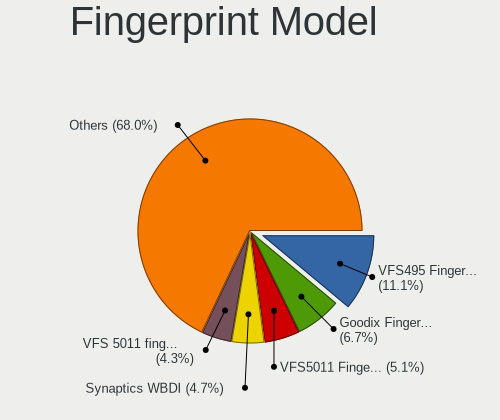

| Model                                                                      | Computers | Percent |
|----------------------------------------------------------------------------|-----------|---------|
| Validity Sensors VFS495 Fingerprint Reader                                 | 3         | 13.04%  |
| Shenzhen Goodix  Fingerprint Device                                        | 3         | 13.04%  |
| Validity Sensors VFS 5011 fingerprint sensor                               | 2         | 8.7%    |
| Upek Biometric Touchchip/Touchstrip Fingerprint Sensor                     | 2         | 8.7%    |
| Synaptics Metallica MIS Touch Fingerprint Reader                           | 2         | 8.7%    |
| Validity Sensors VFS5011 Fingerprint Reader                                | 1         | 4.35%   |
| Validity Sensors Synaptics WBDI                                            | 1         | 4.35%   |
| Validity Sensors Synaptics VFS7552 Touch Fingerprint Sensor with PurePrint | 1         | 4.35%   |
| Synaptics WBDI                                                             | 1         | 4.35%   |
| Synaptics  WBDI                                                            | 1         | 4.35%   |
| Synaptics Metallica MOH Touch Fingerprint Reader                           | 1         | 4.35%   |
| Synaptics Fingerprint reader [HP G6]                                       | 1         | 4.35%   |
| Realtek USB2.0 Finger Print Bridge FocalTech Fingerprint Device            | 1         | 4.35%   |
| Elan ELAN:Fingerprint                                                      | 1         | 4.35%   |
| AuthenTec Fingerprint Sensor                                               | 1         | 4.35%   |
| AuthenTec AES2810                                                          | 1         | 4.35%   |

Chipcard Vendor
---------------

Chipcard module vendors

| Vendor          | Computers | Percent |
|-----------------|-----------|---------|
| Broadcom        | 7         | 58.33%  |
| Alcor Micro     | 2         | 16.67%  |
| Upek            | 1         | 8.33%   |
| O2 Micro        | 1         | 8.33%   |
| Hewlett-Packard | 1         | 8.33%   |

Chipcard Model
--------------

Chipcard module models

| Model                                                                        | Computers | Percent |
|------------------------------------------------------------------------------|-----------|---------|
| Broadcom BCM5880 Secure Applications Processor                               | 2         | 16.67%  |
| Broadcom 5880                                                                | 2         | 16.67%  |
| Broadcom 58200                                                               | 2         | 16.67%  |
| Alcor Micro AU9540 Smartcard Reader                                          | 2         | 16.67%  |
| Upek TouchChip Fingerprint Coprocessor (WBF advanced mode)                   | 1         | 8.33%   |
| O2 Micro OZ776 CCID Smartcard Reader                                         | 1         | 8.33%   |
| Hewlett-Packard SC Keyboard - Apollo (Liteon)                                | 1         | 8.33%   |
| Broadcom BCM5880 Secure Applications Processor with fingerprint swipe sensor | 1         | 8.33%   |

Unsupported
-----------

Unsupported Devices
-------------------

Total unsupported devices on board

| Total | Computers | Percent |
|-------|-----------|---------|
| 0     | 210       | 69.08%  |
| 1     | 84        | 27.63%  |
| 2     | 9         | 2.96%   |
| 3     | 1         | 0.33%   |

Unsupported Device Types
------------------------

Types of unsupported devices

| Type                     | Computers | Percent |
|--------------------------|-----------|---------|
| Graphics card            | 28        | 28%     |
| Fingerprint reader       | 23        | 23%     |
| Multimedia controller    | 14        | 14%     |
| Net/wireless             | 11        | 11%     |
| Chipcard                 | 11        | 11%     |
| Net/ethernet             | 4         | 4%      |
| Storage                  | 2         | 2%      |
| Camera                   | 2         | 2%      |
| Unassigned class         | 1         | 1%      |
| Storage/ide              | 1         | 1%      |
| Communication controller | 1         | 1%      |
| Card reader              | 1         | 1%      |
| Bluetooth                | 1         | 1%      |

