Zorin 17 - Tested Hardware & Statistics (Desktops)
--------------------------------------------------

A project to collect tested hardware configurations for Zorin 17.

Anyone can contribute to this report by the [hw-probe](https://github.com/linuxhw/hw-probe) tool:

    sudo -E hw-probe -all -upload

Please contribute! Especially if your hardware is rare.

Contents
--------

* [ Test Cases ](#test-cases)

* [ System ](#system)
  - [ Kernel                   ](#kernel)
  - [ Kernel Family            ](#kernel-family)
  - [ Kernel Major Ver.        ](#kernel-major-ver)
  - [ Arch                     ](#arch)
  - [ DE                       ](#de)
  - [ Display Server           ](#display-server)
  - [ Display Manager          ](#display-manager)
  - [ OS Lang                  ](#os-lang)
  - [ Boot Mode                ](#boot-mode)
  - [ Filesystem               ](#filesystem)
  - [ Part. scheme             ](#part-scheme)
  - [ Dual Boot with Linux/BSD ](#dual-boot-with-linuxbsd)
  - [ Dual Boot (Win)          ](#dual-boot-win)

* [ Board ](#board)
  - [ Vendor                   ](#vendor)
  - [ Model                    ](#model)
  - [ Model Family             ](#model-family)
  - [ MFG Year                 ](#mfg-year)
  - [ Form Factor              ](#form-factor)
  - [ Secure Boot              ](#secure-boot)
  - [ Coreboot                 ](#coreboot)
  - [ RAM Size                 ](#ram-size)
  - [ RAM Used                 ](#ram-used)
  - [ Total Drives             ](#total-drives)
  - [ Has CD-ROM               ](#has-cd-rom)
  - [ Has Ethernet             ](#has-ethernet)
  - [ Has WiFi                 ](#has-wifi)
  - [ Has Bluetooth            ](#has-bluetooth)

* [ Location ](#location)
  - [ Country                  ](#country)
  - [ City                     ](#city)

* [ Drives ](#drives)
  - [ Drive Vendor             ](#drive-vendor)
  - [ Drive Model              ](#drive-model)
  - [ HDD Vendor               ](#hdd-vendor)
  - [ SSD Vendor               ](#ssd-vendor)
  - [ Drive Kind               ](#drive-kind)
  - [ Drive Connector          ](#drive-connector)
  - [ Drive Size               ](#drive-size)
  - [ Space Total              ](#space-total)
  - [ Space Used               ](#space-used)
  - [ Malfunc. Drives          ](#malfunc-drives)
  - [ Malfunc. Drive Vendor    ](#malfunc-drive-vendor)
  - [ Malfunc. HDD Vendor      ](#malfunc-hdd-vendor)
  - [ Malfunc. Drive Kind      ](#malfunc-drive-kind)
  - [ Failed Drives            ](#failed-drives)
  - [ Failed Drive Vendor      ](#failed-drive-vendor)
  - [ Drive Status             ](#drive-status)

* [ Storage controller ](#storage-controller)
  - [ Storage Vendor           ](#storage-vendor)
  - [ Storage Model            ](#storage-model)
  - [ Storage Kind             ](#storage-kind)

* [ Processor ](#processor)
  - [ CPU Vendor               ](#cpu-vendor)
  - [ CPU Model                ](#cpu-model)
  - [ CPU Model Family         ](#cpu-model-family)
  - [ CPU Cores                ](#cpu-cores)
  - [ CPU Sockets              ](#cpu-sockets)
  - [ CPU Threads              ](#cpu-threads)
  - [ CPU Op-Modes             ](#cpu-op-modes)
  - [ CPU Microcode            ](#cpu-microcode)
  - [ CPU Microarch            ](#cpu-microarch)

* [ Graphics ](#graphics)
  - [ GPU Vendor               ](#gpu-vendor)
  - [ GPU Model                ](#gpu-model)
  - [ GPU Combo                ](#gpu-combo)
  - [ GPU Driver               ](#gpu-driver)
  - [ GPU Memory               ](#gpu-memory)

* [ Monitor ](#monitor)
  - [ Monitor Vendor           ](#monitor-vendor)
  - [ Monitor Model            ](#monitor-model)
  - [ Monitor Resolution       ](#monitor-resolution)
  - [ Monitor Diagonal         ](#monitor-diagonal)
  - [ Monitor Width            ](#monitor-width)
  - [ Aspect Ratio             ](#aspect-ratio)
  - [ Monitor Area             ](#monitor-area)
  - [ Pixel Density            ](#pixel-density)
  - [ Multiple Monitors        ](#multiple-monitors)

* [ Network ](#network)
  - [ Net Controller Vendor    ](#net-controller-vendor)
  - [ Net Controller Model     ](#net-controller-model)
  - [ Wireless Vendor          ](#wireless-vendor)
  - [ Wireless Model           ](#wireless-model)
  - [ Ethernet Vendor          ](#ethernet-vendor)
  - [ Ethernet Model           ](#ethernet-model)
  - [ Net Controller Kind      ](#net-controller-kind)
  - [ Used Controller          ](#used-controller)
  - [ NICs                     ](#nics)
  - [ IPv6                     ](#ipv6)

* [ Bluetooth ](#bluetooth)
  - [ Bluetooth Vendor         ](#bluetooth-vendor)
  - [ Bluetooth Model          ](#bluetooth-model)

* [ Sound ](#sound)
  - [ Sound Vendor             ](#sound-vendor)
  - [ Sound Model              ](#sound-model)

* [ Memory ](#memory)
  - [ Memory Vendor            ](#memory-vendor)
  - [ Memory Model             ](#memory-model)
  - [ Memory Kind              ](#memory-kind)
  - [ Memory Form Factor       ](#memory-form-factor)
  - [ Memory Size              ](#memory-size)
  - [ Memory Speed             ](#memory-speed)

* [ Printers & scanners ](#printers--scanners)
  - [ Printer Vendor           ](#printer-vendor)
  - [ Printer Model            ](#printer-model)
  - [ Scanner Vendor           ](#scanner-vendor)
  - [ Scanner Model            ](#scanner-model)

* [ Camera ](#camera)
  - [ Camera Vendor            ](#camera-vendor)
  - [ Camera Model             ](#camera-model)

* [ Security ](#security)
  - [ Fingerprint Vendor       ](#fingerprint-vendor)
  - [ Fingerprint Model        ](#fingerprint-model)
  - [ Chipcard Vendor          ](#chipcard-vendor)
  - [ Chipcard Model           ](#chipcard-model)

* [ Unsupported ](#unsupported)
  - [ Unsupported Devices      ](#unsupported-devices)
  - [ Unsupported Device Types ](#unsupported-device-types)

Test Cases
----------

Total: 2441

| Vendor        | Model                       | Probe                                                      | Date         |
|---------------|-----------------------------|------------------------------------------------------------|--------------|
| Dell          | 042P49 A01                  | [175500ac35](https://linux-hardware.org/?probe=175500ac35) | Jan 03, 2026 |
| MSI           | Z77A-GD65                   | [46c97e75a3](https://linux-hardware.org/?probe=46c97e75a3) | Jan 02, 2026 |
| ASUSTek       | A8N-E                       | [e7d4feb0e5](https://linux-hardware.org/?probe=e7d4feb0e5) | Dec 31, 2025 |
| Intel         | D34010WYK H14771-304        | [0067043374](https://linux-hardware.org/?probe=0067043374) | Dec 31, 2025 |
| Intel         | D34010WYK H14771-304        | [86338f7dfe](https://linux-hardware.org/?probe=86338f7dfe) | Dec 31, 2025 |
| MSI           | B450M GAMING PLUS           | [f665f5f502](https://linux-hardware.org/?probe=f665f5f502) | Dec 29, 2025 |
| Gigabyte      | B450M DS3H-CF               | [a320475a38](https://linux-hardware.org/?probe=a320475a38) | Dec 28, 2025 |
| Biostar       | A320MH PRO                  | [b99a12247a](https://linux-hardware.org/?probe=b99a12247a) | Dec 27, 2025 |
| Lenovo        | MAHOBAY NOK                 | [824d0b5aee](https://linux-hardware.org/?probe=824d0b5aee) | Dec 27, 2025 |
| HP            | 2B47                        | [1148ed9096](https://linux-hardware.org/?probe=1148ed9096) | Dec 27, 2025 |
| ASRock        | FM2A68M-HD+ R2.0            | [52d78a3235](https://linux-hardware.org/?probe=52d78a3235) | Dec 26, 2025 |
| ASRock        | FM2A68M-HD+ R2.0            | [0f8b8ab7bc](https://linux-hardware.org/?probe=0f8b8ab7bc) | Dec 26, 2025 |
| ASRock        | Z270M Extreme4              | [d4e4c78ea0](https://linux-hardware.org/?probe=d4e4c78ea0) | Dec 25, 2025 |
| Intel         | DQ45CB AAE30148-301         | [aa42ef11c4](https://linux-hardware.org/?probe=aa42ef11c4) | Dec 23, 2025 |
| Gigabyte      | M68MT-S2P                   | [c325acb01d](https://linux-hardware.org/?probe=c325acb01d) | Dec 22, 2025 |
| ASUSTek       | H110M-A                     | [0257348136](https://linux-hardware.org/?probe=0257348136) | Dec 22, 2025 |
| Dell          | 0HHV7N A00                  | [e23b323c3c](https://linux-hardware.org/?probe=e23b323c3c) | Dec 21, 2025 |
| HP            | 8594                        | [9a5bb6ef6f](https://linux-hardware.org/?probe=9a5bb6ef6f) | Dec 21, 2025 |
| ASUSTek       | K30AD_M31AD_M51AD_M32AD     | [de70b382af](https://linux-hardware.org/?probe=de70b382af) | Dec 21, 2025 |
| Foxconn       | 2ABF                        | [cfc4468bc8](https://linux-hardware.org/?probe=cfc4468bc8) | Dec 20, 2025 |
| HP            | 2B47                        | [8759e67437](https://linux-hardware.org/?probe=8759e67437) | Dec 19, 2025 |
| Dell          | 0KWVT8 A00                  | [88a0e8aa3c](https://linux-hardware.org/?probe=88a0e8aa3c) | Dec 19, 2025 |
| Gigabyte      | H77-D3H                     | [970618be47](https://linux-hardware.org/?probe=970618be47) | Dec 19, 2025 |
| Gigabyte      | H77-D3H                     | [b0d1dbf1c5](https://linux-hardware.org/?probe=b0d1dbf1c5) | Dec 19, 2025 |
| Gigabyte      | Z790 GAMING X AX            | [f553dd88d5](https://linux-hardware.org/?probe=f553dd88d5) | Dec 18, 2025 |
| Dell          | 0VYXHD A00                  | [08692848fd](https://linux-hardware.org/?probe=08692848fd) | Dec 16, 2025 |
| Gigabyte      | Z390 UD                     | [c67657043c](https://linux-hardware.org/?probe=c67657043c) | Dec 15, 2025 |
| HP            | 0AE8h C                     | [d51a13406e](https://linux-hardware.org/?probe=d51a13406e) | Dec 14, 2025 |
| PELADN        | HA-3                        | [e861a94e6d](https://linux-hardware.org/?probe=e861a94e6d) | Dec 13, 2025 |
| ASRock        | B365 Phantom Gaming 4       | [6a7efda68c](https://linux-hardware.org/?probe=6a7efda68c) | Dec 13, 2025 |
| Apple         | Mac-F221BEC8                | [254d101b4f](https://linux-hardware.org/?probe=254d101b4f) | Dec 12, 2025 |
| MSI           | PRO Z790-A MAX WIFI         | [8d56eb67aa](https://linux-hardware.org/?probe=8d56eb67aa) | Dec 12, 2025 |
| Lenovo        | 3106 SDK0J40697 WIN 3305... | [7a969591ae](https://linux-hardware.org/?probe=7a969591ae) | Dec 12, 2025 |
| HP            | 0A1Ch E                     | [d8a078f17b](https://linux-hardware.org/?probe=d8a078f17b) | Dec 11, 2025 |
| ASRock        | A320M Pro4                  | [4ac2ca035e](https://linux-hardware.org/?probe=4ac2ca035e) | Dec 10, 2025 |
| ASRock        | A320M Pro4                  | [4b695afdd1](https://linux-hardware.org/?probe=4b695afdd1) | Dec 10, 2025 |
| HP            | 8712                        | [0410e50cae](https://linux-hardware.org/?probe=0410e50cae) | Dec 09, 2025 |
| Gigabyte      | B650 EAGLE AX               | [9a213e827d](https://linux-hardware.org/?probe=9a213e827d) | Dec 07, 2025 |
| Dell          | 040DDP A01                  | [c02d0a1769](https://linux-hardware.org/?probe=c02d0a1769) | Dec 07, 2025 |
| Gigabyte      | X299X AORUS MASTER          | [dbf9010dda](https://linux-hardware.org/?probe=dbf9010dda) | Dec 06, 2025 |
| MSI           | Z97 GAMING 5                | [9ad8e49e14](https://linux-hardware.org/?probe=9ad8e49e14) | Dec 06, 2025 |
| HP            | 0A1Ch E                     | [6f776bb678](https://linux-hardware.org/?probe=6f776bb678) | Dec 05, 2025 |
| ASRock        | A75M-HVS                    | [bd6ac01de8](https://linux-hardware.org/?probe=bd6ac01de8) | Dec 05, 2025 |
| ASRock        | A75M-HVS                    | [4d17984ee3](https://linux-hardware.org/?probe=4d17984ee3) | Dec 04, 2025 |
| ASUSTek       | ProArt B550-CREATOR         | [f8eb74cf4a](https://linux-hardware.org/?probe=f8eb74cf4a) | Dec 04, 2025 |
| Acer          | aFender AXC100A             | [08b48d7b0d](https://linux-hardware.org/?probe=08b48d7b0d) | Dec 02, 2025 |
| Gigabyte      | H510M K V2                  | [4d96edb203](https://linux-hardware.org/?probe=4d96edb203) | Dec 02, 2025 |
| MSI           | Z270 SLI PLUS               | [630cb4afc8](https://linux-hardware.org/?probe=630cb4afc8) | Dec 02, 2025 |
| HP            | 18E5                        | [10bbe9c235](https://linux-hardware.org/?probe=10bbe9c235) | Dec 01, 2025 |
| Dell          | 0773VG A01                  | [5c33da3c09](https://linux-hardware.org/?probe=5c33da3c09) | Nov 30, 2025 |
| ASUSTek       | TUF Gaming B650M-PLUS       | [616f7f09cd](https://linux-hardware.org/?probe=616f7f09cd) | Nov 29, 2025 |
| Biostar       | A320MH PRO                  | [987ce86888](https://linux-hardware.org/?probe=987ce86888) | Nov 29, 2025 |
| ASUSTek       | TUF Gaming B650M-E WIFI     | [6c4f60e386](https://linux-hardware.org/?probe=6c4f60e386) | Nov 29, 2025 |
| Dell          | 0X501H A03                  | [1ffa529577](https://linux-hardware.org/?probe=1ffa529577) | Nov 29, 2025 |
| Intel         | X99M-A                      | [a86d30ee87](https://linux-hardware.org/?probe=a86d30ee87) | Nov 28, 2025 |
| Shenzhen D... | H30                         | [248ab1f06d](https://linux-hardware.org/?probe=248ab1f06d) | Nov 27, 2025 |
| Gigabyte      | H81M-H                      | [3212a2cb08](https://linux-hardware.org/?probe=3212a2cb08) | Nov 26, 2025 |
| HP            | 1495                        | [be2a87592d](https://linux-hardware.org/?probe=be2a87592d) | Nov 23, 2025 |
| Acer          | Veriton X4630G V:1.0        | [722edb4ffc](https://linux-hardware.org/?probe=722edb4ffc) | Nov 21, 2025 |
| Foxconn       | 2ADA                        | [d9cceeb343](https://linux-hardware.org/?probe=d9cceeb343) | Nov 19, 2025 |
| ASUSTek       | TUF Gaming Z790-PLUS WIF... | [f0736fc039](https://linux-hardware.org/?probe=f0736fc039) | Nov 19, 2025 |
| HP            | 2B34                        | [a38928c1c2](https://linux-hardware.org/?probe=a38928c1c2) | Nov 17, 2025 |
| ASRock        | A55M-HVS                    | [33354a41f1](https://linux-hardware.org/?probe=33354a41f1) | Nov 15, 2025 |
| HP            | 0A1Ch E                     | [06354dc0ce](https://linux-hardware.org/?probe=06354dc0ce) | Nov 14, 2025 |
| Dell          | 0K2NWM A00                  | [97689ca4af](https://linux-hardware.org/?probe=97689ca4af) | Nov 13, 2025 |
| ASUSTek       | Z87-A                       | [19e8efc40f](https://linux-hardware.org/?probe=19e8efc40f) | Nov 13, 2025 |
| Gigabyte      | H61N-USB3                   | [d30d702891](https://linux-hardware.org/?probe=d30d702891) | Nov 12, 2025 |
| Dell          | 0KRXWM A02                  | [1feeaa28c0](https://linux-hardware.org/?probe=1feeaa28c0) | Nov 12, 2025 |
| MSI           | A68HM-E33 V2                | [712ef32924](https://linux-hardware.org/?probe=712ef32924) | Nov 11, 2025 |
| Dell          | 0X37H9 A01                  | [4a386808b3](https://linux-hardware.org/?probe=4a386808b3) | Nov 10, 2025 |
| Fujitsu       | D3120-A1 S26361-D3120-A1    | [a6f69b514f](https://linux-hardware.org/?probe=a6f69b514f) | Nov 10, 2025 |
| Gigabyte      | A520M S2H                   | [22388385e2](https://linux-hardware.org/?probe=22388385e2) | Nov 10, 2025 |
| ASUSTek       | PRIME X470-PRO              | [7fd7559c2d](https://linux-hardware.org/?probe=7fd7559c2d) | Nov 10, 2025 |
| HP            | 0A1Ch E                     | [ebaeddebf4](https://linux-hardware.org/?probe=ebaeddebf4) | Nov 09, 2025 |
| HP            | 3396                        | [234d62e2bf](https://linux-hardware.org/?probe=234d62e2bf) | Nov 09, 2025 |
| MSI           | H310M PRO-VDH               | [c9502de63a](https://linux-hardware.org/?probe=c9502de63a) | Nov 08, 2025 |
| Lenovo        | 106F NOK                    | [65fde3e18c](https://linux-hardware.org/?probe=65fde3e18c) | Nov 08, 2025 |
| ASRock        | A55M-HVS                    | [48e96f1134](https://linux-hardware.org/?probe=48e96f1134) | Nov 06, 2025 |
| Dell          | 0K2NWM A00                  | [105d2a4301](https://linux-hardware.org/?probe=105d2a4301) | Nov 06, 2025 |
| MSI           | B450 GAMING PRO CARBON A... | [4a538cefdc](https://linux-hardware.org/?probe=4a538cefdc) | Nov 05, 2025 |
| MACHINIST     | E5 MR9A PRO MAX V1.1        | [32d810084a](https://linux-hardware.org/?probe=32d810084a) | Nov 05, 2025 |
| HP            | 8184 X4                     | [059cf7bbac](https://linux-hardware.org/?probe=059cf7bbac) | Nov 05, 2025 |
| ASRock        | G41M-GE3                    | [d1bca55d28](https://linux-hardware.org/?probe=d1bca55d28) | Nov 05, 2025 |
| ASUSTek       | TUF Gaming Z890-PLUS WIF... | [a646b556af](https://linux-hardware.org/?probe=a646b556af) | Nov 04, 2025 |
| ASUSTek       | TUF Gaming Z890-PLUS WIF... | [ddf1f28d45](https://linux-hardware.org/?probe=ddf1f28d45) | Nov 04, 2025 |
| ASUSTek       | TUF Gaming X570-PLUS        | [ab5952a7ff](https://linux-hardware.org/?probe=ab5952a7ff) | Nov 04, 2025 |
| HP            | 3647h                       | [3e69bddbbe](https://linux-hardware.org/?probe=3e69bddbbe) | Nov 04, 2025 |
| MSI           | X670E GAMING PLUS WIFI      | [7bc26bed21](https://linux-hardware.org/?probe=7bc26bed21) | Nov 03, 2025 |
| Dell          | 0T1D10 A01                  | [06b1d8ef38](https://linux-hardware.org/?probe=06b1d8ef38) | Nov 03, 2025 |
| HP            | 0A1Ch E                     | [556aa0e503](https://linux-hardware.org/?probe=556aa0e503) | Nov 03, 2025 |
| Dell          | 00V62H A01                  | [46914a0dab](https://linux-hardware.org/?probe=46914a0dab) | Nov 02, 2025 |
| Fujitsu       | D2991-A1 S26361-D2991-A1    | [a1d1f2cbaf](https://linux-hardware.org/?probe=a1d1f2cbaf) | Nov 02, 2025 |
| Intel         | DN2820FYK H24582-204        | [0fbe6088f9](https://linux-hardware.org/?probe=0fbe6088f9) | Nov 02, 2025 |
| HP            | 0A1Ch E                     | [5596dbdd0f](https://linux-hardware.org/?probe=5596dbdd0f) | Nov 02, 2025 |
| ASUSTek       | TUF Gaming X570-PLUS        | [af62ffd68f](https://linux-hardware.org/?probe=af62ffd68f) | Nov 02, 2025 |
| Dell          | 0FDY5C A00                  | [3aa8ba598a](https://linux-hardware.org/?probe=3aa8ba598a) | Nov 02, 2025 |
| ASUSTek       | TUF Gaming Z790-PLUS WIF... | [b77c9cadc7](https://linux-hardware.org/?probe=b77c9cadc7) | Nov 01, 2025 |
| ASUSTek       | H110M-R                     | [f535a0f8eb](https://linux-hardware.org/?probe=f535a0f8eb) | Nov 01, 2025 |
| Acer          | Aspire XC101 V1.2           | [28b960bc10](https://linux-hardware.org/?probe=28b960bc10) | Nov 01, 2025 |
| Dell          | 0VRWRC A00                  | [b8e26c4dab](https://linux-hardware.org/?probe=b8e26c4dab) | Oct 31, 2025 |
| Dell          | 0X501H A03                  | [30c7433f25](https://linux-hardware.org/?probe=30c7433f25) | Oct 31, 2025 |
| ASUSTek       | PRIME B450M-A II            | [e0573c71d1](https://linux-hardware.org/?probe=e0573c71d1) | Oct 30, 2025 |
| Gigabyte      | H61N-USB3                   | [b859a1acce](https://linux-hardware.org/?probe=b859a1acce) | Oct 30, 2025 |
| MSI           | B550M PRO-VDH WIFI          | [cb6b5c3f62](https://linux-hardware.org/?probe=cb6b5c3f62) | Oct 30, 2025 |
| Firebat_Co... | ZY-AK2PLUS                  | [119def07a9](https://linux-hardware.org/?probe=119def07a9) | Oct 29, 2025 |
| Exo           | H510H6-M2                   | [b67dcab629](https://linux-hardware.org/?probe=b67dcab629) | Oct 27, 2025 |
| Dell          | 0HHV7N A00                  | [8a358ca7c1](https://linux-hardware.org/?probe=8a358ca7c1) | Oct 26, 2025 |
| Dell          | 0HHV7N A00                  | [ee4b6a2286](https://linux-hardware.org/?probe=ee4b6a2286) | Oct 26, 2025 |
| MSI           | MS-B0A81                    | [6c2793905e](https://linux-hardware.org/?probe=6c2793905e) | Oct 26, 2025 |
| Acer          | Aspire M3985                | [200c2a06e1](https://linux-hardware.org/?probe=200c2a06e1) | Oct 26, 2025 |
| Intel         | X99H                        | [ca607eaacd](https://linux-hardware.org/?probe=ca607eaacd) | Oct 24, 2025 |
| Dell          | 03D1TV A00                  | [2bdd14bb6a](https://linux-hardware.org/?probe=2bdd14bb6a) | Oct 24, 2025 |
| MSI           | MAG B550M MORTAR WIFI       | [f66becaaaf](https://linux-hardware.org/?probe=f66becaaaf) | Oct 23, 2025 |
| ASRock        | B550M PG Riptide            | [417e2a8f33](https://linux-hardware.org/?probe=417e2a8f33) | Oct 23, 2025 |
| ASUSTek       | P7P55D PRO                  | [c561131007](https://linux-hardware.org/?probe=c561131007) | Oct 22, 2025 |
| MSI           | B550M PRO-VDH WIFI          | [c05413343a](https://linux-hardware.org/?probe=c05413343a) | Oct 22, 2025 |
| ASUSTek       | PRIME B550M-K               | [47c8996687](https://linux-hardware.org/?probe=47c8996687) | Oct 21, 2025 |
| Dell          | 0VRWRC A00                  | [eaabbeadf7](https://linux-hardware.org/?probe=eaabbeadf7) | Oct 20, 2025 |
| MSI           | MS-B0A81                    | [72470b06c3](https://linux-hardware.org/?probe=72470b06c3) | Oct 20, 2025 |
| Gigabyte      | X570 AORUS ELITE            | [a72270a0e9](https://linux-hardware.org/?probe=a72270a0e9) | Oct 18, 2025 |
| Gigabyte      | Z170X-Gaming 7              | [006ca8e0a8](https://linux-hardware.org/?probe=006ca8e0a8) | Oct 18, 2025 |
| Gigabyte      | 990FXA-UD7                  | [96c47a7c61](https://linux-hardware.org/?probe=96c47a7c61) | Oct 18, 2025 |
| Dell          | 0W0CHX A00                  | [b0b293fc93](https://linux-hardware.org/?probe=b0b293fc93) | Oct 16, 2025 |
| Gigabyte      | B760M DS3H DDR4             | [8ed1ab8dd6](https://linux-hardware.org/?probe=8ed1ab8dd6) | Oct 16, 2025 |
| HP            | 8055                        | [f2bf1bff57](https://linux-hardware.org/?probe=f2bf1bff57) | Oct 16, 2025 |
| HP            | 3646h                       | [77a710b362](https://linux-hardware.org/?probe=77a710b362) | Oct 16, 2025 |
| Gigabyte      | X670 AORUS ELITE AX         | [ffc70bd4df](https://linux-hardware.org/?probe=ffc70bd4df) | Oct 16, 2025 |
| Pegatron      | IPMH61P1                    | [fb672fff9e](https://linux-hardware.org/?probe=fb672fff9e) | Oct 15, 2025 |
| ASUSTek       | PRIME H310M-E R2.0          | [c6b87d9340](https://linux-hardware.org/?probe=c6b87d9340) | Oct 15, 2025 |
| Fujitsu       | D3120-A1 S26361-D3120-A1    | [ffeaecf182](https://linux-hardware.org/?probe=ffeaecf182) | Oct 14, 2025 |
| MSI           | B450 TOMAHAWK MAX           | [d6bfbe491e](https://linux-hardware.org/?probe=d6bfbe491e) | Oct 14, 2025 |
| HP            | 18E7                        | [c2ad9f0547](https://linux-hardware.org/?probe=c2ad9f0547) | Oct 14, 2025 |
| MSI           | PRO H610M-G DDR4            | [8e6f99ba73](https://linux-hardware.org/?probe=8e6f99ba73) | Oct 14, 2025 |
| Gigabyte      | B660M GAMING X DDR4         | [dfa55d79d4](https://linux-hardware.org/?probe=dfa55d79d4) | Oct 13, 2025 |
| Dell          | 0KJCC5 A00                  | [10d8dc84a6](https://linux-hardware.org/?probe=10d8dc84a6) | Oct 13, 2025 |
| Lenovo        | SHARKBAY SDK0J40700 WIN     | [fd7b613c19](https://linux-hardware.org/?probe=fd7b613c19) | Oct 13, 2025 |
| Unknown       | Unknown                     | [024f483101](https://linux-hardware.org/?probe=024f483101) | Oct 12, 2025 |
| ASUSTek       | M5A78L-M LX V2              | [c8bec165a0](https://linux-hardware.org/?probe=c8bec165a0) | Oct 12, 2025 |
| Intel         | H61                         | [a37fc0c7d2](https://linux-hardware.org/?probe=a37fc0c7d2) | Oct 12, 2025 |
| Centrium      | C2018-H310CH5-M2            | [8f20332550](https://linux-hardware.org/?probe=8f20332550) | Oct 11, 2025 |
| Lenovo        | SKYBAY SDK0J40700 WIN 32... | [7c177487a1](https://linux-hardware.org/?probe=7c177487a1) | Oct 11, 2025 |
| MSI           | H87-G43                     | [c46363fc7c](https://linux-hardware.org/?probe=c46363fc7c) | Oct 11, 2025 |
| ASUSTek       | TUF Gaming Z890-PLUS WIF... | [43222e0c6e](https://linux-hardware.org/?probe=43222e0c6e) | Oct 11, 2025 |
| Lenovo        | SHARKBAY SDK0J40700 WIN     | [0e95e74f81](https://linux-hardware.org/?probe=0e95e74f81) | Oct 11, 2025 |
| AMI           | Intel                       | [dd5eb926ac](https://linux-hardware.org/?probe=dd5eb926ac) | Oct 11, 2025 |
| AMI           | Intel                       | [f54accee34](https://linux-hardware.org/?probe=f54accee34) | Oct 11, 2025 |
| ASRock        | X570 Taichi                 | [43961c2249](https://linux-hardware.org/?probe=43961c2249) | Oct 11, 2025 |
| ASUSTek       | M5A99X EVO R2.0             | [5004eeac27](https://linux-hardware.org/?probe=5004eeac27) | Oct 11, 2025 |
| Positivo      | POS-PIH81DL                 | [c819e3261b](https://linux-hardware.org/?probe=c819e3261b) | Oct 11, 2025 |
| HP            | 1497                        | [c08a1bd7eb](https://linux-hardware.org/?probe=c08a1bd7eb) | Oct 10, 2025 |
| MSI           | B450 TOMAHAWK MAX II        | [20faad4e67](https://linux-hardware.org/?probe=20faad4e67) | Oct 10, 2025 |
| Lenovo        | SHARKBAY SDK0J40700 WIN     | [0f4e8af233](https://linux-hardware.org/?probe=0f4e8af233) | Oct 10, 2025 |
| ASUSTek       | P8Z77-V LX                  | [d02d64d2bb](https://linux-hardware.org/?probe=d02d64d2bb) | Oct 09, 2025 |
| Dell          | 05XGC8 A01                  | [09c868c37f](https://linux-hardware.org/?probe=09c868c37f) | Oct 09, 2025 |
| Gigabyte      | B650 EAGLE                  | [f94a1e9b38](https://linux-hardware.org/?probe=f94a1e9b38) | Oct 09, 2025 |
| Dell          | 06NWYK A00                  | [b55512c466](https://linux-hardware.org/?probe=b55512c466) | Oct 08, 2025 |
| MSI           | 2A9C                        | [d836966f5b](https://linux-hardware.org/?probe=d836966f5b) | Oct 08, 2025 |
| Acer          | Veriton X2640G V:1.0        | [7ff61ab99b](https://linux-hardware.org/?probe=7ff61ab99b) | Oct 07, 2025 |
| MSI           | MS-B0A81                    | [b1696a0f31](https://linux-hardware.org/?probe=b1696a0f31) | Oct 07, 2025 |
| Dell          | 0KWVT8 A03                  | [561baf5434](https://linux-hardware.org/?probe=561baf5434) | Oct 07, 2025 |
| Fujitsu       | D3224-A1 S26361-D3224-A1    | [36c1a1a29e](https://linux-hardware.org/?probe=36c1a1a29e) | Oct 06, 2025 |
| Dell          | 0KJCC5 A00                  | [b6aa1a0398](https://linux-hardware.org/?probe=b6aa1a0398) | Oct 06, 2025 |
| Gigabyte      | X570 UD                     | [67ea33d272](https://linux-hardware.org/?probe=67ea33d272) | Oct 06, 2025 |
| ASUSTek       | TUF Gaming Z490-PLUS        | [56558b65e1](https://linux-hardware.org/?probe=56558b65e1) | Oct 05, 2025 |
| Intel         | B75                         | [983ea706db](https://linux-hardware.org/?probe=983ea706db) | Oct 05, 2025 |
| Lenovo        | 30BC SDK0J40697 WIN 3305... | [347848cac1](https://linux-hardware.org/?probe=347848cac1) | Oct 05, 2025 |
| Acer          | Aspire XC101 V1.2           | [6cef7a96c8](https://linux-hardware.org/?probe=6cef7a96c8) | Oct 05, 2025 |
| ASRock        | H61M-VG3                    | [bacee2c226](https://linux-hardware.org/?probe=bacee2c226) | Oct 05, 2025 |
| ASUSTek       | ROG STRIX B850-F GAMING ... | [12e9f8c770](https://linux-hardware.org/?probe=12e9f8c770) | Oct 05, 2025 |
| HP            | 8598                        | [360a269034](https://linux-hardware.org/?probe=360a269034) | Oct 05, 2025 |
| Acer          | Veriton X490G               | [7ce362f41f](https://linux-hardware.org/?probe=7ce362f41f) | Oct 05, 2025 |
| HP            | 2B2C                        | [4db249d94f](https://linux-hardware.org/?probe=4db249d94f) | Oct 04, 2025 |
| MSI           | MAG Z890 TOMAHAWK WIFI      | [d376fd836c](https://linux-hardware.org/?probe=d376fd836c) | Oct 02, 2025 |
| HP            | 8598                        | [fd32152d36](https://linux-hardware.org/?probe=fd32152d36) | Oct 02, 2025 |
| Exo           | H510H6-M2                   | [f23088dbd7](https://linux-hardware.org/?probe=f23088dbd7) | Oct 02, 2025 |
| Lenovo        | 3102 SDK0J40697 WIN 3305... | [6f07f3fc03](https://linux-hardware.org/?probe=6f07f3fc03) | Oct 02, 2025 |
| Intel         | H61                         | [5b6115f448](https://linux-hardware.org/?probe=5b6115f448) | Oct 01, 2025 |
| HP            | 8054                        | [aadf3c7b58](https://linux-hardware.org/?probe=aadf3c7b58) | Oct 01, 2025 |
| HP            | 1998                        | [4712012fa2](https://linux-hardware.org/?probe=4712012fa2) | Oct 01, 2025 |
| HP            | 1998                        | [293fd36c3f](https://linux-hardware.org/?probe=293fd36c3f) | Oct 01, 2025 |
| QRLSFNXV9D... | G9A8MQQ38AJ7                | [57314a97e9](https://linux-hardware.org/?probe=57314a97e9) | Sep 30, 2025 |
| ASUSTek       | Z97-A                       | [032df9bc6e](https://linux-hardware.org/?probe=032df9bc6e) | Sep 29, 2025 |
| Huanan        | X99-F8 GAMING V2.0          | [35b5b38f7c](https://linux-hardware.org/?probe=35b5b38f7c) | Sep 29, 2025 |
| Intel         | H61                         | [77d2a70caf](https://linux-hardware.org/?probe=77d2a70caf) | Sep 29, 2025 |
| Dell          | 0KWVT8 A02                  | [1d2cb597ee](https://linux-hardware.org/?probe=1d2cb597ee) | Sep 28, 2025 |
| HP            | ProLiant ML350 Gen9         | [02dd6c98b1](https://linux-hardware.org/?probe=02dd6c98b1) | Sep 28, 2025 |
| ASUSTek       | TUF Gaming Z890-PLUS WIF... | [b5ba2c2a4d](https://linux-hardware.org/?probe=b5ba2c2a4d) | Sep 28, 2025 |
| MSI           | 970 GAMING                  | [7657265fdb](https://linux-hardware.org/?probe=7657265fdb) | Sep 28, 2025 |
| Intel         | H110                        | [ea2962c860](https://linux-hardware.org/?probe=ea2962c860) | Sep 28, 2025 |
| MSI           | MAG X570 TOMAHAWK WIFI      | [a0d53e2529](https://linux-hardware.org/?probe=a0d53e2529) | Sep 28, 2025 |
| GEEKOM        | GT1 Mega                    | [397ee525d6](https://linux-hardware.org/?probe=397ee525d6) | Sep 27, 2025 |
| Dell          | 07F37C A01                  | [18c094ce6f](https://linux-hardware.org/?probe=18c094ce6f) | Sep 27, 2025 |
| ASUSTek       | SABERTOOTH Z97 MARK 1       | [23a99a476f](https://linux-hardware.org/?probe=23a99a476f) | Sep 27, 2025 |
| ASUSTek       | ROG STRIX Z790-F GAMING ... | [9aa81b1243](https://linux-hardware.org/?probe=9aa81b1243) | Sep 27, 2025 |
| Dell          | 0N4YC8 A00                  | [cd0ae33a14](https://linux-hardware.org/?probe=cd0ae33a14) | Sep 27, 2025 |
| ASUSTek       | Z87-K                       | [80b66327e4](https://linux-hardware.org/?probe=80b66327e4) | Sep 27, 2025 |
| ASRock        | H310CM-HDV/M.2              | [add087cc7a](https://linux-hardware.org/?probe=add087cc7a) | Sep 27, 2025 |
| Gigabyte      | A520M S2H                   | [699f0b85bd](https://linux-hardware.org/?probe=699f0b85bd) | Sep 26, 2025 |
| Dell          | 0KWVT8 A03                  | [0db7d403b2](https://linux-hardware.org/?probe=0db7d403b2) | Sep 26, 2025 |
| MSI           | PRO H610M-E DDR4            | [df87a2f410](https://linux-hardware.org/?probe=df87a2f410) | Sep 26, 2025 |
| Gigabyte      | H81ND2H                     | [e82e1bbe01](https://linux-hardware.org/?probe=e82e1bbe01) | Sep 25, 2025 |
| Gigabyte      | B650 GAMING X AX            | [2746a27a2c](https://linux-hardware.org/?probe=2746a27a2c) | Sep 25, 2025 |
| MSI           | B550M PRO-VDH WIFI          | [15340a0ed4](https://linux-hardware.org/?probe=15340a0ed4) | Sep 25, 2025 |
| Lenovo        | 30C7                        | [845b16722e](https://linux-hardware.org/?probe=845b16722e) | Sep 24, 2025 |
| MSI           | 2A9C                        | [bfdb44ac91](https://linux-hardware.org/?probe=bfdb44ac91) | Sep 24, 2025 |
| ASUSTek       | P5P43TD                     | [acf9e4c4a4](https://linux-hardware.org/?probe=acf9e4c4a4) | Sep 24, 2025 |
| ASUSTek       | PRIME H610M-A WIFI          | [db8969428a](https://linux-hardware.org/?probe=db8969428a) | Sep 24, 2025 |
| Lenovo        | 3102 SDK0J40697 WIN 3305... | [1f1402d59f](https://linux-hardware.org/?probe=1f1402d59f) | Sep 23, 2025 |
| HP            | 21B4 A01                    | [69b2dbf23d](https://linux-hardware.org/?probe=69b2dbf23d) | Sep 23, 2025 |
| Dell          | 06D7TR A03                  | [fafb05df18](https://linux-hardware.org/?probe=fafb05df18) | Sep 23, 2025 |
| HP            | 21B4 A01                    | [f9e36ccc64](https://linux-hardware.org/?probe=f9e36ccc64) | Sep 22, 2025 |
| Intel         | MAHOBAY                     | [c3295308da](https://linux-hardware.org/?probe=c3295308da) | Sep 22, 2025 |
| Intel         | MAHOBAY                     | [8ceada31a4](https://linux-hardware.org/?probe=8ceada31a4) | Sep 21, 2025 |
| Intel         | H61                         | [d67dea4dee](https://linux-hardware.org/?probe=d67dea4dee) | Sep 21, 2025 |
| Intel         | H61                         | [567598414f](https://linux-hardware.org/?probe=567598414f) | Sep 21, 2025 |
| MSI           | PRO H510M-B                 | [96a88961b2](https://linux-hardware.org/?probe=96a88961b2) | Sep 21, 2025 |
| LattePanda    | 3 Delta LP-BS-7-S70JR200... | [24352bf87c](https://linux-hardware.org/?probe=24352bf87c) | Sep 21, 2025 |
| MSI           | MS-B0A81                    | [0bbcc42820](https://linux-hardware.org/?probe=0bbcc42820) | Sep 21, 2025 |
| Dell          | 0VYXHD A00                  | [3d31f201ed](https://linux-hardware.org/?probe=3d31f201ed) | Sep 21, 2025 |
| ASUSTek       | M4A78LT-M                   | [c79db64779](https://linux-hardware.org/?probe=c79db64779) | Sep 20, 2025 |
| ASUSTek       | PRIME A520M-K               | [e938dd38a1](https://linux-hardware.org/?probe=e938dd38a1) | Sep 19, 2025 |
| Pegatron      | EVE                         | [23d68169ef](https://linux-hardware.org/?probe=23d68169ef) | Sep 19, 2025 |
| ASUSTek       | SABERTOOTH 990FX R2.0       | [f319a2764b](https://linux-hardware.org/?probe=f319a2764b) | Sep 18, 2025 |
| Biostar       | A960D+                      | [a568332286](https://linux-hardware.org/?probe=a568332286) | Sep 18, 2025 |
| Dell          | 0FDY5C A00                  | [745ad6f84d](https://linux-hardware.org/?probe=745ad6f84d) | Sep 18, 2025 |
| Dell          | 0FDY5C A00                  | [cd42bffd93](https://linux-hardware.org/?probe=cd42bffd93) | Sep 18, 2025 |
| HP            | 3033h                       | [b8cd3fdbaf](https://linux-hardware.org/?probe=b8cd3fdbaf) | Sep 17, 2025 |
| Exo           | H510H6-M2                   | [b3c3fd8bcc](https://linux-hardware.org/?probe=b3c3fd8bcc) | Sep 17, 2025 |
| Exo           | H510H6-M2                   | [7df4cd1528](https://linux-hardware.org/?probe=7df4cd1528) | Sep 17, 2025 |
| ASUSTek       | PRIME B450M-GAMING/BR       | [430c5bca33](https://linux-hardware.org/?probe=430c5bca33) | Sep 16, 2025 |
| Acer          | Veriton X2632G V:1.0        | [316ef8cec0](https://linux-hardware.org/?probe=316ef8cec0) | Sep 16, 2025 |
| Gigabyte      | Z87MX-D3H-CF                | [acfad37386](https://linux-hardware.org/?probe=acfad37386) | Sep 15, 2025 |
| Pegatron      | IPMIP-GS                    | [5d23a22583](https://linux-hardware.org/?probe=5d23a22583) | Sep 14, 2025 |
| Gigabyte      | B550 AORUS ELITE AX V2      | [32fa74db10](https://linux-hardware.org/?probe=32fa74db10) | Sep 14, 2025 |
| ASUSTek       | P8P67 DELUXE                | [95c9bd11be](https://linux-hardware.org/?probe=95c9bd11be) | Sep 13, 2025 |
| Gigabyte      | GA-890GPA-UD3H              | [5cb6ac1394](https://linux-hardware.org/?probe=5cb6ac1394) | Sep 13, 2025 |
| Fujitsu       | D3417-A2 S26361-D3417-A2    | [cdd08c50a8](https://linux-hardware.org/?probe=cdd08c50a8) | Sep 12, 2025 |
| ASUSTek       | BM6630_BM6330_BP6230        | [8cfa6b32e7](https://linux-hardware.org/?probe=8cfa6b32e7) | Sep 12, 2025 |
| MSI           | MS-B0A81                    | [4d7724e411](https://linux-hardware.org/?probe=4d7724e411) | Sep 12, 2025 |
| Toshiba       | STI 005492G                 | [3ede5bfa94](https://linux-hardware.org/?probe=3ede5bfa94) | Sep 11, 2025 |
| HP            | 8055                        | [8e19972bbd](https://linux-hardware.org/?probe=8e19972bbd) | Sep 10, 2025 |
| HP            | 8055                        | [0bfacbd1d2](https://linux-hardware.org/?probe=0bfacbd1d2) | Sep 10, 2025 |
| Intel         | H61                         | [6deca30b35](https://linux-hardware.org/?probe=6deca30b35) | Sep 10, 2025 |
| HP            | 0B4Ch D                     | [0c67a7a769](https://linux-hardware.org/?probe=0c67a7a769) | Sep 10, 2025 |
| HP            | 0B4Ch D                     | [06bde6fe38](https://linux-hardware.org/?probe=06bde6fe38) | Sep 10, 2025 |
| MACHINIST     | X99 PR9                     | [b3d13d050c](https://linux-hardware.org/?probe=b3d13d050c) | Sep 10, 2025 |
| HP            | 8265                        | [906e3f9b3e](https://linux-hardware.org/?probe=906e3f9b3e) | Sep 09, 2025 |
| ASUSTek       | Z97M-PLUS/BR                | [7c0d2ba93e](https://linux-hardware.org/?probe=7c0d2ba93e) | Sep 09, 2025 |
| ASUSTek       | Rampage IV EXTREME          | [da9c807e1f](https://linux-hardware.org/?probe=da9c807e1f) | Sep 09, 2025 |
| ASUSTek       | PRIME A320M-K               | [ef8afa5c99](https://linux-hardware.org/?probe=ef8afa5c99) | Sep 08, 2025 |
| Gigabyte      | Z170X-Gaming 7              | [19a72a7474](https://linux-hardware.org/?probe=19a72a7474) | Sep 08, 2025 |
| Gigabyte      | B450M DS3H-CF               | [b233b96c42](https://linux-hardware.org/?probe=b233b96c42) | Sep 07, 2025 |
| Gigabyte      | B360M DS3H                  | [11a0fc75f0](https://linux-hardware.org/?probe=11a0fc75f0) | Sep 07, 2025 |
| ASUSTek       | PRIME B360-PLUS             | [538aefbab1](https://linux-hardware.org/?probe=538aefbab1) | Sep 07, 2025 |
| Dell          | 0VYXHD A00                  | [d28e15b095](https://linux-hardware.org/?probe=d28e15b095) | Sep 07, 2025 |
| Gigabyte      | B850 EAGLE WIFI6E           | [8f7932914b](https://linux-hardware.org/?probe=8f7932914b) | Sep 07, 2025 |
| HP            | 82A2                        | [52d95e9d87](https://linux-hardware.org/?probe=52d95e9d87) | Sep 06, 2025 |
| Intel         | H81                         | [fe1bb6b1a7](https://linux-hardware.org/?probe=fe1bb6b1a7) | Sep 05, 2025 |
| Intel         | H81                         | [d14ff170e6](https://linux-hardware.org/?probe=d14ff170e6) | Sep 05, 2025 |
| Gigabyte      | P35-DS3L                    | [83482d1be8](https://linux-hardware.org/?probe=83482d1be8) | Sep 04, 2025 |
| HP            | 2ADC                        | [a9600fdc36](https://linux-hardware.org/?probe=a9600fdc36) | Sep 04, 2025 |
| Fujitsu Si... | D2840-A1 S26361-D2840-A1    | [f5925caf3c](https://linux-hardware.org/?probe=f5925caf3c) | Sep 04, 2025 |
| Dell          | 0KWVT8 A03                  | [5530898386](https://linux-hardware.org/?probe=5530898386) | Sep 04, 2025 |
| ASUSTek       | H97-PLUS                    | [1ae2bd6a23](https://linux-hardware.org/?probe=1ae2bd6a23) | Sep 04, 2025 |
| Gigabyte      | H110M-H-CF                  | [db3c3a7df8](https://linux-hardware.org/?probe=db3c3a7df8) | Sep 03, 2025 |
| ASRock        | AB350 Pro4                  | [6c36d3f8eb](https://linux-hardware.org/?probe=6c36d3f8eb) | Sep 03, 2025 |
| MSI           | Z270 GAMING PLUS            | [91a274d3b4](https://linux-hardware.org/?probe=91a274d3b4) | Sep 02, 2025 |
| Dell          | 0KWVT8 A03                  | [8bfea6dc93](https://linux-hardware.org/?probe=8bfea6dc93) | Sep 01, 2025 |
| Gigabyte      | H310M H x.x                 | [5144817b64](https://linux-hardware.org/?probe=5144817b64) | Sep 01, 2025 |
| ASUSTek       | Z97-AR                      | [97ef9ca9ea](https://linux-hardware.org/?probe=97ef9ca9ea) | Sep 01, 2025 |
| ASUSTek       | PRIME H410M-E               | [e6824894ca](https://linux-hardware.org/?probe=e6824894ca) | Sep 01, 2025 |
| Dell          | 0F5C5X A00                  | [b4a86e5a3a](https://linux-hardware.org/?probe=b4a86e5a3a) | Sep 01, 2025 |
| Acer          | aFender AXC100A             | [c6e17b23de](https://linux-hardware.org/?probe=c6e17b23de) | Sep 01, 2025 |
| Dell          | 0YXT71 A02                  | [8d1a23dae7](https://linux-hardware.org/?probe=8d1a23dae7) | Aug 31, 2025 |
| Intel         | H61                         | [513be8d6d4](https://linux-hardware.org/?probe=513be8d6d4) | Aug 31, 2025 |
| HP            | 0A58h                       | [f9067487ff](https://linux-hardware.org/?probe=f9067487ff) | Aug 31, 2025 |
| ASRock        | 960GM/U3S3 FX               | [1981bf8004](https://linux-hardware.org/?probe=1981bf8004) | Aug 31, 2025 |
| Dell          | 0P03DX A00                  | [a00c4261fb](https://linux-hardware.org/?probe=a00c4261fb) | Aug 31, 2025 |
| MSI           | MAG B550M MORTAR WIFI       | [7cb809ff65](https://linux-hardware.org/?probe=7cb809ff65) | Aug 30, 2025 |
| Dell          | 0773VG A02                  | [c708262983](https://linux-hardware.org/?probe=c708262983) | Aug 30, 2025 |
| Dell          | 0KWVT8 A03                  | [37f71b1193](https://linux-hardware.org/?probe=37f71b1193) | Aug 30, 2025 |
| Gigabyte      | B650 GAMING X AX            | [6f98fe8a7f](https://linux-hardware.org/?probe=6f98fe8a7f) | Aug 30, 2025 |
| Dell          | 0773VG A02                  | [a8dcc1fa07](https://linux-hardware.org/?probe=a8dcc1fa07) | Aug 30, 2025 |
| Dell          | 0KRXWM A02                  | [0477ac0a4c](https://linux-hardware.org/?probe=0477ac0a4c) | Aug 30, 2025 |
| ASUSTek       | TUF Gaming Z590-PLUS WIF... | [6f1202ada0](https://linux-hardware.org/?probe=6f1202ada0) | Aug 29, 2025 |
| ASRock        | Z68 Extreme3 Gen3           | [2efa19b8a8](https://linux-hardware.org/?probe=2efa19b8a8) | Aug 29, 2025 |
| MSI           | Z77MA-G45                   | [41985dc81a](https://linux-hardware.org/?probe=41985dc81a) | Aug 29, 2025 |
| Gigabyte      | Z890 AERO G                 | [42c4aa475d](https://linux-hardware.org/?probe=42c4aa475d) | Aug 29, 2025 |
| MACHINIST     | E5-MR9A V1.0                | [bf355df24b](https://linux-hardware.org/?probe=bf355df24b) | Aug 29, 2025 |
| MSI           | A68HM-E33 V2                | [43b2e2037d](https://linux-hardware.org/?probe=43b2e2037d) | Aug 28, 2025 |
| Intel         | B75                         | [dcb2050142](https://linux-hardware.org/?probe=dcb2050142) | Aug 28, 2025 |
| ASRock        | A785GM-LE                   | [d43cda157c](https://linux-hardware.org/?probe=d43cda157c) | Aug 28, 2025 |
| MSI           | MPG B550 GAMING PLUS        | [a60dbc6068](https://linux-hardware.org/?probe=a60dbc6068) | Aug 28, 2025 |
| Gigabyte      | F2A68HM-H                   | [1688361761](https://linux-hardware.org/?probe=1688361761) | Aug 28, 2025 |
| Acer          | aFender AXC100A             | [bb6224adbe](https://linux-hardware.org/?probe=bb6224adbe) | Aug 28, 2025 |
| ASRock        | B550M PG Riptide            | [a1bd84448d](https://linux-hardware.org/?probe=a1bd84448d) | Aug 27, 2025 |
| AZW           | Green G2                    | [4c39c7b15d](https://linux-hardware.org/?probe=4c39c7b15d) | Aug 27, 2025 |
| GMKtec        | NucBox K8 Plus              | [6e711510b7](https://linux-hardware.org/?probe=6e711510b7) | Aug 24, 2025 |
| ASUSTek       | M5A97 R2.0                  | [6d9dd134a7](https://linux-hardware.org/?probe=6d9dd134a7) | Aug 24, 2025 |
| ASRock        | B450M Steel Legend          | [b835779de2](https://linux-hardware.org/?probe=b835779de2) | Aug 24, 2025 |
| ASRock        | B450M Steel Legend          | [a27b1e9af9](https://linux-hardware.org/?probe=a27b1e9af9) | Aug 24, 2025 |
| MAXSUN        | MS-Challenger H610M         | [9862fb1a07](https://linux-hardware.org/?probe=9862fb1a07) | Aug 23, 2025 |
| Gigabyte      | X79-UD3                     | [c2044ec1b7](https://linux-hardware.org/?probe=c2044ec1b7) | Aug 23, 2025 |
| Chuwi         | RZBOX                       | [c31c739db2](https://linux-hardware.org/?probe=c31c739db2) | Aug 23, 2025 |
| ASUSTek       | A68HM-PLUS                  | [8e3d2db280](https://linux-hardware.org/?probe=8e3d2db280) | Aug 23, 2025 |
| HP            | 82F1                        | [2eff2daf47](https://linux-hardware.org/?probe=2eff2daf47) | Aug 22, 2025 |
| ASUSTek       | M5A97                       | [9a15fe0ec9](https://linux-hardware.org/?probe=9a15fe0ec9) | Aug 22, 2025 |
| ASUSTek       | ROG STRIX B550-F GAMING     | [ec07ffff0f](https://linux-hardware.org/?probe=ec07ffff0f) | Aug 22, 2025 |
| ASRock        | B450M-HDV R4.0              | [dd08740bc7](https://linux-hardware.org/?probe=dd08740bc7) | Aug 22, 2025 |
| Dell          | 0T656F A02                  | [8318883b6c](https://linux-hardware.org/?probe=8318883b6c) | Aug 21, 2025 |
| Apple         | Mac-F221BEC8                | [d467b8510e](https://linux-hardware.org/?probe=d467b8510e) | Aug 21, 2025 |
| Gigabyte      | X570S AORUS ELITE AX        | [6b05366d5c](https://linux-hardware.org/?probe=6b05366d5c) | Aug 20, 2025 |
| Unknown       | Unknown                     | [e7a16af176](https://linux-hardware.org/?probe=e7a16af176) | Aug 20, 2025 |
| Dell          | 0KRXWM A02                  | [f466f4a03e](https://linux-hardware.org/?probe=f466f4a03e) | Aug 19, 2025 |
| Dell          | 01D4TT A00                  | [77412bf4f0](https://linux-hardware.org/?probe=77412bf4f0) | Aug 19, 2025 |
| ASUSTek       | PRIME B660-PLUS D4          | [1826829dfc](https://linux-hardware.org/?probe=1826829dfc) | Aug 18, 2025 |
| HP            | 2B47                        | [e1f44ef13b](https://linux-hardware.org/?probe=e1f44ef13b) | Aug 17, 2025 |
| Lenovo        | 3708 SDK0J40700 WIN 3258... | [da8678b159](https://linux-hardware.org/?probe=da8678b159) | Aug 17, 2025 |
| MSI           | 760GM-P23                   | [fc0ac4efb9](https://linux-hardware.org/?probe=fc0ac4efb9) | Aug 17, 2025 |
| Dell          | 0TNDVR A01                  | [c6e762f171](https://linux-hardware.org/?probe=c6e762f171) | Aug 16, 2025 |
| ASUSTek       | TUF Gaming B650M-E WIFI     | [6037f0a85a](https://linux-hardware.org/?probe=6037f0a85a) | Aug 16, 2025 |
| ASRock        | B550M Pro4                  | [28fa2c743b](https://linux-hardware.org/?probe=28fa2c743b) | Aug 16, 2025 |
| Intel         | DH61CR AAG14064-208         | [c50c886c0c](https://linux-hardware.org/?probe=c50c886c0c) | Aug 15, 2025 |
| MSI           | A520M-A PRO                 | [f757bd4d6e](https://linux-hardware.org/?probe=f757bd4d6e) | Aug 14, 2025 |
| Unknown       | Unknown                     | [37da7ffcdf](https://linux-hardware.org/?probe=37da7ffcdf) | Aug 14, 2025 |
| Gigabyte      | B850 GAMING WIFI6           | [a576a83553](https://linux-hardware.org/?probe=a576a83553) | Aug 14, 2025 |
| Unknown       | Unknown                     | [fb4094d54d](https://linux-hardware.org/?probe=fb4094d54d) | Aug 14, 2025 |
| Pegatron      | 2A99                        | [9a9443d09c](https://linux-hardware.org/?probe=9a9443d09c) | Aug 13, 2025 |
| ASUSTek       | H61M-C                      | [2f49070211](https://linux-hardware.org/?probe=2f49070211) | Aug 13, 2025 |
| Acer          | Aspire XC600 v1.0           | [1a0d0ca65e](https://linux-hardware.org/?probe=1a0d0ca65e) | Aug 13, 2025 |
| HP            | 8055                        | [6cbca3885b](https://linux-hardware.org/?probe=6cbca3885b) | Aug 13, 2025 |
| Intel         | X99-P4 V9.01                | [f34591df33](https://linux-hardware.org/?probe=f34591df33) | Aug 13, 2025 |
| Gigabyte      | F2A88XM-D3H                 | [1b873da266](https://linux-hardware.org/?probe=1b873da266) | Aug 12, 2025 |
| HP            | 82A2                        | [9d6e552a9a](https://linux-hardware.org/?probe=9d6e552a9a) | Aug 12, 2025 |
| Lenovo        | SKYBAY SDK0J40700 WIN 32... | [9befadef2d](https://linux-hardware.org/?probe=9befadef2d) | Aug 12, 2025 |
| ASUSTek       | H110M-K                     | [84679066c8](https://linux-hardware.org/?probe=84679066c8) | Aug 12, 2025 |
| ASUSTek       | CROSSBLADE RANGER           | [c87d928f1a](https://linux-hardware.org/?probe=c87d928f1a) | Aug 12, 2025 |
| ASUSTek       | GRYPHON Z97                 | [fa93d58ac7](https://linux-hardware.org/?probe=fa93d58ac7) | Aug 11, 2025 |
| Intel         | X99-P4 V8.2                 | [de15ccb19e](https://linux-hardware.org/?probe=de15ccb19e) | Aug 11, 2025 |
| Gigabyte      | EX58-UD5                    | [b02301b21b](https://linux-hardware.org/?probe=b02301b21b) | Aug 10, 2025 |
| HP            | 3047h                       | [2c32d4f457](https://linux-hardware.org/?probe=2c32d4f457) | Aug 10, 2025 |
| Lenovo        | SKYBAY SDK0J40700 WIN 32... | [3cd184b310](https://linux-hardware.org/?probe=3cd184b310) | Aug 10, 2025 |
| Intel         | DH77KC AAG39641-400         | [5260fbfe8b](https://linux-hardware.org/?probe=5260fbfe8b) | Aug 10, 2025 |
| ASUSTek       | B85M-G R2.0                 | [186bc018c8](https://linux-hardware.org/?probe=186bc018c8) | Aug 09, 2025 |
| Lenovo        | 3106 SDK0J40697 WIN 3305... | [460058bb6d](https://linux-hardware.org/?probe=460058bb6d) | Aug 09, 2025 |
| MSI           | H270M BAZOOKA               | [19857ec222](https://linux-hardware.org/?probe=19857ec222) | Aug 08, 2025 |
| MSI           | A320M-A PRO MAX             | [35dc2692ae](https://linux-hardware.org/?probe=35dc2692ae) | Aug 08, 2025 |
| HP            | 8534 MVB                    | [37a3db917f](https://linux-hardware.org/?probe=37a3db917f) | Aug 08, 2025 |
| Gigabyte      | P75-D3P                     | [ad99467d1d](https://linux-hardware.org/?probe=ad99467d1d) | Aug 08, 2025 |
| ASUSTek       | P7P55D                      | [70c6a61675](https://linux-hardware.org/?probe=70c6a61675) | Aug 08, 2025 |
| ASUSTek       | A78M-E                      | [8c1e2f4b16](https://linux-hardware.org/?probe=8c1e2f4b16) | Aug 07, 2025 |
| ASUSTek       | A78M-E                      | [bac6f89adf](https://linux-hardware.org/?probe=bac6f89adf) | Aug 07, 2025 |
| Lenovo        | 36E7 SDK0J40700 WIN 3258... | [6454ab8bf9](https://linux-hardware.org/?probe=6454ab8bf9) | Aug 07, 2025 |
| Fujitsu Si... | MS-7504VP-PV                | [e5ec881c7a](https://linux-hardware.org/?probe=e5ec881c7a) | Aug 07, 2025 |
| ASUSTek       | ROG STRIX B650E-E GAMING... | [0dd1b84b33](https://linux-hardware.org/?probe=0dd1b84b33) | Aug 07, 2025 |
| ASUSTek       | M5A78L-M/USB3               | [c08629e9f1](https://linux-hardware.org/?probe=c08629e9f1) | Aug 07, 2025 |
| HP            | 18EA                        | [695a17a741](https://linux-hardware.org/?probe=695a17a741) | Aug 05, 2025 |
| Dell          | 0Y7WYT A00                  | [b40229ef29](https://linux-hardware.org/?probe=b40229ef29) | Aug 05, 2025 |
| ASUSTek       | H110M-K                     | [7a5aaf7344](https://linux-hardware.org/?probe=7a5aaf7344) | Aug 05, 2025 |
| ASRock        | Z690M-ITX/ax                | [4bab1b3310](https://linux-hardware.org/?probe=4bab1b3310) | Aug 05, 2025 |
| ASUSTek       | Z170M-PLUS                  | [6f8e810113](https://linux-hardware.org/?probe=6f8e810113) | Aug 05, 2025 |
| Dell          | 0D28YY A00                  | [4c9e4c51b3](https://linux-hardware.org/?probe=4c9e4c51b3) | Aug 05, 2025 |
| ASUSTek       | M4A78LT-M                   | [4ca57e6ae7](https://linux-hardware.org/?probe=4ca57e6ae7) | Aug 05, 2025 |
| Lenovo        | MAHOBAY NO DPK              | [8f89e96ae1](https://linux-hardware.org/?probe=8f89e96ae1) | Aug 05, 2025 |
| ASRock        | B550M PG Riptide            | [a0c785f13c](https://linux-hardware.org/?probe=a0c785f13c) | Aug 04, 2025 |
| ASUSTek       | TUF Gaming A620M-PLUS       | [8b150a2a76](https://linux-hardware.org/?probe=8b150a2a76) | Aug 04, 2025 |
| ASUSTek       | PRIME B460M-A R2.0          | [f29c93345c](https://linux-hardware.org/?probe=f29c93345c) | Aug 04, 2025 |
| Dell          | 0RY206                      | [95bde3730d](https://linux-hardware.org/?probe=95bde3730d) | Aug 03, 2025 |
| ASUSTek       | Z170M-PLUS                  | [79a33c4788](https://linux-hardware.org/?probe=79a33c4788) | Aug 03, 2025 |
| MSI           | B350 PC MATE                | [be49b5fdc6](https://linux-hardware.org/?probe=be49b5fdc6) | Aug 03, 2025 |
| Acer          | Aspire XC-840               | [9b760c0780](https://linux-hardware.org/?probe=9b760c0780) | Aug 03, 2025 |
| MSI           | B350 PC MATE                | [e4353cbfd5](https://linux-hardware.org/?probe=e4353cbfd5) | Aug 02, 2025 |
| Gigabyte      | B550M DS3H                  | [063f71df31](https://linux-hardware.org/?probe=063f71df31) | Aug 02, 2025 |
| ASUSTek       | TUF Gaming X570-PRO         | [8fb903f89e](https://linux-hardware.org/?probe=8fb903f89e) | Aug 01, 2025 |
| ASUSTek       | P7H55-M/USB3                | [7e4930287b](https://linux-hardware.org/?probe=7e4930287b) | Aug 01, 2025 |
| MSI           | MPG X570 GAMING PLUS        | [d40d779ac0](https://linux-hardware.org/?probe=d40d779ac0) | Aug 01, 2025 |
| Dell          | 042P49 A02                  | [7cff86a344](https://linux-hardware.org/?probe=7cff86a344) | Aug 01, 2025 |
| Gigabyte      | B560 DS3H AC-Y1             | [39c0eef41e](https://linux-hardware.org/?probe=39c0eef41e) | Aug 01, 2025 |
| ASUSTek       | M2N68-AM Plus               | [47ceac732e](https://linux-hardware.org/?probe=47ceac732e) | Jul 31, 2025 |
| EVGA          | 132-BL-E758 Tylersburg      | [c089b24242](https://linux-hardware.org/?probe=c089b24242) | Jul 31, 2025 |
| ASUSTek       | M4A88T-M                    | [0bf25a24d3](https://linux-hardware.org/?probe=0bf25a24d3) | Jul 31, 2025 |
| ASUSTek       | M4A88T-M                    | [870e903702](https://linux-hardware.org/?probe=870e903702) | Jul 31, 2025 |
| MACHINIST     | E5-MR9A V1.0                | [b3550378c4](https://linux-hardware.org/?probe=b3550378c4) | Jul 31, 2025 |
| ASUSTek       | P7P55D                      | [81a2acc4fd](https://linux-hardware.org/?probe=81a2acc4fd) | Jul 30, 2025 |
| PCBOX         | Kant                        | [b8f7cb228b](https://linux-hardware.org/?probe=b8f7cb228b) | Jul 30, 2025 |
| Acer          | Predator G3610              | [5cb54c7648](https://linux-hardware.org/?probe=5cb54c7648) | Jul 29, 2025 |
| HP            | 8AB6 SMVB                   | [d326792f38](https://linux-hardware.org/?probe=d326792f38) | Jul 29, 2025 |
| ASUSTek       | P8Z77-V LX                  | [0449c5282c](https://linux-hardware.org/?probe=0449c5282c) | Jul 29, 2025 |
| ASUSTek       | M4A88TD-M/USB3              | [2fbf907d28](https://linux-hardware.org/?probe=2fbf907d28) | Jul 29, 2025 |
| Lenovo        | 30D2 SDK0J40705 WIN 3425... | [4f136ecdbe](https://linux-hardware.org/?probe=4f136ecdbe) | Jul 28, 2025 |
| ASUSTek       | PRIME B365M-K               | [324cfc5d68](https://linux-hardware.org/?probe=324cfc5d68) | Jul 28, 2025 |
| Gigabyte      | A520M H                     | [1c35145263](https://linux-hardware.org/?probe=1c35145263) | Jul 27, 2025 |
| AMI           | Intel                       | [adca25d677](https://linux-hardware.org/?probe=adca25d677) | Jul 27, 2025 |
| Gigabyte      | B460M DS3H V2               | [e256561540](https://linux-hardware.org/?probe=e256561540) | Jul 27, 2025 |
| Dell          | 0HD5W2 A01                  | [6c2785bf37](https://linux-hardware.org/?probe=6c2785bf37) | Jul 27, 2025 |
| Gigabyte      | H510M K V2                  | [ef41d6b0e1](https://linux-hardware.org/?probe=ef41d6b0e1) | Jul 25, 2025 |
| ASUSTek       | H110M-R                     | [dc4d024a98](https://linux-hardware.org/?probe=dc4d024a98) | Jul 25, 2025 |
| Biostar       | G31D-M7                     | [8341abe0b2](https://linux-hardware.org/?probe=8341abe0b2) | Jul 24, 2025 |
| ASUSTek       | B85M-G                      | [b57adc20ae](https://linux-hardware.org/?probe=b57adc20ae) | Jul 24, 2025 |
| Dell          | 0M5DCD A00                  | [08446cb2fa](https://linux-hardware.org/?probe=08446cb2fa) | Jul 22, 2025 |
| Huanan        | X99-F8 V5.0 JX-30MV         | [ff1f29001d](https://linux-hardware.org/?probe=ff1f29001d) | Jul 22, 2025 |
| ASUSTek       | M5A78L-M/USB3               | [2107bdd880](https://linux-hardware.org/?probe=2107bdd880) | Jul 22, 2025 |
| MSI           | B450M-A PRO MAX             | [1dff4241ee](https://linux-hardware.org/?probe=1dff4241ee) | Jul 22, 2025 |
| Alienware     | 0T76PD A02                  | [f14ab82185](https://linux-hardware.org/?probe=f14ab82185) | Jul 22, 2025 |
| langchao      | 12345                       | [76546a99e2](https://linux-hardware.org/?probe=76546a99e2) | Jul 21, 2025 |
| MSI           | MAG X870E TOMAHAWK WIFI     | [de08362fd4](https://linux-hardware.org/?probe=de08362fd4) | Jul 21, 2025 |
| Dell          | 0P6VDH A00                  | [494264da43](https://linux-hardware.org/?probe=494264da43) | Jul 21, 2025 |
| Huanan        | X99-F8 V5.0 JX-30MV         | [334afcb7e7](https://linux-hardware.org/?probe=334afcb7e7) | Jul 21, 2025 |
| ASRock        | 970 Pro3 R2.0               | [a3338a3490](https://linux-hardware.org/?probe=a3338a3490) | Jul 21, 2025 |
| HP            | 18E7                        | [e23c041f4b](https://linux-hardware.org/?probe=e23c041f4b) | Jul 20, 2025 |
| HP            | 18E7                        | [97881408e4](https://linux-hardware.org/?probe=97881408e4) | Jul 20, 2025 |
| Lenovo        | 30D2 SDK0J40705 WIN 3425... | [ba83e77067](https://linux-hardware.org/?probe=ba83e77067) | Jul 20, 2025 |
| ASUSTek       | TUF Gaming B650-PLUS        | [e2afc0a3ad](https://linux-hardware.org/?probe=e2afc0a3ad) | Jul 20, 2025 |
| ASUSTek       | PRIME B550M-K               | [378e2e4e52](https://linux-hardware.org/?probe=378e2e4e52) | Jul 19, 2025 |
| YXK           | S15 ultra                   | [3b6ec30d16](https://linux-hardware.org/?probe=3b6ec30d16) | Jul 19, 2025 |
| MSI           | H81M-P33                    | [390a802b87](https://linux-hardware.org/?probe=390a802b87) | Jul 18, 2025 |
| ASUSTek       | A8V-VM                      | [f9283c323c](https://linux-hardware.org/?probe=f9283c323c) | Jul 18, 2025 |
| Dell          | 0KWVT8 A02                  | [a079bc9bc5](https://linux-hardware.org/?probe=a079bc9bc5) | Jul 18, 2025 |
| Dell          | 0GXM1W A02                  | [47c485adf3](https://linux-hardware.org/?probe=47c485adf3) | Jul 18, 2025 |
| Gigabyte      | F2A78M-HD2                  | [61ff0e821c](https://linux-hardware.org/?probe=61ff0e821c) | Jul 17, 2025 |
| Gigabyte      | EX58-UD3R                   | [1d61b44d90](https://linux-hardware.org/?probe=1d61b44d90) | Jul 17, 2025 |
| MSI           | B850 GAMING PLUS WIFI       | [a0e306ded2](https://linux-hardware.org/?probe=a0e306ded2) | Jul 16, 2025 |
| MSI           | MEG Z490 UNIFY              | [b492fa7bb9](https://linux-hardware.org/?probe=b492fa7bb9) | Jul 15, 2025 |
| ASUSTek       | TUF Gaming B460M-PLUS       | [a4afaf7135](https://linux-hardware.org/?probe=a4afaf7135) | Jul 15, 2025 |
| ASUSTek       | H110M-R                     | [1aa8199742](https://linux-hardware.org/?probe=1aa8199742) | Jul 15, 2025 |
| MSI           | B365M PRO-VDH               | [a5d6fb5d36](https://linux-hardware.org/?probe=a5d6fb5d36) | Jul 15, 2025 |
| GEEKOM        | Mini IT12                   | [d87b3ec0c9](https://linux-hardware.org/?probe=d87b3ec0c9) | Jul 14, 2025 |
| Intel         | H61                         | [1934bb19a8](https://linux-hardware.org/?probe=1934bb19a8) | Jul 14, 2025 |
| MSI           | Z97 GUARD-PRO               | [8b685bd013](https://linux-hardware.org/?probe=8b685bd013) | Jul 14, 2025 |
| MSI           | Z97 GUARD-PRO               | [f69f380337](https://linux-hardware.org/?probe=f69f380337) | Jul 14, 2025 |
| HP            | 82F2                        | [e35a59fc6a](https://linux-hardware.org/?probe=e35a59fc6a) | Jul 13, 2025 |
| Intel         | DQ57TM AAE70931-404         | [99b6e859a9](https://linux-hardware.org/?probe=99b6e859a9) | Jul 13, 2025 |
| HP            | 83E9                        | [c5856393d1](https://linux-hardware.org/?probe=c5856393d1) | Jul 13, 2025 |
| HP            | 83E9                        | [5d38122bd2](https://linux-hardware.org/?probe=5d38122bd2) | Jul 13, 2025 |
| Gigabyte      | MZBAYAP-00                  | [6b38448e12](https://linux-hardware.org/?probe=6b38448e12) | Jul 13, 2025 |
| Intel         | B75                         | [0271e97016](https://linux-hardware.org/?probe=0271e97016) | Jul 13, 2025 |
| Intel         | H61                         | [7f827a5eea](https://linux-hardware.org/?probe=7f827a5eea) | Jul 12, 2025 |
| ASRock        | Z87 Pro4                    | [01575ddec2](https://linux-hardware.org/?probe=01575ddec2) | Jul 12, 2025 |
| ASRock        | Z87 Pro4                    | [c30a3d1d78](https://linux-hardware.org/?probe=c30a3d1d78) | Jul 12, 2025 |
| HP            | 82F2                        | [a6b46ba054](https://linux-hardware.org/?probe=a6b46ba054) | Jul 12, 2025 |
| Gigabyte      | 990FXA-UD3                  | [9cfec40599](https://linux-hardware.org/?probe=9cfec40599) | Jul 12, 2025 |
| HP            | 0A68h                       | [b1f13e3c8d](https://linux-hardware.org/?probe=b1f13e3c8d) | Jul 11, 2025 |
| ASUSTek       | ROG STRIX B550-I GAMING     | [c54310dedc](https://linux-hardware.org/?probe=c54310dedc) | Jul 10, 2025 |
| ASUSTek       | PRIME B760M-A D4            | [2883ab63cc](https://linux-hardware.org/?probe=2883ab63cc) | Jul 10, 2025 |
| ASUSTek       | PRIME B760M-A D4            | [07e6d793e2](https://linux-hardware.org/?probe=07e6d793e2) | Jul 10, 2025 |
| Pegatron      | JESSE                       | [86f59bf674](https://linux-hardware.org/?probe=86f59bf674) | Jul 10, 2025 |
| MSI           | B450M-A PRO MAX             | [7ff84116f9](https://linux-hardware.org/?probe=7ff84116f9) | Jul 09, 2025 |
| MSI           | B450M-A PRO MAX             | [80d1c824bf](https://linux-hardware.org/?probe=80d1c824bf) | Jul 09, 2025 |
| Unknown       | Unknown                     | [5efd181788](https://linux-hardware.org/?probe=5efd181788) | Jul 09, 2025 |
| Gigabyte      | A320M-H-CF                  | [adac00403c](https://linux-hardware.org/?probe=adac00403c) | Jul 09, 2025 |
| ASUSTek       | Maximus VIII RANGER         | [a6e747d14c](https://linux-hardware.org/?probe=a6e747d14c) | Jul 09, 2025 |
| Huanan        | X99-TF GAMING V3.0          | [d7271e9840](https://linux-hardware.org/?probe=d7271e9840) | Jul 09, 2025 |
| ASRock        | AB350 Gaming K4             | [39d060c209](https://linux-hardware.org/?probe=39d060c209) | Jul 08, 2025 |
| HP            | 1495                        | [a601425937](https://linux-hardware.org/?probe=a601425937) | Jul 08, 2025 |
| MSI           | H81M-P33                    | [6474317183](https://linux-hardware.org/?probe=6474317183) | Jul 08, 2025 |
| ASUSTek       | P8B75-M LX                  | [34d82ef8e7](https://linux-hardware.org/?probe=34d82ef8e7) | Jul 08, 2025 |
| Gigabyte      | 990FXA-UD3                  | [7215c6946a](https://linux-hardware.org/?probe=7215c6946a) | Jul 08, 2025 |
| Unknown       | Unknown                     | [fbae6b196a](https://linux-hardware.org/?probe=fbae6b196a) | Jul 08, 2025 |
| ASUSTek       | PRIME B550-PLUS             | [e88de39092](https://linux-hardware.org/?probe=e88de39092) | Jul 07, 2025 |
| Unknown       | Unknown                     | [dcec780f07](https://linux-hardware.org/?probe=dcec780f07) | Jul 07, 2025 |
| Gigabyte      | B650 GAMING X AX V2         | [0e3b410dc6](https://linux-hardware.org/?probe=0e3b410dc6) | Jul 06, 2025 |
| HP            | 2AF7                        | [897760d1a4](https://linux-hardware.org/?probe=897760d1a4) | Jul 06, 2025 |
| HP            | 2AF7                        | [61af7a9b97](https://linux-hardware.org/?probe=61af7a9b97) | Jul 06, 2025 |
| Dell          | 0HY9JP A02                  | [f56dae62bb](https://linux-hardware.org/?probe=f56dae62bb) | Jul 05, 2025 |
| ASUSTek       | TUF Gaming X570-PRO WIFI... | [02b4dcfe2c](https://linux-hardware.org/?probe=02b4dcfe2c) | Jul 05, 2025 |
| MSI           | PRO B650-S WIFI             | [435d464dc3](https://linux-hardware.org/?probe=435d464dc3) | Jul 05, 2025 |
| Dell          | 0MG3PY A00                  | [b830bfd46c](https://linux-hardware.org/?probe=b830bfd46c) | Jul 05, 2025 |
| Gigabyte      | B75M-D3H                    | [79d33406bf](https://linux-hardware.org/?probe=79d33406bf) | Jul 05, 2025 |
| MSI           | X670E GAMING PLUS WIFI      | [9f8eb7c501](https://linux-hardware.org/?probe=9f8eb7c501) | Jul 05, 2025 |
| Unknown       | Unknown                     | [7c821cf518](https://linux-hardware.org/?probe=7c821cf518) | Jul 04, 2025 |
| MSI           | MPG B550 GAMING PLUS        | [a972f4af6d](https://linux-hardware.org/?probe=a972f4af6d) | Jul 04, 2025 |
| Gigabyte      | B650M AORUS ELITE AX        | [09c9d7c218](https://linux-hardware.org/?probe=09c9d7c218) | Jul 04, 2025 |
| Lenovo        | 36E7 SDK0J40700 WIN 3258... | [d3c8493408](https://linux-hardware.org/?probe=d3c8493408) | Jul 04, 2025 |
| Gigabyte      | Z390 GAMING X-CF            | [f4638e7923](https://linux-hardware.org/?probe=f4638e7923) | Jul 04, 2025 |
| Biostar       | A10N-9830E                  | [95d235adaa](https://linux-hardware.org/?probe=95d235adaa) | Jul 03, 2025 |
| Gigabyte      | H110M-M2-CF                 | [fa57b78eac](https://linux-hardware.org/?probe=fa57b78eac) | Jul 03, 2025 |
| ASUSTek       | PRIME B760M-A AX6 II        | [7482ed3e38](https://linux-hardware.org/?probe=7482ed3e38) | Jul 03, 2025 |
| ASUSTek       | PRIME B760M-A AX6 II        | [b3ffb62272](https://linux-hardware.org/?probe=b3ffb62272) | Jul 03, 2025 |
| Dell          | 03NVJ6 A00                  | [c3d28323f7](https://linux-hardware.org/?probe=c3d28323f7) | Jul 03, 2025 |
| Pegatron      | EVANS                       | [3a14b9fd08](https://linux-hardware.org/?probe=3a14b9fd08) | Jul 02, 2025 |
| ASRock        | A520M-HVS                   | [6cf57b584b](https://linux-hardware.org/?probe=6cf57b584b) | Jul 02, 2025 |
| ASRock        | B760M-HDV/M.2               | [b385c0106d](https://linux-hardware.org/?probe=b385c0106d) | Jul 02, 2025 |
| GEEKOM        | Mini IT12                   | [cb2e8e9a83](https://linux-hardware.org/?probe=cb2e8e9a83) | Jul 01, 2025 |
| Intel         | H61                         | [a54f2eb2b7](https://linux-hardware.org/?probe=a54f2eb2b7) | Jul 01, 2025 |
| ASUSTek       | Maximus VIII RANGER         | [58f0276ab1](https://linux-hardware.org/?probe=58f0276ab1) | Jun 30, 2025 |
| Intel         | Unknown                     | [5cc92e6c1f](https://linux-hardware.org/?probe=5cc92e6c1f) | Jun 30, 2025 |
| ASRock        | B760M-H/M.2                 | [2155c31246](https://linux-hardware.org/?probe=2155c31246) | Jun 29, 2025 |
| HP            | 1495                        | [d3381a724e](https://linux-hardware.org/?probe=d3381a724e) | Jun 29, 2025 |
| Dell          | 09M8Y8 A01                  | [5600dcc0e9](https://linux-hardware.org/?probe=5600dcc0e9) | Jun 29, 2025 |
| HP            | 8000 X4                     | [a16eb1f67d](https://linux-hardware.org/?probe=a16eb1f67d) | Jun 29, 2025 |
| ASUSTek       | Maximus VIII HERO           | [4588382960](https://linux-hardware.org/?probe=4588382960) | Jun 29, 2025 |
| ASUSTek       | PRIME B450M-A               | [b0f6f65f6d](https://linux-hardware.org/?probe=b0f6f65f6d) | Jun 29, 2025 |
| Gigabyte      | B460M DS3H V2               | [dc73a8e954](https://linux-hardware.org/?probe=dc73a8e954) | Jun 29, 2025 |
| MSI           | Z370-A PRO                  | [5d11730884](https://linux-hardware.org/?probe=5d11730884) | Jun 28, 2025 |
| MSI           | Z370-A PRO                  | [febff5ab4b](https://linux-hardware.org/?probe=febff5ab4b) | Jun 28, 2025 |
| Intel         | H61                         | [72bc98c5b1](https://linux-hardware.org/?probe=72bc98c5b1) | Jun 28, 2025 |
| MSI           | B450 GAMING PLUS MAX        | [4366287f2b](https://linux-hardware.org/?probe=4366287f2b) | Jun 27, 2025 |
| NCR           | Pocono                      | [f17829d6d4](https://linux-hardware.org/?probe=f17829d6d4) | Jun 27, 2025 |
| ASUSTek       | M2N68-AM Plus               | [115c5ef042](https://linux-hardware.org/?probe=115c5ef042) | Jun 27, 2025 |
| ASUSTek       | M2N68-AM Plus               | [296eb0a34e](https://linux-hardware.org/?probe=296eb0a34e) | Jun 27, 2025 |
| ASUSTek       | M5A97 R2.0                  | [27ad0f3824](https://linux-hardware.org/?probe=27ad0f3824) | Jun 27, 2025 |
| ASRock        | G41M-VS3                    | [a3770c8672](https://linux-hardware.org/?probe=a3770c8672) | Jun 27, 2025 |
| NCR           | Pocono                      | [78d9bb89d9](https://linux-hardware.org/?probe=78d9bb89d9) | Jun 26, 2025 |
| ASUSTek       | ET2400IGTS                  | [b533c19657](https://linux-hardware.org/?probe=b533c19657) | Jun 26, 2025 |
| HC Technol... | HCAR5000-MI                 | [6b50b0bad1](https://linux-hardware.org/?probe=6b50b0bad1) | Jun 25, 2025 |
| ASUSTek       | PRIME B550-PLUS             | [338a486dcb](https://linux-hardware.org/?probe=338a486dcb) | Jun 25, 2025 |
| Gigabyte      | H57M-USB3                   | [b16d5f84f3](https://linux-hardware.org/?probe=b16d5f84f3) | Jun 24, 2025 |
| Gigabyte      | H57M-USB3                   | [693dfbf092](https://linux-hardware.org/?probe=693dfbf092) | Jun 24, 2025 |
| Intel         | E-H61                       | [1f8f61d28f](https://linux-hardware.org/?probe=1f8f61d28f) | Jun 24, 2025 |
| ASRock        | B450M Steel Legend          | [8852e0cdae](https://linux-hardware.org/?probe=8852e0cdae) | Jun 24, 2025 |
| Pegatron      | Benicia                     | [9ddbefac1d](https://linux-hardware.org/?probe=9ddbefac1d) | Jun 24, 2025 |
| ASUSTek       | P8Z77-V LX                  | [45eac1e36a](https://linux-hardware.org/?probe=45eac1e36a) | Jun 24, 2025 |
| ASUSTek       | PRIME X670E-PRO WIFI        | [854328258a](https://linux-hardware.org/?probe=854328258a) | Jun 24, 2025 |
| ASUSTek       | P8H61-M LX PLUS             | [4d4e5f3f3e](https://linux-hardware.org/?probe=4d4e5f3f3e) | Jun 24, 2025 |
| ASUSTek       | P8H61-M LX PLUS             | [e4ea731f6d](https://linux-hardware.org/?probe=e4ea731f6d) | Jun 24, 2025 |
| Gigabyte      | H410M S2H V3                | [839b1ff6dd](https://linux-hardware.org/?probe=839b1ff6dd) | Jun 24, 2025 |
| Shuttle       | DH410                       | [25c234963e](https://linux-hardware.org/?probe=25c234963e) | Jun 23, 2025 |
| Dell          | 0D28YY A00                  | [9aabbf52b5](https://linux-hardware.org/?probe=9aabbf52b5) | Jun 23, 2025 |
| HP            | 8055                        | [49d41179ca](https://linux-hardware.org/?probe=49d41179ca) | Jun 23, 2025 |
| Intel         | B75                         | [6d700c0921](https://linux-hardware.org/?probe=6d700c0921) | Jun 23, 2025 |
| Gigabyte      | B360M DS3H                  | [2a9ca28c0a](https://linux-hardware.org/?probe=2a9ca28c0a) | Jun 23, 2025 |
| MSI           | B460M PRO                   | [6a360bf99a](https://linux-hardware.org/?probe=6a360bf99a) | Jun 22, 2025 |
| Dell          | 0M9KCM A02                  | [78f99f574d](https://linux-hardware.org/?probe=78f99f574d) | Jun 22, 2025 |
| Dell          | 0Y7WYT A00                  | [b9f59e8ba3](https://linux-hardware.org/?probe=b9f59e8ba3) | Jun 21, 2025 |
| ASRock        | 960GM/U3S3 FX               | [4e651aaaf9](https://linux-hardware.org/?probe=4e651aaaf9) | Jun 21, 2025 |
| Gigabyte      | Z77X-UD3H                   | [9494028e2a](https://linux-hardware.org/?probe=9494028e2a) | Jun 21, 2025 |
| MSI           | MAG B550 TOMAHAWK           | [e8fb0b3da0](https://linux-hardware.org/?probe=e8fb0b3da0) | Jun 21, 2025 |
| MSI           | MAG B550 TOMAHAWK           | [8a8eda433d](https://linux-hardware.org/?probe=8a8eda433d) | Jun 21, 2025 |
| MSI           | IONA                        | [59481ce2e8](https://linux-hardware.org/?probe=59481ce2e8) | Jun 21, 2025 |
| ASRock        | B760M-H/M.2                 | [022720fbd0](https://linux-hardware.org/?probe=022720fbd0) | Jun 20, 2025 |
| Intel         | H310B                       | [3091061f6c](https://linux-hardware.org/?probe=3091061f6c) | Jun 20, 2025 |
| MSI           | Z77MA-G45                   | [9ec4db7249](https://linux-hardware.org/?probe=9ec4db7249) | Jun 20, 2025 |
| Dell          | 0T1D10 A01                  | [2153096582](https://linux-hardware.org/?probe=2153096582) | Jun 20, 2025 |
| Gigabyte      | A320M-S2H-CF                | [4e33530819](https://linux-hardware.org/?probe=4e33530819) | Jun 20, 2025 |
| Intel         | E-H61                       | [07764cb5c7](https://linux-hardware.org/?probe=07764cb5c7) | Jun 19, 2025 |
| ASUSTek       | M4A78LT-M                   | [604211ec7f](https://linux-hardware.org/?probe=604211ec7f) | Jun 19, 2025 |
| Toshiba       | STI 001387                  | [28c5f3b507](https://linux-hardware.org/?probe=28c5f3b507) | Jun 19, 2025 |
| Toshiba       | STI 001387                  | [1745b51a71](https://linux-hardware.org/?probe=1745b51a71) | Jun 19, 2025 |
| ASRock        | X870E Nova WiFi             | [e8483964bf](https://linux-hardware.org/?probe=e8483964bf) | Jun 19, 2025 |
| Foxconn       | 2ABF                        | [580ac0ece6](https://linux-hardware.org/?probe=580ac0ece6) | Jun 19, 2025 |
| ASUSTek       | X79-DELUXE                  | [6005b162ed](https://linux-hardware.org/?probe=6005b162ed) | Jun 19, 2025 |
| ASRock        | AB350 Gaming K4             | [383dc7dc4a](https://linux-hardware.org/?probe=383dc7dc4a) | Jun 18, 2025 |
| HP            | 828A                        | [43d694815a](https://linux-hardware.org/?probe=43d694815a) | Jun 18, 2025 |
| MSI           | B365M PRO-VDH               | [51256661db](https://linux-hardware.org/?probe=51256661db) | Jun 18, 2025 |
| HP            | 843B                        | [8c8c3f20ba](https://linux-hardware.org/?probe=8c8c3f20ba) | Jun 18, 2025 |
| MSI           | B365M PRO-VDH               | [916c895ec4](https://linux-hardware.org/?probe=916c895ec4) | Jun 18, 2025 |
| MSI           | MPG B550 GAMING PLUS        | [33160b7062](https://linux-hardware.org/?probe=33160b7062) | Jun 18, 2025 |
| Unknown       | Unknown                     | [0283b4607f](https://linux-hardware.org/?probe=0283b4607f) | Jun 17, 2025 |
| Lenovo        | IdeaCentre K330             | [f14ac3ec9a](https://linux-hardware.org/?probe=f14ac3ec9a) | Jun 17, 2025 |
| Shuttle       | DH410                       | [a5b93b10ce](https://linux-hardware.org/?probe=a5b93b10ce) | Jun 17, 2025 |
| Dell          | 0N4YC8 A00                  | [5b332d17d3](https://linux-hardware.org/?probe=5b332d17d3) | Jun 17, 2025 |
| Gigabyte      | A520M S2H                   | [7cdcd870df](https://linux-hardware.org/?probe=7cdcd870df) | Jun 16, 2025 |
| Unknown       | Unknown                     | [2698bafa3f](https://linux-hardware.org/?probe=2698bafa3f) | Jun 15, 2025 |
| ASUSTek       | P6T SE                      | [eb42ccb579](https://linux-hardware.org/?probe=eb42ccb579) | Jun 15, 2025 |
| Dell          | 0KJCC5 A00                  | [ea24125a84](https://linux-hardware.org/?probe=ea24125a84) | Jun 15, 2025 |
| Gigabyte      | Z170X-UD5-CF                | [ad86399340](https://linux-hardware.org/?probe=ad86399340) | Jun 15, 2025 |
| Acer          | Aspire XC600 v1.0           | [6887c04636](https://linux-hardware.org/?probe=6887c04636) | Jun 14, 2025 |
| ASRock        | H61M                        | [4124afe08e](https://linux-hardware.org/?probe=4124afe08e) | Jun 14, 2025 |
| Dell          | 0KJCC5 A00                  | [623d5b3b12](https://linux-hardware.org/?probe=623d5b3b12) | Jun 14, 2025 |
| ASUSTek       | PRIME H610M-E D4            | [ae44173461](https://linux-hardware.org/?probe=ae44173461) | Jun 14, 2025 |
| Hampoo        | L1W6_I1101_C Reserved       | [18361a9b07](https://linux-hardware.org/?probe=18361a9b07) | Jun 14, 2025 |
| ASUSTek       | PRIME H610M-E D4            | [22f785e1e7](https://linux-hardware.org/?probe=22f785e1e7) | Jun 14, 2025 |
| ASUSTek       | PRIME H610M-E D4            | [c98daeb153](https://linux-hardware.org/?probe=c98daeb153) | Jun 14, 2025 |
| Pegatron      | 2ADC                        | [63af44a8af](https://linux-hardware.org/?probe=63af44a8af) | Jun 13, 2025 |
| Gigabyte      | X570 AORUS MASTER           | [5990ffc42f](https://linux-hardware.org/?probe=5990ffc42f) | Jun 12, 2025 |
| Gigabyte      | B550 AORUS ELITE AX V2      | [d043d9808a](https://linux-hardware.org/?probe=d043d9808a) | Jun 12, 2025 |
| Intel         | DH55HC AAE70933-505         | [7024e8d2c0](https://linux-hardware.org/?probe=7024e8d2c0) | Jun 11, 2025 |
| ASUSTek       | P8H61-M LX3 R2.0            | [731fb462ab](https://linux-hardware.org/?probe=731fb462ab) | Jun 10, 2025 |
| MSI           | B85M-E45                    | [e3932b9034](https://linux-hardware.org/?probe=e3932b9034) | Jun 10, 2025 |
| ASUSTek       | M4A78LT-M                   | [ea4f90aabf](https://linux-hardware.org/?probe=ea4f90aabf) | Jun 10, 2025 |
| ASUSTek       | PRIME Z270-K                | [ec533e3001](https://linux-hardware.org/?probe=ec533e3001) | Jun 09, 2025 |
| ASUSTek       | PRIME Z270-K                | [2a0307035d](https://linux-hardware.org/?probe=2a0307035d) | Jun 09, 2025 |
| MSI           | Z590 PRO WIFI               | [22362d9322](https://linux-hardware.org/?probe=22362d9322) | Jun 09, 2025 |
| PELADN        | HA-3                        | [714a1f472e](https://linux-hardware.org/?probe=714a1f472e) | Jun 08, 2025 |
| Intel         | DG31PR AAD97573-306         | [b4b1f75ab0](https://linux-hardware.org/?probe=b4b1f75ab0) | Jun 07, 2025 |
| HP            | 0B54h D                     | [6a6e83fede](https://linux-hardware.org/?probe=6a6e83fede) | Jun 06, 2025 |
| GEEKOM        | Mini IT12                   | [76efa70314](https://linux-hardware.org/?probe=76efa70314) | Jun 06, 2025 |
| PELADN        | HA-3                        | [07eb43d094](https://linux-hardware.org/?probe=07eb43d094) | Jun 06, 2025 |
| MACHINIST     | E5-MR9A V1.0                | [c1b2f013c4](https://linux-hardware.org/?probe=c1b2f013c4) | Jun 06, 2025 |
| ASUSTek       | TUF Gaming B650M-E WIFI     | [d61499ee20](https://linux-hardware.org/?probe=d61499ee20) | Jun 05, 2025 |
| MSI           | X370 GAMING PRO             | [62bc54c88b](https://linux-hardware.org/?probe=62bc54c88b) | Jun 05, 2025 |
| Dell          | 0478VN A00                  | [d2a8302e8a](https://linux-hardware.org/?probe=d2a8302e8a) | Jun 05, 2025 |
| Dell          | 09M8Y8 A01                  | [7e4150475e](https://linux-hardware.org/?probe=7e4150475e) | Jun 05, 2025 |
| HP            | 18E5                        | [cce5bfafe1](https://linux-hardware.org/?probe=cce5bfafe1) | Jun 05, 2025 |
| Lenovo        | 30D2 SDK0J40705 WIN 3425... | [5b54aa7e56](https://linux-hardware.org/?probe=5b54aa7e56) | Jun 05, 2025 |
| ASUSTek       | P7P55D PRO                  | [7dad314295](https://linux-hardware.org/?probe=7dad314295) | Jun 05, 2025 |
| ASRock        | B550M-HDV                   | [d85f22ddcb](https://linux-hardware.org/?probe=d85f22ddcb) | Jun 05, 2025 |
| ASUSTek       | TUF Gaming B550-PLUS WIF... | [5875112785](https://linux-hardware.org/?probe=5875112785) | Jun 04, 2025 |
| NZXT          | N7 B650E                    | [bc0fe7281f](https://linux-hardware.org/?probe=bc0fe7281f) | Jun 04, 2025 |
| MACHINIST     | X99-k9 V1.0                 | [50927b61ed](https://linux-hardware.org/?probe=50927b61ed) | Jun 03, 2025 |
| Duex          | H61                         | [27e05ebc14](https://linux-hardware.org/?probe=27e05ebc14) | Jun 03, 2025 |
| Pegatron      | 2AD5                        | [07cf3ccfa3](https://linux-hardware.org/?probe=07cf3ccfa3) | Jun 02, 2025 |
| Gigabyte      | Z370P D3-CF                 | [901f0e5a39](https://linux-hardware.org/?probe=901f0e5a39) | Jun 02, 2025 |
| Lenovo        | SHARKBAY NOK                | [e0c7c4dbbc](https://linux-hardware.org/?probe=e0c7c4dbbc) | Jun 02, 2025 |
| ASRock        | H81M-DGS R2.0               | [4d0a166a94](https://linux-hardware.org/?probe=4d0a166a94) | Jun 02, 2025 |
| Gigabyte      | EP45C-DS3R                  | [951935d979](https://linux-hardware.org/?probe=951935d979) | Jun 01, 2025 |
| Gigabyte      | B560M DS3H AC               | [938d6cb06b](https://linux-hardware.org/?probe=938d6cb06b) | Jun 01, 2025 |
| MACHINIST     | X99 PR9                     | [9557d28a50](https://linux-hardware.org/?probe=9557d28a50) | Jun 01, 2025 |
| shnagzhaoy... | B85M-PRO V1.1               | [ed1f6cd468](https://linux-hardware.org/?probe=ed1f6cd468) | Jun 01, 2025 |
| AZW           | MINI S                      | [5c7a2251bc](https://linux-hardware.org/?probe=5c7a2251bc) | Jun 01, 2025 |
| Toshiba       | STI 001387                  | [7be65f898a](https://linux-hardware.org/?probe=7be65f898a) | Jun 01, 2025 |
| MSI           | MAG B365M MORTAR            | [a6432cf119](https://linux-hardware.org/?probe=a6432cf119) | Jun 01, 2025 |
| Toshiba       | STI 001387                  | [948a71d146](https://linux-hardware.org/?probe=948a71d146) | Jun 01, 2025 |
| Lenovo        | 36E7 SDK0J40700 WIN 3258... | [2526d1cf19](https://linux-hardware.org/?probe=2526d1cf19) | May 31, 2025 |
| ASUSTek       | P8Z77-V LX                  | [3fb295f229](https://linux-hardware.org/?probe=3fb295f229) | May 31, 2025 |
| ASUSTek       | VC60                        | [158bba01b9](https://linux-hardware.org/?probe=158bba01b9) | May 30, 2025 |
| Gigabyte      | X570 AORUS MASTER           | [4a249d37d8](https://linux-hardware.org/?probe=4a249d37d8) | May 30, 2025 |
| ASUSTek       | P8Z77-V LX                  | [1971e23470](https://linux-hardware.org/?probe=1971e23470) | May 30, 2025 |
| ASUSTek       | G13CHR                      | [2026aa8df1](https://linux-hardware.org/?probe=2026aa8df1) | May 30, 2025 |
| ASUSTek       | M5A78L-M/USB3               | [0a5150fb31](https://linux-hardware.org/?probe=0a5150fb31) | May 29, 2025 |
| Dell          | 0H4VK7 A01                  | [b2254173cf](https://linux-hardware.org/?probe=b2254173cf) | May 29, 2025 |
| Unknown       | Unknown                     | [4918d6634f](https://linux-hardware.org/?probe=4918d6634f) | May 29, 2025 |
| ASUSTek       | P8Z77-V LX                  | [acc5a6866e](https://linux-hardware.org/?probe=acc5a6866e) | May 29, 2025 |
| ASUSTek       | TUF Gaming B560-PLUS WIF... | [36068409c9](https://linux-hardware.org/?probe=36068409c9) | May 29, 2025 |
| ASRock        | H81M-DGS R2.0               | [de43b96378](https://linux-hardware.org/?probe=de43b96378) | May 29, 2025 |
| ASUSTek       | P8P67 EVO                   | [2f13745968](https://linux-hardware.org/?probe=2f13745968) | May 28, 2025 |
| ASUSTek       | SABERTOOTH P67              | [ca1eb05b6e](https://linux-hardware.org/?probe=ca1eb05b6e) | May 28, 2025 |
| Dell          | 0H4VK7 A01                  | [37cab9df92](https://linux-hardware.org/?probe=37cab9df92) | May 27, 2025 |
| MSI           | MAG B365M MORTAR            | [20fec1cbf1](https://linux-hardware.org/?probe=20fec1cbf1) | May 27, 2025 |
| Positivo      | POS-PIG43BC                 | [569865c7f7](https://linux-hardware.org/?probe=569865c7f7) | May 27, 2025 |
| Dell          | 03NVJ6 A03                  | [0376be677e](https://linux-hardware.org/?probe=0376be677e) | May 26, 2025 |
| ASRock        | A520M-HVS                   | [eeb2a8eba9](https://linux-hardware.org/?probe=eeb2a8eba9) | May 26, 2025 |
| ASUSTek       | P5K-E                       | [95351058e8](https://linux-hardware.org/?probe=95351058e8) | May 26, 2025 |
| Gigabyte      | B650 GAMING X AX            | [804defbe16](https://linux-hardware.org/?probe=804defbe16) | May 26, 2025 |
| Gigabyte      | B650 GAMING X AX V2         | [99b599aa2e](https://linux-hardware.org/?probe=99b599aa2e) | May 26, 2025 |
| PCWare        | APM-A520G                   | [de4351f7b4](https://linux-hardware.org/?probe=de4351f7b4) | May 26, 2025 |
| ASRock        | AB350 Gaming K4             | [ac5aaad452](https://linux-hardware.org/?probe=ac5aaad452) | May 26, 2025 |
| HC            | HCAR357-MI V1.0             | [6b30d8e654](https://linux-hardware.org/?probe=6b30d8e654) | May 25, 2025 |
| Intel         | H55                         | [87c616f4c5](https://linux-hardware.org/?probe=87c616f4c5) | May 25, 2025 |
| Intel         | DH61AG AAG23736-500         | [3b131b1748](https://linux-hardware.org/?probe=3b131b1748) | May 25, 2025 |
| Unknown       | Unknown                     | [e276fca44a](https://linux-hardware.org/?probe=e276fca44a) | May 25, 2025 |
| ASUSTek       | M4A78LT-M                   | [6a6ff3c0b2](https://linux-hardware.org/?probe=6a6ff3c0b2) | May 25, 2025 |
| ASUSTek       | G13CHR                      | [39474aeadf](https://linux-hardware.org/?probe=39474aeadf) | May 25, 2025 |
| Gigabyte      | B650 EAGLE                  | [5c050daa64](https://linux-hardware.org/?probe=5c050daa64) | May 24, 2025 |
| HP            | 8455                        | [c2ff30fae6](https://linux-hardware.org/?probe=c2ff30fae6) | May 24, 2025 |
| ASUSTek       | PRIME A620M-A               | [4df8725730](https://linux-hardware.org/?probe=4df8725730) | May 24, 2025 |
| Kaida Tech... | PC-K002                     | [994cbafdbd](https://linux-hardware.org/?probe=994cbafdbd) | May 23, 2025 |
| Acer          | Predator G3-710             | [d1d7a9033a](https://linux-hardware.org/?probe=d1d7a9033a) | May 23, 2025 |
| Lenovo        | SHARKBAY 0B98401 PRO        | [e85204ba5a](https://linux-hardware.org/?probe=e85204ba5a) | May 22, 2025 |
| MSI           | B850 GAMING PLUS WIFI       | [cb296655e7](https://linux-hardware.org/?probe=cb296655e7) | May 22, 2025 |
| Intel         | DH61AG AAG23736-500         | [420caa293f](https://linux-hardware.org/?probe=420caa293f) | May 22, 2025 |
| ASUSTek       | PRIME Z270-P                | [5b3d6ddd51](https://linux-hardware.org/?probe=5b3d6ddd51) | May 22, 2025 |
| Gigabyte      | Z97X-UD5H-BK                | [32937f80a1](https://linux-hardware.org/?probe=32937f80a1) | May 21, 2025 |
| ASUSTek       | PRIME B460M-A               | [8b59b136cf](https://linux-hardware.org/?probe=8b59b136cf) | May 21, 2025 |
| Dell          | 096JG8 A01                  | [2f6452cff4](https://linux-hardware.org/?probe=2f6452cff4) | May 21, 2025 |
| Dell          | 096JG8 A01                  | [7a894255d0](https://linux-hardware.org/?probe=7a894255d0) | May 21, 2025 |
| Apple         | Mac-F42C88C8 Proto1         | [78cfade24e](https://linux-hardware.org/?probe=78cfade24e) | May 20, 2025 |
| ASUSTek       | Benicia                     | [de2cc99170](https://linux-hardware.org/?probe=de2cc99170) | May 20, 2025 |
| MSI           | B350 TOMAHAWK               | [1e6ffcc0d1](https://linux-hardware.org/?probe=1e6ffcc0d1) | May 20, 2025 |
| Gigabyte      | Z97X-UD5H-BK                | [f2bbebde1b](https://linux-hardware.org/?probe=f2bbebde1b) | May 20, 2025 |
| Intel         | B85                         | [93981d66f7](https://linux-hardware.org/?probe=93981d66f7) | May 20, 2025 |
| Gigabyte      | AB350M-DS3H-CF              | [05492615ed](https://linux-hardware.org/?probe=05492615ed) | May 20, 2025 |
| HP            | 3032h                       | [dc8f92d9a8](https://linux-hardware.org/?probe=dc8f92d9a8) | May 19, 2025 |
| Gigabyte      | B360M DS3H                  | [297b1f9aef](https://linux-hardware.org/?probe=297b1f9aef) | May 19, 2025 |
| Intel         | B85                         | [316655142f](https://linux-hardware.org/?probe=316655142f) | May 18, 2025 |
| ASUSTek       | ROG STRIX B650E-E GAMING... | [315d54a0c4](https://linux-hardware.org/?probe=315d54a0c4) | May 18, 2025 |
| Intel         | H61                         | [83f35e84c9](https://linux-hardware.org/?probe=83f35e84c9) | May 18, 2025 |
| Dell          | 07WP95 A01                  | [fe8ef64f59](https://linux-hardware.org/?probe=fe8ef64f59) | May 18, 2025 |
| MSI           | Eclipse Plus                | [88427e7c77](https://linux-hardware.org/?probe=88427e7c77) | May 18, 2025 |
| HP            | 3397                        | [224c955bb5](https://linux-hardware.org/?probe=224c955bb5) | May 17, 2025 |
| Acer          | Predator G3-710             | [44e0b65af1](https://linux-hardware.org/?probe=44e0b65af1) | May 16, 2025 |
| Unknown       | Unknown                     | [c6c0f17a8c](https://linux-hardware.org/?probe=c6c0f17a8c) | May 16, 2025 |
| Gigabyte      | 990FXA-UD3                  | [5ae6f9c2b9](https://linux-hardware.org/?probe=5ae6f9c2b9) | May 16, 2025 |
| ASRock        | H81M-VG4                    | [3093d773be](https://linux-hardware.org/?probe=3093d773be) | May 16, 2025 |
| ASRock        | H81M-VG4                    | [6892dc5942](https://linux-hardware.org/?probe=6892dc5942) | May 16, 2025 |
| MSI           | MAG X570 TOMAHAWK WIFI      | [e4db41e7c2](https://linux-hardware.org/?probe=e4db41e7c2) | May 16, 2025 |
| Unknown       | Unknown                     | [40d4f37695](https://linux-hardware.org/?probe=40d4f37695) | May 16, 2025 |
| ASUSTek       | P8Z68-V PRO GEN3            | [9b050bd05b](https://linux-hardware.org/?probe=9b050bd05b) | May 16, 2025 |
| Lenovo        | 3106 SDK0J40697 WIN 3305... | [677eeef848](https://linux-hardware.org/?probe=677eeef848) | May 16, 2025 |
| MSI           | X399 GAMING PRO CARBON A... | [dc00caf922](https://linux-hardware.org/?probe=dc00caf922) | May 15, 2025 |
| Unknown       | Unknown                     | [10d3316a25](https://linux-hardware.org/?probe=10d3316a25) | May 15, 2025 |
| Alienware     | 049PDM A01                  | [4b7ed69404](https://linux-hardware.org/?probe=4b7ed69404) | May 15, 2025 |
| Alienware     | 049PDM A01                  | [dcc0f70000](https://linux-hardware.org/?probe=dcc0f70000) | May 15, 2025 |
| ASUSTek       | Maximus IX HERO             | [b0c4438de9](https://linux-hardware.org/?probe=b0c4438de9) | May 15, 2025 |
| ASUSTek       | Maximus IX HERO             | [a7d7f17c9e](https://linux-hardware.org/?probe=a7d7f17c9e) | May 15, 2025 |
| Gigabyte      | B550 AORUS ELITE AX V2      | [5eba1efc4e](https://linux-hardware.org/?probe=5eba1efc4e) | May 15, 2025 |
| ASUSTek       | P8Z77-V DELUXE              | [c2eb8b731e](https://linux-hardware.org/?probe=c2eb8b731e) | May 15, 2025 |
| ASUSTek       | ROG STRIX X570-E GAMING     | [7f918c8269](https://linux-hardware.org/?probe=7f918c8269) | May 14, 2025 |
| MSI           | A320M-A PRO                 | [5a90bb3421](https://linux-hardware.org/?probe=5a90bb3421) | May 14, 2025 |
| ASUSTek       | H110I-PLUS                  | [9d938f4b4a](https://linux-hardware.org/?probe=9d938f4b4a) | May 14, 2025 |
| ASUSTek       | AM1M-A/BR                   | [7d16633f01](https://linux-hardware.org/?probe=7d16633f01) | May 14, 2025 |
| Lenovo        | SHARKBAY 0B98401 PRO        | [39b6e98bfe](https://linux-hardware.org/?probe=39b6e98bfe) | May 13, 2025 |
| ASUSTek       | TUF Z370-PRO GAMING         | [c052220c69](https://linux-hardware.org/?probe=c052220c69) | May 13, 2025 |
| ASUSTek       | PRIME A520M-A II            | [d3392d3663](https://linux-hardware.org/?probe=d3392d3663) | May 13, 2025 |
| Acer          | Aspire XC600 v1.0           | [984f6f19ee](https://linux-hardware.org/?probe=984f6f19ee) | May 12, 2025 |
| ASRock        | X570 Taichi                 | [d596372236](https://linux-hardware.org/?probe=d596372236) | May 12, 2025 |
| Intel         | H61                         | [e610a4ada4](https://linux-hardware.org/?probe=e610a4ada4) | May 12, 2025 |
| Gigabyte      | B250M-DS3H-CF               | [c43b3edde0](https://linux-hardware.org/?probe=c43b3edde0) | May 12, 2025 |
| ASUSTek       | P8Z77-V LX                  | [95d3a4a424](https://linux-hardware.org/?probe=95d3a4a424) | May 12, 2025 |
| ECS           | Iris8                       | [0a6064a754](https://linux-hardware.org/?probe=0a6064a754) | May 12, 2025 |
| Gateway       | SX2865                      | [4038595c06](https://linux-hardware.org/?probe=4038595c06) | May 12, 2025 |
| ASRock        | AB350 Gaming K4             | [1d686b3566](https://linux-hardware.org/?probe=1d686b3566) | May 12, 2025 |
| ASUSTek       | P5K                         | [1fc7705893](https://linux-hardware.org/?probe=1fc7705893) | May 12, 2025 |
| ASUSTek       | P5K                         | [7d94ebf86b](https://linux-hardware.org/?probe=7d94ebf86b) | May 11, 2025 |
| Gigabyte      | H97-D3H-CF                  | [0fb1287e34](https://linux-hardware.org/?probe=0fb1287e34) | May 11, 2025 |
| HP            | 8062                        | [9f25031ec5](https://linux-hardware.org/?probe=9f25031ec5) | May 11, 2025 |
| HP            | 3047h                       | [686101c9f4](https://linux-hardware.org/?probe=686101c9f4) | May 11, 2025 |
| Dell          | 0Y2MRG A00                  | [52b2e0825d](https://linux-hardware.org/?probe=52b2e0825d) | May 10, 2025 |
| ASUSTek       | P8P67 DELUXE                | [90bfe92da6](https://linux-hardware.org/?probe=90bfe92da6) | May 10, 2025 |
| Dell          | 0R5MYN A00                  | [4217a36b8d](https://linux-hardware.org/?probe=4217a36b8d) | May 10, 2025 |
| Dell          | 0R5MYN A00                  | [d504c48912](https://linux-hardware.org/?probe=d504c48912) | May 10, 2025 |
| ASRock        | A55M-HVS                    | [304dde83e3](https://linux-hardware.org/?probe=304dde83e3) | May 10, 2025 |
| Biostar       | A780L3C                     | [8625a77a5d](https://linux-hardware.org/?probe=8625a77a5d) | May 08, 2025 |
| ASUSTek       | M4A78LT-M                   | [a956f1d01b](https://linux-hardware.org/?probe=a956f1d01b) | May 08, 2025 |
| ASUSTek       | M5A78L-M PLUS/USB3          | [880c0d821c](https://linux-hardware.org/?probe=880c0d821c) | May 07, 2025 |
| ASUSTek       | TUF Gaming B660-PLUS WIF... | [94a6cb9a35](https://linux-hardware.org/?probe=94a6cb9a35) | May 07, 2025 |
| Lenovo        | ThinkCentre Edge71 1577M... | [0eb0691ba2](https://linux-hardware.org/?probe=0eb0691ba2) | May 07, 2025 |
| Gigabyte      | B75M-D3H                    | [5e477ace60](https://linux-hardware.org/?probe=5e477ace60) | May 07, 2025 |
| HP            | 8061                        | [1d1976986c](https://linux-hardware.org/?probe=1d1976986c) | May 07, 2025 |
| ASUSTek       | A68HM-PLUS                  | [9b944786c1](https://linux-hardware.org/?probe=9b944786c1) | May 07, 2025 |
| ASRock        | B650I Lightning WiFi        | [6e53b5f683](https://linux-hardware.org/?probe=6e53b5f683) | May 06, 2025 |
| Lenovo        | ThinkCentre Edge71 1577M... | [07d80c57db](https://linux-hardware.org/?probe=07d80c57db) | May 06, 2025 |
| Dell          | 033FF6 A00                  | [6f7c073026](https://linux-hardware.org/?probe=6f7c073026) | May 06, 2025 |
| HP            | 2ADC                        | [5a4f73cdea](https://linux-hardware.org/?probe=5a4f73cdea) | May 06, 2025 |
| MSI           | B760M GAMING PLUS WIFI      | [f42d470765](https://linux-hardware.org/?probe=f42d470765) | May 06, 2025 |
| HP            | 2ADC                        | [7abac5a2b4](https://linux-hardware.org/?probe=7abac5a2b4) | May 06, 2025 |
| Lenovo        | SKYBAY SDK0J40709 WIN 32... | [ad792fbc0d](https://linux-hardware.org/?probe=ad792fbc0d) | May 05, 2025 |
| Dell          | 0K240Y A01                  | [4096b0b3e2](https://linux-hardware.org/?probe=4096b0b3e2) | May 05, 2025 |
| Gigabyte      | Z890 AORUS MASTER           | [028a179a01](https://linux-hardware.org/?probe=028a179a01) | May 05, 2025 |
| Gigabyte      | X870 AORUS ELITE WIFI7      | [029d4966e3](https://linux-hardware.org/?probe=029d4966e3) | May 04, 2025 |
| ASRock        | B550M PG Riptide            | [05d408d7bf](https://linux-hardware.org/?probe=05d408d7bf) | May 04, 2025 |
| Dell          | 0KWVT8 A03                  | [018358b18e](https://linux-hardware.org/?probe=018358b18e) | May 04, 2025 |
| HP            | 158B                        | [60ac4972f0](https://linux-hardware.org/?probe=60ac4972f0) | May 03, 2025 |
| ASUSTek       | H61M-K                      | [b3d9a4412d](https://linux-hardware.org/?probe=b3d9a4412d) | May 03, 2025 |
| Intel         | H61                         | [635526f7b3](https://linux-hardware.org/?probe=635526f7b3) | May 03, 2025 |
| Gigabyte      | B450M DS3H V2               | [9d5bb9dde1](https://linux-hardware.org/?probe=9d5bb9dde1) | May 03, 2025 |
| ASUSTek       | ROG STRIX H370-I GAMING     | [dfbd86a233](https://linux-hardware.org/?probe=dfbd86a233) | May 02, 2025 |
| Intel         | H61                         | [6769e72973](https://linux-hardware.org/?probe=6769e72973) | May 02, 2025 |
| MSI           | B550M PRO-VDH WIFI          | [62c44bb98d](https://linux-hardware.org/?probe=62c44bb98d) | May 02, 2025 |
| HP            | 2B47                        | [13588e87a9](https://linux-hardware.org/?probe=13588e87a9) | May 02, 2025 |
| HP            | 8061                        | [42f81e43f6](https://linux-hardware.org/?probe=42f81e43f6) | May 01, 2025 |
| ASUSTek       | P8P67 DELUXE                | [645ad1909a](https://linux-hardware.org/?probe=645ad1909a) | May 01, 2025 |
| ASUSTek       | STRIX B250F GAMING          | [826ff55b75](https://linux-hardware.org/?probe=826ff55b75) | May 01, 2025 |
| MSI           | PRO B650M-P                 | [16bf7baff2](https://linux-hardware.org/?probe=16bf7baff2) | Apr 30, 2025 |
| Gigabyte      | B650 EAGLE AX               | [2e74065ba9](https://linux-hardware.org/?probe=2e74065ba9) | Apr 30, 2025 |
| MSI           | PRO B650M-P                 | [315d73be68](https://linux-hardware.org/?probe=315d73be68) | Apr 30, 2025 |
| ASUSTek       | STRIX B250F GAMING          | [4174af2303](https://linux-hardware.org/?probe=4174af2303) | Apr 30, 2025 |
| ASUSTek       | P8P67 DELUXE                | [f8d5c84e7a](https://linux-hardware.org/?probe=f8d5c84e7a) | Apr 29, 2025 |
| MACHINIST     | X99-MR9A V1.0               | [e05e02d072](https://linux-hardware.org/?probe=e05e02d072) | Apr 29, 2025 |
| ASUSTek       | F1A55-M LX PLUS             | [17d18e45a2](https://linux-hardware.org/?probe=17d18e45a2) | Apr 29, 2025 |
| MSI           | B550M PRO-VDH WIFI          | [0c97d52b93](https://linux-hardware.org/?probe=0c97d52b93) | Apr 29, 2025 |
| HP            | 8061                        | [6cf2ac50b5](https://linux-hardware.org/?probe=6cf2ac50b5) | Apr 29, 2025 |
| ASUSTek       | ROG STRIX X670E-E GAMING... | [b7d8e88720](https://linux-hardware.org/?probe=b7d8e88720) | Apr 29, 2025 |
| ASUSTek       | PRIME B450M-A II            | [4e6462b2ee](https://linux-hardware.org/?probe=4e6462b2ee) | Apr 29, 2025 |
| AZW           | GTR V02                     | [3409178caa](https://linux-hardware.org/?probe=3409178caa) | Apr 28, 2025 |
| Dell          | 0CT017                      | [59cd2b2c3e](https://linux-hardware.org/?probe=59cd2b2c3e) | Apr 28, 2025 |
| Fujitsu       | D3501-A1 S26361-D3501-A1    | [3f2bf3e6a7](https://linux-hardware.org/?probe=3f2bf3e6a7) | Apr 28, 2025 |
| HP            | 8061                        | [d6e9f0fb39](https://linux-hardware.org/?probe=d6e9f0fb39) | Apr 28, 2025 |
| Intel         | DX58SO AAE29331-504         | [712150186b](https://linux-hardware.org/?probe=712150186b) | Apr 28, 2025 |
| AZW           | GTR V02                     | [5f44b7ef9b](https://linux-hardware.org/?probe=5f44b7ef9b) | Apr 27, 2025 |
| MSI           | MAG B550M MORTAR            | [1e01f64a26](https://linux-hardware.org/?probe=1e01f64a26) | Apr 27, 2025 |
| Gigabyte      | H110M-S2H-CF                | [a0182f6b8c](https://linux-hardware.org/?probe=a0182f6b8c) | Apr 27, 2025 |
| Unknown       | Unknown                     | [5139153555](https://linux-hardware.org/?probe=5139153555) | Apr 27, 2025 |
| Foxconn       | B85MX/B85MX-D/B85MX-S       | [1dca4aa54d](https://linux-hardware.org/?probe=1dca4aa54d) | Apr 27, 2025 |
| Foxconn       | B85MX/B85MX-D/B85MX-S       | [bd8d3924a4](https://linux-hardware.org/?probe=bd8d3924a4) | Apr 27, 2025 |
| MSI           | B450 GAMING PLUS MAX        | [e78fa98b1d](https://linux-hardware.org/?probe=e78fa98b1d) | Apr 27, 2025 |
| Intel         | D54250WYK H13922-304        | [b27913abb5](https://linux-hardware.org/?probe=b27913abb5) | Apr 26, 2025 |
| LXY           | MN                          | [19bb886b8d](https://linux-hardware.org/?probe=19bb886b8d) | Apr 26, 2025 |
| MSI           | B350M PRO-VD PLUS           | [ece7998267](https://linux-hardware.org/?probe=ece7998267) | Apr 26, 2025 |
| MSI           | B350M PRO-VD PLUS           | [53516df67d](https://linux-hardware.org/?probe=53516df67d) | Apr 26, 2025 |
| ASUSTek       | TUF Gaming X570-PLUS        | [b739a85e95](https://linux-hardware.org/?probe=b739a85e95) | Apr 26, 2025 |
| ASUSTek       | TUF Gaming X570-PLUS        | [c4c3f987b7](https://linux-hardware.org/?probe=c4c3f987b7) | Apr 26, 2025 |
| ASUSTek       | STRIX B250F GAMING          | [16910067c7](https://linux-hardware.org/?probe=16910067c7) | Apr 25, 2025 |
| ASUSTek       | STRIX B250F GAMING          | [985cf0a371](https://linux-hardware.org/?probe=985cf0a371) | Apr 25, 2025 |
| MSI           | MAG B550 TOMAHAWK           | [12ca0d6df6](https://linux-hardware.org/?probe=12ca0d6df6) | Apr 24, 2025 |
| ASUSTek       | ROG STRIX Z790-F GAMING ... | [adf6202d48](https://linux-hardware.org/?probe=adf6202d48) | Apr 24, 2025 |
| Intel         | H61                         | [4dc11eb99f](https://linux-hardware.org/?probe=4dc11eb99f) | Apr 24, 2025 |
| Intel         | DZ77SL-50K AAG55115-300     | [33a9c5e0fe](https://linux-hardware.org/?probe=33a9c5e0fe) | Apr 24, 2025 |
| HP            | 2ADC                        | [d96ce979ad](https://linux-hardware.org/?probe=d96ce979ad) | Apr 23, 2025 |
| Acer          | Aspire XC600 v1.0           | [fa4d05bbc8](https://linux-hardware.org/?probe=fa4d05bbc8) | Apr 23, 2025 |
| Shenzhen M... | AHBNB OEM                   | [9cdcda722c](https://linux-hardware.org/?probe=9cdcda722c) | Apr 23, 2025 |
| MSI           | B760 GAMING PLUS WIFI       | [426ec8463c](https://linux-hardware.org/?probe=426ec8463c) | Apr 23, 2025 |
| MSI           | B760 GAMING PLUS WIFI       | [61ca2ac62e](https://linux-hardware.org/?probe=61ca2ac62e) | Apr 23, 2025 |
| HP            | 3032h                       | [d3b67f6368](https://linux-hardware.org/?probe=d3b67f6368) | Apr 22, 2025 |
| Gigabyte      | B650 GAMING X AX            | [57f0712fc8](https://linux-hardware.org/?probe=57f0712fc8) | Apr 22, 2025 |
| Acer          | Aspire XC600 v1.0           | [2a9d530f7a](https://linux-hardware.org/?probe=2a9d530f7a) | Apr 22, 2025 |
| Dell          | 09M8Y8 A00                  | [46860e1d7a](https://linux-hardware.org/?probe=46860e1d7a) | Apr 22, 2025 |
| MSI           | A320M-A PRO                 | [f29bdc85f7](https://linux-hardware.org/?probe=f29bdc85f7) | Apr 22, 2025 |
| ASUSTek       | TUF Gaming Z790-BTF WIFI    | [7cf1d2ff98](https://linux-hardware.org/?probe=7cf1d2ff98) | Apr 21, 2025 |
| ASUSTek       | P8P67 EVO                   | [f4cbed50a4](https://linux-hardware.org/?probe=f4cbed50a4) | Apr 21, 2025 |
| ASUSTek       | PRIME B550M-K               | [0cc3bd3408](https://linux-hardware.org/?probe=0cc3bd3408) | Apr 20, 2025 |
| Dell          | 0Y958C A00                  | [6df39c6d6d](https://linux-hardware.org/?probe=6df39c6d6d) | Apr 20, 2025 |
| Intel         | H61                         | [a3be3a8a89](https://linux-hardware.org/?probe=a3be3a8a89) | Apr 20, 2025 |
| ASUSTek       | H110M-R                     | [9cf7946b7b](https://linux-hardware.org/?probe=9cf7946b7b) | Apr 20, 2025 |
| ASUSTek       | PRIME B550M-K               | [bca325fe54](https://linux-hardware.org/?probe=bca325fe54) | Apr 19, 2025 |
| ASUSTek       | 2A73h                       | [2112b37c45](https://linux-hardware.org/?probe=2112b37c45) | Apr 19, 2025 |
| MSI           | Eclipse Plus                | [f44e699be5](https://linux-hardware.org/?probe=f44e699be5) | Apr 19, 2025 |
| HP            | 8062                        | [a2d420b72a](https://linux-hardware.org/?probe=a2d420b72a) | Apr 19, 2025 |
| ASUSTek       | P5KPL-AM SE                 | [5e929699dd](https://linux-hardware.org/?probe=5e929699dd) | Apr 19, 2025 |
| Unknown       | Unknown                     | [360ebcdf3e](https://linux-hardware.org/?probe=360ebcdf3e) | Apr 19, 2025 |
| ASUSTek       | TUF Gaming Z890-PLUS WIF... | [7ac02ebc27](https://linux-hardware.org/?probe=7ac02ebc27) | Apr 19, 2025 |
| Lenovo        | ThinkStation C20 4263BA7    | [fc4ebfb0fa](https://linux-hardware.org/?probe=fc4ebfb0fa) | Apr 19, 2025 |
| MSI           | Eclipse Plus                | [14f94ea618](https://linux-hardware.org/?probe=14f94ea618) | Apr 18, 2025 |
| HP            | 2ADC                        | [001d7d6738](https://linux-hardware.org/?probe=001d7d6738) | Apr 18, 2025 |
| ASUSTek       | ROG CROSSHAIR X870E HERO    | [57fccd0a9d](https://linux-hardware.org/?probe=57fccd0a9d) | Apr 18, 2025 |
| Biostar       | G41D3+                      | [cfa86cf354](https://linux-hardware.org/?probe=cfa86cf354) | Apr 18, 2025 |
| ASRock        | H81M-VG4                    | [91bd3a1f0a](https://linux-hardware.org/?probe=91bd3a1f0a) | Apr 17, 2025 |
| HP            | 3397                        | [b0b278271c](https://linux-hardware.org/?probe=b0b278271c) | Apr 17, 2025 |
| HP            | 3047h                       | [37a4e0a4aa](https://linux-hardware.org/?probe=37a4e0a4aa) | Apr 17, 2025 |
| ASUSTek       | TUF Gaming Z890-PLUS WIF... | [1ab32700d4](https://linux-hardware.org/?probe=1ab32700d4) | Apr 17, 2025 |
| ASUSTek       | P8Z77-V DELUXE              | [839ae90ea9](https://linux-hardware.org/?probe=839ae90ea9) | Apr 17, 2025 |
| ASUSTek       | P8Z77-V DELUXE              | [46bb130943](https://linux-hardware.org/?probe=46bb130943) | Apr 17, 2025 |
| MAXSUN        | MS-Terminator B760M D4 V... | [d802486409](https://linux-hardware.org/?probe=d802486409) | Apr 17, 2025 |
| ASUSTek       | PRIME X670-P WIFI           | [4947bd8c70](https://linux-hardware.org/?probe=4947bd8c70) | Apr 17, 2025 |
| HP            | 3397                        | [744e5d26c5](https://linux-hardware.org/?probe=744e5d26c5) | Apr 16, 2025 |
| Lenovo        | 30BE SDK0J40697 WIN 3305... | [49033b6be8](https://linux-hardware.org/?probe=49033b6be8) | Apr 16, 2025 |
| Lenovo        | 30BE SDK0J40697 WIN 3305... | [8018bf7762](https://linux-hardware.org/?probe=8018bf7762) | Apr 16, 2025 |
| MSI           | B760M GAMING PLUS WIFI      | [a467551015](https://linux-hardware.org/?probe=a467551015) | Apr 16, 2025 |
| ASUSTek       | P7H55                       | [827ccac686](https://linux-hardware.org/?probe=827ccac686) | Apr 16, 2025 |
| Packard Be... | IMEDIA S3720                | [87c7859060](https://linux-hardware.org/?probe=87c7859060) | Apr 16, 2025 |
| ASUSTek       | H81M-A                      | [a0bde2a6dd](https://linux-hardware.org/?probe=a0bde2a6dd) | Apr 15, 2025 |
| ASUSTek       | M5A97 R2.0                  | [533a5602ca](https://linux-hardware.org/?probe=533a5602ca) | Apr 15, 2025 |
| ASUSTek       | Z87-PRO                     | [b6d0c435b9](https://linux-hardware.org/?probe=b6d0c435b9) | Apr 15, 2025 |
| HP            | 2AFA                        | [ec6c41d633](https://linux-hardware.org/?probe=ec6c41d633) | Apr 14, 2025 |
| Lenovo        | NO DPK                      | [85a7f7a2b3](https://linux-hardware.org/?probe=85a7f7a2b3) | Apr 14, 2025 |
| Lenovo        | NO DPK                      | [8ab3e1a51c](https://linux-hardware.org/?probe=8ab3e1a51c) | Apr 14, 2025 |
| HP            | 18E7                        | [71c791cebe](https://linux-hardware.org/?probe=71c791cebe) | Apr 14, 2025 |
| ASUSTek       | Maximus VIII HERO           | [f23e22870c](https://linux-hardware.org/?probe=f23e22870c) | Apr 14, 2025 |
| MSI           | B450M PRO-M2 MAX            | [9121533895](https://linux-hardware.org/?probe=9121533895) | Apr 14, 2025 |
| Dell          | 0M5DCD A00                  | [64a38c463e](https://linux-hardware.org/?probe=64a38c463e) | Apr 14, 2025 |
| ASUSTek       | M2N68-AM SE2                | [3eacec576e](https://linux-hardware.org/?probe=3eacec576e) | Apr 14, 2025 |
| Gigabyte      | Z97X-UD5H                   | [7dc8675856](https://linux-hardware.org/?probe=7dc8675856) | Apr 14, 2025 |
| Lenovo        | SKYBAY SDK0J40709 WIN 32... | [e7324b9686](https://linux-hardware.org/?probe=e7324b9686) | Apr 13, 2025 |
| Intel         | X79 (INTEL Xeon E5/Corei... | [4336b8fae7](https://linux-hardware.org/?probe=4336b8fae7) | Apr 13, 2025 |
| Dell          | 0WMJ54 A01                  | [4c87a743d3](https://linux-hardware.org/?probe=4c87a743d3) | Apr 13, 2025 |
| Intel         | H61                         | [301d4c5ab9](https://linux-hardware.org/?probe=301d4c5ab9) | Apr 13, 2025 |
| ASUSTek       | H110M-CS/BR                 | [c7a461c104](https://linux-hardware.org/?probe=c7a461c104) | Apr 13, 2025 |
| MSI           | H310M PRO-VD PLUS           | [0ac1790bdc](https://linux-hardware.org/?probe=0ac1790bdc) | Apr 12, 2025 |
| ASUSTek       | TUF Z270 MARK 2             | [4150691a4a](https://linux-hardware.org/?probe=4150691a4a) | Apr 12, 2025 |
| Intel         | H61                         | [5004a10bf7](https://linux-hardware.org/?probe=5004a10bf7) | Apr 12, 2025 |
| MSI           | X370 GAMING PRO CARBON      | [c8d3208bdd](https://linux-hardware.org/?probe=c8d3208bdd) | Apr 11, 2025 |
| ASUSTek       | M4A77T/USB3                 | [134815140e](https://linux-hardware.org/?probe=134815140e) | Apr 11, 2025 |
| ASUSTek       | M4A77T/USB3                 | [482939e3b5](https://linux-hardware.org/?probe=482939e3b5) | Apr 11, 2025 |
| ASUSTek       | F1A55-M LX PLUS             | [0a979675cf](https://linux-hardware.org/?probe=0a979675cf) | Apr 11, 2025 |
| ASUSTek       | H81M-A/BR                   | [776a0b687a](https://linux-hardware.org/?probe=776a0b687a) | Apr 11, 2025 |
| GEEKOM        | AE7                         | [e75d27b3b0](https://linux-hardware.org/?probe=e75d27b3b0) | Apr 10, 2025 |
| ASUSTek       | PRIME H270M-PLUS            | [c046374434](https://linux-hardware.org/?probe=c046374434) | Apr 10, 2025 |
| Lenovo        | 0B98405 STD                 | [deca380ba3](https://linux-hardware.org/?probe=deca380ba3) | Apr 10, 2025 |
| MSI           | B550 GAMING GEN3            | [f49da05109](https://linux-hardware.org/?probe=f49da05109) | Apr 10, 2025 |
| HP            | 829D                        | [d4277d166f](https://linux-hardware.org/?probe=d4277d166f) | Apr 10, 2025 |
| ASUSTek       | P5K                         | [c2c191cef3](https://linux-hardware.org/?probe=c2c191cef3) | Apr 10, 2025 |
| ASUSTek       | P8H61-MX USB3               | [5e20d04d1d](https://linux-hardware.org/?probe=5e20d04d1d) | Apr 09, 2025 |
| ASUSTek       | Maximus VIII HERO           | [d3be635c9a](https://linux-hardware.org/?probe=d3be635c9a) | Apr 09, 2025 |
| Pegatron      | 2AE2                        | [f628a00d92](https://linux-hardware.org/?probe=f628a00d92) | Apr 09, 2025 |
| Pegatron      | 2AE2                        | [580a936d37](https://linux-hardware.org/?probe=580a936d37) | Apr 09, 2025 |
| Dell          | 0XJ8C4 A00                  | [d20466233e](https://linux-hardware.org/?probe=d20466233e) | Apr 09, 2025 |
| HP            | 829D                        | [e9ff1bfc5d](https://linux-hardware.org/?probe=e9ff1bfc5d) | Apr 09, 2025 |
| ASUSTek       | BM6630_BM6330_BP6230        | [7661e69618](https://linux-hardware.org/?probe=7661e69618) | Apr 09, 2025 |
| MSI           | B450M-A PRO MAX             | [1ffa3c5fa2](https://linux-hardware.org/?probe=1ffa3c5fa2) | Apr 09, 2025 |
| ASUSTek       | P5K                         | [206bb55bcb](https://linux-hardware.org/?probe=206bb55bcb) | Apr 08, 2025 |
| Unknown       | Unknown                     | [8bed8ab123](https://linux-hardware.org/?probe=8bed8ab123) | Apr 08, 2025 |
| Lenovo        | 36E7 SDK0J40700 WIN 3258... | [3d6e235203](https://linux-hardware.org/?probe=3d6e235203) | Apr 08, 2025 |
| MSI           | Z77A-G43                    | [6252e17a39](https://linux-hardware.org/?probe=6252e17a39) | Apr 07, 2025 |
| Lenovo        | MAHOBAY                     | [1b560bfcd3](https://linux-hardware.org/?probe=1b560bfcd3) | Apr 07, 2025 |
| Dell          | 0TP406                      | [58c0decbe5](https://linux-hardware.org/?probe=58c0decbe5) | Apr 07, 2025 |
| MSI           | MAG B550 TOMAHAWK           | [e67e15520c](https://linux-hardware.org/?probe=e67e15520c) | Apr 07, 2025 |
| ASUSTek       | Z87M-PLUS                   | [3f33cd30c3](https://linux-hardware.org/?probe=3f33cd30c3) | Apr 06, 2025 |
| ASUSTek       | P7H55D-M PRO                | [485fe5c0fd](https://linux-hardware.org/?probe=485fe5c0fd) | Apr 06, 2025 |
| MSI           | MAG X570 TOMAHAWK WIFI      | [69c3dd42cb](https://linux-hardware.org/?probe=69c3dd42cb) | Apr 06, 2025 |
| ASUSTek       | G15DK                       | [c4cc373af8](https://linux-hardware.org/?probe=c4cc373af8) | Apr 06, 2025 |
| Gigabyte      | GA-MA790XT-UD4P             | [7f688034cb](https://linux-hardware.org/?probe=7f688034cb) | Apr 06, 2025 |
| MSI           | Z97S SLI Krait Edition      | [9210321ee5](https://linux-hardware.org/?probe=9210321ee5) | Apr 06, 2025 |
| ASUSTek       | Maximus VII RANGER          | [e64d4536b0](https://linux-hardware.org/?probe=e64d4536b0) | Apr 06, 2025 |
| Gigabyte      | GA-78LMT-USB3               | [79783d9e40](https://linux-hardware.org/?probe=79783d9e40) | Apr 06, 2025 |
| MSI           | B550 GAMING GEN3            | [eefa92de0f](https://linux-hardware.org/?probe=eefa92de0f) | Apr 06, 2025 |
| ASUSTek       | PRIME B560M-A               | [e360aea9b3](https://linux-hardware.org/?probe=e360aea9b3) | Apr 05, 2025 |
| Dell          | 00V62H A01                  | [39cb920951](https://linux-hardware.org/?probe=39cb920951) | Apr 05, 2025 |
| ASUSTek       | Maximus VI IMPACT           | [d70e7575ba](https://linux-hardware.org/?probe=d70e7575ba) | Apr 05, 2025 |
| ASRock        | A520M-HVS                   | [4eeeb80bb6](https://linux-hardware.org/?probe=4eeeb80bb6) | Apr 05, 2025 |
| Fujitsu       | D3222-A1 S26361-D3222-A1    | [4838428152](https://linux-hardware.org/?probe=4838428152) | Apr 05, 2025 |
| Gigabyte      | B365M D3H-CF                | [74f7e9b2d9](https://linux-hardware.org/?probe=74f7e9b2d9) | Apr 04, 2025 |
| Dell          | 084J0R A00                  | [9bcd0e3916](https://linux-hardware.org/?probe=9bcd0e3916) | Apr 04, 2025 |
| ASUSTek       | G15DK                       | [714b7bb551](https://linux-hardware.org/?probe=714b7bb551) | Apr 04, 2025 |
| HP            | 1495                        | [42855f227a](https://linux-hardware.org/?probe=42855f227a) | Apr 04, 2025 |
| HP            | 1495                        | [b8fb46acea](https://linux-hardware.org/?probe=b8fb46acea) | Apr 04, 2025 |
| HP            | 0A64h                       | [915241bfde](https://linux-hardware.org/?probe=915241bfde) | Apr 04, 2025 |
| Intel         | H55                         | [dcaf18c063](https://linux-hardware.org/?probe=dcaf18c063) | Apr 04, 2025 |
| ASUSTek       | Maximus VII RANGER          | [9fc6574b6d](https://linux-hardware.org/?probe=9fc6574b6d) | Apr 04, 2025 |
| ASUSTek       | TUF Gaming Z790-BTF WIFI    | [3e28c0d951](https://linux-hardware.org/?probe=3e28c0d951) | Apr 04, 2025 |
| HP            | 339A                        | [d633a6fdf5](https://linux-hardware.org/?probe=d633a6fdf5) | Apr 03, 2025 |
| AMI           | Intel                       | [2dfb98bf30](https://linux-hardware.org/?probe=2dfb98bf30) | Apr 03, 2025 |
| Intel         | D54250WYK H13922-305        | [76e7c6bd31](https://linux-hardware.org/?probe=76e7c6bd31) | Apr 03, 2025 |
| Intel         | D54250WYK H13922-305        | [b84336fb48](https://linux-hardware.org/?probe=b84336fb48) | Apr 03, 2025 |
| HP            | 1825                        | [401e5e243e](https://linux-hardware.org/?probe=401e5e243e) | Apr 02, 2025 |
| HP            | 0A64h                       | [34f530c4ce](https://linux-hardware.org/?probe=34f530c4ce) | Apr 02, 2025 |
| Gigabyte      | B850M D3HP                  | [553fe888e1](https://linux-hardware.org/?probe=553fe888e1) | Apr 02, 2025 |
| ASUSTek       | G10CE                       | [d341782b95](https://linux-hardware.org/?probe=d341782b95) | Apr 02, 2025 |
| HP            | 3397                        | [1f2fe94d4a](https://linux-hardware.org/?probe=1f2fe94d4a) | Apr 02, 2025 |
| Intel         | H61                         | [e127098f1e](https://linux-hardware.org/?probe=e127098f1e) | Apr 01, 2025 |
| MSI           | B450 TOMAHAWK MAX           | [cf673cc527](https://linux-hardware.org/?probe=cf673cc527) | Mar 31, 2025 |
| HP            | 1497                        | [20391af3c8](https://linux-hardware.org/?probe=20391af3c8) | Mar 31, 2025 |
| HP            | 1497                        | [ea2a30be3c](https://linux-hardware.org/?probe=ea2a30be3c) | Mar 31, 2025 |
| Fujitsu       | D3222-A1 S26361-D3222-A1    | [5de874a959](https://linux-hardware.org/?probe=5de874a959) | Mar 31, 2025 |
| Foxconn       | 2ABF                        | [1ef3396bbd](https://linux-hardware.org/?probe=1ef3396bbd) | Mar 31, 2025 |
| Dell          | 06FW8P A01                  | [815ed7be7f](https://linux-hardware.org/?probe=815ed7be7f) | Mar 31, 2025 |
| ASRock        | B650M Pro RS WiFi           | [39c1164fac](https://linux-hardware.org/?probe=39c1164fac) | Mar 30, 2025 |
| ASUSTek       | TUF Gaming B760M-BTF WIF... | [7a7d51c0a4](https://linux-hardware.org/?probe=7a7d51c0a4) | Mar 30, 2025 |
| Gigabyte      | Z790 GAMING X AX            | [451d9c0650](https://linux-hardware.org/?probe=451d9c0650) | Mar 30, 2025 |
| ASUSTek       | Maximus VII HERO            | [1928bd94fd](https://linux-hardware.org/?probe=1928bd94fd) | Mar 29, 2025 |
| ASUSTek       | TUF Gaming Z890-PLUS WIF... | [ce2f51ea48](https://linux-hardware.org/?probe=ce2f51ea48) | Mar 29, 2025 |
| ASUSTek       | K30BF_M32BF                 | [bcd95d9b81](https://linux-hardware.org/?probe=bcd95d9b81) | Mar 28, 2025 |
| Fujitsu       | D3531-A1 S26361-D3531-A1    | [01aa1da383](https://linux-hardware.org/?probe=01aa1da383) | Mar 28, 2025 |
| ASUSTek       | BM5242                      | [f86274f4df](https://linux-hardware.org/?probe=f86274f4df) | Mar 28, 2025 |
| MSI           | MEG X570 UNIFY              | [ba4749cb9c](https://linux-hardware.org/?probe=ba4749cb9c) | Mar 28, 2025 |
| Gigabyte      | B650M S2H                   | [d610395bb7](https://linux-hardware.org/?probe=d610395bb7) | Mar 28, 2025 |
| ASUSTek       | PRIME B450M-K II            | [1456810cf7](https://linux-hardware.org/?probe=1456810cf7) | Mar 27, 2025 |
| MSI           | B450M-A PRO MAX             | [eada826835](https://linux-hardware.org/?probe=eada826835) | Mar 27, 2025 |
| HP            | 3397                        | [0a661e4614](https://linux-hardware.org/?probe=0a661e4614) | Mar 27, 2025 |
| Dell          | 088DT1 A01                  | [1d1ad9cd13](https://linux-hardware.org/?probe=1d1ad9cd13) | Mar 27, 2025 |
| ASUSTek       | A55BM-K                     | [4aa3fc7e2b](https://linux-hardware.org/?probe=4aa3fc7e2b) | Mar 27, 2025 |
| HP            | 83E9                        | [a75de034a4](https://linux-hardware.org/?probe=a75de034a4) | Mar 27, 2025 |
| Tianbei       | GEM12                       | [35be839b04](https://linux-hardware.org/?probe=35be839b04) | Mar 27, 2025 |
| ASUSTek       | ROG STRIX B650E-E GAMING... | [7be899472c](https://linux-hardware.org/?probe=7be899472c) | Mar 27, 2025 |
| Biostar       | P4M90-M7 Ver:1.0            | [cc749aa260](https://linux-hardware.org/?probe=cc749aa260) | Mar 26, 2025 |
| HP            | 2ADC                        | [63e5f8fffb](https://linux-hardware.org/?probe=63e5f8fffb) | Mar 25, 2025 |
| Gigabyte      | H310M H x.x                 | [9bcf75aa52](https://linux-hardware.org/?probe=9bcf75aa52) | Mar 25, 2025 |
| ASUSTek       | Maximus VII HERO            | [f61239d2d1](https://linux-hardware.org/?probe=f61239d2d1) | Mar 25, 2025 |
| Dell          | 0X501H A02                  | [23c90f92b0](https://linux-hardware.org/?probe=23c90f92b0) | Mar 25, 2025 |
| Gigabyte      | B85M-DS3H-A                 | [0c1f5816a5](https://linux-hardware.org/?probe=0c1f5816a5) | Mar 24, 2025 |
| ASRock        | Z87 Extreme3                | [519735d0e1](https://linux-hardware.org/?probe=519735d0e1) | Mar 24, 2025 |
| ASUSTek       | ROG STRIX B650E-E GAMING... | [6a25ca70a4](https://linux-hardware.org/?probe=6a25ca70a4) | Mar 24, 2025 |
| ASRock        | B450M Pro4                  | [0e8170a687](https://linux-hardware.org/?probe=0e8170a687) | Mar 23, 2025 |
| ASRock        | B450M Pro4                  | [46e3f194f0](https://linux-hardware.org/?probe=46e3f194f0) | Mar 23, 2025 |
| Huanan        | X99-TF V2.0                 | [965c04e31b](https://linux-hardware.org/?probe=965c04e31b) | Mar 23, 2025 |
| ASUSTek       | TUF Gaming Z890-PLUS WIF... | [2158be6e40](https://linux-hardware.org/?probe=2158be6e40) | Mar 23, 2025 |
| Huanan        | X99-TF V2.0                 | [9cd74eacc4](https://linux-hardware.org/?probe=9cd74eacc4) | Mar 23, 2025 |
| ZRD           | H618D3G V10                 | [95c5f75247](https://linux-hardware.org/?probe=95c5f75247) | Mar 23, 2025 |
| ASRock        | B450M Steel Legend          | [beda3a889e](https://linux-hardware.org/?probe=beda3a889e) | Mar 23, 2025 |
| MSI           | PRO B650M-P                 | [75e98c7be6](https://linux-hardware.org/?probe=75e98c7be6) | Mar 23, 2025 |
| MSI           | B75MA-E33                   | [1c203e2305](https://linux-hardware.org/?probe=1c203e2305) | Mar 22, 2025 |
| Fujitsu       | D3222-A1 S26361-D3222-A1    | [e81d274cdd](https://linux-hardware.org/?probe=e81d274cdd) | Mar 22, 2025 |
| Gigabyte      | H67MA-USB3-B3               | [6e19af6f06](https://linux-hardware.org/?probe=6e19af6f06) | Mar 22, 2025 |
| Gigabyte      | H67MA-USB3-B3               | [524f4389c6](https://linux-hardware.org/?probe=524f4389c6) | Mar 21, 2025 |
| ASUSTek       | PRIME Z790-P WIFI           | [f57524dc6a](https://linux-hardware.org/?probe=f57524dc6a) | Mar 21, 2025 |
| ASUSTek       | PRIME Z790-P WIFI           | [2e396b91df](https://linux-hardware.org/?probe=2e396b91df) | Mar 21, 2025 |
| Gigabyte      | B85M-D3H                    | [653166af7f](https://linux-hardware.org/?probe=653166af7f) | Mar 21, 2025 |
| Dell          | 0PC5F7 A03                  | [47ce3b377f](https://linux-hardware.org/?probe=47ce3b377f) | Mar 21, 2025 |
| AFOX          | IH61-MA5                    | [c22c181020](https://linux-hardware.org/?probe=c22c181020) | Mar 21, 2025 |
| Intel         | H55                         | [0954821a60](https://linux-hardware.org/?probe=0954821a60) | Mar 21, 2025 |
| ASUSTek       | P8Z77-I DELUXE/WD           | [1ac1949809](https://linux-hardware.org/?probe=1ac1949809) | Mar 21, 2025 |
| Dell          | 0JP3NX A01                  | [bc0dba045e](https://linux-hardware.org/?probe=bc0dba045e) | Mar 20, 2025 |
| MSI           | MAG B650 TOMAHAWK WIFI      | [6d186a322f](https://linux-hardware.org/?probe=6d186a322f) | Mar 20, 2025 |
| HP            | 843C                        | [c2f31c6f0e](https://linux-hardware.org/?probe=c2f31c6f0e) | Mar 20, 2025 |
| Dell          | 0DF42J A00                  | [18d0008a1a](https://linux-hardware.org/?probe=18d0008a1a) | Mar 20, 2025 |
| ASUSTek       | H81M-K                      | [e4d81c966a](https://linux-hardware.org/?probe=e4d81c966a) | Mar 20, 2025 |
| Dell          | 0DF42J A00                  | [17fdf042b4](https://linux-hardware.org/?probe=17fdf042b4) | Mar 20, 2025 |
| Dell          | 00V62H A01                  | [e009f1e504](https://linux-hardware.org/?probe=e009f1e504) | Mar 19, 2025 |
| Fujitsu       | D3222-A1 S26361-D3222-A1    | [5029b2d0f1](https://linux-hardware.org/?probe=5029b2d0f1) | Mar 19, 2025 |
| Acer          | Aspire TC-605               | [194026986a](https://linux-hardware.org/?probe=194026986a) | Mar 18, 2025 |
| ASRock        | B550M Pro4                  | [8145251b32](https://linux-hardware.org/?probe=8145251b32) | Mar 18, 2025 |
| Dell          | 0X501H A02                  | [b0cff94b08](https://linux-hardware.org/?probe=b0cff94b08) | Mar 18, 2025 |
| ASRock        | B450M-HDV R4.0              | [e14f165da7](https://linux-hardware.org/?probe=e14f165da7) | Mar 17, 2025 |
| MSI           | PRO A620M-E                 | [cbb543e8a8](https://linux-hardware.org/?probe=cbb543e8a8) | Mar 17, 2025 |
| ASUSTek       | TUF Gaming X570-PLUS_BR     | [081869134d](https://linux-hardware.org/?probe=081869134d) | Mar 17, 2025 |
| ASUSTek       | ROG STRIX Z790-F GAMING ... | [a5e0bb80dd](https://linux-hardware.org/?probe=a5e0bb80dd) | Mar 17, 2025 |
| Lenovo        | ThinkCentre M58p 6138Y1J    | [f917013def](https://linux-hardware.org/?probe=f917013def) | Mar 17, 2025 |
| MSI           | MEG X570 UNIFY              | [338a78d217](https://linux-hardware.org/?probe=338a78d217) | Mar 16, 2025 |
| Dell          | 0GTK4K A02                  | [ad1ae25d9e](https://linux-hardware.org/?probe=ad1ae25d9e) | Mar 16, 2025 |
| ASUSTek       | M3A78-CM                    | [4e03a7f029](https://linux-hardware.org/?probe=4e03a7f029) | Mar 16, 2025 |
| Gigabyte      | B660M GAMING X DDR4         | [256c9aec34](https://linux-hardware.org/?probe=256c9aec34) | Mar 16, 2025 |
| Gigabyte      | B660M GAMING X DDR4         | [3ae2d09c48](https://linux-hardware.org/?probe=3ae2d09c48) | Mar 16, 2025 |
| Gigabyte      | G41M-Combo                  | [58bc54e964](https://linux-hardware.org/?probe=58bc54e964) | Mar 16, 2025 |
| ASUSTek       | P5G41T-M LX2/BR             | [9fe946bdd8](https://linux-hardware.org/?probe=9fe946bdd8) | Mar 16, 2025 |
| ASUSTek       | P5G41T-M LX2/BR             | [2de0a811a2](https://linux-hardware.org/?probe=2de0a811a2) | Mar 16, 2025 |
| HP            | 2ADC                        | [4e5b750dc3](https://linux-hardware.org/?probe=4e5b750dc3) | Mar 15, 2025 |
| ASUSTek       | M3A78-CM                    | [06cb07fe8e](https://linux-hardware.org/?probe=06cb07fe8e) | Mar 15, 2025 |
| MSI           | H110M PRO-VD PLUS           | [a10cad97fe](https://linux-hardware.org/?probe=a10cad97fe) | Mar 15, 2025 |
| Gigabyte      | H110M-H DDR3-CF             | [766dd631fb](https://linux-hardware.org/?probe=766dd631fb) | Mar 15, 2025 |
| Gigabyte      | Z87MX-D3H-CF                | [efe8de5b7c](https://linux-hardware.org/?probe=efe8de5b7c) | Mar 14, 2025 |
| ASRock        | H510M-HVS R2.0              | [629602990b](https://linux-hardware.org/?probe=629602990b) | Mar 14, 2025 |
| Packard Be... | TBGM01                      | [aac6c5024b](https://linux-hardware.org/?probe=aac6c5024b) | Mar 14, 2025 |
| Dell          | 0WR7PY A01                  | [a1d75b75dd](https://linux-hardware.org/?probe=a1d75b75dd) | Mar 14, 2025 |
| ASUSTek       | AM1M-A                      | [172821f926](https://linux-hardware.org/?probe=172821f926) | Mar 14, 2025 |
| Bosgame       | ADB20                       | [1ae82f6f97](https://linux-hardware.org/?probe=1ae82f6f97) | Mar 13, 2025 |
| ASRock        | P43 Pro/USB3                | [535f181dce](https://linux-hardware.org/?probe=535f181dce) | Mar 13, 2025 |
| ASUSTek       | Z97M-PLUS/BR                | [4ac92eb0dd](https://linux-hardware.org/?probe=4ac92eb0dd) | Mar 13, 2025 |
| Dell          | 0VYXHD A00                  | [a28669597d](https://linux-hardware.org/?probe=a28669597d) | Mar 13, 2025 |
| ASRock        | 970 Extreme4                | [4ef8b9680d](https://linux-hardware.org/?probe=4ef8b9680d) | Mar 13, 2025 |
| ASRock        | 970 Extreme4                | [8d1a9eebf6](https://linux-hardware.org/?probe=8d1a9eebf6) | Mar 12, 2025 |
| MSI           | B75A-G41                    | [fff34b8720](https://linux-hardware.org/?probe=fff34b8720) | Mar 12, 2025 |
| Acer          | Aspire X3990                | [dbd616e472](https://linux-hardware.org/?probe=dbd616e472) | Mar 12, 2025 |
| HP            | 81B4                        | [05b3da4ff9](https://linux-hardware.org/?probe=05b3da4ff9) | Mar 12, 2025 |
| Dell          | 06D7TR A01                  | [5dd1dd591a](https://linux-hardware.org/?probe=5dd1dd591a) | Mar 12, 2025 |
| Gigabyte      | 970A-D3P                    | [e8a39c93f4](https://linux-hardware.org/?probe=e8a39c93f4) | Mar 12, 2025 |
| Gateway       | SX2865                      | [3b0eb8ced9](https://linux-hardware.org/?probe=3b0eb8ced9) | Mar 12, 2025 |
| Gateway       | SX2865                      | [d0c92826c5](https://linux-hardware.org/?probe=d0c92826c5) | Mar 12, 2025 |
| Intel         | H61                         | [c974155083](https://linux-hardware.org/?probe=c974155083) | Mar 11, 2025 |
| Pegatron      | 2ACD                        | [a1fc8b5414](https://linux-hardware.org/?probe=a1fc8b5414) | Mar 10, 2025 |
| ASRock        | Z270 Killer SLI             | [6ffdedf9f6](https://linux-hardware.org/?probe=6ffdedf9f6) | Mar 10, 2025 |
| MSI           | B450M-A PRO MAX             | [88708a58a9](https://linux-hardware.org/?probe=88708a58a9) | Mar 10, 2025 |
| Gigabyte      | Z77X-UD5H                   | [4b8a432554](https://linux-hardware.org/?probe=4b8a432554) | Mar 10, 2025 |
| ASUSTek       | P5K                         | [6643618c5e](https://linux-hardware.org/?probe=6643618c5e) | Mar 10, 2025 |
| Unknown       | Phitronics G41CSV-M         | [33916f611a](https://linux-hardware.org/?probe=33916f611a) | Mar 10, 2025 |
| MSI           | Z390-A PRO                  | [2562c55151](https://linux-hardware.org/?probe=2562c55151) | Mar 09, 2025 |
| Gigabyte      | Z170-Gaming K3-CF           | [6212ba2f64](https://linux-hardware.org/?probe=6212ba2f64) | Mar 09, 2025 |
| ASUSTek       | M4A88TD-V EVO/USB3          | [7ebf2c7895](https://linux-hardware.org/?probe=7ebf2c7895) | Mar 09, 2025 |
| Gigabyte      | Z170-Gaming K3-CF           | [905705bdfb](https://linux-hardware.org/?probe=905705bdfb) | Mar 09, 2025 |
| Gigabyte      | B550M AORUS ELITE           | [fb13a38a5a](https://linux-hardware.org/?probe=fb13a38a5a) | Mar 09, 2025 |
| Lenovo        | SHARKBAY SDK0J40705 WIN ... | [d4653475b4](https://linux-hardware.org/?probe=d4653475b4) | Mar 09, 2025 |
| ASUSTek       | Z170-P                      | [5d62a30ca0](https://linux-hardware.org/?probe=5d62a30ca0) | Mar 09, 2025 |
| Acer          | Aspire TC-705               | [fa860980e9](https://linux-hardware.org/?probe=fa860980e9) | Mar 08, 2025 |

...

See full list of test cases in the file [Test_Cases.md](</Dist/Zorin_17/Desktop/Test_Cases.md>).

System
------

Kernel
------

Version of the Linux kernel

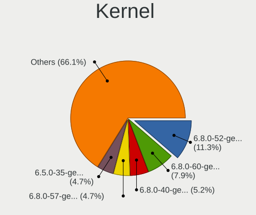

| Version              | Desktops | Percent |
|----------------------|----------|---------|
| 6.8.0-52-generic     | 221      | 11.34%  |
| 6.8.0-60-generic     | 153      | 7.85%   |
| 6.8.0-40-generic     | 102      | 5.23%   |
| 6.8.0-57-generic     | 92       | 4.72%   |
| 6.5.0-35-generic     | 92       | 4.72%   |
| 6.8.0-59-generic     | 84       | 4.31%   |
| 6.8.0-65-generic     | 76       | 3.9%    |
| 6.5.0-41-generic     | 71       | 3.64%   |
| 6.8.0-49-generic     | 70       | 3.59%   |
| 6.8.0-45-generic     | 66       | 3.39%   |
| 6.2.0-39-generic     | 66       | 3.39%   |
| 6.5.0-26-generic     | 61       | 3.13%   |
| 6.8.0-85-generic     | 56       | 2.87%   |
| 6.8.0-51-generic     | 56       | 2.87%   |
| 6.8.0-79-generic     | 47       | 2.41%   |
| 6.5.0-28-generic     | 47       | 2.41%   |
| 6.8.0-87-generic     | 45       | 2.31%   |
| 6.5.0-14-generic     | 45       | 2.31%   |
| 6.8.0-48-generic     | 42       | 2.15%   |
| 6.5.0-45-generic     | 42       | 2.15%   |
| 6.8.0-50-generic     | 41       | 2.1%    |
| 6.5.0-21-generic     | 38       | 1.95%   |
| 6.8.0-47-generic     | 34       | 1.74%   |
| 6.5.0-25-generic     | 33       | 1.69%   |
| 6.5.0-27-generic     | 28       | 1.44%   |
| 6.5.0-15-generic     | 28       | 1.44%   |
| 6.8.0-64-generic     | 27       | 1.39%   |
| 6.8.0-58-generic     | 26       | 1.33%   |
| 6.8.0-83-generic     | 24       | 1.23%   |
| 6.8.0-90-generic     | 21       | 1.08%   |
| 6.8.0-84-generic     | 18       | 0.92%   |
| 6.5.0-18-generic     | 17       | 0.87%   |
| 6.5.0-44-generic     | 16       | 0.82%   |
| 6.5.0-17-generic     | 16       | 0.82%   |
| 6.8.0-78-generic     | 8        | 0.41%   |
| 6.8.0-88-generic     | 2        | 0.1%    |
| 6.2.0-37-generic     | 2        | 0.1%    |
| 6.12.3-surface-2     | 2        | 0.1%    |
| 6.9.5-x64v3-xanmod1  | 1        | 0.05%   |
| 6.9.3-060903-generic | 1        | 0.05%   |

Kernel Family
-------------

Linux kernel without a distro release

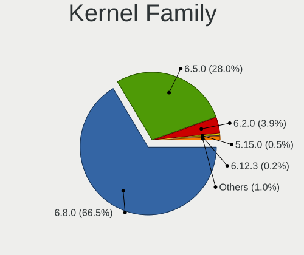

| Version | Desktops | Percent |
|---------|----------|---------|
| 6.8.0   | 1169     | 66.46%  |
| 6.5.0   | 493      | 28.03%  |
| 6.2.0   | 68       | 3.87%   |
| 5.15.0  | 8        | 0.45%   |
| 6.12.3  | 3        | 0.17%   |
| 6.9.5   | 1        | 0.06%   |
| 6.9.3   | 1        | 0.06%   |
| 6.8.8   | 1        | 0.06%   |
| 6.7.7   | 1        | 0.06%   |
| 6.7.5   | 1        | 0.06%   |
| 6.7.10  | 1        | 0.06%   |
| 6.15.5  | 1        | 0.06%   |
| 6.15.4  | 1        | 0.06%   |
| 6.15.1  | 1        | 0.06%   |
| 6.14.5  | 1        | 0.06%   |
| 6.13.8  | 1        | 0.06%   |
| 6.13.2  | 1        | 0.06%   |
| 6.12.14 | 1        | 0.06%   |
| 6.12.13 | 1        | 0.06%   |
| 6.12.1  | 1        | 0.06%   |
| 6.12.0  | 1        | 0.06%   |
| 6.10.8  | 1        | 0.06%   |
| 6.1.0   | 1        | 0.06%   |

Kernel Major Ver.
-----------------

Linux kernel major version

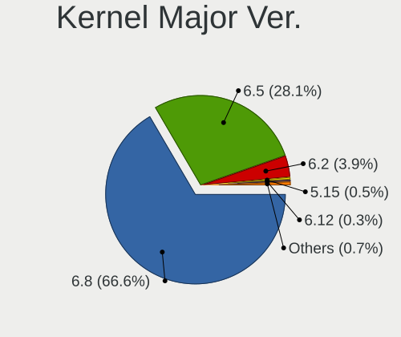

| Version | Desktops | Percent |
|---------|----------|---------|
| 6.8     | 1169     | 66.57%  |
| 6.5     | 493      | 28.08%  |
| 6.2     | 68       | 3.87%   |
| 5.15    | 8        | 0.46%   |
| 6.12    | 6        | 0.34%   |
| 6.15    | 3        | 0.17%   |
| 6.9     | 2        | 0.11%   |
| 6.7     | 2        | 0.11%   |
| 6.13    | 2        | 0.11%   |
| 6.14    | 1        | 0.06%   |
| 6.10    | 1        | 0.06%   |
| 6.1     | 1        | 0.06%   |

Arch
----

OS architecture (x86_64, i586, etc.)

| Name   | Desktops | Percent |
|--------|----------|---------|
| x86_64 | 1695     | 100%    |

DE
--

Desktop Environment

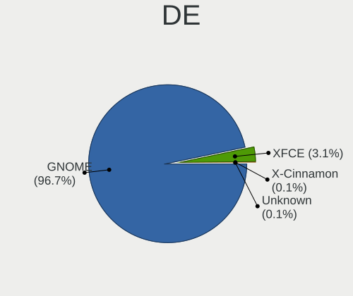

| Name          | Desktops | Percent |
|---------------|----------|---------|
| GNOME         | 1642     | 96.7%   |
| XFCE          | 53       | 3.12%   |
| X-Cinnamon    | 1        | 0.06%   |
| Enlightenment | 1        | 0.06%   |
| Unknown       | 1        | 0.06%   |

Display Server
--------------

X11 or Wayland

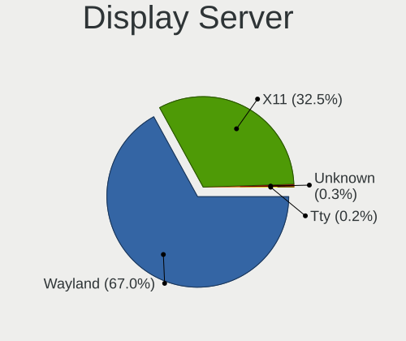

| Name    | Desktops | Percent |
|---------|----------|---------|
| Wayland | 1162     | 67.01%  |
| X11     | 563      | 32.47%  |
| Unknown | 6        | 0.35%   |
| Tty     | 3        | 0.17%   |

Display Manager
---------------

SDDM, LightDM, etc.

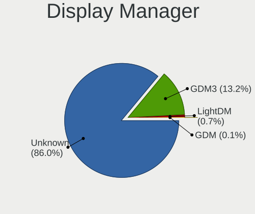

| Name    | Desktops | Percent |
|---------|----------|---------|
| Unknown | 1482     | 86.01%  |
| GDM3    | 227      | 13.17%  |
| LightDM | 12       | 0.7%    |
| GDM     | 2        | 0.12%   |

OS Lang
-------

Language

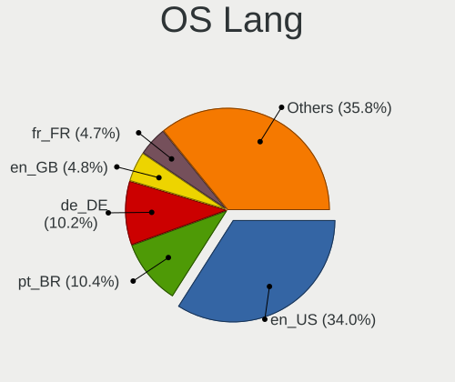

| Lang  | Desktops | Percent |
|-------|----------|---------|
| en_US | 578      | 34.02%  |
| pt_BR | 177      | 10.42%  |
| de_DE | 173      | 10.18%  |
| en_GB | 82       | 4.83%   |
| fr_FR | 80       | 4.71%   |
| it_IT | 72       | 4.24%   |
| es_ES | 65       | 3.83%   |
| en_CA | 62       | 3.65%   |
| en_AU | 37       | 2.18%   |
| en_IN | 30       | 1.77%   |
| nl_NL | 29       | 1.71%   |
| pl_PL | 26       | 1.53%   |
| es_AR | 21       | 1.24%   |
| tr_TR | 20       | 1.18%   |
| es_MX | 20       | 1.18%   |
| ru_RU | 13       | 0.77%   |
| pt_PT | 13       | 0.77%   |
| hu_HU | 13       | 0.77%   |
| cs_CZ | 13       | 0.77%   |
| en_ZA | 12       | 0.71%   |
| en_NZ | 12       | 0.71%   |
| es_CO | 11       | 0.65%   |
| en_IE | 10       | 0.59%   |
| de_AT | 10       | 0.59%   |
| nb_NO | 8        | 0.47%   |
| es_VE | 8        | 0.47%   |
| sv_SE | 6        | 0.35%   |
| nl_BE | 5        | 0.29%   |
| ja_JP | 5        | 0.29%   |
| de_CH | 5        | 0.29%   |
| da_DK | 5        | 0.29%   |
| sr_RS | 4        | 0.24%   |
| fr_BE | 4        | 0.24%   |
| es_BO | 4        | 0.24%   |
| bg_BG | 4        | 0.24%   |
| sk_SK | 3        | 0.18%   |
| ro_RO | 3        | 0.18%   |
| fr_CA | 3        | 0.18%   |
| es_PY | 3        | 0.18%   |
| es_PE | 3        | 0.18%   |

Boot Mode
---------

EFI or BIOS

| Mode | Desktops | Percent |
|------|----------|---------|
| BIOS | 1607     | 94.25%  |
| EFI  | 98       | 5.75%   |

Filesystem
----------

Type of filesystem

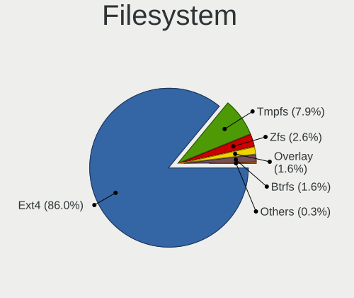

| Type    | Desktops | Percent |
|---------|----------|---------|
| Ext4    | 1481     | 86%     |
| Tmpfs   | 136      | 7.9%    |
| Zfs     | 45       | 2.61%   |
| Overlay | 27       | 1.57%   |
| Btrfs   | 27       | 1.57%   |
| Xfs     | 3        | 0.17%   |
| Ext2    | 2        | 0.12%   |
| Ext3    | 1        | 0.06%   |

Part. scheme
------------

Scheme of partitioning

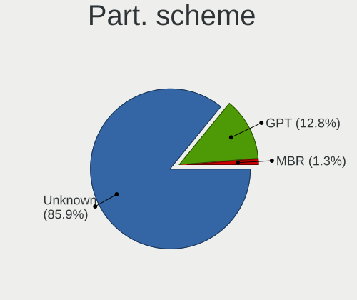

| Type    | Desktops | Percent |
|---------|----------|---------|
| Unknown | 1482     | 85.91%  |
| GPT     | 221      | 12.81%  |
| MBR     | 22       | 1.28%   |

Dual Boot with Linux/BSD
------------------------

Hosting more than one Linux/BSD

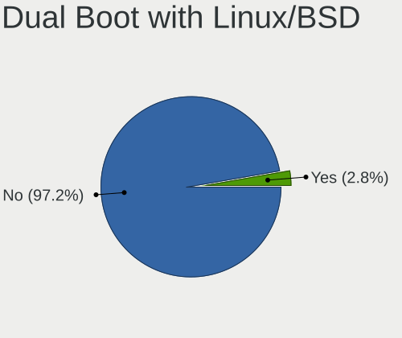

| Dual boot | Desktops | Percent |
|-----------|----------|---------|
| No        | 1657     | 97.24%  |
| Yes       | 47       | 2.76%   |

Dual Boot (Win)
---------------

Hosting Linux and Windows

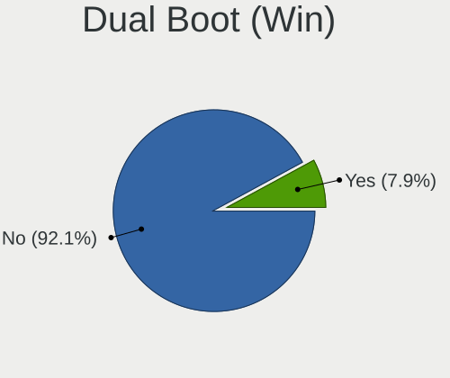

| Dual boot | Desktops | Percent |
|-----------|----------|---------|
| No        | 1583     | 92.09%  |
| Yes       | 136      | 7.91%   |

Board
-----

Vendor
------

Motherboard manufacturer

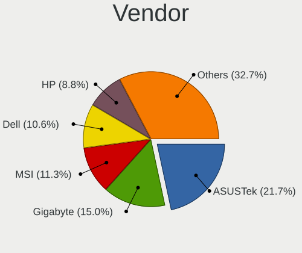

| Name                                 | Desktops | Percent |
|--------------------------------------|----------|---------|
| ASUSTek Computer                     | 367      | 21.65%  |
| Gigabyte Technology                  | 254      | 14.99%  |
| MSI                                  | 191      | 11.27%  |
| Dell                                 | 179      | 10.56%  |
| Hewlett-Packard                      | 150      | 8.85%   |
| ASRock                               | 115      | 6.78%   |
| Intel                                | 77       | 4.54%   |
| Lenovo                               | 70       | 4.13%   |
| Unknown                              | 37       | 2.18%   |
| Acer                                 | 30       | 1.77%   |
| Fujitsu                              | 21       | 1.24%   |
| Pegatron                             | 20       | 1.18%   |
| Biostar                              | 15       | 0.88%   |
| Foxconn                              | 13       | 0.77%   |
| MACHINIST                            | 11       | 0.65%   |
| ECS                                  | 9        | 0.53%   |
| AZW                                  | 9        | 0.53%   |
| Positivo                             | 7        | 0.41%   |
| Huanan                               | 7        | 0.41%   |
| AMI                                  | 7        | 0.41%   |
| OEM                                  | 6        | 0.35%   |
| Alienware                            | 6        | 0.35%   |
| GEEKOM                               | 5        | 0.29%   |
| Apple                                | 5        | 0.29%   |
| Shenzhen Meigao Electronic Equipment | 4        | 0.24%   |
| Packard Bell                         | 4        | 0.24%   |
| Fujitsu Siemens                      | 4        | 0.24%   |
| AMD                                  | 4        | 0.24%   |
| Tianbei                              | 3        | 0.18%   |
| Shuttle                              | 3        | 0.18%   |
| Google                               | 3        | 0.18%   |
| Gateway                              | 3        | 0.18%   |
| Semp Toshiba                         | 2        | 0.12%   |
| MAXSUN                               | 2        | 0.12%   |
| HC Technology.                       | 2        | 0.12%   |
| GMKtec                               | 2        | 0.12%   |
| BESSTAR Tech                         | 2        | 0.12%   |
| ZRD                                  | 1        | 0.06%   |
| ZOTAC                                | 1        | 0.06%   |
| YXK                                  | 1        | 0.06%   |

Model
-----

Motherboard model

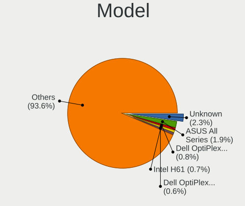

| Name                         | Desktops | Percent |
|------------------------------|----------|---------|
| Unknown                      | 39       | 2.3%    |
| ASUS All Series              | 33       | 1.95%   |
| Dell OptiPlex 9020           | 13       | 0.77%   |
| Intel H61                    | 12       | 0.71%   |
| Dell OptiPlex 7010           | 11       | 0.65%   |
| MSI MS-7C56                  | 10       | 0.59%   |
| ASUS TUF Gaming X570-PLUS    | 9        | 0.53%   |
| Dell XPS 8700                | 8        | 0.47%   |
| MSI MS-7C37                  | 7        | 0.41%   |
| Dell OptiPlex 790            | 7        | 0.41%   |
| MSI MS-7C91                  | 6        | 0.35%   |
| MSI MS-7B86                  | 6        | 0.35%   |
| Intel H55                    | 6        | 0.35%   |
| Intel B75                    | 6        | 0.35%   |
| Dell OptiPlex 990            | 6        | 0.35%   |
| Dell OptiPlex 7040           | 6        | 0.35%   |
| ASUS M5A97 R2.0              | 6        | 0.35%   |
| AMI Intel                    | 6        | 0.35%   |
| MSI MS-7D75                  | 5        | 0.29%   |
| MSI MS-7C52                  | 5        | 0.29%   |
| MSI MS-7A34                  | 5        | 0.29%   |
| Fujitsu ESPRIMO Q920         | 5        | 0.29%   |
| Dell Precision Tower 5810    | 5        | 0.29%   |
| Dell OptiPlex 390            | 5        | 0.29%   |
| ASUS PRIME B450M-A II        | 5        | 0.29%   |
| ASUS M5A78L-M/USB3           | 5        | 0.29%   |
| ASUS A0000001                | 5        | 0.29%   |
| ASRock B450M Steel Legend    | 5        | 0.29%   |
| MSI MS-7C02                  | 4        | 0.24%   |
| MSI MS-7817                  | 4        | 0.24%   |
| HP ProDesk 600 G1 SFF        | 4        | 0.24%   |
| HP EliteDesk 800 G2 DM 35W   | 4        | 0.24%   |
| HP Compaq 6005 Pro SFF PC    | 4        | 0.24%   |
| Gigabyte Z790 AORUS ELITE AX | 4        | 0.24%   |
| Gigabyte H110M-H             | 4        | 0.24%   |
| Gigabyte B650 GAMING X AX    | 4        | 0.24%   |
| Gigabyte B450M DS3H          | 4        | 0.24%   |
| Gigabyte A320M-S2H           | 4        | 0.24%   |
| Dell OptiPlex 755            | 4        | 0.24%   |
| Dell OptiPlex 7050           | 4        | 0.24%   |

Model Family
------------

Motherboard model prefix

| Name                | Desktops | Percent |
|---------------------|----------|---------|
| Dell OptiPlex       | 100      | 5.9%    |
| ASUS PRIME          | 64       | 3.78%   |
| ASUS TUF            | 47       | 2.77%   |
| ASUS ROG            | 42       | 2.48%   |
| Unknown             | 39       | 2.3%    |
| Lenovo ThinkCentre  | 37       | 2.18%   |
| HP Compaq           | 34       | 2.01%   |
| ASUS All            | 33       | 1.95%   |
| HP EliteDesk        | 28       | 1.65%   |
| HP ProDesk          | 26       | 1.53%   |
| Dell Precision      | 25       | 1.47%   |
| Dell Inspiron       | 24       | 1.42%   |
| Fujitsu ESPRIMO     | 18       | 1.06%   |
| Acer Aspire         | 15       | 0.88%   |
| Dell XPS            | 14       | 0.83%   |
| Intel H61           | 13       | 0.77%   |
| Lenovo IdeaCentre   | 12       | 0.71%   |
| Gigabyte B650       | 11       | 0.65%   |
| MSI MS-7C56         | 10       | 0.59%   |
| HP Pavilion         | 9        | 0.53%   |
| Gigabyte B550       | 9        | 0.53%   |
| Gigabyte B450M      | 9        | 0.53%   |
| ASUS P8Z77-V        | 9        | 0.53%   |
| ASUS M5A78L-M       | 9        | 0.53%   |
| ASRock B450M        | 9        | 0.53%   |
| Acer Veriton        | 9        | 0.53%   |
| ASUS M5A97          | 8        | 0.47%   |
| MSI MS-7C37         | 7        | 0.41%   |
| Lenovo ThinkStation | 7        | 0.41%   |
| Gigabyte X570       | 7        | 0.41%   |
| Gigabyte B450       | 7        | 0.41%   |
| Dell Vostro         | 7        | 0.41%   |
| ASUS Maximus        | 7        | 0.41%   |
| ASRock 970          | 7        | 0.41%   |
| MSI MS-7C91         | 6        | 0.35%   |
| MSI MS-7B86         | 6        | 0.35%   |
| Intel H55           | 6        | 0.35%   |
| Intel B75           | 6        | 0.35%   |
| Gigabyte Z390       | 6        | 0.35%   |
| Gigabyte B550M      | 6        | 0.35%   |

MFG Year
--------

Motherboard manufacture year

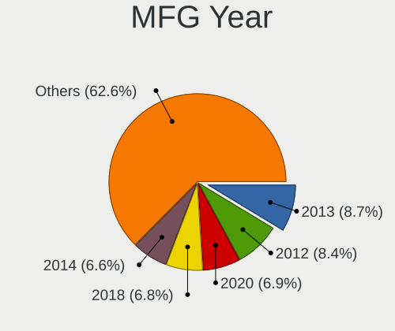

| Year    | Desktops | Percent |
|---------|----------|---------|
| 2013    | 147      | 8.67%   |
| 2012    | 143      | 8.44%   |
| 2020    | 117      | 6.9%    |
| 2018    | 115      | 6.78%   |
| 2014    | 112      | 6.61%   |
| 2019    | 111      | 6.55%   |
| 2023    | 110      | 6.49%   |
| 2011    | 107      | 6.31%   |
| 2022    | 104      | 6.14%   |
| 2009    | 85       | 5.01%   |
| 2017    | 84       | 4.96%   |
| 2016    | 82       | 4.84%   |
| 2021    | 81       | 4.78%   |
| 2010    | 74       | 4.37%   |
| 2024    | 66       | 3.89%   |
| 2015    | 61       | 3.6%    |
| 2008    | 39       | 2.3%    |
| 2007    | 28       | 1.65%   |
| 2025    | 18       | 1.06%   |
| 2006    | 7        | 0.41%   |
| 2005    | 3        | 0.18%   |
| Unknown | 1        | 0.06%   |

Form Factor
-----------

Physical design of the computer

| Name    | Desktops | Percent |
|---------|----------|---------|
| Desktop | 1695     | 100%    |

Secure Boot
-----------

Enabled or disabled

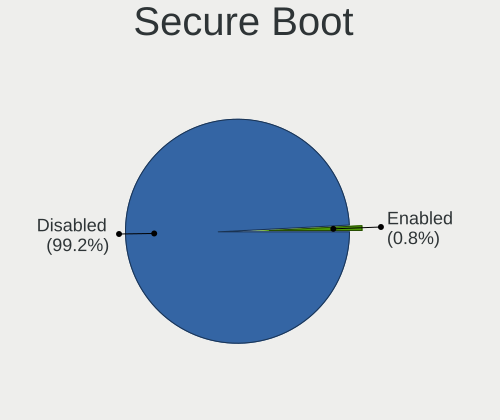

| State    | Desktops | Percent |
|----------|----------|---------|
| Disabled | 1681     | 99.17%  |
| Enabled  | 14       | 0.83%   |

Coreboot
--------

Have coreboot on board

| Used | Desktops | Percent |
|------|----------|---------|
| No   | 1692     | 99.82%  |
| Yes  | 3        | 0.18%   |

RAM Size
--------

Total RAM memory

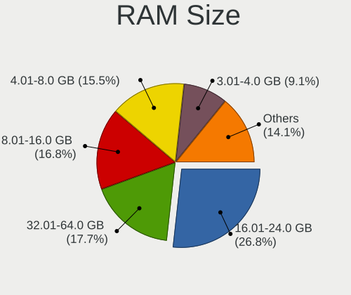

| Size in GB      | Desktops | Percent |
|-----------------|----------|---------|
| 16.01-24.0      | 458      | 26.75%  |
| 32.01-64.0      | 303      | 17.7%   |
| 8.01-16.0       | 287      | 16.76%  |
| 4.01-8.0        | 266      | 15.54%  |
| 3.01-4.0        | 156      | 9.11%   |
| 64.01-256.0     | 124      | 7.24%   |
| 24.01-32.0      | 91       | 5.32%   |
| 2.01-3.0        | 13       | 0.76%   |
| 1.01-2.0        | 13       | 0.76%   |
| More than 256.0 | 1        | 0.06%   |

RAM Used
--------

Used RAM memory

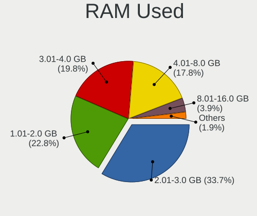

| Used GB    | Desktops | Percent |
|------------|----------|---------|
| 2.01-3.0   | 627      | 33.71%  |
| 1.01-2.0   | 424      | 22.8%   |
| 3.01-4.0   | 369      | 19.84%  |
| 4.01-8.0   | 331      | 17.8%   |
| 8.01-16.0  | 73       | 3.92%   |
| 16.01-24.0 | 20       | 1.08%   |
| 0.51-1.0   | 11       | 0.59%   |
| 24.01-32.0 | 3        | 0.16%   |
| 32.01-64.0 | 2        | 0.11%   |

Total Drives
------------

Number of drives on board

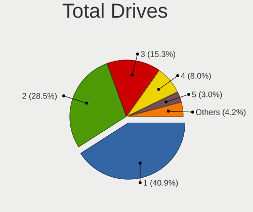

| Drives | Desktops | Percent |
|--------|----------|---------|
| 1      | 718      | 40.94%  |
| 2      | 500      | 28.51%  |
| 3      | 269      | 15.34%  |
| 4      | 141      | 8.04%   |
| 5      | 53       | 3.02%   |
| 6      | 35       | 2%      |
| 8      | 13       | 0.74%   |
| 7      | 11       | 0.63%   |
| 9      | 5        | 0.29%   |
| 11     | 4        | 0.23%   |
| 0      | 3        | 0.17%   |
| 10     | 2        | 0.11%   |

Has CD-ROM
----------

Has CD-ROM on board

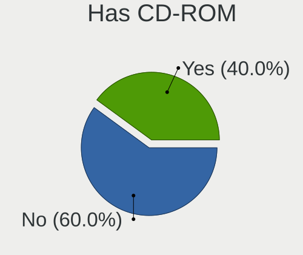

| Presented | Desktops | Percent |
|-----------|----------|---------|
| No        | 1026     | 60.04%  |
| Yes       | 683      | 39.96%  |

Has Ethernet
------------

Has Ethernet on board

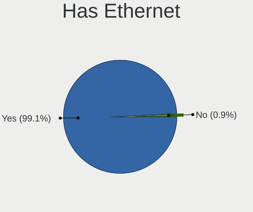

| Presented | Desktops | Percent |
|-----------|----------|---------|
| Yes       | 1680     | 99.12%  |
| No        | 15       | 0.88%   |

Has WiFi
--------

Has WiFi module

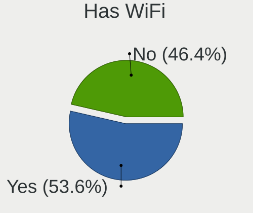

| Presented | Desktops | Percent |
|-----------|----------|---------|
| Yes       | 916      | 53.57%  |
| No        | 794      | 46.43%  |

Has Bluetooth
-------------

Has Bluetooth module

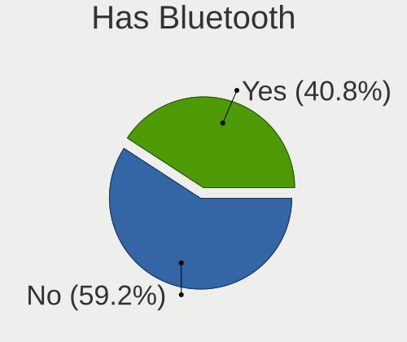

| Presented | Desktops | Percent |
|-----------|----------|---------|
| No        | 1015     | 59.18%  |
| Yes       | 700      | 40.82%  |

Location
--------

Country
-------

Geographic location (country)

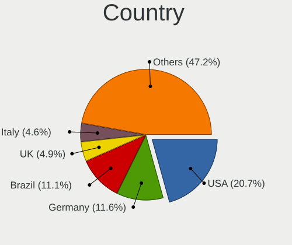

| Country         | Desktops | Percent |
|-----------------|----------|---------|
| USA             | 353      | 20.7%   |
| Germany         | 198      | 11.61%  |
| Brazil          | 189      | 11.09%  |
| UK              | 83       | 4.87%   |
| Italy           | 78       | 4.57%   |
| France          | 75       | 4.4%    |
| Canada          | 75       | 4.4%    |
| Spain           | 60       | 3.52%   |
| Netherlands     | 42       | 2.46%   |
| Australia       | 35       | 2.05%   |
| India           | 33       | 1.94%   |
| Poland          | 30       | 1.76%   |
| Mexico          | 28       | 1.64%   |
| Argentina       | 24       | 1.41%   |
| Turkey          | 21       | 1.23%   |
| Belgium         | 19       | 1.11%   |
| Portugal        | 18       | 1.06%   |
| Hungary         | 16       | 0.94%   |
| Czechia         | 16       | 0.94%   |
| New Zealand     | 15       | 0.88%   |
| Russia          | 14       | 0.82%   |
| Sweden          | 13       | 0.76%   |
| South Africa    | 13       | 0.76%   |
| Romania         | 13       | 0.76%   |
| Colombia        | 13       | 0.76%   |
| Switzerland     | 12       | 0.7%    |
| Norway          | 12       | 0.7%    |
| Austria         | 12       | 0.7%    |
| Egypt           | 11       | 0.65%   |
| Ireland         | 10       | 0.59%   |
| Denmark         | 10       | 0.59%   |
| Venezuela       | 8        | 0.47%   |
| Saudi Arabia    | 8        | 0.47%   |
| Greece          | 8        | 0.47%   |
| Bulgaria        | 8        | 0.47%   |
| Japan           | 7        | 0.41%   |
| Thailand        | 6        | 0.35%   |
| Indonesia       | 6        | 0.35%   |
| The Netherlands | 5        | 0.29%   |
| Slovakia        | 5        | 0.29%   |

City
----

Geographic location (city)

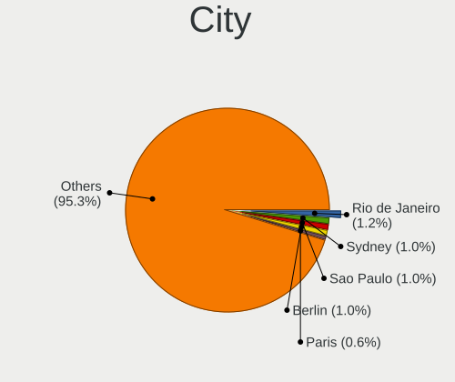

| City              | Desktops | Percent |
|-------------------|----------|---------|
| Rio de Janeiro    | 21       | 1.18%   |
| Sydney            | 18       | 1.01%   |
| Sao Paulo         | 17       | 0.95%   |
| Berlin            | 17       | 0.95%   |
| Paris             | 11       | 0.62%   |
| Milan             | 10       | 0.56%   |
| Madrid            | 10       | 0.56%   |
| Budapest          | 9        | 0.51%   |
| Rome              | 8        | 0.45%   |
| Istanbul          | 8        | 0.45%   |
| Dublin            | 8        | 0.45%   |
| Amsterdam         | 8        | 0.45%   |
| Prague            | 7        | 0.39%   |
| Phoenix           | 7        | 0.39%   |
| Auckland          | 7        | 0.39%   |
| Warsaw            | 6        | 0.34%   |
| Toronto           | 6        | 0.34%   |
| Sao Goncalo       | 6        | 0.34%   |
| Mumbai            | 6        | 0.34%   |
| Montreal          | 6        | 0.34%   |
| Milano            | 6        | 0.34%   |
| Johannesburg      | 6        | 0.34%   |
| Hanover           | 6        | 0.34%   |
| Hamburg           | 6        | 0.34%   |
| Copenhagen        | 6        | 0.34%   |
| Chicago           | 6        | 0.34%   |
| Calgary           | 6        | 0.34%   |
| Cairo             | 6        | 0.34%   |
| Brisbane          | 6        | 0.34%   |
| Atlanta           | 6        | 0.34%   |
| Sofia             | 5        | 0.28%   |
| Oklahoma City     | 5        | 0.28%   |
| Munich            | 5        | 0.28%   |
| Melbourne         | 5        | 0.28%   |
| Frankfurt am Main | 5        | 0.28%   |
| Curitiba          | 5        | 0.28%   |
| Bogotá           | 5        | 0.28%   |
| Albuquerque       | 5        | 0.28%   |
| Tlalnepantla      | 4        | 0.22%   |
| Stockholm         | 4        | 0.22%   |

Drives
------

Drive Vendor
------------

Hard drive vendors

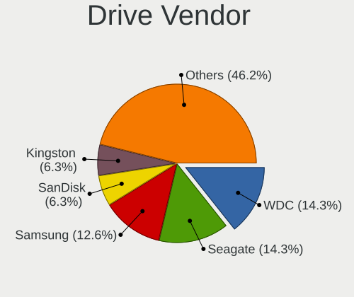

| Vendor                       | Desktops | Drives | Percent |
|------------------------------|----------|--------|---------|
| WDC                          | 452      | 677    | 14.33%  |
| Seagate                      | 452      | 669    | 14.33%  |
| Samsung Electronics          | 396      | 636    | 12.56%  |
| SanDisk                      | 199      | 289    | 6.31%   |
| Kingston                     | 199      | 257    | 6.31%   |
| Crucial                      | 131      | 170    | 4.15%   |
| Toshiba                      | 118      | 139    | 3.74%   |
| Hitachi                      | 77       | 109    | 2.44%   |
| China                        | 77       | 91     | 2.44%   |
| Phison Electronics           | 57       | 86     | 1.81%   |
| Micron/Crucial Technology    | 51       | 82     | 1.62%   |
| Unknown                      | 44       | 75     | 1.4%    |
| Kingston Technology Company  | 44       | 59     | 1.4%    |
| MAXIO Technology (Hangzhou)  | 42       | 55     | 1.33%   |
| Micron Technology            | 39       | 47     | 1.24%   |
| A-DATA Technology            | 39       | 44     | 1.24%   |
| Intel                        | 35       | 45     | 1.11%   |
| Intenso                      | 34       | 42     | 1.08%   |
| Silicon Motion               | 33       | 35     | 1.05%   |
| SK hynix                     | 30       | 39     | 0.95%   |
| Realtek Semiconductor        | 29       | 37     | 0.92%   |
| SPCC                         | 24       | 31     | 0.76%   |
| PNY                          | 23       | 30     | 0.73%   |
| HGST                         | 23       | 36     | 0.73%   |
| Lexar                        | 21       | 24     | 0.67%   |
| Patriot                      | 20       | 24     | 0.63%   |
| Fanxiang                     | 19       | 25     | 0.6%    |
| ADATA Technology             | 19       | 23     | 0.6%    |
| Shenzhen Longsys Electronics | 18       | 21     | 0.57%   |
| Unknown                      | 18       | 24     | 0.57%   |
| Corsair                      | 15       | 21     | 0.48%   |
| Team                         | 13       | 13     | 0.41%   |
| OCZ                          | 13       | 21     | 0.41%   |
| KingSpec                     | 12       | 14     | 0.38%   |
| Netac                        | 11       | 13     | 0.35%   |
| LITEON                       | 10       | 16     | 0.32%   |
| JMicron Technology           | 10       | 11     | 0.32%   |
| Hewlett-Packard              | 9        | 9      | 0.29%   |
| ASMT                         | 9        | 10     | 0.29%   |
| Verbatim                     | 8        | 16     | 0.25%   |

Drive Model
-----------

Hard drive models

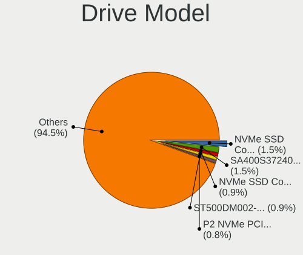

| Model                                                 | Desktops | Percent |
|-------------------------------------------------------|----------|---------|
| Samsung NVMe SSD Controller SM981/PM981/PM983 1TB     | 53       | 1.49%   |
| Kingston SA400S37240G 240GB SSD                       | 52       | 1.46%   |
| Samsung NVMe SSD Controller PM9A1/PM9A3/980PRO 1TB    | 33       | 0.93%   |
| Seagate ST500DM002-1BD142 500GB                       | 31       | 0.87%   |
| Micron/Crucial P2 NVMe PCIe SSD 2TB                   | 28       | 0.79%   |
| Silicon Motion SM2263EN/SM2263XT SSD Controller 512GB | 27       | 0.76%   |
| MAXIO (Hangzhou) NVMe SSD Controller MAP1202 2TB      | 27       | 0.76%   |
| Kingston SA400S37480G 480GB SSD                       | 27       | 0.76%   |
| Seagate ST1000DM010-2EP102 1TB                        | 24       | 0.67%   |
| Seagate ST1000DM003-1CH162 1TB                        | 22       | 0.62%   |
| WDC WD10EZEX-08WN4A0 1TB                              | 20       | 0.56%   |
| Toshiba DT01ACA100 1TB                                | 20       | 0.56%   |
| Seagate ST1000DM003-1ER162 1TB                        | 20       | 0.56%   |
| Samsung SSD 870 EVO 500GB                             | 20       | 0.56%   |
| Crucial CT500MX500SSD1 500GB                          | 20       | 0.56%   |
| Samsung SSD 860 EVO 500GB                             | 19       | 0.53%   |
| Kingston SA400S37120G 120GB SSD                       | 19       | 0.53%   |
| Unknown                                               | 18       | 0.51%   |
| Seagate ST2000DM008-2FR102 2TB                        | 17       | 0.48%   |
| Unknown SD/MMC/MS PRO 2GB                             | 16       | 0.45%   |
| Kingston Company SNV2S1000G 1TB                       | 16       | 0.45%   |
| Kingston SV300S37A120G 120GB SSD                      | 16       | 0.45%   |
| Crucial CT1000MX500SSD1 1TB                           | 16       | 0.45%   |
| WDC WD5000AAKX-60U6AA0 500GB                          | 15       | 0.42%   |
| Samsung SSD 860 EVO 250GB                             | 15       | 0.42%   |
| Samsung SSD 850 EVO 250GB                             | 15       | 0.42%   |
| Samsung NVMe SSD Controller SM961/PM961/SM963 1024GB  | 15       | 0.42%   |
| Kingston SA400S37960G 960GB SSD                       | 15       | 0.42%   |
| Samsung SSD 990 PRO 2TB                               | 14       | 0.39%   |
| Phison E12 NVMe Controller 1TB                        | 14       | 0.39%   |
| Crucial CT480BX500SSD1 480GB                          | 14       | 0.39%   |
| Seagate ST2000DM001-1ER164 2TB                        | 13       | 0.36%   |
| Crucial CT240BX500SSD1 240GB                          | 13       | 0.36%   |
| WDC WD20EZRX-00D8PB0 2TB                              | 12       | 0.34%   |
| Seagate ST1000DM003-1SB102 1TB                        | 12       | 0.34%   |
| Samsung SSD 870 EVO 1TB                               | 12       | 0.34%   |
| Samsung SSD 860 EVO 1TB                               | 12       | 0.34%   |
| Samsung SSD 850 EVO 500GB                             | 12       | 0.34%   |
| Samsung HD322HJ 320GB                                 | 12       | 0.34%   |
| Phison PS5013 E13 NVMe Controller 500GB               | 12       | 0.34%   |

HDD Vendor
----------

Hard disk drive vendors

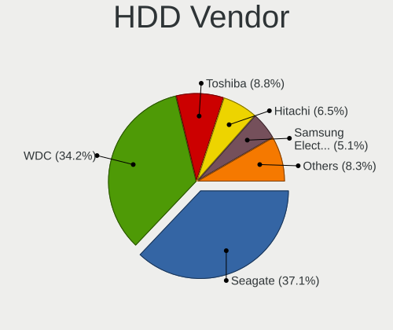

| Vendor              | Desktops | Drives | Percent |
|---------------------|----------|--------|---------|
| Seagate             | 436      | 638    | 37.07%  |
| WDC                 | 402      | 583    | 34.18%  |
| Toshiba             | 103      | 122    | 8.76%   |
| Hitachi             | 77       | 109    | 6.55%   |
| Samsung Electronics | 60       | 73     | 5.1%    |
| HGST                | 23       | 36     | 1.96%   |
| Unknown             | 19       | 19     | 1.62%   |
| Maxtor              | 8        | 12     | 0.68%   |
| JMicron Technology  | 7        | 8      | 0.6%    |
| ASMT                | 6        | 7      | 0.51%   |
| External            | 4        | 4      | 0.34%   |
| Hewlett-Packard     | 3        | 3      | 0.26%   |
| Fujitsu             | 3        | 3      | 0.26%   |
| USB3.0              | 2        | 2      | 0.17%   |
| TO Exter            | 2        | 2      | 0.17%   |
| T-FORCE             | 2        | 2      | 0.17%   |
| LaCie               | 2        | 2      | 0.17%   |
| HGST HTS            | 2        | 2      | 0.17%   |
| Apple               | 2        | 2      | 0.17%   |
| XrayDisk            | 1        | 1      | 0.09%   |
| WD MediaMax         | 1        | 1      | 0.09%   |
| WALRAM              | 1        | 1      | 0.09%   |
| TDAS                | 1        | 4      | 0.09%   |
| SSK                 | 1        | 1      | 0.09%   |
| Shenzhen            | 1        | 1      | 0.09%   |
| PRO Z               | 1        | 1      | 0.09%   |
| MARVELL             | 1        | 1      | 0.09%   |
| Intenso             | 1        | 2      | 0.09%   |
| Inateck             | 1        | 2      | 0.09%   |
| HPE                 | 1        | 1      | 0.09%   |
| Fantom              | 1        | 1      | 0.09%   |
| ExcelStor           | 1        | 1      | 0.09%   |

SSD Vendor
----------

Solid state drive vendors

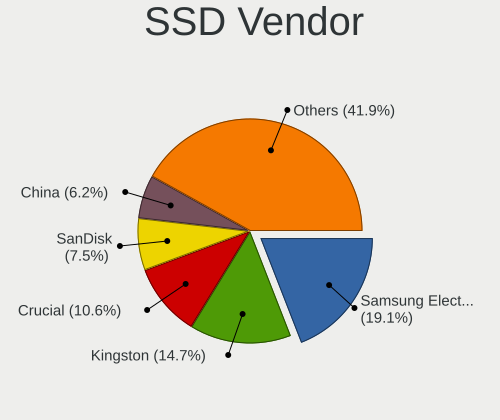

| Vendor              | Desktops | Drives | Percent |
|---------------------|----------|--------|---------|
| Samsung Electronics | 229      | 330    | 19.08%  |
| Kingston            | 176      | 219    | 14.67%  |
| Crucial             | 127      | 165    | 10.58%  |
| SanDisk             | 90       | 109    | 7.5%    |
| China               | 75       | 88     | 6.25%   |
| WDC                 | 60       | 87     | 5%      |
| A-DATA Technology   | 37       | 42     | 3.08%   |
| SPCC                | 23       | 30     | 1.92%   |
| PNY                 | 23       | 30     | 1.92%   |
| Intenso             | 23       | 28     | 1.92%   |
| Lexar               | 20       | 23     | 1.67%   |
| Intel               | 19       | 22     | 1.58%   |
| Patriot             | 18       | 22     | 1.5%    |
| Micron Technology   | 15       | 18     | 1.25%   |
| Team                | 13       | 13     | 1.08%   |
| OCZ                 | 13       | 21     | 1.08%   |
| KingSpec            | 12       | 14     | 1%      |
| Corsair             | 11       | 15     | 0.92%   |
| LITEON              | 10       | 16     | 0.83%   |
| Transcend           | 8        | 9      | 0.67%   |
| Toshiba             | 8        | 8      | 0.67%   |
| SK hynix            | 8        | 10     | 0.67%   |
| Seagate             | 8        | 10     | 0.67%   |
| Netac               | 8        | 10     | 0.67%   |
| SABRENT             | 7        | 9      | 0.58%   |
| Verbatim            | 6        | 14     | 0.5%    |
| GOODRAM             | 6        | 7      | 0.5%    |
| Unknown             | 6        | 8      | 0.5%    |
| KIOXIA-EXCERIA      | 5        | 7      | 0.42%   |
| Hewlett-Packard     | 5        | 5      | 0.42%   |
| Gigabyte Technology | 5        | 6      | 0.42%   |
| Fanxiang            | 5        | 6      | 0.42%   |
| XrayDisk            | 4        | 5      | 0.33%   |
| LITEONIT            | 4        | 4      | 0.33%   |
| Emtec               | 4        | 4      | 0.33%   |
| CONSISTENT          | 4        | 4      | 0.33%   |
| Timetec             | 3        | 3      | 0.25%   |
| T-FORCE             | 3        | 3      | 0.25%   |
| Integral            | 3        | 3      | 0.25%   |
| EDILOCA             | 3        | 3      | 0.25%   |

Drive Kind
----------

HDD or SSD

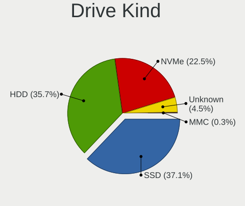

| Kind    | Desktops | Drives | Percent |
|---------|----------|--------|---------|
| SSD     | 975      | 1537   | 37.11%  |
| HDD     | 937      | 1647   | 35.67%  |
| NVMe    | 590      | 1034   | 22.46%  |
| Unknown | 117      | 159    | 4.45%   |
| MMC     | 8        | 9      | 0.3%    |

Drive Connector
---------------

SATA, SAS, NVMe, etc.

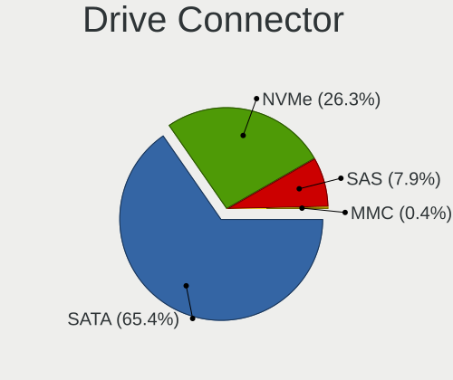

| Type | Desktops | Drives | Percent |
|------|----------|--------|---------|
| SATA | 1459     | 3083   | 65.37%  |
| NVMe | 588      | 1025   | 26.34%  |
| SAS  | 177      | 269    | 7.93%   |
| MMC  | 8        | 9      | 0.36%   |

Drive Size
----------

Size of hard drive

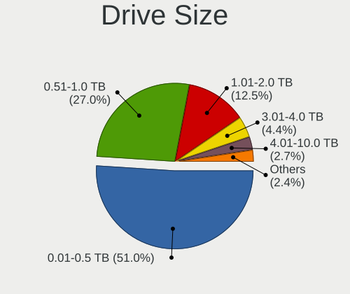

| Size in TB | Desktops | Drives | Percent |
|------------|----------|--------|---------|
| 0.01-0.5   | 1052     | 1636   | 51.02%  |
| 0.51-1.0   | 556      | 844    | 26.96%  |
| 1.01-2.0   | 258      | 398    | 12.51%  |
| 3.01-4.0   | 90       | 143    | 4.36%   |
| 4.01-10.0  | 56       | 98     | 2.72%   |
| 2.01-3.0   | 35       | 41     | 1.7%    |
| 10.01-20.0 | 14       | 21     | 0.68%   |
| 20.01-50.0 | 1        | 3      | 0.05%   |

Space Total
-----------

Amount of disk space available on the file system

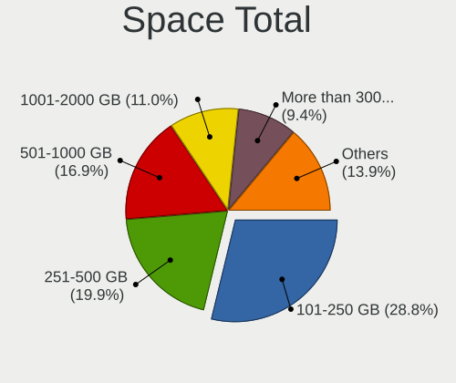

| Size in GB     | Desktops | Percent |
|----------------|----------|---------|
| 101-250        | 508      | 28.78%  |
| 251-500        | 351      | 19.89%  |
| 501-1000       | 299      | 16.94%  |
| 1001-2000      | 195      | 11.05%  |
| More than 3000 | 166      | 9.41%   |
| 51-100         | 78       | 4.42%   |
| 2001-3000      | 64       | 3.63%   |
| 1-20           | 43       | 2.44%   |
| 21-50          | 35       | 1.98%   |
| Unknown        | 25       | 1.42%   |
| 0              | 1        | 0.06%   |

Space Used
----------

Amount of used disk space

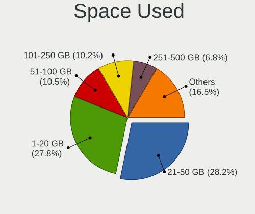

| Used GB        | Desktops | Percent |
|----------------|----------|---------|
| 21-50          | 521      | 28.22%  |
| 1-20           | 514      | 27.84%  |
| 51-100         | 193      | 10.46%  |
| 101-250        | 189      | 10.24%  |
| 251-500        | 125      | 6.77%   |
| 501-1000       | 109      | 5.9%    |
| 1001-2000      | 86       | 4.66%   |
| More than 3000 | 53       | 2.87%   |
| 2001-3000      | 30       | 1.63%   |
| Unknown        | 25       | 1.35%   |
| 0              | 1        | 0.05%   |

Malfunc. Drives
---------------

Drive models with a malfunction

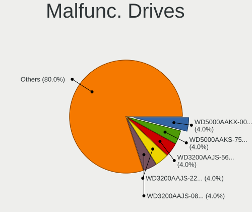

| Model                                        | Desktops | Drives | Percent |
|----------------------------------------------|----------|--------|---------|
| WDC WD5000AAKX-001CA0 500GB                  | 1        | 1      | 4%      |
| WDC WD5000AAKS-75V0A0 500GB                  | 1        | 1      | 4%      |
| WDC WD3200AAJS-56M0A0 320GB                  | 1        | 1      | 4%      |
| WDC WD3200AAJS-22L7A0 320GB                  | 1        | 1      | 4%      |
| WDC WD3200AAJS-08B4A0 320GB                  | 1        | 1      | 4%      |
| WDC WD20EARS-22MVWB0 2TB                     | 1        | 1      | 4%      |
| WDC WD15EARS-00MVWB0 1TB                     | 1        | 1      | 4%      |
| WDC WD10JPVX-60JC3T0 1TB                     | 1        | 1      | 4%      |
| WDC WD10EZRX-00D8PB0 1TB                     | 1        | 1      | 4%      |
| Toshiba MK5059GSXP 500GB                     | 1        | 1      | 4%      |
| SPCC Solid State Disk 512GB                  | 1        | 1      | 4%      |
| Seagate ST3160212SCE 160GB                   | 1        | 1      | 4%      |
| Seagate ST2000LM007-1R8174 2TB               | 1        | 1      | 4%      |
| Seagate ST1000DM010-2EP102 1TB               | 1        | 1      | 4%      |
| SanDisk SSD PLUS 240GB                       | 1        | 2      | 4%      |
| Samsung Electronics SSD 870 EVO 1TB          | 1        | 1      | 4%      |
| Samsung Electronics SSD 850 PRO 512GB        | 1        | 1      | 4%      |
| Samsung Electronics SSD 840 PRO Series 256GB | 1        | 1      | 4%      |
| Samsung Electronics HD322HJ 320GB            | 1        | 1      | 4%      |
| Kingston SA400S37960G 960GB SSD              | 1        | 1      | 4%      |
| Hitachi HTS725050A9A364 500GB                | 1        | 1      | 4%      |
| Hitachi HDT725032VLA380 320GB                | 1        | 2      | 4%      |
| Hitachi HDS721680PLA380 80GB                 | 1        | 1      | 4%      |
| China SSD 1TB                                | 1        | 1      | 4%      |
| A-DATA Technology SX8200PNP 512GB            | 1        | 1      | 4%      |

Malfunc. Drive Vendor
---------------------

Vendors of faulty drives

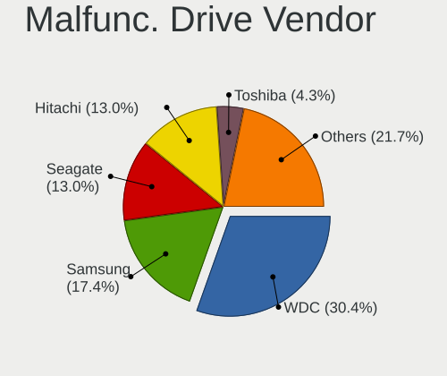

| Vendor              | Desktops | Drives | Percent |
|---------------------|----------|--------|---------|
| WDC                 | 7        | 9      | 30.43%  |
| Samsung Electronics | 4        | 4      | 17.39%  |
| Seagate             | 3        | 3      | 13.04%  |
| Hitachi             | 3        | 4      | 13.04%  |
| Toshiba             | 1        | 1      | 4.35%   |
| SPCC                | 1        | 1      | 4.35%   |
| SanDisk             | 1        | 2      | 4.35%   |
| Kingston            | 1        | 1      | 4.35%   |
| China               | 1        | 1      | 4.35%   |
| A-DATA Technology   | 1        | 1      | 4.35%   |

Malfunc. HDD Vendor
-------------------

Vendors of faulty HDD drives

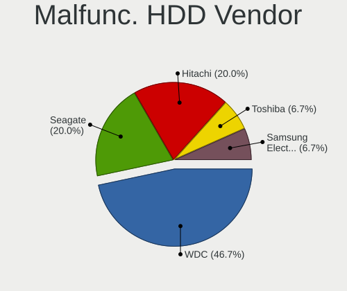

| Vendor              | Desktops | Drives | Percent |
|---------------------|----------|--------|---------|
| WDC                 | 7        | 9      | 46.67%  |
| Seagate             | 3        | 3      | 20%     |
| Hitachi             | 3        | 4      | 20%     |
| Toshiba             | 1        | 1      | 6.67%   |
| Samsung Electronics | 1        | 1      | 6.67%   |

Malfunc. Drive Kind
-------------------

Kinds of faulty drives

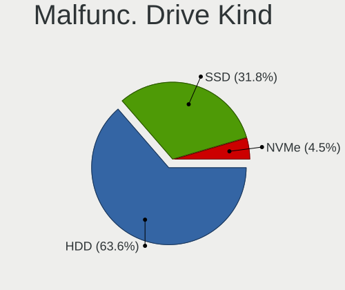

| Kind | Desktops | Drives | Percent |
|------|----------|--------|---------|
| HDD  | 14       | 18     | 63.64%  |
| SSD  | 7        | 8      | 31.82%  |
| NVMe | 1        | 1      | 4.55%   |

Failed Drives
-------------

Failed drive models

Zero info for selected period =(

Failed Drive Vendor
-------------------

Failed drive vendors

Zero info for selected period =(

Drive Status
------------

Number of failed and malfunc. drives

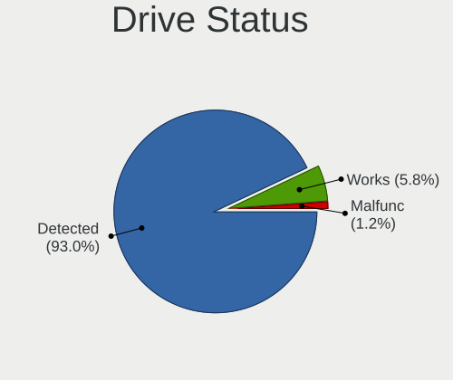

| Status   | Desktops | Drives | Percent |
|----------|----------|--------|---------|
| Detected | 1612     | 4149   | 92.96%  |
| Works    | 101      | 210    | 5.82%   |
| Malfunc  | 21       | 27     | 1.21%   |

Storage controller
------------------

Storage Vendor
--------------

Storage controller vendors

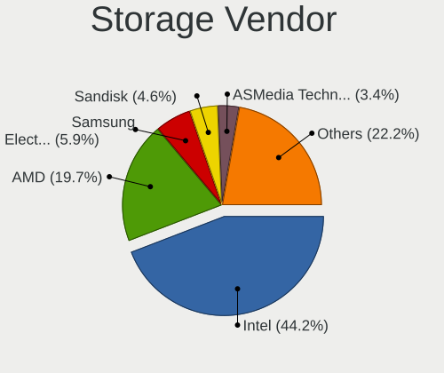

| Vendor                           | Desktops | Percent |
|----------------------------------|----------|---------|
| Intel                            | 1144     | 44.15%  |
| AMD                              | 511      | 19.72%  |
| Samsung Electronics              | 152      | 5.87%   |
| Sandisk                          | 119      | 4.59%   |
| ASMedia Technology               | 89       | 3.43%   |
| Kingston Technology Company      | 73       | 2.82%   |
| Phison Electronics               | 63       | 2.43%   |
| Micron/Crucial Technology        | 56       | 2.16%   |
| JMicron Technology               | 48       | 1.85%   |
| Marvell Technology Group         | 45       | 1.74%   |
| MAXIO Technology (Hangzhou)      | 43       | 1.66%   |
| Silicon Motion                   | 33       | 1.27%   |
| Realtek Semiconductor            | 30       | 1.16%   |
| Micron Technology                | 25       | 0.96%   |
| SK hynix                         | 22       | 0.85%   |
| ADATA Technology                 | 20       | 0.77%   |
| Shenzhen Longsys Electronics     | 19       | 0.73%   |
| Nvidia                           | 19       | 0.73%   |
| INNOGRIT                         | 10       | 0.39%   |
| VIA Technologies                 | 9        | 0.35%   |
| KIOXIA                           | 8        | 0.31%   |
| Toshiba America Info Systems     | 7        | 0.27%   |
| LSI Logic / Symbios Logic        | 7        | 0.27%   |
| Seagate Technology               | 6        | 0.23%   |
| Broadcom / LSI                   | 6        | 0.23%   |
| Hosin Global Electronics         | 4        | 0.15%   |
| Netac Technology                 | 3        | 0.12%   |
| Integrated Technology Express    | 3        | 0.12%   |
| Unknown                          | 3        | 0.12%   |
| Solidigm                         | 2        | 0.08%   |
| Adaptec                          | 2        | 0.08%   |
| Yangtze Memory Technologies      | 1        | 0.04%   |
| TenaFe                           | 1        | 0.04%   |
| Silicon Integrated Systems [SiS] | 1        | 0.04%   |
| Silicon Image                    | 1        | 0.04%   |
| Shenzhen Techwinsemi Technology  | 1        | 0.04%   |
| OCZ Technology Group             | 1        | 0.04%   |
| Lite-On IT Corp. / Plextor       | 1        | 0.04%   |
| HighPoint Technologies           | 1        | 0.04%   |
| Hewlett-Packard                  | 1        | 0.04%   |

Storage Model
-------------

Storage controller models

| Model                                                                                   | Desktops | Percent |
|-----------------------------------------------------------------------------------------|----------|---------|
| AMD FCH SATA Controller [AHCI mode]                                                     | 202      | 6.61%   |
| Intel 8 Series/C220 Series Chipset Family 6-port SATA Controller 1 [AHCI mode]          | 159      | 5.2%    |
| Intel 6 Series/C200 Series Chipset Family 6 port Desktop SATA AHCI Controller           | 116      | 3.8%    |
| Intel Q170/Q150/B150/H170/H110/Z170/CM236 Chipset SATA Controller [AHCI Mode]           | 99       | 3.24%   |
| AMD 500 Series Chipset SATA Controller                                                  | 90       | 2.95%   |
| Intel 7 Series/C210 Series Chipset Family 6-port SATA Controller [AHCI mode]            | 86       | 2.82%   |
| Intel 200 Series PCH SATA controller [AHCI mode]                                        | 79       | 2.59%   |
| ASMedia ASM1061/ASM1062 Serial ATA Controller                                           | 79       | 2.59%   |
| AMD 400 Series Chipset SATA Controller                                                  | 77       | 2.52%   |
| AMD 600 Series Chipset SATA Controller                                                  | 74       | 2.42%   |
| Intel SATA Controller [RAID mode]                                                       | 68       | 2.23%   |
| AMD SB7x0/SB8x0/SB9x0 IDE Controller                                                    | 64       | 2.09%   |
| Samsung NVMe SSD Controller SM981/PM981/PM983                                           | 58       | 1.9%    |
| AMD SB7x0/SB8x0/SB9x0 SATA Controller [AHCI mode]                                       | 53       | 1.73%   |
| Intel Raptor Lake SATA AHCI Controller                                                  | 43       | 1.41%   |
| Intel NM10/ICH7 Family SATA Controller [IDE mode]                                       | 43       | 1.41%   |
| AMD SB7x0/SB8x0/SB9x0 SATA Controller [IDE mode]                                        | 43       | 1.41%   |
| Intel Cannon Lake PCH SATA AHCI Controller                                              | 41       | 1.34%   |
| Intel Alder Lake-S PCH SATA Controller [AHCI Mode]                                      | 39       | 1.28%   |
| Intel 6 Series/C200 Series Chipset Family Desktop SATA Controller (IDE mode, ports 4-5) | 38       | 1.24%   |
| Intel 6 Series/C200 Series Chipset Family Desktop SATA Controller (IDE mode, ports 0-3) | 38       | 1.24%   |
| Samsung NVMe SSD Controller PM9A1/PM9A3/980PRO                                          | 37       | 1.21%   |
| Intel 82801G (ICH7 Family) IDE Controller                                               | 35       | 1.15%   |
| Intel 9 Series Chipset Family SATA Controller [AHCI Mode]                               | 30       | 0.98%   |
| Silicon Motion SM2263EN/SM2263XT (DRAM-less) NVMe SSD Controllers                       | 28       | 0.92%   |
| Samsung NVMe SSD Controller S4LV008[Pascal]                                             | 28       | 0.92%   |
| Micron/Crucial P2 [Nick P2] / P3 / P3 Plus NVMe PCIe SSD (DRAM-less)                    | 28       | 0.92%   |
| MAXIO (Hangzhou) NVMe SSD Controller MAP1202 (DRAM-less)                                | 28       | 0.92%   |
| JMicron JMB363 SATA/IDE Controller                                                      | 28       | 0.92%   |
| Intel Alder Lake-N SATA AHCI Controller                                                 | 25       | 0.82%   |
| Intel Volume Management Device NVMe RAID Controller                                     | 22       | 0.72%   |
| Intel 500 Series Chipset Family SATA AHCI Controller                                    | 22       | 0.72%   |
| AMD A320 Chipset SATA Controller [AHCI mode]                                            | 22       | 0.72%   |
| SanDisk WD SN560/SN740/SN770/SN5000 NVMe SSD                                            | 21       | 0.69%   |
| Intel 5 Series/3400 Series Chipset 4 port SATA IDE Controller                           | 21       | 0.69%   |
| Sandisk WD Black SN850X NVMe SSD                                                        | 20       | 0.65%   |
| Kingston Company NV2 NVMe SSD [SM2267XT] (DRAM-less)                                    | 20       | 0.65%   |
| Intel 82801JI (ICH10 Family) SATA AHCI Controller                                       | 20       | 0.65%   |
| Intel 82801JI (ICH10 Family) 4 port SATA IDE Controller #1                              | 20       | 0.65%   |
| Intel 82801JI (ICH10 Family) 2 port SATA IDE Controller #2                              | 19       | 0.62%   |

Storage Kind
------------

Kind of storage controller (IDE, SATA, NVMe, SAS, ...)

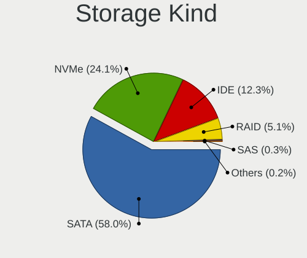

| Kind | Desktops | Percent |
|------|----------|---------|
| SATA | 1420     | 58.01%  |
| NVMe | 589      | 24.06%  |
| IDE  | 301      | 12.3%   |
| RAID | 124      | 5.07%   |
| SAS  | 8        | 0.33%   |
| SCSI | 6        | 0.25%   |

Processor
---------

CPU Vendor
----------

Processor vendors

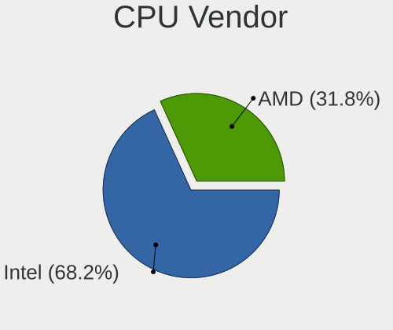

| Vendor | Desktops | Percent |
|--------|----------|---------|
| Intel  | 1156     | 68.2%   |
| AMD    | 539      | 31.8%   |

CPU Model
---------

Processor models

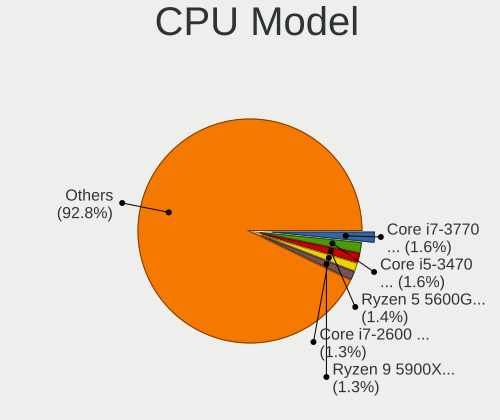

| Model                                  | Desktops | Percent |
|----------------------------------------|----------|---------|
| Intel Core i7-3770 CPU @ 3.40GHz       | 27       | 1.59%   |
| Intel Core i5-3470 CPU @ 3.20GHz       | 27       | 1.59%   |
| AMD Ryzen 5 5600G with Radeon Graphics | 24       | 1.41%   |
| Intel Core i7-2600 CPU @ 3.40GHz       | 22       | 1.29%   |
| AMD Ryzen 9 5900X 12-Core Processor    | 22       | 1.29%   |
| AMD Ryzen 5 3600 6-Core Processor      | 22       | 1.29%   |
| Intel Core i7-4790 CPU @ 3.60GHz       | 21       | 1.24%   |
| AMD FX-6300 Six-Core Processor         | 21       | 1.24%   |
| Intel Core i5-2400 CPU @ 3.10GHz       | 19       | 1.12%   |
| AMD Ryzen 7 5800X 8-Core Processor     | 18       | 1.06%   |
| Intel Core i5-6500 CPU @ 3.20GHz       | 17       | 1%      |
| Intel Core i7-6700 CPU @ 3.40GHz       | 16       | 0.94%   |
| Intel Core i7-4770 CPU @ 3.40GHz       | 16       | 0.94%   |
| Intel Core i3-6100 CPU @ 3.70GHz       | 15       | 0.88%   |
| Intel Core 2 Duo CPU E8400 @ 3.00GHz   | 15       | 0.88%   |
| AMD Ryzen 7 5700G with Radeon Graphics | 15       | 0.88%   |
| Intel N100                             | 14       | 0.82%   |
| Intel Core i5-4570 CPU @ 3.20GHz       | 14       | 0.82%   |
| Intel Core i7-8700 CPU @ 3.20GHz       | 13       | 0.77%   |
| Intel Core i7-6700K CPU @ 4.00GHz      | 13       | 0.77%   |
| Intel Core i5-7400 CPU @ 3.00GHz       | 13       | 0.77%   |
| AMD Ryzen 7 7800X3D 8-Core Processor   | 13       | 0.77%   |
| Intel Core i7-4790K CPU @ 4.00GHz      | 12       | 0.71%   |
| Intel Core i7-2600K CPU @ 3.40GHz      | 12       | 0.71%   |
| AMD Ryzen 5 5600X 6-Core Processor     | 12       | 0.71%   |
| AMD FX-8350 Eight-Core Processor       | 12       | 0.71%   |
| Intel Core i5-7500 CPU @ 3.40GHz       | 11       | 0.65%   |
| Intel Core i5-6400 CPU @ 2.70GHz       | 11       | 0.65%   |
| Intel Core i5-4590 CPU @ 3.30GHz       | 11       | 0.65%   |
| Intel Core i5-4460 CPU @ 3.20GHz       | 11       | 0.65%   |
| Intel Core i5-3570 CPU @ 3.40GHz       | 11       | 0.65%   |
| Intel Core i3-2120 CPU @ 3.30GHz       | 11       | 0.65%   |
| AMD Ryzen 5 5500                       | 11       | 0.65%   |
| Intel Core i5-6500T CPU @ 2.50GHz      | 10       | 0.59%   |
| AMD Ryzen 7 7700X 8-Core Processor     | 10       | 0.59%   |
| Intel Core i5-3330 CPU @ 3.00GHz       | 9        | 0.53%   |
| Intel Core i3-3220 CPU @ 3.30GHz       | 9        | 0.53%   |
| AMD Ryzen 7 5700X 8-Core Processor     | 9        | 0.53%   |
| AMD Ryzen 7 3700X 8-Core Processor     | 9        | 0.53%   |
| Intel Core i7 CPU 920 @ 2.67GHz        | 8        | 0.47%   |

CPU Model Family
----------------

Processor model prefix

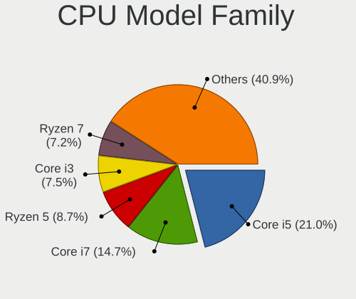

| Model                   | Desktops | Percent |
|-------------------------|----------|---------|
| Intel Core i5           | 357      | 21.02%  |
| Intel Core i7           | 249      | 14.66%  |
| AMD Ryzen 5             | 147      | 8.66%   |
| Intel Core i3           | 127      | 7.48%   |
| AMD Ryzen 7             | 123      | 7.24%   |
| Other                   | 116      | 6.83%   |
| Intel Xeon              | 88       | 5.18%   |
| AMD Ryzen 9             | 63       | 3.71%   |
| AMD FX                  | 55       | 3.24%   |
| Intel Core 2 Duo        | 48       | 2.83%   |
| Intel Pentium           | 37       | 2.18%   |
| Intel Core 2 Quad       | 36       | 2.12%   |
| Intel Celeron           | 36       | 2.12%   |
| Intel Core i9           | 19       | 1.12%   |
| Intel Pentium Dual-Core | 17       | 1%      |
| AMD Ryzen 3             | 17       | 1%      |
| AMD A8                  | 14       | 0.82%   |
| AMD A10                 | 14       | 0.82%   |
| AMD Phenom II X4        | 13       | 0.77%   |
| AMD Ryzen 5 PRO         | 9        | 0.53%   |
| AMD Athlon              | 9        | 0.53%   |
| AMD A6                  | 9        | 0.53%   |
| Intel Core              | 7        | 0.41%   |
| AMD Athlon II X2        | 7        | 0.41%   |
| Intel Pentium Gold      | 6        | 0.35%   |
| AMD Phenom II X6        | 6        | 0.35%   |
| AMD E1                  | 5        | 0.29%   |
| AMD Athlon II X4        | 5        | 0.29%   |
| AMD Athlon 64 X2        | 5        | 0.29%   |
| Intel Pentium Dual      | 4        | 0.24%   |
| Intel Core 2            | 4        | 0.24%   |
| AMD Ryzen 3 PRO         | 4        | 0.24%   |
| AMD Athlon 64           | 4        | 0.24%   |
| AMD A4                  | 4        | 0.24%   |
| AMD Phenom II X2        | 3        | 0.18%   |
| AMD GX                  | 3        | 0.18%   |
| AMD E                   | 3        | 0.18%   |
| Intel Core 2 Extreme    | 2        | 0.12%   |
| Intel Atom              | 2        | 0.12%   |
| AMD Sempron             | 2        | 0.12%   |

CPU Cores
---------

Number of processor cores

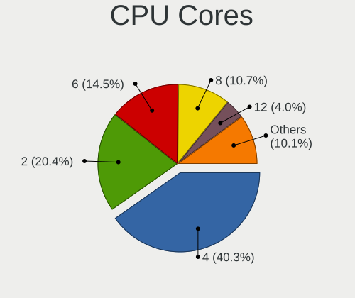

| Number | Desktops | Percent |
|--------|----------|---------|
| 4      | 684      | 40.26%  |
| 2      | 347      | 20.42%  |
| 6      | 246      | 14.48%  |
| 8      | 182      | 10.71%  |
| 12     | 68       | 4%      |
| 3      | 34       | 2%      |
| 16     | 33       | 1.94%   |
| 14     | 25       | 1.47%   |
| 10     | 24       | 1.41%   |
| 24     | 19       | 1.12%   |
| 1      | 17       | 1%      |
| 20     | 12       | 0.71%   |
| 18     | 5        | 0.29%   |
| 32     | 2        | 0.12%   |
| 36     | 1        | 0.06%   |

CPU Sockets
-----------

Number of sockets

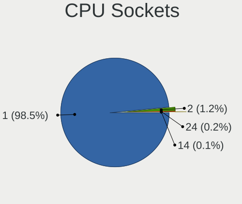

| Number | Desktops | Percent |
|--------|----------|---------|
| 1      | 1669     | 98.47%  |
| 2      | 20       | 1.18%   |
| 24     | 3        | 0.18%   |
| 20     | 2        | 0.12%   |
| 14     | 1        | 0.06%   |

CPU Threads
-----------

Threads per core (Hyper-Threading)

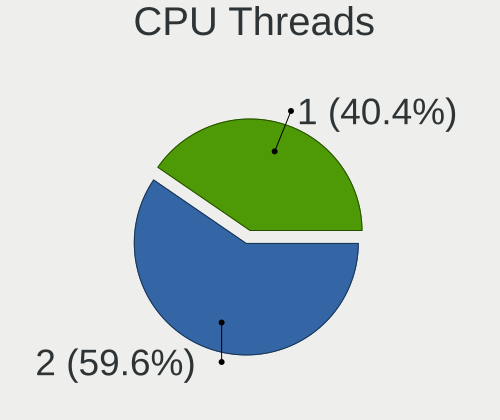

| Number | Desktops | Percent |
|--------|----------|---------|
| 2      | 1012     | 59.56%  |
| 1      | 687      | 40.44%  |

CPU Op-Modes
------------

CPU Operation Modes (32-bit, 64-bit)

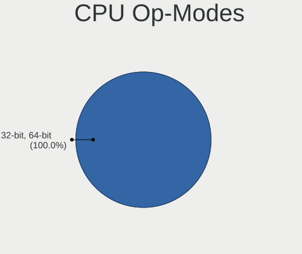

| Op mode        | Desktops | Percent |
|----------------|----------|---------|
| 32-bit, 64-bit | 1695     | 100%    |

CPU Microcode
-------------

Microcode number

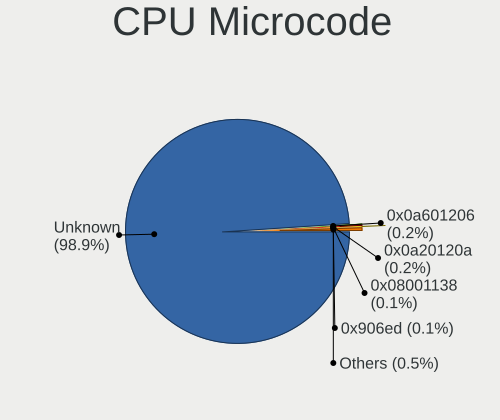

| Number     | Desktops | Percent |
|------------|----------|---------|
| Unknown    | 1681     | 98.94%  |
| 0x0a601206 | 3        | 0.18%   |
| 0x0a20120a | 3        | 0.18%   |
| 0x08001138 | 2        | 0.12%   |
| 0x906ed    | 1        | 0.06%   |
| 0x306c3    | 1        | 0.06%   |
| 0x0a601203 | 1        | 0.06%   |
| 0x0a50000d | 1        | 0.06%   |
| 0x0a50000c | 1        | 0.06%   |
| 0x0a20102b | 1        | 0.06%   |
| 0x08701030 | 1        | 0.06%   |
| 0x08701021 | 1        | 0.06%   |
| 0x0800820d | 1        | 0.06%   |
| 0x06003109 | 1        | 0.06%   |

CPU Microarch
-------------

Microarchitecture

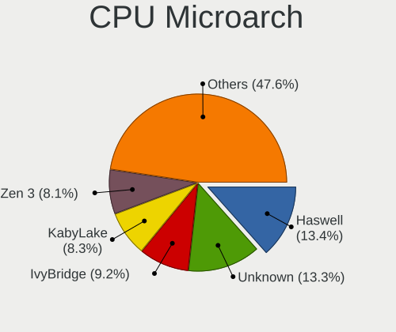

| Name             | Desktops | Percent |
|------------------|----------|---------|
| Haswell          | 228      | 13.44%  |
| Unknown          | 226      | 13.32%  |
| IvyBridge        | 156      | 9.19%   |
| KabyLake         | 141      | 8.31%   |
| Zen 3            | 138      | 8.13%   |
| SandyBridge      | 124      | 7.31%   |
| Skylake          | 98       | 5.77%   |
| Penryn           | 85       | 5.01%   |
| Zen 2            | 66       | 3.89%   |
| Piledriver       | 55       | 3.24%   |
| K10              | 46       | 2.71%   |
| Zen+             | 38       | 2.24%   |
| Zen              | 37       | 2.18%   |
| Westmere         | 35       | 2.06%   |
| Nehalem          | 34       | 2%      |
| CometLake        | 33       | 1.94%   |
| Core             | 31       | 1.83%   |
| Broadwell        | 15       | 0.88%   |
| Steamroller      | 14       | 0.82%   |
| Bulldozer        | 13       | 0.77%   |
| K8 Hammer        | 12       | 0.71%   |
| Goldmont plus    | 10       | 0.59%   |
| Excavator        | 10       | 0.59%   |
| K10 Llano        | 9        | 0.53%   |
| Silvermont       | 7        | 0.41%   |
| Goldmont         | 7        | 0.41%   |
| Alderlake Hybrid | 7        | 0.41%   |
| Bobcat           | 6        | 0.35%   |
| Jaguar           | 5        | 0.29%   |
| NetBurst         | 3        | 0.18%   |
| Icelake          | 3        | 0.18%   |
| Puma             | 2        | 0.12%   |
| TigerLake        | 1        | 0.06%   |
| Gracemont        | 1        | 0.06%   |
| Bonnell          | 1        | 0.06%   |

Graphics
--------

GPU Vendor
----------

Vendors of graphics cards

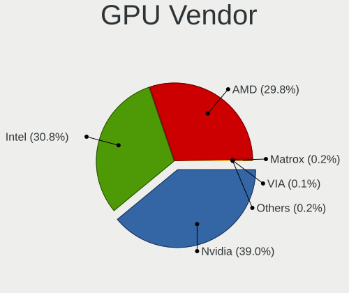

| Vendor                           | Desktops | Percent |
|----------------------------------|----------|---------|
| Nvidia                           | 723      | 39.02%  |
| Intel                            | 570      | 30.76%  |
| AMD                              | 553      | 29.84%  |
| Matrox Electronics Systems       | 3        | 0.16%   |
| VIA Technologies                 | 1        | 0.05%   |
| Silicon Integrated Systems [SiS] | 1        | 0.05%   |
| ATI Technologies                 | 1        | 0.05%   |
| 3DLabs                           | 1        | 0.05%   |

GPU Model
---------

Graphics card models

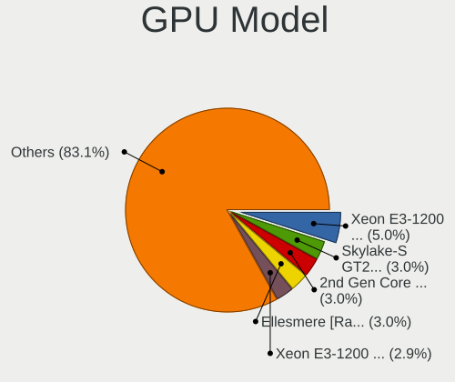

| Model                                                                       | Desktops | Percent |
|-----------------------------------------------------------------------------|----------|---------|
| Intel Xeon E3-1200 v3/4th Gen Core Processor Integrated Graphics Controller | 95       | 4.96%   |
| Intel Skylake-S GT2 [HD Graphics 530]                                       | 58       | 3.03%   |
| Intel 2nd Generation Core Processor Family Integrated Graphics Controller   | 58       | 3.03%   |
| AMD Ellesmere [Radeon RX 470/480/570/570X/580/580X/590]                     | 58       | 3.03%   |
| Intel Xeon E3-1200 v2/3rd Gen Core processor Graphics Controller            | 55       | 2.87%   |
| Nvidia GK208B [GeForce GT 710]                                              | 44       | 2.3%    |
| AMD Raphael                                                                 | 40       | 2.09%   |
| Intel CoffeeLake-S GT2 [UHD Graphics 630]                                   | 37       | 1.93%   |
| AMD Cezanne [Radeon Vega Series / Radeon Vega Mobile Series]                | 36       | 1.88%   |
| Nvidia GP107 [GeForce GTX 1050 Ti]                                          | 30       | 1.57%   |
| Intel 4 Series Chipset Integrated Graphics Controller                       | 30       | 1.57%   |
| Nvidia GF119 [GeForce GT 610]                                               | 25       | 1.3%    |
| Intel Kaby Lake-S GT2 [HD Graphics 630]                                     | 25       | 1.3%    |
| AMD Polaris 20 XL [Radeon RX 580 2048SP]                                    | 23       | 1.2%    |
| Nvidia GT218 [GeForce 210]                                                  | 22       | 1.15%   |
| Nvidia GP108 [GeForce GT 1030]                                              | 22       | 1.15%   |
| Nvidia GK208B [GeForce GT 730]                                              | 22       | 1.15%   |
| Nvidia GP106 [GeForce GTX 1060 6GB]                                         | 21       | 1.1%    |
| Nvidia GA106 [GeForce RTX 3060 Lite Hash Rate]                              | 20       | 1.04%   |
| Intel Alder Lake-N [UHD Graphics]                                           | 20       | 1.04%   |
| Intel IvyBridge GT2 [HD Graphics 4000]                                      | 19       | 0.99%   |
| Intel 4th Generation Core Processor Family Integrated Graphics Controller   | 19       | 0.99%   |
| AMD Caicos [Radeon HD 6450/7450/8450 / R5 230 OEM]                          | 19       | 0.99%   |
| AMD Cedar [Radeon HD 5000/6000/7350/8350 Series]                            | 18       | 0.94%   |
| Intel Raptor Lake-S GT1 [UHD Graphics 770]                                  | 16       | 0.84%   |
| AMD Raven Ridge [Radeon Vega Series / Radeon Vega Mobile Series]            | 16       | 0.84%   |
| Nvidia GM107 [GeForce GTX 750 Ti]                                           | 15       | 0.78%   |
| AMD Lexa PRO [Radeon 540/540X/550/550X / RX 540X/550/550X]                  | 15       | 0.78%   |
| Intel Core Processor Integrated Graphics Controller                         | 14       | 0.73%   |
| AMD Navi 23 [Radeon RX 6600/6600 XT/6600M]                                  | 14       | 0.73%   |
| Nvidia TU117 [GeForce GTX 1650]                                             | 13       | 0.68%   |
| Nvidia GM206 [GeForce GTX 960]                                              | 13       | 0.68%   |
| Nvidia GM204 [GeForce GTX 970]                                              | 13       | 0.68%   |
| Nvidia GF108 [GeForce GT 730]                                               | 13       | 0.68%   |
| AMD Navi 22 [Radeon RX 6700/6700 XT/6750 XT / 6800M/6850M XT]               | 13       | 0.68%   |
| Nvidia TU116 [GeForce GTX 1660 SUPER]                                       | 12       | 0.63%   |
| Nvidia GP107 [GeForce GTX 1050]                                             | 12       | 0.63%   |
| Nvidia AD107 [GeForce RTX 4060]                                             | 12       | 0.63%   |
| Intel Alder Lake-S GT1 [UHD Graphics 770]                                   | 12       | 0.63%   |
| AMD Picasso/Raven 2 [Radeon Vega Series / Radeon Vega Mobile Series]        | 12       | 0.63%   |

GPU Combo
---------

Combinations of graphics cards

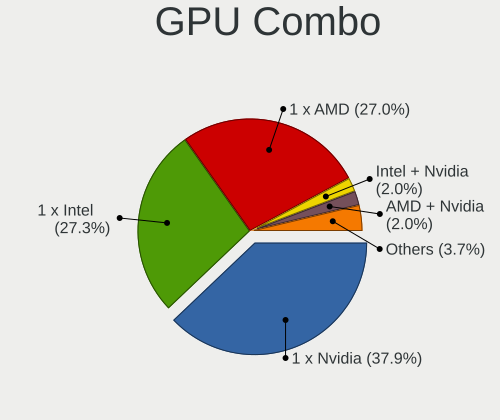

| Name                 | Desktops | Percent |
|----------------------|----------|---------|
| 1 x Nvidia           | 650      | 37.9%   |
| 1 x Intel            | 468      | 27.29%  |
| 1 x AMD              | 463      | 27%     |
| Intel + Nvidia       | 35       | 2.04%   |
| AMD + Nvidia         | 35       | 2.04%   |
| 2 x AMD              | 32       | 1.87%   |
| Intel + AMD          | 17       | 0.99%   |
| 2 x Nvidia           | 6        | 0.35%   |
| 1 x Matrox           | 2        | 0.12%   |
| 3 x AMD              | 1        | 0.06%   |
| 2 x Intel            | 1        | 0.06%   |
| 2 x AMD + 1 x Nvidia | 1        | 0.06%   |
| 2 x AMD + 1 x 3DLabs | 1        | 0.06%   |
| 1 x VIA              | 1        | 0.06%   |
| 1 x SiS              | 1        | 0.06%   |
| Intel + 2 x Nvidia   | 1        | 0.06%   |

GPU Driver
----------

Free vs proprietary

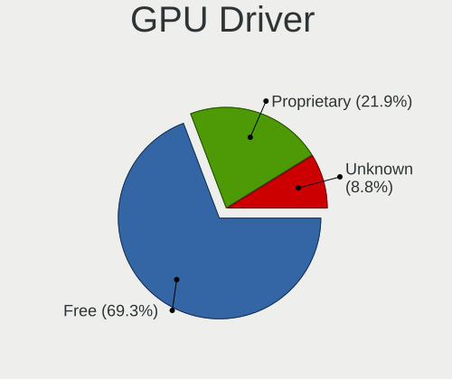

| Driver      | Desktops | Percent |
|-------------|----------|---------|
| Free        | 1194     | 69.26%  |
| Proprietary | 378      | 21.93%  |
| Unknown     | 152      | 8.82%   |

GPU Memory
----------

Total video memory

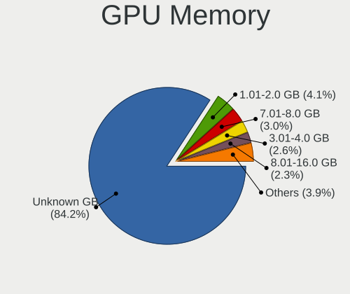

| Size in GB | Desktops | Percent |
|------------|----------|---------|
| Unknown    | 1452     | 84.22%  |
| 1.01-2.0   | 70       | 4.06%   |
| 7.01-8.0   | 52       | 3.02%   |
| 3.01-4.0   | 44       | 2.55%   |
| 8.01-16.0  | 39       | 2.26%   |
| 5.01-6.0   | 28       | 1.62%   |
| 0.51-1.0   | 17       | 0.99%   |
| 0.01-0.5   | 10       | 0.58%   |
| 16.01-24.0 | 7        | 0.41%   |
| 2.01-3.0   | 5        | 0.29%   |

Monitor
-------

Monitor Vendor
--------------

Monitor vendors

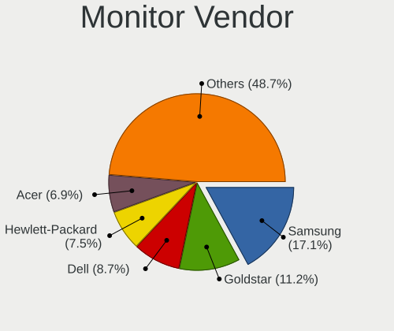

| Vendor               | Desktops | Percent |
|----------------------|----------|---------|
| Samsung Electronics  | 279      | 17.06%  |
| Goldstar             | 183      | 11.19%  |
| Dell                 | 143      | 8.75%   |
| Hewlett-Packard      | 122      | 7.46%   |
| Acer                 | 112      | 6.85%   |
| AOC                  | 94       | 5.75%   |
| Philips              | 69       | 4.22%   |
| BenQ                 | 59       | 3.61%   |
| Ancor Communications | 58       | 3.55%   |
| ASUSTek Computer     | 38       | 2.32%   |
| Lenovo               | 36       | 2.2%    |
| ViewSonic            | 34       | 2.08%   |
| Iiyama               | 28       | 1.71%   |
| Sony                 | 25       | 1.53%   |
| MSI                  | 17       | 1.04%   |
| Vizio                | 15       | 0.92%   |
| Fujitsu Siemens      | 15       | 0.92%   |
| Unknown              | 14       | 0.86%   |
| HKC                  | 13       | 0.8%    |
| Hitachi              | 13       | 0.8%    |
| Sceptre Tech         | 11       | 0.67%   |
| Panasonic            | 10       | 0.61%   |
| Eizo                 | 10       | 0.61%   |
| NEC Computers        | 9        | 0.55%   |
| Unknown (XXX)        | 8        | 0.49%   |
| Gigabyte Technology  | 7        | 0.43%   |
| Denver               | 7        | 0.43%   |
| Vestel Elektronik    | 6        | 0.37%   |
| Toshiba              | 6        | 0.37%   |
| RTK                  | 6        | 0.37%   |
| Mi                   | 5        | 0.31%   |
| CTV                  | 5        | 0.31%   |
| ___                  | 4        | 0.24%   |
| STD                  | 4        | 0.24%   |
| LG Electronics       | 4        | 0.24%   |
| Insignia             | 4        | 0.24%   |
| HannStar             | 4        | 0.24%   |
| CVT                  | 4        | 0.24%   |
| CHO                  | 4        | 0.24%   |
| Unknown              | 4        | 0.24%   |

Monitor Model
-------------

Monitor models

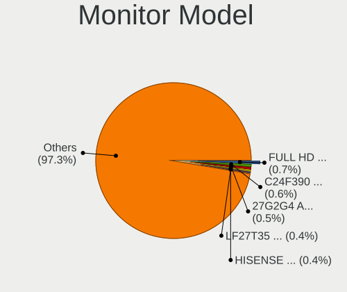

| Model                                                                 | Desktops | Percent |
|-----------------------------------------------------------------------|----------|---------|
| Goldstar FULL HD GSM5B55 1920x1080 480x270mm 21.7-inch                | 12       | 0.69%   |
| Samsung Electronics C24F390 SAM0D2C 1920x1080 521x293mm 23.5-inch     | 11       | 0.64%   |
| AOC 27G2G4 AOC2702 1920x1080 598x336mm 27.0-inch                      | 9        | 0.52%   |
| Samsung Electronics LF27T35 SAM707F 1920x1080 598x337mm 27.0-inch     | 7        | 0.41%   |
| Hitachi HISENSE HEC0030 3840x2160 1872x1053mm 84.6-inch               | 7        | 0.41%   |
| Hitachi HISENSE HEC002F 3840x2160 1872x1053mm 84.6-inch               | 7        | 0.41%   |
| AOC G2460 AOC2460 1920x1080 531x299mm 24.0-inch                       | 7        | 0.41%   |
| Vestel Elektronik 40UHD_LCD_TV VES3700 3840x2160 880x500mm 39.8-inch  | 6        | 0.35%   |
| Samsung Electronics C27F390 SAM0D32 1920x1080 598x336mm 27.0-inch     | 6        | 0.35%   |
| Goldstar LG IPS FULLHD GSM5AB8 1920x1080 480x270mm 21.7-inch          | 6        | 0.35%   |
| Goldstar HDR WFHD GSM7714 2560x1080 798x334mm 34.1-inch               | 6        | 0.35%   |
| Samsung Electronics S24F350 SAM0D20 1920x1080 521x293mm 23.5-inch     | 5        | 0.29%   |
| Samsung Electronics S19B300 SAM08A5 1366x768 410x230mm 18.5-inch      | 5        | 0.29%   |
| Samsung Electronics LU28R55 SAM1017 3840x2160 632x360mm 28.6-inch     | 5        | 0.29%   |
| Panasonic TV MEIA296 1920x1080 698x392mm 31.5-inch                    | 5        | 0.29%   |
| Hewlett-Packard TouchSmart HWP4211 1920x1080 509x286mm 23.0-inch      | 5        | 0.29%   |
| Denver MO-HHS-32C LHCFFFF 1920x1080 699x393mm 31.6-inch               | 5        | 0.29%   |
| Unknown LCD Monitor SAMSUNG 1920x1080                                 | 4        | 0.23%   |
| Samsung Electronics U28E590 SAM0C4D 3840x2160 607x345mm 27.5-inch     | 4        | 0.23%   |
| Samsung Electronics LCD Monitor SAM0C3C 1366x768 609x347mm 27.6-inch  | 4        | 0.23%   |
| Samsung Electronics LCD Monitor SAM0C39 1920x1080 885x498mm 40.0-inch | 4        | 0.23%   |
| Philips PHL 273V7 PHLC156 1920x1080 598x336mm 27.0-inch               | 4        | 0.23%   |
| Philips PHL 221V8 PHLC211 1920x1080 477x268mm 21.5-inch               | 4        | 0.23%   |
| Philips FTV PHL04C3 1920x1080 1440x810mm 65.0-inch                    | 4        | 0.23%   |
| Lenovo LT2252p Wide LEN0A0C 1680x1050 474x296mm 22.0-inch             | 4        | 0.23%   |
| Goldstar ULTRAGEAR GSM5BD3 2560x1440 697x392mm 31.5-inch              | 4        | 0.23%   |
| Goldstar LG ULTRAWIDE GSM59F1 2560x1080 670x280mm 28.6-inch           | 4        | 0.23%   |
| Goldstar HDR 4K GSM774F 3840x2160 697x392mm 31.5-inch                 | 4        | 0.23%   |
| Goldstar HDR 4K GSM7707 3840x2160 600x340mm 27.2-inch                 | 4        | 0.23%   |
| Goldstar HDR 4K GSM7706 3840x2160 600x340mm 27.2-inch                 | 4        | 0.23%   |
| Goldstar FULL HD GSM5ABA 1920x1080 480x270mm 21.7-inch                | 4        | 0.23%   |
| CTV TV CTV0030 1920x1080 708x398mm 32.0-inch                          | 4        | 0.23%   |
| ASUSTek Computer VA27EHE AUS27D2 1920x1080 598x336mm 27.0-inch        | 4        | 0.23%   |
| AOC 2470W AOC2470 1920x1080 521x293mm 23.5-inch                       | 4        | 0.23%   |
| Unknown                                                               | 4        | 0.23%   |
| ___ LCD TV ___0101 1360x768                                           | 3        | 0.17%   |
| Unknown LCD Monitor FFFF 2288x1287 2550x2550mm 142.0-inch             | 3        | 0.17%   |
| Unknown (XXX) HDMI XXX2400 1920x1080 520x320mm 24.0-inch              | 3        | 0.17%   |
| Unknown (XXX) Beyond TV XXX2851 3840x2160 1209x680mm 54.6-inch        | 3        | 0.17%   |
| Samsung Electronics S24D330 SAM0D92 1920x1080 531x299mm 24.0-inch     | 3        | 0.17%   |

Monitor Resolution
------------------

Monitor screen resolution

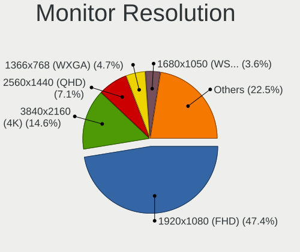

| Resolution         | Desktops | Percent |
|--------------------|----------|---------|
| 1920x1080 (FHD)    | 746      | 47.43%  |
| 3840x2160 (4K)     | 230      | 14.62%  |
| 2560x1440 (QHD)    | 112      | 7.12%   |
| 1366x768 (WXGA)    | 74       | 4.7%    |
| 1680x1050 (WSXGA+) | 57       | 3.62%   |
| 1440x900 (WXGA+)   | 57       | 3.62%   |
| 1600x900 (HD+)     | 51       | 3.24%   |
| 1280x1024 (SXGA)   | 49       | 3.12%   |
| 3440x1440          | 36       | 2.29%   |
| 1920x1200 (WUXGA)  | 35       | 2.23%   |
| 1360x768           | 29       | 1.84%   |
| 2560x1080          | 20       | 1.27%   |
| 3840x1080          | 19       | 1.21%   |
| Unknown            | 11       | 0.7%    |
| 1920x540           | 8        | 0.51%   |
| 2560x1600          | 5        | 0.32%   |
| 3840x1600          | 4        | 0.25%   |
| 2288x1287          | 4        | 0.25%   |
| 1600x1200          | 4        | 0.25%   |
| 1280x720 (HD)      | 3        | 0.19%   |
| 1024x768 (XGA)     | 3        | 0.19%   |
| 5120x1440          | 2        | 0.13%   |
| 2560x2880          | 2        | 0.13%   |
| 1280x960           | 2        | 0.13%   |
| 7680x2160          | 1        | 0.06%   |
| 5760x2160          | 1        | 0.06%   |
| 5120x1080          | 1        | 0.06%   |
| 4480x1440          | 1        | 0.06%   |
| 3840x1200          | 1        | 0.06%   |
| 2880x1440          | 1        | 0.06%   |
| 2256x1504          | 1        | 0.06%   |
| 2160x1440          | 1        | 0.06%   |
| 1920x1600          | 1        | 0.06%   |
| 1280x768           | 1        | 0.06%   |

Monitor Diagonal
----------------

Diagonal size in inches

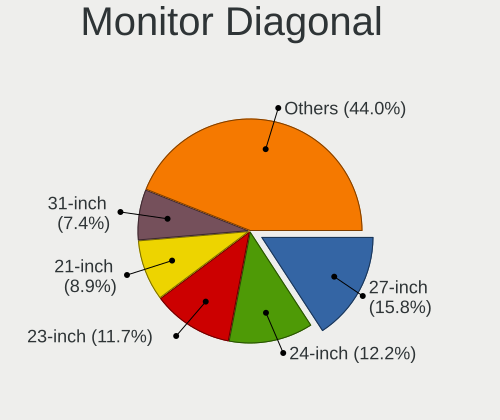

| Inches  | Desktops | Percent |
|---------|----------|---------|
| 27      | 260      | 15.82%  |
| 24      | 201      | 12.23%  |
| 23      | 193      | 11.74%  |
| 21      | 146      | 8.88%   |
| 31      | 121      | 7.36%   |
| Unknown | 90       | 5.47%   |
| 18      | 83       | 5.05%   |
| 19      | 69       | 4.2%    |
| 84      | 52       | 3.16%   |
| 20      | 48       | 2.92%   |
| 22      | 46       | 2.8%    |
| 34      | 42       | 2.55%   |
| 32      | 30       | 1.82%   |
| 17      | 29       | 1.76%   |
| 72      | 23       | 1.4%    |
| 54      | 20       | 1.22%   |
| 40      | 20       | 1.22%   |
| 15      | 18       | 1.09%   |
| 49      | 17       | 1.03%   |
| 63      | 15       | 0.91%   |
| 48      | 13       | 0.79%   |
| 28      | 11       | 0.67%   |
| 25      | 11       | 0.67%   |
| 26      | 10       | 0.61%   |
| 65      | 8        | 0.49%   |
| 42      | 8        | 0.49%   |
| 14      | 6        | 0.36%   |
| 74      | 5        | 0.3%    |
| 39      | 5        | 0.3%    |
| 75      | 4        | 0.24%   |
| 46      | 4        | 0.24%   |
| 37      | 4        | 0.24%   |
| 142     | 3        | 0.18%   |
| 60      | 3        | 0.18%   |
| 43      | 3        | 0.18%   |
| 29      | 3        | 0.18%   |
| 55      | 2        | 0.12%   |
| 36      | 2        | 0.12%   |
| 35      | 2        | 0.12%   |
| 33      | 2        | 0.12%   |

Monitor Width
-------------

Physical width

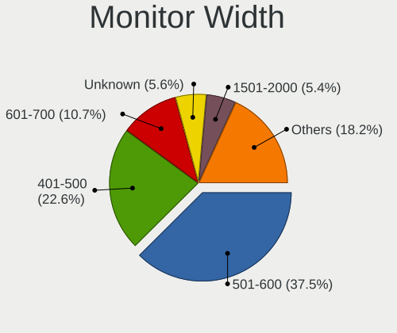

| Width in mm    | Desktops | Percent |
|----------------|----------|---------|
| 501-600        | 599      | 37.53%  |
| 401-500        | 360      | 22.56%  |
| 601-700        | 171      | 10.71%  |
| Unknown        | 90       | 5.64%   |
| 1501-2000      | 86       | 5.39%   |
| 1001-1500      | 85       | 5.33%   |
| 701-800        | 75       | 4.7%    |
| 301-350        | 42       | 2.63%   |
| 351-400        | 35       | 2.19%   |
| 801-900        | 29       | 1.82%   |
| 901-1000       | 16       | 1%      |
| 201-300        | 5        | 0.31%   |
| More than 2000 | 3        | 0.19%   |

Aspect Ratio
------------

Proportional relationship between the width and the height

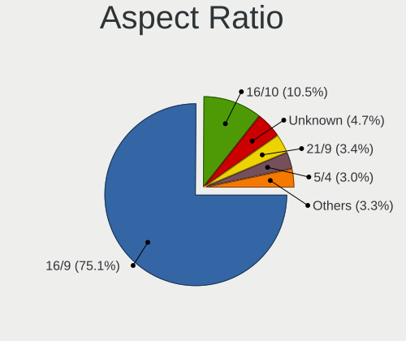

| Ratio   | Desktops | Percent |
|---------|----------|---------|
| 16/9    | 1128     | 75.1%   |
| 16/10   | 158      | 10.52%  |
| Unknown | 70       | 4.66%   |
| 21/9    | 51       | 3.4%    |
| 5/4     | 45       | 3%      |
| 32/9    | 23       | 1.53%   |
| 4/3     | 13       | 0.87%   |
| 2.00    | 3        | 0.2%    |
| 1.00    | 3        | 0.2%    |
| 6/5     | 2        | 0.13%   |
| 3/2     | 2        | 0.13%   |
| 0.89    | 2        | 0.13%   |
| 2.01    | 1        | 0.07%   |
| 0.80    | 1        | 0.07%   |

Monitor Area
------------

Area in inch²

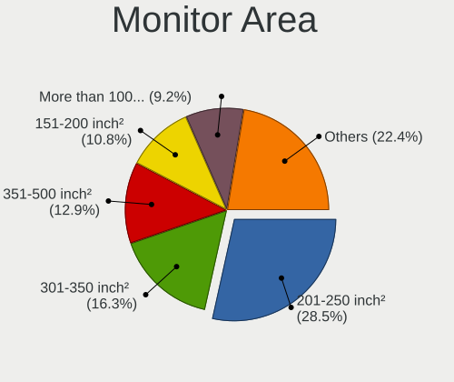

| Area in inch² | Desktops | Percent |
|----------------|----------|---------|
| 201-250        | 457      | 28.47%  |
| 301-350        | 261      | 16.26%  |
| 351-500        | 207      | 12.9%   |
| 151-200        | 173      | 10.78%  |
| More than 1000 | 148      | 9.22%   |
| Unknown        | 90       | 5.61%   |
| 141-150        | 86       | 5.36%   |
| 251-300        | 79       | 4.92%   |
| 501-1000       | 68       | 4.24%   |
| 101-110        | 13       | 0.81%   |
| 111-120        | 7        | 0.44%   |
| 131-140        | 6        | 0.37%   |
| 81-90          | 4        | 0.25%   |
| 121-130        | 3        | 0.19%   |
| 71-80          | 2        | 0.12%   |
| 91-100         | 1        | 0.06%   |

Pixel Density
-------------

Pixels per inch

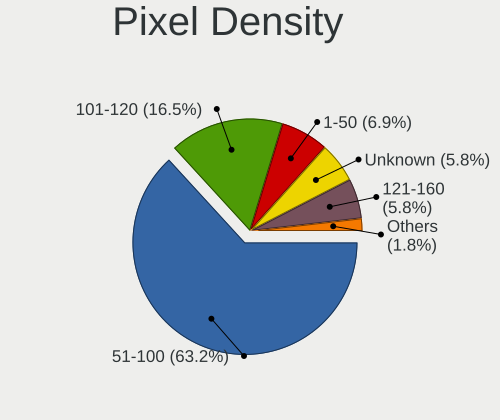

| Density | Desktops | Percent |
|---------|----------|---------|
| 51-100  | 977      | 63.2%   |
| 101-120 | 255      | 16.49%  |
| 1-50    | 107      | 6.92%   |
| Unknown | 90       | 5.82%   |
| 121-160 | 89       | 5.76%   |
| 161-240 | 28       | 1.81%   |

Multiple Monitors
-----------------

Total monitors connected

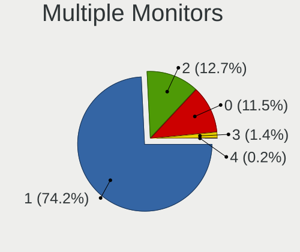

| Total | Desktops | Percent |
|-------|----------|---------|
| 1     | 1281     | 74.22%  |
| 2     | 220      | 12.75%  |
| 0     | 198      | 11.47%  |
| 3     | 24       | 1.39%   |
| 4     | 3        | 0.17%   |

Network
-------

Net Controller Vendor
---------------------

Controller vendors

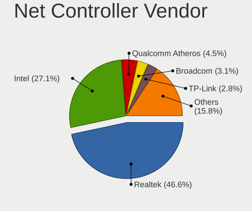

| Vendor                                | Desktops | Percent |
|---------------------------------------|----------|---------|
| Realtek Semiconductor                 | 1183     | 46.65%  |
| Intel                                 | 687      | 27.09%  |
| Qualcomm Atheros                      | 115      | 4.53%   |
| Broadcom                              | 79       | 3.12%   |
| TP-Link                               | 72       | 2.84%   |
| Ralink Technology                     | 64       | 2.52%   |
| MediaTek                              | 63       | 2.48%   |
| Ralink                                | 30       | 1.18%   |
| Nvidia                                | 18       | 0.71%   |
| Microsoft                             | 18       | 0.71%   |
| NetGear                               | 17       | 0.67%   |
| Samsung Electronics                   | 14       | 0.55%   |
| Qualcomm Atheros Communications       | 13       | 0.51%   |
| Qualcomm Technologies                 | 11       | 0.43%   |
| D-Link                                | 11       | 0.43%   |
| Marvell Technology Group              | 9        | 0.35%   |
| Aquantia                              | 9        | 0.35%   |
| Xiaomi                                | 8        | 0.32%   |
| ASUSTek Computer                      | 8        | 0.32%   |
| ASIX Electronics                      | 8        | 0.32%   |
| D-Link System                         | 7        | 0.28%   |
| Broadcom Limited                      | 7        | 0.28%   |
| ZyXEL Communications                  | 5        | 0.2%    |
| Linksys                               | 5        | 0.2%    |
| DisplayLink                           | 5        | 0.2%    |
| Mercucys                              | 4        | 0.16%   |
| Edimax Technology                     | 4        | 0.16%   |
| VIA Technologies                      | 3        | 0.12%   |
| AVM                                   | 3        | 0.12%   |
| 802.11g Adapter [Linksys WUSB54GC v3] | 3        | 0.12%   |
| Winbond Electronics                   | 2        | 0.08%   |
| Sitecom Europe                        | 2        | 0.08%   |
| Realtek                               | 2        | 0.08%   |
| Qualcomm                              | 2        | 0.08%   |
| QinHeng Electronics                   | 2        | 0.08%   |
| OPPO Electronics                      | 2        | 0.08%   |
| Motorola PCS                          | 2        | 0.08%   |
| Manta                                 | 2        | 0.08%   |
| Google                                | 2        | 0.08%   |
| Gemtek                                | 2        | 0.08%   |

Net Controller Model
--------------------

Controller models

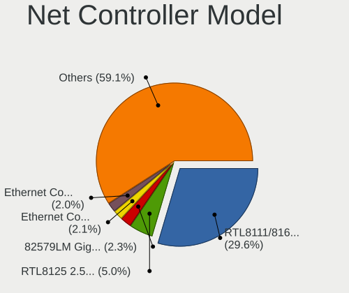

| Model                                                                  | Desktops | Percent |
|------------------------------------------------------------------------|----------|---------|
| Realtek RTL8111/8168/8211/8411 PCI Express Gigabit Ethernet Controller | 865      | 29.56%  |
| Realtek RTL8125 2.5GbE Controller                                      | 146      | 4.99%   |
| Intel 82579LM Gigabit Network Connection (Lewisville)                  | 68       | 2.32%   |
| Intel Ethernet Connection I217-LM                                      | 60       | 2.05%   |
| Intel Ethernet Connection (2) I219-V                                   | 58       | 1.98%   |
| Intel Wi-Fi 6 AX200                                                    | 57       | 1.95%   |
| Realtek 802.11ac NIC                                                   | 49       | 1.67%   |
| Intel Ethernet Controller I225-V                                       | 49       | 1.67%   |
| Realtek RTL810xE PCI Express Fast Ethernet controller                  | 47       | 1.61%   |
| Intel Wi-Fi 6E(802.11ax) AX210/AX1675* 2x2 [Typhoon Peak]              | 45       | 1.54%   |
| Intel I211 Gigabit Network Connection                                  | 44       | 1.5%    |
| Realtek RTL8821CE 802.11ac PCIe Wireless Network Adapter               | 37       | 1.26%   |
| Intel 82579V Gigabit Network Connection                                | 36       | 1.23%   |
| Realtek RTL88x2bu [AC1200 Techkey]                                     | 35       | 1.2%    |
| Ralink MT7601U Wireless Adapter                                        | 34       | 1.16%   |
| Intel Ethernet Connection (2) I219-LM                                  | 32       | 1.09%   |
| Intel Ethernet Controller I226-V                                       | 26       | 0.89%   |
| Intel Ethernet Connection I217-V                                       | 26       | 0.89%   |
| MediaTek MT7922 802.11ax PCI Express Wireless Network Adapter          | 23       | 0.79%   |
| Realtek RTL8188EUS 802.11n Wireless Network Adapter                    | 22       | 0.75%   |
| Realtek RTL8153 Gigabit Ethernet Adapter                               | 20       | 0.68%   |
| Intel Wireless 7260                                                    | 19       | 0.65%   |
| Intel 700 Series Chipset CNVi WiFi                                     | 19       | 0.65%   |
| Intel Wi-Fi 5(802.11ac) Wireless-AC 9x6x [Thunder Peak]                | 18       | 0.62%   |
| Realtek RTL8852BE PCIe 802.11ax Wireless Network Controller            | 17       | 0.58%   |
| Intel Dual Band Wireless-AC 3168NGW [Stone Peak]                       | 17       | 0.58%   |
| TP-Link TL-WN823N v2/v3 [Realtek RTL8192EU]                            | 16       | 0.55%   |
| Realtek RTL8192EU 802.11b/g/n WLAN Adapter                             | 15       | 0.51%   |
| Intel Ethernet Connection (2) I218-V                                   | 15       | 0.51%   |
| Intel 82567LM-3 Gigabit Network Connection                             | 15       | 0.51%   |
| Broadcom BCM4360 802.11ac Dual Band Wireless Network Adapter           | 14       | 0.48%   |
| Realtek RTL8852CE PCIe 802.11ax Wireless Network Controller            | 13       | 0.44%   |
| Realtek RTL8188FTV 802.11b/g/n 1T1R 2.4G WLAN Adapter                  | 13       | 0.44%   |
| Ralink RT5370 Wireless Adapter                                         | 13       | 0.44%   |
| Qualcomm Atheros AR8151 v2.0 Gigabit Ethernet                          | 13       | 0.44%   |
| Intel Wireless 7265                                                    | 13       | 0.44%   |
| Intel Ethernet Connection (7) I219-V                                   | 13       | 0.44%   |
| Intel Alder Lake-S PCH CNVi WiFi                                       | 13       | 0.44%   |
| TP-Link 802.11ac NIC                                                   | 12       | 0.41%   |
| Samsung Galaxy series, misc. (tethering mode)                          | 12       | 0.41%   |

Wireless Vendor
---------------

Wireless vendors

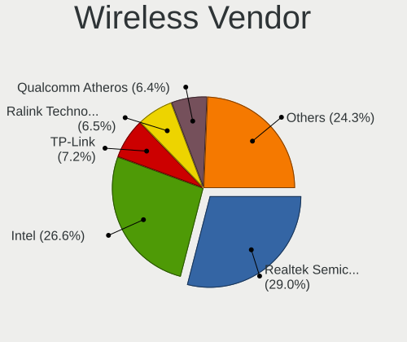

| Vendor                                | Desktops | Percent |
|---------------------------------------|----------|---------|
| Realtek Semiconductor                 | 286      | 29.01%  |
| Intel                                 | 262      | 26.57%  |
| TP-Link                               | 71       | 7.2%    |
| Ralink Technology                     | 64       | 6.49%   |
| Qualcomm Atheros                      | 63       | 6.39%   |
| MediaTek                              | 52       | 5.27%   |
| Broadcom                              | 41       | 4.16%   |
| Ralink                                | 30       | 3.04%   |
| Microsoft                             | 18       | 1.83%   |
| NetGear                               | 17       | 1.72%   |
| Qualcomm Atheros Communications       | 13       | 1.32%   |
| D-Link                                | 11       | 1.12%   |
| ASUSTek Computer                      | 8        | 0.81%   |
| ZyXEL Communications                  | 5        | 0.51%   |
| Linksys                               | 5        | 0.51%   |
| Mercucys                              | 4        | 0.41%   |
| Edimax Technology                     | 4        | 0.41%   |
| D-Link System                         | 4        | 0.41%   |
| Broadcom Limited                      | 3        | 0.3%    |
| AVM                                   | 3        | 0.3%    |
| 802.11g Adapter [Linksys WUSB54GC v3] | 3        | 0.3%    |
| Sitecom Europe                        | 2        | 0.2%    |
| Realtek                               | 2        | 0.2%    |
| Gemtek                                | 2        | 0.2%    |
| BUFFALO                               | 2        | 0.2%    |
| Belkin Components                     | 2        | 0.2%    |
| ZTopInc                               | 1        | 0.1%    |
| Wilocity                              | 1        | 0.1%    |
| Sweex                                 | 1        | 0.1%    |
| Sierra Wireless                       | 1        | 0.1%    |
| Qualcomm Technologies                 | 1        | 0.1%    |
| Micro Star International              | 1        | 0.1%    |
| Marvell Technology Group              | 1        | 0.1%    |
| IMC Networks                          | 1        | 0.1%    |
| AboCom Systems                        | 1        | 0.1%    |

Wireless Model
--------------

Wireless models

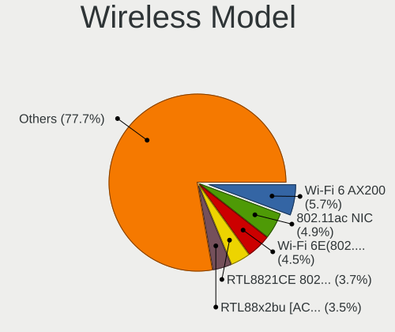

| Model                                                                | Desktops | Percent |
|----------------------------------------------------------------------|----------|---------|
| Intel Wi-Fi 6 AX200                                                  | 57       | 5.69%   |
| Realtek 802.11ac NIC                                                 | 49       | 4.89%   |
| Intel Wi-Fi 6E(802.11ax) AX210/AX1675* 2x2 [Typhoon Peak]            | 45       | 4.49%   |
| Realtek RTL8821CE 802.11ac PCIe Wireless Network Adapter             | 37       | 3.69%   |
| Realtek RTL88x2bu [AC1200 Techkey]                                   | 35       | 3.49%   |
| Ralink MT7601U Wireless Adapter                                      | 34       | 3.39%   |
| Realtek RTL8188EUS 802.11n Wireless Network Adapter                  | 22       | 2.2%    |
| Intel Wireless 7260                                                  | 19       | 1.9%    |
| Intel 700 Series Chipset CNVi WiFi                                   | 19       | 1.9%    |
| MediaTek MT7922 802.11ax PCI Express Wireless Network Adapter        | 18       | 1.8%    |
| Intel Wi-Fi 5(802.11ac) Wireless-AC 9x6x [Thunder Peak]              | 18       | 1.8%    |
| Intel Dual Band Wireless-AC 3168NGW [Stone Peak]                     | 17       | 1.7%    |
| TP-Link TL-WN823N v2/v3 [Realtek RTL8192EU]                          | 16       | 1.6%    |
| Realtek RTL8192EU 802.11b/g/n WLAN Adapter                           | 15       | 1.5%    |
| Broadcom BCM4360 802.11ac Dual Band Wireless Network Adapter         | 14       | 1.4%    |
| Realtek RTL8852CE PCIe 802.11ax Wireless Network Controller          | 13       | 1.3%    |
| Realtek RTL8188FTV 802.11b/g/n 1T1R 2.4G WLAN Adapter                | 13       | 1.3%    |
| Ralink RT5370 Wireless Adapter                                       | 13       | 1.3%    |
| Intel Wireless 7265                                                  | 13       | 1.3%    |
| TP-Link 802.11ac NIC                                                 | 12       | 1.2%    |
| Qualcomm Atheros AR9485 Wireless Network Adapter                     | 12       | 1.2%    |
| Realtek RTL8192EE PCIe Wireless Network Adapter                      | 11       | 1.1%    |
| Qualcomm Atheros AR9271 802.11n                                      | 11       | 1.1%    |
| MediaTek MT7921 802.11ax PCIe Wireless Network Adapter [Filogic 330] | 11       | 1.1%    |
| Intel Wireless 3165                                                  | 10       | 1%      |
| Qualcomm Atheros AR9462 Wireless Network Adapter                     | 9        | 0.9%    |
| MediaTek MT7921K (RZ608) Wi-Fi 6E 80MHz                              | 9        | 0.9%    |
| Intel Cannon Lake PCH CNVi WiFi                                      | 9        | 0.9%    |
| TP-Link AC600 wireless Realtek RTL8811AU [Archer T2U Nano]           | 8        | 0.8%    |
| Realtek RTL8822BE 802.11a/b/g/n/ac WiFi adapter                      | 8        | 0.8%    |
| Realtek RTL8188EE Wireless Network Adapter                           | 8        | 0.8%    |
| Realtek 802.11ac WLAN Adapter                                        | 8        | 0.8%    |
| Ralink RT5390 Wireless 802.11n 1T/1R PCIe                            | 8        | 0.8%    |
| Qualcomm Atheros QCA9565 / AR9565 Wireless Network Adapter           | 8        | 0.8%    |
| TP-Link TL-WN722N v2/v3 [Realtek RTL8188EUS]                         | 7        | 0.7%    |
| TP-Link Archer T2U PLUS [RTL8821AU]                                  | 7        | 0.7%    |
| TP-Link 802.11ac WLAN Adapter                                        | 7        | 0.7%    |
| Realtek RTL8852BE PCIe 802.11ax Wireless Network Controller          | 7        | 0.7%    |
| Ralink RT2870/RT3070 Wireless Adapter                                | 7        | 0.7%    |
| Microsoft Xbox Wireless Adapter for Windows                          | 7        | 0.7%    |

Ethernet Vendor
---------------

Ethernet vendors

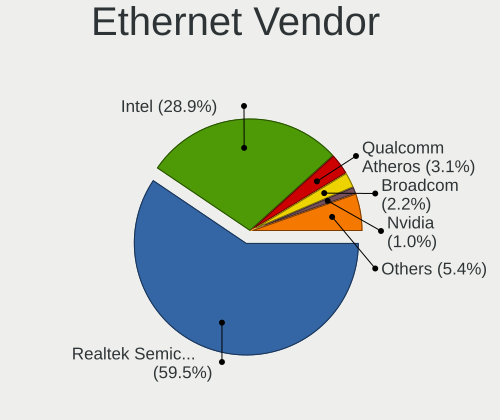

| Vendor                            | Desktops | Percent |
|-----------------------------------|----------|---------|
| Realtek Semiconductor             | 1088     | 59.45%  |
| Intel                             | 528      | 28.85%  |
| Qualcomm Atheros                  | 56       | 3.06%   |
| Broadcom                          | 41       | 2.24%   |
| Nvidia                            | 18       | 0.98%   |
| Samsung Electronics               | 14       | 0.77%   |
| Qualcomm Technologies             | 10       | 0.55%   |
| MediaTek                          | 9        | 0.49%   |
| Aquantia                          | 9        | 0.49%   |
| Xiaomi                            | 8        | 0.44%   |
| Marvell Technology Group          | 8        | 0.44%   |
| ASIX Electronics                  | 8        | 0.44%   |
| DisplayLink                       | 5        | 0.27%   |
| Broadcom Limited                  | 4        | 0.22%   |
| VIA Technologies                  | 3        | 0.16%   |
| D-Link System                     | 3        | 0.16%   |
| OPPO Electronics                  | 2        | 0.11%   |
| Motorola PCS                      | 2        | 0.11%   |
| Google                            | 2        | 0.11%   |
| ZTE WCDMA Technologies MSM        | 1        | 0.05%   |
| TP-Link                           | 1        | 0.05%   |
| T & A Mobile Phones               | 1        | 0.05%   |
| Sundance Technology Inc / IC Plus | 1        | 0.05%   |
| Silicon Integrated Systems [SiS]  | 1        | 0.05%   |
| Qualcomm                          | 1        | 0.05%   |
| Panini                            | 1        | 0.05%   |
| NetXen Incorporated               | 1        | 0.05%   |
| Mellanox Technologies             | 1        | 0.05%   |
| Lenovo                            | 1        | 0.05%   |
| ICS Advent                        | 1        | 0.05%   |
| Huawei Technologies               | 1        | 0.05%   |

Ethernet Model
--------------

Ethernet models

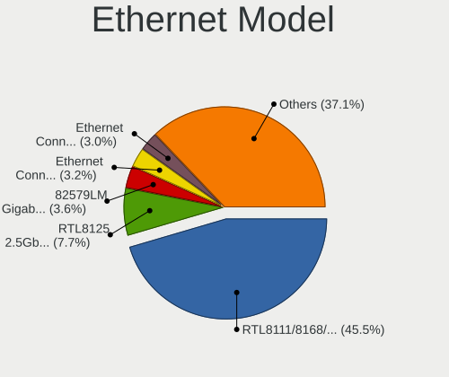

| Model                                                                  | Desktops | Percent |
|------------------------------------------------------------------------|----------|---------|
| Realtek RTL8111/8168/8211/8411 PCI Express Gigabit Ethernet Controller | 865      | 45.45%  |
| Realtek RTL8125 2.5GbE Controller                                      | 146      | 7.67%   |
| Intel 82579LM Gigabit Network Connection (Lewisville)                  | 68       | 3.57%   |
| Intel Ethernet Connection I217-LM                                      | 60       | 3.15%   |
| Intel Ethernet Connection (2) I219-V                                   | 58       | 3.05%   |
| Intel Ethernet Controller I225-V                                       | 49       | 2.57%   |
| Realtek RTL810xE PCI Express Fast Ethernet controller                  | 47       | 2.47%   |
| Intel I211 Gigabit Network Connection                                  | 44       | 2.31%   |
| Intel 82579V Gigabit Network Connection                                | 36       | 1.89%   |
| Intel Ethernet Connection (2) I219-LM                                  | 32       | 1.68%   |
| Intel Ethernet Controller I226-V                                       | 26       | 1.37%   |
| Intel Ethernet Connection I217-V                                       | 26       | 1.37%   |
| Realtek RTL8153 Gigabit Ethernet Adapter                               | 20       | 1.05%   |
| Intel Ethernet Connection (2) I218-V                                   | 15       | 0.79%   |
| Intel 82567LM-3 Gigabit Network Connection                             | 15       | 0.79%   |
| Qualcomm Atheros AR8151 v2.0 Gigabit Ethernet                          | 13       | 0.68%   |
| Intel Ethernet Connection (7) I219-V                                   | 13       | 0.68%   |
| Samsung Galaxy series, misc. (tethering mode)                          | 12       | 0.63%   |
| Intel 82574L Gigabit Network Connection                                | 12       | 0.63%   |
| Qualcomm Atheros Killer E220x Gigabit Ethernet Controller              | 11       | 0.58%   |
| Realtek RTL8852BE PCIe 802.11ax Wireless Network Controller            | 10       | 0.53%   |
| Qualcomm WCN785x Wi-Fi 7(802.11be) 320MHz 2x2 [FastConnect 7800]       | 10       | 0.53%   |
| Nvidia MCP61 Ethernet                                                  | 10       | 0.53%   |
| Intel Ethernet Connection (7) I219-LM                                  | 10       | 0.53%   |
| Realtek RTL8169 PCI Gigabit Ethernet Controller                        | 9        | 0.47%   |
| Broadcom NetXtreme BCM5761 Gigabit Ethernet PCIe                       | 9        | 0.47%   |
| Xiaomi Mi/Redmi series (RNDIS)                                         | 7        | 0.37%   |
| Realtek RTL8126 5GbE Controller                                        | 7        | 0.37%   |
| Qualcomm Atheros AR8161 Gigabit Ethernet                               | 7        | 0.37%   |
| Intel Ethernet Connection (5) I219-LM                                  | 7        | 0.37%   |
| Broadcom NetLink BCM57788 Gigabit Ethernet PCIe                        | 7        | 0.37%   |
| ASIX AX88179 Gigabit Ethernet                                          | 7        | 0.37%   |
| Realtek RTL8111/8168/8411 PCI Express Gigabit Ethernet Controller      | 6        | 0.32%   |
| Qualcomm Atheros Killer E2400 Gigabit Ethernet Controller              | 6        | 0.32%   |
| Marvell Group 88E8056 PCI-E Gigabit Ethernet Controller                | 6        | 0.32%   |
| Intel I210 Gigabit Network Connection                                  | 6        | 0.32%   |
| Intel Ethernet Connection (14) I219-V                                  | 6        | 0.32%   |
| Intel Alder Lake-S PCH CNVi WiFi                                       | 6        | 0.32%   |
| Intel 82566DM-2 Gigabit Network Connection                             | 6        | 0.32%   |
| Broadcom NetXtreme BCM5764M Gigabit Ethernet PCIe                      | 6        | 0.32%   |

Net Controller Kind
-------------------

Ethernet, WiFi or modem

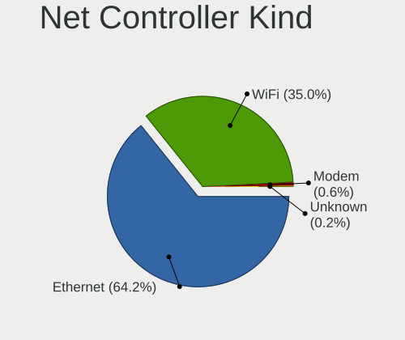

| Kind     | Desktops | Percent |
|----------|----------|---------|
| Ethernet | 1680     | 64.24%  |
| WiFi     | 914      | 34.95%  |
| Modem    | 15       | 0.57%   |
| Unknown  | 6        | 0.23%   |

Used Controller
---------------

Currently used network controller

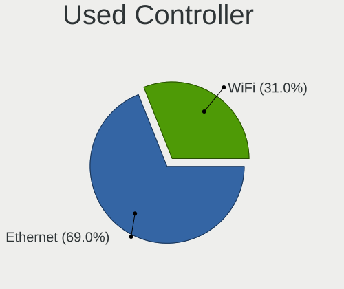

| Kind     | Desktops | Percent |
|----------|----------|---------|
| Ethernet | 1234     | 68.98%  |
| WiFi     | 555      | 31.02%  |

NICs
----

Total network controllers on board

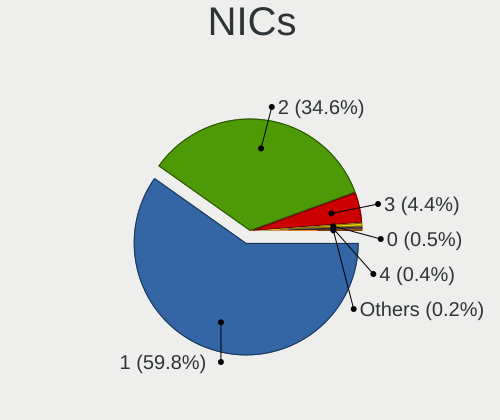

| Total | Desktops | Percent |
|-------|----------|---------|
| 1     | 1018     | 59.81%  |
| 2     | 589      | 34.61%  |
| 3     | 75       | 4.41%   |
| 0     | 9        | 0.53%   |
| 4     | 7        | 0.41%   |
| 5     | 4        | 0.24%   |

IPv6
----

IPv6 vs IPv4

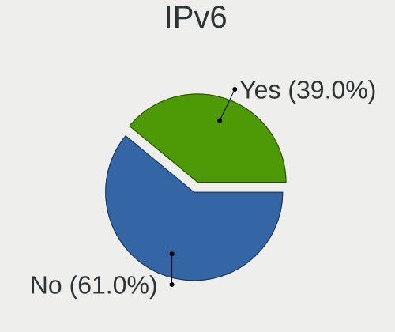

| Used | Desktops | Percent |
|------|----------|---------|
| No   | 1047     | 60.98%  |
| Yes  | 670      | 39.02%  |

Bluetooth
---------

Bluetooth Vendor
----------------

Controller vendors

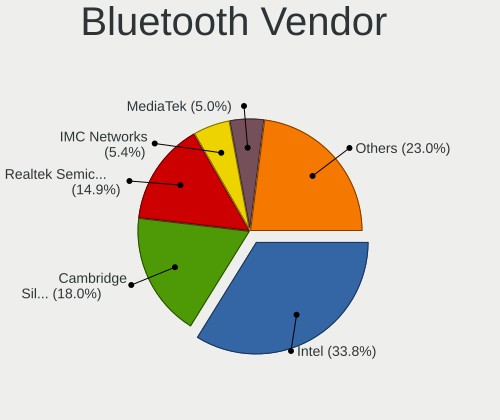

| Vendor                          | Desktops | Percent |
|---------------------------------|----------|---------|
| Intel                           | 246      | 33.84%  |
| Cambridge Silicon Radio         | 131      | 18.02%  |
| Realtek Semiconductor           | 108      | 14.86%  |
| IMC Networks                    | 39       | 5.36%   |
| MediaTek                        | 36       | 4.95%   |
| ASUSTek Computer                | 34       | 4.68%   |
| Qualcomm Atheros Communications | 26       | 3.58%   |
| Foxconn / Hon Hai               | 23       | 3.16%   |
| Broadcom                        | 20       | 2.75%   |
| TP-Link                         | 19       | 2.61%   |
| Actions                         | 8        | 1.1%    |
| Unknown                         | 7        | 0.96%   |
| Realtek                         | 5        | 0.69%   |
| Integrated System Solution      | 4        | 0.55%   |
| Apple                           | 4        | 0.55%   |
| Hewlett-Packard                 | 3        | 0.41%   |
| Micro Star International        | 2        | 0.28%   |
| Mercucys                        | 2        | 0.28%   |
| Edimax Technology               | 2        | 0.28%   |
| Dynex                           | 2        | 0.28%   |
| Roper                           | 1        | 0.14%   |
| Qcom                            | 1        | 0.14%   |
| Lite-On Technology              | 1        | 0.14%   |
| Kensington                      | 1        | 0.14%   |
| Belkin Components               | 1        | 0.14%   |
| AICSemi                         | 1        | 0.14%   |

Bluetooth Model
---------------

Controller models

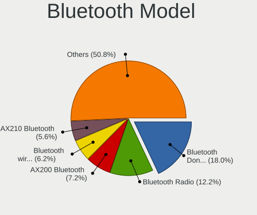

| Model                                                 | Desktops | Percent |
|-------------------------------------------------------|----------|---------|
| Cambridge Silicon Radio Bluetooth Dongle (HCI mode)   | 131      | 18.02%  |
| Realtek Bluetooth Radio                               | 89       | 12.24%  |
| Intel AX200 Bluetooth                                 | 52       | 7.15%   |
| Intel Bluetooth wireless interface                    | 45       | 6.19%   |
| Intel AX210 Bluetooth                                 | 41       | 5.64%   |
| MediaTek Wireless_Device                              | 36       | 4.95%   |
| Intel Bluetooth Device                                | 29       | 3.99%   |
| Intel AX201 Bluetooth                                 | 28       | 3.85%   |
| TP-Link TP-T@- UB500 Adapter                          | 19       | 2.61%   |
| IMC Networks Wireless_Device                          | 19       | 2.61%   |
| Intel Wireless-AC 9260 Bluetooth Adapter              | 17       | 2.34%   |
| IMC Networks Bluetooth Radio                          | 17       | 2.34%   |
| Intel Wireless-AC 3168 Bluetooth                      | 16       | 2.2%    |
| Foxconn / Hon Hai Bluetooth Device                    | 14       | 1.93%   |
| ASUS ASUS USB-BT500                                   | 13       | 1.79%   |
| Intel Bluetooth 9460/9560 Jefferson Peak (JfP)        | 12       | 1.65%   |
| Qualcomm Atheros  Bluetooth Device                    | 10       | 1.38%   |
| Actions general adapter                               | 8        | 1.1%    |
| Qualcomm Atheros AR3011 Bluetooth                     | 7        | 0.96%   |
| Unknown                                               | 7        | 0.96%   |
| Realtek  Bluetooth 4.2 Adapter                        | 6        | 0.83%   |
| Broadcom BCM20702A0 Bluetooth 4.0                     | 6        | 0.83%   |
| ASUS Broadcom BCM20702A0 Bluetooth                    | 6        | 0.83%   |
| Realtek Bluetooth 5.4 Radio                           | 5        | 0.69%   |
| Realtek Bluetooth Radio                               | 5        | 0.69%   |
| Intel Centrino Bluetooth Wireless Transceiver         | 5        | 0.69%   |
| Foxconn / Hon Hai Wireless_Device                     | 5        | 0.69%   |
| Realtek Bluetooth 5.3 Radio                           | 4        | 0.55%   |
| ASUS Bluetooth Radio                                  | 4        | 0.55%   |
| Qualcomm Atheros Bluetooth USB Host Controller        | 3        | 0.41%   |
| Qualcomm Atheros AR9462 Bluetooth                     | 3        | 0.41%   |
| ASUS Broadcom BCM20702 Single-Chip Bluetooth 4.0 + LE | 3        | 0.41%   |
| ASUS Bluetooth Device                                 | 3        | 0.41%   |
| ASUS BCM20702A0                                       | 3        | 0.41%   |
| Qualcomm Atheros QCA61x4 Bluetooth 4.0                | 2        | 0.28%   |
| Mercucys Mercusys MA530 Adapter                       | 2        | 0.28%   |
| Integrated System Solution KY-BT100 Bluetooth Adapter | 2        | 0.28%   |
| Integrated System Solution Bluetooth Device           | 2        | 0.28%   |
| IMC Networks Bluetooth                                | 2        | 0.28%   |
| HP Bluetooth Adapter                                  | 2        | 0.28%   |

Sound
-----

Sound Vendor
------------

Sound card vendors

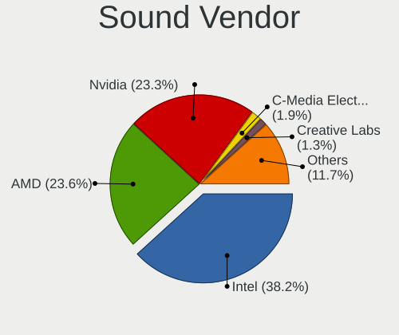

| Vendor                                       | Desktops | Percent |
|----------------------------------------------|----------|---------|
| Intel                                        | 1133     | 38.24%  |
| AMD                                          | 699      | 23.59%  |
| Nvidia                                       | 689      | 23.25%  |
| C-Media Electronics                          | 56       | 1.89%   |
| Creative Labs                                | 40       | 1.35%   |
| ASUSTek Computer                             | 21       | 0.71%   |
| Zoran Co. Personal Media Division (Nogatech) | 20       | 0.67%   |
| Micro Star International                     | 20       | 0.67%   |
| JMTek                                        | 17       | 0.57%   |
| Texas Instruments                            | 15       | 0.51%   |
| Razer USA                                    | 12       | 0.4%    |
| Plantronics                                  | 11       | 0.37%   |
| Jieli Technology                             | 11       | 0.37%   |
| Logitech                                     | 10       | 0.34%   |
| SteelSeries ApS                              | 9        | 0.3%    |
| GN Netcom                                    | 9        | 0.3%    |
| Creative Technology                          | 9        | 0.3%    |
| Kingston Technology                          | 8        | 0.27%   |
| Unknown                                      | 8        | 0.27%   |
| Thesycon Systemsoftware & Consulting         | 7        | 0.24%   |
| Tenx Technology                              | 7        | 0.24%   |
| KTMicro                                      | 7        | 0.24%   |
| Focusrite-Novation                           | 7        | 0.24%   |
| Hewlett-Packard                              | 6        | 0.2%    |
| Generalplus Technology                       | 6        | 0.2%    |
| Corsair                                      | 6        | 0.2%    |
| VIA Technologies                             | 5        | 0.17%   |
| Trust                                        | 5        | 0.17%   |
| Dell                                         | 5        | 0.17%   |
| Walmart                                      | 4        | 0.13%   |
| RODE Microphones                             | 4        | 0.13%   |
| Realtek Semiconductor                        | 4        | 0.13%   |
| BEHRINGER International                      | 4        | 0.13%   |
| Sony                                         | 3        | 0.1%    |
| Medeli Electronics                           | 3        | 0.1%    |
| Lautsprecher Teufel                          | 3        | 0.1%    |
| Harman International                         | 3        | 0.1%    |
| DSEA A/S                                     | 3        | 0.1%    |
| Blue Microphones                             | 3        | 0.1%    |
| Asahi Kasei Microsystems                     | 3        | 0.1%    |

Sound Model
-----------

Sound card models

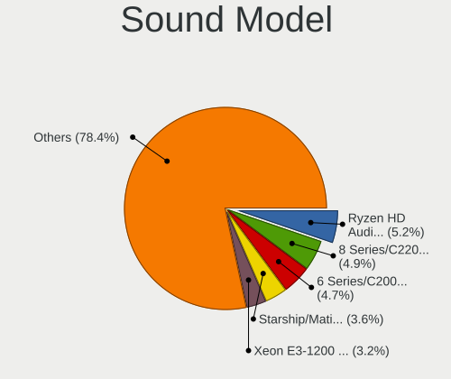

| Model                                                                             | Desktops | Percent |
|-----------------------------------------------------------------------------------|----------|---------|
| AMD Ryzen HD Audio Controller                                                     | 183      | 5.23%   |
| Intel 8 Series/C220 Series Chipset High Definition Audio Controller               | 173      | 4.95%   |
| Intel 6 Series/C200 Series Chipset Family High Definition Audio Controller        | 163      | 4.66%   |
| AMD Starship/Matisse HD Audio Controller                                          | 126      | 3.6%    |
| Intel Xeon E3-1200 v3/4th Gen Core Processor HD Audio Controller                  | 112      | 3.2%    |
| Intel 100 Series/C230 Series Chipset Family HD Audio Controller                   | 104      | 2.97%   |
| Intel 7 Series/C216 Chipset Family High Definition Audio Controller               | 95       | 2.72%   |
| AMD SBx00 Azalia (Intel HDA)                                                      | 95       | 2.72%   |
| Intel 200 Series PCH HD Audio                                                     | 84       | 2.4%    |
| AMD Ellesmere HDMI Audio [Radeon RX 470/480 / 570/580/590]                        | 81       | 2.32%   |
| AMD Renoir/Cezanne HDMI/DP Audio Controller                                       | 74       | 2.12%   |
| Nvidia GK208 HDMI/DP Audio Controller                                             | 71       | 2.03%   |
| AMD Radeon High Definition Audio Controller                                       | 68       | 1.94%   |
| AMD Navi 21/23 HDMI/DP Audio Controller                                           | 51       | 1.46%   |
| AMD FCH Azalia Controller                                                         | 48       | 1.37%   |
| Nvidia GP107GL High Definition Audio Controller                                   | 47       | 1.34%   |
| Intel NM10/ICH7 Family High Definition Audio Controller                           | 47       | 1.34%   |
| Intel Cannon Lake PCH cAVS                                                        | 47       | 1.34%   |
| Intel 82801JI (ICH10 Family) HD Audio Controller                                  | 44       | 1.26%   |
| AMD Oland/Hainan/Cape Verde/Pitcairn HDMI Audio [Radeon HD 7000 Series]           | 43       | 1.23%   |
| Intel Raptor Lake High Definition Audio Controller                                | 42       | 1.2%    |
| AMD Family 17h (Models 00h-0fh) HD Audio Controller                               | 42       | 1.2%    |
| Intel 5 Series/3400 Series Chipset High Definition Audio                          | 41       | 1.17%   |
| Intel Alder Lake-S HD Audio Controller                                            | 38       | 1.09%   |
| Nvidia GF119 HDMI Audio Controller                                                | 36       | 1.03%   |
| Nvidia GA104 High Definition Audio Controller                                     | 35       | 1%      |
| Nvidia TU116 High Definition Audio Controller                                     | 33       | 0.94%   |
| Nvidia High Definition Audio Controller                                           | 33       | 0.94%   |
| Nvidia GA106 High Definition Audio Controller                                     | 32       | 0.92%   |
| Nvidia GM107 High Definition Audio Controller [GeForce 940MX]                     | 31       | 0.89%   |
| Intel 9 Series Chipset Family HD Audio Controller                                 | 31       | 0.89%   |
| AMD Caicos HDMI Audio [Radeon HD 6450 / 7450/8450/8490 OEM / R5 230/235/235X OEM] | 30       | 0.86%   |
| AMD Raven/Raven2/Fenghuang HDMI/DP Audio Controller                               | 28       | 0.8%    |
| Nvidia GP106 High Definition Audio Controller                                     | 26       | 0.74%   |
| Nvidia GF108 High Definition Audio Controller                                     | 26       | 0.74%   |
| AMD Navi 31 HDMI/DP Audio                                                         | 26       | 0.74%   |
| AMD Baffin HDMI/DP Audio [Radeon RX 550 640SP / RX 560/560X]                      | 26       | 0.74%   |
| Intel Alder Lake-N PCH High Definition Audio Controller                           | 25       | 0.71%   |
| Intel 82801I (ICH9 Family) HD Audio Controller                                    | 25       | 0.71%   |
| Nvidia TU106 High Definition Audio Controller                                     | 23       | 0.66%   |

Memory
------

Memory Vendor
-------------

Memory module vendors

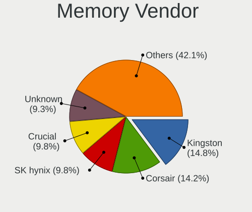

| Vendor              | Desktops | Percent |
|---------------------|----------|---------|
| Kingston            | 27       | 14.75%  |
| Corsair             | 26       | 14.21%  |
| SK hynix            | 18       | 9.84%   |
| Crucial             | 18       | 9.84%   |
| Unknown             | 17       | 9.29%   |
| Samsung Electronics | 17       | 9.29%   |
| G.Skill             | 14       | 7.65%   |
| Micron Technology   | 8        | 4.37%   |
| A-DATA Technology   | 8        | 4.37%   |
| Team                | 4        | 2.19%   |
| Unknown (0x0E9D)    | 2        | 1.09%   |
| Unifosa             | 2        | 1.09%   |
| Transcend           | 2        | 1.09%   |
| Smart               | 2        | 1.09%   |
| Elpida              | 2        | 1.09%   |
| Unknown             | 2        | 1.09%   |
| Unknown (C289)      | 1        | 0.55%   |
| Unknown (B608)      | 1        | 0.55%   |
| Unknown (ABCD)      | 1        | 0.55%   |
| Unknown (0x8551)    | 1        | 0.55%   |
| Unknown (0x0B45)    | 1        | 0.55%   |
| Unknown (0x0B38)    | 1        | 0.55%   |
| Unknown (0B85)      | 1        | 0.55%   |
| Ramaxel Technology  | 1        | 0.55%   |
| Patriot             | 1        | 0.55%   |
| Neo Forza           | 1        | 0.55%   |
| Nanya Technology    | 1        | 0.55%   |
| Multilaser          | 1        | 0.55%   |
| Juhor               | 1        | 0.55%   |
| Avant               | 1        | 0.55%   |

Memory Model
------------

Memory module models

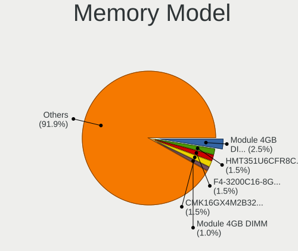

| Model                                                              | Desktops | Percent |
|--------------------------------------------------------------------|----------|---------|
| Unknown RAM Module 4GB DIMM DDR3 1333MT/s                          | 5        | 2.54%   |
| SK hynix RAM HMT351U6CFR8C-PB 4GB DIMM DDR3 1800MT/s               | 3        | 1.52%   |
| G.Skill RAM F4-3200C16-8GIS 8GB DIMM DDR4 3600MT/s                 | 3        | 1.52%   |
| Corsair RAM CMK16GX4M2B3200C16 8GB DIMM DDR4 3600MT/s              | 3        | 1.52%   |
| Unknown RAM Module 4GB DIMM                                        | 2        | 1.02%   |
| Unknown RAM Module 2GB DIMM DDR2 667MT/s                           | 2        | 1.02%   |
| Unknown (0x0E9D) RAM KINSOTIN16GB2666MHZ 16GB SODIMM DDR4 2667MT/s | 2        | 1.02%   |
| Team RAM TEAMGROUP-UD4-3600 16GB DIMM DDR4 3600MT/s                | 2        | 1.02%   |
| SK hynix RAM HMT451U6BFR8C-PB 4GB DIMM DDR3 1600MT/s               | 2        | 1.02%   |
| SK hynix RAM HMT451U6BFR8A-PB 4GB DIMM DDR3 1600MT/s               | 2        | 1.02%   |
| SK hynix RAM HMA42GR7MFR4N-TF 16GB DIMM DDR4 3200MT/s              | 2        | 1.02%   |
| Samsung RAM M378B5173QH0-CK0 4GB DIMM DDR3                         | 2        | 1.02%   |
| Samsung RAM M378B5173EB0-YK0 4GB DIMM DDR3 1600MT/s                | 2        | 1.02%   |
| Micron RAM 8JTF51264AZ-1G6E1 4GB DIMM DDR3 1600MT/s                | 2        | 1.02%   |
| Kingston RAM KF560C30-16 16GB DIMM DDR5 6000MT/s                   | 2        | 1.02%   |
| Kingston RAM KF3200C16D4/16GX 16GB DIMM DDR4 3733MT/s              | 2        | 1.02%   |
| Kingston RAM 99U5403-159.A01LF 8GB DIMM DDR3 1600MT/s              | 2        | 1.02%   |
| G.Skill RAM F4-3200C16-16GVK 16GB DIMM DDR4 3600MT/s               | 2        | 1.02%   |
| G.Skill RAM F4-3200C16-16GTZR 16GB DIMM DDR4 3600MT/s              | 2        | 1.02%   |
| Crucial RAM CT102464BF160B.M16 8GB SODIMM DDR3 1600MT/s            | 2        | 1.02%   |
| Corsair RAM CMK32GX4M2E3200C16 16GB DIMM DDR4 3600MT/s             | 2        | 1.02%   |
| Unknown                                                            | 2        | 1.02%   |
| Unknown RAM Module 8GB DIMM 1066MT/s                               | 1        | 0.51%   |
| Unknown RAM Module 4GB DIMM 400MT/s                                | 1        | 0.51%   |
| Unknown RAM Module 4GB DIMM 1066MT/s                               | 1        | 0.51%   |
| Unknown RAM Module 2GB DIMM DDR2 800MT/s                           | 1        | 0.51%   |
| Unknown RAM Module 2GB DIMM DDR 800MT/s                            | 1        | 0.51%   |
| Unknown RAM Module 2GB DIMM 800MT/s                                | 1        | 0.51%   |
| Unknown RAM Module 2GB DIMM 667MT/s                                | 1        | 0.51%   |
| Unknown RAM Module 2GB DIMM 533MT/s                                | 1        | 0.51%   |
| Unknown RAM Module 2GB DIMM                                        | 1        | 0.51%   |
| Unknown RAM Module 1GB DIMM 667MT/s                                | 1        | 0.51%   |
| Unknown (C289) RAM Module 16GB DIMM DDR4 2133MT/s                  | 1        | 0.51%   |
| Unknown (B608) RAM Module 4GB DIMM DDR4 2400MT/s                   | 1        | 0.51%   |
| Unknown (ABCD) RAM 123456789012345678 2GB DIMM LPDDR4 2133MT/s     | 1        | 0.51%   |
| Unknown (0x8551) RAM Module 2GB FB-DIMM DDR2 800MT/s               | 1        | 0.51%   |
| Unknown (0x0B45) RAM WPBH32D408SWM-16G 16GB SODIMM DDR4 3200MT/s   | 1        | 0.51%   |
| Unknown (0x0B38) RAM GMA16G4SCL196P-26 16GB SODIMM DDR4 2667MT/s   | 1        | 0.51%   |
| Unknown (0B85) RAM Module 4GB DIMM DDR3 1333MT/s                   | 1        | 0.51%   |
| Unifosa RAM Module 4GB DIMM DDR3 1333MT/s                          | 1        | 0.51%   |

Memory Kind
-----------

Memory module kinds

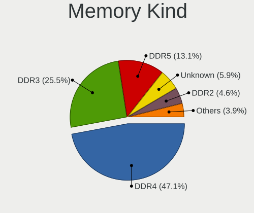

| Kind    | Desktops | Percent |
|---------|----------|---------|
| DDR4    | 72       | 47.06%  |
| DDR3    | 39       | 25.49%  |
| DDR5    | 20       | 13.07%  |
| Unknown | 9        | 5.88%   |
| DDR2    | 7        | 4.58%   |
| SDRAM   | 4        | 2.61%   |
| LPDDR4  | 1        | 0.65%   |
| DDR     | 1        | 0.65%   |

Memory Form Factor
------------------

Physical design of the memory module

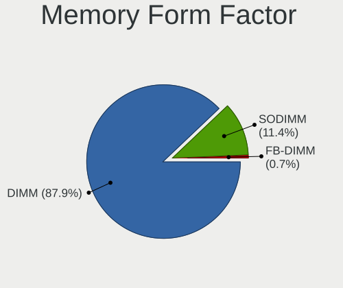

| Name    | Desktops | Percent |
|---------|----------|---------|
| DIMM    | 131      | 87.92%  |
| SODIMM  | 17       | 11.41%  |
| FB-DIMM | 1        | 0.67%   |

Memory Size
-----------

Memory module size

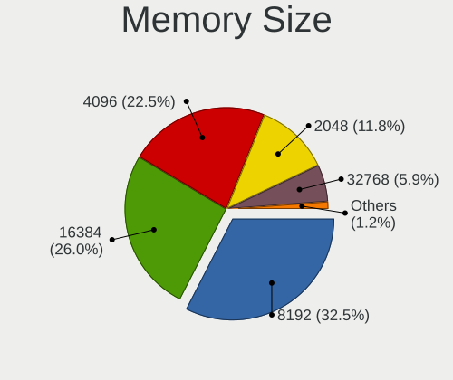

| Size  | Desktops | Percent |
|-------|----------|---------|
| 8192  | 55       | 32.54%  |
| 16384 | 44       | 26.04%  |
| 4096  | 38       | 22.49%  |
| 2048  | 20       | 11.83%  |
| 32768 | 10       | 5.92%   |
| 49152 | 1        | 0.59%   |
| 1024  | 1        | 0.59%   |

Memory Speed
------------

Memory module speed

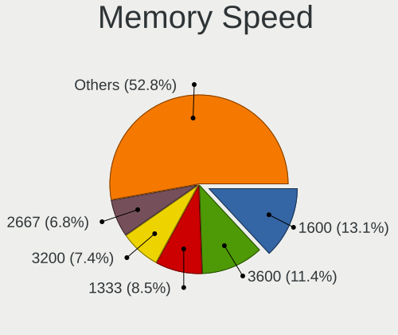

| Speed   | Desktops | Percent |
|---------|----------|---------|
| 1600    | 23       | 13.07%  |
| 3600    | 20       | 11.36%  |
| 1333    | 15       | 8.52%   |
| 3200    | 13       | 7.39%   |
| 2667    | 12       | 6.82%   |
| 2400    | 10       | 5.68%   |
| 6000    | 6        | 3.41%   |
| 3733    | 6        | 3.41%   |
| 667     | 6        | 3.41%   |
| 2133    | 5        | 2.84%   |
| 1800    | 5        | 2.84%   |
| 800     | 5        | 2.84%   |
| 5600    | 4        | 2.27%   |
| 4800    | 4        | 2.27%   |
| 1866    | 4        | 2.27%   |
| 3000    | 3        | 1.7%    |
| 1066    | 3        | 1.7%    |
| 6400    | 2        | 1.14%   |
| 5200    | 2        | 1.14%   |
| 3466    | 2        | 1.14%   |
| 3400    | 2        | 1.14%   |
| 2933    | 2        | 1.14%   |
| 2666    | 2        | 1.14%   |
| 1867    | 2        | 1.14%   |
| 1648    | 2        | 1.14%   |
| Unknown | 2        | 1.14%   |
| 49926   | 1        | 0.57%   |
| 7000    | 1        | 0.57%   |
| 5400    | 1        | 0.57%   |
| 3866    | 1        | 0.57%   |
| 3800    | 1        | 0.57%   |
| 3467    | 1        | 0.57%   |
| 3334    | 1        | 0.57%   |
| 2800    | 1        | 0.57%   |
| 2734    | 1        | 0.57%   |
| 2200    | 1        | 0.57%   |
| 2048    | 1        | 0.57%   |
| 1067    | 1        | 0.57%   |
| 533     | 1        | 0.57%   |
| 400     | 1        | 0.57%   |

Printers & scanners
-------------------

Printer Vendor
--------------

Printer device vendors

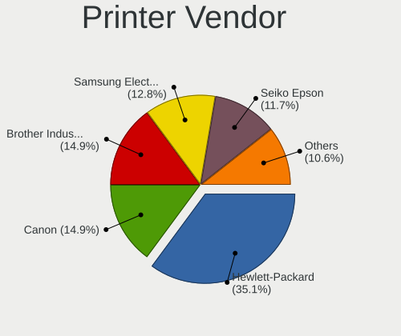

| Vendor                   | Desktops | Percent |
|--------------------------|----------|---------|
| Hewlett-Packard          | 33       | 35.11%  |
| Canon                    | 14       | 14.89%  |
| Brother Industries       | 14       | 14.89%  |
| Samsung Electronics      | 12       | 12.77%  |
| Seiko Epson              | 11       | 11.7%   |
| Dymo-CoStar              | 3        | 3.19%   |
| Lexmark International    | 2        | 2.13%   |
| Kyocera                  | 2        | 2.13%   |
| Zhuhai Poskey Technology | 1        | 1.06%   |
| Ricoh                    | 1        | 1.06%   |
| Prolific Technology      | 1        | 1.06%   |

Printer Model
-------------

Printer device models

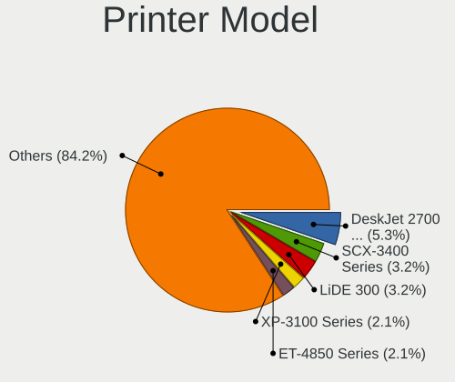

| Model                                | Desktops | Percent |
|--------------------------------------|----------|---------|
| HP DeskJet 2700 series               | 5        | 5.26%   |
| Samsung SCX-3400 Series              | 3        | 3.16%   |
| Canon LiDE 300                       | 3        | 3.16%   |
| Seiko Epson XP-3100 Series           | 2        | 2.11%   |
| Seiko Epson ET-4850 Series           | 2        | 2.11%   |
| HP LaserJet M109-M112                | 2        | 2.11%   |
| HP HP LaserJet M101-M106             | 2        | 2.11%   |
| HP Color LaserJet CP1215             | 2        | 2.11%   |
| Dymo-CoStar LabelWriter 450          | 2        | 2.11%   |
| Canon G3010 series                   | 2        | 2.11%   |
| Zhuhai Poskey 4B-2054L               | 1        | 1.05%   |
| Seiko Epson XP-2100 Series           | 1        | 1.05%   |
| Seiko Epson L6270 Series             | 1        | 1.05%   |
| Seiko Epson L5190 Series             | 1        | 1.05%   |
| Seiko Epson L355 Series              | 1        | 1.05%   |
| Seiko Epson L3110 Series             | 1        | 1.05%   |
| Seiko Epson ET-8550 Series           | 1        | 1.05%   |
| Seiko Epson ET-2710 Series           | 1        | 1.05%   |
| Samsung ML-551x 651x Series          | 1        | 1.05%   |
| Samsung ML-216x Series Laser Printer | 1        | 1.05%   |
| Samsung ML-2010P Mono Laser Printer  | 1        | 1.05%   |
| Samsung ML-1865                      | 1        | 1.05%   |
| Samsung M267x 287x Series            | 1        | 1.05%   |
| Samsung M2020 Series                 | 1        | 1.05%   |
| Samsung CLX-3180 Series              | 1        | 1.05%   |
| Samsung CLX-3170 Series              | 1        | 1.05%   |
| Samsung C48x Series                  | 1        | 1.05%   |
| Ricoh Printing Support               | 1        | 1.05%   |
| Prolific PL2305 Parallel Port        | 1        | 1.05%   |
| Lexmark International MS710          | 1        | 1.05%   |
| Lexmark International CX310dn        | 1        | 1.05%   |
| Kyocera FS-1320MFP                   | 1        | 1.05%   |
| Kyocera ECOSYS P2235dn               | 1        | 1.05%   |
| HP Smart Tank 710-720 series         | 1        | 1.05%   |
| HP Smart Tank 580-590 series         | 1        | 1.05%   |
| HP Smart Tank 510 series             | 1        | 1.05%   |
| HP PSC-1315/PSC-1317                 | 1        | 1.05%   |
| HP OfficeJet 4650 series             | 1        | 1.05%   |
| HP LaserJet Professional P1102w      | 1        | 1.05%   |
| HP LaserJet Professional P 1102w     | 1        | 1.05%   |

Scanner Vendor
--------------

Scanner device vendors

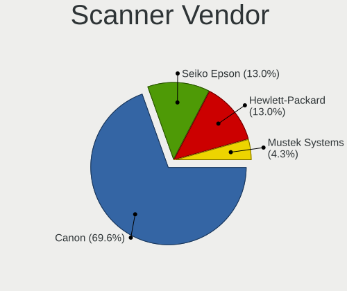

| Vendor          | Desktops | Percent |
|-----------------|----------|---------|
| Canon           | 16       | 69.57%  |
| Seiko Epson     | 3        | 13.04%  |
| Hewlett-Packard | 3        | 13.04%  |
| Mustek Systems  | 1        | 4.35%   |

Scanner Model
-------------

Scanner device models

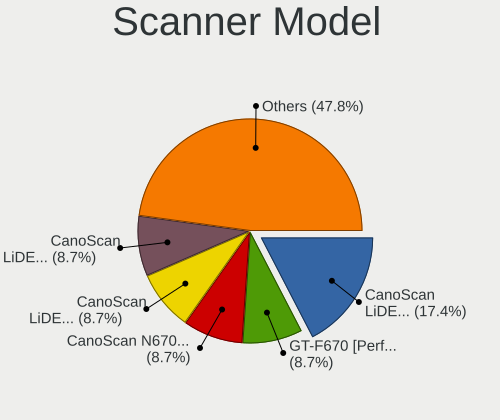

| Model                                       | Desktops | Percent |
|---------------------------------------------|----------|---------|
| Canon CanoScan LiDE 210                     | 4        | 17.39%  |
| Seiko Epson GT-F670 [Perfection V200 Photo] | 2        | 8.7%    |
| Canon CanoScan N670U/N676U/LiDE 20          | 2        | 8.7%    |
| Canon CanoScan LiDE 220                     | 2        | 8.7%    |
| Canon CanoScan LiDE 200                     | 2        | 8.7%    |
| Canon CanoScan LiDE 120                     | 2        | 8.7%    |
| Seiko Epson GT-X750 [Perfection 4490 Photo] | 1        | 4.35%   |
| Mustek Systems ScanExpress 1200 UB          | 1        | 4.35%   |
| HP Scanjet G2710                            | 1        | 4.35%   |
| HP ScanJet 5300c/5370c                      | 1        | 4.35%   |
| HP ScanJet 4370                             | 1        | 4.35%   |
| Canon CanoScan LiDE 90                      | 1        | 4.35%   |
| Canon CanoScan LiDE 110                     | 1        | 4.35%   |
| Canon CanoScan 8800F                        | 1        | 4.35%   |
| Canon CanoScan 4400F                        | 1        | 4.35%   |

Camera
------

Camera Vendor
-------------

Camera device vendors

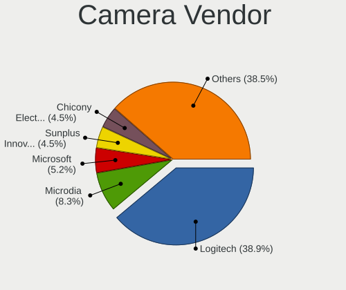

| Vendor                        | Desktops | Percent |
|-------------------------------|----------|---------|
| Logitech                      | 112      | 38.89%  |
| Microdia                      | 24       | 8.33%   |
| Microsoft                     | 15       | 5.21%   |
| Sunplus Innovation Technology | 13       | 4.51%   |
| Chicony Electronics           | 13       | 4.51%   |
| Realtek Semiconductor         | 8        | 2.78%   |
| Generalplus Technology        | 7        | 2.43%   |
| Razer USA                     | 5        | 1.74%   |
| Z-Star Microelectronics       | 4        | 1.39%   |
| SunplusIT                     | 4        | 1.39%   |
| MacroSilicon                  | 4        | 1.39%   |
| Jieli Technology              | 4        | 1.39%   |
| GEMBIRD                       | 4        | 1.39%   |
| eMeet                         | 4        | 1.39%   |
| ARC International             | 4        | 1.39%   |
| webcam                        | 3        | 1.04%   |
| Insta360                      | 3        | 1.04%   |
| Huawei Technologies           | 3        | 1.04%   |
| Apple                         | 3        | 1.04%   |
| Anker PowerConf C200          | 3        | 1.04%   |
| USB CAMERA                    | 2        | 0.69%   |
| Trust                         | 2        | 0.69%   |
| Sonix Technology              | 2        | 0.69%   |
| Samsung Electronics           | 2        | 0.69%   |
| Remo Tech                     | 2        | 0.69%   |
| Lenovo                        | 2        | 0.69%   |
| KYE Systems (Mouse Systems)   | 2        | 0.69%   |
| Hewlett-Packard               | 2        | 0.69%   |
| Guillemot                     | 2        | 0.69%   |
| Genesys Logic                 | 2        | 0.69%   |
| Cubeternet                    | 2        | 0.69%   |
| AVerMedia Technologies        | 2        | 0.69%   |
| Asuscom Network               | 2        | 0.69%   |
| A4Tech                        | 2        | 0.69%   |
| WCM_USB                       | 1        | 0.35%   |
| Teslong Camera                | 1        | 0.35%   |
| Tatung                        | 1        | 0.35%   |
| Sweex                         | 1        | 0.35%   |
| Suyin                         | 1        | 0.35%   |
| Sunplus IT                    | 1        | 0.35%   |

Camera Model
------------

Camera device models

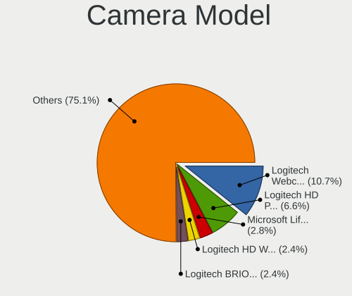

| Model                                     | Desktops | Percent |
|-------------------------------------------|----------|---------|
| Logitech Webcam C270                      | 31       | 10.73%  |
| Logitech HD Pro Webcam C920               | 19       | 6.57%   |
| Microsoft LifeCam HD-3000                 | 8        | 2.77%   |
| Logitech HD Webcam C525                   | 7        | 2.42%   |
| Logitech BRIO Ultra HD Webcam             | 7        | 2.42%   |
| Microdia USB 2.0 Camera                   | 6        | 2.08%   |
| Logitech Logitech Webcam C925e            | 6        | 2.08%   |
| Logitech C922 Pro Stream Webcam           | 6        | 2.08%   |
| Microdia Webcam Vitade AF                 | 5        | 1.73%   |
| Chicony HP High Definition 1MP Webcam     | 5        | 1.73%   |
| Sunplus Integrated Camera                 | 4        | 1.38%   |
| Realtek HP 1.0MP High Definition Webcam   | 4        | 1.38%   |
| Logitech Webcam C310                      | 4        | 1.38%   |
| Jieli USB PHY 2.0                         | 4        | 1.38%   |
| Generalplus GENERAL WEBCAM                | 4        | 1.38%   |
| eMeet HD Webcam C960                      | 4        | 1.38%   |
| ARC International Camera                  | 4        | 1.38%   |
| webcam webcam                             | 3        | 1.04%   |
| Realtek FULL HD 1080P Webcam              | 3        | 1.04%   |
| Razer USA Gaming Webcam [Kiyo]            | 3        | 1.04%   |
| Microsoft LifeCam VX-2000                 | 3        | 1.04%   |
| Microdia CyberTrack H7                    | 3        | 1.04%   |
| MacroSilicon USB Video                    | 3        | 1.04%   |
| Logitech Webcam C930e                     | 3        | 1.04%   |
| Logitech StreamCam                        | 3        | 1.04%   |
| Logitech Logi Webcam C920e                | 3        | 1.04%   |
| Logitech HD Webcam C615                   | 3        | 1.04%   |
| Logitech CrystalCam                       | 3        | 1.04%   |
| Logitech C920 PRO HD Webcam               | 3        | 1.04%   |
| Insta360 Link                             | 3        | 1.04%   |
| Huawei HiCamera                           | 3        | 1.04%   |
| Apple iPhone 5/5C/5S/6/SE/7/8/X           | 3        | 1.04%   |
| Anker PowerConf C200 Anker PowerConf C200 | 3        | 1.04%   |
| USB CAMERA USB CAMERA                     | 2        | 0.69%   |
| SunplusIT USB 2.0 Camera                  | 2        | 0.69%   |
| Sunplus USB 2.0 Camera                    | 2        | 0.69%   |
| Sunplus HK 5M WebCAM                      | 2        | 0.69%   |
| Sunplus Aukey-PC-LM1E Camera              | 2        | 0.69%   |
| Samsung Galaxy series, misc. (MTP mode)   | 2        | 0.69%   |
| Razer USA Razer Kiyo Pro                  | 2        | 0.69%   |

Security
--------

Fingerprint Vendor
------------------

Fingerprint sensor vendors

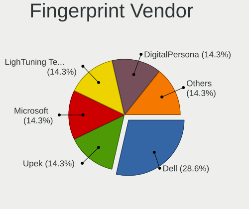

| Vendor                | Desktops | Percent |
|-----------------------|----------|---------|
| Dell                  | 2        | 28.57%  |
| Upek                  | 1        | 14.29%  |
| Microsoft             | 1        | 14.29%  |
| LighTuning Technology | 1        | 14.29%  |
| DigitalPersona        | 1        | 14.29%  |
| AuthenTec             | 1        | 14.29%  |

Fingerprint Model
-----------------

Fingerprint sensor models

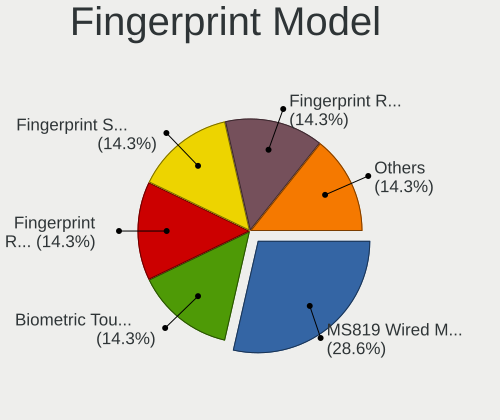

| Model                                                  | Desktops | Percent |
|--------------------------------------------------------|----------|---------|
| Dell MS819 Wired Mouse With Fingerprint Reader         | 2        | 28.57%  |
| Upek Biometric Touchchip/Touchstrip Fingerprint Sensor | 1        | 14.29%  |
| Microsoft Fingerprint Reader                           | 1        | 14.29%  |
| LighTuning Fingerprint Sensor                          | 1        | 14.29%  |
| DigitalPersona Fingerprint Reader                      | 1        | 14.29%  |
| AuthenTec AES2810                                      | 1        | 14.29%  |

Chipcard Vendor
---------------

Chipcard module vendors

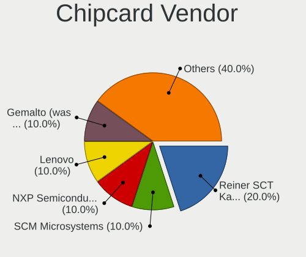

| Vendor                    | Desktops | Percent |
|---------------------------|----------|---------|
| Reiner SCT Kartensysteme  | 2        | 20%     |
| SCM Microsystems          | 1        | 10%     |
| NXP Semiconductors        | 1        | 10%     |
| Lenovo                    | 1        | 10%     |
| Gemalto (was Gemplus)     | 1        | 10%     |
| Bit4id                    | 1        | 10%     |
| Alcor Micro               | 1        | 10%     |
| Aladdin Knowledge Systems | 1        | 10%     |
| Advanced Card Systems     | 1        | 10%     |

Chipcard Model
--------------

Chipcard module models

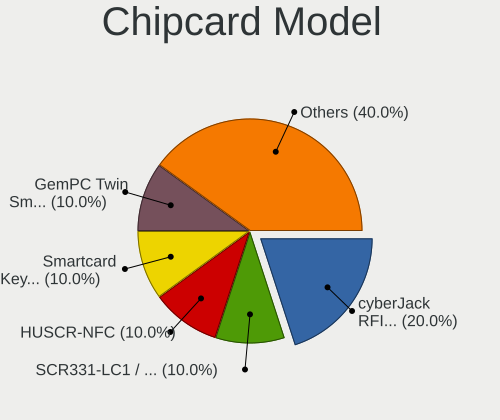

| Model                                                                      | Desktops | Percent |
|----------------------------------------------------------------------------|----------|---------|
| Reiner SCT Kartensysteme cyberJack RFID basis contactless smartcard reader | 2        | 20%     |
| SCM Microsystems SCR331-LC1 / SCR3310 SmartCard Reader                     | 1        | 10%     |
| NXP Semiconductors HUSCR-NFC                                               | 1        | 10%     |
| Lenovo Smartcard Keyboard                                                  | 1        | 10%     |
| Gemalto (was Gemplus) GemPC Twin SmartCard Reader                          | 1        | 10%     |
| Bit4id miniLector EVO                                                      | 1        | 10%     |
| Alcor Micro AU9540 Smartcard Reader                                        | 1        | 10%     |
| Aladdin Knowledge Systems Token JC                                         | 1        | 10%     |
| Advanced Card Systems ACR39U                                               | 1        | 10%     |

Unsupported
-----------

Unsupported Devices
-------------------

Total unsupported devices on board

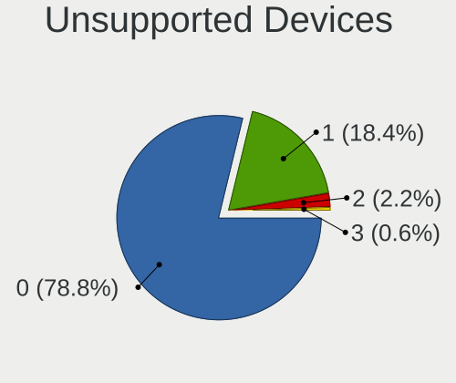

| Total | Desktops | Percent |
|-------|----------|---------|
| 0     | 1367     | 78.79%  |
| 1     | 320      | 18.44%  |
| 2     | 38       | 2.19%   |
| 3     | 10       | 0.58%   |

Unsupported Device Types
------------------------

Types of unsupported devices

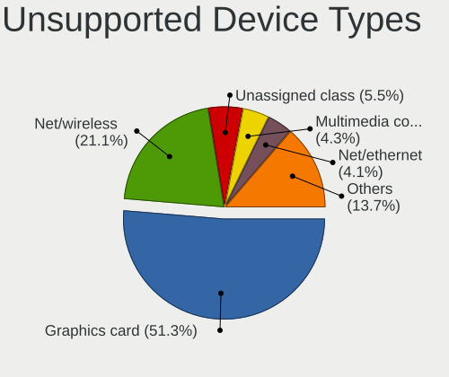

| Type                     | Desktops | Percent |
|--------------------------|----------|---------|
| Graphics card            | 214      | 51.32%  |
| Net/wireless             | 88       | 21.1%   |
| Unassigned class         | 23       | 5.52%   |
| Multimedia controller    | 18       | 4.32%   |
| Net/ethernet             | 17       | 4.08%   |
| Sound                    | 9        | 2.16%   |
| Communication controller | 8        | 1.92%   |
| Network                  | 7        | 1.68%   |
| Storage/raid             | 5        | 1.2%    |
| Chipcard                 | 5        | 1.2%    |
| Card reader              | 5        | 1.2%    |
| Fingerprint reader       | 4        | 0.96%   |
| Bluetooth                | 4        | 0.96%   |
| Storage/ide              | 3        | 0.72%   |
| Dvb card                 | 2        | 0.48%   |
| Video                    | 1        | 0.24%   |
| Unclassified device      | 1        | 0.24%   |
| Tv card                  | 1        | 0.24%   |
| Firewire controller      | 1        | 0.24%   |
| Camera                   | 1        | 0.24%   |

