Zorin 17 - Tested Hardware & Statistics (Desktops)
--------------------------------------------------

A project to collect tested hardware configurations for Zorin 17.

Anyone can contribute to this report by the [hw-probe](https://github.com/linuxhw/hw-probe) tool:

    sudo -E hw-probe -all -upload

Please contribute! Especially if your hardware is rare.

Contents
--------

* [ Test Cases ](#test-cases)

* [ System ](#system)
  - [ Kernel                   ](#kernel)
  - [ Kernel Family            ](#kernel-family)
  - [ Kernel Major Ver.        ](#kernel-major-ver)
  - [ Arch                     ](#arch)
  - [ DE                       ](#de)
  - [ Display Server           ](#display-server)
  - [ Display Manager          ](#display-manager)
  - [ OS Lang                  ](#os-lang)
  - [ Boot Mode                ](#boot-mode)
  - [ Filesystem               ](#filesystem)
  - [ Part. scheme             ](#part-scheme)
  - [ Dual Boot with Linux/BSD ](#dual-boot-with-linuxbsd)
  - [ Dual Boot (Win)          ](#dual-boot-win)

* [ Board ](#board)
  - [ Vendor                   ](#vendor)
  - [ Model                    ](#model)
  - [ Model Family             ](#model-family)
  - [ MFG Year                 ](#mfg-year)
  - [ Form Factor              ](#form-factor)
  - [ Secure Boot              ](#secure-boot)
  - [ Coreboot                 ](#coreboot)
  - [ RAM Size                 ](#ram-size)
  - [ RAM Used                 ](#ram-used)
  - [ Total Drives             ](#total-drives)
  - [ Has CD-ROM               ](#has-cd-rom)
  - [ Has Ethernet             ](#has-ethernet)
  - [ Has WiFi                 ](#has-wifi)
  - [ Has Bluetooth            ](#has-bluetooth)

* [ Location ](#location)
  - [ Country                  ](#country)
  - [ City                     ](#city)

* [ Drives ](#drives)
  - [ Drive Vendor             ](#drive-vendor)
  - [ Drive Model              ](#drive-model)
  - [ HDD Vendor               ](#hdd-vendor)
  - [ SSD Vendor               ](#ssd-vendor)
  - [ Drive Kind               ](#drive-kind)
  - [ Drive Connector          ](#drive-connector)
  - [ Drive Size               ](#drive-size)
  - [ Space Total              ](#space-total)
  - [ Space Used               ](#space-used)
  - [ Malfunc. Drives          ](#malfunc-drives)
  - [ Malfunc. Drive Vendor    ](#malfunc-drive-vendor)
  - [ Malfunc. HDD Vendor      ](#malfunc-hdd-vendor)
  - [ Malfunc. Drive Kind      ](#malfunc-drive-kind)
  - [ Failed Drives            ](#failed-drives)
  - [ Failed Drive Vendor      ](#failed-drive-vendor)
  - [ Drive Status             ](#drive-status)

* [ Storage controller ](#storage-controller)
  - [ Storage Vendor           ](#storage-vendor)
  - [ Storage Model            ](#storage-model)
  - [ Storage Kind             ](#storage-kind)

* [ Processor ](#processor)
  - [ CPU Vendor               ](#cpu-vendor)
  - [ CPU Model                ](#cpu-model)
  - [ CPU Model Family         ](#cpu-model-family)
  - [ CPU Cores                ](#cpu-cores)
  - [ CPU Sockets              ](#cpu-sockets)
  - [ CPU Threads              ](#cpu-threads)
  - [ CPU Op-Modes             ](#cpu-op-modes)
  - [ CPU Microcode            ](#cpu-microcode)
  - [ CPU Microarch            ](#cpu-microarch)

* [ Graphics ](#graphics)
  - [ GPU Vendor               ](#gpu-vendor)
  - [ GPU Model                ](#gpu-model)
  - [ GPU Combo                ](#gpu-combo)
  - [ GPU Driver               ](#gpu-driver)
  - [ GPU Memory               ](#gpu-memory)

* [ Monitor ](#monitor)
  - [ Monitor Vendor           ](#monitor-vendor)
  - [ Monitor Model            ](#monitor-model)
  - [ Monitor Resolution       ](#monitor-resolution)
  - [ Monitor Diagonal         ](#monitor-diagonal)
  - [ Monitor Width            ](#monitor-width)
  - [ Aspect Ratio             ](#aspect-ratio)
  - [ Monitor Area             ](#monitor-area)
  - [ Pixel Density            ](#pixel-density)
  - [ Multiple Monitors        ](#multiple-monitors)

* [ Network ](#network)
  - [ Net Controller Vendor    ](#net-controller-vendor)
  - [ Net Controller Model     ](#net-controller-model)
  - [ Wireless Vendor          ](#wireless-vendor)
  - [ Wireless Model           ](#wireless-model)
  - [ Ethernet Vendor          ](#ethernet-vendor)
  - [ Ethernet Model           ](#ethernet-model)
  - [ Net Controller Kind      ](#net-controller-kind)
  - [ Used Controller          ](#used-controller)
  - [ NICs                     ](#nics)
  - [ IPv6                     ](#ipv6)

* [ Bluetooth ](#bluetooth)
  - [ Bluetooth Vendor         ](#bluetooth-vendor)
  - [ Bluetooth Model          ](#bluetooth-model)

* [ Sound ](#sound)
  - [ Sound Vendor             ](#sound-vendor)
  - [ Sound Model              ](#sound-model)

* [ Memory ](#memory)
  - [ Memory Vendor            ](#memory-vendor)
  - [ Memory Model             ](#memory-model)
  - [ Memory Kind              ](#memory-kind)
  - [ Memory Form Factor       ](#memory-form-factor)
  - [ Memory Size              ](#memory-size)
  - [ Memory Speed             ](#memory-speed)

* [ Printers & scanners ](#printers--scanners)
  - [ Printer Vendor           ](#printer-vendor)
  - [ Printer Model            ](#printer-model)
  - [ Scanner Vendor           ](#scanner-vendor)
  - [ Scanner Model            ](#scanner-model)

* [ Camera ](#camera)
  - [ Camera Vendor            ](#camera-vendor)
  - [ Camera Model             ](#camera-model)

* [ Security ](#security)
  - [ Fingerprint Vendor       ](#fingerprint-vendor)
  - [ Fingerprint Model        ](#fingerprint-model)
  - [ Chipcard Vendor          ](#chipcard-vendor)
  - [ Chipcard Model           ](#chipcard-model)

* [ Unsupported ](#unsupported)
  - [ Unsupported Devices      ](#unsupported-devices)
  - [ Unsupported Device Types ](#unsupported-device-types)

Test Cases
----------

Total: 149

| Vendor        | Model                       | Probe                                                      | Date         |
|---------------|-----------------------------|------------------------------------------------------------|--------------|
| Dell          | 0YC03K A03                  | [e6d016f309](https://linux-hardware.org/?probe=e6d016f309) | Feb 02, 2024 |
| HP            | 3647h                       | [5f1a400767](https://linux-hardware.org/?probe=5f1a400767) | Feb 02, 2024 |
| HP            | 2B34                        | [8d74dccabc](https://linux-hardware.org/?probe=8d74dccabc) | Feb 01, 2024 |
| ASUSTek       | B85M-K                      | [3058093889](https://linux-hardware.org/?probe=3058093889) | Jan 31, 2024 |
| MSI           | B450M BAZOOKA V2            | [fbf883eddb](https://linux-hardware.org/?probe=fbf883eddb) | Jan 30, 2024 |
| MSI           | PRO H610M-G DDR4            | [3f4325d337](https://linux-hardware.org/?probe=3f4325d337) | Jan 29, 2024 |
| Supermicro    | C2SBC-Q                     | [41edfdd3b7](https://linux-hardware.org/?probe=41edfdd3b7) | Jan 29, 2024 |
| Gigabyte      | EP43-S3L                    | [47a46bffc3](https://linux-hardware.org/?probe=47a46bffc3) | Jan 28, 2024 |
| Foxconn       | 946 7MA Series              | [8ef460557c](https://linux-hardware.org/?probe=8ef460557c) | Jan 28, 2024 |
| Colorful T... | C.Z77 X5 V20                | [9209512720](https://linux-hardware.org/?probe=9209512720) | Jan 28, 2024 |
| Intel         | H110                        | [2252be4fdb](https://linux-hardware.org/?probe=2252be4fdb) | Jan 28, 2024 |
| Gigabyte      | B760 AORUS ELITE AX         | [7c3e9a14d3](https://linux-hardware.org/?probe=7c3e9a14d3) | Jan 28, 2024 |
| ASUSTek       | ROG STRIX Z690-A GAMING ... | [37e7442cca](https://linux-hardware.org/?probe=37e7442cca) | Jan 27, 2024 |
| ASUSTek       | H81M-PLUS                   | [be944e9cf6](https://linux-hardware.org/?probe=be944e9cf6) | Jan 27, 2024 |
| MSI           | Z97 PC Mate                 | [f4242c1634](https://linux-hardware.org/?probe=f4242c1634) | Jan 27, 2024 |
| Intel         | 35901                       | [2851a5f3bd](https://linux-hardware.org/?probe=2851a5f3bd) | Jan 27, 2024 |
| Dell          | 088DT1 A01                  | [b8db5c0293](https://linux-hardware.org/?probe=b8db5c0293) | Jan 26, 2024 |
| Gigabyte      | H81M-S2PV                   | [e458188420](https://linux-hardware.org/?probe=e458188420) | Jan 26, 2024 |
| ASUSTek       | PRIME B450M-GAMING/BR       | [99eeba6228](https://linux-hardware.org/?probe=99eeba6228) | Jan 26, 2024 |
| ASUSTek       | PRIME B450M-GAMING/BR       | [411e5a0261](https://linux-hardware.org/?probe=411e5a0261) | Jan 26, 2024 |
| ASRock        | Z370 Extreme4               | [30a58d5556](https://linux-hardware.org/?probe=30a58d5556) | Jan 26, 2024 |
| Unknown       | Unknown                     | [5cfa0912f9](https://linux-hardware.org/?probe=5cfa0912f9) | Jan 25, 2024 |
| Gigabyte      | H81M-S2PV                   | [c609c40476](https://linux-hardware.org/?probe=c609c40476) | Jan 25, 2024 |
| Samsung       | DT1234567890 SEC_SW_REVI... | [fe98e7026e](https://linux-hardware.org/?probe=fe98e7026e) | Jan 25, 2024 |
| ASUSTek       | ROG STRIX X570-E GAMING     | [fd825e1d58](https://linux-hardware.org/?probe=fd825e1d58) | Jan 25, 2024 |
| ASUSTek       | M5A97 R2.0                  | [738c84d746](https://linux-hardware.org/?probe=738c84d746) | Jan 23, 2024 |
| Intel         | Unknown                     | [e4094a3abf](https://linux-hardware.org/?probe=e4094a3abf) | Jan 23, 2024 |
| Samsung       | DT1234567890 SEC_SW_REVI... | [8edec841f0](https://linux-hardware.org/?probe=8edec841f0) | Jan 22, 2024 |
| Intel         | D54250WYK H13922-303        | [0c54cab119](https://linux-hardware.org/?probe=0c54cab119) | Jan 22, 2024 |
| MSI           | H81M ECO                    | [6b904323a3](https://linux-hardware.org/?probe=6b904323a3) | Jan 21, 2024 |
| ASUSTek       | PRIME A320M-K               | [9ba427246b](https://linux-hardware.org/?probe=9ba427246b) | Jan 21, 2024 |
| Gigabyte      | B560M AORUS PRO             | [93137ffd8d](https://linux-hardware.org/?probe=93137ffd8d) | Jan 21, 2024 |
| MACHINIST     | X79 Z9-D7 PRO V1.0          | [066ef702e4](https://linux-hardware.org/?probe=066ef702e4) | Jan 20, 2024 |
| ASUSTek       | PRIME B550M-A               | [4dfe57b817](https://linux-hardware.org/?probe=4dfe57b817) | Jan 20, 2024 |
| ASRock        | B550 Steel Legend           | [4b1c9b076b](https://linux-hardware.org/?probe=4b1c9b076b) | Jan 20, 2024 |
| MACHINIST     | X79 Z9-D7 PRO V1.0          | [278fae59fe](https://linux-hardware.org/?probe=278fae59fe) | Jan 20, 2024 |
| ECS           | H61H2-M2                    | [ecb9ae8bed](https://linux-hardware.org/?probe=ecb9ae8bed) | Jan 20, 2024 |
| Acer          | Aspire X3990                | [7d4a040306](https://linux-hardware.org/?probe=7d4a040306) | Jan 20, 2024 |
| Dell          | 0427JK A00                  | [7f8cfea83b](https://linux-hardware.org/?probe=7f8cfea83b) | Jan 20, 2024 |
| HP            | 1850                        | [20cf1f695e](https://linux-hardware.org/?probe=20cf1f695e) | Jan 20, 2024 |
| HP            | 8055                        | [e895f1b502](https://linux-hardware.org/?probe=e895f1b502) | Jan 20, 2024 |
| Dell          | 040DDP A01                  | [521a18e93d](https://linux-hardware.org/?probe=521a18e93d) | Jan 20, 2024 |
| ASUSTek       | PRIME H410M-E               | [29a0aa8446](https://linux-hardware.org/?probe=29a0aa8446) | Jan 19, 2024 |
| MSI           | MAG B660M BAZOOKA DDR4      | [c2522bf7b3](https://linux-hardware.org/?probe=c2522bf7b3) | Jan 19, 2024 |
| Gigabyte      | X570S AERO G                | [15b13f2e8c](https://linux-hardware.org/?probe=15b13f2e8c) | Jan 18, 2024 |
| Intel         | X99                         | [44d8693e2b](https://linux-hardware.org/?probe=44d8693e2b) | Jan 18, 2024 |
| Dell          | 040DDP A01                  | [c332d169ee](https://linux-hardware.org/?probe=c332d169ee) | Jan 18, 2024 |
| Lenovo        | SHARKBAY 0B98401 PRO        | [f830d5e5f7](https://linux-hardware.org/?probe=f830d5e5f7) | Jan 18, 2024 |
| ASUSTek       | P5G41T-M LX                 | [27cfeb78bf](https://linux-hardware.org/?probe=27cfeb78bf) | Jan 17, 2024 |
| Packard Be... | IMEDIA S3810                | [616954684d](https://linux-hardware.org/?probe=616954684d) | Jan 17, 2024 |
| Dell          | 0NW6H5 A00                  | [f1ec7dddcf](https://linux-hardware.org/?probe=f1ec7dddcf) | Jan 16, 2024 |
| Gigabyte      | H110M-H-CF                  | [e5de4620f2](https://linux-hardware.org/?probe=e5de4620f2) | Jan 16, 2024 |
| ASUSTek       | PRIME B450M-K II            | [fac0f6dfa7](https://linux-hardware.org/?probe=fac0f6dfa7) | Jan 15, 2024 |
| ASUSTek       | TUF Gaming Z790-PLUS WIF... | [e7fea8c963](https://linux-hardware.org/?probe=e7fea8c963) | Jan 15, 2024 |
| MSI           | B85-G41 PC Mate             | [a31032a308](https://linux-hardware.org/?probe=a31032a308) | Jan 15, 2024 |
| MSI           | A320M PRO-VH PLUS           | [b18b5a87c1](https://linux-hardware.org/?probe=b18b5a87c1) | Jan 15, 2024 |
| Gigabyte      | Z170X-UD5-CF                | [56be497bb3](https://linux-hardware.org/?probe=56be497bb3) | Jan 15, 2024 |
| ASUSTek       | M4A87TD/USB3                | [7d6c792c7c](https://linux-hardware.org/?probe=7d6c792c7c) | Jan 14, 2024 |
| ASUSTek       | PRIME N100I-D D4            | [da3a345b8c](https://linux-hardware.org/?probe=da3a345b8c) | Jan 14, 2024 |
| ASUSTek       | ROG STRIX X570-I GAMING     | [4205f233da](https://linux-hardware.org/?probe=4205f233da) | Jan 14, 2024 |
| Acer          | Aspire GX-781               | [a12a5666f0](https://linux-hardware.org/?probe=a12a5666f0) | Jan 14, 2024 |
| MSI           | A320M PRO-VH PLUS           | [fd91d64dae](https://linux-hardware.org/?probe=fd91d64dae) | Jan 14, 2024 |
| Intel         | B75                         | [9043007717](https://linux-hardware.org/?probe=9043007717) | Jan 13, 2024 |
| HP            | 843B                        | [1a5460ffda](https://linux-hardware.org/?probe=1a5460ffda) | Jan 13, 2024 |
| HP            | 843B                        | [6f49885414](https://linux-hardware.org/?probe=6f49885414) | Jan 13, 2024 |
| MSI           | H310M PRO-M2 PLUS           | [89b8dbd2bb](https://linux-hardware.org/?probe=89b8dbd2bb) | Jan 13, 2024 |
| ASUSTek       | ROG Rampage VI EXTREME      | [d69cce27fe](https://linux-hardware.org/?probe=d69cce27fe) | Jan 13, 2024 |
| ASUSTek       | P5G41T-M LX                 | [4560285085](https://linux-hardware.org/?probe=4560285085) | Jan 13, 2024 |
| Gateway       | SX2851                      | [148edc701f](https://linux-hardware.org/?probe=148edc701f) | Jan 12, 2024 |
| ASRock        | H61M-DGS                    | [5b064e0d5c](https://linux-hardware.org/?probe=5b064e0d5c) | Jan 12, 2024 |
| Lenovo        | 1046 SDK0K17763 WIN 1801... | [04f69940d9](https://linux-hardware.org/?probe=04f69940d9) | Jan 12, 2024 |
| MSI           | H110M GAMING                | [cb524a284a](https://linux-hardware.org/?probe=cb524a284a) | Jan 12, 2024 |
| HP            | 8055                        | [f92ba3c747](https://linux-hardware.org/?probe=f92ba3c747) | Jan 12, 2024 |
| Dell          | 0WR7PY A02                  | [623fed7d14](https://linux-hardware.org/?probe=623fed7d14) | Jan 11, 2024 |
| Dell          | 0D6H9T A01                  | [afb3c3cb61](https://linux-hardware.org/?probe=afb3c3cb61) | Jan 11, 2024 |
| ASUSTek       | PRIME Z690-P WIFI           | [864517b348](https://linux-hardware.org/?probe=864517b348) | Jan 10, 2024 |
| ASUSTek       | H81I-PLUS                   | [c51ffcf76e](https://linux-hardware.org/?probe=c51ffcf76e) | Jan 10, 2024 |
| Gigabyte      | GA-78LMT-USB3 x.x           | [fda5ec8f8d](https://linux-hardware.org/?probe=fda5ec8f8d) | Jan 10, 2024 |
| Lenovo        | Win8 Pro DPK TPG            | [dc6bb19505](https://linux-hardware.org/?probe=dc6bb19505) | Jan 10, 2024 |
| ASUSTek       | ROG STRIX X570-E GAMING     | [5c2e8e03c6](https://linux-hardware.org/?probe=5c2e8e03c6) | Jan 10, 2024 |
| Lenovo        | Win8 Pro DPK TPG            | [66eedf0a68](https://linux-hardware.org/?probe=66eedf0a68) | Jan 10, 2024 |
| MSI           | H81M-E33 V2                 | [7f2af9d905](https://linux-hardware.org/?probe=7f2af9d905) | Jan 09, 2024 |
| ASUSTek       | P8P67 DELUXE                | [7d5b232fca](https://linux-hardware.org/?probe=7d5b232fca) | Jan 09, 2024 |
| ASUSTek       | ROG STRIX Z690-F GAMING ... | [f7db7dfd14](https://linux-hardware.org/?probe=f7db7dfd14) | Jan 09, 2024 |
| ASUSTek       | PRIME Z490-P                | [1ec23b4600](https://linux-hardware.org/?probe=1ec23b4600) | Jan 09, 2024 |
| Acer          | FG965M                      | [1c08b35011](https://linux-hardware.org/?probe=1c08b35011) | Jan 09, 2024 |
| Shuttle       | FZ87                        | [e06b37d26f](https://linux-hardware.org/?probe=e06b37d26f) | Jan 08, 2024 |
| HP            | 2215                        | [cea6ba103b](https://linux-hardware.org/?probe=cea6ba103b) | Jan 07, 2024 |
| ASUSTek       | M5A99FX PRO R2.0            | [2b0d355816](https://linux-hardware.org/?probe=2b0d355816) | Jan 07, 2024 |
| Google        | Zako                        | [1daf09e8e8](https://linux-hardware.org/?probe=1daf09e8e8) | Jan 06, 2024 |
| ASUSTek       | P7P55D                      | [3d2ef1558b](https://linux-hardware.org/?probe=3d2ef1558b) | Jan 06, 2024 |
| Gigabyte      | AX370-Gaming K5-CF          | [99a8eed63b](https://linux-hardware.org/?probe=99a8eed63b) | Jan 05, 2024 |
| ASUSTek       | PRIME A320M-K               | [aa3bcd9633](https://linux-hardware.org/?probe=aa3bcd9633) | Jan 05, 2024 |
| ASUSTek       | ROG STRIX B450-F GAMING     | [09e0325d35](https://linux-hardware.org/?probe=09e0325d35) | Jan 05, 2024 |
| ASUSTek       | H110M-A/M.2                 | [7b663d0c10](https://linux-hardware.org/?probe=7b663d0c10) | Jan 05, 2024 |
| Shuttle       | FG31 V30                    | [ad4f57194c](https://linux-hardware.org/?probe=ad4f57194c) | Jan 04, 2024 |
| Dell          | 0Y7WYT A00                  | [75fac6e117](https://linux-hardware.org/?probe=75fac6e117) | Jan 04, 2024 |
| Lenovo        | 32CB SDK0T76530 WIN 3556... | [085c7817a1](https://linux-hardware.org/?probe=085c7817a1) | Jan 04, 2024 |
| ASUSTek       | PRIME B450M-K II            | [798bc45ec5](https://linux-hardware.org/?probe=798bc45ec5) | Jan 03, 2024 |
| Dell          | 0D6H9T A01                  | [4d3db6e376](https://linux-hardware.org/?probe=4d3db6e376) | Jan 03, 2024 |
| Gigabyte      | P55A-UD4                    | [aef8e25f5a](https://linux-hardware.org/?probe=aef8e25f5a) | Jan 02, 2024 |
| Gigabyte      | P55A-UD4                    | [e050707d30](https://linux-hardware.org/?probe=e050707d30) | Jan 02, 2024 |
| ASUSTek       | M4A87TD/USB3                | [8c2ae70cdd](https://linux-hardware.org/?probe=8c2ae70cdd) | Jan 02, 2024 |
| Unknown       | Unknown                     | [b101d94fff](https://linux-hardware.org/?probe=b101d94fff) | Jan 01, 2024 |
| Gigabyte      | X79-UP4                     | [4c7ec5ec88](https://linux-hardware.org/?probe=4c7ec5ec88) | Jan 01, 2024 |
| ASUSTek       | PRIME A320M-K               | [685d971973](https://linux-hardware.org/?probe=685d971973) | Jan 01, 2024 |
| HP            | 1850                        | [b635f6412c](https://linux-hardware.org/?probe=b635f6412c) | Jan 01, 2024 |
| ASUSTek       | P5G41T-M LX                 | [ab74a1228a](https://linux-hardware.org/?probe=ab74a1228a) | Jan 01, 2024 |
| ASUSTek       | PRIME J4005I-C/BR           | [12a957b14b](https://linux-hardware.org/?probe=12a957b14b) | Jan 01, 2024 |
| ASUSTek       | PRIME J4005I-C/BR           | [7f4bbc6a71](https://linux-hardware.org/?probe=7f4bbc6a71) | Dec 31, 2023 |
| ASUSTek       | PRIME J4005I-C/BR           | [5b8817b3de](https://linux-hardware.org/?probe=5b8817b3de) | Dec 31, 2023 |
| MACHINIST     | X99-RS9 V2.0                | [daee98e116](https://linux-hardware.org/?probe=daee98e116) | Dec 31, 2023 |
| Gigabyte      | Z790 AORUS ELITE AX         | [5d368c5304](https://linux-hardware.org/?probe=5d368c5304) | Dec 31, 2023 |
| Gigabyte      | AX370-Gaming K5-CF          | [ba1b2a738a](https://linux-hardware.org/?probe=ba1b2a738a) | Dec 30, 2023 |
| ASUSTek       | TUF Gaming B760M-PLUS WI... | [843542e7eb](https://linux-hardware.org/?probe=843542e7eb) | Dec 30, 2023 |
| Dell          | 0M5DCD A00                  | [a85c9d93c8](https://linux-hardware.org/?probe=a85c9d93c8) | Dec 30, 2023 |
| Gigabyte      | P55A-UD4                    | [c1694a8923](https://linux-hardware.org/?probe=c1694a8923) | Dec 29, 2023 |
| Gigabyte      | H81M-S2H                    | [a3a0b274d0](https://linux-hardware.org/?probe=a3a0b274d0) | Dec 29, 2023 |
| Gigabyte      | P55A-UD4                    | [580efd7b07](https://linux-hardware.org/?probe=580efd7b07) | Dec 29, 2023 |
| ASUSTek       | M4A87TD/USB3                | [62939d6430](https://linux-hardware.org/?probe=62939d6430) | Dec 29, 2023 |
| Gigabyte      | H61M-D2H-USB3               | [018e344b4d](https://linux-hardware.org/?probe=018e344b4d) | Dec 28, 2023 |
| ASUSTek       | TUF Gaming X570-PLUS        | [ee1b832527](https://linux-hardware.org/?probe=ee1b832527) | Dec 28, 2023 |
| Dell          | 033FF6 A00                  | [f54cfd23ee](https://linux-hardware.org/?probe=f54cfd23ee) | Dec 28, 2023 |
| HP            | 8055                        | [0829ea2c26](https://linux-hardware.org/?probe=0829ea2c26) | Dec 28, 2023 |
| MSI           | MAG B650 TOMAHAWK WIFI      | [a6041ee7fc](https://linux-hardware.org/?probe=a6041ee7fc) | Dec 27, 2023 |
| Gigabyte      | H61M-D2H-USB3               | [64a4b468b6](https://linux-hardware.org/?probe=64a4b468b6) | Dec 27, 2023 |
| ASUSTek       | TUF Gaming B650M-E WIFI     | [d476db4ac3](https://linux-hardware.org/?probe=d476db4ac3) | Dec 27, 2023 |
| ASUSTek       | PRIME B450M-K II            | [45f0a0ac2d](https://linux-hardware.org/?probe=45f0a0ac2d) | Dec 27, 2023 |
| ASUSTek       | PRIME B450M-K II            | [a74968ee9c](https://linux-hardware.org/?probe=a74968ee9c) | Dec 27, 2023 |
| Dell          | 0M5DCD A00                  | [3444d7393c](https://linux-hardware.org/?probe=3444d7393c) | Dec 26, 2023 |
| ASUSTek       | M4A87TD/USB3                | [ac88b7e1f2](https://linux-hardware.org/?probe=ac88b7e1f2) | Dec 26, 2023 |
| Intel         | X99-P4 V1.0                 | [69e399de83](https://linux-hardware.org/?probe=69e399de83) | Dec 25, 2023 |
| Dell          | 084J0R A00                  | [856558c97d](https://linux-hardware.org/?probe=856558c97d) | Dec 25, 2023 |
| Lenovo        | 3098 0B98417 PRO            | [770682ab90](https://linux-hardware.org/?probe=770682ab90) | Dec 24, 2023 |
| HP            | 8299                        | [b579f81db7](https://linux-hardware.org/?probe=b579f81db7) | Dec 24, 2023 |
| ASRock        | 990FX Professional          | [34c4b1fbd4](https://linux-hardware.org/?probe=34c4b1fbd4) | Dec 24, 2023 |
| HP            | 8299                        | [9d48e9f8cb](https://linux-hardware.org/?probe=9d48e9f8cb) | Dec 24, 2023 |
| Gigabyte      | Z790 AORUS ELITE AX         | [6c327c054f](https://linux-hardware.org/?probe=6c327c054f) | Dec 24, 2023 |
| ASUSTek       | M5A99FX PRO R2.0            | [1622d9b25b](https://linux-hardware.org/?probe=1622d9b25b) | Dec 23, 2023 |
| Dell          | 0JP3NX A01                  | [706947928d](https://linux-hardware.org/?probe=706947928d) | Dec 21, 2023 |
| Gigabyte      | Z170X-UD5-CF                | [67662437e4](https://linux-hardware.org/?probe=67662437e4) | Dec 21, 2023 |
| Unknown       | Unknown                     | [ded73c0619](https://linux-hardware.org/?probe=ded73c0619) | Dec 21, 2023 |
| HP            | 8653 A                      | [0fd89faa0c](https://linux-hardware.org/?probe=0fd89faa0c) | Dec 18, 2023 |
| Dell          | 02YYK5 A01                  | [0558258245](https://linux-hardware.org/?probe=0558258245) | Dec 16, 2023 |
| ASUSTek       | ROG Maximus Z790 HERO       | [64bf6abdc6](https://linux-hardware.org/?probe=64bf6abdc6) | Dec 16, 2023 |
| Dell          | 0HHV7N A00                  | [be9d84c772](https://linux-hardware.org/?probe=be9d84c772) | Dec 13, 2023 |
| Dell          | 0HHV7N A00                  | [eb16cdaf5c](https://linux-hardware.org/?probe=eb16cdaf5c) | Dec 13, 2023 |
| Gigabyte      | 970A-DS3P                   | [396f3e6e9e](https://linux-hardware.org/?probe=396f3e6e9e) | Dec 06, 2023 |
| ASRock        | B550M PG Riptide            | [6132709ecd](https://linux-hardware.org/?probe=6132709ecd) | Dec 05, 2023 |

System
------

Kernel
------

Version of the Linux kernel

| Version          | Desktops | Percent |
|------------------|----------|---------|
| 6.2.0-39-generic | 55       | 47.01%  |
| 6.5.0-14-generic | 44       | 37.61%  |
| 6.5.0-15-generic | 16       | 13.68%  |
| 6.2.0-37-generic | 2        | 1.71%   |

Kernel Family
-------------

Linux kernel without a distro release

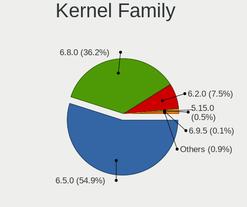

| Version | Desktops | Percent |
|---------|----------|---------|
| 6.5.0   | 60       | 51.28%  |
| 6.2.0   | 57       | 48.72%  |

Kernel Major Ver.
-----------------

Linux kernel major version

| Version | Desktops | Percent |
|---------|----------|---------|
| 6.5     | 60       | 51.28%  |
| 6.2     | 57       | 48.72%  |

Arch
----

OS architecture (x86_64, i586, etc.)

| Name   | Desktops | Percent |
|--------|----------|---------|
| x86_64 | 115      | 100%    |

DE
--

Desktop Environment

| Name  | Desktops | Percent |
|-------|----------|---------|
| GNOME | 115      | 100%    |

Display Server
--------------

X11 or Wayland

| Name    | Desktops | Percent |
|---------|----------|---------|
| Wayland | 65       | 56.03%  |
| X11     | 50       | 43.1%   |
| Unknown | 1        | 0.86%   |

Display Manager
---------------

SDDM, LightDM, etc.

| Name    | Desktops | Percent |
|---------|----------|---------|
| Unknown | 103      | 88.03%  |
| GDM3    | 14       | 11.97%  |

OS Lang
-------

Language

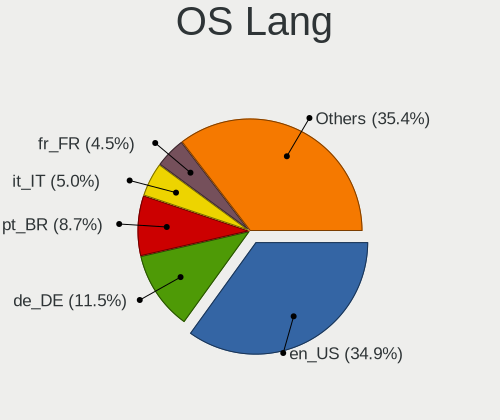

| Lang  | Desktops | Percent |
|-------|----------|---------|
| en_US | 47       | 40.87%  |
| de_DE | 13       | 11.3%   |
| pt_BR | 9        | 7.83%   |
| en_GB | 8        | 6.96%   |
| en_CA | 5        | 4.35%   |
| en_AU | 5        | 4.35%   |
| es_ES | 4        | 3.48%   |
| nl_NL | 3        | 2.61%   |
| fr_FR | 3        | 2.61%   |
| en_IN | 3        | 2.61%   |
| tr_TR | 2        | 1.74%   |
| en_NZ | 2        | 1.74%   |
| ru_RU | 1        | 0.87%   |
| ro_RO | 1        | 0.87%   |
| pt_PT | 1        | 0.87%   |
| it_IT | 1        | 0.87%   |
| es_PY | 1        | 0.87%   |
| es_PE | 1        | 0.87%   |
| es_MX | 1        | 0.87%   |
| en_ZA | 1        | 0.87%   |
| en_SG | 1        | 0.87%   |
| de_IT | 1        | 0.87%   |
| cs_CZ | 1        | 0.87%   |

Boot Mode
---------

EFI or BIOS

| Mode | Desktops | Percent |
|------|----------|---------|
| BIOS | 109      | 93.97%  |
| EFI  | 7        | 6.03%   |

Filesystem
----------

Type of filesystem

| Type    | Desktops | Percent |
|---------|----------|---------|
| Ext4    | 101      | 86.32%  |
| Tmpfs   | 7        | 5.98%   |
| Btrfs   | 4        | 3.42%   |
| Zfs     | 2        | 1.71%   |
| Overlay | 2        | 1.71%   |
| Ext2    | 1        | 0.85%   |

Part. scheme
------------

Scheme of partitioning

| Type    | Desktops | Percent |
|---------|----------|---------|
| Unknown | 103      | 88.03%  |
| GPT     | 13       | 11.11%  |
| MBR     | 1        | 0.85%   |

Dual Boot with Linux/BSD
------------------------

Hosting more than one Linux/BSD

| Dual boot | Desktops | Percent |
|-----------|----------|---------|
| No        | 113      | 98.26%  |
| Yes       | 2        | 1.74%   |

Dual Boot (Win)
---------------

Hosting Linux and Windows

| Dual boot | Desktops | Percent |
|-----------|----------|---------|
| No        | 109      | 93.16%  |
| Yes       | 8        | 6.84%   |

Board
-----

Vendor
------

Motherboard manufacturer

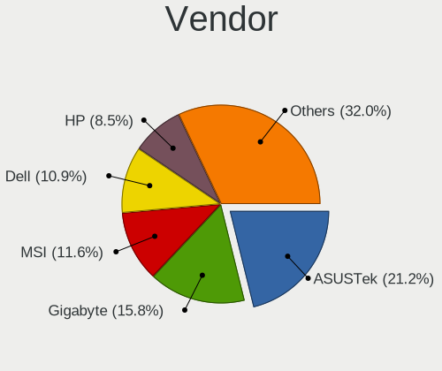

| Name                | Desktops | Percent |
|---------------------|----------|---------|
| ASUSTek Computer    | 32       | 27.83%  |
| Gigabyte Technology | 15       | 13.04%  |
| Dell                | 14       | 12.17%  |
| MSI                 | 11       | 9.57%   |
| Hewlett-Packard     | 8        | 6.96%   |
| Intel               | 7        | 6.09%   |
| Lenovo              | 5        | 4.35%   |
| ASRock              | 5        | 4.35%   |
| Acer                | 3        | 2.61%   |
| Unknown             | 3        | 2.61%   |
| Shuttle             | 2        | 1.74%   |
| MACHINIST           | 2        | 1.74%   |
| Supermicro          | 1        | 0.87%   |
| Samsung Electronics | 1        | 0.87%   |
| Packard Bell        | 1        | 0.87%   |
| Google              | 1        | 0.87%   |
| Gateway             | 1        | 0.87%   |
| Foxconn             | 1        | 0.87%   |
| ECS                 | 1        | 0.87%   |
| Colorful Technology | 1        | 0.87%   |

Model
-----

Motherboard model

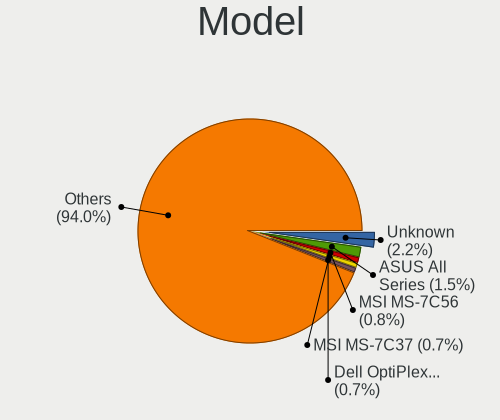

| Name                                     | Desktops | Percent |
|------------------------------------------|----------|---------|
| Unknown                                  | 4        | 3.48%   |
| ASUS All Series                          | 3        | 2.61%   |
| ASUS A0000001                            | 3        | 2.61%   |
| MSI MS-7850                              | 2        | 1.74%   |
| ASUS ROG STRIX X570-E GAMING             | 2        | 1.74%   |
| ASUS P5G41T-M LX                         | 2        | 1.74%   |
| Supermicro C2SBC-Q                       | 1        | 0.87%   |
| Shuttle SZ87R                            | 1        | 0.87%   |
| Shuttle SG31                             | 1        | 0.87%   |
| Samsung DeskTop System                   | 1        | 0.87%   |
| Packard Bell IMEDIA S3810                | 1        | 0.87%   |
| MSI MS-7D75                              | 1        | 0.87%   |
| MSI MS-7D46                              | 1        | 0.87%   |
| MSI MS-7D43                              | 1        | 0.87%   |
| MSI MS-7C08                              | 1        | 0.87%   |
| MSI MS-7B07                              | 1        | 0.87%   |
| MSI MS-7A38                              | 1        | 0.87%   |
| MSI MS-7994                              | 1        | 0.87%   |
| MSI MS-7846                              | 1        | 0.87%   |
| MSI MS-7817                              | 1        | 0.87%   |
| MACHINIST X99-RS9 V2.0                   | 1        | 0.87%   |
| MACHINIST X79 Z9-D7 PRO V1.0             | 1        | 0.87%   |
| Lenovo ThinkStation P620 30E0003EGE      | 1        | 0.87%   |
| Lenovo ThinkCentre M93 10A4A03400        | 1        | 0.87%   |
| Lenovo ThinkCentre M70t Gen 3 11T6001YUS | 1        | 0.87%   |
| Lenovo ThinkCentre Edge72 3493G6G        | 1        | 0.87%   |
| Lenovo 10AU003GMC                        | 1        | 0.87%   |
| Intel X99-P4 V1.0                        | 1        | 0.87%   |
| Intel X99                                | 1        | 0.87%   |
| Intel H110                               | 1        | 0.87%   |
| Intel D54250WYK H13922-303               | 1        | 0.87%   |
| Intel B75                                | 1        | 0.87%   |
| Intel 35901                              | 1        | 0.87%   |
| HP Pavilion Desktop 590-p0xxx            | 1        | 0.87%   |
| HP ENVY TE01-0xxx                        | 1        | 0.87%   |
| HP EliteDesk 800 G3 SFF                  | 1        | 0.87%   |
| HP EliteDesk 800 G2 DM 35W               | 1        | 0.87%   |
| HP EliteDesk 705 G1 MT                   | 1        | 0.87%   |
| HP Compaq PRO 6305 MT                    | 1        | 0.87%   |
| HP Compaq 8000 Elite CMT PC              | 1        | 0.87%   |

Model Family
------------

Motherboard model prefix

| Name                | Desktops | Percent |
|---------------------|----------|---------|
| Dell OptiPlex       | 9        | 7.83%   |
| ASUS ROG            | 8        | 6.96%   |
| ASUS PRIME          | 7        | 6.09%   |
| Unknown             | 4        | 3.48%   |
| Lenovo ThinkCentre  | 3        | 2.61%   |
| HP EliteDesk        | 3        | 2.61%   |
| Dell Inspiron       | 3        | 2.61%   |
| ASUS TUF            | 3        | 2.61%   |
| ASUS All            | 3        | 2.61%   |
| ASUS A0000001       | 3        | 2.61%   |
| Acer Aspire         | 3        | 2.61%   |
| MSI MS-7850         | 2        | 1.74%   |
| HP Compaq           | 2        | 1.74%   |
| ASUS P5G41T-M       | 2        | 1.74%   |
| Supermicro C2SBC-Q  | 1        | 0.87%   |
| Shuttle SZ87R       | 1        | 0.87%   |
| Shuttle SG31        | 1        | 0.87%   |
| Samsung DeskTop     | 1        | 0.87%   |
| Packard Bell IMEDIA | 1        | 0.87%   |
| MSI MS-7D75         | 1        | 0.87%   |
| MSI MS-7D46         | 1        | 0.87%   |
| MSI MS-7D43         | 1        | 0.87%   |
| MSI MS-7C08         | 1        | 0.87%   |
| MSI MS-7B07         | 1        | 0.87%   |
| MSI MS-7A38         | 1        | 0.87%   |
| MSI MS-7994         | 1        | 0.87%   |
| MSI MS-7846         | 1        | 0.87%   |
| MSI MS-7817         | 1        | 0.87%   |
| MACHINIST X99-RS9   | 1        | 0.87%   |
| MACHINIST X79       | 1        | 0.87%   |
| Lenovo ThinkStation | 1        | 0.87%   |
| Lenovo 10AU003GMC   | 1        | 0.87%   |
| Intel X99-P4        | 1        | 0.87%   |
| Intel X99           | 1        | 0.87%   |
| Intel H110          | 1        | 0.87%   |
| Intel D54250WYK     | 1        | 0.87%   |
| Intel B75           | 1        | 0.87%   |
| Intel 35901         | 1        | 0.87%   |
| HP Pavilion         | 1        | 0.87%   |
| HP ENVY             | 1        | 0.87%   |

MFG Year
--------

Motherboard manufacture year

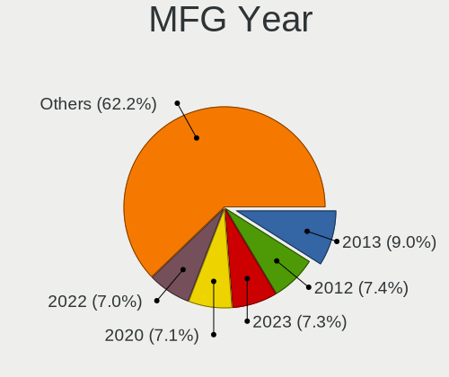

| Year    | Desktops | Percent |
|---------|----------|---------|
| 2022    | 11       | 9.57%   |
| 2013    | 11       | 9.57%   |
| 2014    | 10       | 8.7%    |
| 2020    | 8        | 6.96%   |
| 2018    | 8        | 6.96%   |
| 2017    | 8        | 6.96%   |
| 2021    | 7        | 6.09%   |
| 2012    | 7        | 6.09%   |
| 2011    | 7        | 6.09%   |
| 2023    | 6        | 5.22%   |
| 2019    | 6        | 5.22%   |
| 2010    | 6        | 5.22%   |
| 2015    | 5        | 4.35%   |
| 2009    | 5        | 4.35%   |
| 2016    | 4        | 3.48%   |
| 2008    | 3        | 2.61%   |
| 2007    | 1        | 0.87%   |
| 2006    | 1        | 0.87%   |
| Unknown | 1        | 0.87%   |

Form Factor
-----------

Physical design of the computer

| Name    | Desktops | Percent |
|---------|----------|---------|
| Desktop | 115      | 100%    |

Secure Boot
-----------

Enabled or disabled

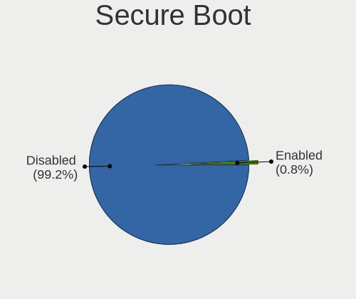

| State    | Desktops | Percent |
|----------|----------|---------|
| Disabled | 112      | 97.39%  |
| Enabled  | 3        | 2.61%   |

Coreboot
--------

Have coreboot on board

| Used | Desktops | Percent |
|------|----------|---------|
| No   | 114      | 99.13%  |
| Yes  | 1        | 0.87%   |

RAM Size
--------

Total RAM memory

| Size in GB      | Desktops | Percent |
|-----------------|----------|---------|
| 16.01-24.0      | 28       | 24.35%  |
| 32.01-64.0      | 23       | 20%     |
| 4.01-8.0        | 22       | 19.13%  |
| 8.01-16.0       | 18       | 15.65%  |
| 3.01-4.0        | 10       | 8.7%    |
| 64.01-256.0     | 9        | 7.83%   |
| 24.01-32.0      | 3        | 2.61%   |
| More than 256.0 | 1        | 0.87%   |
| 1.01-2.0        | 1        | 0.87%   |

RAM Used
--------

Used RAM memory

| Used GB   | Desktops | Percent |
|-----------|----------|---------|
| 2.01-3.0  | 50       | 41.67%  |
| 3.01-4.0  | 24       | 20%     |
| 1.01-2.0  | 24       | 20%     |
| 4.01-8.0  | 19       | 15.83%  |
| 8.01-16.0 | 2        | 1.67%   |
| 0.51-1.0  | 1        | 0.83%   |

Total Drives
------------

Number of drives on board

| Drives | Desktops | Percent |
|--------|----------|---------|
| 1      | 45       | 38.79%  |
| 2      | 34       | 29.31%  |
| 3      | 17       | 14.66%  |
| 4      | 9        | 7.76%   |
| 8      | 3        | 2.59%   |
| 6      | 3        | 2.59%   |
| 5      | 3        | 2.59%   |
| 11     | 1        | 0.86%   |
| 9      | 1        | 0.86%   |

Has CD-ROM
----------

Has CD-ROM on board

| Presented | Desktops | Percent |
|-----------|----------|---------|
| No        | 67       | 58.26%  |
| Yes       | 48       | 41.74%  |

Has Ethernet
------------

Has Ethernet on board

| Presented | Desktops | Percent |
|-----------|----------|---------|
| Yes       | 115      | 100%    |

Has WiFi
--------

Has WiFi module

| Presented | Desktops | Percent |
|-----------|----------|---------|
| Yes       | 58       | 50.43%  |
| No        | 57       | 49.57%  |

Has Bluetooth
-------------

Has Bluetooth module

| Presented | Desktops | Percent |
|-----------|----------|---------|
| No        | 66       | 57.39%  |
| Yes       | 49       | 42.61%  |

Location
--------

Country
-------

Geographic location (country)

| Country                | Desktops | Percent |
|------------------------|----------|---------|
| USA                    | 23       | 20%     |
| Germany                | 16       | 13.91%  |
| Brazil                 | 11       | 9.57%   |
| UK                     | 8        | 6.96%   |
| Netherlands            | 5        | 4.35%   |
| Canada                 | 5        | 4.35%   |
| Australia              | 5        | 4.35%   |
| India                  | 4        | 3.48%   |
| France                 | 4        | 3.48%   |
| Spain                  | 3        | 2.61%   |
| Turkey                 | 2        | 1.74%   |
| Romania                | 2        | 1.74%   |
| Peru                   | 2        | 1.74%   |
| New Zealand            | 2        | 1.74%   |
| Indonesia              | 2        | 1.74%   |
| Greece                 | 2        | 1.74%   |
| Egypt                  | 2        | 1.74%   |
| Ukraine                | 1        | 0.87%   |
| Thailand               | 1        | 0.87%   |
| Switzerland            | 1        | 0.87%   |
| Sweden                 | 1        | 0.87%   |
| South Africa           | 1        | 0.87%   |
| Singapore              | 1        | 0.87%   |
| Saudi Arabia           | 1        | 0.87%   |
| Portugal               | 1        | 0.87%   |
| Paraguay               | 1        | 0.87%   |
| Nepal                  | 1        | 0.87%   |
| Mexico                 | 1        | 0.87%   |
| Malaysia               | 1        | 0.87%   |
| Jamaica                | 1        | 0.87%   |
| Italy                  | 1        | 0.87%   |
| Iraq                   | 1        | 0.87%   |
| Czechia                | 1        | 0.87%   |
| Bosnia and Herzegovina | 1        | 0.87%   |

City
----

Geographic location (city)

| City                      | Desktops | Percent |
|---------------------------|----------|---------|
| Berlin                    | 3        | 2.61%   |
| Wakefield                 | 2        | 1.74%   |
| Sao Paulo                 | 2        | 1.74%   |
| Saint-Germain-les-Arpajon | 2        | 1.74%   |
| Mumbai                    | 2        | 1.74%   |
| Lima                      | 2        | 1.74%   |
| Calgary                   | 2        | 1.74%   |
| Atlanta                   | 2        | 1.74%   |
| Adelaide                  | 2        | 1.74%   |
| Zaragoza                  | 1        | 0.87%   |
| Würzburg                 | 1        | 0.87%   |
| Woodland                  | 1        | 0.87%   |
| Winterswijk               | 1        | 0.87%   |
| West Warwick              | 1        | 0.87%   |
| Waterloo                  | 1        | 0.87%   |
| Warren                    | 1        | 0.87%   |
| Visalia                   | 1        | 0.87%   |
| Utrecht                   | 1        | 0.87%   |
| Utica                     | 1        | 0.87%   |
| Tuban                     | 1        | 0.87%   |
| Toledo                    | 1        | 0.87%   |
| Tlalnepantla              | 1        | 0.87%   |
| Tanta                     | 1        | 0.87%   |
| Taboao da Serra           | 1        | 0.87%   |
| Sydney                    | 1        | 0.87%   |
| Surabaya                  | 1        | 0.87%   |
| Summerland                | 1        | 0.87%   |
| Stockton                  | 1        | 0.87%   |
| Stockholm                 | 1        | 0.87%   |
| Spinea                    | 1        | 0.87%   |
| Southampton               | 1        | 0.87%   |
| Smyrna                    | 1        | 0.87%   |
| Singapore                 | 1        | 0.87%   |
| Sarajevo                  | 1        | 0.87%   |
| Santiago de Compostela    | 1        | 0.87%   |
| Sangerhausen              | 1        | 0.87%   |
| Salto del Guaira          | 1        | 0.87%   |
| Royal Tunbridge Wells     | 1        | 0.87%   |
| Richville                 | 1        | 0.87%   |
| Richmond                  | 1        | 0.87%   |

Drives
------

Drive Vendor
------------

Hard drive vendors

| Vendor                       | Desktops | Drives | Percent |
|------------------------------|----------|--------|---------|
| Samsung Electronics          | 34       | 58     | 15.25%  |
| WDC                          | 30       | 39     | 13.45%  |
| Seagate                      | 28       | 37     | 12.56%  |
| Sandisk                      | 17       | 27     | 7.62%   |
| Kingston                     | 16       | 18     | 7.17%   |
| Crucial                      | 10       | 13     | 4.48%   |
| Hitachi                      | 9        | 10     | 4.04%   |
| Toshiba                      | 7        | 8      | 3.14%   |
| China                        | 7        | 8      | 3.14%   |
| PNY                          | 6        | 6      | 2.69%   |
| SK hynix                     | 5        | 6      | 2.24%   |
| Phison Electronics           | 5        | 7      | 2.24%   |
| Micron/Crucial Technology    | 5        | 7      | 2.24%   |
| Kingston Technology Company  | 4        | 5      | 1.79%   |
| Transcend                    | 3        | 3      | 1.35%   |
| Silicon Motion               | 3        | 3      | 1.35%   |
| Micron Technology            | 3        | 4      | 1.35%   |
| MAXIO Technology (Hangzhou)  | 2        | 2      | 0.9%    |
| Intenso                      | 2        | 3      | 0.9%    |
| HGST                         | 2        | 5      | 0.9%    |
| ADATA Technology             | 2        | 2      | 0.9%    |
| A-DATA Technology            | 2        | 2      | 0.9%    |
| Verbatim                     | 1        | 4      | 0.45%   |
| Unknown                      | 1        | 1      | 0.45%   |
| TEAM T25                     | 1        | 1      | 0.45%   |
| SPCC                         | 1        | 1      | 0.45%   |
| Shenzhen Longsys Electronics | 1        | 1      | 0.45%   |
| Seagate Technology           | 1        | 1      | 0.45%   |
| SABRENT                      | 1        | 1      | 0.45%   |
| Realtek Semiconductor        | 1        | 1      | 0.45%   |
| Realtek                      | 1        | 1      | 0.45%   |
| Patriot                      | 1        | 1      | 0.45%   |
| Netac                        | 1        | 2      | 0.45%   |
| MOVESPEED                    | 1        | 1      | 0.45%   |
| Lexar                        | 1        | 2      | 0.45%   |
| KIOXIA                       | 1        | 1      | 0.45%   |
| Integral                     | 1        | 1      | 0.45%   |
| HS-SSD-C100                  | 1        | 1      | 0.45%   |
| Drevo                        | 1        | 2      | 0.45%   |
| Corsair                      | 1        | 2      | 0.45%   |

Drive Model
-----------

Hard drive models

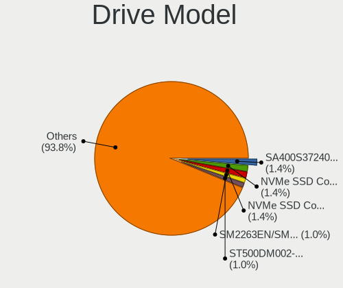

| Model                                                 | Desktops | Percent |
|-------------------------------------------------------|----------|---------|
| Kingston SA400S37120G 120GB SSD                       | 5        | 1.95%   |
| Micron/Crucial P2 NVMe PCIe SSD 1TB                   | 4        | 1.56%   |
| Silicon Motion SM2263EN/SM2263XT SSD Controller 128GB | 3        | 1.17%   |
| Samsung SSD 860 EVO 500GB                             | 3        | 1.17%   |
| Samsung SSD 850 EVO 500GB                             | 3        | 1.17%   |
| Samsung NVMe SSD Controller SM981/PM981/PM983 1TB     | 3        | 1.17%   |
| PNY CS900 120GB SSD                                   | 3        | 1.17%   |
| Kingston SA400S37240G 240GB SSD                       | 3        | 1.17%   |
| WDC WD20EARX-00PASB0 2TB                              | 2        | 0.78%   |
| WDC WD10JPVX-22JC3T0 1TB                              | 2        | 0.78%   |
| Toshiba DT01ACA100 1TB                                | 2        | 0.78%   |
| Seagate ST500DM002-1BD142 500GB                       | 2        | 0.78%   |
| Seagate ST4000DM004-2CV104 4TB                        | 2        | 0.78%   |
| Seagate ST1000DM010-2EP102 1TB                        | 2        | 0.78%   |
| Sandisk WD Blue SN550 NVMe SSD 512GB                  | 2        | 0.78%   |
| Sandisk WD Black SN850 1024GB                         | 2        | 0.78%   |
| Samsung SSD 990 PRO 2TB                               | 2        | 0.78%   |
| Samsung SSD 860 PRO 256GB                             | 2        | 0.78%   |
| Samsung SSD 860 EVO 1TB                               | 2        | 0.78%   |
| Samsung SSD 840 Series 120GB                          | 2        | 0.78%   |
| Samsung NVMe SSD Controller PM9A1/PM9A3/980PRO 2TB    | 2        | 0.78%   |
| Phison E12 NVMe Controller 1TB                        | 2        | 0.78%   |
| Kingston Company A2000 NVMe SSD 500GB                 | 2        | 0.78%   |
| Kingston SV300S37A240G 240GB SSD                      | 2        | 0.78%   |
| Crucial CT500MX500SSD1 500GB                          | 2        | 0.78%   |
| Crucial CT500BX500SSD1 500GB                          | 2        | 0.78%   |
| Crucial CT240BX500SSD1 240GB                          | 2        | 0.78%   |
| WDC WUH721414ALE6L4 14TB                              | 1        | 0.39%   |
| WDC WDS250G2B0C-00PXH0 250GB                          | 1        | 0.39%   |
| WDC WDS240G2G0A-00JH30 240GB SSD                      | 1        | 0.39%   |
| WDC WDS200T2G0A-00JH30 2TB SSD                        | 1        | 0.39%   |
| WDC WDS100T2B0A-00SM50 1TB SSD                        | 1        | 0.39%   |
| WDC WD80EDAZ-11TA3A0 8TB                              | 1        | 0.39%   |
| WDC WD6400AAKS-75A7B2 640GB                           | 1        | 0.39%   |
| WDC WD6400AAKS-00A7B2 640GB                           | 1        | 0.39%   |
| WDC WD5000AZRX-00A8LB0 500GB                          | 1        | 0.39%   |
| WDC WD5000AAKX-60U6AA0 500GB                          | 1        | 0.39%   |
| WDC WD5000AACS-00ZUB0 500GB                           | 1        | 0.39%   |
| WDC WD40EZRZ-00GXCB0 4TB                              | 1        | 0.39%   |
| WDC WD40EZRX-00SPEB0 4TB                              | 1        | 0.39%   |

HDD Vendor
----------

Hard disk drive vendors

| Vendor              | Desktops | Drives | Percent |
|---------------------|----------|--------|---------|
| WDC                 | 27       | 34     | 36.49%  |
| Seagate             | 26       | 34     | 35.14%  |
| Hitachi             | 9        | 10     | 12.16%  |
| Toshiba             | 6        | 7      | 8.11%   |
| Samsung Electronics | 2        | 3      | 2.7%    |
| HGST                | 2        | 5      | 2.7%    |
| Unknown             | 1        | 1      | 1.35%   |
| Intenso             | 1        | 2      | 1.35%   |

SSD Vendor
----------

Solid state drive vendors

| Vendor              | Desktops | Drives | Percent |
|---------------------|----------|--------|---------|
| Samsung Electronics | 23       | 36     | 24.73%  |
| Kingston            | 14       | 16     | 15.05%  |
| Crucial             | 10       | 13     | 10.75%  |
| SanDisk             | 8        | 9      | 8.6%    |
| China               | 7        | 8      | 7.53%   |
| PNY                 | 6        | 6      | 6.45%   |
| WDC                 | 3        | 4      | 3.23%   |
| Transcend           | 3        | 3      | 3.23%   |
| SK hynix            | 2        | 2      | 2.15%   |
| Micron Technology   | 2        | 3      | 2.15%   |
| A-DATA Technology   | 2        | 2      | 2.15%   |
| Verbatim            | 1        | 4      | 1.08%   |
| TEAM T25            | 1        | 1      | 1.08%   |
| SPCC                | 1        | 1      | 1.08%   |
| Seagate             | 1        | 2      | 1.08%   |
| SABRENT             | 1        | 1      | 1.08%   |
| Patriot             | 1        | 1      | 1.08%   |
| Netac               | 1        | 2      | 1.08%   |
| MOVESPEED           | 1        | 1      | 1.08%   |
| Lexar               | 1        | 2      | 1.08%   |
| Integral            | 1        | 1      | 1.08%   |
| Drevo               | 1        | 2      | 1.08%   |
| BlueRay             | 1        | 1      | 1.08%   |
| Apacer              | 1        | 1      | 1.08%   |

Drive Kind
----------

HDD or SSD

| Kind    | Desktops | Drives | Percent |
|---------|----------|--------|---------|
| SSD     | 74       | 122    | 40.88%  |
| HDD     | 57       | 96     | 31.49%  |
| NVMe    | 47       | 80     | 25.97%  |
| Unknown | 3        | 3      | 1.66%   |

Drive Connector
---------------

SATA, SAS, NVMe, etc.

| Type | Desktops | Drives | Percent |
|------|----------|--------|---------|
| SATA | 94       | 214    | 63.95%  |
| NVMe | 47       | 79     | 31.97%  |
| SAS  | 6        | 8      | 4.08%   |

Drive Size
----------

Size of hard drive

| Size in TB | Desktops | Drives | Percent |
|------------|----------|--------|---------|
| 0.01-0.5   | 72       | 116    | 53.73%  |
| 0.51-1.0   | 37       | 61     | 27.61%  |
| 1.01-2.0   | 11       | 17     | 8.21%   |
| 3.01-4.0   | 5        | 8      | 3.73%   |
| 2.01-3.0   | 4        | 6      | 2.99%   |
| 4.01-10.0  | 4        | 9      | 2.99%   |
| 10.01-20.0 | 1        | 1      | 0.75%   |

Space Total
-----------

Amount of disk space available on the file system

| Size in GB     | Desktops | Percent |
|----------------|----------|---------|
| 101-250        | 43       | 37.07%  |
| 251-500        | 17       | 14.66%  |
| 501-1000       | 16       | 13.79%  |
| 1001-2000      | 14       | 12.07%  |
| More than 3000 | 11       | 9.48%   |
| 51-100         | 8        | 6.9%    |
| 21-50          | 2        | 1.72%   |
| 2001-3000      | 2        | 1.72%   |
| 1-20           | 2        | 1.72%   |
| Unknown        | 1        | 0.86%   |

Space Used
----------

Amount of used disk space

| Used GB        | Desktops | Percent |
|----------------|----------|---------|
| 1-20           | 41       | 34.17%  |
| 21-50          | 37       | 30.83%  |
| 51-100         | 15       | 12.5%   |
| 251-500        | 11       | 9.17%   |
| 501-1000       | 6        | 5%      |
| More than 3000 | 3        | 2.5%    |
| 2001-3000      | 2        | 1.67%   |
| 101-250        | 2        | 1.67%   |
| 1001-2000      | 2        | 1.67%   |
| Unknown        | 1        | 0.83%   |

Malfunc. Drives
---------------

Drive models with a malfunction

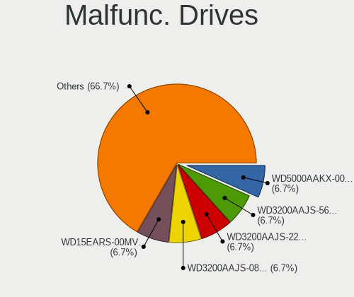

| Model                          | Desktops | Drives | Percent |
|--------------------------------|----------|--------|---------|
| WDC WD10JPVX-60JC3T0 1TB       | 1        | 1      | 33.33%  |
| Seagate ST2000LM007-1R8174 2TB | 1        | 1      | 33.33%  |
| Hitachi HDS721680PLA380 80GB   | 1        | 1      | 33.33%  |

Malfunc. Drive Vendor
---------------------

Vendors of faulty drives

| Vendor  | Desktops | Drives | Percent |
|---------|----------|--------|---------|
| WDC     | 1        | 1      | 33.33%  |
| Seagate | 1        | 1      | 33.33%  |
| Hitachi | 1        | 1      | 33.33%  |

Malfunc. HDD Vendor
-------------------

Vendors of faulty HDD drives

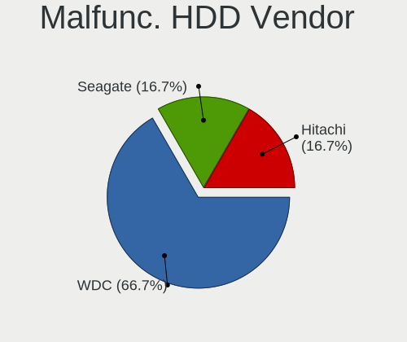

| Vendor  | Desktops | Drives | Percent |
|---------|----------|--------|---------|
| WDC     | 1        | 1      | 33.33%  |
| Seagate | 1        | 1      | 33.33%  |
| Hitachi | 1        | 1      | 33.33%  |

Malfunc. Drive Kind
-------------------

Kinds of faulty drives

| Kind | Desktops | Drives | Percent |
|------|----------|--------|---------|
| HDD  | 3        | 3      | 100%    |

Failed Drives
-------------

Failed drive models

Zero info for selected period =(

Failed Drive Vendor
-------------------

Failed drive vendors

Zero info for selected period =(

Drive Status
------------

Number of failed and malfunc. drives

| Status   | Desktops | Drives | Percent |
|----------|----------|--------|---------|
| Detected | 108      | 275    | 90%     |
| Works    | 9        | 23     | 7.5%    |
| Malfunc  | 3        | 3      | 2.5%    |

Storage controller
------------------

Storage Vendor
--------------

Storage controller vendors

| Vendor                        | Desktops | Percent |
|-------------------------------|----------|---------|
| Intel                         | 87       | 46.03%  |
| AMD                           | 26       | 13.76%  |
| Samsung Electronics           | 12       | 6.35%   |
| SanDisk                       | 10       | 5.29%   |
| ASMedia Technology            | 9        | 4.76%   |
| Phison Electronics            | 6        | 3.17%   |
| Micron/Crucial Technology     | 5        | 2.65%   |
| Kingston Technology Company   | 5        | 2.65%   |
| Marvell Technology Group      | 4        | 2.12%   |
| JMicron Technology            | 4        | 2.12%   |
| SK hynix                      | 3        | 1.59%   |
| Silicon Motion                | 3        | 1.59%   |
| Seagate Technology            | 2        | 1.06%   |
| MAXIO Technology (Hangzhou)   | 2        | 1.06%   |
| Integrated Technology Express | 2        | 1.06%   |
| ADATA Technology              | 2        | 1.06%   |
| Toshiba America Info Systems  | 1        | 0.53%   |
| Shenzhen Longsys Electronics  | 1        | 0.53%   |
| Realtek Semiconductor         | 1        | 0.53%   |
| Micron Technology             | 1        | 0.53%   |
| KIOXIA                        | 1        | 0.53%   |
| HighPoint Technologies        | 1        | 0.53%   |
| Adaptec                       | 1        | 0.53%   |

Storage Model
-------------

Storage controller models

| Model                                                                                   | Desktops | Percent |
|-----------------------------------------------------------------------------------------|----------|---------|
| Intel 8 Series/C220 Series Chipset Family 6-port SATA Controller 1 [AHCI mode]          | 16       | 7.05%   |
| AMD FCH SATA Controller [AHCI mode]                                                     | 12       | 5.29%   |
| ASMedia ASM1061/ASM1062 Serial ATA Controller                                           | 9        | 3.96%   |
| Intel Q170/Q150/B150/H170/H110/Z170/CM236 Chipset SATA Controller [AHCI Mode]           | 8        | 3.52%   |
| Intel Alder Lake-S PCH SATA Controller [AHCI Mode]                                      | 6        | 2.64%   |
| Intel 200 Series PCH SATA controller [AHCI mode]                                        | 6        | 2.64%   |
| Intel Raptor Lake SATA AHCI Controller                                                  | 5        | 2.2%    |
| Intel NM10/ICH7 Family SATA Controller [IDE mode]                                       | 5        | 2.2%    |
| Intel 82801G (ICH7 Family) IDE Controller                                               | 5        | 2.2%    |
| Intel 6 Series/C200 Series Chipset Family 6 port Desktop SATA AHCI Controller           | 5        | 2.2%    |
| Samsung NVMe SSD Controller SM981/PM981/PM983                                           | 4        | 1.76%   |
| Micron/Crucial P2 [Nick P2] / P3 / P3 Plus NVMe PCIe SSD (DRAM-less)                    | 4        | 1.76%   |
| Intel 7 Series/C210 Series Chipset Family 6-port SATA Controller [AHCI mode]            | 4        | 1.76%   |
| Intel 6 Series/C200 Series Chipset Family Desktop SATA Controller (IDE mode, ports 4-5) | 4        | 1.76%   |
| Intel 6 Series/C200 Series Chipset Family Desktop SATA Controller (IDE mode, ports 0-3) | 4        | 1.76%   |
| AMD SB7x0/SB8x0/SB9x0 SATA Controller [AHCI mode]                                       | 4        | 1.76%   |
| AMD 400 Series Chipset SATA Controller                                                  | 4        | 1.76%   |
| Silicon Motion SM2263EN/SM2263XT (DRAM-less) NVMe SSD Controllers                       | 3        | 1.32%   |
| Samsung NVMe SSD Controller S4LV008[Pascal]                                             | 3        | 1.32%   |
| Samsung NVMe SSD Controller PM9A1/PM9A3/980PRO                                          | 3        | 1.32%   |
| Intel Volume Management Device NVMe RAID Controller                                     | 3        | 1.32%   |
| Intel Cannon Lake PCH SATA AHCI Controller                                              | 3        | 1.32%   |
| Intel 5 Series/3400 Series Chipset 6 port SATA AHCI Controller                          | 3        | 1.32%   |
| AMD SB7x0/SB8x0/SB9x0 IDE Controller                                                    | 3        | 1.32%   |
| AMD FCH SATA Controller D                                                               | 3        | 1.32%   |
| AMD 500 Series Chipset SATA Controller                                                  | 3        | 1.32%   |
| SanDisk WD PC SN810 / Black SN850 NVMe SSD                                              | 2        | 0.88%   |
| Sandisk WD Black SN850X NVMe SSD                                                        | 2        | 0.88%   |
| SanDisk Ultra 3D / WD Blue SN570 NVMe SSD (DRAM-less)                                   | 2        | 0.88%   |
| SanDisk Ultra 3D / WD Blue SN550 NVMe SSD                                               | 2        | 0.88%   |
| Phison E12 NVMe Controller                                                              | 2        | 0.88%   |
| Kingston Company NV2 NVMe SSD SM2267XT (DRAM-less)                                      | 2        | 0.88%   |
| Kingston Company A2000 NVMe SSD SM2263EN                                                | 2        | 0.88%   |
| JMicron JMB368 IDE controller                                                           | 2        | 0.88%   |
| JMicron JMB363 SATA/IDE Controller                                                      | 2        | 0.88%   |
| Intel Volume Management Device NVMe RAID Controller Intel Corporation                   | 2        | 0.88%   |
| Intel SATA Controller [RAID mode]                                                       | 2        | 0.88%   |
| Intel Comet Lake SATA AHCI Controller                                                   | 2        | 0.88%   |
| Intel Celeron/Pentium Silver Processor SATA Controller                                  | 2        | 0.88%   |
| Intel C600/X79 series chipset 6-Port SATA AHCI Controller                               | 2        | 0.88%   |

Storage Kind
------------

Kind of storage controller (IDE, SATA, NVMe, SAS, ...)

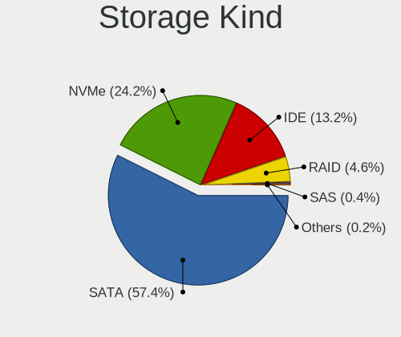

| Kind | Desktops | Percent |
|------|----------|---------|
| SATA | 95       | 54.91%  |
| NVMe | 47       | 27.17%  |
| IDE  | 21       | 12.14%  |
| RAID | 10       | 5.78%   |

Processor
---------

CPU Vendor
----------

Processor vendors

| Vendor | Desktops | Percent |
|--------|----------|---------|
| Intel  | 89       | 77.39%  |
| AMD    | 26       | 22.61%  |

CPU Model
---------

Processor models

| Model                                  | Desktops | Percent |
|----------------------------------------|----------|---------|
| Intel Core i5-4460 CPU @ 3.20GHz       | 4        | 3.48%   |
| Intel Pentium Dual CPU E2180 @ 2.00GHz | 2        | 1.74%   |
| Intel Core i7-4790K CPU @ 4.00GHz      | 2        | 1.74%   |
| Intel Core i5-7500 CPU @ 3.40GHz       | 2        | 1.74%   |
| Intel Core i5-7400 CPU @ 3.00GHz       | 2        | 1.74%   |
| Intel Core i5-2400 CPU @ 3.10GHz       | 2        | 1.74%   |
| Intel Core i5 CPU 750 @ 2.67GHz        | 2        | 1.74%   |
| Intel Core i3 CPU 530 @ 2.93GHz        | 2        | 1.74%   |
| AMD Ryzen 7 5700G with Radeon Graphics | 2        | 1.74%   |
| AMD Ryzen 5 5600G with Radeon Graphics | 2        | 1.74%   |
| AMD FX-6300 Six-Core Processor         | 2        | 1.74%   |
| Intel Xeon CPU E5-2699 v3 @ 2.30GHz    | 1        | 0.87%   |
| Intel Xeon CPU E5-2678 v3 @ 2.50GHz    | 1        | 0.87%   |
| Intel Xeon CPU E5-2650 v2 @ 2.60GHz    | 1        | 0.87%   |
| Intel Xeon CPU E5-2630 v4 @ 2.20GHz    | 1        | 0.87%   |
| Intel Xeon CPU E5-1650 v3 @ 3.50GHz    | 1        | 0.87%   |
| Intel Pentium CPU G840 @ 2.80GHz       | 1        | 0.87%   |
| Intel Pentium CPU G4560T @ 2.90GHz     | 1        | 0.87%   |
| Intel Pentium CPU G3258 @ 3.20GHz      | 1        | 0.87%   |
| Intel Pentium CPU G3250 @ 3.20GHz      | 1        | 0.87%   |
| Intel Pentium CPU G3220 @ 3.00GHz      | 1        | 0.87%   |
| Intel N100                             | 1        | 0.87%   |
| Intel Core i9-9900KF CPU @ 3.60GHz     | 1        | 0.87%   |
| Intel Core i9-10900 CPU @ 2.80GHz      | 1        | 0.87%   |
| Intel Core i7-9800X CPU @ 3.80GHz      | 1        | 0.87%   |
| Intel Core i7-8700K CPU @ 3.70GHz      | 1        | 0.87%   |
| Intel Core i7-6700K CPU @ 4.00GHz      | 1        | 0.87%   |
| Intel Core i7-6700 CPU @ 3.40GHz       | 1        | 0.87%   |
| Intel Core i7-4790 CPU @ 3.60GHz       | 1        | 0.87%   |
| Intel Core i7-4770S CPU @ 3.10GHz      | 1        | 0.87%   |
| Intel Core i7-4770 CPU @ 3.40GHz       | 1        | 0.87%   |
| Intel Core i7-3820 CPU @ 3.60GHz       | 1        | 0.87%   |
| Intel Core i7-3770 CPU @ 3.40GHz       | 1        | 0.87%   |
| Intel Core i7-2620M CPU @ 2.70GHz      | 1        | 0.87%   |
| Intel Core i7-2600K CPU @ 3.40GHz      | 1        | 0.87%   |
| Intel Core i7-10700K CPU @ 3.80GHz     | 1        | 0.87%   |
| Intel Core i7-10700F CPU @ 2.90GHz     | 1        | 0.87%   |
| Intel Core i5-9400 CPU @ 2.90GHz       | 1        | 0.87%   |
| Intel Core i5-8400 CPU @ 2.80GHz       | 1        | 0.87%   |
| Intel Core i5-6500T CPU @ 2.50GHz      | 1        | 0.87%   |

CPU Model Family
----------------

Processor model prefix

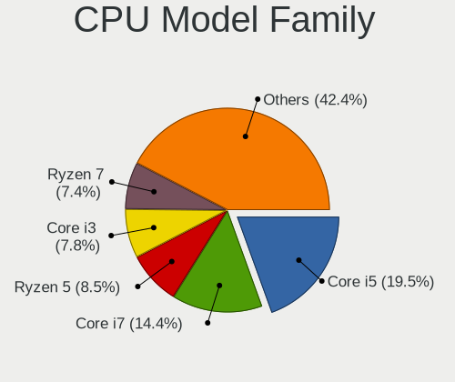

| Model                  | Desktops | Percent |
|------------------------|----------|---------|
| Intel Core i5          | 26       | 22.61%  |
| Intel Core i7          | 15       | 13.04%  |
| Other                  | 13       | 11.3%   |
| Intel Core i3          | 10       | 8.7%    |
| AMD Ryzen 5            | 7        | 6.09%   |
| Intel Xeon             | 5        | 4.35%   |
| Intel Pentium          | 5        | 4.35%   |
| Intel Core 2 Quad      | 5        | 4.35%   |
| AMD Ryzen 7            | 5        | 4.35%   |
| AMD FX                 | 5        | 4.35%   |
| Intel Core 2 Duo       | 3        | 2.61%   |
| Intel Celeron          | 3        | 2.61%   |
| Intel Pentium Dual     | 2        | 1.74%   |
| Intel Core i9          | 2        | 1.74%   |
| AMD Ryzen 9            | 2        | 1.74%   |
| AMD Ryzen Threadripper | 1        | 0.87%   |
| AMD Ryzen 5 PRO        | 1        | 0.87%   |
| AMD Phenom II X4       | 1        | 0.87%   |
| AMD A8                 | 1        | 0.87%   |
| AMD A6                 | 1        | 0.87%   |
| AMD A4                 | 1        | 0.87%   |
| AMD A10                | 1        | 0.87%   |

CPU Cores
---------

Number of processor cores

| Number | Desktops | Percent |
|--------|----------|---------|
| 4      | 45       | 38.79%  |
| 2      | 25       | 21.55%  |
| 6      | 14       | 12.07%  |
| 8      | 11       | 9.48%   |
| 12     | 4        | 3.45%   |
| 3      | 4        | 3.45%   |
| 16     | 3        | 2.59%   |
| 14     | 3        | 2.59%   |
| 10     | 2        | 1.72%   |
| 1      | 2        | 1.72%   |
| 32     | 1        | 0.86%   |
| 24     | 1        | 0.86%   |
| 18     | 1        | 0.86%   |

CPU Sockets
-----------

Number of sockets

| Number | Desktops | Percent |
|--------|----------|---------|
| 1      | 115      | 100%    |

CPU Threads
-----------

Threads per core (Hyper-Threading)

| Number | Desktops | Percent |
|--------|----------|---------|
| 2      | 69       | 60%     |
| 1      | 46       | 40%     |

CPU Op-Modes
------------

CPU Operation Modes (32-bit, 64-bit)

| Op mode        | Desktops | Percent |
|----------------|----------|---------|
| 32-bit, 64-bit | 115      | 100%    |

CPU Microcode
-------------

Microcode number

| Number     | Desktops | Percent |
|------------|----------|---------|
| Unknown    | 111      | 96.52%  |
| 0x0a601206 | 1        | 0.87%   |
| 0x0a601203 | 1        | 0.87%   |
| 0x0a50000d | 1        | 0.87%   |
| 0x08001138 | 1        | 0.87%   |

CPU Microarch
-------------

Microarchitecture

| Name             | Desktops | Percent |
|------------------|----------|---------|
| Haswell          | 22       | 19.13%  |
| Unknown          | 13       | 11.3%   |
| KabyLake         | 10       | 8.7%    |
| Zen 3            | 8        | 6.96%   |
| SandyBridge      | 8        | 6.96%   |
| IvyBridge        | 8        | 6.96%   |
| Skylake          | 7        | 6.09%   |
| Penryn           | 6        | 5.22%   |
| Zen 2            | 5        | 4.35%   |
| Piledriver       | 5        | 4.35%   |
| Core             | 4        | 3.48%   |
| Westmere         | 3        | 2.61%   |
| CometLake        | 3        | 2.61%   |
| Nehalem          | 2        | 1.74%   |
| Goldmont plus    | 2        | 1.74%   |
| Excavator        | 2        | 1.74%   |
| Bulldozer        | 2        | 1.74%   |
| Alderlake Hybrid | 2        | 1.74%   |
| Zen              | 1        | 0.87%   |
| K10              | 1        | 0.87%   |
| Broadwell        | 1        | 0.87%   |

Graphics
--------

GPU Vendor
----------

Vendors of graphics cards

| Vendor | Desktops | Percent |
|--------|----------|---------|
| Nvidia | 50       | 40.98%  |
| Intel  | 43       | 35.25%  |
| AMD    | 29       | 23.77%  |

GPU Model
---------

Graphics card models

| Model                                                                       | Desktops | Percent |
|-----------------------------------------------------------------------------|----------|---------|
| Intel Xeon E3-1200 v3/4th Gen Core Processor Integrated Graphics Controller | 7        | 5.6%    |
| Nvidia GK208B [GeForce GT 710]                                              | 5        | 4%      |
| Nvidia GF119 [GeForce GT 610]                                               | 5        | 4%      |
| Intel Xeon E3-1200 v2/3rd Gen Core processor Graphics Controller            | 4        | 3.2%    |
| Intel HD Graphics 530                                                       | 4        | 3.2%    |
| Nvidia GM206 [GeForce GTX 960]                                              | 3        | 2.4%    |
| Nvidia GA104 [GeForce RTX 3060 Ti Lite Hash Rate]                           | 3        | 2.4%    |
| Intel Core Processor Integrated Graphics Controller                         | 3        | 2.4%    |
| Intel CoffeeLake-S GT2 [UHD Graphics 630]                                   | 3        | 2.4%    |
| Intel 2nd Generation Core Processor Family Integrated Graphics Controller   | 3        | 2.4%    |
| AMD Ellesmere [Radeon RX 470/480/570/570X/580/580X/590]                     | 3        | 2.4%    |
| AMD Cezanne [Radeon Vega Series / Radeon Vega Mobile Series]                | 3        | 2.4%    |
| Nvidia TU106 [GeForce RTX 2060 SUPER]                                       | 2        | 1.6%    |
| Nvidia TU104 [GeForce RTX 2060]                                             | 2        | 1.6%    |
| Nvidia GT218 [GeForce 210]                                                  | 2        | 1.6%    |
| Nvidia GP107 [GeForce GTX 1050 Ti]                                          | 2        | 1.6%    |
| Nvidia GK106 [GeForce GTX 660]                                              | 2        | 1.6%    |
| Nvidia GF119 [GeForce GT 520]                                               | 2        | 1.6%    |
| Intel HD Graphics 630                                                       | 2        | 1.6%    |
| Intel Haswell-ULT Integrated Graphics Controller                            | 2        | 1.6%    |
| Intel GeminiLake [UHD Graphics 600]                                         | 2        | 1.6%    |
| Intel CometLake-S GT2 [UHD Graphics 630]                                    | 2        | 1.6%    |
| Intel AlderLake-S GT1                                                       | 2        | 1.6%    |
| Intel Alder Lake-S GT1 [UHD Graphics 730]                                   | 2        | 1.6%    |
| AMD Raphael                                                                 | 2        | 1.6%    |
| AMD Polaris 20 XL [Radeon RX 580 2048SP]                                    | 2        | 1.6%    |
| AMD Navi 32 [Radeon RX 7700 XT / 7800 XT]                                   | 2        | 1.6%    |
| AMD Navi 22 [Radeon RX 6700/6700 XT/6750 XT / 6800M/6850M XT]               | 2        | 1.6%    |
| AMD Cypress PRO [Radeon HD 5850]                                            | 2        | 1.6%    |
| AMD Baffin [Radeon RX 550 640SP / RX 560/560X]                              | 2        | 1.6%    |
| Nvidia TU116 [GeForce GTX 1660]                                             | 1        | 0.8%    |
| Nvidia TU116 [GeForce GTX 1660 SUPER]                                       | 1        | 0.8%    |
| Nvidia GT218 [GeForce 405]                                                  | 1        | 0.8%    |
| Nvidia GT215 [GeForce GT 240]                                               | 1        | 0.8%    |
| Nvidia GP108 [GeForce GT 1030]                                              | 1        | 0.8%    |
| Nvidia GP107 [GeForce GTX 1050]                                             | 1        | 0.8%    |
| Nvidia GM204 [GeForce GTX 970]                                              | 1        | 0.8%    |
| Nvidia GM107GL [Quadro K2200]                                               | 1        | 0.8%    |
| Nvidia GM107 [GeForce GTX 750 Ti]                                           | 1        | 0.8%    |
| Nvidia GK208B [GeForce GT 730]                                              | 1        | 0.8%    |

GPU Combo
---------

Combinations of graphics cards

| Name           | Desktops | Percent |
|----------------|----------|---------|
| 1 x Nvidia     | 47       | 40.87%  |
| 1 x Intel      | 36       | 31.3%   |
| 1 x AMD        | 26       | 22.61%  |
| Intel + Nvidia | 3        | 2.61%   |
| 2 x AMD        | 2        | 1.74%   |
| Intel + AMD    | 1        | 0.87%   |

GPU Driver
----------

Free vs proprietary

| Driver      | Desktops | Percent |
|-------------|----------|---------|
| Free        | 74       | 63.79%  |
| Proprietary | 30       | 25.86%  |
| Unknown     | 12       | 10.34%  |

GPU Memory
----------

Total video memory

| Size in GB | Desktops | Percent |
|------------|----------|---------|
| Unknown    | 95       | 81.9%   |
| 8.01-16.0  | 6        | 5.17%   |
| 7.01-8.0   | 5        | 4.31%   |
| 1.01-2.0   | 4        | 3.45%   |
| 5.01-6.0   | 2        | 1.72%   |
| 0.51-1.0   | 2        | 1.72%   |
| 3.01-4.0   | 1        | 0.86%   |
| 0.01-0.5   | 1        | 0.86%   |

Monitor
-------

Monitor Vendor
--------------

Monitor vendors

| Vendor               | Desktops | Percent |
|----------------------|----------|---------|
| Samsung Electronics  | 23       | 20.35%  |
| Goldstar             | 16       | 14.16%  |
| Dell                 | 9        | 7.96%   |
| Hewlett-Packard      | 8        | 7.08%   |
| Acer                 | 8        | 7.08%   |
| BenQ                 | 6        | 5.31%   |
| ViewSonic            | 5        | 4.42%   |
| AOC                  | 5        | 4.42%   |
| Lenovo               | 4        | 3.54%   |
| ASUSTek Computer     | 4        | 3.54%   |
| Ancor Communications | 4        | 3.54%   |
| Sony                 | 3        | 2.65%   |
| Philips              | 3        | 2.65%   |
| NEC Computers        | 2        | 1.77%   |
| Hitachi              | 2        | 1.77%   |
| Xiaomi               | 1        | 0.88%   |
| Vestel Elektronik    | 1        | 0.88%   |
| STD                  | 1        | 0.88%   |
| MSI                  | 1        | 0.88%   |
| LOE                  | 1        | 0.88%   |
| JINGLITAI            | 1        | 0.88%   |
| Fujitsu Siemens      | 1        | 0.88%   |
| Denver               | 1        | 0.88%   |
| CVT                  | 1        | 0.88%   |
| CHR                  | 1        | 0.88%   |
| Casper               | 1        | 0.88%   |

Monitor Model
-------------

Monitor models

| Model                                                                   | Desktops | Percent |
|-------------------------------------------------------------------------|----------|---------|
| Samsung Electronics LU28R55 SAM1017 3840x2160 632x360mm 28.6-inch       | 3        | 2.5%    |
| Hitachi HISENSE HEC002F 3840x2160 1872x1053mm 84.6-inch                 | 2        | 1.67%   |
| Goldstar HDR WFHD GSM7714 2560x1080 798x334mm 34.1-inch                 | 2        | 1.67%   |
| Xiaomi Mi TV XMD0002 1920x1080 708x398mm 32.0-inch                      | 1        | 0.83%   |
| ViewSonic XG3220 SERIES VSC1D35 3840x2160 698x393mm 31.5-inch           | 1        | 0.83%   |
| ViewSonic VX2457 VSCB931 1920x1080 521x293mm 23.5-inch                  | 1        | 0.83%   |
| ViewSonic VX2370 SERIES VSC342C 1920x1080 509x286mm 23.0-inch           | 1        | 0.83%   |
| ViewSonic VX2025wm VSCE51D 1680x1050 433x271mm 20.1-inch                | 1        | 0.83%   |
| ViewSonic LCD Monitor VX922 1280x1024                                   | 1        | 0.83%   |
| Vestel Elektronik 32FHD_LCD_TV VES3700 1920x1080 700x400mm 31.7-inch    | 1        | 0.83%   |
| STD HDMI TV STD00C7 1440x900 698x392mm 31.5-inch                        | 1        | 0.83%   |
| Sony TV SNY6604 1920x1080                                               | 1        | 0.83%   |
| Sony TV *01 SNYD902 1920x1080 1107x623mm 50.0-inch                      | 1        | 0.83%   |
| Sony TV *00 SNY7E04 3840x2160 1660x934mm 75.0-inch                      | 1        | 0.83%   |
| Samsung Electronics U28E590 SAM0C4D 3840x2160 607x345mm 27.5-inch       | 1        | 0.83%   |
| Samsung Electronics SyncMaster SAM04D4 1920x1080 531x298mm 24.0-inch    | 1        | 0.83%   |
| Samsung Electronics SyncMaster SAM043F 1920x1200 518x324mm 24.1-inch    | 1        | 0.83%   |
| Samsung Electronics SyncMaster SAM0354 1920x1200 291x364mm 18.3-inch    | 1        | 0.83%   |
| Samsung Electronics SyncMaster SAM0304 1680x1050 494x320mm 23.2-inch    | 1        | 0.83%   |
| Samsung Electronics SMT27A550 SAM07B8 1920x1080 598x336mm 27.0-inch     | 1        | 0.83%   |
| Samsung Electronics S24F350 SAM0D20 1920x1080 521x293mm 23.5-inch       | 1        | 0.83%   |
| Samsung Electronics S22F350 SAM0D1A 1920x1080 477x268mm 21.5-inch       | 1        | 0.83%   |
| Samsung Electronics S22E310 SAM0C2C 1920x1080 477x268mm 21.5-inch       | 1        | 0.83%   |
| Samsung Electronics S19D300 SAM0B35 1366x768 410x230mm 18.5-inch        | 1        | 0.83%   |
| Samsung Electronics S19D300 SAM0B34 1366x768 410x230mm 18.5-inch        | 1        | 0.83%   |
| Samsung Electronics Odyssey G7 SAM7232 3840x2160 698x392mm 31.5-inch    | 1        | 0.83%   |
| Samsung Electronics LU28R55 SAM1015 3840x2160 632x360mm 28.6-inch       | 1        | 0.83%   |
| Samsung Electronics LS49AG95 SAM71AA 3840x1080 1193x336mm 48.8-inch     | 1        | 0.83%   |
| Samsung Electronics LS27CG51x SAM72FC 2560x1440 597x336mm 27.0-inch     | 1        | 0.83%   |
| Samsung Electronics LS24AG32x SAM71DA 1920x1080 527x296mm 23.8-inch     | 1        | 0.83%   |
| Samsung Electronics LCD Monitor SAM735A 3840x2160 1872x1053mm 84.6-inch | 1        | 0.83%   |
| Samsung Electronics LCD Monitor SAM0FF8 3840x2160 1872x1053mm 84.6-inch | 1        | 0.83%   |
| Samsung Electronics LCD Monitor SAM0D47 1920x1080 885x498mm 40.0-inch   | 1        | 0.83%   |
| Samsung Electronics LCD Monitor SAM0B32 1366x768 607x345mm 27.5-inch    | 1        | 0.83%   |
| Samsung Electronics LCD Monitor S24D330 1920x1080                       | 1        | 0.83%   |
| Samsung Electronics LC49G95T SAM7053 3840x1080 1193x336mm 48.8-inch     | 1        | 0.83%   |
| Samsung Electronics C27F390 SAM0D32 1920x1080 598x336mm 27.0-inch       | 1        | 0.83%   |
| Philips PHL 246V5 PHLC0C5 1920x1080 531x299mm 24.0-inch                 | 1        | 0.83%   |
| Philips PHL 193V5 PHLC0CD 1366x768 410x230mm 18.5-inch                  | 1        | 0.83%   |
| Philips 26PFL3404 AR PHLD064 1360x768 575x323mm 26.0-inch               | 1        | 0.83%   |

Monitor Resolution
------------------

Monitor screen resolution

| Resolution         | Desktops | Percent |
|--------------------|----------|---------|
| 1920x1080 (FHD)    | 51       | 45.54%  |
| 3840x2160 (4K)     | 21       | 18.75%  |
| 1366x768 (WXGA)    | 7        | 6.25%   |
| 2560x1440 (QHD)    | 5        | 4.46%   |
| 1440x900 (WXGA+)   | 5        | 4.46%   |
| 1920x1200 (WUXGA)  | 4        | 3.57%   |
| 1680x1050 (WSXGA+) | 4        | 3.57%   |
| 3840x1080          | 3        | 2.68%   |
| 2560x1080          | 3        | 2.68%   |
| 1280x1024 (SXGA)   | 3        | 2.68%   |
| 1600x900 (HD+)     | 2        | 1.79%   |
| 3440x1440          | 1        | 0.89%   |
| 2880x1440          | 1        | 0.89%   |
| 1920x540           | 1        | 0.89%   |
| 1360x768           | 1        | 0.89%   |

Monitor Diagonal
----------------

Diagonal size in inches

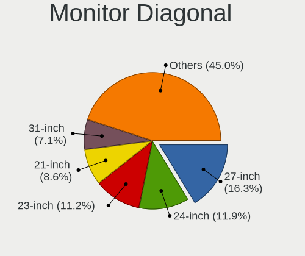

| Inches  | Desktops | Percent |
|---------|----------|---------|
| 27      | 19       | 16.38%  |
| 23      | 15       | 12.93%  |
| 24      | 12       | 10.34%  |
| 21      | 10       | 8.62%   |
| 18      | 10       | 8.62%   |
| 31      | 9        | 7.76%   |
| Unknown | 7        | 6.03%   |
| 84      | 5        | 4.31%   |
| 34      | 4        | 3.45%   |
| 40      | 3        | 2.59%   |
| 28      | 3        | 2.59%   |
| 20      | 3        | 2.59%   |
| 19      | 3        | 2.59%   |
| 72      | 2        | 1.72%   |
| 48      | 2        | 1.72%   |
| 22      | 2        | 1.72%   |
| 75      | 1        | 0.86%   |
| 65      | 1        | 0.86%   |
| 55      | 1        | 0.86%   |
| 49      | 1        | 0.86%   |
| 39      | 1        | 0.86%   |
| 26      | 1        | 0.86%   |
| 17      | 1        | 0.86%   |

Monitor Width
-------------

Physical width

| Width in mm | Desktops | Percent |
|-------------|----------|---------|
| 501-600     | 39       | 35.14%  |
| 401-500     | 26       | 23.42%  |
| 601-700     | 15       | 13.51%  |
| 1501-2000   | 8        | 7.21%   |
| Unknown     | 7        | 6.31%   |
| 1001-1500   | 5        | 4.5%    |
| 701-800     | 4        | 3.6%    |
| 801-900     | 3        | 2.7%    |
| 351-400     | 1        | 0.9%    |
| 301-350     | 1        | 0.9%    |
| 201-300     | 1        | 0.9%    |
| 901-1000    | 1        | 0.9%    |

Aspect Ratio
------------

Proportional relationship between the width and the height

| Ratio   | Desktops | Percent |
|---------|----------|---------|
| 16/9    | 76       | 71.7%   |
| 16/10   | 12       | 11.32%  |
| 21/9    | 5        | 4.72%   |
| Unknown | 5        | 4.72%   |
| 32/9    | 3        | 2.83%   |
| 6/5     | 1        | 0.94%   |
| 5/4     | 1        | 0.94%   |
| 3/2     | 1        | 0.94%   |
| 2.00    | 1        | 0.94%   |
| 0.80    | 1        | 0.94%   |

Monitor Area
------------

Area in inch²

| Area in inch² | Desktops | Percent |
|----------------|----------|---------|
| 201-250        | 29       | 25.66%  |
| 301-350        | 19       | 16.81%  |
| 351-500        | 16       | 14.16%  |
| 151-200        | 14       | 12.39%  |
| More than 1000 | 9        | 7.96%   |
| 141-150        | 7        | 6.19%   |
| 501-1000       | 7        | 6.19%   |
| Unknown        | 7        | 6.19%   |
| 251-300        | 5        | 4.42%   |

Pixel Density
-------------

Pixels per inch

| Density | Desktops | Percent |
|---------|----------|---------|
| 51-100  | 70       | 65.42%  |
| 101-120 | 14       | 13.08%  |
| 121-160 | 9        | 8.41%   |
| Unknown | 7        | 6.54%   |
| 1-50    | 4        | 3.74%   |
| 161-240 | 3        | 2.8%    |

Multiple Monitors
-----------------

Total monitors connected

| Total | Desktops | Percent |
|-------|----------|---------|
| 1     | 88       | 75.86%  |
| 0     | 14       | 12.07%  |
| 2     | 10       | 8.62%   |
| 3     | 3        | 2.59%   |
| 4     | 1        | 0.86%   |

Network
-------

Net Controller Vendor
---------------------

Controller vendors

| Vendor                                | Desktops | Percent |
|---------------------------------------|----------|---------|
| Realtek Semiconductor                 | 77       | 46.11%  |
| Intel                                 | 47       | 28.14%  |
| Qualcomm Atheros                      | 11       | 6.59%   |
| Broadcom                              | 7        | 4.19%   |
| TP-Link                               | 6        | 3.59%   |
| Ralink Technology                     | 4        | 2.4%    |
| Ralink                                | 3        | 1.8%    |
| MediaTek                              | 2        | 1.2%    |
| Marvell Technology Group              | 2        | 1.2%    |
| Aquantia                              | 2        | 1.2%    |
| Wilocity                              | 1        | 0.6%    |
| Samsung Electronics                   | 1        | 0.6%    |
| Microsoft                             | 1        | 0.6%    |
| Edimax Technology                     | 1        | 0.6%    |
| Broadcom Limited                      | 1        | 0.6%    |
| 802.11g Adapter [Linksys WUSB54GC v3] | 1        | 0.6%    |

Net Controller Model
--------------------

Controller models

| Model                                                                          | Desktops | Percent |
|--------------------------------------------------------------------------------|----------|---------|
| Realtek RTL8111/8168/8211/8411 PCI Express Gigabit Ethernet Controller         | 53       | 27.75%  |
| Realtek RTL8125 2.5GbE Controller                                              | 12       | 6.28%   |
| Intel Wi-Fi 6 AX200                                                            | 7        | 3.66%   |
| Intel I211 Gigabit Network Connection                                          | 7        | 3.66%   |
| Intel Ethernet Connection (2) I219-V                                           | 6        | 3.14%   |
| Intel Ethernet Controller I225-V                                               | 5        | 2.62%   |
| Realtek RTL8192EU 802.11b/g/n WLAN Adapter                                     | 4        | 2.09%   |
| Intel Raptor Lake-S PCH CNVi WiFi                                              | 4        | 2.09%   |
| Intel Ethernet Connection I217-LM                                              | 4        | 2.09%   |
| Intel 82579LM Gigabit Network Connection (Lewisville)                          | 4        | 2.09%   |
| Realtek RTL810xE PCI Express Fast Ethernet controller                          | 3        | 1.57%   |
| Realtek 802.11ac NIC                                                           | 3        | 1.57%   |
| Ralink MT7601U Wireless Adapter                                                | 3        | 1.57%   |
| Qualcomm Atheros AR8151 v2.0 Gigabit Ethernet                                  | 3        | 1.57%   |
| Intel Alder Lake-S PCH CNVi WiFi                                               | 3        | 1.57%   |
| Realtek RTL88x2bu [AC1200 Techkey]                                             | 2        | 1.05%   |
| Realtek RTL8821CE 802.11ac PCIe Wireless Network Adapter                       | 2        | 1.05%   |
| Qualcomm Atheros AR9462 Wireless Network Adapter                               | 2        | 1.05%   |
| Intel Wi-Fi 6E(802.11ax) AX210/AX1675* 2x2 [Typhoon Peak]                      | 2        | 1.05%   |
| Intel Ethernet Controller I226-V                                               | 2        | 1.05%   |
| Intel Ethernet Connection (5) I219-LM                                          | 2        | 1.05%   |
| Intel Ethernet Connection (2) I219-LM                                          | 2        | 1.05%   |
| Intel 82579V Gigabit Network Connection                                        | 2        | 1.05%   |
| Aquantia AQtion AQC107 NBase-T/IEEE 802.3an Ethernet Controller [Atlantic 10G] | 2        | 1.05%   |
| Wilocity Wil6200 802.11ad Wireless Network Adapter                             | 1        | 0.52%   |
| TP-Link TL-WN821N v5/v6 [RTL8192EU]                                            | 1        | 0.52%   |
| TP-Link Archer T4U ver.3                                                       | 1        | 0.52%   |
| TP-Link Archer T3U [Realtek RTL8812BU]                                         | 1        | 0.52%   |
| TP-Link AC600 wireless Realtek RTL8811AU [Archer T2U Nano]                     | 1        | 0.52%   |
| TP-Link 802.11n NIC                                                            | 1        | 0.52%   |
| TP-Link 802.11ac NIC                                                           | 1        | 0.52%   |
| Samsung GT-I9070 (network tethering, USB debugging enabled)                    | 1        | 0.52%   |
| Realtek RTL8852CE PCIe 802.11ax Wireless Network Controller                    | 1        | 0.52%   |
| Realtek RTL8822CE 802.11ac PCIe Wireless Network Adapter                       | 1        | 0.52%   |
| Realtek RTL8723BU 802.11b/g/n WLAN Adapter                                     | 1        | 0.52%   |
| Realtek RTL8192CU 802.11n WLAN Adapter                                         | 1        | 0.52%   |
| Realtek RTL8192CE PCIe Wireless Network Adapter                                | 1        | 0.52%   |
| Realtek RTL8188FTV 802.11b/g/n 1T1R 2.4G WLAN Adapter                          | 1        | 0.52%   |
| Realtek RTL8153 Gigabit Ethernet Adapter                                       | 1        | 0.52%   |
| Realtek Realtek Ethernet controller                                            | 1        | 0.52%   |

Wireless Vendor
---------------

Wireless vendors

| Vendor                                | Desktops | Percent |
|---------------------------------------|----------|---------|
| Intel                                 | 18       | 27.69%  |
| Realtek Semiconductor                 | 17       | 26.15%  |
| Qualcomm Atheros                      | 7        | 10.77%  |
| TP-Link                               | 6        | 9.23%   |
| Ralink Technology                     | 4        | 6.15%   |
| Broadcom                              | 4        | 6.15%   |
| Ralink                                | 3        | 4.62%   |
| MediaTek                              | 2        | 3.08%   |
| Wilocity                              | 1        | 1.54%   |
| Microsoft                             | 1        | 1.54%   |
| Edimax Technology                     | 1        | 1.54%   |
| 802.11g Adapter [Linksys WUSB54GC v3] | 1        | 1.54%   |

Wireless Model
--------------

Wireless models

| Model                                                                  | Desktops | Percent |
|------------------------------------------------------------------------|----------|---------|
| Intel Wi-Fi 6 AX200                                                    | 7        | 10.77%  |
| Realtek RTL8192EU 802.11b/g/n WLAN Adapter                             | 4        | 6.15%   |
| Intel Raptor Lake-S PCH CNVi WiFi                                      | 4        | 6.15%   |
| Realtek 802.11ac NIC                                                   | 3        | 4.62%   |
| Ralink MT7601U Wireless Adapter                                        | 3        | 4.62%   |
| Intel Alder Lake-S PCH CNVi WiFi                                       | 3        | 4.62%   |
| Realtek RTL88x2bu [AC1200 Techkey]                                     | 2        | 3.08%   |
| Realtek RTL8821CE 802.11ac PCIe Wireless Network Adapter               | 2        | 3.08%   |
| Qualcomm Atheros AR9462 Wireless Network Adapter                       | 2        | 3.08%   |
| Intel Wi-Fi 6E(802.11ax) AX210/AX1675* 2x2 [Typhoon Peak]              | 2        | 3.08%   |
| Wilocity Wil6200 802.11ad Wireless Network Adapter                     | 1        | 1.54%   |
| TP-Link TL-WN821N v5/v6 [RTL8192EU]                                    | 1        | 1.54%   |
| TP-Link Archer T4U ver.3                                               | 1        | 1.54%   |
| TP-Link Archer T3U [Realtek RTL8812BU]                                 | 1        | 1.54%   |
| TP-Link AC600 wireless Realtek RTL8811AU [Archer T2U Nano]             | 1        | 1.54%   |
| TP-Link 802.11n NIC                                                    | 1        | 1.54%   |
| TP-Link 802.11ac NIC                                                   | 1        | 1.54%   |
| Realtek RTL8852CE PCIe 802.11ax Wireless Network Controller            | 1        | 1.54%   |
| Realtek RTL8822CE 802.11ac PCIe Wireless Network Adapter               | 1        | 1.54%   |
| Realtek RTL8723BU 802.11b/g/n WLAN Adapter                             | 1        | 1.54%   |
| Realtek RTL8192CU 802.11n WLAN Adapter                                 | 1        | 1.54%   |
| Realtek RTL8192CE PCIe Wireless Network Adapter                        | 1        | 1.54%   |
| Realtek RTL8188FTV 802.11b/g/n 1T1R 2.4G WLAN Adapter                  | 1        | 1.54%   |
| Ralink RT2870/RT3070 Wireless Adapter                                  | 1        | 1.54%   |
| Ralink RT3090 Wireless 802.11n 1T/1R PCIe                              | 1        | 1.54%   |
| Ralink RT2800 802.11n PCI                                              | 1        | 1.54%   |
| Ralink RT2790 Wireless 802.11n 1T/2R PCIe                              | 1        | 1.54%   |
| Qualcomm Atheros QCA9565 / AR9565 Wireless Network Adapter             | 1        | 1.54%   |
| Qualcomm Atheros QCA6174 802.11ac Wireless Network Adapter             | 1        | 1.54%   |
| Qualcomm Atheros AR9485 Wireless Network Adapter                       | 1        | 1.54%   |
| Qualcomm Atheros AR9227 Wireless Network Adapter                       | 1        | 1.54%   |
| Qualcomm Atheros AR5416 Wireless Network Adapter [AR5008 802.11(a)bgn] | 1        | 1.54%   |
| Microsoft Xbox Wireless Adapter for Windows                            | 1        | 1.54%   |
| MediaTek Wi-Fi 6E MT7902 Wireless Network Adapter                      | 1        | 1.54%   |
| MediaTek MT7922 802.11ax PCI Express Wireless Network Adapter          | 1        | 1.54%   |
| Intel Dual Band Wireless-AC 3168NGW [Stone Peak]                       | 1        | 1.54%   |
| Intel Comet Lake PCH CNVi WiFi                                         | 1        | 1.54%   |
| Edimax EW-7711UTn nLite Wireless Adapter [Ralink RT3070]               | 1        | 1.54%   |
| Broadcom Network controller                                            | 1        | 1.54%   |
| Broadcom BCM43602 802.11ac Wireless LAN SoC                            | 1        | 1.54%   |

Ethernet Vendor
---------------

Ethernet vendors

| Vendor                   | Desktops | Percent |
|--------------------------|----------|---------|
| Realtek Semiconductor    | 70       | 56.91%  |
| Intel                    | 40       | 32.52%  |
| Qualcomm Atheros         | 4        | 3.25%   |
| Broadcom                 | 3        | 2.44%   |
| Marvell Technology Group | 2        | 1.63%   |
| Aquantia                 | 2        | 1.63%   |
| Samsung Electronics      | 1        | 0.81%   |
| Broadcom Limited         | 1        | 0.81%   |

Ethernet Model
--------------

Ethernet models

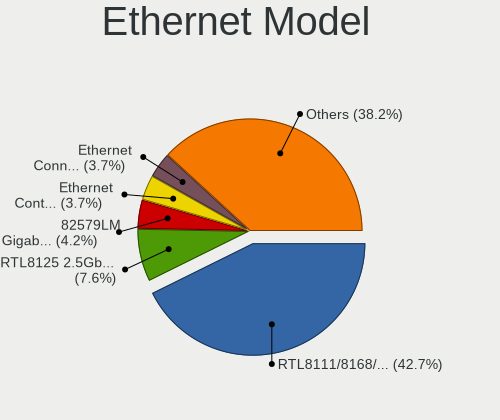

| Model                                                                          | Desktops | Percent |
|--------------------------------------------------------------------------------|----------|---------|
| Realtek RTL8111/8168/8211/8411 PCI Express Gigabit Ethernet Controller         | 53       | 42.06%  |
| Realtek RTL8125 2.5GbE Controller                                              | 12       | 9.52%   |
| Intel I211 Gigabit Network Connection                                          | 7        | 5.56%   |
| Intel Ethernet Connection (2) I219-V                                           | 6        | 4.76%   |
| Intel Ethernet Controller I225-V                                               | 5        | 3.97%   |
| Intel Ethernet Connection I217-LM                                              | 4        | 3.17%   |
| Intel 82579LM Gigabit Network Connection (Lewisville)                          | 4        | 3.17%   |
| Realtek RTL810xE PCI Express Fast Ethernet controller                          | 3        | 2.38%   |
| Qualcomm Atheros AR8151 v2.0 Gigabit Ethernet                                  | 3        | 2.38%   |
| Intel Ethernet Controller I226-V                                               | 2        | 1.59%   |
| Intel Ethernet Connection (5) I219-LM                                          | 2        | 1.59%   |
| Intel Ethernet Connection (2) I219-LM                                          | 2        | 1.59%   |
| Intel 82579V Gigabit Network Connection                                        | 2        | 1.59%   |
| Aquantia AQtion AQC107 NBase-T/IEEE 802.3an Ethernet Controller [Atlantic 10G] | 2        | 1.59%   |
| Samsung GT-I9070 (network tethering, USB debugging enabled)                    | 1        | 0.79%   |
| Realtek RTL8153 Gigabit Ethernet Adapter                                       | 1        | 0.79%   |
| Realtek Realtek Ethernet controller                                            | 1        | 0.79%   |
| Realtek Killer E2600 GbE Controller                                            | 1        | 0.79%   |
| Qualcomm Atheros AR8131 Gigabit Ethernet                                       | 1        | 0.79%   |
| Marvell Group 88E8057 PCI-E Gigabit Ethernet Controller                        | 1        | 0.79%   |
| Marvell Group 88E8001 Gigabit Ethernet Controller                              | 1        | 0.79%   |
| Intel Ethernet Connection I218-V                                               | 1        | 0.79%   |
| Intel Ethernet Connection (2) I218-V                                           | 1        | 0.79%   |
| Intel Ethernet Connection (17) I219-V                                          | 1        | 0.79%   |
| Intel Ethernet Connection (17) I219-LM                                         | 1        | 0.79%   |
| Intel 82573L Gigabit Ethernet Controller                                       | 1        | 0.79%   |
| Intel 82567LM-3 Gigabit Network Connection                                     | 1        | 0.79%   |
| Intel 82566DM-2 Gigabit Network Connection                                     | 1        | 0.79%   |
| Intel 82566DC Gigabit Network Connection                                       | 1        | 0.79%   |
| Broadcom NetXtreme BCM5762 Gigabit Ethernet PCIe                               | 1        | 0.79%   |
| Broadcom NetLink BCM57788 Gigabit Ethernet PCIe                                | 1        | 0.79%   |
| Broadcom NetLink BCM57781 Gigabit Ethernet PCIe                                | 1        | 0.79%   |
| Broadcom Limited NetXtreme BCM5761 Gigabit Ethernet PCIe                       | 1        | 0.79%   |

Net Controller Kind
-------------------

Ethernet, WiFi or modem

| Kind     | Desktops | Percent |
|----------|----------|---------|
| Ethernet | 115      | 66.47%  |
| WiFi     | 58       | 33.53%  |

Used Controller
---------------

Currently used network controller

| Kind     | Desktops | Percent |
|----------|----------|---------|
| Ethernet | 90       | 74.38%  |
| WiFi     | 31       | 25.62%  |

NICs
----

Total network controllers on board

| Total | Desktops | Percent |
|-------|----------|---------|
| 1     | 72       | 62.07%  |
| 2     | 39       | 33.62%  |
| 3     | 4        | 3.45%   |
| 4     | 1        | 0.86%   |

IPv6
----

IPv6 vs IPv4

| Used | Desktops | Percent |
|------|----------|---------|
| No   | 76       | 66.09%  |
| Yes  | 39       | 33.91%  |

Bluetooth
---------

Bluetooth Vendor
----------------

Controller vendors

| Vendor                          | Desktops | Percent |
|---------------------------------|----------|---------|
| Intel                           | 17       | 35.42%  |
| Cambridge Silicon Radio         | 15       | 31.25%  |
| Realtek Semiconductor           | 5        | 10.42%  |
| Qualcomm Atheros Communications | 3        | 6.25%   |
| ASUSTek Computer                | 2        | 4.17%   |
| TP-Link                         | 1        | 2.08%   |
| MediaTek                        | 1        | 2.08%   |
| Integrated System Solution      | 1        | 2.08%   |
| IMC Networks                    | 1        | 2.08%   |
| Broadcom                        | 1        | 2.08%   |
| Actions                         | 1        | 2.08%   |

Bluetooth Model
---------------

Controller models

| Model                                                 | Desktops | Percent |
|-------------------------------------------------------|----------|---------|
| Cambridge Silicon Radio Bluetooth Dongle (HCI mode)   | 15       | 31.25%  |
| Intel AX200 Bluetooth                                 | 6        | 12.5%   |
| Intel AX201 Bluetooth                                 | 5        | 10.42%  |
| Realtek Bluetooth Radio                               | 4        | 8.33%   |
| Intel Bluetooth Device                                | 3        | 6.25%   |
| Qualcomm Atheros  Bluetooth Device                    | 2        | 4.17%   |
| Intel AX210 Bluetooth                                 | 2        | 4.17%   |
| TP-Link UB500 Adapter                                 | 1        | 2.08%   |
| Realtek  Bluetooth 4.2 Adapter                        | 1        | 2.08%   |
| Qualcomm Atheros AR9462 Bluetooth                     | 1        | 2.08%   |
| MediaTek Wireless_Device                              | 1        | 2.08%   |
| Intel Wireless-AC 3168 Bluetooth                      | 1        | 2.08%   |
| Integrated System Solution KY-BT100 Bluetooth Adapter | 1        | 2.08%   |
| IMC Networks Wireless_Device                          | 1        | 2.08%   |
| Broadcom BCM20702A0 Bluetooth 4.0                     | 1        | 2.08%   |
| ASUS Bluetooth Device                                 | 1        | 2.08%   |
| ASUS ASUS USB-BT500                                   | 1        | 2.08%   |
| Actions general adapter                               | 1        | 2.08%   |

Sound
-----

Sound Vendor
------------

Sound card vendors

| Vendor                               | Desktops | Percent |
|--------------------------------------|----------|---------|
| Intel                                | 87       | 44.16%  |
| Nvidia                               | 49       | 24.87%  |
| AMD                                  | 34       | 17.26%  |
| Creative Labs                        | 5        | 2.54%   |
| ASUSTek Computer                     | 5        | 2.54%   |
| JMTek                                | 2        | 1.02%   |
| C-Media Electronics                  | 2        | 1.02%   |
| USB Audio                            | 1        | 0.51%   |
| Trust                                | 1        | 0.51%   |
| Thesycon Systemsoftware & Consulting | 1        | 0.51%   |
| Texas Instruments                    | 1        | 0.51%   |
| Setek Elektronik                     | 1        | 0.51%   |
| Realtek Semiconductor                | 1        | 0.51%   |
| Razer USA                            | 1        | 0.51%   |
| Micro Star International             | 1        | 0.51%   |
| Logitech                             | 1        | 0.51%   |
| Lautsprecher Teufel                  | 1        | 0.51%   |
| Hewlett-Packard                      | 1        | 0.51%   |
| Creative Technology                  | 1        | 0.51%   |
| BEHRINGER International              | 1        | 0.51%   |

Sound Model
-----------

Sound card models

| Model                                                                                           | Desktops | Percent |
|-------------------------------------------------------------------------------------------------|----------|---------|
| Intel 8 Series/C220 Series Chipset High Definition Audio Controller                             | 19       | 8.19%   |
| Intel Xeon E3-1200 v3/4th Gen Core Processor HD Audio Controller                                | 8        | 3.45%   |
| Intel 6 Series/C200 Series Chipset Family High Definition Audio Controller                      | 8        | 3.45%   |
| Intel 100 Series/C230 Series Chipset Family HD Audio Controller                                 | 8        | 3.45%   |
| AMD Family 17h/19h HD Audio Controller                                                          | 8        | 3.45%   |
| Nvidia GF119 HDMI Audio Controller                                                              | 7        | 3.02%   |
| Nvidia GK208 HDMI/DP Audio Controller                                                           | 6        | 2.59%   |
| Intel Alder Lake-S HD Audio Controller                                                          | 6        | 2.59%   |
| AMD Starship/Matisse HD Audio Controller                                                        | 6        | 2.59%   |
| AMD Renoir Radeon High Definition Audio Controller                                              | 6        | 2.59%   |
| Nvidia GA104 High Definition Audio Controller                                                   | 5        | 2.16%   |
| Intel Raptor Lake High Definition Audio Controller                                              | 5        | 2.16%   |
| Intel NM10/ICH7 Family High Definition Audio Controller                                         | 5        | 2.16%   |
| Intel 7 Series/C216 Chipset Family High Definition Audio Controller                             | 5        | 2.16%   |
| Intel 5 Series/3400 Series Chipset High Definition Audio                                        | 5        | 2.16%   |
| Intel 200 Series PCH HD Audio                                                                   | 5        | 2.16%   |
| AMD SBx00 Azalia (Intel HDA)                                                                    | 5        | 2.16%   |
| AMD Ellesmere HDMI Audio [Radeon RX 470/480 / 570/580/590]                                      | 5        | 2.16%   |
| Nvidia High Definition Audio Controller                                                         | 4        | 1.72%   |
| AMD Navi 31 HDMI/DP Audio                                                                       | 4        | 1.72%   |
| Nvidia GP107GL High Definition Audio Controller                                                 | 3        | 1.29%   |
| Nvidia GM206 High Definition Audio Controller                                                   | 3        | 1.29%   |
| Nvidia Audio device                                                                             | 3        | 1.29%   |
| Intel Cannon Lake PCH cAVS                                                                      | 3        | 1.29%   |
| ASUSTek Computer USB Audio                                                                      | 3        | 1.29%   |
| AMD Navi 21/23 HDMI/DP Audio Controller                                                         | 3        | 1.29%   |
| AMD Baffin HDMI/DP Audio [Radeon RX 550 640SP / RX 560/560X]                                    | 3        | 1.29%   |
| Nvidia TU116 High Definition Audio Controller                                                   | 2        | 0.86%   |
| Nvidia TU106 High Definition Audio Controller                                                   | 2        | 0.86%   |
| Nvidia TU104 HD Audio Controller                                                                | 2        | 0.86%   |
| Nvidia GM107 High Definition Audio Controller [GeForce 940MX]                                   | 2        | 0.86%   |
| Nvidia GK106 HDMI Audio Controller                                                              | 2        | 0.86%   |
| Nvidia GA106 High Definition Audio Controller                                                   | 2        | 0.86%   |
| Nvidia GA102 High Definition Audio Controller                                                   | 2        | 0.86%   |
| Intel Haswell-ULT HD Audio Controller                                                           | 2        | 0.86%   |
| Intel Celeron/Pentium Silver Processor High Definition Audio                                    | 2        | 0.86%   |
| Intel C600/X79 series chipset High Definition Audio Controller                                  | 2        | 0.86%   |
| Intel 82801H (ICH8 Family) HD Audio Controller                                                  | 2        | 0.86%   |
| Intel 8 Series HD Audio Controller                                                              | 2        | 0.86%   |
| Creative Labs CA0132 Sound Core3D [Sound Blaster Recon3D / Z-Series / Sound BlasterX AE-5 Plus] | 2        | 0.86%   |

Memory
------

Memory Vendor
-------------

Memory module vendors

| Vendor            | Desktops | Percent |
|-------------------|----------|---------|
| Corsair           | 4        | 33.33%  |
| Kingston          | 3        | 25%     |
| Unknown           | 1        | 8.33%   |
| Team              | 1        | 8.33%   |
| SK hynix          | 1        | 8.33%   |
| Micron Technology | 1        | 8.33%   |
| G.Skill           | 1        | 8.33%   |

Memory Model
------------

Memory module models

| Model                                                  | Desktops | Percent |
|--------------------------------------------------------|----------|---------|
| Unknown RAM Module 4GB DIMM                            | 1        | 8.33%   |
| Team RAM TEAMGROUP-UD4-3200 16GB DIMM DDR4 3733MT/s    | 1        | 8.33%   |
| SK hynix RAM HMT451U6BFR8A-PB 4GB DIMM DDR3 1600MT/s   | 1        | 8.33%   |
| Micron RAM 18JSF51272AZ-1G6K1 4GB DIMM 1333MT/s        | 1        | 8.33%   |
| Kingston RAM Module 16GB DIMM DDR4 3200MT/s            | 1        | 8.33%   |
| Kingston RAM KVT8FP-HYC 4GB DIMM 1600MT/s              | 1        | 8.33%   |
| Kingston RAM KHX2400C15/8G 8GB DIMM DDR4 3400MT/s      | 1        | 8.33%   |
| G.Skill RAM F5-6400J3239G16G 16GB DIMM DDR5 7000MT/s   | 1        | 8.33%   |
| Corsair RAM CMW32GX4M2E3200C16 16GB DIMM DDR4 3200MT/s | 1        | 8.33%   |
| Corsair RAM CMK16GX4M2B3200C16 8GB DIMM DDR4 3600MT/s  | 1        | 8.33%   |
| Corsair RAM CMH32GX5M2E6000C36 16GB DIMM DDR5 4800MT/s | 1        | 8.33%   |
| Corsair RAM CMH32GX5M2B6000Z30 16GB DIMM DDR5 4800MT/s | 1        | 8.33%   |

Memory Kind
-----------

Memory module kinds

| Kind    | Desktops | Percent |
|---------|----------|---------|
| DDR4    | 5        | 41.67%  |
| DDR5    | 3        | 25%     |
| DDR3    | 2        | 16.67%  |
| Unknown | 2        | 16.67%  |

Memory Form Factor
------------------

Physical design of the memory module

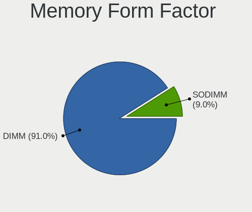

| Name | Desktops | Percent |
|------|----------|---------|
| DIMM | 11       | 100%    |

Memory Size
-----------

Memory module size

| Size  | Desktops | Percent |
|-------|----------|---------|
| 16384 | 5        | 45.45%  |
| 4096  | 3        | 27.27%  |
| 8192  | 2        | 18.18%  |
| 32768 | 1        | 9.09%   |

Memory Speed
------------

Memory module speed

| Speed   | Desktops | Percent |
|---------|----------|---------|
| 4800    | 2        | 16.67%  |
| 3200    | 2        | 16.67%  |
| 7000    | 1        | 8.33%   |
| 3733    | 1        | 8.33%   |
| 3600    | 1        | 8.33%   |
| 3400    | 1        | 8.33%   |
| 1648    | 1        | 8.33%   |
| 1600    | 1        | 8.33%   |
| 1333    | 1        | 8.33%   |
| Unknown | 1        | 8.33%   |

Printers & scanners
-------------------

Printer Vendor
--------------

Printer device vendors

| Vendor                | Desktops | Percent |
|-----------------------|----------|---------|
| Brother Industries    | 3        | 37.5%   |
| Hewlett-Packard       | 2        | 25%     |
| Seiko Epson           | 1        | 12.5%   |
| Lexmark International | 1        | 12.5%   |
| Canon                 | 1        | 12.5%   |

Printer Model
-------------

Printer device models

| Model                         | Desktops | Percent |
|-------------------------------|----------|---------|
| Seiko Epson ET-4850 Series    | 1        | 12.5%   |
| Lexmark International CX310dn | 1        | 12.5%   |
| HP LaserJet 400 M401dn        | 1        | 12.5%   |
| HP Color LaserJet CP1215      | 1        | 12.5%   |
| Canon PIXMA MP230             | 1        | 12.5%   |
| Brother MFC-1910W             | 1        | 12.5%   |
| Brother HL-L2350DW series     | 1        | 12.5%   |
| Brother DCP-T300              | 1        | 12.5%   |

Scanner Vendor
--------------

Scanner device vendors

| Vendor | Desktops | Percent |
|--------|----------|---------|
| Canon  | 2        | 100%    |

Scanner Model
-------------

Scanner device models

| Model                   | Desktops | Percent |
|-------------------------|----------|---------|
| Canon CanoScan LiDE 90  | 1        | 50%     |
| Canon CanoScan LiDE 200 | 1        | 50%     |

Camera
------

Camera Vendor
-------------

Camera device vendors

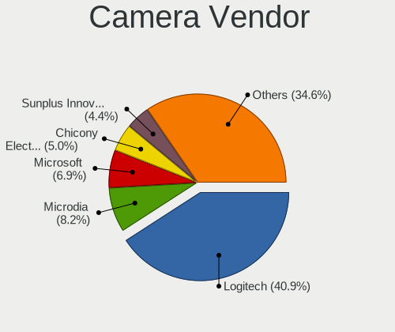

| Vendor                 | Desktops | Percent |
|------------------------|----------|---------|
| Logitech               | 9        | 50%     |
| Microsoft              | 2        | 11.11%  |
| SJ-180517-N            | 1        | 5.56%   |
| Microdia               | 1        | 5.56%   |
| MacroSilicon           | 1        | 5.56%   |
| Generalplus Technology | 1        | 5.56%   |
| GEMBIRD                | 1        | 5.56%   |
| eMeet                  | 1        | 5.56%   |
| Apple                  | 1        | 5.56%   |

Camera Model
------------

Camera device models

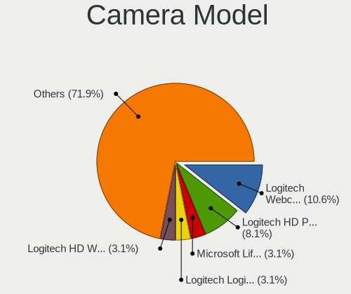

| Model                                             | Desktops | Percent |
|---------------------------------------------------|----------|---------|
| Logitech Webcam C270                              | 4        | 21.05%  |
| Logitech Webcam C925e                             | 2        | 10.53%  |
| SJ-180517-N 1080P Webcam                          | 1        | 5.26%   |
| Microsoft LifeCam HD-3000                         | 1        | 5.26%   |
| Microsoft LifeCam Cinema                          | 1        | 5.26%   |
| Microdia AUKEY-W1                                 | 1        | 5.26%   |
| MacroSilicon USB3. 0 capture                      | 1        | 5.26%   |
| Logitech Webcam C200                              | 1        | 5.26%   |
| Logitech StreamCam                                | 1        | 5.26%   |
| Logitech HD Pro Webcam C920                       | 1        | 5.26%   |
| Logitech C922 Pro Stream Webcam                   | 1        | 5.26%   |
| Generalplus GENERAL WEBCAM                        | 1        | 5.26%   |
| GEMBIRD Generic UVC 1.00 camera [AppoTech AX2311] | 1        | 5.26%   |
| eMeet HD Webcam C960                              | 1        | 5.26%   |
| Apple iPhone 5/5C/5S/6/SE/7/8/X/XR                | 1        | 5.26%   |

Security
--------

Fingerprint Vendor
------------------

Fingerprint sensor vendors

| Vendor    | Desktops | Percent |
|-----------|----------|---------|
| AuthenTec | 1        | 100%    |

Fingerprint Model
-----------------

Fingerprint sensor models

| Model             | Desktops | Percent |
|-------------------|----------|---------|
| AuthenTec AES2810 | 1        | 100%    |

Chipcard Vendor
---------------

Chipcard module vendors

Zero info for selected period =(

Chipcard Model
--------------

Chipcard module models

Zero info for selected period =(

Unsupported
-----------

Unsupported Devices
-------------------

Total unsupported devices on board

| Total | Desktops | Percent |
|-------|----------|---------|
| 0     | 92       | 77.97%  |
| 1     | 24       | 20.34%  |
| 2     | 2        | 1.69%   |

Unsupported Device Types
------------------------

Types of unsupported devices

| Type               | Desktops | Percent |
|--------------------|----------|---------|
| Graphics card      | 14       | 56%     |
| Net/wireless       | 5        | 20%     |
| Net/ethernet       | 2        | 8%      |
| Unassigned class   | 1        | 4%      |
| Storage/ide        | 1        | 4%      |
| Fingerprint reader | 1        | 4%      |
| Card reader        | 1        | 4%      |

