Zorin 17 - Tested Hardware & Statistics (Desktops)
--------------------------------------------------

A project to collect tested hardware configurations for Zorin 17.

Anyone can contribute to this report by the [hw-probe](https://github.com/linuxhw/hw-probe) tool:

    sudo -E hw-probe -all -upload

Please contribute! Especially if your hardware is rare.

Contents
--------

* [ Test Cases ](#test-cases)

* [ System ](#system)
  - [ Kernel                   ](#kernel)
  - [ Kernel Family            ](#kernel-family)
  - [ Kernel Major Ver.        ](#kernel-major-ver)
  - [ Arch                     ](#arch)
  - [ DE                       ](#de)
  - [ Display Server           ](#display-server)
  - [ Display Manager          ](#display-manager)
  - [ OS Lang                  ](#os-lang)
  - [ Boot Mode                ](#boot-mode)
  - [ Filesystem               ](#filesystem)
  - [ Part. scheme             ](#part-scheme)
  - [ Dual Boot with Linux/BSD ](#dual-boot-with-linuxbsd)
  - [ Dual Boot (Win)          ](#dual-boot-win)

* [ Board ](#board)
  - [ Vendor                   ](#vendor)
  - [ Model                    ](#model)
  - [ Model Family             ](#model-family)
  - [ MFG Year                 ](#mfg-year)
  - [ Form Factor              ](#form-factor)
  - [ Secure Boot              ](#secure-boot)
  - [ Coreboot                 ](#coreboot)
  - [ RAM Size                 ](#ram-size)
  - [ RAM Used                 ](#ram-used)
  - [ Total Drives             ](#total-drives)
  - [ Has CD-ROM               ](#has-cd-rom)
  - [ Has Ethernet             ](#has-ethernet)
  - [ Has WiFi                 ](#has-wifi)
  - [ Has Bluetooth            ](#has-bluetooth)

* [ Location ](#location)
  - [ Country                  ](#country)
  - [ City                     ](#city)

* [ Drives ](#drives)
  - [ Drive Vendor             ](#drive-vendor)
  - [ Drive Model              ](#drive-model)
  - [ HDD Vendor               ](#hdd-vendor)
  - [ SSD Vendor               ](#ssd-vendor)
  - [ Drive Kind               ](#drive-kind)
  - [ Drive Connector          ](#drive-connector)
  - [ Drive Size               ](#drive-size)
  - [ Space Total              ](#space-total)
  - [ Space Used               ](#space-used)
  - [ Malfunc. Drives          ](#malfunc-drives)
  - [ Malfunc. Drive Vendor    ](#malfunc-drive-vendor)
  - [ Malfunc. HDD Vendor      ](#malfunc-hdd-vendor)
  - [ Malfunc. Drive Kind      ](#malfunc-drive-kind)
  - [ Failed Drives            ](#failed-drives)
  - [ Failed Drive Vendor      ](#failed-drive-vendor)
  - [ Drive Status             ](#drive-status)

* [ Storage controller ](#storage-controller)
  - [ Storage Vendor           ](#storage-vendor)
  - [ Storage Model            ](#storage-model)
  - [ Storage Kind             ](#storage-kind)

* [ Processor ](#processor)
  - [ CPU Vendor               ](#cpu-vendor)
  - [ CPU Model                ](#cpu-model)
  - [ CPU Model Family         ](#cpu-model-family)
  - [ CPU Cores                ](#cpu-cores)
  - [ CPU Sockets              ](#cpu-sockets)
  - [ CPU Threads              ](#cpu-threads)
  - [ CPU Op-Modes             ](#cpu-op-modes)
  - [ CPU Microcode            ](#cpu-microcode)
  - [ CPU Microarch            ](#cpu-microarch)

* [ Graphics ](#graphics)
  - [ GPU Vendor               ](#gpu-vendor)
  - [ GPU Model                ](#gpu-model)
  - [ GPU Combo                ](#gpu-combo)
  - [ GPU Driver               ](#gpu-driver)
  - [ GPU Memory               ](#gpu-memory)

* [ Monitor ](#monitor)
  - [ Monitor Vendor           ](#monitor-vendor)
  - [ Monitor Model            ](#monitor-model)
  - [ Monitor Resolution       ](#monitor-resolution)
  - [ Monitor Diagonal         ](#monitor-diagonal)
  - [ Monitor Width            ](#monitor-width)
  - [ Aspect Ratio             ](#aspect-ratio)
  - [ Monitor Area             ](#monitor-area)
  - [ Pixel Density            ](#pixel-density)
  - [ Multiple Monitors        ](#multiple-monitors)

* [ Network ](#network)
  - [ Net Controller Vendor    ](#net-controller-vendor)
  - [ Net Controller Model     ](#net-controller-model)
  - [ Wireless Vendor          ](#wireless-vendor)
  - [ Wireless Model           ](#wireless-model)
  - [ Ethernet Vendor          ](#ethernet-vendor)
  - [ Ethernet Model           ](#ethernet-model)
  - [ Net Controller Kind      ](#net-controller-kind)
  - [ Used Controller          ](#used-controller)
  - [ NICs                     ](#nics)
  - [ IPv6                     ](#ipv6)

* [ Bluetooth ](#bluetooth)
  - [ Bluetooth Vendor         ](#bluetooth-vendor)
  - [ Bluetooth Model          ](#bluetooth-model)

* [ Sound ](#sound)
  - [ Sound Vendor             ](#sound-vendor)
  - [ Sound Model              ](#sound-model)

* [ Memory ](#memory)
  - [ Memory Vendor            ](#memory-vendor)
  - [ Memory Model             ](#memory-model)
  - [ Memory Kind              ](#memory-kind)
  - [ Memory Form Factor       ](#memory-form-factor)
  - [ Memory Size              ](#memory-size)
  - [ Memory Speed             ](#memory-speed)

* [ Printers & scanners ](#printers--scanners)
  - [ Printer Vendor           ](#printer-vendor)
  - [ Printer Model            ](#printer-model)
  - [ Scanner Vendor           ](#scanner-vendor)
  - [ Scanner Model            ](#scanner-model)

* [ Camera ](#camera)
  - [ Camera Vendor            ](#camera-vendor)
  - [ Camera Model             ](#camera-model)

* [ Security ](#security)
  - [ Fingerprint Vendor       ](#fingerprint-vendor)
  - [ Fingerprint Model        ](#fingerprint-model)
  - [ Chipcard Vendor          ](#chipcard-vendor)
  - [ Chipcard Model           ](#chipcard-model)

* [ Unsupported ](#unsupported)
  - [ Unsupported Devices      ](#unsupported-devices)
  - [ Unsupported Device Types ](#unsupported-device-types)

Test Cases
----------

Total: 436

| Vendor        | Model                       | Probe                                                      | Date         |
|---------------|-----------------------------|------------------------------------------------------------|--------------|
| MSI           | H310M PRO-VD                | [586c4844be](https://linux-hardware.org/?probe=586c4844be) | May 09, 2024 |
| Lenovo        | 110536U ThinkServer TS13... | [d3196733cd](https://linux-hardware.org/?probe=d3196733cd) | May 08, 2024 |
| ASUSTek       | P8H77-V LE                  | [e896127dc3](https://linux-hardware.org/?probe=e896127dc3) | May 08, 2024 |
| Unknown       | Unknown                     | [14f9a58589](https://linux-hardware.org/?probe=14f9a58589) | May 08, 2024 |
| GEEKOM        | Mini IT12                   | [bf478cb069](https://linux-hardware.org/?probe=bf478cb069) | May 06, 2024 |
| HP            | 8906 SMVB                   | [16dcd59b91](https://linux-hardware.org/?probe=16dcd59b91) | May 06, 2024 |
| Medion        | MS-7366                     | [0c36270a48](https://linux-hardware.org/?probe=0c36270a48) | May 06, 2024 |
| MSI           | PRO X670-P WIFI             | [a411b722e3](https://linux-hardware.org/?probe=a411b722e3) | May 05, 2024 |
| Unknown       | Unknown                     | [d676549abd](https://linux-hardware.org/?probe=d676549abd) | May 05, 2024 |
| ASRock        | B450M-HDV R4.0              | [fc52b48b01](https://linux-hardware.org/?probe=fc52b48b01) | May 05, 2024 |
| ECS           | P45T-A                      | [c1f450f8a1](https://linux-hardware.org/?probe=c1f450f8a1) | May 04, 2024 |
| Gigabyte      | EP43-S3L                    | [96cd4e9337](https://linux-hardware.org/?probe=96cd4e9337) | May 04, 2024 |
| Gigabyte      | H61M-S2P                    | [157cc8b4cc](https://linux-hardware.org/?probe=157cc8b4cc) | May 04, 2024 |
| GEEKOM        | Mini IT12                   | [d1264f51d1](https://linux-hardware.org/?probe=d1264f51d1) | May 03, 2024 |
| Gigabyte      | H81M-S1                     | [b0e189e984](https://linux-hardware.org/?probe=b0e189e984) | May 03, 2024 |
| Gigabyte      | H81M-S1                     | [8bc865780b](https://linux-hardware.org/?probe=8bc865780b) | May 03, 2024 |
| Dell          | 0773VG A02                  | [2eb962e78c](https://linux-hardware.org/?probe=2eb962e78c) | May 03, 2024 |
| Biostar       | B450MHP                     | [5d30a1821f](https://linux-hardware.org/?probe=5d30a1821f) | May 02, 2024 |
| ASUSTek       | PRIME A520M-A II            | [49bbc3443a](https://linux-hardware.org/?probe=49bbc3443a) | May 02, 2024 |
| Gigabyte      | H97-HD3                     | [98d2071b97](https://linux-hardware.org/?probe=98d2071b97) | May 01, 2024 |
| Lenovo        | ThinkCentre M91p 7005AK8    | [8eeaa81159](https://linux-hardware.org/?probe=8eeaa81159) | Apr 30, 2024 |
| Gigabyte      | H61M-S1                     | [4067e2b325](https://linux-hardware.org/?probe=4067e2b325) | Apr 30, 2024 |
| Gigabyte      | H61M-S1                     | [ea6fdbe20e](https://linux-hardware.org/?probe=ea6fdbe20e) | Apr 30, 2024 |
| Gigabyte      | AB350-Gaming 3-CF           | [c4d5dca0ad](https://linux-hardware.org/?probe=c4d5dca0ad) | Apr 30, 2024 |
| NCR           | Pocono                      | [b0073723fe](https://linux-hardware.org/?probe=b0073723fe) | Apr 29, 2024 |
| ASUSTek       | P8H61-I R2.0                | [2e6e9ca3ee](https://linux-hardware.org/?probe=2e6e9ca3ee) | Apr 29, 2024 |
| ASUSTek       | M5A78L-M PLUS/USB3          | [a036c4124f](https://linux-hardware.org/?probe=a036c4124f) | Apr 29, 2024 |
| ASUSTek       | M5A78L-M PLUS/USB3          | [9b8290696d](https://linux-hardware.org/?probe=9b8290696d) | Apr 29, 2024 |
| HP            | 3398                        | [e412887ebc](https://linux-hardware.org/?probe=e412887ebc) | Apr 29, 2024 |
| Dell          | 06D7TR A00                  | [43e7eeb6e7](https://linux-hardware.org/?probe=43e7eeb6e7) | Apr 28, 2024 |
| Gigabyte      | H61M-S2PV                   | [c3bf425427](https://linux-hardware.org/?probe=c3bf425427) | Apr 27, 2024 |
| AOpen         | D1009 A1A4                  | [d8b2d00731](https://linux-hardware.org/?probe=d8b2d00731) | Apr 27, 2024 |
| ASUSTek       | P8Z77-M PRO                 | [686e6cab2f](https://linux-hardware.org/?probe=686e6cab2f) | Apr 26, 2024 |
| ASUSTek       | M2R-FVM                     | [90232f8ff9](https://linux-hardware.org/?probe=90232f8ff9) | Apr 26, 2024 |
| ASUSTek       | M2R-FVM                     | [fc2624bc84](https://linux-hardware.org/?probe=fc2624bc84) | Apr 26, 2024 |
| Positivo      | POS-PIQ77CL                 | [ca5ecf0b4c](https://linux-hardware.org/?probe=ca5ecf0b4c) | Apr 25, 2024 |
| Gigabyte      | F2A68HM-HD2                 | [4f56e23067](https://linux-hardware.org/?probe=4f56e23067) | Apr 25, 2024 |
| Unknown       | Unknown                     | [c226f7eee7](https://linux-hardware.org/?probe=c226f7eee7) | Apr 25, 2024 |
| Apple         | Mac-F60DEB81FF30ACF6 Mac... | [713bf3357d](https://linux-hardware.org/?probe=713bf3357d) | Apr 24, 2024 |
| ASUSTek       | P8H67-I                     | [0d76590ae1](https://linux-hardware.org/?probe=0d76590ae1) | Apr 24, 2024 |
| Dell          | 0VRWRC A00                  | [19c02bd31c](https://linux-hardware.org/?probe=19c02bd31c) | Apr 23, 2024 |
| ASUSTek       | P5G41T-M LX2/BR             | [7e16d97409](https://linux-hardware.org/?probe=7e16d97409) | Apr 22, 2024 |
| Biostar       | H61MLV3                     | [a383411310](https://linux-hardware.org/?probe=a383411310) | Apr 21, 2024 |
| ASUSTek       | TUF Gaming Z790-PLUS WIF... | [84aa58d0c4](https://linux-hardware.org/?probe=84aa58d0c4) | Apr 21, 2024 |
| Gigabyte      | Z790 AORUS ELITE AX         | [ef45ce093c](https://linux-hardware.org/?probe=ef45ce093c) | Apr 20, 2024 |
| HP            | 1632                        | [1a23bb9aba](https://linux-hardware.org/?probe=1a23bb9aba) | Apr 19, 2024 |
| HP            | 1632                        | [2d11bc974f](https://linux-hardware.org/?probe=2d11bc974f) | Apr 18, 2024 |
| Gigabyte      | Z390 AORUS MASTER-CF        | [886d3b50ff](https://linux-hardware.org/?probe=886d3b50ff) | Apr 18, 2024 |
| ASRock        | A520M-HDV                   | [9a415b8705](https://linux-hardware.org/?probe=9a415b8705) | Apr 17, 2024 |
| ASUSTek       | H110M-CS                    | [551218b127](https://linux-hardware.org/?probe=551218b127) | Apr 17, 2024 |
| HP            | 1495                        | [cd403691ad](https://linux-hardware.org/?probe=cd403691ad) | Apr 16, 2024 |
| HP            | 8299                        | [1a596e43da](https://linux-hardware.org/?probe=1a596e43da) | Apr 15, 2024 |
| ASRock        | A520M-HDV                   | [56905e2bc8](https://linux-hardware.org/?probe=56905e2bc8) | Apr 15, 2024 |
| HP            | 8299                        | [aa03fa8e4c](https://linux-hardware.org/?probe=aa03fa8e4c) | Apr 15, 2024 |
| ASRock        | A520M-HDV                   | [47e7cdb053](https://linux-hardware.org/?probe=47e7cdb053) | Apr 15, 2024 |
| MSI           | B250M BAZOOKA               | [b2b7ae9a04](https://linux-hardware.org/?probe=b2b7ae9a04) | Apr 15, 2024 |
| Gigabyte      | B550I AORUS PRO AX          | [f65f90469b](https://linux-hardware.org/?probe=f65f90469b) | Apr 14, 2024 |
| Dell          | 0NK5PH A00                  | [f0cf8ecdba](https://linux-hardware.org/?probe=f0cf8ecdba) | Apr 14, 2024 |
| Gigabyte      | F2A68HM-DS2                 | [62cafd8bff](https://linux-hardware.org/?probe=62cafd8bff) | Apr 13, 2024 |
| Gigabyte      | Z390 GAMING X-CF            | [e2bf219dba](https://linux-hardware.org/?probe=e2bf219dba) | Apr 13, 2024 |
| Dell          | 0T10XW A00                  | [f899cbf1fc](https://linux-hardware.org/?probe=f899cbf1fc) | Apr 12, 2024 |
| MSI           | MPG B550 GAMING PLUS        | [9eed5870ee](https://linux-hardware.org/?probe=9eed5870ee) | Apr 12, 2024 |
| Gigabyte      | X570S AORUS ELITE AX        | [d0eaff6eb9](https://linux-hardware.org/?probe=d0eaff6eb9) | Apr 11, 2024 |
| ASUSTek       | ROG STRIX B550-A GAMING     | [33e3402952](https://linux-hardware.org/?probe=33e3402952) | Apr 11, 2024 |
| MSI           | MPG X570 GAMING PLUS        | [11e58d238c](https://linux-hardware.org/?probe=11e58d238c) | Apr 11, 2024 |
| NCR           | Pocono                      | [fb4ef04821](https://linux-hardware.org/?probe=fb4ef04821) | Apr 10, 2024 |
| Pegatron      | 2A73h                       | [941a2d0e0d](https://linux-hardware.org/?probe=941a2d0e0d) | Apr 10, 2024 |
| HP            | 339A                        | [e7fb50b1c8](https://linux-hardware.org/?probe=e7fb50b1c8) | Apr 09, 2024 |
| Intel         | H61                         | [cfc6e7e901](https://linux-hardware.org/?probe=cfc6e7e901) | Apr 09, 2024 |
| Alienware     | 0T76PD A01                  | [79ec44cce4](https://linux-hardware.org/?probe=79ec44cce4) | Apr 09, 2024 |
| MSI           | B450M-A PRO MAX             | [6f8f2695ef](https://linux-hardware.org/?probe=6f8f2695ef) | Apr 08, 2024 |
| Gigabyte      | AB350-Gaming 3-CF           | [334edc82aa](https://linux-hardware.org/?probe=334edc82aa) | Apr 07, 2024 |
| MSI           | MPG B550 GAMING PLUS        | [87b303490c](https://linux-hardware.org/?probe=87b303490c) | Apr 07, 2024 |
| Dell          | 0V8WGR A02                  | [c8eb38c52c](https://linux-hardware.org/?probe=c8eb38c52c) | Apr 07, 2024 |
| ASUSTek       | TUF Gaming Z790-PLUS WIF... | [42e382179c](https://linux-hardware.org/?probe=42e382179c) | Apr 07, 2024 |
| Gigabyte      | G41M-Combo                  | [4fa66fe035](https://linux-hardware.org/?probe=4fa66fe035) | Apr 07, 2024 |
| HP            | 1905                        | [d55405d144](https://linux-hardware.org/?probe=d55405d144) | Apr 06, 2024 |
| STGAUBRON     | B75M4 V1.1                  | [243f4caa39](https://linux-hardware.org/?probe=243f4caa39) | Apr 05, 2024 |
| Dell          | 08HPGT A01                  | [355095de09](https://linux-hardware.org/?probe=355095de09) | Apr 05, 2024 |
| Dell          | 08HPGT A01                  | [8d0476dbc7](https://linux-hardware.org/?probe=8d0476dbc7) | Apr 05, 2024 |
| ASRock        | H81M-HDS                    | [068539b9ec](https://linux-hardware.org/?probe=068539b9ec) | Apr 05, 2024 |
| Unknown       | 1.0                         | [a9918419c7](https://linux-hardware.org/?probe=a9918419c7) | Apr 03, 2024 |
| Foxconn       | G31MX Series                | [283c7c622c](https://linux-hardware.org/?probe=283c7c622c) | Apr 03, 2024 |
| Gateway       | SX2851                      | [099ecc5b59](https://linux-hardware.org/?probe=099ecc5b59) | Apr 03, 2024 |
| Pegatron      | JESSE                       | [1f14f883ca](https://linux-hardware.org/?probe=1f14f883ca) | Apr 02, 2024 |
| Gigabyte      | B450M S2H                   | [1d0e019001](https://linux-hardware.org/?probe=1d0e019001) | Apr 01, 2024 |
| ASUSTek       | PRIME Z690-P WIFI D4        | [efd659b2da](https://linux-hardware.org/?probe=efd659b2da) | Apr 01, 2024 |
| ASRock        | H310CM-DVS                  | [c543e25407](https://linux-hardware.org/?probe=c543e25407) | Mar 31, 2024 |
| ASRock        | H310CM-DVS                  | [39914bc3e6](https://linux-hardware.org/?probe=39914bc3e6) | Mar 31, 2024 |
| Gigabyte      | Z390 GAMING X-CF            | [c32641d945](https://linux-hardware.org/?probe=c32641d945) | Mar 31, 2024 |
| ASRock        | 990FX Extreme3              | [1c846440f3](https://linux-hardware.org/?probe=1c846440f3) | Mar 30, 2024 |
| ASUSTek       | TUF Gaming X570-PRO         | [2fa735d18d](https://linux-hardware.org/?probe=2fa735d18d) | Mar 30, 2024 |
| Unknown       | Unknown                     | [cd151074ab](https://linux-hardware.org/?probe=cd151074ab) | Mar 30, 2024 |
| Gigabyte      | Z87X-UD5H-CF                | [890d342e54](https://linux-hardware.org/?probe=890d342e54) | Mar 30, 2024 |
| Dell          | 051FJ8 A01                  | [05e406828c](https://linux-hardware.org/?probe=05e406828c) | Mar 29, 2024 |
| MSI           | B550-A PRO                  | [da4de8a0b3](https://linux-hardware.org/?probe=da4de8a0b3) | Mar 29, 2024 |
| ASRock        | 980DE3/U3S3 R2.0            | [31798dfffc](https://linux-hardware.org/?probe=31798dfffc) | Mar 29, 2024 |
| ASUSTek       | TUF Gaming B550-PRO         | [81603f2f58](https://linux-hardware.org/?probe=81603f2f58) | Mar 29, 2024 |
| ASRock        | Z87 Extreme6                | [eaf00b2d47](https://linux-hardware.org/?probe=eaf00b2d47) | Mar 29, 2024 |
| Gigabyte      | G41M-Combo                  | [de15aa9a55](https://linux-hardware.org/?probe=de15aa9a55) | Mar 29, 2024 |
| HP            | 0B54h D                     | [e7d521b51c](https://linux-hardware.org/?probe=e7d521b51c) | Mar 28, 2024 |
| Intel         | D2700MUD AAG32419-602       | [52eec4d012](https://linux-hardware.org/?probe=52eec4d012) | Mar 28, 2024 |
| ASRock        | Z87 Extreme6                | [0980c3538e](https://linux-hardware.org/?probe=0980c3538e) | Mar 28, 2024 |
| Gigabyte      | GA-880GM-USB3               | [77bf8490e6](https://linux-hardware.org/?probe=77bf8490e6) | Mar 28, 2024 |
| Gigabyte      | Q87M-D2H                    | [7de05d2618](https://linux-hardware.org/?probe=7de05d2618) | Mar 27, 2024 |
| Gigabyte      | Q87M-D2H                    | [577e8ee500](https://linux-hardware.org/?probe=577e8ee500) | Mar 27, 2024 |
| ASUSTek       | P8H61-M LX2 R2.0            | [a7b3ddbaee](https://linux-hardware.org/?probe=a7b3ddbaee) | Mar 27, 2024 |
| Pegatron      | 2A73h                       | [193e8e5cb1](https://linux-hardware.org/?probe=193e8e5cb1) | Mar 26, 2024 |
| MSI           | B350 TOMAHAWK               | [10ca4510ec](https://linux-hardware.org/?probe=10ca4510ec) | Mar 26, 2024 |
| Gigabyte      | B550M AORUS PRO-P           | [704e412f17](https://linux-hardware.org/?probe=704e412f17) | Mar 26, 2024 |
| Acer          | Aspire X3450                | [5b799c7536](https://linux-hardware.org/?probe=5b799c7536) | Mar 26, 2024 |
| Fujitsu       | D3161-A1 S26361-D3161-A1    | [feb35a6b9c](https://linux-hardware.org/?probe=feb35a6b9c) | Mar 25, 2024 |
| Dell          | 01TKCC A01                  | [65070b32f2](https://linux-hardware.org/?probe=65070b32f2) | Mar 25, 2024 |
| ASUSTek       | P8Z77-V                     | [ec744f652d](https://linux-hardware.org/?probe=ec744f652d) | Mar 25, 2024 |
| ASUSTek       | P8Z77-V                     | [89c81c0a65](https://linux-hardware.org/?probe=89c81c0a65) | Mar 25, 2024 |
| Dell          | 0KWVT8 A00                  | [ae811bf4d9](https://linux-hardware.org/?probe=ae811bf4d9) | Mar 24, 2024 |
| HP            | 1905                        | [ee5ca084c4](https://linux-hardware.org/?probe=ee5ca084c4) | Mar 24, 2024 |
| HP            | 1905                        | [05c7e6e706](https://linux-hardware.org/?probe=05c7e6e706) | Mar 24, 2024 |
| ASUSTek       | P6T DELUXE V2               | [526ba57aee](https://linux-hardware.org/?probe=526ba57aee) | Mar 24, 2024 |
| Gigabyte      | Z790 AORUS ELITE AX         | [d3025e223c](https://linux-hardware.org/?probe=d3025e223c) | Mar 24, 2024 |
| HP            | 2ADC                        | [d94b5fa4e7](https://linux-hardware.org/?probe=d94b5fa4e7) | Mar 23, 2024 |
| Gigabyte      | GA-880GM-USB3               | [5d0f3460a5](https://linux-hardware.org/?probe=5d0f3460a5) | Mar 23, 2024 |
| Gigabyte      | B550 UD AC-Y1               | [8c6f8835ea](https://linux-hardware.org/?probe=8c6f8835ea) | Mar 23, 2024 |
| Lenovo        | ThinkCentre M58p 6234FB9    | [38a5a34e54](https://linux-hardware.org/?probe=38a5a34e54) | Mar 23, 2024 |
| AZW           | U59                         | [06a180e5a9](https://linux-hardware.org/?probe=06a180e5a9) | Mar 22, 2024 |
| Gigabyte      | B460 HD3 se2                | [ac86e944ff](https://linux-hardware.org/?probe=ac86e944ff) | Mar 22, 2024 |
| ASUSTek       | P9X79 DELUXE                | [dabc36a5b3](https://linux-hardware.org/?probe=dabc36a5b3) | Mar 22, 2024 |
| HP            | 8433 11                     | [5b2290d410](https://linux-hardware.org/?probe=5b2290d410) | Mar 21, 2024 |
| ECS           | A785GM-AD3                  | [452fc5ac26](https://linux-hardware.org/?probe=452fc5ac26) | Mar 21, 2024 |
| ASRock        | A320M-HDV R4.0              | [cd5d6341fb](https://linux-hardware.org/?probe=cd5d6341fb) | Mar 21, 2024 |
| ASUSTek       | B85M-C/C/SI                 | [b456ba2213](https://linux-hardware.org/?probe=b456ba2213) | Mar 20, 2024 |
| Gigabyte      | B550I AORUS PRO AX          | [17d208911e](https://linux-hardware.org/?probe=17d208911e) | Mar 20, 2024 |
| ASUSTek       | TUF Gaming A520M-PLUS II    | [ae0e79e6da](https://linux-hardware.org/?probe=ae0e79e6da) | Mar 20, 2024 |
| AMI           | Intel                       | [fc4348f291](https://linux-hardware.org/?probe=fc4348f291) | Mar 20, 2024 |
| ASUSTek       | ROG STRIX Z690-F GAMING ... | [969fc32897](https://linux-hardware.org/?probe=969fc32897) | Mar 20, 2024 |
| ASUSTek       | B85M-C/C/SI                 | [d374aaf228](https://linux-hardware.org/?probe=d374aaf228) | Mar 19, 2024 |
| Acer          | Veriton L6610G              | [c5e6b0ac2a](https://linux-hardware.org/?probe=c5e6b0ac2a) | Mar 19, 2024 |
| Dell          | 0NK5PH A00                  | [ee2fd9c92e](https://linux-hardware.org/?probe=ee2fd9c92e) | Mar 19, 2024 |
| Dell          | 0XFWHV A00                  | [366d65567e](https://linux-hardware.org/?probe=366d65567e) | Mar 19, 2024 |
| ASUSTek       | TUF Gaming X570-PLUS        | [d9e56f3325](https://linux-hardware.org/?probe=d9e56f3325) | Mar 19, 2024 |
| HP            | 843B                        | [d867363097](https://linux-hardware.org/?probe=d867363097) | Mar 19, 2024 |
| HP            | 843B                        | [f32e4ee209](https://linux-hardware.org/?probe=f32e4ee209) | Mar 19, 2024 |
| ASRock        | X570 Steel Legend           | [902b7d5554](https://linux-hardware.org/?probe=902b7d5554) | Mar 18, 2024 |
| ASUSTek       | ROG STRIX B650E-E GAMING... | [4774169c78](https://linux-hardware.org/?probe=4774169c78) | Mar 18, 2024 |
| HP            | 2ADC                        | [8c1fc992f0](https://linux-hardware.org/?probe=8c1fc992f0) | Mar 17, 2024 |
| Pegatron      | IPMH61P1                    | [6221b2b986](https://linux-hardware.org/?probe=6221b2b986) | Mar 17, 2024 |
| Gigabyte      | F2A88XM-D3H                 | [2780dec79d](https://linux-hardware.org/?probe=2780dec79d) | Mar 17, 2024 |
| MSI           | MAG B550 TOMAHAWK           | [4428cc7de0](https://linux-hardware.org/?probe=4428cc7de0) | Mar 17, 2024 |
| Gateway       | SX2851                      | [68e1f2c952](https://linux-hardware.org/?probe=68e1f2c952) | Mar 17, 2024 |
| Gigabyte      | B450M S2H                   | [c1dbd5edb2](https://linux-hardware.org/?probe=c1dbd5edb2) | Mar 17, 2024 |
| Gigabyte      | B550 AORUS PRO V2           | [f1bb876476](https://linux-hardware.org/?probe=f1bb876476) | Mar 16, 2024 |
| MSI           | B150 GAMING M3              | [f8b1e50645](https://linux-hardware.org/?probe=f8b1e50645) | Mar 16, 2024 |
| HP            | 805D                        | [7878b71cab](https://linux-hardware.org/?probe=7878b71cab) | Mar 15, 2024 |
| ASUSTek       | PRIME Z390-A                | [1b4cf177e5](https://linux-hardware.org/?probe=1b4cf177e5) | Mar 15, 2024 |
| MSI           | MAG B550 TOMAHAWK MAX WI... | [7a11b99920](https://linux-hardware.org/?probe=7a11b99920) | Mar 15, 2024 |
| Lenovo        | 1057 SDK0T76528 WIN 3556... | [ff14bf45ec](https://linux-hardware.org/?probe=ff14bf45ec) | Mar 14, 2024 |
| ASUSTek       | Z170 PRO GAMING             | [b175004524](https://linux-hardware.org/?probe=b175004524) | Mar 14, 2024 |
| ASUSTek       | P8P67 EVO                   | [3ece14c501](https://linux-hardware.org/?probe=3ece14c501) | Mar 13, 2024 |
| IBM           | 8215MUC                     | [b6c69c2119](https://linux-hardware.org/?probe=b6c69c2119) | Mar 13, 2024 |
| ASUSTek       | TUF Gaming Z790-PLUS WIF... | [3a8d8640a9](https://linux-hardware.org/?probe=3a8d8640a9) | Mar 12, 2024 |
| Pegatron      | JESSE                       | [5602b9f4e2](https://linux-hardware.org/?probe=5602b9f4e2) | Mar 12, 2024 |
| ASUSTek       | PRIME Z390-A                | [94831371a9](https://linux-hardware.org/?probe=94831371a9) | Mar 12, 2024 |
| Gigabyte      | H410M S2H V3                | [0f5989dcbc](https://linux-hardware.org/?probe=0f5989dcbc) | Mar 12, 2024 |
| Gigabyte      | A320M-S2H-CF                | [020b8b531a](https://linux-hardware.org/?probe=020b8b531a) | Mar 12, 2024 |
| Gigabyte      | A320M-S2H-CF                | [84502e8400](https://linux-hardware.org/?probe=84502e8400) | Mar 12, 2024 |
| DIEBOLD       | Canyon                      | [109f1d1d93](https://linux-hardware.org/?probe=109f1d1d93) | Mar 12, 2024 |
| DIEBOLD       | Canyon                      | [a92906b4f5](https://linux-hardware.org/?probe=a92906b4f5) | Mar 12, 2024 |
| MSI           | 785GT-E63                   | [1533ab1a7c](https://linux-hardware.org/?probe=1533ab1a7c) | Mar 12, 2024 |
| HP            | 8653 A                      | [e90335d9c9](https://linux-hardware.org/?probe=e90335d9c9) | Mar 12, 2024 |
| SiS           | B550S Ver:1.16              | [97c4226745](https://linux-hardware.org/?probe=97c4226745) | Mar 12, 2024 |
| Dell          | 0D6H9T A01                  | [6a4e81ad5e](https://linux-hardware.org/?probe=6a4e81ad5e) | Mar 11, 2024 |
| MSI           | MEG Z590 ACE GOLD EDITIO... | [df6500bf6b](https://linux-hardware.org/?probe=df6500bf6b) | Mar 10, 2024 |
| Gigabyte      | GA-890GPA-UD3H              | [53ca2b56ef](https://linux-hardware.org/?probe=53ca2b56ef) | Mar 10, 2024 |
| HP            | 8265                        | [a805d1a4b0](https://linux-hardware.org/?probe=a805d1a4b0) | Mar 10, 2024 |
| MSI           | B450M-A PRO MAX II          | [e38d871b42](https://linux-hardware.org/?probe=e38d871b42) | Mar 10, 2024 |
| MSI           | MPG X570 GAMING PLUS        | [eecc91d036](https://linux-hardware.org/?probe=eecc91d036) | Mar 10, 2024 |
| QIYIDA        | ED4 V1.1                    | [0fcfff37bf](https://linux-hardware.org/?probe=0fcfff37bf) | Mar 10, 2024 |
| Dell          | 0KWVT8 A00                  | [c80fca1d72](https://linux-hardware.org/?probe=c80fca1d72) | Mar 09, 2024 |
| ASUSTek       | PRIME B450M-A II            | [b591cc5cfe](https://linux-hardware.org/?probe=b591cc5cfe) | Mar 09, 2024 |
| Lenovo        | MAHOBAY NOK                 | [4bd7a64be3](https://linux-hardware.org/?probe=4bd7a64be3) | Mar 09, 2024 |
| Unknown       | Unknown                     | [2b737bd393](https://linux-hardware.org/?probe=2b737bd393) | Mar 09, 2024 |
| HP            | 3647h                       | [04d7f488a7](https://linux-hardware.org/?probe=04d7f488a7) | Mar 09, 2024 |
| ASUSTek       | PRIME Z490-P                | [f208bbae00](https://linux-hardware.org/?probe=f208bbae00) | Mar 08, 2024 |
| Dell          | 0D24M8 A01                  | [cdf2cddb43](https://linux-hardware.org/?probe=cdf2cddb43) | Mar 08, 2024 |
| ASRock        | H81M-VG4                    | [96f9d92727](https://linux-hardware.org/?probe=96f9d92727) | Mar 08, 2024 |
| ASUSTek       | PRIME Z490-P                | [b4f141c9da](https://linux-hardware.org/?probe=b4f141c9da) | Mar 08, 2024 |
| Dell          | 0KWVT8 A03                  | [4ad718e45b](https://linux-hardware.org/?probe=4ad718e45b) | Mar 08, 2024 |
| Gigabyte      | H410M S2H V3                | [f2ae26b3f5](https://linux-hardware.org/?probe=f2ae26b3f5) | Mar 07, 2024 |
| ASRock        | B450M Pro4                  | [6e793fa7a4](https://linux-hardware.org/?probe=6e793fa7a4) | Mar 07, 2024 |
| ASUSTek       | STRIX H270F GAMING          | [6e35097ed2](https://linux-hardware.org/?probe=6e35097ed2) | Mar 07, 2024 |
| Gigabyte      | Z97X-UD5H                   | [76cf4afca4](https://linux-hardware.org/?probe=76cf4afca4) | Mar 06, 2024 |
| HP            | 89B5 A                      | [52f3d1ebea](https://linux-hardware.org/?probe=52f3d1ebea) | Mar 05, 2024 |
| HP            | 89B5 A                      | [ada6553f38](https://linux-hardware.org/?probe=ada6553f38) | Mar 05, 2024 |
| Dell          | 0T10XW A00                  | [ef08d738fb](https://linux-hardware.org/?probe=ef08d738fb) | Mar 04, 2024 |
| Dell          | 0PU052                      | [d99b3dfb94](https://linux-hardware.org/?probe=d99b3dfb94) | Mar 03, 2024 |
| ASUSTek       | TUF Gaming A620M-PLUS       | [813c36f5cf](https://linux-hardware.org/?probe=813c36f5cf) | Mar 03, 2024 |
| Gigabyte      | B650 AORUS ELITE AX         | [69bec2f38f](https://linux-hardware.org/?probe=69bec2f38f) | Mar 03, 2024 |
| ASRock        | 980DE3/U3S3                 | [3818d7195f](https://linux-hardware.org/?probe=3818d7195f) | Mar 03, 2024 |
| Gigabyte      | A520M DS3H V2               | [2046b817c7](https://linux-hardware.org/?probe=2046b817c7) | Mar 03, 2024 |
| MSI           | B450M GAMING PLUS           | [8eaf2b59af](https://linux-hardware.org/?probe=8eaf2b59af) | Mar 03, 2024 |
| ECS           | H61H2-M2                    | [bec82f9c2a](https://linux-hardware.org/?probe=bec82f9c2a) | Mar 02, 2024 |
| Gigabyte      | G31M-S2C                    | [b9ddd2512e](https://linux-hardware.org/?probe=b9ddd2512e) | Mar 02, 2024 |
| Gigabyte      | G31M-S2C                    | [c9ab34da1a](https://linux-hardware.org/?probe=c9ab34da1a) | Mar 02, 2024 |
| Unknown       | Unknown                     | [271452e819](https://linux-hardware.org/?probe=271452e819) | Mar 01, 2024 |
| Dell          | 0D24M8 A01                  | [6573368c36](https://linux-hardware.org/?probe=6573368c36) | Mar 01, 2024 |
| Gigabyte      | G31M-S2C                    | [47d6164c5a](https://linux-hardware.org/?probe=47d6164c5a) | Feb 29, 2024 |
| ASUSTek       | P8H61-M PLUS2               | [9539fc46cc](https://linux-hardware.org/?probe=9539fc46cc) | Feb 29, 2024 |
| ECS           | H61H2-M2                    | [d8ff6883f1](https://linux-hardware.org/?probe=d8ff6883f1) | Feb 29, 2024 |
| Supermicro    | C2SBC-Q                     | [d90714db33](https://linux-hardware.org/?probe=d90714db33) | Feb 29, 2024 |
| ASUSTek       | ROG STRIX Z790-F GAMING ... | [08482c8ae5](https://linux-hardware.org/?probe=08482c8ae5) | Feb 29, 2024 |
| ASUSTek       | ROG STRIX Z790-F GAMING ... | [f7550261f5](https://linux-hardware.org/?probe=f7550261f5) | Feb 29, 2024 |
| Gigabyte      | Z97X-UD5H                   | [a9c902341e](https://linux-hardware.org/?probe=a9c902341e) | Feb 28, 2024 |
| ASUSTek       | TUF Z370-PRO GAMING         | [636e341039](https://linux-hardware.org/?probe=636e341039) | Feb 28, 2024 |
| ASUSTek       | H110M-R                     | [99161beb5e](https://linux-hardware.org/?probe=99161beb5e) | Feb 28, 2024 |
| ASUSTek       | STRIX Z270F GAMING          | [84b3a163a6](https://linux-hardware.org/?probe=84b3a163a6) | Feb 28, 2024 |
| HP            | 83EE                        | [86edbf63e7](https://linux-hardware.org/?probe=86edbf63e7) | Feb 28, 2024 |
| ASRock        | H81M-VG4                    | [031f559cf7](https://linux-hardware.org/?probe=031f559cf7) | Feb 27, 2024 |
| MSI           | B450 GAMING PLUS MAX        | [d2373db1a8](https://linux-hardware.org/?probe=d2373db1a8) | Feb 27, 2024 |
| Gigabyte      | B450 AORUS M                | [196330861b](https://linux-hardware.org/?probe=196330861b) | Feb 27, 2024 |
| ASUSTek       | TUF Gaming A620M-PLUS       | [7fe90d068b](https://linux-hardware.org/?probe=7fe90d068b) | Feb 26, 2024 |
| ASUSTek       | TUF Gaming A620M-PLUS       | [5b006b8b96](https://linux-hardware.org/?probe=5b006b8b96) | Feb 26, 2024 |
| Lenovo        | ThinkCentre M71z 1761E4U    | [07258c1d6d](https://linux-hardware.org/?probe=07258c1d6d) | Feb 25, 2024 |
| Colorful T... | C.Z77 X5 V20                | [c4b1274d4e](https://linux-hardware.org/?probe=c4b1274d4e) | Feb 25, 2024 |
| ASUSTek       | TUF Gaming Z790-PLUS WIF... | [d8df626171](https://linux-hardware.org/?probe=d8df626171) | Feb 25, 2024 |
| Unknown       | E-H61                       | [899be10105](https://linux-hardware.org/?probe=899be10105) | Feb 24, 2024 |
| Unknown       | E-H61                       | [fa84a51212](https://linux-hardware.org/?probe=fa84a51212) | Feb 24, 2024 |
| Intel         | X58                         | [f4526c5a1c](https://linux-hardware.org/?probe=f4526c5a1c) | Feb 23, 2024 |
| ASUSTek       | TUF Gaming Z790-PLUS WIF... | [eeace60b7a](https://linux-hardware.org/?probe=eeace60b7a) | Feb 23, 2024 |
| Biostar       | A320MH                      | [cbd7260993](https://linux-hardware.org/?probe=cbd7260993) | Feb 23, 2024 |
| HP            | 2215                        | [eef0673d86](https://linux-hardware.org/?probe=eef0673d86) | Feb 21, 2024 |
| HP            | 2215                        | [d23162f59f](https://linux-hardware.org/?probe=d23162f59f) | Feb 20, 2024 |
| ASUSTek       | K30BF_M32BF                 | [a39f9b2921](https://linux-hardware.org/?probe=a39f9b2921) | Feb 20, 2024 |
| ASUSTek       | ROG STRIX B650E-E GAMING... | [1ccd345da2](https://linux-hardware.org/?probe=1ccd345da2) | Feb 20, 2024 |
| GEEKOM        | A5                          | [43d1283121](https://linux-hardware.org/?probe=43d1283121) | Feb 20, 2024 |
| ASRock        | H410M-HVS                   | [d07941ad3f](https://linux-hardware.org/?probe=d07941ad3f) | Feb 20, 2024 |
| Gigabyte      | EP35-DS3                    | [083ed26b97](https://linux-hardware.org/?probe=083ed26b97) | Feb 20, 2024 |
| Dell          | 051FJ8 A01                  | [0949817cb6](https://linux-hardware.org/?probe=0949817cb6) | Feb 19, 2024 |
| Dell          | 0PGKWF A00                  | [83c1da9c3c](https://linux-hardware.org/?probe=83c1da9c3c) | Feb 19, 2024 |
| TB            | WTR R1                      | [ab65edc6c3](https://linux-hardware.org/?probe=ab65edc6c3) | Feb 19, 2024 |
| ASUSTek       | B85-PLUS                    | [87ad4ddd6d](https://linux-hardware.org/?probe=87ad4ddd6d) | Feb 19, 2024 |
| Dell          | 0KWVT8 A03                  | [96c3415965](https://linux-hardware.org/?probe=96c3415965) | Feb 19, 2024 |
| Dell          | 0KWVT8 A03                  | [8a1cafd28d](https://linux-hardware.org/?probe=8a1cafd28d) | Feb 19, 2024 |
| OEM           | B75 Ver:1.41                | [bdc300e725](https://linux-hardware.org/?probe=bdc300e725) | Feb 18, 2024 |
| ASUSTek       | TUF Gaming Z790-PLUS WIF... | [eff6e16943](https://linux-hardware.org/?probe=eff6e16943) | Feb 17, 2024 |
| OEM           | B75 Ver:1.41                | [f685a6eccc](https://linux-hardware.org/?probe=f685a6eccc) | Feb 17, 2024 |
| Gigabyte      | B650 GAMING X AX            | [658984c494](https://linux-hardware.org/?probe=658984c494) | Feb 17, 2024 |
| MSI           | B450M PRO-VDH MAX           | [c325b99554](https://linux-hardware.org/?probe=c325b99554) | Feb 16, 2024 |
| Intel         | DH67GD AAG10206-205         | [c1b6c3c87e](https://linux-hardware.org/?probe=c1b6c3c87e) | Feb 16, 2024 |
| MSI           | 2AE0                        | [85d065236b](https://linux-hardware.org/?probe=85d065236b) | Feb 15, 2024 |
| MSI           | B450-A PRO MAX              | [ca82f5e8f1](https://linux-hardware.org/?probe=ca82f5e8f1) | Feb 15, 2024 |
| HP            | 3047h                       | [05f8efc7c6](https://linux-hardware.org/?probe=05f8efc7c6) | Feb 15, 2024 |
| Unknown       | Unknown                     | [37f24823aa](https://linux-hardware.org/?probe=37f24823aa) | Feb 15, 2024 |
| Acer          | v1.0                        | [a7ba3b84dc](https://linux-hardware.org/?probe=a7ba3b84dc) | Feb 14, 2024 |
| Acer          | Aspire TC-603               | [a715d81d90](https://linux-hardware.org/?probe=a715d81d90) | Feb 14, 2024 |
| ASUSTek       | M5A97 R2.0                  | [02bcb4fe60](https://linux-hardware.org/?probe=02bcb4fe60) | Feb 14, 2024 |
| ASUSTek       | TUF Gaming A620M-PLUS       | [ea66a8f18a](https://linux-hardware.org/?probe=ea66a8f18a) | Feb 14, 2024 |
| LORD ELECT... | LORD G4x 775 ICH7 8712 A... | [9616627427](https://linux-hardware.org/?probe=9616627427) | Feb 13, 2024 |
| MSI           | A75A-G55                    | [66928cfe0f](https://linux-hardware.org/?probe=66928cfe0f) | Feb 13, 2024 |
| ASUSTek       | TUF Gaming A520M-PLUS       | [7442b9508b](https://linux-hardware.org/?probe=7442b9508b) | Feb 12, 2024 |
| ASUSTek       | Maximus IX FORMULA          | [e1f108277a](https://linux-hardware.org/?probe=e1f108277a) | Feb 12, 2024 |
| AMI           | Cherry Trail CR             | [aca9ec8d0b](https://linux-hardware.org/?probe=aca9ec8d0b) | Feb 11, 2024 |
| ASUSTek       | TUF Gaming A620M-PLUS       | [0fa5fdbad2](https://linux-hardware.org/?probe=0fa5fdbad2) | Feb 10, 2024 |
| Unknown       | Unknown                     | [f8f4e3c485](https://linux-hardware.org/?probe=f8f4e3c485) | Feb 10, 2024 |
| MSI           | H61M-P20                    | [b364c76f36](https://linux-hardware.org/?probe=b364c76f36) | Feb 10, 2024 |
| MSI           | H61M-P20                    | [2dd188e5d9](https://linux-hardware.org/?probe=2dd188e5d9) | Feb 10, 2024 |
| Acer          | RS880M05                    | [c69fcadae3](https://linux-hardware.org/?probe=c69fcadae3) | Feb 09, 2024 |
| ASRock        | 970 Pro3 R2.0               | [c0971c485a](https://linux-hardware.org/?probe=c0971c485a) | Feb 09, 2024 |
| Acer          | RS880M05                    | [f0581e65cc](https://linux-hardware.org/?probe=f0581e65cc) | Feb 08, 2024 |
| Intel         | D54250WYK H13922-303        | [abf81b6db9](https://linux-hardware.org/?probe=abf81b6db9) | Feb 08, 2024 |
| HP            | 843B                        | [64dedf893c](https://linux-hardware.org/?probe=64dedf893c) | Feb 08, 2024 |
| Dell          | 0T10XW A01                  | [c0cb56a720](https://linux-hardware.org/?probe=c0cb56a720) | Feb 08, 2024 |
| Intel         | 35901                       | [4aa25d782e](https://linux-hardware.org/?probe=4aa25d782e) | Feb 08, 2024 |
| Intel         | H110                        | [2149b42753](https://linux-hardware.org/?probe=2149b42753) | Feb 07, 2024 |
| Biostar       | A58ML                       | [207acb5012](https://linux-hardware.org/?probe=207acb5012) | Feb 07, 2024 |
| MSI           | H81M-P33                    | [b6389c9000](https://linux-hardware.org/?probe=b6389c9000) | Feb 06, 2024 |
| ASUSTek       | Rampage III Formula         | [d59b804bae](https://linux-hardware.org/?probe=d59b804bae) | Feb 06, 2024 |
| ASUSTek       | Rampage III Formula         | [0ae438fa80](https://linux-hardware.org/?probe=0ae438fa80) | Feb 06, 2024 |
| ASRock        | 970 Pro3 R2.0               | [1f5d48a49f](https://linux-hardware.org/?probe=1f5d48a49f) | Feb 06, 2024 |
| Acer          | RS780DV                     | [81db0e6209](https://linux-hardware.org/?probe=81db0e6209) | Feb 06, 2024 |
| T-bao         | MINI PC                     | [3362e5ac6c](https://linux-hardware.org/?probe=3362e5ac6c) | Feb 05, 2024 |
| ASRock        | B550M PG Riptide            | [011b14fb90](https://linux-hardware.org/?probe=011b14fb90) | Feb 05, 2024 |
| Dell          | 0M5DCD A00                  | [69e8a4dfb0](https://linux-hardware.org/?probe=69e8a4dfb0) | Feb 05, 2024 |
| Gigabyte      | Z77-DS3H                    | [39c92c7d12](https://linux-hardware.org/?probe=39c92c7d12) | Feb 04, 2024 |
| Gigabyte      | Z77-DS3H                    | [20db025303](https://linux-hardware.org/?probe=20db025303) | Feb 04, 2024 |
| ASUSTek       | TUF Gaming Z790-PLUS WIF... | [ca0ad6e0dc](https://linux-hardware.org/?probe=ca0ad6e0dc) | Feb 04, 2024 |
| ASUSTek       | TUF Gaming X570-PLUS        | [0355002c2d](https://linux-hardware.org/?probe=0355002c2d) | Feb 04, 2024 |
| Colorful T... | C.Z77 X5 V20                | [a3a3d2b50c](https://linux-hardware.org/?probe=a3a3d2b50c) | Feb 03, 2024 |
| Dell          | 0YC03K A03                  | [e6d016f309](https://linux-hardware.org/?probe=e6d016f309) | Feb 02, 2024 |
| HP            | 3647h                       | [5f1a400767](https://linux-hardware.org/?probe=5f1a400767) | Feb 02, 2024 |
| HP            | 2B34                        | [8d74dccabc](https://linux-hardware.org/?probe=8d74dccabc) | Feb 01, 2024 |
| ASUSTek       | B85M-K                      | [3058093889](https://linux-hardware.org/?probe=3058093889) | Jan 31, 2024 |
| MSI           | B450M BAZOOKA V2            | [fbf883eddb](https://linux-hardware.org/?probe=fbf883eddb) | Jan 30, 2024 |
| MSI           | PRO H610M-G DDR4            | [3f4325d337](https://linux-hardware.org/?probe=3f4325d337) | Jan 29, 2024 |
| Supermicro    | C2SBC-Q                     | [41edfdd3b7](https://linux-hardware.org/?probe=41edfdd3b7) | Jan 29, 2024 |
| Gigabyte      | EP43-S3L                    | [47a46bffc3](https://linux-hardware.org/?probe=47a46bffc3) | Jan 28, 2024 |
| Foxconn       | 946 7MA Series              | [8ef460557c](https://linux-hardware.org/?probe=8ef460557c) | Jan 28, 2024 |
| Colorful T... | C.Z77 X5 V20                | [9209512720](https://linux-hardware.org/?probe=9209512720) | Jan 28, 2024 |
| Intel         | H110                        | [2252be4fdb](https://linux-hardware.org/?probe=2252be4fdb) | Jan 28, 2024 |
| Gigabyte      | B760 AORUS ELITE AX         | [7c3e9a14d3](https://linux-hardware.org/?probe=7c3e9a14d3) | Jan 28, 2024 |
| ASUSTek       | ROG STRIX Z690-A GAMING ... | [37e7442cca](https://linux-hardware.org/?probe=37e7442cca) | Jan 27, 2024 |
| ASUSTek       | H81M-PLUS                   | [be944e9cf6](https://linux-hardware.org/?probe=be944e9cf6) | Jan 27, 2024 |
| MSI           | Z97 PC Mate                 | [f4242c1634](https://linux-hardware.org/?probe=f4242c1634) | Jan 27, 2024 |
| Intel         | 35901                       | [2851a5f3bd](https://linux-hardware.org/?probe=2851a5f3bd) | Jan 27, 2024 |
| Dell          | 088DT1 A01                  | [b8db5c0293](https://linux-hardware.org/?probe=b8db5c0293) | Jan 26, 2024 |
| Gigabyte      | H81M-S2PV                   | [e458188420](https://linux-hardware.org/?probe=e458188420) | Jan 26, 2024 |
| ASUSTek       | PRIME B450M-GAMING/BR       | [99eeba6228](https://linux-hardware.org/?probe=99eeba6228) | Jan 26, 2024 |
| ASUSTek       | PRIME B450M-GAMING/BR       | [411e5a0261](https://linux-hardware.org/?probe=411e5a0261) | Jan 26, 2024 |
| ASRock        | Z370 Extreme4               | [30a58d5556](https://linux-hardware.org/?probe=30a58d5556) | Jan 26, 2024 |
| Unknown       | Unknown                     | [5cfa0912f9](https://linux-hardware.org/?probe=5cfa0912f9) | Jan 25, 2024 |
| Gigabyte      | H81M-S2PV                   | [c609c40476](https://linux-hardware.org/?probe=c609c40476) | Jan 25, 2024 |
| Samsung       | DT1234567890 SEC_SW_REVI... | [fe98e7026e](https://linux-hardware.org/?probe=fe98e7026e) | Jan 25, 2024 |
| ASUSTek       | ROG STRIX X570-E GAMING     | [fd825e1d58](https://linux-hardware.org/?probe=fd825e1d58) | Jan 25, 2024 |
| ASUSTek       | M5A97 R2.0                  | [738c84d746](https://linux-hardware.org/?probe=738c84d746) | Jan 23, 2024 |
| Intel         | Unknown                     | [e4094a3abf](https://linux-hardware.org/?probe=e4094a3abf) | Jan 23, 2024 |
| Samsung       | DT1234567890 SEC_SW_REVI... | [8edec841f0](https://linux-hardware.org/?probe=8edec841f0) | Jan 22, 2024 |
| Intel         | D54250WYK H13922-303        | [0c54cab119](https://linux-hardware.org/?probe=0c54cab119) | Jan 22, 2024 |
| MSI           | H81M ECO                    | [6b904323a3](https://linux-hardware.org/?probe=6b904323a3) | Jan 21, 2024 |
| ASUSTek       | PRIME A320M-K               | [9ba427246b](https://linux-hardware.org/?probe=9ba427246b) | Jan 21, 2024 |
| Gigabyte      | B560M AORUS PRO             | [93137ffd8d](https://linux-hardware.org/?probe=93137ffd8d) | Jan 21, 2024 |
| MACHINIST     | X79 Z9-D7 PRO V1.0          | [066ef702e4](https://linux-hardware.org/?probe=066ef702e4) | Jan 20, 2024 |
| ASUSTek       | PRIME B550M-A               | [4dfe57b817](https://linux-hardware.org/?probe=4dfe57b817) | Jan 20, 2024 |
| ASRock        | B550 Steel Legend           | [4b1c9b076b](https://linux-hardware.org/?probe=4b1c9b076b) | Jan 20, 2024 |
| MACHINIST     | X79 Z9-D7 PRO V1.0          | [278fae59fe](https://linux-hardware.org/?probe=278fae59fe) | Jan 20, 2024 |
| ECS           | H61H2-M2                    | [ecb9ae8bed](https://linux-hardware.org/?probe=ecb9ae8bed) | Jan 20, 2024 |
| Acer          | Aspire X3990                | [7d4a040306](https://linux-hardware.org/?probe=7d4a040306) | Jan 20, 2024 |
| Dell          | 0427JK A00                  | [7f8cfea83b](https://linux-hardware.org/?probe=7f8cfea83b) | Jan 20, 2024 |
| HP            | 1850                        | [20cf1f695e](https://linux-hardware.org/?probe=20cf1f695e) | Jan 20, 2024 |
| HP            | 8055                        | [e895f1b502](https://linux-hardware.org/?probe=e895f1b502) | Jan 20, 2024 |
| Dell          | 040DDP A01                  | [521a18e93d](https://linux-hardware.org/?probe=521a18e93d) | Jan 20, 2024 |
| ASUSTek       | PRIME H410M-E               | [29a0aa8446](https://linux-hardware.org/?probe=29a0aa8446) | Jan 19, 2024 |
| MSI           | MAG B660M BAZOOKA DDR4      | [c2522bf7b3](https://linux-hardware.org/?probe=c2522bf7b3) | Jan 19, 2024 |
| Gigabyte      | X570S AERO G                | [15b13f2e8c](https://linux-hardware.org/?probe=15b13f2e8c) | Jan 18, 2024 |
| Intel         | X99                         | [44d8693e2b](https://linux-hardware.org/?probe=44d8693e2b) | Jan 18, 2024 |
| Dell          | 040DDP A01                  | [c332d169ee](https://linux-hardware.org/?probe=c332d169ee) | Jan 18, 2024 |
| Lenovo        | SHARKBAY 0B98401 PRO        | [f830d5e5f7](https://linux-hardware.org/?probe=f830d5e5f7) | Jan 18, 2024 |
| ASUSTek       | P5G41T-M LX                 | [27cfeb78bf](https://linux-hardware.org/?probe=27cfeb78bf) | Jan 17, 2024 |
| Packard Be... | IMEDIA S3810                | [616954684d](https://linux-hardware.org/?probe=616954684d) | Jan 17, 2024 |
| Dell          | 0NW6H5 A00                  | [f1ec7dddcf](https://linux-hardware.org/?probe=f1ec7dddcf) | Jan 16, 2024 |
| Gigabyte      | H110M-H-CF                  | [e5de4620f2](https://linux-hardware.org/?probe=e5de4620f2) | Jan 16, 2024 |
| ASUSTek       | PRIME B450M-K II            | [fac0f6dfa7](https://linux-hardware.org/?probe=fac0f6dfa7) | Jan 15, 2024 |
| ASUSTek       | TUF Gaming Z790-PLUS WIF... | [e7fea8c963](https://linux-hardware.org/?probe=e7fea8c963) | Jan 15, 2024 |
| MSI           | B85-G41 PC Mate             | [a31032a308](https://linux-hardware.org/?probe=a31032a308) | Jan 15, 2024 |
| MSI           | A320M PRO-VH PLUS           | [b18b5a87c1](https://linux-hardware.org/?probe=b18b5a87c1) | Jan 15, 2024 |
| Gigabyte      | Z170X-UD5-CF                | [56be497bb3](https://linux-hardware.org/?probe=56be497bb3) | Jan 15, 2024 |
| ASUSTek       | M4A87TD/USB3                | [7d6c792c7c](https://linux-hardware.org/?probe=7d6c792c7c) | Jan 14, 2024 |
| ASUSTek       | PRIME N100I-D D4            | [da3a345b8c](https://linux-hardware.org/?probe=da3a345b8c) | Jan 14, 2024 |
| ASUSTek       | ROG STRIX X570-I GAMING     | [4205f233da](https://linux-hardware.org/?probe=4205f233da) | Jan 14, 2024 |
| Acer          | Aspire GX-781               | [a12a5666f0](https://linux-hardware.org/?probe=a12a5666f0) | Jan 14, 2024 |
| MSI           | A320M PRO-VH PLUS           | [fd91d64dae](https://linux-hardware.org/?probe=fd91d64dae) | Jan 14, 2024 |
| Intel         | B75                         | [9043007717](https://linux-hardware.org/?probe=9043007717) | Jan 13, 2024 |
| HP            | 843B                        | [1a5460ffda](https://linux-hardware.org/?probe=1a5460ffda) | Jan 13, 2024 |
| HP            | 843B                        | [6f49885414](https://linux-hardware.org/?probe=6f49885414) | Jan 13, 2024 |
| MSI           | H310M PRO-M2 PLUS           | [89b8dbd2bb](https://linux-hardware.org/?probe=89b8dbd2bb) | Jan 13, 2024 |
| ASUSTek       | ROG Rampage VI EXTREME      | [d69cce27fe](https://linux-hardware.org/?probe=d69cce27fe) | Jan 13, 2024 |
| ASUSTek       | P5G41T-M LX                 | [4560285085](https://linux-hardware.org/?probe=4560285085) | Jan 13, 2024 |
| Gateway       | SX2851                      | [148edc701f](https://linux-hardware.org/?probe=148edc701f) | Jan 12, 2024 |
| ASRock        | H61M-DGS                    | [5b064e0d5c](https://linux-hardware.org/?probe=5b064e0d5c) | Jan 12, 2024 |
| Lenovo        | 1046 SDK0K17763 WIN 1801... | [04f69940d9](https://linux-hardware.org/?probe=04f69940d9) | Jan 12, 2024 |
| MSI           | H110M GAMING                | [cb524a284a](https://linux-hardware.org/?probe=cb524a284a) | Jan 12, 2024 |
| HP            | 8055                        | [f92ba3c747](https://linux-hardware.org/?probe=f92ba3c747) | Jan 12, 2024 |
| Dell          | 0WR7PY A02                  | [623fed7d14](https://linux-hardware.org/?probe=623fed7d14) | Jan 11, 2024 |
| Dell          | 0D6H9T A01                  | [afb3c3cb61](https://linux-hardware.org/?probe=afb3c3cb61) | Jan 11, 2024 |
| ASUSTek       | PRIME Z690-P WIFI           | [864517b348](https://linux-hardware.org/?probe=864517b348) | Jan 10, 2024 |
| ASUSTek       | H81I-PLUS                   | [c51ffcf76e](https://linux-hardware.org/?probe=c51ffcf76e) | Jan 10, 2024 |
| Gigabyte      | GA-78LMT-USB3 x.x           | [fda5ec8f8d](https://linux-hardware.org/?probe=fda5ec8f8d) | Jan 10, 2024 |
| Lenovo        | Win8 Pro DPK TPG            | [dc6bb19505](https://linux-hardware.org/?probe=dc6bb19505) | Jan 10, 2024 |
| ASUSTek       | ROG STRIX X570-E GAMING     | [5c2e8e03c6](https://linux-hardware.org/?probe=5c2e8e03c6) | Jan 10, 2024 |
| Lenovo        | Win8 Pro DPK TPG            | [66eedf0a68](https://linux-hardware.org/?probe=66eedf0a68) | Jan 10, 2024 |
| MSI           | H81M-E33 V2                 | [7f2af9d905](https://linux-hardware.org/?probe=7f2af9d905) | Jan 09, 2024 |
| ASUSTek       | P8P67 DELUXE                | [7d5b232fca](https://linux-hardware.org/?probe=7d5b232fca) | Jan 09, 2024 |
| ASUSTek       | ROG STRIX Z690-F GAMING ... | [f7db7dfd14](https://linux-hardware.org/?probe=f7db7dfd14) | Jan 09, 2024 |
| ASUSTek       | PRIME Z490-P                | [1ec23b4600](https://linux-hardware.org/?probe=1ec23b4600) | Jan 09, 2024 |
| Acer          | FG965M                      | [1c08b35011](https://linux-hardware.org/?probe=1c08b35011) | Jan 09, 2024 |
| Shuttle       | FZ87                        | [e06b37d26f](https://linux-hardware.org/?probe=e06b37d26f) | Jan 08, 2024 |
| HP            | 2215                        | [cea6ba103b](https://linux-hardware.org/?probe=cea6ba103b) | Jan 07, 2024 |
| ASUSTek       | M5A99FX PRO R2.0            | [2b0d355816](https://linux-hardware.org/?probe=2b0d355816) | Jan 07, 2024 |
| Google        | Zako                        | [1daf09e8e8](https://linux-hardware.org/?probe=1daf09e8e8) | Jan 06, 2024 |
| ASUSTek       | P7P55D                      | [3d2ef1558b](https://linux-hardware.org/?probe=3d2ef1558b) | Jan 06, 2024 |
| Gigabyte      | AX370-Gaming K5-CF          | [99a8eed63b](https://linux-hardware.org/?probe=99a8eed63b) | Jan 05, 2024 |
| ASUSTek       | PRIME A320M-K               | [aa3bcd9633](https://linux-hardware.org/?probe=aa3bcd9633) | Jan 05, 2024 |
| ASUSTek       | ROG STRIX B450-F GAMING     | [09e0325d35](https://linux-hardware.org/?probe=09e0325d35) | Jan 05, 2024 |
| ASUSTek       | H110M-A/M.2                 | [7b663d0c10](https://linux-hardware.org/?probe=7b663d0c10) | Jan 05, 2024 |
| Shuttle       | FG31 V30                    | [ad4f57194c](https://linux-hardware.org/?probe=ad4f57194c) | Jan 04, 2024 |
| Dell          | 0Y7WYT A00                  | [75fac6e117](https://linux-hardware.org/?probe=75fac6e117) | Jan 04, 2024 |
| Lenovo        | 32CB SDK0T76530 WIN 3556... | [085c7817a1](https://linux-hardware.org/?probe=085c7817a1) | Jan 04, 2024 |
| ASUSTek       | PRIME B450M-K II            | [798bc45ec5](https://linux-hardware.org/?probe=798bc45ec5) | Jan 03, 2024 |
| Dell          | 0D6H9T A01                  | [4d3db6e376](https://linux-hardware.org/?probe=4d3db6e376) | Jan 03, 2024 |
| Gigabyte      | P55A-UD4                    | [aef8e25f5a](https://linux-hardware.org/?probe=aef8e25f5a) | Jan 02, 2024 |
| Gigabyte      | P55A-UD4                    | [e050707d30](https://linux-hardware.org/?probe=e050707d30) | Jan 02, 2024 |
| ASUSTek       | M4A87TD/USB3                | [8c2ae70cdd](https://linux-hardware.org/?probe=8c2ae70cdd) | Jan 02, 2024 |
| Unknown       | Unknown                     | [b101d94fff](https://linux-hardware.org/?probe=b101d94fff) | Jan 01, 2024 |
| Gigabyte      | X79-UP4                     | [4c7ec5ec88](https://linux-hardware.org/?probe=4c7ec5ec88) | Jan 01, 2024 |
| ASUSTek       | PRIME A320M-K               | [685d971973](https://linux-hardware.org/?probe=685d971973) | Jan 01, 2024 |
| HP            | 1850                        | [b635f6412c](https://linux-hardware.org/?probe=b635f6412c) | Jan 01, 2024 |
| ASUSTek       | P5G41T-M LX                 | [ab74a1228a](https://linux-hardware.org/?probe=ab74a1228a) | Jan 01, 2024 |
| ASUSTek       | PRIME J4005I-C/BR           | [12a957b14b](https://linux-hardware.org/?probe=12a957b14b) | Jan 01, 2024 |
| ASUSTek       | PRIME J4005I-C/BR           | [7f4bbc6a71](https://linux-hardware.org/?probe=7f4bbc6a71) | Dec 31, 2023 |
| ASUSTek       | PRIME J4005I-C/BR           | [5b8817b3de](https://linux-hardware.org/?probe=5b8817b3de) | Dec 31, 2023 |
| MACHINIST     | X99-RS9 V2.0                | [daee98e116](https://linux-hardware.org/?probe=daee98e116) | Dec 31, 2023 |
| Gigabyte      | Z790 AORUS ELITE AX         | [5d368c5304](https://linux-hardware.org/?probe=5d368c5304) | Dec 31, 2023 |
| Gigabyte      | AX370-Gaming K5-CF          | [ba1b2a738a](https://linux-hardware.org/?probe=ba1b2a738a) | Dec 30, 2023 |
| ASUSTek       | TUF Gaming B760M-PLUS WI... | [843542e7eb](https://linux-hardware.org/?probe=843542e7eb) | Dec 30, 2023 |
| Dell          | 0M5DCD A00                  | [a85c9d93c8](https://linux-hardware.org/?probe=a85c9d93c8) | Dec 30, 2023 |
| Gigabyte      | P55A-UD4                    | [c1694a8923](https://linux-hardware.org/?probe=c1694a8923) | Dec 29, 2023 |
| Gigabyte      | H81M-S2H                    | [a3a0b274d0](https://linux-hardware.org/?probe=a3a0b274d0) | Dec 29, 2023 |
| Gigabyte      | P55A-UD4                    | [580efd7b07](https://linux-hardware.org/?probe=580efd7b07) | Dec 29, 2023 |
| ASUSTek       | M4A87TD/USB3                | [62939d6430](https://linux-hardware.org/?probe=62939d6430) | Dec 29, 2023 |
| Gigabyte      | H61M-D2H-USB3               | [018e344b4d](https://linux-hardware.org/?probe=018e344b4d) | Dec 28, 2023 |
| ASUSTek       | TUF Gaming X570-PLUS        | [ee1b832527](https://linux-hardware.org/?probe=ee1b832527) | Dec 28, 2023 |
| Dell          | 033FF6 A00                  | [f54cfd23ee](https://linux-hardware.org/?probe=f54cfd23ee) | Dec 28, 2023 |
| HP            | 8055                        | [0829ea2c26](https://linux-hardware.org/?probe=0829ea2c26) | Dec 28, 2023 |
| MSI           | MAG B650 TOMAHAWK WIFI      | [a6041ee7fc](https://linux-hardware.org/?probe=a6041ee7fc) | Dec 27, 2023 |
| Gigabyte      | H61M-D2H-USB3               | [64a4b468b6](https://linux-hardware.org/?probe=64a4b468b6) | Dec 27, 2023 |
| ASUSTek       | TUF Gaming B650M-E WIFI     | [d476db4ac3](https://linux-hardware.org/?probe=d476db4ac3) | Dec 27, 2023 |
| ASUSTek       | PRIME B450M-K II            | [45f0a0ac2d](https://linux-hardware.org/?probe=45f0a0ac2d) | Dec 27, 2023 |
| ASUSTek       | PRIME B450M-K II            | [a74968ee9c](https://linux-hardware.org/?probe=a74968ee9c) | Dec 27, 2023 |
| Dell          | 0M5DCD A00                  | [3444d7393c](https://linux-hardware.org/?probe=3444d7393c) | Dec 26, 2023 |
| ASUSTek       | M4A87TD/USB3                | [ac88b7e1f2](https://linux-hardware.org/?probe=ac88b7e1f2) | Dec 26, 2023 |
| Intel         | X99-P4 V1.0                 | [69e399de83](https://linux-hardware.org/?probe=69e399de83) | Dec 25, 2023 |
| Dell          | 084J0R A00                  | [856558c97d](https://linux-hardware.org/?probe=856558c97d) | Dec 25, 2023 |
| Lenovo        | 3098 0B98417 PRO            | [770682ab90](https://linux-hardware.org/?probe=770682ab90) | Dec 24, 2023 |
| HP            | 8299                        | [b579f81db7](https://linux-hardware.org/?probe=b579f81db7) | Dec 24, 2023 |
| ASRock        | 990FX Professional          | [34c4b1fbd4](https://linux-hardware.org/?probe=34c4b1fbd4) | Dec 24, 2023 |
| HP            | 8299                        | [9d48e9f8cb](https://linux-hardware.org/?probe=9d48e9f8cb) | Dec 24, 2023 |
| Gigabyte      | Z790 AORUS ELITE AX         | [6c327c054f](https://linux-hardware.org/?probe=6c327c054f) | Dec 24, 2023 |
| ASUSTek       | M5A99FX PRO R2.0            | [1622d9b25b](https://linux-hardware.org/?probe=1622d9b25b) | Dec 23, 2023 |
| Dell          | 0JP3NX A01                  | [706947928d](https://linux-hardware.org/?probe=706947928d) | Dec 21, 2023 |
| Gigabyte      | Z170X-UD5-CF                | [67662437e4](https://linux-hardware.org/?probe=67662437e4) | Dec 21, 2023 |
| Unknown       | Unknown                     | [ded73c0619](https://linux-hardware.org/?probe=ded73c0619) | Dec 21, 2023 |
| HP            | 8653 A                      | [0fd89faa0c](https://linux-hardware.org/?probe=0fd89faa0c) | Dec 18, 2023 |
| Dell          | 02YYK5 A01                  | [0558258245](https://linux-hardware.org/?probe=0558258245) | Dec 16, 2023 |
| ASUSTek       | ROG Maximus Z790 HERO       | [64bf6abdc6](https://linux-hardware.org/?probe=64bf6abdc6) | Dec 16, 2023 |
| Dell          | 0HHV7N A00                  | [be9d84c772](https://linux-hardware.org/?probe=be9d84c772) | Dec 13, 2023 |
| Dell          | 0HHV7N A00                  | [eb16cdaf5c](https://linux-hardware.org/?probe=eb16cdaf5c) | Dec 13, 2023 |
| Gigabyte      | 970A-DS3P                   | [396f3e6e9e](https://linux-hardware.org/?probe=396f3e6e9e) | Dec 06, 2023 |
| ASRock        | B550M PG Riptide            | [6132709ecd](https://linux-hardware.org/?probe=6132709ecd) | Dec 05, 2023 |

System
------

Kernel
------

Version of the Linux kernel

| Version              | Desktops | Percent |
|----------------------|----------|---------|
| 6.2.0-39-generic     | 60       | 17%     |
| 6.5.0-26-generic     | 58       | 16.43%  |
| 6.5.0-14-generic     | 45       | 12.75%  |
| 6.5.0-21-generic     | 35       | 9.92%   |
| 6.5.0-25-generic     | 33       | 9.35%   |
| 6.5.0-28-generic     | 32       | 9.07%   |
| 6.5.0-15-generic     | 28       | 7.93%   |
| 6.5.0-27-generic     | 22       | 6.23%   |
| 6.5.0-18-generic     | 16       | 4.53%   |
| 6.5.0-17-generic     | 15       | 4.25%   |
| 6.2.0-37-generic     | 2        | 0.57%   |
| 6.7.7-060707-generic | 1        | 0.28%   |
| 6.7.5-060705-generic | 1        | 0.28%   |
| 6.7.10-x64v4-xanmod1 | 1        | 0.28%   |
| 6.1.0-1035-oem       | 1        | 0.28%   |
| 5.15.0-92-generic    | 1        | 0.28%   |
| 5.15.0-60-generic    | 1        | 0.28%   |
| 5.15.0-105-generic   | 1        | 0.28%   |

Kernel Family
-------------

Linux kernel without a distro release

| Version | Desktops | Percent |
|---------|----------|---------|
| 6.5.0   | 262      | 79.15%  |
| 6.2.0   | 62       | 18.73%  |
| 5.15.0  | 3        | 0.91%   |
| 6.7.7   | 1        | 0.3%    |
| 6.7.5   | 1        | 0.3%    |
| 6.7.10  | 1        | 0.3%    |
| 6.1.0   | 1        | 0.3%    |

Kernel Major Ver.
-----------------

Linux kernel major version

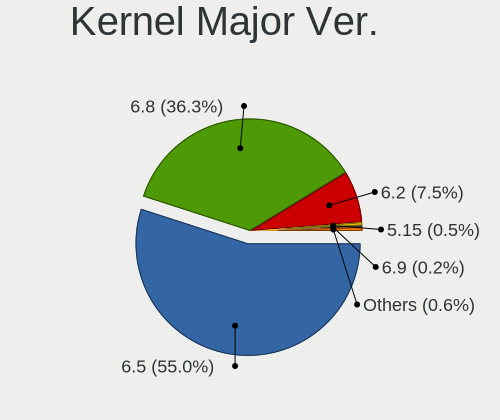

| Version | Desktops | Percent |
|---------|----------|---------|
| 6.5     | 262      | 79.39%  |
| 6.2     | 62       | 18.79%  |
| 5.15    | 3        | 0.91%   |
| 6.7     | 2        | 0.61%   |
| 6.1     | 1        | 0.3%    |

Arch
----

OS architecture (x86_64, i586, etc.)

| Name   | Desktops | Percent |
|--------|----------|---------|
| x86_64 | 324      | 100%    |

DE
--

Desktop Environment

| Name  | Desktops | Percent |
|-------|----------|---------|
| GNOME | 322      | 99.38%  |
| XFCE  | 2        | 0.62%   |

Display Server
--------------

X11 or Wayland

| Name    | Desktops | Percent |
|---------|----------|---------|
| Wayland | 207      | 63.5%   |
| X11     | 118      | 36.2%   |
| Tty     | 1        | 0.31%   |

Display Manager
---------------

SDDM, LightDM, etc.

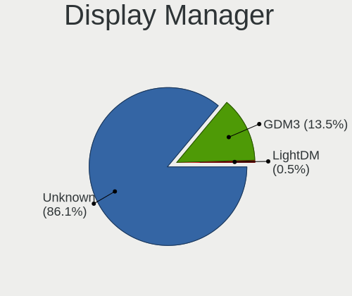

| Name    | Desktops | Percent |
|---------|----------|---------|
| Unknown | 280      | 84.85%  |
| GDM3    | 50       | 15.15%  |

OS Lang
-------

Language

| Lang  | Desktops | Percent |
|-------|----------|---------|
| en_US | 117      | 36.11%  |
| de_DE | 34       | 10.49%  |
| pt_BR | 27       | 8.33%   |
| it_IT | 21       | 6.48%   |
| en_GB | 17       | 5.25%   |
| fr_FR | 14       | 4.32%   |
| es_ES | 9        | 2.78%   |
| en_IN | 8        | 2.47%   |
| en_CA | 8        | 2.47%   |
| en_AU | 8        | 2.47%   |
| nl_NL | 7        | 2.16%   |
| ru_RU | 4        | 1.23%   |
| pt_PT | 4        | 1.23%   |
| hu_HU | 4        | 1.23%   |
| en_ZA | 4        | 1.23%   |
| tr_TR | 3        | 0.93%   |
| pl_PL | 3        | 0.93%   |
| nb_NO | 3        | 0.93%   |
| es_AR | 3        | 0.93%   |
| es_PE | 2        | 0.62%   |
| es_MX | 2        | 0.62%   |
| en_SG | 2        | 0.62%   |
| en_NZ | 2        | 0.62%   |
| da_DK | 2        | 0.62%   |
| cs_CZ | 2        | 0.62%   |
| sv_SE | 1        | 0.31%   |
| sr_RS | 1        | 0.31%   |
| ru_UA | 1        | 0.31%   |
| ro_RO | 1        | 0.31%   |
| ja_JP | 1        | 0.31%   |
| fr_BE | 1        | 0.31%   |
| es_VE | 1        | 0.31%   |
| es_PY | 1        | 0.31%   |
| es_HN | 1        | 0.31%   |
| es_CO | 1        | 0.31%   |
| es_CL | 1        | 0.31%   |
| de_IT | 1        | 0.31%   |
| de_CH | 1        | 0.31%   |
| bg_BG | 1        | 0.31%   |

Boot Mode
---------

EFI or BIOS

| Mode | Desktops | Percent |
|------|----------|---------|
| BIOS | 304      | 92.97%  |
| EFI  | 23       | 7.03%   |

Filesystem
----------

Type of filesystem

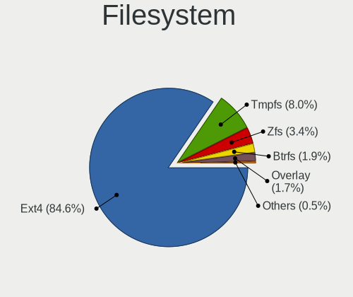

| Type    | Desktops | Percent |
|---------|----------|---------|
| Ext4    | 273      | 82.98%  |
| Tmpfs   | 25       | 7.6%    |
| Zfs     | 12       | 3.65%   |
| Btrfs   | 9        | 2.74%   |
| Overlay | 7        | 2.13%   |
| Xfs     | 2        | 0.61%   |
| Ext2    | 1        | 0.3%    |

Part. scheme
------------

Scheme of partitioning

| Type    | Desktops | Percent |
|---------|----------|---------|
| Unknown | 280      | 84.85%  |
| GPT     | 45       | 13.64%  |
| MBR     | 5        | 1.52%   |

Dual Boot with Linux/BSD
------------------------

Hosting more than one Linux/BSD

| Dual boot | Desktops | Percent |
|-----------|----------|---------|
| No        | 317      | 97.84%  |
| Yes       | 7        | 2.16%   |

Dual Boot (Win)
---------------

Hosting Linux and Windows

| Dual boot | Desktops | Percent |
|-----------|----------|---------|
| No        | 294      | 89.09%  |
| Yes       | 36       | 10.91%  |

Board
-----

Vendor
------

Motherboard manufacturer

| Name                | Desktops | Percent |
|---------------------|----------|---------|
| ASUSTek Computer    | 73       | 22.53%  |
| Gigabyte Technology | 53       | 16.36%  |
| MSI                 | 35       | 10.8%   |
| Dell                | 32       | 9.88%   |
| Hewlett-Packard     | 26       | 8.02%   |
| ASRock              | 21       | 6.48%   |
| Lenovo              | 11       | 3.4%    |
| Intel               | 11       | 3.4%    |
| Unknown             | 10       | 3.09%   |
| Acer                | 8        | 2.47%   |
| ECS                 | 4        | 1.23%   |
| Biostar             | 4        | 1.23%   |
| Pegatron            | 3        | 0.93%   |
| Shuttle             | 2        | 0.62%   |
| MACHINIST           | 2        | 0.62%   |
| GEEKOM              | 2        | 0.62%   |
| Foxconn             | 2        | 0.62%   |
| AMI                 | 2        | 0.62%   |
| TB                  | 1        | 0.31%   |
| T-bao               | 1        | 0.31%   |
| Supermicro          | 1        | 0.31%   |
| STGAUBRON           | 1        | 0.31%   |
| SiS                 | 1        | 0.31%   |
| Samsung Electronics | 1        | 0.31%   |
| QIYIDA              | 1        | 0.31%   |
| Positivo            | 1        | 0.31%   |
| Packard Bell        | 1        | 0.31%   |
| OEM                 | 1        | 0.31%   |
| NCR                 | 1        | 0.31%   |
| Medion              | 1        | 0.31%   |
| LORD ELECTRONICS    | 1        | 0.31%   |
| IBM                 | 1        | 0.31%   |
| Google              | 1        | 0.31%   |
| Gateway             | 1        | 0.31%   |
| Fujitsu             | 1        | 0.31%   |
| DIEBOLD             | 1        | 0.31%   |
| Colorful Technology | 1        | 0.31%   |
| AZW                 | 1        | 0.31%   |
| Apple               | 1        | 0.31%   |
| AOpen               | 1        | 0.31%   |

Model
-----

Motherboard model

| Name                         | Desktops | Percent |
|------------------------------|----------|---------|
| Unknown                      | 11       | 3.4%    |
| Dell OptiPlex 990            | 4        | 1.23%   |
| ASUS All Series              | 4        | 1.23%   |
| MSI MS-7C56                  | 3        | 0.93%   |
| Dell OptiPlex 7010           | 3        | 0.93%   |
| ASUS A0000001                | 3        | 0.93%   |
| MSI MS-7C91                  | 2        | 0.62%   |
| MSI MS-7C52                  | 2        | 0.62%   |
| MSI MS-7C37                  | 2        | 0.62%   |
| MSI MS-7B86                  | 2        | 0.62%   |
| MSI MS-7A38                  | 2        | 0.62%   |
| MSI MS-7850                  | 2        | 0.62%   |
| MSI MS-7817                  | 2        | 0.62%   |
| HP Z230 Tower Workstation    | 2        | 0.62%   |
| HP EliteDesk 800 G3 SFF      | 2        | 0.62%   |
| Gigabyte Z790 AORUS ELITE AX | 2        | 0.62%   |
| Gigabyte GA-880GM-USB3       | 2        | 0.62%   |
| Gigabyte G31M-ES2C           | 2        | 0.62%   |
| Gigabyte EP43-S3L            | 2        | 0.62%   |
| Gigabyte AB350-Gaming 3      | 2        | 0.62%   |
| ECS H61H2-M2                 | 2        | 0.62%   |
| Dell XPS 8700                | 2        | 0.62%   |
| Dell OptiPlex 7050           | 2        | 0.62%   |
| Dell OptiPlex 3010           | 2        | 0.62%   |
| ASUS TUF Gaming X570-PLUS    | 2        | 0.62%   |
| ASUS TUF Gaming A620M-PLUS   | 2        | 0.62%   |
| ASUS ROG STRIX X570-E GAMING | 2        | 0.62%   |
| ASUS P5G41T-M LX             | 2        | 0.62%   |
| ASUS M5A97 R2.0              | 2        | 0.62%   |
| ASRock B550M PG Riptide      | 2        | 0.62%   |
| ASRock A520M-HDV             | 2        | 0.62%   |
| TB WTR R1                    | 1        | 0.31%   |
| T-bao MINI PC                | 1        | 0.31%   |
| Supermicro C2SBC-Q           | 1        | 0.31%   |
| STGAUBRON B75M4 V1.1         | 1        | 0.31%   |
| SiS B550S                    | 1        | 0.31%   |
| Shuttle SZ87R                | 1        | 0.31%   |
| Shuttle SG31                 | 1        | 0.31%   |
| Samsung DeskTop System       | 1        | 0.31%   |
| QIYIDA ED4 V1.1              | 1        | 0.31%   |

Model Family
------------

Motherboard model prefix

| Name                   | Desktops | Percent |
|------------------------|----------|---------|
| Dell OptiPlex          | 21       | 6.48%   |
| ASUS TUF               | 12       | 3.7%    |
| ASUS ROG               | 11       | 3.4%    |
| ASUS PRIME             | 11       | 3.4%    |
| Unknown                | 11       | 3.4%    |
| Lenovo ThinkCentre     | 7        | 2.16%   |
| HP EliteDesk           | 6        | 1.85%   |
| HP Compaq              | 6        | 1.85%   |
| Acer Aspire            | 5        | 1.54%   |
| HP Pavilion            | 4        | 1.23%   |
| Dell Precision         | 4        | 1.23%   |
| ASUS All               | 4        | 1.23%   |
| MSI MS-7C56            | 3        | 0.93%   |
| Dell XPS               | 3        | 0.93%   |
| Dell Inspiron          | 3        | 0.93%   |
| ASUS P5G41T-M          | 3        | 0.93%   |
| ASUS A0000001          | 3        | 0.93%   |
| MSI MS-7C91            | 2        | 0.62%   |
| MSI MS-7C52            | 2        | 0.62%   |
| MSI MS-7C37            | 2        | 0.62%   |
| MSI MS-7B86            | 2        | 0.62%   |
| MSI MS-7A38            | 2        | 0.62%   |
| MSI MS-7850            | 2        | 0.62%   |
| MSI MS-7817            | 2        | 0.62%   |
| Lenovo ThinkStation    | 2        | 0.62%   |
| HP Z230                | 2        | 0.62%   |
| HP ProDesk             | 2        | 0.62%   |
| Gigabyte Z790          | 2        | 0.62%   |
| Gigabyte Z390          | 2        | 0.62%   |
| Gigabyte X570S         | 2        | 0.62%   |
| Gigabyte GA-880GM-USB3 | 2        | 0.62%   |
| Gigabyte G31M-ES2C     | 2        | 0.62%   |
| Gigabyte EP43-S3L      | 2        | 0.62%   |
| Gigabyte B650          | 2        | 0.62%   |
| Gigabyte B550          | 2        | 0.62%   |
| Gigabyte AB350-Gaming  | 2        | 0.62%   |
| ECS H61H2-M2           | 2        | 0.62%   |
| ASUS STRIX             | 2        | 0.62%   |
| ASUS P8P67             | 2        | 0.62%   |
| ASUS P8H61-M           | 2        | 0.62%   |

MFG Year
--------

Motherboard manufacture year

| Year    | Desktops | Percent |
|---------|----------|---------|
| 2012    | 34       | 10.49%  |
| 2013    | 31       | 9.57%   |
| 2022    | 25       | 7.72%   |
| 2018    | 25       | 7.72%   |
| 2014    | 23       | 7.1%    |
| 2023    | 21       | 6.48%   |
| 2020    | 21       | 6.48%   |
| 2011    | 21       | 6.48%   |
| 2021    | 20       | 6.17%   |
| 2017    | 20       | 6.17%   |
| 2019    | 18       | 5.56%   |
| 2010    | 14       | 4.32%   |
| 2016    | 11       | 3.4%    |
| 2009    | 10       | 3.09%   |
| 2015    | 9        | 2.78%   |
| 2008    | 9        | 2.78%   |
| 2007    | 6        | 1.85%   |
| 2006    | 3        | 0.93%   |
| 2024    | 2        | 0.62%   |
| Unknown | 1        | 0.31%   |

Form Factor
-----------

Physical design of the computer

| Name    | Desktops | Percent |
|---------|----------|---------|
| Desktop | 324      | 100%    |

Secure Boot
-----------

Enabled or disabled

| State    | Desktops | Percent |
|----------|----------|---------|
| Disabled | 318      | 98.15%  |
| Enabled  | 6        | 1.85%   |

Coreboot
--------

Have coreboot on board

| Used | Desktops | Percent |
|------|----------|---------|
| No   | 323      | 99.69%  |
| Yes  | 1        | 0.31%   |

RAM Size
--------

Total RAM memory

| Size in GB      | Desktops | Percent |
|-----------------|----------|---------|
| 16.01-24.0      | 82       | 25.31%  |
| 4.01-8.0        | 61       | 18.83%  |
| 8.01-16.0       | 56       | 17.28%  |
| 32.01-64.0      | 55       | 16.98%  |
| 3.01-4.0        | 27       | 8.33%   |
| 64.01-256.0     | 21       | 6.48%   |
| 24.01-32.0      | 15       | 4.63%   |
| 2.01-3.0        | 3        | 0.93%   |
| 1.01-2.0        | 3        | 0.93%   |
| More than 256.0 | 1        | 0.31%   |

RAM Used
--------

Used RAM memory

| Used GB    | Desktops | Percent |
|------------|----------|---------|
| 2.01-3.0   | 120      | 34.29%  |
| 1.01-2.0   | 92       | 26.29%  |
| 3.01-4.0   | 64       | 18.29%  |
| 4.01-8.0   | 58       | 16.57%  |
| 8.01-16.0  | 12       | 3.43%   |
| 16.01-24.0 | 2        | 0.57%   |
| 0.51-1.0   | 2        | 0.57%   |

Total Drives
------------

Number of drives on board

| Drives | Desktops | Percent |
|--------|----------|---------|
| 1      | 132      | 39.52%  |
| 2      | 98       | 29.34%  |
| 3      | 54       | 16.17%  |
| 4      | 22       | 6.59%   |
| 6      | 8        | 2.4%    |
| 5      | 8        | 2.4%    |
| 8      | 6        | 1.8%    |
| 7      | 3        | 0.9%    |
| 11     | 1        | 0.3%    |
| 10     | 1        | 0.3%    |
| 9      | 1        | 0.3%    |

Has CD-ROM
----------

Has CD-ROM on board

| Presented | Desktops | Percent |
|-----------|----------|---------|
| No        | 189      | 58.15%  |
| Yes       | 136      | 41.85%  |

Has Ethernet
------------

Has Ethernet on board

| Presented | Desktops | Percent |
|-----------|----------|---------|
| Yes       | 324      | 100%    |

Has WiFi
--------

Has WiFi module

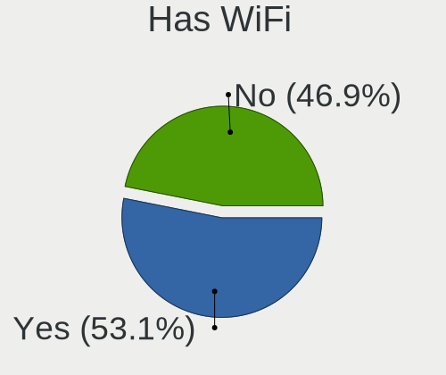

| Presented | Desktops | Percent |
|-----------|----------|---------|
| Yes       | 164      | 50.46%  |
| No        | 161      | 49.54%  |

Has Bluetooth
-------------

Has Bluetooth module

| Presented | Desktops | Percent |
|-----------|----------|---------|
| No        | 205      | 62.88%  |
| Yes       | 121      | 37.12%  |

Location
--------

Country
-------

Geographic location (country)

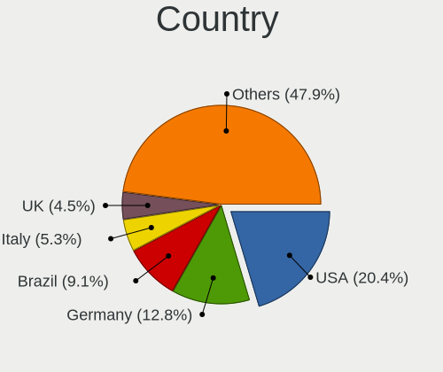

| Country      | Desktops | Percent |
|--------------|----------|---------|
| USA          | 70       | 21.6%   |
| Germany      | 38       | 11.73%  |
| Brazil       | 30       | 9.26%   |
| Italy        | 21       | 6.48%   |
| UK           | 18       | 5.56%   |
| France       | 14       | 4.32%   |
| Netherlands  | 10       | 3.09%   |
| India        | 10       | 3.09%   |
| Spain        | 8        | 2.47%   |
| Canada       | 8        | 2.47%   |
| Australia    | 8        | 2.47%   |
| Portugal     | 6        | 1.85%   |
| Egypt        | 6        | 1.85%   |
| Hungary      | 5        | 1.54%   |
| South Africa | 4        | 1.23%   |
| Russia       | 4        | 1.23%   |
| Romania      | 4        | 1.23%   |
| Norway       | 4        | 1.23%   |
| Turkey       | 3        | 0.93%   |
| Sweden       | 3        | 0.93%   |
| Peru         | 3        | 0.93%   |
| Mexico       | 3        | 0.93%   |
| Greece       | 3        | 0.93%   |
| Ukraine      | 2        | 0.62%   |
| Switzerland  | 2        | 0.62%   |
| Singapore    | 2        | 0.62%   |
| New Zealand  | 2        | 0.62%   |
| Indonesia    | 2        | 0.62%   |
| Denmark      | 2        | 0.62%   |
| Czechia      | 2        | 0.62%   |
| Argentina    | 2        | 0.62%   |
| Algeria      | 2        | 0.62%   |
| Venezuela    | 1        | 0.31%   |
| Uruguay      | 1        | 0.31%   |
| Thailand     | 1        | 0.31%   |
| Serbia       | 1        | 0.31%   |
| Saudi Arabia | 1        | 0.31%   |
| Runion     | 1        | 0.31%   |
| Poland       | 1        | 0.31%   |
| Paraguay     | 1        | 0.31%   |

City
----

Geographic location (city)

| City                      | Desktops | Percent |
|---------------------------|----------|---------|
| Berlin                    | 5        | 1.52%   |
| Milan                     | 4        | 1.21%   |
| Sydney                    | 3        | 0.91%   |
| Sao Paulo                 | 3        | 0.91%   |
| Cairo                     | 3        | 0.91%   |
| Warrington                | 2        | 0.61%   |
| Wakefield                 | 2        | 0.61%   |
| Stuttgart                 | 2        | 0.61%   |
| Stockholm                 | 2        | 0.61%   |
| Singapore                 | 2        | 0.61%   |
| Saint-Germain-les-Arpajon | 2        | 0.61%   |
| Rio de Janeiro            | 2        | 0.61%   |
| Piraeus                   | 2        | 0.61%   |
| Mumbai                    | 2        | 0.61%   |
| Moscow                    | 2        | 0.61%   |
| Minneapolis               | 2        | 0.61%   |
| Melbourne                 | 2        | 0.61%   |
| Lima                      | 2        | 0.61%   |
| Johannesburg              | 2        | 0.61%   |
| Istanbul                  | 2        | 0.61%   |
| Indianapolis              | 2        | 0.61%   |
| Chennai                   | 2        | 0.61%   |
| Calgary                   | 2        | 0.61%   |
| Bellaria-Igea Marina      | 2        | 0.61%   |
| Belm                    | 2        | 0.61%   |
| Atlanta                   | 2        | 0.61%   |
| Amsterdam                 | 2        | 0.61%   |
| Albuquerque               | 2        | 0.61%   |
| Adelaide                  | 2        | 0.61%   |
| Zurich                    | 1        | 0.3%    |
| Zaragoza                  | 1        | 0.3%    |
| Wrzburg                 | 1        | 0.3%    |
| Woodland                  | 1        | 0.3%    |
| Wolfville                 | 1        | 0.3%    |
| Winterswijk               | 1        | 0.3%    |
| West Warwick              | 1        | 0.3%    |
| West Chester              | 1        | 0.3%    |
| Waterloo                  | 1        | 0.3%    |
| Warren                    | 1        | 0.3%    |
| Waalwijk                  | 1        | 0.3%    |

Drives
------

Drive Vendor
------------

Hard drive vendors

| Vendor                       | Desktops | Drives | Percent |
|------------------------------|----------|--------|---------|
| WDC                          | 103      | 143    | 16.83%  |
| Samsung Electronics          | 86       | 138    | 14.05%  |
| Seagate                      | 82       | 113    | 13.4%   |
| Kingston                     | 41       | 44     | 6.7%    |
| SanDisk                      | 40       | 65     | 6.54%   |
| Crucial                      | 25       | 31     | 4.08%   |
| Toshiba                      | 24       | 26     | 3.92%   |
| Hitachi                      | 18       | 20     | 2.94%   |
| China                        | 18       | 22     | 2.94%   |
| Micron/Crucial Technology    | 13       | 17     | 2.12%   |
| Phison Electronics           | 11       | 14     | 1.8%    |
| SK hynix                     | 8        | 11     | 1.31%   |
| Silicon Motion               | 8        | 9      | 1.31%   |
| PNY                          | 8        | 9      | 1.31%   |
| Intenso                      | 8        | 9      | 1.31%   |
| MAXIO Technology (Hangzhou)  | 7        | 7      | 1.14%   |
| Unknown                      | 6        | 13     | 0.98%   |
| Kingston Technology Company  | 6        | 7      | 0.98%   |
| Intel                        | 6        | 6      | 0.98%   |
| HGST                         | 6        | 9      | 0.98%   |
| Micron Technology            | 5        | 6      | 0.82%   |
| Realtek Semiconductor        | 4        | 4      | 0.65%   |
| Lexar                        | 4        | 6      | 0.65%   |
| KIOXIA-EXCERIA               | 4        | 5      | 0.65%   |
| A-DATA Technology            | 4        | 4      | 0.65%   |
| Verbatim                     | 3        | 6      | 0.49%   |
| Transcend                    | 3        | 3      | 0.49%   |
| SPCC                         | 3        | 3      | 0.49%   |
| Corsair                      | 3        | 4      | 0.49%   |
| ADATA Technology             | 3        | 3      | 0.49%   |
| Unknown                      | 3        | 5      | 0.49%   |
| Team                         | 2        | 2      | 0.33%   |
| Shenzhen Longsys Electronics | 2        | 2      | 0.33%   |
| SABRENT                      | 2        | 4      | 0.33%   |
| Patriot                      | 2        | 3      | 0.33%   |
| OCZ                          | 2        | 2      | 0.33%   |
| Netac                        | 2        | 3      | 0.33%   |
| Maxtor                       | 2        | 2      | 0.33%   |
| Fanxiang                     | 2        | 2      | 0.33%   |
| External                     | 2        | 2      | 0.33%   |

Drive Model
-----------

Hard drive models

| Model                                                 | Desktops | Percent |
|-------------------------------------------------------|----------|---------|
| Kingston SA400S37240G 240GB SSD                       | 11       | 1.59%   |
| Samsung NVMe SSD Controller SM981/PM981/PM983 1TB     | 10       | 1.44%   |
| Seagate ST500DM002-1BD142 500GB                       | 9        | 1.3%    |
| Samsung NVMe SSD Controller PM9A1/PM9A3/980PRO 1TB    | 8        | 1.15%   |
| Micron/Crucial P2 NVMe PCIe SSD 4TB                   | 7        | 1.01%   |
| Kingston SA400S37120G 120GB SSD                       | 7        | 1.01%   |
| Silicon Motion SM2263EN/SM2263XT SSD Controller 256GB | 6        | 0.86%   |
| Seagate ST1000DM010-2EP102 1TB                        | 6        | 0.86%   |
| Sandisk WD Blue SN550 NVMe SSD 2TB                    | 6        | 0.86%   |
| Toshiba DT01ACA100 1TB                                | 5        | 0.72%   |
| Samsung SSD 860 EVO 250GB                             | 5        | 0.72%   |
| Crucial CT500MX500SSD1 500GB                          | 5        | 0.72%   |
| Seagate ST1000DM003-1CH162 1TB                        | 4        | 0.58%   |
| Sandisk WD Black SN750 / PC SN730 NVMe SSD 512GB      | 4        | 0.58%   |
| Samsung SSD 870 QVO 1TB                               | 4        | 0.58%   |
| Samsung SSD 870 EVO 500GB                             | 4        | 0.58%   |
| Samsung SSD 860 EVO 500GB                             | 4        | 0.58%   |
| Phison E12 NVMe Controller 2TB                        | 4        | 0.58%   |
| MAXIO (Hangzhou) NVMe SSD Controller MAP1202 256GB    | 4        | 0.58%   |
| Crucial CT500BX500SSD1 500GB                          | 4        | 0.58%   |
| Crucial CT240BX500SSD1 240GB                          | 4        | 0.58%   |
| WDC WDS100T2B0A-00SM50 1TB SSD                        | 3        | 0.43%   |
| WDC WD5000AAKX-60U6AA0 500GB                          | 3        | 0.43%   |
| WDC WD20EARX-00PASB0 2TB                              | 3        | 0.43%   |
| WDC WD10EZEX-08WN4A0 1TB                              | 3        | 0.43%   |
| Verbatim Vi550 S3 128GB SSD                           | 3        | 0.43%   |
| Toshiba HDWD110 1TB                                   | 3        | 0.43%   |
| Toshiba DT01ACA050 500GB                              | 3        | 0.43%   |
| Seagate ST4000DM004-2CV104 4TB                        | 3        | 0.43%   |
| Seagate ST31000524AS 1TB                              | 3        | 0.43%   |
| Seagate ST1000DM003-9YN162 1TB                        | 3        | 0.43%   |
| Sandisk WD Black SN850 512GB                          | 3        | 0.43%   |
| Samsung SSD 990 PRO 2TB                               | 3        | 0.43%   |
| Samsung SSD 980 1TB                                   | 3        | 0.43%   |
| Samsung SSD 860 QVO 1TB                               | 3        | 0.43%   |
| Samsung SSD 860 EVO 1TB                               | 3        | 0.43%   |
| Samsung SSD 850 EVO 500GB                             | 3        | 0.43%   |
| Samsung SSD 850 EVO 250GB                             | 3        | 0.43%   |
| Samsung SSD 840 Series 120GB                          | 3        | 0.43%   |
| PNY CS900 120GB SSD                                   | 3        | 0.43%   |

HDD Vendor
----------

Hard disk drive vendors

| Vendor              | Desktops | Drives | Percent |
|---------------------|----------|--------|---------|
| WDC                 | 92       | 127    | 39.66%  |
| Seagate             | 79       | 109    | 34.05%  |
| Toshiba             | 19       | 21     | 8.19%   |
| Hitachi             | 18       | 20     | 7.76%   |
| Samsung Electronics | 9        | 11     | 3.88%   |
| HGST                | 6        | 9      | 2.59%   |
| Unknown             | 2        | 2      | 0.86%   |
| Maxtor              | 2        | 2      | 0.86%   |
| SABRENT             | 1        | 3      | 0.43%   |
| LaCie               | 1        | 1      | 0.43%   |
| JMicron Technology  | 1        | 1      | 0.43%   |
| Intenso             | 1        | 2      | 0.43%   |
| ASMT                | 1        | 1      | 0.43%   |

SSD Vendor
----------

Solid state drive vendors

| Vendor              | Desktops | Drives | Percent |
|---------------------|----------|--------|---------|
| Samsung Electronics | 57       | 82     | 24.05%  |
| Kingston            | 34       | 37     | 14.35%  |
| Crucial             | 24       | 30     | 10.13%  |
| China               | 17       | 21     | 7.17%   |
| SanDisk             | 14       | 19     | 5.91%   |
| WDC                 | 13       | 15     | 5.49%   |
| PNY                 | 8        | 9      | 3.38%   |
| Intel               | 5        | 5      | 2.11%   |
| Lexar               | 4        | 6      | 1.69%   |
| Intenso             | 4        | 4      | 1.69%   |
| A-DATA Technology   | 4        | 4      | 1.69%   |
| Verbatim            | 3        | 6      | 1.27%   |
| Transcend           | 3        | 3      | 1.27%   |
| SPCC                | 3        | 3      | 1.27%   |
| SK hynix            | 3        | 5      | 1.27%   |
| Micron Technology   | 3        | 4      | 1.27%   |
| KIOXIA-EXCERIA      | 3        | 4      | 1.27%   |
| Toshiba             | 2        | 2      | 0.84%   |
| Team                | 2        | 2      | 0.84%   |
| OCZ                 | 2        | 2      | 0.84%   |
| Netac               | 2        | 3      | 0.84%   |
| External            | 2        | 2      | 0.84%   |
| Corsair             | 2        | 2      | 0.84%   |
| Apacer              | 2        | 2      | 0.84%   |
| Unknown             | 2        | 4      | 0.84%   |
| TEAM T25            | 1        | 1      | 0.42%   |
| Seagate             | 1        | 2      | 0.42%   |
| Patriot             | 1        | 2      | 0.42%   |
| Mushkin             | 1        | 1      | 0.42%   |
| MOVESPEED           | 1        | 1      | 0.42%   |
| LITEON              | 1        | 1      | 0.42%   |
| LDLC                | 1        | 1      | 0.42%   |
| KingSpec            | 1        | 1      | 0.42%   |
| Integral            | 1        | 1      | 0.42%   |
| Hewlett-Packard     | 1        | 1      | 0.42%   |
| Fanxiang            | 1        | 1      | 0.42%   |
| EVM                 | 1        | 1      | 0.42%   |
| Drevo               | 1        | 2      | 0.42%   |
| DEXP                | 1        | 1      | 0.42%   |
| CT1000P1            | 1        | 1      | 0.42%   |

Drive Kind
----------

HDD or SSD

| Kind    | Desktops | Drives | Percent |
|---------|----------|--------|---------|
| SSD     | 188      | 298    | 37.23%  |
| HDD     | 184      | 309    | 36.44%  |
| NVMe    | 118      | 191    | 23.37%  |
| Unknown | 14       | 21     | 2.77%   |
| MMC     | 1        | 1      | 0.2%    |

Drive Connector
---------------

SATA, SAS, NVMe, etc.

| Type | Desktops | Drives | Percent |
|------|----------|--------|---------|
| SATA | 280      | 587    | 66.04%  |
| NVMe | 118      | 189    | 27.83%  |
| SAS  | 25       | 43     | 5.9%    |
| MMC  | 1        | 1      | 0.24%   |

Drive Size
----------

Size of hard drive

| Size in TB | Desktops | Drives | Percent |
|------------|----------|--------|---------|
| 0.01-0.5   | 195      | 314    | 48.87%  |
| 0.51-1.0   | 117      | 166    | 29.32%  |
| 1.01-2.0   | 44       | 58     | 11.03%  |
| 3.01-4.0   | 19       | 33     | 4.76%   |
| 2.01-3.0   | 10       | 12     | 2.51%   |
| 4.01-10.0  | 10       | 18     | 2.51%   |
| 10.01-20.0 | 4        | 6      | 1%      |

Space Total
-----------

Amount of disk space available on the file system

| Size in GB     | Desktops | Percent |
|----------------|----------|---------|
| 101-250        | 112      | 33.73%  |
| 251-500        | 65       | 19.58%  |
| 501-1000       | 47       | 14.16%  |
| 1001-2000      | 33       | 9.94%   |
| More than 3000 | 30       | 9.04%   |
| 1-20           | 12       | 3.61%   |
| 51-100         | 11       | 3.31%   |
| 2001-3000      | 10       | 3.01%   |
| 21-50          | 7        | 2.11%   |
| Unknown        | 4        | 1.2%    |
| 0              | 1        | 0.3%    |

Space Used
----------

Amount of used disk space

| Used GB        | Desktops | Percent |
|----------------|----------|---------|
| 1-20           | 110      | 31.88%  |
| 21-50          | 108      | 31.3%   |
| 51-100         | 39       | 11.3%   |
| 251-500        | 20       | 5.8%    |
| 101-250        | 20       | 5.8%    |
| 501-1000       | 14       | 4.06%   |
| 1001-2000      | 12       | 3.48%   |
| More than 3000 | 11       | 3.19%   |
| 2001-3000      | 6        | 1.74%   |
| Unknown        | 4        | 1.16%   |
| 0              | 1        | 0.29%   |

Malfunc. Drives
---------------

Drive models with a malfunction

| Model                                        | Desktops | Drives | Percent |
|----------------------------------------------|----------|--------|---------|
| WDC WD10JPVX-60JC3T0 1TB                     | 1        | 1      | 25%     |
| Seagate ST2000LM007-1R8174 2TB               | 1        | 1      | 25%     |
| Samsung Electronics SSD 840 PRO Series 256GB | 1        | 1      | 25%     |
| Hitachi HDS721680PLA380 80GB                 | 1        | 1      | 25%     |

Malfunc. Drive Vendor
---------------------

Vendors of faulty drives

| Vendor              | Desktops | Drives | Percent |
|---------------------|----------|--------|---------|
| WDC                 | 1        | 1      | 25%     |
| Seagate             | 1        | 1      | 25%     |
| Samsung Electronics | 1        | 1      | 25%     |
| Hitachi             | 1        | 1      | 25%     |

Malfunc. HDD Vendor
-------------------

Vendors of faulty HDD drives

| Vendor  | Desktops | Drives | Percent |
|---------|----------|--------|---------|
| WDC     | 1        | 1      | 33.33%  |
| Seagate | 1        | 1      | 33.33%  |
| Hitachi | 1        | 1      | 33.33%  |

Malfunc. Drive Kind
-------------------

Kinds of faulty drives

| Kind | Desktops | Drives | Percent |
|------|----------|--------|---------|
| HDD  | 3        | 3      | 75%     |
| SSD  | 1        | 1      | 25%     |

Failed Drives
-------------

Failed drive models

Zero info for selected period =(

Failed Drive Vendor
-------------------

Failed drive vendors

Zero info for selected period =(

Drive Status
------------

Number of failed and malfunc. drives

| Status   | Desktops | Drives | Percent |
|----------|----------|--------|---------|
| Detected | 306      | 763    | 91.89%  |
| Works    | 23       | 53     | 6.91%   |
| Malfunc  | 4        | 4      | 1.2%    |

Storage controller
------------------

Storage Vendor
--------------

Storage controller vendors

| Vendor                        | Desktops | Percent |
|-------------------------------|----------|---------|
| Intel                         | 213      | 42.26%  |
| AMD                           | 104      | 20.63%  |
| Samsung Electronics           | 33       | 6.55%   |
| SanDisk                       | 27       | 5.36%   |
| ASMedia Technology            | 20       | 3.97%   |
| Micron/Crucial Technology     | 14       | 2.78%   |
| Phison Electronics            | 13       | 2.58%   |
| Kingston Technology Company   | 11       | 2.18%   |
| Marvell Technology Group      | 10       | 1.98%   |
| JMicron Technology            | 10       | 1.98%   |
| Silicon Motion                | 8        | 1.59%   |
| MAXIO Technology (Hangzhou)   | 7        | 1.39%   |
| SK hynix                      | 5        | 0.99%   |
| Realtek Semiconductor         | 4        | 0.79%   |
| Toshiba America Info Systems  | 3        | 0.6%    |
| Seagate Technology            | 3        | 0.6%    |
| ADATA Technology              | 3        | 0.6%    |
| Shenzhen Longsys Electronics  | 2        | 0.4%    |
| Micron Technology             | 2        | 0.4%    |
| KIOXIA                        | 2        | 0.4%    |
| Integrated Technology Express | 2        | 0.4%    |
| Broadcom / LSI                | 2        | 0.4%    |
| Nvidia                        | 1        | 0.2%    |
| LSI Logic / Symbios Logic     | 1        | 0.2%    |
| Hosin Global Electronics      | 1        | 0.2%    |
| HighPoint Technologies        | 1        | 0.2%    |
| Adaptec                       | 1        | 0.2%    |
| Unknown                       | 1        | 0.2%    |

Storage Model
-------------

Storage controller models

| Model                                                                                   | Desktops | Percent |
|-----------------------------------------------------------------------------------------|----------|---------|
| AMD FCH SATA Controller [AHCI mode]                                                     | 40       | 6.62%   |
| Intel 8 Series/C220 Series Chipset Family 6-port SATA Controller 1 [AHCI mode]          | 30       | 4.97%   |
| Intel 6 Series/C200 Series Chipset Family 6 port Desktop SATA AHCI Controller           | 23       | 3.81%   |
| AMD 500 Series Chipset SATA Controller                                                  | 22       | 3.64%   |
| ASMedia ASM1061/ASM1062 Serial ATA Controller                                           | 19       | 3.15%   |
| Intel 7 Series/C210 Series Chipset Family 6-port SATA Controller [AHCI mode]            | 17       | 2.81%   |
| AMD 400 Series Chipset SATA Controller                                                  | 17       | 2.81%   |
| Intel 200 Series PCH SATA controller [AHCI mode]                                        | 14       | 2.32%   |
| AMD SB7x0/SB8x0/SB9x0 SATA Controller [AHCI mode]                                       | 14       | 2.32%   |
| Intel NM10/ICH7 Family SATA Controller [IDE mode]                                       | 13       | 2.15%   |
| AMD SB7x0/SB8x0/SB9x0 IDE Controller                                                    | 13       | 2.15%   |
| Samsung NVMe SSD Controller SM981/PM981/PM983                                           | 12       | 1.99%   |
| Intel Q170/Q150/B150/H170/H110/Z170/CM236 Chipset SATA Controller [AHCI Mode]           | 12       | 1.99%   |
| Intel 6 Series/C200 Series Chipset Family Desktop SATA Controller (IDE mode, ports 4-5) | 12       | 1.99%   |
| Intel 6 Series/C200 Series Chipset Family Desktop SATA Controller (IDE mode, ports 0-3) | 12       | 1.99%   |
| Intel SATA Controller [RAID mode]                                                       | 11       | 1.82%   |
| Samsung NVMe SSD Controller PM9A1/PM9A3/980PRO                                          | 10       | 1.66%   |
| Intel Cannon Lake PCH SATA AHCI Controller                                              | 9        | 1.49%   |
| Intel Alder Lake-S PCH SATA Controller [AHCI Mode]                                      | 9        | 1.49%   |
| Intel 82801G (ICH7 Family) IDE Controller                                               | 9        | 1.49%   |
| Intel Volume Management Device NVMe RAID Controller                                     | 8        | 1.32%   |
| Intel Raptor Lake SATA AHCI Controller                                                  | 8        | 1.32%   |
| AMD 600 Series Chipset SATA Controller                                                  | 8        | 1.32%   |
| Micron/Crucial P2 [Nick P2] / P3 / P3 Plus NVMe PCIe SSD (DRAM-less)                    | 7        | 1.16%   |
| AMD SB7x0/SB8x0/SB9x0 SATA Controller [IDE mode]                                        | 7        | 1.16%   |
| Silicon Motion SM2263EN/SM2263XT (DRAM-less) NVMe SSD Controllers                       | 6        | 0.99%   |
| Sandisk WD Black SN850X NVMe SSD                                                        | 6        | 0.99%   |
| SanDisk Ultra 3D / WD Blue SN550 NVMe SSD                                               | 6        | 0.99%   |
| Samsung NVMe SSD Controller 980 (DRAM-less)                                             | 6        | 0.99%   |
| AMD FCH SATA Controller D                                                               | 6        | 0.99%   |
| Phison E12 NVMe Controller                                                              | 5        | 0.83%   |
| JMicron JMB363 SATA/IDE Controller                                                      | 5        | 0.83%   |
| AMD 300 Series Chipset SATA Controller                                                  | 5        | 0.83%   |
| SanDisk WD Black SN770 / PC SN740 256GB / PC SN560 (DRAM-less) NVMe SSD                 | 4        | 0.66%   |
| SanDisk Ultra 3D / WD Blue SN570 NVMe SSD (DRAM-less)                                   | 4        | 0.66%   |
| SanDisk Extreme Pro / WD Black SN750 / PC SN730 / Red SN700 NVMe SSD                    | 4        | 0.66%   |
| Samsung NVMe SSD Controller S4LV008[Pascal]                                             | 4        | 0.66%   |
| MAXIO (Hangzhou) NVMe SSD Controller MAP1202 (DRAM-less)                                | 4        | 0.66%   |
| Intel 82801JI (ICH10 Family) 4 port SATA IDE Controller #1                              | 4        | 0.66%   |
| Intel 82801JI (ICH10 Family) 2 port SATA IDE Controller #2                              | 4        | 0.66%   |

Storage Kind
------------

Kind of storage controller (IDE, SATA, NVMe, SAS, ...)

| Kind | Desktops | Percent |
|------|----------|---------|
| SATA | 264      | 55.23%  |
| NVMe | 118      | 24.69%  |
| IDE  | 66       | 13.81%  |
| RAID | 27       | 5.65%   |
| SAS  | 3        | 0.63%   |

Processor
---------

CPU Vendor
----------

Processor vendors

| Vendor | Desktops | Percent |
|--------|----------|---------|
| Intel  | 218      | 67.28%  |
| AMD    | 106      | 32.72%  |

CPU Model
---------

Processor models

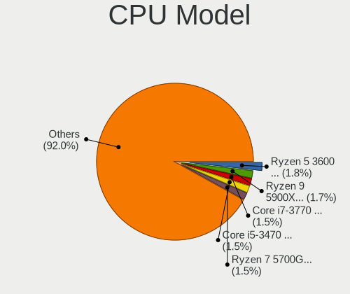

| Model                                  | Desktops | Percent |
|----------------------------------------|----------|---------|
| Intel Core i5-3470 CPU @ 3.20GHz       | 10       | 3.09%   |
| AMD Ryzen 9 5900X 12-Core Processor    | 7        | 2.16%   |
| AMD Ryzen 7 5700G with Radeon Graphics | 7        | 2.16%   |
| Intel Core i7-4770 CPU @ 3.40GHz       | 5        | 1.54%   |
| Intel Core i7-3770 CPU @ 3.40GHz       | 5        | 1.54%   |
| Intel Core i5-2400 CPU @ 3.10GHz       | 5        | 1.54%   |
| Intel Core i7-4790 CPU @ 3.60GHz       | 4        | 1.23%   |
| Intel Core i5-4460 CPU @ 3.20GHz       | 4        | 1.23%   |
| Intel Core 2 Duo CPU E8400 @ 3.00GHz   | 4        | 1.23%   |
| AMD Ryzen 5 5600G with Radeon Graphics | 4        | 1.23%   |
| AMD Ryzen 5 3600 6-Core Processor      | 4        | 1.23%   |
| AMD FX-6300 Six-Core Processor         | 4        | 1.23%   |
| Intel N100                             | 3        | 0.93%   |
| Intel Core i7-4790K CPU @ 4.00GHz      | 3        | 0.93%   |
| Intel Core i7-4770K CPU @ 3.50GHz      | 3        | 0.93%   |
| Intel Core i7-2600K CPU @ 3.40GHz      | 3        | 0.93%   |
| Intel Core i5-7500 CPU @ 3.40GHz       | 3        | 0.93%   |
| Intel Core i5-6500 CPU @ 3.20GHz       | 3        | 0.93%   |
| Intel Core i3-7100 CPU @ 3.90GHz       | 3        | 0.93%   |
| Intel Core i3-2120 CPU @ 3.30GHz       | 3        | 0.93%   |
| Intel Core i3-2100 CPU @ 3.10GHz       | 3        | 0.93%   |
| Intel Core 2 Duo CPU E7500 @ 2.93GHz   | 3        | 0.93%   |
| AMD Ryzen 7 5800X 8-Core Processor     | 3        | 0.93%   |
| AMD Ryzen 7 3700X 8-Core Processor     | 3        | 0.93%   |
| AMD Ryzen 5 5600X 6-Core Processor     | 3        | 0.93%   |
| AMD Ryzen 5 5500                       | 3        | 0.93%   |
| AMD Ryzen 5 4600G with Radeon Graphics | 3        | 0.93%   |
| AMD Ryzen 5 1600 Six-Core Processor    | 3        | 0.93%   |
| AMD Phenom II X4 955 Processor         | 3        | 0.93%   |
| Intel Xeon CPU E5-2697 v2 @ 2.70GHz    | 2        | 0.62%   |
| Intel Xeon CPU E5-2630 v4 @ 2.20GHz    | 2        | 0.62%   |
| Intel Pentium Dual CPU E2180 @ 2.00GHz | 2        | 0.62%   |
| Intel Pentium CPU G645 @ 2.90GHz       | 2        | 0.62%   |
| Intel Pentium CPU G3258 @ 3.20GHz      | 2        | 0.62%   |
| Intel Core i9-9900K CPU @ 3.60GHz      | 2        | 0.62%   |
| Intel Core i7-7700K CPU @ 4.20GHz      | 2        | 0.62%   |
| Intel Core i7-6700K CPU @ 4.00GHz      | 2        | 0.62%   |
| Intel Core i5-8400 CPU @ 2.80GHz       | 2        | 0.62%   |
| Intel Core i5-7400 CPU @ 3.00GHz       | 2        | 0.62%   |
| Intel Core i5-6500T CPU @ 2.50GHz      | 2        | 0.62%   |

CPU Model Family
----------------

Processor model prefix

| Model                   | Desktops | Percent |
|-------------------------|----------|---------|
| Intel Core i5           | 58       | 17.9%   |
| Intel Core i7           | 42       | 12.96%  |
| AMD Ryzen 5             | 27       | 8.33%   |
| Intel Core i3           | 26       | 8.02%   |
| AMD Ryzen 7             | 25       | 7.72%   |
| Other                   | 23       | 7.1%    |
| Intel Xeon              | 13       | 4.01%   |
| Intel Core 2 Duo        | 12       | 3.7%    |
| Intel Celeron           | 11       | 3.4%    |
| AMD Ryzen 9             | 11       | 3.4%    |
| Intel Pentium           | 10       | 3.09%   |
| AMD FX                  | 10       | 3.09%   |
| Intel Core 2 Quad       | 9        | 2.78%   |
| Intel Core i9           | 5        | 1.54%   |
| AMD Phenom II X4        | 5        | 1.54%   |
| AMD A8                  | 5        | 1.54%   |
| AMD Ryzen 3             | 4        | 1.23%   |
| AMD A10                 | 4        | 1.23%   |
| Intel Pentium Gold      | 2        | 0.62%   |
| Intel Pentium Dual-Core | 2        | 0.62%   |
| Intel Pentium Dual      | 2        | 0.62%   |
| Intel Atom              | 2        | 0.62%   |
| AMD Phenom II X2        | 2        | 0.62%   |
| AMD A6                  | 2        | 0.62%   |
| Intel Pentium 4         | 1        | 0.31%   |
| AMD Ryzen Threadripper  | 1        | 0.31%   |
| AMD Ryzen 5 PRO         | 1        | 0.31%   |
| AMD Ryzen 3 PRO         | 1        | 0.31%   |
| AMD PRO A10             | 1        | 0.31%   |
| AMD Phenom              | 1        | 0.31%   |
| AMD Athlon II X4        | 1        | 0.31%   |
| AMD Athlon II X3        | 1        | 0.31%   |
| AMD Athlon II X2        | 1        | 0.31%   |
| AMD Athlon 64 X2        | 1        | 0.31%   |
| AMD Athlon              | 1        | 0.31%   |
| AMD A4                  | 1        | 0.31%   |

CPU Cores
---------

Number of processor cores

| Number | Desktops | Percent |
|--------|----------|---------|
| 4      | 129      | 39.69%  |
| 2      | 75       | 23.08%  |
| 6      | 38       | 11.69%  |
| 8      | 36       | 11.08%  |
| 12     | 18       | 5.54%   |
| 16     | 7        | 2.15%   |
| 3      | 7        | 2.15%   |
| 1      | 4        | 1.23%   |
| 14     | 3        | 0.92%   |
| 10     | 3        | 0.92%   |
| 24     | 2        | 0.62%   |
| 32     | 1        | 0.31%   |
| 20     | 1        | 0.31%   |
| 18     | 1        | 0.31%   |

CPU Sockets
-----------

Number of sockets

| Number | Desktops | Percent |
|--------|----------|---------|
| 1      | 322      | 99.38%  |
| 2      | 2        | 0.62%   |

CPU Threads
-----------

Threads per core (Hyper-Threading)

| Number | Desktops | Percent |
|--------|----------|---------|
| 2      | 193      | 59.57%  |
| 1      | 131      | 40.43%  |

CPU Op-Modes
------------

CPU Operation Modes (32-bit, 64-bit)

| Op mode        | Desktops | Percent |
|----------------|----------|---------|
| 32-bit, 64-bit | 324      | 100%    |

CPU Microcode
-------------

Microcode number

| Number     | Desktops | Percent |
|------------|----------|---------|
| Unknown    | 313      | 96.01%  |
| 0x0a20120a | 3        | 0.92%   |
| 0x0a601206 | 2        | 0.61%   |
| 0x08001138 | 2        | 0.61%   |
| 0x306c3    | 1        | 0.31%   |
| 0x0a601203 | 1        | 0.31%   |
| 0x0a50000d | 1        | 0.31%   |
| 0x08701030 | 1        | 0.31%   |
| 0x08701021 | 1        | 0.31%   |
| 0x0800820d | 1        | 0.31%   |

CPU Microarch
-------------

Microarchitecture

| Name             | Desktops | Percent |
|------------------|----------|---------|
| Haswell          | 41       | 12.65%  |
| IvyBridge        | 37       | 11.42%  |
| Zen 3            | 33       | 10.19%  |
| Unknown          | 31       | 9.57%   |
| SandyBridge      | 28       | 8.64%   |
| KabyLake         | 25       | 7.72%   |
| Penryn           | 18       | 5.56%   |
| Zen 2            | 16       | 4.94%   |
| Skylake          | 12       | 3.7%    |
| Piledriver       | 12       | 3.7%    |
| K10              | 11       | 3.4%    |
| Zen              | 8        | 2.47%   |
| Core             | 7        | 2.16%   |
| CometLake        | 6        | 1.85%   |
| Zen+             | 5        | 1.54%   |
| Nehalem          | 5        | 1.54%   |
| Westmere         | 4        | 1.23%   |
| Steamroller      | 4        | 1.23%   |
| Excavator        | 3        | 0.93%   |
| Bulldozer        | 3        | 0.93%   |
| Goldmont plus    | 2        | 0.62%   |
| Goldmont         | 2        | 0.62%   |
| Broadwell        | 2        | 0.62%   |
| Alderlake Hybrid | 2        | 0.62%   |
| TigerLake        | 1        | 0.31%   |
| Silvermont       | 1        | 0.31%   |
| NetBurst         | 1        | 0.31%   |
| K8 Hammer        | 1        | 0.31%   |
| K10 Llano        | 1        | 0.31%   |
| Icelake          | 1        | 0.31%   |
| Bonnell          | 1        | 0.31%   |

Graphics
--------

GPU Vendor
----------

Vendors of graphics cards

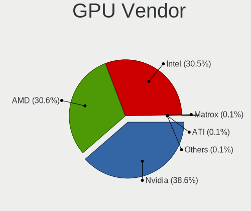

| Vendor | Desktops | Percent |
|--------|----------|---------|
| Nvidia | 132      | 38.48%  |
| AMD    | 107      | 31.2%   |
| Intel  | 104      | 30.32%  |

GPU Model
---------

Graphics card models

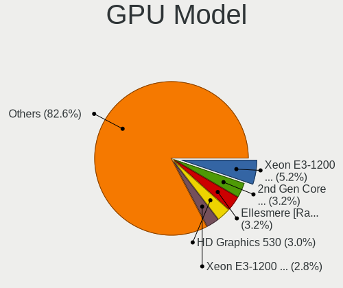

| Model                                                                       | Desktops | Percent |
|-----------------------------------------------------------------------------|----------|---------|
| Intel Xeon E3-1200 v2/3rd Gen Core processor Graphics Controller            | 17       | 4.83%   |
| Intel Xeon E3-1200 v3/4th Gen Core Processor Integrated Graphics Controller | 13       | 3.69%   |
| Intel 2nd Generation Core Processor Family Integrated Graphics Controller   | 13       | 3.69%   |
| Nvidia GK208B [GeForce GT 710]                                              | 10       | 2.84%   |
| AMD Ellesmere [Radeon RX 470/480/570/570X/580/580X/590]                     | 10       | 2.84%   |
| AMD Cezanne [Radeon Vega Series / Radeon Vega Mobile Series]                | 10       | 2.84%   |
| Intel CoffeeLake-S GT2 [UHD Graphics 630]                                   | 8        | 2.27%   |
| Intel HD Graphics 530                                                       | 7        | 1.99%   |
| Nvidia GF119 [GeForce GT 610]                                               | 6        | 1.7%    |
| Nvidia GA104 [GeForce RTX 3060 Ti Lite Hash Rate]                           | 6        | 1.7%    |
| Intel 4 Series Chipset Integrated Graphics Controller                       | 6        | 1.7%    |
| AMD Raphael                                                                 | 5        | 1.42%   |
| AMD Polaris 20 XL [Radeon RX 580 2048SP]                                    | 5        | 1.42%   |
| Nvidia GP108 [GeForce GT 1030]                                              | 4        | 1.14%   |
| Nvidia GP107 [GeForce GTX 1050 Ti]                                          | 4        | 1.14%   |
| Nvidia GP106 [GeForce GTX 1060 6GB]                                         | 4        | 1.14%   |
| Nvidia AD104 [GeForce RTX 4070]                                             | 4        | 1.14%   |
| Intel HD Graphics 630                                                       | 4        | 1.14%   |
| AMD Renoir [Radeon RX Vega 6 (Ryzen 4000/5000 Mobile Series)]               | 4        | 1.14%   |
| AMD Navi 32 [Radeon RX 7700 XT / 7800 XT]                                   | 4        | 1.14%   |
| AMD Navi 23 [Radeon RX 6600/6600 XT/6600M]                                  | 4        | 1.14%   |
| AMD Navi 22 [Radeon RX 6700/6700 XT/6750 XT / 6800M/6850M XT]               | 4        | 1.14%   |
| Nvidia GT218 [GeForce 210]                                                  | 3        | 0.85%   |
| Nvidia GP107 [GeForce GTX 1050]                                             | 3        | 0.85%   |
| Nvidia GP106 [GeForce GTX 1060 3GB]                                         | 3        | 0.85%   |
| Nvidia GP104 [GeForce GTX 1070]                                             | 3        | 0.85%   |
| Nvidia GM206 [GeForce GTX 960]                                              | 3        | 0.85%   |
| Nvidia GM107 [GeForce GTX 750 Ti]                                           | 3        | 0.85%   |
| Nvidia GK208B [GeForce GT 730]                                              | 3        | 0.85%   |
| Nvidia GK106 [GeForce GTX 660]                                              | 3        | 0.85%   |
| Nvidia GF119 [GeForce GT 520]                                               | 3        | 0.85%   |
| Nvidia GA104 [GeForce RTX 3070]                                             | 3        | 0.85%   |
| Nvidia G96C [GeForce 9500 GT]                                               | 3        | 0.85%   |
| Intel IvyBridge GT2 [HD Graphics 4000]                                      | 3        | 0.85%   |
| Intel Core Processor Integrated Graphics Controller                         | 3        | 0.85%   |
| Intel AlderLake-S GT1                                                       | 3        | 0.85%   |
| Intel Alder Lake-N [UHD Graphics]                                           | 3        | 0.85%   |
| AMD Raven Ridge [Radeon Vega Series / Radeon Vega Mobile Series]            | 3        | 0.85%   |
| AMD Navi 21 [Radeon RX 6800/6800 XT / 6900 XT]                              | 3        | 0.85%   |
| AMD Kaveri [Radeon R7 Graphics]                                             | 3        | 0.85%   |

GPU Combo
---------

Combinations of graphics cards

| Name           | Desktops | Percent |
|----------------|----------|---------|
| 1 x Nvidia     | 120      | 36.81%  |
| 1 x AMD        | 97       | 29.75%  |
| 1 x Intel      | 90       | 27.61%  |
| Intel + Nvidia | 7        | 2.15%   |
| 2 x AMD        | 5        | 1.53%   |
| AMD + Nvidia   | 4        | 1.23%   |
| 2 x Nvidia     | 2        | 0.61%   |
| Intel + AMD    | 1        | 0.31%   |

GPU Driver
----------

Free vs proprietary

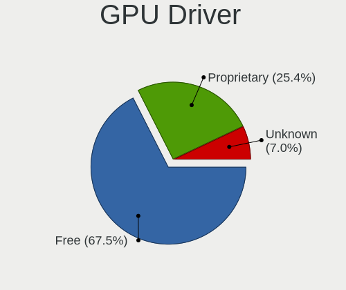

| Driver      | Desktops | Percent |
|-------------|----------|---------|
| Free        | 226      | 69.54%  |
| Proprietary | 80       | 24.62%  |
| Unknown     | 19       | 5.85%   |

GPU Memory
----------

Total video memory

| Size in GB | Desktops | Percent |
|------------|----------|---------|
| Unknown    | 265      | 80.79%  |
| 1.01-2.0   | 18       | 5.49%   |
| 7.01-8.0   | 17       | 5.18%   |
| 8.01-16.0  | 14       | 4.27%   |
| 5.01-6.0   | 5        | 1.52%   |
| 3.01-4.0   | 3        | 0.91%   |
| 0.51-1.0   | 3        | 0.91%   |
| 2.01-3.0   | 2        | 0.61%   |
| 0.01-0.5   | 1        | 0.3%    |

Monitor
-------

Monitor Vendor
--------------

Monitor vendors

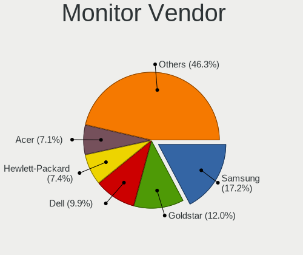

| Vendor               | Desktops | Percent |
|----------------------|----------|---------|
| Samsung Electronics  | 51       | 16.35%  |
| Goldstar             | 46       | 14.74%  |
| Dell                 | 31       | 9.94%   |
| AOC                  | 23       | 7.37%   |
| Acer                 | 20       | 6.41%   |
| Hewlett-Packard      | 19       | 6.09%   |
| Philips              | 13       | 4.17%   |
| BenQ                 | 13       | 4.17%   |
| Ancor Communications | 12       | 3.85%   |
| ViewSonic            | 10       | 3.21%   |
| Sony                 | 7        | 2.24%   |
| ASUSTek Computer     | 7        | 2.24%   |
| Lenovo               | 5        | 1.6%    |
| Hitachi              | 4        | 1.28%   |
| MSI                  | 3        | 0.96%   |
| Iiyama               | 3        | 0.96%   |
| HKC                  | 3        | 0.96%   |
| Fujitsu Siemens      | 3        | 0.96%   |
| Eizo                 | 3        | 0.96%   |
| VIE                  | 2        | 0.64%   |
| Unknown              | 2        | 0.64%   |
| STD                  | 2        | 0.64%   |
| Sceptre Tech         | 2        | 0.64%   |
| RTK                  | 2        | 0.64%   |
| NEC Computers        | 2        | 0.64%   |
| CVT                  | 2        | 0.64%   |
| Xiaomi               | 1        | 0.32%   |
| Vizio                | 1        | 0.32%   |
| Videoseven           | 1        | 0.32%   |
| Vestel Elektronik    | 1        | 0.32%   |
| TOV                  | 1        | 0.32%   |
| Sharp                | 1        | 0.32%   |
| Panasonic            | 1        | 0.32%   |
| ONN                  | 1        | 0.32%   |
| Norcent              | 1        | 0.32%   |
| LRX                  | 1        | 0.32%   |
| LOE                  | 1        | 0.32%   |
| JINGLITAI            | 1        | 0.32%   |
| Insignia             | 1        | 0.32%   |
| HUAWEI               | 1        | 0.32%   |

Monitor Model
-------------

Monitor models

| Model                                                                 | Desktops | Percent |
|-----------------------------------------------------------------------|----------|---------|
| Samsung Electronics LU28R55 SAM1017 3840x2160 632x360mm 28.6-inch     | 3        | 0.92%   |
| Goldstar HDR WFHD GSM7714 2560x1080 798x334mm 34.1-inch               | 3        | 0.92%   |
| Goldstar HDR 4K GSM7706 3840x2160 600x340mm 27.2-inch                 | 3        | 0.92%   |
| AOC 27G2G3 AOC2702 1920x1080 598x336mm 27.0-inch                      | 3        | 0.92%   |
| ViewSonic XG3220 SERIES VSC1D35 3840x2160 698x393mm 31.5-inch         | 2        | 0.61%   |
| VIE ATHEN U2L 24 VIE2380 1920x1080 527x296mm 23.8-inch                | 2        | 0.61%   |
| Unknown LCD Monitor SAMSUNG 1920x1080                                 | 2        | 0.61%   |
| Sony SDM-HS95P SNY2600 1280x1024 376x301mm 19.0-inch                  | 2        | 0.61%   |
| Samsung Electronics U28E590 SAM0C4D 3840x2160 607x345mm 27.5-inch     | 2        | 0.61%   |
| Samsung Electronics S24F350 SAM0D20 1920x1080 521x293mm 23.5-inch     | 2        | 0.61%   |
| Samsung Electronics S19B300 SAM08A5 1366x768 410x230mm 18.5-inch      | 2        | 0.61%   |
| Samsung Electronics C27F390 SAM0D32 1920x1080 598x336mm 27.0-inch     | 2        | 0.61%   |
| Philips PHL 221V8 PHLC211 1920x1080 477x268mm 21.5-inch               | 2        | 0.61%   |
| Philips FTV PHL04C3 3840x2160 1440x810mm 65.0-inch                    | 2        | 0.61%   |
| HKC 24E3 HKC2431 1920x1080 527x296mm 23.8-inch                        | 2        | 0.61%   |
| Hitachi HISENSE HEC0030 3840x2160 1872x1053mm 84.6-inch               | 2        | 0.61%   |
| Hitachi HISENSE HEC002F 3840x2160 1872x1053mm 84.6-inch               | 2        | 0.61%   |
| Goldstar ULTRAGEAR GSM5BD3 2560x1440 697x392mm 31.5-inch              | 2        | 0.61%   |
| Goldstar TV SSCR2 GSMC0C8 3840x2160                                   | 2        | 0.61%   |
| Goldstar IPS FULLHD GSM5AB8 1920x1080 480x270mm 21.7-inch             | 2        | 0.61%   |
| Goldstar FULL HD GSM5B55 1920x1080 480x270mm 21.7-inch                | 2        | 0.61%   |
| AOC Q32G2WG3 AOC3202 2560x1440 697x392mm 31.5-inch                    | 2        | 0.61%   |
| AOC G2460PG AOC2460 1920x1080 531x299mm 24.0-inch                     | 2        | 0.61%   |
| AOC F19 AOC1900 1366x768 410x230mm 18.5-inch                          | 2        | 0.61%   |
| AOC 24B2W1 AOC2402 1920x1080 527x296mm 23.8-inch                      | 2        | 0.61%   |
| AOC 2260WG5 AOC2260 1920x1080 477x268mm 21.5-inch                     | 2        | 0.61%   |
| Ancor Communications VE248 ACI2494 1920x1080 531x299mm 24.0-inch      | 2        | 0.61%   |
| Ancor Communications ASUS VS228 ACI22FD 1920x1080 476x268mm 21.5-inch | 2        | 0.61%   |
| Xiaomi Mi TV XMD0002 1920x1080 708x398mm 32.0-inch                    | 1        | 0.31%   |
| Vizio M322i-B1 VIZ1005 1920x1080 698x392mm 31.5-inch                  | 1        | 0.31%   |
| ViewSonic VX2457 VSCB931 1920x1080 521x293mm 23.5-inch                | 1        | 0.31%   |
| ViewSonic VX2370 SERIES VSC342C 1920x1080 509x286mm 23.0-inch         | 1        | 0.31%   |
| ViewSonic VX2025wm VSCE51D 1680x1050 433x271mm 20.1-inch              | 1        | 0.31%   |
| ViewSonic VP2250wb VSC5320 1920x1080 465x291mm 21.6-inch              | 1        | 0.31%   |
| ViewSonic VE702m VSC4A1B 1280x1024 338x270mm 17.0-inch                | 1        | 0.31%   |
| ViewSonic VA2465 SERIES VSCB730 1920x1080 521x293mm 23.5-inch         | 1        | 0.31%   |
| ViewSonic VA2446 Series VSC732E 1920x1080 521x293mm 23.5-inch         | 1        | 0.31%   |
| ViewSonic LCD Monitor VX922 1280x1024                                 | 1        | 0.31%   |
| Videoseven L17GM IGM0508 1280x1024 338x270mm 17.0-inch                | 1        | 0.31%   |
| Vestel Elektronik 22W_LCD_TV VES3700 1920x540                         | 1        | 0.31%   |

Monitor Resolution
------------------

Monitor screen resolution

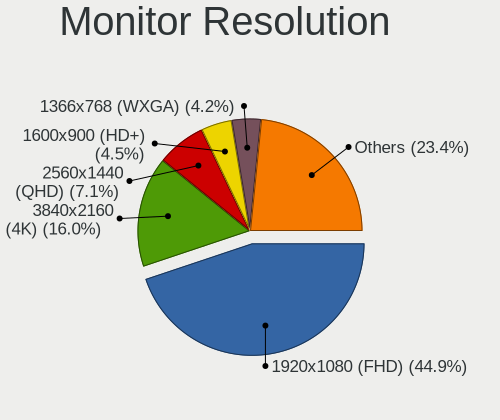

| Resolution         | Desktops | Percent |
|--------------------|----------|---------|
| 1920x1080 (FHD)    | 139      | 46.33%  |
| 3840x2160 (4K)     | 52       | 17.33%  |
| 1366x768 (WXGA)    | 18       | 6%      |
| 2560x1440 (QHD)    | 14       | 4.67%   |
| 1280x1024 (SXGA)   | 12       | 4%      |
| 1440x900 (WXGA+)   | 11       | 3.67%   |
| 1680x1050 (WSXGA+) | 10       | 3.33%   |
| 1600x900 (HD+)     | 10       | 3.33%   |
| 1920x1200 (WUXGA)  | 8        | 2.67%   |
| 3440x1440          | 7        | 2.33%   |
| 2560x1080          | 5        | 1.67%   |
| 3840x1080          | 4        | 1.33%   |
| 1360x768           | 4        | 1.33%   |
| 2560x1600          | 2        | 0.67%   |
| 2880x1440          | 1        | 0.33%   |
| 2288x1287          | 1        | 0.33%   |
| 1920x540           | 1        | 0.33%   |
| 1920x1600          | 1        | 0.33%   |

Monitor Diagonal
----------------

Diagonal size in inches

| Inches  | Desktops | Percent |
|---------|----------|---------|
| 27      | 47       | 15.06%  |
| 23      | 41       | 13.14%  |
| 24      | 38       | 12.18%  |
| 21      | 26       | 8.33%   |
| 31      | 22       | 7.05%   |
| 18      | 19       | 6.09%   |
| Unknown | 18       | 5.77%   |
| 19      | 16       | 5.13%   |
| 84      | 14       | 4.49%   |
| 34      | 12       | 3.85%   |
| 22      | 8        | 2.56%   |
| 20      | 8        | 2.56%   |
| 72      | 5        | 1.6%    |
| 17      | 5        | 1.6%    |
| 40      | 4        | 1.28%   |
| 65      | 3        | 0.96%   |
| 28      | 3        | 0.96%   |
| 26      | 3        | 0.96%   |
| 75      | 2        | 0.64%   |
| 54      | 2        | 0.64%   |
| 49      | 2        | 0.64%   |
| 48      | 2        | 0.64%   |
| 32      | 2        | 0.64%   |
| 29      | 2        | 0.64%   |
| 60      | 1        | 0.32%   |
| 55      | 1        | 0.32%   |
| 46      | 1        | 0.32%   |
| 39      | 1        | 0.32%   |
| 37      | 1        | 0.32%   |
| 25      | 1        | 0.32%   |
| 16      | 1        | 0.32%   |
| 15      | 1        | 0.32%   |

Monitor Width
-------------

Physical width

| Width in mm | Desktops | Percent |
|-------------|----------|---------|
| 501-600     | 117      | 38.49%  |
| 401-500     | 68       | 22.37%  |
| 601-700     | 33       | 10.86%  |
| 1501-2000   | 21       | 6.91%   |
| Unknown     | 18       | 5.92%   |
| 701-800     | 13       | 4.28%   |
| 1001-1500   | 12       | 3.95%   |
| 351-400     | 8        | 2.63%   |
| 801-900     | 6        | 1.97%   |
| 301-350     | 6        | 1.97%   |
| 201-300     | 1        | 0.33%   |
| 901-1000    | 1        | 0.33%   |

Aspect Ratio
------------

Proportional relationship between the width and the height

| Ratio   | Desktops | Percent |
|---------|----------|---------|
| 16/9    | 209      | 72.82%  |
| 16/10   | 31       | 10.8%   |
| 21/9    | 13       | 4.53%   |
| Unknown | 13       | 4.53%   |
| 5/4     | 10       | 3.48%   |
| 32/9    | 4        | 1.39%   |
| 6/5     | 2        | 0.7%    |
| 4/3     | 2        | 0.7%    |
| 3/2     | 1        | 0.35%   |
| 2.00    | 1        | 0.35%   |
| 0.80    | 1        | 0.35%   |

Monitor Area
------------

Area in inch

| Area in inch | Desktops | Percent |
|----------------|----------|---------|
| 201-250        | 92       | 30.07%  |
| 301-350        | 47       | 15.36%  |
| 351-500        | 40       | 13.07%  |
| 151-200        | 34       | 11.11%  |
| More than 1000 | 27       | 8.82%   |
| 141-150        | 19       | 6.21%   |
| Unknown        | 18       | 5.88%   |
| 251-300        | 15       | 4.9%    |
| 501-1000       | 11       | 3.59%   |
| 131-140        | 2        | 0.65%   |
| 111-120        | 1        | 0.33%   |

Pixel Density
-------------

Pixels per inch

| Density | Desktops | Percent |
|---------|----------|---------|
| 51-100  | 193      | 66.55%  |
| 101-120 | 42       | 14.48%  |
| Unknown | 18       | 6.21%   |
| 1-50    | 15       | 5.17%   |
| 121-160 | 14       | 4.83%   |
| 161-240 | 8        | 2.76%   |

Multiple Monitors
-----------------

Total monitors connected

| Total | Desktops | Percent |
|-------|----------|---------|
| 1     | 246      | 75.69%  |
| 2     | 37       | 11.38%  |
| 0     | 34       | 10.46%  |
| 3     | 7        | 2.15%   |
| 4     | 1        | 0.31%   |

Network
-------

Net Controller Vendor
---------------------

Controller vendors

| Vendor                                | Desktops | Percent |
|---------------------------------------|----------|---------|
| Realtek Semiconductor                 | 227      | 47.79%  |
| Intel                                 | 128      | 26.95%  |
| Qualcomm Atheros                      | 26       | 5.47%   |
| Broadcom                              | 17       | 3.58%   |
| Ralink Technology                     | 13       | 2.74%   |
| TP-Link                               | 12       | 2.53%   |
| Ralink                                | 8        | 1.68%   |
| Microsoft                             | 5        | 1.05%   |
| MediaTek                              | 5        | 1.05%   |
| Samsung Electronics                   | 3        | 0.63%   |
| NetGear                               | 3        | 0.63%   |
| Marvell Technology Group              | 3        | 0.63%   |
| D-Link                                | 3        | 0.63%   |
| ASUSTek Computer                      | 2        | 0.42%   |
| Aquantia                              | 2        | 0.42%   |
| 802.11g Adapter [Linksys WUSB54GC v3] | 2        | 0.42%   |
| ZTopInc                               | 1        | 0.21%   |
| Wilocity                              | 1        | 0.21%   |
| Texas Instruments                     | 1        | 0.21%   |
| Raspberry Pi                          | 1        | 0.21%   |
| Qualcomm Atheros Communications       | 1        | 0.21%   |
| QinHeng Electronics                   | 1        | 0.21%   |
| Panini                                | 1        | 0.21%   |
| Nvidia                                | 1        | 0.21%   |
| Motorola PCS                          | 1        | 0.21%   |
| IMC Networks                          | 1        | 0.21%   |
| Edimax Technology                     | 1        | 0.21%   |
| BUFFALO                               | 1        | 0.21%   |
| Broadcom Limited                      | 1        | 0.21%   |
| Bose                                  | 1        | 0.21%   |
| Belkin Components                     | 1        | 0.21%   |
| ASIX Electronics                      | 1        | 0.21%   |

Net Controller Model
--------------------

Controller models

| Model                                                                  | Desktops | Percent |
|------------------------------------------------------------------------|----------|---------|
| Realtek RTL8111/8168/8211/8411 PCI Express Gigabit Ethernet Controller | 152      | 27.59%  |
| Realtek RTL8125 2.5GbE Controller                                      | 31       | 5.63%   |
| Intel 82579LM Gigabit Network Connection (Lewisville)                  | 23       | 4.17%   |
| Realtek RTL810xE PCI Express Fast Ethernet controller                  | 13       | 2.36%   |
| Realtek 802.11ac NIC                                                   | 13       | 2.36%   |
| Intel Wi-Fi 6 AX200                                                    | 13       | 2.36%   |
| Intel Ethernet Controller I225-V                                       | 12       | 2.18%   |
| Intel Ethernet Connection (2) I219-V                                   | 11       | 2%      |
| Realtek RTL8821CE 802.11ac PCIe Wireless Network Adapter               | 9        | 1.63%   |
| Intel I211 Gigabit Network Connection                                  | 9        | 1.63%   |
| Intel Ethernet Connection I217-LM                                      | 9        | 1.63%   |
| Intel Wi-Fi 6E(802.11ax) AX210/AX1675* 2x2 [Typhoon Peak]              | 7        | 1.27%   |
| Intel Raptor Lake-S PCH CNVi WiFi                                      | 7        | 1.27%   |
| Intel 82579V Gigabit Network Connection                                | 7        | 1.27%   |
| Ralink MT7601U Wireless Adapter                                        | 6        | 1.09%   |
| Qualcomm Atheros AR8151 v2.0 Gigabit Ethernet                          | 6        | 1.09%   |
| Intel Ethernet Controller I226-V                                       | 6        | 1.09%   |
| Realtek RTL88x2bu [AC1200 Techkey]                                     | 5        | 0.91%   |
| Realtek RTL8192EU 802.11b/g/n WLAN Adapter                             | 5        | 0.91%   |
| Intel Ethernet Connection I217-V                                       | 5        | 0.91%   |
| Ralink RT5370 Wireless Adapter                                         | 4        | 0.73%   |
| Intel Wi-Fi 5(802.11ac) Wireless-AC 9x6x [Thunder Peak]                | 4        | 0.73%   |
| Intel Ethernet Connection (5) I219-LM                                  | 4        | 0.73%   |
| Intel Alder Lake-S PCH CNVi WiFi                                       | 4        | 0.73%   |
| TP-Link AC600 wireless Realtek RTL8811AU [Archer T2U Nano]             | 3        | 0.54%   |
| Realtek RTL8852CE PCIe 802.11ax Wireless Network Controller            | 3        | 0.54%   |
| Realtek RTL8192EE PCIe Wireless Network Adapter                        | 3        | 0.54%   |
| Realtek RTL8188FTV 802.11b/g/n 1T1R 2.4G WLAN Adapter                  | 3        | 0.54%   |
| Realtek RTL8188EUS 802.11n Wireless Network Adapter                    | 3        | 0.54%   |
| Realtek RTL8153 Gigabit Ethernet Adapter                               | 3        | 0.54%   |
| Realtek RTL8111/8168/8411 PCI Express Gigabit Ethernet Controller      | 3        | 0.54%   |
| Realtek RTL-8100/8101L/8139 PCI Fast Ethernet Adapter                  | 3        | 0.54%   |
| Ralink RT2790 Wireless 802.11n 1T/2R PCIe                              | 3        | 0.54%   |
| Qualcomm Atheros AR9462 Wireless Network Adapter                       | 3        | 0.54%   |
| MediaTek MT7922 802.11ax PCI Express Wireless Network Adapter          | 3        | 0.54%   |
| Intel I210 Gigabit Network Connection                                  | 3        | 0.54%   |
| Intel Ethernet Connection (7) I219-V                                   | 3        | 0.54%   |
| Intel Ethernet Connection (2) I219-LM                                  | 3        | 0.54%   |
| Broadcom NetXtreme BCM5762 Gigabit Ethernet PCIe                       | 3        | 0.54%   |
| TP-Link Archer T2U PLUS [RTL8821AU]                                    | 2        | 0.36%   |

Wireless Vendor
---------------

Wireless vendors

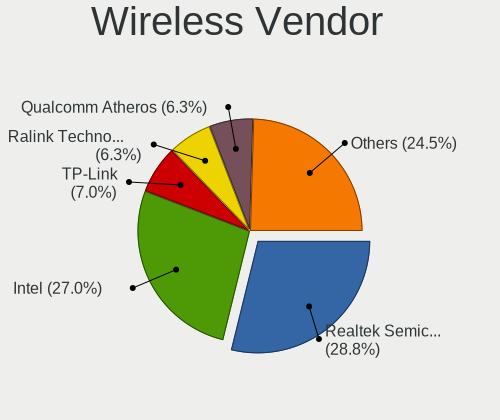

| Vendor                                | Desktops | Percent |
|---------------------------------------|----------|---------|
| Realtek Semiconductor                 | 58       | 31.69%  |
| Intel                                 | 44       | 24.04%  |
| Qualcomm Atheros                      | 14       | 7.65%   |
| Ralink Technology                     | 13       | 7.1%    |
| TP-Link                               | 12       | 6.56%   |
| Ralink                                | 8        | 4.37%   |
| Broadcom                              | 7        | 3.83%   |
| Microsoft                             | 5        | 2.73%   |
| MediaTek                              | 5        | 2.73%   |
| NetGear                               | 3        | 1.64%   |
| D-Link                                | 3        | 1.64%   |
| ASUSTek Computer                      | 2        | 1.09%   |
| 802.11g Adapter [Linksys WUSB54GC v3] | 2        | 1.09%   |
| ZTopInc                               | 1        | 0.55%   |
| Wilocity                              | 1        | 0.55%   |
| Qualcomm Atheros Communications       | 1        | 0.55%   |
| IMC Networks                          | 1        | 0.55%   |
| Edimax Technology                     | 1        | 0.55%   |
| BUFFALO                               | 1        | 0.55%   |
| Belkin Components                     | 1        | 0.55%   |

Wireless Model
--------------

Wireless models

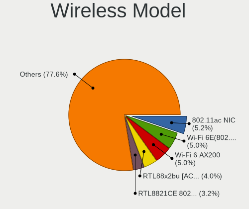

| Model                                                         | Desktops | Percent |
|---------------------------------------------------------------|----------|---------|
| Realtek 802.11ac NIC                                          | 13       | 7.03%   |
| Intel Wi-Fi 6 AX200                                           | 13       | 7.03%   |
| Realtek RTL8821CE 802.11ac PCIe Wireless Network Adapter      | 9        | 4.86%   |
| Intel Wi-Fi 6E(802.11ax) AX210/AX1675* 2x2 [Typhoon Peak]     | 7        | 3.78%   |
| Intel Raptor Lake-S PCH CNVi WiFi                             | 7        | 3.78%   |
| Ralink MT7601U Wireless Adapter                               | 6        | 3.24%   |
| Realtek RTL88x2bu [AC1200 Techkey]                            | 5        | 2.7%    |
| Realtek RTL8192EU 802.11b/g/n WLAN Adapter                    | 5        | 2.7%    |
| Ralink RT5370 Wireless Adapter                                | 4        | 2.16%   |
| Intel Wi-Fi 5(802.11ac) Wireless-AC 9x6x [Thunder Peak]       | 4        | 2.16%   |
| Intel Alder Lake-S PCH CNVi WiFi                              | 4        | 2.16%   |
| TP-Link AC600 wireless Realtek RTL8811AU [Archer T2U Nano]    | 3        | 1.62%   |
| Realtek RTL8852CE PCIe 802.11ax Wireless Network Controller   | 3        | 1.62%   |
| Realtek RTL8192EE PCIe Wireless Network Adapter               | 3        | 1.62%   |
| Realtek RTL8188FTV 802.11b/g/n 1T1R 2.4G WLAN Adapter         | 3        | 1.62%   |
| Realtek RTL8188EUS 802.11n Wireless Network Adapter           | 3        | 1.62%   |
| Ralink RT2790 Wireless 802.11n 1T/2R PCIe                     | 3        | 1.62%   |
| Qualcomm Atheros AR9462 Wireless Network Adapter              | 3        | 1.62%   |
| MediaTek MT7922 802.11ax PCI Express Wireless Network Adapter | 3        | 1.62%   |
| TP-Link Archer T2U PLUS [RTL8821AU]                           | 2        | 1.08%   |
| TP-Link 802.11ac NIC                                          | 2        | 1.08%   |
| Realtek RTL8822CE 802.11ac PCIe Wireless Network Adapter      | 2        | 1.08%   |
| Realtek RTL8821AE 802.11ac PCIe Wireless Network Adapter      | 2        | 1.08%   |
| Realtek RTL8192CU 802.11n WLAN Adapter                        | 2        | 1.08%   |
| Realtek RTL8192CE PCIe Wireless Network Adapter               | 2        | 1.08%   |
| Realtek RTL8188EE Wireless Network Adapter                    | 2        | 1.08%   |
| Qualcomm Atheros QCA6174 802.11ac Wireless Network Adapter    | 2        | 1.08%   |
| Qualcomm Atheros AR9485 Wireless Network Adapter              | 2        | 1.08%   |
| Qualcomm Atheros AR93xx Wireless Network Adapter              | 2        | 1.08%   |
| Qualcomm Atheros AR9227 Wireless Network Adapter              | 2        | 1.08%   |
| NetGear A6210                                                 | 2        | 1.08%   |
| Microsoft Xbox Wireless Adapter for Windows                   | 2        | 1.08%   |
| Microsoft XBOX ACC                                            | 2        | 1.08%   |
| D-Link DWA-171                                                | 2        | 1.08%   |
| Broadcom BCM4360 802.11ac Dual Band Wireless Network Adapter  | 2        | 1.08%   |
| ASUS 802.11ac WLAN Adapter                                    | 2        | 1.08%   |
| ZTopInc 802.11n NIC                                           | 1        | 0.54%   |
| Wilocity Wil6200 802.11ad Wireless Network Adapter            | 1        | 0.54%   |
| TP-Link TL-WN821N v5/v6 [RTL8192EU]                           | 1        | 0.54%   |
| TP-Link Archer T9UH v1 [Realtek RTL8814AU]                    | 1        | 0.54%   |

Ethernet Vendor
---------------

Ethernet vendors

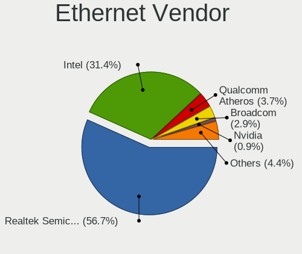

| Vendor                   | Desktops | Percent |
|--------------------------|----------|---------|
| Realtek Semiconductor    | 204      | 58.79%  |
| Intel                    | 106      | 30.55%  |
| Qualcomm Atheros         | 13       | 3.75%   |
| Broadcom                 | 11       | 3.17%   |
| Samsung Electronics      | 3        | 0.86%   |
| Marvell Technology Group | 3        | 0.86%   |
| Aquantia                 | 2        | 0.58%   |
| Panini                   | 1        | 0.29%   |
| Nvidia                   | 1        | 0.29%   |
| Motorola PCS             | 1        | 0.29%   |
| Broadcom Limited         | 1        | 0.29%   |
| ASIX Electronics         | 1        | 0.29%   |

Ethernet Model
--------------

Ethernet models

| Model                                                                          | Desktops | Percent |
|--------------------------------------------------------------------------------|----------|---------|
| Realtek RTL8111/8168/8211/8411 PCI Express Gigabit Ethernet Controller         | 152      | 41.99%  |
| Realtek RTL8125 2.5GbE Controller                                              | 31       | 8.56%   |
| Intel 82579LM Gigabit Network Connection (Lewisville)                          | 23       | 6.35%   |
| Realtek RTL810xE PCI Express Fast Ethernet controller                          | 13       | 3.59%   |
| Intel Ethernet Controller I225-V                                               | 12       | 3.31%   |
| Intel Ethernet Connection (2) I219-V                                           | 11       | 3.04%   |
| Intel I211 Gigabit Network Connection                                          | 9        | 2.49%   |
| Intel Ethernet Connection I217-LM                                              | 9        | 2.49%   |
| Intel 82579V Gigabit Network Connection                                        | 7        | 1.93%   |
| Qualcomm Atheros AR8151 v2.0 Gigabit Ethernet                                  | 6        | 1.66%   |
| Intel Ethernet Controller I226-V                                               | 6        | 1.66%   |
| Intel Ethernet Connection I217-V                                               | 5        | 1.38%   |
| Intel Ethernet Connection (5) I219-LM                                          | 4        | 1.1%    |
| Realtek RTL8153 Gigabit Ethernet Adapter                                       | 3        | 0.83%   |
| Realtek RTL8111/8168/8411 PCI Express Gigabit Ethernet Controller              | 3        | 0.83%   |
| Realtek RTL-8100/8101L/8139 PCI Fast Ethernet Adapter                          | 3        | 0.83%   |
| Intel I210 Gigabit Network Connection                                          | 3        | 0.83%   |
| Intel Ethernet Connection (7) I219-V                                           | 3        | 0.83%   |
| Intel Ethernet Connection (2) I219-LM                                          | 3        | 0.83%   |
| Broadcom NetXtreme BCM5762 Gigabit Ethernet PCIe                               | 3        | 0.83%   |
| Samsung GT-I9070 (network tethering, USB debugging enabled)                    | 2        | 0.55%   |
| Qualcomm Atheros AR8161 Gigabit Ethernet                                       | 2        | 0.55%   |
| Intel Ethernet Connection (17) I219-LM                                         | 2        | 0.55%   |
| Intel 82574L Gigabit Network Connection                                        | 2        | 0.55%   |
| Intel 82571EB/82571GB Gigabit Ethernet Controller D0/D1 (copper applications)  | 2        | 0.55%   |
| Intel 82567LM-3 Gigabit Network Connection                                     | 2        | 0.55%   |
| Intel 82566DM-2 Gigabit Network Connection                                     | 2        | 0.55%   |
| Broadcom NetLink BCM57781 Gigabit Ethernet PCIe                                | 2        | 0.55%   |
| Aquantia AQtion AQC107 NBase-T/IEEE 802.3an Ethernet Controller [Atlantic 10G] | 2        | 0.55%   |
| Samsung Galaxy series, misc. (tethering mode)                                  | 1        | 0.28%   |
| Realtek RTL8169 PCI Gigabit Ethernet Controller                                | 1        | 0.28%   |
| Realtek RTL-8110SC/8169SC Gigabit Ethernet                                     | 1        | 0.28%   |
| Realtek Realtek Ethernet controller                                            | 1        | 0.28%   |
| Realtek Killer E2600 GbE Controller                                            | 1        | 0.28%   |
| Qualcomm Atheros Killer E2500 Gigabit Ethernet Controller                      | 1        | 0.28%   |
| Qualcomm Atheros Killer E2400 Gigabit Ethernet Controller                      | 1        | 0.28%   |
| Qualcomm Atheros Killer E220x Gigabit Ethernet Controller                      | 1        | 0.28%   |
| Qualcomm Atheros AR8131 Gigabit Ethernet                                       | 1        | 0.28%   |
| Qualcomm Atheros AR8121/AR8113/AR8114 Gigabit or Fast Ethernet                 | 1        | 0.28%   |
| Panini mI:Deal Check Scanner                                                   | 1        | 0.28%   |

Net Controller Kind
-------------------

Ethernet, WiFi or modem

| Kind     | Desktops | Percent |
|----------|----------|---------|
| Ethernet | 324      | 65.85%  |
| WiFi     | 164      | 33.33%  |
| Modem    | 4        | 0.81%   |

Used Controller
---------------

Currently used network controller

| Kind     | Desktops | Percent |
|----------|----------|---------|
| Ethernet | 253      | 73.76%  |
| WiFi     | 90       | 26.24%  |

NICs
----

Total network controllers on board

| Total | Desktops | Percent |
|-------|----------|---------|
| 1     | 202      | 62.15%  |
| 2     | 105      | 32.31%  |
| 3     | 14       | 4.31%   |
| 4     | 2        | 0.62%   |
| 5     | 1        | 0.31%   |
| 0     | 1        | 0.31%   |

IPv6
----

IPv6 vs IPv4

| Used | Desktops | Percent |
|------|----------|---------|
| No   | 212      | 65.43%  |
| Yes  | 112      | 34.57%  |

Bluetooth
---------

Bluetooth Vendor
----------------

Controller vendors

| Vendor                          | Desktops | Percent |
|---------------------------------|----------|---------|
| Intel                           | 41       | 32.8%   |
| Cambridge Silicon Radio         | 32       | 25.6%   |
| Realtek Semiconductor           | 18       | 14.4%   |
| IMC Networks                    | 7        | 5.6%    |
| ASUSTek Computer                | 7        | 5.6%    |
| MediaTek                        | 5        | 4%      |
| Qualcomm Atheros Communications | 3        | 2.4%    |
| TP-Link                         | 2        | 1.6%    |
| Broadcom                        | 2        | 1.6%    |
| Actions                         | 2        | 1.6%    |
| Qcom                            | 1        | 0.8%    |
| Integrated System Solution      | 1        | 0.8%    |
| Foxconn / Hon Hai               | 1        | 0.8%    |
| Edimax Technology               | 1        | 0.8%    |
| Belkin Components               | 1        | 0.8%    |
| Apple                           | 1        | 0.8%    |

Bluetooth Model
---------------

Controller models

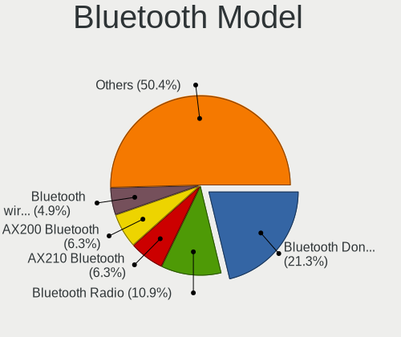

| Model                                                 | Desktops | Percent |
|-------------------------------------------------------|----------|---------|
| Cambridge Silicon Radio Bluetooth Dongle (HCI mode)   | 32       | 25.6%   |
| Realtek Bluetooth Radio                               | 13       | 10.4%   |
| Intel AX200 Bluetooth                                 | 11       | 8.8%    |
| Intel AX211 Bluetooth                                 | 7        | 5.6%    |
| Intel AX201 Bluetooth                                 | 7        | 5.6%    |
| Intel AX210 Bluetooth                                 | 6        | 4.8%    |
| MediaTek Wireless_Device                              | 5        | 4%      |
| Intel Wireless-AC 9260 Bluetooth Adapter              | 4        | 3.2%    |
| IMC Networks Bluetooth Radio                          | 4        | 3.2%    |
| Realtek  Bluetooth 4.2 Adapter                        | 3        | 2.4%    |
| Intel Bluetooth wireless interface                    | 3        | 2.4%    |
| ASUS ASUS USB-BT500                                   | 3        | 2.4%    |
| TP-Link UB500 Adapter                                 | 2        | 1.6%    |
| Realtek 802.11ac WLAN Adapter                         | 2        | 1.6%    |
| Qualcomm Atheros  Bluetooth Device                    | 2        | 1.6%    |
| IMC Networks Wireless_Device                          | 2        | 1.6%    |
| ASUS Broadcom BCM20702A0 Bluetooth                    | 2        | 1.6%    |
| Actions general adapter                               | 2        | 1.6%    |
| Qualcomm Atheros AR9462 Bluetooth                     | 1        | 0.8%    |
| Qcom Bluetooth USB                                    | 1        | 0.8%    |
| Intel Wireless-AC 3168 Bluetooth                      | 1        | 0.8%    |
| Intel Centrino Bluetooth Wireless Transceiver         | 1        | 0.8%    |
| Intel Bluetooth 9460/9560 Jefferson Peak (JfP)        | 1        | 0.8%    |
| Integrated System Solution KY-BT100 Bluetooth Adapter | 1        | 0.8%    |
| IMC Networks Bluetooth                                | 1        | 0.8%    |
| Foxconn / Hon Hai Bluetooth Device                    | 1        | 0.8%    |
| Edimax Edimax Bluetooth Adapter                       | 1        | 0.8%    |
| Broadcom BCM43142 Bluetooth 4.0                       | 1        | 0.8%    |
| Broadcom BCM20702A0 Bluetooth 4.0                     | 1        | 0.8%    |
| Belkin Components F8T065BF Mini Bluetooth 4.0 Adapter | 1        | 0.8%    |
| ASUS Qualcomm Bluetooth 4.1                           | 1        | 0.8%    |
| ASUS Bluetooth Device                                 | 1        | 0.8%    |
| Apple Bluetooth Host Controller                       | 1        | 0.8%    |

Sound
-----

Sound Vendor
------------

Sound card vendors

| Vendor                                       | Desktops | Percent |
|----------------------------------------------|----------|---------|
| Intel                                        | 212      | 39.41%  |
| AMD                                          | 129      | 23.98%  |
| Nvidia                                       | 125      | 23.23%  |
| Creative Labs                                | 8        | 1.49%   |
| C-Media Electronics                          | 8        | 1.49%   |
| ASUSTek Computer                             | 7        | 1.3%    |
| Zoran Co. Personal Media Division (Nogatech) | 4        | 0.74%   |
| JMTek                                        | 4        | 0.74%   |
| Razer USA                                    | 3        | 0.56%   |
| Plantronics                                  | 3        | 0.56%   |
| Micro Star International                     | 3        | 0.56%   |
| Logitech                                     | 3        | 0.56%   |
| Texas Instruments                            | 2        | 0.37%   |
| Lautsprecher Teufel                          | 2        | 0.37%   |
| Hewlett-Packard                              | 2        | 0.37%   |
| Corsair                                      | 2        | 0.37%   |
| Unknown                                      | 2        | 0.37%   |
| USB Audio                                    | 1        | 0.19%   |
| Trust                                        | 1        | 0.19%   |
| Thesycon Systemsoftware & Consulting         | 1        | 0.19%   |
| Tenx Technology                              | 1        | 0.19%   |
| SteelSeries ApS                              | 1        | 0.19%   |
| Setek Elektronik                             | 1        | 0.19%   |
| Roland                                       | 1        | 0.19%   |
| Realtek Semiconductor                        | 1        | 0.19%   |
| ONN                                          | 1        | 0.19%   |
| Medeli Electronics                           | 1        | 0.19%   |
| Harman International                         | 1        | 0.19%   |
| Generalplus Technology                       | 1        | 0.19%   |
| Focusrite-Novation                           | 1        | 0.19%   |
| Digidesign                                   | 1        | 0.19%   |
| Creative Technology                          | 1        | 0.19%   |
| BR25                                         | 1        | 0.19%   |
| Blue Microphones                             | 1        | 0.19%   |
| BEHRINGER International                      | 1        | 0.19%   |
| Anlya.cn                                     | 1        | 0.19%   |

Sound Model
-----------

Sound card models

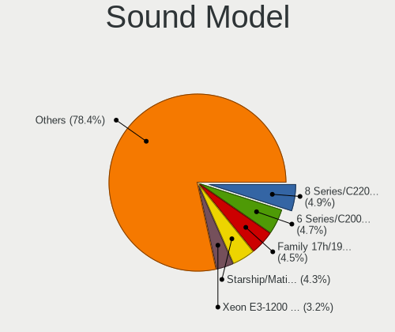

| Model                                                                      | Desktops | Percent |
|----------------------------------------------------------------------------|----------|---------|
| Intel 6 Series/C200 Series Chipset Family High Definition Audio Controller | 38       | 5.95%   |
| AMD Family 17h/19h HD Audio Controller                                     | 34       | 5.32%   |
| Intel 8 Series/C220 Series Chipset High Definition Audio Controller        | 33       | 5.16%   |
| AMD Starship/Matisse HD Audio Controller                                   | 25       | 3.91%   |
| Intel 7 Series/C216 Chipset Family High Definition Audio Controller        | 21       | 3.29%   |
| AMD SBx00 Azalia (Intel HDA)                                               | 20       | 3.13%   |
| AMD Renoir Radeon High Definition Audio Controller                         | 19       | 2.97%   |
| AMD Ellesmere HDMI Audio [Radeon RX 470/480 / 570/580/590]                 | 15       | 2.35%   |
| Nvidia GK208 HDMI/DP Audio Controller                                      | 14       | 2.19%   |
| Intel Xeon E3-1200 v3/4th Gen Core Processor HD Audio Controller           | 14       | 2.19%   |
| Intel NM10/ICH7 Family High Definition Audio Controller                    | 14       | 2.19%   |
| Intel 200 Series PCH HD Audio                                              | 14       | 2.19%   |
| Intel 100 Series/C230 Series Chipset Family HD Audio Controller            | 13       | 2.03%   |
| Nvidia GA104 High Definition Audio Controller                              | 12       | 1.88%   |
| AMD Navi 21/23 HDMI/DP Audio Controller                                    | 12       | 1.88%   |
| Nvidia GF119 HDMI Audio Controller                                         | 10       | 1.56%   |
| AMD FCH Azalia Controller                                                  | 10       | 1.56%   |
| Nvidia Audio device                                                        | 9        | 1.41%   |
| Intel Cannon Lake PCH cAVS                                                 | 9        | 1.41%   |
| Intel Alder Lake-S HD Audio Controller                                     | 9        | 1.41%   |
| Nvidia GP107GL High Definition Audio Controller                            | 8        | 1.25%   |
| Intel Raptor Lake High Definition Audio Controller                         | 8        | 1.25%   |
| AMD Oland/Hainan/Cape Verde/Pitcairn HDMI Audio [Radeon HD 7000 Series]    | 8        | 1.25%   |
| Nvidia GP106 High Definition Audio Controller                              | 7        | 1.1%    |
| Intel 82801JI (ICH10 Family) HD Audio Controller                           | 7        | 1.1%    |
| AMD Rembrandt Radeon High Definition Audio Controller                      | 7        | 1.1%    |
| AMD Navi 31 HDMI/DP Audio                                                  | 7        | 1.1%    |
| AMD Family 17h (Models 00h-0fh) HD Audio Controller                        | 7        | 1.1%    |
| Nvidia High Definition Audio Controller                                    | 6        | 0.94%   |
| Nvidia GM107 High Definition Audio Controller [GeForce 940MX]              | 6        | 0.94%   |
| Nvidia TU106 High Definition Audio Controller                              | 5        | 0.78%   |
| Nvidia TU104 HD Audio Controller                                           | 5        | 0.78%   |
| Nvidia GK106 HDMI Audio Controller                                         | 5        | 0.78%   |
| Nvidia GA106 High Definition Audio Controller                              | 5        | 0.78%   |
| Intel C600/X79 series chipset High Definition Audio Controller             | 5        | 0.78%   |
| Intel 82801I (ICH9 Family) HD Audio Controller                             | 5        | 0.78%   |
| Intel 5 Series/3400 Series Chipset High Definition Audio                   | 5        | 0.78%   |
| ASUSTek Computer USB Audio                                                 | 5        | 0.78%   |
| AMD Raven/Raven2/Fenghuang HDMI/DP Audio Controller                        | 5        | 0.78%   |
| AMD Baffin HDMI/DP Audio [Radeon RX 550 640SP / RX 560/560X]               | 5        | 0.78%   |

Memory
------

Memory Vendor
-------------

Memory module vendors

| Vendor              | Desktops | Percent |
|---------------------|----------|---------|
| Corsair             | 10       | 29.41%  |
| Kingston            | 6        | 17.65%  |
| Unknown             | 5        | 14.71%  |
| G.Skill             | 3        | 8.82%   |
| Team                | 2        | 5.88%   |
| SK hynix            | 2        | 5.88%   |
| Crucial             | 2        | 5.88%   |
| Unknown (0x0B38)    | 1        | 2.94%   |
| Samsung Electronics | 1        | 2.94%   |
| Nanya Technology    | 1        | 2.94%   |
| Micron Technology   | 1        | 2.94%   |

Memory Model
------------

Memory module models

| Model                                                            | Desktops | Percent |
|------------------------------------------------------------------|----------|---------|
| Unknown RAM Module 4GB DIMM DDR3 1333MT/s                        | 2        | 5.71%   |
| Corsair RAM CMK16GX4M2B3200C16 8GB DIMM DDR4 3600MT/s            | 2        | 5.71%   |
| Unknown RAM Module 4GB DIMM 1066MT/s                             | 1        | 2.86%   |
| Unknown RAM Module 4GB DIMM                                      | 1        | 2.86%   |
| Unknown RAM Module 2GB DIMM 800MT/s                              | 1        | 2.86%   |
| Unknown RAM Module 1GB DIMM 667MT/s                              | 1        | 2.86%   |
| Unknown (0x0B38) RAM GMA16G4SCL196P-26 16GB SODIMM DDR4 2667MT/s | 1        | 2.86%   |
| Team RAM TEAMGROUP-UD4-3200 8GB DIMM DDR4 3800MT/s               | 1        | 2.86%   |
| Team RAM TEAMGROUP-UD4-3200 16GB DIMM DDR4 3733MT/s              | 1        | 2.86%   |
| SK hynix RAM HMT451U6BFR8A-PB 4GB DIMM DDR3 1600MT/s             | 1        | 2.86%   |
| SK hynix RAM HMT351U6EFR8C-PB 4GB DIMM DDR3 1600MT/s             | 1        | 2.86%   |
| Samsung RAM Module 2GB DIMM DDR3 1333MT/s                        | 1        | 2.86%   |
| Nanya RAM Module 4GB DIMM DDR3 1333MT/s                          | 1        | 2.86%   |
| Micron RAM 18JSF51272AZ-1G6K1 4GB DIMM 1333MT/s                  | 1        | 2.86%   |
| Kingston RAM Module 16GB DIMM DDR4 3200MT/s                      | 1        | 2.86%   |
| Kingston RAM KVT8FP-HYC 4GB DIMM 1600MT/s                        | 1        | 2.86%   |
| Kingston RAM KHX2400C15/8G 8GB DIMM DDR4 3400MT/s                | 1        | 2.86%   |
| Kingston RAM KF552C40-32 32GB DIMM DDR5 5200MT/s                 | 1        | 2.86%   |
| Kingston RAM KF3200C16D4/16GX 16GB DIMM DDR4 3200MT/s            | 1        | 2.86%   |
| Kingston RAM 99U5403-159.A01LF 8GB DIMM DDR3                     | 1        | 2.86%   |
| G.Skill RAM F5-6400J3239G16G 16GB DIMM DDR5 7000MT/s             | 1        | 2.86%   |
| G.Skill RAM F5-6000J3038F16G 16GB DIMM DDR5 6000MT/s             | 1        | 2.86%   |
| G.Skill RAM F4-3600C19-16GTRS 16GB DIMM DDR4 3600MT/s            | 1        | 2.86%   |
| Crucial RAM BL8G36C16U4B.M8FE1 8GB DIMM DDR4 3733MT/s            | 1        | 2.86%   |
| Crucial RAM BL16G36C16U4B.M16FE1 16GB DIMM DDR4 3600MT/s         | 1        | 2.86%   |
| Corsair RAM CMW32GX4M2E3200C16 16GB DIMM DDR4 3200MT/s           | 1        | 2.86%   |
| Corsair RAM CMW32GX4M2C3200C16 16GB DIMM DDR4 3400MT/s           | 1        | 2.86%   |
| Corsair RAM CMV8GX4M1A2666C18 8GB DIMM DDR4 2667MT/s             | 1        | 2.86%   |
| Corsair RAM CMK8GX4M1A2400C14 8GB DIMM DDR4 2800MT/s             | 1        | 2.86%   |
| Corsair RAM CMK16GX4M2B3000C15 8GB DIMM DDR4 3600MT/s            | 1        | 2.86%   |
| Corsair RAM CMK16GX4M2A2400C16 8GB DIMM DDR4 2933MT/s            | 1        | 2.86%   |
| Corsair RAM CMH32GX5M2E6000C36 16GB DIMM DDR5 6000MT/s           | 1        | 2.86%   |
| Corsair RAM CMH32GX5M2B6000Z30 16GB DIMM DDR5 4800MT/s           | 1        | 2.86%   |

Memory Kind
-----------

Memory module kinds

| Kind    | Desktops | Percent |
|---------|----------|---------|
| DDR4    | 17       | 53.13%  |
| DDR3    | 6        | 18.75%  |
| DDR5    | 5        | 15.63%  |
| Unknown | 4        | 12.5%   |

Memory Form Factor
------------------

Physical design of the memory module

| Name   | Desktops | Percent |
|--------|----------|---------|
| DIMM   | 30       | 96.77%  |
| SODIMM | 1        | 3.23%   |

Memory Size
-----------

Memory module size

| Size  | Desktops | Percent |
|-------|----------|---------|
| 16384 | 12       | 36.36%  |
| 8192  | 8        | 24.24%  |
| 4096  | 7        | 21.21%  |
| 32768 | 3        | 9.09%   |
| 2048  | 2        | 6.06%   |
| 1024  | 1        | 3.03%   |

Memory Speed
------------

Memory module speed

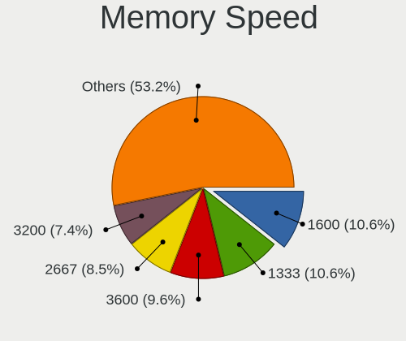

| Speed   | Desktops | Percent |
|---------|----------|---------|
| 3600    | 5        | 15.15%  |
| 3200    | 3        | 9.09%   |
| 1333    | 3        | 9.09%   |
| 6000    | 2        | 6.06%   |
| 3733    | 2        | 6.06%   |
| 3400    | 2        | 6.06%   |
| 2667    | 2        | 6.06%   |
| 1600    | 2        | 6.06%   |
| 7000    | 1        | 3.03%   |
| 5200    | 1        | 3.03%   |
| 4800    | 1        | 3.03%   |
| 3800    | 1        | 3.03%   |
| 2933    | 1        | 3.03%   |
| 2800    | 1        | 3.03%   |
| 1800    | 1        | 3.03%   |
| 1648    | 1        | 3.03%   |
| 1066    | 1        | 3.03%   |
| 800     | 1        | 3.03%   |
| 667     | 1        | 3.03%   |
| Unknown | 1        | 3.03%   |

Printers & scanners
-------------------

Printer Vendor
--------------

Printer device vendors

| Vendor                | Desktops | Percent |
|-----------------------|----------|---------|
| Hewlett-Packard       | 5        | 27.78%  |
| Samsung Electronics   | 3        | 16.67%  |
| Brother Industries    | 3        | 16.67%  |
| Seiko Epson           | 2        | 11.11%  |
| Lexmark International | 2        | 11.11%  |
| Ricoh                 | 1        | 5.56%   |
| Kyocera               | 1        | 5.56%   |
| Canon                 | 1        | 5.56%   |

Printer Model
-------------

Printer device models

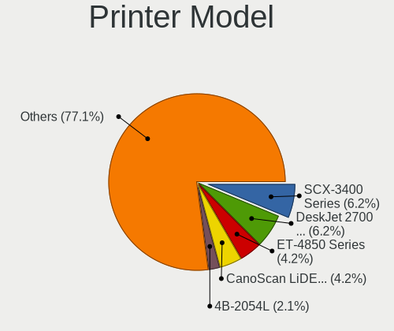

| Model                                                 | Desktops | Percent |
|-------------------------------------------------------|----------|---------|
| Seiko Epson ET-4850 Series                            | 1        | 5.56%   |
| Seiko Epson ET-2710 Series                            | 1        | 5.56%   |
| Samsung ML-216x Series Laser Printer                  | 1        | 5.56%   |
| Samsung CLX-3170 Series                               | 1        | 5.56%   |
| Samsung C48x Series Color Laser Multifunction Printer | 1        | 5.56%   |
| Ricoh Printing Support                                | 1        | 5.56%   |
| Lexmark International MS710                           | 1        | 5.56%   |
| Lexmark International CX310dn                         | 1        | 5.56%   |
| Kyocera ECOSYS P2235dn                                | 1        | 5.56%   |
| HP LaserJet 400 M401dne                               | 1        | 5.56%   |
| HP LaserJet 1020                                      | 1        | 5.56%   |
| HP ENVY 5540 series                                   | 1        | 5.56%   |
| HP Deskjet 2050 J510                                  | 1        | 5.56%   |
| HP Color LaserJet CP1215                              | 1        | 5.56%   |
| Canon PIXMA MP230                                     | 1        | 5.56%   |
| Brother MFC-1910W                                     | 1        | 5.56%   |
| Brother HL-L2350DW series                             | 1        | 5.56%   |
| Brother DCP-T300                                      | 1        | 5.56%   |

Scanner Vendor
--------------

Scanner device vendors

| Vendor          | Desktops | Percent |
|-----------------|----------|---------|
| Canon           | 4        | 80%     |
| Hewlett-Packard | 1        | 20%     |

Scanner Model
-------------

Scanner device models

| Model                   | Desktops | Percent |
|-------------------------|----------|---------|
| HP ScanJet 5300c/5370c  | 1        | 20%     |
| Canon CanoScan LiDE 90  | 1        | 20%     |
| Canon CanoScan LiDE 210 | 1        | 20%     |
| Canon CanoScan LiDE 200 | 1        | 20%     |
| Canon CanoScan 8800F    | 1        | 20%     |

Camera
------

Camera Vendor
-------------

Camera device vendors

| Vendor                        | Desktops | Percent |
|-------------------------------|----------|---------|
| Logitech                      | 23       | 37.7%   |
| Microsoft                     | 5        | 8.2%    |
| Sunplus Innovation Technology | 4        | 6.56%   |
| Microdia                      | 3        | 4.92%   |
| Generalplus Technology        | 3        | 4.92%   |
| Chicony Electronics           | 3        | 4.92%   |
| ARC International             | 2        | 3.28%   |
| Z-Star Microelectronics       | 1        | 1.64%   |
| Sunplus IT                    | 1        | 1.64%   |
| Remo Tech                     | 1        | 1.64%   |
| Realtek Semiconductor         | 1        | 1.64%   |
| OmniVision Technologies       | 1        | 1.64%   |
| Netchip Technology            | 1        | 1.64%   |
| MacroSilicon                  | 1        | 1.64%   |
| KYE Systems (Mouse Systems)   | 1        | 1.64%   |
| IPEVO                         | 1        | 1.64%   |
| Insta360                      | 1        | 1.64%   |
| Huawei Technologies           | 1        | 1.64%   |
| Google                        | 1        | 1.64%   |
| GEMBIRD                       | 1        | 1.64%   |
| eMeet                         | 1        | 1.64%   |
| AVerMedia Technologies        | 1        | 1.64%   |
| Arkmicro Technologies         | 1        | 1.64%   |
| Apple                         | 1        | 1.64%   |
| 2M UVC CAMERA                 | 1        | 1.64%   |

Camera Model
------------

Camera device models

| Model                                             | Desktops | Percent |
|---------------------------------------------------|----------|---------|
| Logitech Webcam C270                              | 10       | 16.13%  |
| Logitech HD Pro Webcam C920                       | 3        | 4.84%   |
| Microsoft LifeCam VX-2000                         | 2        | 3.23%   |
| Logitech Webcam C925e                             | 2        | 3.23%   |
| Generalplus CAMERA - UVC                          | 2        | 3.23%   |
| ARC International Camera                          | 2        | 3.23%   |
| Z-Star Proxima USB2.0 Camera                      | 1        | 1.61%   |
| Sunplus IT 1080P Webcam                           | 1        | 1.61%   |
| Sunplus USB 2.0 Camera                            | 1        | 1.61%   |
| Sunplus PC Camera                                 | 1        | 1.61%   |
| Sunplus Full HD webcam                            | 1        | 1.61%   |
| Sunplus ABTWPDQ-0222-W                            | 1        | 1.61%   |
| Remo Tech OBSBOT Meet 4K                          | 1        | 1.61%   |
| Realtek FULL HD 1080P Webcam                      | 1        | 1.61%   |
| OmniVision Monitor Webcam                         | 1        | 1.61%   |
| Netchip Nuroum V11                                | 1        | 1.61%   |
| Microsoft LifeCam VX-7000 (UVC-compliant)         | 1        | 1.61%   |
| Microsoft LifeCam HD-3000                         | 1        | 1.61%   |
| Microsoft LifeCam Cinema                          | 1        | 1.61%   |
| Microdia Webcam Vitade AF                         | 1        | 1.61%   |
| Microdia Defender G-Lens 2577 HD720p Camera       | 1        | 1.61%   |
| Microdia AUKEY-W1                                 | 1        | 1.61%   |
| MacroSilicon MiraBox Capture                      | 1        | 1.61%   |
| Logitech Webcam C310                              | 1        | 1.61%   |
| Logitech Webcam C200                              | 1        | 1.61%   |
| Logitech StreamCam                                | 1        | 1.61%   |
| Logitech Portable Webcam C905                     | 1        | 1.61%   |
| Logitech HD Webcam C525                           | 1        | 1.61%   |
| Logitech HD Webcam C510                           | 1        | 1.61%   |
| Logitech C922 Pro Stream Webcam                   | 1        | 1.61%   |
| Logitech C920 PRO HD Webcam                       | 1        | 1.61%   |
| Logitech C505 HD Webcam                           | 1        | 1.61%   |
| KYE Systems (Mouse Systems) Genius Webcam         | 1        | 1.61%   |
| IPEVO V4K                                         | 1        | 1.61%   |
| Insta360 Link                                     | 1        | 1.61%   |
| Huawei HiCamera                                   | 1        | 1.61%   |
| Google Nexus/Pixel Device (MTP + debug)           | 1        | 1.61%   |
| Generalplus GENERAL WEBCAM                        | 1        | 1.61%   |
| GEMBIRD Generic UVC 1.00 camera [AppoTech AX2311] | 1        | 1.61%   |
| eMeet HD Webcam C960                              | 1        | 1.61%   |

Security
--------

Fingerprint Vendor
------------------

Fingerprint sensor vendors

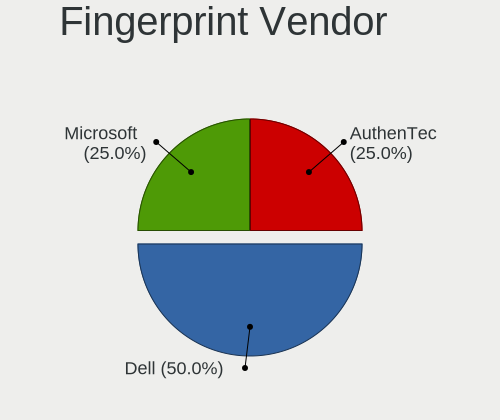

| Vendor    | Desktops | Percent |
|-----------|----------|---------|
| Dell      | 1        | 50%     |
| AuthenTec | 1        | 50%     |

Fingerprint Model
-----------------

Fingerprint sensor models

| Model                                               | Desktops | Percent |
|-----------------------------------------------------|----------|---------|
| Dell MS819 Dell Wired Mouse With Fingerprint Reader | 1        | 50%     |
| AuthenTec AES2810                                   | 1        | 50%     |

Chipcard Vendor
---------------

Chipcard module vendors

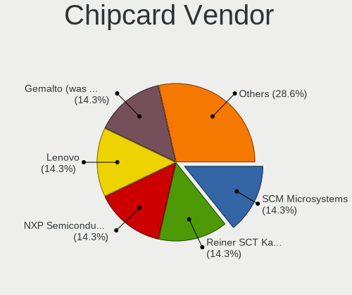

| Vendor                | Desktops | Percent |
|-----------------------|----------|---------|
| Lenovo                | 1        | 33.33%  |
| Gemalto (was Gemplus) | 1        | 33.33%  |
| Bit4id                | 1        | 33.33%  |

Chipcard Model
--------------

Chipcard module models

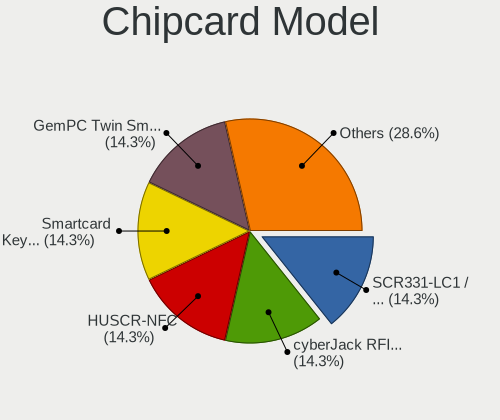

| Model                                             | Desktops | Percent |
|---------------------------------------------------|----------|---------|
| Lenovo Smartcard Keyboard                         | 1        | 33.33%  |
| Gemalto (was Gemplus) GemPC Twin SmartCard Reader | 1        | 33.33%  |
| Bit4id miniLector EVO                             | 1        | 33.33%  |

Unsupported
-----------

Unsupported Devices
-------------------

Total unsupported devices on board

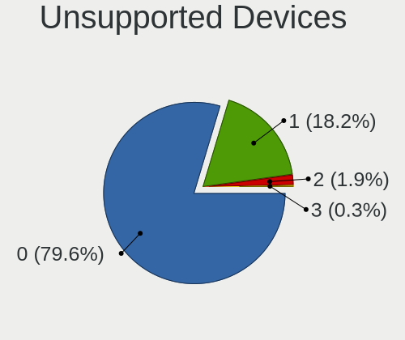

| Total | Desktops | Percent |
|-------|----------|---------|
| 0     | 263      | 79.94%  |
| 1     | 59       | 17.93%  |
| 2     | 7        | 2.13%   |

Unsupported Device Types
------------------------

Types of unsupported devices

| Type                  | Desktops | Percent |
|-----------------------|----------|---------|
| Graphics card         | 28       | 40.58%  |
| Net/wireless          | 23       | 33.33%  |
| Multimedia controller | 5        | 7.25%   |
| Unassigned class      | 3        | 4.35%   |
| Net/ethernet          | 3        | 4.35%   |
| Storage/ide           | 2        | 2.9%    |
| Video                 | 1        | 1.45%   |
| Network               | 1        | 1.45%   |
| Fingerprint reader    | 1        | 1.45%   |
| Chipcard              | 1        | 1.45%   |
| Card reader           | 1        | 1.45%   |

