Zorin 17 - Tested Hardware & Statistics (Notebooks)
---------------------------------------------------

A project to collect tested hardware configurations for Zorin 17.

Anyone can contribute to this report by the [hw-probe](https://github.com/linuxhw/hw-probe) tool:

    sudo -E hw-probe -all -upload

Please contribute! Especially if your hardware is rare.

Contents
--------

* [ Test Cases ](#test-cases)

* [ System ](#system)
  - [ Kernel                   ](#kernel)
  - [ Kernel Family            ](#kernel-family)
  - [ Kernel Major Ver.        ](#kernel-major-ver)
  - [ Arch                     ](#arch)
  - [ DE                       ](#de)
  - [ Display Server           ](#display-server)
  - [ Display Manager          ](#display-manager)
  - [ OS Lang                  ](#os-lang)
  - [ Boot Mode                ](#boot-mode)
  - [ Filesystem               ](#filesystem)
  - [ Part. scheme             ](#part-scheme)
  - [ Dual Boot with Linux/BSD ](#dual-boot-with-linuxbsd)
  - [ Dual Boot (Win)          ](#dual-boot-win)

* [ Board ](#board)
  - [ Vendor                   ](#vendor)
  - [ Model                    ](#model)
  - [ Model Family             ](#model-family)
  - [ MFG Year                 ](#mfg-year)
  - [ Form Factor              ](#form-factor)
  - [ Secure Boot              ](#secure-boot)
  - [ Coreboot                 ](#coreboot)
  - [ RAM Size                 ](#ram-size)
  - [ RAM Used                 ](#ram-used)
  - [ Total Drives             ](#total-drives)
  - [ Has CD-ROM               ](#has-cd-rom)
  - [ Has Ethernet             ](#has-ethernet)
  - [ Has WiFi                 ](#has-wifi)
  - [ Has Bluetooth            ](#has-bluetooth)

* [ Location ](#location)
  - [ Country                  ](#country)
  - [ City                     ](#city)

* [ Drives ](#drives)
  - [ Drive Vendor             ](#drive-vendor)
  - [ Drive Model              ](#drive-model)
  - [ HDD Vendor               ](#hdd-vendor)
  - [ SSD Vendor               ](#ssd-vendor)
  - [ Drive Kind               ](#drive-kind)
  - [ Drive Connector          ](#drive-connector)
  - [ Drive Size               ](#drive-size)
  - [ Space Total              ](#space-total)
  - [ Space Used               ](#space-used)
  - [ Malfunc. Drives          ](#malfunc-drives)
  - [ Malfunc. Drive Vendor    ](#malfunc-drive-vendor)
  - [ Malfunc. HDD Vendor      ](#malfunc-hdd-vendor)
  - [ Malfunc. Drive Kind      ](#malfunc-drive-kind)
  - [ Failed Drives            ](#failed-drives)
  - [ Failed Drive Vendor      ](#failed-drive-vendor)
  - [ Drive Status             ](#drive-status)

* [ Storage controller ](#storage-controller)
  - [ Storage Vendor           ](#storage-vendor)
  - [ Storage Model            ](#storage-model)
  - [ Storage Kind             ](#storage-kind)

* [ Processor ](#processor)
  - [ CPU Vendor               ](#cpu-vendor)
  - [ CPU Model                ](#cpu-model)
  - [ CPU Model Family         ](#cpu-model-family)
  - [ CPU Cores                ](#cpu-cores)
  - [ CPU Sockets              ](#cpu-sockets)
  - [ CPU Threads              ](#cpu-threads)
  - [ CPU Op-Modes             ](#cpu-op-modes)
  - [ CPU Microcode            ](#cpu-microcode)
  - [ CPU Microarch            ](#cpu-microarch)

* [ Graphics ](#graphics)
  - [ GPU Vendor               ](#gpu-vendor)
  - [ GPU Model                ](#gpu-model)
  - [ GPU Combo                ](#gpu-combo)
  - [ GPU Driver               ](#gpu-driver)
  - [ GPU Memory               ](#gpu-memory)

* [ Monitor ](#monitor)
  - [ Monitor Vendor           ](#monitor-vendor)
  - [ Monitor Model            ](#monitor-model)
  - [ Monitor Resolution       ](#monitor-resolution)
  - [ Monitor Diagonal         ](#monitor-diagonal)
  - [ Monitor Width            ](#monitor-width)
  - [ Aspect Ratio             ](#aspect-ratio)
  - [ Monitor Area             ](#monitor-area)
  - [ Pixel Density            ](#pixel-density)
  - [ Multiple Monitors        ](#multiple-monitors)

* [ Network ](#network)
  - [ Net Controller Vendor    ](#net-controller-vendor)
  - [ Net Controller Model     ](#net-controller-model)
  - [ Wireless Vendor          ](#wireless-vendor)
  - [ Wireless Model           ](#wireless-model)
  - [ Ethernet Vendor          ](#ethernet-vendor)
  - [ Ethernet Model           ](#ethernet-model)
  - [ Net Controller Kind      ](#net-controller-kind)
  - [ Used Controller          ](#used-controller)
  - [ NICs                     ](#nics)
  - [ IPv6                     ](#ipv6)

* [ Bluetooth ](#bluetooth)
  - [ Bluetooth Vendor         ](#bluetooth-vendor)
  - [ Bluetooth Model          ](#bluetooth-model)

* [ Sound ](#sound)
  - [ Sound Vendor             ](#sound-vendor)
  - [ Sound Model              ](#sound-model)

* [ Memory ](#memory)
  - [ Memory Vendor            ](#memory-vendor)
  - [ Memory Model             ](#memory-model)
  - [ Memory Kind              ](#memory-kind)
  - [ Memory Form Factor       ](#memory-form-factor)
  - [ Memory Size              ](#memory-size)
  - [ Memory Speed             ](#memory-speed)

* [ Printers & scanners ](#printers--scanners)
  - [ Printer Vendor           ](#printer-vendor)
  - [ Printer Model            ](#printer-model)
  - [ Scanner Vendor           ](#scanner-vendor)
  - [ Scanner Model            ](#scanner-model)

* [ Camera ](#camera)
  - [ Camera Vendor            ](#camera-vendor)
  - [ Camera Model             ](#camera-model)

* [ Security ](#security)
  - [ Fingerprint Vendor       ](#fingerprint-vendor)
  - [ Fingerprint Model        ](#fingerprint-model)
  - [ Chipcard Vendor          ](#chipcard-vendor)
  - [ Chipcard Model           ](#chipcard-model)

* [ Unsupported ](#unsupported)
  - [ Unsupported Devices      ](#unsupported-devices)
  - [ Unsupported Device Types ](#unsupported-device-types)

Test Cases
----------

Total: 3770

| Vendor        | Model                       | Probe                                                      | Date         |
|---------------|-----------------------------|------------------------------------------------------------|--------------|
| Fujitsu       | LIFEBOOK T732               | [2fe9801a6a](https://linux-hardware.org/?probe=2fe9801a6a) | Jan 03, 2026 |
| Fujitsu       | LIFEBOOK T732               | [2e6f1de3a0](https://linux-hardware.org/?probe=2e6f1de3a0) | Jan 03, 2026 |
| HP            | Pavilion Gaming Laptop 1... | [24c6012497](https://linux-hardware.org/?probe=24c6012497) | Jan 03, 2026 |
| Unknown       | AX16PRO                     | [d0382f0dc3](https://linux-hardware.org/?probe=d0382f0dc3) | Jan 02, 2026 |
| ASUSTek       | K53SJ                       | [701597645a](https://linux-hardware.org/?probe=701597645a) | Dec 30, 2025 |
| ASUSTek       | ProArt StudioBook W730G5... | [b58bba13b8](https://linux-hardware.org/?probe=b58bba13b8) | Dec 29, 2025 |
| Google        | Snappy                      | [61791f4bcd](https://linux-hardware.org/?probe=61791f4bcd) | Dec 29, 2025 |
| Acer          | Aspire A515-51G             | [04d35727f9](https://linux-hardware.org/?probe=04d35727f9) | Dec 28, 2025 |
| ASUSTek       | K53SJ                       | [f31db14b8b](https://linux-hardware.org/?probe=f31db14b8b) | Dec 28, 2025 |
| Lenovo        | ThinkPad T450s 20BWS5SJ0... | [442899b7fc](https://linux-hardware.org/?probe=442899b7fc) | Dec 28, 2025 |
| HP            | Pavilion dv6                | [ba5230a7c0](https://linux-hardware.org/?probe=ba5230a7c0) | Dec 28, 2025 |
| Dell          | Latitude E6430              | [5669b9c9cf](https://linux-hardware.org/?probe=5669b9c9cf) | Dec 27, 2025 |
| Positivo      | AT560                       | [79e8d0130b](https://linux-hardware.org/?probe=79e8d0130b) | Dec 25, 2025 |
| Apple         | MacBookPro9,2               | [4bc137ee6c](https://linux-hardware.org/?probe=4bc137ee6c) | Dec 25, 2025 |
| Apple         | MacBookPro9,2               | [26b1c3bc66](https://linux-hardware.org/?probe=26b1c3bc66) | Dec 25, 2025 |
| HP            | Pavilion dv6                | [1ea0bc11a3](https://linux-hardware.org/?probe=1ea0bc11a3) | Dec 24, 2025 |
| ASUSTek       | K55VM                       | [425ed05c6b](https://linux-hardware.org/?probe=425ed05c6b) | Dec 24, 2025 |
| Lenovo        | G50-45 80E3                 | [effe44e9b0](https://linux-hardware.org/?probe=effe44e9b0) | Dec 22, 2025 |
| Acer          | Aspire V3-571               | [bebb69b2da](https://linux-hardware.org/?probe=bebb69b2da) | Dec 22, 2025 |
| Lenovo        | IdeaPad 3 15IIL05 81WE      | [b6198affc8](https://linux-hardware.org/?probe=b6198affc8) | Dec 22, 2025 |
| Sony          | VPCF22SFX                   | [b894011b05](https://linux-hardware.org/?probe=b894011b05) | Dec 22, 2025 |
| HP            | ProBook 4446s               | [758eba67b3](https://linux-hardware.org/?probe=758eba67b3) | Dec 22, 2025 |
| HP            | ProBook 470 G3              | [ca3a48b2f0](https://linux-hardware.org/?probe=ca3a48b2f0) | Dec 21, 2025 |
| Lenovo        | ThinkPad T60 2007FH7        | [5d2a8d664a](https://linux-hardware.org/?probe=5d2a8d664a) | Dec 21, 2025 |
| Apple         | MacBookPro12,1              | [237acf53b0](https://linux-hardware.org/?probe=237acf53b0) | Dec 21, 2025 |
| Toshiba       | Satellite C855D             | [56442b2eba](https://linux-hardware.org/?probe=56442b2eba) | Dec 20, 2025 |
| Acer          | Predator PHN16-71           | [2becc0cbb4](https://linux-hardware.org/?probe=2becc0cbb4) | Dec 20, 2025 |
| HP            | ProBook 4446s               | [b9065994a0](https://linux-hardware.org/?probe=b9065994a0) | Dec 20, 2025 |
| Acer          | Predator PHN16-71           | [a4402ec711](https://linux-hardware.org/?probe=a4402ec711) | Dec 20, 2025 |
| ASUSTek       | Vivobook Go E1504FA_E150... | [317fc1d8b1](https://linux-hardware.org/?probe=317fc1d8b1) | Dec 17, 2025 |
| Dell          | Latitude E6230              | [a53a87edf0](https://linux-hardware.org/?probe=a53a87edf0) | Dec 17, 2025 |
| Lenovo        | ThinkPad T450s 20BWS3P40... | [9bd8d0e4a8](https://linux-hardware.org/?probe=9bd8d0e4a8) | Dec 16, 2025 |
| Dell          | Latitude E7240              | [e759961b95](https://linux-hardware.org/?probe=e759961b95) | Dec 16, 2025 |
| Dell          | Latitude 3420               | [ca5a7c0dcb](https://linux-hardware.org/?probe=ca5a7c0dcb) | Dec 16, 2025 |
| HP            | EliteBook 8530w             | [63130fbd89](https://linux-hardware.org/?probe=63130fbd89) | Dec 15, 2025 |
| Samsung       | 355V4C/356V4C/3445VC/354... | [b84ef7649f](https://linux-hardware.org/?probe=b84ef7649f) | Dec 14, 2025 |
| Samsung       | R530/R730                   | [53a2d116df](https://linux-hardware.org/?probe=53a2d116df) | Dec 13, 2025 |
| Dell          | Inspiron 15 3520            | [598acdb1ed](https://linux-hardware.org/?probe=598acdb1ed) | Dec 13, 2025 |
| Dell          | Inspiron 5555               | [039a38660f](https://linux-hardware.org/?probe=039a38660f) | Dec 12, 2025 |
| Samsung       | R530/R730                   | [ebaff68f1b](https://linux-hardware.org/?probe=ebaff68f1b) | Dec 11, 2025 |
| Acer          | Aspire 4810T                | [fdfa37b68c](https://linux-hardware.org/?probe=fdfa37b68c) | Dec 10, 2025 |
| HP            | ProBook 4 G1iR 16 inch N... | [108bffd4d4](https://linux-hardware.org/?probe=108bffd4d4) | Dec 09, 2025 |
| ASUSTek       | ROG Strix G713PV_G713PV     | [74b6dceec7](https://linux-hardware.org/?probe=74b6dceec7) | Dec 09, 2025 |
| ASUSTek       | K52N                        | [4638cead7c](https://linux-hardware.org/?probe=4638cead7c) | Dec 08, 2025 |
| ASUSTek       | K52N                        | [f5bf255419](https://linux-hardware.org/?probe=f5bf255419) | Dec 08, 2025 |
| ASUSTek       | K52N                        | [5851285ae9](https://linux-hardware.org/?probe=5851285ae9) | Dec 08, 2025 |
| Acer          | Aspire ES1-531              | [01843603ee](https://linux-hardware.org/?probe=01843603ee) | Dec 08, 2025 |
| HP            | Pavilion dv6                | [35482fff5e](https://linux-hardware.org/?probe=35482fff5e) | Dec 07, 2025 |
| Acer          | Aspire ES1-531              | [b8f6ce5b38](https://linux-hardware.org/?probe=b8f6ce5b38) | Dec 07, 2025 |
| HP            | 550                         | [ec3c9ae52d](https://linux-hardware.org/?probe=ec3c9ae52d) | Dec 07, 2025 |
| Lenovo        | ThinkPad T410 2522DV7       | [a10d0f26a0](https://linux-hardware.org/?probe=a10d0f26a0) | Dec 07, 2025 |
| Infinix       | INBOOK Y1 PLUS NEO          | [88fa5dcf2a](https://linux-hardware.org/?probe=88fa5dcf2a) | Dec 07, 2025 |
| Infinix       | INBOOK Y1 PLUS NEO          | [e2fece8541](https://linux-hardware.org/?probe=e2fece8541) | Dec 07, 2025 |
| HP            | Pavilion dv6                | [128e98e4a5](https://linux-hardware.org/?probe=128e98e4a5) | Dec 04, 2025 |
| Lenovo        | ThinkPad X250 20CLS0H800    | [2bbfe0e737](https://linux-hardware.org/?probe=2bbfe0e737) | Dec 03, 2025 |
| Acer          | Aspire 4810T                | [cce13c0a37](https://linux-hardware.org/?probe=cce13c0a37) | Dec 03, 2025 |
| HP            | EliteBook 840 G6            | [e44c7e5c89](https://linux-hardware.org/?probe=e44c7e5c89) | Dec 02, 2025 |
| HP            | EliteBook 840 G6            | [e4d8989fd8](https://linux-hardware.org/?probe=e4d8989fd8) | Dec 02, 2025 |
| Lenovo        | Yoga Pro 7 14APH8 82Y8      | [49361809e1](https://linux-hardware.org/?probe=49361809e1) | Dec 01, 2025 |
| Dell          | Inspiron 1501               | [a1a245d0ba](https://linux-hardware.org/?probe=a1a245d0ba) | Dec 01, 2025 |
| American M... | X133JR610                   | [f5c43ef4c5](https://linux-hardware.org/?probe=f5c43ef4c5) | Dec 01, 2025 |
| HP            | Pavilion g7                 | [847b1047c9](https://linux-hardware.org/?probe=847b1047c9) | Nov 30, 2025 |
| Apple         | MacBookPro7,1               | [75bc711146](https://linux-hardware.org/?probe=75bc711146) | Nov 29, 2025 |
| Apple         | MacBookPro12,1              | [f4b9d7e0a8](https://linux-hardware.org/?probe=f4b9d7e0a8) | Nov 29, 2025 |
| Apple         | MacBookPro7,1               | [23eafdcc92](https://linux-hardware.org/?probe=23eafdcc92) | Nov 29, 2025 |
| Lenovo        | ThinkPad T480s 20L70025U... | [3d8a36346b](https://linux-hardware.org/?probe=3d8a36346b) | Nov 29, 2025 |
| Dell          | Precision M6400             | [c73e9ff167](https://linux-hardware.org/?probe=c73e9ff167) | Nov 27, 2025 |
| Acer          | F5-573G-59ZR                | [219cc38f32](https://linux-hardware.org/?probe=219cc38f32) | Nov 27, 2025 |
| HP            | 2000                        | [fd22d0fa35](https://linux-hardware.org/?probe=fd22d0fa35) | Nov 26, 2025 |
| Lenovo        | ThinkPad T470s 20HGS6Y80... | [2b00334fc6](https://linux-hardware.org/?probe=2b00334fc6) | Nov 25, 2025 |
| Apple         | MacBookPro12,1              | [cd57c26a5b](https://linux-hardware.org/?probe=cd57c26a5b) | Nov 25, 2025 |
| Toshiba       | Satellite U300              | [361a846f1e](https://linux-hardware.org/?probe=361a846f1e) | Nov 24, 2025 |
| Lenovo        | IdeaPad 5 15ABA7 82SG       | [f7923bd940](https://linux-hardware.org/?probe=f7923bd940) | Nov 23, 2025 |
| HP            | Pavilion Laptop 14-ce0xx... | [0db935a593](https://linux-hardware.org/?probe=0db935a593) | Nov 22, 2025 |
| Acer          | Extensa 5635                | [8c85d02fea](https://linux-hardware.org/?probe=8c85d02fea) | Nov 22, 2025 |
| ASUSTek       | S551LN                      | [54ca866cc1](https://linux-hardware.org/?probe=54ca866cc1) | Nov 22, 2025 |
| ASUSTek       | S551LN                      | [f5e8adcb34](https://linux-hardware.org/?probe=f5e8adcb34) | Nov 22, 2025 |
| MSI           | GL62 7QF                    | [0e9dc98b5f](https://linux-hardware.org/?probe=0e9dc98b5f) | Nov 21, 2025 |
| Lenovo        | ThinkPad X250 20CLS0H800    | [ebee19ca70](https://linux-hardware.org/?probe=ebee19ca70) | Nov 20, 2025 |
| Lenovo        | ThinkPad X250 20CLS0H800    | [892bf6167d](https://linux-hardware.org/?probe=892bf6167d) | Nov 19, 2025 |
| Lenovo        | G505 20240                  | [d8567d13c3](https://linux-hardware.org/?probe=d8567d13c3) | Nov 18, 2025 |
| Acer          | Swift SF313-52              | [819fcf7f16](https://linux-hardware.org/?probe=819fcf7f16) | Nov 18, 2025 |
| Acer          | Swift SF313-52              | [0eefd786d0](https://linux-hardware.org/?probe=0eefd786d0) | Nov 18, 2025 |
| Toshiba       | Satellite Pro L770-12R      | [1ce9b50f15](https://linux-hardware.org/?probe=1ce9b50f15) | Nov 17, 2025 |
| Dell          | Latitude E6520              | [b84e07c7e4](https://linux-hardware.org/?probe=b84e07c7e4) | Nov 16, 2025 |
| ASUSTek       | VivoBook_ASUSLaptop X430... | [f5096b01f3](https://linux-hardware.org/?probe=f5096b01f3) | Nov 16, 2025 |
| HP            | Pavilion Laptop 14-ce0xx... | [c254b63287](https://linux-hardware.org/?probe=c254b63287) | Nov 16, 2025 |
| Sony          | VPCEB2C5E                   | [282cca00c5](https://linux-hardware.org/?probe=282cca00c5) | Nov 15, 2025 |
| Dell          | Vostro 1510                 | [c91f254d7f](https://linux-hardware.org/?probe=c91f254d7f) | Nov 14, 2025 |
| ASUSTek       | VivoBook_ASUSLaptop X412... | [46aaf99b53](https://linux-hardware.org/?probe=46aaf99b53) | Nov 13, 2025 |
| ASUSTek       | F5SL                        | [87809e3461](https://linux-hardware.org/?probe=87809e3461) | Nov 11, 2025 |
| Avell High... | A70 MOB                     | [d3464efb20](https://linux-hardware.org/?probe=d3464efb20) | Nov 11, 2025 |
| HP            | OMEN by Gaming Laptop 16... | [7d01fb8275](https://linux-hardware.org/?probe=7d01fb8275) | Nov 10, 2025 |
| Acer          | Aspire 5733Z                | [3e063ea35d](https://linux-hardware.org/?probe=3e063ea35d) | Nov 10, 2025 |
| HP            | Pavilion dv6                | [13e7bbb31a](https://linux-hardware.org/?probe=13e7bbb31a) | Nov 10, 2025 |
| HP            | OMEN by Gaming Laptop 16... | [f1d8998f04](https://linux-hardware.org/?probe=f1d8998f04) | Nov 09, 2025 |
| HONOR         | HYM-WXX                     | [cc997ae406](https://linux-hardware.org/?probe=cc997ae406) | Nov 09, 2025 |
| Acer          | Aspire 5741                 | [1b7cbc3b39](https://linux-hardware.org/?probe=1b7cbc3b39) | Nov 09, 2025 |
| HONOR         | HYM-WXX                     | [429e264672](https://linux-hardware.org/?probe=429e264672) | Nov 09, 2025 |
| Lenovo        | ThinkPad T510 4349AF5       | [24a212a8d5](https://linux-hardware.org/?probe=24a212a8d5) | Nov 08, 2025 |
| Lenovo        | ThinkPad T510 4349AF5       | [3acaef2510](https://linux-hardware.org/?probe=3acaef2510) | Nov 08, 2025 |
| Lenovo        | ThinkPad L430 2466DN6       | [16d669308c](https://linux-hardware.org/?probe=16d669308c) | Nov 08, 2025 |
| Dell          | Inspiron 5721               | [a98c06a316](https://linux-hardware.org/?probe=a98c06a316) | Nov 08, 2025 |
| Toshiba       | TECRA Z40-C                 | [7d97036c5d](https://linux-hardware.org/?probe=7d97036c5d) | Nov 08, 2025 |
| Samsung       | 550XED                      | [5cb84633df](https://linux-hardware.org/?probe=5cb84633df) | Nov 08, 2025 |
| GPU Compan... | GWTN156-7                   | [a2fcff3ea0](https://linux-hardware.org/?probe=a2fcff3ea0) | Nov 07, 2025 |
| HP            | 250 G4 Notebook PC          | [50059fa851](https://linux-hardware.org/?probe=50059fa851) | Nov 07, 2025 |
| Dell          | Latitude 5480               | [62df8b5caa](https://linux-hardware.org/?probe=62df8b5caa) | Nov 06, 2025 |
| Toshiba       | Satellite Pro L770-12R      | [b26c4ad391](https://linux-hardware.org/?probe=b26c4ad391) | Nov 06, 2025 |
| HP            | ProBook 430 G7              | [9b998d1b76](https://linux-hardware.org/?probe=9b998d1b76) | Nov 06, 2025 |
| Apple         | MacBookPro8,1               | [3c1e44de52](https://linux-hardware.org/?probe=3c1e44de52) | Nov 05, 2025 |
| Sony          | VGN-TT150FN                 | [f3f641b1a1](https://linux-hardware.org/?probe=f3f641b1a1) | Nov 05, 2025 |
| ASUSTek       | GL502VMK                    | [73078c8249](https://linux-hardware.org/?probe=73078c8249) | Nov 04, 2025 |
| Toshiba       | Satellite Pro R50-B         | [bb4e61062c](https://linux-hardware.org/?probe=bb4e61062c) | Nov 04, 2025 |
| Lenovo        | V14-ADA 82C6                | [15942d7538](https://linux-hardware.org/?probe=15942d7538) | Nov 03, 2025 |
| Toshiba       | Satellite C870-1GV          | [1ca2297c0b](https://linux-hardware.org/?probe=1ca2297c0b) | Nov 03, 2025 |
| Toshiba       | Satellite C870-1GV          | [e5ea18470d](https://linux-hardware.org/?probe=e5ea18470d) | Nov 03, 2025 |
| ASUSTek       | ASUS Vivobook Go 15 E150... | [03fb731618](https://linux-hardware.org/?probe=03fb731618) | Nov 02, 2025 |
| Medion        | Defender P30                | [a8755c1c63](https://linux-hardware.org/?probe=a8755c1c63) | Nov 02, 2025 |
| Lenovo        | ThinkPad T530 2434A43       | [dfe88f5eaa](https://linux-hardware.org/?probe=dfe88f5eaa) | Nov 01, 2025 |
| Lenovo        | ThinkPad T530 2434A43       | [86afc5f334](https://linux-hardware.org/?probe=86afc5f334) | Nov 01, 2025 |
| Medion        | Crawler E30e                | [a487cad53c](https://linux-hardware.org/?probe=a487cad53c) | Nov 01, 2025 |
| Sony          | VPCEH1M1E                   | [83b707c913](https://linux-hardware.org/?probe=83b707c913) | Oct 31, 2025 |
| HP            | Laptop 14-ep2xxx            | [362586d4ff](https://linux-hardware.org/?probe=362586d4ff) | Oct 31, 2025 |
| Lenovo        | G70-70 80HW000LIX           | [7f4b5be1c6](https://linux-hardware.org/?probe=7f4b5be1c6) | Oct 30, 2025 |
| HP            | Pavilion 17                 | [daab06c7e4](https://linux-hardware.org/?probe=daab06c7e4) | Oct 29, 2025 |
| Apple         | MacBookPro12,1              | [399ac07264](https://linux-hardware.org/?probe=399ac07264) | Oct 29, 2025 |
| HP            | Pavilion 17                 | [526806e2e6](https://linux-hardware.org/?probe=526806e2e6) | Oct 28, 2025 |
| HP            | ProBook 430 G1              | [0685b26d04](https://linux-hardware.org/?probe=0685b26d04) | Oct 28, 2025 |
| Toshiba       | Satellite Pro L770-12R      | [20af28d8b5](https://linux-hardware.org/?probe=20af28d8b5) | Oct 27, 2025 |
| Toshiba       | Satellite Pro L770-12R      | [df089fd4d3](https://linux-hardware.org/?probe=df089fd4d3) | Oct 27, 2025 |
| Dell          | Precision M90               | [79bd4957e1](https://linux-hardware.org/?probe=79bd4957e1) | Oct 27, 2025 |
| Sragon        | LNS-35                      | [c139009876](https://linux-hardware.org/?probe=c139009876) | Oct 26, 2025 |
| HP            | ProBook 4710s               | [53f5989086](https://linux-hardware.org/?probe=53f5989086) | Oct 26, 2025 |
| HP            | Compaq 620                  | [43b5eacc8b](https://linux-hardware.org/?probe=43b5eacc8b) | Oct 25, 2025 |
| Toshiba       | Satellite C55D-A            | [2daecc05e8](https://linux-hardware.org/?probe=2daecc05e8) | Oct 23, 2025 |
| Samsung       | 530U3C/530U4C/532U3C        | [7b2d4ac1b6](https://linux-hardware.org/?probe=7b2d4ac1b6) | Oct 23, 2025 |
| Dell          | Latitude E5270              | [9192d3641e](https://linux-hardware.org/?probe=9192d3641e) | Oct 23, 2025 |
| Lenovo        | ThinkPad X260 20F5S14P00    | [617f37b4fc](https://linux-hardware.org/?probe=617f37b4fc) | Oct 21, 2025 |
| Positivo      | Mobile                      | [edd12f1c95](https://linux-hardware.org/?probe=edd12f1c95) | Oct 21, 2025 |
| Multilaser    | PC024                       | [8fb762c889](https://linux-hardware.org/?probe=8fb762c889) | Oct 20, 2025 |
| Lenovo        | ThinkPad T430 2349S7X       | [7664f9c653](https://linux-hardware.org/?probe=7664f9c653) | Oct 20, 2025 |
| Samsung       | 300E4C/300E5C/300E7C        | [91bc3c367a](https://linux-hardware.org/?probe=91bc3c367a) | Oct 20, 2025 |
| HP            | EliteBook 840 G3            | [00a7982f3e](https://linux-hardware.org/?probe=00a7982f3e) | Oct 20, 2025 |
| Dell          | Latitude 3550               | [a74eac3c81](https://linux-hardware.org/?probe=a74eac3c81) | Oct 20, 2025 |
| Lenovo        | ThinkPad T420 4236KU9       | [7781229e37](https://linux-hardware.org/?probe=7781229e37) | Oct 19, 2025 |
| Dell          | Latitude 5590               | [6c81fb40af](https://linux-hardware.org/?probe=6c81fb40af) | Oct 19, 2025 |
| Acer          | Aspire ES1-523              | [40193c5597](https://linux-hardware.org/?probe=40193c5597) | Oct 19, 2025 |
| Samsung       | 370E4K                      | [96d8b4375e](https://linux-hardware.org/?probe=96d8b4375e) | Oct 19, 2025 |
| Samsung       | 370E4K                      | [dd28c6a63c](https://linux-hardware.org/?probe=dd28c6a63c) | Oct 19, 2025 |
| Toshiba       | PORTEGE Z930                | [6bf21cd46c](https://linux-hardware.org/?probe=6bf21cd46c) | Oct 18, 2025 |
| Apple         | MacBookPro11,3              | [2b87958e6d](https://linux-hardware.org/?probe=2b87958e6d) | Oct 18, 2025 |
| Sony          | VGN-FZ21M                   | [a43edc8123](https://linux-hardware.org/?probe=a43edc8123) | Oct 17, 2025 |
| Sony          | VGN-FZ21M                   | [c08287d821](https://linux-hardware.org/?probe=c08287d821) | Oct 17, 2025 |
| HP            | Pavilion g7                 | [e4a0e82dc1](https://linux-hardware.org/?probe=e4a0e82dc1) | Oct 17, 2025 |
| HP            | Pavilion g7                 | [ee885a922d](https://linux-hardware.org/?probe=ee885a922d) | Oct 17, 2025 |
| HP            | G62                         | [10204ad4f1](https://linux-hardware.org/?probe=10204ad4f1) | Oct 17, 2025 |
| HP            | G62                         | [f5f821ba76](https://linux-hardware.org/?probe=f5f821ba76) | Oct 17, 2025 |
| HP            | Pavilion dv4                | [455e5ed3f5](https://linux-hardware.org/?probe=455e5ed3f5) | Oct 17, 2025 |
| HP            | Pavilion dv4                | [cec4a876f9](https://linux-hardware.org/?probe=cec4a876f9) | Oct 17, 2025 |
| ASUSTek       | G771JW                      | [29b00a62d4](https://linux-hardware.org/?probe=29b00a62d4) | Oct 16, 2025 |
| Standard      | Unknown                     | [6d21312287](https://linux-hardware.org/?probe=6d21312287) | Oct 16, 2025 |
| Toshiba       | Satellite C55D-A            | [cc0b03c511](https://linux-hardware.org/?probe=cc0b03c511) | Oct 16, 2025 |
| Dell          | Latitude E6440              | [f199f890ea](https://linux-hardware.org/?probe=f199f890ea) | Oct 16, 2025 |
| Apple         | MacBookPro11,1              | [0f73bdab09](https://linux-hardware.org/?probe=0f73bdab09) | Oct 15, 2025 |
| Conectar I... | SF20GM7                     | [b61038691b](https://linux-hardware.org/?probe=b61038691b) | Oct 15, 2025 |
| Alienware     | 17                          | [e304588bee](https://linux-hardware.org/?probe=e304588bee) | Oct 15, 2025 |
| Acer          | Aspire A515-51G             | [1b0f62d0dd](https://linux-hardware.org/?probe=1b0f62d0dd) | Oct 15, 2025 |
| Dell          | XPS 9315                    | [2620d61385](https://linux-hardware.org/?probe=2620d61385) | Oct 15, 2025 |
| ASUSTek       | VivoBook_ASUSLaptop E210... | [bfa08524fd](https://linux-hardware.org/?probe=bfa08524fd) | Oct 15, 2025 |
| Lenovo        | 14w Gen 2 82N9              | [b3fef720dc](https://linux-hardware.org/?probe=b3fef720dc) | Oct 14, 2025 |
| Lenovo        | 14w Gen 2 82N9              | [6bc925de98](https://linux-hardware.org/?probe=6bc925de98) | Oct 14, 2025 |
| ASUSTek       | VivoBook_ASUSLaptop E210... | [b84f679e65](https://linux-hardware.org/?probe=b84f679e65) | Oct 14, 2025 |
| Lenovo        | ThinkBook 14 G3 ACL 21A2    | [de930c4a16](https://linux-hardware.org/?probe=de930c4a16) | Oct 14, 2025 |
| HP            | Laptop 14-ee0xxx            | [3010cfeab6](https://linux-hardware.org/?probe=3010cfeab6) | Oct 14, 2025 |
| Dell          | G16 7630                    | [8c91a6f297](https://linux-hardware.org/?probe=8c91a6f297) | Oct 14, 2025 |
| Toshiba       | Satellite S855D             | [0ac92e12ad](https://linux-hardware.org/?probe=0ac92e12ad) | Oct 14, 2025 |
| Dell          | Latitude 7430               | [ac2e3a5a22](https://linux-hardware.org/?probe=ac2e3a5a22) | Oct 14, 2025 |
| ASUSTek       | ASUS TUF Gaming A15 FA50... | [d5f87db05b](https://linux-hardware.org/?probe=d5f87db05b) | Oct 13, 2025 |
| Acer          | Swift SF515-51T             | [fd724afe49](https://linux-hardware.org/?probe=fd724afe49) | Oct 13, 2025 |
| Toshiba       | QOSMIO X300                 | [60857d5cde](https://linux-hardware.org/?probe=60857d5cde) | Oct 13, 2025 |
| Acer          | Extensa 5635G               | [e0bba8271a](https://linux-hardware.org/?probe=e0bba8271a) | Oct 13, 2025 |
| ASUSTek       | VivoBook_ASUSLaptop X430... | [4d34bece4d](https://linux-hardware.org/?probe=4d34bece4d) | Oct 13, 2025 |
| Toshiba       | Satellite C50D-A-10E        | [19cc6e0a57](https://linux-hardware.org/?probe=19cc6e0a57) | Oct 13, 2025 |
| Toshiba       | Satellite C50D-A-10E        | [752e82a8fc](https://linux-hardware.org/?probe=752e82a8fc) | Oct 13, 2025 |
| Lenovo        | IdeaPad 110-15ACL 80TJ      | [7acccfa375](https://linux-hardware.org/?probe=7acccfa375) | Oct 13, 2025 |
| Sony          | VPCEE43EB                   | [d62cc49203](https://linux-hardware.org/?probe=d62cc49203) | Oct 13, 2025 |
| HP            | 15 Notebook PC              | [2c14114391](https://linux-hardware.org/?probe=2c14114391) | Oct 13, 2025 |
| ASUSTek       | K55VM                       | [e767e74299](https://linux-hardware.org/?probe=e767e74299) | Oct 13, 2025 |
| Novatech      | N85_N87,HJ,HJ1,HK1          | [e1aaa7ee66](https://linux-hardware.org/?probe=e1aaa7ee66) | Oct 12, 2025 |
| Lenovo        | ThinkPad T410 2522G32       | [13d16b697b](https://linux-hardware.org/?probe=13d16b697b) | Oct 12, 2025 |
| Dell          | Inspiron 3593               | [5ff433a867](https://linux-hardware.org/?probe=5ff433a867) | Oct 12, 2025 |
| Haier Comp... | C14B                        | [6df4df9bac](https://linux-hardware.org/?probe=6df4df9bac) | Oct 12, 2025 |
| Lenovo        | ThinkPad T540p 20BFS02S0... | [12db6997d1](https://linux-hardware.org/?probe=12db6997d1) | Oct 12, 2025 |
| Acer          | Aspire 4745Z                | [2097033e92](https://linux-hardware.org/?probe=2097033e92) | Oct 12, 2025 |
| ASUSTek       | VivoBook_ASUSLaptop X430... | [26ac6efe7a](https://linux-hardware.org/?probe=26ac6efe7a) | Oct 11, 2025 |
| Acer          | Aspire A317-55P             | [2e4c4c39cb](https://linux-hardware.org/?probe=2e4c4c39cb) | Oct 11, 2025 |
| Dell          | Inspiron 5521               | [c6ce972316](https://linux-hardware.org/?probe=c6ce972316) | Oct 11, 2025 |
| Dell          | Inspiron 5521               | [a28abf3ef8](https://linux-hardware.org/?probe=a28abf3ef8) | Oct 11, 2025 |
| HP            | EliteBook 840 G3            | [9187736d25](https://linux-hardware.org/?probe=9187736d25) | Oct 11, 2025 |
| Packard Be... | EasyNote TE11HC             | [86f2e3004d](https://linux-hardware.org/?probe=86f2e3004d) | Oct 11, 2025 |
| Acer          | Aspire ES1-523              | [7a4c623ab1](https://linux-hardware.org/?probe=7a4c623ab1) | Oct 11, 2025 |
| Acer          | Aspire 4736Z                | [42f14c969f](https://linux-hardware.org/?probe=42f14c969f) | Oct 10, 2025 |
| Dell          | Inspiron 5537               | [e4ee80152e](https://linux-hardware.org/?probe=e4ee80152e) | Oct 10, 2025 |
| ASUSTek       | ASUS TUF Gaming F15 FX50... | [cf04e44d33](https://linux-hardware.org/?probe=cf04e44d33) | Oct 10, 2025 |
| ASUSTek       | X550CA                      | [8d8caaf70e](https://linux-hardware.org/?probe=8d8caaf70e) | Oct 09, 2025 |
| ASUSTek       | ASUS TUF Gaming F15 FX50... | [f853eb0502](https://linux-hardware.org/?probe=f853eb0502) | Oct 09, 2025 |
| Lenovo        | IdeaPad 530S-14ARR 81H1     | [307cc64765](https://linux-hardware.org/?probe=307cc64765) | Oct 09, 2025 |
| Dell          | Latitude D830               | [5eb4bec66d](https://linux-hardware.org/?probe=5eb4bec66d) | Oct 09, 2025 |
| ASUSTek       | Vivobook Go E1504FA_E150... | [40234768b3](https://linux-hardware.org/?probe=40234768b3) | Oct 09, 2025 |
| HP            | EliteBook 840 G3            | [1aab9d5d9a](https://linux-hardware.org/?probe=1aab9d5d9a) | Oct 08, 2025 |
| Positivo      | W540EU                      | [2c9fd81aed](https://linux-hardware.org/?probe=2c9fd81aed) | Oct 08, 2025 |
| Toshiba       | Satellite P55-A             | [7d101a5290](https://linux-hardware.org/?probe=7d101a5290) | Oct 07, 2025 |
| HP            | Laptop 15-fd0xxx            | [66c724994e](https://linux-hardware.org/?probe=66c724994e) | Oct 07, 2025 |
| Dell          | Latitude E5570              | [d9565f7583](https://linux-hardware.org/?probe=d9565f7583) | Oct 07, 2025 |
| HP            | EliteBook 840 G2            | [890007667b](https://linux-hardware.org/?probe=890007667b) | Oct 06, 2025 |
| Toshiba       | Satellite C55t-C            | [1ee544f1d5](https://linux-hardware.org/?probe=1ee544f1d5) | Oct 06, 2025 |
| HP            | 250 G7 Notebook PC          | [22be193eca](https://linux-hardware.org/?probe=22be193eca) | Oct 06, 2025 |
| Dell          | G16 7630                    | [71e359db63](https://linux-hardware.org/?probe=71e359db63) | Oct 06, 2025 |
| HP            | Notebook                    | [ea5de3d4ff](https://linux-hardware.org/?probe=ea5de3d4ff) | Oct 06, 2025 |
| ASUSTek       | VivoBook_ASUSLaptop X415... | [578767b897](https://linux-hardware.org/?probe=578767b897) | Oct 05, 2025 |
| ASUSTek       | N61Jq                       | [e76f3c35d0](https://linux-hardware.org/?probe=e76f3c35d0) | Oct 05, 2025 |
| HP            | Notebook                    | [6c0078cf73](https://linux-hardware.org/?probe=6c0078cf73) | Oct 05, 2025 |
| HP            | ProBook 4540s               | [bfe9f7d4d6](https://linux-hardware.org/?probe=bfe9f7d4d6) | Oct 05, 2025 |
| ASUSTek       | X751BP                      | [c6e808572a](https://linux-hardware.org/?probe=c6e808572a) | Oct 04, 2025 |
| Apple         | MacBookPro12,1              | [29585688bc](https://linux-hardware.org/?probe=29585688bc) | Oct 04, 2025 |
| HP            | EliteBook 840 G2            | [e318a42770](https://linux-hardware.org/?probe=e318a42770) | Oct 04, 2025 |
| Sony          | VPCEJ1M1E                   | [1430f67cd5](https://linux-hardware.org/?probe=1430f67cd5) | Oct 04, 2025 |
| Lenovo        | ThinkPad X260 20F600A2MZ    | [da4f2bdeb9](https://linux-hardware.org/?probe=da4f2bdeb9) | Oct 04, 2025 |
| Lenovo        | ThinkPad X260 20F600A2MZ    | [bc6752c689](https://linux-hardware.org/?probe=bc6752c689) | Oct 04, 2025 |
| Lenovo        | G50-45 80E3                 | [bb8e2265dc](https://linux-hardware.org/?probe=bb8e2265dc) | Oct 04, 2025 |
| Apple         | MacBook3,1                  | [9f2e8b003d](https://linux-hardware.org/?probe=9f2e8b003d) | Oct 04, 2025 |
| Acer          | Aspire 4352                 | [f4520f691a](https://linux-hardware.org/?probe=f4520f691a) | Oct 03, 2025 |
| Acer          | Aspire 4352                 | [a80cce2514](https://linux-hardware.org/?probe=a80cce2514) | Oct 03, 2025 |
| Lenovo        | IdeaPad S145-15IIL 82DJ     | [e4bac297f1](https://linux-hardware.org/?probe=e4bac297f1) | Oct 03, 2025 |
| Dell          | Inspiron 5720               | [d28f20bcea](https://linux-hardware.org/?probe=d28f20bcea) | Oct 03, 2025 |
| Alienware     | 14                          | [e278340397](https://linux-hardware.org/?probe=e278340397) | Oct 02, 2025 |
| Apple         | MacBookAir7,2               | [d320457558](https://linux-hardware.org/?probe=d320457558) | Oct 02, 2025 |
| Lenovo        | LOQ 15IAX9 83GS             | [27f3b5ebfd](https://linux-hardware.org/?probe=27f3b5ebfd) | Oct 02, 2025 |
| HP            | EliteBook 2560p             | [cd7ba530f7](https://linux-hardware.org/?probe=cd7ba530f7) | Oct 02, 2025 |
| Fujitsu       | LIFEBOOK AH512              | [5252f83071](https://linux-hardware.org/?probe=5252f83071) | Oct 02, 2025 |
| HP            | Pavilion dv4                | [898eedcd43](https://linux-hardware.org/?probe=898eedcd43) | Oct 01, 2025 |
| Acer          | Aspire 5820T                | [98f26ac277](https://linux-hardware.org/?probe=98f26ac277) | Oct 01, 2025 |
| Dell          | Vostro 14 3435              | [f64c381be0](https://linux-hardware.org/?probe=f64c381be0) | Oct 01, 2025 |
| HP            | Laptop 14-dq0xxx            | [0fbf0c89e6](https://linux-hardware.org/?probe=0fbf0c89e6) | Oct 01, 2025 |
| HP            | EliteBook 840 G3            | [8b487e6146](https://linux-hardware.org/?probe=8b487e6146) | Oct 01, 2025 |
| Apple         | MacBook6,1                  | [03117f8976](https://linux-hardware.org/?probe=03117f8976) | Sep 30, 2025 |
| Acer          | Aspire M3-581G              | [d0d5df8199](https://linux-hardware.org/?probe=d0d5df8199) | Sep 30, 2025 |
| HP            | ProBook 4730s               | [9d92b73414](https://linux-hardware.org/?probe=9d92b73414) | Sep 30, 2025 |
| Lenovo        | ThinkPad X250 20CLS09C00    | [d802c6c9e1](https://linux-hardware.org/?probe=d802c6c9e1) | Sep 29, 2025 |
| Samsung       | 300E4C/300E5C/300E7C        | [8e17e6891d](https://linux-hardware.org/?probe=8e17e6891d) | Sep 29, 2025 |
| Samsung       | 300E4C/300E5C/300E7C        | [5d3d2ebdfe](https://linux-hardware.org/?probe=5d3d2ebdfe) | Sep 29, 2025 |
| HP            | EliteBook 755 G5            | [18cc4fe589](https://linux-hardware.org/?probe=18cc4fe589) | Sep 29, 2025 |
| Apple         | MacBookAir6,1               | [b9177e069a](https://linux-hardware.org/?probe=b9177e069a) | Sep 29, 2025 |
| Apple         | MacBookAir6,1               | [0e938d0117](https://linux-hardware.org/?probe=0e938d0117) | Sep 29, 2025 |
| ASUSTek       | F50SL                       | [cf6f12e9f1](https://linux-hardware.org/?probe=cf6f12e9f1) | Sep 28, 2025 |
| Lenovo        | B50-30 80ES                 | [be8d653f8b](https://linux-hardware.org/?probe=be8d653f8b) | Sep 28, 2025 |
| Multilaser    | UB22X                       | [d5df2c4713](https://linux-hardware.org/?probe=d5df2c4713) | Sep 28, 2025 |
| Dell          | Precision M3800             | [b27f025913](https://linux-hardware.org/?probe=b27f025913) | Sep 28, 2025 |
| Samsung       | 950XEE                      | [df350a67c9](https://linux-hardware.org/?probe=df350a67c9) | Sep 28, 2025 |
| Samsung       | 950XEE                      | [cfa1e02326](https://linux-hardware.org/?probe=cfa1e02326) | Sep 28, 2025 |
| Lenovo        | IdeaPad 320-15IKB 80YE      | [ac16b98442](https://linux-hardware.org/?probe=ac16b98442) | Sep 28, 2025 |
| Dell          | Precision M3800             | [38f39efef4](https://linux-hardware.org/?probe=38f39efef4) | Sep 28, 2025 |
| HP            | 250 G3                      | [bde1f8b5ff](https://linux-hardware.org/?probe=bde1f8b5ff) | Sep 28, 2025 |
| HP            | 250 G3                      | [547b485646](https://linux-hardware.org/?probe=547b485646) | Sep 28, 2025 |
| Acer          | Aspire ES1-512              | [5bb1f69c5e](https://linux-hardware.org/?probe=5bb1f69c5e) | Sep 28, 2025 |
| Acer          | Aspire ES1-512              | [89f24df9a0](https://linux-hardware.org/?probe=89f24df9a0) | Sep 28, 2025 |
| Dell          | Latitude E7240              | [a81c6da240](https://linux-hardware.org/?probe=a81c6da240) | Sep 28, 2025 |
| Lenovo        | IdeaPad 110-15IBR 80T7      | [48fab82820](https://linux-hardware.org/?probe=48fab82820) | Sep 28, 2025 |
| Acer          | Aspire 4745Z                | [b832c6b2a1](https://linux-hardware.org/?probe=b832c6b2a1) | Sep 27, 2025 |
| Dell          | Latitude 5414               | [b446c3b2ae](https://linux-hardware.org/?probe=b446c3b2ae) | Sep 27, 2025 |
| Acer          | Aspire AL14-51M             | [37f6827eab](https://linux-hardware.org/?probe=37f6827eab) | Sep 26, 2025 |
| Dell          | Inspiron 5584               | [4c022d562c](https://linux-hardware.org/?probe=4c022d562c) | Sep 26, 2025 |
| Acer          | Aspire ES1-572              | [01d5430e00](https://linux-hardware.org/?probe=01d5430e00) | Sep 26, 2025 |
| Lenovo        | G510 20238                  | [651ab2e1d2](https://linux-hardware.org/?probe=651ab2e1d2) | Sep 26, 2025 |
| Acer          | Aspire 5820T                | [a2653db58b](https://linux-hardware.org/?probe=a2653db58b) | Sep 26, 2025 |
| Dell          | Inspiron 5584               | [3e7ccd53b0](https://linux-hardware.org/?probe=3e7ccd53b0) | Sep 26, 2025 |
| ASUSTek       | Vivobook Go E1504FA_E150... | [fa8cea3262](https://linux-hardware.org/?probe=fa8cea3262) | Sep 26, 2025 |
| ASUSTek       | Vivobook Go E1504FA_E150... | [7a24bb8f7f](https://linux-hardware.org/?probe=7a24bb8f7f) | Sep 26, 2025 |
| Lenovo        | Flex 2-14 20404             | [57e4bcbfcf](https://linux-hardware.org/?probe=57e4bcbfcf) | Sep 25, 2025 |
| Lenovo        | ThinkPad T540p 20BFS02S0... | [eb381f5fc4](https://linux-hardware.org/?probe=eb381f5fc4) | Sep 25, 2025 |
| Dell          | Latitude E5430 non-vPro     | [8ddce627e5](https://linux-hardware.org/?probe=8ddce627e5) | Sep 25, 2025 |
| HP            | EliteBook 840 G3            | [4aa4410804](https://linux-hardware.org/?probe=4aa4410804) | Sep 25, 2025 |
| ASUSTek       | X441UV                      | [be09cfdb07](https://linux-hardware.org/?probe=be09cfdb07) | Sep 25, 2025 |
| HUAWEI        | MACHD-WXX9                  | [2d66ee7703](https://linux-hardware.org/?probe=2d66ee7703) | Sep 25, 2025 |
| Dell          | Latitude E5570              | [bdbf9e981a](https://linux-hardware.org/?probe=bdbf9e981a) | Sep 25, 2025 |
| Acer          | Aspire A315-53G             | [462d24ff56](https://linux-hardware.org/?probe=462d24ff56) | Sep 25, 2025 |
| Acer          | Aspire ES1-572              | [3d7505d478](https://linux-hardware.org/?probe=3d7505d478) | Sep 25, 2025 |
| ASUSTek       | VivoBook_ASUSLaptop M140... | [f0253dfd4d](https://linux-hardware.org/?probe=f0253dfd4d) | Sep 25, 2025 |
| ASUSTek       | K55VD                       | [9c1d23cf22](https://linux-hardware.org/?probe=9c1d23cf22) | Sep 24, 2025 |
| Gateway       | NV59C                       | [b8f3d8c00e](https://linux-hardware.org/?probe=b8f3d8c00e) | Sep 24, 2025 |
| Acer          | Aspire E1-572G              | [a996f0ecab](https://linux-hardware.org/?probe=a996f0ecab) | Sep 24, 2025 |
| Inter Sale... | NID-11125DE                 | [d0b1df37ca](https://linux-hardware.org/?probe=d0b1df37ca) | Sep 23, 2025 |
| Dell          | Precision M6800             | [2f7fb39ad4](https://linux-hardware.org/?probe=2f7fb39ad4) | Sep 23, 2025 |
| Dell          | Precision M6800             | [0166250c84](https://linux-hardware.org/?probe=0166250c84) | Sep 23, 2025 |
| Lenovo        | ThinkPad T420 4236SB4       | [c423faf70a](https://linux-hardware.org/?probe=c423faf70a) | Sep 23, 2025 |
| HP            | EliteBook 845 G8 Noteboo... | [032308173d](https://linux-hardware.org/?probe=032308173d) | Sep 23, 2025 |
| HP            | Pavilion Laptop 15-eh0xx... | [5f13a167cf](https://linux-hardware.org/?probe=5f13a167cf) | Sep 22, 2025 |
| Apple         | MacBookAir7,2               | [ea88a4bbfe](https://linux-hardware.org/?probe=ea88a4bbfe) | Sep 22, 2025 |
| ASUSTek       | Vivobook Go E1504FA_E150... | [ccc73ce7eb](https://linux-hardware.org/?probe=ccc73ce7eb) | Sep 22, 2025 |
| ASUSTek       | Vivobook Go E1504FA_E150... | [041bfca5e5](https://linux-hardware.org/?probe=041bfca5e5) | Sep 22, 2025 |
| Lenovo        | ThinkPad T450s 20BWS5SJ0... | [98e2440fb0](https://linux-hardware.org/?probe=98e2440fb0) | Sep 21, 2025 |
| Lenovo        | IdeaPad Z560 0914           | [ccf37f87c1](https://linux-hardware.org/?probe=ccf37f87c1) | Sep 21, 2025 |
| Acer          | Aspire M3-581G              | [47e195eeed](https://linux-hardware.org/?probe=47e195eeed) | Sep 21, 2025 |
| Lenovo        | ThinkPad X260 20F5S14P00    | [8b94fc4b9c](https://linux-hardware.org/?probe=8b94fc4b9c) | Sep 21, 2025 |
| ASUSTek       | X75VCP                      | [5463b0cc85](https://linux-hardware.org/?probe=5463b0cc85) | Sep 21, 2025 |
| Lenovo        | Z50-75 80EC                 | [68eba43dfd](https://linux-hardware.org/?probe=68eba43dfd) | Sep 21, 2025 |
| ASUSTek       | VivoBook_ASUSLaptop X160... | [ce3c168b39](https://linux-hardware.org/?probe=ce3c168b39) | Sep 21, 2025 |
| Lenovo        | ThinkPad E520 1143A14       | [f9409c1692](https://linux-hardware.org/?probe=f9409c1692) | Sep 20, 2025 |
| ASUSTek       | VivoBook_ASUSLaptop X140... | [abbf451f78](https://linux-hardware.org/?probe=abbf451f78) | Sep 20, 2025 |
| UNOWHY        | Y13G012S4EI                 | [9636fc0e87](https://linux-hardware.org/?probe=9636fc0e87) | Sep 20, 2025 |
| ASUSTek       | VivoBook_ASUSLaptop X571... | [bcc527075b](https://linux-hardware.org/?probe=bcc527075b) | Sep 19, 2025 |
| Samsung       | 670Z5E                      | [c9fe7b35f4](https://linux-hardware.org/?probe=c9fe7b35f4) | Sep 19, 2025 |
| Dell          | Latitude E6430              | [119326d0ee](https://linux-hardware.org/?probe=119326d0ee) | Sep 19, 2025 |
| Lenovo        | ThinkPad E580 20KS003WUS    | [45761bbf9a](https://linux-hardware.org/?probe=45761bbf9a) | Sep 19, 2025 |
| Lenovo        | ThinkPad E580 20KS003WUS    | [45e36d9407](https://linux-hardware.org/?probe=45e36d9407) | Sep 19, 2025 |
| Lenovo        | G50-80 80E5                 | [4ea3644df6](https://linux-hardware.org/?probe=4ea3644df6) | Sep 19, 2025 |
| HP            | ProBook 645 G4              | [16a7921a43](https://linux-hardware.org/?probe=16a7921a43) | Sep 18, 2025 |
| OEM           | Unknown                     | [71ef04d541](https://linux-hardware.org/?probe=71ef04d541) | Sep 18, 2025 |
| Sony          | SVD1321X9EW                 | [546f23f580](https://linux-hardware.org/?probe=546f23f580) | Sep 18, 2025 |
| Google        | Yaviks                      | [b0e921f9d9](https://linux-hardware.org/?probe=b0e921f9d9) | Sep 18, 2025 |
| Dell          | Latitude E5570              | [488c29636b](https://linux-hardware.org/?probe=488c29636b) | Sep 17, 2025 |
| Lenovo        | Y520-15IKBM 80YY            | [73147d8fe6](https://linux-hardware.org/?probe=73147d8fe6) | Sep 17, 2025 |
| Lenovo        | Y520-15IKBM 80YY            | [b4b05c7ceb](https://linux-hardware.org/?probe=b4b05c7ceb) | Sep 17, 2025 |
| Sony          | SVJ2021E9EWI                | [69ce0ca4ab](https://linux-hardware.org/?probe=69ce0ca4ab) | Sep 17, 2025 |
| Acer          | Nitro AN17-42               | [327497e785](https://linux-hardware.org/?probe=327497e785) | Sep 17, 2025 |
| HP            | EliteBook 8570p             | [9dff2e0af9](https://linux-hardware.org/?probe=9dff2e0af9) | Sep 16, 2025 |
| Toshiba       | Satellite C650D             | [07f060a134](https://linux-hardware.org/?probe=07f060a134) | Sep 15, 2025 |
| Dell          | Latitude E6410              | [4c1daad5ff](https://linux-hardware.org/?probe=4c1daad5ff) | Sep 15, 2025 |
| Lenovo        | ThinkPad T460p 20FXS1110... | [2b61708b7c](https://linux-hardware.org/?probe=2b61708b7c) | Sep 15, 2025 |
| Apple         | MacBookPro12,1              | [c850cd0fe1](https://linux-hardware.org/?probe=c850cd0fe1) | Sep 15, 2025 |
| ASUSTek       | VivoBook 15_ASUS Laptop ... | [5b86b8976b](https://linux-hardware.org/?probe=5b86b8976b) | Sep 15, 2025 |
| Unknown       | Unknown                     | [383472fcfd](https://linux-hardware.org/?probe=383472fcfd) | Sep 14, 2025 |
| Lenovo        | B50-80 80EW                 | [0ef80e88e6](https://linux-hardware.org/?probe=0ef80e88e6) | Sep 14, 2025 |
| Positivo      | S14CT01                     | [70d514da7b](https://linux-hardware.org/?probe=70d514da7b) | Sep 14, 2025 |
| Acer          | Aspire V5-571P              | [855b2269c0](https://linux-hardware.org/?probe=855b2269c0) | Sep 14, 2025 |
| HUAWEI        | BoDE-WXX9                   | [5558317979](https://linux-hardware.org/?probe=5558317979) | Sep 13, 2025 |
| Dell          | Latitude 7480               | [c2b7008e46](https://linux-hardware.org/?probe=c2b7008e46) | Sep 13, 2025 |
| HP            | ProBook 4540s               | [1faf7eea9e](https://linux-hardware.org/?probe=1faf7eea9e) | Sep 13, 2025 |
| Toshiba       | TECRA R850                  | [b9b4e1969f](https://linux-hardware.org/?probe=b9b4e1969f) | Sep 13, 2025 |
| Lenovo        | ThinkPad T420 4236SB4       | [361d571086](https://linux-hardware.org/?probe=361d571086) | Sep 13, 2025 |
| Acer          | Aspire V5-571P              | [393d28324a](https://linux-hardware.org/?probe=393d28324a) | Sep 13, 2025 |
| Lenovo        | ThinkPad X1 Yoga 1st 20F... | [7d34ee0f55](https://linux-hardware.org/?probe=7d34ee0f55) | Sep 13, 2025 |
| Acer          | Aspire A315-21              | [05c972dc5a](https://linux-hardware.org/?probe=05c972dc5a) | Sep 13, 2025 |
| Acer          | Aspire A315-21              | [1f18d48927](https://linux-hardware.org/?probe=1f18d48927) | Sep 12, 2025 |
| Dell          | Inspiron 5559               | [6821323812](https://linux-hardware.org/?probe=6821323812) | Sep 12, 2025 |
| Dell          | Precision 7530              | [eb284a9a77](https://linux-hardware.org/?probe=eb284a9a77) | Sep 12, 2025 |
| ASUSTek       | VivoBook E14 E402WAS        | [fc391525b1](https://linux-hardware.org/?probe=fc391525b1) | Sep 12, 2025 |
| ASUSTek       | X550ZA                      | [52269b9718](https://linux-hardware.org/?probe=52269b9718) | Sep 12, 2025 |
| Samsung       | RV420/RV520/RV720/E3530/... | [3d45d82b29](https://linux-hardware.org/?probe=3d45d82b29) | Sep 12, 2025 |
| Samsung       | 300E4C/300E5C/300E7C        | [3875e81748](https://linux-hardware.org/?probe=3875e81748) | Sep 12, 2025 |
| ASUSTek       | X550LA                      | [7fdaef5453](https://linux-hardware.org/?probe=7fdaef5453) | Sep 12, 2025 |
| HP            | Pavilion 13 x360 PC         | [98cb219e9b](https://linux-hardware.org/?probe=98cb219e9b) | Sep 12, 2025 |
| ASUSTek       | VivoBook E14 E402WAS        | [d0dd417ed9](https://linux-hardware.org/?probe=d0dd417ed9) | Sep 12, 2025 |
| HP            | EliteBook 820 G1            | [c42af64caa](https://linux-hardware.org/?probe=c42af64caa) | Sep 12, 2025 |
| Lenovo        | ThinkBook 14 G7 IML 21MR    | [466774c66f](https://linux-hardware.org/?probe=466774c66f) | Sep 12, 2025 |
| Framework     | Laptop 16 (AMD Ryzen 704... | [3d2219e0ff](https://linux-hardware.org/?probe=3d2219e0ff) | Sep 11, 2025 |
| Dell          | G15 5530                    | [cfb386b971](https://linux-hardware.org/?probe=cfb386b971) | Sep 11, 2025 |
| ASUSTek       | X550ZA                      | [bc4ab76241](https://linux-hardware.org/?probe=bc4ab76241) | Sep 11, 2025 |
| Samsung       | 550P5C/550P7C               | [4d3674bad7](https://linux-hardware.org/?probe=4d3674bad7) | Sep 11, 2025 |
| Lenovo        | ThinkPad T530 2434A43       | [42f911057a](https://linux-hardware.org/?probe=42f911057a) | Sep 11, 2025 |
| Lenovo        | ThinkPad T470s 20HGS4AL0... | [1c6c28583a](https://linux-hardware.org/?probe=1c6c28583a) | Sep 11, 2025 |
| Lenovo        | ThinkPad X260 20F5S14P00    | [be73b86b2f](https://linux-hardware.org/?probe=be73b86b2f) | Sep 11, 2025 |
| Acer          | Aspire A315-59              | [ce2fccbba1](https://linux-hardware.org/?probe=ce2fccbba1) | Sep 11, 2025 |
| Acer          | Aspire A315-59              | [ca643d0472](https://linux-hardware.org/?probe=ca643d0472) | Sep 11, 2025 |
| HP            | ProBook 4540s               | [e6b3f2e512](https://linux-hardware.org/?probe=e6b3f2e512) | Sep 10, 2025 |
| HP            | 250 G7 Notebook PC          | [c56e13aa8a](https://linux-hardware.org/?probe=c56e13aa8a) | Sep 10, 2025 |
| Framework     | Laptop 16 (AMD Ryzen 704... | [702260c082](https://linux-hardware.org/?probe=702260c082) | Sep 10, 2025 |
| Dell          | Latitude 5414               | [8e97fe3379](https://linux-hardware.org/?probe=8e97fe3379) | Sep 09, 2025 |
| HP            | Pavilion 15                 | [34d636e553](https://linux-hardware.org/?probe=34d636e553) | Sep 09, 2025 |
| Positivo      | C4128A-14                   | [cc845ea61f](https://linux-hardware.org/?probe=cc845ea61f) | Sep 09, 2025 |
| ASUSTek       | ASUS EXPERTBOOK PM1503CD... | [f2c8cd0b11](https://linux-hardware.org/?probe=f2c8cd0b11) | Sep 09, 2025 |
| Positivo      | Smash                       | [8428ef7a65](https://linux-hardware.org/?probe=8428ef7a65) | Sep 08, 2025 |
| Pegatron      | T14AF                       | [7a2ea20409](https://linux-hardware.org/?probe=7a2ea20409) | Sep 08, 2025 |
| HP            | Compaq Presario C700        | [6d5e244dc8](https://linux-hardware.org/?probe=6d5e244dc8) | Sep 08, 2025 |
| HP            | Compaq Presario C700        | [0c22519fa3](https://linux-hardware.org/?probe=0c22519fa3) | Sep 08, 2025 |
| ASUSTek       | N76VB                       | [529f288924](https://linux-hardware.org/?probe=529f288924) | Sep 07, 2025 |
| Acer          | Aspire 4349                 | [92f5c5cdb4](https://linux-hardware.org/?probe=92f5c5cdb4) | Sep 07, 2025 |
| Acer          | Aspire E1-570G              | [778a1f5206](https://linux-hardware.org/?probe=778a1f5206) | Sep 07, 2025 |
| Acer          | Aspire E1-570G              | [b06be86e65](https://linux-hardware.org/?probe=b06be86e65) | Sep 07, 2025 |
| MSI           | GS66 Stealth 10SE           | [2cbc0329e7](https://linux-hardware.org/?probe=2cbc0329e7) | Sep 07, 2025 |
| ASUSTek       | ASUS EXPERTBOOK PM1503CD... | [915d73d3fb](https://linux-hardware.org/?probe=915d73d3fb) | Sep 07, 2025 |
| Inter Sale... | NID-11125DE                 | [e0208b4e34](https://linux-hardware.org/?probe=e0208b4e34) | Sep 06, 2025 |
| Toshiba       | Satellite C645              | [99c368c5f0](https://linux-hardware.org/?probe=99c368c5f0) | Sep 06, 2025 |
| Comexr        | Clevo                       | [02dc2bc8eb](https://linux-hardware.org/?probe=02dc2bc8eb) | Sep 05, 2025 |
| Acer          | Extensa 5635G               | [d06ce5211c](https://linux-hardware.org/?probe=d06ce5211c) | Sep 05, 2025 |
| Toshiba       | Satellite L755              | [c678d23e69](https://linux-hardware.org/?probe=c678d23e69) | Sep 05, 2025 |
| Lenovo        | IdeaPad Slim 3 15ABR8 82... | [479a18d0ee](https://linux-hardware.org/?probe=479a18d0ee) | Sep 05, 2025 |
| Toshiba       | Satellite L755              | [b1f8ab1d30](https://linux-hardware.org/?probe=b1f8ab1d30) | Sep 05, 2025 |
| HP            | EliteBook 840 G5            | [8b9f5c9192](https://linux-hardware.org/?probe=8b9f5c9192) | Sep 05, 2025 |
| Toshiba       | Satellite C55-C             | [73761b40ea](https://linux-hardware.org/?probe=73761b40ea) | Sep 05, 2025 |
| HP            | Laptop 15-dy5xxx            | [3e55ff4fbe](https://linux-hardware.org/?probe=3e55ff4fbe) | Sep 05, 2025 |
| Lenovo        | Flex 2-14 20404             | [e5f3c78566](https://linux-hardware.org/?probe=e5f3c78566) | Sep 04, 2025 |
| ASUSTek       | X550CA                      | [e897ab30af](https://linux-hardware.org/?probe=e897ab30af) | Sep 04, 2025 |
| HP            | 250 G7 Notebook PC          | [424167c93e](https://linux-hardware.org/?probe=424167c93e) | Sep 04, 2025 |
| Lenovo        | ThinkPad X1 Extreme 20MF... | [c2bc95e2f7](https://linux-hardware.org/?probe=c2bc95e2f7) | Sep 04, 2025 |
| Toshiba       | Satellite L755              | [59ca2ff7fb](https://linux-hardware.org/?probe=59ca2ff7fb) | Sep 04, 2025 |
| Dell          | Inspiron 3505               | [4b7c023e51](https://linux-hardware.org/?probe=4b7c023e51) | Sep 04, 2025 |
| Lenovo        | ThinkPad T530 2434A43       | [285784d7ab](https://linux-hardware.org/?probe=285784d7ab) | Sep 04, 2025 |
| Acer          | TravelMate P278-MG          | [058ec8b965](https://linux-hardware.org/?probe=058ec8b965) | Sep 04, 2025 |
| HP            | ProBook 4540s               | [644a8e3e0f](https://linux-hardware.org/?probe=644a8e3e0f) | Sep 03, 2025 |
| ASUSTek       | ASUS EXPERTBOOK PM1503CD... | [cc5bf89104](https://linux-hardware.org/?probe=cc5bf89104) | Sep 03, 2025 |
| Lenovo        | ThinkPad T460s 20F9004FU... | [d6ae9645b7](https://linux-hardware.org/?probe=d6ae9645b7) | Sep 03, 2025 |
| Dell          | Latitude E5440              | [c95ad85050](https://linux-hardware.org/?probe=c95ad85050) | Sep 03, 2025 |
| Google        | Sand                        | [022fa548e2](https://linux-hardware.org/?probe=022fa548e2) | Sep 02, 2025 |
| Lenovo        | Legion 5 15IMH6 82NL        | [b9b5f822b5](https://linux-hardware.org/?probe=b9b5f822b5) | Sep 02, 2025 |
| HP            | EliteBook 840 G6            | [cf834fa508](https://linux-hardware.org/?probe=cf834fa508) | Sep 02, 2025 |
| HP            | Pavilion dv7                | [a39afb10cb](https://linux-hardware.org/?probe=a39afb10cb) | Sep 02, 2025 |
| Framework     | Laptop 16 (AMD Ryzen 704... | [9bdf3d9efe](https://linux-hardware.org/?probe=9bdf3d9efe) | Sep 01, 2025 |
| HP            | EliteBook 8470p             | [eeb0687de0](https://linux-hardware.org/?probe=eeb0687de0) | Sep 01, 2025 |
| Framework     | Laptop 16 (AMD Ryzen 704... | [1f445e1c58](https://linux-hardware.org/?probe=1f445e1c58) | Aug 31, 2025 |
| Apple         | MacBookAir6,2               | [3876baf159](https://linux-hardware.org/?probe=3876baf159) | Aug 31, 2025 |
| Dell          | Latitude 3440               | [84f0cbb4a0](https://linux-hardware.org/?probe=84f0cbb4a0) | Aug 31, 2025 |
| Samsung       | 550XED                      | [049bda193f](https://linux-hardware.org/?probe=049bda193f) | Aug 31, 2025 |
| HP            | Pavilion dv6700             | [dbac8c5fa4](https://linux-hardware.org/?probe=dbac8c5fa4) | Aug 31, 2025 |
| Lenovo        | Unknown                     | [0bfc587944](https://linux-hardware.org/?probe=0bfc587944) | Aug 30, 2025 |
| Lenovo        | ThinkPad L520 5017W87       | [79f77a3729](https://linux-hardware.org/?probe=79f77a3729) | Aug 30, 2025 |
| HP            | 250 G7 Notebook PC          | [b50558b0ba](https://linux-hardware.org/?probe=b50558b0ba) | Aug 30, 2025 |
| Lenovo        | ThinkPad X1 Extreme 20MF... | [c3184c157b](https://linux-hardware.org/?probe=c3184c157b) | Aug 29, 2025 |
| ASUSTek       | G74Sx                       | [7d864db12b](https://linux-hardware.org/?probe=7d864db12b) | Aug 29, 2025 |
| Lenovo        | ThinkBook 14 G6 IRL 21KG    | [665cab915a](https://linux-hardware.org/?probe=665cab915a) | Aug 29, 2025 |
| Lenovo        | ThinkBook 14 G6 IRL 21KG    | [091ebded28](https://linux-hardware.org/?probe=091ebded28) | Aug 29, 2025 |
| Dell          | Latitude E5520              | [43d6ef37d1](https://linux-hardware.org/?probe=43d6ef37d1) | Aug 28, 2025 |
| Dell          | Latitude E6430              | [868f31aff4](https://linux-hardware.org/?probe=868f31aff4) | Aug 28, 2025 |
| Dell          | Vostro 15 5510              | [492485e161](https://linux-hardware.org/?probe=492485e161) | Aug 28, 2025 |
| HUAWEI        | BOM-WXX9                    | [92c138a750](https://linux-hardware.org/?probe=92c138a750) | Aug 27, 2025 |
| Apple         | MacBookPro6,1               | [2b56558cc2](https://linux-hardware.org/?probe=2b56558cc2) | Aug 27, 2025 |
| Lenovo        | ThinkPad X260 20F5A050IG    | [6943bfca8a](https://linux-hardware.org/?probe=6943bfca8a) | Aug 27, 2025 |
| HP            | EliteBook 840 G7 Noteboo... | [0b60abff41](https://linux-hardware.org/?probe=0b60abff41) | Aug 27, 2025 |
| Lenovo        | IdeaPad 5 Pro 16ACH6 82L... | [f14f9e275a](https://linux-hardware.org/?probe=f14f9e275a) | Aug 26, 2025 |
| ASUSTek       | GL502VMK                    | [ef7e5dbd9f](https://linux-hardware.org/?probe=ef7e5dbd9f) | Aug 26, 2025 |
| Dell          | Latitude 5414               | [7d3b75be08](https://linux-hardware.org/?probe=7d3b75be08) | Aug 25, 2025 |
| Dell          | Latitude 5414               | [f05caf4daa](https://linux-hardware.org/?probe=f05caf4daa) | Aug 25, 2025 |
| Apple         | MacBookPro7,1               | [372f5133c9](https://linux-hardware.org/?probe=372f5133c9) | Aug 25, 2025 |
| Multilaser    | MLSH0N                      | [5b3bd815a7](https://linux-hardware.org/?probe=5b3bd815a7) | Aug 25, 2025 |
| HUAWEI        | FLMH-XX                     | [be845977d2](https://linux-hardware.org/?probe=be845977d2) | Aug 25, 2025 |
| Samsung       | 300E4C/300E5C/300E7C        | [3c7b8e3775](https://linux-hardware.org/?probe=3c7b8e3775) | Aug 24, 2025 |
| Dell          | Latitude 5480               | [50f653a9aa](https://linux-hardware.org/?probe=50f653a9aa) | Aug 24, 2025 |
| Dell          | System Inspiron N7110       | [e8edbd40b9](https://linux-hardware.org/?probe=e8edbd40b9) | Aug 24, 2025 |
| Dell          | System Inspiron N7110       | [8d702bfd7b](https://linux-hardware.org/?probe=8d702bfd7b) | Aug 24, 2025 |
| ASUSTek       | G74Sx                       | [a243f9942e](https://linux-hardware.org/?probe=a243f9942e) | Aug 23, 2025 |
| ASUSTek       | ASUS TUF Gaming A15 FA50... | [f4f9874441](https://linux-hardware.org/?probe=f4f9874441) | Aug 23, 2025 |
| Alienware     | 16X Aurora AC16251          | [17d9f75a93](https://linux-hardware.org/?probe=17d9f75a93) | Aug 23, 2025 |
| Alienware     | 14                          | [6ddedfd070](https://linux-hardware.org/?probe=6ddedfd070) | Aug 23, 2025 |
| HP            | G62                         | [fa9cfed83c](https://linux-hardware.org/?probe=fa9cfed83c) | Aug 22, 2025 |
| ASUSTek       | F5SR                        | [dd52be8b03](https://linux-hardware.org/?probe=dd52be8b03) | Aug 22, 2025 |
| HP            | ProBook 4540s               | [e71f077f32](https://linux-hardware.org/?probe=e71f077f32) | Aug 22, 2025 |
| Lenovo        | ThinkPad T460s 20F9004FU... | [0f3e9a92e9](https://linux-hardware.org/?probe=0f3e9a92e9) | Aug 22, 2025 |
| HP            | G62                         | [85d79af210](https://linux-hardware.org/?probe=85d79af210) | Aug 21, 2025 |
| Acer          | Aspire E5-773G              | [911f478d1e](https://linux-hardware.org/?probe=911f478d1e) | Aug 21, 2025 |
| HP            | Pavilion g7                 | [7cd7290c2d](https://linux-hardware.org/?probe=7cd7290c2d) | Aug 21, 2025 |
| Lenovo        | ThinkPad L430 2466DN6       | [ad8b3607e7](https://linux-hardware.org/?probe=ad8b3607e7) | Aug 21, 2025 |
| Lenovo        | ThinkPad T440 20B7000CUS    | [9352ce4c49](https://linux-hardware.org/?probe=9352ce4c49) | Aug 20, 2025 |
| Dell          | Inspiron 15 3530            | [5c6527da9b](https://linux-hardware.org/?probe=5c6527da9b) | Aug 19, 2025 |
| HUAWEI        | BOHK-WAX9X                  | [b03640cf4f](https://linux-hardware.org/?probe=b03640cf4f) | Aug 19, 2025 |
| HP            | Laptop 15-dy2xxx            | [29588be73c](https://linux-hardware.org/?probe=29588be73c) | Aug 19, 2025 |
| Lenovo        | V110-15ISK 80TL             | [a8b3032afa](https://linux-hardware.org/?probe=a8b3032afa) | Aug 18, 2025 |
| Acer          | TravelMate P276-MG          | [307f59f727](https://linux-hardware.org/?probe=307f59f727) | Aug 18, 2025 |
| Dell          | 05GRXT A00                  | [c234a17f23](https://linux-hardware.org/?probe=c234a17f23) | Aug 17, 2025 |
| Dell          | Precision 5540              | [83d6c9afdb](https://linux-hardware.org/?probe=83d6c9afdb) | Aug 17, 2025 |
| HUAWEI        | FLMH-XX                     | [4e96f40051](https://linux-hardware.org/?probe=4e96f40051) | Aug 17, 2025 |
| Dell          | Latitude 7390               | [d787e4d6ea](https://linux-hardware.org/?probe=d787e4d6ea) | Aug 17, 2025 |
| ASUSTek       | X55U                        | [ffddd760e8](https://linux-hardware.org/?probe=ffddd760e8) | Aug 17, 2025 |
| Lenovo        | ThinkPad E580 20KS003NUS    | [771e6ef161](https://linux-hardware.org/?probe=771e6ef161) | Aug 16, 2025 |
| Dell          | Inspiron 15 3530            | [04864d79d9](https://linux-hardware.org/?probe=04864d79d9) | Aug 16, 2025 |
| HP            | 2000                        | [910566df90](https://linux-hardware.org/?probe=910566df90) | Aug 16, 2025 |
| HP            | Laptop 15-fd1xxx            | [33cb897a4b](https://linux-hardware.org/?probe=33cb897a4b) | Aug 16, 2025 |
| HP            | 2000                        | [b268cb2391](https://linux-hardware.org/?probe=b268cb2391) | Aug 16, 2025 |
| Lenovo        | IdeaPad S145-15IIL 82DJ     | [0946baa6ca](https://linux-hardware.org/?probe=0946baa6ca) | Aug 16, 2025 |
| HP            | 240 G7 Notebook PC          | [b71ec2c410](https://linux-hardware.org/?probe=b71ec2c410) | Aug 16, 2025 |
| Unknown       | ECOBOOK                     | [8857aee640](https://linux-hardware.org/?probe=8857aee640) | Aug 15, 2025 |
| HP            | Laptop 15-fd1xxx            | [6623baf153](https://linux-hardware.org/?probe=6623baf153) | Aug 15, 2025 |
| HP            | Pavilion dv4                | [a3fde70d17](https://linux-hardware.org/?probe=a3fde70d17) | Aug 15, 2025 |
| HP            | Pavilion dv4                | [b5acc98c3d](https://linux-hardware.org/?probe=b5acc98c3d) | Aug 15, 2025 |
| Toshiba       | PORTEGE R930                | [c0fdf07416](https://linux-hardware.org/?probe=c0fdf07416) | Aug 15, 2025 |
| HP            | Pavilion dm4                | [e37ca24d56](https://linux-hardware.org/?probe=e37ca24d56) | Aug 14, 2025 |
| Acer          | Aspire V5-561G              | [c0506d1d7c](https://linux-hardware.org/?probe=c0506d1d7c) | Aug 14, 2025 |
| Acer          | Aspire 5920G                | [8ee58770aa](https://linux-hardware.org/?probe=8ee58770aa) | Aug 14, 2025 |
| ASUSTek       | ROG Strix G733QS_G743QS     | [684c54fe45](https://linux-hardware.org/?probe=684c54fe45) | Aug 14, 2025 |
| HP            | Pavilion g7                 | [6a03518e88](https://linux-hardware.org/?probe=6a03518e88) | Aug 14, 2025 |
| Gigabyte      | MMLP3AP-00                  | [8a2e3a01bc](https://linux-hardware.org/?probe=8a2e3a01bc) | Aug 14, 2025 |
| Gigabyte      | MMLP3AP-00                  | [455883b5e9](https://linux-hardware.org/?probe=455883b5e9) | Aug 14, 2025 |
| Dell          | Latitude E6420              | [59ebc9bcc2](https://linux-hardware.org/?probe=59ebc9bcc2) | Aug 13, 2025 |
| Dell          | Inspiron 15 3530            | [6fbec9675e](https://linux-hardware.org/?probe=6fbec9675e) | Aug 13, 2025 |
| HP            | Pavilion Power Laptop 15... | [0c4b8bd52f](https://linux-hardware.org/?probe=0c4b8bd52f) | Aug 13, 2025 |
| HP            | Pavilion Power Laptop 15... | [eb94e8b06e](https://linux-hardware.org/?probe=eb94e8b06e) | Aug 13, 2025 |
| ASUSTek       | VivoBook_ASUSLaptop X412... | [5e29a83715](https://linux-hardware.org/?probe=5e29a83715) | Aug 12, 2025 |
| Fujitsu       | LIFEBOOK E756               | [5568c46049](https://linux-hardware.org/?probe=5568c46049) | Aug 12, 2025 |
| Lenovo        | IdeaPad Slim 3 14IAH8 83... | [5fadb3c020](https://linux-hardware.org/?probe=5fadb3c020) | Aug 12, 2025 |
| HP            | 2000                        | [2b638ea7a7](https://linux-hardware.org/?probe=2b638ea7a7) | Aug 11, 2025 |
| Sony          | SVE1712W1EB                 | [bb825deace](https://linux-hardware.org/?probe=bb825deace) | Aug 11, 2025 |
| ASUSTek       | X202E                       | [1e6333f486](https://linux-hardware.org/?probe=1e6333f486) | Aug 11, 2025 |
| Dell          | Latitude 7350               | [b99a7ab490](https://linux-hardware.org/?probe=b99a7ab490) | Aug 11, 2025 |
| Dell          | Latitude E6420              | [f43a0ec357](https://linux-hardware.org/?probe=f43a0ec357) | Aug 11, 2025 |
| Dell          | Latitude E5450              | [2cbad68366](https://linux-hardware.org/?probe=2cbad68366) | Aug 10, 2025 |
| Acer          | Aspire A315-21              | [b3b18d6c83](https://linux-hardware.org/?probe=b3b18d6c83) | Aug 10, 2025 |
| ASUSTek       | ASUS EXPERTBOOK B1500CEA... | [9736ec7b61](https://linux-hardware.org/?probe=9736ec7b61) | Aug 10, 2025 |
| HP            | Pavilion dv7                | [d73d39376d](https://linux-hardware.org/?probe=d73d39376d) | Aug 10, 2025 |
| Dell          | Latitude E6420              | [7e885b4280](https://linux-hardware.org/?probe=7e885b4280) | Aug 10, 2025 |
| ASUSTek       | VivoBook_ASUSLaptop E410... | [3779e2f3cb](https://linux-hardware.org/?probe=3779e2f3cb) | Aug 10, 2025 |
| GPD           | MicroPC                     | [63fdd093c8](https://linux-hardware.org/?probe=63fdd093c8) | Aug 10, 2025 |
| Toshiba       | TECRA R850                  | [a53974dafe](https://linux-hardware.org/?probe=a53974dafe) | Aug 09, 2025 |
| ASUSTek       | ROG Strix G733QS_G743QS     | [5d2ee9ae49](https://linux-hardware.org/?probe=5d2ee9ae49) | Aug 09, 2025 |
| HP            | EliteBook 840 G3            | [301abe595a](https://linux-hardware.org/?probe=301abe595a) | Aug 09, 2025 |
| HP            | EliteBook 840 G3            | [fd79005e88](https://linux-hardware.org/?probe=fd79005e88) | Aug 09, 2025 |
| ASUSTek       | PRIME B550-PLUS             | [f7cafa8003](https://linux-hardware.org/?probe=f7cafa8003) | Aug 09, 2025 |
| Toshiba       | PORTEGE R930                | [407c939b48](https://linux-hardware.org/?probe=407c939b48) | Aug 08, 2025 |
| Acer          | Aspire ES1-311              | [d384cde574](https://linux-hardware.org/?probe=d384cde574) | Aug 08, 2025 |
| Apple         | MacBookPro11,4              | [0c687bb37d](https://linux-hardware.org/?probe=0c687bb37d) | Aug 08, 2025 |
| Apple         | MacBookPro11,4              | [0212fcfc26](https://linux-hardware.org/?probe=0212fcfc26) | Aug 08, 2025 |
| Lenovo        | ThinkPad L440 20AS008DBP    | [7d45e91873](https://linux-hardware.org/?probe=7d45e91873) | Aug 08, 2025 |
| Lenovo        | ThinkPad L440 20AS008DBP    | [48291ed4e7](https://linux-hardware.org/?probe=48291ed4e7) | Aug 08, 2025 |
| Dell          | Latitude E6410              | [669edc75cd](https://linux-hardware.org/?probe=669edc75cd) | Aug 08, 2025 |
| ASUSTek       | VivoBook_ASUSLaptop X150... | [adb5f9665e](https://linux-hardware.org/?probe=adb5f9665e) | Aug 08, 2025 |
| Toshiba       | Satellite C855              | [0bc2d30705](https://linux-hardware.org/?probe=0bc2d30705) | Aug 07, 2025 |
| Lenovo        | IdeaPad S400u 20213         | [e1fc04dc23](https://linux-hardware.org/?probe=e1fc04dc23) | Aug 07, 2025 |
| Samsung       | 550XED                      | [ccbc3820c7](https://linux-hardware.org/?probe=ccbc3820c7) | Aug 06, 2025 |
| Medion        | Defender P30                | [712cbfeb21](https://linux-hardware.org/?probe=712cbfeb21) | Aug 05, 2025 |
| Samsung       | 750XGK                      | [441c8631fa](https://linux-hardware.org/?probe=441c8631fa) | Aug 05, 2025 |
| Medion        | Defender P30                | [29d9e1ee6e](https://linux-hardware.org/?probe=29d9e1ee6e) | Aug 05, 2025 |
| HP            | 255 G8 Notebook PC          | [7e7e68b027](https://linux-hardware.org/?probe=7e7e68b027) | Aug 05, 2025 |
| ASUSTek       | X541NA                      | [2cce9c36ac](https://linux-hardware.org/?probe=2cce9c36ac) | Aug 04, 2025 |
| Lenovo        | ZHAOYANG K4e-IML 81VQ       | [53e8cf873d](https://linux-hardware.org/?probe=53e8cf873d) | Aug 04, 2025 |
| Acer          | Aspire 4349                 | [58350a19ca](https://linux-hardware.org/?probe=58350a19ca) | Aug 04, 2025 |
| HP            | Notebook                    | [6abeabef96](https://linux-hardware.org/?probe=6abeabef96) | Aug 04, 2025 |
| HP            | Notebook                    | [6129a45252](https://linux-hardware.org/?probe=6129a45252) | Aug 03, 2025 |
| MSI           | Raider GE76 12UGS           | [5e29631cd6](https://linux-hardware.org/?probe=5e29631cd6) | Aug 03, 2025 |
| Apple         | MacBookPro12,1              | [feb387e64d](https://linux-hardware.org/?probe=feb387e64d) | Aug 03, 2025 |
| HP            | 15                          | [93c65f9929](https://linux-hardware.org/?probe=93c65f9929) | Aug 03, 2025 |
| Sony          | VGN-CS215J                  | [3af26b7d9c](https://linux-hardware.org/?probe=3af26b7d9c) | Aug 03, 2025 |
| ASUSTek       | ROG Strix G814JI_G814JI     | [7f94998eef](https://linux-hardware.org/?probe=7f94998eef) | Aug 03, 2025 |
| Dell          | Precision M4800             | [677ad06378](https://linux-hardware.org/?probe=677ad06378) | Aug 03, 2025 |
| Apple         | MacBook10,1                 | [850490253d](https://linux-hardware.org/?probe=850490253d) | Aug 02, 2025 |
| Lenovo        | ThinkPad T470 20HES07C1T    | [ff0696ffa9](https://linux-hardware.org/?probe=ff0696ffa9) | Aug 02, 2025 |
| HP            | Notebook                    | [d114fef382](https://linux-hardware.org/?probe=d114fef382) | Aug 02, 2025 |
| Gigabyte      | P2542                       | [4275eebc9b](https://linux-hardware.org/?probe=4275eebc9b) | Aug 02, 2025 |
| Apple         | MacBook5,1                  | [54f03ee6a0](https://linux-hardware.org/?probe=54f03ee6a0) | Aug 02, 2025 |
| ASUSTek       | K55DR                       | [c361309929](https://linux-hardware.org/?probe=c361309929) | Aug 02, 2025 |
| Lenovo        | Z710 20250                  | [39828da346](https://linux-hardware.org/?probe=39828da346) | Aug 01, 2025 |
| Lenovo        | ThinkPad T470p 20J7S1V80... | [010ac4b049](https://linux-hardware.org/?probe=010ac4b049) | Aug 01, 2025 |
| HP            | EliteBook 840 G2            | [19ae00c613](https://linux-hardware.org/?probe=19ae00c613) | Aug 01, 2025 |
| Lenovo        | ThinkPad E580 20KS003NUS    | [d47802926b](https://linux-hardware.org/?probe=d47802926b) | Aug 01, 2025 |
| Acer          | Aspire Lite AL15-53         | [7bfb38e5d3](https://linux-hardware.org/?probe=7bfb38e5d3) | Aug 01, 2025 |
| Acer          | Aspire Lite AL15-53         | [8508e6bca3](https://linux-hardware.org/?probe=8508e6bca3) | Aug 01, 2025 |
| HP            | Laptop 15-bs0xx             | [173a37e45c](https://linux-hardware.org/?probe=173a37e45c) | Aug 01, 2025 |
| HP            | EliteBook 850 G8 Noteboo... | [fcf21fb399](https://linux-hardware.org/?probe=fcf21fb399) | Aug 01, 2025 |
| ASUSTek       | K55DR                       | [314fedee8c](https://linux-hardware.org/?probe=314fedee8c) | Aug 01, 2025 |
| Lenovo        | IdeaPad 320-15IKB 80YE      | [c96e03e442](https://linux-hardware.org/?probe=c96e03e442) | Jul 31, 2025 |
| HP            | ProBook 4540s               | [ff1d644d77](https://linux-hardware.org/?probe=ff1d644d77) | Jul 31, 2025 |
| ASUSTek       | X540LA                      | [53a3b5dd55](https://linux-hardware.org/?probe=53a3b5dd55) | Jul 31, 2025 |
| Lenovo        | B590 20206                  | [5e5cdb37af](https://linux-hardware.org/?probe=5e5cdb37af) | Jul 31, 2025 |
| SDZ           | X133                        | [e81d516062](https://linux-hardware.org/?probe=e81d516062) | Jul 31, 2025 |
| Dell          | Latitude E6420              | [f1f4366146](https://linux-hardware.org/?probe=f1f4366146) | Jul 31, 2025 |
| Dell          | Latitude E6420              | [9ba204d1c2](https://linux-hardware.org/?probe=9ba204d1c2) | Jul 31, 2025 |
| Lenovo        | Z50-70 20354                | [8ae18efe39](https://linux-hardware.org/?probe=8ae18efe39) | Jul 31, 2025 |
| Lenovo        | G505 20240                  | [905ca73fbf](https://linux-hardware.org/?probe=905ca73fbf) | Jul 30, 2025 |
| Acer          | Aspire E5-731               | [d768f2d4c5](https://linux-hardware.org/?probe=d768f2d4c5) | Jul 30, 2025 |
| Lenovo        | ThinkPad T495s 20QJ0012G... | [749bcfb9c1](https://linux-hardware.org/?probe=749bcfb9c1) | Jul 30, 2025 |
| Acer          | Aspire E5-731               | [4c20ff60fa](https://linux-hardware.org/?probe=4c20ff60fa) | Jul 29, 2025 |
| Apple         | MacBookPro12,1              | [9d72af18ed](https://linux-hardware.org/?probe=9d72af18ed) | Jul 29, 2025 |
| ASUSTek       | K53SJ                       | [8cdcda2a02](https://linux-hardware.org/?probe=8cdcda2a02) | Jul 29, 2025 |
| HP            | EliteBook 8470p             | [822e9bba32](https://linux-hardware.org/?probe=822e9bba32) | Jul 29, 2025 |
| Lenovo        | G500 20236                  | [a089b59b94](https://linux-hardware.org/?probe=a089b59b94) | Jul 29, 2025 |
| Dell          | Inspiron 14-3452            | [4d999de986](https://linux-hardware.org/?probe=4d999de986) | Jul 29, 2025 |
| Dell          | Inspiron 5765               | [84eca33401](https://linux-hardware.org/?probe=84eca33401) | Jul 29, 2025 |
| ASUSTek       | K53SJ                       | [03bb41b14e](https://linux-hardware.org/?probe=03bb41b14e) | Jul 28, 2025 |
| Dell          | Latitude 14 Rugged (5404... | [fe5ed7bfab](https://linux-hardware.org/?probe=fe5ed7bfab) | Jul 28, 2025 |
| ASUSTek       | X705UAR                     | [8e016ef6fb](https://linux-hardware.org/?probe=8e016ef6fb) | Jul 27, 2025 |
| Lenovo        | IdeaPad 320-15IKB 80YH      | [11f51d65e1](https://linux-hardware.org/?probe=11f51d65e1) | Jul 27, 2025 |
| Samsung       | R530/R730/R540              | [e511073cd8](https://linux-hardware.org/?probe=e511073cd8) | Jul 27, 2025 |
| ASUSTek       | VivoBook_ASUSLaptop X515... | [25a4bc4daa](https://linux-hardware.org/?probe=25a4bc4daa) | Jul 27, 2025 |
| HP            | Laptop 15s-eq2xxx           | [0d14de55e8](https://linux-hardware.org/?probe=0d14de55e8) | Jul 27, 2025 |
| ASUSTek       | ASUS TUF Gaming F15 FX50... | [6e8036251f](https://linux-hardware.org/?probe=6e8036251f) | Jul 26, 2025 |
| Lenovo        | Unknown                     | [bfd8645d77](https://linux-hardware.org/?probe=bfd8645d77) | Jul 26, 2025 |
| Positivo      | F14CU47                     | [95a2239129](https://linux-hardware.org/?probe=95a2239129) | Jul 26, 2025 |
| HP            | ProBook 450 G2              | [d3c48d72f9](https://linux-hardware.org/?probe=d3c48d72f9) | Jul 26, 2025 |
| ASUSTek       | Vivobook Go E1504FA_E150... | [8fca67fd72](https://linux-hardware.org/?probe=8fca67fd72) | Jul 25, 2025 |
| ASUSTek       | Vivobook Go E1504FA_E150... | [42aed0c2f9](https://linux-hardware.org/?probe=42aed0c2f9) | Jul 25, 2025 |
| Dell          | System XPS L502X            | [bbf2e8b998](https://linux-hardware.org/?probe=bbf2e8b998) | Jul 25, 2025 |
| ASUSTek       | X551CA                      | [bb2cfb98b7](https://linux-hardware.org/?probe=bb2cfb98b7) | Jul 24, 2025 |
| HP            | EliteBook 6930p             | [521deeedd8](https://linux-hardware.org/?probe=521deeedd8) | Jul 24, 2025 |
| Lenovo        | ThinkPad E490 20N8CTO1WW    | [2c4ddba0b4](https://linux-hardware.org/?probe=2c4ddba0b4) | Jul 24, 2025 |
| HP            | Laptop 17-bs0xx             | [8abe2ca728](https://linux-hardware.org/?probe=8abe2ca728) | Jul 24, 2025 |
| Lenovo        | ThinkPad T440 20B7S41N06    | [8cbae8b7c1](https://linux-hardware.org/?probe=8cbae8b7c1) | Jul 24, 2025 |
| Sony          | SVE1712W1EB                 | [032522ac8c](https://linux-hardware.org/?probe=032522ac8c) | Jul 22, 2025 |
| Lenovo        | XiaoXinPro 14 ARH5R 82UU    | [4b596f4f71](https://linux-hardware.org/?probe=4b596f4f71) | Jul 22, 2025 |
| HP            | ProBook 445R G6             | [ec4519442b](https://linux-hardware.org/?probe=ec4519442b) | Jul 21, 2025 |
| HP            | ProBook 445R G6             | [c6796de88a](https://linux-hardware.org/?probe=c6796de88a) | Jul 21, 2025 |
| ASUSTek       | X556UJ                      | [74ebebee84](https://linux-hardware.org/?probe=74ebebee84) | Jul 21, 2025 |
| Dell          | System XPS L502X            | [c44b52e3a1](https://linux-hardware.org/?probe=c44b52e3a1) | Jul 21, 2025 |
| Intel         | W7645                       | [609cfffb6b](https://linux-hardware.org/?probe=609cfffb6b) | Jul 21, 2025 |
| HP            | Notebook                    | [ee92a5f469](https://linux-hardware.org/?probe=ee92a5f469) | Jul 21, 2025 |
| HP            | EliteBook 850 G8 Noteboo... | [1eb42d38aa](https://linux-hardware.org/?probe=1eb42d38aa) | Jul 21, 2025 |
| Apple         | MacBookAir6,2               | [0626ce7ad8](https://linux-hardware.org/?probe=0626ce7ad8) | Jul 21, 2025 |
| Apple         | MacBookAir6,2               | [f3f18b3df3](https://linux-hardware.org/?probe=f3f18b3df3) | Jul 21, 2025 |
| HP            | ProBook 4540s               | [a0aa8802bf](https://linux-hardware.org/?probe=a0aa8802bf) | Jul 20, 2025 |
| Toshiba       | PORTEGE Z930                | [5aa0f73654](https://linux-hardware.org/?probe=5aa0f73654) | Jul 20, 2025 |
| Lenovo        | ThinkPad S1 Yoga 12 20DL... | [e249757bbe](https://linux-hardware.org/?probe=e249757bbe) | Jul 20, 2025 |
| Lenovo        | ThinkPad T530 2434A43       | [f0c4daaf6d](https://linux-hardware.org/?probe=f0c4daaf6d) | Jul 20, 2025 |
| HP            | Laptop 15-fd1xxx            | [4a55786668](https://linux-hardware.org/?probe=4a55786668) | Jul 20, 2025 |
| HP            | 240 G7 Notebook PC          | [69a83aeb25](https://linux-hardware.org/?probe=69a83aeb25) | Jul 20, 2025 |
| Lenovo        | ThinkPad P16s Gen 2 21HL... | [b1755cfbef](https://linux-hardware.org/?probe=b1755cfbef) | Jul 19, 2025 |
| Dell          | Precision 5540              | [0266996ea9](https://linux-hardware.org/?probe=0266996ea9) | Jul 19, 2025 |
| Acer          | TravelMate 7750G            | [c43ba03f86](https://linux-hardware.org/?probe=c43ba03f86) | Jul 19, 2025 |
| Lenovo        | ThinkPad L530 248155U       | [9139592b35](https://linux-hardware.org/?probe=9139592b35) | Jul 19, 2025 |
| HP            | ProBook 430 G7              | [12142a39d9](https://linux-hardware.org/?probe=12142a39d9) | Jul 18, 2025 |
| Dell          | G3 3779                     | [13de599136](https://linux-hardware.org/?probe=13de599136) | Jul 18, 2025 |
| HP            | EliteBook 840 G2            | [cf9ad678d8](https://linux-hardware.org/?probe=cf9ad678d8) | Jul 18, 2025 |
| Lenovo        | Yoga Slim 6 14IRH8 83E0     | [e8166a4063](https://linux-hardware.org/?probe=e8166a4063) | Jul 18, 2025 |
| ASUSTek       | Vivobook Go E1504FA_E150... | [7ded048258](https://linux-hardware.org/?probe=7ded048258) | Jul 18, 2025 |
| Chuwi         | HeroBook Pro                | [8feda6387b](https://linux-hardware.org/?probe=8feda6387b) | Jul 18, 2025 |
| Acer          | Aspire 4736Z                | [dabc715b77](https://linux-hardware.org/?probe=dabc715b77) | Jul 18, 2025 |
| Lenovo        | ThinkPad T14 Gen 1 20S00... | [e11c75dc55](https://linux-hardware.org/?probe=e11c75dc55) | Jul 18, 2025 |
| Acer          | Aspire 4741                 | [efc66797d5](https://linux-hardware.org/?probe=efc66797d5) | Jul 18, 2025 |
| ASUSTek       | Vivobook Go E1504FA_E150... | [71951cc4e9](https://linux-hardware.org/?probe=71951cc4e9) | Jul 17, 2025 |
| Dell          | Latitude E7270              | [bc3352ec54](https://linux-hardware.org/?probe=bc3352ec54) | Jul 17, 2025 |
| Lenovo        | ZHAOYANG K4e-IML 81VQ       | [054052d85f](https://linux-hardware.org/?probe=054052d85f) | Jul 17, 2025 |
| Dell          | Latitude 5580               | [6f50416177](https://linux-hardware.org/?probe=6f50416177) | Jul 17, 2025 |
| Lenovo        | ThinkPad P50 20EN0013US     | [7c323df8ae](https://linux-hardware.org/?probe=7c323df8ae) | Jul 16, 2025 |
| Dell          | G3 3779                     | [0640b990da](https://linux-hardware.org/?probe=0640b990da) | Jul 16, 2025 |
| Positivo      | Q232A                       | [37e0573203](https://linux-hardware.org/?probe=37e0573203) | Jul 16, 2025 |
| Acer          | Aspire E5-771G              | [22dc6ac787](https://linux-hardware.org/?probe=22dc6ac787) | Jul 16, 2025 |
| Dell          | Inspiron 13-7378            | [74c1b51a76](https://linux-hardware.org/?probe=74c1b51a76) | Jul 15, 2025 |
| Lenovo        | Z50-70 20354                | [9785a9d5a7](https://linux-hardware.org/?probe=9785a9d5a7) | Jul 15, 2025 |
| Acer          | E1-510                      | [3ac5f226c6](https://linux-hardware.org/?probe=3ac5f226c6) | Jul 14, 2025 |
| Acer          | E1-510                      | [f85a389101](https://linux-hardware.org/?probe=f85a389101) | Jul 14, 2025 |
| Dell          | Precision 7720              | [44ac87ac2f](https://linux-hardware.org/?probe=44ac87ac2f) | Jul 14, 2025 |
| ASUSTek       | ASUS Zenbook S 16 UM5606... | [927261893b](https://linux-hardware.org/?probe=927261893b) | Jul 14, 2025 |
| Dell          | Latitude E6440              | [bcb45345bb](https://linux-hardware.org/?probe=bcb45345bb) | Jul 14, 2025 |
| ASUSTek       | E200HA                      | [03f2d7db4a](https://linux-hardware.org/?probe=03f2d7db4a) | Jul 14, 2025 |
| Apple         | MacBookPro12,1              | [f9ee36a798](https://linux-hardware.org/?probe=f9ee36a798) | Jul 14, 2025 |
| HP            | 250 G2                      | [9a47beea01](https://linux-hardware.org/?probe=9a47beea01) | Jul 13, 2025 |
| HP            | 250 G2                      | [ae2f69bb59](https://linux-hardware.org/?probe=ae2f69bb59) | Jul 13, 2025 |
| ASUSTek       | VivoBook_ASUSLaptop X540... | [1236fac33a](https://linux-hardware.org/?probe=1236fac33a) | Jul 13, 2025 |
| AVITA         | NS14A6                      | [7bc8b388db](https://linux-hardware.org/?probe=7bc8b388db) | Jul 13, 2025 |
| Toshiba       | Satellite C55t-C            | [d5ab675200](https://linux-hardware.org/?probe=d5ab675200) | Jul 13, 2025 |
| Acer          | Aspire 5736Z                | [03655f8de3](https://linux-hardware.org/?probe=03655f8de3) | Jul 13, 2025 |
| Lenovo        | IdeaPad S145-14AST 81ST     | [9be03e5dd5](https://linux-hardware.org/?probe=9be03e5dd5) | Jul 12, 2025 |
| Apple         | MacBookPro15,1              | [87b51ea8a1](https://linux-hardware.org/?probe=87b51ea8a1) | Jul 12, 2025 |
| Apple         | MacBookPro15,1              | [ecc6e92c6d](https://linux-hardware.org/?probe=ecc6e92c6d) | Jul 12, 2025 |
| Lenovo        | IdeaPad L340-15IRH Gamin... | [d63d61be20](https://linux-hardware.org/?probe=d63d61be20) | Jul 12, 2025 |
| Acer          | Aspire V3-771               | [eb1fee22d1](https://linux-hardware.org/?probe=eb1fee22d1) | Jul 12, 2025 |
| Acer          | Aspire V5-552               | [20a6b5e6af](https://linux-hardware.org/?probe=20a6b5e6af) | Jul 12, 2025 |
| Apple         | MacBookPro12,1              | [847cedb1cb](https://linux-hardware.org/?probe=847cedb1cb) | Jul 12, 2025 |
| Dell          | Precision 5540              | [b7d88a9da5](https://linux-hardware.org/?probe=b7d88a9da5) | Jul 11, 2025 |
| Lenovo        | ThinkPad T490 20N3S93T00    | [1bd54c5ba6](https://linux-hardware.org/?probe=1bd54c5ba6) | Jul 11, 2025 |
| Dell          | Latitude 7420               | [1d1f41c660](https://linux-hardware.org/?probe=1d1f41c660) | Jul 11, 2025 |
| Dell          | Latitude 7420               | [a45d25c768](https://linux-hardware.org/?probe=a45d25c768) | Jul 11, 2025 |
| ASUSTek       | GL503VD                     | [883f6d60da](https://linux-hardware.org/?probe=883f6d60da) | Jul 11, 2025 |
| ASUSTek       | GL503VD                     | [57bd831935](https://linux-hardware.org/?probe=57bd831935) | Jul 11, 2025 |
| Lenovo        | IdeaPad Slim 3 14IAN8 82... | [3dac5e29b1](https://linux-hardware.org/?probe=3dac5e29b1) | Jul 11, 2025 |
| HP            | ENVY Laptop 13-ba1xxx       | [c500823e67](https://linux-hardware.org/?probe=c500823e67) | Jul 11, 2025 |
| Intel         | HURONRIVER                  | [606ba659c0](https://linux-hardware.org/?probe=606ba659c0) | Jul 11, 2025 |
| Intel         | HURONRIVER                  | [b2cd536f9e](https://linux-hardware.org/?probe=b2cd536f9e) | Jul 10, 2025 |
| Unknown       | Unknown                     | [2c87212bbb](https://linux-hardware.org/?probe=2c87212bbb) | Jul 10, 2025 |
| HP            | EliteBook 840 G1            | [818f7e8f1f](https://linux-hardware.org/?probe=818f7e8f1f) | Jul 10, 2025 |
| HP            | ProBook 4540s               | [a1bf23e5b7](https://linux-hardware.org/?probe=a1bf23e5b7) | Jul 10, 2025 |
| ASUSTek       | VivoBook_ASUSLaptop M140... | [7507b4b642](https://linux-hardware.org/?probe=7507b4b642) | Jul 10, 2025 |
| HP            | Pavilion g7                 | [92adc01f49](https://linux-hardware.org/?probe=92adc01f49) | Jul 10, 2025 |
| Dell          | System Inspiron N4110       | [9cea35a621](https://linux-hardware.org/?probe=9cea35a621) | Jul 10, 2025 |
| Dell          | Inspiron 5566               | [72f92b0d18](https://linux-hardware.org/?probe=72f92b0d18) | Jul 10, 2025 |
| Dell          | Inspiron 5566               | [d85ff40fd8](https://linux-hardware.org/?probe=d85ff40fd8) | Jul 10, 2025 |
| Unknown       | Unknown                     | [0d7e9214f7](https://linux-hardware.org/?probe=0d7e9214f7) | Jul 10, 2025 |
| HP            | EliteBook 850 G8 Noteboo... | [a1167286b1](https://linux-hardware.org/?probe=a1167286b1) | Jul 09, 2025 |
| Dell          | Precision 7720              | [ec96f07f20](https://linux-hardware.org/?probe=ec96f07f20) | Jul 09, 2025 |
| Lenovo        | IdeaPad Y470 20090          | [f01761db84](https://linux-hardware.org/?probe=f01761db84) | Jul 09, 2025 |
| Toshiba       | Satellite Pro P100          | [9fc0b19c2f](https://linux-hardware.org/?probe=9fc0b19c2f) | Jul 09, 2025 |
| HP            | EliteBook X G1i 14 inch ... | [67df04ab29](https://linux-hardware.org/?probe=67df04ab29) | Jul 09, 2025 |
| ASUSTek       | N73SM                       | [cc5e9a5bf1](https://linux-hardware.org/?probe=cc5e9a5bf1) | Jul 09, 2025 |
| ASUSTek       | N73SM                       | [c670380d57](https://linux-hardware.org/?probe=c670380d57) | Jul 09, 2025 |
| HP            | Pavilion 14                 | [df3f307d30](https://linux-hardware.org/?probe=df3f307d30) | Jul 09, 2025 |
| Lenovo        | IdeaPad Slim 3 15IAN8 82... | [393af8b648](https://linux-hardware.org/?probe=393af8b648) | Jul 09, 2025 |
| Lenovo        | IdeaPad Slim 3 15IAN8 82... | [e927486418](https://linux-hardware.org/?probe=e927486418) | Jul 09, 2025 |
| HP            | Pavilion g7                 | [e1c6ab11af](https://linux-hardware.org/?probe=e1c6ab11af) | Jul 08, 2025 |
| Acer          | Aspire A515-51G             | [ad4e3a43b4](https://linux-hardware.org/?probe=ad4e3a43b4) | Jul 08, 2025 |
| HP            | EliteBook X G1i 14 inch ... | [821301d97a](https://linux-hardware.org/?probe=821301d97a) | Jul 08, 2025 |
| ASUSTek       | VivoBook_ASUSLaptop X512... | [9a90f4fa47](https://linux-hardware.org/?probe=9a90f4fa47) | Jul 08, 2025 |
| Gigabyte      | G6X9KG                      | [577f747893](https://linux-hardware.org/?probe=577f747893) | Jul 08, 2025 |
| Lenovo        | ThinkPad P50 20EN0013US     | [cf4abde7c0](https://linux-hardware.org/?probe=cf4abde7c0) | Jul 08, 2025 |
| Samsung       | 550XDA                      | [fa2e85307b](https://linux-hardware.org/?probe=fa2e85307b) | Jul 08, 2025 |
| Sony          | SVF1521DCXW                 | [66ffcb6dc2](https://linux-hardware.org/?probe=66ffcb6dc2) | Jul 08, 2025 |
| HUAWEI        | HKD-WXX                     | [a6328b3d4a](https://linux-hardware.org/?probe=a6328b3d4a) | Jul 07, 2025 |
| Lenovo        | ThinkPad T480 20L6S3ED1H    | [fe5bf12aef](https://linux-hardware.org/?probe=fe5bf12aef) | Jul 07, 2025 |
| HP            | 15                          | [4363b81549](https://linux-hardware.org/?probe=4363b81549) | Jul 07, 2025 |
| Dell          | Latitude E6410              | [6426e9b41b](https://linux-hardware.org/?probe=6426e9b41b) | Jul 07, 2025 |
| Lenovo        | ThinkPad T470 20HD000MUK    | [dd5fea411c](https://linux-hardware.org/?probe=dd5fea411c) | Jul 07, 2025 |
| Panasonic     | CF-19AHNCXFG                | [b3d180fb97](https://linux-hardware.org/?probe=b3d180fb97) | Jul 07, 2025 |
| Dell          | Latitude XT3                | [bb7999da0b](https://linux-hardware.org/?probe=bb7999da0b) | Jul 07, 2025 |
| HP            | ZBook 15 G4                 | [d9ae3fcaf2](https://linux-hardware.org/?probe=d9ae3fcaf2) | Jul 07, 2025 |
| HP            | Pavilion Notebook           | [97175ab4cc](https://linux-hardware.org/?probe=97175ab4cc) | Jul 07, 2025 |
| Razer         | Blade 15 (2022) - RZ09-0... | [0b70f99116](https://linux-hardware.org/?probe=0b70f99116) | Jul 07, 2025 |
| Panasonic     | CF-19AHNCXFG                | [7ab09cd063](https://linux-hardware.org/?probe=7ab09cd063) | Jul 06, 2025 |
| Lenovo        | IdeaPad 305-14IBD 80R1      | [c68827931f](https://linux-hardware.org/?probe=c68827931f) | Jul 06, 2025 |
| ASUSTek       | Vivobook Go E1504FA_E150... | [f1a6ccecba](https://linux-hardware.org/?probe=f1a6ccecba) | Jul 06, 2025 |
| Comexr        | Clevo                       | [23db8d140f](https://linux-hardware.org/?probe=23db8d140f) | Jul 06, 2025 |
| TongFang      | GX4HRXL                     | [7072f75de6](https://linux-hardware.org/?probe=7072f75de6) | Jul 06, 2025 |
| Valve         | Jupiter                     | [64ca63309b](https://linux-hardware.org/?probe=64ca63309b) | Jul 06, 2025 |
| Lenovo        | G500 20236                  | [f5bfc0f410](https://linux-hardware.org/?probe=f5bfc0f410) | Jul 05, 2025 |
| Unknown       | Unknown                     | [e7905907ce](https://linux-hardware.org/?probe=e7905907ce) | Jul 05, 2025 |
| realme        | CloudProXXXX                | [e4655fb542](https://linux-hardware.org/?probe=e4655fb542) | Jul 05, 2025 |
| HP            | Stream Notebook PC 13       | [a26dcc7e8b](https://linux-hardware.org/?probe=a26dcc7e8b) | Jul 05, 2025 |
| HP            | Laptop 15-da0xxx            | [f7ae835572](https://linux-hardware.org/?probe=f7ae835572) | Jul 05, 2025 |
| HP            | EliteBook 8560w             | [7c650c6a71](https://linux-hardware.org/?probe=7c650c6a71) | Jul 05, 2025 |
| HP            | Pavilion Notebook           | [26d02d8c2f](https://linux-hardware.org/?probe=26d02d8c2f) | Jul 04, 2025 |
| Apple         | MacBookPro11,3              | [6003fda9f2](https://linux-hardware.org/?probe=6003fda9f2) | Jul 04, 2025 |
| Dell          | Latitude E6410              | [12b67f4c32](https://linux-hardware.org/?probe=12b67f4c32) | Jul 04, 2025 |
| Lenovo        | IdeaPad 110-14IBR 80UJ      | [b1163e9d44](https://linux-hardware.org/?probe=b1163e9d44) | Jul 04, 2025 |
| ASUSTek       | K53E                        | [4c28056195](https://linux-hardware.org/?probe=4c28056195) | Jul 04, 2025 |
| Lenovo        | IdeaPad 320-15ABR 80XS      | [1740cc5a03](https://linux-hardware.org/?probe=1740cc5a03) | Jul 03, 2025 |
| Lenovo        | IdeaPad 320-15ABR 80XS      | [33ec3e48c8](https://linux-hardware.org/?probe=33ec3e48c8) | Jul 03, 2025 |
| Acer          | Aspire A515-51G             | [851e105760](https://linux-hardware.org/?probe=851e105760) | Jul 03, 2025 |
| Fujitsu       | LIFEBOOK E756               | [100518e56d](https://linux-hardware.org/?probe=100518e56d) | Jul 03, 2025 |
| Acer          | Aspire A515-51G             | [2a27c4f5cf](https://linux-hardware.org/?probe=2a27c4f5cf) | Jul 03, 2025 |
| MSI           | GL75 9SD                    | [558690aa2a](https://linux-hardware.org/?probe=558690aa2a) | Jul 03, 2025 |
| HP            | Presario CQ61               | [8e7aa7f9fc](https://linux-hardware.org/?probe=8e7aa7f9fc) | Jul 03, 2025 |
| HP            | Laptop 14-fq1xxx            | [33929b99b2](https://linux-hardware.org/?probe=33929b99b2) | Jul 03, 2025 |
| Toshiba       | Satellite A200              | [7d6155d729](https://linux-hardware.org/?probe=7d6155d729) | Jul 02, 2025 |
| ASUSTek       | X751MJ                      | [1b29ffc218](https://linux-hardware.org/?probe=1b29ffc218) | Jul 02, 2025 |
| Unknown       | CL341                       | [33d83ff4f2](https://linux-hardware.org/?probe=33d83ff4f2) | Jul 02, 2025 |
| Lenovo        | ThinkPad T470s 20HGS2KW1... | [5e6e9f97dd](https://linux-hardware.org/?probe=5e6e9f97dd) | Jul 02, 2025 |
| Lenovo        | Z50-70 20354                | [173291899a](https://linux-hardware.org/?probe=173291899a) | Jul 02, 2025 |
| Apple         | MacBookAir4,2               | [9848e9f31c](https://linux-hardware.org/?probe=9848e9f31c) | Jul 02, 2025 |
| Apple         | MacBookAir4,2               | [ed54a92e69](https://linux-hardware.org/?probe=ed54a92e69) | Jul 02, 2025 |
| MSI           | B760 GAMING PLUS WIFI DD... | [790f6a0836](https://linux-hardware.org/?probe=790f6a0836) | Jul 02, 2025 |
| ASUSTek       | X555LD                      | [28b34f182f](https://linux-hardware.org/?probe=28b34f182f) | Jul 01, 2025 |
| Lenovo        | IdeaPad 3 14IIL05 81WD      | [1e23e51afa](https://linux-hardware.org/?probe=1e23e51afa) | Jul 01, 2025 |
| Toshiba       | TECRA R850                  | [aecd825e4e](https://linux-hardware.org/?probe=aecd825e4e) | Jul 01, 2025 |
| Toshiba       | TECRA R850                  | [de54de04d8](https://linux-hardware.org/?probe=de54de04d8) | Jul 01, 2025 |
| Lenovo        | B580 4377A5G                | [c5f7381c94](https://linux-hardware.org/?probe=c5f7381c94) | Jul 01, 2025 |
| Acer          | AOD255E                     | [9e9f6a5e89](https://linux-hardware.org/?probe=9e9f6a5e89) | Jul 01, 2025 |
| ASUSTek       | N56VZ                       | [b5e6c9e8bf](https://linux-hardware.org/?probe=b5e6c9e8bf) | Jul 01, 2025 |
| Lenovo        | ThinkPad P50 20EN0013US     | [1c04ef6723](https://linux-hardware.org/?probe=1c04ef6723) | Jun 30, 2025 |
| HP            | ProBook 450 G2              | [83e91cb5cd](https://linux-hardware.org/?probe=83e91cb5cd) | Jun 30, 2025 |
| Dell          | Precision 5680              | [9b5abb55a3](https://linux-hardware.org/?probe=9b5abb55a3) | Jun 30, 2025 |
| Apple         | MacBookAir6,2               | [1a37402e5a](https://linux-hardware.org/?probe=1a37402e5a) | Jun 30, 2025 |
| Toshiba       | Satellite C75D-B            | [14d10a12fd](https://linux-hardware.org/?probe=14d10a12fd) | Jun 30, 2025 |
| HP            | ProBook 445 G8 Notebook ... | [8229e36581](https://linux-hardware.org/?probe=8229e36581) | Jun 30, 2025 |
| Apple         | MacBook5,1                  | [a762e8224e](https://linux-hardware.org/?probe=a762e8224e) | Jun 29, 2025 |
| Apple         | MacBook5,1                  | [f40d2d73ff](https://linux-hardware.org/?probe=f40d2d73ff) | Jun 29, 2025 |
| Dell          | Latitude D630               | [d4be7efca8](https://linux-hardware.org/?probe=d4be7efca8) | Jun 29, 2025 |
| Dell          | Latitude E5570              | [a008ede065](https://linux-hardware.org/?probe=a008ede065) | Jun 29, 2025 |
| Positivo      | N1250                       | [3ece76ca80](https://linux-hardware.org/?probe=3ece76ca80) | Jun 29, 2025 |
| Positivo      | N1250                       | [48997b2478](https://linux-hardware.org/?probe=48997b2478) | Jun 29, 2025 |
| HP            | EliteBook 840 G2            | [b22f9760d7](https://linux-hardware.org/?probe=b22f9760d7) | Jun 29, 2025 |
| Apple         | MacBookPro13,1              | [52081b3526](https://linux-hardware.org/?probe=52081b3526) | Jun 28, 2025 |
| Dell          | Latitude D630               | [1392086f46](https://linux-hardware.org/?probe=1392086f46) | Jun 28, 2025 |
| ASUSTek       | X510UA                      | [f2e39a9225](https://linux-hardware.org/?probe=f2e39a9225) | Jun 28, 2025 |
| Acer          | Aspire E1-572               | [b14c284681](https://linux-hardware.org/?probe=b14c284681) | Jun 28, 2025 |
| Acer          | Extensa 5635ZG              | [e340bac874](https://linux-hardware.org/?probe=e340bac874) | Jun 28, 2025 |
| HP            | Pavilion dv6                | [b812e36aef](https://linux-hardware.org/?probe=b812e36aef) | Jun 28, 2025 |
| Acer          | Extensa 5635ZG              | [835018782e](https://linux-hardware.org/?probe=835018782e) | Jun 28, 2025 |
| Acer          | Aspire E1-572G              | [c02927189a](https://linux-hardware.org/?probe=c02927189a) | Jun 28, 2025 |
| HP            | EliteBook 830 G6            | [ed18a6b6ae](https://linux-hardware.org/?probe=ed18a6b6ae) | Jun 27, 2025 |
| HP            | EliteBook 830 G6            | [c4b46b36e8](https://linux-hardware.org/?probe=c4b46b36e8) | Jun 27, 2025 |
| Samsung       | 300E4C/300E5C/300E7C        | [b4c9204fda](https://linux-hardware.org/?probe=b4c9204fda) | Jun 27, 2025 |
| Sony          | SVE1513M1EW                 | [d21212823a](https://linux-hardware.org/?probe=d21212823a) | Jun 27, 2025 |
| Samsung       | 300E4C/300E5C/300E7C        | [8657c0145e](https://linux-hardware.org/?probe=8657c0145e) | Jun 27, 2025 |
| HP            | EliteBook 8470p             | [042f2d8c7b](https://linux-hardware.org/?probe=042f2d8c7b) | Jun 26, 2025 |
| Apple         | MacBook7,1                  | [8ad1d6f83d](https://linux-hardware.org/?probe=8ad1d6f83d) | Jun 26, 2025 |
| HP            | 15                          | [2ad5ab19e3](https://linux-hardware.org/?probe=2ad5ab19e3) | Jun 26, 2025 |
| ADVAN         | 1701                        | [1ad4e3ac03](https://linux-hardware.org/?probe=1ad4e3ac03) | Jun 25, 2025 |
| Panasonic     | CF-31-5                     | [c048aba6ea](https://linux-hardware.org/?probe=c048aba6ea) | Jun 25, 2025 |
| Panasonic     | CF-31-5                     | [5cc1c2ecdb](https://linux-hardware.org/?probe=5cc1c2ecdb) | Jun 25, 2025 |
| Apple         | MacBookPro9,2               | [8838ee75f4](https://linux-hardware.org/?probe=8838ee75f4) | Jun 25, 2025 |
| Clevo         | W240HU/W250HUQ              | [b829122e55](https://linux-hardware.org/?probe=b829122e55) | Jun 25, 2025 |
| Samsung       | 340XAA/350XAA/550XAA        | [77a7b0e473](https://linux-hardware.org/?probe=77a7b0e473) | Jun 24, 2025 |
| Lenovo        | ThinkPad T460s 20F90039U... | [668075a9d8](https://linux-hardware.org/?probe=668075a9d8) | Jun 24, 2025 |
| ASUSTek       | X55U                        | [10a7678f20](https://linux-hardware.org/?probe=10a7678f20) | Jun 24, 2025 |
| Apple         | MacBookPro11,4              | [8e75c29374](https://linux-hardware.org/?probe=8e75c29374) | Jun 23, 2025 |
| SK hynix      | HTLF11INC4Z1                | [b081dd7c64](https://linux-hardware.org/?probe=b081dd7c64) | Jun 23, 2025 |
| HP            | EliteBook 8470p             | [b1b774f614](https://linux-hardware.org/?probe=b1b774f614) | Jun 23, 2025 |
| Sony          | VGN-NS10L_S                 | [a8f2b17e9b](https://linux-hardware.org/?probe=a8f2b17e9b) | Jun 22, 2025 |
| Sony          | VGN-NS10L_S                 | [7630b61163](https://linux-hardware.org/?probe=7630b61163) | Jun 22, 2025 |
| Lenovo        | IdeaPad Y700-15ISK 80NV     | [97a1534d77](https://linux-hardware.org/?probe=97a1534d77) | Jun 22, 2025 |
| Lenovo        | IdeaPad 320-15IKB 80XL      | [22bf3270f3](https://linux-hardware.org/?probe=22bf3270f3) | Jun 22, 2025 |
| HP            | Pavilion g7                 | [1d0694bc2d](https://linux-hardware.org/?probe=1d0694bc2d) | Jun 22, 2025 |
| SK hynix      | HTLF11INC4Z1                | [8853d16326](https://linux-hardware.org/?probe=8853d16326) | Jun 21, 2025 |
| Dell          | Latitude 7440               | [2be0e8f201](https://linux-hardware.org/?probe=2be0e8f201) | Jun 21, 2025 |
| Lenovo        | ThinkPad T450s 20BWS5SJ0... | [54741ffed1](https://linux-hardware.org/?probe=54741ffed1) | Jun 21, 2025 |
| HP            | Pavilion Laptop 15-eh0xx... | [2664beae66](https://linux-hardware.org/?probe=2664beae66) | Jun 21, 2025 |
| HP            | Pavilion dv4                | [c96a3de04d](https://linux-hardware.org/?probe=c96a3de04d) | Jun 21, 2025 |
| Toshiba       | Satellite L500              | [b5b8fe8cad](https://linux-hardware.org/?probe=b5b8fe8cad) | Jun 20, 2025 |
| ASUSTek       | VivoBook_ASUSLaptop X515... | [af88c3ff10](https://linux-hardware.org/?probe=af88c3ff10) | Jun 20, 2025 |
| HP            | Folio 13 - 2000             | [3394434b90](https://linux-hardware.org/?probe=3394434b90) | Jun 20, 2025 |
| Apple         | MacBookAir6,2               | [151d5d01a0](https://linux-hardware.org/?probe=151d5d01a0) | Jun 20, 2025 |
| HP            | Pavilion dv5                | [a527ba9478](https://linux-hardware.org/?probe=a527ba9478) | Jun 19, 2025 |
| Acer          | Aspire E1-572               | [7c635c763c](https://linux-hardware.org/?probe=7c635c763c) | Jun 19, 2025 |
| Acer          | Aspire E1-572               | [a397d9253f](https://linux-hardware.org/?probe=a397d9253f) | Jun 19, 2025 |
| HP            | Pavilion dv7                | [a329424777](https://linux-hardware.org/?probe=a329424777) | Jun 19, 2025 |
| Toshiba       | Satellite L655              | [79b6120ade](https://linux-hardware.org/?probe=79b6120ade) | Jun 18, 2025 |
| Samsung       | 270E5K/270E5Q/271E5K/257... | [e2a4518e6b](https://linux-hardware.org/?probe=e2a4518e6b) | Jun 18, 2025 |
| Sony          | VGN-NS31M_P                 | [bd042ef73e](https://linux-hardware.org/?probe=bd042ef73e) | Jun 18, 2025 |
| HP            | 255 G5 Notebook PC          | [7c97805c5b](https://linux-hardware.org/?probe=7c97805c5b) | Jun 17, 2025 |
| HP            | Laptop 15-bs0xx             | [94f94ed9aa](https://linux-hardware.org/?probe=94f94ed9aa) | Jun 17, 2025 |
| Lenovo        | IdeaPad 110S-11IBR 80WG     | [b621a858f3](https://linux-hardware.org/?probe=b621a858f3) | Jun 17, 2025 |
| Apple         | MacBookPro11,1              | [8370a3f2fa](https://linux-hardware.org/?probe=8370a3f2fa) | Jun 17, 2025 |
| HP            | 255 G5 Notebook PC          | [e9fd2b7912](https://linux-hardware.org/?probe=e9fd2b7912) | Jun 17, 2025 |
| Lenovo        | ThinkBook 14 G3 ACL 21A2    | [d527082eb9](https://linux-hardware.org/?probe=d527082eb9) | Jun 16, 2025 |
| Lenovo        | IdeaPad 330-15IKB 81DE      | [5444971e29](https://linux-hardware.org/?probe=5444971e29) | Jun 16, 2025 |
| HP            | Laptop 15-dy2xxx            | [752bae3405](https://linux-hardware.org/?probe=752bae3405) | Jun 16, 2025 |
| Lenovo        | Legion 5 15ITH6 82JK        | [46618776cf](https://linux-hardware.org/?probe=46618776cf) | Jun 16, 2025 |
| HP            | Elite x2 1012 G1            | [ca27f9f929](https://linux-hardware.org/?probe=ca27f9f929) | Jun 16, 2025 |
| Acer          | AOHAPPY                     | [253efed0e2](https://linux-hardware.org/?probe=253efed0e2) | Jun 15, 2025 |
| Lenovo        | Legion 5 15ITH6 82JK        | [b202e6bdb9](https://linux-hardware.org/?probe=b202e6bdb9) | Jun 15, 2025 |
| ASUSTek       | VivoBook_ASUSLaptop X512... | [b42eb9bdb6](https://linux-hardware.org/?probe=b42eb9bdb6) | Jun 15, 2025 |
| Acer          | AOHAPPY                     | [40ec540a83](https://linux-hardware.org/?probe=40ec540a83) | Jun 15, 2025 |
| Packard Be... | SJV50MV                     | [ff1a4b86e7](https://linux-hardware.org/?probe=ff1a4b86e7) | Jun 15, 2025 |
| Lenovo        | ThinkPad E14 20RA0016PG     | [ab177216eb](https://linux-hardware.org/?probe=ab177216eb) | Jun 15, 2025 |
| HP            | EliteBook 8560p             | [c1cb4f35fc](https://linux-hardware.org/?probe=c1cb4f35fc) | Jun 15, 2025 |
| Lenovo        | IdeaPad 330-15IKB 81FE      | [624d552a28](https://linux-hardware.org/?probe=624d552a28) | Jun 14, 2025 |
| Acer          | Aspire E1-531               | [95b89ac6f7](https://linux-hardware.org/?probe=95b89ac6f7) | Jun 14, 2025 |
| Acer          | Aspire 5250                 | [d877332e81](https://linux-hardware.org/?probe=d877332e81) | Jun 13, 2025 |
| Dell          | Inspiron 7537               | [752e06bf1d](https://linux-hardware.org/?probe=752e06bf1d) | Jun 13, 2025 |
| Positivo      | C4128A-15                   | [4d08aa825b](https://linux-hardware.org/?probe=4d08aa825b) | Jun 12, 2025 |
| Lenovo        | IdeaPad 320-15IKB 80YH      | [8786f1c2f9](https://linux-hardware.org/?probe=8786f1c2f9) | Jun 12, 2025 |
| Panasonic     | CF-19AHP4FDE                | [9d6bdb502e](https://linux-hardware.org/?probe=9d6bdb502e) | Jun 12, 2025 |
| Acer          | Aspire A515-54G             | [29b76a5fc1](https://linux-hardware.org/?probe=29b76a5fc1) | Jun 12, 2025 |
| HP            | ZBook 15u G3                | [ede8c471d9](https://linux-hardware.org/?probe=ede8c471d9) | Jun 12, 2025 |
| HP            | ZBook 15u G3                | [379dfae6e5](https://linux-hardware.org/?probe=379dfae6e5) | Jun 12, 2025 |
| HP            | Laptop 15-db0xxx            | [c6fcbcebe8](https://linux-hardware.org/?probe=c6fcbcebe8) | Jun 11, 2025 |
| Lenovo        | Legion S7 16IAH7 82TF       | [2e81385a5f](https://linux-hardware.org/?probe=2e81385a5f) | Jun 11, 2025 |
| Acer          | Aspire E1-531               | [e7a9ba9b85](https://linux-hardware.org/?probe=e7a9ba9b85) | Jun 11, 2025 |
| Dell          | Inspiron 5520               | [774ab2fc6d](https://linux-hardware.org/?probe=774ab2fc6d) | Jun 11, 2025 |
| UMAX          | N14R                        | [2772dc1e0d](https://linux-hardware.org/?probe=2772dc1e0d) | Jun 11, 2025 |
| HP            | Laptop 15-bs1xx             | [c1f9e9dce8](https://linux-hardware.org/?probe=c1f9e9dce8) | Jun 11, 2025 |
| HP            | Laptop 15-bs1xx             | [0878c43b47](https://linux-hardware.org/?probe=0878c43b47) | Jun 11, 2025 |
| Panasonic     | CF-C2ACAZXLM                | [b4996b8452](https://linux-hardware.org/?probe=b4996b8452) | Jun 10, 2025 |
| Dell          | Latitude 5414               | [ea77365385](https://linux-hardware.org/?probe=ea77365385) | Jun 10, 2025 |
| Lenovo        | IdeaPad Y550 20017          | [be65265c86](https://linux-hardware.org/?probe=be65265c86) | Jun 10, 2025 |
| Acer          | Nitro AN515-51              | [93558fb3fb](https://linux-hardware.org/?probe=93558fb3fb) | Jun 10, 2025 |
| ASUSTek       | VivoBook_ASUSLaptop K660... | [a8898ab757](https://linux-hardware.org/?probe=a8898ab757) | Jun 10, 2025 |
| Dell          | Latitude 7440               | [269dd04014](https://linux-hardware.org/?probe=269dd04014) | Jun 09, 2025 |
| Positivo      | C4128A-15                   | [475e68381e](https://linux-hardware.org/?probe=475e68381e) | Jun 09, 2025 |
| Lenovo        | IdeaPad L340-15IRH Gamin... | [d602e008c4](https://linux-hardware.org/?probe=d602e008c4) | Jun 09, 2025 |
| ASUSTek       | VivoBook_ASUSLaptop X150... | [e32afaf6e1](https://linux-hardware.org/?probe=e32afaf6e1) | Jun 08, 2025 |
| Lenovo        | ThinkPad E590 20NBCTO1WW    | [db5d40b3c3](https://linux-hardware.org/?probe=db5d40b3c3) | Jun 08, 2025 |
| Acer          | Aspire V7-582PG             | [590a849e0a](https://linux-hardware.org/?probe=590a849e0a) | Jun 08, 2025 |
| Google        | Cyan                        | [82fe9c857c](https://linux-hardware.org/?probe=82fe9c857c) | Jun 08, 2025 |
| Lenovo        | ThinkPad T460s 20F90042G... | [e39b1c412a](https://linux-hardware.org/?probe=e39b1c412a) | Jun 08, 2025 |
| Acer          | Nitro AN515-44              | [73ee384d5e](https://linux-hardware.org/?probe=73ee384d5e) | Jun 07, 2025 |
| Lenovo        | ThinkPad T460s 20F90042G... | [f90a99ef38](https://linux-hardware.org/?probe=f90a99ef38) | Jun 07, 2025 |
| Dell          | Inspiron 15-3567            | [cf3038b2d0](https://linux-hardware.org/?probe=cf3038b2d0) | Jun 07, 2025 |
| Toshiba       | Satellite U400              | [f831836b15](https://linux-hardware.org/?probe=f831836b15) | Jun 07, 2025 |
| ASUSTek       | ASUS TUF Gaming F15 FX50... | [b2b58964a5](https://linux-hardware.org/?probe=b2b58964a5) | Jun 07, 2025 |
| ASUSTek       | ASUS TUF Gaming F15 FX50... | [6627721dd4](https://linux-hardware.org/?probe=6627721dd4) | Jun 07, 2025 |
| HP            | Notebook                    | [9d9f1776e7](https://linux-hardware.org/?probe=9d9f1776e7) | Jun 07, 2025 |
| Positivo      | C4128A-14                   | [a61105ae0a](https://linux-hardware.org/?probe=a61105ae0a) | Jun 07, 2025 |
| Samsung       | 960XGK                      | [6454d9b168](https://linux-hardware.org/?probe=6454d9b168) | Jun 06, 2025 |
| Apple         | MacBookPro4,1               | [1e29aaa010](https://linux-hardware.org/?probe=1e29aaa010) | Jun 06, 2025 |
| Acer          | Aspire V3-771               | [364404e034](https://linux-hardware.org/?probe=364404e034) | Jun 06, 2025 |
| Lenovo        | ThinkPad X270 W10DG 20K5... | [b1decbf699](https://linux-hardware.org/?probe=b1decbf699) | Jun 06, 2025 |
| Lenovo        | ThinkPad X280 20KES00W00    | [823e47ee47](https://linux-hardware.org/?probe=823e47ee47) | Jun 06, 2025 |
| Dell          | Inspiron N4030              | [ba5d9c40c0](https://linux-hardware.org/?probe=ba5d9c40c0) | Jun 06, 2025 |
| Clevo         | W240HU/W250HUQ              | [fe895029bd](https://linux-hardware.org/?probe=fe895029bd) | Jun 06, 2025 |
| Lenovo        | ThinkPad X1 Carbon 3rd 2... | [707307a840](https://linux-hardware.org/?probe=707307a840) | Jun 05, 2025 |
| MSI           | GE620/GE620DX/FX620DX/FX... | [7840aa18ec](https://linux-hardware.org/?probe=7840aa18ec) | Jun 05, 2025 |
| Dell          | Latitude 14 Rugged (5404... | [7631fb78a6](https://linux-hardware.org/?probe=7631fb78a6) | Jun 05, 2025 |
| Acer          | Aspire V3-771               | [371d1ff525](https://linux-hardware.org/?probe=371d1ff525) | Jun 05, 2025 |
| Dell          | XPS L501X                   | [901123b9dd](https://linux-hardware.org/?probe=901123b9dd) | Jun 05, 2025 |
| ASUSTek       | K46CM                       | [2092073b84](https://linux-hardware.org/?probe=2092073b84) | Jun 05, 2025 |
| Dell          | XPS L501X                   | [31293719c3](https://linux-hardware.org/?probe=31293719c3) | Jun 04, 2025 |
| ASUSTek       | TUF Gaming FX505DT_FX505... | [05dce89ff1](https://linux-hardware.org/?probe=05dce89ff1) | Jun 04, 2025 |
| HP            | EliteBook 8540p             | [1a1f691a3f](https://linux-hardware.org/?probe=1a1f691a3f) | Jun 04, 2025 |
| HP            | Laptop 15s-eq2xxx           | [456cd0ec80](https://linux-hardware.org/?probe=456cd0ec80) | Jun 04, 2025 |
| Lenovo        | ThinkPad T520 4243JQ6       | [e9fa2391e4](https://linux-hardware.org/?probe=e9fa2391e4) | Jun 04, 2025 |
| Dell          | Latitude E5500              | [7d481cf70c](https://linux-hardware.org/?probe=7d481cf70c) | Jun 04, 2025 |
| Samsung       | R430/R480/R440              | [2a60351bc2](https://linux-hardware.org/?probe=2a60351bc2) | Jun 03, 2025 |
| Toshiba       | Satellite C870-12E          | [b3bc4b0c2d](https://linux-hardware.org/?probe=b3bc4b0c2d) | Jun 03, 2025 |
| Lenovo        | IdeaPadFlex 15D 20334       | [81f3b439d0](https://linux-hardware.org/?probe=81f3b439d0) | Jun 03, 2025 |
| HP            | ZBook Fury 15.6 inch G8 ... | [2317bbf0b6](https://linux-hardware.org/?probe=2317bbf0b6) | Jun 03, 2025 |
| Lenovo        | ThinkPad X270 W10DG 20K5... | [6eb7738de3](https://linux-hardware.org/?probe=6eb7738de3) | Jun 03, 2025 |
| Dell          | Inspiron 7537               | [9c60728fce](https://linux-hardware.org/?probe=9c60728fce) | Jun 03, 2025 |
| ASUSTek       | VivoBook_ASUSLaptop X571... | [5211a5ca4d](https://linux-hardware.org/?probe=5211a5ca4d) | Jun 02, 2025 |
| Dell          | Inspiron 7520               | [aa1a9bd744](https://linux-hardware.org/?probe=aa1a9bd744) | Jun 02, 2025 |
| Lenovo        | ThinkPad T470 20HD000MUK    | [652325436b](https://linux-hardware.org/?probe=652325436b) | Jun 02, 2025 |
| Dell          | Latitude E5570              | [891c25c61f](https://linux-hardware.org/?probe=891c25c61f) | Jun 01, 2025 |
| Dell          | Latitude 7390               | [320fdb3713](https://linux-hardware.org/?probe=320fdb3713) | Jun 01, 2025 |
| Dell          | Latitude 7390               | [0debe21ac0](https://linux-hardware.org/?probe=0debe21ac0) | Jun 01, 2025 |
| ASUSTek       | X507UB                      | [3753d2f64e](https://linux-hardware.org/?probe=3753d2f64e) | Jun 01, 2025 |
| HP            | Pavilion dv7                | [38661c9bc8](https://linux-hardware.org/?probe=38661c9bc8) | Jun 01, 2025 |
| Lenovo        | ThinkPad T470 20HD000MUK    | [467cf3d65c](https://linux-hardware.org/?probe=467cf3d65c) | Jun 01, 2025 |
| Apple         | MacBookPro5,5               | [c26a6162c0](https://linux-hardware.org/?probe=c26a6162c0) | Jun 01, 2025 |
| GHIA          | Only Due+                   | [1ce13dafd7](https://linux-hardware.org/?probe=1ce13dafd7) | Jun 01, 2025 |
| Lenovo        | ThinkPad W530 243852U       | [e1e2ca8b30](https://linux-hardware.org/?probe=e1e2ca8b30) | May 31, 2025 |
| HP            | Laptop 15s-eq2xxx           | [caeff0c901](https://linux-hardware.org/?probe=caeff0c901) | May 31, 2025 |
| Dell          | Precision 7720              | [f278085671](https://linux-hardware.org/?probe=f278085671) | May 31, 2025 |
| Positivo      | S14CT01                     | [997391f6d6](https://linux-hardware.org/?probe=997391f6d6) | May 31, 2025 |
| Positivo      | S14CT01                     | [f2b3361c28](https://linux-hardware.org/?probe=f2b3361c28) | May 31, 2025 |
| HP            | Pavilion dv7                | [6c0843eb04](https://linux-hardware.org/?probe=6c0843eb04) | May 31, 2025 |
| HP            | Pavilion dv7                | [6b519c89b5](https://linux-hardware.org/?probe=6b519c89b5) | May 31, 2025 |
| Positivo      | C4500D                      | [71273c92b8](https://linux-hardware.org/?probe=71273c92b8) | May 31, 2025 |
| MSI           | Cyborg 15 A13VF             | [f0447d99c6](https://linux-hardware.org/?probe=f0447d99c6) | May 30, 2025 |
| HP            | EliteBook 820 G3            | [b9ff76bcc4](https://linux-hardware.org/?probe=b9ff76bcc4) | May 30, 2025 |
| Lenovo        | ThinkPad T470 20HD000MUK    | [db9440080c](https://linux-hardware.org/?probe=db9440080c) | May 30, 2025 |
| HP            | Notebook                    | [a849a12e12](https://linux-hardware.org/?probe=a849a12e12) | May 30, 2025 |
| Apple         | MacBookAir5,1               | [551cb1bc76](https://linux-hardware.org/?probe=551cb1bc76) | May 29, 2025 |
| Lenovo        | IdeaPad 330-15IKB 81DE      | [2b600721e0](https://linux-hardware.org/?probe=2b600721e0) | May 29, 2025 |
| HP            | 250 G6 Notebook PC          | [13a6bad5bf](https://linux-hardware.org/?probe=13a6bad5bf) | May 29, 2025 |
| HP            | Pavilion Notebook           | [aa32a69d0f](https://linux-hardware.org/?probe=aa32a69d0f) | May 29, 2025 |
| Acer          | E1-510                      | [f82cb281ed](https://linux-hardware.org/?probe=f82cb281ed) | May 29, 2025 |
| Notebook      | W65_67SR                    | [0683251f74](https://linux-hardware.org/?probe=0683251f74) | May 28, 2025 |
| HP            | Stream Laptop 14-cb1XX      | [1d12e86808](https://linux-hardware.org/?probe=1d12e86808) | May 28, 2025 |
| HP            | Stream Laptop 14-cb1XX      | [9a8a6940a9](https://linux-hardware.org/?probe=9a8a6940a9) | May 28, 2025 |
| HUAWEI        | NBLK-WAX9X                  | [c467a052a8](https://linux-hardware.org/?probe=c467a052a8) | May 28, 2025 |
| ASUSTek       | K52F                        | [fec6b00e98](https://linux-hardware.org/?probe=fec6b00e98) | May 28, 2025 |
| Dell          | Latitude E7250              | [ebc31a134c](https://linux-hardware.org/?probe=ebc31a134c) | May 28, 2025 |
| HP            | Pavilion g6                 | [d862a3a6e7](https://linux-hardware.org/?probe=d862a3a6e7) | May 28, 2025 |
| Medion        | P6619                       | [d6e41e1be4](https://linux-hardware.org/?probe=d6e41e1be4) | May 27, 2025 |
| Medion        | P6619                       | [92fe7ece80](https://linux-hardware.org/?probe=92fe7ece80) | May 27, 2025 |
| Dell          | Latitude 7400               | [500d3eeb32](https://linux-hardware.org/?probe=500d3eeb32) | May 27, 2025 |
| Dell          | Latitude 3420               | [b9411d97ee](https://linux-hardware.org/?probe=b9411d97ee) | May 27, 2025 |
| ASUSTek       | Vivobook Go E1504GAB_E15... | [fd2c6653e5](https://linux-hardware.org/?probe=fd2c6653e5) | May 27, 2025 |
| SK hynix      | HTLF11INC4Z1                | [5a8d8eb127](https://linux-hardware.org/?probe=5a8d8eb127) | May 27, 2025 |
| Positivo      | Q464C-O                     | [250262c7f1](https://linux-hardware.org/?probe=250262c7f1) | May 27, 2025 |
| Positivo      | Q464C-O                     | [4d1ab496da](https://linux-hardware.org/?probe=4d1ab496da) | May 27, 2025 |
| Lenovo        | IdeaPadFlex 15D 20334       | [855390c255](https://linux-hardware.org/?probe=855390c255) | May 26, 2025 |
| HP            | Pavilion dv6700             | [fae60e0569](https://linux-hardware.org/?probe=fae60e0569) | May 26, 2025 |
| Dell          | Venue 8 Pro 5855            | [64b978ae2e](https://linux-hardware.org/?probe=64b978ae2e) | May 26, 2025 |
| Acer          | Aspire A315-44P             | [409589c23b](https://linux-hardware.org/?probe=409589c23b) | May 26, 2025 |
| Dell          | XPS 15 9510                 | [436787df8b](https://linux-hardware.org/?probe=436787df8b) | May 26, 2025 |
| VSAP          | VNJH-1402-1                 | [bdc13c3de3](https://linux-hardware.org/?probe=bdc13c3de3) | May 25, 2025 |
| Digibras      | NH4CU03                     | [2b2818759c](https://linux-hardware.org/?probe=2b2818759c) | May 25, 2025 |
| HP            | Pavilion 14                 | [65f827b302](https://linux-hardware.org/?probe=65f827b302) | May 25, 2025 |
| Acer          | Aspire R5-471T              | [89a2d953bd](https://linux-hardware.org/?probe=89a2d953bd) | May 25, 2025 |
| Acer          | Aspire R5-471T              | [fecae1837f](https://linux-hardware.org/?probe=fecae1837f) | May 25, 2025 |
| Lenovo        | IdeaPad Y700-15ISK 80NV     | [f79dcb60de](https://linux-hardware.org/?probe=f79dcb60de) | May 24, 2025 |
| SKIKK         | Green 4 pro                 | [a09db3e63c](https://linux-hardware.org/?probe=a09db3e63c) | May 24, 2025 |
| Lenovo        | ThinkPad X270 W10DG 20K5... | [46c4e3d9c7](https://linux-hardware.org/?probe=46c4e3d9c7) | May 24, 2025 |
| Lenovo        | Legion Pro 5 16IRX8 82WK    | [24f1cee066](https://linux-hardware.org/?probe=24f1cee066) | May 24, 2025 |
| Toshiba       | Satellite A505              | [c994b59712](https://linux-hardware.org/?probe=c994b59712) | May 23, 2025 |
| Dell          | Latitude 3380               | [d75d4c051b](https://linux-hardware.org/?probe=d75d4c051b) | May 23, 2025 |
| Acer          | Aspire V3-772G              | [ab3a54fb3e](https://linux-hardware.org/?probe=ab3a54fb3e) | May 23, 2025 |
| Lenovo        | ThinkPad T14 Gen 1 20UES... | [307a2d25ac](https://linux-hardware.org/?probe=307a2d25ac) | May 23, 2025 |
| Toshiba       | TECRA R850                  | [340243d3ea](https://linux-hardware.org/?probe=340243d3ea) | May 23, 2025 |
| Acer          | Aspire E5-575               | [33b9208650](https://linux-hardware.org/?probe=33b9208650) | May 22, 2025 |
| Lenovo        | ThinkPad T480 20L6S3ED1H    | [4f0f74a6e2](https://linux-hardware.org/?probe=4f0f74a6e2) | May 22, 2025 |
| Dell          | Vostro 3550                 | [963fceee90](https://linux-hardware.org/?probe=963fceee90) | May 22, 2025 |
| PC Special... | GM5HG5A                     | [a362d140f5](https://linux-hardware.org/?probe=a362d140f5) | May 22, 2025 |
| HP            | Pavilion dv5                | [bd81f7a200](https://linux-hardware.org/?probe=bd81f7a200) | May 22, 2025 |
| ASUSTek       | X541UJ                      | [82085b1765](https://linux-hardware.org/?probe=82085b1765) | May 22, 2025 |
| HP            | ProBook 440 14 inch G9 N... | [28f1469bab](https://linux-hardware.org/?probe=28f1469bab) | May 21, 2025 |
| Toshiba       | TECRA R850                  | [265ade790a](https://linux-hardware.org/?probe=265ade790a) | May 21, 2025 |
| Lenovo        | ThinkPad T480 20L6S3U003    | [1287199f09](https://linux-hardware.org/?probe=1287199f09) | May 21, 2025 |
| Fujitsu       | LIFEBOOK E734               | [f9d24fc49b](https://linux-hardware.org/?probe=f9d24fc49b) | May 21, 2025 |
| Acer          | Aspire 5736Z                | [fdb087fb74](https://linux-hardware.org/?probe=fdb087fb74) | May 21, 2025 |
| Dell          | Latitude E5570              | [b61d556de3](https://linux-hardware.org/?probe=b61d556de3) | May 21, 2025 |
| Apple         | MacBookAir4,2               | [00bc6d0125](https://linux-hardware.org/?probe=00bc6d0125) | May 20, 2025 |
| Sony          | VGN-AW11S_B                 | [9b2535e395](https://linux-hardware.org/?probe=9b2535e395) | May 20, 2025 |
| Dell          | Inspiron 15 3530            | [5855f880a5](https://linux-hardware.org/?probe=5855f880a5) | May 20, 2025 |
| ASUSTek       | K55N                        | [59a51f1764](https://linux-hardware.org/?probe=59a51f1764) | May 20, 2025 |
| System76      | Darter Pro                  | [b7d0fa823d](https://linux-hardware.org/?probe=b7d0fa823d) | May 20, 2025 |
| HP            | ProBook 450 G3              | [a7518e9614](https://linux-hardware.org/?probe=a7518e9614) | May 20, 2025 |
| HP            | EliteBook 8560w             | [ecc606dcdf](https://linux-hardware.org/?probe=ecc606dcdf) | May 19, 2025 |
| Chuwi         | CoreBook X                  | [2698ac8ed0](https://linux-hardware.org/?probe=2698ac8ed0) | May 19, 2025 |
| HUAWEI        | BoDE-WXX9                   | [486e389318](https://linux-hardware.org/?probe=486e389318) | May 19, 2025 |
| Samsung       | 960XGL                      | [d6ac06e3bb](https://linux-hardware.org/?probe=d6ac06e3bb) | May 19, 2025 |
| Samsung       | 270E5J/2570EJ               | [1238442cdb](https://linux-hardware.org/?probe=1238442cdb) | May 18, 2025 |
| Lenovo        | IdeaPad S340-15IIL 81VW     | [8e00cb8fd8](https://linux-hardware.org/?probe=8e00cb8fd8) | May 18, 2025 |
| LG Electro... | S425-G.BC34P1               | [68671e20ee](https://linux-hardware.org/?probe=68671e20ee) | May 18, 2025 |
| Lenovo        | IdeaPad S340-15IIL 81VW     | [31dae27b9a](https://linux-hardware.org/?probe=31dae27b9a) | May 18, 2025 |
| LG Electro... | S425-G.BC34P1               | [10338eea3b](https://linux-hardware.org/?probe=10338eea3b) | May 18, 2025 |
| Lenovo        | ThinkPad T420 4236KU9       | [a991cb2fd1](https://linux-hardware.org/?probe=a991cb2fd1) | May 18, 2025 |
| Samsung       | 550XCJ/550XCR               | [d6762ba236](https://linux-hardware.org/?probe=d6762ba236) | May 18, 2025 |
| Medion        | Erazer P6679 MD60333        | [797fb325bb](https://linux-hardware.org/?probe=797fb325bb) | May 18, 2025 |
| HUAWEI        | BoDE-WXX9                   | [20a26e11ee](https://linux-hardware.org/?probe=20a26e11ee) | May 17, 2025 |
| A15HV01       | Unknown                     | [bca43f4ea9](https://linux-hardware.org/?probe=bca43f4ea9) | May 17, 2025 |
| Dell          | Latitude E5430 non-vPro     | [64154ef932](https://linux-hardware.org/?probe=64154ef932) | May 17, 2025 |
| Samsung       | RC530/RC730                 | [d2bf3bb75c](https://linux-hardware.org/?probe=d2bf3bb75c) | May 17, 2025 |
| Acer          | Aspire A115-31              | [28993ce2b8](https://linux-hardware.org/?probe=28993ce2b8) | May 17, 2025 |
| Lenovo        | G450 2949                   | [bee7fd07b7](https://linux-hardware.org/?probe=bee7fd07b7) | May 17, 2025 |
| Positivo      | C8128AI-14                  | [ed1510d148](https://linux-hardware.org/?probe=ed1510d148) | May 17, 2025 |
| HP            | 15 TS                       | [956fccbb5e](https://linux-hardware.org/?probe=956fccbb5e) | May 17, 2025 |
| Dell          | Latitude E7440              | [810c3d2cb5](https://linux-hardware.org/?probe=810c3d2cb5) | May 17, 2025 |
| Lenovo        | ThinkPad X201 3626FBG       | [36bd2ffc28](https://linux-hardware.org/?probe=36bd2ffc28) | May 16, 2025 |
| Dell          | Latitude E7440              | [da69c21e22](https://linux-hardware.org/?probe=da69c21e22) | May 16, 2025 |
| ASUSTek       | ROG Strix G713QE_GL743QE    | [f538815bf4](https://linux-hardware.org/?probe=f538815bf4) | May 16, 2025 |
| HP            | Compaq 6910p                | [61d41757fe](https://linux-hardware.org/?probe=61d41757fe) | May 16, 2025 |
| Dell          | Latitude E6540              | [fe0c823044](https://linux-hardware.org/?probe=fe0c823044) | May 16, 2025 |
| HP            | EliteBook 850 G5            | [7afa41c94a](https://linux-hardware.org/?probe=7afa41c94a) | May 15, 2025 |
| ASUSTek       | F50SL                       | [076d529b14](https://linux-hardware.org/?probe=076d529b14) | May 15, 2025 |
| ASUSTek       | F50SL                       | [4bd939cb34](https://linux-hardware.org/?probe=4bd939cb34) | May 15, 2025 |
| HP            | Laptop 15-fd1xxx            | [61e4651413](https://linux-hardware.org/?probe=61e4651413) | May 15, 2025 |
| Dell          | Latitude 7490               | [0fcdd1cdcd](https://linux-hardware.org/?probe=0fcdd1cdcd) | May 14, 2025 |
| ASUSTek       | X510URR                     | [27f6d22d89](https://linux-hardware.org/?probe=27f6d22d89) | May 14, 2025 |
| Acer          | Nitro AN515-51              | [2bb9401bf8](https://linux-hardware.org/?probe=2bb9401bf8) | May 14, 2025 |
| Lenovo        | ThinkPad T440 20B7S4NT03    | [efd2965f38](https://linux-hardware.org/?probe=efd2965f38) | May 14, 2025 |
| Lenovo        | ThinkPad Edge 25453BG       | [db9a23aa8d](https://linux-hardware.org/?probe=db9a23aa8d) | May 14, 2025 |
| HP            | Pavilion Notebook           | [3997ab0c40](https://linux-hardware.org/?probe=3997ab0c40) | May 14, 2025 |
| HP            | 250 G6 Notebook PC          | [3b21551aab](https://linux-hardware.org/?probe=3b21551aab) | May 14, 2025 |
| Unknown       | Unknown                     | [4ea69398cb](https://linux-hardware.org/?probe=4ea69398cb) | May 14, 2025 |
| HP            | 250 G6 Notebook PC          | [c62acc847a](https://linux-hardware.org/?probe=c62acc847a) | May 14, 2025 |
| Dell          | Inspiron 1720               | [3c88dbc7be](https://linux-hardware.org/?probe=3c88dbc7be) | May 14, 2025 |
| HP            | EliteBook 850 G6            | [df5db21017](https://linux-hardware.org/?probe=df5db21017) | May 13, 2025 |
| Apple         | MacBookPro11,5              | [a47ea20a83](https://linux-hardware.org/?probe=a47ea20a83) | May 12, 2025 |
| Apple         | MacBookPro11,5              | [455bbfdfb5](https://linux-hardware.org/?probe=455bbfdfb5) | May 12, 2025 |
| HP            | EliteBook 850 G8 Noteboo... | [28163ace7c](https://linux-hardware.org/?probe=28163ace7c) | May 12, 2025 |
| Dell          | XPS 13 9333                 | [9eba2bfa33](https://linux-hardware.org/?probe=9eba2bfa33) | May 12, 2025 |
| Dell          | XPS 13 9333                 | [c954d0fd6c](https://linux-hardware.org/?probe=c954d0fd6c) | May 12, 2025 |
| ASUSTek       | VivoBook_ASUSLaptop M150... | [42e366d33a](https://linux-hardware.org/?probe=42e366d33a) | May 12, 2025 |
| Lenovo        | G40-70 80GA                 | [2bbb17e1f2](https://linux-hardware.org/?probe=2bbb17e1f2) | May 12, 2025 |
| ASUSTek       | X550EA                      | [c4edac90d8](https://linux-hardware.org/?probe=c4edac90d8) | May 12, 2025 |

...

See full list of test cases in the file [Test_Cases.md](</Dist/Zorin_17/Notebook/Test_Cases.md>).

System
------

Kernel
------

Version of the Linux kernel

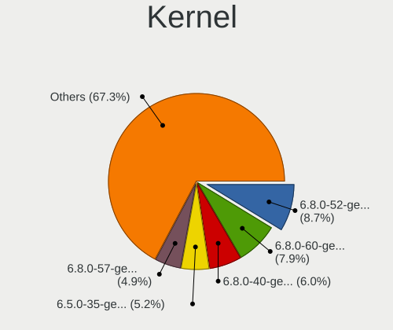

| Version               | Notebooks | Percent |
|-----------------------|-----------|---------|
| 6.8.0-52-generic      | 258       | 8.73%   |
| 6.8.0-60-generic      | 233       | 7.89%   |
| 6.8.0-40-generic      | 178       | 6.03%   |
| 6.5.0-35-generic      | 154       | 5.21%   |
| 6.8.0-57-generic      | 144       | 4.87%   |
| 6.8.0-49-generic      | 126       | 4.27%   |
| 6.8.0-59-generic      | 120       | 4.06%   |
| 6.5.0-41-generic      | 107       | 3.62%   |
| 6.2.0-39-generic      | 105       | 3.55%   |
| 6.5.0-28-generic      | 102       | 3.45%   |
| 6.8.0-45-generic      | 94        | 3.18%   |
| 6.8.0-65-generic      | 90        | 3.05%   |
| 6.8.0-51-generic      | 83        | 2.81%   |
| 6.5.0-45-generic      | 81        | 2.74%   |
| 6.8.0-47-generic      | 79        | 2.67%   |
| 6.8.0-85-generic      | 77        | 2.61%   |
| 6.5.0-26-generic      | 77        | 2.61%   |
| 6.8.0-48-generic      | 68        | 2.3%    |
| 6.8.0-79-generic      | 66        | 2.23%   |
| 6.8.0-50-generic      | 63        | 2.13%   |
| 6.8.0-58-generic      | 61        | 2.06%   |
| 6.5.0-27-generic      | 57        | 1.93%   |
| 6.5.0-21-generic      | 56        | 1.9%    |
| 6.8.0-87-generic      | 54        | 1.83%   |
| 6.5.0-25-generic      | 54        | 1.83%   |
| 6.5.0-15-generic      | 51        | 1.73%   |
| 6.5.0-14-generic      | 44        | 1.49%   |
| 6.8.0-83-generic      | 37        | 1.25%   |
| 6.8.0-64-generic      | 35        | 1.18%   |
| 6.5.0-17-generic      | 32        | 1.08%   |
| 6.5.0-44-generic      | 30        | 1.02%   |
| 6.5.0-18-generic      | 30        | 1.02%   |
| 6.8.0-84-generic      | 26        | 0.88%   |
| 6.8.0-90-generic      | 25        | 0.85%   |
| 6.8.0-78-generic      | 5         | 0.17%   |
| 6.2.0-37-generic      | 5         | 0.17%   |
| 6.11.0-061100-generic | 3         | 0.1%    |
| 6.9.9-060909-generic  | 2         | 0.07%   |
| 6.8.0-86-generic      | 2         | 0.07%   |
| 6.14.0-061400-generic | 2         | 0.07%   |

Kernel Family
-------------

Linux kernel without a distro release

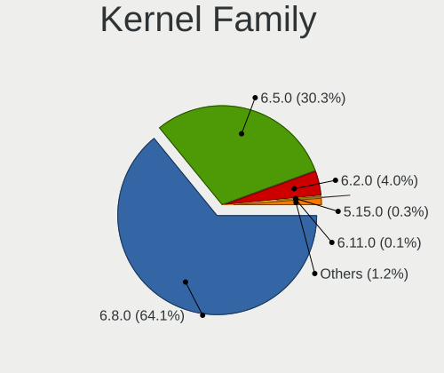

| Version | Notebooks | Percent |
|---------|-----------|---------|
| 6.8.0   | 1745      | 64.11%  |
| 6.5.0   | 825       | 30.31%  |
| 6.2.0   | 110       | 4.04%   |
| 5.15.0  | 7         | 0.26%   |
| 6.11.0  | 3         | 0.11%   |
| 6.9.9   | 2         | 0.07%   |
| 6.8.7   | 2         | 0.07%   |
| 6.8.10  | 2         | 0.07%   |
| 6.15.6  | 2         | 0.07%   |
| 6.14.0  | 2         | 0.07%   |
| 6.12.3  | 2         | 0.07%   |
| 6.9.12  | 1         | 0.04%   |
| 6.8.9   | 1         | 0.04%   |
| 6.8.12  | 1         | 0.04%   |
| 6.7.3   | 1         | 0.04%   |
| 6.6.13  | 1         | 0.04%   |
| 6.6.10  | 1         | 0.04%   |
| 6.17.3  | 1         | 0.04%   |
| 6.17.0  | 1         | 0.04%   |
| 6.16.0  | 1         | 0.04%   |
| 6.15.4  | 1         | 0.04%   |
| 6.14.8  | 1         | 0.04%   |
| 6.14.3  | 1         | 0.04%   |
| 6.14.2  | 1         | 0.04%   |
| 6.13.0  | 1         | 0.04%   |
| 6.12.9  | 1         | 0.04%   |
| 6.12.5  | 1         | 0.04%   |
| 6.12.2  | 1         | 0.04%   |
| 6.10.9  | 1         | 0.04%   |
| 6.10.2  | 1         | 0.04%   |
| 6.10.12 | 1         | 0.04%   |

Kernel Major Ver.
-----------------

Linux kernel major version

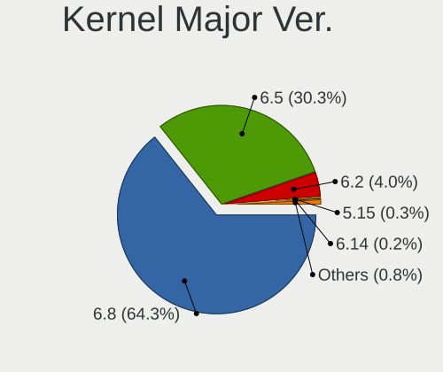

| Version | Notebooks | Percent |
|---------|-----------|---------|
| 6.8     | 1750      | 64.34%  |
| 6.5     | 825       | 30.33%  |
| 6.2     | 110       | 4.04%   |
| 5.15    | 7         | 0.26%   |
| 6.14    | 5         | 0.18%   |
| 6.12    | 5         | 0.18%   |
| 6.9     | 3         | 0.11%   |
| 6.15    | 3         | 0.11%   |
| 6.11    | 3         | 0.11%   |
| 6.6     | 2         | 0.07%   |
| 6.17    | 2         | 0.07%   |
| 6.10    | 2         | 0.07%   |
| 6.7     | 1         | 0.04%   |
| 6.16    | 1         | 0.04%   |
| 6.13    | 1         | 0.04%   |

Arch
----

OS architecture (x86_64, i586, etc.)

| Name   | Notebooks | Percent |
|--------|-----------|---------|
| x86_64 | 2654      | 100%    |

DE
--

Desktop Environment

| Name       | Notebooks | Percent |
|------------|-----------|---------|
| GNOME      | 2515      | 94.51%  |
| XFCE       | 137       | 5.15%   |
| KDE5       | 6         | 0.23%   |
| X-Cinnamon | 2         | 0.08%   |
| Budgie     | 1         | 0.04%   |

Display Server
--------------

X11 or Wayland

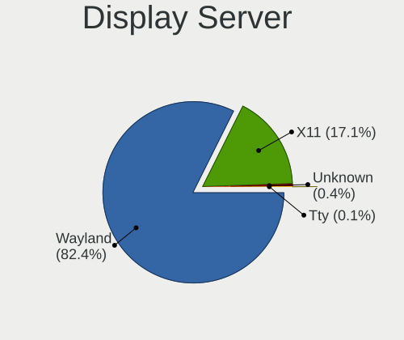

| Name    | Notebooks | Percent |
|---------|-----------|---------|
| Wayland | 2212      | 82.38%  |
| X11     | 458       | 17.06%  |
| Unknown | 12        | 0.45%   |
| Tty     | 3         | 0.11%   |

Display Manager
---------------

SDDM, LightDM, etc.

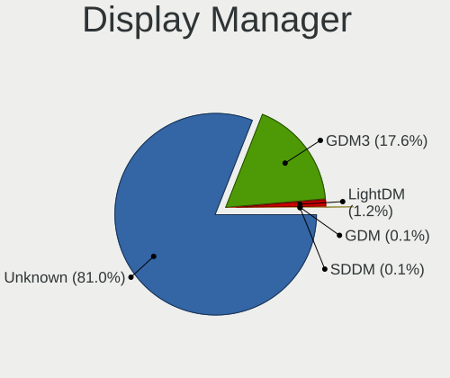

| Name    | Notebooks | Percent |
|---------|-----------|---------|
| Unknown | 2177      | 80.99%  |
| GDM3    | 474       | 17.63%  |
| LightDM | 32        | 1.19%   |
| GDM     | 3         | 0.11%   |
| SDDM    | 2         | 0.07%   |

OS Lang
-------

Language

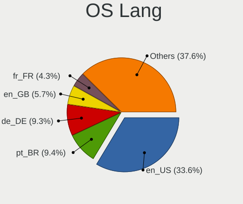

| Lang  | Notebooks | Percent |
|-------|-----------|---------|
| en_US | 895       | 33.62%  |
| pt_BR | 250       | 9.39%   |
| de_DE | 248       | 9.32%   |
| en_GB | 153       | 5.75%   |
| fr_FR | 115       | 4.32%   |
| it_IT | 112       | 4.21%   |
| es_ES | 101       | 3.79%   |
| en_CA | 72        | 2.7%    |
| en_IN | 62        | 2.33%   |
| es_MX | 46        | 1.73%   |
| pt_PT | 43        | 1.62%   |
| pl_PL | 43        | 1.62%   |
| en_AU | 43        | 1.62%   |
| nl_NL | 37        | 1.39%   |
| tr_TR | 33        | 1.24%   |
| ru_RU | 28        | 1.05%   |
| es_AR | 28        | 1.05%   |
| es_CO | 26        | 0.98%   |
| en_ZA | 26        | 0.98%   |
| hu_HU | 21        | 0.79%   |
| es_CL | 21        | 0.79%   |
| cs_CZ | 19        | 0.71%   |
| de_AT | 14        | 0.53%   |
| nl_BE | 12        | 0.45%   |
| da_DK | 12        | 0.45%   |
| ro_RO | 11        | 0.41%   |
| es_EC | 11        | 0.41%   |
| en_NZ | 11        | 0.41%   |
| es_VE | 10        | 0.38%   |
| en_IE | 10        | 0.38%   |
| sv_SE | 8         | 0.3%    |
| ja_JP | 8         | 0.3%    |
| bg_BG | 8         | 0.3%    |
| hr_HR | 7         | 0.26%   |
| fi_FI | 7         | 0.26%   |
| de_CH | 7         | 0.26%   |
| nb_NO | 6         | 0.23%   |
| es_SV | 6         | 0.23%   |
| el_GR | 6         | 0.23%   |
| es_UY | 5         | 0.19%   |

Boot Mode
---------

EFI or BIOS

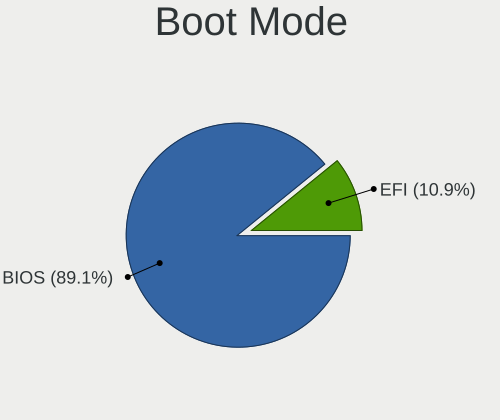

| Mode | Notebooks | Percent |
|------|-----------|---------|
| BIOS | 2378      | 89.13%  |
| EFI  | 290       | 10.87%  |

Filesystem
----------

Type of filesystem

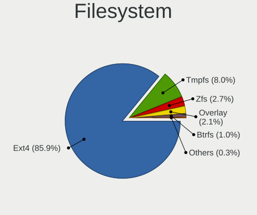

| Type    | Notebooks | Percent |
|---------|-----------|---------|
| Ext4    | 2301      | 85.89%  |
| Tmpfs   | 213       | 7.95%   |
| Zfs     | 72        | 2.69%   |
| Overlay | 57        | 2.13%   |
| Btrfs   | 27        | 1.01%   |
| Ext3    | 4         | 0.15%   |
| Ext2    | 4         | 0.15%   |
| Xfs     | 1         | 0.04%   |

Part. scheme
------------

Scheme of partitioning

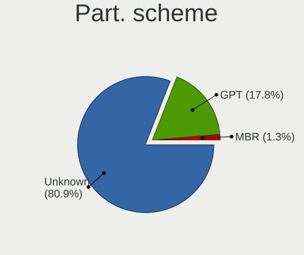

| Type    | Notebooks | Percent |
|---------|-----------|---------|
| Unknown | 2174      | 80.91%  |
| GPT     | 477       | 17.75%  |
| MBR     | 36        | 1.34%   |

Dual Boot with Linux/BSD
------------------------

Hosting more than one Linux/BSD

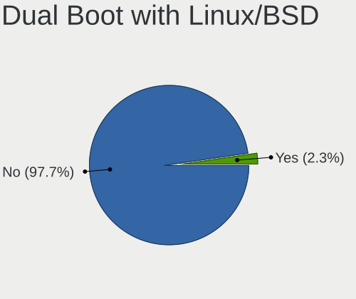

| Dual boot | Notebooks | Percent |
|-----------|-----------|---------|
| No        | 2598      | 97.67%  |
| Yes       | 62        | 2.33%   |

Dual Boot (Win)
---------------

Hosting Linux and Windows

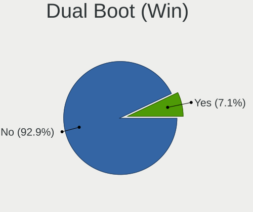

| Dual boot | Notebooks | Percent |
|-----------|-----------|---------|
| No        | 2477      | 92.95%  |
| Yes       | 188       | 7.05%   |

Board
-----

Vendor
------

Motherboard manufacturer

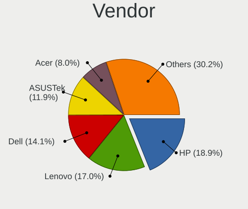

| Name                   | Notebooks | Percent |
|------------------------|-----------|---------|
| Hewlett-Packard        | 502       | 18.91%  |
| Lenovo                 | 450       | 16.96%  |
| Dell                   | 374       | 14.09%  |
| ASUSTek Computer       | 315       | 11.87%  |
| Acer                   | 211       | 7.95%   |
| Apple                  | 145       | 5.46%   |
| Toshiba                | 92        | 3.47%   |
| Samsung Electronics    | 60        | 2.26%   |
| Sony                   | 50        | 1.88%   |
| HUAWEI                 | 39        | 1.47%   |
| Unknown                | 33        | 1.24%   |
| MSI                    | 31        | 1.17%   |
| Positivo               | 30        | 1.13%   |
| Fujitsu                | 27        | 1.02%   |
| Google                 | 23        | 0.87%   |
| Medion                 | 21        | 0.79%   |
| Packard Bell           | 15        | 0.57%   |
| Chuwi                  | 11        | 0.41%   |
| Alienware              | 11        | 0.41%   |
| Panasonic              | 9         | 0.34%   |
| LG Electronics         | 7         | 0.26%   |
| Teclast                | 6         | 0.23%   |
| Razer                  | 6         | 0.23%   |
| Notebook               | 6         | 0.23%   |
| Intel                  | 6         | 0.23%   |
| Fujitsu Siemens        | 6         | 0.23%   |
| Gigabyte Technology    | 5         | 0.19%   |
| Exo                    | 5         | 0.19%   |
| Digibras               | 5         | 0.19%   |
| UNOWHY                 | 4         | 0.15%   |
| Semp Toshiba           | 4         | 0.15%   |
| Multilaser             | 4         | 0.15%   |
| Jumper                 | 4         | 0.15%   |
| GPU Company            | 4         | 0.15%   |
| Framework              | 4         | 0.15%   |
| Avell High Performance | 4         | 0.15%   |
| TUXEDO                 | 3         | 0.11%   |
| NEC Computers          | 3         | 0.11%   |
| Juana Manso            | 3         | 0.11%   |
| Infinix                | 3         | 0.11%   |

Model
-----

Motherboard model

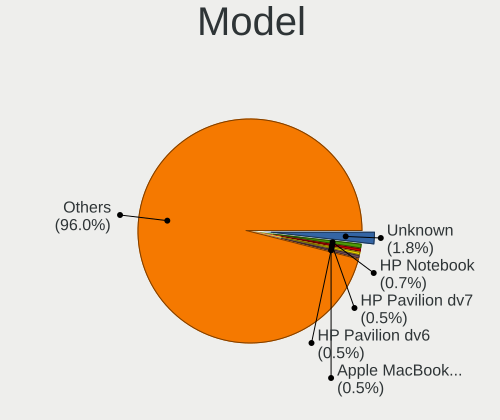

| Name                             | Notebooks | Percent |
|----------------------------------|-----------|---------|
| Unknown                          | 48        | 1.81%   |
| HP Notebook                      | 18        | 0.68%   |
| HP Pavilion dv7                  | 13        | 0.49%   |
| HP Pavilion dv6                  | 13        | 0.49%   |
| Apple MacBookPro9,2              | 13        | 0.49%   |
| Apple MacBookAir6,2              | 12        | 0.45%   |
| Apple MacBookPro8,1              | 11        | 0.41%   |
| HP EliteBook 840 G2              | 10        | 0.38%   |
| Dell Latitude E6420              | 10        | 0.38%   |
| Apple MacBookPro14,1             | 10        | 0.38%   |
| HP 15                            | 9         | 0.34%   |
| HP Pavilion g7                   | 8         | 0.3%    |
| Dell Inspiron 15-3567            | 8         | 0.3%    |
| ASUS Vivobook Go E1504FA_E1504FA | 8         | 0.3%    |
| Apple MacBookPro5,5              | 8         | 0.3%    |
| Dell Latitude E6430              | 7         | 0.26%   |
| Apple MacBookPro7,1              | 7         | 0.26%   |
| Apple MacBookAir7,2              | 7         | 0.26%   |
| Lenovo G50-45 80E3               | 6         | 0.23%   |
| HP Pavilion Notebook             | 6         | 0.23%   |
| HP Pavilion 17                   | 6         | 0.23%   |
| HP EliteBook 840 G3              | 6         | 0.23%   |
| Dell Latitude E7440              | 6         | 0.23%   |
| Dell Latitude E5430 non-vPro     | 6         | 0.23%   |
| Dell Latitude 5480               | 6         | 0.23%   |
| Apple MacBookPro11,1             | 6         | 0.23%   |
| Lenovo IdeaPad 3 15ALC6 82MF     | 5         | 0.19%   |
| HP Laptop 15-fd0xxx              | 5         | 0.19%   |
| HP Laptop 15-bw0xx               | 5         | 0.19%   |
| HP EliteBook 8540p               | 5         | 0.19%   |
| Dell System XPS L502X            | 5         | 0.19%   |
| Dell Latitude E6520              | 5         | 0.19%   |
| Dell Latitude E6410              | 5         | 0.19%   |
| Dell Latitude E5520              | 5         | 0.19%   |
| Dell Inspiron N4050              | 5         | 0.19%   |
| Apple MacBookPro6,2              | 5         | 0.19%   |
| Apple MacBookPro12,1             | 5         | 0.19%   |
| Apple MacBookPro11,3             | 5         | 0.19%   |
| Samsung 300E4C/300E5C/300E7C     | 4         | 0.15%   |
| Lenovo IdeaPad S145-15AST 81N3   | 4         | 0.15%   |

Model Family
------------

Motherboard model prefix

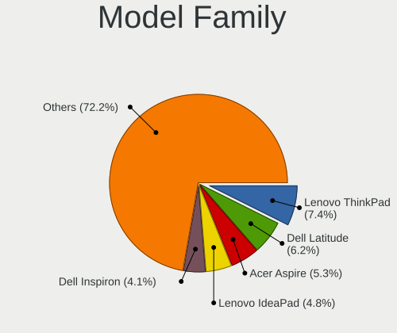

| Name                  | Notebooks | Percent |
|-----------------------|-----------|---------|
| Lenovo ThinkPad       | 196       | 7.39%   |
| Dell Latitude         | 165       | 6.22%   |
| Acer Aspire           | 141       | 5.31%   |
| Lenovo IdeaPad        | 127       | 4.79%   |
| Dell Inspiron         | 108       | 4.07%   |
| HP Pavilion           | 100       | 3.77%   |
| HP EliteBook          | 78        | 2.94%   |
| HP Laptop             | 76        | 2.86%   |
| ASUS VivoBook         | 76        | 2.86%   |
| Toshiba Satellite     | 71        | 2.68%   |
| HP ProBook            | 67        | 2.52%   |
| Unknown               | 48        | 1.81%   |
| ASUS ASUS             | 29        | 1.09%   |
| Dell XPS              | 27        | 1.02%   |
| Acer Nitro            | 27        | 1.02%   |
| HP ENVY               | 26        | 0.98%   |
| Dell Precision        | 26        | 0.98%   |
| Fujitsu LIFEBOOK      | 24        | 0.9%    |
| Dell Vostro           | 22        | 0.83%   |
| HP ZBook              | 20        | 0.75%   |
| Apple MacBookPro11    | 19        | 0.72%   |
| HP Notebook           | 18        | 0.68%   |
| ASUS ZenBook          | 17        | 0.64%   |
| ASUS ROG              | 17        | 0.64%   |
| HP 15                 | 15        | 0.57%   |
| Apple MacBookPro8     | 15        | 0.57%   |
| Lenovo Legion         | 14        | 0.53%   |
| HP Compaq             | 14        | 0.53%   |
| Apple MacBookPro9     | 14        | 0.53%   |
| Packard Bell EasyNote | 13        | 0.49%   |
| Lenovo ThinkBook      | 13        | 0.49%   |
| HP 250                | 13        | 0.49%   |
| Apple MacBookAir6     | 13        | 0.49%   |
| Acer Swift            | 12        | 0.45%   |
| Lenovo Yoga           | 10        | 0.38%   |
| Apple MacBookPro14    | 10        | 0.38%   |
| HP OMEN               | 9         | 0.34%   |
| Apple MacBookPro5     | 9         | 0.34%   |
| Apple MacBookAir7     | 9         | 0.34%   |
| HP Stream             | 8         | 0.3%    |

MFG Year
--------

Motherboard manufacture year

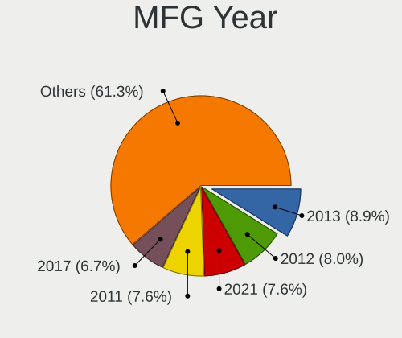

| Year    | Notebooks | Percent |
|---------|-----------|---------|
| 2013    | 235       | 8.85%   |
| 2012    | 212       | 7.99%   |
| 2021    | 201       | 7.57%   |
| 2011    | 201       | 7.57%   |
| 2017    | 178       | 6.71%   |
| 2023    | 157       | 5.92%   |
| 2014    | 153       | 5.76%   |
| 2020    | 152       | 5.73%   |
| 2010    | 150       | 5.65%   |
| 2018    | 147       | 5.54%   |
| 2019    | 145       | 5.46%   |
| 2016    | 141       | 5.31%   |
| 2022    | 132       | 4.97%   |
| 2015    | 126       | 4.75%   |
| 2008    | 105       | 3.96%   |
| 2009    | 94        | 3.54%   |
| 2024    | 65        | 2.45%   |
| 2007    | 35        | 1.32%   |
| 2006    | 14        | 0.53%   |
| 2025    | 10        | 0.38%   |
| Unknown | 1         | 0.04%   |

Form Factor
-----------

Physical design of the computer

| Name     | Notebooks | Percent |
|----------|-----------|---------|
| Notebook | 2654      | 100%    |

Secure Boot
-----------

Enabled or disabled

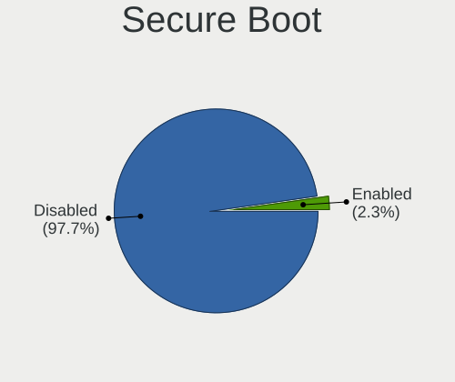

| State    | Notebooks | Percent |
|----------|-----------|---------|
| Disabled | 2599      | 97.74%  |
| Enabled  | 60        | 2.26%   |

Coreboot
--------

Have coreboot on board

| Used | Notebooks | Percent |
|------|-----------|---------|
| No   | 2625      | 98.91%  |
| Yes  | 29        | 1.09%   |

RAM Size
--------

Total RAM memory

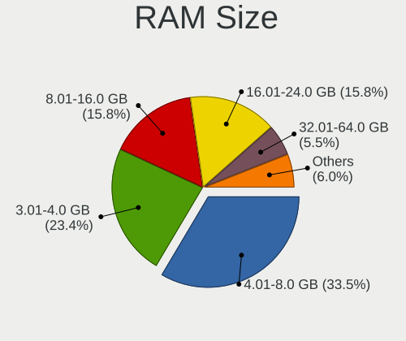

| Size in GB  | Notebooks | Percent |
|-------------|-----------|---------|
| 4.01-8.0    | 896       | 33.53%  |
| 3.01-4.0    | 625       | 23.39%  |
| 8.01-16.0   | 422       | 15.79%  |
| 16.01-24.0  | 421       | 15.76%  |
| 32.01-64.0  | 148       | 5.54%   |
| 1.01-2.0    | 65        | 2.43%   |
| 24.01-32.0  | 37        | 1.38%   |
| 2.01-3.0    | 31        | 1.16%   |
| 64.01-256.0 | 27        | 1.01%   |

RAM Used
--------

Used RAM memory

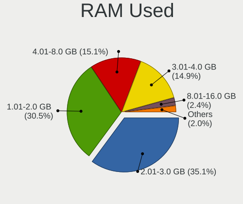

| Used GB    | Notebooks | Percent |
|------------|-----------|---------|
| 2.01-3.0   | 990       | 35.11%  |
| 1.01-2.0   | 861       | 30.53%  |
| 4.01-8.0   | 427       | 15.14%  |
| 3.01-4.0   | 420       | 14.89%  |
| 8.01-16.0  | 67        | 2.38%   |
| 0.51-1.0   | 46        | 1.63%   |
| 16.01-24.0 | 6         | 0.21%   |
| 24.01-32.0 | 2         | 0.07%   |
| 32.01-64.0 | 1         | 0.04%   |

Total Drives
------------

Number of drives on board

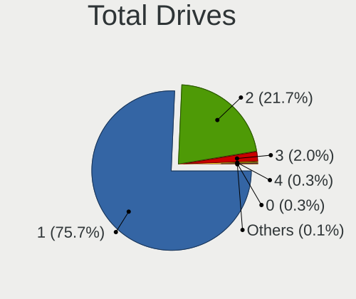

| Drives | Notebooks | Percent |
|--------|-----------|---------|
| 1      | 2027      | 75.69%  |
| 2      | 581       | 21.7%   |
| 3      | 54        | 2.02%   |
| 4      | 7         | 0.26%   |
| 0      | 7         | 0.26%   |
| 6      | 2         | 0.07%   |

Has CD-ROM
----------

Has CD-ROM on board

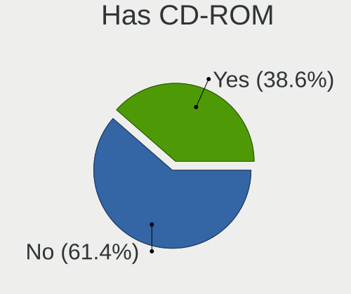

| Presented | Notebooks | Percent |
|-----------|-----------|---------|
| No        | 1633      | 61.44%  |
| Yes       | 1025      | 38.56%  |

Has Ethernet
------------

Has Ethernet on board

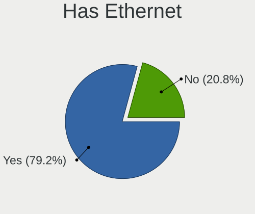

| Presented | Notebooks | Percent |
|-----------|-----------|---------|
| Yes       | 2105      | 79.22%  |
| No        | 552       | 20.78%  |

Has WiFi
--------

Has WiFi module

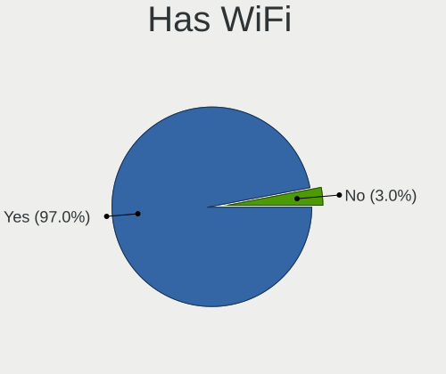

| Presented | Notebooks | Percent |
|-----------|-----------|---------|
| Yes       | 2576      | 96.99%  |
| No        | 80        | 3.01%   |

Has Bluetooth
-------------

Has Bluetooth module

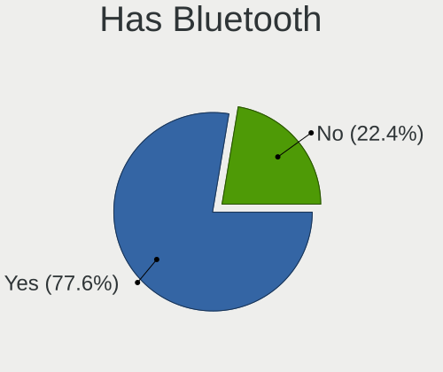

| Presented | Notebooks | Percent |
|-----------|-----------|---------|
| Yes       | 2071      | 77.62%  |
| No        | 597       | 22.38%  |

Location
--------

Country
-------

Geographic location (country)

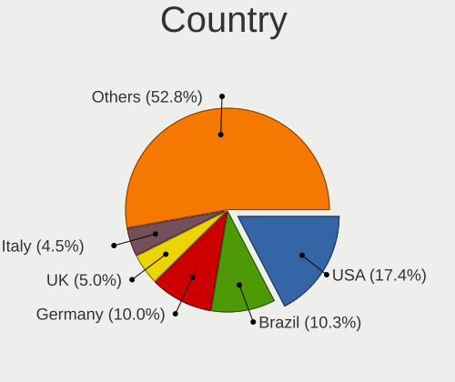

| Country         | Notebooks | Percent |
|-----------------|-----------|---------|
| USA             | 463       | 17.36%  |
| Brazil          | 274       | 10.27%  |
| Germany         | 266       | 9.97%   |
| UK              | 134       | 5.02%   |
| Italy           | 121       | 4.54%   |
| France          | 119       | 4.46%   |
| Spain           | 90        | 3.37%   |
| Canada          | 83        | 3.11%   |
| Mexico          | 65        | 2.44%   |
| India           | 64        | 2.4%    |
| Netherlands     | 56        | 2.1%    |
| Portugal        | 50        | 1.87%   |
| Poland          | 50        | 1.87%   |
| Turkey          | 42        | 1.57%   |
| Australia       | 42        | 1.57%   |
| Argentina       | 35        | 1.31%   |
| Austria         | 32        | 1.2%    |
| Switzerland     | 30        | 1.12%   |
| South Africa    | 28        | 1.05%   |
| Colombia        | 28        | 1.05%   |
| Indonesia       | 27        | 1.01%   |
| Belgium         | 27        | 1.01%   |
| Russia          | 25        | 0.94%   |
| Romania         | 25        | 0.94%   |
| Czechia         | 24        | 0.9%    |
| Chile           | 24        | 0.9%    |
| Egypt           | 20        | 0.75%   |
| Sweden          | 18        | 0.67%   |
| Hungary         | 18        | 0.67%   |
| Norway          | 16        | 0.6%    |
| Greece          | 16        | 0.6%    |
| Denmark         | 16        | 0.6%    |
| New Zealand     | 14        | 0.52%   |
| Ireland         | 13        | 0.49%   |
| Finland         | 13        | 0.49%   |
| Bulgaria        | 13        | 0.49%   |
| Japan           | 12        | 0.45%   |
| The Netherlands | 11        | 0.41%   |
| Ecuador         | 11        | 0.41%   |
| Philippines     | 10        | 0.37%   |

City
----

Geographic location (city)

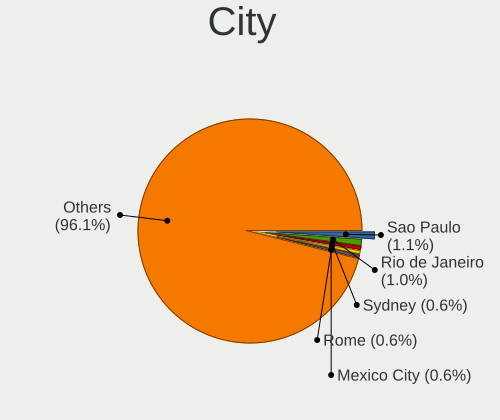

| City           | Notebooks | Percent |
|----------------|-----------|---------|
| Sao Paulo      | 31        | 1.12%   |
| Rio de Janeiro | 28        | 1.02%   |
| Sydney         | 17        | 0.62%   |
| Rome           | 16        | 0.58%   |
| Mexico City    | 16        | 0.58%   |
| Santiago       | 14        | 0.51%   |
| Vienna         | 13        | 0.47%   |
| Madrid         | 13        | 0.47%   |
| Johannesburg   | 13        | 0.47%   |
| Istanbul       | 13        | 0.47%   |
| Berlin         | 13        | 0.47%   |
| Amsterdam      | 13        | 0.47%   |
| Milan          | 12        | 0.44%   |
| Melbourne      | 12        | 0.44%   |
| Hamburg        | 12        | 0.44%   |
| Porto          | 11        | 0.4%    |
| London         | 11        | 0.4%    |
| Lisbon         | 11        | 0.4%    |
| Cologne        | 11        | 0.4%    |
| Prague         | 10        | 0.36%   |
| New York       | 10        | 0.36%   |
| Montreal       | 10        | 0.36%   |
| Budapest       | 10        | 0.36%   |
| Brasília      | 10        | 0.36%   |
| Warsaw         | 9         | 0.33%   |
| Seattle        | 9         | 0.33%   |
| Paris          | 9         | 0.33%   |
| Dublin         | 9         | 0.33%   |
| Cairo          | 9         | 0.33%   |
| Bogotá        | 9         | 0.33%   |
| Houston        | 8         | 0.29%   |
| Fortaleza      | 8         | 0.29%   |
| Bucharest      | 8         | 0.29%   |
| Birmingham     | 8         | 0.29%   |
| Ankara         | 8         | 0.29%   |
| Toronto        | 7         | 0.25%   |
| San José      | 7         | 0.25%   |
| Pachuca        | 7         | 0.25%   |
| Munich         | 7         | 0.25%   |
| Moscow         | 7         | 0.25%   |

Drives
------

Drive Vendor
------------

Hard drive vendors

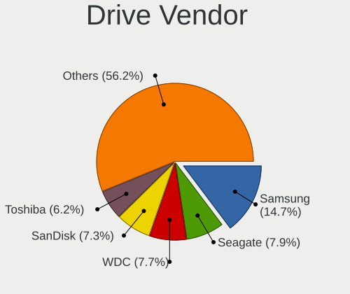

| Vendor                      | Notebooks | Drives | Percent |
|-----------------------------|-----------|--------|---------|
| Samsung Electronics         | 472       | 617    | 14.73%  |
| Seagate                     | 253       | 281    | 7.89%   |
| WDC                         | 247       | 290    | 7.71%   |
| SanDisk                     | 234       | 273    | 7.3%    |
| Toshiba                     | 198       | 224    | 6.18%   |
| Unknown                     | 191       | 230    | 5.96%   |
| Kingston                    | 178       | 200    | 5.55%   |
| SK hynix                    | 109       | 121    | 3.4%    |
| Crucial                     | 104       | 117    | 3.24%   |
| Micron Technology           | 99        | 111    | 3.09%   |
| Apple                       | 78        | 106    | 2.43%   |
| HGST                        | 77        | 90     | 2.4%    |
| Hitachi                     | 76        | 89     | 2.37%   |
| Intel                       | 67        | 73     | 2.09%   |
| China                       | 64        | 73     | 2%      |
| A-DATA Technology           | 43        | 49     | 1.34%   |
| Intenso                     | 30        | 37     | 0.94%   |
| KIOXIA                      | 29        | 31     | 0.9%    |
| SPCC                        | 27        | 29     | 0.84%   |
| Kingston Technology Company | 27        | 29     | 0.84%   |
| MAXIO Technology (Hangzhou) | 26        | 29     | 0.81%   |
| Unknown                     | 25        | 28     | 0.78%   |
| Silicon Motion              | 24        | 26     | 0.75%   |
| PNY                         | 22        | 22     | 0.69%   |
| ADATA Technology            | 21        | 21     | 0.66%   |
| Micron/Crucial Technology   | 20        | 22     | 0.62%   |
| Phison Electronics          | 19        | 27     | 0.59%   |
| LITEON                      | 16        | 17     | 0.5%    |
| Lexar                       | 15        | 16     | 0.47%   |
| Fanxiang                    | 14        | 17     | 0.44%   |
| JMicron Technology          | 13        | 13     | 0.41%   |
| Fujitsu                     | 13        | 13     | 0.41%   |
| Netac                       | 12        | 15     | 0.37%   |
| LITEONIT                    | 12        | 15     | 0.37%   |
| Transcend                   | 11        | 13     | 0.34%   |
| Phison                      | 11        | 12     | 0.34%   |
| Patriot                     | 11        | 12     | 0.34%   |
| T-FORCE                     | 10        | 10     | 0.31%   |
| Realtek Semiconductor       | 10        | 13     | 0.31%   |
| Hewlett-Packard             | 10        | 13     | 0.31%   |

Drive Model
-----------

Hard drive models

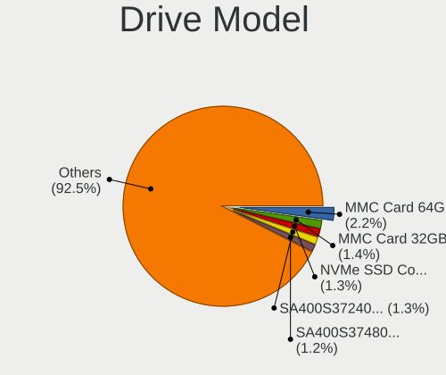

| Model                                                 | Notebooks | Percent |
|-------------------------------------------------------|-----------|---------|
| Unknown MMC Card  64GB                                | 72        | 2.2%    |
| Unknown MMC Card  32GB                                | 47        | 1.44%   |
| Samsung NVMe SSD Controller SM981/PM981/PM983 1TB     | 44        | 1.35%   |
| Kingston SA400S37240G 240GB SSD                       | 42        | 1.29%   |
| Kingston SA400S37480G 480GB SSD                       | 40        | 1.22%   |
| Unknown MMC Card  128GB                               | 37        | 1.13%   |
| Seagate ST1000LM035-1RK172 1TB                        | 32        | 0.98%   |
| Samsung NVMe SSD Controller PM9A1/PM9A3/980PRO 1TB    | 30        | 0.92%   |
| Toshiba MQ01ABF050 500GB                              | 28        | 0.86%   |
| Seagate ST1000LM024 HN-M101MBB 1TB                    | 27        | 0.83%   |
| Samsung SSD 850 EVO 250GB                             | 26        | 0.8%    |
| Unknown                                               | 25        | 0.76%   |
| Sandisk WD Blue SN550 NVMe SSD 1024GB                 | 23        | 0.7%    |
| Toshiba MQ01ABD100 1TB                                | 22        | 0.67%   |
| Toshiba MQ04ABF100 1TB                                | 20        | 0.61%   |
| Samsung NVMe SSD Controller SM961/PM961/SM963 1024GB  | 20        | 0.61%   |
| Seagate ST500LT012-1DG142 500GB                       | 19        | 0.58%   |
| Seagate ST9500325AS 500GB                             | 18        | 0.55%   |
| MAXIO (Hangzhou) NVMe SSD Controller MAP1202 2TB      | 17        | 0.52%   |
| Crucial CT500MX500SSD1 500GB                          | 17        | 0.52%   |
| Samsung SSD 870 EVO 500GB                             | 16        | 0.49%   |
| Samsung SSD 860 EVO 500GB                             | 16        | 0.49%   |
| HGST HTS725050A7E630 500GB                            | 16        | 0.49%   |
| Seagate ST500LM012 HN-M500MBB 500GB                   | 15        | 0.46%   |
| Samsung SSD 850 EVO 500GB                             | 14        | 0.43%   |
| HGST HTS721010A9E630 1TB                              | 14        | 0.43%   |
| China SSD 256GB                                       | 14        | 0.43%   |
| SK hynix BC511 512GB                                  | 13        | 0.4%    |
| Silicon Motion SM2263EN/SM2263XT SSD Controller 512GB | 13        | 0.4%    |
| HGST HTS545050A7E680 500GB                            | 13        | 0.4%    |
| Kingston SA400S37120G 120GB SSD                       | 12        | 0.37%   |
| SanDisk SSD PLUS 480GB                                | 11        | 0.34%   |
| Intel SSDPEKNU512GZ 512GB                             | 11        | 0.34%   |
| HGST HTS541010A9E680 1TB                              | 11        | 0.34%   |
| Crucial CT240BX500SSD1 240GB                          | 11        | 0.34%   |
| Toshiba XG6 NVMe SSD Controller 1024GB                | 10        | 0.31%   |
| Samsung SSD 860 EVO 250GB                             | 10        | 0.31%   |
| Micron 2400_MTFDKBA512QFM 512GB                       | 10        | 0.31%   |
| Kingston SA400S37960G 960GB SSD                       | 10        | 0.31%   |
| Crucial CT480BX500SSD1 480GB                          | 10        | 0.31%   |

HDD Vendor
----------

Hard disk drive vendors

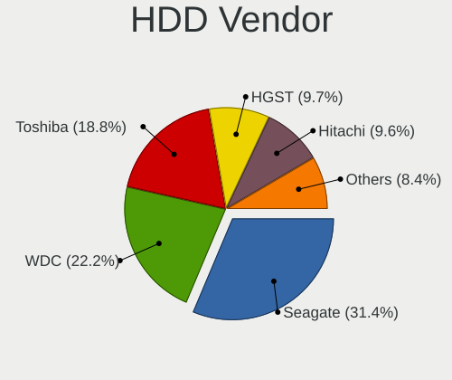

| Vendor              | Notebooks | Drives | Percent |
|---------------------|-----------|--------|---------|
| Seagate             | 249       | 277    | 31.36%  |
| WDC                 | 176       | 200    | 22.17%  |
| Toshiba             | 149       | 166    | 18.77%  |
| HGST                | 77        | 90     | 9.7%    |
| Hitachi             | 76        | 89     | 9.57%   |
| Samsung Electronics | 16        | 18     | 2.02%   |
| Fujitsu             | 13        | 13     | 1.64%   |
| Apple               | 7         | 7      | 0.88%   |
| TO Exter            | 4         | 4      | 0.5%    |
| External            | 4         | 4      | 0.5%    |
| Unknown             | 3         | 4      | 0.38%   |
| T-FORCE             | 3         | 3      | 0.38%   |
| JMicron Technology  | 3         | 3      | 0.38%   |
| SABRENT             | 2         | 4      | 0.25%   |
| Intenso             | 2         | 2      | 0.25%   |
| EAGET               | 2         | 2      | 0.25%   |
| ASMedia             | 2         | 2      | 0.25%   |
| USB3.0              | 1         | 1      | 0.13%   |
| Min Yi U            | 1         | 1      | 0.13%   |
| LaCie               | 1         | 1      | 0.13%   |
| KESU                | 1         | 1      | 0.13%   |
| Apricorn            | 1         | 1      | 0.13%   |
| Unknown             | 1         | 3      | 0.13%   |

SSD Vendor
----------

Solid state drive vendors

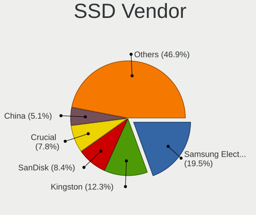

| Vendor              | Notebooks | Drives | Percent |
|---------------------|-----------|--------|---------|
| Samsung Electronics | 242       | 298    | 19.45%  |
| Kingston            | 153       | 169    | 12.3%   |
| SanDisk             | 105       | 121    | 8.44%   |
| Crucial             | 97        | 110    | 7.8%    |
| China               | 63        | 72     | 5.06%   |
| WDC                 | 60        | 75     | 4.82%   |
| Apple               | 49        | 59     | 3.94%   |
| A-DATA Technology   | 36        | 41     | 2.89%   |
| Micron Technology   | 28        | 34     | 2.25%   |
| SPCC                | 25        | 26     | 2.01%   |
| Intenso             | 24        | 30     | 1.93%   |
| Toshiba             | 23        | 26     | 1.85%   |
| Intel               | 23        | 23     | 1.85%   |
| SK hynix            | 22        | 27     | 1.77%   |
| PNY                 | 22        | 22     | 1.77%   |
| LITEON              | 16        | 17     | 1.29%   |
| Lexar               | 14        | 14     | 1.13%   |
| LITEONIT            | 12        | 15     | 0.96%   |
| Transcend           | 11        | 13     | 0.88%   |
| Patriot             | 11        | 12     | 0.88%   |
| Hewlett-Packard     | 10        | 13     | 0.8%    |
| Netac               | 9         | 12     | 0.72%   |
| KingSpec            | 9         | 9      | 0.72%   |
| Unknown             | 9         | 9      | 0.72%   |
| Teclast             | 7         | 9      | 0.56%   |
| Team                | 7         | 7      | 0.56%   |
| OCZ                 | 7         | 8      | 0.56%   |
| Gigabyte Technology | 7         | 8      | 0.56%   |
| Verbatim            | 6         | 6      | 0.48%   |
| Emtec               | 6         | 6      | 0.48%   |
| Apacer              | 6         | 6      | 0.48%   |
| XrayDisk            | 5         | 5      | 0.4%    |
| Phison              | 5         | 6      | 0.4%    |
| GOODRAM             | 5         | 10     | 0.4%    |
| Dogfish             | 5         | 6      | 0.4%    |
| Wibtek              | 4         | 5      | 0.32%   |
| Leven               | 4         | 4      | 0.32%   |
| FORESEE             | 4         | 5      | 0.32%   |
| Fanxiang            | 4         | 4      | 0.32%   |
| SSSTC               | 3         | 4      | 0.24%   |

Drive Kind
----------

HDD or SSD

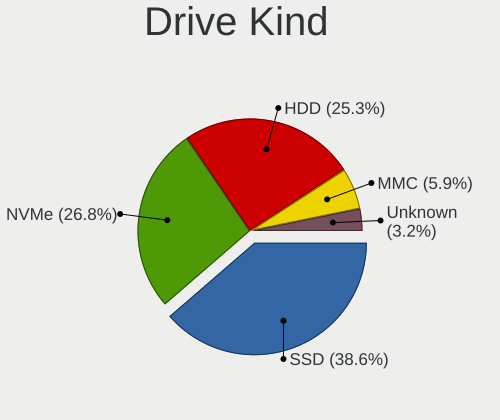

| Kind    | Notebooks | Drives | Percent |
|---------|-----------|--------|---------|
| SSD     | 1176      | 1439   | 38.65%  |
| NVMe    | 817       | 1077   | 26.85%  |
| HDD     | 771       | 896    | 25.34%  |
| MMC     | 181       | 220    | 5.95%   |
| Unknown | 98        | 113    | 3.22%   |

Drive Connector
---------------

SATA, SAS, NVMe, etc.

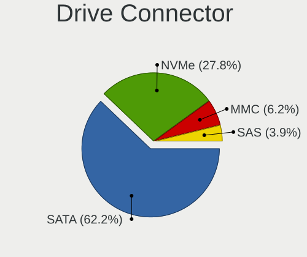

| Type | Notebooks | Drives | Percent |
|------|-----------|--------|---------|
| SATA | 1821      | 2314   | 62.15%  |
| NVMe | 815       | 1069   | 27.82%  |
| MMC  | 181       | 220    | 6.18%   |
| SAS  | 113       | 142    | 3.86%   |

Drive Size
----------

Size of hard drive

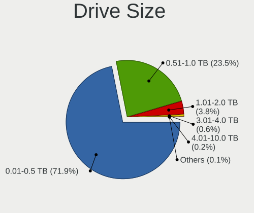

| Size in TB | Notebooks | Drives | Percent |
|------------|-----------|--------|---------|
| 0.01-0.5   | 1383      | 1704   | 71.88%  |
| 0.51-1.0   | 453       | 535    | 23.54%  |
| 1.01-2.0   | 73        | 81     | 3.79%   |
| 3.01-4.0   | 11        | 11     | 0.57%   |
| 4.01-10.0  | 3         | 3      | 0.16%   |
| 2.01-3.0   | 1         | 1      | 0.05%   |

Space Total
-----------

Amount of disk space available on the file system

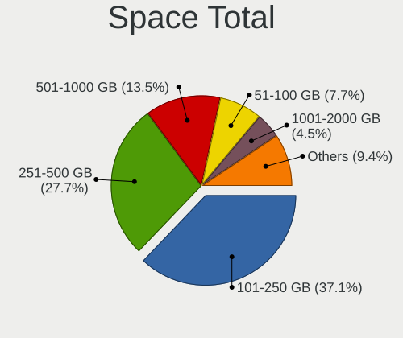

| Size in GB     | Notebooks | Percent |
|----------------|-----------|---------|
| 101-250        | 1005      | 37.13%  |
| 251-500        | 751       | 27.74%  |
| 501-1000       | 365       | 13.48%  |
| 51-100         | 209       | 7.72%   |
| 1001-2000      | 122       | 4.51%   |
| 21-50          | 90        | 3.32%   |
| 1-20           | 66        | 2.44%   |
| Unknown        | 55        | 2.03%   |
| 2001-3000      | 23        | 0.85%   |
| More than 3000 | 21        | 0.78%   |

Space Used
----------

Amount of used disk space

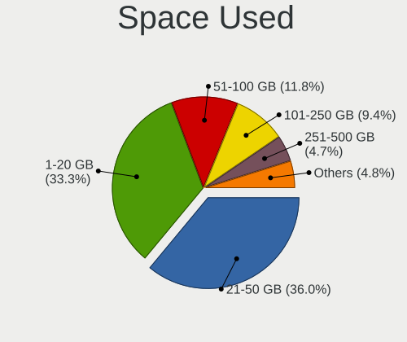

| Used GB        | Notebooks | Percent |
|----------------|-----------|---------|
| 21-50          | 1012      | 36.03%  |
| 1-20           | 935       | 33.29%  |
| 51-100         | 332       | 11.82%  |
| 101-250        | 263       | 9.36%   |
| 251-500        | 131       | 4.66%   |
| 501-1000       | 58        | 2.06%   |
| Unknown        | 55        | 1.96%   |
| 1001-2000      | 15        | 0.53%   |
| More than 3000 | 5         | 0.18%   |
| 2001-3000      | 2         | 0.07%   |
| 0              | 1         | 0.04%   |

Malfunc. Drives
---------------

Drive models with a malfunction

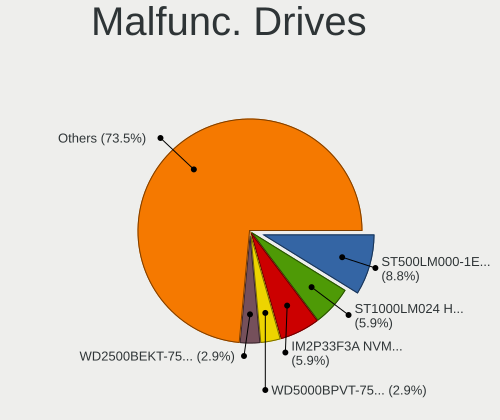

| Model                                            | Notebooks | Drives | Percent |
|--------------------------------------------------|-----------|--------|---------|
| Seagate ST500LM000-1EJ162 500GB                  | 3         | 3      | 8.82%   |
| Seagate ST1000LM024 HN-M101MBB 1TB               | 2         | 2      | 5.88%   |
| A-DATA Technology IM2P33F3A NVMe 256GB           | 2         | 2      | 5.88%   |
| WDC WD5000BPVT-75HXZT1 500GB                     | 1         | 1      | 2.94%   |
| WDC WD2500BEKT-75PVMT1 250GB                     | 1         | 1      | 2.94%   |
| WDC WD Green 2.5 240GB                           | 1         | 2      | 2.94%   |
| Toshiba MQ01ACF050 500GB                         | 1         | 1      | 2.94%   |
| Toshiba MQ01ABF050 500GB                         | 1         | 2      | 2.94%   |
| Toshiba MK6465GSX 640GB                          | 1         | 1      | 2.94%   |
| Toshiba MK3276GSX 320GB                          | 1         | 1      | 2.94%   |
| Toshiba MK2565GSX 250GB                          | 1         | 1      | 2.94%   |
| Seagate ST320LT012-9WS14C 320GB                  | 1         | 1      | 2.94%   |
| Seagate ST1000LM035-1RK172 1TB                   | 1         | 1      | 2.94%   |
| SanDisk SSD PLUS 480GB                           | 1         | 1      | 2.94%   |
| SanDisk SSD i100 24GB                            | 1         | 1      | 2.94%   |
| Samsung Electronics MZNLN256HAJQ-000L7 256GB SSD | 1         | 1      | 2.94%   |
| Samsung Electronics MZNLH128HBHQ-000H1 128GB SSD | 1         | 1      | 2.94%   |
| Micron Technology 1100_MTFDDAK256TBN 256GB SSD   | 1         | 1      | 2.94%   |
| KingFast SSD 120GB                               | 1         | 1      | 2.94%   |
| JMicron Technology 616 SSD 128GB                 | 1         | 1      | 2.94%   |
| Hitachi HTS727550A9E364 500GB                    | 1         | 1      | 2.94%   |
| Hitachi HTS723232L9A360 320GB                    | 1         | 1      | 2.94%   |
| Hitachi HTS547550A9E384 500GB                    | 1         | 1      | 2.94%   |
| Hitachi HTS545050A7E380 500GB                    | 1         | 1      | 2.94%   |
| Hitachi HTS542512K9SA00 120GB                    | 1         | 1      | 2.94%   |
| Hitachi HTS541075A9E680 752GB                    | 1         | 1      | 2.94%   |
| HGST HTS545050A7E680 500GB                       | 1         | 1      | 2.94%   |
| China SSD 1TB                                    | 1         | 1      | 2.94%   |
| BIWIN SSD 64GB                                   | 1         | 1      | 2.94%   |
| Apple HDD HTS547550A9E384 500GB                  | 1         | 1      | 2.94%   |

Malfunc. Drive Vendor
---------------------

Vendors of faulty drives

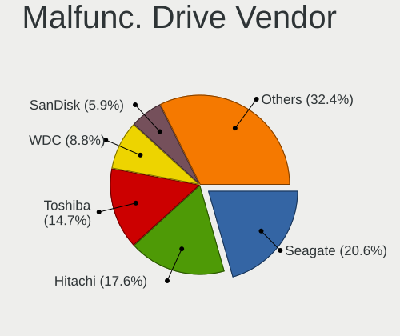

| Vendor              | Notebooks | Drives | Percent |
|---------------------|-----------|--------|---------|
| Seagate             | 7         | 7      | 20.59%  |
| Hitachi             | 6         | 6      | 17.65%  |
| Toshiba             | 5         | 6      | 14.71%  |
| WDC                 | 3         | 4      | 8.82%   |
| SanDisk             | 2         | 2      | 5.88%   |
| Samsung Electronics | 2         | 2      | 5.88%   |
| A-DATA Technology   | 2         | 2      | 5.88%   |
| Micron Technology   | 1         | 1      | 2.94%   |
| KingFast            | 1         | 1      | 2.94%   |
| JMicron Technology  | 1         | 1      | 2.94%   |
| HGST                | 1         | 1      | 2.94%   |
| China               | 1         | 1      | 2.94%   |
| BIWIN               | 1         | 1      | 2.94%   |
| Apple               | 1         | 1      | 2.94%   |

Malfunc. HDD Vendor
-------------------

Vendors of faulty HDD drives

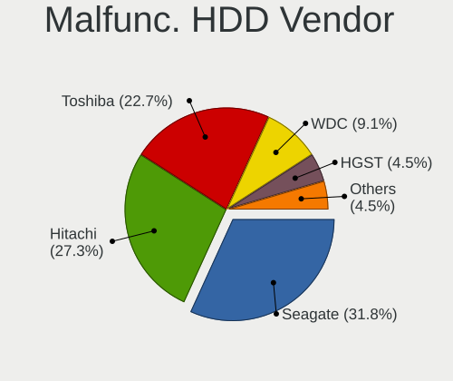

| Vendor  | Notebooks | Drives | Percent |
|---------|-----------|--------|---------|
| Seagate | 7         | 7      | 31.82%  |
| Hitachi | 6         | 6      | 27.27%  |
| Toshiba | 5         | 6      | 22.73%  |
| WDC     | 2         | 2      | 9.09%   |
| HGST    | 1         | 1      | 4.55%   |
| Apple   | 1         | 1      | 4.55%   |

Malfunc. Drive Kind
-------------------

Kinds of faulty drives

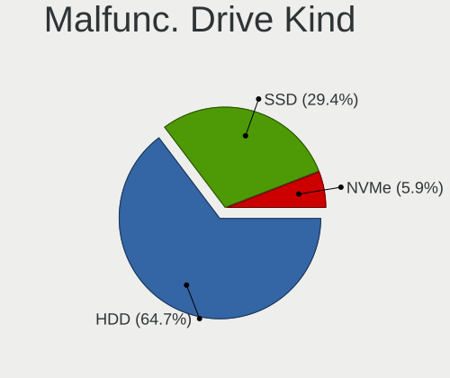

| Kind | Notebooks | Drives | Percent |
|------|-----------|--------|---------|
| HDD  | 22        | 23     | 64.71%  |
| SSD  | 10        | 11     | 29.41%  |
| NVMe | 2         | 2      | 5.88%   |

Failed Drives
-------------

Failed drive models

Zero info for selected period =(

Failed Drive Vendor
-------------------

Failed drive vendors

Zero info for selected period =(

Drive Status
------------

Number of failed and malfunc. drives

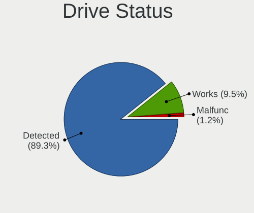

| Status   | Notebooks | Drives | Percent |
|----------|-----------|--------|---------|
| Detected | 2411      | 3387   | 89.26%  |
| Works    | 257       | 322    | 9.51%   |
| Malfunc  | 33        | 36     | 1.22%   |

Storage controller
------------------

Storage Vendor
--------------

Storage controller vendors

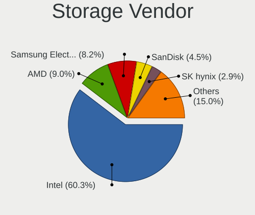

| Vendor                           | Notebooks | Percent |
|----------------------------------|-----------|---------|
| Intel                            | 1831      | 60.35%  |
| AMD                              | 274       | 9.03%   |
| Samsung Electronics              | 248       | 8.17%   |
| SanDisk                          | 138       | 4.55%   |
| SK hynix                         | 87        | 2.87%   |
| Micron Technology                | 72        | 2.37%   |
| Kingston Technology Company      | 51        | 1.68%   |
| Nvidia                           | 31        | 1.02%   |
| MAXIO Technology (Hangzhou)      | 30        | 0.99%   |
| KIOXIA                           | 30        | 0.99%   |
| ADATA Technology                 | 28        | 0.92%   |
| Silicon Motion                   | 27        | 0.89%   |
| Toshiba America Info Systems     | 26        | 0.86%   |
| Phison Electronics               | 26        | 0.86%   |
| Micron/Crucial Technology        | 23        | 0.76%   |
| Apple                            | 22        | 0.73%   |
| Solid State Storage Technology   | 13        | 0.43%   |
| Silicon Integrated Systems [SiS] | 12        | 0.4%    |
| Marvell Technology Group         | 11        | 0.36%   |
| Realtek Semiconductor            | 10        | 0.33%   |
| Shenzhen Longsys Electronics     | 9         | 0.3%    |
| Solidigm                         | 6         | 0.2%    |
| Lite-On Technology               | 4         | 0.13%   |
| INNOGRIT                         | 4         | 0.13%   |
| Netac Technology                 | 3         | 0.1%    |
| JMicron Technology               | 3         | 0.1%    |
| Unknown                          | 3         | 0.1%    |
| Yangtze Memory Technologies      | 2         | 0.07%   |
| Shenzhen Shichuangyi Electronics | 2         | 0.07%   |
| ASMedia Technology               | 2         | 0.07%   |
| Union Memory (Shenzhen)          | 1         | 0.03%   |
| TenaFe                           | 1         | 0.03%   |
| Silicon Image                    | 1         | 0.03%   |
| Lenovo                           | 1         | 0.03%   |
| Hosin Global Electronics         | 1         | 0.03%   |
| Biwin Storage Technology         | 1         | 0.03%   |

Storage Model
-------------

Storage controller models

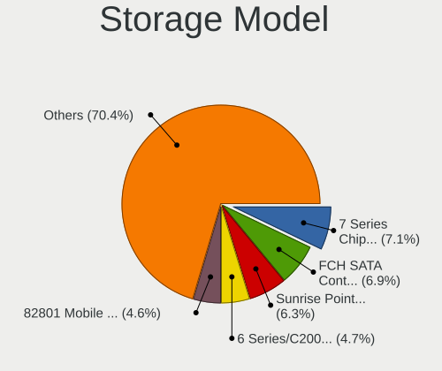

| Model                                                                            | Notebooks | Percent |
|----------------------------------------------------------------------------------|-----------|---------|
| Intel 7 Series Chipset Family 6-port SATA Controller [AHCI mode]                 | 230       | 7.13%   |
| AMD FCH SATA Controller [AHCI mode]                                              | 222       | 6.89%   |
| Intel Sunrise Point-LP SATA Controller [AHCI mode]                               | 202       | 6.27%   |
| Intel 6 Series/C200 Series Chipset Family 6 port Mobile SATA AHCI Controller     | 152       | 4.71%   |
| Intel 82801 Mobile SATA Controller [RAID mode]                                   | 147       | 4.56%   |
| Intel 8 Series SATA Controller 1 [AHCI mode]                                     | 110       | 3.41%   |
| Intel 82801IBM/IEM (ICH9M/ICH9M-E) 4 port SATA Controller [AHCI mode]            | 107       | 3.32%   |
| Intel Celeron/Pentium Silver Processor SATA Controller                           | 93        | 2.88%   |
| Intel Volume Management Device NVMe RAID Controller                              | 85        | 2.64%   |
| Intel 5 Series/3400 Series Chipset 4 port SATA AHCI Controller                   | 82        | 2.54%   |
| Intel Wildcat Point-LP SATA Controller [AHCI Mode]                               | 78        | 2.42%   |
| Intel 8 Series/C220 Series Chipset Family 6-port SATA Controller 1 [AHCI mode]   | 67        | 2.08%   |
| Samsung NVMe SSD Controller 980 (DRAM-less)                                      | 58        | 1.8%    |
| Samsung NVMe SSD Controller SM981/PM981/PM983                                    | 57        | 1.77%   |
| Intel 82801HM/HEM (ICH8M/ICH8M-E) IDE Controller                                 | 46        | 1.43%   |
| SanDisk WD SN560/SN740/SN770/SN5000 NVMe SSD                                     | 43        | 1.33%   |
| Samsung NVMe SSD Controller PM9A1/PM9A3/980PRO                                   | 41        | 1.27%   |
| Intel 82801HM/HEM (ICH8M/ICH8M-E) SATA Controller [AHCI mode]                    | 40        | 1.24%   |
| Intel Tiger Lake-LP SATA Controller                                              | 38        | 1.18%   |
| Intel 5 Series/3400 Series Chipset 6 port SATA AHCI Controller                   | 38        | 1.18%   |
| Intel HM170/QM170 Chipset SATA Controller [AHCI Mode]                            | 34        | 1.05%   |
| AMD SB7x0/SB8x0/SB9x0 SATA Controller [AHCI mode]                                | 34        | 1.05%   |
| Intel Celeron N3350/Pentium N4200/Atom E3900 Series SATA AHCI Controller         | 32        | 0.99%   |
| Intel Cannon Lake Mobile PCH SATA AHCI Controller                                | 32        | 0.99%   |
| Intel Alder Lake-P SATA AHCI Controller                                          | 28        | 0.87%   |
| Intel RST Volume Management Device Controller                                    | 27        | 0.84%   |
| Intel Comet Lake SATA AHCI Controller                                            | 27        | 0.84%   |
| Intel Atom Processor E3800 Series SATA AHCI Controller                           | 26        | 0.81%   |
| SanDisk Ultra 3D / WD PC SN530, IX SN530, Blue SN550 NVMe SSD (DRAM-less)        | 24        | 0.74%   |
| Samsung NVMe SSD Controller SM961/PM961/SM963                                    | 23        | 0.71%   |
| Intel SSD 670p Series [Keystone Harbor]                                          | 22        | 0.68%   |
| SK hynix Gold P31/BC711/PC711 NVMe Solid State Drive                             | 21        | 0.65%   |
| SK hynix BC901 NVMe Solid State Drive (DRAM-less)                                | 21        | 0.65%   |
| Samsung NVMe SSD Controller PM9B1 (DRAM-less)                                    | 20        | 0.62%   |
| KIOXIA NVMe SSD Controller BG4 (DRAM-less)                                       | 19        | 0.59%   |
| Intel Cannon Point-LP SATA Controller [AHCI Mode]                                | 19        | 0.59%   |
| Intel Atom/Celeron/Pentium Processor x5-E8000/J3xxx/N3xxx Series SATA Controller | 19        | 0.59%   |
| Samsung S4LN058A01[SSUBX] AHCI SSD Controller (Apple slot)                       | 18        | 0.56%   |
| Micron 2450 NVMe SSD [HendrixV] (DRAM-less)                                      | 18        | 0.56%   |
| MAXIO (Hangzhou) NVMe SSD Controller MAP1202 (DRAM-less)                         | 18        | 0.56%   |

Storage Kind
------------

Kind of storage controller (IDE, SATA, NVMe, SAS, ...)

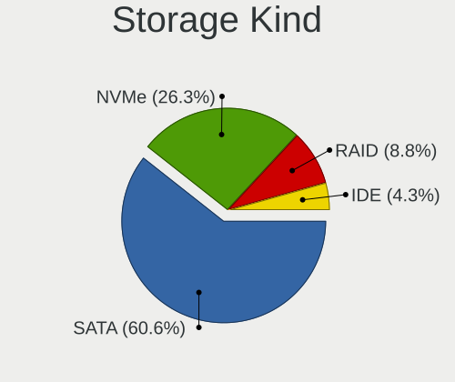

| Kind | Notebooks | Percent |
|------|-----------|---------|
| SATA | 1874      | 60.63%  |
| NVMe | 812       | 26.27%  |
| RAID | 271       | 8.77%   |
| IDE  | 134       | 4.34%   |

Processor
---------

CPU Vendor
----------

Processor vendors

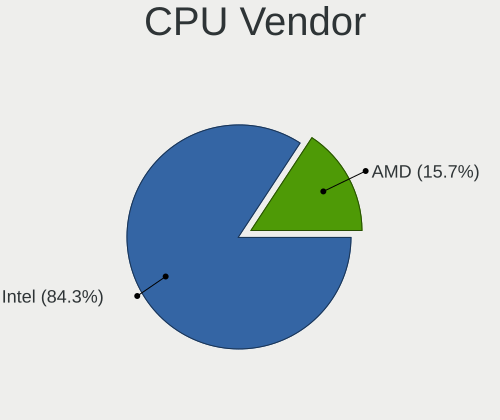

| Vendor | Notebooks | Percent |
|--------|-----------|---------|
| Intel  | 2236      | 84.25%  |
| AMD    | 418       | 15.75%  |

CPU Model
---------

Processor models

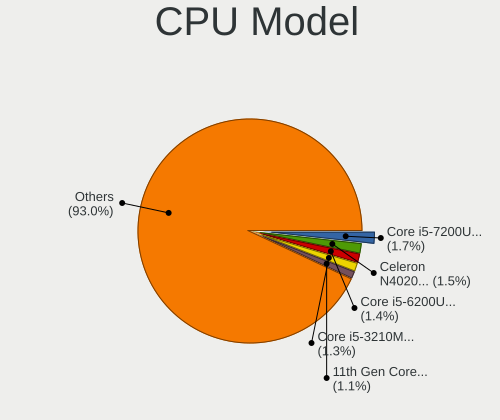

| Model                                   | Notebooks | Percent |
|-----------------------------------------|-----------|---------|
| Intel Core i5-7200U CPU @ 2.50GHz       | 46        | 1.73%   |
| Intel Celeron N4020 CPU @ 1.10GHz       | 40        | 1.51%   |
| Intel Core i5-6200U CPU @ 2.30GHz       | 36        | 1.36%   |
| Intel Core i5-3210M CPU @ 2.50GHz       | 34        | 1.28%   |
| Intel 11th Gen Core i5-1135G7 @ 2.40GHz | 29        | 1.09%   |
| Intel Core i5-2520M CPU @ 2.50GHz       | 28        | 1.05%   |
| Intel Core i5-6300U CPU @ 2.40GHz       | 27        | 1.02%   |
| Intel Celeron CPU N3350 @ 1.10GHz       | 27        | 1.02%   |
| Intel 11th Gen Core i7-1165G7 @ 2.80GHz | 27        | 1.02%   |
| Intel Core i5-8250U CPU @ 1.60GHz       | 26        | 0.98%   |
| Intel Core i3-6006U CPU @ 2.00GHz       | 24        | 0.9%    |
| Intel Core i5-5300U CPU @ 2.30GHz       | 23        | 0.87%   |
| Intel Core i7-2670QM CPU @ 2.20GHz      | 22        | 0.83%   |
| Intel Core i5-5200U CPU @ 2.20GHz       | 22        | 0.83%   |
| Intel Celeron N4000 CPU @ 1.10GHz       | 21        | 0.79%   |
| Intel Core i7-7700HQ CPU @ 2.80GHz      | 20        | 0.75%   |
| Intel Core i3-3110M CPU @ 2.40GHz       | 20        | 0.75%   |
| Intel Core i5-3230M CPU @ 2.60GHz       | 19        | 0.72%   |
| Intel Core i5-10210U CPU @ 1.60GHz      | 19        | 0.72%   |
| Intel Celeron N4120 CPU @ 1.10GHz       | 18        | 0.68%   |
| AMD Ryzen 5 5500U with Radeon Graphics  | 18        | 0.68%   |
| Intel Core i5-4210U CPU @ 1.70GHz       | 17        | 0.64%   |
| Intel Core i5-2430M CPU @ 2.40GHz       | 17        | 0.64%   |
| Intel Core i5 CPU M 520 @ 2.40GHz       | 17        | 0.64%   |
| Intel Core i3-3217U CPU @ 1.80GHz       | 17        | 0.64%   |
| Intel Core i3 CPU M 370 @ 2.40GHz       | 17        | 0.64%   |
| Intel 12th Gen Core i5-1235U            | 17        | 0.64%   |
| Intel Core i5-8350U CPU @ 1.70GHz       | 16        | 0.6%    |
| Intel Core i5-3320M CPU @ 2.60GHz       | 16        | 0.6%    |
| Intel Core 2 Duo CPU P8600 @ 2.40GHz    | 15        | 0.56%   |
| Intel Atom x5-Z8350 CPU @ 1.44GHz       | 15        | 0.56%   |
| Intel Core i7-2630QM CPU @ 2.00GHz      | 14        | 0.53%   |
| Intel Core i5-2410M CPU @ 2.30GHz       | 14        | 0.53%   |
| Intel Core i3-5005U CPU @ 2.00GHz       | 14        | 0.53%   |
| Intel Core i7-8750H CPU @ 2.20GHz       | 13        | 0.49%   |
| Intel Core i7-8565U CPU @ 1.80GHz       | 13        | 0.49%   |
| Intel Core i7-4500U CPU @ 1.80GHz       | 13        | 0.49%   |
| Intel Core i5-4300U CPU @ 1.90GHz       | 13        | 0.49%   |
| Intel Core i5-4200U CPU @ 1.60GHz       | 13        | 0.49%   |
| Intel Core i3-7020U CPU @ 2.30GHz       | 13        | 0.49%   |

CPU Model Family
----------------

Processor model prefix

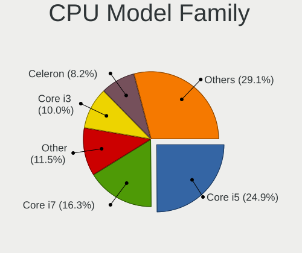

| Model                                | Notebooks | Percent |
|--------------------------------------|-----------|---------|
| Intel Core i5                        | 661       | 24.9%   |
| Intel Core i7                        | 432       | 16.27%  |
| Other                                | 306       | 11.53%  |
| Intel Core i3                        | 265       | 9.98%   |
| Intel Celeron                        | 219       | 8.25%   |
| Intel Core 2 Duo                     | 146       | 5.5%    |
| AMD Ryzen 5                          | 88        | 3.31%   |
| AMD Ryzen 7                          | 71        | 2.67%   |
| Intel Pentium                        | 70        | 2.64%   |
| AMD A6                               | 38        | 1.43%   |
| Intel Atom                           | 31        | 1.17%   |
| Intel Pentium Dual-Core              | 30        | 1.13%   |
| Intel Core                           | 24        | 0.9%    |
| AMD Ryzen 3                          | 23        | 0.87%   |
| AMD A8                               | 23        | 0.87%   |
| AMD E1                               | 19        | 0.72%   |
| AMD E                                | 15        | 0.56%   |
| AMD A4                               | 15        | 0.56%   |
| Intel Pentium Dual                   | 14        | 0.53%   |
| AMD A10                              | 14        | 0.53%   |
| AMD E2                               | 12        | 0.45%   |
| AMD Ryzen 9                          | 11        | 0.41%   |
| Intel Pentium Silver                 | 10        | 0.38%   |
| AMD A12                              | 10        | 0.38%   |
| Intel Core 2                         | 9         | 0.34%   |
| AMD Ryzen 5 PRO                      | 9         | 0.34%   |
| AMD Athlon II                        | 8         | 0.3%    |
| Intel Xeon                           | 7         | 0.26%   |
| Intel Core i9                        | 7         | 0.26%   |
| AMD Ryzen 7 PRO                      | 7         | 0.26%   |
| Intel Genuine                        | 6         | 0.23%   |
| AMD Athlon                           | 6         | 0.23%   |
| Intel Core m5                        | 4         | 0.15%   |
| Intel Core m3                        | 4         | 0.15%   |
| AMD Turion 64 X2 Mobile              | 4         | 0.15%   |
| Intel Core M                         | 3         | 0.11%   |
| Intel Celeron Dual-Core              | 3         | 0.11%   |
| AMD Turion X2 Ultra Dual-Core Mobile | 3         | 0.11%   |
| AMD Turion X2 Dual-Core Mobile       | 3         | 0.11%   |
| AMD Ryzen 3 PRO                      | 3         | 0.11%   |

CPU Cores
---------

Number of processor cores

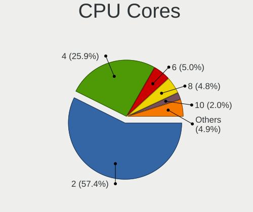

| Number | Notebooks | Percent |
|--------|-----------|---------|
| 2      | 1524      | 57.36%  |
| 4      | 688       | 25.89%  |
| 6      | 132       | 4.97%   |
| 8      | 128       | 4.82%   |
| 10     | 54        | 2.03%   |
| 14     | 46        | 1.73%   |
| 12     | 28        | 1.05%   |
| 1      | 27        | 1.02%   |
| 16     | 15        | 0.56%   |
| 24     | 11        | 0.41%   |
| 5      | 2         | 0.08%   |
| 20     | 1         | 0.04%   |
| 3      | 1         | 0.04%   |

CPU Sockets
-----------

Number of sockets

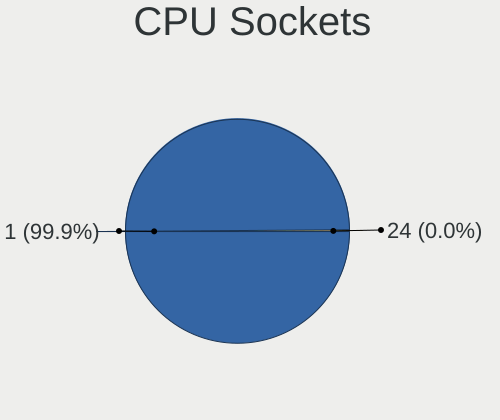

| Number | Notebooks | Percent |
|--------|-----------|---------|
| 1      | 2651      | 99.89%  |
| 8      | 2         | 0.08%   |
| 24     | 1         | 0.04%   |

CPU Threads
-----------

Threads per core (Hyper-Threading)

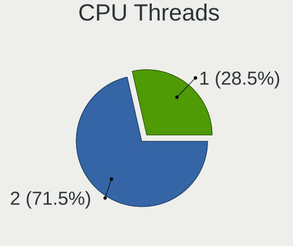

| Number | Notebooks | Percent |
|--------|-----------|---------|
| 2      | 1897      | 71.45%  |
| 1      | 758       | 28.55%  |

CPU Op-Modes
------------

CPU Operation Modes (32-bit, 64-bit)

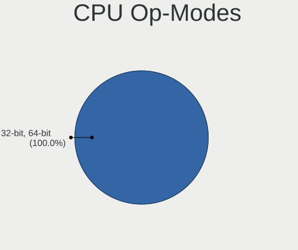

| Op mode        | Notebooks | Percent |
|----------------|-----------|---------|
| 32-bit, 64-bit | 2654      | 100%    |

CPU Microcode
-------------

Microcode number

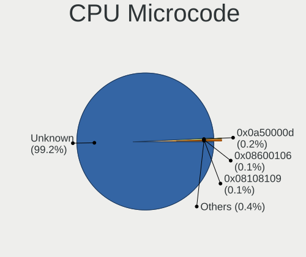

| Number     | Notebooks | Percent |
|------------|-----------|---------|
| Unknown    | 2636      | 99.21%  |
| 0x0a50000d | 4         | 0.15%   |
| 0x08600109 | 2         | 0.08%   |
| 0x08600106 | 2         | 0.08%   |
| 0x08108109 | 2         | 0.08%   |
| 0x806d1    | 1         | 0.04%   |
| 0x0a601203 | 1         | 0.04%   |
| 0x0a50000c | 1         | 0.04%   |
| 0x08a00008 | 1         | 0.04%   |
| 0x08608107 | 1         | 0.04%   |
| 0x0860010c | 1         | 0.04%   |
| 0x08108102 | 1         | 0.04%   |
| 0x08101007 | 1         | 0.04%   |
| 0x0700010f | 1         | 0.04%   |
| 0x06006705 | 1         | 0.04%   |
| 0x05000119 | 1         | 0.04%   |

CPU Microarch
-------------

Microarchitecture

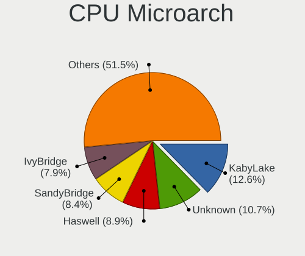

| Name              | Notebooks | Percent |
|-------------------|-----------|---------|
| KabyLake          | 336       | 12.65%  |
| Unknown           | 283       | 10.65%  |
| Haswell           | 236       | 8.88%   |
| SandyBridge       | 223       | 8.39%   |
| IvyBridge         | 211       | 7.94%   |
| Penryn            | 153       | 5.76%   |
| Skylake           | 144       | 5.42%   |
| Westmere          | 121       | 4.55%   |
| Goldmont plus     | 107       | 4.03%   |
| Broadwell         | 102       | 3.84%   |
| TigerLake         | 92        | 3.46%   |
| Silvermont        | 82        | 3.09%   |
| Core              | 67        | 2.52%   |
| Zen 3             | 50        | 1.88%   |
| Excavator         | 44        | 1.66%   |
| Zen+              | 39        | 1.47%   |
| Puma              | 39        | 1.47%   |
| Alderlake Hybrid  | 38        | 1.43%   |
| Goldmont          | 37        | 1.39%   |
| Icelake           | 34        | 1.28%   |
| CometLake         | 28        | 1.05%   |
| Zen 2             | 26        | 0.98%   |
| Jaguar            | 24        | 0.9%    |
| Bobcat            | 24        | 0.9%    |
| Piledriver        | 22        | 0.83%   |
| Zen               | 19        | 0.72%   |
| K10               | 17        | 0.64%   |
| Nehalem           | 16        | 0.6%    |
| K8 & K10 hybrid   | 7         | 0.26%   |
| K10 Llano         | 7         | 0.26%   |
| Bonnell           | 7         | 0.26%   |
| K8 Hammer         | 6         | 0.23%   |
| Meteorlake Hybrid | 5         | 0.19%   |
| Tremont           | 4         | 0.15%   |
| Gracemont         | 4         | 0.15%   |
| Steamroller       | 3         | 0.11%   |

Graphics
--------

GPU Vendor
----------

Vendors of graphics cards

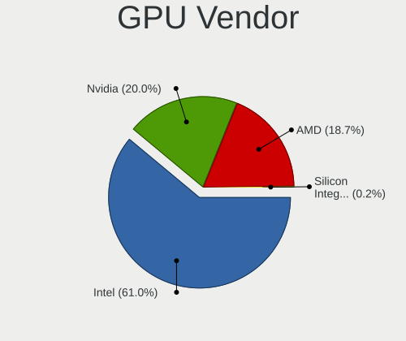

| Vendor                           | Notebooks | Percent |
|----------------------------------|-----------|---------|
| Intel                            | 1979      | 61.04%  |
| Nvidia                           | 650       | 20.05%  |
| AMD                              | 606       | 18.69%  |
| Silicon Integrated Systems [SiS] | 7         | 0.22%   |

GPU Model
---------

Graphics card models

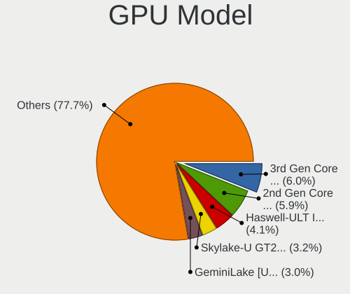

| Model                                                                                    | Notebooks | Percent |
|------------------------------------------------------------------------------------------|-----------|---------|
| Intel 3rd Gen Core processor Graphics Controller                                         | 200       | 6.04%   |
| Intel 2nd Generation Core Processor Family Integrated Graphics Controller                | 196       | 5.92%   |
| Intel Haswell-ULT Integrated Graphics Controller                                         | 137       | 4.14%   |
| Intel Skylake-U GT2 [HD Graphics 520]                                                    | 105       | 3.17%   |
| Intel GeminiLake [UHD Graphics 600]                                                      | 99        | 2.99%   |
| Intel Kaby Lake-U GT2 [HD Graphics 620]                                                  | 84        | 2.54%   |
| Intel Broadwell-U GT2 [HD Graphics 5500]                                                 | 83        | 2.51%   |
| Intel Core Processor Integrated Graphics Controller                                      | 78        | 2.36%   |
| Intel TigerLake-LP GT2 [Iris Xe Graphics]                                                | 77        | 2.32%   |
| Intel 4th Gen Core Processor Integrated Graphics Controller                              | 77        | 2.32%   |
| Intel Mobile 4 Series Chipset Integrated Graphics Controller                             | 75        | 2.26%   |
| Intel Kaby Lake-R GT2 [UHD Graphics 620]                                                 | 70        | 2.11%   |
| Intel Atom/Celeron/Pentium Processor x5-E8000/J3xxx/N3xxx Integrated Graphics Controller | 53        | 1.6%    |
| AMD Picasso/Raven 2 [Radeon Vega Series / Radeon Vega Mobile Series]                     | 46        | 1.39%   |
| Intel Raptor Lake-P [Iris Xe Graphics]                                                   | 41        | 1.24%   |
| Intel CoffeeLake-H GT2 [UHD Graphics 630]                                                | 40        | 1.21%   |
| Intel WhiskeyLake-U GT2 [UHD Graphics 620]                                               | 36        | 1.09%   |
| Intel CometLake-U GT2 [UHD Graphics]                                                     | 36        | 1.09%   |
| Intel Apollo Lake GT1 [HD Graphics 500]                                                  | 33        | 1%      |
| AMD Lucienne                                                                             | 32        | 0.97%   |
| AMD Stoney [Radeon R2/R3/R4/R5 Graphics]                                                 | 31        | 0.94%   |
| AMD Mullins [Radeon R4/R5 Graphics]                                                      | 31        | 0.94%   |
| Nvidia GF117M [GeForce 610M/710M/810M/820M / GT 620M/625M/630M/720M]                     | 29        | 0.88%   |
| Intel Atom Processor Z36xxx/Z37xxx Series Graphics & Display                             | 29        | 0.88%   |
| Nvidia TU117M [GeForce GTX 1650 Mobile / Max-Q]                                          | 28        | 0.85%   |
| AMD Renoir [Radeon Vega Series / Radeon Vega Mobile Series]                              | 26        | 0.79%   |
| Intel Kaby Lake-H GT2 [HD Graphics 630]                                                  | 25        | 0.75%   |
| AMD Cezanne [Radeon Vega Series / Radeon Vega Mobile Series]                             | 25        | 0.75%   |
| Intel Mobile GM965/GL960 Integrated Graphics Controller (secondary)                      | 24        | 0.72%   |
| Intel Mobile GM965/GL960 Integrated Graphics Controller (primary)                        | 24        | 0.72%   |
| Intel CometLake-H GT2 [UHD Graphics]                                                     | 24        | 0.72%   |
| Intel Alder Lake-P GT2 [Iris Xe Graphics]                                                | 24        | 0.72%   |
| AMD Topaz XT [Radeon R7 M260/M265 / M340/M360 / M440/M445 / 530/535 / 620/625 Mobile]    | 24        | 0.72%   |
| AMD Sun XT [Radeon HD 8670A/8670M/8690M / R5 M330 / M430 / Radeon 520 Mobile]            | 24        | 0.72%   |
| AMD Barcelo                                                                              | 24        | 0.72%   |
| Intel TigerLake-H GT1 [UHD Graphics]                                                     | 23        | 0.69%   |
| AMD Seymour [Radeon HD 6400M/7400M Series]                                               | 23        | 0.69%   |
| Nvidia AD107M [GeForce RTX 4060 Max-Q / Mobile]                                          | 21        | 0.63%   |
| Nvidia GA107M [GeForce RTX 3050 Mobile]                                                  | 20        | 0.6%    |
| Intel Iris Plus Graphics G1 (Ice Lake)                                                   | 20        | 0.6%    |

GPU Combo
---------

Combinations of graphics cards

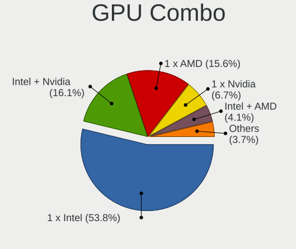

| Name           | Notebooks | Percent |
|----------------|-----------|---------|
| 1 x Intel      | 1428      | 53.77%  |
| Intel + Nvidia | 427       | 16.08%  |
| 1 x AMD        | 415       | 15.63%  |
| 1 x Nvidia     | 177       | 6.66%   |
| Intel + AMD    | 110       | 4.14%   |
| AMD + Nvidia   | 44        | 1.66%   |
| 2 x AMD        | 37        | 1.39%   |
| Other          | 9         | 0.34%   |
| 1 x SiS        | 7         | 0.26%   |
| 2 x Nvidia     | 2         | 0.08%   |

GPU Driver
----------

Free vs proprietary

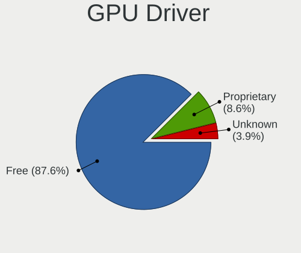

| Driver      | Notebooks | Percent |
|-------------|-----------|---------|
| Free        | 2343      | 87.56%  |
| Proprietary | 229       | 8.56%   |
| Unknown     | 104       | 3.89%   |

GPU Memory
----------

Total video memory

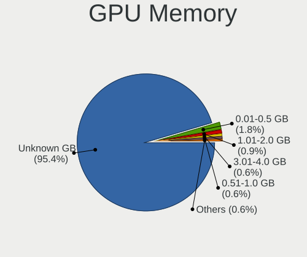

| Size in GB | Notebooks | Percent |
|------------|-----------|---------|
| Unknown    | 2541      | 95.42%  |
| 0.01-0.5   | 48        | 1.8%    |
| 1.01-2.0   | 25        | 0.94%   |
| 3.01-4.0   | 17        | 0.64%   |
| 0.51-1.0   | 17        | 0.64%   |
| 7.01-8.0   | 6         | 0.23%   |
| 5.01-6.0   | 3         | 0.11%   |
| 2.01-3.0   | 3         | 0.11%   |
| 8.01-16.0  | 3         | 0.11%   |

Monitor
-------

Monitor Vendor
--------------

Monitor vendors

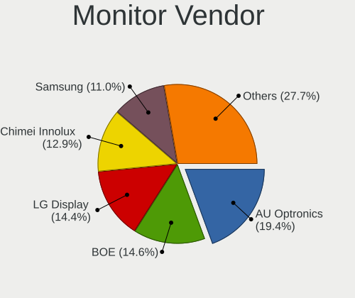

| Vendor                  | Notebooks | Percent |
|-------------------------|-----------|---------|
| AU Optronics            | 554       | 19.4%   |
| BOE                     | 418       | 14.64%  |
| LG Display              | 412       | 14.43%  |
| Chimei Innolux          | 367       | 12.85%  |
| Samsung Electronics     | 313       | 10.96%  |
| Apple                   | 143       | 5.01%   |
| Chi Mei Optoelectronics | 83        | 2.91%   |
| Goldstar                | 54        | 1.89%   |
| Sharp                   | 43        | 1.51%   |
| PANDA                   | 37        | 1.3%    |
| Dell                    | 35        | 1.23%   |
| Lenovo                  | 30        | 1.05%   |
| InfoVision              | 29        | 1.02%   |
| Acer                    | 25        | 0.88%   |
| Hewlett-Packard         | 21        | 0.74%   |
| AOC                     | 19        | 0.67%   |
| LG Philips              | 18        | 0.63%   |
| Philips                 | 16        | 0.56%   |
| CSO                     | 16        | 0.56%   |
| BenQ                    | 13        | 0.46%   |
| CPT                     | 12        | 0.42%   |
| Sony                    | 9         | 0.32%   |
| HKC                     | 9         | 0.32%   |
| TMX                     | 8         | 0.28%   |
| KDB                     | 8         | 0.28%   |
| Panasonic               | 7         | 0.25%   |
| SLD                     | 6         | 0.21%   |
| Hitachi                 | 6         | 0.21%   |
| Fujitsu Siemens         | 6         | 0.21%   |
| CSOT                    | 6         | 0.21%   |
| ZTR                     | 5         | 0.18%   |
| Toshiba                 | 5         | 0.18%   |
| STA                     | 5         | 0.18%   |
| RTK                     | 4         | 0.14%   |
| MSI                     | 4         | 0.14%   |
| KDC                     | 4         | 0.14%   |
| InnoLux Display         | 4         | 0.14%   |
| Iiyama                  | 4         | 0.14%   |
| ASUSTek Computer        | 4         | 0.14%   |
| ___                     | 3         | 0.11%   |

Monitor Model
-------------

Monitor models

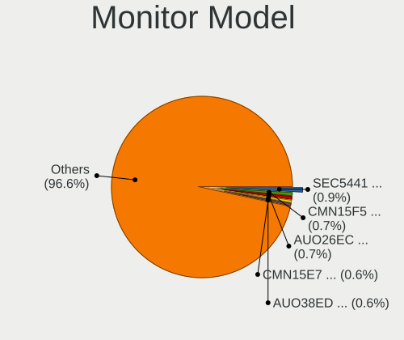

| Model                                                                    | Notebooks | Percent |
|--------------------------------------------------------------------------|-----------|---------|
| Samsung Electronics LCD Monitor SEC5441 1280x800 331x207mm 15.4-inch     | 26        | 0.91%   |
| Chimei Innolux LCD Monitor CMN15F5 1920x1080 344x193mm 15.5-inch         | 20        | 0.7%    |
| AU Optronics LCD Monitor AUO26EC 1366x768 344x193mm 15.5-inch            | 19        | 0.66%   |
| Chimei Innolux LCD Monitor CMN15E7 1920x1080 344x193mm 15.5-inch         | 16        | 0.56%   |
| AU Optronics LCD Monitor AUO38ED 1920x1080 344x193mm 15.5-inch           | 16        | 0.56%   |
| Apple Color LCD APP9CC7 1280x800 286x179mm 13.3-inch                     | 14        | 0.49%   |
| Chimei Innolux LCD Monitor CMN1521 1920x1080 344x193mm 15.5-inch         | 13        | 0.45%   |
| Chimei Innolux LCD Monitor CMN14D4 1920x1080 309x173mm 13.9-inch         | 13        | 0.45%   |
| AU Optronics LCD Monitor AUO71EC 1366x768 344x193mm 15.5-inch            | 13        | 0.45%   |
| AU Optronics LCD Monitor AUO2E3C 1366x768 309x173mm 13.9-inch            | 12        | 0.42%   |
| AU Optronics LCD Monitor AUO183C 1366x768 309x173mm 13.9-inch            | 12        | 0.42%   |
| Chimei Innolux LCD Monitor CMN15DB 1366x768 344x193mm 15.5-inch          | 11        | 0.38%   |
| BOE LCD Monitor BOE0872 1920x1080 344x194mm 15.5-inch                    | 11        | 0.38%   |
| AU Optronics LCD Monitor AUO22EC 1366x768 344x193mm 15.5-inch            | 11        | 0.38%   |
| AU Optronics LCD Monitor AUO106C 1366x768 276x155mm 12.5-inch            | 11        | 0.38%   |
| Samsung Electronics LCD Monitor SEC544B 1600x900 382x214mm 17.2-inch     | 10        | 0.35%   |
| LG Display LCD Monitor LGD046F 1920x1080 344x194mm 15.5-inch             | 10        | 0.35%   |
| AU Optronics LCD Monitor AUO21EC 1366x768 344x193mm 15.5-inch            | 10        | 0.35%   |
| AU Optronics LCD Monitor AUO213D 1920x1080 309x173mm 13.9-inch           | 10        | 0.35%   |
| AU Optronics LCD Monitor AUO20EC 1366x768 344x193mm 15.5-inch            | 10        | 0.35%   |
| Apple LCD Monitor APP9CC5 1280x800 286x179mm 13.3-inch                   | 10        | 0.35%   |
| Apple Color LCD APP9CDF 1440x900 286x179mm 13.3-inch                     | 10        | 0.35%   |
| PANDA LCD Monitor NCP004D 1920x1080 344x194mm 15.5-inch                  | 9         | 0.31%   |
| LG Display LCD Monitor LGD033A 1366x768 344x194mm 15.5-inch              | 9         | 0.31%   |
| Chimei Innolux LCD Monitor CMN15E6 1366x768 344x193mm 15.5-inch          | 9         | 0.31%   |
| Chimei Innolux LCD Monitor CMN15DC 1366x768 344x193mm 15.5-inch          | 9         | 0.31%   |
| Chimei Innolux LCD Monitor CMN15D5 1920x1080 344x193mm 15.5-inch         | 9         | 0.31%   |
| Chimei Innolux LCD Monitor CMN14D6 1366x768 309x173mm 13.9-inch          | 9         | 0.31%   |
| Chi Mei Optoelectronics LCD Monitor CMO15A7 1366x768 344x193mm 15.5-inch | 9         | 0.31%   |
| AU Optronics LCD Monitor AUO45EC 1366x768 344x193mm 15.5-inch            | 9         | 0.31%   |
| AU Optronics LCD Monitor AUO10EC 1366x768 344x193mm 15.5-inch            | 9         | 0.31%   |
| Apple Color LCD APP9CF0 1440x900 290x180mm 13.4-inch                     | 9         | 0.31%   |
| Samsung Electronics LCD Monitor SDC4171 2880x1800 302x189mm 14.0-inch    | 8         | 0.28%   |
| LG Display LCD Monitor LGD0521 1920x1080 309x174mm 14.0-inch             | 8         | 0.28%   |
| LG Display LCD Monitor LGD0430 1366x768 345x194mm 15.6-inch              | 8         | 0.28%   |
| LG Display LCD Monitor LGD039F 1366x768 345x194mm 15.6-inch              | 8         | 0.28%   |
| LG Display LCD Monitor LGD02DC 1366x768 344x194mm 15.5-inch              | 8         | 0.28%   |
| BOE LCD Monitor BOE08D5 1920x1080 344x194mm 15.5-inch                    | 8         | 0.28%   |
| BOE LCD Monitor BOE0696 1366x768 309x173mm 13.9-inch                     | 8         | 0.28%   |
| AU Optronics LCD Monitor AUO61ED 1920x1080 344x194mm 15.5-inch           | 8         | 0.28%   |

Monitor Resolution
------------------

Monitor screen resolution

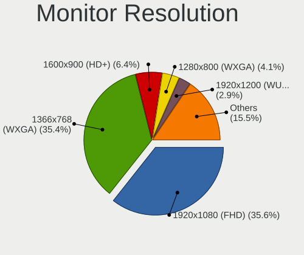

| Resolution         | Notebooks | Percent |
|--------------------|-----------|---------|
| 1920x1080 (FHD)    | 982       | 35.64%  |
| 1366x768 (WXGA)    | 976       | 35.43%  |
| 1600x900 (HD+)     | 175       | 6.35%   |
| 1280x800 (WXGA)    | 114       | 4.14%   |
| 1920x1200 (WUXGA)  | 80        | 2.9%    |
| 3840x2160 (4K)     | 71        | 2.58%   |
| 1440x900 (WXGA+)   | 63        | 2.29%   |
| 2880x1800          | 57        | 2.07%   |
| 2560x1440 (QHD)    | 54        | 1.96%   |
| 2560x1600          | 47        | 1.71%   |
| 1680x1050 (WSXGA+) | 20        | 0.73%   |
| 2560x1080          | 14        | 0.51%   |
| 2160x1440          | 12        | 0.44%   |
| 3200x2000          | 9         | 0.33%   |
| 1280x1024 (SXGA)   | 7         | 0.25%   |
| 2304x1440          | 6         | 0.22%   |
| 1360x768           | 6         | 0.22%   |
| 3840x2400          | 5         | 0.18%   |
| Unknown            | 5         | 0.18%   |
| 3440x1440          | 4         | 0.15%   |
| 2256x1504          | 4         | 0.15%   |
| 1920x1280          | 4         | 0.15%   |
| 1680x945           | 4         | 0.15%   |
| 1024x600           | 4         | 0.15%   |
| 3840x1080          | 3         | 0.11%   |
| 3200x1800 (QHD+)   | 3         | 0.11%   |
| 2880x1620          | 3         | 0.11%   |
| 1920x540           | 3         | 0.11%   |
| 1024x768 (XGA)     | 3         | 0.11%   |
| 504x315            | 2         | 0.07%   |
| 2520x1680          | 2         | 0.07%   |
| 1600x2560          | 2         | 0.07%   |
| 800x1280           | 1         | 0.04%   |
| 480x1920           | 1         | 0.04%   |
| 400x1280           | 1         | 0.04%   |
| 3840x2560          | 1         | 0.04%   |
| 3840x1200          | 1         | 0.04%   |
| 3840x1100          | 1         | 0.04%   |
| 3072x1920          | 1         | 0.04%   |
| 3000x2000          | 1         | 0.04%   |

Monitor Diagonal
----------------

Diagonal size in inches

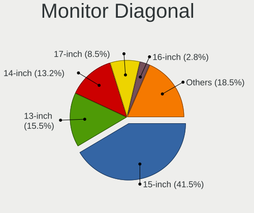

| Inches  | Notebooks | Percent |
|---------|-----------|---------|
| 15      | 1182      | 41.47%  |
| 13      | 441       | 15.47%  |
| 14      | 377       | 13.23%  |
| 17      | 242       | 8.49%   |
| 16      | 81        | 2.84%   |
| 12      | 67        | 2.35%   |
| 11      | 57        | 2%      |
| 24      | 56        | 1.96%   |
| 27      | 55        | 1.93%   |
| 23      | 39        | 1.37%   |
| 21      | 36        | 1.26%   |
| 18      | 36        | 1.26%   |
| 31      | 31        | 1.09%   |
| Unknown | 20        | 0.7%    |
| 34      | 12        | 0.42%   |
| 84      | 11        | 0.39%   |
| 22      | 11        | 0.39%   |
| 19      | 11        | 0.39%   |
| 32      | 9         | 0.32%   |
| 54      | 8         | 0.28%   |
| 63      | 6         | 0.21%   |
| 52      | 6         | 0.21%   |
| 40      | 6         | 0.21%   |
| 10      | 6         | 0.21%   |
| 20      | 5         | 0.18%   |
| 72      | 4         | 0.14%   |
| 48      | 4         | 0.14%   |
| 28      | 4         | 0.14%   |
| 26      | 4         | 0.14%   |
| 25      | 3         | 0.11%   |
| 7       | 3         | 0.11%   |
| 60      | 2         | 0.07%   |
| 46      | 2         | 0.07%   |
| 43      | 2         | 0.07%   |
| 42      | 2         | 0.07%   |
| 86      | 1         | 0.04%   |
| 65      | 1         | 0.04%   |
| 64      | 1         | 0.04%   |
| 58      | 1         | 0.04%   |
| 50      | 1         | 0.04%   |

Monitor Width
-------------

Physical width

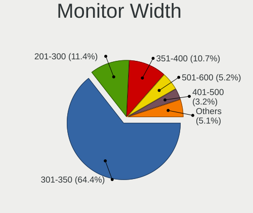

| Width in mm | Notebooks | Percent |
|-------------|-----------|---------|
| 301-350     | 1825      | 64.42%  |
| 201-300     | 322       | 11.37%  |
| 351-400     | 304       | 10.73%  |
| 501-600     | 147       | 5.19%   |
| 401-500     | 91        | 3.21%   |
| 601-700     | 39        | 1.38%   |
| 1001-1500   | 34        | 1.2%    |
| 701-800     | 22        | 0.78%   |
| Unknown     | 20        | 0.71%   |
| 1501-2000   | 15        | 0.53%   |
| 801-900     | 8         | 0.28%   |
| 901-1000    | 3         | 0.11%   |
| 101-200     | 2         | 0.07%   |
| 1-100       | 1         | 0.04%   |

Aspect Ratio
------------

Proportional relationship between the width and the height

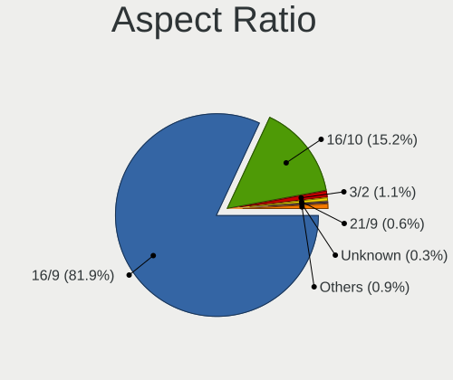

| Ratio   | Notebooks | Percent |
|---------|-----------|---------|
| 16/9    | 2141      | 81.94%  |
| 16/10   | 396       | 15.15%  |
| 3/2     | 28        | 1.07%   |
| 21/9    | 16        | 0.61%   |
| Unknown | 9         | 0.34%   |
| 5/4     | 7         | 0.27%   |
| 4/3     | 4         | 0.15%   |
| 32/9    | 4         | 0.15%   |
| 6/5     | 1         | 0.04%   |
| 3.73    | 1         | 0.04%   |
| 3.40    | 1         | 0.04%   |
| 3.20    | 1         | 0.04%   |
| 0.67    | 1         | 0.04%   |
| 0.56    | 1         | 0.04%   |
| 0.31    | 1         | 0.04%   |
| 0.25    | 1         | 0.04%   |

Monitor Area
------------

Area in inch²

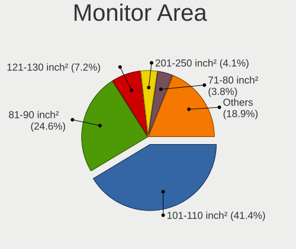

| Area in inch² | Notebooks | Percent |
|----------------|-----------|---------|
| 101-110        | 1178      | 41.39%  |
| 81-90          | 700       | 24.6%   |
| 121-130        | 205       | 7.2%    |
| 201-250        | 117       | 4.11%   |
| 71-80          | 108       | 3.79%   |
| 111-120        | 71        | 2.49%   |
| 61-70          | 66        | 2.32%   |
| 51-60          | 58        | 2.04%   |
| 301-350        | 57        | 2%      |
| 351-500        | 55        | 1.93%   |
| More than 1000 | 43        | 1.51%   |
| 131-140        | 42        | 1.48%   |
| 141-150        | 35        | 1.23%   |
| 151-200        | 26        | 0.91%   |
| 251-300        | 22        | 0.77%   |
| Unknown        | 20        | 0.7%    |
| 501-1000       | 17        | 0.6%    |
| 91-100         | 17        | 0.6%    |
| 41-50          | 6         | 0.21%   |
| 1-40           | 3         | 0.11%   |

Pixel Density
-------------

Pixels per inch

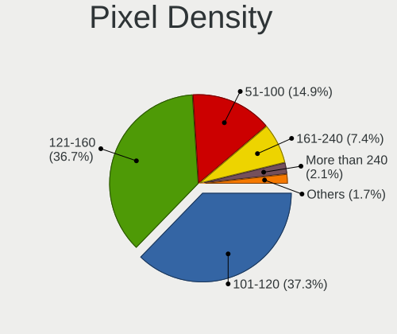

| Density       | Notebooks | Percent |
|---------------|-----------|---------|
| 101-120       | 1046      | 37.26%  |
| 121-160       | 1030      | 36.69%  |
| 51-100        | 417       | 14.86%  |
| 161-240       | 207       | 7.37%   |
| More than 240 | 58        | 2.07%   |
| 1-50          | 29        | 1.03%   |
| Unknown       | 20        | 0.71%   |

Multiple Monitors
-----------------

Total monitors connected

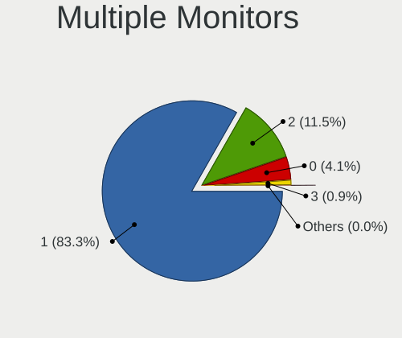

| Total | Notebooks | Percent |
|-------|-----------|---------|
| 1     | 2232      | 83.25%  |
| 2     | 309       | 11.53%  |
| 0     | 111       | 4.14%   |
| 3     | 25        | 0.93%   |
| 4     | 3         | 0.11%   |
| 5     | 1         | 0.04%   |

Network
-------

Net Controller Vendor
---------------------

Controller vendors

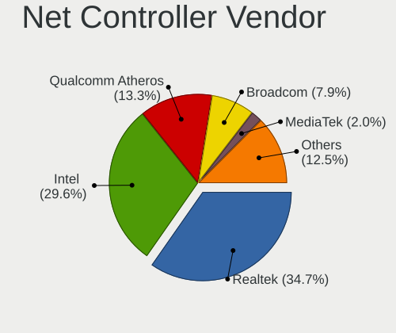

| Vendor                            | Notebooks | Percent |
|-----------------------------------|-----------|---------|
| Realtek Semiconductor             | 1454      | 34.72%  |
| Intel                             | 1238      | 29.56%  |
| Qualcomm Atheros                  | 555       | 13.25%  |
| Broadcom                          | 332       | 7.93%   |
| MediaTek                          | 85        | 2.03%   |
| Broadcom Limited                  | 85        | 2.03%   |
| Marvell Technology Group          | 54        | 1.29%   |
| Ralink                            | 49        | 1.17%   |
| TP-Link                           | 34        | 0.81%   |
| ASIX Electronics                  | 33        | 0.79%   |
| Samsung Electronics               | 30        | 0.72%   |
| Sierra Wireless                   | 23        | 0.55%   |
| Ralink Technology                 | 23        | 0.55%   |
| Nvidia                            | 21        | 0.5%    |
| JMicron Technology                | 19        | 0.45%   |
| Dell                              | 12        | 0.29%   |
| Silicon Integrated Systems [SiS]  | 11        | 0.26%   |
| DisplayLink                       | 11        | 0.26%   |
| Hewlett-Packard                   | 10        | 0.24%   |
| Xiaomi                            | 9         | 0.21%   |
| Shenzhen Goodix Technology        | 9         | 0.21%   |
| Qualcomm                          | 9         | 0.21%   |
| Ericsson Business Mobile Networks | 9         | 0.21%   |
| Lenovo                            | 7         | 0.17%   |
| Qualcomm Atheros Communications   | 6         | 0.14%   |
| Huawei Technologies               | 6         | 0.14%   |
| D-Link                            | 6         | 0.14%   |
| OPPO Electronics                  | 5         | 0.12%   |
| U-Blox                            | 3         | 0.07%   |
| QinHeng Electronics               | 3         | 0.07%   |
| NetGear                           | 3         | 0.07%   |
| Microsoft                         | 3         | 0.07%   |
| Google                            | 3         | 0.07%   |
| D-Link System                     | 3         | 0.07%   |
| Toshiba                           | 2         | 0.05%   |
| Motorola PCS                      | 2         | 0.05%   |
| Fibocom                           | 2         | 0.05%   |
| Belkin Components                 | 2         | 0.05%   |
| Apple                             | 2         | 0.05%   |
| ZyDAS                             | 1         | 0.02%   |

Net Controller Model
--------------------

Controller models

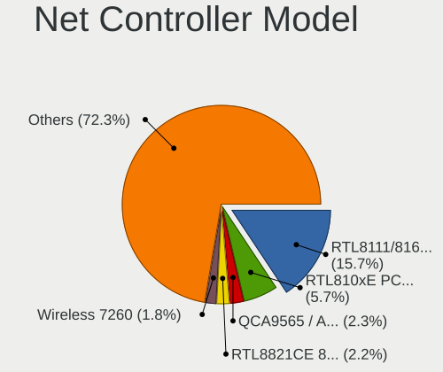

| Model                                                                  | Notebooks | Percent |
|------------------------------------------------------------------------|-----------|---------|
| Realtek RTL8111/8168/8211/8411 PCI Express Gigabit Ethernet Controller | 787       | 15.67%  |
| Realtek RTL810xE PCI Express Fast Ethernet controller                  | 286       | 5.7%    |
| Qualcomm Atheros QCA9565 / AR9565 Wireless Network Adapter             | 115       | 2.29%   |
| Realtek RTL8821CE 802.11ac PCIe Wireless Network Adapter               | 109       | 2.17%   |
| Intel Wireless 7260                                                    | 92        | 1.83%   |
| Intel 82579LM Gigabit Network Connection (Lewisville)                  | 89        | 1.77%   |
| Qualcomm Atheros AR9285 Wireless Network Adapter (PCI-Express)         | 88        | 1.75%   |
| Qualcomm Atheros QCA9377 802.11ac Wireless Network Adapter             | 86        | 1.71%   |
| Qualcomm Atheros AR9485 Wireless Network Adapter                       | 82        | 1.63%   |
| Intel Wireless 8265 / 8275                                             | 82        | 1.63%   |
| Intel Wi-Fi 6 AX201                                                    | 77        | 1.53%   |
| Realtek RTL8153 Gigabit Ethernet Adapter                               | 76        | 1.51%   |
| Intel Wireless 7265                                                    | 75        | 1.49%   |
| Intel Wireless 8260                                                    | 72        | 1.43%   |
| Intel Alder Lake-P PCH CNVi WiFi                                       | 59        | 1.18%   |
| Realtek RTL8822CE 802.11ac PCIe Wireless Network Adapter               | 57        | 1.14%   |
| Intel Wireless 3165                                                    | 52        | 1.04%   |
| Intel Ethernet Connection (4) I219-LM                                  | 50        | 1%      |
| Intel Centrino Advanced-N 6205 [Taylor Peak]                           | 50        | 1%      |
| Intel Raptor Lake PCH CNVi WiFi                                        | 48        | 0.96%   |
| Broadcom BCM43142 802.11b/g/n                                          | 43        | 0.86%   |
| Broadcom BCM4313 802.11bgn Wireless Network Adapter                    | 43        | 0.86%   |
| Realtek RTL8723BE PCIe Wireless Network Adapter                        | 38        | 0.76%   |
| Realtek RTL8188EE Wireless Network Adapter                             | 37        | 0.74%   |
| Intel Wi-Fi 6 AX200                                                    | 37        | 0.74%   |
| Realtek RTL8188CE 802.11b/g/n WiFi Adapter                             | 35        | 0.7%    |
| Realtek RTL8852BE PCIe 802.11ax Wireless Network Controller            | 34        | 0.68%   |
| Intel Ethernet Connection (3) I218-LM                                  | 34        | 0.68%   |
| MediaTek MT7921 802.11ax PCIe Wireless Network Adapter [Filogic 330]   | 33        | 0.66%   |
| Intel Ethernet Connection I218-LM                                      | 33        | 0.66%   |
| Intel Ethernet Connection I219-LM                                      | 32        | 0.64%   |
| Intel Comet Lake PCH-LP CNVi WiFi                                      | 32        | 0.64%   |
| Intel Ethernet Connection I217-LM                                      | 31        | 0.62%   |
| ASIX AX88179 Gigabit Ethernet                                          | 31        | 0.62%   |
| Intel WiFi Link 5100                                                   | 30        | 0.6%    |
| Broadcom BCM4331 802.11a/b/g/n                                         | 30        | 0.6%    |
| Broadcom NetXtreme BCM57765 Gigabit Ethernet PCIe                      | 29        | 0.58%   |
| Qualcomm Atheros AR8151 v2.0 Gigabit Ethernet                          | 28        | 0.56%   |
| Intel Centrino Ultimate-N 6300                                         | 28        | 0.56%   |
| Broadcom Limited BCM4360 802.11ac Dual Band Wireless Network Adapter   | 28        | 0.56%   |

Wireless Vendor
---------------

Wireless vendors

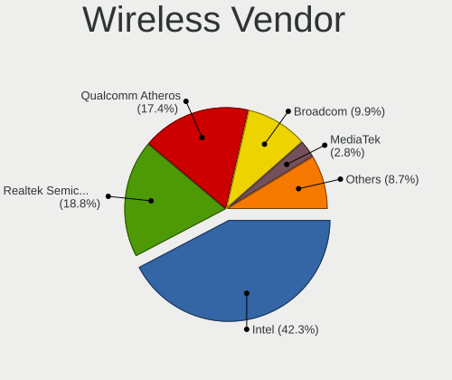

| Vendor                          | Notebooks | Percent |
|---------------------------------|-----------|---------|
| Intel                           | 1157      | 42.32%  |
| Realtek Semiconductor           | 514       | 18.8%   |
| Qualcomm Atheros                | 477       | 17.45%  |
| Broadcom                        | 272       | 9.95%   |
| MediaTek                        | 77        | 2.82%   |
| Broadcom Limited                | 64        | 2.34%   |
| Ralink                          | 49        | 1.79%   |
| TP-Link                         | 31        | 1.13%   |
| Sierra Wireless                 | 23        | 0.84%   |
| Ralink Technology               | 23        | 0.84%   |
| Dell                            | 9         | 0.33%   |
| Qualcomm Atheros Communications | 6         | 0.22%   |
| D-Link                          | 6         | 0.22%   |
| Qualcomm                        | 5         | 0.18%   |
| NetGear                         | 3         | 0.11%   |
| Microsoft                       | 3         | 0.11%   |
| D-Link System                   | 3         | 0.11%   |
| Hewlett-Packard                 | 2         | 0.07%   |
| Fibocom                         | 2         | 0.07%   |
| Belkin Components               | 2         | 0.07%   |
| ZyDAS                           | 1         | 0.04%   |
| TRENDnet                        | 1         | 0.04%   |
| Fujitsu Siemens Computers       | 1         | 0.04%   |
| Edimax Technology               | 1         | 0.04%   |
| AVM                             | 1         | 0.04%   |
| Unknown                         | 1         | 0.04%   |

Wireless Model
--------------

Wireless models

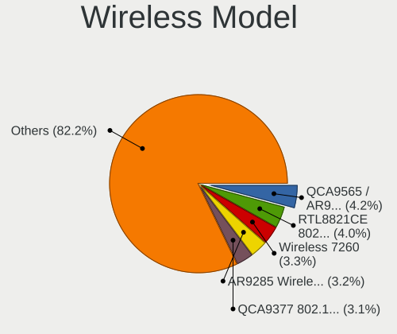

| Model                                                                | Notebooks | Percent |
|----------------------------------------------------------------------|-----------|---------|
| Qualcomm Atheros QCA9565 / AR9565 Wireless Network Adapter           | 115       | 4.18%   |
| Realtek RTL8821CE 802.11ac PCIe Wireless Network Adapter             | 109       | 3.97%   |
| Intel Wireless 7260                                                  | 92        | 3.35%   |
| Qualcomm Atheros AR9285 Wireless Network Adapter (PCI-Express)       | 88        | 3.2%    |
| Qualcomm Atheros QCA9377 802.11ac Wireless Network Adapter           | 86        | 3.13%   |
| Qualcomm Atheros AR9485 Wireless Network Adapter                     | 82        | 2.98%   |
| Intel Wireless 8265 / 8275                                           | 82        | 2.98%   |
| Intel Wi-Fi 6 AX201                                                  | 77        | 2.8%    |
| Intel Wireless 7265                                                  | 75        | 2.73%   |
| Intel Wireless 8260                                                  | 72        | 2.62%   |
| Realtek RTL8822CE 802.11ac PCIe Wireless Network Adapter             | 57        | 2.07%   |
| Intel Wireless 3165                                                  | 52        | 1.89%   |
| Intel Centrino Advanced-N 6205 [Taylor Peak]                         | 50        | 1.82%   |
| Intel Raptor Lake PCH CNVi WiFi                                      | 45        | 1.64%   |
| Broadcom BCM43142 802.11b/g/n                                        | 43        | 1.56%   |
| Broadcom BCM4313 802.11bgn Wireless Network Adapter                  | 43        | 1.56%   |
| Realtek RTL8723BE PCIe Wireless Network Adapter                      | 38        | 1.38%   |
| Realtek RTL8188EE Wireless Network Adapter                           | 37        | 1.35%   |
| Intel Wi-Fi 6 AX200                                                  | 37        | 1.35%   |
| Intel Alder Lake-P PCH CNVi WiFi                                     | 37        | 1.35%   |
| Realtek RTL8188CE 802.11b/g/n WiFi Adapter                           | 35        | 1.27%   |
| MediaTek MT7921 802.11ax PCIe Wireless Network Adapter [Filogic 330] | 33        | 1.2%    |
| Realtek RTL8852BE PCIe 802.11ax Wireless Network Controller          | 32        | 1.16%   |
| Intel Comet Lake PCH-LP CNVi WiFi                                    | 32        | 1.16%   |
| Intel WiFi Link 5100                                                 | 30        | 1.09%   |
| Broadcom BCM4331 802.11a/b/g/n                                       | 30        | 1.09%   |
| Intel Centrino Ultimate-N 6300                                       | 28        | 1.02%   |
| Broadcom Limited BCM4360 802.11ac Dual Band Wireless Network Adapter | 28        | 1.02%   |
| Intel Centrino Advanced-N 6235                                       | 27        | 0.98%   |
| Broadcom BCM4322 802.11a/b/g/n Wireless LAN Controller               | 27        | 0.98%   |
| Realtek RTL8723DE Wireless Network Adapter                           | 26        | 0.95%   |
| Qualcomm Atheros QCA6174 802.11ac Wireless Network Adapter           | 26        | 0.95%   |
| Intel Cannon Lake PCH CNVi WiFi                                      | 26        | 0.95%   |
| Qualcomm Atheros AR928X Wireless Network Adapter (PCI-Express)       | 25        | 0.91%   |
| Intel Wi-Fi 6E(802.11ax) AX210/AX1675* 2x2 [Typhoon Peak]            | 25        | 0.91%   |
| Intel Tiger Lake PCH CNVi WiFi                                       | 24        | 0.87%   |
| Intel Gemini Lake PCH CNVi WiFi                                      | 24        | 0.87%   |
| Intel Centrino Wireless-N 2230                                       | 24        | 0.87%   |
| Broadcom BCM43224 802.11a/b/g/n                                      | 24        | 0.87%   |
| Ralink RT3290 Wireless 802.11n 1T/1R PCIe                            | 23        | 0.84%   |

Ethernet Vendor
---------------

Ethernet vendors

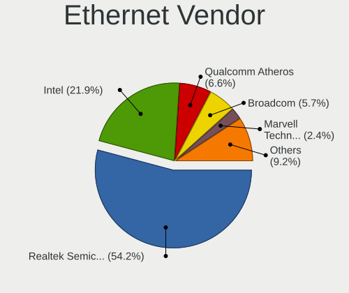

| Vendor                           | Notebooks | Percent |
|----------------------------------|-----------|---------|
| Realtek Semiconductor            | 1199      | 54.16%  |
| Intel                            | 485       | 21.91%  |
| Qualcomm Atheros                 | 146       | 6.59%   |
| Broadcom                         | 126       | 5.69%   |
| Marvell Technology Group         | 54        | 2.44%   |
| ASIX Electronics                 | 33        | 1.49%   |
| Samsung Electronics              | 30        | 1.36%   |
| Nvidia                           | 21        | 0.95%   |
| Broadcom Limited                 | 21        | 0.95%   |
| JMicron Technology               | 19        | 0.86%   |
| Silicon Integrated Systems [SiS] | 11        | 0.5%    |
| DisplayLink                      | 11        | 0.5%    |
| Xiaomi                           | 9         | 0.41%   |
| MediaTek                         | 8         | 0.36%   |
| Lenovo                           | 7         | 0.32%   |
| Hewlett-Packard                  | 6         | 0.27%   |
| OPPO Electronics                 | 5         | 0.23%   |
| Qualcomm                         | 4         | 0.18%   |
| TP-Link                          | 3         | 0.14%   |
| Huawei Technologies              | 3         | 0.14%   |
| Google                           | 3         | 0.14%   |
| Motorola PCS                     | 2         | 0.09%   |
| Apple                            | 2         | 0.09%   |
| T & A Mobile Phones              | 1         | 0.05%   |
| Spreadtrum Communications        | 1         | 0.05%   |
| QinHeng Electronics              | 1         | 0.05%   |
| HMD Global                       | 1         | 0.05%   |
| Attansic Technology              | 1         | 0.05%   |
| ASUSTek Computer                 | 1         | 0.05%   |

Ethernet Model
--------------

Ethernet models

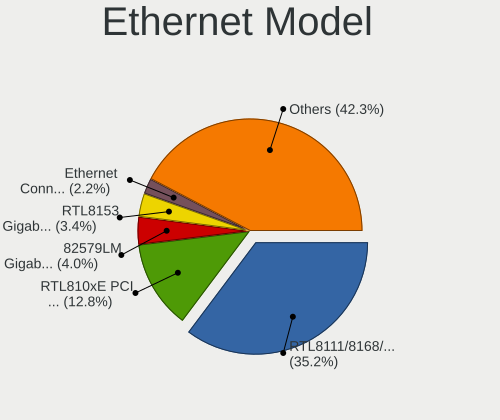

| Model                                                                  | Notebooks | Percent |
|------------------------------------------------------------------------|-----------|---------|
| Realtek RTL8111/8168/8211/8411 PCI Express Gigabit Ethernet Controller | 787       | 35.24%  |
| Realtek RTL810xE PCI Express Fast Ethernet controller                  | 286       | 12.81%  |
| Intel 82579LM Gigabit Network Connection (Lewisville)                  | 89        | 3.99%   |
| Realtek RTL8153 Gigabit Ethernet Adapter                               | 76        | 3.4%    |
| Intel Ethernet Connection (4) I219-LM                                  | 50        | 2.24%   |
| Intel Ethernet Connection (3) I218-LM                                  | 34        | 1.52%   |
| Intel Ethernet Connection I218-LM                                      | 33        | 1.48%   |
| Intel Ethernet Connection I219-LM                                      | 32        | 1.43%   |
| Intel Ethernet Connection I217-LM                                      | 31        | 1.39%   |
| ASIX AX88179 Gigabit Ethernet                                          | 31        | 1.39%   |
| Broadcom NetXtreme BCM57765 Gigabit Ethernet PCIe                      | 29        | 1.3%    |
| Qualcomm Atheros AR8151 v2.0 Gigabit Ethernet                          | 28        | 1.25%   |
| Intel 82577LM Gigabit Network Connection                               | 27        | 1.21%   |
| Samsung Galaxy series, misc. (tethering mode)                          | 23        | 1.03%   |
| Realtek Killer E2600 GbE Controller                                    | 22        | 0.99%   |
| Intel Alder Lake-P PCH CNVi WiFi                                       | 22        | 0.99%   |
| Intel Ethernet Connection I219-V                                       | 21        | 0.94%   |
| Qualcomm Atheros AR8131 Gigabit Ethernet                               | 20        | 0.9%    |
| Realtek RTL8152 Fast Ethernet Adapter                                  | 18        | 0.81%   |
| Nvidia MCP79 Ethernet                                                  | 17        | 0.76%   |
| Marvell Group 88E8040 PCI-E Fast Ethernet Controller                   | 16        | 0.72%   |
| JMicron JMC250 PCI Express Gigabit Ethernet Controller                 | 16        | 0.72%   |
| Qualcomm Atheros AR8162 Fast Ethernet                                  | 15        | 0.67%   |
| Broadcom NetLink BCM57785 Gigabit Ethernet PCIe                        | 15        | 0.67%   |
| Broadcom NetLink BCM57780 Gigabit Ethernet PCIe                        | 15        | 0.67%   |
| Intel 82567LM Gigabit Network Connection                               | 14        | 0.63%   |
| Broadcom NetXtreme BCM5764M Gigabit Ethernet PCIe                      | 14        | 0.63%   |
| Intel Ethernet Connection (4) I219-V                                   | 13        | 0.58%   |
| Broadcom NetXtreme BCM57786 Gigabit Ethernet PCIe                      | 13        | 0.58%   |
| Qualcomm Atheros QCA8172 Fast Ethernet                                 | 12        | 0.54%   |
| Qualcomm Atheros QCA8171 Gigabit Ethernet                              | 12        | 0.54%   |
| Qualcomm Atheros AR8161 Gigabit Ethernet                               | 12        | 0.54%   |
| Qualcomm Atheros AR8152 v2.0 Fast Ethernet                             | 12        | 0.54%   |
| Silicon Integrated Systems [SiS] 191 Gigabit Ethernet Adapter          | 11        | 0.49%   |
| Broadcom NetXtreme BCM5761 Gigabit Ethernet PCIe                       | 11        | 0.49%   |
| Qualcomm Atheros Killer E220x Gigabit Ethernet Controller              | 10        | 0.45%   |
| Realtek RTL8125 2.5GbE Controller                                      | 9         | 0.4%    |
| Marvell Group 88E8055 PCI-E Gigabit Ethernet Controller                | 9         | 0.4%    |
| Intel Ethernet Connection (6) I219-LM                                  | 9         | 0.4%    |
| Samsung GT-I9070 (network tethering, USB debugging enabled)            | 8         | 0.36%   |

Net Controller Kind
-------------------

Ethernet, WiFi or modem

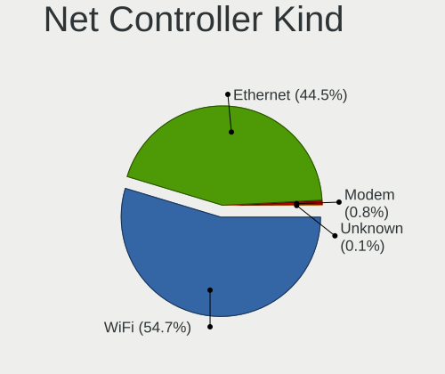

| Kind     | Notebooks | Percent |
|----------|-----------|---------|
| WiFi     | 2577      | 54.66%  |
| Ethernet | 2099      | 44.52%  |
| Modem    | 36        | 0.76%   |
| Unknown  | 3         | 0.06%   |

Used Controller
---------------

Currently used network controller

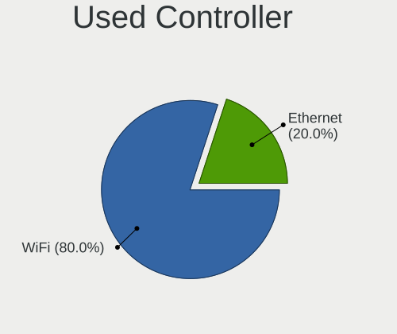

| Kind     | Notebooks | Percent |
|----------|-----------|---------|
| WiFi     | 2208      | 80.03%  |
| Ethernet | 551       | 19.97%  |

NICs
----

Total network controllers on board

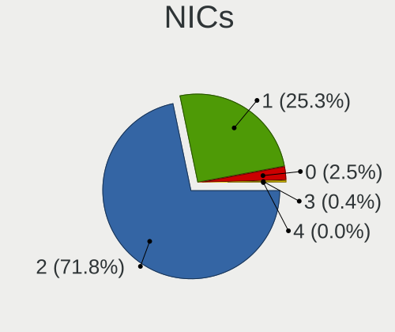

| Total | Notebooks | Percent |
|-------|-----------|---------|
| 2     | 1905      | 71.75%  |
| 1     | 672       | 25.31%  |
| 0     | 66        | 2.49%   |
| 3     | 11        | 0.41%   |
| 4     | 1         | 0.04%   |

IPv6
----

IPv6 vs IPv4

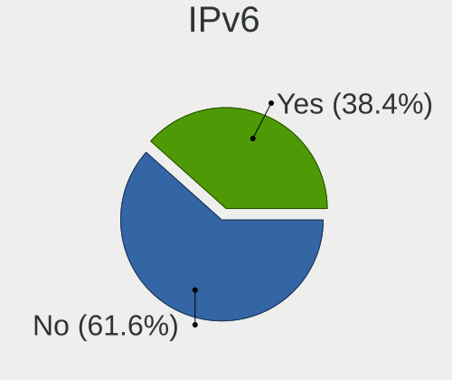

| Used | Notebooks | Percent |
|------|-----------|---------|
| No   | 1651      | 61.6%   |
| Yes  | 1029      | 38.4%   |

Bluetooth
---------

Bluetooth Vendor
----------------

Controller vendors

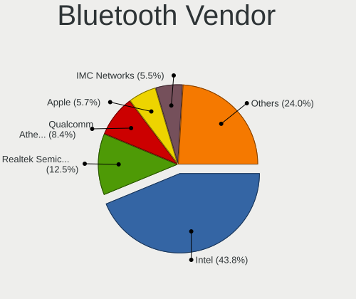

| Vendor                          | Notebooks | Percent |
|---------------------------------|-----------|---------|
| Intel                           | 914       | 43.77%  |
| Realtek Semiconductor           | 261       | 12.5%   |
| Qualcomm Atheros Communications | 176       | 8.43%   |
| Apple                           | 120       | 5.75%   |
| IMC Networks                    | 115       | 5.51%   |
| Lite-On Technology              | 85        | 4.07%   |
| Broadcom                        | 85        | 4.07%   |
| Foxconn / Hon Hai               | 82        | 3.93%   |
| Dell                            | 42        | 2.01%   |
| Hewlett-Packard                 | 36        | 1.72%   |
| Cambridge Silicon Radio         | 36        | 1.72%   |
| Toshiba                         | 35        | 1.68%   |
| Ralink                          | 23        | 1.1%    |
| ASUSTek Computer                | 13        | 0.62%   |
| Realtek                         | 11        | 0.53%   |
| MediaTek                        | 11        | 0.53%   |
| Alps Electric                   | 11        | 0.53%   |
| Foxconn International           | 8         | 0.38%   |
| Ralink Technology               | 5         | 0.24%   |
| TP-Link                         | 3         | 0.14%   |
| Actions                         | 3         | 0.14%   |
| USI                             | 2         | 0.1%    |
| Qcom                            | 2         | 0.1%    |
| Unknown                         | 2         | 0.1%    |
| Taiyo Yuden                     | 1         | 0.05%   |
| Smart Modular Technologies      | 1         | 0.05%   |
| Micro Star International        | 1         | 0.05%   |
| Fujitsu                         | 1         | 0.05%   |
| Dynex                           | 1         | 0.05%   |
| D-Link System                   | 1         | 0.05%   |
| Askey Computer                  | 1         | 0.05%   |

Bluetooth Model
---------------

Controller models

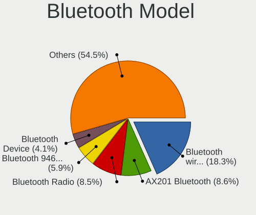

| Model                                                                               | Notebooks | Percent |
|-------------------------------------------------------------------------------------|-----------|---------|
| Intel Bluetooth wireless interface                                                  | 383       | 18.33%  |
| Intel AX201 Bluetooth                                                               | 180       | 8.62%   |
| Realtek Bluetooth Radio                                                             | 178       | 8.52%   |
| Intel Bluetooth 9460/9560 Jefferson Peak (JfP)                                      | 124       | 5.94%   |
| Intel Bluetooth Device                                                              | 86        | 4.12%   |
| Qualcomm Atheros  Bluetooth Device                                                  | 82        | 3.93%   |
| Apple Bluetooth Host Controller                                                     | 73        | 3.49%   |
| Realtek  Bluetooth 4.2 Adapter                                                      | 54        | 2.58%   |
| Intel Centrino Bluetooth Wireless Transceiver                                       | 44        | 2.11%   |
| Qualcomm Atheros AR3012 Bluetooth 4.0                                               | 39        | 1.87%   |
| IMC Networks Wireless_Device                                                        | 38        | 1.82%   |
| Apple Bluetooth USB Host Controller                                                 | 38        | 1.82%   |
| Intel AX200 Bluetooth                                                               | 37        | 1.77%   |
| IMC Networks Bluetooth Radio                                                        | 36        | 1.72%   |
| Cambridge Silicon Radio Bluetooth Dongle (HCI mode)                                 | 36        | 1.72%   |
| Qualcomm Atheros AR3011 Bluetooth                                                   | 31        | 1.48%   |
| IMC Networks Bluetooth Device                                                       | 27        | 1.29%   |
| Lite-On Bluetooth Device                                                            | 24        | 1.15%   |
| Ralink RT3290 Bluetooth                                                             | 23        | 1.1%    |
| Foxconn / Hon Hai Bluetooth Device                                                  | 23        | 1.1%    |
| Lite-On Qualcomm Atheros QCA9377 Bluetooth                                          | 21        | 1.01%   |
| Intel AX210 Bluetooth                                                               | 21        | 1.01%   |
| HP Broadcom 2070 Bluetooth Combo                                                    | 20        | 0.96%   |
| Lite-On Atheros AR3012 Bluetooth                                                    | 17        | 0.81%   |
| Intel Centrino Advanced-N 6230 Bluetooth adapter                                    | 17        | 0.81%   |
| Dell DW375 Bluetooth Module                                                         | 17        | 0.81%   |
| HP Bluetooth 2.0 Interface [Broadcom BCM2045]                                       | 16        | 0.77%   |
| Foxconn / Hon Hai Wireless_Device                                                   | 15        | 0.72%   |
| Broadcom BCM20702 Bluetooth 4.0 [ThinkPad]                                          | 15        | 0.72%   |
| Broadcom BCM2045B (BDC-2.1)                                                         | 13        | 0.62%   |
| Intel Wireless-AC 3168 Bluetooth                                                    | 12        | 0.57%   |
| Realtek Bluetooth Radio                                                             | 11        | 0.53%   |
| Realtek RTL8821A Bluetooth                                                          | 10        | 0.48%   |
| MediaTek Wireless_Device                                                            | 10        | 0.48%   |
| Realtek RTL8723B Bluetooth                                                          | 9         | 0.43%   |
| Qualcomm Atheros QCA61x4 Bluetooth 4.0                                              | 9         | 0.43%   |
| Intel Wireless-AC 9260 Bluetooth Adapter                                            | 9         | 0.43%   |
| Foxconn / Hon Hai Foxconn T77H114 BCM2070 [Single-Chip Bluetooth 2.1 + EDR Adapter] | 9         | 0.43%   |
| Dell BCM20702A0 Bluetooth Module                                                    | 9         | 0.43%   |
| IMC Networks Atheros AR3012 Bluetooth 4.0 Adapter                                   | 8         | 0.38%   |

Sound
-----

Sound Vendor
------------

Sound card vendors

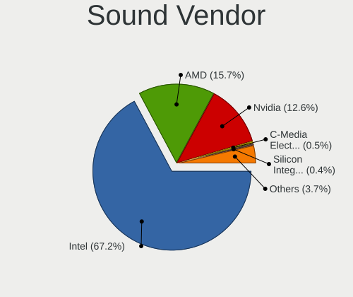

| Vendor                           | Notebooks | Percent |
|----------------------------------|-----------|---------|
| Intel                            | 2167      | 67.17%  |
| AMD                              | 506       | 15.69%  |
| Nvidia                           | 407       | 12.62%  |
| C-Media Electronics              | 16        | 0.5%    |
| Silicon Integrated Systems [SiS] | 12        | 0.37%   |
| Logitech                         | 10        | 0.31%   |
| GN Netcom                        | 8         | 0.25%   |
| Generalplus Technology           | 8         | 0.25%   |
| Realtek Semiconductor            | 7         | 0.22%   |
| Sony                             | 6         | 0.19%   |
| Hewlett-Packard                  | 6         | 0.19%   |
| Apple                            | 6         | 0.19%   |
| Lenovo                           | 5         | 0.15%   |
| Texas Instruments                | 4         | 0.12%   |
| JMTek                            | 4         | 0.12%   |
| Walmart                          | 3         | 0.09%   |
| SteelSeries ApS                  | 3         | 0.09%   |
| Focusrite-Novation               | 3         | 0.09%   |
| ASUSTek Computer                 | 3         | 0.09%   |
| Unknown                          | 3         | 0.09%   |
| Razer USA                        | 2         | 0.06%   |
| Plantronics                      | 2         | 0.06%   |
| OPPO Electronics                 | 2         | 0.06%   |
| M-Audio                          | 2         | 0.06%   |
| KTMICRO                          | 2         | 0.06%   |
| FiiO Electronics Technology      | 2         | 0.06%   |
| Dell                             | 2         | 0.06%   |
| Audient                          | 2         | 0.06%   |
| Yamaha                           | 1         | 0.03%   |
| XMOS                             | 1         | 0.03%   |
| Weltrend Semiconductor           | 1         | 0.03%   |
| TTGK Technology                  | 1         | 0.03%   |
| STMicroelectronics               | 1         | 0.03%   |
| SAVITECH                         | 1         | 0.03%   |
| Samson Technologies              | 1         | 0.03%   |
| Megawin Technology               | 1         | 0.03%   |
| Mackie Designs                   | 1         | 0.03%   |
| LE XIAN                          | 1         | 0.03%   |
| Kingston Technology              | 1         | 0.03%   |
| IK Multimedia                    | 1         | 0.03%   |

Sound Model
-----------

Sound card models

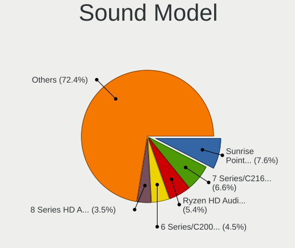

| Model                                                                                             | Notebooks | Percent |
|---------------------------------------------------------------------------------------------------|-----------|---------|
| Intel Sunrise Point-LP HD Audio                                                                   | 298       | 7.59%   |
| Intel 7 Series/C216 Chipset Family High Definition Audio Controller                               | 258       | 6.57%   |
| AMD Ryzen HD Audio Controller                                                                     | 213       | 5.43%   |
| Intel 6 Series/C200 Series Chipset Family High Definition Audio Controller                        | 176       | 4.48%   |
| Intel 8 Series HD Audio Controller                                                                | 138       | 3.52%   |
| Intel Haswell-ULT HD Audio Controller                                                             | 137       | 3.49%   |
| Intel 5 Series/3400 Series Chipset High Definition Audio                                          | 136       | 3.46%   |
| Intel 82801I (ICH9 Family) HD Audio Controller                                                    | 121       | 3.08%   |
| Intel Celeron/Pentium Silver Processor High Definition Audio                                      | 107       | 2.73%   |
| AMD FCH Azalia Controller                                                                         | 105       | 2.68%   |
| Intel Broadwell-U Audio Controller                                                                | 102       | 2.6%    |
| Intel Wildcat Point-LP High Definition Audio Controller                                           | 101       | 2.57%   |
| AMD Renoir/Cezanne HDMI/DP Audio Controller                                                       | 99        | 2.52%   |
| Intel 8 Series/C220 Series Chipset High Definition Audio Controller                               | 98        | 2.5%    |
| Intel Tiger Lake-LP Smart Sound Technology Audio Controller                                       | 92        | 2.34%   |
| Intel Alder Lake PCH-P High Definition Audio Controller                                           | 82        | 2.09%   |
| AMD Kabini HDMI/DP Audio                                                                          | 76        | 1.94%   |
| Intel Xeon E3-1200 v3/4th Gen Core Processor HD Audio Controller                                  | 74        | 1.89%   |
| Intel Raptor Lake-P/U/H cAVS                                                                      | 56        | 1.43%   |
| AMD Raven/Raven2/Fenghuang HDMI/DP Audio Controller                                               | 53        | 1.35%   |
| AMD Radeon High Definition Audio Controller                                                       | 52        | 1.32%   |
| Nvidia GF108 High Definition Audio Controller                                                     | 49        | 1.25%   |
| Intel 82801H (ICH8 Family) HD Audio Controller                                                    | 48        | 1.22%   |
| Intel Cannon Lake PCH cAVS                                                                        | 45        | 1.15%   |
| Intel Cannon Point-LP High Definition Audio Controller                                            | 44        | 1.12%   |
| AMD Family 15h (Models 60h-6fh) Audio Controller                                                  | 43        | 1.1%    |
| AMD SBx00 Azalia (Intel HDA)                                                                      | 41        | 1.04%   |
| Intel Comet Lake PCH-LP cAVS                                                                      | 39        | 0.99%   |
| Intel Celeron N3350/Pentium N4200/Atom E3900 Series Audio Cluster                                 | 37        | 0.94%   |
| Nvidia GA107 High Definition Audio Controller                                                     | 34        | 0.87%   |
| Intel CM238 HD Audio Controller                                                                   | 34        | 0.87%   |
| AMD High Definition Audio Controller                                                              | 31        | 0.79%   |
| Nvidia GP107GL High Definition Audio Controller                                                   | 30        | 0.76%   |
| Nvidia AD107 High Definition Audio Controller                                                     | 30        | 0.76%   |
| Intel Atom/Celeron/Pentium Processor x5-E8000/J3xxx/N3xxx Series High Definition Audio Controller | 30        | 0.76%   |
| Intel Atom Processor Z36xxx/Z37xxx Series High Definition Audio Controller                        | 29        | 0.74%   |
| Intel Ice Lake-LP Smart Sound Technology Audio Controller                                         | 28        | 0.71%   |
| Nvidia High Definition Audio Controller                                                           | 26        | 0.66%   |
| Intel Tiger Lake-H HD Audio Controller                                                            | 26        | 0.66%   |
| Intel Comet Lake PCH cAVS                                                                         | 26        | 0.66%   |

Memory
------

Memory Vendor
-------------

Memory module vendors

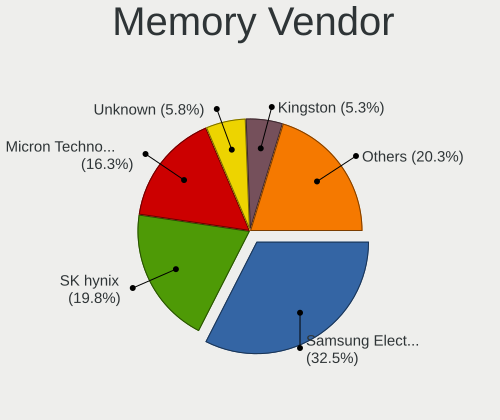

| Vendor              | Notebooks | Percent |
|---------------------|-----------|---------|
| Samsung Electronics | 146       | 32.52%  |
| SK hynix            | 89        | 19.82%  |
| Micron Technology   | 73        | 16.26%  |
| Unknown             | 26        | 5.79%   |
| Kingston            | 24        | 5.35%   |
| Crucial             | 17        | 3.79%   |
| Unknown (ABCD)      | 14        | 3.12%   |
| A-DATA Technology   | 9         | 2%      |
| Elpida              | 8         | 1.78%   |
| Ramaxel Technology  | 7         | 1.56%   |
| Unknown             | 6         | 1.34%   |
| Smart               | 4         | 0.89%   |
| Corsair             | 4         | 0.89%   |
| Transcend           | 2         | 0.45%   |
| Teikon              | 2         | 0.45%   |
| Team                | 2         | 0.45%   |
| Smart Brazil        | 2         | 0.45%   |
| G.Skill             | 2         | 0.45%   |
| Timetec             | 1         | 0.22%   |
| Super Talent        | 1         | 0.22%   |
| Lexar Co Limited    | 1         | 0.22%   |
| Lexar               | 1         | 0.22%   |
| INNOVATION PC       | 1         | 0.22%   |
| HT Micron           | 1         | 0.22%   |
| ChangXin Memory     | 1         | 0.22%   |
| Axiom               | 1         | 0.22%   |
| Avant               | 1         | 0.22%   |
| ASint Technology    | 1         | 0.22%   |
| Apacer              | 1         | 0.22%   |
| 2B0B00000000        | 1         | 0.22%   |

Memory Model
------------

Memory module models

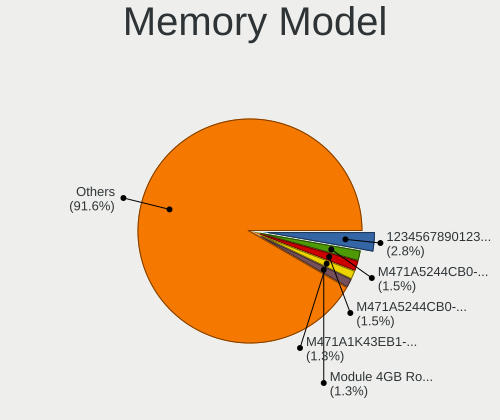

| Model                                                            | Notebooks | Percent |
|------------------------------------------------------------------|-----------|---------|
| Unknown (ABCD) RAM 123456789012345678 2GB SODIMM LPDDR4 2400MT/s | 13        | 2.78%   |
| Samsung RAM M471A5244CB0-CWE 4GB SODIMM DDR4 3200MT/s            | 7         | 1.5%    |
| Samsung RAM M471A5244CB0-CTD 4GB SODIMM DDR4 3266MT/s            | 7         | 1.5%    |
| Samsung RAM M471A1K43EB1-CWE 8GB SODIMM DDR4 3200MT/s            | 6         | 1.28%   |
| Unknown                                                          | 6         | 1.28%   |
| SK hynix RAM HMT351S6CFR8C-PB 4GB SODIMM DDR3 1600MT/s           | 5         | 1.07%   |
| Samsung RAM M471B5273CH0-CH9 4GB SODIMM DDR3 1334MT/s            | 5         | 1.07%   |
| Samsung RAM M471B1G73EB0-YK0 8192MB SODIMM DDR3 1600MT/s         | 5         | 1.07%   |
| Samsung RAM M471A1K43DB1-CTD 8GB SODIMM DDR4 2667MT/s            | 5         | 1.07%   |
| Micron RAM 4ATF1G64HZ-3G2F1 8GB SODIMM DDR4 3200MT/s             | 5         | 1.07%   |
| SK hynix RAM HMAA1GS6CJR6N-XN 8GB Row Of Chips DDR4 3200MT/s     | 4         | 0.86%   |
| SK hynix RAM HMA81GS6AFR8N-UH 8GB SODIMM DDR4 2667MT/s           | 4         | 0.86%   |
| Samsung RAM Module 8GB SODIMM DDR4 2400MT/s                      | 4         | 0.86%   |
| Samsung RAM M471B5273DH0-CH9 4GB SODIMM DDR3 1600MT/s            | 4         | 0.86%   |
| Samsung RAM M471B1G73DB0-YK0 8GB SODIMM DDR3 1600MT/s            | 4         | 0.86%   |
| Samsung RAM M471A1G44BB0-CWE 8GB SODIMM DDR4 3200MT/s            | 4         | 0.86%   |
| Samsung RAM M471A1G44AB0-CWE 8GiB SODIMM DDR4 3200MT/s           | 4         | 0.86%   |
| Samsung RAM M471A1G44AB0-CWE 8GB Row Of Chips DDR4 3200MT/s      | 4         | 0.86%   |
| Samsung RAM M425R1GB4BB0-CQKOL 8GB SODIMM DDR5 4800MT/s          | 4         | 0.86%   |
| Unknown RAM Module 4GB SODIMM DDR3                               | 3         | 0.64%   |
| Unknown RAM Module 2GB SODIMM SDRAM                              | 3         | 0.64%   |
| Unknown RAM Module 2GB SODIMM DDR2 667MT/s                       | 3         | 0.64%   |
| SK hynix RAM Module 4GB SODIMM DDR3 1600MT/s                     | 3         | 0.64%   |
| SK hynix RAM HMT451S6BFR8A-PB 4GB SODIMM DDR3 1600MT/s           | 3         | 0.64%   |
| SK hynix RAM HMAA1GS6CJR6N-XN 8GB SODIMM DDR4 3200MT/s           | 3         | 0.64%   |
| SK hynix RAM HMA851S6CJR6N-VK 4GB SODIMM DDR4 2667MT/s           | 3         | 0.64%   |
| Samsung RAM M471B5173EB0-YK0 4GB SODIMM DDR3 1600MT/s            | 3         | 0.64%   |
| Samsung RAM M471A5244CB0-CRC 4GB SODIMM DDR4 2667MT/s            | 3         | 0.64%   |
| Samsung RAM M471A1K43BB0-CPB 8GiB SODIMM DDR4 2133MT/s           | 3         | 0.64%   |
| Micron RAM MTC4C10163S1SC56BD1 8GB SODIMM DDR5 5600MT/s          | 3         | 0.64%   |
| Micron RAM MTC4C10163S1SC48BA1 8GB SODIMM DDR5 4800MT/s          | 3         | 0.64%   |
| Micron RAM MT62F1G32D4DR-031 2GB Row Of Chips LPDDR5 6400MT/s    | 3         | 0.64%   |
| Micron RAM 8KTF51264HZ-1G6E1 4GB SODIMM DDR3 1600MT/s            | 3         | 0.64%   |
| Micron RAM 4ATF51264HZ-2G6E1 4GB SODIMM DDR4 2667MT/s            | 3         | 0.64%   |
| Micron RAM 4ATF1G64HZ-3G2E1 8GB Row Of Chips DDR4 3200MT/s       | 3         | 0.64%   |
| Unknown RAM Module 4GB SODIMM DDR4 2400MT/s                      | 2         | 0.43%   |
| Unknown RAM Module 4GB SODIMM DDR3 1600MT/s                      | 2         | 0.43%   |
| Unknown RAM Module 2GB SODIMM DDR2 800MT/s                       | 2         | 0.43%   |
| SK hynix RAM Module 8GB SODIMM DDR4 2400MT/s                     | 2         | 0.43%   |
| SK hynix RAM Module 4GB SODIMM LPDDR3 1867MT/s                   | 2         | 0.43%   |

Memory Kind
-----------

Memory module kinds

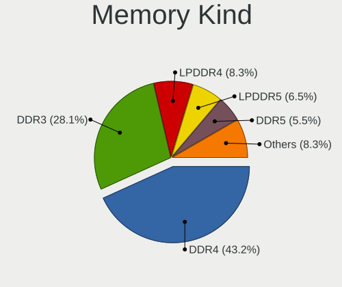

| Kind    | Notebooks | Percent |
|---------|-----------|---------|
| DDR4    | 166       | 43.23%  |
| DDR3    | 108       | 28.13%  |
| LPDDR4  | 32        | 8.33%   |
| LPDDR5  | 25        | 6.51%   |
| DDR5    | 21        | 5.47%   |
| DDR2    | 13        | 3.39%   |
| SDRAM   | 10        | 2.6%    |
| LPDDR3  | 7         | 1.82%   |
| DDR     | 1         | 0.26%   |
| Unknown | 1         | 0.26%   |

Memory Form Factor
------------------

Physical design of the memory module

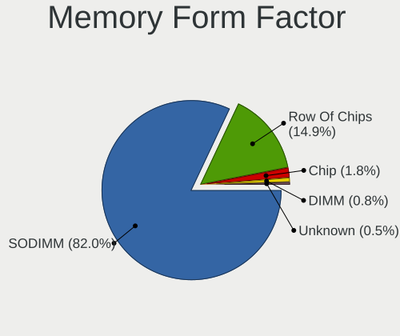

| Name         | Notebooks | Percent |
|--------------|-----------|---------|
| SODIMM       | 319       | 82.01%  |
| Row Of Chips | 58        | 14.91%  |
| Chip         | 7         | 1.8%    |
| DIMM         | 3         | 0.77%   |
| Unknown      | 2         | 0.51%   |

Memory Size
-----------

Memory module size

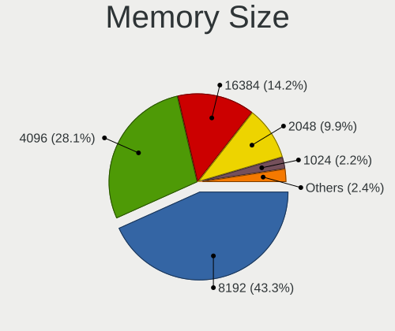

| Size  | Notebooks | Percent |
|-------|-----------|---------|
| 8192  | 180       | 43.27%  |
| 4096  | 117       | 28.13%  |
| 16384 | 59        | 14.18%  |
| 2048  | 41        | 9.86%   |
| 1024  | 9         | 2.16%   |
| 32768 | 6         | 1.44%   |
| 12288 | 2         | 0.48%   |
| 49152 | 1         | 0.24%   |
| 512   | 1         | 0.24%   |

Memory Speed
------------

Memory module speed

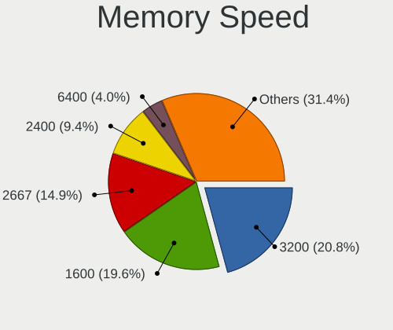

| Speed   | Notebooks | Percent |
|---------|-----------|---------|
| 3200    | 84        | 20.79%  |
| 1600    | 79        | 19.55%  |
| 2667    | 60        | 14.85%  |
| 2400    | 38        | 9.41%   |
| 6400    | 16        | 3.96%   |
| 4800    | 12        | 2.97%   |
| 2133    | 10        | 2.48%   |
| 1334    | 10        | 2.48%   |
| 1333    | 10        | 2.48%   |
| Unknown | 10        | 2.48%   |
| 5600    | 9         | 2.23%   |
| 4267    | 9         | 2.23%   |
| 1067    | 9         | 2.23%   |
| 3266    | 7         | 1.73%   |
| 667     | 6         | 1.49%   |
| 1867    | 5         | 1.24%   |
| 7500    | 4         | 0.99%   |
| 4199    | 4         | 0.99%   |
| 800     | 4         | 0.99%   |
| 7467    | 3         | 0.74%   |
| 8400    | 2         | 0.5%    |
| 4266    | 2         | 0.5%    |
| 3733    | 2         | 0.5%    |
| 2048    | 2         | 0.5%    |
| 1066    | 2         | 0.5%    |
| 8533    | 1         | 0.25%   |
| 5500    | 1         | 0.25%   |
| 2933    | 1         | 0.25%   |
| 975     | 1         | 0.25%   |
| 533     | 1         | 0.25%   |

Printers & scanners
-------------------

Printer Vendor
--------------

Printer device vendors

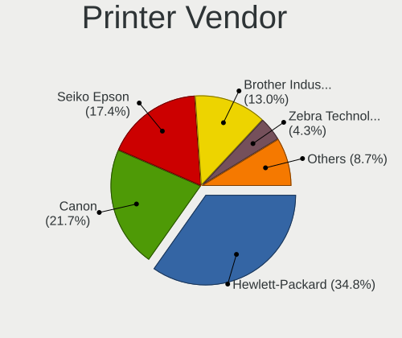

| Vendor              | Notebooks | Percent |
|---------------------|-----------|---------|
| Hewlett-Packard     | 8         | 34.78%  |
| Canon               | 5         | 21.74%  |
| Seiko Epson         | 4         | 17.39%  |
| Brother Industries  | 3         | 13.04%  |
| Zebra Technologies  | 1         | 4.35%   |
| Samsung Electronics | 1         | 4.35%   |
| Dymo-CoStar         | 1         | 4.35%   |

Printer Model
-------------

Printer device models

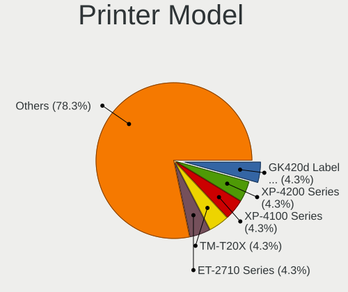

| Model                       | Notebooks | Percent |
|-----------------------------|-----------|---------|
| Zebra GK420d Label Printer  | 1         | 4.35%   |
| Seiko Epson XP-4200 Series  | 1         | 4.35%   |
| Seiko Epson XP-4100 Series  | 1         | 4.35%   |
| Seiko Epson TM-T20X         | 1         | 4.35%   |
| Seiko Epson ET-2710 Series  | 1         | 4.35%   |
| Samsung C43x Series         | 1         | 4.35%   |
| HP Smart Tank 500 series    | 1         | 4.35%   |
| HP Printing Support         | 1         | 4.35%   |
| HP LaserJet M14-M17         | 1         | 4.35%   |
| HP LaserJet 1020            | 1         | 4.35%   |
| HP LaserJet 1010            | 1         | 4.35%   |
| HP ENVY 4520 series         | 1         | 4.35%   |
| HP DeskJet 2700 series      | 1         | 4.35%   |
| HP DeskJet 2130 series      | 1         | 4.35%   |
| Dymo-CoStar LabelWriter 450 | 1         | 4.35%   |
| Canon TS3100 series         | 1         | 4.35%   |
| Canon TR4500 series         | 1         | 4.35%   |
| Canon PIXMA MX530 Series    | 1         | 4.35%   |
| Canon PIXMA MG3600 Series   | 1         | 4.35%   |
| Canon MB2100 series         | 1         | 4.35%   |
| Brother MFC-J200            | 1         | 4.35%   |
| Brother HL-L2350DW series   | 1         | 4.35%   |
| Brother DCP-1610W           | 1         | 4.35%   |

Scanner Vendor
--------------

Scanner device vendors

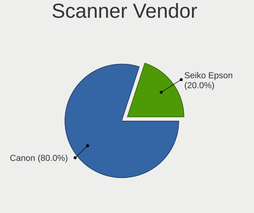

| Vendor      | Notebooks | Percent |
|-------------|-----------|---------|
| Canon       | 4         | 80%     |
| Seiko Epson | 1         | 20%     |

Scanner Model
-------------

Scanner device models

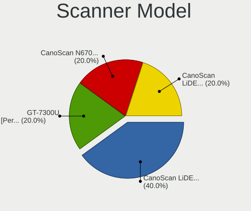

| Model                                             | Notebooks | Percent |
|---------------------------------------------------|-----------|---------|
| Canon CanoScan LiDE 110                           | 2         | 40%     |
| Seiko Epson GT-7300U [Perfection 1260/1260 PHOTO] | 1         | 20%     |
| Canon CanoScan N670U/N676U/LiDE 20                | 1         | 20%     |
| Canon CanoScan LiDE 200                           | 1         | 20%     |

Camera
------

Camera Vendor
-------------

Camera device vendors

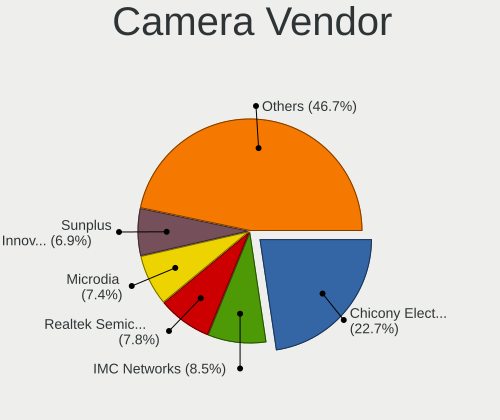

| Vendor                                 | Notebooks | Percent |
|----------------------------------------|-----------|---------|
| Chicony Electronics                    | 531       | 22.65%  |
| IMC Networks                           | 199       | 8.49%   |
| Realtek Semiconductor                  | 184       | 7.85%   |
| Microdia                               | 174       | 7.42%   |
| Sunplus Innovation Technology          | 161       | 6.87%   |
| Bison Electronics                      | 150       | 6.4%    |
| Quanta                                 | 132       | 5.63%   |
| Suyin                                  | 108       | 4.61%   |
| Cheng Uei Precision Industry (Foxlink) | 93        | 3.97%   |
| Apple                                  | 81        | 3.46%   |
| Lite-On Technology                     | 50        | 2.13%   |
| Silicon Motion                         | 49        | 2.09%   |
| Syntek                                 | 48        | 2.05%   |
| Luxvisions Innotech Limited            | 40        | 1.71%   |
| Alcor Micro                            | 38        | 1.62%   |
| Sonix Technology                       | 35        | 1.49%   |
| Ricoh                                  | 31        | 1.32%   |
| SunplusIT                              | 25        | 1.07%   |
| Logitech                               | 21        | 0.9%    |
| icSpring                               | 20        | 0.85%   |
| Shinetech                              | 19        | 0.81%   |
| Importek                               | 14        | 0.6%    |
| Acer                                   | 14        | 0.6%    |
| Samsung Electronics                    | 11        | 0.47%   |
| Primax Electronics                     | 10        | 0.43%   |
| ALi                                    | 10        | 0.43%   |
| Unknown                                | 9         | 0.38%   |
| Y Media                                | 8         | 0.34%   |
| Lenovo                                 | 8         | 0.34%   |
| Shine-optics                           | 7         | 0.3%    |
| DigiTech                               | 5         | 0.21%   |
| OmniVision Technologies                | 4         | 0.17%   |
| Genesys Logic                          | 4         | 0.17%   |
| Sunplus Technology                     | 3         | 0.13%   |
| Tripath Technology                     | 2         | 0.09%   |
| Sunwingroup                            | 2         | 0.09%   |
| SenseTek                               | 2         | 0.09%   |
| Nebraska Furniture Mart                | 2         | 0.09%   |
| Microsoft                              | 2         | 0.09%   |
| MacroSilicon                           | 2         | 0.09%   |

Camera Model
------------

Camera device models

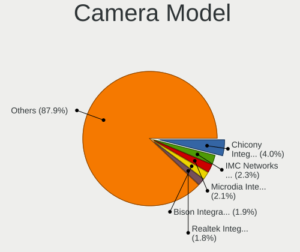

| Model                                                          | Notebooks | Percent |
|----------------------------------------------------------------|-----------|---------|
| Chicony Integrated Camera                                      | 93        | 3.95%   |
| IMC Networks USB2.0 HD UVC WebCam                              | 55        | 2.34%   |
| Microdia Integrated_Webcam_HD                                  | 49        | 2.08%   |
| Bison Integrated Camera                                        | 45        | 1.91%   |
| Realtek Integrated_Webcam_HD                                   | 42        | 1.78%   |
| IMC Networks Integrated Camera                                 | 40        | 1.7%    |
| Sunplus Integrated_Webcam_HD                                   | 38        | 1.61%   |
| Chicony HD WebCam                                              | 34        | 1.44%   |
| Apple Built-in iSight                                          | 33        | 1.4%    |
| Realtek USB Camera                                             | 28        | 1.19%   |
| IMC Networks USB2.0 VGA UVC WebCam                             | 27        | 1.15%   |
| Chicony HP Truevision HD camera                                | 27        | 1.15%   |
| Apple FaceTime HD Camera                                       | 26        | 1.1%    |
| Chicony HP TrueVision HD                                       | 25        | 1.06%   |
| Microdia Integrated Webcam                                     | 24        | 1.02%   |
| Syntek Integrated Camera                                       | 23        | 0.98%   |
| Suyin HP TrueVision HD                                         | 23        | 0.98%   |
| Sunplus HD WebCam                                              | 23        | 0.98%   |
| Chicony EasyCamera                                             | 21        | 0.89%   |
| icSpring camera                                                | 20        | 0.85%   |
| Chicony HP HD Camera                                           | 20        | 0.85%   |
| Bison Lenovo EasyCamera                                        | 20        | 0.85%   |
| Chicony TOSHIBA Web Camera - HD                                | 19        | 0.81%   |
| Sonix USB2.0 HD UVC WebCam                                     | 17        | 0.72%   |
| Quanta HD User Facing                                          | 17        | 0.72%   |
| Chicony FJ Camera                                              | 17        | 0.72%   |
| Alcor Micro USB 2.0 Camera                                     | 17        | 0.72%   |
| Microdia Laptop_Integrated_Webcam_HD                           | 16        | 0.68%   |
| Lite-On Integrated Camera                                      | 16        | 0.68%   |
| Lite-On HP HD Camera                                           | 16        | 0.68%   |
| Chicony HP HD Webcam                                           | 16        | 0.68%   |
| Cheng Uei Precision Industry (Foxlink) HP Truevision HD        | 15        | 0.64%   |
| Sunplus Laptop Integrated Webcam HD                            | 14        | 0.59%   |
| Cheng Uei Precision Industry (Foxlink) HP TrueVision HD Camera | 14        | 0.59%   |
| Sonix USB2.0 FHD UVC WebCam                                    | 13        | 0.55%   |
| Realtek Integrated Webcam                                      | 13        | 0.55%   |
| Quanta HP TrueVision HD Camera                                 | 13        | 0.55%   |
| Quanta HP HD Camera                                            | 13        | 0.55%   |
| Luxvisions Innotech Limited HP TrueVision HD Camera            | 13        | 0.55%   |
| Chicony HD User Facing                                         | 13        | 0.55%   |

Security
--------

Fingerprint Vendor
------------------

Fingerprint sensor vendors

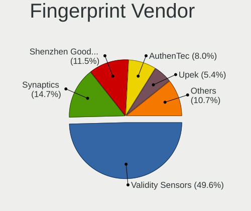

| Vendor                             | Notebooks | Percent |
|------------------------------------|-----------|---------|
| Validity Sensors                   | 185       | 49.6%   |
| Synaptics                          | 55        | 14.75%  |
| Shenzhen Goodix Technology         | 43        | 11.53%  |
| AuthenTec                          | 30        | 8.04%   |
| Upek                               | 20        | 5.36%   |
| Elan Microelectronics              | 15        | 4.02%   |
| LighTuning Technology              | 13        | 3.49%   |
| STMicroelectronics                 | 5         | 1.34%   |
| Realtek USB2.0 Finger Print Bridge | 3         | 0.8%    |
| Focal-systems.Corp                 | 2         | 0.54%   |
| Samsung Electronics                | 1         | 0.27%   |
| HOLTEK                             | 1         | 0.27%   |

Fingerprint Model
-----------------

Fingerprint sensor models

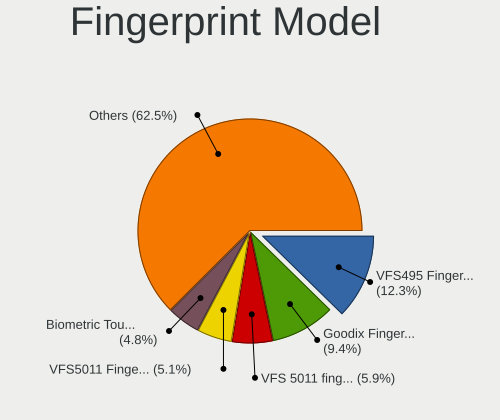

| Model                                                                      | Notebooks | Percent |
|----------------------------------------------------------------------------|-----------|---------|
| Validity Sensors VFS495 Fingerprint Reader                                 | 46        | 12.33%  |
| Shenzhen Goodix  FingerPrint Device                                        | 35        | 9.38%   |
| Validity Sensors VFS 5011 fingerprint sensor                               | 22        | 5.9%    |
| Validity Sensors VFS5011 Fingerprint Reader                                | 19        | 5.09%   |
| Upek Biometric Touchchip/Touchstrip Fingerprint Sensor                     | 18        | 4.83%   |
| Validity Sensors VFS471 Fingerprint Reader                                 | 15        | 4.02%   |
| Validity Sensors Synaptics WBDI                                            | 15        | 4.02%   |
| Synaptics Metallica MIS Touch Fingerprint Reader                           | 15        | 4.02%   |
| Validity Sensors Fingerprint scanner                                       | 12        | 3.22%   |
| Validity Sensors Swipe Fingerprint Sensor                                  | 11        | 2.95%   |
| Validity Sensors VFS491                                                    | 10        | 2.68%   |
| Validity Sensors Synaptics VFS7552 Touch Fingerprint Sensor with PurePrint | 10        | 2.68%   |
| Synaptics Prometheus MIS Touch Fingerprint Reader                          | 10        | 2.68%   |
| Elan ELAN:ARM-M4                                                           | 9         | 2.41%   |
| AuthenTec Fingerprint Sensor                                               | 9         | 2.41%   |
| Validity Sensors VFS7500 Touch Fingerprint Sensor                          | 8         | 2.14%   |
| Validity Sensors VFS451 Fingerprint Reader                                 | 8         | 2.14%   |
| Synaptics FS7604 Touch Fingerprint Sensor with PurePrint                   | 8         | 2.14%   |
| Synaptics Fingerprint reader [HP G6]                                       | 8         | 2.14%   |
| AuthenTec AES1600                                                          | 8         | 2.14%   |
| Elan ELAN:Fingerprint                                                      | 6         | 1.61%   |
| AuthenTec AES2501 Fingerprint Sensor                                       | 6         | 1.61%   |
| Synaptics Metallica MOH Touch Fingerprint Reader                           | 5         | 1.34%   |
| STMicroelectronics Fingerprint Reader                                      | 5         | 1.34%   |
| LighTuning Fingerprint Reader                                              | 5         | 1.34%   |
| AuthenTec AES2810                                                          | 5         | 1.34%   |
| Validity Sensors VFS301 Fingerprint Reader                                 | 4         | 1.07%   |
| Shenzhen Goodix Fingerprint Reader                                         | 4         | 1.07%   |
| Shenzhen Goodix FingerPrint                                                | 4         | 1.07%   |
| LighTuning ES603 Swipe Fingerprint Sensor                                  | 4         | 1.07%   |
| LighTuning EgisTec Touch Fingerprint Sensor                                | 4         | 1.07%   |
| Validity Sensors VFS Fingerprint sensor                                    | 3         | 0.8%    |
| Synaptics UWP WBDI Device                                                  | 3         | 0.8%    |
| Realtek USB2.0 Finger Print Bridge FocalTech Fingerprint Device            | 3         | 0.8%    |
| Validity Sensors VFS101 Fingerprint Reader                                 | 2         | 0.54%   |
| Upek TCS5B Fingerprint sensor                                              | 2         | 0.54%   |
| Synaptics UWP WBDI                                                         | 2         | 0.54%   |
| Synaptics  WBDI                                                            | 2         | 0.54%   |
| Synaptics  FS7604 Touch Fingerprint Sensor with PurePrint                  | 2         | 0.54%   |
| Focal-systems.Corp FT9201Fingerprint.                                      | 2         | 0.54%   |

Chipcard Vendor
---------------

Chipcard module vendors

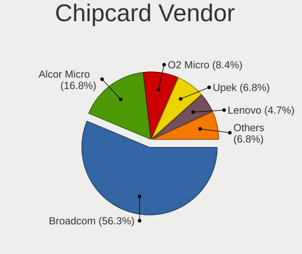

| Vendor                            | Notebooks | Percent |
|-----------------------------------|-----------|---------|
| Broadcom                          | 107       | 56.32%  |
| Alcor Micro                       | 32        | 16.84%  |
| O2 Micro                          | 16        | 8.42%   |
| Upek                              | 13        | 6.84%   |
| Lenovo                            | 9         | 4.74%   |
| SCM Microsystems                  | 4         | 2.11%   |
| Gemalto (was Gemplus)             | 2         | 1.05%   |
| VASCO Data Security International | 1         | 0.53%   |
| Reiner SCT Kartensysteme          | 1         | 0.53%   |
| Chicony Electronics               | 1         | 0.53%   |
| Bit4id                            | 1         | 0.53%   |
| Athena Smartcard Solutions        | 1         | 0.53%   |
| Aktiv                             | 1         | 0.53%   |
| Advanced Card Systems             | 1         | 0.53%   |

Chipcard Model
--------------

Chipcard module models

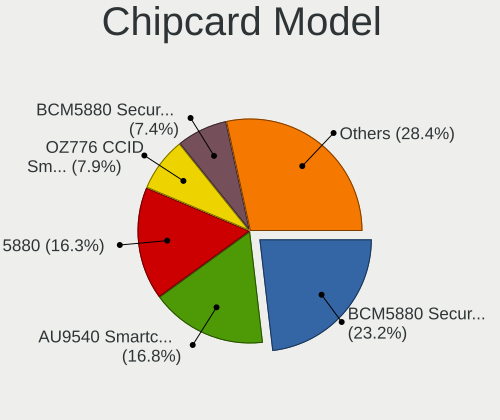

| Model                                                                        | Notebooks | Percent |
|------------------------------------------------------------------------------|-----------|---------|
| Broadcom BCM5880 Secure Applications Processor                               | 44        | 23.16%  |
| Alcor Micro AU9540 Smartcard Reader                                          | 32        | 16.84%  |
| Broadcom 5880                                                                | 31        | 16.32%  |
| O2 Micro OZ776 CCID Smartcard Reader                                         | 15        | 7.89%   |
| Broadcom BCM5880 Secure Applications Processor with fingerprint swipe sensor | 14        | 7.37%   |
| Upek TouchChip Fingerprint Coprocessor (WBF advanced mode)                   | 13        | 6.84%   |
| Broadcom BCM58200 ControlVault 3 (FingerPrint sensor + Contacted SmartCard)  | 12        | 6.32%   |
| Lenovo Integrated Smart Card Reader                                          | 9         | 4.74%   |
| Broadcom 58200                                                               | 6         | 3.16%   |
| SCM Microsystems SCR35xx Smart Card Reader                                   | 2         | 1.05%   |
| VASCO Data Security International DIGIPASS 870                               | 1         | 0.53%   |
| SCM Microsystems SCR3340 - ExpressCard54 Smart Card Reader                   | 1         | 0.53%   |
| SCM Microsystems SCR331-LC1 / SCR3310 SmartCard Reader                       | 1         | 0.53%   |
| Reiner SCT Kartensysteme cyberJack RFID basis contactless smartcard reader   | 1         | 0.53%   |
| O2 Micro Oz776 SmartCard Reader                                              | 1         | 0.53%   |
| Gemalto (was Gemplus) GemPC Twin SmartCard Reader                            | 1         | 0.53%   |
| Gemalto (was Gemplus) Compact Smart Card Reader Writer                       | 1         | 0.53%   |
| Chicony Electronics HP Skylab USB Smartcard Keyboard                         | 1         | 0.53%   |
| Bit4id miniLector EVO                                                        | 1         | 0.53%   |
| Athena Smartcard Solutions ASEDrive V3C                                      | 1         | 0.53%   |
| Aktiv Rutoken lite                                                           | 1         | 0.53%   |
| Advanced Card Systems ACR39U                                                 | 1         | 0.53%   |

Unsupported
-----------

Unsupported Devices
-------------------

Total unsupported devices on board

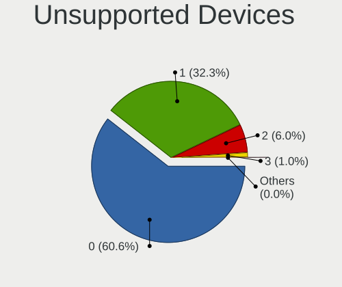

| Total | Notebooks | Percent |
|-------|-----------|---------|
| 0     | 1629      | 60.58%  |
| 1     | 869       | 32.32%  |
| 2     | 160       | 5.95%   |
| 3     | 27        | 1%      |
| 5     | 3         | 0.11%   |
| 4     | 1         | 0.04%   |

Unsupported Device Types
------------------------

Types of unsupported devices

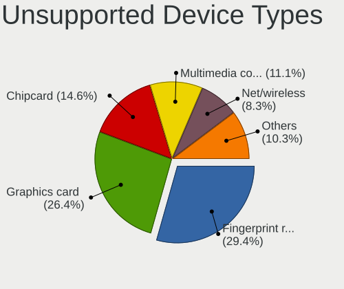

| Type                     | Notebooks | Percent |
|--------------------------|-----------|---------|
| Fingerprint reader       | 369       | 29.38%  |
| Graphics card            | 331       | 26.35%  |
| Chipcard                 | 184       | 14.65%  |
| Multimedia controller    | 139       | 11.07%  |
| Net/wireless             | 104       | 8.28%   |
| Storage                  | 33        | 2.63%   |
| Bluetooth                | 33        | 2.63%   |
| Camera                   | 29        | 2.31%   |
| Sound                    | 9         | 0.72%   |
| Net/ethernet             | 6         | 0.48%   |
| Communication controller | 6         | 0.48%   |
| Card reader              | 4         | 0.32%   |
| Network                  | 3         | 0.24%   |
| Storage/ide              | 2         | 0.16%   |
| Modem                    | 2         | 0.16%   |
| Unclassified device      | 1         | 0.08%   |
| Storage/nvme             | 1         | 0.08%   |

