Zorin 17 - Tested Hardware & Statistics (Notebooks)
---------------------------------------------------

A project to collect tested hardware configurations for Zorin 17.

Anyone can contribute to this report by the [hw-probe](https://github.com/linuxhw/hw-probe) tool:

    sudo -E hw-probe -all -upload

Please contribute! Especially if your hardware is rare.

Contents
--------

* [ Test Cases ](#test-cases)

* [ System ](#system)
  - [ Kernel                   ](#kernel)
  - [ Kernel Family            ](#kernel-family)
  - [ Kernel Major Ver.        ](#kernel-major-ver)
  - [ Arch                     ](#arch)
  - [ DE                       ](#de)
  - [ Display Server           ](#display-server)
  - [ Display Manager          ](#display-manager)
  - [ OS Lang                  ](#os-lang)
  - [ Boot Mode                ](#boot-mode)
  - [ Filesystem               ](#filesystem)
  - [ Part. scheme             ](#part-scheme)
  - [ Dual Boot with Linux/BSD ](#dual-boot-with-linuxbsd)
  - [ Dual Boot (Win)          ](#dual-boot-win)

* [ Board ](#board)
  - [ Vendor                   ](#vendor)
  - [ Model                    ](#model)
  - [ Model Family             ](#model-family)
  - [ MFG Year                 ](#mfg-year)
  - [ Form Factor              ](#form-factor)
  - [ Secure Boot              ](#secure-boot)
  - [ Coreboot                 ](#coreboot)
  - [ RAM Size                 ](#ram-size)
  - [ RAM Used                 ](#ram-used)
  - [ Total Drives             ](#total-drives)
  - [ Has CD-ROM               ](#has-cd-rom)
  - [ Has Ethernet             ](#has-ethernet)
  - [ Has WiFi                 ](#has-wifi)
  - [ Has Bluetooth            ](#has-bluetooth)

* [ Location ](#location)
  - [ Country                  ](#country)
  - [ City                     ](#city)

* [ Drives ](#drives)
  - [ Drive Vendor             ](#drive-vendor)
  - [ Drive Model              ](#drive-model)
  - [ HDD Vendor               ](#hdd-vendor)
  - [ SSD Vendor               ](#ssd-vendor)
  - [ Drive Kind               ](#drive-kind)
  - [ Drive Connector          ](#drive-connector)
  - [ Drive Size               ](#drive-size)
  - [ Space Total              ](#space-total)
  - [ Space Used               ](#space-used)
  - [ Malfunc. Drives          ](#malfunc-drives)
  - [ Malfunc. Drive Vendor    ](#malfunc-drive-vendor)
  - [ Malfunc. HDD Vendor      ](#malfunc-hdd-vendor)
  - [ Malfunc. Drive Kind      ](#malfunc-drive-kind)
  - [ Failed Drives            ](#failed-drives)
  - [ Failed Drive Vendor      ](#failed-drive-vendor)
  - [ Drive Status             ](#drive-status)

* [ Storage controller ](#storage-controller)
  - [ Storage Vendor           ](#storage-vendor)
  - [ Storage Model            ](#storage-model)
  - [ Storage Kind             ](#storage-kind)

* [ Processor ](#processor)
  - [ CPU Vendor               ](#cpu-vendor)
  - [ CPU Model                ](#cpu-model)
  - [ CPU Model Family         ](#cpu-model-family)
  - [ CPU Cores                ](#cpu-cores)
  - [ CPU Sockets              ](#cpu-sockets)
  - [ CPU Threads              ](#cpu-threads)
  - [ CPU Op-Modes             ](#cpu-op-modes)
  - [ CPU Microcode            ](#cpu-microcode)
  - [ CPU Microarch            ](#cpu-microarch)

* [ Graphics ](#graphics)
  - [ GPU Vendor               ](#gpu-vendor)
  - [ GPU Model                ](#gpu-model)
  - [ GPU Combo                ](#gpu-combo)
  - [ GPU Driver               ](#gpu-driver)
  - [ GPU Memory               ](#gpu-memory)

* [ Monitor ](#monitor)
  - [ Monitor Vendor           ](#monitor-vendor)
  - [ Monitor Model            ](#monitor-model)
  - [ Monitor Resolution       ](#monitor-resolution)
  - [ Monitor Diagonal         ](#monitor-diagonal)
  - [ Monitor Width            ](#monitor-width)
  - [ Aspect Ratio             ](#aspect-ratio)
  - [ Monitor Area             ](#monitor-area)
  - [ Pixel Density            ](#pixel-density)
  - [ Multiple Monitors        ](#multiple-monitors)

* [ Network ](#network)
  - [ Net Controller Vendor    ](#net-controller-vendor)
  - [ Net Controller Model     ](#net-controller-model)
  - [ Wireless Vendor          ](#wireless-vendor)
  - [ Wireless Model           ](#wireless-model)
  - [ Ethernet Vendor          ](#ethernet-vendor)
  - [ Ethernet Model           ](#ethernet-model)
  - [ Net Controller Kind      ](#net-controller-kind)
  - [ Used Controller          ](#used-controller)
  - [ NICs                     ](#nics)
  - [ IPv6                     ](#ipv6)

* [ Bluetooth ](#bluetooth)
  - [ Bluetooth Vendor         ](#bluetooth-vendor)
  - [ Bluetooth Model          ](#bluetooth-model)

* [ Sound ](#sound)
  - [ Sound Vendor             ](#sound-vendor)
  - [ Sound Model              ](#sound-model)

* [ Memory ](#memory)
  - [ Memory Vendor            ](#memory-vendor)
  - [ Memory Model             ](#memory-model)
  - [ Memory Kind              ](#memory-kind)
  - [ Memory Form Factor       ](#memory-form-factor)
  - [ Memory Size              ](#memory-size)
  - [ Memory Speed             ](#memory-speed)

* [ Printers & scanners ](#printers--scanners)
  - [ Printer Vendor           ](#printer-vendor)
  - [ Printer Model            ](#printer-model)
  - [ Scanner Vendor           ](#scanner-vendor)
  - [ Scanner Model            ](#scanner-model)

* [ Camera ](#camera)
  - [ Camera Vendor            ](#camera-vendor)
  - [ Camera Model             ](#camera-model)

* [ Security ](#security)
  - [ Fingerprint Vendor       ](#fingerprint-vendor)
  - [ Fingerprint Model        ](#fingerprint-model)
  - [ Chipcard Vendor          ](#chipcard-vendor)
  - [ Chipcard Model           ](#chipcard-model)

* [ Unsupported ](#unsupported)
  - [ Unsupported Devices      ](#unsupported-devices)
  - [ Unsupported Device Types ](#unsupported-device-types)

Test Cases
----------

Total: 703

| Vendor        | Model                       | Probe                                                      | Date         |
|---------------|-----------------------------|------------------------------------------------------------|--------------|
| HP            | ProBook 650 G3              | [9bfb6a8afd](https://linux-hardware.org/?probe=9bfb6a8afd) | May 09, 2024 |
| HONOR         | BBR-WAX9                    | [be1a16a925](https://linux-hardware.org/?probe=be1a16a925) | May 09, 2024 |
| HONOR         | BBR-WAX9                    | [8c9db99956](https://linux-hardware.org/?probe=8c9db99956) | May 09, 2024 |
| Ultra         | UB42X                       | [b7f2dbd777](https://linux-hardware.org/?probe=b7f2dbd777) | May 09, 2024 |
| Ultra         | UB42X                       | [4597d0586d](https://linux-hardware.org/?probe=4597d0586d) | May 08, 2024 |
| Sony          | VPCEB1S1E                   | [551a1d2f64](https://linux-hardware.org/?probe=551a1d2f64) | May 08, 2024 |
| HP            | ProBook 6460b               | [14aa46f09d](https://linux-hardware.org/?probe=14aa46f09d) | May 08, 2024 |
| Infinix       | INBOOK Y1 PLUS NEO          | [253042bbd9](https://linux-hardware.org/?probe=253042bbd9) | May 08, 2024 |
| Sony          | VGN-CR31S_W                 | [7e7d96c020](https://linux-hardware.org/?probe=7e7d96c020) | May 08, 2024 |
| ASUSTek       | VivoBook_ASUSLaptop M160... | [b18d2c1ec2](https://linux-hardware.org/?probe=b18d2c1ec2) | May 08, 2024 |
| Lenovo        | G580 20150                  | [3a9861e2be](https://linux-hardware.org/?probe=3a9861e2be) | May 08, 2024 |
| Lenovo        | ThinkPad Edge 031946U       | [8f8fb39c6e](https://linux-hardware.org/?probe=8f8fb39c6e) | May 08, 2024 |
| NEC Comput... | PC-LS350SSB                 | [530b3713dd](https://linux-hardware.org/?probe=530b3713dd) | May 08, 2024 |
| ASUSTek       | X540SA                      | [456909c790](https://linux-hardware.org/?probe=456909c790) | May 08, 2024 |
| Samsung       | 530XBB                      | [5c0772cde4](https://linux-hardware.org/?probe=5c0772cde4) | May 07, 2024 |
| Daten Tecn... | DT02-M4                     | [88093023ed](https://linux-hardware.org/?probe=88093023ed) | May 07, 2024 |
| ASUSTek       | Zenbook S 13 UX5304VA_UX... | [1c72c07e3d](https://linux-hardware.org/?probe=1c72c07e3d) | May 07, 2024 |
| ASUSTek       | S451LA                      | [f3720aa6f9](https://linux-hardware.org/?probe=f3720aa6f9) | May 07, 2024 |
| Alienware     | m15 R7                      | [445b29da20](https://linux-hardware.org/?probe=445b29da20) | May 06, 2024 |
| Lenovo        | E31-80 80MX                 | [1c9fd17eff](https://linux-hardware.org/?probe=1c9fd17eff) | May 06, 2024 |
| Dell          | Latitude E5410              | [0038eadd32](https://linux-hardware.org/?probe=0038eadd32) | May 06, 2024 |
| Notebook      | NS5x_NS7xPU                 | [657a003a54](https://linux-hardware.org/?probe=657a003a54) | May 06, 2024 |
| HP            | Pavilion 15                 | [77f8425176](https://linux-hardware.org/?probe=77f8425176) | May 06, 2024 |
| ASUSTek       | P2540UA                     | [ea9ddf3f6e](https://linux-hardware.org/?probe=ea9ddf3f6e) | May 06, 2024 |
| Dell          | Inspiron N4050              | [0b1ac68bc9](https://linux-hardware.org/?probe=0b1ac68bc9) | May 06, 2024 |
| HP            | Laptop 14-fq0xxx            | [528dc99ca7](https://linux-hardware.org/?probe=528dc99ca7) | May 05, 2024 |
| Dell          | Latitude 3420               | [a28c6852fe](https://linux-hardware.org/?probe=a28c6852fe) | May 05, 2024 |
| Lenovo        | Flex 3-1130 80LY            | [3786d9e8e2](https://linux-hardware.org/?probe=3786d9e8e2) | May 05, 2024 |
| Acer          | Aspire A315-510P            | [eb9fc84dcf](https://linux-hardware.org/?probe=eb9fc84dcf) | May 05, 2024 |
| HP            | Notebook                    | [27cafe3bf5](https://linux-hardware.org/?probe=27cafe3bf5) | May 05, 2024 |
| Lenovo        | IdeaPad 710S Plus-13IKB ... | [b950303950](https://linux-hardware.org/?probe=b950303950) | May 04, 2024 |
| Lenovo        | IdeaPad 710S Plus-13IKB ... | [f4e6daf83f](https://linux-hardware.org/?probe=f4e6daf83f) | May 04, 2024 |
| Samsung       | 270E5J/2570EJ               | [1349bac413](https://linux-hardware.org/?probe=1349bac413) | May 04, 2024 |
| HP            | ProBook 645 G1              | [02d7e5f984](https://linux-hardware.org/?probe=02d7e5f984) | May 04, 2024 |
| HP            | 1000                        | [c2783cbe1f](https://linux-hardware.org/?probe=c2783cbe1f) | May 04, 2024 |
| Lenovo        | IdeaPad Slim 5 16ABR8 82... | [bcb2994b33](https://linux-hardware.org/?probe=bcb2994b33) | May 04, 2024 |
| Dell          | Latitude E5520              | [0c2c1716be](https://linux-hardware.org/?probe=0c2c1716be) | May 04, 2024 |
| Toshiba       | Satellite A200              | [81e6cf4d6e](https://linux-hardware.org/?probe=81e6cf4d6e) | May 04, 2024 |
| Toshiba       | Satellite L55t-A            | [9197d3146e](https://linux-hardware.org/?probe=9197d3146e) | May 03, 2024 |
| Lenovo        | Yoga 2 13 20344             | [5b40331b05](https://linux-hardware.org/?probe=5b40331b05) | May 03, 2024 |
| Lenovo        | ThinkPad Edge 031946U       | [192d9bc00a](https://linux-hardware.org/?probe=192d9bc00a) | May 03, 2024 |
| Lenovo        | Yoga 2 13 20344             | [440bf944f3](https://linux-hardware.org/?probe=440bf944f3) | May 03, 2024 |
| Dell          | Latitude 3420               | [e0415e052f](https://linux-hardware.org/?probe=e0415e052f) | May 03, 2024 |
| HP            | Pavilion dv5                | [2ca3da2cdd](https://linux-hardware.org/?probe=2ca3da2cdd) | May 03, 2024 |
| HP            | Pavilion dv5                | [fadfece0f4](https://linux-hardware.org/?probe=fadfece0f4) | May 03, 2024 |
| Proline       | V1165C4                     | [b9571382ea](https://linux-hardware.org/?probe=b9571382ea) | May 02, 2024 |
| HP            | 15 Notebook PC              | [675934d0b6](https://linux-hardware.org/?probe=675934d0b6) | May 02, 2024 |
| HP            | Pavilion 10 TS              | [eb83dcddc9](https://linux-hardware.org/?probe=eb83dcddc9) | May 02, 2024 |
| HP            | Pavilion 10 TS              | [e7b477dda5](https://linux-hardware.org/?probe=e7b477dda5) | May 02, 2024 |
| HP            | Pavilion 10 TS              | [b0b8ae831e](https://linux-hardware.org/?probe=b0b8ae831e) | May 02, 2024 |
| HP            | Pavilion Laptop 14-ec1xx... | [0983506014](https://linux-hardware.org/?probe=0983506014) | May 01, 2024 |
| Lenovo        | IdeaPad S145-15IWL 81S9     | [890bf7c3a6](https://linux-hardware.org/?probe=890bf7c3a6) | May 01, 2024 |
| Lenovo        | Legion 7 16ITHg6 82K6       | [d118bb6622](https://linux-hardware.org/?probe=d118bb6622) | May 01, 2024 |
| Dell          | Precision 3551              | [1dc964b6fb](https://linux-hardware.org/?probe=1dc964b6fb) | Apr 30, 2024 |
| HP            | Notebook                    | [1fd0f0caa7](https://linux-hardware.org/?probe=1fd0f0caa7) | Apr 30, 2024 |
| MSI           | Sword 15 A12VE              | [90ad4b4438](https://linux-hardware.org/?probe=90ad4b4438) | Apr 30, 2024 |
| Packard Be... | EasyNote LJ61               | [9d19962863](https://linux-hardware.org/?probe=9d19962863) | Apr 30, 2024 |
| Packard Be... | EasyNote LJ61               | [6a1a6f046a](https://linux-hardware.org/?probe=6a1a6f046a) | Apr 30, 2024 |
| Panasonic     | CF-31WFL72LM                | [4699837ff5](https://linux-hardware.org/?probe=4699837ff5) | Apr 30, 2024 |
| Panasonic     | CF-31WFL72LM                | [efe2e1be70](https://linux-hardware.org/?probe=efe2e1be70) | Apr 30, 2024 |
| Lenovo        | IdeaPad 330-15IKB 81DE      | [fc7d5ed265](https://linux-hardware.org/?probe=fc7d5ed265) | Apr 29, 2024 |
| Lenovo        | IdeaPad 330-15IKB 81DE      | [b6a512b4fc](https://linux-hardware.org/?probe=b6a512b4fc) | Apr 29, 2024 |
| Dell          | Inspiron 5558               | [843f3962e2](https://linux-hardware.org/?probe=843f3962e2) | Apr 29, 2024 |
| Acer          | Aspire ES1-512              | [2663c13afc](https://linux-hardware.org/?probe=2663c13afc) | Apr 29, 2024 |
| Alienware     | m15 R7                      | [ab03c1cde2](https://linux-hardware.org/?probe=ab03c1cde2) | Apr 29, 2024 |
| HP            | Pavilion dm4                | [30eee9e9d3](https://linux-hardware.org/?probe=30eee9e9d3) | Apr 28, 2024 |
| HUAWEI        | HVY-WXX9                    | [6f9f3a855d](https://linux-hardware.org/?probe=6f9f3a855d) | Apr 28, 2024 |
| ASUSTek       | X202E                       | [f782bac9e8](https://linux-hardware.org/?probe=f782bac9e8) | Apr 28, 2024 |
| Acer          | Aspire ES1-512              | [87f1fc413c](https://linux-hardware.org/?probe=87f1fc413c) | Apr 28, 2024 |
| HUAWEI        | HVY-WXX9                    | [1f145f5fb5](https://linux-hardware.org/?probe=1f145f5fb5) | Apr 28, 2024 |
| Avell High... | Avell G1513 MUV / A52 MU... | [2abfc3ebc0](https://linux-hardware.org/?probe=2abfc3ebc0) | Apr 28, 2024 |
| Lenovo        | ThinkPad X395 20NMS1KY02    | [48385039f1](https://linux-hardware.org/?probe=48385039f1) | Apr 28, 2024 |
| HP            | EliteBook Folio 9470m       | [0d587f3e64](https://linux-hardware.org/?probe=0d587f3e64) | Apr 27, 2024 |
| HP            | EliteBook Folio 9470m       | [30d9ddd3f9](https://linux-hardware.org/?probe=30d9ddd3f9) | Apr 27, 2024 |
| HP            | ENVY TS m6 Sleekbook        | [a428d5e1d9](https://linux-hardware.org/?probe=a428d5e1d9) | Apr 27, 2024 |
| ACCENT        | SMART 140                   | [49fb07fe3f](https://linux-hardware.org/?probe=49fb07fe3f) | Apr 27, 2024 |
| MSI           | Sword 15 A12VE              | [54953e1bae](https://linux-hardware.org/?probe=54953e1bae) | Apr 27, 2024 |
| Acer          | Aspire 5738                 | [a7b22c04c8](https://linux-hardware.org/?probe=a7b22c04c8) | Apr 27, 2024 |
| HP            | ProBook 440 G6              | [3cf105c072](https://linux-hardware.org/?probe=3cf105c072) | Apr 26, 2024 |
| Dell          | Latitude E5520              | [6e98bca2be](https://linux-hardware.org/?probe=6e98bca2be) | Apr 26, 2024 |
| HP            | ProBook 440 G5              | [cbf7dfdd07](https://linux-hardware.org/?probe=cbf7dfdd07) | Apr 26, 2024 |
| Lenovo        | ThinkPad L460 20FVS1BK00    | [cc79277a36](https://linux-hardware.org/?probe=cc79277a36) | Apr 26, 2024 |
| Gigabyte      | W251U                       | [ae6076979a](https://linux-hardware.org/?probe=ae6076979a) | Apr 25, 2024 |
| Apple         | MacBookPro9,2               | [583ea6bc03](https://linux-hardware.org/?probe=583ea6bc03) | Apr 25, 2024 |
| Dell          | Latitude E6540              | [270b868041](https://linux-hardware.org/?probe=270b868041) | Apr 25, 2024 |
| ASUSTek       | ASUS TUF Gaming F15 FX50... | [d6249f9918](https://linux-hardware.org/?probe=d6249f9918) | Apr 25, 2024 |
| Apple         | MacBookPro9,2               | [f5622b9451](https://linux-hardware.org/?probe=f5622b9451) | Apr 25, 2024 |
| Unknown       | Unknown                     | [849147f4a5](https://linux-hardware.org/?probe=849147f4a5) | Apr 25, 2024 |
| HP            | 1000                        | [dee2aa2dd9](https://linux-hardware.org/?probe=dee2aa2dd9) | Apr 25, 2024 |
| ASUSTek       | K52JU                       | [418274ccd0](https://linux-hardware.org/?probe=418274ccd0) | Apr 25, 2024 |
| BANGHO        | MOV                         | [bb71d25f54](https://linux-hardware.org/?probe=bb71d25f54) | Apr 25, 2024 |
| Apple         | MacBookPro9,2               | [d4f3102f5c](https://linux-hardware.org/?probe=d4f3102f5c) | Apr 25, 2024 |
| NEC Comput... | PC-LS350SSW                 | [a0abb6c6a6](https://linux-hardware.org/?probe=a0abb6c6a6) | Apr 24, 2024 |
| Apple         | MacBookPro9,2               | [bc2a0115a8](https://linux-hardware.org/?probe=bc2a0115a8) | Apr 24, 2024 |
| Dell          | Inspiron 17-7779            | [4d2fec89a1](https://linux-hardware.org/?probe=4d2fec89a1) | Apr 24, 2024 |
| Lenovo        | ThinkPad T570 20H90002RI    | [eeccbdaf2a](https://linux-hardware.org/?probe=eeccbdaf2a) | Apr 24, 2024 |
| ASUSTek       | ROG Strix G814JI_G814JI     | [e7bd7e1534](https://linux-hardware.org/?probe=e7bd7e1534) | Apr 24, 2024 |
| Unknown       | F42                         | [947c137825](https://linux-hardware.org/?probe=947c137825) | Apr 23, 2024 |
| Apple         | MacBookPro8,2               | [34c23ebcd8](https://linux-hardware.org/?probe=34c23ebcd8) | Apr 23, 2024 |
| Lenovo        | G580 20150                  | [3b93c96edd](https://linux-hardware.org/?probe=3b93c96edd) | Apr 22, 2024 |
| Samsung       | 300E5EV/300E4EV/270E5EV/... | [e499f5d301](https://linux-hardware.org/?probe=e499f5d301) | Apr 22, 2024 |
| Lenovo        | G470 20078                  | [63d40af7a3](https://linux-hardware.org/?probe=63d40af7a3) | Apr 21, 2024 |
| HP            | Laptop 14-fq0xxx            | [6dc8bf5698](https://linux-hardware.org/?probe=6dc8bf5698) | Apr 21, 2024 |
| Dell          | Inspiron 5570               | [84b68b02bf](https://linux-hardware.org/?probe=84b68b02bf) | Apr 21, 2024 |
| HP            | Laptop 15-fc0xxx            | [49d3f7118d](https://linux-hardware.org/?probe=49d3f7118d) | Apr 21, 2024 |
| Lenovo        | ThinkPad E490 20N8A01YGI    | [a9c83df6f3](https://linux-hardware.org/?probe=a9c83df6f3) | Apr 20, 2024 |
| HP            | ZBook 15 G2                 | [af8df0069b](https://linux-hardware.org/?probe=af8df0069b) | Apr 20, 2024 |
| Teclast       | F6 Plus                     | [58aa179f3b](https://linux-hardware.org/?probe=58aa179f3b) | Apr 20, 2024 |
| HP            | ProBook 645 G4              | [5e0b981c4f](https://linux-hardware.org/?probe=5e0b981c4f) | Apr 20, 2024 |
| Dell          | Latitude E5520              | [1cc2969282](https://linux-hardware.org/?probe=1cc2969282) | Apr 20, 2024 |
| HP            | ProBook 4310s               | [9a51586fe9](https://linux-hardware.org/?probe=9a51586fe9) | Apr 20, 2024 |
| Dell          | Latitude E6430              | [6c19db1434](https://linux-hardware.org/?probe=6c19db1434) | Apr 20, 2024 |
| Acer          | Aspire A315-21              | [c05d2f5d20](https://linux-hardware.org/?probe=c05d2f5d20) | Apr 19, 2024 |
| Tactus        | GeoBook 140                 | [aa4d027e01](https://linux-hardware.org/?probe=aa4d027e01) | Apr 19, 2024 |
| Lenovo        | G700 20251                  | [6f7a2c121a](https://linux-hardware.org/?probe=6f7a2c121a) | Apr 19, 2024 |
| Packard Be... | EasyNote TE69KB             | [ae940fd7b0](https://linux-hardware.org/?probe=ae940fd7b0) | Apr 18, 2024 |
| Packard Be... | EasyNote TE69KB             | [4d615a62ea](https://linux-hardware.org/?probe=4d615a62ea) | Apr 18, 2024 |
| Dell          | Latitude E6400              | [02a9b84151](https://linux-hardware.org/?probe=02a9b84151) | Apr 17, 2024 |
| ASUSTek       | M51Va                       | [2279fdf28b](https://linux-hardware.org/?probe=2279fdf28b) | Apr 17, 2024 |
| ASUSTek       | M51Va                       | [e2aa27e175](https://linux-hardware.org/?probe=e2aa27e175) | Apr 17, 2024 |
| HP            | ProBook 6560b               | [5ea8af85bf](https://linux-hardware.org/?probe=5ea8af85bf) | Apr 17, 2024 |
| Packard Be... | EasyNote TM86               | [05f38c567b](https://linux-hardware.org/?probe=05f38c567b) | Apr 17, 2024 |
| HP            | ENVY Laptop 17-cw0xxx       | [c1ac91bae5](https://linux-hardware.org/?probe=c1ac91bae5) | Apr 16, 2024 |
| Acer          | Swift SFG14-41              | [6fc0fc2e0c](https://linux-hardware.org/?probe=6fc0fc2e0c) | Apr 16, 2024 |
| Samsung       | 750XED                      | [fee3c81bf3](https://linux-hardware.org/?probe=fee3c81bf3) | Apr 16, 2024 |
| Lenovo        | ThinkPad L470 W10DG 20JV... | [9f2e93f394](https://linux-hardware.org/?probe=9f2e93f394) | Apr 16, 2024 |
| Apple         | MacBookPro11,1              | [528d3a590f](https://linux-hardware.org/?probe=528d3a590f) | Apr 16, 2024 |
| Medion        | E5218                       | [62b09e7720](https://linux-hardware.org/?probe=62b09e7720) | Apr 16, 2024 |
| Apple         | MacBookPro9,2               | [8ffae057e8](https://linux-hardware.org/?probe=8ffae057e8) | Apr 15, 2024 |
| HP            | Pavilion dv6                | [b914c1b7f6](https://linux-hardware.org/?probe=b914c1b7f6) | Apr 15, 2024 |
| ASUSTek       | X551CA                      | [d050fff27d](https://linux-hardware.org/?probe=d050fff27d) | Apr 15, 2024 |
| Lenovo        | Legion 5 15IMH05H 81Y6      | [5785462109](https://linux-hardware.org/?probe=5785462109) | Apr 14, 2024 |
| Lenovo        | ThinkPad L470 W10DG 20JV... | [531ad46b31](https://linux-hardware.org/?probe=531ad46b31) | Apr 14, 2024 |
| Apple         | MacBookPro11,1              | [58b2e77917](https://linux-hardware.org/?probe=58b2e77917) | Apr 14, 2024 |
| Unknown       | Unknown                     | [b6ce023a2a](https://linux-hardware.org/?probe=b6ce023a2a) | Apr 13, 2024 |
| Razer         | Blade 14 - RZ09-0370        | [caa72afe3c](https://linux-hardware.org/?probe=caa72afe3c) | Apr 13, 2024 |
| Lenovo        | IdeaPad 5 14ITL05 82FE      | [351fd4ce06](https://linux-hardware.org/?probe=351fd4ce06) | Apr 13, 2024 |
| Samsung       | R519/R719                   | [236c296c4d](https://linux-hardware.org/?probe=236c296c4d) | Apr 13, 2024 |
| Acer          | Aspire A315-510P            | [07844c11ad](https://linux-hardware.org/?probe=07844c11ad) | Apr 13, 2024 |
| Dell          | Inspiron 1521               | [0eae25d659](https://linux-hardware.org/?probe=0eae25d659) | Apr 13, 2024 |
| HP            | EliteBook 840 G3            | [5b025453c2](https://linux-hardware.org/?probe=5b025453c2) | Apr 13, 2024 |
| Acer          | E1-510                      | [a3809aca83](https://linux-hardware.org/?probe=a3809aca83) | Apr 13, 2024 |
| Acer          | Aspire 5715Z                | [25a3bb97f8](https://linux-hardware.org/?probe=25a3bb97f8) | Apr 13, 2024 |
| ASUSTek       | VivoBook_ASUSLaptop X415... | [983a566cbf](https://linux-hardware.org/?probe=983a566cbf) | Apr 13, 2024 |
| Acer          | Aspire 8943G                | [02488e8ac4](https://linux-hardware.org/?probe=02488e8ac4) | Apr 12, 2024 |
| HP            | Victus by Gaming Laptop ... | [e0ff52d20a](https://linux-hardware.org/?probe=e0ff52d20a) | Apr 12, 2024 |
| HP            | Victus by Gaming Laptop ... | [580425d3b2](https://linux-hardware.org/?probe=580425d3b2) | Apr 12, 2024 |
| HP            | ProBook 650 G1              | [6bdfe181ea](https://linux-hardware.org/?probe=6bdfe181ea) | Apr 12, 2024 |
| Dell          | Inspiron 5770               | [ae5ccdd8ac](https://linux-hardware.org/?probe=ae5ccdd8ac) | Apr 12, 2024 |
| Toshiba       | Satellite S55t-A            | [83f4844e2a](https://linux-hardware.org/?probe=83f4844e2a) | Apr 12, 2024 |
| HP            | 15 Notebook PC              | [875d44f61b](https://linux-hardware.org/?probe=875d44f61b) | Apr 12, 2024 |
| HP            | 15                          | [4f0433464d](https://linux-hardware.org/?probe=4f0433464d) | Apr 12, 2024 |
| ASUSTek       | G752VY                      | [039e830652](https://linux-hardware.org/?probe=039e830652) | Apr 11, 2024 |
| Positivo      | J14KR11                     | [f6a61def89](https://linux-hardware.org/?probe=f6a61def89) | Apr 11, 2024 |
| Toshiba       | TECRA Z40-C                 | [8d6c663fc1](https://linux-hardware.org/?probe=8d6c663fc1) | Apr 11, 2024 |
| Dell          | Inspiron 5770               | [6cb8fb3865](https://linux-hardware.org/?probe=6cb8fb3865) | Apr 11, 2024 |
| Dell          | Inspiron N5010              | [e820d6337a](https://linux-hardware.org/?probe=e820d6337a) | Apr 11, 2024 |
| Avell High... | Avell G1513 MUV / A52 MU... | [839c6f47f8](https://linux-hardware.org/?probe=839c6f47f8) | Apr 11, 2024 |
| Dell          | Latitude E5550              | [bd812fbe85](https://linux-hardware.org/?probe=bd812fbe85) | Apr 10, 2024 |
| Dell          | Vostro 2421                 | [0ba1cc79bc](https://linux-hardware.org/?probe=0ba1cc79bc) | Apr 10, 2024 |
| Dell          | Latitude 5500               | [59a70a843f](https://linux-hardware.org/?probe=59a70a843f) | Apr 10, 2024 |
| Dell          | Inspiron 5570               | [fa8ded5b0e](https://linux-hardware.org/?probe=fa8ded5b0e) | Apr 10, 2024 |
| Dell          | Vostro 2421                 | [905003a077](https://linux-hardware.org/?probe=905003a077) | Apr 10, 2024 |
| Lenovo        | U310                        | [e8e1dce51e](https://linux-hardware.org/?probe=e8e1dce51e) | Apr 10, 2024 |
| Lenovo        | U310                        | [fba6029f49](https://linux-hardware.org/?probe=fba6029f49) | Apr 10, 2024 |
| Lenovo        | ThinkPad T470s W10DG 20J... | [32010db3bd](https://linux-hardware.org/?probe=32010db3bd) | Apr 09, 2024 |
| Dell          | Inspiron N5010              | [7fe3c3fa19](https://linux-hardware.org/?probe=7fe3c3fa19) | Apr 09, 2024 |
| ASUSTek       | VivoBook_ASUSLaptop X512... | [24377a30f1](https://linux-hardware.org/?probe=24377a30f1) | Apr 09, 2024 |
| HP            | Pavilion dm4                | [5df83aab55](https://linux-hardware.org/?probe=5df83aab55) | Apr 09, 2024 |
| ASUSTek       | VivoBook_ASUSLaptop X512... | [fbf6dbe5f2](https://linux-hardware.org/?probe=fbf6dbe5f2) | Apr 09, 2024 |
| MSI           | Katana 15 B13VGK            | [a4a53a031a](https://linux-hardware.org/?probe=a4a53a031a) | Apr 09, 2024 |
| Lenovo        | IdeaPadFlex 15 20309        | [4b373f33aa](https://linux-hardware.org/?probe=4b373f33aa) | Apr 08, 2024 |
| Apple         | MacBookPro9,2               | [39dff10b12](https://linux-hardware.org/?probe=39dff10b12) | Apr 08, 2024 |
| MSI           | PR600                       | [ae78fa3936](https://linux-hardware.org/?probe=ae78fa3936) | Apr 08, 2024 |
| Teclast       | F15                         | [fdbca364e4](https://linux-hardware.org/?probe=fdbca364e4) | Apr 08, 2024 |
| Teclast       | F15                         | [a36f18a41b](https://linux-hardware.org/?probe=a36f18a41b) | Apr 08, 2024 |
| Lenovo        | ThinkPad T440p 20AN006GU... | [eb5a1b8ef9](https://linux-hardware.org/?probe=eb5a1b8ef9) | Apr 08, 2024 |
| Lenovo        | ThinkPad T440p 20AN006GU... | [14bede5648](https://linux-hardware.org/?probe=14bede5648) | Apr 08, 2024 |
| ASUSTek       | ASUS TUF Dash F15 FX516P... | [35d9b4afce](https://linux-hardware.org/?probe=35d9b4afce) | Apr 07, 2024 |
| ASUSTek       | ASUS TUF Dash F15 FX516P... | [490787ceee](https://linux-hardware.org/?probe=490787ceee) | Apr 07, 2024 |
| Samsung       | R530/R730                   | [edc9fc5a6f](https://linux-hardware.org/?probe=edc9fc5a6f) | Apr 07, 2024 |
| HP            | Pavilion dv6                | [bc5b62eec9](https://linux-hardware.org/?probe=bc5b62eec9) | Apr 06, 2024 |
| MSI           | CX600                       | [a8d66c3a93](https://linux-hardware.org/?probe=a8d66c3a93) | Apr 06, 2024 |
| MSI           | CX600                       | [edf0e2393f](https://linux-hardware.org/?probe=edf0e2393f) | Apr 06, 2024 |
| Dell          | Latitude E7440              | [dbc6236ae1](https://linux-hardware.org/?probe=dbc6236ae1) | Apr 06, 2024 |
| Dell          | Inspiron 5770               | [2c6ced3f53](https://linux-hardware.org/?probe=2c6ced3f53) | Apr 06, 2024 |
| Lenovo        | 14w Gen 2 82N8              | [918db0c202](https://linux-hardware.org/?probe=918db0c202) | Apr 05, 2024 |
| Dell          | Studio 1747                 | [33e2d94187](https://linux-hardware.org/?probe=33e2d94187) | Apr 05, 2024 |
| Lenovo        | 14w Gen 2 82N8              | [07d45eb08b](https://linux-hardware.org/?probe=07d45eb08b) | Apr 05, 2024 |
| Packard Be... | EasyNote LS11HR             | [3d77de9e9d](https://linux-hardware.org/?probe=3d77de9e9d) | Apr 05, 2024 |
| MSI           | Katana 15 B13VGK            | [c5099db6ec](https://linux-hardware.org/?probe=c5099db6ec) | Apr 05, 2024 |
| HP            | Pavilion Notebook           | [819d681431](https://linux-hardware.org/?probe=819d681431) | Apr 05, 2024 |
| TODOS INDU... | Aprix_2022_V1               | [97ae5afa87](https://linux-hardware.org/?probe=97ae5afa87) | Apr 05, 2024 |
| Dell          | XPS 15 9570                 | [5121a12ba5](https://linux-hardware.org/?probe=5121a12ba5) | Apr 05, 2024 |
| Lenovo        | ThinkPad T460s 20F9003GU... | [497b326dc9](https://linux-hardware.org/?probe=497b326dc9) | Apr 04, 2024 |
| HP            | G62                         | [1c70131cdf](https://linux-hardware.org/?probe=1c70131cdf) | Apr 04, 2024 |
| HUAWEI        | YTF-XXX                     | [0ca4e52c33](https://linux-hardware.org/?probe=0ca4e52c33) | Apr 04, 2024 |
| Google        | Landrid                     | [d4b1948b6a](https://linux-hardware.org/?probe=d4b1948b6a) | Apr 04, 2024 |
| Sony          | VPCS131FM                   | [6065941e59](https://linux-hardware.org/?probe=6065941e59) | Apr 04, 2024 |
| HUAWEI        | YTF-XXX                     | [d1703a058f](https://linux-hardware.org/?probe=d1703a058f) | Apr 04, 2024 |
| Positivo      | C14CR01                     | [a707fed87d](https://linux-hardware.org/?probe=a707fed87d) | Apr 03, 2024 |
| ASUSTek       | VivoBook_ASUSLaptop K660... | [eb3179b973](https://linux-hardware.org/?probe=eb3179b973) | Apr 03, 2024 |
| HUAWEI        | KLVF-XX                     | [16fc53e7bb](https://linux-hardware.org/?probe=16fc53e7bb) | Apr 03, 2024 |
| HP            | Notebook                    | [7ed4d5435b](https://linux-hardware.org/?probe=7ed4d5435b) | Apr 03, 2024 |
| HP            | EliteBook 840 G5            | [66c82e0097](https://linux-hardware.org/?probe=66c82e0097) | Apr 02, 2024 |
| Acer          | Swift SFX14-71G             | [c9acd12744](https://linux-hardware.org/?probe=c9acd12744) | Apr 02, 2024 |
| HP            | Notebook                    | [cefd396a65](https://linux-hardware.org/?probe=cefd396a65) | Apr 02, 2024 |
| Apple         | MacBookPro9,2               | [9c392ce1f2](https://linux-hardware.org/?probe=9c392ce1f2) | Apr 02, 2024 |
| Dell          | System XPS L502X            | [78f6ea571d](https://linux-hardware.org/?probe=78f6ea571d) | Apr 02, 2024 |
| HP            | ProBook 6570b               | [cf9fba8256](https://linux-hardware.org/?probe=cf9fba8256) | Apr 01, 2024 |
| HP            | ProBook 6570b               | [a26b2f6f54](https://linux-hardware.org/?probe=a26b2f6f54) | Apr 01, 2024 |
| Dell          | Inspiron 5448               | [34d0f4de88](https://linux-hardware.org/?probe=34d0f4de88) | Apr 01, 2024 |
| HP            | ProBook 4540s               | [c641dc440f](https://linux-hardware.org/?probe=c641dc440f) | Mar 31, 2024 |
| Dell          | Inspiron 1525               | [774bbfd144](https://linux-hardware.org/?probe=774bbfd144) | Mar 31, 2024 |
| HP            | ProBook 4540s               | [c50c3376e9](https://linux-hardware.org/?probe=c50c3376e9) | Mar 31, 2024 |
| Lenovo        | ThinkPad T14 Gen 1 20S00... | [083640b754](https://linux-hardware.org/?probe=083640b754) | Mar 31, 2024 |
| TODOS INDU... | Aprix_2022_V1               | [e5e980e4f5](https://linux-hardware.org/?probe=e5e980e4f5) | Mar 30, 2024 |
| ASUSTek       | ROG Strix G713PI_G713PI     | [9577fddfae](https://linux-hardware.org/?probe=9577fddfae) | Mar 30, 2024 |
| ASUSTek       | K73SD                       | [4002cbf0dd](https://linux-hardware.org/?probe=4002cbf0dd) | Mar 30, 2024 |
| Lenovo        | VIWZ1                       | [c62b77ffa8](https://linux-hardware.org/?probe=c62b77ffa8) | Mar 30, 2024 |
| Lenovo        | VIWZ1                       | [8ab6be2fcb](https://linux-hardware.org/?probe=8ab6be2fcb) | Mar 30, 2024 |
| Toshiba       | TECRA Z40-C                 | [91bd726aad](https://linux-hardware.org/?probe=91bd726aad) | Mar 30, 2024 |
| ASUSTek       | S451LA                      | [bc6298d214](https://linux-hardware.org/?probe=bc6298d214) | Mar 29, 2024 |
| Acer          | Aspire A515-45              | [3333f04923](https://linux-hardware.org/?probe=3333f04923) | Mar 29, 2024 |
| Sony          | VPCY11S1E                   | [905655032f](https://linux-hardware.org/?probe=905655032f) | Mar 29, 2024 |
| Lenovo        | IdeaPad S145-15IKB 81VD     | [01ec795558](https://linux-hardware.org/?probe=01ec795558) | Mar 29, 2024 |
| Lenovo        | ThinkPad X220 429137G       | [07863dff89](https://linux-hardware.org/?probe=07863dff89) | Mar 29, 2024 |
| HP            | EliteBook 8760w             | [5666dfc34e](https://linux-hardware.org/?probe=5666dfc34e) | Mar 29, 2024 |
| MSI           | GF63 Thin 11UC              | [a3d6e9239d](https://linux-hardware.org/?probe=a3d6e9239d) | Mar 29, 2024 |
| ASUSTek       | VivoBook_ASUSLaptop M150... | [568697e488](https://linux-hardware.org/?probe=568697e488) | Mar 28, 2024 |
| Apple         | MacBookPro11,3              | [b90fd9c218](https://linux-hardware.org/?probe=b90fd9c218) | Mar 28, 2024 |
| Samsung       | 730U3E/740U3E               | [cbadd5a34d](https://linux-hardware.org/?probe=cbadd5a34d) | Mar 28, 2024 |
| FW00152       | Unknown                     | [aefa8aa487](https://linux-hardware.org/?probe=aefa8aa487) | Mar 28, 2024 |
| FW00152       | Unknown                     | [5ae4c0edc0](https://linux-hardware.org/?probe=5ae4c0edc0) | Mar 28, 2024 |
| Lenovo        | IdeaPad 1 14IGL7 82V6       | [45dd079807](https://linux-hardware.org/?probe=45dd079807) | Mar 27, 2024 |
| Dell          | G15 5530                    | [e2421ca4e6](https://linux-hardware.org/?probe=e2421ca4e6) | Mar 27, 2024 |
| ASUSTek       | VivoBook_ASUSLaptop K650... | [78e0afbb5f](https://linux-hardware.org/?probe=78e0afbb5f) | Mar 27, 2024 |
| Dell          | Inspiron 17-7779            | [deecf7220f](https://linux-hardware.org/?probe=deecf7220f) | Mar 27, 2024 |
| HP            | ProBook 650 G3              | [4f8758ae5b](https://linux-hardware.org/?probe=4f8758ae5b) | Mar 27, 2024 |
| Proline       | V1165C4                     | [026d6324c2](https://linux-hardware.org/?probe=026d6324c2) | Mar 27, 2024 |
| ASUSTek       | VivoBook 15_ASUS Laptop ... | [87c9d49e4d](https://linux-hardware.org/?probe=87c9d49e4d) | Mar 27, 2024 |
| ASUSTek       | VivoBook 15_ASUS Laptop ... | [029e810271](https://linux-hardware.org/?probe=029e810271) | Mar 27, 2024 |
| HP            | 255 15.6 inch G10           | [4fb9cfdc6b](https://linux-hardware.org/?probe=4fb9cfdc6b) | Mar 26, 2024 |
| HP            | ProBook 650 G3              | [bed68c1872](https://linux-hardware.org/?probe=bed68c1872) | Mar 26, 2024 |
| HP            | Laptop 14-cf2xxx            | [4f85864b8b](https://linux-hardware.org/?probe=4f85864b8b) | Mar 26, 2024 |
| HP            | Compaq CQ58                 | [bfe7fd8a2e](https://linux-hardware.org/?probe=bfe7fd8a2e) | Mar 26, 2024 |
| Dell          | Vostro 1550                 | [e022440d75](https://linux-hardware.org/?probe=e022440d75) | Mar 26, 2024 |
| Chuwi         | HeroBook Pro                | [32fa9dc29b](https://linux-hardware.org/?probe=32fa9dc29b) | Mar 26, 2024 |
| HP            | Compaq CQ58                 | [806d659258](https://linux-hardware.org/?probe=806d659258) | Mar 26, 2024 |
| Dell          | System XPS L502X            | [d5930c810f](https://linux-hardware.org/?probe=d5930c810f) | Mar 26, 2024 |
| Dell          | System XPS L502X            | [8ccefaf9d8](https://linux-hardware.org/?probe=8ccefaf9d8) | Mar 25, 2024 |
| Toshiba       | Satellite Pro L500          | [61988ef678](https://linux-hardware.org/?probe=61988ef678) | Mar 25, 2024 |
| Lenovo        | IdeaPad 1 15AMN7 82VG       | [f0a5bd62b5](https://linux-hardware.org/?probe=f0a5bd62b5) | Mar 25, 2024 |
| Lenovo        | IdeaPad 1 15AMN7 82VG       | [9234465ff0](https://linux-hardware.org/?probe=9234465ff0) | Mar 25, 2024 |
| Lenovo        | G50-80 80E5                 | [0545e1229e](https://linux-hardware.org/?probe=0545e1229e) | Mar 25, 2024 |
| HP            | Pavilion Laptop 17-ar0xx    | [bd8b34f997](https://linux-hardware.org/?probe=bd8b34f997) | Mar 25, 2024 |
| HP            | Pavilion Laptop 17-ar0xx    | [cc1081606b](https://linux-hardware.org/?probe=cc1081606b) | Mar 25, 2024 |
| Dell          | XPS 15 9500                 | [eebe4dd8a0](https://linux-hardware.org/?probe=eebe4dd8a0) | Mar 25, 2024 |
| Toshiba       | IS 1413G                    | [782f26bdde](https://linux-hardware.org/?probe=782f26bdde) | Mar 25, 2024 |
| Dell          | XPS 15 9500                 | [aca396f8b2](https://linux-hardware.org/?probe=aca396f8b2) | Mar 24, 2024 |
| HP            | ProBook 445 G7              | [5586958ad8](https://linux-hardware.org/?probe=5586958ad8) | Mar 24, 2024 |
| ASUSTek       | N53SM                       | [bcb219bdc4](https://linux-hardware.org/?probe=bcb219bdc4) | Mar 24, 2024 |
| HUAWEI        | NBM-WXX9                    | [ef8c9d2a46](https://linux-hardware.org/?probe=ef8c9d2a46) | Mar 24, 2024 |
| HUAWEI        | NBM-WXX9                    | [91a269a388](https://linux-hardware.org/?probe=91a269a388) | Mar 24, 2024 |
| HP            | EliteBook 840 G2            | [b911c5e72d](https://linux-hardware.org/?probe=b911c5e72d) | Mar 24, 2024 |
| HP            | Pavilion dv5                | [72da06e33c](https://linux-hardware.org/?probe=72da06e33c) | Mar 24, 2024 |
| Apple         | MacBookPro14,1              | [c52682f980](https://linux-hardware.org/?probe=c52682f980) | Mar 23, 2024 |
| ASUSTek       | VivoBook_ASUSLaptop X513... | [aaafb945bc](https://linux-hardware.org/?probe=aaafb945bc) | Mar 23, 2024 |
| Acer          | Aspire 4739                 | [cdcf8bfc41](https://linux-hardware.org/?probe=cdcf8bfc41) | Mar 23, 2024 |
| Lenovo        | ThinkPad L15 Gen 2a 20X8... | [3bb5d80e00](https://linux-hardware.org/?probe=3bb5d80e00) | Mar 22, 2024 |
| Samsung       | 350V5C/351V5C/3540VC/344... | [e582f6599b](https://linux-hardware.org/?probe=e582f6599b) | Mar 22, 2024 |
| ASUSTek       | Zenbook UM3402YAR_UM3402... | [90a25e637e](https://linux-hardware.org/?probe=90a25e637e) | Mar 21, 2024 |
| Dell          | Latitude E7240              | [bac4c4e0b9](https://linux-hardware.org/?probe=bac4c4e0b9) | Mar 21, 2024 |
| Samsung       | 350V5C/351V5C/3540VC/344... | [0c5fd0d8b3](https://linux-hardware.org/?probe=0c5fd0d8b3) | Mar 21, 2024 |
| Proline       | V1165C4                     | [757853d7fb](https://linux-hardware.org/?probe=757853d7fb) | Mar 21, 2024 |
| Schenker      | VISION (M23)                | [aeb80131e2](https://linux-hardware.org/?probe=aeb80131e2) | Mar 20, 2024 |
| Apple         | MacBook8,1                  | [fa8342132f](https://linux-hardware.org/?probe=fa8342132f) | Mar 20, 2024 |
| Apple         | MacBook8,1                  | [ac828c20cd](https://linux-hardware.org/?probe=ac828c20cd) | Mar 20, 2024 |
| Multilaser    | UB32X                       | [ef0be1fa36](https://linux-hardware.org/?probe=ef0be1fa36) | Mar 20, 2024 |
| Lenovo        | IdeaPad 3 15ITL6 82H8       | [03577ae940](https://linux-hardware.org/?probe=03577ae940) | Mar 19, 2024 |
| HP            | Pavilion HDX9000            | [e8aa45f301](https://linux-hardware.org/?probe=e8aa45f301) | Mar 19, 2024 |
| HP            | Pavilion HDX9000            | [0c3e10d249](https://linux-hardware.org/?probe=0c3e10d249) | Mar 19, 2024 |
| HP            | ZBook Studio G4             | [2f191d4ac2](https://linux-hardware.org/?probe=2f191d4ac2) | Mar 19, 2024 |
| Dell          | Latitude E7240              | [4b2cf432cb](https://linux-hardware.org/?probe=4b2cf432cb) | Mar 19, 2024 |
| Acer          | Aspire E1-422               | [e6ff98fb07](https://linux-hardware.org/?probe=e6ff98fb07) | Mar 19, 2024 |
| Toshiba       | Satellite C70D-A            | [11c353f181](https://linux-hardware.org/?probe=11c353f181) | Mar 18, 2024 |
| Dell          | System XPS L502X            | [64b806b993](https://linux-hardware.org/?probe=64b806b993) | Mar 18, 2024 |
| Lenovo        | ThinkPad T480s 20L8S15P0... | [f15cb961e4](https://linux-hardware.org/?probe=f15cb961e4) | Mar 18, 2024 |
| TUXEDO        | Aura 15 Gen3                | [a984970bae](https://linux-hardware.org/?probe=a984970bae) | Mar 18, 2024 |
| Unknown       | Unknown                     | [30e63ff201](https://linux-hardware.org/?probe=30e63ff201) | Mar 18, 2024 |
| Unknown       | Unknown                     | [966cd696a4](https://linux-hardware.org/?probe=966cd696a4) | Mar 18, 2024 |
| Apple         | MacBookAir3,2               | [1e9279f941](https://linux-hardware.org/?probe=1e9279f941) | Mar 18, 2024 |
| mPTech        | ARC 11.6 64GB HD            | [da2be1e542](https://linux-hardware.org/?probe=da2be1e542) | Mar 17, 2024 |
| HP            | Pavilion Gaming Laptop 1... | [5026966312](https://linux-hardware.org/?probe=5026966312) | Mar 17, 2024 |
| HP            | Bloog                       | [4f0506526f](https://linux-hardware.org/?probe=4f0506526f) | Mar 17, 2024 |
| HP            | EliteBook 840 G3            | [1de394a543](https://linux-hardware.org/?probe=1de394a543) | Mar 17, 2024 |
| Dell          | Inspiron 3443               | [6f40825570](https://linux-hardware.org/?probe=6f40825570) | Mar 17, 2024 |
| Toshiba       | IS 1414                     | [2a7e7dd16f](https://linux-hardware.org/?probe=2a7e7dd16f) | Mar 17, 2024 |
| Acer          | Nitro AN515-42              | [76fa1af5db](https://linux-hardware.org/?probe=76fa1af5db) | Mar 17, 2024 |
| ASUSTek       | U6Sg                        | [6780a94d1c](https://linux-hardware.org/?probe=6780a94d1c) | Mar 16, 2024 |
| Unknown       | Unknown                     | [7c385c1bef](https://linux-hardware.org/?probe=7c385c1bef) | Mar 16, 2024 |
| Medion        | E4251                       | [e85db20237](https://linux-hardware.org/?probe=e85db20237) | Mar 16, 2024 |
| Dell          | Latitude E6440              | [671e5faa4f](https://linux-hardware.org/?probe=671e5faa4f) | Mar 16, 2024 |
| Dell          | Latitude 7290               | [0f5ec462bd](https://linux-hardware.org/?probe=0f5ec462bd) | Mar 15, 2024 |
| Dell          | Latitude 7290               | [a06e62383a](https://linux-hardware.org/?probe=a06e62383a) | Mar 15, 2024 |
| Fujitsu       | LIFEBOOK E756               | [8e592e6500](https://linux-hardware.org/?probe=8e592e6500) | Mar 15, 2024 |
| Lenovo        | ThinkPad T410 2537PW4       | [29306b301d](https://linux-hardware.org/?probe=29306b301d) | Mar 15, 2024 |
| HP            | Pavilion g6                 | [992ebee68f](https://linux-hardware.org/?probe=992ebee68f) | Mar 15, 2024 |
| Samsung       | 940XFG                      | [b60ac199c7](https://linux-hardware.org/?probe=b60ac199c7) | Mar 15, 2024 |
| Samsung       | 940XFG                      | [2698d3e097](https://linux-hardware.org/?probe=2698d3e097) | Mar 15, 2024 |
| Apple         | MacBookPro11,1              | [e8882adc5a](https://linux-hardware.org/?probe=e8882adc5a) | Mar 14, 2024 |
| Apple         | MacBook9,1                  | [b8bbc1b9c0](https://linux-hardware.org/?probe=b8bbc1b9c0) | Mar 14, 2024 |
| Schenker      | VISION (M23)                | [63d77f6e25](https://linux-hardware.org/?probe=63d77f6e25) | Mar 14, 2024 |
| HP            | ProBook 650 G1              | [65b7eba2bc](https://linux-hardware.org/?probe=65b7eba2bc) | Mar 14, 2024 |
| Dell          | Inspiron N4030              | [294acdea48](https://linux-hardware.org/?probe=294acdea48) | Mar 14, 2024 |
| Dell          | Inspiron N4030              | [d5de19c3e5](https://linux-hardware.org/?probe=d5de19c3e5) | Mar 14, 2024 |
| Apple         | MacBookPro11,1              | [22fa6eee3e](https://linux-hardware.org/?probe=22fa6eee3e) | Mar 14, 2024 |
| Dell          | Inspiron 3542               | [9fb06fb797](https://linux-hardware.org/?probe=9fb06fb797) | Mar 13, 2024 |
| Unknown       | Unknown                     | [385e38249f](https://linux-hardware.org/?probe=385e38249f) | Mar 13, 2024 |
| Acer          | Aspire 7740                 | [8d1809ffa7](https://linux-hardware.org/?probe=8d1809ffa7) | Mar 13, 2024 |
| Dell          | Precision 3551              | [ac0c79297b](https://linux-hardware.org/?probe=ac0c79297b) | Mar 12, 2024 |
| ASUSTek       | VivoBook_ASUSLaptop X712... | [8940a52b83](https://linux-hardware.org/?probe=8940a52b83) | Mar 12, 2024 |
| Unknown       | Unknown                     | [abdc4ff96c](https://linux-hardware.org/?probe=abdc4ff96c) | Mar 12, 2024 |
| HP            | Laptop 17-by3xxx            | [ee8e42ea8a](https://linux-hardware.org/?probe=ee8e42ea8a) | Mar 12, 2024 |
| Thomson       | N14C4SL64                   | [7a431d9150](https://linux-hardware.org/?probe=7a431d9150) | Mar 12, 2024 |
| HP            | Laptop 17-by3xxx            | [731cba5dc9](https://linux-hardware.org/?probe=731cba5dc9) | Mar 12, 2024 |
| HP            | Pavilion Gaming Laptop 1... | [deafbd3743](https://linux-hardware.org/?probe=deafbd3743) | Mar 11, 2024 |
| Dell          | Latitude E6520              | [2f62f1dde1](https://linux-hardware.org/?probe=2f62f1dde1) | Mar 11, 2024 |
| HP            | ZBook 14u G6                | [ff55623014](https://linux-hardware.org/?probe=ff55623014) | Mar 10, 2024 |
| Avell High... | Avell G1513 MUV / A52 MU... | [e41f767d2a](https://linux-hardware.org/?probe=e41f767d2a) | Mar 10, 2024 |
| Sony          | VPCS131FM                   | [51b54e4b81](https://linux-hardware.org/?probe=51b54e4b81) | Mar 10, 2024 |
| Toshiba       | Satellite L650              | [46a8d42eaa](https://linux-hardware.org/?probe=46a8d42eaa) | Mar 10, 2024 |
| Acer          | Swift SFX14-71G             | [fa8515090c](https://linux-hardware.org/?probe=fa8515090c) | Mar 10, 2024 |
| Dell          | Inspiron N4050              | [aebd0ccbc7](https://linux-hardware.org/?probe=aebd0ccbc7) | Mar 10, 2024 |
| Lenovo        | ThinkPad T560 20FJS1FB03    | [15c3a25881](https://linux-hardware.org/?probe=15c3a25881) | Mar 10, 2024 |
| Unknown       | Unknown                     | [ad4e2e26c8](https://linux-hardware.org/?probe=ad4e2e26c8) | Mar 10, 2024 |
| Avell High... | Avell G1513 MUV / A52 MU... | [c82748fe8b](https://linux-hardware.org/?probe=c82748fe8b) | Mar 10, 2024 |
| Acer          | Aspire 9420                 | [ac85f8e229](https://linux-hardware.org/?probe=ac85f8e229) | Mar 09, 2024 |
| HP            | Elite x2 1012 G1            | [512c2aa7fe](https://linux-hardware.org/?probe=512c2aa7fe) | Mar 09, 2024 |
| Lenovo        | IdeaPad 3 17ALC6 82KV       | [6b11295c31](https://linux-hardware.org/?probe=6b11295c31) | Mar 09, 2024 |
| Lenovo        | ThinkPad T440s 20ARS2QF0... | [fdebc30141](https://linux-hardware.org/?probe=fdebc30141) | Mar 08, 2024 |
| HP            | EliteBook 8540p             | [c9b945f402](https://linux-hardware.org/?probe=c9b945f402) | Mar 08, 2024 |
| Sony          | VGN-FW21E                   | [618cb0b126](https://linux-hardware.org/?probe=618cb0b126) | Mar 08, 2024 |
| Sony          | VGN-FW21E                   | [8770642321](https://linux-hardware.org/?probe=8770642321) | Mar 08, 2024 |
| HP            | EliteBook 830 G5            | [e64e10b115](https://linux-hardware.org/?probe=e64e10b115) | Mar 08, 2024 |
| Dell          | Precision M4800             | [a3fd644ff6](https://linux-hardware.org/?probe=a3fd644ff6) | Mar 08, 2024 |
| Dell          | Precision M4800             | [2a11f6f14e](https://linux-hardware.org/?probe=2a11f6f14e) | Mar 08, 2024 |
| Unknown       | Unknown                     | [e4a0023214](https://linux-hardware.org/?probe=e4a0023214) | Mar 08, 2024 |
| Apple         | MacBookPro10,2              | [14ec3be380](https://linux-hardware.org/?probe=14ec3be380) | Mar 08, 2024 |
| Positivo B... | VJFE42F11X-B1151H           | [dc3d9edffb](https://linux-hardware.org/?probe=dc3d9edffb) | Mar 07, 2024 |
| MACHINIST     | X99-RS9 V1.11               | [52886e70b7](https://linux-hardware.org/?probe=52886e70b7) | Mar 07, 2024 |
| Acer          | TravelMate 8571             | [fc248fb6b6](https://linux-hardware.org/?probe=fc248fb6b6) | Mar 07, 2024 |
| ASUSTek       | K46CM                       | [cea6814d2b](https://linux-hardware.org/?probe=cea6814d2b) | Mar 07, 2024 |
| ASUSTek       | K46CM                       | [6ebd0b1dfc](https://linux-hardware.org/?probe=6ebd0b1dfc) | Mar 07, 2024 |
| Lenovo        | ThinkPad T450s 20BX004QG... | [af2b0287ec](https://linux-hardware.org/?probe=af2b0287ec) | Mar 07, 2024 |
| Toshiba       | Satellite C50D-A-133        | [65ea7ee4de](https://linux-hardware.org/?probe=65ea7ee4de) | Mar 07, 2024 |
| Samsung       | R530/R730                   | [4c11035f66](https://linux-hardware.org/?probe=4c11035f66) | Mar 06, 2024 |
| RuggedPC      | RuggedBookR15               | [1c2a04ab34](https://linux-hardware.org/?probe=1c2a04ab34) | Mar 06, 2024 |
| RuggedPC      | RuggedBookR15               | [bcdeba9b2d](https://linux-hardware.org/?probe=bcdeba9b2d) | Mar 06, 2024 |
| HP            | Laptop 17-cp3xxx            | [41c4383dd9](https://linux-hardware.org/?probe=41c4383dd9) | Mar 06, 2024 |
| HP            | EliteBook 840 G1            | [a9efafb13a](https://linux-hardware.org/?probe=a9efafb13a) | Mar 06, 2024 |
| Lenovo        | IdeaPad 5 Pro 16IAH7 82S... | [e2265261d3](https://linux-hardware.org/?probe=e2265261d3) | Mar 05, 2024 |
| Packard Be... | EasyNote TS11HR             | [5eb3213d99](https://linux-hardware.org/?probe=5eb3213d99) | Mar 05, 2024 |
| Samsung       | 355V4C/355V4X/355V5C/355... | [0997073605](https://linux-hardware.org/?probe=0997073605) | Mar 05, 2024 |
| Samsung       | 355V4C/355V4X/355V5C/355... | [3c963fd772](https://linux-hardware.org/?probe=3c963fd772) | Mar 05, 2024 |
| Apple         | MacBookPro8,2               | [69e2309ef8](https://linux-hardware.org/?probe=69e2309ef8) | Mar 05, 2024 |
| HP            | ENVY m7                     | [deb9b0324a](https://linux-hardware.org/?probe=deb9b0324a) | Mar 04, 2024 |
| MSI           | GF63 Thin 11SC              | [488a665e56](https://linux-hardware.org/?probe=488a665e56) | Mar 04, 2024 |
| HP            | Laptop 17-ca0xxx            | [50206aadaf](https://linux-hardware.org/?probe=50206aadaf) | Mar 04, 2024 |
| HUAWEI        | NBLB-WAX9N                  | [b3142de854](https://linux-hardware.org/?probe=b3142de854) | Mar 04, 2024 |
| Dell          | Latitude E6420              | [e2242d6194](https://linux-hardware.org/?probe=e2242d6194) | Mar 04, 2024 |
| HP            | Laptop 17-ca0xxx            | [0560489c7e](https://linux-hardware.org/?probe=0560489c7e) | Mar 04, 2024 |
| Lenovo        | IdeaPad 1 15AMN7 82VG       | [e672a38e47](https://linux-hardware.org/?probe=e672a38e47) | Mar 04, 2024 |
| Dell          | Vostro 3550                 | [15e459747d](https://linux-hardware.org/?probe=15e459747d) | Mar 04, 2024 |
| HP            | ProBook 6470b               | [db15714a99](https://linux-hardware.org/?probe=db15714a99) | Mar 03, 2024 |
| Acer          | Aspire A717-72G             | [2d278d552b](https://linux-hardware.org/?probe=2d278d552b) | Mar 03, 2024 |
| Lenovo        | V15 G2 ITL 82KB             | [d1cbfd27bc](https://linux-hardware.org/?probe=d1cbfd27bc) | Mar 03, 2024 |
| ASUSTek       | X555LF                      | [82af3e46f1](https://linux-hardware.org/?probe=82af3e46f1) | Mar 02, 2024 |
| Lenovo        | IdeaPad S145-15AST 81N3     | [c6dbf5f3c5](https://linux-hardware.org/?probe=c6dbf5f3c5) | Mar 02, 2024 |
| Lenovo        | G50-80 80E5                 | [eadb1ffe64](https://linux-hardware.org/?probe=eadb1ffe64) | Mar 01, 2024 |
| Lenovo        | IdeaPad 110-15ISK 80UD      | [beb30d1c82](https://linux-hardware.org/?probe=beb30d1c82) | Mar 01, 2024 |
| HP            | EliteBook 2530p             | [d4fdd36102](https://linux-hardware.org/?probe=d4fdd36102) | Mar 01, 2024 |
| Medion        | E4251                       | [99fbdc8707](https://linux-hardware.org/?probe=99fbdc8707) | Feb 29, 2024 |
| HP            | EliteBook 8540p             | [b0205f013a](https://linux-hardware.org/?probe=b0205f013a) | Feb 29, 2024 |
| Dell          | Vostro 3360                 | [f981644866](https://linux-hardware.org/?probe=f981644866) | Feb 29, 2024 |
| Samsung       | 300E5M/300E5L               | [2ba6cdb37b](https://linux-hardware.org/?probe=2ba6cdb37b) | Feb 28, 2024 |
| MSI           | GF63 Thin 11UC              | [6e35a5e2b0](https://linux-hardware.org/?probe=6e35a5e2b0) | Feb 28, 2024 |
| Dell          | Inspiron 5559               | [f4f2d5a42e](https://linux-hardware.org/?probe=f4f2d5a42e) | Feb 28, 2024 |
| Dell          | Inspiron 5559               | [a8565459dd](https://linux-hardware.org/?probe=a8565459dd) | Feb 28, 2024 |
| Apple         | MacBookAir7,1               | [1c13d9c5b2](https://linux-hardware.org/?probe=1c13d9c5b2) | Feb 28, 2024 |
| HP            | 14                          | [abadaf3341](https://linux-hardware.org/?probe=abadaf3341) | Feb 27, 2024 |
| HP            | Laptop 15-db0xxx            | [e199b6b976](https://linux-hardware.org/?probe=e199b6b976) | Feb 27, 2024 |
| HP            | Laptop 15-db0xxx            | [e280f2bae0](https://linux-hardware.org/?probe=e280f2bae0) | Feb 27, 2024 |
| HP            | Pavilion 17                 | [9bc5ed54e4](https://linux-hardware.org/?probe=9bc5ed54e4) | Feb 27, 2024 |
| HUAWEI        | NBD-WXX9                    | [a3e7bc047a](https://linux-hardware.org/?probe=a3e7bc047a) | Feb 27, 2024 |
| ASUSTek       | M50Vn                       | [65d6f947b1](https://linux-hardware.org/?probe=65d6f947b1) | Feb 26, 2024 |
| EVOO          | EV-C-125-3                  | [d452f3776a](https://linux-hardware.org/?probe=d452f3776a) | Feb 26, 2024 |
| ASUSTek       | Zenbook UX3402VA_UX3402V... | [0812dc5f8e](https://linux-hardware.org/?probe=0812dc5f8e) | Feb 26, 2024 |
| HP            | EliteBook 840 G2            | [b4571bfd3b](https://linux-hardware.org/?probe=b4571bfd3b) | Feb 26, 2024 |
| ASUSTek       | Zenbook S 13 UX5304VA_UX... | [821a30868b](https://linux-hardware.org/?probe=821a30868b) | Feb 26, 2024 |
| ASUSTek       | Zenbook S 13 UX5304VA_UX... | [887c849b98](https://linux-hardware.org/?probe=887c849b98) | Feb 26, 2024 |
| Toshiba       | Satellite P55t-C            | [03e849c6a1](https://linux-hardware.org/?probe=03e849c6a1) | Feb 26, 2024 |
| HP            | ENVY Notebook               | [d3e8ab6282](https://linux-hardware.org/?probe=d3e8ab6282) | Feb 24, 2024 |
| ASUSTek       | Zenbook UX3404VA_Q420VA     | [f44261baba](https://linux-hardware.org/?probe=f44261baba) | Feb 24, 2024 |
| Lenovo        | ThinkPad W520 42844ZG       | [6731541710](https://linux-hardware.org/?probe=6731541710) | Feb 24, 2024 |
| Positivo      | Mobile                      | [2fb0a42611](https://linux-hardware.org/?probe=2fb0a42611) | Feb 24, 2024 |
| Acer          | Aspire A315-24P             | [6c3c6d683b](https://linux-hardware.org/?probe=6c3c6d683b) | Feb 24, 2024 |
| Google        | Blorb                       | [047010ad8c](https://linux-hardware.org/?probe=047010ad8c) | Feb 23, 2024 |
| Lenovo        | B590 20206                  | [a20a26ce84](https://linux-hardware.org/?probe=a20a26ce84) | Feb 23, 2024 |
| Lenovo        | ThinkPad Edge 03285EG       | [aa07998977](https://linux-hardware.org/?probe=aa07998977) | Feb 23, 2024 |
| Lenovo        | ThinkPad X230 2325ZF9       | [f88c20db11](https://linux-hardware.org/?probe=f88c20db11) | Feb 23, 2024 |
| Acer          | Nitro AN515-44              | [f0b2b76ba7](https://linux-hardware.org/?probe=f0b2b76ba7) | Feb 23, 2024 |
| Lenovo        | G50-45 80MQ                 | [f45c20f5eb](https://linux-hardware.org/?probe=f45c20f5eb) | Feb 23, 2024 |
| Packard Be... | EasyNote TM85               | [6ba78b34a3](https://linux-hardware.org/?probe=6ba78b34a3) | Feb 22, 2024 |
| Lenovo        | IdeaPad 320-15IKB 80XL      | [65fb12c93f](https://linux-hardware.org/?probe=65fb12c93f) | Feb 22, 2024 |
| Sony          | VPCEH2N1E                   | [d5772fa494](https://linux-hardware.org/?probe=d5772fa494) | Feb 22, 2024 |
| Sony          | VPCEH2N1E                   | [608b477d0d](https://linux-hardware.org/?probe=608b477d0d) | Feb 22, 2024 |
| HP            | ProBook 4730s               | [84e5bf925d](https://linux-hardware.org/?probe=84e5bf925d) | Feb 22, 2024 |
| Notebook      | NS5x_NS7xAU                 | [bed908e80b](https://linux-hardware.org/?probe=bed908e80b) | Feb 21, 2024 |
| Fujitsu       | LIFEBOOK E449               | [fa2e018267](https://linux-hardware.org/?probe=fa2e018267) | Feb 21, 2024 |
| Toshiba       | Satellite P55t-B            | [a5bb579413](https://linux-hardware.org/?probe=a5bb579413) | Feb 21, 2024 |
| Lenovo        | ThinkPad T460 20FMS22Q00    | [cef24e671a](https://linux-hardware.org/?probe=cef24e671a) | Feb 20, 2024 |
| Acer          | Aspire 9420                 | [b45701bea6](https://linux-hardware.org/?probe=b45701bea6) | Feb 20, 2024 |
| Lenovo        | IdeaPad 3 15ALC6 82MF       | [6505abea2b](https://linux-hardware.org/?probe=6505abea2b) | Feb 20, 2024 |
| Acer          | Aspire A315-24P             | [44c6111452](https://linux-hardware.org/?probe=44c6111452) | Feb 19, 2024 |
| HP            | Unknown                     | [9273430bbb](https://linux-hardware.org/?probe=9273430bbb) | Feb 19, 2024 |
| Lenovo        | ThinkPad T430s 2356LPG      | [7179df29bf](https://linux-hardware.org/?probe=7179df29bf) | Feb 19, 2024 |
| Acer          | Aspire 5532                 | [8c95bb0b06](https://linux-hardware.org/?probe=8c95bb0b06) | Feb 19, 2024 |
| Dell          | Inspiron 3583               | [ff9b94f97c](https://linux-hardware.org/?probe=ff9b94f97c) | Feb 19, 2024 |
| Acer          | Aspire A517-53              | [7b128fdd48](https://linux-hardware.org/?probe=7b128fdd48) | Feb 18, 2024 |
| HP            | Laptop 15-dw1xxx            | [f44ba8ac73](https://linux-hardware.org/?probe=f44ba8ac73) | Feb 18, 2024 |
| Toshiba       | Satellite C855-1W0          | [ea0ae771ec](https://linux-hardware.org/?probe=ea0ae771ec) | Feb 18, 2024 |
| HP            | EliteBook 840 G2            | [74496a33f8](https://linux-hardware.org/?probe=74496a33f8) | Feb 18, 2024 |
| HP            | ZBook 17 G2                 | [0f64335601](https://linux-hardware.org/?probe=0f64335601) | Feb 18, 2024 |
| Dell          | Latitude E6410              | [89830fc67e](https://linux-hardware.org/?probe=89830fc67e) | Feb 18, 2024 |
| Lenovo        | IdeaPad L340-15API 81LW     | [f934645327](https://linux-hardware.org/?probe=f934645327) | Feb 17, 2024 |
| Lenovo        | Yoga 500-14IBD 80N4         | [c3bcfe1eee](https://linux-hardware.org/?probe=c3bcfe1eee) | Feb 17, 2024 |
| Dell          | System XPS L502X            | [b5a8cb21e7](https://linux-hardware.org/?probe=b5a8cb21e7) | Feb 17, 2024 |
| Samsung       | 930XDB/931XDB/930XDY        | [223a69e99f](https://linux-hardware.org/?probe=223a69e99f) | Feb 17, 2024 |
| Fujitsu       | LIFEBOOK A512               | [4113f4c4a8](https://linux-hardware.org/?probe=4113f4c4a8) | Feb 17, 2024 |
| HP            | Madoo                       | [06cd6045cd](https://linux-hardware.org/?probe=06cd6045cd) | Feb 17, 2024 |
| Acer          | Aspire 9420                 | [13ef1e26e9](https://linux-hardware.org/?probe=13ef1e26e9) | Feb 17, 2024 |
| Packard Be... | EasyNote TM85               | [df1899a28b](https://linux-hardware.org/?probe=df1899a28b) | Feb 16, 2024 |
| Dell          | System XPS L502X            | [0e7ad1a462](https://linux-hardware.org/?probe=0e7ad1a462) | Feb 16, 2024 |
| HP            | Pavilion dm3 Notebook PC    | [3e0f898cc8](https://linux-hardware.org/?probe=3e0f898cc8) | Feb 16, 2024 |
| Dell          | Precision 5760              | [ef46809f82](https://linux-hardware.org/?probe=ef46809f82) | Feb 16, 2024 |
| Dell          | Precision 5760              | [596105a102](https://linux-hardware.org/?probe=596105a102) | Feb 16, 2024 |
| HP            | ENVY Sleekbook 6 PC         | [1fa513616f](https://linux-hardware.org/?probe=1fa513616f) | Feb 16, 2024 |
| HP            | ENVY Sleekbook 6 PC         | [697d384203](https://linux-hardware.org/?probe=697d384203) | Feb 16, 2024 |
| ASUSTek       | VivoBook_ASUSLaptop X421... | [8dcedb7dea](https://linux-hardware.org/?probe=8dcedb7dea) | Feb 16, 2024 |
| Dell          | XPS 13 9380                 | [84485c262a](https://linux-hardware.org/?probe=84485c262a) | Feb 15, 2024 |
| Dell          | Latitude 7490               | [65ce0de8b5](https://linux-hardware.org/?probe=65ce0de8b5) | Feb 15, 2024 |
| Dell          | Latitude E7440              | [64e8b40f82](https://linux-hardware.org/?probe=64e8b40f82) | Feb 15, 2024 |
| Apple         | MacBookPro5,5               | [6ea4dd15da](https://linux-hardware.org/?probe=6ea4dd15da) | Feb 15, 2024 |
| Apple         | MacBookPro5,5               | [e23c7132d2](https://linux-hardware.org/?probe=e23c7132d2) | Feb 15, 2024 |
| Lenovo        | IdeaPad 500S-13ISK 80Q2     | [e6ae670af4](https://linux-hardware.org/?probe=e6ae670af4) | Feb 15, 2024 |
| Acer          | Predator PH315-53           | [3c0f830342](https://linux-hardware.org/?probe=3c0f830342) | Feb 14, 2024 |
| HP            | Pavilion dv7                | [2eb4dfdcd4](https://linux-hardware.org/?probe=2eb4dfdcd4) | Feb 14, 2024 |
| Samsung       | 300E5M/300E5L               | [c3f528e22b](https://linux-hardware.org/?probe=c3f528e22b) | Feb 13, 2024 |
| Dell          | Latitude E6440              | [fa5a14dd0c](https://linux-hardware.org/?probe=fa5a14dd0c) | Feb 13, 2024 |
| Acer          | Extensa 2510                | [06a4171f11](https://linux-hardware.org/?probe=06a4171f11) | Feb 13, 2024 |
| ASUSTek       | VivoBook_ASUSLaptop M160... | [79819299d1](https://linux-hardware.org/?probe=79819299d1) | Feb 13, 2024 |
| Dell          | XPS 13 9380                 | [60877f4bf7](https://linux-hardware.org/?probe=60877f4bf7) | Feb 12, 2024 |
| Lenovo        | IdeaPad 110-15ISK 80UD      | [71ad520752](https://linux-hardware.org/?probe=71ad520752) | Feb 12, 2024 |
| Lenovo        | ThinkPad T430s 2356G2U      | [1d52e2a841](https://linux-hardware.org/?probe=1d52e2a841) | Feb 12, 2024 |
| Lenovo        | ThinkPad T430s 2356G2U      | [8cd0c1b29a](https://linux-hardware.org/?probe=8cd0c1b29a) | Feb 12, 2024 |
| AZW           | GT-R                        | [0d11177457](https://linux-hardware.org/?probe=0d11177457) | Feb 12, 2024 |
| Dell          | XPS 13 9380                 | [534eec7fca](https://linux-hardware.org/?probe=534eec7fca) | Feb 12, 2024 |
| Lenovo        | G50-70 20351                | [26a59a1a00](https://linux-hardware.org/?probe=26a59a1a00) | Feb 11, 2024 |
| HP            | 420                         | [810770c1ad](https://linux-hardware.org/?probe=810770c1ad) | Feb 11, 2024 |
| ASUSTek       | VivoBook_ASUSLaptop M140... | [a22b67cf36](https://linux-hardware.org/?probe=a22b67cf36) | Feb 11, 2024 |
| Positivo      | N4350                       | [295e7d702b](https://linux-hardware.org/?probe=295e7d702b) | Feb 11, 2024 |
| Acer          | Nitro AN515-42              | [352247befa](https://linux-hardware.org/?probe=352247befa) | Feb 11, 2024 |
| Acer          | Aspire 5742G                | [513a3ecbf9](https://linux-hardware.org/?probe=513a3ecbf9) | Feb 10, 2024 |
| Apple         | MacBook9,1                  | [55780ffb72](https://linux-hardware.org/?probe=55780ffb72) | Feb 10, 2024 |
| Acer          | E1-510                      | [2299bd85ba](https://linux-hardware.org/?probe=2299bd85ba) | Feb 10, 2024 |
| Dell          | Latitude E6400              | [1173395b8b](https://linux-hardware.org/?probe=1173395b8b) | Feb 10, 2024 |
| Dell          | Inspiron N5110              | [4b01e8f0c4](https://linux-hardware.org/?probe=4b01e8f0c4) | Feb 10, 2024 |
| ASUSTek       | VivoBook_ASUSLaptop K660... | [e648cf049c](https://linux-hardware.org/?probe=e648cf049c) | Feb 10, 2024 |
| ASUSTek       | K52Jc                       | [145dc41606](https://linux-hardware.org/?probe=145dc41606) | Feb 10, 2024 |
| Lenovo        | ThinkPad Edge E545 20B20... | [f5fd1fd3ae](https://linux-hardware.org/?probe=f5fd1fd3ae) | Feb 09, 2024 |
| Lenovo        | IdeaPad 3 17ALC6 82KV       | [49f5211e0b](https://linux-hardware.org/?probe=49f5211e0b) | Feb 09, 2024 |
| Fujitsu       | LIFEBOOK E544               | [2cb0310c0f](https://linux-hardware.org/?probe=2cb0310c0f) | Feb 09, 2024 |
| Acer          | Aspire MM1-571              | [80545bb456](https://linux-hardware.org/?probe=80545bb456) | Feb 09, 2024 |
| Acer          | Aspire MM1-571              | [245bb8e32c](https://linux-hardware.org/?probe=245bb8e32c) | Feb 09, 2024 |
| Lenovo        | ThinkPad T495 20NKS01Y00    | [23251492b8](https://linux-hardware.org/?probe=23251492b8) | Feb 09, 2024 |
| Apple         | MacBook9,1                  | [9dd6ebf167](https://linux-hardware.org/?probe=9dd6ebf167) | Feb 09, 2024 |
| Lenovo        | ThinkPad X13 Gen 1 20UGS... | [c1d2cd9e5d](https://linux-hardware.org/?probe=c1d2cd9e5d) | Feb 08, 2024 |
| MSI           | GF63 Thin 11UC              | [5ffbda55e6](https://linux-hardware.org/?probe=5ffbda55e6) | Feb 08, 2024 |
| Lenovo        | Unknown                     | [31ddd61ed8](https://linux-hardware.org/?probe=31ddd61ed8) | Feb 08, 2024 |
| Dell          | Precision M4600             | [7064b20bfd](https://linux-hardware.org/?probe=7064b20bfd) | Feb 08, 2024 |
| Dell          | XPS 15 9510                 | [4d5bd29091](https://linux-hardware.org/?probe=4d5bd29091) | Feb 07, 2024 |
| HP            | ProBook 445 G7              | [10cbe323cd](https://linux-hardware.org/?probe=10cbe323cd) | Feb 07, 2024 |
| Dell          | XPS 13 9370                 | [d29438d6d7](https://linux-hardware.org/?probe=d29438d6d7) | Feb 06, 2024 |
| Lenovo        | ThinkPad X240 20AMS5K70S    | [3ca238a44f](https://linux-hardware.org/?probe=3ca238a44f) | Feb 05, 2024 |
| HP            | EliteBook 850 G8 Noteboo... | [7d74cfc1ce](https://linux-hardware.org/?probe=7d74cfc1ce) | Feb 04, 2024 |
| ASUSTek       | X541UAK                     | [16efcf2e0f](https://linux-hardware.org/?probe=16efcf2e0f) | Feb 04, 2024 |
| HP            | ZBook 15v G5                | [ff4eac7486](https://linux-hardware.org/?probe=ff4eac7486) | Feb 04, 2024 |
| HP            | ZBook 15v G5                | [88cb0dd77a](https://linux-hardware.org/?probe=88cb0dd77a) | Feb 04, 2024 |
| Apple         | MacBookPro14,1              | [de8403bbdb](https://linux-hardware.org/?probe=de8403bbdb) | Feb 04, 2024 |
| Positivo      | H14CU01                     | [bbd7ac4070](https://linux-hardware.org/?probe=bbd7ac4070) | Feb 04, 2024 |
| HP            | EliteBook 830 G5            | [0321b2bca6](https://linux-hardware.org/?probe=0321b2bca6) | Feb 04, 2024 |
| ASUSTek       | K53SC                       | [9ba767a0b6](https://linux-hardware.org/?probe=9ba767a0b6) | Feb 04, 2024 |
| Apple         | MacBookAir6,2               | [d79016f2cd](https://linux-hardware.org/?probe=d79016f2cd) | Feb 04, 2024 |
| ASUSTek       | G751JT                      | [fb50101967](https://linux-hardware.org/?probe=fb50101967) | Feb 04, 2024 |
| HP            | Pavilion Gaming Laptop 1... | [2e7b602c12](https://linux-hardware.org/?probe=2e7b602c12) | Feb 03, 2024 |
| Lenovo        | IdeaPad 320-15IKB 80YH      | [42176cf259](https://linux-hardware.org/?probe=42176cf259) | Feb 03, 2024 |
| HP            | 620                         | [523cfc94c0](https://linux-hardware.org/?probe=523cfc94c0) | Feb 03, 2024 |
| Acer          | Aspire V5-571P              | [b6c3a7f51a](https://linux-hardware.org/?probe=b6c3a7f51a) | Feb 03, 2024 |
| Lenovo        | G50-45 80E3                 | [bbb6305340](https://linux-hardware.org/?probe=bbb6305340) | Feb 03, 2024 |
| Jumper        | EZbook                      | [bf366a57f7](https://linux-hardware.org/?probe=bf366a57f7) | Feb 03, 2024 |
| ASUSTek       | K55VD                       | [0457cb859a](https://linux-hardware.org/?probe=0457cb859a) | Feb 02, 2024 |
| Medion        | E7214                       | [cb37ec8f5d](https://linux-hardware.org/?probe=cb37ec8f5d) | Feb 02, 2024 |
| HP            | ENVY m7                     | [b38e23bdbe](https://linux-hardware.org/?probe=b38e23bdbe) | Feb 02, 2024 |
| Dell          | Latitude 7420               | [5eb0b85732](https://linux-hardware.org/?probe=5eb0b85732) | Feb 02, 2024 |
| Acer          | TravelMate 7740G            | [78bfa1b270](https://linux-hardware.org/?probe=78bfa1b270) | Feb 01, 2024 |
| Lenovo        | Yoga Slim 7 14ITL05 82A3    | [98dc9736d7](https://linux-hardware.org/?probe=98dc9736d7) | Feb 01, 2024 |
| Lenovo        | Yoga Slim 7 14ITL05 82A3    | [4661ceab45](https://linux-hardware.org/?probe=4661ceab45) | Feb 01, 2024 |
| HP            | 620                         | [adcf9577e4](https://linux-hardware.org/?probe=adcf9577e4) | Feb 01, 2024 |
| Dell          | Latitude E6420              | [ff73a45b61](https://linux-hardware.org/?probe=ff73a45b61) | Feb 01, 2024 |
| COM1          | E15-5A165-BM (9)            | [41d123782c](https://linux-hardware.org/?probe=41d123782c) | Feb 01, 2024 |
| HP            | EliteBook 1050 G1           | [8799a2e9ae](https://linux-hardware.org/?probe=8799a2e9ae) | Feb 01, 2024 |
| HP            | EliteBook 1050 G1           | [c95847728d](https://linux-hardware.org/?probe=c95847728d) | Feb 01, 2024 |
| Apple         | MacBookPro10,2              | [fca71d08b7](https://linux-hardware.org/?probe=fca71d08b7) | Feb 01, 2024 |
| ASUSTek       | ROG Zephyrus G14 GA402RK... | [172f182e36](https://linux-hardware.org/?probe=172f182e36) | Feb 01, 2024 |
| HP            | Elite x2 1012 G1            | [44bbb3b748](https://linux-hardware.org/?probe=44bbb3b748) | Jan 31, 2024 |
| ASUSTek       | K50IJ                       | [061ca8b8ca](https://linux-hardware.org/?probe=061ca8b8ca) | Jan 31, 2024 |
| Lenovo        | IdeaPad Y560                | [e9a51b1fa8](https://linux-hardware.org/?probe=e9a51b1fa8) | Jan 31, 2024 |
| ASUSTek       | K50IJ                       | [0eefe2c89f](https://linux-hardware.org/?probe=0eefe2c89f) | Jan 31, 2024 |
| ASUSTek       | GL552JX                     | [4aebfef2d8](https://linux-hardware.org/?probe=4aebfef2d8) | Jan 31, 2024 |
| ASUSTek       | N55SF                       | [03c3d9aa25](https://linux-hardware.org/?probe=03c3d9aa25) | Jan 31, 2024 |
| Dell          | Studio 1450                 | [cdeeb53e43](https://linux-hardware.org/?probe=cdeeb53e43) | Jan 31, 2024 |
| HP            | ZBook 17 G3                 | [fefc37bfa1](https://linux-hardware.org/?probe=fefc37bfa1) | Jan 30, 2024 |
| HP            | ZBook 17 G3                 | [525b120614](https://linux-hardware.org/?probe=525b120614) | Jan 30, 2024 |
| ASUSTek       | GL552JX                     | [4acec8f3e2](https://linux-hardware.org/?probe=4acec8f3e2) | Jan 30, 2024 |
| Lenovo        | IdeaPad Y560                | [a32d1d3fa7](https://linux-hardware.org/?probe=a32d1d3fa7) | Jan 30, 2024 |
| HP            | Laptop 17-ak0xx             | [0b511ae973](https://linux-hardware.org/?probe=0b511ae973) | Jan 30, 2024 |
| ASUSTek       | VivoBook_ASUSLaptop X150... | [028ce3b254](https://linux-hardware.org/?probe=028ce3b254) | Jan 29, 2024 |
| HUAWEI        | HKD-WXX                     | [7c98d9521b](https://linux-hardware.org/?probe=7c98d9521b) | Jan 29, 2024 |
| Apple         | MacBookPro10,1              | [4a9032156a](https://linux-hardware.org/?probe=4a9032156a) | Jan 29, 2024 |
| Medion        | P651x series                | [078e2924c4](https://linux-hardware.org/?probe=078e2924c4) | Jan 28, 2024 |
| Lenovo        | IdeaPad 3 15IML05 81WB      | [67781b5f97](https://linux-hardware.org/?probe=67781b5f97) | Jan 28, 2024 |
| HP            | Laptop 15-bw0xx             | [118dcfd484](https://linux-hardware.org/?probe=118dcfd484) | Jan 28, 2024 |
| Dell          | Inspiron 5570               | [f8c5ba731b](https://linux-hardware.org/?probe=f8c5ba731b) | Jan 27, 2024 |
| Apple         | MacBookPro14,1              | [75f6092ef1](https://linux-hardware.org/?probe=75f6092ef1) | Jan 27, 2024 |
| Lenovo        | ThinkPad T430s 2356GRS      | [c12736937f](https://linux-hardware.org/?probe=c12736937f) | Jan 26, 2024 |
| Lenovo        | IdeaPad C340-14API 81N6     | [ad13a93817](https://linux-hardware.org/?probe=ad13a93817) | Jan 26, 2024 |
| HP            | Victus by Gaming Laptop ... | [510b7f5cc7](https://linux-hardware.org/?probe=510b7f5cc7) | Jan 26, 2024 |
| Acer          | Swift SF314-43              | [cdae9f5af3](https://linux-hardware.org/?probe=cdae9f5af3) | Jan 25, 2024 |
| Sony          | VPCEB3B4E                   | [afa1b50b5a](https://linux-hardware.org/?probe=afa1b50b5a) | Jan 25, 2024 |
| Fujitsu       | LIFEBOOK A531               | [647bf81332](https://linux-hardware.org/?probe=647bf81332) | Jan 25, 2024 |
| Lenovo        | ThinkPad T480 20L6S3L400    | [3861071640](https://linux-hardware.org/?probe=3861071640) | Jan 24, 2024 |
| Samsung       | 450R4E/450R5E/450R4V/450... | [0f69d36c02](https://linux-hardware.org/?probe=0f69d36c02) | Jan 24, 2024 |
| ASUSTek       | ASUS EXPERTBOOK P3540FA_... | [a20369a079](https://linux-hardware.org/?probe=a20369a079) | Jan 24, 2024 |
| ASUSTek       | ASUS EXPERTBOOK P3540FA_... | [9ac42c58bf](https://linux-hardware.org/?probe=9ac42c58bf) | Jan 24, 2024 |
| HP            | Compaq 6530b (GW688AV)      | [aa8bc496ed](https://linux-hardware.org/?probe=aa8bc496ed) | Jan 24, 2024 |
| HP            | EliteBook 840 G2            | [9ad67b6f8d](https://linux-hardware.org/?probe=9ad67b6f8d) | Jan 23, 2024 |
| HP            | EliteBook 840 G2            | [04f0c2393d](https://linux-hardware.org/?probe=04f0c2393d) | Jan 23, 2024 |
| Lenovo        | ThinkPad X201 4492W36       | [1ab7e95399](https://linux-hardware.org/?probe=1ab7e95399) | Jan 23, 2024 |
| Dell          | Inspiron 5567               | [6869d9559d](https://linux-hardware.org/?probe=6869d9559d) | Jan 22, 2024 |
| Acer          | Aspire 7736                 | [47521c1811](https://linux-hardware.org/?probe=47521c1811) | Jan 22, 2024 |
| Acer          | Predator PH315-53           | [a6dd1aa2a0](https://linux-hardware.org/?probe=a6dd1aa2a0) | Jan 22, 2024 |
| Dell          | Latitude E7450              | [95b7e8d2fa](https://linux-hardware.org/?probe=95b7e8d2fa) | Jan 21, 2024 |
| Toshiba       | Satellite A350              | [bc48f2f41a](https://linux-hardware.org/?probe=bc48f2f41a) | Jan 21, 2024 |
| Acer          | Aspire A315-59              | [07f3899f3a](https://linux-hardware.org/?probe=07f3899f3a) | Jan 21, 2024 |
| Acer          | Aspire A315-59              | [7bb9b69a14](https://linux-hardware.org/?probe=7bb9b69a14) | Jan 21, 2024 |
| Acer          | Aspire A315-59              | [124da06515](https://linux-hardware.org/?probe=124da06515) | Jan 21, 2024 |
| Acer          | Aspire A315-59              | [01d1c30937](https://linux-hardware.org/?probe=01d1c30937) | Jan 21, 2024 |
| Lenovo        | ThinkPad T470s W10DG 20J... | [aa2c5d9a1a](https://linux-hardware.org/?probe=aa2c5d9a1a) | Jan 20, 2024 |
| Sony          | VPCEB2JFX                   | [f648777cf1](https://linux-hardware.org/?probe=f648777cf1) | Jan 20, 2024 |
| Sony          | VPCEB2JFX                   | [bdc5adc95b](https://linux-hardware.org/?probe=bdc5adc95b) | Jan 20, 2024 |
| Toshiba       | NB550D                      | [1f743ab40e](https://linux-hardware.org/?probe=1f743ab40e) | Jan 20, 2024 |
| Lenovo        | IdeaPad S145-15IKB 81XM     | [f88694f40b](https://linux-hardware.org/?probe=f88694f40b) | Jan 20, 2024 |
| Lenovo        | IdeaPad S145-15IKB 81XM     | [1ce9d8eb2f](https://linux-hardware.org/?probe=1ce9d8eb2f) | Jan 20, 2024 |
| Sony          | VGN-NW11S_S                 | [082d37eaf4](https://linux-hardware.org/?probe=082d37eaf4) | Jan 19, 2024 |
| Lenovo        | V330-15IKB 81AX             | [b1151b6885](https://linux-hardware.org/?probe=b1151b6885) | Jan 19, 2024 |
| Dell          | Inspiron 15-3567            | [dafbbbb67c](https://linux-hardware.org/?probe=dafbbbb67c) | Jan 19, 2024 |
| Toshiba       | Satellite C55D-B            | [7f1090301b](https://linux-hardware.org/?probe=7f1090301b) | Jan 18, 2024 |
| Lenovo        | IdeaPad Z510 20287          | [ba4eb41acd](https://linux-hardware.org/?probe=ba4eb41acd) | Jan 18, 2024 |
| GPD           | MicroPC                     | [80b3061910](https://linux-hardware.org/?probe=80b3061910) | Jan 18, 2024 |
| Alienware     | 14                          | [a0109babcd](https://linux-hardware.org/?probe=a0109babcd) | Jan 18, 2024 |
| ASUSTek       | Zenbook UM5401QAB_UM5401... | [7b068dc524](https://linux-hardware.org/?probe=7b068dc524) | Jan 17, 2024 |
| HP            | Laptop 14-cf1xxx            | [b26a65cafd](https://linux-hardware.org/?probe=b26a65cafd) | Jan 16, 2024 |
| Lenovo        | ThinkPad L412 0585A38       | [d3c2d88045](https://linux-hardware.org/?probe=d3c2d88045) | Jan 16, 2024 |
| HP            | 15                          | [c84c138cef](https://linux-hardware.org/?probe=c84c138cef) | Jan 16, 2024 |
| Toshiba       | Satellite L55-C             | [004a2ecf6b](https://linux-hardware.org/?probe=004a2ecf6b) | Jan 16, 2024 |
| Lenovo        | Legion Pro 5 16ARX8 82WM    | [dddcaf6303](https://linux-hardware.org/?probe=dddcaf6303) | Jan 16, 2024 |
| Lenovo        | Legion Pro 5 16ARX8 82WM    | [26452561bd](https://linux-hardware.org/?probe=26452561bd) | Jan 16, 2024 |
| Lenovo        | ThinkPad W520 42844ZG       | [6c360c2400](https://linux-hardware.org/?probe=6c360c2400) | Jan 15, 2024 |
| Dell          | Latitude E5470              | [d9fcb7e121](https://linux-hardware.org/?probe=d9fcb7e121) | Jan 15, 2024 |
| Lenovo        | ThinkPad X240 20AL0097US    | [7c13db701b](https://linux-hardware.org/?probe=7c13db701b) | Jan 15, 2024 |
| Dell          | Latitude 14 Rugged (5404... | [fdbb4ec35e](https://linux-hardware.org/?probe=fdbb4ec35e) | Jan 15, 2024 |
| Samsung       | 700Z3C/700Z5C               | [6055feefa2](https://linux-hardware.org/?probe=6055feefa2) | Jan 14, 2024 |
| Dell          | Latitude 7390               | [837b633afe](https://linux-hardware.org/?probe=837b633afe) | Jan 14, 2024 |
| HP            | 15                          | [c247a8a3fb](https://linux-hardware.org/?probe=c247a8a3fb) | Jan 14, 2024 |
| ASUSTek       | VivoBook_ASUSLaptop M650... | [a6d483fa69](https://linux-hardware.org/?probe=a6d483fa69) | Jan 14, 2024 |
| Apple         | MacBookPro10,2              | [8b5e54c037](https://linux-hardware.org/?probe=8b5e54c037) | Jan 13, 2024 |
| HP            | Laptop 14s-dq0xxx           | [d8a2561e72](https://linux-hardware.org/?probe=d8a2561e72) | Jan 12, 2024 |
| Acer          | Nitro AN517-41              | [3f38b8085c](https://linux-hardware.org/?probe=3f38b8085c) | Jan 12, 2024 |
| SGIN          | M15                         | [022c34815c](https://linux-hardware.org/?probe=022c34815c) | Jan 12, 2024 |
| Lenovo        | ThinkPad W520 42844ZG       | [e085204d13](https://linux-hardware.org/?probe=e085204d13) | Jan 12, 2024 |
| Lenovo        | ThinkPad T430 2347GU8       | [b521a115f8](https://linux-hardware.org/?probe=b521a115f8) | Jan 12, 2024 |
| Lenovo        | ThinkPad T430 2347GU8       | [7d95af598c](https://linux-hardware.org/?probe=7d95af598c) | Jan 12, 2024 |
| Chuwi         | LapBook Pro                 | [9b26a023b9](https://linux-hardware.org/?probe=9b26a023b9) | Jan 12, 2024 |
| Chuwi         | LapBook Pro                 | [efa337f154](https://linux-hardware.org/?probe=efa337f154) | Jan 12, 2024 |
| HP            | 250 G5 Notebook PC          | [8fb1c8650f](https://linux-hardware.org/?probe=8fb1c8650f) | Jan 12, 2024 |
| ASUSTek       | ZenBook UX431DA_UM431DA     | [da41d1e19b](https://linux-hardware.org/?probe=da41d1e19b) | Jan 11, 2024 |
| Dell          | Inspiron 1545               | [8740fc7c08](https://linux-hardware.org/?probe=8740fc7c08) | Jan 11, 2024 |
| Acer          | Aspire A515-58M             | [459fc30547](https://linux-hardware.org/?probe=459fc30547) | Jan 11, 2024 |
| Toshiba       | Satellite L750              | [44ec4c7459](https://linux-hardware.org/?probe=44ec4c7459) | Jan 11, 2024 |
| Apple         | MacBookPro14,1              | [8762757dc7](https://linux-hardware.org/?probe=8762757dc7) | Jan 10, 2024 |
| HUAWEI        | HVY-WXX9                    | [2a28690851](https://linux-hardware.org/?probe=2a28690851) | Jan 10, 2024 |
| Toshiba       | STI NI 1401                 | [be4bcf5468](https://linux-hardware.org/?probe=be4bcf5468) | Jan 10, 2024 |
| Acer          | Aspire 6530G                | [184836d752](https://linux-hardware.org/?probe=184836d752) | Jan 09, 2024 |
| HP            | ZBook 15u G5                | [6636e9d9f7](https://linux-hardware.org/?probe=6636e9d9f7) | Jan 09, 2024 |
| Dell          | Latitude E5520              | [cae81ff9aa](https://linux-hardware.org/?probe=cae81ff9aa) | Jan 09, 2024 |
| ASUSTek       | Zenbook UM3402YA_UM3402Y... | [2c022aaecf](https://linux-hardware.org/?probe=2c022aaecf) | Jan 09, 2024 |
| Samsung       | 550XBE/350XBE               | [40266fb2b6](https://linux-hardware.org/?probe=40266fb2b6) | Jan 08, 2024 |
| SGIN          | M15                         | [b0b7267ad7](https://linux-hardware.org/?probe=b0b7267ad7) | Jan 08, 2024 |
| ASUSTek       | X550CC                      | [b4987d6897](https://linux-hardware.org/?probe=b4987d6897) | Jan 08, 2024 |
| Lenovo        | ThinkPad W550s 20E2000PM... | [0a3bac66b1](https://linux-hardware.org/?probe=0a3bac66b1) | Jan 08, 2024 |
| HP            | Pavilion Gaming Laptop 1... | [a24204426f](https://linux-hardware.org/?probe=a24204426f) | Jan 08, 2024 |
| HP            | Presario CQ42               | [6addf001a5](https://linux-hardware.org/?probe=6addf001a5) | Jan 08, 2024 |
| Fujitsu       | LIFEBOOK T935               | [c3454270ef](https://linux-hardware.org/?probe=c3454270ef) | Jan 08, 2024 |
| ASUSTek       | X756UV                      | [8e9a0ad7c4](https://linux-hardware.org/?probe=8e9a0ad7c4) | Jan 08, 2024 |
| HP            | Pavilion TS 15              | [730453df05](https://linux-hardware.org/?probe=730453df05) | Jan 08, 2024 |
| HP            | Pavilion Gaming Laptop 1... | [1a8316e6ab](https://linux-hardware.org/?probe=1a8316e6ab) | Jan 08, 2024 |
| HP            | ZBook 15 G2                 | [1db012c1ff](https://linux-hardware.org/?probe=1db012c1ff) | Jan 07, 2024 |
| ASUSTek       | K54LY                       | [58b75cfaa8](https://linux-hardware.org/?probe=58b75cfaa8) | Jan 07, 2024 |
| Lenovo        | IdeaPad 320-15ABR 80XS      | [cc9bcb19e4](https://linux-hardware.org/?probe=cc9bcb19e4) | Jan 07, 2024 |
| Dell          | Latitude E5470              | [959af07fd5](https://linux-hardware.org/?probe=959af07fd5) | Jan 07, 2024 |
| Lenovo        | Legion S7 16IAH7 82TF       | [c372a02c46](https://linux-hardware.org/?probe=c372a02c46) | Jan 07, 2024 |
| Lenovo        | Legion S7 16IAH7 82TF       | [9d297cdfcb](https://linux-hardware.org/?probe=9d297cdfcb) | Jan 06, 2024 |
| Acer          | Aspire 7530G                | [412d583cbd](https://linux-hardware.org/?probe=412d583cbd) | Jan 06, 2024 |
| Acer          | Aspire ES1-512              | [c24ea3ef71](https://linux-hardware.org/?probe=c24ea3ef71) | Jan 06, 2024 |
| Lenovo        | ThinkPad L412 0585A38       | [527b75e8b3](https://linux-hardware.org/?probe=527b75e8b3) | Jan 06, 2024 |
| ASUSTek       | Zenbook UM3402YA_UM3402Y... | [ef882bce34](https://linux-hardware.org/?probe=ef882bce34) | Jan 05, 2024 |
| Apple         | MacBookPro9,2               | [c606f10b1d](https://linux-hardware.org/?probe=c606f10b1d) | Jan 04, 2024 |
| Apple         | MacBookPro5,5               | [5242f988d3](https://linux-hardware.org/?probe=5242f988d3) | Jan 04, 2024 |
| Fujitsu       | STYLISTIC Q702              | [27863be159](https://linux-hardware.org/?probe=27863be159) | Jan 04, 2024 |
| Apple         | MacBookAir7,2               | [8e378cce52](https://linux-hardware.org/?probe=8e378cce52) | Jan 04, 2024 |
| Compal        | JHL90 REFERENCE             | [ba4b52e111](https://linux-hardware.org/?probe=ba4b52e111) | Jan 04, 2024 |
| ASUSTek       | P50IJ                       | [5a72912f2f](https://linux-hardware.org/?probe=5a72912f2f) | Jan 03, 2024 |
| Apple         | MacBookPro5,5               | [76f1cdbedb](https://linux-hardware.org/?probe=76f1cdbedb) | Jan 03, 2024 |
| ASUSTek       | ASUS TUF Gaming A17 FA70... | [602ef69f04](https://linux-hardware.org/?probe=602ef69f04) | Jan 03, 2024 |
| Lenovo        | ThinkBook 16p Gen 2 20YM    | [2cf15e0bf0](https://linux-hardware.org/?probe=2cf15e0bf0) | Jan 02, 2024 |
| HUAWEI        | BOHL-WXX9                   | [bc70b50aec](https://linux-hardware.org/?probe=bc70b50aec) | Jan 02, 2024 |
| Lenovo        | ThinkPad E560 20EV000TUK    | [0781004009](https://linux-hardware.org/?probe=0781004009) | Jan 02, 2024 |
| ASUSTek       | K53SV                       | [0cc0c3f5e0](https://linux-hardware.org/?probe=0cc0c3f5e0) | Jan 02, 2024 |
| iQual         | NQ4X                        | [5c66dfd710](https://linux-hardware.org/?probe=5c66dfd710) | Jan 02, 2024 |
| MSI           | N6105                       | [0b934bf922](https://linux-hardware.org/?probe=0b934bf922) | Jan 01, 2024 |
| ASUSTek       | ROG Zephyrus G15 GA503QR... | [9c0957293d](https://linux-hardware.org/?probe=9c0957293d) | Jan 01, 2024 |
| Sony          | VJF153                      | [9bf924f424](https://linux-hardware.org/?probe=9bf924f424) | Jan 01, 2024 |
| MSI           | N6105                       | [24f1343e04](https://linux-hardware.org/?probe=24f1343e04) | Jan 01, 2024 |
| Acer          | One 14 Z8-415               | [b022baea77](https://linux-hardware.org/?probe=b022baea77) | Jan 01, 2024 |
| Acer          | One 14 Z8-415               | [0e2bbf3d20](https://linux-hardware.org/?probe=0e2bbf3d20) | Jan 01, 2024 |
| Sony          | VJF153                      | [b3949d3670](https://linux-hardware.org/?probe=b3949d3670) | Jan 01, 2024 |
| Sony          | VGN-NW11S_S                 | [6d47430c42](https://linux-hardware.org/?probe=6d47430c42) | Jan 01, 2024 |
| Sony          | VGN-NW11S_S                 | [e898dd413e](https://linux-hardware.org/?probe=e898dd413e) | Jan 01, 2024 |
| HP            | Pavilion Gaming Notebook    | [8fdfce9fb8](https://linux-hardware.org/?probe=8fdfce9fb8) | Dec 31, 2023 |
| ASUSTek       | X75VC                       | [92906e6c95](https://linux-hardware.org/?probe=92906e6c95) | Dec 31, 2023 |
| ASUSTek       | X75VC                       | [e2ebd9354f](https://linux-hardware.org/?probe=e2ebd9354f) | Dec 31, 2023 |
| Sony          | VGN-CS21Z_Q                 | [6c9140100e](https://linux-hardware.org/?probe=6c9140100e) | Dec 30, 2023 |
| DERE          | Unknown                     | [0c27b482df](https://linux-hardware.org/?probe=0c27b482df) | Dec 30, 2023 |
| ASUSTek       | VivoBook_ASUSLaptop E410... | [9e856c326a](https://linux-hardware.org/?probe=9e856c326a) | Dec 29, 2023 |
| ASUSTek       | K54LY                       | [d2e504447e](https://linux-hardware.org/?probe=d2e504447e) | Dec 29, 2023 |
| Dell          | Inspiron 7348               | [a55c6eef41](https://linux-hardware.org/?probe=a55c6eef41) | Dec 29, 2023 |
| HP            | OMEN by Laptop              | [71d20fd45b](https://linux-hardware.org/?probe=71d20fd45b) | Dec 28, 2023 |
| Fujitsu       | LIFEBOOK E734               | [2265b1d34f](https://linux-hardware.org/?probe=2265b1d34f) | Dec 28, 2023 |
| Apple         | MacBookPro8,3               | [e47426bf12](https://linux-hardware.org/?probe=e47426bf12) | Dec 28, 2023 |
| ASUSTek       | X555LB                      | [f29fe264f5](https://linux-hardware.org/?probe=f29fe264f5) | Dec 28, 2023 |
| Dell          | Latitude 3380               | [4f9660f132](https://linux-hardware.org/?probe=4f9660f132) | Dec 28, 2023 |
| HP            | Pavilion dv7                | [4b1ea284d3](https://linux-hardware.org/?probe=4b1ea284d3) | Dec 28, 2023 |
| Dell          | Latitude 3380               | [bb1422b9bd](https://linux-hardware.org/?probe=bb1422b9bd) | Dec 28, 2023 |
| HP            | Laptop 14s-dk0xxx           | [cce90b21c6](https://linux-hardware.org/?probe=cce90b21c6) | Dec 27, 2023 |
| Hampoo        | L1W6_I1101_C Reserved       | [ad4de7dcab](https://linux-hardware.org/?probe=ad4de7dcab) | Dec 26, 2023 |
| Dell          | Latitude E7450              | [84dc5f09e7](https://linux-hardware.org/?probe=84dc5f09e7) | Dec 26, 2023 |
| ASUSTek       | ROG Strix G713RW_G713RW     | [44db3755d8](https://linux-hardware.org/?probe=44db3755d8) | Dec 26, 2023 |
| Juana Mans... | SF20GM7                     | [697c873386](https://linux-hardware.org/?probe=697c873386) | Dec 26, 2023 |
| HP            | 255 15.6 inch G9 Noteboo... | [b35c9836e7](https://linux-hardware.org/?probe=b35c9836e7) | Dec 26, 2023 |
| Lenovo        | ThinkPad E480 20KN003XUS    | [b83c19a718](https://linux-hardware.org/?probe=b83c19a718) | Dec 26, 2023 |
| Unknown       | Unknown                     | [64873f6716](https://linux-hardware.org/?probe=64873f6716) | Dec 26, 2023 |
| HP            | Laptop 15-db1xxx            | [692cf22259](https://linux-hardware.org/?probe=692cf22259) | Dec 25, 2023 |
| Lenovo        | Unknown                     | [9faf2278bb](https://linux-hardware.org/?probe=9faf2278bb) | Dec 24, 2023 |
| Dell          | Latitude 5300               | [68336d8bc1](https://linux-hardware.org/?probe=68336d8bc1) | Dec 24, 2023 |
| Teclast       | F6 Plus                     | [a8fee53f37](https://linux-hardware.org/?probe=a8fee53f37) | Dec 24, 2023 |
| Acer          | Nitro AN517-55              | [f3e3de235b](https://linux-hardware.org/?probe=f3e3de235b) | Dec 23, 2023 |
| Unknown       | W1415A                      | [f1fbd72c23](https://linux-hardware.org/?probe=f1fbd72c23) | Dec 23, 2023 |
| Sony          | VPCF215FX                   | [1a79c8b60f](https://linux-hardware.org/?probe=1a79c8b60f) | Dec 23, 2023 |
| Apple         | MacBookPro7,1               | [0f291ca562](https://linux-hardware.org/?probe=0f291ca562) | Dec 23, 2023 |
| HP            | EliteBook 745 G6            | [9bf64ae4b7](https://linux-hardware.org/?probe=9bf64ae4b7) | Dec 23, 2023 |
| Medion        | X682X                       | [c0deb0e748](https://linux-hardware.org/?probe=c0deb0e748) | Dec 22, 2023 |
| ASUSTek       | VivoBook_ASUSLaptop E203... | [ae01ab2ebe](https://linux-hardware.org/?probe=ae01ab2ebe) | Dec 22, 2023 |
| Dell          | Latitude 5440               | [bd5e743ebb](https://linux-hardware.org/?probe=bd5e743ebb) | Dec 21, 2023 |
| Apple         | MacBookPro14,1              | [e221a6befb](https://linux-hardware.org/?probe=e221a6befb) | Dec 21, 2023 |
| Acer          | Swift SF314-59              | [13432c28a6](https://linux-hardware.org/?probe=13432c28a6) | Dec 21, 2023 |
| Acer          | Swift SF314-59              | [0eb55bee7d](https://linux-hardware.org/?probe=0eb55bee7d) | Dec 20, 2023 |
| Lenovo        | IdeaPad 1 15ALC7 82R4       | [2dcde776ad](https://linux-hardware.org/?probe=2dcde776ad) | Dec 20, 2023 |
| Medion        | E6246 MD63200               | [eda979df79](https://linux-hardware.org/?probe=eda979df79) | Dec 18, 2023 |
| HP            | 15                          | [b1de66d4ed](https://linux-hardware.org/?probe=b1de66d4ed) | Dec 16, 2023 |
| Dell          | Inspiron 3501               | [67a35f1dd7](https://linux-hardware.org/?probe=67a35f1dd7) | Dec 10, 2023 |
| Apple         | MacBookPro8,3               | [08a4bea1d7](https://linux-hardware.org/?probe=08a4bea1d7) | Dec 09, 2023 |
| Lenovo        | ThinkPad X1 Extreme 20MF... | [45c2afd3f1](https://linux-hardware.org/?probe=45c2afd3f1) | Dec 08, 2023 |

...

See full list of test cases in the file [Test_Cases.md](</Dist/Zorin_17/Notebook/Test_Cases.md>).

System
------

Kernel
------

Version of the Linux kernel

| Version                 | Notebooks | Percent |
|-------------------------|-----------|---------|
| 6.2.0-39-generic        | 96        | 17.05%  |
| 6.5.0-28-generic        | 76        | 13.5%   |
| 6.5.0-26-generic        | 76        | 13.5%   |
| 6.5.0-25-generic        | 53        | 9.41%   |
| 6.5.0-15-generic        | 51        | 9.06%   |
| 6.5.0-21-generic        | 50        | 8.88%   |
| 6.5.0-27-generic        | 45        | 7.99%   |
| 6.5.0-14-generic        | 44        | 7.82%   |
| 6.5.0-17-generic        | 30        | 5.33%   |
| 6.5.0-18-generic        | 29        | 5.15%   |
| 6.2.0-37-generic        | 5         | 0.89%   |
| 6.8.7-2-liquorix-amd64  | 1         | 0.18%   |
| 6.8.7-060807-generic    | 1         | 0.18%   |
| 6.7.3-060703-generic    | 1         | 0.18%   |
| 6.6.13-060613-generic   | 1         | 0.18%   |
| 6.6.10-76060610-generic | 1         | 0.18%   |
| 6.5.0-1016-oem          | 1         | 0.18%   |
| 5.15.0-67-generic       | 1         | 0.18%   |
| 5.15.0-106-lowlatency   | 1         | 0.18%   |

Kernel Family
-------------

Linux kernel without a distro release

| Version | Notebooks | Percent |
|---------|-----------|---------|
| 6.5.0   | 430       | 79.93%  |
| 6.2.0   | 101       | 18.77%  |
| 6.8.7   | 2         | 0.37%   |
| 5.15.0  | 2         | 0.37%   |
| 6.7.3   | 1         | 0.19%   |
| 6.6.13  | 1         | 0.19%   |
| 6.6.10  | 1         | 0.19%   |

Kernel Major Ver.
-----------------

Linux kernel major version

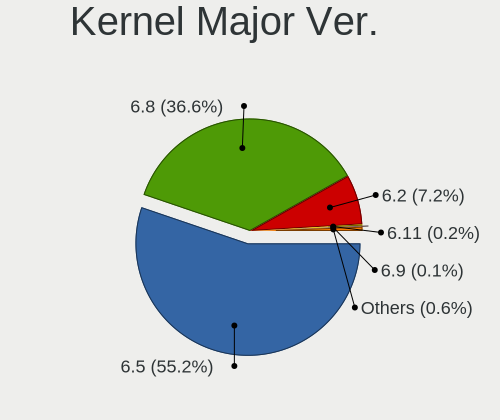

| Version | Notebooks | Percent |
|---------|-----------|---------|
| 6.5     | 430       | 79.93%  |
| 6.2     | 101       | 18.77%  |
| 6.8     | 2         | 0.37%   |
| 6.6     | 2         | 0.37%   |
| 5.15    | 2         | 0.37%   |
| 6.7     | 1         | 0.19%   |

Arch
----

OS architecture (x86_64, i586, etc.)

| Name   | Notebooks | Percent |
|--------|-----------|---------|
| x86_64 | 533       | 100%    |

DE
--

Desktop Environment

| Name  | Notebooks | Percent |
|-------|-----------|---------|
| GNOME | 522       | 97.94%  |
| XFCE  | 10        | 1.88%   |
| KDE5  | 1         | 0.19%   |

Display Server
--------------

X11 or Wayland

| Name    | Notebooks | Percent |
|---------|-----------|---------|
| Wayland | 440       | 81.78%  |
| X11     | 95        | 17.66%  |
| Unknown | 2         | 0.37%   |
| Tty     | 1         | 0.19%   |

Display Manager
---------------

SDDM, LightDM, etc.

| Name    | Notebooks | Percent |
|---------|-----------|---------|
| Unknown | 446       | 83.05%  |
| GDM3    | 90        | 16.76%  |
| LightDM | 1         | 0.19%   |

OS Lang
-------

Language

| Lang  | Notebooks | Percent |
|-------|-----------|---------|
| en_US | 181       | 33.96%  |
| de_DE | 59        | 11.07%  |
| pt_BR | 48        | 9.01%   |
| it_IT | 37        | 6.94%   |
| fr_FR | 33        | 6.19%   |
| en_GB | 19        | 3.56%   |
| en_IN | 16        | 3%      |
| es_ES | 12        | 2.25%   |
| en_CA | 12        | 2.25%   |
| pt_PT | 10        | 1.88%   |
| pl_PL | 10        | 1.88%   |
| es_MX | 9         | 1.69%   |
| ru_RU | 6         | 1.13%   |
| en_ZA | 6         | 1.13%   |
| nl_NL | 5         | 0.94%   |
| es_CO | 5         | 0.94%   |
| en_AU | 5         | 0.94%   |
| de_AT | 5         | 0.94%   |
| hu_HU | 4         | 0.75%   |
| tr_TR | 3         | 0.56%   |
| sv_SE | 3         | 0.56%   |
| nl_BE | 3         | 0.56%   |
| ja_JP | 3         | 0.56%   |
| hr_HR | 3         | 0.56%   |
| es_AR | 3         | 0.56%   |
| ro_RO | 2         | 0.38%   |
| fr_CA | 2         | 0.38%   |
| fi_FI | 2         | 0.38%   |
| es_EC | 2         | 0.38%   |
| es_CL | 2         | 0.38%   |
| en_IE | 2         | 0.38%   |
| de_CH | 2         | 0.38%   |
| zh_CN | 1         | 0.19%   |
| uk_UA | 1         | 0.19%   |
| nb_NO | 1         | 0.19%   |
| et_EE | 1         | 0.19%   |
| es_UY | 1         | 0.19%   |
| es_US | 1         | 0.19%   |
| es_SV | 1         | 0.19%   |
| es_DO | 1         | 0.19%   |

Boot Mode
---------

EFI or BIOS

| Mode | Notebooks | Percent |
|------|-----------|---------|
| BIOS | 485       | 90.82%  |
| EFI  | 49        | 9.18%   |

Filesystem
----------

Type of filesystem

| Type    | Notebooks | Percent |
|---------|-----------|---------|
| Ext4    | 462       | 86.03%  |
| Tmpfs   | 35        | 6.52%   |
| Zfs     | 22        | 4.1%    |
| Overlay | 10        | 1.86%   |
| Btrfs   | 7         | 1.3%    |
| Ext3    | 1         | 0.19%   |

Part. scheme
------------

Scheme of partitioning

| Type    | Notebooks | Percent |
|---------|-----------|---------|
| Unknown | 446       | 83.05%  |
| GPT     | 81        | 15.08%  |
| MBR     | 10        | 1.86%   |

Dual Boot with Linux/BSD
------------------------

Hosting more than one Linux/BSD

| Dual boot | Notebooks | Percent |
|-----------|-----------|---------|
| No        | 518       | 97%     |
| Yes       | 16        | 3%      |

Dual Boot (Win)
---------------

Hosting Linux and Windows

| Dual boot | Notebooks | Percent |
|-----------|-----------|---------|
| No        | 505       | 94.57%  |
| Yes       | 29        | 5.43%   |

Board
-----

Vendor
------

Motherboard manufacturer

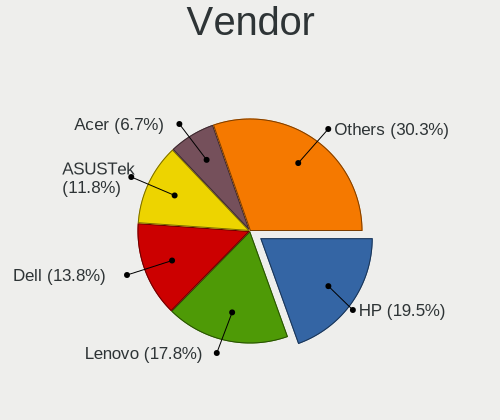

| Name                  | Notebooks | Percent |
|-----------------------|-----------|---------|
| Hewlett-Packard       | 103       | 19.32%  |
| Lenovo                | 88        | 16.51%  |
| Dell                  | 71        | 13.32%  |
| ASUSTek Computer      | 61        | 11.44%  |
| Acer                  | 40        | 7.5%    |
| Apple                 | 27        | 5.07%   |
| Toshiba               | 16        | 3%      |
| Samsung Electronics   | 15        | 2.81%   |
| Sony                  | 12        | 2.25%   |
| HUAWEI                | 9         | 1.69%   |
| Unknown               | 9         | 1.69%   |
| MSI                   | 8         | 1.5%    |
| Fujitsu               | 8         | 1.5%    |
| Packard Bell          | 7         | 1.31%   |
| Medion                | 6         | 1.13%   |
| Positivo              | 5         | 0.94%   |
| Semp Toshiba          | 3         | 0.56%   |
| Teclast               | 2         | 0.38%   |
| Notebook              | 2         | 0.38%   |
| NEC Computers         | 2         | 0.38%   |
| Google                | 2         | 0.38%   |
| Chuwi                 | 2         | 0.38%   |
| Alienware             | 2         | 0.38%   |
| Ultra                 | 1         | 0.19%   |
| TUXEDO                | 1         | 0.19%   |
| TODOS INDUSTRIAL      | 1         | 0.19%   |
| Thomson               | 1         | 0.19%   |
| Tactus                | 1         | 0.19%   |
| SGIN                  | 1         | 0.19%   |
| Schenker              | 1         | 0.19%   |
| RuggedPC              | 1         | 0.19%   |
| Razer                 | 1         | 0.19%   |
| Proline               | 1         | 0.19%   |
| Positivo Bahia - VAIO | 1         | 0.19%   |
| Panasonic             | 1         | 0.19%   |
| Multilaser            | 1         | 0.19%   |
| mPTech                | 1         | 0.19%   |
| MACHINIST             | 1         | 0.19%   |
| Jumper                | 1         | 0.19%   |
| Juana Manso           | 1         | 0.19%   |

Model
-----

Motherboard model

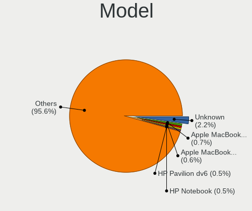

| Name                                     | Notebooks | Percent |
|------------------------------------------|-----------|---------|
| Unknown                                  | 14        | 2.63%   |
| Apple MacBookPro9,2                      | 6         | 1.13%   |
| Apple MacBookPro14,1                     | 4         | 0.75%   |
| HP 15                                    | 3         | 0.56%   |
| Dell Latitude E5520                      | 3         | 0.56%   |
| Packard Bell EasyNote TM85               | 2         | 0.38%   |
| MSI GF63 Thin 11UC                       | 2         | 0.38%   |
| Lenovo IdeaPad 1 15AMN7 82VG             | 2         | 0.38%   |
| HUAWEI HVY-WXX9                          | 2         | 0.38%   |
| HP ZBook 15 G2                           | 2         | 0.38%   |
| HP ProBook 650 G1                        | 2         | 0.38%   |
| HP ProBook 445 G7                        | 2         | 0.38%   |
| HP Pavilion dv7                          | 2         | 0.38%   |
| HP Pavilion dv6                          | 2         | 0.38%   |
| HP Notebook                              | 2         | 0.38%   |
| HP EliteBook 840 G2                      | 2         | 0.38%   |
| HP EliteBook 830 G5                      | 2         | 0.38%   |
| HP Elite x2 1012 G1                      | 2         | 0.38%   |
| HP 15 Notebook PC                        | 2         | 0.38%   |
| HP 1000                                  | 2         | 0.38%   |
| Dell XPS 13 9380                         | 2         | 0.38%   |
| Dell System XPS L502X                    | 2         | 0.38%   |
| Dell Latitude E7450                      | 2         | 0.38%   |
| Dell Latitude E7440                      | 2         | 0.38%   |
| Dell Latitude E6420                      | 2         | 0.38%   |
| Dell Latitude E6400                      | 2         | 0.38%   |
| Dell Latitude E5470                      | 2         | 0.38%   |
| Dell Inspiron N4050                      | 2         | 0.38%   |
| Dell Inspiron 5570                       | 2         | 0.38%   |
| ASUS VivoBook_ASUSLaptop M1605YA_M1605YA | 2         | 0.38%   |
| ASUS VivoBook_ASUSLaptop K6604JV_K6604JV | 2         | 0.38%   |
| ASUS S451LA                              | 2         | 0.38%   |
| Apple MacBookPro8,2                      | 2         | 0.38%   |
| Apple MacBookPro5,5                      | 2         | 0.38%   |
| Apple MacBookPro11,1                     | 2         | 0.38%   |
| Acer E1-510                              | 2         | 0.38%   |
| Acer Aspire ES1-512                      | 2         | 0.38%   |
| Acer Aspire A315-510P                    | 2         | 0.38%   |
| Ultra UB42X                              | 1         | 0.19%   |
| TUXEDO Aura 15 Gen3                      | 1         | 0.19%   |

Model Family
------------

Motherboard model prefix

| Name                  | Notebooks | Percent |
|-----------------------|-----------|---------|
| Lenovo ThinkPad       | 36        | 6.75%   |
| Dell Latitude         | 31        | 5.82%   |
| Lenovo IdeaPad        | 26        | 4.88%   |
| Acer Aspire           | 25        | 4.69%   |
| Dell Inspiron         | 22        | 4.13%   |
| HP Pavilion           | 21        | 3.94%   |
| ASUS VivoBook         | 17        | 3.19%   |
| HP ProBook            | 16        | 3%      |
| Toshiba Satellite     | 14        | 2.63%   |
| HP Laptop             | 14        | 2.63%   |
| Unknown               | 14        | 2.63%   |
| HP EliteBook          | 13        | 2.44%   |
| HP ZBook              | 8         | 1.5%    |
| Packard Bell EasyNote | 7         | 1.31%   |
| Fujitsu LIFEBOOK      | 7         | 1.31%   |
| ASUS Zenbook          | 7         | 1.31%   |
| Apple MacBookPro9     | 6         | 1.13%   |
| HP ENVY               | 5         | 0.94%   |
| HP 15                 | 5         | 0.94%   |
| Dell XPS              | 5         | 0.94%   |
| ASUS ROG              | 5         | 0.94%   |
| Lenovo Legion         | 4         | 0.75%   |
| Dell Vostro           | 4         | 0.75%   |
| Dell Precision        | 4         | 0.75%   |
| Apple MacBookPro14    | 4         | 0.75%   |
| Acer Swift            | 4         | 0.75%   |
| Acer Nitro            | 4         | 0.75%   |
| MSI GF63              | 3         | 0.56%   |
| Lenovo Yoga           | 3         | 0.56%   |
| ASUS ASUS             | 3         | 0.56%   |
| Apple MacBookPro8     | 3         | 0.56%   |
| Apple MacBookPro11    | 3         | 0.56%   |
| Semp Toshiba IS       | 2         | 0.38%   |
| Notebook NS5x         | 2         | 0.38%   |
| Lenovo G50-45         | 2         | 0.38%   |
| HUAWEI HVY-WXX9       | 2         | 0.38%   |
| HP Victus             | 2         | 0.38%   |
| HP Notebook           | 2         | 0.38%   |
| HP Elite              | 2         | 0.38%   |
| HP Compaq             | 2         | 0.38%   |

MFG Year
--------

Motherboard manufacture year

| Year | Notebooks | Percent |
|------|-----------|---------|
| 2013 | 50        | 9.38%   |
| 2021 | 45        | 8.44%   |
| 2023 | 40        | 7.5%    |
| 2022 | 38        | 7.13%   |
| 2012 | 38        | 7.13%   |
| 2010 | 37        | 6.94%   |
| 2011 | 35        | 6.57%   |
| 2020 | 31        | 5.82%   |
| 2018 | 31        | 5.82%   |
| 2014 | 31        | 5.82%   |
| 2019 | 30        | 5.63%   |
| 2015 | 28        | 5.25%   |
| 2017 | 26        | 4.88%   |
| 2008 | 23        | 4.32%   |
| 2016 | 20        | 3.75%   |
| 2009 | 20        | 3.75%   |
| 2007 | 7         | 1.31%   |
| 2024 | 2         | 0.38%   |
| 2006 | 1         | 0.19%   |

Form Factor
-----------

Physical design of the computer

| Name     | Notebooks | Percent |
|----------|-----------|---------|
| Notebook | 533       | 100%    |

Secure Boot
-----------

Enabled or disabled

| State    | Notebooks | Percent |
|----------|-----------|---------|
| Disabled | 526       | 98.69%  |
| Enabled  | 7         | 1.31%   |

Coreboot
--------

Have coreboot on board

| Used | Notebooks | Percent |
|------|-----------|---------|
| No   | 530       | 99.44%  |
| Yes  | 3         | 0.56%   |

RAM Size
--------

Total RAM memory

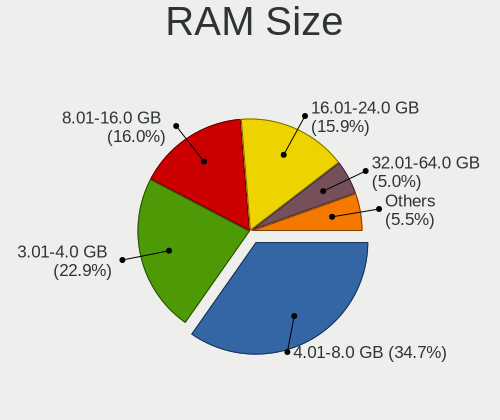

| Size in GB  | Notebooks | Percent |
|-------------|-----------|---------|
| 4.01-8.0    | 200       | 37.45%  |
| 3.01-4.0    | 123       | 23.03%  |
| 8.01-16.0   | 89        | 16.67%  |
| 16.01-24.0  | 78        | 14.61%  |
| 32.01-64.0  | 22        | 4.12%   |
| 1.01-2.0    | 9         | 1.69%   |
| 24.01-32.0  | 6         | 1.12%   |
| 64.01-256.0 | 5         | 0.94%   |
| 2.01-3.0    | 2         | 0.37%   |

RAM Used
--------

Used RAM memory

| Used GB    | Notebooks | Percent |
|------------|-----------|---------|
| 2.01-3.0   | 214       | 38.98%  |
| 1.01-2.0   | 159       | 28.96%  |
| 4.01-8.0   | 83        | 15.12%  |
| 3.01-4.0   | 78        | 14.21%  |
| 8.01-16.0  | 9         | 1.64%   |
| 0.51-1.0   | 5         | 0.91%   |
| 16.01-24.0 | 1         | 0.18%   |

Total Drives
------------

Number of drives on board

| Drives | Notebooks | Percent |
|--------|-----------|---------|
| 1      | 403       | 75.19%  |
| 2      | 119       | 22.2%   |
| 3      | 11        | 2.05%   |
| 4      | 2         | 0.37%   |
| 0      | 1         | 0.19%   |

Has CD-ROM
----------

Has CD-ROM on board

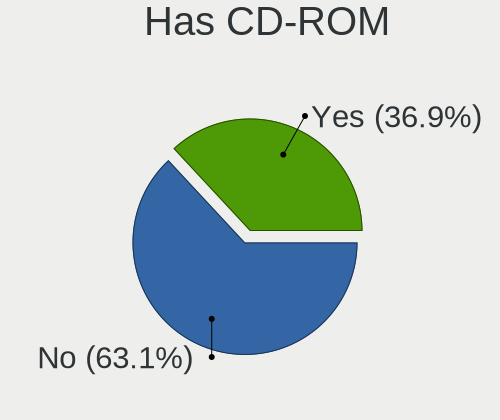

| Presented | Notebooks | Percent |
|-----------|-----------|---------|
| No        | 325       | 60.98%  |
| Yes       | 208       | 39.02%  |

Has Ethernet
------------

Has Ethernet on board

| Presented | Notebooks | Percent |
|-----------|-----------|---------|
| Yes       | 424       | 79.4%   |
| No        | 110       | 20.6%   |

Has WiFi
--------

Has WiFi module

| Presented | Notebooks | Percent |
|-----------|-----------|---------|
| Yes       | 526       | 98.69%  |
| No        | 7         | 1.31%   |

Has Bluetooth
-------------

Has Bluetooth module

| Presented | Notebooks | Percent |
|-----------|-----------|---------|
| Yes       | 409       | 76.59%  |
| No        | 125       | 23.41%  |

Location
--------

Country
-------

Geographic location (country)

| Country         | Notebooks | Percent |
|-----------------|-----------|---------|
| USA             | 95        | 17.82%  |
| Germany         | 61        | 11.44%  |
| Brazil          | 54        | 10.13%  |
| Italy           | 42        | 7.88%   |
| France          | 27        | 5.07%   |
| UK              | 17        | 3.19%   |
| Spain           | 15        | 2.81%   |
| India           | 15        | 2.81%   |
| Canada          | 15        | 2.81%   |
| Poland          | 12        | 2.25%   |
| Netherlands     | 11        | 2.06%   |
| Mexico          | 11        | 2.06%   |
| Portugal        | 10        | 1.88%   |
| Austria         | 8         | 1.5%    |
| South Africa    | 7         | 1.31%   |
| Sweden          | 6         | 1.13%   |
| Russia          | 6         | 1.13%   |
| Egypt           | 5         | 0.94%   |
| Colombia        | 5         | 0.94%   |
| Belgium         | 5         | 0.94%   |
| Algeria         | 5         | 0.94%   |
| Turkey          | 4         | 0.75%   |
| Switzerland     | 4         | 0.75%   |
| Romania         | 4         | 0.75%   |
| Morocco         | 4         | 0.75%   |
| Japan           | 4         | 0.75%   |
| Indonesia       | 4         | 0.75%   |
| Hungary         | 4         | 0.75%   |
| Finland         | 4         | 0.75%   |
| Australia       | 4         | 0.75%   |
| Argentina       | 4         | 0.75%   |
| Philippines     | 3         | 0.56%   |
| Ireland         | 3         | 0.56%   |
| Denmark         | 3         | 0.56%   |
| Czechia         | 3         | 0.56%   |
| Croatia         | 3         | 0.56%   |
| The Netherlands | 2         | 0.38%   |
| Norway          | 2         | 0.38%   |
| Malaysia        | 2         | 0.38%   |
| Iran            | 2         | 0.38%   |

City
----

Geographic location (city)

| City           | Notebooks | Percent |
|----------------|-----------|---------|
| Rio de Janeiro | 7         | 1.31%   |
| Milan          | 6         | 1.12%   |
| Sao Paulo      | 5         | 0.93%   |
| Rome           | 4         | 0.75%   |
| Johannesburg   | 4         | 0.75%   |
| Warsaw         | 3         | 0.56%   |
| Vienna         | 3         | 0.56%   |
| Turin          | 3         | 0.56%   |
| Sydney         | 3         | 0.56%   |
| Ribeirao Preto | 3         | 0.56%   |
| Prague         | 3         | 0.56%   |
| Porto          | 3         | 0.56%   |
| Mexico City    | 3         | 0.56%   |
| Lisbon         | 3         | 0.56%   |
| Joao Pessoa    | 3         | 0.56%   |
| Delhi          | 3         | 0.56%   |
| Cologne        | 3         | 0.56%   |
| Cairo          | 3         | 0.56%   |
| Bogot        | 3         | 0.56%   |
| Berlin         | 3         | 0.56%   |
| Amsterdam      | 3         | 0.56%   |
| Zurich         | 2         | 0.37%   |
| Zagreb         | 2         | 0.37%   |
| Valladolid     | 2         | 0.37%   |
| Trenton        | 2         | 0.37%   |
| Trento         | 2         | 0.37%   |
| The Hague      | 2         | 0.37%   |
| Stuttgart      | 2         | 0.37%   |
| Stockholm      | 2         | 0.37%   |
| Stif         | 2         | 0.37%   |
| Seattle        | 2         | 0.37%   |
| Santiago       | 2         | 0.37%   |
| San Jos      | 2         | 0.37%   |
| Saint Paul     | 2         | 0.37%   |
| Rho            | 2         | 0.37%   |
| Recife         | 2         | 0.37%   |
| Pune           | 2         | 0.37%   |
| Pelotas        | 2         | 0.37%   |
| Nuremberg      | 2         | 0.37%   |
| New York       | 2         | 0.37%   |

Drives
------

Drive Vendor
------------

Hard drive vendors

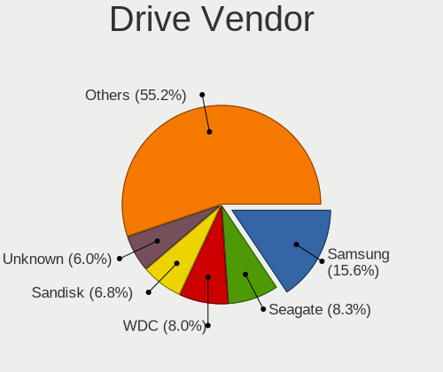

| Vendor                       | Notebooks | Drives | Percent |
|------------------------------|-----------|--------|---------|
| Samsung Electronics          | 105       | 118    | 16.13%  |
| WDC                          | 67        | 74     | 10.29%  |
| Seagate                      | 51        | 55     | 7.83%   |
| Kingston                     | 44        | 47     | 6.76%   |
| Toshiba                      | 42        | 43     | 6.45%   |
| Unknown                      | 40        | 43     | 6.14%   |
| Sandisk                      | 31        | 33     | 4.76%   |
| SK hynix                     | 21        | 22     | 3.23%   |
| Crucial                      | 20        | 22     | 3.07%   |
| Micron Technology            | 18        | 18     | 2.76%   |
| Apple                        | 16        | 25     | 2.46%   |
| Hitachi                      | 15        | 16     | 2.3%    |
| Intel                        | 13        | 13     | 2%      |
| HGST                         | 13        | 14     | 2%      |
| China                        | 12        | 13     | 1.84%   |
| A-DATA Technology            | 8         | 8      | 1.23%   |
| Kingston Technology Company  | 6         | 6      | 0.92%   |
| Intenso                      | 6         | 7      | 0.92%   |
| Unknown                      | 6         | 6      | 0.92%   |
| Silicon Motion               | 5         | 5      | 0.77%   |
| MAXIO Technology (Hangzhou)  | 5         | 5      | 0.77%   |
| Micron/Crucial Technology    | 4         | 4      | 0.61%   |
| KIOXIA                       | 4         | 4      | 0.61%   |
| Hewlett-Packard              | 4         | 4      | 0.61%   |
| ADATA Technology             | 4         | 4      | 0.61%   |
| PNY                          | 3         | 3      | 0.46%   |
| Netac                        | 3         | 3      | 0.46%   |
| LITEON                       | 3         | 3      | 0.46%   |
| KingSpec                     | 3         | 3      | 0.46%   |
| GOODRAM                      | 3         | 5      | 0.46%   |
| Fanxiang                     | 3         | 5      | 0.46%   |
| Teclast                      | 2         | 3      | 0.31%   |
| T-FORCE                      | 2         | 2      | 0.31%   |
| SPCC                         | 2         | 2      | 0.31%   |
| Shenzhen Longsys Electronics | 2         | 2      | 0.31%   |
| Realtek Semiconductor        | 2         | 3      | 0.31%   |
| Phison Electronics           | 2         | 2      | 0.31%   |
| Phison                       | 2         | 3      | 0.31%   |
| OCZ                          | 2         | 2      | 0.31%   |
| Lexar                        | 2         | 2      | 0.31%   |

Drive Model
-----------

Hard drive models

| Model                                              | Notebooks | Percent |
|----------------------------------------------------|-----------|---------|
| Unknown MMC Card  64GB                             | 18        | 2.73%   |
| Kingston SA400S37480G 480GB SSD                    | 11        | 1.67%   |
| Samsung NVMe SSD Controller SM981/PM981/PM983 1TB  | 10        | 1.52%   |
| Kingston SA400S37240G 240GB SSD                    | 9         | 1.37%   |
| Toshiba MQ01ABF050 500GB                           | 8         | 1.21%   |
| Unknown MMC Card  128GB                            | 7         | 1.06%   |
| Unknown MMC Card  32GB                             | 6         | 0.91%   |
| Seagate ST1000LM035-1RK172 1TB                     | 6         | 0.91%   |
| Samsung NVMe SSD Controller PM9A1/PM9A3/980PRO 1TB | 6         | 0.91%   |
| Unknown                                            | 6         | 0.91%   |
| Toshiba MQ04ABF100 1TB                             | 5         | 0.76%   |
| Samsung SSD 860 EVO 500GB                          | 5         | 0.76%   |
| Samsung SSD 850 EVO 500GB                          | 5         | 0.76%   |
| Samsung SSD 850 EVO 250GB                          | 5         | 0.76%   |
| Samsung NVMe SSD Controller SM961/PM961/SM963 1TB  | 5         | 0.76%   |
| Micron 2400_MTFDKBA512QFM 512GB                    | 5         | 0.76%   |
| Toshiba MQ01ABD100 1TB                             | 4         | 0.61%   |
| Seagate ST9500325AS 500GB                          | 4         | 0.61%   |
| Seagate ST500LM012 HN-M500MBB 500GB                | 4         | 0.61%   |
| Seagate ST1000LM024 HN-M101MBB 1TB                 | 4         | 0.61%   |
| Micron/Crucial P2 NVMe PCIe SSD 4TB                | 4         | 0.61%   |
| Crucial CT500MX500SSD1 500GB                       | 4         | 0.61%   |
| Apple S3X NVMe Controller 121GB                    | 4         | 0.61%   |
| WDC WDS500G2B0A-00SM50 500GB SSD                   | 3         | 0.46%   |
| WDC WDS100T2B0A-00SM50 1TB SSD                     | 3         | 0.46%   |
| WDC WD10SPZX-08Z10 1TB                             | 3         | 0.46%   |
| WDC WD Blue SA510 2.5 500GB SSD                    | 3         | 0.46%   |
| Toshiba XG6 NVMe SSD Controller 1024GB             | 3         | 0.46%   |
| SK hynix BC511 256GB                               | 3         | 0.46%   |
| Silicon Motion PCIe-8 SSD 512GB                    | 3         | 0.46%   |
| Seagate ST500LT012-1DG142 500GB                    | 3         | 0.46%   |
| Seagate ST500LM021-1KJ152 500GB                    | 3         | 0.46%   |
| SanDisk SSD PLUS 480GB                             | 3         | 0.46%   |
| Samsung MZVL4512HBLU-00BTW 512GB                   | 3         | 0.46%   |
| Kingston Company OM3PDP3 NVMe SSD 512GB            | 3         | 0.46%   |
| Hitachi HTS545050A7E380 500GB                      | 3         | 0.46%   |
| HGST HTS545050A7E680 500GB                         | 3         | 0.46%   |
| Crucial CT1000MX500SSD1 1TB                        | 3         | 0.46%   |
| Crucial CT1000BX500SSD1 1TB                        | 3         | 0.46%   |
| China SSD 256GB                                    | 3         | 0.46%   |

HDD Vendor
----------

Hard disk drive vendors

| Vendor              | Notebooks | Drives | Percent |
|---------------------|-----------|--------|---------|
| Seagate             | 49        | 53     | 29.34%  |
| WDC                 | 44        | 48     | 26.35%  |
| Toshiba             | 34        | 35     | 20.36%  |
| Hitachi             | 15        | 16     | 8.98%   |
| HGST                | 13        | 14     | 7.78%   |
| Samsung Electronics | 4         | 4      | 2.4%    |
| Apple               | 3         | 3      | 1.8%    |
| Fujitsu             | 2         | 2      | 1.2%    |
| Unknown             | 1         | 1      | 0.6%    |
| TO Exter            | 1         | 1      | 0.6%    |
| LaCie               | 1         | 1      | 0.6%    |

SSD Vendor
----------

Solid state drive vendors

| Vendor              | Notebooks | Drives | Percent |
|---------------------|-----------|--------|---------|
| Samsung Electronics | 54        | 59     | 22.78%  |
| Kingston            | 36        | 36     | 15.19%  |
| WDC                 | 18        | 21     | 7.59%   |
| Crucial             | 18        | 20     | 7.59%   |
| China               | 12        | 13     | 5.06%   |
| SanDisk             | 11        | 11     | 4.64%   |
| A-DATA Technology   | 8         | 8      | 3.38%   |
| Apple               | 7         | 7      | 2.95%   |
| Micron Technology   | 4         | 4      | 1.69%   |
| Hewlett-Packard     | 4         | 4      | 1.69%   |
| PNY                 | 3         | 3      | 1.27%   |
| LITEON              | 3         | 3      | 1.27%   |
| KingSpec            | 3         | 3      | 1.27%   |
| Intenso             | 3         | 3      | 1.27%   |
| Intel               | 3         | 3      | 1.27%   |
| GOODRAM             | 3         | 5      | 1.27%   |
| Unknown             | 3         | 3      | 1.27%   |
| Toshiba             | 2         | 2      | 0.84%   |
| Teclast             | 2         | 3      | 0.84%   |
| SPCC                | 2         | 2      | 0.84%   |
| Phison              | 2         | 3      | 0.84%   |
| OCZ                 | 2         | 2      | 0.84%   |
| Lexar               | 2         | 2      | 0.84%   |
| LEQIXIANG           | 2         | 2      | 0.84%   |
| Gigabyte Technology | 2         | 2      | 0.84%   |
| External            | 2         | 2      | 0.84%   |
| Wibtek              | 1         | 1      | 0.42%   |
| USB3.0              | 1         | 1      | 0.42%   |
| TSA                 | 1         | 1      | 0.42%   |
| Transcend           | 1         | 1      | 0.42%   |
| tecmiyo             | 1         | 1      | 0.42%   |
| Team                | 1         | 1      | 0.42%   |
| STAR                | 1         | 1      | 0.42%   |
| SSSTC               | 1         | 2      | 0.42%   |
| SK hynix            | 1         | 1      | 0.42%   |
| SCUDA               | 1         | 1      | 0.42%   |
| SABRENT             | 1         | 1      | 0.42%   |
| S3+                 | 1         | 1      | 0.42%   |
| QSSDS25240G         | 1         | 1      | 0.42%   |
| OWC                 | 1         | 3      | 0.42%   |

Drive Kind
----------

HDD or SSD

| Kind    | Notebooks | Drives | Percent |
|---------|-----------|--------|---------|
| SSD     | 225       | 256    | 36.53%  |
| NVMe    | 167       | 211    | 27.11%  |
| HDD     | 163       | 178    | 26.46%  |
| MMC     | 38        | 41     | 6.17%   |
| Unknown | 23        | 27     | 3.73%   |

Drive Connector
---------------

SATA, SAS, NVMe, etc.

| Type | Notebooks | Drives | Percent |
|------|-----------|--------|---------|
| SATA | 366       | 431    | 61.62%  |
| NVMe | 166       | 209    | 27.95%  |
| MMC  | 38        | 41     | 6.4%    |
| SAS  | 24        | 32     | 4.04%   |

Drive Size
----------

Size of hard drive

| Size in TB | Notebooks | Drives | Percent |
|------------|-----------|--------|---------|
| 0.01-0.5   | 276       | 314    | 72.25%  |
| 0.51-1.0   | 95        | 108    | 24.87%  |
| 1.01-2.0   | 8         | 9      | 2.09%   |
| 3.01-4.0   | 2         | 2      | 0.52%   |
| 10.01-20.0 | 1         | 1      | 0.26%   |

Space Total
-----------

Amount of disk space available on the file system

| Size in GB     | Notebooks | Percent |
|----------------|-----------|---------|
| 101-250        | 184       | 34.14%  |
| 251-500        | 153       | 28.39%  |
| 501-1000       | 85        | 15.77%  |
| 51-100         | 46        | 8.53%   |
| 1001-2000      | 17        | 3.15%   |
| 1-20           | 16        | 2.97%   |
| Unknown        | 16        | 2.97%   |
| 21-50          | 12        | 2.23%   |
| More than 3000 | 5         | 0.93%   |
| 2001-3000      | 5         | 0.93%   |

Space Used
----------

Amount of used disk space

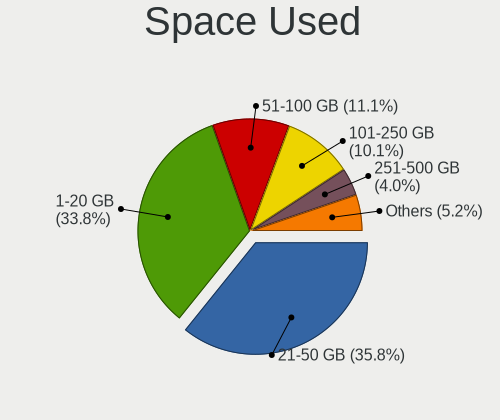

| Used GB        | Notebooks | Percent |
|----------------|-----------|---------|
| 1-20           | 203       | 36.84%  |
| 21-50          | 187       | 33.94%  |
| 51-100         | 65        | 11.8%   |
| 101-250        | 48        | 8.71%   |
| 251-500        | 17        | 3.09%   |
| Unknown        | 16        | 2.9%    |
| 501-1000       | 13        | 2.36%   |
| More than 3000 | 1         | 0.18%   |
| 1001-2000      | 1         | 0.18%   |

Malfunc. Drives
---------------

Drive models with a malfunction

| Model                           | Notebooks | Drives | Percent |
|---------------------------------|-----------|--------|---------|
| WDC WD5000BPVT-75HXZT1 500GB    | 1         | 1      | 11.11%  |
| WDC WD2500BEKT-75PVMT1 250GB    | 1         | 1      | 11.11%  |
| Toshiba MQ01ABF050 500GB        | 1         | 1      | 11.11%  |
| Toshiba MK6465GSX 640GB         | 1         | 1      | 11.11%  |
| Toshiba MK2565GSX 250GB         | 1         | 1      | 11.11%  |
| Seagate ST500LM000-1EJ162 500GB | 1         | 1      | 11.11%  |
| SanDisk SSD PLUS 480GB          | 1         | 1      | 11.11%  |
| Hitachi HTS723232L9A360 320GB   | 1         | 1      | 11.11%  |
| Hitachi HTS545050A7E380 500GB   | 1         | 1      | 11.11%  |

Malfunc. Drive Vendor
---------------------

Vendors of faulty drives

| Vendor  | Notebooks | Drives | Percent |
|---------|-----------|--------|---------|
| Toshiba | 3         | 3      | 33.33%  |
| WDC     | 2         | 2      | 22.22%  |
| Hitachi | 2         | 2      | 22.22%  |
| Seagate | 1         | 1      | 11.11%  |
| SanDisk | 1         | 1      | 11.11%  |

Malfunc. HDD Vendor
-------------------

Vendors of faulty HDD drives

| Vendor  | Notebooks | Drives | Percent |
|---------|-----------|--------|---------|
| Toshiba | 3         | 3      | 37.5%   |
| WDC     | 2         | 2      | 25%     |
| Hitachi | 2         | 2      | 25%     |
| Seagate | 1         | 1      | 12.5%   |

Malfunc. Drive Kind
-------------------

Kinds of faulty drives

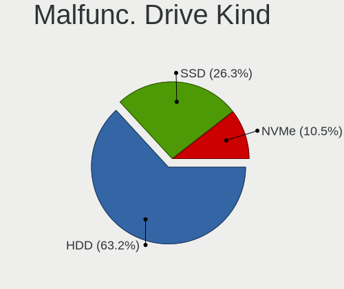

| Kind | Notebooks | Drives | Percent |
|------|-----------|--------|---------|
| HDD  | 8         | 8      | 88.89%  |
| SSD  | 1         | 1      | 11.11%  |

Failed Drives
-------------

Failed drive models

Zero info for selected period =(

Failed Drive Vendor
-------------------

Failed drive vendors

Zero info for selected period =(

Drive Status
------------

Number of failed and malfunc. drives

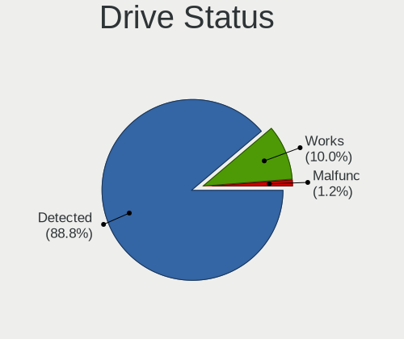

| Status   | Notebooks | Drives | Percent |
|----------|-----------|--------|---------|
| Detected | 488       | 643    | 89.71%  |
| Works    | 47        | 61     | 8.64%   |
| Malfunc  | 9         | 9      | 1.65%   |

Storage controller
------------------

Storage Vendor
--------------

Storage controller vendors

| Vendor                           | Notebooks | Percent |
|----------------------------------|-----------|---------|
| Intel                            | 376       | 60.84%  |
| AMD                              | 56        | 9.06%   |
| Samsung Electronics              | 52        | 8.41%   |
| SanDisk                          | 24        | 3.88%   |
| SK hynix                         | 20        | 3.24%   |
| Micron Technology                | 14        | 2.27%   |
| Kingston Technology Company      | 13        | 2.1%    |
| Silicon Motion                   | 7         | 1.13%   |
| Toshiba America Info Systems     | 6         | 0.97%   |
| MAXIO Technology (Hangzhou)      | 6         | 0.97%   |
| Apple                            | 6         | 0.97%   |
| Nvidia                           | 5         | 0.81%   |
| Micron/Crucial Technology        | 5         | 0.81%   |
| KIOXIA                           | 4         | 0.65%   |
| ADATA Technology                 | 4         | 0.65%   |
| Solid State Storage Technology   | 3         | 0.49%   |
| Shenzhen Longsys Electronics     | 3         | 0.49%   |
| Phison Electronics               | 3         | 0.49%   |
| Realtek Semiconductor            | 2         | 0.32%   |
| Netac Technology                 | 2         | 0.32%   |
| Lite-On Technology               | 2         | 0.32%   |
| Solidigm                         | 1         | 0.16%   |
| Silicon Integrated Systems [SiS] | 1         | 0.16%   |
| Silicon Image                    | 1         | 0.16%   |
| ASMedia Technology               | 1         | 0.16%   |
| Unknown                          | 1         | 0.16%   |

Storage Model
-------------

Storage controller models

| Model                                                                          | Notebooks | Percent |
|--------------------------------------------------------------------------------|-----------|---------|
| Intel 7 Series Chipset Family 6-port SATA Controller [AHCI mode]               | 48        | 7.35%   |
| AMD FCH SATA Controller [AHCI mode]                                            | 48        | 7.35%   |
| Intel Sunrise Point-LP SATA Controller [AHCI mode]                             | 41        | 6.28%   |
| Intel 6 Series/C200 Series Chipset Family 6 port Mobile SATA AHCI Controller   | 33        | 5.05%   |
| Intel 82801IBM/IEM (ICH9M/ICH9M-E) 4 port SATA Controller [AHCI mode]          | 25        | 3.83%   |
| Intel 82801 Mobile SATA Controller [RAID mode]                                 | 25        | 3.83%   |
| Intel Celeron/Pentium Silver Processor SATA Controller                         | 22        | 3.37%   |
| Intel 5 Series/3400 Series Chipset 4 port SATA AHCI Controller                 | 22        | 3.37%   |
| Intel 8 Series SATA Controller 1 [AHCI mode]                                   | 19        | 2.91%   |
| Intel Wildcat Point-LP SATA Controller [AHCI Mode]                             | 17        | 2.6%    |
| Intel 8 Series/C220 Series Chipset Family 6-port SATA Controller 1 [AHCI mode] | 15        | 2.3%    |
| Samsung NVMe SSD Controller SM981/PM981/PM983                                  | 14        | 2.14%   |
| Intel Volume Management Device NVMe RAID Controller                            | 11        | 1.68%   |
| SanDisk WD Black SN770 / PC SN740 256GB / PC SN560 (DRAM-less) NVMe SSD        | 10        | 1.53%   |
| Samsung NVMe SSD Controller 980 (DRAM-less)                                    | 10        | 1.53%   |
| Intel Volume Management Device NVMe RAID Controller Intel Corporation          | 10        | 1.53%   |
| Samsung NVMe SSD Controller PM9A1/PM9A3/980PRO                                 | 9         | 1.38%   |
| SK hynix Gold P31/BC711/PC711 NVMe Solid State Drive                           | 8         | 1.23%   |
| Intel Tiger Lake-LP SATA Controller                                            | 8         | 1.23%   |
| Intel Atom Processor E3800 Series SATA AHCI Controller                         | 7         | 1.07%   |
| Intel 82801HM/HEM (ICH8M/ICH8M-E) SATA Controller [AHCI mode]                  | 7         | 1.07%   |
| Intel 82801HM/HEM (ICH8M/ICH8M-E) IDE Controller                               | 7         | 1.07%   |
| Intel 5 Series/3400 Series Chipset 6 port SATA AHCI Controller                 | 7         | 1.07%   |
| Micron 2400 NVMe SSD (DRAM-less)                                               | 6         | 0.92%   |
| Intel SSD 670p Series [Keystone Harbor]                                        | 6         | 0.92%   |
| Intel Celeron N3350/Pentium N4200/Atom E3900 Series SATA AHCI Controller       | 6         | 0.92%   |
| Samsung NVMe SSD Controller SM961/PM961/SM963                                  | 5         | 0.77%   |
| Samsung NVMe SSD Controller PM9B1 (DRAM-less)                                  | 5         | 0.77%   |
| Micron/Crucial P2 [Nick P2] / P3 / P3 Plus NVMe PCIe SSD (DRAM-less)           | 5         | 0.77%   |
| Kingston Company KC3000/FURY Renegade NVMe SSD E18                             | 5         | 0.77%   |
| Intel Comet Lake SATA AHCI Controller                                          | 5         | 0.77%   |
| Intel Cannon Point-LP SATA Controller [AHCI Mode]                              | 5         | 0.77%   |
| Intel Cannon Lake Mobile PCH SATA AHCI Controller                              | 5         | 0.77%   |
| AMD SB7x0/SB8x0/SB9x0 SATA Controller [AHCI mode]                              | 5         | 0.77%   |
| AMD SB7x0/SB8x0/SB9x0 IDE Controller                                           | 5         | 0.77%   |
| Toshiba America Info Systems XG6 NVMe SSD Controller                           | 4         | 0.61%   |
| Silicon Motion SM2263EN/SM2263XT (DRAM-less) NVMe SSD Controllers              | 4         | 0.61%   |
| Samsung S4LN053X01 AHCI SSD Controller(Apple slot)                             | 4         | 0.61%   |
| Samsung NVMe SSD Controller S4LV008[Pascal]                                    | 4         | 0.61%   |
| Micron 2450 NVMe SSD [HendrixV] (DRAM-less)                                    | 4         | 0.61%   |

Storage Kind
------------

Kind of storage controller (IDE, SATA, NVMe, SAS, ...)

| Kind | Notebooks | Percent |
|------|-----------|---------|
| SATA | 384       | 61.54%  |
| NVMe | 165       | 26.44%  |
| RAID | 48        | 7.69%   |
| IDE  | 27        | 4.33%   |

Processor
---------

CPU Vendor
----------

Processor vendors

| Vendor | Notebooks | Percent |
|--------|-----------|---------|
| Intel  | 438       | 82.18%  |
| AMD    | 95        | 17.82%  |

CPU Model
---------

Processor models

| Model                                       | Notebooks | Percent |
|---------------------------------------------|-----------|---------|
| Intel Celeron N4020 CPU @ 1.10GHz           | 10        | 1.88%   |
| Intel Core i5-3210M CPU @ 2.50GHz           | 8         | 1.5%    |
| Intel Core i5-7200U CPU @ 2.50GHz           | 7         | 1.31%   |
| Intel Core i5-6200U CPU @ 2.30GHz           | 7         | 1.31%   |
| Intel Core i5-8265U CPU @ 1.60GHz           | 6         | 1.13%   |
| Intel Core i5-6300U CPU @ 2.40GHz           | 6         | 1.13%   |
| Intel Core i5-2430M CPU @ 2.40GHz           | 6         | 1.13%   |
| Intel Core i3-6006U CPU @ 2.00GHz           | 6         | 1.13%   |
| Intel 11th Gen Core i5-1135G7 @ 2.40GHz     | 6         | 1.13%   |
| Intel Core i7-8565U CPU @ 1.80GHz           | 5         | 0.94%   |
| Intel Core i7-2670QM CPU @ 2.20GHz          | 5         | 0.94%   |
| Intel Core i5-8250U CPU @ 1.60GHz           | 5         | 0.94%   |
| Intel Core i5-5300U CPU @ 2.30GHz           | 5         | 0.94%   |
| Intel Core i5-5200U CPU @ 2.20GHz           | 5         | 0.94%   |
| Intel Core i5-3320M CPU @ 2.60GHz           | 5         | 0.94%   |
| Intel Core i5-2520M CPU @ 2.50GHz           | 5         | 0.94%   |
| Intel Core i5 CPU M 460 @ 2.53GHz           | 5         | 0.94%   |
| Intel Celeron CPU N3350 @ 1.10GHz           | 5         | 0.94%   |
| AMD Ryzen 7 7730U with Radeon Graphics      | 5         | 0.94%   |
| AMD Ryzen 5 5500U with Radeon Graphics      | 5         | 0.94%   |
| Intel Core i7-6700HQ CPU @ 2.60GHz          | 4         | 0.75%   |
| Intel Core i7-5500U CPU @ 2.40GHz           | 4         | 0.75%   |
| Intel Core i7-4810MQ CPU @ 2.80GHz          | 4         | 0.75%   |
| Intel Core i5-8350U CPU @ 1.70GHz           | 4         | 0.75%   |
| Intel Core i5-3337U CPU @ 1.80GHz           | 4         | 0.75%   |
| Intel Core i5-3230M CPU @ 2.60GHz           | 4         | 0.75%   |
| Intel Core i5 CPU M 520 @ 2.40GHz           | 4         | 0.75%   |
| Intel Core i3-7020U CPU @ 2.30GHz           | 4         | 0.75%   |
| Intel Core i3-5005U CPU @ 2.00GHz           | 4         | 0.75%   |
| Intel Core i3-4005U CPU @ 1.70GHz           | 4         | 0.75%   |
| Intel Core i3-10110U CPU @ 2.10GHz          | 4         | 0.75%   |
| Intel Core i3 CPU M 350 @ 2.27GHz           | 4         | 0.75%   |
| Intel Core i3 CPU M 330 @ 2.13GHz           | 4         | 0.75%   |
| Intel Celeron N4000 CPU @ 1.10GHz           | 4         | 0.75%   |
| Intel 13th Gen Core i7-13700H               | 4         | 0.75%   |
| Intel 12th Gen Core i7-12700H               | 4         | 0.75%   |
| Intel 12th Gen Core i5-1235U                | 4         | 0.75%   |
| AMD Ryzen 3 7320U with Radeon Graphics      | 4         | 0.75%   |
| Intel Pentium Dual-Core CPU T4500 @ 2.30GHz | 3         | 0.56%   |
| Intel Core i7-8750H CPU @ 2.20GHz           | 3         | 0.56%   |

CPU Model Family
----------------

Processor model prefix

| Model                                | Notebooks | Percent |
|--------------------------------------|-----------|---------|
| Intel Core i5                        | 130       | 24.39%  |
| Intel Core i7                        | 78        | 14.63%  |
| Intel Core i3                        | 67        | 12.57%  |
| Other                                | 55        | 10.32%  |
| Intel Celeron                        | 44        | 8.26%   |
| Intel Core 2 Duo                     | 29        | 5.44%   |
| AMD Ryzen 5                          | 24        | 4.5%    |
| AMD Ryzen 7                          | 17        | 3.19%   |
| Intel Pentium                        | 14        | 2.63%   |
| AMD Ryzen 3                          | 8         | 1.5%    |
| Intel Pentium Dual-Core              | 7         | 1.31%   |
| AMD E1                               | 5         | 0.94%   |
| AMD Ryzen 9                          | 4         | 0.75%   |
| AMD Ryzen 5 PRO                      | 4         | 0.75%   |
| AMD E2                               | 4         | 0.75%   |
| AMD A6                               | 4         | 0.75%   |
| Intel Core m5                        | 3         | 0.56%   |
| AMD Athlon II                        | 3         | 0.56%   |
| AMD A8                               | 3         | 0.56%   |
| AMD A10                              | 3         | 0.56%   |
| Intel Xeon                           | 2         | 0.38%   |
| Intel Pentium Dual                   | 2         | 0.38%   |
| Intel Core 2                         | 2         | 0.38%   |
| Intel Celeron Dual-Core              | 2         | 0.38%   |
| AMD Athlon                           | 2         | 0.38%   |
| AMD A4                               | 2         | 0.38%   |
| Intel Pentium Silver                 | 1         | 0.19%   |
| Intel Genuine                        | 1         | 0.19%   |
| Intel Core M                         | 1         | 0.19%   |
| Intel Core i9                        | 1         | 0.19%   |
| Intel Atom                           | 1         | 0.19%   |
| AMD Turion X2 Ultra Dual-Core Mobile | 1         | 0.19%   |
| AMD Turion X2 Dual-Core Mobile       | 1         | 0.19%   |
| AMD Ryzen 7 PRO                      | 1         | 0.19%   |
| AMD Ryzen 3 PRO                      | 1         | 0.19%   |
| AMD QC                               | 1         | 0.19%   |
| AMD E                                | 1         | 0.19%   |
| AMD C-60                             | 1         | 0.19%   |
| AMD Athlon X2                        | 1         | 0.19%   |
| AMD Athlon 64 X2                     | 1         | 0.19%   |

CPU Cores
---------

Number of processor cores

| Number | Notebooks | Percent |
|--------|-----------|---------|
| 2      | 310       | 58.16%  |
| 4      | 134       | 25.14%  |
| 6      | 29        | 5.44%   |
| 8      | 24        | 4.5%    |
| 10     | 11        | 2.06%   |
| 14     | 10        | 1.88%   |
| 12     | 7         | 1.31%   |
| 1      | 5         | 0.94%   |
| 24     | 3         | 0.56%   |

CPU Sockets
-----------

Number of sockets

| Number | Notebooks | Percent |
|--------|-----------|---------|
| 1      | 533       | 100%    |

CPU Threads
-----------

Threads per core (Hyper-Threading)

| Number | Notebooks | Percent |
|--------|-----------|---------|
| 2      | 393       | 73.73%  |
| 1      | 140       | 26.27%  |

CPU Op-Modes
------------

CPU Operation Modes (32-bit, 64-bit)

| Op mode        | Notebooks | Percent |
|----------------|-----------|---------|
| 32-bit, 64-bit | 533       | 100%    |

CPU Microcode
-------------

Microcode number

| Number     | Notebooks | Percent |
|------------|-----------|---------|
| Unknown    | 519       | 97.37%  |
| 0x0a50000d | 4         | 0.75%   |
| 0x08600109 | 2         | 0.38%   |
| 0x806d1    | 1         | 0.19%   |
| 0x0a601203 | 1         | 0.19%   |
| 0x0a50000c | 1         | 0.19%   |
| 0x08a00008 | 1         | 0.19%   |
| 0x08600106 | 1         | 0.19%   |
| 0x08101007 | 1         | 0.19%   |
| 0x0700010f | 1         | 0.19%   |
| 0x05000119 | 1         | 0.19%   |

CPU Microarch
-------------

Microarchitecture

| Name             | Notebooks | Percent |
|------------------|-----------|---------|
| KabyLake         | 65        | 12.2%   |
| Unknown          | 50        | 9.38%   |
| SandyBridge      | 47        | 8.82%   |
| Haswell          | 44        | 8.26%   |
| IvyBridge        | 43        | 8.07%   |
| Penryn           | 36        | 6.75%   |
| Skylake          | 32        | 6%      |
| Westmere         | 30        | 5.63%   |
| Goldmont plus    | 26        | 4.88%   |
| Broadwell        | 22        | 4.13%   |
| Zen 3            | 20        | 3.75%   |
| TigerLake        | 16        | 3%      |
| Zen+             | 11        | 2.06%   |
| Silvermont       | 11        | 2.06%   |
| Core             | 9         | 1.69%   |
| Zen 2            | 8         | 1.5%    |
| Jaguar           | 7         | 1.31%   |
| Alderlake Hybrid | 7         | 1.31%   |
| Goldmont         | 6         | 1.13%   |
| Excavator        | 6         | 1.13%   |
| Zen              | 5         | 0.94%   |
| Piledriver       | 5         | 0.94%   |
| CometLake        | 5         | 0.94%   |
| Puma             | 4         | 0.75%   |
| IceLake          | 4         | 0.75%   |
| Bobcat           | 4         | 0.75%   |
| K8 & K10 hybrid  | 3         | 0.56%   |
| K10              | 3         | 0.56%   |
| K8 Hammer        | 2         | 0.38%   |
| Tremont          | 1         | 0.19%   |
| Nehalem          | 1         | 0.19%   |

Graphics
--------

GPU Vendor
----------

Vendors of graphics cards

| Vendor | Notebooks | Percent |
|--------|-----------|---------|
| Intel  | 386       | 60.03%  |
| AMD    | 143       | 22.24%  |
| Nvidia | 114       | 17.73%  |

GPU Model
---------

Graphics card models

| Model                                                                                 | Notebooks | Percent |
|---------------------------------------------------------------------------------------|-----------|---------|
| Intel 3rd Gen Core processor Graphics Controller                                      | 43        | 6.55%   |
| Intel 2nd Generation Core Processor Family Integrated Graphics Controller             | 40        | 6.1%    |
| Intel GeminiLake [UHD Graphics 600]                                                   | 25        | 3.81%   |
| Intel Skylake GT2 [HD Graphics 520]                                                   | 23        | 3.51%   |
| Intel Haswell-ULT Integrated Graphics Controller                                      | 23        | 3.51%   |
| Intel Mobile 4 Series Chipset Integrated Graphics Controller                          | 19        | 2.9%    |
| Intel HD Graphics 5500                                                                | 19        | 2.9%    |
| Intel Core Processor Integrated Graphics Controller                                   | 18        | 2.74%   |
| Intel UHD Graphics 620                                                                | 17        | 2.59%   |
| Intel 4th Gen Core Processor Integrated Graphics Controller                           | 16        | 2.44%   |
| Intel HD Graphics 620                                                                 | 15        | 2.29%   |
| Intel TigerLake-LP GT2 [Iris Xe Graphics]                                             | 13        | 1.98%   |
| Intel WhiskeyLake-U GT2 [UHD Graphics 620]                                            | 12        | 1.83%   |
| AMD Picasso/Raven 2 [Radeon Vega Series / Radeon Vega Mobile Series]                  | 12        | 1.83%   |
| AMD Barcelo                                                                           | 12        | 1.83%   |
| Intel Raptor Lake-P [Iris Xe Graphics]                                                | 10        | 1.52%   |
| AMD Renoir [Radeon RX Vega 6 (Ryzen 4000/5000 Mobile Series)]                         | 8         | 1.22%   |
| AMD Cezanne [Radeon Vega Series / Radeon Vega Mobile Series]                          | 8         | 1.22%   |
| Nvidia GF117M [GeForce 610M/710M/810M/820M / GT 620M/625M/630M/720M]                  | 7         | 1.07%   |
| Intel CometLake-U GT2 [UHD Graphics]                                                  | 7         | 1.07%   |
| Intel Atom Processor Z36xxx/Z37xxx Series Graphics & Display                          | 7         | 1.07%   |
| AMD Seymour [Radeon HD 6400M/7400M Series]                                            | 7         | 1.07%   |
| AMD Lucienne                                                                          | 7         | 1.07%   |
| Nvidia TU117M [GeForce GTX 1650 Mobile / Max-Q]                                       | 6         | 0.91%   |
| Intel CoffeeLake-H GT2 [UHD Graphics 630]                                             | 6         | 0.91%   |
| AMD Topaz XT [Radeon R7 M260/M265 / M340/M360 / M440/M445 / 530/535 / 620/625 Mobile] | 6         | 0.91%   |
| Nvidia GA106M [GeForce RTX 3060 Mobile / Max-Q]                                       | 5         | 0.76%   |
| Intel TigerLake-H GT1 [UHD Graphics]                                                  | 5         | 0.76%   |
| Intel HD Graphics 500                                                                 | 5         | 0.76%   |
| Intel Alder Lake-P GT2 [Iris Xe Graphics]                                             | 5         | 0.76%   |
| AMD Park [Mobility Radeon HD 5430/5450/5470]                                          | 5         | 0.76%   |
| AMD Madison [Mobility Radeon HD 5650/5750 / 6530M/6550M]                              | 5         | 0.76%   |
| Nvidia GM108M [GeForce MX110]                                                         | 4         | 0.61%   |
| Nvidia GF108M [GeForce GT 540M]                                                       | 4         | 0.61%   |
| Nvidia GA107M [GeForce RTX 3050 Mobile]                                               | 4         | 0.61%   |
| Nvidia AD107M [GeForce RTX 4060 Max-Q / Mobile]                                       | 4         | 0.61%   |
| Nvidia AD106M [GeForce RTX 4070 Max-Q / Mobile]                                       | 4         | 0.61%   |
| Intel Raptor Lake-S UHD Graphics                                                      | 4         | 0.61%   |
| Intel Mobile GM965/GL960 Integrated Graphics Controller (secondary)                   | 4         | 0.61%   |
| Intel Mobile GM965/GL960 Integrated Graphics Controller (primary)                     | 4         | 0.61%   |

GPU Combo
---------

Combinations of graphics cards

| Name           | Notebooks | Percent |
|----------------|-----------|---------|
| 1 x Intel      | 288       | 54.03%  |
| 1 x AMD        | 96        | 18.01%  |
| Intel + Nvidia | 66        | 12.38%  |
| 1 x Nvidia     | 34        | 6.38%   |
| Intel + AMD    | 28        | 5.25%   |
| AMD + Nvidia   | 13        | 2.44%   |
| 2 x AMD        | 6         | 1.13%   |
| Other          | 1         | 0.19%   |
| 2 x Nvidia     | 1         | 0.19%   |

GPU Driver
----------

Free vs proprietary

| Driver      | Notebooks | Percent |
|-------------|-----------|---------|
| Free        | 472       | 87.9%   |
| Proprietary | 57        | 10.61%  |
| Unknown     | 8         | 1.49%   |

GPU Memory
----------

Total video memory

| Size in GB | Notebooks | Percent |
|------------|-----------|---------|
| Unknown    | 499       | 93.62%  |
| 0.01-0.5   | 18        | 3.38%   |
| 0.51-1.0   | 5         | 0.94%   |
| 3.01-4.0   | 4         | 0.75%   |
| 1.01-2.0   | 3         | 0.56%   |
| 7.01-8.0   | 2         | 0.38%   |
| 5.01-6.0   | 1         | 0.19%   |
| 2.01-3.0   | 1         | 0.19%   |

Monitor
-------

Monitor Vendor
--------------

Monitor vendors

| Vendor                  | Notebooks | Percent |
|-------------------------|-----------|---------|
| AU Optronics            | 122       | 21.86%  |
| BOE                     | 80        | 14.34%  |
| LG Display              | 78        | 13.98%  |
| Samsung Electronics     | 70        | 12.54%  |
| Chimei Innolux          | 67        | 12.01%  |
| Apple                   | 26        | 4.66%   |
| Chi Mei Optoelectronics | 12        | 2.15%   |
| Goldstar                | 9         | 1.61%   |
| Sharp                   | 8         | 1.43%   |
| PANDA                   | 8         | 1.43%   |
| InfoVision              | 7         | 1.25%   |
| Lenovo                  | 6         | 1.08%   |
| Dell                    | 6         | 1.08%   |
| CSO                     | 6         | 1.08%   |
| Hewlett-Packard         | 5         | 0.9%    |
| Acer                    | 4         | 0.72%   |
| TMX                     | 3         | 0.54%   |
| Philips                 | 3         | 0.54%   |
| ViewSonic               | 2         | 0.36%   |
| SLD                     | 2         | 0.36%   |
| Panasonic               | 2         | 0.36%   |
| LG Philips              | 2         | 0.36%   |
| KDB                     | 2         | 0.36%   |
| HKC                     | 2         | 0.36%   |
| CPT                     | 2         | 0.36%   |
| BenQ                    | 2         | 0.36%   |
| AOC                     | 2         | 0.36%   |
| ___                     | 1         | 0.18%   |
| ZTR                     | 1         | 0.18%   |
| Yeyian                  | 1         | 0.18%   |
| UGD                     | 1         | 0.18%   |
| Toshiba                 | 1         | 0.18%   |
| Sony                    | 1         | 0.18%   |
| RTK                     | 1         | 0.18%   |
| Quanta Display          | 1         | 0.18%   |
| MTD                     | 1         | 0.18%   |
| MDT                     | 1         | 0.18%   |
| KDC                     | 1         | 0.18%   |
| InnoLux Display         | 1         | 0.18%   |
| Hitachi                 | 1         | 0.18%   |

Monitor Model
-------------

Monitor models

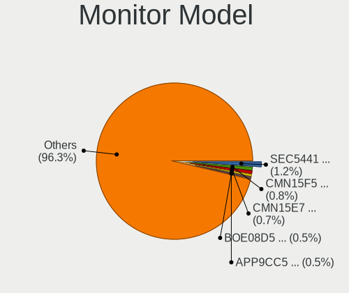

| Model                                                                    | Notebooks | Percent |
|--------------------------------------------------------------------------|-----------|---------|
| Samsung Electronics LCD Monitor SEC5441 1366x768 344x194mm 15.5-inch     | 8         | 1.43%   |
| AU Optronics LCD Monitor AUO183C 1366x768 309x173mm 13.9-inch            | 5         | 0.89%   |
| Samsung Electronics LCD Monitor SDC4171 2880x1800 302x189mm 14.0-inch    | 4         | 0.72%   |
| Chimei Innolux LCD Monitor CMN14D6 1366x768 309x173mm 13.9-inch          | 4         | 0.72%   |
| AU Optronics LCD Monitor AUO323C 1366x768 309x173mm 13.9-inch            | 4         | 0.72%   |
| AU Optronics LCD Monitor AUO2E3C 1366x768 309x173mm 13.9-inch            | 4         | 0.72%   |
| LG Display LCD Monitor LGD046F 1920x1080 340x190mm 15.3-inch             | 3         | 0.54%   |
| LG Display LCD Monitor LGD03F8 1366x768 345x194mm 15.6-inch              | 3         | 0.54%   |
| LG Display LCD Monitor LGD039F 1366x768 345x194mm 15.6-inch              | 3         | 0.54%   |
| Chimei Innolux LCD Monitor CMN15F5 1920x1080 344x193mm 15.5-inch         | 3         | 0.54%   |
| Chimei Innolux LCD Monitor CMN14D4 1920x1080 309x173mm 13.9-inch         | 3         | 0.54%   |
| Chi Mei Optoelectronics LCD Monitor CMO15A7 1366x768 344x193mm 15.5-inch | 3         | 0.54%   |
| BOE LCD Monitor BOE0877 1920x1080 309x173mm 13.9-inch                    | 3         | 0.54%   |
| BOE LCD Monitor BOE07F7 1920x1080 309x174mm 14.0-inch                    | 3         | 0.54%   |
| AU Optronics LCD Monitor AUOAF90 1920x1080 344x193mm 15.5-inch           | 3         | 0.54%   |
| AU Optronics LCD Monitor AUO723C 1366x768 309x173mm 13.9-inch            | 3         | 0.54%   |
| AU Optronics LCD Monitor AUO71EC 1366x768 344x193mm 15.5-inch            | 3         | 0.54%   |
| AU Optronics LCD Monitor AUO61ED 1920x1080 344x194mm 15.5-inch           | 3         | 0.54%   |
| AU Optronics LCD Monitor AUO38ED 1920x1080 344x193mm 15.5-inch           | 3         | 0.54%   |
| AU Optronics LCD Monitor AUO333C 1366x768 309x173mm 13.9-inch            | 3         | 0.54%   |
| AU Optronics LCD Monitor AUO21EC 1366x768 344x193mm 15.5-inch            | 3         | 0.54%   |
| AU Optronics LCD Monitor AUO106C 1366x768 277x156mm 12.5-inch            | 3         | 0.54%   |
| Apple Color LCD APPA037 2880x1800 286x179mm 13.3-inch                    | 3         | 0.54%   |
| SLD LCD Monitor SLD003C 1366x768 309x173mm 13.9-inch                     | 2         | 0.36%   |
| Samsung Electronics LCD Monitor SEC3245 1366x768 344x194mm 15.5-inch     | 2         | 0.36%   |
| Samsung Electronics LCD Monitor SEC314C 1920x1080 344x194mm 15.5-inch    | 2         | 0.36%   |
| Samsung Electronics LCD Monitor SDC4178 3200x2000 344x215mm 16.0-inch    | 2         | 0.36%   |
| Samsung Electronics LCD Monitor SDC4147 1366x768 344x194mm 15.5-inch     | 2         | 0.36%   |
| PANDA LCD Monitor NCP0004 1920x1080 294x165mm 13.3-inch                  | 2         | 0.36%   |
| LG Display LCD Monitor LGD060F 1920x1080 309x174mm 14.0-inch             | 2         | 0.36%   |
| LG Display LCD Monitor LGD05E5 1920x1080 344x194mm 15.5-inch             | 2         | 0.36%   |
| LG Display LCD Monitor LGD04A5 1920x1280 253x169mm 12.0-inch             | 2         | 0.36%   |
| LG Display LCD Monitor LGD0468 1366x768 344x194mm 15.5-inch              | 2         | 0.36%   |
| LG Display LCD Monitor LGD0456 1366x768 344x194mm 15.5-inch              | 2         | 0.36%   |
| LG Display LCD Monitor LGD0430 1366x768 345x194mm 15.6-inch              | 2         | 0.36%   |
| LG Display LCD Monitor LGD0396 1600x900 382x215mm 17.3-inch              | 2         | 0.36%   |
| LG Display LCD Monitor LGD0362 1600x900 309x174mm 14.0-inch              | 2         | 0.36%   |
| LG Display LCD Monitor LGD02EB 1366x768 309x174mm 14.0-inch              | 2         | 0.36%   |
| LG Display LCD Monitor LGD02E3 1366x768 344x194mm 15.5-inch              | 2         | 0.36%   |
| LG Display LCD Monitor LGD02DC 1366x768 344x194mm 15.5-inch              | 2         | 0.36%   |

Monitor Resolution
------------------

Monitor screen resolution

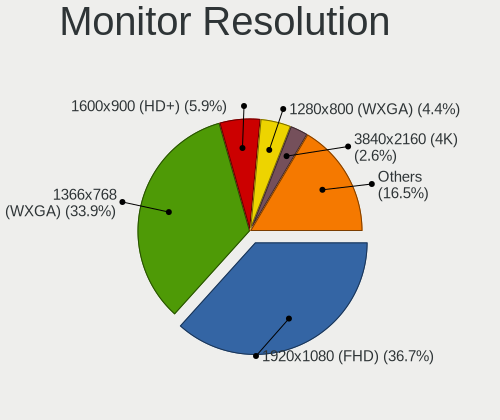

| Resolution         | Notebooks | Percent |
|--------------------|-----------|---------|
| 1920x1080 (FHD)    | 205       | 37.68%  |
| 1366x768 (WXGA)    | 194       | 35.66%  |
| 1600x900 (HD+)     | 27        | 4.96%   |
| 1280x800 (WXGA)    | 21        | 3.86%   |
| 2880x1800          | 16        | 2.94%   |
| 3840x2160 (4K)     | 13        | 2.39%   |
| 2560x1440 (QHD)    | 12        | 2.21%   |
| 1440x900 (WXGA+)   | 12        | 2.21%   |
| 1920x1200 (WUXGA)  | 10        | 1.84%   |
| 2560x1600          | 8         | 1.47%   |
| 1680x1050 (WSXGA+) | 4         | 0.74%   |
| 2560x1080          | 3         | 0.55%   |
| 3840x2400          | 2         | 0.37%   |
| 3200x2000          | 2         | 0.37%   |
| 2304x1440          | 2         | 0.37%   |
| 1920x1280          | 2         | 0.37%   |
| 1360x768           | 2         | 0.37%   |
| 504x315            | 1         | 0.18%   |
| 480x1920           | 1         | 0.18%   |
| 3840x1200          | 1         | 0.18%   |
| 3072x1920          | 1         | 0.18%   |
| 2880x1620          | 1         | 0.18%   |
| 2520x1680          | 1         | 0.18%   |
| 2160x1440          | 1         | 0.18%   |
| 1680x945           | 1         | 0.18%   |
| 1024x600           | 1         | 0.18%   |

Monitor Diagonal
----------------

Diagonal size in inches

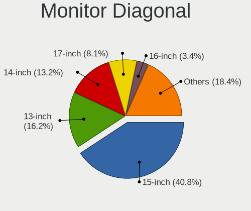

| Inches  | Notebooks | Percent |
|---------|-----------|---------|
| 15      | 227       | 40.83%  |
| 13      | 100       | 17.99%  |
| 14      | 80        | 14.39%  |
| 17      | 42        | 7.55%   |
| 16      | 18        | 3.24%   |
| 12      | 15        | 2.7%    |
| 24      | 12        | 2.16%   |
| 11      | 11        | 1.98%   |
| 23      | 8         | 1.44%   |
| 27      | 7         | 1.26%   |
| 18      | 7         | 1.26%   |
| 21      | 6         | 1.08%   |
| 31      | 4         | 0.72%   |
| 34      | 3         | 0.54%   |
| 84      | 2         | 0.36%   |
| 54      | 2         | 0.36%   |
| 22      | 2         | 0.36%   |
| 10      | 2         | 0.36%   |
| Unknown | 2         | 0.36%   |
| 48      | 1         | 0.18%   |
| 43      | 1         | 0.18%   |
| 40      | 1         | 0.18%   |
| 26      | 1         | 0.18%   |
| 20      | 1         | 0.18%   |
| 7       | 1         | 0.18%   |

Monitor Width
-------------

Physical width

| Width in mm | Notebooks | Percent |
|-------------|-----------|---------|
| 301-350     | 365       | 65.88%  |
| 201-300     | 70        | 12.64%  |
| 351-400     | 59        | 10.65%  |
| 501-600     | 26        | 4.69%   |
| 401-500     | 17        | 3.07%   |
| 601-700     | 4         | 0.72%   |
| 1001-1500   | 4         | 0.72%   |
| 701-800     | 3         | 0.54%   |
| 1501-2000   | 2         | 0.36%   |
| Unknown     | 2         | 0.36%   |
| 801-900     | 1         | 0.18%   |
| 101-200     | 1         | 0.18%   |

Aspect Ratio
------------

Proportional relationship between the width and the height

| Ratio | Notebooks | Percent |
|-------|-----------|---------|
| 16/9  | 432       | 83.08%  |
| 16/10 | 76        | 14.62%  |
| 3/2   | 7         | 1.35%   |
| 21/9  | 3         | 0.58%   |
| 3.20  | 1         | 0.19%   |
| 0.25  | 1         | 0.19%   |

Monitor Area
------------

Area in inch

| Area in inch | Notebooks | Percent |
|----------------|-----------|---------|
| 101-110        | 226       | 40.65%  |
| 81-90          | 148       | 26.62%  |
| 121-130        | 39        | 7.01%   |
| 71-80          | 29        | 5.22%   |
| 201-250        | 22        | 3.96%   |
| 61-70          | 15        | 2.7%    |
| 111-120        | 13        | 2.34%   |
| 51-60          | 11        | 1.98%   |
| 301-350        | 8         | 1.44%   |
| 351-500        | 7         | 1.26%   |
| 91-100         | 7         | 1.26%   |
| 141-150        | 6         | 1.08%   |
| More than 1000 | 5         | 0.9%    |
| 151-200        | 5         | 0.9%    |
| 131-140        | 5         | 0.9%    |
| 251-300        | 3         | 0.54%   |
| 41-50          | 2         | 0.36%   |
| 501-1000       | 2         | 0.36%   |
| Unknown        | 2         | 0.36%   |
| 1-40           | 1         | 0.18%   |

Pixel Density
-------------

Pixels per inch

| Density       | Notebooks | Percent |
|---------------|-----------|---------|
| 121-160       | 208       | 37.82%  |
| 101-120       | 190       | 34.55%  |
| 51-100        | 84        | 15.27%  |
| 161-240       | 44        | 8%      |
| More than 240 | 20        | 3.64%   |
| 1-50          | 2         | 0.36%   |
| Unknown       | 2         | 0.36%   |

Multiple Monitors
-----------------

Total monitors connected

| Total | Notebooks | Percent |
|-------|-----------|---------|
| 1     | 458       | 85.77%  |
| 2     | 51        | 9.55%   |
| 0     | 22        | 4.12%   |
| 3     | 3         | 0.56%   |

Network
-------

Net Controller Vendor
---------------------

Controller vendors

| Vendor                            | Notebooks | Percent |
|-----------------------------------|-----------|---------|
| Realtek Semiconductor             | 285       | 33.41%  |
| Intel                             | 263       | 30.83%  |
| Qualcomm Atheros                  | 117       | 13.72%  |
| Broadcom                          | 65        | 7.62%   |
| MediaTek                          | 21        | 2.46%   |
| Broadcom Limited                  | 16        | 1.88%   |
| Samsung Electronics               | 11        | 1.29%   |
| Marvell Technology Group          | 11        | 1.29%   |
| Ralink                            | 8         | 0.94%   |
| TP-Link                           | 7         | 0.82%   |
| Sierra Wireless                   | 7         | 0.82%   |
| JMicron Technology                | 5         | 0.59%   |
| Ralink Technology                 | 4         | 0.47%   |
| Hewlett-Packard                   | 4         | 0.47%   |
| Ericsson Business Mobile Networks | 3         | 0.35%   |
| DisplayLink                       | 3         | 0.35%   |
| ASIX Electronics                  | 3         | 0.35%   |
| Qualcomm                          | 2         | 0.23%   |
| Nvidia                            | 2         | 0.23%   |
| Lenovo                            | 2         | 0.23%   |
| Dell                              | 2         | 0.23%   |
| D-Link                            | 2         | 0.23%   |
| XYZ,Handheld_Scanner              | 1         | 0.12%   |
| Xiaomi                            | 1         | 0.12%   |
| U-Blox                            | 1         | 0.12%   |
| TRENDnet                          | 1         | 0.12%   |
| Silicon Integrated Systems [SiS]  | 1         | 0.12%   |
| OPPO Electronics                  | 1         | 0.12%   |
| NetGear                           | 1         | 0.12%   |
| Google                            | 1         | 0.12%   |
| Edimax Technology                 | 1         | 0.12%   |
| Belkin Components                 | 1         | 0.12%   |

Net Controller Model
--------------------

Controller models

| Model                                                                  | Notebooks | Percent |
|------------------------------------------------------------------------|-----------|---------|
| Realtek RTL8111/8168/8211/8411 PCI Express Gigabit Ethernet Controller | 159       | 15.73%  |
| Realtek RTL810xE PCI Express Fast Ethernet controller                  | 59        | 5.84%   |
| Qualcomm Atheros AR9285 Wireless Network Adapter (PCI-Express)         | 24        | 2.37%   |
| Intel Wireless 7260                                                    | 22        | 2.18%   |
| Qualcomm Atheros QCA9565 / AR9565 Wireless Network Adapter             | 20        | 1.98%   |
| Qualcomm Atheros QCA9377 802.11ac Wireless Network Adapter             | 19        | 1.88%   |
| Qualcomm Atheros AR9485 Wireless Network Adapter                       | 17        | 1.68%   |
| Intel Wireless 7265                                                    | 17        | 1.68%   |
| Intel 82579LM Gigabit Network Connection (Lewisville)                  | 17        | 1.68%   |
| Realtek RTL8153 Gigabit Ethernet Adapter                               | 16        | 1.58%   |
| Intel Wireless 8260                                                    | 16        | 1.58%   |
| Intel Wireless 3165                                                    | 15        | 1.48%   |
| Intel Wi-Fi 6 AX201                                                    | 15        | 1.48%   |
| Intel Wireless 8265 / 8275                                             | 14        | 1.38%   |
| Realtek RTL8821CE 802.11ac PCIe Wireless Network Adapter               | 13        | 1.29%   |
| Intel Alder Lake-P PCH CNVi WiFi                                       | 13        | 1.29%   |
| Realtek RTL8822CE 802.11ac PCIe Wireless Network Adapter               | 12        | 1.19%   |
| Intel Raptor Lake PCH CNVi WiFi                                        | 12        | 1.19%   |
| Intel Centrino Advanced-N 6205 [Taylor Peak]                           | 11        | 1.09%   |
| Broadcom BCM4331 802.11a/b/g/n                                         | 10        | 0.99%   |
| Realtek RTL8188EE Wireless Network Adapter                             | 9         | 0.89%   |
| Intel Wi-Fi 6 AX200                                                    | 9         | 0.89%   |
| Broadcom NetXtreme BCM57765 Gigabit Ethernet PCIe                      | 9         | 0.89%   |
| MediaTek MT7921 802.11ax PCI Express Wireless Network Adapter          | 8         | 0.79%   |
| Intel WiFi Link 5100                                                   | 8         | 0.79%   |
| Intel Ethernet Connection I217-LM                                      | 8         | 0.79%   |
| Broadcom BCM4313 802.11bgn Wireless Network Adapter                    | 8         | 0.79%   |
| Samsung Galaxy series, misc. (tethering mode)                          | 7         | 0.69%   |
| Qualcomm Atheros AR928X Wireless Network Adapter (PCI-Express)         | 7         | 0.69%   |
| Intel Wi-Fi 6E(802.11ax) AX210/AX1675* 2x2 [Typhoon Peak]              | 7         | 0.69%   |
| Intel Ethernet Connection I219-LM                                      | 7         | 0.69%   |
| Intel Ethernet Connection I218-LM                                      | 7         | 0.69%   |
| Intel Ethernet Connection (4) I219-LM                                  | 7         | 0.69%   |
| Intel Ethernet Connection (3) I218-LM                                  | 7         | 0.69%   |
| Intel Dual Band Wireless-AC 3165 Plus Bluetooth                        | 7         | 0.69%   |
| Realtek RTL8188CE 802.11b/g/n WiFi Adapter                             | 6         | 0.59%   |
| Qualcomm Atheros QCA6174 802.11ac Wireless Network Adapter             | 6         | 0.59%   |
| Intel Tiger Lake PCH CNVi WiFi                                         | 6         | 0.59%   |
| Intel Gemini Lake PCH CNVi WiFi                                        | 6         | 0.59%   |
| Intel Ethernet Connection (4) I219-V                                   | 6         | 0.59%   |

Wireless Vendor
---------------

Wireless vendors

| Vendor                | Notebooks | Percent |
|-----------------------|-----------|---------|
| Intel                 | 252       | 45.24%  |
| Qualcomm Atheros      | 100       | 17.95%  |
| Realtek Semiconductor | 87        | 15.62%  |
| Broadcom              | 52        | 9.34%   |
| MediaTek              | 20        | 3.59%   |
| Broadcom Limited      | 12        | 2.15%   |
| Ralink                | 8         | 1.44%   |
| Sierra Wireless       | 7         | 1.26%   |
| TP-Link               | 6         | 1.08%   |
| Ralink Technology     | 4         | 0.72%   |
| Dell                  | 2         | 0.36%   |
| D-Link                | 2         | 0.36%   |
| TRENDnet              | 1         | 0.18%   |
| Qualcomm              | 1         | 0.18%   |
| NetGear               | 1         | 0.18%   |
| Edimax Technology     | 1         | 0.18%   |
| Belkin Components     | 1         | 0.18%   |

Wireless Model
--------------

Wireless models

| Model                                                          | Notebooks | Percent |
|----------------------------------------------------------------|-----------|---------|
| Qualcomm Atheros AR9285 Wireless Network Adapter (PCI-Express) | 24        | 4.29%   |
| Intel Wireless 7260                                            | 22        | 3.93%   |
| Qualcomm Atheros QCA9565 / AR9565 Wireless Network Adapter     | 20        | 3.57%   |
| Qualcomm Atheros QCA9377 802.11ac Wireless Network Adapter     | 19        | 3.39%   |
| Qualcomm Atheros AR9485 Wireless Network Adapter               | 17        | 3.04%   |
| Intel Wireless 7265                                            | 17        | 3.04%   |
| Intel Wireless 8260                                            | 16        | 2.86%   |
| Intel Wireless 3165                                            | 15        | 2.68%   |
| Intel Wi-Fi 6 AX201                                            | 15        | 2.68%   |
| Intel Wireless 8265 / 8275                                     | 14        | 2.5%    |
| Realtek RTL8821CE 802.11ac PCIe Wireless Network Adapter       | 13        | 2.32%   |
| Intel Alder Lake-P PCH CNVi WiFi                               | 13        | 2.32%   |
| Realtek RTL8822CE 802.11ac PCIe Wireless Network Adapter       | 12        | 2.14%   |
| Intel Raptor Lake PCH CNVi WiFi                                | 12        | 2.14%   |
| Intel Centrino Advanced-N 6205 [Taylor Peak]                   | 11        | 1.96%   |
| Broadcom BCM4331 802.11a/b/g/n                                 | 10        | 1.79%   |
| Realtek RTL8188EE Wireless Network Adapter                     | 9         | 1.61%   |
| Intel Wi-Fi 6 AX200                                            | 9         | 1.61%   |
| MediaTek MT7921 802.11ax PCI Express Wireless Network Adapter  | 8         | 1.43%   |
| Intel WiFi Link 5100                                           | 8         | 1.43%   |
| Broadcom BCM4313 802.11bgn Wireless Network Adapter            | 8         | 1.43%   |
| Qualcomm Atheros AR928X Wireless Network Adapter (PCI-Express) | 7         | 1.25%   |
| Intel Wi-Fi 6E(802.11ax) AX210/AX1675* 2x2 [Typhoon Peak]      | 7         | 1.25%   |
| Intel Dual Band Wireless-AC 3165 Plus Bluetooth                | 7         | 1.25%   |
| Realtek RTL8188CE 802.11b/g/n WiFi Adapter                     | 6         | 1.07%   |
| Qualcomm Atheros QCA6174 802.11ac Wireless Network Adapter     | 6         | 1.07%   |
| Intel Tiger Lake PCH CNVi WiFi                                 | 6         | 1.07%   |
| Intel Gemini Lake PCH CNVi WiFi                                | 6         | 1.07%   |
| Intel Centrino Advanced-N 6235                                 | 6         | 1.07%   |
| Intel Cannon Point-LP CNVi [Wireless-AC]                       | 6         | 1.07%   |
| Broadcom BCM4350 802.11ac Wireless Network Adapter             | 6         | 1.07%   |
| Broadcom BCM43142 802.11b/g/n                                  | 6         | 1.07%   |
| Realtek RTL8852BE PCIe 802.11ax Wireless Network Controller    | 5         | 0.89%   |
| Realtek 802.11n WLAN Adapter                                   | 5         | 0.89%   |
| Realtek 802.11ac NIC                                           | 5         | 0.89%   |
| Qualcomm Atheros AR9287 Wireless Network Adapter (PCI-Express) | 5         | 0.89%   |
| MediaTek Wi-Fi 6E MT7902 Wireless Network Adapter              | 5         | 0.89%   |
| MediaTek MT7922 802.11ax PCI Express Wireless Network Adapter  | 5         | 0.89%   |
| Intel Wireless 3160                                            | 5         | 0.89%   |
| Intel PRO/Wireless 4965 AG or AGN [Kedron] Network Connection  | 5         | 0.89%   |

Ethernet Vendor
---------------

Ethernet vendors

| Vendor                           | Notebooks | Percent |
|----------------------------------|-----------|---------|
| Realtek Semiconductor            | 240       | 54.18%  |
| Intel                            | 93        | 20.99%  |
| Qualcomm Atheros                 | 32        | 7.22%   |
| Broadcom                         | 27        | 6.09%   |
| Samsung Electronics              | 11        | 2.48%   |
| Marvell Technology Group         | 11        | 2.48%   |
| JMicron Technology               | 5         | 1.13%   |
| Broadcom Limited                 | 4         | 0.9%    |
| Hewlett-Packard                  | 3         | 0.68%   |
| DisplayLink                      | 3         | 0.68%   |
| ASIX Electronics                 | 3         | 0.68%   |
| Nvidia                           | 2         | 0.45%   |
| Lenovo                           | 2         | 0.45%   |
| Xiaomi                           | 1         | 0.23%   |
| TP-Link                          | 1         | 0.23%   |
| Silicon Integrated Systems [SiS] | 1         | 0.23%   |
| Qualcomm                         | 1         | 0.23%   |
| OPPO Electronics                 | 1         | 0.23%   |
| MediaTek                         | 1         | 0.23%   |
| Google                           | 1         | 0.23%   |

Ethernet Model
--------------

Ethernet models

| Model                                                                          | Notebooks | Percent |
|--------------------------------------------------------------------------------|-----------|---------|
| Realtek RTL8111/8168/8211/8411 PCI Express Gigabit Ethernet Controller         | 159       | 35.73%  |
| Realtek RTL810xE PCI Express Fast Ethernet controller                          | 59        | 13.26%  |
| Intel 82579LM Gigabit Network Connection (Lewisville)                          | 17        | 3.82%   |
| Realtek RTL8153 Gigabit Ethernet Adapter                                       | 16        | 3.6%    |
| Broadcom NetXtreme BCM57765 Gigabit Ethernet PCIe                              | 9         | 2.02%   |
| Intel Ethernet Connection I217-LM                                              | 8         | 1.8%    |
| Samsung Galaxy series, misc. (tethering mode)                                  | 7         | 1.57%   |
| Intel Ethernet Connection I219-LM                                              | 7         | 1.57%   |
| Intel Ethernet Connection I218-LM                                              | 7         | 1.57%   |
| Intel Ethernet Connection (4) I219-LM                                          | 7         | 1.57%   |
| Intel Ethernet Connection (3) I218-LM                                          | 7         | 1.57%   |
| Intel Ethernet Connection (4) I219-V                                           | 6         | 1.35%   |
| Qualcomm Atheros AR8151 v2.0 Gigabit Ethernet                                  | 5         | 1.12%   |
| Broadcom NetLink BCM57780 Gigabit Ethernet PCIe                                | 5         | 1.12%   |
| Samsung GT-I9070 (network tethering, USB debugging enabled)                    | 4         | 0.9%    |
| Realtek Killer E2600 GbE Controller                                            | 4         | 0.9%    |
| Qualcomm Atheros AR8162 Fast Ethernet                                          | 4         | 0.9%    |
| Qualcomm Atheros AR8152 v2.0 Fast Ethernet                                     | 4         | 0.9%    |
| Marvell Group 88E8040 PCI-E Fast Ethernet Controller                           | 4         | 0.9%    |
| JMicron JMC250 PCI Express Gigabit Ethernet Controller                         | 4         | 0.9%    |
| Intel Ethernet Connection I219-V                                               | 4         | 0.9%    |
| Intel 82577LM Gigabit Network Connection                                       | 4         | 0.9%    |
| Qualcomm Atheros QCA8171 Gigabit Ethernet                                      | 3         | 0.67%   |
| Qualcomm Atheros AR8161 Gigabit Ethernet                                       | 3         | 0.67%   |
| Qualcomm Atheros AR8131 Gigabit Ethernet                                       | 3         | 0.67%   |
| Qualcomm Atheros AR8121/AR8113/AR8114 Gigabit or Fast Ethernet                 | 3         | 0.67%   |
| Marvell Group Yukon Optima 88E8059 [PCIe Gigabit Ethernet Controller with AVB] | 3         | 0.67%   |
| Intel 82579V Gigabit Network Connection                                        | 3         | 0.67%   |
| Intel 82567LM Gigabit Network Connection                                       | 3         | 0.67%   |
| HP lt4120 Snapdragon X5 LTE                                                    | 3         | 0.67%   |
| Broadcom NetXtreme BCM5761 Gigabit Ethernet PCIe                               | 3         | 0.67%   |
| Broadcom NetLink BCM5784M Gigabit Ethernet PCIe                                | 3         | 0.67%   |
| ASIX AX88179 Gigabit Ethernet                                                  | 3         | 0.67%   |
| Qualcomm Atheros Killer E220x Gigabit Ethernet Controller                      | 2         | 0.45%   |
| Qualcomm Atheros AR8151 v1.0 Gigabit Ethernet                                  | 2         | 0.45%   |
| Nvidia MCP79 Ethernet                                                          | 2         | 0.45%   |
| Marvell Group 88E8055 PCI-E Gigabit Ethernet Controller                        | 2         | 0.45%   |
| Intel Ethernet Connection I217-V                                               | 2         | 0.45%   |
| Intel Ethernet Connection (6) I219-V                                           | 2         | 0.45%   |
| Intel Ethernet Connection (2) I219-LM                                          | 2         | 0.45%   |

Net Controller Kind
-------------------

Ethernet, WiFi or modem

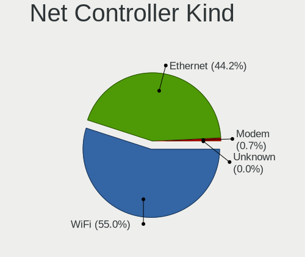

| Kind     | Notebooks | Percent |
|----------|-----------|---------|
| WiFi     | 527       | 55.13%  |
| Ethernet | 423       | 44.25%  |
| Modem    | 6         | 0.63%   |

Used Controller
---------------

Currently used network controller

| Kind     | Notebooks | Percent |
|----------|-----------|---------|
| WiFi     | 459       | 83.15%  |
| Ethernet | 93        | 16.85%  |

NICs
----

Total network controllers on board

| Total | Notebooks | Percent |
|-------|-----------|---------|
| 2     | 384       | 72.05%  |
| 1     | 138       | 25.89%  |
| 0     | 8         | 1.5%    |
| 3     | 3         | 0.56%   |

IPv6
----

IPv6 vs IPv4

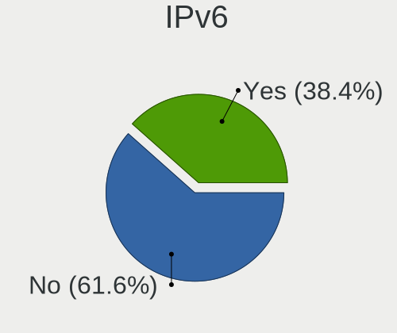

| Used | Notebooks | Percent |
|------|-----------|---------|
| No   | 341       | 63.74%  |
| Yes  | 194       | 36.26%  |

Bluetooth
---------

Bluetooth Vendor
----------------

Controller vendors

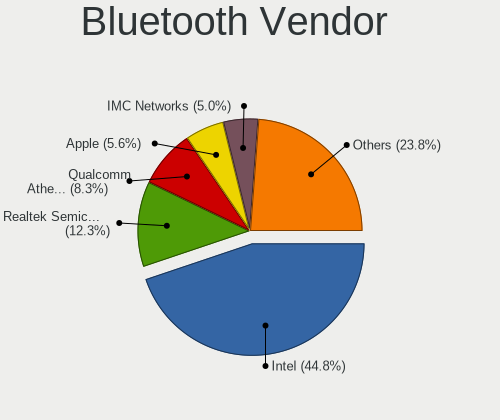

| Vendor                          | Notebooks | Percent |
|---------------------------------|-----------|---------|
| Intel                           | 197       | 47.7%   |
| Realtek Semiconductor           | 42        | 10.17%  |
| Qualcomm Atheros Communications | 34        | 8.23%   |
| IMC Networks                    | 22        | 5.33%   |
| Foxconn / Hon Hai               | 21        | 5.08%   |
| Apple                           | 21        | 5.08%   |
| Lite-On Technology              | 16        | 3.87%   |
| Broadcom                        | 11        | 2.66%   |
| Toshiba                         | 8         | 1.94%   |
| Hewlett-Packard                 | 8         | 1.94%   |
| Dell                            | 7         | 1.69%   |
| Cambridge Silicon Radio         | 7         | 1.69%   |
| Ralink                          | 4         | 0.97%   |
| ASUSTek Computer                | 4         | 0.97%   |
| Realtek                         | 2         | 0.48%   |
| Alps Electric                   | 2         | 0.48%   |
| Actions                         | 2         | 0.48%   |
| Smart Modular Technologies      | 1         | 0.24%   |
| Ralink Technology               | 1         | 0.24%   |
| MediaTek                        | 1         | 0.24%   |
| Foxconn International           | 1         | 0.24%   |
| Dynex                           | 1         | 0.24%   |

Bluetooth Model
---------------

Controller models

| Model                                                                               | Notebooks | Percent |
|-------------------------------------------------------------------------------------|-----------|---------|
| Intel Bluetooth wireless interface                                                  | 63        | 15.25%  |
| Intel AX201 Bluetooth                                                               | 36        | 8.72%   |
| Intel Bluetooth Device                                                              | 28        | 6.78%   |
| Intel Bluetooth 9460/9560 Jefferson Peak (JfP)                                      | 24        | 5.81%   |
| Realtek Bluetooth Radio                                                             | 23        | 5.57%   |
| Qualcomm Atheros  Bluetooth Device                                                  | 15        | 3.63%   |
| Intel AX211 Bluetooth                                                               | 14        | 3.39%   |
| Apple Bluetooth Host Controller                                                     | 12        | 2.91%   |
| Qualcomm Atheros AR3011 Bluetooth                                                   | 9         | 2.18%   |
| Intel Centrino Bluetooth Wireless Transceiver                                       | 9         | 2.18%   |
| Intel AX200 Bluetooth                                                               | 9         | 2.18%   |
| IMC Networks Wireless_Device                                                        | 9         | 2.18%   |
| Apple Bluetooth USB Host Controller                                                 | 9         | 2.18%   |
| Realtek  Bluetooth 4.2 Adapter                                                      | 8         | 1.94%   |
| Qualcomm Atheros AR3012 Bluetooth 4.0                                               | 7         | 1.69%   |
| IMC Networks Bluetooth Device                                                       | 7         | 1.69%   |
| Cambridge Silicon Radio Bluetooth Dongle (HCI mode)                                 | 7         | 1.69%   |
| Intel AX210 Bluetooth                                                               | 6         | 1.45%   |
| Foxconn / Hon Hai Bluetooth Device                                                  | 6         | 1.45%   |
| Realtek 802.11ac WLAN Adapter                                                       | 5         | 1.21%   |
| Broadcom BCM2045B (BDC-2.1)                                                         | 5         | 1.21%   |
| Toshiba Bluetooth Device                                                            | 4         | 0.97%   |
| Ralink RT3290 Bluetooth                                                             | 4         | 0.97%   |
| Lite-On Wireless_Device                                                             | 4         | 0.97%   |
| Lite-On Bluetooth Device                                                            | 4         | 0.97%   |
| Intel Centrino Advanced-N 6230 Bluetooth adapter                                    | 4         | 0.97%   |
| HP Broadcom 2070 Bluetooth Combo                                                    | 4         | 0.97%   |
| HP Bluetooth 2.0 Interface [Broadcom BCM2045]                                       | 4         | 0.97%   |
| Foxconn / Hon Hai Foxconn T77H114 BCM2070 [Single-Chip Bluetooth 2.1 + EDR Adapter] | 4         | 0.97%   |
| Lite-On Atheros AR3012 Bluetooth                                                    | 3         | 0.73%   |
| Intel Wireless-AC 9260 Bluetooth Adapter                                            | 3         | 0.73%   |
| IMC Networks Bluetooth Radio                                                        | 3         | 0.73%   |
| Foxconn / Hon Hai Wireless_Device                                                   | 3         | 0.73%   |
| Dell DW375 Bluetooth Module                                                         | 3         | 0.73%   |
| Realtek RTL8821A Bluetooth                                                          | 2         | 0.48%   |
| Realtek RTL8723B Bluetooth                                                          | 2         | 0.48%   |
| Realtek Bluetooth Radio                                                             | 2         | 0.48%   |
| IMC Networks Bluetooth USB Host Controller                                          | 2         | 0.48%   |
| Foxconn / Hon Hai MediaTek Bluetooth Adapter                                        | 2         | 0.48%   |
| Foxconn / Hon Hai BCM20702A0                                                        | 2         | 0.48%   |

Sound
-----

Sound Vendor
------------

Sound card vendors

| Vendor                           | Notebooks | Percent |
|----------------------------------|-----------|---------|
| Intel                            | 432       | 66.36%  |
| AMD                              | 118       | 18.13%  |
| Nvidia                           | 73        | 11.21%  |
| C-Media Electronics              | 5         | 0.77%   |
| Generalplus Technology           | 3         | 0.46%   |
| Sony                             | 2         | 0.31%   |
| Logitech                         | 2         | 0.31%   |
| JMTek                            | 2         | 0.31%   |
| TX                               | 1         | 0.15%   |
| Texas Instruments                | 1         | 0.15%   |
| Silicon Integrated Systems [SiS] | 1         | 0.15%   |
| SAVITECH                         | 1         | 0.15%   |
| Realtek Semiconductor            | 1         | 0.15%   |
| Mackie Designs                   | 1         | 0.15%   |
| Lenovo                           | 1         | 0.15%   |
| Hewlett-Packard                  | 1         | 0.15%   |
| GN Netcom                        | 1         | 0.15%   |
| Focusrite-Novation               | 1         | 0.15%   |
| FiiO Electronics Technology      | 1         | 0.15%   |
| Cambridge Silicon Radio          | 1         | 0.15%   |
| ASUSTek Computer                 | 1         | 0.15%   |
| Apple                            | 1         | 0.15%   |

Sound Model
-----------

Sound card models

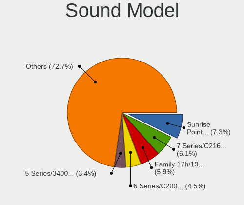

| Model                                                                      | Notebooks | Percent |
|----------------------------------------------------------------------------|-----------|---------|
| Intel Sunrise Point-LP HD Audio                                            | 64        | 8.09%   |
| AMD Family 17h/19h HD Audio Controller                                     | 57        | 7.21%   |
| Intel 7 Series/C216 Chipset Family High Definition Audio Controller        | 51        | 6.45%   |
| Intel 6 Series/C200 Series Chipset Family High Definition Audio Controller | 39        | 4.93%   |
| Intel 5 Series/3400 Series Chipset High Definition Audio                   | 31        | 3.92%   |
| Intel 82801I (ICH9 Family) HD Audio Controller                             | 30        | 3.79%   |
| AMD Renoir Radeon High Definition Audio Controller                         | 29        | 3.67%   |
| Intel Celeron/Pentium Silver Processor High Definition Audio               | 26        | 3.29%   |
| Intel Haswell-ULT HD Audio Controller                                      | 23        | 2.91%   |
| Intel 8 Series HD Audio Controller                                         | 23        | 2.91%   |
| Intel Wildcat Point-LP High Definition Audio Controller                    | 22        | 2.78%   |
| Intel Broadwell-U Audio Controller                                         | 22        | 2.78%   |
| Intel 8 Series/C220 Series Chipset High Definition Audio Controller        | 21        | 2.65%   |
| AMD FCH Azalia Controller                                                  | 19        | 2.4%    |
| Intel Tiger Lake-LP Smart Sound Technology Audio Controller                | 16        | 2.02%   |
| AMD Raven/Raven2/Fenghuang HDMI/DP Audio Controller                        | 16        | 2.02%   |
| Intel Xeon E3-1200 v3/4th Gen Core Processor HD Audio Controller           | 15        | 1.9%    |
| Intel Alder Lake PCH-P High Definition Audio Controller                    | 14        | 1.77%   |
| Intel Cannon Point-LP High Definition Audio Controller                     | 13        | 1.64%   |
| AMD Kabini HDMI/DP Audio                                                   | 13        | 1.64%   |
| Nvidia Audio device                                                        | 12        | 1.52%   |
| Intel Raptor Lake-P/U/H cAVS                                               | 12        | 1.52%   |
| Intel 82801H (ICH8 Family) HD Audio Controller                             | 8         | 1.01%   |
| AMD SBx00 Azalia (Intel HDA)                                               | 8         | 1.01%   |
| Nvidia GF108 High Definition Audio Controller                              | 7         | 0.88%   |
| Intel Comet Lake PCH-LP cAVS                                               | 7         | 0.88%   |
| Intel Cannon Lake PCH cAVS                                                 | 7         | 0.88%   |
| Intel Atom Processor Z36xxx/Z37xxx Series High Definition Audio Controller | 7         | 0.88%   |
| Nvidia GP107GL High Definition Audio Controller                            | 6         | 0.76%   |
| Nvidia GA104 High Definition Audio Controller                              | 6         | 0.76%   |
| Intel Tiger Lake-H HD Audio Controller                                     | 6         | 0.76%   |
| Intel Celeron N3350/Pentium N4200/Atom E3900 Series Audio Cluster          | 6         | 0.76%   |
| AMD Rembrandt Radeon High Definition Audio Controller                      | 6         | 0.76%   |
| AMD Family 15h (Models 60h-6fh) Audio Controller                           | 6         | 0.76%   |
| Nvidia TU107 GeForce GTX 1650 High Definition Audio Controller             | 5         | 0.63%   |
| Nvidia GA106 High Definition Audio Controller                              | 5         | 0.63%   |
| Intel Comet Lake PCH cAVS                                                  | 5         | 0.63%   |
| Intel 100 Series/C230 Series Chipset Family HD Audio Controller            | 5         | 0.63%   |
| AMD Trinity HDMI Audio Controller                                          | 5         | 0.63%   |
| AMD RV710/730 HDMI Audio [Radeon HD 4000 series]                           | 5         | 0.63%   |

Memory
------

Memory Vendor
-------------

Memory module vendors

| Vendor              | Notebooks | Percent |
|---------------------|-----------|---------|
| Samsung Electronics | 35        | 37.63%  |
| Micron Technology   | 14        | 15.05%  |
| SK hynix            | 13        | 13.98%  |
| Unknown             | 8         | 8.6%    |
| Kingston            | 7         | 7.53%   |
| Unknown (ABCD)      | 3         | 3.23%   |
| Ramaxel Technology  | 2         | 2.15%   |
| Crucial             | 2         | 2.15%   |
| Corsair             | 2         | 2.15%   |
| Teikon              | 1         | 1.08%   |
| Team                | 1         | 1.08%   |
| Smart Brazil        | 1         | 1.08%   |
| G.Skill             | 1         | 1.08%   |
| Elpida              | 1         | 1.08%   |
| A-DATA Technology   | 1         | 1.08%   |
| Unknown             | 1         | 1.08%   |

Memory Model
------------

Memory module models

| Model                                                            | Notebooks | Percent |
|------------------------------------------------------------------|-----------|---------|
| Unknown (ABCD) RAM 123456789012345678 2GB SODIMM LPDDR4 2400MT/s | 3         | 3.13%   |
| Samsung RAM M471B5273DH0-CH9 4GB SODIMM DDR3 1334MT/s            | 3         | 3.13%   |
| Unknown RAM Module 4GB SODIMM DDR3                               | 2         | 2.08%   |
| Unknown RAM Module 2GB SODIMM DDR2 800MT/s                       | 2         | 2.08%   |
| Unknown RAM Module 2GB SODIMM DDR2 667MT/s                       | 2         | 2.08%   |
| SK hynix RAM HMCG78MEBSA095N 16GB SODIMM DDR5 4800MT/s           | 2         | 2.08%   |
| Samsung RAM M471B5173EB0-YK0 4GB SODIMM DDR3 1600MT/s            | 2         | 2.08%   |
| Samsung RAM M471A5244CB0-CWE 4GB SODIMM DDR4 3200MT/s            | 2         | 2.08%   |
| Micron RAM 4ATF51264HZ-3G2J1 4GB SODIMM DDR4 3200MT/s            | 2         | 2.08%   |
| Micron RAM 4ATF1G64HZ-3G2F1 8GB SODIMM DDR4 3200MT/s             | 2         | 2.08%   |
| Micron RAM 4ATF1G64HZ-3G2E1 8GB Row Of Chips DDR4 3200MT/s       | 2         | 2.08%   |
| Unknown RAM Module 8GB SODIMM DDR4 2667MT/s                      | 1         | 1.04%   |
| Unknown RAM Module 4GB SODIMM DDR2                               | 1         | 1.04%   |
| Unknown RAM Module 1GB SODIMM DDR3                               | 1         | 1.04%   |
| Teikon RAM TMT451S6BFR8A-PBSC 4GB SODIMM DDR3 1600MT/s           | 1         | 1.04%   |
| Team RAM TEAMGROUP-SD4-3200 16GB SODIMM DDR4 3200MT/s            | 1         | 1.04%   |
| Smart Brazil RAM SMS4TDC3C0K0446SCG 4GB SODIMM DDR4 2667MT/s     | 1         | 1.04%   |
| SK hynix RAM HMT451S6AFR8C-PB 4GB SODIMM DDR3 1600MT/s           | 1         | 1.04%   |
| SK hynix RAM HMT451S6AFR8A-PB 4096MB SODIMM DDR3 1600MT/s        | 1         | 1.04%   |
| SK hynix RAM HMT325S6CFR8C-H9 2GB SODIMM DDR3 1333MT/s           | 1         | 1.04%   |
| SK hynix RAM HMA851S6DJR6N-XN 4GB Row Of Chips DDR4 3200MT/s     | 1         | 1.04%   |
| SK hynix RAM HMA851S6CJR6N-XN 4GB Row Of Chips DDR4 3200MT/s     | 1         | 1.04%   |
| SK hynix RAM HMA851S6AFR6N-UH 4GB SODIMM DDR4 2667MT/s           | 1         | 1.04%   |
| SK hynix RAM HMA82GS6CJR8N-VK 16GB SODIMM DDR4 2667MT/s          | 1         | 1.04%   |
| SK hynix RAM HMA81GS6CJR8N-VK 8GB SODIMM DDR4 2667MT/s           | 1         | 1.04%   |
| SK hynix RAM HMA451S6AFR8N-TF 4GB SODIMM DDR4 2133MT/s           | 1         | 1.04%   |
| SK hynix RAM HCNNNCPMBLHR-NEE 2GB Row Of Chips LPDDR4 4267MT/s   | 1         | 1.04%   |
| SK hynix RAM H9HCNNNCPMMLXR-NEE 8GB SODIMM LPDDR4 4266MT/s       | 1         | 1.04%   |
| Samsung RAM Module 8GB SODIMM DDR4 2400MT/s                      | 1         | 1.04%   |
| Samsung RAM Module 8GB SODIMM DDR3 1333MT/s                      | 1         | 1.04%   |
| Samsung RAM Module 4GB Row Of Chips LPDDR4 2933MT/s              | 1         | 1.04%   |
| Samsung RAM Module 32GB SODIMM DDR4 3200MT/s                     | 1         | 1.04%   |
| Samsung RAM Module 2GB SODIMM DDR3 1333MT/s                      | 1         | 1.04%   |
| Samsung RAM M471B5773CHS-CK0 2GB SODIMM 1600MT/s                 | 1         | 1.04%   |
| Samsung RAM M471B5673FH0-CF8 2GB SODIMM DDR3 1067MT/s            | 1         | 1.04%   |
| Samsung RAM M471B5673EH1-CF8 2048MB SODIMM DDR3 4199MT/s         | 1         | 1.04%   |
| Samsung RAM M471B5173QH0-YK0 4GB SODIMM DDR3 1600MT/s            | 1         | 1.04%   |
| Samsung RAM M471B1G73EB0-YK0 8GB Chip DDR3 1600MT/s              | 1         | 1.04%   |
| Samsung RAM M471B1G73DB0-YK0 8GB SODIMM DDR3 1600MT/s            | 1         | 1.04%   |
| Samsung RAM M471A5244CB0-CTD 4GB SODIMM DDR4 3266MT/s            | 1         | 1.04%   |

Memory Kind
-----------

Memory module kinds

| Kind   | Notebooks | Percent |
|--------|-----------|---------|
| DDR4   | 31        | 40.26%  |
| DDR3   | 22        | 28.57%  |
| LPDDR4 | 8         | 10.39%  |
| LPDDR5 | 5         | 6.49%   |
| DDR2   | 5         | 6.49%   |
| DDR5   | 4         | 5.19%   |
| SDRAM  | 2         | 2.6%    |

Memory Form Factor
------------------

Physical design of the memory module

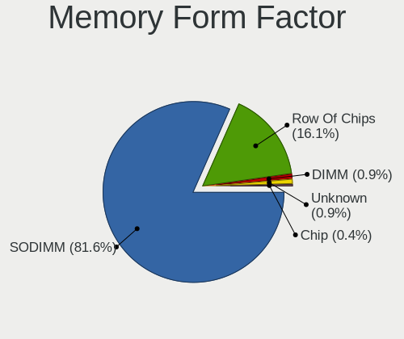

| Name         | Notebooks | Percent |
|--------------|-----------|---------|
| SODIMM       | 66        | 84.62%  |
| Row Of Chips | 10        | 12.82%  |
| Chip         | 1         | 1.28%   |
| Unknown      | 1         | 1.28%   |

Memory Size
-----------

Memory module size

| Size  | Notebooks | Percent |
|-------|-----------|---------|
| 8192  | 32        | 37.21%  |
| 4096  | 27        | 31.4%   |
| 16384 | 13        | 15.12%  |
| 2048  | 10        | 11.63%  |
| 32768 | 3         | 3.49%   |
| 1024  | 1         | 1.16%   |

Memory Speed
------------

Memory module speed

| Speed   | Notebooks | Percent |
|---------|-----------|---------|
| 3200    | 17        | 21.52%  |
| 1600    | 15        | 18.99%  |
| 2667    | 10        | 12.66%  |
| 2400    | 6         | 7.59%   |
| Unknown | 4         | 5.06%   |
| 6400    | 3         | 3.8%    |
| 4800    | 3         | 3.8%    |
| 1334    | 3         | 3.8%    |
| 4267    | 2         | 2.53%   |
| 1333    | 2         | 2.53%   |
| 1067    | 2         | 2.53%   |
| 800     | 2         | 2.53%   |
| 667     | 2         | 2.53%   |
| 7500    | 1         | 1.27%   |
| 5600    | 1         | 1.27%   |
| 5500    | 1         | 1.27%   |
| 4266    | 1         | 1.27%   |
| 4199    | 1         | 1.27%   |
| 3266    | 1         | 1.27%   |
| 2933    | 1         | 1.27%   |
| 2133    | 1         | 1.27%   |

Printers & scanners
-------------------

Printer Vendor
--------------

Printer device vendors

| Vendor              | Notebooks | Percent |
|---------------------|-----------|---------|
| Hewlett-Packard     | 3         | 60%     |
| Samsung Electronics | 1         | 20%     |
| Dymo-CoStar         | 1         | 20%     |

Printer Model
-------------

Printer device models

| Model                       | Notebooks | Percent |
|-----------------------------|-----------|---------|
| Samsung C43x Series         | 1         | 20%     |
| HP Printing Support         | 1         | 20%     |
| HP LaserJet 1020            | 1         | 20%     |
| HP HP LaserJet M14-M17      | 1         | 20%     |
| Dymo-CoStar LabelWriter 450 | 1         | 20%     |

Scanner Vendor
--------------

Scanner device vendors

| Vendor      | Notebooks | Percent |
|-------------|-----------|---------|
| Seiko Epson | 1         | 100%    |

Scanner Model
-------------

Scanner device models

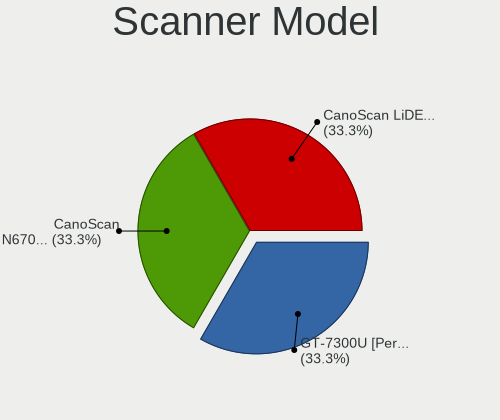

| Model                                             | Notebooks | Percent |
|---------------------------------------------------|-----------|---------|
| Seiko Epson GT-7300U [Perfection 1260/1260 PHOTO] | 1         | 100%    |

Camera
------

Camera Vendor
-------------

Camera device vendors

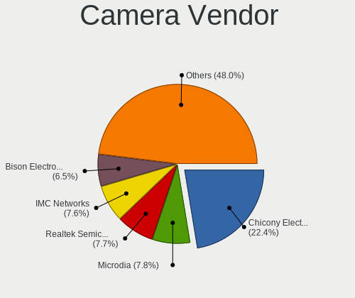

| Vendor                                 | Notebooks | Percent |
|----------------------------------------|-----------|---------|
| Chicony Electronics                    | 103       | 21.41%  |
| Microdia                               | 43        | 8.94%   |
| IMC Networks                           | 37        | 7.69%   |
| Realtek Semiconductor                  | 33        | 6.86%   |
| Quanta                                 | 30        | 6.24%   |
| Bison Electronics                      | 27        | 5.61%   |
| Cheng Uei Precision Industry (Foxlink) | 26        | 5.41%   |
| Suyin                                  | 25        | 5.2%    |
| Sunplus Innovation Technology          | 24        | 4.99%   |
| Apple                                  | 18        | 3.74%   |
| Acer                                   | 13        | 2.7%    |
| Silicon Motion                         | 10        | 2.08%   |
| Lite-On Technology                     | 10        | 2.08%   |
| Syntek                                 | 9         | 1.87%   |
| Sonix Technology                       | 9         | 1.87%   |
| Luxvisions Innotech Limited            | 8         | 1.66%   |
| Ricoh                                  | 7         | 1.46%   |
| Alcor Micro                            | 6         | 1.25%   |
| SunplusIT                              | 5         | 1.04%   |
| Shinetech                              | 5         | 1.04%   |
| icSpring                               | 5         | 1.04%   |
| Logitech                               | 3         | 0.62%   |
| Importek                               | 3         | 0.62%   |
| Y Media                                | 2         | 0.42%   |
| Samsung Electronics                    | 2         | 0.42%   |
| Lenovo                                 | 2         | 0.42%   |
| ALi                                    | 2         | 0.42%   |
| Unknown                                | 2         | 0.42%   |
| TXD                                    | 1         | 0.21%   |
| Sunplus Technology                     | 1         | 0.21%   |
| Shenzhen Kingcome Optoelectronic       | 1         | 0.21%   |
| OmniVision Technologies                | 1         | 0.21%   |
| Microsoft                              | 1         | 0.21%   |
| kingcome                               | 1         | 0.21%   |
| Intel                                  | 1         | 0.21%   |
| Genesys Logic                          | 1         | 0.21%   |
| Generalplus Technology                 | 1         | 0.21%   |
| Elecom                                 | 1         | 0.21%   |
| DigiTech                               | 1         | 0.21%   |
| BillionPixels                          | 1         | 0.21%   |

Camera Model
------------

Camera device models

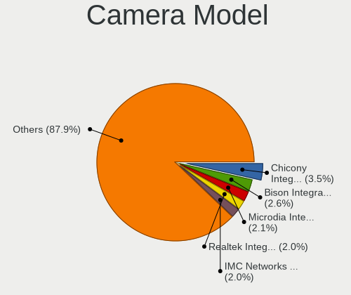

| Model                                                          | Notebooks | Percent |
|----------------------------------------------------------------|-----------|---------|
| Chicony Integrated Camera                                      | 18        | 3.73%   |
| Microdia Integrated_Webcam_HD                                  | 13        | 2.7%    |
| IMC Networks USB2.0 HD UVC WebCam                              | 10        | 2.07%   |
| IMC Networks Integrated Camera                                 | 10        | 2.07%   |
| Bison Integrated Camera                                        | 10        | 2.07%   |
| Realtek USB Camera                                             | 9         | 1.87%   |
| Realtek Integrated_Webcam_HD                                   | 8         | 1.66%   |
| Apple FaceTime HD Camera                                       | 8         | 1.66%   |
| Sunplus Integrated_Webcam_HD                                   | 7         | 1.45%   |
| Sonix USB2.0 FHD UVC WebCam                                    | 6         | 1.24%   |
| Chicony HP Truevision HD                                       | 6         | 1.24%   |
| Chicony HP HD Camera                                           | 6         | 1.24%   |
| Chicony FJ Camera                                              | 6         | 1.24%   |
| Acer Integrated Camera                                         | 6         | 1.24%   |
| Quanta HP Wide Vision HD Camera                                | 5         | 1.04%   |
| Microdia Integrated Webcam                                     | 5         | 1.04%   |
| icSpring camera                                                | 5         | 1.04%   |
| Chicony Lenovo EasyCamera                                      | 5         | 1.04%   |
| Chicony HP HD Webcam                                           | 5         | 1.04%   |
| Cheng Uei Precision Industry (Foxlink) HP TrueVision HD Camera | 5         | 1.04%   |
| Suyin HP Truevision HD                                         | 4         | 0.83%   |
| Suyin 1.3M WebCam (notebook emachines E730, Acer sub-brand)    | 4         | 0.83%   |
| Quanta HD User Facing                                          | 4         | 0.83%   |
| Microdia Sonix USB 2.0 Camera                                  | 4         | 0.83%   |
| Luxvisions Innotech Limited Integrated Camera                  | 4         | 0.83%   |
| Lite-On HP HD Camera                                           | 4         | 0.83%   |
| Chicony USB2.0 HD UVC WebCam                                   | 4         | 0.83%   |
| Chicony HD Webcam                                              | 4         | 0.83%   |
| Alcor Micro USB 2.0 PC cam                                     | 4         | 0.83%   |
| Syntek EasyCamera                                              | 3         | 0.62%   |
| Suyin Acer/HP Integrated Webcam [CN0314]                       | 3         | 0.62%   |
| Sunplus Laptop_Integrated_Webcam_FHD                           | 3         | 0.62%   |
| Sunplus HesTongCamera                                          | 3         | 0.62%   |
| Sonix USB2.0 HD UVC WebCam                                     | 3         | 0.62%   |
| Silicon Motion Web Camera                                      | 3         | 0.62%   |
| ShineTech USB2.0 HD UVC WebCam                                 | 3         | 0.62%   |
| Realtek USB2.0 VGA UVC WebCam                                  | 3         | 0.62%   |
| Realtek Integrated Webcam                                      | 3         | 0.62%   |
| Quanta USB2.0 HD UVC WebCam                                    | 3         | 0.62%   |
| Quanta HP HD Camera                                            | 3         | 0.62%   |

Security
--------

Fingerprint Vendor
------------------

Fingerprint sensor vendors

| Vendor                             | Notebooks | Percent |
|------------------------------------|-----------|---------|
| Validity Sensors                   | 38        | 49.35%  |
| Synaptics                          | 10        | 12.99%  |
| Shenzhen Goodix Technology         | 8         | 10.39%  |
| AuthenTec                          | 8         | 10.39%  |
| Upek                               | 4         | 5.19%   |
| Elan Microelectronics              | 4         | 5.19%   |
| LighTuning Technology              | 2         | 2.6%    |
| Samsung Electronics                | 1         | 1.3%    |
| Realtek USB2.0 Finger Print Bridge | 1         | 1.3%    |
| FocalTech                          | 1         | 1.3%    |

Fingerprint Model
-----------------

Fingerprint sensor models

| Model                                                                      | Notebooks | Percent |
|----------------------------------------------------------------------------|-----------|---------|
| Validity Sensors VFS495 Fingerprint Reader                                 | 10        | 12.99%  |
| Shenzhen Goodix  Fingerprint Device                                        | 7         | 9.09%   |
| Validity Sensors VFS5011 Fingerprint Reader                                | 5         | 6.49%   |
| Validity Sensors VFS 5011 fingerprint sensor                               | 5         | 6.49%   |
| Validity Sensors Synaptics VFS7552 Touch Fingerprint Sensor with PurePrint | 4         | 5.19%   |
| Upek Biometric Touchchip/Touchstrip Fingerprint Sensor                     | 4         | 5.19%   |
| Validity Sensors VFS471 Fingerprint Reader                                 | 3         | 3.9%    |
| Validity Sensors Synaptics WBDI                                            | 3         | 3.9%    |
| Validity Sensors Fingerprint scanner                                       | 3         | 3.9%    |
| Synaptics Metallica MIS Touch Fingerprint Reader                           | 3         | 3.9%    |
| Elan ELAN:Fingerprint                                                      | 3         | 3.9%    |
| AuthenTec AES1600                                                          | 3         | 3.9%    |
| Validity Sensors VFS491                                                    | 2         | 2.6%    |
| Synaptics Prometheus MIS Touch Fingerprint Reader                          | 2         | 2.6%    |
| Synaptics Metallica MOH Touch Fingerprint Reader                           | 2         | 2.6%    |
| Synaptics Fingerprint reader [HP G6]                                       | 2         | 2.6%    |
| LighTuning Fingerprint Reader                                              | 2         | 2.6%    |
| AuthenTec AES2810                                                          | 2         | 2.6%    |
| AuthenTec AES2501 Fingerprint Sensor                                       | 2         | 2.6%    |
| Validity Sensors VFS7500 Touch Fingerprint Sensor                          | 1         | 1.3%    |
| Validity Sensors VFS Fingerprint sensor                                    | 1         | 1.3%    |
| Validity Sensors Swipe Fingerprint Sensor                                  | 1         | 1.3%    |
| Synaptics  WBDI                                                            | 1         | 1.3%    |
| Shenzhen Goodix FingerPrint                                                | 1         | 1.3%    |
| Samsung Fingerprint Device                                                 | 1         | 1.3%    |
| Realtek USB2.0 Finger Print Bridge FocalTech Fingerprint Device            | 1         | 1.3%    |
| FocalTech Fingerprint Device                                               | 1         | 1.3%    |
| Elan ELAN:ARM-M4                                                           | 1         | 1.3%    |
| AuthenTec Fingerprint Sensor                                               | 1         | 1.3%    |

Chipcard Vendor
---------------

Chipcard module vendors

| Vendor                            | Notebooks | Percent |
|-----------------------------------|-----------|---------|
| Broadcom                          | 20        | 55.56%  |
| Alcor Micro                       | 9         | 25%     |
| Upek                              | 3         | 8.33%   |
| O2 Micro                          | 2         | 5.56%   |
| VASCO Data Security International | 1         | 2.78%   |
| Lenovo                            | 1         | 2.78%   |

Chipcard Model
--------------

Chipcard module models

| Model                                                                        | Notebooks | Percent |
|------------------------------------------------------------------------------|-----------|---------|
| Alcor Micro AU9540 Smartcard Reader                                          | 9         | 25%     |
| Broadcom BCM5880 Secure Applications Processor                               | 7         | 19.44%  |
| Broadcom BCM5880 Secure Applications Processor with fingerprint swipe sensor | 5         | 13.89%  |
| Broadcom 5880                                                                | 4         | 11.11%  |
| Broadcom 58200                                                               | 4         | 11.11%  |
| Upek TouchChip Fingerprint Coprocessor (WBF advanced mode)                   | 3         | 8.33%   |
| O2 Micro OZ776 CCID Smartcard Reader                                         | 2         | 5.56%   |
| VASCO Data Security International DIGIPASS 870                               | 1         | 2.78%   |
| Lenovo Integrated Smart Card Reader                                          | 1         | 2.78%   |

Unsupported
-----------

Unsupported Devices
-------------------

Total unsupported devices on board

| Total | Notebooks | Percent |
|-------|-----------|---------|
| 0     | 339       | 62.78%  |
| 1     | 171       | 31.67%  |
| 2     | 27        | 5%      |
| 3     | 3         | 0.56%   |

Unsupported Device Types
------------------------

Types of unsupported devices

| Type                  | Notebooks | Percent |
|-----------------------|-----------|---------|
| Fingerprint reader    | 75        | 32.61%  |
| Graphics card         | 43        | 18.7%   |
| Chipcard              | 35        | 15.22%  |
| Multimedia controller | 30        | 13.04%  |
| Net/wireless          | 23        | 10%     |
| Storage               | 10        | 4.35%   |
| Camera                | 5         | 2.17%   |
| Bluetooth             | 5         | 2.17%   |
| Net/ethernet          | 2         | 0.87%   |
| Unclassified device   | 1         | 0.43%   |
| Network               | 1         | 0.43%   |

