Zorin 17 - Tested Hardware & Statistics (Notebooks)
---------------------------------------------------

A project to collect tested hardware configurations for Zorin 17.

Anyone can contribute to this report by the [hw-probe](https://github.com/linuxhw/hw-probe) tool:

    sudo -E hw-probe -all -upload

Please contribute! Especially if your hardware is rare.

Contents
--------

* [ Test Cases ](#test-cases)

* [ System ](#system)
  - [ Kernel                   ](#kernel)
  - [ Kernel Family            ](#kernel-family)
  - [ Kernel Major Ver.        ](#kernel-major-ver)
  - [ Arch                     ](#arch)
  - [ DE                       ](#de)
  - [ Display Server           ](#display-server)
  - [ Display Manager          ](#display-manager)
  - [ OS Lang                  ](#os-lang)
  - [ Boot Mode                ](#boot-mode)
  - [ Filesystem               ](#filesystem)
  - [ Part. scheme             ](#part-scheme)
  - [ Dual Boot with Linux/BSD ](#dual-boot-with-linuxbsd)
  - [ Dual Boot (Win)          ](#dual-boot-win)

* [ Board ](#board)
  - [ Vendor                   ](#vendor)
  - [ Model                    ](#model)
  - [ Model Family             ](#model-family)
  - [ MFG Year                 ](#mfg-year)
  - [ Form Factor              ](#form-factor)
  - [ Secure Boot              ](#secure-boot)
  - [ Coreboot                 ](#coreboot)
  - [ RAM Size                 ](#ram-size)
  - [ RAM Used                 ](#ram-used)
  - [ Total Drives             ](#total-drives)
  - [ Has CD-ROM               ](#has-cd-rom)
  - [ Has Ethernet             ](#has-ethernet)
  - [ Has WiFi                 ](#has-wifi)
  - [ Has Bluetooth            ](#has-bluetooth)

* [ Location ](#location)
  - [ Country                  ](#country)
  - [ City                     ](#city)

* [ Drives ](#drives)
  - [ Drive Vendor             ](#drive-vendor)
  - [ Drive Model              ](#drive-model)
  - [ HDD Vendor               ](#hdd-vendor)
  - [ SSD Vendor               ](#ssd-vendor)
  - [ Drive Kind               ](#drive-kind)
  - [ Drive Connector          ](#drive-connector)
  - [ Drive Size               ](#drive-size)
  - [ Space Total              ](#space-total)
  - [ Space Used               ](#space-used)
  - [ Malfunc. Drives          ](#malfunc-drives)
  - [ Malfunc. Drive Vendor    ](#malfunc-drive-vendor)
  - [ Malfunc. HDD Vendor      ](#malfunc-hdd-vendor)
  - [ Malfunc. Drive Kind      ](#malfunc-drive-kind)
  - [ Failed Drives            ](#failed-drives)
  - [ Failed Drive Vendor      ](#failed-drive-vendor)
  - [ Drive Status             ](#drive-status)

* [ Storage controller ](#storage-controller)
  - [ Storage Vendor           ](#storage-vendor)
  - [ Storage Model            ](#storage-model)
  - [ Storage Kind             ](#storage-kind)

* [ Processor ](#processor)
  - [ CPU Vendor               ](#cpu-vendor)
  - [ CPU Model                ](#cpu-model)
  - [ CPU Model Family         ](#cpu-model-family)
  - [ CPU Cores                ](#cpu-cores)
  - [ CPU Sockets              ](#cpu-sockets)
  - [ CPU Threads              ](#cpu-threads)
  - [ CPU Op-Modes             ](#cpu-op-modes)
  - [ CPU Microcode            ](#cpu-microcode)
  - [ CPU Microarch            ](#cpu-microarch)

* [ Graphics ](#graphics)
  - [ GPU Vendor               ](#gpu-vendor)
  - [ GPU Model                ](#gpu-model)
  - [ GPU Combo                ](#gpu-combo)
  - [ GPU Driver               ](#gpu-driver)
  - [ GPU Memory               ](#gpu-memory)

* [ Monitor ](#monitor)
  - [ Monitor Vendor           ](#monitor-vendor)
  - [ Monitor Model            ](#monitor-model)
  - [ Monitor Resolution       ](#monitor-resolution)
  - [ Monitor Diagonal         ](#monitor-diagonal)
  - [ Monitor Width            ](#monitor-width)
  - [ Aspect Ratio             ](#aspect-ratio)
  - [ Monitor Area             ](#monitor-area)
  - [ Pixel Density            ](#pixel-density)
  - [ Multiple Monitors        ](#multiple-monitors)

* [ Network ](#network)
  - [ Net Controller Vendor    ](#net-controller-vendor)
  - [ Net Controller Model     ](#net-controller-model)
  - [ Wireless Vendor          ](#wireless-vendor)
  - [ Wireless Model           ](#wireless-model)
  - [ Ethernet Vendor          ](#ethernet-vendor)
  - [ Ethernet Model           ](#ethernet-model)
  - [ Net Controller Kind      ](#net-controller-kind)
  - [ Used Controller          ](#used-controller)
  - [ NICs                     ](#nics)
  - [ IPv6                     ](#ipv6)

* [ Bluetooth ](#bluetooth)
  - [ Bluetooth Vendor         ](#bluetooth-vendor)
  - [ Bluetooth Model          ](#bluetooth-model)

* [ Sound ](#sound)
  - [ Sound Vendor             ](#sound-vendor)
  - [ Sound Model              ](#sound-model)

* [ Memory ](#memory)
  - [ Memory Vendor            ](#memory-vendor)
  - [ Memory Model             ](#memory-model)
  - [ Memory Kind              ](#memory-kind)
  - [ Memory Form Factor       ](#memory-form-factor)
  - [ Memory Size              ](#memory-size)
  - [ Memory Speed             ](#memory-speed)

* [ Printers & scanners ](#printers--scanners)
  - [ Printer Vendor           ](#printer-vendor)
  - [ Printer Model            ](#printer-model)
  - [ Scanner Vendor           ](#scanner-vendor)
  - [ Scanner Model            ](#scanner-model)

* [ Camera ](#camera)
  - [ Camera Vendor            ](#camera-vendor)
  - [ Camera Model             ](#camera-model)

* [ Security ](#security)
  - [ Fingerprint Vendor       ](#fingerprint-vendor)
  - [ Fingerprint Model        ](#fingerprint-model)
  - [ Chipcard Vendor          ](#chipcard-vendor)
  - [ Chipcard Model           ](#chipcard-model)

* [ Unsupported ](#unsupported)
  - [ Unsupported Devices      ](#unsupported-devices)
  - [ Unsupported Device Types ](#unsupported-device-types)

Test Cases
----------

Total: 191

| Vendor        | Model                       | Probe                                                      | Date         |
|---------------|-----------------------------|------------------------------------------------------------|--------------|
| Medion        | E7214                       | [cb37ec8f5d](https://linux-hardware.org/?probe=cb37ec8f5d) | Feb 02, 2024 |
| HP            | ENVY m7                     | [b38e23bdbe](https://linux-hardware.org/?probe=b38e23bdbe) | Feb 02, 2024 |
| Dell          | Latitude 7420               | [5eb0b85732](https://linux-hardware.org/?probe=5eb0b85732) | Feb 02, 2024 |
| Acer          | TravelMate 7740G            | [78bfa1b270](https://linux-hardware.org/?probe=78bfa1b270) | Feb 01, 2024 |
| Lenovo        | Yoga Slim 7 14ITL05 82A3    | [98dc9736d7](https://linux-hardware.org/?probe=98dc9736d7) | Feb 01, 2024 |
| Lenovo        | Yoga Slim 7 14ITL05 82A3    | [4661ceab45](https://linux-hardware.org/?probe=4661ceab45) | Feb 01, 2024 |
| HP            | 620                         | [adcf9577e4](https://linux-hardware.org/?probe=adcf9577e4) | Feb 01, 2024 |
| Dell          | Latitude E6420              | [ff73a45b61](https://linux-hardware.org/?probe=ff73a45b61) | Feb 01, 2024 |
| COM1          | E15-5A165-BM (9)            | [41d123782c](https://linux-hardware.org/?probe=41d123782c) | Feb 01, 2024 |
| HP            | EliteBook 1050 G1           | [8799a2e9ae](https://linux-hardware.org/?probe=8799a2e9ae) | Feb 01, 2024 |
| HP            | EliteBook 1050 G1           | [c95847728d](https://linux-hardware.org/?probe=c95847728d) | Feb 01, 2024 |
| Apple         | MacBookPro10,2              | [fca71d08b7](https://linux-hardware.org/?probe=fca71d08b7) | Feb 01, 2024 |
| ASUSTek       | ROG Zephyrus G14 GA402RK... | [172f182e36](https://linux-hardware.org/?probe=172f182e36) | Feb 01, 2024 |
| HP            | Elite x2 1012 G1            | [44bbb3b748](https://linux-hardware.org/?probe=44bbb3b748) | Jan 31, 2024 |
| ASUSTek       | K50IJ                       | [061ca8b8ca](https://linux-hardware.org/?probe=061ca8b8ca) | Jan 31, 2024 |
| Lenovo        | IdeaPad Y560                | [e9a51b1fa8](https://linux-hardware.org/?probe=e9a51b1fa8) | Jan 31, 2024 |
| ASUSTek       | K50IJ                       | [0eefe2c89f](https://linux-hardware.org/?probe=0eefe2c89f) | Jan 31, 2024 |
| ASUSTek       | GL552JX                     | [4aebfef2d8](https://linux-hardware.org/?probe=4aebfef2d8) | Jan 31, 2024 |
| ASUSTek       | N55SF                       | [03c3d9aa25](https://linux-hardware.org/?probe=03c3d9aa25) | Jan 31, 2024 |
| Dell          | Studio 1450                 | [cdeeb53e43](https://linux-hardware.org/?probe=cdeeb53e43) | Jan 31, 2024 |
| HP            | ZBook 17 G3                 | [fefc37bfa1](https://linux-hardware.org/?probe=fefc37bfa1) | Jan 30, 2024 |
| HP            | ZBook 17 G3                 | [525b120614](https://linux-hardware.org/?probe=525b120614) | Jan 30, 2024 |
| ASUSTek       | GL552JX                     | [4acec8f3e2](https://linux-hardware.org/?probe=4acec8f3e2) | Jan 30, 2024 |
| Lenovo        | IdeaPad Y560                | [a32d1d3fa7](https://linux-hardware.org/?probe=a32d1d3fa7) | Jan 30, 2024 |
| HP            | Laptop 17-ak0xx             | [0b511ae973](https://linux-hardware.org/?probe=0b511ae973) | Jan 30, 2024 |
| ASUSTek       | VivoBook_ASUSLaptop X150... | [028ce3b254](https://linux-hardware.org/?probe=028ce3b254) | Jan 29, 2024 |
| HUAWEI        | HKD-WXX                     | [7c98d9521b](https://linux-hardware.org/?probe=7c98d9521b) | Jan 29, 2024 |
| Apple         | MacBookPro10,1              | [4a9032156a](https://linux-hardware.org/?probe=4a9032156a) | Jan 29, 2024 |
| Medion        | P651x series                | [078e2924c4](https://linux-hardware.org/?probe=078e2924c4) | Jan 28, 2024 |
| Lenovo        | IdeaPad 3 15IML05 81WB      | [67781b5f97](https://linux-hardware.org/?probe=67781b5f97) | Jan 28, 2024 |
| HP            | Laptop 15-bw0xx             | [118dcfd484](https://linux-hardware.org/?probe=118dcfd484) | Jan 28, 2024 |
| Dell          | Inspiron 5570               | [f8c5ba731b](https://linux-hardware.org/?probe=f8c5ba731b) | Jan 27, 2024 |
| Apple         | MacBookPro14,1              | [75f6092ef1](https://linux-hardware.org/?probe=75f6092ef1) | Jan 27, 2024 |
| Lenovo        | ThinkPad T430s 2356GRS      | [c12736937f](https://linux-hardware.org/?probe=c12736937f) | Jan 26, 2024 |
| Lenovo        | IdeaPad C340-14API 81N6     | [ad13a93817](https://linux-hardware.org/?probe=ad13a93817) | Jan 26, 2024 |
| HP            | Victus by Gaming Laptop ... | [510b7f5cc7](https://linux-hardware.org/?probe=510b7f5cc7) | Jan 26, 2024 |
| Acer          | Swift SF314-43              | [cdae9f5af3](https://linux-hardware.org/?probe=cdae9f5af3) | Jan 25, 2024 |
| Sony          | VPCEB3B4E                   | [afa1b50b5a](https://linux-hardware.org/?probe=afa1b50b5a) | Jan 25, 2024 |
| Fujitsu       | LIFEBOOK A531               | [647bf81332](https://linux-hardware.org/?probe=647bf81332) | Jan 25, 2024 |
| Lenovo        | ThinkPad T480 20L6S3L400    | [3861071640](https://linux-hardware.org/?probe=3861071640) | Jan 24, 2024 |
| Samsung       | 450R4E/450R5E/450R4V/450... | [0f69d36c02](https://linux-hardware.org/?probe=0f69d36c02) | Jan 24, 2024 |
| ASUSTek       | ASUS EXPERTBOOK P3540FA_... | [a20369a079](https://linux-hardware.org/?probe=a20369a079) | Jan 24, 2024 |
| ASUSTek       | ASUS EXPERTBOOK P3540FA_... | [9ac42c58bf](https://linux-hardware.org/?probe=9ac42c58bf) | Jan 24, 2024 |
| HP            | Compaq 6530b (GW688AV)      | [aa8bc496ed](https://linux-hardware.org/?probe=aa8bc496ed) | Jan 24, 2024 |
| HP            | EliteBook 840 G2            | [9ad67b6f8d](https://linux-hardware.org/?probe=9ad67b6f8d) | Jan 23, 2024 |
| HP            | EliteBook 840 G2            | [04f0c2393d](https://linux-hardware.org/?probe=04f0c2393d) | Jan 23, 2024 |
| Lenovo        | ThinkPad X201 4492W36       | [1ab7e95399](https://linux-hardware.org/?probe=1ab7e95399) | Jan 23, 2024 |
| Dell          | Inspiron 5567               | [6869d9559d](https://linux-hardware.org/?probe=6869d9559d) | Jan 22, 2024 |
| Acer          | Aspire 7736                 | [47521c1811](https://linux-hardware.org/?probe=47521c1811) | Jan 22, 2024 |
| Acer          | Predator PH315-53           | [a6dd1aa2a0](https://linux-hardware.org/?probe=a6dd1aa2a0) | Jan 22, 2024 |
| Dell          | Latitude E7450              | [95b7e8d2fa](https://linux-hardware.org/?probe=95b7e8d2fa) | Jan 21, 2024 |
| Toshiba       | Satellite A350              | [bc48f2f41a](https://linux-hardware.org/?probe=bc48f2f41a) | Jan 21, 2024 |
| Acer          | Aspire A315-59              | [07f3899f3a](https://linux-hardware.org/?probe=07f3899f3a) | Jan 21, 2024 |
| Acer          | Aspire A315-59              | [7bb9b69a14](https://linux-hardware.org/?probe=7bb9b69a14) | Jan 21, 2024 |
| Acer          | Aspire A315-59              | [124da06515](https://linux-hardware.org/?probe=124da06515) | Jan 21, 2024 |
| Acer          | Aspire A315-59              | [01d1c30937](https://linux-hardware.org/?probe=01d1c30937) | Jan 21, 2024 |
| Lenovo        | ThinkPad T470s W10DG 20J... | [aa2c5d9a1a](https://linux-hardware.org/?probe=aa2c5d9a1a) | Jan 20, 2024 |
| Sony          | VPCEB2JFX                   | [f648777cf1](https://linux-hardware.org/?probe=f648777cf1) | Jan 20, 2024 |
| Sony          | VPCEB2JFX                   | [bdc5adc95b](https://linux-hardware.org/?probe=bdc5adc95b) | Jan 20, 2024 |
| Toshiba       | NB550D                      | [1f743ab40e](https://linux-hardware.org/?probe=1f743ab40e) | Jan 20, 2024 |
| Lenovo        | IdeaPad S145-15IKB 81XM     | [f88694f40b](https://linux-hardware.org/?probe=f88694f40b) | Jan 20, 2024 |
| Lenovo        | IdeaPad S145-15IKB 81XM     | [1ce9d8eb2f](https://linux-hardware.org/?probe=1ce9d8eb2f) | Jan 20, 2024 |
| Sony          | VGN-NW11S_S                 | [082d37eaf4](https://linux-hardware.org/?probe=082d37eaf4) | Jan 19, 2024 |
| Lenovo        | V330-15IKB 81AX             | [b1151b6885](https://linux-hardware.org/?probe=b1151b6885) | Jan 19, 2024 |
| Dell          | Inspiron 15-3567            | [dafbbbb67c](https://linux-hardware.org/?probe=dafbbbb67c) | Jan 19, 2024 |
| Toshiba       | Satellite C55D-B            | [7f1090301b](https://linux-hardware.org/?probe=7f1090301b) | Jan 18, 2024 |
| Lenovo        | IdeaPad Z510 20287          | [ba4eb41acd](https://linux-hardware.org/?probe=ba4eb41acd) | Jan 18, 2024 |
| GPD           | MicroPC                     | [80b3061910](https://linux-hardware.org/?probe=80b3061910) | Jan 18, 2024 |
| Alienware     | 14                          | [a0109babcd](https://linux-hardware.org/?probe=a0109babcd) | Jan 18, 2024 |
| ASUSTek       | Zenbook UM5401QAB_UM5401... | [7b068dc524](https://linux-hardware.org/?probe=7b068dc524) | Jan 17, 2024 |
| HP            | Laptop 14-cf1xxx            | [b26a65cafd](https://linux-hardware.org/?probe=b26a65cafd) | Jan 16, 2024 |
| Lenovo        | ThinkPad L412 0585A38       | [d3c2d88045](https://linux-hardware.org/?probe=d3c2d88045) | Jan 16, 2024 |
| HP            | 15                          | [c84c138cef](https://linux-hardware.org/?probe=c84c138cef) | Jan 16, 2024 |
| Toshiba       | Satellite L55-C             | [004a2ecf6b](https://linux-hardware.org/?probe=004a2ecf6b) | Jan 16, 2024 |
| Lenovo        | Legion Pro 5 16ARX8 82WM    | [dddcaf6303](https://linux-hardware.org/?probe=dddcaf6303) | Jan 16, 2024 |
| Lenovo        | Legion Pro 5 16ARX8 82WM    | [26452561bd](https://linux-hardware.org/?probe=26452561bd) | Jan 16, 2024 |
| Lenovo        | ThinkPad W520 42844ZG       | [6c360c2400](https://linux-hardware.org/?probe=6c360c2400) | Jan 15, 2024 |
| Dell          | Latitude E5470              | [d9fcb7e121](https://linux-hardware.org/?probe=d9fcb7e121) | Jan 15, 2024 |
| Lenovo        | ThinkPad X240 20AL0097US    | [7c13db701b](https://linux-hardware.org/?probe=7c13db701b) | Jan 15, 2024 |
| Dell          | Latitude 14 Rugged (5404... | [fdbb4ec35e](https://linux-hardware.org/?probe=fdbb4ec35e) | Jan 15, 2024 |
| Samsung       | 700Z3C/700Z5C               | [6055feefa2](https://linux-hardware.org/?probe=6055feefa2) | Jan 14, 2024 |
| Dell          | Latitude 7390               | [837b633afe](https://linux-hardware.org/?probe=837b633afe) | Jan 14, 2024 |
| HP            | 15                          | [c247a8a3fb](https://linux-hardware.org/?probe=c247a8a3fb) | Jan 14, 2024 |
| ASUSTek       | VivoBook_ASUSLaptop M650... | [a6d483fa69](https://linux-hardware.org/?probe=a6d483fa69) | Jan 14, 2024 |
| Apple         | MacBookPro10,2              | [8b5e54c037](https://linux-hardware.org/?probe=8b5e54c037) | Jan 13, 2024 |
| HP            | Laptop 14s-dq0xxx           | [d8a2561e72](https://linux-hardware.org/?probe=d8a2561e72) | Jan 12, 2024 |
| Acer          | Nitro AN517-41              | [3f38b8085c](https://linux-hardware.org/?probe=3f38b8085c) | Jan 12, 2024 |
| SGIN          | M15                         | [022c34815c](https://linux-hardware.org/?probe=022c34815c) | Jan 12, 2024 |
| Lenovo        | ThinkPad W520 42844ZG       | [e085204d13](https://linux-hardware.org/?probe=e085204d13) | Jan 12, 2024 |
| Lenovo        | ThinkPad T430 2347GU8       | [b521a115f8](https://linux-hardware.org/?probe=b521a115f8) | Jan 12, 2024 |
| Lenovo        | ThinkPad T430 2347GU8       | [7d95af598c](https://linux-hardware.org/?probe=7d95af598c) | Jan 12, 2024 |
| Chuwi         | LapBook Pro                 | [9b26a023b9](https://linux-hardware.org/?probe=9b26a023b9) | Jan 12, 2024 |
| Chuwi         | LapBook Pro                 | [efa337f154](https://linux-hardware.org/?probe=efa337f154) | Jan 12, 2024 |
| HP            | 250 G5 Notebook PC          | [8fb1c8650f](https://linux-hardware.org/?probe=8fb1c8650f) | Jan 12, 2024 |
| ASUSTek       | ZenBook UX431DA_UM431DA     | [da41d1e19b](https://linux-hardware.org/?probe=da41d1e19b) | Jan 11, 2024 |
| Dell          | Inspiron 1545               | [8740fc7c08](https://linux-hardware.org/?probe=8740fc7c08) | Jan 11, 2024 |
| Acer          | Aspire A515-58M             | [459fc30547](https://linux-hardware.org/?probe=459fc30547) | Jan 11, 2024 |
| Toshiba       | Satellite L750              | [44ec4c7459](https://linux-hardware.org/?probe=44ec4c7459) | Jan 11, 2024 |
| Apple         | MacBookPro14,1              | [8762757dc7](https://linux-hardware.org/?probe=8762757dc7) | Jan 10, 2024 |
| HUAWEI        | HVY-WXX9                    | [2a28690851](https://linux-hardware.org/?probe=2a28690851) | Jan 10, 2024 |
| Toshiba       | STI NI 1401                 | [be4bcf5468](https://linux-hardware.org/?probe=be4bcf5468) | Jan 10, 2024 |
| Acer          | Aspire 6530G                | [184836d752](https://linux-hardware.org/?probe=184836d752) | Jan 09, 2024 |
| HP            | ZBook 15u G5                | [6636e9d9f7](https://linux-hardware.org/?probe=6636e9d9f7) | Jan 09, 2024 |
| Dell          | Latitude E5520              | [cae81ff9aa](https://linux-hardware.org/?probe=cae81ff9aa) | Jan 09, 2024 |
| ASUSTek       | Zenbook UM3402YA_UM3402Y... | [2c022aaecf](https://linux-hardware.org/?probe=2c022aaecf) | Jan 09, 2024 |
| Samsung       | 550XBE/350XBE               | [40266fb2b6](https://linux-hardware.org/?probe=40266fb2b6) | Jan 08, 2024 |
| SGIN          | M15                         | [b0b7267ad7](https://linux-hardware.org/?probe=b0b7267ad7) | Jan 08, 2024 |
| ASUSTek       | X550CC                      | [b4987d6897](https://linux-hardware.org/?probe=b4987d6897) | Jan 08, 2024 |
| Lenovo        | ThinkPad W550s 20E2000PM... | [0a3bac66b1](https://linux-hardware.org/?probe=0a3bac66b1) | Jan 08, 2024 |
| HP            | Pavilion Gaming Laptop 1... | [a24204426f](https://linux-hardware.org/?probe=a24204426f) | Jan 08, 2024 |
| HP            | Presario CQ42               | [6addf001a5](https://linux-hardware.org/?probe=6addf001a5) | Jan 08, 2024 |
| Fujitsu       | LIFEBOOK T935               | [c3454270ef](https://linux-hardware.org/?probe=c3454270ef) | Jan 08, 2024 |
| ASUSTek       | X756UV                      | [8e9a0ad7c4](https://linux-hardware.org/?probe=8e9a0ad7c4) | Jan 08, 2024 |
| HP            | Pavilion TS 15              | [730453df05](https://linux-hardware.org/?probe=730453df05) | Jan 08, 2024 |
| HP            | Pavilion Gaming Laptop 1... | [1a8316e6ab](https://linux-hardware.org/?probe=1a8316e6ab) | Jan 08, 2024 |
| HP            | ZBook 15 G2                 | [1db012c1ff](https://linux-hardware.org/?probe=1db012c1ff) | Jan 07, 2024 |
| ASUSTek       | K54LY                       | [58b75cfaa8](https://linux-hardware.org/?probe=58b75cfaa8) | Jan 07, 2024 |
| Lenovo        | IdeaPad 320-15ABR 80XS      | [cc9bcb19e4](https://linux-hardware.org/?probe=cc9bcb19e4) | Jan 07, 2024 |
| Dell          | Latitude E5470              | [959af07fd5](https://linux-hardware.org/?probe=959af07fd5) | Jan 07, 2024 |
| Lenovo        | Legion S7 16IAH7 82TF       | [c372a02c46](https://linux-hardware.org/?probe=c372a02c46) | Jan 07, 2024 |
| Lenovo        | Legion S7 16IAH7 82TF       | [9d297cdfcb](https://linux-hardware.org/?probe=9d297cdfcb) | Jan 06, 2024 |
| Acer          | Aspire 7530G                | [412d583cbd](https://linux-hardware.org/?probe=412d583cbd) | Jan 06, 2024 |
| Acer          | Aspire ES1-512              | [c24ea3ef71](https://linux-hardware.org/?probe=c24ea3ef71) | Jan 06, 2024 |
| Lenovo        | ThinkPad L412 0585A38       | [527b75e8b3](https://linux-hardware.org/?probe=527b75e8b3) | Jan 06, 2024 |
| ASUSTek       | Zenbook UM3402YA_UM3402Y... | [ef882bce34](https://linux-hardware.org/?probe=ef882bce34) | Jan 05, 2024 |
| Apple         | MacBookPro9,2               | [c606f10b1d](https://linux-hardware.org/?probe=c606f10b1d) | Jan 04, 2024 |
| Apple         | MacBookPro5,5               | [5242f988d3](https://linux-hardware.org/?probe=5242f988d3) | Jan 04, 2024 |
| Fujitsu       | STYLISTIC Q702              | [27863be159](https://linux-hardware.org/?probe=27863be159) | Jan 04, 2024 |
| Apple         | MacBookAir7,2               | [8e378cce52](https://linux-hardware.org/?probe=8e378cce52) | Jan 04, 2024 |
| Compal        | JHL90 REFERENCE             | [ba4b52e111](https://linux-hardware.org/?probe=ba4b52e111) | Jan 04, 2024 |
| ASUSTek       | P50IJ                       | [5a72912f2f](https://linux-hardware.org/?probe=5a72912f2f) | Jan 03, 2024 |
| Apple         | MacBookPro5,5               | [76f1cdbedb](https://linux-hardware.org/?probe=76f1cdbedb) | Jan 03, 2024 |
| ASUSTek       | ASUS TUF Gaming A17 FA70... | [602ef69f04](https://linux-hardware.org/?probe=602ef69f04) | Jan 03, 2024 |
| Lenovo        | ThinkBook 16p Gen 2 20YM    | [2cf15e0bf0](https://linux-hardware.org/?probe=2cf15e0bf0) | Jan 02, 2024 |
| HUAWEI        | BOHL-WXX9                   | [bc70b50aec](https://linux-hardware.org/?probe=bc70b50aec) | Jan 02, 2024 |
| Lenovo        | ThinkPad E560 20EV000TUK    | [0781004009](https://linux-hardware.org/?probe=0781004009) | Jan 02, 2024 |
| ASUSTek       | K53SV                       | [0cc0c3f5e0](https://linux-hardware.org/?probe=0cc0c3f5e0) | Jan 02, 2024 |
| iQual         | NQ4X                        | [5c66dfd710](https://linux-hardware.org/?probe=5c66dfd710) | Jan 02, 2024 |
| MSI           | N6105                       | [0b934bf922](https://linux-hardware.org/?probe=0b934bf922) | Jan 01, 2024 |
| ASUSTek       | ROG Zephyrus G15 GA503QR... | [9c0957293d](https://linux-hardware.org/?probe=9c0957293d) | Jan 01, 2024 |
| Sony          | VJF153                      | [9bf924f424](https://linux-hardware.org/?probe=9bf924f424) | Jan 01, 2024 |
| MSI           | N6105                       | [24f1343e04](https://linux-hardware.org/?probe=24f1343e04) | Jan 01, 2024 |
| Acer          | One 14 Z8-415               | [b022baea77](https://linux-hardware.org/?probe=b022baea77) | Jan 01, 2024 |
| Acer          | One 14 Z8-415               | [0e2bbf3d20](https://linux-hardware.org/?probe=0e2bbf3d20) | Jan 01, 2024 |
| Sony          | VJF153                      | [b3949d3670](https://linux-hardware.org/?probe=b3949d3670) | Jan 01, 2024 |
| Sony          | VGN-NW11S_S                 | [6d47430c42](https://linux-hardware.org/?probe=6d47430c42) | Jan 01, 2024 |
| Sony          | VGN-NW11S_S                 | [e898dd413e](https://linux-hardware.org/?probe=e898dd413e) | Jan 01, 2024 |
| HP            | Pavilion Gaming Notebook    | [8fdfce9fb8](https://linux-hardware.org/?probe=8fdfce9fb8) | Dec 31, 2023 |
| ASUSTek       | X75VC                       | [92906e6c95](https://linux-hardware.org/?probe=92906e6c95) | Dec 31, 2023 |
| ASUSTek       | X75VC                       | [e2ebd9354f](https://linux-hardware.org/?probe=e2ebd9354f) | Dec 31, 2023 |
| Sony          | VGN-CS21Z_Q                 | [6c9140100e](https://linux-hardware.org/?probe=6c9140100e) | Dec 30, 2023 |
| DERE          | Unknown                     | [0c27b482df](https://linux-hardware.org/?probe=0c27b482df) | Dec 30, 2023 |
| ASUSTek       | VivoBook_ASUSLaptop E410... | [9e856c326a](https://linux-hardware.org/?probe=9e856c326a) | Dec 29, 2023 |
| ASUSTek       | K54LY                       | [d2e504447e](https://linux-hardware.org/?probe=d2e504447e) | Dec 29, 2023 |
| Dell          | Inspiron 7348               | [a55c6eef41](https://linux-hardware.org/?probe=a55c6eef41) | Dec 29, 2023 |
| HP            | OMEN by Laptop              | [71d20fd45b](https://linux-hardware.org/?probe=71d20fd45b) | Dec 28, 2023 |
| Fujitsu       | LIFEBOOK E734               | [2265b1d34f](https://linux-hardware.org/?probe=2265b1d34f) | Dec 28, 2023 |
| Apple         | MacBookPro8,3               | [e47426bf12](https://linux-hardware.org/?probe=e47426bf12) | Dec 28, 2023 |
| ASUSTek       | X555LB                      | [f29fe264f5](https://linux-hardware.org/?probe=f29fe264f5) | Dec 28, 2023 |
| Dell          | Latitude 3380               | [4f9660f132](https://linux-hardware.org/?probe=4f9660f132) | Dec 28, 2023 |
| HP            | Pavilion dv7                | [4b1ea284d3](https://linux-hardware.org/?probe=4b1ea284d3) | Dec 28, 2023 |
| Dell          | Latitude 3380               | [bb1422b9bd](https://linux-hardware.org/?probe=bb1422b9bd) | Dec 28, 2023 |
| HP            | Laptop 14s-dk0xxx           | [cce90b21c6](https://linux-hardware.org/?probe=cce90b21c6) | Dec 27, 2023 |
| Hampoo        | L1W6_I1101_C Reserved       | [ad4de7dcab](https://linux-hardware.org/?probe=ad4de7dcab) | Dec 26, 2023 |
| Dell          | Latitude E7450              | [84dc5f09e7](https://linux-hardware.org/?probe=84dc5f09e7) | Dec 26, 2023 |
| ASUSTek       | ROG Strix G713RW_G713RW     | [44db3755d8](https://linux-hardware.org/?probe=44db3755d8) | Dec 26, 2023 |
| Juana Mans... | SF20GM7                     | [697c873386](https://linux-hardware.org/?probe=697c873386) | Dec 26, 2023 |
| HP            | 255 15.6 inch G9 Noteboo... | [b35c9836e7](https://linux-hardware.org/?probe=b35c9836e7) | Dec 26, 2023 |
| Lenovo        | ThinkPad E480 20KN003XUS    | [b83c19a718](https://linux-hardware.org/?probe=b83c19a718) | Dec 26, 2023 |
| Unknown       | Unknown                     | [64873f6716](https://linux-hardware.org/?probe=64873f6716) | Dec 26, 2023 |
| HP            | Laptop 15-db1xxx            | [692cf22259](https://linux-hardware.org/?probe=692cf22259) | Dec 25, 2023 |
| Lenovo        | Unknown                     | [9faf2278bb](https://linux-hardware.org/?probe=9faf2278bb) | Dec 24, 2023 |
| Dell          | Latitude 5300               | [68336d8bc1](https://linux-hardware.org/?probe=68336d8bc1) | Dec 24, 2023 |
| Teclast       | F6 Plus                     | [a8fee53f37](https://linux-hardware.org/?probe=a8fee53f37) | Dec 24, 2023 |
| Acer          | Nitro AN517-55              | [f3e3de235b](https://linux-hardware.org/?probe=f3e3de235b) | Dec 23, 2023 |
| Unknown       | W1415A                      | [f1fbd72c23](https://linux-hardware.org/?probe=f1fbd72c23) | Dec 23, 2023 |
| Sony          | VPCF215FX                   | [1a79c8b60f](https://linux-hardware.org/?probe=1a79c8b60f) | Dec 23, 2023 |
| Apple         | MacBookPro7,1               | [0f291ca562](https://linux-hardware.org/?probe=0f291ca562) | Dec 23, 2023 |
| HP            | EliteBook 745 G6            | [9bf64ae4b7](https://linux-hardware.org/?probe=9bf64ae4b7) | Dec 23, 2023 |
| Medion        | X682X                       | [c0deb0e748](https://linux-hardware.org/?probe=c0deb0e748) | Dec 22, 2023 |
| ASUSTek       | VivoBook_ASUSLaptop E203... | [ae01ab2ebe](https://linux-hardware.org/?probe=ae01ab2ebe) | Dec 22, 2023 |
| Dell          | Latitude 5440               | [bd5e743ebb](https://linux-hardware.org/?probe=bd5e743ebb) | Dec 21, 2023 |
| Apple         | MacBookPro14,1              | [e221a6befb](https://linux-hardware.org/?probe=e221a6befb) | Dec 21, 2023 |
| Acer          | Swift SF314-59              | [13432c28a6](https://linux-hardware.org/?probe=13432c28a6) | Dec 21, 2023 |
| Acer          | Swift SF314-59              | [0eb55bee7d](https://linux-hardware.org/?probe=0eb55bee7d) | Dec 20, 2023 |
| Lenovo        | IdeaPad 1 15ALC7 82R4       | [2dcde776ad](https://linux-hardware.org/?probe=2dcde776ad) | Dec 20, 2023 |
| Medion        | E6246 MD63200               | [eda979df79](https://linux-hardware.org/?probe=eda979df79) | Dec 18, 2023 |
| HP            | 15                          | [b1de66d4ed](https://linux-hardware.org/?probe=b1de66d4ed) | Dec 16, 2023 |
| Dell          | Inspiron 3501               | [67a35f1dd7](https://linux-hardware.org/?probe=67a35f1dd7) | Dec 10, 2023 |
| Apple         | MacBookPro8,3               | [08a4bea1d7](https://linux-hardware.org/?probe=08a4bea1d7) | Dec 09, 2023 |
| Lenovo        | ThinkPad X1 Extreme 20MF... | [45c2afd3f1](https://linux-hardware.org/?probe=45c2afd3f1) | Dec 08, 2023 |

System
------

Kernel
------

Version of the Linux kernel

| Version               | Notebooks | Percent |
|-----------------------|-----------|---------|
| 6.2.0-39-generic      | 81        | 51.92%  |
| 6.5.0-14-generic      | 43        | 27.56%  |
| 6.5.0-15-generic      | 27        | 17.31%  |
| 6.2.0-37-generic      | 3         | 1.92%   |
| 6.7.3-060703-generic  | 1         | 0.64%   |
| 6.6.13-060613-generic | 1         | 0.64%   |

Kernel Family
-------------

Linux kernel without a distro release

| Version | Notebooks | Percent |
|---------|-----------|---------|
| 6.2.0   | 84        | 54.19%  |
| 6.5.0   | 69        | 44.52%  |
| 6.7.3   | 1         | 0.65%   |
| 6.6.13  | 1         | 0.65%   |

Kernel Major Ver.
-----------------

Linux kernel major version

| Version | Notebooks | Percent |
|---------|-----------|---------|
| 6.2     | 84        | 54.19%  |
| 6.5     | 69        | 44.52%  |
| 6.7     | 1         | 0.65%   |
| 6.6     | 1         | 0.65%   |

Arch
----

OS architecture (x86_64, i586, etc.)

| Name   | Notebooks | Percent |
|--------|-----------|---------|
| x86_64 | 154       | 100%    |

DE
--

Desktop Environment

| Name  | Notebooks | Percent |
|-------|-----------|---------|
| GNOME | 153       | 99.35%  |
| KDE5  | 1         | 0.65%   |

Display Server
--------------

X11 or Wayland

| Name    | Notebooks | Percent |
|---------|-----------|---------|
| Wayland | 125       | 81.17%  |
| X11     | 28        | 18.18%  |
| Unknown | 1         | 0.65%   |

Display Manager
---------------

SDDM, LightDM, etc.

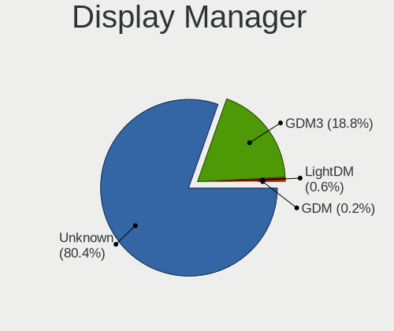

| Name    | Notebooks | Percent |
|---------|-----------|---------|
| Unknown | 137       | 88.96%  |
| GDM3    | 17        | 11.04%  |

OS Lang
-------

Language

| Lang  | Notebooks | Percent |
|-------|-----------|---------|
| en_US | 59        | 38.31%  |
| de_DE | 19        | 12.34%  |
| it_IT | 8         | 5.19%   |
| pt_BR | 7         | 4.55%   |
| en_IN | 6         | 3.9%    |
| en_GB | 6         | 3.9%    |
| pt_PT | 5         | 3.25%   |
| pl_PL | 5         | 3.25%   |
| fr_FR | 5         | 3.25%   |
| es_MX | 4         | 2.6%    |
| es_ES | 4         | 2.6%    |
| es_AR | 3         | 1.95%   |
| en_ZA | 3         | 1.95%   |
| ru_RU | 2         | 1.3%    |
| hu_HU | 2         | 1.3%    |
| en_CA | 2         | 1.3%    |
| en_AU | 2         | 1.3%    |
| de_AT | 2         | 1.3%    |
| sv_SE | 1         | 0.65%   |
| ro_RO | 1         | 0.65%   |
| et_EE | 1         | 0.65%   |
| es_UY | 1         | 0.65%   |
| es_US | 1         | 0.65%   |
| es_CL | 1         | 0.65%   |
| en_SG | 1         | 0.65%   |
| en_IL | 1         | 0.65%   |
| cs_CZ | 1         | 0.65%   |
| bg_BG | 1         | 0.65%   |

Boot Mode
---------

EFI or BIOS

| Mode | Notebooks | Percent |
|------|-----------|---------|
| BIOS | 144       | 93.51%  |
| EFI  | 10        | 6.49%   |

Filesystem
----------

Type of filesystem

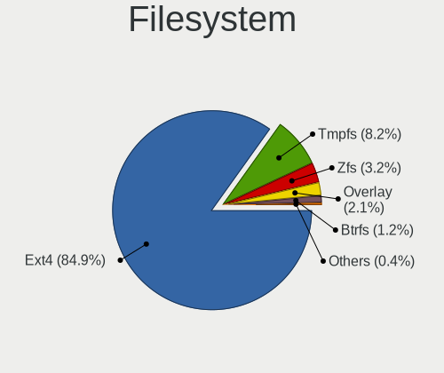

| Type    | Notebooks | Percent |
|---------|-----------|---------|
| Ext4    | 143       | 92.86%  |
| Tmpfs   | 6         | 3.9%    |
| Zfs     | 3         | 1.95%   |
| Overlay | 1         | 0.65%   |
| Btrfs   | 1         | 0.65%   |

Part. scheme
------------

Scheme of partitioning

| Type    | Notebooks | Percent |
|---------|-----------|---------|
| Unknown | 137       | 88.96%  |
| GPT     | 17        | 11.04%  |

Dual Boot with Linux/BSD
------------------------

Hosting more than one Linux/BSD

| Dual boot | Notebooks | Percent |
|-----------|-----------|---------|
| No        | 153       | 99.35%  |
| Yes       | 1         | 0.65%   |

Dual Boot (Win)
---------------

Hosting Linux and Windows

| Dual boot | Notebooks | Percent |
|-----------|-----------|---------|
| No        | 148       | 96.1%   |
| Yes       | 6         | 3.9%    |

Board
-----

Vendor
------

Motherboard manufacturer

| Name                | Notebooks | Percent |
|---------------------|-----------|---------|
| Hewlett-Packard     | 27        | 17.53%  |
| Lenovo              | 25        | 16.23%  |
| ASUSTek Computer    | 21        | 13.64%  |
| Dell                | 19        | 12.34%  |
| Acer                | 13        | 8.44%   |
| Apple               | 9         | 5.84%   |
| Sony                | 6         | 3.9%    |
| Toshiba             | 5         | 3.25%   |
| Medion              | 4         | 2.6%    |
| Fujitsu             | 4         | 2.6%    |
| Samsung Electronics | 3         | 1.95%   |
| HUAWEI              | 3         | 1.95%   |
| Unknown             | 2         | 1.3%    |
| Teclast             | 1         | 0.65%   |
| SGIN                | 1         | 0.65%   |
| Semp Toshiba        | 1         | 0.65%   |
| MSI                 | 1         | 0.65%   |
| Juana Manso         | 1         | 0.65%   |
| iQual               | 1         | 0.65%   |
| Hampoo              | 1         | 0.65%   |
| GPD                 | 1         | 0.65%   |
| DERE                | 1         | 0.65%   |
| Compal              | 1         | 0.65%   |
| COM1                | 1         | 0.65%   |
| Chuwi               | 1         | 0.65%   |
| Alienware           | 1         | 0.65%   |

Model
-----

Motherboard model

| Name                                   | Notebooks | Percent |
|----------------------------------------|-----------|---------|
| Unknown                                | 4         | 2.6%    |
| HP 15                                  | 2         | 1.3%    |
| Dell Latitude E7450                    | 2         | 1.3%    |
| Dell Latitude E5470                    | 2         | 1.3%    |
| Apple MacBookPro14,1                   | 2         | 1.3%    |
| Toshiba Satellite L750                 | 1         | 0.65%   |
| Toshiba Satellite L55-C                | 1         | 0.65%   |
| Toshiba Satellite C55D-B               | 1         | 0.65%   |
| Toshiba Satellite A350                 | 1         | 0.65%   |
| Toshiba NB550D                         | 1         | 0.65%   |
| Teclast F6 Plus                        | 1         | 0.65%   |
| Sony VPCF215FX                         | 1         | 0.65%   |
| Sony VPCEB3B4E                         | 1         | 0.65%   |
| Sony VPCEB2JFX                         | 1         | 0.65%   |
| Sony VJF153                            | 1         | 0.65%   |
| Sony VGN-NW11S_S                       | 1         | 0.65%   |
| Sony VGN-CS21Z_Q                       | 1         | 0.65%   |
| SGIN M15                               | 1         | 0.65%   |
| Semp Toshiba STI NI 1401               | 1         | 0.65%   |
| Samsung 700Z3C/700Z5C                  | 1         | 0.65%   |
| Samsung 550XBE/350XBE                  | 1         | 0.65%   |
| Samsung 450R4E/450R5E/450R4V/450R5V    | 1         | 0.65%   |
| MSI N6105                              | 1         | 0.65%   |
| Medion X682X                           | 1         | 0.65%   |
| Medion P651x series                    | 1         | 0.65%   |
| Medion E7214                           | 1         | 0.65%   |
| Medion E6246 MD63200                   | 1         | 0.65%   |
| Lenovo Yoga Slim 7 14ITL05 82A3        | 1         | 0.65%   |
| Lenovo V330-15IKB 81AX                 | 1         | 0.65%   |
| Lenovo ThinkPad X240 20AL0097US        | 1         | 0.65%   |
| Lenovo ThinkPad X201 4492W36           | 1         | 0.65%   |
| Lenovo ThinkPad X1 Extreme 20MF000XGE  | 1         | 0.65%   |
| Lenovo ThinkPad W550s 20E2000PMN       | 1         | 0.65%   |
| Lenovo ThinkPad W520 42844ZG           | 1         | 0.65%   |
| Lenovo ThinkPad T480 20L6S3L400        | 1         | 0.65%   |
| Lenovo ThinkPad T470s W10DG 20JTS0CJ0E | 1         | 0.65%   |
| Lenovo ThinkPad T430s 2356GRS          | 1         | 0.65%   |
| Lenovo ThinkPad T430 2347GU8           | 1         | 0.65%   |
| Lenovo ThinkPad L412 0585A38           | 1         | 0.65%   |
| Lenovo ThinkPad E560 20EV000TUK        | 1         | 0.65%   |

Model Family
------------

Motherboard model prefix

| Name               | Notebooks | Percent |
|--------------------|-----------|---------|
| Lenovo ThinkPad    | 12        | 7.79%   |
| Dell Latitude      | 12        | 7.79%   |
| Lenovo IdeaPad     | 7         | 4.55%   |
| HP Laptop          | 6         | 3.9%    |
| Dell Inspiron      | 6         | 3.9%    |
| Acer Aspire        | 6         | 3.9%    |
| Toshiba Satellite  | 4         | 2.6%    |
| HP Pavilion        | 4         | 2.6%    |
| ASUS VivoBook      | 4         | 2.6%    |
| Unknown            | 4         | 2.6%    |
| HP ZBook           | 3         | 1.95%   |
| HP EliteBook       | 3         | 1.95%   |
| Fujitsu LIFEBOOK   | 3         | 1.95%   |
| ASUS Zenbook       | 3         | 1.95%   |
| ASUS ROG           | 3         | 1.95%   |
| Lenovo Legion      | 2         | 1.3%    |
| HP 15              | 2         | 1.3%    |
| Apple MacBookPro14 | 2         | 1.3%    |
| Apple MacBookPro10 | 2         | 1.3%    |
| Acer Swift         | 2         | 1.3%    |
| Acer Nitro         | 2         | 1.3%    |
| Toshiba NB550D     | 1         | 0.65%   |
| Teclast F6         | 1         | 0.65%   |
| Sony VPCF215FX     | 1         | 0.65%   |
| Sony VPCEB3B4E     | 1         | 0.65%   |
| Sony VPCEB2JFX     | 1         | 0.65%   |
| Sony VJF153        | 1         | 0.65%   |
| Sony VGN-NW11S     | 1         | 0.65%   |
| Sony VGN-CS21Z     | 1         | 0.65%   |
| SGIN M15           | 1         | 0.65%   |
| Semp Toshiba STI   | 1         | 0.65%   |
| Samsung 700Z3C     | 1         | 0.65%   |
| Samsung 550XBE     | 1         | 0.65%   |
| Samsung 450R4E     | 1         | 0.65%   |
| MSI N6105          | 1         | 0.65%   |
| Medion X682X       | 1         | 0.65%   |
| Medion P651x       | 1         | 0.65%   |
| Medion E7214       | 1         | 0.65%   |
| Medion E6246       | 1         | 0.65%   |
| Lenovo Yoga        | 1         | 0.65%   |

MFG Year
--------

Motherboard manufacture year

| Year | Notebooks | Percent |
|------|-----------|---------|
| 2017 | 13        | 8.44%   |
| 2010 | 13        | 8.44%   |
| 2022 | 12        | 7.79%   |
| 2020 | 12        | 7.79%   |
| 2019 | 12        | 7.79%   |
| 2015 | 11        | 7.14%   |
| 2021 | 9         | 5.84%   |
| 2013 | 9         | 5.84%   |
| 2011 | 9         | 5.84%   |
| 2023 | 8         | 5.19%   |
| 2018 | 8         | 5.19%   |
| 2014 | 8         | 5.19%   |
| 2012 | 8         | 5.19%   |
| 2008 | 8         | 5.19%   |
| 2016 | 7         | 4.55%   |
| 2009 | 6         | 3.9%    |
| 2007 | 1         | 0.65%   |

Form Factor
-----------

Physical design of the computer

| Name     | Notebooks | Percent |
|----------|-----------|---------|
| Notebook | 154       | 100%    |

Secure Boot
-----------

Enabled or disabled

| State    | Notebooks | Percent |
|----------|-----------|---------|
| Disabled | 153       | 99.35%  |
| Enabled  | 1         | 0.65%   |

Coreboot
--------

Have coreboot on board

| Used | Notebooks | Percent |
|------|-----------|---------|
| No   | 154       | 100%    |

RAM Size
--------

Total RAM memory

| Size in GB  | Notebooks | Percent |
|-------------|-----------|---------|
| 4.01-8.0    | 63        | 40.91%  |
| 3.01-4.0    | 34        | 22.08%  |
| 8.01-16.0   | 26        | 16.88%  |
| 16.01-24.0  | 22        | 14.29%  |
| 32.01-64.0  | 5         | 3.25%   |
| 24.01-32.0  | 3         | 1.95%   |
| 64.01-256.0 | 1         | 0.65%   |

RAM Used
--------

Used RAM memory

| Used GB    | Notebooks | Percent |
|------------|-----------|---------|
| 2.01-3.0   | 72        | 46.15%  |
| 1.01-2.0   | 34        | 21.79%  |
| 3.01-4.0   | 25        | 16.03%  |
| 4.01-8.0   | 23        | 14.74%  |
| 16.01-24.0 | 1         | 0.64%   |
| 8.01-16.0  | 1         | 0.64%   |

Total Drives
------------

Number of drives on board

| Drives | Notebooks | Percent |
|--------|-----------|---------|
| 1      | 111       | 71.61%  |
| 2      | 41        | 26.45%  |
| 3      | 3         | 1.94%   |

Has CD-ROM
----------

Has CD-ROM on board

| Presented | Notebooks | Percent |
|-----------|-----------|---------|
| No        | 97        | 62.99%  |
| Yes       | 57        | 37.01%  |

Has Ethernet
------------

Has Ethernet on board

| Presented | Notebooks | Percent |
|-----------|-----------|---------|
| Yes       | 123       | 79.35%  |
| No        | 32        | 20.65%  |

Has WiFi
--------

Has WiFi module

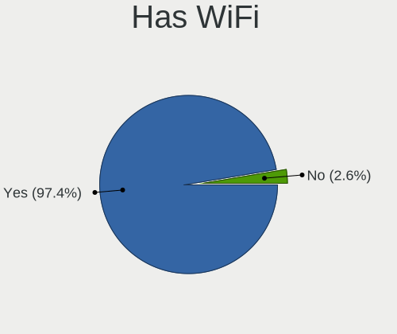

| Presented | Notebooks | Percent |
|-----------|-----------|---------|
| Yes       | 153       | 99.35%  |
| No        | 1         | 0.65%   |

Has Bluetooth
-------------

Has Bluetooth module

| Presented | Notebooks | Percent |
|-----------|-----------|---------|
| Yes       | 122       | 79.22%  |
| No        | 32        | 20.78%  |

Location
--------

Country
-------

Geographic location (country)

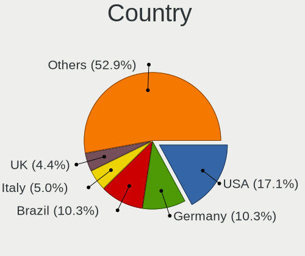

| Country      | Notebooks | Percent |
|--------------|-----------|---------|
| USA          | 25        | 16.23%  |
| Germany      | 23        | 14.94%  |
| Italy        | 10        | 6.49%   |
| Brazil       | 8         | 5.19%   |
| India        | 6         | 3.9%    |
| UK           | 5         | 3.25%   |
| Portugal     | 5         | 3.25%   |
| Poland       | 5         | 3.25%   |
| Mexico       | 5         | 3.25%   |
| France       | 5         | 3.25%   |
| Spain        | 4         | 2.6%    |
| Austria      | 4         | 2.6%    |
| South Africa | 3         | 1.95%   |
| Russia       | 3         | 1.95%   |
| Indonesia    | 3         | 1.95%   |
| Argentina    | 3         | 1.95%   |
| Sweden       | 2         | 1.3%    |
| Romania      | 2         | 1.3%    |
| Morocco      | 2         | 1.3%    |
| Hungary      | 2         | 1.3%    |
| Finland      | 2         | 1.3%    |
| Egypt        | 2         | 1.3%    |
| Canada       | 2         | 1.3%    |
| Belgium      | 2         | 1.3%    |
| Australia    | 2         | 1.3%    |
| Uruguay      | 1         | 0.65%   |
| Singapore    | 1         | 0.65%   |
| Qatar        | 1         | 0.65%   |
| Netherlands  | 1         | 0.65%   |
| Mauritius    | 1         | 0.65%   |
| Malaysia     | 1         | 0.65%   |
| Kosovo       | 1         | 0.65%   |
| Jamaica      | 1         | 0.65%   |
| Israel       | 1         | 0.65%   |
| Ireland      | 1         | 0.65%   |
| Ghana        | 1         | 0.65%   |
| Estonia      | 1         | 0.65%   |
| Denmark      | 1         | 0.65%   |
| Czechia      | 1         | 0.65%   |
| Croatia      | 1         | 0.65%   |

City
----

Geographic location (city)

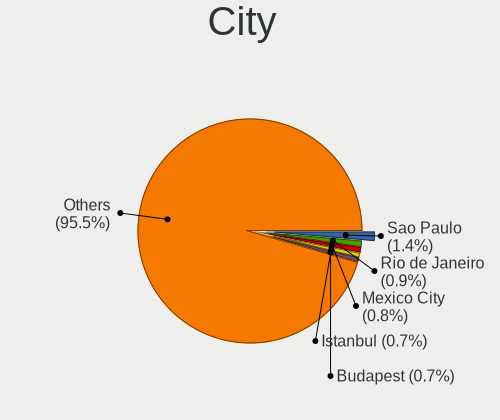

| City                   | Notebooks | Percent |
|------------------------|-----------|---------|
| Warsaw                 | 2         | 1.3%    |
| Vienna                 | 2         | 1.3%    |
| Porto                  | 2         | 1.3%    |
| Milan                  | 2         | 1.3%    |
| Marshfield             | 2         | 1.3%    |
| London                 | 2         | 1.3%    |
| Lisbon                 | 2         | 1.3%    |
| Johannesburg           | 2         | 1.3%    |
| Cologne                | 2         | 1.3%    |
| Ciudad Obregón        | 2         | 1.3%    |
| Wunstorf               | 1         | 0.65%   |
| Whitinsville           | 1         | 0.65%   |
| Weilburg               | 1         | 0.65%   |
| Vremde                 | 1         | 0.65%   |
| Verona                 | 1         | 0.65%   |
| Varna                  | 1         | 0.65%   |
| Turin                  | 1         | 0.65%   |
| Toronto                | 1         | 0.65%   |
| Texcoco                | 1         | 0.65%   |
| Tel Aviv               | 1         | 0.65%   |
| Tarnowskie Gory        | 1         | 0.65%   |
| Sydney                 | 1         | 0.65%   |
| Solingen               | 1         | 0.65%   |
| Singapore              | 1         | 0.65%   |
| Šibenik               | 1         | 0.65%   |
| Shawnee                | 1         | 0.65%   |
| Sarajevo               | 1         | 0.65%   |
| Sao Paulo              | 1         | 0.65%   |
| Sao Joao del Rei       | 1         | 0.65%   |
| Santiago               | 1         | 0.65%   |
| Sandy                  | 1         | 0.65%   |
| San Marcos             | 1         | 0.65%   |
| Samarinda              | 1         | 0.65%   |
| Salvador               | 1         | 0.65%   |
| Saint-Leger-les-Vignes | 1         | 0.65%   |
| Saffron Walden         | 1         | 0.65%   |
| Saarlouis              | 1         | 0.65%   |
| Rottweil               | 1         | 0.65%   |
| Ramenskoye             | 1         | 0.65%   |
| Rakvere                | 1         | 0.65%   |

Drives
------

Drive Vendor
------------

Hard drive vendors

| Vendor                      | Notebooks | Drives | Percent |
|-----------------------------|-----------|--------|---------|
| Samsung Electronics         | 34        | 36     | 17.89%  |
| Seagate                     | 15        | 15     | 7.89%   |
| Sandisk                     | 13        | 13     | 6.84%   |
| WDC                         | 11        | 11     | 5.79%   |
| Unknown                     | 11        | 12     | 5.79%   |
| Toshiba                     | 10        | 10     | 5.26%   |
| Kingston                    | 10        | 10     | 5.26%   |
| SK hynix                    | 9         | 9      | 4.74%   |
| HGST                        | 8         | 8      | 4.21%   |
| Hitachi                     | 5         | 6      | 2.63%   |
| Micron Technology           | 4         | 4      | 2.11%   |
| Apple                       | 4         | 8      | 2.11%   |
| MAXIO Technology (Hangzhou) | 3         | 3      | 1.58%   |
| Kingston Technology Company | 3         | 3      | 1.58%   |
| Intenso                     | 3         | 3      | 1.58%   |
| Crucial                     | 3         | 3      | 1.58%   |
| Netac                       | 2         | 2      | 1.05%   |
| Intel                       | 2         | 2      | 1.05%   |
| Gigabyte Technology         | 2         | 2      | 1.05%   |
| External                    | 2         | 2      | 1.05%   |
| China                       | 2         | 2      | 1.05%   |
| A-DATA Technology           | 2         | 2      | 1.05%   |
| USB                         | 1         | 1      | 0.53%   |
| Teclast                     | 1         | 1      | 0.53%   |
| Team                        | 1         | 1      | 0.53%   |
| T-FORCE                     | 1         | 1      | 0.53%   |
| SPCC                        | 1         | 1      | 0.53%   |
| Silicon Motion              | 1         | 1      | 0.53%   |
| SCUDA                       | 1         | 1      | 0.53%   |
| SC550                       | 1         | 1      | 0.53%   |
| S3+                         | 1         | 1      | 0.53%   |
| RX7                         | 1         | 1      | 0.53%   |
| Realtek Semiconductor       | 1         | 1      | 0.53%   |
| QSSDS25240G                 | 1         | 1      | 0.53%   |
| Phison                      | 1         | 1      | 0.53%   |
| OWC                         | 1         | 2      | 0.53%   |
| Min Yi U                    | 1         | 1      | 0.53%   |
| Micron/Crucial Technology   | 1         | 1      | 0.53%   |
| LITEONIT                    | 1         | 1      | 0.53%   |
| Lite-On Technology          | 1         | 1      | 0.53%   |

Drive Model
-----------

Hard drive models

| Model                                               | Notebooks | Percent |
|-----------------------------------------------------|-----------|---------|
| Unknown MMC Card  64GB                              | 6         | 3.11%   |
| Samsung NVMe SSD Controller SM981/PM981/PM983 1TB   | 5         | 2.59%   |
| Kingston SA400S37240G 240GB SSD                     | 4         | 2.07%   |
| Unknown MMC Card  128GB                             | 3         | 1.55%   |
| Toshiba MQ01ABF050 500GB                            | 3         | 1.55%   |
| Seagate ST1000LM035-1RK172 1TB                      | 3         | 1.55%   |
| WDC WDS500G2B0A-00SM50 500GB SSD                    | 2         | 1.04%   |
| Toshiba MK5061GSYN 500GB                            | 2         | 1.04%   |
| SK hynix BC511 256GB                                | 2         | 1.04%   |
| Seagate ST9500325AS 500GB                           | 2         | 1.04%   |
| SanDisk SSD PLUS 480GB                              | 2         | 1.04%   |
| Samsung SSD 860 EVO 500GB                           | 2         | 1.04%   |
| Samsung NVMe SSD Controller SM961/PM961/SM963 256GB | 2         | 1.04%   |
| Micron 2450_MTFDKBA1T0TFK 1TB                       | 2         | 1.04%   |
| Kingston Company OM3PDP3 NVMe SSD 256GB             | 2         | 1.04%   |
| Hitachi HTS545032B9A300 320GB                       | 2         | 1.04%   |
| HGST HTS545050A7E680 500GB                          | 2         | 1.04%   |
| HGST HTS541010A9E680 1TB                            | 2         | 1.04%   |
| External USB3.0 752GB                               | 2         | 1.04%   |
| Apple S3X NVMe Controller 256GB                     | 2         | 1.04%   |
| WDC WDS100T2B0A-00SM50 1TB SSD                      | 1         | 0.52%   |
| WDC WDBNCE5000PNC 500GB SSD                         | 1         | 0.52%   |
| WDC WD3200BPVT-00HXZT1 320GB                        | 1         | 0.52%   |
| WDC WD2500BEVT-75A23T0 250GB                        | 1         | 0.52%   |
| WDC WD10SPZX-35Z10T0 1TB                            | 1         | 0.52%   |
| WDC WD10SPZX-24Z10 1TB                              | 1         | 0.52%   |
| WDC WD10SPZX-08Z10 1TB                              | 1         | 0.52%   |
| WDC WD Green 2.5 240GB SSD                          | 1         | 0.52%   |
| WDC PC SN730 SDBPNTY-512G-1101 512GB                | 1         | 0.52%   |
| USB Disk 240GB                                      | 1         | 0.52%   |
| Unknown NVMe SSD Drive 512GB                        | 1         | 0.52%   |
| Unknown MMC Card  32GB                              | 1         | 0.52%   |
| Unknown MMC Card  256GB                             | 1         | 0.52%   |
| Toshiba THNS064GE4BBDC 64GB SSD                     | 1         | 0.52%   |
| Toshiba MQ04ABF100 1TB                              | 1         | 0.52%   |
| Toshiba MQ01ACF050 500GB                            | 1         | 0.52%   |
| Toshiba MQ01ABD050V 500GB                           | 1         | 0.52%   |
| Toshiba MK7559GSXF 752GB                            | 1         | 0.52%   |
| Teclast 256GB NS550-2242 SSD                        | 1         | 0.52%   |
| Team T253512GB SSD                                  | 1         | 0.52%   |

HDD Vendor
----------

Hard disk drive vendors

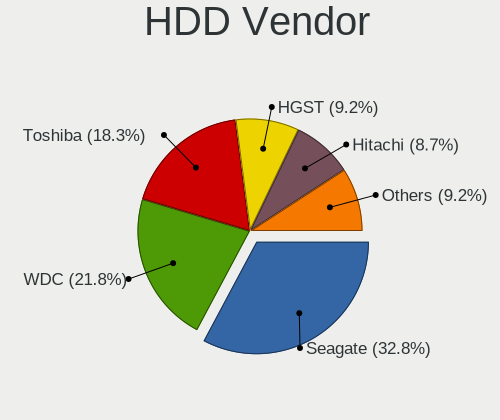

| Vendor              | Notebooks | Drives | Percent |
|---------------------|-----------|--------|---------|
| Seagate             | 14        | 14     | 30.43%  |
| Toshiba             | 9         | 9      | 19.57%  |
| HGST                | 8         | 8      | 17.39%  |
| WDC                 | 5         | 5      | 10.87%  |
| Hitachi             | 5         | 6      | 10.87%  |
| Samsung Electronics | 2         | 2      | 4.35%   |
| External            | 2         | 2      | 4.35%   |
| Fujitsu             | 1         | 1      | 2.17%   |

SSD Vendor
----------

Solid state drive vendors

| Vendor              | Notebooks | Drives | Percent |
|---------------------|-----------|--------|---------|
| Samsung Electronics | 17        | 17     | 26.15%  |
| Kingston            | 7         | 7      | 10.77%  |
| WDC                 | 5         | 5      | 7.69%   |
| Sandisk             | 5         | 5      | 7.69%   |
| Crucial             | 3         | 3      | 4.62%   |
| Gigabyte Technology | 2         | 2      | 3.08%   |
| China               | 2         | 2      | 3.08%   |
| Apple               | 2         | 2      | 3.08%   |
| A-DATA Technology   | 2         | 2      | 3.08%   |
| Toshiba             | 1         | 1      | 1.54%   |
| Teclast             | 1         | 1      | 1.54%   |
| Team                | 1         | 1      | 1.54%   |
| SPCC                | 1         | 1      | 1.54%   |
| SK hynix            | 1         | 1      | 1.54%   |
| SCUDA               | 1         | 1      | 1.54%   |
| S3+                 | 1         | 1      | 1.54%   |
| QSSDS25240G         | 1         | 1      | 1.54%   |
| Phison              | 1         | 1      | 1.54%   |
| OWC                 | 1         | 2      | 1.54%   |
| Min Yi U            | 1         | 1      | 1.54%   |
| Micron Technology   | 1         | 1      | 1.54%   |
| LITEONIT            | 1         | 1      | 1.54%   |
| Lexar               | 1         | 1      | 1.54%   |
| KingSpec            | 1         | 1      | 1.54%   |
| Intenso             | 1         | 1      | 1.54%   |
| GLOWAY              | 1         | 1      | 1.54%   |
| Emtec               | 1         | 1      | 1.54%   |
| Aarvex              | 1         | 1      | 1.54%   |
| Unknown             | 1         | 1      | 1.54%   |

Drive Kind
----------

HDD or SSD

| Kind    | Notebooks | Drives | Percent |
|---------|-----------|--------|---------|
| SSD     | 63        | 66     | 35.2%   |
| NVMe    | 49        | 64     | 27.37%  |
| HDD     | 46        | 47     | 25.7%   |
| Unknown | 11        | 12     | 6.15%   |
| MMC     | 10        | 11     | 5.59%   |

Drive Connector
---------------

SATA, SAS, NVMe, etc.

| Type | Notebooks | Drives | Percent |
|------|-----------|--------|---------|
| SATA | 105       | 115    | 60.69%  |
| NVMe | 49        | 64     | 28.32%  |
| MMC  | 10        | 11     | 5.78%   |
| SAS  | 9         | 10     | 5.2%    |

Drive Size
----------

Size of hard drive

| Size in TB | Notebooks | Drives | Percent |
|------------|-----------|--------|---------|
| 0.01-0.5   | 78        | 81     | 71.56%  |
| 0.51-1.0   | 28        | 29     | 25.69%  |
| 1.01-2.0   | 2         | 2      | 1.83%   |
| 3.01-4.0   | 1         | 1      | 0.92%   |

Space Total
-----------

Amount of disk space available on the file system

| Size in GB     | Notebooks | Percent |
|----------------|-----------|---------|
| 101-250        | 53        | 34.19%  |
| 251-500        | 43        | 27.74%  |
| 501-1000       | 27        | 17.42%  |
| 51-100         | 15        | 9.68%   |
| 21-50          | 5         | 3.23%   |
| 1001-2000      | 4         | 2.58%   |
| 1-20           | 3         | 1.94%   |
| 2001-3000      | 2         | 1.29%   |
| Unknown        | 2         | 1.29%   |
| More than 3000 | 1         | 0.65%   |

Space Used
----------

Amount of used disk space

| Used GB   | Notebooks | Percent |
|-----------|-----------|---------|
| 1-20      | 59        | 37.82%  |
| 21-50     | 48        | 30.77%  |
| 51-100    | 20        | 12.82%  |
| 101-250   | 16        | 10.26%  |
| 251-500   | 5         | 3.21%   |
| 501-1000  | 5         | 3.21%   |
| Unknown   | 2         | 1.28%   |
| 1001-2000 | 1         | 0.64%   |

Malfunc. Drives
---------------

Drive models with a malfunction

| Model                           | Notebooks | Drives | Percent |
|---------------------------------|-----------|--------|---------|
| Seagate ST500LM000-1EJ162 500GB | 1         | 1      | 33.33%  |
| SanDisk SSD PLUS 480GB          | 1         | 1      | 33.33%  |
| Hitachi HTS723232L9A360 320GB   | 1         | 1      | 33.33%  |

Malfunc. Drive Vendor
---------------------

Vendors of faulty drives

| Vendor  | Notebooks | Drives | Percent |
|---------|-----------|--------|---------|
| Seagate | 1         | 1      | 33.33%  |
| SanDisk | 1         | 1      | 33.33%  |
| Hitachi | 1         | 1      | 33.33%  |

Malfunc. HDD Vendor
-------------------

Vendors of faulty HDD drives

| Vendor  | Notebooks | Drives | Percent |
|---------|-----------|--------|---------|
| Seagate | 1         | 1      | 50%     |
| Hitachi | 1         | 1      | 50%     |

Malfunc. Drive Kind
-------------------

Kinds of faulty drives

| Kind | Notebooks | Drives | Percent |
|------|-----------|--------|---------|
| HDD  | 2         | 2      | 66.67%  |
| SSD  | 1         | 1      | 33.33%  |

Failed Drives
-------------

Failed drive models

Zero info for selected period =(

Failed Drive Vendor
-------------------

Failed drive vendors

Zero info for selected period =(

Drive Status
------------

Number of failed and malfunc. drives

| Status   | Notebooks | Drives | Percent |
|----------|-----------|--------|---------|
| Detected | 145       | 185    | 92.95%  |
| Works    | 8         | 12     | 5.13%   |
| Malfunc  | 3         | 3      | 1.92%   |

Storage controller
------------------

Storage Vendor
--------------

Storage controller vendors

| Vendor                      | Notebooks | Percent |
|-----------------------------|-----------|---------|
| Intel                       | 108       | 59.34%  |
| Samsung Electronics         | 16        | 8.79%   |
| AMD                         | 15        | 8.24%   |
| SanDisk                     | 9         | 4.95%   |
| SK hynix                    | 8         | 4.4%    |
| Kingston Technology Company | 5         | 2.75%   |
| Nvidia                      | 3         | 1.65%   |
| Micron Technology           | 3         | 1.65%   |
| MAXIO Technology (Hangzhou) | 3         | 1.65%   |
| Silicon Motion              | 2         | 1.1%    |
| Netac Technology            | 2         | 1.1%    |
| Apple                       | 2         | 1.1%    |
| Realtek Semiconductor       | 1         | 0.55%   |
| Micron/Crucial Technology   | 1         | 0.55%   |
| Lite-On Technology          | 1         | 0.55%   |
| KIOXIA                      | 1         | 0.55%   |
| ADATA Technology            | 1         | 0.55%   |
| Unknown                     | 1         | 0.55%   |

Storage Model
-------------

Storage controller models

| Model                                                                          | Notebooks | Percent |
|--------------------------------------------------------------------------------|-----------|---------|
| Intel Sunrise Point-LP SATA Controller [AHCI mode]                             | 11        | 5.79%   |
| Intel 82801IBM/IEM (ICH9M/ICH9M-E) 4 port SATA Controller [AHCI mode]          | 11        | 5.79%   |
| Intel 7 Series Chipset Family 6-port SATA Controller [AHCI mode]               | 11        | 5.79%   |
| AMD FCH SATA Controller [AHCI mode]                                            | 11        | 5.79%   |
| Intel 6 Series/C200 Series Chipset Family 6 port Mobile SATA AHCI Controller   | 10        | 5.26%   |
| Intel Celeron/Pentium Silver Processor SATA Controller                         | 9         | 4.74%   |
| Intel Wildcat Point-LP SATA Controller [AHCI Mode]                             | 8         | 4.21%   |
| Samsung NVMe SSD Controller SM981/PM981/PM983                                  | 7         | 3.68%   |
| Intel 82801 Mobile SATA Controller [RAID mode]                                 | 7         | 3.68%   |
| Intel 5 Series/3400 Series Chipset 4 port SATA AHCI Controller                 | 7         | 3.68%   |
| Intel Volume Management Device NVMe RAID Controller                            | 4         | 2.11%   |
| Intel 8 Series/C220 Series Chipset Family 6-port SATA Controller 1 [AHCI mode] | 4         | 2.11%   |
| Intel 8 Series SATA Controller 1 [AHCI mode]                                   | 4         | 2.11%   |
| AMD SB7x0/SB8x0/SB9x0 SATA Controller [AHCI mode]                              | 4         | 2.11%   |
| SK hynix Gold P31/BC711/PC711 NVMe Solid State Drive                           | 3         | 1.58%   |
| SanDisk WD Black SN770 / PC SN740 256GB / PC SN560 (DRAM-less) NVMe SSD        | 3         | 1.58%   |
| Kingston Company KC3000/FURY Renegade NVMe SSD E18                             | 3         | 1.58%   |
| AMD SB7x0/SB8x0/SB9x0 IDE Controller                                           | 3         | 1.58%   |
| SK hynix Platinum P41/PC801 NVMe Solid State Drive                             | 2         | 1.05%   |
| SK hynix BC511 NVMe SSD                                                        | 2         | 1.05%   |
| Samsung NVMe SSD Controller SM961/PM961/SM963                                  | 2         | 1.05%   |
| Samsung NVMe SSD Controller PM9B1 (DRAM-less)                                  | 2         | 1.05%   |
| Samsung NVMe SSD Controller PM9A1/PM9A3/980PRO                                 | 2         | 1.05%   |
| Netac PCIe 3 NVMe SSD (DRAM-less)                                              | 2         | 1.05%   |
| Micron 2450 NVMe SSD [HendrixV] (DRAM-less)                                    | 2         | 1.05%   |
| MAXIO (Hangzhou) NVMe SSD Controller MAP1602 (DRAM-less)                       | 2         | 1.05%   |
| Kingston Company OM3PDP3 NVMe SSD                                              | 2         | 1.05%   |
| Intel Volume Management Device NVMe RAID Controller Intel Corporation          | 2         | 1.05%   |
| Intel Tiger Lake-LP SATA Controller                                            | 2         | 1.05%   |
| Intel HM170/QM170 Chipset SATA Controller [AHCI Mode]                          | 2         | 1.05%   |
| Intel Comet Lake SATA AHCI Controller                                          | 2         | 1.05%   |
| Intel Celeron N3350/Pentium N4200/Atom E3900 Series SATA AHCI Controller       | 2         | 1.05%   |
| Intel Cannon Point-LP SATA Controller [AHCI Mode]                              | 2         | 1.05%   |
| Intel Atom Processor E3800 Series SATA AHCI Controller                         | 2         | 1.05%   |
| Intel Alder Lake-P SATA AHCI Controller                                        | 2         | 1.05%   |
| Apple S3X NVMe Controller                                                      | 2         | 1.05%   |
| SK hynix BC501 NVMe Solid State Drive                                          | 1         | 0.53%   |
| Silicon Motion SM2263EN/SM2263XT (DRAM-less) NVMe SSD Controllers              | 1         | 0.53%   |
| Silicon Motion Non-Volatile memory controller                                  | 1         | 0.53%   |
| SanDisk WD PC SN810 / Black SN850 NVMe SSD                                     | 1         | 0.53%   |

Storage Kind
------------

Kind of storage controller (IDE, SATA, NVMe, SAS, ...)

| Kind | Notebooks | Percent |
|------|-----------|---------|
| SATA | 113       | 62.78%  |
| NVMe | 49        | 27.22%  |
| RAID | 13        | 7.22%   |
| IDE  | 5         | 2.78%   |

Processor
---------

CPU Vendor
----------

Processor vendors

| Vendor | Notebooks | Percent |
|--------|-----------|---------|
| Intel  | 123       | 79.87%  |
| AMD    | 31        | 20.13%  |

CPU Model
---------

Processor models

| Model                                         | Notebooks | Percent |
|-----------------------------------------------|-----------|---------|
| Intel Core i3-6006U CPU @ 2.00GHz             | 5         | 3.25%   |
| Intel Core i5-8265U CPU @ 1.60GHz             | 4         | 2.6%    |
| Intel Core i7-5500U CPU @ 2.40GHz             | 3         | 1.95%   |
| Intel Core i5-5300U CPU @ 2.30GHz             | 3         | 1.95%   |
| Intel Core i5-5200U CPU @ 2.20GHz             | 3         | 1.95%   |
| Intel Celeron N4020 CPU @ 1.10GHz             | 3         | 1.95%   |
| Intel Core i7-8750H CPU @ 2.20GHz             | 2         | 1.3%    |
| Intel Core i7-6700HQ CPU @ 2.60GHz            | 2         | 1.3%    |
| Intel Core i7-2760QM CPU @ 2.40GHz            | 2         | 1.3%    |
| Intel Core i7-2630QM CPU @ 2.00GHz            | 2         | 1.3%    |
| Intel Core i5-8350U CPU @ 1.70GHz             | 2         | 1.3%    |
| Intel Core i5-7360U CPU @ 2.30GHz             | 2         | 1.3%    |
| Intel Core i5-6300U CPU @ 2.40GHz             | 2         | 1.3%    |
| Intel Core i5-3320M CPU @ 2.60GHz             | 2         | 1.3%    |
| Intel Core i5-3230M CPU @ 2.60GHz             | 2         | 1.3%    |
| Intel Core i5-3210M CPU @ 2.50GHz             | 2         | 1.3%    |
| Intel Core i5-2520M CPU @ 2.50GHz             | 2         | 1.3%    |
| Intel Core i5 CPU M 520 @ 2.40GHz             | 2         | 1.3%    |
| Intel Core i5 CPU M 460 @ 2.53GHz             | 2         | 1.3%    |
| Intel Core i3-10110U CPU @ 2.10GHz            | 2         | 1.3%    |
| Intel Core i3 CPU M 350 @ 2.27GHz             | 2         | 1.3%    |
| Intel Core 2 Duo CPU P8700 @ 2.53GHz          | 2         | 1.3%    |
| Intel Celeron N4100 CPU @ 1.10GHz             | 2         | 1.3%    |
| Intel Celeron CPU N3350 @ 1.10GHz             | 2         | 1.3%    |
| Intel Celeron CPU 900 @ 2.20GHz               | 2         | 1.3%    |
| Intel 12th Gen Core i7-12700H                 | 2         | 1.3%    |
| Intel 12th Gen Core i5-1235U                  | 2         | 1.3%    |
| Intel 11th Gen Core i7-1165G7 @ 2.80GHz       | 2         | 1.3%    |
| AMD Ryzen 7 5800H with Radeon Graphics        | 2         | 1.3%    |
| AMD Ryzen 5 5600H with Radeon Graphics        | 2         | 1.3%    |
| AMD Ryzen 5 5500U with Radeon Graphics        | 2         | 1.3%    |
| AMD Ryzen 5 3500U with Radeon Vega Mobile Gfx | 2         | 1.3%    |
| AMD E2-9000e RADEON R2, 4 COMPUTE CORES 2C+2G | 2         | 1.3%    |
| Intel Pentium Silver N5000 CPU @ 1.10GHz      | 1         | 0.65%   |
| Intel Pentium Dual-Core CPU T4400 @ 2.20GHz   | 1         | 0.65%   |
| Intel Pentium CPU P6100 @ 2.00GHz             | 1         | 0.65%   |
| Intel Pentium CPU N3540 @ 2.16GHz             | 1         | 0.65%   |
| Intel Pentium CPU 4415U @ 2.30GHz             | 1         | 0.65%   |
| Intel N95                                     | 1         | 0.65%   |
| Intel Core m5-6Y57 CPU @ 1.10GHz              | 1         | 0.65%   |

CPU Model Family
----------------

Processor model prefix

| Model                                | Notebooks | Percent |
|--------------------------------------|-----------|---------|
| Intel Core i5                        | 38        | 24.68%  |
| Intel Core i7                        | 25        | 16.23%  |
| Intel Core i3                        | 16        | 10.39%  |
| Intel Celeron                        | 14        | 9.09%   |
| Other                                | 13        | 8.44%   |
| Intel Core 2 Duo                     | 11        | 7.14%   |
| AMD Ryzen 5                          | 10        | 6.49%   |
| AMD Ryzen 7                          | 7         | 4.55%   |
| Intel Pentium                        | 3         | 1.95%   |
| AMD Ryzen 9                          | 2         | 1.3%    |
| AMD E2                               | 2         | 1.3%    |
| AMD Athlon II                        | 2         | 1.3%    |
| AMD A8                               | 2         | 1.3%    |
| Intel Pentium Silver                 | 1         | 0.65%   |
| Intel Pentium Dual-Core              | 1         | 0.65%   |
| Intel Core m5                        | 1         | 0.65%   |
| AMD Turion X2 Ultra Dual-Core Mobile | 1         | 0.65%   |
| AMD Turion X2 Dual-Core Mobile       | 1         | 0.65%   |
| AMD Ryzen 5 PRO                      | 1         | 0.65%   |
| AMD Ryzen 3                          | 1         | 0.65%   |
| AMD C-60                             | 1         | 0.65%   |
| AMD A12                              | 1         | 0.65%   |

CPU Cores
---------

Number of processor cores

| Number | Notebooks | Percent |
|--------|-----------|---------|
| 2      | 85        | 55.19%  |
| 4      | 42        | 27.27%  |
| 6      | 11        | 7.14%   |
| 8      | 8         | 5.19%   |
| 10     | 4         | 2.6%    |
| 14     | 2         | 1.3%    |
| 1      | 2         | 1.3%    |

CPU Sockets
-----------

Number of sockets

| Number | Notebooks | Percent |
|--------|-----------|---------|
| 1      | 154       | 100%    |

CPU Threads
-----------

Threads per core (Hyper-Threading)

| Number | Notebooks | Percent |
|--------|-----------|---------|
| 2      | 113       | 73.38%  |
| 1      | 41        | 26.62%  |

CPU Op-Modes
------------

CPU Operation Modes (32-bit, 64-bit)

| Op mode        | Notebooks | Percent |
|----------------|-----------|---------|
| 32-bit, 64-bit | 154       | 100%    |

CPU Microcode
-------------

Microcode number

| Number     | Notebooks | Percent |
|------------|-----------|---------|
| Unknown    | 150       | 97.4%   |
| 0x0a601203 | 1         | 0.65%   |
| 0x0a50000d | 1         | 0.65%   |
| 0x0a50000c | 1         | 0.65%   |
| 0x08600106 | 1         | 0.65%   |

CPU Microarch
-------------

Microarchitecture

| Name             | Notebooks | Percent |
|------------------|-----------|---------|
| KabyLake         | 18        | 11.69%  |
| Skylake          | 13        | 8.44%   |
| Unknown          | 13        | 8.44%   |
| SandyBridge      | 12        | 7.79%   |
| Penryn           | 12        | 7.79%   |
| IvyBridge        | 10        | 6.49%   |
| Goldmont plus    | 10        | 6.49%   |
| Broadwell        | 10        | 6.49%   |
| Haswell          | 9         | 5.84%   |
| Westmere         | 8         | 5.19%   |
| Zen 3            | 7         | 4.55%   |
| TigerLake        | 6         | 3.9%    |
| Zen+             | 5         | 3.25%   |
| Excavator        | 3         | 1.95%   |
| Zen 2            | 2         | 1.3%    |
| Silvermont       | 2         | 1.3%    |
| K8 & K10 hybrid  | 2         | 1.3%    |
| K10              | 2         | 1.3%    |
| Goldmont         | 2         | 1.3%    |
| Core             | 2         | 1.3%    |
| CometLake        | 2         | 1.3%    |
| Puma             | 1         | 0.65%   |
| Piledriver       | 1         | 0.65%   |
| Bobcat           | 1         | 0.65%   |
| Alderlake Hybrid | 1         | 0.65%   |

Graphics
--------

GPU Vendor
----------

Vendors of graphics cards

| Vendor | Notebooks | Percent |
|--------|-----------|---------|
| Intel  | 107       | 56.32%  |
| Nvidia | 44        | 23.16%  |
| AMD    | 39        | 20.53%  |

GPU Model
---------

Graphics card models

| Model                                                                                 | Notebooks | Percent |
|---------------------------------------------------------------------------------------|-----------|---------|
| Intel 3rd Gen Core processor Graphics Controller                                      | 10        | 5.13%   |
| Intel Skylake GT2 [HD Graphics 520]                                                   | 9         | 4.62%   |
| Intel HD Graphics 5500                                                                | 9         | 4.62%   |
| Intel GeminiLake [UHD Graphics 600]                                                   | 9         | 4.62%   |
| Intel 2nd Generation Core Processor Family Integrated Graphics Controller             | 8         | 4.1%    |
| Intel Core Processor Integrated Graphics Controller                                   | 7         | 3.59%   |
| Intel TigerLake-LP GT2 [Iris Xe Graphics]                                             | 5         | 2.56%   |
| Intel Mobile 4 Series Chipset Integrated Graphics Controller                          | 5         | 2.56%   |
| Intel 4th Gen Core Processor Integrated Graphics Controller                           | 5         | 2.56%   |
| AMD Picasso/Raven 2 [Radeon Vega Series / Radeon Vega Mobile Series]                  | 5         | 2.56%   |
| AMD Cezanne [Radeon Vega Series / Radeon Vega Mobile Series]                          | 5         | 2.56%   |
| Nvidia GA106M [GeForce RTX 3060 Mobile / Max-Q]                                       | 4         | 2.05%   |
| Intel WhiskeyLake-U GT2 [UHD Graphics 620]                                            | 4         | 2.05%   |
| Intel UHD Graphics 620                                                                | 4         | 2.05%   |
| Intel Haswell-ULT Integrated Graphics Controller                                      | 4         | 2.05%   |
| Nvidia GF117M [GeForce 610M/710M/810M/820M / GT 620M/625M/630M/720M]                  | 3         | 1.54%   |
| Intel HD Graphics 620                                                                 | 3         | 1.54%   |
| Intel HD Graphics 530                                                                 | 3         | 1.54%   |
| AMD Topaz XT [Radeon R7 M260/M265 / M340/M360 / M440/M445 / 530/535 / 620/625 Mobile] | 3         | 1.54%   |
| AMD RV710/M92 [Mobility Radeon HD 4530/4570/5145/530v/540v/545v]                      | 3         | 1.54%   |
| AMD Rembrandt [Radeon 680M]                                                           | 3         | 1.54%   |
| Nvidia GM107M [GeForce GTX 950M]                                                      | 2         | 1.03%   |
| Nvidia GF108M [GeForce GT 540M]                                                       | 2         | 1.03%   |
| Nvidia G96CM [GeForce 9600M GT]                                                       | 2         | 1.03%   |
| Intel Iris Plus Graphics 640                                                          | 2         | 1.03%   |
| Intel HD Graphics 500                                                                 | 2         | 1.03%   |
| Intel CometLake-U GT2 [UHD Graphics]                                                  | 2         | 1.03%   |
| Intel CometLake-H GT2 [UHD Graphics]                                                  | 2         | 1.03%   |
| Intel Atom Processor Z36xxx/Z37xxx Series Graphics & Display                          | 2         | 1.03%   |
| Intel Alder Lake-UP3 GT2 [Iris Xe Graphics]                                           | 2         | 1.03%   |
| AMD Stoney [Radeon R2/R3/R4/R5 Graphics]                                              | 2         | 1.03%   |
| AMD RS880M [Mobility Radeon HD 4225/4250]                                             | 2         | 1.03%   |
| AMD Renoir [Radeon RX Vega 6 (Ryzen 4000/5000 Mobile Series)]                         | 2         | 1.03%   |
| AMD Park [Mobility Radeon HD 5430/5450/5470]                                          | 2         | 1.03%   |
| AMD Lucienne                                                                          | 2         | 1.03%   |
| AMD Barcelo                                                                           | 2         | 1.03%   |
| Nvidia TU117M [GeForce GTX 1650 Mobile / Max-Q]                                       | 1         | 0.51%   |
| Nvidia TU106M [GeForce RTX 2070 Mobile / Max-Q Refresh]                               | 1         | 0.51%   |
| Nvidia MCP89 [GeForce 320M]                                                           | 1         | 0.51%   |
| Nvidia GT218M [GeForce G210M]                                                         | 1         | 0.51%   |

GPU Combo
---------

Combinations of graphics cards

| Name           | Notebooks | Percent |
|----------------|-----------|---------|
| 1 x Intel      | 79        | 51.3%   |
| Intel + Nvidia | 23        | 14.94%  |
| 1 x AMD        | 23        | 14.94%  |
| 1 x Nvidia     | 12        | 7.79%   |
| AMD + Nvidia   | 8         | 5.19%   |
| 2 x AMD        | 4         | 2.6%    |
| Intel + AMD    | 4         | 2.6%    |
| 2 x Nvidia     | 1         | 0.65%   |

GPU Driver
----------

Free vs proprietary

| Driver      | Notebooks | Percent |
|-------------|-----------|---------|
| Free        | 132       | 85.71%  |
| Proprietary | 21        | 13.64%  |
| Unknown     | 1         | 0.65%   |

GPU Memory
----------

Total video memory

| Size in GB | Notebooks | Percent |
|------------|-----------|---------|
| Unknown    | 146       | 94.81%  |
| 0.01-0.5   | 6         | 3.9%    |
| 1.01-2.0   | 2         | 1.3%    |

Monitor
-------

Monitor Vendor
--------------

Monitor vendors

| Vendor              | Notebooks | Percent |
|---------------------|-----------|---------|
| BOE                 | 28        | 17.18%  |
| AU Optronics        | 26        | 15.95%  |
| LG Display          | 24        | 14.72%  |
| Chimei Innolux      | 22        | 13.5%   |
| Samsung Electronics | 20        | 12.27%  |
| Apple               | 10        | 6.13%   |
| InfoVision          | 4         | 2.45%   |
| PANDA               | 3         | 1.84%   |
| Lenovo              | 3         | 1.84%   |
| Dell                | 3         | 1.84%   |
| TMX                 | 2         | 1.23%   |
| Sharp               | 2         | 1.23%   |
| Hewlett-Packard     | 2         | 1.23%   |
| Goldstar            | 2         | 1.23%   |
| CSO                 | 2         | 1.23%   |
| UGD                 | 1         | 0.61%   |
| SLD                 | 1         | 0.61%   |
| RTK                 | 1         | 0.61%   |
| Philips             | 1         | 0.61%   |
| Panasonic           | 1         | 0.61%   |
| KDB                 | 1         | 0.61%   |
| CPT                 | 1         | 0.61%   |
| BenQ                | 1         | 0.61%   |
| ASUSTek Computer    | 1         | 0.61%   |
| Acer                | 1         | 0.61%   |

Monitor Model
-------------

Monitor models

| Model                                                                  | Notebooks | Percent |
|------------------------------------------------------------------------|-----------|---------|
| LG Display LCD Monitor LGD039F 1366x768 345x194mm 15.6-inch            | 3         | 1.84%   |
| Samsung Electronics LCD Monitor SEC5441 1366x768 344x194mm 15.5-inch   | 2         | 1.23%   |
| Samsung Electronics LCD Monitor SEC314C 1920x1080 344x194mm 15.5-inch  | 2         | 1.23%   |
| LG Display LCD Monitor LGD0362 1600x900 309x174mm 14.0-inch            | 2         | 1.23%   |
| Chimei Innolux LCD Monitor CMN15D5 1920x1080 344x193mm 15.5-inch       | 2         | 1.23%   |
| Chimei Innolux LCD Monitor CMN14D6 1366x768 309x173mm 13.9-inch        | 2         | 1.23%   |
| Chimei Innolux LCD Monitor CMN14D4 1920x1080 309x173mm 13.9-inch       | 2         | 1.23%   |
| AU Optronics LCD Monitor AUO109E 1600x900 382x214mm 17.2-inch          | 2         | 1.23%   |
| Apple Color LCD APPA037 2880x1800 286x179mm 13.3-inch                  | 2         | 1.23%   |
| UGD Artist22R Pro UGD2202 1920x1080 476x268mm 21.5-inch                | 1         | 0.61%   |
| TMX TL142GDXP02-0 TMX1420 2520x1680 300x200mm 14.2-inch                | 1         | 0.61%   |
| TMX TL140VDXP10 TMX1485 1920x1200 301x188mm 14.0-inch                  | 1         | 0.61%   |
| SLD LCD Monitor SLD003C 1366x768 309x173mm 13.9-inch                   | 1         | 0.61%   |
| Sharp LQ133M1JW01 SHP141B 1920x1080 294x165mm 13.3-inch                | 1         | 0.61%   |
| Sharp LCD Monitor SHP14AB 1920x1080 294x165mm 13.3-inch                | 1         | 0.61%   |
| Samsung Electronics SMXL2370HD SAM0729 1920x1080 510x287mm 23.0-inch   | 1         | 0.61%   |
| Samsung Electronics S24D300 SAM0B43 1920x1080 531x299mm 24.0-inch      | 1         | 0.61%   |
| Samsung Electronics LCD Monitor SEC5541 1366x768 344x193mm 15.5-inch   | 1         | 0.61%   |
| Samsung Electronics LCD Monitor SEC5042 1280x800 303x190mm 14.1-inch   | 1         | 0.61%   |
| Samsung Electronics LCD Monitor SEC4141 1366x768 344x193mm 15.5-inch   | 1         | 0.61%   |
| Samsung Electronics LCD Monitor SEC3842 1366x768 309x174mm 14.0-inch   | 1         | 0.61%   |
| Samsung Electronics LCD Monitor SEC3551 1366x768 344x194mm 15.5-inch   | 1         | 0.61%   |
| Samsung Electronics LCD Monitor SEC334B 1440x900 367x230mm 17.1-inch   | 1         | 0.61%   |
| Samsung Electronics LCD Monitor SEC314B 1600x900 344x194mm 15.5-inch   | 1         | 0.61%   |
| Samsung Electronics LCD Monitor SEC304C 1366x768 309x174mm 14.0-inch   | 1         | 0.61%   |
| Samsung Electronics LCD Monitor SEC3041 1366x768 353x198mm 15.9-inch   | 1         | 0.61%   |
| Samsung Electronics LCD Monitor SDC4171 2880x1800 302x189mm 14.0-inch  | 1         | 0.61%   |
| Samsung Electronics LCD Monitor SDC4154 2880x1800 302x189mm 14.0-inch  | 1         | 0.61%   |
| Samsung Electronics LCD Monitor SDC4146 1366x768 344x194mm 15.5-inch   | 1         | 0.61%   |
| Samsung Electronics LCD Monitor SAM71B4 3840x2160 1210x680mm 54.6-inch | 1         | 0.61%   |
| Samsung Electronics LCD Monitor SAM0A7A 1920x1080 480x270mm 21.7-inch  | 1         | 0.61%   |
| RTK ARZOPA -S1 RTK2281 1920x1080 340x190mm 15.3-inch                   | 1         | 0.61%   |
| Philips PHL 241V8 PHLC212 1920x1080 527x296mm 23.8-inch                | 1         | 0.61%   |
| PANDA LCD Monitor NCP0040 1920x1080 344x194mm 15.5-inch                | 1         | 0.61%   |
| PANDA LCD Monitor NCP0035 1920x1080 309x174mm 14.0-inch                | 1         | 0.61%   |
| PANDA LCD Monitor NCP0004 1920x1080 294x165mm 13.3-inch                | 1         | 0.61%   |
| Panasonic VVX14P048M00 MEI96A2 3000x2000 285x190mm 13.5-inch           | 1         | 0.61%   |
| LG Display LCD Monitor LGD0739 1920x1080 344x194mm 15.5-inch           | 1         | 0.61%   |
| LG Display LCD Monitor LGD06E8 1920x1080 344x194mm 15.5-inch           | 1         | 0.61%   |
| LG Display LCD Monitor LGD0613 1920x1080 309x174mm 14.0-inch           | 1         | 0.61%   |

Monitor Resolution
------------------

Monitor screen resolution

| Resolution        | Notebooks | Percent |
|-------------------|-----------|---------|
| 1920x1080 (FHD)   | 65        | 40.63%  |
| 1366x768 (WXGA)   | 49        | 30.63%  |
| 1600x900 (HD+)    | 9         | 5.63%   |
| 2880x1800         | 5         | 3.13%   |
| 2560x1440 (QHD)   | 5         | 3.13%   |
| 1920x1200 (WUXGA) | 5         | 3.13%   |
| 1280x800 (WXGA)   | 5         | 3.13%   |
| 3840x2160 (4K)    | 4         | 2.5%    |
| 1440x900 (WXGA+)  | 4         | 2.5%    |
| 2560x1600         | 3         | 1.88%   |
| 3072x1920         | 1         | 0.63%   |
| 2560x1080         | 1         | 0.63%   |
| 2520x1680         | 1         | 0.63%   |
| 1920x1280         | 1         | 0.63%   |
| 1680x945          | 1         | 0.63%   |
| 1024x600          | 1         | 0.63%   |

Monitor Diagonal
----------------

Diagonal size in inches

| Inches | Notebooks | Percent |
|--------|-----------|---------|
| 15     | 63        | 38.65%  |
| 13     | 30        | 18.4%   |
| 14     | 20        | 12.27%  |
| 17     | 15        | 9.2%    |
| 16     | 9         | 5.52%   |
| 24     | 6         | 3.68%   |
| 12     | 4         | 2.45%   |
| 27     | 3         | 1.84%   |
| 11     | 3         | 1.84%   |
| 23     | 2         | 1.23%   |
| 21     | 2         | 1.23%   |
| 84     | 1         | 0.61%   |
| 54     | 1         | 0.61%   |
| 48     | 1         | 0.61%   |
| 34     | 1         | 0.61%   |
| 18     | 1         | 0.61%   |
| 10     | 1         | 0.61%   |

Monitor Width
-------------

Physical width

| Width in mm | Notebooks | Percent |
|-------------|-----------|---------|
| 301-350     | 99        | 61.11%  |
| 351-400     | 24        | 14.81%  |
| 201-300     | 21        | 12.96%  |
| 501-600     | 11        | 6.79%   |
| 401-500     | 3         | 1.85%   |
| 1001-1500   | 2         | 1.23%   |
| 701-800     | 1         | 0.62%   |
| 1501-2000   | 1         | 0.62%   |

Aspect Ratio
------------

Proportional relationship between the width and the height

| Ratio | Notebooks | Percent |
|-------|-----------|---------|
| 16/9  | 125       | 83.89%  |
| 16/10 | 20        | 13.42%  |
| 3/2   | 3         | 2.01%   |
| 21/9  | 1         | 0.67%   |

Monitor Area
------------

Area in inch²

| Area in inch² | Notebooks | Percent |
|----------------|-----------|---------|
| 101-110        | 65        | 39.88%  |
| 81-90          | 40        | 24.54%  |
| 121-130        | 14        | 8.59%   |
| 71-80          | 9         | 5.52%   |
| 201-250        | 8         | 4.91%   |
| 61-70          | 4         | 2.45%   |
| 111-120        | 4         | 2.45%   |
| More than 1000 | 3         | 1.84%   |
| 51-60          | 3         | 1.84%   |
| 301-350        | 3         | 1.84%   |
| 131-140        | 3         | 1.84%   |
| 91-100         | 2         | 1.23%   |
| 351-500        | 1         | 0.61%   |
| 41-50          | 1         | 0.61%   |
| 251-300        | 1         | 0.61%   |
| 151-200        | 1         | 0.61%   |
| 141-150        | 1         | 0.61%   |

Pixel Density
-------------

Pixels per inch

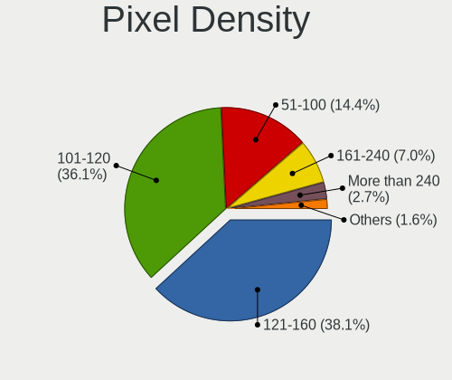

| Density       | Notebooks | Percent |
|---------------|-----------|---------|
| 121-160       | 65        | 40.12%  |
| 101-120       | 50        | 30.86%  |
| 51-100        | 26        | 16.05%  |
| 161-240       | 14        | 8.64%   |
| More than 240 | 6         | 3.7%    |
| 1-50          | 1         | 0.62%   |

Multiple Monitors
-----------------

Total monitors connected

| Total | Notebooks | Percent |
|-------|-----------|---------|
| 1     | 129       | 83.77%  |
| 2     | 19        | 12.34%  |
| 0     | 6         | 3.9%    |

Network
-------

Net Controller Vendor
---------------------

Controller vendors

| Vendor                   | Notebooks | Percent |
|--------------------------|-----------|---------|
| Intel                    | 81        | 33.61%  |
| Realtek Semiconductor    | 77        | 31.95%  |
| Qualcomm Atheros         | 30        | 12.45%  |
| Broadcom                 | 17        | 7.05%   |
| MediaTek                 | 8         | 3.32%   |
| Marvell Technology Group | 5         | 2.07%   |
| Broadcom Limited         | 5         | 2.07%   |
| Ralink                   | 4         | 1.66%   |
| Samsung Electronics      | 3         | 1.24%   |
| Sierra Wireless          | 2         | 0.83%   |
| DisplayLink              | 2         | 0.83%   |
| Qualcomm                 | 1         | 0.41%   |
| Nvidia                   | 1         | 0.41%   |
| JMicron Technology       | 1         | 0.41%   |
| Hewlett-Packard          | 1         | 0.41%   |
| Edimax Technology        | 1         | 0.41%   |
| D-Link                   | 1         | 0.41%   |
| ASIX Electronics         | 1         | 0.41%   |

Net Controller Model
--------------------

Controller models

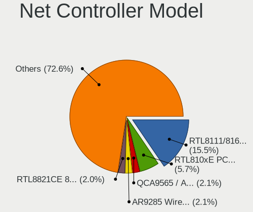

| Model                                                                          | Notebooks | Percent |
|--------------------------------------------------------------------------------|-----------|---------|
| Realtek RTL8111/8168/8211/8411 PCI Express Gigabit Ethernet Controller         | 41        | 14.14%  |
| Realtek RTL810xE PCI Express Fast Ethernet controller                          | 15        | 5.17%   |
| Intel Wireless 7265                                                            | 9         | 3.1%    |
| Qualcomm Atheros AR9285 Wireless Network Adapter (PCI-Express)                 | 8         | 2.76%   |
| Intel Wireless 7260                                                            | 7         | 2.41%   |
| Realtek RTL8153 Gigabit Ethernet Adapter                                       | 6         | 2.07%   |
| Qualcomm Atheros QCA9377 802.11ac Wireless Network Adapter                     | 6         | 2.07%   |
| Intel Wireless 3165                                                            | 6         | 2.07%   |
| Intel Wi-Fi 6 AX201                                                            | 6         | 2.07%   |
| Qualcomm Atheros QCA9565 / AR9565 Wireless Network Adapter                     | 5         | 1.72%   |
| Intel Wireless 8260                                                            | 5         | 1.72%   |
| Intel 82579LM Gigabit Network Connection (Lewisville)                          | 5         | 1.72%   |
| Realtek RTL8821CE 802.11ac PCIe Wireless Network Adapter                       | 4         | 1.38%   |
| MediaTek MT7921 802.11ax PCI Express Wireless Network Adapter                  | 4         | 1.38%   |
| Intel Wireless 8265 / 8275                                                     | 4         | 1.38%   |
| Intel WiFi Link 5100                                                           | 4         | 1.38%   |
| Intel Ethernet Connection (3) I218-LM                                          | 4         | 1.38%   |
| Intel Dual Band Wireless-AC 3165 Plus Bluetooth                                | 4         | 1.38%   |
| Realtek RTL8723DE Wireless Network Adapter                                     | 3         | 1.03%   |
| Realtek Killer E2600 GbE Controller                                            | 3         | 1.03%   |
| Qualcomm Atheros AR8121/AR8113/AR8114 Gigabit or Fast Ethernet                 | 3         | 1.03%   |
| Intel Wi-Fi 6 AX200                                                            | 3         | 1.03%   |
| Intel Gemini Lake PCH CNVi WiFi                                                | 3         | 1.03%   |
| Intel Ethernet Connection I219-LM                                              | 3         | 1.03%   |
| Intel Centrino Advanced-N 6205 [Taylor Peak]                                   | 3         | 1.03%   |
| Intel Centrino Advanced-N 6200                                                 | 3         | 1.03%   |
| Intel Cannon Point-LP CNVi [Wireless-AC]                                       | 3         | 1.03%   |
| Intel Alder Lake-P PCH CNVi WiFi                                               | 3         | 1.03%   |
| Broadcom BCM4331 802.11a/b/g/n                                                 | 3         | 1.03%   |
| Samsung GT-I9070 (network tethering, USB debugging enabled)                    | 2         | 0.69%   |
| Realtek RTL8852BE PCIe 802.11ax Wireless Network Controller                    | 2         | 0.69%   |
| Realtek RTL8822CE 802.11ac PCIe Wireless Network Adapter                       | 2         | 0.69%   |
| Realtek RTL8191SEvB Wireless LAN Controller                                    | 2         | 0.69%   |
| Ralink RT3090 Wireless 802.11n 1T/1R PCIe                                      | 2         | 0.69%   |
| Qualcomm Atheros Killer E220x Gigabit Ethernet Controller                      | 2         | 0.69%   |
| Qualcomm Atheros AR9485 Wireless Network Adapter                               | 2         | 0.69%   |
| Qualcomm Atheros AR928X Wireless Network Adapter (PCI-Express)                 | 2         | 0.69%   |
| Qualcomm Atheros AR8151 v2.0 Gigabit Ethernet                                  | 2         | 0.69%   |
| Marvell Group Yukon Optima 88E8059 [PCIe Gigabit Ethernet Controller with AVB] | 2         | 0.69%   |
| Marvell Group 88E8040 PCI-E Fast Ethernet Controller                           | 2         | 0.69%   |

Wireless Vendor
---------------

Wireless vendors

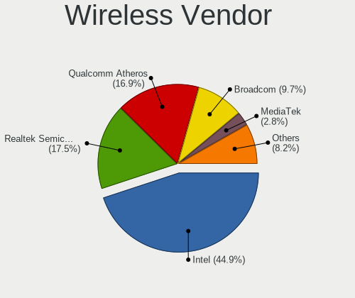

| Vendor                | Notebooks | Percent |
|-----------------------|-----------|---------|
| Intel                 | 79        | 49.69%  |
| Qualcomm Atheros      | 25        | 15.72%  |
| Realtek Semiconductor | 24        | 15.09%  |
| Broadcom              | 13        | 8.18%   |
| MediaTek              | 7         | 4.4%    |
| Ralink                | 4         | 2.52%   |
| Broadcom Limited      | 3         | 1.89%   |
| Sierra Wireless       | 2         | 1.26%   |
| Edimax Technology     | 1         | 0.63%   |
| D-Link                | 1         | 0.63%   |

Wireless Model
--------------

Wireless models

| Model                                                          | Notebooks | Percent |
|----------------------------------------------------------------|-----------|---------|
| Intel Wireless 7265                                            | 9         | 5.63%   |
| Qualcomm Atheros AR9285 Wireless Network Adapter (PCI-Express) | 8         | 5%      |
| Intel Wireless 7260                                            | 7         | 4.38%   |
| Qualcomm Atheros QCA9377 802.11ac Wireless Network Adapter     | 6         | 3.75%   |
| Intel Wireless 3165                                            | 6         | 3.75%   |
| Intel Wi-Fi 6 AX201                                            | 6         | 3.75%   |
| Qualcomm Atheros QCA9565 / AR9565 Wireless Network Adapter     | 5         | 3.13%   |
| Intel Wireless 8260                                            | 5         | 3.13%   |
| Realtek RTL8821CE 802.11ac PCIe Wireless Network Adapter       | 4         | 2.5%    |
| MediaTek MT7921 802.11ax PCI Express Wireless Network Adapter  | 4         | 2.5%    |
| Intel Wireless 8265 / 8275                                     | 4         | 2.5%    |
| Intel WiFi Link 5100                                           | 4         | 2.5%    |
| Intel Dual Band Wireless-AC 3165 Plus Bluetooth                | 4         | 2.5%    |
| Realtek RTL8723DE Wireless Network Adapter                     | 3         | 1.88%   |
| Intel Wi-Fi 6 AX200                                            | 3         | 1.88%   |
| Intel Gemini Lake PCH CNVi WiFi                                | 3         | 1.88%   |
| Intel Centrino Advanced-N 6205 [Taylor Peak]                   | 3         | 1.88%   |
| Intel Centrino Advanced-N 6200                                 | 3         | 1.88%   |
| Intel Cannon Point-LP CNVi [Wireless-AC]                       | 3         | 1.88%   |
| Intel Alder Lake-P PCH CNVi WiFi                               | 3         | 1.88%   |
| Broadcom BCM4331 802.11a/b/g/n                                 | 3         | 1.88%   |
| Realtek RTL8852BE PCIe 802.11ax Wireless Network Controller    | 2         | 1.25%   |
| Realtek RTL8822CE 802.11ac PCIe Wireless Network Adapter       | 2         | 1.25%   |
| Realtek RTL8191SEvB Wireless LAN Controller                    | 2         | 1.25%   |
| Ralink RT3090 Wireless 802.11n 1T/1R PCIe                      | 2         | 1.25%   |
| Qualcomm Atheros AR9485 Wireless Network Adapter               | 2         | 1.25%   |
| Qualcomm Atheros AR928X Wireless Network Adapter (PCI-Express) | 2         | 1.25%   |
| Intel Wi-Fi 6E(802.11ax) AX210/AX1675* 2x2 [Typhoon Peak]      | 2         | 1.25%   |
| Intel Raptor Lake PCH CNVi WiFi                                | 2         | 1.25%   |
| Intel Cannon Lake PCH CNVi WiFi                                | 2         | 1.25%   |
| Broadcom BCM4350 802.11ac Wireless Network Adapter             | 2         | 1.25%   |
| Broadcom BCM4322 802.11a/b/g/n Wireless LAN Controller         | 2         | 1.25%   |
| Broadcom BCM4313 802.11bgn Wireless Network Adapter            | 2         | 1.25%   |
| Sierra Wireless MC7710                                         | 1         | 0.63%   |
| Sierra Wireless EM7305 Modem                                   | 1         | 0.63%   |
| Realtek RTL88x2bu [AC1200 Techkey]                             | 1         | 0.63%   |
| Realtek RTL8852CE PCIe 802.11ax Wireless Network Controller    | 1         | 0.63%   |
| Realtek RTL8852AE 802.11ax PCIe Wireless Network Adapter       | 1         | 0.63%   |
| Realtek RTL8821AE 802.11ac PCIe Wireless Network Adapter       | 1         | 0.63%   |
| Realtek RTL8723BE PCIe Wireless Network Adapter                | 1         | 0.63%   |

Ethernet Vendor
---------------

Ethernet vendors

| Vendor                   | Notebooks | Percent |
|--------------------------|-----------|---------|
| Realtek Semiconductor    | 66        | 50.77%  |
| Intel                    | 26        | 20%     |
| Qualcomm Atheros         | 11        | 8.46%   |
| Broadcom                 | 9         | 6.92%   |
| Marvell Technology Group | 5         | 3.85%   |
| Samsung Electronics      | 3         | 2.31%   |
| DisplayLink              | 2         | 1.54%   |
| Broadcom Limited         | 2         | 1.54%   |
| Qualcomm                 | 1         | 0.77%   |
| Nvidia                   | 1         | 0.77%   |
| MediaTek                 | 1         | 0.77%   |
| JMicron Technology       | 1         | 0.77%   |
| Hewlett-Packard          | 1         | 0.77%   |
| ASIX Electronics         | 1         | 0.77%   |

Ethernet Model
--------------

Ethernet models

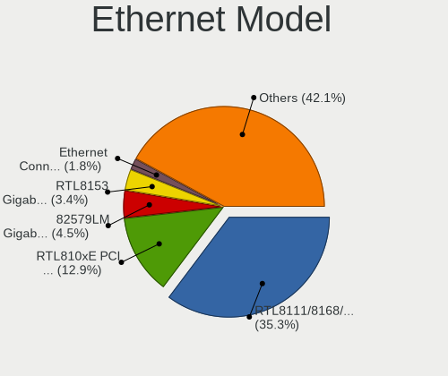

| Model                                                                          | Notebooks | Percent |
|--------------------------------------------------------------------------------|-----------|---------|
| Realtek RTL8111/8168/8211/8411 PCI Express Gigabit Ethernet Controller         | 41        | 31.54%  |
| Realtek RTL810xE PCI Express Fast Ethernet controller                          | 15        | 11.54%  |
| Realtek RTL8153 Gigabit Ethernet Adapter                                       | 6         | 4.62%   |
| Intel 82579LM Gigabit Network Connection (Lewisville)                          | 5         | 3.85%   |
| Intel Ethernet Connection (3) I218-LM                                          | 4         | 3.08%   |
| Realtek Killer E2600 GbE Controller                                            | 3         | 2.31%   |
| Qualcomm Atheros AR8121/AR8113/AR8114 Gigabit or Fast Ethernet                 | 3         | 2.31%   |
| Intel Ethernet Connection I219-LM                                              | 3         | 2.31%   |
| Samsung GT-I9070 (network tethering, USB debugging enabled)                    | 2         | 1.54%   |
| Qualcomm Atheros Killer E220x Gigabit Ethernet Controller                      | 2         | 1.54%   |
| Qualcomm Atheros AR8151 v2.0 Gigabit Ethernet                                  | 2         | 1.54%   |
| Marvell Group Yukon Optima 88E8059 [PCIe Gigabit Ethernet Controller with AVB] | 2         | 1.54%   |
| Marvell Group 88E8040 PCI-E Fast Ethernet Controller                           | 2         | 1.54%   |
| Intel Ethernet Connection I218-LM                                              | 2         | 1.54%   |
| Intel Ethernet Connection (4) I219-LM                                          | 2         | 1.54%   |
| Broadcom NetXtreme BCM57786 Gigabit Ethernet PCIe                              | 2         | 1.54%   |
| Broadcom NetXtreme BCM57765 Gigabit Ethernet PCIe                              | 2         | 1.54%   |
| Broadcom NetXtreme BCM5764M Gigabit Ethernet PCIe                              | 2         | 1.54%   |
| Broadcom NetLink BCM5784M Gigabit Ethernet PCIe                                | 2         | 1.54%   |
| Samsung Galaxy series, misc. (tethering mode)                                  | 1         | 0.77%   |
| Realtek RTL8125 2.5GbE Controller                                              | 1         | 0.77%   |
| Qualcomm MDM9207-MTP _SN:F0565CAE                                              | 1         | 0.77%   |
| Qualcomm Atheros AR8161 Gigabit Ethernet                                       | 1         | 0.77%   |
| Qualcomm Atheros AR8152 v2.0 Fast Ethernet                                     | 1         | 0.77%   |
| Qualcomm Atheros AR8151 v1.0 Gigabit Ethernet                                  | 1         | 0.77%   |
| Qualcomm Atheros AR8131 Gigabit Ethernet                                       | 1         | 0.77%   |
| Nvidia MCP79 Ethernet                                                          | 1         | 0.77%   |
| MediaTek File-CD Gadget                                                        | 1         | 0.77%   |
| Marvell Group 88E8057 PCI-E Gigabit Ethernet Controller                        | 1         | 0.77%   |
| JMicron JMC250 PCI Express Gigabit Ethernet Controller                         | 1         | 0.77%   |
| Intel Ethernet Connection I219-V                                               | 1         | 0.77%   |
| Intel Ethernet Connection I217-V                                               | 1         | 0.77%   |
| Intel Ethernet Connection I217-LM                                              | 1         | 0.77%   |
| Intel Ethernet Connection (7) I219-V                                           | 1         | 0.77%   |
| Intel Ethernet Connection (6) I219-V                                           | 1         | 0.77%   |
| Intel Ethernet Connection (4) I219-V                                           | 1         | 0.77%   |
| Intel Ethernet Connection (3) I218-V                                           | 1         | 0.77%   |
| Intel Ethernet Connection (23) I219-LM                                         | 1         | 0.77%   |
| Intel Ethernet Connection (2) I219-LM                                          | 1         | 0.77%   |
| Intel 82577LM Gigabit Network Connection                                       | 1         | 0.77%   |

Net Controller Kind
-------------------

Ethernet, WiFi or modem

| Kind     | Notebooks | Percent |
|----------|-----------|---------|
| WiFi     | 153       | 55.43%  |
| Ethernet | 123       | 44.57%  |

Used Controller
---------------

Currently used network controller

| Kind     | Notebooks | Percent |
|----------|-----------|---------|
| WiFi     | 131       | 83.97%  |
| Ethernet | 25        | 16.03%  |

NICs
----

Total network controllers on board

| Total | Notebooks | Percent |
|-------|-----------|---------|
| 2     | 113       | 73.38%  |
| 1     | 40        | 25.97%  |
| 0     | 1         | 0.65%   |

IPv6
----

IPv6 vs IPv4

| Used | Notebooks | Percent |
|------|-----------|---------|
| No   | 93        | 60.39%  |
| Yes  | 61        | 39.61%  |

Bluetooth
---------

Bluetooth Vendor
----------------

Controller vendors

| Vendor                          | Notebooks | Percent |
|---------------------------------|-----------|---------|
| Intel                           | 62        | 50.41%  |
| Realtek Semiconductor           | 14        | 11.38%  |
| Qualcomm Atheros Communications | 9         | 7.32%   |
| IMC Networks                    | 9         | 7.32%   |
| Apple                           | 7         | 5.69%   |
| Foxconn / Hon Hai               | 5         | 4.07%   |
| Toshiba                         | 4         | 3.25%   |
| Lite-On Technology              | 2         | 1.63%   |
| Hewlett-Packard                 | 2         | 1.63%   |
| Cambridge Silicon Radio         | 2         | 1.63%   |
| Broadcom                        | 2         | 1.63%   |
| Realtek                         | 1         | 0.81%   |
| Ralink Technology               | 1         | 0.81%   |
| MediaTek                        | 1         | 0.81%   |
| Dell                            | 1         | 0.81%   |
| ASUSTek Computer                | 1         | 0.81%   |

Bluetooth Model
---------------

Controller models

| Model                                                                               | Notebooks | Percent |
|-------------------------------------------------------------------------------------|-----------|---------|
| Intel Bluetooth wireless interface                                                  | 34        | 27.64%  |
| Intel Bluetooth 9460/9560 Jefferson Peak (JfP)                                      | 10        | 8.13%   |
| Realtek Bluetooth Radio                                                             | 8         | 6.5%    |
| Intel AX201 Bluetooth                                                               | 8         | 6.5%    |
| Qualcomm Atheros  Bluetooth Device                                                  | 6         | 4.88%   |
| Realtek  Bluetooth 4.2 Adapter                                                      | 5         | 4.07%   |
| Apple Bluetooth Host Controller                                                     | 5         | 4.07%   |
| IMC Networks Wireless_Device                                                        | 4         | 3.25%   |
| IMC Networks Bluetooth Device                                                       | 4         | 3.25%   |
| Intel Bluetooth Device                                                              | 3         | 2.44%   |
| Intel AX200 Bluetooth                                                               | 3         | 2.44%   |
| Toshiba Bluetooth Device                                                            | 2         | 1.63%   |
| Qualcomm Atheros AR3011 Bluetooth                                                   | 2         | 1.63%   |
| Lite-On Wireless_Device                                                             | 2         | 1.63%   |
| Intel Centrino Bluetooth Wireless Transceiver                                       | 2         | 1.63%   |
| Foxconn / Hon Hai Foxconn T77H114 BCM2070 [Single-Chip Bluetooth 2.1 + EDR Adapter] | 2         | 1.63%   |
| Cambridge Silicon Radio Bluetooth Dongle (HCI mode)                                 | 2         | 1.63%   |
| Broadcom BCM2045B (BDC-2.1)                                                         | 2         | 1.63%   |
| Apple Bluetooth USB Host Controller                                                 | 2         | 1.63%   |
| Toshiba Integrated Bluetooth (Taiyo Yuden)                                          | 1         | 0.81%   |
| Toshiba BCM43142A0                                                                  | 1         | 0.81%   |
| Realtek RTL8723B Bluetooth                                                          | 1         | 0.81%   |
| Realtek Bluetooth Radio                                                             | 1         | 0.81%   |
| Ralink Motorola BC4 Bluetooth 3.0+HS Adapter                                        | 1         | 0.81%   |
| Qualcomm Atheros AR3012 Bluetooth 4.0                                               | 1         | 0.81%   |
| MediaTek Wireless_Device                                                            | 1         | 0.81%   |
| Intel Wireless-AC 9260 Bluetooth Adapter                                            | 1         | 0.81%   |
| Intel AX210 Bluetooth                                                               | 1         | 0.81%   |
| IMC Networks BCM20702A0                                                             | 1         | 0.81%   |
| HP Broadcom 2070 Bluetooth Combo                                                    | 1         | 0.81%   |
| HP Bluetooth 2.0 Interface [Broadcom BCM2045]                                       | 1         | 0.81%   |
| Foxconn / Hon Hai Broadcom Bluetooth 2.1 Device                                     | 1         | 0.81%   |
| Foxconn / Hon Hai Bluetooth Device                                                  | 1         | 0.81%   |
| Foxconn / Hon Hai BCM20702A0                                                        | 1         | 0.81%   |
| Dell Wireless 365 Bluetooth                                                         | 1         | 0.81%   |
| ASUS Broadcom BCM20702A0 Bluetooth                                                  | 1         | 0.81%   |

Sound
-----

Sound Vendor
------------

Sound card vendors

| Vendor              | Notebooks | Percent |
|---------------------|-----------|---------|
| Intel               | 121       | 62.37%  |
| AMD                 | 35        | 18.04%  |
| Nvidia              | 29        | 14.95%  |
| JMTek               | 2         | 1.03%   |
| C-Media Electronics | 2         | 1.03%   |
| Texas Instruments   | 1         | 0.52%   |
| Sony                | 1         | 0.52%   |
| Hewlett-Packard     | 1         | 0.52%   |
| ASUSTek Computer    | 1         | 0.52%   |
| Apple               | 1         | 0.52%   |

Sound Model
-----------

Sound card models

| Model                                                                      | Notebooks | Percent |
|----------------------------------------------------------------------------|-----------|---------|
| Intel Sunrise Point-LP HD Audio                                            | 20        | 8.47%   |
| AMD Family 17h/19h HD Audio Controller                                     | 19        | 8.05%   |
| Intel 82801I (ICH9 Family) HD Audio Controller                             | 12        | 5.08%   |
| Intel 7 Series/C216 Chipset Family High Definition Audio Controller        | 12        | 5.08%   |
| Intel Wildcat Point-LP High Definition Audio Controller                    | 10        | 4.24%   |
| Intel Celeron/Pentium Silver Processor High Definition Audio               | 10        | 4.24%   |
| Intel Broadwell-U Audio Controller                                         | 10        | 4.24%   |
| Intel 6 Series/C200 Series Chipset Family High Definition Audio Controller | 10        | 4.24%   |
| Intel 5 Series/3400 Series Chipset High Definition Audio                   | 8         | 3.39%   |
| AMD Renoir Radeon High Definition Audio Controller                         | 8         | 3.39%   |
| Intel Tiger Lake-LP Smart Sound Technology Audio Controller                | 6         | 2.54%   |
| Intel 8 Series/C220 Series Chipset High Definition Audio Controller        | 5         | 2.12%   |
| AMD Raven/Raven2/Fenghuang HDMI/DP Audio Controller                        | 5         | 2.12%   |
| Nvidia GA106 High Definition Audio Controller                              | 4         | 1.69%   |
| Intel Xeon E3-1200 v3/4th Gen Core Processor HD Audio Controller           | 4         | 1.69%   |
| Intel Haswell-ULT HD Audio Controller                                      | 4         | 1.69%   |
| Intel Cannon Point-LP High Definition Audio Controller                     | 4         | 1.69%   |
| Intel Alder Lake PCH-P High Definition Audio Controller                    | 4         | 1.69%   |
| Intel 8 Series HD Audio Controller                                         | 4         | 1.69%   |
| AMD SBx00 Azalia (Intel HDA)                                               | 4         | 1.69%   |
| Nvidia GP107GL High Definition Audio Controller                            | 3         | 1.27%   |
| Intel 100 Series/C230 Series Chipset Family HD Audio Controller            | 3         | 1.27%   |
| AMD RV710/730 HDMI Audio [Radeon HD 4000 series]                           | 3         | 1.27%   |
| AMD Family 15h (Models 60h-6fh) Audio Controller                           | 3         | 1.27%   |
| Nvidia GK106 HDMI Audio Controller                                         | 2         | 0.85%   |
| Nvidia GF119 HDMI Audio Controller                                         | 2         | 0.85%   |
| Nvidia GF108 High Definition Audio Controller                              | 2         | 0.85%   |
| Nvidia GA104 High Definition Audio Controller                              | 2         | 0.85%   |
| Nvidia Audio device                                                        | 2         | 0.85%   |
| JMTek USB PnP Audio Device                                                 | 2         | 0.85%   |
| Intel Raptor Lake-P/U/H cAVS                                               | 2         | 0.85%   |
| Intel Comet Lake PCH-LP cAVS                                               | 2         | 0.85%   |
| Intel Comet Lake PCH cAVS                                                  | 2         | 0.85%   |
| Intel Celeron N3350/Pentium N4200/Atom E3900 Series Audio Cluster          | 2         | 0.85%   |
| Intel Cannon Lake PCH cAVS                                                 | 2         | 0.85%   |
| Intel Atom Processor Z36xxx/Z37xxx Series High Definition Audio Controller | 2         | 0.85%   |
| AMD RS880 HDMI Audio [Radeon HD 4200 Series]                               | 2         | 0.85%   |
| AMD Rembrandt Radeon High Definition Audio Controller                      | 2         | 0.85%   |
| AMD Kabini HDMI/DP Audio                                                   | 2         | 0.85%   |
| AMD High Definition Audio Controller                                       | 2         | 0.85%   |

Memory
------

Memory Vendor
-------------

Memory module vendors

| Vendor              | Notebooks | Percent |
|---------------------|-----------|---------|
| Samsung Electronics | 4         | 21.05%  |
| Micron Technology   | 4         | 21.05%  |
| Unknown             | 3         | 15.79%  |
| SK hynix            | 2         | 10.53%  |
| Unknown (ABCD)      | 1         | 5.26%   |
| Teikon              | 1         | 5.26%   |
| Smart Brazil        | 1         | 5.26%   |
| Ramaxel Technology  | 1         | 5.26%   |
| Kingston            | 1         | 5.26%   |
| G.Skill             | 1         | 5.26%   |

Memory Model
------------

Memory module models

| Model                                                               | Notebooks | Percent |
|---------------------------------------------------------------------|-----------|---------|
| Micron RAM 4ATF1G64HZ-3G2E1 8GB Row Of Chips DDR4 3200MT/s          | 2         | 10.53%  |
| Unknown RAM Module 4GB SODIMM DDR3                                  | 1         | 5.26%   |
| Unknown RAM Module 4GB SODIMM DDR2                                  | 1         | 5.26%   |
| Unknown RAM Module 2GB SODIMM DDR2 800MT/s                          | 1         | 5.26%   |
| Unknown (ABCD) RAM 123456789012345678 2048MB SODIMM LPDDR4 2400MT/s | 1         | 5.26%   |
| Teikon RAM TMT451S6BFR8A-PBSC 4GB SODIMM DDR3 1600MT/s              | 1         | 5.26%   |
| Smart Brazil RAM SMS4TDC3C0K0446SCG 4GB SODIMM DDR4 2667MT/s        | 1         | 5.26%   |
| SK hynix RAM HMA82GS6CJR8N-VK 16GB SODIMM DDR4 2667MT/s             | 1         | 5.26%   |
| SK hynix RAM HCNNNCPMBLHR-NEE 2GB Row Of Chips LPDDR4 4267MT/s      | 1         | 5.26%   |
| Samsung RAM M471A2K43CB1-CRC 16GB SODIMM DDR4 2667MT/s              | 1         | 5.26%   |
| Samsung RAM M471A1K44BM0-CRC 8GB SODIMM DDR4 2400MT/s               | 1         | 5.26%   |
| Samsung RAM M425R2GA3BB0-CWMOD 16GB SODIMM DDR5 5600MT/s            | 1         | 5.26%   |
| Samsung RAM K3LKBKB0BM-MGCP 4GB Row Of Chips LPDDR5 6400MT/s        | 1         | 5.26%   |
| Ramaxel RAM RMSA3320MR78HAF-3200 8GB SODIMM DDR4 3200MT/s           | 1         | 5.26%   |
| Micron RAM 8KTF51264HZ-1G6E1 4096MB SODIMM DDR3 1600MT/s            | 1         | 5.26%   |
| Micron RAM 4ATF1G64HZ-3G2F1 8GB SODIMM DDR4 3200MT/s                | 1         | 5.26%   |
| Kingston RAM 9905428-131.A00LF 4GB SODIMM DDR3 1067MT/s             | 1         | 5.26%   |
| G.Skill RAM F4-2400C16-8GRS 8GB SODIMM DDR4 2400MT/s                | 1         | 5.26%   |

Memory Kind
-----------

Memory module kinds

| Kind   | Notebooks | Percent |
|--------|-----------|---------|
| DDR4   | 7         | 43.75%  |
| DDR3   | 3         | 18.75%  |
| LPDDR4 | 2         | 12.5%   |
| DDR2   | 2         | 12.5%   |
| LPDDR5 | 1         | 6.25%   |
| DDR5   | 1         | 6.25%   |

Memory Form Factor
------------------

Physical design of the memory module

| Name         | Notebooks | Percent |
|--------------|-----------|---------|
| SODIMM       | 13        | 76.47%  |
| Row Of Chips | 4         | 23.53%  |

Memory Size
-----------

Memory module size

| Size  | Notebooks | Percent |
|-------|-----------|---------|
| 8192  | 7         | 43.75%  |
| 4096  | 5         | 31.25%  |
| 16384 | 2         | 12.5%   |
| 32768 | 1         | 6.25%   |
| 2048  | 1         | 6.25%   |

Memory Speed
------------

Memory module speed

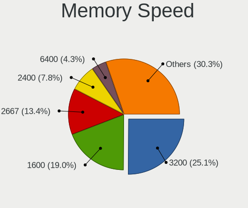

| Speed   | Notebooks | Percent |
|---------|-----------|---------|
| 3200    | 3         | 17.65%  |
| 2667    | 3         | 17.65%  |
| 2400    | 2         | 11.76%  |
| 1600    | 2         | 11.76%  |
| Unknown | 2         | 11.76%  |
| 6400    | 1         | 5.88%   |
| 5600    | 1         | 5.88%   |
| 4267    | 1         | 5.88%   |
| 1067    | 1         | 5.88%   |
| 800     | 1         | 5.88%   |

Printers & scanners
-------------------

Printer Vendor
--------------

Printer device vendors

| Vendor          | Notebooks | Percent |
|-----------------|-----------|---------|
| Hewlett-Packard | 1         | 50%     |
| Dymo-CoStar     | 1         | 50%     |

Printer Model
-------------

Printer device models

| Model                       | Notebooks | Percent |
|-----------------------------|-----------|---------|
| HP LaserJet 1020            | 1         | 50%     |
| Dymo-CoStar LabelWriter 450 | 1         | 50%     |

Scanner Vendor
--------------

Scanner device vendors

Zero info for selected period =(

Scanner Model
-------------

Scanner device models

Zero info for selected period =(

Camera
------

Camera Vendor
-------------

Camera device vendors

| Vendor                                 | Notebooks | Percent |
|----------------------------------------|-----------|---------|
| Chicony Electronics                    | 31        | 22.3%   |
| Microdia                               | 14        | 10.07%  |
| IMC Networks                           | 14        | 10.07%  |
| Realtek Semiconductor                  | 11        | 7.91%   |
| Quanta                                 | 9         | 6.47%   |
| Bison Electronics                      | 8         | 5.76%   |
| Sunplus Innovation Technology          | 7         | 5.04%   |
| Cheng Uei Precision Industry (Foxlink) | 7         | 5.04%   |
| Apple                                  | 7         | 5.04%   |
| Suyin                                  | 5         | 3.6%    |
| Silicon Motion                         | 3         | 2.16%   |
| Luxvisions Innotech Limited            | 3         | 2.16%   |
| Lite-On Technology                     | 3         | 2.16%   |
| Ricoh                                  | 2         | 1.44%   |
| Y Media                                | 1         | 0.72%   |
| USB Camera                             | 1         | 0.72%   |
| Syntek                                 | 1         | 0.72%   |
| SunplusIT                              | 1         | 0.72%   |
| Sonix Technology                       | 1         | 0.72%   |
| ShineTech                              | 1         | 0.72%   |
| Logitech                               | 1         | 0.72%   |
| Lenovo                                 | 1         | 0.72%   |
| kingcome                               | 1         | 0.72%   |
| icSpring                               | 1         | 0.72%   |
| Elecom                                 | 1         | 0.72%   |
| ALi                                    | 1         | 0.72%   |
| Alcor Micro                            | 1         | 0.72%   |
| Acer                                   | 1         | 0.72%   |
| 8SSC21K12273V1SR33X2817                | 1         | 0.72%   |

Camera Model
------------

Camera device models

| Model                                                          | Notebooks | Percent |
|----------------------------------------------------------------|-----------|---------|
| Microdia Integrated_Webcam_HD                                  | 4         | 2.88%   |
| IMC Networks USB2.0 HD UVC WebCam                              | 4         | 2.88%   |
| IMC Networks Integrated Camera                                 | 4         | 2.88%   |
| Chicony Integrated Camera                                      | 4         | 2.88%   |
| Realtek Integrated_Webcam_HD                                   | 3         | 2.16%   |
| Quanta HD User Facing                                          | 3         | 2.16%   |
| Chicony HP HD Camera                                           | 3         | 2.16%   |
| Chicony FJ Camera                                              | 3         | 2.16%   |
| Bison Integrated Camera                                        | 3         | 2.16%   |
| Suyin Acer/HP Integrated Webcam [CN0314]                       | 2         | 1.44%   |
| Sunplus Integrated_Webcam_HD                                   | 2         | 1.44%   |
| Realtek USB Camera                                             | 2         | 1.44%   |
| Quanta USB2.0 HD UVC WebCam                                    | 2         | 1.44%   |
| Microdia Sonix USB 2.0 Camera                                  | 2         | 1.44%   |
| Microdia Integrated_Webcam_FHD                                 | 2         | 1.44%   |
| Chicony USB2.0 HD UVC WebCam                                   | 2         | 1.44%   |
| Chicony USB 2.0 Camera                                         | 2         | 1.44%   |
| Chicony HP TrueVision HD Camera                                | 2         | 1.44%   |
| Chicony 2.0M UVC Webcam / CNF7129                              | 2         | 1.44%   |
| Cheng Uei Precision Industry (Foxlink) Webcam                  | 2         | 1.44%   |
| Cheng Uei Precision Industry (Foxlink) HP TrueVision HD Camera | 2         | 1.44%   |
| Apple FaceTime HD Camera (Built-in)                            | 2         | 1.44%   |
| Apple FaceTime HD Camera                                       | 2         | 1.44%   |
| Apple Built-in iSight                                          | 2         | 1.44%   |
| Y Media USB Camera                                             | 1         | 0.72%   |
| USB Camera USB Camera                                          | 1         | 0.72%   |
| Syntek EasyCamera                                              | 1         | 0.72%   |
| Suyin USB 2.0 Camera                                           | 1         | 0.72%   |
| Suyin Lenovo EasyCamera Integrated Webcam                      | 1         | 0.72%   |
| Suyin HP Webcam-101                                            | 1         | 0.72%   |
| SunplusIT USB 2M Camera                                        | 1         | 0.72%   |
| Sunplus Laptop Integrated Webcam HD                            | 1         | 0.72%   |
| Sunplus Integrated_Webcam_FHD                                  | 1         | 0.72%   |
| Sunplus Hy-FHD(9807)-Camera                                    | 1         | 0.72%   |
| Sunplus HP Wide Vision HD                                      | 1         | 0.72%   |
| Sunplus Asus Webcam                                            | 1         | 0.72%   |
| Sonix USB2.0 FHD UVC WebCam                                    | 1         | 0.72%   |
| Silicon Motion WebCam SC-13HDL12131N                           | 1         | 0.72%   |
| Silicon Motion Web Camera                                      | 1         | 0.72%   |
| Silicon Motion HP Webcam                                       | 1         | 0.72%   |

Security
--------

Fingerprint Vendor
------------------

Fingerprint sensor vendors

| Vendor                             | Notebooks | Percent |
|------------------------------------|-----------|---------|
| Validity Sensors                   | 8         | 38.1%   |
| Synaptics                          | 5         | 23.81%  |
| Shenzhen Goodix Technology         | 3         | 14.29%  |
| Upek                               | 2         | 9.52%   |
| Realtek USB2.0 Finger Print Bridge | 1         | 4.76%   |
| Elan Microelectronics              | 1         | 4.76%   |
| AuthenTec                          | 1         | 4.76%   |

Fingerprint Model
-----------------

Fingerprint sensor models

| Model                                                                      | Notebooks | Percent |
|----------------------------------------------------------------------------|-----------|---------|
| Validity Sensors VFS495 Fingerprint Reader                                 | 3         | 14.29%  |
| Shenzhen Goodix  Fingerprint Device                                        | 3         | 14.29%  |
| Validity Sensors VFS 5011 fingerprint sensor                               | 2         | 9.52%   |
| Upek Biometric Touchchip/Touchstrip Fingerprint Sensor                     | 2         | 9.52%   |
| Synaptics Metallica MIS Touch Fingerprint Reader                           | 2         | 9.52%   |
| Validity Sensors VFS5011 Fingerprint Reader                                | 1         | 4.76%   |
| Validity Sensors Synaptics WBDI                                            | 1         | 4.76%   |
| Validity Sensors Synaptics VFS7552 Touch Fingerprint Sensor with PurePrint | 1         | 4.76%   |
| Synaptics  WBDI                                                            | 1         | 4.76%   |
| Synaptics Metallica MOH Touch Fingerprint Reader                           | 1         | 4.76%   |
| Synaptics Fingerprint reader [HP G6]                                       | 1         | 4.76%   |
| Realtek USB2.0 Finger Print Bridge FocalTech Fingerprint Device            | 1         | 4.76%   |
| Elan ELAN:Fingerprint                                                      | 1         | 4.76%   |
| AuthenTec Fingerprint Sensor                                               | 1         | 4.76%   |

Chipcard Vendor
---------------

Chipcard module vendors

| Vendor      | Notebooks | Percent |
|-------------|-----------|---------|
| Broadcom    | 7         | 63.64%  |
| Alcor Micro | 2         | 18.18%  |
| Upek        | 1         | 9.09%   |
| O2 Micro    | 1         | 9.09%   |

Chipcard Model
--------------

Chipcard module models

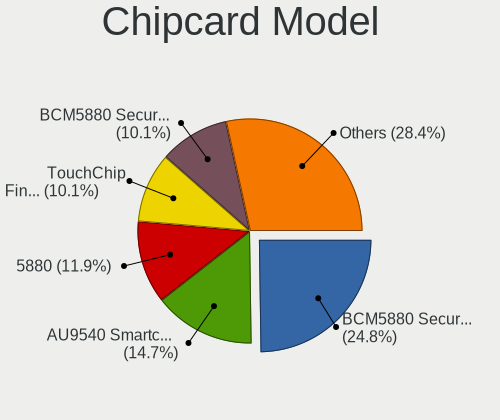

| Model                                                                        | Notebooks | Percent |
|------------------------------------------------------------------------------|-----------|---------|
| Broadcom BCM5880 Secure Applications Processor                               | 2         | 18.18%  |
| Broadcom 5880                                                                | 2         | 18.18%  |
| Broadcom 58200                                                               | 2         | 18.18%  |
| Alcor Micro AU9540 Smartcard Reader                                          | 2         | 18.18%  |
| Upek TouchChip Fingerprint Coprocessor (WBF advanced mode)                   | 1         | 9.09%   |
| O2 Micro OZ776 CCID Smartcard Reader                                         | 1         | 9.09%   |
| Broadcom BCM5880 Secure Applications Processor with fingerprint swipe sensor | 1         | 9.09%   |

Unsupported
-----------

Unsupported Devices
-------------------

Total unsupported devices on board

| Total | Notebooks | Percent |
|-------|-----------|---------|
| 0     | 97        | 62.58%  |
| 1     | 50        | 32.26%  |
| 2     | 7         | 4.52%   |
| 3     | 1         | 0.65%   |

Unsupported Device Types
------------------------

Types of unsupported devices

| Type                  | Notebooks | Percent |
|-----------------------|-----------|---------|
| Fingerprint reader    | 21        | 32.31%  |
| Graphics card         | 12        | 18.46%  |
| Chipcard              | 11        | 16.92%  |
| Multimedia controller | 9         | 13.85%  |
| Net/wireless          | 5         | 7.69%   |
| Storage               | 2         | 3.08%   |
| Net/ethernet          | 2         | 3.08%   |
| Camera                | 2         | 3.08%   |
| Bluetooth             | 1         | 1.54%   |

