Zorin 17 - Tested Hardware & Statistics (Notebooks)
---------------------------------------------------

A project to collect tested hardware configurations for Zorin 17.

Anyone can contribute to this report by the [hw-probe](https://github.com/linuxhw/hw-probe) tool:

    sudo -E hw-probe -all -upload

Please contribute! Especially if your hardware is rare.

Contents
--------

* [ Test Cases ](#test-cases)

* [ System ](#system)
  - [ Kernel                   ](#kernel)
  - [ Kernel Family            ](#kernel-family)
  - [ Kernel Major Ver.        ](#kernel-major-ver)
  - [ Arch                     ](#arch)
  - [ DE                       ](#de)
  - [ Display Server           ](#display-server)
  - [ Display Manager          ](#display-manager)
  - [ OS Lang                  ](#os-lang)
  - [ Boot Mode                ](#boot-mode)
  - [ Filesystem               ](#filesystem)
  - [ Part. scheme             ](#part-scheme)
  - [ Dual Boot with Linux/BSD ](#dual-boot-with-linuxbsd)
  - [ Dual Boot (Win)          ](#dual-boot-win)

* [ Board ](#board)
  - [ Vendor                   ](#vendor)
  - [ Model                    ](#model)
  - [ Model Family             ](#model-family)
  - [ MFG Year                 ](#mfg-year)
  - [ Form Factor              ](#form-factor)
  - [ Secure Boot              ](#secure-boot)
  - [ Coreboot                 ](#coreboot)
  - [ RAM Size                 ](#ram-size)
  - [ RAM Used                 ](#ram-used)
  - [ Total Drives             ](#total-drives)
  - [ Has CD-ROM               ](#has-cd-rom)
  - [ Has Ethernet             ](#has-ethernet)
  - [ Has WiFi                 ](#has-wifi)
  - [ Has Bluetooth            ](#has-bluetooth)

* [ Location ](#location)
  - [ Country                  ](#country)
  - [ City                     ](#city)

* [ Drives ](#drives)
  - [ Drive Vendor             ](#drive-vendor)
  - [ Drive Model              ](#drive-model)
  - [ HDD Vendor               ](#hdd-vendor)
  - [ SSD Vendor               ](#ssd-vendor)
  - [ Drive Kind               ](#drive-kind)
  - [ Drive Connector          ](#drive-connector)
  - [ Drive Size               ](#drive-size)
  - [ Space Total              ](#space-total)
  - [ Space Used               ](#space-used)
  - [ Malfunc. Drives          ](#malfunc-drives)
  - [ Malfunc. Drive Vendor    ](#malfunc-drive-vendor)
  - [ Malfunc. HDD Vendor      ](#malfunc-hdd-vendor)
  - [ Malfunc. Drive Kind      ](#malfunc-drive-kind)
  - [ Failed Drives            ](#failed-drives)
  - [ Failed Drive Vendor      ](#failed-drive-vendor)
  - [ Drive Status             ](#drive-status)

* [ Storage controller ](#storage-controller)
  - [ Storage Vendor           ](#storage-vendor)
  - [ Storage Model            ](#storage-model)
  - [ Storage Kind             ](#storage-kind)

* [ Processor ](#processor)
  - [ CPU Vendor               ](#cpu-vendor)
  - [ CPU Model                ](#cpu-model)
  - [ CPU Model Family         ](#cpu-model-family)
  - [ CPU Cores                ](#cpu-cores)
  - [ CPU Sockets              ](#cpu-sockets)
  - [ CPU Threads              ](#cpu-threads)
  - [ CPU Op-Modes             ](#cpu-op-modes)
  - [ CPU Microcode            ](#cpu-microcode)
  - [ CPU Microarch            ](#cpu-microarch)

* [ Graphics ](#graphics)
  - [ GPU Vendor               ](#gpu-vendor)
  - [ GPU Model                ](#gpu-model)
  - [ GPU Combo                ](#gpu-combo)
  - [ GPU Driver               ](#gpu-driver)
  - [ GPU Memory               ](#gpu-memory)

* [ Monitor ](#monitor)
  - [ Monitor Vendor           ](#monitor-vendor)
  - [ Monitor Model            ](#monitor-model)
  - [ Monitor Resolution       ](#monitor-resolution)
  - [ Monitor Diagonal         ](#monitor-diagonal)
  - [ Monitor Width            ](#monitor-width)
  - [ Aspect Ratio             ](#aspect-ratio)
  - [ Monitor Area             ](#monitor-area)
  - [ Pixel Density            ](#pixel-density)
  - [ Multiple Monitors        ](#multiple-monitors)

* [ Network ](#network)
  - [ Net Controller Vendor    ](#net-controller-vendor)
  - [ Net Controller Model     ](#net-controller-model)
  - [ Wireless Vendor          ](#wireless-vendor)
  - [ Wireless Model           ](#wireless-model)
  - [ Ethernet Vendor          ](#ethernet-vendor)
  - [ Ethernet Model           ](#ethernet-model)
  - [ Net Controller Kind      ](#net-controller-kind)
  - [ Used Controller          ](#used-controller)
  - [ NICs                     ](#nics)
  - [ IPv6                     ](#ipv6)

* [ Bluetooth ](#bluetooth)
  - [ Bluetooth Vendor         ](#bluetooth-vendor)
  - [ Bluetooth Model          ](#bluetooth-model)

* [ Sound ](#sound)
  - [ Sound Vendor             ](#sound-vendor)
  - [ Sound Model              ](#sound-model)

* [ Memory ](#memory)
  - [ Memory Vendor            ](#memory-vendor)
  - [ Memory Model             ](#memory-model)
  - [ Memory Kind              ](#memory-kind)
  - [ Memory Form Factor       ](#memory-form-factor)
  - [ Memory Size              ](#memory-size)
  - [ Memory Speed             ](#memory-speed)

* [ Printers & scanners ](#printers--scanners)
  - [ Printer Vendor           ](#printer-vendor)
  - [ Printer Model            ](#printer-model)
  - [ Scanner Vendor           ](#scanner-vendor)
  - [ Scanner Model            ](#scanner-model)

* [ Camera ](#camera)
  - [ Camera Vendor            ](#camera-vendor)
  - [ Camera Model             ](#camera-model)

* [ Security ](#security)
  - [ Fingerprint Vendor       ](#fingerprint-vendor)
  - [ Fingerprint Model        ](#fingerprint-model)
  - [ Chipcard Vendor          ](#chipcard-vendor)
  - [ Chipcard Model           ](#chipcard-model)

* [ Unsupported ](#unsupported)
  - [ Unsupported Devices      ](#unsupported-devices)
  - [ Unsupported Device Types ](#unsupported-device-types)

Test Cases
----------

Total: 1984

| Vendor        | Model                       | Probe                                                      | Date         |
|---------------|-----------------------------|------------------------------------------------------------|--------------|
| HP            | ProBook 640 G1              | [d6e43bba74](https://linux-hardware.org/?probe=d6e43bba74) | Jan 06, 2025 |
| HP            | ProBook 640 G1              | [7b033a8375](https://linux-hardware.org/?probe=7b033a8375) | Jan 06, 2025 |
| Lenovo        | IdeaPad Z400 VIWZ1          | [516947871e](https://linux-hardware.org/?probe=516947871e) | Jan 05, 2025 |
| ASUSTek       | K93SV                       | [01d0efaf46](https://linux-hardware.org/?probe=01d0efaf46) | Jan 05, 2025 |
| Dell          | Inspiron N4050              | [6da56634e0](https://linux-hardware.org/?probe=6da56634e0) | Jan 05, 2025 |
| Acer          | Aspire 5750G                | [68404201a9](https://linux-hardware.org/?probe=68404201a9) | Jan 05, 2025 |
| Lenovo        | IdeaPad 320-15ABR 80XS      | [4a2cbc9a5c](https://linux-hardware.org/?probe=4a2cbc9a5c) | Jan 05, 2025 |
| Sony          | SVF15213CBW                 | [2a3349eb69](https://linux-hardware.org/?probe=2a3349eb69) | Jan 04, 2025 |
| HP            | EliteBook 840 G2            | [69146beeeb](https://linux-hardware.org/?probe=69146beeeb) | Jan 04, 2025 |
| Dell          | Inspiron 5566               | [9653ac70bc](https://linux-hardware.org/?probe=9653ac70bc) | Jan 04, 2025 |
| Dell          | Vostro 3420                 | [03772e7414](https://linux-hardware.org/?probe=03772e7414) | Jan 03, 2025 |
| Avell High... | Avell G1513 MUV / A52 MU... | [ca3162cf4a](https://linux-hardware.org/?probe=ca3162cf4a) | Jan 03, 2025 |
| Sony          | VGN-CR21S_W                 | [29a2c1f90e](https://linux-hardware.org/?probe=29a2c1f90e) | Jan 03, 2025 |
| HP            | Notebook                    | [b50d5a2974](https://linux-hardware.org/?probe=b50d5a2974) | Jan 03, 2025 |
| Toshiba       | Satellite C660              | [0767070a44](https://linux-hardware.org/?probe=0767070a44) | Jan 03, 2025 |
| Lenovo        | ThinkPad T430 2349H2G       | [afcca700da](https://linux-hardware.org/?probe=afcca700da) | Jan 03, 2025 |
| HP            | ProBook 445 G7              | [8e56333050](https://linux-hardware.org/?probe=8e56333050) | Jan 03, 2025 |
| HP            | EliteBook 840 G2            | [bb8d0a325f](https://linux-hardware.org/?probe=bb8d0a325f) | Jan 02, 2025 |
| Lenovo        | IdeaPad 320-15ABR 80XS      | [b58899eb8b](https://linux-hardware.org/?probe=b58899eb8b) | Jan 02, 2025 |
| Sony          | VGN-CS11Z_T                 | [28f8386e8f](https://linux-hardware.org/?probe=28f8386e8f) | Jan 01, 2025 |
| Fujitsu Si... | ESPRIMO Mobile V5535        | [eeb85155e5](https://linux-hardware.org/?probe=eeb85155e5) | Jan 01, 2025 |
| HP            | TouchSmart tm2              | [1750c192e9](https://linux-hardware.org/?probe=1750c192e9) | Jan 01, 2025 |
| Apple         | MacBookAir6,2               | [47b07545df](https://linux-hardware.org/?probe=47b07545df) | Dec 31, 2024 |
| Dell          | Latitude E6410              | [ce431d6def](https://linux-hardware.org/?probe=ce431d6def) | Dec 31, 2024 |
| Dell          | Latitude E6410              | [e5ad6fdba6](https://linux-hardware.org/?probe=e5ad6fdba6) | Dec 31, 2024 |
| Dell          | Inspiron N4050              | [5c2b2c9c8f](https://linux-hardware.org/?probe=5c2b2c9c8f) | Dec 31, 2024 |
| Lenovo        | ThinkPad Edge 0301FFG       | [526994e0a4](https://linux-hardware.org/?probe=526994e0a4) | Dec 31, 2024 |
| Dell          | Inspiron 7520               | [f60d84588c](https://linux-hardware.org/?probe=f60d84588c) | Dec 31, 2024 |
| HP            | ProBook 4540s               | [9bbe0a3b71](https://linux-hardware.org/?probe=9bbe0a3b71) | Dec 31, 2024 |
| Toshiba       | Satellite C75D-B            | [728de620aa](https://linux-hardware.org/?probe=728de620aa) | Dec 31, 2024 |
| Lenovo        | ThinkPad T500 2241WKY       | [7b16eb5229](https://linux-hardware.org/?probe=7b16eb5229) | Dec 30, 2024 |
| HP            | 470 G8 Notebook PC          | [a14600050a](https://linux-hardware.org/?probe=a14600050a) | Dec 30, 2024 |
| Dell          | Latitude E7270              | [45d3b8797a](https://linux-hardware.org/?probe=45d3b8797a) | Dec 30, 2024 |
| Framework     | Laptop (12th Gen Intel C... | [6d09d6c124](https://linux-hardware.org/?probe=6d09d6c124) | Dec 30, 2024 |
| ASUSTek       | N56JK                       | [d1c6ca3f72](https://linux-hardware.org/?probe=d1c6ca3f72) | Dec 29, 2024 |
| ASUSTek       | N56JK                       | [0114b99957](https://linux-hardware.org/?probe=0114b99957) | Dec 29, 2024 |
| Lenovo        | ThinkPad T460 20FN004CMN    | [c918606381](https://linux-hardware.org/?probe=c918606381) | Dec 29, 2024 |
| MSI           | GT72 2QD                    | [c8a2b702aa](https://linux-hardware.org/?probe=c8a2b702aa) | Dec 29, 2024 |
| Lenovo        | G585 20137                  | [28c0d1589f](https://linux-hardware.org/?probe=28c0d1589f) | Dec 28, 2024 |
| Lenovo        | G585 20137                  | [77d7e4f41b](https://linux-hardware.org/?probe=77d7e4f41b) | Dec 28, 2024 |
| Lenovo        | IdeaPad 710S Plus-13IKB ... | [4d428ff2fd](https://linux-hardware.org/?probe=4d428ff2fd) | Dec 28, 2024 |
| Lenovo        | IdeaPad 710S Plus-13IKB ... | [fd2a217520](https://linux-hardware.org/?probe=fd2a217520) | Dec 28, 2024 |
| Dell          | Latitude E4300              | [0c340c7391](https://linux-hardware.org/?probe=0c340c7391) | Dec 28, 2024 |
| GPD           | G1618-04                    | [f9fccc3291](https://linux-hardware.org/?probe=f9fccc3291) | Dec 28, 2024 |
| Acer          | Aspire 5750G                | [39cfeac033](https://linux-hardware.org/?probe=39cfeac033) | Dec 28, 2024 |
| Acer          | Aspire 5750G                | [ffcb19aa37](https://linux-hardware.org/?probe=ffcb19aa37) | Dec 28, 2024 |
| Toshiba       | Satellite P300              | [3174fc3f7e](https://linux-hardware.org/?probe=3174fc3f7e) | Dec 27, 2024 |
| Dell          | Latitude E4300              | [e00b4f8165](https://linux-hardware.org/?probe=e00b4f8165) | Dec 27, 2024 |
| Lenovo        | V15 G2 ITL 82ME             | [4c710eefac](https://linux-hardware.org/?probe=4c710eefac) | Dec 27, 2024 |
| ASUSTek       | GL552VW                     | [dcb25941f6](https://linux-hardware.org/?probe=dcb25941f6) | Dec 27, 2024 |
| ASUSTek       | ASUS TUF Gaming A15 FA50... | [6d267dc1e6](https://linux-hardware.org/?probe=6d267dc1e6) | Dec 27, 2024 |
| Medion        | ERAZER X7853 MD60603        | [9c5d2630f6](https://linux-hardware.org/?probe=9c5d2630f6) | Dec 27, 2024 |
| Acer          | Aspire E1-571G              | [6da76de24e](https://linux-hardware.org/?probe=6da76de24e) | Dec 27, 2024 |
| ASUSTek       | ASUS TUF Gaming F15 FX50... | [4bfed8719e](https://linux-hardware.org/?probe=4bfed8719e) | Dec 27, 2024 |
| ASUSTek       | ROG Zephyrus G14 GA403UV... | [32b3387f38](https://linux-hardware.org/?probe=32b3387f38) | Dec 26, 2024 |
| ASUSTek       | ROG Zephyrus G14 GA403UV... | [ce3b8aa0e6](https://linux-hardware.org/?probe=ce3b8aa0e6) | Dec 26, 2024 |
| Dell          | Latitude 14 Rugged (5404... | [ff70c71f76](https://linux-hardware.org/?probe=ff70c71f76) | Dec 26, 2024 |
| ASUSTek       | X455LD                      | [0695dcd803](https://linux-hardware.org/?probe=0695dcd803) | Dec 26, 2024 |
| Dell          | Latitude 5480               | [a43c9feb6e](https://linux-hardware.org/?probe=a43c9feb6e) | Dec 26, 2024 |
| Dell          | Latitude 5480               | [b0b2a919ce](https://linux-hardware.org/?probe=b0b2a919ce) | Dec 25, 2024 |
| ASUSTek       | ASUS TUF Gaming F15 FX50... | [b127afa2e4](https://linux-hardware.org/?probe=b127afa2e4) | Dec 25, 2024 |
| Dell          | Precision M6800             | [7d37225503](https://linux-hardware.org/?probe=7d37225503) | Dec 25, 2024 |
| Dell          | Precision M6800             | [d5733504f6](https://linux-hardware.org/?probe=d5733504f6) | Dec 25, 2024 |
| Apple         | MacBookPro8,1               | [3bb45810a1](https://linux-hardware.org/?probe=3bb45810a1) | Dec 25, 2024 |
| ASUSTek       | ASUS TUF Gaming A17 FA70... | [1c4acdd4ee](https://linux-hardware.org/?probe=1c4acdd4ee) | Dec 24, 2024 |
| Lenovo        | ThinkPad T460s 20F90042G... | [d007cb01ec](https://linux-hardware.org/?probe=d007cb01ec) | Dec 24, 2024 |
| Acer          | Nitro AN515-54              | [1205a81135](https://linux-hardware.org/?probe=1205a81135) | Dec 23, 2024 |
| Intel         | HM87                        | [06e9957440](https://linux-hardware.org/?probe=06e9957440) | Dec 23, 2024 |
| Teclast       | F6 Plus                     | [143094aa18](https://linux-hardware.org/?probe=143094aa18) | Dec 23, 2024 |
| Notebook      | W35xSTQ_370ST               | [ec6c6385d5](https://linux-hardware.org/?probe=ec6c6385d5) | Dec 23, 2024 |
| Acer          | Nitro AN515-54              | [d6756e38c9](https://linux-hardware.org/?probe=d6756e38c9) | Dec 23, 2024 |
| HP            | Laptop 14-cf2xxx            | [253b2b9f9f](https://linux-hardware.org/?probe=253b2b9f9f) | Dec 23, 2024 |
| Samsung       | R530/R730/P530              | [2c69e47fef](https://linux-hardware.org/?probe=2c69e47fef) | Dec 23, 2024 |
| Samsung       | R530/R730/P530              | [86fbdd5542](https://linux-hardware.org/?probe=86fbdd5542) | Dec 23, 2024 |
| Samsung       | 700G7A                      | [0f56340187](https://linux-hardware.org/?probe=0f56340187) | Dec 23, 2024 |
| Acer          | Aspire F5-573G              | [b5e37804c4](https://linux-hardware.org/?probe=b5e37804c4) | Dec 23, 2024 |
| Acer          | Aspire F5-573G              | [29bad5d443](https://linux-hardware.org/?probe=29bad5d443) | Dec 23, 2024 |
| Lenovo        | ThinkPad T470 20HD000MUK    | [119c51368a](https://linux-hardware.org/?probe=119c51368a) | Dec 22, 2024 |
| Fujitsu       | LIFEBOOK A532               | [188aa532e9](https://linux-hardware.org/?probe=188aa532e9) | Dec 22, 2024 |
| Lenovo        | ThinkPad L540 20AUS02U00    | [b1e76585dc](https://linux-hardware.org/?probe=b1e76585dc) | Dec 21, 2024 |
| HP            | EliteBook 850 G5            | [e54906d193](https://linux-hardware.org/?probe=e54906d193) | Dec 21, 2024 |
| Lenovo        | IdeaPad 100-15IBD 80QQ      | [d1d487fe68](https://linux-hardware.org/?probe=d1d487fe68) | Dec 21, 2024 |
| Lenovo        | IdeaPad 100-15IBD 80QQ      | [8adc47d05f](https://linux-hardware.org/?probe=8adc47d05f) | Dec 21, 2024 |
| Lenovo        | ThinkPad X220 Tablet 429... | [df6f512e3a](https://linux-hardware.org/?probe=df6f512e3a) | Dec 21, 2024 |
| Lenovo        | ThinkPad X220 Tablet 429... | [7c430caf94](https://linux-hardware.org/?probe=7c430caf94) | Dec 21, 2024 |
| Lenovo        | IdeaPad S145-15IIL 82DJ     | [69da2b0a14](https://linux-hardware.org/?probe=69da2b0a14) | Dec 20, 2024 |
| HUAWEI        | HN-WX9X                     | [2b2541ddf3](https://linux-hardware.org/?probe=2b2541ddf3) | Dec 20, 2024 |
| HUAWEI        | HN-WX9X                     | [7749a94f08](https://linux-hardware.org/?probe=7749a94f08) | Dec 20, 2024 |
| Fujitsu       | LIFEBOOK U727               | [b08ef8f5a1](https://linux-hardware.org/?probe=b08ef8f5a1) | Dec 20, 2024 |
| Dell          | Latitude 7420               | [754cef3d2f](https://linux-hardware.org/?probe=754cef3d2f) | Dec 20, 2024 |
| Acer          | Nitro AN517-52              | [4233b4277f](https://linux-hardware.org/?probe=4233b4277f) | Dec 20, 2024 |
| HP            | 15 Notebook PC              | [1d68c69eaf](https://linux-hardware.org/?probe=1d68c69eaf) | Dec 20, 2024 |
| Dell          | Latitude 5420 Rugged        | [5850f01900](https://linux-hardware.org/?probe=5850f01900) | Dec 19, 2024 |
| HP            | ProBook 640 G1              | [7c92813622](https://linux-hardware.org/?probe=7c92813622) | Dec 19, 2024 |
| Panasonic     | CF-31WFL52CM                | [566d39243d](https://linux-hardware.org/?probe=566d39243d) | Dec 18, 2024 |
| Proline       | V14664P                     | [3e422abecf](https://linux-hardware.org/?probe=3e422abecf) | Dec 18, 2024 |
| Lenovo        | S10-3                       | [3ba705e8e3](https://linux-hardware.org/?probe=3ba705e8e3) | Dec 18, 2024 |
| Unknown       | Unknown                     | [a1f0651a5b](https://linux-hardware.org/?probe=a1f0651a5b) | Dec 18, 2024 |
| Unknown       | Unknown                     | [f149e767ce](https://linux-hardware.org/?probe=f149e767ce) | Dec 18, 2024 |
| Lenovo        | IdeaPad Slim 1-14AST-05 ... | [837d0f44f3](https://linux-hardware.org/?probe=837d0f44f3) | Dec 17, 2024 |
| HP            | Laptop 15-bw0xx             | [3f960b1f4e](https://linux-hardware.org/?probe=3f960b1f4e) | Dec 17, 2024 |
| HP            | ProBook 450 G3              | [4f8f97ac4c](https://linux-hardware.org/?probe=4f8f97ac4c) | Dec 17, 2024 |
| HP            | Laptop 15-bw0xx             | [3c1c1b71e8](https://linux-hardware.org/?probe=3c1c1b71e8) | Dec 17, 2024 |
| Gigabyte      | B550 AORUS ELITE AX V2      | [db89962085](https://linux-hardware.org/?probe=db89962085) | Dec 17, 2024 |
| Lenovo        | ThinkPad T570 20H90002RI    | [a1ff05a59d](https://linux-hardware.org/?probe=a1ff05a59d) | Dec 16, 2024 |
| HP            | ProBook 450 G6              | [74781357e5](https://linux-hardware.org/?probe=74781357e5) | Dec 16, 2024 |
| Lenovo        | Yoga Pro 9 16IRP8 83BY      | [6501a529f5](https://linux-hardware.org/?probe=6501a529f5) | Dec 16, 2024 |
| Dell          | Latitude 5490               | [e8d767b8cb](https://linux-hardware.org/?probe=e8d767b8cb) | Dec 16, 2024 |
| Toshiba       | Satellite C50-A             | [9926e0ee70](https://linux-hardware.org/?probe=9926e0ee70) | Dec 15, 2024 |
| Toshiba       | Satellite P55-A             | [d54a3b360d](https://linux-hardware.org/?probe=d54a3b360d) | Dec 15, 2024 |
| Acer          | Aspire A315-34              | [6c8d585d0b](https://linux-hardware.org/?probe=6c8d585d0b) | Dec 15, 2024 |
| Apple         | MacBookPro12,1              | [612e52e652](https://linux-hardware.org/?probe=612e52e652) | Dec 14, 2024 |
| ASUSTek       | K54HR                       | [b839a0b9cf](https://linux-hardware.org/?probe=b839a0b9cf) | Dec 14, 2024 |
| ASUSTek       | K54HR                       | [9d14a14655](https://linux-hardware.org/?probe=9d14a14655) | Dec 14, 2024 |
| Dell          | Latitude E6420              | [6d4d0b3ad2](https://linux-hardware.org/?probe=6d4d0b3ad2) | Dec 14, 2024 |
| Lenovo        | G50-30 80G0                 | [5720b04708](https://linux-hardware.org/?probe=5720b04708) | Dec 13, 2024 |
| HP            | ProBook 445 14 inch G9 N... | [2b25226ef6](https://linux-hardware.org/?probe=2b25226ef6) | Dec 13, 2024 |
| Lenovo        | G50-30 80G0                 | [7c957f114c](https://linux-hardware.org/?probe=7c957f114c) | Dec 13, 2024 |
| Lenovo        | IdeaPad 330-17ICH 81FL      | [5a6473c245](https://linux-hardware.org/?probe=5a6473c245) | Dec 13, 2024 |
| Acer          | Aspire 5552                 | [1a998c8df4](https://linux-hardware.org/?probe=1a998c8df4) | Dec 13, 2024 |
| Dell          | Latitude E6430              | [200bed6a55](https://linux-hardware.org/?probe=200bed6a55) | Dec 13, 2024 |
| ASUSTek       | VivoBook_ASUSLaptop X150... | [c22f3c5d77](https://linux-hardware.org/?probe=c22f3c5d77) | Dec 12, 2024 |
| Dell          | Latitude E7440              | [f3ae8893e1](https://linux-hardware.org/?probe=f3ae8893e1) | Dec 12, 2024 |
| HP            | Laptop 15-fd0xxx            | [642094775c](https://linux-hardware.org/?probe=642094775c) | Dec 11, 2024 |
| Fujitsu       | LIFEBOOK E744               | [87de375a5f](https://linux-hardware.org/?probe=87de375a5f) | Dec 11, 2024 |
| Lenovo        | ThinkPad T590 20N5S56P00    | [3112d3b106](https://linux-hardware.org/?probe=3112d3b106) | Dec 11, 2024 |
| HP            | Laptop 15-fc0xxx            | [496d906ed4](https://linux-hardware.org/?probe=496d906ed4) | Dec 11, 2024 |
| Google        | Caroline                    | [cdad48b614](https://linux-hardware.org/?probe=cdad48b614) | Dec 11, 2024 |
| HP            | Laptop 15-dw0xxx            | [a331c3b846](https://linux-hardware.org/?probe=a331c3b846) | Dec 10, 2024 |
| Acer          | TravelMate 7740G            | [6a53c529c4](https://linux-hardware.org/?probe=6a53c529c4) | Dec 10, 2024 |
| Fujitsu       | FMVA30DN                    | [b859d288a9](https://linux-hardware.org/?probe=b859d288a9) | Dec 10, 2024 |
| HP            | Pavilion g4                 | [be7deb3d00](https://linux-hardware.org/?probe=be7deb3d00) | Dec 10, 2024 |
| Apple         | MacBookPro6,2               | [b632a4d566](https://linux-hardware.org/?probe=b632a4d566) | Dec 10, 2024 |
| HP            | Pavilion g7                 | [3594243010](https://linux-hardware.org/?probe=3594243010) | Dec 09, 2024 |
| Dell          | Vostro 3400                 | [8280df7254](https://linux-hardware.org/?probe=8280df7254) | Dec 09, 2024 |
| Dell          | Vostro 3400                 | [9865d823ab](https://linux-hardware.org/?probe=9865d823ab) | Dec 09, 2024 |
| ASUSTek       | X555UB                      | [48b994930e](https://linux-hardware.org/?probe=48b994930e) | Dec 09, 2024 |
| ASUSTek       | TUF Gaming FX504GD_FX80G... | [32b4864422](https://linux-hardware.org/?probe=32b4864422) | Dec 09, 2024 |
| Lenovo        | ThinkPad T430 2342CTO       | [1da6908bf8](https://linux-hardware.org/?probe=1da6908bf8) | Dec 07, 2024 |
| Fujitsu       | LIFEBOOK A532               | [1a8413b8c1](https://linux-hardware.org/?probe=1a8413b8c1) | Dec 07, 2024 |
| Google        | Caroline                    | [6a386f12ab](https://linux-hardware.org/?probe=6a386f12ab) | Dec 07, 2024 |
| Lenovo        | 100e 2nd Gen 82GJ           | [8171e07097](https://linux-hardware.org/?probe=8171e07097) | Dec 07, 2024 |
| Lenovo        | ThinkPad T430s 23539WU      | [3994091726](https://linux-hardware.org/?probe=3994091726) | Dec 07, 2024 |
| HP            | ENVY TS 15                  | [bc0ded78ae](https://linux-hardware.org/?probe=bc0ded78ae) | Dec 07, 2024 |
| Lenovo        | ThinkPad T14 Gen 1 20S1S... | [95f2f887d0](https://linux-hardware.org/?probe=95f2f887d0) | Dec 06, 2024 |
| PC Special... | Recoil VIII 17              | [bf09f105dc](https://linux-hardware.org/?probe=bf09f105dc) | Dec 06, 2024 |
| Toshiba       | Satellite C50-A             | [51c09a7ff2](https://linux-hardware.org/?probe=51c09a7ff2) | Dec 06, 2024 |
| Lenovo        | ThinkPad T14 Gen 1 20S1S... | [e2dc32e766](https://linux-hardware.org/?probe=e2dc32e766) | Dec 06, 2024 |
| Dell          | Inspiron 3543               | [b2ee97d3d8](https://linux-hardware.org/?probe=b2ee97d3d8) | Dec 05, 2024 |
| HP            | Pavilion g4                 | [bb26b30a98](https://linux-hardware.org/?probe=bb26b30a98) | Dec 05, 2024 |
| Acer          | Aspire 8940G                | [e2dceeb6db](https://linux-hardware.org/?probe=e2dceeb6db) | Dec 05, 2024 |
| MSI           | GF63 Thin 10SCXR            | [8c3060eca2](https://linux-hardware.org/?probe=8c3060eca2) | Dec 05, 2024 |
| ASUSTek       | VivoBook_ASUSLaptop X570... | [cfdba4136a](https://linux-hardware.org/?probe=cfdba4136a) | Dec 04, 2024 |
| Acer          | Aspire 5736Z                | [0ad38979a9](https://linux-hardware.org/?probe=0ad38979a9) | Dec 04, 2024 |
| Lenovo        | G580 2689K9G                | [7ebd98750f](https://linux-hardware.org/?probe=7ebd98750f) | Dec 04, 2024 |
| ASUSTek       | K53SC                       | [b7850939a4](https://linux-hardware.org/?probe=b7850939a4) | Dec 04, 2024 |
| Timi          | Mi NoteBook Ultra           | [12e0599060](https://linux-hardware.org/?probe=12e0599060) | Dec 04, 2024 |
| Apple         | MacBookPro7,1               | [c3faa55c34](https://linux-hardware.org/?probe=c3faa55c34) | Dec 04, 2024 |
| Lenovo        | Y50-70 20378                | [c70be6f167](https://linux-hardware.org/?probe=c70be6f167) | Dec 04, 2024 |
| MSI           | Prestige 16 A13UCX          | [3c4cfbe0c2](https://linux-hardware.org/?probe=3c4cfbe0c2) | Dec 04, 2024 |
| HP            | Pavilion Laptop 15-cd0xx    | [e292db7a28](https://linux-hardware.org/?probe=e292db7a28) | Dec 04, 2024 |
| HP            | ENVY Laptop 16-h1xxx        | [de8e216552](https://linux-hardware.org/?probe=de8e216552) | Dec 04, 2024 |
| Lenovo        | Legion Y540-17IRH 81Q4      | [7f5a0eea32](https://linux-hardware.org/?probe=7f5a0eea32) | Dec 03, 2024 |
| Apple         | MacBookPro7,1               | [a806223e92](https://linux-hardware.org/?probe=a806223e92) | Dec 03, 2024 |
| Dell          | Inspiron 5759               | [9ca3f31d64](https://linux-hardware.org/?probe=9ca3f31d64) | Dec 03, 2024 |
| Intel Clie... | LAPBC710                    | [e603037ba8](https://linux-hardware.org/?probe=e603037ba8) | Dec 03, 2024 |
| ASUSTek       | ZenBook UX333FA_UX333FA     | [bda3d5d09a](https://linux-hardware.org/?probe=bda3d5d09a) | Dec 03, 2024 |
| Acer          | Aspire 8940G                | [b2a2802135](https://linux-hardware.org/?probe=b2a2802135) | Dec 02, 2024 |
| HP            | Pavilion g4                 | [42bd25b20f](https://linux-hardware.org/?probe=42bd25b20f) | Dec 02, 2024 |
| Dell          | Latitude 3420               | [bfa6a73c30](https://linux-hardware.org/?probe=bfa6a73c30) | Dec 02, 2024 |
| Dell          | Inspiron 3421               | [e5ed2eb5d8](https://linux-hardware.org/?probe=e5ed2eb5d8) | Dec 02, 2024 |
| HP            | ENVY dv6                    | [4540e135f3](https://linux-hardware.org/?probe=4540e135f3) | Dec 02, 2024 |
| Lenovo        | ThinkPad T14s Gen 2i 20W... | [f660d8c779](https://linux-hardware.org/?probe=f660d8c779) | Dec 02, 2024 |
| Unknown       | YEPBOOK PRO                 | [a3393a26e8](https://linux-hardware.org/?probe=a3393a26e8) | Dec 01, 2024 |
| Apple         | MacBookPro9,1               | [b618babdf5](https://linux-hardware.org/?probe=b618babdf5) | Dec 01, 2024 |
| Dell          | Inspiron 13-5368            | [5f256e8e33](https://linux-hardware.org/?probe=5f256e8e33) | Dec 01, 2024 |
| Dell          | Latitude 5420               | [5002efd6a5](https://linux-hardware.org/?probe=5002efd6a5) | Dec 01, 2024 |
| Toshiba       | Satellite M840              | [63307beb47](https://linux-hardware.org/?probe=63307beb47) | Dec 01, 2024 |
| HP            | ProBook 6560b               | [a7224d17ca](https://linux-hardware.org/?probe=a7224d17ca) | Dec 01, 2024 |
| Dell          | Inspiron 11-3168            | [90456d790c](https://linux-hardware.org/?probe=90456d790c) | Dec 01, 2024 |
| Dell          | Inspiron 11-3168            | [35b3881cdb](https://linux-hardware.org/?probe=35b3881cdb) | Dec 01, 2024 |
| Apple         | MacBookAir6,2               | [95e149cabd](https://linux-hardware.org/?probe=95e149cabd) | Dec 01, 2024 |
| Lenovo        | ThinkPad T570 20H90002RI    | [9235c47547](https://linux-hardware.org/?probe=9235c47547) | Dec 01, 2024 |
| Alienware     | 17                          | [feba90fb9d](https://linux-hardware.org/?probe=feba90fb9d) | Nov 30, 2024 |
| LG Electro... | 17Z90R-G.AA77G              | [63b72a5f86](https://linux-hardware.org/?probe=63b72a5f86) | Nov 30, 2024 |
| Lenovo        | ThinkPad T460s 20F90042G... | [4b13d3f5ba](https://linux-hardware.org/?probe=4b13d3f5ba) | Nov 30, 2024 |
| Dell          | Vostro 3525                 | [e4ebed04a3](https://linux-hardware.org/?probe=e4ebed04a3) | Nov 30, 2024 |
| Apple         | MacBookPro5,5               | [a42179c4b6](https://linux-hardware.org/?probe=a42179c4b6) | Nov 30, 2024 |
| Dell          | Latitude E5400              | [64f3a906c9](https://linux-hardware.org/?probe=64f3a906c9) | Nov 29, 2024 |
| XIAOMI        | Redmi Book Pro 15 2023      | [7342faf26d](https://linux-hardware.org/?probe=7342faf26d) | Nov 29, 2024 |
| HP            | Laptop 15s-eq1xxx           | [3a04adcfd6](https://linux-hardware.org/?probe=3a04adcfd6) | Nov 29, 2024 |
| Dell          | Latitude E5430 non-vPro     | [f0a42c0331](https://linux-hardware.org/?probe=f0a42c0331) | Nov 29, 2024 |
| Dell          | Latitude 3420               | [d7a23c335f](https://linux-hardware.org/?probe=d7a23c335f) | Nov 29, 2024 |
| ASUSTek       | X541SA                      | [6e168a52c2](https://linux-hardware.org/?probe=6e168a52c2) | Nov 29, 2024 |
| Dell          | Latitude E5400              | [9c7aaedec7](https://linux-hardware.org/?probe=9c7aaedec7) | Nov 28, 2024 |
| Dell          | Precision M4800             | [c97548d58c](https://linux-hardware.org/?probe=c97548d58c) | Nov 28, 2024 |
| Dell          | Precision M4800             | [8cddfc2c38](https://linux-hardware.org/?probe=8cddfc2c38) | Nov 28, 2024 |
| Dell          | Precision M4800             | [932bc22167](https://linux-hardware.org/?probe=932bc22167) | Nov 28, 2024 |
| Toshiba       | Satellite S55-C             | [f2be068ec4](https://linux-hardware.org/?probe=f2be068ec4) | Nov 28, 2024 |
| Lenovo        | LOQ 15IRH8 82XV             | [96a747160d](https://linux-hardware.org/?probe=96a747160d) | Nov 28, 2024 |
| Acer          | Aspire E5-521G              | [234e21b8b6](https://linux-hardware.org/?probe=234e21b8b6) | Nov 28, 2024 |
| Dell          | Inspiron 5570               | [d8fe08107c](https://linux-hardware.org/?probe=d8fe08107c) | Nov 27, 2024 |
| Lenovo        | IdeaPad Slim 5 16IRL8 82... | [97df382c2f](https://linux-hardware.org/?probe=97df382c2f) | Nov 27, 2024 |
| Lenovo        | ThinkPad T470 20HD000MUK    | [70c8b6c941](https://linux-hardware.org/?probe=70c8b6c941) | Nov 27, 2024 |
| ASUSTek       | Vivobook Go E1504GA_E150... | [ed20170ba7](https://linux-hardware.org/?probe=ed20170ba7) | Nov 27, 2024 |
| Medion        | P7812                       | [19f035bca6](https://linux-hardware.org/?probe=19f035bca6) | Nov 27, 2024 |
| Dell          | Latitude E5430 non-vPro     | [819377ad01](https://linux-hardware.org/?probe=819377ad01) | Nov 26, 2024 |
| HP            | 250 G7 Notebook PC          | [e3d6b07ecf](https://linux-hardware.org/?probe=e3d6b07ecf) | Nov 26, 2024 |
| MSI           | MS-N014                     | [789c4f8e10](https://linux-hardware.org/?probe=789c4f8e10) | Nov 26, 2024 |
| Samsung       | RV411/RV511/E3511/S3511/... | [5dd1a2b1ec](https://linux-hardware.org/?probe=5dd1a2b1ec) | Nov 26, 2024 |
| Lenovo        | ThinkPad T430 2349LPG       | [c9caafc936](https://linux-hardware.org/?probe=c9caafc936) | Nov 26, 2024 |
| Teclast       | F15 Plus                    | [d3115c0e4f](https://linux-hardware.org/?probe=d3115c0e4f) | Nov 26, 2024 |
| HP            | EliteBook 840 G2            | [e7ffb651be](https://linux-hardware.org/?probe=e7ffb651be) | Nov 26, 2024 |
| HP            | Unknown                     | [cf8fe45f43](https://linux-hardware.org/?probe=cf8fe45f43) | Nov 26, 2024 |
| Alienware     | M15x                        | [6a413494a5](https://linux-hardware.org/?probe=6a413494a5) | Nov 26, 2024 |
| Unknown       | Unknown                     | [2800502e8a](https://linux-hardware.org/?probe=2800502e8a) | Nov 26, 2024 |
| Unknown       | Unknown                     | [e58584102b](https://linux-hardware.org/?probe=e58584102b) | Nov 26, 2024 |
| Dell          | Vostro 1510                 | [b7343f8cb8](https://linux-hardware.org/?probe=b7343f8cb8) | Nov 25, 2024 |
| HP            | Pavilion g6                 | [1e390a1633](https://linux-hardware.org/?probe=1e390a1633) | Nov 25, 2024 |
| HP            | ENVY Laptop 16-h1xxx        | [b575ef56e5](https://linux-hardware.org/?probe=b575ef56e5) | Nov 25, 2024 |
| ASUSTek       | X550CL                      | [4da2083b30](https://linux-hardware.org/?probe=4da2083b30) | Nov 25, 2024 |
| Dell          | Precision 5530              | [f03de6018a](https://linux-hardware.org/?probe=f03de6018a) | Nov 25, 2024 |
| Dell          | Latitude E6510              | [68f65df3f5](https://linux-hardware.org/?probe=68f65df3f5) | Nov 25, 2024 |
| Acer          | Aspire E5-521G              | [7a5907751e](https://linux-hardware.org/?probe=7a5907751e) | Nov 25, 2024 |
| Lenovo        | ThinkPad P51 20HJS1AM00     | [e40691b60f](https://linux-hardware.org/?probe=e40691b60f) | Nov 24, 2024 |
| HP            | ProBook 450 G8              | [7cffac8f5b](https://linux-hardware.org/?probe=7cffac8f5b) | Nov 24, 2024 |
| Lenovo        | G50-45 80E3                 | [1755731ed3](https://linux-hardware.org/?probe=1755731ed3) | Nov 24, 2024 |
| Lenovo        | ThinkPad T570 20H90002RI    | [d163c30bb6](https://linux-hardware.org/?probe=d163c30bb6) | Nov 24, 2024 |
| HP            | ProBook 450 G8              | [2d282337d2](https://linux-hardware.org/?probe=2d282337d2) | Nov 24, 2024 |
| Panasonic     | CF-30KTPJX2B                | [527ecd9958](https://linux-hardware.org/?probe=527ecd9958) | Nov 24, 2024 |
| Samsung       | RV420/RV520/RV720/E3530/... | [50c436b911](https://linux-hardware.org/?probe=50c436b911) | Nov 24, 2024 |
| Jemper        | EZPAD WS_reserve            | [120200526f](https://linux-hardware.org/?probe=120200526f) | Nov 23, 2024 |
| Toshiba       | TECRA M10                   | [f2db588ac1](https://linux-hardware.org/?probe=f2db588ac1) | Nov 23, 2024 |
| HP            | 625                         | [b34c64fa81](https://linux-hardware.org/?probe=b34c64fa81) | Nov 23, 2024 |
| Lenovo        | ThinkPad P16s Gen 2 21HL... | [74baa5a8ae](https://linux-hardware.org/?probe=74baa5a8ae) | Nov 23, 2024 |
| HP            | Victus by Gaming Laptop ... | [a297024700](https://linux-hardware.org/?probe=a297024700) | Nov 23, 2024 |
| Exo           | Smart XL4                   | [b9367af1bd](https://linux-hardware.org/?probe=b9367af1bd) | Nov 23, 2024 |
| Exo           | Smart XL4                   | [264ffc04ec](https://linux-hardware.org/?probe=264ffc04ec) | Nov 23, 2024 |
| Toshiba       | Satellite L500              | [e84f351148](https://linux-hardware.org/?probe=e84f351148) | Nov 23, 2024 |
| ASUSTek       | Q550LF                      | [c909346ef8](https://linux-hardware.org/?probe=c909346ef8) | Nov 23, 2024 |
| Lenovo        | ThinkPad X1 Carbon 3rd 2... | [168a1bbabd](https://linux-hardware.org/?probe=168a1bbabd) | Nov 23, 2024 |
| MSI           | GF75 Thin 10UE              | [b6764cacc8](https://linux-hardware.org/?probe=b6764cacc8) | Nov 23, 2024 |
| Apple         | MacBookPro5,5               | [2ccd8e4d15](https://linux-hardware.org/?probe=2ccd8e4d15) | Nov 23, 2024 |
| Toshiba       | Satellite A200              | [11904bdfcd](https://linux-hardware.org/?probe=11904bdfcd) | Nov 22, 2024 |
| MSI           | GF75 Thin 10UE              | [90559a82e1](https://linux-hardware.org/?probe=90559a82e1) | Nov 22, 2024 |
| ASUSTek       | GL553VD                     | [2dc26b3608](https://linux-hardware.org/?probe=2dc26b3608) | Nov 22, 2024 |
| ASUSTek       | GL553VD                     | [05198e67f4](https://linux-hardware.org/?probe=05198e67f4) | Nov 22, 2024 |
| Lenovo        | IdeaPad 110-15ISK 80UD      | [4b11bad4e2](https://linux-hardware.org/?probe=4b11bad4e2) | Nov 21, 2024 |
| Lenovo        | IdeaPad Slim 5 14AHP9 83... | [8671b7ff77](https://linux-hardware.org/?probe=8671b7ff77) | Nov 21, 2024 |
| Monster       | TULPAR T7 V19.3             | [a1fed284f5](https://linux-hardware.org/?probe=a1fed284f5) | Nov 21, 2024 |
| Lenovo        | ThinkPad L15 Gen 1 20U8S... | [437866e6de](https://linux-hardware.org/?probe=437866e6de) | Nov 21, 2024 |
| Acer          | Aspire 8940G                | [34cae8ce91](https://linux-hardware.org/?probe=34cae8ce91) | Nov 21, 2024 |
| HP            | ProBook 450 G8              | [5f49362c72](https://linux-hardware.org/?probe=5f49362c72) | Nov 21, 2024 |
| Apple         | MacBookAir6,2               | [3fe08ea4ca](https://linux-hardware.org/?probe=3fe08ea4ca) | Nov 21, 2024 |
| Apple         | MacBookPro12,1              | [eb7131a7ff](https://linux-hardware.org/?probe=eb7131a7ff) | Nov 20, 2024 |
| Apple         | MacBookPro12,1              | [0d9292a695](https://linux-hardware.org/?probe=0d9292a695) | Nov 20, 2024 |
| ASUSTek       | 1215N                       | [b7baad3524](https://linux-hardware.org/?probe=b7baad3524) | Nov 20, 2024 |
| ASUSTek       | ASUS TUF Gaming A17 FA70... | [d7a91ad89e](https://linux-hardware.org/?probe=d7a91ad89e) | Nov 20, 2024 |
| MSI           | Prestige 16 AI Studio B1... | [fa335a2999](https://linux-hardware.org/?probe=fa335a2999) | Nov 20, 2024 |
| VALE          | Notebook Classic C170       | [d5f2c08e9a](https://linux-hardware.org/?probe=d5f2c08e9a) | Nov 19, 2024 |
| ASUSTek       | N752VX                      | [b519a4ac5e](https://linux-hardware.org/?probe=b519a4ac5e) | Nov 19, 2024 |
| Lenovo        | ThinkPad T440 20B6008EUS    | [3e2fc33d80](https://linux-hardware.org/?probe=3e2fc33d80) | Nov 19, 2024 |
| ASUSTek       | Vivobook Go E1504FA_E150... | [f32ad3a689](https://linux-hardware.org/?probe=f32ad3a689) | Nov 19, 2024 |
| Lenovo        | ThinkPad T430 2349LPG       | [dea56417dc](https://linux-hardware.org/?probe=dea56417dc) | Nov 19, 2024 |
| Acer          | Aspire 3810T                | [71d5b52553](https://linux-hardware.org/?probe=71d5b52553) | Nov 18, 2024 |
| Apple         | MacBookAir7,2               | [ba3ba814ee](https://linux-hardware.org/?probe=ba3ba814ee) | Nov 18, 2024 |
| Chuwi         | GemiBook Pro                | [d9d23cdc2c](https://linux-hardware.org/?probe=d9d23cdc2c) | Nov 18, 2024 |
| Chuwi         | GemiBook Pro                | [1a57440afe](https://linux-hardware.org/?probe=1a57440afe) | Nov 18, 2024 |
| Dell          | Latitude 3430               | [2aa0f80ba7](https://linux-hardware.org/?probe=2aa0f80ba7) | Nov 18, 2024 |
| Lenovo        | V14-IIL 82C4                | [586741cd8d](https://linux-hardware.org/?probe=586741cd8d) | Nov 18, 2024 |
| Compaq        | Presario CQ-23              | [a89bbf6c2d](https://linux-hardware.org/?probe=a89bbf6c2d) | Nov 16, 2024 |
| HP            | HDX18                       | [5c06e25998](https://linux-hardware.org/?probe=5c06e25998) | Nov 16, 2024 |
| HP            | HDX18                       | [84c4ca9b15](https://linux-hardware.org/?probe=84c4ca9b15) | Nov 16, 2024 |
| HP            | Pavilion dv6                | [3e5c98d0a7](https://linux-hardware.org/?probe=3e5c98d0a7) | Nov 16, 2024 |
| Acer          | Aspire A315-510P            | [d408ed76f5](https://linux-hardware.org/?probe=d408ed76f5) | Nov 15, 2024 |
| Lenovo        | ThinkPad P16s Gen 2 21HL... | [053ac6a237](https://linux-hardware.org/?probe=053ac6a237) | Nov 15, 2024 |
| Lenovo        | ThinkPad T420 4236QE0       | [655fe70c91](https://linux-hardware.org/?probe=655fe70c91) | Nov 15, 2024 |
| Apple         | MacBookPro5,5               | [865f61fac1](https://linux-hardware.org/?probe=865f61fac1) | Nov 15, 2024 |
| Dell          | Latitude 7420               | [38595a466f](https://linux-hardware.org/?probe=38595a466f) | Nov 14, 2024 |
| HP            | Pavilion g7                 | [97d1e7e615](https://linux-hardware.org/?probe=97d1e7e615) | Nov 14, 2024 |
| Lenovo        | IdeaPad 3 15ALC6 82MF       | [84de7f4342](https://linux-hardware.org/?probe=84de7f4342) | Nov 13, 2024 |
| HP            | EliteBook 840 G3            | [c9a14a76c9](https://linux-hardware.org/?probe=c9a14a76c9) | Nov 13, 2024 |
| ASUSTek       | X541NA                      | [820c94c4ff](https://linux-hardware.org/?probe=820c94c4ff) | Nov 13, 2024 |
| Dell          | Inspiron 5420               | [00ddbfabc2](https://linux-hardware.org/?probe=00ddbfabc2) | Nov 13, 2024 |
| Lenovo        | ThinkPad L430 2466DN6       | [4f5a0a5c17](https://linux-hardware.org/?probe=4f5a0a5c17) | Nov 13, 2024 |
| Lenovo        | ThinkPad W530 244759G       | [6c04928748](https://linux-hardware.org/?probe=6c04928748) | Nov 12, 2024 |
| ASUSTek       | VivoBook_ASUSLaptop X415... | [16f0766161](https://linux-hardware.org/?probe=16f0766161) | Nov 12, 2024 |
| Lenovo        | IdeaPad 5 Pro 16ACH6 82L... | [4e89ce41d8](https://linux-hardware.org/?probe=4e89ce41d8) | Nov 12, 2024 |
| Lenovo        | ThinkPad T410 253725G       | [2f352dba44](https://linux-hardware.org/?probe=2f352dba44) | Nov 11, 2024 |
| ASUSTek       | VivoBook_ASUSLaptop K360... | [c236922dba](https://linux-hardware.org/?probe=c236922dba) | Nov 11, 2024 |
| Apple         | MacBookPro7,1               | [7317bd38b4](https://linux-hardware.org/?probe=7317bd38b4) | Nov 11, 2024 |
| Dell          | Latitude 3420               | [f2a0eac267](https://linux-hardware.org/?probe=f2a0eac267) | Nov 11, 2024 |
| ASUSTek       | GL503VD                     | [d395d04c9f](https://linux-hardware.org/?probe=d395d04c9f) | Nov 11, 2024 |
| OEM           | Unknown                     | [da6c715062](https://linux-hardware.org/?probe=da6c715062) | Nov 11, 2024 |
| Dell          | XPS MXC062                  | [971fc4620d](https://linux-hardware.org/?probe=971fc4620d) | Nov 11, 2024 |
| ASUSTek       | GL552VW                     | [748450069e](https://linux-hardware.org/?probe=748450069e) | Nov 10, 2024 |
| RuggedPC      | RuggedBookR15               | [aa3abb03d5](https://linux-hardware.org/?probe=aa3abb03d5) | Nov 10, 2024 |
| HP            | Laptop 15-bw0xx             | [df8fc5ffa1](https://linux-hardware.org/?probe=df8fc5ffa1) | Nov 10, 2024 |
| ASUSTek       | VivoBook_ASUSLaptop X515... | [7bba50e3f8](https://linux-hardware.org/?probe=7bba50e3f8) | Nov 10, 2024 |
| HP            | ProBook 4720s               | [e65d783c0d](https://linux-hardware.org/?probe=e65d783c0d) | Nov 10, 2024 |
| HP            | ProBook 4720s               | [4e2933c1be](https://linux-hardware.org/?probe=4e2933c1be) | Nov 10, 2024 |
| UNOWHY        | Y13G012S4EI                 | [bfaec6f29f](https://linux-hardware.org/?probe=bfaec6f29f) | Nov 10, 2024 |
| Lenovo        | ThinkPad Edge E320 1298A... | [0af8d792c0](https://linux-hardware.org/?probe=0af8d792c0) | Nov 10, 2024 |
| UNOWHY        | Y13G012S4EI                 | [3578d7c78f](https://linux-hardware.org/?probe=3578d7c78f) | Nov 09, 2024 |
| Dell          | Inspiron 3542               | [8268a446ea](https://linux-hardware.org/?probe=8268a446ea) | Nov 09, 2024 |
| HP            | 240 G8                      | [690c75feed](https://linux-hardware.org/?probe=690c75feed) | Nov 08, 2024 |
| Lenovo        | ThinkPad X230 2324BN2       | [2040b5fccb](https://linux-hardware.org/?probe=2040b5fccb) | Nov 08, 2024 |
| Toshiba       | Satellite S50D-B            | [ce49220a67](https://linux-hardware.org/?probe=ce49220a67) | Nov 08, 2024 |
| Toshiba       | Satellite S50D-B            | [1f56de68ff](https://linux-hardware.org/?probe=1f56de68ff) | Nov 08, 2024 |
| HP            | Pavilion Gaming Laptop 1... | [db35fd585c](https://linux-hardware.org/?probe=db35fd585c) | Nov 07, 2024 |
| MSI           | Prestige 16 AI Studio B1... | [f0052fafb7](https://linux-hardware.org/?probe=f0052fafb7) | Nov 07, 2024 |
| Medion        | P7812                       | [e1d13cf7b2](https://linux-hardware.org/?probe=e1d13cf7b2) | Nov 07, 2024 |
| HP            | 240 G8                      | [7144a2acc7](https://linux-hardware.org/?probe=7144a2acc7) | Nov 07, 2024 |
| Fujitsu Si... | LIFEBOOK S7110              | [39db395d37](https://linux-hardware.org/?probe=39db395d37) | Nov 06, 2024 |
| Unknown       | Unknown                     | [e10825d9a4](https://linux-hardware.org/?probe=e10825d9a4) | Nov 06, 2024 |
| Unknown       | Unknown                     | [385ca86468](https://linux-hardware.org/?probe=385ca86468) | Nov 06, 2024 |
| Lenovo        | G40-70 80GA                 | [ba688aca3d](https://linux-hardware.org/?probe=ba688aca3d) | Nov 05, 2024 |
| Lenovo        | G40-70 80GA                 | [5f8395be15](https://linux-hardware.org/?probe=5f8395be15) | Nov 05, 2024 |
| Lenovo        | V110-15ISK 80TL             | [baf7cf7f68](https://linux-hardware.org/?probe=baf7cf7f68) | Nov 05, 2024 |
| Chuwi         | FreeBook                    | [a381dac424](https://linux-hardware.org/?probe=a381dac424) | Nov 05, 2024 |
| Chuwi         | FreeBook                    | [3eaecb4536](https://linux-hardware.org/?probe=3eaecb4536) | Nov 05, 2024 |
| Dell          | Precision M6500             | [e588051942](https://linux-hardware.org/?probe=e588051942) | Nov 05, 2024 |
| Dell          | Precision M6500             | [e4897c55f4](https://linux-hardware.org/?probe=e4897c55f4) | Nov 05, 2024 |
| Lenovo        | ThinkPad X240 20AMS2GS00    | [500009e99f](https://linux-hardware.org/?probe=500009e99f) | Nov 05, 2024 |
| Lenovo        | ThinkPad T450s 20BX0049G... | [a95c95efaf](https://linux-hardware.org/?probe=a95c95efaf) | Nov 04, 2024 |
| Apple         | MacBookPro5,5               | [3395c22619](https://linux-hardware.org/?probe=3395c22619) | Nov 04, 2024 |
| Dell          | System XPS L502X            | [0780a4c2b1](https://linux-hardware.org/?probe=0780a4c2b1) | Nov 04, 2024 |
| HP            | Laptop 15-da0xxx            | [723e6b9be2](https://linux-hardware.org/?probe=723e6b9be2) | Nov 04, 2024 |
| HP            | ZBook Fury 17.3 inch G8 ... | [d87047b8f7](https://linux-hardware.org/?probe=d87047b8f7) | Nov 04, 2024 |
| HP            | EliteBook 8570p             | [212f338f8a](https://linux-hardware.org/?probe=212f338f8a) | Nov 04, 2024 |
| ASUSTek       | GL503VD                     | [a6175c9826](https://linux-hardware.org/?probe=a6175c9826) | Nov 04, 2024 |
| HP            | 550                         | [70807a2c26](https://linux-hardware.org/?probe=70807a2c26) | Nov 04, 2024 |
| Samsung       | 700Z3C/700Z5C               | [4bc817a06d](https://linux-hardware.org/?probe=4bc817a06d) | Nov 03, 2024 |
| Sony          | SVE14A18ECH                 | [121ce83647](https://linux-hardware.org/?probe=121ce83647) | Nov 03, 2024 |
| Lenovo        | ThinkBook 14 G2 ITL 20VD    | [362643c5ee](https://linux-hardware.org/?probe=362643c5ee) | Nov 03, 2024 |
| Toshiba       | TECRA Z40-C                 | [8163b79289](https://linux-hardware.org/?probe=8163b79289) | Nov 03, 2024 |
| Lenovo        | ThinkPad X270 W10DG 20K5... | [355fdb65ca](https://linux-hardware.org/?probe=355fdb65ca) | Nov 03, 2024 |
| Lenovo        | ThinkPad X270 W10DG 20K5... | [6a6e58c0fd](https://linux-hardware.org/?probe=6a6e58c0fd) | Nov 03, 2024 |
| Acer          | Aspire 8940G                | [bd62e27d46](https://linux-hardware.org/?probe=bd62e27d46) | Nov 02, 2024 |
| Dell          | Latitude 5580               | [171fb01f73](https://linux-hardware.org/?probe=171fb01f73) | Nov 02, 2024 |
| Lenovo        | ThinkPad T470 20HES2130Q    | [aa38d6e195](https://linux-hardware.org/?probe=aa38d6e195) | Nov 02, 2024 |
| Dell          | Latitude E6430              | [c2e60e88ed](https://linux-hardware.org/?probe=c2e60e88ed) | Nov 02, 2024 |
| Apple         | MacBookPro10,1              | [d993d0ced3](https://linux-hardware.org/?probe=d993d0ced3) | Nov 01, 2024 |
| HP            | 250 15.6 inch G9 Noteboo... | [e0bb43c354](https://linux-hardware.org/?probe=e0bb43c354) | Nov 01, 2024 |
| Acer          | Aspire A115-32              | [d3dd3c61dd](https://linux-hardware.org/?probe=d3dd3c61dd) | Oct 31, 2024 |
| Lenovo        | ThinkPad T460 20FN002SUS    | [cc4eefbf48](https://linux-hardware.org/?probe=cc4eefbf48) | Oct 31, 2024 |
| Lenovo        | IdeaPad Slim 3 15IAH8 83... | [dcd26cf495](https://linux-hardware.org/?probe=dcd26cf495) | Oct 31, 2024 |
| Dell          | Latitude E6540              | [c890aeb493](https://linux-hardware.org/?probe=c890aeb493) | Oct 30, 2024 |
| HP            | ProBook 450 15.6 inch G9... | [5133ff315e](https://linux-hardware.org/?probe=5133ff315e) | Oct 30, 2024 |
| Lenovo        | IdeaPad Slim 3 15IAH8 83... | [3b59592ecd](https://linux-hardware.org/?probe=3b59592ecd) | Oct 30, 2024 |
| HP            | ProBook 450 15.6 inch G9... | [7264124e00](https://linux-hardware.org/?probe=7264124e00) | Oct 30, 2024 |
| Dell          | Inspiron 7720               | [f308c7c570](https://linux-hardware.org/?probe=f308c7c570) | Oct 30, 2024 |
| Dell          | Latitude E6420              | [4570d16303](https://linux-hardware.org/?probe=4570d16303) | Oct 30, 2024 |
| Dell          | Latitude E6420              | [9870142d15](https://linux-hardware.org/?probe=9870142d15) | Oct 30, 2024 |
| Lenovo        | ThinkPad Edge E430 3254A... | [645dabbfd9](https://linux-hardware.org/?probe=645dabbfd9) | Oct 30, 2024 |
| HP            | ProBook 450 G3              | [14b49f275b](https://linux-hardware.org/?probe=14b49f275b) | Oct 30, 2024 |
| Lenovo        | IdeaPad 530S-14IKB 81EU     | [81c61ad299](https://linux-hardware.org/?probe=81c61ad299) | Oct 30, 2024 |
| Acer          | Aspire M5-583P              | [af4d75f50b](https://linux-hardware.org/?probe=af4d75f50b) | Oct 30, 2024 |
| HP            | 250 15.6 inch G9 Noteboo... | [9e438cb0e1](https://linux-hardware.org/?probe=9e438cb0e1) | Oct 30, 2024 |
| HP            | 250 15.6 inch G9 Noteboo... | [dd9ac664ef](https://linux-hardware.org/?probe=dd9ac664ef) | Oct 30, 2024 |
| Lenovo        | G70-35 80Q5                 | [83f8e03f32](https://linux-hardware.org/?probe=83f8e03f32) | Oct 29, 2024 |
| HUAWEI        | MCLF-XX                     | [6a8410a585](https://linux-hardware.org/?probe=6a8410a585) | Oct 29, 2024 |
| HP            | 255 G7 Notebook PC          | [7547bc75a9](https://linux-hardware.org/?probe=7547bc75a9) | Oct 29, 2024 |
| Acer          | Aspire 5830TG               | [f93513560e](https://linux-hardware.org/?probe=f93513560e) | Oct 29, 2024 |
| HUAWEI        | MCLF-XX                     | [eb4b7fdf89](https://linux-hardware.org/?probe=eb4b7fdf89) | Oct 29, 2024 |
| Apple         | MacBookPro8,1               | [f8111d2bcb](https://linux-hardware.org/?probe=f8111d2bcb) | Oct 29, 2024 |
| Intel         | Unknown                     | [ae6815487a](https://linux-hardware.org/?probe=ae6815487a) | Oct 29, 2024 |
| ASUSTek       | BU401LA                     | [544471cf95](https://linux-hardware.org/?probe=544471cf95) | Oct 29, 2024 |
| Acer          | Nitro AN515-57              | [5b8bbb16a9](https://linux-hardware.org/?probe=5b8bbb16a9) | Oct 28, 2024 |
| Dell          | Latitude 7640               | [db98adb76d](https://linux-hardware.org/?probe=db98adb76d) | Oct 28, 2024 |
| Lenovo        | IdeaPad S340-15APITouch ... | [808ef20234](https://linux-hardware.org/?probe=808ef20234) | Oct 28, 2024 |
| Lenovo        | IdeaPad 530S-14IKB 81EU     | [76d1943e3b](https://linux-hardware.org/?probe=76d1943e3b) | Oct 28, 2024 |
| Samsung       | RV420/RV520/RV720/E3530/... | [9af6dd6ef4](https://linux-hardware.org/?probe=9af6dd6ef4) | Oct 28, 2024 |
| Lenovo        | IdeaPad 720S-13ARR 81BR     | [2a1d98e302](https://linux-hardware.org/?probe=2a1d98e302) | Oct 27, 2024 |
| Lenovo        | ThinkPad Edge E320 1298A... | [db967cf215](https://linux-hardware.org/?probe=db967cf215) | Oct 27, 2024 |
| Lenovo        | IdeaPad 720S-13ARR 81BR     | [729eac7b69](https://linux-hardware.org/?probe=729eac7b69) | Oct 27, 2024 |
| HP            | ProBook 4730s               | [8c5e435a6b](https://linux-hardware.org/?probe=8c5e435a6b) | Oct 27, 2024 |
| Dell          | XPS 15 9500                 | [26b8d8ffba](https://linux-hardware.org/?probe=26b8d8ffba) | Oct 27, 2024 |
| Sony          | VPCF12Z1E                   | [419e054c06](https://linux-hardware.org/?probe=419e054c06) | Oct 27, 2024 |
| Sony          | VPCF12Z1E                   | [f68f55bfd6](https://linux-hardware.org/?probe=f68f55bfd6) | Oct 27, 2024 |
| HP            | ProBook 4730s               | [98b5e041d8](https://linux-hardware.org/?probe=98b5e041d8) | Oct 27, 2024 |
| Apple         | MacBook7,1                  | [8031f48834](https://linux-hardware.org/?probe=8031f48834) | Oct 27, 2024 |
| MSI           | GP72 7RE                    | [3495e8b210](https://linux-hardware.org/?probe=3495e8b210) | Oct 27, 2024 |
| Juana Mans... | SF20GM7                     | [0b2f896cf6](https://linux-hardware.org/?probe=0b2f896cf6) | Oct 27, 2024 |
| ASUSTek       | ROG Zephyrus G14 GA402RK... | [08b6a5d7d3](https://linux-hardware.org/?probe=08b6a5d7d3) | Oct 26, 2024 |
| Compumax C... | ONIX-CEL-0001               | [4ab4fd20bc](https://linux-hardware.org/?probe=4ab4fd20bc) | Oct 26, 2024 |
| Unknown       | CherryTrail                 | [be2389a1f2](https://linux-hardware.org/?probe=be2389a1f2) | Oct 26, 2024 |
| Compumax C... | ONIX-CEL-0001               | [7b016cc848](https://linux-hardware.org/?probe=7b016cc848) | Oct 26, 2024 |
| HP            | Laptop 14-dq0xxx            | [dcdaf50f9f](https://linux-hardware.org/?probe=dcdaf50f9f) | Oct 26, 2024 |
| Lenovo        | ThinkPad T410s 291238G      | [7f94eafaf2](https://linux-hardware.org/?probe=7f94eafaf2) | Oct 25, 2024 |
| Lenovo        | IdeaPad Gaming 3 15ACH6 ... | [4b872572eb](https://linux-hardware.org/?probe=4b872572eb) | Oct 25, 2024 |
| Lenovo        | ThinkPad T410s 291238G      | [20e158e9fb](https://linux-hardware.org/?probe=20e158e9fb) | Oct 25, 2024 |
| HP            | Laptop 14-bs0xx             | [ff5be70e84](https://linux-hardware.org/?probe=ff5be70e84) | Oct 25, 2024 |
| Unknown       | W1415A                      | [d8206d7318](https://linux-hardware.org/?probe=d8206d7318) | Oct 24, 2024 |
| ASUSTek       | K50C                        | [4da330858c](https://linux-hardware.org/?probe=4da330858c) | Oct 24, 2024 |
| ASUSTek       | P50IJ                       | [bf855fcb57](https://linux-hardware.org/?probe=bf855fcb57) | Oct 24, 2024 |
| Samsung       | 700Z3C/700Z5C               | [d6561c30ac](https://linux-hardware.org/?probe=d6561c30ac) | Oct 24, 2024 |
| ASUSTek       | ASUS TUF Gaming F15 FX50... | [0a783a20c1](https://linux-hardware.org/?probe=0a783a20c1) | Oct 24, 2024 |
| Unknown       | YEPBOOK PRO                 | [0d3c07610a](https://linux-hardware.org/?probe=0d3c07610a) | Oct 24, 2024 |
| HP            | Pavilion Notebook           | [7abf782ae9](https://linux-hardware.org/?probe=7abf782ae9) | Oct 23, 2024 |
| Fujitsu Si... | AMILO Li 1718               | [8343c4f1d5](https://linux-hardware.org/?probe=8343c4f1d5) | Oct 23, 2024 |
| Fujitsu Si... | AMILO Li 1718               | [5873adb522](https://linux-hardware.org/?probe=5873adb522) | Oct 23, 2024 |
| HP            | Laptop 14-dq0xxx            | [466c92fa21](https://linux-hardware.org/?probe=466c92fa21) | Oct 23, 2024 |
| Apple         | MacBookAir7,1               | [3b54b1a84a](https://linux-hardware.org/?probe=3b54b1a84a) | Oct 23, 2024 |
| Apple         | MacBookAir7,1               | [8915d8d3bb](https://linux-hardware.org/?probe=8915d8d3bb) | Oct 23, 2024 |
| Lenovo        | ThinkPad T440s 20ARS06C0... | [a915ce3cad](https://linux-hardware.org/?probe=a915ce3cad) | Oct 22, 2024 |
| Lenovo        | ThinkPad T470 20HD000MUK    | [97d5a16066](https://linux-hardware.org/?probe=97d5a16066) | Oct 22, 2024 |
| HP            | EliteBook 820 G2            | [8b3172d505](https://linux-hardware.org/?probe=8b3172d505) | Oct 22, 2024 |
| Dell          | Latitude 5490               | [3cabfe000a](https://linux-hardware.org/?probe=3cabfe000a) | Oct 22, 2024 |
| GEO           | GeoBook 240                 | [e7fdf54200](https://linux-hardware.org/?probe=e7fdf54200) | Oct 21, 2024 |
| ASUSTek       | K52JV                       | [3079996867](https://linux-hardware.org/?probe=3079996867) | Oct 21, 2024 |
| ASUSTek       | X441BA                      | [0481eb3049](https://linux-hardware.org/?probe=0481eb3049) | Oct 21, 2024 |
| Toshiba       | PORTEGE Z830                | [1d5f4bb615](https://linux-hardware.org/?probe=1d5f4bb615) | Oct 20, 2024 |
| Toshiba       | Satellite Pro C50-A-1K9     | [ee0af1751a](https://linux-hardware.org/?probe=ee0af1751a) | Oct 20, 2024 |
| Lenovo        | ThinkPad P14s Gen 5 AMD ... | [3d4a61447f](https://linux-hardware.org/?probe=3d4a61447f) | Oct 20, 2024 |
| Lenovo        | IdeaPad 100-15IBD 80QQ      | [5ddfbb59eb](https://linux-hardware.org/?probe=5ddfbb59eb) | Oct 20, 2024 |
| Apple         | MacBookPro6,2               | [9f30927210](https://linux-hardware.org/?probe=9f30927210) | Oct 20, 2024 |
| Lenovo        | ThinkPad T470 20HD000MUK    | [5cc130f16e](https://linux-hardware.org/?probe=5cc130f16e) | Oct 20, 2024 |
| Sony          | VPCEL3S1E                   | [befb361f1e](https://linux-hardware.org/?probe=befb361f1e) | Oct 20, 2024 |
| Acer          | Aspire V5-123               | [a47bf6ca57](https://linux-hardware.org/?probe=a47bf6ca57) | Oct 20, 2024 |
| Lenovo        | IdeaPad 320-17IKB 80XM      | [097be855e6](https://linux-hardware.org/?probe=097be855e6) | Oct 20, 2024 |
| ASUSTek       | X556UQ                      | [046fdf8e88](https://linux-hardware.org/?probe=046fdf8e88) | Oct 19, 2024 |
| Lenovo        | IdeaPad 110-15ISK 80UD      | [5754b92f35](https://linux-hardware.org/?probe=5754b92f35) | Oct 19, 2024 |
| Samsung       | 370E4K                      | [5316144029](https://linux-hardware.org/?probe=5316144029) | Oct 19, 2024 |
| ASUSTek       | G55VW                       | [a1b8fade8a](https://linux-hardware.org/?probe=a1b8fade8a) | Oct 19, 2024 |
| HP            | 15                          | [b9758a830e](https://linux-hardware.org/?probe=b9758a830e) | Oct 19, 2024 |
| HP            | 15                          | [2219fa443f](https://linux-hardware.org/?probe=2219fa443f) | Oct 19, 2024 |
| Samsung       | 370E4K                      | [72b8154d51](https://linux-hardware.org/?probe=72b8154d51) | Oct 19, 2024 |
| ASRock        | X670E PG Lightning          | [a82784b122](https://linux-hardware.org/?probe=a82784b122) | Oct 19, 2024 |
| Sony          | VPCEL3S1E                   | [7dd43d769b](https://linux-hardware.org/?probe=7dd43d769b) | Oct 19, 2024 |
| Exo           | Smart Serie L               | [0ca04a37d8](https://linux-hardware.org/?probe=0ca04a37d8) | Oct 19, 2024 |
| Exo           | Smart Serie L               | [c2c7184260](https://linux-hardware.org/?probe=c2c7184260) | Oct 19, 2024 |
| Lenovo        | ThinkPad L14 Gen 1 20U6S... | [c494c18d97](https://linux-hardware.org/?probe=c494c18d97) | Oct 18, 2024 |
| Dell          | Latitude E5530 non-vPro     | [15d2f1b66d](https://linux-hardware.org/?probe=15d2f1b66d) | Oct 18, 2024 |
| HP            | G42                         | [72bf54ec1e](https://linux-hardware.org/?probe=72bf54ec1e) | Oct 18, 2024 |
| HUAWEI        | NBLB-WAX9N                  | [7d19f92203](https://linux-hardware.org/?probe=7d19f92203) | Oct 18, 2024 |
| Lenovo        | ThinkPad T14s Gen 2i 20W... | [7e4fe6c29c](https://linux-hardware.org/?probe=7e4fe6c29c) | Oct 18, 2024 |
| ASUSTek       | X540YA                      | [717f10e863](https://linux-hardware.org/?probe=717f10e863) | Oct 17, 2024 |
| Lenovo        | Legion 5 Pro 16IAH7H 82R... | [b9a1fce690](https://linux-hardware.org/?probe=b9a1fce690) | Oct 17, 2024 |
| Packard Be... | EasyNote_MX37-U-056NL       | [7a6a98e8e7](https://linux-hardware.org/?probe=7a6a98e8e7) | Oct 17, 2024 |
| Lenovo        | ThinkPad Edge 25453BG       | [1b7e79796e](https://linux-hardware.org/?probe=1b7e79796e) | Oct 17, 2024 |
| itel Mobil... | Epic 1                      | [d8b92ea891](https://linux-hardware.org/?probe=d8b92ea891) | Oct 17, 2024 |
| Lenovo        | ThinkPad T14s Gen 2i 20W... | [260d61bcf0](https://linux-hardware.org/?probe=260d61bcf0) | Oct 17, 2024 |
| Positivo      | C8256AI-15                  | [c3bad33452](https://linux-hardware.org/?probe=c3bad33452) | Oct 16, 2024 |
| HP            | EliteBook 840 G1            | [ea6b8939d2](https://linux-hardware.org/?probe=ea6b8939d2) | Oct 16, 2024 |
| HP            | EliteBook 840 G1            | [42860ad3af](https://linux-hardware.org/?probe=42860ad3af) | Oct 16, 2024 |
| Sony          | SVE1711V1EB                 | [f57853bbf9](https://linux-hardware.org/?probe=f57853bbf9) | Oct 16, 2024 |
| Sony          | SVE1711V1EB                 | [8cfbbedec2](https://linux-hardware.org/?probe=8cfbbedec2) | Oct 16, 2024 |
| itel Mobil... | Epic 1                      | [b99b7f9e7a](https://linux-hardware.org/?probe=b99b7f9e7a) | Oct 16, 2024 |
| Sony          | VGN-AR41S                   | [d41cbf35f9](https://linux-hardware.org/?probe=d41cbf35f9) | Oct 16, 2024 |
| ASUSTek       | K54HR                       | [fc05d76312](https://linux-hardware.org/?probe=fc05d76312) | Oct 16, 2024 |
| Dell          | Latitude 3440               | [d6d3377f4d](https://linux-hardware.org/?probe=d6d3377f4d) | Oct 16, 2024 |
| HP            | ProBook 4510s               | [82921bfaa3](https://linux-hardware.org/?probe=82921bfaa3) | Oct 16, 2024 |
| Acer          | TravelMate P215-41-G2       | [abe078a53a](https://linux-hardware.org/?probe=abe078a53a) | Oct 15, 2024 |
| Intel         | Unknown                     | [800aa4f46b](https://linux-hardware.org/?probe=800aa4f46b) | Oct 15, 2024 |
| Lenovo        | ThinkPad T480 20L6S3ED1H    | [ae22524e06](https://linux-hardware.org/?probe=ae22524e06) | Oct 15, 2024 |
| Lenovo        | ThinkPad T480 20L6S3ED1H    | [e86ff90245](https://linux-hardware.org/?probe=e86ff90245) | Oct 15, 2024 |
| Getac         | B300G5                      | [5de20509e3](https://linux-hardware.org/?probe=5de20509e3) | Oct 15, 2024 |
| Lenovo        | ThinkPad T440s 20ARS06C0... | [3daad6b7aa](https://linux-hardware.org/?probe=3daad6b7aa) | Oct 14, 2024 |
| Dell          | Latitude 3540               | [08840c6bb5](https://linux-hardware.org/?probe=08840c6bb5) | Oct 13, 2024 |
| Dell          | Precision M4500             | [61cc876a50](https://linux-hardware.org/?probe=61cc876a50) | Oct 13, 2024 |
| Acer          | TravelMate P215-41-G2       | [f8f51b5bdb](https://linux-hardware.org/?probe=f8f51b5bdb) | Oct 13, 2024 |
| Dell          | Latitude E7450              | [7119b42c95](https://linux-hardware.org/?probe=7119b42c95) | Oct 13, 2024 |
| Apple         | MacBookAir6,2               | [e297bab7ce](https://linux-hardware.org/?probe=e297bab7ce) | Oct 13, 2024 |
| ASUSTek       | K50C                        | [8618444a5d](https://linux-hardware.org/?probe=8618444a5d) | Oct 12, 2024 |
| Lenovo        | IdeaPad 5 15ARE05 81YQ      | [d8c217d807](https://linux-hardware.org/?probe=d8c217d807) | Oct 12, 2024 |
| ASUSTek       | G55VW                       | [101bba7262](https://linux-hardware.org/?probe=101bba7262) | Oct 12, 2024 |
| Lenovo        | ThinkPad T480 20L6S3ED1H    | [8e06db2e61](https://linux-hardware.org/?probe=8e06db2e61) | Oct 11, 2024 |
| HUAWEI        | FLMH-XX                     | [b05f724fb4](https://linux-hardware.org/?probe=b05f724fb4) | Oct 11, 2024 |
| HUAWEI        | FLMH-XX                     | [1467f8690d](https://linux-hardware.org/?probe=1467f8690d) | Oct 11, 2024 |
| Dell          | Latitude E7450              | [b5f8c62bb7](https://linux-hardware.org/?probe=b5f8c62bb7) | Oct 11, 2024 |
| Acer          | Aspire M5-583P              | [ff2ac16a5d](https://linux-hardware.org/?probe=ff2ac16a5d) | Oct 11, 2024 |
| HP            | 1000                        | [27c136a8c5](https://linux-hardware.org/?probe=27c136a8c5) | Oct 11, 2024 |
| Dell          | Latitude 7430               | [fbee722228](https://linux-hardware.org/?probe=fbee722228) | Oct 11, 2024 |
| OEM           | Unknown                     | [ceb87bcdba](https://linux-hardware.org/?probe=ceb87bcdba) | Oct 11, 2024 |
| Samsung       | 550XBE/350XBE               | [f6303aadd6](https://linux-hardware.org/?probe=f6303aadd6) | Oct 11, 2024 |
| HUAWEI        | BOD-WXX9                    | [6049e27844](https://linux-hardware.org/?probe=6049e27844) | Oct 10, 2024 |
| Dell          | Vostro 3550                 | [8ecca901ac](https://linux-hardware.org/?probe=8ecca901ac) | Oct 10, 2024 |
| HP            | 455                         | [1cf38a08fd](https://linux-hardware.org/?probe=1cf38a08fd) | Oct 10, 2024 |
| HP            | EliteBook 8760w             | [26485c8559](https://linux-hardware.org/?probe=26485c8559) | Oct 09, 2024 |
| HP            | ProBook 650 G1              | [2906c94383](https://linux-hardware.org/?probe=2906c94383) | Oct 09, 2024 |
| Acer          | Nitro AN515-58              | [ed859cf79b](https://linux-hardware.org/?probe=ed859cf79b) | Oct 09, 2024 |
| Lenovo        | V330-14IKB 81B0             | [6feeb04bd6](https://linux-hardware.org/?probe=6feeb04bd6) | Oct 09, 2024 |
| Toshiba       | Satellite C855-29M          | [759aa92d05](https://linux-hardware.org/?probe=759aa92d05) | Oct 09, 2024 |
| Dell          | Latitude E7440              | [d319ecb94f](https://linux-hardware.org/?probe=d319ecb94f) | Oct 09, 2024 |
| Dell          | Latitude E7440              | [4db806b12e](https://linux-hardware.org/?probe=4db806b12e) | Oct 09, 2024 |
| Itautec       | W7655                       | [b423f7e91d](https://linux-hardware.org/?probe=b423f7e91d) | Oct 09, 2024 |
| Lenovo        | ThinkPad T480 20L6S3ED1H    | [4994171903](https://linux-hardware.org/?probe=4994171903) | Oct 09, 2024 |
| Exo           | EXOMATE X5                  | [0db79727e7](https://linux-hardware.org/?probe=0db79727e7) | Oct 08, 2024 |
| Acer          | Aspire A315-44P             | [05330a1c5b](https://linux-hardware.org/?probe=05330a1c5b) | Oct 08, 2024 |
| Acer          | Extensa 5620                | [82f3c9f52b](https://linux-hardware.org/?probe=82f3c9f52b) | Oct 08, 2024 |
| HP            | Laptop 15-dy5xxx            | [8253f323a0](https://linux-hardware.org/?probe=8253f323a0) | Oct 07, 2024 |
| HP            | Laptop 15-dy5xxx            | [6273853b03](https://linux-hardware.org/?probe=6273853b03) | Oct 07, 2024 |
| HP            | Pavilion Notebook           | [69db239040](https://linux-hardware.org/?probe=69db239040) | Oct 07, 2024 |
| Lenovo        | ThinkBook 15 G2 ITL 20VE    | [ab67f0f4c4](https://linux-hardware.org/?probe=ab67f0f4c4) | Oct 07, 2024 |
| Lenovo        | ThinkBook 15 G2 ITL 20VE    | [8dfb3bab34](https://linux-hardware.org/?probe=8dfb3bab34) | Oct 07, 2024 |
| Unknown       | W1415A                      | [a0c0ca59b5](https://linux-hardware.org/?probe=a0c0ca59b5) | Oct 07, 2024 |
| HONOR         | BBR-WAX9                    | [ca7c7ed0b0](https://linux-hardware.org/?probe=ca7c7ed0b0) | Oct 06, 2024 |
| Lenovo        | ThinkPad T570 20H90002RI    | [ef61fde952](https://linux-hardware.org/?probe=ef61fde952) | Oct 06, 2024 |
| HP            | Laptop 15-fd0xxx            | [0dbb83780d](https://linux-hardware.org/?probe=0dbb83780d) | Oct 06, 2024 |
| ASUSTek       | T300LA                      | [b6e3dc4b6e](https://linux-hardware.org/?probe=b6e3dc4b6e) | Oct 06, 2024 |
| HP            | Laptop 17-cn0xxx            | [9d8638d734](https://linux-hardware.org/?probe=9d8638d734) | Oct 06, 2024 |
| ASUSTek       | UX31E                       | [f8881d8b4e](https://linux-hardware.org/?probe=f8881d8b4e) | Oct 06, 2024 |
| HP            | EliteBook 820 G1            | [c14b9319d4](https://linux-hardware.org/?probe=c14b9319d4) | Oct 05, 2024 |
| HP            | Pavilion 11 x360 PC         | [fe5bb258a3](https://linux-hardware.org/?probe=fe5bb258a3) | Oct 05, 2024 |
| Dell          | Latitude D630               | [329c0abded](https://linux-hardware.org/?probe=329c0abded) | Oct 05, 2024 |
| Packard Be... | EasyNote LE69KB             | [793d87adb1](https://linux-hardware.org/?probe=793d87adb1) | Oct 05, 2024 |
| HP            | Pavilion 11 x360 PC         | [1856abb0a4](https://linux-hardware.org/?probe=1856abb0a4) | Oct 05, 2024 |
| Lenovo        | ThinkPad T420 4236QE0       | [0c7aff3c04](https://linux-hardware.org/?probe=0c7aff3c04) | Oct 05, 2024 |
| Lenovo        | G550 2958                   | [93d0e9368e](https://linux-hardware.org/?probe=93d0e9368e) | Oct 05, 2024 |
| HP            | Snappy                      | [437d8947c4](https://linux-hardware.org/?probe=437d8947c4) | Oct 04, 2024 |
| HP            | Snappy                      | [4aac934df2](https://linux-hardware.org/?probe=4aac934df2) | Oct 04, 2024 |
| HP            | EliteBook 850 G8 Noteboo... | [fbed489d65](https://linux-hardware.org/?probe=fbed489d65) | Oct 03, 2024 |
| ASUSTek       | X75VBP                      | [0c6a739c42](https://linux-hardware.org/?probe=0c6a739c42) | Oct 03, 2024 |
| ASUSTek       | X75VBP                      | [b34a212443](https://linux-hardware.org/?probe=b34a212443) | Oct 03, 2024 |
| Apple         | MacBookPro8,1               | [632dfc1140](https://linux-hardware.org/?probe=632dfc1140) | Oct 02, 2024 |
| HP            | Stream Laptop 11-ak0xxx     | [86046789e4](https://linux-hardware.org/?probe=86046789e4) | Oct 02, 2024 |
| ASUSTek       | VivoBook 15_ASUS Laptop ... | [1e94397b11](https://linux-hardware.org/?probe=1e94397b11) | Oct 02, 2024 |
| Dell          | Latitude 3420               | [621cf7dbc5](https://linux-hardware.org/?probe=621cf7dbc5) | Oct 02, 2024 |
| HP            | EliteBook 8470p             | [e9a9dd5664](https://linux-hardware.org/?probe=e9a9dd5664) | Oct 01, 2024 |
| UNOWHY        | Y13G010S4EI                 | [94201090b9](https://linux-hardware.org/?probe=94201090b9) | Oct 01, 2024 |
| HP            | ProBook 650 G1              | [ca529d5234](https://linux-hardware.org/?probe=ca529d5234) | Oct 01, 2024 |
| MOTILE        | M141                        | [de62b8afab](https://linux-hardware.org/?probe=de62b8afab) | Oct 01, 2024 |
| HP            | Stream Notebook PC 11       | [075ac358e1](https://linux-hardware.org/?probe=075ac358e1) | Oct 01, 2024 |
| HP            | ProBook 440 G8 Notebook ... | [a53d5826f1](https://linux-hardware.org/?probe=a53d5826f1) | Oct 01, 2024 |
| HP            | EliteBook 850 G8 Noteboo... | [63301b1c31](https://linux-hardware.org/?probe=63301b1c31) | Sep 30, 2024 |
| Dell          | Latitude E6520              | [4ed4a2acc3](https://linux-hardware.org/?probe=4ed4a2acc3) | Sep 30, 2024 |
| Dell          | Inspiron 1520               | [22b4245aa3](https://linux-hardware.org/?probe=22b4245aa3) | Sep 30, 2024 |
| Unknown       | Unknown                     | [b2ac2537df](https://linux-hardware.org/?probe=b2ac2537df) | Sep 29, 2024 |
| Framework     | Laptop 16 (AMD Ryzen 704... | [64a20e4d8c](https://linux-hardware.org/?probe=64a20e4d8c) | Sep 29, 2024 |
| Lenovo        | Yoga Pro 7 14APH8 82Y8      | [6696fe76a8](https://linux-hardware.org/?probe=6696fe76a8) | Sep 29, 2024 |
| Dell          | Inspiron 3459               | [f36d24d646](https://linux-hardware.org/?probe=f36d24d646) | Sep 29, 2024 |
| Apple         | MacBookPro10,2              | [680a669b9e](https://linux-hardware.org/?probe=680a669b9e) | Sep 29, 2024 |
| SGIN          | M15                         | [16d90e5195](https://linux-hardware.org/?probe=16d90e5195) | Sep 29, 2024 |
| Acer          | Aspire ES1-711              | [b68a5e4910](https://linux-hardware.org/?probe=b68a5e4910) | Sep 28, 2024 |
| HP            | EliteBook 8470p             | [5f637ddf6b](https://linux-hardware.org/?probe=5f637ddf6b) | Sep 28, 2024 |
| Lenovo        | IdeaPad Gaming 3 15IMH05... | [b3a8e4c5e9](https://linux-hardware.org/?probe=b3a8e4c5e9) | Sep 28, 2024 |
| TUXEDO        | Sirius 16 Gen1              | [e829303e25](https://linux-hardware.org/?probe=e829303e25) | Sep 27, 2024 |
| Digibras      | NH4CU53                     | [7254433879](https://linux-hardware.org/?probe=7254433879) | Sep 27, 2024 |
| Dell          | Latitude E5430 non-vPro     | [6ac57e29ba](https://linux-hardware.org/?probe=6ac57e29ba) | Sep 27, 2024 |
| Apple         | MacBookPro8,1               | [57f528793e](https://linux-hardware.org/?probe=57f528793e) | Sep 27, 2024 |
| Dell          | Latitude E5430 non-vPro     | [04b943d1ad](https://linux-hardware.org/?probe=04b943d1ad) | Sep 27, 2024 |
| HP            | ENVY TS m6 Sleekbook        | [0f503c4d45](https://linux-hardware.org/?probe=0f503c4d45) | Sep 27, 2024 |
| Lenovo        | ThinkPad T470 20HDCTO1WW    | [c891f656c5](https://linux-hardware.org/?probe=c891f656c5) | Sep 27, 2024 |
| ASUSTek       | Zenbook UM3402YAR_UM3402... | [67736c95b5](https://linux-hardware.org/?probe=67736c95b5) | Sep 27, 2024 |
| LG Electro... | R510                        | [a37143fb1e](https://linux-hardware.org/?probe=a37143fb1e) | Sep 26, 2024 |
| Lenovo        | ThinkPad T470 20HDCTO1WW    | [116c290a50](https://linux-hardware.org/?probe=116c290a50) | Sep 26, 2024 |
| Dell          | Latitude 7640               | [c90fe866d1](https://linux-hardware.org/?probe=c90fe866d1) | Sep 26, 2024 |
| Google        | Peppy                       | [43b1f58c7d](https://linux-hardware.org/?probe=43b1f58c7d) | Sep 26, 2024 |
| ASUSTek       | K73SD                       | [f177a48833](https://linux-hardware.org/?probe=f177a48833) | Sep 26, 2024 |
| Dell          | Inspiron 5447               | [4543c01d21](https://linux-hardware.org/?probe=4543c01d21) | Sep 25, 2024 |
| Lenovo        | ThinkPad T470s W10DG 20J... | [2f1952026d](https://linux-hardware.org/?probe=2f1952026d) | Sep 25, 2024 |
| Dell          | Inspiron 15-3567            | [a1569ace68](https://linux-hardware.org/?probe=a1569ace68) | Sep 25, 2024 |
| Lenovo        | Unknown                     | [e5d9460e3d](https://linux-hardware.org/?probe=e5d9460e3d) | Sep 24, 2024 |
| Apple         | MacBook7,1                  | [3910ad68a4](https://linux-hardware.org/?probe=3910ad68a4) | Sep 24, 2024 |
| HP            | ProBook 650 G5              | [21bbaa3557](https://linux-hardware.org/?probe=21bbaa3557) | Sep 24, 2024 |
| ASUSTek       | ASUS TUF Gaming F15 FX50... | [69b3719446](https://linux-hardware.org/?probe=69b3719446) | Sep 24, 2024 |
| HP            | ENVY TS m6 Sleekbook        | [d495664aee](https://linux-hardware.org/?probe=d495664aee) | Sep 24, 2024 |
| HP            | ProBook 430 G8 Notebook ... | [cab80f4b28](https://linux-hardware.org/?probe=cab80f4b28) | Sep 23, 2024 |
| Apple         | MacBookAir7,2               | [8173fdd55a](https://linux-hardware.org/?probe=8173fdd55a) | Sep 23, 2024 |
| Acer          | Swift SFX14-71G             | [47b57a8693](https://linux-hardware.org/?probe=47b57a8693) | Sep 23, 2024 |
| Samsung       | 300E5M/300E5L               | [2410e3bb5f](https://linux-hardware.org/?probe=2410e3bb5f) | Sep 23, 2024 |
| Samsung       | 700Z7C                      | [8107298d16](https://linux-hardware.org/?probe=8107298d16) | Sep 23, 2024 |
| Lenovo        | IdeaPad Slim 5 16IRU9 83... | [ee0569f88c](https://linux-hardware.org/?probe=ee0569f88c) | Sep 22, 2024 |
| Tactus        | GeoBook 140                 | [a1ce5b2e82](https://linux-hardware.org/?probe=a1ce5b2e82) | Sep 22, 2024 |
| Tactus        | GeoBook 140                 | [b3f597938a](https://linux-hardware.org/?probe=b3f597938a) | Sep 22, 2024 |
| ASUSTek       | ASUS TUF Gaming F15 FX50... | [774755e30a](https://linux-hardware.org/?probe=774755e30a) | Sep 22, 2024 |
| Acer          | Aspire V3-472P              | [7c6795b09d](https://linux-hardware.org/?probe=7c6795b09d) | Sep 22, 2024 |
| HP            | ProBook 440 G8 Notebook ... | [f5337edca2](https://linux-hardware.org/?probe=f5337edca2) | Sep 22, 2024 |
| Google        | Relm                        | [3d1c84f382](https://linux-hardware.org/?probe=3d1c84f382) | Sep 21, 2024 |
| HP            | 14                          | [3d21f34fbc](https://linux-hardware.org/?probe=3d21f34fbc) | Sep 21, 2024 |
| Lenovo        | IdeaPad Slim 5 16IRU9 83... | [f875062c67](https://linux-hardware.org/?probe=f875062c67) | Sep 21, 2024 |
| Lenovo        | ThinkPad T420 4180CV1       | [6cbe581f38](https://linux-hardware.org/?probe=6cbe581f38) | Sep 21, 2024 |
| ASUSTek       | K72JT                       | [03aecb00be](https://linux-hardware.org/?probe=03aecb00be) | Sep 21, 2024 |
| ASUSTek       | G60JX                       | [a5bebe6bc8](https://linux-hardware.org/?probe=a5bebe6bc8) | Sep 21, 2024 |
| Lenovo        | IdeaPad Gaming 3 15ACH6 ... | [d0cdc2bf1e](https://linux-hardware.org/?probe=d0cdc2bf1e) | Sep 20, 2024 |
| Lenovo        | IdeaPad Gaming 3 15ACH6 ... | [0c5f6243f2](https://linux-hardware.org/?probe=0c5f6243f2) | Sep 20, 2024 |
| Dell          | System Inspiron N7110       | [a392cf876d](https://linux-hardware.org/?probe=a392cf876d) | Sep 20, 2024 |
| Samsung       | 700Z7C                      | [bfbda5980e](https://linux-hardware.org/?probe=bfbda5980e) | Sep 20, 2024 |
| Lenovo        | IdeaPad 1 14ADA05 82GW      | [3cc7205695](https://linux-hardware.org/?probe=3cc7205695) | Sep 20, 2024 |
| Lenovo        | Y520-15IKBN 80WK            | [db35613f93](https://linux-hardware.org/?probe=db35613f93) | Sep 19, 2024 |
| HP            | Pavilion dv7                | [4bd0722ba7](https://linux-hardware.org/?probe=4bd0722ba7) | Sep 19, 2024 |
| HP            | Presario CQ57               | [e83a614323](https://linux-hardware.org/?probe=e83a614323) | Sep 19, 2024 |
| ASUSTek       | ASUS TUF Gaming F17 FX70... | [c4777b62e2](https://linux-hardware.org/?probe=c4777b62e2) | Sep 19, 2024 |
| Acer          | Aspire 5733                 | [1a96d093f6](https://linux-hardware.org/?probe=1a96d093f6) | Sep 19, 2024 |
| Acer          | Aspire 5733                 | [369078d11f](https://linux-hardware.org/?probe=369078d11f) | Sep 19, 2024 |
| Dell          | Latitude E6530              | [d95ac73c9e](https://linux-hardware.org/?probe=d95ac73c9e) | Sep 19, 2024 |
| HP            | Pavilion dv6500             | [f9af2fb181](https://linux-hardware.org/?probe=f9af2fb181) | Sep 19, 2024 |
| ASUSTek       | VivoBook_ASUSLaptop X515... | [c5b8360cb2](https://linux-hardware.org/?probe=c5b8360cb2) | Sep 19, 2024 |
| Chuwi         | Unknown                     | [45922bbe51](https://linux-hardware.org/?probe=45922bbe51) | Sep 19, 2024 |
| Lenovo        | IdeaPad 5 Pro 16IHU6 82L... | [3e8533679f](https://linux-hardware.org/?probe=3e8533679f) | Sep 18, 2024 |
| HUAWEI        | MCLG-XX                     | [5492ee99af](https://linux-hardware.org/?probe=5492ee99af) | Sep 18, 2024 |
| Acer          | Aspire A315-24P             | [c66c13efe7](https://linux-hardware.org/?probe=c66c13efe7) | Sep 17, 2024 |
| Apple         | MacBookPro5,5               | [ff464123a8](https://linux-hardware.org/?probe=ff464123a8) | Sep 17, 2024 |
| Lenovo        | IdeaPad 320-15IKB 80YH      | [02da0ba3a4](https://linux-hardware.org/?probe=02da0ba3a4) | Sep 17, 2024 |
| HP            | OMEN by Laptop              | [1eab45376e](https://linux-hardware.org/?probe=1eab45376e) | Sep 17, 2024 |
| Apple         | MacBookPro5,5               | [8633822abd](https://linux-hardware.org/?probe=8633822abd) | Sep 17, 2024 |
| MSI           | GS43VR 6RE                  | [bdccae4765](https://linux-hardware.org/?probe=bdccae4765) | Sep 16, 2024 |
| Lenovo        | ThinkPad P52 20M90010US     | [26da0cc730](https://linux-hardware.org/?probe=26da0cc730) | Sep 16, 2024 |
| Lenovo        | ThinkPad P52 20M90010US     | [0d6ed8b692](https://linux-hardware.org/?probe=0d6ed8b692) | Sep 16, 2024 |
| ASUSTek       | N55SF                       | [f49d65bd76](https://linux-hardware.org/?probe=f49d65bd76) | Sep 16, 2024 |
| Lenovo        | IdeaPad 3 15ITL6 82H8       | [723a5d417e](https://linux-hardware.org/?probe=723a5d417e) | Sep 16, 2024 |
| Google        | Peppy                       | [2b8c99c805](https://linux-hardware.org/?probe=2b8c99c805) | Sep 15, 2024 |
| HP            | 245 G3                      | [25b9676ec6](https://linux-hardware.org/?probe=25b9676ec6) | Sep 15, 2024 |
| HP            | ProBook 650 G1              | [23bef23ee9](https://linux-hardware.org/?probe=23bef23ee9) | Sep 14, 2024 |
| HP            | 15                          | [58faedb138](https://linux-hardware.org/?probe=58faedb138) | Sep 14, 2024 |
| HP            | Compaq Presario CQ61        | [6c5ff283a3](https://linux-hardware.org/?probe=6c5ff283a3) | Sep 14, 2024 |
| HP            | EliteBook 840 G8 Noteboo... | [69358ccff4](https://linux-hardware.org/?probe=69358ccff4) | Sep 14, 2024 |
| Lenovo        | ThinkPad X250 20CLS87P00    | [f555873e62](https://linux-hardware.org/?probe=f555873e62) | Sep 14, 2024 |
| ASUSTek       | TUF Gaming FX505DD_FX505... | [a6b9e47c58](https://linux-hardware.org/?probe=a6b9e47c58) | Sep 13, 2024 |
| Apple         | MacBookPro14,1              | [1b50a503f5](https://linux-hardware.org/?probe=1b50a503f5) | Sep 13, 2024 |
| Apple         | MacBookPro14,1              | [6a82b07a2f](https://linux-hardware.org/?probe=6a82b07a2f) | Sep 13, 2024 |
| Dell          | Inspiron 3185               | [952bda6b1a](https://linux-hardware.org/?probe=952bda6b1a) | Sep 12, 2024 |
| Lenovo        | ThinkPad T450s 20BXCTO1W... | [11256e3f7b](https://linux-hardware.org/?probe=11256e3f7b) | Sep 12, 2024 |
| Lenovo        | ThinkPad 13 2nd Gen 20J2... | [1a851f00af](https://linux-hardware.org/?probe=1a851f00af) | Sep 12, 2024 |
| Lenovo        | ThinkPad E550 20DF002YUS    | [771e8663d5](https://linux-hardware.org/?probe=771e8663d5) | Sep 12, 2024 |
| GPU Compan... | GGNC71719                   | [bbd12e9171](https://linux-hardware.org/?probe=bbd12e9171) | Sep 12, 2024 |
| Lenovo        | ThinkPad T430 23495W9       | [54c67b3aa6](https://linux-hardware.org/?probe=54c67b3aa6) | Sep 12, 2024 |
| Lenovo        | IdeaPad 3 15ALC6 82KU       | [a06804b41f](https://linux-hardware.org/?probe=a06804b41f) | Sep 12, 2024 |
| Apple         | MacBookPro14,1              | [0261f7cc23](https://linux-hardware.org/?probe=0261f7cc23) | Sep 11, 2024 |
| Positivo      | S14SL01                     | [c7cedf5551](https://linux-hardware.org/?probe=c7cedf5551) | Sep 11, 2024 |
| Apple         | MacBookPro14,1              | [5968522233](https://linux-hardware.org/?probe=5968522233) | Sep 11, 2024 |
| Lenovo        | ThinkPad Edge E431 62771... | [bbbe39a9e9](https://linux-hardware.org/?probe=bbbe39a9e9) | Sep 11, 2024 |
| ASUSTek       | VivoBook_ASUSLaptop X421... | [26e054dbe4](https://linux-hardware.org/?probe=26e054dbe4) | Sep 09, 2024 |
| HP            | ProBook 450 G8              | [b0ffe6c485](https://linux-hardware.org/?probe=b0ffe6c485) | Sep 08, 2024 |
| Apple         | MacBookAir7,2               | [e08807b6bb](https://linux-hardware.org/?probe=e08807b6bb) | Sep 08, 2024 |
| eMachines     | eME528                      | [644e28f53a](https://linux-hardware.org/?probe=644e28f53a) | Sep 08, 2024 |
| Lenovo        | IdeaPad 3 15ITL6 82MD       | [904f6381b8](https://linux-hardware.org/?probe=904f6381b8) | Sep 08, 2024 |
| Lenovo        | IdeaPad 3 15ITL6 82MD       | [4f805f1c14](https://linux-hardware.org/?probe=4f805f1c14) | Sep 08, 2024 |
| Dell          | System Inspiron N7110       | [31c1140517](https://linux-hardware.org/?probe=31c1140517) | Sep 07, 2024 |
| ASUSTek       | Zenbook 15 UM3504DA_UM35... | [ccdd0296cd](https://linux-hardware.org/?probe=ccdd0296cd) | Sep 07, 2024 |
| HP            | Pavilion dv6                | [821281eca4](https://linux-hardware.org/?probe=821281eca4) | Sep 07, 2024 |
| HP            | Compaq Presario CQ61        | [7f219497f7](https://linux-hardware.org/?probe=7f219497f7) | Sep 07, 2024 |
| HP            | Laptop 15-bw0xx             | [3aaf3aecaf](https://linux-hardware.org/?probe=3aaf3aecaf) | Sep 07, 2024 |
| HP            | ProBook 450 G8              | [d573dacb7a](https://linux-hardware.org/?probe=d573dacb7a) | Sep 07, 2024 |
| HP            | Pavilion dv6                | [eb8af19800](https://linux-hardware.org/?probe=eb8af19800) | Sep 06, 2024 |
| Lenovo        | ThinkPad T450s 20BXCTO1W... | [4ce8d02b75](https://linux-hardware.org/?probe=4ce8d02b75) | Sep 06, 2024 |
| Alienware     | 14                          | [02b36f1577](https://linux-hardware.org/?probe=02b36f1577) | Sep 06, 2024 |
| Google        | Relm                        | [a69f9fe43f](https://linux-hardware.org/?probe=a69f9fe43f) | Sep 05, 2024 |
| HP            | 635                         | [791fd83191](https://linux-hardware.org/?probe=791fd83191) | Sep 05, 2024 |
| HP            | Compaq Presario CQ61        | [2f40a35a45](https://linux-hardware.org/?probe=2f40a35a45) | Sep 05, 2024 |
| Apple         | MacBookPro9,2               | [17b9716907](https://linux-hardware.org/?probe=17b9716907) | Sep 05, 2024 |
| Lenovo        | IdeaPad 3 14ITL05 81X7      | [48629abb91](https://linux-hardware.org/?probe=48629abb91) | Sep 04, 2024 |
| HP            | 635                         | [5688007f52](https://linux-hardware.org/?probe=5688007f52) | Sep 04, 2024 |
| HP            | ENVY TS m6 Sleekbook        | [833cef2b94](https://linux-hardware.org/?probe=833cef2b94) | Sep 04, 2024 |
| Apple         | MacBookAir6,2               | [3045eea974](https://linux-hardware.org/?probe=3045eea974) | Sep 04, 2024 |
| Dell          | Latitude 5410               | [1bf48d02e9](https://linux-hardware.org/?probe=1bf48d02e9) | Sep 04, 2024 |
| Lenovo        | IdeaPad 3 14ITL05 81X7      | [74b8bd7590](https://linux-hardware.org/?probe=74b8bd7590) | Sep 04, 2024 |
| Acer          | Nitro AN517-52              | [b88f93fd0c](https://linux-hardware.org/?probe=b88f93fd0c) | Sep 04, 2024 |
| ASUSTek       | VivoBook_ASUSLaptop X150... | [ea03a78385](https://linux-hardware.org/?probe=ea03a78385) | Sep 03, 2024 |
| ASUSTek       | T100HAN                     | [6f00d9ab57](https://linux-hardware.org/?probe=6f00d9ab57) | Sep 03, 2024 |
| Lenovo        | ThinkPad T580 20LAS2X800    | [116bb82927](https://linux-hardware.org/?probe=116bb82927) | Sep 03, 2024 |
| Lenovo        | ThinkPad L460 20FVS0PA1H    | [1a67ec8391](https://linux-hardware.org/?probe=1a67ec8391) | Sep 03, 2024 |
| Lenovo        | Legion S7 16IAH7 82TF       | [615190ebfe](https://linux-hardware.org/?probe=615190ebfe) | Sep 03, 2024 |
| Lenovo        | IdeaPad 3 15ALC6 82KU       | [7a3f39e1c7](https://linux-hardware.org/?probe=7a3f39e1c7) | Sep 03, 2024 |
| Lenovo        | Legion S7 16IAH7 82TF       | [f846cf875c](https://linux-hardware.org/?probe=f846cf875c) | Sep 02, 2024 |
| VERO          | K147                        | [fa6457d35f](https://linux-hardware.org/?probe=fa6457d35f) | Sep 02, 2024 |
| Acer          | Aspire 5745G                | [778205b7cd](https://linux-hardware.org/?probe=778205b7cd) | Sep 02, 2024 |
| HP            | EliteBook 850 G1            | [c5f7728016](https://linux-hardware.org/?probe=c5f7728016) | Sep 01, 2024 |
| ASUSTek       | VivoBook_ASUSLaptop X430... | [ab4ea0dcac](https://linux-hardware.org/?probe=ab4ea0dcac) | Sep 01, 2024 |
| Acer          | A515-55                     | [a5c9d772bf](https://linux-hardware.org/?probe=a5c9d772bf) | Sep 01, 2024 |
| HP            | ENVY Laptop 17t-cw100       | [cce2bf73eb](https://linux-hardware.org/?probe=cce2bf73eb) | Sep 01, 2024 |
| HP            | EliteBook 850 G1            | [ee85acc05d](https://linux-hardware.org/?probe=ee85acc05d) | Sep 01, 2024 |
| Samsung       | 700Z7C                      | [2af9db39e9](https://linux-hardware.org/?probe=2af9db39e9) | Sep 01, 2024 |
| Apple         | MacBookPro8,1               | [62edf6c10f](https://linux-hardware.org/?probe=62edf6c10f) | Sep 01, 2024 |
| HP            | EliteBook 840 G2            | [70206460b9](https://linux-hardware.org/?probe=70206460b9) | Aug 31, 2024 |
| HP            | EliteBook 845 14 inch G9... | [8b86c31f23](https://linux-hardware.org/?probe=8b86c31f23) | Aug 31, 2024 |
| Dell          | Precision M4600             | [cbae618a59](https://linux-hardware.org/?probe=cbae618a59) | Aug 31, 2024 |
| HP            | Pavilion Laptop 15-cw1xx... | [0a47a5ee51](https://linux-hardware.org/?probe=0a47a5ee51) | Aug 31, 2024 |
| Dell          | Precision M4600             | [5252d14ef8](https://linux-hardware.org/?probe=5252d14ef8) | Aug 31, 2024 |
| Acer          | Swift SF114-34              | [f1c148d0f6](https://linux-hardware.org/?probe=f1c148d0f6) | Aug 31, 2024 |
| Apple         | MacBookPro14,1              | [fcd8ec0f22](https://linux-hardware.org/?probe=fcd8ec0f22) | Aug 31, 2024 |
| Acer          | Swift SF114-34              | [c4ec927e26](https://linux-hardware.org/?probe=c4ec927e26) | Aug 31, 2024 |
| Fujitsu Si... | AMILO Li3710                | [189e41c872](https://linux-hardware.org/?probe=189e41c872) | Aug 31, 2024 |
| Lenovo        | ThinkPad T430 2349430       | [2e64baff6a](https://linux-hardware.org/?probe=2e64baff6a) | Aug 30, 2024 |
| Lenovo        | ThinkPad X1 Carbon 5th 2... | [e7e08390e3](https://linux-hardware.org/?probe=e7e08390e3) | Aug 30, 2024 |
| Lenovo        | ThinkPad E570 20H5CTO1WW    | [d329d90711](https://linux-hardware.org/?probe=d329d90711) | Aug 30, 2024 |
| Acer          | Aspire E5-475               | [8c11c9123e](https://linux-hardware.org/?probe=8c11c9123e) | Aug 30, 2024 |
| Lenovo        | IdeaPad 1 15IJL7 82LX       | [e9c6b514ef](https://linux-hardware.org/?probe=e9c6b514ef) | Aug 30, 2024 |
| Apple         | MacBookPro11,1              | [fcd59758e3](https://linux-hardware.org/?probe=fcd59758e3) | Aug 30, 2024 |
| Dell          | Latitude E7240              | [81904cae54](https://linux-hardware.org/?probe=81904cae54) | Aug 30, 2024 |
| HP            | ProBook 6450b               | [f5302408a2](https://linux-hardware.org/?probe=f5302408a2) | Aug 30, 2024 |
| HP            | Pavilion g7                 | [c4630f4d2c](https://linux-hardware.org/?probe=c4630f4d2c) | Aug 29, 2024 |
| HUAWEI        | NBLB-WAX9N                  | [3a7f0764b0](https://linux-hardware.org/?probe=3a7f0764b0) | Aug 29, 2024 |
| ASUSTek       | PU551JA                     | [53f643f10e](https://linux-hardware.org/?probe=53f643f10e) | Aug 29, 2024 |
| ASUSTek       | VivoBook_ASUSLaptop X150... | [7bb96789ca](https://linux-hardware.org/?probe=7bb96789ca) | Aug 29, 2024 |
| HP            | ZBook Studio G5             | [441ce69609](https://linux-hardware.org/?probe=441ce69609) | Aug 29, 2024 |
| HP            | ZBook Studio G5             | [01c25ba48a](https://linux-hardware.org/?probe=01c25ba48a) | Aug 29, 2024 |
| HP            | ProBook 450 G8              | [01c461d8b5](https://linux-hardware.org/?probe=01c461d8b5) | Aug 29, 2024 |
| ASUSTek       | PU551JA                     | [5f45b0b05c](https://linux-hardware.org/?probe=5f45b0b05c) | Aug 29, 2024 |
| Lenovo        | ThinkPad T460 20FMS22Q00    | [29dbb95c7c](https://linux-hardware.org/?probe=29dbb95c7c) | Aug 29, 2024 |
| Comexr        | Clevo                       | [fe48e0834d](https://linux-hardware.org/?probe=fe48e0834d) | Aug 28, 2024 |
| Unknown       | Unknown                     | [5e7a0795ec](https://linux-hardware.org/?probe=5e7a0795ec) | Aug 28, 2024 |
| MSI           | Bravo 15 C7VFKP             | [1a65a8d444](https://linux-hardware.org/?probe=1a65a8d444) | Aug 28, 2024 |
| Lenovo        | ThinkPad L460 20FVS0PA1H    | [be660ad979](https://linux-hardware.org/?probe=be660ad979) | Aug 28, 2024 |
| Toshiba       | TECRA S11                   | [4617ceeeec](https://linux-hardware.org/?probe=4617ceeeec) | Aug 28, 2024 |
| ASUSTek       | X540LJ                      | [82349f49b3](https://linux-hardware.org/?probe=82349f49b3) | Aug 28, 2024 |
| ASUSTek       | G750JX                      | [9e273b8471](https://linux-hardware.org/?probe=9e273b8471) | Aug 27, 2024 |
| ASUSTek       | G750JX                      | [24468fe950](https://linux-hardware.org/?probe=24468fe950) | Aug 27, 2024 |
| Toshiba       | Satellite A200              | [d03a05b58f](https://linux-hardware.org/?probe=d03a05b58f) | Aug 27, 2024 |
| Medion        | P662X                       | [05299731e3](https://linux-hardware.org/?probe=05299731e3) | Aug 27, 2024 |
| ASUSTek       | K93SV                       | [d5fdd94286](https://linux-hardware.org/?probe=d5fdd94286) | Aug 27, 2024 |
| HUAWEI        | BOHB-WAX9                   | [93ade204e2](https://linux-hardware.org/?probe=93ade204e2) | Aug 26, 2024 |
| HP            | ProBook 6450b               | [005b0c483a](https://linux-hardware.org/?probe=005b0c483a) | Aug 26, 2024 |
| Apple         | MacBookPro8,1               | [39f15cf286](https://linux-hardware.org/?probe=39f15cf286) | Aug 26, 2024 |
| Lenovo        | IdeaPad S145-15AST 81N3     | [1d4609e7fd](https://linux-hardware.org/?probe=1d4609e7fd) | Aug 25, 2024 |
| Lenovo        | IdeaPad S145-15AST 81N3     | [81f1605c7a](https://linux-hardware.org/?probe=81f1605c7a) | Aug 25, 2024 |
| Acer          | Aspire A515-51              | [9e95831bce](https://linux-hardware.org/?probe=9e95831bce) | Aug 25, 2024 |
| ASUSTek       | ASUS TUF Gaming A15 FA50... | [5b0fc0a233](https://linux-hardware.org/?probe=5b0fc0a233) | Aug 25, 2024 |
| Lenovo        | Y720-15IKB 80VR             | [39bbdd5225](https://linux-hardware.org/?probe=39bbdd5225) | Aug 25, 2024 |
| ASUSTek       | ROG Strix G512LV_G512LV     | [49be3fb790](https://linux-hardware.org/?probe=49be3fb790) | Aug 25, 2024 |
| Acer          | Aspire VN7-792G             | [5b9c3467d8](https://linux-hardware.org/?probe=5b9c3467d8) | Aug 25, 2024 |
| Apple         | MacBook4,1                  | [ee38a0b3e4](https://linux-hardware.org/?probe=ee38a0b3e4) | Aug 25, 2024 |
| Lenovo        | ThinkBook 14 G2 ITL 20VD    | [7380931289](https://linux-hardware.org/?probe=7380931289) | Aug 24, 2024 |
| Lenovo        | ThinkPad T430 2349430       | [14f0a3544e](https://linux-hardware.org/?probe=14f0a3544e) | Aug 24, 2024 |
| Lenovo        | G510 20238                  | [cc4ef84b83](https://linux-hardware.org/?probe=cc4ef84b83) | Aug 24, 2024 |
| Lenovo        | ThinkPad T430 2349430       | [f4d43322a9](https://linux-hardware.org/?probe=f4d43322a9) | Aug 24, 2024 |
| Lenovo        | G510 20238                  | [dd429b2d62](https://linux-hardware.org/?probe=dd429b2d62) | Aug 23, 2024 |
| HP            | 15 TS                       | [b23e3c74fc](https://linux-hardware.org/?probe=b23e3c74fc) | Aug 23, 2024 |
| Apple         | MacBook4,1                  | [d50c6168cd](https://linux-hardware.org/?probe=d50c6168cd) | Aug 23, 2024 |
| HP            | 15 TS                       | [1498cfa38b](https://linux-hardware.org/?probe=1498cfa38b) | Aug 23, 2024 |
| HP            | EliteBook 845 14 inch G1... | [d4e3d0d8b8](https://linux-hardware.org/?probe=d4e3d0d8b8) | Aug 23, 2024 |
| Lenovo        | Legion Y540-15IRH 81SX      | [aebff54b72](https://linux-hardware.org/?probe=aebff54b72) | Aug 23, 2024 |
| Technopc      | TI15N33W                    | [9ec875165c](https://linux-hardware.org/?probe=9ec875165c) | Aug 23, 2024 |
| Unknown       | Unknown                     | [d7d0b9502f](https://linux-hardware.org/?probe=d7d0b9502f) | Aug 22, 2024 |
| HUAWEI        | HVY-WXX9                    | [1fa7cb693c](https://linux-hardware.org/?probe=1fa7cb693c) | Aug 22, 2024 |
| Dell          | Precision M4600             | [3d6e13b7f2](https://linux-hardware.org/?probe=3d6e13b7f2) | Aug 22, 2024 |
| HP            | ProBook 470 G1              | [4cf40ec6f2](https://linux-hardware.org/?probe=4cf40ec6f2) | Aug 22, 2024 |
| HP            | ProBook 470 G1              | [e68252f252](https://linux-hardware.org/?probe=e68252f252) | Aug 22, 2024 |
| Lenovo        | IdeaPad 3 15ALC6 82MF       | [72eca7fd69](https://linux-hardware.org/?probe=72eca7fd69) | Aug 22, 2024 |
| ASUSTek       | N551JK                      | [68cbab902c](https://linux-hardware.org/?probe=68cbab902c) | Aug 22, 2024 |
| Acer          | AO722                       | [edeba77549](https://linux-hardware.org/?probe=edeba77549) | Aug 21, 2024 |
| HP            | Compaq CQ58                 | [26e954c5fa](https://linux-hardware.org/?probe=26e954c5fa) | Aug 21, 2024 |
| HP            | ZBook 14u G6                | [7a917ff115](https://linux-hardware.org/?probe=7a917ff115) | Aug 21, 2024 |
| Dell          | G15 5530                    | [f8aa12b742](https://linux-hardware.org/?probe=f8aa12b742) | Aug 20, 2024 |
| Toshiba       | dynabook TX/66JBL           | [ee2b9fdb4c](https://linux-hardware.org/?probe=ee2b9fdb4c) | Aug 20, 2024 |
| Lenovo        | IdeaPad 330-15IKB 81FE      | [326698319c](https://linux-hardware.org/?probe=326698319c) | Aug 20, 2024 |
| HP            | EliteBook 8540p             | [9e8a7b912b](https://linux-hardware.org/?probe=9e8a7b912b) | Aug 19, 2024 |
| Toshiba       | dynabook TX/66JBL           | [167feb9699](https://linux-hardware.org/?probe=167feb9699) | Aug 19, 2024 |
| Lenovo        | ThinkPad T420 4180CV1       | [104ed80155](https://linux-hardware.org/?probe=104ed80155) | Aug 19, 2024 |
| Acer          | Nitro AN515-44              | [0a1309c9da](https://linux-hardware.org/?probe=0a1309c9da) | Aug 19, 2024 |
| Lenovo        | IdeaPad 110-15ISK 80UD      | [5af8f48189](https://linux-hardware.org/?probe=5af8f48189) | Aug 19, 2024 |
| Apple         | MacBookPro15,1              | [e688cf6bf0](https://linux-hardware.org/?probe=e688cf6bf0) | Aug 18, 2024 |
| Lenovo        | IdeaPad 3 15ALC6 82MF       | [f461574001](https://linux-hardware.org/?probe=f461574001) | Aug 18, 2024 |
| Lenovo        | IdeaPad 310-15ISK 80SM      | [43c423e685](https://linux-hardware.org/?probe=43c423e685) | Aug 18, 2024 |
| Medion        | S5610                       | [937ba1b04e](https://linux-hardware.org/?probe=937ba1b04e) | Aug 18, 2024 |
| Apple         | MacBookPro11,5              | [aadf5e1578](https://linux-hardware.org/?probe=aadf5e1578) | Aug 18, 2024 |
| Lenovo        | IdeaPad 5 15ITL05 82FG      | [d55a76a395](https://linux-hardware.org/?probe=d55a76a395) | Aug 17, 2024 |
| Medion        | S5610                       | [a01de63ae7](https://linux-hardware.org/?probe=a01de63ae7) | Aug 17, 2024 |
| Avell High... | A60 MUV                     | [4ae33dd238](https://linux-hardware.org/?probe=4ae33dd238) | Aug 17, 2024 |
| Lenovo        | V130-15IKB 81HN             | [8ec02ba84a](https://linux-hardware.org/?probe=8ec02ba84a) | Aug 16, 2024 |
| Lenovo        | V130-15IKB 81HN             | [72e2ad48fe](https://linux-hardware.org/?probe=72e2ad48fe) | Aug 16, 2024 |
| ASUSTek       | Zenbook S 13 UX5304VA_UX... | [c97ceda149](https://linux-hardware.org/?probe=c97ceda149) | Aug 16, 2024 |
| Lenovo        | IdeaPad 5 Pro 16ACH6 82L... | [7e1480b2f1](https://linux-hardware.org/?probe=7e1480b2f1) | Aug 15, 2024 |
| Lenovo        | IdeaPad L340-15IRH Gamin... | [76488f2345](https://linux-hardware.org/?probe=76488f2345) | Aug 15, 2024 |
| HP            | Laptop 14-ck2xxx            | [d1700c44a6](https://linux-hardware.org/?probe=d1700c44a6) | Aug 14, 2024 |
| HUAWEI        | HVY-WXX9                    | [456cf54e91](https://linux-hardware.org/?probe=456cf54e91) | Aug 14, 2024 |
| Acer          | Aspire ES1-711G             | [6cebec2d99](https://linux-hardware.org/?probe=6cebec2d99) | Aug 14, 2024 |
| Lenovo        | IdeaPad 320-15ISK 80XH      | [4c1c6b8a9b](https://linux-hardware.org/?probe=4c1c6b8a9b) | Aug 14, 2024 |
| ASUSTek       | ASUS TUF Gaming F15 FX50... | [5bb65aad1a](https://linux-hardware.org/?probe=5bb65aad1a) | Aug 14, 2024 |
| Apple         | MacBookPro5,5               | [1ffe238cbe](https://linux-hardware.org/?probe=1ffe238cbe) | Aug 14, 2024 |
| Sony          | VPCF215FX                   | [0d96c2f35a](https://linux-hardware.org/?probe=0d96c2f35a) | Aug 14, 2024 |
| Acer          | Nitro AN515-52              | [4105f16710](https://linux-hardware.org/?probe=4105f16710) | Aug 14, 2024 |
| Acer          | Nitro AN515-52              | [f7706f241c](https://linux-hardware.org/?probe=f7706f241c) | Aug 14, 2024 |
| HUAWEI        | MCLG-XX                     | [06195350d9](https://linux-hardware.org/?probe=06195350d9) | Aug 13, 2024 |
| Unknown       | Unknown                     | [bbbbf2ec13](https://linux-hardware.org/?probe=bbbbf2ec13) | Aug 13, 2024 |
| Apple         | MacBookPro7,1               | [949e7f3ff5](https://linux-hardware.org/?probe=949e7f3ff5) | Aug 13, 2024 |
| ASUSTek       | TUF Gaming FX505DD_FX505... | [aee1dc9bfe](https://linux-hardware.org/?probe=aee1dc9bfe) | Aug 13, 2024 |
| ASUSTek       | K70AC                       | [a7c5cd1b49](https://linux-hardware.org/?probe=a7c5cd1b49) | Aug 13, 2024 |
| ASUSTek       | TUF Gaming FX505DD_FX505... | [e322a156a0](https://linux-hardware.org/?probe=e322a156a0) | Aug 13, 2024 |
| Dell          | Venue 11 Pro 7130 MS        | [50090c21e6](https://linux-hardware.org/?probe=50090c21e6) | Aug 12, 2024 |
| Dell          | Venue 11 Pro 7130 MS        | [5041509cd8](https://linux-hardware.org/?probe=5041509cd8) | Aug 12, 2024 |
| HP            | Compaq nx6325 (EY785AV)     | [98b9ea7db1](https://linux-hardware.org/?probe=98b9ea7db1) | Aug 12, 2024 |
| Lenovo        | IdeaPad Gaming 3 15IAH7 ... | [54c497ea27](https://linux-hardware.org/?probe=54c497ea27) | Aug 12, 2024 |
| Google        | Atlas                       | [934ab48745](https://linux-hardware.org/?probe=934ab48745) | Aug 12, 2024 |
| Dell          | Inspiron 1520               | [6a36187990](https://linux-hardware.org/?probe=6a36187990) | Aug 12, 2024 |
| Samsung       | 270E5J/2570EJ               | [a36ab4dcb6](https://linux-hardware.org/?probe=a36ab4dcb6) | Aug 12, 2024 |
| Sony          | VGN-SR5                     | [31e74dae77](https://linux-hardware.org/?probe=31e74dae77) | Aug 11, 2024 |
| Proline       | V14664P                     | [af66b82497](https://linux-hardware.org/?probe=af66b82497) | Aug 11, 2024 |
| Apple         | MacBookPro7,1               | [02e52027d7](https://linux-hardware.org/?probe=02e52027d7) | Aug 11, 2024 |
| Proline       | V14664P                     | [edb4696ad6](https://linux-hardware.org/?probe=edb4696ad6) | Aug 11, 2024 |
| HP            | Compaq nx6325 (EY785AV)     | [c4dc54fc5c](https://linux-hardware.org/?probe=c4dc54fc5c) | Aug 11, 2024 |
| HP            | ProBook 430 G5              | [f872b7c5ea](https://linux-hardware.org/?probe=f872b7c5ea) | Aug 11, 2024 |
| Exo           | C147                        | [9353e8ee75](https://linux-hardware.org/?probe=9353e8ee75) | Aug 11, 2024 |
| Dell          | XPS 17 9710                 | [9f4e780101](https://linux-hardware.org/?probe=9f4e780101) | Aug 11, 2024 |
| Dell          | Latitude E7270              | [420bcd60cb](https://linux-hardware.org/?probe=420bcd60cb) | Aug 11, 2024 |
| Dell          | Latitude 5290 2-in-1        | [a22f43f0b6](https://linux-hardware.org/?probe=a22f43f0b6) | Aug 10, 2024 |
| Apple         | MacBookPro7,1               | [39479dacac](https://linux-hardware.org/?probe=39479dacac) | Aug 09, 2024 |
| Lenovo        | ThinkPad X1 Carbon 2nd 2... | [bae0e4f85c](https://linux-hardware.org/?probe=bae0e4f85c) | Aug 09, 2024 |
| Dell          | Latitude 5290 2-in-1        | [917ad0d1c2](https://linux-hardware.org/?probe=917ad0d1c2) | Aug 09, 2024 |
| Lenovo        | ThinkPad W520 4282A57       | [c8cc2e437e](https://linux-hardware.org/?probe=c8cc2e437e) | Aug 09, 2024 |
| Dell          | Latitude 3420               | [dbe73490d2](https://linux-hardware.org/?probe=dbe73490d2) | Aug 08, 2024 |
| Positivo      | S14CT01                     | [4dd77dfb05](https://linux-hardware.org/?probe=4dd77dfb05) | Aug 08, 2024 |
| Dell          | Latitude 7640               | [cd57286388](https://linux-hardware.org/?probe=cd57286388) | Aug 08, 2024 |
| Sony          | VGN-CR21S_W                 | [807e3b496b](https://linux-hardware.org/?probe=807e3b496b) | Aug 08, 2024 |
| Lenovo        | IdeaPad 120S-11IAP 81A4     | [ffd8750c5a](https://linux-hardware.org/?probe=ffd8750c5a) | Aug 08, 2024 |
| HP            | Pavilion dv2700             | [e8050764e2](https://linux-hardware.org/?probe=e8050764e2) | Aug 07, 2024 |
| Lenovo        | ThinkPad T420 4180CV1       | [465adc8932](https://linux-hardware.org/?probe=465adc8932) | Aug 07, 2024 |
| Lenovo        | ThinkPad T430s 2356JZ9      | [cc82e0e768](https://linux-hardware.org/?probe=cc82e0e768) | Aug 07, 2024 |
| ASUSTek       | ASUS TUF Gaming F17 FX70... | [5580226a84](https://linux-hardware.org/?probe=5580226a84) | Aug 07, 2024 |
| HP            | Compaq Presario CQ61        | [46c8b43148](https://linux-hardware.org/?probe=46c8b43148) | Aug 06, 2024 |
| ASUSTek       | ZenBook Pro Duo UX581GV     | [41abcb5ab1](https://linux-hardware.org/?probe=41abcb5ab1) | Aug 06, 2024 |
| Lenovo        | IdeaPad 3 15ALC6 82MF       | [999b794c48](https://linux-hardware.org/?probe=999b794c48) | Aug 06, 2024 |
| Apple         | MacBookAir1,1               | [ea0e1dc87f](https://linux-hardware.org/?probe=ea0e1dc87f) | Aug 06, 2024 |
| Toshiba       | QOSMIO X775                 | [0b2514d066](https://linux-hardware.org/?probe=0b2514d066) | Aug 06, 2024 |
| Apple         | MacBookPro6,2               | [6abef655ee](https://linux-hardware.org/?probe=6abef655ee) | Aug 05, 2024 |
| Dell          | Inspiron 3521               | [1fb8100a86](https://linux-hardware.org/?probe=1fb8100a86) | Aug 05, 2024 |
| ASUSTek       | VivoBook_ASUSLaptop K650... | [5b4b2e4b60](https://linux-hardware.org/?probe=5b4b2e4b60) | Aug 05, 2024 |
| HP            | Laptop 15-dw0xxx            | [11904eecc5](https://linux-hardware.org/?probe=11904eecc5) | Aug 05, 2024 |
| Mediacom      | SmartBook 14 FullHD - SB... | [c43de84b40](https://linux-hardware.org/?probe=c43de84b40) | Aug 05, 2024 |
| Mediacom      | SmartBook 14 FullHD - SB... | [bd3590e616](https://linux-hardware.org/?probe=bd3590e616) | Aug 05, 2024 |
| Lenovo        | ThinkPad X1 Extreme 20MF... | [b3dd1179a9](https://linux-hardware.org/?probe=b3dd1179a9) | Aug 05, 2024 |
| Dell          | Inspiron 5566               | [f7563bbfd1](https://linux-hardware.org/?probe=f7563bbfd1) | Aug 04, 2024 |
| ASUSTek       | VivoBook_ASUSLaptop M340... | [c81082512f](https://linux-hardware.org/?probe=c81082512f) | Aug 04, 2024 |
| Compaq        | PRESARIOCQ18                | [7dc3f2f2b2](https://linux-hardware.org/?probe=7dc3f2f2b2) | Aug 04, 2024 |
| HP            | Compaq 6820s                | [6a3adf5719](https://linux-hardware.org/?probe=6a3adf5719) | Aug 04, 2024 |
| MSI           | GL72 6QC                    | [b76a6d9ef2](https://linux-hardware.org/?probe=b76a6d9ef2) | Aug 04, 2024 |
| Lenovo        | Y720-15IKB 80VR             | [b433b2dd1d](https://linux-hardware.org/?probe=b433b2dd1d) | Aug 03, 2024 |
| Dell          | Inspiron 7720               | [81d069fd16](https://linux-hardware.org/?probe=81d069fd16) | Aug 03, 2024 |
| Samsung       | R530/R730                   | [c3b4d76a35](https://linux-hardware.org/?probe=c3b4d76a35) | Aug 03, 2024 |
| Samsung       | R530/R730                   | [91671c5d85](https://linux-hardware.org/?probe=91671c5d85) | Aug 03, 2024 |
| Lenovo        | ThinkBook 16p Gen 4 21J8    | [b7b82c2b2b](https://linux-hardware.org/?probe=b7b82c2b2b) | Aug 02, 2024 |
| Fujitsu Si... | ESPRIMO Mobile V6555        | [9000222a9f](https://linux-hardware.org/?probe=9000222a9f) | Aug 02, 2024 |
| Samsung       | 300E4C/300E5C/300E7C        | [41bee1a398](https://linux-hardware.org/?probe=41bee1a398) | Aug 02, 2024 |
| Google        | Dorp                        | [15c619b435](https://linux-hardware.org/?probe=15c619b435) | Aug 02, 2024 |
| Jumper        | EZbook                      | [93a7fe3b09](https://linux-hardware.org/?probe=93a7fe3b09) | Aug 02, 2024 |
| HP            | 425                         | [aa91584619](https://linux-hardware.org/?probe=aa91584619) | Aug 02, 2024 |
| Dell          | Latitude 5420               | [f379ec2483](https://linux-hardware.org/?probe=f379ec2483) | Aug 02, 2024 |
| HP            | ENVY Laptop 13-ba1xxx       | [456bb30cc7](https://linux-hardware.org/?probe=456bb30cc7) | Aug 01, 2024 |
| Jumper        | EZbook                      | [1b6472ac3b](https://linux-hardware.org/?probe=1b6472ac3b) | Aug 01, 2024 |
| HP            | Notebook                    | [de52d867fa](https://linux-hardware.org/?probe=de52d867fa) | Aug 01, 2024 |
| Lenovo        | B550 0880                   | [37063d0481](https://linux-hardware.org/?probe=37063d0481) | Aug 01, 2024 |
| Lenovo        | B550 0880                   | [903fec303d](https://linux-hardware.org/?probe=903fec303d) | Aug 01, 2024 |
| NSX           | ARGUS                       | [3361cc21ed](https://linux-hardware.org/?probe=3361cc21ed) | Aug 01, 2024 |
| ASUSTek       | ASUS Vivobook Pro 15 N65... | [255cbfe1e4](https://linux-hardware.org/?probe=255cbfe1e4) | Aug 01, 2024 |
| ASUSTek       | Zenbook S 13 UX5304VA_UX... | [3e4a1b333e](https://linux-hardware.org/?probe=3e4a1b333e) | Aug 01, 2024 |
| HP            | Notebook                    | [1c268d4b83](https://linux-hardware.org/?probe=1c268d4b83) | Aug 01, 2024 |
| ASUSTek       | ROG Zephyrus M16 GU604VI... | [0024dd948a](https://linux-hardware.org/?probe=0024dd948a) | Jul 31, 2024 |
| Lenovo        | Yoga Slim 7 14ARE05 82A2    | [0ada37cfe0](https://linux-hardware.org/?probe=0ada37cfe0) | Jul 31, 2024 |
| Gigabyte      | X7                          | [677ac703ed](https://linux-hardware.org/?probe=677ac703ed) | Jul 31, 2024 |
| Dell          | Inspiron 5547               | [0d1c2ea0af](https://linux-hardware.org/?probe=0d1c2ea0af) | Jul 31, 2024 |
| HP            | Pavilion Gaming Laptop 1... | [846f130e8f](https://linux-hardware.org/?probe=846f130e8f) | Jul 30, 2024 |
| HP            | Pavilion Gaming Laptop 1... | [99bd685bab](https://linux-hardware.org/?probe=99bd685bab) | Jul 30, 2024 |
| ASUSTek       | VivoBook_ASUSLaptop K660... | [10ab4142f0](https://linux-hardware.org/?probe=10ab4142f0) | Jul 30, 2024 |
| Sony          | VGN-FZ240N                  | [f0ba948fd2](https://linux-hardware.org/?probe=f0ba948fd2) | Jul 29, 2024 |
| HP            | 350 G1                      | [624229ef84](https://linux-hardware.org/?probe=624229ef84) | Jul 29, 2024 |
| HP            | 350 G1                      | [16df7a07fe](https://linux-hardware.org/?probe=16df7a07fe) | Jul 29, 2024 |
| HP            | 15 TS                       | [75411019b4](https://linux-hardware.org/?probe=75411019b4) | Jul 28, 2024 |
| HP            | 15 TS                       | [1407e7426f](https://linux-hardware.org/?probe=1407e7426f) | Jul 28, 2024 |
| HP            | Laptop 15-dy2xxx            | [97dc75cfad](https://linux-hardware.org/?probe=97dc75cfad) | Jul 28, 2024 |
| Acer          | Aspire V3-111P              | [ebb70938f3](https://linux-hardware.org/?probe=ebb70938f3) | Jul 28, 2024 |
| Acer          | Aspire V3-111P              | [fcea8ffb60](https://linux-hardware.org/?probe=fcea8ffb60) | Jul 28, 2024 |
| HUAWEI        | MCLF-XX                     | [555f2bbeb6](https://linux-hardware.org/?probe=555f2bbeb6) | Jul 28, 2024 |
| Dell          | XPS 9315                    | [d380015a0d](https://linux-hardware.org/?probe=d380015a0d) | Jul 28, 2024 |
| Dell          | Inspiron 5420               | [66be781f5f](https://linux-hardware.org/?probe=66be781f5f) | Jul 28, 2024 |
| Dell          | Vostro 1000                 | [5fa48fafb4](https://linux-hardware.org/?probe=5fa48fafb4) | Jul 27, 2024 |
| Dell          | Vostro 1000                 | [35a0638ceb](https://linux-hardware.org/?probe=35a0638ceb) | Jul 27, 2024 |
| Toshiba       | STI NI 1401                 | [fcd906e15e](https://linux-hardware.org/?probe=fcd906e15e) | Jul 27, 2024 |
| Toshiba       | STI NI 1401                 | [5990ba6215](https://linux-hardware.org/?probe=5990ba6215) | Jul 27, 2024 |
| Dell          | Latitude 7280               | [a9387349cd](https://linux-hardware.org/?probe=a9387349cd) | Jul 27, 2024 |
| Lenovo        | LOQ 15IAX9 83GS             | [bc4f13dbe8](https://linux-hardware.org/?probe=bc4f13dbe8) | Jul 27, 2024 |
| Apple         | MacBookPro6,2               | [a6f1ca976f](https://linux-hardware.org/?probe=a6f1ca976f) | Jul 27, 2024 |
| ASUSTek       | X550LD                      | [5cc7127ad9](https://linux-hardware.org/?probe=5cc7127ad9) | Jul 26, 2024 |
| Dell          | Latitude E4300              | [c4a12fa858](https://linux-hardware.org/?probe=c4a12fa858) | Jul 26, 2024 |
| Alienware     | 14                          | [4e739be9ba](https://linux-hardware.org/?probe=4e739be9ba) | Jul 26, 2024 |
| Dell          | Precision M4800             | [94d3bf01cc](https://linux-hardware.org/?probe=94d3bf01cc) | Jul 25, 2024 |
| ASUSTek       | X555LN                      | [1af7465509](https://linux-hardware.org/?probe=1af7465509) | Jul 25, 2024 |
| Apple         | MacBook6,1                  | [eac4844547](https://linux-hardware.org/?probe=eac4844547) | Jul 25, 2024 |
| Toshiba       | QOSMIO X505                 | [27d3cf680a](https://linux-hardware.org/?probe=27d3cf680a) | Jul 25, 2024 |
| Lenovo        | IdeaPad 5 15ITL05 82FG      | [0012829b12](https://linux-hardware.org/?probe=0012829b12) | Jul 24, 2024 |
| Lenovo        | ThinkPad T450s 20BWS2BC0... | [f4ac392dc5](https://linux-hardware.org/?probe=f4ac392dc5) | Jul 24, 2024 |
| Lenovo        | V15 G4 AMN 82YU             | [c1f7c3f868](https://linux-hardware.org/?probe=c1f7c3f868) | Jul 24, 2024 |
| Lenovo        | ThinkPad Edge E420s 4401... | [d82b3e19a7](https://linux-hardware.org/?probe=d82b3e19a7) | Jul 24, 2024 |
| HP            | ENVY TouchSmart Sleekboo... | [627c85bc2a](https://linux-hardware.org/?probe=627c85bc2a) | Jul 24, 2024 |
| HP            | OMEN by Gaming Laptop 16... | [a09f0b552b](https://linux-hardware.org/?probe=a09f0b552b) | Jul 24, 2024 |
| HP            | OMEN by Gaming Laptop 16... | [5bd1845051](https://linux-hardware.org/?probe=5bd1845051) | Jul 24, 2024 |
| Apple         | MacBookPro11,1              | [b851bf3a8e](https://linux-hardware.org/?probe=b851bf3a8e) | Jul 23, 2024 |
| Intel         | HM87                        | [56ee39f6b2](https://linux-hardware.org/?probe=56ee39f6b2) | Jul 23, 2024 |
| HP            | Pavilion 17                 | [4252856a23](https://linux-hardware.org/?probe=4252856a23) | Jul 23, 2024 |
| Acer          | Aspire E1-571               | [c1984136dc](https://linux-hardware.org/?probe=c1984136dc) | Jul 23, 2024 |
| HP            | Laptop 14-cm0xxx            | [7f611e590b](https://linux-hardware.org/?probe=7f611e590b) | Jul 23, 2024 |
| HP            | Laptop 14-cm0xxx            | [763e1ecec4](https://linux-hardware.org/?probe=763e1ecec4) | Jul 23, 2024 |
| ASUSTek       | VivoBook_ASUSLaptop M150... | [5cd2fdb7f3](https://linux-hardware.org/?probe=5cd2fdb7f3) | Jul 23, 2024 |
| Lenovo        | Slim 7 14IRP8 83A4          | [3d4bb98dd8](https://linux-hardware.org/?probe=3d4bb98dd8) | Jul 23, 2024 |
| Lenovo        | ThinkPad T460 20FMS22Q00    | [afc53a28ac](https://linux-hardware.org/?probe=afc53a28ac) | Jul 23, 2024 |
| ASUSTek       | X555LN                      | [f80f9105c0](https://linux-hardware.org/?probe=f80f9105c0) | Jul 22, 2024 |
| Lenovo        | ThinkPad L470 W10DG 20JV... | [dd6b222ed9](https://linux-hardware.org/?probe=dd6b222ed9) | Jul 22, 2024 |
| Acer          | Aspire A315-41              | [288f9de47d](https://linux-hardware.org/?probe=288f9de47d) | Jul 21, 2024 |
| Acer          | Aspire A115-32              | [abbcb6fa05](https://linux-hardware.org/?probe=abbcb6fa05) | Jul 21, 2024 |
| HP            | Pavilion 15                 | [a644b24aa1](https://linux-hardware.org/?probe=a644b24aa1) | Jul 20, 2024 |
| Dell          | Vostro 15 3510              | [b48a6b3ff7](https://linux-hardware.org/?probe=b48a6b3ff7) | Jul 20, 2024 |
| Toshiba       | QOSMIO X770                 | [c79d310c82](https://linux-hardware.org/?probe=c79d310c82) | Jul 20, 2024 |
| Toshiba       | QOSMIO X770                 | [8bc354cc7e](https://linux-hardware.org/?probe=8bc354cc7e) | Jul 20, 2024 |
| HP            | Pavilion 15                 | [0bea89495e](https://linux-hardware.org/?probe=0bea89495e) | Jul 20, 2024 |
| Acer          | Aspire A115-32              | [671a50cf4a](https://linux-hardware.org/?probe=671a50cf4a) | Jul 20, 2024 |
| Shenzhen B... | XN116B                      | [4ac9551481](https://linux-hardware.org/?probe=4ac9551481) | Jul 19, 2024 |
| ASUSTek       | Vivobook Go E1504FA_E150... | [2c5c1a9aad](https://linux-hardware.org/?probe=2c5c1a9aad) | Jul 19, 2024 |
| Apple         | MacBookPro8,3               | [e12fd23e03](https://linux-hardware.org/?probe=e12fd23e03) | Jul 19, 2024 |
| Sony          | VGN-CR21S_W                 | [a6c8bc7a5c](https://linux-hardware.org/?probe=a6c8bc7a5c) | Jul 19, 2024 |
| Acer          | Nitro AN16-41               | [b79b63e5b6](https://linux-hardware.org/?probe=b79b63e5b6) | Jul 19, 2024 |
| Lenovo        | ThinkPad W530 2447HU5       | [c0c94e9bc3](https://linux-hardware.org/?probe=c0c94e9bc3) | Jul 19, 2024 |
| Lenovo        | ThinkPad W530 2447HU5       | [49ccd6c338](https://linux-hardware.org/?probe=49ccd6c338) | Jul 18, 2024 |
| Intel         | HM87                        | [5fd45faafb](https://linux-hardware.org/?probe=5fd45faafb) | Jul 18, 2024 |
| HP            | Pavilion 15                 | [b8ce888d87](https://linux-hardware.org/?probe=b8ce888d87) | Jul 18, 2024 |
| HP            | Pavilion Laptop 15-cw1xx... | [04aa911ebd](https://linux-hardware.org/?probe=04aa911ebd) | Jul 18, 2024 |
| Toshiba       | Satellite L350              | [cadf8c597e](https://linux-hardware.org/?probe=cadf8c597e) | Jul 18, 2024 |
| Apple         | MacBookPro14,2              | [5a98ca65c2](https://linux-hardware.org/?probe=5a98ca65c2) | Jul 18, 2024 |
| HP            | ENVY TS 15                  | [4896fc7c0e](https://linux-hardware.org/?probe=4896fc7c0e) | Jul 18, 2024 |
| Apple         | MacBookPro5,5               | [2e811ff6bf](https://linux-hardware.org/?probe=2e811ff6bf) | Jul 18, 2024 |
| ASUSTek       | X441UAK                     | [1eaca5d0f2](https://linux-hardware.org/?probe=1eaca5d0f2) | Jul 17, 2024 |
| Dell          | Latitude 5420               | [888c0e84bc](https://linux-hardware.org/?probe=888c0e84bc) | Jul 16, 2024 |
| Acer          | Aspire 5750G                | [f88408c7aa](https://linux-hardware.org/?probe=f88408c7aa) | Jul 16, 2024 |
| ASUSTek       | VivoBook_ASUSLaptop K660... | [c655d99937](https://linux-hardware.org/?probe=c655d99937) | Jul 16, 2024 |
| HP            | ProBook 4510s               | [3cc75dca74](https://linux-hardware.org/?probe=3cc75dca74) | Jul 16, 2024 |
| Alienware     | 14                          | [83f7f47ab3](https://linux-hardware.org/?probe=83f7f47ab3) | Jul 15, 2024 |
| Google        | Babytiger                   | [69ef38ce4f](https://linux-hardware.org/?probe=69ef38ce4f) | Jul 15, 2024 |
| Lenovo        | ThinkPad T430 23476W7       | [9033123c38](https://linux-hardware.org/?probe=9033123c38) | Jul 15, 2024 |
| Lenovo        | ThinkPad P50 20EQS0SS02     | [d40bef0611](https://linux-hardware.org/?probe=d40bef0611) | Jul 15, 2024 |
| Samsung       | 305U1A                      | [ddff0d5e20](https://linux-hardware.org/?probe=ddff0d5e20) | Jul 15, 2024 |
| HP            | 255 G8 Notebook PC          | [0e4c7a00b7](https://linux-hardware.org/?probe=0e4c7a00b7) | Jul 14, 2024 |
| HP            | ENVY Notebook               | [9928856c6b](https://linux-hardware.org/?probe=9928856c6b) | Jul 14, 2024 |
| Lenovo        | ThinkPad T470 20HES0J500    | [d4dd892eb5](https://linux-hardware.org/?probe=d4dd892eb5) | Jul 14, 2024 |
| Toshiba       | Satellite C870-D7K          | [448a44a1ec](https://linux-hardware.org/?probe=448a44a1ec) | Jul 14, 2024 |
| HP            | Pavilion g4                 | [5908dbb276](https://linux-hardware.org/?probe=5908dbb276) | Jul 14, 2024 |
| Acer          | Nitro AN515-58              | [d9aeff835a](https://linux-hardware.org/?probe=d9aeff835a) | Jul 13, 2024 |
| Digma         | EVE 15 C423 ES5069EW        | [b3952ee655](https://linux-hardware.org/?probe=b3952ee655) | Jul 13, 2024 |
| Dell          | Latitude E7450              | [49de70aa37](https://linux-hardware.org/?probe=49de70aa37) | Jul 13, 2024 |
| HP            | EliteBook 820 G3            | [cf75330b1e](https://linux-hardware.org/?probe=cf75330b1e) | Jul 12, 2024 |
| ASUSTek       | X550CA                      | [4ea125da20](https://linux-hardware.org/?probe=4ea125da20) | Jul 12, 2024 |
| ASUSTek       | X550CA                      | [6cc47b94ae](https://linux-hardware.org/?probe=6cc47b94ae) | Jul 12, 2024 |
| Positivo      | CHT14B                      | [49c254bd99](https://linux-hardware.org/?probe=49c254bd99) | Jul 12, 2024 |
| Dell          | XPS 15 9530                 | [5612e47524](https://linux-hardware.org/?probe=5612e47524) | Jul 12, 2024 |
| Acer          | Aspire A315-41              | [0c819b933c](https://linux-hardware.org/?probe=0c819b933c) | Jul 11, 2024 |
| Acer          | Aspire 5551                 | [a4b70365c7](https://linux-hardware.org/?probe=a4b70365c7) | Jul 11, 2024 |
| Acer          | Aspire 5551                 | [0d9f3fcd0e](https://linux-hardware.org/?probe=0d9f3fcd0e) | Jul 11, 2024 |
| Apple         | MacBookPro14,1              | [00a1de1ac4](https://linux-hardware.org/?probe=00a1de1ac4) | Jul 11, 2024 |
| Dell          | Inspiron 15-3567            | [9b7fc865b0](https://linux-hardware.org/?probe=9b7fc865b0) | Jul 11, 2024 |
| Lenovo        | V17 G3 IAP 82U1             | [80d9575df7](https://linux-hardware.org/?probe=80d9575df7) | Jul 10, 2024 |
| Dell          | XPS 13 9360                 | [e453b07e9e](https://linux-hardware.org/?probe=e453b07e9e) | Jul 10, 2024 |
| AMI           | Intel                       | [114e9a7b42](https://linux-hardware.org/?probe=114e9a7b42) | Jul 10, 2024 |
| Lenovo        | Yoga Pro 9 16IMH9 83DN      | [add07540e5](https://linux-hardware.org/?probe=add07540e5) | Jul 09, 2024 |
| Dell          | Inspiron 15-3567            | [a95f27f4eb](https://linux-hardware.org/?probe=a95f27f4eb) | Jul 09, 2024 |
| Jumper        | EZbook                      | [ba10a989a5](https://linux-hardware.org/?probe=ba10a989a5) | Jul 09, 2024 |
| HP            | ENVY dv7                    | [7ee23eb616](https://linux-hardware.org/?probe=7ee23eb616) | Jul 09, 2024 |
| HP            | Pavilion Laptop 14-dv2xx... | [1d94258440](https://linux-hardware.org/?probe=1d94258440) | Jul 09, 2024 |
| HP            | ENVY dv7                    | [337ce69e46](https://linux-hardware.org/?probe=337ce69e46) | Jul 09, 2024 |
| ASUSTek       | X455LD                      | [8210bf2dd5](https://linux-hardware.org/?probe=8210bf2dd5) | Jul 09, 2024 |
| Acer          | Aspire A315-23G             | [312ebd08a5](https://linux-hardware.org/?probe=312ebd08a5) | Jul 09, 2024 |
| Lenovo        | V17 G3 IAP 82U1             | [bf7b501515](https://linux-hardware.org/?probe=bf7b501515) | Jul 08, 2024 |
| Apple         | MacBookPro15,3              | [f8d348328a](https://linux-hardware.org/?probe=f8d348328a) | Jul 08, 2024 |
| Apple         | MacBookPro15,3              | [133a6f4882](https://linux-hardware.org/?probe=133a6f4882) | Jul 08, 2024 |
| Fujitsu Si... | ESPRIMO Mobile V6555        | [8ce15d107f](https://linux-hardware.org/?probe=8ce15d107f) | Jul 08, 2024 |
| ASUSTek       | K53SD                       | [545b7fbf8a](https://linux-hardware.org/?probe=545b7fbf8a) | Jul 08, 2024 |
| Apple         | MacBookPro5,5               | [6a8c089698](https://linux-hardware.org/?probe=6a8c089698) | Jul 08, 2024 |
| Samsung       | R530/R730                   | [c1e1458611](https://linux-hardware.org/?probe=c1e1458611) | Jul 07, 2024 |
| ASUSTek       | K53SD                       | [4a9afed829](https://linux-hardware.org/?probe=4a9afed829) | Jul 07, 2024 |
| ASUSTek       | GL503VM                     | [fbe7ae45e8](https://linux-hardware.org/?probe=fbe7ae45e8) | Jul 07, 2024 |
| Dell          | Latitude E4310              | [f46ee95e0d](https://linux-hardware.org/?probe=f46ee95e0d) | Jul 07, 2024 |
| Toshiba       | Satellite L755              | [f146c7cd82](https://linux-hardware.org/?probe=f146c7cd82) | Jul 07, 2024 |
| Dell          | Latitude E6400              | [d3a09a076b](https://linux-hardware.org/?probe=d3a09a076b) | Jul 07, 2024 |
| ASUSTek       | M5A99FX PRO R2.0            | [d2a33b75de](https://linux-hardware.org/?probe=d2a33b75de) | Jul 06, 2024 |
| Apple         | MacBook4,1                  | [34e32c1b62](https://linux-hardware.org/?probe=34e32c1b62) | Jul 06, 2024 |
| Comexr        | Clevo                       | [2c634dbf10](https://linux-hardware.org/?probe=2c634dbf10) | Jul 06, 2024 |
| Apple         | MacBook4,1                  | [8d8bd49d67](https://linux-hardware.org/?probe=8d8bd49d67) | Jul 06, 2024 |
| ASUSTek       | VivoBook_ASUSLaptop X150... | [6c4def806e](https://linux-hardware.org/?probe=6c4def806e) | Jul 06, 2024 |
| Dell          | Inspiron 15-3567            | [fcaa7b3b5e](https://linux-hardware.org/?probe=fcaa7b3b5e) | Jul 06, 2024 |
| Lenovo        | ThinkPad T61 7660A25        | [d9474a6035](https://linux-hardware.org/?probe=d9474a6035) | Jul 06, 2024 |
| HUAWEI        | BOM-WXX9                    | [6f3e969ba7](https://linux-hardware.org/?probe=6f3e969ba7) | Jul 05, 2024 |
| Lenovo        | IdeaPad Slim 3 16ABR8 82... | [9804cf789a](https://linux-hardware.org/?probe=9804cf789a) | Jul 05, 2024 |
| HP            | EliteBook 860 16 inch G9... | [ecf533ca1a](https://linux-hardware.org/?probe=ecf533ca1a) | Jul 05, 2024 |
| Lenovo        | ThinkPad T430 23476W7       | [5b5cf02ccc](https://linux-hardware.org/?probe=5b5cf02ccc) | Jul 05, 2024 |
| Samsung       | 3570R/370R/470R/450R/510... | [2125260e44](https://linux-hardware.org/?probe=2125260e44) | Jul 05, 2024 |
| HP            | Laptop 15-dw3xxx            | [c1a09a7091](https://linux-hardware.org/?probe=c1a09a7091) | Jul 05, 2024 |
| Dell          | Latitude E7450              | [13e9eb3e22](https://linux-hardware.org/?probe=13e9eb3e22) | Jul 05, 2024 |
| Dell          | G15 5511                    | [47334e9910](https://linux-hardware.org/?probe=47334e9910) | Jul 04, 2024 |
| ASUSTek       | X555LD                      | [36462d0d62](https://linux-hardware.org/?probe=36462d0d62) | Jul 04, 2024 |
| HP            | Laptop 14-ck0xxx            | [68e4f3e86f](https://linux-hardware.org/?probe=68e4f3e86f) | Jul 04, 2024 |
| Dell          | Latitude E5520              | [c9c6c2b869](https://linux-hardware.org/?probe=c9c6c2b869) | Jul 04, 2024 |
| Fujitsu       | LIFEBOOK E5510              | [316df2df28](https://linux-hardware.org/?probe=316df2df28) | Jul 04, 2024 |
| Dell          | Inspiron 3521               | [64d61866bd](https://linux-hardware.org/?probe=64d61866bd) | Jul 04, 2024 |
| Dell          | Inspiron 3521               | [8f03d5365d](https://linux-hardware.org/?probe=8f03d5365d) | Jul 04, 2024 |
| HP            | Pavilion 17                 | [5255306b84](https://linux-hardware.org/?probe=5255306b84) | Jul 03, 2024 |
| ASUSTek       | VivoBook_ASUSLaptop X515... | [c6859592f6](https://linux-hardware.org/?probe=c6859592f6) | Jul 03, 2024 |
| Dell          | Latitude E6430              | [82cce15a84](https://linux-hardware.org/?probe=82cce15a84) | Jul 03, 2024 |
| HP            | Pavilion 17                 | [6a7048dd2a](https://linux-hardware.org/?probe=6a7048dd2a) | Jul 02, 2024 |
| HP            | Pavilion dv6                | [a068dc2ce0](https://linux-hardware.org/?probe=a068dc2ce0) | Jul 02, 2024 |
| Sony          | SVF15213CDW                 | [eb8cfbf0c2](https://linux-hardware.org/?probe=eb8cfbf0c2) | Jul 01, 2024 |
| HP            | ProBook 4520s               | [b7b72811c3](https://linux-hardware.org/?probe=b7b72811c3) | Jul 01, 2024 |
| Dell          | Latitude E4300              | [aabbf01f12](https://linux-hardware.org/?probe=aabbf01f12) | Jul 01, 2024 |
| Dell          | Inspiron N5010              | [60464251fe](https://linux-hardware.org/?probe=60464251fe) | Jul 01, 2024 |
| ASUSTek       | X555LD                      | [0c14ac6331](https://linux-hardware.org/?probe=0c14ac6331) | Jul 01, 2024 |
| Toshiba       | Satellite Pro R50-B         | [a4b671dbdc](https://linux-hardware.org/?probe=a4b671dbdc) | Jun 30, 2024 |
| Toshiba       | Satellite C870-1C2          | [d903724685](https://linux-hardware.org/?probe=d903724685) | Jun 30, 2024 |
| Dell          | Latitude E6410              | [f3bb08e1a5](https://linux-hardware.org/?probe=f3bb08e1a5) | Jun 30, 2024 |
| Dell          | Latitude E7450              | [b9d7ac3c17](https://linux-hardware.org/?probe=b9d7ac3c17) | Jun 30, 2024 |
| Dell          | Latitude E7450              | [2ee452abf2](https://linux-hardware.org/?probe=2ee452abf2) | Jun 30, 2024 |
| Dell          | Inspiron 3501               | [617ac4b08f](https://linux-hardware.org/?probe=617ac4b08f) | Jun 30, 2024 |
| Acer          | Aspire E5-575T              | [be6c5904b7](https://linux-hardware.org/?probe=be6c5904b7) | Jun 30, 2024 |
| Lenovo        | ThinkPad Edge E540 20C60... | [36f08852a3](https://linux-hardware.org/?probe=36f08852a3) | Jun 30, 2024 |
| HP            | EliteBook 845 14 inch G1... | [063c42a027](https://linux-hardware.org/?probe=063c42a027) | Jun 30, 2024 |
| Dell          | Latitude E6540              | [7ece2e8393](https://linux-hardware.org/?probe=7ece2e8393) | Jun 29, 2024 |

...

See full list of test cases in the file [Test_Cases.md](</Dist/Zorin_17/Notebook/Test_Cases.md>).

System
------

Kernel
------

Version of the Linux kernel

| Version                  | Notebooks | Percent |
|--------------------------|-----------|---------|
| 6.8.0-40-generic         | 150       | 9.6%    |
| 6.5.0-35-generic         | 150       | 9.6%    |
| 6.8.0-49-generic         | 120       | 7.68%   |
| 6.5.0-41-generic         | 106       | 6.79%   |
| 6.5.0-28-generic         | 102       | 6.53%   |
| 6.2.0-39-generic         | 102       | 6.53%   |
| 6.8.0-45-generic         | 93        | 5.95%   |
| 6.5.0-45-generic         | 81        | 5.19%   |
| 6.8.0-47-generic         | 77        | 4.93%   |
| 6.5.0-26-generic         | 77        | 4.93%   |
| 6.8.0-48-generic         | 68        | 4.35%   |
| 6.5.0-27-generic         | 57        | 3.65%   |
| 6.5.0-21-generic         | 56        | 3.59%   |
| 6.8.0-50-generic         | 54        | 3.46%   |
| 6.5.0-25-generic         | 54        | 3.46%   |
| 6.5.0-15-generic         | 51        | 3.27%   |
| 6.5.0-14-generic         | 44        | 2.82%   |
| 6.5.0-17-generic         | 32        | 2.05%   |
| 6.5.0-44-generic         | 30        | 1.92%   |
| 6.5.0-18-generic         | 30        | 1.92%   |
| 6.2.0-37-generic         | 5         | 0.32%   |
| 6.11.0-061100-generic    | 3         | 0.19%   |
| 6.9.9-060909-generic     | 2         | 0.13%   |
| 6.8.9-5-liquorix-amd64   | 1         | 0.06%   |
| 6.8.7-2-liquorix-amd64   | 1         | 0.06%   |
| 6.8.7-060807-generic     | 1         | 0.06%   |
| 6.8.12-060812-generic    | 1         | 0.06%   |
| 6.8.10-2-liquorix-amd64  | 1         | 0.06%   |
| 6.8.10-1-liquorix-amd64  | 1         | 0.06%   |
| 6.7.3-060703-generic     | 1         | 0.06%   |
| 6.6.13-060613-generic    | 1         | 0.06%   |
| 6.6.10-76060610-generic  | 1         | 0.06%   |
| 6.5.0-1027-oem           | 1         | 0.06%   |
| 6.5.0-1016-oem           | 1         | 0.06%   |
| 6.12.5-1-liquorix-amd64  | 1         | 0.06%   |
| 6.12.2-3-liquorix-amd64  | 1         | 0.06%   |
| 6.10.9-1-liquorix-amd64  | 1         | 0.06%   |
| 6.10.2-061002-generic    | 1         | 0.06%   |
| 6.10.12-1-liquorix-amd64 | 1         | 0.06%   |
| 5.15.0-67-generic        | 1         | 0.06%   |

Kernel Family
-------------

Linux kernel without a distro release

| Version | Notebooks | Percent |
|---------|-----------|---------|
| 6.5.0   | 820       | 55.14%  |
| 6.8.0   | 539       | 36.25%  |
| 6.2.0   | 107       | 7.2%    |
| 6.11.0  | 3         | 0.2%    |
| 6.9.9   | 2         | 0.13%   |
| 6.8.7   | 2         | 0.13%   |
| 6.8.10  | 2         | 0.13%   |
| 5.15.0  | 2         | 0.13%   |
| 6.8.9   | 1         | 0.07%   |
| 6.8.12  | 1         | 0.07%   |
| 6.7.3   | 1         | 0.07%   |
| 6.6.13  | 1         | 0.07%   |
| 6.6.10  | 1         | 0.07%   |
| 6.12.5  | 1         | 0.07%   |
| 6.12.2  | 1         | 0.07%   |
| 6.10.9  | 1         | 0.07%   |
| 6.10.2  | 1         | 0.07%   |
| 6.10.12 | 1         | 0.07%   |

Kernel Major Ver.
-----------------

Linux kernel major version

| Version | Notebooks | Percent |
|---------|-----------|---------|
| 6.5     | 820       | 55.22%  |
| 6.8     | 544       | 36.63%  |
| 6.2     | 107       | 7.21%   |
| 6.11    | 3         | 0.2%    |
| 6.9     | 2         | 0.13%   |
| 6.6     | 2         | 0.13%   |
| 6.12    | 2         | 0.13%   |
| 6.10    | 2         | 0.13%   |
| 5.15    | 2         | 0.13%   |
| 6.7     | 1         | 0.07%   |

Arch
----

OS architecture (x86_64, i586, etc.)

| Name   | Notebooks | Percent |
|--------|-----------|---------|
| x86_64 | 1440      | 100%    |

DE
--

Desktop Environment

| Name       | Notebooks | Percent |
|------------|-----------|---------|
| GNOME      | 1380      | 95.7%   |
| XFCE       | 60        | 4.16%   |
| X-Cinnamon | 1         | 0.07%   |
| KDE5       | 1         | 0.07%   |

Display Server
--------------

X11 or Wayland

| Name    | Notebooks | Percent |
|---------|-----------|---------|
| Wayland | 1182      | 81.13%  |
| X11     | 266       | 18.26%  |
| Unknown | 8         | 0.55%   |
| Tty     | 1         | 0.07%   |

Display Manager
---------------

SDDM, LightDM, etc.

| Name    | Notebooks | Percent |
|---------|-----------|---------|
| Unknown | 1173      | 80.4%   |
| GDM3    | 274       | 18.78%  |
| LightDM | 9         | 0.62%   |
| GDM     | 3         | 0.21%   |

OS Lang
-------

Language

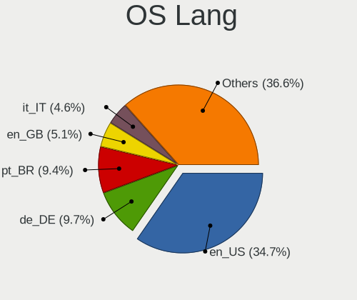

| Lang  | Notebooks | Percent |
|-------|-----------|---------|
| en_US | 500       | 34.65%  |
| de_DE | 140       | 9.7%    |
| pt_BR | 135       | 9.36%   |
| en_GB | 74        | 5.13%   |
| it_IT | 66        | 4.57%   |
| fr_FR | 59        | 4.09%   |
| es_ES | 49        | 3.4%    |
| en_CA | 37        | 2.56%   |
| en_IN | 33        | 2.29%   |
| es_MX | 27        | 1.87%   |
| pl_PL | 22        | 1.52%   |
| nl_NL | 21        | 1.46%   |
| tr_TR | 19        | 1.32%   |
| pt_PT | 19        | 1.32%   |
| en_AU | 18        | 1.25%   |
| en_ZA | 17        | 1.18%   |
| ru_RU | 16        | 1.11%   |
| hu_HU | 14        | 0.97%   |
| es_AR | 14        | 0.97%   |
| es_CO | 12        | 0.83%   |
| es_CL | 11        | 0.76%   |
| de_AT | 11        | 0.76%   |
| cs_CZ | 9         | 0.62%   |
| sv_SE | 7         | 0.49%   |
| hr_HR | 7         | 0.49%   |
| es_EC | 7         | 0.49%   |
| nl_BE | 6         | 0.42%   |
| es_SV | 5         | 0.35%   |
| de_CH | 5         | 0.35%   |
| ro_RO | 4         | 0.28%   |
| ja_JP | 4         | 0.28%   |
| fi_FI | 4         | 0.28%   |
| es_VE | 4         | 0.28%   |
| en_NZ | 4         | 0.28%   |
| el_GR | 4         | 0.28%   |
| da_DK | 4         | 0.28%   |
| zh_CN | 3         | 0.21%   |
| sl_SI | 3         | 0.21%   |
| it_CH | 3         | 0.21%   |
| es_UY | 3         | 0.21%   |

Boot Mode
---------

EFI or BIOS

| Mode | Notebooks | Percent |
|------|-----------|---------|
| BIOS | 1287      | 88.88%  |
| EFI  | 161       | 11.12%  |

Filesystem
----------

Type of filesystem

| Type    | Notebooks | Percent |
|---------|-----------|---------|
| Ext4    | 1235      | 84.88%  |
| Tmpfs   | 119       | 8.18%   |
| Zfs     | 47        | 3.23%   |
| Overlay | 31        | 2.13%   |
| Btrfs   | 17        | 1.17%   |
| Ext2    | 3         | 0.21%   |
| Ext3    | 2         | 0.14%   |
| Xfs     | 1         | 0.07%   |

Part. scheme
------------

Scheme of partitioning

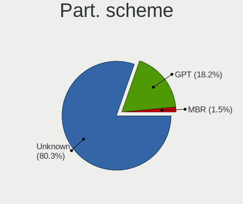

| Type    | Notebooks | Percent |
|---------|-----------|---------|
| Unknown | 1172      | 80.33%  |
| GPT     | 265       | 18.16%  |
| MBR     | 22        | 1.51%   |

Dual Boot with Linux/BSD
------------------------

Hosting more than one Linux/BSD

| Dual boot | Notebooks | Percent |
|-----------|-----------|---------|
| No        | 1410      | 97.78%  |
| Yes       | 32        | 2.22%   |

Dual Boot (Win)
---------------

Hosting Linux and Windows

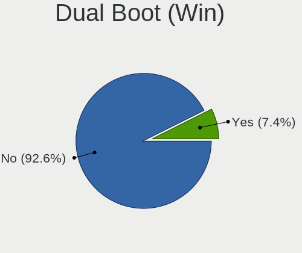

| Dual boot | Notebooks | Percent |
|-----------|-----------|---------|
| No        | 1338      | 92.6%   |
| Yes       | 107       | 7.4%    |

Board
-----

Vendor
------

Motherboard manufacturer

| Name                   | Notebooks | Percent |
|------------------------|-----------|---------|
| Hewlett-Packard        | 281       | 19.51%  |
| Lenovo                 | 257       | 17.85%  |
| Dell                   | 198       | 13.75%  |
| ASUSTek Computer       | 170       | 11.81%  |
| Acer                   | 97        | 6.74%   |
| Apple                  | 81        | 5.63%   |
| Toshiba                | 45        | 3.13%   |
| Samsung Electronics    | 31        | 2.15%   |
| Sony                   | 24        | 1.67%   |
| HUAWEI                 | 23        | 1.6%    |
| MSI                    | 20        | 1.39%   |
| Unknown                | 20        | 1.39%   |
| Fujitsu                | 15        | 1.04%   |
| Positivo               | 12        | 0.83%   |
| Medion                 | 11        | 0.76%   |
| Google                 | 11        | 0.76%   |
| Packard Bell           | 10        | 0.69%   |
| Alienware              | 6         | 0.42%   |
| Teclast                | 5         | 0.35%   |
| Fujitsu Siemens        | 5         | 0.35%   |
| Chuwi                  | 5         | 0.35%   |
| Semp Toshiba           | 4         | 0.28%   |
| Notebook               | 4         | 0.28%   |
| Exo                    | 4         | 0.28%   |
| Panasonic              | 3         | 0.21%   |
| NEC Computers          | 3         | 0.21%   |
| Jumper                 | 3         | 0.21%   |
| Juana Manso            | 3         | 0.21%   |
| GPU Company            | 3         | 0.21%   |
| Avell High Performance | 3         | 0.21%   |
| XIAOMI                 | 2         | 0.14%   |
| UNOWHY                 | 2         | 0.14%   |
| TUXEDO                 | 2         | 0.14%   |
| Tactus                 | 2         | 0.14%   |
| SGIN                   | 2         | 0.14%   |
| Razer                  | 2         | 0.14%   |
| Proline                | 2         | 0.14%   |
| OEM                    | 2         | 0.14%   |
| LG Electronics         | 2         | 0.14%   |
| Intel                  | 2         | 0.14%   |

Model
-----

Motherboard model

| Name                           | Notebooks | Percent |
|--------------------------------|-----------|---------|
| Unknown                        | 31        | 2.15%   |
| Apple MacBookPro14,1           | 10        | 0.69%   |
| Apple MacBookPro9,2            | 8         | 0.56%   |
| HP Pavilion dv6                | 7         | 0.49%   |
| HP Notebook                    | 7         | 0.49%   |
| Apple MacBookPro5,5            | 7         | 0.49%   |
| Apple MacBookAir6,2            | 6         | 0.42%   |
| HP Pavilion dv7                | 5         | 0.35%   |
| HP EliteBook 840 G2            | 5         | 0.35%   |
| HP 15                          | 5         | 0.35%   |
| Dell Latitude E7440            | 5         | 0.35%   |
| Dell Inspiron N4050            | 5         | 0.35%   |
| Dell Inspiron 15-3567          | 5         | 0.35%   |
| Apple MacBookPro8,1            | 5         | 0.35%   |
| Apple MacBookPro7,1            | 5         | 0.35%   |
| Lenovo IdeaPad 3 15ALC6 82MF   | 4         | 0.28%   |
| HUAWEI HVY-WXX9                | 4         | 0.28%   |
| HP ProBook 650 G1              | 4         | 0.28%   |
| HP Laptop 15-bw0xx             | 4         | 0.28%   |
| Dell XPS 15 9500               | 4         | 0.28%   |
| Dell System XPS L502X          | 4         | 0.28%   |
| Dell Latitude E7450            | 4         | 0.28%   |
| Dell Latitude E6430            | 4         | 0.28%   |
| Dell Latitude E6420            | 4         | 0.28%   |
| Dell Latitude E6400            | 4         | 0.28%   |
| Dell Latitude E5520            | 4         | 0.28%   |
| Apple MacBookPro6,2            | 4         | 0.28%   |
| Apple MacBookPro11,1           | 4         | 0.28%   |
| Apple MacBookAir7,2            | 4         | 0.28%   |
| Lenovo IdeaPad S145-15AST 81N3 | 3         | 0.21%   |
| Lenovo IdeaPad 110-15ISK 80UD  | 3         | 0.21%   |
| Lenovo G50-45 80E3             | 3         | 0.21%   |
| Jumper EZbook                  | 3         | 0.21%   |
| Juana Manso SF20GM7            | 3         | 0.21%   |
| HUAWEI NBLB-WAX9N              | 3         | 0.21%   |
| HP Pavilion Notebook           | 3         | 0.21%   |
| HP Pavilion g4                 | 3         | 0.21%   |
| HP Pavilion 17                 | 3         | 0.21%   |
| HP Pavilion 15                 | 3         | 0.21%   |
| HP Laptop 15-fd0xxx            | 3         | 0.21%   |

Model Family
------------

Motherboard model prefix

| Name                  | Notebooks | Percent |
|-----------------------|-----------|---------|
| Lenovo ThinkPad       | 114       | 7.92%   |
| Dell Latitude         | 86        | 5.97%   |
| Lenovo IdeaPad        | 74        | 5.14%   |
| Acer Aspire           | 65        | 4.51%   |
| Dell Inspiron         | 58        | 4.03%   |
| HP Pavilion           | 51        | 3.54%   |
| HP Laptop             | 43        | 2.99%   |
| HP ProBook            | 41        | 2.85%   |
| ASUS VivoBook         | 40        | 2.78%   |
| HP EliteBook          | 38        | 2.64%   |
| Toshiba Satellite     | 34        | 2.36%   |
| Unknown               | 31        | 2.15%   |
| HP ENVY               | 18        | 1.25%   |
| ASUS ASUS             | 16        | 1.11%   |
| Acer Nitro            | 15        | 1.04%   |
| HP ZBook              | 14        | 0.97%   |
| Dell XPS              | 14        | 0.97%   |
| Dell Precision        | 14        | 0.97%   |
| Fujitsu LIFEBOOK      | 13        | 0.9%    |
| ASUS Zenbook          | 13        | 0.9%    |
| Dell Vostro           | 12        | 0.83%   |
| ASUS ROG              | 11        | 0.76%   |
| Packard Bell EasyNote | 10        | 0.69%   |
| Apple MacBookPro14    | 10        | 0.69%   |
| Lenovo Legion         | 9         | 0.63%   |
| HP 15                 | 9         | 0.63%   |
| Apple MacBookPro9     | 9         | 0.63%   |
| Apple MacBookPro8     | 8         | 0.56%   |
| Lenovo Yoga           | 7         | 0.49%   |
| HP Notebook           | 7         | 0.49%   |
| HP Compaq             | 7         | 0.49%   |
| Apple MacBookPro5     | 7         | 0.49%   |
| Apple MacBookPro11    | 7         | 0.49%   |
| Lenovo ThinkBook      | 6         | 0.42%   |
| HP OMEN               | 6         | 0.42%   |
| Apple MacBookAir7     | 6         | 0.42%   |
| Apple MacBookAir6     | 6         | 0.42%   |
| MSI GF63              | 5         | 0.35%   |
| HP 250                | 5         | 0.35%   |
| Dell System           | 5         | 0.35%   |

MFG Year
--------

Motherboard manufacture year

| Year | Notebooks | Percent |
|------|-----------|---------|
| 2021 | 131       | 9.1%    |
| 2013 | 124       | 8.61%   |
| 2011 | 105       | 7.29%   |
| 2012 | 104       | 7.22%   |
| 2023 | 95        | 6.6%    |
| 2017 | 92        | 6.39%   |
| 2020 | 90        | 6.25%   |
| 2022 | 86        | 5.97%   |
| 2014 | 86        | 5.97%   |
| 2010 | 85        | 5.9%    |
| 2019 | 75        | 5.21%   |
| 2018 | 75        | 5.21%   |
| 2015 | 64        | 4.44%   |
| 2008 | 62        | 4.31%   |
| 2016 | 61        | 4.24%   |
| 2009 | 49        | 3.4%    |
| 2024 | 28        | 1.94%   |
| 2007 | 24        | 1.67%   |
| 2006 | 4         | 0.28%   |

Form Factor
-----------

Physical design of the computer

| Name     | Notebooks | Percent |
|----------|-----------|---------|
| Notebook | 1440      | 100%    |

Secure Boot
-----------

Enabled or disabled

| State    | Notebooks | Percent |
|----------|-----------|---------|
| Disabled | 1409      | 97.71%  |
| Enabled  | 33        | 2.29%   |

Coreboot
--------

Have coreboot on board

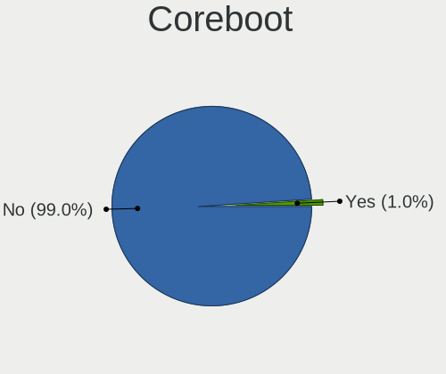

| Used | Notebooks | Percent |
|------|-----------|---------|
| No   | 1425      | 98.96%  |
| Yes  | 15        | 1.04%   |

RAM Size
--------

Total RAM memory

| Size in GB  | Notebooks | Percent |
|-------------|-----------|---------|
| 4.01-8.0    | 503       | 34.74%  |
| 3.01-4.0    | 332       | 22.93%  |
| 8.01-16.0   | 232       | 16.02%  |
| 16.01-24.0  | 230       | 15.88%  |
| 32.01-64.0  | 72        | 4.97%   |
| 1.01-2.0    | 34        | 2.35%   |
| 24.01-32.0  | 19        | 1.31%   |
| 64.01-256.0 | 14        | 0.97%   |
| 2.01-3.0    | 12        | 0.83%   |

RAM Used
--------

Used RAM memory

| Used GB    | Notebooks | Percent |
|------------|-----------|---------|
| 2.01-3.0   | 531       | 35.19%  |
| 1.01-2.0   | 459       | 30.42%  |
| 4.01-8.0   | 242       | 16.04%  |
| 3.01-4.0   | 219       | 14.51%  |
| 8.01-16.0  | 33        | 2.19%   |
| 0.51-1.0   | 21        | 1.39%   |
| 16.01-24.0 | 3         | 0.2%    |
| 32.01-64.0 | 1         | 0.07%   |

Total Drives
------------

Number of drives on board

| Drives | Notebooks | Percent |
|--------|-----------|---------|
| 1      | 1099      | 75.69%  |
| 2      | 317       | 21.83%  |
| 3      | 29        | 2%      |
| 4      | 4         | 0.28%   |
| 0      | 3         | 0.21%   |

Has CD-ROM
----------

Has CD-ROM on board

| Presented | Notebooks | Percent |
|-----------|-----------|---------|
| No        | 909       | 63.08%  |
| Yes       | 532       | 36.92%  |

Has Ethernet
------------

Has Ethernet on board

| Presented | Notebooks | Percent |
|-----------|-----------|---------|
| Yes       | 1133      | 78.57%  |
| No        | 309       | 21.43%  |

Has WiFi
--------

Has WiFi module

| Presented | Notebooks | Percent |
|-----------|-----------|---------|
| Yes       | 1403      | 97.36%  |
| No        | 38        | 2.64%   |

Has Bluetooth
-------------

Has Bluetooth module

| Presented | Notebooks | Percent |
|-----------|-----------|---------|
| Yes       | 1142      | 78.81%  |
| No        | 307       | 21.19%  |

Location
--------

Country
-------

Geographic location (country)

| Country         | Notebooks | Percent |
|-----------------|-----------|---------|
| USA             | 247       | 17.08%  |
| Germany         | 149       | 10.3%   |
| Brazil          | 149       | 10.3%   |
| Italy           | 73        | 5.05%   |
| UK              | 63        | 4.36%   |
| France          | 60        | 4.15%   |
| Spain           | 49        | 3.39%   |
| Canada          | 43        | 2.97%   |
| Mexico          | 37        | 2.56%   |
| Netherlands     | 33        | 2.28%   |
| India           | 33        | 2.28%   |
| Turkey          | 26        | 1.8%    |
| Poland          | 25        | 1.73%   |
| Portugal        | 23        | 1.59%   |
| Austria         | 19        | 1.31%   |
| South Africa    | 18        | 1.24%   |
| Argentina       | 17        | 1.18%   |
| Switzerland     | 16        | 1.11%   |
| Australia       | 16        | 1.11%   |
| Indonesia       | 15        | 1.04%   |
| Hungary         | 15        | 1.04%   |
| Egypt           | 15        | 1.04%   |
| Sweden          | 14        | 0.97%   |
| Belgium         | 14        | 0.97%   |
| Russia          | 13        | 0.9%    |
| Romania         | 13        | 0.9%    |
| Colombia        | 12        | 0.83%   |
| Chile           | 12        | 0.83%   |
| Greece          | 11        | 0.76%   |
| Czechia         | 11        | 0.76%   |
| Finland         | 9         | 0.62%   |
| The Netherlands | 7         | 0.48%   |
| Norway          | 7         | 0.48%   |
| Japan           | 7         | 0.48%   |
| Denmark         | 7         | 0.48%   |
| Slovenia        | 6         | 0.41%   |
| Philippines     | 6         | 0.41%   |
| Ecuador         | 6         | 0.41%   |
| Algeria         | 6         | 0.41%   |
| New Zealand     | 5         | 0.35%   |

City
----

Geographic location (city)

| City           | Notebooks | Percent |
|----------------|-----------|---------|
| Sao Paulo      | 20        | 1.35%   |
| Rio de Janeiro | 14        | 0.95%   |
| Mexico City    | 12        | 0.81%   |
| Istanbul       | 10        | 0.68%   |
| Budapest       | 10        | 0.68%   |
| Milan          | 9         | 0.61%   |
| Vienna         | 8         | 0.54%   |
| Santiago       | 8         | 0.54%   |
| Rome           | 8         | 0.54%   |
| Johannesburg   | 8         | 0.54%   |
| Porto          | 7         | 0.47%   |
| Melbourne      | 7         | 0.47%   |
| Madrid         | 7         | 0.47%   |
| Cairo          | 7         | 0.47%   |
| Birmingham     | 7         | 0.47%   |
| Berlin         | 7         | 0.47%   |
| Amsterdam      | 7         | 0.47%   |
| Ribeirao Preto | 6         | 0.41%   |
| Prague         | 6         | 0.41%   |
| London         | 6         | 0.41%   |
| Hamburg        | 6         | 0.41%   |
| Cape Town      | 6         | 0.41%   |
| Sydney         | 5         | 0.34%   |
| San Jos      | 5         | 0.34%   |
| New York       | 5         | 0.34%   |
| Munich         | 5         | 0.34%   |
| Montreal       | 5         | 0.34%   |
| Joao Pessoa    | 5         | 0.34%   |
| Chennai        | 5         | 0.34%   |
| Braslia      | 5         | 0.34%   |
| Bogot        | 5         | 0.34%   |
| Ankara         | 5         | 0.34%   |
| Warsaw         | 4         | 0.27%   |
| Turin          | 4         | 0.27%   |
| Thessaloniki   | 4         | 0.27%   |
| Stuttgart      | 4         | 0.27%   |
| Seattle        | 4         | 0.27%   |
| Recife         | 4         | 0.27%   |
| Porto Alegre   | 4         | 0.27%   |
| Moscow         | 4         | 0.27%   |

Drives
------

Drive Vendor
------------

Hard drive vendors

| Vendor                      | Notebooks | Drives | Percent |
|-----------------------------|-----------|--------|---------|
| Samsung Electronics         | 272       | 338    | 15.6%   |
| Seagate                     | 145       | 156    | 8.31%   |
| WDC                         | 140       | 163    | 8.03%   |
| Sandisk                     | 119       | 137    | 6.82%   |
| Unknown                     | 105       | 119    | 6.02%   |
| Toshiba                     | 101       | 107    | 5.79%   |
| Kingston                    | 100       | 107    | 5.73%   |
| SK hynix                    | 57        | 61     | 3.27%   |
| Micron Technology           | 57        | 60     | 3.27%   |
| Crucial                     | 50        | 55     | 2.87%   |
| Apple                       | 42        | 57     | 2.41%   |
| HGST                        | 40        | 47     | 2.29%   |
| Hitachi                     | 38        | 44     | 2.18%   |
| Intel                       | 36        | 38     | 2.06%   |
| China                       | 31        | 35     | 1.78%   |
| A-DATA Technology           | 30        | 33     | 1.72%   |
| Intenso                     | 18        | 20     | 1.03%   |
| Kingston Technology Company | 17        | 19     | 0.97%   |
| KIOXIA                      | 15        | 15     | 0.86%   |
| MAXIO Technology (Hangzhou) | 14        | 15     | 0.8%    |
| ADATA Technology            | 14        | 14     | 0.8%    |
| Unknown                     | 14        | 16     | 0.8%    |
| Fanxiang                    | 12        | 15     | 0.69%   |
| Silicon Motion              | 11        | 11     | 0.63%   |
| Phison Electronics          | 11        | 15     | 0.63%   |
| Micron/Crucial Technology   | 11        | 11     | 0.63%   |
| SPCC                        | 10        | 10     | 0.57%   |
| PNY                         | 8         | 8      | 0.46%   |
| LITEON                      | 8         | 8      | 0.46%   |
| Fujitsu                     | 8         | 8      | 0.46%   |
| Phison                      | 7         | 8      | 0.4%    |
| LITEONIT                    | 7         | 8      | 0.4%    |
| Lexar                       | 7         | 7      | 0.4%    |
| Teclast                     | 6         | 8      | 0.34%   |
| Netac                       | 6         | 7      | 0.34%   |
| KingSpec                    | 6         | 6      | 0.34%   |
| JMicron Technology          | 6         | 6      | 0.34%   |
| Apacer                      | 6         | 6      | 0.34%   |
| T-FORCE                     | 5         | 5      | 0.29%   |
| Realtek Semiconductor       | 5         | 8      | 0.29%   |

Drive Model
-----------

Hard drive models

| Model                                                | Notebooks | Percent |
|------------------------------------------------------|-----------|---------|
| Unknown MMC Card  64GB                               | 44        | 2.48%   |
| Samsung NVMe SSD Controller SM981/PM981/PM983 512GB  | 24        | 1.35%   |
| Kingston SA400S37480G 480GB SSD                      | 22        | 1.24%   |
| Unknown MMC Card  32GB                               | 21        | 1.19%   |
| Unknown MMC Card  128GB                              | 21        | 1.19%   |
| Kingston SA400S37240G 240GB SSD                      | 21        | 1.19%   |
| Seagate ST1000LM024 HN-M101MBB 1TB                   | 19        | 1.07%   |
| Toshiba MQ01ABF050 500GB                             | 17        | 0.96%   |
| Samsung NVMe SSD Controller PM9A1/PM9A3/980PRO 512GB | 17        | 0.96%   |
| Sandisk WD Blue SN550 NVMe SSD 256GB                 | 15        | 0.85%   |
| Samsung SSD 850 EVO 250GB                            | 15        | 0.85%   |
| Seagate ST1000LM035-1RK172 1TB                       | 14        | 0.79%   |
| Samsung SSD 860 EVO 500GB                            | 14        | 0.79%   |
| Unknown                                              | 14        | 0.79%   |
| Toshiba MQ01ABD100 1TB                               | 11        | 0.62%   |
| Samsung NVMe SSD Controller SM961/PM961/SM963 256GB  | 11        | 0.62%   |
| Toshiba MQ04ABF100 1TB                               | 10        | 0.56%   |
| Seagate ST500LT012-1DG142 500GB                      | 10        | 0.56%   |
| Seagate ST9500325AS 500GB                            | 9         | 0.51%   |
| Samsung SSD 850 EVO 500GB                            | 9         | 0.51%   |
| HGST HTS721010A9E630 1TB                             | 9         | 0.51%   |
| Kingston Company OM3PDP3 NVMe SSD 512GB              | 8         | 0.45%   |
| Kingston SA400S37960G 960GB SSD                      | 8         | 0.45%   |
| Crucial CT500MX500SSD1 500GB                         | 8         | 0.45%   |
| Apple S3X NVMe Controller 500GB                      | 8         | 0.45%   |
| Toshiba MQ01ABD050 500GB                             | 7         | 0.4%    |
| SK hynix BC511 512GB                                 | 7         | 0.4%    |
| Seagate ST500LM012 HN-M500MBB 500GB                  | 7         | 0.4%    |
| Samsung SSD 870 EVO 500GB                            | 7         | 0.4%    |
| Micron/Crucial P2 NVMe PCIe SSD 500GB                | 7         | 0.4%    |
| Micron 2400_MTFDKBA512QFM 512GB                      | 7         | 0.4%    |
| MAXIO (Hangzhou) NVMe SSD Controller MAP1202 512GB   | 7         | 0.4%    |
| Intel SSDPEKNU512GZ 512GB                            | 7         | 0.4%    |
| HGST HTS725050A7E630 500GB                           | 7         | 0.4%    |
| HGST HTS541010A9E680 1TB                             | 7         | 0.4%    |
| Toshiba XG6 NVMe SSD Controller 1024GB               | 6         | 0.34%   |
| Seagate ST500LM021-1KJ152 500GB                      | 6         | 0.34%   |
| Samsung MZVL4512HBLU-00BTW 512GB                     | 6         | 0.34%   |
| Kingston SA400S37120G 120GB SSD                      | 6         | 0.34%   |
| HGST HTS545050A7E680 500GB                           | 6         | 0.34%   |

HDD Vendor
----------

Hard disk drive vendors

| Vendor              | Notebooks | Drives | Percent |
|---------------------|-----------|--------|---------|
| Seagate             | 143       | 154    | 32.8%   |
| WDC                 | 95        | 107    | 21.79%  |
| Toshiba             | 80        | 83     | 18.35%  |
| HGST                | 40        | 47     | 9.17%   |
| Hitachi             | 38        | 44     | 8.72%   |
| Samsung Electronics | 9         | 9      | 2.06%   |
| Fujitsu             | 8         | 8      | 1.83%   |
| Apple               | 4         | 4      | 0.92%   |
| Unknown             | 2         | 2      | 0.46%   |
| TO Exter            | 2         | 2      | 0.46%   |
| SABRENT             | 2         | 2      | 0.46%   |
| External            | 2         | 2      | 0.46%   |
| EAGET               | 2         | 2      | 0.46%   |
| ASMedia             | 2         | 2      | 0.46%   |
| Min Yi U            | 1         | 1      | 0.23%   |
| LaCie               | 1         | 1      | 0.23%   |
| KESU                | 1         | 1      | 0.23%   |
| JMicron Technology  | 1         | 1      | 0.23%   |
| Intenso             | 1         | 1      | 0.23%   |
| ASMT                | 1         | 1      | 0.23%   |
| Apricorn            | 1         | 1      | 0.23%   |

SSD Vendor
----------

Solid state drive vendors

| Vendor              | Notebooks | Drives | Percent |
|---------------------|-----------|--------|---------|
| Samsung Electronics | 136       | 162    | 21.12%  |
| Kingston            | 85        | 88     | 13.2%   |
| SanDisk             | 52        | 59     | 8.07%   |
| Crucial             | 47        | 52     | 7.3%    |
| WDC                 | 35        | 44     | 5.43%   |
| China               | 31        | 35     | 4.81%   |
| A-DATA Technology   | 25        | 28     | 3.88%   |
| Apple               | 23        | 23     | 3.57%   |
| Micron Technology   | 14        | 15     | 2.17%   |
| Intenso             | 13        | 14     | 2.02%   |
| Intel               | 12        | 12     | 1.86%   |
| SPCC                | 10        | 10     | 1.55%   |
| Toshiba             | 8         | 9      | 1.24%   |
| PNY                 | 8         | 8      | 1.24%   |
| LITEON              | 8         | 8      | 1.24%   |
| SK hynix            | 7         | 7      | 1.09%   |
| LITEONIT            | 7         | 8      | 1.09%   |
| Lexar               | 7         | 7      | 1.09%   |
| Unknown             | 7         | 7      | 1.09%   |
| Teclast             | 6         | 8      | 0.93%   |
| KingSpec            | 6         | 6      | 0.93%   |
| OCZ                 | 5         | 6      | 0.78%   |
| Gigabyte Technology | 5         | 6      | 0.78%   |
| Verbatim            | 4         | 4      | 0.62%   |
| Transcend           | 4         | 4      | 0.62%   |
| Patriot             | 4         | 4      | 0.62%   |
| Netac               | 4         | 5      | 0.62%   |
| Hewlett-Packard     | 4         | 4      | 0.62%   |
| GOODRAM             | 4         | 7      | 0.62%   |
| Fanxiang            | 4         | 4      | 0.62%   |
| Apacer              | 4         | 4      | 0.62%   |
| XrayDisk            | 3         | 3      | 0.47%   |
| SSSTC               | 3         | 4      | 0.47%   |
| Phison              | 3         | 4      | 0.47%   |
| Wibtek              | 2         | 2      | 0.31%   |
| S3+                 | 2         | 3      | 0.31%   |
| LEQIXIANG           | 2         | 2      | 0.31%   |
| FORESEE             | 2         | 3      | 0.31%   |
| BIWIN               | 2         | 2      | 0.31%   |
| 2-Power             | 2         | 2      | 0.31%   |

Drive Kind
----------

HDD or SSD

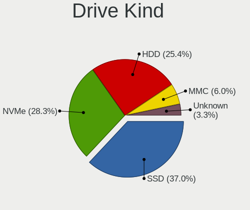

| Kind    | Notebooks | Drives | Percent |
|---------|-----------|--------|---------|
| SSD     | 615       | 719    | 36.98%  |
| NVMe    | 470       | 601    | 28.26%  |
| HDD     | 423       | 475    | 25.44%  |
| MMC     | 100       | 114    | 6.01%   |
| Unknown | 55        | 69     | 3.31%   |

Drive Connector
---------------

SATA, SAS, NVMe, etc.

| Type | Notebooks | Drives | Percent |
|------|-----------|--------|---------|
| SATA | 965       | 1191   | 60.46%  |
| NVMe | 469       | 597    | 29.39%  |
| MMC  | 100       | 114    | 6.27%   |
| SAS  | 62        | 76     | 3.88%   |

Drive Size
----------

Size of hard drive

| Size in TB | Notebooks | Drives | Percent |
|------------|-----------|--------|---------|
| 0.01-0.5   | 719       | 841    | 70.35%  |
| 0.51-1.0   | 262       | 310    | 25.64%  |
| 1.01-2.0   | 32        | 34     | 3.13%   |
| 3.01-4.0   | 5         | 5      | 0.49%   |
| 4.01-10.0  | 2         | 2      | 0.2%    |
| 2.01-3.0   | 1         | 1      | 0.1%    |
| 10.01-20.0 | 1         | 1      | 0.1%    |

Space Total
-----------

Amount of disk space available on the file system

| Size in GB     | Notebooks | Percent |
|----------------|-----------|---------|
| 101-250        | 522       | 35.7%   |
| 251-500        | 407       | 27.84%  |
| 501-1000       | 210       | 14.36%  |
| 51-100         | 117       | 8%      |
| 1001-2000      | 59        | 4.04%   |
| 21-50          | 45        | 3.08%   |
| 1-20           | 39        | 2.67%   |
| Unknown        | 34        | 2.33%   |
| More than 3000 | 16        | 1.09%   |
| 2001-3000      | 13        | 0.89%   |

Space Used
----------

Amount of used disk space

| Used GB        | Notebooks | Percent |
|----------------|-----------|---------|
| 21-50          | 539       | 35.79%  |
| 1-20           | 509       | 33.8%   |
| 51-100         | 167       | 11.09%  |
| 101-250        | 152       | 10.09%  |
| 251-500        | 60        | 3.98%   |
| 501-1000       | 36        | 2.39%   |
| Unknown        | 34        | 2.26%   |
| More than 3000 | 4         | 0.27%   |
| 1001-2000      | 3         | 0.2%    |
| 2001-3000      | 2         | 0.13%   |

Malfunc. Drives
---------------

Drive models with a malfunction

| Model                                            | Notebooks | Drives | Percent |
|--------------------------------------------------|-----------|--------|---------|
| Seagate ST500LM000-1EJ162 500GB                  | 3         | 3      | 15.79%  |
| A-DATA Technology IM2P33F3A NVMe 256GB           | 2         | 2      | 10.53%  |
| WDC WD5000BPVT-75HXZT1 500GB                     | 1         | 1      | 5.26%   |
| WDC WD2500BEKT-75PVMT1 250GB                     | 1         | 1      | 5.26%   |
| Toshiba MQ01ABF050 500GB                         | 1         | 1      | 5.26%   |
| Toshiba MK6465GSX 640GB                          | 1         | 1      | 5.26%   |
| Toshiba MK2565GSX 250GB                          | 1         | 1      | 5.26%   |
| Seagate ST320LT012-9WS14C 320GB                  | 1         | 1      | 5.26%   |
| Seagate ST1000LM024 HN-M101MBB 1TB               | 1         | 1      | 5.26%   |
| SanDisk SSD PLUS 480GB                           | 1         | 1      | 5.26%   |
| Samsung Electronics MZNLH128HBHQ-000H1 128GB SSD | 1         | 1      | 5.26%   |
| Micron Technology 1100_MTFDDAK256TBN 256GB SSD   | 1         | 1      | 5.26%   |
| KingFast SSD 120GB                               | 1         | 1      | 5.26%   |
| Hitachi HTS723232L9A360 320GB                    | 1         | 1      | 5.26%   |
| Hitachi HTS545050A7E380 500GB                    | 1         | 1      | 5.26%   |
| BIWIN SSD 64GB                                   | 1         | 1      | 5.26%   |

Malfunc. Drive Vendor
---------------------

Vendors of faulty drives

| Vendor              | Notebooks | Drives | Percent |
|---------------------|-----------|--------|---------|
| Seagate             | 5         | 5      | 26.32%  |
| Toshiba             | 3         | 3      | 15.79%  |
| WDC                 | 2         | 2      | 10.53%  |
| Hitachi             | 2         | 2      | 10.53%  |
| A-DATA Technology   | 2         | 2      | 10.53%  |
| SanDisk             | 1         | 1      | 5.26%   |
| Samsung Electronics | 1         | 1      | 5.26%   |
| Micron Technology   | 1         | 1      | 5.26%   |
| KingFast            | 1         | 1      | 5.26%   |
| BIWIN               | 1         | 1      | 5.26%   |

Malfunc. HDD Vendor
-------------------

Vendors of faulty HDD drives

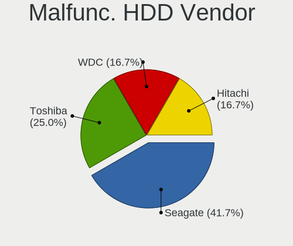

| Vendor  | Notebooks | Drives | Percent |
|---------|-----------|--------|---------|
| Seagate | 5         | 5      | 41.67%  |
| Toshiba | 3         | 3      | 25%     |
| WDC     | 2         | 2      | 16.67%  |
| Hitachi | 2         | 2      | 16.67%  |

Malfunc. Drive Kind
-------------------

Kinds of faulty drives

| Kind | Notebooks | Drives | Percent |
|------|-----------|--------|---------|
| HDD  | 12        | 12     | 63.16%  |
| SSD  | 5         | 5      | 26.32%  |
| NVMe | 2         | 2      | 10.53%  |

Failed Drives
-------------

Failed drive models

Zero info for selected period =(

Failed Drive Vendor
-------------------

Failed drive vendors

Zero info for selected period =(

Drive Status
------------

Number of failed and malfunc. drives

| Status   | Notebooks | Drives | Percent |
|----------|-----------|--------|---------|
| Detected | 1303      | 1774   | 88.82%  |
| Works    | 146       | 185    | 9.95%   |
| Malfunc  | 18        | 19     | 1.23%   |

Storage controller
------------------

Storage Vendor
--------------

Storage controller vendors

| Vendor                           | Notebooks | Percent |
|----------------------------------|-----------|---------|
| Intel                            | 992       | 59.29%  |
| AMD                              | 152       | 9.09%   |
| Samsung Electronics              | 144       | 8.61%   |
| SanDisk                          | 76        | 4.54%   |
| SK hynix                         | 50        | 2.99%   |
| Micron Technology                | 43        | 2.57%   |
| Kingston Technology Company      | 31        | 1.85%   |
| ADATA Technology                 | 19        | 1.14%   |
| Nvidia                           | 17        | 1.02%   |
| MAXIO Technology (Hangzhou)      | 17        | 1.02%   |
| Phison Electronics               | 16        | 0.96%   |
| KIOXIA                           | 16        | 0.96%   |
| Apple                            | 15        | 0.9%    |
| Silicon Motion                   | 14        | 0.84%   |
| Toshiba America Info Systems     | 13        | 0.78%   |
| Micron/Crucial Technology        | 13        | 0.78%   |
| Solid State Storage Technology   | 7         | 0.42%   |
| Silicon Integrated Systems [SiS] | 7         | 0.42%   |
| Solidigm                         | 5         | 0.3%    |
| Shenzhen Longsys Electronics     | 5         | 0.3%    |
| Realtek Semiconductor            | 5         | 0.3%    |
| Marvell Technology Group         | 4         | 0.24%   |
| Yangtze Memory Technologies      | 2         | 0.12%   |
| Netac Technology                 | 2         | 0.12%   |
| Lite-On Technology               | 2         | 0.12%   |
| ASMedia Technology               | 2         | 0.12%   |
| Silicon Image                    | 1         | 0.06%   |
| Lenovo                           | 1         | 0.06%   |
| JMicron Technology               | 1         | 0.06%   |
| Unknown                          | 1         | 0.06%   |

Storage Model
-------------

Storage controller models

| Model                                                                          | Notebooks | Percent |
|--------------------------------------------------------------------------------|-----------|---------|
| AMD FCH SATA Controller [AHCI mode]                                            | 125       | 7.01%   |
| Intel 7 Series Chipset Family 6-port SATA Controller [AHCI mode]               | 113       | 6.34%   |
| Intel Sunrise Point-LP SATA Controller [AHCI mode]                             | 101       | 5.66%   |
| Intel 82801 Mobile SATA Controller [RAID mode]                                 | 87        | 4.88%   |
| Intel 6 Series/C200 Series Chipset Family 6 port Mobile SATA AHCI Controller   | 84        | 4.71%   |
| Intel 82801IBM/IEM (ICH9M/ICH9M-E) 4 port SATA Controller [AHCI mode]          | 60        | 3.37%   |
| Intel 8 Series SATA Controller 1 [AHCI mode]                                   | 56        | 3.14%   |
| Intel Volume Management Device NVMe RAID Controller                            | 54        | 3.03%   |
| Intel Celeron/Pentium Silver Processor SATA Controller                         | 53        | 2.97%   |
| Intel 5 Series/3400 Series Chipset 4 port SATA AHCI Controller                 | 42        | 2.36%   |
| Samsung NVMe SSD Controller 980 (DRAM-less)                                    | 38        | 2.13%   |
| Intel 8 Series/C220 Series Chipset Family 6-port SATA Controller 1 [AHCI mode] | 38        | 2.13%   |
| Intel Wildcat Point-LP SATA Controller [AHCI Mode]                             | 37        | 2.08%   |
| Samsung NVMe SSD Controller SM981/PM981/PM983                                  | 33        | 1.85%   |
| Intel Tiger Lake-LP SATA Controller                                            | 28        | 1.57%   |
| SanDisk WD Black SN770 / PC SN740 256GB / PC SN560 (DRAM-less) NVMe SSD        | 26        | 1.46%   |
| Intel 82801HM/HEM (ICH8M/ICH8M-E) IDE Controller                               | 26        | 1.46%   |
| Samsung NVMe SSD Controller PM9A1/PM9A3/980PRO                                 | 23        | 1.29%   |
| Intel Celeron N3350/Pentium N4200/Atom E3900 Series SATA AHCI Controller       | 22        | 1.23%   |
| Intel 82801HM/HEM (ICH8M/ICH8M-E) SATA Controller [AHCI mode]                  | 22        | 1.23%   |
| Intel 5 Series/3400 Series Chipset 6 port SATA AHCI Controller                 | 21        | 1.18%   |
| AMD SB7x0/SB8x0/SB9x0 SATA Controller [AHCI mode]                              | 19        | 1.07%   |
| Intel Volume Management Device NVMe RAID Controller Intel Corporation          | 18        | 1.01%   |
| Intel Cannon Lake Mobile PCH SATA AHCI Controller                              | 18        | 1.01%   |
| SanDisk Ultra 3D / WD PC SN530, IX SN530, Blue SN550 NVMe SSD (DRAM-less)      | 16        | 0.9%    |
| Intel HM170/QM170 Chipset SATA Controller [AHCI Mode]                          | 16        | 0.9%    |
| Intel SSD 670p Series [Keystone Harbor]                                        | 15        | 0.84%   |
| Intel Alder Lake-P SATA AHCI Controller                                        | 14        | 0.79%   |
| SK hynix Gold P31/BC711/PC711 NVMe Solid State Drive                           | 13        | 0.73%   |
| Intel Comet Lake SATA AHCI Controller                                          | 13        | 0.73%   |
| Intel Atom Processor E3800 Series SATA AHCI Controller                         | 13        | 0.73%   |
| Samsung NVMe SSD Controller SM961/PM961/SM963                                  | 12        | 0.67%   |
| Samsung NVMe SSD Controller PM9B1 (DRAM-less)                                  | 12        | 0.67%   |
| Micron 2450 NVMe SSD [HendrixV] (DRAM-less)                                    | 11        | 0.62%   |
| SK hynix Platinum P41/PC801 NVMe Solid State Drive                             | 10        | 0.56%   |
| Micron 2400 NVMe SSD (DRAM-less)                                               | 10        | 0.56%   |
| Intel Tiger Lake SATA AHCI Controller                                          | 10        | 0.56%   |
| Intel 400 Series Chipset Family SATA AHCI Controller                           | 10        | 0.56%   |
| SK hynix BC901 NVMe Solid State Drive (DRAM-less)                              | 9         | 0.5%    |
| Samsung S4LN058A01[SSUBX] AHCI SSD Controller (Apple slot)                     | 9         | 0.5%    |

Storage Kind
------------

Kind of storage controller (IDE, SATA, NVMe, SAS, ...)

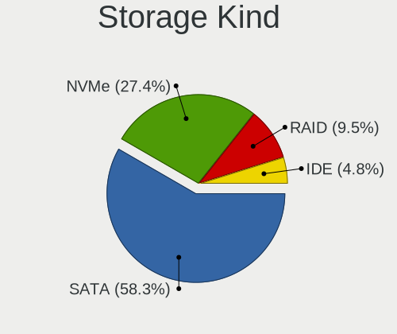

| Kind | Notebooks | Percent |
|------|-----------|---------|
| SATA | 995       | 58.32%  |
| NVMe | 467       | 27.37%  |
| RAID | 162       | 9.5%    |
| IDE  | 82        | 4.81%   |

Processor
---------

CPU Vendor
----------

Processor vendors

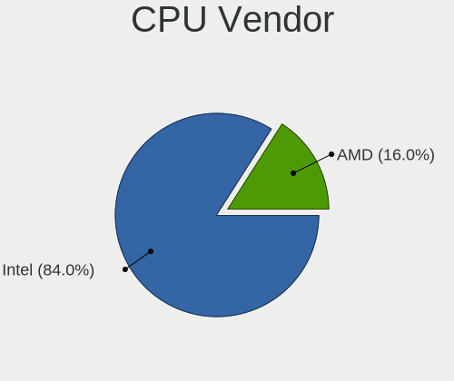

| Vendor | Notebooks | Percent |
|--------|-----------|---------|
| Intel  | 1210      | 84.03%  |
| AMD    | 230       | 15.97%  |

CPU Model
---------

Processor models

| Model                                   | Notebooks | Percent |
|-----------------------------------------|-----------|---------|
| Intel Celeron N4020 CPU @ 1.10GHz       | 23        | 1.6%    |
| Intel Core i5-7200U CPU @ 2.50GHz       | 21        | 1.46%   |
| Intel Core i5-6200U CPU @ 2.30GHz       | 20        | 1.39%   |
| Intel 11th Gen Core i7-1165G7 @ 2.80GHz | 19        | 1.32%   |
| Intel Celeron CPU N3350 @ 1.10GHz       | 18        | 1.25%   |
| Intel Core i5-2520M CPU @ 2.50GHz       | 17        | 1.18%   |
| Intel 11th Gen Core i5-1135G7 @ 2.40GHz | 17        | 1.18%   |
| Intel Core i5-3210M CPU @ 2.50GHz       | 16        | 1.11%   |
| Intel Core i3-6006U CPU @ 2.00GHz       | 14        | 0.97%   |
| Intel Core i5-6300U CPU @ 2.40GHz       | 13        | 0.9%    |
| Intel Core i7-2670QM CPU @ 2.20GHz      | 12        | 0.83%   |
| Intel Core i5-8250U CPU @ 1.60GHz       | 12        | 0.83%   |
| Intel Celeron N4120 CPU @ 1.10GHz       | 12        | 0.83%   |
| AMD Ryzen 5 5500U with Radeon Graphics  | 12        | 0.83%   |
| Intel Core i3 CPU M 370 @ 2.40GHz       | 11        | 0.76%   |
| Intel Core 2 Duo CPU P8700 @ 2.53GHz    | 11        | 0.76%   |
| Intel Core i7-5500U CPU @ 2.40GHz       | 10        | 0.69%   |
| Intel Core i5-5200U CPU @ 2.20GHz       | 10        | 0.69%   |
| Intel Core i5-4210U CPU @ 1.70GHz       | 10        | 0.69%   |
| Intel Core i5-4200U CPU @ 1.60GHz       | 10        | 0.69%   |
| Intel Core i5-3320M CPU @ 2.60GHz       | 10        | 0.69%   |
| Intel Core i5-3230M CPU @ 2.60GHz       | 10        | 0.69%   |
| Intel 12th Gen Core i5-1235U            | 10        | 0.69%   |
| Intel Core i7-7700HQ CPU @ 2.80GHz      | 9         | 0.62%   |
| Intel Core i5-8350U CPU @ 1.70GHz       | 9         | 0.62%   |
| Intel Core i5-7360U CPU @ 2.30GHz       | 9         | 0.62%   |
| Intel Core i5-5300U CPU @ 2.30GHz       | 9         | 0.62%   |
| Intel Core i5-2430M CPU @ 2.40GHz       | 9         | 0.62%   |
| Intel Core i5-2410M CPU @ 2.30GHz       | 9         | 0.62%   |
| Intel Core i5-10210U CPU @ 1.60GHz      | 9         | 0.62%   |
| Intel Core i5 CPU M 520 @ 2.40GHz       | 9         | 0.62%   |
| Intel Core i3-4005U CPU @ 1.70GHz       | 9         | 0.62%   |
| Intel Core 2 Duo CPU P8600 @ 2.40GHz    | 9         | 0.62%   |
| Intel Celeron N4000 CPU @ 1.10GHz       | 9         | 0.62%   |
| Intel 12th Gen Core i7-12700H           | 9         | 0.62%   |
| Intel 11th Gen Core i3-1115G4 @ 3.00GHz | 9         | 0.62%   |
| Intel Core i7-8565U CPU @ 1.80GHz       | 8         | 0.56%   |
| Intel Core i7-6700HQ CPU @ 2.60GHz      | 8         | 0.56%   |
| Intel Core i7-3520M CPU @ 2.90GHz       | 8         | 0.56%   |
| Intel Core i7-2630QM CPU @ 2.00GHz      | 8         | 0.56%   |

CPU Model Family
----------------

Processor model prefix

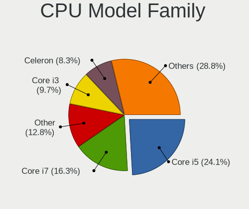

| Model                          | Notebooks | Percent |
|--------------------------------|-----------|---------|
| Intel Core i5                  | 347       | 24.08%  |
| Intel Core i7                  | 235       | 16.31%  |
| Other                          | 185       | 12.84%  |
| Intel Core i3                  | 140       | 9.72%   |
| Intel Celeron                  | 119       | 8.26%   |
| Intel Core 2 Duo               | 84        | 5.83%   |
| AMD Ryzen 5                    | 54        | 3.75%   |
| AMD Ryzen 7                    | 38        | 2.64%   |
| Intel Pentium                  | 27        | 1.87%   |
| AMD A6                         | 18        | 1.25%   |
| Intel Pentium Dual-Core        | 17        | 1.18%   |
| AMD Ryzen 3                    | 14        | 0.97%   |
| Intel Atom                     | 13        | 0.9%    |
| AMD E1                         | 13        | 0.9%    |
| AMD A8                         | 11        | 0.76%   |
| AMD Ryzen 9                    | 9         | 0.62%   |
| Intel Pentium Dual             | 8         | 0.56%   |
| AMD E                          | 8         | 0.56%   |
| Intel Pentium Silver           | 7         | 0.49%   |
| Intel Core i9                  | 7         | 0.49%   |
| Intel Core                     | 7         | 0.49%   |
| AMD Ryzen 5 PRO                | 6         | 0.42%   |
| AMD A12                        | 6         | 0.42%   |
| AMD A10                        | 6         | 0.42%   |
| Intel Core 2                   | 5         | 0.35%   |
| AMD E2                         | 5         | 0.35%   |
| AMD Athlon II                  | 5         | 0.35%   |
| AMD A4                         | 5         | 0.35%   |
| Intel Xeon                     | 4         | 0.28%   |
| AMD Ryzen 7 PRO                | 4         | 0.28%   |
| AMD Athlon                     | 4         | 0.28%   |
| Intel Core m5                  | 3         | 0.21%   |
| Intel Celeron Dual-Core        | 3         | 0.21%   |
| Intel Genuine                  | 2         | 0.14%   |
| Intel Core m3                  | 2         | 0.14%   |
| Intel Core M                   | 2         | 0.14%   |
| AMD Turion X2 Dual-Core Mobile | 2         | 0.14%   |
| AMD Turion 64 X2 Mobile        | 2         | 0.14%   |
| AMD Ryzen 3 PRO                | 2         | 0.14%   |
| Intel Pentium Gold             | 1         | 0.07%   |

CPU Cores
---------

Number of processor cores

| Number | Notebooks | Percent |
|--------|-----------|---------|
| 2      | 811       | 56.28%  |
| 4      | 372       | 25.82%  |
| 6      | 80        | 5.55%   |
| 8      | 76        | 5.27%   |
| 10     | 30        | 2.08%   |
| 14     | 27        | 1.87%   |
| 12     | 19        | 1.32%   |
| 1      | 13        | 0.9%    |
| 24     | 7         | 0.49%   |
| 16     | 6         | 0.42%   |

CPU Sockets
-----------

Number of sockets

| Number | Notebooks | Percent |
|--------|-----------|---------|
| 1      | 1440      | 100%    |

CPU Threads
-----------

Threads per core (Hyper-Threading)

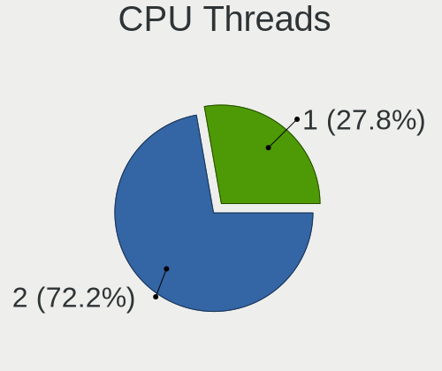

| Number | Notebooks | Percent |
|--------|-----------|---------|
| 2      | 1041      | 72.24%  |
| 1      | 400       | 27.76%  |

CPU Op-Modes
------------

CPU Operation Modes (32-bit, 64-bit)

| Op mode        | Notebooks | Percent |
|----------------|-----------|---------|
| 32-bit, 64-bit | 1440      | 100%    |

CPU Microcode
-------------

Microcode number

| Number     | Notebooks | Percent |
|------------|-----------|---------|
| Unknown    | 1421      | 98.54%  |
| 0x0a50000d | 4         | 0.28%   |
| 0x08600109 | 2         | 0.14%   |
| 0x08600106 | 2         | 0.14%   |
| 0x08108109 | 2         | 0.14%   |
| 0x806d1    | 1         | 0.07%   |
| 0x0a601203 | 1         | 0.07%   |
| 0x0a50000c | 1         | 0.07%   |
| 0x08a00008 | 1         | 0.07%   |
| 0x08608107 | 1         | 0.07%   |
| 0x0860010c | 1         | 0.07%   |
| 0x08108102 | 1         | 0.07%   |
| 0x08101007 | 1         | 0.07%   |
| 0x0700010f | 1         | 0.07%   |
| 0x06006705 | 1         | 0.07%   |
| 0x05000119 | 1         | 0.07%   |

CPU Microarch
-------------

Microarchitecture

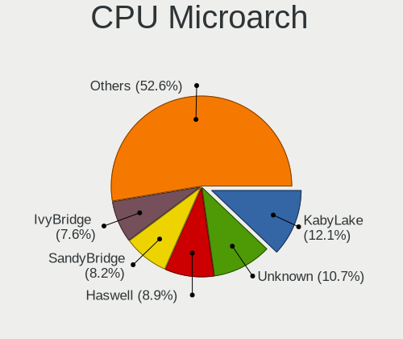

| Name              | Notebooks | Percent |
|-------------------|-----------|---------|
| KabyLake          | 174       | 12.07%  |
| Unknown           | 154       | 10.68%  |
| Haswell           | 128       | 8.88%   |
| SandyBridge       | 118       | 8.18%   |
| IvyBridge         | 109       | 7.56%   |
| Penryn            | 91        | 6.31%   |
| Skylake           | 77        | 5.34%   |
| Westmere          | 66        | 4.58%   |
| Goldmont plus     | 63        | 4.37%   |
| TigerLake         | 60        | 4.16%   |
| Broadwell         | 53        | 3.68%   |
| Core              | 35        | 2.43%   |
| Silvermont        | 33        | 2.29%   |
| Zen 3             | 30        | 2.08%   |
| Zen+              | 25        | 1.73%   |
| Alderlake Hybrid  | 25        | 1.73%   |
| Goldmont          | 24        | 1.66%   |
| Excavator         | 21        | 1.46%   |
| Zen 2             | 19        | 1.32%   |
| Puma              | 19        | 1.32%   |
| Icelake           | 17        | 1.18%   |
| CometLake         | 17        | 1.18%   |
| Bobcat            | 14        | 0.97%   |
| Zen               | 11        | 0.76%   |
| Jaguar            | 11        | 0.76%   |
| Piledriver        | 9         | 0.62%   |
| K10               | 9         | 0.62%   |
| Nehalem           | 7         | 0.49%   |
| K8 Hammer         | 4         | 0.28%   |
| K8 & K10 hybrid   | 4         | 0.28%   |
| K10 Llano         | 4         | 0.28%   |
| Tremont           | 3         | 0.21%   |
| Bonnell           | 3         | 0.21%   |
| Meteorlake Hybrid | 2         | 0.14%   |
| Gracemont         | 2         | 0.14%   |
| Steamroller       | 1         | 0.07%   |

Graphics
--------

GPU Vendor
----------

Vendors of graphics cards

| Vendor                           | Notebooks | Percent |
|----------------------------------|-----------|---------|
| Intel                            | 1067      | 60.73%  |
| Nvidia                           | 350       | 19.92%  |
| AMD                              | 335       | 19.07%  |
| Silicon Integrated Systems [SiS] | 5         | 0.28%   |

GPU Model
---------

Graphics card models

| Model                                                                                    | Notebooks | Percent |
|------------------------------------------------------------------------------------------|-----------|---------|
| Intel 3rd Gen Core processor Graphics Controller                                         | 105       | 5.83%   |
| Intel 2nd Generation Core Processor Family Integrated Graphics Controller                | 103       | 5.72%   |
| Intel Haswell-ULT Integrated Graphics Controller                                         | 71        | 3.94%   |
| Intel GeminiLake [UHD Graphics 600]                                                      | 58        | 3.22%   |
| Intel Skylake GT2 [HD Graphics 520]                                                      | 55        | 3.05%   |
| Intel TigerLake-LP GT2 [Iris Xe Graphics]                                                | 49        | 2.72%   |
| Intel Mobile 4 Series Chipset Integrated Graphics Controller                             | 47        | 2.61%   |
| Intel 4th Gen Core Processor Integrated Graphics Controller                              | 45        | 2.5%    |
| Intel HD Graphics 5500                                                                   | 42        | 2.33%   |
| Intel HD Graphics 620                                                                    | 41        | 2.28%   |
| Intel Core Processor Integrated Graphics Controller                                      | 41        | 2.28%   |
| Intel UHD Graphics 620                                                                   | 36        | 2%      |
| AMD Picasso/Raven 2 [Radeon Vega Series / Radeon Vega Mobile Series]                     | 29        | 1.61%   |
| Intel Raptor Lake-P [Iris Xe Graphics]                                                   | 26        | 1.44%   |
| Intel HD Graphics 500                                                                    | 22        | 1.22%   |
| Intel CoffeeLake-H GT2 [UHD Graphics 630]                                                | 20        | 1.11%   |
| Intel CometLake-U GT2 [UHD Graphics]                                                     | 19        | 1.05%   |
| Intel Atom/Celeron/Pentium Processor x5-E8000/J3xxx/N3xxx Integrated Graphics Controller | 19        | 1.05%   |
| AMD Renoir [Radeon Vega Series / Radeon Vega Mobile Series]                              | 19        | 1.05%   |
| Nvidia TU117M [GeForce GTX 1650 Mobile / Max-Q]                                          | 18        | 1%      |
| Intel WhiskeyLake-U GT2 [UHD Graphics 620]                                               | 18        | 1%      |
| Nvidia GA107M [GeForce RTX 3050 Mobile]                                                  | 17        | 0.94%   |
| AMD Lucienne                                                                             | 17        | 0.94%   |
| Nvidia GF117M [GeForce 610M/710M/810M/820M / GT 620M/625M/630M/720M]                     | 16        | 0.89%   |
| Intel CometLake-H GT2 [UHD Graphics]                                                     | 16        | 0.89%   |
| Intel Alder Lake-P GT2 [Iris Xe Graphics]                                                | 16        | 0.89%   |
| Intel Mobile GM965/GL960 Integrated Graphics Controller (secondary)                      | 15        | 0.83%   |
| Intel Mobile GM965/GL960 Integrated Graphics Controller (primary)                        | 15        | 0.83%   |
| AMD Topaz XT [Radeon R7 M260/M265 / M340/M360 / M440/M445 / 530/535 / 620/625 Mobile]    | 15        | 0.83%   |
| AMD Seymour [Radeon HD 6400M/7400M Series]                                               | 15        | 0.83%   |
| AMD Mullins [Radeon R4/R5 Graphics]                                                      | 15        | 0.83%   |
| AMD Cezanne [Radeon Vega Series / Radeon Vega Mobile Series]                             | 15        | 0.83%   |
| AMD Barcelo                                                                              | 15        | 0.83%   |
| Intel TigerLake-H GT1 [UHD Graphics]                                                     | 14        | 0.78%   |
| Intel Atom Processor Z36xxx/Z37xxx Series Graphics & Display                             | 14        | 0.78%   |
| AMD Stoney [Radeon R2/R3/R4/R5 Graphics]                                                 | 14        | 0.78%   |
| Nvidia GA106M [GeForce RTX 3060 Mobile / Max-Q]                                          | 12        | 0.67%   |
| Nvidia AD107M [GeForce RTX 4060 Max-Q / Mobile]                                          | 11        | 0.61%   |
| Intel Tiger Lake-LP GT2 [UHD Graphics G4]                                                | 11        | 0.61%   |
| Intel HD Graphics 630                                                                    | 11        | 0.61%   |

GPU Combo
---------

Combinations of graphics cards

| Name           | Notebooks | Percent |
|----------------|-----------|---------|
| 1 x Intel      | 775       | 53.78%  |
| Intel + Nvidia | 225       | 15.61%  |
| 1 x AMD        | 223       | 15.48%  |
| 1 x Nvidia     | 96        | 6.66%   |
| Intel + AMD    | 60        | 4.16%   |
| AMD + Nvidia   | 28        | 1.94%   |
| 2 x AMD        | 24        | 1.67%   |
| 1 x SiS        | 5         | 0.35%   |
| Other          | 4         | 0.28%   |
| 2 x Nvidia     | 1         | 0.07%   |

GPU Driver
----------

Free vs proprietary

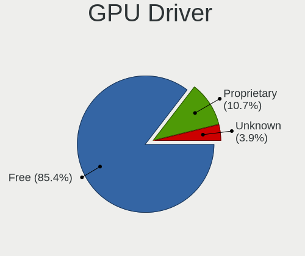

| Driver      | Notebooks | Percent |
|-------------|-----------|---------|
| Free        | 1238      | 85.44%  |
| Proprietary | 155       | 10.7%   |
| Unknown     | 56        | 3.86%   |

GPU Memory
----------

Total video memory

| Size in GB | Notebooks | Percent |
|------------|-----------|---------|
| Unknown    | 1375      | 95.29%  |
| 0.01-0.5   | 29        | 2.01%   |
| 1.01-2.0   | 12        | 0.83%   |
| 3.01-4.0   | 11        | 0.76%   |
| 0.51-1.0   | 6         | 0.42%   |
| 7.01-8.0   | 4         | 0.28%   |
| 5.01-6.0   | 2         | 0.14%   |
| 2.01-3.0   | 2         | 0.14%   |
| 8.01-16.0  | 2         | 0.14%   |

Monitor
-------

Monitor Vendor
--------------

Monitor vendors

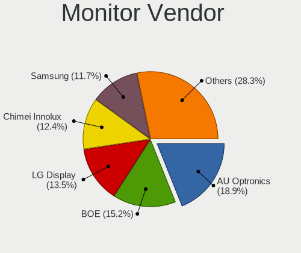

| Vendor                  | Notebooks | Percent |
|-------------------------|-----------|---------|
| AU Optronics            | 292       | 18.94%  |
| BOE                     | 234       | 15.18%  |
| LG Display              | 208       | 13.49%  |
| Chimei Innolux          | 191       | 12.39%  |
| Samsung Electronics     | 181       | 11.74%  |
| Apple                   | 80        | 5.19%   |
| Chi Mei Optoelectronics | 40        | 2.59%   |
| Goldstar                | 29        | 1.88%   |
| PANDA                   | 27        | 1.75%   |
| Sharp                   | 25        | 1.62%   |
| Lenovo                  | 20        | 1.3%    |
| InfoVision              | 17        | 1.1%    |
| Dell                    | 17        | 1.1%    |
| CSO                     | 16        | 1.04%   |
| Acer                    | 15        | 0.97%   |
| Hewlett-Packard         | 12        | 0.78%   |
| AOC                     | 11        | 0.71%   |
| BenQ                    | 8         | 0.52%   |
| Philips                 | 7         | 0.45%   |
| LG Philips              | 7         | 0.45%   |
| TMX                     | 6         | 0.39%   |
| CPT                     | 6         | 0.39%   |
| Panasonic               | 5         | 0.32%   |
| Sony                    | 4         | 0.26%   |
| HKC                     | 4         | 0.26%   |
| ___                     | 3         | 0.19%   |
| ZTR                     | 3         | 0.19%   |
| Toshiba                 | 3         | 0.19%   |
| SLD                     | 3         | 0.19%   |
| MSI                     | 3         | 0.19%   |
| KDC                     | 3         | 0.19%   |
| KDB                     | 3         | 0.19%   |
| Hitachi                 | 3         | 0.19%   |
| ASUSTek Computer        | 3         | 0.19%   |
| Unknown                 | 3         | 0.19%   |
| Vizio                   | 2         | 0.13%   |
| ViewSonic               | 2         | 0.13%   |
| STA                     | 2         | 0.13%   |
| InnoLux Display         | 2         | 0.13%   |
| Iiyama                  | 2         | 0.13%   |

Monitor Model
-------------

Monitor models

| Model                                                                    | Notebooks | Percent |
|--------------------------------------------------------------------------|-----------|---------|
| Samsung Electronics LCD Monitor SEC5441 1280x800 286x179mm 13.3-inch     | 18        | 1.16%   |
| Chimei Innolux LCD Monitor CMN15F5 1920x1080 344x193mm 15.5-inch         | 12        | 0.78%   |
| Chimei Innolux LCD Monitor CMN15E7 1920x1080 344x193mm 15.5-inch         | 11        | 0.71%   |
| BOE LCD Monitor BOE08D5 1920x1080 344x194mm 15.5-inch                    | 8         | 0.52%   |
| AU Optronics LCD Monitor AUO2E3C 1366x768 309x173mm 13.9-inch            | 8         | 0.52%   |
| Apple LCD Monitor APP9CC5 1280x800 286x179mm 13.3-inch                   | 8         | 0.52%   |
| Samsung Electronics LCD Monitor SDC4171 2880x1800 302x189mm 14.0-inch    | 7         | 0.45%   |
| AU Optronics LCD Monitor AUO71EC 1366x768 344x193mm 15.5-inch            | 7         | 0.45%   |
| AU Optronics LCD Monitor AUO183C 1366x768 309x173mm 13.9-inch            | 7         | 0.45%   |
| PANDA LCD Monitor NCP004D 1920x1080 344x194mm 15.5-inch                  | 6         | 0.39%   |
| LG Display LCD Monitor LGD046F 1920x1080 344x194mm 15.5-inch             | 6         | 0.39%   |
| LG Display LCD Monitor LGD02DC 1366x768 344x194mm 15.5-inch              | 6         | 0.39%   |
| Chimei Innolux LCD Monitor CMN15DB 1366x768 344x193mm 15.5-inch          | 6         | 0.39%   |
| Chimei Innolux LCD Monitor CMN1521 1920x1080 344x193mm 15.5-inch         | 6         | 0.39%   |
| Chimei Innolux LCD Monitor CMN14D4 1920x1080 309x173mm 13.9-inch         | 6         | 0.39%   |
| AU Optronics LCD Monitor AUO45EC 1366x768 344x193mm 15.5-inch            | 6         | 0.39%   |
| AU Optronics LCD Monitor AUO38ED 1920x1080 344x193mm 15.5-inch           | 6         | 0.39%   |
| AU Optronics LCD Monitor AUO333C 1366x768 309x173mm 13.9-inch            | 6         | 0.39%   |
| AU Optronics LCD Monitor AUO26EC 1366x768 344x193mm 15.5-inch            | 6         | 0.39%   |
| AU Optronics LCD Monitor AUO21ED 1920x1080 344x193mm 15.5-inch           | 6         | 0.39%   |
| AU Optronics LCD Monitor AUO10EC 1366x768 344x193mm 15.5-inch            | 6         | 0.39%   |
| AU Optronics LCD Monitor AUO106C 1366x768 277x156mm 12.5-inch            | 6         | 0.39%   |
| Apple Color LCD APP9CC7 1280x800 286x179mm 13.3-inch                     | 6         | 0.39%   |
| Samsung Electronics LCD Monitor SEC544B 1600x900 382x215mm 17.3-inch     | 5         | 0.32%   |
| LG Display LCD Monitor LGD0468 1366x768 344x194mm 15.5-inch              | 5         | 0.32%   |
| InfoVision M140NWR2 R1 IVO057A 1366x768 309x174mm 14.0-inch              | 5         | 0.32%   |
| Chimei Innolux LCD Monitor CMN15E6 1366x768 344x193mm 15.5-inch          | 5         | 0.32%   |
| Chimei Innolux LCD Monitor CMN15D5 1920x1080 344x193mm 15.5-inch         | 5         | 0.32%   |
| Chimei Innolux LCD Monitor CMN14D6 1366x768 309x173mm 13.9-inch          | 5         | 0.32%   |
| Chi Mei Optoelectronics LCD Monitor CMO15A7 1366x768 344x193mm 15.5-inch | 5         | 0.32%   |
| BOE LCD Monitor BOE0872 1920x1080 344x194mm 15.5-inch                    | 5         | 0.32%   |
| AU Optronics LCD Monitor AUO323C 1366x768 309x173mm 13.9-inch            | 5         | 0.32%   |
| AU Optronics LCD Monitor AUO313E 1600x900 309x174mm 14.0-inch            | 5         | 0.32%   |
| AU Optronics LCD Monitor AUO22EC 1366x768 344x193mm 15.5-inch            | 5         | 0.32%   |
| AU Optronics LCD Monitor AUO133D 1920x1080 309x173mm 13.9-inch           | 5         | 0.32%   |
| Apple Color LCD APPA034 2880x1800 286x179mm 13.3-inch                    | 5         | 0.32%   |
| Apple Color LCD APP9CF0 1440x900 290x180mm 13.4-inch                     | 5         | 0.32%   |
| Apple Color LCD APP9CDF 1440x900 286x179mm 13.3-inch                     | 5         | 0.32%   |
| Samsung Electronics LCD Monitor SEC324C 1600x900 310x174mm 14.0-inch     | 4         | 0.26%   |
| Samsung Electronics LCD Monitor SEC314C 1920x1080 344x194mm 15.5-inch    | 4         | 0.26%   |

Monitor Resolution
------------------

Monitor screen resolution

| Resolution         | Notebooks | Percent |
|--------------------|-----------|---------|
| 1920x1080 (FHD)    | 548       | 36.68%  |
| 1366x768 (WXGA)    | 507       | 33.94%  |
| 1600x900 (HD+)     | 88        | 5.89%   |
| 1280x800 (WXGA)    | 66        | 4.42%   |
| 3840x2160 (4K)     | 39        | 2.61%   |
| 1920x1200 (WUXGA)  | 38        | 2.54%   |
| 2560x1440 (QHD)    | 37        | 2.48%   |
| 2880x1800          | 35        | 2.34%   |
| 1440x900 (WXGA+)   | 34        | 2.28%   |
| 2560x1600          | 28        | 1.87%   |
| 1680x1050 (WSXGA+) | 12        | 0.8%    |
| 2560x1080          | 7         | 0.47%   |
| 3200x2000          | 6         | 0.4%    |
| 3840x2400          | 5         | 0.33%   |
| 2304x1440          | 3         | 0.2%    |
| 2160x1440          | 3         | 0.2%    |
| 1920x1280          | 3         | 0.2%    |
| 1360x768           | 3         | 0.2%    |
| 1280x1024 (SXGA)   | 3         | 0.2%    |
| 1024x600           | 3         | 0.2%    |
| 504x315            | 2         | 0.13%   |
| 3840x1080          | 2         | 0.13%   |
| 3200x1800 (QHD+)   | 2         | 0.13%   |
| 2880x1620          | 2         | 0.13%   |
| 2256x1504          | 2         | 0.13%   |
| 1920x540           | 2         | 0.13%   |
| 1680x945           | 2         | 0.13%   |
| 1024x768 (XGA)     | 2         | 0.13%   |
| 480x1920           | 1         | 0.07%   |
| 400x1280           | 1         | 0.07%   |
| 3840x1200          | 1         | 0.07%   |
| 3840x1100          | 1         | 0.07%   |
| 3440x1440          | 1         | 0.07%   |
| 3072x1920          | 1         | 0.07%   |
| 2520x1680          | 1         | 0.07%   |
| 2400x1600          | 1         | 0.07%   |
| 1600x2560          | 1         | 0.07%   |
| Unknown            | 1         | 0.07%   |

Monitor Diagonal
----------------

Diagonal size in inches

| Inches  | Notebooks | Percent |
|---------|-----------|---------|
| 15      | 628       | 40.75%  |
| 13      | 249       | 16.16%  |
| 14      | 204       | 13.24%  |
| 17      | 125       | 8.11%   |
| 16      | 52        | 3.37%   |
| 12      | 39        | 2.53%   |
| 27      | 31        | 2.01%   |
| 11      | 30        | 1.95%   |
| 24      | 28        | 1.82%   |
| 18      | 22        | 1.43%   |
| 23      | 18        | 1.17%   |
| 21      | 18        | 1.17%   |
| 31      | 17        | 1.1%    |
| Unknown | 12        | 0.78%   |
| 34      | 7         | 0.45%   |
| 22      | 7         | 0.45%   |
| 84      | 6         | 0.39%   |
| 40      | 5         | 0.32%   |
| 54      | 4         | 0.26%   |
| 52      | 4         | 0.26%   |
| 20      | 4         | 0.26%   |
| 10      | 4         | 0.26%   |
| 72      | 3         | 0.19%   |
| 48      | 3         | 0.19%   |
| 32      | 3         | 0.19%   |
| 19      | 3         | 0.19%   |
| 43      | 2         | 0.13%   |
| 25      | 2         | 0.13%   |
| 7       | 2         | 0.13%   |
| 65      | 1         | 0.06%   |
| 60      | 1         | 0.06%   |
| 58      | 1         | 0.06%   |
| 42      | 1         | 0.06%   |
| 39      | 1         | 0.06%   |
| 38      | 1         | 0.06%   |
| 29      | 1         | 0.06%   |
| 28      | 1         | 0.06%   |
| 26      | 1         | 0.06%   |

Monitor Width
-------------

Physical width

| Width in mm | Notebooks | Percent |
|-------------|-----------|---------|
| 301-350     | 984       | 64.15%  |
| 201-300     | 180       | 11.73%  |
| 351-400     | 165       | 10.76%  |
| 501-600     | 73        | 4.76%   |
| 401-500     | 52        | 3.39%   |
| 601-700     | 23        | 1.5%    |
| 1001-1500   | 15        | 0.98%   |
| Unknown     | 12        | 0.78%   |
| 701-800     | 10        | 0.65%   |
| 1501-2000   | 9         | 0.59%   |
| 801-900     | 7         | 0.46%   |
| 101-200     | 2         | 0.13%   |
| 901-1000    | 2         | 0.13%   |

Aspect Ratio
------------

Proportional relationship between the width and the height

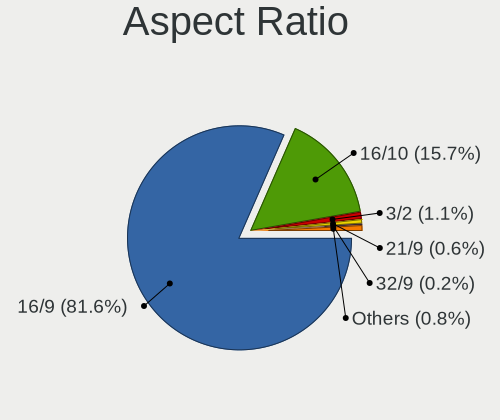

| Ratio   | Notebooks | Percent |
|---------|-----------|---------|
| 16/9    | 1154      | 81.55%  |
| 16/10   | 222       | 15.69%  |
| 3/2     | 15        | 1.06%   |
| 21/9    | 9         | 0.64%   |
| 32/9    | 3         | 0.21%   |
| Unknown | 3         | 0.21%   |
| 5/4     | 2         | 0.14%   |
| 4/3     | 2         | 0.14%   |
| 6/5     | 1         | 0.07%   |
| 3.40    | 1         | 0.07%   |
| 3.20    | 1         | 0.07%   |
| 0.31    | 1         | 0.07%   |
| 0.25    | 1         | 0.07%   |

Monitor Area
------------

Area in inch

| Area in inch | Notebooks | Percent |
|----------------|-----------|---------|
| 101-110        | 628       | 40.78%  |
| 81-90          | 386       | 25.06%  |
| 121-130        | 110       | 7.14%   |
| 71-80          | 62        | 4.03%   |
| 201-250        | 56        | 3.64%   |
| 111-120        | 41        | 2.66%   |
| 61-70          | 38        | 2.47%   |
| 301-350        | 32        | 2.08%   |
| 51-60          | 31        | 2.01%   |
| 351-500        | 28        | 1.82%   |
| More than 1000 | 21        | 1.36%   |
| 141-150        | 21        | 1.36%   |
| 131-140        | 19        | 1.23%   |
| 151-200        | 14        | 0.91%   |
| 251-300        | 12        | 0.78%   |
| 501-1000       | 12        | 0.78%   |
| Unknown        | 12        | 0.78%   |
| 91-100         | 11        | 0.71%   |
| 41-50          | 4         | 0.26%   |
| 1-40           | 2         | 0.13%   |

Pixel Density
-------------

Pixels per inch

| Density       | Notebooks | Percent |
|---------------|-----------|---------|
| 121-160       | 579       | 38.14%  |
| 101-120       | 548       | 36.1%   |
| 51-100        | 219       | 14.43%  |
| 161-240       | 107       | 7.05%   |
| More than 240 | 41        | 2.7%    |
| 1-50          | 12        | 0.79%   |
| Unknown       | 12        | 0.79%   |

Multiple Monitors
-----------------

Total monitors connected

| Total | Notebooks | Percent |
|-------|-----------|---------|
| 1     | 1206      | 83.06%  |
| 2     | 169       | 11.64%  |
| 0     | 62        | 4.27%   |
| 3     | 13        | 0.9%    |
| 4     | 2         | 0.14%   |

Network
-------

Net Controller Vendor
---------------------

Controller vendors

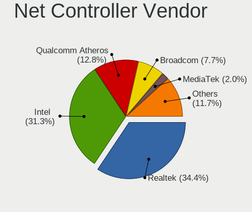

| Vendor                            | Notebooks | Percent |
|-----------------------------------|-----------|---------|
| Realtek Semiconductor             | 774       | 34.38%  |
| Intel                             | 705       | 31.32%  |
| Qualcomm Atheros                  | 289       | 12.84%  |
| Broadcom                          | 173       | 7.69%   |
| MediaTek                          | 46        | 2.04%   |
| Broadcom Limited                  | 44        | 1.95%   |
| Marvell Technology Group          | 30        | 1.33%   |
| Ralink                            | 21        | 0.93%   |
| Samsung Electronics               | 18        | 0.8%    |
| TP-Link                           | 14        | 0.62%   |
| Ralink Technology                 | 14        | 0.62%   |
| Sierra Wireless                   | 13        | 0.58%   |
| ASIX Electronics                  | 12        | 0.53%   |
| Nvidia                            | 10        | 0.44%   |
| JMicron Technology                | 9         | 0.4%    |
| Hewlett-Packard                   | 8         | 0.36%   |
| Ericsson Business Mobile Networks | 7         | 0.31%   |
| Dell                              | 7         | 0.31%   |
| Silicon Integrated Systems [SiS]  | 6         | 0.27%   |
| Qualcomm                          | 6         | 0.27%   |
| DisplayLink                       | 6         | 0.27%   |
| Xiaomi                            | 4         | 0.18%   |
| Lenovo                            | 4         | 0.18%   |
| D-Link                            | 4         | 0.18%   |
| U-Blox                            | 2         | 0.09%   |
| Qualcomm Atheros Communications   | 2         | 0.09%   |
| OPPO Electronics                  | 2         | 0.09%   |
| NetGear                           | 2         | 0.09%   |
| Motorola PCS                      | 2         | 0.09%   |
| Microsoft                         | 2         | 0.09%   |
| Belkin Components                 | 2         | 0.09%   |
| XYZ,Handheld_Scanner              | 1         | 0.04%   |
| TRENDnet                          | 1         | 0.04%   |
| T & A Mobile Phones               | 1         | 0.04%   |
| Spreadtrum Communications         | 1         | 0.04%   |
| OnePlus Technology (Shenzhen)     | 1         | 0.04%   |
| Huawei Technologies               | 1         | 0.04%   |
| Google                            | 1         | 0.04%   |
| Fibocom                           | 1         | 0.04%   |
| Edimax Technology                 | 1         | 0.04%   |

Net Controller Model
--------------------

Controller models

| Model                                                                  | Notebooks | Percent |
|------------------------------------------------------------------------|-----------|---------|
| Realtek RTL8111/8168/8211/8411 PCI Express Gigabit Ethernet Controller | 420       | 15.52%  |
| Realtek RTL810xE PCI Express Fast Ethernet controller                  | 154       | 5.69%   |
| Qualcomm Atheros QCA9565 / AR9565 Wireless Network Adapter             | 57        | 2.11%   |
| Qualcomm Atheros AR9285 Wireless Network Adapter (PCI-Express)         | 57        | 2.11%   |
| Realtek RTL8821CE 802.11ac PCIe Wireless Network Adapter               | 54        | 1.99%   |
| Intel Wireless 7260                                                    | 53        | 1.96%   |
| Intel 82579LM Gigabit Network Connection (Lewisville)                  | 53        | 1.96%   |
| Intel Wi-Fi 6 AX201                                                    | 52        | 1.92%   |
| Qualcomm Atheros QCA9377 802.11ac Wireless Network Adapter             | 43        | 1.59%   |
| Intel Wireless 8265 / 8275                                             | 43        | 1.59%   |
| Qualcomm Atheros AR9485 Wireless Network Adapter                       | 42        | 1.55%   |
| Realtek RTL8153 Gigabit Ethernet Adapter                               | 41        | 1.51%   |
| Intel Wireless 7265                                                    | 40        | 1.48%   |
| Intel Alder Lake-P PCH CNVi WiFi                                       | 36        | 1.33%   |
| Intel Wireless 8260                                                    | 34        | 1.26%   |
| Realtek RTL8822CE 802.11ac PCIe Wireless Network Adapter               | 32        | 1.18%   |
| Intel Wireless 3165                                                    | 32        | 1.18%   |
| Intel Centrino Advanced-N 6205 [Taylor Peak]                           | 32        | 1.18%   |
| Intel Raptor Lake PCH CNVi WiFi                                        | 31        | 1.15%   |
| Broadcom BCM4313 802.11bgn Wireless Network Adapter                    | 25        | 0.92%   |
| Intel Wi-Fi 6 AX200                                                    | 23        | 0.85%   |
| Intel Ethernet Connection (4) I219-LM                                  | 22        | 0.81%   |
| Realtek RTL8188EE Wireless Network Adapter                             | 20        | 0.74%   |
| Intel WiFi Link 5100                                                   | 19        | 0.7%    |
| Broadcom BCM4331 802.11a/b/g/n                                         | 19        | 0.7%    |
| Broadcom BCM43142 802.11b/g/n                                          | 19        | 0.7%    |
| Realtek RTL8852BE PCIe 802.11ax Wireless Network Controller            | 18        | 0.66%   |
| Qualcomm Atheros AR8151 v2.0 Gigabit Ethernet                          | 18        | 0.66%   |
| Intel Ethernet Connection I219-LM                                      | 17        | 0.63%   |
| Intel Ethernet Connection I218-LM                                      | 17        | 0.63%   |
| Intel Ethernet Connection I217-LM                                      | 17        | 0.63%   |
| Intel Ethernet Connection (3) I218-LM                                  | 17        | 0.63%   |
| Intel Cannon Lake PCH CNVi WiFi                                        | 17        | 0.63%   |
| Broadcom NetXtreme BCM57765 Gigabit Ethernet PCIe                      | 17        | 0.63%   |
| MediaTek MT7921 802.11ax PCI Express Wireless Network Adapter          | 16        | 0.59%   |
| Intel Tiger Lake PCH CNVi WiFi                                         | 16        | 0.59%   |
| Intel Gemini Lake PCH CNVi WiFi                                        | 16        | 0.59%   |
| Broadcom Limited BCM4360 802.11ac Dual Band Wireless Network Adapter   | 16        | 0.59%   |
| Broadcom BCM4322 802.11a/b/g/n Wireless LAN Controller                 | 16        | 0.59%   |
| Realtek RTL8723BE PCIe Wireless Network Adapter                        | 15        | 0.55%   |

Wireless Vendor
---------------

Wireless vendors

| Vendor                          | Notebooks | Percent |
|---------------------------------|-----------|---------|
| Intel                           | 669       | 44.93%  |
| Realtek Semiconductor           | 260       | 17.46%  |
| Qualcomm Atheros                | 252       | 16.92%  |
| Broadcom                        | 144       | 9.67%   |
| MediaTek                        | 42        | 2.82%   |
| Broadcom Limited                | 34        | 2.28%   |
| Ralink                          | 21        | 1.41%   |
| Ralink Technology               | 14        | 0.94%   |
| TP-Link                         | 13        | 0.87%   |
| Sierra Wireless                 | 13        | 0.87%   |
| Dell                            | 6         | 0.4%    |
| D-Link                          | 4         | 0.27%   |
| Qualcomm                        | 3         | 0.2%    |
| Qualcomm Atheros Communications | 2         | 0.13%   |
| NetGear                         | 2         | 0.13%   |
| Microsoft                       | 2         | 0.13%   |
| Hewlett-Packard                 | 2         | 0.13%   |
| Belkin Components               | 2         | 0.13%   |
| TRENDnet                        | 1         | 0.07%   |
| Fibocom                         | 1         | 0.07%   |
| Edimax Technology               | 1         | 0.07%   |
| D-Link System                   | 1         | 0.07%   |

Wireless Model
--------------

Wireless models

| Model                                                                | Notebooks | Percent |
|----------------------------------------------------------------------|-----------|---------|
| Qualcomm Atheros QCA9565 / AR9565 Wireless Network Adapter           | 57        | 3.81%   |
| Qualcomm Atheros AR9285 Wireless Network Adapter (PCI-Express)       | 57        | 3.81%   |
| Realtek RTL8821CE 802.11ac PCIe Wireless Network Adapter             | 54        | 3.61%   |
| Intel Wireless 7260                                                  | 53        | 3.54%   |
| Intel Wi-Fi 6 AX201                                                  | 52        | 3.48%   |
| Qualcomm Atheros QCA9377 802.11ac Wireless Network Adapter           | 43        | 2.87%   |
| Intel Wireless 8265 / 8275                                           | 43        | 2.87%   |
| Qualcomm Atheros AR9485 Wireless Network Adapter                     | 42        | 2.81%   |
| Intel Wireless 7265                                                  | 40        | 2.67%   |
| Intel Alder Lake-P PCH CNVi WiFi                                     | 36        | 2.41%   |
| Intel Wireless 8260                                                  | 34        | 2.27%   |
| Realtek RTL8822CE 802.11ac PCIe Wireless Network Adapter             | 32        | 2.14%   |
| Intel Wireless 3165                                                  | 32        | 2.14%   |
| Intel Centrino Advanced-N 6205 [Taylor Peak]                         | 32        | 2.14%   |
| Intel Raptor Lake PCH CNVi WiFi                                      | 31        | 2.07%   |
| Broadcom BCM4313 802.11bgn Wireless Network Adapter                  | 25        | 1.67%   |
| Intel Wi-Fi 6 AX200                                                  | 23        | 1.54%   |
| Realtek RTL8188EE Wireless Network Adapter                           | 20        | 1.34%   |
| Intel WiFi Link 5100                                                 | 19        | 1.27%   |
| Broadcom BCM4331 802.11a/b/g/n                                       | 19        | 1.27%   |
| Broadcom BCM43142 802.11b/g/n                                        | 19        | 1.27%   |
| Intel Cannon Lake PCH CNVi WiFi                                      | 17        | 1.14%   |
| Realtek RTL8852BE PCIe 802.11ax Wireless Network Controller          | 16        | 1.07%   |
| MediaTek MT7921 802.11ax PCI Express Wireless Network Adapter        | 16        | 1.07%   |
| Intel Tiger Lake PCH CNVi WiFi                                       | 16        | 1.07%   |
| Intel Gemini Lake PCH CNVi WiFi                                      | 16        | 1.07%   |
| Broadcom Limited BCM4360 802.11ac Dual Band Wireless Network Adapter | 16        | 1.07%   |
| Broadcom BCM4322 802.11a/b/g/n Wireless LAN Controller               | 16        | 1.07%   |
| Realtek RTL8723BE PCIe Wireless Network Adapter                      | 15        | 1%      |
| Realtek RTL8188CE 802.11b/g/n WiFi Adapter                           | 15        | 1%      |
| Intel Comet Lake PCH-LP CNVi WiFi                                    | 15        | 1%      |
| Intel Centrino Advanced-N 6200                                       | 15        | 1%      |
| Realtek RTL8723DE Wireless Network Adapter                           | 14        | 0.94%   |
| Qualcomm Atheros QCA6174 802.11ac Wireless Network Adapter           | 14        | 0.94%   |
| Intel Wi-Fi 6E(802.11ax) AX210/AX1675* 2x2 [Typhoon Peak]            | 14        | 0.94%   |
| Intel Centrino Ultimate-N 6300                                       | 14        | 0.94%   |
| Intel Centrino Wireless-N 2230                                       | 13        | 0.87%   |
| Broadcom BCM4350 802.11ac Wireless Network Adapter                   | 13        | 0.87%   |
| Realtek 802.11n WLAN Adapter                                         | 12        | 0.8%    |
| Ralink RT3290 Wireless 802.11n 1T/1R PCIe                            | 12        | 0.8%    |

Ethernet Vendor
---------------

Ethernet vendors

| Vendor                           | Notebooks | Percent |
|----------------------------------|-----------|---------|
| Realtek Semiconductor            | 651       | 55.12%  |
| Intel                            | 259       | 21.93%  |
| Qualcomm Atheros                 | 78        | 6.6%    |
| Broadcom                         | 66        | 5.59%   |
| Marvell Technology Group         | 30        | 2.54%   |
| Samsung Electronics              | 13        | 1.1%    |
| ASIX Electronics                 | 12        | 1.02%   |
| Nvidia                           | 10        | 0.85%   |
| Broadcom Limited                 | 10        | 0.85%   |
| JMicron Technology               | 9         | 0.76%   |
| Silicon Integrated Systems [SiS] | 6         | 0.51%   |
| DisplayLink                      | 6         | 0.51%   |
| Xiaomi                           | 4         | 0.34%   |
| MediaTek                         | 4         | 0.34%   |
| Lenovo                           | 4         | 0.34%   |
| Hewlett-Packard                  | 4         | 0.34%   |
| Qualcomm                         | 3         | 0.25%   |
| OPPO Electronics                 | 2         | 0.17%   |
| Motorola PCS                     | 2         | 0.17%   |
| TP-Link                          | 1         | 0.08%   |
| T & A Mobile Phones              | 1         | 0.08%   |
| Spreadtrum Communications        | 1         | 0.08%   |
| Huawei Technologies              | 1         | 0.08%   |
| Google                           | 1         | 0.08%   |
| Attansic Technology              | 1         | 0.08%   |
| ASUSTek Computer                 | 1         | 0.08%   |
| Unknown                          | 1         | 0.08%   |

Ethernet Model
--------------

Ethernet models

| Model                                                                          | Notebooks | Percent |
|--------------------------------------------------------------------------------|-----------|---------|
| Realtek RTL8111/8168/8211/8411 PCI Express Gigabit Ethernet Controller         | 420       | 35.26%  |
| Realtek RTL810xE PCI Express Fast Ethernet controller                          | 154       | 12.93%  |
| Intel 82579LM Gigabit Network Connection (Lewisville)                          | 53        | 4.45%   |
| Realtek RTL8153 Gigabit Ethernet Adapter                                       | 41        | 3.44%   |
| Intel Ethernet Connection (4) I219-LM                                          | 22        | 1.85%   |
| Qualcomm Atheros AR8151 v2.0 Gigabit Ethernet                                  | 18        | 1.51%   |
| Intel Ethernet Connection I219-LM                                              | 17        | 1.43%   |
| Intel Ethernet Connection I218-LM                                              | 17        | 1.43%   |
| Intel Ethernet Connection I217-LM                                              | 17        | 1.43%   |
| Intel Ethernet Connection (3) I218-LM                                          | 17        | 1.43%   |
| Broadcom NetXtreme BCM57765 Gigabit Ethernet PCIe                              | 17        | 1.43%   |
| Realtek Killer E2600 GbE Controller                                            | 14        | 1.18%   |
| Intel 82577LM Gigabit Network Connection                                       | 14        | 1.18%   |
| Samsung Galaxy series, misc. (tethering mode)                                  | 13        | 1.09%   |
| Realtek RTL8152 Fast Ethernet Adapter                                          | 11        | 0.92%   |
| Intel 82567LM Gigabit Network Connection                                       | 11        | 0.92%   |
| ASIX AX88179 Gigabit Ethernet                                                  | 11        | 0.92%   |
| Marvell Group 88E8040 PCI-E Fast Ethernet Controller                           | 10        | 0.84%   |
| Intel Ethernet Connection (4) I219-V                                           | 10        | 0.84%   |
| Broadcom NetXtreme BCM5764M Gigabit Ethernet PCIe                              | 10        | 0.84%   |
| Qualcomm Atheros AR8162 Fast Ethernet                                          | 9         | 0.76%   |
| Qualcomm Atheros AR8131 Gigabit Ethernet                                       | 9         | 0.76%   |
| Nvidia MCP79 Ethernet                                                          | 9         | 0.76%   |
| Qualcomm Atheros QCA8171 Gigabit Ethernet                                      | 8         | 0.67%   |
| Intel Ethernet Connection I219-V                                               | 8         | 0.67%   |
| Qualcomm Atheros Killer E220x Gigabit Ethernet Controller                      | 7         | 0.59%   |
| JMicron JMC250 PCI Express Gigabit Ethernet Controller                         | 7         | 0.59%   |
| Broadcom NetXtreme BCM5761 Gigabit Ethernet PCIe                               | 7         | 0.59%   |
| Broadcom NetLink BCM57780 Gigabit Ethernet PCIe                                | 7         | 0.59%   |
| Silicon Integrated Systems [SiS] 191 Gigabit Ethernet Adapter                  | 6         | 0.5%    |
| Realtek RTL8852BE PCIe 802.11ax Wireless Network Controller [1T1R]             | 6         | 0.5%    |
| Qualcomm Atheros AR8121/AR8113/AR8114 Gigabit or Fast Ethernet                 | 6         | 0.5%    |
| Intel Ethernet Connection I217-V                                               | 6         | 0.5%    |
| Realtek RTL8125 2.5GbE Controller                                              | 5         | 0.42%   |
| Qualcomm Atheros AR8161 Gigabit Ethernet                                       | 5         | 0.42%   |
| Qualcomm Atheros AR8152 v2.0 Fast Ethernet                                     | 5         | 0.42%   |
| Marvell Group Yukon Optima 88E8059 [PCIe Gigabit Ethernet Controller with AVB] | 5         | 0.42%   |
| Broadcom NetLink BCM57785 Gigabit Ethernet PCIe                                | 5         | 0.42%   |
| Marvell Group 88E8055 PCI-E Gigabit Ethernet Controller                        | 4         | 0.34%   |
| Intel Ethernet Connection I218-V                                               | 4         | 0.34%   |

Net Controller Kind
-------------------

Ethernet, WiFi or modem

| Kind     | Notebooks | Percent |
|----------|-----------|---------|
| WiFi     | 1404      | 54.97%  |
| Ethernet | 1130      | 44.24%  |
| Modem    | 19        | 0.74%   |
| Unknown  | 1         | 0.04%   |

Used Controller
---------------

Currently used network controller

| Kind     | Notebooks | Percent |
|----------|-----------|---------|
| WiFi     | 1213      | 81.14%  |
| Ethernet | 281       | 18.8%   |
| Modem    | 1         | 0.07%   |

NICs
----

Total network controllers on board

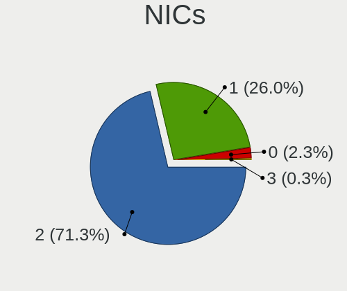

| Total | Notebooks | Percent |
|-------|-----------|---------|
| 2     | 1028      | 71.34%  |
| 1     | 375       | 26.02%  |
| 0     | 33        | 2.29%   |
| 3     | 5         | 0.35%   |

IPv6
----

IPv6 vs IPv4

| Used | Notebooks | Percent |
|------|-----------|---------|
| No   | 894       | 61.57%  |
| Yes  | 558       | 38.43%  |

Bluetooth
---------

Bluetooth Vendor
----------------

Controller vendors

| Vendor                          | Notebooks | Percent |
|---------------------------------|-----------|---------|
| Intel                           | 516       | 44.83%  |
| Realtek Semiconductor           | 142       | 12.34%  |
| Qualcomm Atheros Communications | 96        | 8.34%   |
| Apple                           | 65        | 5.65%   |
| IMC Networks                    | 58        | 5.04%   |
| Broadcom                        | 50        | 4.34%   |
| Foxconn / Hon Hai               | 41        | 3.56%   |
| Lite-On Technology              | 40        | 3.48%   |
| Dell                            | 24        | 2.09%   |
| Hewlett-Packard                 | 23        | 2%      |
| Toshiba                         | 20        | 1.74%   |
| Cambridge Silicon Radio         | 20        | 1.74%   |
| Ralink                          | 12        | 1.04%   |
| MediaTek                        | 7         | 0.61%   |
| ASUSTek Computer                | 7         | 0.61%   |
| Alps Electric                   | 6         | 0.52%   |
| Realtek                         | 4         | 0.35%   |
| Foxconn International           | 3         | 0.26%   |
| Actions                         | 3         | 0.26%   |
| TP-Link                         | 2         | 0.17%   |
| Ralink Technology               | 2         | 0.17%   |
| Unknown                         | 2         | 0.17%   |
| USI                             | 1         | 0.09%   |
| Taiyo Yuden                     | 1         | 0.09%   |
| Smart Modular Technologies      | 1         | 0.09%   |
| Qcom                            | 1         | 0.09%   |
| Micro Star International        | 1         | 0.09%   |
| Fujitsu                         | 1         | 0.09%   |
| Dynex                           | 1         | 0.09%   |
| Askey Computer                  | 1         | 0.09%   |

Bluetooth Model
---------------

Controller models

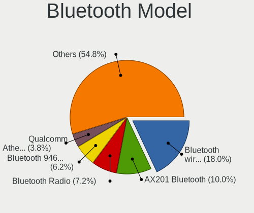

| Model                                                                               | Notebooks | Percent |
|-------------------------------------------------------------------------------------|-----------|---------|
| Intel Bluetooth wireless interface                                                  | 207       | 17.98%  |
| Intel AX201 Bluetooth                                                               | 115       | 9.99%   |
| Realtek Bluetooth Radio                                                             | 83        | 7.21%   |
| Intel Bluetooth 9460/9560 Jefferson Peak (JfP)                                      | 71        | 6.17%   |
| Qualcomm Atheros  Bluetooth Device                                                  | 44        | 3.82%   |
| Intel AX211 Bluetooth                                                               | 43        | 3.74%   |
| Apple Bluetooth Host Controller                                                     | 40        | 3.48%   |
| Realtek  Bluetooth 4.2 Adapter                                                      | 34        | 2.95%   |
| Qualcomm Atheros AR3011 Bluetooth                                                   | 23        | 2%      |
| Intel AX200 Bluetooth                                                               | 23        | 2%      |
| Intel Centrino Bluetooth Wireless Transceiver                                       | 22        | 1.91%   |
| Apple Bluetooth USB Host Controller                                                 | 22        | 1.91%   |
| IMC Networks Wireless_Device                                                        | 20        | 1.74%   |
| Cambridge Silicon Radio Bluetooth Dongle (HCI mode)                                 | 20        | 1.74%   |
| Qualcomm Atheros AR3012 Bluetooth 4.0                                               | 18        | 1.56%   |
| IMC Networks Bluetooth Radio                                                        | 16        | 1.39%   |
| Lite-On Bluetooth Device                                                            | 13        | 1.13%   |
| HP Broadcom 2070 Bluetooth Combo                                                    | 13        | 1.13%   |
| Broadcom BCM20702 Bluetooth 4.0 [ThinkPad]                                          | 13        | 1.13%   |
| Ralink RT3290 Bluetooth                                                             | 12        | 1.04%   |
| Intel AX210 Bluetooth                                                               | 12        | 1.04%   |
| IMC Networks Bluetooth Device                                                       | 12        | 1.04%   |
| Foxconn / Hon Hai Bluetooth Device                                                  | 12        | 1.04%   |
| Intel Centrino Advanced-N 6230 Bluetooth adapter                                    | 11        | 0.96%   |
| Dell DW375 Bluetooth Module                                                         | 11        | 0.96%   |
| HP Bluetooth 2.0 Interface [Broadcom BCM2045]                                       | 10        | 0.87%   |
| Lite-On Qualcomm Atheros QCA9377 Bluetooth                                          | 9         | 0.78%   |
| Foxconn / Hon Hai Wireless_Device                                                   | 9         | 0.78%   |
| Realtek RTL8821A Bluetooth                                                          | 8         | 0.7%    |
| Realtek 802.11ac WLAN Adapter                                                       | 8         | 0.7%    |
| Broadcom BCM2045B (BDC-2.1)                                                         | 8         | 0.7%    |
| Realtek RTL8723B Bluetooth                                                          | 6         | 0.52%   |
| MediaTek Wireless_Device                                                            | 6         | 0.52%   |
| Foxconn / Hon Hai Foxconn T77H114 BCM2070 [Single-Chip Bluetooth 2.1 + EDR Adapter] | 6         | 0.52%   |
| Lite-On Atheros AR3012 Bluetooth                                                    | 5         | 0.43%   |
| Intel Wireless-AC 3168 Bluetooth                                                    | 5         | 0.43%   |
| IMC Networks Atheros AR3012 Bluetooth 4.0 Adapter                                   | 5         | 0.43%   |
| Toshiba RT Bluetooth Radio                                                          | 4         | 0.35%   |
| Toshiba Bluetooth Device                                                            | 4         | 0.35%   |
| Realtek Bluetooth Radio                                                             | 4         | 0.35%   |

Sound
-----

Sound Vendor
------------

Sound card vendors

| Vendor                           | Notebooks | Percent |
|----------------------------------|-----------|---------|
| Intel                            | 1173      | 66.53%  |
| AMD                              | 283       | 16.05%  |
| Nvidia                           | 224       | 12.71%  |
| C-Media Electronics              | 11        | 0.62%   |
| Silicon Integrated Systems [SiS] | 7         | 0.4%    |
| Logitech                         | 6         | 0.34%   |
| Generalplus Technology           | 6         | 0.34%   |
| Realtek Semiconductor            | 4         | 0.23%   |
| GN Netcom                        | 4         | 0.23%   |
| Texas Instruments                | 3         | 0.17%   |
| Sony                             | 3         | 0.17%   |
| Lenovo                           | 3         | 0.17%   |
| JMTek                            | 3         | 0.17%   |
| Apple                            | 3         | 0.17%   |
| Walmart                          | 2         | 0.11%   |
| Plantronics                      | 2         | 0.11%   |
| Hewlett-Packard                  | 2         | 0.11%   |
| Focusrite-Novation               | 2         | 0.11%   |
| ASUSTek Computer                 | 2         | 0.11%   |
| Unknown                          | 2         | 0.11%   |
| Weltrend Semiconductor           | 1         | 0.06%   |
| STMicroelectronics               | 1         | 0.06%   |
| SteelSeries ApS                  | 1         | 0.06%   |
| SAVITECH                         | 1         | 0.06%   |
| Razer USA                        | 1         | 0.06%   |
| OPPO Electronics                 | 1         | 0.06%   |
| Megawin Technology               | 1         | 0.06%   |
| Mackie Designs                   | 1         | 0.06%   |
| M-Audio                          | 1         | 0.06%   |
| KTMicro                          | 1         | 0.06%   |
| IK Multimedia                    | 1         | 0.06%   |
| FiiO Electronics Technology      | 1         | 0.06%   |
| Dell                             | 1         | 0.06%   |
| Conexant Systems                 | 1         | 0.06%   |
| Cambridge Silicon Radio          | 1         | 0.06%   |
| BTD 600                          | 1         | 0.06%   |
| Blue Microphones                 | 1         | 0.06%   |
| AKAI Professional M.I.           | 1         | 0.06%   |

Sound Model
-----------

Sound card models

| Model                                                                      | Notebooks | Percent |
|----------------------------------------------------------------------------|-----------|---------|
| Intel Sunrise Point-LP HD Audio                                            | 156       | 7.3%    |
| Intel 7 Series/C216 Chipset Family High Definition Audio Controller        | 131       | 6.13%   |
| AMD Family 17h/19h/1ah HD Audio Controller                                 | 127       | 5.94%   |
| Intel 6 Series/C200 Series Chipset Family High Definition Audio Controller | 96        | 4.49%   |
| Intel 5 Series/3400 Series Chipset High Definition Audio                   | 73        | 3.42%   |
| Intel Haswell-ULT HD Audio Controller                                      | 72        | 3.37%   |
| Intel 8 Series HD Audio Controller                                         | 72        | 3.37%   |
| Intel 82801I (ICH9 Family) HD Audio Controller                             | 69        | 3.23%   |
| Intel Celeron/Pentium Silver Processor High Definition Audio               | 63        | 2.95%   |
| Intel Tiger Lake-LP Smart Sound Technology Audio Controller                | 60        | 2.81%   |
| AMD Renoir Radeon High Definition Audio Controller                         | 59        | 2.76%   |
| Intel 8 Series/C220 Series Chipset High Definition Audio Controller        | 56        | 2.62%   |
| Intel Broadwell-U Audio Controller                                         | 53        | 2.48%   |
| Intel Wildcat Point-LP High Definition Audio Controller                    | 52        | 2.43%   |
| Intel Alder Lake PCH-P High Definition Audio Controller                    | 51        | 2.39%   |
| AMD FCH Azalia Controller                                                  | 50        | 2.34%   |
| Intel Xeon E3-1200 v3/4th Gen Core Processor HD Audio Controller           | 43        | 2.01%   |
| AMD Kabini HDMI/DP Audio                                                   | 37        | 1.73%   |
| Intel Raptor Lake-P/U/H cAVS                                               | 34        | 1.59%   |
| AMD Raven/Raven2/Fenghuang HDMI/DP Audio Controller                        | 32        | 1.5%    |
| Intel 82801H (ICH8 Family) HD Audio Controller                             | 28        | 1.31%   |
| AMD Rembrandt Radeon High Definition Audio Controller                      | 27        | 1.26%   |
| Intel Cannon Lake PCH cAVS                                                 | 26        | 1.22%   |
| Nvidia GF108 High Definition Audio Controller                              | 24        | 1.12%   |
| Intel Celeron N3350/Pentium N4200/Atom E3900 Series Audio Cluster          | 24        | 1.12%   |
| AMD SBx00 Azalia (Intel HDA)                                               | 23        | 1.08%   |
| Intel Cannon Point-LP High Definition Audio Controller                     | 21        | 0.98%   |
| AMD Family 15h (Models 60h-6fh) Audio Controller                           | 21        | 0.98%   |
| Nvidia GA107 High Definition Audio Controller                              | 20        | 0.94%   |
| Intel Comet Lake PCH-LP cAVS                                               | 19        | 0.89%   |
| Intel Tiger Lake-H HD Audio Controller                                     | 17        | 0.8%    |
| Intel Comet Lake PCH cAVS                                                  | 17        | 0.8%    |
| Nvidia GP107GL High Definition Audio Controller                            | 16        | 0.75%   |
| Nvidia TU107 GeForce GTX 1650 High Definition Audio Controller             | 15        | 0.7%    |
| Intel CM238 HD Audio Controller                                            | 15        | 0.7%    |
| Intel Atom Processor Z36xxx/Z37xxx Series High Definition Audio Controller | 14        | 0.66%   |
| AMD High Definition Audio Controller                                       | 14        | 0.66%   |
| Nvidia High Definition Audio Controller                                    | 13        | 0.61%   |
| Nvidia AD107 High Definition Audio Controller                              | 13        | 0.61%   |
| Nvidia GA106 High Definition Audio Controller                              | 12        | 0.56%   |

Memory
------

Memory Vendor
-------------

Memory module vendors

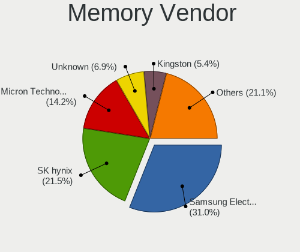

| Vendor              | Notebooks | Percent |
|---------------------|-----------|---------|
| Samsung Electronics | 81        | 31.03%  |
| SK hynix            | 56        | 21.46%  |
| Micron Technology   | 37        | 14.18%  |
| Unknown             | 18        | 6.9%    |
| Kingston            | 14        | 5.36%   |
| Crucial             | 12        | 4.6%    |
| Unknown (ABCD)      | 7         | 2.68%   |
| Ramaxel Technology  | 5         | 1.92%   |
| Elpida              | 5         | 1.92%   |
| A-DATA Technology   | 5         | 1.92%   |
| Unknown             | 5         | 1.92%   |
| Corsair             | 4         | 1.53%   |
| Team                | 2         | 0.77%   |
| G.Skill             | 2         | 0.77%   |
| Transcend           | 1         | 0.38%   |
| Timetec             | 1         | 0.38%   |
| Teikon              | 1         | 0.38%   |
| Smart Brazil        | 1         | 0.38%   |
| Smart               | 1         | 0.38%   |
| Lexar               | 1         | 0.38%   |
| ChangXin Memory     | 1         | 0.38%   |
| Axiom               | 1         | 0.38%   |

Memory Model
------------

Memory module models

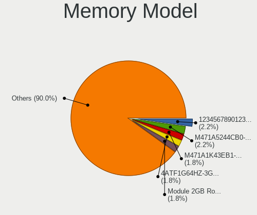

| Model                                                            | Notebooks | Percent |
|------------------------------------------------------------------|-----------|---------|
| Unknown (ABCD) RAM 123456789012345678 2GB SODIMM LPDDR3 2400MT/s | 6         | 2.21%   |
| Samsung RAM M471A5244CB0-CWE 4096MB SODIMM DDR4 3200MT/s         | 6         | 2.21%   |
| Samsung RAM M471A1K43EB1-CWE 8GB SODIMM DDR4 3200MT/s            | 5         | 1.85%   |
| Micron RAM 4ATF1G64HZ-3G2F1 8GB SODIMM DDR4 3200MT/s             | 5         | 1.85%   |
| Unknown                                                          | 5         | 1.85%   |
| SK hynix RAM HMT351S6CFR8C-PB 4GB SODIMM DDR3 1600MT/s           | 4         | 1.48%   |
| Samsung RAM M471B5273DH0-CH9 4GB SODIMM DDR3 1334MT/s            | 4         | 1.48%   |
| Unknown RAM Module 4GB SODIMM DDR3                               | 3         | 1.11%   |
| Unknown RAM Module 2GB SODIMM DDR2 667MT/s                       | 3         | 1.11%   |
| SK hynix RAM HMAA1GS6CJR6N-XN 8GB Row Of Chips DDR4 3200MT/s     | 3         | 1.11%   |
| SK hynix RAM HMA81GS6AFR8N-UH 8GB SODIMM DDR4 2667MT/s           | 3         | 1.11%   |
| Samsung RAM Module 8GB SODIMM DDR4 2400MT/s                      | 3         | 1.11%   |
| Samsung RAM M471A1G44AB0-CWE 8GB SODIMM DDR4 3200MT/s            | 3         | 1.11%   |
| Samsung RAM M471A1G44AB0-CWE 8GB Row Of Chips DDR4 3200MT/s      | 3         | 1.11%   |
| Micron RAM MT62F1G32D4DR-031 2GB Row Of Chips LPDDR5 6400MT/s    | 3         | 1.11%   |
| Micron RAM 4ATF1G64HZ-3G2E1 8GB Row Of Chips DDR4 3200MT/s       | 3         | 1.11%   |
| Unknown RAM Module 2GB SODIMM SDRAM                              | 2         | 0.74%   |
| Unknown RAM Module 2GB SODIMM DDR2 800MT/s                       | 2         | 0.74%   |
| SK hynix RAM Module 4GB SODIMM DDR3 1600MT/s                     | 2         | 0.74%   |
| SK hynix RAM HMT451S6BFR8A-PB 4096MB SODIMM DDR3 1600MT/s        | 2         | 0.74%   |
| SK hynix RAM HMT351S6EFR8A-PB 4GB SODIMM DDR3 1600MT/s           | 2         | 0.74%   |
| SK hynix RAM HMCG78MEBSA095N 16GB SODIMM DDR5 4800MT/s           | 2         | 0.74%   |
| SK hynix RAM HMAG68EXNSA051N 8GB SODIMM DDR4 3200MT/s            | 2         | 0.74%   |
| SK hynix RAM HMAA1GS6CJR6N-XN 8GB SODIMM DDR4 3200MT/s           | 2         | 0.74%   |
| SK hynix RAM HMA851S6DJR6N-XN 4GB Row Of Chips DDR4 3200MT/s     | 2         | 0.74%   |
| SK hynix RAM HMA851S6CJR6N-VK 4GB SODIMM DDR4 2667MT/s           | 2         | 0.74%   |
| SK hynix RAM HMA81GS6DJR8N-XN 8GB SODIMM DDR4 3200MT/s           | 2         | 0.74%   |
| SK hynix RAM H9JCNNNCP3MLYR-N6E 2GB Row Of Chips LPDDR5 6400MT/s | 2         | 0.74%   |
| Samsung RAM Module 2GB SODIMM DDR3 1600MT/s                      | 2         | 0.74%   |
| Samsung RAM M471B5173EB0-YK0 4GB SODIMM DDR3 1600MT/s            | 2         | 0.74%   |
| Samsung RAM M471B5173DB0-YK0 4GB SODIMM DDR3 1600MT/s            | 2         | 0.74%   |
| Samsung RAM M471A5244CB0-CTD 4GB SODIMM DDR4 3266MT/s            | 2         | 0.74%   |
| Samsung RAM M471A5244CB0-CRC 4GB SODIMM DDR4 2667MT/s            | 2         | 0.74%   |
| Samsung RAM M471A1K43DB1-CTD 8GB SODIMM DDR4 2667MT/s            | 2         | 0.74%   |
| Samsung RAM M471A1K43CB1-CRC 8GB SODIMM DDR4 2667MT/s            | 2         | 0.74%   |
| Samsung RAM M471A1G44BB0-CWE 8GB SODIMM DDR4 3200MT/s            | 2         | 0.74%   |
| Samsung RAM M425R2GA3BB0-CWMOD 16GB SODIMM DDR5 5600MT/s         | 2         | 0.74%   |
| Samsung RAM M425R1GB4BB0-CQKOL 8GB SODIMM DDR5 4800MT/s          | 2         | 0.74%   |
| Micron RAM MTC4C10163S1SC48BA1 8GB SODIMM DDR5 4800MT/s          | 2         | 0.74%   |
| Micron RAM 8KTF51264HZ-1G6E1 4GB SODIMM DDR3 1600MT/s            | 2         | 0.74%   |

Memory Kind
-----------

Memory module kinds

| Kind    | Notebooks | Percent |
|---------|-----------|---------|
| DDR4    | 97        | 44.09%  |
| DDR3    | 61        | 27.73%  |
| LPDDR4  | 20        | 9.09%   |
| LPDDR5  | 15        | 6.82%   |
| DDR5    | 10        | 4.55%   |
| DDR2    | 7         | 3.18%   |
| SDRAM   | 6         | 2.73%   |
| LPDDR3  | 3         | 1.36%   |
| Unknown | 1         | 0.45%   |

Memory Form Factor
------------------

Physical design of the memory module

| Name         | Notebooks | Percent |
|--------------|-----------|---------|
| SODIMM       | 182       | 81.61%  |
| Row Of Chips | 36        | 16.14%  |
| DIMM         | 2         | 0.9%    |
| Unknown      | 2         | 0.9%    |
| Chip         | 1         | 0.45%   |

Memory Size
-----------

Memory module size

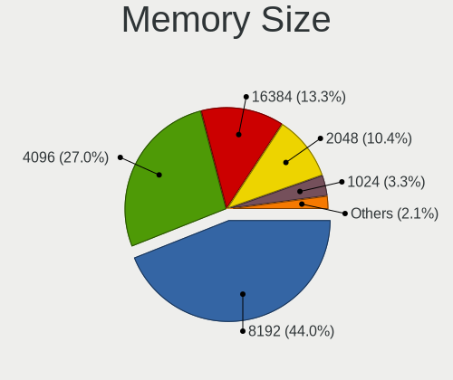

| Size  | Notebooks | Percent |
|-------|-----------|---------|
| 8192  | 106       | 43.98%  |
| 4096  | 65        | 26.97%  |
| 16384 | 32        | 13.28%  |
| 2048  | 25        | 10.37%  |
| 1024  | 8         | 3.32%   |
| 32768 | 4         | 1.66%   |
| 12288 | 1         | 0.41%   |

Memory Speed
------------

Memory module speed

| Speed   | Notebooks | Percent |
|---------|-----------|---------|
| 3200    | 58        | 25.11%  |
| 1600    | 44        | 19.05%  |
| 2667    | 31        | 13.42%  |
| 2400    | 18        | 7.79%   |
| 6400    | 10        | 4.33%   |
| Unknown | 8         | 3.46%   |
| 1334    | 7         | 3.03%   |
| 1333    | 7         | 3.03%   |
| 4800    | 6         | 2.6%    |
| 4267    | 6         | 2.6%    |
| 5600    | 4         | 1.73%   |
| 2133    | 4         | 1.73%   |
| 1067    | 4         | 1.73%   |
| 667     | 4         | 1.73%   |
| 800     | 3         | 1.3%    |
| 7500    | 2         | 0.87%   |
| 4266    | 2         | 0.87%   |
| 4199    | 2         | 0.87%   |
| 3266    | 2         | 0.87%   |
| 1066    | 2         | 0.87%   |
| 8533    | 1         | 0.43%   |
| 7467    | 1         | 0.43%   |
| 5500    | 1         | 0.43%   |
| 3733    | 1         | 0.43%   |
| 2933    | 1         | 0.43%   |
| 2048    | 1         | 0.43%   |
| 1867    | 1         | 0.43%   |

Printers & scanners
-------------------

Printer Vendor
--------------

Printer device vendors

| Vendor              | Notebooks | Percent |
|---------------------|-----------|---------|
| Hewlett-Packard     | 7         | 46.67%  |
| Seiko Epson         | 3         | 20%     |
| Zebra               | 1         | 6.67%   |
| Samsung Electronics | 1         | 6.67%   |
| Dymo-CoStar         | 1         | 6.67%   |
| Canon               | 1         | 6.67%   |
| Brother Industries  | 1         | 6.67%   |

Printer Model
-------------

Printer device models

| Model                       | Notebooks | Percent |
|-----------------------------|-----------|---------|
| Zebra GK420d Label Printer  | 1         | 6.67%   |
| Seiko Epson XP-4100 Series  | 1         | 6.67%   |
| Seiko Epson TM-T20X         | 1         | 6.67%   |
| Seiko Epson L3150 Series    | 1         | 6.67%   |
| Samsung C43x Series         | 1         | 6.67%   |
| HP Smart Tank 500 series    | 1         | 6.67%   |
| HP Printing Support         | 1         | 6.67%   |
| HP LaserJet 1020            | 1         | 6.67%   |
| HP LaserJet 1010            | 1         | 6.67%   |
| HP HP LaserJet M14-M17      | 1         | 6.67%   |
| HP ENVY 4520 series         | 1         | 6.67%   |
| HP DeskJet 2130 series      | 1         | 6.67%   |
| Dymo-CoStar LabelWriter 450 | 1         | 6.67%   |
| Canon TS3100 series         | 1         | 6.67%   |
| Brother MFC-J200            | 1         | 6.67%   |

Scanner Vendor
--------------

Scanner device vendors

| Vendor      | Notebooks | Percent |
|-------------|-----------|---------|
| Canon       | 2         | 66.67%  |
| Seiko Epson | 1         | 33.33%  |

Scanner Model
-------------

Scanner device models

| Model                                             | Notebooks | Percent |
|---------------------------------------------------|-----------|---------|
| Seiko Epson GT-7300U [Perfection 1260/1260 PHOTO] | 1         | 33.33%  |
| Canon CanoScan N670U/N676U/LiDE 20                | 1         | 33.33%  |
| Canon CanoScan LiDE 110                           | 1         | 33.33%  |

Camera
------

Camera Vendor
-------------

Camera device vendors

| Vendor                                 | Notebooks | Percent |
|----------------------------------------|-----------|---------|
| Chicony Electronics                    | 286       | 22.41%  |
| Microdia                               | 99        | 7.76%   |
| Realtek Semiconductor                  | 98        | 7.68%   |
| IMC Networks                           | 97        | 7.6%    |
| Bison Electronics                      | 83        | 6.5%    |
| Sunplus Innovation Technology          | 76        | 5.96%   |
| Quanta                                 | 72        | 5.64%   |
| Suyin                                  | 58        | 4.55%   |
| Cheng Uei Precision Industry (Foxlink) | 53        | 4.15%   |
| Apple                                  | 47        | 3.68%   |
| Lite-On Technology                     | 27        | 2.12%   |
| Syntek                                 | 26        | 2.04%   |
| Silicon Motion                         | 26        | 2.04%   |
| Alcor Micro                            | 25        | 1.96%   |
| Sonix Technology                       | 24        | 1.88%   |
| Luxvisions Innotech Limited            | 23        | 1.8%    |
| Acer                                   | 17        | 1.33%   |
| Ricoh                                  | 16        | 1.25%   |
| SunplusIT                              | 15        | 1.18%   |
| Logitech                               | 12        | 0.94%   |
| icSpring                               | 12        | 0.94%   |
| Shinetech                              | 11        | 0.86%   |
| Samsung Electronics                    | 7         | 0.55%   |
| Importek                               | 6         | 0.47%   |
| Shine-optics                           | 5         | 0.39%   |
| Primax Electronics                     | 5         | 0.39%   |
| Lenovo                                 | 5         | 0.39%   |
| Y Media                                | 4         | 0.31%   |
| DigiTech                               | 4         | 0.31%   |
| ALi                                    | 4         | 0.31%   |
| Unknown                                | 4         | 0.31%   |
| Sunwingroup                            | 2         | 0.16%   |
| Sunplus Technology                     | 2         | 0.16%   |
| OmniVision Technologies                | 2         | 0.16%   |
| Nebraska Furniture Mart                | 2         | 0.16%   |
| Genesys Logic                          | 2         | 0.16%   |
| TXD                                    | 1         | 0.08%   |
| Tripath Technology                     | 1         | 0.08%   |
| Shenzhen Kingcome Optoelectronic       | 1         | 0.08%   |
| SenseTek                               | 1         | 0.08%   |

Camera Model
------------

Camera device models

| Model                                                          | Notebooks | Percent |
|----------------------------------------------------------------|-----------|---------|
| Chicony Integrated Camera                                      | 45        | 3.52%   |
| Bison Integrated Camera                                        | 33        | 2.58%   |
| Microdia Integrated_Webcam_HD                                  | 27        | 2.11%   |
| Realtek Integrated_Webcam_HD                                   | 25        | 1.95%   |
| IMC Networks USB2.0 HD UVC WebCam                              | 25        | 1.95%   |
| IMC Networks Integrated Camera                                 | 22        | 1.72%   |
| Apple Built-in iSight                                          | 19        | 1.48%   |
| Chicony HP TrueVision HD Camera                                | 17        | 1.33%   |
| Sunplus Integrated_Webcam_HD                                   | 16        | 1.25%   |
| Realtek USB Camera                                             | 16        | 1.25%   |
| Apple FaceTime HD Camera                                       | 16        | 1.25%   |
| Chicony HD Webcam                                              | 15        | 1.17%   |
| Syntek Integrated Camera                                       | 13        | 1.02%   |
| Sunplus HD WebCam                                              | 13        | 1.02%   |
| Chicony HP Truevision HD                                       | 13        | 1.02%   |
| Alcor Micro USB 2.0 Camera                                     | 13        | 1.02%   |
| Suyin HP Truevision HD                                         | 12        | 0.94%   |
| Sonix USB2.0 HD UVC WebCam                                     | 12        | 0.94%   |
| Microdia Integrated Webcam                                     | 12        | 0.94%   |
| icSpring camera                                                | 12        | 0.94%   |
| Chicony TOSHIBA Web Camera - HD                                | 12        | 0.94%   |
| Chicony HP HD Camera                                           | 12        | 0.94%   |
| Quanta HD User Facing                                          | 11        | 0.86%   |
| Chicony HP HD Webcam                                           | 11        | 0.86%   |
| Sonix USB2.0 FHD UVC WebCam                                    | 10        | 0.78%   |
| Lite-On HP HD Camera                                           | 10        | 0.78%   |
| IMC Networks USB2.0 VGA UVC WebCam                             | 10        | 0.78%   |
| Realtek Integrated Webcam                                      | 9         | 0.7%    |
| IMC Networks HD Camera                                         | 9         | 0.7%    |
| Chicony FJ Camera                                              | 9         | 0.7%    |
| Chicony EasyCamera                                             | 9         | 0.7%    |
| Sunplus Laptop_Integrated_Webcam_FHD                           | 8         | 0.63%   |
| Lite-On Integrated Camera                                      | 8         | 0.63%   |
| Chicony USB2.0 HD UVC WebCam                                   | 8         | 0.63%   |
| Chicony HD User Facing                                         | 8         | 0.63%   |
| Cheng Uei Precision Industry (Foxlink) HP TrueVision HD Camera | 8         | 0.63%   |
| Acer Integrated Camera                                         | 8         | 0.63%   |
| Samsung Galaxy series, misc. (MTP mode)                        | 7         | 0.55%   |
| Quanta HP Wide Vision HD Camera                                | 7         | 0.55%   |
| Microdia USB 2.0 Camera                                        | 7         | 0.55%   |

Security
--------

Fingerprint Vendor
------------------

Fingerprint sensor vendors

| Vendor                             | Notebooks | Percent |
|------------------------------------|-----------|---------|
| Validity Sensors                   | 110       | 52.38%  |
| Synaptics                          | 27        | 12.86%  |
| Shenzhen Goodix Technology         | 25        | 11.9%   |
| AuthenTec                          | 16        | 7.62%   |
| Upek                               | 12        | 5.71%   |
| Elan Microelectronics              | 9         | 4.29%   |
| LighTuning Technology              | 4         | 1.9%    |
| Realtek USB2.0 Finger Print Bridge | 3         | 1.43%   |
| STMicroelectronics                 | 1         | 0.48%   |
| Samsung Electronics                | 1         | 0.48%   |
| FocalTech                          | 1         | 0.48%   |
| Focal-systems.Corp                 | 1         | 0.48%   |

Fingerprint Model
-----------------

Fingerprint sensor models

| Model                                                                      | Notebooks | Percent |
|----------------------------------------------------------------------------|-----------|---------|
| Validity Sensors VFS495 Fingerprint Reader                                 | 28        | 13.33%  |
| Shenzhen Goodix  FingerPrint Device                                        | 17        | 8.1%    |
| Validity Sensors VFS5011 Fingerprint Reader                                | 13        | 6.19%   |
| Validity Sensors VFS 5011 fingerprint sensor                               | 11        | 5.24%   |
| Upek Biometric Touchchip/Touchstrip Fingerprint Sensor                     | 11        | 5.24%   |
| Validity Sensors VFS471 Fingerprint Reader                                 | 10        | 4.76%   |
| Validity Sensors Synaptics WBDI                                            | 10        | 4.76%   |
| Validity Sensors Fingerprint scanner                                       | 9         | 4.29%   |
| Synaptics Metallica MIS Touch Fingerprint Reader                           | 8         | 3.81%   |
| Validity Sensors Synaptics VFS7552 Touch Fingerprint Sensor with PurePrint | 6         | 2.86%   |
| AuthenTec AES1600                                                          | 6         | 2.86%   |
| Validity Sensors VFS491                                                    | 5         | 2.38%   |
| Validity Sensors Swipe Fingerprint Sensor                                  | 5         | 2.38%   |
| Synaptics Fingerprint reader [HP G6]                                       | 5         | 2.38%   |
| Elan ELAN:ARM-M4                                                           | 5         | 2.38%   |
| AuthenTec AES2501 Fingerprint Sensor                                       | 5         | 2.38%   |
| Validity Sensors VFS451 Fingerprint Reader                                 | 4         | 1.9%    |
| Shenzhen Goodix Fingerprint Reader                                         | 4         | 1.9%    |
| Shenzhen Goodix FingerPrint                                                | 4         | 1.9%    |
| AuthenTec AES2810                                                          | 4         | 1.9%    |
| Validity Sensors VFS Fingerprint sensor                                    | 3         | 1.43%   |
| Synaptics Prometheus MIS Touch Fingerprint Reader                          | 3         | 1.43%   |
| Synaptics FS7604 Touch Fingerprint Sensor with PurePrint                   | 3         | 1.43%   |
| Realtek USB2.0 Finger Print Bridge FocalTech Fingerprint Device            | 3         | 1.43%   |
| LighTuning Fingerprint Reader                                              | 3         | 1.43%   |
| Elan ELAN:Fingerprint                                                      | 3         | 1.43%   |
| Validity Sensors VFS7500 Touch Fingerprint Sensor                          | 2         | 0.95%   |
| Validity Sensors VFS301 Fingerprint Reader                                 | 2         | 0.95%   |
| Validity Sensors VFS101 Fingerprint Reader                                 | 2         | 0.95%   |
| Synaptics UWP WBDI Device                                                  | 2         | 0.95%   |
| Synaptics  WBDI                                                            | 2         | 0.95%   |
| Synaptics Metallica MOH Touch Fingerprint Reader                           | 2         | 0.95%   |
| Upek TCS5B Fingerprint sensor                                              | 1         | 0.48%   |
| Synaptics UWP WBDI                                                         | 1         | 0.48%   |
| Synaptics  FS7604 Touch Fingerprint Sensor with PurePrint                  | 1         | 0.48%   |
| STMicroelectronics Fingerprint Reader                                      | 1         | 0.48%   |
| Samsung Fingerprint Device                                                 | 1         | 0.48%   |
| LighTuning ES603 Swipe Fingerprint Sensor                                  | 1         | 0.48%   |
| FocalTech FocalTech Fingerprint Device                                     | 1         | 0.48%   |
| Focal-systems.Corp FT9201Fingerprint.                                  | 1         | 0.48%   |

Chipcard Vendor
---------------

Chipcard module vendors

| Vendor                            | Notebooks | Percent |
|-----------------------------------|-----------|---------|
| Broadcom                          | 62        | 56.88%  |
| Alcor Micro                       | 16        | 14.68%  |
| Upek                              | 11        | 10.09%  |
| Lenovo                            | 7         | 6.42%   |
| O2 Micro                          | 6         | 5.5%    |
| SCM Microsystems                  | 2         | 1.83%   |
| VASCO Data Security International | 1         | 0.92%   |
| Reiner SCT Kartensysteme          | 1         | 0.92%   |
| Gemalto (was Gemplus)             | 1         | 0.92%   |
| Chicony Electronics               | 1         | 0.92%   |
| Athena Smartcard Solutions        | 1         | 0.92%   |

Chipcard Model
--------------

Chipcard module models

| Model                                                                        | Notebooks | Percent |
|------------------------------------------------------------------------------|-----------|---------|
| Broadcom BCM5880 Secure Applications Processor                               | 27        | 24.77%  |
| Alcor Micro AU9540 Smartcard Reader                                          | 16        | 14.68%  |
| Broadcom 5880                                                                | 13        | 11.93%  |
| Upek TouchChip Fingerprint Coprocessor (WBF advanced mode)                   | 11        | 10.09%  |
| Broadcom BCM5880 Secure Applications Processor with fingerprint swipe sensor | 11        | 10.09%  |
| Broadcom 58200                                                               | 11        | 10.09%  |
| Lenovo Integrated Smart Card Reader                                          | 7         | 6.42%   |
| O2 Micro OZ776 CCID Smartcard Reader                                         | 6         | 5.5%    |
| VASCO Data Security International DIGIPASS 870                               | 1         | 0.92%   |
| SCM Microsystems SCR35xx Smart Card Reader                                   | 1         | 0.92%   |
| SCM Microsystems SCR3340 - ExpressCard54 Smart Card Reader                   | 1         | 0.92%   |
| Reiner SCT Kartensysteme cyberJack RFID basis contactless smartcard reader   | 1         | 0.92%   |
| Gemalto (was Gemplus) GemPC Twin SmartCard Reader                            | 1         | 0.92%   |
| Chicony Electronics HP Skylab USB Smartcard Keyboard                         | 1         | 0.92%   |
| Athena Smartcard Solutions ASEDrive V3C                                      | 1         | 0.92%   |

Unsupported
-----------

Unsupported Devices
-------------------

Total unsupported devices on board

| Total | Notebooks | Percent |
|-------|-----------|---------|
| 0     | 857       | 58.78%  |
| 1     | 491       | 33.68%  |
| 2     | 97        | 6.65%   |
| 3     | 12        | 0.82%   |
| 5     | 1         | 0.07%   |

Unsupported Device Types
------------------------

Types of unsupported devices

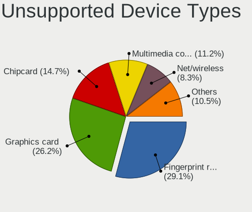

| Type                     | Notebooks | Percent |
|--------------------------|-----------|---------|
| Fingerprint reader       | 208       | 29.13%  |
| Graphics card            | 187       | 26.19%  |
| Chipcard                 | 105       | 14.71%  |
| Multimedia controller    | 80        | 11.2%   |
| Net/wireless             | 59        | 8.26%   |
| Camera                   | 22        | 3.08%   |
| Storage                  | 20        | 2.8%    |
| Bluetooth                | 16        | 2.24%   |
| Sound                    | 4         | 0.56%   |
| Net/ethernet             | 4         | 0.56%   |
| Communication controller | 3         | 0.42%   |
| Storage/ide              | 2         | 0.28%   |
| Network                  | 2         | 0.28%   |
| Unclassified device      | 1         | 0.14%   |
| Card reader              | 1         | 0.14%   |

