Zorin 17 - Tested Hardware & Statistics
---------------------------------------

A project to collect tested hardware configurations for Zorin 17.

Anyone can contribute to this report by the [hw-probe](https://github.com/linuxhw/hw-probe) tool:

    sudo -E hw-probe -all -upload

Please contribute! Especially if your hardware is rare.

This is a report for all computer types. See also reports for [desktops](/Dist/Zorin_17/Desktop/README.md) and [notebooks](/Dist/Zorin_17/Notebook/README.md).

Contents
--------

* [ Test Cases ](#test-cases)

* [ System ](#system)
  - [ Kernel                   ](#kernel)
  - [ Kernel Family            ](#kernel-family)
  - [ Kernel Major Ver.        ](#kernel-major-ver)
  - [ Arch                     ](#arch)
  - [ DE                       ](#de)
  - [ Display Server           ](#display-server)
  - [ Display Manager          ](#display-manager)
  - [ OS Lang                  ](#os-lang)
  - [ Boot Mode                ](#boot-mode)
  - [ Filesystem               ](#filesystem)
  - [ Part. scheme             ](#part-scheme)
  - [ Dual Boot with Linux/BSD ](#dual-boot-with-linuxbsd)
  - [ Dual Boot (Win)          ](#dual-boot-win)

* [ Board ](#board)
  - [ Vendor                   ](#vendor)
  - [ Model                    ](#model)
  - [ Model Family             ](#model-family)
  - [ MFG Year                 ](#mfg-year)
  - [ Form Factor              ](#form-factor)
  - [ Secure Boot              ](#secure-boot)
  - [ Coreboot                 ](#coreboot)
  - [ RAM Size                 ](#ram-size)
  - [ RAM Used                 ](#ram-used)
  - [ Total Drives             ](#total-drives)
  - [ Has CD-ROM               ](#has-cd-rom)
  - [ Has Ethernet             ](#has-ethernet)
  - [ Has WiFi                 ](#has-wifi)
  - [ Has Bluetooth            ](#has-bluetooth)

* [ Location ](#location)
  - [ Country                  ](#country)
  - [ City                     ](#city)

* [ Drives ](#drives)
  - [ Drive Vendor             ](#drive-vendor)
  - [ Drive Model              ](#drive-model)
  - [ HDD Vendor               ](#hdd-vendor)
  - [ SSD Vendor               ](#ssd-vendor)
  - [ Drive Kind               ](#drive-kind)
  - [ Drive Connector          ](#drive-connector)
  - [ Drive Size               ](#drive-size)
  - [ Space Total              ](#space-total)
  - [ Space Used               ](#space-used)
  - [ Malfunc. Drives          ](#malfunc-drives)
  - [ Malfunc. Drive Vendor    ](#malfunc-drive-vendor)
  - [ Malfunc. HDD Vendor      ](#malfunc-hdd-vendor)
  - [ Malfunc. Drive Kind      ](#malfunc-drive-kind)
  - [ Failed Drives            ](#failed-drives)
  - [ Failed Drive Vendor      ](#failed-drive-vendor)
  - [ Drive Status             ](#drive-status)

* [ Storage controller ](#storage-controller)
  - [ Storage Vendor           ](#storage-vendor)
  - [ Storage Model            ](#storage-model)
  - [ Storage Kind             ](#storage-kind)

* [ Processor ](#processor)
  - [ CPU Vendor               ](#cpu-vendor)
  - [ CPU Model                ](#cpu-model)
  - [ CPU Model Family         ](#cpu-model-family)
  - [ CPU Cores                ](#cpu-cores)
  - [ CPU Sockets              ](#cpu-sockets)
  - [ CPU Threads              ](#cpu-threads)
  - [ CPU Op-Modes             ](#cpu-op-modes)
  - [ CPU Microcode            ](#cpu-microcode)
  - [ CPU Microarch            ](#cpu-microarch)

* [ Graphics ](#graphics)
  - [ GPU Vendor               ](#gpu-vendor)
  - [ GPU Model                ](#gpu-model)
  - [ GPU Combo                ](#gpu-combo)
  - [ GPU Driver               ](#gpu-driver)
  - [ GPU Memory               ](#gpu-memory)

* [ Monitor ](#monitor)
  - [ Monitor Vendor           ](#monitor-vendor)
  - [ Monitor Model            ](#monitor-model)
  - [ Monitor Resolution       ](#monitor-resolution)
  - [ Monitor Diagonal         ](#monitor-diagonal)
  - [ Monitor Width            ](#monitor-width)
  - [ Aspect Ratio             ](#aspect-ratio)
  - [ Monitor Area             ](#monitor-area)
  - [ Pixel Density            ](#pixel-density)
  - [ Multiple Monitors        ](#multiple-monitors)

* [ Network ](#network)
  - [ Net Controller Vendor    ](#net-controller-vendor)
  - [ Net Controller Model     ](#net-controller-model)
  - [ Wireless Vendor          ](#wireless-vendor)
  - [ Wireless Model           ](#wireless-model)
  - [ Ethernet Vendor          ](#ethernet-vendor)
  - [ Ethernet Model           ](#ethernet-model)
  - [ Net Controller Kind      ](#net-controller-kind)
  - [ Used Controller          ](#used-controller)
  - [ NICs                     ](#nics)
  - [ IPv6                     ](#ipv6)

* [ Bluetooth ](#bluetooth)
  - [ Bluetooth Vendor         ](#bluetooth-vendor)
  - [ Bluetooth Model          ](#bluetooth-model)

* [ Sound ](#sound)
  - [ Sound Vendor             ](#sound-vendor)
  - [ Sound Model              ](#sound-model)

* [ Memory ](#memory)
  - [ Memory Vendor            ](#memory-vendor)
  - [ Memory Model             ](#memory-model)
  - [ Memory Kind              ](#memory-kind)
  - [ Memory Form Factor       ](#memory-form-factor)
  - [ Memory Size              ](#memory-size)
  - [ Memory Speed             ](#memory-speed)

* [ Printers & scanners ](#printers--scanners)
  - [ Printer Vendor           ](#printer-vendor)
  - [ Printer Model            ](#printer-model)
  - [ Scanner Vendor           ](#scanner-vendor)
  - [ Scanner Model            ](#scanner-model)

* [ Camera ](#camera)
  - [ Camera Vendor            ](#camera-vendor)
  - [ Camera Model             ](#camera-model)

* [ Security ](#security)
  - [ Fingerprint Vendor       ](#fingerprint-vendor)
  - [ Fingerprint Model        ](#fingerprint-model)
  - [ Chipcard Vendor          ](#chipcard-vendor)
  - [ Chipcard Model           ](#chipcard-model)

* [ Unsupported ](#unsupported)
  - [ Unsupported Devices      ](#unsupported-devices)
  - [ Unsupported Device Types ](#unsupported-device-types)

Test Cases
----------

Total: 1277

| Vendor        | Model                       | Form-Factor | Probe                                                      | Date         |
|---------------|-----------------------------|-------------|------------------------------------------------------------|--------------|
| HP            | ProBook 650 G3              | Notebook    | [9bfb6a8afd](https://linux-hardware.org/?probe=9bfb6a8afd) | May 09, 2024 |
| HONOR         | BBR-WAX9                    | Notebook    | [be1a16a925](https://linux-hardware.org/?probe=be1a16a925) | May 09, 2024 |
| HONOR         | BBR-WAX9                    | Notebook    | [8c9db99956](https://linux-hardware.org/?probe=8c9db99956) | May 09, 2024 |
| MSI           | H310M PRO-VD                | Desktop     | [586c4844be](https://linux-hardware.org/?probe=586c4844be) | May 09, 2024 |
| Ultra         | UB42X                       | Notebook    | [b7f2dbd777](https://linux-hardware.org/?probe=b7f2dbd777) | May 09, 2024 |
| Ultra         | UB42X                       | Notebook    | [4597d0586d](https://linux-hardware.org/?probe=4597d0586d) | May 08, 2024 |
| Sony          | VPCEB1S1E                   | Notebook    | [551a1d2f64](https://linux-hardware.org/?probe=551a1d2f64) | May 08, 2024 |
| Lenovo        | 110536U ThinkServer TS13... | Desktop     | [d3196733cd](https://linux-hardware.org/?probe=d3196733cd) | May 08, 2024 |
| HP            | ProBook 6460b               | Notebook    | [14aa46f09d](https://linux-hardware.org/?probe=14aa46f09d) | May 08, 2024 |
| Infinix       | INBOOK Y1 PLUS NEO          | Notebook    | [253042bbd9](https://linux-hardware.org/?probe=253042bbd9) | May 08, 2024 |
| ASUSTek       | P8H77-V LE                  | Desktop     | [e896127dc3](https://linux-hardware.org/?probe=e896127dc3) | May 08, 2024 |
| Sony          | VGN-CR31S_W                 | Notebook    | [7e7d96c020](https://linux-hardware.org/?probe=7e7d96c020) | May 08, 2024 |
| ASUSTek       | VivoBook_ASUSLaptop M160... | Notebook    | [b18d2c1ec2](https://linux-hardware.org/?probe=b18d2c1ec2) | May 08, 2024 |
| Lenovo        | G580 20150                  | Notebook    | [3a9861e2be](https://linux-hardware.org/?probe=3a9861e2be) | May 08, 2024 |
| Lenovo        | ThinkPad Edge 031946U       | Notebook    | [8f8fb39c6e](https://linux-hardware.org/?probe=8f8fb39c6e) | May 08, 2024 |
| NEC Comput... | PC-LS350SSB                 | Notebook    | [530b3713dd](https://linux-hardware.org/?probe=530b3713dd) | May 08, 2024 |
| ASUSTek       | X540SA                      | Notebook    | [456909c790](https://linux-hardware.org/?probe=456909c790) | May 08, 2024 |
| Unknown       | Unknown                     | Desktop     | [14f9a58589](https://linux-hardware.org/?probe=14f9a58589) | May 08, 2024 |
| Samsung       | 530XBB                      | Notebook    | [5c0772cde4](https://linux-hardware.org/?probe=5c0772cde4) | May 07, 2024 |
| Lenovo        | IdeaPad C340-15IML 81TL     | Convertible | [467c035ce1](https://linux-hardware.org/?probe=467c035ce1) | May 07, 2024 |
| Daten Tecn... | DT02-M4                     | Notebook    | [88093023ed](https://linux-hardware.org/?probe=88093023ed) | May 07, 2024 |
| ASUSTek       | Zenbook S 13 UX5304VA_UX... | Notebook    | [1c72c07e3d](https://linux-hardware.org/?probe=1c72c07e3d) | May 07, 2024 |
| ASUSTek       | S451LA                      | Notebook    | [f3720aa6f9](https://linux-hardware.org/?probe=f3720aa6f9) | May 07, 2024 |
| Alienware     | m15 R7                      | Notebook    | [445b29da20](https://linux-hardware.org/?probe=445b29da20) | May 06, 2024 |
| Lenovo        | ThinkPad X1 Yoga 2nd 20J... | Convertible | [bf13a8edca](https://linux-hardware.org/?probe=bf13a8edca) | May 06, 2024 |
| Lenovo        | E31-80 80MX                 | Notebook    | [1c9fd17eff](https://linux-hardware.org/?probe=1c9fd17eff) | May 06, 2024 |
| Dell          | Latitude E5410              | Notebook    | [0038eadd32](https://linux-hardware.org/?probe=0038eadd32) | May 06, 2024 |
| Notebook      | NS5x_NS7xPU                 | Notebook    | [657a003a54](https://linux-hardware.org/?probe=657a003a54) | May 06, 2024 |
| HP            | Pavilion 15                 | Notebook    | [77f8425176](https://linux-hardware.org/?probe=77f8425176) | May 06, 2024 |
| GEEKOM        | Mini IT12                   | Desktop     | [bf478cb069](https://linux-hardware.org/?probe=bf478cb069) | May 06, 2024 |
| ASUSTek       | P2540UA                     | Notebook    | [ea9ddf3f6e](https://linux-hardware.org/?probe=ea9ddf3f6e) | May 06, 2024 |
| HP            | 8906 SMVB                   | Desktop     | [16dcd59b91](https://linux-hardware.org/?probe=16dcd59b91) | May 06, 2024 |
| Dell          | Inspiron N4050              | Notebook    | [0b1ac68bc9](https://linux-hardware.org/?probe=0b1ac68bc9) | May 06, 2024 |
| Medion        | MS-7366                     | Desktop     | [0c36270a48](https://linux-hardware.org/?probe=0c36270a48) | May 06, 2024 |
| HP            | Laptop 14-fq0xxx            | Notebook    | [528dc99ca7](https://linux-hardware.org/?probe=528dc99ca7) | May 05, 2024 |
| MSI           | PRO X670-P WIFI             | Desktop     | [a411b722e3](https://linux-hardware.org/?probe=a411b722e3) | May 05, 2024 |
| Unknown       | Unknown                     | Desktop     | [d676549abd](https://linux-hardware.org/?probe=d676549abd) | May 05, 2024 |
| Dell          | Latitude 3420               | Notebook    | [a28c6852fe](https://linux-hardware.org/?probe=a28c6852fe) | May 05, 2024 |
| Lenovo        | Flex 3-1130 80LY            | Notebook    | [3786d9e8e2](https://linux-hardware.org/?probe=3786d9e8e2) | May 05, 2024 |
| ASRock        | B450M-HDV R4.0              | Desktop     | [fc52b48b01](https://linux-hardware.org/?probe=fc52b48b01) | May 05, 2024 |
| Panasonic     | FZM1-3                      | Tablet      | [8a7d985c38](https://linux-hardware.org/?probe=8a7d985c38) | May 05, 2024 |
| Acer          | Aspire A315-510P            | Notebook    | [eb9fc84dcf](https://linux-hardware.org/?probe=eb9fc84dcf) | May 05, 2024 |
| HP            | Notebook                    | Notebook    | [27cafe3bf5](https://linux-hardware.org/?probe=27cafe3bf5) | May 05, 2024 |
| ECS           | P45T-A                      | Desktop     | [c1f450f8a1](https://linux-hardware.org/?probe=c1f450f8a1) | May 04, 2024 |
| Lenovo        | IdeaPad 710S Plus-13IKB ... | Notebook    | [b950303950](https://linux-hardware.org/?probe=b950303950) | May 04, 2024 |
| Lenovo        | IdeaPad 710S Plus-13IKB ... | Notebook    | [f4e6daf83f](https://linux-hardware.org/?probe=f4e6daf83f) | May 04, 2024 |
| Samsung       | 270E5J/2570EJ               | Notebook    | [1349bac413](https://linux-hardware.org/?probe=1349bac413) | May 04, 2024 |
| Gigabyte      | EP43-S3L                    | Desktop     | [96cd4e9337](https://linux-hardware.org/?probe=96cd4e9337) | May 04, 2024 |
| Gigabyte      | H61M-S2P                    | Desktop     | [157cc8b4cc](https://linux-hardware.org/?probe=157cc8b4cc) | May 04, 2024 |
| HP            | ProBook 645 G1              | Notebook    | [02d7e5f984](https://linux-hardware.org/?probe=02d7e5f984) | May 04, 2024 |
| HP            | 1000                        | Notebook    | [c2783cbe1f](https://linux-hardware.org/?probe=c2783cbe1f) | May 04, 2024 |
| Lenovo        | IdeaPad Slim 5 16ABR8 82... | Notebook    | [bcb2994b33](https://linux-hardware.org/?probe=bcb2994b33) | May 04, 2024 |
| Dell          | Latitude E5520              | Notebook    | [0c2c1716be](https://linux-hardware.org/?probe=0c2c1716be) | May 04, 2024 |
| Toshiba       | Satellite A200              | Notebook    | [81e6cf4d6e](https://linux-hardware.org/?probe=81e6cf4d6e) | May 04, 2024 |
| GEEKOM        | Mini IT12                   | Desktop     | [d1264f51d1](https://linux-hardware.org/?probe=d1264f51d1) | May 03, 2024 |
| Gigabyte      | H81M-S1                     | Desktop     | [b0e189e984](https://linux-hardware.org/?probe=b0e189e984) | May 03, 2024 |
| Gigabyte      | H81M-S1                     | Desktop     | [8bc865780b](https://linux-hardware.org/?probe=8bc865780b) | May 03, 2024 |
| Toshiba       | Satellite L55t-A            | Notebook    | [9197d3146e](https://linux-hardware.org/?probe=9197d3146e) | May 03, 2024 |
| Dell          | 0773VG A02                  | Desktop     | [2eb962e78c](https://linux-hardware.org/?probe=2eb962e78c) | May 03, 2024 |
| Lenovo        | Yoga 2 13 20344             | Notebook    | [5b40331b05](https://linux-hardware.org/?probe=5b40331b05) | May 03, 2024 |
| Lenovo        | ThinkPad Edge 031946U       | Notebook    | [192d9bc00a](https://linux-hardware.org/?probe=192d9bc00a) | May 03, 2024 |
| Lenovo        | Yoga 2 13 20344             | Notebook    | [440bf944f3](https://linux-hardware.org/?probe=440bf944f3) | May 03, 2024 |
| Dell          | Latitude 3420               | Notebook    | [e0415e052f](https://linux-hardware.org/?probe=e0415e052f) | May 03, 2024 |
| HP            | Pavilion dv5                | Notebook    | [2ca3da2cdd](https://linux-hardware.org/?probe=2ca3da2cdd) | May 03, 2024 |
| HP            | Pavilion dv5                | Notebook    | [fadfece0f4](https://linux-hardware.org/?probe=fadfece0f4) | May 03, 2024 |
| Biostar       | B450MHP                     | Desktop     | [5d30a1821f](https://linux-hardware.org/?probe=5d30a1821f) | May 02, 2024 |
| Proline       | V1165C4                     | Notebook    | [b9571382ea](https://linux-hardware.org/?probe=b9571382ea) | May 02, 2024 |
| ASUSTek       | PRIME A520M-A II            | Desktop     | [49bbc3443a](https://linux-hardware.org/?probe=49bbc3443a) | May 02, 2024 |
| HP            | 15 Notebook PC              | Notebook    | [675934d0b6](https://linux-hardware.org/?probe=675934d0b6) | May 02, 2024 |
| HP            | Pavilion 10 TS              | Notebook    | [eb83dcddc9](https://linux-hardware.org/?probe=eb83dcddc9) | May 02, 2024 |
| HP            | Pavilion 10 TS              | Notebook    | [e7b477dda5](https://linux-hardware.org/?probe=e7b477dda5) | May 02, 2024 |
| HP            | Pavilion 10 TS              | Notebook    | [b0b8ae831e](https://linux-hardware.org/?probe=b0b8ae831e) | May 02, 2024 |
| Dell          | 085F29 A02                  | All in one  | [2d2c667873](https://linux-hardware.org/?probe=2d2c667873) | May 02, 2024 |
| HP            | 2B0D A01                    | All in one  | [2d8d879cbe](https://linux-hardware.org/?probe=2d8d879cbe) | May 02, 2024 |
| HP            | Pavilion Laptop 14-ec1xx... | Notebook    | [0983506014](https://linux-hardware.org/?probe=0983506014) | May 01, 2024 |
| Acer          | TravelMate Spin P414RN-5... | Convertible | [238ec54d15](https://linux-hardware.org/?probe=238ec54d15) | May 01, 2024 |
| Lenovo        | IdeaPad S145-15IWL 81S9     | Notebook    | [890bf7c3a6](https://linux-hardware.org/?probe=890bf7c3a6) | May 01, 2024 |
| Lenovo        | Legion 7 16ITHg6 82K6       | Notebook    | [d118bb6622](https://linux-hardware.org/?probe=d118bb6622) | May 01, 2024 |
| Gigabyte      | H97-HD3                     | Desktop     | [98d2071b97](https://linux-hardware.org/?probe=98d2071b97) | May 01, 2024 |
| Dell          | Precision 3551              | Notebook    | [1dc964b6fb](https://linux-hardware.org/?probe=1dc964b6fb) | Apr 30, 2024 |
| HP            | Notebook                    | Notebook    | [1fd0f0caa7](https://linux-hardware.org/?probe=1fd0f0caa7) | Apr 30, 2024 |
| MSI           | Sword 15 A12VE              | Notebook    | [90ad4b4438](https://linux-hardware.org/?probe=90ad4b4438) | Apr 30, 2024 |
| Packard Be... | EasyNote LJ61               | Notebook    | [9d19962863](https://linux-hardware.org/?probe=9d19962863) | Apr 30, 2024 |
| Packard Be... | EasyNote LJ61               | Notebook    | [6a1a6f046a](https://linux-hardware.org/?probe=6a1a6f046a) | Apr 30, 2024 |
| Lenovo        | ThinkCentre M91p 7005AK8    | Desktop     | [8eeaa81159](https://linux-hardware.org/?probe=8eeaa81159) | Apr 30, 2024 |
| Panasonic     | CF-31WFL72LM                | Notebook    | [4699837ff5](https://linux-hardware.org/?probe=4699837ff5) | Apr 30, 2024 |
| Panasonic     | CF-31WFL72LM                | Notebook    | [efe2e1be70](https://linux-hardware.org/?probe=efe2e1be70) | Apr 30, 2024 |
| Gigabyte      | H61M-S1                     | Desktop     | [4067e2b325](https://linux-hardware.org/?probe=4067e2b325) | Apr 30, 2024 |
| Gigabyte      | H61M-S1                     | Desktop     | [ea6fdbe20e](https://linux-hardware.org/?probe=ea6fdbe20e) | Apr 30, 2024 |
| Gigabyte      | AB350-Gaming 3-CF           | Desktop     | [c4d5dca0ad](https://linux-hardware.org/?probe=c4d5dca0ad) | Apr 30, 2024 |
| NCR           | Pocono                      | Desktop     | [b0073723fe](https://linux-hardware.org/?probe=b0073723fe) | Apr 29, 2024 |
| ASUSTek       | P8H61-I R2.0                | Desktop     | [2e6e9ca3ee](https://linux-hardware.org/?probe=2e6e9ca3ee) | Apr 29, 2024 |
| Lenovo        | IdeaPad 330-15IKB 81DE      | Notebook    | [fc7d5ed265](https://linux-hardware.org/?probe=fc7d5ed265) | Apr 29, 2024 |
| Lenovo        | IdeaPad 330-15IKB 81DE      | Notebook    | [b6a512b4fc](https://linux-hardware.org/?probe=b6a512b4fc) | Apr 29, 2024 |
| ASUSTek       | M5A78L-M PLUS/USB3          | Desktop     | [a036c4124f](https://linux-hardware.org/?probe=a036c4124f) | Apr 29, 2024 |
| Dell          | Inspiron 5558               | Notebook    | [843f3962e2](https://linux-hardware.org/?probe=843f3962e2) | Apr 29, 2024 |
| ASUSTek       | M5A78L-M PLUS/USB3          | Desktop     | [9b8290696d](https://linux-hardware.org/?probe=9b8290696d) | Apr 29, 2024 |
| AWOW          | AK34Pro                     | Mini pc     | [acbd739d86](https://linux-hardware.org/?probe=acbd739d86) | Apr 29, 2024 |
| Acer          | Aspire ES1-512              | Notebook    | [2663c13afc](https://linux-hardware.org/?probe=2663c13afc) | Apr 29, 2024 |
| Alienware     | m15 R7                      | Notebook    | [ab03c1cde2](https://linux-hardware.org/?probe=ab03c1cde2) | Apr 29, 2024 |
| HP            | 3398                        | Desktop     | [e412887ebc](https://linux-hardware.org/?probe=e412887ebc) | Apr 29, 2024 |
| HP            | Pavilion dm4                | Notebook    | [30eee9e9d3](https://linux-hardware.org/?probe=30eee9e9d3) | Apr 28, 2024 |
| HUAWEI        | HVY-WXX9                    | Notebook    | [6f9f3a855d](https://linux-hardware.org/?probe=6f9f3a855d) | Apr 28, 2024 |
| ASUSTek       | X202E                       | Notebook    | [f782bac9e8](https://linux-hardware.org/?probe=f782bac9e8) | Apr 28, 2024 |
| Acer          | Aspire ES1-512              | Notebook    | [87f1fc413c](https://linux-hardware.org/?probe=87f1fc413c) | Apr 28, 2024 |
| HUAWEI        | HVY-WXX9                    | Notebook    | [1f145f5fb5](https://linux-hardware.org/?probe=1f145f5fb5) | Apr 28, 2024 |
| Avell High... | Avell G1513 MUV / A52 MU... | Notebook    | [2abfc3ebc0](https://linux-hardware.org/?probe=2abfc3ebc0) | Apr 28, 2024 |
| Dell          | 06D7TR A00                  | Desktop     | [43e7eeb6e7](https://linux-hardware.org/?probe=43e7eeb6e7) | Apr 28, 2024 |
| Lenovo        | ThinkPad X395 20NMS1KY02    | Notebook    | [48385039f1](https://linux-hardware.org/?probe=48385039f1) | Apr 28, 2024 |
| HP            | EliteBook Folio 9470m       | Notebook    | [0d587f3e64](https://linux-hardware.org/?probe=0d587f3e64) | Apr 27, 2024 |
| HP            | EliteBook Folio 9470m       | Notebook    | [30d9ddd3f9](https://linux-hardware.org/?probe=30d9ddd3f9) | Apr 27, 2024 |
| Lenovo        | ThinkPad X1 Yoga 2nd 20J... | Convertible | [b4ef3a187f](https://linux-hardware.org/?probe=b4ef3a187f) | Apr 27, 2024 |
| Gigabyte      | H61M-S2PV                   | Desktop     | [c3bf425427](https://linux-hardware.org/?probe=c3bf425427) | Apr 27, 2024 |
| AOpen         | D1009 A1A4                  | Desktop     | [d8b2d00731](https://linux-hardware.org/?probe=d8b2d00731) | Apr 27, 2024 |
| HP            | ENVY TS m6 Sleekbook        | Notebook    | [a428d5e1d9](https://linux-hardware.org/?probe=a428d5e1d9) | Apr 27, 2024 |
| ACCENT        | SMART 140                   | Notebook    | [49fb07fe3f](https://linux-hardware.org/?probe=49fb07fe3f) | Apr 27, 2024 |
| MSI           | Sword 15 A12VE              | Notebook    | [54953e1bae](https://linux-hardware.org/?probe=54953e1bae) | Apr 27, 2024 |
| Acer          | Aspire 5738                 | Notebook    | [a7b22c04c8](https://linux-hardware.org/?probe=a7b22c04c8) | Apr 27, 2024 |
| BANGHO        | Suma 1025                   | Tablet      | [343b7ee8fa](https://linux-hardware.org/?probe=343b7ee8fa) | Apr 27, 2024 |
| HP            | ProBook 440 G6              | Notebook    | [3cf105c072](https://linux-hardware.org/?probe=3cf105c072) | Apr 26, 2024 |
| ASUSTek       | P8Z77-M PRO                 | Desktop     | [686e6cab2f](https://linux-hardware.org/?probe=686e6cab2f) | Apr 26, 2024 |
| BANGHO        | Suma 1025                   | Tablet      | [d056fe69ba](https://linux-hardware.org/?probe=d056fe69ba) | Apr 26, 2024 |
| Dell          | Latitude E5520              | Notebook    | [6e98bca2be](https://linux-hardware.org/?probe=6e98bca2be) | Apr 26, 2024 |
| ASUSTek       | M2R-FVM                     | Desktop     | [90232f8ff9](https://linux-hardware.org/?probe=90232f8ff9) | Apr 26, 2024 |
| HP            | ProBook 440 G5              | Notebook    | [cbf7dfdd07](https://linux-hardware.org/?probe=cbf7dfdd07) | Apr 26, 2024 |
| ASUSTek       | M2R-FVM                     | Desktop     | [fc2624bc84](https://linux-hardware.org/?probe=fc2624bc84) | Apr 26, 2024 |
| Lenovo        | ThinkPad L460 20FVS1BK00    | Notebook    | [cc79277a36](https://linux-hardware.org/?probe=cc79277a36) | Apr 26, 2024 |
| Lenovo        | IdeaPad Flex-15IWL 81SR     | Convertible | [3a9322c013](https://linux-hardware.org/?probe=3a9322c013) | Apr 25, 2024 |
| Gigabyte      | W251U                       | Notebook    | [ae6076979a](https://linux-hardware.org/?probe=ae6076979a) | Apr 25, 2024 |
| Apple         | MacBookPro9,2               | Notebook    | [583ea6bc03](https://linux-hardware.org/?probe=583ea6bc03) | Apr 25, 2024 |
| Positivo      | POS-PIQ77CL                 | Desktop     | [ca5ecf0b4c](https://linux-hardware.org/?probe=ca5ecf0b4c) | Apr 25, 2024 |
| Gigabyte      | F2A68HM-HD2                 | Desktop     | [4f56e23067](https://linux-hardware.org/?probe=4f56e23067) | Apr 25, 2024 |
| Unknown       | Unknown                     | Desktop     | [c226f7eee7](https://linux-hardware.org/?probe=c226f7eee7) | Apr 25, 2024 |
| Dell          | Latitude E6540              | Notebook    | [270b868041](https://linux-hardware.org/?probe=270b868041) | Apr 25, 2024 |
| ASUSTek       | ASUS TUF Gaming F15 FX50... | Notebook    | [d6249f9918](https://linux-hardware.org/?probe=d6249f9918) | Apr 25, 2024 |
| Apple         | MacBookPro9,2               | Notebook    | [f5622b9451](https://linux-hardware.org/?probe=f5622b9451) | Apr 25, 2024 |
| Unknown       | Unknown                     | Notebook    | [849147f4a5](https://linux-hardware.org/?probe=849147f4a5) | Apr 25, 2024 |
| HP            | 1000                        | Notebook    | [dee2aa2dd9](https://linux-hardware.org/?probe=dee2aa2dd9) | Apr 25, 2024 |
| ASUSTek       | K52JU                       | Notebook    | [418274ccd0](https://linux-hardware.org/?probe=418274ccd0) | Apr 25, 2024 |
| BANGHO        | MOV                         | Notebook    | [bb71d25f54](https://linux-hardware.org/?probe=bb71d25f54) | Apr 25, 2024 |
| Apple         | MacBookPro9,2               | Notebook    | [d4f3102f5c](https://linux-hardware.org/?probe=d4f3102f5c) | Apr 25, 2024 |
| NEC Comput... | PC-LS350SSW                 | Notebook    | [a0abb6c6a6](https://linux-hardware.org/?probe=a0abb6c6a6) | Apr 24, 2024 |
| Apple         | Mac-00BE6ED71E35EB86 iMa... | All in one  | [f93253fdd3](https://linux-hardware.org/?probe=f93253fdd3) | Apr 24, 2024 |
| Apple         | MacBookPro9,2               | Notebook    | [bc2a0115a8](https://linux-hardware.org/?probe=bc2a0115a8) | Apr 24, 2024 |
| Dell          | Inspiron 17-7779            | Notebook    | [4d2fec89a1](https://linux-hardware.org/?probe=4d2fec89a1) | Apr 24, 2024 |
| Lenovo        | ThinkPad T570 20H90002RI    | Notebook    | [eeccbdaf2a](https://linux-hardware.org/?probe=eeccbdaf2a) | Apr 24, 2024 |
| Apple         | Mac-F60DEB81FF30ACF6 Mac... | Desktop     | [713bf3357d](https://linux-hardware.org/?probe=713bf3357d) | Apr 24, 2024 |
| ASUSTek       | P8H67-I                     | Desktop     | [0d76590ae1](https://linux-hardware.org/?probe=0d76590ae1) | Apr 24, 2024 |
| ASUSTek       | ROG Strix G814JI_G814JI     | Notebook    | [e7bd7e1534](https://linux-hardware.org/?probe=e7bd7e1534) | Apr 24, 2024 |
| Unknown       | F42                         | Notebook    | [947c137825](https://linux-hardware.org/?probe=947c137825) | Apr 23, 2024 |
| Apple         | Mac-942B5BF58194151B        | All in one  | [e2f6ad6b51](https://linux-hardware.org/?probe=e2f6ad6b51) | Apr 23, 2024 |
| Apple         | MacBookPro8,2               | Notebook    | [34c23ebcd8](https://linux-hardware.org/?probe=34c23ebcd8) | Apr 23, 2024 |
| Dell          | 0VRWRC A00                  | Desktop     | [19c02bd31c](https://linux-hardware.org/?probe=19c02bd31c) | Apr 23, 2024 |
| ASUSTek       | P5G41T-M LX2/BR             | Desktop     | [7e16d97409](https://linux-hardware.org/?probe=7e16d97409) | Apr 22, 2024 |
| Lenovo        | G580 20150                  | Notebook    | [3b93c96edd](https://linux-hardware.org/?probe=3b93c96edd) | Apr 22, 2024 |
| Samsung       | 300E5EV/300E4EV/270E5EV/... | Notebook    | [e499f5d301](https://linux-hardware.org/?probe=e499f5d301) | Apr 22, 2024 |
| Unknown       | MAGNUS III                  | Tablet      | [d70dd67075](https://linux-hardware.org/?probe=d70dd67075) | Apr 21, 2024 |
| Dell          | 04HGFY A00                  | All in one  | [666912f9fa](https://linux-hardware.org/?probe=666912f9fa) | Apr 21, 2024 |
| HP            | EliteBook x360 1030 G3      | Convertible | [3a08b0b94e](https://linux-hardware.org/?probe=3a08b0b94e) | Apr 21, 2024 |
| Lenovo        | G470 20078                  | Notebook    | [63d40af7a3](https://linux-hardware.org/?probe=63d40af7a3) | Apr 21, 2024 |
| HP            | Laptop 14-fq0xxx            | Notebook    | [6dc8bf5698](https://linux-hardware.org/?probe=6dc8bf5698) | Apr 21, 2024 |
| Biostar       | H61MLV3                     | Desktop     | [a383411310](https://linux-hardware.org/?probe=a383411310) | Apr 21, 2024 |
| Dell          | Inspiron 5570               | Notebook    | [84b68b02bf](https://linux-hardware.org/?probe=84b68b02bf) | Apr 21, 2024 |
| HP            | Laptop 15-fc0xxx            | Notebook    | [49d3f7118d](https://linux-hardware.org/?probe=49d3f7118d) | Apr 21, 2024 |
| ASUSTek       | TUF Gaming Z790-PLUS WIF... | Desktop     | [84aa58d0c4](https://linux-hardware.org/?probe=84aa58d0c4) | Apr 21, 2024 |
| Lenovo        | ThinkPad E490 20N8A01YGI    | Notebook    | [a9c83df6f3](https://linux-hardware.org/?probe=a9c83df6f3) | Apr 20, 2024 |
| HP            | ZBook 15 G2                 | Notebook    | [af8df0069b](https://linux-hardware.org/?probe=af8df0069b) | Apr 20, 2024 |
| Teclast       | F6 Plus                     | Notebook    | [58aa179f3b](https://linux-hardware.org/?probe=58aa179f3b) | Apr 20, 2024 |
| HP            | ProBook 645 G4              | Notebook    | [5e0b981c4f](https://linux-hardware.org/?probe=5e0b981c4f) | Apr 20, 2024 |
| Dell          | Latitude E5520              | Notebook    | [1cc2969282](https://linux-hardware.org/?probe=1cc2969282) | Apr 20, 2024 |
| Gigabyte      | Z790 AORUS ELITE AX         | Desktop     | [ef45ce093c](https://linux-hardware.org/?probe=ef45ce093c) | Apr 20, 2024 |
| HP            | ProBook 4310s               | Notebook    | [9a51586fe9](https://linux-hardware.org/?probe=9a51586fe9) | Apr 20, 2024 |
| Dell          | Latitude E6430              | Notebook    | [6c19db1434](https://linux-hardware.org/?probe=6c19db1434) | Apr 20, 2024 |
| Acer          | Aspire A315-21              | Notebook    | [c05d2f5d20](https://linux-hardware.org/?probe=c05d2f5d20) | Apr 19, 2024 |
| Tactus        | GeoBook 140                 | Notebook    | [aa4d027e01](https://linux-hardware.org/?probe=aa4d027e01) | Apr 19, 2024 |
| Lenovo        | G700 20251                  | Notebook    | [6f7a2c121a](https://linux-hardware.org/?probe=6f7a2c121a) | Apr 19, 2024 |
| HP            | 1632                        | Desktop     | [1a23bb9aba](https://linux-hardware.org/?probe=1a23bb9aba) | Apr 19, 2024 |
| HP            | 1632                        | Desktop     | [2d11bc974f](https://linux-hardware.org/?probe=2d11bc974f) | Apr 18, 2024 |
| Gigabyte      | Z390 AORUS MASTER-CF        | Desktop     | [886d3b50ff](https://linux-hardware.org/?probe=886d3b50ff) | Apr 18, 2024 |
| Dynabook E... | Satellite Pro ET10-G-105    | Tablet      | [9b6b61c39a](https://linux-hardware.org/?probe=9b6b61c39a) | Apr 18, 2024 |
| Packard Be... | EasyNote TE69KB             | Notebook    | [ae940fd7b0](https://linux-hardware.org/?probe=ae940fd7b0) | Apr 18, 2024 |
| Packard Be... | EasyNote TE69KB             | Notebook    | [4d615a62ea](https://linux-hardware.org/?probe=4d615a62ea) | Apr 18, 2024 |
| ASRock        | A520M-HDV                   | Desktop     | [9a415b8705](https://linux-hardware.org/?probe=9a415b8705) | Apr 17, 2024 |
| Dell          | Latitude E6400              | Notebook    | [02a9b84151](https://linux-hardware.org/?probe=02a9b84151) | Apr 17, 2024 |
| Lenovo        | Yoga 720-13 IKB 80X6        | Convertible | [bbaeecc514](https://linux-hardware.org/?probe=bbaeecc514) | Apr 17, 2024 |
| ASUSTek       | M51Va                       | Notebook    | [2279fdf28b](https://linux-hardware.org/?probe=2279fdf28b) | Apr 17, 2024 |
| ASUSTek       | M51Va                       | Notebook    | [e2aa27e175](https://linux-hardware.org/?probe=e2aa27e175) | Apr 17, 2024 |
| HP            | ProBook 6560b               | Notebook    | [5ea8af85bf](https://linux-hardware.org/?probe=5ea8af85bf) | Apr 17, 2024 |
| Packard Be... | EasyNote TM86               | Notebook    | [05f38c567b](https://linux-hardware.org/?probe=05f38c567b) | Apr 17, 2024 |
| ASUSTek       | H110M-CS                    | Desktop     | [551218b127](https://linux-hardware.org/?probe=551218b127) | Apr 17, 2024 |
| HP            | ENVY Laptop 17-cw0xxx       | Notebook    | [c1ac91bae5](https://linux-hardware.org/?probe=c1ac91bae5) | Apr 16, 2024 |
| HP            | 1495                        | Desktop     | [cd403691ad](https://linux-hardware.org/?probe=cd403691ad) | Apr 16, 2024 |
| Lenovo        | 3111 SDK0J40697 WIN 3305... | Mini pc     | [8973327d74](https://linux-hardware.org/?probe=8973327d74) | Apr 16, 2024 |
| Acer          | Swift SFG14-41              | Notebook    | [6fc0fc2e0c](https://linux-hardware.org/?probe=6fc0fc2e0c) | Apr 16, 2024 |
| Samsung       | 750XED                      | Notebook    | [fee3c81bf3](https://linux-hardware.org/?probe=fee3c81bf3) | Apr 16, 2024 |
| Lenovo        | ThinkPad L470 W10DG 20JV... | Notebook    | [9f2e93f394](https://linux-hardware.org/?probe=9f2e93f394) | Apr 16, 2024 |
| Apple         | MacBookPro11,1              | Notebook    | [528d3a590f](https://linux-hardware.org/?probe=528d3a590f) | Apr 16, 2024 |
| Medion        | E5218                       | Notebook    | [62b09e7720](https://linux-hardware.org/?probe=62b09e7720) | Apr 16, 2024 |
| Apple         | MacBookPro9,2               | Notebook    | [8ffae057e8](https://linux-hardware.org/?probe=8ffae057e8) | Apr 15, 2024 |
| HP            | 8299                        | Desktop     | [1a596e43da](https://linux-hardware.org/?probe=1a596e43da) | Apr 15, 2024 |
| Apple         | Mac-FFE5EF870D7BA81A iMa... | All in one  | [326bfaca84](https://linux-hardware.org/?probe=326bfaca84) | Apr 15, 2024 |
| ASRock        | A520M-HDV                   | Desktop     | [56905e2bc8](https://linux-hardware.org/?probe=56905e2bc8) | Apr 15, 2024 |
| HP            | 8299                        | Desktop     | [aa03fa8e4c](https://linux-hardware.org/?probe=aa03fa8e4c) | Apr 15, 2024 |
| ASRock        | A520M-HDV                   | Desktop     | [47e7cdb053](https://linux-hardware.org/?probe=47e7cdb053) | Apr 15, 2024 |
| HP            | Pavilion dv6                | Notebook    | [b914c1b7f6](https://linux-hardware.org/?probe=b914c1b7f6) | Apr 15, 2024 |
| MSI           | B250M BAZOOKA               | Desktop     | [b2b7ae9a04](https://linux-hardware.org/?probe=b2b7ae9a04) | Apr 15, 2024 |
| ASUSTek       | X551CA                      | Notebook    | [d050fff27d](https://linux-hardware.org/?probe=d050fff27d) | Apr 15, 2024 |
| Lenovo        | Legion 5 15IMH05H 81Y6      | Notebook    | [5785462109](https://linux-hardware.org/?probe=5785462109) | Apr 14, 2024 |
| Intel         | NUC6CAYB J23203-403         | Mini pc     | [fb1d212b35](https://linux-hardware.org/?probe=fb1d212b35) | Apr 14, 2024 |
| Gigabyte      | B550I AORUS PRO AX          | Desktop     | [f65f90469b](https://linux-hardware.org/?probe=f65f90469b) | Apr 14, 2024 |
| Lenovo        | ThinkPad L470 W10DG 20JV... | Notebook    | [531ad46b31](https://linux-hardware.org/?probe=531ad46b31) | Apr 14, 2024 |
| Apple         | MacBookPro11,1              | Notebook    | [58b2e77917](https://linux-hardware.org/?probe=58b2e77917) | Apr 14, 2024 |
| Dell          | 0NK5PH A00                  | Desktop     | [f0cf8ecdba](https://linux-hardware.org/?probe=f0cf8ecdba) | Apr 14, 2024 |
| Unknown       | Unknown                     | Notebook    | [b6ce023a2a](https://linux-hardware.org/?probe=b6ce023a2a) | Apr 13, 2024 |
| Tactus        | GeoPad 220                  | Tablet      | [6e8eb0d9f3](https://linux-hardware.org/?probe=6e8eb0d9f3) | Apr 13, 2024 |
| Razer         | Blade 14 - RZ09-0370        | Notebook    | [caa72afe3c](https://linux-hardware.org/?probe=caa72afe3c) | Apr 13, 2024 |
| Lenovo        | IdeaPad 5 14ITL05 82FE      | Notebook    | [351fd4ce06](https://linux-hardware.org/?probe=351fd4ce06) | Apr 13, 2024 |
| Samsung       | R519/R719                   | Notebook    | [236c296c4d](https://linux-hardware.org/?probe=236c296c4d) | Apr 13, 2024 |
| Gigabyte      | F2A68HM-DS2                 | Desktop     | [62cafd8bff](https://linux-hardware.org/?probe=62cafd8bff) | Apr 13, 2024 |
| Acer          | Aspire A315-510P            | Notebook    | [07844c11ad](https://linux-hardware.org/?probe=07844c11ad) | Apr 13, 2024 |
| Dell          | Inspiron 1521               | Notebook    | [0eae25d659](https://linux-hardware.org/?probe=0eae25d659) | Apr 13, 2024 |
| HP            | EliteBook 840 G3            | Notebook    | [5b025453c2](https://linux-hardware.org/?probe=5b025453c2) | Apr 13, 2024 |
| Acer          | E1-510                      | Notebook    | [a3809aca83](https://linux-hardware.org/?probe=a3809aca83) | Apr 13, 2024 |
| Acer          | Aspire 5715Z                | Notebook    | [25a3bb97f8](https://linux-hardware.org/?probe=25a3bb97f8) | Apr 13, 2024 |
| ASUSTek       | VivoBook_ASUSLaptop X415... | Notebook    | [983a566cbf](https://linux-hardware.org/?probe=983a566cbf) | Apr 13, 2024 |
| Gigabyte      | Z390 GAMING X-CF            | Desktop     | [e2bf219dba](https://linux-hardware.org/?probe=e2bf219dba) | Apr 13, 2024 |
| Acer          | Aspire 8943G                | Notebook    | [02488e8ac4](https://linux-hardware.org/?probe=02488e8ac4) | Apr 12, 2024 |
| HP            | 829A                        | Mini pc     | [f9c3cc7bef](https://linux-hardware.org/?probe=f9c3cc7bef) | Apr 12, 2024 |
| Dell          | 0T10XW A00                  | Desktop     | [f899cbf1fc](https://linux-hardware.org/?probe=f899cbf1fc) | Apr 12, 2024 |
| HP            | Victus by Gaming Laptop ... | Notebook    | [e0ff52d20a](https://linux-hardware.org/?probe=e0ff52d20a) | Apr 12, 2024 |
| HP            | Victus by Gaming Laptop ... | Notebook    | [580425d3b2](https://linux-hardware.org/?probe=580425d3b2) | Apr 12, 2024 |
| HP            | ProBook 650 G1              | Notebook    | [6bdfe181ea](https://linux-hardware.org/?probe=6bdfe181ea) | Apr 12, 2024 |
| Dell          | Inspiron 5770               | Notebook    | [ae5ccdd8ac](https://linux-hardware.org/?probe=ae5ccdd8ac) | Apr 12, 2024 |
| Toshiba       | Satellite S55t-A            | Notebook    | [83f4844e2a](https://linux-hardware.org/?probe=83f4844e2a) | Apr 12, 2024 |
| MSI           | MPG B550 GAMING PLUS        | Desktop     | [9eed5870ee](https://linux-hardware.org/?probe=9eed5870ee) | Apr 12, 2024 |
| HP            | 15 Notebook PC              | Notebook    | [875d44f61b](https://linux-hardware.org/?probe=875d44f61b) | Apr 12, 2024 |
| HP            | 15                          | Notebook    | [4f0433464d](https://linux-hardware.org/?probe=4f0433464d) | Apr 12, 2024 |
| Gigabyte      | X570S AORUS ELITE AX        | Desktop     | [d0eaff6eb9](https://linux-hardware.org/?probe=d0eaff6eb9) | Apr 11, 2024 |
| ASUSTek       | G752VY                      | Notebook    | [039e830652](https://linux-hardware.org/?probe=039e830652) | Apr 11, 2024 |
| Positivo      | J14KR11                     | Notebook    | [f6a61def89](https://linux-hardware.org/?probe=f6a61def89) | Apr 11, 2024 |
| ASUSTek       | ROG STRIX B550-A GAMING     | Desktop     | [33e3402952](https://linux-hardware.org/?probe=33e3402952) | Apr 11, 2024 |
| HP            | Pavilion x360 2-in-1 Lap... | Convertible | [6fee790c89](https://linux-hardware.org/?probe=6fee790c89) | Apr 11, 2024 |
| Toshiba       | TECRA Z40-C                 | Notebook    | [8d6c663fc1](https://linux-hardware.org/?probe=8d6c663fc1) | Apr 11, 2024 |
| MSI           | MPG X570 GAMING PLUS        | Desktop     | [11e58d238c](https://linux-hardware.org/?probe=11e58d238c) | Apr 11, 2024 |
| Lenovo        | ThinkPad Helix 2nd 20CG0... | Tablet      | [b9b505fe05](https://linux-hardware.org/?probe=b9b505fe05) | Apr 11, 2024 |
| Apple         | Mac-FFE5EF870D7BA81A iMa... | All in one  | [7ee8e88f7e](https://linux-hardware.org/?probe=7ee8e88f7e) | Apr 11, 2024 |
| Dell          | Inspiron 5770               | Notebook    | [6cb8fb3865](https://linux-hardware.org/?probe=6cb8fb3865) | Apr 11, 2024 |
| Dell          | Inspiron N5010              | Notebook    | [e820d6337a](https://linux-hardware.org/?probe=e820d6337a) | Apr 11, 2024 |
| Avell High... | Avell G1513 MUV / A52 MU... | Notebook    | [839c6f47f8](https://linux-hardware.org/?probe=839c6f47f8) | Apr 11, 2024 |
| Dell          | Latitude E5550              | Notebook    | [bd812fbe85](https://linux-hardware.org/?probe=bd812fbe85) | Apr 10, 2024 |
| NCR           | Pocono                      | Desktop     | [fb4ef04821](https://linux-hardware.org/?probe=fb4ef04821) | Apr 10, 2024 |
| Dell          | Vostro 2421                 | Notebook    | [0ba1cc79bc](https://linux-hardware.org/?probe=0ba1cc79bc) | Apr 10, 2024 |
| Dell          | Latitude 5500               | Notebook    | [59a70a843f](https://linux-hardware.org/?probe=59a70a843f) | Apr 10, 2024 |
| Dell          | Inspiron 5570               | Notebook    | [fa8ded5b0e](https://linux-hardware.org/?probe=fa8ded5b0e) | Apr 10, 2024 |
| Pegatron      | 2A73h                       | Desktop     | [941a2d0e0d](https://linux-hardware.org/?probe=941a2d0e0d) | Apr 10, 2024 |
| Dell          | Vostro 2421                 | Notebook    | [905003a077](https://linux-hardware.org/?probe=905003a077) | Apr 10, 2024 |
| Microsoft     | Surface Laptop 3            | Tablet      | [bdc3fabb83](https://linux-hardware.org/?probe=bdc3fabb83) | Apr 10, 2024 |
| Lenovo        | U310                        | Notebook    | [e8e1dce51e](https://linux-hardware.org/?probe=e8e1dce51e) | Apr 10, 2024 |
| Lenovo        | U310                        | Notebook    | [fba6029f49](https://linux-hardware.org/?probe=fba6029f49) | Apr 10, 2024 |
| Microsoft     | Surface Laptop 3            | Tablet      | [01a95cb93f](https://linux-hardware.org/?probe=01a95cb93f) | Apr 10, 2024 |
| Lenovo        | ThinkPad T470s W10DG 20J... | Notebook    | [32010db3bd](https://linux-hardware.org/?probe=32010db3bd) | Apr 09, 2024 |
| HP            | 339A                        | Desktop     | [e7fb50b1c8](https://linux-hardware.org/?probe=e7fb50b1c8) | Apr 09, 2024 |
| Dell          | Inspiron N5010              | Notebook    | [7fe3c3fa19](https://linux-hardware.org/?probe=7fe3c3fa19) | Apr 09, 2024 |
| Lenovo        | IdeaPadFlex 5 15ALC05 82... | Convertible | [b0310dc9d9](https://linux-hardware.org/?probe=b0310dc9d9) | Apr 09, 2024 |
| Intel         | H61                         | Desktop     | [cfc6e7e901](https://linux-hardware.org/?probe=cfc6e7e901) | Apr 09, 2024 |
| ASUSTek       | VivoBook_ASUSLaptop X512... | Notebook    | [24377a30f1](https://linux-hardware.org/?probe=24377a30f1) | Apr 09, 2024 |
| Alienware     | 0T76PD A01                  | Desktop     | [79ec44cce4](https://linux-hardware.org/?probe=79ec44cce4) | Apr 09, 2024 |
| HP            | Pavilion dm4                | Notebook    | [5df83aab55](https://linux-hardware.org/?probe=5df83aab55) | Apr 09, 2024 |
| ASUSTek       | VivoBook_ASUSLaptop X512... | Notebook    | [fbf6dbe5f2](https://linux-hardware.org/?probe=fbf6dbe5f2) | Apr 09, 2024 |
| MSI           | Katana 15 B13VGK            | Notebook    | [a4a53a031a](https://linux-hardware.org/?probe=a4a53a031a) | Apr 09, 2024 |
| Lenovo        | IdeaPadFlex 15 20309        | Notebook    | [4b373f33aa](https://linux-hardware.org/?probe=4b373f33aa) | Apr 08, 2024 |
| Apple         | MacBookPro9,2               | Notebook    | [39dff10b12](https://linux-hardware.org/?probe=39dff10b12) | Apr 08, 2024 |
| MSI           | PR600                       | Notebook    | [ae78fa3936](https://linux-hardware.org/?probe=ae78fa3936) | Apr 08, 2024 |
| MSI           | B450M-A PRO MAX             | Desktop     | [6f8f2695ef](https://linux-hardware.org/?probe=6f8f2695ef) | Apr 08, 2024 |
| Teclast       | F15                         | Notebook    | [fdbca364e4](https://linux-hardware.org/?probe=fdbca364e4) | Apr 08, 2024 |
| Teclast       | F15                         | Notebook    | [a36f18a41b](https://linux-hardware.org/?probe=a36f18a41b) | Apr 08, 2024 |
| Lenovo        | ThinkPad T440p 20AN006GU... | Notebook    | [eb5a1b8ef9](https://linux-hardware.org/?probe=eb5a1b8ef9) | Apr 08, 2024 |
| Lenovo        | ThinkPad T440p 20AN006GU... | Notebook    | [14bede5648](https://linux-hardware.org/?probe=14bede5648) | Apr 08, 2024 |
| Gigabyte      | AB350-Gaming 3-CF           | Desktop     | [334edc82aa](https://linux-hardware.org/?probe=334edc82aa) | Apr 07, 2024 |
| MSI           | MPG B550 GAMING PLUS        | Desktop     | [87b303490c](https://linux-hardware.org/?probe=87b303490c) | Apr 07, 2024 |
| ASUSTek       | ASUS TUF Dash F15 FX516P... | Notebook    | [35d9b4afce](https://linux-hardware.org/?probe=35d9b4afce) | Apr 07, 2024 |
| ASUSTek       | ASUS TUF Dash F15 FX516P... | Notebook    | [490787ceee](https://linux-hardware.org/?probe=490787ceee) | Apr 07, 2024 |
| Dell          | 0V8WGR A02                  | Desktop     | [c8eb38c52c](https://linux-hardware.org/?probe=c8eb38c52c) | Apr 07, 2024 |
| Samsung       | R530/R730                   | Notebook    | [edc9fc5a6f](https://linux-hardware.org/?probe=edc9fc5a6f) | Apr 07, 2024 |
| Apple         | Mac-F2238AC8                | All in one  | [79bfecb0bc](https://linux-hardware.org/?probe=79bfecb0bc) | Apr 07, 2024 |
| ASUSTek       | TUF Gaming Z790-PLUS WIF... | Desktop     | [42e382179c](https://linux-hardware.org/?probe=42e382179c) | Apr 07, 2024 |
| Gigabyte      | G41M-Combo                  | Desktop     | [4fa66fe035](https://linux-hardware.org/?probe=4fa66fe035) | Apr 07, 2024 |
| HP            | Pavilion dv6                | Notebook    | [bc5b62eec9](https://linux-hardware.org/?probe=bc5b62eec9) | Apr 06, 2024 |
| MSI           | CX600                       | Notebook    | [a8d66c3a93](https://linux-hardware.org/?probe=a8d66c3a93) | Apr 06, 2024 |
| MSI           | CX600                       | Notebook    | [edf0e2393f](https://linux-hardware.org/?probe=edf0e2393f) | Apr 06, 2024 |
| Dell          | Latitude E7440              | Notebook    | [dbc6236ae1](https://linux-hardware.org/?probe=dbc6236ae1) | Apr 06, 2024 |
| HP            | 1905                        | Desktop     | [d55405d144](https://linux-hardware.org/?probe=d55405d144) | Apr 06, 2024 |
| Dell          | Inspiron 5770               | Notebook    | [2c6ced3f53](https://linux-hardware.org/?probe=2c6ced3f53) | Apr 06, 2024 |
| Unknown       | V00                         | Mini pc     | [0042a5ed09](https://linux-hardware.org/?probe=0042a5ed09) | Apr 06, 2024 |
| Unknown       | V00                         | Mini pc     | [5321b9d9a3](https://linux-hardware.org/?probe=5321b9d9a3) | Apr 06, 2024 |
| Lenovo        | 14w Gen 2 82N8              | Notebook    | [918db0c202](https://linux-hardware.org/?probe=918db0c202) | Apr 05, 2024 |
| Dell          | Studio 1747                 | Notebook    | [33e2d94187](https://linux-hardware.org/?probe=33e2d94187) | Apr 05, 2024 |
| STGAUBRON     | B75M4 V1.1                  | Desktop     | [243f4caa39](https://linux-hardware.org/?probe=243f4caa39) | Apr 05, 2024 |
| Lenovo        | 14w Gen 2 82N8              | Notebook    | [07d45eb08b](https://linux-hardware.org/?probe=07d45eb08b) | Apr 05, 2024 |
| Packard Be... | EasyNote LS11HR             | Notebook    | [3d77de9e9d](https://linux-hardware.org/?probe=3d77de9e9d) | Apr 05, 2024 |
| MSI           | Katana 15 B13VGK            | Notebook    | [c5099db6ec](https://linux-hardware.org/?probe=c5099db6ec) | Apr 05, 2024 |
| Positivo      | C4128B-1                    | Convertible | [53d0a1757c](https://linux-hardware.org/?probe=53d0a1757c) | Apr 05, 2024 |
| Dell          | 08HPGT A01                  | Desktop     | [355095de09](https://linux-hardware.org/?probe=355095de09) | Apr 05, 2024 |
| Dell          | 08HPGT A01                  | Desktop     | [8d0476dbc7](https://linux-hardware.org/?probe=8d0476dbc7) | Apr 05, 2024 |
| HP            | Pavilion Notebook           | Notebook    | [819d681431](https://linux-hardware.org/?probe=819d681431) | Apr 05, 2024 |
| ASRock        | H81M-HDS                    | Desktop     | [068539b9ec](https://linux-hardware.org/?probe=068539b9ec) | Apr 05, 2024 |
| TODOS INDU... | Aprix_2022_V1               | Notebook    | [97ae5afa87](https://linux-hardware.org/?probe=97ae5afa87) | Apr 05, 2024 |
| Dell          | XPS 15 9570                 | Notebook    | [5121a12ba5](https://linux-hardware.org/?probe=5121a12ba5) | Apr 05, 2024 |
| Lenovo        | ThinkPad T460s 20F9003GU... | Notebook    | [497b326dc9](https://linux-hardware.org/?probe=497b326dc9) | Apr 04, 2024 |
| HP            | G62                         | Notebook    | [1c70131cdf](https://linux-hardware.org/?probe=1c70131cdf) | Apr 04, 2024 |
| HUAWEI        | YTF-XXX                     | Notebook    | [0ca4e52c33](https://linux-hardware.org/?probe=0ca4e52c33) | Apr 04, 2024 |
| Google        | Landrid                     | Notebook    | [d4b1948b6a](https://linux-hardware.org/?probe=d4b1948b6a) | Apr 04, 2024 |
| Sony          | VPCS131FM                   | Notebook    | [6065941e59](https://linux-hardware.org/?probe=6065941e59) | Apr 04, 2024 |
| HUAWEI        | YTF-XXX                     | Notebook    | [d1703a058f](https://linux-hardware.org/?probe=d1703a058f) | Apr 04, 2024 |
| Positivo      | C14CR01                     | Notebook    | [a707fed87d](https://linux-hardware.org/?probe=a707fed87d) | Apr 03, 2024 |
| Unknown       | 1.0                         | Desktop     | [a9918419c7](https://linux-hardware.org/?probe=a9918419c7) | Apr 03, 2024 |
| ASUSTek       | VivoBook_ASUSLaptop K660... | Notebook    | [eb3179b973](https://linux-hardware.org/?probe=eb3179b973) | Apr 03, 2024 |
| HUAWEI        | KLVF-XX                     | Notebook    | [16fc53e7bb](https://linux-hardware.org/?probe=16fc53e7bb) | Apr 03, 2024 |
| Foxconn       | G31MX Series                | Desktop     | [283c7c622c](https://linux-hardware.org/?probe=283c7c622c) | Apr 03, 2024 |
| HP            | Notebook                    | Notebook    | [7ed4d5435b](https://linux-hardware.org/?probe=7ed4d5435b) | Apr 03, 2024 |
| Gateway       | SX2851                      | Desktop     | [099ecc5b59](https://linux-hardware.org/?probe=099ecc5b59) | Apr 03, 2024 |
| Pegatron      | JESSE                       | Desktop     | [1f14f883ca](https://linux-hardware.org/?probe=1f14f883ca) | Apr 02, 2024 |
| HP            | EliteBook 840 G5            | Notebook    | [66c82e0097](https://linux-hardware.org/?probe=66c82e0097) | Apr 02, 2024 |
| Microsoft     | Surface Pro 4               | Tablet      | [b11c8d5ca0](https://linux-hardware.org/?probe=b11c8d5ca0) | Apr 02, 2024 |
| Acer          | Swift SFX14-71G             | Notebook    | [c9acd12744](https://linux-hardware.org/?probe=c9acd12744) | Apr 02, 2024 |
| HP            | Notebook                    | Notebook    | [cefd396a65](https://linux-hardware.org/?probe=cefd396a65) | Apr 02, 2024 |
| Apple         | MacBookPro9,2               | Notebook    | [9c392ce1f2](https://linux-hardware.org/?probe=9c392ce1f2) | Apr 02, 2024 |
| Dell          | System XPS L502X            | Notebook    | [78f6ea571d](https://linux-hardware.org/?probe=78f6ea571d) | Apr 02, 2024 |
| Gigabyte      | B450M S2H                   | Desktop     | [1d0e019001](https://linux-hardware.org/?probe=1d0e019001) | Apr 01, 2024 |
| HP            | ProBook 6570b               | Notebook    | [cf9fba8256](https://linux-hardware.org/?probe=cf9fba8256) | Apr 01, 2024 |
| HP            | ProBook 6570b               | Notebook    | [a26b2f6f54](https://linux-hardware.org/?probe=a26b2f6f54) | Apr 01, 2024 |
| Dell          | Inspiron 5448               | Notebook    | [34d0f4de88](https://linux-hardware.org/?probe=34d0f4de88) | Apr 01, 2024 |
| ASUSTek       | PRIME Z690-P WIFI D4        | Desktop     | [efd659b2da](https://linux-hardware.org/?probe=efd659b2da) | Apr 01, 2024 |
| ASRock        | H310CM-DVS                  | Desktop     | [c543e25407](https://linux-hardware.org/?probe=c543e25407) | Mar 31, 2024 |
| ASRock        | H310CM-DVS                  | Desktop     | [39914bc3e6](https://linux-hardware.org/?probe=39914bc3e6) | Mar 31, 2024 |
| Trigkey       | S5 V2.0                     | Mini pc     | [8374427ff8](https://linux-hardware.org/?probe=8374427ff8) | Mar 31, 2024 |
| HP            | ProBook 4540s               | Notebook    | [c641dc440f](https://linux-hardware.org/?probe=c641dc440f) | Mar 31, 2024 |
| Dell          | Inspiron 1525               | Notebook    | [774bbfd144](https://linux-hardware.org/?probe=774bbfd144) | Mar 31, 2024 |
| HP            | ProBook 4540s               | Notebook    | [c50c3376e9](https://linux-hardware.org/?probe=c50c3376e9) | Mar 31, 2024 |
| Lenovo        | ThinkPad T14 Gen 1 20S00... | Notebook    | [083640b754](https://linux-hardware.org/?probe=083640b754) | Mar 31, 2024 |
| Gigabyte      | Z390 GAMING X-CF            | Desktop     | [c32641d945](https://linux-hardware.org/?probe=c32641d945) | Mar 31, 2024 |
| ASRock        | 990FX Extreme3              | Desktop     | [1c846440f3](https://linux-hardware.org/?probe=1c846440f3) | Mar 30, 2024 |
| ASUSTek       | TUF Gaming X570-PRO         | Desktop     | [2fa735d18d](https://linux-hardware.org/?probe=2fa735d18d) | Mar 30, 2024 |
| TODOS INDU... | Aprix_2022_V1               | Notebook    | [e5e980e4f5](https://linux-hardware.org/?probe=e5e980e4f5) | Mar 30, 2024 |
| Unknown       | Unknown                     | Desktop     | [cd151074ab](https://linux-hardware.org/?probe=cd151074ab) | Mar 30, 2024 |
| ASUSTek       | ROG Strix G713PI_G713PI     | Notebook    | [9577fddfae](https://linux-hardware.org/?probe=9577fddfae) | Mar 30, 2024 |
| Gigabyte      | Z87X-UD5H-CF                | Desktop     | [890d342e54](https://linux-hardware.org/?probe=890d342e54) | Mar 30, 2024 |
| ASUSTek       | K73SD                       | Notebook    | [4002cbf0dd](https://linux-hardware.org/?probe=4002cbf0dd) | Mar 30, 2024 |
| Lenovo        | VIWZ1                       | Notebook    | [c62b77ffa8](https://linux-hardware.org/?probe=c62b77ffa8) | Mar 30, 2024 |
| Lenovo        | VIWZ1                       | Notebook    | [8ab6be2fcb](https://linux-hardware.org/?probe=8ab6be2fcb) | Mar 30, 2024 |
| Toshiba       | TECRA Z40-C                 | Notebook    | [91bd726aad](https://linux-hardware.org/?probe=91bd726aad) | Mar 30, 2024 |
| HP            | Spectre x360 Convertible... | Convertible | [43ed029da9](https://linux-hardware.org/?probe=43ed029da9) | Mar 30, 2024 |
| Dell          | 051FJ8 A01                  | Desktop     | [05e406828c](https://linux-hardware.org/?probe=05e406828c) | Mar 29, 2024 |
| MSI           | B550-A PRO                  | Desktop     | [da4de8a0b3](https://linux-hardware.org/?probe=da4de8a0b3) | Mar 29, 2024 |
| ASRock        | 980DE3/U3S3 R2.0            | Desktop     | [31798dfffc](https://linux-hardware.org/?probe=31798dfffc) | Mar 29, 2024 |
| ASUSTek       | S451LA                      | Notebook    | [bc6298d214](https://linux-hardware.org/?probe=bc6298d214) | Mar 29, 2024 |
| Acer          | Aspire A515-45              | Notebook    | [3333f04923](https://linux-hardware.org/?probe=3333f04923) | Mar 29, 2024 |
| ASUSTek       | TUF Gaming B550-PRO         | Desktop     | [81603f2f58](https://linux-hardware.org/?probe=81603f2f58) | Mar 29, 2024 |
| Sony          | VPCY11S1E                   | Notebook    | [905655032f](https://linux-hardware.org/?probe=905655032f) | Mar 29, 2024 |
| Lenovo        | IdeaPad S145-15IKB 81VD     | Notebook    | [01ec795558](https://linux-hardware.org/?probe=01ec795558) | Mar 29, 2024 |
| Lenovo        | ThinkPad X220 429137G       | Notebook    | [07863dff89](https://linux-hardware.org/?probe=07863dff89) | Mar 29, 2024 |
| HP            | EliteBook 8760w             | Notebook    | [5666dfc34e](https://linux-hardware.org/?probe=5666dfc34e) | Mar 29, 2024 |
| MSI           | GF63 Thin 11UC              | Notebook    | [a3d6e9239d](https://linux-hardware.org/?probe=a3d6e9239d) | Mar 29, 2024 |
| ASRock        | Z87 Extreme6                | Desktop     | [eaf00b2d47](https://linux-hardware.org/?probe=eaf00b2d47) | Mar 29, 2024 |
| Gigabyte      | G41M-Combo                  | Desktop     | [de15aa9a55](https://linux-hardware.org/?probe=de15aa9a55) | Mar 29, 2024 |
| ASUSTek       | VivoBook_ASUSLaptop M150... | Notebook    | [568697e488](https://linux-hardware.org/?probe=568697e488) | Mar 28, 2024 |
| Apple         | MacBookPro11,3              | Notebook    | [b90fd9c218](https://linux-hardware.org/?probe=b90fd9c218) | Mar 28, 2024 |
| Microsoft     | Surface Pro 9               | Tablet      | [1ae607e490](https://linux-hardware.org/?probe=1ae607e490) | Mar 28, 2024 |
| Samsung       | 730U3E/740U3E               | Notebook    | [cbadd5a34d](https://linux-hardware.org/?probe=cbadd5a34d) | Mar 28, 2024 |
| HP            | 0B54h D                     | Desktop     | [e7d521b51c](https://linux-hardware.org/?probe=e7d521b51c) | Mar 28, 2024 |
| Intel         | D2700MUD AAG32419-602       | Desktop     | [52eec4d012](https://linux-hardware.org/?probe=52eec4d012) | Mar 28, 2024 |
| ASRock        | Z87 Extreme6                | Desktop     | [0980c3538e](https://linux-hardware.org/?probe=0980c3538e) | Mar 28, 2024 |
| FW00152       | Unknown                     | Notebook    | [aefa8aa487](https://linux-hardware.org/?probe=aefa8aa487) | Mar 28, 2024 |
| Gigabyte      | GA-880GM-USB3               | Desktop     | [77bf8490e6](https://linux-hardware.org/?probe=77bf8490e6) | Mar 28, 2024 |
| FW00152       | Unknown                     | Notebook    | [5ae4c0edc0](https://linux-hardware.org/?probe=5ae4c0edc0) | Mar 28, 2024 |
| Lenovo        | IdeaPad 1 14IGL7 82V6       | Notebook    | [45dd079807](https://linux-hardware.org/?probe=45dd079807) | Mar 27, 2024 |
| Gigabyte      | Q87M-D2H                    | Desktop     | [7de05d2618](https://linux-hardware.org/?probe=7de05d2618) | Mar 27, 2024 |
| Dell          | G15 5530                    | Notebook    | [e2421ca4e6](https://linux-hardware.org/?probe=e2421ca4e6) | Mar 27, 2024 |
| Gigabyte      | Q87M-D2H                    | Desktop     | [577e8ee500](https://linux-hardware.org/?probe=577e8ee500) | Mar 27, 2024 |
| ASUSTek       | VivoBook_ASUSLaptop K650... | Notebook    | [78e0afbb5f](https://linux-hardware.org/?probe=78e0afbb5f) | Mar 27, 2024 |
| Dell          | Inspiron 17-7779            | Notebook    | [deecf7220f](https://linux-hardware.org/?probe=deecf7220f) | Mar 27, 2024 |
| HP            | ProBook 650 G3              | Notebook    | [4f8758ae5b](https://linux-hardware.org/?probe=4f8758ae5b) | Mar 27, 2024 |
| ASUSTek       | P8H61-M LX2 R2.0            | Desktop     | [a7b3ddbaee](https://linux-hardware.org/?probe=a7b3ddbaee) | Mar 27, 2024 |
| Proline       | V1165C4                     | Notebook    | [026d6324c2](https://linux-hardware.org/?probe=026d6324c2) | Mar 27, 2024 |
| Apple         | Mac-AA95B1DDAB278B95 iMa... | All in one  | [c5020d4c73](https://linux-hardware.org/?probe=c5020d4c73) | Mar 27, 2024 |
| Apple         | Mac-AA95B1DDAB278B95 iMa... | All in one  | [1d78b76824](https://linux-hardware.org/?probe=1d78b76824) | Mar 27, 2024 |
| ASUSTek       | VivoBook 15_ASUS Laptop ... | Notebook    | [87c9d49e4d](https://linux-hardware.org/?probe=87c9d49e4d) | Mar 27, 2024 |
| ASUSTek       | VivoBook 15_ASUS Laptop ... | Notebook    | [029e810271](https://linux-hardware.org/?probe=029e810271) | Mar 27, 2024 |
| Pegatron      | 2A73h                       | Desktop     | [193e8e5cb1](https://linux-hardware.org/?probe=193e8e5cb1) | Mar 26, 2024 |
| HP            | 255 15.6 inch G10           | Notebook    | [4fb9cfdc6b](https://linux-hardware.org/?probe=4fb9cfdc6b) | Mar 26, 2024 |
| HP            | ProBook 650 G3              | Notebook    | [bed68c1872](https://linux-hardware.org/?probe=bed68c1872) | Mar 26, 2024 |
| MSI           | B350 TOMAHAWK               | Desktop     | [10ca4510ec](https://linux-hardware.org/?probe=10ca4510ec) | Mar 26, 2024 |
| Gigabyte      | B550M AORUS PRO-P           | Desktop     | [704e412f17](https://linux-hardware.org/?probe=704e412f17) | Mar 26, 2024 |
| HP            | Laptop 14-cf2xxx            | Notebook    | [4f85864b8b](https://linux-hardware.org/?probe=4f85864b8b) | Mar 26, 2024 |
| HP            | Compaq CQ58                 | Notebook    | [bfe7fd8a2e](https://linux-hardware.org/?probe=bfe7fd8a2e) | Mar 26, 2024 |
| Acer          | Aspire X3450                | Desktop     | [5b799c7536](https://linux-hardware.org/?probe=5b799c7536) | Mar 26, 2024 |
| Dell          | Vostro 1550                 | Notebook    | [e022440d75](https://linux-hardware.org/?probe=e022440d75) | Mar 26, 2024 |
| Chuwi         | HeroBook Pro                | Notebook    | [32fa9dc29b](https://linux-hardware.org/?probe=32fa9dc29b) | Mar 26, 2024 |
| HP            | Compaq CQ58                 | Notebook    | [806d659258](https://linux-hardware.org/?probe=806d659258) | Mar 26, 2024 |
| Dell          | System XPS L502X            | Notebook    | [d5930c810f](https://linux-hardware.org/?probe=d5930c810f) | Mar 26, 2024 |
| Dell          | System XPS L502X            | Notebook    | [8ccefaf9d8](https://linux-hardware.org/?probe=8ccefaf9d8) | Mar 25, 2024 |
| Toshiba       | Satellite Pro L500          | Notebook    | [61988ef678](https://linux-hardware.org/?probe=61988ef678) | Mar 25, 2024 |
| Lenovo        | IdeaPad 1 15AMN7 82VG       | Notebook    | [f0a5bd62b5](https://linux-hardware.org/?probe=f0a5bd62b5) | Mar 25, 2024 |
| Lenovo        | IdeaPad 1 15AMN7 82VG       | Notebook    | [9234465ff0](https://linux-hardware.org/?probe=9234465ff0) | Mar 25, 2024 |
| Lenovo        | G50-80 80E5                 | Notebook    | [0545e1229e](https://linux-hardware.org/?probe=0545e1229e) | Mar 25, 2024 |
| Fujitsu       | D3161-A1 S26361-D3161-A1    | Desktop     | [feb35a6b9c](https://linux-hardware.org/?probe=feb35a6b9c) | Mar 25, 2024 |
| Dell          | 01TKCC A01                  | Desktop     | [65070b32f2](https://linux-hardware.org/?probe=65070b32f2) | Mar 25, 2024 |
| ASUSTek       | P8Z77-V                     | Desktop     | [ec744f652d](https://linux-hardware.org/?probe=ec744f652d) | Mar 25, 2024 |
| ASUSTek       | P8Z77-V                     | Desktop     | [89c81c0a65](https://linux-hardware.org/?probe=89c81c0a65) | Mar 25, 2024 |
| HP            | Pavilion Laptop 17-ar0xx    | Notebook    | [bd8b34f997](https://linux-hardware.org/?probe=bd8b34f997) | Mar 25, 2024 |
| HP            | Pavilion Laptop 17-ar0xx    | Notebook    | [cc1081606b](https://linux-hardware.org/?probe=cc1081606b) | Mar 25, 2024 |
| Dell          | XPS 15 9500                 | Notebook    | [eebe4dd8a0](https://linux-hardware.org/?probe=eebe4dd8a0) | Mar 25, 2024 |
| Toshiba       | IS 1413G                    | Notebook    | [782f26bdde](https://linux-hardware.org/?probe=782f26bdde) | Mar 25, 2024 |
| Dell          | 0KWVT8 A00                  | Desktop     | [ae811bf4d9](https://linux-hardware.org/?probe=ae811bf4d9) | Mar 24, 2024 |
| Dynabook E... | Satellite Pro ET10-G-106    | Tablet      | [8a6419cc9a](https://linux-hardware.org/?probe=8a6419cc9a) | Mar 24, 2024 |
| Dynabook E... | Satellite Pro ET10-G-106    | Tablet      | [e749252840](https://linux-hardware.org/?probe=e749252840) | Mar 24, 2024 |
| Dell          | XPS 15 9500                 | Notebook    | [aca396f8b2](https://linux-hardware.org/?probe=aca396f8b2) | Mar 24, 2024 |
| HP            | 86F1 10100                  | All in one  | [b322e697b4](https://linux-hardware.org/?probe=b322e697b4) | Mar 24, 2024 |
| HUAWEI        | DQF-XX-PCB M1010            | All in one  | [eaa94b1235](https://linux-hardware.org/?probe=eaa94b1235) | Mar 24, 2024 |
| HP            | 1905                        | Desktop     | [ee5ca084c4](https://linux-hardware.org/?probe=ee5ca084c4) | Mar 24, 2024 |
| Lenovo        | IdeaPad C340-15IML 81TL     | Convertible | [5104e23058](https://linux-hardware.org/?probe=5104e23058) | Mar 24, 2024 |
| HUAWEI        | DQF-XX-PCB M1010            | All in one  | [60daa47169](https://linux-hardware.org/?probe=60daa47169) | Mar 24, 2024 |
| HP            | ProBook 445 G7              | Notebook    | [5586958ad8](https://linux-hardware.org/?probe=5586958ad8) | Mar 24, 2024 |
| ASUSTek       | N53SM                       | Notebook    | [bcb219bdc4](https://linux-hardware.org/?probe=bcb219bdc4) | Mar 24, 2024 |
| Positivo      | C4128B-1                    | Convertible | [78e1fa79f3](https://linux-hardware.org/?probe=78e1fa79f3) | Mar 24, 2024 |
| HP            | 1905                        | Desktop     | [05c7e6e706](https://linux-hardware.org/?probe=05c7e6e706) | Mar 24, 2024 |
| HUAWEI        | NBM-WXX9                    | Notebook    | [ef8c9d2a46](https://linux-hardware.org/?probe=ef8c9d2a46) | Mar 24, 2024 |
| HUAWEI        | NBM-WXX9                    | Notebook    | [91a269a388](https://linux-hardware.org/?probe=91a269a388) | Mar 24, 2024 |
| ASUSTek       | P6T DELUXE V2               | Desktop     | [526ba57aee](https://linux-hardware.org/?probe=526ba57aee) | Mar 24, 2024 |
| HP            | EliteBook 840 G2            | Notebook    | [b911c5e72d](https://linux-hardware.org/?probe=b911c5e72d) | Mar 24, 2024 |
| HP            | Pavilion dv5                | Notebook    | [72da06e33c](https://linux-hardware.org/?probe=72da06e33c) | Mar 24, 2024 |
| Gigabyte      | Z790 AORUS ELITE AX         | Desktop     | [d3025e223c](https://linux-hardware.org/?probe=d3025e223c) | Mar 24, 2024 |
| HP            | 2ADC                        | Desktop     | [d94b5fa4e7](https://linux-hardware.org/?probe=d94b5fa4e7) | Mar 23, 2024 |
| Apple         | MacBookPro14,1              | Notebook    | [c52682f980](https://linux-hardware.org/?probe=c52682f980) | Mar 23, 2024 |
| ASUSTek       | VivoBook_ASUSLaptop X513... | Notebook    | [aaafb945bc](https://linux-hardware.org/?probe=aaafb945bc) | Mar 23, 2024 |
| Gigabyte      | GA-880GM-USB3               | Desktop     | [5d0f3460a5](https://linux-hardware.org/?probe=5d0f3460a5) | Mar 23, 2024 |
| Gigabyte      | B550 UD AC-Y1               | Desktop     | [8c6f8835ea](https://linux-hardware.org/?probe=8c6f8835ea) | Mar 23, 2024 |
| Acer          | Aspire 4739                 | Notebook    | [cdcf8bfc41](https://linux-hardware.org/?probe=cdcf8bfc41) | Mar 23, 2024 |
| Lenovo        | ThinkCentre M58p 6234FB9    | Desktop     | [38a5a34e54](https://linux-hardware.org/?probe=38a5a34e54) | Mar 23, 2024 |
| AZW           | U59                         | Desktop     | [06a180e5a9](https://linux-hardware.org/?probe=06a180e5a9) | Mar 22, 2024 |
| Lenovo        | ThinkPad L15 Gen 2a 20X8... | Notebook    | [3bb5d80e00](https://linux-hardware.org/?probe=3bb5d80e00) | Mar 22, 2024 |
| HP            | Pro x2 612 G2               | Tablet      | [78b3bd7efb](https://linux-hardware.org/?probe=78b3bd7efb) | Mar 22, 2024 |
| HP            | Pro x2 612 G2               | Tablet      | [b4f88bb3c8](https://linux-hardware.org/?probe=b4f88bb3c8) | Mar 22, 2024 |
| Gigabyte      | B460 HD3 se2                | Desktop     | [ac86e944ff](https://linux-hardware.org/?probe=ac86e944ff) | Mar 22, 2024 |
| Samsung       | 350V5C/351V5C/3540VC/344... | Notebook    | [e582f6599b](https://linux-hardware.org/?probe=e582f6599b) | Mar 22, 2024 |
| Trigkey       | S5 V2.0                     | Mini pc     | [ebcb3a9b4e](https://linux-hardware.org/?probe=ebcb3a9b4e) | Mar 22, 2024 |
| ASUSTek       | P9X79 DELUXE                | Desktop     | [dabc36a5b3](https://linux-hardware.org/?probe=dabc36a5b3) | Mar 22, 2024 |
| ASUSTek       | Zenbook UM3402YAR_UM3402... | Notebook    | [90a25e637e](https://linux-hardware.org/?probe=90a25e637e) | Mar 21, 2024 |
| HP            | 8433 11                     | Desktop     | [5b2290d410](https://linux-hardware.org/?probe=5b2290d410) | Mar 21, 2024 |
| Dell          | Latitude E7240              | Notebook    | [bac4c4e0b9](https://linux-hardware.org/?probe=bac4c4e0b9) | Mar 21, 2024 |
| Samsung       | 350V5C/351V5C/3540VC/344... | Notebook    | [0c5fd0d8b3](https://linux-hardware.org/?probe=0c5fd0d8b3) | Mar 21, 2024 |
| Proline       | V1165C4                     | Notebook    | [757853d7fb](https://linux-hardware.org/?probe=757853d7fb) | Mar 21, 2024 |
| ECS           | A785GM-AD3                  | Desktop     | [452fc5ac26](https://linux-hardware.org/?probe=452fc5ac26) | Mar 21, 2024 |
| Apple         | Mac-F2268DC8                | All in one  | [448c5c78c2](https://linux-hardware.org/?probe=448c5c78c2) | Mar 21, 2024 |
| ASRock        | A320M-HDV R4.0              | Desktop     | [cd5d6341fb](https://linux-hardware.org/?probe=cd5d6341fb) | Mar 21, 2024 |
| ASUSTek       | B85M-C/C/SI                 | Desktop     | [b456ba2213](https://linux-hardware.org/?probe=b456ba2213) | Mar 20, 2024 |
| Gigabyte      | B550I AORUS PRO AX          | Desktop     | [17d208911e](https://linux-hardware.org/?probe=17d208911e) | Mar 20, 2024 |
| Schenker      | VISION (M23)                | Notebook    | [aeb80131e2](https://linux-hardware.org/?probe=aeb80131e2) | Mar 20, 2024 |
| ASUSTek       | TUF Gaming A520M-PLUS II    | Desktop     | [ae0e79e6da](https://linux-hardware.org/?probe=ae0e79e6da) | Mar 20, 2024 |
| AMI           | Intel                       | Desktop     | [fc4348f291](https://linux-hardware.org/?probe=fc4348f291) | Mar 20, 2024 |
| ASUSTek       | ROG STRIX Z690-F GAMING ... | Desktop     | [969fc32897](https://linux-hardware.org/?probe=969fc32897) | Mar 20, 2024 |
| Apple         | MacBook8,1                  | Notebook    | [fa8342132f](https://linux-hardware.org/?probe=fa8342132f) | Mar 20, 2024 |
| Apple         | MacBook8,1                  | Notebook    | [ac828c20cd](https://linux-hardware.org/?probe=ac828c20cd) | Mar 20, 2024 |
| Multilaser    | UB32X                       | Notebook    | [ef0be1fa36](https://linux-hardware.org/?probe=ef0be1fa36) | Mar 20, 2024 |
| Dell          | XPS 13 7390 2-in-1          | Convertible | [de361da6e2](https://linux-hardware.org/?probe=de361da6e2) | Mar 20, 2024 |
| Lenovo        | IdeaPad 3 15ITL6 82H8       | Notebook    | [03577ae940](https://linux-hardware.org/?probe=03577ae940) | Mar 19, 2024 |
| ASUSTek       | B85M-C/C/SI                 | Desktop     | [d374aaf228](https://linux-hardware.org/?probe=d374aaf228) | Mar 19, 2024 |
| Acer          | Veriton L6610G              | Desktop     | [c5e6b0ac2a](https://linux-hardware.org/?probe=c5e6b0ac2a) | Mar 19, 2024 |
| Dell          | 0NK5PH A00                  | Desktop     | [ee2fd9c92e](https://linux-hardware.org/?probe=ee2fd9c92e) | Mar 19, 2024 |
| HP            | Pavilion HDX9000            | Notebook    | [e8aa45f301](https://linux-hardware.org/?probe=e8aa45f301) | Mar 19, 2024 |
| HP            | Pavilion HDX9000            | Notebook    | [0c3e10d249](https://linux-hardware.org/?probe=0c3e10d249) | Mar 19, 2024 |
| Dell          | 0XFWHV A00                  | Desktop     | [366d65567e](https://linux-hardware.org/?probe=366d65567e) | Mar 19, 2024 |
| HP            | ZBook Studio G4             | Notebook    | [2f191d4ac2](https://linux-hardware.org/?probe=2f191d4ac2) | Mar 19, 2024 |
| Dell          | Latitude E7240              | Notebook    | [4b2cf432cb](https://linux-hardware.org/?probe=4b2cf432cb) | Mar 19, 2024 |
| ASUSTek       | TUF Gaming X570-PLUS        | Desktop     | [d9e56f3325](https://linux-hardware.org/?probe=d9e56f3325) | Mar 19, 2024 |
| Acer          | Aspire E1-422               | Notebook    | [e6ff98fb07](https://linux-hardware.org/?probe=e6ff98fb07) | Mar 19, 2024 |
| HP            | 843B                        | Desktop     | [d867363097](https://linux-hardware.org/?probe=d867363097) | Mar 19, 2024 |
| HP            | 843B                        | Desktop     | [f32e4ee209](https://linux-hardware.org/?probe=f32e4ee209) | Mar 19, 2024 |
| Toshiba       | Satellite C70D-A            | Notebook    | [11c353f181](https://linux-hardware.org/?probe=11c353f181) | Mar 18, 2024 |
| Dell          | System XPS L502X            | Notebook    | [64b806b993](https://linux-hardware.org/?probe=64b806b993) | Mar 18, 2024 |
| Lenovo        | ThinkPad T480s 20L8S15P0... | Notebook    | [f15cb961e4](https://linux-hardware.org/?probe=f15cb961e4) | Mar 18, 2024 |
| TUXEDO        | Aura 15 Gen3                | Notebook    | [a984970bae](https://linux-hardware.org/?probe=a984970bae) | Mar 18, 2024 |
| Unknown       | Unknown                     | Notebook    | [30e63ff201](https://linux-hardware.org/?probe=30e63ff201) | Mar 18, 2024 |
| Unknown       | Unknown                     | Notebook    | [966cd696a4](https://linux-hardware.org/?probe=966cd696a4) | Mar 18, 2024 |
| ASRock        | X570 Steel Legend           | Desktop     | [902b7d5554](https://linux-hardware.org/?probe=902b7d5554) | Mar 18, 2024 |
| ASUSTek       | ROG STRIX B650E-E GAMING... | Desktop     | [4774169c78](https://linux-hardware.org/?probe=4774169c78) | Mar 18, 2024 |
| Apple         | MacBookAir3,2               | Notebook    | [1e9279f941](https://linux-hardware.org/?probe=1e9279f941) | Mar 18, 2024 |
| mPTech        | ARC 11.6 64GB HD            | Notebook    | [da2be1e542](https://linux-hardware.org/?probe=da2be1e542) | Mar 17, 2024 |
| HP            | 2ADC                        | Desktop     | [8c1fc992f0](https://linux-hardware.org/?probe=8c1fc992f0) | Mar 17, 2024 |
| Pegatron      | IPMH61P1                    | Desktop     | [6221b2b986](https://linux-hardware.org/?probe=6221b2b986) | Mar 17, 2024 |
| HP            | Pavilion Gaming Laptop 1... | Notebook    | [5026966312](https://linux-hardware.org/?probe=5026966312) | Mar 17, 2024 |
| HP            | Bloog                       | Notebook    | [4f0506526f](https://linux-hardware.org/?probe=4f0506526f) | Mar 17, 2024 |
| Gigabyte      | F2A88XM-D3H                 | Desktop     | [2780dec79d](https://linux-hardware.org/?probe=2780dec79d) | Mar 17, 2024 |
| Unknown       | V00                         | Mini pc     | [8a4da59027](https://linux-hardware.org/?probe=8a4da59027) | Mar 17, 2024 |
| Unknown       | V00                         | Mini pc     | [05edb023bb](https://linux-hardware.org/?probe=05edb023bb) | Mar 17, 2024 |
| HP            | EliteBook 840 G3            | Notebook    | [1de394a543](https://linux-hardware.org/?probe=1de394a543) | Mar 17, 2024 |
| MSI           | MAG B550 TOMAHAWK           | Desktop     | [4428cc7de0](https://linux-hardware.org/?probe=4428cc7de0) | Mar 17, 2024 |
| Gateway       | SX2851                      | Desktop     | [68e1f2c952](https://linux-hardware.org/?probe=68e1f2c952) | Mar 17, 2024 |
| Dell          | Inspiron 3443               | Notebook    | [6f40825570](https://linux-hardware.org/?probe=6f40825570) | Mar 17, 2024 |
| Toshiba       | IS 1414                     | Notebook    | [2a7e7dd16f](https://linux-hardware.org/?probe=2a7e7dd16f) | Mar 17, 2024 |
| Gigabyte      | B450M S2H                   | Desktop     | [c1dbd5edb2](https://linux-hardware.org/?probe=c1dbd5edb2) | Mar 17, 2024 |
| Acer          | Nitro AN515-42              | Notebook    | [76fa1af5db](https://linux-hardware.org/?probe=76fa1af5db) | Mar 17, 2024 |
| Gigabyte      | B550 AORUS PRO V2           | Desktop     | [f1bb876476](https://linux-hardware.org/?probe=f1bb876476) | Mar 16, 2024 |
| MSI           | B150 GAMING M3              | Desktop     | [f8b1e50645](https://linux-hardware.org/?probe=f8b1e50645) | Mar 16, 2024 |
| AZW           | SER V2.0                    | Mini pc     | [dfd4dd1ea4](https://linux-hardware.org/?probe=dfd4dd1ea4) | Mar 16, 2024 |
| ASUSTek       | U6Sg                        | Notebook    | [6780a94d1c](https://linux-hardware.org/?probe=6780a94d1c) | Mar 16, 2024 |
| Unknown       | Unknown                     | Notebook    | [7c385c1bef](https://linux-hardware.org/?probe=7c385c1bef) | Mar 16, 2024 |
| Medion        | E4251                       | Notebook    | [e85db20237](https://linux-hardware.org/?probe=e85db20237) | Mar 16, 2024 |
| Dell          | Latitude E6440              | Notebook    | [671e5faa4f](https://linux-hardware.org/?probe=671e5faa4f) | Mar 16, 2024 |
| Dell          | Latitude 7290               | Notebook    | [0f5ec462bd](https://linux-hardware.org/?probe=0f5ec462bd) | Mar 15, 2024 |
| Dell          | Latitude 7290               | Notebook    | [a06e62383a](https://linux-hardware.org/?probe=a06e62383a) | Mar 15, 2024 |
| HP            | 805D                        | Desktop     | [7878b71cab](https://linux-hardware.org/?probe=7878b71cab) | Mar 15, 2024 |
| ASUSTek       | PRIME Z390-A                | Desktop     | [1b4cf177e5](https://linux-hardware.org/?probe=1b4cf177e5) | Mar 15, 2024 |
| Fujitsu       | LIFEBOOK E756               | Notebook    | [8e592e6500](https://linux-hardware.org/?probe=8e592e6500) | Mar 15, 2024 |
| MSI           | MAG B550 TOMAHAWK MAX WI... | Desktop     | [7a11b99920](https://linux-hardware.org/?probe=7a11b99920) | Mar 15, 2024 |
| Lenovo        | ThinkPad T410 2537PW4       | Notebook    | [29306b301d](https://linux-hardware.org/?probe=29306b301d) | Mar 15, 2024 |
| HP            | ENVY x360 Convertible 15... | Convertible | [294785aaef](https://linux-hardware.org/?probe=294785aaef) | Mar 15, 2024 |
| HP            | Pavilion g6                 | Notebook    | [992ebee68f](https://linux-hardware.org/?probe=992ebee68f) | Mar 15, 2024 |
| Apple         | Mac-00BE6ED71E35EB86 iMa... | All in one  | [044882319b](https://linux-hardware.org/?probe=044882319b) | Mar 15, 2024 |
| Samsung       | 940XFG                      | Notebook    | [b60ac199c7](https://linux-hardware.org/?probe=b60ac199c7) | Mar 15, 2024 |
| Samsung       | 940XFG                      | Notebook    | [2698d3e097](https://linux-hardware.org/?probe=2698d3e097) | Mar 15, 2024 |
| Apple         | MacBookPro11,1              | Notebook    | [e8882adc5a](https://linux-hardware.org/?probe=e8882adc5a) | Mar 14, 2024 |
| Lenovo        | 1057 SDK0T76528 WIN 3556... | Desktop     | [ff14bf45ec](https://linux-hardware.org/?probe=ff14bf45ec) | Mar 14, 2024 |
| Microsoft     | Surface Pro 4               | Tablet      | [f9ea26fca5](https://linux-hardware.org/?probe=f9ea26fca5) | Mar 14, 2024 |
| Apple         | MacBook9,1                  | Notebook    | [b8bbc1b9c0](https://linux-hardware.org/?probe=b8bbc1b9c0) | Mar 14, 2024 |
| Schenker      | VISION (M23)                | Notebook    | [63d77f6e25](https://linux-hardware.org/?probe=63d77f6e25) | Mar 14, 2024 |
| HP            | ProBook 650 G1              | Notebook    | [65b7eba2bc](https://linux-hardware.org/?probe=65b7eba2bc) | Mar 14, 2024 |
| ASUSTek       | Z170 PRO GAMING             | Desktop     | [b175004524](https://linux-hardware.org/?probe=b175004524) | Mar 14, 2024 |
| Dell          | Inspiron N4030              | Notebook    | [294acdea48](https://linux-hardware.org/?probe=294acdea48) | Mar 14, 2024 |
| Dell          | Inspiron N4030              | Notebook    | [d5de19c3e5](https://linux-hardware.org/?probe=d5de19c3e5) | Mar 14, 2024 |
| Apple         | MacBookPro11,1              | Notebook    | [22fa6eee3e](https://linux-hardware.org/?probe=22fa6eee3e) | Mar 14, 2024 |
| Dell          | Inspiron 3542               | Notebook    | [9fb06fb797](https://linux-hardware.org/?probe=9fb06fb797) | Mar 13, 2024 |
| ASUSTek       | P8P67 EVO                   | Desktop     | [3ece14c501](https://linux-hardware.org/?probe=3ece14c501) | Mar 13, 2024 |
| Unknown       | Unknown                     | Notebook    | [385e38249f](https://linux-hardware.org/?probe=385e38249f) | Mar 13, 2024 |
| Acer          | Aspire 7740                 | Notebook    | [8d1809ffa7](https://linux-hardware.org/?probe=8d1809ffa7) | Mar 13, 2024 |
| IBM           | 8215MUC                     | Desktop     | [b6c69c2119](https://linux-hardware.org/?probe=b6c69c2119) | Mar 13, 2024 |
| ASUSTek       | TUF Gaming Z790-PLUS WIF... | Desktop     | [3a8d8640a9](https://linux-hardware.org/?probe=3a8d8640a9) | Mar 12, 2024 |
| Pegatron      | JESSE                       | Desktop     | [5602b9f4e2](https://linux-hardware.org/?probe=5602b9f4e2) | Mar 12, 2024 |
| ASUSTek       | PRIME Z390-A                | Desktop     | [94831371a9](https://linux-hardware.org/?probe=94831371a9) | Mar 12, 2024 |
| Dell          | Precision 3551              | Notebook    | [ac0c79297b](https://linux-hardware.org/?probe=ac0c79297b) | Mar 12, 2024 |
| Gigabyte      | H410M S2H V3                | Desktop     | [0f5989dcbc](https://linux-hardware.org/?probe=0f5989dcbc) | Mar 12, 2024 |
| Gigabyte      | A320M-S2H-CF                | Desktop     | [020b8b531a](https://linux-hardware.org/?probe=020b8b531a) | Mar 12, 2024 |
| ASUSTek       | VivoBook_ASUSLaptop X712... | Notebook    | [8940a52b83](https://linux-hardware.org/?probe=8940a52b83) | Mar 12, 2024 |
| Gigabyte      | A320M-S2H-CF                | Desktop     | [84502e8400](https://linux-hardware.org/?probe=84502e8400) | Mar 12, 2024 |
| DIEBOLD       | Canyon                      | Desktop     | [109f1d1d93](https://linux-hardware.org/?probe=109f1d1d93) | Mar 12, 2024 |
| DIEBOLD       | Canyon                      | Desktop     | [a92906b4f5](https://linux-hardware.org/?probe=a92906b4f5) | Mar 12, 2024 |
| Unknown       | Unknown                     | Notebook    | [abdc4ff96c](https://linux-hardware.org/?probe=abdc4ff96c) | Mar 12, 2024 |
| MSI           | 785GT-E63                   | Desktop     | [1533ab1a7c](https://linux-hardware.org/?probe=1533ab1a7c) | Mar 12, 2024 |
| HP            | Laptop 17-by3xxx            | Notebook    | [ee8e42ea8a](https://linux-hardware.org/?probe=ee8e42ea8a) | Mar 12, 2024 |
| Thomson       | N14C4SL64                   | Notebook    | [7a431d9150](https://linux-hardware.org/?probe=7a431d9150) | Mar 12, 2024 |
| HP            | Laptop 17-by3xxx            | Notebook    | [731cba5dc9](https://linux-hardware.org/?probe=731cba5dc9) | Mar 12, 2024 |
| HP            | 8653 A                      | Desktop     | [e90335d9c9](https://linux-hardware.org/?probe=e90335d9c9) | Mar 12, 2024 |
| Microsoft     | Surface Laptop              | Tablet      | [0461221742](https://linux-hardware.org/?probe=0461221742) | Mar 12, 2024 |
| SiS           | B550S Ver:1.16              | Desktop     | [97c4226745](https://linux-hardware.org/?probe=97c4226745) | Mar 12, 2024 |
| Dell          | 0D6H9T A01                  | Desktop     | [6a4e81ad5e](https://linux-hardware.org/?probe=6a4e81ad5e) | Mar 11, 2024 |
| Apple         | Mac-F2268DC8                | All in one  | [3e8cf17057](https://linux-hardware.org/?probe=3e8cf17057) | Mar 11, 2024 |
| ASUSTek       | T102HA                      | Tablet      | [073dcfbefd](https://linux-hardware.org/?probe=073dcfbefd) | Mar 11, 2024 |
| Microsoft     | Surface Go                  | Tablet      | [53fa2565fe](https://linux-hardware.org/?probe=53fa2565fe) | Mar 11, 2024 |
| HP            | Pavilion Gaming Laptop 1... | Notebook    | [deafbd3743](https://linux-hardware.org/?probe=deafbd3743) | Mar 11, 2024 |
| Dell          | Latitude E6520              | Notebook    | [2f62f1dde1](https://linux-hardware.org/?probe=2f62f1dde1) | Mar 11, 2024 |
| MSI           | MEG Z590 ACE GOLD EDITIO... | Desktop     | [df6500bf6b](https://linux-hardware.org/?probe=df6500bf6b) | Mar 10, 2024 |
| Gigabyte      | GA-890GPA-UD3H              | Desktop     | [53ca2b56ef](https://linux-hardware.org/?probe=53ca2b56ef) | Mar 10, 2024 |
| Microsoft     | Surface Go                  | Tablet      | [a5fefda0d9](https://linux-hardware.org/?probe=a5fefda0d9) | Mar 10, 2024 |
| HP            | 8265                        | Desktop     | [a805d1a4b0](https://linux-hardware.org/?probe=a805d1a4b0) | Mar 10, 2024 |
| HP            | ZBook 14u G6                | Notebook    | [ff55623014](https://linux-hardware.org/?probe=ff55623014) | Mar 10, 2024 |
| Avell High... | Avell G1513 MUV / A52 MU... | Notebook    | [e41f767d2a](https://linux-hardware.org/?probe=e41f767d2a) | Mar 10, 2024 |
| Sony          | VPCS131FM                   | Notebook    | [51b54e4b81](https://linux-hardware.org/?probe=51b54e4b81) | Mar 10, 2024 |
| MSI           | B450M-A PRO MAX II          | Desktop     | [e38d871b42](https://linux-hardware.org/?probe=e38d871b42) | Mar 10, 2024 |
| HP            | Pavilion x360 2-in-1 Lap... | Convertible | [59f5c0bcab](https://linux-hardware.org/?probe=59f5c0bcab) | Mar 10, 2024 |
| MSI           | MPG X570 GAMING PLUS        | Desktop     | [eecc91d036](https://linux-hardware.org/?probe=eecc91d036) | Mar 10, 2024 |
| Toshiba       | Satellite L650              | Notebook    | [46a8d42eaa](https://linux-hardware.org/?probe=46a8d42eaa) | Mar 10, 2024 |
| Acer          | Swift SFX14-71G             | Notebook    | [fa8515090c](https://linux-hardware.org/?probe=fa8515090c) | Mar 10, 2024 |
| HP            | Elite x2 1012 G2            | Tablet      | [80e791b12b](https://linux-hardware.org/?probe=80e791b12b) | Mar 10, 2024 |
| Dell          | Inspiron N4050              | Notebook    | [aebd0ccbc7](https://linux-hardware.org/?probe=aebd0ccbc7) | Mar 10, 2024 |
| Lenovo        | ThinkPad T560 20FJS1FB03    | Notebook    | [15c3a25881](https://linux-hardware.org/?probe=15c3a25881) | Mar 10, 2024 |
| HP            | Pavilion x360 2-in-1 Lap... | Convertible | [d9046242c5](https://linux-hardware.org/?probe=d9046242c5) | Mar 10, 2024 |
| QIYIDA        | ED4 V1.1                    | Desktop     | [0fcfff37bf](https://linux-hardware.org/?probe=0fcfff37bf) | Mar 10, 2024 |
| Unknown       | Unknown                     | Notebook    | [ad4e2e26c8](https://linux-hardware.org/?probe=ad4e2e26c8) | Mar 10, 2024 |
| Avell High... | Avell G1513 MUV / A52 MU... | Notebook    | [c82748fe8b](https://linux-hardware.org/?probe=c82748fe8b) | Mar 10, 2024 |
| Acer          | Aspire 9420                 | Notebook    | [ac85f8e229](https://linux-hardware.org/?probe=ac85f8e229) | Mar 09, 2024 |
| Dell          | 0KWVT8 A00                  | Desktop     | [c80fca1d72](https://linux-hardware.org/?probe=c80fca1d72) | Mar 09, 2024 |
| ASUSTek       | PRIME B450M-A II            | Desktop     | [b591cc5cfe](https://linux-hardware.org/?probe=b591cc5cfe) | Mar 09, 2024 |
| HP            | Elite x2 1012 G1            | Notebook    | [512c2aa7fe](https://linux-hardware.org/?probe=512c2aa7fe) | Mar 09, 2024 |
| Lenovo        | IdeaPad 3 17ALC6 82KV       | Notebook    | [6b11295c31](https://linux-hardware.org/?probe=6b11295c31) | Mar 09, 2024 |
| Apple         | Mac-F2218FC8                | All in one  | [5ec193e257](https://linux-hardware.org/?probe=5ec193e257) | Mar 09, 2024 |
| Lenovo        | MAHOBAY NOK                 | Desktop     | [4bd7a64be3](https://linux-hardware.org/?probe=4bd7a64be3) | Mar 09, 2024 |
| Unknown       | Unknown                     | Desktop     | [2b737bd393](https://linux-hardware.org/?probe=2b737bd393) | Mar 09, 2024 |
| HP            | 3647h                       | Desktop     | [04d7f488a7](https://linux-hardware.org/?probe=04d7f488a7) | Mar 09, 2024 |
| Lenovo        | ThinkPad T440s 20ARS2QF0... | Notebook    | [fdebc30141](https://linux-hardware.org/?probe=fdebc30141) | Mar 08, 2024 |
| ASUSTek       | PRIME Z490-P                | Desktop     | [f208bbae00](https://linux-hardware.org/?probe=f208bbae00) | Mar 08, 2024 |
| HP            | EliteBook 8540p             | Notebook    | [c9b945f402](https://linux-hardware.org/?probe=c9b945f402) | Mar 08, 2024 |
| Sony          | VGN-FW21E                   | Notebook    | [618cb0b126](https://linux-hardware.org/?probe=618cb0b126) | Mar 08, 2024 |
| Sony          | VGN-FW21E                   | Notebook    | [8770642321](https://linux-hardware.org/?probe=8770642321) | Mar 08, 2024 |
| HP            | EliteBook 830 G5            | Notebook    | [e64e10b115](https://linux-hardware.org/?probe=e64e10b115) | Mar 08, 2024 |
| Dell          | Precision M4800             | Notebook    | [a3fd644ff6](https://linux-hardware.org/?probe=a3fd644ff6) | Mar 08, 2024 |
| Dell          | Precision M4800             | Notebook    | [2a11f6f14e](https://linux-hardware.org/?probe=2a11f6f14e) | Mar 08, 2024 |
| Unknown       | Unknown                     | Notebook    | [e4a0023214](https://linux-hardware.org/?probe=e4a0023214) | Mar 08, 2024 |
| Dell          | 0D24M8 A01                  | Desktop     | [cdf2cddb43](https://linux-hardware.org/?probe=cdf2cddb43) | Mar 08, 2024 |
| ASRock        | H81M-VG4                    | Desktop     | [96f9d92727](https://linux-hardware.org/?probe=96f9d92727) | Mar 08, 2024 |
| ASUSTek       | PRIME Z490-P                | Desktop     | [b4f141c9da](https://linux-hardware.org/?probe=b4f141c9da) | Mar 08, 2024 |
| Apple         | MacBookPro10,2              | Notebook    | [14ec3be380](https://linux-hardware.org/?probe=14ec3be380) | Mar 08, 2024 |
| Dell          | 0KWVT8 A03                  | Desktop     | [4ad718e45b](https://linux-hardware.org/?probe=4ad718e45b) | Mar 08, 2024 |
| Positivo B... | VJFE42F11X-B1151H           | Notebook    | [dc3d9edffb](https://linux-hardware.org/?probe=dc3d9edffb) | Mar 07, 2024 |
| MACHINIST     | X99-RS9 V1.11               | Notebook    | [52886e70b7](https://linux-hardware.org/?probe=52886e70b7) | Mar 07, 2024 |
| Gigabyte      | H410M S2H V3                | Desktop     | [f2ae26b3f5](https://linux-hardware.org/?probe=f2ae26b3f5) | Mar 07, 2024 |
| Acer          | TravelMate 8571             | Notebook    | [fc248fb6b6](https://linux-hardware.org/?probe=fc248fb6b6) | Mar 07, 2024 |
| ASUSTek       | K46CM                       | Notebook    | [cea6814d2b](https://linux-hardware.org/?probe=cea6814d2b) | Mar 07, 2024 |
| ASUSTek       | K46CM                       | Notebook    | [6ebd0b1dfc](https://linux-hardware.org/?probe=6ebd0b1dfc) | Mar 07, 2024 |
| Lenovo        | ThinkPad T450s 20BX004QG... | Notebook    | [af2b0287ec](https://linux-hardware.org/?probe=af2b0287ec) | Mar 07, 2024 |
| ASRock        | B450M Pro4                  | Desktop     | [6e793fa7a4](https://linux-hardware.org/?probe=6e793fa7a4) | Mar 07, 2024 |
| Toshiba       | Satellite C50D-A-133        | Notebook    | [65ea7ee4de](https://linux-hardware.org/?probe=65ea7ee4de) | Mar 07, 2024 |
| ASUSTek       | STRIX H270F GAMING          | Desktop     | [6e35097ed2](https://linux-hardware.org/?probe=6e35097ed2) | Mar 07, 2024 |
| Samsung       | R530/R730                   | Notebook    | [4c11035f66](https://linux-hardware.org/?probe=4c11035f66) | Mar 06, 2024 |
| RuggedPC      | RuggedBookR15               | Notebook    | [1c2a04ab34](https://linux-hardware.org/?probe=1c2a04ab34) | Mar 06, 2024 |
| RuggedPC      | RuggedBookR15               | Notebook    | [bcdeba9b2d](https://linux-hardware.org/?probe=bcdeba9b2d) | Mar 06, 2024 |
| HP            | Laptop 17-cp3xxx            | Notebook    | [41c4383dd9](https://linux-hardware.org/?probe=41c4383dd9) | Mar 06, 2024 |
| HP            | EliteBook 840 G1            | Notebook    | [a9efafb13a](https://linux-hardware.org/?probe=a9efafb13a) | Mar 06, 2024 |
| Gigabyte      | Z97X-UD5H                   | Desktop     | [76cf4afca4](https://linux-hardware.org/?probe=76cf4afca4) | Mar 06, 2024 |
| Lenovo        | IdeaPad 5 Pro 16IAH7 82S... | Notebook    | [e2265261d3](https://linux-hardware.org/?probe=e2265261d3) | Mar 05, 2024 |
| HP            | 89B5 A                      | Desktop     | [52f3d1ebea](https://linux-hardware.org/?probe=52f3d1ebea) | Mar 05, 2024 |
| Packard Be... | EasyNote TS11HR             | Notebook    | [5eb3213d99](https://linux-hardware.org/?probe=5eb3213d99) | Mar 05, 2024 |
| HP            | 89B5 A                      | Desktop     | [ada6553f38](https://linux-hardware.org/?probe=ada6553f38) | Mar 05, 2024 |
| Trigkey       | S5 V2.0                     | Mini pc     | [4a6153bfa4](https://linux-hardware.org/?probe=4a6153bfa4) | Mar 05, 2024 |
| Samsung       | 355V4C/355V4X/355V5C/355... | Notebook    | [0997073605](https://linux-hardware.org/?probe=0997073605) | Mar 05, 2024 |
| Samsung       | 355V4C/355V4X/355V5C/355... | Notebook    | [3c963fd772](https://linux-hardware.org/?probe=3c963fd772) | Mar 05, 2024 |
| Apple         | MacBookPro8,2               | Notebook    | [69e2309ef8](https://linux-hardware.org/?probe=69e2309ef8) | Mar 05, 2024 |
| Dell          | 0T10XW A00                  | Desktop     | [ef08d738fb](https://linux-hardware.org/?probe=ef08d738fb) | Mar 04, 2024 |
| HP            | ENVY m7                     | Notebook    | [deb9b0324a](https://linux-hardware.org/?probe=deb9b0324a) | Mar 04, 2024 |
| MSI           | GF63 Thin 11SC              | Notebook    | [488a665e56](https://linux-hardware.org/?probe=488a665e56) | Mar 04, 2024 |
| HP            | Laptop 17-ca0xxx            | Notebook    | [50206aadaf](https://linux-hardware.org/?probe=50206aadaf) | Mar 04, 2024 |
| HUAWEI        | NBLB-WAX9N                  | Notebook    | [b3142de854](https://linux-hardware.org/?probe=b3142de854) | Mar 04, 2024 |
| Dell          | Latitude E6420              | Notebook    | [e2242d6194](https://linux-hardware.org/?probe=e2242d6194) | Mar 04, 2024 |
| HP            | Laptop 17-ca0xxx            | Notebook    | [0560489c7e](https://linux-hardware.org/?probe=0560489c7e) | Mar 04, 2024 |
| Lenovo        | IdeaPad 1 15AMN7 82VG       | Notebook    | [e672a38e47](https://linux-hardware.org/?probe=e672a38e47) | Mar 04, 2024 |
| Dell          | Vostro 3550                 | Notebook    | [15e459747d](https://linux-hardware.org/?probe=15e459747d) | Mar 04, 2024 |
| Dell          | 0PU052                      | Desktop     | [d99b3dfb94](https://linux-hardware.org/?probe=d99b3dfb94) | Mar 03, 2024 |
| HP            | ProBook 6470b               | Notebook    | [db15714a99](https://linux-hardware.org/?probe=db15714a99) | Mar 03, 2024 |
| Acer          | Aspire A717-72G             | Notebook    | [2d278d552b](https://linux-hardware.org/?probe=2d278d552b) | Mar 03, 2024 |
| Lenovo        | V15 G2 ITL 82KB             | Notebook    | [d1cbfd27bc](https://linux-hardware.org/?probe=d1cbfd27bc) | Mar 03, 2024 |
| ASUSTek       | TUF Gaming A620M-PLUS       | Desktop     | [813c36f5cf](https://linux-hardware.org/?probe=813c36f5cf) | Mar 03, 2024 |
| Gigabyte      | B650 AORUS ELITE AX         | Desktop     | [69bec2f38f](https://linux-hardware.org/?probe=69bec2f38f) | Mar 03, 2024 |
| ASRock        | 980DE3/U3S3                 | Desktop     | [3818d7195f](https://linux-hardware.org/?probe=3818d7195f) | Mar 03, 2024 |
| Gigabyte      | A520M DS3H V2               | Desktop     | [2046b817c7](https://linux-hardware.org/?probe=2046b817c7) | Mar 03, 2024 |
| Microsoft     | Surface Pro 4               | Tablet      | [77b9aa66fd](https://linux-hardware.org/?probe=77b9aa66fd) | Mar 03, 2024 |
| MSI           | B450M GAMING PLUS           | Desktop     | [8eaf2b59af](https://linux-hardware.org/?probe=8eaf2b59af) | Mar 03, 2024 |
| HP            | Pavilion x360 Convertibl... | Convertible | [c31a0171ed](https://linux-hardware.org/?probe=c31a0171ed) | Mar 02, 2024 |
| ASUSTek       | X555LF                      | Notebook    | [82af3e46f1](https://linux-hardware.org/?probe=82af3e46f1) | Mar 02, 2024 |
| Lenovo        | IdeaPad S145-15AST 81N3     | Notebook    | [c6dbf5f3c5](https://linux-hardware.org/?probe=c6dbf5f3c5) | Mar 02, 2024 |
| ECS           | H61H2-M2                    | Desktop     | [bec82f9c2a](https://linux-hardware.org/?probe=bec82f9c2a) | Mar 02, 2024 |
| Gigabyte      | G31M-S2C                    | Desktop     | [b9ddd2512e](https://linux-hardware.org/?probe=b9ddd2512e) | Mar 02, 2024 |
| Gigabyte      | G31M-S2C                    | Desktop     | [c9ab34da1a](https://linux-hardware.org/?probe=c9ab34da1a) | Mar 02, 2024 |
| Unknown       | Unknown                     | Desktop     | [271452e819](https://linux-hardware.org/?probe=271452e819) | Mar 01, 2024 |
| Lenovo        | G50-80 80E5                 | Notebook    | [eadb1ffe64](https://linux-hardware.org/?probe=eadb1ffe64) | Mar 01, 2024 |
| Lenovo        | IdeaPad 110-15ISK 80UD      | Notebook    | [beb30d1c82](https://linux-hardware.org/?probe=beb30d1c82) | Mar 01, 2024 |
| HP            | EliteBook 2530p             | Notebook    | [d4fdd36102](https://linux-hardware.org/?probe=d4fdd36102) | Mar 01, 2024 |
| Dell          | 0D24M8 A01                  | Desktop     | [6573368c36](https://linux-hardware.org/?probe=6573368c36) | Mar 01, 2024 |
| Gigabyte      | G31M-S2C                    | Desktop     | [47d6164c5a](https://linux-hardware.org/?probe=47d6164c5a) | Feb 29, 2024 |
| Medion        | E4251                       | Notebook    | [99fbdc8707](https://linux-hardware.org/?probe=99fbdc8707) | Feb 29, 2024 |
| ASUSTek       | P8H61-M PLUS2               | Desktop     | [9539fc46cc](https://linux-hardware.org/?probe=9539fc46cc) | Feb 29, 2024 |
| HP            | EliteBook 8540p             | Notebook    | [b0205f013a](https://linux-hardware.org/?probe=b0205f013a) | Feb 29, 2024 |
| ECS           | H61H2-M2                    | Desktop     | [d8ff6883f1](https://linux-hardware.org/?probe=d8ff6883f1) | Feb 29, 2024 |
| Supermicro    | C2SBC-Q                     | Desktop     | [d90714db33](https://linux-hardware.org/?probe=d90714db33) | Feb 29, 2024 |
| ASUSTek       | ROG STRIX Z790-F GAMING ... | Desktop     | [08482c8ae5](https://linux-hardware.org/?probe=08482c8ae5) | Feb 29, 2024 |
| ASUSTek       | ROG STRIX Z790-F GAMING ... | Desktop     | [f7550261f5](https://linux-hardware.org/?probe=f7550261f5) | Feb 29, 2024 |
| Dell          | Vostro 3360                 | Notebook    | [f981644866](https://linux-hardware.org/?probe=f981644866) | Feb 29, 2024 |
| Samsung       | 300E5M/300E5L               | Notebook    | [2ba6cdb37b](https://linux-hardware.org/?probe=2ba6cdb37b) | Feb 28, 2024 |
| Gigabyte      | Z97X-UD5H                   | Desktop     | [a9c902341e](https://linux-hardware.org/?probe=a9c902341e) | Feb 28, 2024 |
| MSI           | GF63 Thin 11UC              | Notebook    | [6e35a5e2b0](https://linux-hardware.org/?probe=6e35a5e2b0) | Feb 28, 2024 |
| ASUSTek       | TUF Z370-PRO GAMING         | Desktop     | [636e341039](https://linux-hardware.org/?probe=636e341039) | Feb 28, 2024 |
| ASUSTek       | H110M-R                     | Desktop     | [99161beb5e](https://linux-hardware.org/?probe=99161beb5e) | Feb 28, 2024 |
| ASUSTek       | STRIX Z270F GAMING          | Desktop     | [84b3a163a6](https://linux-hardware.org/?probe=84b3a163a6) | Feb 28, 2024 |
| Dell          | Inspiron 5559               | Notebook    | [f4f2d5a42e](https://linux-hardware.org/?probe=f4f2d5a42e) | Feb 28, 2024 |
| Dell          | Inspiron 5559               | Notebook    | [a8565459dd](https://linux-hardware.org/?probe=a8565459dd) | Feb 28, 2024 |
| Apple         | MacBookAir7,1               | Notebook    | [1c13d9c5b2](https://linux-hardware.org/?probe=1c13d9c5b2) | Feb 28, 2024 |
| Apple         | Mac-27ADBB7B4CEE8E61 iMa... | All in one  | [a2af4f4a4d](https://linux-hardware.org/?probe=a2af4f4a4d) | Feb 28, 2024 |
| HP            | 83EE                        | Desktop     | [86edbf63e7](https://linux-hardware.org/?probe=86edbf63e7) | Feb 28, 2024 |
| HP            | 14                          | Notebook    | [abadaf3341](https://linux-hardware.org/?probe=abadaf3341) | Feb 27, 2024 |
| ASRock        | H81M-VG4                    | Desktop     | [031f559cf7](https://linux-hardware.org/?probe=031f559cf7) | Feb 27, 2024 |
| HP            | Laptop 15-db0xxx            | Notebook    | [e199b6b976](https://linux-hardware.org/?probe=e199b6b976) | Feb 27, 2024 |
| HP            | Laptop 15-db0xxx            | Notebook    | [e280f2bae0](https://linux-hardware.org/?probe=e280f2bae0) | Feb 27, 2024 |
| HP            | Pavilion 17                 | Notebook    | [9bc5ed54e4](https://linux-hardware.org/?probe=9bc5ed54e4) | Feb 27, 2024 |
| MSI           | B450 GAMING PLUS MAX        | Desktop     | [d2373db1a8](https://linux-hardware.org/?probe=d2373db1a8) | Feb 27, 2024 |
| HUAWEI        | NBD-WXX9                    | Notebook    | [a3e7bc047a](https://linux-hardware.org/?probe=a3e7bc047a) | Feb 27, 2024 |
| HP            | Pavilion x360 Convertibl... | Convertible | [36c04de2ce](https://linux-hardware.org/?probe=36c04de2ce) | Feb 27, 2024 |
| Gigabyte      | B450 AORUS M                | Desktop     | [196330861b](https://linux-hardware.org/?probe=196330861b) | Feb 27, 2024 |
| ASUSTek       | M50Vn                       | Notebook    | [65d6f947b1](https://linux-hardware.org/?probe=65d6f947b1) | Feb 26, 2024 |
| EVOO          | EV-C-125-3                  | Notebook    | [d452f3776a](https://linux-hardware.org/?probe=d452f3776a) | Feb 26, 2024 |
| ASUSTek       | Zenbook UX3402VA_UX3402V... | Notebook    | [0812dc5f8e](https://linux-hardware.org/?probe=0812dc5f8e) | Feb 26, 2024 |
| ASUSTek       | TUF Gaming A620M-PLUS       | Desktop     | [7fe90d068b](https://linux-hardware.org/?probe=7fe90d068b) | Feb 26, 2024 |
| ASUSTek       | TUF Gaming A620M-PLUS       | Desktop     | [5b006b8b96](https://linux-hardware.org/?probe=5b006b8b96) | Feb 26, 2024 |
| HP            | EliteBook 840 G2            | Notebook    | [b4571bfd3b](https://linux-hardware.org/?probe=b4571bfd3b) | Feb 26, 2024 |
| ASUSTek       | Zenbook S 13 UX5304VA_UX... | Notebook    | [821a30868b](https://linux-hardware.org/?probe=821a30868b) | Feb 26, 2024 |
| ASUSTek       | Zenbook S 13 UX5304VA_UX... | Notebook    | [887c849b98](https://linux-hardware.org/?probe=887c849b98) | Feb 26, 2024 |
| Microsoft     | Surface Pro 2               | Tablet      | [b0a1af08b2](https://linux-hardware.org/?probe=b0a1af08b2) | Feb 26, 2024 |
| Microsoft     | Surface Pro 2               | Tablet      | [df2c0b8c2f](https://linux-hardware.org/?probe=df2c0b8c2f) | Feb 26, 2024 |
| Toshiba       | Satellite P55t-C            | Notebook    | [03e849c6a1](https://linux-hardware.org/?probe=03e849c6a1) | Feb 26, 2024 |
| Lenovo        | ThinkCentre M71z 1761E4U    | Desktop     | [07258c1d6d](https://linux-hardware.org/?probe=07258c1d6d) | Feb 25, 2024 |
| Colorful T... | C.Z77 X5 V20                | Desktop     | [c4b1274d4e](https://linux-hardware.org/?probe=c4b1274d4e) | Feb 25, 2024 |
| ASUSTek       | TUF Gaming Z790-PLUS WIF... | Desktop     | [d8df626171](https://linux-hardware.org/?probe=d8df626171) | Feb 25, 2024 |
| HP            | ENVY Notebook               | Notebook    | [d3e8ab6282](https://linux-hardware.org/?probe=d3e8ab6282) | Feb 24, 2024 |
| ASUSTek       | Zenbook UX3404VA_Q420VA     | Notebook    | [f44261baba](https://linux-hardware.org/?probe=f44261baba) | Feb 24, 2024 |
| Unknown       | E-H61                       | Desktop     | [899be10105](https://linux-hardware.org/?probe=899be10105) | Feb 24, 2024 |
| Unknown       | E-H61                       | Desktop     | [fa84a51212](https://linux-hardware.org/?probe=fa84a51212) | Feb 24, 2024 |
| Apple         | Mac-942B5BF58194151B        | All in one  | [16a770e1ca](https://linux-hardware.org/?probe=16a770e1ca) | Feb 24, 2024 |
| Lenovo        | ThinkPad W520 42844ZG       | Notebook    | [6731541710](https://linux-hardware.org/?probe=6731541710) | Feb 24, 2024 |
| Positivo      | Mobile                      | Notebook    | [2fb0a42611](https://linux-hardware.org/?probe=2fb0a42611) | Feb 24, 2024 |
| Acer          | Aspire A315-24P             | Notebook    | [6c3c6d683b](https://linux-hardware.org/?probe=6c3c6d683b) | Feb 24, 2024 |
| MSI           | MS-6657                     | All in one  | [5ee9e014c8](https://linux-hardware.org/?probe=5ee9e014c8) | Feb 24, 2024 |
| Google        | Blorb                       | Notebook    | [047010ad8c](https://linux-hardware.org/?probe=047010ad8c) | Feb 23, 2024 |
| Intel         | X58                         | Desktop     | [f4526c5a1c](https://linux-hardware.org/?probe=f4526c5a1c) | Feb 23, 2024 |
| Lenovo        | B590 20206                  | Notebook    | [a20a26ce84](https://linux-hardware.org/?probe=a20a26ce84) | Feb 23, 2024 |
| Lenovo        | ThinkPad Edge 03285EG       | Notebook    | [aa07998977](https://linux-hardware.org/?probe=aa07998977) | Feb 23, 2024 |
| Lenovo        | ThinkPad X230 2325ZF9       | Notebook    | [f88c20db11](https://linux-hardware.org/?probe=f88c20db11) | Feb 23, 2024 |
| ASUSTek       | TUF Gaming Z790-PLUS WIF... | Desktop     | [eeace60b7a](https://linux-hardware.org/?probe=eeace60b7a) | Feb 23, 2024 |
| Acer          | Nitro AN515-44              | Notebook    | [f0b2b76ba7](https://linux-hardware.org/?probe=f0b2b76ba7) | Feb 23, 2024 |
| Lenovo        | G50-45 80MQ                 | Notebook    | [f45c20f5eb](https://linux-hardware.org/?probe=f45c20f5eb) | Feb 23, 2024 |
| Biostar       | A320MH                      | Desktop     | [cbd7260993](https://linux-hardware.org/?probe=cbd7260993) | Feb 23, 2024 |
| Apple         | Mac-BE088AF8C5EB4FA2 iMa... | All in one  | [e4d83b2314](https://linux-hardware.org/?probe=e4d83b2314) | Feb 22, 2024 |
| Lenovo        | MIIX 320-10ICR 80XF         | Tablet      | [86b047a480](https://linux-hardware.org/?probe=86b047a480) | Feb 22, 2024 |
| Packard Be... | EasyNote TM85               | Notebook    | [6ba78b34a3](https://linux-hardware.org/?probe=6ba78b34a3) | Feb 22, 2024 |
| Apple         | Mac-F2238AC8                | All in one  | [ae8361dd86](https://linux-hardware.org/?probe=ae8361dd86) | Feb 22, 2024 |
| Apple         | Mac-F2238AC8                | All in one  | [b6cb121342](https://linux-hardware.org/?probe=b6cb121342) | Feb 22, 2024 |
| Lenovo        | IdeaPad 320-15IKB 80XL      | Notebook    | [65fb12c93f](https://linux-hardware.org/?probe=65fb12c93f) | Feb 22, 2024 |
| Sony          | VPCEH2N1E                   | Notebook    | [d5772fa494](https://linux-hardware.org/?probe=d5772fa494) | Feb 22, 2024 |
| Sony          | VPCEH2N1E                   | Notebook    | [608b477d0d](https://linux-hardware.org/?probe=608b477d0d) | Feb 22, 2024 |
| HP            | ProBook 4730s               | Notebook    | [84e5bf925d](https://linux-hardware.org/?probe=84e5bf925d) | Feb 22, 2024 |
| Notebook      | NS5x_NS7xAU                 | Notebook    | [bed908e80b](https://linux-hardware.org/?probe=bed908e80b) | Feb 21, 2024 |
| Fujitsu       | LIFEBOOK E449               | Notebook    | [fa2e018267](https://linux-hardware.org/?probe=fa2e018267) | Feb 21, 2024 |
| HP            | 2215                        | Desktop     | [eef0673d86](https://linux-hardware.org/?probe=eef0673d86) | Feb 21, 2024 |
| Toshiba       | Satellite P55t-B            | Notebook    | [a5bb579413](https://linux-hardware.org/?probe=a5bb579413) | Feb 21, 2024 |
| HP            | 2215                        | Desktop     | [d23162f59f](https://linux-hardware.org/?probe=d23162f59f) | Feb 20, 2024 |
| Lenovo        | ThinkPad T460 20FMS22Q00    | Notebook    | [cef24e671a](https://linux-hardware.org/?probe=cef24e671a) | Feb 20, 2024 |
| ASUSTek       | K30BF_M32BF                 | Desktop     | [a39f9b2921](https://linux-hardware.org/?probe=a39f9b2921) | Feb 20, 2024 |
| Acer          | Aspire 9420                 | Notebook    | [b45701bea6](https://linux-hardware.org/?probe=b45701bea6) | Feb 20, 2024 |
| ASUSTek       | ROG STRIX B650E-E GAMING... | Desktop     | [1ccd345da2](https://linux-hardware.org/?probe=1ccd345da2) | Feb 20, 2024 |
| Samsung       | DP500A2D-A01UK SEC_SW_RE... | All in one  | [cd69063157](https://linux-hardware.org/?probe=cd69063157) | Feb 20, 2024 |
| Lenovo        | IdeaPad 3 15ALC6 82MF       | Notebook    | [6505abea2b](https://linux-hardware.org/?probe=6505abea2b) | Feb 20, 2024 |
| GEEKOM        | A5                          | Desktop     | [43d1283121](https://linux-hardware.org/?probe=43d1283121) | Feb 20, 2024 |
| ASRock        | H410M-HVS                   | Desktop     | [d07941ad3f](https://linux-hardware.org/?probe=d07941ad3f) | Feb 20, 2024 |
| Gigabyte      | EP35-DS3                    | Desktop     | [083ed26b97](https://linux-hardware.org/?probe=083ed26b97) | Feb 20, 2024 |
| Acer          | Aspire A315-24P             | Notebook    | [44c6111452](https://linux-hardware.org/?probe=44c6111452) | Feb 19, 2024 |
| HP            | Unknown                     | Notebook    | [9273430bbb](https://linux-hardware.org/?probe=9273430bbb) | Feb 19, 2024 |
| Dell          | 051FJ8 A01                  | Desktop     | [0949817cb6](https://linux-hardware.org/?probe=0949817cb6) | Feb 19, 2024 |
| HP            | ENVY x360 Convertible 15... | Convertible | [61c8cf8cc6](https://linux-hardware.org/?probe=61c8cf8cc6) | Feb 19, 2024 |
| Lenovo        | ThinkPad T430s 2356LPG      | Notebook    | [7179df29bf](https://linux-hardware.org/?probe=7179df29bf) | Feb 19, 2024 |
| Dell          | 0PGKWF A00                  | Desktop     | [83c1da9c3c](https://linux-hardware.org/?probe=83c1da9c3c) | Feb 19, 2024 |
| Acer          | Aspire 5532                 | Notebook    | [8c95bb0b06](https://linux-hardware.org/?probe=8c95bb0b06) | Feb 19, 2024 |
| TB            | WTR R1                      | Desktop     | [ab65edc6c3](https://linux-hardware.org/?probe=ab65edc6c3) | Feb 19, 2024 |
| Dell          | Inspiron 3583               | Notebook    | [ff9b94f97c](https://linux-hardware.org/?probe=ff9b94f97c) | Feb 19, 2024 |
| ASUSTek       | B85-PLUS                    | Desktop     | [87ad4ddd6d](https://linux-hardware.org/?probe=87ad4ddd6d) | Feb 19, 2024 |
| Dell          | 0KWVT8 A03                  | Desktop     | [96c3415965](https://linux-hardware.org/?probe=96c3415965) | Feb 19, 2024 |
| Dell          | 0KWVT8 A03                  | Desktop     | [8a1cafd28d](https://linux-hardware.org/?probe=8a1cafd28d) | Feb 19, 2024 |
| Shenzhen W... | AERO 2 Pro                  | Mini pc     | [4edf29a65c](https://linux-hardware.org/?probe=4edf29a65c) | Feb 18, 2024 |
| Acer          | Aspire A517-53              | Notebook    | [7b128fdd48](https://linux-hardware.org/?probe=7b128fdd48) | Feb 18, 2024 |
| OEM           | B75 Ver:1.41                | Desktop     | [bdc300e725](https://linux-hardware.org/?probe=bdc300e725) | Feb 18, 2024 |
| HP            | Laptop 15-dw1xxx            | Notebook    | [f44ba8ac73](https://linux-hardware.org/?probe=f44ba8ac73) | Feb 18, 2024 |
| Toshiba       | Satellite C855-1W0          | Notebook    | [ea0ae771ec](https://linux-hardware.org/?probe=ea0ae771ec) | Feb 18, 2024 |
| Lenovo        | IdeaPadFlex 5 14IAU7 82R... | Convertible | [13adc3e2df](https://linux-hardware.org/?probe=13adc3e2df) | Feb 18, 2024 |
| HP            | EliteBook 840 G2            | Notebook    | [74496a33f8](https://linux-hardware.org/?probe=74496a33f8) | Feb 18, 2024 |
| HP            | ZBook 17 G2                 | Notebook    | [0f64335601](https://linux-hardware.org/?probe=0f64335601) | Feb 18, 2024 |
| Dell          | Latitude E6410              | Notebook    | [89830fc67e](https://linux-hardware.org/?probe=89830fc67e) | Feb 18, 2024 |
| Lenovo        | IdeaPad L340-15API 81LW     | Notebook    | [f934645327](https://linux-hardware.org/?probe=f934645327) | Feb 17, 2024 |
| ASUSTek       | TUF Gaming Z790-PLUS WIF... | Desktop     | [eff6e16943](https://linux-hardware.org/?probe=eff6e16943) | Feb 17, 2024 |
| Lenovo        | Yoga 500-14IBD 80N4         | Notebook    | [c3bcfe1eee](https://linux-hardware.org/?probe=c3bcfe1eee) | Feb 17, 2024 |
| OEM           | B75 Ver:1.41                | Desktop     | [f685a6eccc](https://linux-hardware.org/?probe=f685a6eccc) | Feb 17, 2024 |
| Dell          | System XPS L502X            | Notebook    | [b5a8cb21e7](https://linux-hardware.org/?probe=b5a8cb21e7) | Feb 17, 2024 |
| Gigabyte      | B650 GAMING X AX            | Desktop     | [658984c494](https://linux-hardware.org/?probe=658984c494) | Feb 17, 2024 |
| Samsung       | 930XDB/931XDB/930XDY        | Notebook    | [223a69e99f](https://linux-hardware.org/?probe=223a69e99f) | Feb 17, 2024 |
| Dell          | Inspiron 5491 2n1           | Convertible | [26702c186d](https://linux-hardware.org/?probe=26702c186d) | Feb 17, 2024 |
| Dell          | Inspiron 5491 2n1           | Convertible | [c538693744](https://linux-hardware.org/?probe=c538693744) | Feb 17, 2024 |
| Fujitsu       | LIFEBOOK A512               | Notebook    | [4113f4c4a8](https://linux-hardware.org/?probe=4113f4c4a8) | Feb 17, 2024 |
| HP            | Madoo                       | Notebook    | [06cd6045cd](https://linux-hardware.org/?probe=06cd6045cd) | Feb 17, 2024 |
| Acer          | Aspire 9420                 | Notebook    | [13ef1e26e9](https://linux-hardware.org/?probe=13ef1e26e9) | Feb 17, 2024 |
| Packard Be... | EasyNote TM85               | Notebook    | [df1899a28b](https://linux-hardware.org/?probe=df1899a28b) | Feb 16, 2024 |
| Dell          | System XPS L502X            | Notebook    | [0e7ad1a462](https://linux-hardware.org/?probe=0e7ad1a462) | Feb 16, 2024 |
| MSI           | B450M PRO-VDH MAX           | Desktop     | [c325b99554](https://linux-hardware.org/?probe=c325b99554) | Feb 16, 2024 |
| HP            | Pavilion dm3 Notebook PC    | Notebook    | [3e0f898cc8](https://linux-hardware.org/?probe=3e0f898cc8) | Feb 16, 2024 |
| Dell          | Precision 5760              | Notebook    | [ef46809f82](https://linux-hardware.org/?probe=ef46809f82) | Feb 16, 2024 |
| Dell          | Precision 5760              | Notebook    | [596105a102](https://linux-hardware.org/?probe=596105a102) | Feb 16, 2024 |
| HP            | ENVY Sleekbook 6 PC         | Notebook    | [1fa513616f](https://linux-hardware.org/?probe=1fa513616f) | Feb 16, 2024 |
| Intel         | DH67GD AAG10206-205         | Desktop     | [c1b6c3c87e](https://linux-hardware.org/?probe=c1b6c3c87e) | Feb 16, 2024 |
| HP            | ENVY Sleekbook 6 PC         | Notebook    | [697d384203](https://linux-hardware.org/?probe=697d384203) | Feb 16, 2024 |
| ASUSTek       | VivoBook_ASUSLaptop X421... | Notebook    | [8dcedb7dea](https://linux-hardware.org/?probe=8dcedb7dea) | Feb 16, 2024 |
| MSI           | 2AE0                        | Desktop     | [85d065236b](https://linux-hardware.org/?probe=85d065236b) | Feb 15, 2024 |
| MSI           | B450-A PRO MAX              | Desktop     | [ca82f5e8f1](https://linux-hardware.org/?probe=ca82f5e8f1) | Feb 15, 2024 |
| Dell          | XPS 13 9380                 | Notebook    | [84485c262a](https://linux-hardware.org/?probe=84485c262a) | Feb 15, 2024 |
| Dell          | Latitude 7490               | Notebook    | [65ce0de8b5](https://linux-hardware.org/?probe=65ce0de8b5) | Feb 15, 2024 |
| Dell          | Latitude E7440              | Notebook    | [64e8b40f82](https://linux-hardware.org/?probe=64e8b40f82) | Feb 15, 2024 |
| Apple         | MacBookPro5,5               | Notebook    | [6ea4dd15da](https://linux-hardware.org/?probe=6ea4dd15da) | Feb 15, 2024 |
| Apple         | MacBookPro5,5               | Notebook    | [e23c7132d2](https://linux-hardware.org/?probe=e23c7132d2) | Feb 15, 2024 |
| Lenovo        | IdeaPad 500S-13ISK 80Q2     | Notebook    | [e6ae670af4](https://linux-hardware.org/?probe=e6ae670af4) | Feb 15, 2024 |
| HP            | 3047h                       | Desktop     | [05f8efc7c6](https://linux-hardware.org/?probe=05f8efc7c6) | Feb 15, 2024 |
| Unknown       | Unknown                     | Desktop     | [37f24823aa](https://linux-hardware.org/?probe=37f24823aa) | Feb 15, 2024 |
| Acer          | v1.0                        | Desktop     | [a7ba3b84dc](https://linux-hardware.org/?probe=a7ba3b84dc) | Feb 14, 2024 |
| Acer          | Aspire TC-603               | Desktop     | [a715d81d90](https://linux-hardware.org/?probe=a715d81d90) | Feb 14, 2024 |
| ASUSTek       | M5A97 R2.0                  | Desktop     | [02bcb4fe60](https://linux-hardware.org/?probe=02bcb4fe60) | Feb 14, 2024 |
| Acer          | Predator PH315-53           | Notebook    | [3c0f830342](https://linux-hardware.org/?probe=3c0f830342) | Feb 14, 2024 |
| ASUSTek       | TUF Gaming A620M-PLUS       | Desktop     | [ea66a8f18a](https://linux-hardware.org/?probe=ea66a8f18a) | Feb 14, 2024 |
| HP            | Pavilion dv7                | Notebook    | [2eb4dfdcd4](https://linux-hardware.org/?probe=2eb4dfdcd4) | Feb 14, 2024 |
| Samsung       | 300E5M/300E5L               | Notebook    | [c3f528e22b](https://linux-hardware.org/?probe=c3f528e22b) | Feb 13, 2024 |
| Dell          | Latitude E6440              | Notebook    | [fa5a14dd0c](https://linux-hardware.org/?probe=fa5a14dd0c) | Feb 13, 2024 |
| Microsoft     | Surface Pro 8               | Tablet      | [fdecfbe5c3](https://linux-hardware.org/?probe=fdecfbe5c3) | Feb 13, 2024 |
| LORD ELECT... | LORD G4x 775 ICH7 8712 A... | Desktop     | [9616627427](https://linux-hardware.org/?probe=9616627427) | Feb 13, 2024 |
| MSI           | A75A-G55                    | Desktop     | [66928cfe0f](https://linux-hardware.org/?probe=66928cfe0f) | Feb 13, 2024 |
| Microsoft     | Surface Pro 8               | Tablet      | [2bede56961](https://linux-hardware.org/?probe=2bede56961) | Feb 13, 2024 |
| HP            | 871A                        | Mini pc     | [90ec8dae7e](https://linux-hardware.org/?probe=90ec8dae7e) | Feb 13, 2024 |
| Acer          | Extensa 2510                | Notebook    | [06a4171f11](https://linux-hardware.org/?probe=06a4171f11) | Feb 13, 2024 |
| ASUSTek       | VivoBook_ASUSLaptop M160... | Notebook    | [79819299d1](https://linux-hardware.org/?probe=79819299d1) | Feb 13, 2024 |
| Dell          | XPS 13 9380                 | Notebook    | [60877f4bf7](https://linux-hardware.org/?probe=60877f4bf7) | Feb 12, 2024 |
| Lenovo        | IdeaPad 110-15ISK 80UD      | Notebook    | [71ad520752](https://linux-hardware.org/?probe=71ad520752) | Feb 12, 2024 |
| ASUSTek       | TUF Gaming A520M-PLUS       | Desktop     | [7442b9508b](https://linux-hardware.org/?probe=7442b9508b) | Feb 12, 2024 |
| Lenovo        | ThinkPad T430s 2356G2U      | Notebook    | [1d52e2a841](https://linux-hardware.org/?probe=1d52e2a841) | Feb 12, 2024 |
| Lenovo        | ThinkPad T430s 2356G2U      | Notebook    | [8cd0c1b29a](https://linux-hardware.org/?probe=8cd0c1b29a) | Feb 12, 2024 |
| ASUSTek       | Maximus IX FORMULA          | Desktop     | [e1f108277a](https://linux-hardware.org/?probe=e1f108277a) | Feb 12, 2024 |
| AZW           | GT-R                        | Notebook    | [0d11177457](https://linux-hardware.org/?probe=0d11177457) | Feb 12, 2024 |
| Dell          | XPS 13 9380                 | Notebook    | [534eec7fca](https://linux-hardware.org/?probe=534eec7fca) | Feb 12, 2024 |
| Lenovo        | G50-70 20351                | Notebook    | [26a59a1a00](https://linux-hardware.org/?probe=26a59a1a00) | Feb 11, 2024 |
| HP            | 420                         | Notebook    | [810770c1ad](https://linux-hardware.org/?probe=810770c1ad) | Feb 11, 2024 |
| AMI           | Cherry Trail CR             | Desktop     | [aca9ec8d0b](https://linux-hardware.org/?probe=aca9ec8d0b) | Feb 11, 2024 |
| ASUSTek       | VivoBook_ASUSLaptop M140... | Notebook    | [a22b67cf36](https://linux-hardware.org/?probe=a22b67cf36) | Feb 11, 2024 |
| Dell          | Inspiron 5406 2n1           | Convertible | [5c6edac85e](https://linux-hardware.org/?probe=5c6edac85e) | Feb 11, 2024 |
| Dell          | Inspiron 5406 2n1           | Convertible | [b77f3676c7](https://linux-hardware.org/?probe=b77f3676c7) | Feb 11, 2024 |
| Positivo      | N4350                       | Notebook    | [295e7d702b](https://linux-hardware.org/?probe=295e7d702b) | Feb 11, 2024 |
| Acer          | Nitro AN515-42              | Notebook    | [352247befa](https://linux-hardware.org/?probe=352247befa) | Feb 11, 2024 |
| Acer          | Aspire 5742G                | Notebook    | [513a3ecbf9](https://linux-hardware.org/?probe=513a3ecbf9) | Feb 10, 2024 |
| Apple         | MacBook9,1                  | Notebook    | [55780ffb72](https://linux-hardware.org/?probe=55780ffb72) | Feb 10, 2024 |
| Acer          | E1-510                      | Notebook    | [2299bd85ba](https://linux-hardware.org/?probe=2299bd85ba) | Feb 10, 2024 |
| ASUSTek       | TUF Gaming A620M-PLUS       | Desktop     | [0fa5fdbad2](https://linux-hardware.org/?probe=0fa5fdbad2) | Feb 10, 2024 |
| Unknown       | Unknown                     | Desktop     | [f8f4e3c485](https://linux-hardware.org/?probe=f8f4e3c485) | Feb 10, 2024 |
| Dell          | Latitude E6400              | Notebook    | [1173395b8b](https://linux-hardware.org/?probe=1173395b8b) | Feb 10, 2024 |
| MSI           | H61M-P20                    | Desktop     | [b364c76f36](https://linux-hardware.org/?probe=b364c76f36) | Feb 10, 2024 |
| Dell          | Inspiron N5110              | Notebook    | [4b01e8f0c4](https://linux-hardware.org/?probe=4b01e8f0c4) | Feb 10, 2024 |
| MSI           | H61M-P20                    | Desktop     | [2dd188e5d9](https://linux-hardware.org/?probe=2dd188e5d9) | Feb 10, 2024 |
| ASUSTek       | VivoBook_ASUSLaptop K660... | Notebook    | [e648cf049c](https://linux-hardware.org/?probe=e648cf049c) | Feb 10, 2024 |
| ASUSTek       | K52Jc                       | Notebook    | [145dc41606](https://linux-hardware.org/?probe=145dc41606) | Feb 10, 2024 |
| Lenovo        | ThinkPad Edge E545 20B20... | Notebook    | [f5fd1fd3ae](https://linux-hardware.org/?probe=f5fd1fd3ae) | Feb 09, 2024 |
| Lenovo        | IdeaPad 3 17ALC6 82KV       | Notebook    | [49f5211e0b](https://linux-hardware.org/?probe=49f5211e0b) | Feb 09, 2024 |
| Fujitsu       | LIFEBOOK E544               | Notebook    | [2cb0310c0f](https://linux-hardware.org/?probe=2cb0310c0f) | Feb 09, 2024 |
| Acer          | RS880M05                    | Desktop     | [c69fcadae3](https://linux-hardware.org/?probe=c69fcadae3) | Feb 09, 2024 |
| Acer          | Aspire MM1-571              | Notebook    | [80545bb456](https://linux-hardware.org/?probe=80545bb456) | Feb 09, 2024 |
| Microsoft     | Surface Pro 4               | Tablet      | [b2c6741078](https://linux-hardware.org/?probe=b2c6741078) | Feb 09, 2024 |
| Acer          | Aspire MM1-571              | Notebook    | [245bb8e32c](https://linux-hardware.org/?probe=245bb8e32c) | Feb 09, 2024 |
| Lenovo        | ThinkPad T495 20NKS01Y00    | Notebook    | [23251492b8](https://linux-hardware.org/?probe=23251492b8) | Feb 09, 2024 |
| ASRock        | 970 Pro3 R2.0               | Desktop     | [c0971c485a](https://linux-hardware.org/?probe=c0971c485a) | Feb 09, 2024 |
| Apple         | MacBook9,1                  | Notebook    | [9dd6ebf167](https://linux-hardware.org/?probe=9dd6ebf167) | Feb 09, 2024 |
| Acer          | RS880M05                    | Desktop     | [f0581e65cc](https://linux-hardware.org/?probe=f0581e65cc) | Feb 08, 2024 |
| Lenovo        | ThinkPad X13 Gen 1 20UGS... | Notebook    | [c1d2cd9e5d](https://linux-hardware.org/?probe=c1d2cd9e5d) | Feb 08, 2024 |
| MSI           | GF63 Thin 11UC              | Notebook    | [5ffbda55e6](https://linux-hardware.org/?probe=5ffbda55e6) | Feb 08, 2024 |
| Intel         | D54250WYK H13922-303        | Desktop     | [abf81b6db9](https://linux-hardware.org/?probe=abf81b6db9) | Feb 08, 2024 |
| HP            | 843B                        | Desktop     | [64dedf893c](https://linux-hardware.org/?probe=64dedf893c) | Feb 08, 2024 |
| Lenovo        | Unknown                     | Notebook    | [31ddd61ed8](https://linux-hardware.org/?probe=31ddd61ed8) | Feb 08, 2024 |
| Dell          | Precision M4600             | Notebook    | [7064b20bfd](https://linux-hardware.org/?probe=7064b20bfd) | Feb 08, 2024 |
| Dell          | 0T10XW A01                  | Desktop     | [c0cb56a720](https://linux-hardware.org/?probe=c0cb56a720) | Feb 08, 2024 |
| Intel         | 35901                       | Desktop     | [4aa25d782e](https://linux-hardware.org/?probe=4aa25d782e) | Feb 08, 2024 |
| Microsoft     | Surface Pro 4               | Tablet      | [4d2feb8ef1](https://linux-hardware.org/?probe=4d2feb8ef1) | Feb 08, 2024 |
| Intel         | H110                        | Desktop     | [2149b42753](https://linux-hardware.org/?probe=2149b42753) | Feb 07, 2024 |
| Biostar       | A58ML                       | Desktop     | [207acb5012](https://linux-hardware.org/?probe=207acb5012) | Feb 07, 2024 |
| Dell          | XPS 15 9510                 | Notebook    | [4d5bd29091](https://linux-hardware.org/?probe=4d5bd29091) | Feb 07, 2024 |
| Apple         | Mac-F4238CC8 PVT            | All in one  | [88f56dd1a8](https://linux-hardware.org/?probe=88f56dd1a8) | Feb 07, 2024 |
| HP            | ProBook 445 G7              | Notebook    | [10cbe323cd](https://linux-hardware.org/?probe=10cbe323cd) | Feb 07, 2024 |
| HP            | ENVY x360 Convertible 15... | Convertible | [734a88e655](https://linux-hardware.org/?probe=734a88e655) | Feb 07, 2024 |
| Supermicro    | X11SCL-IF                   | Server      | [9d9f51ac7c](https://linux-hardware.org/?probe=9d9f51ac7c) | Feb 07, 2024 |
| Supermicro    | X11SCL-IF                   | Server      | [68b44eb8e7](https://linux-hardware.org/?probe=68b44eb8e7) | Feb 06, 2024 |
| Dell          | XPS 13 9370                 | Notebook    | [d29438d6d7](https://linux-hardware.org/?probe=d29438d6d7) | Feb 06, 2024 |
| MSI           | H81M-P33                    | Desktop     | [b6389c9000](https://linux-hardware.org/?probe=b6389c9000) | Feb 06, 2024 |
| ASUSTek       | Rampage III Formula         | Desktop     | [d59b804bae](https://linux-hardware.org/?probe=d59b804bae) | Feb 06, 2024 |
| HP            | Elite x2 1013 G3            | Tablet      | [b5ce92b654](https://linux-hardware.org/?probe=b5ce92b654) | Feb 06, 2024 |
| HP            | Elite x2 1013 G3            | Tablet      | [5f6ee69601](https://linux-hardware.org/?probe=5f6ee69601) | Feb 06, 2024 |
| ASUSTek       | Rampage III Formula         | Desktop     | [0ae438fa80](https://linux-hardware.org/?probe=0ae438fa80) | Feb 06, 2024 |
| ASRock        | 970 Pro3 R2.0               | Desktop     | [1f5d48a49f](https://linux-hardware.org/?probe=1f5d48a49f) | Feb 06, 2024 |
| Acer          | RS780DV                     | Desktop     | [81db0e6209](https://linux-hardware.org/?probe=81db0e6209) | Feb 06, 2024 |
| T-bao         | MINI PC                     | Desktop     | [3362e5ac6c](https://linux-hardware.org/?probe=3362e5ac6c) | Feb 05, 2024 |
| ASRock        | B550M PG Riptide            | Desktop     | [011b14fb90](https://linux-hardware.org/?probe=011b14fb90) | Feb 05, 2024 |
| Dell          | 0M5DCD A00                  | Desktop     | [69e8a4dfb0](https://linux-hardware.org/?probe=69e8a4dfb0) | Feb 05, 2024 |
| Lenovo        | ThinkPad X240 20AMS5K70S    | Notebook    | [3ca238a44f](https://linux-hardware.org/?probe=3ca238a44f) | Feb 05, 2024 |
| Gigabyte      | GA-7PESLX 00000001          | Server      | [e14fddfa11](https://linux-hardware.org/?probe=e14fddfa11) | Feb 05, 2024 |
| HP            | EliteBook 850 G8 Noteboo... | Notebook    | [7d74cfc1ce](https://linux-hardware.org/?probe=7d74cfc1ce) | Feb 04, 2024 |
| ASUSTek       | X541UAK                     | Notebook    | [16efcf2e0f](https://linux-hardware.org/?probe=16efcf2e0f) | Feb 04, 2024 |
| HP            | ZBook 15v G5                | Notebook    | [ff4eac7486](https://linux-hardware.org/?probe=ff4eac7486) | Feb 04, 2024 |
| HP            | ZBook 15v G5                | Notebook    | [88cb0dd77a](https://linux-hardware.org/?probe=88cb0dd77a) | Feb 04, 2024 |
| Gigabyte      | Z77-DS3H                    | Desktop     | [39c92c7d12](https://linux-hardware.org/?probe=39c92c7d12) | Feb 04, 2024 |
| Gigabyte      | Z77-DS3H                    | Desktop     | [20db025303](https://linux-hardware.org/?probe=20db025303) | Feb 04, 2024 |
| Apple         | MacBookPro14,1              | Notebook    | [de8403bbdb](https://linux-hardware.org/?probe=de8403bbdb) | Feb 04, 2024 |
| Gigabyte      | GA-7PESLX 00000001          | Server      | [ae512d6c58](https://linux-hardware.org/?probe=ae512d6c58) | Feb 04, 2024 |
| Positivo      | H14CU01                     | Notebook    | [bbd7ac4070](https://linux-hardware.org/?probe=bbd7ac4070) | Feb 04, 2024 |
| HP            | EliteBook 830 G5            | Notebook    | [0321b2bca6](https://linux-hardware.org/?probe=0321b2bca6) | Feb 04, 2024 |
| ASUSTek       | K53SC                       | Notebook    | [9ba767a0b6](https://linux-hardware.org/?probe=9ba767a0b6) | Feb 04, 2024 |
| ASUSTek       | TUF Gaming Z790-PLUS WIF... | Desktop     | [ca0ad6e0dc](https://linux-hardware.org/?probe=ca0ad6e0dc) | Feb 04, 2024 |
| MSI           | MS-B0961                    | All in one  | [aa064d4b06](https://linux-hardware.org/?probe=aa064d4b06) | Feb 04, 2024 |
| ASUSTek       | TUF Gaming X570-PLUS        | Desktop     | [0355002c2d](https://linux-hardware.org/?probe=0355002c2d) | Feb 04, 2024 |
| Apple         | MacBookAir6,2               | Notebook    | [d79016f2cd](https://linux-hardware.org/?probe=d79016f2cd) | Feb 04, 2024 |
| ASUSTek       | G751JT                      | Notebook    | [fb50101967](https://linux-hardware.org/?probe=fb50101967) | Feb 04, 2024 |
| Microsoft     | Surface Pro 7               | Tablet      | [a085404f77](https://linux-hardware.org/?probe=a085404f77) | Feb 04, 2024 |
| HP            | Pavilion Gaming Laptop 1... | Notebook    | [2e7b602c12](https://linux-hardware.org/?probe=2e7b602c12) | Feb 03, 2024 |
| Lenovo        | IdeaPad 320-15IKB 80YH      | Notebook    | [42176cf259](https://linux-hardware.org/?probe=42176cf259) | Feb 03, 2024 |
| Apple         | Mac-F4238CC8 PVT            | All in one  | [4a035ce727](https://linux-hardware.org/?probe=4a035ce727) | Feb 03, 2024 |
| HP            | 620                         | Notebook    | [523cfc94c0](https://linux-hardware.org/?probe=523cfc94c0) | Feb 03, 2024 |
| Colorful T... | C.Z77 X5 V20                | Desktop     | [a3a3d2b50c](https://linux-hardware.org/?probe=a3a3d2b50c) | Feb 03, 2024 |
| MSI           | MS-B0961                    | All in one  | [8117cb0e40](https://linux-hardware.org/?probe=8117cb0e40) | Feb 03, 2024 |
| Acer          | Aspire V5-571P              | Notebook    | [b6c3a7f51a](https://linux-hardware.org/?probe=b6c3a7f51a) | Feb 03, 2024 |
| Lenovo        | G50-45 80E3                 | Notebook    | [bbb6305340](https://linux-hardware.org/?probe=bbb6305340) | Feb 03, 2024 |
| Jumper        | EZbook                      | Notebook    | [bf366a57f7](https://linux-hardware.org/?probe=bf366a57f7) | Feb 03, 2024 |
| ASUSTek       | K55VD                       | Notebook    | [0457cb859a](https://linux-hardware.org/?probe=0457cb859a) | Feb 02, 2024 |
| Dell          | 0YC03K A03                  | Desktop     | [e6d016f309](https://linux-hardware.org/?probe=e6d016f309) | Feb 02, 2024 |
| Medion        | E7214                       | Notebook    | [cb37ec8f5d](https://linux-hardware.org/?probe=cb37ec8f5d) | Feb 02, 2024 |
| HP            | ENVY m7                     | Notebook    | [b38e23bdbe](https://linux-hardware.org/?probe=b38e23bdbe) | Feb 02, 2024 |
| Microsoft     | Surface Pro 4               | Tablet      | [07e24523f9](https://linux-hardware.org/?probe=07e24523f9) | Feb 02, 2024 |
| Dell          | Latitude 7420               | Notebook    | [5eb0b85732](https://linux-hardware.org/?probe=5eb0b85732) | Feb 02, 2024 |
| HP            | 3647h                       | Desktop     | [5f1a400767](https://linux-hardware.org/?probe=5f1a400767) | Feb 02, 2024 |
| Acer          | TravelMate 7740G            | Notebook    | [78bfa1b270](https://linux-hardware.org/?probe=78bfa1b270) | Feb 01, 2024 |
| HP            | 2B34                        | Desktop     | [8d74dccabc](https://linux-hardware.org/?probe=8d74dccabc) | Feb 01, 2024 |
| Lenovo        | Yoga Slim 7 14ITL05 82A3    | Notebook    | [98dc9736d7](https://linux-hardware.org/?probe=98dc9736d7) | Feb 01, 2024 |
| Lenovo        | Yoga Slim 7 14ITL05 82A3    | Notebook    | [4661ceab45](https://linux-hardware.org/?probe=4661ceab45) | Feb 01, 2024 |
| HP            | 620                         | Notebook    | [adcf9577e4](https://linux-hardware.org/?probe=adcf9577e4) | Feb 01, 2024 |
| Dell          | Latitude E6420              | Notebook    | [ff73a45b61](https://linux-hardware.org/?probe=ff73a45b61) | Feb 01, 2024 |
| COM1          | E15-5A165-BM (9)            | Notebook    | [41d123782c](https://linux-hardware.org/?probe=41d123782c) | Feb 01, 2024 |
| HP            | EliteBook 1050 G1           | Notebook    | [8799a2e9ae](https://linux-hardware.org/?probe=8799a2e9ae) | Feb 01, 2024 |
| HP            | EliteBook 1050 G1           | Notebook    | [c95847728d](https://linux-hardware.org/?probe=c95847728d) | Feb 01, 2024 |
| Dell          | 0VNGWR A00                  | All in one  | [cc68f4d744](https://linux-hardware.org/?probe=cc68f4d744) | Feb 01, 2024 |
| Apple         | MacBookPro10,2              | Notebook    | [fca71d08b7](https://linux-hardware.org/?probe=fca71d08b7) | Feb 01, 2024 |
| ASUSTek       | ROG Zephyrus G14 GA402RK... | Notebook    | [172f182e36](https://linux-hardware.org/?probe=172f182e36) | Feb 01, 2024 |
| HP            | Elite x2 1012 G1            | Notebook    | [44bbb3b748](https://linux-hardware.org/?probe=44bbb3b748) | Jan 31, 2024 |
| ASUSTek       | B85M-K                      | Desktop     | [3058093889](https://linux-hardware.org/?probe=3058093889) | Jan 31, 2024 |
| ASUSTek       | K50IJ                       | Notebook    | [061ca8b8ca](https://linux-hardware.org/?probe=061ca8b8ca) | Jan 31, 2024 |
| Lenovo        | IdeaPad Y560                | Notebook    | [e9a51b1fa8](https://linux-hardware.org/?probe=e9a51b1fa8) | Jan 31, 2024 |
| ASUSTek       | K50IJ                       | Notebook    | [0eefe2c89f](https://linux-hardware.org/?probe=0eefe2c89f) | Jan 31, 2024 |
| ASUSTek       | GL552JX                     | Notebook    | [4aebfef2d8](https://linux-hardware.org/?probe=4aebfef2d8) | Jan 31, 2024 |
| ASUSTek       | N55SF                       | Notebook    | [03c3d9aa25](https://linux-hardware.org/?probe=03c3d9aa25) | Jan 31, 2024 |
| Dell          | Studio 1450                 | Notebook    | [cdeeb53e43](https://linux-hardware.org/?probe=cdeeb53e43) | Jan 31, 2024 |
| HP            | ZBook 17 G3                 | Notebook    | [fefc37bfa1](https://linux-hardware.org/?probe=fefc37bfa1) | Jan 30, 2024 |
| HP            | ZBook 17 G3                 | Notebook    | [525b120614](https://linux-hardware.org/?probe=525b120614) | Jan 30, 2024 |
| ASUSTek       | GL552JX                     | Notebook    | [4acec8f3e2](https://linux-hardware.org/?probe=4acec8f3e2) | Jan 30, 2024 |
| Lenovo        | IdeaPad Y560                | Notebook    | [a32d1d3fa7](https://linux-hardware.org/?probe=a32d1d3fa7) | Jan 30, 2024 |
| HP            | Laptop 17-ak0xx             | Notebook    | [0b511ae973](https://linux-hardware.org/?probe=0b511ae973) | Jan 30, 2024 |
| MSI           | B450M BAZOOKA V2            | Desktop     | [fbf883eddb](https://linux-hardware.org/?probe=fbf883eddb) | Jan 30, 2024 |
| Dell          | XPS 13 7390 2-in-1          | Convertible | [2c365787da](https://linux-hardware.org/?probe=2c365787da) | Jan 30, 2024 |
| ASUSTek       | VivoBook_ASUSLaptop X150... | Notebook    | [028ce3b254](https://linux-hardware.org/?probe=028ce3b254) | Jan 29, 2024 |
| MSI           | PRO H610M-G DDR4            | Desktop     | [3f4325d337](https://linux-hardware.org/?probe=3f4325d337) | Jan 29, 2024 |
| HUAWEI        | HKD-WXX                     | Notebook    | [7c98d9521b](https://linux-hardware.org/?probe=7c98d9521b) | Jan 29, 2024 |
| Apple         | MacBookPro10,1              | Notebook    | [4a9032156a](https://linux-hardware.org/?probe=4a9032156a) | Jan 29, 2024 |
| Apple         | Mac-942B5BF58194151B        | All in one  | [a86d2d1cf6](https://linux-hardware.org/?probe=a86d2d1cf6) | Jan 29, 2024 |
| HP            | ENVY x360 Convertible 15... | Convertible | [8c24292658](https://linux-hardware.org/?probe=8c24292658) | Jan 29, 2024 |
| Supermicro    | C2SBC-Q                     | Desktop     | [41edfdd3b7](https://linux-hardware.org/?probe=41edfdd3b7) | Jan 29, 2024 |
| Medion        | P651x series                | Notebook    | [078e2924c4](https://linux-hardware.org/?probe=078e2924c4) | Jan 28, 2024 |
| Panasonic     | CFXZ6-1                     | Tablet      | [4bd23f4463](https://linux-hardware.org/?probe=4bd23f4463) | Jan 28, 2024 |
| Gigabyte      | EP43-S3L                    | Desktop     | [47a46bffc3](https://linux-hardware.org/?probe=47a46bffc3) | Jan 28, 2024 |
| Foxconn       | 946 7MA Series              | Desktop     | [8ef460557c](https://linux-hardware.org/?probe=8ef460557c) | Jan 28, 2024 |
| Colorful T... | C.Z77 X5 V20                | Desktop     | [9209512720](https://linux-hardware.org/?probe=9209512720) | Jan 28, 2024 |
| Lenovo        | IdeaPad 3 15IML05 81WB      | Notebook    | [67781b5f97](https://linux-hardware.org/?probe=67781b5f97) | Jan 28, 2024 |
| Intel         | H110                        | Desktop     | [2252be4fdb](https://linux-hardware.org/?probe=2252be4fdb) | Jan 28, 2024 |
| Gigabyte      | B760 AORUS ELITE AX         | Desktop     | [7c3e9a14d3](https://linux-hardware.org/?probe=7c3e9a14d3) | Jan 28, 2024 |
| HP            | Laptop 15-bw0xx             | Notebook    | [118dcfd484](https://linux-hardware.org/?probe=118dcfd484) | Jan 28, 2024 |
| ASUSTek       | ROG STRIX Z690-A GAMING ... | Desktop     | [37e7442cca](https://linux-hardware.org/?probe=37e7442cca) | Jan 27, 2024 |
| Dell          | Inspiron 5570               | Notebook    | [f8c5ba731b](https://linux-hardware.org/?probe=f8c5ba731b) | Jan 27, 2024 |
| Apple         | MacBookPro14,1              | Notebook    | [75f6092ef1](https://linux-hardware.org/?probe=75f6092ef1) | Jan 27, 2024 |
| ASUSTek       | H81M-PLUS                   | Desktop     | [be944e9cf6](https://linux-hardware.org/?probe=be944e9cf6) | Jan 27, 2024 |
| MSI           | Z97 PC Mate                 | Desktop     | [f4242c1634](https://linux-hardware.org/?probe=f4242c1634) | Jan 27, 2024 |
| Intel         | 35901                       | Desktop     | [2851a5f3bd](https://linux-hardware.org/?probe=2851a5f3bd) | Jan 27, 2024 |
| Lenovo        | ThinkPad T430s 2356GRS      | Notebook    | [c12736937f](https://linux-hardware.org/?probe=c12736937f) | Jan 26, 2024 |
| Dell          | 088DT1 A01                  | Desktop     | [b8db5c0293](https://linux-hardware.org/?probe=b8db5c0293) | Jan 26, 2024 |
| Lenovo        | IdeaPad C340-14API 81N6     | Notebook    | [ad13a93817](https://linux-hardware.org/?probe=ad13a93817) | Jan 26, 2024 |
| Gigabyte      | H81M-S2PV                   | Desktop     | [e458188420](https://linux-hardware.org/?probe=e458188420) | Jan 26, 2024 |
| LTD Delovo... | EVE 1470D ES1278EW          | Tablet      | [81aa769b3d](https://linux-hardware.org/?probe=81aa769b3d) | Jan 26, 2024 |
| HP            | Victus by Gaming Laptop ... | Notebook    | [510b7f5cc7](https://linux-hardware.org/?probe=510b7f5cc7) | Jan 26, 2024 |
| ASUSTek       | PRIME B450M-GAMING/BR       | Desktop     | [99eeba6228](https://linux-hardware.org/?probe=99eeba6228) | Jan 26, 2024 |
| ASUSTek       | PRIME B450M-GAMING/BR       | Desktop     | [411e5a0261](https://linux-hardware.org/?probe=411e5a0261) | Jan 26, 2024 |
| ASRock        | Z370 Extreme4               | Desktop     | [30a58d5556](https://linux-hardware.org/?probe=30a58d5556) | Jan 26, 2024 |
| Acer          | Swift SF314-43              | Notebook    | [cdae9f5af3](https://linux-hardware.org/?probe=cdae9f5af3) | Jan 25, 2024 |
| Unknown       | Unknown                     | Desktop     | [5cfa0912f9](https://linux-hardware.org/?probe=5cfa0912f9) | Jan 25, 2024 |
| Gigabyte      | H81M-S2PV                   | Desktop     | [c609c40476](https://linux-hardware.org/?probe=c609c40476) | Jan 25, 2024 |
| Samsung       | Galaxy TabPro S             | Tablet      | [c84ed2f2e4](https://linux-hardware.org/?probe=c84ed2f2e4) | Jan 25, 2024 |
| Apple         | Mac-F22C86C8                | Mini pc     | [7434ec9fa6](https://linux-hardware.org/?probe=7434ec9fa6) | Jan 25, 2024 |
| Samsung       | DT1234567890 SEC_SW_REVI... | Desktop     | [fe98e7026e](https://linux-hardware.org/?probe=fe98e7026e) | Jan 25, 2024 |
| ASUSTek       | ROG STRIX X570-E GAMING     | Desktop     | [fd825e1d58](https://linux-hardware.org/?probe=fd825e1d58) | Jan 25, 2024 |
| Sony          | VPCEB3B4E                   | Notebook    | [afa1b50b5a](https://linux-hardware.org/?probe=afa1b50b5a) | Jan 25, 2024 |
| Fujitsu       | LIFEBOOK A531               | Notebook    | [647bf81332](https://linux-hardware.org/?probe=647bf81332) | Jan 25, 2024 |
| Lenovo        | ThinkPad T480 20L6S3L400    | Notebook    | [3861071640](https://linux-hardware.org/?probe=3861071640) | Jan 24, 2024 |
| Samsung       | 450R4E/450R5E/450R4V/450... | Notebook    | [0f69d36c02](https://linux-hardware.org/?probe=0f69d36c02) | Jan 24, 2024 |
| ASUSTek       | ASUS EXPERTBOOK P3540FA_... | Notebook    | [a20369a079](https://linux-hardware.org/?probe=a20369a079) | Jan 24, 2024 |
| ASUSTek       | ASUS EXPERTBOOK P3540FA_... | Notebook    | [9ac42c58bf](https://linux-hardware.org/?probe=9ac42c58bf) | Jan 24, 2024 |
| HP            | Compaq 6530b (GW688AV)      | Notebook    | [aa8bc496ed](https://linux-hardware.org/?probe=aa8bc496ed) | Jan 24, 2024 |
| ASUSTek       | M5A97 R2.0                  | Desktop     | [738c84d746](https://linux-hardware.org/?probe=738c84d746) | Jan 23, 2024 |
| HP            | EliteBook 840 G2            | Notebook    | [9ad67b6f8d](https://linux-hardware.org/?probe=9ad67b6f8d) | Jan 23, 2024 |
| Intel         | Unknown                     | Desktop     | [e4094a3abf](https://linux-hardware.org/?probe=e4094a3abf) | Jan 23, 2024 |
| HP            | EliteBook 840 G2            | Notebook    | [04f0c2393d](https://linux-hardware.org/?probe=04f0c2393d) | Jan 23, 2024 |
| Lenovo        | ThinkPad X201 4492W36       | Notebook    | [1ab7e95399](https://linux-hardware.org/?probe=1ab7e95399) | Jan 23, 2024 |
| Dell          | Inspiron 5567               | Notebook    | [6869d9559d](https://linux-hardware.org/?probe=6869d9559d) | Jan 22, 2024 |
| Acer          | Aspire 7736                 | Notebook    | [47521c1811](https://linux-hardware.org/?probe=47521c1811) | Jan 22, 2024 |
| Samsung       | DT1234567890 SEC_SW_REVI... | Desktop     | [8edec841f0](https://linux-hardware.org/?probe=8edec841f0) | Jan 22, 2024 |
| Intel         | D54250WYK H13922-303        | Desktop     | [0c54cab119](https://linux-hardware.org/?probe=0c54cab119) | Jan 22, 2024 |
| Acer          | Predator PH315-53           | Notebook    | [a6dd1aa2a0](https://linux-hardware.org/?probe=a6dd1aa2a0) | Jan 22, 2024 |
| Microsoft     | Surface Pro 4               | Tablet      | [459284a7da](https://linux-hardware.org/?probe=459284a7da) | Jan 22, 2024 |
| Dell          | Latitude E7450              | Notebook    | [95b7e8d2fa](https://linux-hardware.org/?probe=95b7e8d2fa) | Jan 21, 2024 |
| MSI           | H81M ECO                    | Desktop     | [6b904323a3](https://linux-hardware.org/?probe=6b904323a3) | Jan 21, 2024 |
| ASUSTek       | PRIME A320M-K               | Desktop     | [9ba427246b](https://linux-hardware.org/?probe=9ba427246b) | Jan 21, 2024 |
| Toshiba       | Satellite A350              | Notebook    | [bc48f2f41a](https://linux-hardware.org/?probe=bc48f2f41a) | Jan 21, 2024 |
| Gigabyte      | B560M AORUS PRO             | Desktop     | [93137ffd8d](https://linux-hardware.org/?probe=93137ffd8d) | Jan 21, 2024 |
| Acer          | Aspire A315-59              | Notebook    | [07f3899f3a](https://linux-hardware.org/?probe=07f3899f3a) | Jan 21, 2024 |
| Acer          | Aspire A315-59              | Notebook    | [7bb9b69a14](https://linux-hardware.org/?probe=7bb9b69a14) | Jan 21, 2024 |
| Acer          | Aspire A315-59              | Notebook    | [124da06515](https://linux-hardware.org/?probe=124da06515) | Jan 21, 2024 |
| Acer          | Aspire A315-59              | Notebook    | [01d1c30937](https://linux-hardware.org/?probe=01d1c30937) | Jan 21, 2024 |

...

See full list of test cases in the file [Test_Cases.md](</Dist/Zorin_17/All/Test_Cases.md>).

System
------

Kernel
------

Version of the Linux kernel

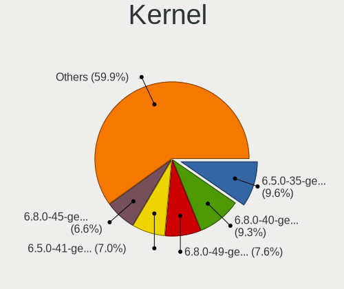

| Version                 | Computers | Percent |
|-------------------------|-----------|---------|
| 6.2.0-39-generic        | 172       | 16.8%   |
| 6.5.0-26-generic        | 149       | 14.55%  |
| 6.5.0-28-generic        | 120       | 11.72%  |
| 6.5.0-14-generic        | 99        | 9.67%   |
| 6.5.0-25-generic        | 95        | 9.28%   |
| 6.5.0-21-generic        | 93        | 9.08%   |
| 6.5.0-15-generic        | 93        | 9.08%   |
| 6.5.0-27-generic        | 78        | 7.62%   |
| 6.5.0-18-generic        | 53        | 5.18%   |
| 6.5.0-17-generic        | 47        | 4.59%   |
| 6.2.0-37-generic        | 7         | 0.68%   |
| 6.8.7-2-liquorix-amd64  | 1         | 0.1%    |
| 6.8.7-060807-generic    | 1         | 0.1%    |
| 6.7.7-060707-generic    | 1         | 0.1%    |
| 6.7.6-surface-1         | 1         | 0.1%    |
| 6.7.5-060705-generic    | 1         | 0.1%    |
| 6.7.3-060703-generic    | 1         | 0.1%    |
| 6.7.2-surface-1         | 1         | 0.1%    |
| 6.7.10-x64v4-xanmod1    | 1         | 0.1%    |
| 6.6.13-060613-generic   | 1         | 0.1%    |
| 6.6.11-surface-1        | 1         | 0.1%    |
| 6.6.10-76060610-generic | 1         | 0.1%    |
| 6.5.0-1016-oem          | 1         | 0.1%    |
| 6.1.0-1035-oem          | 1         | 0.1%    |
| 5.15.0-92-generic       | 1         | 0.1%    |
| 5.15.0-67-generic       | 1         | 0.1%    |
| 5.15.0-60-generic       | 1         | 0.1%    |
| 5.15.0-106-lowlatency   | 1         | 0.1%    |
| 5.15.0-105-generic      | 1         | 0.1%    |

Kernel Family
-------------

Linux kernel without a distro release

| Version | Computers | Percent |
|---------|-----------|---------|
| 6.5.0   | 779       | 79.9%   |
| 6.2.0   | 179       | 18.36%  |
| 5.15.0  | 5         | 0.51%   |
| 6.8.7   | 2         | 0.21%   |
| 6.7.7   | 1         | 0.1%    |
| 6.7.6   | 1         | 0.1%    |
| 6.7.5   | 1         | 0.1%    |
| 6.7.3   | 1         | 0.1%    |
| 6.7.2   | 1         | 0.1%    |
| 6.7.10  | 1         | 0.1%    |
| 6.6.13  | 1         | 0.1%    |
| 6.6.11  | 1         | 0.1%    |
| 6.6.10  | 1         | 0.1%    |
| 6.1.0   | 1         | 0.1%    |

Kernel Major Ver.
-----------------

Linux kernel major version

| Version | Computers | Percent |
|---------|-----------|---------|
| 6.5     | 779       | 79.98%  |
| 6.2     | 179       | 18.38%  |
| 6.7     | 5         | 0.51%   |
| 5.15    | 5         | 0.51%   |
| 6.6     | 3         | 0.31%   |
| 6.8     | 2         | 0.21%   |
| 6.1     | 1         | 0.1%    |

Arch
----

OS architecture (x86_64, i586, etc.)

| Name   | Computers | Percent |
|--------|-----------|---------|
| x86_64 | 963       | 100%    |

DE
--

Desktop Environment

| Name  | Computers | Percent |
|-------|-----------|---------|
| GNOME | 950       | 98.65%  |
| XFCE  | 12        | 1.25%   |
| KDE5  | 1         | 0.1%    |

Display Server
--------------

X11 or Wayland

| Name    | Computers | Percent |
|---------|-----------|---------|
| Wayland | 740       | 76.29%  |
| X11     | 225       | 23.2%   |
| Unknown | 3         | 0.31%   |
| Tty     | 2         | 0.21%   |

Display Manager
---------------

SDDM, LightDM, etc.

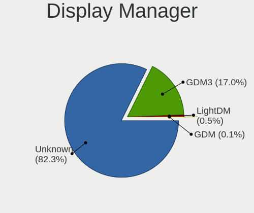

| Name    | Computers | Percent |
|---------|-----------|---------|
| Unknown | 812       | 83.45%  |
| GDM3    | 160       | 16.44%  |
| LightDM | 1         | 0.1%    |

OS Lang
-------

Language

| Lang  | Computers | Percent |
|-------|-----------|---------|
| en_US | 340       | 35.31%  |
| de_DE | 110       | 11.42%  |
| pt_BR | 77        | 8%      |
| it_IT | 64        | 6.65%   |
| fr_FR | 51        | 5.3%    |
| en_GB | 44        | 4.57%   |
| en_CA | 26        | 2.7%    |
| en_IN | 25        | 2.6%    |
| es_ES | 23        | 2.39%   |
| pt_PT | 15        | 1.56%   |
| pl_PL | 15        | 1.56%   |
| nl_NL | 15        | 1.56%   |
| en_AU | 14        | 1.45%   |
| es_MX | 13        | 1.35%   |
| ru_RU | 12        | 1.25%   |
| en_ZA | 11        | 1.14%   |
| hu_HU | 8         | 0.83%   |
| es_AR | 7         | 0.73%   |
| tr_TR | 6         | 0.62%   |
| es_CO | 6         | 0.62%   |
| de_AT | 5         | 0.52%   |
| sv_SE | 4         | 0.42%   |
| nb_NO | 4         | 0.42%   |
| ja_JP | 4         | 0.42%   |
| da_DK | 4         | 0.42%   |
| ro_RO | 3         | 0.31%   |
| nl_BE | 3         | 0.31%   |
| hr_HR | 3         | 0.31%   |
| es_CL | 3         | 0.31%   |
| en_SG | 3         | 0.31%   |
| en_NZ | 3         | 0.31%   |
| de_CH | 3         | 0.31%   |
| cs_CZ | 3         | 0.31%   |
| fr_CA | 2         | 0.21%   |
| fi_FI | 2         | 0.21%   |
| es_PE | 2         | 0.21%   |
| es_EC | 2         | 0.21%   |
| en_IE | 2         | 0.21%   |
| en_HK | 2         | 0.21%   |
| bg_BG | 2         | 0.21%   |

Boot Mode
---------

EFI or BIOS

| Mode | Computers | Percent |
|------|-----------|---------|
| BIOS | 881       | 91.11%  |
| EFI  | 86        | 8.89%   |

Filesystem
----------

Type of filesystem

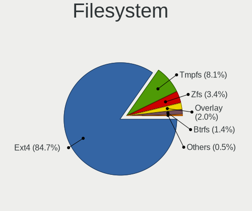

| Type    | Computers | Percent |
|---------|-----------|---------|
| Ext4    | 827       | 85.08%  |
| Tmpfs   | 69        | 7.1%    |
| Zfs     | 38        | 3.91%   |
| Overlay | 17        | 1.75%   |
| Btrfs   | 17        | 1.75%   |
| Xfs     | 2         | 0.21%   |
| Ext3    | 1         | 0.1%    |
| Ext2    | 1         | 0.1%    |

Part. scheme
------------

Scheme of partitioning

| Type    | Computers | Percent |
|---------|-----------|---------|
| Unknown | 811       | 83.35%  |
| GPT     | 147       | 15.11%  |
| MBR     | 15        | 1.54%   |

Dual Boot with Linux/BSD
------------------------

Hosting more than one Linux/BSD

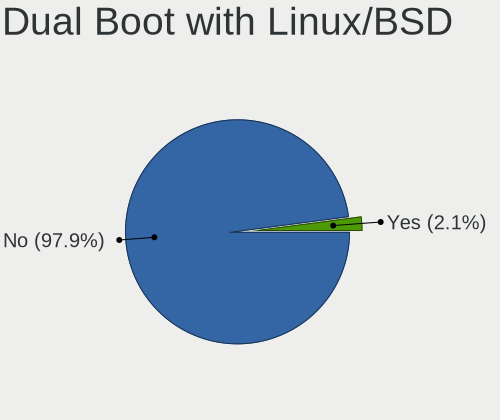

| Dual boot | Computers | Percent |
|-----------|-----------|---------|
| No        | 939       | 97.41%  |
| Yes       | 25        | 2.59%   |

Dual Boot (Win)
---------------

Hosting Linux and Windows

| Dual boot | Computers | Percent |
|-----------|-----------|---------|
| No        | 901       | 92.89%  |
| Yes       | 69        | 7.11%   |

Board
-----

Vendor
------

Motherboard manufacturer

| Name                | Computers | Percent |
|---------------------|-----------|---------|
| Hewlett-Packard     | 145       | 15.06%  |
| ASUSTek Computer    | 137       | 14.23%  |
| Lenovo              | 111       | 11.53%  |
| Dell                | 111       | 11.53%  |
| Gigabyte Technology | 55        | 5.71%   |
| Acer                | 51        | 5.3%    |
| Apple               | 48        | 4.98%   |
| MSI                 | 46        | 4.78%   |
| Unknown             | 22        | 2.28%   |
| ASRock              | 21        | 2.18%   |
| Samsung Electronics | 18        | 1.87%   |
| Toshiba             | 16        | 1.66%   |
| Microsoft           | 16        | 1.66%   |
| Sony                | 12        | 1.25%   |
| Intel               | 12        | 1.25%   |
| HUAWEI              | 10        | 1.04%   |
| Fujitsu             | 10        | 1.04%   |
| Packard Bell        | 8         | 0.83%   |
| Positivo            | 7         | 0.73%   |
| Medion              | 7         | 0.73%   |
| ECS                 | 4         | 0.42%   |
| Biostar             | 4         | 0.42%   |
| AZW                 | 4         | 0.42%   |
| Semp Toshiba        | 3         | 0.31%   |
| Pegatron            | 3         | 0.31%   |
| Panasonic           | 3         | 0.31%   |
| MACHINIST           | 3         | 0.31%   |
| Google              | 3         | 0.31%   |
| AMI                 | 3         | 0.31%   |
| Alienware           | 3         | 0.31%   |
| Trigkey             | 2         | 0.21%   |
| Teclast             | 2         | 0.21%   |
| Tactus              | 2         | 0.21%   |
| Supermicro          | 2         | 0.21%   |
| Shuttle             | 2         | 0.21%   |
| Notebook            | 2         | 0.21%   |
| NEC Computers       | 2         | 0.21%   |
| GEEKOM              | 2         | 0.21%   |
| Foxconn             | 2         | 0.21%   |
| Dynabook Europe     | 2         | 0.21%   |

Model
-----

Motherboard model

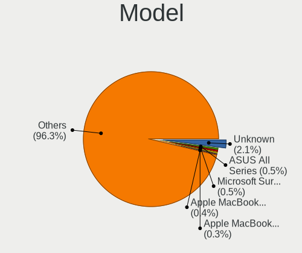

| Name                           | Computers | Percent |
|--------------------------------|-----------|---------|
| Unknown                        | 28        | 2.91%   |
| Microsoft Surface Pro 4        | 6         | 0.62%   |
| Apple MacBookPro9,2            | 6         | 0.62%   |
| Dell OptiPlex 990              | 4         | 0.42%   |
| ASUS All Series                | 4         | 0.42%   |
| Apple MacBookPro14,1           | 4         | 0.42%   |
| MSI MS-7C56                    | 3         | 0.31%   |
| HP 15                          | 3         | 0.31%   |
| Dell OptiPlex 7010             | 3         | 0.31%   |
| Dell Latitude E5520            | 3         | 0.31%   |
| ASUS A0000001                  | 3         | 0.31%   |
| Apple iMac12,1                 | 3         | 0.31%   |
| Trigkey S5                     | 2         | 0.21%   |
| Packard Bell EasyNote TM85     | 2         | 0.21%   |
| MSI MS-7C91                    | 2         | 0.21%   |
| MSI MS-7C52                    | 2         | 0.21%   |
| MSI MS-7C37                    | 2         | 0.21%   |
| MSI MS-7B86                    | 2         | 0.21%   |
| MSI MS-7A38                    | 2         | 0.21%   |
| MSI MS-7850                    | 2         | 0.21%   |
| MSI MS-7817                    | 2         | 0.21%   |
| MSI GF63 Thin 11UC             | 2         | 0.21%   |
| Microsoft Surface Laptop 3     | 2         | 0.21%   |
| Lenovo IdeaPad C340-15IML 81TL | 2         | 0.21%   |
| Lenovo IdeaPad 1 15AMN7 82VG   | 2         | 0.21%   |
| HUAWEI HVY-WXX9                | 2         | 0.21%   |
| HP ZBook 15 G2                 | 2         | 0.21%   |
| HP Z230 Tower Workstation      | 2         | 0.21%   |
| HP ProBook 650 G1              | 2         | 0.21%   |
| HP ProBook 445 G7              | 2         | 0.21%   |
| HP Pavilion dv7                | 2         | 0.21%   |
| HP Pavilion dv6                | 2         | 0.21%   |
| HP Notebook                    | 2         | 0.21%   |
| HP EliteDesk 800 G3 SFF        | 2         | 0.21%   |
| HP EliteBook 840 G2            | 2         | 0.21%   |
| HP EliteBook 830 G5            | 2         | 0.21%   |
| HP Elite x2 1012 G1            | 2         | 0.21%   |
| HP 15 Notebook PC              | 2         | 0.21%   |
| HP 1000                        | 2         | 0.21%   |
| Gigabyte Z790 AORUS ELITE AX   | 2         | 0.21%   |

Model Family
------------

Motherboard model prefix

| Name                  | Computers | Percent |
|-----------------------|-----------|---------|
| Lenovo ThinkPad       | 38        | 3.95%   |
| Dell Latitude         | 31        | 3.22%   |
| Acer Aspire           | 31        | 3.22%   |
| Lenovo IdeaPad        | 29        | 3.01%   |
| HP Pavilion           | 28        | 2.91%   |
| Dell Inspiron         | 28        | 2.91%   |
| Unknown               | 28        | 2.91%   |
| Dell OptiPlex         | 23        | 2.39%   |
| ASUS VivoBook         | 17        | 1.77%   |
| Microsoft Surface     | 16        | 1.66%   |
| HP ProBook            | 16        | 1.66%   |
| ASUS ROG              | 16        | 1.66%   |
| Toshiba Satellite     | 14        | 1.45%   |
| HP Laptop             | 14        | 1.45%   |
| HP EliteBook          | 13        | 1.35%   |
| ASUS TUF              | 12        | 1.25%   |
| Dell XPS              | 11        | 1.14%   |
| ASUS PRIME            | 11        | 1.14%   |
| Lenovo ThinkCentre    | 9         | 0.93%   |
| HP ENVY               | 9         | 0.93%   |
| HP ZBook              | 8         | 0.83%   |
| HP Compaq             | 8         | 0.83%   |
| Fujitsu LIFEBOOK      | 8         | 0.83%   |
| Dell Precision        | 8         | 0.83%   |
| Packard Bell EasyNote | 7         | 0.73%   |
| HP EliteDesk          | 7         | 0.73%   |
| ASUS Zenbook          | 7         | 0.73%   |
| Apple MacBookPro9     | 6         | 0.62%   |
| Lenovo Yoga           | 5         | 0.52%   |
| HP 15                 | 5         | 0.52%   |
| Dell Vostro           | 5         | 0.52%   |
| Lenovo Legion         | 4         | 0.42%   |
| HP Elite              | 4         | 0.42%   |
| ASUS All              | 4         | 0.42%   |
| Apple MacBookPro14    | 4         | 0.42%   |
| Acer Swift            | 4         | 0.42%   |
| Acer Nitro            | 4         | 0.42%   |
| MSI MS-7C56           | 3         | 0.31%   |
| MSI GF63              | 3         | 0.31%   |
| Lenovo IdeaPadFlex    | 3         | 0.31%   |

MFG Year
--------

Motherboard manufacture year

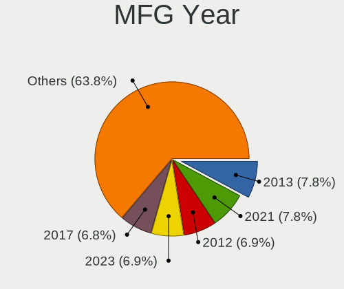

| Year    | Computers | Percent |
|---------|-----------|---------|
| 2013    | 81        | 8.41%   |
| 2021    | 77        | 8%      |
| 2012    | 75        | 7.79%   |
| 2022    | 72        | 7.48%   |
| 2023    | 67        | 6.96%   |
| 2018    | 64        | 6.65%   |
| 2019    | 62        | 6.44%   |
| 2020    | 61        | 6.33%   |
| 2014    | 59        | 6.13%   |
| 2011    | 59        | 6.13%   |
| 2017    | 58        | 6.02%   |
| 2010    | 54        | 5.61%   |
| 2015    | 42        | 4.36%   |
| 2016    | 40        | 4.15%   |
| 2009    | 34        | 3.53%   |
| 2008    | 33        | 3.43%   |
| 2007    | 15        | 1.56%   |
| 2024    | 5         | 0.52%   |
| 2006    | 4         | 0.42%   |
| Unknown | 1         | 0.1%    |

Form Factor
-----------

Physical design of the computer

| Name        | Computers | Percent |
|-------------|-----------|---------|
| Notebook    | 533       | 55.35%  |
| Desktop     | 324       | 33.64%  |
| Tablet      | 31        | 3.22%   |
| All in one  | 31        | 3.22%   |
| Convertible | 25        | 2.6%    |
| Mini pc     | 17        | 1.77%   |
| Server      | 2         | 0.21%   |

Secure Boot
-----------

Enabled or disabled

| State    | Computers | Percent |
|----------|-----------|---------|
| Disabled | 947       | 98.34%  |
| Enabled  | 16        | 1.66%   |

Coreboot
--------

Have coreboot on board

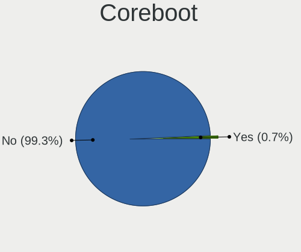

| Used | Computers | Percent |
|------|-----------|---------|
| No   | 959       | 99.58%  |
| Yes  | 4         | 0.42%   |

RAM Size
--------

Total RAM memory

| Size in GB      | Computers | Percent |
|-----------------|-----------|---------|
| 4.01-8.0        | 300       | 31.12%  |
| 16.01-24.0      | 175       | 18.15%  |
| 3.01-4.0        | 172       | 17.84%  |
| 8.01-16.0       | 167       | 17.32%  |
| 32.01-64.0      | 81        | 8.4%    |
| 64.01-256.0     | 29        | 3.01%   |
| 24.01-32.0      | 21        | 2.18%   |
| 1.01-2.0        | 13        | 1.35%   |
| 2.01-3.0        | 5         | 0.52%   |
| More than 256.0 | 1         | 0.1%    |

RAM Used
--------

Used RAM memory

| Used GB    | Computers | Percent |
|------------|-----------|---------|
| 2.01-3.0   | 384       | 38.06%  |
| 1.01-2.0   | 272       | 26.96%  |
| 3.01-4.0   | 162       | 16.06%  |
| 4.01-8.0   | 157       | 15.56%  |
| 8.01-16.0  | 24        | 2.38%   |
| 0.51-1.0   | 7         | 0.69%   |
| 16.01-24.0 | 3         | 0.3%    |

Total Drives
------------

Number of drives on board

| Drives | Computers | Percent |
|--------|-----------|---------|
| 1      | 622       | 63.66%  |
| 2      | 235       | 24.05%  |
| 3      | 66        | 6.76%   |
| 4      | 24        | 2.46%   |
| 5      | 9         | 0.92%   |
| 6      | 8         | 0.82%   |
| 8      | 6         | 0.61%   |
| 7      | 3         | 0.31%   |
| 11     | 1         | 0.1%    |
| 10     | 1         | 0.1%    |
| 9      | 1         | 0.1%    |
| 0      | 1         | 0.1%    |

Has CD-ROM
----------

Has CD-ROM on board

| Presented | Computers | Percent |
|-----------|-----------|---------|
| No        | 598       | 62.03%  |
| Yes       | 366       | 37.97%  |

Has Ethernet
------------

Has Ethernet on board

| Presented | Computers | Percent |
|-----------|-----------|---------|
| Yes       | 806       | 83.61%  |
| No        | 158       | 16.39%  |

Has WiFi
--------

Has WiFi module

| Presented | Computers | Percent |
|-----------|-----------|---------|
| Yes       | 792       | 82.16%  |
| No        | 172       | 17.84%  |

Has Bluetooth
-------------

Has Bluetooth module

| Presented | Computers | Percent |
|-----------|-----------|---------|
| Yes       | 626       | 64.8%   |
| No        | 340       | 35.2%   |

Location
--------

Country
-------

Geographic location (country)

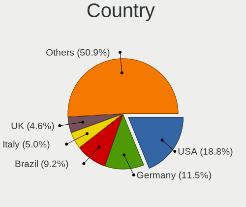

| Country      | Computers | Percent |
|--------------|-----------|---------|
| USA          | 189       | 19.63%  |
| Germany      | 120       | 12.46%  |
| Brazil       | 86        | 8.93%   |
| Italy        | 70        | 7.27%   |
| France       | 47        | 4.88%   |
| UK           | 44        | 4.57%   |
| Canada       | 27        | 2.8%    |
| India        | 26        | 2.7%    |
| Spain        | 25        | 2.6%    |
| Netherlands  | 24        | 2.49%   |
| Portugal     | 17        | 1.77%   |
| Mexico       | 17        | 1.77%   |
| Poland       | 15        | 1.56%   |
| Australia    | 13        | 1.35%   |
| South Africa | 12        | 1.25%   |
| Russia       | 12        | 1.25%   |
| Egypt        | 11        | 1.14%   |
| Sweden       | 10        | 1.04%   |
| Hungary      | 9         | 0.93%   |
| Romania      | 8         | 0.83%   |
| Austria      | 8         | 0.83%   |
| Turkey       | 7         | 0.73%   |
| Indonesia    | 7         | 0.73%   |
| Denmark      | 7         | 0.73%   |
| Belgium      | 7         | 0.73%   |
| Argentina    | 7         | 0.73%   |
| Algeria      | 7         | 0.73%   |
| Switzerland  | 6         | 0.62%   |
| Norway       | 6         | 0.62%   |
| Greece       | 6         | 0.62%   |
| Colombia     | 6         | 0.62%   |
| Japan        | 5         | 0.52%   |
| Finland      | 5         | 0.52%   |
| Czechia      | 5         | 0.52%   |
| Morocco      | 4         | 0.42%   |
| Croatia      | 4         | 0.42%   |
| Singapore    | 3         | 0.31%   |
| Serbia       | 3         | 0.31%   |
| Runion     | 3         | 0.31%   |
| Philippines  | 3         | 0.31%   |

City
----

Geographic location (city)

| City              | Computers | Percent |
|-------------------|-----------|---------|
| Milan             | 10        | 1.03%   |
| Rio de Janeiro    | 9         | 0.93%   |
| Berlin            | 9         | 0.93%   |
| Sao Paulo         | 8         | 0.82%   |
| Sydney            | 6         | 0.62%   |
| Johannesburg      | 6         | 0.62%   |
| Cairo             | 6         | 0.62%   |
| Stockholm         | 5         | 0.51%   |
| Rome              | 5         | 0.51%   |
| Amsterdam         | 5         | 0.51%   |
| Warsaw            | 4         | 0.41%   |
| Stuttgart         | 4         | 0.41%   |
| Ribeirao Preto    | 4         | 0.41%   |
| Moscow            | 4         | 0.41%   |
| Melbourne         | 4         | 0.41%   |
| Lisbon            | 4         | 0.41%   |
| Las Vegas         | 4         | 0.41%   |
| Joao Pessoa       | 4         | 0.41%   |
| Istanbul          | 4         | 0.41%   |
| Hamburg           | 4         | 0.41%   |
| Delhi             | 4         | 0.41%   |
| Zurich            | 3         | 0.31%   |
| Zagreb            | 3         | 0.31%   |
| Vienna            | 3         | 0.31%   |
| Turin             | 3         | 0.31%   |
| Trento            | 3         | 0.31%   |
| Singapore         | 3         | 0.31%   |
| Santiago          | 3         | 0.31%   |
| Saint Paul        | 3         | 0.31%   |
| Prague            | 3         | 0.31%   |
| Porto             | 3         | 0.31%   |
| Paris             | 3         | 0.31%   |
| New York          | 3         | 0.31%   |
| Mumbai            | 3         | 0.31%   |
| Mexico City       | 3         | 0.31%   |
| Los Angeles       | 3         | 0.31%   |
| London            | 3         | 0.31%   |
| Izmir             | 3         | 0.31%   |
| Indianapolis      | 3         | 0.31%   |
| Frankfurt am Main | 3         | 0.31%   |

Drives
------

Drive Vendor
------------

Hard drive vendors

| Vendor                       | Computers | Drives | Percent |
|------------------------------|-----------|--------|---------|
| Samsung Electronics          | 219       | 287    | 15.74%  |
| WDC                          | 175       | 222    | 12.58%  |
| Seagate                      | 140       | 175    | 10.06%  |
| Kingston                     | 88        | 94     | 6.33%   |
| Toshiba                      | 75        | 79     | 5.39%   |
| SanDisk                      | 75        | 102    | 5.39%   |
| Unknown                      | 63        | 75     | 4.53%   |
| Crucial                      | 51        | 59     | 3.67%   |
| SK hynix                     | 37        | 42     | 2.66%   |
| Hitachi                      | 35        | 38     | 2.52%   |
| China                        | 33        | 38     | 2.37%   |
| Micron Technology            | 25        | 26     | 1.8%    |
| Intel                        | 22        | 28     | 1.58%   |
| Micron/Crucial Technology    | 20        | 24     | 1.44%   |
| HGST                         | 20        | 24     | 1.44%   |
| Apple                        | 20        | 29     | 1.44%   |
| Intenso                      | 16        | 18     | 1.15%   |
| Silicon Motion               | 15        | 16     | 1.08%   |
| Phison Electronics           | 13        | 16     | 0.93%   |
| MAXIO Technology (Hangzhou)  | 13        | 13     | 0.93%   |
| A-DATA Technology            | 13        | 13     | 0.93%   |
| Kingston Technology Company  | 12        | 13     | 0.86%   |
| PNY                          | 11        | 12     | 0.79%   |
| Unknown                      | 11        | 13     | 0.79%   |
| KIOXIA                       | 8         | 8      | 0.58%   |
| SPCC                         | 7         | 7      | 0.5%    |
| ADATA Technology             | 7         | 7      | 0.5%    |
| Realtek Semiconductor        | 6         | 7      | 0.43%   |
| Netac                        | 6         | 7      | 0.43%   |
| Lexar                        | 6         | 8      | 0.43%   |
| KingSpec                     | 6         | 6      | 0.43%   |
| LITEON                       | 5         | 5      | 0.36%   |
| Hewlett-Packard              | 5         | 5      | 0.36%   |
| Fanxiang                     | 5         | 7      | 0.36%   |
| Verbatim                     | 4         | 7      | 0.29%   |
| Transcend                    | 4         | 4      | 0.29%   |
| Shenzhen Longsys Electronics | 4         | 4      | 0.29%   |
| OCZ                          | 4         | 4      | 0.29%   |
| KIOXIA-EXCERIA               | 4         | 5      | 0.29%   |
| External                     | 4         | 4      | 0.29%   |

Drive Model
-----------

Hard drive models

| Model                                                 | Computers | Percent |
|-------------------------------------------------------|-----------|---------|
| Unknown MMC Card  64GB                                | 25        | 1.68%   |
| Samsung NVMe SSD Controller SM981/PM981/PM983 1TB     | 25        | 1.68%   |
| Kingston SA400S37240G 240GB SSD                       | 20        | 1.35%   |
| Kingston SA400S37480G 480GB SSD                       | 15        | 1.01%   |
| Samsung NVMe SSD Controller PM9A1/PM9A3/980PRO 1TB    | 14        | 0.94%   |
| Micron/Crucial P2 NVMe PCIe SSD 4TB                   | 14        | 0.94%   |
| Unknown MMC Card  128GB                               | 12        | 0.81%   |
| Unknown                                               | 11        | 0.74%   |
| Unknown MMC Card  32GB                                | 10        | 0.67%   |
| Samsung SSD 860 EVO 500GB                             | 10        | 0.67%   |
| Samsung NVMe SSD Controller SM961/PM961/SM963 1TB     | 10        | 0.67%   |
| Crucial CT500MX500SSD1 500GB                          | 10        | 0.67%   |
| Toshiba MQ01ABF050 500GB                              | 9         | 0.61%   |
| Silicon Motion SM2263EN/SM2263XT SSD Controller 256GB | 9         | 0.61%   |
| Seagate ST500DM002-1BD142 500GB                       | 9         | 0.61%   |
| Kingston SA400S37120G 120GB SSD                       | 9         | 0.61%   |
| Sandisk WD Blue SN550 NVMe SSD 2TB                    | 8         | 0.54%   |
| Samsung SSD 850 EVO 500GB                             | 8         | 0.54%   |
| Samsung SSD 850 EVO 250GB                             | 8         | 0.54%   |
| Samsung SSD 870 EVO 500GB                             | 7         | 0.47%   |
| Samsung SSD 860 EVO 250GB                             | 7         | 0.47%   |
| MAXIO (Hangzhou) NVMe SSD Controller MAP1202 256GB    | 7         | 0.47%   |
| WDC WDS100T2B0A-00SM50 1TB SSD                        | 6         | 0.4%    |
| Toshiba MQ04ABF100 1TB                                | 6         | 0.4%    |
| Toshiba DT01ACA100 1TB                                | 6         | 0.4%    |
| Seagate ST500LM012 HN-M500MBB 500GB                   | 6         | 0.4%    |
| Seagate ST1000LM035-1RK172 1TB                        | 6         | 0.4%    |
| Seagate ST1000DM010-2EP102 1TB                        | 6         | 0.4%    |
| Crucial CT240BX500SSD1 240GB                          | 6         | 0.4%    |
| Crucial CT1000MX500SSD1 1TB                           | 6         | 0.4%    |
| Crucial CT1000BX500SSD1 1TB                           | 6         | 0.4%    |
| Toshiba XG6 NVMe SSD Controller 1024GB                | 5         | 0.34%   |
| SK hynix BC511 256GB                                  | 5         | 0.34%   |
| SK hynix BC501 NVMe Solid State Drive 512GB           | 5         | 0.34%   |
| Seagate ST9500325AS 500GB                             | 5         | 0.34%   |
| Seagate ST500LM021-1KJ152 500GB                       | 5         | 0.34%   |
| Seagate ST1000LM024 HN-M101MBB 1TB                    | 5         | 0.34%   |
| Sandisk WD Black SN750 / PC SN730 NVMe SSD 512GB      | 5         | 0.34%   |
| Samsung SSD 990 PRO 2TB                               | 5         | 0.34%   |
| Samsung SSD 980 1TB                                   | 5         | 0.34%   |

HDD Vendor
----------

Hard disk drive vendors

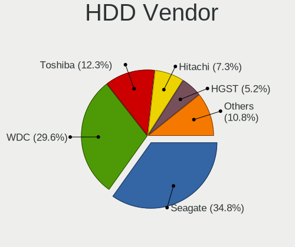

| Vendor              | Computers | Drives | Percent |
|---------------------|-----------|--------|---------|
| WDC                 | 139       | 178    | 33.1%   |
| Seagate             | 135       | 169    | 32.14%  |
| Toshiba             | 57        | 61     | 13.57%  |
| Hitachi             | 35        | 38     | 8.33%   |
| HGST                | 20        | 24     | 4.76%   |
| Samsung Electronics | 13        | 15     | 3.1%    |
| Apple               | 6         | 6      | 1.43%   |
| Unknown             | 3         | 3      | 0.71%   |
| Maxtor              | 2         | 2      | 0.48%   |
| LaCie               | 2         | 2      | 0.48%   |
| Intenso             | 2         | 3      | 0.48%   |
| Fujitsu             | 2         | 2      | 0.48%   |
| TO Exter            | 1         | 1      | 0.24%   |
| SABRENT             | 1         | 3      | 0.24%   |
| JMicron Technology  | 1         | 1      | 0.24%   |
| ASMT                | 1         | 1      | 0.24%   |

SSD Vendor
----------

Solid state drive vendors

| Vendor              | Computers | Drives | Percent |
|---------------------|-----------|--------|---------|
| Samsung Electronics | 119       | 149    | 23.33%  |
| Kingston            | 72        | 75     | 14.12%  |
| Crucial             | 48        | 56     | 9.41%   |
| China               | 32        | 37     | 6.27%   |
| WDC                 | 31        | 36     | 6.08%   |
| SanDisk             | 25        | 30     | 4.9%    |
| A-DATA Technology   | 13        | 13     | 2.55%   |
| PNY                 | 11        | 12     | 2.16%   |
| Intenso             | 8         | 8      | 1.57%   |
| Intel               | 8         | 8      | 1.57%   |
| Apple               | 8         | 8      | 1.57%   |
| SPCC                | 7         | 7      | 1.37%   |
| Micron Technology   | 7         | 8      | 1.37%   |
| Unknown             | 7         | 9      | 1.37%   |
| SK hynix            | 6         | 8      | 1.18%   |
| Lexar               | 6         | 8      | 1.18%   |
| KingSpec            | 6         | 6      | 1.18%   |
| LITEON              | 5         | 5      | 0.98%   |
| Hewlett-Packard     | 5         | 5      | 0.98%   |
| Verbatim            | 4         | 7      | 0.78%   |
| Transcend           | 4         | 4      | 0.78%   |
| Toshiba             | 4         | 4      | 0.78%   |
| OCZ                 | 4         | 4      | 0.78%   |
| Netac               | 4         | 5      | 0.78%   |
| External            | 4         | 4      | 0.78%   |
| Team                | 3         | 3      | 0.59%   |
| KIOXIA-EXCERIA      | 3         | 4      | 0.59%   |
| GOODRAM             | 3         | 5      | 0.59%   |
| Gigabyte Technology | 3         | 3      | 0.59%   |
| Teclast             | 2         | 3      | 0.39%   |
| Phison              | 2         | 3      | 0.39%   |
| Mushkin             | 2         | 2      | 0.39%   |
| LEQIXIANG           | 2         | 2      | 0.39%   |
| FORESEE             | 2         | 3      | 0.39%   |
| Fanxiang            | 2         | 2      | 0.39%   |
| Corsair             | 2         | 2      | 0.39%   |
| ASMT                | 2         | 2      | 0.39%   |
| Apacer              | 2         | 2      | 0.39%   |
| Wibtek              | 1         | 1      | 0.2%    |
| USB3.0              | 1         | 1      | 0.2%    |

Drive Kind
----------

HDD or SSD

| Kind    | Computers | Drives | Percent |
|---------|-----------|--------|---------|
| SSD     | 445       | 590    | 35.83%  |
| HDD     | 365       | 509    | 29.39%  |
| NVMe    | 338       | 465    | 27.21%  |
| MMC     | 56        | 61     | 4.51%   |
| Unknown | 38        | 49     | 3.06%   |

Drive Connector
---------------

SATA, SAS, NVMe, etc.

| Type | Computers | Drives | Percent |
|------|-----------|--------|---------|
| SATA | 695       | 1072   | 60.86%  |
| NVMe | 337       | 461    | 29.51%  |
| MMC  | 56        | 61     | 4.9%    |
| SAS  | 54        | 80     | 4.73%   |

Drive Size
----------

Size of hard drive

| Size in TB | Computers | Drives | Percent |
|------------|-----------|--------|---------|
| 0.01-0.5   | 505       | 663    | 60.33%  |
| 0.51-1.0   | 229       | 292    | 27.36%  |
| 1.01-2.0   | 53        | 68     | 6.33%   |
| 3.01-4.0   | 22        | 36     | 2.63%   |
| 2.01-3.0   | 12        | 14     | 1.43%   |
| 4.01-10.0  | 11        | 19     | 1.31%   |
| 10.01-20.0 | 5         | 7      | 0.6%    |

Space Total
-----------

Amount of disk space available on the file system

| Size in GB     | Computers | Percent |
|----------------|-----------|---------|
| 101-250        | 335       | 34.29%  |
| 251-500        | 251       | 25.69%  |
| 501-1000       | 145       | 14.84%  |
| 51-100         | 66        | 6.76%   |
| 1001-2000      | 52        | 5.32%   |
| More than 3000 | 36        | 3.68%   |
| 1-20           | 30        | 3.07%   |
| Unknown        | 23        | 2.35%   |
| 21-50          | 21        | 2.15%   |
| 2001-3000      | 17        | 1.74%   |
| 0              | 1         | 0.1%    |

Space Used
----------

Amount of used disk space

| Used GB        | Computers | Percent |
|----------------|-----------|---------|
| 1-20           | 353       | 35.12%  |
| 21-50          | 334       | 33.23%  |
| 51-100         | 118       | 11.74%  |
| 101-250        | 72        | 7.16%   |
| 251-500        | 45        | 4.48%   |
| 501-1000       | 27        | 2.69%   |
| Unknown        | 23        | 2.29%   |
| 1001-2000      | 14        | 1.39%   |
| More than 3000 | 12        | 1.19%   |
| 2001-3000      | 6         | 0.6%    |
| 0              | 1         | 0.1%    |

Malfunc. Drives
---------------

Drive models with a malfunction

| Model                                        | Computers | Drives | Percent |
|----------------------------------------------|-----------|--------|---------|
| WDC WD5000BPVT-75HXZT1 500GB                 | 1         | 1      | 6.67%   |
| WDC WD2500BEKT-75PVMT1 250GB                 | 1         | 1      | 6.67%   |
| WDC WD10JPVX-60JC3T0 1TB                     | 1         | 1      | 6.67%   |
| Toshiba MQ01ABF050 500GB                     | 1         | 1      | 6.67%   |
| Toshiba MK6465GSX 640GB                      | 1         | 1      | 6.67%   |
| Toshiba MK2565GSX 250GB                      | 1         | 1      | 6.67%   |
| Seagate ST500LM000-1EJ162 500GB              | 1         | 1      | 6.67%   |
| Seagate ST2000LM007-1R8174 2TB               | 1         | 1      | 6.67%   |
| SanDisk SSD PLUS 480GB                       | 1         | 1      | 6.67%   |
| Samsung Electronics SSD 870 EVO 500GB        | 1         | 1      | 6.67%   |
| Samsung Electronics SSD 840 PRO Series 256GB | 1         | 1      | 6.67%   |
| Hitachi HTS723232L9A360 320GB                | 1         | 1      | 6.67%   |
| Hitachi HTS545050A7E380 500GB                | 1         | 1      | 6.67%   |
| Hitachi HDS721680PLA380 80GB                 | 1         | 1      | 6.67%   |
| HGST HTS721010A9E630 1TB                     | 1         | 1      | 6.67%   |

Malfunc. Drive Vendor
---------------------

Vendors of faulty drives

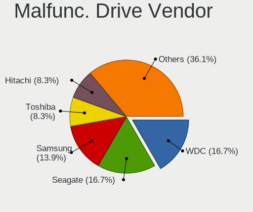

| Vendor              | Computers | Drives | Percent |
|---------------------|-----------|--------|---------|
| WDC                 | 3         | 3      | 20%     |
| Toshiba             | 3         | 3      | 20%     |
| Hitachi             | 3         | 3      | 20%     |
| Seagate             | 2         | 2      | 13.33%  |
| Samsung Electronics | 2         | 2      | 13.33%  |
| SanDisk             | 1         | 1      | 6.67%   |
| HGST                | 1         | 1      | 6.67%   |

Malfunc. HDD Vendor
-------------------

Vendors of faulty HDD drives

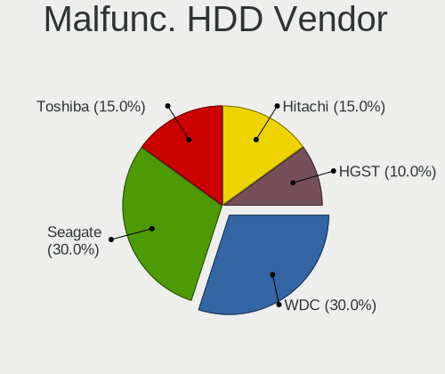

| Vendor  | Computers | Drives | Percent |
|---------|-----------|--------|---------|
| WDC     | 3         | 3      | 25%     |
| Toshiba | 3         | 3      | 25%     |
| Hitachi | 3         | 3      | 25%     |
| Seagate | 2         | 2      | 16.67%  |
| HGST    | 1         | 1      | 8.33%   |

Malfunc. Drive Kind
-------------------

Kinds of faulty drives

| Kind | Computers | Drives | Percent |
|------|-----------|--------|---------|
| HDD  | 12        | 12     | 80%     |
| SSD  | 3         | 3      | 20%     |

Failed Drives
-------------

Failed drive models

Zero info for selected period =(

Failed Drive Vendor
-------------------

Failed drive vendors

Zero info for selected period =(

Drive Status
------------

Number of failed and malfunc. drives

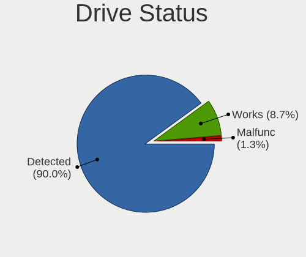

| Status   | Computers | Drives | Percent |
|----------|-----------|--------|---------|
| Detected | 891       | 1533   | 90.37%  |
| Works    | 80        | 126    | 8.11%   |
| Malfunc  | 15        | 15     | 1.52%   |

Storage controller
------------------

Storage Vendor
--------------

Storage controller vendors

| Vendor                           | Computers | Percent |
|----------------------------------|-----------|---------|
| Intel                            | 650       | 52.21%  |
| AMD                              | 164       | 13.17%  |
| Samsung Electronics              | 106       | 8.51%   |
| SanDisk                          | 56        | 4.5%    |
| SK hynix                         | 31        | 2.49%   |
| Kingston Technology Company      | 25        | 2.01%   |
| Micron/Crucial Technology        | 22        | 1.77%   |
| ASMedia Technology               | 21        | 1.69%   |
| Micron Technology                | 18        | 1.45%   |
| Silicon Motion                   | 17        | 1.37%   |
| Phison Electronics               | 16        | 1.29%   |
| MAXIO Technology (Hangzhou)      | 14        | 1.12%   |
| Toshiba America Info Systems     | 13        | 1.04%   |
| Nvidia                           | 12        | 0.96%   |
| Marvell Technology Group         | 11        | 0.88%   |
| KIOXIA                           | 10        | 0.8%    |
| JMicron Technology               | 10        | 0.8%    |
| ADATA Technology                 | 7         | 0.56%   |
| Realtek Semiconductor            | 6         | 0.48%   |
| Apple                            | 6         | 0.48%   |
| Shenzhen Longsys Electronics     | 5         | 0.4%    |
| Seagate Technology               | 4         | 0.32%   |
| Solid State Storage Technology   | 3         | 0.24%   |
| Broadcom / LSI                   | 3         | 0.24%   |
| Netac Technology                 | 2         | 0.16%   |
| Lite-On Technology               | 2         | 0.16%   |
| Integrated Technology Express    | 2         | 0.16%   |
| Unknown                          | 2         | 0.16%   |
| Solidigm                         | 1         | 0.08%   |
| Silicon Integrated Systems [SiS] | 1         | 0.08%   |
| Silicon Image                    | 1         | 0.08%   |
| LSI Logic / Symbios Logic        | 1         | 0.08%   |
| Hosin Global Electronics         | 1         | 0.08%   |
| HighPoint Technologies           | 1         | 0.08%   |
| Adaptec                          | 1         | 0.08%   |

Storage Model
-------------

Storage controller models

| Model                                                                                   | Computers | Percent |
|-----------------------------------------------------------------------------------------|-----------|---------|
| AMD FCH SATA Controller [AHCI mode]                                                     | 92        | 6.64%   |
| Intel 8 Series/C220 Series Chipset Family 6-port SATA Controller 1 [AHCI mode]          | 49        | 3.54%   |
| Intel 7 Series Chipset Family 6-port SATA Controller [AHCI mode]                        | 48        | 3.46%   |
| Intel Sunrise Point-LP SATA Controller [AHCI mode]                                      | 46        | 3.32%   |
| Intel 6 Series/C200 Series Chipset Family 6 port Mobile SATA AHCI Controller            | 34        | 2.45%   |
| Samsung NVMe SSD Controller SM981/PM981/PM983                                           | 33        | 2.38%   |
| Intel Celeron/Pentium Silver Processor SATA Controller                                  | 27        | 1.95%   |
| Intel 82801 Mobile SATA Controller [RAID mode]                                          | 27        | 1.95%   |
| Intel 6 Series/C200 Series Chipset Family 6 port Desktop SATA AHCI Controller           | 27        | 1.95%   |
| Intel 82801IBM/IEM (ICH9M/ICH9M-E) 4 port SATA Controller [AHCI mode]                   | 25        | 1.8%    |
| Intel Volume Management Device NVMe RAID Controller                                     | 23        | 1.66%   |
| Intel 8 Series SATA Controller 1 [AHCI mode]                                            | 23        | 1.66%   |
| Intel 5 Series/3400 Series Chipset 4 port SATA AHCI Controller                          | 22        | 1.59%   |
| AMD 500 Series Chipset SATA Controller                                                  | 22        | 1.59%   |
| ASMedia ASM1061/ASM1062 Serial ATA Controller                                           | 20        | 1.44%   |
| Samsung NVMe SSD Controller PM9A1/PM9A3/980PRO                                          | 19        | 1.37%   |
| Intel Wildcat Point-LP SATA Controller [AHCI Mode]                                      | 19        | 1.37%   |
| Intel Q170/Q150/B150/H170/H110/Z170/CM236 Chipset SATA Controller [AHCI Mode]           | 19        | 1.37%   |
| Intel 7 Series/C210 Series Chipset Family 6-port SATA Controller [AHCI mode]            | 19        | 1.37%   |
| AMD SB7x0/SB8x0/SB9x0 SATA Controller [AHCI mode]                                       | 19        | 1.37%   |
| AMD SB7x0/SB8x0/SB9x0 IDE Controller                                                    | 18        | 1.3%    |
| Samsung NVMe SSD Controller 980 (DRAM-less)                                             | 17        | 1.23%   |
| AMD 400 Series Chipset SATA Controller                                                  | 17        | 1.23%   |
| SanDisk WD Black SN770 / PC SN740 256GB / PC SN560 (DRAM-less) NVMe SSD                 | 16        | 1.15%   |
| Intel 200 Series PCH SATA controller [AHCI mode]                                        | 16        | 1.15%   |
| Micron/Crucial P2 [Nick P2] / P3 / P3 Plus NVMe PCIe SSD (DRAM-less)                    | 15        | 1.08%   |
| Intel Celeron N3350/Pentium N4200/Atom E3900 Series SATA AHCI Controller                | 14        | 1.01%   |
| Intel NM10/ICH7 Family SATA Controller [IDE mode]                                       | 13        | 0.94%   |
| Intel Cannon Lake PCH SATA AHCI Controller                                              | 13        | 0.94%   |
| Intel Volume Management Device NVMe RAID Controller Intel Corporation                   | 12        | 0.87%   |
| Intel 6 Series/C200 Series Chipset Family Desktop SATA Controller (IDE mode, ports 4-5) | 12        | 0.87%   |
| Intel 6 Series/C200 Series Chipset Family Desktop SATA Controller (IDE mode, ports 0-3) | 12        | 0.87%   |
| Intel 5 Series/3400 Series Chipset 6 port SATA AHCI Controller                          | 12        | 0.87%   |
| SK hynix Gold P31/BC711/PC711 NVMe Solid State Drive                                    | 11        | 0.79%   |
| Silicon Motion SM2263EN/SM2263XT (DRAM-less) NVMe SSD Controllers                       | 11        | 0.79%   |
| Intel SATA Controller [RAID mode]                                                       | 11        | 0.79%   |
| Samsung NVMe SSD Controller SM961/PM961/SM963                                           | 10        | 0.72%   |
| Intel Comet Lake SATA AHCI Controller                                                   | 10        | 0.72%   |
| Intel 82801HM/HEM (ICH8M/ICH8M-E) IDE Controller                                        | 10        | 0.72%   |
| Intel 82801G (ICH7 Family) IDE Controller                                               | 10        | 0.72%   |

Storage Kind
------------

Kind of storage controller (IDE, SATA, NVMe, SAS, ...)

| Kind | Computers | Percent |
|------|-----------|---------|
| SATA | 711       | 57.9%   |
| NVMe | 336       | 27.36%  |
| IDE  | 95        | 7.74%   |
| RAID | 82        | 6.68%   |
| SAS  | 4         | 0.33%   |

Processor
---------

CPU Vendor
----------

Processor vendors

| Vendor | Computers | Percent |
|--------|-----------|---------|
| Intel  | 752       | 78.09%  |
| AMD    | 211       | 21.91%  |

CPU Model
---------

Processor models

| Model                                   | Computers | Percent |
|-----------------------------------------|-----------|---------|
| Intel Core i5-6300U CPU @ 2.40GHz       | 11        | 1.14%   |
| Intel Celeron N4020 CPU @ 1.10GHz       | 11        | 1.14%   |
| Intel Core i5-3470 CPU @ 3.20GHz        | 10        | 1.04%   |
| Intel Core i5-7200U CPU @ 2.50GHz       | 8         | 0.83%   |
| Intel Core i5-3210M CPU @ 2.50GHz       | 8         | 0.83%   |
| Intel Celeron CPU N3350 @ 1.10GHz       | 8         | 0.83%   |
| Intel Core i5-6200U CPU @ 2.30GHz       | 7         | 0.73%   |
| Intel 11th Gen Core i5-1135G7 @ 2.40GHz | 7         | 0.73%   |
| AMD Ryzen 9 5900X 12-Core Processor     | 7         | 0.73%   |
| AMD Ryzen 7 5700G with Radeon Graphics  | 7         | 0.73%   |
| Intel Core i7-8565U CPU @ 1.80GHz       | 6         | 0.62%   |
| Intel Core i5-8265U CPU @ 1.60GHz       | 6         | 0.62%   |
| Intel Core i5-8250U CPU @ 1.60GHz       | 6         | 0.62%   |
| Intel Core i5-2430M CPU @ 2.40GHz       | 6         | 0.62%   |
| Intel Core i3-6006U CPU @ 2.00GHz       | 6         | 0.62%   |
| Intel 11th Gen Core i7-1165G7 @ 2.80GHz | 6         | 0.62%   |
| AMD Ryzen 5 5500U with Radeon Graphics  | 6         | 0.62%   |
| Intel Core i7-8550U CPU @ 1.80GHz       | 5         | 0.52%   |
| Intel Core i7-7500U CPU @ 2.70GHz       | 5         | 0.52%   |
| Intel Core i7-4770 CPU @ 3.40GHz        | 5         | 0.52%   |
| Intel Core i7-3770 CPU @ 3.40GHz        | 5         | 0.52%   |
| Intel Core i7-2670QM CPU @ 2.20GHz      | 5         | 0.52%   |
| Intel Core i5-5300U CPU @ 2.30GHz       | 5         | 0.52%   |
| Intel Core i5-5200U CPU @ 2.20GHz       | 5         | 0.52%   |
| Intel Core i5-3320M CPU @ 2.60GHz       | 5         | 0.52%   |
| Intel Core i5-2520M CPU @ 2.50GHz       | 5         | 0.52%   |
| Intel Core i5-2400 CPU @ 3.10GHz        | 5         | 0.52%   |
| Intel Core i5 CPU M 460 @ 2.53GHz       | 5         | 0.52%   |
| Intel Core i3-10110U CPU @ 2.10GHz      | 5         | 0.52%   |
| Intel Celeron N4000 CPU @ 1.10GHz       | 5         | 0.52%   |
| Intel Atom x5-Z8350 CPU @ 1.44GHz       | 5         | 0.52%   |
| Intel 12th Gen Core i5-1235U            | 5         | 0.52%   |
| AMD Ryzen 7 7730U with Radeon Graphics  | 5         | 0.52%   |
| Intel Core i7-8750H CPU @ 2.20GHz       | 4         | 0.42%   |
| Intel Core i7-6700HQ CPU @ 2.60GHz      | 4         | 0.42%   |
| Intel Core i7-5500U CPU @ 2.40GHz       | 4         | 0.42%   |
| Intel Core i7-4810MQ CPU @ 2.80GHz      | 4         | 0.42%   |
| Intel Core i7-4790 CPU @ 3.60GHz        | 4         | 0.42%   |
| Intel Core i7-1065G7 CPU @ 1.30GHz      | 4         | 0.42%   |
| Intel Core i5-8350U CPU @ 1.70GHz       | 4         | 0.42%   |

CPU Model Family
----------------

Processor model prefix

| Model                   | Computers | Percent |
|-------------------------|-----------|---------|
| Intel Core i5           | 219       | 22.74%  |
| Intel Core i7           | 138       | 14.33%  |
| Intel Core i3           | 98        | 10.18%  |
| Other                   | 87        | 9.03%   |
| Intel Celeron           | 67        | 6.96%   |
| AMD Ryzen 5             | 53        | 5.5%    |
| Intel Core 2 Duo        | 49        | 5.09%   |
| AMD Ryzen 7             | 48        | 4.98%   |
| Intel Pentium           | 28        | 2.91%   |
| Intel Xeon              | 17        | 1.77%   |
| AMD Ryzen 9             | 15        | 1.56%   |
| AMD Ryzen 3             | 14        | 1.45%   |
| AMD FX                  | 10        | 1.04%   |
| Intel Pentium Dual-Core | 9         | 0.93%   |
| Intel Core 2 Quad       | 9         | 0.93%   |
| AMD A8                  | 8         | 0.83%   |
| AMD A10                 | 7         | 0.73%   |
| Intel Core i9           | 6         | 0.62%   |
| Intel Atom              | 6         | 0.62%   |
| AMD A6                  | 6         | 0.62%   |
| AMD Ryzen 5 PRO         | 5         | 0.52%   |
| AMD Phenom II X4        | 5         | 0.52%   |
| AMD E1                  | 5         | 0.52%   |
| Intel Pentium Dual      | 4         | 0.42%   |
| AMD E2                  | 4         | 0.42%   |
| Intel Core m5           | 3         | 0.31%   |
| AMD Athlon II           | 3         | 0.31%   |
| AMD Athlon              | 3         | 0.31%   |
| AMD A4                  | 3         | 0.31%   |
| Intel Pentium Silver    | 2         | 0.21%   |
| Intel Pentium Gold      | 2         | 0.21%   |
| Intel Core m3           | 2         | 0.21%   |
| Intel Core M            | 2         | 0.21%   |
| Intel Core 2            | 2         | 0.21%   |
| Intel Celeron Dual-Core | 2         | 0.21%   |
| AMD Ryzen 3 PRO         | 2         | 0.21%   |
| AMD Phenom II X2        | 2         | 0.21%   |
| AMD Athlon 64 X2        | 2         | 0.21%   |
| Intel Pentium 4         | 1         | 0.1%    |
| Intel Genuine           | 1         | 0.1%    |

CPU Cores
---------

Number of processor cores

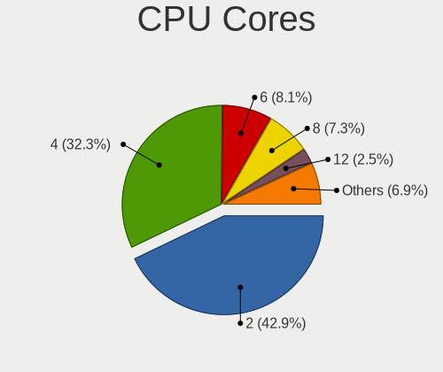

| Number | Computers | Percent |
|--------|-----------|---------|
| 2      | 427       | 44.29%  |
| 4      | 309       | 32.05%  |
| 6      | 74        | 7.68%   |
| 8      | 67        | 6.95%   |
| 12     | 25        | 2.59%   |
| 10     | 16        | 1.66%   |
| 14     | 14        | 1.45%   |
| 1      | 9         | 0.93%   |
| 16     | 7         | 0.73%   |
| 3      | 7         | 0.73%   |
| 24     | 5         | 0.52%   |
| 20     | 2         | 0.21%   |
| 32     | 1         | 0.1%    |
| 18     | 1         | 0.1%    |

CPU Sockets
-----------

Number of sockets

| Number | Computers | Percent |
|--------|-----------|---------|
| 1      | 960       | 99.69%  |
| 2      | 3         | 0.31%   |

CPU Threads
-----------

Threads per core (Hyper-Threading)

| Number | Computers | Percent |
|--------|-----------|---------|
| 2      | 647       | 67.19%  |
| 1      | 316       | 32.81%  |

CPU Op-Modes
------------

CPU Operation Modes (32-bit, 64-bit)

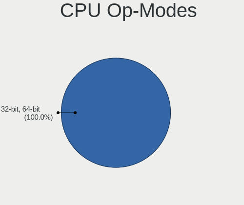

| Op mode        | Computers | Percent |
|----------------|-----------|---------|
| 32-bit, 64-bit | 963       | 100%    |

CPU Microcode
-------------

Microcode number

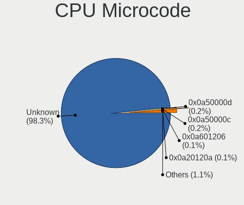

| Number     | Computers | Percent |
|------------|-----------|---------|
| Unknown    | 935       | 96.89%  |
| 0x0a50000d | 5         | 0.52%   |
| 0x0a50000c | 3         | 0.31%   |
| 0x0a20120a | 3         | 0.31%   |
| 0x0a601206 | 2         | 0.21%   |
| 0x0a601203 | 2         | 0.21%   |
| 0x08600109 | 2         | 0.21%   |
| 0x08001138 | 2         | 0.21%   |
| 0x806d1    | 1         | 0.1%    |
| 0x306c3    | 1         | 0.1%    |
| 0x08a00008 | 1         | 0.1%    |
| 0x08701030 | 1         | 0.1%    |
| 0x08701021 | 1         | 0.1%    |
| 0x08608103 | 1         | 0.1%    |
| 0x08600106 | 1         | 0.1%    |
| 0x08101007 | 1         | 0.1%    |
| 0x0800820d | 1         | 0.1%    |
| 0x0700010f | 1         | 0.1%    |
| 0x05000119 | 1         | 0.1%    |

CPU Microarch
-------------

Microarchitecture

| Name             | Computers | Percent |
|------------------|-----------|---------|
| KabyLake         | 116       | 12.05%  |
| Haswell          | 91        | 9.45%   |
| Unknown          | 91        | 9.45%   |
| IvyBridge        | 83        | 8.62%   |
| SandyBridge      | 80        | 8.31%   |
| Penryn           | 60        | 6.23%   |
| Zen 3            | 56        | 5.82%   |
| Skylake          | 54        | 5.61%   |
| Westmere         | 36        | 3.74%   |
| Goldmont plus    | 31        | 3.22%   |
| Broadwell        | 27        | 2.8%    |
| Zen 2            | 26        | 2.7%    |
| TigerLake        | 22        | 2.28%   |
| Core             | 18        | 1.87%   |
| Zen+             | 17        | 1.77%   |
| Silvermont       | 17        | 1.77%   |
| Piledriver       | 17        | 1.77%   |
| K10              | 14        | 1.45%   |
| Goldmont         | 14        | 1.45%   |
| Zen              | 13        | 1.35%   |
| IceLake          | 12        | 1.25%   |
| CometLake        | 12        | 1.25%   |
| Excavator        | 9         | 0.93%   |
| Alderlake Hybrid | 9         | 0.93%   |
| Jaguar           | 7         | 0.73%   |
| Nehalem          | 6         | 0.62%   |
| Steamroller      | 4         | 0.42%   |
| Puma             | 4         | 0.42%   |
| Bobcat           | 4         | 0.42%   |
| K8 Hammer        | 3         | 0.31%   |
| K8 & K10 hybrid  | 3         | 0.31%   |
| Bulldozer        | 3         | 0.31%   |
| Tremont          | 1         | 0.1%    |
| NetBurst         | 1         | 0.1%    |
| K10 Llano        | 1         | 0.1%    |
| Bonnell          | 1         | 0.1%    |

Graphics
--------

GPU Vendor
----------

Vendors of graphics cards

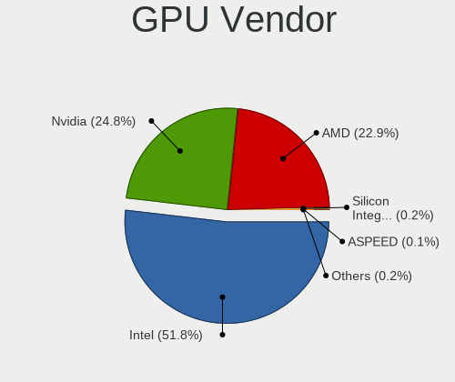

| Vendor            | Computers | Percent |
|-------------------|-----------|---------|
| Intel             | 566       | 51.27%  |
| AMD               | 274       | 24.82%  |
| Nvidia            | 262       | 23.73%  |
| ASPEED Technology | 2         | 0.18%   |

GPU Model
---------

Graphics card models

| Model                                                                                    | Computers | Percent |
|------------------------------------------------------------------------------------------|-----------|---------|
| Intel 2nd Generation Core Processor Family Integrated Graphics Controller                | 58        | 5.15%   |
| Intel 3rd Gen Core processor Graphics Controller                                         | 43        | 3.82%   |
| Intel GeminiLake [UHD Graphics 600]                                                      | 29        | 2.58%   |
| Intel Skylake GT2 [HD Graphics 520]                                                      | 28        | 2.49%   |
| Intel Haswell-ULT Integrated Graphics Controller                                         | 27        | 2.4%    |
| Intel HD Graphics 620                                                                    | 21        | 1.87%   |
| Intel Core Processor Integrated Graphics Controller                                      | 21        | 1.87%   |
| AMD Cezanne [Radeon Vega Series / Radeon Vega Mobile Series]                             | 21        | 1.87%   |
| Intel UHD Graphics 620                                                                   | 20        | 1.78%   |
| Intel Mobile 4 Series Chipset Integrated Graphics Controller                             | 20        | 1.78%   |
| Intel HD Graphics 5500                                                                   | 19        | 1.69%   |
| Intel TigerLake-LP GT2 [Iris Xe Graphics]                                                | 18        | 1.6%    |
| Intel Xeon E3-1200 v2/3rd Gen Core processor Graphics Controller                         | 17        | 1.51%   |
| Intel Xeon E3-1200 v3/4th Gen Core Processor Integrated Graphics Controller              | 16        | 1.42%   |
| Intel 4th Gen Core Processor Integrated Graphics Controller                              | 16        | 1.42%   |
| AMD Picasso/Raven 2 [Radeon Vega Series / Radeon Vega Mobile Series]                     | 15        | 1.33%   |
| Intel WhiskeyLake-U GT2 [UHD Graphics 620]                                               | 14        | 1.24%   |
| AMD Renoir [Radeon RX Vega 6 (Ryzen 4000/5000 Mobile Series)]                            | 14        | 1.24%   |
| Intel HD Graphics 530                                                                    | 13        | 1.15%   |
| Intel HD Graphics 500                                                                    | 13        | 1.15%   |
| AMD Ellesmere [Radeon RX 470/480/570/570X/580/580X/590]                                  | 13        | 1.15%   |
| AMD Barcelo                                                                              | 12        | 1.07%   |
| Intel Raptor Lake-P [Iris Xe Graphics]                                                   | 11        | 0.98%   |
| AMD Lucienne                                                                             | 11        | 0.98%   |
| Nvidia GK208B [GeForce GT 710]                                                           | 10        | 0.89%   |
| Intel CometLake-U GT2 [UHD Graphics]                                                     | 10        | 0.89%   |
| Intel CoffeeLake-S GT2 [UHD Graphics 630]                                                | 10        | 0.89%   |
| Intel Atom Processor Z36xxx/Z37xxx Series Graphics & Display                             | 9         | 0.8%    |
| Intel Atom/Celeron/Pentium Processor x5-E8000/J3xxx/N3xxx Integrated Graphics Controller | 8         | 0.71%   |
| Nvidia GF117M [GeForce 610M/710M/810M/820M / GT 620M/625M/630M/720M]                     | 7         | 0.62%   |
| Intel JasperLake [UHD Graphics]                                                          | 7         | 0.62%   |
| Intel Alder Lake-N [UHD Graphics]                                                        | 7         | 0.62%   |
| AMD Seymour [Radeon HD 6400M/7400M Series]                                               | 7         | 0.62%   |
| AMD Raven Ridge [Radeon Vega Series / Radeon Vega Mobile Series]                         | 7         | 0.62%   |
| AMD Raphael                                                                              | 7         | 0.62%   |
| Nvidia TU117M [GeForce GTX 1650 Mobile / Max-Q]                                          | 6         | 0.53%   |
| Nvidia GF119 [GeForce GT 610]                                                            | 6         | 0.53%   |
| Nvidia GA104 [GeForce RTX 3060 Ti Lite Hash Rate]                                        | 6         | 0.53%   |
| Intel Iris Plus Graphics G7                                                              | 6         | 0.53%   |
| Intel CoffeeLake-H GT2 [UHD Graphics 630]                                                | 6         | 0.53%   |

GPU Combo
---------

Combinations of graphics cards

| Name                    | Computers | Percent |
|-------------------------|-----------|---------|
| 1 x Intel               | 443       | 45.91%  |
| 1 x AMD                 | 215       | 22.28%  |
| 1 x Nvidia              | 163       | 16.89%  |
| Intel + Nvidia          | 79        | 8.19%   |
| Intel + AMD             | 31        | 3.21%   |
| AMD + Nvidia            | 17        | 1.76%   |
| 2 x AMD                 | 11        | 1.14%   |
| 2 x Nvidia              | 3         | 0.31%   |
| Other                   | 1         | 0.1%    |
| 2 x Nvidia + 1 x ASPEED | 1         | 0.1%    |
| 1 x ASPEED              | 1         | 0.1%    |

GPU Driver
----------

Free vs proprietary

| Driver      | Computers | Percent |
|-------------|-----------|---------|
| Free        | 796       | 82.23%  |
| Proprietary | 143       | 14.77%  |
| Unknown     | 29        | 3%      |

GPU Memory
----------

Total video memory

| Size in GB | Computers | Percent |
|------------|-----------|---------|
| Unknown    | 866       | 89.56%  |
| 1.01-2.0   | 21        | 2.17%   |
| 0.01-0.5   | 21        | 2.17%   |
| 7.01-8.0   | 19        | 1.96%   |
| 8.01-16.0  | 14        | 1.45%   |
| 3.01-4.0   | 8         | 0.83%   |
| 0.51-1.0   | 8         | 0.83%   |
| 5.01-6.0   | 6         | 0.62%   |
| 2.01-3.0   | 4         | 0.41%   |

Monitor
-------

Monitor Vendor
--------------

Monitor vendors

| Vendor                  | Computers | Percent |
|-------------------------|-----------|---------|
| Samsung Electronics     | 135       | 13.93%  |
| AU Optronics            | 125       | 12.9%   |
| BOE                     | 95        | 9.8%    |
| LG Display              | 88        | 9.08%   |
| Chimei Innolux          | 70        | 7.22%   |
| Goldstar                | 57        | 5.88%   |
| Dell                    | 46        | 4.75%   |
| Apple                   | 42        | 4.33%   |
| Hewlett-Packard         | 29        | 2.99%   |
| AOC                     | 26        | 2.68%   |
| Acer                    | 26        | 2.68%   |
| Philips                 | 17        | 1.75%   |
| BenQ                    | 16        | 1.65%   |
| Sharp                   | 14        | 1.44%   |
| ViewSonic               | 13        | 1.34%   |
| Chi Mei Optoelectronics | 12        | 1.24%   |
| Ancor Communications    | 12        | 1.24%   |
| Lenovo                  | 11        | 1.14%   |
| InfoVision              | 9         | 0.93%   |
| Sony                    | 8         | 0.83%   |
| PANDA                   | 8         | 0.83%   |
| ASUSTek Computer        | 8         | 0.83%   |
| HKC                     | 6         | 0.62%   |
| CSO                     | 6         | 0.62%   |
| Hitachi                 | 5         | 0.52%   |
| Panasonic               | 4         | 0.41%   |
| MSI                     | 4         | 0.41%   |
| GreenWood               | 4         | 0.41%   |
| Eizo                    | 4         | 0.41%   |
| TMX                     | 3         | 0.31%   |
| RTK                     | 3         | 0.31%   |
| Iiyama                  | 3         | 0.31%   |
| Fujitsu Siemens         | 3         | 0.31%   |
| Vizio                   | 2         | 0.21%   |
| VIE                     | 2         | 0.21%   |
| Unknown                 | 2         | 0.21%   |
| STD                     | 2         | 0.21%   |
| SLD                     | 2         | 0.21%   |
| Sceptre Tech            | 2         | 0.21%   |
| NEC Computers           | 2         | 0.21%   |

Monitor Model
-------------

Monitor models

| Model                                                                    | Computers | Percent |
|--------------------------------------------------------------------------|-----------|---------|
| Samsung Electronics LCD Monitor SEC5441 1366x768 344x194mm 15.5-inch     | 8         | 0.81%   |
| Samsung Electronics LCD Monitor SDC3853 2736x1824 260x173mm 12.3-inch    | 6         | 0.61%   |
| Chimei Innolux LCD Monitor CMN15E7 1920x1080 344x193mm 15.5-inch         | 5         | 0.51%   |
| AU Optronics LCD Monitor AUO183C 1366x768 309x173mm 13.9-inch            | 5         | 0.51%   |
| Samsung Electronics LCD Monitor SDC4171 2880x1800 302x189mm 14.0-inch    | 4         | 0.41%   |
| Goldstar HDR WFHD GSM7714 2560x1080 798x334mm 34.1-inch                  | 4         | 0.41%   |
| Goldstar HDR 4K GSM7706 3840x2160 600x340mm 27.2-inch                    | 4         | 0.41%   |
| Chimei Innolux LCD Monitor CMN14D6 1366x768 309x173mm 13.9-inch          | 4         | 0.41%   |
| AU Optronics LCD Monitor AUO323C 1366x768 309x173mm 13.9-inch            | 4         | 0.41%   |
| AU Optronics LCD Monitor AUO2E3C 1366x768 309x173mm 13.9-inch            | 4         | 0.41%   |
| Samsung Electronics LU28R55 SAM1017 3840x2160 632x360mm 28.6-inch        | 3         | 0.3%    |
| Samsung Electronics C27F390 SAM0D32 1920x1080 598x336mm 27.0-inch        | 3         | 0.3%    |
| LG Display LCD Monitor LGD046F 1920x1080 340x190mm 15.3-inch             | 3         | 0.3%    |
| LG Display LCD Monitor LGD03F8 1366x768 345x194mm 15.6-inch              | 3         | 0.3%    |
| LG Display LCD Monitor LGD039F 1366x768 345x194mm 15.6-inch              | 3         | 0.3%    |
| GreenWood ARZOPA GWD0156 1920x1080 344x193mm 15.5-inch                   | 3         | 0.3%    |
| Chimei Innolux LCD Monitor CMN15F5 1920x1080 344x193mm 15.5-inch         | 3         | 0.3%    |
| Chimei Innolux LCD Monitor CMN14D4 1920x1080 309x173mm 13.9-inch         | 3         | 0.3%    |
| Chi Mei Optoelectronics LCD Monitor CMO15A7 1366x768 344x193mm 15.5-inch | 3         | 0.3%    |
| BOE LCD Monitor BOE0877 1920x1080 309x173mm 13.9-inch                    | 3         | 0.3%    |
| BOE LCD Monitor BOE07F7 1920x1080 309x174mm 14.0-inch                    | 3         | 0.3%    |
| AU Optronics LCD Monitor AUOAF90 1920x1080 344x193mm 15.5-inch           | 3         | 0.3%    |
| AU Optronics LCD Monitor AUO723C 1366x768 309x173mm 13.9-inch            | 3         | 0.3%    |
| AU Optronics LCD Monitor AUO71EC 1366x768 344x193mm 15.5-inch            | 3         | 0.3%    |
| AU Optronics LCD Monitor AUO61ED 1920x1080 344x194mm 15.5-inch           | 3         | 0.3%    |
| AU Optronics LCD Monitor AUO38ED 1920x1080 344x193mm 15.5-inch           | 3         | 0.3%    |
| AU Optronics LCD Monitor AUO333C 1366x768 309x173mm 13.9-inch            | 3         | 0.3%    |
| AU Optronics LCD Monitor AUO21EC 1366x768 344x193mm 15.5-inch            | 3         | 0.3%    |
| AU Optronics LCD Monitor AUO106C 1366x768 277x156mm 12.5-inch            | 3         | 0.3%    |
| Apple iMac APPA00C 1920x1080 475x267mm 21.5-inch                         | 3         | 0.3%    |
| Apple Color LCD APPA037 2880x1800 286x179mm 13.3-inch                    | 3         | 0.3%    |
| AOC G2460PG AOC2460 1920x1080 531x299mm 24.0-inch                        | 3         | 0.3%    |
| AOC 27G2G3 AOC2702 1920x1080 598x336mm 27.0-inch                         | 3         | 0.3%    |
| AOC 2260WG5 AOC2260 1920x1080 477x268mm 21.5-inch                        | 3         | 0.3%    |
| ViewSonic XG3220 SERIES VSC1D35 3840x2160 698x393mm 31.5-inch            | 2         | 0.2%    |
| VIE ATHEN U2L 24 VIE2380 1920x1080 527x296mm 23.8-inch                   | 2         | 0.2%    |
| Unknown LCD Monitor SAMSUNG 1920x1080                                    | 2         | 0.2%    |
| Sony SDM-HS95P SNY2600 1280x1024 376x301mm 19.0-inch                     | 2         | 0.2%    |
| SLD LCD Monitor SLD003C 1366x768 309x173mm 13.9-inch                     | 2         | 0.2%    |
| Sharp LQ135P1JX51 SHP14B3 2256x1504 285x190mm 13.5-inch                  | 2         | 0.2%    |

Monitor Resolution
------------------

Monitor screen resolution

| Resolution         | Computers | Percent |
|--------------------|-----------|---------|
| 1920x1080 (FHD)    | 390       | 41.53%  |
| 1366x768 (WXGA)    | 215       | 22.9%   |
| 3840x2160 (4K)     | 77        | 8.2%    |
| 1600x900 (HD+)     | 37        | 3.94%   |
| 2560x1440 (QHD)    | 31        | 3.3%    |
| 1920x1200 (WUXGA)  | 23        | 2.45%   |
| 1440x900 (WXGA+)   | 23        | 2.45%   |
| 1280x800 (WXGA)    | 21        | 2.24%   |
| 1680x1050 (WSXGA+) | 17        | 1.81%   |
| 2880x1800          | 16        | 1.7%    |
| 1280x1024 (SXGA)   | 12        | 1.28%   |
| 2560x1600          | 10        | 1.06%   |
| 2736x1824          | 8         | 0.85%   |
| 2560x1080          | 8         | 0.85%   |
| 3440x1440          | 7         | 0.75%   |
| 1360x768           | 6         | 0.64%   |
| 1920x1280          | 5         | 0.53%   |
| 3840x1080          | 4         | 0.43%   |
| 2160x1440          | 4         | 0.43%   |
| 3840x2400          | 3         | 0.32%   |
| 3200x2000          | 2         | 0.21%   |
| 2880x1920          | 2         | 0.21%   |
| 2304x1440          | 2         | 0.21%   |
| 2256x1504          | 2         | 0.21%   |
| 504x315            | 1         | 0.11%   |
| 480x1920           | 1         | 0.11%   |
| 3840x2560          | 1         | 0.11%   |
| 3840x1200          | 1         | 0.11%   |
| 3072x1920          | 1         | 0.11%   |
| 2880x1620          | 1         | 0.11%   |
| 2880x1440          | 1         | 0.11%   |
| 2520x1680          | 1         | 0.11%   |
| 2288x1287          | 1         | 0.11%   |
| 1920x540           | 1         | 0.11%   |
| 1920x1600          | 1         | 0.11%   |
| 1800x1200          | 1         | 0.11%   |
| 1680x945           | 1         | 0.11%   |
| 1024x600           | 1         | 0.11%   |

Monitor Diagonal
----------------

Diagonal size in inches

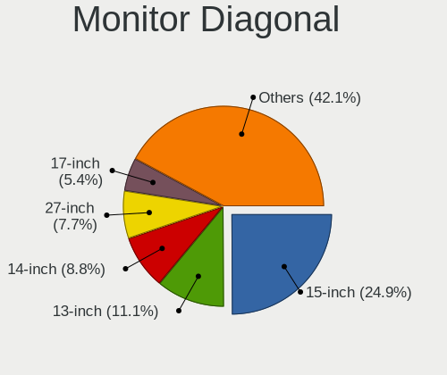

| Inches  | Computers | Percent |
|---------|-----------|---------|
| 15      | 241       | 24.95%  |
| 13      | 111       | 11.49%  |
| 14      | 91        | 9.42%   |
| 27      | 68        | 7.04%   |
| 24      | 55        | 5.69%   |
| 23      | 55        | 5.69%   |
| 17      | 48        | 4.97%   |
| 21      | 45        | 4.66%   |
| 31      | 27        | 2.8%    |
| 18      | 27        | 2.8%    |
| 12      | 27        | 2.8%    |
| 16      | 20        | 2.07%   |
| Unknown | 20        | 2.07%   |
| 84      | 16        | 1.66%   |
| 19      | 16        | 1.66%   |
| 34      | 15        | 1.55%   |
| 11      | 12        | 1.24%   |
| 22      | 11        | 1.14%   |
| 20      | 11        | 1.14%   |
| 72      | 5         | 0.52%   |
| 40      | 5         | 0.52%   |
| 10      | 5         | 0.52%   |
| 54      | 4         | 0.41%   |
| 28      | 4         | 0.41%   |
| 26      | 4         | 0.41%   |
| 65      | 3         | 0.31%   |
| 49      | 3         | 0.31%   |
| 48      | 3         | 0.31%   |
| 75      | 2         | 0.21%   |
| 32      | 2         | 0.21%   |
| 29      | 2         | 0.21%   |
| 60      | 1         | 0.1%    |
| 55      | 1         | 0.1%    |
| 46      | 1         | 0.1%    |
| 43      | 1         | 0.1%    |
| 39      | 1         | 0.1%    |
| 37      | 1         | 0.1%    |
| 25      | 1         | 0.1%    |
| 7       | 1         | 0.1%    |

Monitor Width
-------------

Physical width

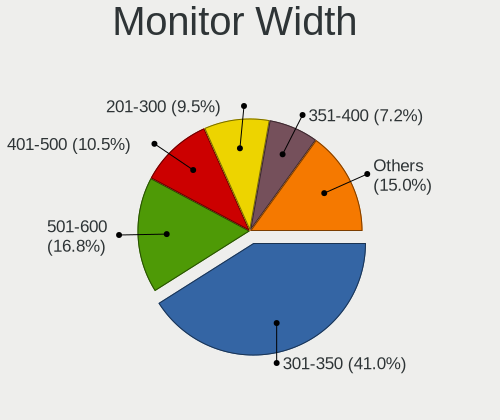

| Width in mm | Computers | Percent |
|-------------|-----------|---------|
| 301-350     | 397       | 41.57%  |
| 501-600     | 167       | 17.49%  |
| 401-500     | 102       | 10.68%  |
| 201-300     | 96        | 10.05%  |
| 351-400     | 69        | 7.23%   |
| 601-700     | 39        | 4.08%   |
| 1501-2000   | 23        | 2.41%   |
| Unknown     | 20        | 2.09%   |
| 1001-1500   | 17        | 1.78%   |
| 701-800     | 16        | 1.68%   |
| 801-900     | 7         | 0.73%   |
| 101-200     | 1         | 0.1%    |
| 901-1000    | 1         | 0.1%    |

Aspect Ratio
------------

Proportional relationship between the width and the height

| Ratio   | Computers | Percent |
|---------|-----------|---------|
| 16/9    | 705       | 78.33%  |
| 16/10   | 117       | 13%     |
| 3/2     | 27        | 3%      |
| 21/9    | 16        | 1.78%   |
| Unknown | 13        | 1.44%   |
| 5/4     | 10        | 1.11%   |
| 32/9    | 4         | 0.44%   |
| 6/5     | 2         | 0.22%   |
| 4/3     | 2         | 0.22%   |
| 3.20    | 1         | 0.11%   |
| 2.00    | 1         | 0.11%   |
| 0.80    | 1         | 0.11%   |
| 0.25    | 1         | 0.11%   |

Monitor Area
------------

Area in inch

| Area in inch | Computers | Percent |
|----------------|-----------|---------|
| 101-110        | 239       | 24.92%  |
| 81-90          | 163       | 17%     |
| 201-250        | 129       | 13.45%  |
| 301-350        | 69        | 7.19%   |
| 351-500        | 49        | 5.11%   |
| 151-200        | 47        | 4.9%    |
| 121-130        | 40        | 4.17%   |
| 71-80          | 38        | 3.96%   |
| More than 1000 | 33        | 3.44%   |
| 141-150        | 26        | 2.71%   |
| 61-70          | 25        | 2.61%   |
| 251-300        | 21        | 2.19%   |
| Unknown        | 20        | 2.09%   |
| 111-120        | 15        | 1.56%   |
| 51-60          | 13        | 1.36%   |
| 501-1000       | 13        | 1.36%   |
| 131-140        | 7         | 0.73%   |
| 91-100         | 7         | 0.73%   |
| 41-50          | 4         | 0.42%   |
| 1-40           | 1         | 0.1%    |

Pixel Density
-------------

Pixels per inch

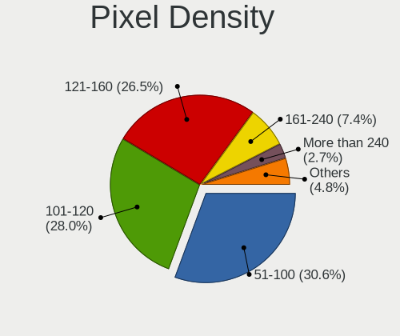

| Density       | Computers | Percent |
|---------------|-----------|---------|
| 51-100        | 297       | 31.66%  |
| 101-120       | 250       | 26.65%  |
| 121-160       | 244       | 26.01%  |
| 161-240       | 74        | 7.89%   |
| More than 240 | 35        | 3.73%   |
| Unknown       | 20        | 2.13%   |
| 1-50          | 18        | 1.92%   |

Multiple Monitors
-----------------

Total monitors connected

| Total | Computers | Percent |
|-------|-----------|---------|
| 1     | 795       | 82.38%  |
| 2     | 94        | 9.74%   |
| 0     | 65        | 6.74%   |
| 3     | 10        | 1.04%   |
| 4     | 1         | 0.1%    |

Network
-------

Net Controller Vendor
---------------------

Controller vendors

| Vendor                                | Computers | Percent |
|---------------------------------------|-----------|---------|
| Realtek Semiconductor                 | 545       | 36.87%  |
| Intel                                 | 442       | 29.91%  |
| Qualcomm Atheros                      | 161       | 10.89%  |
| Broadcom                              | 100       | 6.77%   |
| MediaTek                              | 28        | 1.89%   |
| Marvell Technology Group              | 24        | 1.62%   |
| TP-Link                               | 21        | 1.42%   |
| Broadcom Limited                      | 20        | 1.35%   |
| Ralink Technology                     | 17        | 1.15%   |
| Ralink                                | 16        | 1.08%   |
| Samsung Electronics                   | 14        | 0.95%   |
| Sierra Wireless                       | 12        | 0.81%   |
| Nvidia                                | 7         | 0.47%   |
| Microsoft                             | 7         | 0.47%   |
| JMicron Technology                    | 5         | 0.34%   |
| D-Link                                | 5         | 0.34%   |
| ASIX Electronics                      | 5         | 0.34%   |
| NetGear                               | 4         | 0.27%   |
| Hewlett-Packard                       | 4         | 0.27%   |
| DisplayLink                           | 4         | 0.27%   |
| Ericsson Business Mobile Networks     | 3         | 0.2%    |
| Qualcomm                              | 2         | 0.14%   |
| Lenovo                                | 2         | 0.14%   |
| Edimax Technology                     | 2         | 0.14%   |
| Dell                                  | 2         | 0.14%   |
| Belkin Components                     | 2         | 0.14%   |
| ASUSTek Computer                      | 2         | 0.14%   |
| Aquantia                              | 2         | 0.14%   |
| 802.11g Adapter [Linksys WUSB54GC v3] | 2         | 0.14%   |
| ZTopInc                               | 1         | 0.07%   |
| XYZ,Handheld_Scanner                  | 1         | 0.07%   |
| Xiaomi                                | 1         | 0.07%   |
| Wilocity                              | 1         | 0.07%   |
| U-Blox                                | 1         | 0.07%   |
| TRENDnet                              | 1         | 0.07%   |
| Texas Instruments                     | 1         | 0.07%   |
| Silicon Integrated Systems [SiS]      | 1         | 0.07%   |
| Raspberry Pi                          | 1         | 0.07%   |
| Qualcomm Atheros Communications       | 1         | 0.07%   |
| QinHeng Electronics                   | 1         | 0.07%   |

Net Controller Model
--------------------

Controller models

| Model                                                                  | Computers | Percent |
|------------------------------------------------------------------------|-----------|---------|
| Realtek RTL8111/8168/8211/8411 PCI Express Gigabit Ethernet Controller | 331       | 19.1%   |
| Realtek RTL810xE PCI Express Fast Ethernet controller                  | 73        | 4.21%   |
| Intel 82579LM Gigabit Network Connection (Lewisville)                  | 40        | 2.31%   |
| Realtek RTL8125 2.5GbE Controller                                      | 32        | 1.85%   |
| Intel Wi-Fi 6 AX200                                                    | 26        | 1.5%    |
| Intel Wireless 7260                                                    | 25        | 1.44%   |
| Realtek RTL8821CE 802.11ac PCIe Wireless Network Adapter               | 24        | 1.38%   |
| Qualcomm Atheros QCA9377 802.11ac Wireless Network Adapter             | 24        | 1.38%   |
| Qualcomm Atheros AR9285 Wireless Network Adapter (PCI-Express)         | 24        | 1.38%   |
| Realtek RTL8153 Gigabit Ethernet Adapter                               | 23        | 1.33%   |
| Qualcomm Atheros QCA9565 / AR9565 Wireless Network Adapter             | 22        | 1.27%   |
| Intel Wireless 8265 / 8275                                             | 22        | 1.27%   |
| Intel Wireless 7265                                                    | 22        | 1.27%   |
| Qualcomm Atheros AR9485 Wireless Network Adapter                       | 20        | 1.15%   |
| Intel Wireless 3165                                                    | 20        | 1.15%   |
| Intel Wi-Fi 6 AX201                                                    | 19        | 1.1%    |
| Intel Ethernet Connection I217-LM                                      | 19        | 1.1%    |
| Realtek 802.11ac NIC                                                   | 18        | 1.04%   |
| Intel Alder Lake-P PCH CNVi WiFi                                       | 17        | 0.98%   |
| Intel Wireless 8260                                                    | 16        | 0.92%   |
| Realtek RTL8822CE 802.11ac PCIe Wireless Network Adapter               | 14        | 0.81%   |
| Intel Wi-Fi 6E(802.11ax) AX210/AX1675* 2x2 [Typhoon Peak]              | 14        | 0.81%   |
| Broadcom NetXtreme BCM57765 Gigabit Ethernet PCIe                      | 13        | 0.75%   |
| Qualcomm Atheros QCA6174 802.11ac Wireless Network Adapter             | 12        | 0.69%   |
| Intel Raptor Lake PCH CNVi WiFi                                        | 12        | 0.69%   |
| Intel Ethernet Controller I225-V                                       | 12        | 0.69%   |
| Intel Ethernet Connection (2) I219-V                                   | 12        | 0.69%   |
| Realtek RTL8188EE Wireless Network Adapter                             | 11        | 0.63%   |
| Qualcomm Atheros AR928X Wireless Network Adapter (PCI-Express)         | 11        | 0.63%   |
| Qualcomm Atheros AR8151 v2.0 Gigabit Ethernet                          | 11        | 0.63%   |
| Intel Centrino Advanced-N 6205 [Taylor Peak]                           | 11        | 0.63%   |
| Broadcom BCM4331 802.11a/b/g/n                                         | 11        | 0.63%   |
| Intel 82579V Gigabit Network Connection                                | 10        | 0.58%   |
| MediaTek MT7921 802.11ax PCI Express Wireless Network Adapter          | 9         | 0.52%   |
| Intel Wi-Fi 5(802.11ac) Wireless-AC 9x6x [Thunder Peak]                | 9         | 0.52%   |
| Intel Raptor Lake-S PCH CNVi WiFi                                      | 9         | 0.52%   |
| Intel I211 Gigabit Network Connection                                  | 9         | 0.52%   |
| Intel Ethernet Connection (4) I219-LM                                  | 9         | 0.52%   |
| Samsung Galaxy series, misc. (tethering mode)                          | 8         | 0.46%   |
| MediaTek MT7922 802.11ax PCI Express Wireless Network Adapter          | 8         | 0.46%   |

Wireless Vendor
---------------

Wireless vendors

| Vendor                                | Computers | Percent |
|---------------------------------------|-----------|---------|
| Intel                                 | 342       | 40.28%  |
| Realtek Semiconductor                 | 158       | 18.61%  |
| Qualcomm Atheros                      | 132       | 15.55%  |
| Broadcom                              | 71        | 8.36%   |
| MediaTek                              | 27        | 3.18%   |
| TP-Link                               | 20        | 2.36%   |
| Ralink Technology                     | 17        | 2%      |
| Ralink                                | 16        | 1.88%   |
| Broadcom Limited                      | 15        | 1.77%   |
| Sierra Wireless                       | 12        | 1.41%   |
| Marvell Technology Group              | 8         | 0.94%   |
| Microsoft                             | 5         | 0.59%   |
| D-Link                                | 5         | 0.59%   |
| NetGear                               | 4         | 0.47%   |
| Edimax Technology                     | 2         | 0.24%   |
| Dell                                  | 2         | 0.24%   |
| Belkin Components                     | 2         | 0.24%   |
| ASUSTek Computer                      | 2         | 0.24%   |
| 802.11g Adapter [Linksys WUSB54GC v3] | 2         | 0.24%   |
| ZTopInc                               | 1         | 0.12%   |
| Wilocity                              | 1         | 0.12%   |
| TRENDnet                              | 1         | 0.12%   |
| Qualcomm Atheros Communications       | 1         | 0.12%   |
| Qualcomm                              | 1         | 0.12%   |
| IMC Networks                          | 1         | 0.12%   |
| BUFFALO                               | 1         | 0.12%   |

Wireless Model
--------------

Wireless models

| Model                                                          | Computers | Percent |
|----------------------------------------------------------------|-----------|---------|
| Intel Wi-Fi 6 AX200                                            | 26        | 3.04%   |
| Intel Wireless 7260                                            | 25        | 2.93%   |
| Realtek RTL8821CE 802.11ac PCIe Wireless Network Adapter       | 24        | 2.81%   |
| Qualcomm Atheros QCA9377 802.11ac Wireless Network Adapter     | 24        | 2.81%   |
| Qualcomm Atheros AR9285 Wireless Network Adapter (PCI-Express) | 24        | 2.81%   |
| Qualcomm Atheros QCA9565 / AR9565 Wireless Network Adapter     | 22        | 2.58%   |
| Intel Wireless 8265 / 8275                                     | 22        | 2.58%   |
| Intel Wireless 7265                                            | 22        | 2.58%   |
| Qualcomm Atheros AR9485 Wireless Network Adapter               | 20        | 2.34%   |
| Intel Wireless 3165                                            | 20        | 2.34%   |
| Intel Wi-Fi 6 AX201                                            | 19        | 2.22%   |
| Realtek 802.11ac NIC                                           | 18        | 2.11%   |
| Intel Alder Lake-P PCH CNVi WiFi                               | 17        | 1.99%   |
| Intel Wireless 8260                                            | 16        | 1.87%   |
| Realtek RTL8822CE 802.11ac PCIe Wireless Network Adapter       | 14        | 1.64%   |
| Intel Wi-Fi 6E(802.11ax) AX210/AX1675* 2x2 [Typhoon Peak]      | 14        | 1.64%   |
| Qualcomm Atheros QCA6174 802.11ac Wireless Network Adapter     | 12        | 1.41%   |
| Intel Raptor Lake PCH CNVi WiFi                                | 12        | 1.41%   |
| Realtek RTL8188EE Wireless Network Adapter                     | 11        | 1.29%   |
| Qualcomm Atheros AR928X Wireless Network Adapter (PCI-Express) | 11        | 1.29%   |
| Intel Centrino Advanced-N 6205 [Taylor Peak]                   | 11        | 1.29%   |
| Broadcom BCM4331 802.11a/b/g/n                                 | 11        | 1.29%   |
| MediaTek MT7921 802.11ax PCI Express Wireless Network Adapter  | 9         | 1.05%   |
| Intel Wi-Fi 5(802.11ac) Wireless-AC 9x6x [Thunder Peak]        | 9         | 1.05%   |
| Intel Raptor Lake-S PCH CNVi WiFi                              | 9         | 1.05%   |
| MediaTek MT7922 802.11ax PCI Express Wireless Network Adapter  | 8         | 0.94%   |
| Marvell Group 88W8897 [AVASTAR] 802.11ac Wireless              | 8         | 0.94%   |
| Intel WiFi Link 5100                                           | 8         | 0.94%   |
| Intel Ice Lake-LP PCH CNVi WiFi                                | 8         | 0.94%   |
| Intel Cannon Point-LP CNVi [Wireless-AC]                       | 8         | 0.94%   |
| Broadcom BCM4313 802.11bgn Wireless Network Adapter            | 8         | 0.94%   |
| Realtek RTL8852BE PCIe 802.11ax Wireless Network Controller    | 7         | 0.82%   |
| Ralink MT7601U Wireless Adapter                                | 7         | 0.82%   |
| Intel Gemini Lake PCH CNVi WiFi                                | 7         | 0.82%   |
| Intel Dual Band Wireless-AC 3165 Plus Bluetooth                | 7         | 0.82%   |
| Intel Centrino Advanced-N 6235                                 | 7         | 0.82%   |
| Intel Cannon Lake PCH CNVi WiFi                                | 7         | 0.82%   |
| Broadcom BCM43142 802.11b/g/n                                  | 7         | 0.82%   |
| Realtek RTL88x2bu [AC1200 Techkey]                             | 6         | 0.7%    |
| Realtek RTL8192EU 802.11b/g/n WLAN Adapter                     | 6         | 0.7%    |

Ethernet Vendor
---------------

Ethernet vendors

| Vendor                           | Computers | Percent |
|----------------------------------|-----------|---------|
| Realtek Semiconductor            | 470       | 55.29%  |
| Intel                            | 210       | 24.71%  |
| Broadcom                         | 51        | 6%      |
| Qualcomm Atheros                 | 45        | 5.29%   |
| Marvell Technology Group         | 16        | 1.88%   |
| Samsung Electronics              | 14        | 1.65%   |
| Nvidia                           | 7         | 0.82%   |
| JMicron Technology               | 5         | 0.59%   |
| Broadcom Limited                 | 5         | 0.59%   |
| ASIX Electronics                 | 5         | 0.59%   |
| DisplayLink                      | 4         | 0.47%   |
| Hewlett-Packard                  | 3         | 0.35%   |
| Microsoft                        | 2         | 0.24%   |
| Lenovo                           | 2         | 0.24%   |
| Aquantia                         | 2         | 0.24%   |
| Xiaomi                           | 1         | 0.12%   |
| TP-Link                          | 1         | 0.12%   |
| Silicon Integrated Systems [SiS] | 1         | 0.12%   |
| Qualcomm                         | 1         | 0.12%   |
| Panini                           | 1         | 0.12%   |
| OPPO Electronics                 | 1         | 0.12%   |
| Motorola PCS                     | 1         | 0.12%   |
| MediaTek                         | 1         | 0.12%   |
| Google                           | 1         | 0.12%   |

Ethernet Model
--------------

Ethernet models

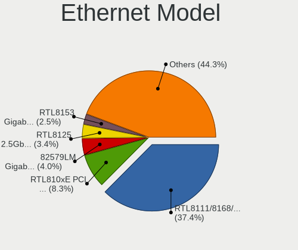

| Model                                                                  | Computers | Percent |
|------------------------------------------------------------------------|-----------|---------|
| Realtek RTL8111/8168/8211/8411 PCI Express Gigabit Ethernet Controller | 331       | 38.09%  |
| Realtek RTL810xE PCI Express Fast Ethernet controller                  | 73        | 8.4%    |
| Intel 82579LM Gigabit Network Connection (Lewisville)                  | 40        | 4.6%    |
| Realtek RTL8125 2.5GbE Controller                                      | 32        | 3.68%   |
| Realtek RTL8153 Gigabit Ethernet Adapter                               | 23        | 2.65%   |
| Intel Ethernet Connection I217-LM                                      | 19        | 2.19%   |
| Broadcom NetXtreme BCM57765 Gigabit Ethernet PCIe                      | 13        | 1.5%    |
| Intel Ethernet Controller I225-V                                       | 12        | 1.38%   |
| Intel Ethernet Connection (2) I219-V                                   | 12        | 1.38%   |
| Qualcomm Atheros AR8151 v2.0 Gigabit Ethernet                          | 11        | 1.27%   |
| Intel 82579V Gigabit Network Connection                                | 10        | 1.15%   |
| Intel I211 Gigabit Network Connection                                  | 9         | 1.04%   |
| Intel Ethernet Connection (4) I219-LM                                  | 9         | 1.04%   |
| Samsung Galaxy series, misc. (tethering mode)                          | 8         | 0.92%   |
| Intel Ethernet Controller I226-V                                       | 7         | 0.81%   |
| Intel Ethernet Connection I219-LM                                      | 7         | 0.81%   |
| Intel Ethernet Connection I218-LM                                      | 7         | 0.81%   |
| Intel Ethernet Connection I217-V                                       | 7         | 0.81%   |
| Intel Ethernet Connection (3) I218-LM                                  | 7         | 0.81%   |
| Broadcom NetXtreme BCM57766 Gigabit Ethernet PCIe                      | 7         | 0.81%   |
| Samsung GT-I9070 (network tethering, USB debugging enabled)            | 6         | 0.69%   |
| Nvidia MCP79 Ethernet                                                  | 6         | 0.69%   |
| Intel Ethernet Connection (4) I219-V                                   | 6         | 0.69%   |
| Intel Ethernet Connection (2) I219-LM                                  | 6         | 0.69%   |
| Broadcom NetLink BCM57780 Gigabit Ethernet PCIe                        | 6         | 0.69%   |
| Realtek Killer E2600 GbE Controller                                    | 5         | 0.58%   |
| Qualcomm Atheros AR8161 Gigabit Ethernet                               | 5         | 0.58%   |
| Intel I210 Gigabit Network Connection                                  | 5         | 0.58%   |
| Intel Ethernet Connection (5) I219-LM                                  | 5         | 0.58%   |
| Broadcom NetXtreme BCM5764M Gigabit Ethernet PCIe                      | 5         | 0.58%   |
| ASIX AX88179 Gigabit Ethernet                                          | 5         | 0.58%   |
| Qualcomm Atheros AR8162 Fast Ethernet                                  | 4         | 0.46%   |
| Qualcomm Atheros AR8152 v2.0 Fast Ethernet                             | 4         | 0.46%   |
| Qualcomm Atheros AR8131 Gigabit Ethernet                               | 4         | 0.46%   |
| Qualcomm Atheros AR8121/AR8113/AR8114 Gigabit or Fast Ethernet         | 4         | 0.46%   |
| Marvell Group 88E8040 PCI-E Fast Ethernet Controller                   | 4         | 0.46%   |
| JMicron JMC250 PCI Express Gigabit Ethernet Controller                 | 4         | 0.46%   |
| Intel Ethernet Connection I219-V                                       | 4         | 0.46%   |
| Intel Ethernet Connection (7) I219-V                                   | 4         | 0.46%   |
| Intel 82577LM Gigabit Network Connection                               | 4         | 0.46%   |

Net Controller Kind
-------------------

Ethernet, WiFi or modem

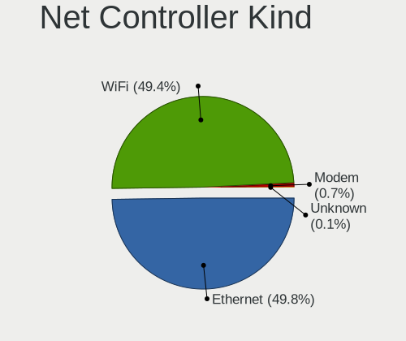

| Kind     | Computers | Percent |
|----------|-----------|---------|
| Ethernet | 806       | 50.12%  |
| WiFi     | 792       | 49.25%  |
| Modem    | 10        | 0.62%   |

Used Controller
---------------

Currently used network controller

| Kind     | Computers | Percent |
|----------|-----------|---------|
| WiFi     | 624       | 62.15%  |
| Ethernet | 380       | 37.85%  |

NICs
----

Total network controllers on board

| Total | Computers | Percent |
|-------|-----------|---------|
| 2     | 534       | 55.39%  |
| 1     | 392       | 40.66%  |
| 3     | 21        | 2.18%   |
| 0     | 14        | 1.45%   |
| 4     | 2         | 0.21%   |
| 5     | 1         | 0.1%    |

IPv6
----

IPv6 vs IPv4

| Used | Computers | Percent |
|------|-----------|---------|
| No   | 614       | 63.56%  |
| Yes  | 352       | 36.44%  |

Bluetooth
---------

Bluetooth Vendor
----------------

Controller vendors

| Vendor                          | Computers | Percent |
|---------------------------------|-----------|---------|
| Intel                           | 284       | 44.79%  |
| Realtek Semiconductor           | 68        | 10.73%  |
| Qualcomm Atheros Communications | 45        | 7.1%    |
| Apple                           | 41        | 6.47%   |
| Cambridge Silicon Radio         | 39        | 6.15%   |
| IMC Networks                    | 32        | 5.05%   |
| Foxconn / Hon Hai               | 22        | 3.47%   |
| Lite-On Technology              | 17        | 2.68%   |
| Broadcom                        | 14        | 2.21%   |
| ASUSTek Computer                | 11        | 1.74%   |
| Marvell Semiconductor           | 9         | 1.42%   |
| Toshiba                         | 8         | 1.26%   |
| Hewlett-Packard                 | 8         | 1.26%   |
| MediaTek                        | 7         | 1.1%    |
| Dell                            | 7         | 1.1%    |
| Ralink                          | 4         | 0.63%   |
| Actions                         | 4         | 0.63%   |
| TP-Link                         | 2         | 0.32%   |
| Realtek                         | 2         | 0.32%   |
| Alps Electric                   | 2         | 0.32%   |
| Smart Modular Technologies      | 1         | 0.16%   |
| Ralink Technology               | 1         | 0.16%   |
| Qcom                            | 1         | 0.16%   |
| Integrated System Solution      | 1         | 0.16%   |
| Foxconn International           | 1         | 0.16%   |
| Edimax Technology               | 1         | 0.16%   |
| Dynex                           | 1         | 0.16%   |
| Belkin Components               | 1         | 0.16%   |

Bluetooth Model
---------------

Controller models

| Model                                                                               | Computers | Percent |
|-------------------------------------------------------------------------------------|-----------|---------|
| Intel Bluetooth wireless interface                                                  | 77        | 12.15%  |
| Intel AX201 Bluetooth                                                               | 57        | 8.99%   |
| Realtek Bluetooth Radio                                                             | 41        | 6.47%   |
| Cambridge Silicon Radio Bluetooth Dongle (HCI mode)                                 | 39        | 6.15%   |
| Intel Bluetooth Device                                                              | 36        | 5.68%   |
| Intel Bluetooth 9460/9560 Jefferson Peak (JfP)                                      | 31        | 4.89%   |
| Intel AX200 Bluetooth                                                               | 24        | 3.79%   |
| Qualcomm Atheros  Bluetooth Device                                                  | 22        | 3.47%   |
| Intel AX211 Bluetooth                                                               | 22        | 3.47%   |
| Apple Bluetooth Host Controller                                                     | 16        | 2.52%   |
| Apple Bluetooth USB Host Controller                                                 | 15        | 2.37%   |
| Realtek  Bluetooth 4.2 Adapter                                                      | 13        | 2.05%   |
| Intel AX210 Bluetooth                                                               | 12        | 1.89%   |
| IMC Networks Wireless_Device                                                        | 12        | 1.89%   |
| Intel Centrino Bluetooth Wireless Transceiver                                       | 10        | 1.58%   |
| Qualcomm Atheros AR3011 Bluetooth                                                   | 9         | 1.42%   |
| IMC Networks Bluetooth Device                                                       | 9         | 1.42%   |
| Qualcomm Atheros AR3012 Bluetooth 4.0                                               | 8         | 1.26%   |
| Intel Wireless-AC 9260 Bluetooth Adapter                                            | 8         | 1.26%   |
| Apple Built-in Bluetooth 2.0+EDR HCI                                                | 8         | 1.26%   |
| Realtek 802.11ac WLAN Adapter                                                       | 7         | 1.1%    |
| MediaTek Wireless_Device                                                            | 7         | 1.1%    |
| Marvell Bluetooth and Wireless LAN Composite                                        | 7         | 1.1%    |
| IMC Networks Bluetooth Radio                                                        | 7         | 1.1%    |
| Foxconn / Hon Hai Bluetooth Device                                                  | 7         | 1.1%    |
| Broadcom BCM2045B (BDC-2.1)                                                         | 5         | 0.79%   |
| Toshiba Bluetooth Device                                                            | 4         | 0.63%   |
| Ralink RT3290 Bluetooth                                                             | 4         | 0.63%   |
| Lite-On Wireless_Device                                                             | 4         | 0.63%   |
| Lite-On Bluetooth Device                                                            | 4         | 0.63%   |
| Intel Centrino Advanced-N 6230 Bluetooth adapter                                    | 4         | 0.63%   |
| HP Broadcom 2070 Bluetooth Combo                                                    | 4         | 0.63%   |
| HP Bluetooth 2.0 Interface [Broadcom BCM2045]                                       | 4         | 0.63%   |
| Foxconn / Hon Hai Foxconn T77H114 BCM2070 [Single-Chip Bluetooth 2.1 + EDR Adapter] | 4         | 0.63%   |
| Actions general adapter                                                             | 4         | 0.63%   |
| Realtek RTL8723B Bluetooth                                                          | 3         | 0.47%   |
| Lite-On Atheros AR3012 Bluetooth                                                    | 3         | 0.47%   |
| Intel Wireless-AC 3168 Bluetooth                                                    | 3         | 0.47%   |
| Foxconn / Hon Hai Wireless_Device                                                   | 3         | 0.47%   |
| Dell DW375 Bluetooth Module                                                         | 3         | 0.47%   |

Sound
-----

Sound Vendor
------------

Sound card vendors

| Vendor                                       | Computers | Percent |
|----------------------------------------------|-----------|---------|
| Intel                                        | 729       | 55.61%  |
| AMD                                          | 267       | 20.37%  |
| Nvidia                                       | 211       | 16.09%  |
| C-Media Electronics                          | 13        | 0.99%   |
| Creative Labs                                | 8         | 0.61%   |
| ASUSTek Computer                             | 8         | 0.61%   |
| JMTek                                        | 6         | 0.46%   |
| Logitech                                     | 5         | 0.38%   |
| Zoran Co. Personal Media Division (Nogatech) | 4         | 0.31%   |
| Generalplus Technology                       | 4         | 0.31%   |
| Texas Instruments                            | 3         | 0.23%   |
| Sony                                         | 3         | 0.23%   |
| Realtek Semiconductor                        | 3         | 0.23%   |
| Razer USA                                    | 3         | 0.23%   |
| Plantronics                                  | 3         | 0.23%   |
| Micro Star International                     | 3         | 0.23%   |
| Hewlett-Packard                              | 3         | 0.23%   |
| Lautsprecher Teufel                          | 2         | 0.15%   |
| Focusrite-Novation                           | 2         | 0.15%   |
| Corsair                                      | 2         | 0.15%   |
| Unknown                                      | 2         | 0.15%   |
| USB Audio                                    | 1         | 0.08%   |
| TX                                           | 1         | 0.08%   |
| Trust                                        | 1         | 0.08%   |
| Thesycon Systemsoftware & Consulting         | 1         | 0.08%   |
| Tenx Technology                              | 1         | 0.08%   |
| SteelSeries ApS                              | 1         | 0.08%   |
| Silicon Integrated Systems [SiS]             | 1         | 0.08%   |
| Setek Elektronik                             | 1         | 0.08%   |
| SAVITECH                                     | 1         | 0.08%   |
| Roland                                       | 1         | 0.08%   |
| ONN                                          | 1         | 0.08%   |
| Nordic Semiconductor ASA                     | 1         | 0.08%   |
| Medeli Electronics                           | 1         | 0.08%   |
| Mackie Designs                               | 1         | 0.08%   |
| Lenovo                                       | 1         | 0.08%   |
| Harman International                         | 1         | 0.08%   |
| GN Netcom                                    | 1         | 0.08%   |
| FiiO Electronics Technology                  | 1         | 0.08%   |
| Digidesign                                   | 1         | 0.08%   |

Sound Model
-----------

Sound card models

| Model                                                                      | Computers | Percent |
|----------------------------------------------------------------------------|-----------|---------|
| AMD Family 17h/19h HD Audio Controller                                     | 101       | 6.44%   |
| Intel Sunrise Point-LP HD Audio                                            | 84        | 5.35%   |
| Intel 6 Series/C200 Series Chipset Family High Definition Audio Controller | 82        | 5.23%   |
| Intel 7 Series/C216 Chipset Family High Definition Audio Controller        | 74        | 4.72%   |
| Intel 8 Series/C220 Series Chipset High Definition Audio Controller        | 58        | 3.7%    |
| AMD Renoir Radeon High Definition Audio Controller                         | 57        | 3.63%   |
| Intel 5 Series/3400 Series Chipset High Definition Audio                   | 38        | 2.42%   |
| Intel 82801I (ICH9 Family) HD Audio Controller                             | 35        | 2.23%   |
| Intel Xeon E3-1200 v3/4th Gen Core Processor HD Audio Controller           | 31        | 1.98%   |
| Intel Celeron/Pentium Silver Processor High Definition Audio               | 31        | 1.98%   |
| AMD FCH Azalia Controller                                                  | 29        | 1.85%   |
| AMD SBx00 Azalia (Intel HDA)                                               | 28        | 1.78%   |
| Intel Haswell-ULT HD Audio Controller                                      | 27        | 1.72%   |
| Intel 8 Series HD Audio Controller                                         | 27        | 1.72%   |
| Intel Broadwell-U Audio Controller                                         | 25        | 1.59%   |
| AMD Starship/Matisse HD Audio Controller                                   | 25        | 1.59%   |
| Intel Wildcat Point-LP High Definition Audio Controller                    | 23        | 1.47%   |
| Intel Tiger Lake-LP Smart Sound Technology Audio Controller                | 22        | 1.4%    |
| Intel 100 Series/C230 Series Chipset Family HD Audio Controller            | 22        | 1.4%    |
| AMD Raven/Raven2/Fenghuang HDMI/DP Audio Controller                        | 22        | 1.4%    |
| Nvidia Audio device                                                        | 21        | 1.34%   |
| Intel Cannon Lake PCH cAVS                                                 | 20        | 1.27%   |
| Nvidia GA104 High Definition Audio Controller                              | 18        | 1.15%   |
| Intel Alder Lake PCH-P High Definition Audio Controller                    | 18        | 1.15%   |
| AMD Ellesmere HDMI Audio [Radeon RX 470/480 / 570/580/590]                 | 18        | 1.15%   |
| Nvidia GP107GL High Definition Audio Controller                            | 16        | 1.02%   |
| Intel NM10/ICH7 Family High Definition Audio Controller                    | 16        | 1.02%   |
| Intel 200 Series PCH HD Audio                                              | 16        | 1.02%   |
| Nvidia GK208 HDMI/DP Audio Controller                                      | 15        | 0.96%   |
| Intel Cannon Point-LP High Definition Audio Controller                     | 15        | 0.96%   |
| AMD Kabini HDMI/DP Audio                                                   | 15        | 0.96%   |
| Intel Celeron N3350/Pentium N4200/Atom E3900 Series Audio Cluster          | 14        | 0.89%   |
| Intel Raptor Lake-P/U/H cAVS                                               | 13        | 0.83%   |
| AMD Rembrandt Radeon High Definition Audio Controller                      | 13        | 0.83%   |
| AMD Navi 21/23 HDMI/DP Audio Controller                                    | 13        | 0.83%   |
| Nvidia GF119 HDMI Audio Controller                                         | 12        | 0.76%   |
| Intel Raptor Lake High Definition Audio Controller                         | 12        | 0.76%   |
| Intel 82801H (ICH8 Family) HD Audio Controller                             | 12        | 0.76%   |
| Nvidia GF108 High Definition Audio Controller                              | 10        | 0.64%   |
| Nvidia GA106 High Definition Audio Controller                              | 10        | 0.64%   |

Memory
------

Memory Vendor
-------------

Memory module vendors

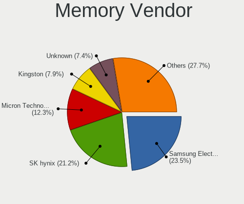

| Vendor              | Computers | Percent |
|---------------------|-----------|---------|
| Samsung Electronics | 39        | 27.27%  |
| SK hynix            | 20        | 13.99%  |
| Micron Technology   | 18        | 12.59%  |
| Unknown             | 14        | 9.79%   |
| Kingston            | 13        | 9.09%   |
| Corsair             | 13        | 9.09%   |
| G.Skill             | 4         | 2.8%    |
| Crucial             | 4         | 2.8%    |
| Unknown (ABCD)      | 3         | 2.1%    |
| Team                | 3         | 2.1%    |
| Ramaxel Technology  | 2         | 1.4%    |
| Lexar               | 2         | 1.4%    |
| Unknown (0x8945)    | 1         | 0.7%    |
| Unknown (0x0B38)    | 1         | 0.7%    |
| Teikon              | 1         | 0.7%    |
| Smart Brazil        | 1         | 0.7%    |
| Nanya Technology    | 1         | 0.7%    |
| Elpida              | 1         | 0.7%    |
| A-DATA Technology   | 1         | 0.7%    |
| Unknown             | 1         | 0.7%    |

Memory Model
------------

Memory module models

| Model                                                            | Computers | Percent |
|------------------------------------------------------------------|-----------|---------|
| Unknown (ABCD) RAM 123456789012345678 2GB SODIMM LPDDR4 2400MT/s | 3         | 2.03%   |
| Samsung RAM M471B5273DH0-CH9 4GB SODIMM DDR3 1334MT/s            | 3         | 2.03%   |
| Unknown RAM Module 4GB SODIMM DDR3                               | 2         | 1.35%   |
| Unknown RAM Module 4GB DIMM DDR3 1333MT/s                        | 2         | 1.35%   |
| Unknown RAM Module 2GB SODIMM DDR2 800MT/s                       | 2         | 1.35%   |
| Unknown RAM Module 2GB SODIMM DDR2 667MT/s                       | 2         | 1.35%   |
| SK hynix RAM HMCG78MEBSA095N 16GB SODIMM DDR5 4800MT/s           | 2         | 1.35%   |
| Samsung RAM M471B5173EB0-YK0 4GB SODIMM DDR3 1600MT/s            | 2         | 1.35%   |
| Samsung RAM M471A5244CB0-CWE 4GB SODIMM DDR4 3200MT/s            | 2         | 1.35%   |
| Micron RAM 8ATF1G64HZ-3G2R1 8GB SODIMM DDR4 3200MT/s             | 2         | 1.35%   |
| Micron RAM 4ATF51264HZ-3G2J1 4GB SODIMM DDR4 3200MT/s            | 2         | 1.35%   |
| Micron RAM 4ATF1G64HZ-3G2F1 8GB SODIMM DDR4 3200MT/s             | 2         | 1.35%   |
| Micron RAM 4ATF1G64HZ-3G2E1 8GB Row Of Chips DDR4 3200MT/s       | 2         | 1.35%   |
| Corsair RAM CMK16GX4M2B3200C16 8GB DIMM DDR4 3600MT/s            | 2         | 1.35%   |
| Unknown RAM Module 8GB SODIMM DDR4 2667MT/s                      | 1         | 0.68%   |
| Unknown RAM Module 4GB SODIMM DDR2                               | 1         | 0.68%   |
| Unknown RAM Module 4GB DIMM 1066MT/s                             | 1         | 0.68%   |
| Unknown RAM Module 4GB DIMM                                      | 1         | 0.68%   |
| Unknown RAM Module 2GB SODIMM DDR3 1600MT/s                      | 1         | 0.68%   |
| Unknown RAM Module 2GB DIMM 800MT/s                              | 1         | 0.68%   |
| Unknown RAM Module 1GB SODIMM DDR3                               | 1         | 0.68%   |
| Unknown RAM Module 1GB DIMM 667MT/s                              | 1         | 0.68%   |
| Unknown (0x8945) RAM Module 8GB SODIMM DDR4 2400MT/s             | 1         | 0.68%   |
| Unknown (0x0B38) RAM GMA16G4SCL196P-26 16GB SODIMM DDR4 2667MT/s | 1         | 0.68%   |
| Teikon RAM TMT451S6BFR8A-PBSC 4GB SODIMM DDR3 1600MT/s           | 1         | 0.68%   |
| Team RAM TEAMGROUP-UD4-3200 8GB DIMM DDR4 3800MT/s               | 1         | 0.68%   |
| Team RAM TEAMGROUP-UD4-3200 16GB DIMM DDR4 3733MT/s              | 1         | 0.68%   |
| Team RAM TEAMGROUP-SD4-3200 16GB SODIMM DDR4 3200MT/s            | 1         | 0.68%   |
| Smart Brazil RAM SMS4TDC3C0K0446SCG 4GB SODIMM DDR4 2667MT/s     | 1         | 0.68%   |
| SK hynix RAM Module 4GB SODIMM DDR4 2400MT/s                     | 1         | 0.68%   |
| SK hynix RAM Module 2GB Row Of Chips LPDDR3 1867MT/s             | 1         | 0.68%   |
| SK hynix RAM HMT451U6BFR8A-PB 4GB DIMM DDR3 1600MT/s             | 1         | 0.68%   |
| SK hynix RAM HMT451S6AFR8C-PB 4GB SODIMM DDR3 1600MT/s           | 1         | 0.68%   |
| SK hynix RAM HMT451S6AFR8A-PB 4096MB SODIMM DDR3 1600MT/s        | 1         | 0.68%   |
| SK hynix RAM HMT351U6EFR8C-PB 4GB DIMM DDR3 1600MT/s             | 1         | 0.68%   |
| SK hynix RAM HMT325S6CFR8C-H9 2GB SODIMM DDR3 1333MT/s           | 1         | 0.68%   |
| SK hynix RAM HMA851S6DJR6N-XN 4GB Row Of Chips DDR4 3200MT/s     | 1         | 0.68%   |
| SK hynix RAM HMA851S6CJR6N-XN 4GB Row Of Chips DDR4 3200MT/s     | 1         | 0.68%   |
| SK hynix RAM HMA851S6CJR6N-VK 8GB SODIMM DDR4 2667MT/s           | 1         | 0.68%   |
| SK hynix RAM HMA851S6AFR6N-UH 4GB SODIMM DDR4 2667MT/s           | 1         | 0.68%   |

Memory Kind
-----------

Memory module kinds

| Kind    | Computers | Percent |
|---------|-----------|---------|
| DDR4    | 57        | 45.97%  |
| DDR3    | 30        | 24.19%  |
| LPDDR4  | 10        | 8.06%   |
| DDR5    | 9         | 7.26%   |
| LPDDR5  | 5         | 4.03%   |
| DDR2    | 5         | 4.03%   |
| Unknown | 4         | 3.23%   |
| SDRAM   | 2         | 1.61%   |
| LPDDR3  | 2         | 1.61%   |

Memory Form Factor
------------------

Physical design of the memory module

| Name         | Computers | Percent |
|--------------|-----------|---------|
| SODIMM       | 78        | 62.9%   |
| DIMM         | 30        | 24.19%  |
| Row Of Chips | 14        | 11.29%  |
| Chip         | 1         | 0.81%   |
| Unknown      | 1         | 0.81%   |

Memory Size
-----------

Memory module size

| Size  | Computers | Percent |
|-------|-----------|---------|
| 8192  | 48        | 35.56%  |
| 4096  | 37        | 27.41%  |
| 16384 | 28        | 20.74%  |
| 2048  | 14        | 10.37%  |
| 32768 | 6         | 4.44%   |
| 1024  | 2         | 1.48%   |

Memory Speed
------------

Memory module speed

| Speed   | Computers | Percent |
|---------|-----------|---------|
| 3200    | 25        | 19.69%  |
| 1600    | 18        | 14.17%  |
| 2667    | 15        | 11.81%  |
| 2400    | 7         | 5.51%   |
| 1333    | 6         | 4.72%   |
| 3600    | 5         | 3.94%   |
| Unknown | 5         | 3.94%   |
| 4800    | 4         | 3.15%   |
| 4267    | 4         | 3.15%   |
| 6400    | 3         | 2.36%   |
| 1334    | 3         | 2.36%   |
| 800     | 3         | 2.36%   |
| 667     | 3         | 2.36%   |
| 6000    | 2         | 1.57%   |
| 3733    | 2         | 1.57%   |
| 3400    | 2         | 1.57%   |
| 2933    | 2         | 1.57%   |
| 1867    | 2         | 1.57%   |
| 1067    | 2         | 1.57%   |
| 7500    | 1         | 0.79%   |
| 7000    | 1         | 0.79%   |
| 5600    | 1         | 0.79%   |
| 5500    | 1         | 0.79%   |
| 5200    | 1         | 0.79%   |
| 4266    | 1         | 0.79%   |
| 4199    | 1         | 0.79%   |
| 3800    | 1         | 0.79%   |
| 3266    | 1         | 0.79%   |
| 2800    | 1         | 0.79%   |
| 2133    | 1         | 0.79%   |
| 1800    | 1         | 0.79%   |
| 1648    | 1         | 0.79%   |
| 1066    | 1         | 0.79%   |

Printers & scanners
-------------------

Printer Vendor
--------------

Printer device vendors

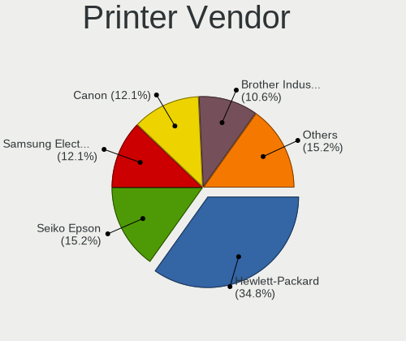

| Vendor                | Computers | Percent |
|-----------------------|-----------|---------|
| Hewlett-Packard       | 9         | 37.5%   |
| Samsung Electronics   | 4         | 16.67%  |
| Brother Industries    | 3         | 12.5%   |
| Seiko Epson           | 2         | 8.33%   |
| Lexmark International | 2         | 8.33%   |
| Ricoh                 | 1         | 4.17%   |
| Kyocera               | 1         | 4.17%   |
| Dymo-CoStar           | 1         | 4.17%   |
| Canon                 | 1         | 4.17%   |

Printer Model
-------------

Printer device models

| Model                                                 | Computers | Percent |
|-------------------------------------------------------|-----------|---------|
| HP LaserJet 1020                                      | 2         | 8.33%   |
| Seiko Epson ET-4850 Series                            | 1         | 4.17%   |
| Seiko Epson ET-2710 Series                            | 1         | 4.17%   |
| Samsung ML-216x Series Laser Printer                  | 1         | 4.17%   |
| Samsung CLX-3170 Series                               | 1         | 4.17%   |
| Samsung C48x Series Color Laser Multifunction Printer | 1         | 4.17%   |
| Samsung C43x Series                                   | 1         | 4.17%   |
| Ricoh Printing Support                                | 1         | 4.17%   |
| Lexmark International MS710                           | 1         | 4.17%   |
| Lexmark International CX310dn                         | 1         | 4.17%   |
| Kyocera ECOSYS P2235dn                                | 1         | 4.17%   |
| HP Printing Support                                   | 1         | 4.17%   |
| HP LaserJet 400 M401dne                               | 1         | 4.17%   |
| HP HP LaserJet M14-M17                                | 1         | 4.17%   |
| HP ENVY 5540 series                                   | 1         | 4.17%   |
| HP DeskJet 3700 series                                | 1         | 4.17%   |
| HP Deskjet 2050 J510                                  | 1         | 4.17%   |
| HP Color LaserJet CP1215                              | 1         | 4.17%   |
| Dymo-CoStar LabelWriter 450                           | 1         | 4.17%   |
| Canon PIXMA MP230                                     | 1         | 4.17%   |
| Brother MFC-1910W                                     | 1         | 4.17%   |
| Brother HL-L2350DW series                             | 1         | 4.17%   |
| Brother DCP-T300                                      | 1         | 4.17%   |

Scanner Vendor
--------------

Scanner device vendors

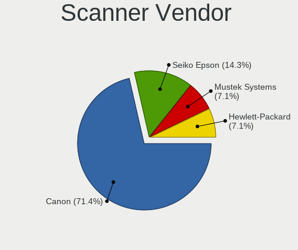

| Vendor          | Computers | Percent |
|-----------------|-----------|---------|
| Canon           | 4         | 66.67%  |
| Seiko Epson     | 1         | 16.67%  |
| Hewlett-Packard | 1         | 16.67%  |

Scanner Model
-------------

Scanner device models

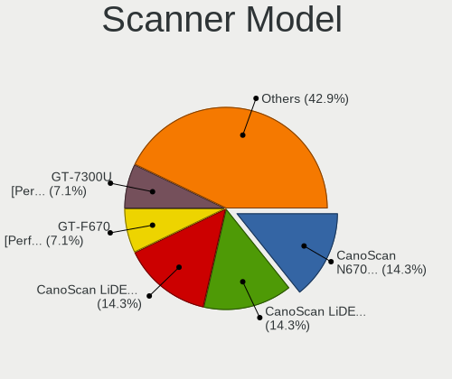

| Model                                             | Computers | Percent |
|---------------------------------------------------|-----------|---------|
| Seiko Epson GT-7300U [Perfection 1260/1260 PHOTO] | 1         | 16.67%  |
| HP ScanJet 5300c/5370c                            | 1         | 16.67%  |
| Canon CanoScan LiDE 90                            | 1         | 16.67%  |
| Canon CanoScan LiDE 210                           | 1         | 16.67%  |
| Canon CanoScan LiDE 200                           | 1         | 16.67%  |
| Canon CanoScan 8800F                              | 1         | 16.67%  |

Camera
------

Camera Vendor
-------------

Camera device vendors

| Vendor                                 | Computers | Percent |
|----------------------------------------|-----------|---------|
| Chicony Electronics                    | 114       | 18.78%  |
| Microdia                               | 50        | 8.24%   |
| IMC Networks                           | 41        | 6.75%   |
| Realtek Semiconductor                  | 38        | 6.26%   |
| Apple                                  | 36        | 5.93%   |
| Quanta                                 | 34        | 5.6%    |
| Sunplus Innovation Technology          | 30        | 4.94%   |
| Bison Electronics                      | 29        | 4.78%   |
| Logitech                               | 27        | 4.45%   |
| Suyin                                  | 26        | 4.28%   |
| Cheng Uei Precision Industry (Foxlink) | 26        | 4.28%   |
| Acer                                   | 14        | 2.31%   |
| Syntek                                 | 12        | 1.98%   |
| Lite-On Technology                     | 12        | 1.98%   |
| Silicon Motion                         | 11        | 1.81%   |
| Luxvisions Innotech Limited            | 11        | 1.81%   |
| Sonix Technology                       | 10        | 1.65%   |
| Microsoft                              | 10        | 1.65%   |
| Ricoh                                  | 7         | 1.15%   |
| Alcor Micro                            | 7         | 1.15%   |
| icSpring                               | 6         | 0.99%   |
| SunplusIT                              | 5         | 0.82%   |
| Shinetech                              | 5         | 0.82%   |
| Generalplus Technology                 | 4         | 0.66%   |
| Importek                               | 3         | 0.49%   |
| Y Media                                | 2         | 0.33%   |
| Samsung Electronics                    | 2         | 0.33%   |
| OmniVision Technologies                | 2         | 0.33%   |
| Lenovo                                 | 2         | 0.33%   |
| ARC International                      | 2         | 0.33%   |
| ALi                                    | 2         | 0.33%   |
| Unknown                                | 2         | 0.33%   |
| Z-Star Microelectronics                | 1         | 0.16%   |
| USB Camera CS                          | 1         | 0.16%   |
| TXD                                    | 1         | 0.16%   |
| Sunplus Technology                     | 1         | 0.16%   |
| Sunplus IT                             | 1         | 0.16%   |
| Shenzhen Kingcome Optoelectronic       | 1         | 0.16%   |
| Remo Tech                              | 1         | 0.16%   |
| Netchip Technology                     | 1         | 0.16%   |

Camera Model
------------

Camera device models

| Model                                                          | Computers | Percent |
|----------------------------------------------------------------|-----------|---------|
| Chicony Integrated Camera                                      | 20        | 3.27%   |
| Microdia Integrated_Webcam_HD                                  | 16        | 2.62%   |
| Apple FaceTime HD Camera (Built-in)                            | 12        | 1.96%   |
| Logitech Webcam C270                                           | 11        | 1.8%    |
| IMC Networks Integrated Camera                                 | 11        | 1.8%    |
| IMC Networks USB2.0 HD UVC WebCam                              | 10        | 1.64%   |
| Bison Integrated Camera                                        | 10        | 1.64%   |
| Apple Built-in iSight                                          | 10        | 1.64%   |
| Realtek USB Camera                                             | 9         | 1.47%   |
| Realtek Integrated_Webcam_HD                                   | 9         | 1.47%   |
| Apple FaceTime HD Camera                                       | 8         | 1.31%   |
| Sunplus Integrated_Webcam_HD                                   | 7         | 1.15%   |
| Chicony FJ Camera                                              | 7         | 1.15%   |
| Sonix USB2.0 FHD UVC WebCam                                    | 6         | 0.98%   |
| Quanta HP Wide Vision HD Camera                                | 6         | 0.98%   |
| icSpring camera                                                | 6         | 0.98%   |
| Chicony HP Truevision HD                                       | 6         | 0.98%   |
| Chicony HP HD Camera                                           | 6         | 0.98%   |
| Acer Integrated Camera                                         | 6         | 0.98%   |
| Syntek Integrated Camera                                       | 5         | 0.82%   |
| Quanta HD User Facing                                          | 5         | 0.82%   |
| Microdia Integrated Webcam                                     | 5         | 0.82%   |
| Chicony Lenovo EasyCamera                                      | 5         | 0.82%   |
| Chicony HP HD Webcam                                           | 5         | 0.82%   |
| Cheng Uei Precision Industry (Foxlink) HP TrueVision HD Camera | 5         | 0.82%   |
| Alcor Micro USB 2.0 PC cam                                     | 5         | 0.82%   |
| Suyin HP Truevision HD                                         | 4         | 0.65%   |
| Suyin 1.3M WebCam (notebook emachines E730, Acer sub-brand)    | 4         | 0.65%   |
| Microdia USB 2.0 Camera                                        | 4         | 0.65%   |
| Microdia Sonix USB 2.0 Camera                                  | 4         | 0.65%   |
| Luxvisions Innotech Limited Integrated Camera                  | 4         | 0.65%   |
| Luxvisions Innotech Limited HP TrueVision HD Camera            | 4         | 0.65%   |
| Logitech HD Pro Webcam C920                                    | 4         | 0.65%   |
| Lite-On Integrated Camera                                      | 4         | 0.65%   |
| Lite-On HP HD Camera                                           | 4         | 0.65%   |
| IMC Networks USB2.0 VGA UVC WebCam                             | 4         | 0.65%   |
| Chicony USB2.0 HD UVC WebCam                                   | 4         | 0.65%   |
| Chicony USB 2.0 Camera                                         | 4         | 0.65%   |
| Chicony HD Webcam                                              | 4         | 0.65%   |
| Chicony ACER HD User Facing                                    | 4         | 0.65%   |

Security
--------

Fingerprint Vendor
------------------

Fingerprint sensor vendors

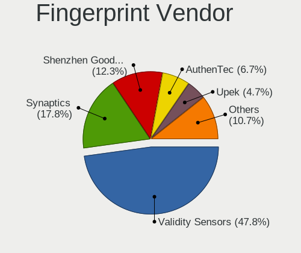

| Vendor                             | Computers | Percent |
|------------------------------------|-----------|---------|
| Validity Sensors                   | 41        | 44.09%  |
| Synaptics                          | 16        | 17.2%   |
| Shenzhen Goodix Technology         | 10        | 10.75%  |
| AuthenTec                          | 9         | 9.68%   |
| Elan Microelectronics              | 6         | 6.45%   |
| Upek                               | 4         | 4.3%    |
| LighTuning Technology              | 2         | 2.15%   |
| Samsung Electronics                | 1         | 1.08%   |
| Realtek USB2.0 Finger Print Bridge | 1         | 1.08%   |
| HOLTEK                             | 1         | 1.08%   |
| FocalTech                          | 1         | 1.08%   |
| Dell                               | 1         | 1.08%   |

Fingerprint Model
-----------------

Fingerprint sensor models

| Model                                                                      | Computers | Percent |
|----------------------------------------------------------------------------|-----------|---------|
| Validity Sensors VFS495 Fingerprint Reader                                 | 10        | 10.75%  |
| Shenzhen Goodix  Fingerprint Device                                        | 7         | 7.53%   |
| Validity Sensors VFS5011 Fingerprint Reader                                | 5         | 5.38%   |
| Validity Sensors VFS 5011 fingerprint sensor                               | 5         | 5.38%   |
| Validity Sensors Synaptics VFS7552 Touch Fingerprint Sensor with PurePrint | 5         | 5.38%   |
| Synaptics WBDI                                                             | 5         | 5.38%   |
| Validity Sensors Synaptics WBDI                                            | 4         | 4.3%    |
| Upek Biometric Touchchip/Touchstrip Fingerprint Sensor                     | 4         | 4.3%    |
| Elan ELAN:Fingerprint                                                      | 4         | 4.3%    |
| Validity Sensors VFS471 Fingerprint Reader                                 | 3         | 3.23%   |
| Validity Sensors Fingerprint scanner                                       | 3         | 3.23%   |
| Synaptics Metallica MIS Touch Fingerprint Reader                           | 3         | 3.23%   |
| AuthenTec AES2810                                                          | 3         | 3.23%   |
| AuthenTec AES1600                                                          | 3         | 3.23%   |
| Validity Sensors VFS491                                                    | 2         | 2.15%   |
| Synaptics  WBDI                                                            | 2         | 2.15%   |
| Synaptics Prometheus MIS Touch Fingerprint Reader                          | 2         | 2.15%   |
| Synaptics Metallica MOH Touch Fingerprint Reader                           | 2         | 2.15%   |
| Synaptics Fingerprint reader [HP G6]                                       | 2         | 2.15%   |
| Shenzhen Goodix Fingerprint Reader                                         | 2         | 2.15%   |
| LighTuning Fingerprint Reader                                              | 2         | 2.15%   |
| Elan ELAN:ARM-M4                                                           | 2         | 2.15%   |
| AuthenTec AES2501 Fingerprint Sensor                                       | 2         | 2.15%   |
| Validity Sensors VFS7500 Touch Fingerprint Sensor                          | 1         | 1.08%   |
| Validity Sensors VFS Fingerprint sensor                                    | 1         | 1.08%   |
| Validity Sensors Synaptics VFS7552 Touch Fingerprint Sensor                | 1         | 1.08%   |
| Validity Sensors Swipe Fingerprint Sensor                                  | 1         | 1.08%   |
| Shenzhen Goodix FingerPrint                                                | 1         | 1.08%   |
| Samsung Fingerprint Device                                                 | 1         | 1.08%   |
| Realtek USB2.0 Finger Print Bridge FocalTech Fingerprint Device            | 1         | 1.08%   |
| HOLTEK FocalTech Fingerprint Device                                        | 1         | 1.08%   |
| FocalTech Fingerprint Device                                               | 1         | 1.08%   |
| Dell MS819 Dell Wired Mouse With Fingerprint Reader                        | 1         | 1.08%   |
| AuthenTec Fingerprint Sensor                                               | 1         | 1.08%   |

Chipcard Vendor
---------------

Chipcard module vendors

| Vendor                            | Computers | Percent |
|-----------------------------------|-----------|---------|
| Broadcom                          | 20        | 47.62%  |
| Alcor Micro                       | 9         | 21.43%  |
| Upek                              | 3         | 7.14%   |
| O2 Micro                          | 2         | 4.76%   |
| Lenovo                            | 2         | 4.76%   |
| VASCO Data Security International | 1         | 2.38%   |
| NXP Semiconductors                | 1         | 2.38%   |
| Hewlett-Packard                   | 1         | 2.38%   |
| Gemalto (was Gemplus)             | 1         | 2.38%   |
| Chicony Electronics               | 1         | 2.38%   |
| Bit4id                            | 1         | 2.38%   |

Chipcard Model
--------------

Chipcard module models

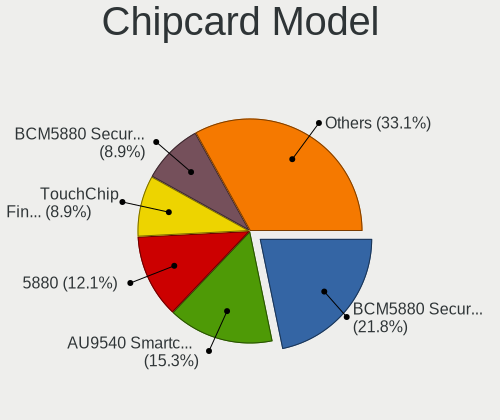

| Model                                                                        | Computers | Percent |
|------------------------------------------------------------------------------|-----------|---------|
| Alcor Micro AU9540 Smartcard Reader                                          | 9         | 21.43%  |
| Broadcom BCM5880 Secure Applications Processor                               | 7         | 16.67%  |
| Broadcom BCM5880 Secure Applications Processor with fingerprint swipe sensor | 5         | 11.9%   |
| Broadcom 5880                                                                | 4         | 9.52%   |
| Broadcom 58200                                                               | 4         | 9.52%   |
| Upek TouchChip Fingerprint Coprocessor (WBF advanced mode)                   | 3         | 7.14%   |
| O2 Micro OZ776 CCID Smartcard Reader                                         | 2         | 4.76%   |
| VASCO Data Security International DIGIPASS 870                               | 1         | 2.38%   |
| NXP Semiconductors PR533                                                     | 1         | 2.38%   |
| Lenovo Smartcard Keyboard                                                    | 1         | 2.38%   |
| Lenovo Integrated Smart Card Reader                                          | 1         | 2.38%   |
| Hewlett-Packard SC Keyboard - Apollo (Liteon)                                | 1         | 2.38%   |
| Gemalto (was Gemplus) GemPC Twin SmartCard Reader                            | 1         | 2.38%   |
| Chicony Electronics HP Skylab USB Smartcard Keyboard                         | 1         | 2.38%   |
| Bit4id miniLector EVO                                                        | 1         | 2.38%   |

Unsupported
-----------

Unsupported Devices
-------------------

Total unsupported devices on board

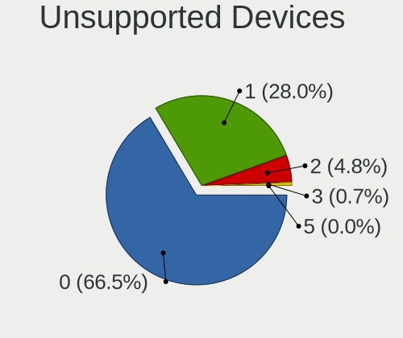

| Total | Computers | Percent |
|-------|-----------|---------|
| 0     | 666       | 68.24%  |
| 1     | 265       | 27.15%  |
| 2     | 40        | 4.1%    |
| 3     | 5         | 0.51%   |

Unsupported Device Types
------------------------

Types of unsupported devices

| Type                     | Computers | Percent |
|--------------------------|-----------|---------|
| Fingerprint reader       | 90        | 25.94%  |
| Graphics card            | 75        | 21.61%  |
| Multimedia controller    | 53        | 15.27%  |
| Net/wireless             | 49        | 14.12%  |
| Chipcard                 | 37        | 10.66%  |
| Storage                  | 10        | 2.88%   |
| Communication controller | 6         | 1.73%   |
| Camera                   | 6         | 1.73%   |
| Net/ethernet             | 5         | 1.44%   |
| Bluetooth                | 5         | 1.44%   |
| Unassigned class         | 3         | 0.86%   |
| Storage/ide              | 2         | 0.58%   |
| Network                  | 2         | 0.58%   |
| Video                    | 1         | 0.29%   |
| Unclassified device      | 1         | 0.29%   |
| Sound                    | 1         | 0.29%   |
| Card reader              | 1         | 0.29%   |

