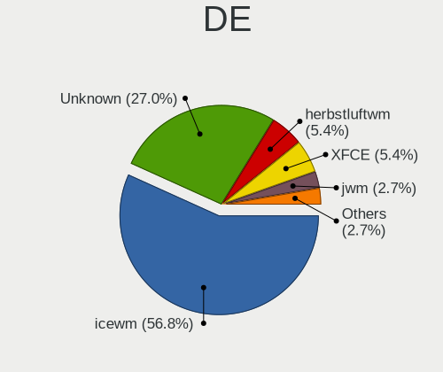
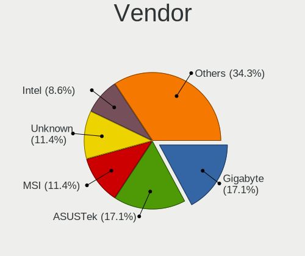
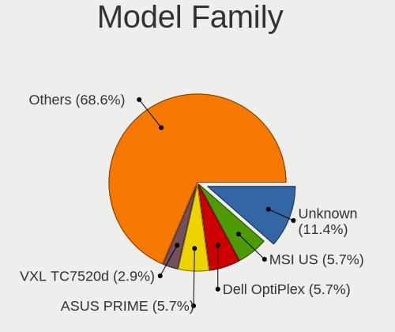
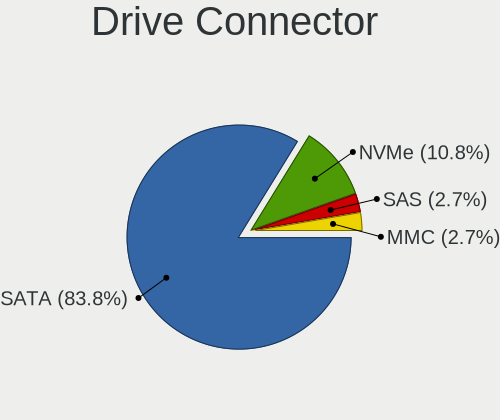
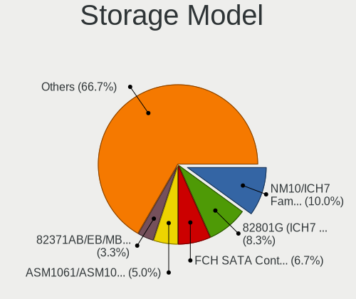
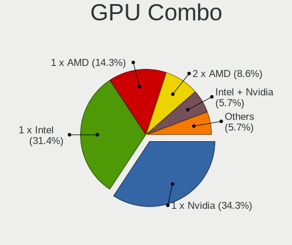
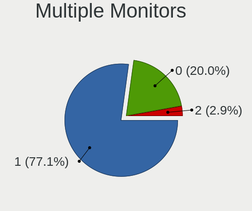
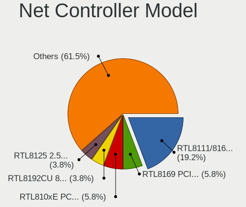
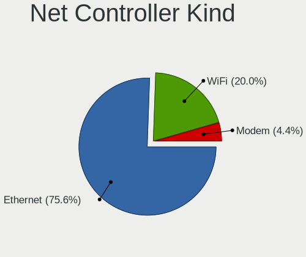
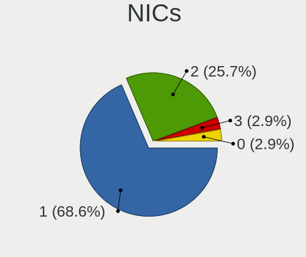

antiX - Tested Hardware & Statistics (Desktops)
-----------------------------------------------

A project to collect tested hardware configurations for antiX.

Anyone can contribute to this report by the [hw-probe](https://github.com/linuxhw/hw-probe) tool:

    sudo -E hw-probe -all -upload

Please contribute! Especially if your hardware is rare.

Contents
--------

* [ Test Cases ](#test-cases)

* [ System ](#system)
  - [ OS                       ](#os)
  - [ OS Family                ](#os-family)
  - [ Kernel                   ](#kernel)
  - [ Kernel Family            ](#kernel-family)
  - [ Kernel Major Ver.        ](#kernel-major-ver)
  - [ Arch                     ](#arch)
  - [ DE                       ](#de)
  - [ Display Server           ](#display-server)
  - [ Display Manager          ](#display-manager)
  - [ OS Lang                  ](#os-lang)
  - [ Boot Mode                ](#boot-mode)
  - [ Filesystem               ](#filesystem)
  - [ Part. scheme             ](#part-scheme)
  - [ Dual Boot with Linux/BSD ](#dual-boot-with-linuxbsd)
  - [ Dual Boot (Win)          ](#dual-boot-win)

* [ Board ](#board)
  - [ Vendor                   ](#vendor)
  - [ Model                    ](#model)
  - [ Model Family             ](#model-family)
  - [ MFG Year                 ](#mfg-year)
  - [ Form Factor              ](#form-factor)
  - [ Secure Boot              ](#secure-boot)
  - [ Coreboot                 ](#coreboot)
  - [ RAM Size                 ](#ram-size)
  - [ RAM Used                 ](#ram-used)
  - [ Total Drives             ](#total-drives)
  - [ Has CD-ROM               ](#has-cd-rom)
  - [ Has Ethernet             ](#has-ethernet)
  - [ Has WiFi                 ](#has-wifi)
  - [ Has Bluetooth            ](#has-bluetooth)

* [ Location ](#location)
  - [ Country                  ](#country)
  - [ City                     ](#city)

* [ Drives ](#drives)
  - [ Drive Vendor             ](#drive-vendor)
  - [ Drive Model              ](#drive-model)
  - [ HDD Vendor               ](#hdd-vendor)
  - [ SSD Vendor               ](#ssd-vendor)
  - [ Drive Kind               ](#drive-kind)
  - [ Drive Connector          ](#drive-connector)
  - [ Drive Size               ](#drive-size)
  - [ Space Total              ](#space-total)
  - [ Space Used               ](#space-used)
  - [ Malfunc. Drives          ](#malfunc-drives)
  - [ Malfunc. Drive Vendor    ](#malfunc-drive-vendor)
  - [ Malfunc. HDD Vendor      ](#malfunc-hdd-vendor)
  - [ Malfunc. Drive Kind      ](#malfunc-drive-kind)
  - [ Failed Drives            ](#failed-drives)
  - [ Failed Drive Vendor      ](#failed-drive-vendor)
  - [ Drive Status             ](#drive-status)

* [ Storage controller ](#storage-controller)
  - [ Storage Vendor           ](#storage-vendor)
  - [ Storage Model            ](#storage-model)
  - [ Storage Kind             ](#storage-kind)

* [ Processor ](#processor)
  - [ CPU Vendor               ](#cpu-vendor)
  - [ CPU Model                ](#cpu-model)
  - [ CPU Model Family         ](#cpu-model-family)
  - [ CPU Cores                ](#cpu-cores)
  - [ CPU Sockets              ](#cpu-sockets)
  - [ CPU Threads              ](#cpu-threads)
  - [ CPU Op-Modes             ](#cpu-op-modes)
  - [ CPU Microcode            ](#cpu-microcode)
  - [ CPU Microarch            ](#cpu-microarch)

* [ Graphics ](#graphics)
  - [ GPU Vendor               ](#gpu-vendor)
  - [ GPU Model                ](#gpu-model)
  - [ GPU Combo                ](#gpu-combo)
  - [ GPU Driver               ](#gpu-driver)
  - [ GPU Memory               ](#gpu-memory)

* [ Monitor ](#monitor)
  - [ Monitor Vendor           ](#monitor-vendor)
  - [ Monitor Model            ](#monitor-model)
  - [ Monitor Resolution       ](#monitor-resolution)
  - [ Monitor Diagonal         ](#monitor-diagonal)
  - [ Monitor Width            ](#monitor-width)
  - [ Aspect Ratio             ](#aspect-ratio)
  - [ Monitor Area             ](#monitor-area)
  - [ Pixel Density            ](#pixel-density)
  - [ Multiple Monitors        ](#multiple-monitors)

* [ Network ](#network)
  - [ Net Controller Vendor    ](#net-controller-vendor)
  - [ Net Controller Model     ](#net-controller-model)
  - [ Wireless Vendor          ](#wireless-vendor)
  - [ Wireless Model           ](#wireless-model)
  - [ Ethernet Vendor          ](#ethernet-vendor)
  - [ Ethernet Model           ](#ethernet-model)
  - [ Net Controller Kind      ](#net-controller-kind)
  - [ Used Controller          ](#used-controller)
  - [ NICs                     ](#nics)
  - [ IPv6                     ](#ipv6)

* [ Bluetooth ](#bluetooth)
  - [ Bluetooth Vendor         ](#bluetooth-vendor)
  - [ Bluetooth Model          ](#bluetooth-model)

* [ Sound ](#sound)
  - [ Sound Vendor             ](#sound-vendor)
  - [ Sound Model              ](#sound-model)

* [ Memory ](#memory)
  - [ Memory Vendor            ](#memory-vendor)
  - [ Memory Model             ](#memory-model)
  - [ Memory Kind              ](#memory-kind)
  - [ Memory Form Factor       ](#memory-form-factor)
  - [ Memory Size              ](#memory-size)
  - [ Memory Speed             ](#memory-speed)

* [ Printers & scanners ](#printers--scanners)
  - [ Printer Vendor           ](#printer-vendor)
  - [ Printer Model            ](#printer-model)
  - [ Scanner Vendor           ](#scanner-vendor)
  - [ Scanner Model            ](#scanner-model)

* [ Camera ](#camera)
  - [ Camera Vendor            ](#camera-vendor)
  - [ Camera Model             ](#camera-model)

* [ Security ](#security)
  - [ Fingerprint Vendor       ](#fingerprint-vendor)
  - [ Fingerprint Model        ](#fingerprint-model)
  - [ Chipcard Vendor          ](#chipcard-vendor)
  - [ Chipcard Model           ](#chipcard-model)

* [ Unsupported ](#unsupported)
  - [ Unsupported Devices      ](#unsupported-devices)
  - [ Unsupported Device Types ](#unsupported-device-types)

Test Cases
----------

Total: 29

| Vendor   | Model                       | Probe                                                      | Date         |
|----------|-----------------------------|------------------------------------------------------------|--------------|
| ASUSTek  | PRIME X570-PRO              | [3baedd7e19](https://linux-hardware.org/?probe=3baedd7e19) | Oct 20, 2023 |
| ASUSTek  | PRIME X470-PRO              | [9d63ed7f5f](https://linux-hardware.org/?probe=9d63ed7f5f) | Oct 19, 2023 |
| Pegatron | Eureka3                     | [e5c7ff0c70](https://linux-hardware.org/?probe=e5c7ff0c70) | Sep 30, 2023 |
| ASRock   | G31M-S                      | [f1325a7f15](https://linux-hardware.org/?probe=f1325a7f15) | Sep 23, 2023 |
| Intel    | DG41TY AAE47335-202         | [cd00ffcda2](https://linux-hardware.org/?probe=cd00ffcda2) | Sep 09, 2023 |
| Intel    | DG41TY AAE47335-202         | [4cdbce3b75](https://linux-hardware.org/?probe=4cdbce3b75) | Sep 09, 2023 |
| MSI      | MPG Z390 GAMING PRO CARB... | [4551c437bf](https://linux-hardware.org/?probe=4551c437bf) | May 18, 2023 |
| Intel    | H61                         | [aa4606c36c](https://linux-hardware.org/?probe=aa4606c36c) | May 02, 2023 |
| Pegatron | NARRA5                      | [4c8bb5eff0](https://linux-hardware.org/?probe=4c8bb5eff0) | Apr 30, 2023 |
| MSI      | B550-A PRO                  | [d8b51c995c](https://linux-hardware.org/?probe=d8b51c995c) | Apr 23, 2023 |
| Gigabyte | Z790 AERO G                 | [f33074a4c8](https://linux-hardware.org/?probe=f33074a4c8) | Apr 03, 2023 |
| Gigabyte | Z790 AERO G                 | [2f380f0d1a](https://linux-hardware.org/?probe=2f380f0d1a) | Apr 03, 2023 |
| VXL      | M6V90AI-VL                  | [935d6b4b24](https://linux-hardware.org/?probe=935d6b4b24) | Feb 21, 2023 |
| Intel    | D525MW AAE93082-401         | [a225baa8a4](https://linux-hardware.org/?probe=a225baa8a4) | Aug 05, 2022 |
| Biostar  | G31-M7 TE                   | [df98c1834c](https://linux-hardware.org/?probe=df98c1834c) | Jul 23, 2022 |
| Dell     | 0F428D A00                  | [fb8a6009f7](https://linux-hardware.org/?probe=fb8a6009f7) | Jul 16, 2022 |
| MSI      | B560M PRO-VDH WIFI [CEC]    | [af73739875](https://linux-hardware.org/?probe=af73739875) | Jul 14, 2022 |
| Unknown  | K8NF3-VSTA                  | [f2ea6e0d83](https://linux-hardware.org/?probe=f2ea6e0d83) | Jun 24, 2022 |
| MSI      | B560M PRO-VDH WIFI [CEC]    | [8654086b85](https://linux-hardware.org/?probe=8654086b85) | Jun 20, 2022 |
| Gigabyte | F2A85XM-D3H                 | [cf20f6e233](https://linux-hardware.org/?probe=cf20f6e233) | Mar 09, 2022 |
| Gigabyte | 945GCMX-S2                  | [54149177a7](https://linux-hardware.org/?probe=54149177a7) | Feb 12, 2022 |
| Unknown  | NF-CK804                    | [dc6287d017](https://linux-hardware.org/?probe=dc6287d017) | Jan 05, 2022 |
| ASUSTek  | A8R-MVP                     | [43a7b44e3f](https://linux-hardware.org/?probe=43a7b44e3f) | Mar 27, 2021 |
| ASUSTek  | M2N-MX SE Plus              | [a8985150bd](https://linux-hardware.org/?probe=a8985150bd) | Feb 08, 2021 |
| ASRock   | H81M-ITX                    | [7b2d6774c8](https://linux-hardware.org/?probe=7b2d6774c8) | Feb 05, 2021 |
| HP       | 3641h                       | [f918637d53](https://linux-hardware.org/?probe=f918637d53) | Jul 29, 2020 |
| Unknown  | Unknown                     | [7653370d96](https://linux-hardware.org/?probe=7653370d96) | Dec 16, 2019 |
| ASUSTek  | P5KPL/1600                  | [8ba4b22f71](https://linux-hardware.org/?probe=8ba4b22f71) | Oct 22, 2019 |
| Lenovo   | ThinkCentre M91p 4480B9U    | [e68917ee9f](https://linux-hardware.org/?probe=e68917ee9f) | Nov 04, 2018 |

System
------

OS
--

Installed operating systems

| Name           | Desktops | Percent |
|----------------|----------|---------|
| antiX 21       | 9        | 36%     |
| antiX 22       | 6        | 24%     |
| antiX 19.2     | 2        | 8%      |
| antiX 17.4.1   | 2        | 8%      |
| antiX 23       | 1        | 4%      |
| antiX 21-runit | 1        | 4%      |
| antiX 19.4     | 1        | 4%      |
| antiX 19.3     | 1        | 4%      |
| antiX 17.1     | 1        | 4%      |
| antiX 15       | 1        | 4%      |

OS Family
---------

OS without a version

| Name  | Desktops | Percent |
|-------|----------|---------|
| antiX | 25       | 100%    |

Kernel
------

Version of the Linux kernel

| Version                     | Desktops | Percent |
|-----------------------------|----------|---------|
| 5.10.142-antix.2-amd64-smp  | 5        | 20%     |
| 5.10.57-antix.1-amd64-smp   | 4        | 16%     |
| 4.9.0-279-antix.1-amd64-smp | 3        | 12%     |
| 4.9.160-antix.2-486-smp     | 2        | 8%      |
| 6.2.9-1-liquorix-amd64      | 1        | 4%      |
| 6.1.0-0.deb11.9-rt-amd64    | 1        | 4%      |
| 5.10.88-antix.1-amd64-smp   | 1        | 4%      |
| 5.10.188-antix.1-amd64-smp  | 1        | 4%      |
| 4.9.87-antix.1-amd64-smp    | 1        | 4%      |
| 4.9.235-antix.1-amd64-smp   | 1        | 4%      |
| 4.9.212-antix.1-amd64-smp   | 1        | 4%      |
| 4.9.212-antix.1-486-smp     | 1        | 4%      |
| 4.9.0-326-antix.1-amd64-smp | 1        | 4%      |
| 4.9.0-279-antix.1-486-smp   | 1        | 4%      |
| 4.9.0-264-antix.1-amd64-smp | 1        | 4%      |

Kernel Family
-------------

Linux kernel without a distro release

| Version  | Desktops | Percent |
|----------|----------|---------|
| 4.9.0    | 6        | 24%     |
| 5.10.142 | 5        | 20%     |
| 5.10.57  | 4        | 16%     |
| 4.9.212  | 2        | 8%      |
| 4.9.160  | 2        | 8%      |
| 6.2.9    | 1        | 4%      |
| 6.1.0    | 1        | 4%      |
| 5.10.88  | 1        | 4%      |
| 5.10.188 | 1        | 4%      |
| 4.9.87   | 1        | 4%      |
| 4.9.235  | 1        | 4%      |

Kernel Major Ver.
-----------------

Linux kernel major version

| Version | Desktops | Percent |
|---------|----------|---------|
| 4.9     | 12       | 48%     |
| 5.10    | 11       | 44%     |
| 6.2     | 1        | 4%      |
| 6.1     | 1        | 4%      |

Arch
----

OS architecture (x86_64, i586, etc.)

| Name   | Desktops | Percent |
|--------|----------|---------|
| x86_64 | 21       | 84%     |
| i686   | 4        | 16%     |

DE
--

Desktop Environment

| Name         | Desktops | Percent |
|--------------|----------|---------|
| icewm        | 12       | 48%     |
| Unknown      | 9        | 36%     |
| XFCE         | 2        | 8%      |
| jwm          | 1        | 4%      |
| herbstluftwm | 1        | 4%      |

Display Server
--------------

X11 or Wayland

| Name | Desktops | Percent |
|------|----------|---------|
| X11  | 23       | 92%     |
| Tty  | 2        | 8%      |

Display Manager
---------------

SDDM, LightDM, etc.

| Name    | Desktops | Percent |
|---------|----------|---------|
| Unknown | 11       | 44%     |
| SLiM    | 7        | 28%     |
| SLIMSKI | 5        | 20%     |
| LightDM | 2        | 8%      |

OS Lang
-------

Language

| Lang    | Desktops | Percent |
|---------|----------|---------|
| en_US   | 7        | 28%     |
| en_GB   | 3        | 12%     |
| Unknown | 3        | 12%     |
| pt_BR   | 2        | 8%      |
| pl_PL   | 2        | 8%      |
| tr_TR   | 1        | 4%      |
| sk_SK   | 1        | 4%      |
| ru_RU   | 1        | 4%      |
| it_IT   | 1        | 4%      |
| fr_FR   | 1        | 4%      |
| es_PE   | 1        | 4%      |
| es_AR   | 1        | 4%      |
| de_DE   | 1        | 4%      |

Boot Mode
---------

EFI or BIOS

| Mode | Desktops | Percent |
|------|----------|---------|
| BIOS | 19       | 76%     |
| EFI  | 6        | 24%     |

Filesystem
----------

Type of filesystem

| Type    | Desktops | Percent |
|---------|----------|---------|
| Ext4    | 21       | 84%     |
| Overlay | 2        | 8%      |
| Xfs     | 1        | 4%      |
| Ext2    | 1        | 4%      |

Part. scheme
------------

Scheme of partitioning

| Type    | Desktops | Percent |
|---------|----------|---------|
| MBR     | 15       | 60%     |
| GPT     | 9        | 36%     |
| Unknown | 1        | 4%      |

Dual Boot with Linux/BSD
------------------------

Hosting more than one Linux/BSD

| Dual boot | Desktops | Percent |
|-----------|----------|---------|
| No        | 17       | 68%     |
| Yes       | 8        | 32%     |

Dual Boot (Win)
---------------

Hosting Linux and Windows

| Dual boot | Desktops | Percent |
|-----------|----------|---------|
| No        | 16       | 64%     |
| Yes       | 9        | 36%     |

Board
-----

Vendor
------

Motherboard manufacturer

| Name                | Desktops | Percent |
|---------------------|----------|---------|
| MSI                 | 4        | 16%     |
| ASUSTek Computer    | 4        | 16%     |
| Intel               | 3        | 12%     |
| Gigabyte Technology | 3        | 12%     |
| Unknown             | 3        | 12%     |
| Pegatron            | 2        | 8%      |
| VXL                 | 1        | 4%      |
| Lenovo              | 1        | 4%      |
| Hewlett-Packard     | 1        | 4%      |
| Dell                | 1        | 4%      |
| Biostar             | 1        | 4%      |
| ASRock              | 1        | 4%      |

Model
-----

Motherboard model

| Name                            | Desktops | Percent |
|---------------------------------|----------|---------|
| Unknown                         | 3        | 12%     |
| MSI US Desktop                  | 2        | 8%      |
| VXL TC7520d                     | 1        | 4%      |
| Pegatron VC902AA-ABF p6136fr    | 1        | 4%      |
| Pegatron AU930AA-ACJ p6270in    | 1        | 4%      |
| MSI MS-7C56                     | 1        | 4%      |
| MSI MS-7B17                     | 1        | 4%      |
| Lenovo ThinkCentre M91p 4480B9U | 1        | 4%      |
| Intel H61                       | 1        | 4%      |
| Intel DG41TY AAE47335-202       | 1        | 4%      |
| Intel D525MW AAE93082-401       | 1        | 4%      |
| HP t5740                        | 1        | 4%      |
| Gigabyte Z790 AERO G            | 1        | 4%      |
| Gigabyte F2A85XM-D3H            | 1        | 4%      |
| Gigabyte 945GCMX-S2             | 1        | 4%      |
| Dell OptiPlex 960               | 1        | 4%      |
| Biostar G31-M7 TE               | 1        | 4%      |
| ASUS PRIME X570-PRO             | 1        | 4%      |
| ASUS PRIME X470-PRO             | 1        | 4%      |
| ASUS P5KPL/1600                 | 1        | 4%      |
| ASUS A8R-MVP                    | 1        | 4%      |
| ASRock G31M-S                   | 1        | 4%      |

Model Family
------------

Motherboard model prefix

| Name                 | Desktops | Percent |
|----------------------|----------|---------|
| Unknown              | 3        | 12%     |
| MSI US               | 2        | 8%      |
| ASUS PRIME           | 2        | 8%      |
| VXL TC7520d          | 1        | 4%      |
| Pegatron VC902AA-ABF | 1        | 4%      |
| Pegatron AU930AA-ACJ | 1        | 4%      |
| MSI MS-7C56          | 1        | 4%      |
| MSI MS-7B17          | 1        | 4%      |
| Lenovo ThinkCentre   | 1        | 4%      |
| Intel H61            | 1        | 4%      |
| Intel DG41TY         | 1        | 4%      |
| Intel D525MW         | 1        | 4%      |
| HP t5740             | 1        | 4%      |
| Gigabyte Z790        | 1        | 4%      |
| Gigabyte F2A85XM-D3H | 1        | 4%      |
| Gigabyte 945GCMX-S2  | 1        | 4%      |
| Dell OptiPlex        | 1        | 4%      |
| Biostar G31-M7       | 1        | 4%      |
| ASUS P5KPL           | 1        | 4%      |
| ASUS A8R-MVP         | 1        | 4%      |
| ASRock G31M-S        | 1        | 4%      |

MFG Year
--------

Motherboard manufacture year

| Year    | Desktops | Percent |
|---------|----------|---------|
| 2008    | 5        | 20%     |
| 2009    | 4        | 16%     |
| 2021    | 2        | 8%      |
| 2018    | 2        | 8%      |
| 2011    | 2        | 8%      |
| 2007    | 2        | 8%      |
| 2022    | 1        | 4%      |
| 2020    | 1        | 4%      |
| 2019    | 1        | 4%      |
| 2017    | 1        | 4%      |
| 2014    | 1        | 4%      |
| 2012    | 1        | 4%      |
| 2005    | 1        | 4%      |
| Unknown | 1        | 4%      |

Form Factor
-----------

Physical design of the computer

| Name    | Desktops | Percent |
|---------|----------|---------|
| Desktop | 25       | 100%    |

Secure Boot
-----------

Enabled or disabled

| State    | Desktops | Percent |
|----------|----------|---------|
| Disabled | 25       | 100%    |

Coreboot
--------

Have coreboot on board

| Used | Desktops | Percent |
|------|----------|---------|
| No   | 25       | 100%    |

RAM Size
--------

Total RAM memory

| Size in GB  | Desktops | Percent |
|-------------|----------|---------|
| 1.01-2.0    | 7        | 28%     |
| 32.01-64.0  | 4        | 16%     |
| 3.01-4.0    | 3        | 12%     |
| 4.01-8.0    | 2        | 8%      |
| 2.01-3.0    | 2        | 8%      |
| 64.01-256.0 | 2        | 8%      |
| 16.01-24.0  | 2        | 8%      |
| 8.01-16.0   | 1        | 4%      |
| 0.51-1.0    | 1        | 4%      |
| 0.01-0.5    | 1        | 4%      |

RAM Used
--------

Used RAM memory

| Used GB    | Desktops | Percent |
|------------|----------|---------|
| 0.51-1.0   | 8        | 32%     |
| 1.01-2.0   | 6        | 24%     |
| 0.01-0.5   | 6        | 24%     |
| 4.01-8.0   | 2        | 8%      |
| 2.01-3.0   | 2        | 8%      |
| 32.01-64.0 | 1        | 4%      |

Total Drives
------------

Number of drives on board

| Drives | Desktops | Percent |
|--------|----------|---------|
| 1      | 15       | 60%     |
| 4      | 3        | 12%     |
| 3      | 3        | 12%     |
| 2      | 2        | 8%      |
| 5      | 1        | 4%      |
| 0      | 1        | 4%      |

Has CD-ROM
----------

Has CD-ROM on board

| Presented | Desktops | Percent |
|-----------|----------|---------|
| No        | 16       | 64%     |
| Yes       | 9        | 36%     |

Has Ethernet
------------

Has Ethernet on board

| Presented | Desktops | Percent |
|-----------|----------|---------|
| Yes       | 24       | 96%     |
| No        | 1        | 4%      |

Has WiFi
--------

Has WiFi module

| Presented | Desktops | Percent |
|-----------|----------|---------|
| No        | 17       | 68%     |
| Yes       | 8        | 32%     |

Has Bluetooth
-------------

Has Bluetooth module

| Presented | Desktops | Percent |
|-----------|----------|---------|
| No        | 18       | 72%     |
| Yes       | 7        | 28%     |

Location
--------

Country
-------

Geographic location (country)

| Country   | Desktops | Percent |
|-----------|----------|---------|
| USA       | 5        | 20%     |
| UK        | 3        | 12%     |
| Russia    | 2        | 8%      |
| Poland    | 2        | 8%      |
| Germany   | 2        | 8%      |
| France    | 2        | 8%      |
| Brazil    | 2        | 8%      |
| Slovakia  | 1        | 4%      |
| Peru      | 1        | 4%      |
| Japan     | 1        | 4%      |
| Italy     | 1        | 4%      |
| India     | 1        | 4%      |
| Greece    | 1        | 4%      |
| Argentina | 1        | 4%      |

City
----

Geographic location (city)

| City              | Desktops | Percent |
|-------------------|----------|---------|
| Zagnansk          | 1        | 4%      |
| Violes            | 1        | 4%      |
| Tokyo             | 1        | 4%      |
| St Albans         | 1        | 4%      |
| Romilly-sur-Seine | 1        | 4%      |
| Padova            | 1        | 4%      |
| Otwock            | 1        | 4%      |
| Nova Londrina     | 1        | 4%      |
| Miami             | 1        | 4%      |
| Mason             | 1        | 4%      |
| Maringá          | 1        | 4%      |
| Maidstone         | 1        | 4%      |
| Lima              | 1        | 4%      |
| Kazan’          | 1        | 4%      |
| Houston           | 1        | 4%      |
| Heraklion         | 1        | 4%      |
| Greenwich         | 1        | 4%      |
| Friedrichshafen   | 1        | 4%      |
| Frankfurt am Main | 1        | 4%      |
| Covington         | 1        | 4%      |
| Buenos Aires      | 1        | 4%      |
| Bryansk           | 1        | 4%      |
| Bratislava        | 1        | 4%      |
| Boulder           | 1        | 4%      |
| Bengaluru         | 1        | 4%      |

Drives
------

Drive Vendor
------------

Hard drive vendors

| Vendor                    | Desktops | Drives | Percent |
|---------------------------|----------|--------|---------|
| WDC                       | 9        | 11     | 23.68%  |
| Samsung Electronics       | 6        | 8      | 15.79%  |
| Seagate                   | 5        | 5      | 13.16%  |
| Toshiba                   | 4        | 5      | 10.53%  |
| Micron/Crucial Technology | 2        | 2      | 5.26%   |
| Kingston                  | 2        | 3      | 5.26%   |
| BHT                       | 2        | 2      | 5.26%   |
| Unknown                   | 1        | 1      | 2.63%   |
| SanDisk                   | 1        | 1      | 2.63%   |
| NVMe                      | 1        | 1      | 2.63%   |
| Maxtor                    | 1        | 1      | 2.63%   |
| Intel                     | 1        | 1      | 2.63%   |
| Hitachi                   | 1        | 2      | 2.63%   |
| Crucial                   | 1        | 1      | 2.63%   |
| Apacer                    | 1        | 1      | 2.63%   |

Drive Model
-----------

Hard drive models

| Model                                              | Desktops | Percent |
|----------------------------------------------------|----------|---------|
| WDC WD800AAJS-75M0A0 80GB                          | 2        | 4.88%   |
| WDC WD10SPZX-80Z10T2 1TB                           | 2        | 4.88%   |
| Toshiba MQ01ABD050V -63 500GB                      | 2        | 4.88%   |
| Kingston SA400S37240G 240GB SSD                    | 2        | 4.88%   |
| BHT WR202F0032G 670270F5 32GB SSD                  | 2        | 4.88%   |
| WDC WD800JB-00ETA0 80GB                            | 1        | 2.44%   |
| WDC WD5000AAKX-60U6AA0 500GB                       | 1        | 2.44%   |
| WDC WD205BA 21GB                                   | 1        | 2.44%   |
| WDC WD2003FZEX-00Z4SA0 2TB                         | 1        | 2.44%   |
| WDC WD1600AAJS-00PSA0 160GB                        | 1        | 2.44%   |
| WDC WD10EADS-65M2B0 1TB                            | 1        | 2.44%   |
| WDC WD1005FBYZ-01YCBB3 1TB                         | 1        | 2.44%   |
| Unknown 2GB ATA Flash Disk                         | 1        | 2.44%   |
| Toshiba MQ01ABD100 1TB                             | 1        | 2.44%   |
| Toshiba MG06ACA600E 6TB                            | 1        | 2.44%   |
| Seagate ST500DM002-1BD142 500GB                    | 1        | 2.44%   |
| Seagate ST3500312CS 500GB                          | 1        | 2.44%   |
| Seagate ST3320620AS 320GB                          | 1        | 2.44%   |
| Seagate ST3320413CS 320GB                          | 1        | 2.44%   |
| Seagate ST1000DM010-2EP102 1TB                     | 1        | 2.44%   |
| SanDisk sandisk120 120GB SSD                       | 1        | 2.44%   |
| Samsung SSD 860 EVO 500GB                          | 1        | 2.44%   |
| Samsung SSD 850 EVO 120GB                          | 1        | 2.44%   |
| Samsung NVMe SSD Controller PM9A1/PM9A3/980PRO 1TB | 1        | 2.44%   |
| Samsung HD250HJ 250GB                              | 1        | 2.44%   |
| Samsung HD162GJ 160GB                              | 1        | 2.44%   |
| Samsung HD160JJ 160GB                              | 1        | 2.44%   |
| Samsung HD080HJ 80GB                               | 1        | 2.44%   |
| NVMe XPG GAMMIX S50 1TB                            | 1        | 2.44%   |
| Micron/Crucial P1 NVMe PCIe SSD 1TB                | 1        | 2.44%   |
| Micron/Crucial CT2000P5PSSD8 2TB                   | 1        | 2.44%   |
| Maxtor Z1 SSD 240GB                                | 1        | 2.44%   |
| Intel SSDPEKNW010T8 1TB                            | 1        | 2.44%   |
| Hitachi HTS723232A7A364 320GB                      | 1        | 2.44%   |
| Crucial CT500MX500SSD1 500GB                       | 1        | 2.44%   |
| Apacer 32GB SATA Flash Drive SSD                   | 1        | 2.44%   |

HDD Vendor
----------

Hard disk drive vendors

| Vendor              | Desktops | Drives | Percent |
|---------------------|----------|--------|---------|
| WDC                 | 9        | 11     | 39.13%  |
| Seagate             | 5        | 5      | 21.74%  |
| Toshiba             | 4        | 5      | 17.39%  |
| Samsung Electronics | 3        | 4      | 13.04%  |
| Unknown             | 1        | 1      | 4.35%   |
| Hitachi             | 1        | 2      | 4.35%   |

SSD Vendor
----------

Solid state drive vendors

| Vendor              | Desktops | Drives | Percent |
|---------------------|----------|--------|---------|
| Samsung Electronics | 2        | 2      | 20%     |
| Kingston            | 2        | 3      | 20%     |
| BHT                 | 2        | 2      | 20%     |
| SanDisk             | 1        | 1      | 10%     |
| Maxtor              | 1        | 1      | 10%     |
| Crucial             | 1        | 1      | 10%     |
| Apacer              | 1        | 1      | 10%     |

Drive Kind
----------

HDD or SSD

| Kind | Desktops | Drives | Percent |
|------|----------|--------|---------|
| HDD  | 18       | 28     | 56.25%  |
| SSD  | 10       | 11     | 31.25%  |
| NVMe | 4        | 6      | 12.5%   |

Drive Connector
---------------

SATA, SAS, NVMe, etc.

| Type | Desktops | Drives | Percent |
|------|----------|--------|---------|
| SATA | 23       | 39     | 85.19%  |
| NVMe | 4        | 6      | 14.81%  |

Drive Size
----------

Size of hard drive

| Size in TB | Desktops | Drives | Percent |
|------------|----------|--------|---------|
| 0.01-0.5   | 20       | 30     | 71.43%  |
| 0.51-1.0   | 6        | 6      | 21.43%  |
| 1.01-2.0   | 1        | 1      | 3.57%   |
| 4.01-10.0  | 1        | 2      | 3.57%   |

Space Total
-----------

Amount of disk space available on the file system

| Size in GB     | Desktops | Percent |
|----------------|----------|---------|
| 101-250        | 6        | 24%     |
| 21-50          | 5        | 20%     |
| 251-500        | 4        | 16%     |
| 501-1000       | 3        | 12%     |
| More than 3000 | 2        | 8%      |
| 1-20           | 2        | 8%      |
| 51-100         | 2        | 8%      |
| 1001-2000      | 1        | 4%      |

Space Used
----------

Amount of used disk space

| Used GB        | Desktops | Percent |
|----------------|----------|---------|
| 1-20           | 17       | 68%     |
| 101-250        | 3        | 12%     |
| More than 3000 | 2        | 8%      |
| 21-50          | 1        | 4%      |
| 501-1000       | 1        | 4%      |
| 51-100         | 1        | 4%      |

Malfunc. Drives
---------------

Drive models with a malfunction

| Model                                       | Desktops | Drives | Percent |
|---------------------------------------------|----------|--------|---------|
| WDC WD800AAJS-75M0A0 80GB                   | 2        | 2      | 14.29%  |
| WDC WD800JB-00ETA0 80GB                     | 1        | 1      | 7.14%   |
| WDC WD5000AAKX-60U6AA0 500GB                | 1        | 1      | 7.14%   |
| WDC WD205BA 21GB                            | 1        | 1      | 7.14%   |
| WDC WD10EADS-65M2B0 1TB                     | 1        | 1      | 7.14%   |
| Toshiba MQ01ABD100 1TB                      | 1        | 1      | 7.14%   |
| Seagate ST500DM002-1BD142 500GB             | 1        | 1      | 7.14%   |
| Seagate ST3500312CS 500GB                   | 1        | 1      | 7.14%   |
| Seagate ST3320620AS 320GB                   | 1        | 1      | 7.14%   |
| Seagate ST3320413CS 320GB                   | 1        | 1      | 7.14%   |
| SanDisk sandisk120 120GB SSD                | 1        | 1      | 7.14%   |
| Micron/Crucial Technology CT2000P5PSSD8 2TB | 1        | 1      | 7.14%   |
| Apacer 32GB SATA Flash Drive SSD            | 1        | 1      | 7.14%   |

Malfunc. Drive Vendor
---------------------

Vendors of faulty drives

| Vendor                    | Desktops | Drives | Percent |
|---------------------------|----------|--------|---------|
| WDC                       | 6        | 6      | 42.86%  |
| Seagate                   | 4        | 4      | 28.57%  |
| Toshiba                   | 1        | 1      | 7.14%   |
| SanDisk                   | 1        | 1      | 7.14%   |
| Micron/Crucial Technology | 1        | 1      | 7.14%   |
| Apacer                    | 1        | 1      | 7.14%   |

Malfunc. HDD Vendor
-------------------

Vendors of faulty HDD drives

| Vendor  | Desktops | Drives | Percent |
|---------|----------|--------|---------|
| WDC     | 6        | 6      | 54.55%  |
| Seagate | 4        | 4      | 36.36%  |
| Toshiba | 1        | 1      | 9.09%   |

Malfunc. Drive Kind
-------------------

Kinds of faulty drives

| Kind | Desktops | Drives | Percent |
|------|----------|--------|---------|
| HDD  | 11       | 11     | 78.57%  |
| SSD  | 2        | 2      | 14.29%  |
| NVMe | 1        | 1      | 7.14%   |

Failed Drives
-------------

Failed drive models

Zero info for selected period =(

Failed Drive Vendor
-------------------

Failed drive vendors

Zero info for selected period =(

Drive Status
------------

Number of failed and malfunc. drives

| Status   | Desktops | Drives | Percent |
|----------|----------|--------|---------|
| Malfunc  | 14       | 14     | 46.67%  |
| Works    | 12       | 26     | 40%     |
| Detected | 4        | 5      | 13.33%  |

Storage controller
------------------

Storage Vendor
--------------

Storage controller vendors

| Vendor                    | Desktops | Percent |
|---------------------------|----------|---------|
| Intel                     | 16       | 47.06%  |
| ASMedia Technology        | 4        | 11.76%  |
| AMD                       | 4        | 11.76%  |
| Nvidia                    | 3        | 8.82%   |
| Micron/Crucial Technology | 2        | 5.88%   |
| VIA Technologies          | 1        | 2.94%   |
| ULi Electronics           | 1        | 2.94%   |
| Samsung Electronics       | 1        | 2.94%   |
| LSI Logic / Symbios Logic | 1        | 2.94%   |
| ADATA Technology          | 1        | 2.94%   |

Storage Model
-------------

Storage controller models

| Model                                                                         | Desktops | Percent |
|-------------------------------------------------------------------------------|----------|---------|
| Intel NM10/ICH7 Family SATA Controller [IDE mode]                             | 5        | 10.87%  |
| Intel 82801G (ICH7 Family) IDE Controller                                     | 5        | 10.87%  |
| AMD FCH SATA Controller [AHCI mode]                                           | 4        | 8.7%    |
| ASMedia ASM1062 Serial ATA Controller                                         | 3        | 6.52%   |
| Intel 6 Series/C200 Series Chipset Family 6 port Desktop SATA AHCI Controller | 2        | 4.35%   |
| Intel 500 Series Chipset Family SATA AHCI Controller                          | 2        | 4.35%   |
| VIA VX900 Series Serial-ATA Controller                                        | 1        | 2.17%   |
| ULi ULi M5288 SATA                                                            | 1        | 2.17%   |
| ULi M5229 IDE                                                                 | 1        | 2.17%   |
| Samsung NVMe SSD Controller PM9A1/PM9A3/980PRO                                | 1        | 2.17%   |
| Nvidia nForce3 Serial ATA Controller                                          | 1        | 2.17%   |
| Nvidia MCP61 SATA Controller                                                  | 1        | 2.17%   |
| Nvidia CK8S Parallel ATA Controller (v2.5)                                    | 1        | 2.17%   |
| Nvidia CK804 Serial ATA Controller                                            | 1        | 2.17%   |
| Nvidia CK804 IDE                                                              | 1        | 2.17%   |
| Micron/Crucial P5 Plus NVMe PCIe SSD                                          | 1        | 2.17%   |
| Micron/Crucial P1 NVMe PCIe SSD[Frampton]                                     | 1        | 2.17%   |
| LSI Logic / Symbios Logic SAS3008 PCI-Express Fusion-MPT SAS-3                | 1        | 2.17%   |
| Intel SSD 660P Series                                                         | 1        | 2.17%   |
| Intel SATA Controller [RAID mode]                                             | 1        | 2.17%   |
| Intel NM10/ICH7 Family SATA Controller [AHCI mode]                            | 1        | 2.17%   |
| Intel Cannon Lake PCH SATA AHCI Controller                                    | 1        | 2.17%   |
| Intel 82801JI (ICH10 Family) 4 port SATA IDE Controller #1                    | 1        | 2.17%   |
| Intel 82801IBM/IEM (ICH9M/ICH9M-E) 2 port SATA Controller [IDE mode]          | 1        | 2.17%   |
| Intel 82371AB/EB/MB PIIX4 IDE                                                 | 1        | 2.17%   |
| Intel 700 Series Chipset Family SATA AHCI Controller                          | 1        | 2.17%   |
| Intel 4 Series Chipset PT IDER Controller                                     | 1        | 2.17%   |
| ASMedia ASM1061 SATA IDE Controller                                           | 1        | 2.17%   |
| AMD 500 Series Chipset SATA Controller                                        | 1        | 2.17%   |
| AMD 400 Series Chipset SATA Controller                                        | 1        | 2.17%   |
| ADATA XPG GAMMIX S50 NVMe SSD                                                 | 1        | 2.17%   |

Storage Kind
------------

Kind of storage controller (IDE, SATA, NVMe, SAS, ...)

| Kind | Desktops | Percent |
|------|----------|---------|
| IDE  | 14       | 43.75%  |
| SATA | 12       | 37.5%   |
| NVMe | 4        | 12.5%   |
| RAID | 1        | 3.13%   |
| SAS  | 1        | 3.13%   |

Processor
---------

CPU Vendor
----------

Processor vendors

| Vendor       | Desktops | Percent |
|--------------|----------|---------|
| Intel        | 16       | 64%     |
| AMD          | 8        | 32%     |
| CentaurHauls | 1        | 4%      |

CPU Model
---------

Processor models

| Model                                       | Desktops | Percent |
|---------------------------------------------|----------|---------|
| Intel Pentium Dual-Core CPU E5800 @ 3.20GHz | 2        | 8%      |
| Intel 11th Gen Core i5-11400F @ 2.60GHz     | 2        | 8%      |
| Intel Xeon CPU L5410 @ 2.33GHz              | 1        | 4%      |
| Intel Pentium II (Deschutes)                | 1        | 4%      |
| Intel Pentium Dual CPU E2180 @ 2.00GHz      | 1        | 4%      |
| Intel Core i9-9900K CPU @ 3.60GHz           | 1        | 4%      |
| Intel Core i7-2600 CPU @ 3.40GHz            | 1        | 4%      |
| Intel Core i5-2400 CPU @ 3.10GHz            | 1        | 4%      |
| Intel Core 2 Quad CPU Q9550 @ 2.83GHz       | 1        | 4%      |
| Intel Core 2 Duo CPU E8400 @ 3.00GHz        | 1        | 4%      |
| Intel Core 2 Duo CPU E7500 @ 2.93GHz        | 1        | 4%      |
| Intel Atom CPU N280 @ 1.66GHz               | 1        | 4%      |
| Intel Atom CPU D525 @ 1.80GHz               | 1        | 4%      |
| Intel 13th Gen Core i9-13900K               | 1        | 4%      |
| CentaurHauls VIA Eden X2 U4200 @ 1.0+ GHz   | 1        | 4%      |
| AMD Sempron Processor 3000+                 | 1        | 4%      |
| AMD Ryzen 7 2700X Eight-Core Processor      | 1        | 4%      |
| AMD Ryzen 7 1700X Eight-Core Processor      | 1        | 4%      |
| AMD Ryzen 5 3600X 6-Core Processor          | 1        | 4%      |
| AMD Phenom 9650 Quad-Core Processor         | 1        | 4%      |
| AMD Athlon 64 X2 Dual Core Processor 4600+  | 1        | 4%      |
| AMD Athlon 64 Processor 3200+               | 1        | 4%      |
| AMD A6-5400K APU with Radeon HD Graphics    | 1        | 4%      |

CPU Model Family
----------------

Processor model prefix

| Model                   | Desktops | Percent |
|-------------------------|----------|---------|
| Other                   | 3        | 12%     |
| Intel Pentium Dual-Core | 2        | 8%      |
| Intel Core 2 Duo        | 2        | 8%      |
| Intel Atom              | 2        | 8%      |
| AMD Ryzen 7             | 2        | 8%      |
| Intel Xeon              | 1        | 4%      |
| Intel Pentium Dual      | 1        | 4%      |
| Intel Pentium           | 1        | 4%      |
| Intel Core i9           | 1        | 4%      |
| Intel Core i7           | 1        | 4%      |
| Intel Core i5           | 1        | 4%      |
| Intel Core 2 Quad       | 1        | 4%      |
| CentaurHauls VIA Eden   | 1        | 4%      |
| AMD Sempron             | 1        | 4%      |
| AMD Ryzen 5             | 1        | 4%      |
| AMD Phenom              | 1        | 4%      |
| AMD Athlon 64 X2        | 1        | 4%      |
| AMD Athlon 64           | 1        | 4%      |
| AMD A6                  | 1        | 4%      |

CPU Cores
---------

Number of processor cores

| Number | Desktops | Percent |
|--------|----------|---------|
| 2      | 8        | 32%     |
| 4      | 5        | 20%     |
| 1      | 5        | 20%     |
| 8      | 3        | 12%     |
| 6      | 3        | 12%     |
| 24     | 1        | 4%      |

CPU Sockets
-----------

Number of sockets

| Number | Desktops | Percent |
|--------|----------|---------|
| 1      | 25       | 100%    |

CPU Threads
-----------

Threads per core (Hyper-Threading)

| Number | Desktops | Percent |
|--------|----------|---------|
| 1      | 14       | 56%     |
| 2      | 11       | 44%     |

CPU Op-Modes
------------

CPU Operation Modes (32-bit, 64-bit)

| Op mode        | Desktops | Percent |
|----------------|----------|---------|
| 32-bit, 64-bit | 23       | 92%     |
| 32-bit         | 2        | 8%      |

CPU Microcode
-------------

Microcode number

| Number     | Desktops | Percent |
|------------|----------|---------|
| Unknown    | 6        | 24%     |
| 0x1067a    | 5        | 20%     |
| 0xa0671    | 2        | 8%      |
| 0x206a7    | 2        | 8%      |
| 0x906ed    | 1        | 4%      |
| 0x6fd      | 1        | 4%      |
| 0x652      | 1        | 4%      |
| 0x106ca    | 1        | 4%      |
| 0x106c2    | 1        | 4%      |
| 0x10676    | 1        | 4%      |
| 0x08701021 | 1        | 4%      |
| 0x08001138 | 1        | 4%      |
| 0x06001116 | 1        | 4%      |
| 0x01000095 | 1        | 4%      |

CPU Microarch
-------------

Microarchitecture

| Name             | Desktops | Percent |
|------------------|----------|---------|
| Penryn           | 6        | 24%     |
| Unknown          | 4        | 16%     |
| K8 Hammer        | 3        | 12%     |
| SandyBridge      | 2        | 8%      |
| Bonnell          | 2        | 8%      |
| Zen+             | 1        | 4%      |
| Zen 2            | 1        | 4%      |
| Zen              | 1        | 4%      |
| Piledriver       | 1        | 4%      |
| KabyLake         | 1        | 4%      |
| K10              | 1        | 4%      |
| Core             | 1        | 4%      |
| Alderlake Hybrid | 1        | 4%      |

Graphics
--------

GPU Vendor
----------

Vendors of graphics cards

| Vendor           | Desktops | Percent |
|------------------|----------|---------|
| Nvidia           | 11       | 42.31%  |
| Intel            | 8        | 30.77%  |
| AMD              | 6        | 23.08%  |
| VIA Technologies | 1        | 3.85%   |

GPU Model
---------

Graphics card models

| Model                                                                     | Desktops | Percent |
|---------------------------------------------------------------------------|----------|---------|
| Nvidia TU116 [GeForce GTX 1660 SUPER]                                     | 2        | 6.9%    |
| Nvidia GP108 [GeForce GT 1030]                                            | 2        | 6.9%    |
| AMD Cedar [Radeon HD 5000/6000/7350/8350 Series]                          | 2        | 6.9%    |
| VIA Technologies VX900 Graphics [Chrome9 HD]                              | 1        | 3.45%   |
| Nvidia TU116 [GeForce GTX 1660]                                           | 1        | 3.45%   |
| Nvidia GT218 [GeForce G210]                                               | 1        | 3.45%   |
| Nvidia GT216 [GeForce GT 220]                                             | 1        | 3.45%   |
| Nvidia GF119 [GeForce GT 520]                                             | 1        | 3.45%   |
| Nvidia GF108 [GeForce GT 630]                                             | 1        | 3.45%   |
| Nvidia GA102 [GeForce RTX 3090 Ti]                                        | 1        | 3.45%   |
| Nvidia G98 [GeForce 8400 GS Rev. 2]                                       | 1        | 3.45%   |
| Intel Raptor Lake-S GT1 [UHD Graphics 770]                                | 1        | 3.45%   |
| Intel Mobile 4 Series Chipset Integrated Graphics Controller              | 1        | 3.45%   |
| Intel CoffeeLake-S GT2 [UHD Graphics 630]                                 | 1        | 3.45%   |
| Intel Atom Processor D4xx/D5xx/N4xx/N5xx Integrated Graphics Controller   | 1        | 3.45%   |
| Intel 82G33/G31 Express Integrated Graphics Controller                    | 1        | 3.45%   |
| Intel 82945G/GZ Integrated Graphics Controller                            | 1        | 3.45%   |
| Intel 4 Series Chipset Integrated Graphics Controller                     | 1        | 3.45%   |
| Intel 2nd Generation Core Processor Family Integrated Graphics Controller | 1        | 3.45%   |
| AMD RV516 [Radeon X1300/X1550 Series] (Secondary)                         | 1        | 3.45%   |
| AMD RV516 [Radeon X1300/X1550 Series]                                     | 1        | 3.45%   |
| AMD RV515 [Radeon X1300/X1550]                                            | 1        | 3.45%   |
| AMD RV515 [Radeon X1300/X1550 Series] (Secondary)                         | 1        | 3.45%   |
| AMD RV280 [Radeon 9200 PRO] (Secondary)                                   | 1        | 3.45%   |
| AMD RV280 [Radeon 9200 PRO / 9250]                                        | 1        | 3.45%   |
| AMD Rage 3 [3D Rage PRO AGP 2X]                                           | 1        | 3.45%   |

GPU Combo
---------

Combinations of graphics cards

| Name           | Desktops | Percent |
|----------------|----------|---------|
| 1 x Nvidia     | 10       | 40%     |
| 1 x Intel      | 7        | 28%     |
| 2 x AMD        | 3        | 12%     |
| 1 x AMD        | 3        | 12%     |
| 1 x VIA        | 1        | 4%      |
| Intel + Nvidia | 1        | 4%      |

GPU Driver
----------

Free vs proprietary

| Driver      | Desktops | Percent |
|-------------|----------|---------|
| Free        | 16       | 64%     |
| Proprietary | 5        | 20%     |
| Unknown     | 4        | 16%     |

GPU Memory
----------

Total video memory

| Size in GB | Desktops | Percent |
|------------|----------|---------|
| Unknown    | 11       | 44%     |
| 0.01-0.5   | 6        | 24%     |
| 1.01-2.0   | 3        | 12%     |
| 5.01-6.0   | 2        | 8%      |
| 0.51-1.0   | 2        | 8%      |
| 16.01-24.0 | 1        | 4%      |

Monitor
-------

Monitor Vendor
--------------

Monitor vendors

| Vendor               | Desktops | Percent |
|----------------------|----------|---------|
| Acer                 | 4        | 23.53%  |
| Goldstar             | 3        | 17.65%  |
| Samsung Electronics  | 2        | 11.76%  |
| Vizio                | 1        | 5.88%   |
| ViewSonic            | 1        | 5.88%   |
| LG Electronics       | 1        | 5.88%   |
| Hewlett-Packard      | 1        | 5.88%   |
| Dell                 | 1        | 5.88%   |
| AOC                  | 1        | 5.88%   |
| Ancor Communications | 1        | 5.88%   |
| Unknown              | 1        | 5.88%   |

Monitor Model
-------------

Monitor models

| Model                                                                 | Desktops | Percent |
|-----------------------------------------------------------------------|----------|---------|
| Vizio E280i-A1 VIZ1002 1360x768 607x345mm 27.5-inch                   | 1        | 5.88%   |
| ViewSonic VA2719 Series VSCC132 1920x1080 598x336mm 27.0-inch         | 1        | 5.88%   |
| Samsung Electronics SyncMaster SAM0091 1600x1200 432x324mm 21.3-inch  | 1        | 5.88%   |
| Samsung Electronics SMT22A300 SAM087B 1920x1080 477x268mm 21.5-inch   | 1        | 5.88%   |
| LG Electronics LCD Monitor LG Ultra HD 4480x3600                      | 1        | 5.88%   |
| Hewlett-Packard LP2475w HWP26F7 1920x1200 540x350mm 25.3-inch         | 1        | 5.88%   |
| Goldstar TV GSM9CF5 1360x768 700x392mm 31.6-inch                      | 1        | 5.88%   |
| Goldstar M198WA GSM4B36 1440x900 408x255mm 18.9-inch                  | 1        | 5.88%   |
| Goldstar LG ULTRAWIDE GSM59F1 2560x1080 800x340mm 34.2-inch           | 1        | 5.88%   |
| Dell E1916H DELF064 1366x768 410x230mm 18.5-inch                      | 1        | 5.88%   |
| AOC 2280W AOC2280 1920x1080 477x268mm 21.5-inch                       | 1        | 5.88%   |
| Ancor Communications ASUS VP228 ACI22C3 1920x1080 476x268mm 21.5-inch | 1        | 5.88%   |
| Acer VG220Q ACR06D8 1920x1080 476x268mm 21.5-inch                     | 1        | 5.88%   |
| Acer V243H ACR00A3 1920x1080 531x298mm 24.0-inch                      | 1        | 5.88%   |
| Acer V223HQV ACR025D 1920x1080 510x287mm 23.0-inch                    | 1        | 5.88%   |
| Acer S271HL ACR02CA 1920x1080 598x336mm 27.0-inch                     | 1        | 5.88%   |
| Unknown                                                               | 1        | 5.88%   |

Monitor Resolution
------------------

Monitor screen resolution

| Resolution        | Desktops | Percent |
|-------------------|----------|---------|
| 1920x1080 (FHD)   | 8        | 47.06%  |
| 1366x768 (WXGA)   | 2        | 11.76%  |
| 4480x3600         | 1        | 5.88%   |
| 2560x1080         | 1        | 5.88%   |
| 1920x1200 (WUXGA) | 1        | 5.88%   |
| 1600x1200         | 1        | 5.88%   |
| 1440x900 (WXGA+)  | 1        | 5.88%   |
| 1360x768          | 1        | 5.88%   |
| Unknown           | 1        | 5.88%   |

Monitor Diagonal
----------------

Diagonal size in inches

| Inches  | Desktops | Percent |
|---------|----------|---------|
| 21      | 5        | 31.25%  |
| 27      | 2        | 12.5%   |
| 38      | 1        | 6.25%   |
| 34      | 1        | 6.25%   |
| 31      | 1        | 6.25%   |
| 25      | 1        | 6.25%   |
| 24      | 1        | 6.25%   |
| 23      | 1        | 6.25%   |
| 19      | 1        | 6.25%   |
| 18      | 1        | 6.25%   |
| Unknown | 1        | 6.25%   |

Monitor Width
-------------

Physical width

| Width in mm | Desktops | Percent |
|-------------|----------|---------|
| 401-500     | 7        | 43.75%  |
| 501-600     | 5        | 31.25%  |
| 801-900     | 1        | 6.25%   |
| 701-800     | 1        | 6.25%   |
| 601-700     | 1        | 6.25%   |
| Unknown     | 1        | 6.25%   |

Aspect Ratio
------------

Proportional relationship between the width and the height

| Ratio   | Desktops | Percent |
|---------|----------|---------|
| 16/9    | 11       | 68.75%  |
| 16/10   | 2        | 12.5%   |
| 4/3     | 1        | 6.25%   |
| 21/9    | 1        | 6.25%   |
| Unknown | 1        | 6.25%   |

Monitor Area
------------

Area in inch²

| Area in inch² | Desktops | Percent |
|----------------|----------|---------|
| 201-250        | 6        | 37.5%   |
| 351-500        | 2        | 12.5%   |
| 301-350        | 2        | 12.5%   |
| 151-200        | 2        | 12.5%   |
| 251-300        | 1        | 6.25%   |
| 141-150        | 1        | 6.25%   |
| 501-1000       | 1        | 6.25%   |
| Unknown        | 1        | 6.25%   |

Pixel Density
-------------

Pixels per inch

| Density | Desktops | Percent |
|---------|----------|---------|
| 51-100  | 9        | 56.25%  |
| 101-120 | 4        | 25%     |
| 1-50    | 2        | 12.5%   |
| Unknown | 1        | 6.25%   |

Multiple Monitors
-----------------

Total monitors connected

| Total | Desktops | Percent |
|-------|----------|---------|
| 1     | 19       | 76%     |
| 0     | 5        | 20%     |
| 2     | 1        | 4%      |

Network
-------

Net Controller Vendor
---------------------

Controller vendors

| Vendor                          | Desktops | Percent |
|---------------------------------|----------|---------|
| Realtek Semiconductor           | 15       | 44.12%  |
| Intel                           | 8        | 23.53%  |
| Nvidia                          | 3        | 8.82%   |
| Ralink Technology               | 2        | 5.88%   |
| Samsung Electronics             | 1        | 2.94%   |
| Ralink                          | 1        | 2.94%   |
| Qualcomm Atheros Communications | 1        | 2.94%   |
| Marvell Technology Group        | 1        | 2.94%   |
| LSI                             | 1        | 2.94%   |
| Broadcom                        | 1        | 2.94%   |

Net Controller Model
--------------------

Controller models

| Model                                                                         | Desktops | Percent |
|-------------------------------------------------------------------------------|----------|---------|
| Realtek RTL8111/8168/8411 PCI Express Gigabit Ethernet Controller             | 5        | 13.16%  |
| Realtek RTL810xE PCI Express Fast Ethernet controller                         | 3        | 7.89%   |
| Realtek RTL8192CU 802.11n WLAN Adapter                                        | 2        | 5.26%   |
| Realtek RTL8125 2.5GbE Controller                                             | 2        | 5.26%   |
| Realtek RTL-8110SC/8169SC Gigabit Ethernet                                    | 2        | 5.26%   |
| Realtek RTL-8100/8101L/8139 PCI Fast Ethernet Adapter                         | 2        | 5.26%   |
| Ralink RT5370 Wireless Adapter                                                | 2        | 5.26%   |
| Intel Tiger Lake PCH CNVi WiFi                                                | 2        | 5.26%   |
| Intel I211 Gigabit Network Connection                                         | 2        | 5.26%   |
| Samsung GT-I9070 (network tethering, USB debugging enabled)                   | 1        | 2.63%   |
| Realtek RTL8169 PCI Gigabit Ethernet Controller                               | 1        | 2.63%   |
| Ralink RT2790 Wireless 802.11n 1T/2R PCIe                                     | 1        | 2.63%   |
| Qualcomm Atheros TP-Link TL-WN821N v2 / TL-WN822N v1 802.11n [Atheros AR9170] | 1        | 2.63%   |
| Nvidia MCP61 Ethernet                                                         | 1        | 2.63%   |
| Nvidia CK8S Ethernet Controller                                               | 1        | 2.63%   |
| Nvidia CK804 Ethernet Controller                                              | 1        | 2.63%   |
| Marvell Group 88E8001 Gigabit Ethernet Controller                             | 1        | 2.63%   |
| LSI 56k WinModem                                                              | 1        | 2.63%   |
| Intel Ethernet Controller I225-V                                              | 1        | 2.63%   |
| Intel Ethernet Connection (7) I219-V                                          | 1        | 2.63%   |
| Intel Cannon Lake PCH CNVi WiFi                                               | 1        | 2.63%   |
| Intel 82579LM Gigabit Network Connection (Lewisville)                         | 1        | 2.63%   |
| Intel 82567LM-3 Gigabit Network Connection                                    | 1        | 2.63%   |
| Intel 700 Series Chipset Family Wi-Fi                                         | 1        | 2.63%   |
| Broadcom NetLink BCM57780 Gigabit Ethernet PCIe                               | 1        | 2.63%   |

Wireless Vendor
---------------

Wireless vendors

| Vendor                          | Desktops | Percent |
|---------------------------------|----------|---------|
| Intel                           | 4        | 40%     |
| Realtek Semiconductor           | 2        | 20%     |
| Ralink Technology               | 2        | 20%     |
| Ralink                          | 1        | 10%     |
| Qualcomm Atheros Communications | 1        | 10%     |

Wireless Model
--------------

Wireless models

| Model                                                                         | Desktops | Percent |
|-------------------------------------------------------------------------------|----------|---------|
| Realtek RTL8192CU 802.11n WLAN Adapter                                        | 2        | 20%     |
| Ralink RT5370 Wireless Adapter                                                | 2        | 20%     |
| Intel Tiger Lake PCH CNVi WiFi                                                | 2        | 20%     |
| Ralink RT2790 Wireless 802.11n 1T/2R PCIe                                     | 1        | 10%     |
| Qualcomm Atheros TP-Link TL-WN821N v2 / TL-WN822N v1 802.11n [Atheros AR9170] | 1        | 10%     |
| Intel Cannon Lake PCH CNVi WiFi                                               | 1        | 10%     |
| Intel 700 Series Chipset Family Wi-Fi                                         | 1        | 10%     |

Ethernet Vendor
---------------

Ethernet vendors

| Vendor                   | Desktops | Percent |
|--------------------------|----------|---------|
| Realtek Semiconductor    | 15       | 55.56%  |
| Intel                    | 6        | 22.22%  |
| Nvidia                   | 3        | 11.11%  |
| Samsung Electronics      | 1        | 3.7%    |
| Marvell Technology Group | 1        | 3.7%    |
| Broadcom                 | 1        | 3.7%    |

Ethernet Model
--------------

Ethernet models

| Model                                                             | Desktops | Percent |
|-------------------------------------------------------------------|----------|---------|
| Realtek RTL8111/8168/8411 PCI Express Gigabit Ethernet Controller | 5        | 18.52%  |
| Realtek RTL810xE PCI Express Fast Ethernet controller             | 3        | 11.11%  |
| Realtek RTL8125 2.5GbE Controller                                 | 2        | 7.41%   |
| Realtek RTL-8110SC/8169SC Gigabit Ethernet                        | 2        | 7.41%   |
| Realtek RTL-8100/8101L/8139 PCI Fast Ethernet Adapter             | 2        | 7.41%   |
| Intel I211 Gigabit Network Connection                             | 2        | 7.41%   |
| Samsung GT-I9070 (network tethering, USB debugging enabled)       | 1        | 3.7%    |
| Realtek RTL8169 PCI Gigabit Ethernet Controller                   | 1        | 3.7%    |
| Nvidia MCP61 Ethernet                                             | 1        | 3.7%    |
| Nvidia CK8S Ethernet Controller                                   | 1        | 3.7%    |
| Nvidia CK804 Ethernet Controller                                  | 1        | 3.7%    |
| Marvell Group 88E8001 Gigabit Ethernet Controller                 | 1        | 3.7%    |
| Intel Ethernet Controller I225-V                                  | 1        | 3.7%    |
| Intel Ethernet Connection (7) I219-V                              | 1        | 3.7%    |
| Intel 82579LM Gigabit Network Connection (Lewisville)             | 1        | 3.7%    |
| Intel 82567LM-3 Gigabit Network Connection                        | 1        | 3.7%    |
| Broadcom NetLink BCM57780 Gigabit Ethernet PCIe                   | 1        | 3.7%    |

Net Controller Kind
-------------------

Ethernet, WiFi or modem

| Kind     | Desktops | Percent |
|----------|----------|---------|
| Ethernet | 24       | 72.73%  |
| WiFi     | 8        | 24.24%  |
| Modem    | 1        | 3.03%   |

Used Controller
---------------

Currently used network controller

| Kind     | Desktops | Percent |
|----------|----------|---------|
| Ethernet | 21       | 80.77%  |
| WiFi     | 5        | 19.23%  |

NICs
----

Total network controllers on board

| Total | Desktops | Percent |
|-------|----------|---------|
| 1     | 19       | 76%     |
| 2     | 6        | 24%     |

IPv6
----

IPv6 vs IPv4

| Used | Desktops | Percent |
|------|----------|---------|
| No   | 19       | 76%     |
| Yes  | 6        | 24%     |

Bluetooth
---------

Bluetooth Vendor
----------------

Controller vendors

| Vendor                  | Desktops | Percent |
|-------------------------|----------|---------|
| Intel                   | 4        | 57.14%  |
| Cambridge Silicon Radio | 2        | 28.57%  |
| Broadcom                | 1        | 14.29%  |

Bluetooth Model
---------------

Controller models

| Model                                               | Desktops | Percent |
|-----------------------------------------------------|----------|---------|
| Intel AX201 Bluetooth                               | 2        | 28.57%  |
| Cambridge Silicon Radio Bluetooth Dongle (HCI mode) | 2        | 28.57%  |
| Intel Bluetooth Device                              | 1        | 14.29%  |
| Intel Bluetooth 9460/9560 Jefferson Peak (JfP)      | 1        | 14.29%  |
| Broadcom BCM20702A0 Bluetooth 4.0                   | 1        | 14.29%  |

Sound
-----

Sound Vendor
------------

Sound card vendors

| Vendor              | Desktops | Percent |
|---------------------|----------|---------|
| Intel               | 14       | 37.84%  |
| Nvidia              | 11       | 29.73%  |
| AMD                 | 4        | 10.81%  |
| Creative Labs       | 3        | 8.11%   |
| C-Media Electronics | 2        | 5.41%   |
| VIA Technologies    | 1        | 2.7%    |
| ULi Electronics     | 1        | 2.7%    |
| Ensoniq             | 1        | 2.7%    |

Sound Model
-----------

Sound card models

| Model                                                                      | Desktops | Percent |
|----------------------------------------------------------------------------|----------|---------|
| Intel NM10/ICH7 Family High Definition Audio Controller                    | 5        | 12.82%  |
| Nvidia TU116 High Definition Audio Controller                              | 3        | 7.69%   |
| Nvidia GP108 High Definition Audio Controller                              | 2        | 5.13%   |
| Intel Tiger Lake-H HD Audio Controller                                     | 2        | 5.13%   |
| Intel 6 Series/C200 Series Chipset Family High Definition Audio Controller | 2        | 5.13%   |
| AMD Cedar HDMI Audio [Radeon HD 5400/6300/7300 Series]                     | 2        | 5.13%   |
| VIA Technologies VX900/VT8xxx High Definition Audio Controller             | 1        | 2.56%   |
| VIA Technologies High Definition Audio Controller                          | 1        | 2.56%   |
| ULi Electronics HD Audio Controller                                        | 1        | 2.56%   |
| Nvidia High Definition Audio Controller                                    | 1        | 2.56%   |
| Nvidia GT216 HDMI Audio Controller                                         | 1        | 2.56%   |
| Nvidia GF119 HDMI Audio Controller                                         | 1        | 2.56%   |
| Nvidia GF108 High Definition Audio Controller                              | 1        | 2.56%   |
| Nvidia GA102 High Definition Audio Controller                              | 1        | 2.56%   |
| Nvidia CK804 AC'97 Audio Controller                                        | 1        | 2.56%   |
| Intel Cannon Lake PCH cAVS                                                 | 1        | 2.56%   |
| Intel 82801JI (ICH10 Family) HD Audio Controller                           | 1        | 2.56%   |
| Intel 82801JD/DO (ICH10 Family) HD Audio Controller                        | 1        | 2.56%   |
| Intel 82801I (ICH9 Family) HD Audio Controller                             | 1        | 2.56%   |
| Intel 700 Series Chipset Family Precise Touch and Stylus Port #1           | 1        | 2.56%   |
| Ensoniq ES1371/ES1373 / Creative Labs CT2518                               | 1        | 2.56%   |
| Creative Labs EMU20k1 [Sound Blaster X-Fi Series]                          | 1        | 2.56%   |
| Creative Labs EMU10k2/CA0100/CA0102/CA10200 [Sound Blaster Audigy Series]  | 1        | 2.56%   |
| Creative Labs CA0108/CA10300 [Sound Blaster Audigy Series]                 | 1        | 2.56%   |
| C-Media Electronics CMI8738/CMI8768 PCI Audio                              | 1        | 2.56%   |
| C-Media Electronics CM6501                                                 | 1        | 2.56%   |
| AMD Starship/Matisse HD Audio Controller                                   | 1        | 2.56%   |
| AMD FCH Azalia Controller                                                  | 1        | 2.56%   |
| AMD Family 17h (Models 00h-0fh) HD Audio Controller                        | 1        | 2.56%   |

Memory
------

Memory Vendor
-------------

Memory module vendors

| Vendor              | Desktops | Percent |
|---------------------|----------|---------|
| Unknown             | 8        | 29.63%  |
| SK hynix            | 3        | 11.11%  |
| Samsung Electronics | 3        | 11.11%  |
| Kingston            | 3        | 11.11%  |
| Corsair             | 3        | 11.11%  |
| Unknown (0x0DA2)    | 1        | 3.7%    |
| Smart               | 1        | 3.7%    |
| Ramaxel Technology  | 1        | 3.7%    |
| Patriot             | 1        | 3.7%    |
| Kllisre             | 1        | 3.7%    |
| G.Skill             | 1        | 3.7%    |
| A-DATA Technology   | 1        | 3.7%    |

Memory Model
------------

Memory module models

| Model                                                    | Desktops | Percent |
|----------------------------------------------------------|----------|---------|
| Unknown RAM Module 2GB DIMM SDRAM                        | 2        | 6.9%    |
| Corsair RAM CMK32GX4M2E3200C16 16GB DIMM DDR4 3534MT/s   | 2        | 6.9%    |
| Unknown RAM Module 512MB DIMM DDR 400MT/s                | 1        | 3.45%   |
| Unknown RAM Module 512MB DIMM DDR 333MT/s                | 1        | 3.45%   |
| Unknown RAM Module 512MB DIMM                            | 1        | 3.45%   |
| Unknown RAM Module 2GB DIMM DDR3 800MT/s                 | 1        | 3.45%   |
| Unknown RAM Module 1GB DIMM SDRAM                        | 1        | 3.45%   |
| Unknown RAM Module 1GB DIMM DDR 333MT/s                  | 1        | 3.45%   |
| Unknown RAM Module 1GB DIMM 667MT/s                      | 1        | 3.45%   |
| Unknown RAM Module 1024MB DIMM DDR2 667MT/s              | 1        | 3.45%   |
| Unknown (0x0DA2) RAM SB-DR5U-32G 32GB DIMM DDR5 4800MT/s | 1        | 3.45%   |
| Smart RAM SG564568FG8N6KFSQR 2GB DIMM DDR2 800MT/s       | 1        | 3.45%   |
| SK hynix RAM HMT41GU6MFR8C-PB 8GB DIMM DDR3 1600MT/s     | 1        | 3.45%   |
| SK hynix RAM HMT325S6EFR8A-PB 2GB SODIMM DDR3 1600MT/s   | 1        | 3.45%   |
| SK hynix RAM HMT125U6TFR8C-H9 2GB DIMM 1333MT/s          | 1        | 3.45%   |
| Samsung RAM M378B5673FH0 2GB DIMM DDR3 1333MT/s          | 1        | 3.45%   |
| Samsung RAM M378A2K43CB1-CTD 16384MB DIMM DDR4 3200MT/s  | 1        | 3.45%   |
| Samsung RAM M3 78T5663EH3-CF7 2GB DIMM DDR2 800MT/s      | 1        | 3.45%   |
| Ramaxel RAM RMUA5180MH78HBF-2666 16GB DIMM DDR4 2400MT/s | 1        | 3.45%   |
| Patriot RAM PSD34G1600L2S 4GB SODIMM DDR3 1600MT/s       | 1        | 3.45%   |
| Kllisre RAM DDR2 2G 2GB DIMM DDR2 800MT/s                | 1        | 3.45%   |
| Kingston RAM KHX1600C9D3/4GX 4GB DIMM DDR3 1600MT/s      | 1        | 3.45%   |
| Kingston RAM 99U5471-012.A00LF 4GB DIMM DDR3 1600MT/s    | 1        | 3.45%   |
| Kingston RAM 99U5402-060.A 2GB DIMM DDR3 1333MT/s        | 1        | 3.45%   |
| G.Skill RAM F4-3200C14-8GTZSW 8192MB DIMM DDR4 3200MT/s  | 1        | 3.45%   |
| Corsair RAM CMK16GX4M2B3000C15 8GB DIMM DDR4 3533MT/s    | 1        | 3.45%   |
| A-DATA RAM DDR4 2666 2OZ 8GB DIMM DDR4 2667MT/s          | 1        | 3.45%   |

Memory Kind
-----------

Memory module kinds

| Kind    | Desktops | Percent |
|---------|----------|---------|
| DDR4    | 6        | 26.09%  |
| DDR3    | 6        | 26.09%  |
| SDRAM   | 4        | 17.39%  |
| DDR2    | 2        | 8.7%    |
| DDR     | 2        | 8.7%    |
| Unknown | 2        | 8.7%    |
| DDR5    | 1        | 4.35%   |

Memory Form Factor
------------------

Physical design of the memory module

| Name   | Desktops | Percent |
|--------|----------|---------|
| DIMM   | 21       | 91.3%   |
| SODIMM | 2        | 8.7%    |

Memory Size
-----------

Memory module size

| Size  | Desktops | Percent |
|-------|----------|---------|
| 2048  | 8        | 30.77%  |
| 16384 | 4        | 15.38%  |
| 1024  | 4        | 15.38%  |
| 8192  | 3        | 11.54%  |
| 4096  | 3        | 11.54%  |
| 512   | 3        | 11.54%  |
| 32768 | 1        | 3.85%   |

Memory Speed
------------

Memory module speed

| Speed   | Desktops | Percent |
|---------|----------|---------|
| 1600    | 4        | 16%     |
| Unknown | 3        | 12%     |
| 3534    | 2        | 8%      |
| 3200    | 2        | 8%      |
| 2400    | 2        | 8%      |
| 1333    | 2        | 8%      |
| 800     | 2        | 8%      |
| 667     | 2        | 8%      |
| 4800    | 1        | 4%      |
| 3533    | 1        | 4%      |
| 2667    | 1        | 4%      |
| 2048    | 1        | 4%      |
| 400     | 1        | 4%      |
| 333     | 1        | 4%      |

Printers & scanners
-------------------

Printer Vendor
--------------

Printer device vendors

Zero info for selected period =(

Printer Model
-------------

Printer device models

Zero info for selected period =(

Scanner Vendor
--------------

Scanner device vendors

Zero info for selected period =(

Scanner Model
-------------

Scanner device models

Zero info for selected period =(

Camera
------

Camera Vendor
-------------

Camera device vendors

| Vendor         | Desktops | Percent |
|----------------|----------|---------|
| Pixart Imaging | 1        | 100%    |

Camera Model
------------

Camera device models

| Model                                | Desktops | Percent |
|--------------------------------------|----------|---------|
| Pixart Imaging GE 1.3 MP MiniCam Pro | 1        | 100%    |

Security
--------

Fingerprint Vendor
------------------

Fingerprint sensor vendors

Zero info for selected period =(

Fingerprint Model
-----------------

Fingerprint sensor models

Zero info for selected period =(

Chipcard Vendor
---------------

Chipcard module vendors

Zero info for selected period =(

Chipcard Model
--------------

Chipcard module models

Zero info for selected period =(

Unsupported
-----------

Unsupported Devices
-------------------

Total unsupported devices on board

| Total | Desktops | Percent |
|-------|----------|---------|
| 0     | 19       | 76%     |
| 1     | 3        | 12%     |
| 2     | 2        | 8%      |
| 3     | 1        | 4%      |

Unsupported Device Types
------------------------

Types of unsupported devices

| Type                     | Desktops | Percent |
|--------------------------|----------|---------|
| Graphics card            | 5        | 50%     |
| Communication controller | 2        | 20%     |
| Sound                    | 1        | 10%     |
| Net/ethernet             | 1        | 10%     |
| Modem                    | 1        | 10%     |

