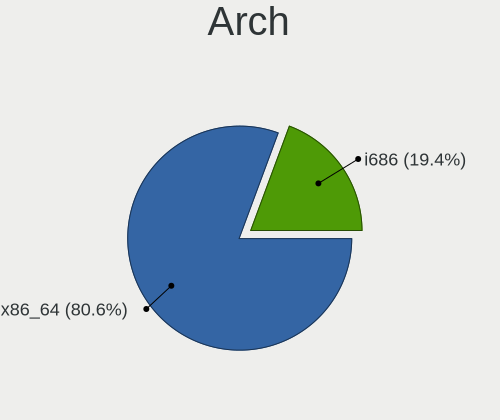
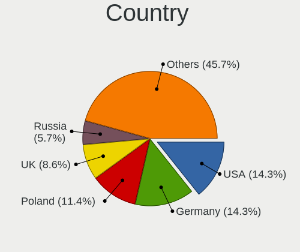
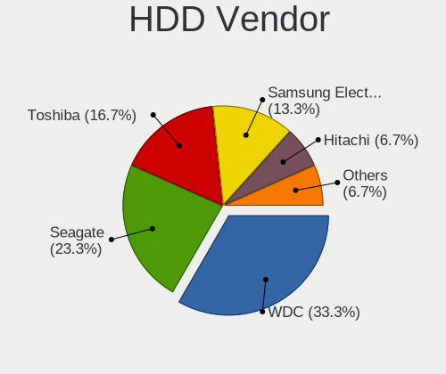
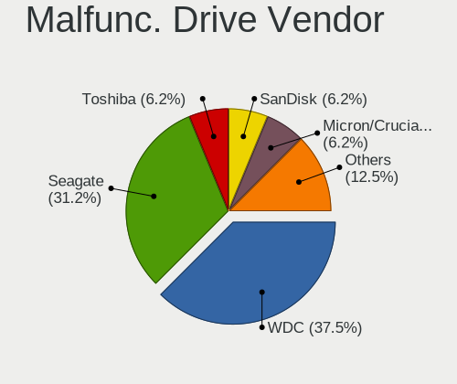
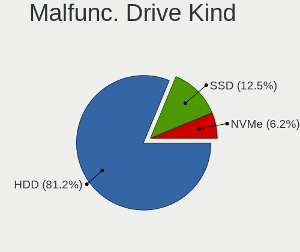
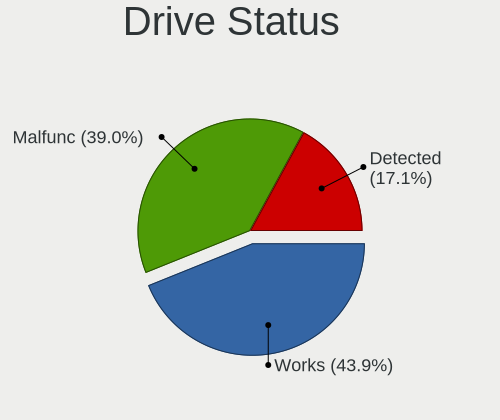
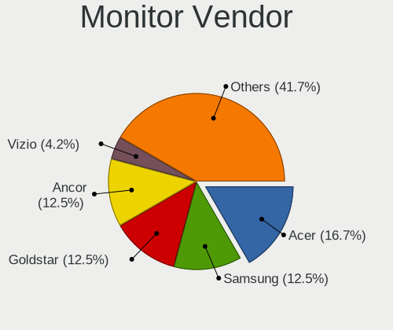
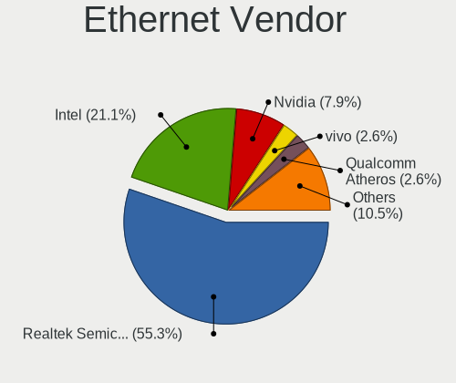

antiX - Tested Hardware & Statistics (Desktops)
-----------------------------------------------

A project to collect tested hardware configurations for antiX.

Anyone can contribute to this report by the [hw-probe](https://github.com/linuxhw/hw-probe) tool:

    sudo -E hw-probe -all -upload

Please submit a probe of your configuration if it's not presented on the page or is rare.

Full-feature report is available here: https://linux-hardware.org/?view=trends

Contents
--------

* [ Test Cases ](#test-cases)

* [ System ](#system)
  - [ Kernel                   ](#kernel)
  - [ Kernel Family            ](#kernel-family)
  - [ Kernel Major Ver.        ](#kernel-major-ver)
  - [ Arch                     ](#arch)
  - [ DE                       ](#de)
  - [ Display Server           ](#display-server)
  - [ Display Manager          ](#display-manager)
  - [ OS Lang                  ](#os-lang)
  - [ Boot Mode                ](#boot-mode)
  - [ Filesystem               ](#filesystem)
  - [ Part. scheme             ](#part-scheme)
  - [ Dual Boot with Linux/BSD ](#dual-boot-with-linuxbsd)
  - [ Dual Boot (Win)          ](#dual-boot-win)

* [ Board ](#board)
  - [ Vendor                   ](#vendor)
  - [ Model                    ](#model)
  - [ Model Family             ](#model-family)
  - [ MFG Year                 ](#mfg-year)
  - [ Form Factor              ](#form-factor)
  - [ Secure Boot              ](#secure-boot)
  - [ Coreboot                 ](#coreboot)
  - [ RAM Size                 ](#ram-size)
  - [ RAM Used                 ](#ram-used)
  - [ Total Drives             ](#total-drives)
  - [ Has CD-ROM               ](#has-cd-rom)
  - [ Has Ethernet             ](#has-ethernet)
  - [ Has WiFi                 ](#has-wifi)
  - [ Has Bluetooth            ](#has-bluetooth)

* [ Location ](#location)
  - [ Country                  ](#country)
  - [ City                     ](#city)

* [ Drives ](#drives)
  - [ Drive Vendor             ](#drive-vendor)
  - [ Drive Model              ](#drive-model)
  - [ HDD Vendor               ](#hdd-vendor)
  - [ SSD Vendor               ](#ssd-vendor)
  - [ Drive Kind               ](#drive-kind)
  - [ Drive Connector          ](#drive-connector)
  - [ Drive Size               ](#drive-size)
  - [ Space Total              ](#space-total)
  - [ Space Used               ](#space-used)
  - [ Malfunc. Drives          ](#malfunc-drives)
  - [ Malfunc. Drive Vendor    ](#malfunc-drive-vendor)
  - [ Malfunc. HDD Vendor      ](#malfunc-hdd-vendor)
  - [ Malfunc. Drive Kind      ](#malfunc-drive-kind)
  - [ Failed Drives            ](#failed-drives)
  - [ Failed Drive Vendor      ](#failed-drive-vendor)
  - [ Drive Status             ](#drive-status)

* [ Storage controller ](#storage-controller)
  - [ Storage Vendor           ](#storage-vendor)
  - [ Storage Model            ](#storage-model)
  - [ Storage Kind             ](#storage-kind)

* [ Processor ](#processor)
  - [ CPU Vendor               ](#cpu-vendor)
  - [ CPU Model                ](#cpu-model)
  - [ CPU Model Family         ](#cpu-model-family)
  - [ CPU Cores                ](#cpu-cores)
  - [ CPU Sockets              ](#cpu-sockets)
  - [ CPU Threads              ](#cpu-threads)
  - [ CPU Op-Modes             ](#cpu-op-modes)
  - [ CPU Microcode            ](#cpu-microcode)
  - [ CPU Microarch            ](#cpu-microarch)

* [ Graphics ](#graphics)
  - [ GPU Vendor               ](#gpu-vendor)
  - [ GPU Model                ](#gpu-model)
  - [ GPU Combo                ](#gpu-combo)
  - [ GPU Driver               ](#gpu-driver)
  - [ GPU Memory               ](#gpu-memory)

* [ Monitor ](#monitor)
  - [ Monitor Vendor           ](#monitor-vendor)
  - [ Monitor Model            ](#monitor-model)
  - [ Monitor Resolution       ](#monitor-resolution)
  - [ Monitor Diagonal         ](#monitor-diagonal)
  - [ Monitor Width            ](#monitor-width)
  - [ Aspect Ratio             ](#aspect-ratio)
  - [ Monitor Area             ](#monitor-area)
  - [ Pixel Density            ](#pixel-density)
  - [ Multiple Monitors        ](#multiple-monitors)

* [ Network ](#network)
  - [ Net Controller Vendor    ](#net-controller-vendor)
  - [ Net Controller Model     ](#net-controller-model)
  - [ Wireless Vendor          ](#wireless-vendor)
  - [ Wireless Model           ](#wireless-model)
  - [ Ethernet Vendor          ](#ethernet-vendor)
  - [ Ethernet Model           ](#ethernet-model)
  - [ Net Controller Kind      ](#net-controller-kind)
  - [ Used Controller          ](#used-controller)
  - [ NICs                     ](#nics)
  - [ IPv6                     ](#ipv6)

* [ Bluetooth ](#bluetooth)
  - [ Bluetooth Vendor         ](#bluetooth-vendor)
  - [ Bluetooth Model          ](#bluetooth-model)

* [ Sound ](#sound)
  - [ Sound Vendor             ](#sound-vendor)
  - [ Sound Model              ](#sound-model)

* [ Memory ](#memory)
  - [ Memory Vendor            ](#memory-vendor)
  - [ Memory Model             ](#memory-model)
  - [ Memory Kind              ](#memory-kind)
  - [ Memory Form Factor       ](#memory-form-factor)
  - [ Memory Size              ](#memory-size)
  - [ Memory Speed             ](#memory-speed)

* [ Printers & scanners ](#printers--scanners)
  - [ Printer Vendor           ](#printer-vendor)
  - [ Printer Model            ](#printer-model)
  - [ Scanner Vendor           ](#scanner-vendor)
  - [ Scanner Model            ](#scanner-model)

* [ Camera ](#camera)
  - [ Camera Vendor            ](#camera-vendor)
  - [ Camera Model             ](#camera-model)

* [ Security ](#security)
  - [ Fingerprint Vendor       ](#fingerprint-vendor)
  - [ Fingerprint Model        ](#fingerprint-model)
  - [ Chipcard Vendor          ](#chipcard-vendor)
  - [ Chipcard Model           ](#chipcard-model)

* [ Unsupported ](#unsupported)
  - [ Unsupported Devices      ](#unsupported-devices)
  - [ Unsupported Device Types ](#unsupported-device-types)

Test Cases
----------

| Vendor   | Model          | Probe                                                      | Date         |
|----------|----------------|------------------------------------------------------------|--------------|
| Gigabyte | 945GCMX-S2     | [54149177a7](https://linux-hardware.org/?probe=54149177a7) | Feb 12, 2022 |
| Unknown  | NF-CK804       | [dc6287d017](https://linux-hardware.org/?probe=dc6287d017) | Jan 05, 2022 |
| ASUSTek  | A8R-MVP        | [43a7b44e3f](https://linux-hardware.org/?probe=43a7b44e3f) | Mar 27, 2021 |
| ASUSTek  | M2N-MX SE Plus | [a8985150bd](https://linux-hardware.org/?probe=a8985150bd) | Feb 08, 2021 |
| ASRock   | H81M-ITX       | [7b2d6774c8](https://linux-hardware.org/?probe=7b2d6774c8) | Feb 05, 2021 |
| HP       | 3641h          | [f918637d53](https://linux-hardware.org/?probe=f918637d53) | Jul 29, 2020 |
| Unknown  | Unknown        | [7653370d96](https://linux-hardware.org/?probe=7653370d96) | Dec 16, 2019 |
| ASUSTek  | P5KPL/1600     | [8ba4b22f71](https://linux-hardware.org/?probe=8ba4b22f71) | Oct 22, 2019 |
| Lenovo   | Board          | [e68917ee9f](https://linux-hardware.org/?probe=e68917ee9f) | Nov 04, 2018 |

System
------

Kernel
------

Version of the Linux kernel

| Version                     | Desktops | Percent |
|-----------------------------|----------|---------|
| 4.9.160-antix.2-486-smp     | 2        | 28.57%  |
| 5.10.57-antix.1-amd64-smp   | 1        | 14.29%  |
| 4.9.87-antix.1-amd64-smp    | 1        | 14.29%  |
| 4.9.212-antix.1-amd64-smp   | 1        | 14.29%  |
| 4.9.212-antix.1-486-smp     | 1        | 14.29%  |
| 4.9.0-279-antix.1-amd64-smp | 1        | 14.29%  |

Kernel Family
-------------

Linux kernel without a distro release

| Version | Desktops | Percent |
|---------|----------|---------|
| 4.9.212 | 2        | 28.57%  |
| 4.9.160 | 2        | 28.57%  |
| 5.10.57 | 1        | 14.29%  |
| 4.9.87  | 1        | 14.29%  |
| 4.9.0   | 1        | 14.29%  |

Kernel Major Ver.
-----------------

Linux kernel major version

| Version | Desktops | Percent |
|---------|----------|---------|
| 4.9     | 6        | 85.71%  |
| 5.10    | 1        | 14.29%  |

Arch
----

OS architecture (x86_64, i586, etc.)

| Name   | Desktops | Percent |
|--------|----------|---------|
| x86_64 | 4        | 57.14%  |
| i686   | 3        | 42.86%  |

DE
--

Desktop Environment

| Name    | Desktops | Percent |
|---------|----------|---------|
| Unknown | 5        | 71.43%  |
| XFCE    | 1        | 14.29%  |
| icewm   | 1        | 14.29%  |

Display Server
--------------

X11 or Wayland

| Name | Desktops | Percent |
|------|----------|---------|
| X11  | 6        | 85.71%  |
| Tty  | 1        | 14.29%  |

Display Manager
---------------

SDDM, LightDM, etc.

| Name    | Desktops | Percent |
|---------|----------|---------|
| SLiM    | 4        | 57.14%  |
| Unknown | 2        | 28.57%  |
| LightDM | 1        | 14.29%  |

OS Lang
-------

Language

| Lang    | Desktops | Percent |
|---------|----------|---------|
| Unknown | 3        | 42.86%  |
| en_US   | 2        | 28.57%  |
| sk_SK   | 1        | 14.29%  |
| pl_PL   | 1        | 14.29%  |

Boot Mode
---------

EFI or BIOS

| Mode | Desktops | Percent |
|------|----------|---------|
| BIOS | 7        | 100%    |

Filesystem
----------

Type of filesystem

| Type    | Desktops | Percent |
|---------|----------|---------|
| Ext4    | 6        | 85.71%  |
| Overlay | 1        | 14.29%  |

Part. scheme
------------

Scheme of partitioning

| Type | Desktops | Percent |
|------|----------|---------|
| MBR  | 7        | 100%    |

Dual Boot with Linux/BSD
------------------------

Hosting more than one Linux/BSD

| Dual boot | Desktops | Percent |
|-----------|----------|---------|
| No        | 5        | 71.43%  |
| Yes       | 2        | 28.57%  |

Dual Boot (Win)
---------------

Hosting Linux and Windows

| Dual boot | Desktops | Percent |
|-----------|----------|---------|
| No        | 5        | 71.43%  |
| Yes       | 2        | 28.57%  |

Board
-----

Vendor
------

Motherboard manufacturer

| Name                | Desktops | Percent |
|---------------------|----------|---------|
| ASUSTek Computer    | 2        | 28.57%  |
| Unknown             | 2        | 28.57%  |
| Lenovo              | 1        | 14.29%  |
| Hewlett-Packard     | 1        | 14.29%  |
| Gigabyte Technology | 1        | 14.29%  |

Model
-----

Motherboard model

| Name                            | Desktops | Percent |
|---------------------------------|----------|---------|
| Unknown                         | 2        | 28.57%  |
| Lenovo ThinkCentre M91p 4480B9U | 1        | 14.29%  |
| HP t5740                        | 1        | 14.29%  |
| Gigabyte 945GCMX-S2             | 1        | 14.29%  |
| ASUS P5KPL/1600                 | 1        | 14.29%  |
| ASUS A8R-MVP                    | 1        | 14.29%  |

Model Family
------------

Motherboard model prefix

| Name                | Desktops | Percent |
|---------------------|----------|---------|
| Unknown             | 2        | 28.57%  |
| Lenovo ThinkCentre  | 1        | 14.29%  |
| HP t5740            | 1        | 14.29%  |
| Gigabyte 945GCMX-S2 | 1        | 14.29%  |
| ASUS P5KPL          | 1        | 14.29%  |
| ASUS A8R-MVP        | 1        | 14.29%  |

MFG Year
--------

Motherboard manufacture year

| Year    | Desktops | Percent |
|---------|----------|---------|
| 2008    | 2        | 28.57%  |
| 2012    | 1        | 14.29%  |
| 2009    | 1        | 14.29%  |
| 2007    | 1        | 14.29%  |
| 2005    | 1        | 14.29%  |
| Unknown | 1        | 14.29%  |

Form Factor
-----------

Physical design of the computer

| Name    | Desktops | Percent |
|---------|----------|---------|
| Desktop | 7        | 100%    |

Secure Boot
-----------

Enabled or disabled

| State    | Desktops | Percent |
|----------|----------|---------|
| Disabled | 7        | 100%    |

Coreboot
--------

Have coreboot on board

| Used | Desktops | Percent |
|------|----------|---------|
| No   | 7        | 100%    |

RAM Size
--------

Total RAM memory

| Size in GB | Desktops | Percent |
|------------|----------|---------|
| 2.01-3.0   | 2        | 28.57%  |
| 3.01-4.0   | 1        | 14.29%  |
| 16.01-24.0 | 1        | 14.29%  |
| 1.01-2.0   | 1        | 14.29%  |
| 0.51-1.0   | 1        | 14.29%  |
| 0.01-0.5   | 1        | 14.29%  |

RAM Used
--------

Used RAM memory

| Used GB  | Desktops | Percent |
|----------|----------|---------|
| 0.01-0.5 | 4        | 57.14%  |
| 4.01-8.0 | 1        | 14.29%  |
| 1.01-2.0 | 1        | 14.29%  |
| 0.51-1.0 | 1        | 14.29%  |

Total Drives
------------

Number of drives on board

| Drives | Desktops | Percent |
|--------|----------|---------|
| 1      | 5        | 71.43%  |
| 3      | 1        | 14.29%  |
| 2      | 1        | 14.29%  |

Has CD-ROM
----------

Has CD-ROM on board

| Presented | Desktops | Percent |
|-----------|----------|---------|
| Yes       | 4        | 57.14%  |
| No        | 3        | 42.86%  |

Has Ethernet
------------

Has Ethernet on board

| Presented | Desktops | Percent |
|-----------|----------|---------|
| Yes       | 7        | 100%    |

Has WiFi
--------

Has WiFi module

| Presented | Desktops | Percent |
|-----------|----------|---------|
| No        | 6        | 85.71%  |
| Yes       | 1        | 14.29%  |

Has Bluetooth
-------------

Has Bluetooth module

| Presented | Desktops | Percent |
|-----------|----------|---------|
| No        | 7        | 100%    |

Location
--------

Country
-------

Geographic location (country)

| Country  | Desktops | Percent |
|----------|----------|---------|
| USA      | 2        | 28.57%  |
| Slovakia | 1        | 14.29%  |
| Russia   | 1        | 14.29%  |
| Poland   | 1        | 14.29%  |
| Germany  | 1        | 14.29%  |
| France   | 1        | 14.29%  |

City
----

Geographic location (city)

| City              | Desktops | Percent |
|-------------------|----------|---------|
| Zagnansk          | 1        | 14.29%  |
| Vogue             | 1        | 14.29%  |
| Springfield       | 1        | 14.29%  |
| Kazan’     | 1        | 14.29%  |
| Frankfurt am Main | 1        | 14.29%  |
| Bratislava        | 1        | 14.29%  |
| Boulder           | 1        | 14.29%  |

Drives
------

Drive Vendor
------------

Hard drive vendors

| Vendor              | Desktops | Drives | Percent |
|---------------------|----------|--------|---------|
| Seagate             | 2        | 2      | 25%     |
| Samsung Electronics | 2        | 3      | 25%     |
| WDC                 | 1        | 1      | 12.5%   |
| Unknown             | 1        | 1      | 12.5%   |
| SanDisk             | 1        | 1      | 12.5%   |
| Hitachi             | 1        | 2      | 12.5%   |

Drive Model
-----------

Hard drive models

| Model                           | Desktops | Percent |
|---------------------------------|----------|---------|
| WDC WD205BA 21GB                | 1        | 11.11%  |
| Unknown 2GB ATA Flash Disk      | 1        | 11.11%  |
| Seagate ST500DM002-1BD142 500GB | 1        | 11.11%  |
| Seagate ST3320413CS 320GB       | 1        | 11.11%  |
| SanDisk sandisk120 120GB SSD    | 1        | 11.11%  |
| Samsung HD250HJ 250GB           | 1        | 11.11%  |
| Samsung HD160JJ 160GB           | 1        | 11.11%  |
| Samsung HD080HJ/ 80GB           | 1        | 11.11%  |
| Hitachi HTS723232A7A364 320GB   | 1        | 11.11%  |

HDD Vendor
----------

Hard disk drive vendors

| Vendor              | Desktops | Drives | Percent |
|---------------------|----------|--------|---------|
| Seagate             | 2        | 2      | 28.57%  |
| Samsung Electronics | 2        | 3      | 28.57%  |
| WDC                 | 1        | 1      | 14.29%  |
| Unknown             | 1        | 1      | 14.29%  |
| Hitachi             | 1        | 2      | 14.29%  |

SSD Vendor
----------

Solid state drive vendors

| Vendor  | Desktops | Drives | Percent |
|---------|----------|--------|---------|
| SanDisk | 1        | 1      | 100%    |

Drive Kind
----------

HDD or SSD

| Kind | Desktops | Drives | Percent |
|------|----------|--------|---------|
| HDD  | 6        | 9      | 85.71%  |
| SSD  | 1        | 1      | 14.29%  |

Drive Connector
---------------

SATA, SAS, NVMe, etc.

| Type | Desktops | Drives | Percent |
|------|----------|--------|---------|
| SATA | 7        | 10     | 100%    |

Drive Size
----------

Size of hard drive

| Size in TB | Desktops | Drives | Percent |
|------------|----------|--------|---------|
| 0.01-0.5   | 7        | 10     | 100%    |

Space Total
-----------

Amount of disk space available on the file system

| Size in GB | Desktops | Percent |
|------------|----------|---------|
| 101-250    | 3        | 42.86%  |
| 21-50      | 2        | 28.57%  |
| 1-20       | 1        | 14.29%  |
| 51-100     | 1        | 14.29%  |

Space Used
----------

Amount of used disk space

| Used GB | Desktops | Percent |
|---------|----------|---------|
| 1-20    | 6        | 85.71%  |
| 21-50   | 1        | 14.29%  |

Malfunc. Drives
---------------

Drive models with a malfunction

| Model                           | Desktops | Drives | Percent |
|---------------------------------|----------|--------|---------|
| WDC WD205BA 21GB                | 1        | 1      | 25%     |
| Seagate ST500DM002-1BD142 500GB | 1        | 1      | 25%     |
| Seagate ST3320413CS 320GB       | 1        | 1      | 25%     |
| SanDisk sandisk120 120GB SSD    | 1        | 1      | 25%     |

Malfunc. Drive Vendor
---------------------

Vendors of faulty drives

| Vendor  | Desktops | Drives | Percent |
|---------|----------|--------|---------|
| Seagate | 2        | 2      | 50%     |
| WDC     | 1        | 1      | 25%     |
| SanDisk | 1        | 1      | 25%     |

Malfunc. HDD Vendor
-------------------

Vendors of faulty HDD drives

| Vendor  | Desktops | Drives | Percent |
|---------|----------|--------|---------|
| Seagate | 2        | 2      | 66.67%  |
| WDC     | 1        | 1      | 33.33%  |

Malfunc. Drive Kind
-------------------

Kinds of faulty drives

| Kind | Desktops | Drives | Percent |
|------|----------|--------|---------|
| HDD  | 3        | 3      | 75%     |
| SSD  | 1        | 1      | 25%     |

Failed Drives
-------------

Failed drive models

Zero info for selected period =(

Failed Drive Vendor
-------------------

Failed drive vendors

Zero info for selected period =(

Drive Status
------------

Number of failed and malfunc. drives

| Status   | Desktops | Drives | Percent |
|----------|----------|--------|---------|
| Malfunc  | 4        | 4      | 57.14%  |
| Works    | 2        | 4      | 28.57%  |
| Detected | 1        | 2      | 14.29%  |

Storage controller
------------------

Storage Vendor
--------------

Storage controller vendors

| Vendor             | Desktops | Percent |
|--------------------|----------|---------|
| Intel              | 5        | 62.5%   |
| ULi Electronics    | 1        | 12.5%   |
| Nvidia             | 1        | 12.5%   |
| ASMedia Technology | 1        | 12.5%   |

Storage Model
-------------

Storage controller models

| Model                                                                         | Desktops | Percent |
|-------------------------------------------------------------------------------|----------|---------|
| Intel NM10/ICH7 Family SATA Controller [IDE mode]                             | 2        | 16.67%  |
| Intel 82801G (ICH7 Family) IDE Controller                                     | 2        | 16.67%  |
| ULi ULi M5288 SATA                                                            | 1        | 8.33%   |
| ULi M5229 IDE                                                                 | 1        | 8.33%   |
| Nvidia CK804 Serial ATA Controller                                            | 1        | 8.33%   |
| Nvidia CK804 IDE                                                              | 1        | 8.33%   |
| Intel 82801IBM/IEM (ICH9M/ICH9M-E) 2 port SATA Controller [IDE mode]          | 1        | 8.33%   |
| Intel 82371AB/EB/MB PIIX4 IDE                                                 | 1        | 8.33%   |
| Intel 6 Series/C200 Series Chipset Family 6 port Desktop SATA AHCI Controller | 1        | 8.33%   |
| ASMedia ASM1062 Serial ATA Controller                                         | 1        | 8.33%   |

Storage Kind
------------

Kind of storage controller (IDE, SATA, NVMe, SAS, ...)

| Kind | Desktops | Percent |
|------|----------|---------|
| IDE  | 6        | 66.67%  |
| SATA | 3        | 33.33%  |

Processor
---------

CPU Vendor
----------

Processor vendors

| Vendor | Desktops | Percent |
|--------|----------|---------|
| Intel  | 5        | 71.43%  |
| AMD    | 2        | 28.57%  |

CPU Model
---------

Processor models

| Model                                      | Desktops | Percent |
|--------------------------------------------|----------|---------|
| Intel Xeon CPU L5410 @ 2.33GHz             | 1        | 14.29%  |
| Intel Pentium II (Deschutes)               | 1        | 14.29%  |
| Intel Pentium Dual CPU E2180 @ 2.00GHz     | 1        | 14.29%  |
| Intel Core i5-2400 CPU @ 3.10GHz           | 1        | 14.29%  |
| Intel Atom CPU N280 @ 1.66GHz              | 1        | 14.29%  |
| AMD Athlon 64 X2 Dual Core Processor 4600+ | 1        | 14.29%  |
| AMD Athlon 64 Processor 3200+              | 1        | 14.29%  |

CPU Model Family
----------------

Processor model prefix

| Model              | Desktops | Percent |
|--------------------|----------|---------|
| Intel Xeon         | 1        | 14.29%  |
| Intel Pentium Dual | 1        | 14.29%  |
| Intel Pentium      | 1        | 14.29%  |
| Intel Core i5      | 1        | 14.29%  |
| Intel Atom         | 1        | 14.29%  |
| AMD Athlon 64 X2   | 1        | 14.29%  |
| AMD Athlon 64      | 1        | 14.29%  |

CPU Cores
---------

Number of processor cores

| Number | Desktops | Percent |
|--------|----------|---------|
| 1      | 3        | 42.86%  |
| 4      | 2        | 28.57%  |
| 2      | 2        | 28.57%  |

CPU Sockets
-----------

Number of sockets

| Number | Desktops | Percent |
|--------|----------|---------|
| 1      | 7        | 100%    |

CPU Threads
-----------

Threads per core (Hyper-Threading)

| Number | Desktops | Percent |
|--------|----------|---------|
| 1      | 6        | 85.71%  |
| 2      | 1        | 14.29%  |

CPU Op-Modes
------------

CPU Operation Modes (32-bit, 64-bit)

| Op mode        | Desktops | Percent |
|----------------|----------|---------|
| 32-bit, 64-bit | 5        | 71.43%  |
| 32-bit         | 2        | 28.57%  |

CPU Microcode
-------------

Microcode number

| Number  | Desktops | Percent |
|---------|----------|---------|
| Unknown | 2        | 28.57%  |
| 0x6fd   | 1        | 14.29%  |
| 0x652   | 1        | 14.29%  |
| 0x206a7 | 1        | 14.29%  |
| 0x106c2 | 1        | 14.29%  |
| 0x10676 | 1        | 14.29%  |

CPU Microarch
-------------

Microarchitecture

| Name        | Desktops | Percent |
|-------------|----------|---------|
| K8 Hammer   | 2        | 28.57%  |
| SandyBridge | 1        | 14.29%  |
| Penryn      | 1        | 14.29%  |
| Core        | 1        | 14.29%  |
| Bonnell     | 1        | 14.29%  |
| Unknown     | 1        | 14.29%  |

Graphics
--------

GPU Vendor
----------

Vendors of graphics cards

| Vendor | Desktops | Percent |
|--------|----------|---------|
| Intel  | 3        | 42.86%  |
| AMD    | 3        | 42.86%  |
| Nvidia | 1        | 14.29%  |

GPU Model
---------

Graphics card models

| Model                                                                     | Desktops | Percent |
|---------------------------------------------------------------------------|----------|---------|
| Nvidia GF108 [GeForce GT 630]                                             | 1        | 11.11%  |
| Intel Mobile 4 Series Chipset Integrated Graphics Controller              | 1        | 11.11%  |
| Intel 82945G/GZ Integrated Graphics Controller                            | 1        | 11.11%  |
| Intel 2nd Generation Core Processor Family Integrated Graphics Controller | 1        | 11.11%  |
| AMD RV516 [Radeon X1300/X1550 Series] (Secondary)                         | 1        | 11.11%  |
| AMD RV516 [Radeon X1300/X1550 Series]                                     | 1        | 11.11%  |
| AMD RV515 [Radeon X1300/X1550]                                            | 1        | 11.11%  |
| AMD RV515 [Radeon X1300/X1550 Series] (Secondary)                         | 1        | 11.11%  |
| AMD Rage 3 [3D Rage PRO AGP 2X]                                           | 1        | 11.11%  |

GPU Combo
---------

Combinations of graphics cards

| Name       | Desktops | Percent |
|------------|----------|---------|
| 1 x Intel  | 3        | 42.86%  |
| 2 x AMD    | 2        | 28.57%  |
| 1 x Nvidia | 1        | 14.29%  |
| 1 x AMD    | 1        | 14.29%  |

GPU Driver
----------

Free vs proprietary

| Driver  | Desktops | Percent |
|---------|----------|---------|
| Free    | 5        | 71.43%  |
| Unknown | 2        | 28.57%  |

GPU Memory
----------

Total video memory

| Size in GB | Desktops | Percent |
|------------|----------|---------|
| 0.01-0.5   | 3        | 42.86%  |
| 1.01-2.0   | 2        | 28.57%  |
| Unknown    | 2        | 28.57%  |

Monitor
-------

Monitor Vendor
--------------

Monitor vendors

| Vendor              | Desktops | Percent |
|---------------------|----------|---------|
| Acer                | 3        | 60%     |
| Vizio               | 1        | 20%     |
| Samsung Electronics | 1        | 20%     |

Monitor Model
-------------

Monitor models

| Model                                                                | Desktops | Percent |
|----------------------------------------------------------------------|----------|---------|
| Vizio E28h-C1 VIZ1002 1360x768 610x350mm 27.7-inch                   | 1        | 20%     |
| Samsung Electronics SyncMaster SAM0091 1600x1200 432x324mm 21.3-inch | 1        | 20%     |
| Acer VG220Q ACR06D8 1920x1080 480x270mm 21.7-inch                    | 1        | 20%     |
| Acer V243H ACR00A3 1920x1080 531x298mm 24.0-inch                     | 1        | 20%     |
| Acer S271HL ACR02CA 1920x1080 598x336mm 27.0-inch                    | 1        | 20%     |

Monitor Resolution
------------------

Monitor screen resolution

| Resolution      | Desktops | Percent |
|-----------------|----------|---------|
| 1920x1080 (FHD) | 3        | 60%     |
| 1600x1200       | 1        | 20%     |
| 1366x768 (WXGA) | 1        | 20%     |

Monitor Diagonal
----------------

Diagonal size in inches

| Inches | Desktops | Percent |
|--------|----------|---------|
| 21     | 2        | 40%     |
| 38     | 1        | 20%     |
| 27     | 1        | 20%     |
| 24     | 1        | 20%     |

Monitor Width
-------------

Physical width

| Width in mm | Desktops | Percent |
|-------------|----------|---------|
| 501-600     | 2        | 40%     |
| 401-500     | 2        | 40%     |
| 801-900     | 1        | 20%     |

Aspect Ratio
------------

Proportional relationship between the width and the height

| Ratio | Desktops | Percent |
|-------|----------|---------|
| 16/9  | 4        | 80%     |
| 4/3   | 1        | 20%     |

Monitor Area
------------

Area in inch²

| Area in inch² | Desktops | Percent |
|----------------|----------|---------|
| 201-250        | 3        | 60%     |
| 301-350        | 1        | 20%     |
| 501-1000       | 1        | 20%     |

Pixel Density
-------------

Pixels per inch

| Density | Desktops | Percent |
|---------|----------|---------|
| 51-100  | 3        | 60%     |
| 1-50    | 1        | 20%     |
| 101-120 | 1        | 20%     |

Multiple Monitors
-----------------

Total monitors connected

| Total | Desktops | Percent |
|-------|----------|---------|
| 1     | 5        | 71.43%  |
| 0     | 2        | 28.57%  |

Network
-------

Net Controller Vendor
---------------------

Controller vendors

| Vendor                          | Desktops | Percent |
|---------------------------------|----------|---------|
| Realtek Semiconductor           | 4        | 40%     |
| Qualcomm Atheros Communications | 1        | 10%     |
| Nvidia                          | 1        | 10%     |
| Marvell Technology Group        | 1        | 10%     |
| LSI                             | 1        | 10%     |
| Intel                           | 1        | 10%     |
| Broadcom                        | 1        | 10%     |

Net Controller Model
--------------------

Controller models

| Model                                                                         | Desktops | Percent |
|-------------------------------------------------------------------------------|----------|---------|
| Realtek RTL-8110SC/8169SC Gigabit Ethernet                                    | 2        | 20%     |
| Realtek RTL8169 PCI Gigabit Ethernet Controller                               | 1        | 10%     |
| Realtek RTL-8100/8101L/8139 PCI Fast Ethernet Adapter                         | 1        | 10%     |
| Qualcomm Atheros TP-Link TL-WN821N v2 / TL-WN822N v1 802.11n [Atheros AR9170] | 1        | 10%     |
| Nvidia CK804 Ethernet Controller                                              | 1        | 10%     |
| Marvell Group 88E8001 Gigabit Ethernet Controller                             | 1        | 10%     |
| LSI 56k WinModem                                                              | 1        | 10%     |
| Intel 82579LM Gigabit Network Connection (Lewisville)                         | 1        | 10%     |
| Broadcom NetLink BCM57780 Gigabit Ethernet PCIe                               | 1        | 10%     |

Wireless Vendor
---------------

Wireless vendors

| Vendor                          | Desktops | Percent |
|---------------------------------|----------|---------|
| Qualcomm Atheros Communications | 1        | 100%    |

Wireless Model
--------------

Wireless models

| Model                                                                         | Desktops | Percent |
|-------------------------------------------------------------------------------|----------|---------|
| Qualcomm Atheros TP-Link TL-WN821N v2 / TL-WN822N v1 802.11n [Atheros AR9170] | 1        | 100%    |

Ethernet Vendor
---------------

Ethernet vendors

| Vendor                   | Desktops | Percent |
|--------------------------|----------|---------|
| Realtek Semiconductor    | 4        | 50%     |
| Nvidia                   | 1        | 12.5%   |
| Marvell Technology Group | 1        | 12.5%   |
| Intel                    | 1        | 12.5%   |
| Broadcom                 | 1        | 12.5%   |

Ethernet Model
--------------

Ethernet models

| Model                                                 | Desktops | Percent |
|-------------------------------------------------------|----------|---------|
| Realtek RTL-8110SC/8169SC Gigabit Ethernet            | 2        | 25%     |
| Realtek RTL8169 PCI Gigabit Ethernet Controller       | 1        | 12.5%   |
| Realtek RTL-8100/8101L/8139 PCI Fast Ethernet Adapter | 1        | 12.5%   |
| Nvidia CK804 Ethernet Controller                      | 1        | 12.5%   |
| Marvell Group 88E8001 Gigabit Ethernet Controller     | 1        | 12.5%   |
| Intel 82579LM Gigabit Network Connection (Lewisville) | 1        | 12.5%   |
| Broadcom NetLink BCM57780 Gigabit Ethernet PCIe       | 1        | 12.5%   |

Net Controller Kind
-------------------

Ethernet, WiFi or modem

| Kind     | Desktops | Percent |
|----------|----------|---------|
| Ethernet | 7        | 77.78%  |
| Modem    | 1        | 11.11%  |
| WiFi     | 1        | 11.11%  |

Used Controller
---------------

Currently used network controller

| Kind     | Desktops | Percent |
|----------|----------|---------|
| Ethernet | 6        | 85.71%  |
| WiFi     | 1        | 14.29%  |

NICs
----

Total network controllers on board

| Total | Desktops | Percent |
|-------|----------|---------|
| 1     | 6        | 85.71%  |
| 2     | 1        | 14.29%  |

IPv6
----

IPv6 vs IPv4

| Used | Desktops | Percent |
|------|----------|---------|
| No   | 7        | 100%    |

Bluetooth
---------

Bluetooth Vendor
----------------

Controller vendors

Zero info for selected period =(

Bluetooth Model
---------------

Controller models

Zero info for selected period =(

Sound
-----

Sound Vendor
------------

Sound card vendors

| Vendor          | Desktops | Percent |
|-----------------|----------|---------|
| Intel           | 3        | 33.33%  |
| Nvidia          | 2        | 22.22%  |
| Creative Labs   | 2        | 22.22%  |
| ULi Electronics | 1        | 11.11%  |
| Ensoniq         | 1        | 11.11%  |

Sound Model
-----------

Sound card models

| Model                                                                      | Desktops | Percent |
|----------------------------------------------------------------------------|----------|---------|
| ULi Electronics HD Audio Controller                                        | 1        | 11.11%  |
| Nvidia GF108 High Definition Audio Controller                              | 1        | 11.11%  |
| Nvidia CK804 AC'97 Audio Controller                                        | 1        | 11.11%  |
| Intel NM10/ICH7 Family High Definition Audio Controller                    | 1        | 11.11%  |
| Intel 82801I (ICH9 Family) HD Audio Controller                             | 1        | 11.11%  |
| Intel 6 Series/C200 Series Chipset Family High Definition Audio Controller | 1        | 11.11%  |
| Ensoniq ES1371/ES1373 / Creative Labs CT2518                               | 1        | 11.11%  |
| Creative Labs EMU20k1 [Sound Blaster X-Fi Series]                          | 1        | 11.11%  |
| Creative Labs EMU10k2/CA0100/CA0102/CA10200 [Sound Blaster Audigy Series]  | 1        | 11.11%  |

Memory
------

Memory Vendor
-------------

Memory module vendors

| Vendor   | Desktops | Percent |
|----------|----------|---------|
| Unknown  | 4        | 66.67%  |
| Patriot  | 1        | 16.67%  |
| Kingston | 1        | 16.67%  |

Memory Model
------------

Memory module models

| Model                                                 | Desktops | Percent |
|-------------------------------------------------------|----------|---------|
| Unknown RAM Module 512MB DIMM DDR 400MT/s             | 1        | 16.67%  |
| Unknown RAM Module 512MB DIMM                         | 1        | 16.67%  |
| Unknown RAM Module 1GB DIMM 667MT/s                   | 1        | 16.67%  |
| Unknown RAM Module 1024MB DIMM DDR2 667MT/s           | 1        | 16.67%  |
| Patriot RAM PSD34G1600L2S 4GB SODIMM DDR3 1600MT/s    | 1        | 16.67%  |
| Kingston RAM 99U5471-012.A00LF 4GB DIMM DDR3 1600MT/s | 1        | 16.67%  |

Memory Kind
-----------

Memory module kinds

| Kind    | Desktops | Percent |
|---------|----------|---------|
| DDR3    | 2        | 33.33%  |
| Unknown | 2        | 33.33%  |
| DDR2    | 1        | 16.67%  |
| DDR     | 1        | 16.67%  |

Memory Form Factor
------------------

Physical design of the memory module

| Name   | Desktops | Percent |
|--------|----------|---------|
| DIMM   | 5        | 83.33%  |
| SODIMM | 1        | 16.67%  |

Memory Size
-----------

Memory module size

| Size | Desktops | Percent |
|------|----------|---------|
| 4096 | 2        | 33.33%  |
| 1024 | 2        | 33.33%  |
| 512  | 2        | 33.33%  |

Memory Speed
------------

Memory module speed

| Speed   | Desktops | Percent |
|---------|----------|---------|
| 1600    | 2        | 33.33%  |
| 667     | 2        | 33.33%  |
| 400     | 1        | 16.67%  |
| Unknown | 1        | 16.67%  |

Printers & scanners
-------------------

Printer Vendor
--------------

Printer device vendors

Zero info for selected period =(

Printer Model
-------------

Printer device models

Zero info for selected period =(

Scanner Vendor
--------------

Scanner device vendors

Zero info for selected period =(

Scanner Model
-------------

Scanner device models

Zero info for selected period =(

Camera
------

Camera Vendor
-------------

Camera device vendors

Zero info for selected period =(

Camera Model
------------

Camera device models

Zero info for selected period =(

Security
--------

Fingerprint Vendor
------------------

Fingerprint sensor vendors

Zero info for selected period =(

Fingerprint Model
-----------------

Fingerprint sensor models

Zero info for selected period =(

Chipcard Vendor
---------------

Chipcard module vendors

Zero info for selected period =(

Chipcard Model
--------------

Chipcard module models

Zero info for selected period =(

Unsupported
-----------

Unsupported Devices
-------------------

Total unsupported devices on board

| Total | Desktops | Percent |
|-------|----------|---------|
| 0     | 5        | 71.43%  |
| 2     | 2        | 28.57%  |

Unsupported Device Types
------------------------

Types of unsupported devices

| Type                     | Desktops | Percent |
|--------------------------|----------|---------|
| Graphics card            | 2        | 50%     |
| Modem                    | 1        | 25%     |
| Communication controller | 1        | 25%     |

