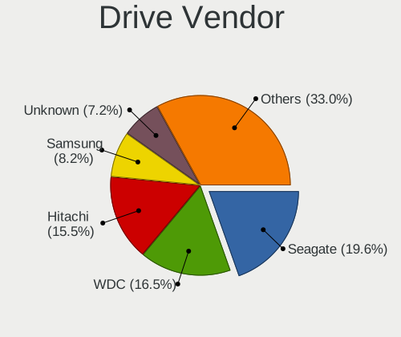
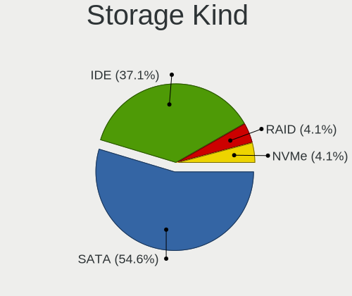
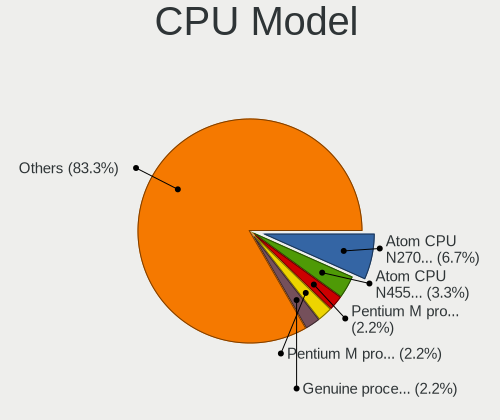
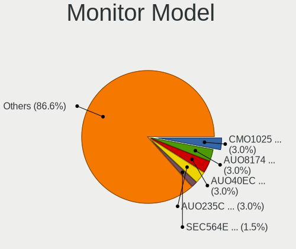

antiX - Tested Hardware & Statistics (Notebooks)
------------------------------------------------

A project to collect tested hardware configurations for antiX.

Anyone can contribute to this report by the [hw-probe](https://github.com/linuxhw/hw-probe) tool:

    sudo -E hw-probe -all -upload

Please submit a probe of your configuration if it's not presented on the page or is rare.

Full-feature report is available here: https://linux-hardware.org/?view=trends

Contents
--------

* [ Test Cases ](#test-cases)

* [ System ](#system)
  - [ Kernel                   ](#kernel)
  - [ Kernel Family            ](#kernel-family)
  - [ Kernel Major Ver.        ](#kernel-major-ver)
  - [ Arch                     ](#arch)
  - [ DE                       ](#de)
  - [ Display Server           ](#display-server)
  - [ Display Manager          ](#display-manager)
  - [ OS Lang                  ](#os-lang)
  - [ Boot Mode                ](#boot-mode)
  - [ Filesystem               ](#filesystem)
  - [ Part. scheme             ](#part-scheme)
  - [ Dual Boot with Linux/BSD ](#dual-boot-with-linuxbsd)
  - [ Dual Boot (Win)          ](#dual-boot-win)

* [ Board ](#board)
  - [ Vendor                   ](#vendor)
  - [ Model                    ](#model)
  - [ Model Family             ](#model-family)
  - [ MFG Year                 ](#mfg-year)
  - [ Form Factor              ](#form-factor)
  - [ Secure Boot              ](#secure-boot)
  - [ Coreboot                 ](#coreboot)
  - [ RAM Size                 ](#ram-size)
  - [ RAM Used                 ](#ram-used)
  - [ Total Drives             ](#total-drives)
  - [ Has CD-ROM               ](#has-cd-rom)
  - [ Has Ethernet             ](#has-ethernet)
  - [ Has WiFi                 ](#has-wifi)
  - [ Has Bluetooth            ](#has-bluetooth)

* [ Location ](#location)
  - [ Country                  ](#country)
  - [ City                     ](#city)

* [ Drives ](#drives)
  - [ Drive Vendor             ](#drive-vendor)
  - [ Drive Model              ](#drive-model)
  - [ HDD Vendor               ](#hdd-vendor)
  - [ SSD Vendor               ](#ssd-vendor)
  - [ Drive Kind               ](#drive-kind)
  - [ Drive Connector          ](#drive-connector)
  - [ Drive Size               ](#drive-size)
  - [ Space Total              ](#space-total)
  - [ Space Used               ](#space-used)
  - [ Malfunc. Drives          ](#malfunc-drives)
  - [ Malfunc. Drive Vendor    ](#malfunc-drive-vendor)
  - [ Malfunc. HDD Vendor      ](#malfunc-hdd-vendor)
  - [ Malfunc. Drive Kind      ](#malfunc-drive-kind)
  - [ Failed Drives            ](#failed-drives)
  - [ Failed Drive Vendor      ](#failed-drive-vendor)
  - [ Drive Status             ](#drive-status)

* [ Storage controller ](#storage-controller)
  - [ Storage Vendor           ](#storage-vendor)
  - [ Storage Model            ](#storage-model)
  - [ Storage Kind             ](#storage-kind)

* [ Processor ](#processor)
  - [ CPU Vendor               ](#cpu-vendor)
  - [ CPU Model                ](#cpu-model)
  - [ CPU Model Family         ](#cpu-model-family)
  - [ CPU Cores                ](#cpu-cores)
  - [ CPU Sockets              ](#cpu-sockets)
  - [ CPU Threads              ](#cpu-threads)
  - [ CPU Op-Modes             ](#cpu-op-modes)
  - [ CPU Microcode            ](#cpu-microcode)
  - [ CPU Microarch            ](#cpu-microarch)

* [ Graphics ](#graphics)
  - [ GPU Vendor               ](#gpu-vendor)
  - [ GPU Model                ](#gpu-model)
  - [ GPU Combo                ](#gpu-combo)
  - [ GPU Driver               ](#gpu-driver)
  - [ GPU Memory               ](#gpu-memory)

* [ Monitor ](#monitor)
  - [ Monitor Vendor           ](#monitor-vendor)
  - [ Monitor Model            ](#monitor-model)
  - [ Monitor Resolution       ](#monitor-resolution)
  - [ Monitor Diagonal         ](#monitor-diagonal)
  - [ Monitor Width            ](#monitor-width)
  - [ Aspect Ratio             ](#aspect-ratio)
  - [ Monitor Area             ](#monitor-area)
  - [ Pixel Density            ](#pixel-density)
  - [ Multiple Monitors        ](#multiple-monitors)

* [ Network ](#network)
  - [ Net Controller Vendor    ](#net-controller-vendor)
  - [ Net Controller Model     ](#net-controller-model)
  - [ Wireless Vendor          ](#wireless-vendor)
  - [ Wireless Model           ](#wireless-model)
  - [ Ethernet Vendor          ](#ethernet-vendor)
  - [ Ethernet Model           ](#ethernet-model)
  - [ Net Controller Kind      ](#net-controller-kind)
  - [ Used Controller          ](#used-controller)
  - [ NICs                     ](#nics)
  - [ IPv6                     ](#ipv6)

* [ Bluetooth ](#bluetooth)
  - [ Bluetooth Vendor         ](#bluetooth-vendor)
  - [ Bluetooth Model          ](#bluetooth-model)

* [ Sound ](#sound)
  - [ Sound Vendor             ](#sound-vendor)
  - [ Sound Model              ](#sound-model)

* [ Memory ](#memory)
  - [ Memory Vendor            ](#memory-vendor)
  - [ Memory Model             ](#memory-model)
  - [ Memory Kind              ](#memory-kind)
  - [ Memory Form Factor       ](#memory-form-factor)
  - [ Memory Size              ](#memory-size)
  - [ Memory Speed             ](#memory-speed)

* [ Printers & scanners ](#printers--scanners)
  - [ Printer Vendor           ](#printer-vendor)
  - [ Printer Model            ](#printer-model)
  - [ Scanner Vendor           ](#scanner-vendor)
  - [ Scanner Model            ](#scanner-model)

* [ Camera ](#camera)
  - [ Camera Vendor            ](#camera-vendor)
  - [ Camera Model             ](#camera-model)

* [ Security ](#security)
  - [ Fingerprint Vendor       ](#fingerprint-vendor)
  - [ Fingerprint Model        ](#fingerprint-model)
  - [ Chipcard Vendor          ](#chipcard-vendor)
  - [ Chipcard Model           ](#chipcard-model)

* [ Unsupported ](#unsupported)
  - [ Unsupported Devices      ](#unsupported-devices)
  - [ Unsupported Device Types ](#unsupported-device-types)

Test Cases
----------

| Vendor  | Model                       | Probe                                                      | Date         |
|---------|-----------------------------|------------------------------------------------------------|--------------|
| IBM     | ThinkPad T40 237342G        | [2c96b391e2](https://linux-hardware.org/?probe=2c96b391e2) | Jan 16, 2022 |
| IBM     | ThinkPad T40 237342G        | [5c4e8748ef](https://linux-hardware.org/?probe=5c4e8748ef) | Jan 16, 2022 |
| Toshiba | Satellite 1905              | [e72b9043c8](https://linux-hardware.org/?probe=e72b9043c8) | Jan 14, 2022 |
| Lenovo  | ThinkPad T440p 20AWS3RH0... | [b2a71d3bbe](https://linux-hardware.org/?probe=b2a71d3bbe) | Dec 30, 2021 |
| ASUSTek | X71SL                       | [42e7b57eb8](https://linux-hardware.org/?probe=42e7b57eb8) | Dec 07, 2021 |
| ASUSTek | A3L                         | [32489f1764](https://linux-hardware.org/?probe=32489f1764) | Dec 06, 2021 |
| ASUSTek | A3L                         | [2b01c636c2](https://linux-hardware.org/?probe=2b01c636c2) | Dec 06, 2021 |
| ASUSTek | X51RL                       | [0aeee18806](https://linux-hardware.org/?probe=0aeee18806) | Nov 19, 2021 |
| Acer    | AOA150                      | [24833c6a59](https://linux-hardware.org/?probe=24833c6a59) | Oct 26, 2021 |
| Dell    | Latitude E6400              | [6b7ef9cad5](https://linux-hardware.org/?probe=6b7ef9cad5) | Oct 21, 2021 |
| MSI     | GE62 7RE                    | [9d064bcc8d](https://linux-hardware.org/?probe=9d064bcc8d) | May 21, 2021 |
| MSI     | GE62 7RE                    | [d560e067d4](https://linux-hardware.org/?probe=d560e067d4) | May 21, 2021 |
| HP      | EliteBook 8770w             | [0af42b4958](https://linux-hardware.org/?probe=0af42b4958) | Mar 17, 2021 |
| Fujitsu | FMVS54EB                    | [f01ca3644f](https://linux-hardware.org/?probe=f01ca3644f) | Mar 11, 2021 |
| Dell    | Latitude 5480               | [c9e0b19e8b](https://linux-hardware.org/?probe=c9e0b19e8b) | Mar 07, 2021 |
| HP      | Mini 110-3700               | [33a6e65493](https://linux-hardware.org/?probe=33a6e65493) | Jan 06, 2021 |
| IBM     | ThinkPad T41 2374K50        | [c77530ec4e](https://linux-hardware.org/?probe=c77530ec4e) | Nov 19, 2020 |
| IBM     | ThinkPad T41 2374K50        | [9c27b878ae](https://linux-hardware.org/?probe=9c27b878ae) | Nov 17, 2020 |
| IBM     | ThinkPad T43 2668WEJ        | [c7508c3b5c](https://linux-hardware.org/?probe=c7508c3b5c) | Oct 02, 2020 |
| HP      | Pavilion dv2700             | [312d41f446](https://linux-hardware.org/?probe=312d41f446) | Aug 01, 2020 |
| HP      | Mini 5101                   | [c0abbe79e6](https://linux-hardware.org/?probe=c0abbe79e6) | Apr 24, 2020 |
| HP      | Mini 5101                   | [8fd41129bc](https://linux-hardware.org/?probe=8fd41129bc) | Apr 24, 2020 |
| ASUSTek | 900A                        | [9ab5761eb1](https://linux-hardware.org/?probe=9ab5761eb1) | Apr 05, 2020 |
| ASUSTek | 900HA                       | [39b2bfbefc](https://linux-hardware.org/?probe=39b2bfbefc) | Mar 21, 2020 |
| Medion  | WIM2170                     | [a8c4771b62](https://linux-hardware.org/?probe=a8c4771b62) | Jan 13, 2020 |
| Medion  | WIM2170                     | [c879195021](https://linux-hardware.org/?probe=c879195021) | Jan 13, 2020 |

System
------

Kernel
------

Version of the Linux kernel

| Version                      | Notebooks | Percent |
|------------------------------|-----------|---------|
| 4.9.0-279-antix.1-486-smp    | 3         | 15%     |
| 4.9.235-antix.1-amd64-smp    | 2         | 10%     |
| 4.9.212-antix.1-amd64-smp    | 2         | 10%     |
| 4.9.212-antix.1-486-smp      | 2         | 10%     |
| 4.9.200-antix.1-486-smp      | 2         | 10%     |
| 5.14.0-14.1-liquorix-amd64   | 1         | 5%      |
| 5.10.57-antix.1-amd64-smp    | 1         | 5%      |
| 5.10.27-antix.1-amd64-smp    | 1         | 5%      |
| 4.9.160-antix.2-486-smp      | 1         | 5%      |
| 4.9.160-antix.1-amd64-smp    | 1         | 5%      |
| 4.9.0-264-antix.1-486-smp    | 1         | 5%      |
| 4.19.202-antix.1-686-smp-pae | 1         | 5%      |
| 4.19.100-antix.1-686-smp-pae | 1         | 5%      |
| 4.10.5-antix.1-486-smp       | 1         | 5%      |

Kernel Family
-------------

Linux kernel without a distro release

| Version  | Notebooks | Percent |
|----------|-----------|---------|
| 4.9.212  | 4         | 20%     |
| 4.9.0    | 4         | 20%     |
| 4.9.235  | 2         | 10%     |
| 4.9.200  | 2         | 10%     |
| 4.9.160  | 2         | 10%     |
| 5.14.0   | 1         | 5%      |
| 5.10.57  | 1         | 5%      |
| 5.10.27  | 1         | 5%      |
| 4.19.202 | 1         | 5%      |
| 4.19.100 | 1         | 5%      |
| 4.10.5   | 1         | 5%      |

Kernel Major Ver.
-----------------

Linux kernel major version

| Version | Notebooks | Percent |
|---------|-----------|---------|
| 4.9     | 14        | 70%     |
| 5.10    | 2         | 10%     |
| 4.19    | 2         | 10%     |
| 5.14    | 1         | 5%      |
| 4.10    | 1         | 5%      |

Arch
----

OS architecture (x86_64, i586, etc.)

| Name   | Notebooks | Percent |
|--------|-----------|---------|
| i686   | 12        | 60%     |
| x86_64 | 8         | 40%     |

DE
--

Desktop Environment

| Name    | Notebooks | Percent |
|---------|-----------|---------|
| Unknown | 14        | 70%     |
| icewm   | 5         | 25%     |
| GNOME   | 1         | 5%      |

Display Server
--------------

X11 or Wayland

| Name | Notebooks | Percent |
|------|-----------|---------|
| X11  | 20        | 100%    |

Display Manager
---------------

SDDM, LightDM, etc.

| Name    | Notebooks | Percent |
|---------|-----------|---------|
| SLiM    | 15        | 75%     |
| Unknown | 4         | 20%     |
| LightDM | 1         | 5%      |

OS Lang
-------

Language

| Lang  | Notebooks | Percent |
|-------|-----------|---------|
| en_US | 8         | 40%     |
| de_DE | 3         | 15%     |
| ru_RU | 2         | 10%     |
| uk_UA | 1         | 5%      |
| pt_BR | 1         | 5%      |
| ja_JP | 1         | 5%      |
| it_IT | 1         | 5%      |
| es_MX | 1         | 5%      |
| en_GB | 1         | 5%      |
| en_AU | 1         | 5%      |

Boot Mode
---------

EFI or BIOS

| Mode | Notebooks | Percent |
|------|-----------|---------|
| BIOS | 17        | 85%     |
| EFI  | 3         | 15%     |

Filesystem
----------

Type of filesystem

| Type     | Notebooks | Percent |
|----------|-----------|---------|
| Ext4     | 15        | 75%     |
| Overlay  | 4         | 20%     |
| Reiserfs | 1         | 5%      |

Part. scheme
------------

Scheme of partitioning

| Type    | Notebooks | Percent |
|---------|-----------|---------|
| MBR     | 16        | 80%     |
| GPT     | 3         | 15%     |
| Unknown | 1         | 5%      |

Dual Boot with Linux/BSD
------------------------

Hosting more than one Linux/BSD

| Dual boot | Notebooks | Percent |
|-----------|-----------|---------|
| No        | 16        | 80%     |
| Yes       | 4         | 20%     |

Dual Boot (Win)
---------------

Hosting Linux and Windows

| Dual boot | Notebooks | Percent |
|-----------|-----------|---------|
| No        | 13        | 65%     |
| Yes       | 7         | 35%     |

Board
-----

Vendor
------

Motherboard manufacturer

| Name             | Notebooks | Percent |
|------------------|-----------|---------|
| ASUSTek Computer | 5         | 25%     |
| Hewlett-Packard  | 4         | 20%     |
| IBM              | 3         | 15%     |
| Dell             | 2         | 10%     |
| Toshiba          | 1         | 5%      |
| MSI              | 1         | 5%      |
| Medion           | 1         | 5%      |
| Lenovo           | 1         | 5%      |
| Fujitsu          | 1         | 5%      |
| Acer             | 1         | 5%      |

Model
-----

Motherboard model

| Name                             | Notebooks | Percent |
|----------------------------------|-----------|---------|
| Toshiba Satellite 1905           | 1         | 5%      |
| MSI GE62 7RE                     | 1         | 5%      |
| Medion WIM2170                   | 1         | 5%      |
| Lenovo ThinkPad T440p 20AWS3RH00 | 1         | 5%      |
| IBM ThinkPad T43 2668WEJ         | 1         | 5%      |
| IBM ThinkPad T41 2374K50         | 1         | 5%      |
| IBM ThinkPad T40 237342G         | 1         | 5%      |
| HP Pavilion dv2700               | 1         | 5%      |
| HP Mini 5101                     | 1         | 5%      |
| HP Mini 110-3700                 | 1         | 5%      |
| HP EliteBook 8770w               | 1         | 5%      |
| Fujitsu FMVS54EB                 | 1         | 5%      |
| Dell Latitude E6400              | 1         | 5%      |
| Dell Latitude 5480               | 1         | 5%      |
| ASUS X71SL                       | 1         | 5%      |
| ASUS X51RL                       | 1         | 5%      |
| ASUS A3L                         | 1         | 5%      |
| ASUS 900HA                       | 1         | 5%      |
| ASUS 900A                        | 1         | 5%      |
| Acer AOA150                      | 1         | 5%      |

Model Family
------------

Motherboard model prefix

| Name              | Notebooks | Percent |
|-------------------|-----------|---------|
| IBM ThinkPad      | 3         | 15%     |
| HP Mini           | 2         | 10%     |
| Dell Latitude     | 2         | 10%     |
| Toshiba Satellite | 1         | 5%      |
| MSI GE62          | 1         | 5%      |
| Medion WIM2170    | 1         | 5%      |
| Lenovo ThinkPad   | 1         | 5%      |
| HP Pavilion       | 1         | 5%      |
| HP EliteBook      | 1         | 5%      |
| Fujitsu FMVS54EB  | 1         | 5%      |
| ASUS X71SL        | 1         | 5%      |
| ASUS X51RL        | 1         | 5%      |
| ASUS A3L          | 1         | 5%      |
| ASUS 900HA        | 1         | 5%      |
| ASUS 900A         | 1         | 5%      |
| Acer AOA150       | 1         | 5%      |

MFG Year
--------

Motherboard manufacture year

| Year | Notebooks | Percent |
|------|-----------|---------|
| 2009 | 3         | 15%     |
| 2008 | 3         | 15%     |
| 2007 | 3         | 15%     |
| 2013 | 2         | 10%     |
| 2005 | 2         | 10%     |
| 2003 | 2         | 10%     |
| 2017 | 1         | 5%      |
| 2016 | 1         | 5%      |
| 2012 | 1         | 5%      |
| 2011 | 1         | 5%      |
| 2004 | 1         | 5%      |

Form Factor
-----------

Physical design of the computer

| Name     | Notebooks | Percent |
|----------|-----------|---------|
| Notebook | 20        | 100%    |

Secure Boot
-----------

Enabled or disabled

| State    | Notebooks | Percent |
|----------|-----------|---------|
| Disabled | 20        | 100%    |

Coreboot
--------

Have coreboot on board

| Used | Notebooks | Percent |
|------|-----------|---------|
| No   | 20        | 100%    |

RAM Size
--------

Total RAM memory

| Size in GB | Notebooks | Percent |
|------------|-----------|---------|
| 0.51-1.0   | 6         | 30%     |
| 1.01-2.0   | 4         | 20%     |
| 3.01-4.0   | 3         | 15%     |
| 32.01-64.0 | 2         | 10%     |
| 2.01-3.0   | 2         | 10%     |
| 8.01-16.0  | 2         | 10%     |
| 4.01-8.0   | 1         | 5%      |

RAM Used
--------

Used RAM memory

| Used GB  | Notebooks | Percent |
|----------|-----------|---------|
| 0.01-0.5 | 9         | 45%     |
| 0.51-1.0 | 7         | 35%     |
| 2.01-3.0 | 2         | 10%     |
| 1.01-2.0 | 2         | 10%     |

Total Drives
------------

Number of drives on board

| Drives | Notebooks | Percent |
|--------|-----------|---------|
| 1      | 17        | 85%     |
| 2      | 3         | 15%     |

Has CD-ROM
----------

Has CD-ROM on board

| Presented | Notebooks | Percent |
|-----------|-----------|---------|
| Yes       | 12        | 60%     |
| No        | 8         | 40%     |

Has Ethernet
------------

Has Ethernet on board

| Presented | Notebooks | Percent |
|-----------|-----------|---------|
| Yes       | 19        | 95%     |
| No        | 1         | 5%      |

Has WiFi
--------

Has WiFi module

| Presented | Notebooks | Percent |
|-----------|-----------|---------|
| Yes       | 19        | 95%     |
| No        | 1         | 5%      |

Has Bluetooth
-------------

Has Bluetooth module

| Presented | Notebooks | Percent |
|-----------|-----------|---------|
| No        | 14        | 70%     |
| Yes       | 6         | 30%     |

Location
--------

Country
-------

Geographic location (country)

| Country    | Notebooks | Percent |
|------------|-----------|---------|
| USA        | 4         | 20%     |
| Germany    | 4         | 20%     |
| Russia     | 3         | 15%     |
| Ukraine    | 1         | 5%      |
| Mexico     | 1         | 5%      |
| Kazakhstan | 1         | 5%      |
| Japan      | 1         | 5%      |
| Italy      | 1         | 5%      |
| Hungary    | 1         | 5%      |
| Denmark    | 1         | 5%      |
| Brazil     | 1         | 5%      |
| Australia  | 1         | 5%      |

City
----

Geographic location (city)

| City                      | Notebooks | Percent |
|---------------------------|-----------|---------|
| Moscow                    | 2         | 10%     |
| Yuzhno-Sakhalinsk         | 1         | 5%      |
| Wiesmoor                  | 1         | 5%      |
| Toms River                | 1         | 5%      |
| Sydney                    | 1         | 5%      |
| Schloss Holte-Stukenbrock | 1         | 5%      |
| Salto                     | 1         | 5%      |
| Portland                  | 1         | 5%      |
| Osaka                     | 1         | 5%      |
| Norden                    | 1         | 5%      |
| Metzingen                 | 1         | 5%      |
| Mechanicsburg             | 1         | 5%      |
| Karaganda                 | 1         | 5%      |
| Jonesboro                 | 1         | 5%      |
| Dnipropetrovsk            | 1         | 5%      |
| Copenhagen                | 1         | 5%      |
| Celaya                    | 1         | 5%      |
| Budapest                  | 1         | 5%      |
| Albairate                 | 1         | 5%      |

Drives
------

Drive Vendor
------------

Hard drive vendors

| Vendor              | Notebooks | Drives | Percent |
|---------------------|-----------|--------|---------|
| Seagate             | 5         | 5      | 22.73%  |
| Hitachi             | 5         | 5      | 22.73%  |
| WDC                 | 2         | 2      | 9.09%   |
| Toshiba             | 2         | 2      | 9.09%   |
| Samsung Electronics | 2         | 2      | 9.09%   |
| Zheino              | 1         | 1      | 4.55%   |
| OCZ                 | 1         | 1      | 4.55%   |
| Kingston            | 1         | 1      | 4.55%   |
| Intel               | 1         | 1      | 4.55%   |
| HGST                | 1         | 1      | 4.55%   |
| ASUS-PHISON         | 1         | 1      | 4.55%   |

Drive Model
-----------

Hard drive models

| Model                            | Notebooks | Percent |
|----------------------------------|-----------|---------|
| Samsung SSD 750 EVO 120GB        | 2         | 9.09%   |
| Zheino CHN mSATAM3 128 128GB SSD | 1         | 4.55%   |
| WDC WD3200BEVT-60ZCT1 320GB      | 1         | 4.55%   |
| WDC WD1200BEVE-00A0HT0 120GB     | 1         | 4.55%   |
| Toshiba THNSNJ256G8NY 256GB SSD  | 1         | 4.55%   |
| Toshiba MK2576GSX 250GB          | 1         | 4.55%   |
| Seagate ST9160411AS 160GB        | 1         | 4.55%   |
| Seagate ST9160314AS 160GB        | 1         | 4.55%   |
| Seagate ST9160310AS 160GB        | 1         | 4.55%   |
| Seagate ST9160301AS 160GB        | 1         | 4.55%   |
| Seagate ST500LM021-1KJ152 500GB  | 1         | 4.55%   |
| OCZ AGILITY3 120GB SSD           | 1         | 4.55%   |
| Kingston SUV500MS120G 120GB SSD  | 1         | 4.55%   |
| Intel SSDSC2BW180A3H 180GB       | 1         | 4.55%   |
| Hitachi HTS725050A7E630 500GB    | 1         | 4.55%   |
| Hitachi HTS723232A7A364 320GB    | 1         | 4.55%   |
| Hitachi HTS721060G9AT00 64GB     | 1         | 4.55%   |
| Hitachi HTS548040M9AT00 40GB     | 1         | 4.55%   |
| Hitachi HTS541612J9SA00 120GB    | 1         | 4.55%   |
| HGST HTS721010A9E630 1TB         | 1         | 4.55%   |
| ASUS-PHISON SSD 8GB              | 1         | 4.55%   |

HDD Vendor
----------

Hard disk drive vendors

| Vendor  | Notebooks | Drives | Percent |
|---------|-----------|--------|---------|
| Seagate | 5         | 5      | 35.71%  |
| Hitachi | 5         | 5      | 35.71%  |
| WDC     | 2         | 2      | 14.29%  |
| Toshiba | 1         | 1      | 7.14%   |
| HGST    | 1         | 1      | 7.14%   |

SSD Vendor
----------

Solid state drive vendors

| Vendor              | Notebooks | Drives | Percent |
|---------------------|-----------|--------|---------|
| Samsung Electronics | 2         | 2      | 25%     |
| Zheino              | 1         | 1      | 12.5%   |
| Toshiba             | 1         | 1      | 12.5%   |
| OCZ                 | 1         | 1      | 12.5%   |
| Kingston            | 1         | 1      | 12.5%   |
| Intel               | 1         | 1      | 12.5%   |
| ASUS-PHISON         | 1         | 1      | 12.5%   |

Drive Kind
----------

HDD or SSD

| Kind | Notebooks | Drives | Percent |
|------|-----------|--------|---------|
| HDD  | 14        | 14     | 63.64%  |
| SSD  | 8         | 8      | 36.36%  |

Drive Connector
---------------

SATA, SAS, NVMe, etc.

| Type | Notebooks | Drives | Percent |
|------|-----------|--------|---------|
| SATA | 20        | 22     | 100%    |

Drive Size
----------

Size of hard drive

| Size in TB | Notebooks | Drives | Percent |
|------------|-----------|--------|---------|
| 0.01-0.5   | 20        | 21     | 95.24%  |
| 0.51-1.0   | 1         | 1      | 4.76%   |

Space Total
-----------

Amount of disk space available on the file system

| Size in GB | Notebooks | Percent |
|------------|-----------|---------|
| 101-250    | 8         | 40%     |
| 21-50      | 4         | 20%     |
| 1-20       | 4         | 20%     |
| 51-100     | 2         | 10%     |
| 251-500    | 1         | 5%      |
| Unknown    | 1         | 5%      |

Space Used
----------

Amount of used disk space

| Used GB | Notebooks | Percent |
|---------|-----------|---------|
| 1-20    | 14        | 70%     |
| 21-50   | 3         | 15%     |
| 101-250 | 1         | 5%      |
| 51-100  | 1         | 5%      |
| Unknown | 1         | 5%      |

Malfunc. Drives
---------------

Drive models with a malfunction

| Model                         | Notebooks | Drives | Percent |
|-------------------------------|-----------|--------|---------|
| WDC WD3200BEVT-60ZCT1 320GB   | 1         | 1      | 12.5%   |
| Seagate ST9160314AS 160GB     | 1         | 1      | 12.5%   |
| Seagate ST9160310AS 160GB     | 1         | 1      | 12.5%   |
| Hitachi HTS725050A7E630 500GB | 1         | 1      | 12.5%   |
| Hitachi HTS723232A7A364 320GB | 1         | 1      | 12.5%   |
| Hitachi HTS721060G9AT00 64GB  | 1         | 1      | 12.5%   |
| Hitachi HTS548040M9AT00 40GB  | 1         | 1      | 12.5%   |
| Hitachi HTS541612J9SA00 120GB | 1         | 1      | 12.5%   |

Malfunc. Drive Vendor
---------------------

Vendors of faulty drives

| Vendor  | Notebooks | Drives | Percent |
|---------|-----------|--------|---------|
| Hitachi | 5         | 5      | 62.5%   |
| Seagate | 2         | 2      | 25%     |
| WDC     | 1         | 1      | 12.5%   |

Malfunc. HDD Vendor
-------------------

Vendors of faulty HDD drives

| Vendor  | Notebooks | Drives | Percent |
|---------|-----------|--------|---------|
| Hitachi | 5         | 5      | 62.5%   |
| Seagate | 2         | 2      | 25%     |
| WDC     | 1         | 1      | 12.5%   |

Malfunc. Drive Kind
-------------------

Kinds of faulty drives

| Kind | Notebooks | Drives | Percent |
|------|-----------|--------|---------|
| HDD  | 8         | 8      | 100%    |

Failed Drives
-------------

Failed drive models

Zero info for selected period =(

Failed Drive Vendor
-------------------

Failed drive vendors

Zero info for selected period =(

Drive Status
------------

Number of failed and malfunc. drives

| Status   | Notebooks | Drives | Percent |
|----------|-----------|--------|---------|
| Works    | 11        | 12     | 52.38%  |
| Malfunc  | 8         | 8      | 38.1%   |
| Detected | 2         | 2      | 9.52%   |

Storage controller
------------------

Storage Vendor
--------------

Storage controller vendors

| Vendor                           | Notebooks | Percent |
|----------------------------------|-----------|---------|
| Intel                            | 18        | 81.82%  |
| Silicon Integrated Systems [SiS] | 1         | 4.55%   |
| Silicon Image                    | 1         | 4.55%   |
| JMicron Technology               | 1         | 4.55%   |
| AMD                              | 1         | 4.55%   |

Storage Model
-------------

Storage controller models

| Model                                                                          | Notebooks | Percent |
|--------------------------------------------------------------------------------|-----------|---------|
| Intel 82801GBM/GHM (ICH7-M Family) SATA Controller [IDE mode]                  | 3         | 11.11%  |
| Intel 82801DBM (ICH4-M) IDE Controller                                         | 3         | 11.11%  |
| Intel 82801HM/HEM (ICH8M/ICH8M-E) SATA Controller [AHCI mode]                  | 2         | 7.41%   |
| Intel 82801HM/HEM (ICH8M/ICH8M-E) IDE Controller                               | 2         | 7.41%   |
| Silicon Integrated Systems [SiS] SATA Controller / IDE mode                    | 1         | 3.7%    |
| Silicon Integrated Systems [SiS] 5513 IDE Controller                           | 1         | 3.7%    |
| Silicon Image SiI 3531 [SATALink/SATARaid] Serial ATA Controller               | 1         | 3.7%    |
| JMicron JMB360 AHCI Controller                                                 | 1         | 3.7%    |
| Intel NM10/ICH7 Family SATA Controller [AHCI mode]                             | 1         | 3.7%    |
| Intel HM170/QM170 Chipset SATA Controller [AHCI Mode]                          | 1         | 3.7%    |
| Intel 82801IBM/IEM (ICH9M/ICH9M-E) 4 port SATA Controller [AHCI mode]          | 1         | 3.7%    |
| Intel 82801GBM/GHM (ICH7-M Family) SATA Controller [AHCI mode]                 | 1         | 3.7%    |
| Intel 82801G (ICH7 Family) IDE Controller                                      | 1         | 3.7%    |
| Intel 82801FBM (ICH6M) SATA Controller                                         | 1         | 3.7%    |
| Intel 82801BA IDE U100 Controller                                              | 1         | 3.7%    |
| Intel 82801 Mobile SATA Controller [RAID mode]                                 | 1         | 3.7%    |
| Intel 8 Series/C220 Series Chipset Family 6-port SATA Controller 1 [AHCI mode] | 1         | 3.7%    |
| Intel 7 Series Chipset Family 6-port SATA Controller [AHCI mode]               | 1         | 3.7%    |
| Intel 6 Series/C200 Series Chipset Family 6 port Mobile SATA AHCI Controller   | 1         | 3.7%    |
| AMD SB600 Non-Raid-5 SATA                                                      | 1         | 3.7%    |
| AMD SB600 IDE                                                                  | 1         | 3.7%    |

Storage Kind
------------

Kind of storage controller (IDE, SATA, NVMe, SAS, ...)

| Kind | Notebooks | Percent |
|------|-----------|---------|
| IDE  | 13        | 52%     |
| SATA | 10        | 40%     |
| RAID | 2         | 8%      |

Processor
---------

CPU Vendor
----------

Processor vendors

| Vendor | Notebooks | Percent |
|--------|-----------|---------|
| Intel  | 20        | 100%    |

CPU Model
---------

Processor models

| Model                                | Notebooks | Percent |
|--------------------------------------|-----------|---------|
| Intel Atom CPU N270 @ 1.60GHz        | 3         | 15%     |
| Intel Pentium M processor 1.60GHz    | 2         | 10%     |
| Intel Pentium M processor 1600MHz    | 1         | 5%      |
| Intel Pentium M processor 1.86GHz    | 1         | 5%      |
| Intel Pentium 4 CPU 2.00GHz          | 1         | 5%      |
| Intel Core i7-7700HQ CPU @ 2.80GHz   | 1         | 5%      |
| Intel Core i7-7600U CPU @ 2.80GHz    | 1         | 5%      |
| Intel Core i7-3740QM CPU @ 2.70GHz   | 1         | 5%      |
| Intel Core i5-4300M CPU @ 2.60GHz    | 1         | 5%      |
| Intel Core i3-2330M CPU @ 2.20GHz    | 1         | 5%      |
| Intel Core 2 Duo CPU T9600 @ 2.80GHz | 1         | 5%      |
| Intel Core 2 Duo CPU T5750 @ 2.00GHz | 1         | 5%      |
| Intel Core 2 Duo CPU T5450 @ 1.66GHz | 1         | 5%      |
| Intel Core 2 Duo CPU P8600 @ 2.40GHz | 1         | 5%      |
| Intel Celeron CPU 540 @ 1.86GHz      | 1         | 5%      |
| Intel Atom CPU N455 @ 1.66GHz        | 1         | 5%      |
| Intel Atom CPU N280 @ 1.66GHz        | 1         | 5%      |

CPU Model Family
----------------

Processor model prefix

| Model            | Notebooks | Percent |
|------------------|-----------|---------|
| Intel Atom       | 5         | 25%     |
| Intel Pentium M  | 4         | 20%     |
| Intel Core 2 Duo | 4         | 20%     |
| Intel Core i7    | 3         | 15%     |
| Intel Pentium 4  | 1         | 5%      |
| Intel Core i5    | 1         | 5%      |
| Intel Core i3    | 1         | 5%      |
| Intel Celeron    | 1         | 5%      |

CPU Cores
---------

Number of processor cores

| Number | Notebooks | Percent |
|--------|-----------|---------|
| 1      | 11        | 55%     |
| 2      | 7         | 35%     |
| 4      | 2         | 10%     |

CPU Sockets
-----------

Number of sockets

| Number | Notebooks | Percent |
|--------|-----------|---------|
| 1      | 20        | 100%    |

CPU Threads
-----------

Threads per core (Hyper-Threading)

| Number | Notebooks | Percent |
|--------|-----------|---------|
| 2      | 10        | 50%     |
| 1      | 10        | 50%     |

CPU Op-Modes
------------

CPU Operation Modes (32-bit, 64-bit)

| Op mode        | Notebooks | Percent |
|----------------|-----------|---------|
| 32-bit, 64-bit | 11        | 55%     |
| 32-bit         | 9         | 45%     |

CPU Microcode
-------------

Microcode number

| Number  | Notebooks | Percent |
|---------|-----------|---------|
| 0x106c2 | 4         | 20%     |
| 0x6fd   | 2         | 10%     |
| 0x6d6   | 2         | 10%     |
| 0x1067a | 2         | 10%     |
| 0xf24   | 1         | 5%      |
| 0x906e9 | 1         | 5%      |
| 0x806e9 | 1         | 5%      |
| 0x6d8   | 1         | 5%      |
| 0x695   | 1         | 5%      |
| 0x306c3 | 1         | 5%      |
| 0x306a9 | 1         | 5%      |
| 0x206a7 | 1         | 5%      |
| 0x106ca | 1         | 5%      |
| 0x10661 | 1         | 5%      |

CPU Microarch
-------------

Microarchitecture

| Name        | Notebooks | Percent |
|-------------|-----------|---------|
| Bonnell     | 5         | 25%     |
| P6          | 4         | 20%     |
| Core        | 3         | 15%     |
| Penryn      | 2         | 10%     |
| KabyLake    | 2         | 10%     |
| SandyBridge | 1         | 5%      |
| NetBurst    | 1         | 5%      |
| IvyBridge   | 1         | 5%      |
| Haswell     | 1         | 5%      |

Graphics
--------

GPU Vendor
----------

Vendors of graphics cards

| Vendor | Notebooks | Percent |
|--------|-----------|---------|
| Intel  | 12        | 57.14%  |
| AMD    | 5         | 23.81%  |
| Nvidia | 4         | 19.05%  |

GPU Model
---------

Graphics card models

| Model                                                                         | Notebooks | Percent |
|-------------------------------------------------------------------------------|-----------|---------|
| Intel Mobile 945GSE Express Integrated Graphics Controller                    | 4         | 15.38%  |
| Intel Mobile 945GM/GMS/GME, 943/940GML Express Integrated Graphics Controller | 4         | 15.38%  |
| AMD RV200/M7 [Mobility Radeon 7500]                                           | 2         | 7.69%   |
| Nvidia GP107M [GeForce GTX 1050 Ti Mobile]                                    | 1         | 3.85%   |
| Nvidia GK104GLM [Quadro K3000M]                                               | 1         | 3.85%   |
| Nvidia G98M [GeForce 9300M GS]                                                | 1         | 3.85%   |
| Nvidia G86M [GeForce 8400M GS]                                                | 1         | 3.85%   |
| Intel Mobile GM965/GL960 Integrated Graphics Controller (secondary)           | 1         | 3.85%   |
| Intel Mobile GM965/GL960 Integrated Graphics Controller (primary)             | 1         | 3.85%   |
| Intel Mobile 4 Series Chipset Integrated Graphics Controller                  | 1         | 3.85%   |
| Intel HD Graphics 630                                                         | 1         | 3.85%   |
| Intel HD Graphics 620                                                         | 1         | 3.85%   |
| Intel Atom Processor D4xx/D5xx/N4xx/N5xx Integrated Graphics Controller       | 1         | 3.85%   |
| Intel 82852/855GM Integrated Graphics Device                                  | 1         | 3.85%   |
| Intel 4th Gen Core Processor Integrated Graphics Controller                   | 1         | 3.85%   |
| Intel 2nd Generation Core Processor Family Integrated Graphics Controller     | 1         | 3.85%   |
| AMD RV370/M22 [Mobility Radeon X300]                                          | 1         | 3.85%   |
| AMD RV100/M6 [Rage/Radeon Mobility Series]                                    | 1         | 3.85%   |
| AMD RC410M [Mobility Radeon Xpress 200M]                                      | 1         | 3.85%   |

GPU Combo
---------

Combinations of graphics cards

| Name           | Notebooks | Percent |
|----------------|-----------|---------|
| 1 x Intel      | 10        | 50%     |
| 1 x AMD        | 5         | 25%     |
| 1 x Nvidia     | 3         | 15%     |
| Other          | 1         | 5%      |
| Intel + Nvidia | 1         | 5%      |

GPU Driver
----------

Free vs proprietary

| Driver      | Notebooks | Percent |
|-------------|-----------|---------|
| Free        | 18        | 90%     |
| Proprietary | 1         | 5%      |
| Unknown     | 1         | 5%      |

GPU Memory
----------

Total video memory

| Size in GB | Notebooks | Percent |
|------------|-----------|---------|
| 0.01-0.5   | 13        | 65%     |
| Unknown    | 4         | 20%     |
| 1.01-2.0   | 2         | 10%     |
| 3.01-4.0   | 1         | 5%      |

Monitor
-------

Monitor Vendor
--------------

Monitor vendors

| Vendor              | Notebooks | Percent |
|---------------------|-----------|---------|
| AU Optronics        | 5         | 35.71%  |
| LG Display          | 4         | 28.57%  |
| HannStar            | 2         | 14.29%  |
| Samsung Electronics | 1         | 7.14%   |
| LG Philips          | 1         | 7.14%   |
| BOE                 | 1         | 7.14%   |

Monitor Model
-------------

Monitor models

| Model                                                                | Notebooks | Percent |
|----------------------------------------------------------------------|-----------|---------|
| Samsung Electronics LCD Monitor SEC4D42 1280x800 303x190mm 14.1-inch | 1         | 7.14%   |
| LG Philips LCD Monitor LPLA101 1440x900 367x230mm 17.1-inch          | 1         | 7.14%   |
| LG Display LP101WH1-TLB5 LGD0248 1366x768 224x126mm 10.1-inch        | 1         | 7.14%   |
| LG Display LCD Monitor LGD046F 1920x1080 344x194mm 15.5-inch         | 1         | 7.14%   |
| LG Display LCD Monitor LGD045E 1366x768 310x174mm 14.0-inch          | 1         | 7.14%   |
| LG Display LCD Monitor LGD02C7 1366x768 293x165mm 13.2-inch          | 1         | 7.14%   |
| HannStar LCD Monitor HSD0325 1024x600 195x113mm 8.9-inch             | 1         | 7.14%   |
| HannStar HSD101PFW2 HSD03E9 1024x600 222x125mm 10.0-inch             | 1         | 7.14%   |
| BOE LCD Monitor BOE06E2 1920x1080 309x173mm 13.9-inch                | 1         | 7.14%   |
| AU Optronics LCD Monitor AUO8174 1280x800 331x207mm 15.4-inch        | 1         | 7.14%   |
| AU Optronics LCD Monitor AUO8074 1280x800 331x207mm 15.4-inch        | 1         | 7.14%   |
| AU Optronics LCD Monitor AUO4047 1440x900 303x189mm 14.1-inch        | 1         | 7.14%   |
| AU Optronics LCD Monitor AUO219D 1920x1080 381x214mm 17.2-inch       | 1         | 7.14%   |
| AU Optronics LCD Monitor AUO11C2 1024x600 195x113mm 8.9-inch         | 1         | 7.14%   |

Monitor Resolution
------------------

Monitor screen resolution

| Resolution       | Notebooks | Percent |
|------------------|-----------|---------|
| 1920x1080 (FHD)  | 3         | 21.43%  |
| 1366x768 (WXGA)  | 3         | 21.43%  |
| 1280x800 (WXGA)  | 3         | 21.43%  |
| 1024x600         | 3         | 21.43%  |
| 1440x900 (WXGA+) | 2         | 14.29%  |

Monitor Diagonal
----------------

Diagonal size in inches

| Inches | Notebooks | Percent |
|--------|-----------|---------|
| 15     | 3         | 21.43%  |
| 14     | 3         | 21.43%  |
| 17     | 2         | 14.29%  |
| 13     | 2         | 14.29%  |
| 10     | 2         | 14.29%  |
| 8      | 2         | 14.29%  |

Monitor Width
-------------

Physical width

| Width in mm | Notebooks | Percent |
|-------------|-----------|---------|
| 301-350     | 7         | 50%     |
| 201-300     | 3         | 21.43%  |
| 351-400     | 2         | 14.29%  |
| 101-200     | 2         | 14.29%  |

Aspect Ratio
------------

Proportional relationship between the width and the height

| Ratio | Notebooks | Percent |
|-------|-----------|---------|
| 16/9  | 9         | 64.29%  |
| 16/10 | 5         | 35.71%  |

Monitor Area
------------

Area in inch²

| Area in inch² | Notebooks | Percent |
|----------------|-----------|---------|
| 81-90          | 4         | 28.57%  |
| 101-110        | 3         | 21.43%  |
| 41-50          | 2         | 14.29%  |
| 1-40           | 2         | 14.29%  |
| 71-80          | 1         | 7.14%   |
| 131-140        | 1         | 7.14%   |
| 121-130        | 1         | 7.14%   |

Pixel Density
-------------

Pixels per inch

| Density | Notebooks | Percent |
|---------|-----------|---------|
| 121-160 | 7         | 50%     |
| 101-120 | 4         | 28.57%  |
| 51-100  | 3         | 21.43%  |

Multiple Monitors
-----------------

Total monitors connected

| Total | Notebooks | Percent |
|-------|-----------|---------|
| 1     | 20        | 100%    |

Network
-------

Net Controller Vendor
---------------------

Controller vendors

| Vendor                           | Notebooks | Percent |
|----------------------------------|-----------|---------|
| Qualcomm Atheros                 | 10        | 29.41%  |
| Intel                            | 10        | 29.41%  |
| Realtek Semiconductor            | 6         | 17.65%  |
| Broadcom                         | 3         | 8.82%   |
| Marvell Technology Group         | 2         | 5.88%   |
| Silicon Integrated Systems [SiS] | 1         | 2.94%   |
| Ralink                           | 1         | 2.94%   |
| Qualcomm Atheros Communications  | 1         | 2.94%   |

Net Controller Model
--------------------

Controller models

| Model                                                                         | Notebooks | Percent |
|-------------------------------------------------------------------------------|-----------|---------|
| Qualcomm Atheros AR242x / AR542x Wireless Network Adapter (PCI-Express)       | 4         | 8.89%   |
| Realtek RTL810xE PCI Express Fast Ethernet controller                         | 3         | 6.67%   |
| Realtek RTL-8100/8101L/8139 PCI Fast Ethernet Adapter                         | 2         | 4.44%   |
| Qualcomm Atheros AR8121/AR8113/AR8114 Gigabit or Fast Ethernet                | 2         | 4.44%   |
| Intel 82801DB/DBL/DBM (ICH4/ICH4-L/ICH4-M) AC'97 Modem Controller             | 2         | 4.44%   |
| Intel 82540EP Gigabit Ethernet Controller (Mobile)                            | 2         | 4.44%   |
| Silicon Integrated Systems [SiS] 191 Gigabit Ethernet Adapter                 | 1         | 2.22%   |
| Realtek RTL8723BU 802.11b/g/n WLAN Adapter                                    | 1         | 2.22%   |
| Ralink RT3090 Wireless 802.11n 1T/1R PCIe                                     | 1         | 2.22%   |
| Qualcomm Atheros Killer E2500 Gigabit Ethernet Controller                     | 1         | 2.22%   |
| Qualcomm Atheros AR9271 802.11n                                               | 1         | 2.22%   |
| Qualcomm Atheros AR928X Wireless Network Adapter (PCI-Express)                | 1         | 2.22%   |
| Qualcomm Atheros AR922X Wireless Network Adapter                              | 1         | 2.22%   |
| Qualcomm Atheros AR5212 802.11abg NIC                                         | 1         | 2.22%   |
| Qualcomm Atheros AR2413/AR2414 Wireless Network Adapter [AR5005G(S) 802.11bg] | 1         | 2.22%   |
| Marvell Group 88E8072 PCI-E Gigabit Ethernet Controller                       | 1         | 2.22%   |
| Marvell Group 88E8039 PCI-E Fast Ethernet Controller                          | 1         | 2.22%   |
| Intel Wireless 8265 / 8275                                                    | 1         | 2.22%   |
| Intel Wireless 7260                                                           | 1         | 2.22%   |
| Intel Ultimate N WiFi Link 5300                                               | 1         | 2.22%   |
| Intel PRO/Wireless LAN 2100 3B Mini PCI Adapter                               | 1         | 2.22%   |
| Intel PRO/Wireless 2200BG [Calexico2] Network Connection                      | 1         | 2.22%   |
| Intel Ethernet Connection I217-LM                                             | 1         | 2.22%   |
| Intel Ethernet Connection (4) I219-LM                                         | 1         | 2.22%   |
| Intel Dual Band Wireless-AC 3168NGW [Stone Peak]                              | 1         | 2.22%   |
| Intel Centrino Wireless-N 6150                                                | 1         | 2.22%   |
| Intel Centrino Wireless-N + WiMAX 6150                                        | 1         | 2.22%   |
| Intel Centrino Ultimate-N 6300                                                | 1         | 2.22%   |
| Intel 82801FB/FBM/FR/FW/FRW (ICH6 Family) AC'97 Modem Controller              | 1         | 2.22%   |
| Intel 82801BA/BAM/CA/CAM Ethernet Controller                                  | 1         | 2.22%   |
| Intel 82801BA/BAM AC'97 Modem Controller                                      | 1         | 2.22%   |
| Intel 82579LM Gigabit Network Connection (Lewisville)                         | 1         | 2.22%   |
| Intel 82567LM Gigabit Network Connection                                      | 1         | 2.22%   |
| Broadcom NetXtreme BCM5751M Gigabit Ethernet PCI Express                      | 1         | 2.22%   |
| Broadcom BCM43224 802.11a/b/g/n                                               | 1         | 2.22%   |
| Broadcom BCM4312 802.11b/g LP-PHY                                             | 1         | 2.22%   |

Wireless Vendor
---------------

Wireless vendors

| Vendor                          | Notebooks | Percent |
|---------------------------------|-----------|---------|
| Qualcomm Atheros                | 8         | 38.1%   |
| Intel                           | 8         | 38.1%   |
| Broadcom                        | 2         | 9.52%   |
| Realtek Semiconductor           | 1         | 4.76%   |
| Ralink                          | 1         | 4.76%   |
| Qualcomm Atheros Communications | 1         | 4.76%   |

Wireless Model
--------------

Wireless models

| Model                                                                         | Notebooks | Percent |
|-------------------------------------------------------------------------------|-----------|---------|
| Qualcomm Atheros AR242x / AR542x Wireless Network Adapter (PCI-Express)       | 4         | 18.18%  |
| Realtek RTL8723BU 802.11b/g/n WLAN Adapter                                    | 1         | 4.55%   |
| Ralink RT3090 Wireless 802.11n 1T/1R PCIe                                     | 1         | 4.55%   |
| Qualcomm Atheros AR9271 802.11n                                               | 1         | 4.55%   |
| Qualcomm Atheros AR928X Wireless Network Adapter (PCI-Express)                | 1         | 4.55%   |
| Qualcomm Atheros AR922X Wireless Network Adapter                              | 1         | 4.55%   |
| Qualcomm Atheros AR5212 802.11abg NIC                                         | 1         | 4.55%   |
| Qualcomm Atheros AR2413/AR2414 Wireless Network Adapter [AR5005G(S) 802.11bg] | 1         | 4.55%   |
| Intel Wireless 8265 / 8275                                                    | 1         | 4.55%   |
| Intel Wireless 7260                                                           | 1         | 4.55%   |
| Intel Ultimate N WiFi Link 5300                                               | 1         | 4.55%   |
| Intel PRO/Wireless LAN 2100 3B Mini PCI Adapter                               | 1         | 4.55%   |
| Intel PRO/Wireless 2200BG [Calexico2] Network Connection                      | 1         | 4.55%   |
| Intel Dual Band Wireless-AC 3168NGW [Stone Peak]                              | 1         | 4.55%   |
| Intel Centrino Wireless-N 6150                                                | 1         | 4.55%   |
| Intel Centrino Wireless-N + WiMAX 6150                                        | 1         | 4.55%   |
| Intel Centrino Ultimate-N 6300                                                | 1         | 4.55%   |
| Broadcom BCM43224 802.11a/b/g/n                                               | 1         | 4.55%   |
| Broadcom BCM4312 802.11b/g LP-PHY                                             | 1         | 4.55%   |

Ethernet Vendor
---------------

Ethernet vendors

| Vendor                           | Notebooks | Percent |
|----------------------------------|-----------|---------|
| Intel                            | 7         | 36.84%  |
| Realtek Semiconductor            | 5         | 26.32%  |
| Qualcomm Atheros                 | 3         | 15.79%  |
| Marvell Technology Group         | 2         | 10.53%  |
| Silicon Integrated Systems [SiS] | 1         | 5.26%   |
| Broadcom                         | 1         | 5.26%   |

Ethernet Model
--------------

Ethernet models

| Model                                                          | Notebooks | Percent |
|----------------------------------------------------------------|-----------|---------|
| Realtek RTL810xE PCI Express Fast Ethernet controller          | 3         | 15.79%  |
| Realtek RTL-8100/8101L/8139 PCI Fast Ethernet Adapter          | 2         | 10.53%  |
| Qualcomm Atheros AR8121/AR8113/AR8114 Gigabit or Fast Ethernet | 2         | 10.53%  |
| Intel 82540EP Gigabit Ethernet Controller (Mobile)             | 2         | 10.53%  |
| Silicon Integrated Systems [SiS] 191 Gigabit Ethernet Adapter  | 1         | 5.26%   |
| Qualcomm Atheros Killer E2500 Gigabit Ethernet Controller      | 1         | 5.26%   |
| Marvell Group 88E8072 PCI-E Gigabit Ethernet Controller        | 1         | 5.26%   |
| Marvell Group 88E8039 PCI-E Fast Ethernet Controller           | 1         | 5.26%   |
| Intel Ethernet Connection I217-LM                              | 1         | 5.26%   |
| Intel Ethernet Connection (4) I219-LM                          | 1         | 5.26%   |
| Intel 82801BA/BAM/CA/CAM Ethernet Controller                   | 1         | 5.26%   |
| Intel 82579LM Gigabit Network Connection (Lewisville)          | 1         | 5.26%   |
| Intel 82567LM Gigabit Network Connection                       | 1         | 5.26%   |
| Broadcom NetXtreme BCM5751M Gigabit Ethernet PCI Express       | 1         | 5.26%   |

Net Controller Kind
-------------------

Ethernet, WiFi or modem

| Kind     | Notebooks | Percent |
|----------|-----------|---------|
| WiFi     | 19        | 45.24%  |
| Ethernet | 19        | 45.24%  |
| Modem    | 4         | 9.52%   |

Used Controller
---------------

Currently used network controller

| Kind     | Notebooks | Percent |
|----------|-----------|---------|
| WiFi     | 16        | 84.21%  |
| Ethernet | 3         | 15.79%  |

NICs
----

Total network controllers on board

| Total | Notebooks | Percent |
|-------|-----------|---------|
| 2     | 18        | 90%     |
| 1     | 2         | 10%     |

IPv6
----

IPv6 vs IPv4

| Used | Notebooks | Percent |
|------|-----------|---------|
| No   | 18        | 90%     |
| Yes  | 2         | 10%     |

Bluetooth
---------

Bluetooth Vendor
----------------

Controller vendors

| Vendor            | Notebooks | Percent |
|-------------------|-----------|---------|
| Intel             | 2         | 33.33%  |
| Broadcom          | 2         | 33.33%  |
| Ralink Technology | 1         | 16.67%  |
| ASUSTek Computer  | 1         | 16.67%  |

Bluetooth Model
---------------

Controller models

| Model                                        | Notebooks | Percent |
|----------------------------------------------|-----------|---------|
| Ralink Motorola BC4 Bluetooth 3.0+HS Adapter | 1         | 16.67%  |
| Intel Wireless-AC 3168 Bluetooth             | 1         | 16.67%  |
| Intel Bluetooth Device                       | 1         | 16.67%  |
| Broadcom HP Portable SoftSailing             | 1         | 16.67%  |
| Broadcom BCM20702A0 Bluetooth 4.0            | 1         | 16.67%  |
| ASUS BT-253 Bluetooth Adapter                | 1         | 16.67%  |

Sound
-----

Sound Vendor
------------

Sound card vendors

| Vendor                           | Notebooks | Percent |
|----------------------------------|-----------|---------|
| Intel                            | 18        | 85.71%  |
| Silicon Integrated Systems [SiS] | 1         | 4.76%   |
| Nvidia                           | 1         | 4.76%   |
| AMD                              | 1         | 4.76%   |

Sound Model
-----------

Sound card models

| Model                                                                      | Notebooks | Percent |
|----------------------------------------------------------------------------|-----------|---------|
| Intel NM10/ICH7 Family High Definition Audio Controller                    | 5         | 22.73%  |
| Intel 82801DB/DBL/DBM (ICH4/ICH4-L/ICH4-M) AC'97 Audio Controller          | 3         | 13.64%  |
| Intel 82801H (ICH8 Family) HD Audio Controller                             | 2         | 9.09%   |
| Silicon Integrated Systems [SiS] Azalia Audio Controller                   | 1         | 4.55%   |
| Nvidia GK104 HDMI Audio Controller                                         | 1         | 4.55%   |
| Intel Xeon E3-1200 v3/4th Gen Core Processor HD Audio Controller           | 1         | 4.55%   |
| Intel Sunrise Point-LP HD Audio                                            | 1         | 4.55%   |
| Intel CM238 HD Audio Controller                                            | 1         | 4.55%   |
| Intel 82801I (ICH9 Family) HD Audio Controller                             | 1         | 4.55%   |
| Intel 82801FB/FBM/FR/FW/FRW (ICH6 Family) AC'97 Audio Controller           | 1         | 4.55%   |
| Intel 82801BA/BAM AC'97 Audio Controller                                   | 1         | 4.55%   |
| Intel 8 Series/C220 Series Chipset High Definition Audio Controller        | 1         | 4.55%   |
| Intel 7 Series/C216 Chipset Family High Definition Audio Controller        | 1         | 4.55%   |
| Intel 6 Series/C200 Series Chipset Family High Definition Audio Controller | 1         | 4.55%   |
| AMD SBx00 Azalia (Intel HDA)                                               | 1         | 4.55%   |

Memory
------

Memory Vendor
-------------

Memory module vendors

| Vendor              | Notebooks | Percent |
|---------------------|-----------|---------|
| Unknown             | 9         | 42.86%  |
| SK Hynix            | 4         | 19.05%  |
| Micron Technology   | 2         | 9.52%   |
| Kingston            | 2         | 9.52%   |
| Unknown (8A02)      | 1         | 4.76%   |
| Samsung Electronics | 1         | 4.76%   |
| Avant               | 1         | 4.76%   |
| Unknown             | 1         | 4.76%   |

Memory Model
------------

Memory module models

| Model                                                          | Notebooks | Percent |
|----------------------------------------------------------------|-----------|---------|
| Unknown RAM Module 1024MB SODIMM DDR                           | 3         | 13.64%  |
| Unknown RAM Module 512MB SODIMM DDR                            | 1         | 4.55%   |
| Unknown RAM Module 2GB SODIMM SDRAM                            | 1         | 4.55%   |
| Unknown RAM Module 256MB DIMM SDRAM                            | 1         | 4.55%   |
| Unknown RAM Module 2048MB SODIMM SDRAM                         | 1         | 4.55%   |
| Unknown RAM Module 2048MB SODIMM DDR2 667MT/s                  | 1         | 4.55%   |
| Unknown RAM Module 1024MB SODIMM SDRAM                         | 1         | 4.55%   |
| Unknown RAM Module 1024MB DIMM SDRAM                           | 1         | 4.55%   |
| Unknown (8A02) RAM DDR4 16GB 2400MHz 16GB SODIMM DDR4 2400MT/s | 1         | 4.55%   |
| SK Hynix RAM Module 512MB SODIMM DDR2 533MT/s                  | 1         | 4.55%   |
| SK Hynix RAM HYMP125S64CP8-S6 2GB SODIMM DDR2 975MT/s          | 1         | 4.55%   |
| SK Hynix RAM HMT451S6MFR8C-H9 4GB SODIMM DDR3 1333MT/s         | 1         | 4.55%   |
| SK Hynix RAM HMA81GS6AFR8N-UH 8192MB SODIMM DDR4 2667MT/s      | 1         | 4.55%   |
| Samsung RAM M471B5673FH0-CF8 2GB SODIMM DDR3 1067MT/s          | 1         | 4.55%   |
| Micron RAM Module 512MB SODIMM DDR2 533MT/s                    | 1         | 4.55%   |
| Micron RAM 8HTF12864HDY-800G1 1024MB SODIMM DDR2 800MT/s       | 1         | 4.55%   |
| Kingston RAM MSI24D4S7D8MB-16 16384MB SODIMM DDR4 2400MT/s     | 1         | 4.55%   |
| Kingston RAM 9905428-095.D00LF 8GB SODIMM DDR3 1600MT/s        | 1         | 4.55%   |
| Avant RAM H641GU67F1600G 8GB SODIMM DDR3 1600MT/s              | 1         | 4.55%   |
| Unknown                                                        | 1         | 4.55%   |

Memory Kind
-----------

Memory module kinds

| Kind  | Notebooks | Percent |
|-------|-----------|---------|
| SDRAM | 5         | 27.78%  |
| DDR2  | 4         | 22.22%  |
| DDR   | 4         | 22.22%  |
| DDR3  | 3         | 16.67%  |
| DDR4  | 2         | 11.11%  |

Memory Form Factor
------------------

Physical design of the memory module

| Name   | Notebooks | Percent |
|--------|-----------|---------|
| SODIMM | 17        | 94.44%  |
| DIMM   | 1         | 5.56%   |

Memory Size
-----------

Memory module size

| Size  | Notebooks | Percent |
|-------|-----------|---------|
| 1024  | 7         | 35%     |
| 2048  | 5         | 25%     |
| 8192  | 3         | 15%     |
| 512   | 2         | 10%     |
| 16384 | 1         | 5%      |
| 4096  | 1         | 5%      |
| 256   | 1         | 5%      |

Memory Speed
------------

Memory module speed

| Speed   | Notebooks | Percent |
|---------|-----------|---------|
| Unknown | 8         | 42.11%  |
| 1600    | 2         | 10.53%  |
| 2667    | 1         | 5.26%   |
| 2400    | 1         | 5.26%   |
| 1333    | 1         | 5.26%   |
| 1067    | 1         | 5.26%   |
| 975     | 1         | 5.26%   |
| 800     | 1         | 5.26%   |
| 667     | 1         | 5.26%   |
| 533     | 1         | 5.26%   |
| 266     | 1         | 5.26%   |

Printers & scanners
-------------------

Printer Vendor
--------------

Printer device vendors

Zero info for selected period =(

Printer Model
-------------

Printer device models

Zero info for selected period =(

Scanner Vendor
--------------

Scanner device vendors

Zero info for selected period =(

Scanner Model
-------------

Scanner device models

Zero info for selected period =(

Camera
------

Camera Vendor
-------------

Camera device vendors

| Vendor                                 | Notebooks | Percent |
|----------------------------------------|-----------|---------|
| Chicony Electronics                    | 3         | 25%     |
| Pixart Imaging                         | 2         | 16.67%  |
| Microdia                               | 2         | 16.67%  |
| Suyin                                  | 1         | 8.33%   |
| Sunplus Innovation Technology          | 1         | 8.33%   |
| Importek                               | 1         | 8.33%   |
| Cheng Uei Precision Industry (Foxlink) | 1         | 8.33%   |
| Acer                                   | 1         | 8.33%   |

Camera Model
------------

Camera device models

| Model                                               | Notebooks | Percent |
|-----------------------------------------------------|-----------|---------|
| Pixart Imaging GE 1.3 MP MiniCam Pro                | 2         | 16.67%  |
| Suyin Lenovo EasyCamera                             | 1         | 8.33%   |
| Sunplus Integrated_Webcam_HD                        | 1         | 8.33%   |
| Microdia Sonix USB 2.0 Camera                       | 1         | 8.33%   |
| Microdia Integrated Webcam                          | 1         | 8.33%   |
| Importek FJ Camera                                  | 1         | 8.33%   |
| Chicony VGA 30fps UVC Webcam                        | 1         | 8.33%   |
| Chicony Integrated HP HD Webcam                     | 1         | 8.33%   |
| Chicony CNF8243 Webcam                              | 1         | 8.33%   |
| Cheng Uei Precision Industry (Foxlink) Webcam (UVC) | 1         | 8.33%   |
| Acer HP Webcam                                      | 1         | 8.33%   |

Security
--------

Fingerprint Vendor
------------------

Fingerprint sensor vendors

| Vendor           | Notebooks | Percent |
|------------------|-----------|---------|
| AuthenTec        | 2         | 66.67%  |
| Validity Sensors | 1         | 33.33%  |

Fingerprint Model
-----------------

Fingerprint sensor models

| Model                                | Notebooks | Percent |
|--------------------------------------|-----------|---------|
| Validity Sensors VFS491              | 1         | 33.33%  |
| AuthenTec AES2501 Fingerprint Sensor | 1         | 33.33%  |
| AuthenTec AES1600                    | 1         | 33.33%  |

Chipcard Vendor
---------------

Chipcard module vendors

| Vendor   | Notebooks | Percent |
|----------|-----------|---------|
| Broadcom | 2         | 100%    |

Chipcard Model
--------------

Chipcard module models

| Model                                          | Notebooks | Percent |
|------------------------------------------------|-----------|---------|
| Broadcom BCM5880 Secure Applications Processor | 1         | 50%     |
| Broadcom 5880                                  | 1         | 50%     |

Unsupported
-----------

Unsupported Devices
-------------------

Total unsupported devices on board

| Total | Notebooks | Percent |
|-------|-----------|---------|
| 0     | 15        | 75%     |
| 1     | 4         | 20%     |
| 2     | 1         | 5%      |

Unsupported Device Types
------------------------

Types of unsupported devices

| Type               | Notebooks | Percent |
|--------------------|-----------|---------|
| Fingerprint reader | 3         | 50%     |
| Graphics card      | 2         | 33.33%  |
| Chipcard           | 1         | 16.67%  |

