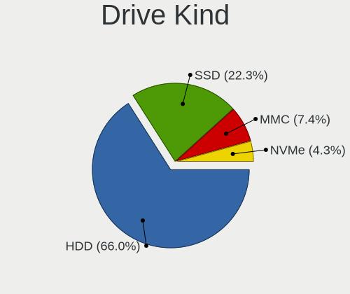
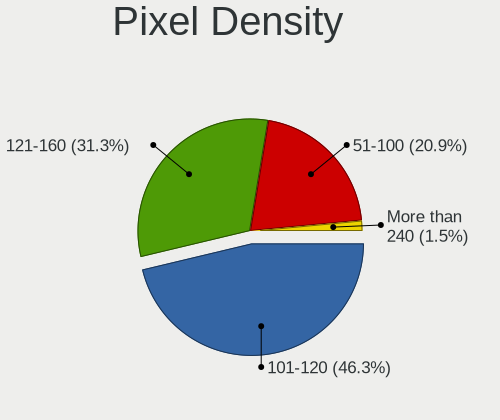
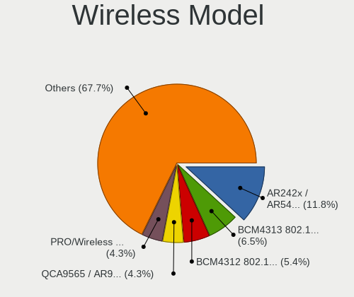
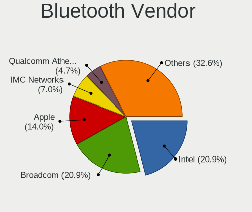
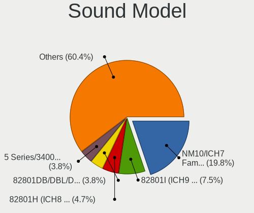
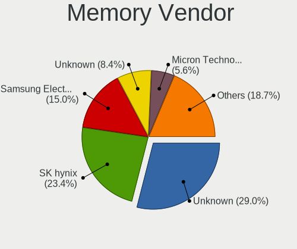
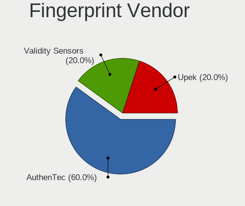

antiX - Tested Hardware & Statistics (Notebooks)
------------------------------------------------

A project to collect tested hardware configurations for antiX.

Anyone can contribute to this report by the [hw-probe](https://github.com/linuxhw/hw-probe) tool:

    sudo -E hw-probe -all -upload

Please contribute! Especially if your hardware is rare.

Contents
--------

* [ Test Cases ](#test-cases)

* [ System ](#system)
  - [ OS                       ](#os)
  - [ OS Family                ](#os-family)
  - [ Kernel                   ](#kernel)
  - [ Kernel Family            ](#kernel-family)
  - [ Kernel Major Ver.        ](#kernel-major-ver)
  - [ Arch                     ](#arch)
  - [ DE                       ](#de)
  - [ Display Server           ](#display-server)
  - [ Display Manager          ](#display-manager)
  - [ OS Lang                  ](#os-lang)
  - [ Boot Mode                ](#boot-mode)
  - [ Filesystem               ](#filesystem)
  - [ Part. scheme             ](#part-scheme)
  - [ Dual Boot with Linux/BSD ](#dual-boot-with-linuxbsd)
  - [ Dual Boot (Win)          ](#dual-boot-win)

* [ Board ](#board)
  - [ Vendor                   ](#vendor)
  - [ Model                    ](#model)
  - [ Model Family             ](#model-family)
  - [ MFG Year                 ](#mfg-year)
  - [ Form Factor              ](#form-factor)
  - [ Secure Boot              ](#secure-boot)
  - [ Coreboot                 ](#coreboot)
  - [ RAM Size                 ](#ram-size)
  - [ RAM Used                 ](#ram-used)
  - [ Total Drives             ](#total-drives)
  - [ Has CD-ROM               ](#has-cd-rom)
  - [ Has Ethernet             ](#has-ethernet)
  - [ Has WiFi                 ](#has-wifi)
  - [ Has Bluetooth            ](#has-bluetooth)

* [ Location ](#location)
  - [ Country                  ](#country)
  - [ City                     ](#city)

* [ Drives ](#drives)
  - [ Drive Vendor             ](#drive-vendor)
  - [ Drive Model              ](#drive-model)
  - [ HDD Vendor               ](#hdd-vendor)
  - [ SSD Vendor               ](#ssd-vendor)
  - [ Drive Kind               ](#drive-kind)
  - [ Drive Connector          ](#drive-connector)
  - [ Drive Size               ](#drive-size)
  - [ Space Total              ](#space-total)
  - [ Space Used               ](#space-used)
  - [ Malfunc. Drives          ](#malfunc-drives)
  - [ Malfunc. Drive Vendor    ](#malfunc-drive-vendor)
  - [ Malfunc. HDD Vendor      ](#malfunc-hdd-vendor)
  - [ Malfunc. Drive Kind      ](#malfunc-drive-kind)
  - [ Failed Drives            ](#failed-drives)
  - [ Failed Drive Vendor      ](#failed-drive-vendor)
  - [ Drive Status             ](#drive-status)

* [ Storage controller ](#storage-controller)
  - [ Storage Vendor           ](#storage-vendor)
  - [ Storage Model            ](#storage-model)
  - [ Storage Kind             ](#storage-kind)

* [ Processor ](#processor)
  - [ CPU Vendor               ](#cpu-vendor)
  - [ CPU Model                ](#cpu-model)
  - [ CPU Model Family         ](#cpu-model-family)
  - [ CPU Cores                ](#cpu-cores)
  - [ CPU Sockets              ](#cpu-sockets)
  - [ CPU Threads              ](#cpu-threads)
  - [ CPU Op-Modes             ](#cpu-op-modes)
  - [ CPU Microcode            ](#cpu-microcode)
  - [ CPU Microarch            ](#cpu-microarch)

* [ Graphics ](#graphics)
  - [ GPU Vendor               ](#gpu-vendor)
  - [ GPU Model                ](#gpu-model)
  - [ GPU Combo                ](#gpu-combo)
  - [ GPU Driver               ](#gpu-driver)
  - [ GPU Memory               ](#gpu-memory)

* [ Monitor ](#monitor)
  - [ Monitor Vendor           ](#monitor-vendor)
  - [ Monitor Model            ](#monitor-model)
  - [ Monitor Resolution       ](#monitor-resolution)
  - [ Monitor Diagonal         ](#monitor-diagonal)
  - [ Monitor Width            ](#monitor-width)
  - [ Aspect Ratio             ](#aspect-ratio)
  - [ Monitor Area             ](#monitor-area)
  - [ Pixel Density            ](#pixel-density)
  - [ Multiple Monitors        ](#multiple-monitors)

* [ Network ](#network)
  - [ Net Controller Vendor    ](#net-controller-vendor)
  - [ Net Controller Model     ](#net-controller-model)
  - [ Wireless Vendor          ](#wireless-vendor)
  - [ Wireless Model           ](#wireless-model)
  - [ Ethernet Vendor          ](#ethernet-vendor)
  - [ Ethernet Model           ](#ethernet-model)
  - [ Net Controller Kind      ](#net-controller-kind)
  - [ Used Controller          ](#used-controller)
  - [ NICs                     ](#nics)
  - [ IPv6                     ](#ipv6)

* [ Bluetooth ](#bluetooth)
  - [ Bluetooth Vendor         ](#bluetooth-vendor)
  - [ Bluetooth Model          ](#bluetooth-model)

* [ Sound ](#sound)
  - [ Sound Vendor             ](#sound-vendor)
  - [ Sound Model              ](#sound-model)

* [ Memory ](#memory)
  - [ Memory Vendor            ](#memory-vendor)
  - [ Memory Model             ](#memory-model)
  - [ Memory Kind              ](#memory-kind)
  - [ Memory Form Factor       ](#memory-form-factor)
  - [ Memory Size              ](#memory-size)
  - [ Memory Speed             ](#memory-speed)

* [ Printers & scanners ](#printers--scanners)
  - [ Printer Vendor           ](#printer-vendor)
  - [ Printer Model            ](#printer-model)
  - [ Scanner Vendor           ](#scanner-vendor)
  - [ Scanner Model            ](#scanner-model)

* [ Camera ](#camera)
  - [ Camera Vendor            ](#camera-vendor)
  - [ Camera Model             ](#camera-model)

* [ Security ](#security)
  - [ Fingerprint Vendor       ](#fingerprint-vendor)
  - [ Fingerprint Model        ](#fingerprint-model)
  - [ Chipcard Vendor          ](#chipcard-vendor)
  - [ Chipcard Model           ](#chipcard-model)

* [ Unsupported ](#unsupported)
  - [ Unsupported Devices      ](#unsupported-devices)
  - [ Unsupported Device Types ](#unsupported-device-types)

Test Cases
----------

Total: 73

| Vendor        | Model                       | Probe                                                      | Date         |
|---------------|-----------------------------|------------------------------------------------------------|--------------|
| ASUSTek       | VivoBook E14 E402YA_L402... | [54dfdc8842](https://linux-hardware.org/?probe=54dfdc8842) | Jun 28, 2023 |
| HP            | Pavilion dv6700             | [c5e6819ca8](https://linux-hardware.org/?probe=c5e6819ca8) | Jun 26, 2023 |
| Dell          | Vostro 1015                 | [c51af54d34](https://linux-hardware.org/?probe=c51af54d34) | May 28, 2023 |
| HP            | 620                         | [6b688ce696](https://linux-hardware.org/?probe=6b688ce696) | May 17, 2023 |
| Fujitsu       | FMVNU6G1C                   | [969957b527](https://linux-hardware.org/?probe=969957b527) | Apr 29, 2023 |
| Lenovo        | IdeaPad 3 15IGL05 81WQ      | [52086c894a](https://linux-hardware.org/?probe=52086c894a) | Apr 24, 2023 |
| Intel         | powered classmate PC        | [79b262de52](https://linux-hardware.org/?probe=79b262de52) | Apr 12, 2023 |
| Acer          | Aspire E5-511               | [f66d23c175](https://linux-hardware.org/?probe=f66d23c175) | Apr 10, 2023 |
| HP            | G61                         | [d00ad3f0fb](https://linux-hardware.org/?probe=d00ad3f0fb) | Apr 07, 2023 |
| Acer          | Aspire 4315                 | [0bf18c8c90](https://linux-hardware.org/?probe=0bf18c8c90) | Mar 26, 2023 |
| HP            | Pavilion dv8000 (ET839UA... | [1525ad44e2](https://linux-hardware.org/?probe=1525ad44e2) | Mar 12, 2023 |
| Acer          | Aspire E1-572               | [bde56e1cc3](https://linux-hardware.org/?probe=bde56e1cc3) | Mar 11, 2023 |
| Lenovo        | IdeaPad 320-15AST 80XV      | [ffbffb33ae](https://linux-hardware.org/?probe=ffbffb33ae) | Mar 09, 2023 |
| Acer          | Aspire 5740                 | [37c0c0602c](https://linux-hardware.org/?probe=37c0c0602c) | Mar 08, 2023 |
| Acer          | Aspire E5-571G              | [07fe4333eb](https://linux-hardware.org/?probe=07fe4333eb) | Feb 25, 2023 |
| Lenovo        | IdeaPad S12 20021,2959      | [7e8f09a90e](https://linux-hardware.org/?probe=7e8f09a90e) | Feb 07, 2023 |
| Lenovo        | IdeaPad 320-15AST 80XV      | [30676c5e14](https://linux-hardware.org/?probe=30676c5e14) | Feb 05, 2023 |
| Lenovo        | IdeaPad 320-15AST 80XV      | [08bf9ddbcf](https://linux-hardware.org/?probe=08bf9ddbcf) | Feb 05, 2023 |
| Dell          | Latitude 2120               | [b52922b482](https://linux-hardware.org/?probe=b52922b482) | Dec 27, 2022 |
| Toshiba       | Satellite C50-A-1HF         | [74902de02b](https://linux-hardware.org/?probe=74902de02b) | Dec 02, 2022 |
| Lenovo        | 3000 V100 076346G           | [bb04272723](https://linux-hardware.org/?probe=bb04272723) | Dec 01, 2022 |
| Acer          | Aspire 7520                 | [d2f4caca66](https://linux-hardware.org/?probe=d2f4caca66) | Nov 22, 2022 |
| ASUSTek       | S3N                         | [e4c4a500b8](https://linux-hardware.org/?probe=e4c4a500b8) | Nov 21, 2022 |
| Google        | Candy                       | [5c5ea3b081](https://linux-hardware.org/?probe=5c5ea3b081) | Nov 17, 2022 |
| HP            | Mini 110-3700               | [4e9f54f23c](https://linux-hardware.org/?probe=4e9f54f23c) | Nov 15, 2022 |
| ASUSTek       | VivoBook E14 E402YA_L402... | [213d8f5688](https://linux-hardware.org/?probe=213d8f5688) | Nov 13, 2022 |
| Fujitsu       | FMVNU6G1C                   | [1351f25388](https://linux-hardware.org/?probe=1351f25388) | Sep 30, 2022 |
| ASUSTek       | 1011CX                      | [4ce8b4c2fe](https://linux-hardware.org/?probe=4ce8b4c2fe) | Sep 18, 2022 |
| KOHJINSHA     | SC series                   | [90a25503ee](https://linux-hardware.org/?probe=90a25503ee) | Aug 01, 2022 |
| KOHJINSHA     | SC series                   | [3986e59a55](https://linux-hardware.org/?probe=3986e59a55) | Aug 01, 2022 |
| IBM           | 260921H                     | [bab4f3f57d](https://linux-hardware.org/?probe=bab4f3f57d) | Jul 17, 2022 |
| IBM           | 260921H                     | [a7483bac34](https://linux-hardware.org/?probe=a7483bac34) | Jul 17, 2022 |
| Lenovo        | ThinkPad X201 3249CTO       | [f6a90dcc74](https://linux-hardware.org/?probe=f6a90dcc74) | Jul 16, 2022 |
| IBM           | 260921H                     | [5f9b0998d3](https://linux-hardware.org/?probe=5f9b0998d3) | Jul 11, 2022 |
| IBM           | 260921H                     | [f0430651fd](https://linux-hardware.org/?probe=f0430651fd) | Jul 10, 2022 |
| Lenovo        | Unknown                     | [910a4f6587](https://linux-hardware.org/?probe=910a4f6587) | Jul 09, 2022 |
| Compaq        | Tablet PC TC1000            | [80324222a7](https://linux-hardware.org/?probe=80324222a7) | Jun 26, 2022 |
| KOHJINSHA     | SX series                   | [7333815afc](https://linux-hardware.org/?probe=7333815afc) | Jun 26, 2022 |
| Samsung       | SQ1S Revision MP            | [faeb18a49e](https://linux-hardware.org/?probe=faeb18a49e) | Jun 26, 2022 |
| ASUSTek       | VivoBook E14 E402YA_L402... | [e904df65f2](https://linux-hardware.org/?probe=e904df65f2) | Jun 07, 2022 |
| ASUSTek       | VivoBook E14 E402YA_L402... | [cb13f37895](https://linux-hardware.org/?probe=cb13f37895) | Jun 05, 2022 |
| ASUSTek       | VivoBook_ASUSLaptop X509... | [abaa4456ea](https://linux-hardware.org/?probe=abaa4456ea) | Jun 01, 2022 |
| Lenovo        | G550 2958                   | [af5cc85e39](https://linux-hardware.org/?probe=af5cc85e39) | May 20, 2022 |
| Acer          | Aspire 5920G                | [b2ffc81ed6](https://linux-hardware.org/?probe=b2ffc81ed6) | May 07, 2022 |
| Packard Be... | EasyNote_MX37-U-057NL       | [41760b3852](https://linux-hardware.org/?probe=41760b3852) | Apr 27, 2022 |
| Apple         | MacBook7,1                  | [70413280df](https://linux-hardware.org/?probe=70413280df) | Mar 26, 2022 |
| HP            | EliteBook 2570p             | [20e998c205](https://linux-hardware.org/?probe=20e998c205) | Mar 17, 2022 |
| IBM           | ThinkPad T40 237342G        | [2c96b391e2](https://linux-hardware.org/?probe=2c96b391e2) | Jan 16, 2022 |
| IBM           | ThinkPad T40 237342G        | [5c4e8748ef](https://linux-hardware.org/?probe=5c4e8748ef) | Jan 16, 2022 |
| Toshiba       | Satellite 1905              | [e72b9043c8](https://linux-hardware.org/?probe=e72b9043c8) | Jan 14, 2022 |
| Lenovo        | ThinkPad T440p 20AWS3RH0... | [b2a71d3bbe](https://linux-hardware.org/?probe=b2a71d3bbe) | Dec 30, 2021 |
| ASUSTek       | X71SL                       | [42e7b57eb8](https://linux-hardware.org/?probe=42e7b57eb8) | Dec 07, 2021 |
| ASUSTek       | A3L                         | [32489f1764](https://linux-hardware.org/?probe=32489f1764) | Dec 06, 2021 |
| ASUSTek       | A3L                         | [2b01c636c2](https://linux-hardware.org/?probe=2b01c636c2) | Dec 06, 2021 |
| ASUSTek       | X51RL                       | [0aeee18806](https://linux-hardware.org/?probe=0aeee18806) | Nov 19, 2021 |
| Acer          | AOA150                      | [24833c6a59](https://linux-hardware.org/?probe=24833c6a59) | Oct 26, 2021 |
| Dell          | Latitude E6400              | [6b7ef9cad5](https://linux-hardware.org/?probe=6b7ef9cad5) | Oct 21, 2021 |
| MSI           | GE62 7RE                    | [9d064bcc8d](https://linux-hardware.org/?probe=9d064bcc8d) | May 21, 2021 |
| MSI           | GE62 7RE                    | [d560e067d4](https://linux-hardware.org/?probe=d560e067d4) | May 21, 2021 |
| HP            | EliteBook 8770w             | [0af42b4958](https://linux-hardware.org/?probe=0af42b4958) | Mar 17, 2021 |
| Fujitsu       | FMVS54EB                    | [f01ca3644f](https://linux-hardware.org/?probe=f01ca3644f) | Mar 11, 2021 |
| Dell          | Latitude 5480               | [c9e0b19e8b](https://linux-hardware.org/?probe=c9e0b19e8b) | Mar 07, 2021 |
| HP            | Mini 110-3700               | [33a6e65493](https://linux-hardware.org/?probe=33a6e65493) | Jan 06, 2021 |
| IBM           | ThinkPad T41 2374K50        | [c77530ec4e](https://linux-hardware.org/?probe=c77530ec4e) | Nov 19, 2020 |
| IBM           | ThinkPad T41 2374K50        | [9c27b878ae](https://linux-hardware.org/?probe=9c27b878ae) | Nov 17, 2020 |
| IBM           | ThinkPad T43 2668WEJ        | [c7508c3b5c](https://linux-hardware.org/?probe=c7508c3b5c) | Oct 02, 2020 |
| HP            | Pavilion dv2700             | [312d41f446](https://linux-hardware.org/?probe=312d41f446) | Aug 01, 2020 |
| HP            | Mini 5101                   | [c0abbe79e6](https://linux-hardware.org/?probe=c0abbe79e6) | Apr 24, 2020 |
| HP            | Mini 5101                   | [8fd41129bc](https://linux-hardware.org/?probe=8fd41129bc) | Apr 24, 2020 |
| ASUSTek       | 900A                        | [9ab5761eb1](https://linux-hardware.org/?probe=9ab5761eb1) | Apr 05, 2020 |
| ASUSTek       | 900HA                       | [39b2bfbefc](https://linux-hardware.org/?probe=39b2bfbefc) | Mar 21, 2020 |
| Medion        | WIM2170                     | [a8c4771b62](https://linux-hardware.org/?probe=a8c4771b62) | Jan 13, 2020 |
| Medion        | WIM2170                     | [c879195021](https://linux-hardware.org/?probe=c879195021) | Jan 13, 2020 |

System
------

OS
--

Installed operating systems

| Name           | Notebooks | Percent |
|----------------|-----------|---------|
| antiX 21       | 22        | 38.6%   |
| antiX 22       | 16        | 28.07%  |
| antiX 19.2     | 6         | 10.53%  |
| antiX 19.3     | 3         | 5.26%   |
| antiX 21-runit | 2         | 3.51%   |
| antiX 19.4     | 2         | 3.51%   |
| antiX 19.1     | 2         | 3.51%   |
| antiX 19.5     | 1         | 1.75%   |
| antiX 17.4.1   | 1         | 1.75%   |
| antiX 17.2.1   | 1         | 1.75%   |
| antiX 17       | 1         | 1.75%   |

OS Family
---------

OS without a version

| Name  | Notebooks | Percent |
|-------|-----------|---------|
| antiX | 56        | 100%    |

Kernel
------

Version of the Linux kernel

| Version                      | Notebooks | Percent |
|------------------------------|-----------|---------|
| 4.9.0-279-antix.1-486-smp    | 14        | 24.56%  |
| 4.9.0-326-antix.1-amd64-smp  | 7         | 12.28%  |
| 5.10.142-antix.2-amd64-smp   | 6         | 10.53%  |
| 5.10.57-antix.1-amd64-smp    | 4         | 7.02%   |
| 4.9.0-279-antix.1-amd64-smp  | 4         | 7.02%   |
| 4.9.0-326-antix.1-486-smp    | 3         | 5.26%   |
| 4.9.235-antix.1-amd64-smp    | 2         | 3.51%   |
| 4.9.212-antix.1-amd64-smp    | 2         | 3.51%   |
| 4.9.212-antix.1-486-smp      | 2         | 3.51%   |
| 4.9.200-antix.1-486-smp      | 2         | 3.51%   |
| 5.14.0-14.1-liquorix-amd64   | 1         | 1.75%   |
| 5.10.88-antix.1-amd64-smp    | 1         | 1.75%   |
| 5.10.27-antix.1-amd64-smp    | 1         | 1.75%   |
| 4.9.160-antix.2-486-smp      | 1         | 1.75%   |
| 4.9.160-antix.1-amd64-smp    | 1         | 1.75%   |
| 4.9.0-294-antix.1-amd64-smp  | 1         | 1.75%   |
| 4.9.0-264-antix.1-486-smp    | 1         | 1.75%   |
| 4.19.202-antix.1-686-smp-pae | 1         | 1.75%   |
| 4.19.100-antix.1-686-smp-pae | 1         | 1.75%   |
| 4.19.0-222-antix.1-amd64-smp | 1         | 1.75%   |
| 4.10.5-antix.1-486-smp       | 1         | 1.75%   |

Kernel Family
-------------

Linux kernel without a distro release

| Version  | Notebooks | Percent |
|----------|-----------|---------|
| 4.9.0    | 29        | 51.79%  |
| 5.10.142 | 6         | 10.71%  |
| 5.10.57  | 4         | 7.14%   |
| 4.9.212  | 4         | 7.14%   |
| 4.9.235  | 2         | 3.57%   |
| 4.9.200  | 2         | 3.57%   |
| 4.9.160  | 2         | 3.57%   |
| 5.14.0   | 1         | 1.79%   |
| 5.10.88  | 1         | 1.79%   |
| 5.10.27  | 1         | 1.79%   |
| 4.19.202 | 1         | 1.79%   |
| 4.19.100 | 1         | 1.79%   |
| 4.19.0   | 1         | 1.79%   |
| 4.10.5   | 1         | 1.79%   |

Kernel Major Ver.
-----------------

Linux kernel major version

| Version | Notebooks | Percent |
|---------|-----------|---------|
| 4.9     | 39        | 69.64%  |
| 5.10    | 12        | 21.43%  |
| 4.19    | 3         | 5.36%   |
| 5.14    | 1         | 1.79%   |
| 4.10    | 1         | 1.79%   |

Arch
----

OS architecture (x86_64, i586, etc.)

| Name   | Notebooks | Percent |
|--------|-----------|---------|
| x86_64 | 30        | 53.57%  |
| i686   | 25        | 44.64%  |
| i586   | 1         | 1.79%   |

DE
--

Desktop Environment

| Name    | Notebooks | Percent |
|---------|-----------|---------|
| icewm   | 26        | 46.43%  |
| Unknown | 26        | 46.43%  |
| fluxbox | 2         | 3.57%   |
| XFCE    | 1         | 1.79%   |
| GNOME   | 1         | 1.79%   |

Display Server
--------------

X11 or Wayland

| Name | Notebooks | Percent |
|------|-----------|---------|
| X11  | 56        | 100%    |

Display Manager
---------------

SDDM, LightDM, etc.

| Name    | Notebooks | Percent |
|---------|-----------|---------|
| Unknown | 33        | 58.93%  |
| SLiM    | 15        | 26.79%  |
| SLIMSKI | 3         | 5.36%   |
| LightDM | 3         | 5.36%   |
| XDM     | 1         | 1.79%   |
| SDDM    | 1         | 1.79%   |

OS Lang
-------

Language

| Lang  | Notebooks | Percent |
|-------|-----------|---------|
| en_US | 24        | 42.86%  |
| ru_RU | 6         | 10.71%  |
| de_DE | 4         | 7.14%   |
| pt_BR | 3         | 5.36%   |
| nl_NL | 2         | 3.57%   |
| ja_JP | 2         | 3.57%   |
| it_IT | 2         | 3.57%   |
| es_ES | 2         | 3.57%   |
| en_AU | 2         | 3.57%   |
| zh_HK | 1         | 1.79%   |
| uk_UA | 1         | 1.79%   |
| pl_PL | 1         | 1.79%   |
| fr_BE | 1         | 1.79%   |
| es_VE | 1         | 1.79%   |
| es_MX | 1         | 1.79%   |
| en_NZ | 1         | 1.79%   |
| en_GB | 1         | 1.79%   |
| de_AT | 1         | 1.79%   |

Boot Mode
---------

EFI or BIOS

| Mode | Notebooks | Percent |
|------|-----------|---------|
| BIOS | 48        | 85.71%  |
| EFI  | 8         | 14.29%  |

Filesystem
----------

Type of filesystem

| Type     | Notebooks | Percent |
|----------|-----------|---------|
| Ext4     | 48        | 85.71%  |
| Overlay  | 7         | 12.5%   |
| Reiserfs | 1         | 1.79%   |

Part. scheme
------------

Scheme of partitioning

| Type    | Notebooks | Percent |
|---------|-----------|---------|
| MBR     | 45        | 80.36%  |
| GPT     | 10        | 17.86%  |
| Unknown | 1         | 1.79%   |

Dual Boot with Linux/BSD
------------------------

Hosting more than one Linux/BSD

| Dual boot | Notebooks | Percent |
|-----------|-----------|---------|
| No        | 45        | 78.95%  |
| Yes       | 12        | 21.05%  |

Dual Boot (Win)
---------------

Hosting Linux and Windows

| Dual boot | Notebooks | Percent |
|-----------|-----------|---------|
| No        | 33        | 58.93%  |
| Yes       | 23        | 41.07%  |

Board
-----

Vendor
------

Motherboard manufacturer

| Name                | Notebooks | Percent |
|---------------------|-----------|---------|
| ASUSTek Computer    | 9         | 16.07%  |
| Lenovo              | 8         | 14.29%  |
| Acer                | 8         | 14.29%  |
| Hewlett-Packard     | 7         | 12.5%   |
| IBM                 | 5         | 8.93%   |
| Dell                | 4         | 7.14%   |
| Fujitsu             | 3         | 5.36%   |
| Toshiba             | 2         | 3.57%   |
| KOHJINSHA           | 2         | 3.57%   |
| Samsung Electronics | 1         | 1.79%   |
| Packard Bell        | 1         | 1.79%   |
| MSI                 | 1         | 1.79%   |
| Medion              | 1         | 1.79%   |
| Intel               | 1         | 1.79%   |
| Google              | 1         | 1.79%   |
| Compaq              | 1         | 1.79%   |
| Apple               | 1         | 1.79%   |

Model
-----

Motherboard model

| Name                               | Notebooks | Percent |
|------------------------------------|-----------|---------|
| IBM 260921H                        | 2         | 3.57%   |
| HP Mini 110-3700                   | 2         | 3.57%   |
| Fujitsu FMVNU6G1C                  | 2         | 3.57%   |
| Toshiba Satellite C50-A-1HF        | 1         | 1.79%   |
| Toshiba Satellite 1905             | 1         | 1.79%   |
| Samsung SQ1S                       | 1         | 1.79%   |
| Packard Bell EasyNote_MX37-U-057NL | 1         | 1.79%   |
| MSI GE62 7RE                       | 1         | 1.79%   |
| Medion WIM2170                     | 1         | 1.79%   |
| Lenovo ThinkPad X201 3249CTO       | 1         | 1.79%   |
| Lenovo ThinkPad T440p 20AWS3RH00   | 1         | 1.79%   |
| Lenovo IdeaPad S12 20021,2959      | 1         | 1.79%   |
| Lenovo IdeaPad 320-15AST 80XV      | 1         | 1.79%   |
| Lenovo IdeaPad 3 15IGL05 81WQ      | 1         | 1.79%   |
| Lenovo G550 2958                   | 1         | 1.79%   |
| Lenovo 3000 V100 076346G           | 1         | 1.79%   |
| KOHJINSHA SX series                | 1         | 1.79%   |
| KOHJINSHA SC series                | 1         | 1.79%   |
| Intel powered classmate PC         | 1         | 1.79%   |
| IBM ThinkPad T43 2668WEJ           | 1         | 1.79%   |
| IBM ThinkPad T41 2374K50           | 1         | 1.79%   |
| IBM ThinkPad T40 237342G           | 1         | 1.79%   |
| HP Pavilion dv2700                 | 1         | 1.79%   |
| HP Mini 5101                       | 1         | 1.79%   |
| HP EliteBook 8770w                 | 1         | 1.79%   |
| HP EliteBook 2570p                 | 1         | 1.79%   |
| HP 620                             | 1         | 1.79%   |
| Google Candy                       | 1         | 1.79%   |
| Fujitsu FMVS54EB                   | 1         | 1.79%   |
| Dell Vostro 1015                   | 1         | 1.79%   |
| Dell Latitude E6400                | 1         | 1.79%   |
| Dell Latitude 5480                 | 1         | 1.79%   |
| Dell Latitude 2120                 | 1         | 1.79%   |
| Compaq Tablet PC TC1000            | 1         | 1.79%   |
| ASUS X71SL                         | 1         | 1.79%   |
| ASUS X51RL                         | 1         | 1.79%   |
| ASUS VivoBook_ASUSLaptop X509MA    | 1         | 1.79%   |
| ASUS VivoBook E14 E402YA_L402YA    | 1         | 1.79%   |
| ASUS S3N                           | 1         | 1.79%   |
| ASUS A3L                           | 1         | 1.79%   |

Model Family
------------

Motherboard model prefix

| Name                  | Notebooks | Percent |
|-----------------------|-----------|---------|
| Acer Aspire           | 7         | 12.5%   |
| Lenovo IdeaPad        | 3         | 5.36%   |
| IBM ThinkPad          | 3         | 5.36%   |
| HP Mini               | 3         | 5.36%   |
| Dell Latitude         | 3         | 5.36%   |
| Toshiba Satellite     | 2         | 3.57%   |
| Lenovo ThinkPad       | 2         | 3.57%   |
| IBM 260921H           | 2         | 3.57%   |
| HP EliteBook          | 2         | 3.57%   |
| Fujitsu FMVNU6G1C     | 2         | 3.57%   |
| ASUS VivoBook         | 2         | 3.57%   |
| Samsung SQ1S          | 1         | 1.79%   |
| Packard Bell EasyNote | 1         | 1.79%   |
| MSI GE62              | 1         | 1.79%   |
| Medion WIM2170        | 1         | 1.79%   |
| Lenovo G550           | 1         | 1.79%   |
| Lenovo 3000           | 1         | 1.79%   |
| KOHJINSHA SX          | 1         | 1.79%   |
| KOHJINSHA SC          | 1         | 1.79%   |
| Intel powered         | 1         | 1.79%   |
| HP Pavilion           | 1         | 1.79%   |
| HP 620                | 1         | 1.79%   |
| Google Candy          | 1         | 1.79%   |
| Fujitsu FMVS54EB      | 1         | 1.79%   |
| Dell Vostro           | 1         | 1.79%   |
| Compaq Tablet         | 1         | 1.79%   |
| ASUS X71SL            | 1         | 1.79%   |
| ASUS X51RL            | 1         | 1.79%   |
| ASUS S3N              | 1         | 1.79%   |
| ASUS A3L              | 1         | 1.79%   |
| ASUS 900HA            | 1         | 1.79%   |
| ASUS 900A             | 1         | 1.79%   |
| ASUS 1011CX           | 1         | 1.79%   |
| Apple MacBook7        | 1         | 1.79%   |
| Acer AOA150           | 1         | 1.79%   |
| Unknown               | 1         | 1.79%   |

MFG Year
--------

Motherboard manufacture year

| Year | Notebooks | Percent |
|------|-----------|---------|
| 2009 | 9         | 16.07%  |
| 2007 | 9         | 16.07%  |
| 2008 | 5         | 8.93%   |
| 2013 | 4         | 7.14%   |
| 2012 | 4         | 7.14%   |
| 2010 | 4         | 7.14%   |
| 2003 | 3         | 5.36%   |
| 2020 | 2         | 3.57%   |
| 2017 | 2         | 3.57%   |
| 2014 | 2         | 3.57%   |
| 2011 | 2         | 3.57%   |
| 2005 | 2         | 3.57%   |
| 2004 | 2         | 3.57%   |
| 1999 | 2         | 3.57%   |
| 2022 | 1         | 1.79%   |
| 2019 | 1         | 1.79%   |
| 2016 | 1         | 1.79%   |
| 2006 | 1         | 1.79%   |

Form Factor
-----------

Physical design of the computer

| Name     | Notebooks | Percent |
|----------|-----------|---------|
| Notebook | 56        | 100%    |

Secure Boot
-----------

Enabled or disabled

| State    | Notebooks | Percent |
|----------|-----------|---------|
| Disabled | 56        | 100%    |

Coreboot
--------

Have coreboot on board

| Used | Notebooks | Percent |
|------|-----------|---------|
| No   | 55        | 98.21%  |
| Yes  | 1         | 1.79%   |

RAM Size
--------

Total RAM memory

| Size in GB | Notebooks | Percent |
|------------|-----------|---------|
| 3.01-4.0   | 16        | 28.57%  |
| 1.01-2.0   | 10        | 17.86%  |
| 0.51-1.0   | 10        | 17.86%  |
| 2.01-3.0   | 7         | 12.5%   |
| 4.01-8.0   | 4         | 7.14%   |
| 0.01-0.5   | 4         | 7.14%   |
| 32.01-64.0 | 2         | 3.57%   |
| 8.01-16.0  | 2         | 3.57%   |
| 16.01-24.0 | 1         | 1.79%   |

RAM Used
--------

Used RAM memory

| Used GB  | Notebooks | Percent |
|----------|-----------|---------|
| 0.01-0.5 | 22        | 38.6%   |
| 0.51-1.0 | 20        | 35.09%  |
| 1.01-2.0 | 11        | 19.3%   |
| 2.01-3.0 | 4         | 7.02%   |

Total Drives
------------

Number of drives on board

| Drives | Notebooks | Percent |
|--------|-----------|---------|
| 1      | 46        | 80.7%   |
| 2      | 9         | 15.79%  |
| 3      | 1         | 1.75%   |
| 0      | 1         | 1.75%   |

Has CD-ROM
----------

Has CD-ROM on board

| Presented | Notebooks | Percent |
|-----------|-----------|---------|
| Yes       | 28        | 50%     |
| No        | 28        | 50%     |

Has Ethernet
------------

Has Ethernet on board

| Presented | Notebooks | Percent |
|-----------|-----------|---------|
| Yes       | 47        | 83.93%  |
| No        | 9         | 16.07%  |

Has WiFi
--------

Has WiFi module

| Presented | Notebooks | Percent |
|-----------|-----------|---------|
| Yes       | 55        | 98.21%  |
| No        | 1         | 1.79%   |

Has Bluetooth
-------------

Has Bluetooth module

| Presented | Notebooks | Percent |
|-----------|-----------|---------|
| No        | 32        | 57.14%  |
| Yes       | 24        | 42.86%  |

Location
--------

Country
-------

Geographic location (country)

| Country     | Notebooks | Percent |
|-------------|-----------|---------|
| Hong Kong   | 9         | 16.07%  |
| USA         | 8         | 14.29%  |
| Russia      | 7         | 12.5%   |
| Germany     | 5         | 8.93%   |
| Netherlands | 3         | 5.36%   |
| Brazil      | 3         | 5.36%   |
| Poland      | 2         | 3.57%   |
| Japan       | 2         | 3.57%   |
| Italy       | 2         | 3.57%   |
| Australia   | 2         | 3.57%   |
| Uruguay     | 1         | 1.79%   |
| Ukraine     | 1         | 1.79%   |
| Spain       | 1         | 1.79%   |
| New Zealand | 1         | 1.79%   |
| Mexico      | 1         | 1.79%   |
| Kenya       | 1         | 1.79%   |
| Kazakhstan  | 1         | 1.79%   |
| Hungary     | 1         | 1.79%   |
| Denmark     | 1         | 1.79%   |
| Chile       | 1         | 1.79%   |
| Bulgaria    | 1         | 1.79%   |
| Belgium     | 1         | 1.79%   |
| Austria     | 1         | 1.79%   |

City
----

Geographic location (city)

| City                      | Notebooks | Percent |
|---------------------------|-----------|---------|
| Shatin                    | 6         | 10.34%  |
| Sydney                    | 2         | 3.45%   |
| St Petersburg             | 2         | 3.45%   |
| Moscow                    | 2         | 3.45%   |
| Central                   | 2         | 3.45%   |
| Yuzhno-Sakhalinsk         | 1         | 1.72%   |
| Yokohama                  | 1         | 1.72%   |
| Ybbs an der Donau         | 1         | 1.72%   |
| Whitney                   | 1         | 1.72%   |
| Warsaw                    | 1         | 1.72%   |
| Torricella Sicura         | 1         | 1.72%   |
| Toms River                | 1         | 1.72%   |
| Sofia                     | 1         | 1.72%   |
| Sheung Shui               | 1         | 1.72%   |
| Schloss Holte-Stukenbrock | 1         | 1.72%   |
| Santiago                  | 1         | 1.72%   |
| Salto                     | 1         | 1.72%   |
| Rotterdam                 | 1         | 1.72%   |
| Reutlingen                | 1         | 1.72%   |
| Purmerend                 | 1         | 1.72%   |
| Portland                  | 1         | 1.72%   |
| Norden                    | 1         | 1.72%   |
| Neyagawa                  | 1         | 1.72%   |
| Nairobi                   | 1         | 1.72%   |
| Montevideo                | 1         | 1.72%   |
| Mittegrossefehn           | 1         | 1.72%   |
| Milan                     | 1         | 1.72%   |
| Mechanicsburg             | 1         | 1.72%   |
| Marcinelle                | 1         | 1.72%   |
| Karaganda                 | 1         | 1.72%   |
| Jonesboro                 | 1         | 1.72%   |
| Hortolândia              | 1         | 1.72%   |
| Hobbs                     | 1         | 1.72%   |
| Hagenbach                 | 1         | 1.72%   |
| Grozny                    | 1         | 1.72%   |
| Greenville                | 1         | 1.72%   |
| Granja                    | 1         | 1.72%   |
| Godley                    | 1         | 1.72%   |
| Elektrostal               | 1         | 1.72%   |
| El Cerrito                | 1         | 1.72%   |

Drives
------

Drive Vendor
------------

Hard drive vendors

| Vendor              | Notebooks | Drives | Percent |
|---------------------|-----------|--------|---------|
| Hitachi             | 12        | 12     | 19.35%  |
| Seagate             | 11        | 11     | 17.74%  |
| WDC                 | 10        | 10     | 16.13%  |
| Toshiba             | 5         | 5      | 8.06%   |
| Samsung Electronics | 5         | 5      | 8.06%   |
| Unknown             | 2         | 2      | 3.23%   |
| Kingston            | 2         | 2      | 3.23%   |
| Zheino              | 1         | 1      | 1.61%   |
| Unknown (CF)        | 1         | 1      | 1.61%   |
| Transcend           | 1         | 1      | 1.61%   |
| RECADATA            | 1         | 1      | 1.61%   |
| PNY                 | 1         | 1      | 1.61%   |
| OCZ                 | 1         | 1      | 1.61%   |
| Maxtor              | 1         | 1      | 1.61%   |
| Intel               | 1         | 1      | 1.61%   |
| IBM/Hitachi         | 1         | 1      | 1.61%   |
| HGST                | 1         | 1      | 1.61%   |
| Hewlett-Packard     | 1         | 1      | 1.61%   |
| Fujitsu             | 1         | 1      | 1.61%   |
| BIWIN               | 1         | 1      | 1.61%   |
| BHT                 | 1         | 3      | 1.61%   |
| ASUS-PHISON         | 1         | 1      | 1.61%   |

Drive Model
-----------

Hard drive models

| Model                                   | Notebooks | Percent |
|-----------------------------------------|-----------|---------|
| WDC WD5000LPVX-22V0TT0 500GB            | 2         | 3.23%   |
| Seagate ST980811AS 80GB                 | 2         | 3.23%   |
| Samsung SSD 750 EVO 120GB               | 2         | 3.23%   |
| Hitachi HTS548040M9AT00 40GB            | 2         | 3.23%   |
| Hitachi HTS542525K9SA00 250GB           | 2         | 3.23%   |
| Zheino CHN mSATAM3 128 128GB SSD        | 1         | 1.61%   |
| WDC WD5000LPLX-08ZNTT0 500GB            | 1         | 1.61%   |
| WDC WD5000LPCX-24VHAT0 500GB            | 1         | 1.61%   |
| WDC WD5000BEVT-22A0RT0 500GB            | 1         | 1.61%   |
| WDC WD3200BEVT-60ZCT1 320GB             | 1         | 1.61%   |
| WDC WD3200BEVT-22ZCT0 320GB             | 1         | 1.61%   |
| WDC WD2500BEVT-22ZCT0 250GB             | 1         | 1.61%   |
| WDC WD1600BEVS-22RST0 160GB             | 1         | 1.61%   |
| WDC WD1200BEVE-00A0HT0 120GB            | 1         | 1.61%   |
| Unknown SR64G  64GB                     | 1         | 1.61%   |
| Unknown HAG2e  16GB                     | 1         | 1.61%   |
| Unknown (CF) Card 16GB SSD              | 1         | 1.61%   |
| Transcend SSD 2GB                       | 1         | 1.61%   |
| Toshiba THNSNJ256G8NY 256GB SSD         | 1         | 1.61%   |
| Toshiba THNS128GG4BAAA-NonFDE 128GB SSD | 1         | 1.61%   |
| Toshiba MQ01ABF050 500GB                | 1         | 1.61%   |
| Toshiba MQ01ABD100 1TB                  | 1         | 1.61%   |
| Toshiba MK2576GSX 250GB                 | 1         | 1.61%   |
| Seagate ST9320325AS 320GB               | 1         | 1.61%   |
| Seagate ST9250421ASG 250GB              | 1         | 1.61%   |
| Seagate ST9160411AS 160GB               | 1         | 1.61%   |
| Seagate ST9160314AS 160GB               | 1         | 1.61%   |
| Seagate ST9160310AS 160GB               | 1         | 1.61%   |
| Seagate ST9160301AS 160GB               | 1         | 1.61%   |
| Seagate ST500LM030-1RK17D 500GB         | 1         | 1.61%   |
| Seagate ST500LM021-1KJ152 500GB         | 1         | 1.61%   |
| Seagate ST320LT007-9ZV142 320GB         | 1         | 1.61%   |
| Samsung SSD 850 EVO 120GB               | 1         | 1.61%   |
| Samsung MZALQ256HBJD-00BL2 256GB        | 1         | 1.61%   |
| Samsung HS06THB 64GB                    | 1         | 1.61%   |
| RECADATA RD-S350MCN-N0642 64GB SSD      | 1         | 1.61%   |
| PNY CS900 960GB SSD                     | 1         | 1.61%   |
| OCZ AGILITY3 120GB SSD                  | 1         | 1.61%   |
| Maxtor Z1 SSD 240GB                     | 1         | 1.61%   |
| Kingston SUV500MS120G 120GB SSD         | 1         | 1.61%   |

HDD Vendor
----------

Hard disk drive vendors

| Vendor              | Notebooks | Drives | Percent |
|---------------------|-----------|--------|---------|
| Hitachi             | 12        | 12     | 30%     |
| Seagate             | 11        | 11     | 27.5%   |
| WDC                 | 10        | 10     | 25%     |
| Toshiba             | 3         | 3      | 7.5%    |
| Samsung Electronics | 1         | 1      | 2.5%    |
| IBM/Hitachi         | 1         | 1      | 2.5%    |
| HGST                | 1         | 1      | 2.5%    |
| Fujitsu             | 1         | 1      | 2.5%    |

SSD Vendor
----------

Solid state drive vendors

| Vendor              | Notebooks | Drives | Percent |
|---------------------|-----------|--------|---------|
| Samsung Electronics | 3         | 3      | 15.79%  |
| Toshiba             | 2         | 2      | 10.53%  |
| Kingston            | 2         | 2      | 10.53%  |
| Zheino              | 1         | 1      | 5.26%   |
| Unknown (CF)        | 1         | 1      | 5.26%   |
| Transcend           | 1         | 1      | 5.26%   |
| RECADATA            | 1         | 1      | 5.26%   |
| PNY                 | 1         | 1      | 5.26%   |
| OCZ                 | 1         | 1      | 5.26%   |
| Maxtor              | 1         | 1      | 5.26%   |
| Intel               | 1         | 1      | 5.26%   |
| Hewlett-Packard     | 1         | 1      | 5.26%   |
| BIWIN               | 1         | 1      | 5.26%   |
| BHT                 | 1         | 3      | 5.26%   |
| ASUS-PHISON         | 1         | 1      | 5.26%   |

Drive Kind
----------

HDD or SSD

| Kind | Notebooks | Drives | Percent |
|------|-----------|--------|---------|
| HDD  | 39        | 40     | 66.1%   |
| SSD  | 17        | 21     | 28.81%  |
| MMC  | 2         | 2      | 3.39%   |
| NVMe | 1         | 1      | 1.69%   |

Drive Connector
---------------

SATA, SAS, NVMe, etc.

| Type | Notebooks | Drives | Percent |
|------|-----------|--------|---------|
| SATA | 53        | 61     | 94.64%  |
| MMC  | 2         | 2      | 3.57%   |
| NVMe | 1         | 1      | 1.79%   |

Drive Size
----------

Size of hard drive

| Size in TB | Notebooks | Drives | Percent |
|------------|-----------|--------|---------|
| 0.01-0.5   | 51        | 57     | 92.73%  |
| 0.51-1.0   | 4         | 4      | 7.27%   |

Space Total
-----------

Amount of disk space available on the file system

| Size in GB | Notebooks | Percent |
|------------|-----------|---------|
| 101-250    | 18        | 31.03%  |
| 1-20       | 17        | 29.31%  |
| 51-100     | 8         | 13.79%  |
| 21-50      | 7         | 12.07%  |
| 251-500    | 5         | 8.62%   |
| 501-1000   | 2         | 3.45%   |
| Unknown    | 1         | 1.72%   |

Space Used
----------

Amount of used disk space

| Used GB | Notebooks | Percent |
|---------|-----------|---------|
| 1-20    | 43        | 76.79%  |
| 21-50   | 6         | 10.71%  |
| 101-250 | 3         | 5.36%   |
| 51-100  | 3         | 5.36%   |
| Unknown | 1         | 1.79%   |

Malfunc. Drives
---------------

Drive models with a malfunction

| Model                           | Notebooks | Drives | Percent |
|---------------------------------|-----------|--------|---------|
| Seagate ST980811AS 80GB         | 2         | 2      | 10%     |
| Hitachi HTS542525K9SA00 250GB   | 2         | 2      | 10%     |
| WDC WD5000LPVX-22V0TT0 500GB    | 1         | 1      | 5%      |
| WDC WD5000BEVT-22A0RT0 500GB    | 1         | 1      | 5%      |
| WDC WD3200BEVT-60ZCT1 320GB     | 1         | 1      | 5%      |
| WDC WD2500BEVT-22ZCT0 250GB     | 1         | 1      | 5%      |
| Seagate ST9320325AS 320GB       | 1         | 1      | 5%      |
| Seagate ST9160314AS 160GB       | 1         | 1      | 5%      |
| Seagate ST9160310AS 160GB       | 1         | 1      | 5%      |
| Seagate ST320LT007-9ZV142 320GB | 1         | 1      | 5%      |
| Hitachi HTS725050A7E630 500GB   | 1         | 1      | 5%      |
| Hitachi HTS723232A7A364 320GB   | 1         | 1      | 5%      |
| Hitachi HTS721060G9AT00 64GB    | 1         | 1      | 5%      |
| Hitachi HTS548040M9AT00 40GB    | 1         | 1      | 5%      |
| Hitachi HTS543225A7A384 250GB   | 1         | 1      | 5%      |
| Hitachi HTS541612J9SA00 120GB   | 1         | 1      | 5%      |
| Hitachi HTC426040G8CE00 40GB    | 1         | 1      | 5%      |
| BIWIN SSD 32GB                  | 1         | 1      | 5%      |

Malfunc. Drive Vendor
---------------------

Vendors of faulty drives

| Vendor  | Notebooks | Drives | Percent |
|---------|-----------|--------|---------|
| Hitachi | 9         | 9      | 45%     |
| Seagate | 6         | 6      | 30%     |
| WDC     | 4         | 4      | 20%     |
| BIWIN   | 1         | 1      | 5%      |

Malfunc. HDD Vendor
-------------------

Vendors of faulty HDD drives

| Vendor  | Notebooks | Drives | Percent |
|---------|-----------|--------|---------|
| Hitachi | 9         | 9      | 47.37%  |
| Seagate | 6         | 6      | 31.58%  |
| WDC     | 4         | 4      | 21.05%  |

Malfunc. Drive Kind
-------------------

Kinds of faulty drives

| Kind | Notebooks | Drives | Percent |
|------|-----------|--------|---------|
| HDD  | 19        | 19     | 95%     |
| SSD  | 1         | 1      | 5%      |

Failed Drives
-------------

Failed drive models

Zero info for selected period =(

Failed Drive Vendor
-------------------

Failed drive vendors

Zero info for selected period =(

Drive Status
------------

Number of failed and malfunc. drives

| Status   | Notebooks | Drives | Percent |
|----------|-----------|--------|---------|
| Works    | 33        | 40     | 57.89%  |
| Malfunc  | 20        | 20     | 35.09%  |
| Detected | 4         | 4      | 7.02%   |

Storage controller
------------------

Storage Vendor
--------------

Storage controller vendors

| Vendor                           | Notebooks | Percent |
|----------------------------------|-----------|---------|
| Intel                            | 46        | 79.31%  |
| AMD                              | 3         | 5.17%   |
| VIA Technologies                 | 2         | 3.45%   |
| Silicon Integrated Systems [SiS] | 2         | 3.45%   |
| Nvidia                           | 2         | 3.45%   |
| Silicon Image                    | 1         | 1.72%   |
| Samsung Electronics              | 1         | 1.72%   |
| JMicron Technology               | 1         | 1.72%   |

Storage Model
-------------

Storage controller models

| Model                                                                          | Notebooks | Percent |
|--------------------------------------------------------------------------------|-----------|---------|
| Intel NM10/ICH7 Family SATA Controller [AHCI mode]                             | 5         | 7.25%   |
| Intel 82801G (ICH7 Family) IDE Controller                                      | 5         | 7.25%   |
| Intel 82801IBM/IEM (ICH9M/ICH9M-E) 4 port SATA Controller [AHCI mode]          | 4         | 5.8%    |
| Intel 82801HM/HEM (ICH8M/ICH8M-E) IDE Controller                               | 4         | 5.8%    |
| Intel 82801GBM/GHM (ICH7-M Family) SATA Controller [IDE mode]                  | 4         | 5.8%    |
| Intel 82801DBM (ICH4-M) IDE Controller                                         | 4         | 5.8%    |
| Intel 82801HM/HEM (ICH8M/ICH8M-E) SATA Controller [AHCI mode]                  | 3         | 4.35%   |
| Silicon Integrated Systems [SiS] SATA Controller / IDE mode                    | 2         | 2.9%    |
| Silicon Integrated Systems [SiS] 5513 IDE Controller                           | 2         | 2.9%    |
| Intel US15W/US15X/US15L/UL11L SCH [Poulsbo] IDE Controller                     | 2         | 2.9%    |
| Intel Celeron/Pentium Silver Processor SATA Controller                         | 2         | 2.9%    |
| Intel 82801GBM/GHM (ICH7-M Family) SATA Controller [AHCI mode]                 | 2         | 2.9%    |
| Intel 82801 Mobile SATA Controller [RAID mode]                                 | 2         | 2.9%    |
| Intel 82371AB/EB/MB PIIX4 IDE                                                  | 2         | 2.9%    |
| Intel 8 Series SATA Controller 1 [AHCI mode]                                   | 2         | 2.9%    |
| Intel 7 Series Chipset Family 6-port SATA Controller [AHCI mode]               | 2         | 2.9%    |
| AMD FCH SATA Controller [AHCI mode]                                            | 2         | 2.9%    |
| VIA VT82C586A/B/VT82C686/A/B/VT823x/A/C PIPC Bus Master IDE                    | 1         | 1.45%   |
| VIA CX700M2/VX700/VX800/820-Series Serial ATA & EIDE-Controller                | 1         | 1.45%   |
| Silicon Image SiI 3531 [SATALink/SATARaid] Serial ATA Controller               | 1         | 1.45%   |
| Samsung NVMe SSD Controller 980                                                | 1         | 1.45%   |
| Nvidia MCP89 SATA Controller (AHCI mode)                                       | 1         | 1.45%   |
| Nvidia MCP67 IDE Controller                                                    | 1         | 1.45%   |
| Nvidia MCP67 AHCI Controller                                                   | 1         | 1.45%   |
| JMicron JMB360 AHCI Controller                                                 | 1         | 1.45%   |
| Intel HM170/QM170 Chipset SATA Controller [AHCI Mode]                          | 1         | 1.45%   |
| Intel Atom Processor E3800 Series SATA AHCI Controller                         | 1         | 1.45%   |
| Intel 82801HM/HEM (ICH8M/ICH8M-E) SATA Controller [IDE mode]                   | 1         | 1.45%   |
| Intel 82801FBM (ICH6M) SATA Controller                                         | 1         | 1.45%   |
| Intel 82801FB/FBM/FR/FW/FRW (ICH6 Family) IDE Controller                       | 1         | 1.45%   |
| Intel 82801BA IDE U100 Controller                                              | 1         | 1.45%   |
| Intel 8 Series/C220 Series Chipset Family 6-port SATA Controller 1 [AHCI mode] | 1         | 1.45%   |
| Intel 6 Series/C200 Series Chipset Family 6 port Mobile SATA AHCI Controller   | 1         | 1.45%   |
| Intel 5 Series/3400 Series Chipset 6 port SATA AHCI Controller                 | 1         | 1.45%   |
| Intel 5 Series/3400 Series Chipset 4 port SATA AHCI Controller                 | 1         | 1.45%   |
| AMD SB600 Non-Raid-5 SATA                                                      | 1         | 1.45%   |
| AMD SB600 IDE                                                                  | 1         | 1.45%   |

Storage Kind
------------

Kind of storage controller (IDE, SATA, NVMe, SAS, ...)

| Kind | Notebooks | Percent |
|------|-----------|---------|
| SATA | 30        | 47.62%  |
| IDE  | 29        | 46.03%  |
| RAID | 3         | 4.76%   |
| NVMe | 1         | 1.59%   |

Processor
---------

CPU Vendor
----------

Processor vendors

| Vendor       | Notebooks | Percent |
|--------------|-----------|---------|
| Intel        | 51        | 91.07%  |
| AMD          | 3         | 5.36%   |
| GenuineTMx86 | 1         | 1.79%   |
| CentaurHauls | 1         | 1.79%   |

CPU Model
---------

Processor models

| Model                                          | Notebooks | Percent |
|------------------------------------------------|-----------|---------|
| Intel Atom CPU N270 @ 1.60GHz                  | 4         | 7.14%   |
| Intel Pentium M processor 1.60GHz              | 2         | 3.57%   |
| Intel Pentium M processor 1.00GHz              | 2         | 3.57%   |
| Intel Genuine processor 800MHz                 | 2         | 3.57%   |
| Intel Core 2 Duo CPU T5750 @ 2.00GHz           | 2         | 3.57%   |
| Intel Core 2 Duo CPU P8600 @ 2.40GHz           | 2         | 3.57%   |
| Intel Celeron (Mendocino)                      | 2         | 3.57%   |
| Intel Atom CPU Z520 @ 1.33GHz                  | 2         | 3.57%   |
| Intel Atom CPU N455 @ 1.66GHz                  | 2         | 3.57%   |
| Intel Atom CPU N2600 @ 1.60GHz                 | 2         | 3.57%   |
| Intel Pentium Silver N5030 CPU @ 1.10GHz       | 1         | 1.79%   |
| Intel Pentium M processor 1600MHz              | 1         | 1.79%   |
| Intel Pentium M processor 1.86GHz              | 1         | 1.79%   |
| Intel Pentium Dual-Core CPU T4500 @ 2.30GHz    | 1         | 1.79%   |
| Intel Pentium Dual CPU T2390 @ 1.86GHz         | 1         | 1.79%   |
| Intel Pentium 4 CPU 2.00GHz                    | 1         | 1.79%   |
| Intel Genuine CPU T2400 @ 1.83GHz              | 1         | 1.79%   |
| Intel Core i7-7700HQ CPU @ 2.80GHz             | 1         | 1.79%   |
| Intel Core i7-7600U CPU @ 2.80GHz              | 1         | 1.79%   |
| Intel Core i7-3740QM CPU @ 2.70GHz             | 1         | 1.79%   |
| Intel Core i7 CPU M 620 @ 2.67GHz              | 1         | 1.79%   |
| Intel Core i5-4300M CPU @ 2.60GHz              | 1         | 1.79%   |
| Intel Core i5-4200U CPU @ 1.60GHz              | 1         | 1.79%   |
| Intel Core i5-3320M CPU @ 2.60GHz              | 1         | 1.79%   |
| Intel Core i5 CPU M 430 @ 2.27GHz              | 1         | 1.79%   |
| Intel Core i3-4005U CPU @ 1.70GHz              | 1         | 1.79%   |
| Intel Core i3-3110M CPU @ 2.40GHz              | 1         | 1.79%   |
| Intel Core i3-2330M CPU @ 2.20GHz              | 1         | 1.79%   |
| Intel Core 2 Duo CPU T9600 @ 2.80GHz           | 1         | 1.79%   |
| Intel Core 2 Duo CPU T6670 @ 2.20GHz           | 1         | 1.79%   |
| Intel Core 2 Duo CPU T5450 @ 1.66GHz           | 1         | 1.79%   |
| Intel Celeron N4000 CPU @ 1.10GHz              | 1         | 1.79%   |
| Intel Celeron Dual-Core CPU T3000 @ 1.80GHz    | 1         | 1.79%   |
| Intel Celeron CPU N2940 @ 1.83GHz              | 1         | 1.79%   |
| Intel Celeron CPU N2840 @ 2.16GHz              | 1         | 1.79%   |
| Intel Celeron CPU 540 @ 1.86GHz                | 1         | 1.79%   |
| Intel Celeron CPU 530 @ 1.73GHz                | 1         | 1.79%   |
| Intel Atom CPU N550 @ 1.50GHz                  | 1         | 1.79%   |
| Intel Atom CPU N280 @ 1.66GHz                  | 1         | 1.79%   |
| GenuineTMx86 Transmeta Crusoe Processor TM5800 | 1         | 1.79%   |

CPU Model Family
----------------

Processor model prefix

| Model                   | Notebooks | Percent |
|-------------------------|-----------|---------|
| Intel Atom              | 12        | 21.43%  |
| Intel Core 2 Duo        | 7         | 12.5%   |
| Intel Celeron           | 7         | 12.5%   |
| Intel Pentium M         | 6         | 10.71%  |
| Intel Core i7           | 4         | 7.14%   |
| Intel Core i5           | 4         | 7.14%   |
| Intel Genuine           | 3         | 5.36%   |
| Intel Core i3           | 3         | 5.36%   |
| AMD E2                  | 2         | 3.57%   |
| Other                   | 1         | 1.79%   |
| Intel Pentium Silver    | 1         | 1.79%   |
| Intel Pentium Dual-Core | 1         | 1.79%   |
| Intel Pentium Dual      | 1         | 1.79%   |
| Intel Pentium 4         | 1         | 1.79%   |
| Intel Celeron Dual-Core | 1         | 1.79%   |
| CentaurHauls VIA Nano   | 1         | 1.79%   |
| AMD Athlon 64 X2        | 1         | 1.79%   |

CPU Cores
---------

Number of processor cores

| Number | Notebooks | Percent |
|--------|-----------|---------|
| 2      | 28        | 50%     |
| 1      | 24        | 42.86%  |
| 4      | 4         | 7.14%   |

CPU Sockets
-----------

Number of sockets

| Number | Notebooks | Percent |
|--------|-----------|---------|
| 1      | 56        | 100%    |

CPU Threads
-----------

Threads per core (Hyper-Threading)

| Number | Notebooks | Percent |
|--------|-----------|---------|
| 1      | 33        | 58.93%  |
| 2      | 23        | 41.07%  |

CPU Op-Modes
------------

CPU Operation Modes (32-bit, 64-bit)

| Op mode        | Notebooks | Percent |
|----------------|-----------|---------|
| 32-bit, 64-bit | 35        | 62.5%   |
| 32-bit         | 21        | 37.5%   |

CPU Microcode
-------------

Microcode number

| Number     | Notebooks | Percent |
|------------|-----------|---------|
| 0x106c2    | 7         | 12.5%   |
| 0x1067a    | 6         | 10.71%  |
| 0x6fd      | 4         | 7.14%   |
| 0x6d6      | 4         | 7.14%   |
| 0x6d8      | 3         | 5.36%   |
| 0x306a9    | 3         | 5.36%   |
| 0x106ca    | 3         | 5.36%   |
| Unknown    | 3         | 5.36%   |
| 0x66a      | 2         | 3.57%   |
| 0x40651    | 2         | 3.57%   |
| 0x30678    | 2         | 3.57%   |
| 0x30661    | 2         | 3.57%   |
| 0x10661    | 2         | 3.57%   |
| 0xf24      | 1         | 1.79%   |
| 0x906e9    | 1         | 1.79%   |
| 0x806e9    | 1         | 1.79%   |
| 0x706a8    | 1         | 1.79%   |
| 0x706a1    | 1         | 1.79%   |
| 0x6e8      | 1         | 1.79%   |
| 0x695      | 1         | 1.79%   |
| 0x306c3    | 1         | 1.79%   |
| 0x206a7    | 1         | 1.79%   |
| 0x20655    | 1         | 1.79%   |
| 0x20652    | 1         | 1.79%   |
| 0x07030106 | 1         | 1.79%   |
| 0x06006704 | 1         | 1.79%   |

CPU Microarch
-------------

Microarchitecture

| Name          | Notebooks | Percent |
|---------------|-----------|---------|
| Bonnell       | 12        | 21.43%  |
| P6            | 9         | 16.07%  |
| Penryn        | 6         | 10.71%  |
| Core          | 6         | 10.71%  |
| Unknown       | 4         | 7.14%   |
| IvyBridge     | 3         | 5.36%   |
| Haswell       | 3         | 5.36%   |
| Westmere      | 2         | 3.57%   |
| Silvermont    | 2         | 3.57%   |
| KabyLake      | 2         | 3.57%   |
| Goldmont plus | 2         | 3.57%   |
| SandyBridge   | 1         | 1.79%   |
| Puma          | 1         | 1.79%   |
| NetBurst      | 1         | 1.79%   |
| K8 Hammer     | 1         | 1.79%   |
| Excavator     | 1         | 1.79%   |

Graphics
--------

GPU Vendor
----------

Vendors of graphics cards

| Vendor                           | Notebooks | Percent |
|----------------------------------|-----------|---------|
| Intel                            | 37        | 62.71%  |
| Nvidia                           | 9         | 15.25%  |
| AMD                              | 9         | 15.25%  |
| Neomagic                         | 2         | 3.39%   |
| VIA Technologies                 | 1         | 1.69%   |
| Silicon Integrated Systems [SiS] | 1         | 1.69%   |

GPU Model
---------

Graphics card models

| Model                                                                         | Notebooks | Percent |
|-------------------------------------------------------------------------------|-----------|---------|
| Intel Mobile 945GM/GMS/GME, 943/940GML Express Integrated Graphics Controller | 8         | 11.59%  |
| Intel Mobile 945GSE Express Integrated Graphics Controller                    | 5         | 7.25%   |
| Intel Mobile 4 Series Chipset Integrated Graphics Controller                  | 4         | 5.8%    |
| Intel Mobile 945GM/GMS, 943/940GML Express Integrated Graphics Controller     | 3         | 4.35%   |
| Intel Atom Processor D4xx/D5xx/N4xx/N5xx Integrated Graphics Controller       | 3         | 4.35%   |
| Neomagic NM2160 [MagicGraph 128XD]                                            | 2         | 2.9%    |
| Intel US15W/US15X SCH [Poulsbo] Graphics Controller                           | 2         | 2.9%    |
| Intel Mobile GM965/GL960 Integrated Graphics Controller (secondary)           | 2         | 2.9%    |
| Intel Mobile GM965/GL960 Integrated Graphics Controller (primary)             | 2         | 2.9%    |
| Intel Haswell-ULT Integrated Graphics Controller                              | 2         | 2.9%    |
| Intel Atom Processor Z36xxx/Z37xxx Series Graphics & Display                  | 2         | 2.9%    |
| Intel Atom Processor D2xxx/N2xxx Integrated Graphics Controller               | 2         | 2.9%    |
| Intel 82852/855GM Integrated Graphics Device                                  | 2         | 2.9%    |
| Intel 3rd Gen Core processor Graphics Controller                              | 2         | 2.9%    |
| AMD RV200/M7 [Mobility Radeon 7500]                                           | 2         | 2.9%    |
| VIA Technologies VX800/VX820 Chrome 9 HC3 Integrated Graphics                 | 1         | 1.45%   |
| Silicon Integrated Systems [SiS] 771/671 PCIE VGA Display Adapter             | 1         | 1.45%   |
| Nvidia NV11M [GeForce2 Go]                                                    | 1         | 1.45%   |
| Nvidia MCP89 [GeForce 320M]                                                   | 1         | 1.45%   |
| Nvidia GP107M [GeForce GTX 1050 Ti Mobile]                                    | 1         | 1.45%   |
| Nvidia GK208M [GeForce GT 740M]                                               | 1         | 1.45%   |
| Nvidia GK104GLM [Quadro K3000M]                                               | 1         | 1.45%   |
| Nvidia GF117M [GeForce 610M/710M/810M/820M / GT 620M/625M/630M/720M]          | 1         | 1.45%   |
| Nvidia G98M [GeForce 9300M GS]                                                | 1         | 1.45%   |
| Nvidia G86M [GeForce 8400M GS]                                                | 1         | 1.45%   |
| Nvidia C67 [GeForce 7000M / nForce 610M]                                      | 1         | 1.45%   |
| Intel Mobile 915GM/GMS/910GML Express Graphics Controller                     | 1         | 1.45%   |
| Intel HD Graphics 630                                                         | 1         | 1.45%   |
| Intel HD Graphics 620                                                         | 1         | 1.45%   |
| Intel GeminiLake [UHD Graphics 605]                                           | 1         | 1.45%   |
| Intel GeminiLake [UHD Graphics 600]                                           | 1         | 1.45%   |
| Intel Core Processor Integrated Graphics Controller                           | 1         | 1.45%   |
| Intel 4th Gen Core Processor Integrated Graphics Controller                   | 1         | 1.45%   |
| Intel 2nd Generation Core Processor Family Integrated Graphics Controller     | 1         | 1.45%   |
| AMD Stoney [Radeon R2/R3/R4/R5 Graphics]                                      | 1         | 1.45%   |
| AMD RV620/M82 [Mobility Radeon HD 3450/3470]                                  | 1         | 1.45%   |
| AMD RV370/M22 [Mobility Radeon X300]                                          | 1         | 1.45%   |
| AMD RV100/M6 [Rage/Radeon Mobility Series]                                    | 1         | 1.45%   |
| AMD RC410M [Mobility Radeon Xpress 200M]                                      | 1         | 1.45%   |
| AMD Mullins [Radeon R2 Graphics]                                              | 1         | 1.45%   |

GPU Combo
---------

Combinations of graphics cards

| Name           | Notebooks | Percent |
|----------------|-----------|---------|
| 1 x Intel      | 32        | 57.14%  |
| 1 x AMD        | 9         | 16.07%  |
| 1 x Nvidia     | 6         | 10.71%  |
| Intel + Nvidia | 3         | 5.36%   |
| Other          | 2         | 3.57%   |
| 1 x Neomagic   | 2         | 3.57%   |
| 1 x VIA        | 1         | 1.79%   |
| 1 x SiS        | 1         | 1.79%   |

GPU Driver
----------

Free vs proprietary

| Driver      | Notebooks | Percent |
|-------------|-----------|---------|
| Free        | 48        | 85.71%  |
| Unknown     | 6         | 10.71%  |
| Proprietary | 2         | 3.57%   |

GPU Memory
----------

Total video memory

| Size in GB | Notebooks | Percent |
|------------|-----------|---------|
| 0.01-0.5   | 25        | 44.64%  |
| Unknown    | 22        | 39.29%  |
| 1.01-2.0   | 7         | 12.5%   |
| 3.01-4.0   | 1         | 1.79%   |
| 0.51-1.0   | 1         | 1.79%   |

Monitor
-------

Monitor Vendor
--------------

Monitor vendors

| Vendor                  | Notebooks | Percent |
|-------------------------|-----------|---------|
| AU Optronics            | 12        | 30%     |
| LG Display              | 9         | 22.5%   |
| Samsung Electronics     | 3         | 7.5%    |
| LG Philips              | 3         | 7.5%    |
| HannStar                | 3         | 7.5%    |
| Lenovo                  | 2         | 5%      |
| Chimei Innolux          | 2         | 5%      |
| InfoVision              | 1         | 2.5%    |
| HJW                     | 1         | 2.5%    |
| CPT                     | 1         | 2.5%    |
| Chi Mei Optoelectronics | 1         | 2.5%    |
| BOE                     | 1         | 2.5%    |
| Apple                   | 1         | 2.5%    |

Monitor Model
-------------

Monitor models

| Model                                                                    | Notebooks | Percent |
|--------------------------------------------------------------------------|-----------|---------|
| AU Optronics LCD Monitor AUO40EC 1366x768 344x193mm 15.5-inch            | 2         | 5%      |
| Samsung Electronics LCD Monitor SEC4D42 1280x800 303x190mm 14.1-inch     | 1         | 2.5%    |
| Samsung Electronics LCD Monitor SEC4149 1366x768 292x174mm 13.4-inch     | 1         | 2.5%    |
| Samsung Electronics LCD Monitor SEC3741 1280x800 331x207mm 15.4-inch     | 1         | 2.5%    |
| LG Philips LCD Monitor LPLE800 1280x800 304x190mm 14.1-inch              | 1         | 2.5%    |
| LG Philips LCD Monitor LPLA101 1440x900 367x230mm 17.1-inch              | 1         | 2.5%    |
| LG Philips LCD Monitor LPLA002 1440x900 367x230mm 17.1-inch              | 1         | 2.5%    |
| LG Display LP101WH1-TLB5 LGD0248 1366x768 224x126mm 10.1-inch            | 1         | 2.5%    |
| LG Display LCD Monitor LGD05E5 1920x1080 344x194mm 15.5-inch             | 1         | 2.5%    |
| LG Display LCD Monitor LGD04B2 1920x1080 309x175mm 14.0-inch             | 1         | 2.5%    |
| LG Display LCD Monitor LGD046F 1920x1080 350x190mm 15.7-inch             | 1         | 2.5%    |
| LG Display LCD Monitor LGD045E 1366x768 309x174mm 14.0-inch              | 1         | 2.5%    |
| LG Display LCD Monitor LGD034D 1366x768 344x194mm 15.5-inch              | 1         | 2.5%    |
| LG Display LCD Monitor LGD033B 1366x768 344x194mm 15.5-inch              | 1         | 2.5%    |
| LG Display LCD Monitor LGD02C7 1366x768 293x165mm 13.2-inch              | 1         | 2.5%    |
| LG Display LCD Monitor LGD028A 1366x768 344x194mm 15.5-inch              | 1         | 2.5%    |
| Lenovo LEN T24i-20 LEN61F7 1920x1080 527x296mm 23.8-inch                 | 1         | 2.5%    |
| Lenovo LCD Monitor LEN4011 1280x800 260x170mm 12.2-inch                  | 1         | 2.5%    |
| InfoVision LCD Monitor IVO03F4 1920x1200 263x164mm 12.2-inch             | 1         | 2.5%    |
| HJW HDMI TO USB HJW0001 1920x1080 708x398mm 32.0-inch                    | 1         | 2.5%    |
| HannStar LCD Monitor HSD0325 1024x600 195x113mm 8.9-inch                 | 1         | 2.5%    |
| HannStar HSD101PFW2 HSD03E9 1024x600 222x125mm 10.0-inch                 | 1         | 2.5%    |
| HannStar HSD100IFW4A HSD03EE 1024x600 220x129mm 10.0-inch                | 1         | 2.5%    |
| CPT LCD Monitor CPT04C4 1024x600 222x130mm 10.1-inch                     | 1         | 2.5%    |
| Chimei Innolux LCD Monitor CMN15E6 1366x768 344x193mm 15.5-inch          | 1         | 2.5%    |
| Chimei Innolux LCD Monitor CMN15DB 1366x768 344x193mm 15.5-inch          | 1         | 2.5%    |
| Chi Mei Optoelectronics LCD Monitor CMO1025 1024x600 222x125mm 10.0-inch | 1         | 2.5%    |
| BOE LCD Monitor BOE06E2 1920x1080 309x173mm 13.9-inch                    | 1         | 2.5%    |
| AU Optronics LCD Monitor AUO8174 1280x800 331x207mm 15.4-inch            | 1         | 2.5%    |
| AU Optronics LCD Monitor AUO8074 1280x800 331x207mm 15.4-inch            | 1         | 2.5%    |
| AU Optronics LCD Monitor AUO48EC 1366x768 344x193mm 15.5-inch            | 1         | 2.5%    |
| AU Optronics LCD Monitor AUO4047 1440x900 303x189mm 14.1-inch            | 1         | 2.5%    |
| AU Optronics LCD Monitor AUO3214 1280x800 261x163mm 12.1-inch            | 1         | 2.5%    |
| AU Optronics LCD Monitor AUO31D2 1024x600 223x125mm 10.1-inch            | 1         | 2.5%    |
| AU Optronics LCD Monitor AUO235C 1366x768 256x144mm 11.6-inch            | 1         | 2.5%    |
| AU Optronics LCD Monitor AUO22EC 1366x768 344x193mm 15.5-inch            | 1         | 2.5%    |
| AU Optronics LCD Monitor AUO219D 1920x1080 381x214mm 17.2-inch           | 1         | 2.5%    |
| AU Optronics LCD Monitor AUO11C2 1024x600 195x113mm 8.9-inch             | 1         | 2.5%    |
| Apple LCD Monitor APP9CBE 1280x800 286x179mm 13.3-inch                   | 1         | 2.5%    |

Monitor Resolution
------------------

Monitor screen resolution

| Resolution        | Notebooks | Percent |
|-------------------|-----------|---------|
| 1366x768 (WXGA)   | 15        | 38.46%  |
| 1024x600          | 7         | 17.95%  |
| 1920x1080 (FHD)   | 6         | 15.38%  |
| 1280x800 (WXGA)   | 6         | 15.38%  |
| 1440x900 (WXGA+)  | 3         | 7.69%   |
| 2288x1287         | 1         | 2.56%   |
| 1920x1200 (WUXGA) | 1         | 2.56%   |

Monitor Diagonal
----------------

Diagonal size in inches

| Inches | Notebooks | Percent |
|--------|-----------|---------|
| 15     | 15        | 37.5%   |
| 10     | 6         | 15%     |
| 14     | 5         | 12.5%   |
| 13     | 4         | 10%     |
| 17     | 3         | 7.5%    |
| 12     | 2         | 5%      |
| 8      | 2         | 5%      |
| 32     | 1         | 2.5%    |
| 24     | 1         | 2.5%    |
| 11     | 1         | 2.5%    |

Monitor Width
-------------

Physical width

| Width in mm | Notebooks | Percent |
|-------------|-----------|---------|
| 301-350     | 21        | 52.5%   |
| 201-300     | 12        | 30%     |
| 351-400     | 3         | 7.5%    |
| 101-200     | 2         | 5%      |
| 701-800     | 1         | 2.5%    |
| 501-600     | 1         | 2.5%    |

Aspect Ratio
------------

Proportional relationship between the width and the height

| Ratio | Notebooks | Percent |
|-------|-----------|---------|
| 16/9  | 27        | 71.05%  |
| 16/10 | 10        | 26.32%  |
| 3/2   | 1         | 2.63%   |

Monitor Area
------------

Area in inch²

| Area in inch² | Notebooks | Percent |
|----------------|-----------|---------|
| 101-110        | 15        | 37.5%   |
| 81-90          | 7         | 17.5%   |
| 41-50          | 6         | 15%     |
| 71-80          | 2         | 5%      |
| 61-70          | 2         | 5%      |
| 1-40           | 2         | 5%      |
| 131-140        | 2         | 5%      |
| 51-60          | 1         | 2.5%    |
| 351-500        | 1         | 2.5%    |
| 201-250        | 1         | 2.5%    |
| 121-130        | 1         | 2.5%    |

Pixel Density
-------------

Pixels per inch

| Density | Notebooks | Percent |
|---------|-----------|---------|
| 101-120 | 21        | 52.5%   |
| 121-160 | 12        | 30%     |
| 51-100  | 7         | 17.5%   |

Multiple Monitors
-----------------

Total monitors connected

| Total | Notebooks | Percent |
|-------|-----------|---------|
| 1     | 51        | 89.47%  |
| 2     | 3         | 5.26%   |
| 0     | 3         | 5.26%   |

Network
-------

Net Controller Vendor
---------------------

Controller vendors

| Vendor                           | Notebooks | Percent |
|----------------------------------|-----------|---------|
| Qualcomm Atheros                 | 24        | 26.37%  |
| Intel                            | 20        | 21.98%  |
| Realtek Semiconductor            | 17        | 18.68%  |
| Broadcom                         | 14        | 15.38%  |
| Marvell Technology Group         | 3         | 3.3%    |
| Silicon Integrated Systems [SiS] | 2         | 2.2%    |
| Ralink                           | 2         | 2.2%    |
| Nvidia                           | 2         | 2.2%    |
| Texas Instruments                | 1         | 1.1%    |
| Qualcomm Atheros Communications  | 1         | 1.1%    |
| MediaTek                         | 1         | 1.1%    |
| Hewlett-Packard                  | 1         | 1.1%    |
| Broadcom Limited                 | 1         | 1.1%    |
| Attansic Technology              | 1         | 1.1%    |
| ASIX Electronics                 | 1         | 1.1%    |

Net Controller Model
--------------------

Controller models

| Model                                                                         | Notebooks | Percent |
|-------------------------------------------------------------------------------|-----------|---------|
| Qualcomm Atheros AR242x / AR542x Wireless Network Adapter (PCI-Express)       | 9         | 8.04%   |
| Realtek RTL810xE PCI Express Fast Ethernet controller                         | 7         | 6.25%   |
| Realtek RTL-8100/8101L/8139 PCI Fast Ethernet Adapter                         | 5         | 4.46%   |
| Realtek RTL8111/8168/8411 PCI Express Gigabit Ethernet Controller             | 4         | 3.57%   |
| Broadcom BCM4312 802.11b/g LP-PHY                                             | 4         | 3.57%   |
| Qualcomm Atheros QCA9565 / AR9565 Wireless Network Adapter                    | 3         | 2.68%   |
| Intel PRO/Wireless 2200BG [Calexico2] Network Connection                      | 3         | 2.68%   |
| Intel 82801DB/DBL/DBM (ICH4/ICH4-L/ICH4-M) AC'97 Modem Controller             | 3         | 2.68%   |
| Broadcom BCM4313 802.11bgn Wireless Network Adapter                           | 3         | 2.68%   |
| Silicon Integrated Systems [SiS] 191 Gigabit Ethernet Adapter                 | 2         | 1.79%   |
| Ralink RT3090 Wireless 802.11n 1T/1R PCIe                                     | 2         | 1.79%   |
| Qualcomm Atheros QCA9377 802.11ac Wireless Network Adapter                    | 2         | 1.79%   |
| Qualcomm Atheros AR928X Wireless Network Adapter (PCI-Express)                | 2         | 1.79%   |
| Qualcomm Atheros AR8121/AR8113/AR8114 Gigabit or Fast Ethernet                | 2         | 1.79%   |
| Marvell Group 88E8039 PCI-E Fast Ethernet Controller                          | 2         | 1.79%   |
| Intel Wireless 7260                                                           | 2         | 1.79%   |
| Intel PRO/Wireless 3945ABG [Golan] Network Connection                         | 2         | 1.79%   |
| Intel Centrino Ultimate-N 6300                                                | 2         | 1.79%   |
| Intel 82579LM Gigabit Network Connection (Lewisville)                         | 2         | 1.79%   |
| Intel 82540EP Gigabit Ethernet Controller (Mobile)                            | 2         | 1.79%   |
| Broadcom NetLink BCM5906M Fast Ethernet PCI Express                           | 2         | 1.79%   |
| Broadcom BCM43224 802.11a/b/g/n                                               | 2         | 1.79%   |
| Texas Instruments ACX 100 22Mbps Wireless Interface                           | 1         | 0.89%   |
| Realtek RTL8821AE 802.11ac PCIe Wireless Network Adapter                      | 1         | 0.89%   |
| Realtek RTL8723BU 802.11b/g/n WLAN Adapter                                    | 1         | 0.89%   |
| Realtek RTL8192CE PCIe Wireless Network Adapter                               | 1         | 0.89%   |
| Qualcomm Atheros QCA8171 Gigabit Ethernet                                     | 1         | 0.89%   |
| Qualcomm Atheros Killer E2500 Gigabit Ethernet Controller                     | 1         | 0.89%   |
| Qualcomm Atheros AR9271 802.11n                                               | 1         | 0.89%   |
| Qualcomm Atheros AR9485 Wireless Network Adapter                              | 1         | 0.89%   |
| Qualcomm Atheros AR9462 Wireless Network Adapter                              | 1         | 0.89%   |
| Qualcomm Atheros AR9285 Wireless Network Adapter (PCI-Express)                | 1         | 0.89%   |
| Qualcomm Atheros AR922X Wireless Network Adapter                              | 1         | 0.89%   |
| Qualcomm Atheros AR5212 802.11abg NIC                                         | 1         | 0.89%   |
| Qualcomm Atheros AR2413/AR2414 Wireless Network Adapter [AR5005G(S) 802.11bg] | 1         | 0.89%   |
| Nvidia MCP89 Ethernet                                                         | 1         | 0.89%   |
| Nvidia MCP67 Ethernet                                                         | 1         | 0.89%   |
| MediaTek 802.11 n WLAN                                                        | 1         | 0.89%   |
| Marvell Group 88E8072 PCI-E Gigabit Ethernet Controller                       | 1         | 0.89%   |
| Intel Wireless 8265 / 8275                                                    | 1         | 0.89%   |

Wireless Vendor
---------------

Wireless vendors

| Vendor                          | Notebooks | Percent |
|---------------------------------|-----------|---------|
| Qualcomm Atheros                | 22        | 37.93%  |
| Intel                           | 18        | 31.03%  |
| Broadcom                        | 10        | 17.24%  |
| Realtek Semiconductor           | 3         | 5.17%   |
| Ralink                          | 2         | 3.45%   |
| Texas Instruments               | 1         | 1.72%   |
| Qualcomm Atheros Communications | 1         | 1.72%   |
| MediaTek                        | 1         | 1.72%   |

Wireless Model
--------------

Wireless models

| Model                                                                         | Notebooks | Percent |
|-------------------------------------------------------------------------------|-----------|---------|
| Qualcomm Atheros AR242x / AR542x Wireless Network Adapter (PCI-Express)       | 9         | 15.25%  |
| Broadcom BCM4312 802.11b/g LP-PHY                                             | 4         | 6.78%   |
| Qualcomm Atheros QCA9565 / AR9565 Wireless Network Adapter                    | 3         | 5.08%   |
| Intel PRO/Wireless 2200BG [Calexico2] Network Connection                      | 3         | 5.08%   |
| Broadcom BCM4313 802.11bgn Wireless Network Adapter                           | 3         | 5.08%   |
| Ralink RT3090 Wireless 802.11n 1T/1R PCIe                                     | 2         | 3.39%   |
| Qualcomm Atheros QCA9377 802.11ac Wireless Network Adapter                    | 2         | 3.39%   |
| Qualcomm Atheros AR928X Wireless Network Adapter (PCI-Express)                | 2         | 3.39%   |
| Intel Wireless 7260                                                           | 2         | 3.39%   |
| Intel PRO/Wireless 3945ABG [Golan] Network Connection                         | 2         | 3.39%   |
| Intel Centrino Ultimate-N 6300                                                | 2         | 3.39%   |
| Broadcom BCM43224 802.11a/b/g/n                                               | 2         | 3.39%   |
| Texas Instruments ACX 100 22Mbps Wireless Interface                           | 1         | 1.69%   |
| Realtek RTL8821AE 802.11ac PCIe Wireless Network Adapter                      | 1         | 1.69%   |
| Realtek RTL8723BU 802.11b/g/n WLAN Adapter                                    | 1         | 1.69%   |
| Realtek RTL8192CE PCIe Wireless Network Adapter                               | 1         | 1.69%   |
| Qualcomm Atheros AR9271 802.11n                                               | 1         | 1.69%   |
| Qualcomm Atheros AR9485 Wireless Network Adapter                              | 1         | 1.69%   |
| Qualcomm Atheros AR9462 Wireless Network Adapter                              | 1         | 1.69%   |
| Qualcomm Atheros AR9285 Wireless Network Adapter (PCI-Express)                | 1         | 1.69%   |
| Qualcomm Atheros AR922X Wireless Network Adapter                              | 1         | 1.69%   |
| Qualcomm Atheros AR5212 802.11abg NIC                                         | 1         | 1.69%   |
| Qualcomm Atheros AR2413/AR2414 Wireless Network Adapter [AR5005G(S) 802.11bg] | 1         | 1.69%   |
| MediaTek 802.11 n WLAN                                                        | 1         | 1.69%   |
| Intel Wireless 8265 / 8275                                                    | 1         | 1.69%   |
| Intel WiFi Link 5100                                                          | 1         | 1.69%   |
| Intel Ultimate N WiFi Link 5300                                               | 1         | 1.69%   |
| Intel PRO/Wireless LAN 2100 3B Mini PCI Adapter                               | 1         | 1.69%   |
| Intel PRO/Wireless 2915ABG [Calexico2] Network Connection                     | 1         | 1.69%   |
| Intel Gemini Lake PCH CNVi WiFi                                               | 1         | 1.69%   |
| Intel Dual Band Wireless-AC 3168NGW [Stone Peak]                              | 1         | 1.69%   |
| Intel Centrino Wireless-N 6150                                                | 1         | 1.69%   |
| Intel Centrino Wireless-N + WiMAX 6150                                        | 1         | 1.69%   |
| Intel Centrino Advanced-N 6205 [Taylor Peak]                                  | 1         | 1.69%   |
| Broadcom BCM4311 802.11b/g WLAN                                               | 1         | 1.69%   |

Ethernet Vendor
---------------

Ethernet vendors

| Vendor                           | Notebooks | Percent |
|----------------------------------|-----------|---------|
| Realtek Semiconductor            | 16        | 34.04%  |
| Intel                            | 10        | 21.28%  |
| Broadcom                         | 7         | 14.89%  |
| Qualcomm Atheros                 | 4         | 8.51%   |
| Marvell Technology Group         | 3         | 6.38%   |
| Silicon Integrated Systems [SiS] | 2         | 4.26%   |
| Nvidia                           | 2         | 4.26%   |
| Broadcom Limited                 | 1         | 2.13%   |
| Attansic Technology              | 1         | 2.13%   |
| ASIX Electronics                 | 1         | 2.13%   |

Ethernet Model
--------------

Ethernet models

| Model                                                             | Notebooks | Percent |
|-------------------------------------------------------------------|-----------|---------|
| Realtek RTL810xE PCI Express Fast Ethernet controller             | 7         | 14.89%  |
| Realtek RTL-8100/8101L/8139 PCI Fast Ethernet Adapter             | 5         | 10.64%  |
| Realtek RTL8111/8168/8411 PCI Express Gigabit Ethernet Controller | 4         | 8.51%   |
| Silicon Integrated Systems [SiS] 191 Gigabit Ethernet Adapter     | 2         | 4.26%   |
| Qualcomm Atheros AR8121/AR8113/AR8114 Gigabit or Fast Ethernet    | 2         | 4.26%   |
| Marvell Group 88E8039 PCI-E Fast Ethernet Controller              | 2         | 4.26%   |
| Intel 82579LM Gigabit Network Connection (Lewisville)             | 2         | 4.26%   |
| Intel 82540EP Gigabit Ethernet Controller (Mobile)                | 2         | 4.26%   |
| Broadcom NetLink BCM5906M Fast Ethernet PCI Express               | 2         | 4.26%   |
| Qualcomm Atheros QCA8171 Gigabit Ethernet                         | 1         | 2.13%   |
| Qualcomm Atheros Killer E2500 Gigabit Ethernet Controller         | 1         | 2.13%   |
| Nvidia MCP89 Ethernet                                             | 1         | 2.13%   |
| Nvidia MCP67 Ethernet                                             | 1         | 2.13%   |
| Marvell Group 88E8072 PCI-E Gigabit Ethernet Controller           | 1         | 2.13%   |
| Intel Ethernet Connection I217-LM                                 | 1         | 2.13%   |
| Intel Ethernet Connection (4) I219-LM                             | 1         | 2.13%   |
| Intel 82801BA/BAM/CA/CAM Ethernet Controller                      | 1         | 2.13%   |
| Intel 82577LM Gigabit Network Connection                          | 1         | 2.13%   |
| Intel 82567LM Gigabit Network Connection                          | 1         | 2.13%   |
| Intel 82551QM Ethernet Controller                                 | 1         | 2.13%   |
| Broadcom NetXtreme BCM57786 Gigabit Ethernet PCIe                 | 1         | 2.13%   |
| Broadcom NetXtreme BCM57760 Gigabit Ethernet PCIe                 | 1         | 2.13%   |
| Broadcom NetXtreme BCM5751M Gigabit Ethernet PCI Express          | 1         | 2.13%   |
| Broadcom NetLink BCM5787M Gigabit Ethernet PCI Express            | 1         | 2.13%   |
| Broadcom NetLink BCM57780 Gigabit Ethernet PCIe                   | 1         | 2.13%   |
| Broadcom Limited NetLink BCM5906M Fast Ethernet PCI Express       | 1         | 2.13%   |
| Attansic AR8152 v2.0 Fast Ethernet                                | 1         | 2.13%   |
| ASIX AX88772A Fast Ethernet                                       | 1         | 2.13%   |

Net Controller Kind
-------------------

Ethernet, WiFi or modem

| Kind     | Notebooks | Percent |
|----------|-----------|---------|
| WiFi     | 55        | 50.93%  |
| Ethernet | 47        | 43.52%  |
| Modem    | 6         | 5.56%   |

Used Controller
---------------

Currently used network controller

| Kind     | Notebooks | Percent |
|----------|-----------|---------|
| WiFi     | 50        | 87.72%  |
| Ethernet | 7         | 12.28%  |

NICs
----

Total network controllers on board

| Total | Notebooks | Percent |
|-------|-----------|---------|
| 2     | 45        | 80.36%  |
| 1     | 11        | 19.64%  |

IPv6
----

IPv6 vs IPv4

| Used | Notebooks | Percent |
|------|-----------|---------|
| No   | 45        | 78.95%  |
| Yes  | 12        | 21.05%  |

Bluetooth
---------

Bluetooth Vendor
----------------

Controller vendors

| Vendor                          | Notebooks | Percent |
|---------------------------------|-----------|---------|
| Broadcom                        | 8         | 33.33%  |
| Intel                           | 4         | 16.67%  |
| Lite-On Technology              | 2         | 8.33%   |
| IMC Networks                    | 2         | 8.33%   |
| Taiyo Yuden                     | 1         | 4.17%   |
| Realtek Semiconductor           | 1         | 4.17%   |
| Ralink Technology               | 1         | 4.17%   |
| Qualcomm Atheros Communications | 1         | 4.17%   |
| Foxconn / Hon Hai               | 1         | 4.17%   |
| Cambridge Silicon Radio         | 1         | 4.17%   |
| ASUSTek Computer                | 1         | 4.17%   |
| Apple                           | 1         | 4.17%   |

Bluetooth Model
---------------

Controller models

| Model                                               | Notebooks | Percent |
|-----------------------------------------------------|-----------|---------|
| Lite-On Atheros AR3012 Bluetooth                    | 2         | 8.33%   |
| Intel Bluetooth wireless interface                  | 2         | 8.33%   |
| IMC Networks Bluetooth Device                       | 2         | 8.33%   |
| Broadcom HP Portable SoftSailing                    | 2         | 8.33%   |
| Broadcom BCM2045 Bluetooth                          | 2         | 8.33%   |
| Taiyo Yuden Bluetooth Device (V2.0+EDR)             | 1         | 4.17%   |
| Realtek RTL8821A Bluetooth                          | 1         | 4.17%   |
| Ralink Motorola BC4 Bluetooth 3.0+HS Adapter        | 1         | 4.17%   |
| Qualcomm Atheros AR3011 Bluetooth                   | 1         | 4.17%   |
| Intel Wireless-AC 3168 Bluetooth                    | 1         | 4.17%   |
| Intel Bluetooth 9460/9560 Jefferson Peak (JfP)      | 1         | 4.17%   |
| Foxconn / Hon Hai Bluetooth Device                  | 1         | 4.17%   |
| Cambridge Silicon Radio Bluetooth Dongle (HCI mode) | 1         | 4.17%   |
| Broadcom BCM20702A0 Bluetooth 4.0                   | 1         | 4.17%   |
| Broadcom BCM2070 Bluetooth 2.1 + EDR                | 1         | 4.17%   |
| Broadcom BCM2046 Bluetooth Device                   | 1         | 4.17%   |
| Broadcom BCM2045B (BDC-2.1)                         | 1         | 4.17%   |
| ASUS BT-253 Bluetooth Adapter                       | 1         | 4.17%   |
| Apple Bluetooth Host Controller                     | 1         | 4.17%   |

Sound
-----

Sound Vendor
------------

Sound card vendors

| Vendor                           | Notebooks | Percent |
|----------------------------------|-----------|---------|
| Intel                            | 45        | 76.27%  |
| AMD                              | 5         | 8.47%   |
| Nvidia                           | 3         | 5.08%   |
| VIA Technologies                 | 2         | 3.39%   |
| Silicon Integrated Systems [SiS] | 2         | 3.39%   |
| ESS Technology                   | 2         | 3.39%   |

Sound Model
-----------

Sound card models

| Model                                                                      | Notebooks | Percent |
|----------------------------------------------------------------------------|-----------|---------|
| Intel NM10/ICH7 Family High Definition Audio Controller                    | 13        | 20.31%  |
| Intel 82801I (ICH9 Family) HD Audio Controller                             | 4         | 6.25%   |
| Intel 82801H (ICH8 Family) HD Audio Controller                             | 4         | 6.25%   |
| Intel 82801DB/DBL/DBM (ICH4/ICH4-L/ICH4-M) AC'97 Audio Controller          | 4         | 6.25%   |
| Intel 7 Series/C216 Chipset Family High Definition Audio Controller        | 3         | 4.69%   |
| Silicon Integrated Systems [SiS] Azalia Audio Controller                   | 2         | 3.13%   |
| Intel US15W/US15X/US15L/UL11L SCH [Poulsbo] HD Audio Controller            | 2         | 3.13%   |
| Intel Haswell-ULT HD Audio Controller                                      | 2         | 3.13%   |
| Intel Celeron/Pentium Silver Processor High Definition Audio               | 2         | 3.13%   |
| Intel Atom Processor Z36xxx/Z37xxx Series High Definition Audio Controller | 2         | 3.13%   |
| Intel 8 Series HD Audio Controller                                         | 2         | 3.13%   |
| Intel 5 Series/3400 Series Chipset High Definition Audio                   | 2         | 3.13%   |
| ESS Technology ES1938/ES1946/ES1969 Solo-1 Audiodrive                      | 2         | 3.13%   |
| VIA Technologies VX900/VT8xxx High Definition Audio Controller             | 1         | 1.56%   |
| VIA Technologies VT82C686 AC97 Audio Controller                            | 1         | 1.56%   |
| Nvidia MCP89 High Definition Audio                                         | 1         | 1.56%   |
| Nvidia MCP67 High Definition Audio                                         | 1         | 1.56%   |
| Nvidia GK104 HDMI Audio Controller                                         | 1         | 1.56%   |
| Intel Xeon E3-1200 v3/4th Gen Core Processor HD Audio Controller           | 1         | 1.56%   |
| Intel Sunrise Point-LP HD Audio                                            | 1         | 1.56%   |
| Intel CM238 HD Audio Controller                                            | 1         | 1.56%   |
| Intel 82801FB/FBM/FR/FW/FRW (ICH6 Family) High Definition Audio Controller | 1         | 1.56%   |
| Intel 82801FB/FBM/FR/FW/FRW (ICH6 Family) AC'97 Audio Controller           | 1         | 1.56%   |
| Intel 82801BA/BAM AC'97 Audio Controller                                   | 1         | 1.56%   |
| Intel 8 Series/C220 Series Chipset High Definition Audio Controller        | 1         | 1.56%   |
| Intel 6 Series/C200 Series Chipset Family High Definition Audio Controller | 1         | 1.56%   |
| AMD SBx00 Azalia (Intel HDA)                                               | 1         | 1.56%   |
| AMD RV620 HDMI Audio [Radeon HD 3450/3470/3550/3570]                       | 1         | 1.56%   |
| AMD Redwood HDMI Audio [Radeon HD 5000 Series]                             | 1         | 1.56%   |
| AMD Kabini HDMI/DP Audio                                                   | 1         | 1.56%   |
| AMD High Definition Audio Controller                                       | 1         | 1.56%   |
| AMD FCH Azalia Controller                                                  | 1         | 1.56%   |
| AMD Family 15h (Models 60h-6fh) Audio Controller                           | 1         | 1.56%   |

Memory
------

Memory Vendor
-------------

Memory module vendors

| Vendor              | Notebooks | Percent |
|---------------------|-----------|---------|
| Unknown             | 25        | 41.67%  |
| SK hynix            | 10        | 16.67%  |
| Samsung Electronics | 7         | 11.67%  |
| Unknown             | 7         | 11.67%  |
| Micron Technology   | 4         | 6.67%   |
| Kingston            | 3         | 5%      |
| Crucial             | 2         | 3.33%   |
| Unknown (8A02)      | 1         | 1.67%   |
| Avant               | 1         | 1.67%   |

Memory Model
------------

Memory module models

| Model                                                          | Notebooks | Percent |
|----------------------------------------------------------------|-----------|---------|
| Unknown                                                        | 7         | 10.94%  |
| Unknown RAM Module 1024MB SODIMM DDR                           | 3         | 4.69%   |
| Unknown RAM Module 2GB SODIMM SDRAM                            | 2         | 3.13%   |
| Unknown RAM Module 2GB DIMM SDRAM                              | 2         | 3.13%   |
| Unknown RAM Module 256MB SODIMM DRAM                           | 2         | 3.13%   |
| Unknown RAM Module 1GB SODIMM DDR2 533MT/s                     | 2         | 3.13%   |
| Samsung RAM M471B5773DH0-CH9 2GB SODIMM DDR3 1600MT/s          | 2         | 3.13%   |
| Unknown RAM Module 512MB SODIMM SDRAM                          | 1         | 1.56%   |
| Unknown RAM Module 512MB SODIMM DRAM                           | 1         | 1.56%   |
| Unknown RAM Module 512MB SODIMM DDR2 533MT/s                   | 1         | 1.56%   |
| Unknown RAM Module 512MB SODIMM DDR                            | 1         | 1.56%   |
| Unknown RAM Module 2GB SODIMM DRAM                             | 1         | 1.56%   |
| Unknown RAM Module 2GB SODIMM DDR3 800MT/s                     | 1         | 1.56%   |
| Unknown RAM Module 2GB SODIMM DDR2 667MT/s                     | 1         | 1.56%   |
| Unknown RAM Module 2GB SODIMM DDR2 533MT/s                     | 1         | 1.56%   |
| Unknown RAM Module 2GB SODIMM DDR2                             | 1         | 1.56%   |
| Unknown RAM Module 2GB SODIMM DDR                              | 1         | 1.56%   |
| Unknown RAM Module 256MB DIMM SDRAM                            | 1         | 1.56%   |
| Unknown RAM Module 2048MB SODIMM SDRAM                         | 1         | 1.56%   |
| Unknown RAM Module 2048MB SODIMM DDR2 667MT/s                  | 1         | 1.56%   |
| Unknown RAM Module 1GB SODIMM DRAM                             | 1         | 1.56%   |
| Unknown RAM Module 1GB SODIMM DDR2                             | 1         | 1.56%   |
| Unknown RAM Module 1024MB SODIMM SDRAM                         | 1         | 1.56%   |
| Unknown RAM Module 1024MB DIMM SDRAM                           | 1         | 1.56%   |
| Unknown (8A02) RAM DDR4 16GB 2400MHz 16GB SODIMM DDR4 2400MT/s | 1         | 1.56%   |
| SK hynix RAM Module 512MB SODIMM DDR2 533MT/s                  | 1         | 1.56%   |
| SK hynix RAM Module 1GB SODIMM DDR3 1067MT/s                   | 1         | 1.56%   |
| SK hynix RAM HYMP125S64CP8-S6 2GB SODIMM DDR 800MT/s           | 1         | 1.56%   |
| SK hynix RAM HMT451S6MFR8C-H9 4GB SODIMM DDR3 1333MT/s         | 1         | 1.56%   |
| SK hynix RAM HMT451S6MFR8A-PB 4096MB SODIMM DDR3 1600MT/s      | 1         | 1.56%   |
| SK hynix RAM HMT451S6BFR8A-PB 4GB SODIMM DDR3 1600MT/s         | 1         | 1.56%   |
| SK hynix RAM HMT425S6AFR6A-PB 2GB SODIMM DDR3 3200MT/s         | 1         | 1.56%   |
| SK hynix RAM HMT325S6CFR8C-H9 2048MB SODIMM 1334MT/s           | 1         | 1.56%   |
| SK hynix RAM HMT125S6BFR8C-G7 2GB SODIMM DDR3 1067MT/s         | 1         | 1.56%   |
| SK hynix RAM HMT112S6BFR6C-G7 1GB SODIMM 1067MT/s              | 1         | 1.56%   |
| SK hynix RAM HMA81GS6AFR8N-UH 8GB SODIMM DDR4 2667MT/s         | 1         | 1.56%   |
| Samsung RAM M471B5773CHS-CK0 2GB SODIMM DDR3 1600MT/s          | 1         | 1.56%   |
| Samsung RAM M471B5773CHS-CH9 2GB SODIMM DDR3 4199MT/s          | 1         | 1.56%   |
| Samsung RAM M471B5673FH0-CF8 2GB SODIMM DDR3 1067MT/s          | 1         | 1.56%   |
| Samsung RAM M471B5673EH1-CF8 2GB SODIMM 4199MT/s               | 1         | 1.56%   |

Memory Kind
-----------

Memory module kinds

| Kind  | Notebooks | Percent |
|-------|-----------|---------|
| DDR3  | 16        | 30.19%  |
| DDR2  | 12        | 22.64%  |
| SDRAM | 11        | 20.75%  |
| DDR4  | 5         | 9.43%   |
| DDR   | 5         | 9.43%   |
| DRAM  | 4         | 7.55%   |

Memory Form Factor
------------------

Physical design of the memory module

| Name         | Notebooks | Percent |
|--------------|-----------|---------|
| SODIMM       | 49        | 92.45%  |
| DIMM         | 3         | 5.66%   |
| Row Of Chips | 1         | 1.89%   |

Memory Size
-----------

Memory module size

| Size  | Notebooks | Percent |
|-------|-----------|---------|
| 2048  | 20        | 32.26%  |
| 1024  | 15        | 24.19%  |
| 4096  | 11        | 17.74%  |
| 512   | 5         | 8.06%   |
| 8192  | 4         | 6.45%   |
| 256   | 3         | 4.84%   |
| 64    | 2         | 3.23%   |
| 16384 | 1         | 1.61%   |
| 232   | 1         | 1.61%   |

Memory Speed
------------

Memory module speed

| Speed   | Notebooks | Percent |
|---------|-----------|---------|
| Unknown | 19        | 35.19%  |
| 1600    | 10        | 18.52%  |
| 533     | 4         | 7.41%   |
| 1067    | 3         | 5.56%   |
| 4199    | 2         | 3.7%    |
| 2400    | 2         | 3.7%    |
| 800     | 2         | 3.7%    |
| 667     | 2         | 3.7%    |
| 200     | 2         | 3.7%    |
| 3266    | 1         | 1.85%   |
| 3200    | 1         | 1.85%   |
| 2667    | 1         | 1.85%   |
| 1866    | 1         | 1.85%   |
| 1334    | 1         | 1.85%   |
| 1333    | 1         | 1.85%   |
| 975     | 1         | 1.85%   |
| 266     | 1         | 1.85%   |

Printers & scanners
-------------------

Printer Vendor
--------------

Printer device vendors

Zero info for selected period =(

Printer Model
-------------

Printer device models

Zero info for selected period =(

Scanner Vendor
--------------

Scanner device vendors

Zero info for selected period =(

Scanner Model
-------------

Scanner device models

Zero info for selected period =(

Camera
------

Camera Vendor
-------------

Camera device vendors

| Vendor                                 | Notebooks | Percent |
|----------------------------------------|-----------|---------|
| Chicony Electronics                    | 8         | 21.62%  |
| Suyin                                  | 4         | 10.81%  |
| IMC Networks                           | 4         | 10.81%  |
| Cheng Uei Precision Industry (Foxlink) | 4         | 10.81%  |
| Bison Electronics                      | 4         | 10.81%  |
| Microdia                               | 3         | 8.11%   |
| Sunplus Innovation Technology          | 2         | 5.41%   |
| Pixart Imaging                         | 2         | 5.41%   |
| Syntek                                 | 1         | 2.7%    |
| Silicon Motion                         | 1         | 2.7%    |
| Realtek Semiconductor                  | 1         | 2.7%    |
| Lenovo                                 | 1         | 2.7%    |
| Importek                               | 1         | 2.7%    |
| Apple                                  | 1         | 2.7%    |

Camera Model
------------

Camera device models

| Model                                                   | Notebooks | Percent |
|---------------------------------------------------------|-----------|---------|
| Pixart Imaging GE 1.3 MP MiniCam Pro                    | 2         | 5.41%   |
| Microdia Sonix USB 2.0 Camera                           | 2         | 5.41%   |
| IMC Networks USB2.0 VGA UVC WebCam                      | 2         | 5.41%   |
| Bison BisonCam, NB Pro                                  | 2         | 5.41%   |
| Syntek Integrated Camera                                | 1         | 2.7%    |
| Suyin USB2.0 UVC 1.3M WebCam                            | 1         | 2.7%    |
| Suyin USB 2.0 Camera                                    | 1         | 2.7%    |
| Suyin Laptop_Integrated_Webcam_2HDM                     | 1         | 2.7%    |
| Suyin Integrated_Webcam_HD                              | 1         | 2.7%    |
| Sunplus Integrated_Webcam_HD                            | 1         | 2.7%    |
| Sunplus HD WebCam                                       | 1         | 2.7%    |
| Silicon Motion Lenovo EasyCamera                        | 1         | 2.7%    |
| Realtek HD WebCam                                       | 1         | 2.7%    |
| Microdia Integrated Webcam                              | 1         | 2.7%    |
| Lenovo Integrated Webcam                                | 1         | 2.7%    |
| Importek FJ Camera                                      | 1         | 2.7%    |
| IMC Networks USB 2.0 UVC VGA WebCam                     | 1         | 2.7%    |
| IMC Networks TOSHIBA Web Camera - HD                    | 1         | 2.7%    |
| Chicony VGA 30fps UVC Webcam                            | 1         | 2.7%    |
| Chicony Integrated HP HD Webcam                         | 1         | 2.7%    |
| Chicony HP HD Webcam [Fixed]                            | 1         | 2.7%    |
| Chicony HD WebCam                                       | 1         | 2.7%    |
| Chicony EasyCamera                                      | 1         | 2.7%    |
| Chicony CNF8243 Webcam                                  | 1         | 2.7%    |
| Chicony CNF7050                                         | 1         | 2.7%    |
| Chicony Acer CrystalEye Webcam                          | 1         | 2.7%    |
| Cheng Uei Precision Industry (Foxlink) Webcam (UVC)     | 1         | 2.7%    |
| Cheng Uei Precision Industry (Foxlink) HP Webcam        | 1         | 2.7%    |
| Cheng Uei Precision Industry (Foxlink) FO23FF-58 PC-CAM | 1         | 2.7%    |
| Cheng Uei Precision Industry (Foxlink) FM13FF-78        | 1         | 2.7%    |
| Bison Lenovo EasyCamera                                 | 1         | 2.7%    |
| Bison Acer Crystal Eye Webcam                           | 1         | 2.7%    |
| Apple Built-in iSight                                   | 1         | 2.7%    |

Security
--------

Fingerprint Vendor
------------------

Fingerprint sensor vendors

| Vendor           | Notebooks | Percent |
|------------------|-----------|---------|
| AuthenTec        | 5         | 71.43%  |
| Validity Sensors | 1         | 14.29%  |
| Upek             | 1         | 14.29%  |

Fingerprint Model
-----------------

Fingerprint sensor models

| Model                                                  | Notebooks | Percent |
|--------------------------------------------------------|-----------|---------|
| AuthenTec AES2501 Fingerprint Sensor                   | 3         | 42.86%  |
| AuthenTec AES1600                                      | 2         | 28.57%  |
| Validity Sensors VFS491                                | 1         | 14.29%  |
| Upek Biometric Touchchip/Touchstrip Fingerprint Sensor | 1         | 14.29%  |

Chipcard Vendor
---------------

Chipcard module vendors

| Vendor   | Notebooks | Percent |
|----------|-----------|---------|
| Broadcom | 2         | 100%    |

Chipcard Model
--------------

Chipcard module models

| Model                                          | Notebooks | Percent |
|------------------------------------------------|-----------|---------|
| Broadcom BCM5880 Secure Applications Processor | 1         | 50%     |
| Broadcom 5880                                  | 1         | 50%     |

Unsupported
-----------

Unsupported Devices
-------------------

Total unsupported devices on board

| Total | Notebooks | Percent |
|-------|-----------|---------|
| 0     | 39        | 69.64%  |
| 1     | 16        | 28.57%  |
| 2     | 1         | 1.79%   |

Unsupported Device Types
------------------------

Types of unsupported devices

| Type               | Notebooks | Percent |
|--------------------|-----------|---------|
| Graphics card      | 10        | 55.56%  |
| Fingerprint reader | 7         | 38.89%  |
| Chipcard           | 1         | 5.56%   |

