antiX - Tested Hardware & Statistics
------------------------------------

A project to collect tested hardware configurations for antiX.

Anyone can contribute to this report by the [hw-probe](https://github.com/linuxhw/hw-probe) tool:

    sudo -E hw-probe -all -upload

Please contribute! Especially if your hardware is rare.

This is a report for all computer types. See also reports for [desktops](/Dist/antiX/Desktop/README.md) and [notebooks](/Dist/antiX/Notebook/README.md).

Contents
--------

* [ Test Cases ](#test-cases)

* [ System ](#system)
  - [ OS                       ](#os)
  - [ OS Family                ](#os-family)
  - [ Kernel                   ](#kernel)
  - [ Kernel Family            ](#kernel-family)
  - [ Kernel Major Ver.        ](#kernel-major-ver)
  - [ Arch                     ](#arch)
  - [ DE                       ](#de)
  - [ Display Server           ](#display-server)
  - [ Display Manager          ](#display-manager)
  - [ OS Lang                  ](#os-lang)
  - [ Boot Mode                ](#boot-mode)
  - [ Filesystem               ](#filesystem)
  - [ Part. scheme             ](#part-scheme)
  - [ Dual Boot with Linux/BSD ](#dual-boot-with-linuxbsd)
  - [ Dual Boot (Win)          ](#dual-boot-win)

* [ Board ](#board)
  - [ Vendor                   ](#vendor)
  - [ Model                    ](#model)
  - [ Model Family             ](#model-family)
  - [ MFG Year                 ](#mfg-year)
  - [ Form Factor              ](#form-factor)
  - [ Secure Boot              ](#secure-boot)
  - [ Coreboot                 ](#coreboot)
  - [ RAM Size                 ](#ram-size)
  - [ RAM Used                 ](#ram-used)
  - [ Total Drives             ](#total-drives)
  - [ Has CD-ROM               ](#has-cd-rom)
  - [ Has Ethernet             ](#has-ethernet)
  - [ Has WiFi                 ](#has-wifi)
  - [ Has Bluetooth            ](#has-bluetooth)

* [ Location ](#location)
  - [ Country                  ](#country)
  - [ City                     ](#city)

* [ Drives ](#drives)
  - [ Drive Vendor             ](#drive-vendor)
  - [ Drive Model              ](#drive-model)
  - [ HDD Vendor               ](#hdd-vendor)
  - [ SSD Vendor               ](#ssd-vendor)
  - [ Drive Kind               ](#drive-kind)
  - [ Drive Connector          ](#drive-connector)
  - [ Drive Size               ](#drive-size)
  - [ Space Total              ](#space-total)
  - [ Space Used               ](#space-used)
  - [ Malfunc. Drives          ](#malfunc-drives)
  - [ Malfunc. Drive Vendor    ](#malfunc-drive-vendor)
  - [ Malfunc. HDD Vendor      ](#malfunc-hdd-vendor)
  - [ Malfunc. Drive Kind      ](#malfunc-drive-kind)
  - [ Failed Drives            ](#failed-drives)
  - [ Failed Drive Vendor      ](#failed-drive-vendor)
  - [ Drive Status             ](#drive-status)

* [ Storage controller ](#storage-controller)
  - [ Storage Vendor           ](#storage-vendor)
  - [ Storage Model            ](#storage-model)
  - [ Storage Kind             ](#storage-kind)

* [ Processor ](#processor)
  - [ CPU Vendor               ](#cpu-vendor)
  - [ CPU Model                ](#cpu-model)
  - [ CPU Model Family         ](#cpu-model-family)
  - [ CPU Cores                ](#cpu-cores)
  - [ CPU Sockets              ](#cpu-sockets)
  - [ CPU Threads              ](#cpu-threads)
  - [ CPU Op-Modes             ](#cpu-op-modes)
  - [ CPU Microcode            ](#cpu-microcode)
  - [ CPU Microarch            ](#cpu-microarch)

* [ Graphics ](#graphics)
  - [ GPU Vendor               ](#gpu-vendor)
  - [ GPU Model                ](#gpu-model)
  - [ GPU Combo                ](#gpu-combo)
  - [ GPU Driver               ](#gpu-driver)
  - [ GPU Memory               ](#gpu-memory)

* [ Monitor ](#monitor)
  - [ Monitor Vendor           ](#monitor-vendor)
  - [ Monitor Model            ](#monitor-model)
  - [ Monitor Resolution       ](#monitor-resolution)
  - [ Monitor Diagonal         ](#monitor-diagonal)
  - [ Monitor Width            ](#monitor-width)
  - [ Aspect Ratio             ](#aspect-ratio)
  - [ Monitor Area             ](#monitor-area)
  - [ Pixel Density            ](#pixel-density)
  - [ Multiple Monitors        ](#multiple-monitors)

* [ Network ](#network)
  - [ Net Controller Vendor    ](#net-controller-vendor)
  - [ Net Controller Model     ](#net-controller-model)
  - [ Wireless Vendor          ](#wireless-vendor)
  - [ Wireless Model           ](#wireless-model)
  - [ Ethernet Vendor          ](#ethernet-vendor)
  - [ Ethernet Model           ](#ethernet-model)
  - [ Net Controller Kind      ](#net-controller-kind)
  - [ Used Controller          ](#used-controller)
  - [ NICs                     ](#nics)
  - [ IPv6                     ](#ipv6)

* [ Bluetooth ](#bluetooth)
  - [ Bluetooth Vendor         ](#bluetooth-vendor)
  - [ Bluetooth Model          ](#bluetooth-model)

* [ Sound ](#sound)
  - [ Sound Vendor             ](#sound-vendor)
  - [ Sound Model              ](#sound-model)

* [ Memory ](#memory)
  - [ Memory Vendor            ](#memory-vendor)
  - [ Memory Model             ](#memory-model)
  - [ Memory Kind              ](#memory-kind)
  - [ Memory Form Factor       ](#memory-form-factor)
  - [ Memory Size              ](#memory-size)
  - [ Memory Speed             ](#memory-speed)

* [ Printers & scanners ](#printers--scanners)
  - [ Printer Vendor           ](#printer-vendor)
  - [ Printer Model            ](#printer-model)
  - [ Scanner Vendor           ](#scanner-vendor)
  - [ Scanner Model            ](#scanner-model)

* [ Camera ](#camera)
  - [ Camera Vendor            ](#camera-vendor)
  - [ Camera Model             ](#camera-model)

* [ Security ](#security)
  - [ Fingerprint Vendor       ](#fingerprint-vendor)
  - [ Fingerprint Model        ](#fingerprint-model)
  - [ Chipcard Vendor          ](#chipcard-vendor)
  - [ Chipcard Model           ](#chipcard-model)

* [ Unsupported ](#unsupported)
  - [ Unsupported Devices      ](#unsupported-devices)
  - [ Unsupported Device Types ](#unsupported-device-types)

Test Cases
----------

Total: 216

| Vendor        | Model                       | Form-Factor | Probe                                                      | Date         |
|---------------|-----------------------------|-------------|------------------------------------------------------------|--------------|
| Fujitsu       | D3220-A1 S26361-D3220-A1    | Desktop     | [79136f3c3b](https://linux-hardware.org/?probe=79136f3c3b) | Dec 31, 2025 |
| YKMF_Yukyu... | YKMD_S5 PRES(JPN)           | Notebook    | [e43a1c3cb2](https://linux-hardware.org/?probe=e43a1c3cb2) | Dec 27, 2025 |
| Arima Comp... | SDVIA-100 Series            | Desktop     | [db7df04c12](https://linux-hardware.org/?probe=db7df04c12) | Dec 20, 2025 |
| Arima Comp... | SDVIA-100 Series            | Desktop     | [4e1efda613](https://linux-hardware.org/?probe=4e1efda613) | Dec 20, 2025 |
| Medion        | E2228T MD61900              | Convertible | [00073ded33](https://linux-hardware.org/?probe=00073ded33) | Dec 10, 2025 |
| Sony          | VGN-NR22M_S                 | Notebook    | [7c55c763b1](https://linux-hardware.org/?probe=7c55c763b1) | Dec 06, 2025 |
| Sony          | VGN-NR22M_S                 | Notebook    | [1b28324d99](https://linux-hardware.org/?probe=1b28324d99) | Dec 05, 2025 |
| Fujitsu       | LIFEBOOK S760               | Notebook    | [374b8c3379](https://linux-hardware.org/?probe=374b8c3379) | Nov 22, 2025 |
| HP            | 845A                        | Desktop     | [93901e5e91](https://linux-hardware.org/?probe=93901e5e91) | Nov 15, 2025 |
| Irbis         | i101                        | Notebook    | [c62d183ea5](https://linux-hardware.org/?probe=c62d183ea5) | Nov 09, 2025 |
| Gigabyte      | F2A88XM-D3HP                | Desktop     | [65875e582c](https://linux-hardware.org/?probe=65875e582c) | Oct 27, 2025 |
| Acer          | AO532h                      | Notebook    | [92a8436973](https://linux-hardware.org/?probe=92a8436973) | Oct 23, 2025 |
| ASUSTek       | X200MA                      | Notebook    | [a33f07a4b8](https://linux-hardware.org/?probe=a33f07a4b8) | Oct 13, 2025 |
| Acer          | AOA110                      | Notebook    | [f94c7585be](https://linux-hardware.org/?probe=f94c7585be) | Oct 07, 2025 |
| HP            | 1850                        | Desktop     | [dd05082176](https://linux-hardware.org/?probe=dd05082176) | Sep 30, 2025 |
| Lenovo        | ThinkPad X270 20HMS1QT08    | Notebook    | [90411f7cc8](https://linux-hardware.org/?probe=90411f7cc8) | Sep 27, 2025 |
| Acer          | Aspire 5670                 | Notebook    | [0942d7d825](https://linux-hardware.org/?probe=0942d7d825) | Sep 23, 2025 |
| Lenovo        | ThinkPad P51 20HJS49Q00     | Notebook    | [b4f03224a5](https://linux-hardware.org/?probe=b4f03224a5) | Sep 22, 2025 |
| HP            | 2000                        | Notebook    | [bd54673c96](https://linux-hardware.org/?probe=bd54673c96) | Sep 16, 2025 |
| Dell          | Latitude 2110               | Notebook    | [caf0f8b798](https://linux-hardware.org/?probe=caf0f8b798) | Sep 08, 2025 |
| Digibras      | NH4CU03                     | Notebook    | [58f19aeb7b](https://linux-hardware.org/?probe=58f19aeb7b) | Aug 17, 2025 |
| AXDIA Inte... | WINPAD V10                  | Notebook    | [04dc5e55a1](https://linux-hardware.org/?probe=04dc5e55a1) | Jul 13, 2025 |
| ASUSTek       | T100TAM                     | Notebook    | [bec8d0045a](https://linux-hardware.org/?probe=bec8d0045a) | Jul 12, 2025 |
| Notebook      | MAM2120                     | Notebook    | [6ce569e80c](https://linux-hardware.org/?probe=6ce569e80c) | Jul 10, 2025 |
| Acer          | Aspire A315-21G             | Notebook    | [536c112696](https://linux-hardware.org/?probe=536c112696) | Jul 06, 2025 |
| Acer          | Aspire A315-21G             | Notebook    | [5375e8d901](https://linux-hardware.org/?probe=5375e8d901) | Jul 06, 2025 |
| Lenovo        | ThinkPad T540p 20BECTO1W... | Notebook    | [b287bea459](https://linux-hardware.org/?probe=b287bea459) | Jul 05, 2025 |
| ASUSTek       | X200MA                      | Notebook    | [6008c9e02a](https://linux-hardware.org/?probe=6008c9e02a) | Jun 19, 2025 |
| ASUSTek       | X200MA                      | Notebook    | [4a7e2290d4](https://linux-hardware.org/?probe=4a7e2290d4) | Jun 17, 2025 |
| Packard Be... | EasyNote TS11SB             | Notebook    | [4367be9467](https://linux-hardware.org/?probe=4367be9467) | Jun 13, 2025 |
| Dell          | Latitude E6430              | Notebook    | [056e522764](https://linux-hardware.org/?probe=056e522764) | Jun 12, 2025 |
| Lenovo        | G50-30 80G0                 | Notebook    | [485ff9a263](https://linux-hardware.org/?probe=485ff9a263) | Jun 07, 2025 |
| Google        | Snappy                      | Notebook    | [f7a7691fec](https://linux-hardware.org/?probe=f7a7691fec) | May 29, 2025 |
| Lenovo        | G475 20080                  | Notebook    | [38d3f40cbe](https://linux-hardware.org/?probe=38d3f40cbe) | May 12, 2025 |
| Dell          | 0WX729                      | Desktop     | [52fb9ea457](https://linux-hardware.org/?probe=52fb9ea457) | Apr 29, 2025 |
| ASUSTek       | 1005HA                      | Notebook    | [886a004cf4](https://linux-hardware.org/?probe=886a004cf4) | Apr 20, 2025 |
| HP            | 845A                        | Desktop     | [386bf42438](https://linux-hardware.org/?probe=386bf42438) | Apr 19, 2025 |
| Google        | Babymega                    | Notebook    | [c13f66e7fd](https://linux-hardware.org/?probe=c13f66e7fd) | Apr 18, 2025 |
| Dell          | 0WX729                      | Desktop     | [cc712589fc](https://linux-hardware.org/?probe=cc712589fc) | Apr 17, 2025 |
| ASUSTek       | T304UA                      | Tablet      | [c5739fe208](https://linux-hardware.org/?probe=c5739fe208) | Mar 29, 2025 |
| Apple         | Mac-F226BEC8 PVT            | All in one  | [e62575e69f](https://linux-hardware.org/?probe=e62575e69f) | Mar 25, 2025 |
| ASUSTek       | 901                         | Notebook    | [c7fb59cac2](https://linux-hardware.org/?probe=c7fb59cac2) | Mar 06, 2025 |
| Acer          | Aspire R3-131T              | Notebook    | [34f37f98e2](https://linux-hardware.org/?probe=34f37f98e2) | Mar 02, 2025 |
| ASUSTek       | UX32VD                      | Notebook    | [e7bf8c3289](https://linux-hardware.org/?probe=e7bf8c3289) | Feb 04, 2025 |
| Shenzhen s... | miniPC                      | Desktop     | [d67637449d](https://linux-hardware.org/?probe=d67637449d) | Feb 02, 2025 |
| Fujitsu       | LIFEBOOK T4220              | Notebook    | [b1608ec298](https://linux-hardware.org/?probe=b1608ec298) | Jan 17, 2025 |
| Dell          | XPS L701X                   | Notebook    | [a727ed8952](https://linux-hardware.org/?probe=a727ed8952) | Jan 10, 2025 |
| ASUSTek       | Q524UQK                     | Convertible | [ae899f88af](https://linux-hardware.org/?probe=ae899f88af) | Dec 29, 2024 |
| Apple         | MacBookPro5,5               | Notebook    | [f0a067c40e](https://linux-hardware.org/?probe=f0a067c40e) | Dec 26, 2024 |
| Google        | Terra                       | Notebook    | [35133a4a83](https://linux-hardware.org/?probe=35133a4a83) | Dec 10, 2024 |
| Apple         | MacBookPro8,1               | Notebook    | [5a3f525db9](https://linux-hardware.org/?probe=5a3f525db9) | Nov 21, 2024 |
| Panasonic     | FZB2-2                      | Tablet      | [beeb215141](https://linux-hardware.org/?probe=beeb215141) | Nov 10, 2024 |
| Maxtang       | BYT30                       | Desktop     | [5891779efd](https://linux-hardware.org/?probe=5891779efd) | Oct 27, 2024 |
| ASUSTek       | ASUS TUF Gaming A16 FA61... | Notebook    | [6d1e58c127](https://linux-hardware.org/?probe=6d1e58c127) | Oct 19, 2024 |
| Gigabyte      | B450M S2H                   | Desktop     | [bd91238c40](https://linux-hardware.org/?probe=bd91238c40) | Oct 12, 2024 |
| HP            | ProBook 640 G1              | Notebook    | [20a7878d28](https://linux-hardware.org/?probe=20a7878d28) | Oct 12, 2024 |
| Google        | Grabbiter                   | Notebook    | [2a3731211a](https://linux-hardware.org/?probe=2a3731211a) | Oct 06, 2024 |
| HP            | Presario CQ42               | Notebook    | [bd24eb99d5](https://linux-hardware.org/?probe=bd24eb99d5) | Sep 09, 2024 |
| ASUSTek       | X441SA                      | Notebook    | [35fe8d4aa5](https://linux-hardware.org/?probe=35fe8d4aa5) | Sep 09, 2024 |
| Lenovo        | ThinkPad P51 20HJS49Q00     | Notebook    | [00383b8346](https://linux-hardware.org/?probe=00383b8346) | Aug 27, 2024 |
| Insyde        | BayTrail                    | Notebook    | [6e2a85feb0](https://linux-hardware.org/?probe=6e2a85feb0) | Aug 19, 2024 |
| Dell          | Vostro 14-3468              | Notebook    | [dd8f759e76](https://linux-hardware.org/?probe=dd8f759e76) | Aug 14, 2024 |
| Dell          | Vostro 14-3468              | Notebook    | [225da9f323](https://linux-hardware.org/?probe=225da9f323) | Aug 14, 2024 |
| Pegatron      | Eureka3                     | Desktop     | [e1be68932e](https://linux-hardware.org/?probe=e1be68932e) | Jul 17, 2024 |
| Dell          | Latitude D820               | Notebook    | [27ec5b3e2e](https://linux-hardware.org/?probe=27ec5b3e2e) | Jun 27, 2024 |
| Pegatron      | Eureka3                     | Desktop     | [20309be77a](https://linux-hardware.org/?probe=20309be77a) | Jun 15, 2024 |
| ASUSTek       | P8H61-M LX3 PLUS R2.0       | Desktop     | [2689cb3210](https://linux-hardware.org/?probe=2689cb3210) | Jun 14, 2024 |
| HP            | Compaq 6735s                | Notebook    | [eddd6a81e1](https://linux-hardware.org/?probe=eddd6a81e1) | Jun 09, 2024 |
| HP            | Mini 210-2100               | Notebook    | [95983d6f48](https://linux-hardware.org/?probe=95983d6f48) | Jun 09, 2024 |
| TYAN Compu... | Intel 440BX/GX Rev. 4       | Desktop     | [e999e71c4a](https://linux-hardware.org/?probe=e999e71c4a) | Jun 07, 2024 |
| Apple         | Mac-F4238CC8 PVT            | All in one  | [ced441dcb5](https://linux-hardware.org/?probe=ced441dcb5) | Jun 07, 2024 |
| Lenovo        | IdeaPad S12 20021,2959      | Notebook    | [34cb8ea20b](https://linux-hardware.org/?probe=34cb8ea20b) | May 08, 2024 |
| HP            | Compaq 8510w                | Notebook    | [6761a4250d](https://linux-hardware.org/?probe=6761a4250d) | Apr 27, 2024 |
| Lenovo        | ThinkPad SL500 27463ZG      | Notebook    | [e1df9eba9c](https://linux-hardware.org/?probe=e1df9eba9c) | Apr 24, 2024 |
| Clevo         | M66xN                       | Notebook    | [e25bed6466](https://linux-hardware.org/?probe=e25bed6466) | Apr 19, 2024 |
| Prestigio     | Smartbook PSB116A           | Desktop     | [044fc5c4f8](https://linux-hardware.org/?probe=044fc5c4f8) | Apr 14, 2024 |
| Unknown       | TK23D                       | Notebook    | [47ffc66996](https://linux-hardware.org/?probe=47ffc66996) | Apr 05, 2024 |
| Dell          | Latitude 5480               | Notebook    | [995ea90b66](https://linux-hardware.org/?probe=995ea90b66) | Apr 05, 2024 |
| Apple         | MacBookAir6,2               | Notebook    | [7ad5a4d115](https://linux-hardware.org/?probe=7ad5a4d115) | Mar 14, 2024 |
| Fujitsu       | FARQ10003                   | Notebook    | [c65688098c](https://linux-hardware.org/?probe=c65688098c) | Mar 13, 2024 |
| Lenovo        | IdeaPad Y460                | Notebook    | [0af494c148](https://linux-hardware.org/?probe=0af494c148) | Mar 10, 2024 |
| Lenovo        | G560 20042                  | Notebook    | [d7fffe52e5](https://linux-hardware.org/?probe=d7fffe52e5) | Mar 05, 2024 |
| Gigabyte      | G41MT-S2PT                  | Desktop     | [740b57ea8c](https://linux-hardware.org/?probe=740b57ea8c) | Mar 03, 2024 |
| Sony          | VGN-TX690P                  | Notebook    | [2cb1120670](https://linux-hardware.org/?probe=2cb1120670) | Feb 20, 2024 |
| Dell          | Latitude E6500              | Notebook    | [58652601f6](https://linux-hardware.org/?probe=58652601f6) | Feb 17, 2024 |
| Dell          | Latitude E6500              | Notebook    | [1ffdcc3b16](https://linux-hardware.org/?probe=1ffdcc3b16) | Feb 17, 2024 |
| Lenovo        | S10-3                       | Notebook    | [e9d3156b70](https://linux-hardware.org/?probe=e9d3156b70) | Feb 09, 2024 |
| Apple         | MacBookPro1,2               | Notebook    | [5e40347a6e](https://linux-hardware.org/?probe=5e40347a6e) | Feb 01, 2024 |
| ASUSTek       | P5K                         | Desktop     | [2835d63be5](https://linux-hardware.org/?probe=2835d63be5) | Jan 31, 2024 |
| ASUSTek       | P5K                         | Desktop     | [5db8fad897](https://linux-hardware.org/?probe=5db8fad897) | Jan 31, 2024 |
| Gigabyte      | GA-MA78GM-S2H               | Desktop     | [d6436b1ea4](https://linux-hardware.org/?probe=d6436b1ea4) | Jan 29, 2024 |
| Unknown       | Alviso                      | Desktop     | [fe4096f520](https://linux-hardware.org/?probe=fe4096f520) | Dec 29, 2023 |
| Apple         | MacBookAir6,1               | Notebook    | [0275987230](https://linux-hardware.org/?probe=0275987230) | Dec 22, 2023 |
| Unknown       | TK23D                       | Notebook    | [27c0f3c1f6](https://linux-hardware.org/?probe=27c0f3c1f6) | Dec 07, 2023 |
| Dell          | 0FG011                      | Desktop     | [4a5701f000](https://linux-hardware.org/?probe=4a5701f000) | Dec 04, 2023 |
| Acer          | AO531h                      | Notebook    | [25d156801c](https://linux-hardware.org/?probe=25d156801c) | Nov 28, 2023 |
| Acer          | AO531h                      | Notebook    | [1b430bd7c0](https://linux-hardware.org/?probe=1b430bd7c0) | Nov 28, 2023 |
| ASUSTek       | PRIME X570-PRO              | Desktop     | [3baedd7e19](https://linux-hardware.org/?probe=3baedd7e19) | Oct 20, 2023 |
| ASUSTek       | PRIME X470-PRO              | Desktop     | [9d63ed7f5f](https://linux-hardware.org/?probe=9d63ed7f5f) | Oct 19, 2023 |
| Google        | Lava                        | Notebook    | [8fb77bcc40](https://linux-hardware.org/?probe=8fb77bcc40) | Oct 09, 2023 |
| Fujitsu       | FMVA05007                   | Notebook    | [265b66f904](https://linux-hardware.org/?probe=265b66f904) | Oct 05, 2023 |
| Pegatron      | Eureka3                     | Desktop     | [e5c7ff0c70](https://linux-hardware.org/?probe=e5c7ff0c70) | Sep 30, 2023 |
| ASRock        | G31M-S                      | Desktop     | [f1325a7f15](https://linux-hardware.org/?probe=f1325a7f15) | Sep 23, 2023 |
| HP            | G5000 (RY492EA#ACB)         | Notebook    | [0f0a19a64c](https://linux-hardware.org/?probe=0f0a19a64c) | Sep 14, 2023 |
| Intel         | DG41TY AAE47335-202         | Desktop     | [cd00ffcda2](https://linux-hardware.org/?probe=cd00ffcda2) | Sep 09, 2023 |
| Intel         | DG41TY AAE47335-202         | Desktop     | [4cdbce3b75](https://linux-hardware.org/?probe=4cdbce3b75) | Sep 09, 2023 |
| Toshiba       | Satellite T110              | Notebook    | [ecb4e047b3](https://linux-hardware.org/?probe=ecb4e047b3) | Aug 11, 2023 |
| Apple         | MacBookAir4,1               | Notebook    | [05b5124d92](https://linux-hardware.org/?probe=05b5124d92) | Aug 09, 2023 |
| HP            | 255 G3                      | Notebook    | [d4e6fedb82](https://linux-hardware.org/?probe=d4e6fedb82) | Aug 07, 2023 |
| HP            | 255 G3                      | Notebook    | [0861b2330b](https://linux-hardware.org/?probe=0861b2330b) | Aug 07, 2023 |
| HP            | Presario CQ56               | Notebook    | [e0e6c2bce2](https://linux-hardware.org/?probe=e0e6c2bce2) | Jul 26, 2023 |
| HP            | Presario CQ56               | Notebook    | [21c97fcc9c](https://linux-hardware.org/?probe=21c97fcc9c) | Jul 26, 2023 |
| Intel         | D425KT AAE93083-400         | Mini pc     | [dc0f48314d](https://linux-hardware.org/?probe=dc0f48314d) | Jul 15, 2023 |
| ASUSTek       | VivoBook E14 E402YA_L402... | Notebook    | [54dfdc8842](https://linux-hardware.org/?probe=54dfdc8842) | Jun 28, 2023 |
| HP            | Pavilion dv6700             | Notebook    | [c5e6819ca8](https://linux-hardware.org/?probe=c5e6819ca8) | Jun 26, 2023 |
| Dell          | Vostro 1015                 | Notebook    | [c51af54d34](https://linux-hardware.org/?probe=c51af54d34) | May 28, 2023 |
| MSI           | MPG Z390 GAMING PRO CARB... | Desktop     | [4551c437bf](https://linux-hardware.org/?probe=4551c437bf) | May 18, 2023 |
| HP            | 620                         | Notebook    | [6b688ce696](https://linux-hardware.org/?probe=6b688ce696) | May 17, 2023 |
| Intel         | H61                         | Desktop     | [aa4606c36c](https://linux-hardware.org/?probe=aa4606c36c) | May 02, 2023 |
| Pegatron      | NARRA5                      | Desktop     | [4c8bb5eff0](https://linux-hardware.org/?probe=4c8bb5eff0) | Apr 30, 2023 |
| Fujitsu       | FMVNU6G1C                   | Notebook    | [969957b527](https://linux-hardware.org/?probe=969957b527) | Apr 29, 2023 |
| Lenovo        | IdeaPad 3 15IGL05 81WQ      | Notebook    | [52086c894a](https://linux-hardware.org/?probe=52086c894a) | Apr 24, 2023 |
| MSI           | B550-A PRO                  | Desktop     | [d8b51c995c](https://linux-hardware.org/?probe=d8b51c995c) | Apr 23, 2023 |
| Intel         | powered classmate PC        | Notebook    | [79b262de52](https://linux-hardware.org/?probe=79b262de52) | Apr 12, 2023 |
| Acer          | Aspire E5-511               | Notebook    | [f66d23c175](https://linux-hardware.org/?probe=f66d23c175) | Apr 10, 2023 |
| HP            | G61                         | Notebook    | [d00ad3f0fb](https://linux-hardware.org/?probe=d00ad3f0fb) | Apr 07, 2023 |
| Gigabyte      | Z790 AERO G                 | Desktop     | [f33074a4c8](https://linux-hardware.org/?probe=f33074a4c8) | Apr 03, 2023 |
| Gigabyte      | Z790 AERO G                 | Desktop     | [2f380f0d1a](https://linux-hardware.org/?probe=2f380f0d1a) | Apr 03, 2023 |
| Acer          | Aspire 4315                 | Notebook    | [0bf18c8c90](https://linux-hardware.org/?probe=0bf18c8c90) | Mar 26, 2023 |
| HP            | Pavilion dv8000 (ET839UA... | Notebook    | [1525ad44e2](https://linux-hardware.org/?probe=1525ad44e2) | Mar 12, 2023 |
| Acer          | Aspire E1-572               | Notebook    | [bde56e1cc3](https://linux-hardware.org/?probe=bde56e1cc3) | Mar 11, 2023 |
| Lenovo        | IdeaPad 320-15AST 80XV      | Notebook    | [ffbffb33ae](https://linux-hardware.org/?probe=ffbffb33ae) | Mar 09, 2023 |
| Acer          | Aspire 5740                 | Notebook    | [37c0c0602c](https://linux-hardware.org/?probe=37c0c0602c) | Mar 08, 2023 |
| Acer          | Aspire E5-571G              | Notebook    | [07fe4333eb](https://linux-hardware.org/?probe=07fe4333eb) | Feb 25, 2023 |
| VXL           | M6V90AI-VL                  | Desktop     | [935d6b4b24](https://linux-hardware.org/?probe=935d6b4b24) | Feb 21, 2023 |
| Lenovo        | IdeaPad S12 20021,2959      | Notebook    | [7e8f09a90e](https://linux-hardware.org/?probe=7e8f09a90e) | Feb 07, 2023 |
| Lenovo        | IdeaPad 320-15AST 80XV      | Notebook    | [30676c5e14](https://linux-hardware.org/?probe=30676c5e14) | Feb 05, 2023 |
| Lenovo        | IdeaPad 320-15AST 80XV      | Notebook    | [08bf9ddbcf](https://linux-hardware.org/?probe=08bf9ddbcf) | Feb 05, 2023 |
| Dell          | Latitude 2120               | Notebook    | [b52922b482](https://linux-hardware.org/?probe=b52922b482) | Dec 27, 2022 |
| Toshiba       | Satellite C50-A-1HF         | Notebook    | [74902de02b](https://linux-hardware.org/?probe=74902de02b) | Dec 02, 2022 |
| Lenovo        | 3000 V100 076346G           | Notebook    | [bb04272723](https://linux-hardware.org/?probe=bb04272723) | Dec 01, 2022 |
| Acer          | Aspire 7520                 | Notebook    | [d2f4caca66](https://linux-hardware.org/?probe=d2f4caca66) | Nov 22, 2022 |
| ASUSTek       | S3N                         | Notebook    | [e4c4a500b8](https://linux-hardware.org/?probe=e4c4a500b8) | Nov 21, 2022 |
| Google        | Candy                       | Notebook    | [5c5ea3b081](https://linux-hardware.org/?probe=5c5ea3b081) | Nov 17, 2022 |
| HP            | Mini 110-3700               | Notebook    | [4e9f54f23c](https://linux-hardware.org/?probe=4e9f54f23c) | Nov 15, 2022 |
| ASUSTek       | VivoBook E14 E402YA_L402... | Notebook    | [213d8f5688](https://linux-hardware.org/?probe=213d8f5688) | Nov 13, 2022 |
| Fujitsu       | FMVNU6G1C                   | Notebook    | [1351f25388](https://linux-hardware.org/?probe=1351f25388) | Sep 30, 2022 |
| ASUSTek       | 1011CX                      | Notebook    | [4ce8b4c2fe](https://linux-hardware.org/?probe=4ce8b4c2fe) | Sep 18, 2022 |
| Intel         | D525MW AAE93082-401         | Desktop     | [a225baa8a4](https://linux-hardware.org/?probe=a225baa8a4) | Aug 05, 2022 |
| KOHJINSHA     | SC series                   | Notebook    | [90a25503ee](https://linux-hardware.org/?probe=90a25503ee) | Aug 01, 2022 |
| KOHJINSHA     | SC series                   | Notebook    | [3986e59a55](https://linux-hardware.org/?probe=3986e59a55) | Aug 01, 2022 |
| Biostar       | G31-M7 TE                   | Desktop     | [df98c1834c](https://linux-hardware.org/?probe=df98c1834c) | Jul 23, 2022 |
| AMI           | Aptio CRB                   | Mini pc     | [353168b909](https://linux-hardware.org/?probe=353168b909) | Jul 18, 2022 |
| IBM           | 260921H                     | Notebook    | [bab4f3f57d](https://linux-hardware.org/?probe=bab4f3f57d) | Jul 17, 2022 |
| IBM           | 260921H                     | Notebook    | [a7483bac34](https://linux-hardware.org/?probe=a7483bac34) | Jul 17, 2022 |
| Dell          | 0F428D A00                  | Desktop     | [fb8a6009f7](https://linux-hardware.org/?probe=fb8a6009f7) | Jul 16, 2022 |
| Lenovo        | ThinkPad X201 3249CTO       | Notebook    | [f6a90dcc74](https://linux-hardware.org/?probe=f6a90dcc74) | Jul 16, 2022 |
| MSI           | B560M PRO-VDH WIFI [CEC]    | Desktop     | [af73739875](https://linux-hardware.org/?probe=af73739875) | Jul 14, 2022 |
| IBM           | 260921H                     | Notebook    | [5f9b0998d3](https://linux-hardware.org/?probe=5f9b0998d3) | Jul 11, 2022 |
| IBM           | 260921H                     | Notebook    | [f0430651fd](https://linux-hardware.org/?probe=f0430651fd) | Jul 10, 2022 |
| Lenovo        | Unknown                     | Notebook    | [910a4f6587](https://linux-hardware.org/?probe=910a4f6587) | Jul 09, 2022 |
| Compaq        | Tablet PC TC1000            | Notebook    | [80324222a7](https://linux-hardware.org/?probe=80324222a7) | Jun 26, 2022 |
| KOHJINSHA     | SX series                   | Notebook    | [7333815afc](https://linux-hardware.org/?probe=7333815afc) | Jun 26, 2022 |
| Samsung       | SQ1S Revision MP            | Notebook    | [faeb18a49e](https://linux-hardware.org/?probe=faeb18a49e) | Jun 26, 2022 |
| Unknown       | K8NF3-VSTA                  | Desktop     | [f2ea6e0d83](https://linux-hardware.org/?probe=f2ea6e0d83) | Jun 24, 2022 |
| MSI           | B560M PRO-VDH WIFI [CEC]    | Desktop     | [8654086b85](https://linux-hardware.org/?probe=8654086b85) | Jun 20, 2022 |
| ASUSTek       | VivoBook E14 E402YA_L402... | Notebook    | [e904df65f2](https://linux-hardware.org/?probe=e904df65f2) | Jun 07, 2022 |
| ASUSTek       | VivoBook E14 E402YA_L402... | Notebook    | [cb13f37895](https://linux-hardware.org/?probe=cb13f37895) | Jun 05, 2022 |
| ASUSTek       | VivoBook_ASUSLaptop X509... | Notebook    | [abaa4456ea](https://linux-hardware.org/?probe=abaa4456ea) | Jun 01, 2022 |
| Lenovo        | G550 2958                   | Notebook    | [af5cc85e39](https://linux-hardware.org/?probe=af5cc85e39) | May 20, 2022 |
| Acer          | Aspire 5920G                | Notebook    | [b2ffc81ed6](https://linux-hardware.org/?probe=b2ffc81ed6) | May 07, 2022 |
| AZW           | GK mini                     | Mini pc     | [9d00f58b53](https://linux-hardware.org/?probe=9d00f58b53) | May 04, 2022 |
| AZW           | GK mini                     | Mini pc     | [d474b9b330](https://linux-hardware.org/?probe=d474b9b330) | May 04, 2022 |
| Packard Be... | EasyNote_MX37-U-057NL       | Notebook    | [41760b3852](https://linux-hardware.org/?probe=41760b3852) | Apr 27, 2022 |
| Apple         | MacBook7,1                  | Notebook    | [70413280df](https://linux-hardware.org/?probe=70413280df) | Mar 26, 2022 |
| HP            | EliteBook 2570p             | Notebook    | [20e998c205](https://linux-hardware.org/?probe=20e998c205) | Mar 17, 2022 |
| Gigabyte      | F2A85XM-D3H                 | Desktop     | [cf20f6e233](https://linux-hardware.org/?probe=cf20f6e233) | Mar 09, 2022 |
| Gigabyte      | 945GCMX-S2                  | Desktop     | [54149177a7](https://linux-hardware.org/?probe=54149177a7) | Feb 12, 2022 |
| IBM           | ThinkPad T40 237342G        | Notebook    | [2c96b391e2](https://linux-hardware.org/?probe=2c96b391e2) | Jan 16, 2022 |
| IBM           | ThinkPad T40 237342G        | Notebook    | [5c4e8748ef](https://linux-hardware.org/?probe=5c4e8748ef) | Jan 16, 2022 |
| Toshiba       | Satellite 1905              | Notebook    | [e72b9043c8](https://linux-hardware.org/?probe=e72b9043c8) | Jan 14, 2022 |
| Unknown       | NF-CK804                    | Desktop     | [dc6287d017](https://linux-hardware.org/?probe=dc6287d017) | Jan 05, 2022 |
| Lenovo        | ThinkPad T440p 20AWS3RH0... | Notebook    | [b2a71d3bbe](https://linux-hardware.org/?probe=b2a71d3bbe) | Dec 30, 2021 |
| ASUSTek       | X71SL                       | Notebook    | [42e7b57eb8](https://linux-hardware.org/?probe=42e7b57eb8) | Dec 07, 2021 |
| ASUSTek       | A3L                         | Notebook    | [32489f1764](https://linux-hardware.org/?probe=32489f1764) | Dec 06, 2021 |
| ASUSTek       | A3L                         | Notebook    | [2b01c636c2](https://linux-hardware.org/?probe=2b01c636c2) | Dec 06, 2021 |
| ASUSTek       | X51RL                       | Notebook    | [0aeee18806](https://linux-hardware.org/?probe=0aeee18806) | Nov 19, 2021 |
| Acer          | AOA150                      | Notebook    | [24833c6a59](https://linux-hardware.org/?probe=24833c6a59) | Oct 26, 2021 |
| Dell          | Latitude E6400              | Notebook    | [6b7ef9cad5](https://linux-hardware.org/?probe=6b7ef9cad5) | Oct 21, 2021 |
| MSI           | GE62 7RE                    | Notebook    | [9d064bcc8d](https://linux-hardware.org/?probe=9d064bcc8d) | May 21, 2021 |
| MSI           | GE62 7RE                    | Notebook    | [d560e067d4](https://linux-hardware.org/?probe=d560e067d4) | May 21, 2021 |
| ASUSTek       | A8R-MVP                     | Desktop     | [43a7b44e3f](https://linux-hardware.org/?probe=43a7b44e3f) | Mar 27, 2021 |
| HP            | EliteBook 8770w             | Notebook    | [0af42b4958](https://linux-hardware.org/?probe=0af42b4958) | Mar 17, 2021 |
| Fujitsu       | FMVS54EB                    | Notebook    | [f01ca3644f](https://linux-hardware.org/?probe=f01ca3644f) | Mar 11, 2021 |
| Dell          | Latitude 5480               | Notebook    | [c9e0b19e8b](https://linux-hardware.org/?probe=c9e0b19e8b) | Mar 07, 2021 |
| Radiant Sy... | P845                        | Mini pc     | [4a3e3cd4ee](https://linux-hardware.org/?probe=4a3e3cd4ee) | Feb 23, 2021 |
| ASUSTek       | M2N-MX SE Plus              | Desktop     | [a8985150bd](https://linux-hardware.org/?probe=a8985150bd) | Feb 08, 2021 |
| ASRock        | H81M-ITX                    | Desktop     | [7b2d6774c8](https://linux-hardware.org/?probe=7b2d6774c8) | Feb 05, 2021 |
| Radiant Sy... | P845                        | Mini pc     | [e751bd8090](https://linux-hardware.org/?probe=e751bd8090) | Jan 14, 2021 |
| Radiant Sy... | P845                        | Mini pc     | [cac53c0d21](https://linux-hardware.org/?probe=cac53c0d21) | Jan 14, 2021 |
| HP            | Mini 110-3700               | Notebook    | [33a6e65493](https://linux-hardware.org/?probe=33a6e65493) | Jan 06, 2021 |
| HP            | 8430 1000                   | All in one  | [db9e0da88a](https://linux-hardware.org/?probe=db9e0da88a) | Dec 06, 2020 |
| IBM           | ThinkPad T41 2374K50        | Notebook    | [c77530ec4e](https://linux-hardware.org/?probe=c77530ec4e) | Nov 19, 2020 |
| IBM           | ThinkPad T41 2374K50        | Notebook    | [9c27b878ae](https://linux-hardware.org/?probe=9c27b878ae) | Nov 17, 2020 |
| IBM           | ThinkPad T43 2668WEJ        | Notebook    | [c7508c3b5c](https://linux-hardware.org/?probe=c7508c3b5c) | Oct 02, 2020 |
| HP            | Pavilion dv2700             | Notebook    | [312d41f446](https://linux-hardware.org/?probe=312d41f446) | Aug 01, 2020 |
| HP            | 3641h                       | Desktop     | [f918637d53](https://linux-hardware.org/?probe=f918637d53) | Jul 29, 2020 |
| HP            | Mini 5101                   | Notebook    | [c0abbe79e6](https://linux-hardware.org/?probe=c0abbe79e6) | Apr 24, 2020 |
| HP            | Mini 5101                   | Notebook    | [8fd41129bc](https://linux-hardware.org/?probe=8fd41129bc) | Apr 24, 2020 |
| ASUSTek       | 900A                        | Notebook    | [9ab5761eb1](https://linux-hardware.org/?probe=9ab5761eb1) | Apr 05, 2020 |
| ASUSTek       | 900HA                       | Notebook    | [39b2bfbefc](https://linux-hardware.org/?probe=39b2bfbefc) | Mar 21, 2020 |
| Medion        | WIM2170                     | Notebook    | [a8c4771b62](https://linux-hardware.org/?probe=a8c4771b62) | Jan 13, 2020 |
| Medion        | WIM2170                     | Notebook    | [c879195021](https://linux-hardware.org/?probe=c879195021) | Jan 13, 2020 |
| Unknown       | Unknown                     | Desktop     | [7653370d96](https://linux-hardware.org/?probe=7653370d96) | Dec 16, 2019 |
| ASUSTek       | P5KPL/1600                  | Desktop     | [8ba4b22f71](https://linux-hardware.org/?probe=8ba4b22f71) | Oct 22, 2019 |
| Lenovo        | ThinkCentre M91p 4480B9U    | Desktop     | [e68917ee9f](https://linux-hardware.org/?probe=e68917ee9f) | Nov 04, 2018 |

System
------

OS
--

Installed operating systems

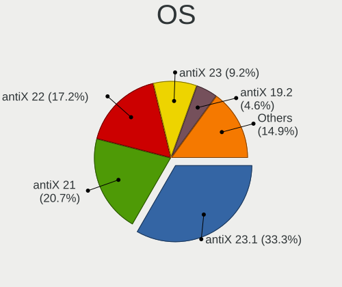

| Name           | Computers | Percent |
|----------------|-----------|---------|
| antiX 23.1     | 58        | 33.33%  |
| antiX 21       | 36        | 20.69%  |
| antiX 22       | 30        | 17.24%  |
| antiX 23       | 16        | 9.2%    |
| antiX 19.2     | 8         | 4.6%    |
| antiX 19.3     | 5         | 2.87%   |
| antiX 21-runit | 4         | 2.3%    |
| antiX 17.4.1   | 4         | 2.3%    |
| antiX 19.4     | 3         | 1.72%   |
| antiX 19.1     | 2         | 1.15%   |
| antiX 25       | 1         | 0.57%   |
| antiX 23.2     | 1         | 0.57%   |
| antiX 19.5     | 1         | 0.57%   |
| antiX 19       | 1         | 0.57%   |
| antiX 17.2.1   | 1         | 0.57%   |
| antiX 17.1     | 1         | 0.57%   |
| antiX 17       | 1         | 0.57%   |
| antiX 15       | 1         | 0.57%   |

OS Family
---------

OS without a version

| Name  | Computers | Percent |
|-------|-----------|---------|
| antiX | 172       | 100%    |

Kernel
------

Version of the Linux kernel

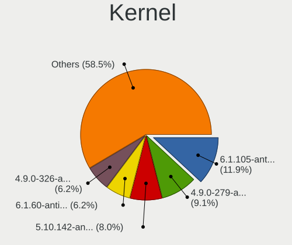

| Version                      | Computers | Percent |
|------------------------------|-----------|---------|
| 6.1.105-antix.1-amd64-smp    | 21        | 11.93%  |
| 4.9.0-279-antix.1-486-smp    | 16        | 9.09%   |
| 5.10.142-antix.2-amd64-smp   | 14        | 7.95%   |
| 6.1.60-antix.1-amd64-smp     | 11        | 6.25%   |
| 4.9.0-326-antix.1-amd64-smp  | 11        | 6.25%   |
| 4.9.0-279-antix.1-amd64-smp  | 11        | 6.25%   |
| 5.10.57-antix.1-amd64-smp    | 8         | 4.55%   |
| 5.10.224-antix.1-amd64-smp   | 8         | 4.55%   |
| 5.10.224-antix.1-486-smp     | 7         | 3.98%   |
| 5.10.188-antix.1-amd64-smp   | 6         | 3.41%   |
| 5.10.197-antix.1-486-smp     | 5         | 2.84%   |
| 5.10.188-antix.1-486-smp     | 5         | 2.84%   |
| 4.9.0-326-antix.1-486-smp    | 5         | 2.84%   |
| 4.9.235-antix.1-amd64-smp    | 4         | 2.27%   |
| 4.9.160-antix.2-486-smp      | 4         | 2.27%   |
| 6.6.101-antix.1-amd64-smp    | 3         | 1.7%    |
| 6.1.42-antix.1-amd64-smp     | 3         | 1.7%    |
| 4.9.212-antix.1-amd64-smp    | 3         | 1.7%    |
| 4.9.212-antix.1-486-smp      | 3         | 1.7%    |
| 6.1.55-antix.1-amd64-smp     | 2         | 1.14%   |
| 5.10.88-antix.1-amd64-smp    | 2         | 1.14%   |
| 5.10.199-antix.1-amd64-smp   | 2         | 1.14%   |
| 4.9.200-antix.1-486-smp      | 2         | 1.14%   |
| 6.6.87-antix.1-amd64-smp     | 1         | 0.57%   |
| 6.6.62-antix.1-amd64-smp     | 1         | 0.57%   |
| 6.2.9-1-liquorix-amd64       | 1         | 0.57%   |
| 6.10.9-1-liquorix-amd64      | 1         | 0.57%   |
| 6.1.90-antix.1-amd64-smp     | 1         | 0.57%   |
| 6.1.118-antix.1-amd64-smp    | 1         | 0.57%   |
| 6.1.0-0.deb11.9-rt-amd64     | 1         | 0.57%   |
| 5.4.0-17.1-liquorix-amd64    | 1         | 0.57%   |
| 5.14.0-14.1-liquorix-amd64   | 1         | 0.57%   |
| 5.10.27-antix.1-amd64-smp    | 1         | 0.57%   |
| 5.10.240-antix.1-amd64-smp   | 1         | 0.57%   |
| 4.9.87-antix.1-amd64-smp     | 1         | 0.57%   |
| 4.9.160-antix.1-amd64-smp    | 1         | 0.57%   |
| 4.9.0-294-antix.1-amd64-smp  | 1         | 0.57%   |
| 4.9.0-264-antix.1-amd64-smp  | 1         | 0.57%   |
| 4.9.0-264-antix.1-486-smp    | 1         | 0.57%   |
| 4.19.202-antix.1-686-smp-pae | 1         | 0.57%   |

Kernel Family
-------------

Linux kernel without a distro release

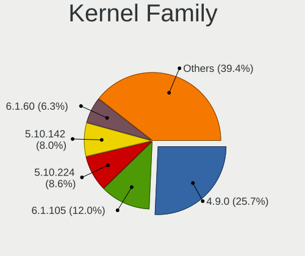

| Version  | Computers | Percent |
|----------|-----------|---------|
| 4.9.0    | 45        | 25.71%  |
| 6.1.105  | 21        | 12%     |
| 5.10.224 | 15        | 8.57%   |
| 5.10.142 | 14        | 8%      |
| 6.1.60   | 11        | 6.29%   |
| 5.10.188 | 11        | 6.29%   |
| 5.10.57  | 8         | 4.57%   |
| 4.9.212  | 6         | 3.43%   |
| 5.10.197 | 5         | 2.86%   |
| 4.9.160  | 5         | 2.86%   |
| 4.9.235  | 4         | 2.29%   |
| 6.6.101  | 3         | 1.71%   |
| 6.1.42   | 3         | 1.71%   |
| 6.1.55   | 2         | 1.14%   |
| 5.10.88  | 2         | 1.14%   |
| 5.10.199 | 2         | 1.14%   |
| 4.9.200  | 2         | 1.14%   |
| 6.6.87   | 1         | 0.57%   |
| 6.6.62   | 1         | 0.57%   |
| 6.2.9    | 1         | 0.57%   |
| 6.10.9   | 1         | 0.57%   |
| 6.1.90   | 1         | 0.57%   |
| 6.1.118  | 1         | 0.57%   |
| 6.1.0    | 1         | 0.57%   |
| 5.4.0    | 1         | 0.57%   |
| 5.14.0   | 1         | 0.57%   |
| 5.10.27  | 1         | 0.57%   |
| 5.10.240 | 1         | 0.57%   |
| 4.9.87   | 1         | 0.57%   |
| 4.19.202 | 1         | 0.57%   |
| 4.19.100 | 1         | 0.57%   |
| 4.19.0   | 1         | 0.57%   |
| 4.10.5   | 1         | 0.57%   |

Kernel Major Ver.
-----------------

Linux kernel major version

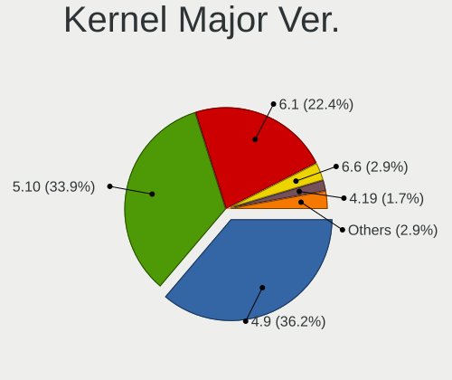

| Version | Computers | Percent |
|---------|-----------|---------|
| 4.9     | 63        | 36.21%  |
| 5.10    | 59        | 33.91%  |
| 6.1     | 39        | 22.41%  |
| 6.6     | 5         | 2.87%   |
| 4.19    | 3         | 1.72%   |
| 6.2     | 1         | 0.57%   |
| 6.10    | 1         | 0.57%   |
| 5.4     | 1         | 0.57%   |
| 5.14    | 1         | 0.57%   |
| 4.10    | 1         | 0.57%   |

Arch
----

OS architecture (x86_64, i586, etc.)

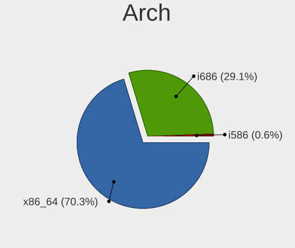

| Name   | Computers | Percent |
|--------|-----------|---------|
| x86_64 | 121       | 70.35%  |
| i686   | 50        | 29.07%  |
| i586   | 1         | 0.58%   |

DE
--

Desktop Environment

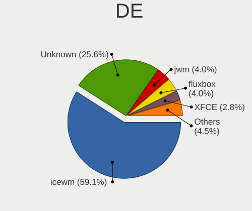

| Name         | Computers | Percent |
|--------------|-----------|---------|
| icewm        | 104       | 59.09%  |
| Unknown      | 45        | 25.57%  |
| jwm          | 7         | 3.98%   |
| fluxbox      | 7         | 3.98%   |
| XFCE         | 5         | 2.84%   |
| herbstluftwm | 2         | 1.14%   |
| GNOME        | 2         | 1.14%   |
| LXQt         | 1         | 0.57%   |
| KDE4         | 1         | 0.57%   |
| dwm          | 1         | 0.57%   |
| Cinnamon     | 1         | 0.57%   |

Display Server
--------------

X11 or Wayland

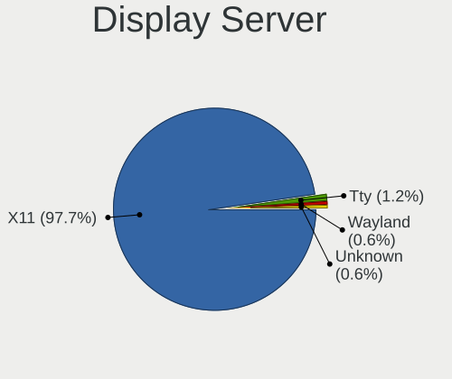

| Name    | Computers | Percent |
|---------|-----------|---------|
| X11     | 168       | 97.67%  |
| Tty     | 2         | 1.16%   |
| Wayland | 1         | 0.58%   |
| Unknown | 1         | 0.58%   |

Display Manager
---------------

SDDM, LightDM, etc.

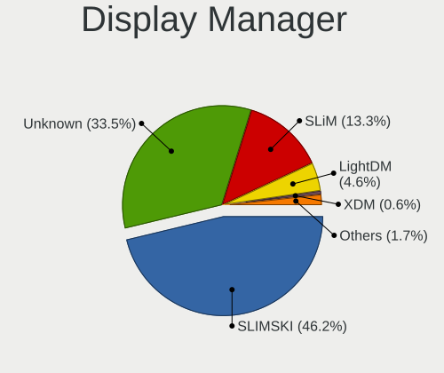

| Name    | Computers | Percent |
|---------|-----------|---------|
| SLIMSKI | 80        | 46.24%  |
| Unknown | 58        | 33.53%  |
| SLiM    | 23        | 13.29%  |
| LightDM | 8         | 4.62%   |
| XDM     | 1         | 0.58%   |
| SDDM    | 1         | 0.58%   |
| LXDM    | 1         | 0.58%   |
| GDM3    | 1         | 0.58%   |

OS Lang
-------

Language

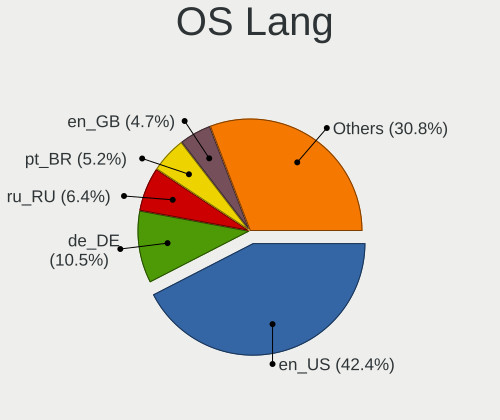

| Lang    | Computers | Percent |
|---------|-----------|---------|
| en_US   | 73        | 42.44%  |
| de_DE   | 18        | 10.47%  |
| ru_RU   | 11        | 6.4%    |
| pt_BR   | 9         | 5.23%   |
| en_GB   | 8         | 4.65%   |
| it_IT   | 6         | 3.49%   |
| ja_JP   | 5         | 2.91%   |
| fr_FR   | 5         | 2.91%   |
| es_ES   | 4         | 2.33%   |
| pl_PL   | 3         | 1.74%   |
| es_AR   | 3         | 1.74%   |
| en_AU   | 3         | 1.74%   |
| Unknown | 3         | 1.74%   |
| sk_SK   | 2         | 1.16%   |
| nl_NL   | 2         | 1.16%   |
| hu_HU   | 2         | 1.16%   |
| es_MX   | 2         | 1.16%   |
| en_NZ   | 2         | 1.16%   |
| zh_HK   | 1         | 0.58%   |
| uk_UA   | 1         | 0.58%   |
| tr_TR   | 1         | 0.58%   |
| fr_BE   | 1         | 0.58%   |
| fi_FI   | 1         | 0.58%   |
| es_VE   | 1         | 0.58%   |
| es_UY   | 1         | 0.58%   |
| es_PE   | 1         | 0.58%   |
| es_CO   | 1         | 0.58%   |
| de_AT   | 1         | 0.58%   |
| da_DK   | 1         | 0.58%   |

Boot Mode
---------

EFI or BIOS

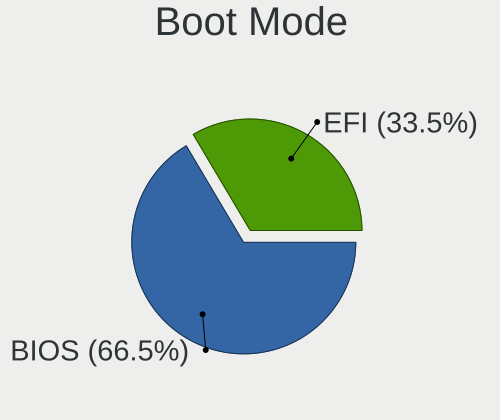

| Mode | Computers | Percent |
|------|-----------|---------|
| BIOS | 115       | 66.47%  |
| EFI  | 58        | 33.53%  |

Filesystem
----------

Type of filesystem

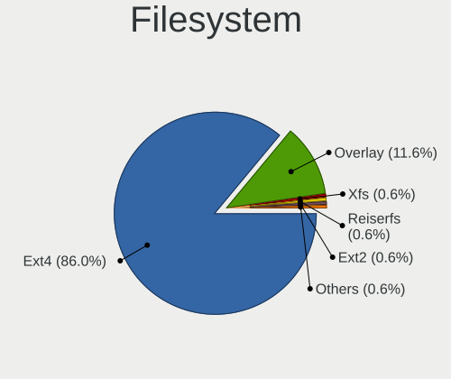

| Type     | Computers | Percent |
|----------|-----------|---------|
| Ext4     | 148       | 86.05%  |
| Overlay  | 20        | 11.63%  |
| Xfs      | 1         | 0.58%   |
| Reiserfs | 1         | 0.58%   |
| Ext2     | 1         | 0.58%   |
| Btrfs    | 1         | 0.58%   |

Part. scheme
------------

Scheme of partitioning

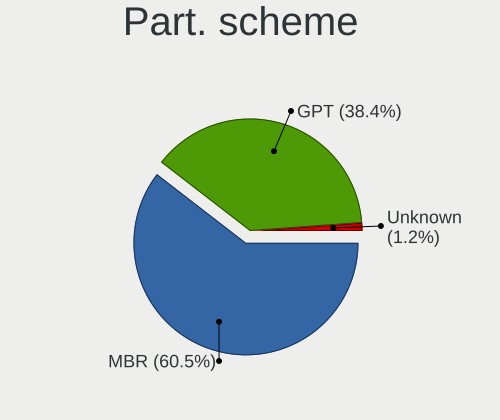

| Type    | Computers | Percent |
|---------|-----------|---------|
| MBR     | 104       | 60.47%  |
| GPT     | 66        | 38.37%  |
| Unknown | 2         | 1.16%   |

Dual Boot with Linux/BSD
------------------------

Hosting more than one Linux/BSD

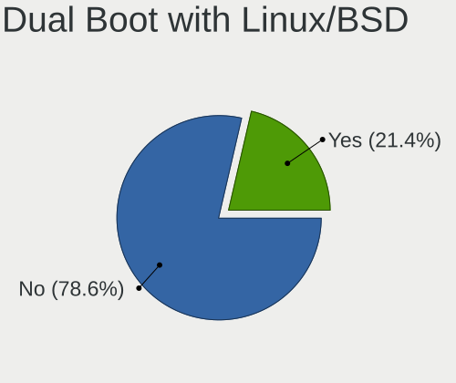

| Dual boot | Computers | Percent |
|-----------|-----------|---------|
| No        | 136       | 78.61%  |
| Yes       | 37        | 21.39%  |

Dual Boot (Win)
---------------

Hosting Linux and Windows

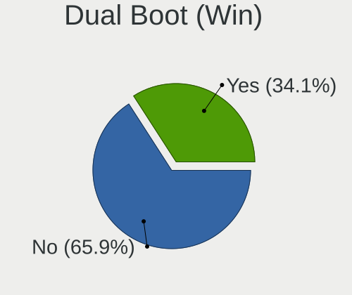

| Dual boot | Computers | Percent |
|-----------|-----------|---------|
| No        | 114       | 65.9%   |
| Yes       | 59        | 34.1%   |

Board
-----

Vendor
------

Motherboard manufacturer

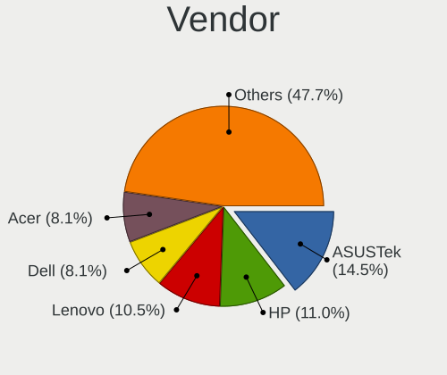

| Name                                        | Computers | Percent |
|---------------------------------------------|-----------|---------|
| ASUSTek Computer                            | 25        | 14.53%  |
| Hewlett-Packard                             | 19        | 11.05%  |
| Lenovo                                      | 18        | 10.47%  |
| Dell                                        | 14        | 8.14%   |
| Acer                                        | 14        | 8.14%   |
| Apple                                       | 8         | 4.65%   |
| Gigabyte Technology                         | 7         | 4.07%   |
| Fujitsu                                     | 7         | 4.07%   |
| Google                                      | 6         | 3.49%   |
| MSI                                         | 5         | 2.91%   |
| Intel                                       | 5         | 2.91%   |
| IBM                                         | 5         | 2.91%   |
| Unknown                                     | 5         | 2.91%   |
| Toshiba                                     | 3         | 1.74%   |
| Sony                                        | 2         | 1.16%   |
| Pegatron                                    | 2         | 1.16%   |
| Packard Bell                                | 2         | 1.16%   |
| Medion                                      | 2         | 1.16%   |
| KOHJINSHA                                   | 2         | 1.16%   |
| YKMF_Yukyung                                | 1         | 0.58%   |
| VXL                                         | 1         | 0.58%   |
| TYAN Computer                               | 1         | 0.58%   |
| Shenzhen suqiao computer technology         | 1         | 0.58%   |
| Samsung Electronics                         | 1         | 0.58%   |
| Radiant Systems                             | 1         | 0.58%   |
| Prestigio                                   | 1         | 0.58%   |
| Panasonic                                   | 1         | 0.58%   |
| Notebook                                    | 1         | 0.58%   |
| Maxtang                                     | 1         | 0.58%   |
| Irbis                                       | 1         | 0.58%   |
| Insyde                                      | 1         | 0.58%   |
| Digibras                                    | 1         | 0.58%   |
| Compaq                                      | 1         | 0.58%   |
| Clevo                                       | 1         | 0.58%   |
| Biostar                                     | 1         | 0.58%   |
| AZW                                         | 1         | 0.58%   |
| AXDIA International                         | 1         | 0.58%   |
| ASRock                                      | 1         | 0.58%   |
| Arima Computer Corp. Bios by Award Software | 1         | 0.58%   |
| AMI                                         | 1         | 0.58%   |

Model
-----

Motherboard model

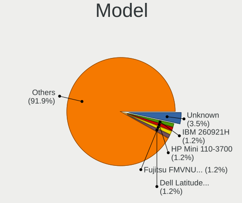

| Name                                       | Computers | Percent |
|--------------------------------------------|-----------|---------|
| Unknown                                    | 6         | 3.49%   |
| IBM 260921H                                | 2         | 1.16%   |
| HP Mini 110-3700                           | 2         | 1.16%   |
| Fujitsu FMVNU6G1C                          | 2         | 1.16%   |
| Dell Latitude 5480                         | 2         | 1.16%   |
| ASUS X200MA                                | 2         | 1.16%   |
| YKMF_Yukyung YKMD_S5 PRES(JPN)             | 1         | 0.58%   |
| VXL TC7520d                                | 1         | 0.58%   |
| TYAN Intel 440BX/GX Rev. 4                 | 1         | 0.58%   |
| Toshiba Satellite T110                     | 1         | 0.58%   |
| Toshiba Satellite C50-A-1HF                | 1         | 0.58%   |
| Toshiba Satellite 1905                     | 1         | 0.58%   |
| Sony VGN-TX690P                            | 1         | 0.58%   |
| Sony VGN-NR22M_S                           | 1         | 0.58%   |
| Shenzhen suqiao computer technology miniPC | 1         | 0.58%   |
| Samsung SQ1S                               | 1         | 0.58%   |
| Radiant Systems P845                       | 1         | 0.58%   |
| Prestigio Smartbook PSB116A                | 1         | 0.58%   |
| Pegatron VC902AA-ABF p6136fr               | 1         | 0.58%   |
| Pegatron AU930AA-ACJ p6270in               | 1         | 0.58%   |
| Panasonic FZB2-2                           | 1         | 0.58%   |
| Packard Bell EasyNote_MX37-U-057NL         | 1         | 0.58%   |
| Packard Bell EasyNote TS11SB               | 1         | 0.58%   |
| Notebook MAM2120                           | 1         | 0.58%   |
| MSI US Desktop                             | 1         | 0.58%   |
| MSI MS-7D18                                | 1         | 0.58%   |
| MSI MS-7C56                                | 1         | 0.58%   |
| MSI MS-7B17                                | 1         | 0.58%   |
| MSI GE62 7RE                               | 1         | 0.58%   |
| Medion WIM2170                             | 1         | 0.58%   |
| Medion E2228T MD61900                      | 1         | 0.58%   |
| Maxtang BYT30                              | 1         | 0.58%   |
| Lenovo ThinkPad X270 20HMS1QT08            | 1         | 0.58%   |
| Lenovo ThinkPad X201 3249CTO               | 1         | 0.58%   |
| Lenovo ThinkPad T540p 20BECTO1WW           | 1         | 0.58%   |
| Lenovo ThinkPad T440p 20AWS3RH00           | 1         | 0.58%   |
| Lenovo ThinkPad SL500 27463ZG              | 1         | 0.58%   |
| Lenovo ThinkPad P51 20HJS49Q00             | 1         | 0.58%   |
| Lenovo ThinkCentre M91p 4480B9U            | 1         | 0.58%   |
| Lenovo S10-3                               | 1         | 0.58%   |

Model Family
------------

Motherboard model prefix

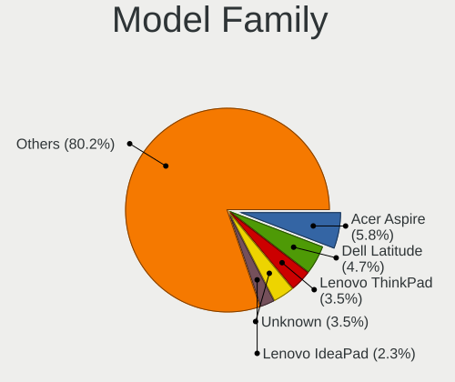

| Name                                       | Computers | Percent |
|--------------------------------------------|-----------|---------|
| Acer Aspire                                | 10        | 5.81%   |
| Dell Latitude                              | 8         | 4.65%   |
| Lenovo ThinkPad                            | 6         | 3.49%   |
| Unknown                                    | 6         | 3.49%   |
| Lenovo IdeaPad                             | 4         | 2.33%   |
| HP Mini                                    | 4         | 2.33%   |
| Toshiba Satellite                          | 3         | 1.74%   |
| IBM ThinkPad                               | 3         | 1.74%   |
| HP Compaq                                  | 3         | 1.74%   |
| Dell OptiPlex                              | 3         | 1.74%   |
| Packard Bell EasyNote                      | 2         | 1.16%   |
| IBM 260921H                                | 2         | 1.16%   |
| HP Presario                                | 2         | 1.16%   |
| HP EliteBook                               | 2         | 1.16%   |
| Fujitsu LIFEBOOK                           | 2         | 1.16%   |
| Fujitsu FMVNU6G1C                          | 2         | 1.16%   |
| Dell Vostro                                | 2         | 1.16%   |
| ASUS X200MA                                | 2         | 1.16%   |
| ASUS VivoBook                              | 2         | 1.16%   |
| ASUS PRIME                                 | 2         | 1.16%   |
| YKMF_Yukyung YKMD                          | 1         | 0.58%   |
| VXL TC7520d                                | 1         | 0.58%   |
| TYAN Intel                                 | 1         | 0.58%   |
| Sony VGN-TX690P                            | 1         | 0.58%   |
| Sony VGN-NR22M                             | 1         | 0.58%   |
| Shenzhen suqiao computer technology miniPC | 1         | 0.58%   |
| Samsung SQ1S                               | 1         | 0.58%   |
| Radiant Systems P845                       | 1         | 0.58%   |
| Prestigio Smartbook                        | 1         | 0.58%   |
| Pegatron VC902AA-ABF                       | 1         | 0.58%   |
| Pegatron AU930AA-ACJ                       | 1         | 0.58%   |
| Panasonic FZB2-2                           | 1         | 0.58%   |
| Notebook MAM2120                           | 1         | 0.58%   |
| MSI US                                     | 1         | 0.58%   |
| MSI MS-7D18                                | 1         | 0.58%   |
| MSI MS-7C56                                | 1         | 0.58%   |
| MSI MS-7B17                                | 1         | 0.58%   |
| MSI GE62                                   | 1         | 0.58%   |
| Medion WIM2170                             | 1         | 0.58%   |
| Medion E2228T                              | 1         | 0.58%   |

MFG Year
--------

Motherboard manufacture year

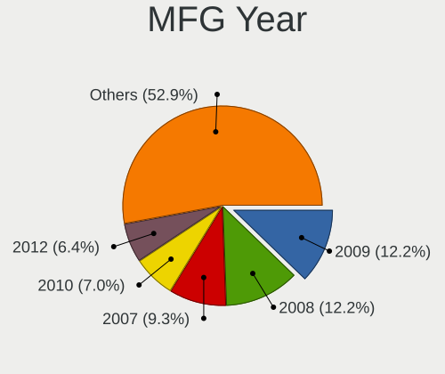

| Year    | Computers | Percent |
|---------|-----------|---------|
| 2009    | 21        | 12.21%  |
| 2008    | 21        | 12.21%  |
| 2007    | 16        | 9.3%    |
| 2010    | 12        | 6.98%   |
| 2012    | 11        | 6.4%    |
| 2014    | 10        | 5.81%   |
| 2017    | 9         | 5.23%   |
| 2013    | 9         | 5.23%   |
| 2011    | 9         | 5.23%   |
| 2018    | 5         | 2.91%   |
| 2016    | 5         | 2.91%   |
| 2006    | 5         | 2.91%   |
| 2005    | 5         | 2.91%   |
| 2019    | 4         | 2.33%   |
| 2015    | 4         | 2.33%   |
| 2024    | 3         | 1.74%   |
| 2022    | 3         | 1.74%   |
| 2021    | 3         | 1.74%   |
| 2020    | 3         | 1.74%   |
| 2004    | 3         | 1.74%   |
| 2003    | 3         | 1.74%   |
| 2023    | 2         | 1.16%   |
| 1999    | 2         | 1.16%   |
| Unknown | 2         | 1.16%   |
| 2025    | 1         | 0.58%   |
| 2001    | 1         | 0.58%   |

Form Factor
-----------

Physical design of the computer

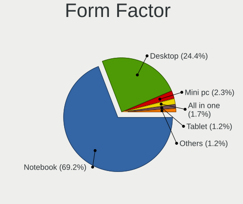

| Name        | Computers | Percent |
|-------------|-----------|---------|
| Notebook    | 119       | 69.19%  |
| Desktop     | 42        | 24.42%  |
| Mini pc     | 4         | 2.33%   |
| All in one  | 3         | 1.74%   |
| Tablet      | 2         | 1.16%   |
| Convertible | 2         | 1.16%   |

Secure Boot
-----------

Enabled or disabled

| State    | Computers | Percent |
|----------|-----------|---------|
| Disabled | 172       | 100%    |

Coreboot
--------

Have coreboot on board

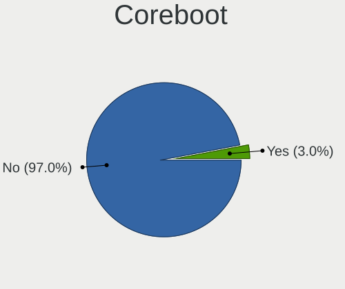

| Used | Computers | Percent |
|------|-----------|---------|
| No   | 166       | 96.51%  |
| Yes  | 6         | 3.49%   |

RAM Size
--------

Total RAM memory

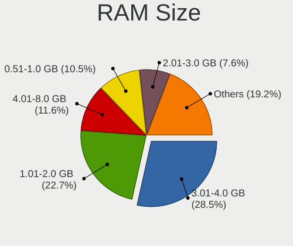

| Size in GB  | Computers | Percent |
|-------------|-----------|---------|
| 3.01-4.0    | 49        | 28.49%  |
| 1.01-2.0    | 39        | 22.67%  |
| 4.01-8.0    | 20        | 11.63%  |
| 0.51-1.0    | 18        | 10.47%  |
| 2.01-3.0    | 13        | 7.56%   |
| 8.01-16.0   | 10        | 5.81%   |
| 16.01-24.0  | 8         | 4.65%   |
| 0.01-0.5    | 7         | 4.07%   |
| 32.01-64.0  | 6         | 3.49%   |
| 64.01-256.0 | 2         | 1.16%   |

RAM Used
--------

Used RAM memory

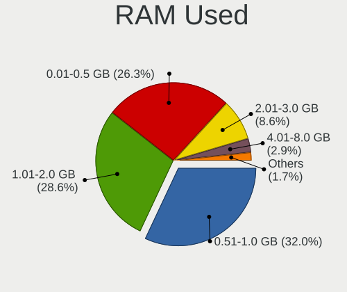

| Used GB    | Computers | Percent |
|------------|-----------|---------|
| 0.51-1.0   | 56        | 32%     |
| 1.01-2.0   | 50        | 28.57%  |
| 0.01-0.5   | 46        | 26.29%  |
| 2.01-3.0   | 15        | 8.57%   |
| 4.01-8.0   | 5         | 2.86%   |
| 3.01-4.0   | 2         | 1.14%   |
| 32.01-64.0 | 1         | 0.57%   |

Total Drives
------------

Number of drives on board

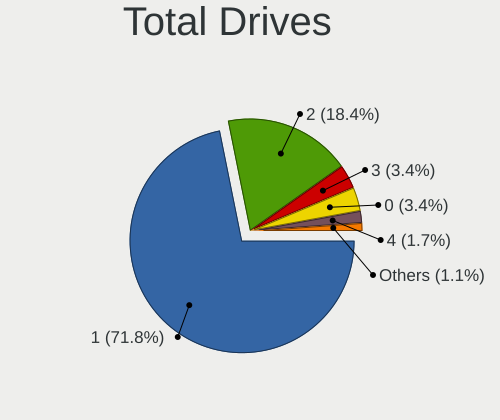

| Drives | Computers | Percent |
|--------|-----------|---------|
| 1      | 125       | 71.84%  |
| 2      | 32        | 18.39%  |
| 3      | 6         | 3.45%   |
| 0      | 6         | 3.45%   |
| 4      | 3         | 1.72%   |
| 5      | 2         | 1.15%   |

Has CD-ROM
----------

Has CD-ROM on board

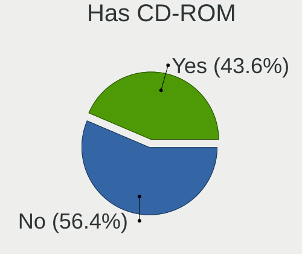

| Presented | Computers | Percent |
|-----------|-----------|---------|
| No        | 97        | 56.4%   |
| Yes       | 75        | 43.6%   |

Has Ethernet
------------

Has Ethernet on board

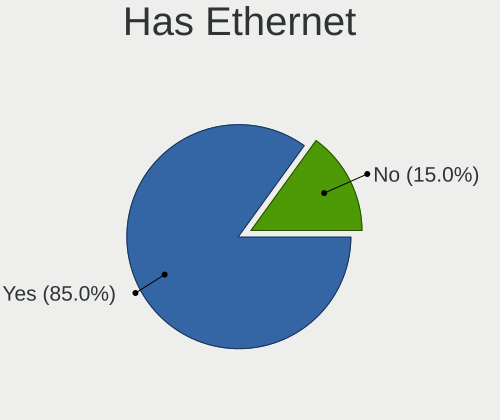

| Presented | Computers | Percent |
|-----------|-----------|---------|
| Yes       | 147       | 84.97%  |
| No        | 26        | 15.03%  |

Has WiFi
--------

Has WiFi module

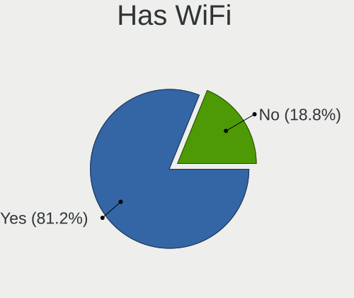

| Presented | Computers | Percent |
|-----------|-----------|---------|
| Yes       | 130       | 75.58%  |
| No        | 42        | 24.42%  |

Has Bluetooth
-------------

Has Bluetooth module

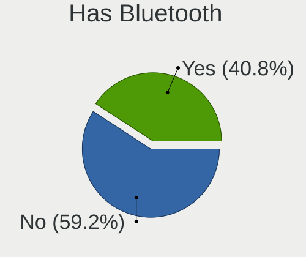

| Presented | Computers | Percent |
|-----------|-----------|---------|
| No        | 103       | 59.2%   |
| Yes       | 71        | 40.8%   |

Location
--------

Country
-------

Geographic location (country)

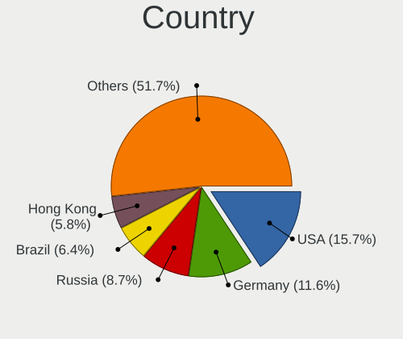

| Country             | Computers | Percent |
|---------------------|-----------|---------|
| USA                 | 27        | 15.7%   |
| Germany             | 20        | 11.63%  |
| Russia              | 15        | 8.72%   |
| Brazil              | 11        | 6.4%    |
| Hong Kong           | 10        | 5.81%   |
| Japan               | 8         | 4.65%   |
| Italy               | 7         | 4.07%   |
| Poland              | 6         | 3.49%   |
| Spain               | 5         | 2.91%   |
| France              | 5         | 2.91%   |
| UK                  | 4         | 2.33%   |
| Netherlands         | 4         | 2.33%   |
| Australia           | 4         | 2.33%   |
| South Africa        | 3         | 1.74%   |
| Indonesia           | 3         | 1.74%   |
| Hungary             | 3         | 1.74%   |
| Czechia             | 3         | 1.74%   |
| Argentina           | 3         | 1.74%   |
| Uruguay             | 2         | 1.16%   |
| Slovakia            | 2         | 1.16%   |
| Nigeria             | 2         | 1.16%   |
| New Zealand         | 2         | 1.16%   |
| Mexico              | 2         | 1.16%   |
| India               | 2         | 1.16%   |
| Denmark             | 2         | 1.16%   |
| Chile               | 2         | 1.16%   |
| Algeria             | 2         | 1.16%   |
| Ukraine             | 1         | 0.58%   |
| Trinidad and Tobago | 1         | 0.58%   |
| Peru                | 1         | 0.58%   |
| Kenya               | 1         | 0.58%   |
| Kazakhstan          | 1         | 0.58%   |
| Guam                | 1         | 0.58%   |
| Greece              | 1         | 0.58%   |
| Finland             | 1         | 0.58%   |
| Faroe Islands       | 1         | 0.58%   |
| Canada              | 1         | 0.58%   |
| Bulgaria            | 1         | 0.58%   |
| Belgium             | 1         | 0.58%   |
| Austria             | 1         | 0.58%   |

City
----

Geographic location (city)

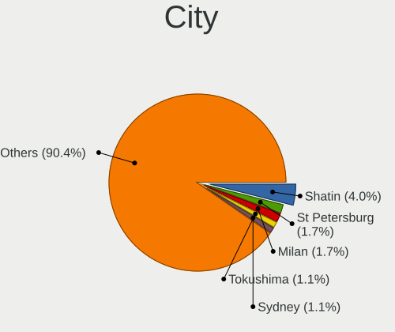

| City              | Computers | Percent |
|-------------------|-----------|---------|
| Shatin            | 7         | 3.95%   |
| St Petersburg     | 3         | 1.69%   |
| Milan             | 3         | 1.69%   |
| Tokushima         | 2         | 1.13%   |
| Sydney            | 2         | 1.13%   |
| Prague            | 2         | 1.13%   |
| Norden            | 2         | 1.13%   |
| Moscow            | 2         | 1.13%   |
| Montevideo        | 2         | 1.13%   |
| Maringá          | 2         | 1.13%   |
| Jakarta           | 2         | 1.13%   |
| Central           | 2         | 1.13%   |
| Cape Town         | 2         | 1.13%   |
| Budapest          | 2         | 1.13%   |
| Bratislava        | 2         | 1.13%   |
| Amsterdam         | 2         | 1.13%   |
| Zagnansk          | 1         | 0.56%   |
| Yuzhno-Sakhalinsk | 1         | 0.56%   |
| Yokohama          | 1         | 0.56%   |
| Ybbs an der Donau | 1         | 0.56%   |
| Whitney           | 1         | 0.56%   |
| Welzheim          | 1         | 0.56%   |
| Warsaw            | 1         | 0.56%   |
| Vlotho            | 1         | 0.56%   |
| Violes            | 1         | 0.56%   |
| Viña del Mar     | 1         | 0.56%   |
| Varna             | 1         | 0.56%   |
| Tver              | 1         | 0.56%   |
| Tunapuna          | 1         | 0.56%   |
| Trecate           | 1         | 0.56%   |
| Townsville        | 1         | 0.56%   |
| Tórshavn         | 1         | 0.56%   |
| Torricella Sicura | 1         | 0.56%   |
| Toms River        | 1         | 0.56%   |
| Tokyo             | 1         | 0.56%   |
| Teresina          | 1         | 0.56%   |
| Templeton         | 1         | 0.56%   |
| Surabaya          | 1         | 0.56%   |
| St Albans         | 1         | 0.56%   |
| Sofia             | 1         | 0.56%   |

Drives
------

Drive Vendor
------------

Hard drive vendors

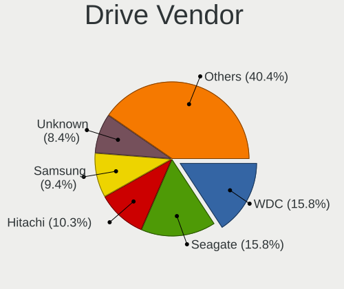

| Vendor                    | Computers | Drives | Percent |
|---------------------------|-----------|--------|---------|
| WDC                       | 32        | 37     | 15.76%  |
| Seagate                   | 32        | 32     | 15.76%  |
| Hitachi                   | 21        | 23     | 10.34%  |
| Samsung Electronics       | 19        | 22     | 9.36%   |
| Unknown                   | 17        | 21     | 8.37%   |
| Toshiba                   | 15        | 16     | 7.39%   |
| Kingston                  | 7         | 8      | 3.45%   |
| Crucial                   | 6         | 6      | 2.96%   |
| Unknown                   | 6         | 6      | 2.96%   |
| SanDisk                   | 5         | 5      | 2.46%   |
| Maxtor                    | 3         | 3      | 1.48%   |
| Intel                     | 3         | 3      | 1.48%   |
| HGST                      | 3         | 3      | 1.48%   |
| BHT                       | 3         | 5      | 1.48%   |
| PNY                       | 2         | 3      | 0.99%   |
| Patriot                   | 2         | 2      | 0.99%   |
| Micron/Crucial Technology | 2         | 2      | 0.99%   |
| China                     | 2         | 2      | 0.99%   |
| ASUS-PHISON               | 2         | 3      | 0.99%   |
| Zheino                    | 1         | 1      | 0.49%   |
| Unknown (CF)              | 1         | 1      | 0.49%   |
| Transcend                 | 1         | 1      | 0.49%   |
| SPCC                      | 1         | 1      | 0.49%   |
| SK hynix                  | 1         | 1      | 0.49%   |
| SILICONMOTION             | 1         | 1      | 0.49%   |
| RECADATA                  | 1         | 1      | 0.49%   |
| OCZ                       | 1         | 1      | 0.49%   |
| NVMe                      | 1         | 1      | 0.49%   |
| Netac                     | 1         | 1      | 0.49%   |
| Min Yi U                  | 1         | 1      | 0.49%   |
| Micron Technology         | 1         | 2      | 0.49%   |
| KIOXIA                    | 1         | 1      | 0.49%   |
| IBM/Hitachi               | 1         | 1      | 0.49%   |
| Hewlett-Packard           | 1         | 1      | 0.49%   |
| Fujitsu                   | 1         | 1      | 0.49%   |
| Digma                     | 1         | 1      | 0.49%   |
| BIWIN                     | 1         | 1      | 0.49%   |
| Apple                     | 1         | 1      | 0.49%   |
| Apacer                    | 1         | 1      | 0.49%   |
| AGI                       | 1         | 1      | 0.49%   |

Drive Model
-----------

Hard drive models

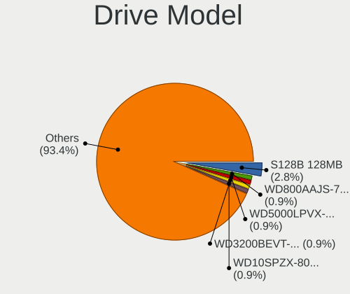

| Model                            | Computers | Percent |
|----------------------------------|-----------|---------|
| Unknown                          | 6         | 2.84%   |
| WDC WD800AAJS-75M0A0 80GB        | 2         | 0.95%   |
| WDC WD5000LPVX-22V0TT0 500GB     | 2         | 0.95%   |
| WDC WD3200BEVT-22ZCT0 320GB      | 2         | 0.95%   |
| WDC WD10SPZX-80Z10T2 1TB         | 2         | 0.95%   |
| Unknown 032GE4  32GB             | 2         | 0.95%   |
| Toshiba MQ01ABF050 500GB         | 2         | 0.95%   |
| Toshiba MQ01ABD100 1TB           | 2         | 0.95%   |
| Toshiba MQ01ABD050V -63 500GB    | 2         | 0.95%   |
| Seagate ST980811AS 80GB          | 2         | 0.95%   |
| Seagate ST9320325AS 320GB        | 2         | 0.95%   |
| Seagate ST320LT007-9ZV142 320GB  | 2         | 0.95%   |
| Seagate ST1000DM010-2EP102 1TB   | 2         | 0.95%   |
| Samsung SSD 850 EVO 120GB        | 2         | 0.95%   |
| Samsung SSD 750 EVO 120GB        | 2         | 0.95%   |
| Samsung MZVLB512HAJQ-000L7 512GB | 2         | 0.95%   |
| Maxtor Z1 SSD 240GB              | 2         | 0.95%   |
| Kingston SA400S37240G 240GB SSD  | 2         | 0.95%   |
| Hitachi HTS725025A9A364 250GB    | 2         | 0.95%   |
| Hitachi HTS723232A7A364 320GB    | 2         | 0.95%   |
| Hitachi HTS548040M9AT00 40GB     | 2         | 0.95%   |
| Hitachi HTS545025B9A300 250GB    | 2         | 0.95%   |
| Hitachi HTS542525K9SA00 250GB    | 2         | 0.95%   |
| Crucial CT500MX500SSD1 500GB     | 2         | 0.95%   |
| BHT WR202F0032G 670270F5 32GB    | 2         | 0.95%   |
| Zheino CHN mSATAM3 128 128GB SSD | 1         | 0.47%   |
| WDC WD8088AADS-00M2B0 809GB      | 1         | 0.47%   |
| WDC WD800JB-00ETA0 80GB          | 1         | 0.47%   |
| WDC WD800BEVT-75ZCT2 80GB        | 1         | 0.47%   |
| WDC WD5000LPLX-08ZNTT0 500GB     | 1         | 0.47%   |
| WDC WD5000LPCX-24VHAT0 500GB     | 1         | 0.47%   |
| WDC WD5000BEVT-24A0RT0 500GB     | 1         | 0.47%   |
| WDC WD5000BEVT-22A0RT0 500GB     | 1         | 0.47%   |
| WDC WD5000AVDS-63U7B1 500GB      | 1         | 0.47%   |
| WDC WD5000AAKX-60U6AA0 500GB     | 1         | 0.47%   |
| WDC WD3200BPVT-75JJ5T0 320GB     | 1         | 0.47%   |
| WDC WD3200BPVT-24ZEST0 320GB     | 1         | 0.47%   |
| WDC WD3200BEVT-60ZCT1 320GB      | 1         | 0.47%   |
| WDC WD2500BEVT-22ZCT0 250GB      | 1         | 0.47%   |
| WDC WD2500BEKT-60PVMT0 250GB     | 1         | 0.47%   |

HDD Vendor
----------

Hard disk drive vendors

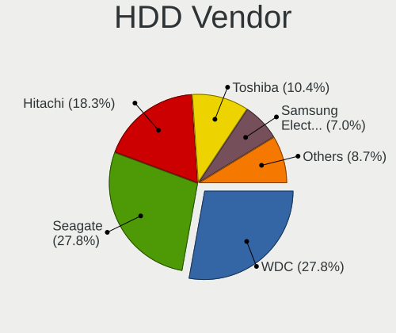

| Vendor              | Computers | Drives | Percent |
|---------------------|-----------|--------|---------|
| WDC                 | 32        | 37     | 27.83%  |
| Seagate             | 32        | 32     | 27.83%  |
| Hitachi             | 21        | 23     | 18.26%  |
| Toshiba             | 12        | 13     | 10.43%  |
| Samsung Electronics | 8         | 9      | 6.96%   |
| HGST                | 3         | 3      | 2.61%   |
| Unknown             | 2         | 2      | 1.74%   |
| SILICONMOTION       | 1         | 1      | 0.87%   |
| Min Yi U            | 1         | 1      | 0.87%   |
| Maxtor              | 1         | 1      | 0.87%   |
| IBM/Hitachi         | 1         | 1      | 0.87%   |
| Fujitsu             | 1         | 1      | 0.87%   |

SSD Vendor
----------

Solid state drive vendors

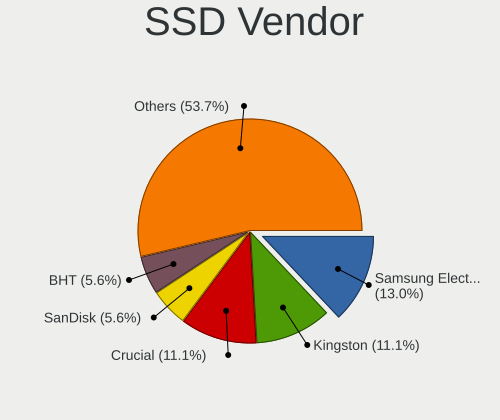

| Vendor              | Computers | Drives | Percent |
|---------------------|-----------|--------|---------|
| Samsung Electronics | 7         | 7      | 12.96%  |
| Kingston            | 6         | 7      | 11.11%  |
| Crucial             | 6         | 6      | 11.11%  |
| SanDisk             | 3         | 3      | 5.56%   |
| BHT                 | 3         | 5      | 5.56%   |
| Toshiba             | 2         | 2      | 3.7%    |
| PNY                 | 2         | 3      | 3.7%    |
| Patriot             | 2         | 2      | 3.7%    |
| Maxtor              | 2         | 2      | 3.7%    |
| Intel               | 2         | 2      | 3.7%    |
| China               | 2         | 2      | 3.7%    |
| ASUS-PHISON         | 2         | 3      | 3.7%    |
| Unknown             | 2         | 2      | 3.7%    |
| Zheino              | 1         | 1      | 1.85%   |
| Unknown (CF)        | 1         | 1      | 1.85%   |
| Transcend           | 1         | 1      | 1.85%   |
| SPCC                | 1         | 1      | 1.85%   |
| RECADATA            | 1         | 1      | 1.85%   |
| OCZ                 | 1         | 1      | 1.85%   |
| Netac               | 1         | 1      | 1.85%   |
| Micron Technology   | 1         | 2      | 1.85%   |
| Hewlett-Packard     | 1         | 1      | 1.85%   |
| BIWIN               | 1         | 1      | 1.85%   |
| Apple               | 1         | 1      | 1.85%   |
| Apacer              | 1         | 1      | 1.85%   |
| AGI                 | 1         | 1      | 1.85%   |

Drive Kind
----------

HDD or SSD

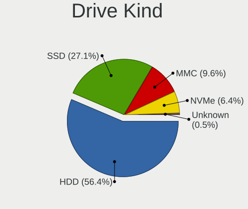

| Kind    | Computers | Drives | Percent |
|---------|-----------|--------|---------|
| HDD     | 106       | 124    | 56.38%  |
| SSD     | 51        | 60     | 27.13%  |
| MMC     | 18        | 22     | 9.57%   |
| NVMe    | 12        | 15     | 6.38%   |
| Unknown | 1         | 3      | 0.53%   |

Drive Connector
---------------

SATA, SAS, NVMe, etc.

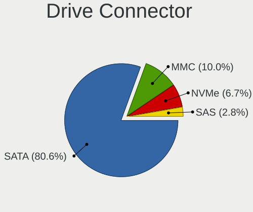

| Type | Computers | Drives | Percent |
|------|-----------|--------|---------|
| SATA | 145       | 180    | 80.56%  |
| MMC  | 18        | 22     | 10%     |
| NVMe | 12        | 15     | 6.67%   |
| SAS  | 5         | 7      | 2.78%   |

Drive Size
----------

Size of hard drive

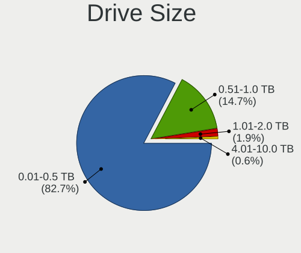

| Size in TB | Computers | Drives | Percent |
|------------|-----------|--------|---------|
| 0.01-0.5   | 129       | 152    | 82.69%  |
| 0.51-1.0   | 23        | 27     | 14.74%  |
| 1.01-2.0   | 3         | 3      | 1.92%   |
| 4.01-10.0  | 1         | 2      | 0.64%   |

Space Total
-----------

Amount of disk space available on the file system

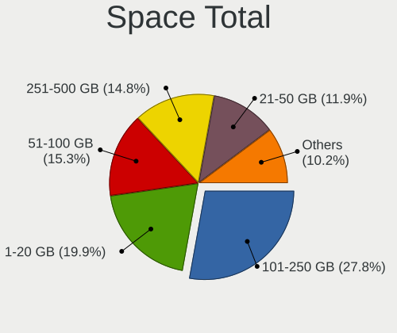

| Size in GB     | Computers | Percent |
|----------------|-----------|---------|
| 101-250        | 49        | 27.84%  |
| 1-20           | 35        | 19.89%  |
| 51-100         | 27        | 15.34%  |
| 251-500        | 26        | 14.77%  |
| 21-50          | 21        | 11.93%  |
| 501-1000       | 10        | 5.68%   |
| 1001-2000      | 4         | 2.27%   |
| More than 3000 | 2         | 1.14%   |
| 2001-3000      | 1         | 0.57%   |
| Unknown        | 1         | 0.57%   |

Space Used
----------

Amount of used disk space

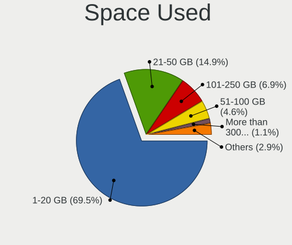

| Used GB        | Computers | Percent |
|----------------|-----------|---------|
| 1-20           | 121       | 69.54%  |
| 21-50          | 26        | 14.94%  |
| 101-250        | 12        | 6.9%    |
| 51-100         | 8         | 4.6%    |
| More than 3000 | 2         | 1.15%   |
| 251-500        | 2         | 1.15%   |
| 501-1000       | 2         | 1.15%   |
| Unknown        | 1         | 0.57%   |

Malfunc. Drives
---------------

Drive models with a malfunction

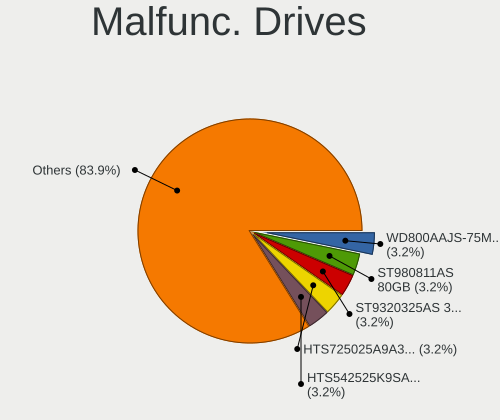

| Model                                | Computers | Drives | Percent |
|--------------------------------------|-----------|--------|---------|
| WDC WD800AAJS-75M0A0 80GB            | 2         | 2      | 3.23%   |
| Seagate ST980811AS 80GB              | 2         | 2      | 3.23%   |
| Seagate ST9320325AS 320GB            | 2         | 2      | 3.23%   |
| Hitachi HTS725025A9A364 250GB        | 2         | 2      | 3.23%   |
| Hitachi HTS542525K9SA00 250GB        | 2         | 2      | 3.23%   |
| WDC WD800JB-00ETA0 80GB              | 1         | 1      | 1.61%   |
| WDC WD5000LPVX-22V0TT0 500GB         | 1         | 1      | 1.61%   |
| WDC WD5000BEVT-24A0RT0 500GB         | 1         | 1      | 1.61%   |
| WDC WD5000BEVT-22A0RT0 500GB         | 1         | 1      | 1.61%   |
| WDC WD5000AAKX-60U6AA0 500GB         | 1         | 3      | 1.61%   |
| WDC WD3200BPVT-75JJ5T0 320GB         | 1         | 1      | 1.61%   |
| WDC WD3200BPVT-24ZEST0 320GB         | 1         | 1      | 1.61%   |
| WDC WD3200BEVT-60ZCT1 320GB          | 1         | 1      | 1.61%   |
| WDC WD3200BEVT-22ZCT0 320GB          | 1         | 1      | 1.61%   |
| WDC WD2500BEVT-22ZCT0 250GB          | 1         | 1      | 1.61%   |
| WDC WD2500BEKT-60PVMT0 250GB         | 1         | 1      | 1.61%   |
| WDC WD205BA 21GB                     | 1         | 1      | 1.61%   |
| WDC WD1600BEVT-00M9YT0 160GB         | 1         | 2      | 1.61%   |
| WDC WD10SPZX-21Z10T0 1TB             | 1         | 1      | 1.61%   |
| WDC WD10EADS-65M2B0 1TB              | 1         | 1      | 1.61%   |
| Toshiba MQ01ABD100 1TB               | 1         | 1      | 1.61%   |
| Toshiba MK6006GAH 64GB               | 1         | 1      | 1.61%   |
| Toshiba MK2555GSX 250GB              | 1         | 1      | 1.61%   |
| Seagate ST980812AS 80GB              | 1         | 1      | 1.61%   |
| Seagate ST9500325AS 500GB            | 1         | 1      | 1.61%   |
| Seagate ST9250315AS 250GB            | 1         | 1      | 1.61%   |
| Seagate ST9160827AS 160GB            | 1         | 1      | 1.61%   |
| Seagate ST9160314ASG 160GB           | 1         | 1      | 1.61%   |
| Seagate ST9160314AS 160GB            | 1         | 1      | 1.61%   |
| Seagate ST9160310AS 160GB            | 1         | 1      | 1.61%   |
| Seagate ST500DM002-1BD142 500GB      | 1         | 1      | 1.61%   |
| Seagate ST3500312CS 500GB            | 1         | 1      | 1.61%   |
| Seagate ST3320620AS 320GB            | 1         | 1      | 1.61%   |
| Seagate ST3320413CS 320GB            | 1         | 1      | 1.61%   |
| Seagate ST320LT007-9ZV142 320GB      | 1         | 1      | 1.61%   |
| Seagate ST1000LM035-1RK172 1TB       | 1         | 1      | 1.61%   |
| Seagate ST1000DM010-2EP102 1TB       | 1         | 1      | 1.61%   |
| SanDisk sandisk120 120GB SSD         | 1         | 1      | 1.61%   |
| Samsung Electronics HN-M500MBB 500GB | 1         | 1      | 1.61%   |
| Samsung Electronics HM161GI 160GB    | 1         | 1      | 1.61%   |

Malfunc. Drive Vendor
---------------------

Vendors of faulty drives

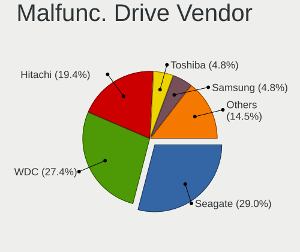

| Vendor                    | Computers | Drives | Percent |
|---------------------------|-----------|--------|---------|
| Seagate                   | 18        | 18     | 29.03%  |
| WDC                       | 17        | 20     | 27.42%  |
| Hitachi                   | 12        | 12     | 19.35%  |
| Toshiba                   | 3         | 3      | 4.84%   |
| Samsung Electronics       | 3         | 3      | 4.84%   |
| HGST                      | 2         | 2      | 3.23%   |
| SanDisk                   | 1         | 1      | 1.61%   |
| Netac                     | 1         | 1      | 1.61%   |
| Micron/Crucial Technology | 1         | 1      | 1.61%   |
| Maxtor                    | 1         | 1      | 1.61%   |
| China                     | 1         | 1      | 1.61%   |
| BIWIN                     | 1         | 1      | 1.61%   |
| Apacer                    | 1         | 1      | 1.61%   |

Malfunc. HDD Vendor
-------------------

Vendors of faulty HDD drives

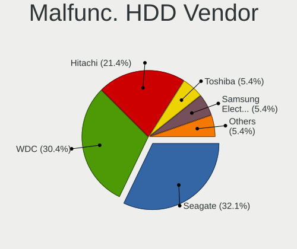

| Vendor              | Computers | Drives | Percent |
|---------------------|-----------|--------|---------|
| Seagate             | 18        | 18     | 32.14%  |
| WDC                 | 17        | 20     | 30.36%  |
| Hitachi             | 12        | 12     | 21.43%  |
| Toshiba             | 3         | 3      | 5.36%   |
| Samsung Electronics | 3         | 3      | 5.36%   |
| HGST                | 2         | 2      | 3.57%   |
| Maxtor              | 1         | 1      | 1.79%   |

Malfunc. Drive Kind
-------------------

Kinds of faulty drives

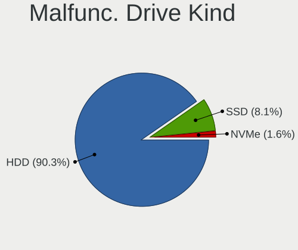

| Kind | Computers | Drives | Percent |
|------|-----------|--------|---------|
| HDD  | 56        | 59     | 90.32%  |
| SSD  | 5         | 5      | 8.06%   |
| NVMe | 1         | 1      | 1.61%   |

Failed Drives
-------------

Failed drive models

Zero info for selected period =(

Failed Drive Vendor
-------------------

Failed drive vendors

Zero info for selected period =(

Drive Status
------------

Number of failed and malfunc. drives

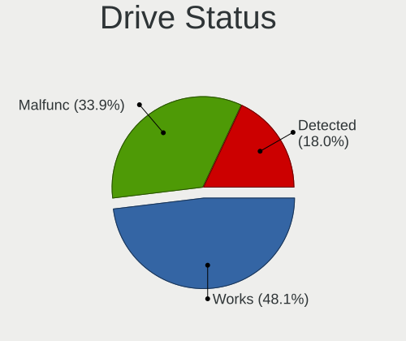

| Status   | Computers | Drives | Percent |
|----------|-----------|--------|---------|
| Works    | 88        | 116    | 48.09%  |
| Malfunc  | 62        | 65     | 33.88%  |
| Detected | 33        | 43     | 18.03%  |

Storage controller
------------------

Storage Vendor
--------------

Storage controller vendors

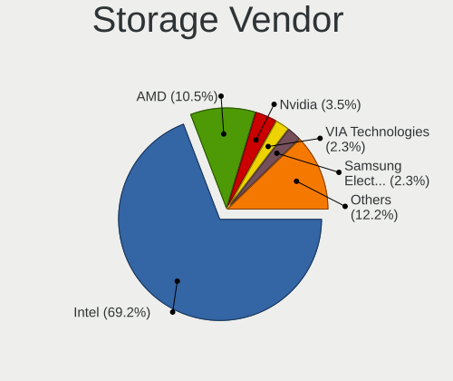

| Vendor                           | Computers | Percent |
|----------------------------------|-----------|---------|
| Intel                            | 119       | 69.19%  |
| AMD                              | 18        | 10.47%  |
| Nvidia                           | 6         | 3.49%   |
| VIA Technologies                 | 4         | 2.33%   |
| Samsung Electronics              | 4         | 2.33%   |
| ASMedia Technology               | 4         | 2.33%   |
| ULi Electronics                  | 2         | 1.16%   |
| Silicon Integrated Systems [SiS] | 2         | 1.16%   |
| Micron/Crucial Technology        | 2         | 1.16%   |
| JMicron Technology               | 2         | 1.16%   |
| Toshiba America Info Systems     | 1         | 0.58%   |
| Silicon Image                    | 1         | 0.58%   |
| SanDisk                          | 1         | 0.58%   |
| MAXIO Technology (Hangzhou)      | 1         | 0.58%   |
| Marvell Technology Group         | 1         | 0.58%   |
| LSI Logic / Symbios Logic        | 1         | 0.58%   |
| KIOXIA                           | 1         | 0.58%   |
| Kingston Technology Company      | 1         | 0.58%   |
| ADATA Technology                 | 1         | 0.58%   |

Storage Model
-------------

Storage controller models

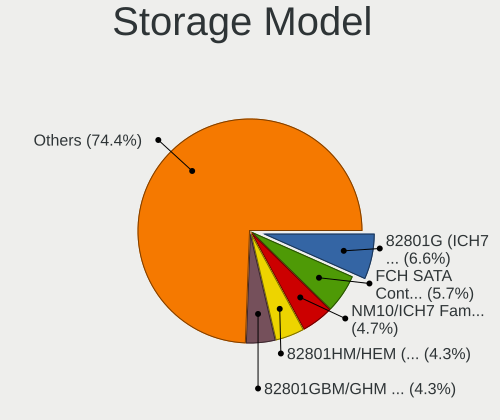

| Model                                                                          | Computers | Percent |
|--------------------------------------------------------------------------------|-----------|---------|
| Intel 82801G (ICH7 Family) IDE Controller                                      | 14        | 6.64%   |
| AMD FCH SATA Controller [AHCI mode]                                            | 12        | 5.69%   |
| Intel NM10/ICH7 Family SATA Controller [AHCI mode]                             | 10        | 4.74%   |
| Intel 82801HM/HEM (ICH8M/ICH8M-E) IDE Controller                               | 9         | 4.27%   |
| Intel 82801GBM/GHM (ICH7-M Family) SATA Controller [IDE mode]                  | 9         | 4.27%   |
| Intel 82801HM/HEM (ICH8M/ICH8M-E) SATA Controller [AHCI mode]                  | 8         | 3.79%   |
| Intel NM10/ICH7 Family SATA Controller [IDE mode]                              | 7         | 3.32%   |
| Intel 82801IBM/IEM (ICH9M/ICH9M-E) 4 port SATA Controller [AHCI mode]          | 7         | 3.32%   |
| Intel 82801GBM/GHM (ICH7-M Family) SATA Controller [AHCI mode]                 | 7         | 3.32%   |
| Intel Atom Processor E3800 Series SATA AHCI Controller                         | 6         | 2.84%   |
| Intel 8 Series/C220 Series Chipset Family 6-port SATA Controller 1 [AHCI mode] | 5         | 2.37%   |
| Intel 82801DBM (ICH4-M) IDE Controller                                         | 4         | 1.9%    |
| Intel 82801 Mobile SATA Controller [RAID mode]                                 | 4         | 1.9%    |
| Intel 82371AB/EB/MB PIIX4 IDE                                                  | 4         | 1.9%    |
| Intel 7 Series Chipset Family 6-port SATA Controller [AHCI mode]               | 4         | 1.9%    |
| AMD SB7x0/SB8x0/SB9x0 SATA Controller [AHCI mode]                              | 4         | 1.9%    |
| Intel US15W/US15X/US15L/UL11L SCH [Poulsbo] IDE Controller                     | 3         | 1.42%   |
| Intel Sunrise Point-LP SATA Controller [AHCI mode]                             | 3         | 1.42%   |
| Intel Celeron/Pentium Silver Processor SATA Controller                         | 3         | 1.42%   |
| Intel 82801FB/FBM/FR/FW/FRW (ICH6 Family) IDE Controller                       | 3         | 1.42%   |
| Intel 6 Series/C200 Series Chipset Family 6 port Mobile SATA AHCI Controller   | 3         | 1.42%   |
| Intel 5 Series/3400 Series Chipset 6 port SATA AHCI Controller                 | 3         | 1.42%   |
| Intel 5 Series/3400 Series Chipset 4 port SATA AHCI Controller                 | 3         | 1.42%   |
| ASMedia ASM1061/ASM1062 Serial ATA Controller                                  | 3         | 1.42%   |
| VIA VT82C586A/B/VT82C686/A/B/VT823x/A/C PIPC Bus Master IDE                    | 2         | 0.95%   |
| ULi M5229 IDE                                                                  | 2         | 0.95%   |
| Silicon Integrated Systems [SiS] SATA Controller / IDE mode                    | 2         | 0.95%   |
| Silicon Integrated Systems [SiS] 5513 IDE Controller                           | 2         | 0.95%   |
| Samsung NVMe SSD Controller SM981/PM981/PM983                                  | 2         | 0.95%   |
| Intel Cannon Lake PCH SATA AHCI Controller                                     | 2         | 0.95%   |
| Intel 8 Series SATA Controller 1 [AHCI mode]                                   | 2         | 0.95%   |
| Intel 6 Series/C200 Series Chipset Family 6 port Desktop SATA AHCI Controller  | 2         | 0.95%   |
| Intel 500 Series Chipset Family SATA AHCI Controller                           | 2         | 0.95%   |
| AMD 400 Series Chipset SATA Controller                                         | 2         | 0.95%   |
| VIA VX900 Series Serial-ATA Controller                                         | 1         | 0.47%   |
| VIA CX700M2/VX700/VX800/820-Series Serial ATA & EIDE-Controller                | 1         | 0.47%   |
| ULi ULi M5288 SATA                                                             | 1         | 0.47%   |
| Toshiba America Info Systems XG3 NVMe SSD Controller                           | 1         | 0.47%   |
| Silicon Image SiI 3531 [SATALink/SATARaid] Serial ATA Controller               | 1         | 0.47%   |
| SanDisk WD SN560/SN740/SN770/SN5000 NVMe SSD                                   | 1         | 0.47%   |

Storage Kind
------------

Kind of storage controller (IDE, SATA, NVMe, SAS, ...)

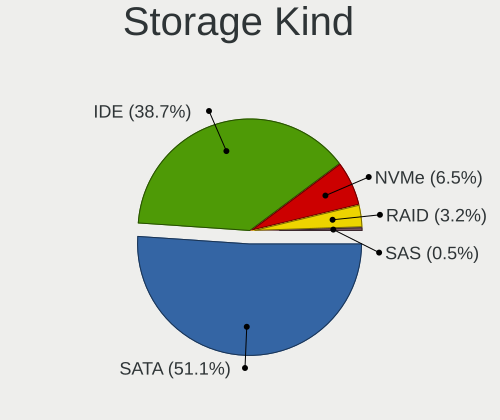

| Kind | Computers | Percent |
|------|-----------|---------|
| SATA | 95        | 51.08%  |
| IDE  | 72        | 38.71%  |
| NVMe | 12        | 6.45%   |
| RAID | 6         | 3.23%   |
| SAS  | 1         | 0.54%   |

Processor
---------

CPU Vendor
----------

Processor vendors

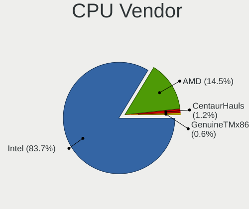

| Vendor       | Computers | Percent |
|--------------|-----------|---------|
| Intel        | 144       | 83.72%  |
| AMD          | 25        | 14.53%  |
| CentaurHauls | 2         | 1.16%   |
| GenuineTMx86 | 1         | 0.58%   |

CPU Model
---------

Processor models

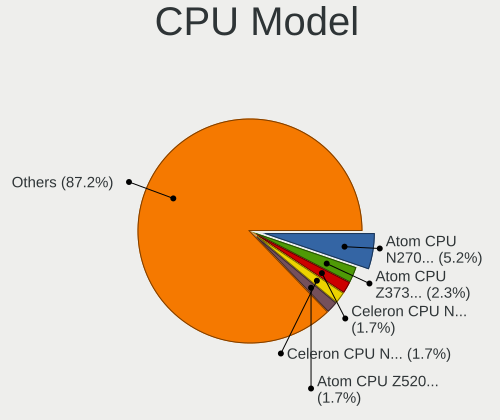

| Model                                       | Computers | Percent |
|---------------------------------------------|-----------|---------|
| Intel Atom CPU N270 @ 1.60GHz               | 9         | 5.23%   |
| Intel Atom CPU Z3735F @ 1.33GHz             | 4         | 2.33%   |
| Intel Celeron CPU N3350 @ 1.10GHz           | 3         | 1.74%   |
| Intel Celeron CPU N2840 @ 2.16GHz           | 3         | 1.74%   |
| Intel Atom CPU Z520 @ 1.33GHz               | 3         | 1.74%   |
| Intel Atom CPU N455 @ 1.66GHz               | 3         | 1.74%   |
| Intel Pentium M processor 1.60GHz           | 2         | 1.16%   |
| Intel Pentium M processor 1.00GHz           | 2         | 1.16%   |
| Intel Pentium Dual-Core CPU E5800 @ 3.20GHz | 2         | 1.16%   |
| Intel Genuine processor 800MHz              | 2         | 1.16%   |
| Intel Genuine CPU T2400 @ 1.83GHz           | 2         | 1.16%   |
| Intel Core i7-7500U CPU @ 2.70GHz           | 2         | 1.16%   |
| Intel Core 2 Duo CPU T5750 @ 2.00GHz        | 2         | 1.16%   |
| Intel Core 2 Duo CPU P8600 @ 2.40GHz        | 2         | 1.16%   |
| Intel Celeron CPU N3060 @ 1.60GHz           | 2         | 1.16%   |
| Intel Celeron CPU J1900 @ 1.99GHz           | 2         | 1.16%   |
| Intel Celeron (Mendocino)                   | 2         | 1.16%   |
| Intel Atom CPU N550 @ 1.50GHz               | 2         | 1.16%   |
| Intel Atom CPU N280 @ 1.66GHz               | 2         | 1.16%   |
| Intel Atom CPU N2600 @ 1.60GHz              | 2         | 1.16%   |
| Intel 11th Gen Core i5-11400F @ 2.60GHz     | 2         | 1.16%   |
| Intel Xeon CPU L5410 @ 2.33GHz              | 1         | 0.58%   |
| Intel Pentium Silver N5030 CPU @ 1.10GHz    | 1         | 0.58%   |
| Intel Pentium M processor 1600MHz           | 1         | 0.58%   |
| Intel Pentium M processor 1.86GHz           | 1         | 0.58%   |
| Intel Pentium M processor 1.73GHz           | 1         | 0.58%   |
| Intel Pentium M processor 1.20GHz           | 1         | 0.58%   |
| Intel Pentium III (Katmai)                  | 1         | 0.58%   |
| Intel Pentium III (Coppermine)              | 1         | 0.58%   |
| Intel Pentium II (Deschutes)                | 1         | 0.58%   |
| Intel Pentium Dual-Core CPU T4500 @ 2.30GHz | 1         | 0.58%   |
| Intel Pentium Dual-Core CPU T4400 @ 2.20GHz | 1         | 0.58%   |
| Intel Pentium Dual-Core CPU E5700 @ 3.00GHz | 1         | 0.58%   |
| Intel Pentium Dual CPU T2390 @ 1.86GHz      | 1         | 0.58%   |
| Intel Pentium Dual CPU E2180 @ 2.00GHz      | 1         | 0.58%   |
| Intel Pentium CPU G2130 @ 3.20GHz           | 1         | 0.58%   |
| Intel Pentium 4 CPU 2.40GHz                 | 1         | 0.58%   |
| Intel Pentium 4 CPU 2.00GHz                 | 1         | 0.58%   |
| Intel Genuine CPU U2700 @ 1.30GHz           | 1         | 0.58%   |
| Intel Genuine CPU T2600 @ 2.16GHz           | 1         | 0.58%   |

CPU Model Family
----------------

Processor model prefix

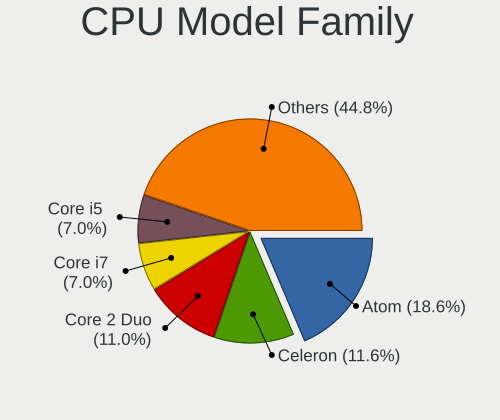

| Model                   | Computers | Percent |
|-------------------------|-----------|---------|
| Intel Atom              | 32        | 18.6%   |
| Intel Celeron           | 20        | 11.63%  |
| Intel Core 2 Duo        | 19        | 11.05%  |
| Intel Core i7           | 12        | 6.98%   |
| Intel Core i5           | 12        | 6.98%   |
| Intel Core i3           | 10        | 5.81%   |
| Intel Pentium M         | 8         | 4.65%   |
| Intel Genuine           | 8         | 4.65%   |
| Other                   | 6         | 3.49%   |
| Intel Pentium Dual-Core | 5         | 2.91%   |
| AMD Ryzen 7             | 3         | 1.74%   |
| AMD A6                  | 3         | 1.74%   |
| Intel Pentium III       | 2         | 1.16%   |
| Intel Pentium Dual      | 2         | 1.16%   |
| Intel Pentium 4         | 2         | 1.16%   |
| Intel Pentium           | 2         | 1.16%   |
| AMD Sempron             | 2         | 1.16%   |
| AMD Ryzen 5             | 2         | 1.16%   |
| AMD E2                  | 2         | 1.16%   |
| AMD Athlon 64 X2        | 2         | 1.16%   |
| Intel Xeon              | 1         | 0.58%   |
| Intel Pentium Silver    | 1         | 0.58%   |
| Intel Core i9           | 1         | 0.58%   |
| Intel Core 2 Quad       | 1         | 0.58%   |
| Intel Core 2            | 1         | 0.58%   |
| Intel Celeron M         | 1         | 0.58%   |
| Intel Celeron Dual-Core | 1         | 0.58%   |
| CentaurHauls VIA Nano   | 1         | 0.58%   |
| CentaurHauls VIA Eden   | 1         | 0.58%   |
| AMD Turion 64 Mobile    | 1         | 0.58%   |
| AMD Ryzen 3             | 1         | 0.58%   |
| AMD Phenom II X4        | 1         | 0.58%   |
| AMD Phenom              | 1         | 0.58%   |
| AMD E1                  | 1         | 0.58%   |
| AMD C-60                | 1         | 0.58%   |
| AMD Athlon II           | 1         | 0.58%   |
| AMD Athlon 64           | 1         | 0.58%   |
| AMD A8                  | 1         | 0.58%   |

CPU Cores
---------

Number of processor cores

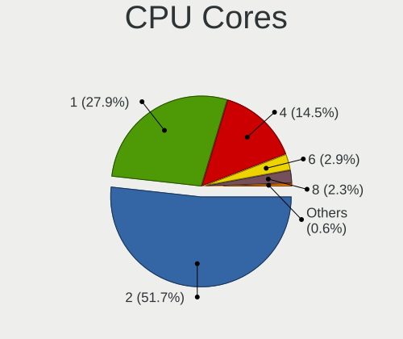

| Number | Computers | Percent |
|--------|-----------|---------|
| 2      | 89        | 51.74%  |
| 1      | 48        | 27.91%  |
| 4      | 25        | 14.53%  |
| 6      | 5         | 2.91%   |
| 8      | 4         | 2.33%   |
| 24     | 1         | 0.58%   |

CPU Sockets
-----------

Number of sockets

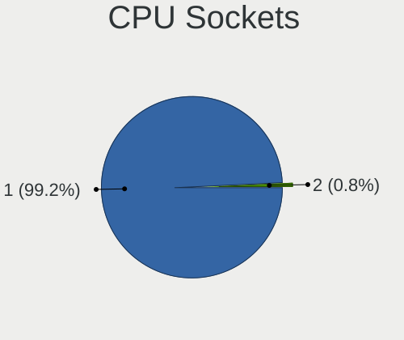

| Number | Computers | Percent |
|--------|-----------|---------|
| 1      | 170       | 98.84%  |
| 2      | 2         | 1.16%   |

CPU Threads
-----------

Threads per core (Hyper-Threading)

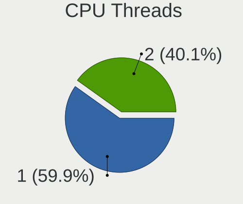

| Number | Computers | Percent |
|--------|-----------|---------|
| 1      | 103       | 59.88%  |
| 2      | 69        | 40.12%  |

CPU Op-Modes
------------

CPU Operation Modes (32-bit, 64-bit)

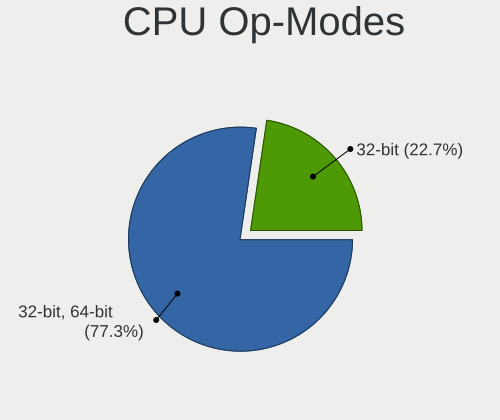

| Op mode        | Computers | Percent |
|----------------|-----------|---------|
| 32-bit, 64-bit | 133       | 77.33%  |
| 32-bit         | 39        | 22.67%  |

CPU Microcode
-------------

Microcode number

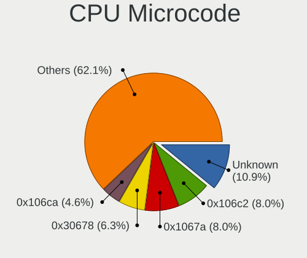

| Number     | Computers | Percent |
|------------|-----------|---------|
| Unknown    | 19        | 10.92%  |
| 0x106c2    | 14        | 8.05%   |
| 0x1067a    | 14        | 8.05%   |
| 0x30678    | 11        | 6.32%   |
| 0x106ca    | 8         | 4.6%    |
| 0x306a9    | 7         | 4.02%   |
| 0x6fd      | 6         | 3.45%   |
| 0x6d8      | 6         | 3.45%   |
| 0x10676    | 6         | 3.45%   |
| 0x806e9    | 5         | 2.87%   |
| 0x6e8      | 5         | 2.87%   |
| 0x206a7    | 5         | 2.87%   |
| 0x6d6      | 4         | 2.3%    |
| 0x406c4    | 4         | 2.3%    |
| 0x306c3    | 4         | 2.3%    |
| 0x706a8    | 3         | 1.72%   |
| 0x506c9    | 3         | 1.72%   |
| 0x40651    | 3         | 1.72%   |
| 0x20655    | 3         | 1.72%   |
| 0xa0671    | 2         | 1.15%   |
| 0x906e9    | 2         | 1.15%   |
| 0x66a      | 2         | 1.15%   |
| 0x30661    | 2         | 1.15%   |
| 0x20652    | 2         | 1.15%   |
| 0x10661    | 2         | 1.15%   |
| 0x0a404102 | 2         | 1.15%   |
| 0x06006704 | 2         | 1.15%   |
| 0x06001119 | 2         | 1.15%   |
| 0x010000c8 | 2         | 1.15%   |
| 0xf29      | 1         | 0.57%   |
| 0xf24      | 1         | 0.57%   |
| 0x906ed    | 1         | 0.57%   |
| 0x906ea    | 1         | 0.57%   |
| 0x706a1    | 1         | 0.57%   |
| 0x6fa      | 1         | 0.57%   |
| 0x6f6      | 1         | 0.57%   |
| 0x695      | 1         | 0.57%   |
| 0x686      | 1         | 0.57%   |
| 0x673      | 1         | 0.57%   |
| 0x652      | 1         | 0.57%   |

CPU Microarch
-------------

Microarchitecture

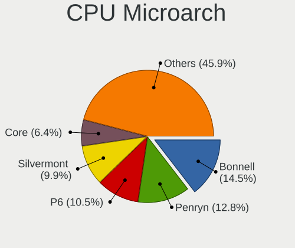

| Name             | Computers | Percent |
|------------------|-----------|---------|
| Bonnell          | 25        | 14.53%  |
| Penryn           | 22        | 12.79%  |
| P6               | 18        | 10.47%  |
| Silvermont       | 17        | 9.88%   |
| Core             | 11        | 6.4%    |
| KabyLake         | 10        | 5.81%   |
| Unknown          | 10        | 5.81%   |
| Haswell          | 8         | 4.65%   |
| IvyBridge        | 7         | 4.07%   |
| Westmere         | 5         | 2.91%   |
| SandyBridge      | 5         | 2.91%   |
| K8 Hammer        | 5         | 2.91%   |
| Goldmont plus    | 4         | 2.33%   |
| Piledriver       | 3         | 1.74%   |
| K10              | 3         | 1.74%   |
| Goldmont         | 3         | 1.74%   |
| Excavator        | 3         | 1.74%   |
| Zen+             | 2         | 1.16%   |
| NetBurst         | 2         | 1.16%   |
| Zen 2            | 1         | 0.58%   |
| Zen              | 1         | 0.58%   |
| Puma             | 1         | 0.58%   |
| Nehalem          | 1         | 0.58%   |
| K8 & K10 hybrid  | 1         | 0.58%   |
| K10 Llano        | 1         | 0.58%   |
| Jaguar           | 1         | 0.58%   |
| Bobcat           | 1         | 0.58%   |
| Alderlake Hybrid | 1         | 0.58%   |

Graphics
--------

GPU Vendor
----------

Vendors of graphics cards

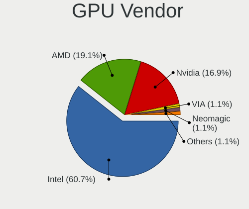

| Vendor                           | Computers | Percent |
|----------------------------------|-----------|---------|
| Intel                            | 111       | 60.66%  |
| AMD                              | 35        | 19.13%  |
| Nvidia                           | 31        | 16.94%  |
| VIA Technologies                 | 2         | 1.09%   |
| Neomagic                         | 2         | 1.09%   |
| Silicon Integrated Systems [SiS] | 1         | 0.55%   |
| Matrox Electronics Systems       | 1         | 0.55%   |

GPU Model
---------

Graphics card models

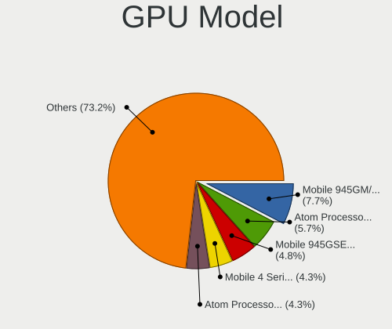

| Model                                                                                    | Computers | Percent |
|------------------------------------------------------------------------------------------|-----------|---------|
| Intel Mobile 945GM/GMS/GME, 943/940GML Express Integrated Graphics Controller            | 16        | 7.66%   |
| Intel Atom Processor Z36xxx/Z37xxx Series Graphics & Display                             | 12        | 5.74%   |
| Intel Mobile 945GSE Express Integrated Graphics Controller                               | 10        | 4.78%   |
| Intel Mobile 4 Series Chipset Integrated Graphics Controller                             | 9         | 4.31%   |
| Intel Atom Processor D4xx/D5xx/N4xx/N5xx Integrated Graphics Controller                  | 9         | 4.31%   |
| Intel Mobile 945GM/GMS, 943/940GML Express Integrated Graphics Controller                | 6         | 2.87%   |
| Intel Kaby Lake-U GT2 [HD Graphics 620]                                                  | 6         | 2.87%   |
| Intel Atom/Celeron/Pentium Processor x5-E8000/J3xxx/N3xxx Integrated Graphics Controller | 5         | 2.39%   |
| Intel 3rd Gen Core processor Graphics Controller                                         | 5         | 2.39%   |
| Intel Core Processor Integrated Graphics Controller                                      | 4         | 1.91%   |
| Intel 4th Gen Core Processor Integrated Graphics Controller                              | 4         | 1.91%   |
| Intel 2nd Generation Core Processor Family Integrated Graphics Controller                | 4         | 1.91%   |
| Intel US15W/US15X SCH [Poulsbo] Graphics Controller                                      | 3         | 1.44%   |
| Intel Mobile GM965/GL960 Integrated Graphics Controller (secondary)                      | 3         | 1.44%   |
| Intel Mobile GM965/GL960 Integrated Graphics Controller (primary)                        | 3         | 1.44%   |
| Intel Mobile 915GM/GMS/910GML Express Graphics Controller                                | 3         | 1.44%   |
| Intel Haswell-ULT Integrated Graphics Controller                                         | 3         | 1.44%   |
| Intel GeminiLake [UHD Graphics 600]                                                      | 3         | 1.44%   |
| Intel Apollo Lake GT1 [HD Graphics 500]                                                  | 3         | 1.44%   |
| Intel 82852/855GM Integrated Graphics Device                                             | 3         | 1.44%   |
| AMD Stoney [Radeon R2/R3/R4/R5 Graphics]                                                 | 3         | 1.44%   |
| Nvidia TU116 [GeForce GTX 1660 SUPER]                                                    | 2         | 0.96%   |
| Nvidia GP108 [GeForce GT 1030]                                                           | 2         | 0.96%   |
| Nvidia GF117M [GeForce 610M/710M/810M/820M / GT 620M/625M/630M/720M]                     | 2         | 0.96%   |
| Neomagic NM2160 [MagicGraph 128XD]                                                       | 2         | 0.96%   |
| Intel Kaby Lake-H GT2 [HD Graphics 630]                                                  | 2         | 0.96%   |
| Intel CoffeeLake-S GT2 [UHD Graphics 630]                                                | 2         | 0.96%   |
| Intel Atom Processor D2xxx/N2xxx Integrated Graphics Controller                          | 2         | 0.96%   |
| Intel 4 Series Chipset Integrated Graphics Controller                                    | 2         | 0.96%   |
| AMD RV630/M76 [Mobility Radeon HD 2600 XT/2700]                                          | 2         | 0.96%   |
| AMD RV200/M7 [Mobility Radeon 7500]                                                      | 2         | 0.96%   |
| AMD Rembrandt [Radeon 680M]                                                              | 2         | 0.96%   |
| AMD Madison [Mobility Radeon HD 5650/5750 / 6530M/6550M]                                 | 2         | 0.96%   |
| AMD Jet PRO [Radeon R5 M230 / R7 M260DX / Radeon 520/610 Mobile]                         | 2         | 0.96%   |
| AMD Cedar [Radeon HD 5000/6000/7350/8350 Series]                                         | 2         | 0.96%   |
| VIA Technologies VX900 Graphics [Chrome9 HD]                                             | 1         | 0.48%   |
| VIA Technologies VX800/VX820 Chrome 9 HC3 Integrated Graphics                            | 1         | 0.48%   |
| Silicon Integrated Systems [SiS] 771/671 PCIE VGA Display Adapter                        | 1         | 0.48%   |
| Nvidia TU116 [GeForce GTX 1660]                                                          | 1         | 0.48%   |
| Nvidia NV44A [GeForce 6200]                                                              | 1         | 0.48%   |

GPU Combo
---------

Combinations of graphics cards

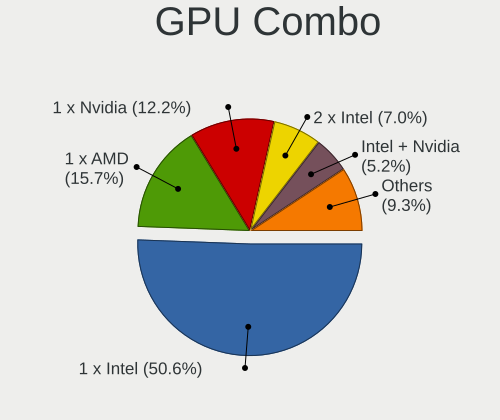

| Name           | Computers | Percent |
|----------------|-----------|---------|
| 1 x Intel      | 87        | 50.58%  |
| 1 x AMD        | 27        | 15.7%   |
| 1 x Nvidia     | 21        | 12.21%  |
| 2 x Intel      | 12        | 6.98%   |
| Intel + Nvidia | 9         | 5.23%   |
| 2 x AMD        | 7         | 4.07%   |
| Other          | 2         | 1.16%   |
| 1 x VIA        | 2         | 1.16%   |
| 1 x Neomagic   | 2         | 1.16%   |
| 1 x SiS        | 1         | 0.58%   |
| 1 x Matrox     | 1         | 0.58%   |
| Intel + AMD    | 1         | 0.58%   |

GPU Driver
----------

Free vs proprietary

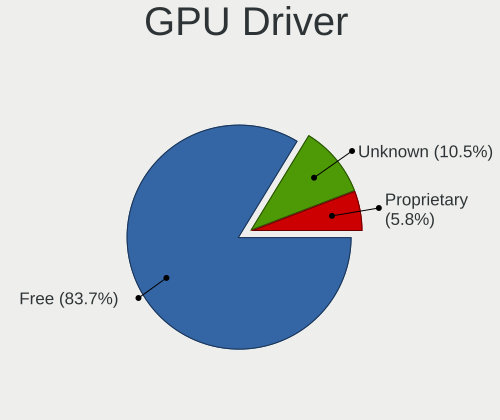

| Driver      | Computers | Percent |
|-------------|-----------|---------|
| Free        | 144       | 83.72%  |
| Unknown     | 18        | 10.47%  |
| Proprietary | 10        | 5.81%   |

GPU Memory
----------

Total video memory

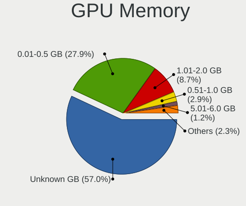

| Size in GB | Computers | Percent |
|------------|-----------|---------|
| Unknown    | 98        | 56.98%  |
| 0.01-0.5   | 48        | 27.91%  |
| 1.01-2.0   | 15        | 8.72%   |
| 0.51-1.0   | 5         | 2.91%   |
| 5.01-6.0   | 2         | 1.16%   |
| 3.01-4.0   | 2         | 1.16%   |
| 2.01-3.0   | 1         | 0.58%   |
| 16.01-24.0 | 1         | 0.58%   |

Monitor
-------

Monitor Vendor
--------------

Monitor vendors

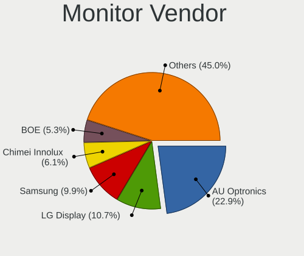

| Vendor                  | Computers | Percent |
|-------------------------|-----------|---------|
| AU Optronics            | 30        | 22.9%   |
| LG Display              | 14        | 10.69%  |
| Samsung Electronics     | 13        | 9.92%   |
| Chimei Innolux          | 8         | 6.11%   |
| BOE                     | 7         | 5.34%   |
| Apple                   | 7         | 5.34%   |
| Acer                    | 6         | 4.58%   |
| LG Philips              | 5         | 3.82%   |
| HannStar                | 5         | 3.82%   |
| Goldstar                | 5         | 3.82%   |
| Lenovo                  | 4         | 3.05%   |
| Hewlett-Packard         | 4         | 3.05%   |
| Chi Mei Optoelectronics | 3         | 2.29%   |
| Ancor Communications    | 3         | 2.29%   |
| InfoVision              | 2         | 1.53%   |
| CPT                     | 2         | 1.53%   |
| Vizio                   | 1         | 0.76%   |
| ViewSonic               | 1         | 0.76%   |
| Unknown (XXX)           | 1         | 0.76%   |
| RTK                     | 1         | 0.76%   |
| PANDA                   | 1         | 0.76%   |
| OUT                     | 1         | 0.76%   |
| LG Electronics          | 1         | 0.76%   |
| HJW                     | 1         | 0.76%   |
| Dell                    | 1         | 0.76%   |
| BenQ                    | 1         | 0.76%   |
| Arnos Instruments       | 1         | 0.76%   |
| AOC                     | 1         | 0.76%   |
| Unknown                 | 1         | 0.76%   |

Monitor Model
-------------

Monitor models

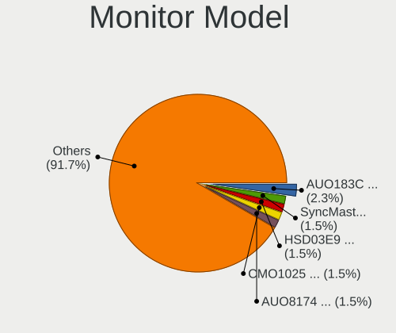

| Model                                                                    | Computers | Percent |
|--------------------------------------------------------------------------|-----------|---------|
| AU Optronics LCD Monitor AUO183C 1366x768 309x173mm 13.9-inch            | 3         | 2.27%   |
| Samsung Electronics SyncMaster SAM0091 1600x1200 432x324mm 21.3-inch     | 2         | 1.52%   |
| HannStar LCD Monitor HSD03E9 1024x600 220x129mm 10.0-inch                | 2         | 1.52%   |
| Chi Mei Optoelectronics LCD Monitor CMO1025 1024x600 222x125mm 10.0-inch | 2         | 1.52%   |
| AU Optronics LCD Monitor AUO8174 1280x800 331x207mm 15.4-inch            | 2         | 1.52%   |
| AU Optronics LCD Monitor AUO40EC 1366x768 344x193mm 15.5-inch            | 2         | 1.52%   |
| AU Optronics LCD Monitor AUO235C 1366x768 256x144mm 11.6-inch            | 2         | 1.52%   |
| AU Optronics LCD Monitor AUO11C2 1024x600 195x113mm 8.9-inch             | 2         | 1.52%   |
| Vizio E280i-B1 VIZ1002 1360x768 607x345mm 27.5-inch                      | 1         | 0.76%   |
| ViewSonic VA2719 Series VSCC132 1920x1080 598x336mm 27.0-inch            | 1         | 0.76%   |
| Unknown (XXX) HDTV XXX0180 1920x1080 930x530mm 42.1-inch                 | 1         | 0.76%   |
| Samsung Electronics SyncMaster SAM030D 1680x1050 474x296mm 22.0-inch     | 1         | 0.76%   |
| Samsung Electronics SyncMaster SAM0117 1280x1024 312x234mm 15.4-inch     | 1         | 0.76%   |
| Samsung Electronics SMT22A300 SAM087B 1920x1080 477x268mm 21.5-inch      | 1         | 0.76%   |
| Samsung Electronics LCD Monitor SEC564E 1280x720 223x125mm 10.1-inch     | 1         | 0.76%   |
| Samsung Electronics LCD Monitor SEC5441 1280x800 331x207mm 15.4-inch     | 1         | 0.76%   |
| Samsung Electronics LCD Monitor SEC4D42 1280x800 303x190mm 14.1-inch     | 1         | 0.76%   |
| Samsung Electronics LCD Monitor SEC4346 1920x1200 331x207mm 15.4-inch    | 1         | 0.76%   |
| Samsung Electronics LCD Monitor SEC4149 1366x768 292x174mm 13.4-inch     | 1         | 0.76%   |
| Samsung Electronics LCD Monitor SEC3741 1280x800 331x207mm 15.4-inch     | 1         | 0.76%   |
| Samsung Electronics LCD Monitor SEC3051 1366x768 344x194mm 15.5-inch     | 1         | 0.76%   |
| Samsung Electronics LCD Monitor SAM0669 1920x1080                        | 1         | 0.76%   |
| RTK 32V3H-H6A RTK4C54 1440x900 700x390mm 31.5-inch                       | 1         | 0.76%   |
| RTK 32V3H-H6A RTK4C54 1440x900 697x392mm 31.5-inch                       | 1         | 0.76%   |
| PANDA LC116LF3L03 NCP000A 1920x1080 256x144mm 11.6-inch                  | 1         | 0.76%   |
| OUT Analog OUT0170 1280x768 368x207mm 16.6-inch                          | 1         | 0.76%   |
| LG Philips LCD Monitor LPLE800 1280x800 304x190mm 14.1-inch              | 1         | 0.76%   |
| LG Philips LCD Monitor LPLBC00 1280x800 331x207mm 15.4-inch              | 1         | 0.76%   |
| LG Philips LCD Monitor LPLA900 1280x800 331x207mm 15.4-inch              | 1         | 0.76%   |
| LG Philips LCD Monitor LPLA101 1440x900 367x230mm 17.1-inch              | 1         | 0.76%   |
| LG Philips LCD Monitor LPLA002 1440x900 367x230mm 17.1-inch              | 1         | 0.76%   |
| LG Electronics LCD Monitor LG Ultra HD 4480x3600                         | 1         | 0.76%   |
| LG Display LP116WH1-TLA1 LGD021C 1366x768 256x144mm 11.6-inch            | 1         | 0.76%   |
| LG Display LP101WH1-TLB5 LGD0248 1366x768 224x126mm 10.1-inch            | 1         | 0.76%   |
| LG Display LCD Monitor LGD05E5 1920x1080 344x194mm 15.5-inch             | 1         | 0.76%   |
| LG Display LCD Monitor LGD04B2 1920x1080 309x175mm 14.0-inch             | 1         | 0.76%   |
| LG Display LCD Monitor LGD046F 1920x1080 344x194mm 15.5-inch             | 1         | 0.76%   |
| LG Display LCD Monitor LGD045E 1366x768 310x174mm 14.0-inch              | 1         | 0.76%   |
| LG Display LCD Monitor LGD034D 1366x768 344x194mm 15.5-inch              | 1         | 0.76%   |
| LG Display LCD Monitor LGD033B 1366x768 344x194mm 15.5-inch              | 1         | 0.76%   |

Monitor Resolution
------------------

Monitor screen resolution

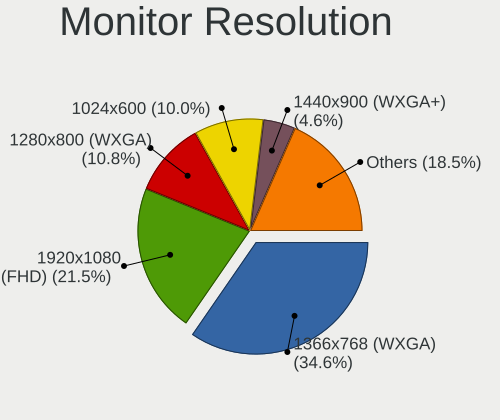

| Resolution         | Computers | Percent |
|--------------------|-----------|---------|
| 1366x768 (WXGA)    | 45        | 34.62%  |
| 1920x1080 (FHD)    | 28        | 21.54%  |
| 1280x800 (WXGA)    | 14        | 10.77%  |
| 1024x600           | 13        | 10%     |
| 1440x900 (WXGA+)   | 6         | 4.62%   |
| 1680x1050 (WSXGA+) | 4         | 3.08%   |
| 1280x1024 (SXGA)   | 4         | 3.08%   |
| 1920x1200 (WUXGA)  | 3         | 2.31%   |
| 1600x900 (HD+)     | 3         | 2.31%   |
| 3840x2160 (4K)     | 2         | 1.54%   |
| 1600x1200          | 2         | 1.54%   |
| 4480x3600          | 1         | 0.77%   |
| 2560x1080          | 1         | 0.77%   |
| 2288x1287          | 1         | 0.77%   |
| 1360x768           | 1         | 0.77%   |
| 1280x720 (HD)      | 1         | 0.77%   |
| Unknown            | 1         | 0.77%   |

Monitor Diagonal
----------------

Diagonal size in inches

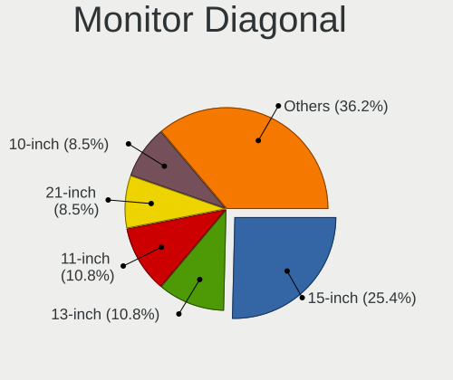

| Inches  | Computers | Percent |
|---------|-----------|---------|
| 15      | 33        | 25.38%  |
| 13      | 14        | 10.77%  |
| 11      | 14        | 10.77%  |
| 21      | 11        | 8.46%   |
| 10      | 11        | 8.46%   |
| 17      | 6         | 4.62%   |
| 14      | 6         | 4.62%   |
| 8       | 4         | 3.08%   |
| 27      | 3         | 2.31%   |
| 24      | 3         | 2.31%   |
| 20      | 3         | 2.31%   |
| 18      | 3         | 2.31%   |
| 12      | 3         | 2.31%   |
| Unknown | 3         | 2.31%   |
| 31      | 2         | 1.54%   |
| 23      | 2         | 1.54%   |
| 43      | 1         | 0.77%   |
| 38      | 1         | 0.77%   |
| 34      | 1         | 0.77%   |
| 32      | 1         | 0.77%   |
| 26      | 1         | 0.77%   |
| 25      | 1         | 0.77%   |
| 22      | 1         | 0.77%   |
| 19      | 1         | 0.77%   |
| 16      | 1         | 0.77%   |

Monitor Width
-------------

Physical width

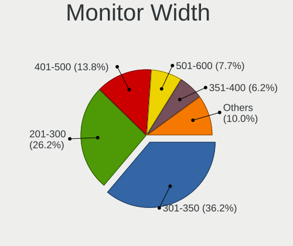

| Width in mm | Computers | Percent |
|-------------|-----------|---------|
| 301-350     | 47        | 36.15%  |
| 201-300     | 34        | 26.15%  |
| 401-500     | 18        | 13.85%  |
| 501-600     | 10        | 7.69%   |
| 351-400     | 8         | 6.15%   |
| 101-200     | 4         | 3.08%   |
| Unknown     | 3         | 2.31%   |
| 801-900     | 2         | 1.54%   |
| 701-800     | 2         | 1.54%   |
| 601-700     | 2         | 1.54%   |

Aspect Ratio
------------

Proportional relationship between the width and the height

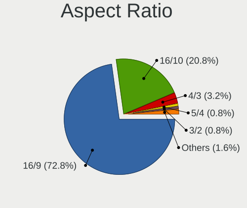

| Ratio   | Computers | Percent |
|---------|-----------|---------|
| 16/9    | 91        | 72.8%   |
| 16/10   | 26        | 20.8%   |
| 4/3     | 4         | 3.2%    |
| 5/4     | 1         | 0.8%    |
| 3/2     | 1         | 0.8%    |
| 21/9    | 1         | 0.8%    |
| Unknown | 1         | 0.8%    |

Monitor Area
------------

Area in inch²

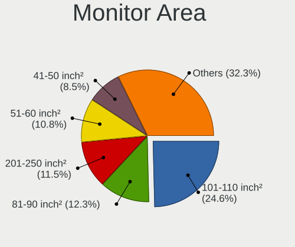

| Area in inch² | Computers | Percent |
|----------------|-----------|---------|
| 101-110        | 32        | 24.62%  |
| 81-90          | 16        | 12.31%  |
| 201-250        | 15        | 11.54%  |
| 51-60          | 14        | 10.77%  |
| 41-50          | 11        | 8.46%   |
| 151-200        | 6         | 4.62%   |
| 71-80          | 4         | 3.08%   |
| 351-500        | 4         | 3.08%   |
| 1-40           | 4         | 3.08%   |
| 301-350        | 4         | 3.08%   |
| 141-150        | 4         | 3.08%   |
| 61-70          | 3         | 2.31%   |
| 131-140        | 3         | 2.31%   |
| Unknown        | 3         | 2.31%   |
| 121-130        | 2         | 1.54%   |
| 111-120        | 2         | 1.54%   |
| 501-1000       | 2         | 1.54%   |
| 251-300        | 1         | 0.77%   |

Pixel Density
-------------

Pixels per inch

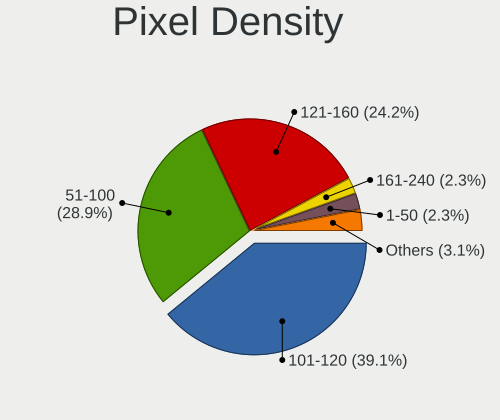

| Density       | Computers | Percent |
|---------------|-----------|---------|
| 101-120       | 50        | 39.06%  |
| 51-100        | 37        | 28.91%  |
| 121-160       | 31        | 24.22%  |
| 1-50          | 3         | 2.34%   |
| 161-240       | 3         | 2.34%   |
| Unknown       | 3         | 2.34%   |
| More than 240 | 1         | 0.78%   |

Multiple Monitors
-----------------

Total monitors connected

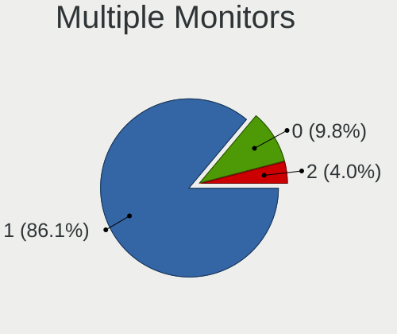

| Total | Computers | Percent |
|-------|-----------|---------|
| 1     | 149       | 86.13%  |
| 0     | 17        | 9.83%   |
| 2     | 7         | 4.05%   |

Network
-------

Net Controller Vendor
---------------------

Controller vendors

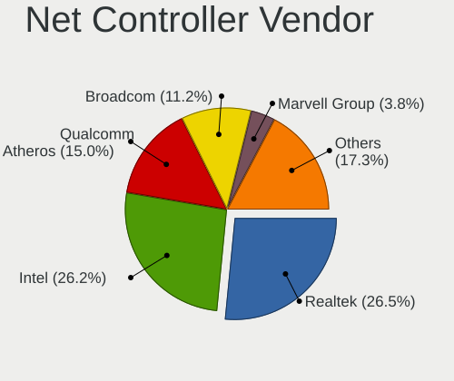

| Vendor                           | Computers | Percent |
|----------------------------------|-----------|---------|
| Realtek Semiconductor            | 69        | 26.54%  |
| Intel                            | 68        | 26.15%  |
| Qualcomm Atheros                 | 39        | 15%     |
| Broadcom                         | 29        | 11.15%  |
| Marvell Technology Group         | 10        | 3.85%   |
| Nvidia                           | 6         | 2.31%   |
| Broadcom Limited                 | 5         | 1.92%   |
| Ralink                           | 4         | 1.54%   |
| Samsung Electronics              | 3         | 1.15%   |
| ASIX Electronics                 | 3         | 1.15%   |
| Silicon Integrated Systems [SiS] | 2         | 0.77%   |
| Ralink Technology                | 2         | 0.77%   |
| Qualcomm Atheros Communications  | 2         | 0.77%   |
| MediaTek                         | 2         | 0.77%   |
| Winbond Electronics              | 1         | 0.38%   |
| vivo                             | 1         | 0.38%   |
| ULi Electronics                  | 1         | 0.38%   |
| Texas Instruments                | 1         | 0.38%   |
| Sierra Wireless                  | 1         | 0.38%   |
| OnePlus Technology (Shenzhen)    | 1         | 0.38%   |
| NetGear                          | 1         | 0.38%   |
| Motorola PCS                     | 1         | 0.38%   |
| LSI                              | 1         | 0.38%   |
| Linksys                          | 1         | 0.38%   |
| Huawei Technologies              | 1         | 0.38%   |
| HMD Global                       | 1         | 0.38%   |
| Hewlett-Packard                  | 1         | 0.38%   |
| Attansic Technology              | 1         | 0.38%   |
| ASUSTek Computer                 | 1         | 0.38%   |
| 3Com                             | 1         | 0.38%   |

Net Controller Model
--------------------

Controller models

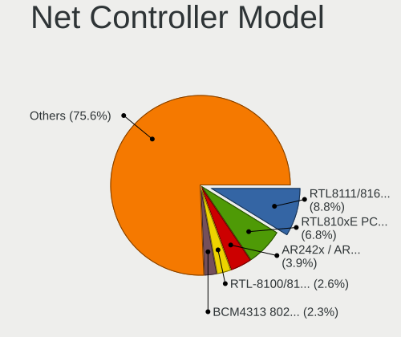

| Model                                                                   | Computers | Percent |
|-------------------------------------------------------------------------|-----------|---------|
| Realtek RTL8111/8168/8211/8411 PCI Express Gigabit Ethernet Controller  | 27        | 8.77%   |
| Realtek RTL810xE PCI Express Fast Ethernet controller                   | 21        | 6.82%   |
| Qualcomm Atheros AR242x / AR542x Wireless Network Adapter (PCI-Express) | 12        | 3.9%    |
| Realtek RTL-8100/8101L/8139 PCI Fast Ethernet Adapter                   | 8         | 2.6%    |
| Broadcom BCM4313 802.11bgn Wireless Network Adapter                     | 7         | 2.27%   |
| Intel PRO/Wireless 3945ABG [Golan] Network Connection                   | 6         | 1.95%   |
| Realtek RTL8169 PCI Gigabit Ethernet Controller                         | 5         | 1.62%   |
| Broadcom BCM4312 802.11b/g LP-PHY                                       | 5         | 1.62%   |
| Qualcomm Atheros QCA9565 / AR9565 Wireless Network Adapter              | 4         | 1.3%    |
| Qualcomm Atheros AR9285 Wireless Network Adapter (PCI-Express)          | 4         | 1.3%    |
| Qualcomm Atheros AR8121/AR8113/AR8114 Gigabit or Fast Ethernet          | 4         | 1.3%    |
| Intel Wireless 8265 / 8275                                              | 4         | 1.3%    |
| Intel Wireless 7265                                                     | 4         | 1.3%    |
| Intel Wireless 7260                                                     | 4         | 1.3%    |
| Intel Wireless 3165                                                     | 4         | 1.3%    |
| Intel PRO/Wireless 2200BG [Calexico2] Network Connection                | 4         | 1.3%    |
| Intel 82579LM Gigabit Network Connection (Lewisville)                   | 4         | 1.3%    |
| Qualcomm Atheros QCA9377 802.11ac Wireless Network Adapter              | 3         | 0.97%   |
| Qualcomm Atheros AR9485 Wireless Network Adapter                        | 3         | 0.97%   |
| Qualcomm Atheros AR8132 Fast Ethernet                                   | 3         | 0.97%   |
| Marvell Group 88E8039 PCI-E Fast Ethernet Controller                    | 3         | 0.97%   |
| Intel Wireless 8260                                                     | 3         | 0.97%   |
| Intel WiFi Link 5100                                                    | 3         | 0.97%   |
| Intel Centrino Wireless-N 1000 [Condor Peak]                            | 3         | 0.97%   |
| Intel 82801DB/DBL/DBM (ICH4/ICH4-L/ICH4-M) AC'97 Modem Controller       | 3         | 0.97%   |
| Broadcom BCM43224 802.11a/b/g/n                                         | 3         | 0.97%   |
| Broadcom BCM4311 802.11b/g WLAN                                         | 3         | 0.97%   |
| Silicon Integrated Systems [SiS] 191 Gigabit Ethernet Adapter           | 2         | 0.65%   |
| Samsung GT-I9070 (network tethering, USB debugging enabled)             | 2         | 0.65%   |
| Realtek RTL8192CU 802.11n WLAN Adapter                                  | 2         | 0.65%   |
| Realtek RTL8125 2.5GbE Controller                                       | 2         | 0.65%   |
| Realtek RTL-8110SC/8169SC Gigabit Ethernet                              | 2         | 0.65%   |
| Ralink RT5370 Wireless Adapter                                          | 2         | 0.65%   |
| Ralink RT3090 Wireless 802.11n 1T/1R PCIe                               | 2         | 0.65%   |
| Ralink RT2790 Wireless 802.11n 1T/2R PCIe                               | 2         | 0.65%   |
| Qualcomm Atheros AR9462 Wireless Network Adapter                        | 2         | 0.65%   |
| Qualcomm Atheros AR928X Wireless Network Adapter (PCI-Express)          | 2         | 0.65%   |
| Marvell Group 88E8058 PCI-E Gigabit Ethernet Controller                 | 2         | 0.65%   |
| Intel Tiger Lake PCH CNVi WiFi                                          | 2         | 0.65%   |
| Intel PRO/Wireless 4965 AG or AGN [Kedron] Network Connection           | 2         | 0.65%   |

Wireless Vendor
---------------

Wireless vendors

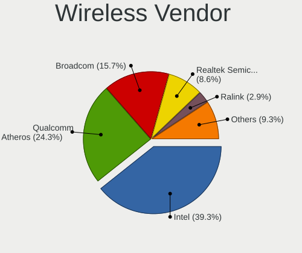

| Vendor                          | Computers | Percent |
|---------------------------------|-----------|---------|
| Intel                           | 55        | 39.29%  |
| Qualcomm Atheros                | 34        | 24.29%  |
| Broadcom                        | 22        | 15.71%  |
| Realtek Semiconductor           | 12        | 8.57%   |
| Ralink                          | 4         | 2.86%   |
| Ralink Technology               | 2         | 1.43%   |
| Qualcomm Atheros Communications | 2         | 1.43%   |
| MediaTek                        | 2         | 1.43%   |
| Winbond Electronics             | 1         | 0.71%   |
| Texas Instruments               | 1         | 0.71%   |
| Sierra Wireless                 | 1         | 0.71%   |
| NetGear                         | 1         | 0.71%   |
| Linksys                         | 1         | 0.71%   |
| Broadcom Limited                | 1         | 0.71%   |
| ASUSTek Computer                | 1         | 0.71%   |

Wireless Model
--------------

Wireless models

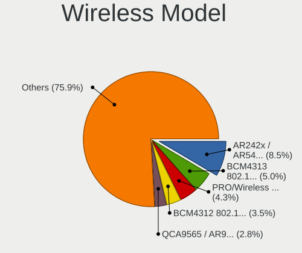

| Model                                                                   | Computers | Percent |
|-------------------------------------------------------------------------|-----------|---------|
| Qualcomm Atheros AR242x / AR542x Wireless Network Adapter (PCI-Express) | 12        | 8.51%   |
| Broadcom BCM4313 802.11bgn Wireless Network Adapter                     | 7         | 4.96%   |
| Intel PRO/Wireless 3945ABG [Golan] Network Connection                   | 6         | 4.26%   |
| Broadcom BCM4312 802.11b/g LP-PHY                                       | 5         | 3.55%   |
| Qualcomm Atheros QCA9565 / AR9565 Wireless Network Adapter              | 4         | 2.84%   |
| Qualcomm Atheros AR9285 Wireless Network Adapter (PCI-Express)          | 4         | 2.84%   |
| Intel Wireless 8265 / 8275                                              | 4         | 2.84%   |
| Intel Wireless 7265                                                     | 4         | 2.84%   |
| Intel Wireless 7260                                                     | 4         | 2.84%   |
| Intel Wireless 3165                                                     | 4         | 2.84%   |
| Intel PRO/Wireless 2200BG [Calexico2] Network Connection                | 4         | 2.84%   |
| Qualcomm Atheros QCA9377 802.11ac Wireless Network Adapter              | 3         | 2.13%   |
| Qualcomm Atheros AR9485 Wireless Network Adapter                        | 3         | 2.13%   |
| Intel Wireless 8260                                                     | 3         | 2.13%   |
| Intel WiFi Link 5100                                                    | 3         | 2.13%   |
| Intel Centrino Wireless-N 1000 [Condor Peak]                            | 3         | 2.13%   |
| Broadcom BCM43224 802.11a/b/g/n                                         | 3         | 2.13%   |
| Broadcom BCM4311 802.11b/g WLAN                                         | 3         | 2.13%   |
| Realtek RTL8192CU 802.11n WLAN Adapter                                  | 2         | 1.42%   |
| Ralink RT5370 Wireless Adapter                                          | 2         | 1.42%   |
| Ralink RT3090 Wireless 802.11n 1T/1R PCIe                               | 2         | 1.42%   |
| Ralink RT2790 Wireless 802.11n 1T/2R PCIe                               | 2         | 1.42%   |
| Qualcomm Atheros AR9462 Wireless Network Adapter                        | 2         | 1.42%   |
| Qualcomm Atheros AR928X Wireless Network Adapter (PCI-Express)          | 2         | 1.42%   |
| Intel Tiger Lake PCH CNVi WiFi                                          | 2         | 1.42%   |
| Intel PRO/Wireless 4965 AG or AGN [Kedron] Network Connection           | 2         | 1.42%   |
| Intel Gemini Lake PCH CNVi WiFi                                         | 2         | 1.42%   |
| Intel Centrino Ultimate-N 6300                                          | 2         | 1.42%   |
| Intel Centrino Advanced-N 6205 [Taylor Peak]                            | 2         | 1.42%   |
| Broadcom BCM4321 802.11a/b/g/n                                          | 2         | 1.42%   |
| Winbond W89C33D 802.11 a/b/g BB/MAC                                     | 1         | 0.71%   |
| Texas Instruments ACX 100 22Mbps Wireless Interface                     | 1         | 0.71%   |
| Sierra Wireless EM7305 Modem                                            | 1         | 0.71%   |
| Realtek RTL8821CE 802.11ac PCIe Wireless Network Adapter                | 1         | 0.71%   |
| Realtek RTL8821AE 802.11ac PCIe Wireless Network Adapter                | 1         | 0.71%   |
| Realtek RTL8723BU 802.11b/g/n WLAN Adapter                              | 1         | 0.71%   |
| Realtek RTL8192EU 802.11b/g/n WLAN Adapter                              | 1         | 0.71%   |
| Realtek RTL8192CE PCIe Wireless Network Adapter                         | 1         | 0.71%   |
| Realtek RTL8191SEvA Wireless LAN Controller                             | 1         | 0.71%   |
| Realtek RTL8188FTV 802.11b/g/n 1T1R 2.4G WLAN Adapter                   | 1         | 0.71%   |

Ethernet Vendor
---------------

Ethernet vendors

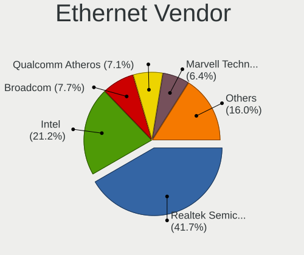

| Vendor                           | Computers | Percent |
|----------------------------------|-----------|---------|
| Realtek Semiconductor            | 65        | 41.67%  |
| Intel                            | 33        | 21.15%  |
| Broadcom                         | 12        | 7.69%   |
| Qualcomm Atheros                 | 11        | 7.05%   |
| Marvell Technology Group         | 10        | 6.41%   |
| Nvidia                           | 6         | 3.85%   |
| Broadcom Limited                 | 4         | 2.56%   |
| Samsung Electronics              | 3         | 1.92%   |
| ASIX Electronics                 | 3         | 1.92%   |
| Silicon Integrated Systems [SiS] | 2         | 1.28%   |
| vivo                             | 1         | 0.64%   |
| ULi Electronics                  | 1         | 0.64%   |
| OnePlus Technology (Shenzhen)    | 1         | 0.64%   |
| Motorola PCS                     | 1         | 0.64%   |
| HMD Global                       | 1         | 0.64%   |
| Attansic Technology              | 1         | 0.64%   |
| 3Com                             | 1         | 0.64%   |

Ethernet Model
--------------

Ethernet models

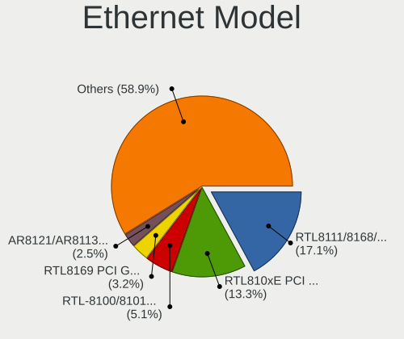

| Model                                                                  | Computers | Percent |
|------------------------------------------------------------------------|-----------|---------|
| Realtek RTL8111/8168/8211/8411 PCI Express Gigabit Ethernet Controller | 27        | 17.09%  |
| Realtek RTL810xE PCI Express Fast Ethernet controller                  | 21        | 13.29%  |
| Realtek RTL-8100/8101L/8139 PCI Fast Ethernet Adapter                  | 8         | 5.06%   |
| Realtek RTL8169 PCI Gigabit Ethernet Controller                        | 5         | 3.16%   |
| Qualcomm Atheros AR8121/AR8113/AR8114 Gigabit or Fast Ethernet         | 4         | 2.53%   |
| Intel 82579LM Gigabit Network Connection (Lewisville)                  | 4         | 2.53%   |
| Qualcomm Atheros AR8132 Fast Ethernet                                  | 3         | 1.9%    |
| Marvell Group 88E8039 PCI-E Fast Ethernet Controller                   | 3         | 1.9%    |
| Silicon Integrated Systems [SiS] 191 Gigabit Ethernet Adapter          | 2         | 1.27%   |
| Samsung GT-I9070 (network tethering, USB debugging enabled)            | 2         | 1.27%   |
| Realtek RTL8125 2.5GbE Controller                                      | 2         | 1.27%   |
| Realtek RTL-8110SC/8169SC Gigabit Ethernet                             | 2         | 1.27%   |
| Marvell Group 88E8058 PCI-E Gigabit Ethernet Controller                | 2         | 1.27%   |
| Intel I211 Gigabit Network Connection                                  | 2         | 1.27%   |
| Intel Ethernet Connection I217-V                                       | 2         | 1.27%   |
| Intel Ethernet Connection I217-LM                                      | 2         | 1.27%   |
| Intel Ethernet Connection (4) I219-LM                                  | 2         | 1.27%   |
| Intel 82577LM Gigabit Network Connection                               | 2         | 1.27%   |
| Intel 82567LM Gigabit Network Connection                               | 2         | 1.27%   |
| Intel 82540EP Gigabit Ethernet Controller (Mobile)                     | 2         | 1.27%   |
| Broadcom NetXtreme BCM57760 Gigabit Ethernet PCIe                      | 2         | 1.27%   |
| Broadcom NetLink BCM5906M Fast Ethernet PCI Express                    | 2         | 1.27%   |
| Broadcom NetLink BCM57780 Gigabit Ethernet PCIe                        | 2         | 1.27%   |
| vivo 1820                                                              | 1         | 0.63%   |
| ULi ULi 1689,1573 integrated ethernet.                                 | 1         | 0.63%   |
| Samsung Galaxy series, misc. (tethering mode)                          | 1         | 0.63%   |
| Realtek RTL8852BE PCIe 802.11ax Wireless Network Controller            | 1         | 0.63%   |
| Realtek RTL8153 Gigabit Ethernet Adapter                               | 1         | 0.63%   |
| Qualcomm Atheros QCA8171 Gigabit Ethernet                              | 1         | 0.63%   |
| Qualcomm Atheros Killer E2500 Gigabit Ethernet Controller              | 1         | 0.63%   |
| Qualcomm Atheros Attansic L1 Gigabit Ethernet                          | 1         | 0.63%   |
| Qualcomm Atheros AR8152 v2.0 Fast Ethernet                             | 1         | 0.63%   |
| OnePlus (Shenzhen) BE2029                                              | 1         | 0.63%   |
| Nvidia MCP89 Ethernet                                                  | 1         | 0.63%   |
| Nvidia MCP79 Ethernet                                                  | 1         | 0.63%   |
| Nvidia MCP67 Ethernet                                                  | 1         | 0.63%   |
| Nvidia MCP61 Ethernet                                                  | 1         | 0.63%   |
| Nvidia CK8S Ethernet Controller                                        | 1         | 0.63%   |
| Nvidia CK804 Ethernet Controller                                       | 1         | 0.63%   |
| Motorola PCS motorola one 5G ace                                       | 1         | 0.63%   |

Net Controller Kind
-------------------

Ethernet, WiFi or modem

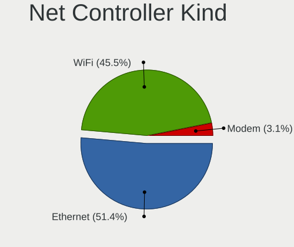

| Kind     | Computers | Percent |
|----------|-----------|---------|
| Ethernet | 147       | 51.4%   |
| WiFi     | 130       | 45.45%  |
| Modem    | 9         | 3.15%   |

Used Controller
---------------

Currently used network controller

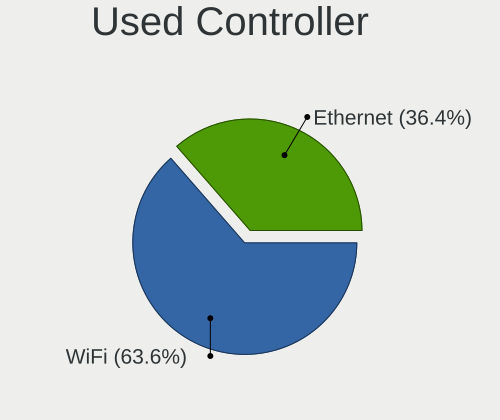

| Kind     | Computers | Percent |
|----------|-----------|---------|
| WiFi     | 110       | 63.58%  |
| Ethernet | 63        | 36.42%  |

NICs
----

Total network controllers on board

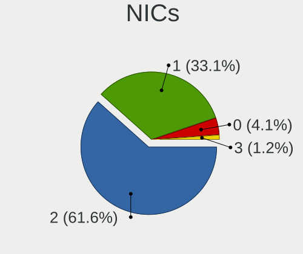

| Total | Computers | Percent |
|-------|-----------|---------|
| 2     | 106       | 61.63%  |
| 1     | 57        | 33.14%  |
| 0     | 7         | 4.07%   |
| 3     | 2         | 1.16%   |

IPv6
----

IPv6 vs IPv4

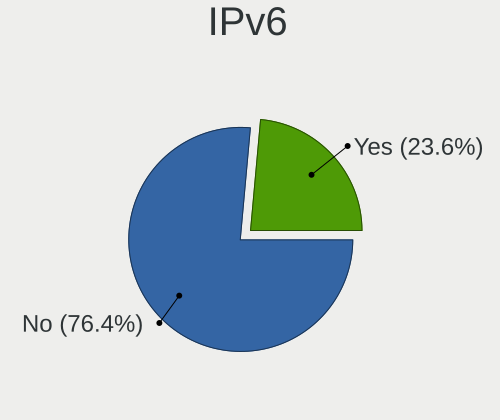

| Used | Computers | Percent |
|------|-----------|---------|
| No   | 133       | 76.44%  |
| Yes  | 41        | 23.56%  |

Bluetooth
---------

Bluetooth Vendor
----------------

Controller vendors

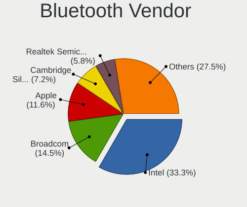

| Vendor                          | Computers | Percent |
|---------------------------------|-----------|---------|
| Intel                           | 23        | 33.33%  |
| Broadcom                        | 10        | 14.49%  |
| Apple                           | 8         | 11.59%  |
| Cambridge Silicon Radio         | 5         | 7.25%   |
| Realtek Semiconductor           | 4         | 5.8%    |
| Lite-On Technology              | 3         | 4.35%   |
| IMC Networks                    | 3         | 4.35%   |
| Qualcomm Atheros Communications | 2         | 2.9%    |
| Hewlett-Packard                 | 2         | 2.9%    |
| Foxconn / Hon Hai               | 2         | 2.9%    |
| Dell                            | 2         | 2.9%    |
| Taiyo Yuden                     | 1         | 1.45%   |
| Ralink Technology               | 1         | 1.45%   |
| Fujitsu                         | 1         | 1.45%   |
| ASUSTek Computer                | 1         | 1.45%   |
| Alps Electric                   | 1         | 1.45%   |

Bluetooth Model
---------------

Controller models

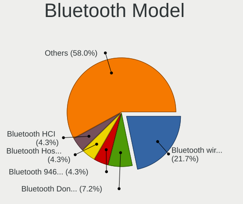

| Model                                               | Computers | Percent |
|-----------------------------------------------------|-----------|---------|
| Intel Bluetooth wireless interface                  | 15        | 21.74%  |
| Cambridge Silicon Radio Bluetooth Dongle (HCI mode) | 5         | 7.25%   |
| Intel Bluetooth 9460/9560 Jefferson Peak (JfP)      | 3         | 4.35%   |
| Apple Bluetooth Host Controller                     | 3         | 4.35%   |
| Apple Bluetooth HCI                                 | 3         | 4.35%   |
| Lite-On Atheros AR3012 Bluetooth                    | 2         | 2.9%    |
| Intel AX201 Bluetooth                               | 2         | 2.9%    |
| IMC Networks Bluetooth Device                       | 2         | 2.9%    |
| HP Bluetooth 2.0 Interface [Broadcom BCM2045]       | 2         | 2.9%    |
| Broadcom HP Portable SoftSailing                    | 2         | 2.9%    |
| Broadcom BCM20702A0 Bluetooth 4.0                   | 2         | 2.9%    |
| Broadcom BCM2045 Bluetooth                          | 2         | 2.9%    |
| Taiyo Yuden Bluetooth Device (V2.0+EDR)             | 1         | 1.45%   |
| Realtek RTL8821A Bluetooth                          | 1         | 1.45%   |
| Realtek RTL8723B Bluetooth                          | 1         | 1.45%   |
| Realtek  Bluetooth 4.2 Adapter                      | 1         | 1.45%   |
| Realtek Bluetooth Radio                             | 1         | 1.45%   |
| Ralink Motorola BC4 Bluetooth 3.0+HS Adapter        | 1         | 1.45%   |
| Qualcomm Atheros  Bluetooth Device                  | 1         | 1.45%   |
| Qualcomm Atheros AR3011 Bluetooth                   | 1         | 1.45%   |
| Lite-On Qualcomm Atheros QCA9377 Bluetooth          | 1         | 1.45%   |
| Intel Wireless-AC 3168 Bluetooth                    | 1         | 1.45%   |
| Intel Centrino Bluetooth Wireless Transceiver       | 1         | 1.45%   |
| Intel Bluetooth Device                              | 1         | 1.45%   |
| IMC Networks Wireless_Device                        | 1         | 1.45%   |
| Fujitsu Bluetooth Device                            | 1         | 1.45%   |
| Foxconn / Hon Hai Broadcom Bluetooth 2.1 Device     | 1         | 1.45%   |
| Foxconn / Hon Hai Bluetooth Device                  | 1         | 1.45%   |
| Dell DW375 Bluetooth Module                         | 1         | 1.45%   |
| Dell BCM20702A0 Bluetooth Module                    | 1         | 1.45%   |
| Broadcom BCM2070 Bluetooth 2.1 + EDR                | 1         | 1.45%   |
| Broadcom BCM2046 Bluetooth Device                   | 1         | 1.45%   |
| Broadcom BCM2045B (BDC-2.1) [Bluetooth Controller]  | 1         | 1.45%   |
| Broadcom BCM2045B (BDC-2.1)                         | 1         | 1.45%   |
| ASUS BT-253 Bluetooth Adapter                       | 1         | 1.45%   |
| Apple Built-in Bluetooth 2.0+EDR HCI                | 1         | 1.45%   |
| Apple Bluetooth USB Host Controller                 | 1         | 1.45%   |
| Alps Electric Bluetooth Controller (ALPS/UGPZ6)     | 1         | 1.45%   |

Sound
-----

Sound Vendor
------------

Sound card vendors

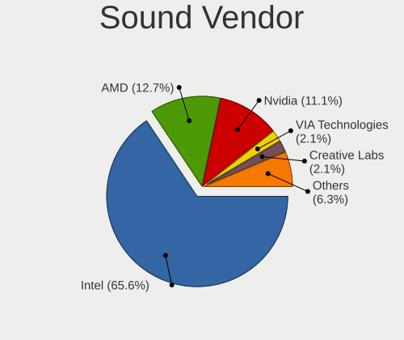

| Vendor                           | Computers | Percent |
|----------------------------------|-----------|---------|
| Intel                            | 124       | 65.61%  |
| AMD                              | 24        | 12.7%   |
| Nvidia                           | 21        | 11.11%  |
| VIA Technologies                 | 4         | 2.12%   |
| Creative Labs                    | 4         | 2.12%   |
| C-Media Electronics              | 4         | 2.12%   |
| ULi Electronics                  | 2         | 1.06%   |
| Silicon Integrated Systems [SiS] | 2         | 1.06%   |
| ESS Technology                   | 2         | 1.06%   |
| GN Netcom                        | 1         | 0.53%   |
| Ensoniq                          | 1         | 0.53%   |

Sound Model
-----------

Sound card models

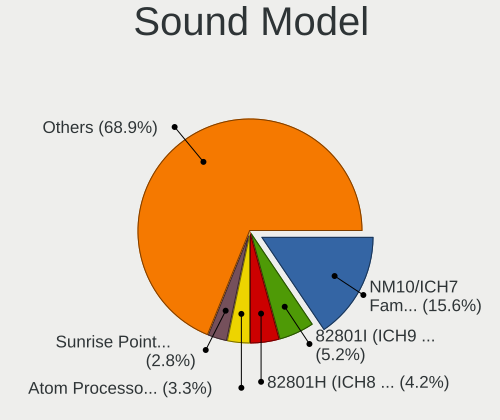

| Model                                                                                             | Computers | Percent |
|---------------------------------------------------------------------------------------------------|-----------|---------|
| Intel NM10/ICH7 Family High Definition Audio Controller                                           | 33        | 15.57%  |
| Intel 82801I (ICH9 Family) HD Audio Controller                                                    | 11        | 5.19%   |
| Intel 82801H (ICH8 Family) HD Audio Controller                                                    | 9         | 4.25%   |
| Intel Atom Processor Z36xxx/Z37xxx Series High Definition Audio Controller                        | 7         | 3.3%    |
| Intel Sunrise Point-LP HD Audio                                                                   | 6         | 2.83%   |
| Intel 7 Series/C216 Chipset Family High Definition Audio Controller                               | 6         | 2.83%   |
| Intel 6 Series/C200 Series Chipset Family High Definition Audio Controller                        | 6         | 2.83%   |
| Intel 5 Series/3400 Series Chipset High Definition Audio                                          | 6         | 2.83%   |
| AMD FCH Azalia Controller                                                                         | 6         | 2.83%   |
| Intel Xeon E3-1200 v3/4th Gen Core Processor HD Audio Controller                                  | 5         | 2.36%   |
| Intel 8 Series/C220 Series Chipset High Definition Audio Controller                               | 5         | 2.36%   |
| AMD SBx00 Azalia (Intel HDA)                                                                      | 5         | 2.36%   |
| Intel Celeron/Pentium Silver Processor High Definition Audio                                      | 4         | 1.89%   |
| Intel 82801DB/DBL/DBM (ICH4/ICH4-L/ICH4-M) AC'97 Audio Controller                                 | 4         | 1.89%   |
| Nvidia TU116 High Definition Audio Controller                                                     | 3         | 1.42%   |
| Intel US15W/US15X/US15L/UL11L SCH [Poulsbo] HD Audio Controller                                   | 3         | 1.42%   |
| Intel Haswell-ULT HD Audio Controller                                                             | 3         | 1.42%   |
| Intel Celeron N3350/Pentium N4200/Atom E3900 Series Audio Cluster                                 | 3         | 1.42%   |
| Intel Atom/Celeron/Pentium Processor x5-E8000/J3xxx/N3xxx Series High Definition Audio Controller | 3         | 1.42%   |
| Intel 8 Series HD Audio Controller                                                                | 3         | 1.42%   |
| AMD Ryzen HD Audio Controller                                                                     | 3         | 1.42%   |
| AMD High Definition Audio Controller                                                              | 3         | 1.42%   |
| AMD Family 15h (Models 60h-6fh) Audio Controller                                                  | 3         | 1.42%   |
| VIA Technologies VX900/VT8xxx High Definition Audio Controller                                    | 2         | 0.94%   |
| Silicon Integrated Systems [SiS] Azalia Audio Controller                                          | 2         | 0.94%   |
| Nvidia GP108 High Definition Audio Controller                                                     | 2         | 0.94%   |
| Nvidia GF108 High Definition Audio Controller                                                     | 2         | 0.94%   |
| Intel Tiger Lake-H HD Audio Controller                                                            | 2         | 0.94%   |
| Intel CM238 HD Audio Controller                                                                   | 2         | 0.94%   |
| Intel Cannon Lake PCH cAVS                                                                        | 2         | 0.94%   |
| Intel 82801FB/FBM/FR/FW/FRW (ICH6 Family) High Definition Audio Controller                        | 2         | 0.94%   |
| Intel 82801FB/FBM/FR/FW/FRW (ICH6 Family) AC'97 Audio Controller                                  | 2         | 0.94%   |
| ESS Technology ES1938/ES1946/ES1969 Solo-1 Audiodrive                                             | 2         | 0.94%   |
| AMD Trinity HDMI Audio Controller                                                                 | 2         | 0.94%   |
| AMD Redwood HDMI Audio [Radeon HD 5000 Series]                                                    | 2         | 0.94%   |
| AMD Radeon High Definition Audio Controller                                                       | 2         | 0.94%   |
| AMD Kabini HDMI/DP Audio                                                                          | 2         | 0.94%   |
| AMD Cedar HDMI Audio [Radeon HD 5400/6300/7300 Series]                                            | 2         | 0.94%   |
| VIA Technologies VX900 Graphics [Chrome9 HD] HDMI Audio Device                                    | 1         | 0.47%   |
| VIA Technologies VT82C686 AC97 Audio Controller                                                   | 1         | 0.47%   |

Memory
------

Memory Vendor
-------------

Memory module vendors

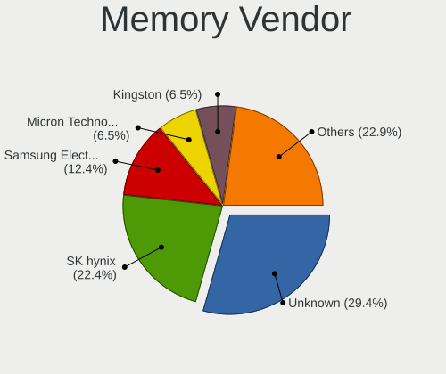

| Vendor              | Computers | Percent |
|---------------------|-----------|---------|
| Unknown             | 59        | 29.35%  |
| SK hynix            | 45        | 22.39%  |
| Samsung Electronics | 25        | 12.44%  |
| Micron Technology   | 13        | 6.47%   |
| Kingston            | 13        | 6.47%   |
| Unknown             | 11        | 5.47%   |
| Smart               | 3         | 1.49%   |
| Ramaxel Technology  | 3         | 1.49%   |
| fef5                | 3         | 1.49%   |
| Corsair             | 3         | 1.49%   |
| A-DATA Technology   | 3         | 1.49%   |
| Nanya Technology    | 2         | 1%      |
| G.Skill             | 2         | 1%      |
| Crucial             | 2         | 1%      |
| Unknown (ABCD)      | 1         | 0.5%    |
| Unknown (8A02)      | 1         | 0.5%    |
| Unknown (0x0DA2)    | 1         | 0.5%    |
| tigo                | 1         | 0.5%    |
| S                   | 1         | 0.5%    |
| Patriot             | 1         | 0.5%    |
| Kllisre             | 1         | 0.5%    |
| Kingmax             | 1         | 0.5%    |
| GOODRAM             | 1         | 0.5%    |
| ff                  | 1         | 0.5%    |
| Elpida              | 1         | 0.5%    |
| Avant               | 1         | 0.5%    |
| Apacer              | 1         | 0.5%    |
| 4ea5                | 1         | 0.5%    |

Memory Model
------------

Memory module models

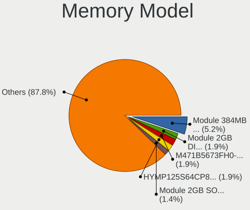

| Model                                                    | Computers | Percent |
|----------------------------------------------------------|-----------|---------|
| Unknown                                                  | 11        | 5.16%   |
| Unknown RAM Module 2GB DIMM SDRAM                        | 4         | 1.88%   |
| SK hynix RAM HYMP125S64CP8-S6 2GB SODIMM DDR2 975MT/s    | 4         | 1.88%   |
| Samsung RAM M471B5673FH0-CF8 2048MB SODIMM DDR3 1067MT/s | 4         | 1.88%   |
| Unknown RAM Module 2GB SODIMM SDRAM                      | 3         | 1.41%   |
| Unknown RAM Module 2GB SODIMM DDR3 1333MT/s              | 3         | 1.41%   |
| Unknown RAM Module 2GB SODIMM DDR2                       | 3         | 1.41%   |
| Unknown RAM Module 1GB SODIMM DDR2                       | 3         | 1.41%   |
| Unknown RAM Module 1024MB SODIMM DDR                     | 3         | 1.41%   |
| SK hynix RAM HMA81GS6AFR8N-UH 8GB SODIMM DDR4 2667MT/s   | 3         | 1.41%   |
| Unknown RAM Module 512MB SODIMM DDR                      | 2         | 0.94%   |
| Unknown RAM Module 512MB DIMM                            | 2         | 0.94%   |
| Unknown RAM Module 2GB SODIMM DDR2 667MT/s               | 2         | 0.94%   |
| Unknown RAM Module 2GB DIMM DDR3 800MT/s                 | 2         | 0.94%   |
| Unknown RAM Module 256MB SODIMM DRAM                     | 2         | 0.94%   |
| Unknown RAM Module 1GB SODIMM SDRAM                      | 2         | 0.94%   |
| Unknown RAM Module 1GB SODIMM DDR2 533MT/s               | 2         | 0.94%   |
| SK hynix RAM Module 512MB SODIMM DDR2 533MT/s            | 2         | 0.94%   |
| SK hynix RAM Module 2GB SODIMM DDR3 1600MT/s             | 2         | 0.94%   |
| SK hynix RAM Module 2GB SODIMM DDR3 1333MT/s             | 2         | 0.94%   |
| SK hynix RAM HMT451S6BFR8A-PB 4GB SODIMM DDR3 1600MT/s   | 2         | 0.94%   |
| SK hynix RAM HMT325S6CFR8C-PB 2GB SODIMM DDR3 1600MT/s   | 2         | 0.94%   |
| SK hynix RAM H9HCNNN8KUMLHR 1GB 2400MT/s                 | 2         | 0.94%   |
| Samsung RAM M471B5773DH0-CH9 2GB SODIMM DDR3 1600MT/s    | 2         | 0.94%   |
| Samsung RAM M471B5673EH1-CF8 2GB SODIMM 4199MT/s         | 2         | 0.94%   |
| Samsung RAM M471B5173EB0-YK0 4GB SODIMM DDR3 1600MT/s    | 2         | 0.94%   |
| Samsung RAM M471A5244CB0-CTD 4GB SODIMM DDR4 3266MT/s    | 2         | 0.94%   |
| Micron RAM 8JSF25664HZ-1G4D1 2GB SODIMM DDR3 1334MT/s    | 2         | 0.94%   |
| fef5 RAM H9HCNNN8KUMLHR 1GB 2400MT/s                     | 2         | 0.94%   |
| Corsair RAM CMK32GX4M2E3200C16 16GB DIMM DDR4 3600MT/s   | 2         | 0.94%   |
| Unknown RAM Module 512MB SODIMM SDRAM                    | 1         | 0.47%   |
| Unknown RAM Module 512MB SODIMM DRAM                     | 1         | 0.47%   |
| Unknown RAM Module 512MB SODIMM DDR2 533MT/s             | 1         | 0.47%   |
| Unknown RAM Module 512MB SODIMM DDR2                     | 1         | 0.47%   |
| Unknown RAM Module 512MB SODIMM DDR 166MT/s              | 1         | 0.47%   |
| Unknown RAM Module 512MB SODIMM DDR 100MT/s              | 1         | 0.47%   |
| Unknown RAM Module 512MB DIMM SDRAM 333MT/s              | 1         | 0.47%   |
| Unknown RAM Module 512MB DIMM SDRAM                      | 1         | 0.47%   |
| Unknown RAM Module 512MB DIMM DDR 400MT/s                | 1         | 0.47%   |
| Unknown RAM Module 512MB DIMM DDR 333MT/s                | 1         | 0.47%   |

Memory Kind
-----------

Memory module kinds

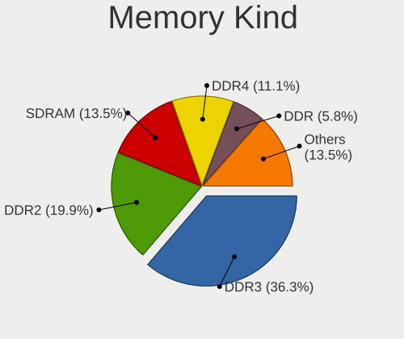

| Kind    | Computers | Percent |
|---------|-----------|---------|
| DDR3    | 62        | 36.26%  |
| DDR2    | 34        | 19.88%  |
| SDRAM   | 23        | 13.45%  |
| DDR4    | 19        | 11.11%  |
| DDR     | 10        | 5.85%   |
| Unknown | 8         | 4.68%   |
| LPDDR4  | 6         | 3.51%   |
| DRAM    | 4         | 2.34%   |
| DDR5    | 3         | 1.75%   |
| LPDDR3  | 2         | 1.17%   |

Memory Form Factor
------------------

Physical design of the memory module

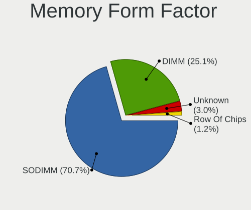

| Name         | Computers | Percent |
|--------------|-----------|---------|
| SODIMM       | 118       | 70.66%  |
| DIMM         | 42        | 25.15%  |
| Unknown      | 5         | 2.99%   |
| Row Of Chips | 2         | 1.2%    |

Memory Size
-----------

Memory module size

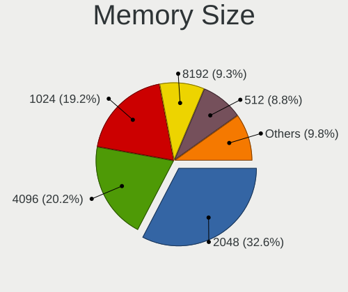

| Size  | Computers | Percent |
|-------|-----------|---------|
| 2048  | 63        | 32.64%  |
| 4096  | 39        | 20.21%  |
| 1024  | 37        | 19.17%  |
| 8192  | 18        | 9.33%   |
| 512   | 17        | 8.81%   |
| 16384 | 10        | 5.18%   |
| 256   | 4         | 2.07%   |
| 64    | 2         | 1.04%   |
| 32768 | 1         | 0.52%   |
| 384   | 1         | 0.52%   |
| 232   | 1         | 0.52%   |

Memory Speed
------------

Memory module speed

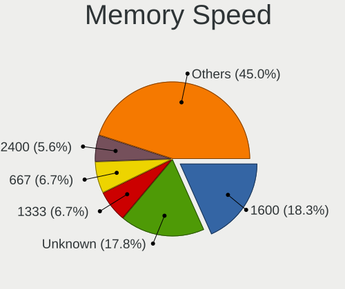

| Speed   | Computers | Percent |
|---------|-----------|---------|
| 1600    | 33        | 18.33%  |
| Unknown | 32        | 17.78%  |
| 1333    | 12        | 6.67%   |
| 667     | 12        | 6.67%   |
| 2400    | 10        | 5.56%   |
| 800     | 10        | 5.56%   |
| 2667    | 9         | 5%      |
| 1334    | 8         | 4.44%   |
| 1067    | 8         | 4.44%   |
| 533     | 6         | 3.33%   |
| 3200    | 5         | 2.78%   |
| 4199    | 4         | 2.22%   |
| 975     | 4         | 2.22%   |
| 3600    | 3         | 1.67%   |
| 333     | 3         | 1.67%   |
| 4800    | 2         | 1.11%   |
| 3266    | 2         | 1.11%   |
| 2048    | 2         | 1.11%   |
| 1867    | 2         | 1.11%   |
| 1066    | 2         | 1.11%   |
| 400     | 2         | 1.11%   |
| 200     | 2         | 1.11%   |
| 5600    | 1         | 0.56%   |
| 2133    | 1         | 0.56%   |
| 2000    | 1         | 0.56%   |
| 1866    | 1         | 0.56%   |
| 266     | 1         | 0.56%   |
| 166     | 1         | 0.56%   |
| 100     | 1         | 0.56%   |

Printers & scanners
-------------------

Printer Vendor
--------------

Printer device vendors

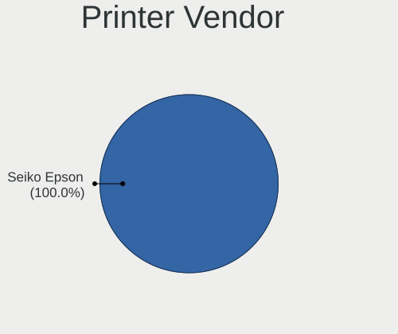

| Vendor      | Computers | Percent |
|-------------|-----------|---------|
| Seiko Epson | 1         | 100%    |

Printer Model
-------------

Printer device models

| Model                      | Computers | Percent |
|----------------------------|-----------|---------|
| Seiko Epson ET-2800 Series | 1         | 100%    |

Scanner Vendor
--------------

Scanner device vendors

Zero info for selected period =(

Scanner Model
-------------

Scanner device models

Zero info for selected period =(

Camera
------

Camera Vendor
-------------

Camera device vendors

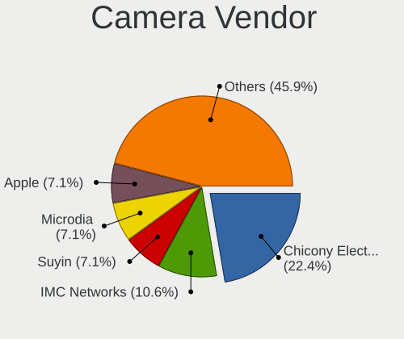

| Vendor                                 | Computers | Percent |
|----------------------------------------|-----------|---------|
| Chicony Electronics                    | 19        | 22.35%  |
| IMC Networks                           | 9         | 10.59%  |
| Suyin                                  | 6         | 7.06%   |
| Microdia                               | 6         | 7.06%   |
| Apple                                  | 6         | 7.06%   |
| Realtek Semiconductor                  | 5         | 5.88%   |
| Bison Electronics                      | 5         | 5.88%   |
| Sunplus Innovation Technology          | 4         | 4.71%   |
| Cheng Uei Precision Industry (Foxlink) | 4         | 4.71%   |
| Pixart Imaging                         | 3         | 3.53%   |
| Syntek                                 | 2         | 2.35%   |
| Silicon Motion                         | 2         | 2.35%   |
| Lenovo                                 | 2         | 2.35%   |
| Alcor Micro                            | 2         | 2.35%   |
| Z-Star Microelectronics                | 1         | 1.18%   |
| Sunplus Technology                     | 1         | 1.18%   |
| Quanta                                 | 1         | 1.18%   |
| Lite-On Technology                     | 1         | 1.18%   |
| Jieli Technology                       | 1         | 1.18%   |
| Importek                               | 1         | 1.18%   |
| Genesys Logic                          | 1         | 1.18%   |
| Generalplus Technology                 | 1         | 1.18%   |
| DICOTA D31841                          | 1         | 1.18%   |
| Acer                                   | 1         | 1.18%   |

Camera Model
------------

Camera device models

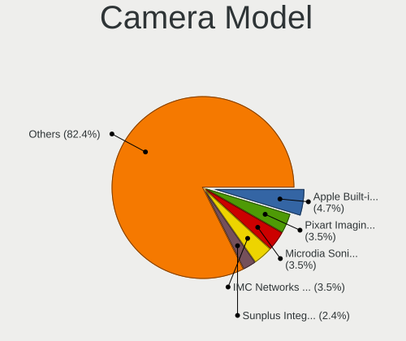

| Model                                          | Computers | Percent |
|------------------------------------------------|-----------|---------|
| Apple Built-in iSight                          | 4         | 4.71%   |
| Pixart Imaging GE 1.3 MP MiniCam Pro           | 3         | 3.53%   |
| Microdia Sonix USB 2.0 Camera                  | 3         | 3.53%   |
| IMC Networks USB2.0 HD UVC WebCam              | 3         | 3.53%   |
| Sunplus Integrated_Webcam_HD                   | 2         | 2.35%   |
| Sunplus HD WebCam                              | 2         | 2.35%   |
| IMC Networks USB2.0 VGA UVC WebCam             | 2         | 2.35%   |
| Chicony USB2.0 HD UVC WebCam                   | 2         | 2.35%   |
| Chicony HD WebCam                              | 2         | 2.35%   |
| Bison Lenovo EasyCamera                        | 2         | 2.35%   |
| Z-Star A4 TECH USB2.0 PC Camera E              | 1         | 1.18%   |
| Syntek Integrated Camera                       | 1         | 1.18%   |
| Syntek HP Webcam                               | 1         | 1.18%   |
| Suyin USB2.0 UVC 1.3M WebCam                   | 1         | 1.18%   |
| Suyin USB 2.0 Camera                           | 1         | 1.18%   |
| Suyin Laptop_Integrated_Webcam_2HDM            | 1         | 1.18%   |
| Suyin Integrated_Webcam_HD                     | 1         | 1.18%   |
| Suyin Acer/Lenovo Webcam [CN0316]              | 1         | 1.18%   |
| Suyin Acer CrystalEye Webcam                   | 1         | 1.18%   |
| Sunplus HD Camera                              | 1         | 1.18%   |
| Silicon Motion Lenovo EasyCamera               | 1         | 1.18%   |
| Silicon Motion HP Webcam-101 Integrated Camera | 1         | 1.18%   |
| Realtek USB2.0 VGA UVC WebCam                  | 1         | 1.18%   |
| Realtek USB2.0 HD UVC WebCam                   | 1         | 1.18%   |
| Realtek Integrated_Webcam_HD                   | 1         | 1.18%   |
| Realtek Integrated Webcam HD                   | 1         | 1.18%   |
| Realtek HD WebCam                              | 1         | 1.18%   |
| Quanta Laptop_Integrated_Webcam_2HDM           | 1         | 1.18%   |
| Microdia Integrated_Webcam_5M                  | 1         | 1.18%   |
| Microdia Integrated Webcam                     | 1         | 1.18%   |
| Microdia Integrated Camera                     | 1         | 1.18%   |
| Lite-On HP TrueVision HD Camera                | 1         | 1.18%   |
| Lenovo Integrated Webcam                       | 1         | 1.18%   |
| Lenovo CNF7237&CNF7238                         | 1         | 1.18%   |
| Jieli USB PHY 2.0                              | 1         | 1.18%   |
| Importek FJ Camera                             | 1         | 1.18%   |
| IMC Networks USB 2.0 UVC VGA WebCam            | 1         | 1.18%   |
| IMC Networks USB 2.0 Camera                    | 1         | 1.18%   |
| IMC Networks TOSHIBA Web Camera - HD           | 1         | 1.18%   |
| IMC Networks Lenovo EasyCamera                 | 1         | 1.18%   |

Security
--------

Fingerprint Vendor
------------------

Fingerprint sensor vendors

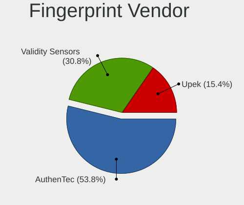

| Vendor           | Computers | Percent |
|------------------|-----------|---------|
| AuthenTec        | 7         | 53.85%  |
| Validity Sensors | 4         | 30.77%  |
| Upek             | 2         | 15.38%  |

Fingerprint Model
-----------------

Fingerprint sensor models

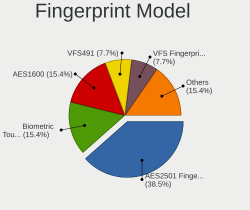

| Model                                                  | Computers | Percent |
|--------------------------------------------------------|-----------|---------|
| AuthenTec AES2501 Fingerprint Sensor                   | 5         | 38.46%  |
| Upek Biometric Touchchip/Touchstrip Fingerprint Sensor | 2         | 15.38%  |
| AuthenTec AES1600                                      | 2         | 15.38%  |
| Validity Sensors VFS491                                | 1         | 7.69%   |
| Validity Sensors VFS Fingerprint sensor                | 1         | 7.69%   |
| Validity Sensors VFS 5011 fingerprint sensor           | 1         | 7.69%   |
| Validity Sensors Synaptics WBDI                        | 1         | 7.69%   |

Chipcard Vendor
---------------

Chipcard module vendors

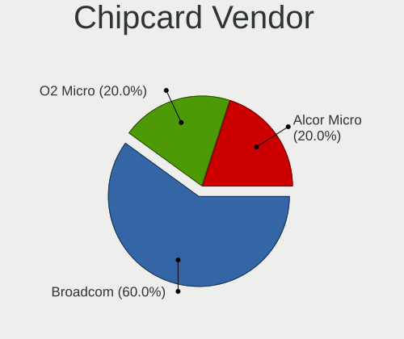

| Vendor      | Computers | Percent |
|-------------|-----------|---------|
| Broadcom    | 3         | 60%     |
| O2 Micro    | 1         | 20%     |
| Alcor Micro | 1         | 20%     |

Chipcard Model
--------------

Chipcard module models

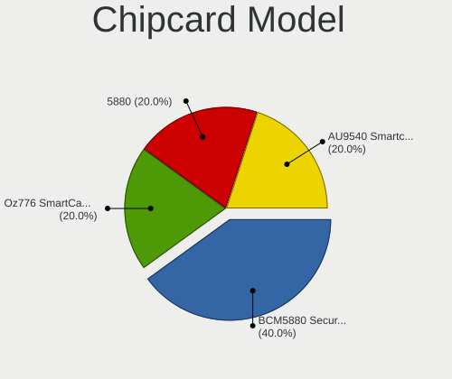

| Model                                          | Computers | Percent |
|------------------------------------------------|-----------|---------|
| Broadcom BCM5880 Secure Applications Processor | 2         | 40%     |
| O2 Micro Oz776 SmartCard Reader                | 1         | 20%     |
| Broadcom 5880                                  | 1         | 20%     |
| Alcor Micro AU9540 Smartcard Reader            | 1         | 20%     |

Unsupported
-----------

Unsupported Devices
-------------------

Total unsupported devices on board

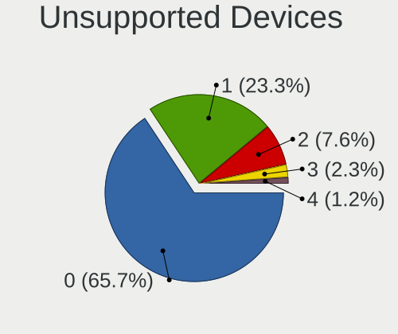

| Total | Computers | Percent |
|-------|-----------|---------|
| 0     | 113       | 65.7%   |
| 1     | 40        | 23.26%  |
| 2     | 13        | 7.56%   |
| 3     | 4         | 2.33%   |
| 4     | 2         | 1.16%   |

Unsupported Device Types
------------------------

Types of unsupported devices

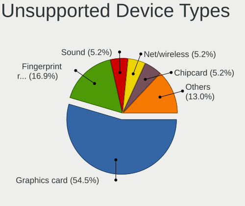

| Type                     | Computers | Percent |
|--------------------------|-----------|---------|
| Graphics card            | 42        | 54.55%  |
| Fingerprint reader       | 13        | 16.88%  |
| Sound                    | 4         | 5.19%   |
| Net/wireless             | 4         | 5.19%   |
| Chipcard                 | 4         | 5.19%   |
| Communication controller | 3         | 3.9%    |
| Multimedia controller    | 2         | 2.6%    |
| Modem                    | 2         | 2.6%    |
| Storage                  | 1         | 1.3%    |
| Net/ethernet             | 1         | 1.3%    |
| Camera                   | 1         | 1.3%    |

