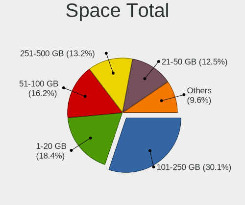
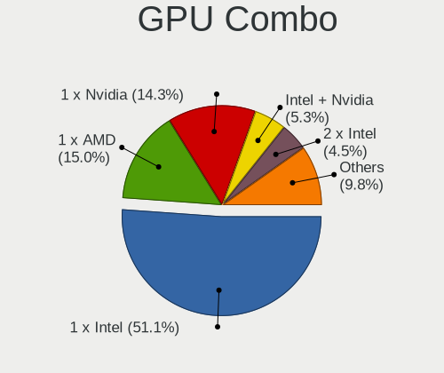
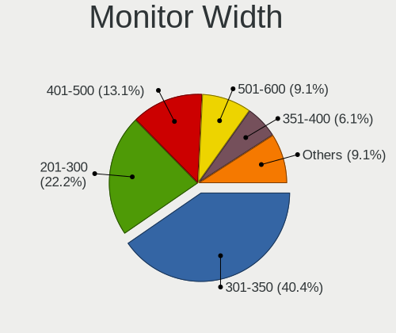
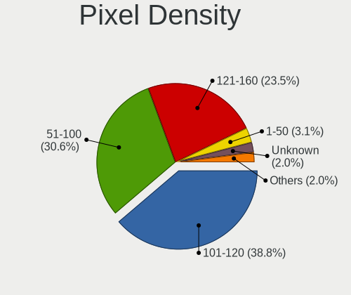
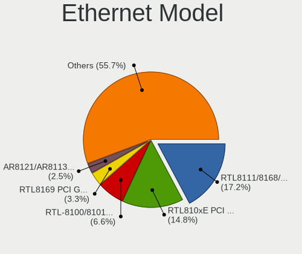
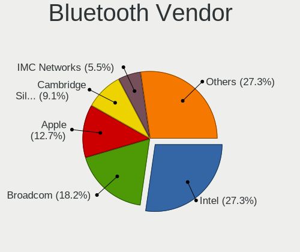
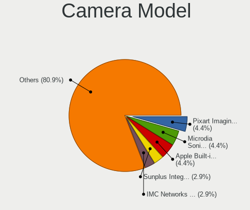
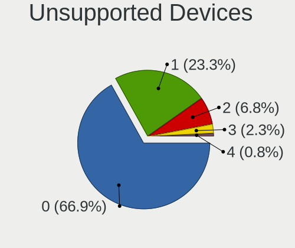

antiX - Tested Hardware & Statistics
------------------------------------

A project to collect tested hardware configurations for antiX.

Anyone can contribute to this report by the [hw-probe](https://github.com/linuxhw/hw-probe) tool:

    sudo -E hw-probe -all -upload

Please contribute! Especially if your hardware is rare.

This is a report for all computer types. See also reports for [desktops](/Dist/antiX/Desktop/README.md) and [notebooks](/Dist/antiX/Notebook/README.md).

Contents
--------

* [ Test Cases ](#test-cases)

* [ System ](#system)
  - [ OS                       ](#os)
  - [ OS Family                ](#os-family)
  - [ Kernel                   ](#kernel)
  - [ Kernel Family            ](#kernel-family)
  - [ Kernel Major Ver.        ](#kernel-major-ver)
  - [ Arch                     ](#arch)
  - [ DE                       ](#de)
  - [ Display Server           ](#display-server)
  - [ Display Manager          ](#display-manager)
  - [ OS Lang                  ](#os-lang)
  - [ Boot Mode                ](#boot-mode)
  - [ Filesystem               ](#filesystem)
  - [ Part. scheme             ](#part-scheme)
  - [ Dual Boot with Linux/BSD ](#dual-boot-with-linuxbsd)
  - [ Dual Boot (Win)          ](#dual-boot-win)

* [ Board ](#board)
  - [ Vendor                   ](#vendor)
  - [ Model                    ](#model)
  - [ Model Family             ](#model-family)
  - [ MFG Year                 ](#mfg-year)
  - [ Form Factor              ](#form-factor)
  - [ Secure Boot              ](#secure-boot)
  - [ Coreboot                 ](#coreboot)
  - [ RAM Size                 ](#ram-size)
  - [ RAM Used                 ](#ram-used)
  - [ Total Drives             ](#total-drives)
  - [ Has CD-ROM               ](#has-cd-rom)
  - [ Has Ethernet             ](#has-ethernet)
  - [ Has WiFi                 ](#has-wifi)
  - [ Has Bluetooth            ](#has-bluetooth)

* [ Location ](#location)
  - [ Country                  ](#country)
  - [ City                     ](#city)

* [ Drives ](#drives)
  - [ Drive Vendor             ](#drive-vendor)
  - [ Drive Model              ](#drive-model)
  - [ HDD Vendor               ](#hdd-vendor)
  - [ SSD Vendor               ](#ssd-vendor)
  - [ Drive Kind               ](#drive-kind)
  - [ Drive Connector          ](#drive-connector)
  - [ Drive Size               ](#drive-size)
  - [ Space Total              ](#space-total)
  - [ Space Used               ](#space-used)
  - [ Malfunc. Drives          ](#malfunc-drives)
  - [ Malfunc. Drive Vendor    ](#malfunc-drive-vendor)
  - [ Malfunc. HDD Vendor      ](#malfunc-hdd-vendor)
  - [ Malfunc. Drive Kind      ](#malfunc-drive-kind)
  - [ Failed Drives            ](#failed-drives)
  - [ Failed Drive Vendor      ](#failed-drive-vendor)
  - [ Drive Status             ](#drive-status)

* [ Storage controller ](#storage-controller)
  - [ Storage Vendor           ](#storage-vendor)
  - [ Storage Model            ](#storage-model)
  - [ Storage Kind             ](#storage-kind)

* [ Processor ](#processor)
  - [ CPU Vendor               ](#cpu-vendor)
  - [ CPU Model                ](#cpu-model)
  - [ CPU Model Family         ](#cpu-model-family)
  - [ CPU Cores                ](#cpu-cores)
  - [ CPU Sockets              ](#cpu-sockets)
  - [ CPU Threads              ](#cpu-threads)
  - [ CPU Op-Modes             ](#cpu-op-modes)
  - [ CPU Microcode            ](#cpu-microcode)
  - [ CPU Microarch            ](#cpu-microarch)

* [ Graphics ](#graphics)
  - [ GPU Vendor               ](#gpu-vendor)
  - [ GPU Model                ](#gpu-model)
  - [ GPU Combo                ](#gpu-combo)
  - [ GPU Driver               ](#gpu-driver)
  - [ GPU Memory               ](#gpu-memory)

* [ Monitor ](#monitor)
  - [ Monitor Vendor           ](#monitor-vendor)
  - [ Monitor Model            ](#monitor-model)
  - [ Monitor Resolution       ](#monitor-resolution)
  - [ Monitor Diagonal         ](#monitor-diagonal)
  - [ Monitor Width            ](#monitor-width)
  - [ Aspect Ratio             ](#aspect-ratio)
  - [ Monitor Area             ](#monitor-area)
  - [ Pixel Density            ](#pixel-density)
  - [ Multiple Monitors        ](#multiple-monitors)

* [ Network ](#network)
  - [ Net Controller Vendor    ](#net-controller-vendor)
  - [ Net Controller Model     ](#net-controller-model)
  - [ Wireless Vendor          ](#wireless-vendor)
  - [ Wireless Model           ](#wireless-model)
  - [ Ethernet Vendor          ](#ethernet-vendor)
  - [ Ethernet Model           ](#ethernet-model)
  - [ Net Controller Kind      ](#net-controller-kind)
  - [ Used Controller          ](#used-controller)
  - [ NICs                     ](#nics)
  - [ IPv6                     ](#ipv6)

* [ Bluetooth ](#bluetooth)
  - [ Bluetooth Vendor         ](#bluetooth-vendor)
  - [ Bluetooth Model          ](#bluetooth-model)

* [ Sound ](#sound)
  - [ Sound Vendor             ](#sound-vendor)
  - [ Sound Model              ](#sound-model)

* [ Memory ](#memory)
  - [ Memory Vendor            ](#memory-vendor)
  - [ Memory Model             ](#memory-model)
  - [ Memory Kind              ](#memory-kind)
  - [ Memory Form Factor       ](#memory-form-factor)
  - [ Memory Size              ](#memory-size)
  - [ Memory Speed             ](#memory-speed)

* [ Printers & scanners ](#printers--scanners)
  - [ Printer Vendor           ](#printer-vendor)
  - [ Printer Model            ](#printer-model)
  - [ Scanner Vendor           ](#scanner-vendor)
  - [ Scanner Model            ](#scanner-model)

* [ Camera ](#camera)
  - [ Camera Vendor            ](#camera-vendor)
  - [ Camera Model             ](#camera-model)

* [ Security ](#security)
  - [ Fingerprint Vendor       ](#fingerprint-vendor)
  - [ Fingerprint Model        ](#fingerprint-model)
  - [ Chipcard Vendor          ](#chipcard-vendor)
  - [ Chipcard Model           ](#chipcard-model)

* [ Unsupported ](#unsupported)
  - [ Unsupported Devices      ](#unsupported-devices)
  - [ Unsupported Device Types ](#unsupported-device-types)

Test Cases
----------

Total: 101

| Vendor        | Model                       | Form-Factor | Probe                                                      | Date         |
|---------------|-----------------------------|-------------|------------------------------------------------------------|--------------|
| Dell          | Vostro 1015                 | Notebook    | [c51af54d34](https://linux-hardware.org/?probe=c51af54d34) | May 28, 2023 |
| MSI           | MPG Z390 GAMING PRO CARB... | Desktop     | [4551c437bf](https://linux-hardware.org/?probe=4551c437bf) | May 18, 2023 |
| HP            | 620                         | Notebook    | [6b688ce696](https://linux-hardware.org/?probe=6b688ce696) | May 17, 2023 |
| Intel         | H61                         | Desktop     | [aa4606c36c](https://linux-hardware.org/?probe=aa4606c36c) | May 02, 2023 |
| Pegatron      | NARRA5                      | Desktop     | [4c8bb5eff0](https://linux-hardware.org/?probe=4c8bb5eff0) | Apr 30, 2023 |
| Fujitsu       | FMVNU6G1C                   | Notebook    | [969957b527](https://linux-hardware.org/?probe=969957b527) | Apr 29, 2023 |
| Lenovo        | IdeaPad 3 15IGL05 81WQ      | Notebook    | [52086c894a](https://linux-hardware.org/?probe=52086c894a) | Apr 24, 2023 |
| MSI           | B550-A PRO                  | Desktop     | [d8b51c995c](https://linux-hardware.org/?probe=d8b51c995c) | Apr 23, 2023 |
| Intel         | powered classmate PC        | Notebook    | [79b262de52](https://linux-hardware.org/?probe=79b262de52) | Apr 12, 2023 |
| Acer          | Aspire E5-511               | Notebook    | [f66d23c175](https://linux-hardware.org/?probe=f66d23c175) | Apr 10, 2023 |
| HP            | G61                         | Notebook    | [d00ad3f0fb](https://linux-hardware.org/?probe=d00ad3f0fb) | Apr 07, 2023 |
| Gigabyte      | Z790 AERO G                 | Desktop     | [f33074a4c8](https://linux-hardware.org/?probe=f33074a4c8) | Apr 03, 2023 |
| Gigabyte      | Z790 AERO G                 | Desktop     | [2f380f0d1a](https://linux-hardware.org/?probe=2f380f0d1a) | Apr 03, 2023 |
| Acer          | Aspire 4315                 | Notebook    | [0bf18c8c90](https://linux-hardware.org/?probe=0bf18c8c90) | Mar 26, 2023 |
| HP            | Pavilion dv8000 (ET839UA... | Notebook    | [1525ad44e2](https://linux-hardware.org/?probe=1525ad44e2) | Mar 12, 2023 |
| Acer          | Aspire E1-572               | Notebook    | [bde56e1cc3](https://linux-hardware.org/?probe=bde56e1cc3) | Mar 11, 2023 |
| Lenovo        | IdeaPad 320-15AST 80XV      | Notebook    | [ffbffb33ae](https://linux-hardware.org/?probe=ffbffb33ae) | Mar 09, 2023 |
| Acer          | Aspire 5740                 | Notebook    | [37c0c0602c](https://linux-hardware.org/?probe=37c0c0602c) | Mar 08, 2023 |
| Acer          | Aspire E5-571G              | Notebook    | [07fe4333eb](https://linux-hardware.org/?probe=07fe4333eb) | Feb 25, 2023 |
| VXL           | M6V90AI-VL                  | Desktop     | [935d6b4b24](https://linux-hardware.org/?probe=935d6b4b24) | Feb 21, 2023 |
| Lenovo        | IdeaPad S12 20021,2959      | Notebook    | [7e8f09a90e](https://linux-hardware.org/?probe=7e8f09a90e) | Feb 07, 2023 |
| Lenovo        | IdeaPad 320-15AST 80XV      | Notebook    | [30676c5e14](https://linux-hardware.org/?probe=30676c5e14) | Feb 05, 2023 |
| Lenovo        | IdeaPad 320-15AST 80XV      | Notebook    | [08bf9ddbcf](https://linux-hardware.org/?probe=08bf9ddbcf) | Feb 05, 2023 |
| Dell          | Latitude 2120               | Notebook    | [b52922b482](https://linux-hardware.org/?probe=b52922b482) | Dec 27, 2022 |
| Toshiba       | Satellite C50-A-1HF         | Notebook    | [74902de02b](https://linux-hardware.org/?probe=74902de02b) | Dec 02, 2022 |
| Lenovo        | 3000 V100 076346G           | Notebook    | [bb04272723](https://linux-hardware.org/?probe=bb04272723) | Dec 01, 2022 |
| Acer          | Aspire 7520                 | Notebook    | [d2f4caca66](https://linux-hardware.org/?probe=d2f4caca66) | Nov 22, 2022 |
| ASUSTek       | S3N                         | Notebook    | [e4c4a500b8](https://linux-hardware.org/?probe=e4c4a500b8) | Nov 21, 2022 |
| Google        | Candy                       | Notebook    | [5c5ea3b081](https://linux-hardware.org/?probe=5c5ea3b081) | Nov 17, 2022 |
| HP            | Mini 110-3700               | Notebook    | [4e9f54f23c](https://linux-hardware.org/?probe=4e9f54f23c) | Nov 15, 2022 |
| ASUSTek       | VivoBook E14 E402YA_L402... | Notebook    | [213d8f5688](https://linux-hardware.org/?probe=213d8f5688) | Nov 13, 2022 |
| Fujitsu       | FMVNU6G1C                   | Notebook    | [1351f25388](https://linux-hardware.org/?probe=1351f25388) | Sep 30, 2022 |
| ASUSTek       | 1011CX                      | Notebook    | [4ce8b4c2fe](https://linux-hardware.org/?probe=4ce8b4c2fe) | Sep 18, 2022 |
| Intel         | D525MW AAE93082-401         | Desktop     | [a225baa8a4](https://linux-hardware.org/?probe=a225baa8a4) | Aug 05, 2022 |
| KOHJINSHA     | SC series                   | Notebook    | [90a25503ee](https://linux-hardware.org/?probe=90a25503ee) | Aug 01, 2022 |
| KOHJINSHA     | SC series                   | Notebook    | [3986e59a55](https://linux-hardware.org/?probe=3986e59a55) | Aug 01, 2022 |
| Biostar       | G31-M7 TE                   | Desktop     | [df98c1834c](https://linux-hardware.org/?probe=df98c1834c) | Jul 23, 2022 |
| AMI           | Aptio CRB                   | Mini pc     | [353168b909](https://linux-hardware.org/?probe=353168b909) | Jul 18, 2022 |
| IBM           | 260921H                     | Notebook    | [bab4f3f57d](https://linux-hardware.org/?probe=bab4f3f57d) | Jul 17, 2022 |
| IBM           | 260921H                     | Notebook    | [a7483bac34](https://linux-hardware.org/?probe=a7483bac34) | Jul 17, 2022 |
| Dell          | 0F428D A00                  | Desktop     | [fb8a6009f7](https://linux-hardware.org/?probe=fb8a6009f7) | Jul 16, 2022 |
| Lenovo        | ThinkPad X201 3249CTO       | Notebook    | [f6a90dcc74](https://linux-hardware.org/?probe=f6a90dcc74) | Jul 16, 2022 |
| MSI           | B560M PRO-VDH WIFI [CEC]    | Desktop     | [af73739875](https://linux-hardware.org/?probe=af73739875) | Jul 14, 2022 |
| IBM           | 260921H                     | Notebook    | [5f9b0998d3](https://linux-hardware.org/?probe=5f9b0998d3) | Jul 11, 2022 |
| IBM           | 260921H                     | Notebook    | [f0430651fd](https://linux-hardware.org/?probe=f0430651fd) | Jul 10, 2022 |
| Lenovo        | Unknown                     | Notebook    | [910a4f6587](https://linux-hardware.org/?probe=910a4f6587) | Jul 09, 2022 |
| Compaq        | Tablet PC TC1000            | Notebook    | [80324222a7](https://linux-hardware.org/?probe=80324222a7) | Jun 26, 2022 |
| KOHJINSHA     | SX series                   | Notebook    | [7333815afc](https://linux-hardware.org/?probe=7333815afc) | Jun 26, 2022 |
| Samsung       | SQ1S Revision MP            | Notebook    | [faeb18a49e](https://linux-hardware.org/?probe=faeb18a49e) | Jun 26, 2022 |
| Unknown       | K8NF3-VSTA                  | Desktop     | [f2ea6e0d83](https://linux-hardware.org/?probe=f2ea6e0d83) | Jun 24, 2022 |
| MSI           | B560M PRO-VDH WIFI [CEC]    | Desktop     | [8654086b85](https://linux-hardware.org/?probe=8654086b85) | Jun 20, 2022 |
| ASUSTek       | VivoBook E14 E402YA_L402... | Notebook    | [e904df65f2](https://linux-hardware.org/?probe=e904df65f2) | Jun 07, 2022 |
| ASUSTek       | VivoBook E14 E402YA_L402... | Notebook    | [cb13f37895](https://linux-hardware.org/?probe=cb13f37895) | Jun 05, 2022 |
| ASUSTek       | VivoBook_ASUSLaptop X509... | Notebook    | [abaa4456ea](https://linux-hardware.org/?probe=abaa4456ea) | Jun 01, 2022 |
| Lenovo        | G550 2958                   | Notebook    | [af5cc85e39](https://linux-hardware.org/?probe=af5cc85e39) | May 20, 2022 |
| Acer          | Aspire 5920G                | Notebook    | [b2ffc81ed6](https://linux-hardware.org/?probe=b2ffc81ed6) | May 07, 2022 |
| AZW           | GK mini                     | Mini pc     | [9d00f58b53](https://linux-hardware.org/?probe=9d00f58b53) | May 04, 2022 |
| AZW           | GK mini                     | Mini pc     | [d474b9b330](https://linux-hardware.org/?probe=d474b9b330) | May 04, 2022 |
| Packard Be... | EasyNote_MX37-U-057NL       | Notebook    | [41760b3852](https://linux-hardware.org/?probe=41760b3852) | Apr 27, 2022 |
| Apple         | MacBook7,1                  | Notebook    | [70413280df](https://linux-hardware.org/?probe=70413280df) | Mar 26, 2022 |
| HP            | EliteBook 2570p             | Notebook    | [20e998c205](https://linux-hardware.org/?probe=20e998c205) | Mar 17, 2022 |
| Gigabyte      | F2A85XM-D3H                 | Desktop     | [cf20f6e233](https://linux-hardware.org/?probe=cf20f6e233) | Mar 09, 2022 |
| Gigabyte      | 945GCMX-S2                  | Desktop     | [54149177a7](https://linux-hardware.org/?probe=54149177a7) | Feb 12, 2022 |
| IBM           | ThinkPad T40 237342G        | Notebook    | [2c96b391e2](https://linux-hardware.org/?probe=2c96b391e2) | Jan 16, 2022 |
| IBM           | ThinkPad T40 237342G        | Notebook    | [5c4e8748ef](https://linux-hardware.org/?probe=5c4e8748ef) | Jan 16, 2022 |
| Toshiba       | Satellite 1905              | Notebook    | [e72b9043c8](https://linux-hardware.org/?probe=e72b9043c8) | Jan 14, 2022 |
| Unknown       | NF-CK804                    | Desktop     | [dc6287d017](https://linux-hardware.org/?probe=dc6287d017) | Jan 05, 2022 |
| Lenovo        | ThinkPad T440p 20AWS3RH0... | Notebook    | [b2a71d3bbe](https://linux-hardware.org/?probe=b2a71d3bbe) | Dec 30, 2021 |
| ASUSTek       | X71SL                       | Notebook    | [42e7b57eb8](https://linux-hardware.org/?probe=42e7b57eb8) | Dec 07, 2021 |
| ASUSTek       | A3L                         | Notebook    | [32489f1764](https://linux-hardware.org/?probe=32489f1764) | Dec 06, 2021 |
| ASUSTek       | A3L                         | Notebook    | [2b01c636c2](https://linux-hardware.org/?probe=2b01c636c2) | Dec 06, 2021 |
| ASUSTek       | X51RL                       | Notebook    | [0aeee18806](https://linux-hardware.org/?probe=0aeee18806) | Nov 19, 2021 |
| Acer          | AOA150                      | Notebook    | [24833c6a59](https://linux-hardware.org/?probe=24833c6a59) | Oct 26, 2021 |
| Dell          | Latitude E6400              | Notebook    | [6b7ef9cad5](https://linux-hardware.org/?probe=6b7ef9cad5) | Oct 21, 2021 |
| MSI           | GE62 7RE                    | Notebook    | [9d064bcc8d](https://linux-hardware.org/?probe=9d064bcc8d) | May 21, 2021 |
| MSI           | GE62 7RE                    | Notebook    | [d560e067d4](https://linux-hardware.org/?probe=d560e067d4) | May 21, 2021 |
| ASUSTek       | A8R-MVP                     | Desktop     | [43a7b44e3f](https://linux-hardware.org/?probe=43a7b44e3f) | Mar 27, 2021 |
| HP            | EliteBook 8770w             | Notebook    | [0af42b4958](https://linux-hardware.org/?probe=0af42b4958) | Mar 17, 2021 |
| Fujitsu       | FMVS54EB                    | Notebook    | [f01ca3644f](https://linux-hardware.org/?probe=f01ca3644f) | Mar 11, 2021 |
| Dell          | Latitude 5480               | Notebook    | [c9e0b19e8b](https://linux-hardware.org/?probe=c9e0b19e8b) | Mar 07, 2021 |
| Radiant Sy... | P845                        | Mini pc     | [4a3e3cd4ee](https://linux-hardware.org/?probe=4a3e3cd4ee) | Feb 23, 2021 |
| ASUSTek       | M2N-MX SE Plus              | Desktop     | [a8985150bd](https://linux-hardware.org/?probe=a8985150bd) | Feb 08, 2021 |
| ASRock        | H81M-ITX                    | Desktop     | [7b2d6774c8](https://linux-hardware.org/?probe=7b2d6774c8) | Feb 05, 2021 |
| Radiant Sy... | P845                        | Mini pc     | [e751bd8090](https://linux-hardware.org/?probe=e751bd8090) | Jan 14, 2021 |
| Radiant Sy... | P845                        | Mini pc     | [cac53c0d21](https://linux-hardware.org/?probe=cac53c0d21) | Jan 14, 2021 |
| HP            | Mini 110-3700               | Notebook    | [33a6e65493](https://linux-hardware.org/?probe=33a6e65493) | Jan 06, 2021 |
| HP            | 8430 1000                   | All in one  | [db9e0da88a](https://linux-hardware.org/?probe=db9e0da88a) | Dec 06, 2020 |
| IBM           | ThinkPad T41 2374K50        | Notebook    | [c77530ec4e](https://linux-hardware.org/?probe=c77530ec4e) | Nov 19, 2020 |
| IBM           | ThinkPad T41 2374K50        | Notebook    | [9c27b878ae](https://linux-hardware.org/?probe=9c27b878ae) | Nov 17, 2020 |
| IBM           | ThinkPad T43 2668WEJ        | Notebook    | [c7508c3b5c](https://linux-hardware.org/?probe=c7508c3b5c) | Oct 02, 2020 |
| HP            | Pavilion dv2700             | Notebook    | [312d41f446](https://linux-hardware.org/?probe=312d41f446) | Aug 01, 2020 |
| HP            | 3641h                       | Desktop     | [f918637d53](https://linux-hardware.org/?probe=f918637d53) | Jul 29, 2020 |
| HP            | Mini 5101                   | Notebook    | [c0abbe79e6](https://linux-hardware.org/?probe=c0abbe79e6) | Apr 24, 2020 |
| HP            | Mini 5101                   | Notebook    | [8fd41129bc](https://linux-hardware.org/?probe=8fd41129bc) | Apr 24, 2020 |
| ASUSTek       | 900A                        | Notebook    | [9ab5761eb1](https://linux-hardware.org/?probe=9ab5761eb1) | Apr 05, 2020 |
| ASUSTek       | 900HA                       | Notebook    | [39b2bfbefc](https://linux-hardware.org/?probe=39b2bfbefc) | Mar 21, 2020 |
| Medion        | WIM2170                     | Notebook    | [a8c4771b62](https://linux-hardware.org/?probe=a8c4771b62) | Jan 13, 2020 |
| Medion        | WIM2170                     | Notebook    | [c879195021](https://linux-hardware.org/?probe=c879195021) | Jan 13, 2020 |
| Unknown       | Unknown                     | Desktop     | [7653370d96](https://linux-hardware.org/?probe=7653370d96) | Dec 16, 2019 |
| ASUSTek       | P5KPL/1600                  | Desktop     | [8ba4b22f71](https://linux-hardware.org/?probe=8ba4b22f71) | Oct 22, 2019 |
| Lenovo        | ThinkCentre M91p 4480B9U    | Desktop     | [e68917ee9f](https://linux-hardware.org/?probe=e68917ee9f) | Nov 04, 2018 |

System
------

OS
--

Installed operating systems

| Name           | Computers | Percent |
|----------------|-----------|---------|
| antiX 21       | 33        | 40.74%  |
| antiX 22       | 19        | 23.46%  |
| antiX 19.2     | 8         | 9.88%   |
| antiX 19.3     | 5         | 6.17%   |
| antiX 17.4.1   | 4         | 4.94%   |
| antiX 21-runit | 3         | 3.7%    |
| antiX 19.4     | 2         | 2.47%   |
| antiX 19.1     | 2         | 2.47%   |
| antiX 19.5     | 1         | 1.23%   |
| antiX 17.2.1   | 1         | 1.23%   |
| antiX 17.1     | 1         | 1.23%   |
| antiX 17       | 1         | 1.23%   |
| antiX 15       | 1         | 1.23%   |

OS Family
---------

OS without a version

| Name  | Computers | Percent |
|-------|-----------|---------|
| antiX | 80        | 100%    |

Kernel
------

Version of the Linux kernel

| Version                      | Computers | Percent |
|------------------------------|-----------|---------|
| 4.9.0-279-antix.1-486-smp    | 15        | 18.52%  |
| 5.10.142-antix.2-amd64-smp   | 9         | 11.11%  |
| 4.9.0-279-antix.1-amd64-smp  | 9         | 11.11%  |
| 5.10.57-antix.1-amd64-smp    | 8         | 9.88%   |
| 4.9.0-326-antix.1-amd64-smp  | 8         | 9.88%   |
| 4.9.235-antix.1-amd64-smp    | 4         | 4.94%   |
| 4.9.160-antix.2-486-smp      | 4         | 4.94%   |
| 4.9.212-antix.1-amd64-smp    | 3         | 3.7%    |
| 4.9.212-antix.1-486-smp      | 3         | 3.7%    |
| 4.9.0-326-antix.1-486-smp    | 3         | 3.7%    |
| 5.10.88-antix.1-amd64-smp    | 2         | 2.47%   |
| 4.9.200-antix.1-486-smp      | 2         | 2.47%   |
| 6.2.9-1-liquorix-amd64       | 1         | 1.23%   |
| 5.14.0-14.1-liquorix-amd64   | 1         | 1.23%   |
| 5.10.27-antix.1-amd64-smp    | 1         | 1.23%   |
| 4.9.87-antix.1-amd64-smp     | 1         | 1.23%   |
| 4.9.160-antix.1-amd64-smp    | 1         | 1.23%   |
| 4.9.0-294-antix.1-amd64-smp  | 1         | 1.23%   |
| 4.9.0-264-antix.1-486-smp    | 1         | 1.23%   |
| 4.19.202-antix.1-686-smp-pae | 1         | 1.23%   |
| 4.19.100-antix.1-686-smp-pae | 1         | 1.23%   |
| 4.19.0-222-antix.1-amd64-smp | 1         | 1.23%   |
| 4.10.5-antix.1-486-smp       | 1         | 1.23%   |

Kernel Family
-------------

Linux kernel without a distro release

| Version  | Computers | Percent |
|----------|-----------|---------|
| 4.9.0    | 36        | 45%     |
| 5.10.142 | 9         | 11.25%  |
| 5.10.57  | 8         | 10%     |
| 4.9.212  | 6         | 7.5%    |
| 4.9.160  | 5         | 6.25%   |
| 4.9.235  | 4         | 5%      |
| 5.10.88  | 2         | 2.5%    |
| 4.9.200  | 2         | 2.5%    |
| 6.2.9    | 1         | 1.25%   |
| 5.14.0   | 1         | 1.25%   |
| 5.10.27  | 1         | 1.25%   |
| 4.9.87   | 1         | 1.25%   |
| 4.19.202 | 1         | 1.25%   |
| 4.19.100 | 1         | 1.25%   |
| 4.19.0   | 1         | 1.25%   |
| 4.10.5   | 1         | 1.25%   |

Kernel Major Ver.
-----------------

Linux kernel major version

| Version | Computers | Percent |
|---------|-----------|---------|
| 4.9     | 54        | 67.5%   |
| 5.10    | 20        | 25%     |
| 4.19    | 3         | 3.75%   |
| 6.2     | 1         | 1.25%   |
| 5.14    | 1         | 1.25%   |
| 4.10    | 1         | 1.25%   |

Arch
----

OS architecture (x86_64, i586, etc.)

| Name   | Computers | Percent |
|--------|-----------|---------|
| x86_64 | 49        | 61.25%  |
| i686   | 30        | 37.5%   |
| i586   | 1         | 1.25%   |

DE
--

Desktop Environment

| Name         | Computers | Percent |
|--------------|-----------|---------|
| Unknown      | 36        | 45%     |
| icewm        | 35        | 43.75%  |
| XFCE         | 4         | 5%      |
| fluxbox      | 2         | 2.5%    |
| jwm          | 1         | 1.25%   |
| herbstluftwm | 1         | 1.25%   |
| GNOME        | 1         | 1.25%   |

Display Server
--------------

X11 or Wayland

| Name | Computers | Percent |
|------|-----------|---------|
| X11  | 78        | 97.5%   |
| Tty  | 2         | 2.5%    |

Display Manager
---------------

SDDM, LightDM, etc.

| Name    | Computers | Percent |
|---------|-----------|---------|
| Unknown | 43        | 53.75%  |
| SLiM    | 22        | 27.5%   |
| SLIMSKI | 7         | 8.75%   |
| LightDM | 6         | 7.5%    |
| XDM     | 1         | 1.25%   |
| SDDM    | 1         | 1.25%   |

OS Lang
-------

Language

| Lang    | Computers | Percent |
|---------|-----------|---------|
| en_US   | 31        | 38.75%  |
| ru_RU   | 8         | 10%     |
| pt_BR   | 5         | 6.25%   |
| de_DE   | 4         | 5%      |
| pl_PL   | 3         | 3.75%   |
| ja_JP   | 3         | 3.75%   |
| it_IT   | 3         | 3.75%   |
| en_GB   | 3         | 3.75%   |
| Unknown | 3         | 3.75%   |
| sk_SK   | 2         | 2.5%    |
| nl_NL   | 2         | 2.5%    |
| es_ES   | 2         | 2.5%    |
| en_AU   | 2         | 2.5%    |
| zh_HK   | 1         | 1.25%   |
| uk_UA   | 1         | 1.25%   |
| fr_FR   | 1         | 1.25%   |
| fr_BE   | 1         | 1.25%   |
| es_VE   | 1         | 1.25%   |
| es_MX   | 1         | 1.25%   |
| es_AR   | 1         | 1.25%   |
| en_NZ   | 1         | 1.25%   |
| de_AT   | 1         | 1.25%   |

Boot Mode
---------

EFI or BIOS

| Mode | Computers | Percent |
|------|-----------|---------|
| BIOS | 64        | 80%     |
| EFI  | 16        | 20%     |

Filesystem
----------

Type of filesystem

| Type     | Computers | Percent |
|----------|-----------|---------|
| Ext4     | 69        | 86.25%  |
| Overlay  | 9         | 11.25%  |
| Xfs      | 1         | 1.25%   |
| Reiserfs | 1         | 1.25%   |

Part. scheme
------------

Scheme of partitioning

| Type    | Computers | Percent |
|---------|-----------|---------|
| MBR     | 60        | 75%     |
| GPT     | 18        | 22.5%   |
| Unknown | 2         | 2.5%    |

Dual Boot with Linux/BSD
------------------------

Hosting more than one Linux/BSD

| Dual boot | Computers | Percent |
|-----------|-----------|---------|
| No        | 63        | 77.78%  |
| Yes       | 18        | 22.22%  |

Dual Boot (Win)
---------------

Hosting Linux and Windows

| Dual boot | Computers | Percent |
|-----------|-----------|---------|
| No        | 49        | 61.25%  |
| Yes       | 31        | 38.75%  |

Board
-----

Vendor
------

Motherboard manufacturer

| Name                | Computers | Percent |
|---------------------|-----------|---------|
| ASUSTek Computer    | 11        | 13.75%  |
| Lenovo              | 9         | 11.25%  |
| Hewlett-Packard     | 9         | 11.25%  |
| Acer                | 8         | 10%     |
| MSI                 | 5         | 6.25%   |
| IBM                 | 5         | 6.25%   |
| Dell                | 5         | 6.25%   |
| Intel               | 3         | 3.75%   |
| Gigabyte Technology | 3         | 3.75%   |
| Fujitsu             | 3         | 3.75%   |
| Unknown             | 3         | 3.75%   |
| Toshiba             | 2         | 2.5%    |
| KOHJINSHA           | 2         | 2.5%    |
| VXL                 | 1         | 1.25%   |
| Samsung Electronics | 1         | 1.25%   |
| Radiant Systems     | 1         | 1.25%   |
| Pegatron            | 1         | 1.25%   |
| Packard Bell        | 1         | 1.25%   |
| Medion              | 1         | 1.25%   |
| Google              | 1         | 1.25%   |
| Compaq              | 1         | 1.25%   |
| Biostar             | 1         | 1.25%   |
| AZW                 | 1         | 1.25%   |
| Apple               | 1         | 1.25%   |
| AMI                 | 1         | 1.25%   |

Model
-----

Motherboard model

| Name                               | Computers | Percent |
|------------------------------------|-----------|---------|
| Unknown                            | 4         | 5%      |
| MSI US Desktop                     | 2         | 2.5%    |
| IBM 260921H                        | 2         | 2.5%    |
| HP Mini 110-3700                   | 2         | 2.5%    |
| Fujitsu FMVNU6G1C                  | 2         | 2.5%    |
| VXL TC7520d                        | 1         | 1.25%   |
| Toshiba Satellite C50-A-1HF        | 1         | 1.25%   |
| Toshiba Satellite 1905             | 1         | 1.25%   |
| Samsung SQ1S                       | 1         | 1.25%   |
| Radiant Systems P845               | 1         | 1.25%   |
| Pegatron VC902AA-ABF p6136fr       | 1         | 1.25%   |
| Packard Bell EasyNote_MX37-U-057NL | 1         | 1.25%   |
| MSI MS-7C56                        | 1         | 1.25%   |
| MSI MS-7B17                        | 1         | 1.25%   |
| MSI GE62 7RE                       | 1         | 1.25%   |
| Medion WIM2170                     | 1         | 1.25%   |
| Lenovo ThinkPad X201 3249CTO       | 1         | 1.25%   |
| Lenovo ThinkPad T440p 20AWS3RH00   | 1         | 1.25%   |
| Lenovo ThinkCentre M91p 4480B9U    | 1         | 1.25%   |
| Lenovo IdeaPad S12 20021,2959      | 1         | 1.25%   |
| Lenovo IdeaPad 320-15AST 80XV      | 1         | 1.25%   |
| Lenovo IdeaPad 3 15IGL05 81WQ      | 1         | 1.25%   |
| Lenovo G550 2958                   | 1         | 1.25%   |
| Lenovo 3000 V100 076346G           | 1         | 1.25%   |
| KOHJINSHA SX series                | 1         | 1.25%   |
| KOHJINSHA SC series                | 1         | 1.25%   |
| Intel powered classmate PC         | 1         | 1.25%   |
| Intel H61                          | 1         | 1.25%   |
| Intel D525MW AAE93082-401          | 1         | 1.25%   |
| IBM ThinkPad T43 2668WEJ           | 1         | 1.25%   |
| IBM ThinkPad T41 2374K50           | 1         | 1.25%   |
| IBM ThinkPad T40 237342G           | 1         | 1.25%   |
| HP t5740                           | 1         | 1.25%   |
| HP Pavilion dv2700                 | 1         | 1.25%   |
| HP Mini 5101                       | 1         | 1.25%   |
| HP EliteBook 8770w                 | 1         | 1.25%   |
| HP EliteBook 2570p                 | 1         | 1.25%   |
| HP All-in-One 24-f0xx              | 1         | 1.25%   |
| HP 620                             | 1         | 1.25%   |
| Google Candy                       | 1         | 1.25%   |

Model Family
------------

Motherboard model prefix

| Name                  | Computers | Percent |
|-----------------------|-----------|---------|
| Acer Aspire           | 7         | 8.75%   |
| Unknown               | 4         | 5%      |
| Lenovo IdeaPad        | 3         | 3.75%   |
| IBM ThinkPad          | 3         | 3.75%   |
| HP Mini               | 3         | 3.75%   |
| Dell Latitude         | 3         | 3.75%   |
| Toshiba Satellite     | 2         | 2.5%    |
| MSI US                | 2         | 2.5%    |
| Lenovo ThinkPad       | 2         | 2.5%    |
| IBM 260921H           | 2         | 2.5%    |
| HP EliteBook          | 2         | 2.5%    |
| Fujitsu FMVNU6G1C     | 2         | 2.5%    |
| ASUS VivoBook         | 2         | 2.5%    |
| VXL TC7520d           | 1         | 1.25%   |
| Samsung SQ1S          | 1         | 1.25%   |
| Radiant Systems P845  | 1         | 1.25%   |
| Pegatron VC902AA-ABF  | 1         | 1.25%   |
| Packard Bell EasyNote | 1         | 1.25%   |
| MSI MS-7C56           | 1         | 1.25%   |
| MSI MS-7B17           | 1         | 1.25%   |
| MSI GE62              | 1         | 1.25%   |
| Medion WIM2170        | 1         | 1.25%   |
| Lenovo ThinkCentre    | 1         | 1.25%   |
| Lenovo G550           | 1         | 1.25%   |
| Lenovo 3000           | 1         | 1.25%   |
| KOHJINSHA SX          | 1         | 1.25%   |
| KOHJINSHA SC          | 1         | 1.25%   |
| Intel powered         | 1         | 1.25%   |
| Intel H61             | 1         | 1.25%   |
| Intel D525MW          | 1         | 1.25%   |
| HP t5740              | 1         | 1.25%   |
| HP Pavilion           | 1         | 1.25%   |
| HP All-in-One         | 1         | 1.25%   |
| HP 620                | 1         | 1.25%   |
| Google Candy          | 1         | 1.25%   |
| Gigabyte Z790         | 1         | 1.25%   |
| Gigabyte F2A85XM-D3H  | 1         | 1.25%   |
| Gigabyte 945GCMX-S2   | 1         | 1.25%   |
| Fujitsu FMVS54EB      | 1         | 1.25%   |
| Dell Vostro           | 1         | 1.25%   |

MFG Year
--------

Motherboard manufacture year

| Year    | Computers | Percent |
|---------|-----------|---------|
| 2009    | 12        | 15%     |
| 2007    | 11        | 13.75%  |
| 2008    | 9         | 11.25%  |
| 2012    | 5         | 6.25%   |
| 2013    | 4         | 5%      |
| 2011    | 4         | 5%      |
| 2010    | 4         | 5%      |
| 2021    | 3         | 3.75%   |
| 2020    | 3         | 3.75%   |
| 2018    | 3         | 3.75%   |
| 2017    | 3         | 3.75%   |
| 2014    | 3         | 3.75%   |
| 2005    | 3         | 3.75%   |
| 2003    | 3         | 3.75%   |
| 2022    | 2         | 2.5%    |
| 2004    | 2         | 2.5%    |
| 1999    | 2         | 2.5%    |
| 2019    | 1         | 1.25%   |
| 2016    | 1         | 1.25%   |
| 2006    | 1         | 1.25%   |
| Unknown | 1         | 1.25%   |

Form Factor
-----------

Physical design of the computer

| Name       | Computers | Percent |
|------------|-----------|---------|
| Notebook   | 56        | 70%     |
| Desktop    | 20        | 25%     |
| Mini pc    | 3         | 3.75%   |
| All in one | 1         | 1.25%   |

Secure Boot
-----------

Enabled or disabled

| State    | Computers | Percent |
|----------|-----------|---------|
| Disabled | 80        | 100%    |

Coreboot
--------

Have coreboot on board

| Used | Computers | Percent |
|------|-----------|---------|
| No   | 79        | 98.75%  |
| Yes  | 1         | 1.25%   |

RAM Size
--------

Total RAM memory

| Size in GB  | Computers | Percent |
|-------------|-----------|---------|
| 3.01-4.0    | 21        | 26.25%  |
| 1.01-2.0    | 14        | 17.5%   |
| 0.51-1.0    | 11        | 13.75%  |
| 2.01-3.0    | 9         | 11.25%  |
| 4.01-8.0    | 6         | 7.5%    |
| 0.01-0.5    | 6         | 7.5%    |
| 32.01-64.0  | 5         | 6.25%   |
| 8.01-16.0   | 4         | 5%      |
| 64.01-256.0 | 2         | 2.5%    |
| 16.01-24.0  | 2         | 2.5%    |

RAM Used
--------

Used RAM memory

| Used GB    | Computers | Percent |
|------------|-----------|---------|
| 0.51-1.0   | 29        | 36.25%  |
| 0.01-0.5   | 28        | 35%     |
| 1.01-2.0   | 14        | 17.5%   |
| 2.01-3.0   | 6         | 7.5%    |
| 4.01-8.0   | 2         | 2.5%    |
| 32.01-64.0 | 1         | 1.25%   |

Total Drives
------------

Number of drives on board

| Drives | Computers | Percent |
|--------|-----------|---------|
| 1      | 57        | 71.25%  |
| 2      | 12        | 15%     |
| 3      | 4         | 5%      |
| 4      | 3         | 3.75%   |
| 0      | 3         | 3.75%   |
| 5      | 1         | 1.25%   |

Has CD-ROM
----------

Has CD-ROM on board

| Presented | Computers | Percent |
|-----------|-----------|---------|
| No        | 45        | 56.25%  |
| Yes       | 35        | 43.75%  |

Has Ethernet
------------

Has Ethernet on board

| Presented | Computers | Percent |
|-----------|-----------|---------|
| Yes       | 71        | 88.75%  |
| No        | 9         | 11.25%  |

Has WiFi
--------

Has WiFi module

| Presented | Computers | Percent |
|-----------|-----------|---------|
| Yes       | 65        | 81.25%  |
| No        | 15        | 18.75%  |

Has Bluetooth
-------------

Has Bluetooth module

| Presented | Computers | Percent |
|-----------|-----------|---------|
| No        | 48        | 60%     |
| Yes       | 32        | 40%     |

Location
--------

Country
-------

Geographic location (country)

| Country     | Computers | Percent |
|-------------|-----------|---------|
| USA         | 13        | 16.25%  |
| Russia      | 10        | 12.5%   |
| Hong Kong   | 10        | 12.5%   |
| Germany     | 6         | 7.5%    |
| Brazil      | 5         | 6.25%   |
| Poland      | 4         | 5%      |
| Netherlands | 3         | 3.75%   |
| Japan       | 3         | 3.75%   |
| Italy       | 3         | 3.75%   |
| UK          | 2         | 2.5%    |
| Slovakia    | 2         | 2.5%    |
| France      | 2         | 2.5%    |
| Australia   | 2         | 2.5%    |
| Uruguay     | 1         | 1.25%   |
| Ukraine     | 1         | 1.25%   |
| Spain       | 1         | 1.25%   |
| New Zealand | 1         | 1.25%   |
| Mexico      | 1         | 1.25%   |
| Kenya       | 1         | 1.25%   |
| Kazakhstan  | 1         | 1.25%   |
| Hungary     | 1         | 1.25%   |
| Greece      | 1         | 1.25%   |
| Denmark     | 1         | 1.25%   |
| Chile       | 1         | 1.25%   |
| Bulgaria    | 1         | 1.25%   |
| Belgium     | 1         | 1.25%   |
| Austria     | 1         | 1.25%   |
| Argentina   | 1         | 1.25%   |

City
----

Geographic location (city)

| City                      | Computers | Percent |
|---------------------------|-----------|---------|
| Shatin                    | 7         | 8.64%   |
| Sydney                    | 2         | 2.47%   |
| St Petersburg             | 2         | 2.47%   |
| Moscow                    | 2         | 2.47%   |
| Central                   | 2         | 2.47%   |
| Bratislava                | 2         | 2.47%   |
| Zagnansk                  | 1         | 1.23%   |
| Yuzhno-Sakhalinsk         | 1         | 1.23%   |
| Yokohama                  | 1         | 1.23%   |
| Ybbs an der Donau         | 1         | 1.23%   |
| Whitney                   | 1         | 1.23%   |
| Warsaw                    | 1         | 1.23%   |
| Violes                    | 1         | 1.23%   |
| Torricella Sicura         | 1         | 1.23%   |
| Toms River                | 1         | 1.23%   |
| Sofia                     | 1         | 1.23%   |
| Sheung Shui               | 1         | 1.23%   |
| Schloss Holte-Stukenbrock | 1         | 1.23%   |
| Santiago                  | 1         | 1.23%   |
| Salto                     | 1         | 1.23%   |
| Rotterdam                 | 1         | 1.23%   |
| Romilly-sur-Seine         | 1         | 1.23%   |
| Reutlingen                | 1         | 1.23%   |
| Purmerend                 | 1         | 1.23%   |
| Portland                  | 1         | 1.23%   |
| Padova                    | 1         | 1.23%   |
| Otwock                    | 1         | 1.23%   |
| Nova Londrina             | 1         | 1.23%   |
| Norden                    | 1         | 1.23%   |
| Neyagawa                  | 1         | 1.23%   |
| Nairobi                   | 1         | 1.23%   |
| Montevideo                | 1         | 1.23%   |
| Mittegrossefehn           | 1         | 1.23%   |
| Milan                     | 1         | 1.23%   |
| Miami                     | 1         | 1.23%   |
| Mechanicsburg             | 1         | 1.23%   |
| Mason                     | 1         | 1.23%   |
| Maringá                  | 1         | 1.23%   |
| Marcinelle                | 1         | 1.23%   |
| Maidstone                 | 1         | 1.23%   |

Drives
------

Drive Vendor
------------

Hard drive vendors

| Vendor                    | Computers | Drives | Percent |
|---------------------------|-----------|--------|---------|
| WDC                       | 18        | 20     | 18.18%  |
| Seagate                   | 15        | 15     | 15.15%  |
| Hitachi                   | 13        | 14     | 13.13%  |
| Samsung Electronics       | 11        | 13     | 11.11%  |
| Toshiba                   | 9         | 10     | 9.09%   |
| Unknown                   | 4         | 4      | 4.04%   |
| Kingston                  | 4         | 5      | 4.04%   |
| BHT                       | 3         | 4      | 3.03%   |
| Micron/Crucial Technology | 2         | 2      | 2.02%   |
| Intel                     | 2         | 2      | 2.02%   |
| Zheino                    | 1         | 1      | 1.01%   |
| Unknown (CF)              | 1         | 1      | 1.01%   |
| Transcend                 | 1         | 1      | 1.01%   |
| SanDisk                   | 1         | 1      | 1.01%   |
| RECADATA                  | 1         | 1      | 1.01%   |
| PNY                       | 1         | 1      | 1.01%   |
| OCZ                       | 1         | 1      | 1.01%   |
| Maxtor                    | 1         | 1      | 1.01%   |
| IBM/Hitachi               | 1         | 1      | 1.01%   |
| HGST                      | 1         | 1      | 1.01%   |
| Hewlett-Packard           | 1         | 1      | 1.01%   |
| Fujitsu                   | 1         | 1      | 1.01%   |
| Crucial                   | 1         | 1      | 1.01%   |
| China                     | 1         | 1      | 1.01%   |
| BIWIN                     | 1         | 1      | 1.01%   |
| ASUS-PHISON               | 1         | 1      | 1.01%   |
| Apacer                    | 1         | 1      | 1.01%   |
| Unknown                   | 1         | 1      | 1.01%   |

Drive Model
-----------

Hard drive models

| Model                                   | Computers | Percent |
|-----------------------------------------|-----------|---------|
| WDC WD800AAJS-75M0A0 80GB               | 2         | 1.96%   |
| WDC WD5000LPVX-22V0TT0 500GB            | 2         | 1.96%   |
| WDC WD10SPZX-80Z10T2 1TB                | 2         | 1.96%   |
| Toshiba MQ01ABD050V -63 500GB           | 2         | 1.96%   |
| Seagate ST980811AS 80GB                 | 2         | 1.96%   |
| Samsung SSD 850 EVO 120GB               | 2         | 1.96%   |
| Samsung SSD 750 EVO 120GB               | 2         | 1.96%   |
| Kingston SA400S37240G 240GB SSD         | 2         | 1.96%   |
| Hitachi HTS723232A7A364 320GB           | 2         | 1.96%   |
| Hitachi HTS548040M9AT00 40GB            | 2         | 1.96%   |
| Hitachi HTS542525K9SA00 250GB           | 2         | 1.96%   |
| BHT WR202F0032G 670270F5 32GB SSD       | 2         | 1.96%   |
| Zheino CHN mSATAM3 128 128GB SSD        | 1         | 0.98%   |
| WDC WD8088AADS-00M2B0 809GB             | 1         | 0.98%   |
| WDC WD800JB-00ETA0 80GB                 | 1         | 0.98%   |
| WDC WD5000LPLX-08ZNTT0 500GB            | 1         | 0.98%   |
| WDC WD5000LPCX-24VHAT0 500GB            | 1         | 0.98%   |
| WDC WD5000BEVT-22A0RT0 500GB            | 1         | 0.98%   |
| WDC WD3200BEVT-60ZCT1 320GB             | 1         | 0.98%   |
| WDC WD3200BEVT-22ZCT0 320GB             | 1         | 0.98%   |
| WDC WD2500BEVT-22ZCT0 250GB             | 1         | 0.98%   |
| WDC WD205BA 21GB                        | 1         | 0.98%   |
| WDC WD2003FZEX-00Z4SA0 2TB              | 1         | 0.98%   |
| WDC WD1600BEVS-22RST0 160GB             | 1         | 0.98%   |
| WDC WD1600AAJS-00PSA0 160GB             | 1         | 0.98%   |
| WDC WD1200BEVE-00A0HT0 120GB            | 1         | 0.98%   |
| WDC WD10EADS-65M2B0 1TB                 | 1         | 0.98%   |
| Unknown SR64G  64GB                     | 1         | 0.98%   |
| Unknown SD/MMC/MS PRO 64GB              | 1         | 0.98%   |
| Unknown HAG2e  16GB                     | 1         | 0.98%   |
| Unknown 2GB ATA Flash Disk              | 1         | 0.98%   |
| Unknown (CF) Card 16GB SSD              | 1         | 0.98%   |
| Transcend SSD 2GB                       | 1         | 0.98%   |
| Toshiba THNSNJ256G8NY 256GB SSD         | 1         | 0.98%   |
| Toshiba THNS128GG4BAAA-NonFDE 128GB SSD | 1         | 0.98%   |
| Toshiba MQ01ABF050 500GB                | 1         | 0.98%   |
| Toshiba MQ01ABD100 1TB                  | 1         | 0.98%   |
| Toshiba MK2576GSX 250GB                 | 1         | 0.98%   |
| Toshiba MG06ACA600E 6TB                 | 1         | 0.98%   |
| Toshiba DT01ACA100 1TB                  | 1         | 0.98%   |

HDD Vendor
----------

Hard disk drive vendors

| Vendor              | Computers | Drives | Percent |
|---------------------|-----------|--------|---------|
| WDC                 | 18        | 20     | 29.03%  |
| Seagate             | 15        | 15     | 24.19%  |
| Hitachi             | 13        | 14     | 20.97%  |
| Toshiba             | 7         | 8      | 11.29%  |
| Samsung Electronics | 4         | 5      | 6.45%   |
| Unknown             | 2         | 2      | 3.23%   |
| IBM/Hitachi         | 1         | 1      | 1.61%   |
| HGST                | 1         | 1      | 1.61%   |
| Fujitsu             | 1         | 1      | 1.61%   |

SSD Vendor
----------

Solid state drive vendors

| Vendor              | Computers | Drives | Percent |
|---------------------|-----------|--------|---------|
| Samsung Electronics | 5         | 5      | 16.67%  |
| Kingston            | 4         | 5      | 13.33%  |
| BHT                 | 3         | 4      | 10%     |
| Toshiba             | 2         | 2      | 6.67%   |
| Zheino              | 1         | 1      | 3.33%   |
| Unknown (CF)        | 1         | 1      | 3.33%   |
| Transcend           | 1         | 1      | 3.33%   |
| SanDisk             | 1         | 1      | 3.33%   |
| RECADATA            | 1         | 1      | 3.33%   |
| PNY                 | 1         | 1      | 3.33%   |
| OCZ                 | 1         | 1      | 3.33%   |
| Maxtor              | 1         | 1      | 3.33%   |
| Intel               | 1         | 1      | 3.33%   |
| Hewlett-Packard     | 1         | 1      | 3.33%   |
| Crucial             | 1         | 1      | 3.33%   |
| China               | 1         | 1      | 3.33%   |
| BIWIN               | 1         | 1      | 3.33%   |
| ASUS-PHISON         | 1         | 1      | 3.33%   |
| Apacer              | 1         | 1      | 3.33%   |
| Unknown             | 1         | 1      | 3.33%   |

Drive Kind
----------

HDD or SSD

| Kind | Computers | Drives | Percent |
|------|-----------|--------|---------|
| HDD  | 55        | 67     | 61.11%  |
| SSD  | 29        | 32     | 32.22%  |
| NVMe | 4         | 6      | 4.44%   |
| MMC  | 2         | 2      | 2.22%   |

Drive Connector
---------------

SATA, SAS, NVMe, etc.

| Type | Computers | Drives | Percent |
|------|-----------|--------|---------|
| SATA | 75        | 98     | 91.46%  |
| NVMe | 4         | 6      | 4.88%   |
| MMC  | 2         | 2      | 2.44%   |
| SAS  | 1         | 1      | 1.22%   |

Drive Size
----------

Size of hard drive

| Size in TB | Computers | Drives | Percent |
|------------|-----------|--------|---------|
| 0.01-0.5   | 72        | 86     | 85.71%  |
| 0.51-1.0   | 10        | 10     | 11.9%   |
| 1.01-2.0   | 1         | 1      | 1.19%   |
| 4.01-10.0  | 1         | 2      | 1.19%   |

Space Total
-----------

Amount of disk space available on the file system

| Size in GB     | Computers | Percent |
|----------------|-----------|---------|
| 101-250        | 22        | 27.16%  |
| 1-20           | 21        | 25.93%  |
| 51-100         | 11        | 13.58%  |
| 21-50          | 10        | 12.35%  |
| 251-500        | 8         | 9.88%   |
| 501-1000       | 6         | 7.41%   |
| More than 3000 | 1         | 1.23%   |
| 1001-2000      | 1         | 1.23%   |
| Unknown        | 1         | 1.23%   |

Space Used
----------

Amount of used disk space

| Used GB        | Computers | Percent |
|----------------|-----------|---------|
| 1-20           | 60        | 75%     |
| 21-50          | 7         | 8.75%   |
| 101-250        | 6         | 7.5%    |
| 51-100         | 4         | 5%      |
| More than 3000 | 1         | 1.25%   |
| 501-1000       | 1         | 1.25%   |
| Unknown        | 1         | 1.25%   |

Malfunc. Drives
---------------

Drive models with a malfunction

| Model                                       | Computers | Drives | Percent |
|---------------------------------------------|-----------|--------|---------|
| WDC WD800AAJS-75M0A0 80GB                   | 2         | 2      | 6.25%   |
| Seagate ST980811AS 80GB                     | 2         | 2      | 6.25%   |
| Hitachi HTS542525K9SA00 250GB               | 2         | 2      | 6.25%   |
| WDC WD800JB-00ETA0 80GB                     | 1         | 1      | 3.13%   |
| WDC WD5000LPVX-22V0TT0 500GB                | 1         | 1      | 3.13%   |
| WDC WD5000BEVT-22A0RT0 500GB                | 1         | 1      | 3.13%   |
| WDC WD3200BEVT-60ZCT1 320GB                 | 1         | 1      | 3.13%   |
| WDC WD2500BEVT-22ZCT0 250GB                 | 1         | 1      | 3.13%   |
| WDC WD205BA 21GB                            | 1         | 1      | 3.13%   |
| WDC WD10EADS-65M2B0 1TB                     | 1         | 1      | 3.13%   |
| Seagate ST9320325AS 320GB                   | 1         | 1      | 3.13%   |
| Seagate ST9160314AS 160GB                   | 1         | 1      | 3.13%   |
| Seagate ST9160310AS 160GB                   | 1         | 1      | 3.13%   |
| Seagate ST500DM002-1BD142 500GB             | 1         | 1      | 3.13%   |
| Seagate ST3320620AS 320GB                   | 1         | 1      | 3.13%   |
| Seagate ST3320413CS 320GB                   | 1         | 1      | 3.13%   |
| Seagate ST320LT007-9ZV142 320GB             | 1         | 1      | 3.13%   |
| SanDisk sandisk120 120GB SSD                | 1         | 1      | 3.13%   |
| Micron/Crucial Technology CT2000P5PSSD8 2TB | 1         | 1      | 3.13%   |
| Hitachi HTS725050A7E630 500GB               | 1         | 1      | 3.13%   |
| Hitachi HTS723232A7A364 320GB               | 1         | 1      | 3.13%   |
| Hitachi HTS721060G9AT00 64GB                | 1         | 1      | 3.13%   |
| Hitachi HTS548040M9AT00 40GB                | 1         | 1      | 3.13%   |
| Hitachi HTS543225A7A384 250GB               | 1         | 1      | 3.13%   |
| Hitachi HTS541612J9SA00 120GB               | 1         | 1      | 3.13%   |
| Hitachi HTC426040G8CE00 40GB                | 1         | 1      | 3.13%   |
| China M.2 SSD 128GB                         | 1         | 1      | 3.13%   |
| BIWIN SSD 32GB                              | 1         | 1      | 3.13%   |
| Apacer 32GB SATA Flash Drive SSD            | 1         | 1      | 3.13%   |

Malfunc. Drive Vendor
---------------------

Vendors of faulty drives

| Vendor                    | Computers | Drives | Percent |
|---------------------------|-----------|--------|---------|
| WDC                       | 9         | 9      | 28.13%  |
| Seagate                   | 9         | 9      | 28.13%  |
| Hitachi                   | 9         | 9      | 28.13%  |
| SanDisk                   | 1         | 1      | 3.13%   |
| Micron/Crucial Technology | 1         | 1      | 3.13%   |
| China                     | 1         | 1      | 3.13%   |
| BIWIN                     | 1         | 1      | 3.13%   |
| Apacer                    | 1         | 1      | 3.13%   |

Malfunc. HDD Vendor
-------------------

Vendors of faulty HDD drives

| Vendor  | Computers | Drives | Percent |
|---------|-----------|--------|---------|
| WDC     | 9         | 9      | 33.33%  |
| Seagate | 9         | 9      | 33.33%  |
| Hitachi | 9         | 9      | 33.33%  |

Malfunc. Drive Kind
-------------------

Kinds of faulty drives

| Kind | Computers | Drives | Percent |
|------|-----------|--------|---------|
| HDD  | 27        | 27     | 84.38%  |
| SSD  | 4         | 4      | 12.5%   |
| NVMe | 1         | 1      | 3.13%   |

Failed Drives
-------------

Failed drive models

Zero info for selected period =(

Failed Drive Vendor
-------------------

Failed drive vendors

Zero info for selected period =(

Drive Status
------------

Number of failed and malfunc. drives

| Status   | Computers | Drives | Percent |
|----------|-----------|--------|---------|
| Works    | 46        | 66     | 53.49%  |
| Malfunc  | 32        | 32     | 37.21%  |
| Detected | 8         | 9      | 9.3%    |

Storage controller
------------------

Storage Vendor
--------------

Storage controller vendors

| Vendor                           | Computers | Percent |
|----------------------------------|-----------|---------|
| Intel                            | 62        | 68.89%  |
| AMD                              | 6         | 6.67%   |
| Nvidia                           | 5         | 5.56%   |
| ASMedia Technology               | 4         | 4.44%   |
| VIA Technologies                 | 3         | 3.33%   |
| Silicon Integrated Systems [SiS] | 2         | 2.22%   |
| Samsung Electronics              | 2         | 2.22%   |
| Micron/Crucial Technology        | 2         | 2.22%   |
| ULi Electronics                  | 1         | 1.11%   |
| Silicon Image                    | 1         | 1.11%   |
| LSI Logic / Symbios Logic        | 1         | 1.11%   |
| JMicron Technology               | 1         | 1.11%   |

Storage Model
-------------

Storage controller models

| Model                                                                         | Computers | Percent |
|-------------------------------------------------------------------------------|-----------|---------|
| Intel 82801G (ICH7 Family) IDE Controller                                     | 8         | 7.27%   |
| Intel NM10/ICH7 Family SATA Controller [AHCI mode]                            | 6         | 5.45%   |
| AMD FCH SATA Controller [AHCI mode]                                           | 5         | 4.55%   |
| Intel 82801IBM/IEM (ICH9M/ICH9M-E) 4 port SATA Controller [AHCI mode]         | 4         | 3.64%   |
| Intel 82801HM/HEM (ICH8M/ICH8M-E) IDE Controller                              | 4         | 3.64%   |
| Intel 82801GBM/GHM (ICH7-M Family) SATA Controller [IDE mode]                 | 4         | 3.64%   |
| Intel 82801DBM (ICH4-M) IDE Controller                                        | 4         | 3.64%   |
| Intel NM10/ICH7 Family SATA Controller [IDE mode]                             | 3         | 2.73%   |
| Intel Celeron/Pentium Silver Processor SATA Controller                        | 3         | 2.73%   |
| Intel 82801HM/HEM (ICH8M/ICH8M-E) SATA Controller [AHCI mode]                 | 3         | 2.73%   |
| Intel 82371AB/EB/MB PIIX4 IDE                                                 | 3         | 2.73%   |
| ASMedia ASM1062 Serial ATA Controller                                         | 3         | 2.73%   |
| Silicon Integrated Systems [SiS] SATA Controller / IDE mode                   | 2         | 1.82%   |
| Silicon Integrated Systems [SiS] 5513 IDE Controller                          | 2         | 1.82%   |
| Intel US15W/US15X/US15L/UL11L SCH [Poulsbo] IDE Controller                    | 2         | 1.82%   |
| Intel Atom Processor E3800 Series SATA AHCI Controller                        | 2         | 1.82%   |
| Intel 82801GBM/GHM (ICH7-M Family) SATA Controller [AHCI mode]                | 2         | 1.82%   |
| Intel 82801 Mobile SATA Controller [RAID mode]                                | 2         | 1.82%   |
| Intel 8 Series SATA Controller 1 [AHCI mode]                                  | 2         | 1.82%   |
| Intel 7 Series Chipset Family 6-port SATA Controller [AHCI mode]              | 2         | 1.82%   |
| Intel 6 Series/C200 Series Chipset Family 6 port Desktop SATA AHCI Controller | 2         | 1.82%   |
| Intel 500 Series Chipset Family SATA AHCI Controller                          | 2         | 1.82%   |
| VIA VX900 Series Serial-ATA Controller                                        | 1         | 0.91%   |
| VIA VT82C586A/B/VT82C686/A/B/VT823x/A/C PIPC Bus Master IDE                   | 1         | 0.91%   |
| VIA CX700M2/VX700/VX800/820-Series Serial ATA & EIDE-Controller               | 1         | 0.91%   |
| ULi ULi M5288 SATA                                                            | 1         | 0.91%   |
| ULi M5229 IDE                                                                 | 1         | 0.91%   |
| Silicon Image SiI 3531 [SATALink/SATARaid] Serial ATA Controller              | 1         | 0.91%   |
| Samsung NVMe SSD Controller PM9A1/PM9A3/980PRO                                | 1         | 0.91%   |
| Samsung NVMe SSD Controller 980                                               | 1         | 0.91%   |
| Nvidia nForce3 Serial ATA Controller                                          | 1         | 0.91%   |
| Nvidia MCP89 SATA Controller (AHCI mode)                                      | 1         | 0.91%   |
| Nvidia MCP67 IDE Controller                                                   | 1         | 0.91%   |
| Nvidia MCP67 AHCI Controller                                                  | 1         | 0.91%   |
| Nvidia MCP61 SATA Controller                                                  | 1         | 0.91%   |
| Nvidia CK8S Parallel ATA Controller (v2.5)                                    | 1         | 0.91%   |
| Nvidia CK804 Serial ATA Controller                                            | 1         | 0.91%   |
| Nvidia CK804 IDE                                                              | 1         | 0.91%   |
| Micron/Crucial P5 Plus NVMe PCIe SSD                                          | 1         | 0.91%   |
| Micron/Crucial P1 NVMe PCIe SSD                                               | 1         | 0.91%   |

Storage Kind
------------

Kind of storage controller (IDE, SATA, NVMe, SAS, ...)

| Kind | Computers | Percent |
|------|-----------|---------|
| SATA | 43        | 46.24%  |
| IDE  | 41        | 44.09%  |
| RAID | 4         | 4.3%    |
| NVMe | 4         | 4.3%    |
| SAS  | 1         | 1.08%   |

Processor
---------

CPU Vendor
----------

Processor vendors

| Vendor       | Computers | Percent |
|--------------|-----------|---------|
| Intel        | 67        | 83.75%  |
| AMD          | 10        | 12.5%   |
| CentaurHauls | 2         | 2.5%    |
| GenuineTMx86 | 1         | 1.25%   |

CPU Model
---------

Processor models

| Model                                       | Computers | Percent |
|---------------------------------------------|-----------|---------|
| Intel Atom CPU N270 @ 1.60GHz               | 4         | 5%      |
| Intel Pentium M processor 1.60GHz           | 2         | 2.5%    |
| Intel Pentium M processor 1.00GHz           | 2         | 2.5%    |
| Intel Genuine processor 800MHz              | 2         | 2.5%    |
| Intel Core 2 Duo CPU T5750 @ 2.00GHz        | 2         | 2.5%    |
| Intel Core 2 Duo CPU P8600 @ 2.40GHz        | 2         | 2.5%    |
| Intel Celeron (Mendocino)                   | 2         | 2.5%    |
| Intel Atom CPU Z520 @ 1.33GHz               | 2         | 2.5%    |
| Intel Atom CPU N455 @ 1.66GHz               | 2         | 2.5%    |
| Intel Atom CPU N280 @ 1.66GHz               | 2         | 2.5%    |
| Intel Atom CPU N2600 @ 1.60GHz              | 2         | 2.5%    |
| Intel 11th Gen Core i5-11400F @ 2.60GHz     | 2         | 2.5%    |
| Intel Xeon CPU L5410 @ 2.33GHz              | 1         | 1.25%   |
| Intel Pentium Silver N5030 CPU @ 1.10GHz    | 1         | 1.25%   |
| Intel Pentium M processor 1600MHz           | 1         | 1.25%   |
| Intel Pentium M processor 1.86GHz           | 1         | 1.25%   |
| Intel Pentium II (Deschutes)                | 1         | 1.25%   |
| Intel Pentium Dual-Core CPU T4500 @ 2.30GHz | 1         | 1.25%   |
| Intel Pentium Dual-Core CPU E5800 @ 3.20GHz | 1         | 1.25%   |
| Intel Pentium Dual CPU T2390 @ 1.86GHz      | 1         | 1.25%   |
| Intel Pentium Dual CPU E2180 @ 2.00GHz      | 1         | 1.25%   |
| Intel Pentium 4 CPU 2.00GHz                 | 1         | 1.25%   |
| Intel Genuine CPU T2400 @ 1.83GHz           | 1         | 1.25%   |
| Intel Core i9-9900K CPU @ 3.60GHz           | 1         | 1.25%   |
| Intel Core i7-7700HQ CPU @ 2.80GHz          | 1         | 1.25%   |
| Intel Core i7-7600U CPU @ 2.80GHz           | 1         | 1.25%   |
| Intel Core i7-3740QM CPU @ 2.70GHz          | 1         | 1.25%   |
| Intel Core i7-2600 CPU @ 3.40GHz            | 1         | 1.25%   |
| Intel Core i7 CPU M 620 @ 2.67GHz           | 1         | 1.25%   |
| Intel Core i5-4300M CPU @ 2.60GHz           | 1         | 1.25%   |
| Intel Core i5-4200U CPU @ 1.60GHz           | 1         | 1.25%   |
| Intel Core i5-3320M CPU @ 2.60GHz           | 1         | 1.25%   |
| Intel Core i5-2400 CPU @ 3.10GHz            | 1         | 1.25%   |
| Intel Core i5 CPU M 430 @ 2.27GHz           | 1         | 1.25%   |
| Intel Core i3-4005U CPU @ 1.70GHz           | 1         | 1.25%   |
| Intel Core i3-3110M CPU @ 2.40GHz           | 1         | 1.25%   |
| Intel Core i3-2330M CPU @ 2.20GHz           | 1         | 1.25%   |
| Intel Core 2 Quad CPU Q9550 @ 2.83GHz       | 1         | 1.25%   |
| Intel Core 2 Duo CPU T9600 @ 2.80GHz        | 1         | 1.25%   |
| Intel Core 2 Duo CPU T6670 @ 2.20GHz        | 1         | 1.25%   |

CPU Model Family
----------------

Processor model prefix

| Model                   | Computers | Percent |
|-------------------------|-----------|---------|
| Intel Atom              | 14        | 17.5%   |
| Intel Celeron           | 9         | 11.25%  |
| Intel Core 2 Duo        | 7         | 8.75%   |
| Intel Pentium M         | 6         | 7.5%    |
| Other                   | 5         | 6.25%   |
| Intel Core i7           | 5         | 6.25%   |
| Intel Core i5           | 5         | 6.25%   |
| Intel Genuine           | 3         | 3.75%   |
| Intel Core i3           | 3         | 3.75%   |
| Intel Pentium Dual-Core | 2         | 2.5%    |
| Intel Pentium Dual      | 2         | 2.5%    |
| AMD E2                  | 2         | 2.5%    |
| AMD Athlon 64 X2        | 2         | 2.5%    |
| Intel Xeon              | 1         | 1.25%   |
| Intel Pentium Silver    | 1         | 1.25%   |
| Intel Pentium 4         | 1         | 1.25%   |
| Intel Pentium           | 1         | 1.25%   |
| Intel Core i9           | 1         | 1.25%   |
| Intel Core 2 Quad       | 1         | 1.25%   |
| Intel Celeron M         | 1         | 1.25%   |
| Intel Celeron Dual-Core | 1         | 1.25%   |
| CentaurHauls VIA Nano   | 1         | 1.25%   |
| CentaurHauls VIA Eden   | 1         | 1.25%   |
| AMD Sempron             | 1         | 1.25%   |
| AMD Ryzen 7             | 1         | 1.25%   |
| AMD Phenom              | 1         | 1.25%   |
| AMD Athlon 64           | 1         | 1.25%   |
| AMD A6                  | 1         | 1.25%   |

CPU Cores
---------

Number of processor cores

| Number | Computers | Percent |
|--------|-----------|---------|
| 2      | 34        | 42.5%   |
| 1      | 30        | 37.5%   |
| 4      | 11        | 13.75%  |
| 8      | 2         | 2.5%    |
| 6      | 2         | 2.5%    |
| 24     | 1         | 1.25%   |

CPU Sockets
-----------

Number of sockets

| Number | Computers | Percent |
|--------|-----------|---------|
| 1      | 80        | 100%    |

CPU Threads
-----------

Threads per core (Hyper-Threading)

| Number | Computers | Percent |
|--------|-----------|---------|
| 1      | 48        | 60%     |
| 2      | 32        | 40%     |

CPU Op-Modes
------------

CPU Operation Modes (32-bit, 64-bit)

| Op mode        | Computers | Percent |
|----------------|-----------|---------|
| 32-bit, 64-bit | 56        | 70%     |
| 32-bit         | 24        | 30%     |

CPU Microcode
-------------

Microcode number

| Number     | Computers | Percent |
|------------|-----------|---------|
| Unknown    | 9         | 11.25%  |
| 0x106c2    | 8         | 10%     |
| 0x1067a    | 8         | 10%     |
| 0x6fd      | 5         | 6.25%   |
| 0x6d8      | 4         | 5%      |
| 0x6d6      | 4         | 5%      |
| 0x106ca    | 4         | 5%      |
| 0x306a9    | 3         | 3.75%   |
| 0x30678    | 3         | 3.75%   |
| 0x206a7    | 3         | 3.75%   |
| 0xa0671    | 2         | 2.5%    |
| 0x706a8    | 2         | 2.5%    |
| 0x66a      | 2         | 2.5%    |
| 0x40651    | 2         | 2.5%    |
| 0x30661    | 2         | 2.5%    |
| 0x10661    | 2         | 2.5%    |
| 0xf24      | 1         | 1.25%   |
| 0x906ed    | 1         | 1.25%   |
| 0x906e9    | 1         | 1.25%   |
| 0x806e9    | 1         | 1.25%   |
| 0x706a1    | 1         | 1.25%   |
| 0x6e8      | 1         | 1.25%   |
| 0x695      | 1         | 1.25%   |
| 0x652      | 1         | 1.25%   |
| 0x306c3    | 1         | 1.25%   |
| 0x20655    | 1         | 1.25%   |
| 0x20652    | 1         | 1.25%   |
| 0x10676    | 1         | 1.25%   |
| 0x07030106 | 1         | 1.25%   |
| 0x06006705 | 1         | 1.25%   |
| 0x06006704 | 1         | 1.25%   |
| 0x06001116 | 1         | 1.25%   |
| 0x01000095 | 1         | 1.25%   |

CPU Microarch
-------------

Microarchitecture

| Name             | Computers | Percent |
|------------------|-----------|---------|
| Bonnell          | 14        | 17.5%   |
| P6               | 10        | 12.5%   |
| Penryn           | 9         | 11.25%  |
| Unknown          | 8         | 10%     |
| Core             | 7         | 8.75%   |
| K8 Hammer        | 4         | 5%      |
| Silvermont       | 3         | 3.75%   |
| SandyBridge      | 3         | 3.75%   |
| KabyLake         | 3         | 3.75%   |
| IvyBridge        | 3         | 3.75%   |
| Haswell          | 3         | 3.75%   |
| Goldmont plus    | 3         | 3.75%   |
| Westmere         | 2         | 2.5%    |
| Excavator        | 2         | 2.5%    |
| Zen+             | 1         | 1.25%   |
| Puma             | 1         | 1.25%   |
| Piledriver       | 1         | 1.25%   |
| NetBurst         | 1         | 1.25%   |
| K10              | 1         | 1.25%   |
| Alderlake Hybrid | 1         | 1.25%   |

Graphics
--------

GPU Vendor
----------

Vendors of graphics cards

| Vendor                           | Computers | Percent |
|----------------------------------|-----------|---------|
| Intel                            | 46        | 54.76%  |
| Nvidia                           | 17        | 20.24%  |
| AMD                              | 16        | 19.05%  |
| VIA Technologies                 | 2         | 2.38%   |
| Neomagic                         | 2         | 2.38%   |
| Silicon Integrated Systems [SiS] | 1         | 1.19%   |

GPU Model
---------

Graphics card models

| Model                                                                         | Computers | Percent |
|-------------------------------------------------------------------------------|-----------|---------|
| Intel Mobile 945GM/GMS/GME, 943/940GML Express Integrated Graphics Controller | 8         | 8.16%   |
| Intel Mobile 945GSE Express Integrated Graphics Controller                    | 5         | 5.1%    |
| Intel Mobile 4 Series Chipset Integrated Graphics Controller                  | 5         | 5.1%    |
| Intel Atom Processor D4xx/D5xx/N4xx/N5xx Integrated Graphics Controller       | 4         | 4.08%   |
| Intel Mobile 945GM/GMS, 943/940GML Express Integrated Graphics Controller     | 3         | 3.06%   |
| Intel Atom Processor Z36xxx/Z37xxx Series Graphics & Display                  | 3         | 3.06%   |
| Intel 82852/855GM Integrated Graphics Device                                  | 3         | 3.06%   |
| Nvidia TU116 [GeForce GTX 1660 SUPER]                                         | 2         | 2.04%   |
| Neomagic NM2160 [MagicGraph 128XD]                                            | 2         | 2.04%   |
| Intel US15W/US15X SCH [Poulsbo] Graphics Controller                           | 2         | 2.04%   |
| Intel Mobile GM965/GL960 Integrated Graphics Controller (secondary)           | 2         | 2.04%   |
| Intel Mobile GM965/GL960 Integrated Graphics Controller (primary)             | 2         | 2.04%   |
| Intel Haswell-ULT Integrated Graphics Controller                              | 2         | 2.04%   |
| Intel GeminiLake [UHD Graphics 600]                                           | 2         | 2.04%   |
| Intel Atom Processor D2xxx/N2xxx Integrated Graphics Controller               | 2         | 2.04%   |
| Intel 3rd Gen Core processor Graphics Controller                              | 2         | 2.04%   |
| Intel 2nd Generation Core Processor Family Integrated Graphics Controller     | 2         | 2.04%   |
| AMD Stoney [Radeon R2/R3/R4/R5 Graphics]                                      | 2         | 2.04%   |
| AMD RV200/M7 [Mobility Radeon 7500]                                           | 2         | 2.04%   |
| AMD Cedar [Radeon HD 5000/6000/7350/8350 Series]                              | 2         | 2.04%   |
| VIA Technologies VX900 Graphics [Chrome9 HD]                                  | 1         | 1.02%   |
| VIA Technologies VX800/VX820 Chrome 9 HC3 Integrated Graphics                 | 1         | 1.02%   |
| Silicon Integrated Systems [SiS] 771/671 PCIE VGA Display Adapter             | 1         | 1.02%   |
| Nvidia NV11M [GeForce2 Go]                                                    | 1         | 1.02%   |
| Nvidia MCP89 [GeForce 320M]                                                   | 1         | 1.02%   |
| Nvidia GT218 [GeForce G210]                                                   | 1         | 1.02%   |
| Nvidia GP108 [GeForce GT 1030]                                                | 1         | 1.02%   |
| Nvidia GP107M [GeForce GTX 1050 Ti Mobile]                                    | 1         | 1.02%   |
| Nvidia GK208M [GeForce GT 740M]                                               | 1         | 1.02%   |
| Nvidia GK104GLM [Quadro K3000M]                                               | 1         | 1.02%   |
| Nvidia GF119 [GeForce GT 520]                                                 | 1         | 1.02%   |
| Nvidia GF117M [GeForce 610M/710M/810M/820M / GT 620M/625M/630M/720M]          | 1         | 1.02%   |
| Nvidia GF108 [GeForce GT 630]                                                 | 1         | 1.02%   |
| Nvidia GA102 [GeForce RTX 3090 Ti]                                            | 1         | 1.02%   |
| Nvidia G98M [GeForce 9300M GS]                                                | 1         | 1.02%   |
| Nvidia G98 [GeForce 8400 GS Rev. 2]                                           | 1         | 1.02%   |
| Nvidia G86M [GeForce 8400M GS]                                                | 1         | 1.02%   |
| Nvidia C67 [GeForce 7000M / nForce 610M]                                      | 1         | 1.02%   |
| Intel Raptor Lake-S GT1 [UHD Graphics 770]                                    | 1         | 1.02%   |
| Intel Mobile 915GM/GMS/910GML Express Graphics Controller                     | 1         | 1.02%   |

GPU Combo
---------

Combinations of graphics cards

| Name           | Computers | Percent |
|----------------|-----------|---------|
| 1 x Intel      | 40        | 50%     |
| 1 x Nvidia     | 13        | 16.25%  |
| 1 x AMD        | 12        | 15%     |
| 2 x AMD        | 4         | 5%      |
| Intel + Nvidia | 4         | 5%      |
| Other          | 2         | 2.5%    |
| 1 x VIA        | 2         | 2.5%    |
| 1 x Neomagic   | 2         | 2.5%    |
| 1 x SiS        | 1         | 1.25%   |

GPU Driver
----------

Free vs proprietary

| Driver      | Computers | Percent |
|-------------|-----------|---------|
| Free        | 63        | 78.75%  |
| Unknown     | 11        | 13.75%  |
| Proprietary | 6         | 7.5%    |

GPU Memory
----------

Total video memory

| Size in GB | Computers | Percent |
|------------|-----------|---------|
| 0.01-0.5   | 32        | 40%     |
| Unknown    | 32        | 40%     |
| 1.01-2.0   | 11        | 13.75%  |
| 0.51-1.0   | 2         | 2.5%    |
| 5.01-6.0   | 1         | 1.25%   |
| 3.01-4.0   | 1         | 1.25%   |
| 16.01-24.0 | 1         | 1.25%   |

Monitor
-------

Monitor Vendor
--------------

Monitor vendors

| Vendor                  | Computers | Percent |
|-------------------------|-----------|---------|
| AU Optronics            | 12        | 20.69%  |
| LG Display              | 9         | 15.52%  |
| Samsung Electronics     | 6         | 10.34%  |
| Acer                    | 4         | 6.9%    |
| LG Philips              | 3         | 5.17%   |
| HannStar                | 3         | 5.17%   |
| Goldstar                | 3         | 5.17%   |
| Lenovo                  | 2         | 3.45%   |
| Chimei Innolux          | 2         | 3.45%   |
| Vizio                   | 1         | 1.72%   |
| LG Electronics          | 1         | 1.72%   |
| InfoVision              | 1         | 1.72%   |
| HJW                     | 1         | 1.72%   |
| Hewlett-Packard         | 1         | 1.72%   |
| Dell                    | 1         | 1.72%   |
| CPT                     | 1         | 1.72%   |
| Chi Mei Optoelectronics | 1         | 1.72%   |
| BOE                     | 1         | 1.72%   |
| Arnos Instruments       | 1         | 1.72%   |
| Apple                   | 1         | 1.72%   |
| AOC                     | 1         | 1.72%   |
| Ancor Communications    | 1         | 1.72%   |
| Unknown                 | 1         | 1.72%   |

Monitor Model
-------------

Monitor models

| Model                                                                    | Computers | Percent |
|--------------------------------------------------------------------------|-----------|---------|
| Samsung Electronics SyncMaster SAM0091 1600x1200 432x324mm 21.3-inch     | 2         | 3.45%   |
| AU Optronics LCD Monitor AUO40EC 1366x768 344x193mm 15.5-inch            | 2         | 3.45%   |
| Vizio E320i-A0 VIZ1002 1366x768 698x392mm 31.5-inch                      | 1         | 1.72%   |
| Samsung Electronics SMT22A300 SAM087B 1920x1080 480x270mm 21.7-inch      | 1         | 1.72%   |
| Samsung Electronics LCD Monitor SEC4D42 1280x800 303x190mm 14.1-inch     | 1         | 1.72%   |
| Samsung Electronics LCD Monitor SEC4149 1366x768 292x174mm 13.4-inch     | 1         | 1.72%   |
| Samsung Electronics LCD Monitor SEC3741 1280x800 331x207mm 15.4-inch     | 1         | 1.72%   |
| LG Philips LCD Monitor LPLE800 1280x800 304x190mm 14.1-inch              | 1         | 1.72%   |
| LG Philips LCD Monitor LPLA101 1440x900 367x230mm 17.1-inch              | 1         | 1.72%   |
| LG Philips LCD Monitor LPLA002 1440x900 367x230mm 17.1-inch              | 1         | 1.72%   |
| LG Electronics LCD Monitor LG Ultra HD 4480x3600                         | 1         | 1.72%   |
| LG Display LP101WH1-TLB5 LGD0248 1366x768 224x126mm 10.1-inch            | 1         | 1.72%   |
| LG Display LCD Monitor LGD05E5 1920x1080 344x194mm 15.5-inch             | 1         | 1.72%   |
| LG Display LCD Monitor LGD04B2 1920x1080 309x175mm 14.0-inch             | 1         | 1.72%   |
| LG Display LCD Monitor LGD046F 1920x1080 345x194mm 15.6-inch             | 1         | 1.72%   |
| LG Display LCD Monitor LGD045E 1366x768 310x174mm 14.0-inch              | 1         | 1.72%   |
| LG Display LCD Monitor LGD034D 1366x768 344x194mm 15.5-inch              | 1         | 1.72%   |
| LG Display LCD Monitor LGD033B 1366x768 344x194mm 15.5-inch              | 1         | 1.72%   |
| LG Display LCD Monitor LGD02C7 1366x768 293x165mm 13.2-inch              | 1         | 1.72%   |
| LG Display LCD Monitor LGD028A 1366x768 344x194mm 15.5-inch              | 1         | 1.72%   |
| Lenovo LEN T24i-20 LEN61F7 1920x1080 527x296mm 23.8-inch                 | 1         | 1.72%   |
| Lenovo LCD Monitor LEN4011 1280x800 261x163mm 12.1-inch                  | 1         | 1.72%   |
| InfoVision LCD Monitor IVO03F4 1024x600 223x125mm 10.1-inch              | 1         | 1.72%   |
| HJW HDMI TO USB HJW0001 1920x1080 708x398mm 32.0-inch                    | 1         | 1.72%   |
| Hewlett-Packard ALL-in-One HPN4018 1920x1080 527x297mm 23.8-inch         | 1         | 1.72%   |
| HannStar LCD Monitor HSD0325 1024x600 195x113mm 8.9-inch                 | 1         | 1.72%   |
| HannStar HSD101PFW2 HSD03E9 1024x600 222x125mm 10.0-inch                 | 1         | 1.72%   |
| HannStar HSD100IFW4A HSD03EE 1024x600 220x129mm 10.0-inch                | 1         | 1.72%   |
| Goldstar ULTRAWIDE GSM59F1 2560x1080 673x284mm 28.8-inch                 | 1         | 1.72%   |
| Goldstar M2250D GSM57EF 1920x1080 477x268mm 21.5-inch                    | 1         | 1.72%   |
| Goldstar M198WA GSM4B36 1440x900 410x260mm 19.1-inch                     | 1         | 1.72%   |
| Dell E1916H DELF064 1366x768 410x230mm 18.5-inch                         | 1         | 1.72%   |
| CPT LCD Monitor CPT04C4 1024x600 222x130mm 10.1-inch                     | 1         | 1.72%   |
| Chimei Innolux LCD Monitor CMN15E6 1366x768 344x193mm 15.5-inch          | 1         | 1.72%   |
| Chimei Innolux LCD Monitor CMN15DB 1366x768 344x193mm 15.5-inch          | 1         | 1.72%   |
| Chi Mei Optoelectronics LCD Monitor CMO1025 1024x600 222x125mm 10.0-inch | 1         | 1.72%   |
| BOE LCD Monitor BOE06E2 1920x1080 309x173mm 13.9-inch                    | 1         | 1.72%   |
| AU Optronics LCD Monitor AUO8174 1280x800 331x207mm 15.4-inch            | 1         | 1.72%   |
| AU Optronics LCD Monitor AUO8074 1280x800 331x207mm 15.4-inch            | 1         | 1.72%   |
| AU Optronics LCD Monitor AUO48EC 1366x768 344x193mm 15.5-inch            | 1         | 1.72%   |

Monitor Resolution
------------------

Monitor screen resolution

| Resolution        | Computers | Percent |
|-------------------|-----------|---------|
| 1366x768 (WXGA)   | 17        | 29.82%  |
| 1920x1080 (FHD)   | 15        | 26.32%  |
| 1024x600          | 7         | 12.28%  |
| 1280x800 (WXGA)   | 6         | 10.53%  |
| 1440x900 (WXGA+)  | 4         | 7.02%   |
| 1600x1200         | 2         | 3.51%   |
| 4480x3600         | 1         | 1.75%   |
| 2560x1080         | 1         | 1.75%   |
| 2288x1287         | 1         | 1.75%   |
| 1920x1200 (WUXGA) | 1         | 1.75%   |
| 1280x1024 (SXGA)  | 1         | 1.75%   |
| Unknown           | 1         | 1.75%   |

Monitor Diagonal
----------------

Diagonal size in inches

| Inches  | Computers | Percent |
|---------|-----------|---------|
| 15      | 15        | 26.32%  |
| 21      | 7         | 12.28%  |
| 10      | 6         | 10.53%  |
| 14      | 5         | 8.77%   |
| 17      | 4         | 7.02%   |
| 13      | 4         | 7.02%   |
| 24      | 2         | 3.51%   |
| 23      | 2         | 3.51%   |
| 12      | 2         | 3.51%   |
| 8       | 2         | 3.51%   |
| 38      | 1         | 1.75%   |
| 34      | 1         | 1.75%   |
| 32      | 1         | 1.75%   |
| 27      | 1         | 1.75%   |
| 19      | 1         | 1.75%   |
| 18      | 1         | 1.75%   |
| 11      | 1         | 1.75%   |
| Unknown | 1         | 1.75%   |

Monitor Width
-------------

Physical width

| Width in mm | Computers | Percent |
|-------------|-----------|---------|
| 301-350     | 22        | 38.6%   |
| 201-300     | 12        | 21.05%  |
| 401-500     | 9         | 15.79%  |
| 501-600     | 5         | 8.77%   |
| 351-400     | 3         | 5.26%   |
| 701-800     | 2         | 3.51%   |
| 101-200     | 2         | 3.51%   |
| 801-900     | 1         | 1.75%   |
| Unknown     | 1         | 1.75%   |

Aspect Ratio
------------

Proportional relationship between the width and the height

| Ratio   | Computers | Percent |
|---------|-----------|---------|
| 16/9    | 38        | 69.09%  |
| 16/10   | 11        | 20%     |
| 4/3     | 2         | 3.64%   |
| 5/4     | 1         | 1.82%   |
| 3/2     | 1         | 1.82%   |
| 21/9    | 1         | 1.82%   |
| Unknown | 1         | 1.82%   |

Monitor Area
------------

Area in inch²

| Area in inch² | Computers | Percent |
|----------------|-----------|---------|
| 101-110        | 15        | 26.32%  |
| 201-250        | 9         | 15.79%  |
| 81-90          | 7         | 12.28%  |
| 41-50          | 6         | 10.53%  |
| 151-200        | 3         | 5.26%   |
| 71-80          | 2         | 3.51%   |
| 61-70          | 2         | 3.51%   |
| 351-500        | 2         | 3.51%   |
| 1-40           | 2         | 3.51%   |
| 141-150        | 2         | 3.51%   |
| 131-140        | 2         | 3.51%   |
| 51-60          | 1         | 1.75%   |
| 301-350        | 1         | 1.75%   |
| 121-130        | 1         | 1.75%   |
| 501-1000       | 1         | 1.75%   |
| Unknown        | 1         | 1.75%   |

Pixel Density
-------------

Pixels per inch

| Density | Computers | Percent |
|---------|-----------|---------|
| 101-120 | 26        | 46.43%  |
| 51-100  | 16        | 28.57%  |
| 121-160 | 12        | 21.43%  |
| 1-50    | 1         | 1.79%   |
| Unknown | 1         | 1.79%   |

Multiple Monitors
-----------------

Total monitors connected

| Total | Computers | Percent |
|-------|-----------|---------|
| 1     | 68        | 83.95%  |
| 0     | 9         | 11.11%  |
| 2     | 4         | 4.94%   |

Network
-------

Net Controller Vendor
---------------------

Controller vendors

| Vendor                           | Computers | Percent |
|----------------------------------|-----------|---------|
| Realtek Semiconductor            | 33        | 26.19%  |
| Intel                            | 29        | 23.02%  |
| Qualcomm Atheros                 | 24        | 19.05%  |
| Broadcom                         | 15        | 11.9%   |
| Nvidia                           | 5         | 3.97%   |
| Marvell Technology Group         | 4         | 3.17%   |
| Silicon Integrated Systems [SiS] | 2         | 1.59%   |
| Ralink Technology                | 2         | 1.59%   |
| Ralink                           | 2         | 1.59%   |
| Qualcomm Atheros Communications  | 2         | 1.59%   |
| Texas Instruments                | 1         | 0.79%   |
| Samsung Electronics              | 1         | 0.79%   |
| MediaTek                         | 1         | 0.79%   |
| LSI                              | 1         | 0.79%   |
| Hewlett-Packard                  | 1         | 0.79%   |
| Broadcom Limited                 | 1         | 0.79%   |
| Attansic Technology              | 1         | 0.79%   |
| ASIX Electronics                 | 1         | 0.79%   |

Net Controller Model
--------------------

Controller models

| Model                                                                         | Computers | Percent |
|-------------------------------------------------------------------------------|-----------|---------|
| Realtek RTL8111/8168/8411 PCI Express Gigabit Ethernet Controller             | 11        | 7.24%   |
| Realtek RTL810xE PCI Express Fast Ethernet controller                         | 9         | 5.92%   |
| Qualcomm Atheros AR242x / AR542x Wireless Network Adapter (PCI-Express)       | 9         | 5.92%   |
| Realtek RTL-8100/8101L/8139 PCI Fast Ethernet Adapter                         | 7         | 4.61%   |
| Broadcom BCM4312 802.11b/g LP-PHY                                             | 4         | 2.63%   |
| Qualcomm Atheros QCA9565 / AR9565 Wireless Network Adapter                    | 3         | 1.97%   |
| Intel PRO/Wireless 2200BG [Calexico2] Network Connection                      | 3         | 1.97%   |
| Intel 82801DB/DBL/DBM (ICH4/ICH4-L/ICH4-M) AC'97 Modem Controller             | 3         | 1.97%   |
| Intel 82579LM Gigabit Network Connection (Lewisville)                         | 3         | 1.97%   |
| Broadcom BCM4313 802.11bgn Wireless Network Adapter                           | 3         | 1.97%   |
| Silicon Integrated Systems [SiS] 191 Gigabit Ethernet Adapter                 | 2         | 1.32%   |
| Realtek RTL8192CU 802.11n WLAN Adapter                                        | 2         | 1.32%   |
| Realtek RTL8125 2.5GbE Controller                                             | 2         | 1.32%   |
| Realtek RTL-8110SC/8169SC Gigabit Ethernet                                    | 2         | 1.32%   |
| Ralink RT5370 Wireless Adapter                                                | 2         | 1.32%   |
| Ralink RT3090 Wireless 802.11n 1T/1R PCIe                                     | 2         | 1.32%   |
| Qualcomm Atheros QCA9377 802.11ac Wireless Network Adapter                    | 2         | 1.32%   |
| Qualcomm Atheros AR928X Wireless Network Adapter (PCI-Express)                | 2         | 1.32%   |
| Qualcomm Atheros AR8121/AR8113/AR8114 Gigabit or Fast Ethernet                | 2         | 1.32%   |
| Marvell Group 88E8039 PCI-E Fast Ethernet Controller                          | 2         | 1.32%   |
| Intel Wireless 7260                                                           | 2         | 1.32%   |
| Intel Tiger Lake PCH CNVi WiFi                                                | 2         | 1.32%   |
| Intel PRO/Wireless 3945ABG [Golan] Network Connection                         | 2         | 1.32%   |
| Intel Centrino Ultimate-N 6300                                                | 2         | 1.32%   |
| Intel 82540EP Gigabit Ethernet Controller (Mobile)                            | 2         | 1.32%   |
| Broadcom NetLink BCM5906M Fast Ethernet PCI Express                           | 2         | 1.32%   |
| Broadcom NetLink BCM57780 Gigabit Ethernet PCIe                               | 2         | 1.32%   |
| Broadcom BCM43224 802.11a/b/g/n                                               | 2         | 1.32%   |
| Texas Instruments ACX 100 22Mbps Wireless Interface                           | 1         | 0.66%   |
| Samsung GT-I9070 (network tethering, USB debugging enabled)                   | 1         | 0.66%   |
| Realtek RTL8821CE 802.11ac PCIe Wireless Network Adapter                      | 1         | 0.66%   |
| Realtek RTL8821AE 802.11ac PCIe Wireless Network Adapter                      | 1         | 0.66%   |
| Realtek RTL8723BU 802.11b/g/n WLAN Adapter                                    | 1         | 0.66%   |
| Realtek RTL8192CE PCIe Wireless Network Adapter                               | 1         | 0.66%   |
| Realtek RTL8169 PCI Gigabit Ethernet Controller                               | 1         | 0.66%   |
| Qualcomm Atheros QCA8171 Gigabit Ethernet                                     | 1         | 0.66%   |
| Qualcomm Atheros Killer E2500 Gigabit Ethernet Controller                     | 1         | 0.66%   |
| Qualcomm Atheros TP-Link TL-WN821N v2 / TL-WN822N v1 802.11n [Atheros AR9170] | 1         | 0.66%   |
| Qualcomm Atheros AR9271 802.11n                                               | 1         | 0.66%   |
| Qualcomm Atheros AR9485 Wireless Network Adapter                              | 1         | 0.66%   |

Wireless Vendor
---------------

Wireless vendors

| Vendor                          | Computers | Percent |
|---------------------------------|-----------|---------|
| Intel                           | 24        | 34.29%  |
| Qualcomm Atheros                | 22        | 31.43%  |
| Broadcom                        | 10        | 14.29%  |
| Realtek Semiconductor           | 6         | 8.57%   |
| Ralink Technology               | 2         | 2.86%   |
| Ralink                          | 2         | 2.86%   |
| Qualcomm Atheros Communications | 2         | 2.86%   |
| Texas Instruments               | 1         | 1.43%   |
| MediaTek                        | 1         | 1.43%   |

Wireless Model
--------------

Wireless models

| Model                                                                         | Computers | Percent |
|-------------------------------------------------------------------------------|-----------|---------|
| Qualcomm Atheros AR242x / AR542x Wireless Network Adapter (PCI-Express)       | 9         | 12.68%  |
| Broadcom BCM4312 802.11b/g LP-PHY                                             | 4         | 5.63%   |
| Qualcomm Atheros QCA9565 / AR9565 Wireless Network Adapter                    | 3         | 4.23%   |
| Intel PRO/Wireless 2200BG [Calexico2] Network Connection                      | 3         | 4.23%   |
| Broadcom BCM4313 802.11bgn Wireless Network Adapter                           | 3         | 4.23%   |
| Realtek RTL8192CU 802.11n WLAN Adapter                                        | 2         | 2.82%   |
| Ralink RT5370 Wireless Adapter                                                | 2         | 2.82%   |
| Ralink RT3090 Wireless 802.11n 1T/1R PCIe                                     | 2         | 2.82%   |
| Qualcomm Atheros QCA9377 802.11ac Wireless Network Adapter                    | 2         | 2.82%   |
| Qualcomm Atheros AR928X Wireless Network Adapter (PCI-Express)                | 2         | 2.82%   |
| Intel Wireless 7260                                                           | 2         | 2.82%   |
| Intel Tiger Lake PCH CNVi WiFi                                                | 2         | 2.82%   |
| Intel PRO/Wireless 3945ABG [Golan] Network Connection                         | 2         | 2.82%   |
| Intel Centrino Ultimate-N 6300                                                | 2         | 2.82%   |
| Broadcom BCM43224 802.11a/b/g/n                                               | 2         | 2.82%   |
| Texas Instruments ACX 100 22Mbps Wireless Interface                           | 1         | 1.41%   |
| Realtek RTL8821CE 802.11ac PCIe Wireless Network Adapter                      | 1         | 1.41%   |
| Realtek RTL8821AE 802.11ac PCIe Wireless Network Adapter                      | 1         | 1.41%   |
| Realtek RTL8723BU 802.11b/g/n WLAN Adapter                                    | 1         | 1.41%   |
| Realtek RTL8192CE PCIe Wireless Network Adapter                               | 1         | 1.41%   |
| Qualcomm Atheros TP-Link TL-WN821N v2 / TL-WN822N v1 802.11n [Atheros AR9170] | 1         | 1.41%   |
| Qualcomm Atheros AR9271 802.11n                                               | 1         | 1.41%   |
| Qualcomm Atheros AR9485 Wireless Network Adapter                              | 1         | 1.41%   |
| Qualcomm Atheros AR9462 Wireless Network Adapter                              | 1         | 1.41%   |
| Qualcomm Atheros AR9285 Wireless Network Adapter (PCI-Express)                | 1         | 1.41%   |
| Qualcomm Atheros AR922X Wireless Network Adapter                              | 1         | 1.41%   |
| Qualcomm Atheros AR5212 802.11abg NIC                                         | 1         | 1.41%   |
| Qualcomm Atheros AR2413/AR2414 Wireless Network Adapter [AR5005G(S) 802.11bg] | 1         | 1.41%   |
| MediaTek 802.11 n WLAN                                                        | 1         | 1.41%   |
| Intel Wireless 8265 / 8275                                                    | 1         | 1.41%   |
| Intel Wireless 3165                                                           | 1         | 1.41%   |
| Intel WiFi Link 5100                                                          | 1         | 1.41%   |
| Intel Ultimate N WiFi Link 5300                                               | 1         | 1.41%   |
| Intel PRO/Wireless LAN 2100 3B Mini PCI Adapter                               | 1         | 1.41%   |
| Intel PRO/Wireless 2915ABG [Calexico2] Network Connection                     | 1         | 1.41%   |
| Intel Gemini Lake PCH CNVi WiFi                                               | 1         | 1.41%   |
| Intel Dual Band Wireless-AC 3168NGW [Stone Peak]                              | 1         | 1.41%   |
| Intel Centrino Wireless-N 6150                                                | 1         | 1.41%   |
| Intel Centrino Wireless-N 1000 [Condor Peak]                                  | 1         | 1.41%   |
| Intel Centrino Wireless-N + WiMAX 6150                                        | 1         | 1.41%   |

Ethernet Vendor
---------------

Ethernet vendors

| Vendor                           | Computers | Percent |
|----------------------------------|-----------|---------|
| Realtek Semiconductor            | 32        | 43.84%  |
| Intel                            | 15        | 20.55%  |
| Broadcom                         | 8         | 10.96%  |
| Nvidia                           | 5         | 6.85%   |
| Qualcomm Atheros                 | 4         | 5.48%   |
| Marvell Technology Group         | 4         | 5.48%   |
| Silicon Integrated Systems [SiS] | 2         | 2.74%   |
| Broadcom Limited                 | 1         | 1.37%   |
| Attansic Technology              | 1         | 1.37%   |
| ASIX Electronics                 | 1         | 1.37%   |

Ethernet Model
--------------

Ethernet models

| Model                                                             | Computers | Percent |
|-------------------------------------------------------------------|-----------|---------|
| Realtek RTL8111/8168/8411 PCI Express Gigabit Ethernet Controller | 11        | 15.07%  |
| Realtek RTL810xE PCI Express Fast Ethernet controller             | 9         | 12.33%  |
| Realtek RTL-8100/8101L/8139 PCI Fast Ethernet Adapter             | 7         | 9.59%   |
| Intel 82579LM Gigabit Network Connection (Lewisville)             | 3         | 4.11%   |
| Silicon Integrated Systems [SiS] 191 Gigabit Ethernet Adapter     | 2         | 2.74%   |
| Realtek RTL8125 2.5GbE Controller                                 | 2         | 2.74%   |
| Realtek RTL-8110SC/8169SC Gigabit Ethernet                        | 2         | 2.74%   |
| Qualcomm Atheros AR8121/AR8113/AR8114 Gigabit or Fast Ethernet    | 2         | 2.74%   |
| Marvell Group 88E8039 PCI-E Fast Ethernet Controller              | 2         | 2.74%   |
| Intel 82540EP Gigabit Ethernet Controller (Mobile)                | 2         | 2.74%   |
| Broadcom NetLink BCM5906M Fast Ethernet PCI Express               | 2         | 2.74%   |
| Broadcom NetLink BCM57780 Gigabit Ethernet PCIe                   | 2         | 2.74%   |
| Realtek RTL8169 PCI Gigabit Ethernet Controller                   | 1         | 1.37%   |
| Qualcomm Atheros QCA8171 Gigabit Ethernet                         | 1         | 1.37%   |
| Qualcomm Atheros Killer E2500 Gigabit Ethernet Controller         | 1         | 1.37%   |
| Nvidia MCP89 Ethernet                                             | 1         | 1.37%   |
| Nvidia MCP67 Ethernet                                             | 1         | 1.37%   |
| Nvidia MCP61 Ethernet                                             | 1         | 1.37%   |
| Nvidia CK8S Ethernet Controller                                   | 1         | 1.37%   |
| Nvidia CK804 Ethernet Controller                                  | 1         | 1.37%   |
| Marvell Group 88E8072 PCI-E Gigabit Ethernet Controller           | 1         | 1.37%   |
| Marvell Group 88E8001 Gigabit Ethernet Controller                 | 1         | 1.37%   |
| Intel Ethernet Controller I225-V                                  | 1         | 1.37%   |
| Intel Ethernet Connection I217-LM                                 | 1         | 1.37%   |
| Intel Ethernet Connection (7) I219-V                              | 1         | 1.37%   |
| Intel Ethernet Connection (4) I219-LM                             | 1         | 1.37%   |
| Intel 82801DB PRO/100 VE (LOM) Ethernet Controller                | 1         | 1.37%   |
| Intel 82801BA/BAM/CA/CAM Ethernet Controller                      | 1         | 1.37%   |
| Intel 82577LM Gigabit Network Connection                          | 1         | 1.37%   |
| Intel 82567LM-3 Gigabit Network Connection                        | 1         | 1.37%   |
| Intel 82567LM Gigabit Network Connection                          | 1         | 1.37%   |
| Intel 82551QM Ethernet Controller                                 | 1         | 1.37%   |
| Broadcom NetXtreme BCM57786 Gigabit Ethernet PCIe                 | 1         | 1.37%   |
| Broadcom NetXtreme BCM57760 Gigabit Ethernet PCIe                 | 1         | 1.37%   |
| Broadcom NetXtreme BCM5751M Gigabit Ethernet PCI Express          | 1         | 1.37%   |
| Broadcom NetLink BCM5787M Gigabit Ethernet PCI Express            | 1         | 1.37%   |
| Broadcom Limited NetLink BCM5906M Fast Ethernet PCI Express       | 1         | 1.37%   |
| Attansic AR8152 v2.0 Fast Ethernet                                | 1         | 1.37%   |
| ASIX AX88772A Fast Ethernet                                       | 1         | 1.37%   |

Net Controller Kind
-------------------

Ethernet, WiFi or modem

| Kind     | Computers | Percent |
|----------|-----------|---------|
| Ethernet | 71        | 49.31%  |
| WiFi     | 65        | 45.14%  |
| Modem    | 8         | 5.56%   |

Used Controller
---------------

Currently used network controller

| Kind     | Computers | Percent |
|----------|-----------|---------|
| WiFi     | 54        | 66.67%  |
| Ethernet | 27        | 33.33%  |

NICs
----

Total network controllers on board

| Total | Computers | Percent |
|-------|-----------|---------|
| 2     | 54        | 67.5%   |
| 1     | 26        | 32.5%   |

IPv6
----

IPv6 vs IPv4

| Used | Computers | Percent |
|------|-----------|---------|
| No   | 64        | 79.01%  |
| Yes  | 17        | 20.99%  |

Bluetooth
---------

Bluetooth Vendor
----------------

Controller vendors

| Vendor                          | Computers | Percent |
|---------------------------------|-----------|---------|
| Intel                           | 9         | 28.13%  |
| Broadcom                        | 8         | 25%     |
| Cambridge Silicon Radio         | 3         | 9.38%   |
| Realtek Semiconductor           | 2         | 6.25%   |
| Lite-On Technology              | 2         | 6.25%   |
| IMC Networks                    | 2         | 6.25%   |
| Taiyo Yuden                     | 1         | 3.13%   |
| Ralink Technology               | 1         | 3.13%   |
| Qualcomm Atheros Communications | 1         | 3.13%   |
| Foxconn / Hon Hai               | 1         | 3.13%   |
| ASUSTek Computer                | 1         | 3.13%   |
| Apple                           | 1         | 3.13%   |

Bluetooth Model
---------------

Controller models

| Model                                               | Computers | Percent |
|-----------------------------------------------------|-----------|---------|
| Intel Bluetooth wireless interface                  | 3         | 9.38%   |
| Cambridge Silicon Radio Bluetooth Dongle (HCI mode) | 3         | 9.38%   |
| Lite-On Atheros AR3012 Bluetooth                    | 2         | 6.25%   |
| Intel Bluetooth 9460/9560 Jefferson Peak (JfP)      | 2         | 6.25%   |
| Intel AX201 Bluetooth                               | 2         | 6.25%   |
| IMC Networks Bluetooth Device                       | 2         | 6.25%   |
| Broadcom HP Portable SoftSailing                    | 2         | 6.25%   |
| Broadcom BCM2045 Bluetooth                          | 2         | 6.25%   |
| Taiyo Yuden Bluetooth Device (V2.0+EDR)             | 1         | 3.13%   |
| Realtek RTL8821A Bluetooth                          | 1         | 3.13%   |
| Realtek  Bluetooth 4.2 Adapter                      | 1         | 3.13%   |
| Ralink Motorola BC4 Bluetooth 3.0+HS Adapter        | 1         | 3.13%   |
| Qualcomm Atheros AR3011 Bluetooth                   | 1         | 3.13%   |
| Intel Wireless-AC 3168 Bluetooth                    | 1         | 3.13%   |
| Intel Bluetooth Device                              | 1         | 3.13%   |
| Foxconn / Hon Hai Bluetooth Device                  | 1         | 3.13%   |
| Broadcom BCM20702A0 Bluetooth 4.0                   | 1         | 3.13%   |
| Broadcom BCM2070 Bluetooth 2.1 + EDR                | 1         | 3.13%   |
| Broadcom BCM2046 Bluetooth Device                   | 1         | 3.13%   |
| Broadcom BCM2045B (BDC-2.1)                         | 1         | 3.13%   |
| ASUS BT-253 Bluetooth Adapter                       | 1         | 3.13%   |
| Apple Bluetooth Host Controller                     | 1         | 3.13%   |

Sound
-----

Sound Vendor
------------

Sound card vendors

| Vendor                           | Computers | Percent |
|----------------------------------|-----------|---------|
| Intel                            | 58        | 63.04%  |
| Nvidia                           | 11        | 11.96%  |
| AMD                              | 9         | 9.78%   |
| VIA Technologies                 | 3         | 3.26%   |
| C-Media Electronics              | 3         | 3.26%   |
| Silicon Integrated Systems [SiS] | 2         | 2.17%   |
| ESS Technology                   | 2         | 2.17%   |
| Creative Labs                    | 2         | 2.17%   |
| ULi Electronics                  | 1         | 1.09%   |
| Ensoniq                          | 1         | 1.09%   |

Sound Model
-----------

Sound card models

| Model                                                                      | Computers | Percent |
|----------------------------------------------------------------------------|-----------|---------|
| Intel NM10/ICH7 Family High Definition Audio Controller                    | 16        | 16%     |
| Intel 82801I (ICH9 Family) HD Audio Controller                             | 5         | 5%      |
| Intel 82801H (ICH8 Family) HD Audio Controller                             | 4         | 4%      |
| Intel 82801DB/DBL/DBM (ICH4/ICH4-L/ICH4-M) AC'97 Audio Controller          | 4         | 4%      |
| Intel Celeron/Pentium Silver Processor High Definition Audio               | 3         | 3%      |
| Intel Atom Processor Z36xxx/Z37xxx Series High Definition Audio Controller | 3         | 3%      |
| Intel 7 Series/C216 Chipset Family High Definition Audio Controller        | 3         | 3%      |
| Intel 6 Series/C200 Series Chipset Family High Definition Audio Controller | 3         | 3%      |
| VIA Technologies VX900/VT8xxx High Definition Audio Controller             | 2         | 2%      |
| Silicon Integrated Systems [SiS] Azalia Audio Controller                   | 2         | 2%      |
| Nvidia TU116 High Definition Audio Controller                              | 2         | 2%      |
| Intel US15W/US15X/US15L/UL11L SCH [Poulsbo] HD Audio Controller            | 2         | 2%      |
| Intel Tiger Lake-H HD Audio Controller                                     | 2         | 2%      |
| Intel Haswell-ULT HD Audio Controller                                      | 2         | 2%      |
| Intel 8 Series HD Audio Controller                                         | 2         | 2%      |
| Intel 5 Series/3400 Series Chipset High Definition Audio                   | 2         | 2%      |
| ESS Technology ES1938/ES1946/ES1969 Solo-1 Audiodrive                      | 2         | 2%      |
| AMD High Definition Audio Controller                                       | 2         | 2%      |
| AMD FCH Azalia Controller                                                  | 2         | 2%      |
| AMD Family 15h (Models 60h-6fh) Audio Controller                           | 2         | 2%      |
| AMD Cedar HDMI Audio [Radeon HD 5400/6300/7300 Series]                     | 2         | 2%      |
| VIA Technologies VT82C686 AC97 Audio Controller                            | 1         | 1%      |
| VIA Technologies High Definition Audio Controller                          | 1         | 1%      |
| ULi Electronics HD Audio Controller                                        | 1         | 1%      |
| Nvidia MCP89 High Definition Audio                                         | 1         | 1%      |
| Nvidia MCP67 High Definition Audio                                         | 1         | 1%      |
| Nvidia High Definition Audio Controller                                    | 1         | 1%      |
| Nvidia GP108 High Definition Audio Controller                              | 1         | 1%      |
| Nvidia GK104 HDMI Audio Controller                                         | 1         | 1%      |
| Nvidia GF119 HDMI Audio Controller                                         | 1         | 1%      |
| Nvidia GF108 High Definition Audio Controller                              | 1         | 1%      |
| Nvidia GA102 High Definition Audio Controller                              | 1         | 1%      |
| Nvidia CK804 AC'97 Audio Controller                                        | 1         | 1%      |
| Intel Xeon E3-1200 v3/4th Gen Core Processor HD Audio Controller           | 1         | 1%      |
| Intel Sunrise Point-LP HD Audio                                            | 1         | 1%      |
| Intel CM238 HD Audio Controller                                            | 1         | 1%      |
| Intel Cannon Lake PCH cAVS                                                 | 1         | 1%      |
| Intel 82801JD/DO (ICH10 Family) HD Audio Controller                        | 1         | 1%      |
| Intel 82801FB/FBM/FR/FW/FRW (ICH6 Family) High Definition Audio Controller | 1         | 1%      |
| Intel 82801FB/FBM/FR/FW/FRW (ICH6 Family) AC'97 Audio Controller           | 1         | 1%      |

Memory
------

Memory Vendor
-------------

Memory module vendors

| Vendor              | Computers | Percent |
|---------------------|-----------|---------|
| Unknown             | 32        | 37.21%  |
| SK hynix            | 12        | 13.95%  |
| Samsung Electronics | 11        | 12.79%  |
| Unknown             | 7         | 8.14%   |
| Kingston            | 6         | 6.98%   |
| Micron Technology   | 4         | 4.65%   |
| Crucial             | 2         | 2.33%   |
| Corsair             | 2         | 2.33%   |
| Unknown (ABCD)      | 1         | 1.16%   |
| Unknown (8A02)      | 1         | 1.16%   |
| Unknown (0x0DA2)    | 1         | 1.16%   |
| tigo                | 1         | 1.16%   |
| Smart               | 1         | 1.16%   |
| Ramaxel Technology  | 1         | 1.16%   |
| Patriot             | 1         | 1.16%   |
| Kllisre             | 1         | 1.16%   |
| Avant               | 1         | 1.16%   |
| A-DATA Technology   | 1         | 1.16%   |

Memory Model
------------

Memory module models

| Model                                                          | Computers | Percent |
|----------------------------------------------------------------|-----------|---------|
| Unknown                                                        | 7         | 7.69%   |
| Unknown RAM Module 2GB DIMM SDRAM                              | 3         | 3.3%    |
| Unknown RAM Module 1024MB SODIMM DDR                           | 3         | 3.3%    |
| Unknown RAM Module 512MB SODIMM DDR                            | 2         | 2.2%    |
| Unknown RAM Module 2GB SODIMM SDRAM                            | 2         | 2.2%    |
| Unknown RAM Module 256MB SODIMM DRAM                           | 2         | 2.2%    |
| Samsung RAM M471B5773DH0-CH9 2GB SODIMM DDR3 1600MT/s          | 2         | 2.2%    |
| Samsung RAM M471A5244CB0-CTD 4GB SODIMM DDR4 3266MT/s          | 2         | 2.2%    |
| Corsair RAM CMK32GX4M2E3200C16 16GB DIMM DDR4 3534MT/s         | 2         | 2.2%    |
| Unknown RAM Module 512MB SODIMM SDRAM                          | 1         | 1.1%    |
| Unknown RAM Module 512MB SODIMM DRAM                           | 1         | 1.1%    |
| Unknown RAM Module 512MB SODIMM DDR2 533MT/s                   | 1         | 1.1%    |
| Unknown RAM Module 512MB DIMM DDR 400MT/s                      | 1         | 1.1%    |
| Unknown RAM Module 512MB DIMM DDR 333MT/s                      | 1         | 1.1%    |
| Unknown RAM Module 512MB DIMM                                  | 1         | 1.1%    |
| Unknown RAM Module 2GB SODIMM DRAM                             | 1         | 1.1%    |
| Unknown RAM Module 2GB SODIMM DDR3 800MT/s                     | 1         | 1.1%    |
| Unknown RAM Module 2GB SODIMM DDR2 667MT/s                     | 1         | 1.1%    |
| Unknown RAM Module 2GB SODIMM DDR2                             | 1         | 1.1%    |
| Unknown RAM Module 2GB SODIMM DDR                              | 1         | 1.1%    |
| Unknown RAM Module 2GB DIMM DDR3 800MT/s                       | 1         | 1.1%    |
| Unknown RAM Module 256MB DIMM SDRAM                            | 1         | 1.1%    |
| Unknown RAM Module 2048MB SODIMM SDRAM                         | 1         | 1.1%    |
| Unknown RAM Module 2048MB SODIMM DDR2 667MT/s                  | 1         | 1.1%    |
| Unknown RAM Module 1GB SODIMM DRAM                             | 1         | 1.1%    |
| Unknown RAM Module 1GB SODIMM DDR2 533MT/s                     | 1         | 1.1%    |
| Unknown RAM Module 1GB SODIMM DDR2                             | 1         | 1.1%    |
| Unknown RAM Module 1GB DIMM SDRAM                              | 1         | 1.1%    |
| Unknown RAM Module 1GB DIMM DDR 333MT/s                        | 1         | 1.1%    |
| Unknown RAM Module 1GB DIMM 667MT/s                            | 1         | 1.1%    |
| Unknown RAM Module 1024MB SODIMM SDRAM                         | 1         | 1.1%    |
| Unknown RAM Module 1024MB DIMM SDRAM                           | 1         | 1.1%    |
| Unknown RAM Module 1024MB DIMM DDR2 667MT/s                    | 1         | 1.1%    |
| Unknown (ABCD) RAM 123456789012345678 2GB DIMM LPDDR4 2400MT/s | 1         | 1.1%    |
| Unknown (8A02) RAM DDR4 16GB 2400MHz 16GB SODIMM DDR4 2400MT/s | 1         | 1.1%    |
| Unknown (0x0DA2) RAM SB-DR5U-32G 32GB DIMM DDR5 4800MT/s       | 1         | 1.1%    |
| tigo RAM 1600Mhz-4G 4GB DIMM DDR3 1600MT/s                     | 1         | 1.1%    |
| Smart RAM SG564568FG8N6KFSQR 2GB DIMM DDR2 800MT/s             | 1         | 1.1%    |
| SK hynix RAM Module 512MB SODIMM DDR2 533MT/s                  | 1         | 1.1%    |
| SK hynix RAM Module 1GB SODIMM DDR3 1067MT/s                   | 1         | 1.1%    |

Memory Kind
-----------

Memory module kinds

| Kind    | Computers | Percent |
|---------|-----------|---------|
| DDR3    | 23        | 30.67%  |
| SDRAM   | 13        | 17.33%  |
| DDR2    | 13        | 17.33%  |
| DDR4    | 10        | 13.33%  |
| DDR     | 8         | 10.67%  |
| DRAM    | 4         | 5.33%   |
| Unknown | 2         | 2.67%   |
| LPDDR4  | 1         | 1.33%   |
| DDR5    | 1         | 1.33%   |

Memory Form Factor
------------------

Physical design of the memory module

| Name         | Computers | Percent |
|--------------|-----------|---------|
| SODIMM       | 52        | 69.33%  |
| DIMM         | 22        | 29.33%  |
| Row Of Chips | 1         | 1.33%   |

Memory Size
-----------

Memory module size

| Size  | Computers | Percent |
|-------|-----------|---------|
| 2048  | 25        | 29.07%  |
| 1024  | 18        | 20.93%  |
| 4096  | 16        | 18.6%   |
| 512   | 9         | 10.47%  |
| 16384 | 6         | 6.98%   |
| 8192  | 5         | 5.81%   |
| 256   | 3         | 3.49%   |
| 64    | 2         | 2.33%   |
| 32768 | 1         | 1.16%   |
| 232   | 1         | 1.16%   |

Memory Speed
------------

Memory module speed

| Speed   | Computers | Percent |
|---------|-----------|---------|
| Unknown | 22        | 28.21%  |
| 1600    | 15        | 19.23%  |
| 2400    | 5         | 6.41%   |
| 800     | 4         | 5.13%   |
| 667     | 4         | 5.13%   |
| 1067    | 3         | 3.85%   |
| 533     | 3         | 3.85%   |
| 4199    | 2         | 2.56%   |
| 3534    | 2         | 2.56%   |
| 3266    | 2         | 2.56%   |
| 3200    | 2         | 2.56%   |
| 2667    | 2         | 2.56%   |
| 1333    | 2         | 2.56%   |
| 200     | 2         | 2.56%   |
| 4800    | 1         | 1.28%   |
| 2048    | 1         | 1.28%   |
| 1866    | 1         | 1.28%   |
| 1334    | 1         | 1.28%   |
| 975     | 1         | 1.28%   |
| 400     | 1         | 1.28%   |
| 333     | 1         | 1.28%   |
| 266     | 1         | 1.28%   |

Printers & scanners
-------------------

Printer Vendor
--------------

Printer device vendors

Zero info for selected period =(

Printer Model
-------------

Printer device models

Zero info for selected period =(

Scanner Vendor
--------------

Scanner device vendors

Zero info for selected period =(

Scanner Model
-------------

Scanner device models

Zero info for selected period =(

Camera
------

Camera Vendor
-------------

Camera device vendors

| Vendor                                 | Computers | Percent |
|----------------------------------------|-----------|---------|
| Chicony Electronics                    | 8         | 21.05%  |
| Suyin                                  | 4         | 10.53%  |
| IMC Networks                           | 4         | 10.53%  |
| Cheng Uei Precision Industry (Foxlink) | 4         | 10.53%  |
| Microdia                               | 3         | 7.89%   |
| Sunplus Innovation Technology          | 2         | 5.26%   |
| Pixart Imaging                         | 2         | 5.26%   |
| Bison Electronics                      | 2         | 5.26%   |
| Acer                                   | 2         | 5.26%   |
| Syntek                                 | 1         | 2.63%   |
| Silicon Motion                         | 1         | 2.63%   |
| Realtek Semiconductor                  | 1         | 2.63%   |
| Lite-On Technology                     | 1         | 2.63%   |
| Lenovo                                 | 1         | 2.63%   |
| Importek                               | 1         | 2.63%   |
| Apple                                  | 1         | 2.63%   |

Camera Model
------------

Camera device models

| Model                                                   | Computers | Percent |
|---------------------------------------------------------|-----------|---------|
| Pixart Imaging GE 1.3 MP MiniCam Pro                    | 2         | 5.26%   |
| Microdia Sonix USB 2.0 Camera                           | 2         | 5.26%   |
| IMC Networks USB2.0 VGA UVC WebCam                      | 2         | 5.26%   |
| Acer BisonCam, NB Pro                                   | 2         | 5.26%   |
| Syntek Integrated Camera                                | 1         | 2.63%   |
| Suyin USB2.0 UVC 1.3M WebCam                            | 1         | 2.63%   |
| Suyin USB 2.0 Camera                                    | 1         | 2.63%   |
| Suyin Laptop_Integrated_Webcam_2HDM                     | 1         | 2.63%   |
| Suyin Integrated_Webcam_HD                              | 1         | 2.63%   |
| Sunplus Integrated_Webcam_HD                            | 1         | 2.63%   |
| Sunplus HD WebCam                                       | 1         | 2.63%   |
| Silicon Motion Lenovo EasyCamera                        | 1         | 2.63%   |
| Realtek HD WebCam                                       | 1         | 2.63%   |
| Microdia Integrated Webcam                              | 1         | 2.63%   |
| Lite-On HP TrueVision HD Camera                         | 1         | 2.63%   |
| Lenovo Integrated Webcam                                | 1         | 2.63%   |
| Importek FJ Camera                                      | 1         | 2.63%   |
| IMC Networks USB 2.0 UVC VGA WebCam                     | 1         | 2.63%   |
| IMC Networks TOSHIBA Web Camera - HD                    | 1         | 2.63%   |
| Chicony VGA 30fps UVC Webcam                            | 1         | 2.63%   |
| Chicony Integrated HP HD Webcam                         | 1         | 2.63%   |
| Chicony HP HD Webcam [Fixed]                            | 1         | 2.63%   |
| Chicony HD WebCam                                       | 1         | 2.63%   |
| Chicony EasyCamera                                      | 1         | 2.63%   |
| Chicony CNF8243 Webcam                                  | 1         | 2.63%   |
| Chicony CNF7050                                         | 1         | 2.63%   |
| Chicony Acer CrystalEye Webcam                          | 1         | 2.63%   |
| Cheng Uei Precision Industry (Foxlink) Webcam (UVC)     | 1         | 2.63%   |
| Cheng Uei Precision Industry (Foxlink) HP Webcam        | 1         | 2.63%   |
| Cheng Uei Precision Industry (Foxlink) FO23FF-58 PC-CAM | 1         | 2.63%   |
| Cheng Uei Precision Industry (Foxlink) FM13FF-78        | 1         | 2.63%   |
| Bison Lenovo EasyCamera                                 | 1         | 2.63%   |
| Bison Acer Crystal Eye Webcam                           | 1         | 2.63%   |
| Apple Built-in iSight                                   | 1         | 2.63%   |

Security
--------

Fingerprint Vendor
------------------

Fingerprint sensor vendors

| Vendor           | Computers | Percent |
|------------------|-----------|---------|
| AuthenTec        | 5         | 71.43%  |
| Validity Sensors | 1         | 14.29%  |
| Upek             | 1         | 14.29%  |

Fingerprint Model
-----------------

Fingerprint sensor models

| Model                                                  | Computers | Percent |
|--------------------------------------------------------|-----------|---------|
| AuthenTec AES2501 Fingerprint Sensor                   | 3         | 42.86%  |
| AuthenTec AES1600                                      | 2         | 28.57%  |
| Validity Sensors VFS491                                | 1         | 14.29%  |
| Upek Biometric Touchchip/Touchstrip Fingerprint Sensor | 1         | 14.29%  |

Chipcard Vendor
---------------

Chipcard module vendors

| Vendor   | Computers | Percent |
|----------|-----------|---------|
| Broadcom | 2         | 100%    |

Chipcard Model
--------------

Chipcard module models

| Model                                          | Computers | Percent |
|------------------------------------------------|-----------|---------|
| Broadcom BCM5880 Secure Applications Processor | 1         | 50%     |
| Broadcom 5880                                  | 1         | 50%     |

Unsupported
-----------

Unsupported Devices
-------------------

Total unsupported devices on board

| Total | Computers | Percent |
|-------|-----------|---------|
| 0     | 56        | 70%     |
| 1     | 19        | 23.75%  |
| 2     | 3         | 3.75%   |
| 3     | 2         | 2.5%    |

Unsupported Device Types
------------------------

Types of unsupported devices

| Type                     | Computers | Percent |
|--------------------------|-----------|---------|
| Graphics card            | 17        | 54.84%  |
| Fingerprint reader       | 7         | 22.58%  |
| Communication controller | 3         | 9.68%   |
| Sound                    | 1         | 3.23%   |
| Net/ethernet             | 1         | 3.23%   |
| Modem                    | 1         | 3.23%   |
| Chipcard                 | 1         | 3.23%   |

