blendOS - Tested Hardware & Statistics (Desktops)
-------------------------------------------------

A project to collect tested hardware configurations for blendOS.

Anyone can contribute to this report by the [hw-probe](https://github.com/linuxhw/hw-probe) tool:

    sudo -E hw-probe -all -upload

Please contribute! Especially if your hardware is rare.

Contents
--------

* [ Test Cases ](#test-cases)

* [ System ](#system)
  - [ OS                       ](#os)
  - [ OS Family                ](#os-family)
  - [ Kernel                   ](#kernel)
  - [ Kernel Family            ](#kernel-family)
  - [ Kernel Major Ver.        ](#kernel-major-ver)
  - [ Arch                     ](#arch)
  - [ DE                       ](#de)
  - [ Display Server           ](#display-server)
  - [ Display Manager          ](#display-manager)
  - [ OS Lang                  ](#os-lang)
  - [ Boot Mode                ](#boot-mode)
  - [ Filesystem               ](#filesystem)
  - [ Part. scheme             ](#part-scheme)
  - [ Dual Boot with Linux/BSD ](#dual-boot-with-linuxbsd)
  - [ Dual Boot (Win)          ](#dual-boot-win)

* [ Board ](#board)
  - [ Vendor                   ](#vendor)
  - [ Model                    ](#model)
  - [ Model Family             ](#model-family)
  - [ MFG Year                 ](#mfg-year)
  - [ Form Factor              ](#form-factor)
  - [ Secure Boot              ](#secure-boot)
  - [ Coreboot                 ](#coreboot)
  - [ RAM Size                 ](#ram-size)
  - [ RAM Used                 ](#ram-used)
  - [ Total Drives             ](#total-drives)
  - [ Has CD-ROM               ](#has-cd-rom)
  - [ Has Ethernet             ](#has-ethernet)
  - [ Has WiFi                 ](#has-wifi)
  - [ Has Bluetooth            ](#has-bluetooth)

* [ Location ](#location)
  - [ Country                  ](#country)
  - [ City                     ](#city)

* [ Drives ](#drives)
  - [ Drive Vendor             ](#drive-vendor)
  - [ Drive Model              ](#drive-model)
  - [ HDD Vendor               ](#hdd-vendor)
  - [ SSD Vendor               ](#ssd-vendor)
  - [ Drive Kind               ](#drive-kind)
  - [ Drive Connector          ](#drive-connector)
  - [ Drive Size               ](#drive-size)
  - [ Space Total              ](#space-total)
  - [ Space Used               ](#space-used)
  - [ Malfunc. Drives          ](#malfunc-drives)
  - [ Malfunc. Drive Vendor    ](#malfunc-drive-vendor)
  - [ Malfunc. HDD Vendor      ](#malfunc-hdd-vendor)
  - [ Malfunc. Drive Kind      ](#malfunc-drive-kind)
  - [ Failed Drives            ](#failed-drives)
  - [ Failed Drive Vendor      ](#failed-drive-vendor)
  - [ Drive Status             ](#drive-status)

* [ Storage controller ](#storage-controller)
  - [ Storage Vendor           ](#storage-vendor)
  - [ Storage Model            ](#storage-model)
  - [ Storage Kind             ](#storage-kind)

* [ Processor ](#processor)
  - [ CPU Vendor               ](#cpu-vendor)
  - [ CPU Model                ](#cpu-model)
  - [ CPU Model Family         ](#cpu-model-family)
  - [ CPU Cores                ](#cpu-cores)
  - [ CPU Sockets              ](#cpu-sockets)
  - [ CPU Threads              ](#cpu-threads)
  - [ CPU Op-Modes             ](#cpu-op-modes)
  - [ CPU Microcode            ](#cpu-microcode)
  - [ CPU Microarch            ](#cpu-microarch)

* [ Graphics ](#graphics)
  - [ GPU Vendor               ](#gpu-vendor)
  - [ GPU Model                ](#gpu-model)
  - [ GPU Combo                ](#gpu-combo)
  - [ GPU Driver               ](#gpu-driver)
  - [ GPU Memory               ](#gpu-memory)

* [ Monitor ](#monitor)
  - [ Monitor Vendor           ](#monitor-vendor)
  - [ Monitor Model            ](#monitor-model)
  - [ Monitor Resolution       ](#monitor-resolution)
  - [ Monitor Diagonal         ](#monitor-diagonal)
  - [ Monitor Width            ](#monitor-width)
  - [ Aspect Ratio             ](#aspect-ratio)
  - [ Monitor Area             ](#monitor-area)
  - [ Pixel Density            ](#pixel-density)
  - [ Multiple Monitors        ](#multiple-monitors)

* [ Network ](#network)
  - [ Net Controller Vendor    ](#net-controller-vendor)
  - [ Net Controller Model     ](#net-controller-model)
  - [ Wireless Vendor          ](#wireless-vendor)
  - [ Wireless Model           ](#wireless-model)
  - [ Ethernet Vendor          ](#ethernet-vendor)
  - [ Ethernet Model           ](#ethernet-model)
  - [ Net Controller Kind      ](#net-controller-kind)
  - [ Used Controller          ](#used-controller)
  - [ NICs                     ](#nics)
  - [ IPv6                     ](#ipv6)

* [ Bluetooth ](#bluetooth)
  - [ Bluetooth Vendor         ](#bluetooth-vendor)
  - [ Bluetooth Model          ](#bluetooth-model)

* [ Sound ](#sound)
  - [ Sound Vendor             ](#sound-vendor)
  - [ Sound Model              ](#sound-model)

* [ Memory ](#memory)
  - [ Memory Vendor            ](#memory-vendor)
  - [ Memory Model             ](#memory-model)
  - [ Memory Kind              ](#memory-kind)
  - [ Memory Form Factor       ](#memory-form-factor)
  - [ Memory Size              ](#memory-size)
  - [ Memory Speed             ](#memory-speed)

* [ Printers & scanners ](#printers--scanners)
  - [ Printer Vendor           ](#printer-vendor)
  - [ Printer Model            ](#printer-model)
  - [ Scanner Vendor           ](#scanner-vendor)
  - [ Scanner Model            ](#scanner-model)

* [ Camera ](#camera)
  - [ Camera Vendor            ](#camera-vendor)
  - [ Camera Model             ](#camera-model)

* [ Security ](#security)
  - [ Fingerprint Vendor       ](#fingerprint-vendor)
  - [ Fingerprint Model        ](#fingerprint-model)
  - [ Chipcard Vendor          ](#chipcard-vendor)
  - [ Chipcard Model           ](#chipcard-model)

* [ Unsupported ](#unsupported)
  - [ Unsupported Devices      ](#unsupported-devices)
  - [ Unsupported Device Types ](#unsupported-device-types)

Test Cases
----------

Total: 59

| Vendor    | Model                       | Probe                                                      | Date         |
|-----------|-----------------------------|------------------------------------------------------------|--------------|
| Dell      | 0VD5HY A04                  | [e0c6f73d45](https://linux-hardware.org/?probe=e0c6f73d45) | Dec 16, 2025 |
| ASRock    | X670E Pro RS                | [844c83ad9e](https://linux-hardware.org/?probe=844c83ad9e) | Dec 14, 2025 |
| Gigabyte  | H61M-S1                     | [d2b8f811f2](https://linux-hardware.org/?probe=d2b8f811f2) | Oct 22, 2025 |
| ASRock    | Z170 Extreme4+              | [e8e5cc4050](https://linux-hardware.org/?probe=e8e5cc4050) | Oct 07, 2025 |
| ASUSTek   | TUF Gaming B550M-PLUS WI... | [1a5d709338](https://linux-hardware.org/?probe=1a5d709338) | Aug 30, 2025 |
| MSI       | B550-A PRO                  | [12ef71f416](https://linux-hardware.org/?probe=12ef71f416) | Aug 27, 2025 |
| JINGSHA   | H61S                        | [173807e0a4](https://linux-hardware.org/?probe=173807e0a4) | Feb 03, 2025 |
| HP        | 0AA8h                       | [1d59ae0683](https://linux-hardware.org/?probe=1d59ae0683) | Feb 02, 2025 |
| Gigabyte  | H510M H                     | [c5249cf6d5](https://linux-hardware.org/?probe=c5249cf6d5) | Jan 28, 2025 |
| MSI       | B450M-A PRO MAX II          | [dd3e786ebe](https://linux-hardware.org/?probe=dd3e786ebe) | Jul 15, 2024 |
| Gigabyte  | B550M AORUS PRO-P           | [5a85b71894](https://linux-hardware.org/?probe=5a85b71894) | Jun 13, 2024 |
| Gigabyte  | B550M AORUS PRO-P           | [b3e1342003](https://linux-hardware.org/?probe=b3e1342003) | May 12, 2024 |
| MSI       | B550M-A PRO                 | [7101b53f84](https://linux-hardware.org/?probe=7101b53f84) | May 11, 2024 |
| Lenovo    | 36E7 SDK0J40700 WIN 3258... | [03d6226580](https://linux-hardware.org/?probe=03d6226580) | May 01, 2024 |
| ASUSTek   | H81M-C                      | [a13bfac287](https://linux-hardware.org/?probe=a13bfac287) | Feb 10, 2024 |
| Gigabyte  | X99P-SLI-CF                 | [95705bca92](https://linux-hardware.org/?probe=95705bca92) | Feb 01, 2024 |
| Fujitsu   | D3603-A1 S26361-D3603-A1    | [f6ed1d1cc4](https://linux-hardware.org/?probe=f6ed1d1cc4) | Jan 15, 2024 |
| ASUSTek   | ROG STRIX B450-E GAMING     | [cf1d697418](https://linux-hardware.org/?probe=cf1d697418) | Jan 12, 2024 |
| ASUSTek   | PRIME A520M-A II            | [c37a18c186](https://linux-hardware.org/?probe=c37a18c186) | Dec 25, 2023 |
| Unknown   | Unknown                     | [beca2cade6](https://linux-hardware.org/?probe=beca2cade6) | Nov 26, 2023 |
| MSI       | B650 GAMING PLUS WIFI       | [c25e140976](https://linux-hardware.org/?probe=c25e140976) | Nov 26, 2023 |
| Unknown   | Unknown                     | [f90c57452a](https://linux-hardware.org/?probe=f90c57452a) | Nov 21, 2023 |
| Apple     | Mac-F221BEC8                | [9cdba3ee40](https://linux-hardware.org/?probe=9cdba3ee40) | Nov 12, 2023 |
| ASUSTek   | Pro WS X570-ACE             | [6ba3f1daa1](https://linux-hardware.org/?probe=6ba3f1daa1) | Oct 30, 2023 |
| ASUSTek   | Pro WS X570-ACE             | [e2c02539ce](https://linux-hardware.org/?probe=e2c02539ce) | Oct 29, 2023 |
| Alienware | 0K9TKY A00                  | [a51d4611f8](https://linux-hardware.org/?probe=a51d4611f8) | Oct 23, 2023 |
| Dell      | 0GY6Y8 A03                  | [1ddd96bd4e](https://linux-hardware.org/?probe=1ddd96bd4e) | Oct 15, 2023 |
| Dell      | 0RW199                      | [6fc37ef3c1](https://linux-hardware.org/?probe=6fc37ef3c1) | Sep 24, 2023 |
| Acer      | Veriton X4618G              | [a34419120b](https://linux-hardware.org/?probe=a34419120b) | Sep 19, 2023 |
| ASUSTek   | ROG STRIX Z370-H GAMING     | [93356dbebb](https://linux-hardware.org/?probe=93356dbebb) | Sep 17, 2023 |
| Gigabyte  | B650 AORUS PRO AX           | [b771d7b475](https://linux-hardware.org/?probe=b771d7b475) | Sep 10, 2023 |
| Gigabyte  | B650 AORUS PRO AX           | [6002a35e23](https://linux-hardware.org/?probe=6002a35e23) | Sep 10, 2023 |
| Pegatron  | 2ACD                        | [4f61dd9a7a](https://linux-hardware.org/?probe=4f61dd9a7a) | Sep 10, 2023 |
| ASRock    | X570 Taichi                 | [6515c97b89](https://linux-hardware.org/?probe=6515c97b89) | Sep 05, 2023 |
| ASRock    | 970 Extreme4                | [4196acbe15](https://linux-hardware.org/?probe=4196acbe15) | Sep 05, 2023 |
| ASRock    | 970 Extreme4                | [4cec633c85](https://linux-hardware.org/?probe=4cec633c85) | Aug 20, 2023 |
| Intel     | DG41RQ AAE54511-203         | [646d098c58](https://linux-hardware.org/?probe=646d098c58) | Aug 10, 2023 |
| ASUSTek   | TUF B450M-PRO GAMING        | [b8f1735d23](https://linux-hardware.org/?probe=b8f1735d23) | Aug 04, 2023 |
| ASUSTek   | TUF B450M-PRO GAMING        | [6a6f453881](https://linux-hardware.org/?probe=6a6f453881) | Aug 02, 2023 |
| ASUSTek   | Z87-A                       | [603bee8812](https://linux-hardware.org/?probe=603bee8812) | Aug 01, 2023 |
| ASUSTek   | Z87-A                       | [64bc1caf41](https://linux-hardware.org/?probe=64bc1caf41) | Aug 01, 2023 |
| Google    | Sumo                        | [71a7167d22](https://linux-hardware.org/?probe=71a7167d22) | Jul 25, 2023 |
| MAXSUN    | MS-Terminator B660M VER:... | [5cf65783b2](https://linux-hardware.org/?probe=5cf65783b2) | Jul 25, 2023 |
| Gigabyte  | GA-970A-UD3                 | [fa192badba](https://linux-hardware.org/?probe=fa192badba) | Jul 12, 2023 |
| MSI       | X470 GAMING PLUS MAX        | [4d33bb92ce](https://linux-hardware.org/?probe=4d33bb92ce) | Jul 09, 2023 |
| MSI       | G41M-P33 Combo              | [07ab83bef1](https://linux-hardware.org/?probe=07ab83bef1) | Jun 30, 2023 |
| MSI       | G41M-P33 Combo              | [fcf9a0fd47](https://linux-hardware.org/?probe=fcf9a0fd47) | Jun 30, 2023 |
| ASUSTek   | PRIME H270-PLUS             | [017c7fd564](https://linux-hardware.org/?probe=017c7fd564) | Jun 11, 2023 |
| Dell      | 0GXM1W A02                  | [9c252c8688](https://linux-hardware.org/?probe=9c252c8688) | May 30, 2023 |
| ASUSTek   | K30BF_M32BF_A_F_K31BF_6     | [2c3689440a](https://linux-hardware.org/?probe=2c3689440a) | May 26, 2023 |
| Biostar   | NF520D3                     | [806beba322](https://linux-hardware.org/?probe=806beba322) | May 20, 2023 |
| Dell      | 0YXT71 A03                  | [b8281f77a3](https://linux-hardware.org/?probe=b8281f77a3) | May 07, 2023 |
| Apple     | Mac-F221BEC8                | [b68d1b92de](https://linux-hardware.org/?probe=b68d1b92de) | May 03, 2023 |
| Dell      | 0GY6Y8 A02                  | [f80f9b0671](https://linux-hardware.org/?probe=f80f9b0671) | Apr 28, 2023 |
| Gigabyte  | B550M DS3H AC               | [a8f4a6f058](https://linux-hardware.org/?probe=a8f4a6f058) | Apr 27, 2023 |
| Apple     | Mac-F221BEC8                | [ac51617470](https://linux-hardware.org/?probe=ac51617470) | Apr 26, 2023 |
| ASUSTek   | AM1M-A                      | [b4e51d0af3](https://linux-hardware.org/?probe=b4e51d0af3) | Apr 17, 2023 |
| ASUSTek   | AM1M-A                      | [a6ba0d9290](https://linux-hardware.org/?probe=a6ba0d9290) | Apr 17, 2023 |
| ASRock    | X670E Steel Legend          | [e197bd2a4b](https://linux-hardware.org/?probe=e197bd2a4b) | Jan 30, 2023 |

System
------

OS
--

Installed operating systems

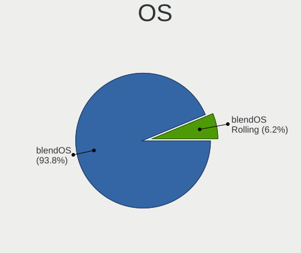

| Name            | Desktops | Percent |
|-----------------|----------|---------|
| blendOS         | 45       | 93.75%  |
| blendOS Rolling | 3        | 6.25%   |

OS Family
---------

OS without a version

| Name    | Desktops | Percent |
|---------|----------|---------|
| blendOS | 48       | 100%    |

Kernel
------

Version of the Linux kernel

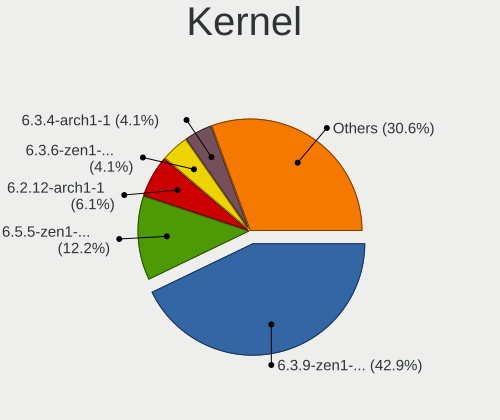

| Version            | Desktops | Percent |
|--------------------|----------|---------|
| 6.3.9-zen1-1-zen   | 21       | 42.86%  |
| 6.5.5-zen1-1-zen   | 6        | 12.24%  |
| 6.2.12-arch1-1     | 3        | 6.12%   |
| 6.3.6-zen1-1-zen   | 2        | 4.08%   |
| 6.3.4-arch1-1      | 2        | 4.08%   |
| 6.12.10-zen1-1-zen | 2        | 4.08%   |
| 6.9.9-zen1-1-zen   | 1        | 2.04%   |
| 6.4.5-arch1-1      | 1        | 2.04%   |
| 6.3.5-zen1-1-zen   | 1        | 2.04%   |
| 6.3.2-arch1-1      | 1        | 2.04%   |
| 6.3.1-arch1-1      | 1        | 2.04%   |
| 6.2.8-arch1-1-t2   | 1        | 2.04%   |
| 6.2.13-arch1-1     | 1        | 2.04%   |
| 6.17.9-zen1-1-zen  | 1        | 2.04%   |
| 6.17.3-zen2-1-zen  | 1        | 2.04%   |
| 6.16.4-zen1-1-zen  | 1        | 2.04%   |
| 6.16.3-zen1-1-zen  | 1        | 2.04%   |
| 6.16.10-zen1-1-zen | 1        | 2.04%   |
| 6.1.8-zen1-1-zen   | 1        | 2.04%   |

Kernel Family
-------------

Linux kernel without a distro release

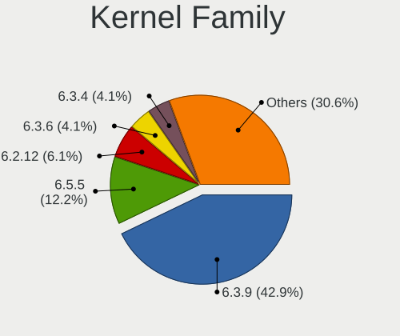

| Version | Desktops | Percent |
|---------|----------|---------|
| 6.3.9   | 21       | 42.86%  |
| 6.5.5   | 6        | 12.24%  |
| 6.2.12  | 3        | 6.12%   |
| 6.3.6   | 2        | 4.08%   |
| 6.3.4   | 2        | 4.08%   |
| 6.12.10 | 2        | 4.08%   |
| 6.9.9   | 1        | 2.04%   |
| 6.4.5   | 1        | 2.04%   |
| 6.3.5   | 1        | 2.04%   |
| 6.3.2   | 1        | 2.04%   |
| 6.3.1   | 1        | 2.04%   |
| 6.2.8   | 1        | 2.04%   |
| 6.2.13  | 1        | 2.04%   |
| 6.17.9  | 1        | 2.04%   |
| 6.17.3  | 1        | 2.04%   |
| 6.16.4  | 1        | 2.04%   |
| 6.16.3  | 1        | 2.04%   |
| 6.16.10 | 1        | 2.04%   |
| 6.1.8   | 1        | 2.04%   |

Kernel Major Ver.
-----------------

Linux kernel major version

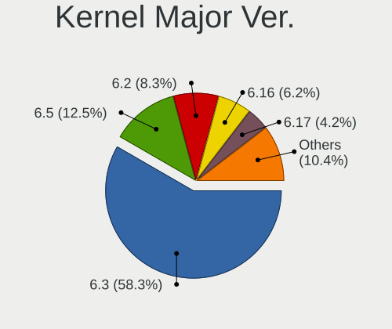

| Version | Desktops | Percent |
|---------|----------|---------|
| 6.3     | 28       | 58.33%  |
| 6.5     | 6        | 12.5%   |
| 6.2     | 4        | 8.33%   |
| 6.16    | 3        | 6.25%   |
| 6.17    | 2        | 4.17%   |
| 6.12    | 2        | 4.17%   |
| 6.9     | 1        | 2.08%   |
| 6.4     | 1        | 2.08%   |
| 6.1     | 1        | 2.08%   |

Arch
----

OS architecture (x86_64, i586, etc.)

| Name   | Desktops | Percent |
|--------|----------|---------|
| x86_64 | 48       | 100%    |

DE
--

Desktop Environment

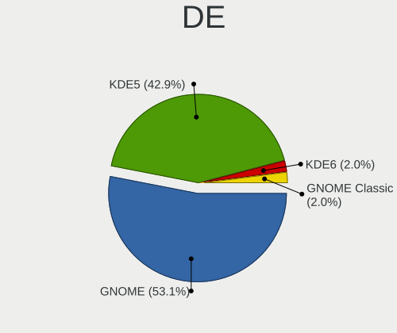

| Name          | Desktops | Percent |
|---------------|----------|---------|
| GNOME         | 26       | 53.06%  |
| KDE5          | 21       | 42.86%  |
| KDE6          | 1        | 2.04%   |
| GNOME Classic | 1        | 2.04%   |

Display Server
--------------

X11 or Wayland

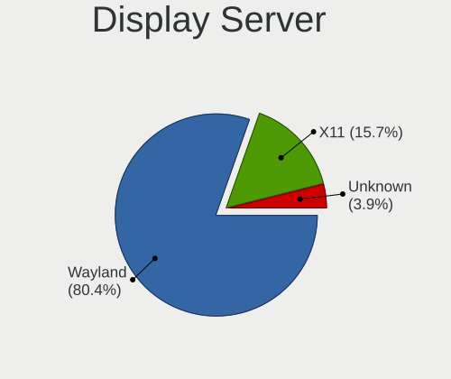

| Name    | Desktops | Percent |
|---------|----------|---------|
| Wayland | 41       | 80.39%  |
| X11     | 8        | 15.69%  |
| Unknown | 2        | 3.92%   |

Display Manager
---------------

SDDM, LightDM, etc.

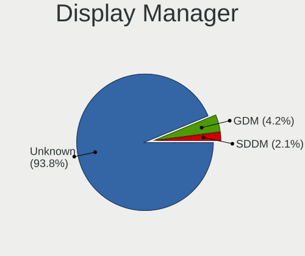

| Name    | Desktops | Percent |
|---------|----------|---------|
| Unknown | 45       | 93.75%  |
| GDM     | 2        | 4.17%   |
| SDDM    | 1        | 2.08%   |

OS Lang
-------

Language

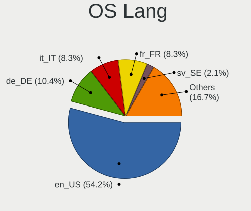

| Lang  | Desktops | Percent |
|-------|----------|---------|
| en_US | 26       | 54.17%  |
| de_DE | 5        | 10.42%  |
| it_IT | 4        | 8.33%   |
| fr_FR | 4        | 8.33%   |
| sv_SE | 1        | 2.08%   |
| ro_RO | 1        | 2.08%   |
| pt_BR | 1        | 2.08%   |
| es_MX | 1        | 2.08%   |
| es_ES | 1        | 2.08%   |
| es_CL | 1        | 2.08%   |
| en_ZA | 1        | 2.08%   |
| en_GB | 1        | 2.08%   |
| en_AU | 1        | 2.08%   |

Boot Mode
---------

EFI or BIOS

| Mode | Desktops | Percent |
|------|----------|---------|
| BIOS | 45       | 93.75%  |
| EFI  | 3        | 6.25%   |

Filesystem
----------

Type of filesystem

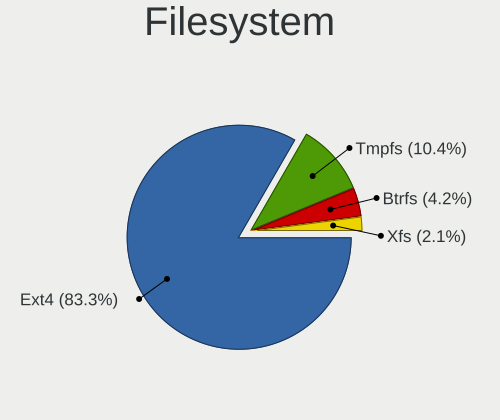

| Type  | Desktops | Percent |
|-------|----------|---------|
| Ext4  | 40       | 83.33%  |
| Tmpfs | 5        | 10.42%  |
| Btrfs | 2        | 4.17%   |
| Xfs   | 1        | 2.08%   |

Part. scheme
------------

Scheme of partitioning

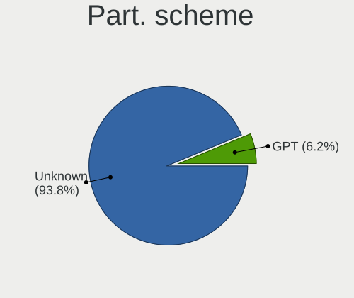

| Type    | Desktops | Percent |
|---------|----------|---------|
| Unknown | 45       | 93.75%  |
| GPT     | 3        | 6.25%   |

Dual Boot with Linux/BSD
------------------------

Hosting more than one Linux/BSD

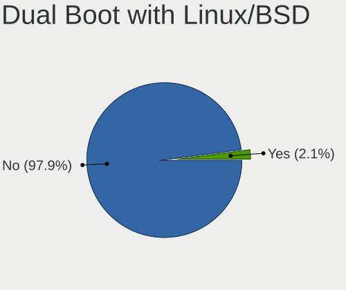

| Dual boot | Desktops | Percent |
|-----------|----------|---------|
| No        | 47       | 97.92%  |
| Yes       | 1        | 2.08%   |

Dual Boot (Win)
---------------

Hosting Linux and Windows

| Dual boot | Desktops | Percent |
|-----------|----------|---------|
| No        | 48       | 100%    |

Board
-----

Vendor
------

Motherboard manufacturer

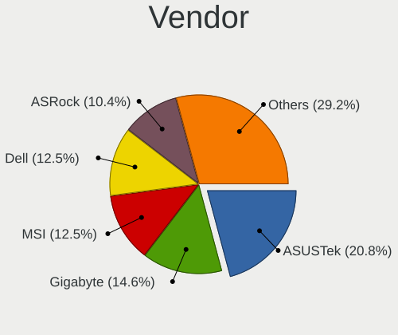

| Name                | Desktops | Percent |
|---------------------|----------|---------|
| ASUSTek Computer    | 10       | 20.83%  |
| Gigabyte Technology | 7        | 14.58%  |
| MSI                 | 6        | 12.5%   |
| Dell                | 6        | 12.5%   |
| ASRock              | 5        | 10.42%  |
| Apple               | 2        | 4.17%   |
| Pegatron            | 1        | 2.08%   |
| MAXSUN              | 1        | 2.08%   |
| Lenovo              | 1        | 2.08%   |
| JINGSHA             | 1        | 2.08%   |
| Intel               | 1        | 2.08%   |
| Hewlett-Packard     | 1        | 2.08%   |
| Google              | 1        | 2.08%   |
| Fujitsu             | 1        | 2.08%   |
| Biostar             | 1        | 2.08%   |
| Alienware           | 1        | 2.08%   |
| Acer                | 1        | 2.08%   |
| Unknown             | 1        | 2.08%   |

Model
-----

Motherboard model

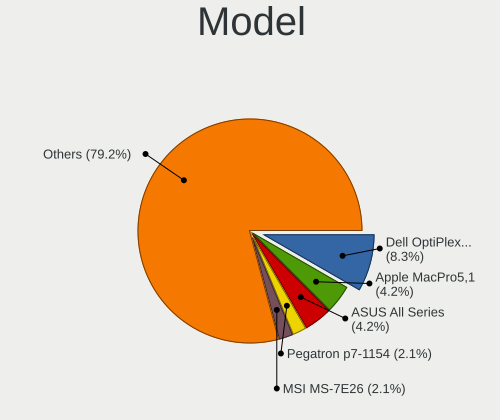

| Name                                 | Desktops | Percent |
|--------------------------------------|----------|---------|
| Dell OptiPlex 7010                   | 4        | 8.33%   |
| ASUS All Series                      | 2        | 4.17%   |
| Apple MacPro5,1                      | 2        | 4.17%   |
| Pegatron p7-1154                     | 1        | 2.08%   |
| MSI MS-7E26                          | 1        | 2.08%   |
| MSI MS-7C56                          | 1        | 2.08%   |
| MSI MS-7C52                          | 1        | 2.08%   |
| MSI MS-7B79                          | 1        | 2.08%   |
| MSI MS-7592                          | 1        | 2.08%   |
| MSI MAG B550 META 5 (MS-B930)        | 1        | 2.08%   |
| MAXSUN MS-Terminator B660M VER:H4.2G | 1        | 2.08%   |
| Lenovo Legion C530-19ICB 90JX0040GE  | 1        | 2.08%   |
| JINGSHA H61S                         | 1        | 2.08%   |
| Intel DG41RQ AAE54511-203            | 1        | 2.08%   |
| HP Compaq dc7800p Small Form Factor  | 1        | 2.08%   |
| Google Sumo                          | 1        | 2.08%   |
| Gigabyte X99P-SLI-CF                 | 1        | 2.08%   |
| Gigabyte H61M-S1                     | 1        | 2.08%   |
| Gigabyte H510M H                     | 1        | 2.08%   |
| Gigabyte GA-970A-UD3                 | 1        | 2.08%   |
| Gigabyte CUSTOM                      | 1        | 2.08%   |
| Gigabyte B550M DS3H AC               | 1        | 2.08%   |
| Gigabyte B550M AORUS PRO-P           | 1        | 2.08%   |
| Fujitsu ESPRIMO Q558                 | 1        | 2.08%   |
| Dell Precision WorkStation T7400     | 1        | 2.08%   |
| Dell PowerEdge T20                   | 1        | 2.08%   |
| Biostar NF520D3                      | 1        | 2.08%   |
| ASUS TUF Gaming B550M-PLUS WIFI II   | 1        | 2.08%   |
| ASUS TUF B450M-PRO GAMING            | 1        | 2.08%   |
| ASUS ROG STRIX Z370-H GAMING         | 1        | 2.08%   |
| ASUS ROG STRIX B450-E GAMING         | 1        | 2.08%   |
| ASUS Pro WS X570-ACE                 | 1        | 2.08%   |
| ASUS PRIME H270-PLUS                 | 1        | 2.08%   |
| ASUS PRIME A520M-A II                | 1        | 2.08%   |
| ASUS K30BF_M32BF_A_F_K31BF_6         | 1        | 2.08%   |
| ASRock Z170 Extreme4+                | 1        | 2.08%   |
| ASRock X670E Steel Legend            | 1        | 2.08%   |
| ASRock X670E Pro RS                  | 1        | 2.08%   |
| ASRock X570 Taichi                   | 1        | 2.08%   |
| ASRock 970 Extreme4                  | 1        | 2.08%   |

Model Family
------------

Motherboard model prefix

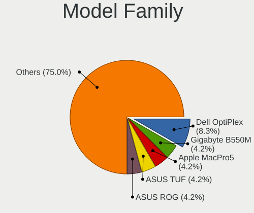

| Name                 | Desktops | Percent |
|----------------------|----------|---------|
| Dell OptiPlex        | 4        | 8.33%   |
| Gigabyte B550M       | 2        | 4.17%   |
| ASUS TUF             | 2        | 4.17%   |
| ASUS ROG             | 2        | 4.17%   |
| ASUS PRIME           | 2        | 4.17%   |
| ASUS All             | 2        | 4.17%   |
| ASRock X670E         | 2        | 4.17%   |
| Apple MacPro5        | 2        | 4.17%   |
| Pegatron p7-1154     | 1        | 2.08%   |
| MSI MS-7E26          | 1        | 2.08%   |
| MSI MS-7C56          | 1        | 2.08%   |
| MSI MS-7C52          | 1        | 2.08%   |
| MSI MS-7B79          | 1        | 2.08%   |
| MSI MS-7592          | 1        | 2.08%   |
| MSI MAG              | 1        | 2.08%   |
| MAXSUN MS-Terminator | 1        | 2.08%   |
| Lenovo Legion        | 1        | 2.08%   |
| JINGSHA H61S         | 1        | 2.08%   |
| Intel DG41RQ         | 1        | 2.08%   |
| HP Compaq            | 1        | 2.08%   |
| Google Sumo          | 1        | 2.08%   |
| Gigabyte X99P-SLI-CF | 1        | 2.08%   |
| Gigabyte H61M-S1     | 1        | 2.08%   |
| Gigabyte H510M       | 1        | 2.08%   |
| Gigabyte GA-970A-UD3 | 1        | 2.08%   |
| Gigabyte CUSTOM      | 1        | 2.08%   |
| Fujitsu ESPRIMO      | 1        | 2.08%   |
| Dell Precision       | 1        | 2.08%   |
| Dell PowerEdge       | 1        | 2.08%   |
| Biostar NF520D3      | 1        | 2.08%   |
| ASUS Pro             | 1        | 2.08%   |
| ASUS K30BF           | 1        | 2.08%   |
| ASRock Z170          | 1        | 2.08%   |
| ASRock X570          | 1        | 2.08%   |
| ASRock 970           | 1        | 2.08%   |
| Alienware Aurora     | 1        | 2.08%   |
| Acer Veriton         | 1        | 2.08%   |
| Unknown              | 1        | 2.08%   |

MFG Year
--------

Motherboard manufacture year

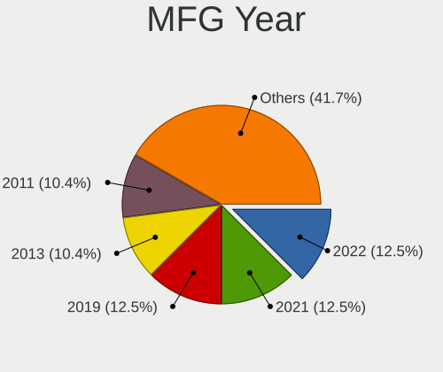

| Year | Desktops | Percent |
|------|----------|---------|
| 2022 | 6        | 12.5%   |
| 2021 | 6        | 12.5%   |
| 2019 | 6        | 12.5%   |
| 2013 | 5        | 10.42%  |
| 2011 | 5        | 10.42%  |
| 2023 | 4        | 8.33%   |
| 2018 | 2        | 4.17%   |
| 2015 | 2        | 4.17%   |
| 2012 | 2        | 4.17%   |
| 2010 | 2        | 4.17%   |
| 2009 | 2        | 4.17%   |
| 2020 | 1        | 2.08%   |
| 2017 | 1        | 2.08%   |
| 2016 | 1        | 2.08%   |
| 2014 | 1        | 2.08%   |
| 2008 | 1        | 2.08%   |
| 2007 | 1        | 2.08%   |

Form Factor
-----------

Physical design of the computer

| Name    | Desktops | Percent |
|---------|----------|---------|
| Desktop | 48       | 100%    |

Secure Boot
-----------

Enabled or disabled

| State    | Desktops | Percent |
|----------|----------|---------|
| Disabled | 48       | 100%    |

Coreboot
--------

Have coreboot on board

| Used | Desktops | Percent |
|------|----------|---------|
| No   | 47       | 97.92%  |
| Yes  | 1        | 2.08%   |

RAM Size
--------

Total RAM memory

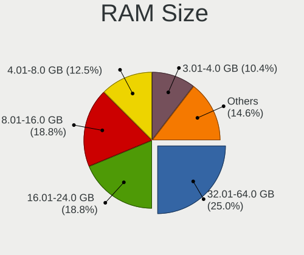

| Size in GB  | Desktops | Percent |
|-------------|----------|---------|
| 32.01-64.0  | 12       | 25%     |
| 16.01-24.0  | 9        | 18.75%  |
| 8.01-16.0   | 9        | 18.75%  |
| 4.01-8.0    | 6        | 12.5%   |
| 3.01-4.0    | 5        | 10.42%  |
| 64.01-256.0 | 4        | 8.33%   |
| 24.01-32.0  | 3        | 6.25%   |

RAM Used
--------

Used RAM memory

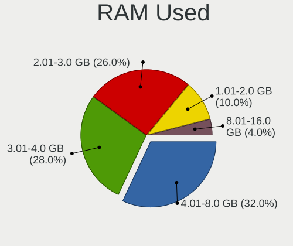

| Used GB   | Desktops | Percent |
|-----------|----------|---------|
| 4.01-8.0  | 16       | 32%     |
| 3.01-4.0  | 14       | 28%     |
| 2.01-3.0  | 13       | 26%     |
| 1.01-2.0  | 5        | 10%     |
| 8.01-16.0 | 2        | 4%      |

Total Drives
------------

Number of drives on board

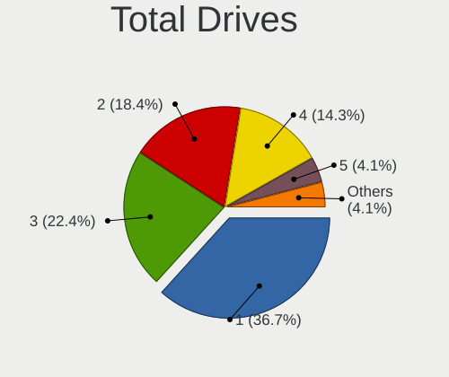

| Drives | Desktops | Percent |
|--------|----------|---------|
| 1      | 18       | 36.73%  |
| 3      | 11       | 22.45%  |
| 2      | 9        | 18.37%  |
| 4      | 7        | 14.29%  |
| 5      | 2        | 4.08%   |
| 6      | 1        | 2.04%   |
| 0      | 1        | 2.04%   |

Has CD-ROM
----------

Has CD-ROM on board

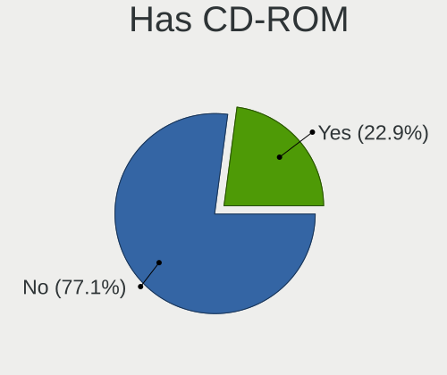

| Presented | Desktops | Percent |
|-----------|----------|---------|
| No        | 37       | 77.08%  |
| Yes       | 11       | 22.92%  |

Has Ethernet
------------

Has Ethernet on board

| Presented | Desktops | Percent |
|-----------|----------|---------|
| Yes       | 48       | 100%    |

Has WiFi
--------

Has WiFi module

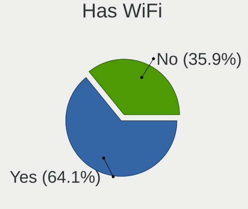

| Presented | Desktops | Percent |
|-----------|----------|---------|
| Yes       | 32       | 66.67%  |
| No        | 16       | 33.33%  |

Has Bluetooth
-------------

Has Bluetooth module

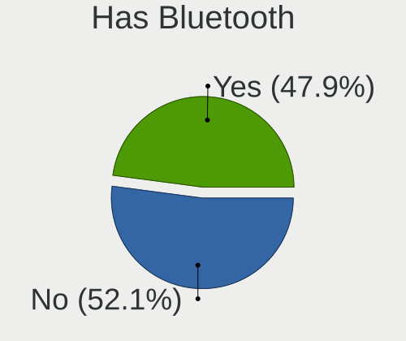

| Presented | Desktops | Percent |
|-----------|----------|---------|
| No        | 25       | 52.08%  |
| Yes       | 23       | 47.92%  |

Location
--------

Country
-------

Geographic location (country)

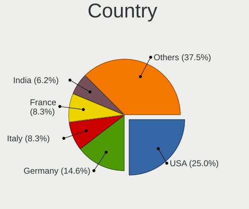

| Country      | Desktops | Percent |
|--------------|----------|---------|
| USA          | 12       | 25%     |
| Germany      | 7        | 14.58%  |
| Italy        | 4        | 8.33%   |
| France       | 4        | 8.33%   |
| India        | 3        | 6.25%   |
| Mexico       | 2        | 4.17%   |
| Brazil       | 2        | 4.17%   |
| Belgium      | 2        | 4.17%   |
| UK           | 1        | 2.08%   |
| Switzerland  | 1        | 2.08%   |
| Sweden       | 1        | 2.08%   |
| Spain        | 1        | 2.08%   |
| South Africa | 1        | 2.08%   |
| Russia       | 1        | 2.08%   |
| Romania      | 1        | 2.08%   |
| Czechia      | 1        | 2.08%   |
| Cyprus       | 1        | 2.08%   |
| Chile        | 1        | 2.08%   |
| Australia    | 1        | 2.08%   |
| Argentina    | 1        | 2.08%   |

City
----

Geographic location (city)

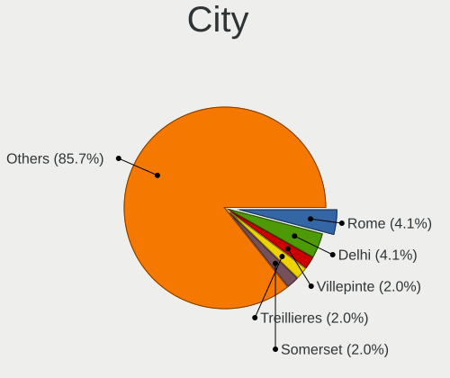

| City                      | Desktops | Percent |
|---------------------------|----------|---------|
| Rome                      | 2        | 4.08%   |
| Delhi                     | 2        | 4.08%   |
| Villepinte                | 1        | 2.04%   |
| Treillieres               | 1        | 2.04%   |
| Somerset                  | 1        | 2.04%   |
| Skövde                   | 1        | 2.04%   |
| Sete Lagoas               | 1        | 2.04%   |
| Seraing                   | 1        | 2.04%   |
| San Nicolás de los Garza | 1        | 2.04%   |
| Salvador Escalante        | 1        | 2.04%   |
| Saint Cloud               | 1        | 2.04%   |
| Rosny-sous-Bois           | 1        | 2.04%   |
| Prague                    | 1        | 2.04%   |
| Piatra Neamţ             | 1        | 2.04%   |
| Perth                     | 1        | 2.04%   |
| Persan                    | 1        | 2.04%   |
| Palma                     | 1        | 2.04%   |
| Odessa                    | 1        | 2.04%   |
| Nicosia                   | 1        | 2.04%   |
| Milpitas                  | 1        | 2.04%   |
| Milan                     | 1        | 2.04%   |
| Limal                     | 1        | 2.04%   |
| Kuznetsk                  | 1        | 2.04%   |
| Karlsruhe                 | 1        | 2.04%   |
| Hyderabad                 | 1        | 2.04%   |
| Hancock                   | 1        | 2.04%   |
| Halle                     | 1        | 2.04%   |
| Guarulhos                 | 1        | 2.04%   |
| Frankfurt am Main         | 1        | 2.04%   |
| Flushing                  | 1        | 2.04%   |
| Empalme Lobos             | 1        | 2.04%   |
| Durham                    | 1        | 2.04%   |
| Chillan                   | 1        | 2.04%   |
| Cape Town                 | 1        | 2.04%   |
| Cadenazzo                 | 1        | 2.04%   |
| Botticino                 | 1        | 2.04%   |
| Bielefeld                 | 1        | 2.04%   |
| Biedenkopf                | 1        | 2.04%   |
| Berlin                    | 1        | 2.04%   |
| Bellflower                | 1        | 2.04%   |

Drives
------

Drive Vendor
------------

Hard drive vendors

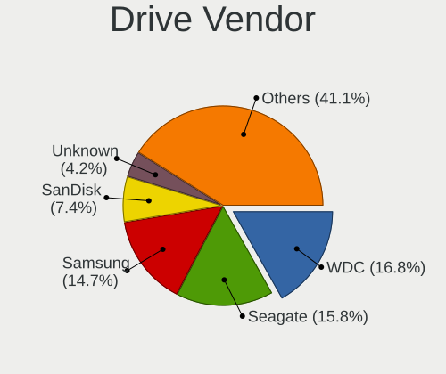

| Vendor                      | Desktops | Drives | Percent |
|-----------------------------|----------|--------|---------|
| WDC                         | 16       | 24     | 16.84%  |
| Seagate                     | 15       | 21     | 15.79%  |
| Samsung Electronics         | 14       | 16     | 14.74%  |
| SanDisk                     | 7        | 7      | 7.37%   |
| Unknown                     | 4        | 4      | 4.21%   |
| Phison Electronics          | 3        | 4      | 3.16%   |
| Kingston                    | 3        | 4      | 3.16%   |
| Hitachi                     | 3        | 4      | 3.16%   |
| China                       | 3        | 3      | 3.16%   |
| ADATA Technology            | 3        | 3      | 3.16%   |
| Toshiba                     | 2        | 3      | 2.11%   |
| SPCC                        | 2        | 3      | 2.11%   |
| Silicon Motion              | 2        | 3      | 2.11%   |
| SD                          | 2        | 2      | 2.11%   |
| Micron/Crucial Technology   | 2        | 2      | 2.11%   |
| Intel                       | 2        | 2      | 2.11%   |
| Crucial                     | 2        | 2      | 2.11%   |
| SK hynix                    | 1        | 1      | 1.05%   |
| MOVESPEED                   | 1        | 1      | 1.05%   |
| Micron Technology           | 1        | 1      | 1.05%   |
| MAXIO Technology (Hangzhou) | 1        | 1      | 1.05%   |
| LaCie                       | 1        | 1      | 1.05%   |
| HUAWEI                      | 1        | 1      | 1.05%   |
| Hikvision                   | 1        | 1      | 1.05%   |
| Gigabyte Technology         | 1        | 1      | 1.05%   |
| External                    | 1        | 1      | 1.05%   |
| EVM                         | 1        | 1      | 1.05%   |

Drive Model
-----------

Hard drive models

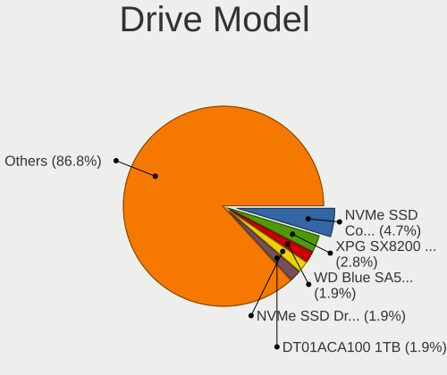

| Model                                                              | Desktops | Percent |
|--------------------------------------------------------------------|----------|---------|
| Samsung NVMe SSD Controller SM981/PM981/PM983 1TB                  | 5        | 4.72%   |
| ADATA XPG SX8200 Pro PCIe Gen3x4 M.2 2280 Solid State Drive 1024GB | 3        | 2.83%   |
| WDC WD Blue SA510 2.5 500GB                                        | 2        | 1.89%   |
| Unknown NVMe SSD Drive 512GB                                       | 2        | 1.89%   |
| Toshiba DT01ACA100 1TB                                             | 2        | 1.89%   |
| Seagate ST1000DM010-2EP102 1TB                                     | 2        | 1.89%   |
| Seagate ST1000DM003-1SB102 1TB                                     | 2        | 1.89%   |
| SD Ultra 3D 1TB                                                    | 2        | 1.89%   |
| Samsung NVMe SSD Controller PM9A1/PM9A3/980PRO 1TB                 | 2        | 1.89%   |
| Phison PS5013 E13 NVMe Controller 500GB                            | 2        | 1.89%   |
| Phison E16 PCIe4 NVMe Controller 1TB                               | 2        | 1.89%   |
| Intel SSDSC2KB240G8 240GB                                          | 2        | 1.89%   |
| China SSD 240GB                                                    | 2        | 1.89%   |
| WDC WDS250G1B0A-00H9H0 250GB SSD                                   | 1        | 0.94%   |
| WDC WDS240G2G0A-00JH30 240GB SSD                                   | 1        | 0.94%   |
| WDC WDS100T2B0B-00YS70 1TB SSD                                     | 1        | 0.94%   |
| WDC WD7500AAVS-00D7B1 752GB                                        | 1        | 0.94%   |
| WDC WD6002FRYZ-01WD5B0 6TB                                         | 1        | 0.94%   |
| WDC WD5000AZRX-00L4HB0 500GB                                       | 1        | 0.94%   |
| WDC WD40EFRX-68WT0N0 4TB                                           | 1        | 0.94%   |
| WDC WD4005FZBX-00K5WB0 4TB                                         | 1        | 0.94%   |
| WDC WD3200AAKS-00V1A0 320GB                                        | 1        | 0.94%   |
| WDC WD3200AAJS-08L7A0 320GB                                        | 1        | 0.94%   |
| WDC WD3000HLFS-01G6U3 304GB                                        | 1        | 0.94%   |
| WDC WD20EZRZ-00Z5HB0 2TB                                           | 1        | 0.94%   |
| WDC WD20EZRX-00D8PB0 2TB                                           | 1        | 0.94%   |
| WDC WD10EZEX-22MFCA0 1TB                                           | 1        | 0.94%   |
| WDC WD10EZEX-21M2NA0 1TB                                           | 1        | 0.94%   |
| WDC WD10EZEX-00WN4A0 1TB                                           | 1        | 0.94%   |
| WDC WD10EARS-00Y5B1 1TB                                            | 1        | 0.94%   |
| WDC WD10EARS-00MVWB0 1TB                                           | 1        | 0.94%   |
| WDC WD10EADS-00M2B0 1TB                                            | 1        | 0.94%   |
| Unknown NVMe SSD Drive 1024GB                                      | 1        | 0.94%   |
| Unknown MMC Card  32GB                                             | 1        | 0.94%   |
| SPCC Solid State Disk 512GB                                        | 1        | 0.94%   |
| SPCC Solid State Disk 2TB                                          | 1        | 0.94%   |
| SK hynix BC501 NVMe Solid State Drive 512GB                        | 1        | 0.94%   |
| Silicon Motion SM2263EN/SM2263XT SSD Controller 512GB              | 1        | 0.94%   |
| Silicon Motion SM2262/SM2262EN SSD Controller 960GB                | 1        | 0.94%   |
| Seagate ST500LT012-9WS142 500GB                                    | 1        | 0.94%   |

HDD Vendor
----------

Hard disk drive vendors

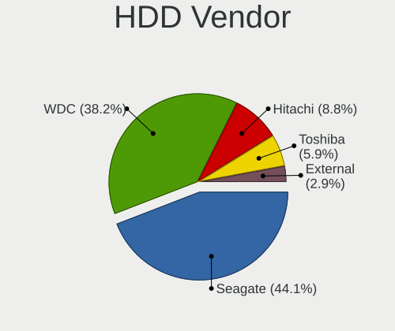

| Vendor   | Desktops | Drives | Percent |
|----------|----------|--------|---------|
| Seagate  | 15       | 21     | 44.12%  |
| WDC      | 13       | 17     | 38.24%  |
| Hitachi  | 3        | 4      | 8.82%   |
| Toshiba  | 2        | 3      | 5.88%   |
| External | 1        | 1      | 2.94%   |

SSD Vendor
----------

Solid state drive vendors

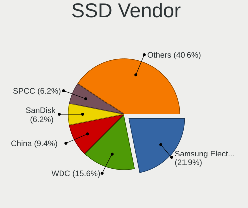

| Vendor              | Desktops | Drives | Percent |
|---------------------|----------|--------|---------|
| Samsung Electronics | 7        | 8      | 21.88%  |
| WDC                 | 5        | 7      | 15.63%  |
| China               | 3        | 3      | 9.38%   |
| SPCC                | 2        | 3      | 6.25%   |
| SD                  | 2        | 2      | 6.25%   |
| SanDisk             | 2        | 2      | 6.25%   |
| Kingston            | 2        | 3      | 6.25%   |
| Intel               | 2        | 2      | 6.25%   |
| Crucial             | 2        | 2      | 6.25%   |
| MOVESPEED           | 1        | 1      | 3.13%   |
| Micron Technology   | 1        | 1      | 3.13%   |
| Hikvision           | 1        | 1      | 3.13%   |
| Gigabyte Technology | 1        | 1      | 3.13%   |
| EVM                 | 1        | 1      | 3.13%   |

Drive Kind
----------

HDD or SSD

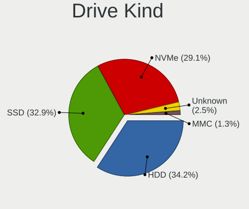

| Kind    | Desktops | Drives | Percent |
|---------|----------|--------|---------|
| HDD     | 27       | 46     | 34.18%  |
| SSD     | 26       | 37     | 32.91%  |
| NVMe    | 23       | 31     | 29.11%  |
| Unknown | 2        | 2      | 2.53%   |
| MMC     | 1        | 1      | 1.27%   |

Drive Connector
---------------

SATA, SAS, NVMe, etc.

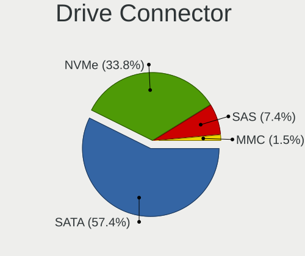

| Type | Desktops | Drives | Percent |
|------|----------|--------|---------|
| SATA | 39       | 80     | 57.35%  |
| NVMe | 23       | 31     | 33.82%  |
| SAS  | 5        | 5      | 7.35%   |
| MMC  | 1        | 1      | 1.47%   |

Drive Size
----------

Size of hard drive

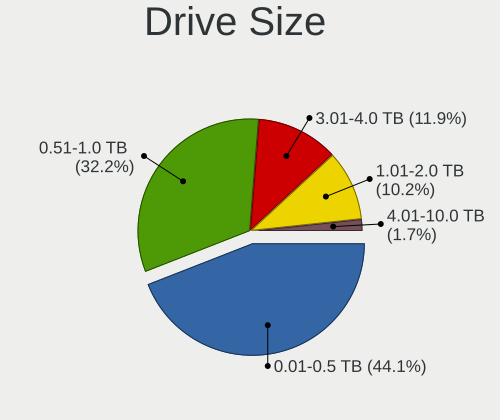

| Size in TB | Desktops | Drives | Percent |
|------------|----------|--------|---------|
| 0.01-0.5   | 26       | 39     | 44.07%  |
| 0.51-1.0   | 19       | 28     | 32.2%   |
| 3.01-4.0   | 7        | 7      | 11.86%  |
| 1.01-2.0   | 6        | 7      | 10.17%  |
| 4.01-10.0  | 1        | 2      | 1.69%   |

Space Total
-----------

Amount of disk space available on the file system

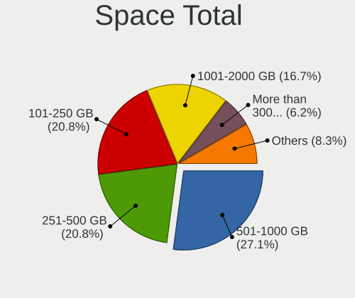

| Size in GB     | Desktops | Percent |
|----------------|----------|---------|
| 501-1000       | 13       | 27.08%  |
| 251-500        | 10       | 20.83%  |
| 101-250        | 10       | 20.83%  |
| 1001-2000      | 8        | 16.67%  |
| More than 3000 | 3        | 6.25%   |
| 2001-3000      | 2        | 4.17%   |
| 51-100         | 2        | 4.17%   |

Space Used
----------

Amount of used disk space

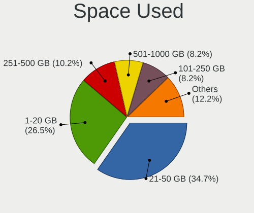

| Used GB        | Desktops | Percent |
|----------------|----------|---------|
| 21-50          | 17       | 34.69%  |
| 1-20           | 13       | 26.53%  |
| 251-500        | 5        | 10.2%   |
| 101-250        | 4        | 8.16%   |
| 501-1000       | 4        | 8.16%   |
| 51-100         | 4        | 8.16%   |
| More than 3000 | 1        | 2.04%   |
| 1001-2000      | 1        | 2.04%   |

Malfunc. Drives
---------------

Drive models with a malfunction

| Model                    | Desktops | Drives | Percent |
|--------------------------|----------|--------|---------|
| WDC WD10EARS-00MVWB0 1TB | 1        | 1      | 100%    |

Malfunc. Drive Vendor
---------------------

Vendors of faulty drives

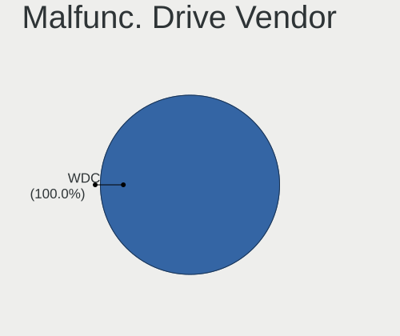

| Vendor | Desktops | Drives | Percent |
|--------|----------|--------|---------|
| WDC    | 1        | 1      | 100%    |

Malfunc. HDD Vendor
-------------------

Vendors of faulty HDD drives

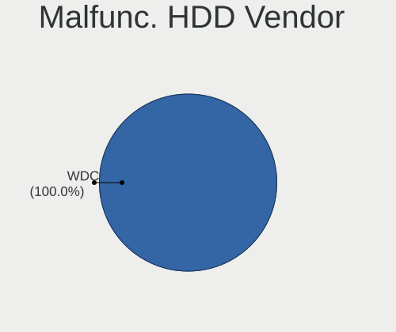

| Vendor | Desktops | Drives | Percent |
|--------|----------|--------|---------|
| WDC    | 1        | 1      | 100%    |

Malfunc. Drive Kind
-------------------

Kinds of faulty drives

| Kind | Desktops | Drives | Percent |
|------|----------|--------|---------|
| HDD  | 1        | 1      | 100%    |

Failed Drives
-------------

Failed drive models

Zero info for selected period =(

Failed Drive Vendor
-------------------

Failed drive vendors

Zero info for selected period =(

Drive Status
------------

Number of failed and malfunc. drives

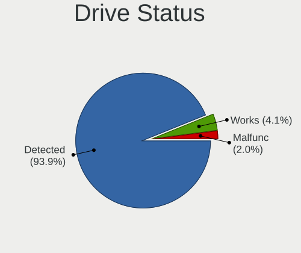

| Status   | Desktops | Drives | Percent |
|----------|----------|--------|---------|
| Detected | 46       | 113    | 93.88%  |
| Works    | 2        | 3      | 4.08%   |
| Malfunc  | 1        | 1      | 2.04%   |

Storage controller
------------------

Storage Vendor
--------------

Storage controller vendors

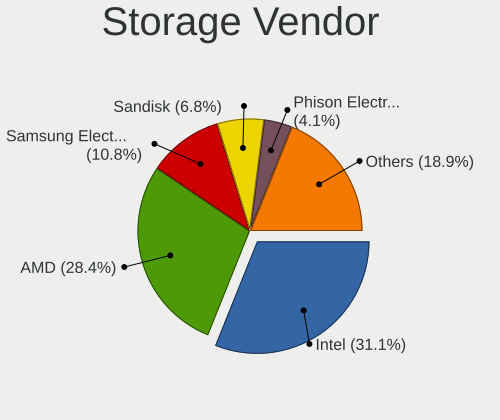

| Vendor                      | Desktops | Percent |
|-----------------------------|----------|---------|
| Intel                       | 23       | 31.08%  |
| AMD                         | 21       | 28.38%  |
| Samsung Electronics         | 8        | 10.81%  |
| Sandisk                     | 5        | 6.76%   |
| Phison Electronics          | 3        | 4.05%   |
| ADATA Technology            | 3        | 4.05%   |
| Silicon Motion              | 2        | 2.7%    |
| Micron/Crucial Technology   | 2        | 2.7%    |
| Unknown                     | 2        | 2.7%    |
| Solidigm                    | 1        | 1.35%   |
| SK hynix                    | 1        | 1.35%   |
| Nvidia                      | 1        | 1.35%   |
| MAXIO Technology (Hangzhou) | 1        | 1.35%   |
| Kingston Technology Company | 1        | 1.35%   |

Storage Model
-------------

Storage controller models

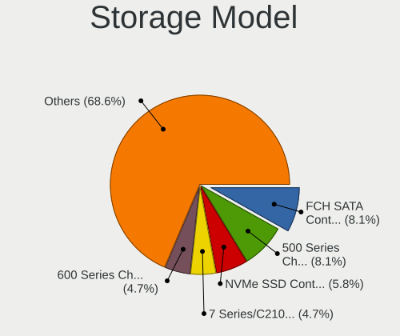

| Model                                                                         | Desktops | Percent |
|-------------------------------------------------------------------------------|----------|---------|
| AMD FCH SATA Controller [AHCI mode]                                           | 7        | 8.14%   |
| AMD 500 Series Chipset SATA Controller                                        | 7        | 8.14%   |
| Samsung NVMe SSD Controller SM981/PM981/PM983                                 | 5        | 5.81%   |
| Intel 7 Series/C210 Series Chipset Family 6-port SATA Controller [AHCI mode]  | 4        | 4.65%   |
| AMD 600 Series Chipset SATA Controller                                        | 4        | 4.65%   |
| AMD 400 Series Chipset SATA Controller                                        | 4        | 4.65%   |
| Intel 6 Series/C200 Series Chipset Family 6 port Desktop SATA AHCI Controller | 3        | 3.49%   |
| ADATA XPG SX8200 Pro PCIe Gen3x4 M.2 2280 Solid State Drive                   | 3        | 3.49%   |
| Samsung NVMe SSD Controller PM9A1/PM9A3/980PRO                                | 2        | 2.33%   |
| Phison PS5013-E13 PCIe3 NVMe Controller (DRAM-less)                           | 2        | 2.33%   |
| Phison E16 PCIe4 NVMe Controller                                              | 2        | 2.33%   |
| Intel NM10/ICH7 Family SATA Controller [IDE mode]                             | 2        | 2.33%   |
| Intel Cannon Lake PCH SATA AHCI Controller                                    | 2        | 2.33%   |
| Intel 82801JI (ICH10 Family) SATA AHCI Controller                             | 2        | 2.33%   |
| Intel 82801G (ICH7 Family) IDE Controller                                     | 2        | 2.33%   |
| AMD SB7x0/SB8x0/SB9x0 IDE Controller                                          | 2        | 2.33%   |
| Unknown                                                                       | 2        | 2.33%   |
| Solidigm P44 Pro NVMe SSD [Hollywood Beach]                                   | 1        | 1.16%   |
| SK hynix BC501 NVMe Solid State Drive                                         | 1        | 1.16%   |
| Silicon Motion SM2263EN/SM2263XT (DRAM-less) NVMe SSD Controllers             | 1        | 1.16%   |
| Silicon Motion SM2262/SM2262EN SSD Controller                                 | 1        | 1.16%   |
| SanDisk WD SN560/SN740/SN770/SN5000 NVMe SSD                                  | 1        | 1.16%   |
| SanDisk WD PC SN810 / Black SN850 NVMe SSD                                    | 1        | 1.16%   |
| SanDisk WD PC SN540 / Green SN350 NVMe SSD 1 TB (DRAM-less)                   | 1        | 1.16%   |
| SanDisk Ultra 3D / WD PC SN530, IX SN530, Blue SN550 NVMe SSD (DRAM-less)     | 1        | 1.16%   |
| Sandisk PC SN740 NVMe SSD (DRAM-less)                                         | 1        | 1.16%   |
| Samsung NVMe SSD Controller S4LV008[Pascal]                                   | 1        | 1.16%   |
| Nvidia MCP61 SATA Controller                                                  | 1        | 1.16%   |
| Micron/Crucial P2 [Nick P2] / P3 / P3 Plus NVMe PCIe SSD (DRAM-less)          | 1        | 1.16%   |
| Micron/Crucial P1 NVMe PCIe SSD[Frampton2]                                    | 1        | 1.16%   |
| MAXIO (Hangzhou) NVMe SSD Controller MAP1202 (DRAM-less)                      | 1        | 1.16%   |
| Kingston Company NV2 NVMe SSD [E19T] (DRAM-less)                              | 1        | 1.16%   |
| Intel SATA Controller [RAID mode]                                             | 1        | 1.16%   |
| Intel Q170/Q150/B150/H170/H110/Z170/CM236 Chipset SATA Controller [AHCI Mode] | 1        | 1.16%   |
| Intel Celeron/Pentium Silver Processor SATA Controller                        | 1        | 1.16%   |
| Intel C610/X99 series chipset sSATA Controller [AHCI mode]                    | 1        | 1.16%   |
| Intel Alder Lake-S PCH SATA Controller [AHCI Mode]                            | 1        | 1.16%   |
| Intel 82Q35 Express PT IDER Controller                                        | 1        | 1.16%   |
| Intel 82801IR/IO/IH (ICH9R/DO/DH) 4 port SATA Controller [IDE mode]           | 1        | 1.16%   |
| Intel 82801I (ICH9 Family) 2 port SATA Controller [IDE mode]                  | 1        | 1.16%   |

Storage Kind
------------

Kind of storage controller (IDE, SATA, NVMe, SAS, ...)

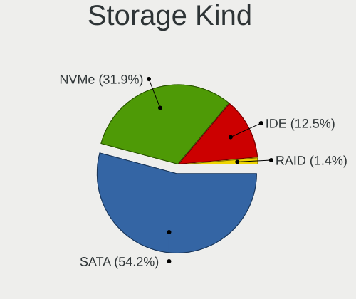

| Kind | Desktops | Percent |
|------|----------|---------|
| SATA | 39       | 54.17%  |
| NVMe | 23       | 31.94%  |
| IDE  | 9        | 12.5%   |
| RAID | 1        | 1.39%   |

Processor
---------

CPU Vendor
----------

Processor vendors

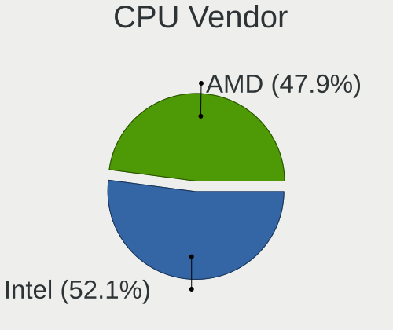

| Vendor | Desktops | Percent |
|--------|----------|---------|
| Intel  | 25       | 52.08%  |
| AMD    | 23       | 47.92%  |

CPU Model
---------

Processor models

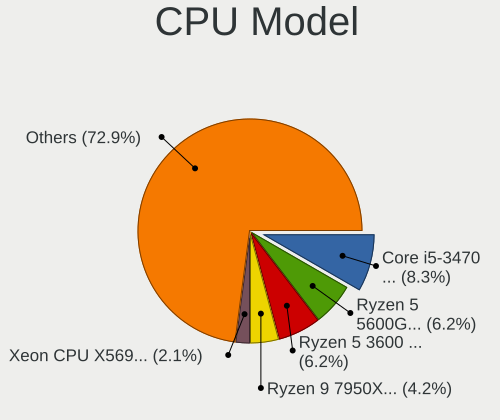

| Model                                          | Desktops | Percent |
|------------------------------------------------|----------|---------|
| Intel Core i5-3470 CPU @ 3.20GHz               | 4        | 8.33%   |
| AMD Ryzen 5 5600G with Radeon Graphics         | 3        | 6.25%   |
| AMD Ryzen 5 3600 6-Core Processor              | 3        | 6.25%   |
| AMD Ryzen 9 7950X 16-Core Processor            | 2        | 4.17%   |
| Intel Xeon CPU X5690 @ 3.47GHz                 | 1        | 2.08%   |
| Intel Xeon CPU X5660 @ 2.80GHz                 | 1        | 2.08%   |
| Intel Xeon CPU X3220 @ 2.40GHz                 | 1        | 2.08%   |
| Intel Xeon CPU E5430 @ 2.66GHz                 | 1        | 2.08%   |
| Intel Xeon CPU E3-1225 v3 @ 3.20GHz            | 1        | 2.08%   |
| Intel Pentium CPU G620 @ 2.60GHz               | 1        | 2.08%   |
| Intel Core i7-8700 CPU @ 3.20GHz               | 1        | 2.08%   |
| Intel Core i7-7700K CPU @ 4.20GHz              | 1        | 2.08%   |
| Intel Core i7-6950X CPU @ 3.00GHz              | 1        | 2.08%   |
| Intel Core i7-4770 CPU @ 3.40GHz               | 1        | 2.08%   |
| Intel Core i7-3770K CPU @ 3.50GHz              | 1        | 2.08%   |
| Intel Core i5-9400T CPU @ 1.80GHz              | 1        | 2.08%   |
| Intel Core i5-8400 CPU @ 2.80GHz               | 1        | 2.08%   |
| Intel Core i5-6600K CPU @ 3.50GHz              | 1        | 2.08%   |
| Intel Core i5-2400 CPU @ 3.10GHz               | 1        | 2.08%   |
| Intel Core 2 Quad CPU Q8400 @ 2.66GHz          | 1        | 2.08%   |
| Intel Core 2 Duo CPU E6750 @ 2.66GHz           | 1        | 2.08%   |
| Intel Celeron N4000 CPU @ 1.10GHz              | 1        | 2.08%   |
| Intel Celeron CPU N2930 @ 1.83GHz              | 1        | 2.08%   |
| Intel 12th Gen Core i5-12400F                  | 1        | 2.08%   |
| Intel 11th Gen Core i5-11400 @ 2.60GHz         | 1        | 2.08%   |
| AMD Sempron 2650 APU with Radeon R3            | 1        | 2.08%   |
| AMD Ryzen 9 7950X3D 16-Core Processor          | 1        | 2.08%   |
| AMD Ryzen 7 7700X 8-Core Processor             | 1        | 2.08%   |
| AMD Ryzen 7 5800X3D 8-Core Processor           | 1        | 2.08%   |
| AMD Ryzen 7 5800 8-Core Processor              | 1        | 2.08%   |
| AMD Ryzen 7 5700G with Radeon Graphics         | 1        | 2.08%   |
| AMD Ryzen 7 1700X Eight-Core Processor         | 1        | 2.08%   |
| AMD Ryzen 5 5600X 6-Core Processor             | 1        | 2.08%   |
| AMD Ryzen 5 3600X 6-Core Processor             | 1        | 2.08%   |
| AMD Ryzen 3 3200G with Radeon Vega Graphics    | 1        | 2.08%   |
| AMD Phenom II X4 975 Processor                 | 1        | 2.08%   |
| AMD FX-8350 Eight-Core Processor               | 1        | 2.08%   |
| AMD Athlon II X2 260 Processor                 | 1        | 2.08%   |
| AMD A6-3600 APU with Radeon HD Graphics        | 1        | 2.08%   |
| AMD A10-7800 Radeon R7, 12 Compute Cores 4C+8G | 1        | 2.08%   |

CPU Model Family
----------------

Processor model prefix

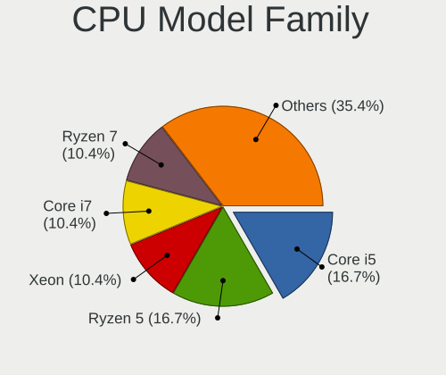

| Model             | Desktops | Percent |
|-------------------|----------|---------|
| Intel Core i5     | 8        | 16.67%  |
| AMD Ryzen 5       | 8        | 16.67%  |
| Intel Xeon        | 5        | 10.42%  |
| Intel Core i7     | 5        | 10.42%  |
| AMD Ryzen 7       | 5        | 10.42%  |
| AMD Ryzen 9       | 3        | 6.25%   |
| Other             | 2        | 4.17%   |
| Intel Celeron     | 2        | 4.17%   |
| Intel Pentium     | 1        | 2.08%   |
| Intel Core 2 Quad | 1        | 2.08%   |
| Intel Core 2 Duo  | 1        | 2.08%   |
| AMD Sempron       | 1        | 2.08%   |
| AMD Ryzen 3       | 1        | 2.08%   |
| AMD Phenom II X4  | 1        | 2.08%   |
| AMD FX            | 1        | 2.08%   |
| AMD Athlon II X2  | 1        | 2.08%   |
| AMD A6            | 1        | 2.08%   |
| AMD A10           | 1        | 2.08%   |

CPU Cores
---------

Number of processor cores

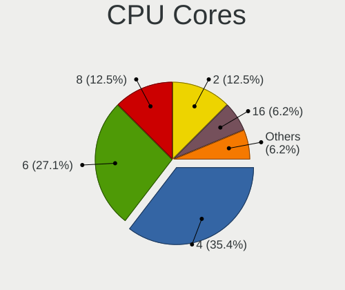

| Number | Desktops | Percent |
|--------|----------|---------|
| 4      | 17       | 35.42%  |
| 6      | 13       | 27.08%  |
| 8      | 6        | 12.5%   |
| 2      | 6        | 12.5%   |
| 16     | 3        | 6.25%   |
| 12     | 2        | 4.17%   |
| 10     | 1        | 2.08%   |

CPU Sockets
-----------

Number of sockets

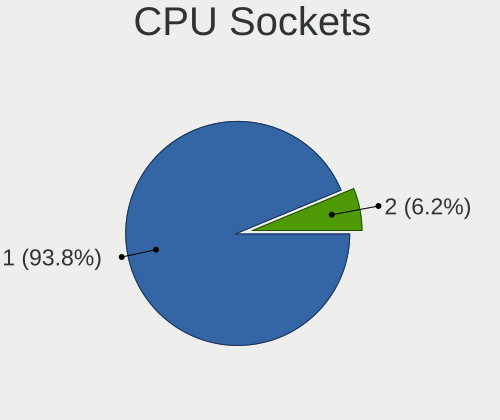

| Number | Desktops | Percent |
|--------|----------|---------|
| 1      | 45       | 93.75%  |
| 2      | 3        | 6.25%   |

CPU Threads
-----------

Threads per core (Hyper-Threading)

| Number | Desktops | Percent |
|--------|----------|---------|
| 2      | 26       | 54.17%  |
| 1      | 22       | 45.83%  |

CPU Op-Modes
------------

CPU Operation Modes (32-bit, 64-bit)

| Op mode        | Desktops | Percent |
|----------------|----------|---------|
| 32-bit, 64-bit | 48       | 100%    |

CPU Microcode
-------------

Microcode number

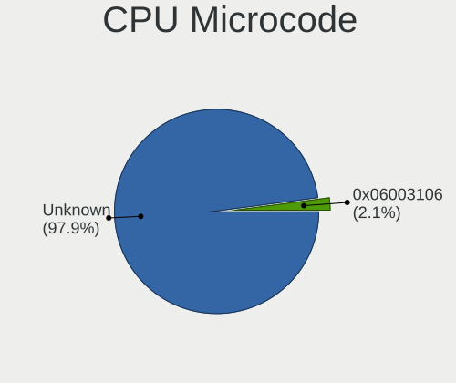

| Number     | Desktops | Percent |
|------------|----------|---------|
| Unknown    | 47       | 97.92%  |
| 0x06003106 | 1        | 2.08%   |

CPU Microarch
-------------

Microarchitecture

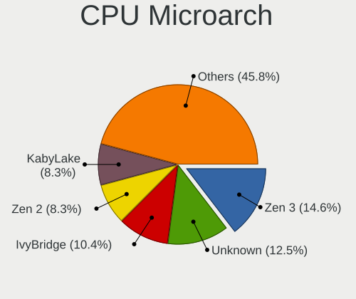

| Name          | Desktops | Percent |
|---------------|----------|---------|
| Zen 3         | 7        | 14.58%  |
| Unknown       | 6        | 12.5%   |
| IvyBridge     | 5        | 10.42%  |
| Zen 2         | 4        | 8.33%   |
| KabyLake      | 4        | 8.33%   |
| Westmere      | 2        | 4.17%   |
| SandyBridge   | 2        | 4.17%   |
| Penryn        | 2        | 4.17%   |
| K10           | 2        | 4.17%   |
| Haswell       | 2        | 4.17%   |
| Core          | 2        | 4.17%   |
| Zen+          | 1        | 2.08%   |
| Zen           | 1        | 2.08%   |
| Steamroller   | 1        | 2.08%   |
| Skylake       | 1        | 2.08%   |
| Silvermont    | 1        | 2.08%   |
| Piledriver    | 1        | 2.08%   |
| K10 Llano     | 1        | 2.08%   |
| Jaguar        | 1        | 2.08%   |
| Goldmont plus | 1        | 2.08%   |
| Broadwell     | 1        | 2.08%   |

Graphics
--------

GPU Vendor
----------

Vendors of graphics cards

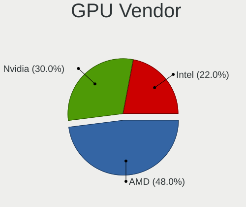

| Vendor | Desktops | Percent |
|--------|----------|---------|
| AMD    | 24       | 48%     |
| Nvidia | 15       | 30%     |
| Intel  | 11       | 22%     |

GPU Model
---------

Graphics card models

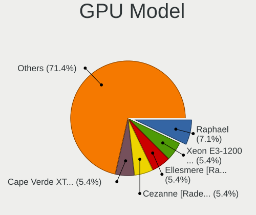

| Model                                                                     | Desktops | Percent |
|---------------------------------------------------------------------------|----------|---------|
| AMD Raphael                                                               | 4        | 7.14%   |
| Intel Xeon E3-1200 v2/3rd Gen Core processor Graphics Controller          | 3        | 5.36%   |
| AMD Ellesmere [Radeon RX 470/480/570/570X/580/580X/590]                   | 3        | 5.36%   |
| AMD Cezanne [Radeon Vega Series / Radeon Vega Mobile Series]              | 3        | 5.36%   |
| AMD Cape Verde XT [Radeon HD 7770/8760 / R7 250X]                         | 3        | 5.36%   |
| Nvidia GA106 [GeForce RTX 3060 Lite Hash Rate]                            | 2        | 3.57%   |
| Intel 2nd Generation Core Processor Family Integrated Graphics Controller | 2        | 3.57%   |
| AMD Navi 33 [Radeon RX 7600/7600 XT/7600M XT/7600S/7700S / PRO W7600]     | 2        | 3.57%   |
| AMD Navi 32 [Radeon RX 7700 XT / 7800 XT]                                 | 2        | 3.57%   |
| AMD Navi 31 [Radeon RX 7900 XT/7900 XTX/7900 GRE/7900M]                   | 2        | 3.57%   |
| AMD Navi 23 [Radeon RX 6600/6600 XT/6600M]                                | 2        | 3.57%   |
| Nvidia TU116 [GeForce GTX 1660 Ti]                                        | 1        | 1.79%   |
| Nvidia TU116 [GeForce GTX 1650 SUPER]                                     | 1        | 1.79%   |
| Nvidia TU106 [GeForce RTX 2060 SUPER]                                     | 1        | 1.79%   |
| Nvidia TU104 [GeForce RTX 2060]                                           | 1        | 1.79%   |
| Nvidia GP107 [GeForce GTX 1050]                                           | 1        | 1.79%   |
| Nvidia GP107 [GeForce GTX 1050 Ti]                                        | 1        | 1.79%   |
| Nvidia GP106 [GeForce GTX 1060 6GB]                                       | 1        | 1.79%   |
| Nvidia GP104 [GeForce GTX 1080]                                           | 1        | 1.79%   |
| Nvidia GM107 [GeForce GTX 750 Ti]                                         | 1        | 1.79%   |
| Nvidia GK208B [GeForce GT 710]                                            | 1        | 1.79%   |
| Nvidia GA104 [GeForce RTX 3060]                                           | 1        | 1.79%   |
| Nvidia AD104 [GeForce RTX 4070 Ti]                                        | 1        | 1.79%   |
| Nvidia AD104 [GeForce RTX 4070 SUPER]                                     | 1        | 1.79%   |
| Intel Xeon E3-1200 v3 Processor Integrated Graphics Controller            | 1        | 1.79%   |
| Intel IvyBridge GT2 [HD Graphics 4000]                                    | 1        | 1.79%   |
| Intel GeminiLake [UHD Graphics 600]                                       | 1        | 1.79%   |
| Intel CoffeeLake-S GT2 [UHD Graphics 630]                                 | 1        | 1.79%   |
| Intel Atom Processor Z36xxx/Z37xxx Series Graphics & Display              | 1        | 1.79%   |
| Intel 4 Series Chipset Integrated Graphics Controller                     | 1        | 1.79%   |
| AMD Turks PRO [Radeon HD 7570]                                            | 1        | 1.79%   |
| AMD Turks PRO [Radeon HD 6570/7570/8550 / R5 230]                         | 1        | 1.79%   |
| AMD Tahiti XT [Radeon HD 7970/8970 OEM / R9 280X]                         | 1        | 1.79%   |
| AMD RV710 [Radeon HD 4350/4550]                                           | 1        | 1.79%   |
| AMD Picasso/Raven 2 [Radeon Vega Series / Radeon Vega Mobile Series]      | 1        | 1.79%   |
| AMD Navi 21 [Radeon RX 6800/6800 XT / 6900 XT]                            | 1        | 1.79%   |
| AMD Navi 10 [Radeon RX 5600 OEM/5600 XT / 5700/5700 XT]                   | 1        | 1.79%   |
| AMD Kaveri [Radeon R7 Graphics]                                           | 1        | 1.79%   |
| AMD Kabini [Radeon HD 8240 / R3 Series]                                   | 1        | 1.79%   |

GPU Combo
---------

Combinations of graphics cards

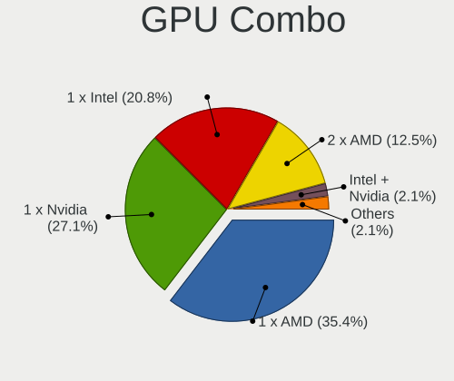

| Name           | Desktops | Percent |
|----------------|----------|---------|
| 1 x AMD        | 17       | 35.42%  |
| 1 x Nvidia     | 13       | 27.08%  |
| 1 x Intel      | 10       | 20.83%  |
| 2 x AMD        | 6        | 12.5%   |
| Intel + Nvidia | 1        | 2.08%   |
| AMD + Nvidia   | 1        | 2.08%   |

GPU Driver
----------

Free vs proprietary

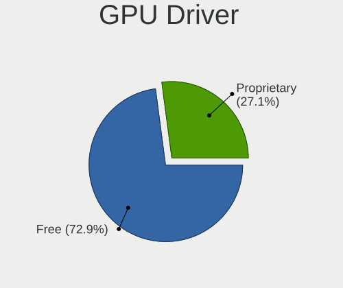

| Driver      | Desktops | Percent |
|-------------|----------|---------|
| Free        | 35       | 72.92%  |
| Proprietary | 13       | 27.08%  |

GPU Memory
----------

Total video memory

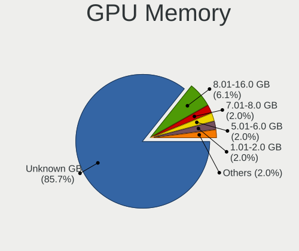

| Size in GB | Desktops | Percent |
|------------|----------|---------|
| Unknown    | 42       | 85.71%  |
| 8.01-16.0  | 3        | 6.12%   |
| 7.01-8.0   | 1        | 2.04%   |
| 5.01-6.0   | 1        | 2.04%   |
| 1.01-2.0   | 1        | 2.04%   |
| 0.51-1.0   | 1        | 2.04%   |

Monitor
-------

Monitor Vendor
--------------

Monitor vendors

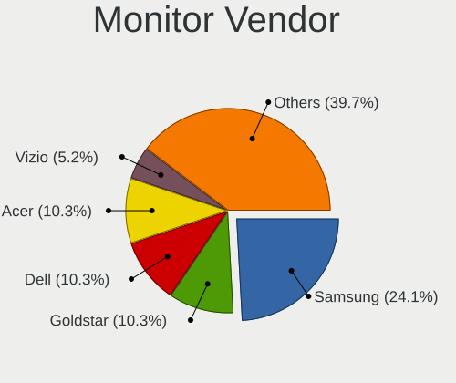

| Vendor               | Desktops | Percent |
|----------------------|----------|---------|
| Samsung Electronics  | 14       | 24.14%  |
| Goldstar             | 6        | 10.34%  |
| Dell                 | 6        | 10.34%  |
| Acer                 | 6        | 10.34%  |
| Vizio                | 3        | 5.17%   |
| Lenovo               | 2        | 3.45%   |
| Iiyama               | 2        | 3.45%   |
| Fujitsu Siemens      | 2        | 3.45%   |
| AOC                  | 2        | 3.45%   |
| Ancor Communications | 2        | 3.45%   |
| Sony                 | 1        | 1.72%   |
| SGN                  | 1        | 1.72%   |
| Sceptre Tech         | 1        | 1.72%   |
| PRI                  | 1        | 1.72%   |
| Pixio                | 1        | 1.72%   |
| Philips              | 1        | 1.72%   |
| Onkyo                | 1        | 1.72%   |
| MStar                | 1        | 1.72%   |
| HUAWEI               | 1        | 1.72%   |
| CEN                  | 1        | 1.72%   |
| BenQ                 | 1        | 1.72%   |
| ASUSTek Computer     | 1        | 1.72%   |
| AOpen                | 1        | 1.72%   |

Monitor Model
-------------

Monitor models

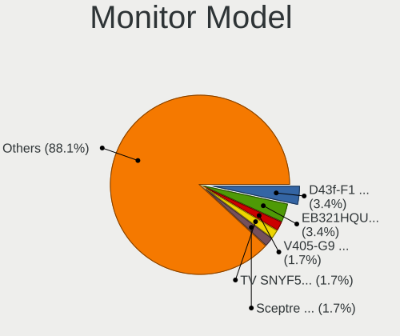

| Model                                                                   | Desktops | Percent |
|-------------------------------------------------------------------------|----------|---------|
| Vizio D43f-F1 VIZ1027 1920x1080 940x529mm 42.5-inch                     | 2        | 3.39%   |
| Acer EB321HQU C ACR0507 2560x1440 699x393mm 31.6-inch                   | 2        | 3.39%   |
| Vizio V405-G9 VIZ1033 3840x2160 1096x616mm 49.5-inch                    | 1        | 1.69%   |
| Sony TV SNYF500 1360x768                                                | 1        | 1.69%   |
| SGN L01N8A SGN11C0 800x1280                                             | 1        | 1.69%   |
| Sceptre Tech Sceptre K27 SPT0AA4 1920x1080 600x330mm 27.0-inch          | 1        | 1.69%   |
| Samsung Electronics U28H75x SAM0E00 3840x2160 607x345mm 27.5-inch       | 1        | 1.69%   |
| Samsung Electronics SyncMaster SAM05EB 1920x1080 597x336mm 27.0-inch    | 1        | 1.69%   |
| Samsung Electronics SyncMaster SAM05B0 1920x1080                        | 1        | 1.69%   |
| Samsung Electronics S22F350 SAM0D1A 1920x1080 477x268mm 21.5-inch       | 1        | 1.69%   |
| Samsung Electronics Odyssey G5 SAM7489 2560x1440 698x393mm 31.5-inch    | 1        | 1.69%   |
| Samsung Electronics LF27T35 SAM707F 1920x1080 598x337mm 27.0-inch       | 1        | 1.69%   |
| Samsung Electronics LCD Monitor SAM7129 3840x2160 950x540mm 43.0-inch   | 1        | 1.69%   |
| Samsung Electronics LCD Monitor SAM0F09 3840x2160 1872x1053mm 84.6-inch | 1        | 1.69%   |
| Samsung Electronics LCD Monitor SAM0DF7 3840x2160 890x500mm 40.2-inch   | 1        | 1.69%   |
| Samsung Electronics LCD Monitor SAM0B30 1920x1080 885x498mm 40.0-inch   | 1        | 1.69%   |
| Samsung Electronics LCD Monitor SAM090B 1920x1080 1020x570mm 46.0-inch  | 1        | 1.69%   |
| Samsung Electronics C32F391 SAM0D34 1920x1080 698x393mm 31.5-inch       | 1        | 1.69%   |
| Samsung Electronics C27F591 SAM0D37 1920x1080 600x340mm 27.2-inch       | 1        | 1.69%   |
| Samsung Electronics C27F390 SAM0D32 1920x1080 598x336mm 27.0-inch       | 1        | 1.69%   |
| PRI BBY LCD TV PRI0032 1360x768 700x390mm 31.5-inch                     | 1        | 1.69%   |
| Pixio SFP2702G FHD WAM2700 1920x1080 597x336mm 27.0-inch                | 1        | 1.69%   |
| Philips PHL 246V5 PHLC0C5 1920x1080 531x299mm 24.0-inch                 | 1        | 1.69%   |
| Onkyo TX-NR636 ONK0E61 1920x1080 800x450mm 36.1-inch                    | 1        | 1.69%   |
| MStar Demo MST0030 1920x1080 708x398mm 32.0-inch                        | 1        | 1.69%   |
| Lenovo LEN T22i-10 LEN61A9 1920x1080 476x268mm 21.5-inch                | 1        | 1.69%   |
| Lenovo LEN LT2323pwA LEN0BD0 1920x1080 510x287mm 23.0-inch              | 1        | 1.69%   |
| Iiyama PL2480H IVM610B 1920x1080 521x293mm 23.5-inch                    | 1        | 1.69%   |
| Iiyama PL2409HD IVM560C 1920x1080 521x293mm 23.5-inch                   | 1        | 1.69%   |
| HUAWEI SSN-24 HWV6E4E 1920x1080 527x296mm 23.8-inch                     | 1        | 1.69%   |
| Goldstar W1952 GSM4B77 1440x900 408x255mm 18.9-inch                     | 1        | 1.69%   |
| Goldstar TV GSMC468 1920x1080 700x390mm 31.5-inch                       | 1        | 1.69%   |
| Goldstar L1753T GSM4433 1280x1024 338x270mm 17.0-inch                   | 1        | 1.69%   |
| Goldstar HDR WFHD GSM7714 2560x1080 798x334mm 34.1-inch                 | 1        | 1.69%   |
| Goldstar HDR 4K GSM7707 3840x2160 600x340mm 27.2-inch                   | 1        | 1.69%   |
| Goldstar E2251 GSM586F 1920x1080 477x268mm 21.5-inch                    | 1        | 1.69%   |
| Fujitsu Siemens B22W-5 FUS06AF 1680x1050 473x296mm 22.0-inch            | 1        | 1.69%   |
| Fujitsu Siemens B22W-5 ECO FUS07C3 1680x1050 474x296mm 22.0-inch        | 1        | 1.69%   |
| Dell U3421WE DELA18B 1920x1080 400x335mm 20.5-inch                      | 1        | 1.69%   |
| Dell U3419W DELA12E 3440x1440 800x335mm 34.1-inch                       | 1        | 1.69%   |

Monitor Resolution
------------------

Monitor screen resolution

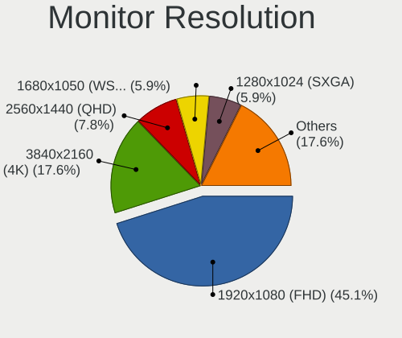

| Resolution         | Desktops | Percent |
|--------------------|----------|---------|
| 1920x1080 (FHD)    | 23       | 45.1%   |
| 3840x2160 (4K)     | 9        | 17.65%  |
| 2560x1440 (QHD)    | 4        | 7.84%   |
| 1680x1050 (WSXGA+) | 3        | 5.88%   |
| 1280x1024 (SXGA)   | 3        | 5.88%   |
| 3440x1440          | 2        | 3.92%   |
| 1440x900 (WXGA+)   | 2        | 3.92%   |
| 1360x768           | 2        | 3.92%   |
| 800x1280           | 1        | 1.96%   |
| 2560x1080          | 1        | 1.96%   |
| 1720x1440          | 1        | 1.96%   |

Monitor Diagonal
----------------

Diagonal size in inches

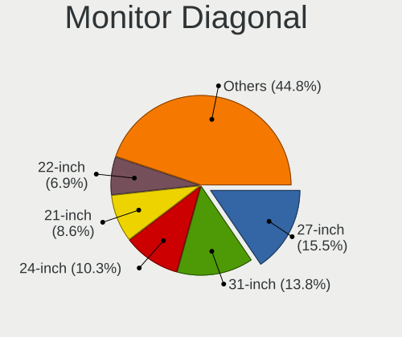

| Inches  | Desktops | Percent |
|---------|----------|---------|
| 27      | 9        | 15.52%  |
| 31      | 8        | 13.79%  |
| 24      | 6        | 10.34%  |
| 21      | 5        | 8.62%   |
| 22      | 4        | 6.9%    |
| 84      | 3        | 5.17%   |
| 23      | 3        | 5.17%   |
| 19      | 3        | 5.17%   |
| 54      | 2        | 3.45%   |
| 49      | 2        | 3.45%   |
| 34      | 2        | 3.45%   |
| 17      | 2        | 3.45%   |
| Unknown | 2        | 3.45%   |
| 74      | 1        | 1.72%   |
| 72      | 1        | 1.72%   |
| 63      | 1        | 1.72%   |
| 52      | 1        | 1.72%   |
| 48      | 1        | 1.72%   |
| 40      | 1        | 1.72%   |
| 20      | 1        | 1.72%   |

Monitor Width
-------------

Physical width

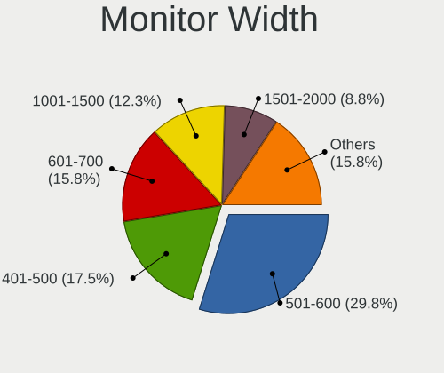

| Width in mm | Desktops | Percent |
|-------------|----------|---------|
| 501-600     | 17       | 29.82%  |
| 401-500     | 10       | 17.54%  |
| 601-700     | 9        | 15.79%  |
| 1001-1500   | 7        | 12.28%  |
| 1501-2000   | 5        | 8.77%   |
| 701-800     | 2        | 3.51%   |
| 351-400     | 2        | 3.51%   |
| 301-350     | 2        | 3.51%   |
| Unknown     | 2        | 3.51%   |
| 801-900     | 1        | 1.75%   |

Aspect Ratio
------------

Proportional relationship between the width and the height

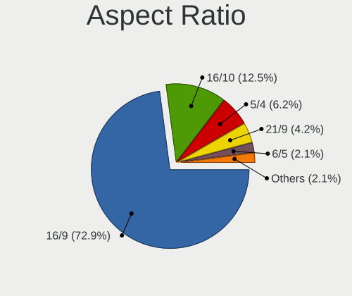

| Ratio | Desktops | Percent |
|-------|----------|---------|
| 16/9  | 35       | 72.92%  |
| 16/10 | 6        | 12.5%   |
| 5/4   | 3        | 6.25%   |
| 21/9  | 2        | 4.17%   |
| 6/5   | 1        | 2.08%   |
| 0.62  | 1        | 2.08%   |

Monitor Area
------------

Area in inch²

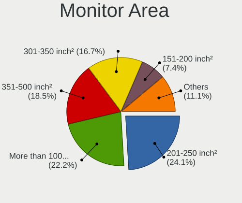

| Area in inch² | Desktops | Percent |
|----------------|----------|---------|
| 201-250        | 13       | 24.07%  |
| More than 1000 | 12       | 22.22%  |
| 351-500        | 10       | 18.52%  |
| 301-350        | 9        | 16.67%  |
| 151-200        | 4        | 7.41%   |
| 141-150        | 2        | 3.7%    |
| Unknown        | 2        | 3.7%    |
| 251-300        | 1        | 1.85%   |
| 501-1000       | 1        | 1.85%   |

Pixel Density
-------------

Pixels per inch

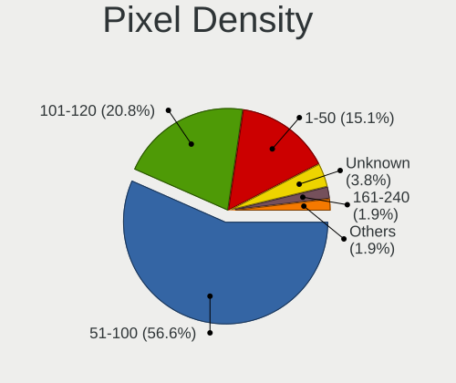

| Density | Desktops | Percent |
|---------|----------|---------|
| 51-100  | 30       | 56.6%   |
| 101-120 | 11       | 20.75%  |
| 1-50    | 8        | 15.09%  |
| Unknown | 2        | 3.77%   |
| 161-240 | 1        | 1.89%   |
| 121-160 | 1        | 1.89%   |

Multiple Monitors
-----------------

Total monitors connected

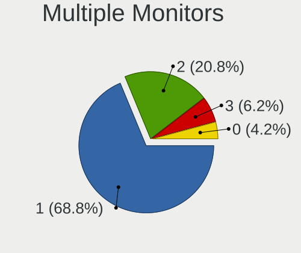

| Total | Desktops | Percent |
|-------|----------|---------|
| 1     | 33       | 68.75%  |
| 2     | 10       | 20.83%  |
| 3     | 3        | 6.25%   |
| 0     | 2        | 4.17%   |

Network
-------

Net Controller Vendor
---------------------

Controller vendors

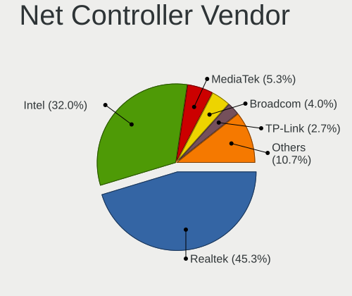

| Vendor                          | Desktops | Percent |
|---------------------------------|----------|---------|
| Realtek Semiconductor           | 34       | 45.33%  |
| Intel                           | 24       | 32%     |
| MediaTek                        | 4        | 5.33%   |
| Broadcom                        | 3        | 4%      |
| TP-Link                         | 2        | 2.67%   |
| Ralink Technology               | 2        | 2.67%   |
| VIA Technologies                | 1        | 1.33%   |
| Ralink                          | 1        | 1.33%   |
| Qualcomm Atheros Communications | 1        | 1.33%   |
| Huawei Technologies             | 1        | 1.33%   |
| Edimax Technology               | 1        | 1.33%   |
| ASUSTek Computer                | 1        | 1.33%   |

Net Controller Model
--------------------

Controller models

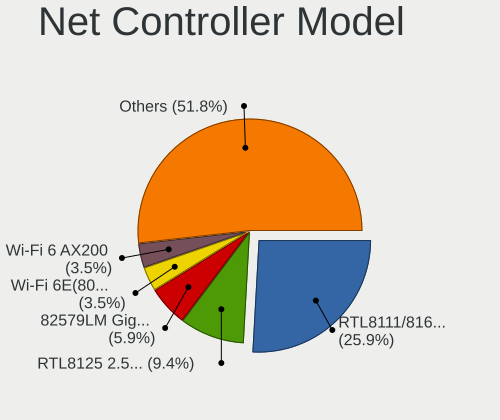

| Model                                                                                | Desktops | Percent |
|--------------------------------------------------------------------------------------|----------|---------|
| Realtek RTL8111/8168/8211/8411 PCI Express Gigabit Ethernet Controller               | 22       | 25.88%  |
| Realtek RTL8125 2.5GbE Controller                                                    | 8        | 9.41%   |
| Intel 82579LM Gigabit Network Connection (Lewisville)                                | 5        | 5.88%   |
| Intel Wi-Fi 6E(802.11ax) AX210/AX1675* 2x2 [Typhoon Peak]                            | 3        | 3.53%   |
| Intel Wi-Fi 6 AX200                                                                  | 3        | 3.53%   |
| Intel I211 Gigabit Network Connection                                                | 3        | 3.53%   |
| Realtek RTL8188FTV 802.11b/g/n 1T1R 2.4G WLAN Adapter                                | 2        | 2.35%   |
| Realtek RTL810xE PCI Express Fast Ethernet controller                                | 2        | 2.35%   |
| MediaTek MT7922 802.11ax PCI Express Wireless Network Adapter                        | 2        | 2.35%   |
| Intel Ethernet Controller I225-V                                                     | 2        | 2.35%   |
| Intel Ethernet Connection (2) I219-V                                                 | 2        | 2.35%   |
| Intel Dual Band Wireless-AC 3168NGW [Stone Peak]                                     | 2        | 2.35%   |
| Intel 82574L Gigabit Network Connection                                              | 2        | 2.35%   |
| Broadcom BCM4322 802.11a/b/g/n Wireless LAN Controller                               | 2        | 2.35%   |
| VIA VT86C100A [Rhine]                                                                | 1        | 1.18%   |
| TP-Link TL-WN823N v2/v3 [Realtek RTL8192EU]                                          | 1        | 1.18%   |
| TP-Link TL-WN822N Version 4 RTL8192EU                                                | 1        | 1.18%   |
| Realtek RTL8852BE PCIe 802.11ax Wireless Network Controller                          | 1        | 1.18%   |
| Realtek RTL8821CE 802.11ac PCIe Wireless Network Adapter                             | 1        | 1.18%   |
| Realtek RTL8821AE 802.11ac PCIe Wireless Network Adapter                             | 1        | 1.18%   |
| Realtek RTL8188EUS 802.11n Wireless Network Adapter                                  | 1        | 1.18%   |
| Realtek 802.11n WLAN Adapter                                                         | 1        | 1.18%   |
| Ralink RT5572 Wireless Adapter                                                       | 1        | 1.18%   |
| Ralink MT7601U Wireless Adapter                                                      | 1        | 1.18%   |
| Ralink RT5390 Wireless 802.11n 1T/1R PCIe                                            | 1        | 1.18%   |
| Qualcomm Atheros TP-Link TL-WN821N v3 / TL-WN822N v2 802.11n [Atheros AR7010+AR9287] | 1        | 1.18%   |
| MediaTek MT7921K (RZ608) Wi-Fi 6E 80MHz                                              | 1        | 1.18%   |
| MediaTek MT7921 802.11ax PCIe Wireless Network Adapter [Filogic 330]                 | 1        | 1.18%   |
| Intel Wireless 7260                                                                  | 1        | 1.18%   |
| Intel Wi-Fi 5(802.11ac) Wireless-AC 9x6x [Thunder Peak]                              | 1        | 1.18%   |
| Intel Ethernet Connection I217-LM                                                    | 1        | 1.18%   |
| Intel Ethernet Connection (2) I218-V                                                 | 1        | 1.18%   |
| Intel Dual Band Wireless-AC 3165 Plus Bluetooth                                      | 1        | 1.18%   |
| Intel 82566DM-2 Gigabit Network Connection                                           | 1        | 1.18%   |
| Huawei E353/E3131                                                                    | 1        | 1.18%   |
| Edimax 802.11ax WLAN Adapter                                                         | 1        | 1.18%   |
| Broadcom NetXtreme BCM5754 Gigabit Ethernet PCI Express                              | 1        | 1.18%   |
| Broadcom NetXtreme BCM5720 Gigabit Ethernet PCIe                                     | 1        | 1.18%   |
| ASUS 802.11ac NIC                                                                    | 1        | 1.18%   |

Wireless Vendor
---------------

Wireless vendors

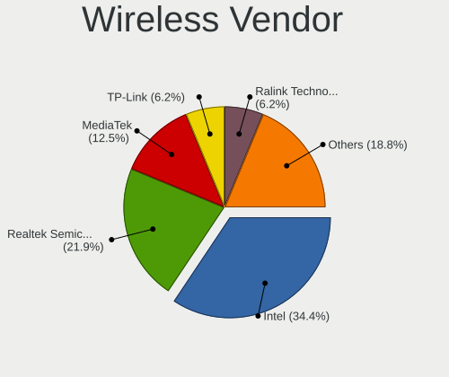

| Vendor                          | Desktops | Percent |
|---------------------------------|----------|---------|
| Intel                           | 11       | 34.38%  |
| Realtek Semiconductor           | 7        | 21.88%  |
| MediaTek                        | 4        | 12.5%   |
| TP-Link                         | 2        | 6.25%   |
| Ralink Technology               | 2        | 6.25%   |
| Broadcom                        | 2        | 6.25%   |
| Ralink                          | 1        | 3.13%   |
| Qualcomm Atheros Communications | 1        | 3.13%   |
| Edimax Technology               | 1        | 3.13%   |
| ASUSTek Computer                | 1        | 3.13%   |

Wireless Model
--------------

Wireless models

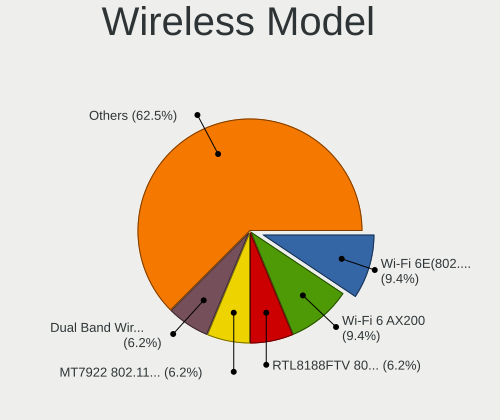

| Model                                                                                | Desktops | Percent |
|--------------------------------------------------------------------------------------|----------|---------|
| Intel Wi-Fi 6E(802.11ax) AX210/AX1675* 2x2 [Typhoon Peak]                            | 3        | 9.38%   |
| Intel Wi-Fi 6 AX200                                                                  | 3        | 9.38%   |
| Realtek RTL8188FTV 802.11b/g/n 1T1R 2.4G WLAN Adapter                                | 2        | 6.25%   |
| MediaTek MT7922 802.11ax PCI Express Wireless Network Adapter                        | 2        | 6.25%   |
| Intel Dual Band Wireless-AC 3168NGW [Stone Peak]                                     | 2        | 6.25%   |
| Broadcom BCM4322 802.11a/b/g/n Wireless LAN Controller                               | 2        | 6.25%   |
| TP-Link TL-WN823N v2/v3 [Realtek RTL8192EU]                                          | 1        | 3.13%   |
| TP-Link TL-WN822N Version 4 RTL8192EU                                                | 1        | 3.13%   |
| Realtek RTL8852BE PCIe 802.11ax Wireless Network Controller                          | 1        | 3.13%   |
| Realtek RTL8821CE 802.11ac PCIe Wireless Network Adapter                             | 1        | 3.13%   |
| Realtek RTL8821AE 802.11ac PCIe Wireless Network Adapter                             | 1        | 3.13%   |
| Realtek RTL8188EUS 802.11n Wireless Network Adapter                                  | 1        | 3.13%   |
| Realtek 802.11n WLAN Adapter                                                         | 1        | 3.13%   |
| Ralink RT5572 Wireless Adapter                                                       | 1        | 3.13%   |
| Ralink MT7601U Wireless Adapter                                                      | 1        | 3.13%   |
| Ralink RT5390 Wireless 802.11n 1T/1R PCIe                                            | 1        | 3.13%   |
| Qualcomm Atheros TP-Link TL-WN821N v3 / TL-WN822N v2 802.11n [Atheros AR7010+AR9287] | 1        | 3.13%   |
| MediaTek MT7921K (RZ608) Wi-Fi 6E 80MHz                                              | 1        | 3.13%   |
| MediaTek MT7921 802.11ax PCIe Wireless Network Adapter [Filogic 330]                 | 1        | 3.13%   |
| Intel Wireless 7260                                                                  | 1        | 3.13%   |
| Intel Wi-Fi 5(802.11ac) Wireless-AC 9x6x [Thunder Peak]                              | 1        | 3.13%   |
| Intel Dual Band Wireless-AC 3165 Plus Bluetooth                                      | 1        | 3.13%   |
| Edimax 802.11ax WLAN Adapter                                                         | 1        | 3.13%   |
| ASUS 802.11ac NIC                                                                    | 1        | 3.13%   |

Ethernet Vendor
---------------

Ethernet vendors

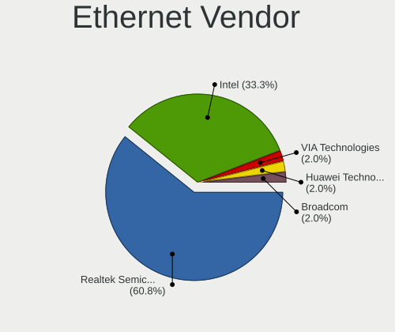

| Vendor                | Desktops | Percent |
|-----------------------|----------|---------|
| Realtek Semiconductor | 31       | 60.78%  |
| Intel                 | 17       | 33.33%  |
| VIA Technologies      | 1        | 1.96%   |
| Huawei Technologies   | 1        | 1.96%   |
| Broadcom              | 1        | 1.96%   |

Ethernet Model
--------------

Ethernet models

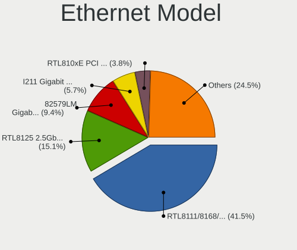

| Model                                                                  | Desktops | Percent |
|------------------------------------------------------------------------|----------|---------|
| Realtek RTL8111/8168/8211/8411 PCI Express Gigabit Ethernet Controller | 22       | 41.51%  |
| Realtek RTL8125 2.5GbE Controller                                      | 8        | 15.09%  |
| Intel 82579LM Gigabit Network Connection (Lewisville)                  | 5        | 9.43%   |
| Intel I211 Gigabit Network Connection                                  | 3        | 5.66%   |
| Realtek RTL810xE PCI Express Fast Ethernet controller                  | 2        | 3.77%   |
| Intel Ethernet Controller I225-V                                       | 2        | 3.77%   |
| Intel Ethernet Connection (2) I219-V                                   | 2        | 3.77%   |
| Intel 82574L Gigabit Network Connection                                | 2        | 3.77%   |
| VIA VT86C100A [Rhine]                                                  | 1        | 1.89%   |
| Intel Ethernet Connection I217-LM                                      | 1        | 1.89%   |
| Intel Ethernet Connection (2) I218-V                                   | 1        | 1.89%   |
| Intel 82566DM-2 Gigabit Network Connection                             | 1        | 1.89%   |
| Huawei E353/E3131                                                      | 1        | 1.89%   |
| Broadcom NetXtreme BCM5754 Gigabit Ethernet PCI Express                | 1        | 1.89%   |
| Broadcom NetXtreme BCM5720 Gigabit Ethernet PCIe                       | 1        | 1.89%   |

Net Controller Kind
-------------------

Ethernet, WiFi or modem

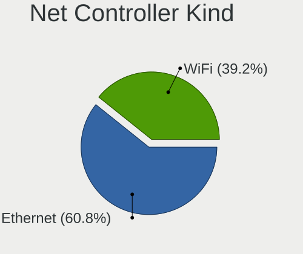

| Kind     | Desktops | Percent |
|----------|----------|---------|
| Ethernet | 48       | 60.76%  |
| WiFi     | 31       | 39.24%  |

Used Controller
---------------

Currently used network controller

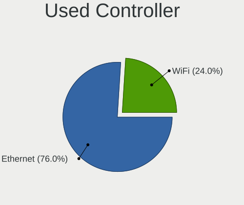

| Kind     | Desktops | Percent |
|----------|----------|---------|
| Ethernet | 38       | 76%     |
| WiFi     | 12       | 24%     |

NICs
----

Total network controllers on board

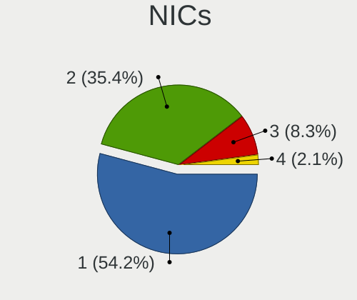

| Total | Desktops | Percent |
|-------|----------|---------|
| 1     | 26       | 54.17%  |
| 2     | 17       | 35.42%  |
| 3     | 4        | 8.33%   |
| 4     | 1        | 2.08%   |

IPv6
----

IPv6 vs IPv4

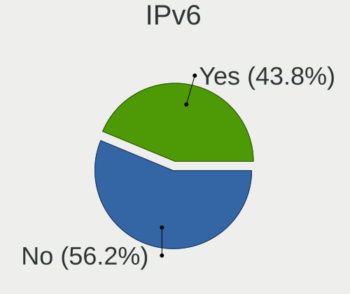

| Used | Desktops | Percent |
|------|----------|---------|
| No   | 27       | 56.25%  |
| Yes  | 21       | 43.75%  |

Bluetooth
---------

Bluetooth Vendor
----------------

Controller vendors

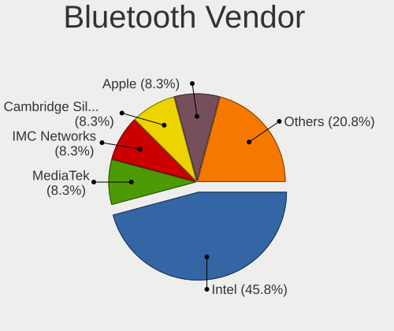

| Vendor                  | Desktops | Percent |
|-------------------------|----------|---------|
| Intel                   | 11       | 45.83%  |
| MediaTek                | 2        | 8.33%   |
| IMC Networks            | 2        | 8.33%   |
| Cambridge Silicon Radio | 2        | 8.33%   |
| Apple                   | 2        | 8.33%   |
| TP-Link                 | 1        | 4.17%   |
| SINO WEALTH             | 1        | 4.17%   |
| Realtek Semiconductor   | 1        | 4.17%   |
| Foxconn / Hon Hai       | 1        | 4.17%   |
| Actions                 | 1        | 4.17%   |

Bluetooth Model
---------------

Controller models

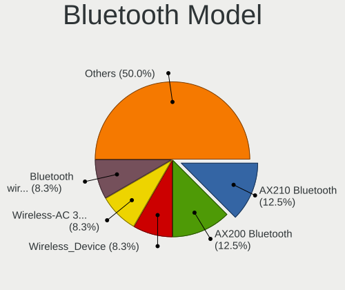

| Model                                               | Desktops | Percent |
|-----------------------------------------------------|----------|---------|
| Intel AX210 Bluetooth                               | 3        | 12.5%   |
| Intel AX200 Bluetooth                               | 3        | 12.5%   |
| MediaTek Wireless_Device                            | 2        | 8.33%   |
| Intel Wireless-AC 3168 Bluetooth                    | 2        | 8.33%   |
| Intel Bluetooth wireless interface                  | 2        | 8.33%   |
| IMC Networks Bluetooth Radio                        | 2        | 8.33%   |
| Cambridge Silicon Radio Bluetooth Dongle (HCI mode) | 2        | 8.33%   |
| Apple Built-in Bluetooth 2.0+EDR HCI                | 2        | 8.33%   |
| TP-Link TP-T@- UB500 Adapter                        | 1        | 4.17%   |
| SINO WEALTH Bluetooth Keyboard                      | 1        | 4.17%   |
| Realtek Bluetooth Radio                             | 1        | 4.17%   |
| Intel Wireless-AC 9260 Bluetooth Adapter            | 1        | 4.17%   |
| Foxconn / Hon Hai MediaTek MT7921 Bluetooth         | 1        | 4.17%   |
| Actions general adapter                             | 1        | 4.17%   |

Sound
-----

Sound Vendor
------------

Sound card vendors

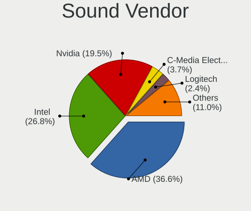

| Vendor                 | Desktops | Percent |
|------------------------|----------|---------|
| AMD                    | 30       | 36.59%  |
| Intel                  | 22       | 26.83%  |
| Nvidia                 | 16       | 19.51%  |
| C-Media Electronics    | 3        | 3.66%   |
| Logitech               | 2        | 2.44%   |
| Texas Instruments      | 1        | 1.22%   |
| SteelSeries ApS        | 1        | 1.22%   |
| Razer USA              | 1        | 1.22%   |
| Medeli Electronics     | 1        | 1.22%   |
| M-Audio                | 1        | 1.22%   |
| Jieli Technology       | 1        | 1.22%   |
| Blue Microphones       | 1        | 1.22%   |
| Antlion Audio          | 1        | 1.22%   |
| AKAI Professional M.I. | 1        | 1.22%   |

Sound Model
-----------

Sound card models

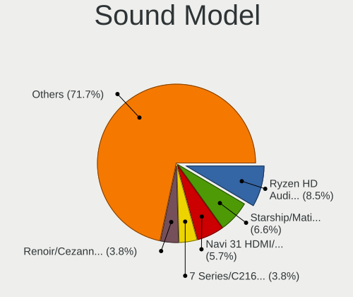

| Model                                                                      | Desktops | Percent |
|----------------------------------------------------------------------------|----------|---------|
| AMD Ryzen HD Audio Controller                                              | 9        | 8.49%   |
| AMD Starship/Matisse HD Audio Controller                                   | 7        | 6.6%    |
| AMD Navi 31 HDMI/DP Audio                                                  | 6        | 5.66%   |
| Intel 7 Series/C216 Chipset Family High Definition Audio Controller        | 4        | 3.77%   |
| AMD Renoir/Cezanne HDMI/DP Audio Controller                                | 4        | 3.77%   |
| AMD Radeon High Definition Audio Controller                                | 4        | 3.77%   |
| Intel 6 Series/C200 Series Chipset Family High Definition Audio Controller | 3        | 2.83%   |
| C-Media Electronics Audio Adapter (Unitek Y-247A)                          | 3        | 2.83%   |
| AMD Oland/Hainan/Cape Verde/Pitcairn HDMI Audio [Radeon HD 7000 Series]    | 3        | 2.83%   |
| AMD Navi 21/23 HDMI/DP Audio Controller                                    | 3        | 2.83%   |
| AMD FCH Azalia Controller                                                  | 3        | 2.83%   |
| AMD Ellesmere HDMI Audio [Radeon RX 470/480 / 570/580/590]                 | 3        | 2.83%   |
| Nvidia TU116 High Definition Audio Controller                              | 2        | 1.89%   |
| Nvidia GP107GL High Definition Audio Controller                            | 2        | 1.89%   |
| Nvidia GA106 High Definition Audio Controller                              | 2        | 1.89%   |
| Nvidia AD104 High Definition Audio Controller                              | 2        | 1.89%   |
| Intel NM10/ICH7 Family High Definition Audio Controller                    | 2        | 1.89%   |
| Intel Cannon Lake PCH cAVS                                                 | 2        | 1.89%   |
| Intel 82801JI (ICH10 Family) HD Audio Controller                           | 2        | 1.89%   |
| Intel 8 Series/C220 Series Chipset High Definition Audio Controller        | 2        | 1.89%   |
| Intel 200 Series PCH HD Audio                                              | 2        | 1.89%   |
| AMD Turks HDMI Audio [Radeon HD 6500/6600 / 6700M Series]                  | 2        | 1.89%   |
| AMD SBx00 Azalia (Intel HDA)                                               | 2        | 1.89%   |
| Texas Instruments PCM2902C Audio CODEC                                     | 1        | 0.94%   |
| SteelSeries ApS SteelSeries GameDAC                                        | 1        | 0.94%   |
| Razer USA Kraken Tournament Edition                                        | 1        | 0.94%   |
| Nvidia TU106 High Definition Audio Controller                              | 1        | 0.94%   |
| Nvidia TU104 HD Audio Controller                                           | 1        | 0.94%   |
| Nvidia MCP61 High Definition Audio                                         | 1        | 0.94%   |
| Nvidia GP106 High Definition Audio Controller                              | 1        | 0.94%   |
| Nvidia GP104 High Definition Audio Controller                              | 1        | 0.94%   |
| Nvidia GM107 High Definition Audio Controller [GeForce 940MX]              | 1        | 0.94%   |
| Nvidia GK208 HDMI/DP Audio Controller                                      | 1        | 0.94%   |
| Nvidia GA104 High Definition Audio Controller                              | 1        | 0.94%   |
| Medeli Electronics SHEM-BOY                                                | 1        | 0.94%   |
| M-Audio Trigger Finger Pro                                                 | 1        | 0.94%   |
| Logitech Logitech G PRO X Gaming Headset                                   | 1        | 0.94%   |
| Logitech G635 Gaming Headset                                               | 1        | 0.94%   |
| Jieli Technology UACDemoV1.0                                               | 1        | 0.94%   |
| Intel USB2.0 Device                                                        | 1        | 0.94%   |

Memory
------

Memory Vendor
-------------

Memory module vendors

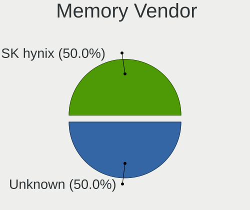

| Vendor   | Desktops | Percent |
|----------|----------|---------|
| Unknown  | 1        | 50%     |
| SK hynix | 1        | 50%     |

Memory Model
------------

Memory module models

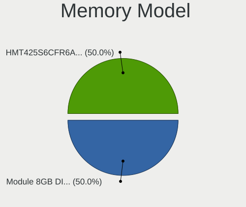

| Model                                                  | Desktops | Percent |
|--------------------------------------------------------|----------|---------|
| Unknown RAM Module 8GB DIMM DDR3 1600MT/s              | 1        | 50%     |
| SK hynix RAM HMT425S6CFR6A-PB 2GB SODIMM DDR3 1600MT/s | 1        | 50%     |

Memory Kind
-----------

Memory module kinds

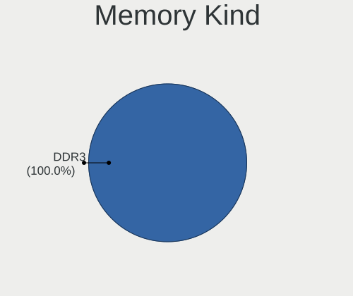

| Kind | Desktops | Percent |
|------|----------|---------|
| DDR3 | 2        | 100%    |

Memory Form Factor
------------------

Physical design of the memory module

| Name   | Desktops | Percent |
|--------|----------|---------|
| SODIMM | 1        | 50%     |
| DIMM   | 1        | 50%     |

Memory Size
-----------

Memory module size

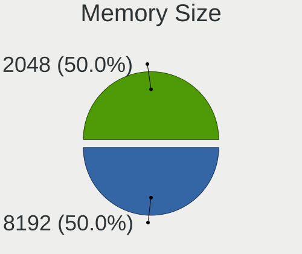

| Size | Desktops | Percent |
|------|----------|---------|
| 8192 | 1        | 50%     |
| 2048 | 1        | 50%     |

Memory Speed
------------

Memory module speed

| Speed | Desktops | Percent |
|-------|----------|---------|
| 1600  | 2        | 100%    |

Printers & scanners
-------------------

Printer Vendor
--------------

Printer device vendors

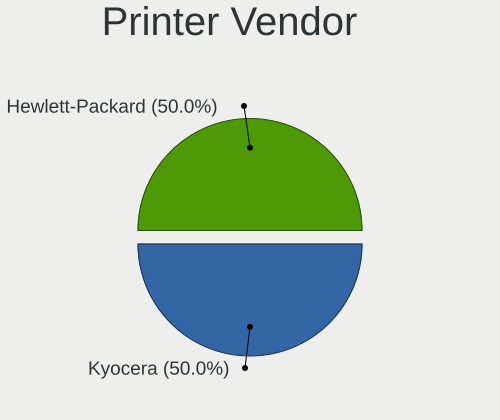

| Vendor          | Desktops | Percent |
|-----------------|----------|---------|
| Kyocera         | 1        | 50%     |
| Hewlett-Packard | 1        | 50%     |

Printer Model
-------------

Printer device models

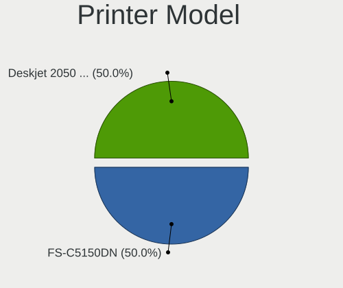

| Model                | Desktops | Percent |
|----------------------|----------|---------|
| Kyocera FS-C5150DN   | 1        | 50%     |
| HP Deskjet 2050 J510 | 1        | 50%     |

Scanner Vendor
--------------

Scanner device vendors

Zero info for selected period =(

Scanner Model
-------------

Scanner device models

Zero info for selected period =(

Camera
------

Camera Vendor
-------------

Camera device vendors

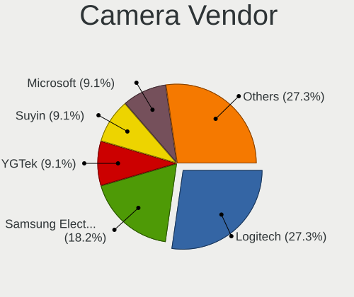

| Vendor              | Desktops | Percent |
|---------------------|----------|---------|
| Logitech            | 3        | 27.27%  |
| Samsung Electronics | 2        | 18.18%  |
| YGTek               | 1        | 9.09%   |
| Suyin               | 1        | 9.09%   |
| Microsoft           | 1        | 9.09%   |
| Microdia            | 1        | 9.09%   |
| IMC Networks        | 1        | 9.09%   |
| Cubeternet          | 1        | 9.09%   |

Camera Model
------------

Camera device models

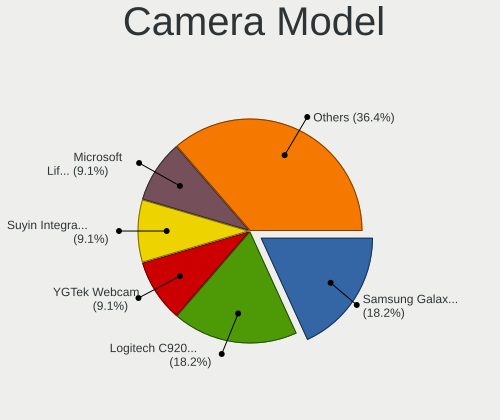

| Model                                                               | Desktops | Percent |
|---------------------------------------------------------------------|----------|---------|
| Samsung Galaxy series, misc. (MTP mode)                             | 2        | 18.18%  |
| Logitech C920 PRO HD Webcam                                         | 2        | 18.18%  |
| YGTek Webcam                                                        | 1        | 9.09%   |
| Suyin Integrated_Webcam_HD                                          | 1        | 9.09%   |
| Microsoft LifeCam HD-3000                                           | 1        | 9.09%   |
| Microdia MSI Starcam Racer                                          | 1        | 9.09%   |
| Logitech C505 HD Webcam                                             | 1        | 9.09%   |
| IMC Networks XHC Camera                                             | 1        | 9.09%   |
| Cubeternet EtronTech CMOS based eSP570 WebCam [Onyx Titanium TC101] | 1        | 9.09%   |

Security
--------

Fingerprint Vendor
------------------

Fingerprint sensor vendors

Zero info for selected period =(

Fingerprint Model
-----------------

Fingerprint sensor models

Zero info for selected period =(

Chipcard Vendor
---------------

Chipcard module vendors

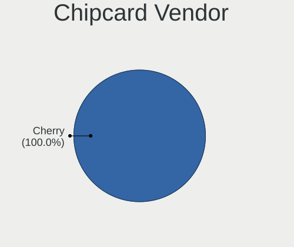

| Vendor | Desktops | Percent |
|--------|----------|---------|
| Cherry | 2        | 100%    |

Chipcard Model
--------------

Chipcard module models

| Model                   | Desktops | Percent |
|-------------------------|----------|---------|
| Cherry SECURE BOARD 1.0 | 2        | 100%    |

Unsupported
-----------

Unsupported Devices
-------------------

Total unsupported devices on board

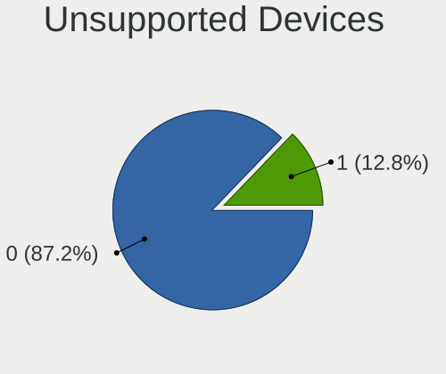

| Total | Desktops | Percent |
|-------|----------|---------|
| 0     | 42       | 87.5%   |
| 1     | 6        | 12.5%   |

Unsupported Device Types
------------------------

Types of unsupported devices

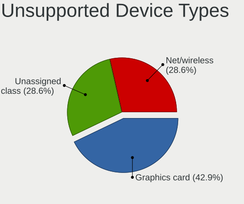

| Type             | Desktops | Percent |
|------------------|----------|---------|
| Graphics card    | 3        | 42.86%  |
| Unassigned class | 2        | 28.57%  |
| Net/wireless     | 2        | 28.57%  |

