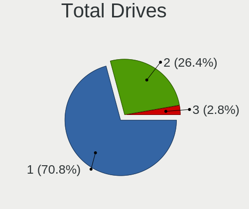
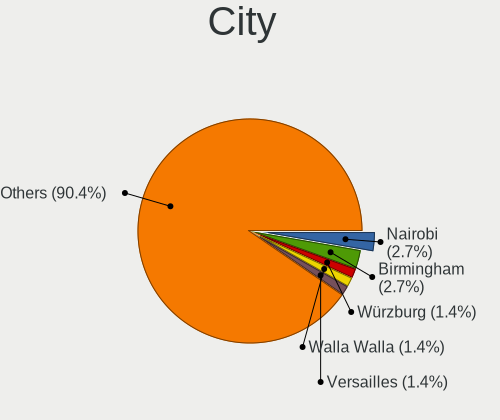
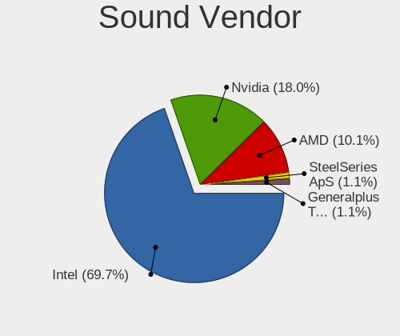

blendOS - Tested Hardware & Statistics (Notebooks)
--------------------------------------------------

A project to collect tested hardware configurations for blendOS.

Anyone can contribute to this report by the [hw-probe](https://github.com/linuxhw/hw-probe) tool:

    sudo -E hw-probe -all -upload

Please contribute! Especially if your hardware is rare.

Contents
--------

* [ Test Cases ](#test-cases)

* [ System ](#system)
  - [ OS                       ](#os)
  - [ OS Family                ](#os-family)
  - [ Kernel                   ](#kernel)
  - [ Kernel Family            ](#kernel-family)
  - [ Kernel Major Ver.        ](#kernel-major-ver)
  - [ Arch                     ](#arch)
  - [ DE                       ](#de)
  - [ Display Server           ](#display-server)
  - [ Display Manager          ](#display-manager)
  - [ OS Lang                  ](#os-lang)
  - [ Boot Mode                ](#boot-mode)
  - [ Filesystem               ](#filesystem)
  - [ Part. scheme             ](#part-scheme)
  - [ Dual Boot with Linux/BSD ](#dual-boot-with-linuxbsd)
  - [ Dual Boot (Win)          ](#dual-boot-win)

* [ Board ](#board)
  - [ Vendor                   ](#vendor)
  - [ Model                    ](#model)
  - [ Model Family             ](#model-family)
  - [ MFG Year                 ](#mfg-year)
  - [ Form Factor              ](#form-factor)
  - [ Secure Boot              ](#secure-boot)
  - [ Coreboot                 ](#coreboot)
  - [ RAM Size                 ](#ram-size)
  - [ RAM Used                 ](#ram-used)
  - [ Total Drives             ](#total-drives)
  - [ Has CD-ROM               ](#has-cd-rom)
  - [ Has Ethernet             ](#has-ethernet)
  - [ Has WiFi                 ](#has-wifi)
  - [ Has Bluetooth            ](#has-bluetooth)

* [ Location ](#location)
  - [ Country                  ](#country)
  - [ City                     ](#city)

* [ Drives ](#drives)
  - [ Drive Vendor             ](#drive-vendor)
  - [ Drive Model              ](#drive-model)
  - [ HDD Vendor               ](#hdd-vendor)
  - [ SSD Vendor               ](#ssd-vendor)
  - [ Drive Kind               ](#drive-kind)
  - [ Drive Connector          ](#drive-connector)
  - [ Drive Size               ](#drive-size)
  - [ Space Total              ](#space-total)
  - [ Space Used               ](#space-used)
  - [ Malfunc. Drives          ](#malfunc-drives)
  - [ Malfunc. Drive Vendor    ](#malfunc-drive-vendor)
  - [ Malfunc. HDD Vendor      ](#malfunc-hdd-vendor)
  - [ Malfunc. Drive Kind      ](#malfunc-drive-kind)
  - [ Failed Drives            ](#failed-drives)
  - [ Failed Drive Vendor      ](#failed-drive-vendor)
  - [ Drive Status             ](#drive-status)

* [ Storage controller ](#storage-controller)
  - [ Storage Vendor           ](#storage-vendor)
  - [ Storage Model            ](#storage-model)
  - [ Storage Kind             ](#storage-kind)

* [ Processor ](#processor)
  - [ CPU Vendor               ](#cpu-vendor)
  - [ CPU Model                ](#cpu-model)
  - [ CPU Model Family         ](#cpu-model-family)
  - [ CPU Cores                ](#cpu-cores)
  - [ CPU Sockets              ](#cpu-sockets)
  - [ CPU Threads              ](#cpu-threads)
  - [ CPU Op-Modes             ](#cpu-op-modes)
  - [ CPU Microcode            ](#cpu-microcode)
  - [ CPU Microarch            ](#cpu-microarch)

* [ Graphics ](#graphics)
  - [ GPU Vendor               ](#gpu-vendor)
  - [ GPU Model                ](#gpu-model)
  - [ GPU Combo                ](#gpu-combo)
  - [ GPU Driver               ](#gpu-driver)
  - [ GPU Memory               ](#gpu-memory)

* [ Monitor ](#monitor)
  - [ Monitor Vendor           ](#monitor-vendor)
  - [ Monitor Model            ](#monitor-model)
  - [ Monitor Resolution       ](#monitor-resolution)
  - [ Monitor Diagonal         ](#monitor-diagonal)
  - [ Monitor Width            ](#monitor-width)
  - [ Aspect Ratio             ](#aspect-ratio)
  - [ Monitor Area             ](#monitor-area)
  - [ Pixel Density            ](#pixel-density)
  - [ Multiple Monitors        ](#multiple-monitors)

* [ Network ](#network)
  - [ Net Controller Vendor    ](#net-controller-vendor)
  - [ Net Controller Model     ](#net-controller-model)
  - [ Wireless Vendor          ](#wireless-vendor)
  - [ Wireless Model           ](#wireless-model)
  - [ Ethernet Vendor          ](#ethernet-vendor)
  - [ Ethernet Model           ](#ethernet-model)
  - [ Net Controller Kind      ](#net-controller-kind)
  - [ Used Controller          ](#used-controller)
  - [ NICs                     ](#nics)
  - [ IPv6                     ](#ipv6)

* [ Bluetooth ](#bluetooth)
  - [ Bluetooth Vendor         ](#bluetooth-vendor)
  - [ Bluetooth Model          ](#bluetooth-model)

* [ Sound ](#sound)
  - [ Sound Vendor             ](#sound-vendor)
  - [ Sound Model              ](#sound-model)

* [ Memory ](#memory)
  - [ Memory Vendor            ](#memory-vendor)
  - [ Memory Model             ](#memory-model)
  - [ Memory Kind              ](#memory-kind)
  - [ Memory Form Factor       ](#memory-form-factor)
  - [ Memory Size              ](#memory-size)
  - [ Memory Speed             ](#memory-speed)

* [ Printers & scanners ](#printers--scanners)
  - [ Printer Vendor           ](#printer-vendor)
  - [ Printer Model            ](#printer-model)
  - [ Scanner Vendor           ](#scanner-vendor)
  - [ Scanner Model            ](#scanner-model)

* [ Camera ](#camera)
  - [ Camera Vendor            ](#camera-vendor)
  - [ Camera Model             ](#camera-model)

* [ Security ](#security)
  - [ Fingerprint Vendor       ](#fingerprint-vendor)
  - [ Fingerprint Model        ](#fingerprint-model)
  - [ Chipcard Vendor          ](#chipcard-vendor)
  - [ Chipcard Model           ](#chipcard-model)

* [ Unsupported ](#unsupported)
  - [ Unsupported Devices      ](#unsupported-devices)
  - [ Unsupported Device Types ](#unsupported-device-types)

Test Cases
----------

Total: 94

| Vendor    | Model                       | Probe                                                      | Date         |
|-----------|-----------------------------|------------------------------------------------------------|--------------|
| Lenovo    | G50-70 20351                | [82a4f5f99b](https://linux-hardware.org/?probe=82a4f5f99b) | Jan 01, 2025 |
| Apple     | MacBookPro8,2               | [e2f957298c](https://linux-hardware.org/?probe=e2f957298c) | Dec 17, 2024 |
| Apple     | MacBookPro8,2               | [504b00b57d](https://linux-hardware.org/?probe=504b00b57d) | Dec 17, 2024 |
| Apple     | MacBookPro5,1               | [3ba5637302](https://linux-hardware.org/?probe=3ba5637302) | Dec 07, 2024 |
| Lenovo    | ThinkPad P52 20M9CTO1WW     | [2424c97650](https://linux-hardware.org/?probe=2424c97650) | Sep 24, 2024 |
| Lenovo    | B51-30 80LK                 | [e4f72a3222](https://linux-hardware.org/?probe=e4f72a3222) | Aug 08, 2024 |
| Lenovo    | B51-30 80LK                 | [8003cbb98e](https://linux-hardware.org/?probe=8003cbb98e) | Aug 08, 2024 |
| Alienware | m15                         | [e088ad174b](https://linux-hardware.org/?probe=e088ad174b) | May 21, 2024 |
| Fujitsu   | LIFEBOOK U727               | [2d96690752](https://linux-hardware.org/?probe=2d96690752) | Apr 20, 2024 |
| HP        | Pavilion Gaming Laptop 1... | [e34eb800b2](https://linux-hardware.org/?probe=e34eb800b2) | Mar 29, 2024 |
| Acer      | Aspire 4752                 | [bb522b4ec1](https://linux-hardware.org/?probe=bb522b4ec1) | Mar 26, 2024 |
| Lenovo    | IdeaPad 310-15ISK 80SM      | [fced33a8a9](https://linux-hardware.org/?probe=fced33a8a9) | Mar 12, 2024 |
| Lenovo    | IdeaPad 310-15ISK 80SM      | [7e150a29fb](https://linux-hardware.org/?probe=7e150a29fb) | Mar 09, 2024 |
| HP        | Pavilion Gaming Laptop 1... | [33cf50568b](https://linux-hardware.org/?probe=33cf50568b) | Mar 06, 2024 |
| HP        | Pavilion Gaming Laptop 1... | [8845023d60](https://linux-hardware.org/?probe=8845023d60) | Mar 02, 2024 |
| Apple     | MacBookAir6,2               | [7ad397fc57](https://linux-hardware.org/?probe=7ad397fc57) | Jan 31, 2024 |
| Hampoo    | Cherry Trail CR             | [1c0466fe53](https://linux-hardware.org/?probe=1c0466fe53) | Jan 25, 2024 |
| MSI       | GS66 Stealth 10SF           | [fc256ee1dd](https://linux-hardware.org/?probe=fc256ee1dd) | Jan 18, 2024 |
| MSI       | GS66 Stealth 10SF           | [57eaf4a8c1](https://linux-hardware.org/?probe=57eaf4a8c1) | Jan 18, 2024 |
| ShangMai  | H                           | [aab28ab3ea](https://linux-hardware.org/?probe=aab28ab3ea) | Dec 27, 2023 |
| Lenovo    | ThinkPad E470 20H1004UIG    | [69efda7672](https://linux-hardware.org/?probe=69efda7672) | Dec 26, 2023 |
| Lenovo    | ThinkPad L470 20J5S0JM00    | [c8f1140dc5](https://linux-hardware.org/?probe=c8f1140dc5) | Dec 26, 2023 |
| Dell      | Inspiron 16 Plus 7630       | [5f798fd0e0](https://linux-hardware.org/?probe=5f798fd0e0) | Dec 26, 2023 |
| HP        | EliteBook 840 G5            | [5b7a85e9fc](https://linux-hardware.org/?probe=5b7a85e9fc) | Dec 23, 2023 |
| Lenovo    | IdeaPadFlex 15 20309        | [81dbec4f1a](https://linux-hardware.org/?probe=81dbec4f1a) | Dec 19, 2023 |
| ASUSTek   | VivoBook_ASUSLaptop X515... | [5e71510e4c](https://linux-hardware.org/?probe=5e71510e4c) | Dec 06, 2023 |
| Samsung   | 550P5C/550P7C               | [b7294ed55c](https://linux-hardware.org/?probe=b7294ed55c) | Nov 20, 2023 |
| Dell      | Latitude E7250              | [265c13751a](https://linux-hardware.org/?probe=265c13751a) | Nov 10, 2023 |
| Samsung   | 750XEE                      | [8fd9a5953f](https://linux-hardware.org/?probe=8fd9a5953f) | Nov 07, 2023 |
| HP        | Pavilion Gaming Laptop 1... | [b837317e37](https://linux-hardware.org/?probe=b837317e37) | Nov 06, 2023 |
| HP        | ENVY 15                     | [5f301610ee](https://linux-hardware.org/?probe=5f301610ee) | Nov 06, 2023 |
| HP        | ENVY 15                     | [150ca6a1a0](https://linux-hardware.org/?probe=150ca6a1a0) | Nov 06, 2023 |
| Samsung   | 750XEE                      | [fd74ae52f8](https://linux-hardware.org/?probe=fd74ae52f8) | Nov 04, 2023 |
| Notebook  | P65_P67SA                   | [a8bf179e25](https://linux-hardware.org/?probe=a8bf179e25) | Nov 01, 2023 |
| Lenovo    | IdeaPad S145-15AST 81N3     | [342218fa56](https://linux-hardware.org/?probe=342218fa56) | Oct 28, 2023 |
| HP        | Notebook                    | [efb9814479](https://linux-hardware.org/?probe=efb9814479) | Oct 27, 2023 |
| Toshiba   | QOSMIO X75-A                | [8024d2e76b](https://linux-hardware.org/?probe=8024d2e76b) | Oct 26, 2023 |
| HP        | ProBook 655 G1              | [8e1cb99809](https://linux-hardware.org/?probe=8e1cb99809) | Oct 19, 2023 |
| HP        | ProBook 655 G1              | [a80cd678f2](https://linux-hardware.org/?probe=a80cd678f2) | Oct 18, 2023 |
| Lenovo    | G50-30 80G0                 | [3d308e7bb0](https://linux-hardware.org/?probe=3d308e7bb0) | Oct 16, 2023 |
| Apple     | MacBookPro9,2               | [b97291313f](https://linux-hardware.org/?probe=b97291313f) | Oct 10, 2023 |
| HP        | 255 G5 Notebook PC          | [ecb99bea0c](https://linux-hardware.org/?probe=ecb99bea0c) | Oct 07, 2023 |
| MSI       | Pulse GL66 11UGK            | [706d9eb214](https://linux-hardware.org/?probe=706d9eb214) | Oct 06, 2023 |
| HP        | 255 G5 Notebook PC          | [4f758a2ce7](https://linux-hardware.org/?probe=4f758a2ce7) | Oct 05, 2023 |
| Lenovo    | Legion 7 15IMH05 81YT       | [604e4a5556](https://linux-hardware.org/?probe=604e4a5556) | Oct 05, 2023 |
| MSI       | Pulse GL66 11UGK            | [4484122a2c](https://linux-hardware.org/?probe=4484122a2c) | Oct 05, 2023 |
| Lenovo    | Legion 7 15IMH05 81YT       | [73ab8f124c](https://linux-hardware.org/?probe=73ab8f124c) | Oct 03, 2023 |
| HUAWEI    | BOHK-WAX9X                  | [6275e5c1d4](https://linux-hardware.org/?probe=6275e5c1d4) | Sep 29, 2023 |
| Lenovo    | Yoga 2 Pro 20266            | [fcb38d5424](https://linux-hardware.org/?probe=fcb38d5424) | Sep 24, 2023 |
| Apple     | MacBookPro11,1              | [26f998fafb](https://linux-hardware.org/?probe=26f998fafb) | Sep 19, 2023 |
| Dell      | Inspiron 15 5510            | [71a6a04c4c](https://linux-hardware.org/?probe=71a6a04c4c) | Sep 15, 2023 |
| Dell      | XPS 9320                    | [054584d248](https://linux-hardware.org/?probe=054584d248) | Sep 15, 2023 |
| Apple     | MacBookPro9,2               | [a6d272539a](https://linux-hardware.org/?probe=a6d272539a) | Sep 03, 2023 |
| Dell      | Latitude 5410               | [e45d7975d2](https://linux-hardware.org/?probe=e45d7975d2) | Sep 03, 2023 |
| Acer      | Aspire 5750G                | [205a407b60](https://linux-hardware.org/?probe=205a407b60) | Aug 21, 2023 |
| Dell      | XPS 13 9350                 | [d3aac86eac](https://linux-hardware.org/?probe=d3aac86eac) | Aug 16, 2023 |
| Dell      | XPS 13 9350                 | [7032d8da96](https://linux-hardware.org/?probe=7032d8da96) | Aug 16, 2023 |
| Panasonic | CF-19ADNAXDA                | [d96cf2b13c](https://linux-hardware.org/?probe=d96cf2b13c) | Aug 12, 2023 |
| Lenovo    | IdeaPad 3 14ITL05 81X7      | [f062831bd7](https://linux-hardware.org/?probe=f062831bd7) | Aug 11, 2023 |
| Dell      | Inspiron 3542               | [33674f8b81](https://linux-hardware.org/?probe=33674f8b81) | Aug 02, 2023 |
| Acer      | Aspire A715-71G             | [7f3c7327b7](https://linux-hardware.org/?probe=7f3c7327b7) | Aug 01, 2023 |
| Beelink   | Gemini X                    | [2846d152be](https://linux-hardware.org/?probe=2846d152be) | Jul 29, 2023 |
| MSI       | GP63 Leopard 8RE            | [42a81e063a](https://linux-hardware.org/?probe=42a81e063a) | Jul 28, 2023 |
| Dell      | XPS 15 9570                 | [9a62fe1979](https://linux-hardware.org/?probe=9a62fe1979) | Jul 22, 2023 |
| Lenovo    | IdeaPad Slim 9 14ITL5 82... | [352cc6e31d](https://linux-hardware.org/?probe=352cc6e31d) | Jul 17, 2023 |
| Samsung   | 950XDB/951XDB/950XDY        | [72015ffe3b](https://linux-hardware.org/?probe=72015ffe3b) | Jul 16, 2023 |
| ASUSTek   | G750JZA                     | [8a26d246e2](https://linux-hardware.org/?probe=8a26d246e2) | Jul 14, 2023 |
| HP        | Pavilion dv6                | [7f6c05f2d9](https://linux-hardware.org/?probe=7f6c05f2d9) | Jul 09, 2023 |
| Apple     | MacBookPro14,1              | [62bbadc762](https://linux-hardware.org/?probe=62bbadc762) | Jul 08, 2023 |
| Acer      | Aspire V5-471G              | [f82fbc50e3](https://linux-hardware.org/?probe=f82fbc50e3) | Jun 20, 2023 |
| Lenovo    | IdeaPad 3 15ITL6 82H8       | [627203a31f](https://linux-hardware.org/?probe=627203a31f) | Jun 18, 2023 |
| MSI       | MS-16Y1                     | [167889509f](https://linux-hardware.org/?probe=167889509f) | Jun 18, 2023 |
| ASUSTek   | X540LA                      | [55316783a4](https://linux-hardware.org/?probe=55316783a4) | Jun 16, 2023 |
| ASUSTek   | X540LA                      | [2c1b5651ed](https://linux-hardware.org/?probe=2c1b5651ed) | Jun 15, 2023 |
| HP        | Notebook                    | [45553d6493](https://linux-hardware.org/?probe=45553d6493) | Jun 04, 2023 |
| ASUSTek   | K53SK                       | [39c63c5bd1](https://linux-hardware.org/?probe=39c63c5bd1) | May 31, 2023 |
| Lenovo    | G700 20251                  | [8ba2c6e5ed](https://linux-hardware.org/?probe=8ba2c6e5ed) | May 26, 2023 |
| Lenovo    | G550 2958                   | [cb61728cb7](https://linux-hardware.org/?probe=cb61728cb7) | May 22, 2023 |
| Lenovo    | G550 2958                   | [1dda8d01ad](https://linux-hardware.org/?probe=1dda8d01ad) | May 20, 2023 |
| Lenovo    | G550 2958                   | [fe4d0a2ec3](https://linux-hardware.org/?probe=fe4d0a2ec3) | May 20, 2023 |
| HP        | Elite x2 1012 G1            | [20dcc3e6b3](https://linux-hardware.org/?probe=20dcc3e6b3) | May 04, 2023 |
| Dell      | Latitude XT2                | [3cfd979c60](https://linux-hardware.org/?probe=3cfd979c60) | Apr 30, 2023 |
| Acer      | Aspire R7-571G              | [d4220bc210](https://linux-hardware.org/?probe=d4220bc210) | Apr 25, 2023 |
| HP        | ProBook 640 G1              | [9306db1f90](https://linux-hardware.org/?probe=9306db1f90) | Apr 25, 2023 |
| Apple     | MacBookPro8,1               | [006b9a2b3f](https://linux-hardware.org/?probe=006b9a2b3f) | Apr 24, 2023 |
| Lenovo    | ThinkPad T431s 20ACS0640... | [711d09df05](https://linux-hardware.org/?probe=711d09df05) | Apr 04, 2023 |
| Samsung   | 750XED                      | [be19d0454d](https://linux-hardware.org/?probe=be19d0454d) | Mar 16, 2023 |
| Dell      | Precision M4800             | [57c57bb353](https://linux-hardware.org/?probe=57c57bb353) | Feb 22, 2023 |
| Gigabyte  | P65                         | [b3d7faba21](https://linux-hardware.org/?probe=b3d7faba21) | Feb 12, 2023 |
| Gigabyte  | P65                         | [25d871afca](https://linux-hardware.org/?probe=25d871afca) | Feb 11, 2023 |
| Lenovo    | IdeaPad 310-15ISK 80SM      | [13bdc2b06c](https://linux-hardware.org/?probe=13bdc2b06c) | Feb 03, 2023 |
| Lenovo    | ThinkPad L580 20LW0010GE    | [ed7b51b8bc](https://linux-hardware.org/?probe=ed7b51b8bc) | Feb 01, 2023 |
| Apple     | MacBookPro11,1              | [e5af375b93](https://linux-hardware.org/?probe=e5af375b93) | Jan 29, 2023 |
| Apple     | MacBookPro11,1              | [41d67fcba8](https://linux-hardware.org/?probe=41d67fcba8) | Jan 29, 2023 |

System
------

OS
--

Installed operating systems

| Name            | Notebooks | Percent |
|-----------------|-----------|---------|
| blendOS         | 70        | 97.22%  |
| blendOS Rolling | 2         | 2.78%   |

OS Family
---------

OS without a version

| Name    | Notebooks | Percent |
|---------|-----------|---------|
| blendOS | 72        | 100%    |

Kernel
------

Version of the Linux kernel

| Version                        | Notebooks | Percent |
|--------------------------------|-----------|---------|
| 6.3.9-zen1-1-zen               | 34        | 46.58%  |
| 6.5.5-zen1-1-zen               | 10        | 13.7%   |
| 6.2.12-arch1-1                 | 4         | 5.48%   |
| 6.3.6-zen1-1-zen               | 3         | 4.11%   |
| 6.1.8-arch1-1                  | 3         | 4.11%   |
| 6.3.5-arch1-1                  | 2         | 2.74%   |
| 6.2.13-arch1-1                 | 2         | 2.74%   |
| 6.1.8-zen1-1-zen               | 2         | 2.74%   |
| 6.8.7-zen1-1-zen               | 1         | 1.37%   |
| 6.4.0-Yagakimi-T2-xanmod1-1-t2 | 1         | 1.37%   |
| 6.3.4-arch1-1                  | 1         | 1.37%   |
| 6.3.2-arch1-1                  | 1         | 1.37%   |
| 6.2.11-arch1-1                 | 1         | 1.37%   |
| 6.12.7-zen1-1-zen              | 1         | 1.37%   |
| 6.12.4-zen1-1-zen              | 1         | 1.37%   |
| 6.12.1-zen1-1-zen              | 1         | 1.37%   |
| 6.10.7-zen1-1-zen              | 1         | 1.37%   |
| 6.10.3-zen1-2-zen              | 1         | 1.37%   |
| 6.1.9-zen1-1-zen               | 1         | 1.37%   |
| 6.1.12-zen1-1-zen              | 1         | 1.37%   |
| 6.1.11-zen1-1-zen              | 1         | 1.37%   |

Kernel Family
-------------

Linux kernel without a distro release

| Version | Notebooks | Percent |
|---------|-----------|---------|
| 6.3.9   | 34        | 46.58%  |
| 6.5.5   | 10        | 13.7%   |
| 6.1.8   | 5         | 6.85%   |
| 6.2.12  | 4         | 5.48%   |
| 6.3.6   | 3         | 4.11%   |
| 6.3.5   | 2         | 2.74%   |
| 6.2.13  | 2         | 2.74%   |
| 6.8.7   | 1         | 1.37%   |
| 6.4.0   | 1         | 1.37%   |
| 6.3.4   | 1         | 1.37%   |
| 6.3.2   | 1         | 1.37%   |
| 6.2.11  | 1         | 1.37%   |
| 6.12.7  | 1         | 1.37%   |
| 6.12.4  | 1         | 1.37%   |
| 6.12.1  | 1         | 1.37%   |
| 6.10.7  | 1         | 1.37%   |
| 6.10.3  | 1         | 1.37%   |
| 6.1.9   | 1         | 1.37%   |
| 6.1.12  | 1         | 1.37%   |
| 6.1.11  | 1         | 1.37%   |

Kernel Major Ver.
-----------------

Linux kernel major version

| Version | Notebooks | Percent |
|---------|-----------|---------|
| 6.3     | 41        | 56.94%  |
| 6.5     | 10        | 13.89%  |
| 6.2     | 7         | 9.72%   |
| 6.1     | 7         | 9.72%   |
| 6.12    | 3         | 4.17%   |
| 6.10    | 2         | 2.78%   |
| 6.8     | 1         | 1.39%   |
| 6.4     | 1         | 1.39%   |

Arch
----

OS architecture (x86_64, i586, etc.)

| Name   | Notebooks | Percent |
|--------|-----------|---------|
| x86_64 | 72        | 100%    |

DE
--

Desktop Environment

| Name  | Notebooks | Percent |
|-------|-----------|---------|
| GNOME | 43        | 59.72%  |
| KDE5  | 29        | 40.28%  |

Display Server
--------------

X11 or Wayland

| Name    | Notebooks | Percent |
|---------|-----------|---------|
| Wayland | 68        | 93.15%  |
| X11     | 5         | 6.85%   |

Display Manager
---------------

SDDM, LightDM, etc.

| Name    | Notebooks | Percent |
|---------|-----------|---------|
| Unknown | 70        | 97.22%  |
| SDDM    | 1         | 1.39%   |
| GDM     | 1         | 1.39%   |

OS Lang
-------

Language

| Lang        | Notebooks | Percent |
|-------------|-----------|---------|
| en_US       | 46        | 63.89%  |
| de_DE       | 5         | 6.94%   |
| en_GB       | 4         | 5.56%   |
| ru_RU       | 2         | 2.78%   |
| it_IT       | 2         | 2.78%   |
| fr_FR       | 2         | 2.78%   |
| de_CH       | 2         | 2.78%   |
| tr_TR       | 1         | 1.39%   |
| fr_HT       | 1         | 1.39%   |
| es_UY       | 1         | 1.39%   |
| es_ES       | 1         | 1.39%   |
| es_CO       | 1         | 1.39%   |
| es_AR       | 1         | 1.39%   |
| en_US.UTF.8 | 1         | 1.39%   |
| en_AU       | 1         | 1.39%   |
| de_AT       | 1         | 1.39%   |

Boot Mode
---------

EFI or BIOS

| Mode | Notebooks | Percent |
|------|-----------|---------|
| BIOS | 71        | 98.61%  |
| EFI  | 1         | 1.39%   |

Filesystem
----------

Type of filesystem

| Type  | Notebooks | Percent |
|-------|-----------|---------|
| Ext4  | 56        | 77.78%  |
| Tmpfs | 10        | 13.89%  |
| Btrfs | 5         | 6.94%   |
| XXXfs | 1         | 1.39%   |

Part. scheme
------------

Scheme of partitioning

| Type    | Notebooks | Percent |
|---------|-----------|---------|
| Unknown | 70        | 97.22%  |
| GPT     | 2         | 2.78%   |

Dual Boot with Linux/BSD
------------------------

Hosting more than one Linux/BSD

| Dual boot | Notebooks | Percent |
|-----------|-----------|---------|
| No        | 71        | 98.61%  |
| Yes       | 1         | 1.39%   |

Dual Boot (Win)
---------------

Hosting Linux and Windows

| Dual boot | Notebooks | Percent |
|-----------|-----------|---------|
| No        | 72        | 100%    |

Board
-----

Vendor
------

Motherboard manufacturer

| Name                | Notebooks | Percent |
|---------------------|-----------|---------|
| Lenovo              | 18        | 25%     |
| Hewlett-Packard     | 11        | 15.28%  |
| Dell                | 9         | 12.5%   |
| Apple               | 8         | 11.11%  |
| Samsung Electronics | 4         | 5.56%   |
| MSI                 | 4         | 5.56%   |
| ASUSTek Computer    | 4         | 5.56%   |
| Acer                | 4         | 5.56%   |
| Toshiba             | 1         | 1.39%   |
| ShangMai            | 1         | 1.39%   |
| Panasonic           | 1         | 1.39%   |
| Notebook            | 1         | 1.39%   |
| HUAWEI              | 1         | 1.39%   |
| Hampoo              | 1         | 1.39%   |
| Gigabyte Technology | 1         | 1.39%   |
| Fujitsu             | 1         | 1.39%   |
| Beelink             | 1         | 1.39%   |
| Alienware           | 1         | 1.39%   |

Model
-----

Motherboard model

| Name                                | Notebooks | Percent |
|-------------------------------------|-----------|---------|
| HP Notebook                         | 2         | 2.78%   |
| Apple MacBookPro11,1                | 2         | 2.78%   |
| Toshiba QOSMIO X75-A                | 1         | 1.39%   |
| ShangMai H                          | 1         | 1.39%   |
| Samsung 950XDB/951XDB/950XDY        | 1         | 1.39%   |
| Samsung 750XEE                      | 1         | 1.39%   |
| Samsung 750XED                      | 1         | 1.39%   |
| Samsung 550P5C/550P7C               | 1         | 1.39%   |
| Panasonic CF-19ADNAXDA              | 1         | 1.39%   |
| Notebook P65_P67SA                  | 1         | 1.39%   |
| MSI Pulse GL66 11UGK                | 1         | 1.39%   |
| MSI MS-16Y1                         | 1         | 1.39%   |
| MSI GS66 Stealth 10SF               | 1         | 1.39%   |
| MSI GP63 Leopard 8RE                | 1         | 1.39%   |
| Lenovo Yoga 2 Pro 20266             | 1         | 1.39%   |
| Lenovo ThinkPad T431s 20ACS06400    | 1         | 1.39%   |
| Lenovo ThinkPad P52 20M9CTO1WW      | 1         | 1.39%   |
| Lenovo ThinkPad L580 20LW0010GE     | 1         | 1.39%   |
| Lenovo ThinkPad L470 20J5S0JM00     | 1         | 1.39%   |
| Lenovo ThinkPad E470 20H1004UIG     | 1         | 1.39%   |
| Lenovo Legion 7 15IMH05 81YT        | 1         | 1.39%   |
| Lenovo IdeaPadFlex 15 20309         | 1         | 1.39%   |
| Lenovo IdeaPad Slim 9 14ITL5 82D2   | 1         | 1.39%   |
| Lenovo IdeaPad S145-15AST 81N3      | 1         | 1.39%   |
| Lenovo IdeaPad 310-15ISK 80SM       | 1         | 1.39%   |
| Lenovo IdeaPad 3 15ITL6 82H8        | 1         | 1.39%   |
| Lenovo IdeaPad 3 14ITL05 81X7       | 1         | 1.39%   |
| Lenovo G700 20251                   | 1         | 1.39%   |
| Lenovo G550 2958                    | 1         | 1.39%   |
| Lenovo G50-70 20351                 | 1         | 1.39%   |
| Lenovo G50-30 80G0                  | 1         | 1.39%   |
| Lenovo B51-30 80LK                  | 1         | 1.39%   |
| HUAWEI BOHK-WAX9X                   | 1         | 1.39%   |
| HP ProBook 655 G1                   | 1         | 1.39%   |
| HP ProBook 640 G1                   | 1         | 1.39%   |
| HP Pavilion Gaming Laptop 16-a0xxx  | 1         | 1.39%   |
| HP Pavilion Gaming Laptop 15-ec0xxx | 1         | 1.39%   |
| HP Pavilion Gaming Laptop 15-dk0xxx | 1         | 1.39%   |
| HP ENVY 15                          | 1         | 1.39%   |
| HP EliteBook 840 G5                 | 1         | 1.39%   |

Model Family
------------

Motherboard model prefix

| Name                   | Notebooks | Percent |
|------------------------|-----------|---------|
| Lenovo ThinkPad        | 5         | 6.94%   |
| Lenovo IdeaPad         | 5         | 6.94%   |
| Acer Aspire            | 4         | 5.56%   |
| HP Pavilion            | 3         | 4.17%   |
| Dell XPS               | 3         | 4.17%   |
| Dell Inspiron          | 3         | 4.17%   |
| HP ProBook             | 2         | 2.78%   |
| HP Notebook            | 2         | 2.78%   |
| Dell Latitude          | 2         | 2.78%   |
| Apple MacBookPro8      | 2         | 2.78%   |
| Apple MacBookPro11     | 2         | 2.78%   |
| Toshiba QOSMIO         | 1         | 1.39%   |
| ShangMai H             | 1         | 1.39%   |
| Samsung 950XDB         | 1         | 1.39%   |
| Samsung 750XEE         | 1         | 1.39%   |
| Samsung 750XED         | 1         | 1.39%   |
| Samsung 550P5C         | 1         | 1.39%   |
| Panasonic CF-19ADNAXDA | 1         | 1.39%   |
| Notebook P65           | 1         | 1.39%   |
| MSI Pulse              | 1         | 1.39%   |
| MSI MS-16Y1            | 1         | 1.39%   |
| MSI GS66               | 1         | 1.39%   |
| MSI GP63               | 1         | 1.39%   |
| Lenovo Yoga            | 1         | 1.39%   |
| Lenovo Legion          | 1         | 1.39%   |
| Lenovo IdeaPadFlex     | 1         | 1.39%   |
| Lenovo G700            | 1         | 1.39%   |
| Lenovo G550            | 1         | 1.39%   |
| Lenovo G50-70          | 1         | 1.39%   |
| Lenovo G50-30          | 1         | 1.39%   |
| Lenovo B51-30          | 1         | 1.39%   |
| HUAWEI BOHK-WAX9X      | 1         | 1.39%   |
| HP ENVY                | 1         | 1.39%   |
| HP EliteBook           | 1         | 1.39%   |
| HP Elite               | 1         | 1.39%   |
| HP 255                 | 1         | 1.39%   |
| Hampoo Tablet          | 1         | 1.39%   |
| Gigabyte P65           | 1         | 1.39%   |
| Fujitsu LIFEBOOK       | 1         | 1.39%   |
| Dell Precision         | 1         | 1.39%   |

MFG Year
--------

Motherboard manufacture year

| Year | Notebooks | Percent |
|------|-----------|---------|
| 2013 | 9         | 12.5%   |
| 2014 | 8         | 11.11%  |
| 2018 | 7         | 9.72%   |
| 2016 | 7         | 9.72%   |
| 2011 | 6         | 8.33%   |
| 2021 | 5         | 6.94%   |
| 2020 | 5         | 6.94%   |
| 2019 | 5         | 6.94%   |
| 2012 | 5         | 6.94%   |
| 2017 | 4         | 5.56%   |
| 2015 | 4         | 5.56%   |
| 2023 | 2         | 2.78%   |
| 2022 | 2         | 2.78%   |
| 2009 | 2         | 2.78%   |
| 2010 | 1         | 1.39%   |

Form Factor
-----------

Physical design of the computer

| Name     | Notebooks | Percent |
|----------|-----------|---------|
| Notebook | 72        | 100%    |

Secure Boot
-----------

Enabled or disabled

| State    | Notebooks | Percent |
|----------|-----------|---------|
| Disabled | 72        | 100%    |

Coreboot
--------

Have coreboot on board

| Used | Notebooks | Percent |
|------|-----------|---------|
| No   | 72        | 100%    |

RAM Size
--------

Total RAM memory

| Size in GB | Notebooks | Percent |
|------------|-----------|---------|
| 4.01-8.0   | 33        | 45.83%  |
| 32.01-64.0 | 11        | 15.28%  |
| 16.01-24.0 | 11        | 15.28%  |
| 8.01-16.0  | 9         | 12.5%   |
| 3.01-4.0   | 7         | 9.72%   |
| 1.01-2.0   | 1         | 1.39%   |

RAM Used
--------

Used RAM memory

| Used GB   | Notebooks | Percent |
|-----------|-----------|---------|
| 4.01-8.0  | 28        | 37.84%  |
| 3.01-4.0  | 19        | 25.68%  |
| 2.01-3.0  | 19        | 25.68%  |
| 1.01-2.0  | 6         | 8.11%   |
| 8.01-16.0 | 2         | 2.7%    |

Total Drives
------------

Number of drives on board

| Drives | Notebooks | Percent |
|--------|-----------|---------|
| 1      | 51        | 70.83%  |
| 2      | 19        | 26.39%  |
| 3      | 2         | 2.78%   |

Has CD-ROM
----------

Has CD-ROM on board

| Presented | Notebooks | Percent |
|-----------|-----------|---------|
| No        | 52        | 72.22%  |
| Yes       | 20        | 27.78%  |

Has Ethernet
------------

Has Ethernet on board

| Presented | Notebooks | Percent |
|-----------|-----------|---------|
| Yes       | 54        | 75%     |
| No        | 18        | 25%     |

Has WiFi
--------

Has WiFi module

| Presented | Notebooks | Percent |
|-----------|-----------|---------|
| Yes       | 70        | 97.22%  |
| No        | 2         | 2.78%   |

Has Bluetooth
-------------

Has Bluetooth module

| Presented | Notebooks | Percent |
|-----------|-----------|---------|
| Yes       | 62        | 86.11%  |
| No        | 10        | 13.89%  |

Location
--------

Country
-------

Geographic location (country)

| Country            | Notebooks | Percent |
|--------------------|-----------|---------|
| USA                | 17        | 23.61%  |
| Germany            | 12        | 16.67%  |
| UK                 | 5         | 6.94%   |
| India              | 4         | 5.56%   |
| Poland             | 3         | 4.17%   |
| Italy              | 3         | 4.17%   |
| South Africa       | 2         | 2.78%   |
| Russia             | 2         | 2.78%   |
| Kenya              | 2         | 2.78%   |
| France             | 2         | 2.78%   |
| Australia          | 2         | 2.78%   |
| Uruguay            | 1         | 1.39%   |
| Turkey             | 1         | 1.39%   |
| Switzerland        | 1         | 1.39%   |
| Spain              | 1         | 1.39%   |
| Portugal           | 1         | 1.39%   |
| Palestine          | 1         | 1.39%   |
| Nepal              | 1         | 1.39%   |
| Morocco            | 1         | 1.39%   |
| Mexico             | 1         | 1.39%   |
| Malaysia           | 1         | 1.39%   |
| Greece             | 1         | 1.39%   |
| Egypt              | 1         | 1.39%   |
| Dominican Republic | 1         | 1.39%   |
| Colombia           | 1         | 1.39%   |
| Canada             | 1         | 1.39%   |
| Brazil             | 1         | 1.39%   |
| Austria            | 1         | 1.39%   |
| Argentina          | 1         | 1.39%   |

City
----

Geographic location (city)

| City                    | Notebooks | Percent |
|-------------------------|-----------|---------|
| Nairobi                 | 2         | 2.74%   |
| Birmingham              | 2         | 2.74%   |
| Würzburg               | 1         | 1.37%   |
| Walla Walla             | 1         | 1.37%   |
| Versailles              | 1         | 1.37%   |
| Unna                    | 1         | 1.37%   |
| The Bronx               | 1         | 1.37%   |
| Tarnówka               | 1         | 1.37%   |
| Tampa                   | 1         | 1.37%   |
| Sundern                 | 1         | 1.37%   |
| Stuttgart               | 1         | 1.37%   |
| Stratford-upon-Avon     | 1         | 1.37%   |
| Stockton-on-Tees        | 1         | 1.37%   |
| Southwest Harbor        | 1         | 1.37%   |
| Saratov                 | 1         | 1.37%   |
| Sao Domingos de Rana    | 1         | 1.37%   |
| Santo Domingo Este      | 1         | 1.37%   |
| San Antonio             | 1         | 1.37%   |
| Rogers                  | 1         | 1.37%   |
| Rehetobel               | 1         | 1.37%   |
| Pokhara                 | 1         | 1.37%   |
| Perth                   | 1         | 1.37%   |
| Pensacola               | 1         | 1.37%   |
| Paraná                 | 1         | 1.37%   |
| Padova                  | 1         | 1.37%   |
| Ocean Grove             | 1         | 1.37%   |
| Oberursel               | 1         | 1.37%   |
| New York                | 1         | 1.37%   |
| New Delhi               | 1         | 1.37%   |
| Munich                  | 1         | 1.37%   |
| Mumbai                  | 1         | 1.37%   |
| Moscow                  | 1         | 1.37%   |
| Morrisville             | 1         | 1.37%   |
| Montevideo              | 1         | 1.37%   |
| Minneapolis             | 1         | 1.37%   |
| Mexicali                | 1         | 1.37%   |
| Marrakesh               | 1         | 1.37%   |
| Mandriola-Sant'Agostino | 1         | 1.37%   |
| Manchester              | 1         | 1.37%   |
| Lorena                  | 1         | 1.37%   |

Drives
------

Drive Vendor
------------

Hard drive vendors

| Vendor                         | Notebooks | Drives | Percent |
|--------------------------------|-----------|--------|---------|
| Samsung Electronics            | 19        | 21     | 21.35%  |
| Sandisk                        | 8         | 9      | 8.99%   |
| WDC                            | 6         | 6      | 6.74%   |
| Crucial                        | 6         | 7      | 6.74%   |
| Kingston                       | 5         | 5      | 5.62%   |
| Unknown                        | 4         | 4      | 4.49%   |
| Apple                          | 4         | 5      | 4.49%   |
| Toshiba                        | 3         | 3      | 3.37%   |
| Seagate                        | 3         | 3      | 3.37%   |
| HGST                           | 3         | 4      | 3.37%   |
| China                          | 3         | 3      | 3.37%   |
| SK hynix                       | 2         | 2      | 2.25%   |
| Intenso                        | 2         | 2      | 2.25%   |
| Hitachi                        | 2         | 2      | 2.25%   |
| T-FORCE                        | 1         | 1      | 1.12%   |
| StoreJet                       | 1         | 1      | 1.12%   |
| Solid State Storage Technology | 1         | 1      | 1.12%   |
| Phison Electronics             | 1         | 1      | 1.12%   |
| Patriot                        | 1         | 1      | 1.12%   |
| NT-2TB                         | 1         | 2      | 1.12%   |
| MAS                            | 1         | 1      | 1.12%   |
| LITEON                         | 1         | 1      | 1.12%   |
| KIOXIA                         | 1         | 1      | 1.12%   |
| Kingston Technology Company    | 1         | 1      | 1.12%   |
| KingFast                       | 1         | 1      | 1.12%   |
| Intel                          | 1         | 2      | 1.12%   |
| INNOVATION IT                  | 1         | 1      | 1.12%   |
| HS-SSD-C100                    | 1         | 1      | 1.12%   |
| Gigabyte Technology            | 1         | 1      | 1.12%   |
| BR                             | 1         | 1      | 1.12%   |
| ADATA Technology               | 1         | 1      | 1.12%   |
| A-DATA Technology              | 1         | 1      | 1.12%   |
| Unknown                        | 1         | 1      | 1.12%   |

Drive Model
-----------

Hard drive models

| Model                                                | Notebooks | Percent |
|------------------------------------------------------|-----------|---------|
| Samsung NVMe SSD Controller SM981/PM981/PM983 512GB  | 5         | 5.43%   |
| Samsung SSD 850 EVO 500GB                            | 3         | 3.26%   |
| WDC WDS500G2B0A-00SM50 500GB SSD                     | 2         | 2.17%   |
| Unknown MMC Card  64GB                               | 2         | 2.17%   |
| Seagate ST1000LM035-1RK172 1TB                       | 2         | 2.17%   |
| Sandisk WD Black SN850 2TB                           | 2         | 2.17%   |
| HGST HTS725050A7E630 500GB                           | 2         | 2.17%   |
| Apple SSD SM0256F 256GB                              | 2         | 2.17%   |
| WDC WDS240G2G0A-00JH30 240GB SSD                     | 1         | 1.09%   |
| WDC WD6400BPVT-22HXZT1 640GB                         | 1         | 1.09%   |
| WDC WD5000LPCX-24C6HT0 500GB                         | 1         | 1.09%   |
| WDC WD10JPVX-08JC3T6 1TB                             | 1         | 1.09%   |
| Unknown MMC Card  8GB                                | 1         | 1.09%   |
| Unknown MMC Card  128GB                              | 1         | 1.09%   |
| Toshiba XG6 NVMe SSD Controller 1024GB               | 1         | 1.09%   |
| Toshiba MQ01ABD100 1TB                               | 1         | 1.09%   |
| Toshiba MK7559GSXF 752GB                             | 1         | 1.09%   |
| T-FORCE 1TB                                          | 1         | 1.09%   |
| StoreJet Transcend 320GB                             | 1         | 1.09%   |
| Solid State Storage SSSTC CL1-8D256 256GB            | 1         | 1.09%   |
| SK hynix SC210 mSATA 256GB SSD                       | 1         | 1.09%   |
| SK hynix PC401 NVMe Solid State Drive 256GB          | 1         | 1.09%   |
| Seagate ST9250315AS 250GB                            | 1         | 1.09%   |
| Sandisk WDC PC SN530 SDBPMPZ-256G-1101 256GB         | 1         | 1.09%   |
| Sandisk WD Blue SN550 NVMe SSD 256GB                 | 1         | 1.09%   |
| Sandisk WD Blue SN500 / PC SN520 NVMe SSD 256GB      | 1         | 1.09%   |
| Sandisk WD Black SN750 / PC SN730 NVMe SSD 512GB     | 1         | 1.09%   |
| SanDisk SSD PLUS 120 GB                              | 1         | 1.09%   |
| SanDisk SSD PLUS 1000GB                              | 1         | 1.09%   |
| Samsung SSD PM851 mSATA 128GB                        | 1         | 1.09%   |
| Samsung SSD 870 EVO 1TB                              | 1         | 1.09%   |
| Samsung SSD 860 EVO 1TB                              | 1         | 1.09%   |
| Samsung SSD 850 PRO 256GB                            | 1         | 1.09%   |
| Samsung SSD 850 EVO 250GB                            | 1         | 1.09%   |
| Samsung NVMe SSD Controller SM961/PM961/SM963 256GB  | 1         | 1.09%   |
| Samsung NVMe SSD Controller SM951/PM951 256GB        | 1         | 1.09%   |
| Samsung NVMe SSD Controller PM9A1/PM9A3/980PRO 512GB | 1         | 1.09%   |
| Samsung MZVLQ256HBJD-00B 256GB                       | 1         | 1.09%   |
| Samsung MZNLN256HCHP-000H1 256GB SSD                 | 1         | 1.09%   |
| Samsung MZMTE256HMHP-000L1 256GB SSD                 | 1         | 1.09%   |

HDD Vendor
----------

Hard disk drive vendors

| Vendor  | Notebooks | Drives | Percent |
|---------|-----------|--------|---------|
| WDC     | 3         | 3      | 23.08%  |
| Seagate | 3         | 3      | 23.08%  |
| HGST    | 3         | 4      | 23.08%  |
| Toshiba | 2         | 2      | 15.38%  |
| Hitachi | 2         | 2      | 15.38%  |

SSD Vendor
----------

Solid state drive vendors

| Vendor              | Notebooks | Drives | Percent |
|---------------------|-----------|--------|---------|
| Samsung Electronics | 10        | 11     | 25%     |
| Crucial             | 6         | 7      | 15%     |
| WDC                 | 3         | 3      | 7.5%    |
| China               | 3         | 3      | 7.5%    |
| Apple               | 3         | 3      | 7.5%    |
| SanDisk             | 2         | 3      | 5%      |
| Kingston            | 2         | 2      | 5%      |
| Intenso             | 2         | 2      | 5%      |
| StoreJet            | 1         | 1      | 2.5%    |
| SK hynix            | 1         | 1      | 2.5%    |
| Patriot             | 1         | 1      | 2.5%    |
| NT-2TB              | 1         | 2      | 2.5%    |
| LITEON              | 1         | 1      | 2.5%    |
| KingFast            | 1         | 1      | 2.5%    |
| INNOVATION IT       | 1         | 1      | 2.5%    |
| Gigabyte Technology | 1         | 1      | 2.5%    |
| A-DATA Technology   | 1         | 1      | 2.5%    |

Drive Kind
----------

HDD or SSD

| Kind    | Notebooks | Drives | Percent |
|---------|-----------|--------|---------|
| SSD     | 35        | 44     | 41.67%  |
| NVMe    | 27        | 30     | 32.14%  |
| HDD     | 13        | 14     | 15.48%  |
| Unknown | 5         | 5      | 5.95%   |
| MMC     | 4         | 4      | 4.76%   |

Drive Connector
---------------

SATA, SAS, NVMe, etc.

| Type | Notebooks | Drives | Percent |
|------|-----------|--------|---------|
| SATA | 50        | 61     | 60.24%  |
| NVMe | 27        | 30     | 32.53%  |
| MMC  | 4         | 4      | 4.82%   |
| SAS  | 2         | 2      | 2.41%   |

Drive Size
----------

Size of hard drive

| Size in TB | Notebooks | Drives | Percent |
|------------|-----------|--------|---------|
| 0.01-0.5   | 33        | 38     | 66%     |
| 0.51-1.0   | 13        | 15     | 26%     |
| 1.01-2.0   | 3         | 4      | 6%      |
| 3.01-4.0   | 1         | 1      | 2%      |

Space Total
-----------

Amount of disk space available on the file system

| Size in GB     | Notebooks | Percent |
|----------------|-----------|---------|
| 101-250        | 27        | 37.5%   |
| 251-500        | 16        | 22.22%  |
| 501-1000       | 15        | 20.83%  |
| 1001-2000      | 4         | 5.56%   |
| 51-100         | 3         | 4.17%   |
| More than 3000 | 2         | 2.78%   |
| 1-20           | 2         | 2.78%   |
| Unknown        | 2         | 2.78%   |
| 21-50          | 1         | 1.39%   |

Space Used
----------

Amount of used disk space

| Used GB        | Notebooks | Percent |
|----------------|-----------|---------|
| 1-20           | 28        | 38.36%  |
| 21-50          | 27        | 36.99%  |
| 51-100         | 8         | 10.96%  |
| 101-250        | 4         | 5.48%   |
| 251-500        | 2         | 2.74%   |
| Unknown        | 2         | 2.74%   |
| More than 3000 | 1         | 1.37%   |
| 501-1000       | 1         | 1.37%   |

Malfunc. Drives
---------------

Drive models with a malfunction

Zero info for selected period =(

Malfunc. Drive Vendor
---------------------

Vendors of faulty drives

Zero info for selected period =(

Malfunc. HDD Vendor
-------------------

Vendors of faulty HDD drives

Zero info for selected period =(

Malfunc. Drive Kind
-------------------

Kinds of faulty drives

Zero info for selected period =(

Failed Drives
-------------

Failed drive models

Zero info for selected period =(

Failed Drive Vendor
-------------------

Failed drive vendors

Zero info for selected period =(

Drive Status
------------

Number of failed and malfunc. drives

| Status   | Notebooks | Drives | Percent |
|----------|-----------|--------|---------|
| Detected | 70        | 93     | 97.22%  |
| Works    | 2         | 4      | 2.78%   |

Storage controller
------------------

Storage Vendor
--------------

Storage controller vendors

| Vendor                         | Notebooks | Percent |
|--------------------------------|-----------|---------|
| Intel                          | 47        | 55.29%  |
| Samsung Electronics            | 11        | 12.94%  |
| AMD                            | 8         | 9.41%   |
| SanDisk                        | 6         | 7.06%   |
| Kingston Technology Company    | 4         | 4.71%   |
| Toshiba America Info Systems   | 1         | 1.18%   |
| Solid State Storage Technology | 1         | 1.18%   |
| SK hynix                       | 1         | 1.18%   |
| Phison Electronics             | 1         | 1.18%   |
| Nvidia                         | 1         | 1.18%   |
| Marvell Technology Group       | 1         | 1.18%   |
| KIOXIA                         | 1         | 1.18%   |
| Apple                          | 1         | 1.18%   |
| ADATA Technology               | 1         | 1.18%   |

Storage Model
-------------

Storage controller models

| Model                                                                            | Notebooks | Percent |
|----------------------------------------------------------------------------------|-----------|---------|
| AMD FCH SATA Controller [AHCI mode]                                              | 8         | 8.79%   |
| Intel 8 Series SATA Controller 1 [AHCI mode]                                     | 7         | 7.69%   |
| Intel 7 Series Chipset Family 6-port SATA Controller [AHCI mode]                 | 6         | 6.59%   |
| Intel 6 Series/C200 Series Chipset Family 6 port Mobile SATA AHCI Controller     | 6         | 6.59%   |
| Samsung NVMe SSD Controller SM981/PM981/PM983                                    | 5         | 5.49%   |
| Intel Sunrise Point-LP SATA Controller [AHCI mode]                               | 5         | 5.49%   |
| Intel 82801 Mobile SATA Controller [RAID mode]                                   | 5         | 5.49%   |
| Intel Cannon Lake Mobile PCH SATA AHCI Controller                                | 4         | 4.4%    |
| Intel 8 Series/C220 Series Chipset Family 6-port SATA Controller 1 [AHCI mode]   | 3         | 3.3%    |
| SanDisk WD PC SN810 / Black SN850 NVMe SSD                                       | 2         | 2.2%    |
| Samsung S4LN053X01 AHCI SSD Controller(Apple slot)                               | 2         | 2.2%    |
| Samsung NVMe SSD Controller 980 (DRAM-less)                                      | 2         | 2.2%    |
| Kingston Company OM8PCP Design-In PCIe 3 NVMe SSD (DRAM-less)                    | 2         | 2.2%    |
| Intel Volume Management Device NVMe RAID Controller                              | 2         | 2.2%    |
| Intel Tiger Lake-LP SATA Controller                                              | 2         | 2.2%    |
| Intel 82801IBM/IEM (ICH9M/ICH9M-E) 4 port SATA Controller [AHCI mode]            | 2         | 2.2%    |
| Toshiba America Info Systems XG6 NVMe SSD Controller                             | 1         | 1.1%    |
| Solid State Storage CL1-3D256-Q11 NVMe SSD M.2                                   | 1         | 1.1%    |
| SK hynix PC401 NVMe Solid State Drive 256GB                                      | 1         | 1.1%    |
| SanDisk WD Blue SN500 / PC SN520 x2 M.2 2280 NVMe SSD                            | 1         | 1.1%    |
| SanDisk Ultra 3D / WD PC SN530, IX SN530, Blue SN550 NVMe SSD (DRAM-less)        | 1         | 1.1%    |
| SanDisk PC SN530 NVMe SSD (DRAM-less)                                            | 1         | 1.1%    |
| SanDisk Extreme Pro / WD Black SN750 / PC SN730 / Red SN700 NVMe SSD             | 1         | 1.1%    |
| Samsung NVMe SSD Controller SM961/PM961/SM963                                    | 1         | 1.1%    |
| Samsung NVMe SSD Controller SM951/PM951                                          | 1         | 1.1%    |
| Samsung NVMe SSD Controller PM9A1/PM9A3/980PRO                                   | 1         | 1.1%    |
| Phison E12 NVMe Controller                                                       | 1         | 1.1%    |
| Nvidia MCP79 AHCI Controller                                                     | 1         | 1.1%    |
| Marvell Group 88SS9183 PCIe SSD Controller                                       | 1         | 1.1%    |
| KIOXIA NVMe SSD Controller BG4 (DRAM-less)                                       | 1         | 1.1%    |
| Kingston Company NV2 NVMe SSD [SM2267XT] (DRAM-less)                             | 1         | 1.1%    |
| Kingston Company NV1 NVMe SSD [SM2263XT] (DRAM-less)                             | 1         | 1.1%    |
| Intel Volume Management Device NVMe RAID Controller Intel Corporation            | 1         | 1.1%    |
| Intel Tiger Lake SATA AHCI Controller                                            | 1         | 1.1%    |
| Intel Optane NVME SSD H10 with Solid State Storage [Teton Glacier]               | 1         | 1.1%    |
| Intel Mobile 4 Series Chipset PT IDER Controller                                 | 1         | 1.1%    |
| Intel HM170/QM170 Chipset SATA Controller [AHCI Mode]                            | 1         | 1.1%    |
| Intel Celeron/Pentium Silver Processor SATA Controller                           | 1         | 1.1%    |
| Intel Atom/Celeron/Pentium Processor x5-E8000/J3xxx/N3xxx Series SATA Controller | 1         | 1.1%    |
| Intel Atom Processor E3800 Series SATA AHCI Controller                           | 1         | 1.1%    |

Storage Kind
------------

Kind of storage controller (IDE, SATA, NVMe, SAS, ...)

| Kind | Notebooks | Percent |
|------|-----------|---------|
| SATA | 52        | 58.43%  |
| NVMe | 27        | 30.34%  |
| RAID | 8         | 8.99%   |
| IDE  | 2         | 2.25%   |

Processor
---------

CPU Vendor
----------

Processor vendors

| Vendor | Notebooks | Percent |
|--------|-----------|---------|
| Intel  | 64        | 88.89%  |
| AMD    | 8         | 11.11%  |

CPU Model
---------

Processor models

| Model                                       | Notebooks | Percent |
|---------------------------------------------|-----------|---------|
| Intel Core i7-8750H CPU @ 2.20GHz           | 3         | 4.17%   |
| Intel Pentium CPU B960 @ 2.20GHz            | 2         | 2.78%   |
| Intel Core i7-8550U CPU @ 1.80GHz           | 2         | 2.78%   |
| Intel Core i7-6500U CPU @ 2.50GHz           | 2         | 2.78%   |
| Intel Core i7-10750H CPU @ 2.60GHz          | 2         | 2.78%   |
| Intel Core i5-7200U CPU @ 2.50GHz           | 2         | 2.78%   |
| Intel Core i5-4250U CPU @ 1.30GHz           | 2         | 2.78%   |
| Intel Core i5-4210U CPU @ 1.70GHz           | 2         | 2.78%   |
| Intel Core i5-3337U CPU @ 1.80GHz           | 2         | 2.78%   |
| Intel 11th Gen Core i7-1165G7 @ 2.80GHz     | 2         | 2.78%   |
| Intel Pentium Dual-Core CPU T4500 @ 2.30GHz | 1         | 1.39%   |
| Intel Pentium CPU N3540 @ 2.16GHz           | 1         | 1.39%   |
| Intel Genuine CPU 0000 @ 2.60GHz            | 1         | 1.39%   |
| Intel Core m7-6Y75 CPU @ 1.20GHz            | 1         | 1.39%   |
| Intel Core i7-9750H CPU @ 2.60GHz           | 1         | 1.39%   |
| Intel Core i7-7700HQ CPU @ 2.80GHz          | 1         | 1.39%   |
| Intel Core i7-4800MQ CPU @ 2.70GHz          | 1         | 1.39%   |
| Intel Core i7-4720HQ CPU @ 2.60GHz          | 1         | 1.39%   |
| Intel Core i7-4700MQ CPU @ 2.40GHz          | 1         | 1.39%   |
| Intel Core i7-4700HQ CPU @ 2.40GHz          | 1         | 1.39%   |
| Intel Core i7-4510U CPU @ 2.00GHz           | 1         | 1.39%   |
| Intel Core i7-3687U CPU @ 2.10GHz           | 1         | 1.39%   |
| Intel Core i7-3610QM CPU @ 2.30GHz          | 1         | 1.39%   |
| Intel Core i7-2675QM CPU @ 2.20GHz          | 1         | 1.39%   |
| Intel Core i7-2640M CPU @ 2.80GHz           | 1         | 1.39%   |
| Intel Core i7-2630QM CPU @ 2.00GHz          | 1         | 1.39%   |
| Intel Core i5-9300H CPU @ 2.40GHz           | 1         | 1.39%   |
| Intel Core i5-7360U CPU @ 2.30GHz           | 1         | 1.39%   |
| Intel Core i5-5200U CPU @ 2.20GHz           | 1         | 1.39%   |
| Intel Core i5-4278U CPU @ 2.60GHz           | 1         | 1.39%   |
| Intel Core i5-4258U CPU @ 2.40GHz           | 1         | 1.39%   |
| Intel Core i5-4200U CPU @ 1.60GHz           | 1         | 1.39%   |
| Intel Core i5-3210M CPU @ 2.50GHz           | 1         | 1.39%   |
| Intel Core i5-2520M CPU @ 2.50GHz           | 1         | 1.39%   |
| Intel Core i5-2450M CPU @ 2.50GHz           | 1         | 1.39%   |
| Intel Core i5-2410M CPU @ 2.30GHz           | 1         | 1.39%   |
| Intel Core i5-10300H CPU @ 2.50GHz          | 1         | 1.39%   |
| Intel Core i3-4030U CPU @ 1.90GHz           | 1         | 1.39%   |
| Intel Core i3-4005U CPU @ 1.70GHz           | 1         | 1.39%   |
| Intel Core i3-4000M CPU @ 2.40GHz           | 1         | 1.39%   |

CPU Model Family
----------------

Processor model prefix

| Model                   | Notebooks | Percent |
|-------------------------|-----------|---------|
| Intel Core i7           | 21        | 29.17%  |
| Intel Core i5           | 19        | 26.39%  |
| Other                   | 10        | 13.89%  |
| Intel Pentium           | 3         | 4.17%   |
| Intel Core i3           | 3         | 4.17%   |
| AMD A6                  | 3         | 4.17%   |
| Intel Core 2 Duo        | 2         | 2.78%   |
| Intel Celeron           | 2         | 2.78%   |
| AMD Ryzen 5             | 2         | 2.78%   |
| Intel Pentium Dual-Core | 1         | 1.39%   |
| Intel Genuine           | 1         | 1.39%   |
| Intel Core m7           | 1         | 1.39%   |
| Intel Atom              | 1         | 1.39%   |
| AMD Ryzen 7             | 1         | 1.39%   |
| AMD E2                  | 1         | 1.39%   |
| AMD A10                 | 1         | 1.39%   |

CPU Cores
---------

Number of processor cores

| Number | Notebooks | Percent |
|--------|-----------|---------|
| 2      | 36        | 50%     |
| 4      | 25        | 34.72%  |
| 6      | 7         | 9.72%   |
| 12     | 2         | 2.78%   |
| 10     | 1         | 1.39%   |
| 8      | 1         | 1.39%   |

CPU Sockets
-----------

Number of sockets

| Number | Notebooks | Percent |
|--------|-----------|---------|
| 1      | 72        | 100%    |

CPU Threads
-----------

Threads per core (Hyper-Threading)

| Number | Notebooks | Percent |
|--------|-----------|---------|
| 2      | 59        | 81.94%  |
| 1      | 13        | 18.06%  |

CPU Op-Modes
------------

CPU Operation Modes (32-bit, 64-bit)

| Op mode        | Notebooks | Percent |
|----------------|-----------|---------|
| 32-bit, 64-bit | 72        | 100%    |

CPU Microcode
-------------

Microcode number

| Number  | Notebooks | Percent |
|---------|-----------|---------|
| Unknown | 72        | 100%    |

CPU Microarch
-------------

Microarchitecture

| Name          | Notebooks | Percent |
|---------------|-----------|---------|
| Haswell       | 15        | 20.83%  |
| KabyLake      | 12        | 16.67%  |
| SandyBridge   | 8         | 11.11%  |
| TigerLake     | 5         | 6.94%   |
| IvyBridge     | 5         | 6.94%   |
| Unknown       | 5         | 6.94%   |
| Zen+          | 3         | 4.17%   |
| Skylake       | 3         | 4.17%   |
| Silvermont    | 3         | 4.17%   |
| Puma          | 3         | 4.17%   |
| Penryn        | 3         | 4.17%   |
| CometLake     | 3         | 4.17%   |
| Piledriver    | 1         | 1.39%   |
| Goldmont plus | 1         | 1.39%   |
| Excavator     | 1         | 1.39%   |
| Broadwell     | 1         | 1.39%   |

Graphics
--------

GPU Vendor
----------

Vendors of graphics cards

| Vendor | Notebooks | Percent |
|--------|-----------|---------|
| Intel  | 61        | 64.21%  |
| Nvidia | 24        | 25.26%  |
| AMD    | 10        | 10.53%  |

GPU Model
---------

Graphics card models

| Model                                                                                    | Notebooks | Percent |
|------------------------------------------------------------------------------------------|-----------|---------|
| Intel Haswell-ULT Integrated Graphics Controller                                         | 10        | 10.2%   |
| Intel 2nd Generation Core Processor Family Integrated Graphics Controller                | 8         | 8.16%   |
| Intel 3rd Gen Core processor Graphics Controller                                         | 5         | 5.1%    |
| Intel TigerLake-LP GT2 [Iris Xe Graphics]                                                | 4         | 4.08%   |
| Intel CoffeeLake-H GT2 [UHD Graphics 630]                                                | 4         | 4.08%   |
| Intel 4th Gen Core Processor Integrated Graphics Controller                              | 4         | 4.08%   |
| Intel HD Graphics 620                                                                    | 3         | 3.06%   |
| Intel CometLake-H GT2 [UHD Graphics]                                                     | 3         | 3.06%   |
| AMD Picasso/Raven 2 [Radeon Vega Series / Radeon Vega Mobile Series]                     | 3         | 3.06%   |
| Nvidia TU117M [GeForce GTX 1650 Mobile / Max-Q]                                          | 2         | 2.04%   |
| Nvidia GP106M [GeForce GTX 1060 Mobile]                                                  | 2         | 2.04%   |
| Nvidia GM108M [GeForce 840M]                                                             | 2         | 2.04%   |
| Intel UHD Graphics 620                                                                   | 2         | 2.04%   |
| Intel Skylake GT2 [HD Graphics 520]                                                      | 2         | 2.04%   |
| Intel Mobile 4 Series Chipset Integrated Graphics Controller                             | 2         | 2.04%   |
| Intel Atom/Celeron/Pentium Processor x5-E8000/J3xxx/N3xxx Integrated Graphics Controller | 2         | 2.04%   |
| Intel Alder Lake-P GT2 [Iris Xe Graphics]                                                | 2         | 2.04%   |
| AMD Mullins [Radeon R4/R5 Graphics]                                                      | 2         | 2.04%   |
| Nvidia TU116M [GeForce GTX 1660 Ti Mobile]                                               | 1         | 1.02%   |
| Nvidia TU106M [GeForce RTX 2070 Mobile]                                                  | 1         | 1.02%   |
| Nvidia TU106M [GeForce RTX 2070 Mobile / Max-Q Refresh]                                  | 1         | 1.02%   |
| Nvidia TU104BM [GeForce RTX 2070 SUPER Mobile / Max-Q]                                   | 1         | 1.02%   |
| Nvidia GP107M [GeForce GTX 1050 Ti Mobile]                                               | 1         | 1.02%   |
| Nvidia GP107GLM [Quadro P1000 Mobile]                                                    | 1         | 1.02%   |
| Nvidia GM204M [GeForce GTX 965M]                                                         | 1         | 1.02%   |
| Nvidia GM108M [GeForce 920MX]                                                            | 1         | 1.02%   |
| Nvidia GK107M [GeForce GT 750M]                                                          | 1         | 1.02%   |
| Nvidia GK107GLM [Quadro K1100M]                                                          | 1         | 1.02%   |
| Nvidia GK106M [GeForce GTX 770M]                                                         | 1         | 1.02%   |
| Nvidia GK104M [GeForce GTX 880M]                                                         | 1         | 1.02%   |
| Nvidia GF117M [GeForce 610M/710M/810M/820M / GT 620M/625M/630M/720M]                     | 1         | 1.02%   |
| Nvidia GF108M [GeForce GT 620M/630M/635M/640M LE]                                        | 1         | 1.02%   |
| Nvidia GF108M [GeForce GT 540M]                                                          | 1         | 1.02%   |
| Nvidia GA104M [GeForce RTX 3070 Mobile / Max-Q]                                          | 1         | 1.02%   |
| Nvidia G96CM [GeForce 9600M GT]                                                          | 1         | 1.02%   |
| Nvidia C79 [GeForce 9400M]                                                               | 1         | 1.02%   |
| Nvidia AD107M [GeForce RTX 4060 Max-Q / Mobile]                                          | 1         | 1.02%   |
| Intel TigerLake-H GT1 [UHD Graphics]                                                     | 1         | 1.02%   |
| Intel Tiger Lake-LP GT2 [UHD Graphics G4]                                                | 1         | 1.02%   |
| Intel Raptor Lake-P [UHD Graphics]                                                       | 1         | 1.02%   |

GPU Combo
---------

Combinations of graphics cards

| Name           | Notebooks | Percent |
|----------------|-----------|---------|
| 1 x Intel      | 39        | 54.17%  |
| Intel + Nvidia | 19        | 26.39%  |
| 1 x AMD        | 6         | 8.33%   |
| 1 x Nvidia     | 3         | 4.17%   |
| Intel + AMD    | 2         | 2.78%   |
| 2 x Nvidia     | 1         | 1.39%   |
| 2 x AMD        | 1         | 1.39%   |
| AMD + Nvidia   | 1         | 1.39%   |

GPU Driver
----------

Free vs proprietary

| Driver      | Notebooks | Percent |
|-------------|-----------|---------|
| Free        | 62        | 86.11%  |
| Proprietary | 9         | 12.5%   |
| Unknown     | 1         | 1.39%   |

GPU Memory
----------

Total video memory

| Size in GB | Notebooks | Percent |
|------------|-----------|---------|
| Unknown    | 70        | 97.22%  |
| 7.01-8.0   | 1         | 1.39%   |
| 1.01-2.0   | 1         | 1.39%   |

Monitor
-------

Monitor Vendor
--------------

Monitor vendors

| Vendor                  | Notebooks | Percent |
|-------------------------|-----------|---------|
| AU Optronics            | 15        | 19.48%  |
| Samsung Electronics     | 12        | 15.58%  |
| Chimei Innolux          | 12        | 15.58%  |
| LG Display              | 10        | 12.99%  |
| BOE                     | 9         | 11.69%  |
| Apple                   | 6         | 7.79%   |
| Sharp                   | 4         | 5.19%   |
| Philips                 | 2         | 2.6%    |
| PANDA                   | 1         | 1.3%    |
| KDB                     | 1         | 1.3%    |
| InnoLux Display         | 1         | 1.3%    |
| InfoVision              | 1         | 1.3%    |
| Goldstar                | 1         | 1.3%    |
| Chi Mei Optoelectronics | 1         | 1.3%    |
| AOC                     | 1         | 1.3%    |

Monitor Model
-------------

Monitor models

| Model                                                                  | Notebooks | Percent |
|------------------------------------------------------------------------|-----------|---------|
| Samsung Electronics LCD Monitor SAM5448 1920x1080                      | 2         | 2.6%    |
| AU Optronics LCD Monitor AUO26EC 1366x768 344x193mm 15.5-inch          | 2         | 2.6%    |
| AU Optronics LCD Monitor AUO21ED 1920x1080 344x193mm 15.5-inch         | 2         | 2.6%    |
| Sharp LQ156M1JW03 SHP14C5 1920x1080 344x194mm 15.5-inch                | 1         | 1.3%    |
| Sharp LCD Monitor SHP1548 1920x1200 288x180mm 13.4-inch                | 1         | 1.3%    |
| Sharp LCD Monitor SHP148D 3840x2160 344x194mm 15.5-inch                | 1         | 1.3%    |
| Sharp LCD Monitor SHP144A 3200x1800 294x165mm 13.3-inch                | 1         | 1.3%    |
| Samsung Electronics S23C350 SAM0A36 1920x1080 510x287mm 23.0-inch      | 1         | 1.3%    |
| Samsung Electronics LCD Monitor SEC4256 1600x900 382x215mm 17.3-inch   | 1         | 1.3%    |
| Samsung Electronics LCD Monitor SEC3542 2160x1440 254x169mm 12.0-inch  | 1         | 1.3%    |
| Samsung Electronics LCD Monitor SEC314B 1600x900 344x194mm 15.5-inch   | 1         | 1.3%    |
| Samsung Electronics LCD Monitor SDC4E51 1366x768 344x194mm 15.5-inch   | 1         | 1.3%    |
| Samsung Electronics LCD Monitor SDC424A 3200x1800 293x165mm 13.2-inch  | 1         | 1.3%    |
| Samsung Electronics LCD Monitor SDC4159 1920x1080 344x194mm 15.5-inch  | 1         | 1.3%    |
| Samsung Electronics LCD Monitor SAM0A7D 1920x1080 1060x626mm 48.5-inch | 1         | 1.3%    |
| Samsung Electronics F24G3xTF SAM710A 1920x1080 527x296mm 23.8-inch     | 1         | 1.3%    |
| Samsung Electronics Color LCD SDCA029 2160x1440 252x168mm 11.9-inch    | 1         | 1.3%    |
| Philips PHL345E2LE PHLC29D 3440x1440 797x334mm 34.0-inch               | 1         | 1.3%    |
| Philips FTV PHL01EA 1920x1080 1440x810mm 65.0-inch                     | 1         | 1.3%    |
| PANDA LCD Monitor NCP0040 1920x1080 344x194mm 15.5-inch                | 1         | 1.3%    |
| LG Display LP156WH2-TLAA LGD0230 1366x768 344x194mm 15.5-inch          | 1         | 1.3%    |
| LG Display LCD Monitor LGD070A 1920x1080 309x174mm 14.0-inch           | 1         | 1.3%    |
| LG Display LCD Monitor LGD054C 1920x1080 276x156mm 12.5-inch           | 1         | 1.3%    |
| LG Display LCD Monitor LGD0533 1920x1080 344x194mm 15.5-inch           | 1         | 1.3%    |
| LG Display LCD Monitor LGD04A5 1920x1280 253x169mm 12.0-inch           | 1         | 1.3%    |
| LG Display LCD Monitor LGD045E 1366x768 309x174mm 14.0-inch            | 1         | 1.3%    |
| LG Display LCD Monitor LGD0456 1366x768 344x194mm 15.5-inch            | 1         | 1.3%    |
| LG Display LCD Monitor LGD0450 1366x768 277x156mm 12.5-inch            | 1         | 1.3%    |
| LG Display LCD Monitor LGD03E0 1366x768 345x194mm 15.6-inch            | 1         | 1.3%    |
| LG Display LCD Monitor LGD02F8 1366x768 309x174mm 14.0-inch            | 1         | 1.3%    |
| KDB LCD Monitor KDB0526 1920x1080 344x194mm 15.5-inch                  | 1         | 1.3%    |
| InnoLux Display LCD Monitor INL0005 1366x768 344x194mm 15.5-inch       | 1         | 1.3%    |
| InfoVision LCD Monitor IVO057F 1920x1080 309x174mm 14.0-inch           | 1         | 1.3%    |
| Goldstar W1934 GSM4B7A 1440x900 410x256mm 19.0-inch                    | 1         | 1.3%    |
| Chimei Innolux LCD Monitor CMN1735 1920x1080 382x215mm 17.3-inch       | 1         | 1.3%    |
| Chimei Innolux LCD Monitor CMN1602 1920x1080 355x199mm 16.0-inch       | 1         | 1.3%    |
| Chimei Innolux LCD Monitor CMN15D7 1920x1080 344x193mm 15.5-inch       | 1         | 1.3%    |
| Chimei Innolux LCD Monitor CMN15D3 1920x1080 344x193mm 15.5-inch       | 1         | 1.3%    |
| Chimei Innolux LCD Monitor CMN15CA 1366x768 344x193mm 15.5-inch        | 1         | 1.3%    |
| Chimei Innolux LCD Monitor CMN15C5 1366x768 344x193mm 15.5-inch        | 1         | 1.3%    |

Monitor Resolution
------------------

Monitor screen resolution

| Resolution         | Notebooks | Percent |
|--------------------|-----------|---------|
| 1920x1080 (FHD)    | 33        | 43.42%  |
| 1366x768 (WXGA)    | 22        | 28.95%  |
| 1280x800 (WXGA)    | 3         | 3.95%   |
| 3840x2160 (4K)     | 2         | 2.63%   |
| 3200x1800 (QHD+)   | 2         | 2.63%   |
| 2560x1600          | 2         | 2.63%   |
| 1600x900 (HD+)     | 2         | 2.63%   |
| 1440x900 (WXGA+)   | 2         | 2.63%   |
| 3440x1440          | 1         | 1.32%   |
| 2880x1800          | 1         | 1.32%   |
| 2560x1440 (QHD)    | 1         | 1.32%   |
| 2160x1440          | 1         | 1.32%   |
| 1920x1280          | 1         | 1.32%   |
| 1920x1200 (WUXGA)  | 1         | 1.32%   |
| 1680x945           | 1         | 1.32%   |
| 1680x1050 (WSXGA+) | 1         | 1.32%   |

Monitor Diagonal
----------------

Diagonal size in inches

| Inches  | Notebooks | Percent |
|---------|-----------|---------|
| 15      | 37        | 48.05%  |
| 13      | 11        | 14.29%  |
| 14      | 7         | 9.09%   |
| 17      | 5         | 6.49%   |
| 12      | 5         | 6.49%   |
| 23      | 2         | 2.6%    |
| 16      | 2         | 2.6%    |
| Unknown | 2         | 2.6%    |
| 65      | 1         | 1.3%    |
| 48      | 1         | 1.3%    |
| 34      | 1         | 1.3%    |
| 24      | 1         | 1.3%    |
| 19      | 1         | 1.3%    |
| 18      | 1         | 1.3%    |

Monitor Width
-------------

Physical width

| Width in mm | Notebooks | Percent |
|-------------|-----------|---------|
| 301-350     | 48        | 62.34%  |
| 201-300     | 13        | 16.88%  |
| 351-400     | 6         | 7.79%   |
| 501-600     | 3         | 3.9%    |
| 401-500     | 2         | 2.6%    |
| 1001-1500   | 2         | 2.6%    |
| Unknown     | 2         | 2.6%    |
| 701-800     | 1         | 1.3%    |

Aspect Ratio
------------

Proportional relationship between the width and the height

| Ratio | Notebooks | Percent |
|-------|-----------|---------|
| 16/9  | 60        | 83.33%  |
| 16/10 | 10        | 13.89%  |
| 3/2   | 1         | 1.39%   |
| 21/9  | 1         | 1.39%   |

Monitor Area
------------

Area in inch²

| Area in inch² | Notebooks | Percent |
|----------------|-----------|---------|
| 101-110        | 37        | 48.05%  |
| 81-90          | 13        | 16.88%  |
| 71-80          | 5         | 6.49%   |
| 61-70          | 5         | 6.49%   |
| 121-130        | 5         | 6.49%   |
| More than 1000 | 2         | 2.6%    |
| 201-250        | 2         | 2.6%    |
| 111-120        | 2         | 2.6%    |
| Unknown        | 2         | 2.6%    |
| 351-500        | 1         | 1.3%    |
| 251-300        | 1         | 1.3%    |
| 151-200        | 1         | 1.3%    |
| 141-150        | 1         | 1.3%    |

Pixel Density
-------------

Pixels per inch

| Density       | Notebooks | Percent |
|---------------|-----------|---------|
| 121-160       | 31        | 40.26%  |
| 101-120       | 28        | 36.36%  |
| More than 240 | 5         | 6.49%   |
| 161-240       | 5         | 6.49%   |
| 51-100        | 4         | 5.19%   |
| 1-50          | 2         | 2.6%    |
| Unknown       | 2         | 2.6%    |

Multiple Monitors
-----------------

Total monitors connected

| Total | Notebooks | Percent |
|-------|-----------|---------|
| 1     | 63        | 87.5%   |
| 2     | 5         | 6.94%   |
| 3     | 2         | 2.78%   |
| 0     | 2         | 2.78%   |

Network
-------

Net Controller Vendor
---------------------

Controller vendors

| Vendor                          | Notebooks | Percent |
|---------------------------------|-----------|---------|
| Intel                           | 38        | 31.15%  |
| Realtek Semiconductor           | 33        | 27.05%  |
| Broadcom                        | 17        | 13.93%  |
| Qualcomm Atheros                | 13        | 10.66%  |
| Broadcom Limited                | 5         | 4.1%    |
| Samsung Electronics             | 3         | 2.46%   |
| TP-Link                         | 2         | 1.64%   |
| Google                          | 2         | 1.64%   |
| Ralink Technology               | 1         | 0.82%   |
| Qualcomm Atheros Communications | 1         | 0.82%   |
| Nvidia                          | 1         | 0.82%   |
| Huawei Technologies             | 1         | 0.82%   |
| Hewlett-Packard                 | 1         | 0.82%   |
| Fibocom                         | 1         | 0.82%   |
| DisplayLink                     | 1         | 0.82%   |
| AVM                             | 1         | 0.82%   |
| Apple                           | 1         | 0.82%   |

Net Controller Model
--------------------

Controller models

| Model                                                                  | Notebooks | Percent |
|------------------------------------------------------------------------|-----------|---------|
| Realtek RTL8111/8168/8211/8411 PCI Express Gigabit Ethernet Controller | 20        | 14.39%  |
| Realtek RTL810xE PCI Express Fast Ethernet controller                  | 6         | 4.32%   |
| Intel Wireless 8265 / 8275                                             | 5         | 3.6%    |
| Intel Wi-Fi 6 AX201                                                    | 4         | 2.88%   |
| Broadcom BCM43228 802.11a/b/g/n                                        | 4         | 2.88%   |
| Broadcom BCM43142 802.11b/g/n                                          | 4         | 2.88%   |
| Samsung Galaxy series, misc. (tethering mode)                          | 3         | 2.16%   |
| Realtek RTL8822CE 802.11ac PCIe Wireless Network Adapter               | 3         | 2.16%   |
| Intel Wireless 7260                                                    | 3         | 2.16%   |
| Intel Ethernet Connection (4) I219-V                                   | 3         | 2.16%   |
| Intel Alder Lake-P PCH CNVi WiFi                                       | 3         | 2.16%   |
| Broadcom NetXtreme BCM57765 Gigabit Ethernet PCIe                      | 3         | 2.16%   |
| Broadcom Limited BCM4360 802.11ac Dual Band Wireless Network Adapter   | 3         | 2.16%   |
| Broadcom BCM4331 802.11a/b/g/n                                         | 3         | 2.16%   |
| Realtek RTL8821CE 802.11ac PCIe Wireless Network Adapter               | 2         | 1.44%   |
| Qualcomm Atheros QCA9565 / AR9565 Wireless Network Adapter             | 2         | 1.44%   |
| Qualcomm Atheros QCA9377 802.11ac Wireless Network Adapter             | 2         | 1.44%   |
| Qualcomm Atheros AR9287 Wireless Network Adapter (PCI-Express)         | 2         | 1.44%   |
| Intel Wireless 7265                                                    | 2         | 1.44%   |
| Intel Wireless 3165                                                    | 2         | 1.44%   |
| Intel Wireless 3160                                                    | 2         | 1.44%   |
| Intel Comet Lake PCH CNVi WiFi                                         | 2         | 1.44%   |
| Intel Centrino Advanced-N 6235                                         | 2         | 1.44%   |
| Intel Cannon Lake PCH CNVi WiFi                                        | 2         | 1.44%   |
| Intel 82579LM Gigabit Network Connection (Lewisville)                  | 2         | 1.44%   |
| Broadcom NetLink BCM57785 Gigabit Ethernet PCIe                        | 2         | 1.44%   |
| Broadcom BCM4350 802.11ac Wireless Network Adapter                     | 2         | 1.44%   |
| TP-Link TL-WN722N v2/v3 [Realtek RTL8188EUS]                           | 1         | 0.72%   |
| TP-Link AC600 wireless Realtek RTL8811AU [Archer T2U Nano]             | 1         | 0.72%   |
| Realtek RTL88x2bu [AC1200 Techkey]                                     | 1         | 0.72%   |
| Realtek RTL8822BE 802.11a/b/g/n/ac WiFi adapter                        | 1         | 0.72%   |
| Realtek RTL8814AU 802.11a/b/g/n/ac Wireless Adapter                    | 1         | 0.72%   |
| Realtek RTL8723BE PCIe Wireless Network Adapter                        | 1         | 0.72%   |
| Realtek RTL8153 Gigabit Ethernet Adapter                               | 1         | 0.72%   |
| Realtek 802.11ac NIC                                                   | 1         | 0.72%   |
| Ralink MT7601U Wireless Adapter                                        | 1         | 0.72%   |
| Qualcomm Atheros QCA8172 Fast Ethernet                                 | 1         | 0.72%   |
| Qualcomm Atheros QCA8171 Gigabit Ethernet                              | 1         | 0.72%   |
| Qualcomm Atheros Killer E2500 Gigabit Ethernet Controller              | 1         | 0.72%   |
| Qualcomm Atheros Killer E2400 Gigabit Ethernet Controller              | 1         | 0.72%   |

Wireless Vendor
---------------

Wireless vendors

| Vendor                          | Notebooks | Percent |
|---------------------------------|-----------|---------|
| Intel                           | 35        | 44.3%   |
| Broadcom                        | 15        | 18.99%  |
| Realtek Semiconductor           | 10        | 12.66%  |
| Qualcomm Atheros                | 8         | 10.13%  |
| Broadcom Limited                | 5         | 6.33%   |
| TP-Link                         | 2         | 2.53%   |
| Ralink Technology               | 1         | 1.27%   |
| Qualcomm Atheros Communications | 1         | 1.27%   |
| Fibocom                         | 1         | 1.27%   |
| AVM                             | 1         | 1.27%   |

Wireless Model
--------------

Wireless models

| Model                                                                | Notebooks | Percent |
|----------------------------------------------------------------------|-----------|---------|
| Intel Wireless 8265 / 8275                                           | 5         | 6.33%   |
| Intel Wi-Fi 6 AX201                                                  | 4         | 5.06%   |
| Broadcom BCM43228 802.11a/b/g/n                                      | 4         | 5.06%   |
| Broadcom BCM43142 802.11b/g/n                                        | 4         | 5.06%   |
| Realtek RTL8822CE 802.11ac PCIe Wireless Network Adapter             | 3         | 3.8%    |
| Intel Wireless 7260                                                  | 3         | 3.8%    |
| Intel Alder Lake-P PCH CNVi WiFi                                     | 3         | 3.8%    |
| Broadcom Limited BCM4360 802.11ac Dual Band Wireless Network Adapter | 3         | 3.8%    |
| Broadcom BCM4331 802.11a/b/g/n                                       | 3         | 3.8%    |
| Realtek RTL8821CE 802.11ac PCIe Wireless Network Adapter             | 2         | 2.53%   |
| Qualcomm Atheros QCA9565 / AR9565 Wireless Network Adapter           | 2         | 2.53%   |
| Qualcomm Atheros QCA9377 802.11ac Wireless Network Adapter           | 2         | 2.53%   |
| Qualcomm Atheros AR9287 Wireless Network Adapter (PCI-Express)       | 2         | 2.53%   |
| Intel Wireless 7265                                                  | 2         | 2.53%   |
| Intel Wireless 3165                                                  | 2         | 2.53%   |
| Intel Wireless 3160                                                  | 2         | 2.53%   |
| Intel Comet Lake PCH CNVi WiFi                                       | 2         | 2.53%   |
| Intel Centrino Advanced-N 6235                                       | 2         | 2.53%   |
| Intel Cannon Lake PCH CNVi WiFi                                      | 2         | 2.53%   |
| Broadcom BCM4350 802.11ac Wireless Network Adapter                   | 2         | 2.53%   |
| TP-Link TL-WN722N v2/v3 [Realtek RTL8188EUS]                         | 1         | 1.27%   |
| TP-Link AC600 wireless Realtek RTL8811AU [Archer T2U Nano]           | 1         | 1.27%   |
| Realtek RTL88x2bu [AC1200 Techkey]                                   | 1         | 1.27%   |
| Realtek RTL8822BE 802.11a/b/g/n/ac WiFi adapter                      | 1         | 1.27%   |
| Realtek RTL8814AU 802.11a/b/g/n/ac Wireless Adapter                  | 1         | 1.27%   |
| Realtek RTL8723BE PCIe Wireless Network Adapter                      | 1         | 1.27%   |
| Realtek 802.11ac NIC                                                 | 1         | 1.27%   |
| Ralink MT7601U Wireless Adapter                                      | 1         | 1.27%   |
| Qualcomm Atheros AR9271 802.11n                                      | 1         | 1.27%   |
| Qualcomm Atheros AR9485 Wireless Network Adapter                     | 1         | 1.27%   |
| Qualcomm Atheros AR9462 Wireless Network Adapter                     | 1         | 1.27%   |
| Intel Wireless 8260                                                  | 1         | 1.27%   |
| Intel Wi-Fi 6E(802.11ax) AX210/AX1675* 2x2 [Typhoon Peak]            | 1         | 1.27%   |
| Intel Wi-Fi 6 AX200                                                  | 1         | 1.27%   |
| Intel Wi-Fi 5(802.11ac) Wireless-AC 9x6x [Thunder Peak]              | 1         | 1.27%   |
| Intel Tiger Lake PCH CNVi WiFi                                       | 1         | 1.27%   |
| Intel Raptor Lake PCH CNVi WiFi                                      | 1         | 1.27%   |
| Intel Centrino Wireless-N 100                                        | 1         | 1.27%   |
| Intel Centrino Advanced-N 6205 [Taylor Peak]                         | 1         | 1.27%   |
| Fibocom L830-EB-00 LTE WWAN Modem                                    | 1         | 1.27%   |

Ethernet Vendor
---------------

Ethernet vendors

| Vendor                | Notebooks | Percent |
|-----------------------|-----------|---------|
| Realtek Semiconductor | 27        | 45%     |
| Intel                 | 12        | 20%     |
| Qualcomm Atheros      | 6         | 10%     |
| Broadcom              | 5         | 8.33%   |
| Samsung Electronics   | 3         | 5%      |
| Google                | 2         | 3.33%   |
| Nvidia                | 1         | 1.67%   |
| Huawei Technologies   | 1         | 1.67%   |
| Hewlett-Packard       | 1         | 1.67%   |
| DisplayLink           | 1         | 1.67%   |
| Apple                 | 1         | 1.67%   |

Ethernet Model
--------------

Ethernet models

| Model                                                                  | Notebooks | Percent |
|------------------------------------------------------------------------|-----------|---------|
| Realtek RTL8111/8168/8211/8411 PCI Express Gigabit Ethernet Controller | 20        | 33.33%  |
| Realtek RTL810xE PCI Express Fast Ethernet controller                  | 6         | 10%     |
| Samsung Galaxy series, misc. (tethering mode)                          | 3         | 5%      |
| Intel Ethernet Connection (4) I219-V                                   | 3         | 5%      |
| Broadcom NetXtreme BCM57765 Gigabit Ethernet PCIe                      | 3         | 5%      |
| Intel 82579LM Gigabit Network Connection (Lewisville)                  | 2         | 3.33%   |
| Broadcom NetLink BCM57785 Gigabit Ethernet PCIe                        | 2         | 3.33%   |
| Realtek RTL8153 Gigabit Ethernet Adapter                               | 1         | 1.67%   |
| Qualcomm Atheros QCA8172 Fast Ethernet                                 | 1         | 1.67%   |
| Qualcomm Atheros QCA8171 Gigabit Ethernet                              | 1         | 1.67%   |
| Qualcomm Atheros Killer E2500 Gigabit Ethernet Controller              | 1         | 1.67%   |
| Qualcomm Atheros Killer E2400 Gigabit Ethernet Controller              | 1         | 1.67%   |
| Qualcomm Atheros AR8161 Gigabit Ethernet                               | 1         | 1.67%   |
| Qualcomm Atheros AR8151 v2.0 Gigabit Ethernet                          | 1         | 1.67%   |
| Nvidia MCP79 Ethernet                                                  | 1         | 1.67%   |
| Intel Killer E3100X 2.5 Gigabit Ethernet Controller                    | 1         | 1.67%   |
| Intel Ethernet Connection I217-V                                       | 1         | 1.67%   |
| Intel Ethernet Connection I217-LM                                      | 1         | 1.67%   |
| Intel Ethernet Connection (7) I219-V                                   | 1         | 1.67%   |
| Intel Ethernet Connection (4) I219-LM                                  | 1         | 1.67%   |
| Intel Ethernet Connection (3) I218-LM                                  | 1         | 1.67%   |
| Intel 82567LM Gigabit Network Connection                               | 1         | 1.67%   |
| Huawei E353/E3131                                                      | 1         | 1.67%   |
| HP HP lt4120 Snapdragon X5 LTE                                         | 1         | 1.67%   |
| Google Pixel 6a                                                        | 1         | 1.67%   |
| Google Nexus/Pixel Device (tether)                                     | 1         | 1.67%   |
| DisplayLink Dell Universal Dock D6000                                  | 1         | 1.67%   |
| Apple Ethernet Adapter [A1277]                                         | 1         | 1.67%   |

Net Controller Kind
-------------------

Ethernet, WiFi or modem

| Kind     | Notebooks | Percent |
|----------|-----------|---------|
| WiFi     | 70        | 56.45%  |
| Ethernet | 54        | 43.55%  |

Used Controller
---------------

Currently used network controller

| Kind     | Notebooks | Percent |
|----------|-----------|---------|
| WiFi     | 55        | 76.39%  |
| Ethernet | 17        | 23.61%  |

NICs
----

Total network controllers on board

| Total | Notebooks | Percent |
|-------|-----------|---------|
| 2     | 49        | 68.06%  |
| 1     | 22        | 30.56%  |
| 0     | 1         | 1.39%   |

IPv6
----

IPv6 vs IPv4

| Used | Notebooks | Percent |
|------|-----------|---------|
| No   | 49        | 68.06%  |
| Yes  | 23        | 31.94%  |

Bluetooth
---------

Bluetooth Vendor
----------------

Controller vendors

| Vendor                          | Notebooks | Percent |
|---------------------------------|-----------|---------|
| Intel                           | 32        | 50.79%  |
| Apple                           | 7         | 11.11%  |
| Realtek Semiconductor           | 6         | 9.52%   |
| Qualcomm Atheros Communications | 5         | 7.94%   |
| Broadcom                        | 5         | 7.94%   |
| Lite-On Technology              | 2         | 3.17%   |
| IMC Networks                    | 2         | 3.17%   |
| Realtek                         | 1         | 1.59%   |
| Foxconn International           | 1         | 1.59%   |
| Dell                            | 1         | 1.59%   |
| Alps Electric                   | 1         | 1.59%   |

Bluetooth Model
---------------

Controller models

| Model                                             | Notebooks | Percent |
|---------------------------------------------------|-----------|---------|
| Intel Bluetooth wireless interface                | 14        | 22.22%  |
| Intel AX201 Bluetooth                             | 9         | 14.29%  |
| Apple Bluetooth Host Controller                   | 5         | 7.94%   |
| Realtek Bluetooth Radio                           | 4         | 6.35%   |
| Qualcomm Atheros  Bluetooth Device                | 2         | 3.17%   |
| Qualcomm Atheros AR3012 Bluetooth 4.0             | 2         | 3.17%   |
| Lite-On Bluetooth 4.0 [Broadcom BCM20702A0]       | 2         | 3.17%   |
| Intel Centrino Bluetooth Wireless Transceiver     | 2         | 3.17%   |
| Intel Bluetooth 9460/9560 Jefferson Peak (JfP)    | 2         | 3.17%   |
| Intel AX211 Bluetooth                             | 2         | 3.17%   |
| Broadcom HP Portable Bumble Bee                   | 2         | 3.17%   |
| Broadcom BCM43142A0 Bluetooth 4.0                 | 2         | 3.17%   |
| Apple Bluetooth USB Host Controller               | 2         | 3.17%   |
| Realtek RTL8723B Bluetooth                        | 1         | 1.59%   |
| Realtek  Bluetooth 4.2 Adapter                    | 1         | 1.59%   |
| Realtek Bluetooth Radio                           | 1         | 1.59%   |
| Qualcomm Atheros AR9462 Bluetooth                 | 1         | 1.59%   |
| Intel Wireless-AC 9260 Bluetooth Adapter          | 1         | 1.59%   |
| Intel AX210 Bluetooth                             | 1         | 1.59%   |
| Intel AX200 Bluetooth                             | 1         | 1.59%   |
| IMC Networks Bluetooth Radio                      | 1         | 1.59%   |
| IMC Networks Bluetooth Device                     | 1         | 1.59%   |
| Foxconn International BCM43142A0 Bluetooth module | 1         | 1.59%   |
| Dell Broadcom BCM20702A0 Bluetooth                | 1         | 1.59%   |
| Broadcom BCM43142A0 Bluetooth Device              | 1         | 1.59%   |
| Alps Electric UGTZ4 Bluetooth                     | 1         | 1.59%   |

Sound
-----

Sound Vendor
------------

Sound card vendors

| Vendor                 | Notebooks | Percent |
|------------------------|-----------|---------|
| Intel                  | 62        | 69.66%  |
| Nvidia                 | 16        | 17.98%  |
| AMD                    | 9         | 10.11%  |
| SteelSeries ApS        | 1         | 1.12%   |
| Generalplus Technology | 1         | 1.12%   |

Sound Model
-----------

Sound card models

| Model                                                                                             | Notebooks | Percent |
|---------------------------------------------------------------------------------------------------|-----------|---------|
| Intel Haswell-ULT HD Audio Controller                                                             | 10        | 9.01%   |
| Intel 8 Series HD Audio Controller                                                                | 10        | 9.01%   |
| Intel Sunrise Point-LP HD Audio                                                                   | 9         | 8.11%   |
| Intel 6 Series/C200 Series Chipset Family High Definition Audio Controller                        | 7         | 6.31%   |
| Intel 7 Series/C216 Chipset Family High Definition Audio Controller                               | 6         | 5.41%   |
| Intel Tiger Lake-LP Smart Sound Technology Audio Controller                                       | 5         | 4.5%    |
| Intel Cannon Lake PCH cAVS                                                                        | 5         | 4.5%    |
| Intel 8 Series/C220 Series Chipset High Definition Audio Controller                               | 5         | 4.5%    |
| Intel Xeon E3-1200 v3/4th Gen Core Processor HD Audio Controller                                  | 4         | 3.6%    |
| AMD FCH Azalia Controller                                                                         | 4         | 3.6%    |
| Intel Comet Lake PCH cAVS                                                                         | 3         | 2.7%    |
| Intel Alder Lake PCH-P High Definition Audio Controller                                           | 3         | 2.7%    |
| AMD Kabini HDMI/DP Audio                                                                          | 3         | 2.7%    |
| AMD Family 17h/19h/1ah HD Audio Controller                                                        | 3         | 2.7%    |
| Nvidia TU107 GeForce GTX 1650 High Definition Audio Controller                                    | 2         | 1.8%    |
| Nvidia TU106 High Definition Audio Controller                                                     | 2         | 1.8%    |
| Nvidia GP106 High Definition Audio Controller                                                     | 2         | 1.8%    |
| Nvidia GF108 High Definition Audio Controller                                                     | 2         | 1.8%    |
| Intel 82801I (ICH9 Family) HD Audio Controller                                                    | 2         | 1.8%    |
| AMD Raven/Raven2/Fenghuang HDMI/DP Audio Controller                                               | 2         | 1.8%    |
| SteelSeries ApS Arctis Nova Pro Wireless                                                          | 1         | 0.9%    |
| Nvidia TU116 High Definition Audio Controller                                                     | 1         | 0.9%    |
| Nvidia TU104 HD Audio Controller                                                                  | 1         | 0.9%    |
| Nvidia MCP79 High Definition Audio                                                                | 1         | 0.9%    |
| Nvidia GP107GL High Definition Audio Controller                                                   | 1         | 0.9%    |
| Nvidia GK107 HDMI Audio Controller                                                                | 1         | 0.9%    |
| Nvidia GK106 HDMI Audio Controller                                                                | 1         | 0.9%    |
| Nvidia GA104 High Definition Audio Controller                                                     | 1         | 0.9%    |
| Nvidia AD107 High Definition Audio Controller                                                     | 1         | 0.9%    |
| Intel Wildcat Point-LP High Definition Audio Controller                                           | 1         | 0.9%    |
| Intel Tiger Lake-H HD Audio Controller                                                            | 1         | 0.9%    |
| Intel Raptor Lake-P/U/H cAVS                                                                      | 1         | 0.9%    |
| Intel CM238 HD Audio Controller                                                                   | 1         | 0.9%    |
| Intel Celeron/Pentium Silver Processor High Definition Audio                                      | 1         | 0.9%    |
| Intel Broadwell-U Audio Controller                                                                | 1         | 0.9%    |
| Intel Atom/Celeron/Pentium Processor x5-E8000/J3xxx/N3xxx Series High Definition Audio Controller | 1         | 0.9%    |
| Intel Atom Processor Z36xxx/Z37xxx Series High Definition Audio Controller                        | 1         | 0.9%    |
| Generalplus Technology USB Audio Device                                                           | 1         | 0.9%    |
| AMD Turks HDMI Audio [Radeon HD 6500/6600 / 6700M Series]                                         | 1         | 0.9%    |
| AMD Trinity HDMI Audio Controller                                                                 | 1         | 0.9%    |

Memory
------

Memory Vendor
-------------

Memory module vendors

| Vendor              | Notebooks | Percent |
|---------------------|-----------|---------|
| Samsung Electronics | 2         | 100%    |

Memory Model
------------

Memory module models

| Model                                                      | Notebooks | Percent |
|------------------------------------------------------------|-----------|---------|
| Samsung RAM UBE3D4AA-MGCR 2GB Row Of Chips LPDDR4 4267MT/s | 1         | 50%     |
| Samsung RAM M471B1G73QH0-YK0 8GB SODIMM DDR3 1600MT/s      | 1         | 50%     |

Memory Kind
-----------

Memory module kinds

| Kind   | Notebooks | Percent |
|--------|-----------|---------|
| LPDDR4 | 1         | 50%     |
| DDR3   | 1         | 50%     |

Memory Form Factor
------------------

Physical design of the memory module

| Name         | Notebooks | Percent |
|--------------|-----------|---------|
| SODIMM       | 1         | 50%     |
| Row Of Chips | 1         | 50%     |

Memory Size
-----------

Memory module size

| Size | Notebooks | Percent |
|------|-----------|---------|
| 8192 | 2         | 100%    |

Memory Speed
------------

Memory module speed

| Speed | Notebooks | Percent |
|-------|-----------|---------|
| 4267  | 1         | 50%     |
| 2667  | 1         | 50%     |

Printers & scanners
-------------------

Printer Vendor
--------------

Printer device vendors

| Vendor              | Notebooks | Percent |
|---------------------|-----------|---------|
| Samsung Electronics | 1         | 100%    |

Printer Model
-------------

Printer device models

| Model                                                 | Notebooks | Percent |
|-------------------------------------------------------|-----------|---------|
| Samsung C48x Series Color Laser Multifunction Printer | 1         | 100%    |

Scanner Vendor
--------------

Scanner device vendors

Zero info for selected period =(

Scanner Model
-------------

Scanner device models

Zero info for selected period =(

Camera
------

Camera Vendor
-------------

Camera device vendors

| Vendor                                 | Notebooks | Percent |
|----------------------------------------|-----------|---------|
| Chicony Electronics                    | 12        | 18.46%  |
| Bison Electronics                      | 11        | 16.92%  |
| Sunplus Innovation Technology          | 5         | 7.69%   |
| Apple                                  | 5         | 7.69%   |
| Realtek Semiconductor                  | 4         | 6.15%   |
| Microdia                               | 4         | 6.15%   |
| Quanta                                 | 3         | 4.62%   |
| Syntek                                 | 2         | 3.08%   |
| Suyin                                  | 2         | 3.08%   |
| SunplusIT                              | 2         | 3.08%   |
| Silicon Motion                         | 2         | 3.08%   |
| Logitech                               | 2         | 3.08%   |
| IMC Networks                           | 2         | 3.08%   |
| Cheng Uei Precision Industry (Foxlink) | 2         | 3.08%   |
| Shenzhen Kingcome Optoelectronic       | 1         | 1.54%   |
| Samsung Electronics                    | 1         | 1.54%   |
| Luxvisions Innotech Limited            | 1         | 1.54%   |
| Lite-On Technology                     | 1         | 1.54%   |
| Lenovo                                 | 1         | 1.54%   |
| Alcor Micro                            | 1         | 1.54%   |
| Acer                                   | 1         | 1.54%   |

Camera Model
------------

Camera device models

| Model                                               | Notebooks | Percent |
|-----------------------------------------------------|-----------|---------|
| Chicony Integrated Camera                           | 3         | 4.62%   |
| Apple FaceTime HD Camera                            | 3         | 4.62%   |
| SunplusIT 720p HD Camera                            | 2         | 3.08%   |
| Sunplus HD WebCam                                   | 2         | 3.08%   |
| Realtek Integrated_Webcam_HD                        | 2         | 3.08%   |
| Realtek Integrated Camera                           | 2         | 3.08%   |
| Microdia Integrated_Webcam_HD                       | 2         | 3.08%   |
| Chicony HP TrueVision HD                            | 2         | 3.08%   |
| Chicony HP HD Webcam                                | 2         | 3.08%   |
| Bison SunplusIT Integrated Camera                   | 2         | 3.08%   |
| Bison HD Webcam                                     | 2         | 3.08%   |
| Syntek Lenovo EasyCamera                            | 1         | 1.54%   |
| Syntek Integrated Camera                            | 1         | 1.54%   |
| Suyin HP Webcam                                     | 1         | 1.54%   |
| Suyin 1.3M HD WebCam                                | 1         | 1.54%   |
| Sunplus Integrated_Webcam_HD                        | 1         | 1.54%   |
| Sunplus Integrated_Webcam_FHD                       | 1         | 1.54%   |
| Sunplus 1.3M HD WebCam                              | 1         | 1.54%   |
| Silicon Motion WebCam SC-13HDL11939N                | 1         | 1.54%   |
| Silicon Motion Lenovo EasyCamera                    | 1         | 1.54%   |
| Shenzhen Kingcome Optoelectronic 720p HD Camera     | 1         | 1.54%   |
| Samsung Galaxy series, misc. (MTP mode)             | 1         | 1.54%   |
| Quanta USB2.0 VGA UVC WebCam                        | 1         | 1.54%   |
| Quanta HP Wide Vision HD Camera                     | 1         | 1.54%   |
| Quanta HP TrueVision HD Camera                      | 1         | 1.54%   |
| Microdia Lenovo EasyCamera                          | 1         | 1.54%   |
| Microdia Integrated_Webcam_FHD                      | 1         | 1.54%   |
| Luxvisions Innotech Limited HP TrueVision HD Camera | 1         | 1.54%   |
| Logitech Webcam C270                                | 1         | 1.54%   |
| Logitech QuickCam Pro 9000                          | 1         | 1.54%   |
| Lite-On TOSHIBA Web Camera - FHD                    | 1         | 1.54%   |
| Lenovo Lenovo FHD Webcam Audio                      | 1         | 1.54%   |
| IMC Networks ov9734_azurewave_camera                | 1         | 1.54%   |
| IMC Networks Lenovo EasyCamera                      | 1         | 1.54%   |
| Chicony USB2.0 VGA UVC WebCam                       | 1         | 1.54%   |
| Chicony USB2.0 HD UVC WebCam                        | 1         | 1.54%   |
| Chicony HP HD Camera                                | 1         | 1.54%   |
| Chicony HD WebCam                                   | 1         | 1.54%   |
| Chicony FJ Camera                                   | 1         | 1.54%   |
| Cheng Uei Precision Industry (Foxlink) Webcam       | 1         | 1.54%   |

Security
--------

Fingerprint Vendor
------------------

Fingerprint sensor vendors

| Vendor                     | Notebooks | Percent |
|----------------------------|-----------|---------|
| Validity Sensors           | 7         | 70%     |
| Synaptics                  | 2         | 20%     |
| Shenzhen Goodix Technology | 1         | 10%     |

Fingerprint Model
-----------------

Fingerprint sensor models

| Model                                                                      | Notebooks | Percent |
|----------------------------------------------------------------------------|-----------|---------|
| Validity Sensors VFS495 Fingerprint Reader                                 | 3         | 30%     |
| Validity Sensors VFS5011 Fingerprint Reader                                | 2         | 20%     |
| Synaptics Metallica MIS Touch Fingerprint Reader                           | 2         | 20%     |
| Validity Sensors Synaptics VFS7552 Touch Fingerprint Sensor with PurePrint | 1         | 10%     |
| Validity Sensors Swipe Fingerprint Sensor                                  | 1         | 10%     |
| Shenzhen Goodix  Fingerprint Device                                        | 1         | 10%     |

Chipcard Vendor
---------------

Chipcard module vendors

| Vendor      | Notebooks | Percent |
|-------------|-----------|---------|
| Broadcom    | 3         | 60%     |
| Alcor Micro | 2         | 40%     |

Chipcard Model
--------------

Chipcard module models

| Model                                                                        | Notebooks | Percent |
|------------------------------------------------------------------------------|-----------|---------|
| Broadcom BCM5880 Secure Applications Processor with fingerprint swipe sensor | 2         | 40%     |
| Alcor Micro AU9540 Smartcard Reader                                          | 2         | 40%     |
| Broadcom BCM5880 Secure Applications Processor                               | 1         | 20%     |

Unsupported
-----------

Unsupported Devices
-------------------

Total unsupported devices on board

| Total | Notebooks | Percent |
|-------|-----------|---------|
| 0     | 37        | 51.39%  |
| 1     | 28        | 38.89%  |
| 2     | 5         | 6.94%   |
| 4     | 1         | 1.39%   |
| 3     | 1         | 1.39%   |

Unsupported Device Types
------------------------

Types of unsupported devices

| Type                     | Notebooks | Percent |
|--------------------------|-----------|---------|
| Graphics card            | 13        | 28.89%  |
| Fingerprint reader       | 10        | 22.22%  |
| Multimedia controller    | 6         | 13.33%  |
| Net/wireless             | 5         | 11.11%  |
| Chipcard                 | 5         | 11.11%  |
| Camera                   | 2         | 4.44%   |
| Net/ethernet             | 1         | 2.22%   |
| Modem                    | 1         | 2.22%   |
| Communication controller | 1         | 2.22%   |
| Bluetooth                | 1         | 2.22%   |

