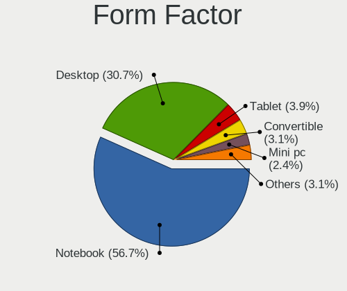
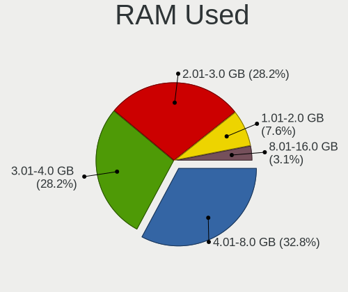
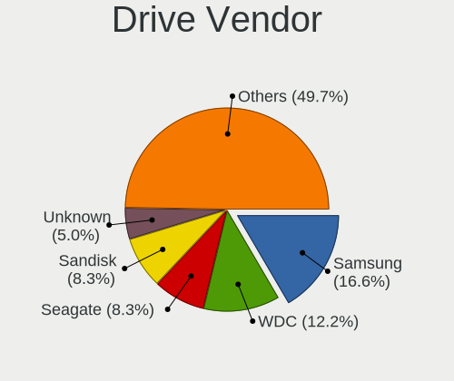
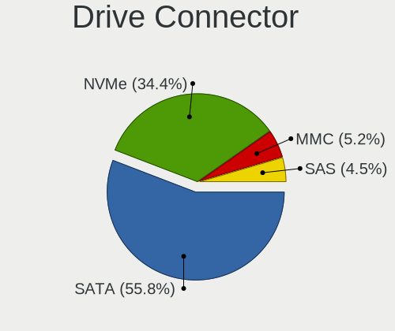
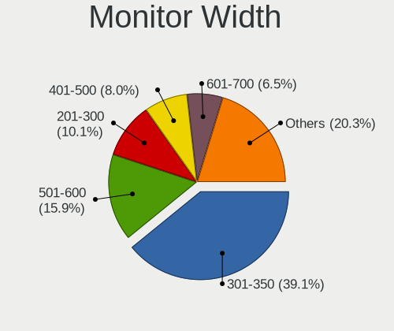

blendOS - Tested Hardware & Statistics
--------------------------------------

A project to collect tested hardware configurations for blendOS.

Anyone can contribute to this report by the [hw-probe](https://github.com/linuxhw/hw-probe) tool:

    sudo -E hw-probe -all -upload

Please contribute! Especially if your hardware is rare.

This is a report for all computer types. See also reports for [desktops](/Dist/blendOS/Desktop/README.md) and [notebooks](/Dist/blendOS/Notebook/README.md).

Contents
--------

* [ Test Cases ](#test-cases)

* [ System ](#system)
  - [ OS                       ](#os)
  - [ OS Family                ](#os-family)
  - [ Kernel                   ](#kernel)
  - [ Kernel Family            ](#kernel-family)
  - [ Kernel Major Ver.        ](#kernel-major-ver)
  - [ Arch                     ](#arch)
  - [ DE                       ](#de)
  - [ Display Server           ](#display-server)
  - [ Display Manager          ](#display-manager)
  - [ OS Lang                  ](#os-lang)
  - [ Boot Mode                ](#boot-mode)
  - [ Filesystem               ](#filesystem)
  - [ Part. scheme             ](#part-scheme)
  - [ Dual Boot with Linux/BSD ](#dual-boot-with-linuxbsd)
  - [ Dual Boot (Win)          ](#dual-boot-win)

* [ Board ](#board)
  - [ Vendor                   ](#vendor)
  - [ Model                    ](#model)
  - [ Model Family             ](#model-family)
  - [ MFG Year                 ](#mfg-year)
  - [ Form Factor              ](#form-factor)
  - [ Secure Boot              ](#secure-boot)
  - [ Coreboot                 ](#coreboot)
  - [ RAM Size                 ](#ram-size)
  - [ RAM Used                 ](#ram-used)
  - [ Total Drives             ](#total-drives)
  - [ Has CD-ROM               ](#has-cd-rom)
  - [ Has Ethernet             ](#has-ethernet)
  - [ Has WiFi                 ](#has-wifi)
  - [ Has Bluetooth            ](#has-bluetooth)

* [ Location ](#location)
  - [ Country                  ](#country)
  - [ City                     ](#city)

* [ Drives ](#drives)
  - [ Drive Vendor             ](#drive-vendor)
  - [ Drive Model              ](#drive-model)
  - [ HDD Vendor               ](#hdd-vendor)
  - [ SSD Vendor               ](#ssd-vendor)
  - [ Drive Kind               ](#drive-kind)
  - [ Drive Connector          ](#drive-connector)
  - [ Drive Size               ](#drive-size)
  - [ Space Total              ](#space-total)
  - [ Space Used               ](#space-used)
  - [ Malfunc. Drives          ](#malfunc-drives)
  - [ Malfunc. Drive Vendor    ](#malfunc-drive-vendor)
  - [ Malfunc. HDD Vendor      ](#malfunc-hdd-vendor)
  - [ Malfunc. Drive Kind      ](#malfunc-drive-kind)
  - [ Failed Drives            ](#failed-drives)
  - [ Failed Drive Vendor      ](#failed-drive-vendor)
  - [ Drive Status             ](#drive-status)

* [ Storage controller ](#storage-controller)
  - [ Storage Vendor           ](#storage-vendor)
  - [ Storage Model            ](#storage-model)
  - [ Storage Kind             ](#storage-kind)

* [ Processor ](#processor)
  - [ CPU Vendor               ](#cpu-vendor)
  - [ CPU Model                ](#cpu-model)
  - [ CPU Model Family         ](#cpu-model-family)
  - [ CPU Cores                ](#cpu-cores)
  - [ CPU Sockets              ](#cpu-sockets)
  - [ CPU Threads              ](#cpu-threads)
  - [ CPU Op-Modes             ](#cpu-op-modes)
  - [ CPU Microcode            ](#cpu-microcode)
  - [ CPU Microarch            ](#cpu-microarch)

* [ Graphics ](#graphics)
  - [ GPU Vendor               ](#gpu-vendor)
  - [ GPU Model                ](#gpu-model)
  - [ GPU Combo                ](#gpu-combo)
  - [ GPU Driver               ](#gpu-driver)
  - [ GPU Memory               ](#gpu-memory)

* [ Monitor ](#monitor)
  - [ Monitor Vendor           ](#monitor-vendor)
  - [ Monitor Model            ](#monitor-model)
  - [ Monitor Resolution       ](#monitor-resolution)
  - [ Monitor Diagonal         ](#monitor-diagonal)
  - [ Monitor Width            ](#monitor-width)
  - [ Aspect Ratio             ](#aspect-ratio)
  - [ Monitor Area             ](#monitor-area)
  - [ Pixel Density            ](#pixel-density)
  - [ Multiple Monitors        ](#multiple-monitors)

* [ Network ](#network)
  - [ Net Controller Vendor    ](#net-controller-vendor)
  - [ Net Controller Model     ](#net-controller-model)
  - [ Wireless Vendor          ](#wireless-vendor)
  - [ Wireless Model           ](#wireless-model)
  - [ Ethernet Vendor          ](#ethernet-vendor)
  - [ Ethernet Model           ](#ethernet-model)
  - [ Net Controller Kind      ](#net-controller-kind)
  - [ Used Controller          ](#used-controller)
  - [ NICs                     ](#nics)
  - [ IPv6                     ](#ipv6)

* [ Bluetooth ](#bluetooth)
  - [ Bluetooth Vendor         ](#bluetooth-vendor)
  - [ Bluetooth Model          ](#bluetooth-model)

* [ Sound ](#sound)
  - [ Sound Vendor             ](#sound-vendor)
  - [ Sound Model              ](#sound-model)

* [ Memory ](#memory)
  - [ Memory Vendor            ](#memory-vendor)
  - [ Memory Model             ](#memory-model)
  - [ Memory Kind              ](#memory-kind)
  - [ Memory Form Factor       ](#memory-form-factor)
  - [ Memory Size              ](#memory-size)
  - [ Memory Speed             ](#memory-speed)

* [ Printers & scanners ](#printers--scanners)
  - [ Printer Vendor           ](#printer-vendor)
  - [ Printer Model            ](#printer-model)
  - [ Scanner Vendor           ](#scanner-vendor)
  - [ Scanner Model            ](#scanner-model)

* [ Camera ](#camera)
  - [ Camera Vendor            ](#camera-vendor)
  - [ Camera Model             ](#camera-model)

* [ Security ](#security)
  - [ Fingerprint Vendor       ](#fingerprint-vendor)
  - [ Fingerprint Model        ](#fingerprint-model)
  - [ Chipcard Vendor          ](#chipcard-vendor)
  - [ Chipcard Model           ](#chipcard-model)

* [ Unsupported ](#unsupported)
  - [ Unsupported Devices      ](#unsupported-devices)
  - [ Unsupported Device Types ](#unsupported-device-types)

Test Cases
----------

Total: 164

| Vendor        | Model                       | Form-Factor | Probe                                                      | Date         |
|---------------|-----------------------------|-------------|------------------------------------------------------------|--------------|
| Lenovo        | G50-70 20351                | Notebook    | [82a4f5f99b](https://linux-hardware.org/?probe=82a4f5f99b) | Jan 01, 2025 |
| Apple         | MacBookPro8,2               | Notebook    | [e2f957298c](https://linux-hardware.org/?probe=e2f957298c) | Dec 17, 2024 |
| Apple         | MacBookPro8,2               | Notebook    | [504b00b57d](https://linux-hardware.org/?probe=504b00b57d) | Dec 17, 2024 |
| Apple         | MacBookPro5,1               | Notebook    | [3ba5637302](https://linux-hardware.org/?probe=3ba5637302) | Dec 07, 2024 |
| AZW           | SER V1                      | Mini pc     | [943b7a7303](https://linux-hardware.org/?probe=943b7a7303) | Nov 26, 2024 |
| Lenovo        | ThinkPad P52 20M9CTO1WW     | Notebook    | [2424c97650](https://linux-hardware.org/?probe=2424c97650) | Sep 24, 2024 |
| Lenovo        | B51-30 80LK                 | Notebook    | [e4f72a3222](https://linux-hardware.org/?probe=e4f72a3222) | Aug 08, 2024 |
| Lenovo        | B51-30 80LK                 | Notebook    | [8003cbb98e](https://linux-hardware.org/?probe=8003cbb98e) | Aug 08, 2024 |
| MSI           | B450M-A PRO MAX II          | Desktop     | [dd3e786ebe](https://linux-hardware.org/?probe=dd3e786ebe) | Jul 15, 2024 |
| Gigabyte      | B550M AORUS PRO-P           | Desktop     | [5a85b71894](https://linux-hardware.org/?probe=5a85b71894) | Jun 13, 2024 |
| Alienware     | m15                         | Notebook    | [e088ad174b](https://linux-hardware.org/?probe=e088ad174b) | May 21, 2024 |
| Gigabyte      | B550M AORUS PRO-P           | Desktop     | [b3e1342003](https://linux-hardware.org/?probe=b3e1342003) | May 12, 2024 |
| MSI           | B550M-A PRO                 | Desktop     | [7101b53f84](https://linux-hardware.org/?probe=7101b53f84) | May 11, 2024 |
| Lenovo        | 36E7 SDK0J40700 WIN 3258... | Desktop     | [03d6226580](https://linux-hardware.org/?probe=03d6226580) | May 01, 2024 |
| Fujitsu       | LIFEBOOK U727               | Notebook    | [2d96690752](https://linux-hardware.org/?probe=2d96690752) | Apr 20, 2024 |
| Lenovo        | Yoga 9 14ITL5 82BG          | Convertible | [722d095e41](https://linux-hardware.org/?probe=722d095e41) | Apr 09, 2024 |
| Lenovo        | Yoga 9 14ITL5 82BG          | Convertible | [4f39ce99c5](https://linux-hardware.org/?probe=4f39ce99c5) | Apr 02, 2024 |
| HP            | Pavilion Gaming Laptop 1... | Notebook    | [e34eb800b2](https://linux-hardware.org/?probe=e34eb800b2) | Mar 29, 2024 |
| Acer          | Aspire 4752                 | Notebook    | [bb522b4ec1](https://linux-hardware.org/?probe=bb522b4ec1) | Mar 26, 2024 |
| Lenovo        | IdeaPad 310-15ISK 80SM      | Notebook    | [fced33a8a9](https://linux-hardware.org/?probe=fced33a8a9) | Mar 12, 2024 |
| Lenovo        | IdeaPad 310-15ISK 80SM      | Notebook    | [7e150a29fb](https://linux-hardware.org/?probe=7e150a29fb) | Mar 09, 2024 |
| HP            | Pavilion Gaming Laptop 1... | Notebook    | [33cf50568b](https://linux-hardware.org/?probe=33cf50568b) | Mar 06, 2024 |
| HP            | Pavilion Gaming Laptop 1... | Notebook    | [8845023d60](https://linux-hardware.org/?probe=8845023d60) | Mar 02, 2024 |
| Chuwi         | LarkBox X                   | Mini pc     | [838f19b0f9](https://linux-hardware.org/?probe=838f19b0f9) | Feb 18, 2024 |
| ASUSTek       | H81M-C                      | Desktop     | [a13bfac287](https://linux-hardware.org/?probe=a13bfac287) | Feb 10, 2024 |
| Gigabyte      | X99P-SLI-CF                 | Desktop     | [95705bca92](https://linux-hardware.org/?probe=95705bca92) | Feb 01, 2024 |
| Apple         | MacBookAir6,2               | Notebook    | [7ad397fc57](https://linux-hardware.org/?probe=7ad397fc57) | Jan 31, 2024 |
| Hampoo        | Cherry Trail CR             | Notebook    | [1c0466fe53](https://linux-hardware.org/?probe=1c0466fe53) | Jan 25, 2024 |
| MSI           | GS66 Stealth 10SF           | Notebook    | [fc256ee1dd](https://linux-hardware.org/?probe=fc256ee1dd) | Jan 18, 2024 |
| MSI           | GS66 Stealth 10SF           | Notebook    | [57eaf4a8c1](https://linux-hardware.org/?probe=57eaf4a8c1) | Jan 18, 2024 |
| HP            | Pavilion x360 Convertibl... | Convertible | [ad1ac91848](https://linux-hardware.org/?probe=ad1ac91848) | Jan 15, 2024 |
| Fujitsu       | D3603-A1 S26361-D3603-A1    | Desktop     | [f6ed1d1cc4](https://linux-hardware.org/?probe=f6ed1d1cc4) | Jan 15, 2024 |
| ASUSTek       | ROG STRIX B450-E GAMING     | Desktop     | [cf1d697418](https://linux-hardware.org/?probe=cf1d697418) | Jan 12, 2024 |
| ShangMai      | H                           | Notebook    | [aab28ab3ea](https://linux-hardware.org/?probe=aab28ab3ea) | Dec 27, 2023 |
| Lenovo        | ThinkPad E470 20H1004UIG    | Notebook    | [69efda7672](https://linux-hardware.org/?probe=69efda7672) | Dec 26, 2023 |
| Lenovo        | ThinkPad L470 20J5S0JM00    | Notebook    | [c8f1140dc5](https://linux-hardware.org/?probe=c8f1140dc5) | Dec 26, 2023 |
| Dell          | Inspiron 16 Plus 7630       | Notebook    | [5f798fd0e0](https://linux-hardware.org/?probe=5f798fd0e0) | Dec 26, 2023 |
| ASUSTek       | PRIME A520M-A II            | Desktop     | [c37a18c186](https://linux-hardware.org/?probe=c37a18c186) | Dec 25, 2023 |
| HP            | EliteBook 840 G5            | Notebook    | [5b7a85e9fc](https://linux-hardware.org/?probe=5b7a85e9fc) | Dec 23, 2023 |
| Lenovo        | IdeaPadFlex 15 20309        | Notebook    | [81dbec4f1a](https://linux-hardware.org/?probe=81dbec4f1a) | Dec 19, 2023 |
| ASUSTek       | VivoBook_ASUSLaptop X515... | Notebook    | [5e71510e4c](https://linux-hardware.org/?probe=5e71510e4c) | Dec 06, 2023 |
| HP            | 89E9 0100                   | All in one  | [c32fa5c4ea](https://linux-hardware.org/?probe=c32fa5c4ea) | Dec 01, 2023 |
| Microsoft     | Surface Laptop              | Tablet      | [c867b76eff](https://linux-hardware.org/?probe=c867b76eff) | Nov 28, 2023 |
| Unknown       | Unknown                     | Desktop     | [beca2cade6](https://linux-hardware.org/?probe=beca2cade6) | Nov 26, 2023 |
| MSI           | B650 GAMING PLUS WIFI       | Desktop     | [c25e140976](https://linux-hardware.org/?probe=c25e140976) | Nov 26, 2023 |
| Unknown       | Unknown                     | Desktop     | [f90c57452a](https://linux-hardware.org/?probe=f90c57452a) | Nov 21, 2023 |
| Samsung       | 550P5C/550P7C               | Notebook    | [b7294ed55c](https://linux-hardware.org/?probe=b7294ed55c) | Nov 20, 2023 |
| Hampoo        | I1D6_C109S_Hi10Pro          | Tablet      | [ea5517388b](https://linux-hardware.org/?probe=ea5517388b) | Nov 19, 2023 |
| Apple         | Mac-F221BEC8                | Desktop     | [9cdba3ee40](https://linux-hardware.org/?probe=9cdba3ee40) | Nov 12, 2023 |
| Dell          | Latitude E7250              | Notebook    | [265c13751a](https://linux-hardware.org/?probe=265c13751a) | Nov 10, 2023 |
| Samsung       | 750XEE                      | Notebook    | [8fd9a5953f](https://linux-hardware.org/?probe=8fd9a5953f) | Nov 07, 2023 |
| HP            | Pavilion Gaming Laptop 1... | Notebook    | [b837317e37](https://linux-hardware.org/?probe=b837317e37) | Nov 06, 2023 |
| HP            | ENVY 15                     | Notebook    | [5f301610ee](https://linux-hardware.org/?probe=5f301610ee) | Nov 06, 2023 |
| HP            | ENVY 15                     | Notebook    | [150ca6a1a0](https://linux-hardware.org/?probe=150ca6a1a0) | Nov 06, 2023 |
| Samsung       | 750XEE                      | Notebook    | [fd74ae52f8](https://linux-hardware.org/?probe=fd74ae52f8) | Nov 04, 2023 |
| Notebook      | P65_P67SA                   | Notebook    | [a8bf179e25](https://linux-hardware.org/?probe=a8bf179e25) | Nov 01, 2023 |
| ASUSTek       | Pro WS X570-ACE             | Desktop     | [6ba3f1daa1](https://linux-hardware.org/?probe=6ba3f1daa1) | Oct 30, 2023 |
| ASUSTek       | Pro WS X570-ACE             | Desktop     | [e2c02539ce](https://linux-hardware.org/?probe=e2c02539ce) | Oct 29, 2023 |
| Lenovo        | IdeaPad S145-15AST 81N3     | Notebook    | [342218fa56](https://linux-hardware.org/?probe=342218fa56) | Oct 28, 2023 |
| HP            | Notebook                    | Notebook    | [efb9814479](https://linux-hardware.org/?probe=efb9814479) | Oct 27, 2023 |
| Toshiba       | QOSMIO X75-A                | Notebook    | [8024d2e76b](https://linux-hardware.org/?probe=8024d2e76b) | Oct 26, 2023 |
| HP            | 89E9 0100                   | All in one  | [17fde8ad64](https://linux-hardware.org/?probe=17fde8ad64) | Oct 24, 2023 |
| Alienware     | 0K9TKY A00                  | Desktop     | [a51d4611f8](https://linux-hardware.org/?probe=a51d4611f8) | Oct 23, 2023 |
| HP            | ProBook 655 G1              | Notebook    | [8e1cb99809](https://linux-hardware.org/?probe=8e1cb99809) | Oct 19, 2023 |
| HP            | ProBook 655 G1              | Notebook    | [a80cd678f2](https://linux-hardware.org/?probe=a80cd678f2) | Oct 18, 2023 |
| Lenovo        | G50-30 80G0                 | Notebook    | [3d308e7bb0](https://linux-hardware.org/?probe=3d308e7bb0) | Oct 16, 2023 |
| Dell          | 0GY6Y8 A03                  | Desktop     | [1ddd96bd4e](https://linux-hardware.org/?probe=1ddd96bd4e) | Oct 15, 2023 |
| Apple         | MacBookPro9,2               | Notebook    | [b97291313f](https://linux-hardware.org/?probe=b97291313f) | Oct 10, 2023 |
| HP            | 255 G5 Notebook PC          | Notebook    | [ecb99bea0c](https://linux-hardware.org/?probe=ecb99bea0c) | Oct 07, 2023 |
| MSI           | Pulse GL66 11UGK            | Notebook    | [706d9eb214](https://linux-hardware.org/?probe=706d9eb214) | Oct 06, 2023 |
| HP            | 255 G5 Notebook PC          | Notebook    | [4f758a2ce7](https://linux-hardware.org/?probe=4f758a2ce7) | Oct 05, 2023 |
| Lenovo        | Legion 7 15IMH05 81YT       | Notebook    | [604e4a5556](https://linux-hardware.org/?probe=604e4a5556) | Oct 05, 2023 |
| MSI           | Pulse GL66 11UGK            | Notebook    | [4484122a2c](https://linux-hardware.org/?probe=4484122a2c) | Oct 05, 2023 |
| Lenovo        | Legion 7 15IMH05 81YT       | Notebook    | [73ab8f124c](https://linux-hardware.org/?probe=73ab8f124c) | Oct 03, 2023 |
| HUAWEI        | BOHK-WAX9X                  | Notebook    | [6275e5c1d4](https://linux-hardware.org/?probe=6275e5c1d4) | Sep 29, 2023 |
| Lenovo        | Yoga 2 Pro 20266            | Notebook    | [fcb38d5424](https://linux-hardware.org/?probe=fcb38d5424) | Sep 24, 2023 |
| Dell          | 0RW199                      | Desktop     | [6fc37ef3c1](https://linux-hardware.org/?probe=6fc37ef3c1) | Sep 24, 2023 |
| Lenovo        | IdeaPad Duet 3 10IGL5 82... | Tablet      | [a6ef657fca](https://linux-hardware.org/?probe=a6ef657fca) | Sep 24, 2023 |
| Apple         | MacBookPro11,1              | Notebook    | [26f998fafb](https://linux-hardware.org/?probe=26f998fafb) | Sep 19, 2023 |
| Acer          | Veriton X4618G              | Desktop     | [a34419120b](https://linux-hardware.org/?probe=a34419120b) | Sep 19, 2023 |
| ASUSTek       | ROG STRIX Z370-H GAMING     | Desktop     | [93356dbebb](https://linux-hardware.org/?probe=93356dbebb) | Sep 17, 2023 |
| Fanless Mi... | Rev JSL1                    | Mini pc     | [ab8cb379a8](https://linux-hardware.org/?probe=ab8cb379a8) | Sep 17, 2023 |
| Lenovo        | IdeaPad Duet 3 10IGL5 82... | Tablet      | [7e5fc6c3eb](https://linux-hardware.org/?probe=7e5fc6c3eb) | Sep 17, 2023 |
| Dell          | Inspiron 15 5510            | Notebook    | [71a6a04c4c](https://linux-hardware.org/?probe=71a6a04c4c) | Sep 15, 2023 |
| Dell          | XPS 9320                    | Notebook    | [054584d248](https://linux-hardware.org/?probe=054584d248) | Sep 15, 2023 |
| Gigabyte      | B650 AORUS PRO AX           | Desktop     | [b771d7b475](https://linux-hardware.org/?probe=b771d7b475) | Sep 10, 2023 |
| Gigabyte      | B650 AORUS PRO AX           | Desktop     | [6002a35e23](https://linux-hardware.org/?probe=6002a35e23) | Sep 10, 2023 |
| Pegatron      | 2ACD                        | Desktop     | [4f61dd9a7a](https://linux-hardware.org/?probe=4f61dd9a7a) | Sep 10, 2023 |
| ASRock        | X570 Taichi                 | Desktop     | [6515c97b89](https://linux-hardware.org/?probe=6515c97b89) | Sep 05, 2023 |
| ASRock        | 970 Extreme4                | Desktop     | [4196acbe15](https://linux-hardware.org/?probe=4196acbe15) | Sep 05, 2023 |
| Apple         | MacBookPro9,2               | Notebook    | [a6d272539a](https://linux-hardware.org/?probe=a6d272539a) | Sep 03, 2023 |
| Dell          | Latitude 5410               | Notebook    | [e45d7975d2](https://linux-hardware.org/?probe=e45d7975d2) | Sep 03, 2023 |
| Apple         | Mac-BE088AF8C5EB4FA2 iMa... | All in one  | [5a388c766a](https://linux-hardware.org/?probe=5a388c766a) | Aug 23, 2023 |
| Acer          | Aspire 5750G                | Notebook    | [205a407b60](https://linux-hardware.org/?probe=205a407b60) | Aug 21, 2023 |
| ASRock        | 970 Extreme4                | Desktop     | [4cec633c85](https://linux-hardware.org/?probe=4cec633c85) | Aug 20, 2023 |
| Dell          | XPS 13 9350                 | Notebook    | [d3aac86eac](https://linux-hardware.org/?probe=d3aac86eac) | Aug 16, 2023 |
| Dell          | XPS 13 9350                 | Notebook    | [7032d8da96](https://linux-hardware.org/?probe=7032d8da96) | Aug 16, 2023 |
| Panasonic     | CF-19ADNAXDA                | Notebook    | [d96cf2b13c](https://linux-hardware.org/?probe=d96cf2b13c) | Aug 12, 2023 |
| Lenovo        | IdeaPad 3 14ITL05 81X7      | Notebook    | [f062831bd7](https://linux-hardware.org/?probe=f062831bd7) | Aug 11, 2023 |
| Intel         | DG41RQ AAE54511-203         | Desktop     | [646d098c58](https://linux-hardware.org/?probe=646d098c58) | Aug 10, 2023 |
| ASUSTek       | TUF B450M-PRO GAMING        | Desktop     | [b8f1735d23](https://linux-hardware.org/?probe=b8f1735d23) | Aug 04, 2023 |
| ASUSTek       | TUF B450M-PRO GAMING        | Desktop     | [6a6f453881](https://linux-hardware.org/?probe=6a6f453881) | Aug 02, 2023 |
| Dell          | Inspiron 3542               | Notebook    | [33674f8b81](https://linux-hardware.org/?probe=33674f8b81) | Aug 02, 2023 |
| ASUSTek       | Z87-A                       | Desktop     | [603bee8812](https://linux-hardware.org/?probe=603bee8812) | Aug 01, 2023 |
| ASUSTek       | Z87-A                       | Desktop     | [64bc1caf41](https://linux-hardware.org/?probe=64bc1caf41) | Aug 01, 2023 |
| Acer          | Aspire A715-71G             | Notebook    | [7f3c7327b7](https://linux-hardware.org/?probe=7f3c7327b7) | Aug 01, 2023 |
| Beelink       | Gemini X                    | Notebook    | [2846d152be](https://linux-hardware.org/?probe=2846d152be) | Jul 29, 2023 |
| MSI           | GP63 Leopard 8RE            | Notebook    | [42a81e063a](https://linux-hardware.org/?probe=42a81e063a) | Jul 28, 2023 |
| Google        | Sumo                        | Desktop     | [71a7167d22](https://linux-hardware.org/?probe=71a7167d22) | Jul 25, 2023 |
| MAXSUN        | MS-Terminator B660M VER:... | Desktop     | [5cf65783b2](https://linux-hardware.org/?probe=5cf65783b2) | Jul 25, 2023 |
| Dell          | XPS 15 9570                 | Notebook    | [9a62fe1979](https://linux-hardware.org/?probe=9a62fe1979) | Jul 22, 2023 |
| Lenovo        | IdeaPad Slim 9 14ITL5 82... | Notebook    | [352cc6e31d](https://linux-hardware.org/?probe=352cc6e31d) | Jul 17, 2023 |
| Samsung       | 950XDB/951XDB/950XDY        | Notebook    | [72015ffe3b](https://linux-hardware.org/?probe=72015ffe3b) | Jul 16, 2023 |
| Supermicro    | X10DAL-i                    | Server      | [fb5e1afd45](https://linux-hardware.org/?probe=fb5e1afd45) | Jul 14, 2023 |
| ASUSTek       | G750JZA                     | Notebook    | [8a26d246e2](https://linux-hardware.org/?probe=8a26d246e2) | Jul 14, 2023 |
| Samsung       | Galaxy Book 12              | Tablet      | [59a6da64a7](https://linux-hardware.org/?probe=59a6da64a7) | Jul 13, 2023 |
| Gigabyte      | GA-970A-UD3                 | Desktop     | [fa192badba](https://linux-hardware.org/?probe=fa192badba) | Jul 12, 2023 |
| MSI           | X470 GAMING PLUS MAX        | Desktop     | [4d33bb92ce](https://linux-hardware.org/?probe=4d33bb92ce) | Jul 09, 2023 |
| HP            | Pavilion dv6                | Notebook    | [7f6c05f2d9](https://linux-hardware.org/?probe=7f6c05f2d9) | Jul 09, 2023 |
| Apple         | MacBookPro14,1              | Notebook    | [62bbadc762](https://linux-hardware.org/?probe=62bbadc762) | Jul 08, 2023 |
| Samsung       | Galaxy Book 12              | Tablet      | [352e4ef5e5](https://linux-hardware.org/?probe=352e4ef5e5) | Jul 08, 2023 |
| MSI           | G41M-P33 Combo              | Desktop     | [07ab83bef1](https://linux-hardware.org/?probe=07ab83bef1) | Jun 30, 2023 |
| MSI           | G41M-P33 Combo              | Desktop     | [fcf9a0fd47](https://linux-hardware.org/?probe=fcf9a0fd47) | Jun 30, 2023 |
| Acer          | Aspire V5-471G              | Notebook    | [f82fbc50e3](https://linux-hardware.org/?probe=f82fbc50e3) | Jun 20, 2023 |
| Microsoft     | Surface Laptop              | Tablet      | [401cb6a1f1](https://linux-hardware.org/?probe=401cb6a1f1) | Jun 20, 2023 |
| Lenovo        | IdeaPad 3 15ITL6 82H8       | Notebook    | [627203a31f](https://linux-hardware.org/?probe=627203a31f) | Jun 18, 2023 |
| MSI           | MS-16Y1                     | Notebook    | [167889509f](https://linux-hardware.org/?probe=167889509f) | Jun 18, 2023 |
| ASUSTek       | X540LA                      | Notebook    | [55316783a4](https://linux-hardware.org/?probe=55316783a4) | Jun 16, 2023 |
| ASUSTek       | X540LA                      | Notebook    | [2c1b5651ed](https://linux-hardware.org/?probe=2c1b5651ed) | Jun 15, 2023 |
| ASUSTek       | PRIME H270-PLUS             | Desktop     | [017c7fd564](https://linux-hardware.org/?probe=017c7fd564) | Jun 11, 2023 |
| HP            | Notebook                    | Notebook    | [45553d6493](https://linux-hardware.org/?probe=45553d6493) | Jun 04, 2023 |
| ASUSTek       | K53SK                       | Notebook    | [39c63c5bd1](https://linux-hardware.org/?probe=39c63c5bd1) | May 31, 2023 |
| Dell          | 0GXM1W A02                  | Desktop     | [9c252c8688](https://linux-hardware.org/?probe=9c252c8688) | May 30, 2023 |
| Lenovo        | G700 20251                  | Notebook    | [8ba2c6e5ed](https://linux-hardware.org/?probe=8ba2c6e5ed) | May 26, 2023 |
| ASUSTek       | K30BF_M32BF_A_F_K31BF_6     | Desktop     | [2c3689440a](https://linux-hardware.org/?probe=2c3689440a) | May 26, 2023 |
| Lenovo        | Yoga C740 81TC              | Convertible | [baa223162c](https://linux-hardware.org/?probe=baa223162c) | May 24, 2023 |
| Lenovo        | G550 2958                   | Notebook    | [cb61728cb7](https://linux-hardware.org/?probe=cb61728cb7) | May 22, 2023 |
| Biostar       | NF520D3                     | Desktop     | [806beba322](https://linux-hardware.org/?probe=806beba322) | May 20, 2023 |
| Lenovo        | G550 2958                   | Notebook    | [1dda8d01ad](https://linux-hardware.org/?probe=1dda8d01ad) | May 20, 2023 |
| Lenovo        | G550 2958                   | Notebook    | [fe4d0a2ec3](https://linux-hardware.org/?probe=fe4d0a2ec3) | May 20, 2023 |
| Dell          | 0YXT71 A03                  | Desktop     | [b8281f77a3](https://linux-hardware.org/?probe=b8281f77a3) | May 07, 2023 |
| HP            | Elite x2 1012 G1            | Notebook    | [20dcc3e6b3](https://linux-hardware.org/?probe=20dcc3e6b3) | May 04, 2023 |
| Apple         | Mac-F221BEC8                | Desktop     | [b68d1b92de](https://linux-hardware.org/?probe=b68d1b92de) | May 03, 2023 |
| Dell          | Latitude XT2                | Notebook    | [3cfd979c60](https://linux-hardware.org/?probe=3cfd979c60) | Apr 30, 2023 |
| Dell          | 0GY6Y8 A02                  | Desktop     | [f80f9b0671](https://linux-hardware.org/?probe=f80f9b0671) | Apr 28, 2023 |
| Gigabyte      | B550M DS3H AC               | Desktop     | [a8f4a6f058](https://linux-hardware.org/?probe=a8f4a6f058) | Apr 27, 2023 |
| Apple         | Mac-F221BEC8                | Desktop     | [ac51617470](https://linux-hardware.org/?probe=ac51617470) | Apr 26, 2023 |
| Acer          | Aspire R7-571G              | Notebook    | [d4220bc210](https://linux-hardware.org/?probe=d4220bc210) | Apr 25, 2023 |
| HP            | ProBook 640 G1              | Notebook    | [9306db1f90](https://linux-hardware.org/?probe=9306db1f90) | Apr 25, 2023 |
| Dell          | XPS 13 7390 2-in-1          | Convertible | [0cfe2b34f5](https://linux-hardware.org/?probe=0cfe2b34f5) | Apr 25, 2023 |
| Apple         | MacBookPro8,1               | Notebook    | [006b9a2b3f](https://linux-hardware.org/?probe=006b9a2b3f) | Apr 24, 2023 |
| Lenovo        | SKYBAY SDK0J40709 WIN 32... | All in one  | [f68e55cabc](https://linux-hardware.org/?probe=f68e55cabc) | Apr 24, 2023 |
| ASUSTek       | AM1M-A                      | Desktop     | [b4e51d0af3](https://linux-hardware.org/?probe=b4e51d0af3) | Apr 17, 2023 |
| ASUSTek       | AM1M-A                      | Desktop     | [a6ba0d9290](https://linux-hardware.org/?probe=a6ba0d9290) | Apr 17, 2023 |
| Lenovo        | ThinkPad T431s 20ACS0640... | Notebook    | [711d09df05](https://linux-hardware.org/?probe=711d09df05) | Apr 04, 2023 |
| Samsung       | 750XED                      | Notebook    | [be19d0454d](https://linux-hardware.org/?probe=be19d0454d) | Mar 16, 2023 |
| Dell          | Precision M4800             | Notebook    | [57c57bb353](https://linux-hardware.org/?probe=57c57bb353) | Feb 22, 2023 |
| Gigabyte      | P65                         | Notebook    | [b3d7faba21](https://linux-hardware.org/?probe=b3d7faba21) | Feb 12, 2023 |
| Gigabyte      | P65                         | Notebook    | [25d871afca](https://linux-hardware.org/?probe=25d871afca) | Feb 11, 2023 |
| Lenovo        | IdeaPad 310-15ISK 80SM      | Notebook    | [13bdc2b06c](https://linux-hardware.org/?probe=13bdc2b06c) | Feb 03, 2023 |
| Lenovo        | ThinkPad L580 20LW0010GE    | Notebook    | [ed7b51b8bc](https://linux-hardware.org/?probe=ed7b51b8bc) | Feb 01, 2023 |
| ASRock        | X670E Steel Legend          | Desktop     | [e197bd2a4b](https://linux-hardware.org/?probe=e197bd2a4b) | Jan 30, 2023 |
| Apple         | MacBookPro11,1              | Notebook    | [e5af375b93](https://linux-hardware.org/?probe=e5af375b93) | Jan 29, 2023 |
| Apple         | MacBookPro11,1              | Notebook    | [41d67fcba8](https://linux-hardware.org/?probe=41d67fcba8) | Jan 29, 2023 |

System
------

OS
--

Installed operating systems

| Name            | Computers | Percent |
|-----------------|-----------|---------|
| blendOS         | 122       | 96.06%  |
| blendOS Rolling | 5         | 3.94%   |

OS Family
---------

OS without a version

| Name    | Computers | Percent |
|---------|-----------|---------|
| blendOS | 127       | 100%    |

Kernel
------

Version of the Linux kernel

| Version                        | Computers | Percent |
|--------------------------------|-----------|---------|
| 6.3.9-zen1-1-zen               | 62        | 48.06%  |
| 6.5.5-zen1-1-zen               | 18        | 13.95%  |
| 6.2.12-arch1-1                 | 9         | 6.98%   |
| 6.3.6-zen1-1-zen               | 5         | 3.88%   |
| 6.3.4-arch1-1                  | 3         | 2.33%   |
| 6.2.13-arch1-1                 | 3         | 2.33%   |
| 6.1.8-zen1-1-zen               | 3         | 2.33%   |
| 6.1.8-arch1-1                  | 3         | 2.33%   |
| 6.3.5-arch1-1                  | 2         | 1.55%   |
| 6.3.2-arch1-1                  | 2         | 1.55%   |
| 6.12.1-zen1-1-zen              | 2         | 1.55%   |
| 6.9.9-zen1-1-zen               | 1         | 0.78%   |
| 6.8.7-zen1-1-zen               | 1         | 0.78%   |
| 6.4.5-arch1-1                  | 1         | 0.78%   |
| 6.4.0-Yagakimi-T2-xanmod1-1-t2 | 1         | 0.78%   |
| 6.3.7-zen1-1-zen               | 1         | 0.78%   |
| 6.3.5-zen1-1-zen               | 1         | 0.78%   |
| 6.3.3-arch1-1                  | 1         | 0.78%   |
| 6.3.1-arch1-1                  | 1         | 0.78%   |
| 6.2.8-arch1-1-t2               | 1         | 0.78%   |
| 6.2.11-arch1-1                 | 1         | 0.78%   |
| 6.12.7-zen1-1-zen              | 1         | 0.78%   |
| 6.12.4-zen1-1-zen              | 1         | 0.78%   |
| 6.10.7-zen1-1-zen              | 1         | 0.78%   |
| 6.10.3-zen1-2-zen              | 1         | 0.78%   |
| 6.1.9-zen1-1-zen               | 1         | 0.78%   |
| 6.1.12-zen1-1-zen              | 1         | 0.78%   |
| 6.1.11-zen1-1-zen              | 1         | 0.78%   |

Kernel Family
-------------

Linux kernel without a distro release

| Version | Computers | Percent |
|---------|-----------|---------|
| 6.3.9   | 62        | 48.06%  |
| 6.5.5   | 18        | 13.95%  |
| 6.2.12  | 9         | 6.98%   |
| 6.1.8   | 6         | 4.65%   |
| 6.3.6   | 5         | 3.88%   |
| 6.3.5   | 3         | 2.33%   |
| 6.3.4   | 3         | 2.33%   |
| 6.2.13  | 3         | 2.33%   |
| 6.3.2   | 2         | 1.55%   |
| 6.12.1  | 2         | 1.55%   |
| 6.9.9   | 1         | 0.78%   |
| 6.8.7   | 1         | 0.78%   |
| 6.4.5   | 1         | 0.78%   |
| 6.4.0   | 1         | 0.78%   |
| 6.3.7   | 1         | 0.78%   |
| 6.3.3   | 1         | 0.78%   |
| 6.3.1   | 1         | 0.78%   |
| 6.2.8   | 1         | 0.78%   |
| 6.2.11  | 1         | 0.78%   |
| 6.12.7  | 1         | 0.78%   |
| 6.12.4  | 1         | 0.78%   |
| 6.10.7  | 1         | 0.78%   |
| 6.10.3  | 1         | 0.78%   |
| 6.1.9   | 1         | 0.78%   |
| 6.1.12  | 1         | 0.78%   |
| 6.1.11  | 1         | 0.78%   |

Kernel Major Ver.
-----------------

Linux kernel major version

| Version | Computers | Percent |
|---------|-----------|---------|
| 6.3     | 78        | 61.42%  |
| 6.5     | 18        | 14.17%  |
| 6.2     | 13        | 10.24%  |
| 6.1     | 8         | 6.3%    |
| 6.12    | 4         | 3.15%   |
| 6.4     | 2         | 1.57%   |
| 6.10    | 2         | 1.57%   |
| 6.9     | 1         | 0.79%   |
| 6.8     | 1         | 0.79%   |

Arch
----

OS architecture (x86_64, i586, etc.)

| Name   | Computers | Percent |
|--------|-----------|---------|
| x86_64 | 127       | 100%    |

DE
--

Desktop Environment

| Name          | Computers | Percent |
|---------------|-----------|---------|
| GNOME         | 73        | 57.03%  |
| KDE5          | 53        | 41.41%  |
| KDE6          | 1         | 0.78%   |
| GNOME Classic | 1         | 0.78%   |

Display Server
--------------

X11 or Wayland

| Name    | Computers | Percent |
|---------|-----------|---------|
| Wayland | 115       | 87.79%  |
| X11     | 14        | 10.69%  |
| Unknown | 2         | 1.53%   |

Display Manager
---------------

SDDM, LightDM, etc.

| Name    | Computers | Percent |
|---------|-----------|---------|
| Unknown | 122       | 96.06%  |
| GDM     | 3         | 2.36%   |
| SDDM    | 2         | 1.57%   |

OS Lang
-------

Language

| Lang        | Computers | Percent |
|-------------|-----------|---------|
| en_US       | 75        | 59.06%  |
| de_DE       | 10        | 7.87%   |
| it_IT       | 6         | 4.72%   |
| en_GB       | 6         | 4.72%   |
| fr_FR       | 5         | 3.94%   |
| en_AU       | 4         | 3.15%   |
| es_ES       | 3         | 2.36%   |
| ru_RU       | 2         | 1.57%   |
| de_CH       | 2         | 1.57%   |
| tr_TR       | 1         | 0.79%   |
| sv_SE       | 1         | 0.79%   |
| ro_RO       | 1         | 0.79%   |
| pt_BR       | 1         | 0.79%   |
| nl_NL       | 1         | 0.79%   |
| fr_HT       | 1         | 0.79%   |
| es_UY       | 1         | 0.79%   |
| es_MX       | 1         | 0.79%   |
| es_CO       | 1         | 0.79%   |
| es_CL       | 1         | 0.79%   |
| es_AR       | 1         | 0.79%   |
| en_US.UTF.8 | 1         | 0.79%   |
| en_CA       | 1         | 0.79%   |
| de_AT       | 1         | 0.79%   |

Boot Mode
---------

EFI or BIOS

| Mode | Computers | Percent |
|------|-----------|---------|
| BIOS | 123       | 96.85%  |
| EFI  | 4         | 3.15%   |

Filesystem
----------

Type of filesystem

| Type  | Computers | Percent |
|-------|-----------|---------|
| Ext4  | 102       | 80.31%  |
| Tmpfs | 16        | 12.6%   |
| Btrfs | 7         | 5.51%   |
| XXXfs | 1         | 0.79%   |
| Xfs   | 1         | 0.79%   |

Part. scheme
------------

Scheme of partitioning

| Type    | Computers | Percent |
|---------|-----------|---------|
| Unknown | 122       | 96.06%  |
| GPT     | 5         | 3.94%   |

Dual Boot with Linux/BSD
------------------------

Hosting more than one Linux/BSD

| Dual boot | Computers | Percent |
|-----------|-----------|---------|
| No        | 125       | 98.43%  |
| Yes       | 2         | 1.57%   |

Dual Boot (Win)
---------------

Hosting Linux and Windows

| Dual boot | Computers | Percent |
|-----------|-----------|---------|
| No        | 127       | 100%    |

Board
-----

Vendor
------

Motherboard manufacturer

| Name                | Computers | Percent |
|---------------------|-----------|---------|
| Lenovo              | 23        | 18.11%  |
| Dell                | 15        | 11.81%  |
| Hewlett-Packard     | 13        | 10.24%  |
| ASUSTek Computer    | 13        | 10.24%  |
| Apple               | 11        | 8.66%   |
| MSI                 | 9         | 7.09%   |
| Gigabyte Technology | 6         | 4.72%   |
| Samsung Electronics | 5         | 3.94%   |
| Acer                | 5         | 3.94%   |
| ASRock              | 3         | 2.36%   |
| Microsoft           | 2         | 1.57%   |
| Hampoo              | 2         | 1.57%   |
| Fujitsu             | 2         | 1.57%   |
| Alienware           | 2         | 1.57%   |
| Toshiba             | 1         | 0.79%   |
| Supermicro          | 1         | 0.79%   |
| ShangMai            | 1         | 0.79%   |
| Pegatron            | 1         | 0.79%   |
| Panasonic           | 1         | 0.79%   |
| Notebook            | 1         | 0.79%   |
| MAXSUN              | 1         | 0.79%   |
| Intel               | 1         | 0.79%   |
| HUAWEI              | 1         | 0.79%   |
| Google              | 1         | 0.79%   |
| Fanless Mini PC     | 1         | 0.79%   |
| Chuwi               | 1         | 0.79%   |
| Biostar             | 1         | 0.79%   |
| Beelink             | 1         | 0.79%   |
| AZW                 | 1         | 0.79%   |
| Unknown             | 1         | 0.79%   |

Model
-----

Motherboard model

| Name                                 | Computers | Percent |
|--------------------------------------|-----------|---------|
| Dell OptiPlex 7010                   | 4         | 3.15%   |
| Microsoft Surface Laptop             | 2         | 1.57%   |
| HP Notebook                          | 2         | 1.57%   |
| ASUS All Series                      | 2         | 1.57%   |
| Apple MacPro5,1                      | 2         | 1.57%   |
| Apple MacBookPro11,1                 | 2         | 1.57%   |
| Toshiba QOSMIO X75-A                 | 1         | 0.79%   |
| Supermicro Super Server              | 1         | 0.79%   |
| ShangMai H                           | 1         | 0.79%   |
| Samsung Galaxy Book 12               | 1         | 0.79%   |
| Samsung 950XDB/951XDB/950XDY         | 1         | 0.79%   |
| Samsung 750XEE                       | 1         | 0.79%   |
| Samsung 750XED                       | 1         | 0.79%   |
| Samsung 550P5C/550P7C                | 1         | 0.79%   |
| Pegatron p7-1154                     | 1         | 0.79%   |
| Panasonic CF-19ADNAXDA               | 1         | 0.79%   |
| Notebook P65_P67SA                   | 1         | 0.79%   |
| MSI Pulse GL66 11UGK                 | 1         | 0.79%   |
| MSI MS-7E26                          | 1         | 0.79%   |
| MSI MS-7C52                          | 1         | 0.79%   |
| MSI MS-7B79                          | 1         | 0.79%   |
| MSI MS-7592                          | 1         | 0.79%   |
| MSI MS-16Y1                          | 1         | 0.79%   |
| MSI MAG B550 META 5 (MS-B930)        | 1         | 0.79%   |
| MSI GS66 Stealth 10SF                | 1         | 0.79%   |
| MSI GP63 Leopard 8RE                 | 1         | 0.79%   |
| MAXSUN MS-Terminator B660M VER:H4.2G | 1         | 0.79%   |
| Lenovo Yoga C740 81TC                | 1         | 0.79%   |
| Lenovo Yoga 9 14ITL5 82BG            | 1         | 0.79%   |
| Lenovo Yoga 2 Pro 20266              | 1         | 0.79%   |
| Lenovo ThinkPad T431s 20ACS06400     | 1         | 0.79%   |
| Lenovo ThinkPad P52 20M9CTO1WW       | 1         | 0.79%   |
| Lenovo ThinkPad L580 20LW0010GE      | 1         | 0.79%   |
| Lenovo ThinkPad L470 20J5S0JM00      | 1         | 0.79%   |
| Lenovo ThinkPad E470 20H1004UIG      | 1         | 0.79%   |
| Lenovo Legion C530-19ICB 90JX0040GE  | 1         | 0.79%   |
| Lenovo Legion 7 15IMH05 81YT         | 1         | 0.79%   |
| Lenovo IdeaPadFlex 15 20309          | 1         | 0.79%   |
| Lenovo IdeaPad Slim 9 14ITL5 82D2    | 1         | 0.79%   |
| Lenovo IdeaPad S145-15AST 81N3       | 1         | 0.79%   |

Model Family
------------

Motherboard model prefix

| Name                   | Computers | Percent |
|------------------------|-----------|---------|
| Lenovo IdeaPad         | 6         | 4.72%   |
| Lenovo ThinkPad        | 5         | 3.94%   |
| HP Pavilion            | 5         | 3.94%   |
| Dell XPS               | 4         | 3.15%   |
| Dell OptiPlex          | 4         | 3.15%   |
| Acer Aspire            | 4         | 3.15%   |
| Lenovo Yoga            | 3         | 2.36%   |
| Dell Inspiron          | 3         | 2.36%   |
| Microsoft Surface      | 2         | 1.57%   |
| Lenovo Legion          | 2         | 1.57%   |
| HP ProBook             | 2         | 1.57%   |
| HP Notebook            | 2         | 1.57%   |
| Gigabyte B550M         | 2         | 1.57%   |
| Dell Precision         | 2         | 1.57%   |
| Dell Latitude          | 2         | 1.57%   |
| ASUS ROG               | 2         | 1.57%   |
| ASUS PRIME             | 2         | 1.57%   |
| ASUS All               | 2         | 1.57%   |
| Apple MacPro5          | 2         | 1.57%   |
| Apple MacBookPro8      | 2         | 1.57%   |
| Apple MacBookPro11     | 2         | 1.57%   |
| Toshiba QOSMIO         | 1         | 0.79%   |
| Supermicro Super       | 1         | 0.79%   |
| ShangMai H             | 1         | 0.79%   |
| Samsung Galaxy         | 1         | 0.79%   |
| Samsung 950XDB         | 1         | 0.79%   |
| Samsung 750XEE         | 1         | 0.79%   |
| Samsung 750XED         | 1         | 0.79%   |
| Samsung 550P5C         | 1         | 0.79%   |
| Pegatron p7-1154       | 1         | 0.79%   |
| Panasonic CF-19ADNAXDA | 1         | 0.79%   |
| Notebook P65           | 1         | 0.79%   |
| MSI Pulse              | 1         | 0.79%   |
| MSI MS-7E26            | 1         | 0.79%   |
| MSI MS-7C52            | 1         | 0.79%   |
| MSI MS-7B79            | 1         | 0.79%   |
| MSI MS-7592            | 1         | 0.79%   |
| MSI MS-16Y1            | 1         | 0.79%   |
| MSI MAG                | 1         | 0.79%   |
| MSI GS66               | 1         | 0.79%   |

MFG Year
--------

Motherboard manufacture year

| Year | Computers | Percent |
|------|-----------|---------|
| 2013 | 13        | 10.24%  |
| 2019 | 12        | 9.45%   |
| 2016 | 12        | 9.45%   |
| 2021 | 11        | 8.66%   |
| 2011 | 11        | 8.66%   |
| 2020 | 9         | 7.09%   |
| 2014 | 9         | 7.09%   |
| 2023 | 8         | 6.3%    |
| 2022 | 8         | 6.3%    |
| 2018 | 8         | 6.3%    |
| 2017 | 6         | 4.72%   |
| 2015 | 6         | 4.72%   |
| 2012 | 6         | 4.72%   |
| 2009 | 4         | 3.15%   |
| 2010 | 3         | 2.36%   |
| 2008 | 1         | 0.79%   |

Form Factor
-----------

Physical design of the computer

| Name        | Computers | Percent |
|-------------|-----------|---------|
| Notebook    | 72        | 56.69%  |
| Desktop     | 39        | 30.71%  |
| Tablet      | 5         | 3.94%   |
| Convertible | 4         | 3.15%   |
| Mini pc     | 3         | 2.36%   |
| All in one  | 3         | 2.36%   |
| Server      | 1         | 0.79%   |

Secure Boot
-----------

Enabled or disabled

| State    | Computers | Percent |
|----------|-----------|---------|
| Disabled | 127       | 100%    |

Coreboot
--------

Have coreboot on board

| Used | Computers | Percent |
|------|-----------|---------|
| No   | 126       | 99.21%  |
| Yes  | 1         | 0.79%   |

RAM Size
--------

Total RAM memory

| Size in GB      | Computers | Percent |
|-----------------|-----------|---------|
| 4.01-8.0        | 41        | 32.28%  |
| 16.01-24.0      | 24        | 18.9%   |
| 8.01-16.0       | 22        | 17.32%  |
| 32.01-64.0      | 20        | 15.75%  |
| 3.01-4.0        | 12        | 9.45%   |
| 64.01-256.0     | 4         | 3.15%   |
| 24.01-32.0      | 2         | 1.57%   |
| More than 256.0 | 1         | 0.79%   |
| 1.01-2.0        | 1         | 0.79%   |

RAM Used
--------

Used RAM memory

| Used GB   | Computers | Percent |
|-----------|-----------|---------|
| 4.01-8.0  | 43        | 32.82%  |
| 3.01-4.0  | 37        | 28.24%  |
| 2.01-3.0  | 37        | 28.24%  |
| 1.01-2.0  | 10        | 7.63%   |
| 8.01-16.0 | 4         | 3.05%   |

Total Drives
------------

Number of drives on board

| Drives | Computers | Percent |
|--------|-----------|---------|
| 1      | 79        | 61.72%  |
| 2      | 29        | 22.66%  |
| 3      | 12        | 9.38%   |
| 4      | 5         | 3.91%   |
| 9      | 1         | 0.78%   |
| 6      | 1         | 0.78%   |
| 0      | 1         | 0.78%   |

Has CD-ROM
----------

Has CD-ROM on board

| Presented | Computers | Percent |
|-----------|-----------|---------|
| No        | 94        | 74.02%  |
| Yes       | 33        | 25.98%  |

Has Ethernet
------------

Has Ethernet on board

| Presented | Computers | Percent |
|-----------|-----------|---------|
| Yes       | 100       | 78.74%  |
| No        | 27        | 21.26%  |

Has WiFi
--------

Has WiFi module

| Presented | Computers | Percent |
|-----------|-----------|---------|
| Yes       | 109       | 85.83%  |
| No        | 18        | 14.17%  |

Has Bluetooth
-------------

Has Bluetooth module

| Presented | Computers | Percent |
|-----------|-----------|---------|
| Yes       | 97        | 76.38%  |
| No        | 30        | 23.62%  |

Location
--------

Country
-------

Geographic location (country)

| Country            | Computers | Percent |
|--------------------|-----------|---------|
| USA                | 33        | 25.98%  |
| Germany            | 18        | 14.17%  |
| UK                 | 8         | 6.3%    |
| Italy              | 7         | 5.51%   |
| India              | 6         | 4.72%   |
| Australia          | 5         | 3.94%   |
| France             | 4         | 3.15%   |
| Spain              | 3         | 2.36%   |
| Russia             | 3         | 2.36%   |
| Poland             | 3         | 2.36%   |
| Mexico             | 3         | 2.36%   |
| Brazil             | 3         | 2.36%   |
| Switzerland        | 2         | 1.57%   |
| South Africa       | 2         | 1.57%   |
| Kenya              | 2         | 1.57%   |
| Canada             | 2         | 1.57%   |
| Austria            | 2         | 1.57%   |
| Argentina          | 2         | 1.57%   |
| Uruguay            | 1         | 0.79%   |
| Turkey             | 1         | 0.79%   |
| Sweden             | 1         | 0.79%   |
| Romania            | 1         | 0.79%   |
| Portugal           | 1         | 0.79%   |
| Palestine          | 1         | 0.79%   |
| Norway             | 1         | 0.79%   |
| Netherlands        | 1         | 0.79%   |
| Nepal              | 1         | 0.79%   |
| Morocco            | 1         | 0.79%   |
| Malaysia           | 1         | 0.79%   |
| Greece             | 1         | 0.79%   |
| Egypt              | 1         | 0.79%   |
| Dominican Republic | 1         | 0.79%   |
| Czechia            | 1         | 0.79%   |
| Cyprus             | 1         | 0.79%   |
| Colombia           | 1         | 0.79%   |
| Chile              | 1         | 0.79%   |
| Belgium            | 1         | 0.79%   |

City
----

Geographic location (city)

| City                      | Computers | Percent |
|---------------------------|-----------|---------|
| Sydney                    | 2         | 1.55%   |
| San Antonio               | 2         | 1.55%   |
| Rome                      | 2         | 1.55%   |
| Perth                     | 2         | 1.55%   |
| Nairobi                   | 2         | 1.55%   |
| Munich                    | 2         | 1.55%   |
| Kalsdorf bei Graz         | 2         | 1.55%   |
| Birmingham                | 2         | 1.55%   |
| Würzburg                 | 1         | 0.78%   |
| Walla Walla               | 1         | 0.78%   |
| Versailles                | 1         | 0.78%   |
| Unna                      | 1         | 0.78%   |
| Treillieres               | 1         | 0.78%   |
| The Hague                 | 1         | 0.78%   |
| The Bronx                 | 1         | 0.78%   |
| Tarnówka                 | 1         | 0.78%   |
| Tampa                     | 1         | 0.78%   |
| Sundern                   | 1         | 0.78%   |
| Stuttgart                 | 1         | 0.78%   |
| Stratford-upon-Avon       | 1         | 0.78%   |
| Stockton-on-Tees          | 1         | 0.78%   |
| Southwest Harbor          | 1         | 0.78%   |
| Somerset                  | 1         | 0.78%   |
| Skövde                   | 1         | 0.78%   |
| Skien                     | 1         | 0.78%   |
| Sete Lagoas               | 1         | 0.78%   |
| Seraing                   | 1         | 0.78%   |
| Saratov                   | 1         | 0.78%   |
| Sao Domingos de Rana      | 1         | 0.78%   |
| Santo Domingo Este        | 1         | 0.78%   |
| San Nicolás de los Garza | 1         | 0.78%   |
| Salvador Escalante        | 1         | 0.78%   |
| Saint Cloud               | 1         | 0.78%   |
| Rogers                    | 1         | 0.78%   |
| Rehetobel                 | 1         | 0.78%   |
| Prague                    | 1         | 0.78%   |
| Pokhara                   | 1         | 0.78%   |
| Piatra Neamţ             | 1         | 0.78%   |
| Persan                    | 1         | 0.78%   |
| Pensacola                 | 1         | 0.78%   |

Drives
------

Drive Vendor
------------

Hard drive vendors

| Vendor                         | Computers | Drives | Percent |
|--------------------------------|-----------|--------|---------|
| Samsung Electronics            | 30        | 34     | 16.57%  |
| WDC                            | 22        | 31     | 12.15%  |
| Seagate                        | 15        | 22     | 8.29%   |
| Sandisk                        | 15        | 16     | 8.29%   |
| Unknown                        | 9         | 9      | 4.97%   |
| Crucial                        | 9         | 11     | 4.97%   |
| Kingston                       | 8         | 9      | 4.42%   |
| Toshiba                        | 7         | 8      | 3.87%   |
| China                          | 6         | 6      | 3.31%   |
| SK hynix                       | 5         | 5      | 2.76%   |
| Hitachi                        | 5         | 6      | 2.76%   |
| Phison Electronics             | 4         | 5      | 2.21%   |
| Apple                          | 4         | 5      | 2.21%   |
| ADATA Technology               | 4         | 4      | 2.21%   |
| Intel                          | 3         | 4      | 1.66%   |
| HGST                           | 3         | 4      | 1.66%   |
| Silicon Motion                 | 2         | 3      | 1.1%    |
| Micron/Crucial Technology      | 2         | 2      | 1.1%    |
| Micron Technology              | 2         | 2      | 1.1%    |
| LITEON                         | 2         | 2      | 1.1%    |
| Intenso                        | 2         | 2      | 1.1%    |
| T-FORCE                        | 1         | 1      | 0.55%   |
| StoreJet                       | 1         | 1      | 0.55%   |
| SPCC                           | 1         | 2      | 0.55%   |
| Solid State Storage Technology | 1         | 1      | 0.55%   |
| Patriot                        | 1         | 1      | 0.55%   |
| NT-2TB                         | 1         | 2      | 0.55%   |
| MOVESPEED                      | 1         | 1      | 0.55%   |
| MAS                            | 1         | 1      | 0.55%   |
| LaCie                          | 1         | 1      | 0.55%   |
| KIOXIA                         | 1         | 1      | 0.55%   |
| Kingston Technology Company    | 1         | 1      | 0.55%   |
| KingFast                       | 1         | 1      | 0.55%   |
| INNOVATION IT                  | 1         | 1      | 0.55%   |
| HUAWEI                         | 1         | 1      | 0.55%   |
| HS-SSD-C100                    | 1         | 1      | 0.55%   |
| Hikvision                      | 1         | 1      | 0.55%   |
| Gigabyte Technology            | 1         | 1      | 0.55%   |
| EVM                            | 1         | 1      | 0.55%   |
| BR                             | 1         | 1      | 0.55%   |

Drive Model
-----------

Hard drive models

| Model                                                             | Computers | Percent |
|-------------------------------------------------------------------|-----------|---------|
| Samsung NVMe SSD Controller SM981/PM981/PM983 512GB               | 6         | 3.09%   |
| Samsung SSD 850 EVO 500GB                                         | 4         | 2.06%   |
| Unknown MMC Card  64GB                                            | 3         | 1.55%   |
| Unknown MMC Card  128GB                                           | 3         | 1.55%   |
| Sandisk WD Black SN850 2TB                                        | 3         | 1.55%   |
| Samsung NVMe SSD Controller PM9A1/PM9A3/980PRO 512GB              | 3         | 1.55%   |
| Crucial CT250MX500SSD1 250GB                                      | 3         | 1.55%   |
| China SSD 240GB                                                   | 3         | 1.55%   |
| ADATA XPG SX8200 Pro PCIe Gen3x4 M.2 2280 Solid State Drive 256GB | 3         | 1.55%   |
| WDC WDS500G2B0A-00SM50 500GB SSD                                  | 2         | 1.03%   |
| WDC WDS240G2G0A-00JH30 240GB SSD                                  | 2         | 1.03%   |
| WDC WD Blue SA510 2.5 500GB                                       | 2         | 1.03%   |
| Toshiba DT01ACA100 1TB                                            | 2         | 1.03%   |
| Seagate ST1000LM035-1RK172 1TB                                    | 2         | 1.03%   |
| Seagate ST1000DM010-2EP102 1TB                                    | 2         | 1.03%   |
| Seagate ST1000DM003-1SB102 1TB                                    | 2         | 1.03%   |
| Sandisk WD Blue SN550 NVMe SSD 256GB                              | 2         | 1.03%   |
| SanDisk SSD PLUS 1000GB                                           | 2         | 1.03%   |
| Samsung SSD 850 EVO 250GB                                         | 2         | 1.03%   |
| Samsung NVMe SSD Controller SM961/PM961/SM963 256GB               | 2         | 1.03%   |
| Phison PS5013 E13 NVMe Controller 512GB                           | 2         | 1.03%   |
| Phison E16 PCIe4 NVMe Controller 1TB                              | 2         | 1.03%   |
| HGST HTS725050A7E630 500GB                                        | 2         | 1.03%   |
| Apple SSD SM0256F 256GB                                           | 2         | 1.03%   |
| WDC WDS100T2B0B-00YS70 1TB SSD                                    | 1         | 0.52%   |
| WDC WD80EZAZ-11TDBA0 8TB                                          | 1         | 0.52%   |
| WDC WD7500AAVS-00D7B1 752GB                                       | 1         | 0.52%   |
| WDC WD6400BPVT-22HXZT1 640GB                                      | 1         | 0.52%   |
| WDC WD6002FRYZ-01WD5B0 6TB                                        | 1         | 0.52%   |
| WDC WD5000LPCX-24C6HT0 500GB                                      | 1         | 0.52%   |
| WDC WD5000AZRX-00L4HB0 500GB                                      | 1         | 0.52%   |
| WDC WD40EFRX-68WT0N0 4TB                                          | 1         | 0.52%   |
| WDC WD4005FZBX-00K5WB0 4TB                                        | 1         | 0.52%   |
| WDC WD3200AAKS-00V1A0 320GB                                       | 1         | 0.52%   |
| WDC WD3200AAJS-08L7A0 320GB                                       | 1         | 0.52%   |
| WDC WD3000HLFS-01G6U3 304GB                                       | 1         | 0.52%   |
| WDC WD20EZRZ-00Z5HB0 2TB                                          | 1         | 0.52%   |
| WDC WD20EZRX-00D8PB0 2TB                                          | 1         | 0.52%   |
| WDC WD10JPVX-08JC3T6 1TB                                          | 1         | 0.52%   |
| WDC WD10EZEX-22MFCA0 1TB                                          | 1         | 0.52%   |

HDD Vendor
----------

Hard disk drive vendors

| Vendor  | Computers | Drives | Percent |
|---------|-----------|--------|---------|
| WDC     | 17        | 22     | 37.78%  |
| Seagate | 15        | 22     | 33.33%  |
| Toshiba | 5         | 6      | 11.11%  |
| Hitachi | 5         | 6      | 11.11%  |
| HGST    | 3         | 4      | 6.67%   |

SSD Vendor
----------

Solid state drive vendors

| Vendor              | Computers | Drives | Percent |
|---------------------|-----------|--------|---------|
| Samsung Electronics | 16        | 18     | 23.88%  |
| Crucial             | 9         | 11     | 13.43%  |
| WDC                 | 7         | 9      | 10.45%  |
| China               | 6         | 6      | 8.96%   |
| SanDisk             | 4         | 5      | 5.97%   |
| Kingston            | 4         | 5      | 5.97%   |
| Apple               | 3         | 3      | 4.48%   |
| LITEON              | 2         | 2      | 2.99%   |
| Intenso             | 2         | 2      | 2.99%   |
| StoreJet            | 1         | 1      | 1.49%   |
| SPCC                | 1         | 2      | 1.49%   |
| SK hynix            | 1         | 1      | 1.49%   |
| Patriot             | 1         | 1      | 1.49%   |
| NT-2TB              | 1         | 2      | 1.49%   |
| MOVESPEED           | 1         | 1      | 1.49%   |
| Micron Technology   | 1         | 1      | 1.49%   |
| KingFast            | 1         | 1      | 1.49%   |
| INNOVATION IT       | 1         | 1      | 1.49%   |
| Hikvision           | 1         | 1      | 1.49%   |
| Gigabyte Technology | 1         | 1      | 1.49%   |
| EVM                 | 1         | 1      | 1.49%   |
| AirDisk             | 1         | 1      | 1.49%   |
| A-DATA Technology   | 1         | 1      | 1.49%   |

Drive Kind
----------

HDD or SSD

| Kind    | Computers | Drives | Percent |
|---------|-----------|--------|---------|
| SSD     | 60        | 77     | 36.36%  |
| NVMe    | 53        | 62     | 32.12%  |
| HDD     | 37        | 60     | 22.42%  |
| MMC     | 8         | 8      | 4.85%   |
| Unknown | 7         | 7      | 4.24%   |

Drive Connector
---------------

SATA, SAS, NVMe, etc.

| Type | Computers | Drives | Percent |
|------|-----------|--------|---------|
| SATA | 86        | 137    | 55.84%  |
| NVMe | 53        | 62     | 34.42%  |
| MMC  | 8         | 8      | 5.19%   |
| SAS  | 7         | 7      | 4.55%   |

Drive Size
----------

Size of hard drive

| Size in TB | Computers | Drives | Percent |
|------------|-----------|--------|---------|
| 0.01-0.5   | 55        | 73     | 53.4%   |
| 0.51-1.0   | 32        | 41     | 31.07%  |
| 3.01-4.0   | 6         | 6      | 5.83%   |
| 1.01-2.0   | 6         | 7      | 5.83%   |
| 10.01-20.0 | 2         | 2      | 1.94%   |
| 4.01-10.0  | 2         | 8      | 1.94%   |

Space Total
-----------

Amount of disk space available on the file system

| Size in GB     | Computers | Percent |
|----------------|-----------|---------|
| 101-250        | 43        | 33.86%  |
| 501-1000       | 31        | 24.41%  |
| 251-500        | 26        | 20.47%  |
| 1001-2000      | 10        | 7.87%   |
| 51-100         | 7         | 5.51%   |
| More than 3000 | 5         | 3.94%   |
| 1-20           | 2         | 1.57%   |
| Unknown        | 2         | 1.57%   |
| 21-50          | 1         | 0.79%   |

Space Used
----------

Amount of used disk space

| Used GB        | Computers | Percent |
|----------------|-----------|---------|
| 1-20           | 49        | 37.98%  |
| 21-50          | 47        | 36.43%  |
| 51-100         | 12        | 9.3%    |
| 251-500        | 7         | 5.43%   |
| 101-250        | 5         | 3.88%   |
| 501-1000       | 4         | 3.1%    |
| More than 3000 | 2         | 1.55%   |
| Unknown        | 2         | 1.55%   |
| 1001-2000      | 1         | 0.78%   |

Malfunc. Drives
---------------

Drive models with a malfunction

| Model                    | Computers | Drives | Percent |
|--------------------------|-----------|--------|---------|
| WDC WD10EARS-00MVWB0 1TB | 1         | 1      | 100%    |

Malfunc. Drive Vendor
---------------------

Vendors of faulty drives

| Vendor | Computers | Drives | Percent |
|--------|-----------|--------|---------|
| WDC    | 1         | 1      | 100%    |

Malfunc. HDD Vendor
-------------------

Vendors of faulty HDD drives

| Vendor | Computers | Drives | Percent |
|--------|-----------|--------|---------|
| WDC    | 1         | 1      | 100%    |

Malfunc. Drive Kind
-------------------

Kinds of faulty drives

| Kind | Computers | Drives | Percent |
|------|-----------|--------|---------|
| HDD  | 1         | 1      | 100%    |

Failed Drives
-------------

Failed drive models

Zero info for selected period =(

Failed Drive Vendor
-------------------

Failed drive vendors

Zero info for selected period =(

Drive Status
------------

Number of failed and malfunc. drives

| Status   | Computers | Drives | Percent |
|----------|-----------|--------|---------|
| Detected | 123       | 206    | 96.09%  |
| Works    | 4         | 7      | 3.13%   |
| Malfunc  | 1         | 1      | 0.78%   |

Storage controller
------------------

Storage Vendor
--------------

Storage controller vendors

| Vendor                         | Computers | Percent |
|--------------------------------|-----------|---------|
| Intel                          | 74        | 46.25%  |
| AMD                            | 26        | 16.25%  |
| Samsung Electronics            | 17        | 10.63%  |
| Sandisk                        | 11        | 6.88%   |
| Kingston Technology Company    | 5         | 3.13%   |
| SK hynix                       | 4         | 2.5%    |
| Phison Electronics             | 4         | 2.5%    |
| ADATA Technology               | 4         | 2.5%    |
| Toshiba America Info Systems   | 2         | 1.25%   |
| Silicon Motion                 | 2         | 1.25%   |
| Nvidia                         | 2         | 1.25%   |
| Micron/Crucial Technology      | 2         | 1.25%   |
| Solidigm                       | 1         | 0.63%   |
| Solid State Storage Technology | 1         | 0.63%   |
| Micron Technology              | 1         | 0.63%   |
| Marvell Technology Group       | 1         | 0.63%   |
| KIOXIA                         | 1         | 0.63%   |
| HighPoint Technologies         | 1         | 0.63%   |
| Apple                          | 1         | 0.63%   |

Storage Model
-------------

Storage controller models

| Model                                                                          | Computers | Percent |
|--------------------------------------------------------------------------------|-----------|---------|
| AMD FCH SATA Controller [AHCI mode]                                            | 15        | 8.38%   |
| Intel 8 Series SATA Controller 1 [AHCI mode]                                   | 7         | 3.91%   |
| Samsung NVMe SSD Controller SM981/PM981/PM983                                  | 6         | 3.35%   |
| Intel Sunrise Point-LP SATA Controller [AHCI mode]                             | 6         | 3.35%   |
| Intel 7 Series Chipset Family 6-port SATA Controller [AHCI mode]               | 6         | 3.35%   |
| Intel 6 Series/C200 Series Chipset Family 6 port Mobile SATA AHCI Controller   | 6         | 3.35%   |
| Intel 82801 Mobile SATA Controller [RAID mode]                                 | 5         | 2.79%   |
| AMD 500 Series Chipset SATA Controller                                         | 5         | 2.79%   |
| Intel Volume Management Device NVMe RAID Controller                            | 4         | 2.23%   |
| Intel Cannon Lake Mobile PCH SATA AHCI Controller                              | 4         | 2.23%   |
| Intel 8 Series/C220 Series Chipset Family 6-port SATA Controller 1 [AHCI mode] | 4         | 2.23%   |
| Intel 7 Series/C210 Series Chipset Family 6-port SATA Controller [AHCI mode]   | 4         | 2.23%   |
| AMD 400 Series Chipset SATA Controller                                         | 4         | 2.23%   |
| SanDisk WD PC SN810 / Black SN850 NVMe SSD                                     | 3         | 1.68%   |
| Samsung NVMe SSD Controller PM9A1/PM9A3/980PRO                                 | 3         | 1.68%   |
| Samsung NVMe SSD Controller 980 (DRAM-less)                                    | 3         | 1.68%   |
| AMD 600 Series Chipset SATA Controller                                         | 3         | 1.68%   |
| ADATA XPG SX8200 Pro PCIe Gen3x4 M.2 2280 Solid State Drive                    | 3         | 1.68%   |
| SK hynix Gold P31/BC711/PC711 NVMe Solid State Drive                           | 2         | 1.12%   |
| SanDisk Ultra 3D / WD PC SN530, IX SN530, Blue SN550 NVMe SSD (DRAM-less)      | 2         | 1.12%   |
| Samsung S4LN053X01 AHCI SSD Controller(Apple slot)                             | 2         | 1.12%   |
| Samsung NVMe SSD Controller SM961/PM961/SM963                                  | 2         | 1.12%   |
| Phison PS5013-E13 PCIe3 NVMe Controller (DRAM-less)                            | 2         | 1.12%   |
| Phison E16 PCIe4 NVMe Controller                                               | 2         | 1.12%   |
| Kingston Company OM8PCP Design-In PCIe 3 NVMe SSD (DRAM-less)                  | 2         | 1.12%   |
| Intel Tiger Lake-LP SATA Controller                                            | 2         | 1.12%   |
| Intel Q170/Q150/B150/H170/H110/Z170/CM236 Chipset SATA Controller [AHCI Mode]  | 2         | 1.12%   |
| Intel NM10/ICH7 Family SATA Controller [IDE mode]                              | 2         | 1.12%   |
| Intel Celeron/Pentium Silver Processor SATA Controller                         | 2         | 1.12%   |
| Intel Cannon Lake PCH SATA AHCI Controller                                     | 2         | 1.12%   |
| Intel C610/X99 series chipset sSATA Controller [AHCI mode]                     | 2         | 1.12%   |
| Intel Alder Lake-S PCH SATA Controller [AHCI Mode]                             | 2         | 1.12%   |
| Intel 82801JI (ICH10 Family) SATA AHCI Controller                              | 2         | 1.12%   |
| Intel 82801IBM/IEM (ICH9M/ICH9M-E) 4 port SATA Controller [AHCI mode]          | 2         | 1.12%   |
| Intel 82801G (ICH7 Family) IDE Controller                                      | 2         | 1.12%   |
| AMD SB7x0/SB8x0/SB9x0 IDE Controller                                           | 2         | 1.12%   |
| Toshiba America Info Systems XG6 NVMe SSD Controller                           | 1         | 0.56%   |
| Toshiba America Info Systems BG3 x2 NVMe SSD Controller (DRAM-less)            | 1         | 0.56%   |
| Solidigm P44 Pro NVMe SSD [Hollywood Beach]                                    | 1         | 0.56%   |
| Solid State Storage CL1-3D256-Q11 NVMe SSD M.2                                 | 1         | 0.56%   |

Storage Kind
------------

Kind of storage controller (IDE, SATA, NVMe, SAS, ...)

| Kind | Computers | Percent |
|------|-----------|---------|
| SATA | 92        | 55.42%  |
| NVMe | 53        | 31.93%  |
| RAID | 12        | 7.23%   |
| IDE  | 9         | 5.42%   |

Processor
---------

CPU Vendor
----------

Processor vendors

| Vendor | Computers | Percent |
|--------|-----------|---------|
| Intel  | 98        | 77.17%  |
| AMD    | 29        | 22.83%  |

CPU Model
---------

Processor models

| Model                                       | Computers | Percent |
|---------------------------------------------|-----------|---------|
| Intel Core i5-3470 CPU @ 3.20GHz            | 4         | 3.15%   |
| Intel Core i7-8750H CPU @ 2.20GHz           | 3         | 2.36%   |
| AMD Ryzen 5 3600 6-Core Processor           | 3         | 2.36%   |
| Intel Pentium CPU B960 @ 2.20GHz            | 2         | 1.57%   |
| Intel Core i7-8550U CPU @ 1.80GHz           | 2         | 1.57%   |
| Intel Core i7-7700K CPU @ 4.20GHz           | 2         | 1.57%   |
| Intel Core i7-6500U CPU @ 2.50GHz           | 2         | 1.57%   |
| Intel Core i7-10750H CPU @ 2.60GHz          | 2         | 1.57%   |
| Intel Core i5-7200U CPU @ 2.50GHz           | 2         | 1.57%   |
| Intel Core i5-4250U CPU @ 1.30GHz           | 2         | 1.57%   |
| Intel Core i5-4210U CPU @ 1.70GHz           | 2         | 1.57%   |
| Intel Core i5-3337U CPU @ 1.80GHz           | 2         | 1.57%   |
| Intel 11th Gen Core i7-1165G7 @ 2.80GHz     | 2         | 1.57%   |
| AMD Ryzen 9 7950X 16-Core Processor         | 2         | 1.57%   |
| Intel Xeon CPU X5690 @ 3.47GHz              | 1         | 0.79%   |
| Intel Xeon CPU X5660 @ 2.80GHz              | 1         | 0.79%   |
| Intel Xeon CPU X3220 @ 2.40GHz              | 1         | 0.79%   |
| Intel Xeon CPU E5430 @ 2.66GHz              | 1         | 0.79%   |
| Intel Xeon CPU E5-2620 v3 @ 2.40GHz         | 1         | 0.79%   |
| Intel Pentium Silver N5030 CPU @ 1.10GHz    | 1         | 0.79%   |
| Intel Pentium Gold 7505 @ 2.00GHz           | 1         | 0.79%   |
| Intel Pentium Dual-Core CPU T4500 @ 2.30GHz | 1         | 0.79%   |
| Intel Pentium CPU N3540 @ 2.16GHz           | 1         | 0.79%   |
| Intel N100                                  | 1         | 0.79%   |
| Intel Genuine CPU 0000 @ 2.60GHz            | 1         | 0.79%   |
| Intel Core m7-6Y75 CPU @ 1.20GHz            | 1         | 0.79%   |
| Intel Core m3-6Y30 CPU @ 0.90GHz            | 1         | 0.79%   |
| Intel Core i7-9750H CPU @ 2.60GHz           | 1         | 0.79%   |
| Intel Core i7-8700 CPU @ 3.20GHz            | 1         | 0.79%   |
| Intel Core i7-7700HQ CPU @ 2.80GHz          | 1         | 0.79%   |
| Intel Core i7-7660U CPU @ 2.50GHz           | 1         | 0.79%   |
| Intel Core i7-6950X CPU @ 3.00GHz           | 1         | 0.79%   |
| Intel Core i7-4800MQ CPU @ 2.70GHz          | 1         | 0.79%   |
| Intel Core i7-4770 CPU @ 3.40GHz            | 1         | 0.79%   |
| Intel Core i7-4720HQ CPU @ 2.60GHz          | 1         | 0.79%   |
| Intel Core i7-4700MQ CPU @ 2.40GHz          | 1         | 0.79%   |
| Intel Core i7-4700HQ CPU @ 2.40GHz          | 1         | 0.79%   |
| Intel Core i7-4510U CPU @ 2.00GHz           | 1         | 0.79%   |
| Intel Core i7-3687U CPU @ 2.10GHz           | 1         | 0.79%   |
| Intel Core i7-3610QM CPU @ 2.30GHz          | 1         | 0.79%   |

CPU Model Family
----------------

Processor model prefix

| Model                   | Computers | Percent |
|-------------------------|-----------|---------|
| Intel Core i5           | 29        | 22.83%  |
| Intel Core i7           | 28        | 22.05%  |
| Other                   | 14        | 11.02%  |
| AMD Ryzen 5             | 8         | 6.3%    |
| AMD Ryzen 7             | 6         | 4.72%   |
| Intel Xeon              | 5         | 3.94%   |
| Intel Celeron           | 5         | 3.94%   |
| AMD A6                  | 4         | 3.15%   |
| Intel Pentium           | 3         | 2.36%   |
| Intel Core i3           | 3         | 2.36%   |
| AMD Ryzen 9             | 3         | 2.36%   |
| Intel Core 2 Duo        | 2         | 1.57%   |
| Intel Atom              | 2         | 1.57%   |
| AMD A10                 | 2         | 1.57%   |
| Intel Pentium Silver    | 1         | 0.79%   |
| Intel Pentium Gold      | 1         | 0.79%   |
| Intel Pentium Dual-Core | 1         | 0.79%   |
| Intel Genuine           | 1         | 0.79%   |
| Intel Core m7           | 1         | 0.79%   |
| Intel Core m3           | 1         | 0.79%   |
| Intel Core 2 Quad       | 1         | 0.79%   |
| AMD Sempron             | 1         | 0.79%   |
| AMD Ryzen 3             | 1         | 0.79%   |
| AMD Phenom II X4        | 1         | 0.79%   |
| AMD FX                  | 1         | 0.79%   |
| AMD E2                  | 1         | 0.79%   |
| AMD Athlon II X2        | 1         | 0.79%   |

CPU Cores
---------

Number of processor cores

| Number | Computers | Percent |
|--------|-----------|---------|
| 4      | 48        | 37.8%   |
| 2      | 44        | 34.65%  |
| 6      | 17        | 13.39%  |
| 8      | 8         | 6.3%    |
| 12     | 6         | 4.72%   |
| 16     | 2         | 1.57%   |
| 10     | 2         | 1.57%   |

CPU Sockets
-----------

Number of sockets

| Number | Computers | Percent |
|--------|-----------|---------|
| 1      | 123       | 96.85%  |
| 2      | 4         | 3.15%   |

CPU Threads
-----------

Threads per core (Hyper-Threading)

| Number | Computers | Percent |
|--------|-----------|---------|
| 2      | 91        | 71.65%  |
| 1      | 36        | 28.35%  |

CPU Op-Modes
------------

CPU Operation Modes (32-bit, 64-bit)

| Op mode        | Computers | Percent |
|----------------|-----------|---------|
| 32-bit, 64-bit | 127       | 100%    |

CPU Microcode
-------------

Microcode number

| Number     | Computers | Percent |
|------------|-----------|---------|
| Unknown    | 126       | 99.21%  |
| 0x06003106 | 1         | 0.79%   |

CPU Microarch
-------------

Microarchitecture

| Name          | Computers | Percent |
|---------------|-----------|---------|
| KabyLake      | 20        | 15.75%  |
| Haswell       | 17        | 13.39%  |
| Unknown       | 13        | 10.24%  |
| SandyBridge   | 9         | 7.09%   |
| IvyBridge     | 9         | 7.09%   |
| TigerLake     | 7         | 5.51%   |
| Zen 3         | 5         | 3.94%   |
| Skylake       | 5         | 3.94%   |
| Silvermont    | 5         | 3.94%   |
| Penryn        | 5         | 3.94%   |
| Zen+          | 4         | 3.15%   |
| Zen 2         | 4         | 3.15%   |
| Puma          | 3         | 2.36%   |
| Goldmont plus | 3         | 2.36%   |
| CometLake     | 3         | 2.36%   |
| Westmere      | 2         | 1.57%   |
| Piledriver    | 2         | 1.57%   |
| K10           | 2         | 1.57%   |
| Broadwell     | 2         | 1.57%   |
| Zen           | 1         | 0.79%   |
| Steamroller   | 1         | 0.79%   |
| K10 Llano     | 1         | 0.79%   |
| Jaguar        | 1         | 0.79%   |
| IceLake       | 1         | 0.79%   |
| Excavator     | 1         | 0.79%   |
| Core          | 1         | 0.79%   |

Graphics
--------

GPU Vendor
----------

Vendors of graphics cards

| Vendor | Computers | Percent |
|--------|-----------|---------|
| Intel  | 82        | 53.95%  |
| Nvidia | 39        | 25.66%  |
| AMD    | 31        | 20.39%  |

GPU Model
---------

Graphics card models

| Model                                                                                    | Computers | Percent |
|------------------------------------------------------------------------------------------|-----------|---------|
| Intel Haswell-ULT Integrated Graphics Controller                                         | 10        | 6.29%   |
| Intel 2nd Generation Core Processor Family Integrated Graphics Controller                | 9         | 5.66%   |
| Intel TigerLake-LP GT2 [Iris Xe Graphics]                                                | 5         | 3.14%   |
| Intel 3rd Gen Core processor Graphics Controller                                         | 5         | 3.14%   |
| Intel HD Graphics 620                                                                    | 4         | 2.52%   |
| Intel CoffeeLake-H GT2 [UHD Graphics 630]                                                | 4         | 2.52%   |
| Intel 4th Gen Core Processor Integrated Graphics Controller                              | 4         | 2.52%   |
| AMD Picasso/Raven 2 [Radeon Vega Series / Radeon Vega Mobile Series]                     | 4         | 2.52%   |
| AMD Ellesmere [Radeon RX 470/480/570/570X/580/580X/590]                                  | 4         | 2.52%   |
| Intel Xeon E3-1200 v2/3rd Gen Core processor Graphics Controller                         | 3         | 1.89%   |
| Intel CometLake-H GT2 [UHD Graphics]                                                     | 3         | 1.89%   |
| Intel Atom/Celeron/Pentium Processor x5-E8000/J3xxx/N3xxx Integrated Graphics Controller | 3         | 1.89%   |
| AMD Raphael                                                                              | 3         | 1.89%   |
| AMD Cape Verde XT [Radeon HD 7770/8760 / R7 250X]                                        | 3         | 1.89%   |
| Nvidia TU117M [GeForce GTX 1650 Mobile / Max-Q]                                          | 2         | 1.26%   |
| Nvidia GP106M [GeForce GTX 1060 Mobile]                                                  | 2         | 1.26%   |
| Nvidia GM108M [GeForce 840M]                                                             | 2         | 1.26%   |
| Nvidia GA106 [GeForce RTX 3060 Lite Hash Rate]                                           | 2         | 1.26%   |
| Nvidia GA104 [GeForce RTX 3060]                                                          | 2         | 1.26%   |
| Intel UHD Graphics 620                                                                   | 2         | 1.26%   |
| Intel Tiger Lake-LP GT2 [UHD Graphics G4]                                                | 2         | 1.26%   |
| Intel Skylake GT2 [HD Graphics 520]                                                      | 2         | 1.26%   |
| Intel Mobile 4 Series Chipset Integrated Graphics Controller                             | 2         | 1.26%   |
| Intel Iris Plus Graphics 640                                                             | 2         | 1.26%   |
| Intel HD Graphics 515                                                                    | 2         | 1.26%   |
| Intel GeminiLake [UHD Graphics 600]                                                      | 2         | 1.26%   |
| Intel Atom Processor Z36xxx/Z37xxx Series Graphics & Display                             | 2         | 1.26%   |
| Intel Alder Lake-P GT2 [Iris Xe Graphics]                                                | 2         | 1.26%   |
| AMD Navi 31 [Radeon RX 7900 XT/7900 XTX/7900 GRE/7900M]                                  | 2         | 1.26%   |
| AMD Mullins [Radeon R4/R5 Graphics]                                                      | 2         | 1.26%   |
| AMD Cezanne [Radeon Vega Series / Radeon Vega Mobile Series]                             | 2         | 1.26%   |
| Nvidia TU116M [GeForce GTX 1660 Ti Mobile]                                               | 1         | 0.63%   |
| Nvidia TU116 [GeForce GTX 1660 Ti]                                                       | 1         | 0.63%   |
| Nvidia TU116 [GeForce GTX 1650 SUPER]                                                    | 1         | 0.63%   |
| Nvidia TU106M [GeForce RTX 2070 Mobile]                                                  | 1         | 0.63%   |
| Nvidia TU106M [GeForce RTX 2070 Mobile / Max-Q Refresh]                                  | 1         | 0.63%   |
| Nvidia TU106 [GeForce RTX 2060 SUPER]                                                    | 1         | 0.63%   |
| Nvidia TU104BM [GeForce RTX 2070 SUPER Mobile / Max-Q]                                   | 1         | 0.63%   |
| Nvidia TU104 [GeForce RTX 2060]                                                          | 1         | 0.63%   |
| Nvidia GP107M [GeForce GTX 1050 Ti Mobile]                                               | 1         | 0.63%   |

GPU Combo
---------

Combinations of graphics cards

| Name           | Computers | Percent |
|----------------|-----------|---------|
| 1 x Intel      | 59        | 46.46%  |
| 1 x AMD        | 22        | 17.32%  |
| Intel + Nvidia | 20        | 15.75%  |
| 1 x Nvidia     | 16        | 12.6%   |
| 2 x AMD        | 5         | 3.94%   |
| Intel + AMD    | 2         | 1.57%   |
| AMD + Nvidia   | 2         | 1.57%   |
| 2 x Nvidia     | 1         | 0.79%   |

GPU Driver
----------

Free vs proprietary

| Driver      | Computers | Percent |
|-------------|-----------|---------|
| Free        | 103       | 81.1%   |
| Proprietary | 23        | 18.11%  |
| Unknown     | 1         | 0.79%   |

GPU Memory
----------

Total video memory

| Size in GB | Computers | Percent |
|------------|-----------|---------|
| Unknown    | 119       | 92.97%  |
| 8.01-16.0  | 3         | 2.34%   |
| 7.01-8.0   | 2         | 1.56%   |
| 1.01-2.0   | 2         | 1.56%   |
| 5.01-6.0   | 1         | 0.78%   |
| 0.51-1.0   | 1         | 0.78%   |

Monitor
-------

Monitor Vendor
--------------

Monitor vendors

| Vendor                  | Computers | Percent |
|-------------------------|-----------|---------|
| Samsung Electronics     | 24        | 17.27%  |
| AU Optronics            | 15        | 10.79%  |
| Chimei Innolux          | 12        | 8.63%   |
| BOE                     | 11        | 7.91%   |
| LG Display              | 10        | 7.19%   |
| Dell                    | 8         | 5.76%   |
| Apple                   | 7         | 5.04%   |
| Sharp                   | 5         | 3.6%    |
| Goldstar                | 5         | 3.6%    |
| Philips                 | 4         | 2.88%   |
| Acer                    | 4         | 2.88%   |
| Vizio                   | 3         | 2.16%   |
| Lenovo                  | 3         | 2.16%   |
| AOC                     | 3         | 2.16%   |
| Panasonic               | 2         | 1.44%   |
| Iiyama                  | 2         | 1.44%   |
| Fujitsu Siemens         | 2         | 1.44%   |
| Ancor Communications    | 2         | 1.44%   |
| Sony                    | 1         | 0.72%   |
| Sceptre Tech            | 1         | 0.72%   |
| PRI                     | 1         | 0.72%   |
| Pixio                   | 1         | 0.72%   |
| PANDA                   | 1         | 0.72%   |
| Onkyo                   | 1         | 0.72%   |
| MStar                   | 1         | 0.72%   |
| KDB                     | 1         | 0.72%   |
| InnoLux Display         | 1         | 0.72%   |
| InfoVision              | 1         | 0.72%   |
| HUAWEI                  | 1         | 0.72%   |
| Hewlett-Packard         | 1         | 0.72%   |
| CSO                     | 1         | 0.72%   |
| Chi Mei Optoelectronics | 1         | 0.72%   |
| CEN                     | 1         | 0.72%   |
| BenQ                    | 1         | 0.72%   |
| AOpen                   | 1         | 0.72%   |

Monitor Model
-------------

Monitor models

| Model                                                                   | Computers | Percent |
|-------------------------------------------------------------------------|-----------|---------|
| Vizio D32f-E1 VIZ1027 1920x1080 698x392mm 31.5-inch                     | 2         | 1.43%   |
| Samsung Electronics LCD Monitor SAM5448 1920x1080                       | 2         | 1.43%   |
| Samsung Electronics Color LCD SDCA029 2160x1440 252x168mm 11.9-inch     | 2         | 1.43%   |
| Panasonic LCD Monitor MEI96A2 2560x1440 309x173mm 13.9-inch             | 2         | 1.43%   |
| AU Optronics LCD Monitor AUO26EC 1366x768 344x193mm 15.5-inch           | 2         | 1.43%   |
| AU Optronics LCD Monitor AUO21ED 1920x1080 344x193mm 15.5-inch          | 2         | 1.43%   |
| Vizio V505-G9 VIZ1033 3840x2160 1096x616mm 49.5-inch                    | 1         | 0.71%   |
| Sony TV SNYF500 1360x768                                                | 1         | 0.71%   |
| Sharp LQ156M1JW03 SHP14C5 1920x1080 344x194mm 15.5-inch                 | 1         | 0.71%   |
| Sharp LCD Monitor SHP1548 1920x1200 288x180mm 13.4-inch                 | 1         | 0.71%   |
| Sharp LCD Monitor SHP14AF 1920x1200 288x180mm 13.4-inch                 | 1         | 0.71%   |
| Sharp LCD Monitor SHP148D 3840x2160 344x194mm 15.5-inch                 | 1         | 0.71%   |
| Sharp LCD Monitor SHP144A 3200x1800 294x165mm 13.3-inch                 | 1         | 0.71%   |
| Sceptre Tech Sceptre K27 SPT0AA4 1920x1080 597x336mm 27.0-inch          | 1         | 0.71%   |
| Samsung Electronics U28H75x SAM0E00 3840x2160 607x345mm 27.5-inch       | 1         | 0.71%   |
| Samsung Electronics SyncMaster SAM05EB 1920x1080 597x336mm 27.0-inch    | 1         | 0.71%   |
| Samsung Electronics S23C350 SAM0A36 1920x1080 510x287mm 23.0-inch       | 1         | 0.71%   |
| Samsung Electronics S22F350 SAM0D1A 1920x1080 477x268mm 21.5-inch       | 1         | 0.71%   |
| Samsung Electronics LF27T35 SAM707F 1920x1080 598x337mm 27.0-inch       | 1         | 0.71%   |
| Samsung Electronics LCD Monitor SEC4256 1600x900 382x215mm 17.3-inch    | 1         | 0.71%   |
| Samsung Electronics LCD Monitor SEC3542 2160x1440 254x169mm 12.0-inch   | 1         | 0.71%   |
| Samsung Electronics LCD Monitor SEC314B 1600x900 344x194mm 15.5-inch    | 1         | 0.71%   |
| Samsung Electronics LCD Monitor SDC4E51 1366x768 344x194mm 15.5-inch    | 1         | 0.71%   |
| Samsung Electronics LCD Monitor SDC424A 3200x1800 293x165mm 13.2-inch   | 1         | 0.71%   |
| Samsung Electronics LCD Monitor SDC4159 1920x1080 344x194mm 15.5-inch   | 1         | 0.71%   |
| Samsung Electronics LCD Monitor SAM7129 3840x2160 1872x1053mm 84.6-inch | 1         | 0.71%   |
| Samsung Electronics LCD Monitor SAM0F09 3840x2160 1872x1053mm 84.6-inch | 1         | 0.71%   |
| Samsung Electronics LCD Monitor SAM0DF7 3840x2160 1210x680mm 54.6-inch  | 1         | 0.71%   |
| Samsung Electronics LCD Monitor SAM0B30 1920x1080 480x270mm 21.7-inch   | 1         | 0.71%   |
| Samsung Electronics LCD Monitor SAM0A7D 1920x1080 1060x626mm 48.5-inch  | 1         | 0.71%   |
| Samsung Electronics LCD Monitor SAM090B 1920x1080 700x390mm 31.5-inch   | 1         | 0.71%   |
| Samsung Electronics F24G3xTF SAM710A 1920x1080 527x296mm 23.8-inch      | 1         | 0.71%   |
| Samsung Electronics C27F591 SAM0D37 1920x1080 598x336mm 27.0-inch       | 1         | 0.71%   |
| Samsung Electronics C27F390 SAM0D32 1920x1080 600x340mm 27.2-inch       | 1         | 0.71%   |
| PRI BBY LCD TV PRI0032 1360x768 700x390mm 31.5-inch                     | 1         | 0.71%   |
| Pixio HDMI WAM2700 2560x1440 597x336mm 27.0-inch                        | 1         | 0.71%   |
| Philips PHL345E2LE PHLC29D 3440x1440 797x334mm 34.0-inch                | 1         | 0.71%   |
| Philips PHL 326M6V PHLC193 3840x2160 698x398mm 31.6-inch                | 1         | 0.71%   |
| Philips PHL 246V5 PHLC0C5 1920x1080 531x299mm 24.0-inch                 | 1         | 0.71%   |
| Philips FTV PHL01EA 1920x1080 1440x810mm 65.0-inch                      | 1         | 0.71%   |

Monitor Resolution
------------------

Monitor screen resolution

| Resolution         | Computers | Percent |
|--------------------|-----------|---------|
| 1920x1080 (FHD)    | 61        | 46.21%  |
| 1366x768 (WXGA)    | 22        | 16.67%  |
| 3840x2160 (4K)     | 16        | 12.12%  |
| 1680x1050 (WSXGA+) | 4         | 3.03%   |
| 3440x1440          | 3         | 2.27%   |
| 1440x900 (WXGA+)   | 3         | 2.27%   |
| 1280x800 (WXGA)    | 3         | 2.27%   |
| 1280x1024 (SXGA)   | 3         | 2.27%   |
| 3200x1800 (QHD+)   | 2         | 1.52%   |
| 2560x1600          | 2         | 1.52%   |
| 1920x1200 (WUXGA)  | 2         | 1.52%   |
| 1600x900 (HD+)     | 2         | 1.52%   |
| 1360x768           | 2         | 1.52%   |
| 2880x1800          | 1         | 0.76%   |
| 2560x1440 (QHD)    | 1         | 0.76%   |
| 2560x1080          | 1         | 0.76%   |
| 2160x1440          | 1         | 0.76%   |
| 1920x1280          | 1         | 0.76%   |
| 1720x1440          | 1         | 0.76%   |
| 1680x945           | 1         | 0.76%   |

Monitor Diagonal
----------------

Diagonal size in inches

| Inches  | Computers | Percent |
|---------|-----------|---------|
| 15      | 38        | 27.34%  |
| 13      | 12        | 8.63%   |
| 14      | 10        | 7.19%   |
| 27      | 9         | 6.47%   |
| 31      | 8         | 5.76%   |
| 24      | 8         | 5.76%   |
| 17      | 7         | 5.04%   |
| 23      | 6         | 4.32%   |
| 21      | 5         | 3.6%    |
| 12      | 5         | 3.6%    |
| 34      | 4         | 2.88%   |
| 22      | 4         | 2.88%   |
| 84      | 3         | 2.16%   |
| 19      | 3         | 2.16%   |
| 54      | 2         | 1.44%   |
| 49      | 2         | 1.44%   |
| 48      | 2         | 1.44%   |
| 16      | 2         | 1.44%   |
| Unknown | 2         | 1.44%   |
| 72      | 1         | 0.72%   |
| 69      | 1         | 0.72%   |
| 65      | 1         | 0.72%   |
| 52      | 1         | 0.72%   |
| 40      | 1         | 0.72%   |
| 20      | 1         | 0.72%   |
| 18      | 1         | 0.72%   |

Monitor Width
-------------

Physical width

| Width in mm | Computers | Percent |
|-------------|-----------|---------|
| 301-350     | 54        | 39.13%  |
| 501-600     | 22        | 15.94%  |
| 201-300     | 14        | 10.14%  |
| 401-500     | 11        | 7.97%   |
| 601-700     | 9         | 6.52%   |
| 351-400     | 8         | 5.8%    |
| 1001-1500   | 8         | 5.8%    |
| 1501-2000   | 5         | 3.62%   |
| 701-800     | 4         | 2.9%    |
| Unknown     | 2         | 1.45%   |
| 801-900     | 1         | 0.72%   |

Aspect Ratio
------------

Proportional relationship between the width and the height

| Ratio | Computers | Percent |
|-------|-----------|---------|
| 16/9  | 100       | 79.37%  |
| 16/10 | 17        | 13.49%  |
| 21/9  | 4         | 3.17%   |
| 5/4   | 3         | 2.38%   |
| 6/5   | 1         | 0.79%   |
| 3/2   | 1         | 0.79%   |

Monitor Area
------------

Area in inch²

| Area in inch² | Computers | Percent |
|----------------|-----------|---------|
| 101-110        | 38        | 28.15%  |
| 81-90          | 16        | 11.85%  |
| 201-250        | 16        | 11.85%  |
| More than 1000 | 13        | 9.63%   |
| 351-500        | 12        | 8.89%   |
| 301-350        | 9         | 6.67%   |
| 71-80          | 6         | 4.44%   |
| 61-70          | 5         | 3.7%    |
| 151-200        | 5         | 3.7%    |
| 121-130        | 5         | 3.7%    |
| 141-150        | 3         | 2.22%   |
| 251-300        | 2         | 1.48%   |
| 111-120        | 2         | 1.48%   |
| Unknown        | 2         | 1.48%   |
| 501-1000       | 1         | 0.74%   |

Pixel Density
-------------

Pixels per inch

| Density       | Computers | Percent |
|---------------|-----------|---------|
| 101-120       | 38        | 28.36%  |
| 51-100        | 36        | 26.87%  |
| 121-160       | 35        | 26.12%  |
| 1-50          | 9         | 6.72%   |
| More than 240 | 7         | 5.22%   |
| 161-240       | 7         | 5.22%   |
| Unknown       | 2         | 1.49%   |

Multiple Monitors
-----------------

Total monitors connected

| Total | Computers | Percent |
|-------|-----------|---------|
| 1     | 106       | 83.46%  |
| 2     | 12        | 9.45%   |
| 3     | 5         | 3.94%   |
| 0     | 4         | 3.15%   |

Network
-------

Net Controller Vendor
---------------------

Controller vendors

| Vendor                          | Computers | Percent |
|---------------------------------|-----------|---------|
| Intel                           | 68        | 33.5%   |
| Realtek Semiconductor           | 65        | 32.02%  |
| Broadcom                        | 21        | 10.34%  |
| Qualcomm Atheros                | 15        | 7.39%   |
| Broadcom Limited                | 5         | 2.46%   |
| TP-Link                         | 4         | 1.97%   |
| Samsung Electronics             | 3         | 1.48%   |
| MediaTek                        | 3         | 1.48%   |
| Qualcomm Atheros Communications | 2         | 0.99%   |
| Marvell Technology Group        | 2         | 0.99%   |
| Huawei Technologies             | 2         | 0.99%   |
| Google                          | 2         | 0.99%   |
| VIA Technologies                | 1         | 0.49%   |
| Ralink Technology               | 1         | 0.49%   |
| Ralink                          | 1         | 0.49%   |
| Nvidia                          | 1         | 0.49%   |
| Microsoft                       | 1         | 0.49%   |
| Hewlett-Packard                 | 1         | 0.49%   |
| Fibocom                         | 1         | 0.49%   |
| DisplayLink                     | 1         | 0.49%   |
| AVM                             | 1         | 0.49%   |
| ASUSTek Computer                | 1         | 0.49%   |
| Apple                           | 1         | 0.49%   |

Net Controller Model
--------------------

Controller models

| Model                                                                  | Computers | Percent |
|------------------------------------------------------------------------|-----------|---------|
| Realtek RTL8111/8168/8211/8411 PCI Express Gigabit Ethernet Controller | 43        | 18.45%  |
| Realtek RTL8125 2.5GbE Controller                                      | 8         | 3.43%   |
| Realtek RTL810xE PCI Express Fast Ethernet controller                  | 7         | 3%      |
| Intel 82579LM Gigabit Network Connection (Lewisville)                  | 7         | 3%      |
| Intel Wi-Fi 6 AX201                                                    | 6         | 2.58%   |
| Intel Wireless 8265 / 8275                                             | 5         | 2.15%   |
| Intel Wi-Fi 6 AX200                                                    | 5         | 2.15%   |
| Realtek RTL8822CE 802.11ac PCIe Wireless Network Adapter               | 4         | 1.72%   |
| Intel Wireless 7260                                                    | 4         | 1.72%   |
| Intel Wi-Fi 6E(802.11ax) AX210/AX1675* 2x2 [Typhoon Peak]              | 4         | 1.72%   |
| Broadcom BCM43228 802.11a/b/g/n                                        | 4         | 1.72%   |
| Broadcom BCM43142 802.11b/g/n                                          | 4         | 1.72%   |
| Samsung Galaxy series, misc. (tethering mode)                          | 3         | 1.29%   |
| Realtek RTL8821CE 802.11ac PCIe Wireless Network Adapter               | 3         | 1.29%   |
| Qualcomm Atheros QCA9377 802.11ac Wireless Network Adapter             | 3         | 1.29%   |
| Intel I211 Gigabit Network Connection                                  | 3         | 1.29%   |
| Intel Ethernet Connection (4) I219-V                                   | 3         | 1.29%   |
| Intel Alder Lake-P PCH CNVi WiFi                                       | 3         | 1.29%   |
| Broadcom NetXtreme BCM57765 Gigabit Ethernet PCIe                      | 3         | 1.29%   |
| Broadcom Limited BCM4360 802.11ac Dual Band Wireless Network Adapter   | 3         | 1.29%   |
| Broadcom BCM4331 802.11a/b/g/n                                         | 3         | 1.29%   |
| Broadcom BCM4322 802.11a/b/g/n Wireless LAN Controller                 | 3         | 1.29%   |
| Realtek RTL8188FTV 802.11b/g/n 1T1R 2.4G WLAN Adapter                  | 2         | 0.86%   |
| Realtek RTL8153 Gigabit Ethernet Adapter                               | 2         | 0.86%   |
| Qualcomm Atheros QCA9565 / AR9565 Wireless Network Adapter             | 2         | 0.86%   |
| Qualcomm Atheros AR9287 Wireless Network Adapter (PCI-Express)         | 2         | 0.86%   |
| Marvell Group 88W8897 [AVASTAR] 802.11ac Wireless                      | 2         | 0.86%   |
| Intel Wireless 7265                                                    | 2         | 0.86%   |
| Intel Wireless 3165                                                    | 2         | 0.86%   |
| Intel Wireless 3160                                                    | 2         | 0.86%   |
| Intel Wi-Fi 5(802.11ac) Wireless-AC 9x6x [Thunder Peak]                | 2         | 0.86%   |
| Intel Ethernet Controller I225-V                                       | 2         | 0.86%   |
| Intel Dual Band Wireless-AC 3168NGW [Stone Peak]                       | 2         | 0.86%   |
| Intel Comet Lake PCH CNVi WiFi                                         | 2         | 0.86%   |
| Intel Centrino Advanced-N 6235                                         | 2         | 0.86%   |
| Intel Cannon Lake PCH CNVi WiFi                                        | 2         | 0.86%   |
| Intel 82574L Gigabit Network Connection                                | 2         | 0.86%   |
| Huawei E353/E3131                                                      | 2         | 0.86%   |
| Broadcom NetLink BCM57785 Gigabit Ethernet PCIe                        | 2         | 0.86%   |
| Broadcom BCM4350 802.11ac Wireless Network Adapter                     | 2         | 0.86%   |

Wireless Vendor
---------------

Wireless vendors

| Vendor                          | Computers | Percent |
|---------------------------------|-----------|---------|
| Intel                           | 53        | 44.54%  |
| Broadcom                        | 18        | 15.13%  |
| Realtek Semiconductor           | 16        | 13.45%  |
| Qualcomm Atheros                | 10        | 8.4%    |
| Broadcom Limited                | 5         | 4.2%    |
| TP-Link                         | 4         | 3.36%   |
| MediaTek                        | 3         | 2.52%   |
| Qualcomm Atheros Communications | 2         | 1.68%   |
| Marvell Technology Group        | 2         | 1.68%   |
| Ralink Technology               | 1         | 0.84%   |
| Ralink                          | 1         | 0.84%   |
| Microsoft                       | 1         | 0.84%   |
| Fibocom                         | 1         | 0.84%   |
| AVM                             | 1         | 0.84%   |
| ASUSTek Computer                | 1         | 0.84%   |

Wireless Model
--------------

Wireless models

| Model                                                                | Computers | Percent |
|----------------------------------------------------------------------|-----------|---------|
| Intel Wi-Fi 6 AX201                                                  | 6         | 5.04%   |
| Intel Wireless 8265 / 8275                                           | 5         | 4.2%    |
| Intel Wi-Fi 6 AX200                                                  | 5         | 4.2%    |
| Realtek RTL8822CE 802.11ac PCIe Wireless Network Adapter             | 4         | 3.36%   |
| Intel Wireless 7260                                                  | 4         | 3.36%   |
| Intel Wi-Fi 6E(802.11ax) AX210/AX1675* 2x2 [Typhoon Peak]            | 4         | 3.36%   |
| Broadcom BCM43228 802.11a/b/g/n                                      | 4         | 3.36%   |
| Broadcom BCM43142 802.11b/g/n                                        | 4         | 3.36%   |
| Realtek RTL8821CE 802.11ac PCIe Wireless Network Adapter             | 3         | 2.52%   |
| Qualcomm Atheros QCA9377 802.11ac Wireless Network Adapter           | 3         | 2.52%   |
| Intel Alder Lake-P PCH CNVi WiFi                                     | 3         | 2.52%   |
| Broadcom Limited BCM4360 802.11ac Dual Band Wireless Network Adapter | 3         | 2.52%   |
| Broadcom BCM4331 802.11a/b/g/n                                       | 3         | 2.52%   |
| Broadcom BCM4322 802.11a/b/g/n Wireless LAN Controller               | 3         | 2.52%   |
| Realtek RTL8188FTV 802.11b/g/n 1T1R 2.4G WLAN Adapter                | 2         | 1.68%   |
| Qualcomm Atheros QCA9565 / AR9565 Wireless Network Adapter           | 2         | 1.68%   |
| Qualcomm Atheros AR9287 Wireless Network Adapter (PCI-Express)       | 2         | 1.68%   |
| Marvell Group 88W8897 [AVASTAR] 802.11ac Wireless                    | 2         | 1.68%   |
| Intel Wireless 7265                                                  | 2         | 1.68%   |
| Intel Wireless 3165                                                  | 2         | 1.68%   |
| Intel Wireless 3160                                                  | 2         | 1.68%   |
| Intel Wi-Fi 5(802.11ac) Wireless-AC 9x6x [Thunder Peak]              | 2         | 1.68%   |
| Intel Dual Band Wireless-AC 3168NGW [Stone Peak]                     | 2         | 1.68%   |
| Intel Comet Lake PCH CNVi WiFi                                       | 2         | 1.68%   |
| Intel Centrino Advanced-N 6235                                       | 2         | 1.68%   |
| Intel Cannon Lake PCH CNVi WiFi                                      | 2         | 1.68%   |
| Broadcom BCM4350 802.11ac Wireless Network Adapter                   | 2         | 1.68%   |
| TP-Link TL-WN823N v2/v3 [Realtek RTL8192EU]                          | 1         | 0.84%   |
| TP-Link TL-WN822N Version 4 RTL8192EU                                | 1         | 0.84%   |
| TP-Link TL-WN722N v2/v3 [Realtek RTL8188EUS]                         | 1         | 0.84%   |
| TP-Link AC600 wireless Realtek RTL8811AU [Archer T2U Nano]           | 1         | 0.84%   |
| Realtek RTL88x2bu [AC1200 Techkey]                                   | 1         | 0.84%   |
| Realtek RTL8822BE 802.11a/b/g/n/ac WiFi adapter                      | 1         | 0.84%   |
| Realtek RTL8821AE 802.11ac PCIe Wireless Network Adapter             | 1         | 0.84%   |
| Realtek RTL8814AU 802.11a/b/g/n/ac Wireless Adapter                  | 1         | 0.84%   |
| Realtek RTL8723BE PCIe Wireless Network Adapter                      | 1         | 0.84%   |
| Realtek RTL8188EUS 802.11n Wireless Network Adapter                  | 1         | 0.84%   |
| Realtek 802.11ac NIC                                                 | 1         | 0.84%   |
| Ralink MT7601U Wireless Adapter                                      | 1         | 0.84%   |
| Ralink RT5390 Wireless 802.11n 1T/1R PCIe                            | 1         | 0.84%   |

Ethernet Vendor
---------------

Ethernet vendors

| Vendor                | Computers | Percent |
|-----------------------|-----------|---------|
| Realtek Semiconductor | 57        | 51.82%  |
| Intel                 | 28        | 25.45%  |
| Broadcom              | 7         | 6.36%   |
| Qualcomm Atheros      | 6         | 5.45%   |
| Samsung Electronics   | 3         | 2.73%   |
| Huawei Technologies   | 2         | 1.82%   |
| Google                | 2         | 1.82%   |
| VIA Technologies      | 1         | 0.91%   |
| Nvidia                | 1         | 0.91%   |
| Hewlett-Packard       | 1         | 0.91%   |
| DisplayLink           | 1         | 0.91%   |
| Apple                 | 1         | 0.91%   |

Ethernet Model
--------------

Ethernet models

| Model                                                                  | Computers | Percent |
|------------------------------------------------------------------------|-----------|---------|
| Realtek RTL8111/8168/8211/8411 PCI Express Gigabit Ethernet Controller | 43        | 37.72%  |
| Realtek RTL8125 2.5GbE Controller                                      | 8         | 7.02%   |
| Realtek RTL810xE PCI Express Fast Ethernet controller                  | 7         | 6.14%   |
| Intel 82579LM Gigabit Network Connection (Lewisville)                  | 7         | 6.14%   |
| Samsung Galaxy series, misc. (tethering mode)                          | 3         | 2.63%   |
| Intel I211 Gigabit Network Connection                                  | 3         | 2.63%   |
| Intel Ethernet Connection (4) I219-V                                   | 3         | 2.63%   |
| Broadcom NetXtreme BCM57765 Gigabit Ethernet PCIe                      | 3         | 2.63%   |
| Realtek RTL8153 Gigabit Ethernet Adapter                               | 2         | 1.75%   |
| Intel Ethernet Controller I225-V                                       | 2         | 1.75%   |
| Intel 82574L Gigabit Network Connection                                | 2         | 1.75%   |
| Huawei E353/E3131                                                      | 2         | 1.75%   |
| Broadcom NetLink BCM57785 Gigabit Ethernet PCIe                        | 2         | 1.75%   |
| VIA VT86C100A [Rhine]                                                  | 1         | 0.88%   |
| Qualcomm Atheros QCA8172 Fast Ethernet                                 | 1         | 0.88%   |
| Qualcomm Atheros QCA8171 Gigabit Ethernet                              | 1         | 0.88%   |
| Qualcomm Atheros Killer E2500 Gigabit Ethernet Controller              | 1         | 0.88%   |
| Qualcomm Atheros Killer E2400 Gigabit Ethernet Controller              | 1         | 0.88%   |
| Qualcomm Atheros AR8161 Gigabit Ethernet                               | 1         | 0.88%   |
| Qualcomm Atheros AR8151 v2.0 Gigabit Ethernet                          | 1         | 0.88%   |
| Nvidia MCP79 Ethernet                                                  | 1         | 0.88%   |
| Intel Killer E3100X 2.5 Gigabit Ethernet Controller                    | 1         | 0.88%   |
| Intel I210 Gigabit Network Connection                                  | 1         | 0.88%   |
| Intel Ethernet Connection I217-V                                       | 1         | 0.88%   |
| Intel Ethernet Connection I217-LM                                      | 1         | 0.88%   |
| Intel Ethernet Connection (7) I219-V                                   | 1         | 0.88%   |
| Intel Ethernet Connection (4) I219-LM                                  | 1         | 0.88%   |
| Intel Ethernet Connection (3) I218-LM                                  | 1         | 0.88%   |
| Intel Ethernet Connection (2) I219-V                                   | 1         | 0.88%   |
| Intel Ethernet Connection (2) I218-V                                   | 1         | 0.88%   |
| Intel CNVi: Wi-Fi                                                      | 1         | 0.88%   |
| Intel 82567LM Gigabit Network Connection                               | 1         | 0.88%   |
| HP HP lt4120 Snapdragon X5 LTE                                         | 1         | 0.88%   |
| Google Pixel 6a                                                        | 1         | 0.88%   |
| Google Nexus/Pixel Device (tether)                                     | 1         | 0.88%   |
| DisplayLink Dell Universal Dock D6000                                  | 1         | 0.88%   |
| Broadcom NetXtreme BCM57766 Gigabit Ethernet PCIe                      | 1         | 0.88%   |
| Broadcom NetXtreme BCM5754 Gigabit Ethernet PCI Express                | 1         | 0.88%   |
| Broadcom NetXtreme BCM5720 Gigabit Ethernet PCIe                       | 1         | 0.88%   |
| Apple Ethernet Adapter [A1277]                                         | 1         | 0.88%   |

Net Controller Kind
-------------------

Ethernet, WiFi or modem

| Kind     | Computers | Percent |
|----------|-----------|---------|
| WiFi     | 109       | 52.15%  |
| Ethernet | 100       | 47.85%  |

Used Controller
---------------

Currently used network controller

| Kind     | Computers | Percent |
|----------|-----------|---------|
| WiFi     | 77        | 60.16%  |
| Ethernet | 51        | 39.84%  |

NICs
----

Total network controllers on board

| Total | Computers | Percent |
|-------|-----------|---------|
| 2     | 70        | 55.12%  |
| 1     | 49        | 38.58%  |
| 3     | 5         | 3.94%   |
| 0     | 2         | 1.57%   |
| 4     | 1         | 0.79%   |

IPv6
----

IPv6 vs IPv4

| Used | Computers | Percent |
|------|-----------|---------|
| No   | 81        | 63.78%  |
| Yes  | 46        | 36.22%  |

Bluetooth
---------

Bluetooth Vendor
----------------

Controller vendors

| Vendor                          | Computers | Percent |
|---------------------------------|-----------|---------|
| Intel                           | 51        | 51.52%  |
| Apple                           | 10        | 10.1%   |
| Realtek Semiconductor           | 8         | 8.08%   |
| Qualcomm Atheros Communications | 7         | 7.07%   |
| Broadcom                        | 5         | 5.05%   |
| IMC Networks                    | 3         | 3.03%   |
| Marvell Semiconductor           | 2         | 2.02%   |
| Lite-On Technology              | 2         | 2.02%   |
| Cambridge Silicon Radio         | 2         | 2.02%   |
| TP-Link                         | 1         | 1.01%   |
| SINO WEALTH                     | 1         | 1.01%   |
| Realtek                         | 1         | 1.01%   |
| MediaTek                        | 1         | 1.01%   |
| Foxconn International           | 1         | 1.01%   |
| Foxconn / Hon Hai               | 1         | 1.01%   |
| Dell                            | 1         | 1.01%   |
| Alps Electric                   | 1         | 1.01%   |
| Actions                         | 1         | 1.01%   |

Bluetooth Model
---------------

Controller models

| Model                                               | Computers | Percent |
|-----------------------------------------------------|-----------|---------|
| Intel Bluetooth wireless interface                  | 16        | 16.16%  |
| Intel AX201 Bluetooth                               | 13        | 13.13%  |
| Realtek Bluetooth Radio                             | 6         | 6.06%   |
| Intel Bluetooth 9460/9560 Jefferson Peak (JfP)      | 5         | 5.05%   |
| Intel AX200 Bluetooth                               | 5         | 5.05%   |
| Apple Bluetooth Host Controller                     | 5         | 5.05%   |
| Intel AX210 Bluetooth                               | 4         | 4.04%   |
| Qualcomm Atheros  Bluetooth Device                  | 3         | 3.03%   |
| Apple Bluetooth USB Host Controller                 | 3         | 3.03%   |
| Qualcomm Atheros AR3012 Bluetooth 4.0               | 2         | 2.02%   |
| Marvell Bluetooth and Wireless LAN Composite        | 2         | 2.02%   |
| Lite-On Bluetooth 4.0 [Broadcom BCM20702A0]         | 2         | 2.02%   |
| Intel Wireless-AC 9260 Bluetooth Adapter            | 2         | 2.02%   |
| Intel Wireless-AC 3168 Bluetooth                    | 2         | 2.02%   |
| Intel Centrino Bluetooth Wireless Transceiver       | 2         | 2.02%   |
| Intel AX211 Bluetooth                               | 2         | 2.02%   |
| IMC Networks Bluetooth Radio                        | 2         | 2.02%   |
| Cambridge Silicon Radio Bluetooth Dongle (HCI mode) | 2         | 2.02%   |
| Broadcom HP Portable Bumble Bee                     | 2         | 2.02%   |
| Broadcom BCM43142A0 Bluetooth 4.0                   | 2         | 2.02%   |
| Apple Built-in Bluetooth 2.0+EDR HCI                | 2         | 2.02%   |
| TP-Link TP-Link Bluetooth USB Adapter               | 1         | 1.01%   |
| SINO WEALTH Bluetooth Keyboard                      | 1         | 1.01%   |
| Realtek RTL8723B Bluetooth                          | 1         | 1.01%   |
| Realtek  Bluetooth 4.2 Adapter                      | 1         | 1.01%   |
| Realtek Bluetooth Radio                             | 1         | 1.01%   |
| Qualcomm Atheros QCA61x4 Bluetooth 4.0              | 1         | 1.01%   |
| Qualcomm Atheros AR9462 Bluetooth                   | 1         | 1.01%   |
| MediaTek Wireless_Device                            | 1         | 1.01%   |
| IMC Networks Bluetooth Device                       | 1         | 1.01%   |
| Foxconn International BCM43142A0 Bluetooth module   | 1         | 1.01%   |
| Foxconn / Hon Hai MediaTek MT7921 Bluetooth         | 1         | 1.01%   |
| Dell Broadcom BCM20702A0 Bluetooth                  | 1         | 1.01%   |
| Broadcom BCM43142A0 Bluetooth Device                | 1         | 1.01%   |
| Alps Electric UGTZ4 Bluetooth                       | 1         | 1.01%   |
| Actions general adapter                             | 1         | 1.01%   |

Sound
-----

Sound Vendor
------------

Sound card vendors

| Vendor                 | Computers | Percent |
|------------------------|-----------|---------|
| Intel                  | 94        | 52.81%  |
| AMD                    | 36        | 20.22%  |
| Nvidia                 | 31        | 17.42%  |
| C-Media Electronics    | 4         | 2.25%   |
| SteelSeries ApS        | 2         | 1.12%   |
| Logitech               | 2         | 1.12%   |
| Texas Instruments      | 1         | 0.56%   |
| SAVITECH               | 1         | 0.56%   |
| Razer USA              | 1         | 0.56%   |
| Medeli Electronics     | 1         | 0.56%   |
| M-Audio                | 1         | 0.56%   |
| Generalplus Technology | 1         | 0.56%   |
| Focusrite-Novation     | 1         | 0.56%   |
| Blue Microphones       | 1         | 0.56%   |
| AKAI Professional M.I. | 1         | 0.56%   |

Sound Model
-----------

Sound card models

| Model                                                                      | Computers | Percent |
|----------------------------------------------------------------------------|-----------|---------|
| Intel Sunrise Point-LP HD Audio                                            | 12        | 5.48%   |
| Intel Haswell-ULT HD Audio Controller                                      | 10        | 4.57%   |
| Intel 8 Series HD Audio Controller                                         | 10        | 4.57%   |
| Intel 7 Series/C216 Chipset Family High Definition Audio Controller        | 10        | 4.57%   |
| AMD Family 17h/19h/1ah HD Audio Controller                                 | 10        | 4.57%   |
| Intel 6 Series/C200 Series Chipset Family High Definition Audio Controller | 8         | 3.65%   |
| Intel Tiger Lake-LP Smart Sound Technology Audio Controller                | 7         | 3.2%    |
| Intel Cannon Lake PCH cAVS                                                 | 7         | 3.2%    |
| AMD Starship/Matisse HD Audio Controller                                   | 7         | 3.2%    |
| AMD FCH Azalia Controller                                                  | 7         | 3.2%    |
| Intel 8 Series/C220 Series Chipset High Definition Audio Controller        | 6         | 2.74%   |
| Intel Xeon E3-1200 v3/4th Gen Core Processor HD Audio Controller           | 4         | 1.83%   |
| AMD Rembrandt Radeon High Definition Audio Controller                      | 4         | 1.83%   |
| AMD Kabini HDMI/DP Audio                                                   | 4         | 1.83%   |
| AMD Ellesmere HDMI Audio [Radeon RX 470/480 / 570/580/590]                 | 4         | 1.83%   |
| Nvidia TU116 High Definition Audio Controller                              | 3         | 1.37%   |
| Nvidia TU106 High Definition Audio Controller                              | 3         | 1.37%   |
| Nvidia GP107GL High Definition Audio Controller                            | 3         | 1.37%   |
| Nvidia GP106 High Definition Audio Controller                              | 3         | 1.37%   |
| Nvidia GA104 High Definition Audio Controller                              | 3         | 1.37%   |
| Intel Comet Lake PCH cAVS                                                  | 3         | 1.37%   |
| Intel Celeron/Pentium Silver Processor High Definition Audio               | 3         | 1.37%   |
| Intel Alder Lake PCH-P High Definition Audio Controller                    | 3         | 1.37%   |
| C-Media Electronics Audio Adapter (Unitek Y-247A)                          | 3         | 1.37%   |
| AMD Raven/Raven2/Fenghuang HDMI/DP Audio Controller                        | 3         | 1.37%   |
| AMD Oland/Hainan/Cape Verde/Pitcairn HDMI Audio [Radeon HD 7000 Series]    | 3         | 1.37%   |
| AMD Navi 31 HDMI/DP Audio                                                  | 3         | 1.37%   |
| Nvidia TU107 GeForce GTX 1650 High Definition Audio Controller             | 2         | 0.91%   |
| Nvidia TU104 HD Audio Controller                                           | 2         | 0.91%   |
| Nvidia GF108 High Definition Audio Controller                              | 2         | 0.91%   |
| Nvidia GA106 High Definition Audio Controller                              | 2         | 0.91%   |
| Intel NM10/ICH7 Family High Definition Audio Controller                    | 2         | 0.91%   |
| Intel C610/X99 series chipset HD Audio Controller                          | 2         | 0.91%   |
| Intel Atom Processor Z36xxx/Z37xxx Series High Definition Audio Controller | 2         | 0.91%   |
| Intel Alder Lake-S HD Audio Controller                                     | 2         | 0.91%   |
| Intel 82801JI (ICH10 Family) HD Audio Controller                           | 2         | 0.91%   |
| Intel 82801I (ICH9 Family) HD Audio Controller                             | 2         | 0.91%   |
| Intel 200 Series PCH HD Audio                                              | 2         | 0.91%   |
| Intel 100 Series/C230 Series Chipset Family HD Audio Controller            | 2         | 0.91%   |
| AMD Turks HDMI Audio [Radeon HD 6500/6600 / 6700M Series]                  | 2         | 0.91%   |

Memory
------

Memory Vendor
-------------

Memory module vendors

| Vendor              | Computers | Percent |
|---------------------|-----------|---------|
| Samsung Electronics | 2         | 50%     |
| Unknown             | 1         | 25%     |
| SK hynix            | 1         | 25%     |

Memory Model
------------

Memory module models

| Model                                                      | Computers | Percent |
|------------------------------------------------------------|-----------|---------|
| Unknown RAM Module 8GB DIMM DDR3 1600MT/s                  | 1         | 25%     |
| SK hynix RAM HMT425S6CFR6A-PB 2GB SODIMM DDR3 1600MT/s     | 1         | 25%     |
| Samsung RAM UBE3D4AA-MGCR 2GB Row Of Chips LPDDR4 4267MT/s | 1         | 25%     |
| Samsung RAM M471B1G73QH0-YK0 8GB SODIMM DDR3 1600MT/s      | 1         | 25%     |

Memory Kind
-----------

Memory module kinds

| Kind   | Computers | Percent |
|--------|-----------|---------|
| DDR3   | 3         | 75%     |
| LPDDR4 | 1         | 25%     |

Memory Form Factor
------------------

Physical design of the memory module

| Name         | Computers | Percent |
|--------------|-----------|---------|
| SODIMM       | 2         | 50%     |
| Row Of Chips | 1         | 25%     |
| DIMM         | 1         | 25%     |

Memory Size
-----------

Memory module size

| Size | Computers | Percent |
|------|-----------|---------|
| 8192 | 3         | 75%     |
| 2048 | 1         | 25%     |

Memory Speed
------------

Memory module speed

| Speed | Computers | Percent |
|-------|-----------|---------|
| 1600  | 2         | 50%     |
| 4267  | 1         | 25%     |
| 2667  | 1         | 25%     |

Printers & scanners
-------------------

Printer Vendor
--------------

Printer device vendors

| Vendor              | Computers | Percent |
|---------------------|-----------|---------|
| Samsung Electronics | 1         | 33.33%  |
| Kyocera             | 1         | 33.33%  |
| Hewlett-Packard     | 1         | 33.33%  |

Printer Model
-------------

Printer device models

| Model                                                 | Computers | Percent |
|-------------------------------------------------------|-----------|---------|
| Samsung C48x Series Color Laser Multifunction Printer | 1         | 33.33%  |
| Kyocera FS-C5150DN                                    | 1         | 33.33%  |
| HP Deskjet 2050 J510                                  | 1         | 33.33%  |

Scanner Vendor
--------------

Scanner device vendors

Zero info for selected period =(

Scanner Model
-------------

Scanner device models

Zero info for selected period =(

Camera
------

Camera Vendor
-------------

Camera device vendors

| Vendor                                 | Computers | Percent |
|----------------------------------------|-----------|---------|
| Chicony Electronics                    | 12        | 14.63%  |
| Bison Electronics                      | 11        | 13.41%  |
| Apple                                  | 6         | 7.32%   |
| Sunplus Innovation Technology          | 5         | 6.1%    |
| Realtek Semiconductor                  | 5         | 6.1%    |
| Microdia                               | 5         | 6.1%    |
| Samsung Electronics                    | 4         | 4.88%   |
| Quanta                                 | 4         | 4.88%   |
| Logitech                               | 4         | 4.88%   |
| IMC Networks                           | 4         | 4.88%   |
| Syntek                                 | 3         | 3.66%   |
| Suyin                                  | 3         | 3.66%   |
| SunplusIT                              | 2         | 2.44%   |
| Silicon Motion                         | 2         | 2.44%   |
| Luxvisions Innotech Limited            | 2         | 2.44%   |
| Cheng Uei Precision Industry (Foxlink) | 2         | 2.44%   |
| YGTek                                  | 1         | 1.22%   |
| Shenzhen Kingcome Optoelectronic       | 1         | 1.22%   |
| Lite-On Technology                     | 1         | 1.22%   |
| Lenovo                                 | 1         | 1.22%   |
| Intel                                  | 1         | 1.22%   |
| Cubeternet                             | 1         | 1.22%   |
| Alcor Micro                            | 1         | 1.22%   |
| Acer                                   | 1         | 1.22%   |

Camera Model
------------

Camera device models

| Model                                                | Computers | Percent |
|------------------------------------------------------|-----------|---------|
| Samsung Galaxy series, misc. (MTP mode)              | 4         | 4.82%   |
| Chicony Integrated Camera                            | 3         | 3.61%   |
| Apple FaceTime HD Camera                             | 3         | 3.61%   |
| Syntek Integrated Camera                             | 2         | 2.41%   |
| SunplusIT 720p HD Camera                             | 2         | 2.41%   |
| Sunplus HD WebCam                                    | 2         | 2.41%   |
| Realtek Integrated_Webcam_HD                         | 2         | 2.41%   |
| Realtek Integrated Camera                            | 2         | 2.41%   |
| Microdia Integrated_Webcam_HD                        | 2         | 2.41%   |
| Logitech HD Pro Webcam C920                          | 2         | 2.41%   |
| Chicony HP TrueVision HD                             | 2         | 2.41%   |
| Chicony HP HD Webcam                                 | 2         | 2.41%   |
| Bison SunplusIT Integrated Camera                    | 2         | 2.41%   |
| Bison HD Webcam                                      | 2         | 2.41%   |
| YGTek Webcam                                         | 1         | 1.2%    |
| Syntek Lenovo EasyCamera                             | 1         | 1.2%    |
| Suyin Integrated_Webcam_HD                           | 1         | 1.2%    |
| Suyin HP Webcam                                      | 1         | 1.2%    |
| Suyin 1.3M HD WebCam                                 | 1         | 1.2%    |
| Sunplus Integrated_Webcam_HD                         | 1         | 1.2%    |
| Sunplus Integrated_Webcam_FHD                        | 1         | 1.2%    |
| Sunplus 1.3M HD WebCam                               | 1         | 1.2%    |
| Silicon Motion WebCam SC-13HDL11939N                 | 1         | 1.2%    |
| Silicon Motion Lenovo EasyCamera                     | 1         | 1.2%    |
| Shenzhen Kingcome Optoelectronic 720p HD Camera      | 1         | 1.2%    |
| Realtek Intergrated Camera 5M                        | 1         | 1.2%    |
| Realtek Intergrated Camera 2M                        | 1         | 1.2%    |
| Quanta USB2.0 VGA UVC WebCam                         | 1         | 1.2%    |
| Quanta HP Wide Vision HD Camera                      | 1         | 1.2%    |
| Quanta HP TrueVision HD Camera                       | 1         | 1.2%    |
| Quanta HP 5MP Camera                                 | 1         | 1.2%    |
| Microdia MSI Starcam Racer                           | 1         | 1.2%    |
| Microdia Lenovo EasyCamera                           | 1         | 1.2%    |
| Microdia Integrated_Webcam_FHD                       | 1         | 1.2%    |
| Luxvisions Innotech Limited HP Wide Vision HD Camera | 1         | 1.2%    |
| Luxvisions Innotech Limited HP TrueVision HD Camera  | 1         | 1.2%    |
| Logitech Webcam C270                                 | 1         | 1.2%    |
| Logitech QuickCam Pro 9000                           | 1         | 1.2%    |
| Lite-On TOSHIBA Web Camera - FHD                     | 1         | 1.2%    |
| Lenovo Lenovo FHD Webcam Audio                       | 1         | 1.2%    |

Security
--------

Fingerprint Vendor
------------------

Fingerprint sensor vendors

| Vendor                     | Computers | Percent |
|----------------------------|-----------|---------|
| Validity Sensors           | 7         | 58.33%  |
| Synaptics                  | 3         | 25%     |
| Shenzhen Goodix Technology | 1         | 8.33%   |
| Elan Microelectronics      | 1         | 8.33%   |

Fingerprint Model
-----------------

Fingerprint sensor models

| Model                                                                      | Computers | Percent |
|----------------------------------------------------------------------------|-----------|---------|
| Validity Sensors VFS495 Fingerprint Reader                                 | 3         | 25%     |
| Validity Sensors VFS5011 Fingerprint Reader                                | 2         | 16.67%  |
| Synaptics Metallica MIS Touch Fingerprint Reader                           | 2         | 16.67%  |
| Validity Sensors Synaptics VFS7552 Touch Fingerprint Sensor with PurePrint | 1         | 8.33%   |
| Validity Sensors Swipe Fingerprint Sensor                                  | 1         | 8.33%   |
| Synaptics WBDI                                                             | 1         | 8.33%   |
| Shenzhen Goodix  Fingerprint Device                                        | 1         | 8.33%   |
| Elan ELAN:ARM-M4                                                           | 1         | 8.33%   |

Chipcard Vendor
---------------

Chipcard module vendors

| Vendor      | Computers | Percent |
|-------------|-----------|---------|
| Broadcom    | 3         | 60%     |
| Alcor Micro | 2         | 40%     |

Chipcard Model
--------------

Chipcard module models

| Model                                                                        | Computers | Percent |
|------------------------------------------------------------------------------|-----------|---------|
| Broadcom BCM5880 Secure Applications Processor with fingerprint swipe sensor | 2         | 40%     |
| Alcor Micro AU9540 Smartcard Reader                                          | 2         | 40%     |
| Broadcom BCM5880 Secure Applications Processor                               | 1         | 20%     |

Unsupported
-----------

Unsupported Devices
-------------------

Total unsupported devices on board

| Total | Computers | Percent |
|-------|-----------|---------|
| 0     | 81        | 63.78%  |
| 1     | 38        | 29.92%  |
| 2     | 5         | 3.94%   |
| 4     | 2         | 1.57%   |
| 3     | 1         | 0.79%   |

Unsupported Device Types
------------------------

Types of unsupported devices

| Type                     | Computers | Percent |
|--------------------------|-----------|---------|
| Graphics card            | 15        | 25%     |
| Fingerprint reader       | 12        | 20%     |
| Net/wireless             | 10        | 16.67%  |
| Multimedia controller    | 7         | 11.67%  |
| Chipcard                 | 5         | 8.33%   |
| Unassigned class         | 3         | 5%      |
| Communication controller | 2         | 3.33%   |
| Camera                   | 2         | 3.33%   |
| Storage/raid             | 1         | 1.67%   |
| Net/ethernet             | 1         | 1.67%   |
| Modem                    | 1         | 1.67%   |
| Bluetooth                | 1         | 1.67%   |

