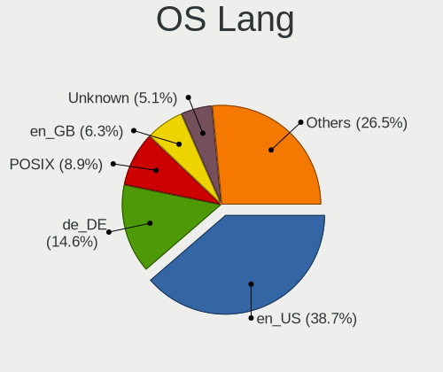
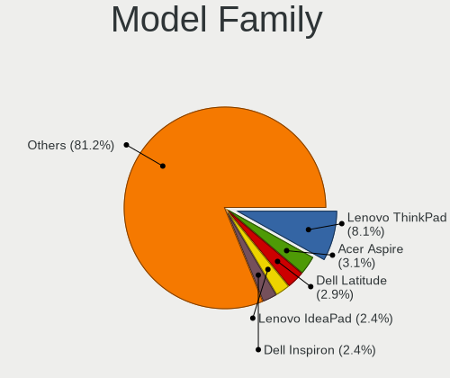
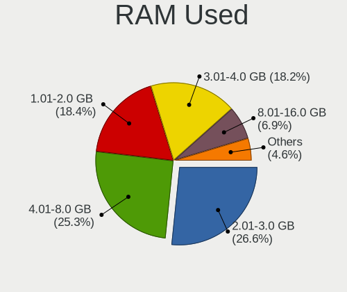
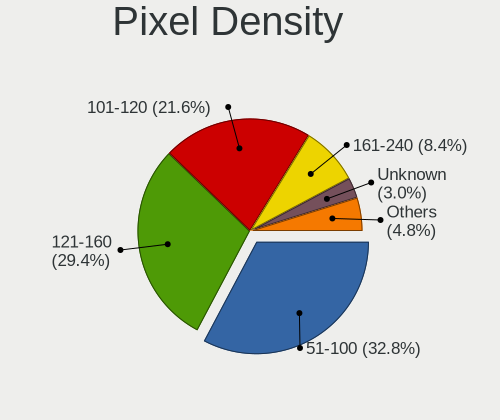

openSUSE - Tested Hardware & Statistics
---------------------------------------

A project to collect tested hardware configurations for openSUSE.

Anyone can contribute to this report by the [hw-probe](https://github.com/linuxhw/hw-probe) tool:

    sudo -E hw-probe -all -upload

Please contribute! Especially if your hardware is rare.

This is a report for all computer types. See also reports for [desktops](/Dist/openSUSE/Desktop/README.md) and [notebooks](/Dist/openSUSE/Notebook/README.md).

Contents
--------

* [ Test Cases ](#test-cases)

* [ System ](#system)
  - [ OS                       ](#os)
  - [ OS Family                ](#os-family)
  - [ Kernel                   ](#kernel)
  - [ Kernel Family            ](#kernel-family)
  - [ Kernel Major Ver.        ](#kernel-major-ver)
  - [ Arch                     ](#arch)
  - [ DE                       ](#de)
  - [ Display Server           ](#display-server)
  - [ Display Manager          ](#display-manager)
  - [ OS Lang                  ](#os-lang)
  - [ Boot Mode                ](#boot-mode)
  - [ Filesystem               ](#filesystem)
  - [ Part. scheme             ](#part-scheme)
  - [ Dual Boot with Linux/BSD ](#dual-boot-with-linuxbsd)
  - [ Dual Boot (Win)          ](#dual-boot-win)

* [ Board ](#board)
  - [ Vendor                   ](#vendor)
  - [ Model                    ](#model)
  - [ Model Family             ](#model-family)
  - [ MFG Year                 ](#mfg-year)
  - [ Form Factor              ](#form-factor)
  - [ Secure Boot              ](#secure-boot)
  - [ Coreboot                 ](#coreboot)
  - [ RAM Size                 ](#ram-size)
  - [ RAM Used                 ](#ram-used)
  - [ Total Drives             ](#total-drives)
  - [ Has CD-ROM               ](#has-cd-rom)
  - [ Has Ethernet             ](#has-ethernet)
  - [ Has WiFi                 ](#has-wifi)
  - [ Has Bluetooth            ](#has-bluetooth)

* [ Location ](#location)
  - [ Country                  ](#country)
  - [ City                     ](#city)

* [ Drives ](#drives)
  - [ Drive Vendor             ](#drive-vendor)
  - [ Drive Model              ](#drive-model)
  - [ HDD Vendor               ](#hdd-vendor)
  - [ SSD Vendor               ](#ssd-vendor)
  - [ Drive Kind               ](#drive-kind)
  - [ Drive Connector          ](#drive-connector)
  - [ Drive Size               ](#drive-size)
  - [ Space Total              ](#space-total)
  - [ Space Used               ](#space-used)
  - [ Malfunc. Drives          ](#malfunc-drives)
  - [ Malfunc. Drive Vendor    ](#malfunc-drive-vendor)
  - [ Malfunc. HDD Vendor      ](#malfunc-hdd-vendor)
  - [ Malfunc. Drive Kind      ](#malfunc-drive-kind)
  - [ Failed Drives            ](#failed-drives)
  - [ Failed Drive Vendor      ](#failed-drive-vendor)
  - [ Drive Status             ](#drive-status)

* [ Storage controller ](#storage-controller)
  - [ Storage Vendor           ](#storage-vendor)
  - [ Storage Model            ](#storage-model)
  - [ Storage Kind             ](#storage-kind)

* [ Processor ](#processor)
  - [ CPU Vendor               ](#cpu-vendor)
  - [ CPU Model                ](#cpu-model)
  - [ CPU Model Family         ](#cpu-model-family)
  - [ CPU Cores                ](#cpu-cores)
  - [ CPU Sockets              ](#cpu-sockets)
  - [ CPU Threads              ](#cpu-threads)
  - [ CPU Op-Modes             ](#cpu-op-modes)
  - [ CPU Microcode            ](#cpu-microcode)
  - [ CPU Microarch            ](#cpu-microarch)

* [ Graphics ](#graphics)
  - [ GPU Vendor               ](#gpu-vendor)
  - [ GPU Model                ](#gpu-model)
  - [ GPU Combo                ](#gpu-combo)
  - [ GPU Driver               ](#gpu-driver)
  - [ GPU Memory               ](#gpu-memory)

* [ Monitor ](#monitor)
  - [ Monitor Vendor           ](#monitor-vendor)
  - [ Monitor Model            ](#monitor-model)
  - [ Monitor Resolution       ](#monitor-resolution)
  - [ Monitor Diagonal         ](#monitor-diagonal)
  - [ Monitor Width            ](#monitor-width)
  - [ Aspect Ratio             ](#aspect-ratio)
  - [ Monitor Area             ](#monitor-area)
  - [ Pixel Density            ](#pixel-density)
  - [ Multiple Monitors        ](#multiple-monitors)

* [ Network ](#network)
  - [ Net Controller Vendor    ](#net-controller-vendor)
  - [ Net Controller Model     ](#net-controller-model)
  - [ Wireless Vendor          ](#wireless-vendor)
  - [ Wireless Model           ](#wireless-model)
  - [ Ethernet Vendor          ](#ethernet-vendor)
  - [ Ethernet Model           ](#ethernet-model)
  - [ Net Controller Kind      ](#net-controller-kind)
  - [ Used Controller          ](#used-controller)
  - [ NICs                     ](#nics)
  - [ IPv6                     ](#ipv6)

* [ Bluetooth ](#bluetooth)
  - [ Bluetooth Vendor         ](#bluetooth-vendor)
  - [ Bluetooth Model          ](#bluetooth-model)

* [ Sound ](#sound)
  - [ Sound Vendor             ](#sound-vendor)
  - [ Sound Model              ](#sound-model)

* [ Memory ](#memory)
  - [ Memory Vendor            ](#memory-vendor)
  - [ Memory Model             ](#memory-model)
  - [ Memory Kind              ](#memory-kind)
  - [ Memory Form Factor       ](#memory-form-factor)
  - [ Memory Size              ](#memory-size)
  - [ Memory Speed             ](#memory-speed)

* [ Printers & scanners ](#printers--scanners)
  - [ Printer Vendor           ](#printer-vendor)
  - [ Printer Model            ](#printer-model)
  - [ Scanner Vendor           ](#scanner-vendor)
  - [ Scanner Model            ](#scanner-model)

* [ Camera ](#camera)
  - [ Camera Vendor            ](#camera-vendor)
  - [ Camera Model             ](#camera-model)

* [ Security ](#security)
  - [ Fingerprint Vendor       ](#fingerprint-vendor)
  - [ Fingerprint Model        ](#fingerprint-model)
  - [ Chipcard Vendor          ](#chipcard-vendor)
  - [ Chipcard Model           ](#chipcard-model)

* [ Unsupported ](#unsupported)
  - [ Unsupported Devices      ](#unsupported-devices)
  - [ Unsupported Device Types ](#unsupported-device-types)

Test Cases
----------

Total: 3981

| Vendor        | Model                       | Form-Factor | Probe                                                      | Date         |
|---------------|-----------------------------|-------------|------------------------------------------------------------|--------------|
| HP            | ProBook 430 G1              | Notebook    | [7f61fa84aa](https://linux-hardware.org/?probe=7f61fa84aa) | Jan 02, 2024 |
| Gigabyte      | X670 GAMING X AX            | Desktop     | [6b4b87c927](https://linux-hardware.org/?probe=6b4b87c927) | Jan 01, 2024 |
| Timi          | RedmiBook Pro 14S           | Notebook    | [08718e205b](https://linux-hardware.org/?probe=08718e205b) | Jan 01, 2024 |
| HP            | 0B4Ch D                     | Desktop     | [b7d97486fb](https://linux-hardware.org/?probe=b7d97486fb) | Jan 01, 2024 |
| Pegatron      | EVANS                       | Desktop     | [b2a67b83cd](https://linux-hardware.org/?probe=b2a67b83cd) | Jan 01, 2024 |
| HP            | Laptop 15s-eq2xxx           | Notebook    | [2f1b4ada4b](https://linux-hardware.org/?probe=2f1b4ada4b) | Jan 01, 2024 |
| Dell          | Latitude 3420               | Notebook    | [775325daa6](https://linux-hardware.org/?probe=775325daa6) | Dec 31, 2023 |
| Alienware     | M17xR3                      | Notebook    | [ed05d87c74](https://linux-hardware.org/?probe=ed05d87c74) | Dec 31, 2023 |
| Huanan        | X99-QD4 V1.0                | Desktop     | [00b52d9fa3](https://linux-hardware.org/?probe=00b52d9fa3) | Dec 30, 2023 |
| Dell          | Inspiron 7460               | Notebook    | [1085eef155](https://linux-hardware.org/?probe=1085eef155) | Dec 30, 2023 |
| Gigabyte      | B650 AORUS ELITE AX         | Desktop     | [aa8dc3e6ae](https://linux-hardware.org/?probe=aa8dc3e6ae) | Dec 30, 2023 |
| Samsung       | 730QFG                      | Convertible | [3cb8ce6daf](https://linux-hardware.org/?probe=3cb8ce6daf) | Dec 30, 2023 |
| Dell          | Inspiron 3443               | Notebook    | [0c56a0465b](https://linux-hardware.org/?probe=0c56a0465b) | Dec 29, 2023 |
| MSI           | B550-A PRO                  | Desktop     | [c607e5ffec](https://linux-hardware.org/?probe=c607e5ffec) | Dec 29, 2023 |
| ASUSTek       | Vivobook Go E1504GAB_E15... | Notebook    | [6fa8529cff](https://linux-hardware.org/?probe=6fa8529cff) | Dec 29, 2023 |
| ASUSTek       | G750JS                      | Notebook    | [1164f5c600](https://linux-hardware.org/?probe=1164f5c600) | Dec 29, 2023 |
| HP            | 0B4Ch D                     | Desktop     | [7b5d790450](https://linux-hardware.org/?probe=7b5d790450) | Dec 28, 2023 |
| HP            | EliteBook 8560p             | Notebook    | [16a5247446](https://linux-hardware.org/?probe=16a5247446) | Dec 28, 2023 |
| HP            | EliteBook 8560p             | Notebook    | [82f94ea967](https://linux-hardware.org/?probe=82f94ea967) | Dec 28, 2023 |
| MSI           | MPG B650 CARBON WIFI        | Desktop     | [cb215ce5f6](https://linux-hardware.org/?probe=cb215ce5f6) | Dec 28, 2023 |
| ASUSTek       | ROG Flow X13 GV301QE_GV3... | Notebook    | [2a7878eaed](https://linux-hardware.org/?probe=2a7878eaed) | Dec 28, 2023 |
| Lenovo        | ThinkPad A275 20KDS01T00    | Notebook    | [424a79de6b](https://linux-hardware.org/?probe=424a79de6b) | Dec 28, 2023 |
| HP            | 250 G8 Notebook PC          | Notebook    | [255c0c95bc](https://linux-hardware.org/?probe=255c0c95bc) | Dec 28, 2023 |
| Intel         | B85                         | Desktop     | [ae03ff7103](https://linux-hardware.org/?probe=ae03ff7103) | Dec 28, 2023 |
| Lenovo        | IdeaPad S340-15IML 81NA     | Notebook    | [1594f8077b](https://linux-hardware.org/?probe=1594f8077b) | Dec 27, 2023 |
| Lenovo        | IdeaPad 3 15ITL6 82H8       | Notebook    | [87e63ff33e](https://linux-hardware.org/?probe=87e63ff33e) | Dec 27, 2023 |
| Gigabyte      | GA-78LMT-USB3 SEx           | Desktop     | [bf8bcdbc55](https://linux-hardware.org/?probe=bf8bcdbc55) | Dec 27, 2023 |
| ASUSTek       | A8N32-SLI-Deluxe            | Desktop     | [e6d0034f2d](https://linux-hardware.org/?probe=e6d0034f2d) | Dec 27, 2023 |
| MSI           | B150 GAMING M3              | Desktop     | [2b312f609c](https://linux-hardware.org/?probe=2b312f609c) | Dec 27, 2023 |
| Lenovo        | ThinkPad E14 Gen 2 20TBS... | Notebook    | [626b056720](https://linux-hardware.org/?probe=626b056720) | Dec 27, 2023 |
| Dell          | Latitude 5591               | Notebook    | [99b2702a06](https://linux-hardware.org/?probe=99b2702a06) | Dec 27, 2023 |
| HP            | Victus by Laptop 16-e0xx... | Notebook    | [f91e53f3e0](https://linux-hardware.org/?probe=f91e53f3e0) | Dec 26, 2023 |
| Dell          | Latitude 3420               | Notebook    | [d17deb16ca](https://linux-hardware.org/?probe=d17deb16ca) | Dec 26, 2023 |
| ASUSTek       | Zenbook UM3402YAR_UM3402... | Notebook    | [4fb309a12a](https://linux-hardware.org/?probe=4fb309a12a) | Dec 26, 2023 |
| ASUSTek       | ROG STRIX X670E-E GAMING... | Desktop     | [ca94325310](https://linux-hardware.org/?probe=ca94325310) | Dec 26, 2023 |
| Gigabyte      | Z97-HD3                     | Desktop     | [a271d8355d](https://linux-hardware.org/?probe=a271d8355d) | Dec 26, 2023 |
| Orange Pi     | 5                           | Soc         | [c834ba0cfe](https://linux-hardware.org/?probe=c834ba0cfe) | Dec 25, 2023 |
| ASUSTek       | ROG Strix G713RW_G713RW     | Notebook    | [7a7f4ca17a](https://linux-hardware.org/?probe=7a7f4ca17a) | Dec 25, 2023 |
| Dell          | Latitude E4310              | Notebook    | [41f607e5e5](https://linux-hardware.org/?probe=41f607e5e5) | Dec 23, 2023 |
| Acer          | Nitro AN515-51              | Notebook    | [52a7a4d6d8](https://linux-hardware.org/?probe=52a7a4d6d8) | Dec 23, 2023 |
| ASUSTek       | Vivobook Go E1504GAB_E15... | Notebook    | [1947533de1](https://linux-hardware.org/?probe=1947533de1) | Dec 23, 2023 |
| Foxconn       | 2ABF                        | Desktop     | [d12d3a2f21](https://linux-hardware.org/?probe=d12d3a2f21) | Dec 23, 2023 |
| Supermicro    | M12SWA-TF                   | Server      | [704ccc2dc4](https://linux-hardware.org/?probe=704ccc2dc4) | Dec 23, 2023 |
| Dell          | System XPS L322X            | Notebook    | [6b050ff1c8](https://linux-hardware.org/?probe=6b050ff1c8) | Dec 23, 2023 |
| Lenovo        | MAHOBAY NOK                 | Desktop     | [51cee07e16](https://linux-hardware.org/?probe=51cee07e16) | Dec 22, 2023 |
| HUAWEI        | KLVL-WXXW                   | Notebook    | [75c61bce6d](https://linux-hardware.org/?probe=75c61bce6d) | Dec 22, 2023 |
| ASUSTek       | Vivobook Go E1504GAB_E15... | Notebook    | [e7c2d69943](https://linux-hardware.org/?probe=e7c2d69943) | Dec 22, 2023 |
| Medion        | S17403                      | Notebook    | [167acdd156](https://linux-hardware.org/?probe=167acdd156) | Dec 22, 2023 |
| Gigabyte      | GA-990XA-UD3                | Desktop     | [f8215b7e03](https://linux-hardware.org/?probe=f8215b7e03) | Dec 21, 2023 |
| Gigabyte      | Z790 AORUS MASTER X         | Desktop     | [e71bed6be5](https://linux-hardware.org/?probe=e71bed6be5) | Dec 21, 2023 |
| Dell          | Latitude 7420               | Notebook    | [f2b2511de1](https://linux-hardware.org/?probe=f2b2511de1) | Dec 21, 2023 |
| Acer          | TravelMate P215-41-G2       | Notebook    | [476ef9075c](https://linux-hardware.org/?probe=476ef9075c) | Dec 21, 2023 |
| Lenovo        | ThinkPad T14 Gen 2i 20W1... | Notebook    | [972314af13](https://linux-hardware.org/?probe=972314af13) | Dec 21, 2023 |
| Dell          | Latitude 3420               | Notebook    | [35a3241602](https://linux-hardware.org/?probe=35a3241602) | Dec 20, 2023 |
| Wortmann      | TERRA_MOBILE_1529H          | Notebook    | [49f1bedb5a](https://linux-hardware.org/?probe=49f1bedb5a) | Dec 20, 2023 |
| ASUSTek       | VivoBook_ASUSLaptop E510... | Notebook    | [2e42798435](https://linux-hardware.org/?probe=2e42798435) | Dec 20, 2023 |
| MSI           | Thin GF63 12HW              | Notebook    | [28287138f4](https://linux-hardware.org/?probe=28287138f4) | Dec 19, 2023 |
| System76      | Lemur Pro                   | Notebook    | [85b70f2fdb](https://linux-hardware.org/?probe=85b70f2fdb) | Dec 18, 2023 |
| ASUSTek       | P8H61                       | Desktop     | [e0b9ef0f5e](https://linux-hardware.org/?probe=e0b9ef0f5e) | Dec 18, 2023 |
| ASUSTek       | P8H61                       | Desktop     | [e83b933182](https://linux-hardware.org/?probe=e83b933182) | Dec 18, 2023 |
| Dell          | Inspiron 7375               | Notebook    | [52f641256c](https://linux-hardware.org/?probe=52f641256c) | Dec 18, 2023 |
| Dell          | XPS 15 7590                 | Notebook    | [7e2afccdd6](https://linux-hardware.org/?probe=7e2afccdd6) | Dec 18, 2023 |
| Lenovo        | ThinkPad T14 Gen 2i 20W1... | Notebook    | [74dc75b3b8](https://linux-hardware.org/?probe=74dc75b3b8) | Dec 18, 2023 |
| Lenovo        | ThinkPad E14 20RA004YUS     | Notebook    | [35e29203d7](https://linux-hardware.org/?probe=35e29203d7) | Dec 17, 2023 |
| System76      | Lemur Pro                   | Notebook    | [6ec95bc2bc](https://linux-hardware.org/?probe=6ec95bc2bc) | Dec 17, 2023 |
| Apple         | MacBookPro5,3               | Notebook    | [8143805d8a](https://linux-hardware.org/?probe=8143805d8a) | Dec 17, 2023 |
| Samsung       | 550XDA                      | Notebook    | [10ec283ed4](https://linux-hardware.org/?probe=10ec283ed4) | Dec 17, 2023 |
| System76      | Bonobo WS                   | Notebook    | [22f5ef6fce](https://linux-hardware.org/?probe=22f5ef6fce) | Dec 16, 2023 |
| Dell          | 09M8Y8 A01                  | Desktop     | [8b05ff3549](https://linux-hardware.org/?probe=8b05ff3549) | Dec 15, 2023 |
| Lenovo        | ThinkPad X1 Extreme 2nd ... | Notebook    | [d8a98a209a](https://linux-hardware.org/?probe=d8a98a209a) | Dec 15, 2023 |
| Acer          | MCP7A                       | Desktop     | [12708a342e](https://linux-hardware.org/?probe=12708a342e) | Dec 14, 2023 |
| ASUSTek       | PRIME A320M-K               | Desktop     | [7e358e1c4b](https://linux-hardware.org/?probe=7e358e1c4b) | Dec 14, 2023 |
| Shenzhen M... | F7BSC                       | Mini pc     | [326d6a97b8](https://linux-hardware.org/?probe=326d6a97b8) | Dec 14, 2023 |
| Dell          | G15 5515                    | Notebook    | [259739c8b5](https://linux-hardware.org/?probe=259739c8b5) | Dec 14, 2023 |
| Samsung       | 355V4C/355V4X/355V5C/355... | Notebook    | [b949261978](https://linux-hardware.org/?probe=b949261978) | Dec 13, 2023 |
| Intel         | MIR1 RVP7                   | Desktop     | [eade46459a](https://linux-hardware.org/?probe=eade46459a) | Dec 13, 2023 |
| ASRock        | B760M PG Riptide            | Desktop     | [30e068aaca](https://linux-hardware.org/?probe=30e068aaca) | Dec 12, 2023 |
| Lenovo        | ThinkPad X13 Gen 2a 20XH... | Notebook    | [c71041fa59](https://linux-hardware.org/?probe=c71041fa59) | Dec 12, 2023 |
| Dell          | 0N4YC8 A00                  | Desktop     | [7b52cfdaeb](https://linux-hardware.org/?probe=7b52cfdaeb) | Dec 12, 2023 |
| Gigabyte      | GA-890FXA-UD7               | Desktop     | [5edcb2dcf9](https://linux-hardware.org/?probe=5edcb2dcf9) | Dec 12, 2023 |
| HP            | 250 15.6 inch G9 Noteboo... | Notebook    | [48475b71d7](https://linux-hardware.org/?probe=48475b71d7) | Dec 11, 2023 |
| HP            | 255 G5                      | Notebook    | [9001fa872f](https://linux-hardware.org/?probe=9001fa872f) | Dec 11, 2023 |
| HP            | 255 G5                      | Notebook    | [d7df759d96](https://linux-hardware.org/?probe=d7df759d96) | Dec 11, 2023 |
| ASUSTek       | P8Z68-V PRO GEN3            | Desktop     | [76c38ed49a](https://linux-hardware.org/?probe=76c38ed49a) | Dec 11, 2023 |
| ASUSTek       | M3A78                       | Desktop     | [d2c14973f1](https://linux-hardware.org/?probe=d2c14973f1) | Dec 10, 2023 |
| HP            | ENVY x360 Convertible 15... | Convertible | [1e3585333b](https://linux-hardware.org/?probe=1e3585333b) | Dec 10, 2023 |
| Dell          | Precision 5530              | Notebook    | [eee9114e4b](https://linux-hardware.org/?probe=eee9114e4b) | Dec 10, 2023 |
| ASUSTek       | ROG Zephyrus M16 GU604VZ... | Notebook    | [e8383035b9](https://linux-hardware.org/?probe=e8383035b9) | Dec 10, 2023 |
| HP            | Compaq 515                  | Notebook    | [025d4116ed](https://linux-hardware.org/?probe=025d4116ed) | Dec 09, 2023 |
| Dell          | 09M8Y8 A01                  | Desktop     | [2b2da67e8f](https://linux-hardware.org/?probe=2b2da67e8f) | Dec 09, 2023 |
| HP            | 212B                        | Desktop     | [9a48a7f9bc](https://linux-hardware.org/?probe=9a48a7f9bc) | Dec 09, 2023 |
| Gigabyte      | AB350M-DS3H-CF              | Desktop     | [307525b07f](https://linux-hardware.org/?probe=307525b07f) | Dec 08, 2023 |
| MSI           | MAG B550 TOMAHAWK           | Desktop     | [fbe4d2ec54](https://linux-hardware.org/?probe=fbe4d2ec54) | Dec 08, 2023 |
| HP            | 3397                        | Desktop     | [f840ce3d4e](https://linux-hardware.org/?probe=f840ce3d4e) | Dec 08, 2023 |
| Dell          | Latitude 5591               | Notebook    | [1961ebb904](https://linux-hardware.org/?probe=1961ebb904) | Dec 07, 2023 |
| HP            | ENVY x360 Convertible 15... | Convertible | [3cdaec0eab](https://linux-hardware.org/?probe=3cdaec0eab) | Dec 07, 2023 |
| Dell          | Latitude 5591               | Notebook    | [b9f6d020e8](https://linux-hardware.org/?probe=b9f6d020e8) | Dec 07, 2023 |
| Lenovo        | IdeaPad 5 14ALC05 82LM      | Notebook    | [9d717185fb](https://linux-hardware.org/?probe=9d717185fb) | Dec 07, 2023 |
| System76      | Lemur Pro                   | Notebook    | [c8313d9e6f](https://linux-hardware.org/?probe=c8313d9e6f) | Dec 07, 2023 |
| MSI           | P67A-C45                    | Desktop     | [65f9196217](https://linux-hardware.org/?probe=65f9196217) | Dec 07, 2023 |
| Samsung       | 550XDA                      | Notebook    | [6501dce45c](https://linux-hardware.org/?probe=6501dce45c) | Dec 07, 2023 |
| MSI           | B350 TOMAHAWK ARCTIC        | Desktop     | [f47146cdb9](https://linux-hardware.org/?probe=f47146cdb9) | Dec 07, 2023 |
| Lenovo        | ThinkPad X1 Yoga Gen 7 2... | Convertible | [8446d618a7](https://linux-hardware.org/?probe=8446d618a7) | Dec 06, 2023 |
| Gigabyte      | X570 AORUS PRO WIFI         | Desktop     | [a656248ef8](https://linux-hardware.org/?probe=a656248ef8) | Dec 06, 2023 |
| Lenovo        | IdeaPad Gaming 3 15ARH05... | Notebook    | [70394fdace](https://linux-hardware.org/?probe=70394fdace) | Dec 05, 2023 |
| Dell          | 0GM819                      | Desktop     | [8ff7ec90b2](https://linux-hardware.org/?probe=8ff7ec90b2) | Dec 05, 2023 |
| Intel         | S1200RP G62254-407          | Server      | [7db1ebe060](https://linux-hardware.org/?probe=7db1ebe060) | Dec 05, 2023 |
| ASUSTek       | X550CA                      | Notebook    | [a0912ee339](https://linux-hardware.org/?probe=a0912ee339) | Dec 05, 2023 |
| Gigabyte      | X99-UD4-CF                  | Desktop     | [fa5609e17d](https://linux-hardware.org/?probe=fa5609e17d) | Dec 04, 2023 |
| AMI           | Intel                       | Desktop     | [7fdef1f7fc](https://linux-hardware.org/?probe=7fdef1f7fc) | Dec 04, 2023 |
| HP            | Victus by Gaming Laptop ... | Notebook    | [44542d3f3a](https://linux-hardware.org/?probe=44542d3f3a) | Dec 04, 2023 |
| HP            | ZBook 15 G3                 | Notebook    | [db4ce11de0](https://linux-hardware.org/?probe=db4ce11de0) | Dec 04, 2023 |
| Apple         | Mac-35C5E08120C7EEAF Mac... | Mini pc     | [b6ccfe856f](https://linux-hardware.org/?probe=b6ccfe856f) | Dec 03, 2023 |
| HP            | 3398                        | Desktop     | [0c73c22450](https://linux-hardware.org/?probe=0c73c22450) | Dec 03, 2023 |
| Medion        | Unknown                     | Notebook    | [8fce2ae281](https://linux-hardware.org/?probe=8fce2ae281) | Dec 03, 2023 |
| Medion        | Unknown                     | Notebook    | [c99fd8f0b0](https://linux-hardware.org/?probe=c99fd8f0b0) | Dec 03, 2023 |
| Valve         | Jupiter                     | Notebook    | [c7865c15b0](https://linux-hardware.org/?probe=c7865c15b0) | Dec 02, 2023 |
| ASUSTek       | PRIME Z790-A WIFI           | Desktop     | [46a43fa59d](https://linux-hardware.org/?probe=46a43fa59d) | Dec 02, 2023 |
| HP            | Victus by Gaming Laptop ... | Notebook    | [e9e9db4763](https://linux-hardware.org/?probe=e9e9db4763) | Dec 02, 2023 |
| HP            | ZBook 15 G3                 | Notebook    | [c9b71f256a](https://linux-hardware.org/?probe=c9b71f256a) | Dec 02, 2023 |
| HP            | Notebook                    | Notebook    | [0a554c91b1](https://linux-hardware.org/?probe=0a554c91b1) | Dec 01, 2023 |
| Lenovo        | ThinkPad E14 Gen 3 20YD0... | Notebook    | [dcbc9946d8](https://linux-hardware.org/?probe=dcbc9946d8) | Dec 01, 2023 |
| Lenovo        | ThinkPad E14 Gen 3 20YD0... | Notebook    | [95221dfaaf](https://linux-hardware.org/?probe=95221dfaaf) | Dec 01, 2023 |
| ASUSTek       | M4A88T-M LE                 | Desktop     | [a2f1655886](https://linux-hardware.org/?probe=a2f1655886) | Dec 01, 2023 |
| Lenovo        | IdeaPad 5 Pro 16ARH7 82S... | Notebook    | [4ba2fc285f](https://linux-hardware.org/?probe=4ba2fc285f) | Nov 30, 2023 |
| Lenovo        | IdeaPad 5 Pro 16ARH7 82S... | Notebook    | [0f9a06cc9f](https://linux-hardware.org/?probe=0f9a06cc9f) | Nov 30, 2023 |
| Lenovo        | ThinkPad W510 4391W3V       | Notebook    | [bfa4423c0f](https://linux-hardware.org/?probe=bfa4423c0f) | Nov 30, 2023 |
| Dell          | Latitude E5470              | Notebook    | [7b9aba2d2c](https://linux-hardware.org/?probe=7b9aba2d2c) | Nov 30, 2023 |
| Dell          | Latitude E5470              | Notebook    | [83a0b4f237](https://linux-hardware.org/?probe=83a0b4f237) | Nov 30, 2023 |
| MSI           | B450M-A PRO MAX             | Desktop     | [9accd13cb5](https://linux-hardware.org/?probe=9accd13cb5) | Nov 30, 2023 |
| HP            | Notebook                    | Notebook    | [93464a0904](https://linux-hardware.org/?probe=93464a0904) | Nov 30, 2023 |
| Lenovo        | ThinkPad E14 Gen 2 20TA0... | Notebook    | [499e463561](https://linux-hardware.org/?probe=499e463561) | Nov 30, 2023 |
| Samsung       | 550XDA                      | Notebook    | [5778304f73](https://linux-hardware.org/?probe=5778304f73) | Nov 30, 2023 |
| Dell          | Latitude 7290               | Notebook    | [c9068c7692](https://linux-hardware.org/?probe=c9068c7692) | Nov 30, 2023 |
| Dell          | Latitude 7290               | Notebook    | [c75434aea3](https://linux-hardware.org/?probe=c75434aea3) | Nov 30, 2023 |
| ASUSTek       | M4A88T-M LE                 | Desktop     | [1e982d5ac9](https://linux-hardware.org/?probe=1e982d5ac9) | Nov 30, 2023 |
| ASUSTek       | VivoBook_ASUSLaptop TN34... | Convertible | [130b50a8d9](https://linux-hardware.org/?probe=130b50a8d9) | Nov 30, 2023 |
| ASRock        | X570 Pro4                   | Desktop     | [19eb0e5761](https://linux-hardware.org/?probe=19eb0e5761) | Nov 30, 2023 |
| ASUSTek       | TUF Gaming A620M-PLUS WI... | Desktop     | [8425b9dc62](https://linux-hardware.org/?probe=8425b9dc62) | Nov 30, 2023 |
| MSI           | MAG X570S TORPEDO MAX       | Desktop     | [f6e7c5e8a3](https://linux-hardware.org/?probe=f6e7c5e8a3) | Nov 29, 2023 |
| Acer          | Aspire A317-32              | Notebook    | [02b205724a](https://linux-hardware.org/?probe=02b205724a) | Nov 29, 2023 |
| ASUSTek       | P8P67 PRO                   | Desktop     | [2e18955c29](https://linux-hardware.org/?probe=2e18955c29) | Nov 28, 2023 |
| PIONEERPOS    | STEALTH-ASTERIX             | Desktop     | [5f429c0aca](https://linux-hardware.org/?probe=5f429c0aca) | Nov 28, 2023 |
| Lenovo        | IdeaPad S145-15IIL 82DJ     | Notebook    | [1eda316922](https://linux-hardware.org/?probe=1eda316922) | Nov 28, 2023 |
| Lenovo        | 30BC SDK0J40705 WIN 3425... | Desktop     | [d16f76117d](https://linux-hardware.org/?probe=d16f76117d) | Nov 28, 2023 |
| ASUSTek       | M5A78L-M LX3                | Desktop     | [ad30ce41a1](https://linux-hardware.org/?probe=ad30ce41a1) | Nov 27, 2023 |
| Lenovo        | Y520-15IKBN 80WK            | Notebook    | [b46ec04a69](https://linux-hardware.org/?probe=b46ec04a69) | Nov 27, 2023 |
| Lenovo        | Y520-15IKBN 80WK            | Notebook    | [d3122d678f](https://linux-hardware.org/?probe=d3122d678f) | Nov 27, 2023 |
| HP            | Pavilion 13 x360 PC         | Notebook    | [088789a558](https://linux-hardware.org/?probe=088789a558) | Nov 27, 2023 |
| HP            | Pavilion 13 x360 PC         | Notebook    | [fa45cae3d1](https://linux-hardware.org/?probe=fa45cae3d1) | Nov 27, 2023 |
| ASUSTek       | ASUS TUF Gaming F15 FX50... | Notebook    | [4256ad6b53](https://linux-hardware.org/?probe=4256ad6b53) | Nov 27, 2023 |
| ASUSTek       | Zenbook UM3402YAR_UM3402... | Notebook    | [f5c438ff75](https://linux-hardware.org/?probe=f5c438ff75) | Nov 26, 2023 |
| HP            | 0B4Ch D                     | Desktop     | [84e4d06443](https://linux-hardware.org/?probe=84e4d06443) | Nov 26, 2023 |
| Lenovo        | Legion Pro 5 16ARX8 82WM    | Notebook    | [312776837c](https://linux-hardware.org/?probe=312776837c) | Nov 26, 2023 |
| HP            | Laptop 15-bs0xx             | Notebook    | [e9bfd98ad2](https://linux-hardware.org/?probe=e9bfd98ad2) | Nov 26, 2023 |
| IBM           | ThinkPad T42 2373CS8        | Notebook    | [79787555b2](https://linux-hardware.org/?probe=79787555b2) | Nov 26, 2023 |
| TUXEDO        | Pulse 15 Gen1               | Notebook    | [c828f995fb](https://linux-hardware.org/?probe=c828f995fb) | Nov 26, 2023 |
| TUXEDO        | Pulse 15 Gen1               | Notebook    | [f9d2e880ee](https://linux-hardware.org/?probe=f9d2e880ee) | Nov 26, 2023 |
| ASUSTek       | PRIME Z490-P                | Desktop     | [6dcba67a12](https://linux-hardware.org/?probe=6dcba67a12) | Nov 26, 2023 |
| ASUSTek       | Pro WS X570-ACE             | Desktop     | [f181be5be1](https://linux-hardware.org/?probe=f181be5be1) | Nov 26, 2023 |
| HP            | 0B4Ch D                     | Desktop     | [8104fc2789](https://linux-hardware.org/?probe=8104fc2789) | Nov 26, 2023 |
| HP            | 212B                        | Desktop     | [90bc0d4d2d](https://linux-hardware.org/?probe=90bc0d4d2d) | Nov 25, 2023 |
| ASUSTek       | PRIME B550M-K               | Desktop     | [186ea5595b](https://linux-hardware.org/?probe=186ea5595b) | Nov 25, 2023 |
| Apple         | MacBookPro8,1               | Notebook    | [eb9615352b](https://linux-hardware.org/?probe=eb9615352b) | Nov 25, 2023 |
| ASUSTek       | PRIME X670-P                | Desktop     | [7c781203b3](https://linux-hardware.org/?probe=7c781203b3) | Nov 25, 2023 |
| MSI           | PRO Z690-A DDR4             | Desktop     | [628b7eba64](https://linux-hardware.org/?probe=628b7eba64) | Nov 25, 2023 |
| MSI           | PRO Z690-A DDR4             | Desktop     | [46424acb59](https://linux-hardware.org/?probe=46424acb59) | Nov 25, 2023 |
| HP            | ENVY x360 Convertible 15... | Convertible | [34a9a0d541](https://linux-hardware.org/?probe=34a9a0d541) | Nov 24, 2023 |
| Dell          | Inspiron 5468               | Notebook    | [3422c91458](https://linux-hardware.org/?probe=3422c91458) | Nov 24, 2023 |
| Lenovo        | ThinkPad X260 20F6CTO1WW    | Notebook    | [a67fd8af5c](https://linux-hardware.org/?probe=a67fd8af5c) | Nov 24, 2023 |
| HP            | 8055                        | Desktop     | [cf59a6d111](https://linux-hardware.org/?probe=cf59a6d111) | Nov 24, 2023 |
| ASUSTek       | M3A78                       | Desktop     | [c4895d59da](https://linux-hardware.org/?probe=c4895d59da) | Nov 23, 2023 |
| Gigabyte      | X570 AORUS PRO              | Desktop     | [6b22ebc1d6](https://linux-hardware.org/?probe=6b22ebc1d6) | Nov 23, 2023 |
| ASUSTek       | VivoBook_ASUSLaptop X712... | Notebook    | [ec55afa142](https://linux-hardware.org/?probe=ec55afa142) | Nov 23, 2023 |
| NEC Comput... | PC-NS100C1W-P2              | Notebook    | [10175626ab](https://linux-hardware.org/?probe=10175626ab) | Nov 23, 2023 |
| Biostar       | TF570 SLI A2+               | Desktop     | [50eb6f63d8](https://linux-hardware.org/?probe=50eb6f63d8) | Nov 23, 2023 |
| Biostar       | TF570 SLI A2+               | Desktop     | [052c9cc626](https://linux-hardware.org/?probe=052c9cc626) | Nov 23, 2023 |
| Acer          | Aspire A515-45G             | Notebook    | [1ec9d0635f](https://linux-hardware.org/?probe=1ec9d0635f) | Nov 23, 2023 |
| HC Technol... | HCAR5000-MI                 | Desktop     | [718e30ca5e](https://linux-hardware.org/?probe=718e30ca5e) | Nov 22, 2023 |
| Dell          | Inspiron 5502               | Notebook    | [eb86dc0b36](https://linux-hardware.org/?probe=eb86dc0b36) | Nov 22, 2023 |
| System76      | Lemur Pro                   | Notebook    | [45a6298cb5](https://linux-hardware.org/?probe=45a6298cb5) | Nov 22, 2023 |
| ASUSTek       | ROG Strix G513QC_G513QC     | Notebook    | [748ea9f21b](https://linux-hardware.org/?probe=748ea9f21b) | Nov 21, 2023 |
| Acer          | Aspire F5-573G              | Notebook    | [e28d68acd6](https://linux-hardware.org/?probe=e28d68acd6) | Nov 21, 2023 |
| Acer          | Aspire F5-573G              | Notebook    | [d3f91d31f6](https://linux-hardware.org/?probe=d3f91d31f6) | Nov 21, 2023 |
| ASRock        | B250M-HDV                   | Desktop     | [1d8de35042](https://linux-hardware.org/?probe=1d8de35042) | Nov 21, 2023 |
| MSI           | Modern 14 C12M              | Notebook    | [072fdd8676](https://linux-hardware.org/?probe=072fdd8676) | Nov 21, 2023 |
| ASUSTek       | VivoBook_ASUSLaptop M150... | Notebook    | [243ff5e0c9](https://linux-hardware.org/?probe=243ff5e0c9) | Nov 21, 2023 |
| Fujitsu       | LIFEBOOK E736               | Notebook    | [eb2c46c2cc](https://linux-hardware.org/?probe=eb2c46c2cc) | Nov 21, 2023 |
| Dell          | 0WN7Y6 A01                  | Desktop     | [ec7c6f22d3](https://linux-hardware.org/?probe=ec7c6f22d3) | Nov 20, 2023 |
| HP            | 650                         | Notebook    | [ee76251969](https://linux-hardware.org/?probe=ee76251969) | Nov 20, 2023 |
| Gigabyte      | Z97-HD3                     | Desktop     | [4949cbc96a](https://linux-hardware.org/?probe=4949cbc96a) | Nov 19, 2023 |
| Gigabyte      | Z97-HD3                     | Desktop     | [36ce4210e3](https://linux-hardware.org/?probe=36ce4210e3) | Nov 19, 2023 |
| ASUSTek       | M3A78                       | Desktop     | [a6392d3aae](https://linux-hardware.org/?probe=a6392d3aae) | Nov 19, 2023 |
| HP            | Notebook                    | Notebook    | [7ca0f11e6f](https://linux-hardware.org/?probe=7ca0f11e6f) | Nov 19, 2023 |
| Dell          | 0HD5W2 A01                  | Desktop     | [1274649a8b](https://linux-hardware.org/?probe=1274649a8b) | Nov 19, 2023 |
| Gigabyte      | B85M-D3V Plus-SI            | Desktop     | [7771038ba5](https://linux-hardware.org/?probe=7771038ba5) | Nov 19, 2023 |
| Gigabyte      | B85M-D3V Plus-SI            | Desktop     | [0e5665d3c6](https://linux-hardware.org/?probe=0e5665d3c6) | Nov 18, 2023 |
| ASRock        | Z270 Gaming K4              | Desktop     | [6a19659d85](https://linux-hardware.org/?probe=6a19659d85) | Nov 18, 2023 |
| ASRock        | 960GM/U3S3 FX               | Desktop     | [0640663504](https://linux-hardware.org/?probe=0640663504) | Nov 18, 2023 |
| HP            | 845A                        | Desktop     | [ecda0525f3](https://linux-hardware.org/?probe=ecda0525f3) | Nov 17, 2023 |
| HUAWEI        | BOHK-WAX9X                  | Notebook    | [d45c2fd452](https://linux-hardware.org/?probe=d45c2fd452) | Nov 17, 2023 |
| HP            | Pavilion Laptop 15-cw1xx... | Notebook    | [e35c170bf2](https://linux-hardware.org/?probe=e35c170bf2) | Nov 17, 2023 |
| Gigabyte      | GA-78LMT-USB3 SEx           | Desktop     | [a7540248a1](https://linux-hardware.org/?probe=a7540248a1) | Nov 16, 2023 |
| Samsung       | 550XDA                      | Notebook    | [a823e2b0a5](https://linux-hardware.org/?probe=a823e2b0a5) | Nov 16, 2023 |
| HP            | 87C3                        | Desktop     | [1c76b1e942](https://linux-hardware.org/?probe=1c76b1e942) | Nov 16, 2023 |
| Gigabyte      | B85M-DS3H-A                 | Desktop     | [5cdf728f08](https://linux-hardware.org/?probe=5cdf728f08) | Nov 15, 2023 |
| HP            | ENVY x360 Convertible 15... | Convertible | [9fc66b4436](https://linux-hardware.org/?probe=9fc66b4436) | Nov 15, 2023 |
| MSI           | PRO H610M-G DDR4            | Notebook    | [5955e4e776](https://linux-hardware.org/?probe=5955e4e776) | Nov 15, 2023 |
| ASRock        | B450 Steel Legend           | Desktop     | [fdd574a6ac](https://linux-hardware.org/?probe=fdd574a6ac) | Nov 15, 2023 |
| Unknown       | Unknown                     | Notebook    | [d169a02b18](https://linux-hardware.org/?probe=d169a02b18) | Nov 14, 2023 |
| Dell          | Latitude E6410              | Notebook    | [1e9606e755](https://linux-hardware.org/?probe=1e9606e755) | Nov 14, 2023 |
| HP            | ENVY x360 Convertible 15... | Convertible | [383553241b](https://linux-hardware.org/?probe=383553241b) | Nov 14, 2023 |
| Lenovo        | V15 G2 ALC 82KD             | Notebook    | [e3926c718f](https://linux-hardware.org/?probe=e3926c718f) | Nov 14, 2023 |
| Dell          | XPS 15 9560                 | Notebook    | [b806051ada](https://linux-hardware.org/?probe=b806051ada) | Nov 14, 2023 |
| MSI           | PRO H610M-G DDR4            | Notebook    | [f41807e01e](https://linux-hardware.org/?probe=f41807e01e) | Nov 14, 2023 |
| Lenovo        | V15 G2 ALC 82KD             | Notebook    | [917ab5dcf0](https://linux-hardware.org/?probe=917ab5dcf0) | Nov 14, 2023 |
| ASRock        | J3710M                      | Desktop     | [0cb1ebf230](https://linux-hardware.org/?probe=0cb1ebf230) | Nov 14, 2023 |
| ASRock        | J3710M                      | Desktop     | [5b0fe5e0b3](https://linux-hardware.org/?probe=5b0fe5e0b3) | Nov 14, 2023 |
| ASUSTek       | ROG Zephyrus M16 GU604VZ... | Notebook    | [242621dab3](https://linux-hardware.org/?probe=242621dab3) | Nov 13, 2023 |
| Dell          | Latitude 7420               | Notebook    | [dcbc2d6415](https://linux-hardware.org/?probe=dcbc2d6415) | Nov 13, 2023 |
| Intel         | NUC11PABi5 K90634-302       | Mini pc     | [474f3dea0b](https://linux-hardware.org/?probe=474f3dea0b) | Nov 13, 2023 |
| NEC Comput... | PC-NS100C1W-P2              | Notebook    | [3f3c22657c](https://linux-hardware.org/?probe=3f3c22657c) | Nov 12, 2023 |
| NEC Comput... | PC-NS100C1W-P2              | Notebook    | [d1ccec297d](https://linux-hardware.org/?probe=d1ccec297d) | Nov 12, 2023 |
| Acer          | Predator PH315-54           | Notebook    | [836439ab9f](https://linux-hardware.org/?probe=836439ab9f) | Nov 12, 2023 |
| HP            | Pavilion dv9500             | Notebook    | [1cbc855f91](https://linux-hardware.org/?probe=1cbc855f91) | Nov 12, 2023 |
| Dell          | Latitude 7440               | Notebook    | [5c19a02292](https://linux-hardware.org/?probe=5c19a02292) | Nov 11, 2023 |
| ASUSTek       | TUF Gaming B550M-PLUS       | Desktop     | [68e581186c](https://linux-hardware.org/?probe=68e581186c) | Nov 11, 2023 |
| Gigabyte      | X570 AORUS ELITE            | Desktop     | [3da6776443](https://linux-hardware.org/?probe=3da6776443) | Nov 11, 2023 |
| ASUSTek       | ROG STRIX X670E-E GAMING... | Desktop     | [b0bf1f1ac1](https://linux-hardware.org/?probe=b0bf1f1ac1) | Nov 11, 2023 |
| Gigabyte      | H410M H V3                  | Desktop     | [6406ede8d4](https://linux-hardware.org/?probe=6406ede8d4) | Nov 11, 2023 |
| ASUSTek       | ROG Strix G513QY_G513QY     | Notebook    | [5ceb1cfa6d](https://linux-hardware.org/?probe=5ceb1cfa6d) | Nov 11, 2023 |
| Samsung       | 550XDA                      | Notebook    | [036d014b91](https://linux-hardware.org/?probe=036d014b91) | Nov 10, 2023 |
| HP            | EliteBook 840 G6            | Notebook    | [7ef5d16bc5](https://linux-hardware.org/?probe=7ef5d16bc5) | Nov 10, 2023 |
| HP            | ProBook 4430s               | Notebook    | [47b4ab5ae1](https://linux-hardware.org/?probe=47b4ab5ae1) | Nov 10, 2023 |
| HP            | ProBook 4430s               | Notebook    | [69a5aa0675](https://linux-hardware.org/?probe=69a5aa0675) | Nov 10, 2023 |
| Gigabyte      | GA-78LMT-USB3 SEx           | Desktop     | [cea741ce3e](https://linux-hardware.org/?probe=cea741ce3e) | Nov 10, 2023 |
| Lenovo        | Yoga Pro 9 16IRP8 83BY      | Notebook    | [906f638c34](https://linux-hardware.org/?probe=906f638c34) | Nov 10, 2023 |
| Dynabook      | PORTEGE X30L-K              | Notebook    | [161674ce4a](https://linux-hardware.org/?probe=161674ce4a) | Nov 10, 2023 |
| ASRock        | A320M-HDV R4.0              | Desktop     | [9222374410](https://linux-hardware.org/?probe=9222374410) | Nov 09, 2023 |
| MSI           | Katana GF66 12UD            | Notebook    | [acc81a52a0](https://linux-hardware.org/?probe=acc81a52a0) | Nov 09, 2023 |
| Dell          | 03KWTV A00                  | Desktop     | [6927bdc467](https://linux-hardware.org/?probe=6927bdc467) | Nov 09, 2023 |
| Chuwi         | GemiBook XPro               | Notebook    | [3803995d49](https://linux-hardware.org/?probe=3803995d49) | Nov 09, 2023 |
| Lenovo        | ThinkPad L14 Gen 4 21H5C... | Notebook    | [0a9d218a26](https://linux-hardware.org/?probe=0a9d218a26) | Nov 08, 2023 |
| Gigabyte      | X570 AORUS MASTER           | Desktop     | [c4f7fd2835](https://linux-hardware.org/?probe=c4f7fd2835) | Nov 08, 2023 |
| Lenovo        | ThinkPad E14 Gen 5 21JR0... | Notebook    | [e736653169](https://linux-hardware.org/?probe=e736653169) | Nov 08, 2023 |
| MSI           | Z790 GAMING PRO WIFI        | Desktop     | [44fcbf488b](https://linux-hardware.org/?probe=44fcbf488b) | Nov 08, 2023 |
| Lenovo        | ThinkPad W541 20EGS1LB00    | Notebook    | [7a31e185b9](https://linux-hardware.org/?probe=7a31e185b9) | Nov 07, 2023 |
| ASUSTek       | ROG Zephyrus M16 GU604VZ... | Notebook    | [680fae0bef](https://linux-hardware.org/?probe=680fae0bef) | Nov 07, 2023 |
| HP            | EliteBook 850 G6            | Notebook    | [0d00c42688](https://linux-hardware.org/?probe=0d00c42688) | Nov 06, 2023 |
| ASUSTek       | TUF Gaming X570-PLUS        | Desktop     | [f459ffa824](https://linux-hardware.org/?probe=f459ffa824) | Nov 06, 2023 |
| HP            | 82A2                        | Desktop     | [1d34952ece](https://linux-hardware.org/?probe=1d34952ece) | Nov 06, 2023 |
| Lenovo        | Yoga 9 14ITL5 82BG          | Convertible | [18053575fc](https://linux-hardware.org/?probe=18053575fc) | Nov 06, 2023 |
| Lenovo        | Yoga 9 14ITL5 82BG          | Convertible | [52781b1111](https://linux-hardware.org/?probe=52781b1111) | Nov 06, 2023 |
| Lenovo        | IdeaPad S340-15IWL 81N8     | Notebook    | [d40cc6e0a4](https://linux-hardware.org/?probe=d40cc6e0a4) | Nov 05, 2023 |
| ASUSTek       | P8H61-M LE R2.0             | Desktop     | [1c86a5a6de](https://linux-hardware.org/?probe=1c86a5a6de) | Nov 05, 2023 |
| Gigabyte      | X470 AORUS ULTRA GAMING-... | Desktop     | [9d79aa9486](https://linux-hardware.org/?probe=9d79aa9486) | Nov 05, 2023 |
| Lenovo        | ThinkPad T490 20N2000LSP    | Notebook    | [55e3cdf0cc](https://linux-hardware.org/?probe=55e3cdf0cc) | Nov 05, 2023 |
| Google        | Phaser360                   | Notebook    | [dbd0db9b7e](https://linux-hardware.org/?probe=dbd0db9b7e) | Nov 05, 2023 |
| Lenovo        | 3098 SDK0E50510 WIN         | Desktop     | [24e4446a67](https://linux-hardware.org/?probe=24e4446a67) | Nov 05, 2023 |
| Lenovo        | ThinkPad T470 W10DG 20JN... | Notebook    | [263a417420](https://linux-hardware.org/?probe=263a417420) | Nov 05, 2023 |
| Fujitsu       | LIFEBOOK E736               | Notebook    | [a2b93486a9](https://linux-hardware.org/?probe=a2b93486a9) | Nov 05, 2023 |
| Notebook      | NL5xRU                      | Notebook    | [6dd04cca75](https://linux-hardware.org/?probe=6dd04cca75) | Nov 05, 2023 |
| ASUSTek       | PRIME Z490-P                | Desktop     | [f8a30d78d3](https://linux-hardware.org/?probe=f8a30d78d3) | Nov 04, 2023 |
| Lenovo        | ThinkPad L570 W10DG 20JR... | Notebook    | [ebf86ce161](https://linux-hardware.org/?probe=ebf86ce161) | Nov 04, 2023 |
| Lenovo        | ThinkPad L570 W10DG 20JR... | Notebook    | [5eada91f48](https://linux-hardware.org/?probe=5eada91f48) | Nov 04, 2023 |
| Lenovo        | ThinkPad E14 Gen 5 21JR0... | Notebook    | [d1d65399a0](https://linux-hardware.org/?probe=d1d65399a0) | Nov 03, 2023 |
| MSI           | MEG X570 UNIFY              | Desktop     | [89e8c02e17](https://linux-hardware.org/?probe=89e8c02e17) | Nov 03, 2023 |
| Acer          | Aspire VN7-591G             | Notebook    | [f446da83f1](https://linux-hardware.org/?probe=f446da83f1) | Nov 03, 2023 |
| Dell          | Inspiron 5547               | Notebook    | [e14eb66450](https://linux-hardware.org/?probe=e14eb66450) | Nov 03, 2023 |
| Gigabyte      | Z370 HD3P-CF                | Desktop     | [1a0272a4ca](https://linux-hardware.org/?probe=1a0272a4ca) | Nov 02, 2023 |
| Gigabyte      | Z370 HD3P-CF                | Desktop     | [8ce1afee32](https://linux-hardware.org/?probe=8ce1afee32) | Nov 02, 2023 |
| MSI           | X370 SLI PLUS               | Desktop     | [98208c406a](https://linux-hardware.org/?probe=98208c406a) | Nov 02, 2023 |
| Gigabyte      | B550 AORUS PRO AC           | Desktop     | [54a7f5d1fa](https://linux-hardware.org/?probe=54a7f5d1fa) | Nov 02, 2023 |
| Gigabyte      | B550 AORUS PRO AC           | Desktop     | [175020104d](https://linux-hardware.org/?probe=175020104d) | Nov 02, 2023 |
| Dell          | Latitude E6420              | Notebook    | [cdef3b5f1c](https://linux-hardware.org/?probe=cdef3b5f1c) | Nov 02, 2023 |
| Lenovo        | Legion 5 Pro 16ITH6H 82J... | Notebook    | [137dba2261](https://linux-hardware.org/?probe=137dba2261) | Nov 02, 2023 |
| ASUSTek       | GA35DX                      | Desktop     | [1a9eef3748](https://linux-hardware.org/?probe=1a9eef3748) | Nov 02, 2023 |
| HP            | Pavilion Gaming Laptop 1... | Notebook    | [f72ba9e16b](https://linux-hardware.org/?probe=f72ba9e16b) | Nov 01, 2023 |
| ASUSTek       | P8H61-M LE R2.0             | Desktop     | [9893d57e1b](https://linux-hardware.org/?probe=9893d57e1b) | Nov 01, 2023 |
| ASUSTek       | M5A87                       | Desktop     | [b254c30981](https://linux-hardware.org/?probe=b254c30981) | Nov 01, 2023 |
| Lenovo        | ThinkPad P1 Gen 5 21DDS0... | Notebook    | [ce44ee3f62](https://linux-hardware.org/?probe=ce44ee3f62) | Oct 31, 2023 |
| ASUSTek       | ROG STRIX X670E-E GAMING... | Desktop     | [d1e473a77b](https://linux-hardware.org/?probe=d1e473a77b) | Oct 31, 2023 |
| MSI           | X370 GAMING PRO             | Desktop     | [c8ba0de51d](https://linux-hardware.org/?probe=c8ba0de51d) | Oct 31, 2023 |
| ASUSTek       | VivoBook_ASUSLaptop X515... | Notebook    | [2eaf76ce92](https://linux-hardware.org/?probe=2eaf76ce92) | Oct 31, 2023 |
| Acer          | Swift SF314-41              | Notebook    | [1bdd8f14ad](https://linux-hardware.org/?probe=1bdd8f14ad) | Oct 31, 2023 |
| Apple         | MacBookPro11,4              | Notebook    | [4d6c2166c8](https://linux-hardware.org/?probe=4d6c2166c8) | Oct 30, 2023 |
| ASUSTek       | ASUS TUF Dash F15 FX517Z... | Notebook    | [d5debf7011](https://linux-hardware.org/?probe=d5debf7011) | Oct 30, 2023 |
| Lenovo        | ThinkPad X13 Yoga Gen 2 ... | Convertible | [4b6c792eeb](https://linux-hardware.org/?probe=4b6c792eeb) | Oct 30, 2023 |
| Gigabyte      | TRX40 AORUS XTREME          | Desktop     | [d16f2b19b0](https://linux-hardware.org/?probe=d16f2b19b0) | Oct 30, 2023 |
| Dell          | 0KWVT8 A03                  | Desktop     | [b5615554ee](https://linux-hardware.org/?probe=b5615554ee) | Oct 30, 2023 |
| Dell          | Inspiron N4050              | Notebook    | [7d5dc09b04](https://linux-hardware.org/?probe=7d5dc09b04) | Oct 30, 2023 |
| HP            | ProLiant ML310e Gen8        | Desktop     | [fa410ee23c](https://linux-hardware.org/?probe=fa410ee23c) | Oct 29, 2023 |
| HP            | ProLiant ML310e Gen8        | Desktop     | [16417bdac2](https://linux-hardware.org/?probe=16417bdac2) | Oct 29, 2023 |
| Samsung       | Galaxy Book Go 5G           | Notebook    | [8f202d5648](https://linux-hardware.org/?probe=8f202d5648) | Oct 29, 2023 |
| MSI           | MAG B650 TOMAHAWK WIFI      | Desktop     | [04e2b9cf4d](https://linux-hardware.org/?probe=04e2b9cf4d) | Oct 28, 2023 |
| Lenovo        | 3741 SDK0T76463 WIN 3422... | Desktop     | [33d021b931](https://linux-hardware.org/?probe=33d021b931) | Oct 28, 2023 |
| MSI           | MPG X570S CARBON MAX WIF... | Desktop     | [8b0a272a4e](https://linux-hardware.org/?probe=8b0a272a4e) | Oct 28, 2023 |
| Acer          | Aspire V3-571               | Notebook    | [6aa696ac55](https://linux-hardware.org/?probe=6aa696ac55) | Oct 28, 2023 |
| Orange Pi     | 5 Plus                      | Soc         | [45f5ee6292](https://linux-hardware.org/?probe=45f5ee6292) | Oct 28, 2023 |
| ASUSTek       | GA35DX                      | Desktop     | [ae8894002e](https://linux-hardware.org/?probe=ae8894002e) | Oct 27, 2023 |
| Gigabyte      | X470 AORUS ULTRA GAMING-... | Desktop     | [71ba004156](https://linux-hardware.org/?probe=71ba004156) | Oct 27, 2023 |
| ASUSTek       | TUF Gaming B550-PLUS        | Desktop     | [a8e35b3846](https://linux-hardware.org/?probe=a8e35b3846) | Oct 27, 2023 |
| Gigabyte      | GA-990XA-UD3                | Desktop     | [0990fc4382](https://linux-hardware.org/?probe=0990fc4382) | Oct 26, 2023 |
| HP            | ProBook 455 15.6 inch G9... | Notebook    | [1b5677de0e](https://linux-hardware.org/?probe=1b5677de0e) | Oct 26, 2023 |
| Medion        | MS-7848                     | Desktop     | [ab89c9cc22](https://linux-hardware.org/?probe=ab89c9cc22) | Oct 26, 2023 |
| Intel         | NUC5i5RYB H40999-505        | Mini pc     | [78f407215c](https://linux-hardware.org/?probe=78f407215c) | Oct 26, 2023 |
| Intel         | NUC5i5RYB H40999-505        | Mini pc     | [f87489f8a3](https://linux-hardware.org/?probe=f87489f8a3) | Oct 26, 2023 |
| ASUSTek       | ZenBook UX434FL             | Notebook    | [139d1a74ed](https://linux-hardware.org/?probe=139d1a74ed) | Oct 25, 2023 |
| Dell          | Precision M4700             | Notebook    | [0b95109eba](https://linux-hardware.org/?probe=0b95109eba) | Oct 25, 2023 |
| HP            | OMEN by Gaming Laptop 16... | Notebook    | [39e846913d](https://linux-hardware.org/?probe=39e846913d) | Oct 25, 2023 |
| Lenovo        | ThinkPad P52 20MAS0WG00     | Notebook    | [e7e16a6ac8](https://linux-hardware.org/?probe=e7e16a6ac8) | Oct 25, 2023 |
| MSI           | CX61 0OC/CX61 0OD/CX61 0... | Notebook    | [99c1b311f1](https://linux-hardware.org/?probe=99c1b311f1) | Oct 25, 2023 |
| MSI           | X370 SLI PLUS               | Desktop     | [926619798d](https://linux-hardware.org/?probe=926619798d) | Oct 25, 2023 |
| MSI           | X370 SLI PLUS               | Desktop     | [504b1a1994](https://linux-hardware.org/?probe=504b1a1994) | Oct 25, 2023 |
| Acer          | Aspire 5738                 | Notebook    | [0abcd8d89e](https://linux-hardware.org/?probe=0abcd8d89e) | Oct 24, 2023 |
| Acer          | Aspire 5738                 | Notebook    | [fb6910c3c6](https://linux-hardware.org/?probe=fb6910c3c6) | Oct 24, 2023 |
| Lenovo        | IdeaPad 5 Pro 14ARH7 82S... | Notebook    | [819d596b2e](https://linux-hardware.org/?probe=819d596b2e) | Oct 24, 2023 |
| HP            | EliteBook 840 G4            | Notebook    | [a6d732c859](https://linux-hardware.org/?probe=a6d732c859) | Oct 24, 2023 |
| ASUSTek       | PRIME H510M-A               | Desktop     | [1be0a39692](https://linux-hardware.org/?probe=1be0a39692) | Oct 23, 2023 |
| Samsung       | 340XAA/350XAA/550XAA        | Notebook    | [48d2114a2e](https://linux-hardware.org/?probe=48d2114a2e) | Oct 22, 2023 |
| Lenovo        | Unknown                     | Notebook    | [8681ebe19c](https://linux-hardware.org/?probe=8681ebe19c) | Oct 22, 2023 |
| HUAWEI        | KLVL-WXXW                   | Notebook    | [b615345fa6](https://linux-hardware.org/?probe=b615345fa6) | Oct 21, 2023 |
| Gigabyte      | Z390 UD                     | Desktop     | [edf8acb455](https://linux-hardware.org/?probe=edf8acb455) | Oct 21, 2023 |
| Intel         | NUC7i3DNB J57625-512        | Mini pc     | [75f2f0b411](https://linux-hardware.org/?probe=75f2f0b411) | Oct 21, 2023 |
| Samsung       | Galaxy Book Go 5G           | Notebook    | [db58c6b2e8](https://linux-hardware.org/?probe=db58c6b2e8) | Oct 21, 2023 |
| MSI           | Crosshair 15 B12UEZ         | Notebook    | [746189a3d8](https://linux-hardware.org/?probe=746189a3d8) | Oct 20, 2023 |
| Lenovo        | B570e HuronRiver Platfor... | Notebook    | [6a5182fc9c](https://linux-hardware.org/?probe=6a5182fc9c) | Oct 20, 2023 |
| ASRock        | Z270 Gaming K4              | Desktop     | [7de6bcb3b6](https://linux-hardware.org/?probe=7de6bcb3b6) | Oct 19, 2023 |
| Gigabyte      | B85M-D2V                    | Desktop     | [572daeb059](https://linux-hardware.org/?probe=572daeb059) | Oct 19, 2023 |
| Dell          | Latitude 5440               | Notebook    | [fa85c56dcb](https://linux-hardware.org/?probe=fa85c56dcb) | Oct 18, 2023 |
| HP            | Pavilion Gaming Laptop 1... | Notebook    | [d63ed71e40](https://linux-hardware.org/?probe=d63ed71e40) | Oct 17, 2023 |
| Lenovo        | ThinkPad P52 20MAS0WG00     | Notebook    | [edfeee597d](https://linux-hardware.org/?probe=edfeee597d) | Oct 17, 2023 |
| ASRock        | B460M Pro4                  | Desktop     | [a7f97ffc51](https://linux-hardware.org/?probe=a7f97ffc51) | Oct 17, 2023 |
| HP            | Pavilion dv7                | Notebook    | [81b0ac96b9](https://linux-hardware.org/?probe=81b0ac96b9) | Oct 17, 2023 |
| ASUSTek       | TUF Gaming X570-PLUS        | Desktop     | [43d12d01b7](https://linux-hardware.org/?probe=43d12d01b7) | Oct 16, 2023 |
| Unknown       | Unknown                     | Notebook    | [07b00a195f](https://linux-hardware.org/?probe=07b00a195f) | Oct 16, 2023 |
| HP            | ProBook 6560b               | Notebook    | [3567f55849](https://linux-hardware.org/?probe=3567f55849) | Oct 15, 2023 |
| HP            | Pavilion dv7                | Notebook    | [dc34e61e94](https://linux-hardware.org/?probe=dc34e61e94) | Oct 15, 2023 |
| Lenovo        | ThinkPad T14s Gen 3 21BR... | Notebook    | [d8cc0d7855](https://linux-hardware.org/?probe=d8cc0d7855) | Oct 15, 2023 |
| HP            | Pavilion Gaming Laptop 1... | Notebook    | [6e4a6a34cd](https://linux-hardware.org/?probe=6e4a6a34cd) | Oct 15, 2023 |
| Unknown       | V00                         | Mini pc     | [dc88db7cd5](https://linux-hardware.org/?probe=dc88db7cd5) | Oct 15, 2023 |
| Lenovo        | ThinkPad T14s Gen 3 21BR... | Notebook    | [5586f17a5a](https://linux-hardware.org/?probe=5586f17a5a) | Oct 15, 2023 |
| ASUSTek       | ROG Strix G713QE_G713QE     | Notebook    | [398445f93d](https://linux-hardware.org/?probe=398445f93d) | Oct 14, 2023 |
| HP            | ProBook 4535s               | Notebook    | [e52e92c95b](https://linux-hardware.org/?probe=e52e92c95b) | Oct 14, 2023 |
| TUXEDO        | Polaris Intel Gen3 (TGL)    | Notebook    | [62688a7965](https://linux-hardware.org/?probe=62688a7965) | Oct 14, 2023 |
| Cube          | i18-BL                      | Notebook    | [0f2e9b2870](https://linux-hardware.org/?probe=0f2e9b2870) | Oct 14, 2023 |
| Lenovo        | Annapurna CRB 0B98401 PR... | Desktop     | [e550587c85](https://linux-hardware.org/?probe=e550587c85) | Oct 14, 2023 |
| MSI           | B450 TOMAHAWK               | Desktop     | [729234c285](https://linux-hardware.org/?probe=729234c285) | Oct 14, 2023 |
| HP            | Pavilion x360 Convertibl... | Convertible | [72fe96c3ea](https://linux-hardware.org/?probe=72fe96c3ea) | Oct 14, 2023 |
| Gigabyte      | B650 GAMING X AX            | Desktop     | [551ff39482](https://linux-hardware.org/?probe=551ff39482) | Oct 14, 2023 |
| HP            | Laptop 15s-du4xxx           | Notebook    | [8bec0ea3db](https://linux-hardware.org/?probe=8bec0ea3db) | Oct 14, 2023 |
| HP            | EliteBook 830 13 inch G1... | Notebook    | [e9ced529e2](https://linux-hardware.org/?probe=e9ced529e2) | Oct 14, 2023 |
| HP            | 2B4B                        | Desktop     | [8dc275b21d](https://linux-hardware.org/?probe=8dc275b21d) | Oct 13, 2023 |
| ASRock        | WRX80 Creator R2.0          | Other       | [56b055ab70](https://linux-hardware.org/?probe=56b055ab70) | Oct 12, 2023 |
| HP            | 3048h                       | Desktop     | [79350e657a](https://linux-hardware.org/?probe=79350e657a) | Oct 12, 2023 |
| ASUSTek       | ProArt X570-CREATOR WIFI    | Desktop     | [f33ca79691](https://linux-hardware.org/?probe=f33ca79691) | Oct 12, 2023 |
| Lenovo        | ThinkPad T400 27658JG       | Notebook    | [3b3b7832c9](https://linux-hardware.org/?probe=3b3b7832c9) | Oct 11, 2023 |
| ASUSTek       | ROG Strix G713QE_G713QE     | Notebook    | [5e8749954f](https://linux-hardware.org/?probe=5e8749954f) | Oct 11, 2023 |
| ASUSTek       | Pro WS W480-ACE             | Desktop     | [110e9a1566](https://linux-hardware.org/?probe=110e9a1566) | Oct 11, 2023 |
| ASRock        | WRX80 Creator R2.0          | Other       | [8b9a5127c0](https://linux-hardware.org/?probe=8b9a5127c0) | Oct 11, 2023 |
| Lenovo        | 3741 SDK0T76463 WIN 3422... | Desktop     | [9ff3f35842](https://linux-hardware.org/?probe=9ff3f35842) | Oct 11, 2023 |
| Gigabyte      | F2A78M-HD2                  | Desktop     | [4e83b42f8d](https://linux-hardware.org/?probe=4e83b42f8d) | Oct 11, 2023 |
| Shenzhen M... | F7BFC                       | Desktop     | [6f2e3097a3](https://linux-hardware.org/?probe=6f2e3097a3) | Oct 10, 2023 |
| Gigabyte      | B550M DS3H                  | Desktop     | [4c0b8f71c3](https://linux-hardware.org/?probe=4c0b8f71c3) | Oct 10, 2023 |
| Gigabyte      | GA-A75M-D2H                 | Desktop     | [541d9a0542](https://linux-hardware.org/?probe=541d9a0542) | Oct 10, 2023 |
| HP            | Pavilion x360 Convertibl... | Convertible | [07a7cb2287](https://linux-hardware.org/?probe=07a7cb2287) | Oct 10, 2023 |
| Lenovo        | 3741 SDK0T76463 WIN 3422... | Desktop     | [c98952b2ee](https://linux-hardware.org/?probe=c98952b2ee) | Oct 10, 2023 |
| Toshiba       | dynabook B452/22F           | Notebook    | [61777cd92a](https://linux-hardware.org/?probe=61777cd92a) | Oct 10, 2023 |
| ASRock        | Z270 Gaming K4              | Desktop     | [450e9268be](https://linux-hardware.org/?probe=450e9268be) | Oct 10, 2023 |
| Acer          | Aspire one                  | Notebook    | [302dc95903](https://linux-hardware.org/?probe=302dc95903) | Oct 09, 2023 |
| Lenovo        | ThinkPad X270 W10DG 20K6... | Notebook    | [814f6c5c52](https://linux-hardware.org/?probe=814f6c5c52) | Oct 09, 2023 |
| ASUSTek       | PRIME B560M-K               | Desktop     | [954eecec42](https://linux-hardware.org/?probe=954eecec42) | Oct 09, 2023 |
| Toshiba       | Satellite C660D             | Notebook    | [1106658f2c](https://linux-hardware.org/?probe=1106658f2c) | Oct 09, 2023 |
| ASUSTek       | ROG Strix G713RW_G713RW     | Notebook    | [a5d3c4e894](https://linux-hardware.org/?probe=a5d3c4e894) | Oct 09, 2023 |
| Lenovo        | G40-45 80E1                 | Notebook    | [d773c4faf0](https://linux-hardware.org/?probe=d773c4faf0) | Oct 09, 2023 |
| ASUSTek       | P5Q3                        | Desktop     | [5d51aca6b2](https://linux-hardware.org/?probe=5d51aca6b2) | Oct 08, 2023 |
| ASUSTek       | P5Q3                        | Desktop     | [9beb6f3b26](https://linux-hardware.org/?probe=9beb6f3b26) | Oct 08, 2023 |
| Gigabyte      | F2A78M-HD2                  | Desktop     | [e9b2c833e0](https://linux-hardware.org/?probe=e9b2c833e0) | Oct 08, 2023 |
| Gigabyte      | B450M DS3H V2               | Desktop     | [4f2f37c5ba](https://linux-hardware.org/?probe=4f2f37c5ba) | Oct 08, 2023 |
| MSI           | X370 SLI PLUS               | Desktop     | [61ffd24590](https://linux-hardware.org/?probe=61ffd24590) | Oct 08, 2023 |
| ASUSTek       | ROG STRIX X470-F GAMING     | Desktop     | [7b6ad19193](https://linux-hardware.org/?probe=7b6ad19193) | Oct 07, 2023 |
| ASUSTek       | TUF Gaming B550M-PLUS WI... | Desktop     | [9d8e06a9bf](https://linux-hardware.org/?probe=9d8e06a9bf) | Oct 07, 2023 |
| HP            | ENVY x360 Convertible 13... | Convertible | [bf5a7962a8](https://linux-hardware.org/?probe=bf5a7962a8) | Oct 07, 2023 |
| HP            | ENVY x360 Convertible 13... | Convertible | [da40fe16d9](https://linux-hardware.org/?probe=da40fe16d9) | Oct 07, 2023 |
| MSI           | MAG Z490 TOMAHAWK           | Desktop     | [f6fc0aee5b](https://linux-hardware.org/?probe=f6fc0aee5b) | Oct 07, 2023 |
| MSI           | MAG Z490 TOMAHAWK           | Desktop     | [c0c10b1767](https://linux-hardware.org/?probe=c0c10b1767) | Oct 07, 2023 |
| MSI           | B450 TOMAHAWK               | Desktop     | [7d321bffa1](https://linux-hardware.org/?probe=7d321bffa1) | Oct 07, 2023 |
| ASUSTek       | P8H61-MX USB3               | Desktop     | [f542691a6b](https://linux-hardware.org/?probe=f542691a6b) | Oct 07, 2023 |
| ASUSTek       | Q550LF                      | Notebook    | [f666ae77d0](https://linux-hardware.org/?probe=f666ae77d0) | Oct 06, 2023 |
| Acer          | Aspire A317-53              | Notebook    | [523e4c1ed6](https://linux-hardware.org/?probe=523e4c1ed6) | Oct 05, 2023 |
| Lenovo        | Yoga 7 14ARB7 82QF          | Convertible | [2070a1032e](https://linux-hardware.org/?probe=2070a1032e) | Oct 05, 2023 |
| Dell          | Precision M6500             | Notebook    | [18605f38d4](https://linux-hardware.org/?probe=18605f38d4) | Oct 05, 2023 |
| Gigabyte      | Z68XP-UD4                   | Desktop     | [274ebab6c4](https://linux-hardware.org/?probe=274ebab6c4) | Oct 04, 2023 |
| MSI           | X370 SLI PLUS               | Desktop     | [2dd3582507](https://linux-hardware.org/?probe=2dd3582507) | Oct 04, 2023 |
| HP            | Laptop 15-db1xxx            | Notebook    | [d4ef6588b3](https://linux-hardware.org/?probe=d4ef6588b3) | Oct 04, 2023 |
| ASRock        | FM2A68M-DG3+                | Desktop     | [d48122086b](https://linux-hardware.org/?probe=d48122086b) | Oct 04, 2023 |
| ASUSTek       | M5A97 R2.0                  | Desktop     | [ab02b2a3e7](https://linux-hardware.org/?probe=ab02b2a3e7) | Oct 04, 2023 |
| Dell          | Inspiron 5547               | Notebook    | [06d30a9c8d](https://linux-hardware.org/?probe=06d30a9c8d) | Oct 03, 2023 |
| Acer          | TravelMate 5730             | Notebook    | [5b95d4de2f](https://linux-hardware.org/?probe=5b95d4de2f) | Oct 03, 2023 |
| Gigabyte      | GA-880GM-USB3               | Desktop     | [4817937b18](https://linux-hardware.org/?probe=4817937b18) | Oct 03, 2023 |
| Dell          | Inspiron 7506 2n1           | Convertible | [9ea02c2b87](https://linux-hardware.org/?probe=9ea02c2b87) | Oct 03, 2023 |
| Lenovo        | IdeaPad Gaming 3 15ACH6 ... | Notebook    | [001368f3a9](https://linux-hardware.org/?probe=001368f3a9) | Oct 03, 2023 |
| Lenovo        | ThinkPad X390 20Q1S5K400    | Notebook    | [4d9d1bf62a](https://linux-hardware.org/?probe=4d9d1bf62a) | Oct 02, 2023 |
| MSI           | A320M GRENADE               | Desktop     | [efd92c3198](https://linux-hardware.org/?probe=efd92c3198) | Oct 02, 2023 |
| ASUSTek       | VM40B                       | Desktop     | [461b7d03fb](https://linux-hardware.org/?probe=461b7d03fb) | Oct 02, 2023 |
| Apple         | Mac-00BE6ED71E35EB86 iMa... | All in one  | [d6c281a706](https://linux-hardware.org/?probe=d6c281a706) | Oct 01, 2023 |
| Lenovo        | ThinkPad W510 4391W3V       | Notebook    | [411e8279da](https://linux-hardware.org/?probe=411e8279da) | Oct 01, 2023 |
| Lenovo        | ThinkPad L570 W10DG 20JR... | Notebook    | [bb5a34d03f](https://linux-hardware.org/?probe=bb5a34d03f) | Oct 01, 2023 |
| HUAWEI        | NBD-WXX9                    | Notebook    | [c8a525522f](https://linux-hardware.org/?probe=c8a525522f) | Sep 30, 2023 |
| ASRock        | 960GM/U3S3 FX               | Desktop     | [e2175cc32b](https://linux-hardware.org/?probe=e2175cc32b) | Sep 30, 2023 |
| Gigabyte      | A320M-S2H-CF                | Desktop     | [a8bea5ed82](https://linux-hardware.org/?probe=a8bea5ed82) | Sep 30, 2023 |
| Fujitsu       | D3401-A1 S26361-D3401-A1    | Desktop     | [5d41b45d45](https://linux-hardware.org/?probe=5d41b45d45) | Sep 30, 2023 |
| Lenovo        | ThinkPad L570 W10DG 20JR... | Notebook    | [a343a1c573](https://linux-hardware.org/?probe=a343a1c573) | Sep 30, 2023 |
| Fujitsu       | D3401-A1 S26361-D3401-A1    | Desktop     | [65643e78ef](https://linux-hardware.org/?probe=65643e78ef) | Sep 30, 2023 |
| ASRock        | B550M Phantom Gaming 4      | Desktop     | [e0158c541c](https://linux-hardware.org/?probe=e0158c541c) | Sep 29, 2023 |
| HP            | 198E                        | Desktop     | [a311728a5f](https://linux-hardware.org/?probe=a311728a5f) | Sep 29, 2023 |
| Acer          | Aspire E1-570G              | Notebook    | [17584cef15](https://linux-hardware.org/?probe=17584cef15) | Sep 28, 2023 |
| Lenovo        | ThinkPad X13 Gen 2i 20WK... | Notebook    | [49090587ce](https://linux-hardware.org/?probe=49090587ce) | Sep 28, 2023 |
| Fujitsu       | D3041-A1 S26361-D3041-A1    | Desktop     | [013801fc61](https://linux-hardware.org/?probe=013801fc61) | Sep 28, 2023 |
| Lenovo        | ThinkBook 15 G2 ITL 20VE    | Notebook    | [6fc52a277a](https://linux-hardware.org/?probe=6fc52a277a) | Sep 28, 2023 |
| ASUSTek       | PRIME B560M-K               | Desktop     | [ee02fff8df](https://linux-hardware.org/?probe=ee02fff8df) | Sep 28, 2023 |
| Gigabyte      | H610M H DDR4                | Desktop     | [c09e747a85](https://linux-hardware.org/?probe=c09e747a85) | Sep 27, 2023 |
| Acer          | Aspire TC-885 V:1.1         | Desktop     | [a1a8055117](https://linux-hardware.org/?probe=a1a8055117) | Sep 27, 2023 |
| Lenovo        | ThinkPad X200 74591P0       | Notebook    | [9a3f695f09](https://linux-hardware.org/?probe=9a3f695f09) | Sep 27, 2023 |
| Lenovo        | ThinkPad L570 W10DG 20JR... | Notebook    | [0f2958c5a1](https://linux-hardware.org/?probe=0f2958c5a1) | Sep 27, 2023 |
| MSI           | PRO Z790-A WIFI DDR4        | Desktop     | [74ea1c8adf](https://linux-hardware.org/?probe=74ea1c8adf) | Sep 27, 2023 |
| MSI           | Bravo 15 C7VE               | Notebook    | [844b7f2a1c](https://linux-hardware.org/?probe=844b7f2a1c) | Sep 27, 2023 |
| ASUSTek       | M5A78L-M/USB3               | Desktop     | [0b586071f1](https://linux-hardware.org/?probe=0b586071f1) | Sep 25, 2023 |
| Lenovo        | ThinkPad X1 Nano Gen 3 2... | Notebook    | [1903f91b48](https://linux-hardware.org/?probe=1903f91b48) | Sep 25, 2023 |
| MSI           | MAG B550M MORTAR            | Desktop     | [3887b15fd0](https://linux-hardware.org/?probe=3887b15fd0) | Sep 25, 2023 |
| MSI           | MAG X670E TOMAHAWK WIFI     | Desktop     | [666b064064](https://linux-hardware.org/?probe=666b064064) | Sep 24, 2023 |
| Acer          | Aspire S3                   | Notebook    | [4b2b76bdb3](https://linux-hardware.org/?probe=4b2b76bdb3) | Sep 24, 2023 |
| Acer          | Aspire S3                   | Notebook    | [723a872112](https://linux-hardware.org/?probe=723a872112) | Sep 24, 2023 |
| Lenovo        | IdeaPad S145-15API 81V7     | Notebook    | [eb82ffb863](https://linux-hardware.org/?probe=eb82ffb863) | Sep 24, 2023 |
| OEM           | B75 Ver:1.41                | Desktop     | [01109ec772](https://linux-hardware.org/?probe=01109ec772) | Sep 24, 2023 |
| HP            | Laptop 15s-eq2xxx           | Notebook    | [092bb813b4](https://linux-hardware.org/?probe=092bb813b4) | Sep 24, 2023 |
| Intel         | S1200RP G62254-407          | Server      | [1d003db534](https://linux-hardware.org/?probe=1d003db534) | Sep 24, 2023 |
| HP            | 0B4Ch D                     | Desktop     | [f5ed151e3e](https://linux-hardware.org/?probe=f5ed151e3e) | Sep 24, 2023 |
| Dell          | Latitude 5440               | Notebook    | [255072aece](https://linux-hardware.org/?probe=255072aece) | Sep 24, 2023 |
| ASUSTek       | X510UAR                     | Notebook    | [f94566dde6](https://linux-hardware.org/?probe=f94566dde6) | Sep 23, 2023 |
| Lenovo        | ThinkPad W510 4391W3V       | Notebook    | [ddac5bba05](https://linux-hardware.org/?probe=ddac5bba05) | Sep 23, 2023 |
| HP            | 15                          | Notebook    | [6d6b8bd8e3](https://linux-hardware.org/?probe=6d6b8bd8e3) | Sep 23, 2023 |
| Alienware     | m15 R3                      | Notebook    | [d9628d131b](https://linux-hardware.org/?probe=d9628d131b) | Sep 22, 2023 |
| HP            | ENVY 17                     | Notebook    | [4f6463148f](https://linux-hardware.org/?probe=4f6463148f) | Sep 22, 2023 |
| Lenovo        | ThinkPad W500 40624DG       | Notebook    | [9bdd448e89](https://linux-hardware.org/?probe=9bdd448e89) | Sep 22, 2023 |
| Medion        | E6224                       | Notebook    | [a6087c2bdf](https://linux-hardware.org/?probe=a6087c2bdf) | Sep 22, 2023 |
| HUAWEI        | KPL-W0X                     | Notebook    | [efafe71bd6](https://linux-hardware.org/?probe=efafe71bd6) | Sep 21, 2023 |
| HP            | Laptop 14s-dq3xxx           | Notebook    | [a1356bddb2](https://linux-hardware.org/?probe=a1356bddb2) | Sep 21, 2023 |
| MSI           | B450-A PRO MAX              | Desktop     | [2a477b71f7](https://linux-hardware.org/?probe=2a477b71f7) | Sep 20, 2023 |
| HP            | ProBook 6560b               | Notebook    | [a7eae64ec7](https://linux-hardware.org/?probe=a7eae64ec7) | Sep 20, 2023 |
| Lenovo        | IdeaPad 3 15ADA05 81W1      | Notebook    | [5fac0d7732](https://linux-hardware.org/?probe=5fac0d7732) | Sep 20, 2023 |
| Dell          | Inspiron 16 5620            | Notebook    | [0f12c482a1](https://linux-hardware.org/?probe=0f12c482a1) | Sep 20, 2023 |
| Lenovo        | ThinkPad E550 20DF0040US    | Notebook    | [358b39a74a](https://linux-hardware.org/?probe=358b39a74a) | Sep 19, 2023 |
| ASUSTek       | X510UAR                     | Notebook    | [b962cd9626](https://linux-hardware.org/?probe=b962cd9626) | Sep 19, 2023 |
| ASUSTek       | VivoBook_ASUSLaptop X515... | Notebook    | [4398558915](https://linux-hardware.org/?probe=4398558915) | Sep 19, 2023 |
| Lenovo        | 3102 SDK0J40697 WIN 3305... | Desktop     | [1bd2a17c99](https://linux-hardware.org/?probe=1bd2a17c99) | Sep 19, 2023 |
| Lenovo        | B490 37722QP                | Notebook    | [d68a92e72a](https://linux-hardware.org/?probe=d68a92e72a) | Sep 19, 2023 |
| Lenovo        | B490 37722QP                | Notebook    | [8b335d6bb0](https://linux-hardware.org/?probe=8b335d6bb0) | Sep 19, 2023 |
| Dell          | Latitude 5414               | Notebook    | [83589aaff4](https://linux-hardware.org/?probe=83589aaff4) | Sep 19, 2023 |
| ASRock        | Z590M Pro4                  | Desktop     | [d63be526d2](https://linux-hardware.org/?probe=d63be526d2) | Sep 18, 2023 |
| MSI           | Thin GF63 12HW              | Notebook    | [39a50dc7e8](https://linux-hardware.org/?probe=39a50dc7e8) | Sep 18, 2023 |
| HP            | Laptop 17-bs1xx             | Notebook    | [2b11e9d8f5](https://linux-hardware.org/?probe=2b11e9d8f5) | Sep 18, 2023 |
| Gigabyte      | X570 AORUS ELITE            | Desktop     | [1630396f5b](https://linux-hardware.org/?probe=1630396f5b) | Sep 17, 2023 |
| Lenovo        | IdeaPad 3 15ITL6 82H8       | Notebook    | [4126504e2a](https://linux-hardware.org/?probe=4126504e2a) | Sep 17, 2023 |
| ANGXUN        | X99 V1.0                    | Desktop     | [c6c6277bf3](https://linux-hardware.org/?probe=c6c6277bf3) | Sep 17, 2023 |
| Lenovo        | Yoga C640-13IML 81UE        | Convertible | [038434c6a8](https://linux-hardware.org/?probe=038434c6a8) | Sep 16, 2023 |
| HP            | ZBook Fury 16 G9 Mobile ... | Notebook    | [f74d2ae164](https://linux-hardware.org/?probe=f74d2ae164) | Sep 16, 2023 |
| Acer          | Predator G3-710             | Desktop     | [aa2ac7f07c](https://linux-hardware.org/?probe=aa2ac7f07c) | Sep 16, 2023 |
| HP            | Pavilion Gaming Laptop 1... | Notebook    | [76ca0d67e1](https://linux-hardware.org/?probe=76ca0d67e1) | Sep 16, 2023 |
| Lenovo        | Yoga 7 14ITL5 82BH          | Convertible | [81a1d404e3](https://linux-hardware.org/?probe=81a1d404e3) | Sep 15, 2023 |
| Lenovo        | ThinkPad W510 4391W3V       | Notebook    | [0379270fb2](https://linux-hardware.org/?probe=0379270fb2) | Sep 15, 2023 |
| Acer          | Nitro AN515-57              | Notebook    | [8e044378bd](https://linux-hardware.org/?probe=8e044378bd) | Sep 15, 2023 |
| Dell          | Latitude 5501               | Notebook    | [1608104990](https://linux-hardware.org/?probe=1608104990) | Sep 14, 2023 |
| ASUSTek       | B75M-PLUS                   | Desktop     | [6cc800f5dc](https://linux-hardware.org/?probe=6cc800f5dc) | Sep 14, 2023 |
| Lenovo        | ThinkPad L13 Yoga Gen 2 ... | Convertible | [ad9f253d50](https://linux-hardware.org/?probe=ad9f253d50) | Sep 14, 2023 |
| Apple         | Mac-7BA5B2DFE22DDD8C Mac... | Mini pc     | [f445d0e46b](https://linux-hardware.org/?probe=f445d0e46b) | Sep 14, 2023 |
| MSI           | Thin GF63 12HW              | Notebook    | [79e6e5fc48](https://linux-hardware.org/?probe=79e6e5fc48) | Sep 14, 2023 |
| Acer          | Swift SF314-511             | Notebook    | [4714deba45](https://linux-hardware.org/?probe=4714deba45) | Sep 14, 2023 |
| Alienware     | 07JNH0 A00                  | Desktop     | [bd161c3850](https://linux-hardware.org/?probe=bd161c3850) | Sep 14, 2023 |
| ASRock        | H410M-HVS                   | Desktop     | [483bbfcc92](https://linux-hardware.org/?probe=483bbfcc92) | Sep 13, 2023 |
| HP            | 0B4Ch D                     | Desktop     | [de53daa0f8](https://linux-hardware.org/?probe=de53daa0f8) | Sep 12, 2023 |
| ASUSTek       | PRIME B550-PLUS             | Desktop     | [8fc40b8424](https://linux-hardware.org/?probe=8fc40b8424) | Sep 12, 2023 |
| Biostar       | TF570 SLI A2+               | Desktop     | [718a7467d0](https://linux-hardware.org/?probe=718a7467d0) | Sep 12, 2023 |
| Alienware     | x14                         | Notebook    | [4fc435cc67](https://linux-hardware.org/?probe=4fc435cc67) | Sep 12, 2023 |
| Gigabyte      | B660M AORUS PRO AX DDR4     | Desktop     | [23f34b6e50](https://linux-hardware.org/?probe=23f34b6e50) | Sep 12, 2023 |
| ASUSTek       | PRIME X370-PRO              | Desktop     | [895c1ebe1c](https://linux-hardware.org/?probe=895c1ebe1c) | Sep 11, 2023 |
| Dell          | Inspiron 16 5620            | Notebook    | [4de6e83768](https://linux-hardware.org/?probe=4de6e83768) | Sep 11, 2023 |
| ASUSTek       | H110M-D                     | Desktop     | [de229ab61f](https://linux-hardware.org/?probe=de229ab61f) | Sep 11, 2023 |
| Alienware     | 07JNH0 A00                  | Desktop     | [4d658a922b](https://linux-hardware.org/?probe=4d658a922b) | Sep 10, 2023 |
| Dell          | Precision 7540              | Notebook    | [ced1086a24](https://linux-hardware.org/?probe=ced1086a24) | Sep 09, 2023 |
| Dell          | Latitude 5431               | Notebook    | [41e4734fc7](https://linux-hardware.org/?probe=41e4734fc7) | Sep 09, 2023 |
| ASRock        | Z77 Extreme4                | Desktop     | [e8567c4d41](https://linux-hardware.org/?probe=e8567c4d41) | Sep 09, 2023 |
| ASRock        | Z77 Extreme4                | Desktop     | [fe8d238cd4](https://linux-hardware.org/?probe=fe8d238cd4) | Sep 09, 2023 |
| ASUSTek       | ASUS TUF Gaming F15 FX50... | Notebook    | [97fc2d4d2c](https://linux-hardware.org/?probe=97fc2d4d2c) | Sep 09, 2023 |
| HP            | 15                          | Notebook    | [189b38b9ac](https://linux-hardware.org/?probe=189b38b9ac) | Sep 08, 2023 |
| Dell          | 0427JK A00                  | Desktop     | [d6a8fc3557](https://linux-hardware.org/?probe=d6a8fc3557) | Sep 08, 2023 |
| Dell          | Latitude 5431               | Notebook    | [b2d976a088](https://linux-hardware.org/?probe=b2d976a088) | Sep 08, 2023 |
| Dell          | XPS 15 9500                 | Notebook    | [e006d88ce8](https://linux-hardware.org/?probe=e006d88ce8) | Sep 08, 2023 |
| Chuwi         | Hi10 X                      | Tablet      | [299baaff27](https://linux-hardware.org/?probe=299baaff27) | Sep 08, 2023 |
| SLIMBOOK      | ONE-AM5                     | Desktop     | [0c8c554ff5](https://linux-hardware.org/?probe=0c8c554ff5) | Sep 08, 2023 |
| ASUSTek       | B75M-PLUS                   | Desktop     | [394dd17b98](https://linux-hardware.org/?probe=394dd17b98) | Sep 07, 2023 |
| Panasonic     | CF-C2CUGZXKM                | Notebook    | [d34f211b22](https://linux-hardware.org/?probe=d34f211b22) | Sep 07, 2023 |
| Lenovo        | ThinkPad E14 Gen 3 20YD0... | Notebook    | [2eae1044fc](https://linux-hardware.org/?probe=2eae1044fc) | Sep 07, 2023 |
| Panasonic     | CF-C2CUGZXKM                | Notebook    | [098294fb47](https://linux-hardware.org/?probe=098294fb47) | Sep 07, 2023 |
| Lenovo        | IdeaPad Y580 2099           | Notebook    | [d0db961274](https://linux-hardware.org/?probe=d0db961274) | Sep 07, 2023 |
| Fujitsu       | D3236-S1 S26361-D3236-S1    | Desktop     | [1e743d0b2d](https://linux-hardware.org/?probe=1e743d0b2d) | Sep 06, 2023 |
| HP            | ProBook 4530s               | Notebook    | [782493cb7d](https://linux-hardware.org/?probe=782493cb7d) | Sep 06, 2023 |
| HP            | ProBook 4540s               | Notebook    | [be4077d1c0](https://linux-hardware.org/?probe=be4077d1c0) | Sep 06, 2023 |
| Sony          | SVF1521A7EB                 | Notebook    | [8b130feb09](https://linux-hardware.org/?probe=8b130feb09) | Sep 06, 2023 |
| ASRock        | A320M-HDV R3.0              | Desktop     | [0d796a5d20](https://linux-hardware.org/?probe=0d796a5d20) | Sep 05, 2023 |
| Panasonic     | CF-C2CUGZXKM                | Notebook    | [12ed8aee3f](https://linux-hardware.org/?probe=12ed8aee3f) | Sep 05, 2023 |
| Panasonic     | CF-C2CUGZXKM                | Notebook    | [fdcab89946](https://linux-hardware.org/?probe=fdcab89946) | Sep 05, 2023 |
| Samsung       | 750QUA                      | Convertible | [d409932f7d](https://linux-hardware.org/?probe=d409932f7d) | Sep 05, 2023 |
| Lenovo        | ThinkPad E14 Gen 3 20YD0... | Notebook    | [8253da4d01](https://linux-hardware.org/?probe=8253da4d01) | Sep 04, 2023 |
| HP            | 2129                        | Desktop     | [d021b12b77](https://linux-hardware.org/?probe=d021b12b77) | Sep 04, 2023 |
| ASRock        | Z490 Phantom Gaming 4/ac    | Desktop     | [5fa23571c9](https://linux-hardware.org/?probe=5fa23571c9) | Sep 04, 2023 |
| Unknown       | Unknown                     | Desktop     | [a0e83b70f5](https://linux-hardware.org/?probe=a0e83b70f5) | Sep 03, 2023 |
| Acer          | Aspire A515-51              | Notebook    | [91bc08d933](https://linux-hardware.org/?probe=91bc08d933) | Sep 03, 2023 |
| Alienware     | m15 R7                      | Notebook    | [3d070813ea](https://linux-hardware.org/?probe=3d070813ea) | Sep 03, 2023 |
| Apple         | MacBookPro8,2               | Notebook    | [8ed88aa6f1](https://linux-hardware.org/?probe=8ed88aa6f1) | Sep 03, 2023 |
| Medion        | S15449                      | Notebook    | [7e8cd1a434](https://linux-hardware.org/?probe=7e8cd1a434) | Sep 02, 2023 |
| Apple         | MacBook5,1                  | Notebook    | [78037f5e38](https://linux-hardware.org/?probe=78037f5e38) | Sep 02, 2023 |
| HP            | 0B4Ch D                     | Desktop     | [1521626729](https://linux-hardware.org/?probe=1521626729) | Sep 02, 2023 |
| Acer          | Aspire 5715Z                | Notebook    | [22c3bee6fa](https://linux-hardware.org/?probe=22c3bee6fa) | Sep 02, 2023 |
| HP            | ProLiant DL360 G7           | Server      | [315510322c](https://linux-hardware.org/?probe=315510322c) | Sep 02, 2023 |
| Dell          | Precision 7560              | Notebook    | [d9d73d82f2](https://linux-hardware.org/?probe=d9d73d82f2) | Sep 01, 2023 |
| Lenovo        | ThinkPad E14 Gen 2 20TA0... | Notebook    | [318dc8ce55](https://linux-hardware.org/?probe=318dc8ce55) | Sep 01, 2023 |
| Acer          | Aspire A317-32              | Notebook    | [0a46c781fc](https://linux-hardware.org/?probe=0a46c781fc) | Sep 01, 2023 |
| HP            | ProLiant DL360 G7           | Server      | [e7c4150ded](https://linux-hardware.org/?probe=e7c4150ded) | Sep 01, 2023 |
| Lenovo        | ThinkPad T420 42364A1       | Notebook    | [968cd5e999](https://linux-hardware.org/?probe=968cd5e999) | Aug 31, 2023 |
| Acer          | Predator PH315-52           | Notebook    | [fd3c900751](https://linux-hardware.org/?probe=fd3c900751) | Aug 31, 2023 |
| HP            | OMEN by Gaming Laptop 16... | Notebook    | [b68a6514c4](https://linux-hardware.org/?probe=b68a6514c4) | Aug 30, 2023 |
| ASUSTek       | UX303LN                     | Notebook    | [43e624c0b4](https://linux-hardware.org/?probe=43e624c0b4) | Aug 30, 2023 |
| HP            | Laptop 15-da1xxx            | Notebook    | [ad844f1a8c](https://linux-hardware.org/?probe=ad844f1a8c) | Aug 30, 2023 |
| HP            | Laptop 15-da1xxx            | Notebook    | [0c279f8cf0](https://linux-hardware.org/?probe=0c279f8cf0) | Aug 30, 2023 |
| Alienware     | 07JNH0 A00                  | Desktop     | [a21f3ba335](https://linux-hardware.org/?probe=a21f3ba335) | Aug 30, 2023 |
| Dell          | 0K06NC A00                  | All in one  | [75acf7c3bf](https://linux-hardware.org/?probe=75acf7c3bf) | Aug 30, 2023 |
| Dell          | 0K06NC A00                  | All in one  | [616c88aa53](https://linux-hardware.org/?probe=616c88aa53) | Aug 30, 2023 |
| Lenovo        | ThinkPad T470p 20J60014P... | Notebook    | [7690eb9089](https://linux-hardware.org/?probe=7690eb9089) | Aug 30, 2023 |
| Framework     | Laptop (13th Gen Intel C... | Notebook    | [704a62ef33](https://linux-hardware.org/?probe=704a62ef33) | Aug 29, 2023 |
| Framework     | Laptop (13th Gen Intel C... | Notebook    | [beb1174dde](https://linux-hardware.org/?probe=beb1174dde) | Aug 29, 2023 |
| Huanan        | X99-ZD4 V2.1                | Desktop     | [2ab7a21e20](https://linux-hardware.org/?probe=2ab7a21e20) | Aug 29, 2023 |
| ASRock        | H97M Pro4                   | Desktop     | [a9cd91e3be](https://linux-hardware.org/?probe=a9cd91e3be) | Aug 28, 2023 |
| Dell          | 068CDY A01                  | Server      | [1debff900a](https://linux-hardware.org/?probe=1debff900a) | Aug 28, 2023 |
| Apple         | MacBookPro9,2               | Notebook    | [11d516749d](https://linux-hardware.org/?probe=11d516749d) | Aug 28, 2023 |
| Apple         | MacBookPro9,2               | Notebook    | [960039f680](https://linux-hardware.org/?probe=960039f680) | Aug 28, 2023 |
| Gigabyte      | B75M-D3P                    | Desktop     | [73562af96c](https://linux-hardware.org/?probe=73562af96c) | Aug 28, 2023 |
| Dell          | Inspiron 5502               | Notebook    | [b2ecdef159](https://linux-hardware.org/?probe=b2ecdef159) | Aug 27, 2023 |
| ASUSTek       | ASUS EXPERTBOOK B1400CEA... | Notebook    | [08ec98196f](https://linux-hardware.org/?probe=08ec98196f) | Aug 27, 2023 |
| Biostar       | B550GTA                     | Desktop     | [218cce14a5](https://linux-hardware.org/?probe=218cce14a5) | Aug 26, 2023 |
| Lenovo        | IdeaPadFlex 5 14IAU7 82R... | Convertible | [821972776e](https://linux-hardware.org/?probe=821972776e) | Aug 26, 2023 |
| HP            | 2129                        | Desktop     | [7ebe21012d](https://linux-hardware.org/?probe=7ebe21012d) | Aug 26, 2023 |
| HUAWEI        | CREF-XX                     | Notebook    | [c5b6554c6b](https://linux-hardware.org/?probe=c5b6554c6b) | Aug 26, 2023 |
| Dell          | Vostro 1450                 | Notebook    | [1aad0f5aa3](https://linux-hardware.org/?probe=1aad0f5aa3) | Aug 26, 2023 |
| Dell          | Latitude E6440              | Notebook    | [b2f6ae2fdd](https://linux-hardware.org/?probe=b2f6ae2fdd) | Aug 26, 2023 |
| Dell          | Latitude E6440              | Notebook    | [1a9a8b3267](https://linux-hardware.org/?probe=1a9a8b3267) | Aug 26, 2023 |
| Lenovo        | ThinkPad P50 20EQS5C701     | Notebook    | [adb5d31da7](https://linux-hardware.org/?probe=adb5d31da7) | Aug 25, 2023 |
| Gigabyte      | 990FXA-UD3                  | Desktop     | [083aa2f63c](https://linux-hardware.org/?probe=083aa2f63c) | Aug 25, 2023 |
| Biostar       | TF570 SLI A2+               | Desktop     | [825725cf8d](https://linux-hardware.org/?probe=825725cf8d) | Aug 25, 2023 |
| Dell          | XPS 13 9360                 | Notebook    | [f5e13ec783](https://linux-hardware.org/?probe=f5e13ec783) | Aug 25, 2023 |
| Dell          | Latitude 3440               | Notebook    | [ec46985a7b](https://linux-hardware.org/?probe=ec46985a7b) | Aug 24, 2023 |
| ASUSTek       | Z9NA-D6                     | Server      | [4e4302c5f0](https://linux-hardware.org/?probe=4e4302c5f0) | Aug 24, 2023 |
| Colorful T... | A320M-K PRO YV14            | Desktop     | [0cf842e282](https://linux-hardware.org/?probe=0cf842e282) | Aug 24, 2023 |
| ASUSTek       | ROG STRIX B550-F GAMING     | Desktop     | [58d50740e7](https://linux-hardware.org/?probe=58d50740e7) | Aug 24, 2023 |
| Samsung       | 355V4C/355V4X/355V5C/355... | Notebook    | [b141917712](https://linux-hardware.org/?probe=b141917712) | Aug 23, 2023 |
| Lenovo        | ThinkPad T440s 20AQ005TU... | Notebook    | [28c491dd90](https://linux-hardware.org/?probe=28c491dd90) | Aug 23, 2023 |
| Fujitsu       | LIFEBOOK E736               | Notebook    | [e5e47ca15c](https://linux-hardware.org/?probe=e5e47ca15c) | Aug 23, 2023 |
| ASRock        | B550M-ITX/ac                | Desktop     | [6b9175d89e](https://linux-hardware.org/?probe=6b9175d89e) | Aug 22, 2023 |
| MSI           | X470 GAMING PRO CARBON      | Desktop     | [a89271bc7d](https://linux-hardware.org/?probe=a89271bc7d) | Aug 22, 2023 |
| ASUSTek       | P7H55-M PRO                 | Desktop     | [10345216a9](https://linux-hardware.org/?probe=10345216a9) | Aug 22, 2023 |
| ASUSTek       | P5Q-PRO                     | Desktop     | [625ff7df38](https://linux-hardware.org/?probe=625ff7df38) | Aug 22, 2023 |
| Biostar       | TF570 SLI A2+               | Desktop     | [3d706eb2f3](https://linux-hardware.org/?probe=3d706eb2f3) | Aug 21, 2023 |
| ASRock        | B550M-HDV                   | Desktop     | [2e8b5e3b34](https://linux-hardware.org/?probe=2e8b5e3b34) | Aug 20, 2023 |
| Lenovo        | ThinkPad T480s 20L8S4GU0... | Notebook    | [1a86753f1c](https://linux-hardware.org/?probe=1a86753f1c) | Aug 20, 2023 |
| Acer          | Aspire ES1-520              | Notebook    | [99cdeba16c](https://linux-hardware.org/?probe=99cdeba16c) | Aug 20, 2023 |
| HP            | EliteBook 845 G8 Noteboo... | Notebook    | [58eff7a9fb](https://linux-hardware.org/?probe=58eff7a9fb) | Aug 20, 2023 |
| Dell          | 0427JK A00                  | Desktop     | [857e3132c1](https://linux-hardware.org/?probe=857e3132c1) | Aug 19, 2023 |
| ASRock        | Z270 Pro4                   | Desktop     | [de0587ccf3](https://linux-hardware.org/?probe=de0587ccf3) | Aug 19, 2023 |
| HP            | Laptop 17-ca0xxx            | Notebook    | [60545dcc97](https://linux-hardware.org/?probe=60545dcc97) | Aug 19, 2023 |
| ASRock        | X570 Taichi                 | Desktop     | [f59c0429a1](https://linux-hardware.org/?probe=f59c0429a1) | Aug 19, 2023 |
| Lenovo        | IdeaPad 330-15IKB 81DE      | Notebook    | [6249529a81](https://linux-hardware.org/?probe=6249529a81) | Aug 18, 2023 |
| Lenovo        | ThinkPad X270 20HMS12K00    | Notebook    | [a58174338d](https://linux-hardware.org/?probe=a58174338d) | Aug 18, 2023 |
| Apple         | MacBookPro8,2               | Notebook    | [2c42cc3ebb](https://linux-hardware.org/?probe=2c42cc3ebb) | Aug 18, 2023 |
| Dell          | Latitude 5414               | Notebook    | [0716b41629](https://linux-hardware.org/?probe=0716b41629) | Aug 18, 2023 |
| HP            | 0B4Ch D                     | Desktop     | [e21dbce888](https://linux-hardware.org/?probe=e21dbce888) | Aug 17, 2023 |
| AZW           | SER V1.0                    | Mini pc     | [5a62fd8541](https://linux-hardware.org/?probe=5a62fd8541) | Aug 17, 2023 |
| Unknown       | Toshiba AC100 / Dynabook... | Notebook    | [98629bd8c4](https://linux-hardware.org/?probe=98629bd8c4) | Aug 17, 2023 |
| Lenovo        | K14 Gen 1 21CUS02600        | Notebook    | [6fedf0eae5](https://linux-hardware.org/?probe=6fedf0eae5) | Aug 17, 2023 |
| Dell          | Latitude 7290               | Notebook    | [eb12e0d829](https://linux-hardware.org/?probe=eb12e0d829) | Aug 17, 2023 |
| Gigabyte      | GA-MA770-UD3                | Desktop     | [4c36ef643e](https://linux-hardware.org/?probe=4c36ef643e) | Aug 17, 2023 |
| Unknown       | Unknown                     | Desktop     | [d2b1d6e9ad](https://linux-hardware.org/?probe=d2b1d6e9ad) | Aug 16, 2023 |
| Intel         | MAHOBAY                     | Desktop     | [cf9cfddfa5](https://linux-hardware.org/?probe=cf9cfddfa5) | Aug 16, 2023 |
| Intel         | MAHOBAY                     | Desktop     | [6c3b1a6ddd](https://linux-hardware.org/?probe=6c3b1a6ddd) | Aug 16, 2023 |
| Dell          | Latitude 5414               | Notebook    | [74b8020613](https://linux-hardware.org/?probe=74b8020613) | Aug 16, 2023 |
| Gigabyte      | Z590 VISION G               | Desktop     | [0954ff78e7](https://linux-hardware.org/?probe=0954ff78e7) | Aug 16, 2023 |
| ASUSTek       | M4A77TD                     | Desktop     | [a2c6278e77](https://linux-hardware.org/?probe=a2c6278e77) | Aug 15, 2023 |
| HP            | Laptop 17-cp0xxx            | Notebook    | [620d12291b](https://linux-hardware.org/?probe=620d12291b) | Aug 15, 2023 |
| Toshiba       | Satellite Pro C70-A         | Notebook    | [dbb00fe95b](https://linux-hardware.org/?probe=dbb00fe95b) | Aug 15, 2023 |
| ASUSTek       | ROG Strix G712LV_G712LV     | Notebook    | [488d5ee081](https://linux-hardware.org/?probe=488d5ee081) | Aug 15, 2023 |
| HP            | ENVY x360 Convertible 13... | Convertible | [4e79ef6905](https://linux-hardware.org/?probe=4e79ef6905) | Aug 15, 2023 |
| Dell          | Latitude 5414               | Notebook    | [de4295d568](https://linux-hardware.org/?probe=de4295d568) | Aug 15, 2023 |
| MSI           | B350 TOMAHAWK               | Desktop     | [5432051007](https://linux-hardware.org/?probe=5432051007) | Aug 15, 2023 |
| Dell          | XPS 13 7390 2-in-1          | Convertible | [cbd08a7649](https://linux-hardware.org/?probe=cbd08a7649) | Aug 14, 2023 |
| ASUSTek       | ROG STRIX B550-F GAMING     | Desktop     | [b62ff7f358](https://linux-hardware.org/?probe=b62ff7f358) | Aug 14, 2023 |
| Alienware     | 07JNH0 A00                  | Desktop     | [2f82c5eb18](https://linux-hardware.org/?probe=2f82c5eb18) | Aug 14, 2023 |
| Acer          | Aspire A517-53G             | Notebook    | [ceebf749ba](https://linux-hardware.org/?probe=ceebf749ba) | Aug 14, 2023 |
| Acer          | Aspire E5-571G              | Notebook    | [f523831970](https://linux-hardware.org/?probe=f523831970) | Aug 14, 2023 |
| Dell          | Inspiron 3505               | Notebook    | [53717914de](https://linux-hardware.org/?probe=53717914de) | Aug 14, 2023 |
| ASUSTek       | ASUS TUF Dash F15 FX516P... | Notebook    | [e2fadc37f2](https://linux-hardware.org/?probe=e2fadc37f2) | Aug 14, 2023 |
| Gigabyte      | GA-880GMA-UD2H              | Desktop     | [b0e10f6505](https://linux-hardware.org/?probe=b0e10f6505) | Aug 13, 2023 |
| Intel         | DX58OG AAG10926-205         | Desktop     | [cb3a9289f9](https://linux-hardware.org/?probe=cb3a9289f9) | Aug 13, 2023 |
| HP            | EliteBook 840 G3            | Notebook    | [66bcc74be2](https://linux-hardware.org/?probe=66bcc74be2) | Aug 13, 2023 |
| Gigabyte      | X670E AORUS MASTER          | Desktop     | [f0f6b13bf3](https://linux-hardware.org/?probe=f0f6b13bf3) | Aug 13, 2023 |
| Supermicro    | X9DRi-LN4+/X9DR3-LN4+       | Desktop     | [d1fddefbb1](https://linux-hardware.org/?probe=d1fddefbb1) | Aug 13, 2023 |
| HP            | EliteBook 845 G9            | Notebook    | [cf6dfa50ef](https://linux-hardware.org/?probe=cf6dfa50ef) | Aug 12, 2023 |
| HP            | EliteBook 845 G8 Noteboo... | Notebook    | [d3d3ef7119](https://linux-hardware.org/?probe=d3d3ef7119) | Aug 12, 2023 |
| Gigabyte      | X670E AORUS MASTER          | Desktop     | [5d96610622](https://linux-hardware.org/?probe=5d96610622) | Aug 12, 2023 |
| Gigabyte      | B550M AORUS PRO-P           | Desktop     | [a737674e04](https://linux-hardware.org/?probe=a737674e04) | Aug 12, 2023 |
| AZW           | SER V1.0                    | Mini pc     | [e374cc3341](https://linux-hardware.org/?probe=e374cc3341) | Aug 12, 2023 |
| Samsung       | 300E5M/300E5L               | Notebook    | [9aa2cd7b81](https://linux-hardware.org/?probe=9aa2cd7b81) | Aug 12, 2023 |
| Dell          | G7 7790                     | Notebook    | [b5062f0928](https://linux-hardware.org/?probe=b5062f0928) | Aug 12, 2023 |
| HP            | 1589                        | Desktop     | [1a38154020](https://linux-hardware.org/?probe=1a38154020) | Aug 12, 2023 |
| AZW           | SER V1.0                    | Mini pc     | [8193c225e5](https://linux-hardware.org/?probe=8193c225e5) | Aug 11, 2023 |
| MSI           | Sword 17 A11UD              | Notebook    | [8ad81394c8](https://linux-hardware.org/?probe=8ad81394c8) | Aug 11, 2023 |
| Lenovo        | Yoga 7 14ARB7 82QF          | Convertible | [1c2e98b598](https://linux-hardware.org/?probe=1c2e98b598) | Aug 11, 2023 |
| Samsung       | 355V4C/355V4X/355V5C/355... | Notebook    | [6f722400c2](https://linux-hardware.org/?probe=6f722400c2) | Aug 11, 2023 |
| Acer          | Aspire V5-471P              | Notebook    | [cbd4a63b2e](https://linux-hardware.org/?probe=cbd4a63b2e) | Aug 10, 2023 |
| SLIMBOOK      | PROX-AMD5                   | Notebook    | [f20a32551b](https://linux-hardware.org/?probe=f20a32551b) | Aug 10, 2023 |
| Lenovo        | Yoga 7 14ARB7 82QF          | Convertible | [9ce8c0dd74](https://linux-hardware.org/?probe=9ce8c0dd74) | Aug 10, 2023 |
| Lenovo        | ThinkBook 16p Gen 2 20YM    | Notebook    | [f4dd9cbbbd](https://linux-hardware.org/?probe=f4dd9cbbbd) | Aug 10, 2023 |
| Gigabyte      | AB350-Gaming 3-CF           | Desktop     | [c2b7b4e760](https://linux-hardware.org/?probe=c2b7b4e760) | Aug 10, 2023 |
| ASUSTek       | ROG Zephyrus Duo 16 GX65... | Notebook    | [45c782fc7e](https://linux-hardware.org/?probe=45c782fc7e) | Aug 10, 2023 |
| Intel         | DZ77SL-50K AAG55115-300     | Desktop     | [0ca6c48c2f](https://linux-hardware.org/?probe=0ca6c48c2f) | Aug 09, 2023 |
| HP            | 8433 11                     | Desktop     | [eac08c7b54](https://linux-hardware.org/?probe=eac08c7b54) | Aug 09, 2023 |
| Dell          | 0272WF A00                  | Server      | [39abbc5ab8](https://linux-hardware.org/?probe=39abbc5ab8) | Aug 09, 2023 |
| Lenovo        | SDK0E50510 WIN 262508147... | Desktop     | [badd1c22ff](https://linux-hardware.org/?probe=badd1c22ff) | Aug 09, 2023 |
| HP            | OMEN by Laptop              | Notebook    | [fdbe025351](https://linux-hardware.org/?probe=fdbe025351) | Aug 09, 2023 |
| Lenovo        | SDK0E50510 WIN 262508147... | Desktop     | [f74262edcd](https://linux-hardware.org/?probe=f74262edcd) | Aug 09, 2023 |
| ASUSTek       | K75VJ                       | Notebook    | [7d1e95601c](https://linux-hardware.org/?probe=7d1e95601c) | Aug 09, 2023 |
| HP            | EliteBook 845 G9            | Notebook    | [1ff8d81e4e](https://linux-hardware.org/?probe=1ff8d81e4e) | Aug 09, 2023 |
| Dell          | Precision 7740              | Notebook    | [954d8472e5](https://linux-hardware.org/?probe=954d8472e5) | Aug 09, 2023 |
| Dell          | 0DT021 A00                  | Server      | [f472313f3a](https://linux-hardware.org/?probe=f472313f3a) | Aug 08, 2023 |
| ASUSTek       | M5A78L-M/USB3               | Desktop     | [88c76f027a](https://linux-hardware.org/?probe=88c76f027a) | Aug 08, 2023 |
| GPU Compan... | GWNR71517                   | Notebook    | [3fea8d650e](https://linux-hardware.org/?probe=3fea8d650e) | Aug 08, 2023 |
| AZW           | MINI S 10                   | Desktop     | [1de6b9a754](https://linux-hardware.org/?probe=1de6b9a754) | Aug 08, 2023 |
| Microsoft     | Surface Pro 4               | Tablet      | [2fa2ae29cc](https://linux-hardware.org/?probe=2fa2ae29cc) | Aug 07, 2023 |
| Notebook      | NLx0MU                      | Notebook    | [bb99f6f69e](https://linux-hardware.org/?probe=bb99f6f69e) | Aug 07, 2023 |
| HP            | 0B4Ch D                     | Desktop     | [35e4fef6c6](https://linux-hardware.org/?probe=35e4fef6c6) | Aug 07, 2023 |
| Dell          | Vostro 5471                 | Notebook    | [f4beee823e](https://linux-hardware.org/?probe=f4beee823e) | Aug 07, 2023 |
| Acer          | Aspire XC-705               | Desktop     | [37bf6e8191](https://linux-hardware.org/?probe=37bf6e8191) | Aug 06, 2023 |
| Lenovo        | ThinkPad X1 Carbon 7th 2... | Notebook    | [b1d5aab527](https://linux-hardware.org/?probe=b1d5aab527) | Aug 06, 2023 |
| Gigabyte      | B450M DS3H-CF               | Desktop     | [7637f0d91d](https://linux-hardware.org/?probe=7637f0d91d) | Aug 06, 2023 |
| HP            | 2B4B                        | Desktop     | [f85fada33f](https://linux-hardware.org/?probe=f85fada33f) | Aug 06, 2023 |
| ASUSTek       | Maximus V FORMULA           | Desktop     | [ee882ba789](https://linux-hardware.org/?probe=ee882ba789) | Aug 06, 2023 |
| ASUSTek       | PRIME A520M-K               | Desktop     | [ea4d9240fb](https://linux-hardware.org/?probe=ea4d9240fb) | Aug 05, 2023 |
| HP            | Laptop 14-dq1xxx            | Notebook    | [f8f4442b09](https://linux-hardware.org/?probe=f8f4442b09) | Aug 05, 2023 |
| ASUSTek       | Z97-PRO/USB                 | Desktop     | [edd74878c3](https://linux-hardware.org/?probe=edd74878c3) | Aug 05, 2023 |
| HP            | 0B4Ch D                     | Desktop     | [297a14921c](https://linux-hardware.org/?probe=297a14921c) | Aug 04, 2023 |
| HP            | 470 G7 Notebook PC          | Notebook    | [7e4a9b4618](https://linux-hardware.org/?probe=7e4a9b4618) | Aug 04, 2023 |
| MSI           | B450 GAMING PRO CARBON A... | Desktop     | [420353bf79](https://linux-hardware.org/?probe=420353bf79) | Aug 04, 2023 |
| Lenovo        | ThinkPad P15s Gen 1 20T4... | Notebook    | [a9072f3117](https://linux-hardware.org/?probe=a9072f3117) | Aug 04, 2023 |
| Dell          | 0DT021 A00                  | Server      | [354c40df4e](https://linux-hardware.org/?probe=354c40df4e) | Aug 04, 2023 |
| MSI           | H81M-E35 V2                 | Desktop     | [2e72dc6560](https://linux-hardware.org/?probe=2e72dc6560) | Aug 04, 2023 |
| HP            | ProLiant MicroServer Gen... | Desktop     | [fe0a1dbc45](https://linux-hardware.org/?probe=fe0a1dbc45) | Aug 04, 2023 |
| Apple         | Mac-F221BEC8                | Desktop     | [90aecb9ada](https://linux-hardware.org/?probe=90aecb9ada) | Aug 04, 2023 |
| Dell          | 0W13NR A06                  | Server      | [b1820a9229](https://linux-hardware.org/?probe=b1820a9229) | Aug 04, 2023 |
| ASRock        | B450M Pro4                  | Desktop     | [b2004d5d59](https://linux-hardware.org/?probe=b2004d5d59) | Aug 04, 2023 |
| HP            | 0B4Ch D                     | Desktop     | [46e96687a1](https://linux-hardware.org/?probe=46e96687a1) | Aug 04, 2023 |
| Sun Micros... | Ultra 24 50                 | Desktop     | [1318f4d842](https://linux-hardware.org/?probe=1318f4d842) | Aug 03, 2023 |
| Dell          | 082WXT A03                  | Desktop     | [27a50c4491](https://linux-hardware.org/?probe=27a50c4491) | Aug 03, 2023 |
| Apple         | MacBookPro8,2               | Notebook    | [573e7f6ad0](https://linux-hardware.org/?probe=573e7f6ad0) | Aug 03, 2023 |
| Dell          | 09M8Y8 A01                  | Desktop     | [e5649696d0](https://linux-hardware.org/?probe=e5649696d0) | Aug 03, 2023 |
| MSI           | X370 GAMING PRO             | Desktop     | [b684b97e44](https://linux-hardware.org/?probe=b684b97e44) | Aug 02, 2023 |
| Acer          | Aspire A3SP14-31PT          | Convertible | [aa4285c237](https://linux-hardware.org/?probe=aa4285c237) | Aug 02, 2023 |
| HP            | ProBook 455 15.6 inch G9... | Notebook    | [8fb651def8](https://linux-hardware.org/?probe=8fb651def8) | Aug 02, 2023 |
| Toshiba       | QOSMIO X775                 | Notebook    | [6a4cd21dbf](https://linux-hardware.org/?probe=6a4cd21dbf) | Aug 02, 2023 |
| Toshiba       | QOSMIO X775                 | Notebook    | [982148fe9c](https://linux-hardware.org/?probe=982148fe9c) | Aug 02, 2023 |
| Schenker      | XMG FOCUS (Mid 2021)        | Notebook    | [d7fa14789f](https://linux-hardware.org/?probe=d7fa14789f) | Aug 01, 2023 |
| Lenovo        | ThinkPad X270 20HMS12K00    | Notebook    | [bc84705e8f](https://linux-hardware.org/?probe=bc84705e8f) | Aug 01, 2023 |
| Microsoft     | Surface Laptop 3            | Tablet      | [89bc7e5c48](https://linux-hardware.org/?probe=89bc7e5c48) | Aug 01, 2023 |
| Lenovo        | ThinkPad P1 20MD001VUS      | Notebook    | [f353e39414](https://linux-hardware.org/?probe=f353e39414) | Jul 31, 2023 |
| Lenovo        | ThinkPad T560 20FH001TUS    | Notebook    | [8cb9cf099a](https://linux-hardware.org/?probe=8cb9cf099a) | Jul 31, 2023 |
| HP            | ENVY x360 2-in-1 Laptop ... | Convertible | [940a0b000a](https://linux-hardware.org/?probe=940a0b000a) | Jul 31, 2023 |
| Gigabyte      | GA-880GMA-UD2H              | Desktop     | [356dae8360](https://linux-hardware.org/?probe=356dae8360) | Jul 30, 2023 |
| Lenovo        | ThinkPad T440p 20AN009FG... | Notebook    | [f2cc6379cc](https://linux-hardware.org/?probe=f2cc6379cc) | Jul 30, 2023 |
| HP            | 255 G7 Notebook PC          | Notebook    | [9d93bef2df](https://linux-hardware.org/?probe=9d93bef2df) | Jul 30, 2023 |
| Positivo B... | VJFE59F11X-B0411H           | Notebook    | [24c271e6fd](https://linux-hardware.org/?probe=24c271e6fd) | Jul 30, 2023 |
| Positivo B... | VJFE59F11X-B0411H           | Notebook    | [bb2245d195](https://linux-hardware.org/?probe=bb2245d195) | Jul 30, 2023 |
| Dell          | 0272WF A00                  | Server      | [ab789b12e1](https://linux-hardware.org/?probe=ab789b12e1) | Jul 30, 2023 |
| Biostar       | A320MH                      | Desktop     | [8fbc21fb3e](https://linux-hardware.org/?probe=8fbc21fb3e) | Jul 29, 2023 |
| HONOR         | BMH-WCX9                    | Notebook    | [c098429c68](https://linux-hardware.org/?probe=c098429c68) | Jul 29, 2023 |
| win elemen... | MoreFine S500+              | Notebook    | [7d5b443b84](https://linux-hardware.org/?probe=7d5b443b84) | Jul 29, 2023 |
| Dell          | 0272WF A00                  | Server      | [2867ef6d1f](https://linux-hardware.org/?probe=2867ef6d1f) | Jul 29, 2023 |
| ASUSTek       | Z9PG-D16 Series             | Server      | [3a81b2b0d9](https://linux-hardware.org/?probe=3a81b2b0d9) | Jul 29, 2023 |
| ASUSTek       | Z9PG-D16 Series             | Server      | [4d6a620df3](https://linux-hardware.org/?probe=4d6a620df3) | Jul 29, 2023 |
| HP            | 3048h                       | Desktop     | [cd83e4a73a](https://linux-hardware.org/?probe=cd83e4a73a) | Jul 29, 2023 |
| HP            | 3048h                       | Desktop     | [56918c8bad](https://linux-hardware.org/?probe=56918c8bad) | Jul 29, 2023 |
| ASRock        | B450M Pro4 R2.0             | Desktop     | [07feda799a](https://linux-hardware.org/?probe=07feda799a) | Jul 28, 2023 |
| HP            | 0B4Ch D                     | Desktop     | [270ce3344c](https://linux-hardware.org/?probe=270ce3344c) | Jul 28, 2023 |
| HP            | 250 G3                      | Notebook    | [49b5a143cf](https://linux-hardware.org/?probe=49b5a143cf) | Jul 28, 2023 |
| Sony          | Unknown                     | Notebook    | [80613731cb](https://linux-hardware.org/?probe=80613731cb) | Jul 28, 2023 |
| MSI           | B85-G43 GAMING              | Desktop     | [ba47e8e20f](https://linux-hardware.org/?probe=ba47e8e20f) | Jul 27, 2023 |
| Apple         | Mac-42FD25EABCABB274 iMa... | All in one  | [7e89496549](https://linux-hardware.org/?probe=7e89496549) | Jul 27, 2023 |
| Acer          | Aspire A3SP14-31PT          | Convertible | [3652a64ac1](https://linux-hardware.org/?probe=3652a64ac1) | Jul 27, 2023 |
| Acer          | Aspire A315-24P             | Notebook    | [6799c4be4a](https://linux-hardware.org/?probe=6799c4be4a) | Jul 27, 2023 |
| ASUSTek       | PRIME X370-PRO              | Desktop     | [75dec2a4a4](https://linux-hardware.org/?probe=75dec2a4a4) | Jul 27, 2023 |
| ASUSTek       | PRIME A320M-K               | Desktop     | [a0a79ddb19](https://linux-hardware.org/?probe=a0a79ddb19) | Jul 27, 2023 |
| Lenovo        | ThinkPad W541 20EF000NUS    | Notebook    | [af1671633e](https://linux-hardware.org/?probe=af1671633e) | Jul 27, 2023 |
| ASUSTek       | TUF Gaming X570-PLUS        | Desktop     | [ed591a913a](https://linux-hardware.org/?probe=ed591a913a) | Jul 26, 2023 |
| Lenovo        | ThinkPad T560 20FH001TUS    | Notebook    | [0cb1602cad](https://linux-hardware.org/?probe=0cb1602cad) | Jul 26, 2023 |
| Gigabyte      | B550M DS3H                  | Desktop     | [9d891afae0](https://linux-hardware.org/?probe=9d891afae0) | Jul 26, 2023 |
| Apple         | MacBookPro8,2               | Notebook    | [10db13c772](https://linux-hardware.org/?probe=10db13c772) | Jul 26, 2023 |
| Acer          | Aspire E5-774G              | Notebook    | [1568ba2843](https://linux-hardware.org/?probe=1568ba2843) | Jul 25, 2023 |
| Apple         | Mac-031AEE4D24BFF0B1 Mac... | Mini pc     | [d23913a471](https://linux-hardware.org/?probe=d23913a471) | Jul 25, 2023 |
| ASUSTek       | H110M-R                     | Desktop     | [5300c80b7e](https://linux-hardware.org/?probe=5300c80b7e) | Jul 24, 2023 |
| Lenovo        | ThinkPad T560 20FH001TUS    | Notebook    | [533c44b02e](https://linux-hardware.org/?probe=533c44b02e) | Jul 24, 2023 |
| Apple         | MacBookPro8,1               | Notebook    | [d3ba6058c7](https://linux-hardware.org/?probe=d3ba6058c7) | Jul 24, 2023 |
| HP            | 1589                        | Desktop     | [5c0bd1ec07](https://linux-hardware.org/?probe=5c0bd1ec07) | Jul 24, 2023 |
| Lenovo        | ThinkPad X1 Carbon 7th 2... | Notebook    | [fd2add1e0f](https://linux-hardware.org/?probe=fd2add1e0f) | Jul 24, 2023 |
| Lenovo        | ThinkPad E15 Gen 2 20T80... | Notebook    | [b7c7b058b7](https://linux-hardware.org/?probe=b7c7b058b7) | Jul 23, 2023 |
| MSI           | Cyborg 15 A13VE             | Notebook    | [edf7b092ec](https://linux-hardware.org/?probe=edf7b092ec) | Jul 23, 2023 |
| MSI           | Cyborg 15 A13VE             | Notebook    | [421c2ff6b0](https://linux-hardware.org/?probe=421c2ff6b0) | Jul 23, 2023 |
| HP            | Laptop 14s-dq1xxx           | Notebook    | [405387be09](https://linux-hardware.org/?probe=405387be09) | Jul 23, 2023 |
| Dell          | 0PTTT9 A01                  | Desktop     | [447b84f067](https://linux-hardware.org/?probe=447b84f067) | Jul 23, 2023 |
| HUAWEI        | KLVL-WXXW                   | Notebook    | [f0dcdf797e](https://linux-hardware.org/?probe=f0dcdf797e) | Jul 23, 2023 |
| HUAWEI        | KLVL-WXXW                   | Notebook    | [49fc9fb8ce](https://linux-hardware.org/?probe=49fc9fb8ce) | Jul 23, 2023 |
| Lenovo        | ThinkPad L15 Gen 1 20U8S... | Notebook    | [c741f10f18](https://linux-hardware.org/?probe=c741f10f18) | Jul 23, 2023 |
| ASUSTek       | ROG STRIX B550-F GAMING     | Desktop     | [83df4e51e4](https://linux-hardware.org/?probe=83df4e51e4) | Jul 22, 2023 |
| Microsoft     | Surface Pro                 | Tablet      | [47cf8f41db](https://linux-hardware.org/?probe=47cf8f41db) | Jul 22, 2023 |
| MSI           | X58 Pro-E                   | Desktop     | [01f822dec1](https://linux-hardware.org/?probe=01f822dec1) | Jul 22, 2023 |
| ASUSTek       | ROG STRIX B550-F GAMING     | Desktop     | [cda75b5e7a](https://linux-hardware.org/?probe=cda75b5e7a) | Jul 22, 2023 |
| Dell          | Inspiron 7415 2-in-1        | Convertible | [b00e97471c](https://linux-hardware.org/?probe=b00e97471c) | Jul 22, 2023 |
| Medion        | E6224                       | Notebook    | [c33b8a1fb1](https://linux-hardware.org/?probe=c33b8a1fb1) | Jul 22, 2023 |
| ASUSTek       | Z77-A                       | Desktop     | [4c5a8d18b9](https://linux-hardware.org/?probe=4c5a8d18b9) | Jul 22, 2023 |
| Dell          | Latitude E5530 non-vPro     | Notebook    | [2c2c4bdcf2](https://linux-hardware.org/?probe=2c2c4bdcf2) | Jul 21, 2023 |
| Gigabyte      | B450M DS3H-CF               | Desktop     | [d8d58cb5fb](https://linux-hardware.org/?probe=d8d58cb5fb) | Jul 21, 2023 |
| MSI           | GL72 6QF                    | Notebook    | [0484bc209c](https://linux-hardware.org/?probe=0484bc209c) | Jul 21, 2023 |
| Razer         | Blade 15 Base Model (Mid... | Notebook    | [d2d53e7406](https://linux-hardware.org/?probe=d2d53e7406) | Jul 21, 2023 |
| Gigabyte      | GA-880GMA-UD2H              | Desktop     | [7b6300dfc7](https://linux-hardware.org/?probe=7b6300dfc7) | Jul 20, 2023 |
| Sony          | Unknown                     | Notebook    | [427e52d6a6](https://linux-hardware.org/?probe=427e52d6a6) | Jul 20, 2023 |
| Gigabyte      | GA-880GMA-UD2H              | Desktop     | [65da6837ae](https://linux-hardware.org/?probe=65da6837ae) | Jul 20, 2023 |
| Lenovo        | 312A SDK0J40697 WIN 3305... | Desktop     | [a2779c6ac8](https://linux-hardware.org/?probe=a2779c6ac8) | Jul 19, 2023 |
| ASUSTek       | PRIME X370-PRO              | Desktop     | [158ce24cd5](https://linux-hardware.org/?probe=158ce24cd5) | Jul 19, 2023 |
| Lenovo        | IdeaPad 330-15IKB 81DE      | Notebook    | [2f067394f6](https://linux-hardware.org/?probe=2f067394f6) | Jul 19, 2023 |
| Acer          | MCP7A                       | Desktop     | [06afe36113](https://linux-hardware.org/?probe=06afe36113) | Jul 18, 2023 |
| Dell          | XPS L501X                   | Notebook    | [0879ff6b9d](https://linux-hardware.org/?probe=0879ff6b9d) | Jul 18, 2023 |
| HP            | EliteBook 845 G8 Noteboo... | Notebook    | [af9244e836](https://linux-hardware.org/?probe=af9244e836) | Jul 18, 2023 |
| MSI           | B550M PRO-VDH WIFI          | Desktop     | [b48286d288](https://linux-hardware.org/?probe=b48286d288) | Jul 18, 2023 |
| Lenovo        | ThinkPad E480 20KN005CRT    | Notebook    | [722170f1f3](https://linux-hardware.org/?probe=722170f1f3) | Jul 17, 2023 |
| Acer          | Aspire A515-51G             | Notebook    | [0236d26da7](https://linux-hardware.org/?probe=0236d26da7) | Jul 17, 2023 |
| ASUSTek       | P5B-Deluxe                  | Desktop     | [fe065234a9](https://linux-hardware.org/?probe=fe065234a9) | Jul 17, 2023 |
| ASUSTek       | PRIME B360-PLUS             | Desktop     | [295bc58365](https://linux-hardware.org/?probe=295bc58365) | Jul 17, 2023 |
| Alienware     | m16 R1 AMD                  | Notebook    | [7ca76c0d32](https://linux-hardware.org/?probe=7ca76c0d32) | Jul 17, 2023 |
| ASUSTek       | ZenBook UX482EA_UX482EA     | Notebook    | [52d550e878](https://linux-hardware.org/?probe=52d550e878) | Jul 17, 2023 |
| Lenovo        | IdeaPad 3 15ITL6 82H8       | Notebook    | [4c3185f447](https://linux-hardware.org/?probe=4c3185f447) | Jul 17, 2023 |
| Medion        | E6224                       | Notebook    | [4ffae87044](https://linux-hardware.org/?probe=4ffae87044) | Jul 17, 2023 |
| ASRock        | X570 Steel Legend           | Desktop     | [81db5657d9](https://linux-hardware.org/?probe=81db5657d9) | Jul 16, 2023 |
| Apple         | MacBookPro9,2               | Notebook    | [553bd7c29e](https://linux-hardware.org/?probe=553bd7c29e) | Jul 16, 2023 |
| Gigabyte      | G41MT-S2P                   | Desktop     | [fd05b31515](https://linux-hardware.org/?probe=fd05b31515) | Jul 16, 2023 |
| Acer          | Swift SF314-511             | Notebook    | [d9270dc2df](https://linux-hardware.org/?probe=d9270dc2df) | Jul 16, 2023 |
| Lenovo        | B5400 80B6QB0               | Notebook    | [7108435241](https://linux-hardware.org/?probe=7108435241) | Jul 15, 2023 |
| Irbis         | NB131                       | Convertible | [c7efdcc615](https://linux-hardware.org/?probe=c7efdcc615) | Jul 15, 2023 |
| Lenovo        | ThinkPad W510 4391W3V       | Notebook    | [01b8ada2a7](https://linux-hardware.org/?probe=01b8ada2a7) | Jul 15, 2023 |
| Samsung       | 355V4C/355V4X/355V5C/355... | Notebook    | [6b351b341e](https://linux-hardware.org/?probe=6b351b341e) | Jul 15, 2023 |
| Irbis         | NB131                       | Convertible | [b14dbb093f](https://linux-hardware.org/?probe=b14dbb093f) | Jul 15, 2023 |
| ASRock        | B450M Pro4                  | Desktop     | [d1aa3f2d70](https://linux-hardware.org/?probe=d1aa3f2d70) | Jul 15, 2023 |
| Acer          | Predator PH16-71            | Notebook    | [1917d24a87](https://linux-hardware.org/?probe=1917d24a87) | Jul 15, 2023 |
| MSI           | A320M-A PRO MAX             | Desktop     | [34871aac58](https://linux-hardware.org/?probe=34871aac58) | Jul 15, 2023 |
| Alienware     | m17 R5 AMD                  | Notebook    | [a2bb315c61](https://linux-hardware.org/?probe=a2bb315c61) | Jul 14, 2023 |
| Lenovo        | ThinkPad T530 2394W19       | Notebook    | [874f8b41a7](https://linux-hardware.org/?probe=874f8b41a7) | Jul 14, 2023 |
| Gigabyte      | B550I AORUS PRO AX          | Desktop     | [78f620581b](https://linux-hardware.org/?probe=78f620581b) | Jul 14, 2023 |
| Gigabyte      | Z68AP-D3                    | Desktop     | [9760be79b1](https://linux-hardware.org/?probe=9760be79b1) | Jul 13, 2023 |
| Gigabyte      | Z68AP-D3                    | Desktop     | [542d77f366](https://linux-hardware.org/?probe=542d77f366) | Jul 13, 2023 |
| HP            | OMEN by Gaming Laptop 16... | Notebook    | [9bee6805c0](https://linux-hardware.org/?probe=9bee6805c0) | Jul 13, 2023 |
| Acer          | Swift SF314-511             | Notebook    | [35373c9acf](https://linux-hardware.org/?probe=35373c9acf) | Jul 13, 2023 |
| ASUSTek       | Z9PG-D16 Series             | Server      | [9b03d78d55](https://linux-hardware.org/?probe=9b03d78d55) | Jul 13, 2023 |
| HP            | EliteBook 845 G8 Noteboo... | Notebook    | [e56a404324](https://linux-hardware.org/?probe=e56a404324) | Jul 13, 2023 |
| Lenovo        | IdeaPad S145-15IKB 81XM     | Notebook    | [480fe73577](https://linux-hardware.org/?probe=480fe73577) | Jul 12, 2023 |
| ASUSTek       | X550LD                      | Notebook    | [bc78a01502](https://linux-hardware.org/?probe=bc78a01502) | Jul 12, 2023 |
| ASUSTek       | X550LD                      | Notebook    | [c01febb128](https://linux-hardware.org/?probe=c01febb128) | Jul 12, 2023 |
| ASRock        | A520M-ITX/ac                | Desktop     | [1c7a630efb](https://linux-hardware.org/?probe=1c7a630efb) | Jul 12, 2023 |
| Lenovo        | ThinkPad T480 20L5CTO1WW    | Notebook    | [458df6678a](https://linux-hardware.org/?probe=458df6678a) | Jul 12, 2023 |
| Dell          | Vostro 3400                 | Notebook    | [93d94feca6](https://linux-hardware.org/?probe=93d94feca6) | Jul 11, 2023 |
| ASUSTek       | K53SM                       | Notebook    | [7aac135bc0](https://linux-hardware.org/?probe=7aac135bc0) | Jul 11, 2023 |
| MSI           | B450 TOMAHAWK               | Desktop     | [becf9726c7](https://linux-hardware.org/?probe=becf9726c7) | Jul 11, 2023 |
| VALE          | Notebook Classic C140       | Notebook    | [90f5732595](https://linux-hardware.org/?probe=90f5732595) | Jul 11, 2023 |
| Lenovo        | ThinkPad T14 Gen 2i 20W0... | Notebook    | [a52e535dcb](https://linux-hardware.org/?probe=a52e535dcb) | Jul 11, 2023 |
| Apple         | Mac-F22C86C8                | Mini pc     | [e9a45b4e27](https://linux-hardware.org/?probe=e9a45b4e27) | Jul 11, 2023 |
| MSI           | A320M-A PRO                 | Desktop     | [1a540134de](https://linux-hardware.org/?probe=1a540134de) | Jul 11, 2023 |
| Dell          | Latitude E5410              | Notebook    | [8d980136c2](https://linux-hardware.org/?probe=8d980136c2) | Jul 10, 2023 |
| ASUSTek       | PRIME A320M-K/BR            | Desktop     | [8c2add9768](https://linux-hardware.org/?probe=8c2add9768) | Jul 10, 2023 |
| ASUSTek       | PRIME A320M-K/BR            | Desktop     | [2cc9f44232](https://linux-hardware.org/?probe=2cc9f44232) | Jul 10, 2023 |
| Medion        | Akoya P2214T                | Notebook    | [341fc04e6c](https://linux-hardware.org/?probe=341fc04e6c) | Jul 10, 2023 |
| Lenovo        | V15-IGL 82C3                | Notebook    | [9f920e8a7e](https://linux-hardware.org/?probe=9f920e8a7e) | Jul 10, 2023 |
| HP            | Notebook                    | Notebook    | [a1c37a6a4b](https://linux-hardware.org/?probe=a1c37a6a4b) | Jul 09, 2023 |
| ASUSTek       | PRIME B660M-K D4            | Desktop     | [36b6c49552](https://linux-hardware.org/?probe=36b6c49552) | Jul 09, 2023 |
| Gigabyte      | H55M-UD2H                   | Desktop     | [6d96bf0f5b](https://linux-hardware.org/?probe=6d96bf0f5b) | Jul 09, 2023 |
| Lenovo        | Unknown                     | Convertible | [7c4ddbebf7](https://linux-hardware.org/?probe=7c4ddbebf7) | Jul 09, 2023 |
| ASUSTek       | PRIME B660M-K D4            | Desktop     | [ffa5984711](https://linux-hardware.org/?probe=ffa5984711) | Jul 09, 2023 |
| Apple         | MacBookPro9,2               | Notebook    | [5d91f63280](https://linux-hardware.org/?probe=5d91f63280) | Jul 09, 2023 |
| ASRock        | Z390 Phantom Gaming 9       | Desktop     | [c00debe968](https://linux-hardware.org/?probe=c00debe968) | Jul 08, 2023 |
| ASRock        | Z390 Phantom Gaming 9       | Desktop     | [a72d3eff75](https://linux-hardware.org/?probe=a72d3eff75) | Jul 08, 2023 |
| Lenovo        | ThinkPad 10 2nd 20E4S0JA... | Tablet      | [8a5cbee239](https://linux-hardware.org/?probe=8a5cbee239) | Jul 08, 2023 |
| Dell          | XPS 13 9350                 | Notebook    | [9fc07d1102](https://linux-hardware.org/?probe=9fc07d1102) | Jul 08, 2023 |
| ASUSTek       | ROG Strix G513IM_G513IM     | Notebook    | [f94c183910](https://linux-hardware.org/?probe=f94c183910) | Jul 08, 2023 |
| Dell          | Inspiron 7720               | Notebook    | [dde4874147](https://linux-hardware.org/?probe=dde4874147) | Jul 08, 2023 |
| Lenovo        | IdeaPad 330-15IKB 81DE      | Notebook    | [7cbaa33271](https://linux-hardware.org/?probe=7cbaa33271) | Jul 07, 2023 |
| ASUSTek       | ROG Strix G513IM_G513IM     | Notebook    | [bb2f259ef6](https://linux-hardware.org/?probe=bb2f259ef6) | Jul 07, 2023 |
| Gigabyte      | H55M-UD2H                   | Desktop     | [f32ffc678f](https://linux-hardware.org/?probe=f32ffc678f) | Jul 07, 2023 |
| Timi          | RedmiBook Pro 14S           | Notebook    | [54262c3aeb](https://linux-hardware.org/?probe=54262c3aeb) | Jul 07, 2023 |
| Lenovo        | 20RD001FHV                  | Notebook    | [79166ca12f](https://linux-hardware.org/?probe=79166ca12f) | Jul 07, 2023 |
| Medion        | Akoya P2214T                | Notebook    | [e2c31b421a](https://linux-hardware.org/?probe=e2c31b421a) | Jul 07, 2023 |
| Lenovo        | 20RD001FHV                  | Notebook    | [de3ed49995](https://linux-hardware.org/?probe=de3ed49995) | Jul 07, 2023 |
| MSI           | MEG Z390 GODLIKE            | Desktop     | [5ee0aa7d94](https://linux-hardware.org/?probe=5ee0aa7d94) | Jul 07, 2023 |
| Dell          | 00V62H A01                  | Desktop     | [0d98ce8578](https://linux-hardware.org/?probe=0d98ce8578) | Jul 07, 2023 |
| Toshiba       | dynabook Satellite B552/... | Notebook    | [f459621198](https://linux-hardware.org/?probe=f459621198) | Jul 06, 2023 |
| ASUSTek       | PRIME B450M-GAMING/BR       | Desktop     | [f156a2bbfa](https://linux-hardware.org/?probe=f156a2bbfa) | Jul 06, 2023 |
| HP            | 8B3B A                      | Desktop     | [b003988978](https://linux-hardware.org/?probe=b003988978) | Jul 05, 2023 |
| Notebook      | NLx0MU                      | Notebook    | [b3530f3e0e](https://linux-hardware.org/?probe=b3530f3e0e) | Jul 05, 2023 |
| Gigabyte      | G1.Sniper H6                | Desktop     | [7592c0cc37](https://linux-hardware.org/?probe=7592c0cc37) | Jul 05, 2023 |
| Gigabyte      | G1.Sniper H6                | Desktop     | [71505f347f](https://linux-hardware.org/?probe=71505f347f) | Jul 05, 2023 |
| Acer          | Swift SF114-33              | Notebook    | [e3bd5bf60f](https://linux-hardware.org/?probe=e3bd5bf60f) | Jul 05, 2023 |
| Acer          | Nitro AN515-58              | Notebook    | [40b7950cb2](https://linux-hardware.org/?probe=40b7950cb2) | Jul 05, 2023 |
| Acer          | Nitro AN515-58              | Notebook    | [73435e5646](https://linux-hardware.org/?probe=73435e5646) | Jul 05, 2023 |
| ASUSTek       | TUF Gaming Z590-PLUS        | Desktop     | [eef5ee5c9a](https://linux-hardware.org/?probe=eef5ee5c9a) | Jul 05, 2023 |
| Teclast       | X4                          | Tablet      | [6aab5b6610](https://linux-hardware.org/?probe=6aab5b6610) | Jul 05, 2023 |
| ASUSTek       | PRIME B450M-GAMING/BR       | Desktop     | [6b1beb7eeb](https://linux-hardware.org/?probe=6b1beb7eeb) | Jul 05, 2023 |
| Gigabyte      | X670E AORUS MASTER          | Desktop     | [427fc931a0](https://linux-hardware.org/?probe=427fc931a0) | Jul 04, 2023 |
| Gigabyte      | Z690 AERO D                 | Desktop     | [f42140d294](https://linux-hardware.org/?probe=f42140d294) | Jul 03, 2023 |
| Lenovo        | IdeaPad 3 15ITL6 82H8       | Notebook    | [9561990119](https://linux-hardware.org/?probe=9561990119) | Jul 03, 2023 |
| Dell          | Latitude E6510              | Notebook    | [bc2c3c520a](https://linux-hardware.org/?probe=bc2c3c520a) | Jul 02, 2023 |
| SLIMBOOK      | PROX-AMD5                   | Notebook    | [f91dbee23b](https://linux-hardware.org/?probe=f91dbee23b) | Jul 02, 2023 |
| ASUSTek       | Zenbook UM3402YAR_UM3402... | Notebook    | [57f5458dfa](https://linux-hardware.org/?probe=57f5458dfa) | Jul 02, 2023 |
| ASUSTek       | P5E Deluxe                  | Desktop     | [895759fa79](https://linux-hardware.org/?probe=895759fa79) | Jul 01, 2023 |
| ASUSTek       | VivoBook_ASUSLaptop E510... | Notebook    | [27c53e1152](https://linux-hardware.org/?probe=27c53e1152) | Jul 01, 2023 |
| Lenovo        | ThinkPad T530 2394W19       | Notebook    | [a1fc2e0020](https://linux-hardware.org/?probe=a1fc2e0020) | Jul 01, 2023 |
| HP            | OMEN by Laptop              | Notebook    | [3702fd669f](https://linux-hardware.org/?probe=3702fd669f) | Jul 01, 2023 |
| HP            | OMEN by Laptop              | Notebook    | [10dc1c07c8](https://linux-hardware.org/?probe=10dc1c07c8) | Jul 01, 2023 |
| Gigabyte      | B550M AORUS PRO-P           | Desktop     | [d9b6645cae](https://linux-hardware.org/?probe=d9b6645cae) | Jul 01, 2023 |
| HP            | ProBook 455 G6              | Notebook    | [f4b853f43e](https://linux-hardware.org/?probe=f4b853f43e) | Jul 01, 2023 |
| ASUSTek       | VivoBook_ASUSLaptop X160... | Notebook    | [a203a588f9](https://linux-hardware.org/?probe=a203a588f9) | Jun 30, 2023 |
| Gigabyte      | P67A-UD5-B3                 | Desktop     | [b763c860fa](https://linux-hardware.org/?probe=b763c860fa) | Jun 30, 2023 |
| Maibenben     | MaiBook X series            | Notebook    | [5e11bea093](https://linux-hardware.org/?probe=5e11bea093) | Jun 30, 2023 |
| Microsoft     | Surface Go 2                | Tablet      | [ef3b3cf51e](https://linux-hardware.org/?probe=ef3b3cf51e) | Jun 30, 2023 |
| Gigabyte      | X670E AORUS MASTER          | Desktop     | [70ddebe460](https://linux-hardware.org/?probe=70ddebe460) | Jun 30, 2023 |
| Gigabyte      | X670E AORUS MASTER          | Desktop     | [7ae106bfd6](https://linux-hardware.org/?probe=7ae106bfd6) | Jun 30, 2023 |
| Apple         | MacBookAir7,1               | Notebook    | [70ce1e280f](https://linux-hardware.org/?probe=70ce1e280f) | Jun 30, 2023 |
| Apple         | MacBookAir7,1               | Notebook    | [b5e0044759](https://linux-hardware.org/?probe=b5e0044759) | Jun 30, 2023 |
| HP            | 8055                        | Desktop     | [47536e2cde](https://linux-hardware.org/?probe=47536e2cde) | Jun 29, 2023 |
| ASRock        | 970 Pro3 R2.0               | Desktop     | [64e81a22a5](https://linux-hardware.org/?probe=64e81a22a5) | Jun 29, 2023 |
| ASUSTek       | PRIME X370-PRO              | Desktop     | [6c7621fe04](https://linux-hardware.org/?probe=6c7621fe04) | Jun 29, 2023 |
| Apple         | MacBookPro12,1              | Notebook    | [6cc649e9ba](https://linux-hardware.org/?probe=6cc649e9ba) | Jun 29, 2023 |
| ASUSTek       | M5A97 R2.0                  | Desktop     | [2dd6be0ddc](https://linux-hardware.org/?probe=2dd6be0ddc) | Jun 29, 2023 |
| Lenovo        | ThinkPad X200 7458AH8       | Notebook    | [a81af2d7e2](https://linux-hardware.org/?probe=a81af2d7e2) | Jun 29, 2023 |
| Acer          | Aspire V3-571G              | Notebook    | [9d4c4f5506](https://linux-hardware.org/?probe=9d4c4f5506) | Jun 29, 2023 |
| HP            | 1589                        | Desktop     | [dcb3289360](https://linux-hardware.org/?probe=dcb3289360) | Jun 29, 2023 |
| Dell          | 00X7CK A04                  | Server      | [c59e7b7f26](https://linux-hardware.org/?probe=c59e7b7f26) | Jun 28, 2023 |
| Intel         | DG965SS AAD41678-304        | Desktop     | [696cd9ce01](https://linux-hardware.org/?probe=696cd9ce01) | Jun 28, 2023 |
| MSI           | B450 TOMAHAWK               | Desktop     | [1ef1762ac3](https://linux-hardware.org/?probe=1ef1762ac3) | Jun 28, 2023 |
| ASUSTek       | VivoBook 15_ASUS Laptop ... | Notebook    | [6a29eda577](https://linux-hardware.org/?probe=6a29eda577) | Jun 28, 2023 |
| ASUSTek       | VivoBook 15_ASUS Laptop ... | Notebook    | [bf4abd6e9e](https://linux-hardware.org/?probe=bf4abd6e9e) | Jun 28, 2023 |
| Lenovo        | ThinkPad X1 Carbon Gen 8... | Notebook    | [3ea9e41d03](https://linux-hardware.org/?probe=3ea9e41d03) | Jun 28, 2023 |
| Gigabyte      | EG45M-DS2H                  | Desktop     | [b9b25df5a3](https://linux-hardware.org/?probe=b9b25df5a3) | Jun 27, 2023 |
| Lenovo        | ThinkPad A485 20MUCTO1WW    | Notebook    | [465cc8968f](https://linux-hardware.org/?probe=465cc8968f) | Jun 27, 2023 |
| ASUSTek       | VivoBook_ASUSLaptop X570... | Notebook    | [fce3ec0379](https://linux-hardware.org/?probe=fce3ec0379) | Jun 27, 2023 |
| Gigabyte      | Z97-HD3                     | Desktop     | [731b4a6479](https://linux-hardware.org/?probe=731b4a6479) | Jun 26, 2023 |
| Lenovo        | IdeaPad 5 15ALC05 82LN      | Notebook    | [97b1fc630a](https://linux-hardware.org/?probe=97b1fc630a) | Jun 25, 2023 |
| Gigabyte      | X570 I AORUS PRO WIFI       | Desktop     | [a8c0f33ffe](https://linux-hardware.org/?probe=a8c0f33ffe) | Jun 25, 2023 |
| Apple         | MacBookPro5,2               | Notebook    | [32ab15a1eb](https://linux-hardware.org/?probe=32ab15a1eb) | Jun 25, 2023 |
| Acer          | Aspire A317-53              | Notebook    | [1fe3acdf83](https://linux-hardware.org/?probe=1fe3acdf83) | Jun 25, 2023 |
| ASUSTek       | M5A97 R2.0                  | Desktop     | [17c221fa68](https://linux-hardware.org/?probe=17c221fa68) | Jun 24, 2023 |
| ASUSTek       | M5A97 R2.0                  | Desktop     | [6c015f633b](https://linux-hardware.org/?probe=6c015f633b) | Jun 24, 2023 |
| ASUSTek       | PRIME B450M-A II            | Desktop     | [31d19c3462](https://linux-hardware.org/?probe=31d19c3462) | Jun 24, 2023 |
| Lenovo        | ThinkPad X13 Gen 2a 20XH... | Notebook    | [71f17d4d74](https://linux-hardware.org/?probe=71f17d4d74) | Jun 24, 2023 |
| Lenovo        | XiaoXinPro 16 ARP8 83AS     | Notebook    | [ebfe7d469a](https://linux-hardware.org/?probe=ebfe7d469a) | Jun 24, 2023 |
| ASUSTek       | K53TK                       | Notebook    | [905653d393](https://linux-hardware.org/?probe=905653d393) | Jun 24, 2023 |
| MSI           | B550M-A PRO                 | Desktop     | [68b591e6d8](https://linux-hardware.org/?probe=68b591e6d8) | Jun 24, 2023 |
| ASUSTek       | ROG Strix G513RC_G513RC     | Notebook    | [1d6a241c9e](https://linux-hardware.org/?probe=1d6a241c9e) | Jun 23, 2023 |
| Lenovo        | IdeaPad 5 15ARE05 81YQ      | Notebook    | [fed92425f3](https://linux-hardware.org/?probe=fed92425f3) | Jun 23, 2023 |
| HP            | 8055                        | Desktop     | [21f11f538d](https://linux-hardware.org/?probe=21f11f538d) | Jun 23, 2023 |
| HP            | 8055                        | Desktop     | [54e0de7a72](https://linux-hardware.org/?probe=54e0de7a72) | Jun 23, 2023 |
| ASRock        | A320M-HD                    | Desktop     | [761a478742](https://linux-hardware.org/?probe=761a478742) | Jun 22, 2023 |
| Dell          | 0NDYHG A01                  | Desktop     | [55873c7a70](https://linux-hardware.org/?probe=55873c7a70) | Jun 21, 2023 |
| MSI           | MAG B550 TOMAHAWK           | Desktop     | [5fbfa89321](https://linux-hardware.org/?probe=5fbfa89321) | Jun 21, 2023 |
| MSI           | MPG Z390 GAMING EDGE AC     | Desktop     | [86ee4e619f](https://linux-hardware.org/?probe=86ee4e619f) | Jun 21, 2023 |
| MSI           | MAG B550 TOMAHAWK           | Desktop     | [5cbbd51d7f](https://linux-hardware.org/?probe=5cbbd51d7f) | Jun 20, 2023 |
| Pegatron      | JESSE                       | Desktop     | [fa09a247a7](https://linux-hardware.org/?probe=fa09a247a7) | Jun 19, 2023 |
| ASUSTek       | ROG STRIX X399-E GAMING     | Desktop     | [405e91f460](https://linux-hardware.org/?probe=405e91f460) | Jun 19, 2023 |
| Lenovo        | ThinkBook 15 G4 IAP 21DJ    | Notebook    | [e3ded6b5e4](https://linux-hardware.org/?probe=e3ded6b5e4) | Jun 19, 2023 |
| Lenovo        | G50-45 80E3                 | Notebook    | [1f1209bd20](https://linux-hardware.org/?probe=1f1209bd20) | Jun 19, 2023 |
| Notebook      | NLx0MU                      | Notebook    | [733af664a4](https://linux-hardware.org/?probe=733af664a4) | Jun 18, 2023 |
| Acer          | Aspire TC-780               | Desktop     | [7412881615](https://linux-hardware.org/?probe=7412881615) | Jun 18, 2023 |
| ASUSTek       | ROG Zephyrus Duo 15 SE G... | Notebook    | [34610e62fe](https://linux-hardware.org/?probe=34610e62fe) | Jun 18, 2023 |
| ASUSTek       | ROG Zephyrus Duo 15 SE G... | Notebook    | [bd4abe1a68](https://linux-hardware.org/?probe=bd4abe1a68) | Jun 18, 2023 |
| ASUSTek       | M5A97 R2.0                  | Desktop     | [6ff9be62b8](https://linux-hardware.org/?probe=6ff9be62b8) | Jun 18, 2023 |
| HP            | EliteBook 840 G5            | Notebook    | [7c7742bf5a](https://linux-hardware.org/?probe=7c7742bf5a) | Jun 18, 2023 |
| HP            | Laptop 17-bs0xx             | Notebook    | [bbb32d23be](https://linux-hardware.org/?probe=bbb32d23be) | Jun 17, 2023 |
| ASUSTek       | P8H61-M LX                  | Desktop     | [23b64edd39](https://linux-hardware.org/?probe=23b64edd39) | Jun 17, 2023 |
| ASUSTek       | PRIME B550M-K               | Desktop     | [269309f364](https://linux-hardware.org/?probe=269309f364) | Jun 16, 2023 |
| HONOR         | BMH-WCX9                    | Notebook    | [da0a4b3bf0](https://linux-hardware.org/?probe=da0a4b3bf0) | Jun 16, 2023 |
| Fujitsu Si... | ESPRIMO Mobile V6555        | Notebook    | [0210669ff3](https://linux-hardware.org/?probe=0210669ff3) | Jun 15, 2023 |
| Lenovo        | ThinkBook 15 G3 ACL 21A4    | Notebook    | [940ab1af2a](https://linux-hardware.org/?probe=940ab1af2a) | Jun 15, 2023 |
| Lenovo        | ThinkBook 15 G3 ACL 21A4    | Notebook    | [4d81fc8320](https://linux-hardware.org/?probe=4d81fc8320) | Jun 15, 2023 |
| ASUSTek       | P5Q-PRO                     | Desktop     | [df63208f37](https://linux-hardware.org/?probe=df63208f37) | Jun 15, 2023 |
| ASUSTek       | M5A97 R2.0                  | Desktop     | [f802893b92](https://linux-hardware.org/?probe=f802893b92) | Jun 15, 2023 |
| HP            | 3397                        | Desktop     | [e67824996f](https://linux-hardware.org/?probe=e67824996f) | Jun 14, 2023 |
| ASUSTek       | ROG Strix G733ZW_G733ZW     | Notebook    | [cb6681d609](https://linux-hardware.org/?probe=cb6681d609) | Jun 14, 2023 |
| Lenovo        | ThinkPad T14s Gen 3 21CQ... | Notebook    | [9b67ef406b](https://linux-hardware.org/?probe=9b67ef406b) | Jun 14, 2023 |
| HP            | ProBook 430 G1              | Notebook    | [b972bb9890](https://linux-hardware.org/?probe=b972bb9890) | Jun 14, 2023 |
| Gigabyte      | AORUS 17X AXF               | Notebook    | [3715cf9513](https://linux-hardware.org/?probe=3715cf9513) | Jun 14, 2023 |
| HP            | Laptop 17-bs0xx             | Notebook    | [1cddf187c5](https://linux-hardware.org/?probe=1cddf187c5) | Jun 13, 2023 |
| MSI           | P67A-C45                    | Desktop     | [4f3aa2017f](https://linux-hardware.org/?probe=4f3aa2017f) | Jun 13, 2023 |
| Samsung       | 355V4C/355V4X/355V5C/355... | Notebook    | [fdc4101cba](https://linux-hardware.org/?probe=fdc4101cba) | Jun 13, 2023 |
| ASUSTek       | M5A99X EVO R2.0             | Desktop     | [f4f10ca549](https://linux-hardware.org/?probe=f4f10ca549) | Jun 13, 2023 |
| HP            | Pavilion Gaming Laptop 1... | Notebook    | [3f3cbfd7fe](https://linux-hardware.org/?probe=3f3cbfd7fe) | Jun 12, 2023 |
| Fujitsu       | D2942-B1 S26361-D2942-B1    | Desktop     | [ed8bd3839f](https://linux-hardware.org/?probe=ed8bd3839f) | Jun 12, 2023 |
| HP            | 18E4                        | Desktop     | [a0d8b92e3a](https://linux-hardware.org/?probe=a0d8b92e3a) | Jun 12, 2023 |
| HP            | Laptop 15s-eq2xxx           | Notebook    | [5f4978fc61](https://linux-hardware.org/?probe=5f4978fc61) | Jun 12, 2023 |
| HP            | 2B16                        | Desktop     | [0f2ea937e9](https://linux-hardware.org/?probe=0f2ea937e9) | Jun 12, 2023 |
| HP            | Pavilion Laptop 15-cw1xx... | Notebook    | [effdc6a5a3](https://linux-hardware.org/?probe=effdc6a5a3) | Jun 12, 2023 |
| ASUSTek       | TUF Gaming B550M-PLUS WI... | Desktop     | [7221d4851c](https://linux-hardware.org/?probe=7221d4851c) | Jun 11, 2023 |
| ASUSTek       | PRIME X370-PRO              | Desktop     | [008148f553](https://linux-hardware.org/?probe=008148f553) | Jun 11, 2023 |
| HP            | 158A                        | Desktop     | [ce5c3c88d4](https://linux-hardware.org/?probe=ce5c3c88d4) | Jun 11, 2023 |
| Apple         | Mac-F2218EA9                | All in one  | [75285a62bd](https://linux-hardware.org/?probe=75285a62bd) | Jun 11, 2023 |
| ASUSTek       | SABERTOOTH Z77              | Desktop     | [74e0ea4d38](https://linux-hardware.org/?probe=74e0ea4d38) | Jun 11, 2023 |
| Lenovo        | ThinkPad T450 20BU000BIX    | Notebook    | [d82c175e3e](https://linux-hardware.org/?probe=d82c175e3e) | Jun 10, 2023 |
| MSI           | B550M-A PRO                 | Desktop     | [c8e822d0d7](https://linux-hardware.org/?probe=c8e822d0d7) | Jun 10, 2023 |
| Notebook      | NS50_70MU                   | Notebook    | [87b818815c](https://linux-hardware.org/?probe=87b818815c) | Jun 10, 2023 |
| HP            | 2B4B                        | Desktop     | [3ade78a07e](https://linux-hardware.org/?probe=3ade78a07e) | Jun 10, 2023 |
| HP            | 2B4B                        | Desktop     | [2da60252b5](https://linux-hardware.org/?probe=2da60252b5) | Jun 10, 2023 |
| HP            | Pavilion Gaming Laptop 1... | Notebook    | [758afab931](https://linux-hardware.org/?probe=758afab931) | Jun 10, 2023 |
| ASUSTek       | M5A97 R2.0                  | Desktop     | [d9e9a51e48](https://linux-hardware.org/?probe=d9e9a51e48) | Jun 10, 2023 |
| Acer          | Aspire F5-573G              | Notebook    | [5648ca2620](https://linux-hardware.org/?probe=5648ca2620) | Jun 09, 2023 |
| Acer          | Aspire F5-573G              | Notebook    | [30dbebd931](https://linux-hardware.org/?probe=30dbebd931) | Jun 09, 2023 |
| Apple         | MacBookPro11,4              | Notebook    | [6d70667d42](https://linux-hardware.org/?probe=6d70667d42) | Jun 09, 2023 |
| ASUSTek       | PRIME X370-PRO              | Desktop     | [77145a587d](https://linux-hardware.org/?probe=77145a587d) | Jun 09, 2023 |
| Gigabyte      | AORUS 17X AXF               | Notebook    | [685ba556b4](https://linux-hardware.org/?probe=685ba556b4) | Jun 09, 2023 |
| HP            | Pavilion x360 Convertibl... | Convertible | [797dea9c96](https://linux-hardware.org/?probe=797dea9c96) | Jun 09, 2023 |
| Gigabyte      | 970A-DS3P                   | Desktop     | [1bae25f67b](https://linux-hardware.org/?probe=1bae25f67b) | Jun 09, 2023 |
| ASUSTek       | PRIME B350-PLUS             | Desktop     | [cc1f571000](https://linux-hardware.org/?probe=cc1f571000) | Jun 09, 2023 |
| ASUSTek       | G771JW                      | Notebook    | [6d989f49b6](https://linux-hardware.org/?probe=6d989f49b6) | Jun 09, 2023 |
| Fujitsu       | D2942-B1 S26361-D2942-B1    | Desktop     | [9fb55abc56](https://linux-hardware.org/?probe=9fb55abc56) | Jun 08, 2023 |
| ASUSTek       | PRIME B650M-A WIFI II       | Desktop     | [e68e693394](https://linux-hardware.org/?probe=e68e693394) | Jun 08, 2023 |
| Dell          | Precision 5540              | Notebook    | [0e925c8b3c](https://linux-hardware.org/?probe=0e925c8b3c) | Jun 08, 2023 |
| MSI           | H110M PRO-D                 | Desktop     | [ad5baed526](https://linux-hardware.org/?probe=ad5baed526) | Jun 08, 2023 |
| Gigabyte      | X99-UD4-CF                  | Desktop     | [a2c63b86b0](https://linux-hardware.org/?probe=a2c63b86b0) | Jun 08, 2023 |
| Lenovo        | 317C SDK0J40700 WIN 3258... | Desktop     | [d5d7ffe9df](https://linux-hardware.org/?probe=d5d7ffe9df) | Jun 08, 2023 |
| Lenovo        | Legion 5 Pro 16ARH7H 82R... | Notebook    | [f6fddfcd65](https://linux-hardware.org/?probe=f6fddfcd65) | Jun 07, 2023 |
| MSI           | P67A-C45                    | Desktop     | [673f3774bc](https://linux-hardware.org/?probe=673f3774bc) | Jun 07, 2023 |
| MSI           | CreatorPro X17 A12UKS       | Notebook    | [ee827c186c](https://linux-hardware.org/?probe=ee827c186c) | Jun 07, 2023 |
| Lenovo        | 1036 SDK0K17763 WIN 1801... | Desktop     | [1d36e85f27](https://linux-hardware.org/?probe=1d36e85f27) | Jun 07, 2023 |
| Gigabyte      | AORUS 17X AXF               | Notebook    | [87bd8323b6](https://linux-hardware.org/?probe=87bd8323b6) | Jun 07, 2023 |
| ASUSTek       | PRIME B550M-K               | Desktop     | [e45ed702a4](https://linux-hardware.org/?probe=e45ed702a4) | Jun 07, 2023 |
| Apple         | Mac-35C5E08120C7EEAF Mac... | Mini pc     | [47c5d7587a](https://linux-hardware.org/?probe=47c5d7587a) | Jun 06, 2023 |
| MSI           | B550M-A PRO                 | Desktop     | [5fb7d63e80](https://linux-hardware.org/?probe=5fb7d63e80) | Jun 06, 2023 |
| Lenovo        | 317C SDK0J40700 WIN 3258... | Desktop     | [23b41d16db](https://linux-hardware.org/?probe=23b41d16db) | Jun 06, 2023 |
| HP            | EliteBook 845 G8 Noteboo... | Notebook    | [2508cbfdd2](https://linux-hardware.org/?probe=2508cbfdd2) | Jun 06, 2023 |
| Apple         | Mac-942B59F58194171B iMa... | All in one  | [3d0f46c6ed](https://linux-hardware.org/?probe=3d0f46c6ed) | Jun 06, 2023 |
| MSI           | Stealth 15M B12UE           | Notebook    | [acae4ee06e](https://linux-hardware.org/?probe=acae4ee06e) | Jun 06, 2023 |
| MSI           | B360M PRO-VH                | Desktop     | [8d150fb2b0](https://linux-hardware.org/?probe=8d150fb2b0) | Jun 05, 2023 |
| Sony          | VPCEH25EN                   | Notebook    | [2b47c1b9a5](https://linux-hardware.org/?probe=2b47c1b9a5) | Jun 05, 2023 |
| Acer          | Aspire F5-573G              | Notebook    | [b4f165f28d](https://linux-hardware.org/?probe=b4f165f28d) | Jun 05, 2023 |
| Acer          | Aspire F5-573G              | Notebook    | [e0ce9df73c](https://linux-hardware.org/?probe=e0ce9df73c) | Jun 05, 2023 |
| Acer          | Aspire 3820                 | Notebook    | [edbf91844a](https://linux-hardware.org/?probe=edbf91844a) | Jun 04, 2023 |
| ASRock        | B450M Pro4 R2.0             | Desktop     | [8e0a13cdd1](https://linux-hardware.org/?probe=8e0a13cdd1) | Jun 04, 2023 |
| Dell          | Inspiron N4030              | Notebook    | [4d82d8bf8b](https://linux-hardware.org/?probe=4d82d8bf8b) | Jun 04, 2023 |
| Lenovo        | ThinkPad X1 Carbon 6th 2... | Notebook    | [cdbebd8a7e](https://linux-hardware.org/?probe=cdbebd8a7e) | Jun 04, 2023 |
| Fujitsu       | LIFEBOOK A357               | Notebook    | [a8baa03316](https://linux-hardware.org/?probe=a8baa03316) | Jun 03, 2023 |
| MSI           | Modern 14 B5M               | Notebook    | [25ffe9ad37](https://linux-hardware.org/?probe=25ffe9ad37) | Jun 03, 2023 |
| ASUSTek       | P5Q-PRO                     | Desktop     | [76cd01b045](https://linux-hardware.org/?probe=76cd01b045) | Jun 03, 2023 |
| HUAWEI        | CREM-WXX9                   | Notebook    | [75ba9fba2f](https://linux-hardware.org/?probe=75ba9fba2f) | Jun 03, 2023 |
| ASUSTek       | M5A99X EVO R2.0             | Desktop     | [d8f3391b68](https://linux-hardware.org/?probe=d8f3391b68) | Jun 02, 2023 |
| Lenovo        | 1038 NO DPK                 | Server      | [e91c644324](https://linux-hardware.org/?probe=e91c644324) | Jun 02, 2023 |
| Dell          | G15 5520                    | Notebook    | [5880c98c54](https://linux-hardware.org/?probe=5880c98c54) | Jun 02, 2023 |
| HP            | OMEN Laptop 15-en0xxx       | Notebook    | [ab7c62da47](https://linux-hardware.org/?probe=ab7c62da47) | Jun 02, 2023 |
| Panasonic     | CF-SX2JDHYS                 | Notebook    | [2bcfc48199](https://linux-hardware.org/?probe=2bcfc48199) | Jun 02, 2023 |
| Dell          | Inspiron 3501               | Notebook    | [2cf19f7b32](https://linux-hardware.org/?probe=2cf19f7b32) | Jun 02, 2023 |
| Portwell      | RuggedBookJ10               | Tablet      | [828336f149](https://linux-hardware.org/?probe=828336f149) | Jun 01, 2023 |
| Lenovo        | IdeaPad S340-15IWL 81N8     | Notebook    | [71c2818f01](https://linux-hardware.org/?probe=71c2818f01) | Jun 01, 2023 |
| Gigabyte      | X670E AORUS MASTER          | Desktop     | [976fcb80b0](https://linux-hardware.org/?probe=976fcb80b0) | Jun 01, 2023 |
| ASUSTek       | TUF Gaming B550M-PLUS WI... | Desktop     | [01692ad602](https://linux-hardware.org/?probe=01692ad602) | May 31, 2023 |
| Apple         | MacBook5,1                  | Notebook    | [bb8f972443](https://linux-hardware.org/?probe=bb8f972443) | May 31, 2023 |
| ASUSTek       | Z77-A                       | Desktop     | [a313036ec2](https://linux-hardware.org/?probe=a313036ec2) | May 31, 2023 |
| ASUSTek       | PRIME A320M-R               | Desktop     | [2881299761](https://linux-hardware.org/?probe=2881299761) | May 30, 2023 |
| Lenovo        | IdeaPad 110-15ACL 80TJ      | Notebook    | [c75d4298dc](https://linux-hardware.org/?probe=c75d4298dc) | May 30, 2023 |
| HP            | Laptop 15-bs1xx             | Notebook    | [5bd3cb3a3a](https://linux-hardware.org/?probe=5bd3cb3a3a) | May 29, 2023 |
| ASRock        | J3355B-ITX                  | Desktop     | [02f6d0b74b](https://linux-hardware.org/?probe=02f6d0b74b) | May 29, 2023 |
| ASRock        | 970 Pro3 R2.0               | Desktop     | [a9ff8334b4](https://linux-hardware.org/?probe=a9ff8334b4) | May 28, 2023 |
| Acer          | Aspire V3-571G              | Notebook    | [d3afe375cf](https://linux-hardware.org/?probe=d3afe375cf) | May 28, 2023 |
| ASUSTek       | Z87I-DELUXE                 | Desktop     | [5d683647ae](https://linux-hardware.org/?probe=5d683647ae) | May 28, 2023 |
| Gigabyte      | B85M-DS3H-A                 | Desktop     | [a890415f0e](https://linux-hardware.org/?probe=a890415f0e) | May 28, 2023 |
| Acer          | Nitro AN517-54              | Notebook    | [4feb3e3196](https://linux-hardware.org/?probe=4feb3e3196) | May 27, 2023 |
| ASUSTek       | VivoBook_ASUSLaptop X580... | Notebook    | [0f3f548ff0](https://linux-hardware.org/?probe=0f3f548ff0) | May 27, 2023 |
| ASUSTek       | Z77-A                       | Desktop     | [eb9ee9f38e](https://linux-hardware.org/?probe=eb9ee9f38e) | May 27, 2023 |
| ASUSTek       | P5QD TURBO                  | Desktop     | [aeb6fa2258](https://linux-hardware.org/?probe=aeb6fa2258) | May 26, 2023 |
| Dell          | Latitude 3440               | Notebook    | [1d32fe235f](https://linux-hardware.org/?probe=1d32fe235f) | May 26, 2023 |
| HP            | OMEN Laptop 15-ek0xxx       | Notebook    | [f4de9c8a5f](https://linux-hardware.org/?probe=f4de9c8a5f) | May 26, 2023 |
| ASUSTek       | H110M-C/BR                  | Desktop     | [1c272c65dc](https://linux-hardware.org/?probe=1c272c65dc) | May 26, 2023 |
| Gigabyte      | B660M AORUS PRO AX DDR4     | Desktop     | [5b0dffc2c3](https://linux-hardware.org/?probe=5b0dffc2c3) | May 26, 2023 |
| HP            | Laptop 17-cn0xxx            | Notebook    | [c8c9f63237](https://linux-hardware.org/?probe=c8c9f63237) | May 25, 2023 |
| ASRock        | B450M Pro4 R2.0             | Desktop     | [e0920f015d](https://linux-hardware.org/?probe=e0920f015d) | May 25, 2023 |

...

See full list of test cases in the file [Test_Cases.md](</Dist/openSUSE/All/Test_Cases.md>).

System
------

OS
--

Installed operating systems

| Name                         | Computers | Percent |
|------------------------------|-----------|---------|
| openSUSE Tumbleweed-XXXXXXXX | 1705      | 63.88%  |
| openSUSE Leap-15.2           | 211       | 7.91%   |
| openSUSE Leap-15.5           | 204       | 7.64%   |
| openSUSE Leap-15.4           | 137       | 5.13%   |
| openSUSE Leap-15.3           | 134       | 5.02%   |
| openSUSE Leap-15.1           | 123       | 4.61%   |
| openSUSE Microos-XXXXXXXX    | 85        | 3.18%   |
| openSUSE Leap-15.0           | 48        | 1.8%    |
| openSUSE 13.2                | 5         | 0.19%   |
| openSUSE Leap-15.6           | 4         | 0.15%   |
| openSUSE Leap-42.2           | 3         | 0.11%   |
| openSUSE 42.3                | 3         | 0.11%   |
| openSUSE                     | 3         | 0.11%   |
| openSUSE Leap-42.3           | 2         | 0.07%   |
| openSUSE Leap-42.1           | 1         | 0.04%   |
| openSUSE 13.1                | 1         | 0.04%   |

OS Family
---------

OS without a version

| Name     | Computers | Percent |
|----------|-----------|---------|
| openSUSE | 2589      | 100%    |

Kernel
------

Version of the Linux kernel

| Version                      | Computers | Percent |
|------------------------------|-----------|---------|
| 5.14.21-150500.53-default    | 57        | 1.83%   |
| 5.17.4-1-default             | 49        | 1.58%   |
| 6.5.9-1-default              | 48        | 1.54%   |
| 6.5.4-1-default              | 43        | 1.38%   |
| 4.12.14-lp151.28.44-default  | 43        | 1.38%   |
| 6.3.9-1-default              | 42        | 1.35%   |
| 5.14.21-150500.55.19-default | 41        | 1.32%   |
| 6.0.8-1-default              | 35        | 1.13%   |
| 5.6.0-1-default              | 31        | 1%      |
| 6.6.2-1-default              | 30        | 0.97%   |
| 6.6.6-1-default              | 29        | 0.93%   |
| 6.3.2-1-default              | 29        | 0.93%   |
| 6.2.12-1-default             | 29        | 0.93%   |
| 5.14.21-150500.55.36-default | 28        | 0.9%    |
| 6.3.4-1-default              | 27        | 0.87%   |
| 6.4.11-1-default             | 26        | 0.84%   |
| 6.1.8-1-default              | 26        | 0.84%   |
| 6.0.12-1-default             | 26        | 0.84%   |
| 6.5.6-1-default              | 25        | 0.8%    |
| 6.2.9-1-default              | 25        | 0.8%    |
| 6.1.12-1-default             | 25        | 0.8%    |
| 5.14.21-150400.22-default    | 25        | 0.8%    |
| 6.4.6-1-default              | 24        | 0.77%   |
| 5.19.2-1-default             | 24        | 0.77%   |
| 6.0.10-1-default             | 23        | 0.74%   |
| 4.18.15-1-default            | 23        | 0.74%   |
| 5.3.18-lp152.63-default      | 22        | 0.71%   |
| 6.6.3-1-default              | 21        | 0.68%   |
| 6.4.9-1-default              | 21        | 0.68%   |
| 6.2.1-1-default              | 21        | 0.68%   |
| 6.1.10-1-default             | 21        | 0.68%   |
| 5.14.14-1-default            | 21        | 0.68%   |
| 6.5.3-1-default              | 20        | 0.64%   |
| 6.3.1-1-default              | 20        | 0.64%   |
| 6.2.6-1-default              | 20        | 0.64%   |
| 5.17.9-1-default             | 20        | 0.64%   |
| 5.16.11-1-default            | 20        | 0.64%   |
| 5.14.21-150500.55.31-default | 20        | 0.64%   |
| 6.4.8-1-default              | 19        | 0.61%   |
| 6.4.3-1-default              | 19        | 0.61%   |

Kernel Family
-------------

Linux kernel without a distro release

| Version | Computers | Percent |
|---------|-----------|---------|
| 5.14.21 | 327       | 10.89%  |
| 5.3.18  | 315       | 10.49%  |
| 4.12.14 | 158       | 5.26%   |
| 5.17.4  | 49        | 1.63%   |
| 6.5.9   | 48        | 1.6%    |
| 6.5.4   | 43        | 1.43%   |
| 6.3.9   | 42        | 1.4%    |
| 6.0.8   | 35        | 1.17%   |
| 5.6.0   | 33        | 1.1%    |
| 5.14.14 | 31        | 1.03%   |
| 6.6.2   | 30        | 1%      |
| 6.3.1   | 30        | 1%      |
| 6.6.6   | 29        | 0.97%   |
| 6.3.2   | 29        | 0.97%   |
| 6.2.12  | 29        | 0.97%   |
| 6.3.4   | 27        | 0.9%    |
| 6.0.12  | 27        | 0.9%    |
| 6.5.6   | 26        | 0.87%   |
| 6.4.11  | 26        | 0.87%   |
| 6.2.9   | 26        | 0.87%   |
| 6.1.8   | 26        | 0.87%   |
| 6.4.6   | 25        | 0.83%   |
| 6.1.12  | 25        | 0.83%   |
| 6.0.10  | 24        | 0.8%    |
| 5.19.2  | 24        | 0.8%    |
| 6.1.10  | 23        | 0.77%   |
| 4.18.15 | 23        | 0.77%   |
| 6.6.3   | 21        | 0.7%    |
| 6.4.9   | 21        | 0.7%    |
| 6.2.1   | 21        | 0.7%    |
| 5.6.2   | 21        | 0.7%    |
| 6.5.3   | 20        | 0.67%   |
| 6.2.6   | 20        | 0.67%   |
| 5.17.9  | 20        | 0.67%   |
| 5.17.1  | 20        | 0.67%   |
| 5.16.11 | 20        | 0.67%   |
| 6.4.8   | 19        | 0.63%   |
| 6.4.3   | 19        | 0.63%   |
| 6.3.7   | 19        | 0.63%   |
| 5.12.4  | 19        | 0.63%   |

Kernel Major Ver.
-----------------

Linux kernel major version

| Version | Computers | Percent |
|---------|-----------|---------|
| 5.14    | 415       | 14.21%  |
| 5.3     | 336       | 11.51%  |
| 4.12    | 158       | 5.41%   |
| 6.3     | 156       | 5.34%   |
| 6.5     | 155       | 5.31%   |
| 6.4     | 151       | 5.17%   |
| 6.0     | 144       | 4.93%   |
| 6.1     | 141       | 4.83%   |
| 6.2     | 132       | 4.52%   |
| 5.17    | 114       | 3.9%    |
| 6.6     | 109       | 3.73%   |
| 5.6     | 82        | 2.81%   |
| 5.16    | 77        | 2.64%   |
| 5.18    | 76        | 2.6%    |
| 5.12    | 72        | 2.47%   |
| 5.8     | 70        | 2.4%    |
| 5.10    | 68        | 2.33%   |
| 5.19    | 67        | 2.29%   |
| 5.11    | 59        | 2.02%   |
| 5.15    | 58        | 1.99%   |
| 5.13    | 49        | 1.68%   |
| 5.9     | 40        | 1.37%   |
| 5.7     | 36        | 1.23%   |
| 5.5     | 34        | 1.16%   |
| 4.18    | 27        | 0.92%   |
| 5.4     | 21        | 0.72%   |
| 5.0     | 14        | 0.48%   |
| 5.2     | 13        | 0.45%   |
| 4.17    | 11        | 0.38%   |
| 4.4     | 9         | 0.31%   |
| 5.1     | 5         | 0.17%   |
| 4.20    | 5         | 0.17%   |
| 4.3     | 4         | 0.14%   |
| 3.16    | 4         | 0.14%   |
| 4.19    | 3         | 0.1%    |
| 4.16    | 2         | 0.07%   |
| 4.7     | 1         | 0.03%   |
| 4.1     | 1         | 0.03%   |
| 3.12    | 1         | 0.03%   |

Arch
----

OS architecture (x86_64, i586, etc.)

| Name    | Computers | Percent |
|---------|-----------|---------|
| x86_64  | 2562      | 98.92%  |
| i686    | 17        | 0.66%   |
| aarch64 | 10        | 0.39%   |
| armv7l  | 1         | 0.04%   |

DE
--

Desktop Environment

| Name          | Computers | Percent |
|---------------|-----------|---------|
| KDE5          | 1511      | 56.57%  |
| GNOME         | 527       | 19.73%  |
| KDE           | 214       | 8.01%   |
| Unknown       | 164       | 6.14%   |
| XFCE          | 126       | 4.72%   |
| MATE          | 22        | 0.82%   |
| X-Cinnamon    | 20        | 0.75%   |
| Cinnamon      | 14        | 0.52%   |
| LXQt          | 10        | 0.37%   |
| ICEWM         | 10        | 0.37%   |
| KDE4          | 9         | 0.34%   |
| LXDE          | 6         | 0.22%   |
| Budgie        | 6         | 0.22%   |
| sway          | 4         | 0.15%   |
| i3            | 4         | 0.15%   |
| Deepin        | 4         | 0.15%   |
| Hyprland      | 3         | 0.11%   |
| GNOME Classic | 3         | 0.11%   |
| WindowMaker   | 2         | 0.07%   |
| Trinity       | 2         | 0.07%   |
| Pantheon      | 2         | 0.07%   |
| awesome       | 2         | 0.07%   |
| plasma5       | 1         | 0.04%   |
| openbox       | 1         | 0.04%   |
| Herbstluftwm  | 1         | 0.04%   |
| fvwm2         | 1         | 0.04%   |
| default       | 1         | 0.04%   |
| custom        | 1         | 0.04%   |

Display Server
--------------

X11 or Wayland

| Name        | Computers | Percent |
|-------------|-----------|---------|
| X11         | 2009      | 75.58%  |
| Wayland     | 553       | 20.81%  |
| Tty         | 50        | 1.88%   |
| Unknown     | 44        | 1.66%   |
| Unspecified | 2         | 0.08%   |

Display Manager
---------------

SDDM, LightDM, etc.

| Name    | Computers | Percent |
|---------|-----------|---------|
| Unknown | 1221      | 45.95%  |
| SDDM    | 636       | 23.94%  |
| LightDM | 624       | 23.49%  |
| XDM     | 126       | 4.74%   |
| GDM     | 49        | 1.84%   |
| GREETD  | 1         | 0.04%   |

OS Lang
-------

Language

| Lang    | Computers | Percent |
|---------|-----------|---------|
| en_US   | 987       | 37.2%   |
| de_DE   | 360       | 13.57%  |
| POSIX   | 235       | 8.86%   |
| Unknown | 183       | 6.9%    |
| en_GB   | 165       | 6.22%   |
| pt_BR   | 117       | 4.41%   |
| ru_RU   | 93        | 3.51%   |
| es_ES   | 93        | 3.51%   |
| it_IT   | 61        | 2.3%    |
| fr_FR   | 59        | 2.22%   |
| pl_PL   | 34        | 1.28%   |
| nl_NL   | 26        | 0.98%   |
| pt_PT   | 20        | 0.75%   |
| cs_CZ   | 19        | 0.72%   |
| zh_CN   | 16        | 0.6%    |
| hu_HU   | 12        | 0.45%   |
| fi_FI   | 10        | 0.38%   |
| C       | 9         | 0.34%   |
| es_MX   | 7         | 0.26%   |
| en_DK   | 7         | 0.26%   |
| sv_SE   | 6         | 0.23%   |
| nl_BE   | 6         | 0.23%   |
| nb_NO   | 6         | 0.23%   |
| ja_JP   | 6         | 0.23%   |
| es_AR   | 6         | 0.23%   |
| en_IN   | 6         | 0.23%   |
| en_IE   | 6         | 0.23%   |
| en_DE   | 6         | 0.23%   |
| tr_TR   | 5         | 0.19%   |
| es_DO   | 5         | 0.19%   |
| en_AU   | 5         | 0.19%   |
| bg_BG   | 5         | 0.19%   |
| sk_SK   | 4         | 0.15%   |
| nn_NO   | 4         | 0.15%   |
| ro_RO   | 3         | 0.11%   |
| ko_KR   | 3         | 0.11%   |
| hr_HR   | 3         | 0.11%   |
| en_FI   | 3         | 0.11%   |
| en_CH   | 3         | 0.11%   |
| en_CA   | 3         | 0.11%   |

Boot Mode
---------

EFI or BIOS

| Mode | Computers | Percent |
|------|-----------|---------|
| EFI  | 1728      | 66.06%  |
| BIOS | 888       | 33.94%  |

Filesystem
----------

Type of filesystem

| Type     | Computers | Percent |
|----------|-----------|---------|
| Btrfs    | 1911      | 72.91%  |
| Ext4     | 516       | 19.69%  |
| Xfs      | 93        | 3.55%   |
| Unknown  | 61        | 2.33%   |
| Overlay  | 21        | 0.8%    |
| Tmpfs    | 10        | 0.38%   |
| Ext3     | 4         | 0.15%   |
| Ext2     | 2         | 0.08%   |
| Zfs      | 1         | 0.04%   |
| Reiserfs | 1         | 0.04%   |
| F2fs     | 1         | 0.04%   |

Part. scheme
------------

Scheme of partitioning

| Type    | Computers | Percent |
|---------|-----------|---------|
| GPT     | 1322      | 50.08%  |
| Unknown | 1130      | 42.8%   |
| MBR     | 188       | 7.12%   |

Dual Boot with Linux/BSD
------------------------

Hosting more than one Linux/BSD

| Dual boot | Computers | Percent |
|-----------|-----------|---------|
| No        | 2274      | 86.1%   |
| Yes       | 367       | 13.9%   |

Dual Boot (Win)
---------------

Hosting Linux and Windows

| Dual boot | Computers | Percent |
|-----------|-----------|---------|
| No        | 1992      | 75.89%  |
| Yes       | 633       | 24.11%  |

Board
-----

Vendor
------

Motherboard manufacturer

| Name                    | Computers | Percent |
|-------------------------|-----------|---------|
| ASUSTek Computer        | 421       | 16.26%  |
| Lenovo                  | 401       | 15.49%  |
| Hewlett-Packard         | 374       | 14.45%  |
| Dell                    | 303       | 11.7%   |
| Gigabyte Technology     | 204       | 7.88%   |
| MSI                     | 182       | 7.03%   |
| Acer                    | 123       | 4.75%   |
| ASRock                  | 121       | 4.67%   |
| Apple                   | 66        | 2.55%   |
| Fujitsu                 | 29        | 1.12%   |
| Toshiba                 | 26        | 1%      |
| Intel                   | 26        | 1%      |
| HUAWEI                  | 22        | 0.85%   |
| Samsung Electronics     | 20        | 0.77%   |
| TUXEDO                  | 19        | 0.73%   |
| Sony                    | 15        | 0.58%   |
| Medion                  | 14        | 0.54%   |
| Unknown                 | 13        | 0.5%    |
| Biostar                 | 12        | 0.46%   |
| Alienware               | 12        | 0.46%   |
| Supermicro              | 10        | 0.39%   |
| Pegatron                | 8         | 0.31%   |
| Notebook                | 8         | 0.31%   |
| Microsoft               | 8         | 0.31%   |
| Fujitsu Siemens         | 8         | 0.31%   |
| Google                  | 6         | 0.23%   |
| Foxconn                 | 6         | 0.23%   |
| Timi                    | 4         | 0.15%   |
| SLIMBOOK                | 4         | 0.15%   |
| Schenker                | 4         | 0.15%   |
| Raspberry Pi Foundation | 4         | 0.15%   |
| Positivo                | 4         | 0.15%   |
| Wortmann AG             | 3         | 0.12%   |
| Razer                   | 3         | 0.12%   |
| LG Electronics          | 3         | 0.12%   |
| Huanan                  | 3         | 0.12%   |
| Gateway                 | 3         | 0.12%   |
| Clevo                   | 3         | 0.12%   |
| Chuwi                   | 3         | 0.12%   |
| BESSTAR Tech            | 3         | 0.12%   |

Model
-----

Motherboard model

| Name                                 | Computers | Percent |
|--------------------------------------|-----------|---------|
| ASUS All Series                      | 25        | 0.97%   |
| Unknown                              | 23        | 0.89%   |
| Dell OptiPlex 9020                   | 12        | 0.46%   |
| HP Notebook                          | 11        | 0.42%   |
| MSI MS-7B86                          | 9         | 0.35%   |
| Apple MacBookPro9,2                  | 9         | 0.35%   |
| ASUS TUF Gaming X570-PLUS            | 8         | 0.31%   |
| Dell Precision 5530                  | 7         | 0.27%   |
| ASRock B450M Pro4                    | 7         | 0.27%   |
| MSI MS-7C37                          | 6         | 0.23%   |
| MSI MS-7B89                          | 6         | 0.23%   |
| MSI MS-7A34                          | 6         | 0.23%   |
| HP Pavilion dv7                      | 6         | 0.23%   |
| Gigabyte B450M DS3H                  | 6         | 0.23%   |
| Gigabyte 970A-DS3P                   | 6         | 0.23%   |
| ASUS PRIME A320M-K                   | 6         | 0.23%   |
| Samsung 550XDA                       | 5         | 0.19%   |
| MSI MS-7C91                          | 5         | 0.19%   |
| MSI MS-7C02                          | 5         | 0.19%   |
| HP Pavilion dv6                      | 5         | 0.19%   |
| HP Laptop 17-ca0xxx                  | 5         | 0.19%   |
| HP ENVY x360 2-in-1 Laptop 15-ey0xxx | 5         | 0.19%   |
| Gigabyte X570 AORUS MASTER           | 5         | 0.19%   |
| Gigabyte B450 AORUS M                | 5         | 0.19%   |
| Dell XPS 15 9560                     | 5         | 0.19%   |
| Dell Latitude 7490                   | 5         | 0.19%   |
| ASUS M5A97 R2.0                      | 5         | 0.19%   |
| ASRock X570 Steel Legend             | 5         | 0.19%   |
| Apple Macmini7,1                     | 5         | 0.19%   |
| Apple MacBookPro8,1                  | 5         | 0.19%   |
| TUXEDO Pulse 15 Gen1                 | 4         | 0.15%   |
| MSI MS-7B79                          | 4         | 0.15%   |
| Lenovo IdeaPad 5 14ARE05 81YM        | 4         | 0.15%   |
| Lenovo IdeaPad 3 15ITL6 82H8         | 4         | 0.15%   |
| Lenovo G50-45 80E3                   | 4         | 0.15%   |
| HUAWEI BOHK-WAX9X                    | 4         | 0.15%   |
| HP Z620 Workstation                  | 4         | 0.15%   |
| HP Z440 Workstation                  | 4         | 0.15%   |
| HP Pavilion g6                       | 4         | 0.15%   |
| HP OMEN Laptop 15-en0xxx             | 4         | 0.15%   |

Model Family
------------

Motherboard model prefix

| Name               | Computers | Percent |
|--------------------|-----------|---------|
| Lenovo ThinkPad    | 211       | 8.15%   |
| Acer Aspire        | 78        | 3.01%   |
| Dell Latitude      | 73        | 2.82%   |
| Dell Inspiron      | 68        | 2.63%   |
| Lenovo IdeaPad     | 65        | 2.51%   |
| ASUS PRIME         | 58        | 2.24%   |
| HP Pavilion        | 55        | 2.12%   |
| ASUS ROG           | 51        | 1.97%   |
| HP EliteBook       | 49        | 1.89%   |
| Dell XPS           | 39        | 1.51%   |
| Dell OptiPlex      | 39        | 1.51%   |
| HP Laptop          | 37        | 1.43%   |
| Dell Precision     | 36        | 1.39%   |
| ASUS TUF           | 36        | 1.39%   |
| ASUS VivoBook      | 35        | 1.35%   |
| HP ProBook         | 31        | 1.2%    |
| HP ENVY            | 29        | 1.12%   |
| ASUS All           | 25        | 0.97%   |
| Lenovo Yoga        | 24        | 0.93%   |
| HP Compaq          | 24        | 0.93%   |
| Unknown            | 23        | 0.89%   |
| Toshiba Satellite  | 21        | 0.81%   |
| Lenovo ThinkCentre | 21        | 0.81%   |
| HP ZBook           | 20        | 0.77%   |
| HP OMEN            | 18        | 0.7%    |
| Dell PowerEdge     | 18        | 0.7%    |
| Gigabyte X570      | 16        | 0.62%   |
| ASUS ZenBook       | 16        | 0.62%   |
| Fujitsu LIFEBOOK   | 15        | 0.58%   |
| ASUS ASUS          | 13        | 0.5%    |
| Acer Swift         | 13        | 0.5%    |
| Dell Vostro        | 12        | 0.46%   |
| Lenovo Legion      | 11        | 0.42%   |
| HP Notebook        | 11        | 0.42%   |
| ASRock B450M       | 11        | 0.42%   |
| HP EliteDesk       | 10        | 0.39%   |
| Gigabyte B550      | 10        | 0.39%   |
| ASUS M5A78L-M      | 10        | 0.39%   |
| ASRock X570        | 10        | 0.39%   |
| MSI MS-7B86        | 9         | 0.35%   |

MFG Year
--------

Motherboard manufacture year

| Year | Computers | Percent |
|------|-----------|---------|
| 2020 | 297       | 11.47%  |
| 2021 | 251       | 9.69%   |
| 2018 | 248       | 9.58%   |
| 2019 | 243       | 9.39%   |
| 2017 | 189       | 7.3%    |
| 2012 | 183       | 7.07%   |
| 2013 | 178       | 6.88%   |
| 2022 | 152       | 5.87%   |
| 2015 | 139       | 5.37%   |
| 2011 | 131       | 5.06%   |
| 2014 | 130       | 5.02%   |
| 2016 | 116       | 4.48%   |
| 2010 | 101       | 3.9%    |
| 2009 | 69        | 2.67%   |
| 2008 | 60        | 2.32%   |
| 2023 | 55        | 2.12%   |
| 2007 | 27        | 1.04%   |
| 2006 | 11        | 0.42%   |
| 2005 | 5         | 0.19%   |
| 2004 | 3         | 0.12%   |
| 2000 | 1         | 0.04%   |

Form Factor
-----------

Physical design of the computer

| Name           | Computers | Percent |
|----------------|-----------|---------|
| Notebook       | 1340      | 51.76%  |
| Desktop        | 1033      | 39.9%   |
| Convertible    | 95        | 3.67%   |
| Mini pc        | 39        | 1.51%   |
| Server         | 36        | 1.39%   |
| All in one     | 23        | 0.89%   |
| Tablet         | 13        | 0.5%    |
| System on chip | 8         | 0.31%   |
| Other          | 1         | 0.04%   |
| Firewall       | 1         | 0.04%   |

Secure Boot
-----------

Enabled or disabled

| State    | Computers | Percent |
|----------|-----------|---------|
| Disabled | 2218      | 84.46%  |
| Enabled  | 408       | 15.54%  |

Coreboot
--------

Have coreboot on board

| Used | Computers | Percent |
|------|-----------|---------|
| No   | 2577      | 99.54%  |
| Yes  | 12        | 0.46%   |

RAM Size
--------

Total RAM memory

| Size in GB      | Computers | Percent |
|-----------------|-----------|---------|
| 16.01-24.0      | 659       | 25.1%   |
| 4.01-8.0        | 558       | 21.26%  |
| 8.01-16.0       | 508       | 19.35%  |
| 32.01-64.0      | 409       | 15.58%  |
| 3.01-4.0        | 225       | 8.57%   |
| 64.01-256.0     | 126       | 4.8%    |
| 24.01-32.0      | 65        | 2.48%   |
| 1.01-2.0        | 36        | 1.37%   |
| 2.01-3.0        | 14        | 0.53%   |
| Unknown         | 10        | 0.38%   |
| 0.51-1.0        | 7         | 0.27%   |
| More than 256.0 | 6         | 0.23%   |
| 0.01-0.5        | 2         | 0.08%   |

RAM Used
--------

Used RAM memory

| Used GB    | Computers | Percent |
|------------|-----------|---------|
| 2.01-3.0   | 757       | 26.71%  |
| 4.01-8.0   | 683       | 24.1%   |
| 1.01-2.0   | 569       | 20.08%  |
| 3.01-4.0   | 499       | 17.61%  |
| 8.01-16.0  | 183       | 6.46%   |
| 0.51-1.0   | 81        | 2.86%   |
| 16.01-24.0 | 25        | 0.88%   |
| 0.01-0.5   | 18        | 0.64%   |
| Unknown    | 10        | 0.35%   |
| 24.01-32.0 | 8         | 0.28%   |
| 32.01-64.0 | 1         | 0.04%   |

Total Drives
------------

Number of drives on board

| Drives  | Computers | Percent |
|---------|-----------|---------|
| 1       | 1358      | 50.96%  |
| 2       | 700       | 26.27%  |
| 3       | 269       | 10.09%  |
| 4       | 153       | 5.74%   |
| 5       | 90        | 3.38%   |
| 6       | 46        | 1.73%   |
| 7       | 22        | 0.83%   |
| 0       | 8         | 0.3%    |
| 8       | 5         | 0.19%   |
| 10      | 4         | 0.15%   |
| 9       | 4         | 0.15%   |
| 13      | 3         | 0.11%   |
| 35      | 1         | 0.04%   |
| 16      | 1         | 0.04%   |
| Unknown | 1         | 0.04%   |

Has CD-ROM
----------

Has CD-ROM on board

| Presented | Computers | Percent |
|-----------|-----------|---------|
| No        | 1719      | 65.99%  |
| Yes       | 886       | 34.01%  |

Has Ethernet
------------

Has Ethernet on board

| Presented | Computers | Percent |
|-----------|-----------|---------|
| Yes       | 2232      | 85.98%  |
| No        | 364       | 14.02%  |

Has WiFi
--------

Has WiFi module

| Presented | Computers | Percent |
|-----------|-----------|---------|
| Yes       | 1947      | 74.91%  |
| No        | 652       | 25.09%  |

Has Bluetooth
-------------

Has Bluetooth module

| Presented | Computers | Percent |
|-----------|-----------|---------|
| Yes       | 1701      | 65.05%  |
| No        | 914       | 34.95%  |

Location
--------

Country
-------

Geographic location (country)

| Country      | Computers | Percent |
|--------------|-----------|---------|
| Germany      | 478       | 18.4%   |
| USA          | 468       | 18.01%  |
| Brazil       | 163       | 6.27%   |
| Russia       | 118       | 4.54%   |
| Italy        | 105       | 4.04%   |
| UK           | 90        | 3.46%   |
| France       | 86        | 3.31%   |
| Netherlands  | 74        | 2.85%   |
| Spain        | 69        | 2.66%   |
| Canada       | 66        | 2.54%   |
| Poland       | 56        | 2.16%   |
| Switzerland  | 53        | 2.04%   |
| Sweden       | 39        | 1.5%    |
| Australia    | 39        | 1.5%    |
| Belgium      | 37        | 1.42%   |
| India        | 36        | 1.39%   |
| Czechia      | 34        | 1.31%   |
| Mexico       | 31        | 1.19%   |
| China        | 29        | 1.12%   |
| Austria      | 28        | 1.08%   |
| Hungary      | 26        | 1%      |
| Romania      | 25        | 0.96%   |
| Finland      | 25        | 0.96%   |
| Portugal     | 22        | 0.85%   |
| Norway       | 22        | 0.85%   |
| Bulgaria     | 22        | 0.85%   |
| Argentina    | 21        | 0.81%   |
| Ukraine      | 19        | 0.73%   |
| Greece       | 19        | 0.73%   |
| Turkey       | 18        | 0.69%   |
| Serbia       | 14        | 0.54%   |
| Indonesia    | 13        | 0.5%    |
| Chile        | 13        | 0.5%    |
| South Africa | 11        | 0.42%   |
| Japan        | 11        | 0.42%   |
| Colombia     | 11        | 0.42%   |
| Vietnam      | 10        | 0.38%   |
| Peru         | 10        | 0.38%   |
| Croatia      | 9         | 0.35%   |
| Belarus      | 9         | 0.35%   |

City
----

Geographic location (city)

| City              | Computers | Percent |
|-------------------|-----------|---------|
| Berlin            | 38        | 1.39%   |
| Moscow            | 32        | 1.17%   |
| Sao Paulo         | 20        | 0.73%   |
| Rio de Janeiro    | 20        | 0.73%   |
| St Petersburg     | 17        | 0.62%   |
| Munich            | 17        | 0.62%   |
| Budapest          | 17        | 0.62%   |
| Vienna            | 16        | 0.58%   |
| Prague            | 16        | 0.58%   |
| Milan             | 16        | 0.58%   |
| Zurich            | 15        | 0.55%   |
| Warsaw            | 15        | 0.55%   |
| Sydney            | 14        | 0.51%   |
| Paris             | 14        | 0.51%   |
| Frankfurt am Main | 14        | 0.51%   |
| Amsterdam         | 14        | 0.51%   |
| Los Angeles       | 13        | 0.47%   |
| Hamburg           | 13        | 0.47%   |
| Sofia             | 12        | 0.44%   |
| Melbourne         | 11        | 0.4%    |
| Littleton         | 11        | 0.4%    |
| Stuttgart         | 10        | 0.36%   |
| Rome              | 10        | 0.36%   |
| Madrid            | 10        | 0.36%   |
| Cologne           | 10        | 0.36%   |
| Athens            | 10        | 0.36%   |
| Neuchatel         | 9         | 0.33%   |
| Essen             | 9         | 0.33%   |
| Belgrade          | 9         | 0.33%   |
| Stockholm         | 8         | 0.29%   |
| Riverton          | 8         | 0.29%   |
| Istanbul          | 8         | 0.29%   |
| Houston           | 8         | 0.29%   |
| Gothenburg        | 8         | 0.29%   |
| Buenos Aires      | 8         | 0.29%   |
| Bucharest         | 8         | 0.29%   |
| Bengaluru         | 8         | 0.29%   |
| Barcelona         | 8         | 0.29%   |
| Santiago          | 7         | 0.26%   |
| Poznan            | 7         | 0.26%   |

Drives
------

Drive Vendor
------------

Hard drive vendors

| Vendor                      | Computers | Drives | Percent |
|-----------------------------|-----------|--------|---------|
| Samsung Electronics         | 822       | 1290   | 19.42%  |
| Seagate                     | 589       | 1035   | 13.91%  |
| WDC                         | 579       | 1013   | 13.68%  |
| Toshiba                     | 254       | 330    | 6%      |
| SanDisk                     | 231       | 318    | 5.46%   |
| Kingston                    | 224       | 295    | 5.29%   |
| Crucial                     | 180       | 236    | 4.25%   |
| SK hynix                    | 116       | 158    | 2.74%   |
| Intel                       | 115       | 147    | 2.72%   |
| Unknown                     | 103       | 142    | 2.43%   |
| Hitachi                     | 82        | 98     | 1.94%   |
| Micron Technology           | 72        | 85     | 1.7%    |
| HGST                        | 59        | 82     | 1.39%   |
| A-DATA Technology           | 48        | 60     | 1.13%   |
| Phison Electronics          | 43        | 56     | 1.02%   |
| KIOXIA                      | 36        | 41     | 0.85%   |
| Silicon Motion              | 35        | 36     | 0.83%   |
| China                       | 31        | 34     | 0.73%   |
| Micron/Crucial Technology   | 30        | 38     | 0.71%   |
| Intenso                     | 30        | 43     | 0.71%   |
| SPCC                        | 29        | 40     | 0.69%   |
| Apple                       | 29        | 34     | 0.69%   |
| PNY                         | 27        | 36     | 0.64%   |
| Phison                      | 26        | 36     | 0.61%   |
| Kingston Technology Company | 25        | 26     | 0.59%   |
| Hewlett-Packard             | 17        | 31     | 0.4%    |
| Transcend                   | 16        | 18     | 0.38%   |
| Patriot                     | 13        | 16     | 0.31%   |
| LITEON                      | 13        | 14     | 0.31%   |
| Fujitsu                     | 13        | 16     | 0.31%   |
| OCZ                         | 12        | 17     | 0.28%   |
| JMicron Technology          | 12        | 12     | 0.28%   |
| Corsair                     | 12        | 13     | 0.28%   |
| ADATA Technology            | 12        | 14     | 0.28%   |
| Team                        | 11        | 14     | 0.26%   |
| MAXIO Technology (Hangzhou) | 11        | 12     | 0.26%   |
| GOODRAM                     | 10        | 10     | 0.24%   |
| Realtek Semiconductor       | 9         | 10     | 0.21%   |
| Maxtor                      | 9         | 9      | 0.21%   |
| XrayDisk                    | 8         | 8      | 0.19%   |

Drive Model
-----------

Hard drive models

| Model                                               | Computers | Percent |
|-----------------------------------------------------|-----------|---------|
| Samsung NVMe SSD Controller SM981/PM981/PM983 512GB | 90        | 1.87%   |
| Samsung NVMe SSD Controller PM9A1/PM9A3/980PRO 2TB  | 56        | 1.16%   |
| Samsung SSD 860 EVO 500GB                           | 50        | 1.04%   |
| Samsung SSD 850 EVO 250GB                           | 43        | 0.89%   |
| Samsung SSD 860 EVO 1TB                             | 39        | 0.81%   |
| Kingston SA400S37480G 480GB SSD                     | 36        | 0.75%   |
| Seagate ST2000DM008-2FR102 2TB                      | 35        | 0.73%   |
| Kingston SA400S37240G 240GB SSD                     | 32        | 0.66%   |
| Seagate ST1000LM024 HN-M101MBB 1TB                  | 31        | 0.64%   |
| Crucial CT500MX500SSD1 500GB                        | 29        | 0.6%    |
| Seagate ST1000LM035-1RK172 1TB                      | 27        | 0.56%   |
| Seagate ST1000DM010-2EP102 1TB                      | 27        | 0.56%   |
| Samsung SSD 850 EVO 500GB                           | 25        | 0.52%   |
| WDC WDS500G2B0A-00SM50 500GB SSD                    | 23        | 0.48%   |
| Sandisk WD Blue SN550 NVMe SSD 1TB                  | 23        | 0.48%   |
| Seagate ST500DM002-1BD142 500GB                     | 22        | 0.46%   |
| Kingston SA400S37120G 120GB SSD                     | 22        | 0.46%   |
| Samsung SSD 840 EVO 250GB                           | 21        | 0.44%   |
| HGST HTS721010A9E630 1TB                            | 21        | 0.44%   |
| WDC WD10EZEX-08WN4A0 1TB                            | 20        | 0.42%   |
| Toshiba MQ01ABD100 1TB                              | 20        | 0.42%   |
| Seagate ST2000DM001-1ER164 2TB                      | 20        | 0.42%   |
| Seagate ST1000DM003-1CH162 1TB                      | 20        | 0.42%   |
| Unknown SD/MMC/MS PRO 512GB                         | 19        | 0.39%   |
| Micron/Crucial P2 NVMe PCIe SSD 4TB                 | 19        | 0.39%   |
| Crucial CT240BX500SSD1 240GB                        | 19        | 0.39%   |
| Toshiba DT01ACA100 1TB                              | 18        | 0.37%   |
| Samsung SSD 970 EVO Plus 1TB                        | 18        | 0.37%   |
| Samsung NVMe SSD Controller SM961/PM961/SM963 250GB | 18        | 0.37%   |
| Toshiba MQ04ABF100 1TB                              | 17        | 0.35%   |
| Samsung SSD 860 EVO 250GB                           | 17        | 0.35%   |
| Intel SSD 660P Series 1TB                           | 17        | 0.35%   |
| Crucial CT1000MX500SSD1 1TB                         | 17        | 0.35%   |
| Seagate Expansion 2TB                               | 16        | 0.33%   |
| Sandisk WD Black SN750 / PC SN730 NVMe SSD 2TB      | 16        | 0.33%   |
| Samsung SSD 870 EVO 1TB                             | 16        | 0.33%   |
| Samsung SSD 850 PRO 256GB                           | 16        | 0.33%   |
| Kingston SV300S37A120G 120GB SSD                    | 16        | 0.33%   |
| Seagate ST4000DM004-2CV104 4TB                      | 15        | 0.31%   |
| Samsung SSD 970 EVO 500GB                           | 15        | 0.31%   |

HDD Vendor
----------

Hard disk drive vendors

| Vendor              | Computers | Drives | Percent |
|---------------------|-----------|--------|---------|
| Seagate             | 576       | 1002   | 37.26%  |
| WDC                 | 468       | 815    | 30.27%  |
| Toshiba             | 180       | 241    | 11.64%  |
| Hitachi             | 82        | 98     | 5.3%    |
| Samsung Electronics | 78        | 118    | 5.05%   |
| HGST                | 59        | 82     | 3.82%   |
| Unknown             | 20        | 23     | 1.29%   |
| Fujitsu             | 13        | 16     | 0.84%   |
| Apple               | 11        | 13     | 0.71%   |
| Maxtor              | 8         | 8      | 0.52%   |
| Hewlett-Packard     | 7         | 19     | 0.45%   |
| SABRENT             | 6         | 7      | 0.39%   |
| TO Exter            | 4         | 4      | 0.26%   |
| WD MediaMax         | 3         | 3      | 0.19%   |
| SSK                 | 3         | 4      | 0.19%   |
| Intenso             | 3         | 8      | 0.19%   |
| ASMT                | 3         | 5      | 0.19%   |
| USB3.0              | 2         | 3      | 0.13%   |
| Synology            | 2         | 2      | 0.13%   |
| StoreJet            | 2         | 2      | 0.13%   |
| Pioneer             | 2         | 8      | 0.13%   |
| JMicron Technology  | 2         | 2      | 0.13%   |
| XrayDisk            | 1         | 1      | 0.06%   |
| USB                 | 1         | 1      | 0.06%   |
| UD0401              | 1         | 1      | 0.06%   |
| Maxone              | 1         | 1      | 0.06%   |
| MaxDigital          | 1         | 1      | 0.06%   |
| Magnetic Data       | 1         | 2      | 0.06%   |
| Inateck             | 1         | 1      | 0.06%   |
| IBM-207x            | 1         | 8      | 0.06%   |
| IB-377U3            | 1         | 1      | 0.06%   |
| HGST HTS            | 1         | 1      | 0.06%   |
| DELLBOSS            | 1         | 1      | 0.06%   |
| AXAGON              | 1         | 1      | 0.06%   |

SSD Vendor
----------

Solid state drive vendors

| Vendor              | Computers | Drives | Percent |
|---------------------|-----------|--------|---------|
| Samsung Electronics | 397       | 590    | 27.7%   |
| Kingston            | 168       | 222    | 11.72%  |
| Crucial             | 168       | 219    | 11.72%  |
| SanDisk             | 124       | 162    | 8.65%   |
| WDC                 | 97        | 131    | 6.77%   |
| A-DATA Technology   | 35        | 42     | 2.44%   |
| Intel               | 34        | 46     | 2.37%   |
| China               | 31        | 34     | 2.16%   |
| Toshiba             | 30        | 35     | 2.09%   |
| Intenso             | 24        | 30     | 1.67%   |
| SPCC                | 23        | 34     | 1.61%   |
| SK hynix            | 22        | 33     | 1.54%   |
| PNY                 | 22        | 27     | 1.54%   |
| Micron Technology   | 21        | 29     | 1.47%   |
| Apple               | 14        | 17     | 0.98%   |
| Transcend           | 13        | 15     | 0.91%   |
| Patriot             | 13        | 16     | 0.91%   |
| LITEON              | 13        | 14     | 0.91%   |
| OCZ                 | 12        | 17     | 0.84%   |
| Team                | 10        | 13     | 0.7%    |
| GOODRAM             | 9         | 9      | 0.63%   |
| Corsair             | 8         | 8      | 0.56%   |
| LITEONIT            | 7         | 7      | 0.49%   |
| KingSpec            | 7         | 12     | 0.49%   |
| JMicron Technology  | 7         | 7      | 0.49%   |
| Hewlett-Packard     | 7         | 9      | 0.49%   |
| XrayDisk            | 6         | 6      | 0.42%   |
| Seagate             | 6         | 7      | 0.42%   |
| Leven               | 6         | 6      | 0.42%   |
| Plextor             | 5         | 8      | 0.35%   |
| Mushkin             | 5         | 8      | 0.35%   |
| Gigabyte Technology | 4         | 7      | 0.28%   |
| Biostar             | 4         | 6      | 0.28%   |
| Apacer              | 4         | 7      | 0.28%   |
| Unknown             | 4         | 4      | 0.28%   |
| Smartbuy            | 3         | 5      | 0.21%   |
| Netac               | 3         | 3      | 0.21%   |
| Fanxiang            | 3         | 6      | 0.21%   |
| Wibtek              | 2         | 2      | 0.14%   |
| Unknown             | 2         | 3      | 0.14%   |

Drive Kind
----------

HDD or SSD

| Kind    | Computers | Drives | Percent |
|---------|-----------|--------|---------|
| HDD     | 1213      | 2503   | 32.96%  |
| SSD     | 1210      | 1923   | 32.88%  |
| NVMe    | 1131      | 1646   | 30.73%  |
| MMC     | 74        | 99     | 2.01%   |
| Unknown | 52        | 70     | 1.41%   |

Drive Connector
---------------

SATA, SAS, NVMe, etc.

| Type | Computers | Drives | Percent |
|------|-----------|--------|---------|
| SATA | 1829      | 4228   | 57.12%  |
| NVMe | 1131      | 1642   | 35.32%  |
| SAS  | 168       | 272    | 5.25%   |
| MMC  | 74        | 99     | 2.31%   |

Drive Size
----------

Size of hard drive

| Size in TB | Computers | Drives | Percent |
|------------|-----------|--------|---------|
| 0.01-0.5   | 1286      | 2100   | 48.31%  |
| 0.51-1.0   | 808       | 1324   | 30.35%  |
| 1.01-2.0   | 324       | 569    | 12.17%  |
| 3.01-4.0   | 87        | 168    | 3.27%   |
| 2.01-3.0   | 78        | 127    | 2.93%   |
| 4.01-10.0  | 67        | 120    | 2.52%   |
| 10.01-20.0 | 12        | 18     | 0.45%   |

Space Total
-----------

Amount of disk space available on the file system

| Size in GB     | Computers | Percent |
|----------------|-----------|---------|
| More than 3000 | 907       | 33.51%  |
| 1001-2000      | 583       | 21.54%  |
| 501-1000       | 378       | 13.96%  |
| 2001-3000      | 329       | 12.15%  |
| 251-500        | 241       | 8.9%    |
| 101-250        | 145       | 5.36%   |
| Unknown        | 48        | 1.77%   |
| 51-100         | 36        | 1.33%   |
| 1-20           | 21        | 0.78%   |
| 21-50          | 19        | 0.7%    |

Space Used
----------

Amount of used disk space

| Used GB        | Computers | Percent |
|----------------|-----------|---------|
| 101-250        | 579       | 20.55%  |
| 51-100         | 459       | 16.29%  |
| 251-500        | 458       | 16.25%  |
| 501-1000       | 365       | 12.95%  |
| 1001-2000      | 333       | 11.82%  |
| More than 3000 | 177       | 6.28%   |
| 1-20           | 154       | 5.46%   |
| 21-50          | 125       | 4.44%   |
| 2001-3000      | 119       | 4.22%   |
| Unknown        | 48        | 1.7%    |
| 0              | 1         | 0.04%   |

Malfunc. Drives
---------------

Drive models with a malfunction

| Model                                 | Computers | Drives | Percent |
|---------------------------------------|-----------|--------|---------|
| Seagate ST500DM002-1BD142 500GB       | 8         | 11     | 2.62%   |
| Seagate ST3500418AS 500GB             | 5         | 5      | 1.64%   |
| Seagate ST1000LM024 HN-M101MBB 1TB    | 5         | 5      | 1.64%   |
| Samsung Electronics SSD 840 EVO 120GB | 5         | 7      | 1.64%   |
| Seagate ST2000DM001-1ER164 2TB        | 4         | 4      | 1.31%   |
| Seagate ST2000DM001-1CH164 2TB        | 4         | 5      | 1.31%   |
| HGST HTS725050A7E630 500GB            | 4         | 4      | 1.31%   |
| WDC WD10JFCX-68N6GN0 1TB              | 3         | 4      | 0.98%   |
| Toshiba MQ01ABD100 1TB                | 3         | 3      | 0.98%   |
| Seagate ST1000LM035-1RK172 1TB        | 3         | 3      | 0.98%   |
| Seagate ST1000DM003-1SB102 1TB        | 3         | 4      | 0.98%   |
| Samsung Electronics HD501LJ 500GB     | 3         | 4      | 0.98%   |
| WDC WD6400AAKS-22A7B2 640GB           | 2         | 2      | 0.66%   |
| WDC WD30EZRZ-00Z5HB0 3TB              | 2         | 3      | 0.66%   |
| WDC WD20EZRX-00DC0B0 2TB              | 2         | 3      | 0.66%   |
| WDC WD20EFRX-68EUZN0 2TB              | 2         | 2      | 0.66%   |
| WD MediaMax WL5000GSA12872B 5TB       | 2         | 2      | 0.66%   |
| Toshiba MQ01ABF050 500GB              | 2         | 2      | 0.66%   |
| Toshiba MK5055GSX 500GB               | 2         | 4      | 0.66%   |
| Seagate ST9500325AS 500GB             | 2         | 2      | 0.66%   |
| Seagate ST500LM021-1KJ152 500GB       | 2         | 2      | 0.66%   |
| Seagate ST500LM012 HN-M500MBB 500GB   | 2         | 2      | 0.66%   |
| Seagate ST500LM000-1EJ162 500GB       | 2         | 2      | 0.66%   |
| Seagate ST31000528AS 1TB              | 2         | 5      | 0.66%   |
| Seagate ST1000DM003-1ER162 1TB        | 2         | 2      | 0.66%   |
| Seagate ST1000DM003-1CH162 1TB        | 2         | 2      | 0.66%   |
| SanDisk SD8SN8U-256G-1006 256GB SSD   | 2         | 2      | 0.66%   |
| Samsung Electronics SSD 870 EVO 1TB   | 2         | 3      | 0.66%   |
| Samsung Electronics HN-M500MBB 500GB  | 2         | 2      | 0.66%   |
| Samsung Electronics HD322HJ 320GB     | 2         | 2      | 0.66%   |
| Samsung Electronics HD103SJ 1TB       | 2         | 3      | 0.66%   |
| Kingston SV300S37A120G 120GB SSD      | 2         | 3      | 0.66%   |
| Kingston SMS200S3240G 240GB SSD       | 2         | 2      | 0.66%   |
| Kingston SHFS37A120G 120GB SSD        | 2         | 2      | 0.66%   |
| Hitachi HTS547575A9E384 752GB         | 2         | 2      | 0.66%   |
| Hitachi HTS545050A7E380 500GB         | 2         | 2      | 0.66%   |
| HGST HTS721010A9E630 1TB              | 2         | 2      | 0.66%   |
| Crucial CT1000P1SSD8 1TB              | 2         | 2      | 0.66%   |
| XrayDisk SSD 256GB                    | 1         | 1      | 0.33%   |
| XPG GAMMIX S41 256GB                  | 1         | 1      | 0.33%   |

Malfunc. Drive Vendor
---------------------

Vendors of faulty drives

| Vendor                   | Computers | Drives | Percent |
|--------------------------|-----------|--------|---------|
| Seagate                  | 80        | 99     | 27.03%  |
| WDC                      | 55        | 65     | 18.58%  |
| Samsung Electronics      | 37        | 49     | 12.5%   |
| Toshiba                  | 27        | 37     | 9.12%   |
| Hitachi                  | 15        | 18     | 5.07%   |
| Kingston                 | 10        | 17     | 3.38%   |
| Crucial                  | 10        | 11     | 3.38%   |
| Intel                    | 8         | 9      | 2.7%    |
| HGST                     | 7         | 7      | 2.36%   |
| SanDisk                  | 6         | 6      | 2.03%   |
| Maxtor                   | 4         | 4      | 1.35%   |
| Transcend                | 3         | 4      | 1.01%   |
| LITEONIT                 | 3         | 3      | 1.01%   |
| WD MediaMax              | 2         | 2      | 0.68%   |
| SK hynix                 | 2         | 2      | 0.68%   |
| Patriot                  | 2         | 2      | 0.68%   |
| OCZ                      | 2         | 2      | 0.68%   |
| Micron Technology        | 2         | 2      | 0.68%   |
| Fujitsu                  | 2         | 3      | 0.68%   |
| Corsair                  | 2         | 2      | 0.68%   |
| XrayDisk                 | 1         | 1      | 0.34%   |
| XPG                      | 1         | 1      | 0.34%   |
| SuperTalent              | 1         | 1      | 0.34%   |
| SSSTC                    | 1         | 1      | 0.34%   |
| SPCC                     | 1         | 1      | 0.34%   |
| Silicon Motion           | 1         | 1      | 0.34%   |
| Phison                   | 1         | 1      | 0.34%   |
| Netac                    | 1         | 1      | 0.34%   |
| LEQIXIANG                | 1         | 1      | 0.34%   |
| KingFast                 | 1         | 1      | 0.34%   |
| Intenso                  | 1         | 1      | 0.34%   |
| Hewlett-Packard          | 1         | 1      | 0.34%   |
| GOODRAM                  | 1         | 1      | 0.34%   |
| EXRAM                    | 1         | 1      | 0.34%   |
| Biwin Storage Technology | 1         | 1      | 0.34%   |
| Apple                    | 1         | 1      | 0.34%   |
| A-DATA Technology        | 1         | 2      | 0.34%   |

Malfunc. HDD Vendor
-------------------

Vendors of faulty HDD drives

| Vendor              | Computers | Drives | Percent |
|---------------------|-----------|--------|---------|
| Seagate             | 80        | 99     | 38.46%  |
| WDC                 | 52        | 62     | 25%     |
| Toshiba             | 26        | 36     | 12.5%   |
| Samsung Electronics | 18        | 24     | 8.65%   |
| Hitachi             | 15        | 18     | 7.21%   |
| HGST                | 7         | 7      | 3.37%   |
| Maxtor              | 4         | 4      | 1.92%   |
| WD MediaMax         | 2         | 2      | 0.96%   |
| Fujitsu             | 2         | 3      | 0.96%   |
| Hewlett-Packard     | 1         | 1      | 0.48%   |
| Apple               | 1         | 1      | 0.48%   |

Malfunc. Drive Kind
-------------------

Kinds of faulty drives

| Kind | Computers | Drives | Percent |
|------|-----------|--------|---------|
| HDD  | 187       | 257    | 68.75%  |
| SSD  | 68        | 88     | 25%     |
| NVMe | 17        | 17     | 6.25%   |

Failed Drives
-------------

Failed drive models

| Model                             | Computers | Drives | Percent |
|-----------------------------------|-----------|--------|---------|
| WDC WD20EADS-00R6B0 2TB           | 1         | 1      | 25%     |
| Samsung Electronics SSD 980 1TB   | 1         | 1      | 25%     |
| Samsung Electronics HD502HJ 500GB | 1         | 5      | 25%     |
| Hitachi HDS721025CLA382 250GB     | 1         | 1      | 25%     |

Failed Drive Vendor
-------------------

Failed drive vendors

| Vendor              | Computers | Drives | Percent |
|---------------------|-----------|--------|---------|
| Samsung Electronics | 2         | 6      | 50%     |
| WDC                 | 1         | 1      | 25%     |
| Hitachi             | 1         | 1      | 25%     |

Drive Status
------------

Number of failed and malfunc. drives

| Status   | Computers | Drives | Percent |
|----------|-----------|--------|---------|
| Works    | 1398      | 2932   | 48.34%  |
| Detected | 1230      | 2939   | 42.53%  |
| Malfunc  | 260       | 362    | 8.99%   |
| Failed   | 4         | 8      | 0.14%   |

Storage controller
------------------

Storage Vendor
--------------

Storage controller vendors

| Vendor                                  | Computers | Percent |
|-----------------------------------------|-----------|---------|
| Intel                                   | 1517      | 41.91%  |
| AMD                                     | 676       | 18.67%  |
| Samsung Electronics                     | 426       | 11.77%  |
| SanDisk                                 | 162       | 4.48%   |
| SK hynix                                | 94        | 2.6%    |
| Kingston Technology Company             | 85        | 2.35%   |
| Phison Electronics                      | 75        | 2.07%   |
| ASMedia Technology                      | 75        | 2.07%   |
| Micron Technology                       | 52        | 1.44%   |
| Toshiba America Info Systems            | 50        | 1.38%   |
| Marvell Technology Group                | 43        | 1.19%   |
| Micron/Crucial Technology               | 42        | 1.16%   |
| Silicon Motion                          | 40        | 1.1%    |
| JMicron Technology                      | 36        | 0.99%   |
| KIOXIA                                  | 34        | 0.94%   |
| Nvidia                                  | 32        | 0.88%   |
| ADATA Technology                        | 25        | 0.69%   |
| LSI Logic / Symbios Logic               | 22        | 0.61%   |
| Broadcom / LSI                          | 18        | 0.5%    |
| Realtek Semiconductor                   | 15        | 0.41%   |
| Seagate Technology                      | 12        | 0.33%   |
| MAXIO Technology (Hangzhou)             | 12        | 0.33%   |
| Solid State Storage Technology          | 9         | 0.25%   |
| Union Memory (Shenzhen)                 | 8         | 0.22%   |
| Silicon Image                           | 7         | 0.19%   |
| Shenzhen Longsys Electronics            | 6         | 0.17%   |
| Adaptec                                 | 6         | 0.17%   |
| VIA Technologies                        | 5         | 0.14%   |
| Yangtze Memory Technologies             | 4         | 0.11%   |
| INNOGRIT                                | 4         | 0.11%   |
| Apple                                   | 4         | 0.11%   |
| Solidigm                                | 3         | 0.08%   |
| Lite-On Technology                      | 3         | 0.08%   |
| Lenovo                                  | 3         | 0.08%   |
| Promise Technology                      | 2         | 0.06%   |
| Hewlett-Packard                         | 2         | 0.06%   |
| Biwin Storage Technology                | 2         | 0.06%   |
| Tekram Technology                       | 1         | 0.03%   |
| Silicon Integrated Systems [SiS]        | 1         | 0.03%   |
| Shenzhen Unionmemory Information System | 1         | 0.03%   |

Storage Model
-------------

Storage controller models

| Model                                                                          | Computers | Percent |
|--------------------------------------------------------------------------------|-----------|---------|
| AMD FCH SATA Controller [AHCI mode]                                            | 454       | 11%     |
| Samsung NVMe SSD Controller SM981/PM981/PM983                                  | 212       | 5.13%   |
| Intel 8 Series/C220 Series Chipset Family 6-port SATA Controller 1 [AHCI mode] | 132       | 3.2%    |
| Intel Sunrise Point-LP SATA Controller [AHCI mode]                             | 129       | 3.12%   |
| Intel 7 Series Chipset Family 6-port SATA Controller [AHCI mode]               | 96        | 2.33%   |
| AMD 400 Series Chipset SATA Controller                                         | 94        | 2.28%   |
| Intel Volume Management Device NVMe RAID Controller                            | 80        | 1.94%   |
| AMD SB7x0/SB8x0/SB9x0 SATA Controller [AHCI mode]                              | 75        | 1.82%   |
| Intel 82801 Mobile SATA Controller [RAID mode]                                 | 74        | 1.79%   |
| AMD SB7x0/SB8x0/SB9x0 IDE Controller                                           | 74        | 1.79%   |
| Samsung NVMe SSD Controller PM9A1/PM9A3/980PRO                                 | 73        | 1.77%   |
| Samsung NVMe SSD Controller 980 (DRAM-less)                                    | 73        | 1.77%   |
| AMD 500 Series Chipset SATA Controller                                         | 70        | 1.7%    |
| ASMedia ASM1062 Serial ATA Controller                                          | 67        | 1.62%   |
| Intel 6 Series/C200 Series Chipset Family 6 port Mobile SATA AHCI Controller   | 63        | 1.53%   |
| Intel Q170/Q150/B150/H170/H110/Z170/CM236 Chipset SATA Controller [AHCI Mode]  | 60        | 1.45%   |
| Intel 8 Series SATA Controller 1 [AHCI mode]                                   | 55        | 1.33%   |
| AMD SB7x0/SB8x0/SB9x0 SATA Controller [IDE mode]                               | 48        | 1.16%   |
| Intel Cannon Lake Mobile PCH SATA AHCI Controller                              | 46        | 1.11%   |
| Intel 6 Series/C200 Series Chipset Family 6 port Desktop SATA AHCI Controller  | 45        | 1.09%   |
| Samsung NVMe SSD Controller SM961/PM961/SM963                                  | 43        | 1.04%   |
| Intel 7 Series/C210 Series Chipset Family 6-port SATA Controller [AHCI mode]   | 42        | 1.02%   |
| Intel 200 Series PCH SATA controller [AHCI mode]                               | 42        | 1.02%   |
| SK hynix Gold P31/BC711/PC711 NVMe Solid State Drive                           | 41        | 0.99%   |
| Intel SSD 660P Series                                                          | 39        | 0.94%   |
| Intel HM170/QM170 Chipset SATA Controller [AHCI Mode]                          | 39        | 0.94%   |
| Intel Wildcat Point-LP SATA Controller [AHCI Mode]                             | 37        | 0.9%    |
| SanDisk Ultra 3D / WD Blue SN550 NVMe SSD                                      | 36        | 0.87%   |
| Phison E12 NVMe Controller                                                     | 35        | 0.85%   |
| Intel 5 Series/3400 Series Chipset 6 port SATA AHCI Controller                 | 35        | 0.85%   |
| Intel Celeron/Pentium Silver Processor SATA Controller                         | 33        | 0.8%    |
| AMD 300 Series Chipset SATA Controller                                         | 33        | 0.8%    |
| SanDisk Extreme Pro / WD Black SN750 / PC SN730 / Red SN700 NVMe SSD           | 32        | 0.78%   |
| Intel Comet Lake SATA AHCI Controller                                          | 31        | 0.75%   |
| Intel Tiger Lake-LP SATA Controller                                            | 30        | 0.73%   |
| Intel Cannon Lake PCH SATA AHCI Controller                                     | 30        | 0.73%   |
| Intel SATA Controller [RAID mode]                                              | 29        | 0.7%    |
| Intel 82801IBM/IEM (ICH9M/ICH9M-E) 4 port SATA Controller [AHCI mode]          | 26        | 0.63%   |
| AMD FCH SATA Controller D                                                      | 25        | 0.61%   |
| KIOXIA NVMe SSD Controller BG4 (DRAM-less)                                     | 24        | 0.58%   |

Storage Kind
------------

Kind of storage controller (IDE, SATA, NVMe, SAS, ...)

| Kind | Computers | Percent |
|------|-----------|---------|
| SATA | 1918      | 53.61%  |
| NVMe | 1125      | 31.44%  |
| IDE  | 254       | 7.1%    |
| RAID | 244       | 6.82%   |
| SAS  | 23        | 0.64%   |
| SCSI | 14        | 0.39%   |

Processor
---------

CPU Vendor
----------

Processor vendors

| Vendor    | Computers | Percent |
|-----------|-----------|---------|
| Intel     | 1728      | 66.74%  |
| AMD       | 850       | 32.83%  |
| ARM       | 9         | 0.35%   |
| Qualcomm  | 1         | 0.04%   |
| HISILICON | 1         | 0.04%   |

CPU Model
---------

Processor models

| Model                                         | Computers | Percent |
|-----------------------------------------------|-----------|---------|
| Intel 11th Gen Core i7-1165G7 @ 2.80GHz       | 39        | 1.5%    |
| Intel 11th Gen Core i5-1135G7 @ 2.40GHz       | 34        | 1.31%   |
| AMD Ryzen 5 3600 6-Core Processor             | 28        | 1.08%   |
| Intel Core i5-8250U CPU @ 1.60GHz             | 26        | 1%      |
| AMD Ryzen 5 3500U with Radeon Vega Mobile Gfx | 25        | 0.96%   |
| AMD Ryzen 7 3700X 8-Core Processor            | 24        | 0.93%   |
| AMD Ryzen 5 5500U with Radeon Graphics        | 23        | 0.89%   |
| Intel Core i5-7200U CPU @ 2.50GHz             | 21        | 0.81%   |
| Intel Core i5-6200U CPU @ 2.30GHz             | 21        | 0.81%   |
| AMD Ryzen 7 5700U with Radeon Graphics        | 21        | 0.81%   |
| AMD Ryzen 5 2600 Six-Core Processor           | 21        | 0.81%   |
| Intel Core i7-9750H CPU @ 2.60GHz             | 20        | 0.77%   |
| Intel Core i7-8565U CPU @ 1.80GHz             | 20        | 0.77%   |
| Intel Core i5-8265U CPU @ 1.60GHz             | 20        | 0.77%   |
| Intel Core i7-8550U CPU @ 1.80GHz             | 19        | 0.73%   |
| Intel Core i7-7700HQ CPU @ 2.80GHz            | 19        | 0.73%   |
| AMD Ryzen 5 1600 Six-Core Processor           | 19        | 0.73%   |
| Intel Core i7-6700HQ CPU @ 2.60GHz            | 18        | 0.69%   |
| AMD Ryzen 5 5600X 6-Core Processor            | 18        | 0.69%   |
| Intel Core i5-6300U CPU @ 2.40GHz             | 17        | 0.66%   |
| AMD FX-8350 Eight-Core Processor              | 17        | 0.66%   |
| Intel Core i7-7500U CPU @ 2.70GHz             | 16        | 0.62%   |
| Intel Core i5-3470 CPU @ 3.20GHz              | 16        | 0.62%   |
| AMD Ryzen 9 3900X 12-Core Processor           | 16        | 0.62%   |
| Intel Core i7-8750H CPU @ 2.20GHz             | 15        | 0.58%   |
| Intel Core i7-10510U CPU @ 1.80GHz            | 15        | 0.58%   |
| Intel Core i5-3230M CPU @ 2.60GHz             | 15        | 0.58%   |
| AMD Ryzen 7 5800H with Radeon Graphics        | 15        | 0.58%   |
| AMD Ryzen 7 5700G with Radeon Graphics        | 15        | 0.58%   |
| AMD Ryzen 7 4800H with Radeon Graphics        | 15        | 0.58%   |
| Intel Core i5-3210M CPU @ 2.50GHz             | 14        | 0.54%   |
| AMD Ryzen 9 5900X 12-Core Processor           | 14        | 0.54%   |
| Intel Core i7-6500U CPU @ 2.50GHz             | 13        | 0.5%    |
| Intel Core i7-4790 CPU @ 3.60GHz              | 13        | 0.5%    |
| Intel Core i5-4200U CPU @ 1.60GHz             | 13        | 0.5%    |
| Intel 11th Gen Core i7-11800H @ 2.30GHz       | 13        | 0.5%    |
| Intel Core i7-6600U CPU @ 2.60GHz             | 12        | 0.46%   |
| AMD Ryzen 7 4700U with Radeon Graphics        | 12        | 0.46%   |
| AMD Ryzen 7 2700X Eight-Core Processor        | 12        | 0.46%   |
| Intel Core i7-4770 CPU @ 3.40GHz              | 11        | 0.42%   |

CPU Model Family
----------------

Processor model prefix

| Model                   | Computers | Percent |
|-------------------------|-----------|---------|
| Intel Core i7           | 510       | 19.68%  |
| Intel Core i5           | 488       | 18.83%  |
| Other                   | 263       | 10.15%  |
| AMD Ryzen 5             | 241       | 9.3%    |
| AMD Ryzen 7             | 205       | 7.91%   |
| Intel Core i3           | 124       | 4.79%   |
| Intel Xeon              | 98        | 3.78%   |
| AMD Ryzen 9             | 80        | 3.09%   |
| Intel Core 2 Duo        | 61        | 2.35%   |
| Intel Celeron           | 58        | 2.24%   |
| AMD FX                  | 56        | 2.16%   |
| Intel Pentium           | 37        | 1.43%   |
| AMD Ryzen 3             | 34        | 1.31%   |
| Intel Core i9           | 22        | 0.85%   |
| AMD Ryzen 7 PRO         | 22        | 0.85%   |
| AMD A8                  | 19        | 0.73%   |
| AMD Phenom II X4        | 18        | 0.69%   |
| AMD A10                 | 18        | 0.69%   |
| Intel Atom              | 17        | 0.66%   |
| Intel Pentium Dual-Core | 16        | 0.62%   |
| AMD A6                  | 16        | 0.62%   |
| Intel Core 2 Quad       | 15        | 0.58%   |
| Intel Pentium Silver    | 14        | 0.54%   |
| AMD Athlon              | 14        | 0.54%   |
| AMD Ryzen 5 PRO         | 13        | 0.5%    |
| AMD Phenom II X6        | 11        | 0.42%   |
| AMD Ryzen Threadripper  | 10        | 0.39%   |
| AMD Athlon II X2        | 9         | 0.35%   |
| AMD A4                  | 9         | 0.35%   |
| AMD Opteron             | 7         | 0.27%   |
| Intel Core 2            | 6         | 0.23%   |
| AMD E2                  | 6         | 0.23%   |
| AMD Ryzen 3 PRO         | 4         | 0.15%   |
| AMD E                   | 4         | 0.15%   |
| AMD Athlon X2           | 4         | 0.15%   |
| Intel Pentium Dual      | 3         | 0.12%   |
| Intel Genuine           | 3         | 0.12%   |
| Intel Core m3           | 3         | 0.12%   |
| AMD EPYC                | 3         | 0.12%   |
| AMD E1                  | 3         | 0.12%   |

CPU Cores
---------

Number of processor cores

| Number  | Computers | Percent |
|---------|-----------|---------|
| 4       | 923       | 35.57%  |
| 2       | 754       | 29.06%  |
| 6       | 337       | 12.99%  |
| 8       | 312       | 12.02%  |
| 12      | 75        | 2.89%   |
| 16      | 45        | 1.73%   |
| 1       | 38        | 1.46%   |
| 10      | 34        | 1.31%   |
| 14      | 23        | 0.89%   |
| 3       | 19        | 0.73%   |
| 24      | 13        | 0.5%    |
| 32      | 7         | 0.27%   |
| Unknown | 4         | 0.15%   |
| 40      | 3         | 0.12%   |
| 64      | 2         | 0.08%   |
| 20      | 2         | 0.08%   |
| 48      | 1         | 0.04%   |
| 44      | 1         | 0.04%   |
| 36      | 1         | 0.04%   |
| 18      | 1         | 0.04%   |

CPU Sockets
-----------

Number of sockets

| Number  | Computers | Percent |
|---------|-----------|---------|
| 1       | 2543      | 98.19%  |
| 2       | 38        | 1.47%   |
| 4       | 6         | 0.23%   |
| Unknown | 3         | 0.12%   |

CPU Threads
-----------

Threads per core (Hyper-Threading)

| Number  | Computers | Percent |
|---------|-----------|---------|
| 2       | 1981      | 76.34%  |
| 1       | 606       | 23.35%  |
| Unknown | 4         | 0.15%   |
| 8       | 3         | 0.12%   |
| 4       | 1         | 0.04%   |

CPU Op-Modes
------------

CPU Operation Modes (32-bit, 64-bit)

| Op mode        | Computers | Percent |
|----------------|-----------|---------|
| 32-bit, 64-bit | 2525      | 97.3%   |
| Unknown        | 56        | 2.16%   |
| 32-bit         | 9         | 0.35%   |
| 64-bit         | 5         | 0.19%   |

CPU Microcode
-------------

Microcode number

| Number     | Computers | Percent |
|------------|-----------|---------|
| Unknown    | 727       | 27.34%  |
| 0x306c3    | 105       | 3.95%   |
| 0x206a7    | 97        | 3.65%   |
| 0x306a9    | 94        | 3.54%   |
| 0x806c1    | 67        | 2.52%   |
| 0x906ea    | 61        | 2.29%   |
| 0x506e3    | 58        | 2.18%   |
| 0x0a50000c | 57        | 2.14%   |
| 0x08701021 | 55        | 2.07%   |
| 0x806ec    | 51        | 1.92%   |
| 0x406e3    | 51        | 1.92%   |
| 0x08108109 | 46        | 1.73%   |
| 0x0800820d | 46        | 1.73%   |
| 0x906e9    | 44        | 1.65%   |
| 0x806ea    | 44        | 1.65%   |
| 0x1067a    | 41        | 1.54%   |
| 0x06000852 | 41        | 1.54%   |
| 0x806e9    | 39        | 1.47%   |
| 0x40651    | 37        | 1.39%   |
| 0x08600106 | 37        | 1.39%   |
| 0x306d4    | 32        | 1.2%    |
| 0x08608103 | 32        | 1.2%    |
| 0x0a50000d | 31        | 1.17%   |
| 0x010000c8 | 25        | 0.94%   |
| 0x20655    | 22        | 0.83%   |
| 0x08108102 | 22        | 0.83%   |
| 0x08001138 | 22        | 0.83%   |
| 0x0a20120a | 20        | 0.75%   |
| 0x08600104 | 20        | 0.75%   |
| 0x906a3    | 19        | 0.71%   |
| 0x08701013 | 19        | 0.71%   |
| 0x06001119 | 18        | 0.68%   |
| 0x0a404102 | 17        | 0.64%   |
| 0x0a201009 | 17        | 0.64%   |
| 0x0810100b | 15        | 0.56%   |
| 0x906ed    | 14        | 0.53%   |
| 0x806eb    | 14        | 0.53%   |
| 0x706a8    | 14        | 0.53%   |
| 0x08101016 | 14        | 0.53%   |
| 0x706a1    | 13        | 0.49%   |

CPU Microarch
-------------

Microarchitecture

| Name             | Computers | Percent |
|------------------|-----------|---------|
| KabyLake         | 384       | 14.81%  |
| Haswell          | 230       | 8.87%   |
| IvyBridge        | 165       | 6.37%   |
| Zen 2            | 162       | 6.25%   |
| Zen 3            | 158       | 6.1%    |
| Skylake          | 158       | 6.1%    |
| SandyBridge      | 145       | 5.59%   |
| Zen+             | 123       | 4.75%   |
| Unknown          | 122       | 4.71%   |
| TigerLake        | 106       | 4.09%   |
| Alderlake Hybrid | 88        | 3.4%    |
| Zen              | 86        | 3.32%   |
| Penryn           | 78        | 3.01%   |
| Piledriver       | 68        | 2.62%   |
| Westmere         | 55        | 2.12%   |
| K10              | 55        | 2.12%   |
| Icelake          | 54        | 2.08%   |
| Broadwell        | 53        | 2.04%   |
| CometLake        | 49        | 1.89%   |
| Core             | 36        | 1.39%   |
| Goldmont plus    | 35        | 1.35%   |
| Nehalem          | 28        | 1.08%   |
| Excavator        | 24        | 0.93%   |
| Silvermont       | 15        | 0.58%   |
| Steamroller      | 14        | 0.54%   |
| Puma             | 13        | 0.5%    |
| Bulldozer        | 11        | 0.42%   |
| Bonnell          | 11        | 0.42%   |
| Bobcat           | 10        | 0.39%   |
| K10 Llano        | 9         | 0.35%   |
| Jaguar           | 9         | 0.35%   |
| K8 Hammer        | 8         | 0.31%   |
| Goldmont         | 8         | 0.31%   |
| Tremont          | 6         | 0.23%   |
| K8 & K10 hybrid  | 5         | 0.19%   |
| Gracemont        | 5         | 0.19%   |
| P6               | 4         | 0.15%   |
| NetBurst         | 2         | 0.08%   |

Graphics
--------

GPU Vendor
----------

Vendors of graphics cards

| Vendor                     | Computers | Percent |
|----------------------------|-----------|---------|
| Intel                      | 1311      | 42.58%  |
| Nvidia                     | 873       | 28.35%  |
| AMD                        | 866       | 28.13%  |
| Matrox Electronics Systems | 19        | 0.62%   |
| ASPEED Technology          | 7         | 0.23%   |
| S3 Graphics                | 2         | 0.06%   |
| VIA Technologies           | 1         | 0.03%   |

GPU Model
---------

Graphics card models

| Model                                                                       | Computers | Percent |
|-----------------------------------------------------------------------------|-----------|---------|
| Intel 2nd Generation Core Processor Family Integrated Graphics Controller   | 96        | 3.01%   |
| Intel TigerLake-LP GT2 [Iris Xe Graphics]                                   | 95        | 2.98%   |
| Intel 3rd Gen Core processor Graphics Controller                            | 84        | 2.63%   |
| AMD Cezanne [Radeon Vega Series / Radeon Vega Mobile Series]                | 78        | 2.45%   |
| AMD Ellesmere [Radeon RX 470/480/570/570X/580/580X/590]                     | 74        | 2.32%   |
| AMD Renoir [Radeon RX Vega 6 (Ryzen 4000/5000 Mobile Series)]               | 72        | 2.26%   |
| Intel Skylake GT2 [HD Graphics 520]                                         | 70        | 2.2%    |
| AMD Picasso/Raven 2 [Radeon Vega Series / Radeon Vega Mobile Series]        | 70        | 2.2%    |
| Intel UHD Graphics 620                                                      | 64        | 2.01%   |
| Intel CoffeeLake-H GT2 [UHD Graphics 630]                                   | 57        | 1.79%   |
| Intel HD Graphics 620                                                       | 56        | 1.76%   |
| Intel Haswell-ULT Integrated Graphics Controller                            | 56        | 1.76%   |
| Intel Xeon E3-1200 v3/4th Gen Core Processor Integrated Graphics Controller | 54        | 1.69%   |
| Intel WhiskeyLake-U GT2 [UHD Graphics 620]                                  | 50        | 1.57%   |
| Intel 4th Gen Core Processor Integrated Graphics Controller                 | 49        | 1.54%   |
| AMD Lucienne                                                                | 48        | 1.51%   |
| Intel HD Graphics 530                                                       | 46        | 1.44%   |
| Intel HD Graphics 630                                                       | 39        | 1.22%   |
| Intel Alder Lake-P GT2 [Iris Xe Graphics]                                   | 35        | 1.1%    |
| Intel Core Processor Integrated Graphics Controller                         | 34        | 1.07%   |
| AMD Raven Ridge [Radeon Vega Series / Radeon Vega Mobile Series]            | 34        | 1.07%   |
| Intel CometLake-U GT2 [UHD Graphics]                                        | 33        | 1.03%   |
| Intel HD Graphics 5500                                                      | 30        | 0.94%   |
| AMD Navi 10 [Radeon RX 5600 OEM/5600 XT / 5700/5700 XT]                     | 28        | 0.88%   |
| AMD Rembrandt [Radeon 680M]                                                 | 24        | 0.75%   |
| Intel Xeon E3-1200 v2/3rd Gen Core processor Graphics Controller            | 23        | 0.72%   |
| Intel GeminiLake [UHD Graphics 600]                                         | 23        | 0.72%   |
| Nvidia GP107 [GeForce GTX 1050 Ti]                                          | 20        | 0.63%   |
| Intel CoffeeLake-S GT2 [UHD Graphics 630]                                   | 20        | 0.63%   |
| Nvidia GP107M [GeForce GTX 1050 Mobile]                                     | 19        | 0.6%    |
| Nvidia GK208B [GeForce GT 710]                                              | 19        | 0.6%    |
| Nvidia GA106M [GeForce RTX 3060 Mobile / Max-Q]                             | 19        | 0.6%    |
| Intel Mobile 4 Series Chipset Integrated Graphics Controller                | 18        | 0.56%   |
| Intel CometLake-H GT2 [UHD Graphics]                                        | 18        | 0.56%   |
| AMD Navi 22 [Radeon RX 6700/6700 XT/6750 XT / 6800M/6850M XT]               | 18        | 0.56%   |
| Nvidia TU117M [GeForce GTX 1650 Mobile / Max-Q]                             | 17        | 0.53%   |
| Nvidia GP108 [GeForce GT 1030]                                              | 17        | 0.53%   |
| Nvidia GA107M [GeForce RTX 3050 Ti Mobile]                                  | 17        | 0.53%   |
| Intel TigerLake-H GT1 [UHD Graphics]                                        | 17        | 0.53%   |
| AMD Lexa PRO [Radeon 540/540X/550/550X / RX 540X/550/550X]                  | 17        | 0.53%   |

GPU Combo
---------

Combinations of graphics cards

| Name               | Computers | Percent |
|--------------------|-----------|---------|
| 1 x Intel          | 894       | 34.31%  |
| 1 x AMD            | 674       | 25.86%  |
| 1 x Nvidia         | 461       | 17.69%  |
| Intel + Nvidia     | 322       | 12.36%  |
| AMD + Nvidia       | 73        | 2.8%    |
| Intel + AMD        | 62        | 2.38%   |
| 2 x AMD            | 57        | 2.19%   |
| 1 x Matrox         | 15        | 0.58%   |
| Other              | 13        | 0.5%    |
| 2 x Nvidia         | 12        | 0.46%   |
| 2 x Intel          | 7         | 0.27%   |
| Nvidia + ASPEED    | 4         | 0.15%   |
| Nvidia + Matrox    | 3         | 0.12%   |
| 1 x ASPEED         | 3         | 0.12%   |
| 1 x S3 Graphics    | 2         | 0.08%   |
| 1 x VIA            | 1         | 0.04%   |
| Intel + 2 x Nvidia | 1         | 0.04%   |
| AMD + 2 x Nvidia   | 1         | 0.04%   |
| AMD + Matrox       | 1         | 0.04%   |

GPU Driver
----------

Free vs proprietary

| Driver      | Computers | Percent |
|-------------|-----------|---------|
| Free        | 2096      | 79.88%  |
| Proprietary | 472       | 17.99%  |
| Unknown     | 56        | 2.13%   |

GPU Memory
----------

Total video memory

| Size in GB | Computers | Percent |
|------------|-----------|---------|
| Unknown    | 1276      | 48.15%  |
| 1.01-2.0   | 319       | 12.04%  |
| 0.01-0.5   | 310       | 11.7%   |
| 3.01-4.0   | 213       | 8.04%   |
| 7.01-8.0   | 182       | 6.87%   |
| 0.51-1.0   | 173       | 6.53%   |
| 8.01-16.0  | 75        | 2.83%   |
| 5.01-6.0   | 66        | 2.49%   |
| 2.01-3.0   | 21        | 0.79%   |
| 16.01-24.0 | 13        | 0.49%   |
| 4.01-5.0   | 1         | 0.04%   |
| 24.01-32.0 | 1         | 0.04%   |

Monitor
-------

Monitor Vendor
--------------

Monitor vendors

| Vendor                  | Computers | Percent |
|-------------------------|-----------|---------|
| Samsung Electronics     | 358       | 11.94%  |
| AU Optronics            | 319       | 10.64%  |
| BOE                     | 257       | 8.57%   |
| Chimei Innolux          | 252       | 8.41%   |
| Dell                    | 217       | 7.24%   |
| LG Display              | 216       | 7.2%    |
| Goldstar                | 184       | 6.14%   |
| Hewlett-Packard         | 113       | 3.77%   |
| Acer                    | 102       | 3.4%    |
| BenQ                    | 84        | 2.8%    |
| Ancor Communications    | 84        | 2.8%    |
| AOC                     | 71        | 2.37%   |
| Philips                 | 64        | 2.13%   |
| Sharp                   | 57        | 1.9%    |
| Lenovo                  | 56        | 1.87%   |
| Apple                   | 54        | 1.8%    |
| ASUSTek Computer        | 30        | 1%      |
| ViewSonic               | 29        | 0.97%   |
| PANDA                   | 29        | 0.97%   |
| InfoVision              | 28        | 0.93%   |
| Iiyama                  | 27        | 0.9%    |
| Fujitsu Siemens         | 22        | 0.73%   |
| Chi Mei Optoelectronics | 22        | 0.73%   |
| Unknown                 | 21        | 0.7%    |
| Sony                    | 20        | 0.67%   |
| Eizo                    | 16        | 0.53%   |
| LG Electronics          | 14        | 0.47%   |
| CSO                     | 14        | 0.47%   |
| MSI                     | 12        | 0.4%    |
| Pixio                   | 10        | 0.33%   |
| Panasonic               | 10        | 0.33%   |
| NEC Computers           | 10        | 0.33%   |
| Vizio                   | 9         | 0.3%    |
| Sceptre Tech            | 9         | 0.3%    |
| LG Philips              | 8         | 0.27%   |
| Medion                  | 7         | 0.23%   |
| Gigabyte Technology     | 7         | 0.23%   |
| Insignia                | 6         | 0.2%    |
| HUAWEI                  | 6         | 0.2%    |
| HKC                     | 6         | 0.2%    |

Monitor Model
-------------

Monitor models

| Model                                                                 | Computers | Percent |
|-----------------------------------------------------------------------|-----------|---------|
| Chimei Innolux LCD Monitor CMN15F5 1920x1080 344x193mm 15.5-inch      | 16        | 0.51%   |
| Chimei Innolux LCD Monitor CMN14D4 1920x1080 309x173mm 13.9-inch      | 16        | 0.51%   |
| Goldstar ULTRAWIDE GSM59F1 2560x1080 673x284mm 28.8-inch              | 15        | 0.48%   |
| Chimei Innolux LCD Monitor CMN1521 1920x1080 344x193mm 15.5-inch      | 13        | 0.41%   |
| Goldstar HDR WFHD GSM7714 2560x1080 798x334mm 34.1-inch               | 11        | 0.35%   |
| Goldstar FULL HD GSM5B55 1920x1080 480x270mm 21.7-inch                | 11        | 0.35%   |
| AU Optronics LCD Monitor AUO21ED 1920x1080 344x193mm 15.5-inch        | 11        | 0.35%   |
| Chimei Innolux LCD Monitor CMN15E7 1920x1080 344x193mm 15.5-inch      | 10        | 0.32%   |
| BOE LCD Monitor BOE0812 1920x1080 344x194mm 15.5-inch                 | 10        | 0.32%   |
| LG Display LCD Monitor LGD0521 1920x1080 309x174mm 14.0-inch          | 9         | 0.29%   |
| Chimei Innolux LCD Monitor CMN15D5 1920x1080 344x193mm 15.5-inch      | 9         | 0.29%   |
| BenQ GW2760HS BNQ78CA 1920x1080 598x336mm 27.0-inch                   | 9         | 0.29%   |
| BenQ GW2270 BNQ78DB 1920x1080 476x268mm 21.5-inch                     | 9         | 0.29%   |
| AU Optronics LCD Monitor AUO403D 1920x1080 309x173mm 13.9-inch        | 9         | 0.29%   |
| Chimei Innolux LCD Monitor CMN1735 1920x1080 382x215mm 17.3-inch      | 8         | 0.25%   |
| Chimei Innolux LCD Monitor CMN15C3 1920x1080 344x193mm 15.5-inch      | 8         | 0.25%   |
| AU Optronics LCD Monitor AUO106C 1366x768 277x156mm 12.5-inch         | 8         | 0.25%   |
| Unknown LCD Monitor FFFF 2288x1287 2550x2550mm 142.0-inch             | 7         | 0.22%   |
| Samsung Electronics U28E590 SAM0C4D 3840x2160 610x350mm 27.7-inch     | 7         | 0.22%   |
| Samsung Electronics LCD Monitor SEC5441 1366x768 344x194mm 15.5-inch  | 7         | 0.22%   |
| Samsung Electronics C24F390 SAM0D2C 1920x1080 521x293mm 23.5-inch     | 7         | 0.22%   |
| Goldstar FULL HD GSM5ABB 1920x1080 480x270mm 21.7-inch                | 7         | 0.22%   |
| Chimei Innolux LCD Monitor CMN15E6 1366x768 344x193mm 15.5-inch       | 7         | 0.22%   |
| AU Optronics LCD Monitor AUO38ED 1920x1080 344x193mm 15.5-inch        | 7         | 0.22%   |
| AU Optronics LCD Monitor AUO23ED 1920x1080 344x193mm 15.5-inch        | 7         | 0.22%   |
| AU Optronics LCD Monitor AUO219D 1920x1080 381x214mm 17.2-inch        | 7         | 0.22%   |
| Ancor Communications VE228 ACI22FA 1920x1080 480x270mm 21.7-inch      | 7         | 0.22%   |
| Sharp LCD Monitor SHP148D 3840x2160 344x194mm 15.5-inch               | 6         | 0.19%   |
| Samsung Electronics LCD Monitor SDC4171 2880x1800 302x189mm 14.0-inch | 6         | 0.19%   |
| PANDA LCD Monitor NCP002D 1920x1080 344x194mm 15.5-inch               | 6         | 0.19%   |
| LG Display LCD Monitor LGD02DC 1366x768 344x194mm 15.5-inch           | 6         | 0.19%   |
| Goldstar LG Ultra HD GSM5B09 3840x2160 600x340mm 27.2-inch            | 6         | 0.19%   |
| Fujitsu Siemens P19-2 FUS0552 1280x1024 376x301mm 19.0-inch           | 6         | 0.19%   |
| Dell U2415 DELA0B8 1920x1200 518x324mm 24.1-inch                      | 6         | 0.19%   |
| Chimei Innolux LCD Monitor CMN15E8 1920x1080 344x193mm 15.5-inch      | 6         | 0.19%   |
| Chimei Innolux LCD Monitor CMN14C3 1366x768 309x173mm 13.9-inch       | 6         | 0.19%   |
| BOE LCD Monitor BOE08D7 1920x1080 309x174mm 14.0-inch                 | 6         | 0.19%   |
| AU Optronics LCD Monitor AUO22EC 1366x768 344x193mm 15.5-inch         | 6         | 0.19%   |
| Pixio U29I WAM2900 2560x1080 690x260mm 29.0-inch                      | 5         | 0.16%   |
| Philips PHL 243V7 PHLC155 1920x1080 527x296mm 23.8-inch               | 5         | 0.16%   |

Monitor Resolution
------------------

Monitor screen resolution

| Resolution         | Computers | Percent |
|--------------------|-----------|---------|
| 1920x1080 (FHD)    | 1381      | 48.03%  |
| 1366x768 (WXGA)    | 334       | 11.62%  |
| 3840x2160 (4K)     | 198       | 6.89%   |
| 2560x1440 (QHD)    | 197       | 6.85%   |
| 1920x1200 (WUXGA)  | 100       | 3.48%   |
| 1600x900 (HD+)     | 93        | 3.23%   |
| 1280x1024 (SXGA)   | 78        | 2.71%   |
| 1680x1050 (WSXGA+) | 70        | 2.43%   |
| 1440x900 (WXGA+)   | 51        | 1.77%   |
| 2560x1080          | 50        | 1.74%   |
| 1280x800 (WXGA)    | 47        | 1.63%   |
| 3440x1440          | 34        | 1.18%   |
| 2560x1600          | 34        | 1.18%   |
| Unknown            | 29        | 1.01%   |
| 3840x1080          | 20        | 0.7%    |
| 2880x1800          | 18        | 0.63%   |
| 1024x768 (XGA)     | 17        | 0.59%   |
| 1360x768           | 12        | 0.42%   |
| 1920x540           | 10        | 0.35%   |
| 2288x1287          | 7         | 0.24%   |
| 2160x1440          | 7         | 0.24%   |
| 1600x1200          | 7         | 0.24%   |
| 3200x1800 (QHD+)   | 6         | 0.21%   |
| 3840x2400          | 5         | 0.17%   |
| 3840x1600          | 5         | 0.17%   |
| 1024x600           | 5         | 0.17%   |
| 3840x1200          | 4         | 0.14%   |
| 3200x2000          | 3         | 0.1%    |
| 2736x1824          | 3         | 0.1%    |
| 2520x1680          | 3         | 0.1%    |
| 2256x1504          | 3         | 0.1%    |
| 2240x1400          | 3         | 0.1%    |
| 1280x960           | 3         | 0.1%    |
| 1280x720 (HD)      | 3         | 0.1%    |
| 4480x1440          | 2         | 0.07%   |
| 3456x2160          | 2         | 0.07%   |
| 2048x1536          | 2         | 0.07%   |
| 2048x1152          | 2         | 0.07%   |
| 1400x1050          | 2         | 0.07%   |
| 8960x2160          | 1         | 0.03%   |

Monitor Diagonal
----------------

Diagonal size in inches

| Inches  | Computers | Percent |
|---------|-----------|---------|
| 15      | 685       | 22.83%  |
| 27      | 298       | 9.93%   |
| 24      | 245       | 8.17%   |
| 13      | 240       | 8%      |
| 14      | 235       | 7.83%   |
| 21      | 188       | 6.27%   |
| 23      | 169       | 5.63%   |
| 17      | 165       | 5.5%    |
| Unknown | 100       | 3.33%   |
| 31      | 79        | 2.63%   |
| 19      | 75        | 2.5%    |
| 34      | 66        | 2.2%    |
| 12      | 56        | 1.87%   |
| 22      | 46        | 1.53%   |
| 18      | 42        | 1.4%    |
| 16      | 42        | 1.4%    |
| 20      | 32        | 1.07%   |
| 32      | 26        | 0.87%   |
| 84      | 21        | 0.7%    |
| 72      | 19        | 0.63%   |
| 11      | 19        | 0.63%   |
| 25      | 16        | 0.53%   |
| 54      | 13        | 0.43%   |
| 29      | 13        | 0.43%   |
| 40      | 12        | 0.4%    |
| 26      | 12        | 0.4%    |
| 28      | 9         | 0.3%    |
| 142     | 7         | 0.23%   |
| 37      | 7         | 0.23%   |
| 49      | 6         | 0.2%    |
| 10      | 6         | 0.2%    |
| 43      | 5         | 0.17%   |
| 42      | 5         | 0.17%   |
| 33      | 5         | 0.17%   |
| 86      | 3         | 0.1%    |
| 74      | 3         | 0.1%    |
| 65      | 3         | 0.1%    |
| 52      | 3         | 0.1%    |
| 48      | 3         | 0.1%    |
| 35      | 3         | 0.1%    |

Monitor Width
-------------

Physical width

| Width in mm    | Computers | Percent |
|----------------|-----------|---------|
| 301-350        | 1065      | 36.29%  |
| 501-600        | 657       | 22.39%  |
| 401-500        | 331       | 11.28%  |
| 201-300        | 212       | 7.22%   |
| 351-400        | 208       | 7.09%   |
| 601-700        | 138       | 4.7%    |
| Unknown        | 100       | 3.41%   |
| 701-800        | 97        | 3.3%    |
| 1501-2000      | 45        | 1.53%   |
| 1001-1500      | 36        | 1.23%   |
| 801-900        | 25        | 0.85%   |
| 901-1000       | 10        | 0.34%   |
| More than 2000 | 7         | 0.24%   |
| 101-200        | 3         | 0.1%    |
| 1-100          | 1         | 0.03%   |

Aspect Ratio
------------

Proportional relationship between the width and the height

| Ratio   | Computers | Percent |
|---------|-----------|---------|
| 16/9    | 2017      | 75.43%  |
| 16/10   | 333       | 12.45%  |
| 21/9    | 77        | 2.88%   |
| Unknown | 75        | 2.8%    |
| 5/4     | 69        | 2.58%   |
| 4/3     | 39        | 1.46%   |
| 3/2     | 28        | 1.05%   |
| 32/9    | 8         | 0.3%    |
| 6/5     | 7         | 0.26%   |
| 1.00    | 7         | 0.26%   |
| 2.65    | 5         | 0.19%   |
| 0.56    | 3         | 0.11%   |
| 3.73    | 1         | 0.04%   |
| 3.40    | 1         | 0.04%   |
| 3.20    | 1         | 0.04%   |
| 1.96    | 1         | 0.04%   |
| 0.67    | 1         | 0.04%   |
| 0.62    | 1         | 0.04%   |

Monitor Area
------------

Area in inch

| Area in inch | Computers | Percent |
|----------------|-----------|---------|
| 101-110        | 689       | 23.25%  |
| 201-250        | 500       | 16.87%  |
| 81-90          | 372       | 12.55%  |
| 301-350        | 303       | 10.22%  |
| 351-500        | 192       | 6.48%   |
| 151-200        | 166       | 5.6%    |
| 121-130        | 123       | 4.15%   |
| 251-300        | 106       | 3.58%   |
| 71-80          | 105       | 3.54%   |
| Unknown        | 100       | 3.37%   |
| More than 1000 | 79        | 2.67%   |
| 141-150        | 58        | 1.96%   |
| 61-70          | 48        | 1.62%   |
| 501-1000       | 40        | 1.35%   |
| 111-120        | 30        | 1.01%   |
| 51-60          | 21        | 0.71%   |
| 131-140        | 18        | 0.61%   |
| 41-50          | 6         | 0.2%    |
| 91-100         | 5         | 0.17%   |
| 1-40           | 3         | 0.1%    |

Pixel Density
-------------

Pixels per inch

| Density       | Computers | Percent |
|---------------|-----------|---------|
| 51-100        | 952       | 33.17%  |
| 121-160       | 807       | 28.12%  |
| 101-120       | 665       | 23.17%  |
| 161-240       | 213       | 7.42%   |
| Unknown       | 100       | 3.48%   |
| More than 240 | 73        | 2.54%   |
| 1-50          | 60        | 2.09%   |

Multiple Monitors
-----------------

Total monitors connected

| Total | Computers | Percent |
|-------|-----------|---------|
| 1     | 1997      | 75.19%  |
| 2     | 524       | 19.73%  |
| 0     | 70        | 2.64%   |
| 3     | 59        | 2.22%   |
| 4     | 6         | 0.23%   |

Network
-------

Net Controller Vendor
---------------------

Controller vendors

| Vendor                            | Computers | Percent |
|-----------------------------------|-----------|---------|
| Realtek Semiconductor             | 1424      | 36.78%  |
| Intel                             | 1350      | 34.87%  |
| Qualcomm Atheros                  | 322       | 8.32%   |
| Broadcom                          | 205       | 5.29%   |
| MediaTek                          | 88        | 2.27%   |
| Ralink Technology                 | 36        | 0.93%   |
| Broadcom Limited                  | 36        | 0.93%   |
| TP-Link                           | 34        | 0.88%   |
| ASIX Electronics                  | 30        | 0.77%   |
| Ralink                            | 29        | 0.75%   |
| Nvidia                            | 27        | 0.7%    |
| Marvell Technology Group          | 26        | 0.67%   |
| Sierra Wireless                   | 16        | 0.41%   |
| DisplayLink                       | 13        | 0.34%   |
| Dell                              | 13        | 0.34%   |
| Lenovo                            | 12        | 0.31%   |
| Aquantia                          | 12        | 0.31%   |
| Samsung Electronics               | 11        | 0.28%   |
| D-Link                            | 10        | 0.26%   |
| NetGear                           | 9         | 0.23%   |
| Microsoft                         | 9         | 0.23%   |
| ASUSTek Computer                  | 9         | 0.23%   |
| Ericsson Business Mobile Networks | 8         | 0.21%   |
| Edimax Technology                 | 8         | 0.21%   |
| Qualcomm                          | 7         | 0.18%   |
| Huawei Technologies               | 7         | 0.18%   |
| D-Link System                     | 7         | 0.18%   |
| Xiaomi                            | 6         | 0.15%   |
| Linksys                           | 6         | 0.15%   |
| Hewlett-Packard                   | 6         | 0.15%   |
| U-Blox                            | 5         | 0.13%   |
| Cypress Semiconductor             | 5         | 0.13%   |
| AVM                               | 5         | 0.13%   |
| Qualcomm Atheros Communications   | 4         | 0.1%    |
| Belkin Components                 | 4         | 0.1%    |
| Motorola PCS                      | 3         | 0.08%   |
| Microchip Technology              | 3         | 0.08%   |
| Mellanox Technologies             | 3         | 0.08%   |
| JMicron Technology                | 3         | 0.08%   |
| ICS Advent                        | 3         | 0.08%   |

Net Controller Model
--------------------

Controller models

| Model                                                             | Computers | Percent |
|-------------------------------------------------------------------|-----------|---------|
| Realtek RTL8111/8168/8411 PCI Express Gigabit Ethernet Controller | 1017      | 22.04%  |
| Intel Wi-Fi 6 AX200                                               | 173       | 3.75%   |
| Realtek RTL810xE PCI Express Fast Ethernet controller             | 90        | 1.95%   |
| Realtek RTL8125 2.5GbE Controller                                 | 88        | 1.91%   |
| Intel 82579LM Gigabit Network Connection (Lewisville)             | 88        | 1.91%   |
| Realtek RTL8153 Gigabit Ethernet Adapter                          | 85        | 1.84%   |
| Intel Wi-Fi 6 AX201                                               | 84        | 1.82%   |
| Intel I211 Gigabit Network Connection                             | 83        | 1.8%    |
| Intel Wireless 8265 / 8275                                        | 79        | 1.71%   |
| Qualcomm Atheros QCA9377 802.11ac Wireless Network Adapter        | 67        | 1.45%   |
| Intel Wireless 8260                                               | 64        | 1.39%   |
| Realtek RTL8821CE 802.11ac PCIe Wireless Network Adapter          | 60        | 1.3%    |
| Realtek RTL8822CE 802.11ac PCIe Wireless Network Adapter          | 56        | 1.21%   |
| Intel Wireless 7260                                               | 55        | 1.19%   |
| Intel Alder Lake-P PCH CNVi WiFi                                  | 49        | 1.06%   |
| Intel Wireless-AC 9260                                            | 45        | 0.98%   |
| Intel Wi-Fi 6 AX210/AX211/AX411 160MHz                            | 45        | 0.98%   |
| Intel Wireless 7265                                               | 44        | 0.95%   |
| Intel Ethernet Connection I217-LM                                 | 41        | 0.89%   |
| Qualcomm Atheros QCA6174 802.11ac Wireless Network Adapter        | 40        | 0.87%   |
| Intel Ethernet Connection (2) I219-V                              | 39        | 0.85%   |
| MediaTek MT7921 802.11ax PCI Express Wireless Network Adapter     | 38        | 0.82%   |
| Intel Ethernet Controller I225-V                                  | 34        | 0.74%   |
| Intel Dual Band Wireless-AC 3168NGW [Stone Peak]                  | 34        | 0.74%   |
| Intel Centrino Advanced-N 6205 [Taylor Peak]                      | 34        | 0.74%   |
| Qualcomm Atheros QCA9565 / AR9565 Wireless Network Adapter        | 33        | 0.72%   |
| Qualcomm Atheros AR9485 Wireless Network Adapter                  | 33        | 0.72%   |
| Intel Cannon Lake PCH CNVi WiFi                                   | 33        | 0.72%   |
| Intel Ethernet Connection (4) I219-LM                             | 31        | 0.67%   |
| MediaTek MT7922 802.11ax PCI Express Wireless Network Adapter     | 28        | 0.61%   |
| Intel Comet Lake PCH-LP CNVi WiFi                                 | 28        | 0.61%   |
| ASIX AX88179 Gigabit Ethernet                                     | 28        | 0.61%   |
| Intel Ethernet Connection I219-LM                                 | 27        | 0.59%   |
| Realtek RTL8822BE 802.11a/b/g/n/ac WiFi adapter                   | 24        | 0.52%   |
| Intel Cannon Point-LP CNVi [Wireless-AC]                          | 24        | 0.52%   |
| Broadcom BCM4313 802.11bgn Wireless Network Adapter               | 23        | 0.5%    |
| Realtek RTL8723BE PCIe Wireless Network Adapter                   | 22        | 0.48%   |
| Intel Tiger Lake PCH CNVi WiFi                                    | 22        | 0.48%   |
| Intel Ethernet Connection I217-V                                  | 22        | 0.48%   |
| Intel Comet Lake PCH CNVi WiFi                                    | 22        | 0.48%   |

Wireless Vendor
---------------

Wireless vendors

| Vendor                                | Computers | Percent |
|---------------------------------------|-----------|---------|
| Intel                                 | 1027      | 50%     |
| Realtek Semiconductor                 | 330       | 16.07%  |
| Qualcomm Atheros                      | 254       | 12.37%  |
| Broadcom                              | 133       | 6.48%   |
| MediaTek                              | 83        | 4.04%   |
| Ralink Technology                     | 36        | 1.75%   |
| Ralink                                | 29        | 1.41%   |
| TP-Link                               | 24        | 1.17%   |
| Broadcom Limited                      | 22        | 1.07%   |
| Sierra Wireless                       | 16        | 0.78%   |
| D-Link                                | 10        | 0.49%   |
| NetGear                               | 9         | 0.44%   |
| ASUSTek Computer                      | 9         | 0.44%   |
| Dell                                  | 8         | 0.39%   |
| Microsoft                             | 7         | 0.34%   |
| Edimax Technology                     | 7         | 0.34%   |
| Qualcomm                              | 6         | 0.29%   |
| Linksys                               | 6         | 0.29%   |
| AVM                                   | 5         | 0.24%   |
| Qualcomm Atheros Communications       | 4         | 0.19%   |
| Marvell Technology Group              | 4         | 0.19%   |
| D-Link System                         | 4         | 0.19%   |
| Belkin Components                     | 4         | 0.19%   |
| 802.11g Adapter [Linksys WUSB54GC v3] | 2         | 0.1%    |
| ZyXEL Communications                  | 1         | 0.05%   |
| Xiaomi                                | 1         | 0.05%   |
| Wacom                                 | 1         | 0.05%   |
| Samsung Electronics                   | 1         | 0.05%   |
| Realtek                               | 1         | 0.05%   |
| Quectel Wireless Solutions            | 1         | 0.05%   |
| Qualcomm Technologies                 | 1         | 0.05%   |
| Micro Star International              | 1         | 0.05%   |
| Intersil                              | 1         | 0.05%   |
| IMC Networks                          | 1         | 0.05%   |
| Hewlett-Packard                       | 1         | 0.05%   |
| Gemtek                                | 1         | 0.05%   |
| Fibocom                               | 1         | 0.05%   |
| Ericsson Business Mobile Networks     | 1         | 0.05%   |
| BUFFALO                               | 1         | 0.05%   |

Wireless Model
--------------

Wireless models

| Model                                                          | Computers | Percent |
|----------------------------------------------------------------|-----------|---------|
| Intel Wi-Fi 6 AX200                                            | 173       | 8.35%   |
| Intel Wi-Fi 6 AX201                                            | 84        | 4.06%   |
| Intel Wireless 8265 / 8275                                     | 79        | 3.81%   |
| Qualcomm Atheros QCA9377 802.11ac Wireless Network Adapter     | 67        | 3.24%   |
| Intel Wireless 8260                                            | 64        | 3.09%   |
| Realtek RTL8821CE 802.11ac PCIe Wireless Network Adapter       | 60        | 2.9%    |
| Realtek RTL8822CE 802.11ac PCIe Wireless Network Adapter       | 56        | 2.7%    |
| Intel Wireless 7260                                            | 55        | 2.66%   |
| Intel Alder Lake-P PCH CNVi WiFi                               | 49        | 2.37%   |
| Intel Wireless-AC 9260                                         | 45        | 2.17%   |
| Intel Wi-Fi 6 AX210/AX211/AX411 160MHz                         | 45        | 2.17%   |
| Intel Wireless 7265                                            | 44        | 2.12%   |
| Qualcomm Atheros QCA6174 802.11ac Wireless Network Adapter     | 40        | 1.93%   |
| MediaTek MT7921 802.11ax PCI Express Wireless Network Adapter  | 38        | 1.83%   |
| Intel Dual Band Wireless-AC 3168NGW [Stone Peak]               | 34        | 1.64%   |
| Intel Centrino Advanced-N 6205 [Taylor Peak]                   | 34        | 1.64%   |
| Qualcomm Atheros QCA9565 / AR9565 Wireless Network Adapter     | 33        | 1.59%   |
| Qualcomm Atheros AR9485 Wireless Network Adapter               | 33        | 1.59%   |
| Intel Cannon Lake PCH CNVi WiFi                                | 33        | 1.59%   |
| MediaTek MT7922 802.11ax PCI Express Wireless Network Adapter  | 28        | 1.35%   |
| Intel Comet Lake PCH-LP CNVi WiFi                              | 28        | 1.35%   |
| Realtek RTL8822BE 802.11a/b/g/n/ac WiFi adapter                | 24        | 1.16%   |
| Intel Cannon Point-LP CNVi [Wireless-AC]                       | 24        | 1.16%   |
| Broadcom BCM4313 802.11bgn Wireless Network Adapter            | 23        | 1.11%   |
| Realtek RTL8723BE PCIe Wireless Network Adapter                | 22        | 1.06%   |
| Intel Tiger Lake PCH CNVi WiFi                                 | 22        | 1.06%   |
| Intel Comet Lake PCH CNVi WiFi                                 | 22        | 1.06%   |
| Qualcomm Atheros AR9285 Wireless Network Adapter (PCI-Express) | 21        | 1.01%   |
| Intel Wireless 3165                                            | 19        | 0.92%   |
| Broadcom BCM4331 802.11a/b/g/n                                 | 18        | 0.87%   |
| Broadcom BCM43142 802.11b/g/n                                  | 18        | 0.87%   |
| Realtek RTL8852AE 802.11ax PCIe Wireless Network Adapter       | 17        | 0.82%   |
| Qualcomm Atheros AR9462 Wireless Network Adapter               | 17        | 0.82%   |
| Intel Wireless 3160                                            | 17        | 0.82%   |
| Intel Centrino Ultimate-N 6300                                 | 17        | 0.82%   |
| Realtek 802.11ac NIC                                           | 14        | 0.68%   |
| Intel Centrino Advanced-N 6235                                 | 14        | 0.68%   |
| Broadcom BCM4322 802.11a/b/g/n Wireless LAN Controller         | 13        | 0.63%   |
| Realtek RTL88x2bu [AC1200 Techkey]                             | 12        | 0.58%   |
| Realtek RTL8852BE PCIe 802.11ax Wireless Network Controller    | 12        | 0.58%   |

Ethernet Vendor
---------------

Ethernet vendors

| Vendor                                 | Computers | Percent |
|----------------------------------------|-----------|---------|
| Realtek Semiconductor                  | 1291      | 53.17%  |
| Intel                                  | 724       | 29.82%  |
| Broadcom                               | 106       | 4.37%   |
| Qualcomm Atheros                       | 93        | 3.83%   |
| ASIX Electronics                       | 30        | 1.24%   |
| Nvidia                                 | 27        | 1.11%   |
| Marvell Technology Group               | 22        | 0.91%   |
| Broadcom Limited                       | 14        | 0.58%   |
| DisplayLink                            | 13        | 0.54%   |
| Lenovo                                 | 12        | 0.49%   |
| Aquantia                               | 12        | 0.49%   |
| TP-Link                                | 10        | 0.41%   |
| Samsung Electronics                    | 7         | 0.29%   |
| Huawei Technologies                    | 6         | 0.25%   |
| Xiaomi                                 | 5         | 0.21%   |
| MediaTek                               | 5         | 0.21%   |
| Cypress Semiconductor                  | 5         | 0.21%   |
| Motorola PCS                           | 3         | 0.12%   |
| JMicron Technology                     | 3         | 0.12%   |
| ICS Advent                             | 3         | 0.12%   |
| Dell                                   | 3         | 0.12%   |
| D-Link System                          | 3         | 0.12%   |
| VIA Technologies                       | 2         | 0.08%   |
| Sony Ericsson Mobile Communications AB | 2         | 0.08%   |
| NetXen Incorporated                    | 2         | 0.08%   |
| Microsoft                              | 2         | 0.08%   |
| HMD Global                             | 2         | 0.08%   |
| ZTE WCDMA Technologies MSM             | 1         | 0.04%   |
| Solarflare Communications              | 1         | 0.04%   |
| Sitecom Europe                         | 1         | 0.04%   |
| Silicon Integrated Systems [SiS]       | 1         | 0.04%   |
| Qualcomm                               | 1         | 0.04%   |
| OPPO Electronics                       | 1         | 0.04%   |
| OnePlus Technology (Shenzhen)          | 1         | 0.04%   |
| National Semiconductor                 | 1         | 0.04%   |
| MosChip Semiconductor                  | 1         | 0.04%   |
| Microchip Technology                   | 1         | 0.04%   |
| Insyde Software                        | 1         | 0.04%   |
| IBM                                    | 1         | 0.04%   |
| Hewlett-Packard                        | 1         | 0.04%   |

Ethernet Model
--------------

Ethernet models

| Model                                                             | Computers | Percent |
|-------------------------------------------------------------------|-----------|---------|
| Realtek RTL8111/8168/8411 PCI Express Gigabit Ethernet Controller | 1017      | 40.78%  |
| Realtek RTL810xE PCI Express Fast Ethernet controller             | 90        | 3.61%   |
| Realtek RTL8125 2.5GbE Controller                                 | 88        | 3.53%   |
| Intel 82579LM Gigabit Network Connection (Lewisville)             | 88        | 3.53%   |
| Realtek RTL8153 Gigabit Ethernet Adapter                          | 85        | 3.41%   |
| Intel I211 Gigabit Network Connection                             | 83        | 3.33%   |
| Intel Ethernet Connection I217-LM                                 | 41        | 1.64%   |
| Intel Ethernet Connection (2) I219-V                              | 39        | 1.56%   |
| Intel Ethernet Controller I225-V                                  | 34        | 1.36%   |
| Intel Ethernet Connection (4) I219-LM                             | 31        | 1.24%   |
| ASIX AX88179 Gigabit Ethernet                                     | 28        | 1.12%   |
| Intel Ethernet Connection I219-LM                                 | 27        | 1.08%   |
| Intel Ethernet Connection I217-V                                  | 22        | 0.88%   |
| Intel I210 Gigabit Network Connection                             | 21        | 0.84%   |
| Intel Ethernet Connection (2) I219-LM                             | 21        | 0.84%   |
| Intel 82574L Gigabit Network Connection                           | 21        | 0.84%   |
| Broadcom NetXtreme BCM57765 Gigabit Ethernet PCIe                 | 21        | 0.84%   |
| Intel 82579V Gigabit Network Connection                           | 20        | 0.8%    |
| Intel Ethernet Connection (7) I219-V                              | 19        | 0.76%   |
| Intel Ethernet Connection (7) I219-LM                             | 19        | 0.76%   |
| Intel Ethernet Connection (2) I218-V                              | 17        | 0.68%   |
| Qualcomm Atheros Killer E2500 Gigabit Ethernet Controller         | 15        | 0.6%    |
| Intel Ethernet Connection I219-V                                  | 15        | 0.6%    |
| Intel 82577LM Gigabit Network Connection                          | 15        | 0.6%    |
| Nvidia MCP79 Ethernet                                             | 14        | 0.56%   |
| Intel Ethernet Connection I218-LM                                 | 14        | 0.56%   |
| Intel Ethernet Connection (4) I219-V                              | 14        | 0.56%   |
| Intel Ethernet Connection (3) I218-LM                             | 12        | 0.48%   |
| Broadcom NetXtreme BCM57766 Gigabit Ethernet PCIe                 | 12        | 0.48%   |
| Intel Ethernet Connection (13) I219-V                             | 11        | 0.44%   |
| Realtek Killer E2600 Gigabit Ethernet Controller                  | 10        | 0.4%    |
| Qualcomm Atheros Killer E220x Gigabit Ethernet Controller         | 10        | 0.4%    |
| Qualcomm Atheros AR8151 v2.0 Gigabit Ethernet                     | 10        | 0.4%    |
| Intel Ethernet Connection (6) I219-V                              | 10        | 0.4%    |
| Intel Ethernet Connection (10) I219-V                             | 10        | 0.4%    |
| Broadcom NetXtreme II BCM5709 Gigabit Ethernet                    | 10        | 0.4%    |
| Broadcom NetXtreme BCM5764M Gigabit Ethernet PCIe                 | 10        | 0.4%    |
| Qualcomm Atheros Killer E2400 Gigabit Ethernet Controller         | 9         | 0.36%   |
| TP-Link UE300 10/100/1000 LAN (ethernet mode) [Realtek RTL8153]   | 8         | 0.32%   |
| Realtek RTL8152 Fast Ethernet Adapter                             | 8         | 0.32%   |

Net Controller Kind
-------------------

Ethernet, WiFi or modem

| Kind     | Computers | Percent |
|----------|-----------|---------|
| Ethernet | 2229      | 52.82%  |
| WiFi     | 1944      | 46.07%  |
| Modem    | 35        | 0.83%   |
| Unknown  | 12        | 0.28%   |

Used Controller
---------------

Currently used network controller

| Kind     | Computers | Percent |
|----------|-----------|---------|
| WiFi     | 1450      | 52.67%  |
| Ethernet | 1302      | 47.29%  |
| Unknown  | 1         | 0.04%   |

NICs
----

Total network controllers on board

| Total | Computers | Percent |
|-------|-----------|---------|
| 2     | 1402      | 54.03%  |
| 1     | 1049      | 40.42%  |
| 3     | 84        | 3.24%   |
| 0     | 30        | 1.16%   |
| 4     | 21        | 0.81%   |
| 5     | 6         | 0.23%   |
| 6     | 2         | 0.08%   |
| 8     | 1         | 0.04%   |

IPv6
----

IPv6 vs IPv4

| Used | Computers | Percent |
|------|-----------|---------|
| No   | 2011      | 76.03%  |
| Yes  | 634       | 23.97%  |

Bluetooth
---------

Bluetooth Vendor
----------------

Controller vendors

| Vendor                          | Computers | Percent |
|---------------------------------|-----------|---------|
| Intel                           | 865       | 50.32%  |
| Realtek Semiconductor           | 179       | 10.41%  |
| Cambridge Silicon Radio         | 121       | 7.04%   |
| Qualcomm Atheros Communications | 105       | 6.11%   |
| Broadcom                        | 70        | 4.07%   |
| Apple                           | 65        | 3.78%   |
| Lite-On Technology              | 62        | 3.61%   |
| IMC Networks                    | 61        | 3.55%   |
| Foxconn / Hon Hai               | 56        | 3.26%   |
| ASUSTek Computer                | 29        | 1.69%   |
| MediaTek                        | 17        | 0.99%   |
| Hewlett-Packard                 | 15        | 0.87%   |
| Dell                            | 15        | 0.87%   |
| Realtek                         | 12        | 0.7%    |
| Toshiba                         | 6         | 0.35%   |
| TP-Link                         | 5         | 0.29%   |
| Ralink                          | 5         | 0.29%   |
| Marvell Semiconductor           | 4         | 0.23%   |
| Foxconn International           | 3         | 0.17%   |
| Belkin Components               | 3         | 0.17%   |
| USI                             | 2         | 0.12%   |
| Taiyo Yuden                     | 2         | 0.12%   |
| Smart Modular Technologies      | 2         | 0.12%   |
| Integrated System Solution      | 2         | 0.12%   |
| HTC (High Tech Computer)        | 2         | 0.12%   |
| Alps Electric                   | 2         | 0.12%   |
| Unknown                         | 1         | 0.06%   |
| SINO WEALTH                     | 1         | 0.06%   |
| Ralink Technology               | 1         | 0.06%   |
| Qcom                            | 1         | 0.06%   |
| Opticis                         | 1         | 0.06%   |
| Mobile Action Technology        | 1         | 0.06%   |
| Micro Star International        | 1         | 0.06%   |
| Kensington                      | 1         | 0.06%   |
| Edimax Technology               | 1         | 0.06%   |

Bluetooth Model
---------------

Controller models

| Model                                               | Computers | Percent |
|-----------------------------------------------------|-----------|---------|
| Intel Bluetooth wireless interface                  | 255       | 14.81%  |
| Intel Bluetooth Device                              | 210       | 12.2%   |
| Intel AX200 Bluetooth                               | 165       | 9.58%   |
| Realtek Bluetooth Radio                             | 121       | 7.03%   |
| Cambridge Silicon Radio Bluetooth Dongle (HCI mode) | 121       | 7.03%   |
| Intel Bluetooth 9460/9560 Jefferson Peak (JfP)      | 94        | 5.46%   |
| Qualcomm Atheros  Bluetooth Device                  | 50        | 2.9%    |
| Intel AX210 Bluetooth                               | 44        | 2.56%   |
| Intel Wireless-AC 9260 Bluetooth Adapter            | 43        | 2.5%    |
| Realtek  Bluetooth 4.2 Adapter                      | 41        | 2.38%   |
| Apple Bluetooth Host Controller                     | 32        | 1.86%   |
| Intel Wireless-AC 3168 Bluetooth                    | 31        | 1.8%    |
| Qualcomm Atheros QCA61x4 Bluetooth 4.0              | 23        | 1.34%   |
| IMC Networks Wireless_Device                        | 23        | 1.34%   |
| Intel Centrino Bluetooth Wireless Transceiver       | 21        | 1.22%   |
| Apple Bluetooth USB Host Controller                 | 21        | 1.22%   |
| Lite-On Qualcomm Atheros QCA9377 Bluetooth          | 19        | 1.1%    |
| IMC Networks Bluetooth Radio                        | 19        | 1.1%    |
| MediaTek Wireless_Device                            | 17        | 0.99%   |
| Broadcom BCM2045B (BDC-2.1)                         | 14        | 0.81%   |
| Qualcomm Atheros AR3011 Bluetooth                   | 13        | 0.75%   |
| Realtek Bluetooth Radio                             | 12        | 0.7%    |
| Lite-On Wireless_Device                             | 12        | 0.7%    |
| Lite-On Bluetooth Device                            | 12        | 0.7%    |
| IMC Networks Bluetooth Device                       | 11        | 0.64%   |
| Foxconn / Hon Hai Wireless_Device                   | 10        | 0.58%   |
| Foxconn / Hon Hai MediaTek Bluetooth Adapter        | 10        | 0.58%   |
| Foxconn / Hon Hai Bluetooth Device                  | 10        | 0.58%   |
| Broadcom BCM20702A0 Bluetooth 4.0                   | 10        | 0.58%   |
| ASUS Bluetooth Device                               | 10        | 0.58%   |
| Qualcomm Atheros AR3012 Bluetooth 4.0               | 9         | 0.52%   |
| Lite-On Atheros AR3012 Bluetooth                    | 9         | 0.52%   |
| HP Broadcom 2070 Bluetooth Combo                    | 9         | 0.52%   |
| Apple Built-in Bluetooth 2.0+EDR HCI                | 8         | 0.46%   |
| Realtek RTL8821A Bluetooth                          | 7         | 0.41%   |
| ASUS Broadcom BCM20702A0 Bluetooth                  | 7         | 0.41%   |
| Foxconn / Hon Hai Bluetooth Adapter                 | 6         | 0.35%   |
| ASUS Bluetooth Adapter                              | 6         | 0.35%   |
| TP-Link UB500 Adapter                               | 5         | 0.29%   |
| Realtek RTL8822BE Bluetooth 4.2 Adapter             | 5         | 0.29%   |

Sound
-----

Sound Vendor
------------

Sound card vendors

| Vendor                               | Computers | Percent |
|--------------------------------------|-----------|---------|
| Intel                                | 1655      | 44.86%  |
| AMD                                  | 961       | 26.05%  |
| Nvidia                               | 571       | 15.48%  |
| C-Media Electronics                  | 67        | 1.82%   |
| Logitech                             | 35        | 0.95%   |
| Creative Labs                        | 32        | 0.87%   |
| Texas Instruments                    | 26        | 0.7%    |
| Realtek Semiconductor                | 16        | 0.43%   |
| Razer USA                            | 16        | 0.43%   |
| Lenovo                               | 15        | 0.41%   |
| JMTek                                | 15        | 0.41%   |
| Kingston Technology                  | 14        | 0.38%   |
| ASUSTek Computer                     | 14        | 0.38%   |
| GN Netcom                            | 13        | 0.35%   |
| Generalplus Technology               | 13        | 0.35%   |
| Creative Technology                  | 13        | 0.35%   |
| SteelSeries ApS                      | 10        | 0.27%   |
| Plantronics                          | 9         | 0.24%   |
| BEHRINGER International              | 9         | 0.24%   |
| RODE Microphones                     | 8         | 0.22%   |
| M-Audio                              | 8         | 0.22%   |
| Micro Star International             | 7         | 0.19%   |
| DSEA A/S                             | 7         | 0.19%   |
| Corsair                              | 7         | 0.19%   |
| Yamaha                               | 6         | 0.16%   |
| Hewlett-Packard                      | 6         | 0.16%   |
| Focusrite-Novation                   | 6         | 0.16%   |
| FiiO Electronics Technology          | 6         | 0.16%   |
| VIA Technologies                     | 5         | 0.14%   |
| Samson Technologies                  | 4         | 0.11%   |
| Conexant Systems                     | 4         | 0.11%   |
| Apple                                | 4         | 0.11%   |
| Thesycon Systemsoftware & Consulting | 3         | 0.08%   |
| Sony                                 | 3         | 0.08%   |
| Sennheiser Communications            | 3         | 0.08%   |
| SAVITECH                             | 3         | 0.08%   |
| ONN                                  | 3         | 0.08%   |
| Dell                                 | 3         | 0.08%   |
| Cambridge Silicon Radio              | 3         | 0.08%   |
| Blue Microphones                     | 3         | 0.08%   |

Sound Model
-----------

Sound card models

| Model                                                                      | Computers | Percent |
|----------------------------------------------------------------------------|-----------|---------|
| AMD Family 17h/19h HD Audio Controller                                     | 362       | 7.95%   |
| Intel Sunrise Point-LP HD Audio                                            | 199       | 4.37%   |
| AMD Renoir Radeon High Definition Audio Controller                         | 198       | 4.35%   |
| Intel 7 Series/C216 Chipset Family High Definition Audio Controller        | 152       | 3.34%   |
| AMD Starship/Matisse HD Audio Controller                                   | 142       | 3.12%   |
| Intel 8 Series/C220 Series Chipset High Definition Audio Controller        | 139       | 3.05%   |
| Intel 6 Series/C200 Series Chipset Family High Definition Audio Controller | 122       | 2.68%   |
| AMD SBx00 Azalia (Intel HDA)                                               | 111       | 2.44%   |
| Intel Tiger Lake-LP Smart Sound Technology Audio Controller                | 106       | 2.33%   |
| AMD Raven/Raven2/Fenghuang HDMI/DP Audio Controller                        | 100       | 2.2%    |
| Intel Xeon E3-1200 v3/4th Gen Core Processor HD Audio Controller           | 98        | 2.15%   |
| Intel Cannon Lake PCH cAVS                                                 | 98        | 2.15%   |
| AMD Family 17h (Models 00h-0fh) HD Audio Controller                        | 92        | 2.02%   |
| AMD Ellesmere HDMI Audio [Radeon RX 470/480 / 570/580/590]                 | 82        | 1.8%    |
| Intel 100 Series/C230 Series Chipset Family HD Audio Controller            | 81        | 1.78%   |
| AMD FCH Azalia Controller                                                  | 64        | 1.41%   |
| Intel 5 Series/3400 Series Chipset High Definition Audio                   | 60        | 1.32%   |
| Intel 8 Series HD Audio Controller                                         | 56        | 1.23%   |
| Intel Haswell-ULT HD Audio Controller                                      | 55        | 1.21%   |
| Intel Alder Lake PCH-P High Definition Audio Controller                    | 53        | 1.16%   |
| Intel Cannon Point-LP High Definition Audio Controller                     | 51        | 1.12%   |
| AMD Navi 21/23 HDMI/DP Audio Controller                                    | 48        | 1.05%   |
| Intel 200 Series PCH HD Audio                                              | 43        | 0.94%   |
| Intel Broadwell-U Audio Controller                                         | 42        | 0.92%   |
| AMD Baffin HDMI/DP Audio [Radeon RX 550 640SP / RX 560/560X]               | 42        | 0.92%   |
| Intel Wildcat Point-LP High Definition Audio Controller                    | 41        | 0.9%    |
| Nvidia GP107GL High Definition Audio Controller                            | 40        | 0.88%   |
| AMD Navi 10 HDMI Audio                                                     | 39        | 0.86%   |
| Nvidia GP104 High Definition Audio Controller                              | 37        | 0.81%   |
| Nvidia GK208 HDMI/DP Audio Controller                                      | 36        | 0.79%   |
| AMD Rembrandt Radeon High Definition Audio Controller                      | 36        | 0.79%   |
| AMD Oland/Hainan/Cape Verde/Pitcairn HDMI Audio [Radeon HD 7000 Series]    | 36        | 0.79%   |
| Intel Comet Lake PCH-LP cAVS                                               | 35        | 0.77%   |
| Intel Comet Lake PCH cAVS                                                  | 35        | 0.77%   |
| Intel 82801I (ICH9 Family) HD Audio Controller                             | 35        | 0.77%   |
| Nvidia TU116 High Definition Audio Controller                              | 34        | 0.75%   |
| Intel Celeron/Pentium Silver Processor High Definition Audio               | 34        | 0.75%   |
| Nvidia GM107 High Definition Audio Controller [GeForce 940MX]              | 33        | 0.73%   |
| Intel Tiger Lake-H HD Audio Controller                                     | 33        | 0.73%   |
| AMD Kabini HDMI/DP Audio                                                   | 32        | 0.7%    |

Memory
------

Memory Vendor
-------------

Memory module vendors

| Vendor                                  | Computers | Percent |
|-----------------------------------------|-----------|---------|
| Samsung Electronics                     | 392       | 21.48%  |
| SK hynix                                | 309       | 16.93%  |
| Kingston                                | 216       | 11.84%  |
| Micron Technology                       | 195       | 10.68%  |
| Unknown                                 | 131       | 7.18%   |
| Crucial                                 | 125       | 6.85%   |
| Corsair                                 | 124       | 6.79%   |
| G.Skill                                 | 98        | 5.37%   |
| A-DATA Technology                       | 26        | 1.42%   |
| Ramaxel Technology                      | 23        | 1.26%   |
| Elpida                                  | 19        | 1.04%   |
| Unknown (ABCD)                          | 17        | 0.93%   |
| Team                                    | 17        | 0.93%   |
| Patriot                                 | 17        | 0.93%   |
| Smart                                   | 12        | 0.66%   |
| Nanya Technology                        | 12        | 0.66%   |
| Unknown                                 | 12        | 0.66%   |
| GOODRAM                                 | 8         | 0.44%   |
| Avant                                   | 8         | 0.44%   |
| Transcend                               | 7         | 0.38%   |
| Lexar                                   | 4         | 0.22%   |
| AMD                                     | 4         | 0.22%   |
| Qimonda                                 | 3         | 0.16%   |
| PNY                                     | 3         | 0.16%   |
| Teikon                                  | 2         | 0.11%   |
| Silicon Power Computer & Communications | 2         | 0.11%   |
| Kingmax                                 | 2         | 0.11%   |
| Exceleram                               | 2         | 0.11%   |
| ChangXin Memory                         | 2         | 0.11%   |
| ASint Technology                        | 2         | 0.11%   |
| Apacer                                  | 2         | 0.11%   |
| Unknown (0x02BA)                        | 1         | 0.05%   |
| Unknown (07FB)                          | 1         | 0.05%   |
| Unknown (000004B30000)                  | 1         | 0.05%   |
| Unifosa                                 | 1         | 0.05%   |
| Toshiba                                 | 1         | 0.05%   |
| Timetec                                 | 1         | 0.05%   |
| TakeMS                                  | 1         | 0.05%   |
| Super Talent                            | 1         | 0.05%   |
| Smart Modular                           | 1         | 0.05%   |

Memory Model
------------

Memory module models

| Model                                                            | Computers | Percent |
|------------------------------------------------------------------|-----------|---------|
| SK hynix RAM HMA81GS6AFR8N-UH 8GB SODIMM DDR4 2667MT/s           | 18        | 0.93%   |
| Samsung RAM M471A5244CB0-CTD 4GB SODIMM DDR4 3266MT/s            | 17        | 0.88%   |
| SK hynix RAM HMAA1GS6CJR6N-XN 8GB SODIMM DDR4 3200MT/s           | 15        | 0.77%   |
| Samsung RAM M471B1G73DB0-YK0 8GB SODIMM DDR3 1600MT/s            | 15        | 0.77%   |
| Samsung RAM M471B5173QH0-YK0 4GB SODIMM DDR3 1600MT/s            | 14        | 0.72%   |
| Samsung RAM M471B5273DH0-CH9 4096MB SODIMM DDR3 1334MT/s         | 12        | 0.62%   |
| Samsung RAM M471A1K43DB1-CWE 8GB SODIMM DDR4 3200MT/s            | 12        | 0.62%   |
| Samsung RAM M471A1G44AB0-CWE 8GB SODIMM DDR4 3200MT/s            | 12        | 0.62%   |
| Unknown                                                          | 12        | 0.62%   |
| Unknown (ABCD) RAM 123456789012345678 2GB SODIMM LPDDR4 2400MT/s | 11        | 0.57%   |
| Samsung RAM M471B5173DB0-YK0 4GB SODIMM DDR3 1600MT/s            | 11        | 0.57%   |
| Samsung RAM M471A5244CB0-CWE 4GB SODIMM DDR4 3200MT/s            | 11        | 0.57%   |
| Samsung RAM M471A2K43CB1-CRC 16GB SODIMM DDR4 2667MT/s           | 11        | 0.57%   |
| Samsung RAM M471A1K43DB1-CTD 8GB SODIMM DDR4 2667MT/s            | 11        | 0.57%   |
| Unknown RAM Module 4096MB DIMM 1333MT/s                          | 10        | 0.52%   |
| SK hynix RAM HMA41GS6AFR8N-TF 8GB SODIMM DDR4 2667MT/s           | 10        | 0.52%   |
| Samsung RAM M471A1K43EB1-CWE 8GB SODIMM DDR4 3200MT/s            | 10        | 0.52%   |
| Samsung RAM M471A5244CB0-CRC 4096MB SODIMM DDR4 2667MT/s         | 9         | 0.46%   |
| Samsung RAM M471A1G44AB0-CWE 8GB Row Of Chips DDR4 3200MT/s      | 9         | 0.46%   |
| Micron RAM 4ATF1G64HZ-3G2E1 8GB SODIMM DDR4 3200MT/s             | 9         | 0.46%   |
| Corsair RAM CMK16GX4M2B3200C16 8GB DIMM DDR4 3600MT/s            | 9         | 0.46%   |
| Corsair RAM CMK16GX4M2B3000C15 8GB DIMM DDR4 3533MT/s            | 9         | 0.46%   |
| SK hynix RAM HMT451S6BFR8A-PB 4GB SODIMM DDR3 1600MT/s           | 8         | 0.41%   |
| Samsung RAM M471A2K43CB1-CTD 16GB SODIMM DDR4 8400MT/s           | 8         | 0.41%   |
| Micron RAM 4ATF51264HZ-2G3B1 4GB SODIMM DDR4 3200MT/s            | 8         | 0.41%   |
| G.Skill RAM F4-3000C16-8GISB 8192MB DIMM DDR4 3200MT/s           | 8         | 0.41%   |
| SK hynix RAM HMT41GS6BFR8A-PB 8GB SODIMM DDR3 1600MT/s           | 7         | 0.36%   |
| SK hynix RAM HMAA1GS6CJR6N-XN 8GB Row Of Chips DDR4 3200MT/s     | 7         | 0.36%   |
| SK hynix RAM HMA851S6AFR6N-UH 4096MB SODIMM DDR4 2667MT/s        | 7         | 0.36%   |
| SK hynix RAM HMA81GS6CJR8N-VK 8GB SODIMM DDR4 2667MT/s           | 7         | 0.36%   |
| Samsung RAM M471B5273DH0-CK0 4GB SODIMM DDR3 1600MT/s            | 7         | 0.36%   |
| Samsung RAM M471A1K43CB1-CTD 8192MB SODIMM DDR4 2667MT/s         | 7         | 0.36%   |
| Micron RAM 8ATF1G64HZ-3G2J1 8GB SODIMM DDR4 3200MT/s             | 7         | 0.36%   |
| Micron RAM 8ATF1G64HZ-2G6E1 8GB SODIMM DDR4 2667MT/s             | 7         | 0.36%   |
| Micron RAM 4ATS2G64HZ-3G2B1 16GB SODIMM DDR4 3200MT/s            | 7         | 0.36%   |
| Unknown (ABCD) RAM 123456789012345678 2GB DIMM LPDDR4 2400MT/s   | 6         | 0.31%   |
| SK hynix RAM Module 4GB SODIMM DDR3 1600MT/s                     | 6         | 0.31%   |
| SK hynix RAM HMA851S6JJR6N-VK 4GB SODIMM DDR4 2667MT/s           | 6         | 0.31%   |
| SK hynix RAM HMA82GS6AFR8N-UH 16GB SODIMM DDR4 2667MT/s          | 6         | 0.31%   |
| Samsung RAM M471B1G73QH0-YK0 8GB SODIMM DDR3 1867MT/s            | 6         | 0.31%   |

Memory Kind
-----------

Memory module kinds

| Kind    | Computers | Percent |
|---------|-----------|---------|
| DDR4    | 832       | 53.57%  |
| DDR3    | 439       | 28.27%  |
| LPDDR4  | 65        | 4.19%   |
| DDR2    | 47        | 3.03%   |
| Unknown | 42        | 2.7%    |
| DDR5    | 35        | 2.25%   |
| LPDDR3  | 34        | 2.19%   |
| SDRAM   | 24        | 1.55%   |
| LPDDR5  | 21        | 1.35%   |
| DDR     | 10        | 0.64%   |
| DRAM    | 4         | 0.26%   |

Memory Form Factor
------------------

Physical design of the memory module

| Name         | Computers | Percent |
|--------------|-----------|---------|
| SODIMM       | 853       | 54.5%   |
| DIMM         | 574       | 36.68%  |
| Row Of Chips | 119       | 7.6%    |
| Chip         | 14        | 0.89%   |
| RIMM         | 2         | 0.13%   |
| FB-DIMM      | 2         | 0.13%   |
| Unknown      | 1         | 0.06%   |

Memory Size
-----------

Memory module size

| Size  | Computers | Percent |
|-------|-----------|---------|
| 8192  | 721       | 41.99%  |
| 4096  | 411       | 23.94%  |
| 16384 | 308       | 17.94%  |
| 2048  | 148       | 8.62%   |
| 32768 | 85        | 4.95%   |
| 1024  | 40        | 2.33%   |
| 512   | 2         | 0.12%   |
| 49152 | 1         | 0.06%   |
| 128   | 1         | 0.06%   |

Memory Speed
------------

Memory module speed

| Speed   | Computers | Percent |
|---------|-----------|---------|
| 3200    | 310       | 18.22%  |
| 1600    | 289       | 16.99%  |
| 2667    | 254       | 14.93%  |
| 2400    | 124       | 7.29%   |
| 1333    | 110       | 6.47%   |
| 2133    | 95        | 5.58%   |
| 3600    | 54        | 3.17%   |
| 1334    | 43        | 2.53%   |
| 1867    | 30        | 1.76%   |
| 800     | 28        | 1.65%   |
| 4800    | 26        | 1.53%   |
| 4267    | 24        | 1.41%   |
| 667     | 23        | 1.35%   |
| 6400    | 22        | 1.29%   |
| 3266    | 18        | 1.06%   |
| 3400    | 16        | 0.94%   |
| 2933    | 15        | 0.88%   |
| Unknown | 15        | 0.88%   |
| 1067    | 14        | 0.82%   |
| 4266    | 13        | 0.76%   |
| 2666    | 12        | 0.71%   |
| 1066    | 12        | 0.71%   |
| 3800    | 11        | 0.65%   |
| 3733    | 10        | 0.59%   |
| 1866    | 10        | 0.59%   |
| 3533    | 9         | 0.53%   |
| 3000    | 9         | 0.53%   |
| 8400    | 8         | 0.47%   |
| 2048    | 8         | 0.47%   |
| 5600    | 7         | 0.41%   |
| 1800    | 7         | 0.41%   |
| 3666    | 6         | 0.35%   |
| 975     | 6         | 0.35%   |
| 533     | 6         | 0.35%   |
| 3866    | 5         | 0.29%   |
| 2800    | 5         | 0.29%   |
| 4199    | 4         | 0.24%   |
| 3933    | 4         | 0.24%   |
| 3466    | 4         | 0.24%   |
| 400     | 3         | 0.18%   |

Printers & scanners
-------------------

Printer Vendor
--------------

Printer device vendors

| Vendor              | Computers | Percent |
|---------------------|-----------|---------|
| Hewlett-Packard     | 35        | 41.67%  |
| Seiko Epson         | 12        | 14.29%  |
| Brother Industries  | 12        | 14.29%  |
| Samsung Electronics | 10        | 11.9%   |
| Canon               | 8         | 9.52%   |
| Prolific Technology | 2         | 2.38%   |
| Pantum              | 2         | 2.38%   |
| Xerox               | 1         | 1.19%   |
| Star Micronics      | 1         | 1.19%   |
| Kyocera             | 1         | 1.19%   |

Printer Model
-------------

Printer device models

| Model                                           | Computers | Percent |
|-------------------------------------------------|-----------|---------|
| Seiko Epson L3150 Series                        | 2         | 2.3%    |
| Samsung M267x 287x Series                       | 2         | 2.3%    |
| Samsung M262x/M282x Xpress Series Laser Printer | 2         | 2.3%    |
| Prolific PL2305 Parallel Port                   | 2         | 2.3%    |
| HP Officejet 4500 G510g-m                       | 2         | 2.3%    |
| HP LaserJet 1320                                | 2         | 2.3%    |
| HP LaserJet 1018                                | 2         | 2.3%    |
| HP ENVY 4520 series                             | 2         | 2.3%    |
| HP Color LaserJet CP1215                        | 2         | 2.3%    |
| Canon LiDE 400                                  | 2         | 2.3%    |
| Brother Printer                                 | 2         | 2.3%    |
| Xerox WorkCentre 3220                           | 1         | 1.15%   |
| Star Micronics TSP100ECO/TSP100II               | 1         | 1.15%   |
| Seiko Epson XP-4200 Series                      | 1         | 1.15%   |
| Seiko Epson XP-4100 Series                      | 1         | 1.15%   |
| Seiko Epson XP-240 Series                       | 1         | 1.15%   |
| Seiko Epson XP-235 Series                       | 1         | 1.15%   |
| Seiko Epson WF-4830 Series                      | 1         | 1.15%   |
| Seiko Epson WF-2510 Series                      | 1         | 1.15%   |
| Seiko Epson L300 Series                         | 1         | 1.15%   |
| Seiko Epson L1300 Series                        | 1         | 1.15%   |
| Seiko Epson ET-3840 Series                      | 1         | 1.15%   |
| Seiko Epson ET-2820 Series                      | 1         | 1.15%   |
| Seiko Epson ET-2720 Series                      | 1         | 1.15%   |
| Samsung SCX-4200 series                         | 1         | 1.15%   |
| Samsung SCX-3400 Series                         | 1         | 1.15%   |
| Samsung Phaser 3121                             | 1         | 1.15%   |
| Samsung ML-191x/ML-252x Laser Printer           | 1         | 1.15%   |
| Samsung ML-1865                                 | 1         | 1.15%   |
| Samsung M2020 Series                            | 1         | 1.15%   |
| Pantum P2500W-series                            | 1         | 1.15%   |
| Pantum P2200-series                             | 1         | 1.15%   |
| Kyocera FS-1030D printer                        | 1         | 1.15%   |
| HP Smart Tank Plus 550 series                   | 1         | 1.15%   |
| HP Smart Install                                | 1         | 1.15%   |
| HP Officejet Pro 6230                           | 1         | 1.15%   |
| HP Officejet J4680                              | 1         | 1.15%   |
| HP Officejet 7110 series                        | 1         | 1.15%   |
| HP OfficeJet 5200 series                        | 1         | 1.15%   |
| HP Officejet 4620 series                        | 1         | 1.15%   |

Scanner Vendor
--------------

Scanner device vendors

| Vendor          | Computers | Percent |
|-----------------|-----------|---------|
| Canon           | 11        | 45.83%  |
| Seiko Epson     | 7         | 29.17%  |
| Hewlett-Packard | 3         | 12.5%   |
| AGFA-Gevaert NV | 2         | 8.33%   |
| Mustek Systems  | 1         | 4.17%   |

Scanner Model
-------------

Scanner device models

| Model                                                         | Computers | Percent |
|---------------------------------------------------------------|-----------|---------|
| Canon CanoScan LiDE 210                                       | 5         | 20.83%  |
| Canon CanoScan N670U/N676U/LiDE 20                            | 2         | 8.33%   |
| Canon CanoScan LiDE 110                                       | 2         | 8.33%   |
| Seiko Epson Scanner                                           | 1         | 4.17%   |
| Seiko Epson GT-X900 [Perfection V700/V750 Photo]              | 1         | 4.17%   |
| Seiko Epson GT-X770 [Perfection V500]                         | 1         | 4.17%   |
| Seiko Epson GT-F730 [GT-S630/Perfection V33/V330 Photo]       | 1         | 4.17%   |
| Seiko Epson GT-F520/GT-F570 [Perfection 3590 PHOTO]           | 1         | 4.17%   |
| Seiko Epson GT-8700/GT-8700F [Perfection 1640SU/1640SU PHOTO] | 1         | 4.17%   |
| Seiko Epson GT-8300UF [Perfection 1660 PHOTO]                 | 1         | 4.17%   |
| Mustek Systems ScanExpress A3 USB                             | 1         | 4.17%   |
| HP Scanjet G2710                                              | 1         | 4.17%   |
| HP ScanJet 5300c/5370c                                        | 1         | 4.17%   |
| HP ScanJet 3970c                                              | 1         | 4.17%   |
| Canon CanoScan N1240U/LiDE 30                                 | 1         | 4.17%   |
| Canon CanoScan LiDE 220                                       | 1         | 4.17%   |
| AGFA-Gevaert NV SnapScan e20                                  | 1         | 4.17%   |
| AGFA-Gevaert NV SnapScan 1212U (?)                            | 1         | 4.17%   |

Camera
------

Camera Vendor
-------------

Camera device vendors

| Vendor                                 | Computers | Percent |
|----------------------------------------|-----------|---------|
| Chicony Electronics                    | 341       | 21.94%  |
| IMC Networks                           | 152       | 9.78%   |
| Microdia                               | 136       | 8.75%   |
| Logitech                               | 117       | 7.53%   |
| Realtek Semiconductor                  | 112       | 7.21%   |
| Quanta                                 | 87        | 5.6%    |
| Bison Electronics                      | 86        | 5.53%   |
| Sunplus Innovation Technology          | 76        | 4.89%   |
| Cheng Uei Precision Industry (Foxlink) | 49        | 3.15%   |
| Apple                                  | 49        | 3.15%   |
| Luxvisions Innotech Limited            | 44        | 2.83%   |
| Syntek                                 | 42        | 2.7%    |
| Lite-On Technology                     | 33        | 2.12%   |
| Suyin                                  | 29        | 1.87%   |
| Acer                                   | 26        | 1.67%   |
| Microsoft                              | 15        | 0.97%   |
| Sonix Technology                       | 14        | 0.9%    |
| Silicon Motion                         | 12        | 0.77%   |
| Alcor Micro                            | 10        | 0.64%   |
| Lenovo                                 | 9         | 0.58%   |
| Generalplus Technology                 | 9         | 0.58%   |
| Samsung Electronics                    | 7         | 0.45%   |
| Trust                                  | 6         | 0.39%   |
| Primax Electronics                     | 6         | 0.39%   |
| Z-Star Microelectronics                | 5         | 0.32%   |
| Ricoh                                  | 5         | 0.32%   |
| Creative Technology                    | 5         | 0.32%   |
| SunplusIT                              | 4         | 0.26%   |
| ARC International                      | 4         | 0.26%   |
| Hewlett-Packard                        | 3         | 0.19%   |
| Creality 3D Technology                 | 3         | 0.19%   |
| Y Media                                | 2         | 0.13%   |
| Tobii Technology AB                    | 2         | 0.13%   |
| Razer USA                              | 2         | 0.13%   |
| OmniVision Technologies                | 2         | 0.13%   |
| LG Electronics                         | 2         | 0.13%   |
| Intel                                  | 2         | 0.13%   |
| Importek                               | 2         | 0.13%   |
| Cubeternet                             | 2         | 0.13%   |
| Arkmicro Technologies                  | 2         | 0.13%   |

Camera Model
------------

Camera device models

| Model                                                | Computers | Percent |
|------------------------------------------------------|-----------|---------|
| Chicony Integrated Camera                            | 83        | 5.3%    |
| IMC Networks Integrated Camera                       | 58        | 3.7%    |
| Microdia Integrated_Webcam_HD                        | 57        | 3.64%   |
| Realtek Integrated_Webcam_HD                         | 45        | 2.87%   |
| IMC Networks USB2.0 HD UVC WebCam                    | 45        | 2.87%   |
| Chicony HD WebCam                                    | 33        | 2.11%   |
| Logitech Webcam C270                                 | 32        | 2.04%   |
| Bison Integrated Camera                              | 32        | 2.04%   |
| Syntek Integrated Camera                             | 30        | 1.92%   |
| Sunplus Integrated_Webcam_HD                         | 26        | 1.66%   |
| Chicony HP HD Camera                                 | 20        | 1.28%   |
| Apple Built-in iSight                                | 16        | 1.02%   |
| Logitech HD Pro Webcam C920                          | 15        | 0.96%   |
| Quanta HP HD Camera                                  | 14        | 0.89%   |
| Quanta HD User Facing                                | 14        | 0.89%   |
| Bison HD Webcam                                      | 14        | 0.89%   |
| Apple FaceTime HD Camera                             | 14        | 0.89%   |
| Chicony USB2.0 Camera                                | 13        | 0.83%   |
| Chicony Integrated Camera (1280x720@30)              | 13        | 0.83%   |
| Lite-On Integrated Camera                            | 12        | 0.77%   |
| IMC Networks USB2.0 VGA UVC WebCam                   | 12        | 0.77%   |
| Chicony HD User Facing                               | 12        | 0.77%   |
| Apple iPhone 5/5C/5S/6/SE                            | 12        | 0.77%   |
| Realtek USB Camera                                   | 11        | 0.7%    |
| Luxvisions Innotech Limited HP Wide Vision HD Camera | 11        | 0.7%    |
| Chicony HP HD Webcam                                 | 11        | 0.7%    |
| Realtek Integrated Webcam HD                         | 10        | 0.64%   |
| Quanta HP TrueVision HD Camera                       | 10        | 0.64%   |
| Microdia USB Camera                                  | 10        | 0.64%   |
| Microdia USB 2.0 Camera                              | 10        | 0.64%   |
| Quanta VGA WebCam                                    | 9         | 0.57%   |
| Microdia Integrated Webcam                           | 9         | 0.57%   |
| Luxvisions Innotech Limited HP TrueVision HD Camera  | 9         | 0.57%   |
| Sunplus HD WebCam                                    | 8         | 0.51%   |
| Microdia Webcam Vitade AF                            | 8         | 0.51%   |
| Luxvisions Innotech Limited Integrated Camera        | 8         | 0.51%   |
| Luxvisions Innotech Limited HP HD Camera             | 8         | 0.51%   |
| Logitech HD Webcam C615                              | 8         | 0.51%   |
| Chicony USB 2.0 Camera                               | 8         | 0.51%   |
| Chicony HP Webcam                                    | 8         | 0.51%   |

Security
--------

Fingerprint Vendor
------------------

Fingerprint sensor vendors

| Vendor                             | Computers | Percent |
|------------------------------------|-----------|---------|
| Synaptics                          | 110       | 36.18%  |
| Validity Sensors                   | 105       | 34.54%  |
| Shenzhen Goodix Technology         | 44        | 14.47%  |
| Upek                               | 13        | 4.28%   |
| AuthenTec                          | 13        | 4.28%   |
| Elan Microelectronics              | 11        | 3.62%   |
| LighTuning Technology              | 3         | 0.99%   |
| STMicroelectronics                 | 1         | 0.33%   |
| Samsung Electronics                | 1         | 0.33%   |
| Realtek USB2.0 Finger Print Bridge | 1         | 0.33%   |
| Focal-systems.Corp                 | 1         | 0.33%   |
| DigitalPersona                     | 1         | 0.33%   |

Fingerprint Model
-----------------

Fingerprint sensor models

| Model                                                                      | Computers | Percent |
|----------------------------------------------------------------------------|-----------|---------|
| Synaptics Prometheus MIS Touch Fingerprint Reader                          | 35        | 11.51%  |
| Shenzhen Goodix  Fingerprint Device                                        | 30        | 9.87%   |
| Validity Sensors VFS495 Fingerprint Reader                                 | 26        | 8.55%   |
| Validity Sensors VFS 5011 fingerprint sensor                               | 17        | 5.59%   |
| Upek Biometric Touchchip/Touchstrip Fingerprint Sensor                     | 13        | 4.28%   |
| Validity Sensors VFS7500 Touch Fingerprint Sensor                          | 12        | 3.95%   |
| Validity Sensors Synaptics WBDI                                            | 12        | 3.95%   |
| Synaptics FS7604 Touch Fingerprint Sensor with PurePrint                   | 12        | 3.95%   |
| Shenzhen Goodix Fingerprint Reader                                         | 12        | 3.95%   |
| Synaptics Metallica MIS Touch Fingerprint Reader                           | 10        | 3.29%   |
| Synaptics UWP WBDI                                                         | 9         | 2.96%   |
| Validity Sensors VFS5011 Fingerprint Reader                                | 8         | 2.63%   |
| Synaptics WBDI                                                             | 8         | 2.63%   |
| Synaptics Fingerprint reader [HP G6]                                       | 8         | 2.63%   |
| Elan ELAN:ARM-M4                                                           | 7         | 2.3%    |
| Validity Sensors VFS471 Fingerprint Reader                                 | 5         | 1.64%   |
| Validity Sensors Synaptics VFS7552 Touch Fingerprint Sensor with PurePrint | 5         | 1.64%   |
| Validity Sensors Swipe Fingerprint Sensor                                  | 5         | 1.64%   |
| Validity Sensors Fingerprint scanner                                       | 5         | 1.64%   |
| Synaptics  FS7604 Touch Fingerprint Sensor with PurePrint                  | 5         | 1.64%   |
| Validity Sensors VFS491                                                    | 4         | 1.32%   |
| Synaptics UWP WBDI Device                                                  | 4         | 1.32%   |
| Synaptics  WBDI                                                            | 4         | 1.32%   |
| Synaptics Metallica MOH Touch Fingerprint Reader                           | 4         | 1.32%   |
| Synaptics WBDI Device                                                      | 3         | 0.99%   |
| AuthenTec AES2810                                                          | 3         | 0.99%   |
| AuthenTec AES2550 Fingerprint Sensor                                       | 3         | 0.99%   |
| AuthenTec AES2501 Fingerprint Sensor                                       | 3         | 0.99%   |
| Unknown                                                                    | 3         | 0.99%   |
| Validity Sensors VFS7552 Touch Fingerprint Sensor                          | 2         | 0.66%   |
| Validity Sensors VFS451 Fingerprint Reader                                 | 2         | 0.66%   |
| Synaptics WBDI Fingerprint Reader USB 086                                  | 2         | 0.66%   |
| Shenzhen Goodix FingerPrint                                                | 2         | 0.66%   |
| LighTuning ES603 Swipe Fingerprint Sensor                                  | 2         | 0.66%   |
| Elan fingerprint sensor [FeinTech FPS00200]                                | 2         | 0.66%   |
| Elan ELAN:Fingerprint                                                      | 2         | 0.66%   |
| AuthenTec AES1660 Fingerprint Sensor                                       | 2         | 0.66%   |
| AuthenTec AES1600                                                          | 2         | 0.66%   |
| Validity Sensors VFS301 Fingerprint Reader                                 | 1         | 0.33%   |
| Validity Sensors VFS300 Fingerprint Reader                                 | 1         | 0.33%   |

Chipcard Vendor
---------------

Chipcard module vendors

| Vendor                     | Computers | Percent |
|----------------------------|-----------|---------|
| Broadcom                   | 53        | 41.09%  |
| Alcor Micro                | 50        | 38.76%  |
| Gemalto (was Gemplus)      | 6         | 4.65%   |
| Upek                       | 5         | 3.88%   |
| O2 Micro                   | 3         | 2.33%   |
| Hewlett-Packard            | 3         | 2.33%   |
| SCM Microsystems           | 2         | 1.55%   |
| Lenovo                     | 2         | 1.55%   |
| Yubico.com                 | 1         | 0.78%   |
| Watchdata                  | 1         | 0.78%   |
| Clay Logic                 | 1         | 0.78%   |
| Castles Technology         | 1         | 0.78%   |
| Athena Smartcard Solutions | 1         | 0.78%   |

Chipcard Model
--------------

Chipcard module models

| Model                                                                        | Computers | Percent |
|------------------------------------------------------------------------------|-----------|---------|
| Alcor Micro AU9540 Smartcard Reader                                          | 48        | 37.21%  |
| Broadcom 58200                                                               | 19        | 14.73%  |
| Broadcom 5880                                                                | 18        | 13.95%  |
| Broadcom BCM5880 Secure Applications Processor with fingerprint swipe sensor | 8         | 6.2%    |
| Broadcom BCM5880 Secure Applications Processor                               | 7         | 5.43%   |
| Upek TouchChip Fingerprint Coprocessor (WBF advanced mode)                   | 5         | 3.88%   |
| Gemalto (was Gemplus) GemPC Twin SmartCard Reader                            | 5         | 3.88%   |
| O2 Micro OZ776 CCID Smartcard Reader                                         | 3         | 2.33%   |
| Hewlett-Packard SC Keyboard - Apollo (Liteon)                                | 3         | 2.33%   |
| SCM Microsystems SCR331-LC1 / SCR3310 SmartCard Reader                       | 2         | 1.55%   |
| Lenovo Integrated Smart Card Reader                                          | 2         | 1.55%   |
| Yubico.com Yubikey 4/5 U2F+CCID                                              | 1         | 0.78%   |
| Watchdata USB Key                                                            | 1         | 0.78%   |
| Gemalto (was Gemplus) Prox SU USB PC Link Reader                             | 1         | 0.78%   |
| Clay Logic Nitrokey HSM                                                      | 1         | 0.78%   |
| Castles Technology EZCCID Smart Card Reader                                  | 1         | 0.78%   |
| Broadcom BCM5880 Secure Applications Processor with fingerprint touch sensor | 1         | 0.78%   |
| Athena Smartcard Solutions ASEDrive CCID                                     | 1         | 0.78%   |
| Alcor Micro Watchdata W 1981                                                 | 1         | 0.78%   |
| Alcor Micro EMV Smartcard Reader                                             | 1         | 0.78%   |

Unsupported
-----------

Unsupported Devices
-------------------

Total unsupported devices on board

| Total | Computers | Percent |
|-------|-----------|---------|
| 0     | 1835      | 68.73%  |
| 1     | 667       | 24.98%  |
| 2     | 142       | 5.32%   |
| 3     | 21        | 0.79%   |
| 4     | 4         | 0.15%   |
| 5     | 1         | 0.04%   |

Unsupported Device Types
------------------------

Types of unsupported devices

| Type                     | Computers | Percent |
|--------------------------|-----------|---------|
| Fingerprint reader       | 302       | 30.78%  |
| Graphics card            | 210       | 21.41%  |
| Chipcard                 | 118       | 12.03%  |
| Net/wireless             | 104       | 10.6%   |
| Multimedia controller    | 67        | 6.83%   |
| Sound                    | 38        | 3.87%   |
| Unassigned class         | 29        | 2.96%   |
| Camera                   | 27        | 2.75%   |
| Communication controller | 21        | 2.14%   |
| Card reader              | 16        | 1.63%   |
| Bluetooth                | 15        | 1.53%   |
| Storage                  | 9         | 0.92%   |
| Network                  | 7         | 0.71%   |
| Net/ethernet             | 7         | 0.71%   |
| Modem                    | 4         | 0.41%   |
| Firewire controller      | 4         | 0.41%   |
| Storage/raid             | 2         | 0.2%    |
| Flash memory             | 1         | 0.1%    |

