openSUSE - Tested Hardware & Statistics
---------------------------------------

A project to collect tested hardware configurations for openSUSE.

Anyone can contribute to this report by the [hw-probe](https://github.com/linuxhw/hw-probe) tool:

    sudo -E hw-probe -all -upload

Please contribute! Especially if your hardware is rare.

This is a report for all computer types. See also reports for [desktops](/Dist/openSUSE/Desktop/README.md) and [notebooks](/Dist/openSUSE/Notebook/README.md).

Contents
--------

* [ Test Cases ](#test-cases)

* [ System ](#system)
  - [ OS                       ](#os)
  - [ OS Family                ](#os-family)
  - [ Kernel                   ](#kernel)
  - [ Kernel Family            ](#kernel-family)
  - [ Kernel Major Ver.        ](#kernel-major-ver)
  - [ Arch                     ](#arch)
  - [ DE                       ](#de)
  - [ Display Server           ](#display-server)
  - [ Display Manager          ](#display-manager)
  - [ OS Lang                  ](#os-lang)
  - [ Boot Mode                ](#boot-mode)
  - [ Filesystem               ](#filesystem)
  - [ Part. scheme             ](#part-scheme)
  - [ Dual Boot with Linux/BSD ](#dual-boot-with-linuxbsd)
  - [ Dual Boot (Win)          ](#dual-boot-win)

* [ Board ](#board)
  - [ Vendor                   ](#vendor)
  - [ Model                    ](#model)
  - [ Model Family             ](#model-family)
  - [ MFG Year                 ](#mfg-year)
  - [ Form Factor              ](#form-factor)
  - [ Secure Boot              ](#secure-boot)
  - [ Coreboot                 ](#coreboot)
  - [ RAM Size                 ](#ram-size)
  - [ RAM Used                 ](#ram-used)
  - [ Total Drives             ](#total-drives)
  - [ Has CD-ROM               ](#has-cd-rom)
  - [ Has Ethernet             ](#has-ethernet)
  - [ Has WiFi                 ](#has-wifi)
  - [ Has Bluetooth            ](#has-bluetooth)

* [ Location ](#location)
  - [ Country                  ](#country)
  - [ City                     ](#city)

* [ Drives ](#drives)
  - [ Drive Vendor             ](#drive-vendor)
  - [ Drive Model              ](#drive-model)
  - [ HDD Vendor               ](#hdd-vendor)
  - [ SSD Vendor               ](#ssd-vendor)
  - [ Drive Kind               ](#drive-kind)
  - [ Drive Connector          ](#drive-connector)
  - [ Drive Size               ](#drive-size)
  - [ Space Total              ](#space-total)
  - [ Space Used               ](#space-used)
  - [ Malfunc. Drives          ](#malfunc-drives)
  - [ Malfunc. Drive Vendor    ](#malfunc-drive-vendor)
  - [ Malfunc. HDD Vendor      ](#malfunc-hdd-vendor)
  - [ Malfunc. Drive Kind      ](#malfunc-drive-kind)
  - [ Failed Drives            ](#failed-drives)
  - [ Failed Drive Vendor      ](#failed-drive-vendor)
  - [ Drive Status             ](#drive-status)

* [ Storage controller ](#storage-controller)
  - [ Storage Vendor           ](#storage-vendor)
  - [ Storage Model            ](#storage-model)
  - [ Storage Kind             ](#storage-kind)

* [ Processor ](#processor)
  - [ CPU Vendor               ](#cpu-vendor)
  - [ CPU Model                ](#cpu-model)
  - [ CPU Model Family         ](#cpu-model-family)
  - [ CPU Cores                ](#cpu-cores)
  - [ CPU Sockets              ](#cpu-sockets)
  - [ CPU Threads              ](#cpu-threads)
  - [ CPU Op-Modes             ](#cpu-op-modes)
  - [ CPU Microcode            ](#cpu-microcode)
  - [ CPU Microarch            ](#cpu-microarch)

* [ Graphics ](#graphics)
  - [ GPU Vendor               ](#gpu-vendor)
  - [ GPU Model                ](#gpu-model)
  - [ GPU Combo                ](#gpu-combo)
  - [ GPU Driver               ](#gpu-driver)
  - [ GPU Memory               ](#gpu-memory)

* [ Monitor ](#monitor)
  - [ Monitor Vendor           ](#monitor-vendor)
  - [ Monitor Model            ](#monitor-model)
  - [ Monitor Resolution       ](#monitor-resolution)
  - [ Monitor Diagonal         ](#monitor-diagonal)
  - [ Monitor Width            ](#monitor-width)
  - [ Aspect Ratio             ](#aspect-ratio)
  - [ Monitor Area             ](#monitor-area)
  - [ Pixel Density            ](#pixel-density)
  - [ Multiple Monitors        ](#multiple-monitors)

* [ Network ](#network)
  - [ Net Controller Vendor    ](#net-controller-vendor)
  - [ Net Controller Model     ](#net-controller-model)
  - [ Wireless Vendor          ](#wireless-vendor)
  - [ Wireless Model           ](#wireless-model)
  - [ Ethernet Vendor          ](#ethernet-vendor)
  - [ Ethernet Model           ](#ethernet-model)
  - [ Net Controller Kind      ](#net-controller-kind)
  - [ Used Controller          ](#used-controller)
  - [ NICs                     ](#nics)
  - [ IPv6                     ](#ipv6)

* [ Bluetooth ](#bluetooth)
  - [ Bluetooth Vendor         ](#bluetooth-vendor)
  - [ Bluetooth Model          ](#bluetooth-model)

* [ Sound ](#sound)
  - [ Sound Vendor             ](#sound-vendor)
  - [ Sound Model              ](#sound-model)

* [ Memory ](#memory)
  - [ Memory Vendor            ](#memory-vendor)
  - [ Memory Model             ](#memory-model)
  - [ Memory Kind              ](#memory-kind)
  - [ Memory Form Factor       ](#memory-form-factor)
  - [ Memory Size              ](#memory-size)
  - [ Memory Speed             ](#memory-speed)

* [ Printers & scanners ](#printers--scanners)
  - [ Printer Vendor           ](#printer-vendor)
  - [ Printer Model            ](#printer-model)
  - [ Scanner Vendor           ](#scanner-vendor)
  - [ Scanner Model            ](#scanner-model)

* [ Camera ](#camera)
  - [ Camera Vendor            ](#camera-vendor)
  - [ Camera Model             ](#camera-model)

* [ Security ](#security)
  - [ Fingerprint Vendor       ](#fingerprint-vendor)
  - [ Fingerprint Model        ](#fingerprint-model)
  - [ Chipcard Vendor          ](#chipcard-vendor)
  - [ Chipcard Model           ](#chipcard-model)

* [ Unsupported ](#unsupported)
  - [ Unsupported Devices      ](#unsupported-devices)
  - [ Unsupported Device Types ](#unsupported-device-types)

Test Cases
----------

Total: 4557

| Vendor        | Model                       | Form-Factor | Probe                                                      | Date         |
|---------------|-----------------------------|-------------|------------------------------------------------------------|--------------|
| Apple         | MacBookAir6,2               | Notebook    | [dc5b4c6be8](https://linux-hardware.org/?probe=dc5b4c6be8) | May 09, 2024 |
| MSI           | Z77A-G43                    | Desktop     | [f7e7eb8397](https://linux-hardware.org/?probe=f7e7eb8397) | May 08, 2024 |
| ASUSTek       | VivoBook_ASUSLaptop K360... | Notebook    | [91ed38bf6d](https://linux-hardware.org/?probe=91ed38bf6d) | May 08, 2024 |
| Dell          | Precision 5560              | Notebook    | [9ad14a0547](https://linux-hardware.org/?probe=9ad14a0547) | May 08, 2024 |
| ASUSTek       | VivoBook_ASUSLaptop K650... | Notebook    | [dd5fb659cb](https://linux-hardware.org/?probe=dd5fb659cb) | May 08, 2024 |
| MSI           | B550-A PRO                  | Desktop     | [acfeddfe20](https://linux-hardware.org/?probe=acfeddfe20) | May 08, 2024 |
| Gigabyte      | Z97-HD3                     | Desktop     | [85dee8d963](https://linux-hardware.org/?probe=85dee8d963) | May 07, 2024 |
| Dell          | Precision 5560              | Notebook    | [c9f03ecb24](https://linux-hardware.org/?probe=c9f03ecb24) | May 07, 2024 |
| ASRock        | J3710M                      | Desktop     | [ff2b73c846](https://linux-hardware.org/?probe=ff2b73c846) | May 06, 2024 |
| Dell          | Latitude 3420               | Notebook    | [f0412b645c](https://linux-hardware.org/?probe=f0412b645c) | May 06, 2024 |
| Acer          | Predator PO3-630            | Desktop     | [7271f27dc0](https://linux-hardware.org/?probe=7271f27dc0) | May 06, 2024 |
| Lenovo        | 3741 SDK0T76463 WIN 3422... | Desktop     | [42a7c6fb23](https://linux-hardware.org/?probe=42a7c6fb23) | May 06, 2024 |
| ASUSTek       | PRIME B550M-K               | Desktop     | [4ffd873f67](https://linux-hardware.org/?probe=4ffd873f67) | May 06, 2024 |
| HP            | 829A                        | Mini pc     | [c9a6161e36](https://linux-hardware.org/?probe=c9a6161e36) | May 06, 2024 |
| Lenovo        | ThinkPad X200s 74695GU      | Notebook    | [9ea7304023](https://linux-hardware.org/?probe=9ea7304023) | May 06, 2024 |
| ASUSTek       | TUF Gaming X570-PLUS        | Desktop     | [29af407035](https://linux-hardware.org/?probe=29af407035) | May 05, 2024 |
| ASUSTek       | TUF Gaming B650M-E WIFI     | Desktop     | [e5f565474a](https://linux-hardware.org/?probe=e5f565474a) | May 05, 2024 |
| Dell          | 0NW6H5 A00                  | Desktop     | [3fafaee792](https://linux-hardware.org/?probe=3fafaee792) | May 05, 2024 |
| Gigabyte      | G1.Sniper B5-CF             | Desktop     | [ec489a912b](https://linux-hardware.org/?probe=ec489a912b) | May 05, 2024 |
| Lenovo        | IdeaPad 5 Pro 16ACH6 82L... | Notebook    | [94542ba081](https://linux-hardware.org/?probe=94542ba081) | May 05, 2024 |
| Dell          | 0NW6H5 A00                  | Desktop     | [ed934b8b61](https://linux-hardware.org/?probe=ed934b8b61) | May 05, 2024 |
| ASUSTek       | ROG Strix G513RC_G513RC     | Notebook    | [c41b2ac54b](https://linux-hardware.org/?probe=c41b2ac54b) | May 04, 2024 |
| Lenovo        | ThinkPad W510 4391W3V       | Notebook    | [dbf17c46bd](https://linux-hardware.org/?probe=dbf17c46bd) | May 04, 2024 |
| Apple         | MacBookPro9,2               | Notebook    | [7cf91d002b](https://linux-hardware.org/?probe=7cf91d002b) | May 04, 2024 |
| Acer          | Predator PHN16-71           | Notebook    | [8721113032](https://linux-hardware.org/?probe=8721113032) | May 04, 2024 |
| HP            | ENVY x360 Convertible       | Convertible | [a38a8efc6b](https://linux-hardware.org/?probe=a38a8efc6b) | May 04, 2024 |
| OEM           | X79-Turbo                   | Desktop     | [da79944407](https://linux-hardware.org/?probe=da79944407) | May 03, 2024 |
| Gigabyte      | B660 DS3H AC DDR4-Y1        | Desktop     | [fecf38db22](https://linux-hardware.org/?probe=fecf38db22) | May 02, 2024 |
| Lenovo        | ThinkBook 14 G6+ AHP 21L... | Notebook    | [bc762dbbd9](https://linux-hardware.org/?probe=bc762dbbd9) | May 02, 2024 |
| ASUSTek       | P5KPL-AM SE                 | Desktop     | [a1541c5122](https://linux-hardware.org/?probe=a1541c5122) | May 02, 2024 |
| Lenovo        | B590 20206                  | Notebook    | [9c08740bb5](https://linux-hardware.org/?probe=9c08740bb5) | May 02, 2024 |
| ASUSTek       | TUF Gaming FX505DU_FX95D... | Notebook    | [c179f8fa01](https://linux-hardware.org/?probe=c179f8fa01) | May 01, 2024 |
| ASUSTek       | TUF Gaming FX505DU_FX95D... | Notebook    | [fd7c9392ce](https://linux-hardware.org/?probe=fd7c9392ce) | May 01, 2024 |
| Dell          | Inspiron 5559               | Notebook    | [8a00241444](https://linux-hardware.org/?probe=8a00241444) | May 01, 2024 |
| Medion        | P662X                       | Notebook    | [3689ca2476](https://linux-hardware.org/?probe=3689ca2476) | May 01, 2024 |
| Dell          | G5 5505                     | Notebook    | [190d435401](https://linux-hardware.org/?probe=190d435401) | May 01, 2024 |
| Wortmann      | TERRA_MOBILE_1749           | Notebook    | [cdfcbe795b](https://linux-hardware.org/?probe=cdfcbe795b) | May 01, 2024 |
| Dell          | XPS 13 7390 2-in-1          | Convertible | [f423bbac77](https://linux-hardware.org/?probe=f423bbac77) | May 01, 2024 |
| Lenovo        | ThinkPad L560 20F2S1P800    | Notebook    | [1718b0bf00](https://linux-hardware.org/?probe=1718b0bf00) | May 01, 2024 |
| Dell          | Latitude 7490               | Notebook    | [5e80dec6c8](https://linux-hardware.org/?probe=5e80dec6c8) | May 01, 2024 |
| HP            | 828A                        | Desktop     | [2c199ea595](https://linux-hardware.org/?probe=2c199ea595) | Apr 30, 2024 |
| ASUSTek       | ROG CROSSHAIR VII HERO      | Desktop     | [d78b88c308](https://linux-hardware.org/?probe=d78b88c308) | Apr 29, 2024 |
| ASUSTek       | ROG CROSSHAIR VII HERO      | Desktop     | [8b2208ed39](https://linux-hardware.org/?probe=8b2208ed39) | Apr 29, 2024 |
| Dell          | Inspiron 5748               | Notebook    | [43d176db3e](https://linux-hardware.org/?probe=43d176db3e) | Apr 29, 2024 |
| ASRock        | B450M Pro4                  | Desktop     | [96fbd89691](https://linux-hardware.org/?probe=96fbd89691) | Apr 29, 2024 |
| Acer          | Aspire 7741                 | Notebook    | [69f109864f](https://linux-hardware.org/?probe=69f109864f) | Apr 28, 2024 |
| Apple         | MacBookPro10,1              | Notebook    | [404e775920](https://linux-hardware.org/?probe=404e775920) | Apr 28, 2024 |
| Acer          | Swift SF314-43              | Notebook    | [eeb771fb99](https://linux-hardware.org/?probe=eeb771fb99) | Apr 28, 2024 |
| Lenovo        | ThinkPad L520 786035U       | Notebook    | [711272241a](https://linux-hardware.org/?probe=711272241a) | Apr 28, 2024 |
| HP            | EliteBook 830 G5            | Notebook    | [055d3d55a1](https://linux-hardware.org/?probe=055d3d55a1) | Apr 28, 2024 |
| Lenovo        | ThinkStation S20 4105E2G    | Desktop     | [4754d897eb](https://linux-hardware.org/?probe=4754d897eb) | Apr 27, 2024 |
| Lenovo        | ThinkStation S20 4105E2G    | Desktop     | [73705fce63](https://linux-hardware.org/?probe=73705fce63) | Apr 26, 2024 |
| Lenovo        | ThinkPad X13s Gen 1 21BY... | Notebook    | [93cbc84be7](https://linux-hardware.org/?probe=93cbc84be7) | Apr 26, 2024 |
| ASUSTek       | N751JK                      | Notebook    | [1d2d8c3d7a](https://linux-hardware.org/?probe=1d2d8c3d7a) | Apr 25, 2024 |
| Lenovo        | U31-70 80M5                 | Notebook    | [2a4ad09169](https://linux-hardware.org/?probe=2a4ad09169) | Apr 25, 2024 |
| Lenovo        | G510 20238                  | Notebook    | [ec99c46757](https://linux-hardware.org/?probe=ec99c46757) | Apr 25, 2024 |
| ASRock        | Z390 Taichi Ultimate        | Desktop     | [8f95604689](https://linux-hardware.org/?probe=8f95604689) | Apr 24, 2024 |
| Dell          | Precision 3561              | Notebook    | [347e3ff8f6](https://linux-hardware.org/?probe=347e3ff8f6) | Apr 24, 2024 |
| HP            | 158B                        | Desktop     | [38acb31ca9](https://linux-hardware.org/?probe=38acb31ca9) | Apr 24, 2024 |
| HP            | Pavilion Gaming Laptop 1... | Notebook    | [d0dab98dcc](https://linux-hardware.org/?probe=d0dab98dcc) | Apr 24, 2024 |
| Lenovo        | 3741 SDK0T76463 WIN 3422... | Desktop     | [aa663bafa4](https://linux-hardware.org/?probe=aa663bafa4) | Apr 24, 2024 |
| ASUSTek       | F9E                         | Notebook    | [18bf0f692e](https://linux-hardware.org/?probe=18bf0f692e) | Apr 23, 2024 |
| Dell          | Latitude 3420               | Notebook    | [918db208c4](https://linux-hardware.org/?probe=918db208c4) | Apr 23, 2024 |
| Acer          | Aspire 5750G                | Notebook    | [a35bd4ad42](https://linux-hardware.org/?probe=a35bd4ad42) | Apr 23, 2024 |
| HP            | Pavilion Laptop 15-cs0xx... | Notebook    | [d50544d577](https://linux-hardware.org/?probe=d50544d577) | Apr 23, 2024 |
| Biostar       | A960D+V2                    | Desktop     | [e6d3b07d8e](https://linux-hardware.org/?probe=e6d3b07d8e) | Apr 23, 2024 |
| Lenovo        | ThinkPad P15 Gen 1 20SU0... | Notebook    | [3ccc4413fb](https://linux-hardware.org/?probe=3ccc4413fb) | Apr 22, 2024 |
| HP            | EliteBook 840 G6            | Notebook    | [6bebd095f0](https://linux-hardware.org/?probe=6bebd095f0) | Apr 22, 2024 |
| ASRock        | Z790 PG SONIC               | Desktop     | [6426fb59eb](https://linux-hardware.org/?probe=6426fb59eb) | Apr 22, 2024 |
| Lenovo        | Legion 5 Pro 16ACH6 82JS    | Notebook    | [8b5161f4ab](https://linux-hardware.org/?probe=8b5161f4ab) | Apr 22, 2024 |
| Apple         | MacBookPro8,1               | Notebook    | [ddba50f6df](https://linux-hardware.org/?probe=ddba50f6df) | Apr 22, 2024 |
| Dell          | Latitude 7490               | Notebook    | [5c2a2e98b4](https://linux-hardware.org/?probe=5c2a2e98b4) | Apr 22, 2024 |
| Lenovo        | ThinkPad X1 Carbon 2nd 2... | Notebook    | [62d4436d4e](https://linux-hardware.org/?probe=62d4436d4e) | Apr 21, 2024 |
| Lenovo        | ThinkPad X1 Carbon Gen 8... | Notebook    | [3639d72221](https://linux-hardware.org/?probe=3639d72221) | Apr 21, 2024 |
| HP            | EliteBook 840 G6            | Notebook    | [8bcd83b05a](https://linux-hardware.org/?probe=8bcd83b05a) | Apr 21, 2024 |
| Acer          | Swift SF314-512             | Notebook    | [2a5722f801](https://linux-hardware.org/?probe=2a5722f801) | Apr 21, 2024 |
| HP            | 1497                        | Desktop     | [067e8422b4](https://linux-hardware.org/?probe=067e8422b4) | Apr 21, 2024 |
| Gigabyte      | Z97-HD3                     | Desktop     | [0247606ff3](https://linux-hardware.org/?probe=0247606ff3) | Apr 21, 2024 |
| Lenovo        | 3741 SDK0T76463 WIN 3422... | Desktop     | [cf7eac1515](https://linux-hardware.org/?probe=cf7eac1515) | Apr 21, 2024 |
| ASUSTek       | TUF Z370-PLUS GAMING        | Desktop     | [542fb126b0](https://linux-hardware.org/?probe=542fb126b0) | Apr 20, 2024 |
| ASUSTek       | ROG STRIX X470-F GAMING     | Desktop     | [5a11f3a5ea](https://linux-hardware.org/?probe=5a11f3a5ea) | Apr 20, 2024 |
| Lenovo        | IdeaPad Gaming 3 15ACH6 ... | Notebook    | [8cff3fe858](https://linux-hardware.org/?probe=8cff3fe858) | Apr 20, 2024 |
| Dell          | Latitude 3420               | Notebook    | [711edc1751](https://linux-hardware.org/?probe=711edc1751) | Apr 18, 2024 |
| HP            | ZBook 14u G6                | Notebook    | [6ceedde566](https://linux-hardware.org/?probe=6ceedde566) | Apr 18, 2024 |
| ASUSTek       | X55A                        | Notebook    | [92b3966e51](https://linux-hardware.org/?probe=92b3966e51) | Apr 18, 2024 |
| Lenovo        | 30D9 SDK0J40697 WIN 3305... | Desktop     | [8a42c0cd30](https://linux-hardware.org/?probe=8a42c0cd30) | Apr 18, 2024 |
| ASUSTek       | PRIME X570-P                | Desktop     | [e7bc6ac35e](https://linux-hardware.org/?probe=e7bc6ac35e) | Apr 17, 2024 |
| Lenovo        | ThinkPad T490 20N3SBU219    | Notebook    | [f9900101cc](https://linux-hardware.org/?probe=f9900101cc) | Apr 17, 2024 |
| LG Electro... | 16Z90P-G.AA75A              | Notebook    | [cba767dbe8](https://linux-hardware.org/?probe=cba767dbe8) | Apr 17, 2024 |
| Gigabyte      | Z370M D3H-CF                | Desktop     | [f14f8b8b13](https://linux-hardware.org/?probe=f14f8b8b13) | Apr 17, 2024 |
| Chuwi         | MiniBook X                  | Notebook    | [f3d26ec489](https://linux-hardware.org/?probe=f3d26ec489) | Apr 17, 2024 |
| DUEX          | H510 Ver:1.00               | Desktop     | [47f0cd0837](https://linux-hardware.org/?probe=47f0cd0837) | Apr 17, 2024 |
| ASUSTek       | VivoBook_ASUSLaptop M150... | Notebook    | [7597455fe9](https://linux-hardware.org/?probe=7597455fe9) | Apr 16, 2024 |
| ASUSTek       | N751JK                      | Notebook    | [39bb3da888](https://linux-hardware.org/?probe=39bb3da888) | Apr 16, 2024 |
| ASUSTek       | VivoBook_ASUSLaptop X515... | Notebook    | [d4e5c0b729](https://linux-hardware.org/?probe=d4e5c0b729) | Apr 16, 2024 |
| AXIOO         | NEON RNE                    | Notebook    | [a9f58cb42f](https://linux-hardware.org/?probe=a9f58cb42f) | Apr 16, 2024 |
| AXIOO         | NEON RNE                    | Notebook    | [e650f6d340](https://linux-hardware.org/?probe=e650f6d340) | Apr 16, 2024 |
| MSI           | MPG Z390 GAMING EDGE AC     | Desktop     | [03831404c7](https://linux-hardware.org/?probe=03831404c7) | Apr 16, 2024 |
| Sony          | SVE14A16FBW                 | Notebook    | [7f4b9fd407](https://linux-hardware.org/?probe=7f4b9fd407) | Apr 16, 2024 |
| ASRock        | B550 Phantom Gaming 4/ac    | Desktop     | [a97022d975](https://linux-hardware.org/?probe=a97022d975) | Apr 15, 2024 |
| Acer          | Aspire V3-572P              | Notebook    | [8664247893](https://linux-hardware.org/?probe=8664247893) | Apr 15, 2024 |
| MSI           | MAG Z590 TOMAHAWK WIFI      | Desktop     | [4fd674a060](https://linux-hardware.org/?probe=4fd674a060) | Apr 15, 2024 |
| Sony          | VPCCB4Q1E                   | Notebook    | [0aac47ae91](https://linux-hardware.org/?probe=0aac47ae91) | Apr 15, 2024 |
| Dell          | 0NW6H5 A00                  | Desktop     | [b70239f287](https://linux-hardware.org/?probe=b70239f287) | Apr 15, 2024 |
| Lenovo        | ThinkPad T480 20L6S68A00    | Notebook    | [d480b5dc92](https://linux-hardware.org/?probe=d480b5dc92) | Apr 15, 2024 |
| HP            | Laptop 17-ca0xxx            | Notebook    | [8a4f14c3c5](https://linux-hardware.org/?probe=8a4f14c3c5) | Apr 14, 2024 |
| Fujitsu       | D3222-A1 S26361-D3222-A1    | Desktop     | [74d9844cb6](https://linux-hardware.org/?probe=74d9844cb6) | Apr 14, 2024 |
| ASUSTek       | M4A77TD                     | Desktop     | [0382b33ed0](https://linux-hardware.org/?probe=0382b33ed0) | Apr 14, 2024 |
| PC Special... | Standard                    | Notebook    | [568cb066aa](https://linux-hardware.org/?probe=568cb066aa) | Apr 14, 2024 |
| Dell          | Inspiron 15 5510            | Notebook    | [6f93eb6232](https://linux-hardware.org/?probe=6f93eb6232) | Apr 14, 2024 |
| Apple         | Mac-942B5BF58194151B        | All in one  | [b53fa92247](https://linux-hardware.org/?probe=b53fa92247) | Apr 14, 2024 |
| Acer          | Aspire V3-572P              | Notebook    | [541e26e0da](https://linux-hardware.org/?probe=541e26e0da) | Apr 13, 2024 |
| Gigabyte      | P55-UD5                     | Desktop     | [736814c1df](https://linux-hardware.org/?probe=736814c1df) | Apr 13, 2024 |
| Lenovo        | ThinkPad T14s Gen 4 21F8... | Notebook    | [b29f521f01](https://linux-hardware.org/?probe=b29f521f01) | Apr 12, 2024 |
| HP            | Pavilion Laptop 15-cs0xx... | Notebook    | [40addd8c40](https://linux-hardware.org/?probe=40addd8c40) | Apr 12, 2024 |
| HP            | 8A98                        | Desktop     | [595bcc4bc8](https://linux-hardware.org/?probe=595bcc4bc8) | Apr 12, 2024 |
| HP            | ProBook 650 G1              | Notebook    | [bea5a5fbf0](https://linux-hardware.org/?probe=bea5a5fbf0) | Apr 10, 2024 |
| ASUSTek       | ROG Rampage VI EXTREME      | Desktop     | [fb483fb3bc](https://linux-hardware.org/?probe=fb483fb3bc) | Apr 10, 2024 |
| HP            | EliteBook 2730p             | Notebook    | [843cd11924](https://linux-hardware.org/?probe=843cd11924) | Apr 10, 2024 |
| Fujitsu       | CELSIUS H780                | Notebook    | [f5dc0c7623](https://linux-hardware.org/?probe=f5dc0c7623) | Apr 10, 2024 |
| Dell          | Precision M4800             | Notebook    | [e0cd62ded2](https://linux-hardware.org/?probe=e0cd62ded2) | Apr 10, 2024 |
| Lenovo        | ThinkPad W510 4391W3V       | Notebook    | [9cf97a6441](https://linux-hardware.org/?probe=9cf97a6441) | Apr 09, 2024 |
| HP            | Victus by Gaming Laptop ... | Notebook    | [75b15c6330](https://linux-hardware.org/?probe=75b15c6330) | Apr 09, 2024 |
| Dell          | Precision 3561              | Notebook    | [6bc6a2a9d9](https://linux-hardware.org/?probe=6bc6a2a9d9) | Apr 09, 2024 |
| Dell          | Latitude E7240              | Notebook    | [08dd3e8b44](https://linux-hardware.org/?probe=08dd3e8b44) | Apr 09, 2024 |
| Framework     | Laptop 13 (AMD Ryzen 704... | Notebook    | [31a1ed634f](https://linux-hardware.org/?probe=31a1ed634f) | Apr 09, 2024 |
| ASUSTek       | K55VD                       | Notebook    | [8cc1b30bd1](https://linux-hardware.org/?probe=8cc1b30bd1) | Apr 09, 2024 |
| ASUSTek       | PRIME B550M-A               | Desktop     | [ec1478adbe](https://linux-hardware.org/?probe=ec1478adbe) | Apr 08, 2024 |
| ASUSTek       | ROG Strix G513QY_G513QY     | Notebook    | [d856b1bbba](https://linux-hardware.org/?probe=d856b1bbba) | Apr 08, 2024 |
| Lenovo        | ThinkPad L13 Gen 2 20VJS... | Notebook    | [747b239a5e](https://linux-hardware.org/?probe=747b239a5e) | Apr 08, 2024 |
| ASUSTek       | ROG Rampage VI EXTREME      | Desktop     | [0de5191161](https://linux-hardware.org/?probe=0de5191161) | Apr 08, 2024 |
| MSI           | MAG B550 TOMAHAWK           | Desktop     | [ea4485f45b](https://linux-hardware.org/?probe=ea4485f45b) | Apr 08, 2024 |
| Acer          | Predator PO3-630            | Desktop     | [8bd507c30e](https://linux-hardware.org/?probe=8bd507c30e) | Apr 08, 2024 |
| Dell          | Latitude E7450              | Notebook    | [80c9756b52](https://linux-hardware.org/?probe=80c9756b52) | Apr 08, 2024 |
| HP            | Pavilion Laptop 15-cw1xx... | Notebook    | [a896a98b68](https://linux-hardware.org/?probe=a896a98b68) | Apr 07, 2024 |
| HP            | Pavilion Laptop 15-cw1xx... | Notebook    | [a372d941e8](https://linux-hardware.org/?probe=a372d941e8) | Apr 07, 2024 |
| ASUSTek       | TUF Gaming X670E-PLUS WI... | Desktop     | [c01d2bc687](https://linux-hardware.org/?probe=c01d2bc687) | Apr 07, 2024 |
| HP            | ProLiant ML350 G6           | Desktop     | [3a9aaf0732](https://linux-hardware.org/?probe=3a9aaf0732) | Apr 07, 2024 |
| ASUSTek       | PRIME B660-PLUS D4          | Desktop     | [92dd5d1690](https://linux-hardware.org/?probe=92dd5d1690) | Apr 07, 2024 |
| Timi          | RedmiBook Pro 14S           | Notebook    | [31ba113e59](https://linux-hardware.org/?probe=31ba113e59) | Apr 06, 2024 |
| Acer          | Aspire V3-572P              | Notebook    | [e4cc62041e](https://linux-hardware.org/?probe=e4cc62041e) | Apr 06, 2024 |
| Acer          | Aspire V3-572P              | Notebook    | [8f10a9f724](https://linux-hardware.org/?probe=8f10a9f724) | Apr 06, 2024 |
| MSI           | Summit E13FlipEvo A11MT     | Notebook    | [3c1bd6247c](https://linux-hardware.org/?probe=3c1bd6247c) | Apr 06, 2024 |
| MSI           | MAG B550M MORTAR WIFI       | Desktop     | [d6cd423d7a](https://linux-hardware.org/?probe=d6cd423d7a) | Apr 06, 2024 |
| Dell          | Latitude 5411               | Notebook    | [c4b5b0e4e2](https://linux-hardware.org/?probe=c4b5b0e4e2) | Apr 06, 2024 |
| ASUSTek       | TUF Gaming Z690-PLUS WIF... | Desktop     | [798958312f](https://linux-hardware.org/?probe=798958312f) | Apr 06, 2024 |
| HP            | 3048h                       | Desktop     | [98a7ae878b](https://linux-hardware.org/?probe=98a7ae878b) | Apr 06, 2024 |
| HP            | ProLiant ML350 G6           | Desktop     | [d70516fc56](https://linux-hardware.org/?probe=d70516fc56) | Apr 06, 2024 |
| Lenovo        | B5400 80B6QB0               | Notebook    | [a4b339c03e](https://linux-hardware.org/?probe=a4b339c03e) | Apr 05, 2024 |
| Dell          | Latitude 5411               | Notebook    | [5b71370c46](https://linux-hardware.org/?probe=5b71370c46) | Apr 05, 2024 |
| HP            | Laptop 15-dw3xxx            | Notebook    | [e009d9dd56](https://linux-hardware.org/?probe=e009d9dd56) | Apr 05, 2024 |
| ASRock        | B450M Pro4                  | Desktop     | [1acd0f0250](https://linux-hardware.org/?probe=1acd0f0250) | Apr 04, 2024 |
| ASUSTek       | Z97-DELUXE                  | Desktop     | [e2bd172da4](https://linux-hardware.org/?probe=e2bd172da4) | Apr 03, 2024 |
| HP            | Pavilion Laptop 14-ec1xx... | Notebook    | [2e54390ec0](https://linux-hardware.org/?probe=2e54390ec0) | Apr 03, 2024 |
| ASUSTek       | ROG Strix G731GU_G731GU     | Notebook    | [8dfb911855](https://linux-hardware.org/?probe=8dfb911855) | Apr 03, 2024 |
| ASUSTek       | PRIME B450M-A II            | Desktop     | [c6f0c787bf](https://linux-hardware.org/?probe=c6f0c787bf) | Apr 03, 2024 |
| HP            | ProBook 4530s               | Notebook    | [1afc60a478](https://linux-hardware.org/?probe=1afc60a478) | Apr 03, 2024 |
| Dell          | Latitude 3420               | Notebook    | [b25404125f](https://linux-hardware.org/?probe=b25404125f) | Apr 03, 2024 |
| Lenovo        | ThinkPad T14 Gen 3 21AJS... | Notebook    | [708291ee28](https://linux-hardware.org/?probe=708291ee28) | Apr 02, 2024 |
| MSI           | GE75 Raider 10SF            | Notebook    | [9abe5807cf](https://linux-hardware.org/?probe=9abe5807cf) | Apr 02, 2024 |
| HP            | Laptop 17-cp0xxx            | Notebook    | [05643228c4](https://linux-hardware.org/?probe=05643228c4) | Apr 02, 2024 |
| Huanan        | X99-F8D PLUS V1.3           | Desktop     | [87853d6d1c](https://linux-hardware.org/?probe=87853d6d1c) | Apr 02, 2024 |
| Intel         | DG965RY AAD41691-301        | Desktop     | [7879a92b59](https://linux-hardware.org/?probe=7879a92b59) | Apr 02, 2024 |
| Lenovo        | ThinkPad E15 Gen 3 20YG0... | Notebook    | [effac14d53](https://linux-hardware.org/?probe=effac14d53) | Apr 02, 2024 |
| Lenovo        | ThinkPad L15 Gen 3 21C3C... | Notebook    | [c93fd72584](https://linux-hardware.org/?probe=c93fd72584) | Apr 01, 2024 |
| HP            | ZBook 15 G3                 | Notebook    | [871f096cb4](https://linux-hardware.org/?probe=871f096cb4) | Apr 01, 2024 |
| ASUSTek       | M5A97 R2.0                  | Desktop     | [bb4170e7fc](https://linux-hardware.org/?probe=bb4170e7fc) | Apr 01, 2024 |
| ASUSTek       | M5A97 R2.0                  | Desktop     | [9dc48f27f9](https://linux-hardware.org/?probe=9dc48f27f9) | Apr 01, 2024 |
| Clevo         | W240HU/W250HUQ              | Notebook    | [d9af69f439](https://linux-hardware.org/?probe=d9af69f439) | Apr 01, 2024 |
| HP            | Laptop 15s-eq2xxx           | Notebook    | [70b2aa3d03](https://linux-hardware.org/?probe=70b2aa3d03) | Mar 31, 2024 |
| Toshiba       | Satellite C50-A-12K         | Notebook    | [ccda000bd9](https://linux-hardware.org/?probe=ccda000bd9) | Mar 31, 2024 |
| HP            | Laptop 17-by3xxx            | Notebook    | [a027e6d87b](https://linux-hardware.org/?probe=a027e6d87b) | Mar 31, 2024 |
| Gigabyte      | EP35-DS3                    | Desktop     | [3d93a78c1b](https://linux-hardware.org/?probe=3d93a78c1b) | Mar 31, 2024 |
| Lenovo        | Legion Pro 5 16ARX8 82WM    | Notebook    | [18e0911b3a](https://linux-hardware.org/?probe=18e0911b3a) | Mar 31, 2024 |
| ASUSTek       | TUF Gaming Z590-PLUS        | Desktop     | [b08b665320](https://linux-hardware.org/?probe=b08b665320) | Mar 31, 2024 |
| Gigabyte      | X570 GAMING X               | Desktop     | [a2a1e8d1e6](https://linux-hardware.org/?probe=a2a1e8d1e6) | Mar 31, 2024 |
| Apple         | MacBookAir4,2               | Notebook    | [9dce51f88e](https://linux-hardware.org/?probe=9dce51f88e) | Mar 31, 2024 |
| ASUSTek       | TUF Gaming A620M-PLUS WI... | Desktop     | [85fdc28bdc](https://linux-hardware.org/?probe=85fdc28bdc) | Mar 30, 2024 |
| ASUSTek       | PRIME Z790-P WIFI           | Desktop     | [4c13a0488a](https://linux-hardware.org/?probe=4c13a0488a) | Mar 30, 2024 |
| Acer          | Swift SF514-54T             | Notebook    | [5bced3bdd2](https://linux-hardware.org/?probe=5bced3bdd2) | Mar 30, 2024 |
| HP            | ZBook 15u G4                | Notebook    | [3ef68ce7c8](https://linux-hardware.org/?probe=3ef68ce7c8) | Mar 29, 2024 |
| Lenovo        | 3741 SDK0T76463 WIN 3422... | Desktop     | [cf27d76a8a](https://linux-hardware.org/?probe=cf27d76a8a) | Mar 29, 2024 |
| Apple         | MacBookPro9,1               | Notebook    | [a5715d4c3e](https://linux-hardware.org/?probe=a5715d4c3e) | Mar 28, 2024 |
| Lenovo        | ThinkBook 15 G2 ITL 20VE    | Notebook    | [953610ee17](https://linux-hardware.org/?probe=953610ee17) | Mar 28, 2024 |
| Lenovo        | ThinkPad X1 Extreme 20MF... | Notebook    | [8a0cc4298d](https://linux-hardware.org/?probe=8a0cc4298d) | Mar 28, 2024 |
| Lenovo        | V14 G3 IAP 82TS             | Notebook    | [fd2f12c510](https://linux-hardware.org/?probe=fd2f12c510) | Mar 28, 2024 |
| HP            | 2B4B                        | Desktop     | [d091c29c46](https://linux-hardware.org/?probe=d091c29c46) | Mar 28, 2024 |
| Lenovo        | ThinkPad X1 Extreme 20MF... | Notebook    | [70acca3c58](https://linux-hardware.org/?probe=70acca3c58) | Mar 27, 2024 |
| Lenovo        | ThinkPad T16 Gen 1 21BWS... | Notebook    | [b0c568a57a](https://linux-hardware.org/?probe=b0c568a57a) | Mar 27, 2024 |
| Lenovo        | ThinkPad T16 Gen 1 21BWS... | Notebook    | [d055521ca4](https://linux-hardware.org/?probe=d055521ca4) | Mar 27, 2024 |
| Dell          | Latitude 5430               | Notebook    | [85d5f988c9](https://linux-hardware.org/?probe=85d5f988c9) | Mar 26, 2024 |
| Dell          | Venue 11 Pro 7130 vPro      | Notebook    | [2315863014](https://linux-hardware.org/?probe=2315863014) | Mar 26, 2024 |
| Apple         | MacBookPro8,1               | Notebook    | [343977b6e1](https://linux-hardware.org/?probe=343977b6e1) | Mar 26, 2024 |
| MSI           | B550M PRO-VDH WIFI          | Desktop     | [21456be41e](https://linux-hardware.org/?probe=21456be41e) | Mar 26, 2024 |
| Huanan        | X99-F8D PLUS V1.3           | Desktop     | [f21a67ba94](https://linux-hardware.org/?probe=f21a67ba94) | Mar 26, 2024 |
| Lenovo        | ThinkPad X1 Nano Gen 3 2... | Notebook    | [aba0acd44f](https://linux-hardware.org/?probe=aba0acd44f) | Mar 26, 2024 |
| Toshiba       | Satellite L655              | Notebook    | [d9c0898fe1](https://linux-hardware.org/?probe=d9c0898fe1) | Mar 26, 2024 |
| Apple         | MacBookPro8,1               | Notebook    | [3bb66ab23c](https://linux-hardware.org/?probe=3bb66ab23c) | Mar 26, 2024 |
| Toshiba       | Satellite L655              | Notebook    | [a30029d9ed](https://linux-hardware.org/?probe=a30029d9ed) | Mar 26, 2024 |
| Gigabyte      | 970A-UD3P                   | Desktop     | [b9faafe90e](https://linux-hardware.org/?probe=b9faafe90e) | Mar 25, 2024 |
| ASUSTek       | GL553VD                     | Notebook    | [4ff584a0d8](https://linux-hardware.org/?probe=4ff584a0d8) | Mar 25, 2024 |
| Medion        | E6232                       | Notebook    | [15ab49b13b](https://linux-hardware.org/?probe=15ab49b13b) | Mar 25, 2024 |
| Dynabook      | Satellite Pro C50-G-101     | Notebook    | [298381401f](https://linux-hardware.org/?probe=298381401f) | Mar 25, 2024 |
| Gigabyte      | B75M-D3H                    | Desktop     | [5ffaeefafa](https://linux-hardware.org/?probe=5ffaeefafa) | Mar 25, 2024 |
| Dell          | Vostro 3520                 | Notebook    | [233178d530](https://linux-hardware.org/?probe=233178d530) | Mar 25, 2024 |
| Dell          | Latitude E7440              | Notebook    | [cc5ef95d09](https://linux-hardware.org/?probe=cc5ef95d09) | Mar 24, 2024 |
| GEEKOM        | Mini IT11                   | Desktop     | [959133190b](https://linux-hardware.org/?probe=959133190b) | Mar 24, 2024 |
| MSI           | MPG Z390 GAMING EDGE AC     | Desktop     | [8fa61ae34a](https://linux-hardware.org/?probe=8fa61ae34a) | Mar 24, 2024 |
| ASUSTek       | PRIME B550M-K               | Desktop     | [c87fa27996](https://linux-hardware.org/?probe=c87fa27996) | Mar 24, 2024 |
| Apple         | Mac-031B6874CF7F642A iMa... | All in one  | [8c7b4ccc7d](https://linux-hardware.org/?probe=8c7b4ccc7d) | Mar 24, 2024 |
| Lenovo        | B590 20206                  | Notebook    | [d3e9088b43](https://linux-hardware.org/?probe=d3e9088b43) | Mar 23, 2024 |
| Dell          | 0272WF A00                  | Server      | [ecb7c501fd](https://linux-hardware.org/?probe=ecb7c501fd) | Mar 23, 2024 |
| Lenovo        | B590 20206                  | Notebook    | [36c66318b0](https://linux-hardware.org/?probe=36c66318b0) | Mar 22, 2024 |
| ASUSTek       | PRIME B550M-A               | Desktop     | [236956a618](https://linux-hardware.org/?probe=236956a618) | Mar 22, 2024 |
| Dell          | 0M9KCM A02                  | Desktop     | [e612c937ca](https://linux-hardware.org/?probe=e612c937ca) | Mar 22, 2024 |
| Gigabyte      | Z370 AORUS Gaming 7         | Desktop     | [a2fbfb2dca](https://linux-hardware.org/?probe=a2fbfb2dca) | Mar 21, 2024 |
| ASRock        | Z790 Riptide WiFi           | Desktop     | [a03071be8b](https://linux-hardware.org/?probe=a03071be8b) | Mar 21, 2024 |
| ASRock        | Z790 Riptide WiFi           | Desktop     | [b8d5bc7323](https://linux-hardware.org/?probe=b8d5bc7323) | Mar 21, 2024 |
| MSI           | X58 Pro                     | Desktop     | [4480d39e78](https://linux-hardware.org/?probe=4480d39e78) | Mar 21, 2024 |
| HP            | ProBook 4545s               | Notebook    | [d377f5f133](https://linux-hardware.org/?probe=d377f5f133) | Mar 21, 2024 |
| ASRock        | B560 Pro4                   | Desktop     | [a34877f66c](https://linux-hardware.org/?probe=a34877f66c) | Mar 21, 2024 |
| Dell          | G7 7790                     | Notebook    | [6488d5dbe5](https://linux-hardware.org/?probe=6488d5dbe5) | Mar 21, 2024 |
| ASUSTek       | TUF Gaming Z490-PLUS        | Desktop     | [290457f38f](https://linux-hardware.org/?probe=290457f38f) | Mar 21, 2024 |
| ASUSTek       | PRIME B550M-A               | Desktop     | [cc74d1b5dc](https://linux-hardware.org/?probe=cc74d1b5dc) | Mar 20, 2024 |
| Dell          | Precision 5520              | Notebook    | [8d942977e2](https://linux-hardware.org/?probe=8d942977e2) | Mar 20, 2024 |
| MSI           | X58 Pro                     | Desktop     | [ff22611a3e](https://linux-hardware.org/?probe=ff22611a3e) | Mar 20, 2024 |
| HP            | 650                         | Notebook    | [f00b383a45](https://linux-hardware.org/?probe=f00b383a45) | Mar 20, 2024 |
| Intel         | NUC5i5RYB H40999-505        | Mini pc     | [49fcac3d1b](https://linux-hardware.org/?probe=49fcac3d1b) | Mar 19, 2024 |
| Lenovo        | ThinkPad S5-S540 20B3007... | Notebook    | [6a76956698](https://linux-hardware.org/?probe=6a76956698) | Mar 19, 2024 |
| HP            | Pavilion x360 Convertibl... | Convertible | [4d9cfcc0fb](https://linux-hardware.org/?probe=4d9cfcc0fb) | Mar 19, 2024 |
| Dell          | G7 7790                     | Notebook    | [58718acc5f](https://linux-hardware.org/?probe=58718acc5f) | Mar 19, 2024 |
| ASUSTek       | Pro WS W680-ACE             | Desktop     | [c1ef51d3b0](https://linux-hardware.org/?probe=c1ef51d3b0) | Mar 19, 2024 |
| ASUSTek       | Pro WS W680-ACE             | Desktop     | [2c5708d956](https://linux-hardware.org/?probe=2c5708d956) | Mar 19, 2024 |
| ASUSTek       | PRIME Z790-P WIFI           | Desktop     | [80f195c4c8](https://linux-hardware.org/?probe=80f195c4c8) | Mar 19, 2024 |
| ASUSTek       | PRIME H510M-A               | Desktop     | [3fb9e2390e](https://linux-hardware.org/?probe=3fb9e2390e) | Mar 19, 2024 |
| Dell          | 0VD5HY A07                  | Desktop     | [58174346f1](https://linux-hardware.org/?probe=58174346f1) | Mar 19, 2024 |
| HP            | ProBook 635 Aero G8 Note... | Notebook    | [96e1c92c7f](https://linux-hardware.org/?probe=96e1c92c7f) | Mar 19, 2024 |
| Gigabyte      | B650 GAMING X AX V2         | Desktop     | [ed24ce6e59](https://linux-hardware.org/?probe=ed24ce6e59) | Mar 18, 2024 |
| HP            | ProBook 650 G3              | Notebook    | [546158e937](https://linux-hardware.org/?probe=546158e937) | Mar 18, 2024 |
| HP            | 15                          | Notebook    | [baf68c5fa1](https://linux-hardware.org/?probe=baf68c5fa1) | Mar 18, 2024 |
| Lenovo        | ThinkPad X270 W10DG 20K6... | Notebook    | [153f16ac8d](https://linux-hardware.org/?probe=153f16ac8d) | Mar 18, 2024 |
| HP            | 0AECh D                     | Desktop     | [7db236b682](https://linux-hardware.org/?probe=7db236b682) | Mar 18, 2024 |
| Dell          | XPS 9320                    | Notebook    | [8e33c8b2a6](https://linux-hardware.org/?probe=8e33c8b2a6) | Mar 18, 2024 |
| Lenovo        | ThinkBook 15 G4 IAP 21DJ    | Notebook    | [0e826ebda8](https://linux-hardware.org/?probe=0e826ebda8) | Mar 17, 2024 |
| Lenovo        | ThinkPad E14 Gen 3 20YD0... | Notebook    | [642984d668](https://linux-hardware.org/?probe=642984d668) | Mar 17, 2024 |
| Framework     | Laptop 13 (AMD Ryzen 704... | Notebook    | [664d7ed4b2](https://linux-hardware.org/?probe=664d7ed4b2) | Mar 17, 2024 |
| Dell          | 0VD5HY A07                  | Desktop     | [fc54b05590](https://linux-hardware.org/?probe=fc54b05590) | Mar 17, 2024 |
| Dell          | Inspiron 14 7430 2-in-1     | Convertible | [c00d5b987a](https://linux-hardware.org/?probe=c00d5b987a) | Mar 17, 2024 |
| ASUSTek       | VivoBook_ASUSLaptop K340... | Notebook    | [dabfa8c2b3](https://linux-hardware.org/?probe=dabfa8c2b3) | Mar 16, 2024 |
| Positivo      | DA18HV1 POSITIVO            | Desktop     | [22d2bed1a2](https://linux-hardware.org/?probe=22d2bed1a2) | Mar 16, 2024 |
| Gigabyte      | B650 GAMING X AX V2         | Desktop     | [7685a21ef8](https://linux-hardware.org/?probe=7685a21ef8) | Mar 16, 2024 |
| Acer          | Aspire 5745                 | Notebook    | [512b58fc90](https://linux-hardware.org/?probe=512b58fc90) | Mar 16, 2024 |
| ASUSTek       | PRIME X470-PRO              | Desktop     | [ebbc10ff00](https://linux-hardware.org/?probe=ebbc10ff00) | Mar 15, 2024 |
| HP            | 15                          | Notebook    | [e0ef11bdb3](https://linux-hardware.org/?probe=e0ef11bdb3) | Mar 15, 2024 |
| Lenovo        | ThinkPad E550 20DF00D0GE    | Notebook    | [7d8bd6efb8](https://linux-hardware.org/?probe=7d8bd6efb8) | Mar 15, 2024 |
| Acer          | Nitro AN515-52              | Notebook    | [08be28ac58](https://linux-hardware.org/?probe=08be28ac58) | Mar 15, 2024 |
| Dell          | 0272WF A00                  | Server      | [5399f81241](https://linux-hardware.org/?probe=5399f81241) | Mar 15, 2024 |
| Apple         | MacBookPro9,2               | Notebook    | [174ace72e6](https://linux-hardware.org/?probe=174ace72e6) | Mar 15, 2024 |
| HP            | 18E5                        | Desktop     | [4ae7d1e99b](https://linux-hardware.org/?probe=4ae7d1e99b) | Mar 14, 2024 |
| HP            | 18E5                        | Desktop     | [0d777cf53f](https://linux-hardware.org/?probe=0d777cf53f) | Mar 14, 2024 |
| Lenovo        | ThinkPad E15 20RD005HUS     | Notebook    | [19a5380b1f](https://linux-hardware.org/?probe=19a5380b1f) | Mar 14, 2024 |
| ASUSTek       | TUF Gaming B550M-PLUS       | Desktop     | [a19c2ddfef](https://linux-hardware.org/?probe=a19c2ddfef) | Mar 14, 2024 |
| Lenovo        | ThinkPad P52 20MAS25B1F     | Notebook    | [44bb5690d8](https://linux-hardware.org/?probe=44bb5690d8) | Mar 14, 2024 |
| ASRock        | B450M Pro4                  | Desktop     | [926bde922d](https://linux-hardware.org/?probe=926bde922d) | Mar 14, 2024 |
| ASUSTek       | B85-PRO GAMER               | Desktop     | [66f9489b1e](https://linux-hardware.org/?probe=66f9489b1e) | Mar 14, 2024 |
| HP            | 2B29                        | Desktop     | [0db8d7c93c](https://linux-hardware.org/?probe=0db8d7c93c) | Mar 13, 2024 |
| Acer          | Aspire F5-573G              | Notebook    | [88c712b08c](https://linux-hardware.org/?probe=88c712b08c) | Mar 12, 2024 |
| Lenovo        | Legion 5 15ACH6 82JW        | Notebook    | [d48824b8c0](https://linux-hardware.org/?probe=d48824b8c0) | Mar 12, 2024 |
| Schenker      | KEY (E23)                   | Notebook    | [f555bec75a](https://linux-hardware.org/?probe=f555bec75a) | Mar 12, 2024 |
| ASUSTek       | PRIME B550M-A               | Desktop     | [dd5a1134a2](https://linux-hardware.org/?probe=dd5a1134a2) | Mar 12, 2024 |
| Lenovo        | Y520-15IKBN 80WK            | Notebook    | [1e7f921f12](https://linux-hardware.org/?probe=1e7f921f12) | Mar 12, 2024 |
| ASUSTek       | TUF Gaming Z590-PLUS        | Desktop     | [bca0fc9c15](https://linux-hardware.org/?probe=bca0fc9c15) | Mar 12, 2024 |
| BESSTAR Te... | GB1B                        | Mini pc     | [21d3f26046](https://linux-hardware.org/?probe=21d3f26046) | Mar 12, 2024 |
| Gigabyte      | X670 AORUS ELITE AX         | Desktop     | [f520b0f2b1](https://linux-hardware.org/?probe=f520b0f2b1) | Mar 12, 2024 |
| Gigabyte      | X670 AORUS ELITE AX         | Desktop     | [b07e616347](https://linux-hardware.org/?probe=b07e616347) | Mar 12, 2024 |
| MSI           | Z87-G45 GAMING              | Desktop     | [a37652ce0a](https://linux-hardware.org/?probe=a37652ce0a) | Mar 11, 2024 |
| HP            | Laptop 15s-fq2xxx           | Notebook    | [2cbb5c3c0d](https://linux-hardware.org/?probe=2cbb5c3c0d) | Mar 11, 2024 |
| Acer          | TravelMate P215-54          | Notebook    | [a8e5c041ef](https://linux-hardware.org/?probe=a8e5c041ef) | Mar 11, 2024 |
| Dell          | Latitude E6330              | Notebook    | [98ef64e2ee](https://linux-hardware.org/?probe=98ef64e2ee) | Mar 11, 2024 |
| ASUSTek       | P8B75-V                     | Desktop     | [6529cfcd8e](https://linux-hardware.org/?probe=6529cfcd8e) | Mar 11, 2024 |
| Goldentec     | H61                         | Desktop     | [ffbe8f1ba9](https://linux-hardware.org/?probe=ffbe8f1ba9) | Mar 10, 2024 |
| Goldentec     | H61                         | Desktop     | [ef19e6d940](https://linux-hardware.org/?probe=ef19e6d940) | Mar 10, 2024 |
| Lenovo        | IdeaPad 3 15ARE05 81W4      | Notebook    | [b7cd7e8cc4](https://linux-hardware.org/?probe=b7cd7e8cc4) | Mar 10, 2024 |
| Medion        | E4253 MD61110               | Notebook    | [58e65139f8](https://linux-hardware.org/?probe=58e65139f8) | Mar 10, 2024 |
| MSI           | Bravo 15 C7VE               | Notebook    | [f804a72847](https://linux-hardware.org/?probe=f804a72847) | Mar 10, 2024 |
| Google        | Osiris                      | Notebook    | [63af5b0ca2](https://linux-hardware.org/?probe=63af5b0ca2) | Mar 10, 2024 |
| HP            | 250 G7 Notebook PC          | Notebook    | [55f76326e3](https://linux-hardware.org/?probe=55f76326e3) | Mar 10, 2024 |
| ASUSTek       | VivoBook_ASUSLaptop M150... | Notebook    | [3529da3bcf](https://linux-hardware.org/?probe=3529da3bcf) | Mar 10, 2024 |
| HP            | EliteBook 8570w             | Notebook    | [4b83d77529](https://linux-hardware.org/?probe=4b83d77529) | Mar 10, 2024 |
| ASRock        | X670E Taichi Carrara        | Desktop     | [2db4f35401](https://linux-hardware.org/?probe=2db4f35401) | Mar 09, 2024 |
| ASRock        | X670E Taichi Carrara        | Desktop     | [744bbe1ba9](https://linux-hardware.org/?probe=744bbe1ba9) | Mar 09, 2024 |
| Lenovo        | ThinkPad X1 Yoga 2nd 20J... | Convertible | [e5dfb06241](https://linux-hardware.org/?probe=e5dfb06241) | Mar 09, 2024 |
| Lenovo        | ThinkPad T490 20N3S5DV00    | Notebook    | [4e73bc74c4](https://linux-hardware.org/?probe=4e73bc74c4) | Mar 09, 2024 |
| ASUSTek       | ROG STRIX X570-E GAMING     | Desktop     | [9793665868](https://linux-hardware.org/?probe=9793665868) | Mar 08, 2024 |
| Acer          | Aspire V3-772               | Notebook    | [e7e568da74](https://linux-hardware.org/?probe=e7e568da74) | Mar 08, 2024 |
| GEEKOM        | A7                          | Desktop     | [902477b52e](https://linux-hardware.org/?probe=902477b52e) | Mar 08, 2024 |
| HP            | Pavilion Gaming Laptop 1... | Notebook    | [41254913e2](https://linux-hardware.org/?probe=41254913e2) | Mar 08, 2024 |
| MSI           | P67A-C45                    | Desktop     | [061c462ad8](https://linux-hardware.org/?probe=061c462ad8) | Mar 07, 2024 |
| HP            | ProBook 650 G2              | Notebook    | [c99a1426a1](https://linux-hardware.org/?probe=c99a1426a1) | Mar 07, 2024 |
| Gigabyte      | B650 GAMING X AX            | Desktop     | [fc15cf0d4a](https://linux-hardware.org/?probe=fc15cf0d4a) | Mar 07, 2024 |
| ASUSTek       | TUF B450M-PLUS GAMING       | Desktop     | [bab57077f5](https://linux-hardware.org/?probe=bab57077f5) | Mar 06, 2024 |
| MSI           | GL73 8RC                    | Notebook    | [18e3ecc518](https://linux-hardware.org/?probe=18e3ecc518) | Mar 06, 2024 |
| MSI           | GL73 8RC                    | Notebook    | [7081f4b3e7](https://linux-hardware.org/?probe=7081f4b3e7) | Mar 06, 2024 |
| MSI           | GE75 Raider 10SF            | Notebook    | [e5dc2ed61d](https://linux-hardware.org/?probe=e5dc2ed61d) | Mar 06, 2024 |
| System76      | Oryx Pro                    | Notebook    | [f00bf86716](https://linux-hardware.org/?probe=f00bf86716) | Mar 06, 2024 |
| MSI           | Bravo 15 C7VE               | Notebook    | [0ab92b4e2b](https://linux-hardware.org/?probe=0ab92b4e2b) | Mar 05, 2024 |
| Gigabyte      | B650 GAMING X AX V2         | Desktop     | [57cc1b5867](https://linux-hardware.org/?probe=57cc1b5867) | Mar 04, 2024 |
| Lenovo        | IdeaPad S340-15IIL 81VW     | Notebook    | [66f2f3a361](https://linux-hardware.org/?probe=66f2f3a361) | Mar 04, 2024 |
| Lenovo        | IdeaPad S340-15IIL 81VW     | Notebook    | [3ab9b49b3e](https://linux-hardware.org/?probe=3ab9b49b3e) | Mar 04, 2024 |
| Framework     | Laptop 13 (AMD Ryzen 704... | Notebook    | [698fff5e0e](https://linux-hardware.org/?probe=698fff5e0e) | Mar 04, 2024 |
| Gigabyte      | B250M-D3H-CF                | Desktop     | [97c41f0fd8](https://linux-hardware.org/?probe=97c41f0fd8) | Mar 04, 2024 |
| MSI           | Katana GF66 11UE            | Notebook    | [95b3dd2821](https://linux-hardware.org/?probe=95b3dd2821) | Mar 03, 2024 |
| Lenovo        | ThinkPad P1 Gen 5 21DDS0... | Notebook    | [c161ffb448](https://linux-hardware.org/?probe=c161ffb448) | Mar 03, 2024 |
| Lenovo        | ThinkPad X250 20CLS5KN00    | Notebook    | [51414251c8](https://linux-hardware.org/?probe=51414251c8) | Mar 03, 2024 |
| Acer          | Aspire A3SP14-31PT          | Convertible | [f8e840614c](https://linux-hardware.org/?probe=f8e840614c) | Mar 03, 2024 |
| HP            | ENVY x360 2-in-1 Laptop ... | Convertible | [18961f7c06](https://linux-hardware.org/?probe=18961f7c06) | Mar 03, 2024 |
| Lenovo        | Yoga 720-13IKB 81C3         | Convertible | [af473a9724](https://linux-hardware.org/?probe=af473a9724) | Mar 03, 2024 |
| Lenovo        | ThinkPad E15 20RD005HUS     | Notebook    | [761e11bc9b](https://linux-hardware.org/?probe=761e11bc9b) | Mar 03, 2024 |
| Lenovo        | ThinkPad X1 Yoga Gen 7 2... | Convertible | [15406e60cd](https://linux-hardware.org/?probe=15406e60cd) | Mar 03, 2024 |
| Dell          | XPS 9320                    | Notebook    | [037c343f1f](https://linux-hardware.org/?probe=037c343f1f) | Mar 02, 2024 |
| Acer          | Aspire A315-58              | Notebook    | [6286320fc9](https://linux-hardware.org/?probe=6286320fc9) | Mar 02, 2024 |
| HC Technol... | HCAR5000-MI                 | Desktop     | [548005c028](https://linux-hardware.org/?probe=548005c028) | Mar 02, 2024 |
| Lenovo        | ThinkPad X1 Yoga Gen 7 2... | Convertible | [0ee555fcd8](https://linux-hardware.org/?probe=0ee555fcd8) | Mar 01, 2024 |
| Fujitsu       | D3401-A1 S26361-D3401-A1    | Desktop     | [146b43cf79](https://linux-hardware.org/?probe=146b43cf79) | Mar 01, 2024 |
| Lenovo        | IdeaPad Gaming 3 15ACH6 ... | Notebook    | [668074ddb5](https://linux-hardware.org/?probe=668074ddb5) | Mar 01, 2024 |
| ASUSTek       | PRIME B450-PLUS             | Desktop     | [8464bee9a7](https://linux-hardware.org/?probe=8464bee9a7) | Feb 29, 2024 |
| Dell          | Latitude 7300               | Notebook    | [21fe8b5d70](https://linux-hardware.org/?probe=21fe8b5d70) | Feb 29, 2024 |
| HP            | 3031h                       | Desktop     | [7f8ca0e8e8](https://linux-hardware.org/?probe=7f8ca0e8e8) | Feb 29, 2024 |
| Acer          | Aspire 5742Z                | Notebook    | [22ba0ca014](https://linux-hardware.org/?probe=22ba0ca014) | Feb 29, 2024 |
| Lenovo        | Yoga 7 16ARP8 83BS          | Convertible | [0bd3aa0752](https://linux-hardware.org/?probe=0bd3aa0752) | Feb 28, 2024 |
| HP            | Pavilion dv9500             | Notebook    | [233bd911e6](https://linux-hardware.org/?probe=233bd911e6) | Feb 28, 2024 |
| Lenovo        | ThinkPad L530 24814YG       | Notebook    | [41599a23c0](https://linux-hardware.org/?probe=41599a23c0) | Feb 28, 2024 |
| Lenovo        | Yoga 7 16ARP8 83BS          | Convertible | [3b99c7a162](https://linux-hardware.org/?probe=3b99c7a162) | Feb 28, 2024 |
| ASRock        | B550M-ITX/ac                | Desktop     | [2934279a7d](https://linux-hardware.org/?probe=2934279a7d) | Feb 28, 2024 |
| MSI           | B550M PRO-VDH WIFI          | Desktop     | [cc59cfab4f](https://linux-hardware.org/?probe=cc59cfab4f) | Feb 27, 2024 |
| ASRock        | G41M-VS3                    | Desktop     | [66cd1e7ed0](https://linux-hardware.org/?probe=66cd1e7ed0) | Feb 27, 2024 |
| HP            | Pavilion dv9500             | Notebook    | [8c5ec97398](https://linux-hardware.org/?probe=8c5ec97398) | Feb 27, 2024 |
| HP            | ZBook 15u G4                | Notebook    | [4466964009](https://linux-hardware.org/?probe=4466964009) | Feb 27, 2024 |
| Apple         | MacBookPro8,2               | Notebook    | [23265115bc](https://linux-hardware.org/?probe=23265115bc) | Feb 27, 2024 |
| Dell          | Precision M4500             | Notebook    | [9eb2dd262d](https://linux-hardware.org/?probe=9eb2dd262d) | Feb 26, 2024 |
| Lenovo        | SDK0E50510 WIN              | Desktop     | [937873a174](https://linux-hardware.org/?probe=937873a174) | Feb 26, 2024 |
| Toshiba       | IS 1413G                    | Notebook    | [3ac5348400](https://linux-hardware.org/?probe=3ac5348400) | Feb 26, 2024 |
| Toshiba       | Satellite P855              | Notebook    | [cb7eb1810c](https://linux-hardware.org/?probe=cb7eb1810c) | Feb 26, 2024 |
| Samsung       | 355V4C/355V4X/355V5C/355... | Notebook    | [cded833645](https://linux-hardware.org/?probe=cded833645) | Feb 25, 2024 |
| Dell          | XPS 9315                    | Notebook    | [51c636a3d6](https://linux-hardware.org/?probe=51c636a3d6) | Feb 25, 2024 |
| HP            | 250 G7 Notebook PC          | Notebook    | [cb5be60420](https://linux-hardware.org/?probe=cb5be60420) | Feb 25, 2024 |
| Lenovo        | Yoga Pro 9 16IRP8 83BY      | Notebook    | [e47b7e1355](https://linux-hardware.org/?probe=e47b7e1355) | Feb 24, 2024 |
| HP            | Laptop 17-cp0xxx            | Notebook    | [85f840ba85](https://linux-hardware.org/?probe=85f840ba85) | Feb 24, 2024 |
| MSI           | MAG B550M MORTAR MAX WIF... | Desktop     | [05d02786fd](https://linux-hardware.org/?probe=05d02786fd) | Feb 24, 2024 |
| Dell          | Precision M4500             | Notebook    | [f6cefd913d](https://linux-hardware.org/?probe=f6cefd913d) | Feb 24, 2024 |
| ASUSTek       | PRIME X470-PRO              | Desktop     | [6102074e6a](https://linux-hardware.org/?probe=6102074e6a) | Feb 24, 2024 |
| ASUSTek       | X751LX                      | Notebook    | [702ddba05b](https://linux-hardware.org/?probe=702ddba05b) | Feb 24, 2024 |
| AMD           | A88                         | Desktop     | [ab8c1ef202](https://linux-hardware.org/?probe=ab8c1ef202) | Feb 23, 2024 |
| HP            | Pavilion x360 Convertibl... | Convertible | [8ea3715087](https://linux-hardware.org/?probe=8ea3715087) | Feb 22, 2024 |
| Samsung       | 940XFG                      | Notebook    | [faf2ae8b83](https://linux-hardware.org/?probe=faf2ae8b83) | Feb 22, 2024 |
| Dell          | 0J3C2F A02                  | Desktop     | [e757c4ef0c](https://linux-hardware.org/?probe=e757c4ef0c) | Feb 21, 2024 |
| Dell          | Latitude 3420               | Notebook    | [fae61757cb](https://linux-hardware.org/?probe=fae61757cb) | Feb 21, 2024 |
| HP            | Laptop 17z-ca200            | Notebook    | [1dbf9d63d5](https://linux-hardware.org/?probe=1dbf9d63d5) | Feb 21, 2024 |
| Gigabyte      | B450 AORUS ELITE            | Desktop     | [a0d12d4111](https://linux-hardware.org/?probe=a0d12d4111) | Feb 21, 2024 |
| ASUSTek       | ASUS TUF Gaming A16 FA61... | Notebook    | [897c32603b](https://linux-hardware.org/?probe=897c32603b) | Feb 21, 2024 |
| HP            | Pavilion x360 Convertibl... | Convertible | [cf24d1fbf0](https://linux-hardware.org/?probe=cf24d1fbf0) | Feb 21, 2024 |
| ASUSTek       | A68HM-K                     | Desktop     | [5ba603ce75](https://linux-hardware.org/?probe=5ba603ce75) | Feb 21, 2024 |
| Lenovo        | ThinkPad T480s 20L8S9TL0... | Notebook    | [74ee273be6](https://linux-hardware.org/?probe=74ee273be6) | Feb 20, 2024 |
| HP            | Laptop 17-ca0xxx            | Notebook    | [53b9eb5912](https://linux-hardware.org/?probe=53b9eb5912) | Feb 20, 2024 |
| Gigabyte      | X670 GAMING X AX            | Desktop     | [384dbf14ad](https://linux-hardware.org/?probe=384dbf14ad) | Feb 20, 2024 |
| Alienware     | 17                          | Notebook    | [99fe55256a](https://linux-hardware.org/?probe=99fe55256a) | Feb 20, 2024 |
| Acer          | Aspire A315-51              | Notebook    | [3e89cd8ab4](https://linux-hardware.org/?probe=3e89cd8ab4) | Feb 19, 2024 |
| Lenovo        | V14 G3 IAP 82TS             | Notebook    | [c4d2285111](https://linux-hardware.org/?probe=c4d2285111) | Feb 19, 2024 |
| HP            | 650                         | Notebook    | [545ac746a7](https://linux-hardware.org/?probe=545ac746a7) | Feb 18, 2024 |
| Apple         | MacBookPro9,2               | Notebook    | [84b7e698ac](https://linux-hardware.org/?probe=84b7e698ac) | Feb 18, 2024 |
| HP            | Laptop 14s-dq3xxx           | Notebook    | [fc0eb603fc](https://linux-hardware.org/?probe=fc0eb603fc) | Feb 18, 2024 |
| Lenovo        | ThinkPad L15 Gen 3 21C3C... | Notebook    | [ee273e9e4a](https://linux-hardware.org/?probe=ee273e9e4a) | Feb 18, 2024 |
| Framework     | Laptop (13th Gen Intel C... | Notebook    | [689aa217b1](https://linux-hardware.org/?probe=689aa217b1) | Feb 17, 2024 |
| Gigabyte      | B650 GAMING X AX V2         | Desktop     | [5932db3438](https://linux-hardware.org/?probe=5932db3438) | Feb 17, 2024 |
| HP            | EliteBook 840 G4            | Notebook    | [9c9b70ead5](https://linux-hardware.org/?probe=9c9b70ead5) | Feb 16, 2024 |
| HP            | EliteBook 840 G4            | Notebook    | [669babc5a9](https://linux-hardware.org/?probe=669babc5a9) | Feb 16, 2024 |
| Apple         | MacBookPro8,1               | Notebook    | [300632fc70](https://linux-hardware.org/?probe=300632fc70) | Feb 16, 2024 |
| Apple         | MacBookPro8,1               | Notebook    | [9fc9b01aab](https://linux-hardware.org/?probe=9fc9b01aab) | Feb 16, 2024 |
| HP            | Pavilion Laptop 15-eg2xx... | Notebook    | [abad5d722f](https://linux-hardware.org/?probe=abad5d722f) | Feb 15, 2024 |
| Gigabyte      | X570 AORUS ELITE WIFI       | Desktop     | [fcfc451cb5](https://linux-hardware.org/?probe=fcfc451cb5) | Feb 15, 2024 |
| Dell          | Latitude 3420               | Notebook    | [1014ac877a](https://linux-hardware.org/?probe=1014ac877a) | Feb 15, 2024 |
| Lenovo        | ThinkPad X13 Yoga Gen 2 ... | Convertible | [03abcece09](https://linux-hardware.org/?probe=03abcece09) | Feb 15, 2024 |
| HP            | Laptop 17-by4xxx            | Notebook    | [da2d377df1](https://linux-hardware.org/?probe=da2d377df1) | Feb 15, 2024 |
| HP            | Laptop 17-by4xxx            | Notebook    | [414ad9cbf6](https://linux-hardware.org/?probe=414ad9cbf6) | Feb 15, 2024 |
| HP            | 2B4B                        | Desktop     | [91ca32c021](https://linux-hardware.org/?probe=91ca32c021) | Feb 15, 2024 |
| Lenovo        | ThinkPad T480 20L6S68A00    | Notebook    | [f116cb1689](https://linux-hardware.org/?probe=f116cb1689) | Feb 14, 2024 |
| Sony          | SVF14215CBB                 | Notebook    | [0bf2ba1658](https://linux-hardware.org/?probe=0bf2ba1658) | Feb 14, 2024 |
| Lenovo        | ThinkBook 14p Gen 3 21EJ    | Notebook    | [e29e2d42d4](https://linux-hardware.org/?probe=e29e2d42d4) | Feb 13, 2024 |
| GPU Compan... | GWNR71517                   | Notebook    | [5a5fa1b9fb](https://linux-hardware.org/?probe=5a5fa1b9fb) | Feb 13, 2024 |
| AZW           | SER V1.0                    | Mini pc     | [aa4c2879d1](https://linux-hardware.org/?probe=aa4c2879d1) | Feb 13, 2024 |
| Acer          | Nitro AN515-55              | Notebook    | [5bac3d126b](https://linux-hardware.org/?probe=5bac3d126b) | Feb 13, 2024 |
| Intel         | B75                         | Desktop     | [82ca8f10ac](https://linux-hardware.org/?probe=82ca8f10ac) | Feb 13, 2024 |
| Samsung       | Galaxy TabPro S             | Tablet      | [12ecbb6794](https://linux-hardware.org/?probe=12ecbb6794) | Feb 12, 2024 |
| HP            | EliteBook 8560p             | Notebook    | [748b126968](https://linux-hardware.org/?probe=748b126968) | Feb 12, 2024 |
| Dell          | 0C522T A01                  | Desktop     | [aa4b8ca306](https://linux-hardware.org/?probe=aa4b8ca306) | Feb 12, 2024 |
| AZW           | SER V2.0                    | Mini pc     | [f72f15f296](https://linux-hardware.org/?probe=f72f15f296) | Feb 12, 2024 |
| Lenovo        | ThinkPad E495 20NE000JMX    | Notebook    | [efcec1dc1e](https://linux-hardware.org/?probe=efcec1dc1e) | Feb 12, 2024 |
| ASUSTek       | VivoBook_ASUSLaptop M650... | Notebook    | [d83aac3c35](https://linux-hardware.org/?probe=d83aac3c35) | Feb 11, 2024 |
| Samsung       | Galaxy TabPro S             | Tablet      | [72a75e85ca](https://linux-hardware.org/?probe=72a75e85ca) | Feb 11, 2024 |
| Lenovo        | Yoga C640-13IML 81UE        | Convertible | [c44d89b0dc](https://linux-hardware.org/?probe=c44d89b0dc) | Feb 11, 2024 |
| ASUSTek       | B250 MINING EXPERT          | Desktop     | [3eb8ad659a](https://linux-hardware.org/?probe=3eb8ad659a) | Feb 11, 2024 |
| ASRock        | B760M PG Lightning WiFi     | Desktop     | [5408218601](https://linux-hardware.org/?probe=5408218601) | Feb 11, 2024 |
| Dell          | XPS 9320                    | Notebook    | [abcc44aafb](https://linux-hardware.org/?probe=abcc44aafb) | Feb 10, 2024 |
| MSI           | H81I                        | Desktop     | [915af7cf34](https://linux-hardware.org/?probe=915af7cf34) | Feb 10, 2024 |
| Lenovo        | IdeaPadFlex 5 14ALC7 82R... | Convertible | [10c6251f92](https://linux-hardware.org/?probe=10c6251f92) | Feb 10, 2024 |
| Lenovo        | 3716 SDK0J40709 WIN 3259... | Desktop     | [645b995b49](https://linux-hardware.org/?probe=645b995b49) | Feb 10, 2024 |
| ASUSTek       | VivoBook_ASUSLaptop X705... | Notebook    | [d916f30fdc](https://linux-hardware.org/?probe=d916f30fdc) | Feb 10, 2024 |
| Dell          | Latitude 3420               | Notebook    | [edc46ecc90](https://linux-hardware.org/?probe=edc46ecc90) | Feb 10, 2024 |
| Dell          | Inspiron 5566               | Notebook    | [5a5a1c2f79](https://linux-hardware.org/?probe=5a5a1c2f79) | Feb 09, 2024 |
| MSI           | MAG B760M MORTAR MAX WIF... | Desktop     | [a83f316cf2](https://linux-hardware.org/?probe=a83f316cf2) | Feb 09, 2024 |
| Lenovo        | ThinkPad X270 W10DG 20K6... | Notebook    | [f4930d0549](https://linux-hardware.org/?probe=f4930d0549) | Feb 09, 2024 |
| ASRock        | B450M Pro4 R2.0             | Desktop     | [7d2c7283c4](https://linux-hardware.org/?probe=7d2c7283c4) | Feb 09, 2024 |
| Lenovo        | Legion Slim 7 16APH8 82Y... | Notebook    | [a4af776a05](https://linux-hardware.org/?probe=a4af776a05) | Feb 09, 2024 |
| Lenovo        | SDK0E50510 WIN              | Desktop     | [525d277672](https://linux-hardware.org/?probe=525d277672) | Feb 08, 2024 |
| ASUSTek       | EP121                       | Notebook    | [8ba2122ce6](https://linux-hardware.org/?probe=8ba2122ce6) | Feb 08, 2024 |
| Lenovo        | ThinkPad T470 20HES20V02    | Notebook    | [58ebcebabd](https://linux-hardware.org/?probe=58ebcebabd) | Feb 08, 2024 |
| Lenovo        | ThinkPad P16v Gen 1 21FC... | Notebook    | [6224aaa1ae](https://linux-hardware.org/?probe=6224aaa1ae) | Feb 08, 2024 |
| ASUSTek       | ROG STRIX Z390-I GAMING     | Desktop     | [d183396e7a](https://linux-hardware.org/?probe=d183396e7a) | Feb 08, 2024 |
| MSI           | X370 SLI PLUS               | Desktop     | [7e4ccc3d67](https://linux-hardware.org/?probe=7e4ccc3d67) | Feb 07, 2024 |
| ASUSTek       | PRIME H510M-A               | Desktop     | [a64d32594c](https://linux-hardware.org/?probe=a64d32594c) | Feb 07, 2024 |
| HP            | 8617                        | Desktop     | [dac67e77d7](https://linux-hardware.org/?probe=dac67e77d7) | Feb 07, 2024 |
| ASRock        | Z790 Nova WiFi              | Desktop     | [370e5e9a1d](https://linux-hardware.org/?probe=370e5e9a1d) | Feb 07, 2024 |
| Lenovo        | IdeaPadFlex 5 14ALC7 82R... | Convertible | [bce00b07fc](https://linux-hardware.org/?probe=bce00b07fc) | Feb 07, 2024 |
| ASUSTek       | PRIME B550M-K               | Desktop     | [f5c7365432](https://linux-hardware.org/?probe=f5c7365432) | Feb 07, 2024 |
| ASUSTek       | PRIME B550M-K               | Desktop     | [bebab5dcb0](https://linux-hardware.org/?probe=bebab5dcb0) | Feb 07, 2024 |
| Lenovo        | 3733 SDK0T76461 WIN 3422... | Desktop     | [7cd906021e](https://linux-hardware.org/?probe=7cd906021e) | Feb 07, 2024 |
| Dell          | XPS 9320                    | Notebook    | [d3c02bfe1c](https://linux-hardware.org/?probe=d3c02bfe1c) | Feb 07, 2024 |
| Lenovo        | Legion 5 Pro 16ACH6H 82J... | Notebook    | [c8567d0dcc](https://linux-hardware.org/?probe=c8567d0dcc) | Feb 06, 2024 |
| HP            | Pavilion Gaming Laptop 1... | Notebook    | [71337384fc](https://linux-hardware.org/?probe=71337384fc) | Feb 06, 2024 |
| HP            | Pavilion Gaming Laptop 1... | Notebook    | [737d829c3d](https://linux-hardware.org/?probe=737d829c3d) | Feb 06, 2024 |
| Lenovo        | ThinkPad T480 20L6S68A00    | Notebook    | [41402a4115](https://linux-hardware.org/?probe=41402a4115) | Feb 06, 2024 |
| ASUSTek       | PRIME Z690-A                | Desktop     | [53aec14dee](https://linux-hardware.org/?probe=53aec14dee) | Feb 06, 2024 |
| MSI           | GE75 Raider 10SF            | Notebook    | [0aa29022e4](https://linux-hardware.org/?probe=0aa29022e4) | Feb 06, 2024 |
| Lenovo        | IdeaPad 3 15ALC6 82MF       | Notebook    | [7055651f1b](https://linux-hardware.org/?probe=7055651f1b) | Feb 06, 2024 |
| Google        | Lulu                        | Notebook    | [4eb0a88435](https://linux-hardware.org/?probe=4eb0a88435) | Feb 05, 2024 |
| ASUSTek       | TUF Gaming Z490-PLUS        | Desktop     | [8771a28384](https://linux-hardware.org/?probe=8771a28384) | Feb 05, 2024 |
| Dell          | Precision 5510              | Notebook    | [09ac1961f1](https://linux-hardware.org/?probe=09ac1961f1) | Feb 05, 2024 |
| Intel         | DH87RL AAG74240-403         | Desktop     | [8d65745585](https://linux-hardware.org/?probe=8d65745585) | Feb 05, 2024 |
| HP            | EliteBook 8460p             | Notebook    | [91197e4fa0](https://linux-hardware.org/?probe=91197e4fa0) | Feb 05, 2024 |
| HP            | ProBook 6570b               | Notebook    | [e1cd57f73e](https://linux-hardware.org/?probe=e1cd57f73e) | Feb 05, 2024 |
| ASRock        | B75 Pro3                    | Desktop     | [d15b9f0cc9](https://linux-hardware.org/?probe=d15b9f0cc9) | Feb 04, 2024 |
| Dell          | Latitude 7390               | Notebook    | [46c14b258f](https://linux-hardware.org/?probe=46c14b258f) | Feb 04, 2024 |
| HP            | 8876 11                     | Desktop     | [79f1a90d1b](https://linux-hardware.org/?probe=79f1a90d1b) | Feb 04, 2024 |
| Dell          | Latitude 7390               | Notebook    | [5232fdc6c1](https://linux-hardware.org/?probe=5232fdc6c1) | Feb 04, 2024 |
| HP            | 15                          | Notebook    | [76a7f84f97](https://linux-hardware.org/?probe=76a7f84f97) | Feb 04, 2024 |
| HP            | Pavilion dv6                | Notebook    | [ff65c97afd](https://linux-hardware.org/?probe=ff65c97afd) | Feb 03, 2024 |
| Toshiba       | Satellite P775              | Notebook    | [6090c64187](https://linux-hardware.org/?probe=6090c64187) | Feb 03, 2024 |
| HP            | EliteBook 8760w             | Notebook    | [19f0839fc2](https://linux-hardware.org/?probe=19f0839fc2) | Feb 03, 2024 |
| ASUSTek       | UX331UN                     | Notebook    | [9b0463c9de](https://linux-hardware.org/?probe=9b0463c9de) | Feb 02, 2024 |
| Apple         | MacBookAir4,2               | Notebook    | [2952e00ccb](https://linux-hardware.org/?probe=2952e00ccb) | Feb 02, 2024 |
| Apple         | MacBookAir4,2               | Notebook    | [3173c9ba14](https://linux-hardware.org/?probe=3173c9ba14) | Feb 02, 2024 |
| ASRock        | B660-ITX                    | Desktop     | [3749b9145b](https://linux-hardware.org/?probe=3749b9145b) | Feb 02, 2024 |
| HP            | EliteBook 845 G8 Noteboo... | Notebook    | [7516b63802](https://linux-hardware.org/?probe=7516b63802) | Feb 02, 2024 |
| Unknown       | Unknown                     | Notebook    | [2037e9d75f](https://linux-hardware.org/?probe=2037e9d75f) | Feb 02, 2024 |
| Unknown       | Unknown                     | Notebook    | [b85ea144b7](https://linux-hardware.org/?probe=b85ea144b7) | Feb 01, 2024 |
| Intel         | B75                         | Desktop     | [2984342e49](https://linux-hardware.org/?probe=2984342e49) | Jan 31, 2024 |
| MSI           | Z590-A PRO                  | Desktop     | [21e597196f](https://linux-hardware.org/?probe=21e597196f) | Jan 31, 2024 |
| ASRock        | B660-ITX                    | Desktop     | [b55cc73086](https://linux-hardware.org/?probe=b55cc73086) | Jan 31, 2024 |
| ASRock        | B660-ITX                    | Desktop     | [f3d2ad85a3](https://linux-hardware.org/?probe=f3d2ad85a3) | Jan 31, 2024 |
| HP            | EliteBook 845 G8 Noteboo... | Notebook    | [d58a0bc20e](https://linux-hardware.org/?probe=d58a0bc20e) | Jan 30, 2024 |
| MSI           | Thin GF63 12HW              | Notebook    | [5c79e92eb3](https://linux-hardware.org/?probe=5c79e92eb3) | Jan 30, 2024 |
| AZW           | SER V1                      | Desktop     | [1aa9469d3f](https://linux-hardware.org/?probe=1aa9469d3f) | Jan 29, 2024 |
| Dell          | Studio 1747                 | Notebook    | [b43d9b4a13](https://linux-hardware.org/?probe=b43d9b4a13) | Jan 29, 2024 |
| Dell          | Latitude 3420               | Notebook    | [100cfc0b60](https://linux-hardware.org/?probe=100cfc0b60) | Jan 29, 2024 |
| Dell          | Studio 1747                 | Notebook    | [9fe0b059bc](https://linux-hardware.org/?probe=9fe0b059bc) | Jan 29, 2024 |
| ASUSTek       | Z9PG-D16 Series             | Server      | [7955c56c67](https://linux-hardware.org/?probe=7955c56c67) | Jan 29, 2024 |
| SLIMBOOK      | PROX15-AMD                  | Notebook    | [694185365c](https://linux-hardware.org/?probe=694185365c) | Jan 29, 2024 |
| Lenovo        | ThinkPad T490 20N3001EGE    | Notebook    | [5681d42b6e](https://linux-hardware.org/?probe=5681d42b6e) | Jan 29, 2024 |
| TUXEDO        | Aura 15 Gen1                | Notebook    | [017a27b28f](https://linux-hardware.org/?probe=017a27b28f) | Jan 29, 2024 |
| Lenovo        | ThinkPad T490 20N3001EGE    | Notebook    | [d8866aae44](https://linux-hardware.org/?probe=d8866aae44) | Jan 29, 2024 |
| MSI           | Z590-A PRO                  | Desktop     | [979f9847ed](https://linux-hardware.org/?probe=979f9847ed) | Jan 28, 2024 |
| Lenovo        | 3111 SDK0J40697 WIN 3305... | Desktop     | [506143a770](https://linux-hardware.org/?probe=506143a770) | Jan 28, 2024 |
| HP            | ProLiant ML10 v2            | Desktop     | [b16f323611](https://linux-hardware.org/?probe=b16f323611) | Jan 28, 2024 |
| Dell          | Latitude E6530              | Notebook    | [185381cc95](https://linux-hardware.org/?probe=185381cc95) | Jan 28, 2024 |
| HP            | 0B4Ch D                     | Desktop     | [d41cb5632c](https://linux-hardware.org/?probe=d41cb5632c) | Jan 28, 2024 |
| Lenovo        | 3733 SDK0T76461 WIN 3422... | Desktop     | [bbc54bcc7c](https://linux-hardware.org/?probe=bbc54bcc7c) | Jan 27, 2024 |
| Intel         | DX58SO2 AAG10925-205        | Desktop     | [72de3e0837](https://linux-hardware.org/?probe=72de3e0837) | Jan 27, 2024 |
| Intel         | DX58SO2 AAG10925-205        | Desktop     | [91066eaecf](https://linux-hardware.org/?probe=91066eaecf) | Jan 27, 2024 |
| Acer          | Aspire A317-32              | Notebook    | [9baf9646df](https://linux-hardware.org/?probe=9baf9646df) | Jan 27, 2024 |
| Lenovo        | ThinkPad E14 20RAS1S600     | Notebook    | [8544584b30](https://linux-hardware.org/?probe=8544584b30) | Jan 27, 2024 |
| ASUSTek       | Crosshair IV Formula        | Desktop     | [637f6bd30a](https://linux-hardware.org/?probe=637f6bd30a) | Jan 27, 2024 |
| Acer          | Nitro AN515-42              | Notebook    | [a2166aa476](https://linux-hardware.org/?probe=a2166aa476) | Jan 26, 2024 |
| ASUSTek       | PRIME B550M-A               | Desktop     | [24c9592782](https://linux-hardware.org/?probe=24c9592782) | Jan 26, 2024 |
| Acer          | Swift SFG14-72              | Notebook    | [a9239eecc8](https://linux-hardware.org/?probe=a9239eecc8) | Jan 25, 2024 |
| TUXEDO        | InfinityBook Pro Gen8 (M... | Notebook    | [b1abb90a3f](https://linux-hardware.org/?probe=b1abb90a3f) | Jan 25, 2024 |
| MSI           | B450 GAMING PRO CARBON A... | Desktop     | [af91485fb2](https://linux-hardware.org/?probe=af91485fb2) | Jan 25, 2024 |
| MSI           | Z170A KRAIT GAMING 3X       | Desktop     | [ddf5524f10](https://linux-hardware.org/?probe=ddf5524f10) | Jan 25, 2024 |
| HP            | EliteBook 845 G8 Noteboo... | Notebook    | [18c1105b43](https://linux-hardware.org/?probe=18c1105b43) | Jan 24, 2024 |
| HP            | Laptop 15s-eq1xxx           | Notebook    | [667112adce](https://linux-hardware.org/?probe=667112adce) | Jan 24, 2024 |
| Lenovo        | 3741 SDK0T76463 WIN 3422... | Desktop     | [343af19ed9](https://linux-hardware.org/?probe=343af19ed9) | Jan 24, 2024 |
| ASUSTek       | PRIME Z690-P WIFI D4        | Desktop     | [069146509d](https://linux-hardware.org/?probe=069146509d) | Jan 24, 2024 |
| ASUSTek       | ASUS TUF Gaming A17 FA70... | Notebook    | [1504d8c4a7](https://linux-hardware.org/?probe=1504d8c4a7) | Jan 23, 2024 |
| Lenovo        | ThinkPad X1 Carbon Gen 1... | Notebook    | [ad914958b8](https://linux-hardware.org/?probe=ad914958b8) | Jan 23, 2024 |
| ASRock        | A320M-HDV R3.0              | Desktop     | [09e7370c8b](https://linux-hardware.org/?probe=09e7370c8b) | Jan 22, 2024 |
| Lenovo        | ThinkPad T470 W10DG 20JN... | Notebook    | [6dd363b754](https://linux-hardware.org/?probe=6dd363b754) | Jan 22, 2024 |
| LTD Delovo... | EVE 1470D ES1278EW          | Tablet      | [3442c07963](https://linux-hardware.org/?probe=3442c07963) | Jan 22, 2024 |
| ASUSTek       | TUF Gaming X570-PRO         | Desktop     | [248ddfc03e](https://linux-hardware.org/?probe=248ddfc03e) | Jan 21, 2024 |
| ASUSTek       | TUF Gaming X570-PRO         | Desktop     | [5e268775c9](https://linux-hardware.org/?probe=5e268775c9) | Jan 21, 2024 |
| Samsung       | 700T                        | Notebook    | [7268026aa6](https://linux-hardware.org/?probe=7268026aa6) | Jan 21, 2024 |
| Lenovo        | ThinkPad X280 20KEA03YCL    | Notebook    | [6d4961e126](https://linux-hardware.org/?probe=6d4961e126) | Jan 21, 2024 |
| ASUSTek       | Z9PG-D16 Series             | Server      | [f3a19638cd](https://linux-hardware.org/?probe=f3a19638cd) | Jan 21, 2024 |
| Lenovo        | IdeaPad 3 15ITL6 82MD       | Notebook    | [48653c026b](https://linux-hardware.org/?probe=48653c026b) | Jan 20, 2024 |
| MSI           | B450 GAMING PRO CARBON A... | Desktop     | [195dbfe0e7](https://linux-hardware.org/?probe=195dbfe0e7) | Jan 20, 2024 |
| HP            | Pavilion dv6                | Notebook    | [d112cda80d](https://linux-hardware.org/?probe=d112cda80d) | Jan 20, 2024 |
| Dell          | Latitude E6400              | Notebook    | [b2765b0e50](https://linux-hardware.org/?probe=b2765b0e50) | Jan 19, 2024 |
| Acer          | Swift SFG14-72              | Notebook    | [e37657c021](https://linux-hardware.org/?probe=e37657c021) | Jan 19, 2024 |
| MSI           | MPG Z690 CARBON WIFI        | Desktop     | [4b5ab9a0fd](https://linux-hardware.org/?probe=4b5ab9a0fd) | Jan 19, 2024 |
| HP            | Pavilion Laptop 15-eg2xx... | Notebook    | [4a2d568004](https://linux-hardware.org/?probe=4a2d568004) | Jan 19, 2024 |
| ASUSTek       | ROG CROSSHAIR VIII HERO     | Desktop     | [a1e7338a13](https://linux-hardware.org/?probe=a1e7338a13) | Jan 19, 2024 |
| Acer          | Aspire E1-570G              | Notebook    | [2c6c50ecd4](https://linux-hardware.org/?probe=2c6c50ecd4) | Jan 18, 2024 |
| MSI           | B450 TOMAHAWK               | Desktop     | [9bed697ae6](https://linux-hardware.org/?probe=9bed697ae6) | Jan 18, 2024 |
| MSI           | B450 TOMAHAWK               | Desktop     | [d0f45c11a7](https://linux-hardware.org/?probe=d0f45c11a7) | Jan 18, 2024 |
| Gigabyte      | P41T-D3P                    | Desktop     | [3470a0f79b](https://linux-hardware.org/?probe=3470a0f79b) | Jan 18, 2024 |
| Framework     | Laptop 13 (AMD Ryzen 704... | Notebook    | [1a9602bf0b](https://linux-hardware.org/?probe=1a9602bf0b) | Jan 17, 2024 |
| Dell          | Latitude 5591               | Notebook    | [b91323a39b](https://linux-hardware.org/?probe=b91323a39b) | Jan 17, 2024 |
| ASUSTek       | PRIME B550M-A               | Desktop     | [26553e1df4](https://linux-hardware.org/?probe=26553e1df4) | Jan 17, 2024 |
| MECHREVO      | WUJIE 14                    | Notebook    | [70a728ef39](https://linux-hardware.org/?probe=70a728ef39) | Jan 17, 2024 |
| HP            | 255 G8 Notebook PC          | Notebook    | [667df4a998](https://linux-hardware.org/?probe=667df4a998) | Jan 17, 2024 |
| ASUSTek       | TUF Gaming Z490-PLUS        | Desktop     | [2f5b688155](https://linux-hardware.org/?probe=2f5b688155) | Jan 16, 2024 |
| TUXEDO        | Aura 15 Gen2                | Notebook    | [28a227c7d1](https://linux-hardware.org/?probe=28a227c7d1) | Jan 16, 2024 |
| TUXEDO        | Pulse 15 Gen2               | Notebook    | [1ec6103b31](https://linux-hardware.org/?probe=1ec6103b31) | Jan 16, 2024 |
| TUXEDO        | Aura 15 Gen2                | Notebook    | [96e3e7f937](https://linux-hardware.org/?probe=96e3e7f937) | Jan 16, 2024 |
| MSI           | B450M MORTAR MAX            | Desktop     | [c2c3082933](https://linux-hardware.org/?probe=c2c3082933) | Jan 16, 2024 |
| Apple         | MacBookPro5,3               | Notebook    | [faacc152f3](https://linux-hardware.org/?probe=faacc152f3) | Jan 15, 2024 |
| MSI           | PRO Z690-A                  | Desktop     | [57e5890900](https://linux-hardware.org/?probe=57e5890900) | Jan 15, 2024 |
| Gigabyte      | P41T-D3P                    | Desktop     | [1519e94620](https://linux-hardware.org/?probe=1519e94620) | Jan 15, 2024 |
| HP            | EliteBook 830 13 inch G1... | Notebook    | [d462837d11](https://linux-hardware.org/?probe=d462837d11) | Jan 15, 2024 |
| ASRock        | B450 Pro4                   | Desktop     | [b082a9bd9f](https://linux-hardware.org/?probe=b082a9bd9f) | Jan 14, 2024 |
| Lenovo        | IdeaPadFlex 5 14ARE05 81... | Convertible | [86fe925b70](https://linux-hardware.org/?probe=86fe925b70) | Jan 13, 2024 |
| Lenovo        | Yoga C640-13IML 81UE        | Convertible | [c617b55175](https://linux-hardware.org/?probe=c617b55175) | Jan 13, 2024 |
| HP            | ProBook x360 435 G7         | Convertible | [b7d724ab2e](https://linux-hardware.org/?probe=b7d724ab2e) | Jan 13, 2024 |
| HP            | ProBook x360 435 G7         | Convertible | [e4a5096b30](https://linux-hardware.org/?probe=e4a5096b30) | Jan 13, 2024 |
| Gigabyte      | B550 AORUS ELITE            | Desktop     | [62295225a7](https://linux-hardware.org/?probe=62295225a7) | Jan 13, 2024 |
| Acer          | FMCP7A-ION                  | Desktop     | [07a359d0d4](https://linux-hardware.org/?probe=07a359d0d4) | Jan 13, 2024 |
| HP            | 1998                        | Desktop     | [4201d22b9a](https://linux-hardware.org/?probe=4201d22b9a) | Jan 13, 2024 |
| MSI           | X370 SLI PLUS               | Desktop     | [d36968c401](https://linux-hardware.org/?probe=d36968c401) | Jan 12, 2024 |
| HP            | Notebook                    | Notebook    | [9742d3ad6f](https://linux-hardware.org/?probe=9742d3ad6f) | Jan 12, 2024 |
| Dell          | Latitude 5431               | Notebook    | [45d7b96fb3](https://linux-hardware.org/?probe=45d7b96fb3) | Jan 12, 2024 |
| ASUSTek       | PRIME X570-P                | Desktop     | [646f823fe9](https://linux-hardware.org/?probe=646f823fe9) | Jan 11, 2024 |
| ASRock        | Z270 Gaming K4              | Desktop     | [77c69c94d9](https://linux-hardware.org/?probe=77c69c94d9) | Jan 11, 2024 |
| HP            | Laptop 15-dy2xxx            | Notebook    | [4dc1a2b98c](https://linux-hardware.org/?probe=4dc1a2b98c) | Jan 11, 2024 |
| ASRock        | Z270 Gaming K4              | Desktop     | [12996551d8](https://linux-hardware.org/?probe=12996551d8) | Jan 10, 2024 |
| HP            | EliteBook 2540p             | Notebook    | [088dbf4c2f](https://linux-hardware.org/?probe=088dbf4c2f) | Jan 10, 2024 |
| A-DATA Tec... | XENIA 15                    | Notebook    | [6cf5d66e62](https://linux-hardware.org/?probe=6cf5d66e62) | Jan 10, 2024 |
| Lenovo        | ThinkPad T530 2394W19       | Notebook    | [0dff2ac4a3](https://linux-hardware.org/?probe=0dff2ac4a3) | Jan 10, 2024 |
| Dell          | Latitude XT2                | Notebook    | [70d16bb0e5](https://linux-hardware.org/?probe=70d16bb0e5) | Jan 09, 2024 |
| HP            | Laptop 15s-eq2xxx           | Notebook    | [2e0223d4eb](https://linux-hardware.org/?probe=2e0223d4eb) | Jan 09, 2024 |
| Lenovo        | Yoga 730-15IKB 81CU         | Convertible | [dc1999f5b3](https://linux-hardware.org/?probe=dc1999f5b3) | Jan 09, 2024 |
| Lenovo        | Yoga 730-15IKB 81CU         | Convertible | [5d90ffe9df](https://linux-hardware.org/?probe=5d90ffe9df) | Jan 09, 2024 |
| Acer          | Aspire A515-54G             | Notebook    | [39f576ef78](https://linux-hardware.org/?probe=39f576ef78) | Jan 09, 2024 |
| Acer          | Swift SF314-43              | Notebook    | [fbd53e189d](https://linux-hardware.org/?probe=fbd53e189d) | Jan 08, 2024 |
| Dell          | 0NDYHG A01                  | Desktop     | [c52a46fc31](https://linux-hardware.org/?probe=c52a46fc31) | Jan 08, 2024 |
| Lenovo        | 3741 SDK0T76463 WIN 3422... | Desktop     | [0e9f707dea](https://linux-hardware.org/?probe=0e9f707dea) | Jan 06, 2024 |
| Lenovo        | ThinkPad P53 20QNCTO1WW     | Notebook    | [a304de1339](https://linux-hardware.org/?probe=a304de1339) | Jan 06, 2024 |
| ASUSTek       | VivoBook_ASUSLaptop M540... | Notebook    | [5fdb8bdac3](https://linux-hardware.org/?probe=5fdb8bdac3) | Jan 06, 2024 |
| Lenovo        | ThinkPad T470 W10DG 20JN... | Notebook    | [e340939ad8](https://linux-hardware.org/?probe=e340939ad8) | Jan 06, 2024 |
| Lenovo        | ThinkPad P14s Gen 1 20Y1... | Notebook    | [f6c39e3e76](https://linux-hardware.org/?probe=f6c39e3e76) | Jan 05, 2024 |
| Acer          | Aspire A317-32              | Notebook    | [806a8b59fb](https://linux-hardware.org/?probe=806a8b59fb) | Jan 05, 2024 |
| Pegatron      | EVANS                       | Desktop     | [ae4c2b1fae](https://linux-hardware.org/?probe=ae4c2b1fae) | Jan 05, 2024 |
| ASUSTek       | Vivobook Go E1504GAB_E15... | Notebook    | [fecea30437](https://linux-hardware.org/?probe=fecea30437) | Jan 05, 2024 |
| ASUSTek       | Vivobook Go E1504GAB_E15... | Notebook    | [c372db6437](https://linux-hardware.org/?probe=c372db6437) | Jan 05, 2024 |
| MSI           | B450M MORTAR TITANIUM       | Desktop     | [7a3c027d62](https://linux-hardware.org/?probe=7a3c027d62) | Jan 05, 2024 |
| Lenovo        | ThinkPad X1 Nano Gen 3 2... | Notebook    | [ac8dc5cc8a](https://linux-hardware.org/?probe=ac8dc5cc8a) | Jan 05, 2024 |
| Lenovo        | ThinkPad T470 20HES3JR02    | Notebook    | [97d7161e3c](https://linux-hardware.org/?probe=97d7161e3c) | Jan 04, 2024 |
| HP            | 8AB6 SMVB                   | Desktop     | [b846966b99](https://linux-hardware.org/?probe=b846966b99) | Jan 04, 2024 |
| ASUSTek       | UX510UXK                    | Notebook    | [17be26f2de](https://linux-hardware.org/?probe=17be26f2de) | Jan 04, 2024 |
| Gigabyte      | B550 AORUS PRO              | Desktop     | [6b11f2a462](https://linux-hardware.org/?probe=6b11f2a462) | Jan 04, 2024 |
| MSI           | GT60                        | Notebook    | [387a256e4a](https://linux-hardware.org/?probe=387a256e4a) | Jan 04, 2024 |
| Alienware     | m16 R1 AMD                  | Notebook    | [134a43f7ee](https://linux-hardware.org/?probe=134a43f7ee) | Jan 04, 2024 |
| Dell          | Latitude 3420               | Notebook    | [2a844ff0bf](https://linux-hardware.org/?probe=2a844ff0bf) | Jan 03, 2024 |
| Apple         | MacBook5,1                  | Notebook    | [2c8c483194](https://linux-hardware.org/?probe=2c8c483194) | Jan 03, 2024 |
| Dell          | Latitude 5590               | Notebook    | [d14e55a5ed](https://linux-hardware.org/?probe=d14e55a5ed) | Jan 03, 2024 |
| Lenovo        | ThinkPad P14s Gen 4 21HF... | Notebook    | [1504d9c050](https://linux-hardware.org/?probe=1504d9c050) | Jan 03, 2024 |
| HP            | 2B34                        | Desktop     | [cecedd0691](https://linux-hardware.org/?probe=cecedd0691) | Jan 02, 2024 |
| Shenzhen M... | F7BSC                       | Mini pc     | [4d8634b1c0](https://linux-hardware.org/?probe=4d8634b1c0) | Jan 02, 2024 |
| AZW           | MINI S 10                   | Desktop     | [3a1b0c6d91](https://linux-hardware.org/?probe=3a1b0c6d91) | Jan 02, 2024 |
| HP            | ProBook 430 G1              | Notebook    | [7f61fa84aa](https://linux-hardware.org/?probe=7f61fa84aa) | Jan 02, 2024 |
| Gigabyte      | X670 GAMING X AX            | Desktop     | [6b4b87c927](https://linux-hardware.org/?probe=6b4b87c927) | Jan 01, 2024 |
| Timi          | RedmiBook Pro 14S           | Notebook    | [08718e205b](https://linux-hardware.org/?probe=08718e205b) | Jan 01, 2024 |
| HP            | 0B4Ch D                     | Desktop     | [b7d97486fb](https://linux-hardware.org/?probe=b7d97486fb) | Jan 01, 2024 |
| Pegatron      | EVANS                       | Desktop     | [b2a67b83cd](https://linux-hardware.org/?probe=b2a67b83cd) | Jan 01, 2024 |
| HP            | Laptop 15s-eq2xxx           | Notebook    | [2f1b4ada4b](https://linux-hardware.org/?probe=2f1b4ada4b) | Jan 01, 2024 |
| Dell          | Latitude 3420               | Notebook    | [775325daa6](https://linux-hardware.org/?probe=775325daa6) | Dec 31, 2023 |
| Alienware     | M17xR3                      | Notebook    | [ed05d87c74](https://linux-hardware.org/?probe=ed05d87c74) | Dec 31, 2023 |
| Huanan        | X99-QD4 V1.0                | Desktop     | [00b52d9fa3](https://linux-hardware.org/?probe=00b52d9fa3) | Dec 30, 2023 |
| Dell          | Inspiron 7460               | Notebook    | [1085eef155](https://linux-hardware.org/?probe=1085eef155) | Dec 30, 2023 |
| Gigabyte      | B650 AORUS ELITE AX         | Desktop     | [aa8dc3e6ae](https://linux-hardware.org/?probe=aa8dc3e6ae) | Dec 30, 2023 |
| Samsung       | 730QFG                      | Convertible | [3cb8ce6daf](https://linux-hardware.org/?probe=3cb8ce6daf) | Dec 30, 2023 |
| Dell          | Inspiron 3443               | Notebook    | [0c56a0465b](https://linux-hardware.org/?probe=0c56a0465b) | Dec 29, 2023 |
| MSI           | B550-A PRO                  | Desktop     | [c607e5ffec](https://linux-hardware.org/?probe=c607e5ffec) | Dec 29, 2023 |
| ASUSTek       | Vivobook Go E1504GAB_E15... | Notebook    | [6fa8529cff](https://linux-hardware.org/?probe=6fa8529cff) | Dec 29, 2023 |
| ASUSTek       | G750JS                      | Notebook    | [1164f5c600](https://linux-hardware.org/?probe=1164f5c600) | Dec 29, 2023 |
| HP            | 0B4Ch D                     | Desktop     | [7b5d790450](https://linux-hardware.org/?probe=7b5d790450) | Dec 28, 2023 |
| HP            | EliteBook 8560p             | Notebook    | [16a5247446](https://linux-hardware.org/?probe=16a5247446) | Dec 28, 2023 |
| HP            | EliteBook 8560p             | Notebook    | [82f94ea967](https://linux-hardware.org/?probe=82f94ea967) | Dec 28, 2023 |
| MSI           | MPG B650 CARBON WIFI        | Desktop     | [cb215ce5f6](https://linux-hardware.org/?probe=cb215ce5f6) | Dec 28, 2023 |
| ASUSTek       | ROG Flow X13 GV301QE_GV3... | Notebook    | [2a7878eaed](https://linux-hardware.org/?probe=2a7878eaed) | Dec 28, 2023 |
| Lenovo        | ThinkPad A275 20KDS01T00    | Notebook    | [424a79de6b](https://linux-hardware.org/?probe=424a79de6b) | Dec 28, 2023 |
| HP            | 250 G8 Notebook PC          | Notebook    | [255c0c95bc](https://linux-hardware.org/?probe=255c0c95bc) | Dec 28, 2023 |
| Intel         | B85                         | Desktop     | [ae03ff7103](https://linux-hardware.org/?probe=ae03ff7103) | Dec 28, 2023 |
| Lenovo        | IdeaPad S340-15IML 81NA     | Notebook    | [1594f8077b](https://linux-hardware.org/?probe=1594f8077b) | Dec 27, 2023 |
| Lenovo        | IdeaPad 3 15ITL6 82H8       | Notebook    | [87e63ff33e](https://linux-hardware.org/?probe=87e63ff33e) | Dec 27, 2023 |
| Gigabyte      | GA-78LMT-USB3 SEx           | Desktop     | [bf8bcdbc55](https://linux-hardware.org/?probe=bf8bcdbc55) | Dec 27, 2023 |
| ASUSTek       | A8N32-SLI-Deluxe            | Desktop     | [e6d0034f2d](https://linux-hardware.org/?probe=e6d0034f2d) | Dec 27, 2023 |
| MSI           | B150 GAMING M3              | Desktop     | [2b312f609c](https://linux-hardware.org/?probe=2b312f609c) | Dec 27, 2023 |
| Lenovo        | ThinkPad E14 Gen 2 20TBS... | Notebook    | [626b056720](https://linux-hardware.org/?probe=626b056720) | Dec 27, 2023 |
| Dell          | Latitude 5591               | Notebook    | [99b2702a06](https://linux-hardware.org/?probe=99b2702a06) | Dec 27, 2023 |
| HP            | Victus by Laptop 16-e0xx... | Notebook    | [f91e53f3e0](https://linux-hardware.org/?probe=f91e53f3e0) | Dec 26, 2023 |
| Dell          | Latitude 3420               | Notebook    | [d17deb16ca](https://linux-hardware.org/?probe=d17deb16ca) | Dec 26, 2023 |
| ASUSTek       | Zenbook UM3402YAR_UM3402... | Notebook    | [4fb309a12a](https://linux-hardware.org/?probe=4fb309a12a) | Dec 26, 2023 |
| ASUSTek       | ROG STRIX X670E-E GAMING... | Desktop     | [ca94325310](https://linux-hardware.org/?probe=ca94325310) | Dec 26, 2023 |
| Gigabyte      | Z97-HD3                     | Desktop     | [a271d8355d](https://linux-hardware.org/?probe=a271d8355d) | Dec 26, 2023 |
| Orange Pi     | 5                           | Soc         | [c834ba0cfe](https://linux-hardware.org/?probe=c834ba0cfe) | Dec 25, 2023 |
| ASUSTek       | ROG Strix G713RW_G713RW     | Notebook    | [7a7f4ca17a](https://linux-hardware.org/?probe=7a7f4ca17a) | Dec 25, 2023 |
| Dell          | Latitude E4310              | Notebook    | [41f607e5e5](https://linux-hardware.org/?probe=41f607e5e5) | Dec 23, 2023 |
| Acer          | Nitro AN515-51              | Notebook    | [52a7a4d6d8](https://linux-hardware.org/?probe=52a7a4d6d8) | Dec 23, 2023 |
| ASUSTek       | Vivobook Go E1504GAB_E15... | Notebook    | [1947533de1](https://linux-hardware.org/?probe=1947533de1) | Dec 23, 2023 |
| Foxconn       | 2ABF                        | Desktop     | [d12d3a2f21](https://linux-hardware.org/?probe=d12d3a2f21) | Dec 23, 2023 |
| Supermicro    | M12SWA-TF                   | Server      | [704ccc2dc4](https://linux-hardware.org/?probe=704ccc2dc4) | Dec 23, 2023 |
| Dell          | System XPS L322X            | Notebook    | [6b050ff1c8](https://linux-hardware.org/?probe=6b050ff1c8) | Dec 23, 2023 |
| Lenovo        | MAHOBAY NOK                 | Desktop     | [51cee07e16](https://linux-hardware.org/?probe=51cee07e16) | Dec 22, 2023 |
| HUAWEI        | KLVL-WXXW                   | Notebook    | [75c61bce6d](https://linux-hardware.org/?probe=75c61bce6d) | Dec 22, 2023 |
| ASUSTek       | Vivobook Go E1504GAB_E15... | Notebook    | [e7c2d69943](https://linux-hardware.org/?probe=e7c2d69943) | Dec 22, 2023 |
| Medion        | S17403                      | Notebook    | [167acdd156](https://linux-hardware.org/?probe=167acdd156) | Dec 22, 2023 |
| Gigabyte      | GA-990XA-UD3                | Desktop     | [f8215b7e03](https://linux-hardware.org/?probe=f8215b7e03) | Dec 21, 2023 |
| Gigabyte      | Z790 AORUS MASTER X         | Desktop     | [e71bed6be5](https://linux-hardware.org/?probe=e71bed6be5) | Dec 21, 2023 |
| Dell          | Latitude 7420               | Notebook    | [f2b2511de1](https://linux-hardware.org/?probe=f2b2511de1) | Dec 21, 2023 |
| Acer          | TravelMate P215-41-G2       | Notebook    | [476ef9075c](https://linux-hardware.org/?probe=476ef9075c) | Dec 21, 2023 |
| Lenovo        | ThinkPad T14 Gen 2i 20W1... | Notebook    | [972314af13](https://linux-hardware.org/?probe=972314af13) | Dec 21, 2023 |
| Dell          | Latitude 3420               | Notebook    | [35a3241602](https://linux-hardware.org/?probe=35a3241602) | Dec 20, 2023 |
| Wortmann      | TERRA_MOBILE_1529H          | Notebook    | [49f1bedb5a](https://linux-hardware.org/?probe=49f1bedb5a) | Dec 20, 2023 |
| ASUSTek       | VivoBook_ASUSLaptop E510... | Notebook    | [2e42798435](https://linux-hardware.org/?probe=2e42798435) | Dec 20, 2023 |
| MSI           | Thin GF63 12HW              | Notebook    | [28287138f4](https://linux-hardware.org/?probe=28287138f4) | Dec 19, 2023 |
| System76      | Lemur Pro                   | Notebook    | [85b70f2fdb](https://linux-hardware.org/?probe=85b70f2fdb) | Dec 18, 2023 |
| ASUSTek       | P8H61                       | Desktop     | [e0b9ef0f5e](https://linux-hardware.org/?probe=e0b9ef0f5e) | Dec 18, 2023 |
| ASUSTek       | P8H61                       | Desktop     | [e83b933182](https://linux-hardware.org/?probe=e83b933182) | Dec 18, 2023 |
| Dell          | Inspiron 7375               | Notebook    | [52f641256c](https://linux-hardware.org/?probe=52f641256c) | Dec 18, 2023 |
| Dell          | XPS 15 7590                 | Notebook    | [7e2afccdd6](https://linux-hardware.org/?probe=7e2afccdd6) | Dec 18, 2023 |
| Lenovo        | ThinkPad T14 Gen 2i 20W1... | Notebook    | [74dc75b3b8](https://linux-hardware.org/?probe=74dc75b3b8) | Dec 18, 2023 |
| Lenovo        | ThinkPad E14 20RA004YUS     | Notebook    | [35e29203d7](https://linux-hardware.org/?probe=35e29203d7) | Dec 17, 2023 |
| System76      | Lemur Pro                   | Notebook    | [6ec95bc2bc](https://linux-hardware.org/?probe=6ec95bc2bc) | Dec 17, 2023 |
| Apple         | MacBookPro5,3               | Notebook    | [8143805d8a](https://linux-hardware.org/?probe=8143805d8a) | Dec 17, 2023 |
| Samsung       | 550XDA                      | Notebook    | [10ec283ed4](https://linux-hardware.org/?probe=10ec283ed4) | Dec 17, 2023 |
| System76      | Bonobo WS                   | Notebook    | [22f5ef6fce](https://linux-hardware.org/?probe=22f5ef6fce) | Dec 16, 2023 |
| Dell          | 09M8Y8 A01                  | Desktop     | [8b05ff3549](https://linux-hardware.org/?probe=8b05ff3549) | Dec 15, 2023 |
| Lenovo        | ThinkPad X1 Extreme 2nd ... | Notebook    | [d8a98a209a](https://linux-hardware.org/?probe=d8a98a209a) | Dec 15, 2023 |
| Acer          | MCP7A                       | Desktop     | [12708a342e](https://linux-hardware.org/?probe=12708a342e) | Dec 14, 2023 |
| ASUSTek       | PRIME A320M-K               | Desktop     | [7e358e1c4b](https://linux-hardware.org/?probe=7e358e1c4b) | Dec 14, 2023 |
| Shenzhen M... | F7BSC                       | Mini pc     | [326d6a97b8](https://linux-hardware.org/?probe=326d6a97b8) | Dec 14, 2023 |
| Dell          | G15 5515                    | Notebook    | [259739c8b5](https://linux-hardware.org/?probe=259739c8b5) | Dec 14, 2023 |
| Samsung       | 355V4C/355V4X/355V5C/355... | Notebook    | [b949261978](https://linux-hardware.org/?probe=b949261978) | Dec 13, 2023 |
| Intel         | MIR1 RVP7                   | Desktop     | [eade46459a](https://linux-hardware.org/?probe=eade46459a) | Dec 13, 2023 |
| ASRock        | B760M PG Riptide            | Desktop     | [30e068aaca](https://linux-hardware.org/?probe=30e068aaca) | Dec 12, 2023 |
| Lenovo        | ThinkPad X13 Gen 2a 20XH... | Notebook    | [c71041fa59](https://linux-hardware.org/?probe=c71041fa59) | Dec 12, 2023 |
| Dell          | 0N4YC8 A00                  | Desktop     | [7b52cfdaeb](https://linux-hardware.org/?probe=7b52cfdaeb) | Dec 12, 2023 |
| Gigabyte      | GA-890FXA-UD7               | Desktop     | [5edcb2dcf9](https://linux-hardware.org/?probe=5edcb2dcf9) | Dec 12, 2023 |
| HP            | 250 15.6 inch G9 Noteboo... | Notebook    | [48475b71d7](https://linux-hardware.org/?probe=48475b71d7) | Dec 11, 2023 |
| HP            | 255 G5                      | Notebook    | [9001fa872f](https://linux-hardware.org/?probe=9001fa872f) | Dec 11, 2023 |
| HP            | 255 G5                      | Notebook    | [d7df759d96](https://linux-hardware.org/?probe=d7df759d96) | Dec 11, 2023 |
| ASUSTek       | P8Z68-V PRO GEN3            | Desktop     | [76c38ed49a](https://linux-hardware.org/?probe=76c38ed49a) | Dec 11, 2023 |
| ASUSTek       | M3A78                       | Desktop     | [d2c14973f1](https://linux-hardware.org/?probe=d2c14973f1) | Dec 10, 2023 |
| HP            | ENVY x360 Convertible 15... | Convertible | [1e3585333b](https://linux-hardware.org/?probe=1e3585333b) | Dec 10, 2023 |
| Dell          | Precision 5530              | Notebook    | [eee9114e4b](https://linux-hardware.org/?probe=eee9114e4b) | Dec 10, 2023 |
| ASUSTek       | ROG Zephyrus M16 GU604VZ... | Notebook    | [e8383035b9](https://linux-hardware.org/?probe=e8383035b9) | Dec 10, 2023 |
| HP            | Compaq 515                  | Notebook    | [025d4116ed](https://linux-hardware.org/?probe=025d4116ed) | Dec 09, 2023 |
| Dell          | 09M8Y8 A01                  | Desktop     | [2b2da67e8f](https://linux-hardware.org/?probe=2b2da67e8f) | Dec 09, 2023 |
| HP            | 212B                        | Desktop     | [9a48a7f9bc](https://linux-hardware.org/?probe=9a48a7f9bc) | Dec 09, 2023 |
| Gigabyte      | AB350M-DS3H-CF              | Desktop     | [307525b07f](https://linux-hardware.org/?probe=307525b07f) | Dec 08, 2023 |
| MSI           | MAG B550 TOMAHAWK           | Desktop     | [fbe4d2ec54](https://linux-hardware.org/?probe=fbe4d2ec54) | Dec 08, 2023 |
| HP            | 3397                        | Desktop     | [f840ce3d4e](https://linux-hardware.org/?probe=f840ce3d4e) | Dec 08, 2023 |
| Dell          | Latitude 5591               | Notebook    | [1961ebb904](https://linux-hardware.org/?probe=1961ebb904) | Dec 07, 2023 |
| HP            | ENVY x360 Convertible 15... | Convertible | [3cdaec0eab](https://linux-hardware.org/?probe=3cdaec0eab) | Dec 07, 2023 |
| Dell          | Latitude 5591               | Notebook    | [b9f6d020e8](https://linux-hardware.org/?probe=b9f6d020e8) | Dec 07, 2023 |
| Lenovo        | IdeaPad 5 14ALC05 82LM      | Notebook    | [9d717185fb](https://linux-hardware.org/?probe=9d717185fb) | Dec 07, 2023 |
| System76      | Lemur Pro                   | Notebook    | [c8313d9e6f](https://linux-hardware.org/?probe=c8313d9e6f) | Dec 07, 2023 |
| MSI           | P67A-C45                    | Desktop     | [65f9196217](https://linux-hardware.org/?probe=65f9196217) | Dec 07, 2023 |
| Samsung       | 550XDA                      | Notebook    | [6501dce45c](https://linux-hardware.org/?probe=6501dce45c) | Dec 07, 2023 |
| MSI           | B350 TOMAHAWK ARCTIC        | Desktop     | [f47146cdb9](https://linux-hardware.org/?probe=f47146cdb9) | Dec 07, 2023 |
| Lenovo        | ThinkPad X1 Yoga Gen 7 2... | Convertible | [8446d618a7](https://linux-hardware.org/?probe=8446d618a7) | Dec 06, 2023 |
| Gigabyte      | X570 AORUS PRO WIFI         | Desktop     | [a656248ef8](https://linux-hardware.org/?probe=a656248ef8) | Dec 06, 2023 |
| Lenovo        | IdeaPad Gaming 3 15ARH05... | Notebook    | [70394fdace](https://linux-hardware.org/?probe=70394fdace) | Dec 05, 2023 |
| Dell          | 0GM819                      | Desktop     | [8ff7ec90b2](https://linux-hardware.org/?probe=8ff7ec90b2) | Dec 05, 2023 |
| Intel         | S1200RP G62254-407          | Server      | [7db1ebe060](https://linux-hardware.org/?probe=7db1ebe060) | Dec 05, 2023 |
| ASUSTek       | X550CA                      | Notebook    | [a0912ee339](https://linux-hardware.org/?probe=a0912ee339) | Dec 05, 2023 |
| Gigabyte      | X99-UD4-CF                  | Desktop     | [fa5609e17d](https://linux-hardware.org/?probe=fa5609e17d) | Dec 04, 2023 |
| AMI           | Intel                       | Desktop     | [7fdef1f7fc](https://linux-hardware.org/?probe=7fdef1f7fc) | Dec 04, 2023 |
| HP            | Victus by Gaming Laptop ... | Notebook    | [44542d3f3a](https://linux-hardware.org/?probe=44542d3f3a) | Dec 04, 2023 |
| HP            | ZBook 15 G3                 | Notebook    | [db4ce11de0](https://linux-hardware.org/?probe=db4ce11de0) | Dec 04, 2023 |
| Apple         | Mac-35C5E08120C7EEAF Mac... | Mini pc     | [b6ccfe856f](https://linux-hardware.org/?probe=b6ccfe856f) | Dec 03, 2023 |
| HP            | 3398                        | Desktop     | [0c73c22450](https://linux-hardware.org/?probe=0c73c22450) | Dec 03, 2023 |
| Medion        | Unknown                     | Notebook    | [8fce2ae281](https://linux-hardware.org/?probe=8fce2ae281) | Dec 03, 2023 |
| Medion        | Unknown                     | Notebook    | [c99fd8f0b0](https://linux-hardware.org/?probe=c99fd8f0b0) | Dec 03, 2023 |
| Valve         | Jupiter                     | Notebook    | [c7865c15b0](https://linux-hardware.org/?probe=c7865c15b0) | Dec 02, 2023 |
| ASUSTek       | PRIME Z790-A WIFI           | Desktop     | [46a43fa59d](https://linux-hardware.org/?probe=46a43fa59d) | Dec 02, 2023 |
| HP            | Victus by Gaming Laptop ... | Notebook    | [e9e9db4763](https://linux-hardware.org/?probe=e9e9db4763) | Dec 02, 2023 |
| HP            | ZBook 15 G3                 | Notebook    | [c9b71f256a](https://linux-hardware.org/?probe=c9b71f256a) | Dec 02, 2023 |
| HP            | Notebook                    | Notebook    | [0a554c91b1](https://linux-hardware.org/?probe=0a554c91b1) | Dec 01, 2023 |
| Lenovo        | ThinkPad E14 Gen 3 20YD0... | Notebook    | [dcbc9946d8](https://linux-hardware.org/?probe=dcbc9946d8) | Dec 01, 2023 |
| Lenovo        | ThinkPad E14 Gen 3 20YD0... | Notebook    | [95221dfaaf](https://linux-hardware.org/?probe=95221dfaaf) | Dec 01, 2023 |
| ASUSTek       | M4A88T-M LE                 | Desktop     | [a2f1655886](https://linux-hardware.org/?probe=a2f1655886) | Dec 01, 2023 |
| Lenovo        | IdeaPad 5 Pro 16ARH7 82S... | Notebook    | [4ba2fc285f](https://linux-hardware.org/?probe=4ba2fc285f) | Nov 30, 2023 |
| Lenovo        | IdeaPad 5 Pro 16ARH7 82S... | Notebook    | [0f9a06cc9f](https://linux-hardware.org/?probe=0f9a06cc9f) | Nov 30, 2023 |
| Lenovo        | ThinkPad W510 4391W3V       | Notebook    | [bfa4423c0f](https://linux-hardware.org/?probe=bfa4423c0f) | Nov 30, 2023 |
| Dell          | Latitude E5470              | Notebook    | [7b9aba2d2c](https://linux-hardware.org/?probe=7b9aba2d2c) | Nov 30, 2023 |
| Dell          | Latitude E5470              | Notebook    | [83a0b4f237](https://linux-hardware.org/?probe=83a0b4f237) | Nov 30, 2023 |
| MSI           | B450M-A PRO MAX             | Desktop     | [9accd13cb5](https://linux-hardware.org/?probe=9accd13cb5) | Nov 30, 2023 |
| HP            | Notebook                    | Notebook    | [93464a0904](https://linux-hardware.org/?probe=93464a0904) | Nov 30, 2023 |
| Lenovo        | ThinkPad E14 Gen 2 20TA0... | Notebook    | [499e463561](https://linux-hardware.org/?probe=499e463561) | Nov 30, 2023 |
| Samsung       | 550XDA                      | Notebook    | [5778304f73](https://linux-hardware.org/?probe=5778304f73) | Nov 30, 2023 |
| Dell          | Latitude 7290               | Notebook    | [c9068c7692](https://linux-hardware.org/?probe=c9068c7692) | Nov 30, 2023 |
| Dell          | Latitude 7290               | Notebook    | [c75434aea3](https://linux-hardware.org/?probe=c75434aea3) | Nov 30, 2023 |
| ASUSTek       | M4A88T-M LE                 | Desktop     | [1e982d5ac9](https://linux-hardware.org/?probe=1e982d5ac9) | Nov 30, 2023 |
| ASUSTek       | VivoBook_ASUSLaptop TN34... | Convertible | [130b50a8d9](https://linux-hardware.org/?probe=130b50a8d9) | Nov 30, 2023 |
| ASRock        | X570 Pro4                   | Desktop     | [19eb0e5761](https://linux-hardware.org/?probe=19eb0e5761) | Nov 30, 2023 |
| ASUSTek       | TUF Gaming A620M-PLUS WI... | Desktop     | [8425b9dc62](https://linux-hardware.org/?probe=8425b9dc62) | Nov 30, 2023 |
| MSI           | MAG X570S TORPEDO MAX       | Desktop     | [f6e7c5e8a3](https://linux-hardware.org/?probe=f6e7c5e8a3) | Nov 29, 2023 |
| Acer          | Aspire A317-32              | Notebook    | [02b205724a](https://linux-hardware.org/?probe=02b205724a) | Nov 29, 2023 |
| ASUSTek       | P8P67 PRO                   | Desktop     | [2e18955c29](https://linux-hardware.org/?probe=2e18955c29) | Nov 28, 2023 |
| PIONEERPOS    | STEALTH-ASTERIX             | Desktop     | [5f429c0aca](https://linux-hardware.org/?probe=5f429c0aca) | Nov 28, 2023 |
| Lenovo        | IdeaPad S145-15IIL 82DJ     | Notebook    | [1eda316922](https://linux-hardware.org/?probe=1eda316922) | Nov 28, 2023 |
| Lenovo        | 30BC SDK0J40705 WIN 3425... | Desktop     | [d16f76117d](https://linux-hardware.org/?probe=d16f76117d) | Nov 28, 2023 |
| ASUSTek       | M5A78L-M LX3                | Desktop     | [ad30ce41a1](https://linux-hardware.org/?probe=ad30ce41a1) | Nov 27, 2023 |
| Lenovo        | Y520-15IKBN 80WK            | Notebook    | [b46ec04a69](https://linux-hardware.org/?probe=b46ec04a69) | Nov 27, 2023 |
| Lenovo        | Y520-15IKBN 80WK            | Notebook    | [d3122d678f](https://linux-hardware.org/?probe=d3122d678f) | Nov 27, 2023 |
| HP            | Pavilion 13 x360 PC         | Notebook    | [088789a558](https://linux-hardware.org/?probe=088789a558) | Nov 27, 2023 |
| HP            | Pavilion 13 x360 PC         | Notebook    | [fa45cae3d1](https://linux-hardware.org/?probe=fa45cae3d1) | Nov 27, 2023 |
| ASUSTek       | ASUS TUF Gaming F15 FX50... | Notebook    | [4256ad6b53](https://linux-hardware.org/?probe=4256ad6b53) | Nov 27, 2023 |
| ASUSTek       | Zenbook UM3402YAR_UM3402... | Notebook    | [f5c438ff75](https://linux-hardware.org/?probe=f5c438ff75) | Nov 26, 2023 |
| HP            | 0B4Ch D                     | Desktop     | [84e4d06443](https://linux-hardware.org/?probe=84e4d06443) | Nov 26, 2023 |
| Lenovo        | Legion Pro 5 16ARX8 82WM    | Notebook    | [312776837c](https://linux-hardware.org/?probe=312776837c) | Nov 26, 2023 |
| HP            | Laptop 15-bs0xx             | Notebook    | [e9bfd98ad2](https://linux-hardware.org/?probe=e9bfd98ad2) | Nov 26, 2023 |
| IBM           | ThinkPad T42 2373CS8        | Notebook    | [79787555b2](https://linux-hardware.org/?probe=79787555b2) | Nov 26, 2023 |
| TUXEDO        | Pulse 15 Gen1               | Notebook    | [c828f995fb](https://linux-hardware.org/?probe=c828f995fb) | Nov 26, 2023 |
| TUXEDO        | Pulse 15 Gen1               | Notebook    | [f9d2e880ee](https://linux-hardware.org/?probe=f9d2e880ee) | Nov 26, 2023 |
| ASUSTek       | PRIME Z490-P                | Desktop     | [6dcba67a12](https://linux-hardware.org/?probe=6dcba67a12) | Nov 26, 2023 |
| ASUSTek       | Pro WS X570-ACE             | Desktop     | [f181be5be1](https://linux-hardware.org/?probe=f181be5be1) | Nov 26, 2023 |
| HP            | 0B4Ch D                     | Desktop     | [8104fc2789](https://linux-hardware.org/?probe=8104fc2789) | Nov 26, 2023 |
| HP            | 212B                        | Desktop     | [90bc0d4d2d](https://linux-hardware.org/?probe=90bc0d4d2d) | Nov 25, 2023 |
| ASUSTek       | PRIME B550M-K               | Desktop     | [186ea5595b](https://linux-hardware.org/?probe=186ea5595b) | Nov 25, 2023 |
| Apple         | MacBookPro8,1               | Notebook    | [eb9615352b](https://linux-hardware.org/?probe=eb9615352b) | Nov 25, 2023 |
| ASUSTek       | PRIME X670-P                | Desktop     | [7c781203b3](https://linux-hardware.org/?probe=7c781203b3) | Nov 25, 2023 |
| MSI           | PRO Z690-A DDR4             | Desktop     | [628b7eba64](https://linux-hardware.org/?probe=628b7eba64) | Nov 25, 2023 |
| MSI           | PRO Z690-A DDR4             | Desktop     | [46424acb59](https://linux-hardware.org/?probe=46424acb59) | Nov 25, 2023 |
| HP            | ENVY x360 Convertible 15... | Convertible | [34a9a0d541](https://linux-hardware.org/?probe=34a9a0d541) | Nov 24, 2023 |
| Dell          | Inspiron 5468               | Notebook    | [3422c91458](https://linux-hardware.org/?probe=3422c91458) | Nov 24, 2023 |
| Lenovo        | ThinkPad X260 20F6CTO1WW    | Notebook    | [a67fd8af5c](https://linux-hardware.org/?probe=a67fd8af5c) | Nov 24, 2023 |
| HP            | 8055                        | Desktop     | [cf59a6d111](https://linux-hardware.org/?probe=cf59a6d111) | Nov 24, 2023 |
| ASUSTek       | M3A78                       | Desktop     | [c4895d59da](https://linux-hardware.org/?probe=c4895d59da) | Nov 23, 2023 |
| Gigabyte      | X570 AORUS PRO              | Desktop     | [6b22ebc1d6](https://linux-hardware.org/?probe=6b22ebc1d6) | Nov 23, 2023 |
| ASUSTek       | VivoBook_ASUSLaptop X712... | Notebook    | [ec55afa142](https://linux-hardware.org/?probe=ec55afa142) | Nov 23, 2023 |
| NEC Comput... | PC-NS100C1W-P2              | Notebook    | [10175626ab](https://linux-hardware.org/?probe=10175626ab) | Nov 23, 2023 |
| Biostar       | TF570 SLI A2+               | Desktop     | [50eb6f63d8](https://linux-hardware.org/?probe=50eb6f63d8) | Nov 23, 2023 |
| Biostar       | TF570 SLI A2+               | Desktop     | [052c9cc626](https://linux-hardware.org/?probe=052c9cc626) | Nov 23, 2023 |
| Acer          | Aspire A515-45G             | Notebook    | [1ec9d0635f](https://linux-hardware.org/?probe=1ec9d0635f) | Nov 23, 2023 |
| HC Technol... | HCAR5000-MI                 | Desktop     | [718e30ca5e](https://linux-hardware.org/?probe=718e30ca5e) | Nov 22, 2023 |
| Dell          | Inspiron 5502               | Notebook    | [eb86dc0b36](https://linux-hardware.org/?probe=eb86dc0b36) | Nov 22, 2023 |
| System76      | Lemur Pro                   | Notebook    | [45a6298cb5](https://linux-hardware.org/?probe=45a6298cb5) | Nov 22, 2023 |
| ASUSTek       | ROG Strix G513QC_G513QC     | Notebook    | [748ea9f21b](https://linux-hardware.org/?probe=748ea9f21b) | Nov 21, 2023 |
| Acer          | Aspire F5-573G              | Notebook    | [e28d68acd6](https://linux-hardware.org/?probe=e28d68acd6) | Nov 21, 2023 |
| Acer          | Aspire F5-573G              | Notebook    | [d3f91d31f6](https://linux-hardware.org/?probe=d3f91d31f6) | Nov 21, 2023 |
| ASRock        | B250M-HDV                   | Desktop     | [1d8de35042](https://linux-hardware.org/?probe=1d8de35042) | Nov 21, 2023 |
| MSI           | Modern 14 C12M              | Notebook    | [072fdd8676](https://linux-hardware.org/?probe=072fdd8676) | Nov 21, 2023 |
| ASUSTek       | VivoBook_ASUSLaptop M150... | Notebook    | [243ff5e0c9](https://linux-hardware.org/?probe=243ff5e0c9) | Nov 21, 2023 |
| Fujitsu       | LIFEBOOK E736               | Notebook    | [eb2c46c2cc](https://linux-hardware.org/?probe=eb2c46c2cc) | Nov 21, 2023 |
| Dell          | 0WN7Y6 A01                  | Desktop     | [ec7c6f22d3](https://linux-hardware.org/?probe=ec7c6f22d3) | Nov 20, 2023 |
| HP            | 650                         | Notebook    | [ee76251969](https://linux-hardware.org/?probe=ee76251969) | Nov 20, 2023 |
| Gigabyte      | Z97-HD3                     | Desktop     | [4949cbc96a](https://linux-hardware.org/?probe=4949cbc96a) | Nov 19, 2023 |
| Gigabyte      | Z97-HD3                     | Desktop     | [36ce4210e3](https://linux-hardware.org/?probe=36ce4210e3) | Nov 19, 2023 |
| ASUSTek       | M3A78                       | Desktop     | [a6392d3aae](https://linux-hardware.org/?probe=a6392d3aae) | Nov 19, 2023 |
| HP            | Notebook                    | Notebook    | [7ca0f11e6f](https://linux-hardware.org/?probe=7ca0f11e6f) | Nov 19, 2023 |
| Dell          | 0HD5W2 A01                  | Desktop     | [1274649a8b](https://linux-hardware.org/?probe=1274649a8b) | Nov 19, 2023 |
| Gigabyte      | B85M-D3V Plus-SI            | Desktop     | [7771038ba5](https://linux-hardware.org/?probe=7771038ba5) | Nov 19, 2023 |
| Gigabyte      | B85M-D3V Plus-SI            | Desktop     | [0e5665d3c6](https://linux-hardware.org/?probe=0e5665d3c6) | Nov 18, 2023 |
| ASRock        | Z270 Gaming K4              | Desktop     | [6a19659d85](https://linux-hardware.org/?probe=6a19659d85) | Nov 18, 2023 |
| ASRock        | 960GM/U3S3 FX               | Desktop     | [0640663504](https://linux-hardware.org/?probe=0640663504) | Nov 18, 2023 |
| HP            | 845A                        | Desktop     | [ecda0525f3](https://linux-hardware.org/?probe=ecda0525f3) | Nov 17, 2023 |
| HUAWEI        | BOHK-WAX9X                  | Notebook    | [d45c2fd452](https://linux-hardware.org/?probe=d45c2fd452) | Nov 17, 2023 |
| HP            | Pavilion Laptop 15-cw1xx... | Notebook    | [e35c170bf2](https://linux-hardware.org/?probe=e35c170bf2) | Nov 17, 2023 |
| Gigabyte      | GA-78LMT-USB3 SEx           | Desktop     | [a7540248a1](https://linux-hardware.org/?probe=a7540248a1) | Nov 16, 2023 |
| Samsung       | 550XDA                      | Notebook    | [a823e2b0a5](https://linux-hardware.org/?probe=a823e2b0a5) | Nov 16, 2023 |
| HP            | 87C3                        | Desktop     | [1c76b1e942](https://linux-hardware.org/?probe=1c76b1e942) | Nov 16, 2023 |
| Gigabyte      | B85M-DS3H-A                 | Desktop     | [5cdf728f08](https://linux-hardware.org/?probe=5cdf728f08) | Nov 15, 2023 |
| HP            | ENVY x360 Convertible 15... | Convertible | [9fc66b4436](https://linux-hardware.org/?probe=9fc66b4436) | Nov 15, 2023 |
| MSI           | PRO H610M-G DDR4            | Notebook    | [5955e4e776](https://linux-hardware.org/?probe=5955e4e776) | Nov 15, 2023 |
| ASRock        | B450 Steel Legend           | Desktop     | [fdd574a6ac](https://linux-hardware.org/?probe=fdd574a6ac) | Nov 15, 2023 |
| Unknown       | Unknown                     | Notebook    | [d169a02b18](https://linux-hardware.org/?probe=d169a02b18) | Nov 14, 2023 |
| Dell          | Latitude E6410              | Notebook    | [1e9606e755](https://linux-hardware.org/?probe=1e9606e755) | Nov 14, 2023 |
| HP            | ENVY x360 Convertible 15... | Convertible | [383553241b](https://linux-hardware.org/?probe=383553241b) | Nov 14, 2023 |
| Lenovo        | V15 G2 ALC 82KD             | Notebook    | [e3926c718f](https://linux-hardware.org/?probe=e3926c718f) | Nov 14, 2023 |
| Dell          | XPS 15 9560                 | Notebook    | [b806051ada](https://linux-hardware.org/?probe=b806051ada) | Nov 14, 2023 |
| MSI           | PRO H610M-G DDR4            | Notebook    | [f41807e01e](https://linux-hardware.org/?probe=f41807e01e) | Nov 14, 2023 |
| Lenovo        | V15 G2 ALC 82KD             | Notebook    | [917ab5dcf0](https://linux-hardware.org/?probe=917ab5dcf0) | Nov 14, 2023 |
| ASRock        | J3710M                      | Desktop     | [0cb1ebf230](https://linux-hardware.org/?probe=0cb1ebf230) | Nov 14, 2023 |
| ASRock        | J3710M                      | Desktop     | [5b0fe5e0b3](https://linux-hardware.org/?probe=5b0fe5e0b3) | Nov 14, 2023 |
| ASUSTek       | ROG Zephyrus M16 GU604VZ... | Notebook    | [242621dab3](https://linux-hardware.org/?probe=242621dab3) | Nov 13, 2023 |
| Dell          | Latitude 7420               | Notebook    | [dcbc2d6415](https://linux-hardware.org/?probe=dcbc2d6415) | Nov 13, 2023 |
| Intel         | NUC11PABi5 K90634-302       | Mini pc     | [474f3dea0b](https://linux-hardware.org/?probe=474f3dea0b) | Nov 13, 2023 |
| NEC Comput... | PC-NS100C1W-P2              | Notebook    | [3f3c22657c](https://linux-hardware.org/?probe=3f3c22657c) | Nov 12, 2023 |
| NEC Comput... | PC-NS100C1W-P2              | Notebook    | [d1ccec297d](https://linux-hardware.org/?probe=d1ccec297d) | Nov 12, 2023 |
| Acer          | Predator PH315-54           | Notebook    | [836439ab9f](https://linux-hardware.org/?probe=836439ab9f) | Nov 12, 2023 |
| HP            | Pavilion dv9500             | Notebook    | [1cbc855f91](https://linux-hardware.org/?probe=1cbc855f91) | Nov 12, 2023 |
| Dell          | Latitude 7440               | Notebook    | [5c19a02292](https://linux-hardware.org/?probe=5c19a02292) | Nov 11, 2023 |
| ASUSTek       | TUF Gaming B550M-PLUS       | Desktop     | [68e581186c](https://linux-hardware.org/?probe=68e581186c) | Nov 11, 2023 |
| Gigabyte      | X570 AORUS ELITE            | Desktop     | [3da6776443](https://linux-hardware.org/?probe=3da6776443) | Nov 11, 2023 |
| ASUSTek       | ROG STRIX X670E-E GAMING... | Desktop     | [b0bf1f1ac1](https://linux-hardware.org/?probe=b0bf1f1ac1) | Nov 11, 2023 |
| Gigabyte      | H410M H V3                  | Desktop     | [6406ede8d4](https://linux-hardware.org/?probe=6406ede8d4) | Nov 11, 2023 |
| ASUSTek       | ROG Strix G513QY_G513QY     | Notebook    | [5ceb1cfa6d](https://linux-hardware.org/?probe=5ceb1cfa6d) | Nov 11, 2023 |
| Samsung       | 550XDA                      | Notebook    | [036d014b91](https://linux-hardware.org/?probe=036d014b91) | Nov 10, 2023 |
| HP            | EliteBook 840 G6            | Notebook    | [7ef5d16bc5](https://linux-hardware.org/?probe=7ef5d16bc5) | Nov 10, 2023 |
| HP            | ProBook 4430s               | Notebook    | [47b4ab5ae1](https://linux-hardware.org/?probe=47b4ab5ae1) | Nov 10, 2023 |
| HP            | ProBook 4430s               | Notebook    | [69a5aa0675](https://linux-hardware.org/?probe=69a5aa0675) | Nov 10, 2023 |
| Gigabyte      | GA-78LMT-USB3 SEx           | Desktop     | [cea741ce3e](https://linux-hardware.org/?probe=cea741ce3e) | Nov 10, 2023 |
| Lenovo        | Yoga Pro 9 16IRP8 83BY      | Notebook    | [906f638c34](https://linux-hardware.org/?probe=906f638c34) | Nov 10, 2023 |
| Dynabook      | PORTEGE X30L-K              | Notebook    | [161674ce4a](https://linux-hardware.org/?probe=161674ce4a) | Nov 10, 2023 |
| ASRock        | A320M-HDV R4.0              | Desktop     | [9222374410](https://linux-hardware.org/?probe=9222374410) | Nov 09, 2023 |
| MSI           | Katana GF66 12UD            | Notebook    | [acc81a52a0](https://linux-hardware.org/?probe=acc81a52a0) | Nov 09, 2023 |
| Dell          | 03KWTV A00                  | Desktop     | [6927bdc467](https://linux-hardware.org/?probe=6927bdc467) | Nov 09, 2023 |
| Chuwi         | GemiBook XPro               | Notebook    | [3803995d49](https://linux-hardware.org/?probe=3803995d49) | Nov 09, 2023 |
| Lenovo        | ThinkPad L14 Gen 4 21H5C... | Notebook    | [0a9d218a26](https://linux-hardware.org/?probe=0a9d218a26) | Nov 08, 2023 |
| Gigabyte      | X570 AORUS MASTER           | Desktop     | [c4f7fd2835](https://linux-hardware.org/?probe=c4f7fd2835) | Nov 08, 2023 |
| Lenovo        | ThinkPad E14 Gen 5 21JR0... | Notebook    | [e736653169](https://linux-hardware.org/?probe=e736653169) | Nov 08, 2023 |
| MSI           | Z790 GAMING PRO WIFI        | Desktop     | [44fcbf488b](https://linux-hardware.org/?probe=44fcbf488b) | Nov 08, 2023 |
| Lenovo        | ThinkPad W541 20EGS1LB00    | Notebook    | [7a31e185b9](https://linux-hardware.org/?probe=7a31e185b9) | Nov 07, 2023 |
| ASUSTek       | ROG Zephyrus M16 GU604VZ... | Notebook    | [680fae0bef](https://linux-hardware.org/?probe=680fae0bef) | Nov 07, 2023 |
| HP            | EliteBook 850 G6            | Notebook    | [0d00c42688](https://linux-hardware.org/?probe=0d00c42688) | Nov 06, 2023 |
| ASUSTek       | TUF Gaming X570-PLUS        | Desktop     | [f459ffa824](https://linux-hardware.org/?probe=f459ffa824) | Nov 06, 2023 |
| HP            | 82A2                        | Desktop     | [1d34952ece](https://linux-hardware.org/?probe=1d34952ece) | Nov 06, 2023 |
| Lenovo        | Yoga 9 14ITL5 82BG          | Convertible | [18053575fc](https://linux-hardware.org/?probe=18053575fc) | Nov 06, 2023 |
| Lenovo        | Yoga 9 14ITL5 82BG          | Convertible | [52781b1111](https://linux-hardware.org/?probe=52781b1111) | Nov 06, 2023 |
| Lenovo        | IdeaPad S340-15IWL 81N8     | Notebook    | [d40cc6e0a4](https://linux-hardware.org/?probe=d40cc6e0a4) | Nov 05, 2023 |
| ASUSTek       | P8H61-M LE R2.0             | Desktop     | [1c86a5a6de](https://linux-hardware.org/?probe=1c86a5a6de) | Nov 05, 2023 |
| Gigabyte      | X470 AORUS ULTRA GAMING-... | Desktop     | [9d79aa9486](https://linux-hardware.org/?probe=9d79aa9486) | Nov 05, 2023 |
| Lenovo        | ThinkPad T490 20N2000LSP    | Notebook    | [55e3cdf0cc](https://linux-hardware.org/?probe=55e3cdf0cc) | Nov 05, 2023 |
| Google        | Phaser360                   | Notebook    | [dbd0db9b7e](https://linux-hardware.org/?probe=dbd0db9b7e) | Nov 05, 2023 |
| Lenovo        | 3098 SDK0E50510 WIN         | Desktop     | [24e4446a67](https://linux-hardware.org/?probe=24e4446a67) | Nov 05, 2023 |
| Lenovo        | ThinkPad T470 W10DG 20JN... | Notebook    | [263a417420](https://linux-hardware.org/?probe=263a417420) | Nov 05, 2023 |
| Fujitsu       | LIFEBOOK E736               | Notebook    | [a2b93486a9](https://linux-hardware.org/?probe=a2b93486a9) | Nov 05, 2023 |
| Notebook      | NL5xRU                      | Notebook    | [6dd04cca75](https://linux-hardware.org/?probe=6dd04cca75) | Nov 05, 2023 |
| ASUSTek       | PRIME Z490-P                | Desktop     | [f8a30d78d3](https://linux-hardware.org/?probe=f8a30d78d3) | Nov 04, 2023 |
| Lenovo        | ThinkPad L570 W10DG 20JR... | Notebook    | [ebf86ce161](https://linux-hardware.org/?probe=ebf86ce161) | Nov 04, 2023 |
| Lenovo        | ThinkPad L570 W10DG 20JR... | Notebook    | [5eada91f48](https://linux-hardware.org/?probe=5eada91f48) | Nov 04, 2023 |
| Lenovo        | ThinkPad E14 Gen 5 21JR0... | Notebook    | [d1d65399a0](https://linux-hardware.org/?probe=d1d65399a0) | Nov 03, 2023 |
| MSI           | MEG X570 UNIFY              | Desktop     | [89e8c02e17](https://linux-hardware.org/?probe=89e8c02e17) | Nov 03, 2023 |
| Acer          | Aspire VN7-591G             | Notebook    | [f446da83f1](https://linux-hardware.org/?probe=f446da83f1) | Nov 03, 2023 |
| Dell          | Inspiron 5547               | Notebook    | [e14eb66450](https://linux-hardware.org/?probe=e14eb66450) | Nov 03, 2023 |
| Gigabyte      | Z370 HD3P-CF                | Desktop     | [1a0272a4ca](https://linux-hardware.org/?probe=1a0272a4ca) | Nov 02, 2023 |
| Gigabyte      | Z370 HD3P-CF                | Desktop     | [8ce1afee32](https://linux-hardware.org/?probe=8ce1afee32) | Nov 02, 2023 |
| MSI           | X370 SLI PLUS               | Desktop     | [98208c406a](https://linux-hardware.org/?probe=98208c406a) | Nov 02, 2023 |
| Gigabyte      | B550 AORUS PRO AC           | Desktop     | [54a7f5d1fa](https://linux-hardware.org/?probe=54a7f5d1fa) | Nov 02, 2023 |
| Gigabyte      | B550 AORUS PRO AC           | Desktop     | [175020104d](https://linux-hardware.org/?probe=175020104d) | Nov 02, 2023 |
| Dell          | Latitude E6420              | Notebook    | [cdef3b5f1c](https://linux-hardware.org/?probe=cdef3b5f1c) | Nov 02, 2023 |
| Lenovo        | Legion 5 Pro 16ITH6H 82J... | Notebook    | [137dba2261](https://linux-hardware.org/?probe=137dba2261) | Nov 02, 2023 |
| ASUSTek       | GA35DX                      | Desktop     | [1a9eef3748](https://linux-hardware.org/?probe=1a9eef3748) | Nov 02, 2023 |
| HP            | Pavilion Gaming Laptop 1... | Notebook    | [f72ba9e16b](https://linux-hardware.org/?probe=f72ba9e16b) | Nov 01, 2023 |
| ASUSTek       | P8H61-M LE R2.0             | Desktop     | [9893d57e1b](https://linux-hardware.org/?probe=9893d57e1b) | Nov 01, 2023 |
| ASUSTek       | M5A87                       | Desktop     | [b254c30981](https://linux-hardware.org/?probe=b254c30981) | Nov 01, 2023 |
| Lenovo        | ThinkPad P1 Gen 5 21DDS0... | Notebook    | [ce44ee3f62](https://linux-hardware.org/?probe=ce44ee3f62) | Oct 31, 2023 |
| ASUSTek       | ROG STRIX X670E-E GAMING... | Desktop     | [d1e473a77b](https://linux-hardware.org/?probe=d1e473a77b) | Oct 31, 2023 |
| MSI           | X370 GAMING PRO             | Desktop     | [c8ba0de51d](https://linux-hardware.org/?probe=c8ba0de51d) | Oct 31, 2023 |
| ASUSTek       | VivoBook_ASUSLaptop X515... | Notebook    | [2eaf76ce92](https://linux-hardware.org/?probe=2eaf76ce92) | Oct 31, 2023 |
| Acer          | Swift SF314-41              | Notebook    | [1bdd8f14ad](https://linux-hardware.org/?probe=1bdd8f14ad) | Oct 31, 2023 |
| Apple         | MacBookPro11,4              | Notebook    | [4d6c2166c8](https://linux-hardware.org/?probe=4d6c2166c8) | Oct 30, 2023 |
| ASUSTek       | ASUS TUF Dash F15 FX517Z... | Notebook    | [d5debf7011](https://linux-hardware.org/?probe=d5debf7011) | Oct 30, 2023 |
| Lenovo        | ThinkPad X13 Yoga Gen 2 ... | Convertible | [4b6c792eeb](https://linux-hardware.org/?probe=4b6c792eeb) | Oct 30, 2023 |
| Gigabyte      | TRX40 AORUS XTREME          | Desktop     | [d16f2b19b0](https://linux-hardware.org/?probe=d16f2b19b0) | Oct 30, 2023 |
| Dell          | 0KWVT8 A03                  | Desktop     | [b5615554ee](https://linux-hardware.org/?probe=b5615554ee) | Oct 30, 2023 |
| Dell          | Inspiron N4050              | Notebook    | [7d5dc09b04](https://linux-hardware.org/?probe=7d5dc09b04) | Oct 30, 2023 |
| HP            | ProLiant ML310e Gen8        | Desktop     | [fa410ee23c](https://linux-hardware.org/?probe=fa410ee23c) | Oct 29, 2023 |
| HP            | ProLiant ML310e Gen8        | Desktop     | [16417bdac2](https://linux-hardware.org/?probe=16417bdac2) | Oct 29, 2023 |
| Samsung       | Galaxy Book Go 5G           | Notebook    | [8f202d5648](https://linux-hardware.org/?probe=8f202d5648) | Oct 29, 2023 |
| MSI           | MAG B650 TOMAHAWK WIFI      | Desktop     | [04e2b9cf4d](https://linux-hardware.org/?probe=04e2b9cf4d) | Oct 28, 2023 |
| Lenovo        | 3741 SDK0T76463 WIN 3422... | Desktop     | [33d021b931](https://linux-hardware.org/?probe=33d021b931) | Oct 28, 2023 |
| MSI           | MPG X570S CARBON MAX WIF... | Desktop     | [8b0a272a4e](https://linux-hardware.org/?probe=8b0a272a4e) | Oct 28, 2023 |
| Acer          | Aspire V3-571               | Notebook    | [6aa696ac55](https://linux-hardware.org/?probe=6aa696ac55) | Oct 28, 2023 |
| Orange Pi     | 5 Plus                      | Soc         | [45f5ee6292](https://linux-hardware.org/?probe=45f5ee6292) | Oct 28, 2023 |
| ASUSTek       | GA35DX                      | Desktop     | [ae8894002e](https://linux-hardware.org/?probe=ae8894002e) | Oct 27, 2023 |
| Gigabyte      | X470 AORUS ULTRA GAMING-... | Desktop     | [71ba004156](https://linux-hardware.org/?probe=71ba004156) | Oct 27, 2023 |
| ASUSTek       | TUF Gaming B550-PLUS        | Desktop     | [a8e35b3846](https://linux-hardware.org/?probe=a8e35b3846) | Oct 27, 2023 |
| Gigabyte      | GA-990XA-UD3                | Desktop     | [0990fc4382](https://linux-hardware.org/?probe=0990fc4382) | Oct 26, 2023 |
| HP            | ProBook 455 15.6 inch G9... | Notebook    | [1b5677de0e](https://linux-hardware.org/?probe=1b5677de0e) | Oct 26, 2023 |
| Medion        | MS-7848                     | Desktop     | [ab89c9cc22](https://linux-hardware.org/?probe=ab89c9cc22) | Oct 26, 2023 |
| Intel         | NUC5i5RYB H40999-505        | Mini pc     | [78f407215c](https://linux-hardware.org/?probe=78f407215c) | Oct 26, 2023 |
| Intel         | NUC5i5RYB H40999-505        | Mini pc     | [f87489f8a3](https://linux-hardware.org/?probe=f87489f8a3) | Oct 26, 2023 |
| ASUSTek       | ZenBook UX434FL             | Notebook    | [139d1a74ed](https://linux-hardware.org/?probe=139d1a74ed) | Oct 25, 2023 |
| Dell          | Precision M4700             | Notebook    | [0b95109eba](https://linux-hardware.org/?probe=0b95109eba) | Oct 25, 2023 |
| HP            | OMEN by Gaming Laptop 16... | Notebook    | [39e846913d](https://linux-hardware.org/?probe=39e846913d) | Oct 25, 2023 |
| Lenovo        | ThinkPad P52 20MAS0WG00     | Notebook    | [e7e16a6ac8](https://linux-hardware.org/?probe=e7e16a6ac8) | Oct 25, 2023 |
| MSI           | CX61 0OC/CX61 0OD/CX61 0... | Notebook    | [99c1b311f1](https://linux-hardware.org/?probe=99c1b311f1) | Oct 25, 2023 |
| MSI           | X370 SLI PLUS               | Desktop     | [926619798d](https://linux-hardware.org/?probe=926619798d) | Oct 25, 2023 |
| MSI           | X370 SLI PLUS               | Desktop     | [504b1a1994](https://linux-hardware.org/?probe=504b1a1994) | Oct 25, 2023 |
| Acer          | Aspire 5738                 | Notebook    | [0abcd8d89e](https://linux-hardware.org/?probe=0abcd8d89e) | Oct 24, 2023 |
| Acer          | Aspire 5738                 | Notebook    | [fb6910c3c6](https://linux-hardware.org/?probe=fb6910c3c6) | Oct 24, 2023 |
| Lenovo        | IdeaPad 5 Pro 14ARH7 82S... | Notebook    | [819d596b2e](https://linux-hardware.org/?probe=819d596b2e) | Oct 24, 2023 |
| HP            | EliteBook 840 G4            | Notebook    | [a6d732c859](https://linux-hardware.org/?probe=a6d732c859) | Oct 24, 2023 |
| ASUSTek       | PRIME H510M-A               | Desktop     | [1be0a39692](https://linux-hardware.org/?probe=1be0a39692) | Oct 23, 2023 |
| Samsung       | 340XAA/350XAA/550XAA        | Notebook    | [48d2114a2e](https://linux-hardware.org/?probe=48d2114a2e) | Oct 22, 2023 |
| Lenovo        | Unknown                     | Notebook    | [8681ebe19c](https://linux-hardware.org/?probe=8681ebe19c) | Oct 22, 2023 |
| HUAWEI        | KLVL-WXXW                   | Notebook    | [b615345fa6](https://linux-hardware.org/?probe=b615345fa6) | Oct 21, 2023 |
| Gigabyte      | Z390 UD                     | Desktop     | [edf8acb455](https://linux-hardware.org/?probe=edf8acb455) | Oct 21, 2023 |
| Intel         | NUC7i3DNB J57625-512        | Mini pc     | [75f2f0b411](https://linux-hardware.org/?probe=75f2f0b411) | Oct 21, 2023 |
| Samsung       | Galaxy Book Go 5G           | Notebook    | [db58c6b2e8](https://linux-hardware.org/?probe=db58c6b2e8) | Oct 21, 2023 |
| MSI           | Crosshair 15 B12UEZ         | Notebook    | [746189a3d8](https://linux-hardware.org/?probe=746189a3d8) | Oct 20, 2023 |
| Lenovo        | B570e HuronRiver Platfor... | Notebook    | [6a5182fc9c](https://linux-hardware.org/?probe=6a5182fc9c) | Oct 20, 2023 |
| ASRock        | Z270 Gaming K4              | Desktop     | [7de6bcb3b6](https://linux-hardware.org/?probe=7de6bcb3b6) | Oct 19, 2023 |
| Gigabyte      | B85M-D2V                    | Desktop     | [572daeb059](https://linux-hardware.org/?probe=572daeb059) | Oct 19, 2023 |
| Dell          | Latitude 5440               | Notebook    | [fa85c56dcb](https://linux-hardware.org/?probe=fa85c56dcb) | Oct 18, 2023 |
| HP            | Pavilion Gaming Laptop 1... | Notebook    | [d63ed71e40](https://linux-hardware.org/?probe=d63ed71e40) | Oct 17, 2023 |
| Lenovo        | ThinkPad P52 20MAS0WG00     | Notebook    | [edfeee597d](https://linux-hardware.org/?probe=edfeee597d) | Oct 17, 2023 |
| ASRock        | B460M Pro4                  | Desktop     | [a7f97ffc51](https://linux-hardware.org/?probe=a7f97ffc51) | Oct 17, 2023 |
| HP            | Pavilion dv7                | Notebook    | [81b0ac96b9](https://linux-hardware.org/?probe=81b0ac96b9) | Oct 17, 2023 |
| ASUSTek       | TUF Gaming X570-PLUS        | Desktop     | [43d12d01b7](https://linux-hardware.org/?probe=43d12d01b7) | Oct 16, 2023 |
| Unknown       | Unknown                     | Notebook    | [07b00a195f](https://linux-hardware.org/?probe=07b00a195f) | Oct 16, 2023 |
| HP            | ProBook 6560b               | Notebook    | [3567f55849](https://linux-hardware.org/?probe=3567f55849) | Oct 15, 2023 |
| HP            | Pavilion dv7                | Notebook    | [dc34e61e94](https://linux-hardware.org/?probe=dc34e61e94) | Oct 15, 2023 |
| Lenovo        | ThinkPad T14s Gen 3 21BR... | Notebook    | [d8cc0d7855](https://linux-hardware.org/?probe=d8cc0d7855) | Oct 15, 2023 |
| HP            | Pavilion Gaming Laptop 1... | Notebook    | [6e4a6a34cd](https://linux-hardware.org/?probe=6e4a6a34cd) | Oct 15, 2023 |
| Unknown       | V00                         | Mini pc     | [dc88db7cd5](https://linux-hardware.org/?probe=dc88db7cd5) | Oct 15, 2023 |
| Lenovo        | ThinkPad T14s Gen 3 21BR... | Notebook    | [5586f17a5a](https://linux-hardware.org/?probe=5586f17a5a) | Oct 15, 2023 |
| ASUSTek       | ROG Strix G713QE_G713QE     | Notebook    | [398445f93d](https://linux-hardware.org/?probe=398445f93d) | Oct 14, 2023 |
| HP            | ProBook 4535s               | Notebook    | [e52e92c95b](https://linux-hardware.org/?probe=e52e92c95b) | Oct 14, 2023 |
| TUXEDO        | Polaris Intel Gen3 (TGL)    | Notebook    | [62688a7965](https://linux-hardware.org/?probe=62688a7965) | Oct 14, 2023 |
| Cube          | i18-BL                      | Notebook    | [0f2e9b2870](https://linux-hardware.org/?probe=0f2e9b2870) | Oct 14, 2023 |
| Lenovo        | Annapurna CRB 0B98401 PR... | Desktop     | [e550587c85](https://linux-hardware.org/?probe=e550587c85) | Oct 14, 2023 |
| MSI           | B450 TOMAHAWK               | Desktop     | [729234c285](https://linux-hardware.org/?probe=729234c285) | Oct 14, 2023 |
| HP            | Pavilion x360 Convertibl... | Convertible | [72fe96c3ea](https://linux-hardware.org/?probe=72fe96c3ea) | Oct 14, 2023 |
| Gigabyte      | B650 GAMING X AX            | Desktop     | [551ff39482](https://linux-hardware.org/?probe=551ff39482) | Oct 14, 2023 |
| HP            | Laptop 15s-du4xxx           | Notebook    | [8bec0ea3db](https://linux-hardware.org/?probe=8bec0ea3db) | Oct 14, 2023 |
| HP            | EliteBook 830 13 inch G1... | Notebook    | [e9ced529e2](https://linux-hardware.org/?probe=e9ced529e2) | Oct 14, 2023 |
| HP            | 2B4B                        | Desktop     | [8dc275b21d](https://linux-hardware.org/?probe=8dc275b21d) | Oct 13, 2023 |
| ASRock        | WRX80 Creator R2.0          | Other       | [56b055ab70](https://linux-hardware.org/?probe=56b055ab70) | Oct 12, 2023 |
| HP            | 3048h                       | Desktop     | [79350e657a](https://linux-hardware.org/?probe=79350e657a) | Oct 12, 2023 |
| ASUSTek       | ProArt X570-CREATOR WIFI    | Desktop     | [f33ca79691](https://linux-hardware.org/?probe=f33ca79691) | Oct 12, 2023 |
| Lenovo        | ThinkPad T400 27658JG       | Notebook    | [3b3b7832c9](https://linux-hardware.org/?probe=3b3b7832c9) | Oct 11, 2023 |
| ASUSTek       | ROG Strix G713QE_G713QE     | Notebook    | [5e8749954f](https://linux-hardware.org/?probe=5e8749954f) | Oct 11, 2023 |
| ASUSTek       | Pro WS W480-ACE             | Desktop     | [110e9a1566](https://linux-hardware.org/?probe=110e9a1566) | Oct 11, 2023 |
| ASRock        | WRX80 Creator R2.0          | Other       | [8b9a5127c0](https://linux-hardware.org/?probe=8b9a5127c0) | Oct 11, 2023 |
| Lenovo        | 3741 SDK0T76463 WIN 3422... | Desktop     | [9ff3f35842](https://linux-hardware.org/?probe=9ff3f35842) | Oct 11, 2023 |
| Gigabyte      | F2A78M-HD2                  | Desktop     | [4e83b42f8d](https://linux-hardware.org/?probe=4e83b42f8d) | Oct 11, 2023 |
| Shenzhen M... | F7BFC                       | Desktop     | [6f2e3097a3](https://linux-hardware.org/?probe=6f2e3097a3) | Oct 10, 2023 |
| Gigabyte      | B550M DS3H                  | Desktop     | [4c0b8f71c3](https://linux-hardware.org/?probe=4c0b8f71c3) | Oct 10, 2023 |
| Gigabyte      | GA-A75M-D2H                 | Desktop     | [541d9a0542](https://linux-hardware.org/?probe=541d9a0542) | Oct 10, 2023 |
| HP            | Pavilion x360 Convertibl... | Convertible | [07a7cb2287](https://linux-hardware.org/?probe=07a7cb2287) | Oct 10, 2023 |
| Lenovo        | 3741 SDK0T76463 WIN 3422... | Desktop     | [c98952b2ee](https://linux-hardware.org/?probe=c98952b2ee) | Oct 10, 2023 |
| Toshiba       | dynabook B452/22F           | Notebook    | [61777cd92a](https://linux-hardware.org/?probe=61777cd92a) | Oct 10, 2023 |
| ASRock        | Z270 Gaming K4              | Desktop     | [450e9268be](https://linux-hardware.org/?probe=450e9268be) | Oct 10, 2023 |
| Acer          | Aspire one                  | Notebook    | [302dc95903](https://linux-hardware.org/?probe=302dc95903) | Oct 09, 2023 |
| Lenovo        | ThinkPad X270 W10DG 20K6... | Notebook    | [814f6c5c52](https://linux-hardware.org/?probe=814f6c5c52) | Oct 09, 2023 |
| ASUSTek       | PRIME B560M-K               | Desktop     | [954eecec42](https://linux-hardware.org/?probe=954eecec42) | Oct 09, 2023 |
| Toshiba       | Satellite C660D             | Notebook    | [1106658f2c](https://linux-hardware.org/?probe=1106658f2c) | Oct 09, 2023 |
| ASUSTek       | ROG Strix G713RW_G713RW     | Notebook    | [a5d3c4e894](https://linux-hardware.org/?probe=a5d3c4e894) | Oct 09, 2023 |
| Lenovo        | G40-45 80E1                 | Notebook    | [d773c4faf0](https://linux-hardware.org/?probe=d773c4faf0) | Oct 09, 2023 |
| ASUSTek       | P5Q3                        | Desktop     | [5d51aca6b2](https://linux-hardware.org/?probe=5d51aca6b2) | Oct 08, 2023 |
| ASUSTek       | P5Q3                        | Desktop     | [9beb6f3b26](https://linux-hardware.org/?probe=9beb6f3b26) | Oct 08, 2023 |
| Gigabyte      | F2A78M-HD2                  | Desktop     | [e9b2c833e0](https://linux-hardware.org/?probe=e9b2c833e0) | Oct 08, 2023 |
| Gigabyte      | B450M DS3H V2               | Desktop     | [4f2f37c5ba](https://linux-hardware.org/?probe=4f2f37c5ba) | Oct 08, 2023 |
| MSI           | X370 SLI PLUS               | Desktop     | [61ffd24590](https://linux-hardware.org/?probe=61ffd24590) | Oct 08, 2023 |
| ASUSTek       | ROG STRIX X470-F GAMING     | Desktop     | [7b6ad19193](https://linux-hardware.org/?probe=7b6ad19193) | Oct 07, 2023 |
| ASUSTek       | TUF Gaming B550M-PLUS WI... | Desktop     | [9d8e06a9bf](https://linux-hardware.org/?probe=9d8e06a9bf) | Oct 07, 2023 |
| HP            | ENVY x360 Convertible 13... | Convertible | [bf5a7962a8](https://linux-hardware.org/?probe=bf5a7962a8) | Oct 07, 2023 |
| HP            | ENVY x360 Convertible 13... | Convertible | [da40fe16d9](https://linux-hardware.org/?probe=da40fe16d9) | Oct 07, 2023 |
| MSI           | MAG Z490 TOMAHAWK           | Desktop     | [f6fc0aee5b](https://linux-hardware.org/?probe=f6fc0aee5b) | Oct 07, 2023 |
| MSI           | MAG Z490 TOMAHAWK           | Desktop     | [c0c10b1767](https://linux-hardware.org/?probe=c0c10b1767) | Oct 07, 2023 |
| MSI           | B450 TOMAHAWK               | Desktop     | [7d321bffa1](https://linux-hardware.org/?probe=7d321bffa1) | Oct 07, 2023 |
| ASUSTek       | P8H61-MX USB3               | Desktop     | [f542691a6b](https://linux-hardware.org/?probe=f542691a6b) | Oct 07, 2023 |
| ASUSTek       | Q550LF                      | Notebook    | [f666ae77d0](https://linux-hardware.org/?probe=f666ae77d0) | Oct 06, 2023 |
| Acer          | Aspire A317-53              | Notebook    | [523e4c1ed6](https://linux-hardware.org/?probe=523e4c1ed6) | Oct 05, 2023 |
| Lenovo        | Yoga 7 14ARB7 82QF          | Convertible | [2070a1032e](https://linux-hardware.org/?probe=2070a1032e) | Oct 05, 2023 |
| Dell          | Precision M6500             | Notebook    | [18605f38d4](https://linux-hardware.org/?probe=18605f38d4) | Oct 05, 2023 |
| Gigabyte      | Z68XP-UD4                   | Desktop     | [274ebab6c4](https://linux-hardware.org/?probe=274ebab6c4) | Oct 04, 2023 |
| MSI           | X370 SLI PLUS               | Desktop     | [2dd3582507](https://linux-hardware.org/?probe=2dd3582507) | Oct 04, 2023 |
| HP            | Laptop 15-db1xxx            | Notebook    | [d4ef6588b3](https://linux-hardware.org/?probe=d4ef6588b3) | Oct 04, 2023 |
| ASRock        | FM2A68M-DG3+                | Desktop     | [d48122086b](https://linux-hardware.org/?probe=d48122086b) | Oct 04, 2023 |
| ASUSTek       | M5A97 R2.0                  | Desktop     | [ab02b2a3e7](https://linux-hardware.org/?probe=ab02b2a3e7) | Oct 04, 2023 |
| Dell          | Inspiron 5547               | Notebook    | [06d30a9c8d](https://linux-hardware.org/?probe=06d30a9c8d) | Oct 03, 2023 |
| Acer          | TravelMate 5730             | Notebook    | [5b95d4de2f](https://linux-hardware.org/?probe=5b95d4de2f) | Oct 03, 2023 |
| Gigabyte      | GA-880GM-USB3               | Desktop     | [4817937b18](https://linux-hardware.org/?probe=4817937b18) | Oct 03, 2023 |
| Dell          | Inspiron 7506 2n1           | Convertible | [9ea02c2b87](https://linux-hardware.org/?probe=9ea02c2b87) | Oct 03, 2023 |
| Lenovo        | IdeaPad Gaming 3 15ACH6 ... | Notebook    | [001368f3a9](https://linux-hardware.org/?probe=001368f3a9) | Oct 03, 2023 |
| Lenovo        | ThinkPad X390 20Q1S5K400    | Notebook    | [4d9d1bf62a](https://linux-hardware.org/?probe=4d9d1bf62a) | Oct 02, 2023 |
| MSI           | A320M GRENADE               | Desktop     | [efd92c3198](https://linux-hardware.org/?probe=efd92c3198) | Oct 02, 2023 |
| ASUSTek       | VM40B                       | Desktop     | [461b7d03fb](https://linux-hardware.org/?probe=461b7d03fb) | Oct 02, 2023 |
| Apple         | Mac-00BE6ED71E35EB86 iMa... | All in one  | [d6c281a706](https://linux-hardware.org/?probe=d6c281a706) | Oct 01, 2023 |
| Lenovo        | ThinkPad W510 4391W3V       | Notebook    | [411e8279da](https://linux-hardware.org/?probe=411e8279da) | Oct 01, 2023 |
| Lenovo        | ThinkPad L570 W10DG 20JR... | Notebook    | [bb5a34d03f](https://linux-hardware.org/?probe=bb5a34d03f) | Oct 01, 2023 |
| HUAWEI        | NBD-WXX9                    | Notebook    | [c8a525522f](https://linux-hardware.org/?probe=c8a525522f) | Sep 30, 2023 |
| ASRock        | 960GM/U3S3 FX               | Desktop     | [e2175cc32b](https://linux-hardware.org/?probe=e2175cc32b) | Sep 30, 2023 |
| Gigabyte      | A320M-S2H-CF                | Desktop     | [a8bea5ed82](https://linux-hardware.org/?probe=a8bea5ed82) | Sep 30, 2023 |
| Fujitsu       | D3401-A1 S26361-D3401-A1    | Desktop     | [5d41b45d45](https://linux-hardware.org/?probe=5d41b45d45) | Sep 30, 2023 |
| Lenovo        | ThinkPad L570 W10DG 20JR... | Notebook    | [a343a1c573](https://linux-hardware.org/?probe=a343a1c573) | Sep 30, 2023 |
| Fujitsu       | D3401-A1 S26361-D3401-A1    | Desktop     | [65643e78ef](https://linux-hardware.org/?probe=65643e78ef) | Sep 30, 2023 |
| ASRock        | B550M Phantom Gaming 4      | Desktop     | [e0158c541c](https://linux-hardware.org/?probe=e0158c541c) | Sep 29, 2023 |
| HP            | 198E                        | Desktop     | [a311728a5f](https://linux-hardware.org/?probe=a311728a5f) | Sep 29, 2023 |
| Acer          | Aspire E1-570G              | Notebook    | [17584cef15](https://linux-hardware.org/?probe=17584cef15) | Sep 28, 2023 |
| Lenovo        | ThinkPad X13 Gen 2i 20WK... | Notebook    | [49090587ce](https://linux-hardware.org/?probe=49090587ce) | Sep 28, 2023 |
| Fujitsu       | D3041-A1 S26361-D3041-A1    | Desktop     | [013801fc61](https://linux-hardware.org/?probe=013801fc61) | Sep 28, 2023 |
| Lenovo        | ThinkBook 15 G2 ITL 20VE    | Notebook    | [6fc52a277a](https://linux-hardware.org/?probe=6fc52a277a) | Sep 28, 2023 |
| ASUSTek       | PRIME B560M-K               | Desktop     | [ee02fff8df](https://linux-hardware.org/?probe=ee02fff8df) | Sep 28, 2023 |
| Gigabyte      | H610M H DDR4                | Desktop     | [c09e747a85](https://linux-hardware.org/?probe=c09e747a85) | Sep 27, 2023 |
| Acer          | Aspire TC-885 V:1.1         | Desktop     | [a1a8055117](https://linux-hardware.org/?probe=a1a8055117) | Sep 27, 2023 |
| Lenovo        | ThinkPad X200 74591P0       | Notebook    | [9a3f695f09](https://linux-hardware.org/?probe=9a3f695f09) | Sep 27, 2023 |
| Lenovo        | ThinkPad L570 W10DG 20JR... | Notebook    | [0f2958c5a1](https://linux-hardware.org/?probe=0f2958c5a1) | Sep 27, 2023 |

...

See full list of test cases in the file [Test_Cases.md](</Dist/openSUSE/All/Test_Cases.md>).

System
------

OS
--

Installed operating systems

| Name                         | Computers | Percent |
|------------------------------|-----------|---------|
| openSUSE Tumbleweed-XXXXXXXX | 1944      | 63.88%  |
| openSUSE Leap-15.5           | 303       | 9.96%   |
| openSUSE Leap-15.2           | 211       | 6.93%   |
| openSUSE Leap-15.4           | 141       | 4.63%   |
| openSUSE Leap-15.3           | 134       | 4.4%    |
| openSUSE Leap-15.1           | 123       | 4.04%   |
| openSUSE Microos-XXXXXXXX    | 112       | 3.68%   |
| openSUSE Leap-15.0           | 48        | 1.58%   |
| openSUSE Leap-15.6           | 8         | 0.26%   |
| openSUSE 13.2                | 5         | 0.16%   |
| openSUSE                     | 4         | 0.13%   |
| openSUSE Leap-42.2           | 3         | 0.1%    |
| openSUSE 42.3                | 3         | 0.1%    |
| openSUSE Leap-42.3           | 2         | 0.07%   |
| openSUSE Leap-42.1           | 1         | 0.03%   |
| openSUSE 13.1                | 1         | 0.03%   |

OS Family
---------

OS without a version

| Name     | Computers | Percent |
|----------|-----------|---------|
| openSUSE | 2954      | 100%    |

Kernel
------

Version of the Linux kernel

| Version                      | Computers | Percent |
|------------------------------|-----------|---------|
| 5.14.21-150500.53-default    | 65        | 1.81%   |
| 6.5.9-1-default              | 49        | 1.37%   |
| 5.17.4-1-default             | 49        | 1.37%   |
| 5.14.21-150500.55.52-default | 45        | 1.26%   |
| 6.5.4-1-default              | 43        | 1.2%    |
| 4.12.14-lp151.28.44-default  | 43        | 1.2%    |
| 6.8.1-1-default              | 42        | 1.17%   |
| 6.3.9-1-default              | 42        | 1.17%   |
| 5.14.21-150500.55.19-default | 41        | 1.14%   |
| 6.7.4-1-default              | 39        | 1.09%   |
| 6.0.8-1-default              | 35        | 0.98%   |
| 5.14.21-150500.55.39-default | 33        | 0.92%   |
| 6.7.7-1-default              | 31        | 0.86%   |
| 6.6.6-1-default              | 31        | 0.86%   |
| 5.6.0-1-default              | 31        | 0.86%   |
| 5.14.21-150500.55.36-default | 31        | 0.86%   |
| 6.6.2-1-default              | 30        | 0.84%   |
| 6.7.2-1-default              | 29        | 0.81%   |
| 6.6.7-1-default              | 29        | 0.81%   |
| 6.3.2-1-default              | 29        | 0.81%   |
| 6.2.12-1-default             | 29        | 0.81%   |
| 6.3.4-1-default              | 27        | 0.75%   |
| 6.4.11-1-default             | 26        | 0.73%   |
| 6.1.8-1-default              | 26        | 0.73%   |
| 6.0.12-1-default             | 26        | 0.73%   |
| 6.5.6-1-default              | 25        | 0.7%    |
| 6.2.9-1-default              | 25        | 0.7%    |
| 6.1.12-1-default             | 25        | 0.7%    |
| 5.14.21-150400.22-default    | 25        | 0.7%    |
| 6.4.6-1-default              | 24        | 0.67%   |
| 5.19.2-1-default             | 24        | 0.67%   |
| 6.6.11-1-default             | 23        | 0.64%   |
| 6.0.10-1-default             | 23        | 0.64%   |
| 5.14.21-150500.55.49-default | 23        | 0.64%   |
| 4.18.15-1-default            | 23        | 0.64%   |
| 6.1.10-1-default             | 22        | 0.61%   |
| 5.3.18-lp152.63-default      | 22        | 0.61%   |
| 6.8.7-1-default              | 21        | 0.59%   |
| 6.6.3-1-default              | 21        | 0.59%   |
| 6.4.9-1-default              | 21        | 0.59%   |

Kernel Family
-------------

Linux kernel without a distro release

| Version | Computers | Percent |
|---------|-----------|---------|
| 5.14.21 | 427       | 12.35%  |
| 5.3.18  | 315       | 9.11%   |
| 4.12.14 | 158       | 4.57%   |
| 6.5.9   | 50        | 1.45%   |
| 5.17.4  | 49        | 1.42%   |
| 6.8.1   | 43        | 1.24%   |
| 6.5.4   | 43        | 1.24%   |
| 6.3.9   | 42        | 1.21%   |
| 6.7.4   | 39        | 1.13%   |
| 6.0.8   | 35        | 1.01%   |
| 5.6.0   | 33        | 0.95%   |
| 6.7.7   | 31        | 0.9%    |
| 6.6.6   | 31        | 0.9%    |
| 6.3.1   | 31        | 0.9%    |
| 5.14.14 | 31        | 0.9%    |
| 6.6.2   | 30        | 0.87%   |
| 6.7.2   | 29        | 0.84%   |
| 6.6.7   | 29        | 0.84%   |
| 6.3.2   | 29        | 0.84%   |
| 6.2.12  | 29        | 0.84%   |
| 6.3.4   | 27        | 0.78%   |
| 6.0.12  | 27        | 0.78%   |
| 6.5.6   | 26        | 0.75%   |
| 6.4.11  | 26        | 0.75%   |
| 6.2.9   | 26        | 0.75%   |
| 6.1.8   | 26        | 0.75%   |
| 6.4.6   | 25        | 0.72%   |
| 6.1.12  | 25        | 0.72%   |
| 6.6.11  | 24        | 0.69%   |
| 6.1.10  | 24        | 0.69%   |
| 6.0.10  | 24        | 0.69%   |
| 5.19.2  | 24        | 0.69%   |
| 4.18.15 | 23        | 0.67%   |
| 6.8.7   | 21        | 0.61%   |
| 6.6.3   | 21        | 0.61%   |
| 6.4.9   | 21        | 0.61%   |
| 6.2.1   | 21        | 0.61%   |
| 5.6.2   | 21        | 0.61%   |
| 6.5.3   | 20        | 0.58%   |
| 6.2.6   | 20        | 0.58%   |

Kernel Major Ver.
-----------------

Linux kernel major version

| Version | Computers | Percent |
|---------|-----------|---------|
| 5.14    | 515       | 15.34%  |
| 5.3     | 336       | 10.01%  |
| 6.6     | 166       | 4.94%   |
| 4.12    | 158       | 4.71%   |
| 6.5     | 157       | 4.68%   |
| 6.3     | 157       | 4.68%   |
| 6.4     | 155       | 4.62%   |
| 6.7     | 152       | 4.53%   |
| 6.0     | 144       | 4.29%   |
| 6.1     | 141       | 4.2%    |
| 6.2     | 132       | 3.93%   |
| 6.8     | 121       | 3.6%    |
| 5.17    | 114       | 3.39%   |
| 5.6     | 82        | 2.44%   |
| 5.16    | 77        | 2.29%   |
| 5.18    | 76        | 2.26%   |
| 5.12    | 73        | 2.17%   |
| 5.8     | 70        | 2.08%   |
| 5.19    | 68        | 2.03%   |
| 5.10    | 68        | 2.03%   |
| 5.15    | 58        | 1.73%   |
| 5.11    | 58        | 1.73%   |
| 5.13    | 49        | 1.46%   |
| 5.9     | 40        | 1.19%   |
| 5.7     | 36        | 1.07%   |
| 5.5     | 34        | 1.01%   |
| 4.18    | 27        | 0.8%    |
| 5.4     | 21        | 0.63%   |
| 5.0     | 14        | 0.42%   |
| 5.2     | 13        | 0.39%   |
| 4.17    | 11        | 0.33%   |
| 4.4     | 9         | 0.27%   |
| 5.1     | 5         | 0.15%   |
| 4.20    | 5         | 0.15%   |
| 4.3     | 4         | 0.12%   |
| 3.16    | 4         | 0.12%   |
| 4.19    | 3         | 0.09%   |
| 4.16    | 2         | 0.06%   |
| 4.7     | 1         | 0.03%   |
| 4.1     | 1         | 0.03%   |

Arch
----

OS architecture (x86_64, i586, etc.)

| Name    | Computers | Percent |
|---------|-----------|---------|
| x86_64  | 2926      | 99.02%  |
| i686    | 17        | 0.58%   |
| aarch64 | 11        | 0.37%   |
| armv7l  | 1         | 0.03%   |

DE
--

Desktop Environment

| Name          | Computers | Percent |
|---------------|-----------|---------|
| KDE5          | 1684      | 54.91%  |
| GNOME         | 623       | 20.31%  |
| KDE           | 214       | 6.98%   |
| Unknown       | 181       | 5.9%    |
| XFCE          | 138       | 4.5%    |
| KDE6          | 88        | 2.87%   |
| MATE          | 23        | 0.75%   |
| X-Cinnamon    | 22        | 0.72%   |
| Cinnamon      | 14        | 0.46%   |
| ICEWM         | 11        | 0.36%   |
| LXQt          | 10        | 0.33%   |
| KDE4          | 9         | 0.29%   |
| LXDE          | 7         | 0.23%   |
| Budgie        | 6         | 0.2%    |
| sway          | 5         | 0.16%   |
| i3            | 5         | 0.16%   |
| GNOME Classic | 5         | 0.16%   |
| Deepin        | 4         | 0.13%   |
| Hyprland      | 3         | 0.1%    |
| WindowMaker   | 2         | 0.07%   |
| Trinity       | 2         | 0.07%   |
| Pantheon      | 2         | 0.07%   |
| awesome       | 2         | 0.07%   |
| plasma5       | 1         | 0.03%   |
| openbox       | 1         | 0.03%   |
| Herbstluftwm  | 1         | 0.03%   |
| fvwm2         | 1         | 0.03%   |
| default       | 1         | 0.03%   |
| custom        | 1         | 0.03%   |
| AsterDE       | 1         | 0.03%   |

Display Server
--------------

X11 or Wayland

| Name        | Computers | Percent |
|-------------|-----------|---------|
| X11         | 2239      | 73.75%  |
| Wayland     | 688       | 22.66%  |
| Tty         | 59        | 1.94%   |
| Unknown     | 48        | 1.58%   |
| Unspecified | 2         | 0.07%   |

Display Manager
---------------

SDDM, LightDM, etc.

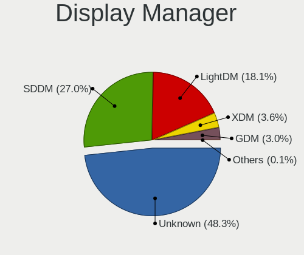

| Name    | Computers | Percent |
|---------|-----------|---------|
| Unknown | 1447      | 47.63%  |
| SDDM    | 753       | 24.79%  |
| LightDM | 637       | 20.97%  |
| XDM     | 128       | 4.21%   |
| GDM     | 71        | 2.34%   |
| GREETD  | 2         | 0.07%   |

OS Lang
-------

Language

| Lang    | Computers | Percent |
|---------|-----------|---------|
| en_US   | 1162      | 38.45%  |
| de_DE   | 427       | 14.13%  |
| POSIX   | 261       | 8.64%   |
| en_GB   | 183       | 6.06%   |
| Unknown | 182       | 6.02%   |
| pt_BR   | 128       | 4.24%   |
| ru_RU   | 105       | 3.47%   |
| es_ES   | 103       | 3.41%   |
| it_IT   | 74        | 2.45%   |
| fr_FR   | 67        | 2.22%   |
| pl_PL   | 42        | 1.39%   |
| nl_NL   | 33        | 1.09%   |
| pt_PT   | 20        | 0.66%   |
| cs_CZ   | 20        | 0.66%   |
| zh_CN   | 17        | 0.56%   |
| hu_HU   | 15        | 0.5%    |
| fi_FI   | 10        | 0.33%   |
| en_DK   | 10        | 0.33%   |
| C       | 9         | 0.3%    |
| ja_JP   | 7         | 0.23%   |
| es_MX   | 7         | 0.23%   |
| sv_SE   | 6         | 0.2%    |
| nl_BE   | 6         | 0.2%    |
| nb_NO   | 6         | 0.2%    |
| es_AR   | 6         | 0.2%    |
| en_IN   | 6         | 0.2%    |
| en_IE   | 6         | 0.2%    |
| en_DE   | 6         | 0.2%    |
| en_AU   | 6         | 0.2%    |
| bg_BG   | 6         | 0.2%    |
| tr_TR   | 5         | 0.17%   |
| es_DO   | 5         | 0.17%   |
| sk_SK   | 4         | 0.13%   |
| ro_RO   | 4         | 0.13%   |
| nn_NO   | 4         | 0.13%   |
| ko_KR   | 3         | 0.1%    |
| hr_HR   | 3         | 0.1%    |
| en_FI   | 3         | 0.1%    |
| en_CH   | 3         | 0.1%    |
| en_CA   | 3         | 0.1%    |

Boot Mode
---------

EFI or BIOS

| Mode | Computers | Percent |
|------|-----------|---------|
| EFI  | 1990      | 66.64%  |
| BIOS | 996       | 33.36%  |

Filesystem
----------

Type of filesystem

| Type     | Computers | Percent |
|----------|-----------|---------|
| Btrfs    | 2223      | 74.27%  |
| Ext4     | 560       | 18.71%  |
| Xfs      | 104       | 3.47%   |
| Unknown  | 59        | 1.97%   |
| Overlay  | 23        | 0.77%   |
| Tmpfs    | 14        | 0.47%   |
| Ext3     | 4         | 0.13%   |
| Ext2     | 3         | 0.1%    |
| Zfs      | 1         | 0.03%   |
| Reiserfs | 1         | 0.03%   |
| F2fs     | 1         | 0.03%   |

Part. scheme
------------

Scheme of partitioning

| Type    | Computers | Percent |
|---------|-----------|---------|
| GPT     | 1467      | 48.74%  |
| Unknown | 1349      | 44.82%  |
| MBR     | 194       | 6.45%   |

Dual Boot with Linux/BSD
------------------------

Hosting more than one Linux/BSD

| Dual boot | Computers | Percent |
|-----------|-----------|---------|
| No        | 2617      | 87.03%  |
| Yes       | 390       | 12.97%  |

Dual Boot (Win)
---------------

Hosting Linux and Windows

| Dual boot | Computers | Percent |
|-----------|-----------|---------|
| No        | 2296      | 76.71%  |
| Yes       | 697       | 23.29%  |

Board
-----

Vendor
------

Motherboard manufacturer

| Name                    | Computers | Percent |
|-------------------------|-----------|---------|
| ASUSTek Computer        | 477       | 16.15%  |
| Lenovo                  | 469       | 15.88%  |
| Hewlett-Packard         | 431       | 14.59%  |
| Dell                    | 342       | 11.58%  |
| Gigabyte Technology     | 222       | 7.52%   |
| MSI                     | 203       | 6.87%   |
| Acer                    | 144       | 4.87%   |
| ASRock                  | 135       | 4.57%   |
| Apple                   | 78        | 2.64%   |
| Fujitsu                 | 32        | 1.08%   |
| Toshiba                 | 30        | 1.02%   |
| Intel                   | 29        | 0.98%   |
| TUXEDO                  | 24        | 0.81%   |
| Samsung Electronics     | 23        | 0.78%   |
| HUAWEI                  | 22        | 0.74%   |
| Sony                    | 18        | 0.61%   |
| Medion                  | 17        | 0.58%   |
| Alienware               | 14        | 0.47%   |
| Biostar                 | 13        | 0.44%   |
| Unknown                 | 13        | 0.44%   |
| Supermicro              | 10        | 0.34%   |
| Pegatron                | 8         | 0.27%   |
| Notebook                | 8         | 0.27%   |
| Microsoft               | 8         | 0.27%   |
| Google                  | 8         | 0.27%   |
| Fujitsu Siemens         | 8         | 0.27%   |
| Framework               | 6         | 0.2%    |
| Foxconn                 | 6         | 0.2%    |
| SLIMBOOK                | 5         | 0.17%   |
| Schenker                | 5         | 0.17%   |
| AZW                     | 5         | 0.17%   |
| Wortmann AG             | 4         | 0.14%   |
| Timi                    | 4         | 0.14%   |
| Raspberry Pi Foundation | 4         | 0.14%   |
| Positivo                | 4         | 0.14%   |
| LG Electronics          | 4         | 0.14%   |
| Huanan                  | 4         | 0.14%   |
| Clevo                   | 4         | 0.14%   |
| Chuwi                   | 4         | 0.14%   |
| BESSTAR Tech            | 4         | 0.14%   |

Model
-----

Motherboard model

| Name                                 | Computers | Percent |
|--------------------------------------|-----------|---------|
| ASUS All Series                      | 27        | 0.91%   |
| Unknown                              | 23        | 0.78%   |
| HP Notebook                          | 12        | 0.41%   |
| Dell OptiPlex 9020                   | 12        | 0.41%   |
| Apple MacBookPro9,2                  | 11        | 0.37%   |
| MSI MS-7B86                          | 9         | 0.3%    |
| ASUS TUF Gaming X570-PLUS            | 8         | 0.27%   |
| ASRock B450M Pro4                    | 8         | 0.27%   |
| MSI MS-7B89                          | 7         | 0.24%   |
| Dell Precision 5530                  | 7         | 0.24%   |
| Dell Latitude 7490                   | 7         | 0.24%   |
| Apple MacBookPro8,1                  | 7         | 0.24%   |
| MSI MS-7C91                          | 6         | 0.2%    |
| MSI MS-7C37                          | 6         | 0.2%    |
| MSI MS-7A34                          | 6         | 0.2%    |
| HP Pavilion dv7                      | 6         | 0.2%    |
| HP Pavilion dv6                      | 6         | 0.2%    |
| HP Laptop 17-ca0xxx                  | 6         | 0.2%    |
| HP ENVY x360 2-in-1 Laptop 15-ey0xxx | 6         | 0.2%    |
| Gigabyte B450M DS3H                  | 6         | 0.2%    |
| Gigabyte 970A-DS3P                   | 6         | 0.2%    |
| ASUS PRIME A320M-K                   | 6         | 0.2%    |
| ASUS M5A97 R2.0                      | 6         | 0.2%    |
| Samsung 550XDA                       | 5         | 0.17%   |
| MSI MS-7C94                          | 5         | 0.17%   |
| MSI MS-7C02                          | 5         | 0.17%   |
| HP Laptop 15s-eq2xxx                 | 5         | 0.17%   |
| Gigabyte X570 AORUS MASTER           | 5         | 0.17%   |
| Gigabyte B450 AORUS M                | 5         | 0.17%   |
| Dell XPS 15 9560                     | 5         | 0.17%   |
| ASRock X570 Steel Legend             | 5         | 0.17%   |
| Apple Macmini7,1                     | 5         | 0.17%   |
| Acer Swift SF314-43                  | 5         | 0.17%   |
| TUXEDO Pulse 15 Gen1                 | 4         | 0.14%   |
| MSI MS-7C95                          | 4         | 0.14%   |
| MSI MS-7B79                          | 4         | 0.14%   |
| Lenovo IdeaPad 5 14ARE05 81YM        | 4         | 0.14%   |
| Lenovo IdeaPad 3 15ITL6 82H8         | 4         | 0.14%   |
| Lenovo G50-45 80E3                   | 4         | 0.14%   |
| HUAWEI BOHK-WAX9X                    | 4         | 0.14%   |

Model Family
------------

Motherboard model prefix

| Name               | Computers | Percent |
|--------------------|-----------|---------|
| Lenovo ThinkPad    | 247       | 8.36%   |
| Acer Aspire        | 89        | 3.01%   |
| Dell Latitude      | 87        | 2.95%   |
| Dell Inspiron      | 73        | 2.47%   |
| Lenovo IdeaPad     | 72        | 2.44%   |
| ASUS PRIME         | 69        | 2.34%   |
| HP Pavilion        | 64        | 2.17%   |
| ASUS ROG           | 58        | 1.96%   |
| HP EliteBook       | 56        | 1.9%    |
| HP Laptop          | 47        | 1.59%   |
| Dell Precision     | 45        | 1.52%   |
| ASUS TUF           | 45        | 1.52%   |
| ASUS VivoBook      | 44        | 1.49%   |
| Dell OptiPlex      | 43        | 1.46%   |
| Dell XPS           | 41        | 1.39%   |
| HP ProBook         | 39        | 1.32%   |
| HP ENVY            | 31        | 1.05%   |
| Lenovo Yoga        | 27        | 0.91%   |
| ASUS All           | 27        | 0.91%   |
| HP Compaq          | 26        | 0.88%   |
| Toshiba Satellite  | 25        | 0.85%   |
| Lenovo ThinkCentre | 23        | 0.78%   |
| HP ZBook           | 23        | 0.78%   |
| Unknown            | 23        | 0.78%   |
| HP OMEN            | 20        | 0.68%   |
| Dell PowerEdge     | 19        | 0.64%   |
| Lenovo Legion      | 18        | 0.61%   |
| Gigabyte X570      | 17        | 0.58%   |
| Acer Swift         | 17        | 0.58%   |
| ASUS Zenbook       | 16        | 0.54%   |
| Fujitsu LIFEBOOK   | 15        | 0.51%   |
| ASUS ASUS          | 14        | 0.47%   |
| HP EliteDesk       | 13        | 0.44%   |
| Dell Vostro        | 13        | 0.44%   |
| ASRock B450M       | 13        | 0.44%   |
| Lenovo ThinkBook   | 12        | 0.41%   |
| HP Notebook        | 12        | 0.41%   |
| Gigabyte B550      | 12        | 0.41%   |
| Apple MacBookPro9  | 12        | 0.41%   |
| Acer Nitro         | 12        | 0.41%   |

MFG Year
--------

Motherboard manufacture year

| Year | Computers | Percent |
|------|-----------|---------|
| 2020 | 335       | 11.34%  |
| 2021 | 296       | 10.02%  |
| 2018 | 275       | 9.31%   |
| 2019 | 264       | 8.94%   |
| 2017 | 213       | 7.21%   |
| 2012 | 213       | 7.21%   |
| 2022 | 189       | 6.4%    |
| 2013 | 189       | 6.4%    |
| 2015 | 153       | 5.18%   |
| 2011 | 146       | 4.94%   |
| 2014 | 145       | 4.91%   |
| 2016 | 126       | 4.27%   |
| 2010 | 113       | 3.83%   |
| 2023 | 99        | 3.35%   |
| 2009 | 75        | 2.54%   |
| 2008 | 70        | 2.37%   |
| 2007 | 29        | 0.98%   |
| 2006 | 11        | 0.37%   |
| 2005 | 5         | 0.17%   |
| 2024 | 4         | 0.14%   |
| 2004 | 3         | 0.1%    |
| 2000 | 1         | 0.03%   |

Form Factor
-----------

Physical design of the computer

| Name           | Computers | Percent |
|----------------|-----------|---------|
| Notebook       | 1557      | 52.71%  |
| Desktop        | 1159      | 39.23%  |
| Convertible    | 110       | 3.72%   |
| Mini pc        | 42        | 1.42%   |
| Server         | 36        | 1.22%   |
| All in one     | 25        | 0.85%   |
| Tablet         | 15        | 0.51%   |
| System on chip | 8         | 0.27%   |
| Other          | 1         | 0.03%   |
| Firewall       | 1         | 0.03%   |

Secure Boot
-----------

Enabled or disabled

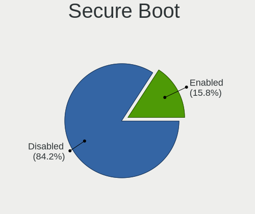

| State    | Computers | Percent |
|----------|-----------|---------|
| Disabled | 2528      | 84.29%  |
| Enabled  | 471       | 15.71%  |

Coreboot
--------

Have coreboot on board

| Used | Computers | Percent |
|------|-----------|---------|
| No   | 2939      | 99.49%  |
| Yes  | 15        | 0.51%   |

RAM Size
--------

Total RAM memory

| Size in GB      | Computers | Percent |
|-----------------|-----------|---------|
| 16.01-24.0      | 745       | 24.84%  |
| 4.01-8.0        | 630       | 21.01%  |
| 8.01-16.0       | 579       | 19.31%  |
| 32.01-64.0      | 482       | 16.07%  |
| 3.01-4.0        | 253       | 8.44%   |
| 64.01-256.0     | 152       | 5.07%   |
| 24.01-32.0      | 80        | 2.67%   |
| 1.01-2.0        | 38        | 1.27%   |
| 2.01-3.0        | 15        | 0.5%    |
| Unknown         | 10        | 0.33%   |
| 0.51-1.0        | 7         | 0.23%   |
| More than 256.0 | 6         | 0.2%    |
| 0.01-0.5        | 2         | 0.07%   |

RAM Used
--------

Used RAM memory

| Used GB    | Computers | Percent |
|------------|-----------|---------|
| 2.01-3.0   | 876       | 26.96%  |
| 4.01-8.0   | 793       | 24.41%  |
| 1.01-2.0   | 632       | 19.45%  |
| 3.01-4.0   | 581       | 17.88%  |
| 8.01-16.0  | 214       | 6.59%   |
| 0.51-1.0   | 83        | 2.55%   |
| 16.01-24.0 | 30        | 0.92%   |
| 0.01-0.5   | 19        | 0.58%   |
| 24.01-32.0 | 10        | 0.31%   |
| Unknown    | 10        | 0.31%   |
| 32.01-64.0 | 1         | 0.03%   |

Total Drives
------------

Number of drives on board

| Drives  | Computers | Percent |
|---------|-----------|---------|
| 1       | 1556      | 51.1%   |
| 2       | 810       | 26.6%   |
| 3       | 304       | 9.98%   |
| 4       | 171       | 5.62%   |
| 5       | 102       | 3.35%   |
| 6       | 50        | 1.64%   |
| 7       | 22        | 0.72%   |
| 0       | 8         | 0.26%   |
| 8       | 6         | 0.2%    |
| 10      | 5         | 0.16%   |
| 9       | 5         | 0.16%   |
| 13      | 3         | 0.1%    |
| 35      | 1         | 0.03%   |
| 16      | 1         | 0.03%   |
| Unknown | 1         | 0.03%   |

Has CD-ROM
----------

Has CD-ROM on board

| Presented | Computers | Percent |
|-----------|-----------|---------|
| No        | 1979      | 66.54%  |
| Yes       | 995       | 33.46%  |

Has Ethernet
------------

Has Ethernet on board

| Presented | Computers | Percent |
|-----------|-----------|---------|
| Yes       | 2526      | 85.22%  |
| No        | 438       | 14.78%  |

Has WiFi
--------

Has WiFi module

| Presented | Computers | Percent |
|-----------|-----------|---------|
| Yes       | 2258      | 76.1%   |
| No        | 709       | 23.9%   |

Has Bluetooth
-------------

Has Bluetooth module

| Presented | Computers | Percent |
|-----------|-----------|---------|
| Yes       | 1980      | 66.31%  |
| No        | 1006      | 33.69%  |

Location
--------

Country
-------

Geographic location (country)

| Country      | Computers | Percent |
|--------------|-----------|---------|
| Germany      | 553       | 18.66%  |
| USA          | 550       | 18.56%  |
| Brazil       | 179       | 6.04%   |
| Russia       | 133       | 4.49%   |
| Italy        | 122       | 4.12%   |
| UK           | 105       | 3.54%   |
| France       | 96        | 3.24%   |
| Netherlands  | 83        | 2.8%    |
| Canada       | 78        | 2.63%   |
| Spain        | 75        | 2.53%   |
| Poland       | 69        | 2.33%   |
| Switzerland  | 56        | 1.89%   |
| Australia    | 45        | 1.52%   |
| Belgium      | 43        | 1.45%   |
| India        | 42        | 1.42%   |
| Sweden       | 40        | 1.35%   |
| Czechia      | 38        | 1.28%   |
| Austria      | 37        | 1.25%   |
| Mexico       | 34        | 1.15%   |
| Romania      | 30        | 1.01%   |
| Hungary      | 29        | 0.98%   |
| China        | 29        | 0.98%   |
| Finland      | 26        | 0.88%   |
| Portugal     | 23        | 0.78%   |
| Norway       | 23        | 0.78%   |
| Greece       | 23        | 0.78%   |
| Bulgaria     | 23        | 0.78%   |
| Argentina    | 22        | 0.74%   |
| Turkey       | 20        | 0.67%   |
| Ukraine      | 19        | 0.64%   |
| Serbia       | 18        | 0.61%   |
| Indonesia    | 16        | 0.54%   |
| Chile        | 14        | 0.47%   |
| Japan        | 12        | 0.4%    |
| Colombia     | 12        | 0.4%    |
| Belarus      | 12        | 0.4%    |
| South Africa | 11        | 0.37%   |
| Peru         | 11        | 0.37%   |
| Croatia      | 11        | 0.37%   |
| Vietnam      | 10        | 0.34%   |

City
----

Geographic location (city)

| City              | Computers | Percent |
|-------------------|-----------|---------|
| Berlin            | 43        | 1.37%   |
| Moscow            | 35        | 1.11%   |
| Munich            | 24        | 0.76%   |
| Sao Paulo         | 22        | 0.7%    |
| Rio de Janeiro    | 22        | 0.7%    |
| Warsaw            | 21        | 0.67%   |
| Vienna            | 19        | 0.6%    |
| St Petersburg     | 17        | 0.54%   |
| Prague            | 17        | 0.54%   |
| Milan             | 17        | 0.54%   |
| Hamburg           | 17        | 0.54%   |
| Frankfurt am Main | 17        | 0.54%   |
| Budapest          | 17        | 0.54%   |
| Zurich            | 16        | 0.51%   |
| Sydney            | 15        | 0.48%   |
| Amsterdam         | 15        | 0.48%   |
| Paris             | 14        | 0.45%   |
| Melbourne         | 14        | 0.45%   |
| Los Angeles       | 14        | 0.45%   |
| Sofia             | 13        | 0.41%   |
| Rome              | 12        | 0.38%   |
| Littleton         | 11        | 0.35%   |
| Cologne           | 11        | 0.35%   |
| Belgrade          | 11        | 0.35%   |
| Athens            | 11        | 0.35%   |
| Stuttgart         | 10        | 0.32%   |
| Madrid            | 10        | 0.32%   |
| Essen             | 10        | 0.32%   |
| Stockholm         | 9         | 0.29%   |
| Neuchatel         | 9         | 0.29%   |
| Leipzig           | 9         | 0.29%   |
| Istanbul          | 9         | 0.29%   |
| Winnipeg          | 8         | 0.25%   |
| Riverton          | 8         | 0.25%   |
| Minsk             | 8         | 0.25%   |
| Mexico City       | 8         | 0.25%   |
| Houston           | 8         | 0.25%   |
| Gothenburg        | 8         | 0.25%   |
| Dresden           | 8         | 0.25%   |
| Denver            | 8         | 0.25%   |

Drives
------

Drive Vendor
------------

Hard drive vendors

| Vendor                      | Computers | Drives | Percent |
|-----------------------------|-----------|--------|---------|
| Samsung Electronics         | 938       | 1484   | 19.44%  |
| Seagate                     | 630       | 1113   | 13.06%  |
| WDC                         | 615       | 1108   | 12.75%  |
| Sandisk                     | 287       | 397    | 5.95%   |
| Toshiba                     | 278       | 361    | 5.76%   |
| Kingston                    | 252       | 338    | 5.22%   |
| Crucial                     | 201       | 270    | 4.17%   |
| SK hynix                    | 138       | 183    | 2.86%   |
| Intel                       | 130       | 163    | 2.69%   |
| Unknown                     | 121       | 164    | 2.51%   |
| Micron Technology           | 96        | 113    | 1.99%   |
| Hitachi                     | 90        | 107    | 1.87%   |
| HGST                        | 64        | 96     | 1.33%   |
| Phison Electronics          | 55        | 71     | 1.14%   |
| A-DATA Technology           | 53        | 66     | 1.1%    |
| KIOXIA                      | 45        | 55     | 0.93%   |
| Silicon Motion              | 44        | 46     | 0.91%   |
| China                       | 40        | 54     | 0.83%   |
| SPCC                        | 38        | 49     | 0.79%   |
| Kingston Technology Company | 38        | 43     | 0.79%   |
| Micron/Crucial Technology   | 37        | 46     | 0.77%   |
| Intenso                     | 35        | 50     | 0.73%   |
| Apple                       | 35        | 40     | 0.73%   |
| PNY                         | 32        | 42     | 0.66%   |
| Phison                      | 26        | 37     | 0.54%   |
| Hewlett-Packard             | 22        | 37     | 0.46%   |
| Transcend                   | 20        | 22     | 0.41%   |
| MAXIO Technology (Hangzhou) | 20        | 23     | 0.41%   |
| LITEON                      | 17        | 18     | 0.35%   |
| Patriot                     | 15        | 19     | 0.31%   |
| ADATA Technology            | 15        | 17     | 0.31%   |
| Realtek Semiconductor       | 14        | 18     | 0.29%   |
| OCZ                         | 14        | 19     | 0.29%   |
| JMicron Technology          | 14        | 14     | 0.29%   |
| Fujitsu                     | 13        | 17     | 0.27%   |
| LITEONIT                    | 12        | 12     | 0.25%   |
| GOODRAM                     | 12        | 12     | 0.25%   |
| Corsair                     | 12        | 13     | 0.25%   |
| Team                        | 11        | 14     | 0.23%   |
| XrayDisk                    | 9         | 9      | 0.19%   |

Drive Model
-----------

Hard drive models

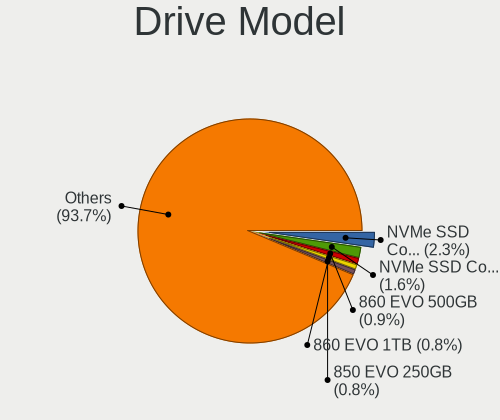

| Model                                                 | Computers | Percent |
|-------------------------------------------------------|-----------|---------|
| Samsung NVMe SSD Controller SM981/PM981/PM983 1TB     | 120       | 2.2%    |
| Samsung NVMe SSD Controller PM9A1/PM9A3/980PRO 1TB    | 75        | 1.37%   |
| Samsung SSD 860 EVO 500GB                             | 56        | 1.03%   |
| Samsung SSD 850 EVO 250GB                             | 44        | 0.81%   |
| Samsung SSD 860 EVO 1TB                               | 43        | 0.79%   |
| Kingston SA400S37480G 480GB SSD                       | 42        | 0.77%   |
| Seagate ST2000DM008-2FR102 2TB                        | 39        | 0.71%   |
| Kingston SA400S37240G 240GB SSD                       | 38        | 0.7%    |
| Crucial CT500MX500SSD1 500GB                          | 35        | 0.64%   |
| Seagate ST1000LM024 HN-M101MBB 1TB                    | 31        | 0.57%   |
| Seagate ST1000LM035-1RK172 1TB                        | 30        | 0.55%   |
| Sandisk WD Blue SN550 NVMe SSD 2TB                    | 29        | 0.53%   |
| Seagate ST1000DM010-2EP102 1TB                        | 27        | 0.49%   |
| Samsung SSD 850 EVO 500GB                             | 27        | 0.49%   |
| Kingston SA400S37120G 120GB SSD                       | 25        | 0.46%   |
| WDC WDS500G2B0A-00SM50 500GB SSD                      | 24        | 0.44%   |
| Samsung SSD 840 EVO 250GB                             | 24        | 0.44%   |
| Seagate ST500DM002-1BD142 500GB                       | 23        | 0.42%   |
| Samsung NVMe SSD Controller SM961/PM961/SM963 1TB     | 23        | 0.42%   |
| Sandisk WD Black SN750 / PC SN730 NVMe SSD 512GB      | 22        | 0.4%    |
| Micron/Crucial P2 NVMe PCIe SSD 4TB                   | 22        | 0.4%    |
| Intel SSD 660P Series 1024GB                          | 22        | 0.4%    |
| HGST HTS721010A9E630 1TB                              | 22        | 0.4%    |
| Crucial CT240BX500SSD1 240GB                          | 22        | 0.4%    |
| Unknown SD/MMC/MS PRO 128GB                           | 21        | 0.38%   |
| Toshiba MQ04ABF100 1TB                                | 21        | 0.38%   |
| Toshiba MQ01ABD100 1TB                                | 21        | 0.38%   |
| Seagate ST1000DM003-1CH162 1TB                        | 21        | 0.38%   |
| WDC WD10EZEX-08WN4A0 1TB                              | 20        | 0.37%   |
| Seagate ST2000DM001-1ER164 2TB                        | 20        | 0.37%   |
| Samsung SSD 870 EVO 1TB                               | 20        | 0.37%   |
| Toshiba DT01ACA100 1TB                                | 19        | 0.35%   |
| Crucial CT1000MX500SSD1 1TB                           | 19        | 0.35%   |
| Silicon Motion SM2263EN/SM2263XT SSD Controller 256GB | 18        | 0.33%   |
| Seagate ST4000DM004-2CV104 4TB                        | 18        | 0.33%   |
| Sandisk WD Black SN850 512GB                          | 18        | 0.33%   |
| Samsung SSD 970 EVO Plus 1TB                          | 18        | 0.33%   |
| Samsung SSD 860 EVO 250GB                             | 18        | 0.33%   |
| Samsung SSD 850 PRO 256GB                             | 18        | 0.33%   |
| Phison E12 NVMe Controller 2TB                        | 18        | 0.33%   |

HDD Vendor
----------

Hard disk drive vendors

| Vendor              | Computers | Drives | Percent |
|---------------------|-----------|--------|---------|
| Seagate             | 614       | 1075   | 36.81%  |
| WDC                 | 500       | 889    | 29.98%  |
| Toshiba             | 197       | 263    | 11.81%  |
| Hitachi             | 90        | 107    | 5.4%    |
| Samsung Electronics | 86        | 127    | 5.16%   |
| HGST                | 64        | 96     | 3.84%   |
| Unknown             | 22        | 27     | 1.32%   |
| Apple               | 14        | 16     | 0.84%   |
| Fujitsu             | 13        | 17     | 0.78%   |
| JMicron Technology  | 10        | 10     | 0.6%    |
| Hewlett-Packard     | 10        | 23     | 0.6%    |
| Maxtor              | 8         | 8      | 0.48%   |
| SABRENT             | 7         | 8      | 0.42%   |
| TO Exter            | 4         | 4      | 0.24%   |
| ASMT                | 4         | 6      | 0.24%   |
| WD MediaMax         | 3         | 3      | 0.18%   |
| Intenso             | 3         | 8      | 0.18%   |
| USB3.0              | 2         | 3      | 0.12%   |
| Synology            | 2         | 2      | 0.12%   |
| XrayDisk            | 1         | 1      | 0.06%   |
| USB                 | 1         | 1      | 0.06%   |
| UD0401              | 1         | 1      | 0.06%   |
| Maxone              | 1         | 1      | 0.06%   |
| MaxDigital          | 1         | 1      | 0.06%   |
| MARVELL             | 1         | 1      | 0.06%   |
| Magnetic Data       | 1         | 2      | 0.06%   |
| Inateck             | 1         | 1      | 0.06%   |
| IBM-207x            | 1         | 8      | 0.06%   |
| IB-AC703            | 1         | 1      | 0.06%   |
| IB-377U3            | 1         | 1      | 0.06%   |
| HGST HTS            | 1         | 1      | 0.06%   |
| DELLBOSS            | 1         | 1      | 0.06%   |
| AXAGON              | 1         | 1      | 0.06%   |
| ASMedia             | 1         | 1      | 0.06%   |

SSD Vendor
----------

Solid state drive vendors

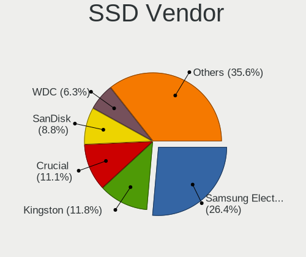

| Vendor              | Computers | Drives | Percent |
|---------------------|-----------|--------|---------|
| Samsung Electronics | 443       | 664    | 27.01%  |
| Kingston            | 189       | 250    | 11.52%  |
| Crucial             | 189       | 253    | 11.52%  |
| SanDisk             | 144       | 188    | 8.78%   |
| WDC                 | 103       | 147    | 6.28%   |
| China               | 40        | 54     | 2.44%   |
| A-DATA Technology   | 39        | 47     | 2.38%   |
| Intel               | 37        | 50     | 2.26%   |
| SPCC                | 32        | 43     | 1.95%   |
| Toshiba             | 31        | 37     | 1.89%   |
| Intenso             | 29        | 36     | 1.77%   |
| SK hynix            | 27        | 38     | 1.65%   |
| PNY                 | 27        | 33     | 1.65%   |
| Micron Technology   | 27        | 35     | 1.65%   |
| Transcend           | 17        | 19     | 1.04%   |
| LITEON              | 17        | 18     | 1.04%   |
| Apple               | 17        | 20     | 1.04%   |
| Patriot             | 14        | 18     | 0.85%   |
| OCZ                 | 14        | 19     | 0.85%   |
| LITEONIT            | 12        | 12     | 0.73%   |
| GOODRAM             | 11        | 11     | 0.67%   |
| Team                | 10        | 13     | 0.61%   |
| KingSpec            | 8         | 13     | 0.49%   |
| Hewlett-Packard     | 8         | 10     | 0.49%   |
| Corsair             | 8         | 8      | 0.49%   |
| XrayDisk            | 7         | 7      | 0.43%   |
| Seagate             | 6         | 7      | 0.37%   |
| Leven               | 6         | 6      | 0.37%   |
| Apacer              | 6         | 10     | 0.37%   |
| Plextor             | 5         | 8      | 0.3%    |
| Netac               | 5         | 7      | 0.3%    |
| Mushkin             | 5         | 8      | 0.3%    |
| Unknown             | 5         | 5      | 0.3%    |
| Gigabyte Technology | 4         | 7      | 0.24%   |
| Fanxiang            | 4         | 7      | 0.24%   |
| Biostar             | 4         | 6      | 0.24%   |
| Wibtek              | 3         | 3      | 0.18%   |
| SSK                 | 3         | 4      | 0.18%   |
| Smartbuy            | 3         | 5      | 0.18%   |
| Pioneer             | 3         | 14     | 0.18%   |

Drive Kind
----------

HDD or SSD

| Kind    | Computers | Drives | Percent |
|---------|-----------|--------|---------|
| SSD     | 1385      | 2225   | 33.01%  |
| NVMe    | 1347      | 2001   | 32.1%   |
| HDD     | 1317      | 2715   | 31.39%  |
| MMC     | 86        | 111    | 2.05%   |
| Unknown | 61        | 82     | 1.45%   |

Drive Connector
---------------

SATA, SAS, NVMe, etc.

| Type | Computers | Drives | Percent |
|------|-----------|--------|---------|
| SATA | 2046      | 4708   | 55.63%  |
| NVMe | 1346      | 1993   | 36.6%   |
| SAS  | 200       | 322    | 5.44%   |
| MMC  | 86        | 111    | 2.34%   |

Drive Size
----------

Size of hard drive

| Size in TB | Computers | Drives | Percent |
|------------|-----------|--------|---------|
| 0.01-0.5   | 1461      | 2376   | 49.27%  |
| 0.51-1.0   | 870       | 1444   | 29.34%  |
| 1.01-2.0   | 348       | 620    | 11.74%  |
| 3.01-4.0   | 115       | 210    | 3.88%   |
| 2.01-3.0   | 85        | 147    | 2.87%   |
| 4.01-10.0  | 66        | 116    | 2.23%   |
| 10.01-20.0 | 20        | 27     | 0.67%   |

Space Total
-----------

Amount of disk space available on the file system

| Size in GB     | Computers | Percent |
|----------------|-----------|---------|
| More than 3000 | 1061      | 34.31%  |
| 1001-2000      | 663       | 21.44%  |
| 501-1000       | 411       | 13.29%  |
| 2001-3000      | 382       | 12.35%  |
| 251-500        | 276       | 8.93%   |
| 101-250        | 165       | 5.34%   |
| Unknown        | 51        | 1.65%   |
| 51-100         | 39        | 1.26%   |
| 1-20           | 23        | 0.74%   |
| 21-50          | 21        | 0.68%   |

Space Used
----------

Amount of used disk space

| Used GB        | Computers | Percent |
|----------------|-----------|---------|
| 101-250        | 684       | 21.12%  |
| 251-500        | 528       | 16.31%  |
| 51-100         | 527       | 16.28%  |
| 501-1000       | 424       | 13.09%  |
| 1001-2000      | 365       | 11.27%  |
| More than 3000 | 208       | 6.42%   |
| 1-20           | 170       | 5.25%   |
| 21-50          | 144       | 4.45%   |
| 2001-3000      | 135       | 4.17%   |
| Unknown        | 51        | 1.58%   |
| 0              | 2         | 0.06%   |

Malfunc. Drives
---------------

Drive models with a malfunction

| Model                                 | Computers | Drives | Percent |
|---------------------------------------|-----------|--------|---------|
| Seagate ST500DM002-1BD142 500GB       | 8         | 11     | 2.54%   |
| Seagate ST3500418AS 500GB             | 5         | 5      | 1.59%   |
| Seagate ST1000LM024 HN-M101MBB 1TB    | 5         | 5      | 1.59%   |
| Samsung Electronics SSD 840 EVO 120GB | 5         | 7      | 1.59%   |
| Seagate ST2000DM001-1ER164 2TB        | 4         | 4      | 1.27%   |
| Seagate ST2000DM001-1CH164 2TB        | 4         | 5      | 1.27%   |
| HGST HTS725050A7E630 500GB            | 4         | 4      | 1.27%   |
| WDC WD10JFCX-68N6GN0 1TB              | 3         | 4      | 0.95%   |
| Toshiba MQ01ABD100 1TB                | 3         | 3      | 0.95%   |
| Seagate ST1000LM035-1RK172 1TB        | 3         | 3      | 0.95%   |
| Seagate ST1000DM003-1SB102 1TB        | 3         | 4      | 0.95%   |
| Samsung Electronics HD501LJ 500GB     | 3         | 4      | 0.95%   |
| WDC WD6400AAKS-22A7B2 640GB           | 2         | 2      | 0.63%   |
| WDC WD30EZRZ-00Z5HB0 3TB              | 2         | 3      | 0.63%   |
| WDC WD20EZRX-00DC0B0 2TB              | 2         | 3      | 0.63%   |
| WDC WD20EFRX-68EUZN0 2TB              | 2         | 2      | 0.63%   |
| WD MediaMax WL5000GSA12872B 5TB       | 2         | 2      | 0.63%   |
| Toshiba MQ01ABF050 500GB              | 2         | 2      | 0.63%   |
| Toshiba MK5055GSX 500GB               | 2         | 4      | 0.63%   |
| Seagate ST9500325AS 500GB             | 2         | 2      | 0.63%   |
| Seagate ST500LM021-1KJ152 500GB       | 2         | 2      | 0.63%   |
| Seagate ST500LM012 HN-M500MBB 500GB   | 2         | 2      | 0.63%   |
| Seagate ST500LM000-1EJ162 500GB       | 2         | 2      | 0.63%   |
| Seagate ST31000528AS 1TB              | 2         | 5      | 0.63%   |
| Seagate ST1000DM003-1ER162 1TB        | 2         | 2      | 0.63%   |
| Seagate ST1000DM003-1CH162 1TB        | 2         | 2      | 0.63%   |
| SanDisk SD8SN8U-256G-1006 256GB SSD   | 2         | 2      | 0.63%   |
| Samsung Electronics SSD 870 EVO 1TB   | 2         | 3      | 0.63%   |
| Samsung Electronics HN-M500MBB 500GB  | 2         | 2      | 0.63%   |
| Samsung Electronics HD322HJ 320GB     | 2         | 2      | 0.63%   |
| Samsung Electronics HD103SJ 1TB       | 2         | 3      | 0.63%   |
| Kingston SV300S37A120G 120GB SSD      | 2         | 3      | 0.63%   |
| Kingston SMS200S3240G 240GB SSD       | 2         | 2      | 0.63%   |
| Kingston SHFS37A120G 120GB SSD        | 2         | 2      | 0.63%   |
| Kingston SA400S37120G 120GB SSD       | 2         | 7      | 0.63%   |
| Intel SSD 600P Series 256GB           | 2         | 2      | 0.63%   |
| Hitachi HTS547575A9E384 752GB         | 2         | 2      | 0.63%   |
| Hitachi HTS545050A7E380 500GB         | 2         | 2      | 0.63%   |
| HGST HTS721010A9E630 1TB              | 2         | 2      | 0.63%   |
| Crucial CT1000P1SSD8 1TB              | 2         | 2      | 0.63%   |

Malfunc. Drive Vendor
---------------------

Vendors of faulty drives

| Vendor                   | Computers | Drives | Percent |
|--------------------------|-----------|--------|---------|
| Seagate                  | 80        | 99     | 26.14%  |
| WDC                      | 57        | 67     | 18.63%  |
| Samsung Electronics      | 37        | 49     | 12.09%  |
| Toshiba                  | 27        | 37     | 8.82%   |
| Hitachi                  | 15        | 18     | 4.9%    |
| Kingston                 | 11        | 18     | 3.59%   |
| Crucial                  | 10        | 11     | 3.27%   |
| Intel                    | 9         | 10     | 2.94%   |
| HGST                     | 7         | 7      | 2.29%   |
| SanDisk                  | 6         | 6      | 1.96%   |
| Maxtor                   | 4         | 4      | 1.31%   |
| Transcend                | 3         | 4      | 0.98%   |
| SK hynix                 | 3         | 3      | 0.98%   |
| LITEONIT                 | 3         | 3      | 0.98%   |
| XrayDisk                 | 2         | 2      | 0.65%   |
| WD MediaMax              | 2         | 2      | 0.65%   |
| Patriot                  | 2         | 2      | 0.65%   |
| OCZ                      | 2         | 2      | 0.65%   |
| Micron Technology        | 2         | 2      | 0.65%   |
| Fujitsu                  | 2         | 3      | 0.65%   |
| Corsair                  | 2         | 2      | 0.65%   |
| XPG                      | 1         | 1      | 0.33%   |
| WDC WDS4                 | 1         | 1      | 0.33%   |
| SuperTalent              | 1         | 1      | 0.33%   |
| SSSTC                    | 1         | 1      | 0.33%   |
| SPCC                     | 1         | 1      | 0.33%   |
| Silicon Motion           | 1         | 1      | 0.33%   |
| Phison                   | 1         | 1      | 0.33%   |
| Netac                    | 1         | 1      | 0.33%   |
| Lite-On Technology       | 1         | 2      | 0.33%   |
| LEQIXIANG                | 1         | 1      | 0.33%   |
| KingFast                 | 1         | 1      | 0.33%   |
| Intenso                  | 1         | 1      | 0.33%   |
| Hewlett-Packard          | 1         | 1      | 0.33%   |
| GOODRAM                  | 1         | 1      | 0.33%   |
| EXRAM                    | 1         | 1      | 0.33%   |
| China                    | 1         | 1      | 0.33%   |
| Biwin Storage Technology | 1         | 1      | 0.33%   |
| Apple                    | 1         | 1      | 0.33%   |
| Apacer                   | 1         | 1      | 0.33%   |

Malfunc. HDD Vendor
-------------------

Vendors of faulty HDD drives

| Vendor              | Computers | Drives | Percent |
|---------------------|-----------|--------|---------|
| Seagate             | 80        | 99     | 38.28%  |
| WDC                 | 53        | 63     | 25.36%  |
| Toshiba             | 26        | 36     | 12.44%  |
| Samsung Electronics | 18        | 24     | 8.61%   |
| Hitachi             | 15        | 18     | 7.18%   |
| HGST                | 7         | 7      | 3.35%   |
| Maxtor              | 4         | 4      | 1.91%   |
| WD MediaMax         | 2         | 2      | 0.96%   |
| Fujitsu             | 2         | 3      | 0.96%   |
| Hewlett-Packard     | 1         | 1      | 0.48%   |
| Apple               | 1         | 1      | 0.48%   |

Malfunc. Drive Kind
-------------------

Kinds of faulty drives

| Kind | Computers | Drives | Percent |
|------|-----------|--------|---------|
| HDD  | 188       | 258    | 66.67%  |
| SSD  | 74        | 94     | 26.24%  |
| NVMe | 20        | 21     | 7.09%   |

Failed Drives
-------------

Failed drive models

| Model                             | Computers | Drives | Percent |
|-----------------------------------|-----------|--------|---------|
| WDC WD20EADS-00R6B0 2TB           | 1         | 1      | 25%     |
| Samsung Electronics SSD 980 1TB   | 1         | 1      | 25%     |
| Samsung Electronics HD502HJ 500GB | 1         | 5      | 25%     |
| Hitachi HDS721025CLA382 250GB     | 1         | 1      | 25%     |

Failed Drive Vendor
-------------------

Failed drive vendors

| Vendor              | Computers | Drives | Percent |
|---------------------|-----------|--------|---------|
| Samsung Electronics | 2         | 6      | 50%     |
| WDC                 | 1         | 1      | 25%     |
| Hitachi             | 1         | 1      | 25%     |

Drive Status
------------

Number of failed and malfunc. drives

| Status   | Computers | Drives | Percent |
|----------|-----------|--------|---------|
| Works    | 1537      | 3202   | 46.79%  |
| Detected | 1474      | 3551   | 44.87%  |
| Malfunc  | 270       | 373    | 8.22%   |
| Failed   | 4         | 8      | 0.12%   |

Storage controller
------------------

Storage Vendor
--------------

Storage controller vendors

| Vendor                           | Computers | Percent |
|----------------------------------|-----------|---------|
| Intel                            | 1735      | 41.67%  |
| AMD                              | 744       | 17.87%  |
| Samsung Electronics              | 498       | 11.96%  |
| SanDisk                          | 197       | 4.73%   |
| SK hynix                         | 111       | 2.67%   |
| Kingston Technology Company      | 105       | 2.52%   |
| Phison Electronics               | 87        | 2.09%   |
| ASMedia Technology               | 82        | 1.97%   |
| Micron Technology                | 70        | 1.68%   |
| Toshiba America Info Systems     | 56        | 1.34%   |
| Silicon Motion                   | 49        | 1.18%   |
| Micron/Crucial Technology        | 49        | 1.18%   |
| Marvell Technology Group         | 47        | 1.13%   |
| KIOXIA                           | 43        | 1.03%   |
| JMicron Technology               | 39        | 0.94%   |
| Nvidia                           | 34        | 0.82%   |
| ADATA Technology                 | 29        | 0.7%    |
| LSI Logic / Symbios Logic        | 23        | 0.55%   |
| MAXIO Technology (Hangzhou)      | 21        | 0.5%    |
| Realtek Semiconductor            | 20        | 0.48%   |
| Broadcom / LSI                   | 19        | 0.46%   |
| Seagate Technology               | 15        | 0.36%   |
| Solid State Storage Technology   | 12        | 0.29%   |
| Union Memory (Shenzhen)          | 9         | 0.22%   |
| Silicon Image                    | 7         | 0.17%   |
| Shenzhen Longsys Electronics     | 7         | 0.17%   |
| INNOGRIT                         | 7         | 0.17%   |
| Adaptec                          | 6         | 0.14%   |
| Yangtze Memory Technologies      | 5         | 0.12%   |
| VIA Technologies                 | 5         | 0.12%   |
| Solidigm                         | 4         | 0.1%    |
| Lite-On Technology               | 4         | 0.1%    |
| Apple                            | 4         | 0.1%    |
| Lenovo                           | 3         | 0.07%   |
| Promise Technology               | 2         | 0.05%   |
| Hewlett-Packard                  | 2         | 0.05%   |
| Biwin Storage Technology         | 2         | 0.05%   |
| Transcend                        | 1         | 0.02%   |
| Tekram Technology                | 1         | 0.02%   |
| Silicon Integrated Systems [SiS] | 1         | 0.02%   |

Storage Model
-------------

Storage controller models

| Model                                                                          | Computers | Percent |
|--------------------------------------------------------------------------------|-----------|---------|
| AMD FCH SATA Controller [AHCI mode]                                            | 473       | 10%     |
| Samsung NVMe SSD Controller SM981/PM981/PM983                                  | 242       | 5.12%   |
| Intel Sunrise Point-LP SATA Controller [AHCI mode]                             | 146       | 3.09%   |
| Intel 8 Series/C220 Series Chipset Family 6-port SATA Controller 1 [AHCI mode] | 145       | 3.06%   |
| Intel 7 Series Chipset Family 6-port SATA Controller [AHCI mode]               | 113       | 2.39%   |
| AMD 400 Series Chipset SATA Controller                                         | 107       | 2.26%   |
| Intel Volume Management Device NVMe RAID Controller                            | 97        | 2.05%   |
| Samsung NVMe SSD Controller PM9A1/PM9A3/980PRO                                 | 91        | 1.92%   |
| Intel 82801 Mobile SATA Controller [RAID mode]                                 | 88        | 1.86%   |
| Samsung NVMe SSD Controller 980 (DRAM-less)                                    | 84        | 1.78%   |
| AMD 500 Series Chipset SATA Controller                                         | 83        | 1.75%   |
| AMD SB7x0/SB8x0/SB9x0 SATA Controller [AHCI mode]                              | 78        | 1.65%   |
| AMD SB7x0/SB8x0/SB9x0 IDE Controller                                           | 77        | 1.63%   |
| Intel 6 Series/C200 Series Chipset Family 6 port Mobile SATA AHCI Controller   | 76        | 1.61%   |
| ASMedia ASM1061/ASM1062 Serial ATA Controller                                  | 74        | 1.56%   |
| Intel Q170/Q150/B150/H170/H110/Z170/CM236 Chipset SATA Controller [AHCI Mode]  | 67        | 1.42%   |
| Intel 8 Series SATA Controller 1 [AHCI mode]                                   | 60        | 1.27%   |
| Intel 200 Series PCH SATA controller [AHCI mode]                               | 52        | 1.1%    |
| Intel Cannon Lake Mobile PCH SATA AHCI Controller                              | 50        | 1.06%   |
| AMD SB7x0/SB8x0/SB9x0 SATA Controller [IDE mode]                               | 50        | 1.06%   |
| Samsung NVMe SSD Controller SM961/PM961/SM963                                  | 48        | 1.01%   |
| Intel 6 Series/C200 Series Chipset Family 6 port Desktop SATA AHCI Controller  | 48        | 1.01%   |
| SK hynix Gold P31/BC711/PC711 NVMe Solid State Drive                           | 47        | 0.99%   |
| Intel 7 Series/C210 Series Chipset Family 6-port SATA Controller [AHCI mode]   | 47        | 0.99%   |
| Intel SATA Controller [RAID Mode]                                              | 46        | 0.97%   |
| Intel SSD 660P Series                                                          | 44        | 0.93%   |
| Intel Wildcat Point-LP SATA Controller [AHCI Mode]                             | 43        | 0.91%   |
| SanDisk Ultra 3D / WD Blue SN550 NVMe SSD                                      | 42        | 0.89%   |
| Phison E12 NVMe Controller                                                     | 40        | 0.85%   |
| Intel HM170/QM170 Chipset SATA Controller [AHCI Mode]                          | 40        | 0.85%   |
| SanDisk Extreme Pro / WD Black SN750 / PC SN730 / Red SN700 NVMe SSD           | 38        | 0.8%    |
| Intel Tiger Lake-LP SATA Controller                                            | 38        | 0.8%    |
| Intel Celeron/Pentium Silver Processor SATA Controller                         | 37        | 0.78%   |
| Intel 5 Series/3400 Series Chipset 6 port SATA AHCI Controller                 | 36        | 0.76%   |
| Intel Comet Lake SATA AHCI Controller                                          | 35        | 0.74%   |
| Intel Cannon Lake PCH SATA AHCI Controller                                     | 34        | 0.72%   |
| AMD 300 Series Chipset SATA Controller                                         | 33        | 0.7%    |
| KIOXIA NVMe SSD Controller BG4 (DRAM-less)                                     | 30        | 0.63%   |
| Intel 82801IBM/IEM (ICH9M/ICH9M-E) 4 port SATA Controller [AHCI mode]          | 29        | 0.61%   |
| Silicon Motion SM2263EN/SM2263XT (DRAM-less) NVMe SSD Controllers              | 28        | 0.59%   |

Storage Kind
------------

Kind of storage controller (IDE, SATA, NVMe, SAS, ...)

| Kind | Computers | Percent |
|------|-----------|---------|
| SATA | 2160      | 52.59%  |
| NVMe | 1340      | 32.63%  |
| RAID | 294       | 7.16%   |
| IDE  | 274       | 6.67%   |
| SAS  | 24        | 0.58%   |
| SCSI | 15        | 0.37%   |

Processor
---------

CPU Vendor
----------

Processor vendors

| Vendor    | Computers | Percent |
|-----------|-----------|---------|
| Intel     | 1984      | 67.16%  |
| AMD       | 958       | 32.43%  |
| ARM       | 10        | 0.34%   |
| Qualcomm  | 1         | 0.03%   |
| HISILICON | 1         | 0.03%   |

CPU Model
---------

Processor models

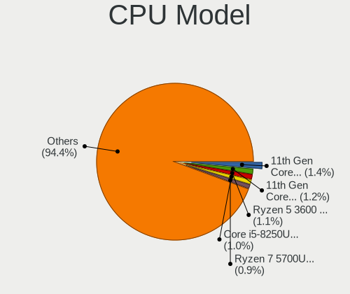

| Model                                         | Computers | Percent |
|-----------------------------------------------|-----------|---------|
| Intel 11th Gen Core i7-1165G7 @ 2.80GHz       | 41        | 1.39%   |
| Intel 11th Gen Core i5-1135G7 @ 2.40GHz       | 38        | 1.29%   |
| Intel Core i5-8250U CPU @ 1.60GHz             | 31        | 1.05%   |
| AMD Ryzen 5 3600 6-Core Processor             | 30        | 1.01%   |
| AMD Ryzen 5 5500U with Radeon Graphics        | 29        | 0.98%   |
| AMD Ryzen 7 3700X 8-Core Processor            | 27        | 0.91%   |
| AMD Ryzen 7 5700U with Radeon Graphics        | 26        | 0.88%   |
| AMD Ryzen 5 3500U with Radeon Vega Mobile Gfx | 26        | 0.88%   |
| Intel Core i5-7200U CPU @ 2.50GHz             | 23        | 0.78%   |
| Intel Core i5-6200U CPU @ 2.30GHz             | 23        | 0.78%   |
| Intel Core i7-8565U CPU @ 1.80GHz             | 22        | 0.74%   |
| Intel Core i5-8265U CPU @ 1.60GHz             | 22        | 0.74%   |
| AMD Ryzen 5 2600 Six-Core Processor           | 22        | 0.74%   |
| Intel Core i7-9750H CPU @ 2.60GHz             | 21        | 0.71%   |
| Intel Core i7-8550U CPU @ 1.80GHz             | 21        | 0.71%   |
| AMD Ryzen 5 5600X 6-Core Processor            | 21        | 0.71%   |
| Intel Core i7-7700HQ CPU @ 2.80GHz            | 20        | 0.68%   |
| AMD Ryzen 5 1600 Six-Core Processor           | 20        | 0.68%   |
| Intel Core i5-3210M CPU @ 2.50GHz             | 19        | 0.64%   |
| Intel Core i7-7500U CPU @ 2.70GHz             | 18        | 0.61%   |
| Intel Core i7-6700HQ CPU @ 2.60GHz            | 18        | 0.61%   |
| Intel Core i5-6300U CPU @ 2.40GHz             | 18        | 0.61%   |
| AMD FX-8350 Eight-Core Processor              | 18        | 0.61%   |
| Intel Core i7-8750H CPU @ 2.20GHz             | 17        | 0.57%   |
| Intel Core i5-3470 CPU @ 3.20GHz              | 17        | 0.57%   |
| AMD Ryzen 7 5700G with Radeon Graphics        | 17        | 0.57%   |
| Intel Core i7-10510U CPU @ 1.80GHz            | 16        | 0.54%   |
| Intel Core i5-3230M CPU @ 2.60GHz             | 16        | 0.54%   |
| AMD Ryzen 9 5900X 12-Core Processor           | 16        | 0.54%   |
| AMD Ryzen 9 3900X 12-Core Processor           | 16        | 0.54%   |
| AMD Ryzen 7 5800H with Radeon Graphics        | 16        | 0.54%   |
| AMD Ryzen 7 4800H with Radeon Graphics        | 16        | 0.54%   |
| Intel 11th Gen Core i7-11800H @ 2.30GHz       | 15        | 0.51%   |
| Intel Core i5-10210U CPU @ 1.60GHz            | 14        | 0.47%   |
| AMD Ryzen 7 5800X 8-Core Processor            | 14        | 0.47%   |
| AMD Ryzen 7 4700U with Radeon Graphics        | 14        | 0.47%   |
| AMD Ryzen 5 5600H with Radeon Graphics        | 14        | 0.47%   |
| Intel Core i7-6500U CPU @ 2.50GHz             | 13        | 0.44%   |
| Intel Core i7-4790 CPU @ 3.60GHz              | 13        | 0.44%   |
| Intel Core i5-4200U CPU @ 1.60GHz             | 13        | 0.44%   |

CPU Model Family
----------------

Processor model prefix

| Model                   | Computers | Percent |
|-------------------------|-----------|---------|
| Intel Core i5           | 568       | 19.22%  |
| Intel Core i7           | 564       | 19.08%  |
| Other                   | 330       | 11.16%  |
| AMD Ryzen 5             | 272       | 9.2%    |
| AMD Ryzen 7             | 248       | 8.39%   |
| Intel Core i3           | 139       | 4.7%    |
| Intel Xeon              | 107       | 3.62%   |
| AMD Ryzen 9             | 92        | 3.11%   |
| Intel Core 2 Duo        | 70        | 2.37%   |
| Intel Celeron           | 63        | 2.13%   |
| AMD FX                  | 60        | 2.03%   |
| Intel Pentium           | 42        | 1.42%   |
| AMD Ryzen 3             | 39        | 1.32%   |
| Intel Core i9           | 27        | 0.91%   |
| AMD Ryzen 7 PRO         | 24        | 0.81%   |
| AMD A8                  | 21        | 0.71%   |
| AMD A10                 | 20        | 0.68%   |
| Intel Core 2 Quad       | 18        | 0.61%   |
| Intel Atom              | 18        | 0.61%   |
| AMD Phenom II X4        | 18        | 0.61%   |
| AMD A6                  | 17        | 0.58%   |
| Intel Pentium Dual-Core | 16        | 0.54%   |
| AMD Athlon              | 16        | 0.54%   |
| Intel Pentium Silver    | 15        | 0.51%   |
| AMD Ryzen 5 PRO         | 15        | 0.51%   |
| AMD Phenom II X6        | 11        | 0.37%   |
| AMD Ryzen Threadripper  | 10        | 0.34%   |
| AMD A4                  | 10        | 0.34%   |
| AMD Athlon II X2        | 9         | 0.3%    |
| AMD Opteron             | 7         | 0.24%   |
| Intel Core 2            | 6         | 0.2%    |
| AMD E2                  | 6         | 0.2%    |
| Intel Core m3           | 4         | 0.14%   |
| AMD Ryzen 3 PRO         | 4         | 0.14%   |
| AMD E                   | 4         | 0.14%   |
| AMD Athlon X2           | 4         | 0.14%   |
| Intel Pentium Dual      | 3         | 0.1%    |
| Intel Genuine           | 3         | 0.1%    |
| AMD EPYC                | 3         | 0.1%    |
| AMD E1                  | 3         | 0.1%    |

CPU Cores
---------

Number of processor cores

| Number  | Computers | Percent |
|---------|-----------|---------|
| 4       | 1030      | 34.77%  |
| 2       | 846       | 28.56%  |
| 6       | 390       | 13.17%  |
| 8       | 374       | 12.63%  |
| 12      | 87        | 2.94%   |
| 16      | 58        | 1.96%   |
| 10      | 48        | 1.62%   |
| 1       | 40        | 1.35%   |
| 14      | 29        | 0.98%   |
| 3       | 19        | 0.64%   |
| 24      | 17        | 0.57%   |
| 32      | 7         | 0.24%   |
| Unknown | 4         | 0.14%   |
| 40      | 3         | 0.1%    |
| 20      | 3         | 0.1%    |
| 64      | 2         | 0.07%   |
| 48      | 1         | 0.03%   |
| 44      | 1         | 0.03%   |
| 36      | 1         | 0.03%   |
| 28      | 1         | 0.03%   |
| 18      | 1         | 0.03%   |

CPU Sockets
-----------

Number of sockets

| Number  | Computers | Percent |
|---------|-----------|---------|
| 1       | 2904      | 98.27%  |
| 2       | 42        | 1.42%   |
| 4       | 6         | 0.2%    |
| Unknown | 3         | 0.1%    |

CPU Threads
-----------

Threads per core (Hyper-Threading)

| Number  | Computers | Percent |
|---------|-----------|---------|
| 2       | 2286      | 77.18%  |
| 1       | 668       | 22.55%  |
| Unknown | 4         | 0.14%   |
| 8       | 3         | 0.1%    |
| 4       | 1         | 0.03%   |

CPU Op-Modes
------------

CPU Operation Modes (32-bit, 64-bit)

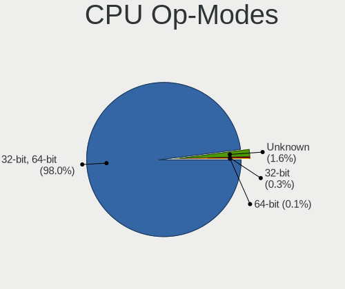

| Op mode        | Computers | Percent |
|----------------|-----------|---------|
| 32-bit, 64-bit | 2890      | 97.64%  |
| Unknown        | 56        | 1.89%   |
| 32-bit         | 9         | 0.3%    |
| 64-bit         | 5         | 0.17%   |

CPU Microcode
-------------

Microcode number

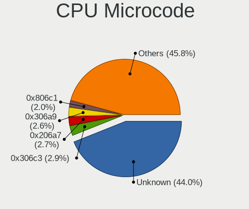

| Number     | Computers | Percent |
|------------|-----------|---------|
| Unknown    | 1051      | 34.48%  |
| 0x306c3    | 107       | 3.51%   |
| 0x206a7    | 97        | 3.18%   |
| 0x306a9    | 95        | 3.12%   |
| 0x806c1    | 70        | 2.3%    |
| 0x906ea    | 63        | 2.07%   |
| 0x506e3    | 60        | 1.97%   |
| 0x0a50000c | 58        | 1.9%    |
| 0x08701021 | 56        | 1.84%   |
| 0x806ec    | 52        | 1.71%   |
| 0x406e3    | 51        | 1.67%   |
| 0x0800820d | 48        | 1.57%   |
| 0x08108109 | 47        | 1.54%   |
| 0x906e9    | 45        | 1.48%   |
| 0x806ea    | 45        | 1.48%   |
| 0x1067a    | 44        | 1.44%   |
| 0x06000852 | 41        | 1.35%   |
| 0x806e9    | 40        | 1.31%   |
| 0x08608103 | 39        | 1.28%   |
| 0x08600106 | 39        | 1.28%   |
| 0x40651    | 37        | 1.21%   |
| 0x306d4    | 33        | 1.08%   |
| 0x0a50000d | 32        | 1.05%   |
| 0x010000c8 | 26        | 0.85%   |
| 0x20655    | 22        | 0.72%   |
| 0x08108102 | 22        | 0.72%   |
| 0x08001138 | 22        | 0.72%   |
| 0x08600104 | 21        | 0.69%   |
| 0x0a20120a | 20        | 0.66%   |
| 0x906a3    | 19        | 0.62%   |
| 0x08701013 | 19        | 0.62%   |
| 0x06001119 | 19        | 0.62%   |
| 0x0a404102 | 17        | 0.56%   |
| 0x0a201009 | 17        | 0.56%   |
| 0x706a8    | 15        | 0.49%   |
| 0x08101016 | 15        | 0.49%   |
| 0x0810100b | 15        | 0.49%   |
| 0x906ed    | 14        | 0.46%   |
| 0x806eb    | 14        | 0.46%   |
| 0x806d1    | 14        | 0.46%   |

CPU Microarch
-------------

Microarchitecture

| Name              | Computers | Percent |
|-------------------|-----------|---------|
| KabyLake          | 440       | 14.87%  |
| Haswell           | 254       | 8.59%   |
| IvyBridge         | 184       | 6.22%   |
| Zen 3             | 183       | 6.19%   |
| Zen 2             | 182       | 6.15%   |
| Skylake           | 173       | 5.85%   |
| SandyBridge       | 170       | 5.75%   |
| Unknown           | 166       | 5.61%   |
| Zen+              | 135       | 4.56%   |
| Alderlake Hybrid  | 126       | 4.26%   |
| TigerLake         | 120       | 4.06%   |
| Zen               | 88        | 2.97%   |
| Penryn            | 88        | 2.97%   |
| Piledriver        | 74        | 2.5%    |
| IceLake           | 68        | 2.3%    |
| Westmere          | 65        | 2.2%    |
| Broadwell         | 60        | 2.03%   |
| K10               | 56        | 1.89%   |
| CometLake         | 55        | 1.86%   |
| Goldmont plus     | 39        | 1.32%   |
| Core              | 38        | 1.28%   |
| Nehalem           | 31        | 1.05%   |
| Excavator         | 26        | 0.88%   |
| Silvermont        | 15        | 0.51%   |
| Steamroller       | 14        | 0.47%   |
| Puma              | 14        | 0.47%   |
| Bulldozer         | 12        | 0.41%   |
| Bonnell           | 12        | 0.41%   |
| Bobcat            | 10        | 0.34%   |
| K10 Llano         | 9         | 0.3%    |
| Jaguar            | 9         | 0.3%    |
| K8 Hammer         | 8         | 0.27%   |
| Gracemont         | 8         | 0.27%   |
| Goldmont          | 8         | 0.27%   |
| Tremont           | 6         | 0.2%    |
| K8 & K10 hybrid   | 5         | 0.17%   |
| P6                | 4         | 0.14%   |
| NetBurst          | 2         | 0.07%   |
| Meteorlake Hybrid | 1         | 0.03%   |

Graphics
--------

GPU Vendor
----------

Vendors of graphics cards

| Vendor                     | Computers | Percent |
|----------------------------|-----------|---------|
| Intel                      | 1517      | 43.05%  |
| Nvidia                     | 989       | 28.06%  |
| AMD                        | 988       | 28.04%  |
| Matrox Electronics Systems | 20        | 0.57%   |
| ASPEED Technology          | 7         | 0.2%    |
| S3 Graphics                | 2         | 0.06%   |
| VIA Technologies           | 1         | 0.03%   |

GPU Model
---------

Graphics card models

| Model                                                                       | Computers | Percent |
|-----------------------------------------------------------------------------|-----------|---------|
| Intel 2nd Generation Core Processor Family Integrated Graphics Controller   | 111       | 3.04%   |
| Intel TigerLake-LP GT2 [Iris Xe Graphics]                                   | 105       | 2.88%   |
| Intel 3rd Gen Core processor Graphics Controller                            | 99        | 2.71%   |
| AMD Cezanne [Radeon Vega Series / Radeon Vega Mobile Series]                | 87        | 2.38%   |
| AMD Renoir [Radeon RX Vega 6 (Ryzen 4000/5000 Mobile Series)]               | 82        | 2.25%   |
| AMD Ellesmere [Radeon RX 470/480/570/570X/580/580X/590]                     | 78        | 2.14%   |
| AMD Picasso/Raven 2 [Radeon Vega Series / Radeon Vega Mobile Series]        | 77        | 2.11%   |
| Intel Skylake GT2 [HD Graphics 520]                                         | 75        | 2.06%   |
| Intel UHD Graphics 620                                                      | 74        | 2.03%   |
| Intel HD Graphics 620                                                       | 66        | 1.81%   |
| Intel CoffeeLake-H GT2 [UHD Graphics 630]                                   | 66        | 1.81%   |
| Intel Haswell-ULT Integrated Graphics Controller                            | 62        | 1.7%    |
| Intel Xeon E3-1200 v3/4th Gen Core Processor Integrated Graphics Controller | 61        | 1.67%   |
| AMD Lucienne                                                                | 61        | 1.67%   |
| Intel WhiskeyLake-U GT2 [UHD Graphics 620]                                  | 57        | 1.56%   |
| Intel 4th Gen Core Processor Integrated Graphics Controller                 | 55        | 1.51%   |
| Intel HD Graphics 530                                                       | 51        | 1.4%    |
| Intel HD Graphics 630                                                       | 45        | 1.23%   |
| Intel Core Processor Integrated Graphics Controller                         | 40        | 1.1%    |
| Intel CometLake-U GT2 [UHD Graphics]                                        | 40        | 1.1%    |
| Intel Alder Lake-P GT2 [Iris Xe Graphics]                                   | 40        | 1.1%    |
| Intel HD Graphics 5500                                                      | 36        | 0.99%   |
| AMD Raven Ridge [Radeon Vega Series / Radeon Vega Mobile Series]            | 35        | 0.96%   |
| AMD Navi 10 [Radeon RX 5600 OEM/5600 XT / 5700/5700 XT]                     | 34        | 0.93%   |
| AMD Rembrandt [Radeon 680M]                                                 | 28        | 0.77%   |
| Intel GeminiLake [UHD Graphics 600]                                         | 26        | 0.71%   |
| Intel Xeon E3-1200 v2/3rd Gen Core processor Graphics Controller            | 24        | 0.66%   |
| Nvidia GP107M [GeForce GTX 1050 Mobile]                                     | 23        | 0.63%   |
| Nvidia GP107 [GeForce GTX 1050 Ti]                                          | 23        | 0.63%   |
| Intel TigerLake-H GT1 [UHD Graphics]                                        | 23        | 0.63%   |
| Intel CometLake-H GT2 [UHD Graphics]                                        | 22        | 0.6%    |
| Intel CoffeeLake-S GT2 [UHD Graphics 630]                                   | 22        | 0.6%    |
| AMD Raphael                                                                 | 22        | 0.6%    |
| Nvidia GK208B [GeForce GT 710]                                              | 21        | 0.58%   |
| Intel Mobile 4 Series Chipset Integrated Graphics Controller                | 21        | 0.58%   |
| Nvidia GA106M [GeForce RTX 3060 Mobile / Max-Q]                             | 20        | 0.55%   |
| AMD Lexa PRO [Radeon 540/540X/550/550X / RX 540X/550/550X]                  | 20        | 0.55%   |
| Nvidia GP108 [GeForce GT 1030]                                              | 19        | 0.52%   |
| Intel Raptor Lake-P [Iris Xe Graphics]                                      | 19        | 0.52%   |
| AMD Navi 22 [Radeon RX 6700/6700 XT/6750 XT / 6800M/6850M XT]               | 19        | 0.52%   |

GPU Combo
---------

Combinations of graphics cards

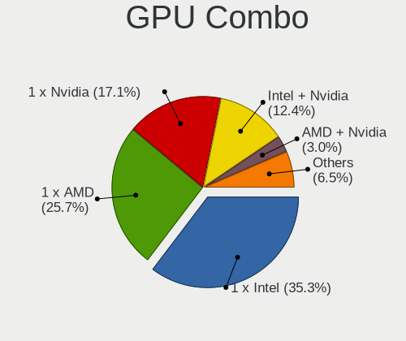

| Name               | Computers | Percent |
|--------------------|-----------|---------|
| 1 x Intel          | 1040      | 34.93%  |
| 1 x AMD            | 763       | 25.63%  |
| 1 x Nvidia         | 513       | 17.23%  |
| Intel + Nvidia     | 368       | 12.36%  |
| AMD + Nvidia       | 89        | 2.99%   |
| Intel + AMD        | 72        | 2.42%   |
| 2 x AMD            | 63        | 2.12%   |
| 1 x Matrox         | 16        | 0.54%   |
| Other              | 14        | 0.47%   |
| 2 x Nvidia         | 14        | 0.47%   |
| 2 x Intel          | 8         | 0.27%   |
| Nvidia + ASPEED    | 4         | 0.13%   |
| Nvidia + Matrox    | 3         | 0.1%    |
| 1 x ASPEED         | 3         | 0.1%    |
| 1 x S3 Graphics    | 2         | 0.07%   |
| AMD + 2 x Nvidia   | 2         | 0.07%   |
| 1 x VIA            | 1         | 0.03%   |
| Intel + 2 x Nvidia | 1         | 0.03%   |
| AMD + Matrox       | 1         | 0.03%   |

GPU Driver
----------

Free vs proprietary

| Driver      | Computers | Percent |
|-------------|-----------|---------|
| Free        | 2394      | 79.75%  |
| Proprietary | 536       | 17.85%  |
| Unknown     | 72        | 2.4%    |

GPU Memory
----------

Total video memory

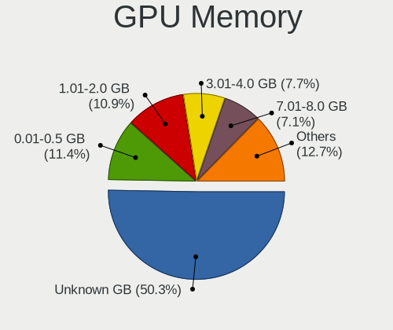

| Size in GB | Computers | Percent |
|------------|-----------|---------|
| Unknown    | 1495      | 49.31%  |
| 0.01-0.5   | 351       | 11.58%  |
| 1.01-2.0   | 346       | 11.41%  |
| 3.01-4.0   | 234       | 7.72%   |
| 7.01-8.0   | 213       | 7.03%   |
| 0.51-1.0   | 189       | 6.23%   |
| 8.01-16.0  | 89        | 2.94%   |
| 5.01-6.0   | 72        | 2.37%   |
| 2.01-3.0   | 23        | 0.76%   |
| 16.01-24.0 | 18        | 0.59%   |
| 4.01-5.0   | 1         | 0.03%   |
| 24.01-32.0 | 1         | 0.03%   |

Monitor
-------

Monitor Vendor
--------------

Monitor vendors

| Vendor                  | Computers | Percent |
|-------------------------|-----------|---------|
| Samsung Electronics     | 403       | 11.75%  |
| AU Optronics            | 374       | 10.91%  |
| BOE                     | 301       | 8.78%   |
| Chimei Innolux          | 291       | 8.49%   |
| LG Display              | 252       | 7.35%   |
| Dell                    | 235       | 6.85%   |
| Goldstar                | 206       | 6.01%   |
| Hewlett-Packard         | 123       | 3.59%   |
| Acer                    | 117       | 3.41%   |
| BenQ                    | 96        | 2.8%    |
| Ancor Communications    | 92        | 2.68%   |
| AOC                     | 87        | 2.54%   |
| Philips                 | 72        | 2.1%    |
| Apple                   | 66        | 1.92%   |
| Lenovo                  | 65        | 1.9%    |
| Sharp                   | 63        | 1.84%   |
| ASUSTek Computer        | 37        | 1.08%   |
| ViewSonic               | 34        | 0.99%   |
| Iiyama                  | 34        | 0.99%   |
| PANDA                   | 33        | 0.96%   |
| InfoVision              | 32        | 0.93%   |
| Chi Mei Optoelectronics | 26        | 0.76%   |
| Unknown                 | 24        | 0.7%    |
| Fujitsu Siemens         | 24        | 0.7%    |
| Sony                    | 23        | 0.67%   |
| Eizo                    | 17        | 0.5%    |
| CSO                     | 17        | 0.5%    |
| LG Electronics          | 15        | 0.44%   |
| NEC Computers           | 13        | 0.38%   |
| MSI                     | 13        | 0.38%   |
| Sceptre Tech            | 11        | 0.32%   |
| Pixio                   | 11        | 0.32%   |
| Gigabyte Technology     | 11        | 0.32%   |
| Vizio                   | 10        | 0.29%   |
| Panasonic               | 10        | 0.29%   |
| Medion                  | 8         | 0.23%   |
| LG Philips              | 8         | 0.23%   |
| TMX                     | 6         | 0.17%   |
| Insignia                | 6         | 0.17%   |
| HUAWEI                  | 6         | 0.17%   |

Monitor Model
-------------

Monitor models

| Model                                                                 | Computers | Percent |
|-----------------------------------------------------------------------|-----------|---------|
| Chimei Innolux LCD Monitor CMN15F5 1920x1080 344x193mm 15.5-inch      | 18        | 0.5%    |
| Goldstar ULTRAWIDE GSM59F1 2560x1080 673x284mm 28.8-inch              | 16        | 0.45%   |
| Chimei Innolux LCD Monitor CMN14D4 1920x1080 309x173mm 13.9-inch      | 16        | 0.45%   |
| Goldstar FULL HD GSM5B55 1920x1080 480x270mm 21.7-inch                | 14        | 0.39%   |
| Chimei Innolux LCD Monitor CMN1521 1920x1080 344x193mm 15.5-inch      | 14        | 0.39%   |
| Chimei Innolux LCD Monitor CMN15E7 1920x1080 344x193mm 15.5-inch      | 12        | 0.33%   |
| AU Optronics LCD Monitor AUO21ED 1920x1080 344x193mm 15.5-inch        | 12        | 0.33%   |
| Goldstar HDR WFHD GSM7714 2560x1080 798x334mm 34.1-inch               | 11        | 0.31%   |
| Chimei Innolux LCD Monitor CMN1735 1920x1080 382x215mm 17.3-inch      | 10        | 0.28%   |
| Chimei Innolux LCD Monitor CMN15C3 1920x1080 344x193mm 15.5-inch      | 10        | 0.28%   |
| BOE LCD Monitor BOE0812 1920x1080 344x194mm 15.5-inch                 | 10        | 0.28%   |
| AU Optronics LCD Monitor AUO38ED 1920x1080 344x193mm 15.5-inch        | 10        | 0.28%   |
| LG Display LCD Monitor LGD0521 1920x1080 309x174mm 14.0-inch          | 9         | 0.25%   |
| Chimei Innolux LCD Monitor CMN15D5 1920x1080 344x193mm 15.5-inch      | 9         | 0.25%   |
| BenQ GW2760HS BNQ78CA 1920x1080 598x336mm 27.0-inch                   | 9         | 0.25%   |
| BenQ GW2270 BNQ78DB 1920x1080 476x268mm 21.5-inch                     | 9         | 0.25%   |
| AU Optronics LCD Monitor AUO403D 1920x1080 309x174mm 14.0-inch        | 9         | 0.25%   |
| AU Optronics LCD Monitor AUO219D 1920x1080 381x214mm 17.2-inch        | 9         | 0.25%   |
| AU Optronics LCD Monitor AUO106C 1366x768 277x156mm 12.5-inch         | 9         | 0.25%   |
| Unknown LCD Monitor FFFF 2288x1287 2550x2550mm 142.0-inch             | 8         | 0.22%   |
| Chimei Innolux LCD Monitor CMN15E8 1920x1080 344x193mm 15.5-inch      | 8         | 0.22%   |
| AU Optronics LCD Monitor AUO23ED 1920x1080 344x194mm 15.5-inch        | 8         | 0.22%   |
| AU Optronics LCD Monitor AUO22EC 1366x768 344x193mm 15.5-inch         | 8         | 0.22%   |
| Ancor Communications ASUS VS247 ACI249A 1920x1080 521x293mm 23.5-inch | 8         | 0.22%   |
| Samsung Electronics U28E590 SAM0C4D 3840x2160 607x345mm 27.5-inch     | 7         | 0.2%    |
| Samsung Electronics LCD Monitor SEC5441 1366x768 344x194mm 15.5-inch  | 7         | 0.2%    |
| Samsung Electronics LCD Monitor SDC4171 2880x1800 302x189mm 14.0-inch | 7         | 0.2%    |
| Samsung Electronics C24F390 SAM0D2C 1920x1080 521x293mm 23.5-inch     | 7         | 0.2%    |
| Goldstar FULL HD GSM5ABB 1920x1080 480x270mm 21.7-inch                | 7         | 0.2%    |
| Chimei Innolux LCD Monitor CMN15E6 1366x768 344x193mm 15.5-inch       | 7         | 0.2%    |
| Chimei Innolux LCD Monitor CMN14C3 1366x768 309x173mm 13.9-inch       | 7         | 0.2%    |
| AU Optronics LCD Monitor AUO573D 1920x1080 309x174mm 14.0-inch        | 7         | 0.2%    |
| AOC 27G2G3 AOC2702 1920x1080 598x336mm 27.0-inch                      | 7         | 0.2%    |
| Ancor Communications VE228 ACI22FA 1920x1080 477x268mm 21.5-inch      | 7         | 0.2%    |
| Sharp LCD Monitor SHP148D 3840x2160 344x194mm 15.5-inch               | 6         | 0.17%   |
| Pixio U29I WAM2900 2560x1080 690x260mm 29.0-inch                      | 6         | 0.17%   |
| PANDA LCD Monitor NCP004D 1920x1080 344x194mm 15.5-inch               | 6         | 0.17%   |
| PANDA LCD Monitor NCP002D 1920x1080 344x194mm 15.5-inch               | 6         | 0.17%   |
| LG Display LCD Monitor LGD046F 1920x1080 340x190mm 15.3-inch          | 6         | 0.17%   |
| LG Display LCD Monitor LGD02DC 1366x768 344x194mm 15.5-inch           | 6         | 0.17%   |

Monitor Resolution
------------------

Monitor screen resolution

| Resolution         | Computers | Percent |
|--------------------|-----------|---------|
| 1920x1080 (FHD)    | 1563      | 47.59%  |
| 1366x768 (WXGA)    | 371       | 11.3%   |
| 3840x2160 (4K)     | 243       | 7.4%    |
| 2560x1440 (QHD)    | 228       | 6.94%   |
| 1920x1200 (WUXGA)  | 124       | 3.78%   |
| 1600x900 (HD+)     | 109       | 3.32%   |
| 1280x1024 (SXGA)   | 84        | 2.56%   |
| 1680x1050 (WSXGA+) | 73        | 2.22%   |
| 1440x900 (WXGA+)   | 62        | 1.89%   |
| 1280x800 (WXGA)    | 55        | 1.67%   |
| 2560x1080          | 53        | 1.61%   |
| 2560x1600          | 42        | 1.28%   |
| 3440x1440          | 37        | 1.13%   |
| Unknown            | 33        | 1%      |
| 2880x1800          | 25        | 0.76%   |
| 3840x1080          | 21        | 0.64%   |
| 1024x768 (XGA)     | 18        | 0.55%   |
| 1360x768           | 12        | 0.37%   |
| 1920x540           | 11        | 0.33%   |
| 1600x1200          | 9         | 0.27%   |
| 2288x1287          | 8         | 0.24%   |
| 2256x1504          | 7         | 0.21%   |
| 2160x1440          | 7         | 0.21%   |
| 3840x2400          | 6         | 0.18%   |
| 3200x1800 (QHD+)   | 6         | 0.18%   |
| 3840x1600          | 5         | 0.15%   |
| 1024x600           | 5         | 0.15%   |
| 3840x1200          | 4         | 0.12%   |
| 2240x1400          | 4         | 0.12%   |
| 1280x720 (HD)      | 4         | 0.12%   |
| 3456x2160          | 3         | 0.09%   |
| 3200x2000          | 3         | 0.09%   |
| 2736x1824          | 3         | 0.09%   |
| 2520x1680          | 3         | 0.09%   |
| 1280x960           | 3         | 0.09%   |
| 800x1280           | 2         | 0.06%   |
| 4480x1440          | 2         | 0.06%   |
| 3072x1920          | 2         | 0.06%   |
| 2880x1620          | 2         | 0.06%   |
| 2048x1536          | 2         | 0.06%   |

Monitor Diagonal
----------------

Diagonal size in inches

| Inches  | Computers | Percent |
|---------|-----------|---------|
| 15      | 789       | 22.98%  |
| 27      | 339       | 9.87%   |
| 13      | 280       | 8.15%   |
| 14      | 277       | 8.07%   |
| 24      | 276       | 8.04%   |
| 21      | 210       | 6.12%   |
| 23      | 192       | 5.59%   |
| 17      | 189       | 5.5%    |
| Unknown | 109       | 3.17%   |
| 31      | 98        | 2.85%   |
| 19      | 82        | 2.39%   |
| 34      | 71        | 2.07%   |
| 12      | 63        | 1.83%   |
| 16      | 54        | 1.57%   |
| 22      | 49        | 1.43%   |
| 18      | 48        | 1.4%    |
| 20      | 38        | 1.11%   |
| 32      | 30        | 0.87%   |
| 84      | 23        | 0.67%   |
| 72      | 21        | 0.61%   |
| 11      | 19        | 0.55%   |
| 25      | 18        | 0.52%   |
| 54      | 16        | 0.47%   |
| 29      | 15        | 0.44%   |
| 40      | 14        | 0.41%   |
| 26      | 13        | 0.38%   |
| 28      | 9         | 0.26%   |
| 142     | 8         | 0.23%   |
| 37      | 7         | 0.2%    |
| 33      | 7         | 0.2%    |
| 49      | 6         | 0.17%   |
| 42      | 6         | 0.17%   |
| 10      | 6         | 0.17%   |
| 43      | 5         | 0.15%   |
| 52      | 4         | 0.12%   |
| 48      | 4         | 0.12%   |
| 36      | 4         | 0.12%   |
| 86      | 3         | 0.09%   |
| 74      | 3         | 0.09%   |
| 65      | 3         | 0.09%   |

Monitor Width
-------------

Physical width

| Width in mm    | Computers | Percent |
|----------------|-----------|---------|
| 301-350        | 1236      | 36.82%  |
| 501-600        | 742       | 22.1%   |
| 401-500        | 369       | 10.99%  |
| 201-300        | 246       | 7.33%   |
| 351-400        | 234       | 6.97%   |
| 601-700        | 164       | 4.89%   |
| 701-800        | 111       | 3.31%   |
| Unknown        | 109       | 3.25%   |
| 1501-2000      | 49        | 1.46%   |
| 1001-1500      | 47        | 1.4%    |
| 801-900        | 27        | 0.8%    |
| 901-1000       | 11        | 0.33%   |
| More than 2000 | 8         | 0.24%   |
| 101-200        | 3         | 0.09%   |
| 1-100          | 1         | 0.03%   |

Aspect Ratio
------------

Proportional relationship between the width and the height

| Ratio   | Computers | Percent |
|---------|-----------|---------|
| 16/9    | 2294      | 75.31%  |
| 16/10   | 400       | 13.13%  |
| 21/9    | 82        | 2.69%   |
| Unknown | 81        | 2.66%   |
| 5/4     | 75        | 2.46%   |
| 4/3     | 41        | 1.35%   |
| 3/2     | 32        | 1.05%   |
| 32/9    | 9         | 0.3%    |
| 1.00    | 9         | 0.3%    |
| 6/5     | 7         | 0.23%   |
| 2.65    | 6         | 0.2%    |
| 0.56    | 3         | 0.1%    |
| 0.62    | 2         | 0.07%   |
| 3.73    | 1         | 0.03%   |
| 3.40    | 1         | 0.03%   |
| 3.20    | 1         | 0.03%   |
| 1.96    | 1         | 0.03%   |
| 0.67    | 1         | 0.03%   |

Monitor Area
------------

Area in inch

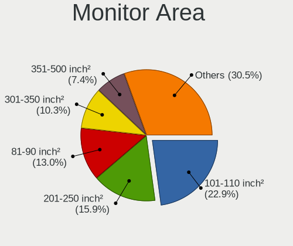

| Area in inch | Computers | Percent |
|----------------|-----------|---------|
| 101-110        | 793       | 23.38%  |
| 201-250        | 555       | 16.36%  |
| 81-90          | 436       | 12.85%  |
| 301-350        | 345       | 10.17%  |
| 351-500        | 223       | 6.57%   |
| 151-200        | 181       | 5.34%   |
| 121-130        | 144       | 4.25%   |
| 251-300        | 125       | 3.69%   |
| 71-80          | 120       | 3.54%   |
| Unknown        | 109       | 3.21%   |
| More than 1000 | 92        | 2.71%   |
| 141-150        | 66        | 1.95%   |
| 61-70          | 55        | 1.62%   |
| 501-1000       | 48        | 1.42%   |
| 111-120        | 42        | 1.24%   |
| 51-60          | 21        | 0.62%   |
| 131-140        | 20        | 0.59%   |
| 91-100         | 8         | 0.24%   |
| 41-50          | 6         | 0.18%   |
| 1-40           | 3         | 0.09%   |

Pixel Density
-------------

Pixels per inch

| Density       | Computers | Percent |
|---------------|-----------|---------|
| 51-100        | 1069      | 32.47%  |
| 121-160       | 947       | 28.77%  |
| 101-120       | 748       | 22.72%  |
| 161-240       | 261       | 7.93%   |
| Unknown       | 109       | 3.31%   |
| More than 240 | 87        | 2.64%   |
| 1-50          | 71        | 2.16%   |

Multiple Monitors
-----------------

Total monitors connected

| Total | Computers | Percent |
|-------|-----------|---------|
| 1     | 2289      | 75.44%  |
| 2     | 592       | 19.51%  |
| 0     | 76        | 2.5%    |
| 3     | 69        | 2.27%   |
| 4     | 8         | 0.26%   |

Network
-------

Net Controller Vendor
---------------------

Controller vendors

| Vendor                            | Computers | Percent |
|-----------------------------------|-----------|---------|
| Realtek Semiconductor             | 1614      | 36.55%  |
| Intel                             | 1559      | 35.3%   |
| Qualcomm Atheros                  | 357       | 8.08%   |
| Broadcom                          | 230       | 5.21%   |
| MediaTek                          | 118       | 2.67%   |
| Broadcom Limited                  | 43        | 0.97%   |
| TP-Link                           | 39        | 0.88%   |
| Ralink Technology                 | 38        | 0.86%   |
| ASIX Electronics                  | 34        | 0.77%   |
| Ralink                            | 31        | 0.7%    |
| Nvidia                            | 29        | 0.66%   |
| Marvell Technology Group          | 27        | 0.61%   |
| DisplayLink                       | 17        | 0.38%   |
| Sierra Wireless                   | 16        | 0.36%   |
| Dell                              | 15        | 0.34%   |
| Aquantia                          | 14        | 0.32%   |
| Samsung Electronics               | 12        | 0.27%   |
| Lenovo                            | 12        | 0.27%   |
| ASUSTek Computer                  | 11        | 0.25%   |
| Microsoft                         | 10        | 0.23%   |
| D-Link                            | 10        | 0.23%   |
| Qualcomm                          | 9         | 0.2%    |
| NetGear                           | 9         | 0.2%    |
| Ericsson Business Mobile Networks | 8         | 0.18%   |
| Edimax Technology                 | 8         | 0.18%   |
| D-Link System                     | 8         | 0.18%   |
| AVM                               | 8         | 0.18%   |
| Xiaomi                            | 7         | 0.16%   |
| Linksys                           | 7         | 0.16%   |
| Huawei Technologies               | 7         | 0.16%   |
| Hewlett-Packard                   | 7         | 0.16%   |
| Qualcomm Atheros Communications   | 6         | 0.14%   |
| Cypress Semiconductor             | 6         | 0.14%   |
| U-Blox                            | 5         | 0.11%   |
| JMicron Technology                | 4         | 0.09%   |
| ICS Advent                        | 4         | 0.09%   |
| Belkin Components                 | 4         | 0.09%   |
| Qualcomm Technologies             | 3         | 0.07%   |
| Motorola PCS                      | 3         | 0.07%   |
| Microchip Technology              | 3         | 0.07%   |

Net Controller Model
--------------------

Controller models

| Model                                                                  | Computers | Percent |
|------------------------------------------------------------------------|-----------|---------|
| Realtek RTL8111/8168/8211/8411 PCI Express Gigabit Ethernet Controller | 1126      | 21.37%  |
| Intel Wi-Fi 6 AX200                                                    | 192       | 3.64%   |
| Realtek RTL8125 2.5GbE Controller                                      | 118       | 2.24%   |
| Realtek RTL810xE PCI Express Fast Ethernet controller                  | 97        | 1.84%   |
| Intel 82579LM Gigabit Network Connection (Lewisville)                  | 97        | 1.84%   |
| Intel Wireless 8265 / 8275                                             | 96        | 1.82%   |
| Realtek RTL8153 Gigabit Ethernet Adapter                               | 95        | 1.8%    |
| Intel Wi-Fi 6 AX201                                                    | 92        | 1.75%   |
| Intel I211 Gigabit Network Connection                                  | 91        | 1.73%   |
| Realtek RTL8822CE 802.11ac PCIe Wireless Network Adapter               | 69        | 1.31%   |
| Qualcomm Atheros QCA9377 802.11ac Wireless Network Adapter             | 69        | 1.31%   |
| Intel Wireless 8260                                                    | 69        | 1.31%   |
| Realtek RTL8821CE 802.11ac PCIe Wireless Network Adapter               | 68        | 1.29%   |
| Intel Wireless 7260                                                    | 62        | 1.18%   |
| Intel Alder Lake-P PCH CNVi WiFi                                       | 61        | 1.16%   |
| Intel Wi-Fi 6E(802.11ax) AX210/AX1675* 2x2 [Typhoon Peak]              | 55        | 1.04%   |
| Intel Wireless 7265                                                    | 49        | 0.93%   |
| Intel Wi-Fi 5(802.11ac) Wireless-AC 9x6x [Thunder Peak]                | 48        | 0.91%   |
| Intel Ethernet Connection (2) I219-V                                   | 48        | 0.91%   |
| Intel Ethernet Connection I217-LM                                      | 47        | 0.89%   |
| Qualcomm Atheros QCA6174 802.11ac Wireless Network Adapter             | 46        | 0.87%   |
| MediaTek MT7921 802.11ax PCI Express Wireless Network Adapter          | 46        | 0.87%   |
| MediaTek MT7922 802.11ax PCI Express Wireless Network Adapter          | 43        | 0.82%   |
| Intel Cannon Lake PCH CNVi WiFi                                        | 41        | 0.78%   |
| Intel Ethernet Controller I225-V                                       | 40        | 0.76%   |
| Intel Ethernet Connection (4) I219-LM                                  | 40        | 0.76%   |
| Intel Dual Band Wireless-AC 3168NGW [Stone Peak]                       | 39        | 0.74%   |
| Intel Centrino Advanced-N 6205 [Taylor Peak]                           | 39        | 0.74%   |
| Qualcomm Atheros AR9485 Wireless Network Adapter                       | 38        | 0.72%   |
| Qualcomm Atheros QCA9565 / AR9565 Wireless Network Adapter             | 34        | 0.65%   |
| Intel Comet Lake PCH-LP CNVi WiFi                                      | 32        | 0.61%   |
| ASIX AX88179 Gigabit Ethernet                                          | 32        | 0.61%   |
| Intel Tiger Lake PCH CNVi WiFi                                         | 30        | 0.57%   |
| Realtek RTL8822BE 802.11a/b/g/n/ac WiFi adapter                        | 29        | 0.55%   |
| Intel Cannon Point-LP CNVi [Wireless-AC]                               | 29        | 0.55%   |
| Intel Ethernet Connection I219-LM                                      | 28        | 0.53%   |
| Intel Comet Lake PCH CNVi WiFi                                         | 27        | 0.51%   |
| Broadcom NetXtreme BCM57765 Gigabit Ethernet PCIe                      | 27        | 0.51%   |
| Intel Ethernet Connection I217-V                                       | 25        | 0.47%   |
| Intel 82574L Gigabit Network Connection                                | 24        | 0.46%   |

Wireless Vendor
---------------

Wireless vendors

| Vendor                                | Computers | Percent |
|---------------------------------------|-----------|---------|
| Intel                                 | 1194      | 50.17%  |
| Realtek Semiconductor                 | 384       | 16.13%  |
| Qualcomm Atheros                      | 280       | 11.76%  |
| Broadcom                              | 150       | 6.3%    |
| MediaTek                              | 113       | 4.75%   |
| Ralink Technology                     | 38        | 1.6%    |
| Ralink                                | 31        | 1.3%    |
| TP-Link                               | 28        | 1.18%   |
| Broadcom Limited                      | 28        | 1.18%   |
| Sierra Wireless                       | 16        | 0.67%   |
| ASUSTek Computer                      | 11        | 0.46%   |
| Dell                                  | 10        | 0.42%   |
| D-Link                                | 10        | 0.42%   |
| NetGear                               | 9         | 0.38%   |
| Qualcomm                              | 8         | 0.34%   |
| Microsoft                             | 8         | 0.34%   |
| Edimax Technology                     | 8         | 0.34%   |
| AVM                                   | 8         | 0.34%   |
| Linksys                               | 7         | 0.29%   |
| Qualcomm Atheros Communications       | 6         | 0.25%   |
| D-Link System                         | 5         | 0.21%   |
| Marvell Technology Group              | 4         | 0.17%   |
| Belkin Components                     | 4         | 0.17%   |
| Qualcomm Technologies                 | 3         | 0.13%   |
| FIBOCOM                               | 2         | 0.08%   |
| 802.11g Adapter [Linksys WUSB54GC v3] | 2         | 0.08%   |
| ZyXEL Communications                  | 1         | 0.04%   |
| Xiaomi                                | 1         | 0.04%   |
| Wilocity                              | 1         | 0.04%   |
| Wacom                                 | 1         | 0.04%   |
| Samsung Electronics                   | 1         | 0.04%   |
| Realtek                               | 1         | 0.04%   |
| Quectel Wireless Solutions            | 1         | 0.04%   |
| Micro Star International              | 1         | 0.04%   |
| Intersil                              | 1         | 0.04%   |
| IMC Networks                          | 1         | 0.04%   |
| Hewlett-Packard                       | 1         | 0.04%   |
| Gemtek                                | 1         | 0.04%   |
| BUFFALO                               | 1         | 0.04%   |

Wireless Model
--------------

Wireless models

| Model                                                          | Computers | Percent |
|----------------------------------------------------------------|-----------|---------|
| Intel Wi-Fi 6 AX200                                            | 192       | 8%      |
| Intel Wireless 8265 / 8275                                     | 96        | 4%      |
| Intel Wi-Fi 6 AX201                                            | 92        | 3.83%   |
| Realtek RTL8822CE 802.11ac PCIe Wireless Network Adapter       | 69        | 2.88%   |
| Qualcomm Atheros QCA9377 802.11ac Wireless Network Adapter     | 69        | 2.88%   |
| Intel Wireless 8260                                            | 69        | 2.88%   |
| Realtek RTL8821CE 802.11ac PCIe Wireless Network Adapter       | 68        | 2.83%   |
| Intel Wireless 7260                                            | 62        | 2.58%   |
| Intel Alder Lake-P PCH CNVi WiFi                               | 61        | 2.54%   |
| Intel Wi-Fi 6E(802.11ax) AX210/AX1675* 2x2 [Typhoon Peak]      | 55        | 2.29%   |
| Intel Wireless 7265                                            | 49        | 2.04%   |
| Intel Wi-Fi 5(802.11ac) Wireless-AC 9x6x [Thunder Peak]        | 48        | 2%      |
| Qualcomm Atheros QCA6174 802.11ac Wireless Network Adapter     | 46        | 1.92%   |
| MediaTek MT7921 802.11ax PCI Express Wireless Network Adapter  | 46        | 1.92%   |
| MediaTek MT7922 802.11ax PCI Express Wireless Network Adapter  | 43        | 1.79%   |
| Intel Cannon Lake PCH CNVi WiFi                                | 41        | 1.71%   |
| Intel Dual Band Wireless-AC 3168NGW [Stone Peak]               | 39        | 1.63%   |
| Intel Centrino Advanced-N 6205 [Taylor Peak]                   | 39        | 1.63%   |
| Qualcomm Atheros AR9485 Wireless Network Adapter               | 38        | 1.58%   |
| Qualcomm Atheros QCA9565 / AR9565 Wireless Network Adapter     | 34        | 1.42%   |
| Intel Comet Lake PCH-LP CNVi WiFi                              | 32        | 1.33%   |
| Intel Tiger Lake PCH CNVi WiFi                                 | 30        | 1.25%   |
| Realtek RTL8822BE 802.11a/b/g/n/ac WiFi adapter                | 29        | 1.21%   |
| Intel Cannon Point-LP CNVi [Wireless-AC]                       | 29        | 1.21%   |
| Intel Comet Lake PCH CNVi WiFi                                 | 27        | 1.13%   |
| Realtek RTL8723BE PCIe Wireless Network Adapter                | 23        | 0.96%   |
| Qualcomm Atheros AR9285 Wireless Network Adapter (PCI-Express) | 23        | 0.96%   |
| Broadcom BCM4331 802.11a/b/g/n                                 | 23        | 0.96%   |
| Broadcom BCM4313 802.11bgn Wireless Network Adapter            | 23        | 0.96%   |
| Broadcom BCM43142 802.11b/g/n                                  | 22        | 0.92%   |
| Intel Wireless 3165                                            | 21        | 0.88%   |
| Intel Wireless 3160                                            | 20        | 0.83%   |
| Realtek RTL8852AE 802.11ax PCIe Wireless Network Adapter       | 19        | 0.79%   |
| Qualcomm Atheros AR9462 Wireless Network Adapter               | 19        | 0.79%   |
| Realtek RTL8188CE 802.11b/g/n WiFi Adapter                     | 18        | 0.75%   |
| Realtek 802.11ac NIC                                           | 18        | 0.75%   |
| Intel Raptor Lake PCH CNVi WiFi                                | 18        | 0.75%   |
| Intel Centrino Ultimate-N 6300                                 | 17        | 0.71%   |
| Realtek RTL88x2bu [AC1200 Techkey]                             | 15        | 0.63%   |
| Realtek RTL8852BE PCIe 802.11ax Wireless Network Controller    | 15        | 0.63%   |

Ethernet Vendor
---------------

Ethernet vendors

| Vendor                                 | Computers | Percent |
|----------------------------------------|-----------|---------|
| Realtek Semiconductor                  | 1456      | 52.95%  |
| Intel                                  | 828       | 30.11%  |
| Broadcom                               | 121       | 4.4%    |
| Qualcomm Atheros                       | 105       | 3.82%   |
| ASIX Electronics                       | 34        | 1.24%   |
| Nvidia                                 | 29        | 1.05%   |
| Marvell Technology Group               | 23        | 0.84%   |
| DisplayLink                            | 17        | 0.62%   |
| Broadcom Limited                       | 15        | 0.55%   |
| Aquantia                               | 14        | 0.51%   |
| Lenovo                                 | 12        | 0.44%   |
| TP-Link                                | 11        | 0.4%    |
| Samsung Electronics                    | 11        | 0.4%    |
| Xiaomi                                 | 6         | 0.22%   |
| Huawei Technologies                    | 6         | 0.22%   |
| Cypress Semiconductor                  | 6         | 0.22%   |
| MediaTek                               | 5         | 0.18%   |
| JMicron Technology                     | 4         | 0.15%   |
| ICS Advent                             | 4         | 0.15%   |
| Motorola PCS                           | 3         | 0.11%   |
| Dell                                   | 3         | 0.11%   |
| D-Link System                          | 3         | 0.11%   |
| VIA Technologies                       | 2         | 0.07%   |
| Sony Ericsson Mobile Communications AB | 2         | 0.07%   |
| OPPO Electronics                       | 2         | 0.07%   |
| NetXen Incorporated                    | 2         | 0.07%   |
| Microsoft                              | 2         | 0.07%   |
| HMD Global                             | 2         | 0.07%   |
| ADMtek                                 | 2         | 0.07%   |
| ZTE WCDMA Technologies MSM             | 1         | 0.04%   |
| TOMTOM                                 | 1         | 0.04%   |
| Solarflare Communications              | 1         | 0.04%   |
| Sitecom Europe                         | 1         | 0.04%   |
| Silicon Integrated Systems [SiS]       | 1         | 0.04%   |
| Qualcomm                               | 1         | 0.04%   |
| QLogic                                 | 1         | 0.04%   |
| OnePlus Technology (Shenzhen)          | 1         | 0.04%   |
| National Semiconductor                 | 1         | 0.04%   |
| MosChip Semiconductor                  | 1         | 0.04%   |
| Microchip Technology                   | 1         | 0.04%   |

Ethernet Model
--------------

Ethernet models

| Model                                                                  | Computers | Percent |
|------------------------------------------------------------------------|-----------|---------|
| Realtek RTL8111/8168/8211/8411 PCI Express Gigabit Ethernet Controller | 1126      | 39.87%  |
| Realtek RTL8125 2.5GbE Controller                                      | 118       | 4.18%   |
| Realtek RTL810xE PCI Express Fast Ethernet controller                  | 97        | 3.43%   |
| Intel 82579LM Gigabit Network Connection (Lewisville)                  | 97        | 3.43%   |
| Realtek RTL8153 Gigabit Ethernet Adapter                               | 95        | 3.36%   |
| Intel I211 Gigabit Network Connection                                  | 91        | 3.22%   |
| Intel Ethernet Connection (2) I219-V                                   | 48        | 1.7%    |
| Intel Ethernet Connection I217-LM                                      | 47        | 1.66%   |
| Intel Ethernet Controller I225-V                                       | 40        | 1.42%   |
| Intel Ethernet Connection (4) I219-LM                                  | 40        | 1.42%   |
| ASIX AX88179 Gigabit Ethernet                                          | 32        | 1.13%   |
| Intel Ethernet Connection I219-LM                                      | 28        | 0.99%   |
| Broadcom NetXtreme BCM57765 Gigabit Ethernet PCIe                      | 27        | 0.96%   |
| Intel Ethernet Connection I217-V                                       | 25        | 0.89%   |
| Intel 82574L Gigabit Network Connection                                | 24        | 0.85%   |
| Intel Ethernet Connection (7) I219-V                                   | 23        | 0.81%   |
| Intel Ethernet Connection (7) I219-LM                                  | 23        | 0.81%   |
| Intel I210 Gigabit Network Connection                                  | 22        | 0.78%   |
| Intel Ethernet Connection (2) I219-LM                                  | 22        | 0.78%   |
| Intel 82579V Gigabit Network Connection                                | 21        | 0.74%   |
| Intel Ethernet Connection (2) I218-V                                   | 18        | 0.64%   |
| Qualcomm Atheros Killer E2500 Gigabit Ethernet Controller              | 17        | 0.6%    |
| Intel Ethernet Connection I219-V                                       | 17        | 0.6%    |
| Intel Ethernet Connection I218-LM                                      | 17        | 0.6%    |
| Intel Ethernet Connection (4) I219-V                                   | 17        | 0.6%    |
| Intel 82577LM Gigabit Network Connection                               | 17        | 0.6%    |
| Nvidia MCP79 Ethernet                                                  | 16        | 0.57%   |
| Intel Ethernet Connection (3) I218-LM                                  | 14        | 0.5%    |
| Realtek Killer E2600 GbE Controller                                    | 13        | 0.46%   |
| Intel Ethernet Connection (6) I219-V                                   | 13        | 0.46%   |
| Broadcom NetXtreme BCM57766 Gigabit Ethernet PCIe                      | 13        | 0.46%   |
| Qualcomm Atheros Killer E220x Gigabit Ethernet Controller              | 12        | 0.42%   |
| Intel Ethernet Connection (13) I219-V                                  | 12        | 0.42%   |
| Qualcomm Atheros AR8151 v2.0 Gigabit Ethernet                          | 11        | 0.39%   |
| Intel Ethernet Connection (10) I219-V                                  | 11        | 0.39%   |
| Broadcom NetXtreme BCM5764M Gigabit Ethernet PCIe                      | 11        | 0.39%   |
| Realtek Killer E3000 2.5GbE Controller                                 | 10        | 0.35%   |
| Broadcom NetXtreme II BCM5709 Gigabit Ethernet                         | 10        | 0.35%   |
| TP-Link UE300 10/100/1000 LAN (ethernet mode) [Realtek RTL8153]        | 9         | 0.32%   |
| Qualcomm Atheros QCA8171 Gigabit Ethernet                              | 9         | 0.32%   |

Net Controller Kind
-------------------

Ethernet, WiFi or modem

| Kind     | Computers | Percent |
|----------|-----------|---------|
| Ethernet | 2524      | 52.33%  |
| WiFi     | 2254      | 46.73%  |
| Modem    | 34        | 0.7%    |
| Unknown  | 11        | 0.23%   |

Used Controller
---------------

Currently used network controller

| Kind     | Computers | Percent |
|----------|-----------|---------|
| WiFi     | 1679      | 53.52%  |
| Ethernet | 1458      | 46.48%  |

NICs
----

Total network controllers on board

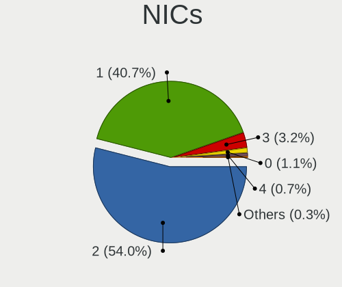

| Total | Computers | Percent |
|-------|-----------|---------|
| 2     | 1616      | 54.56%  |
| 1     | 1188      | 40.11%  |
| 3     | 94        | 3.17%   |
| 0     | 32        | 1.08%   |
| 4     | 21        | 0.71%   |
| 5     | 7         | 0.24%   |
| 8     | 2         | 0.07%   |
| 6     | 2         | 0.07%   |

IPv6
----

IPv6 vs IPv4

| Used | Computers | Percent |
|------|-----------|---------|
| No   | 2248      | 74.36%  |
| Yes  | 775       | 25.64%  |

Bluetooth
---------

Bluetooth Vendor
----------------

Controller vendors

| Vendor                          | Computers | Percent |
|---------------------------------|-----------|---------|
| Intel                           | 1007      | 50.32%  |
| Realtek Semiconductor           | 216       | 10.79%  |
| Cambridge Silicon Radio         | 134       | 6.7%    |
| Qualcomm Atheros Communications | 111       | 5.55%   |
| Foxconn / Hon Hai               | 77        | 3.85%   |
| Apple                           | 77        | 3.85%   |
| Broadcom                        | 76        | 3.8%    |
| IMC Networks                    | 71        | 3.55%   |
| Lite-On Technology              | 67        | 3.35%   |
| ASUSTek Computer                | 36        | 1.8%    |
| MediaTek                        | 27        | 1.35%   |
| Hewlett-Packard                 | 17        | 0.85%   |
| Dell                            | 17        | 0.85%   |
| Realtek                         | 13        | 0.65%   |
| TP-Link                         | 9         | 0.45%   |
| Toshiba                         | 6         | 0.3%    |
| Ralink                          | 6         | 0.3%    |
| Marvell Semiconductor           | 4         | 0.2%    |
| Foxconn International           | 4         | 0.2%    |
| USI                             | 3         | 0.15%   |
| Integrated System Solution      | 3         | 0.15%   |
| Belkin Components               | 3         | 0.15%   |
| Taiyo Yuden                     | 2         | 0.1%    |
| Smart Modular Technologies      | 2         | 0.1%    |
| HTC (High Tech Computer)        | 2         | 0.1%    |
| Alps Electric                   | 2         | 0.1%    |
| Unknown                         | 1         | 0.05%   |
| SINO WEALTH                     | 1         | 0.05%   |
| Ralink Technology               | 1         | 0.05%   |
| Qcom                            | 1         | 0.05%   |
| Opticis                         | 1         | 0.05%   |
| Mobile Action Technology        | 1         | 0.05%   |
| Micro Star International        | 1         | 0.05%   |
| Kensington                      | 1         | 0.05%   |
| Edimax Technology               | 1         | 0.05%   |

Bluetooth Model
---------------

Controller models

| Model                                               | Computers | Percent |
|-----------------------------------------------------|-----------|---------|
| Intel AX201 Bluetooth                               | 187       | 9.33%   |
| Intel AX200 Bluetooth                               | 184       | 9.18%   |
| Intel Bluetooth wireless interface                  | 148       | 7.39%   |
| Intel Bluetooth Device                              | 145       | 7.24%   |
| Cambridge Silicon Radio Bluetooth Dongle (HCI mode) | 134       | 6.69%   |
| Realtek Bluetooth Radio                             | 130       | 6.49%   |
| Intel Bluetooth 9460/9560 Jefferson Peak (JfP)      | 112       | 5.59%   |
| Intel AX211 Bluetooth                               | 70        | 3.49%   |
| Intel AX210 Bluetooth                               | 54        | 2.69%   |
| Qualcomm Atheros  Bluetooth Device                  | 52        | 2.59%   |
| Intel Wireless-AC 9260 Bluetooth Adapter            | 46        | 2.3%    |
| Apple Bluetooth Host Controller                     | 42        | 2.1%    |
| Intel Wireless-AC 3168 Bluetooth                    | 36        | 1.8%    |
| Realtek  Bluetooth 4.2 Adapter                      | 34        | 1.7%    |
| Realtek 802.11ac WLAN Adapter                       | 31        | 1.55%   |
| IMC Networks Wireless_Device                        | 29        | 1.45%   |
| MediaTek Wireless_Device                            | 27        | 1.35%   |
| Qualcomm Atheros QCA61x4 Bluetooth 4.0              | 26        | 1.3%    |
| Intel Centrino Bluetooth Wireless Transceiver       | 23        | 1.15%   |
| IMC Networks Bluetooth Radio                        | 23        | 1.15%   |
| Foxconn / Hon Hai Wireless_Device                   | 23        | 1.15%   |
| Lite-On Qualcomm Atheros QCA9377 Bluetooth          | 20        | 1%      |
| Apple Bluetooth USB Host Controller                 | 20        | 1%      |
| Foxconn / Hon Hai MediaTek Bluetooth Adapter        | 17        | 0.85%   |
| Broadcom BCM2045B (BDC-2.1)                         | 15        | 0.75%   |
| Qualcomm Atheros AR3011 Bluetooth                   | 14        | 0.7%    |
| Lite-On Bluetooth Device                            | 14        | 0.7%    |
| Realtek Bluetooth Radio                             | 13        | 0.65%   |
| Lite-On Wireless_Device                             | 13        | 0.65%   |
| Foxconn / Hon Hai Bluetooth Device                  | 13        | 0.65%   |
| IMC Networks Bluetooth Device                       | 11        | 0.55%   |
| Apple Built-in Bluetooth 2.0+EDR HCI                | 11        | 0.55%   |
| HP Broadcom 2070 Bluetooth Combo                    | 10        | 0.5%    |
| Broadcom BCM20702A0 Bluetooth 4.0                   | 10        | 0.5%    |
| ASUS ASUS USB-BT500                                 | 10        | 0.5%    |
| TP-Link UB500 Adapter                               | 9         | 0.45%   |
| Qualcomm Atheros AR3012 Bluetooth 4.0               | 9         | 0.45%   |
| Lite-On Atheros AR3012 Bluetooth                    | 9         | 0.45%   |
| Realtek RTL8822BE Bluetooth 4.2 Adapter             | 7         | 0.35%   |
| Realtek RTL8821A Bluetooth                          | 7         | 0.35%   |

Sound
-----

Sound Vendor
------------

Sound card vendors

| Vendor                               | Computers | Percent |
|--------------------------------------|-----------|---------|
| Intel                                | 1904      | 45.16%  |
| AMD                                  | 1091      | 25.88%  |
| Nvidia                               | 646       | 15.32%  |
| C-Media Electronics                  | 75        | 1.78%   |
| Logitech                             | 37        | 0.88%   |
| Creative Labs                        | 35        | 0.83%   |
| Texas Instruments                    | 30        | 0.71%   |
| Razer USA                            | 20        | 0.47%   |
| JMTek                                | 18        | 0.43%   |
| Realtek Semiconductor                | 17        | 0.4%    |
| GN Netcom                            | 17        | 0.4%    |
| ASUSTek Computer                     | 17        | 0.4%    |
| Lenovo                               | 16        | 0.38%   |
| Creative Technology                  | 16        | 0.38%   |
| Kingston Technology                  | 15        | 0.36%   |
| Generalplus Technology               | 15        | 0.36%   |
| Plantronics                          | 11        | 0.26%   |
| SteelSeries ApS                      | 10        | 0.24%   |
| RODE Microphones                     | 9         | 0.21%   |
| Micro Star International             | 9         | 0.21%   |
| M-Audio                              | 9         | 0.21%   |
| Focusrite-Novation                   | 9         | 0.21%   |
| BEHRINGER International              | 9         | 0.21%   |
| Hewlett-Packard                      | 8         | 0.19%   |
| DSEA A/S                             | 8         | 0.19%   |
| Corsair                              | 8         | 0.19%   |
| Yamaha                               | 6         | 0.14%   |
| VIA Technologies                     | 6         | 0.14%   |
| Samson Technologies                  | 6         | 0.14%   |
| FiiO Electronics Technology          | 6         | 0.14%   |
| Sony                                 | 4         | 0.09%   |
| Huawei Technologies                  | 4         | 0.09%   |
| Conexant Systems                     | 4         | 0.09%   |
| BR25                                 | 4         | 0.09%   |
| Apple                                | 4         | 0.09%   |
| Thesycon Systemsoftware & Consulting | 3         | 0.07%   |
| Sennheiser Communications            | 3         | 0.07%   |
| SAVITECH                             | 3         | 0.07%   |
| ONN                                  | 3         | 0.07%   |
| Harman International                 | 3         | 0.07%   |

Sound Model
-----------

Sound card models

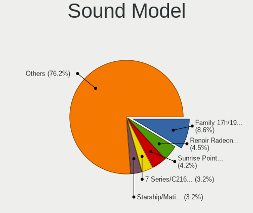

| Model                                                                      | Computers | Percent |
|----------------------------------------------------------------------------|-----------|---------|
| AMD Family 17h/19h HD Audio Controller                                     | 437       | 8.4%    |
| AMD Renoir Radeon High Definition Audio Controller                         | 235       | 4.52%   |
| Intel Sunrise Point-LP HD Audio                                            | 225       | 4.33%   |
| Intel 7 Series/C216 Chipset Family High Definition Audio Controller        | 178       | 3.42%   |
| AMD Starship/Matisse HD Audio Controller                                   | 159       | 3.06%   |
| Intel 8 Series/C220 Series Chipset High Definition Audio Controller        | 154       | 2.96%   |
| Intel 6 Series/C200 Series Chipset Family High Definition Audio Controller | 139       | 2.67%   |
| Intel Tiger Lake-LP Smart Sound Technology Audio Controller                | 120       | 2.31%   |
| AMD SBx00 Azalia (Intel HDA)                                               | 116       | 2.23%   |
| Intel Cannon Lake PCH cAVS                                                 | 111       | 2.13%   |
| Intel Xeon E3-1200 v3/4th Gen Core Processor HD Audio Controller           | 110       | 2.11%   |
| AMD Raven/Raven2/Fenghuang HDMI/DP Audio Controller                        | 107       | 2.06%   |
| AMD Family 17h (Models 00h-0fh) HD Audio Controller                        | 97        | 1.86%   |
| AMD Ellesmere HDMI Audio [Radeon RX 470/480 / 570/580/590]                 | 88        | 1.69%   |
| Intel 100 Series/C230 Series Chipset Family HD Audio Controller            | 86        | 1.65%   |
| Intel 5 Series/3400 Series Chipset High Definition Audio                   | 69        | 1.33%   |
| AMD FCH Azalia Controller                                                  | 68        | 1.31%   |
| Intel Alder Lake PCH-P High Definition Audio Controller                    | 66        | 1.27%   |
| Intel 8 Series HD Audio Controller                                         | 63        | 1.21%   |
| Intel Haswell-ULT HD Audio Controller                                      | 62        | 1.19%   |
| Intel Cannon Point-LP High Definition Audio Controller                     | 58        | 1.11%   |
| AMD Rembrandt Radeon High Definition Audio Controller                      | 56        | 1.08%   |
| AMD Navi 21/23 HDMI/DP Audio Controller                                    | 55        | 1.06%   |
| Intel 200 Series PCH HD Audio                                              | 52        | 1%      |
| Intel Broadwell-U Audio Controller                                         | 48        | 0.92%   |
| Intel Wildcat Point-LP High Definition Audio Controller                    | 47        | 0.9%    |
| AMD Navi 10 HDMI Audio                                                     | 47        | 0.9%    |
| Intel Tiger Lake-H HD Audio Controller                                     | 45        | 0.87%   |
| Nvidia GP107GL High Definition Audio Controller                            | 44        | 0.85%   |
| AMD Baffin HDMI/DP Audio [Radeon RX 550 640SP / RX 560/560X]               | 44        | 0.85%   |
| Intel Comet Lake PCH-LP cAVS                                               | 42        | 0.81%   |
| Intel Comet Lake PCH cAVS                                                  | 40        | 0.77%   |
| Intel 82801I (ICH9 Family) HD Audio Controller                             | 40        | 0.77%   |
| AMD Oland/Hainan/Cape Verde/Pitcairn HDMI Audio [Radeon HD 7000 Series]    | 40        | 0.77%   |
| Nvidia GP104 High Definition Audio Controller                              | 39        | 0.75%   |
| Nvidia GK208 HDMI/DP Audio Controller                                      | 39        | 0.75%   |
| Nvidia TU116 High Definition Audio Controller                              | 38        | 0.73%   |
| Intel Celeron/Pentium Silver Processor High Definition Audio               | 38        | 0.73%   |
| Nvidia Audio device                                                        | 37        | 0.71%   |
| Nvidia GM107 High Definition Audio Controller [GeForce 940MX]              | 34        | 0.65%   |

Memory
------

Memory Vendor
-------------

Memory module vendors

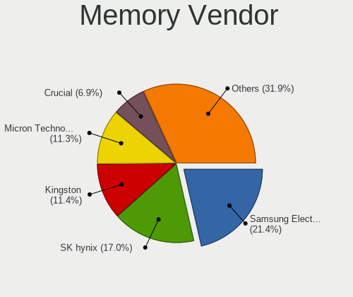

| Vendor                                  | Computers | Percent |
|-----------------------------------------|-----------|---------|
| Samsung Electronics                     | 441       | 22.03%  |
| SK hynix                                | 331       | 16.53%  |
| Kingston                                | 227       | 11.34%  |
| Micron Technology                       | 222       | 11.09%  |
| Crucial                                 | 139       | 6.94%   |
| Unknown                                 | 138       | 6.89%   |
| Corsair                                 | 135       | 6.74%   |
| G.Skill                                 | 109       | 5.44%   |
| A-DATA Technology                       | 28        | 1.4%    |
| Ramaxel Technology                      | 26        | 1.3%    |
| Elpida                                  | 20        | 1%      |
| Unknown (ABCD)                          | 19        | 0.95%   |
| Team                                    | 19        | 0.95%   |
| Patriot                                 | 17        | 0.85%   |
| Unknown                                 | 15        | 0.75%   |
| Nanya Technology                        | 13        | 0.65%   |
| Smart                                   | 12        | 0.6%    |
| GOODRAM                                 | 9         | 0.45%   |
| Transcend                               | 8         | 0.4%    |
| Avant                                   | 8         | 0.4%    |
| Lexar                                   | 4         | 0.2%    |
| AMD                                     | 4         | 0.2%    |
| Silicon Power                           | 3         | 0.15%   |
| Qimonda                                 | 3         | 0.15%   |
| PNY                                     | 3         | 0.15%   |
| Apacer                                  | 3         | 0.15%   |
| Teikon                                  | 2         | 0.1%    |
| Silicon Power Computer & Communications | 2         | 0.1%    |
| Neo Forza                               | 2         | 0.1%    |
| Kingmax                                 | 2         | 0.1%    |
| Hewlett-Packard                         | 2         | 0.1%    |
| Exceleram                               | 2         | 0.1%    |
| ChangXin Memory                         | 2         | 0.1%    |
| ASint Technology                        | 2         | 0.1%    |
| Unknown (B98C)                          | 1         | 0.05%   |
| Unknown (0x8634)                        | 1         | 0.05%   |
| Unknown (0x0B45)                        | 1         | 0.05%   |
| Unknown (0x02BA)                        | 1         | 0.05%   |
| Unknown (07FB)                          | 1         | 0.05%   |
| Unknown (000004B30000)                  | 1         | 0.05%   |

Memory Model
------------

Memory module models

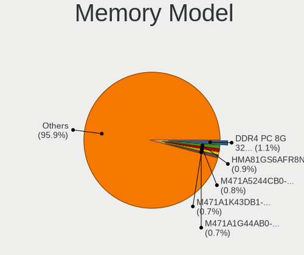

| Model                                                            | Computers | Percent |
|------------------------------------------------------------------|-----------|---------|
| SK hynix RAM HMA81GS6AFR8N-UH 8GB SODIMM DDR4 2667MT/s           | 20        | 0.94%   |
| Samsung RAM M471A5244CB0-CTD 4GB SODIMM DDR4 3266MT/s            | 19        | 0.89%   |
| Samsung RAM M471A1K43DB1-CWE 8GB SODIMM DDR4 3200MT/s            | 16        | 0.75%   |
| SK hynix RAM HMAA1GS6CJR6N-XN 8GB SODIMM DDR4 3200MT/s           | 15        | 0.7%    |
| Samsung RAM M471B1G73DB0-YK0 8GB SODIMM DDR3 1600MT/s            | 15        | 0.7%    |
| Unknown                                                          | 15        | 0.7%    |
| Samsung RAM M471B5173QH0-YK0 4GB SODIMM DDR3 1600MT/s            | 14        | 0.66%   |
| Samsung RAM M471A1K43EB1-CWE 8GB SODIMM DDR4 3200MT/s            | 13        | 0.61%   |
| Samsung RAM M471A1G44AB0-CWE 8192MB SODIMM DDR4 3200MT/s         | 13        | 0.61%   |
| Unknown (ABCD) RAM 123456789012345678 2GB SODIMM LPDDR4 2400MT/s | 12        | 0.56%   |
| Samsung RAM M471B5273DH0-CH9 4GB SODIMM DDR3 1334MT/s            | 12        | 0.56%   |
| Samsung RAM M471B5173DB0-YK0 4GB SODIMM DDR3 1600MT/s            | 12        | 0.56%   |
| Samsung RAM M471A5244CB0-CWE 4GB SODIMM DDR4 3200MT/s            | 12        | 0.56%   |
| Samsung RAM M471A1K43DB1-CTD 8GB SODIMM DDR4 2667MT/s            | 12        | 0.56%   |
| Samsung RAM M471A2K43CB1-CRC 16GB SODIMM DDR4 2667MT/s           | 11        | 0.52%   |
| Unknown RAM Module 4096MB DIMM 1333MT/s                          | 10        | 0.47%   |
| SK hynix RAM HMA41GS6AFR8N-TF 8GB SODIMM DDR4 2667MT/s           | 10        | 0.47%   |
| Micron RAM 4ATF1G64HZ-3G2E1 8GB SODIMM DDR4 3200MT/s             | 10        | 0.47%   |
| SK hynix RAM HMT451S6BFR8A-PB 4GB SODIMM DDR3 1600MT/s           | 9         | 0.42%   |
| Samsung RAM M471A5244CB0-CRC 4GB SODIMM DDR4 2667MT/s            | 9         | 0.42%   |
| Samsung RAM M471A1K43CB1-CRC 8GB SODIMM DDR4 2667MT/s            | 9         | 0.42%   |
| Samsung RAM M471A1G44AB0-CWE 8GB Row Of Chips DDR4 3200MT/s      | 9         | 0.42%   |
| Corsair RAM CMK16GX4M2B3200C16 8GB DIMM DDR4 3600MT/s            | 9         | 0.42%   |
| Corsair RAM CMK16GX4M2B3000C15 8GB DIMM DDR4 3600MT/s            | 9         | 0.42%   |
| SK hynix RAM HMA851S6AFR6N-UH 4GB SODIMM DDR4 2667MT/s           | 8         | 0.38%   |
| Samsung RAM M471B5273DH0-CK0 4096MB SODIMM DDR3 1600MT/s         | 8         | 0.38%   |
| Samsung RAM M471A2K43CB1-CTD 16GB SODIMM DDR4 8400MT/s           | 8         | 0.38%   |
| Micron RAM 4ATF51264HZ-2G3B1 4GB SODIMM DDR4 3200MT/s            | 8         | 0.38%   |
| G.Skill RAM F4-3000C16-8GISB 8192MB DIMM DDR4 3200MT/s           | 8         | 0.38%   |
| Unknown (ABCD) RAM 123456789012345678 4GB DIMM DDR4 2400MT/s     | 7         | 0.33%   |
| SK hynix RAM Module 4GB SODIMM DDR3 1600MT/s                     | 7         | 0.33%   |
| SK hynix RAM HMT41GS6BFR8A-PB 8GB SODIMM DDR3 1600MT/s           | 7         | 0.33%   |
| SK hynix RAM HMAA1GS6CJR6N-XN 8GB Row Of Chips DDR4 3200MT/s     | 7         | 0.33%   |
| SK hynix RAM HMA81GS6CJR8N-VK 8GB SODIMM DDR4 2667MT/s           | 7         | 0.33%   |
| Samsung RAM M471B1G73QH0-YK0 8GB SODIMM DDR3 1600MT/s            | 7         | 0.33%   |
| Samsung RAM M471A2K43DB1-CWE 16GB SODIMM DDR4 3200MT/s           | 7         | 0.33%   |
| Samsung RAM M471A2G44AM0-CWE 16GB SODIMM DDR4 3200MT/s           | 7         | 0.33%   |
| Samsung RAM M471A1K43CB1-CTD 8GB SODIMM DDR4 2667MT/s            | 7         | 0.33%   |
| Micron RAM 8ATF1G64HZ-3G2J1 8GB SODIMM DDR4 3200MT/s             | 7         | 0.33%   |
| Micron RAM 8ATF1G64HZ-2G6E1 8GB SODIMM DDR4 2667MT/s             | 7         | 0.33%   |

Memory Kind
-----------

Memory module kinds

| Kind    | Computers | Percent |
|---------|-----------|---------|
| DDR4    | 917       | 53.85%  |
| DDR3    | 459       | 26.95%  |
| LPDDR4  | 73        | 4.29%   |
| DDR5    | 52        | 3.05%   |
| DDR2    | 51        | 2.99%   |
| Unknown | 44        | 2.58%   |
| LPDDR3  | 37        | 2.17%   |
| LPDDR5  | 31        | 1.82%   |
| SDRAM   | 25        | 1.47%   |
| DDR     | 10        | 0.59%   |
| DRAM    | 4         | 0.23%   |

Memory Form Factor
------------------

Physical design of the memory module

| Name         | Computers | Percent |
|--------------|-----------|---------|
| SODIMM       | 946       | 55.06%  |
| DIMM         | 616       | 35.86%  |
| Row Of Chips | 136       | 7.92%   |
| Chip         | 15        | 0.87%   |
| RIMM         | 2         | 0.12%   |
| FB-DIMM      | 2         | 0.12%   |
| Unknown      | 1         | 0.06%   |

Memory Size
-----------

Memory module size

| Size  | Computers | Percent |
|-------|-----------|---------|
| 8192  | 786       | 41.81%  |
| 4096  | 437       | 23.24%  |
| 16384 | 358       | 19.04%  |
| 2048  | 157       | 8.35%   |
| 32768 | 96        | 5.11%   |
| 1024  | 41        | 2.18%   |
| 512   | 2         | 0.11%   |
| 49152 | 1         | 0.05%   |
| 24576 | 1         | 0.05%   |
| 128   | 1         | 0.05%   |

Memory Speed
------------

Memory module speed

| Speed   | Computers | Percent |
|---------|-----------|---------|
| 3200    | 355       | 19.06%  |
| 1600    | 304       | 16.32%  |
| 2667    | 281       | 15.08%  |
| 2400    | 135       | 7.25%   |
| 1333    | 114       | 6.12%   |
| 2133    | 99        | 5.31%   |
| 3600    | 66        | 3.54%   |
| 1334    | 44        | 2.36%   |
| 1867    | 31        | 1.66%   |
| 800     | 31        | 1.66%   |
| 6400    | 30        | 1.61%   |
| 4800    | 29        | 1.56%   |
| 4267    | 28        | 1.5%    |
| 667     | 24        | 1.29%   |
| 3266    | 21        | 1.13%   |
| 3800    | 18        | 0.97%   |
| 5600    | 15        | 0.81%   |
| 1067    | 15        | 0.81%   |
| Unknown | 15        | 0.81%   |
| 4266    | 14        | 0.75%   |
| 2933    | 13        | 0.7%    |
| 3400    | 12        | 0.64%   |
| 2666    | 12        | 0.64%   |
| 1066    | 12        | 0.64%   |
| 3733    | 11        | 0.59%   |
| 1866    | 11        | 0.59%   |
| 3000    | 10        | 0.54%   |
| 2048    | 9         | 0.48%   |
| 8400    | 8         | 0.43%   |
| 3666    | 7         | 0.38%   |
| 1800    | 7         | 0.38%   |
| 975     | 7         | 0.38%   |
| 3866    | 6         | 0.32%   |
| 533     | 6         | 0.32%   |
| 3466    | 5         | 0.27%   |
| 2800    | 5         | 0.27%   |
| 4199    | 4         | 0.21%   |
| 3933    | 4         | 0.21%   |
| 7500    | 3         | 0.16%   |
| 400     | 3         | 0.16%   |

Printers & scanners
-------------------

Printer Vendor
--------------

Printer device vendors

| Vendor                | Computers | Percent |
|-----------------------|-----------|---------|
| Hewlett-Packard       | 37        | 38.95%  |
| Brother Industries    | 16        | 16.84%  |
| Seiko Epson           | 13        | 13.68%  |
| Samsung Electronics   | 11        | 11.58%  |
| Canon                 | 8         | 8.42%   |
| Prolific Technology   | 3         | 3.16%   |
| Pantum                | 2         | 2.11%   |
| Xerox                 | 1         | 1.05%   |
| STMicroelectronics    | 1         | 1.05%   |
| Star Micronics        | 1         | 1.05%   |
| Lexmark International | 1         | 1.05%   |
| Kyocera               | 1         | 1.05%   |

Printer Model
-------------

Printer device models

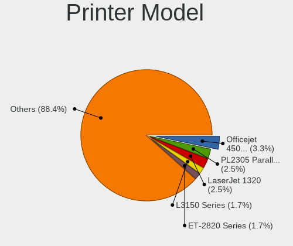

| Model                                                     | Computers | Percent |
|-----------------------------------------------------------|-----------|---------|
| Prolific PL2305 Parallel Port                             | 3         | 3.06%   |
| Seiko Epson ET-2710 Series                                | 2         | 2.04%   |
| Samsung M267x 287x Series                                 | 2         | 2.04%   |
| Samsung M262x/M282x Xpress Series Laser Printer           | 2         | 2.04%   |
| HP Officejet 4500 G510g-m                                 | 2         | 2.04%   |
| HP LaserJet 1320                                          | 2         | 2.04%   |
| HP LaserJet 1018                                          | 2         | 2.04%   |
| HP ENVY 4520 series                                       | 2         | 2.04%   |
| HP Color LaserJet CP1215                                  | 2         | 2.04%   |
| Canon LiDE 400                                            | 2         | 2.04%   |
| Brother Printer                                           | 2         | 2.04%   |
| Brother HL-L2390DW                                        | 2         | 2.04%   |
| Xerox WorkCentre 3220                                     | 1         | 1.02%   |
| STMicroelectronics LED badge -- mini LED display -- 11x44 | 1         | 1.02%   |
| Star Micronics TSP100ECO/TSP100II                         | 1         | 1.02%   |
| Seiko Epson XP-4200 Series                                | 1         | 1.02%   |
| Seiko Epson XP-4100 Series                                | 1         | 1.02%   |
| Seiko Epson XP-240 Series                                 | 1         | 1.02%   |
| Seiko Epson XP-235 Series                                 | 1         | 1.02%   |
| Seiko Epson WF-4830 Series                                | 1         | 1.02%   |
| Seiko Epson WF-2510 Series                                | 1         | 1.02%   |
| Seiko Epson L3250 Series                                  | 1         | 1.02%   |
| Seiko Epson L300 Series                                   | 1         | 1.02%   |
| Seiko Epson L1300 Series                                  | 1         | 1.02%   |
| Seiko Epson ET-3840 Series                                | 1         | 1.02%   |
| Seiko Epson ET-2820 Series                                | 1         | 1.02%   |
| Seiko Epson ET-2720 Series                                | 1         | 1.02%   |
| Samsung SCX-4200 series                                   | 1         | 1.02%   |
| Samsung SCX-3400 Series                                   | 1         | 1.02%   |
| Samsung Phaser 3121                                       | 1         | 1.02%   |
| Samsung ML-191x/ML-252x Laser Printer                     | 1         | 1.02%   |
| Samsung ML-1865                                           | 1         | 1.02%   |
| Samsung M2070 Series                                      | 1         | 1.02%   |
| Samsung M2020 Series                                      | 1         | 1.02%   |
| Pantum P2500W-series                                      | 1         | 1.02%   |
| Pantum P2200-series                                       | 1         | 1.02%   |
| Lexmark International MC3224dwe                           | 1         | 1.02%   |
| Kyocera FS-1030D printer                                  | 1         | 1.02%   |
| HP Smart Tank Plus 550 series                             | 1         | 1.02%   |
| HP Officejet Pro 6230                                     | 1         | 1.02%   |

Scanner Vendor
--------------

Scanner device vendors

| Vendor          | Computers | Percent |
|-----------------|-----------|---------|
| Canon           | 12        | 48%     |
| Seiko Epson     | 7         | 28%     |
| Hewlett-Packard | 3         | 12%     |
| AGFA-Gevaert NV | 2         | 8%      |
| Mustek Systems  | 1         | 4%      |

Scanner Model
-------------

Scanner device models

| Model                                                         | Computers | Percent |
|---------------------------------------------------------------|-----------|---------|
| Canon CanoScan LiDE 210                                       | 6         | 24%     |
| Canon CanoScan N670U/N676U/LiDE 20                            | 2         | 8%      |
| Canon CanoScan LiDE 110                                       | 2         | 8%      |
| Seiko Epson Scanner                                           | 1         | 4%      |
| Seiko Epson GT-X900 [Perfection V700/V750 Photo]              | 1         | 4%      |
| Seiko Epson GT-X770 [Perfection V500]                         | 1         | 4%      |
| Seiko Epson GT-F730 [GT-S630/Perfection V33/V330 Photo]       | 1         | 4%      |
| Seiko Epson GT-F520/GT-F570 [Perfection 3590 PHOTO]           | 1         | 4%      |
| Seiko Epson GT-8700/GT-8700F [Perfection 1640SU/1640SU PHOTO] | 1         | 4%      |
| Seiko Epson GT-8300UF [Perfection 1660 PHOTO]                 | 1         | 4%      |
| Mustek Systems ScanExpress A3 USB                             | 1         | 4%      |
| HP Scanjet G2710                                              | 1         | 4%      |
| HP ScanJet 5300c/5370c                                        | 1         | 4%      |
| HP ScanJet 3970c                                              | 1         | 4%      |
| Canon CanoScan N1240U/LiDE 30                                 | 1         | 4%      |
| Canon CanoScan LiDE 220                                       | 1         | 4%      |
| AGFA-Gevaert NV SnapScan e20                                  | 1         | 4%      |
| AGFA-Gevaert NV SnapScan 1212U (?)                            | 1         | 4%      |

Camera
------

Camera Vendor
-------------

Camera device vendors

| Vendor                                 | Computers | Percent |
|----------------------------------------|-----------|---------|
| Chicony Electronics                    | 382       | 21.25%  |
| IMC Networks                           | 170       | 9.45%   |
| Microdia                               | 149       | 8.29%   |
| Logitech                               | 130       | 7.23%   |
| Realtek Semiconductor                  | 127       | 7.06%   |
| Bison Electronics                      | 107       | 5.95%   |
| Quanta                                 | 106       | 5.9%    |
| Sunplus Innovation Technology          | 93        | 5.17%   |
| Apple                                  | 59        | 3.28%   |
| Cheng Uei Precision Industry (Foxlink) | 57        | 3.17%   |
| Luxvisions Innotech Limited            | 53        | 2.95%   |
| Syntek                                 | 51        | 2.84%   |
| Lite-On Technology                     | 39        | 2.17%   |
| Acer                                   | 34        | 1.89%   |
| Suyin                                  | 32        | 1.78%   |
| Microsoft                              | 18        | 1%      |
| Sonix Technology                       | 16        | 0.89%   |
| Silicon Motion                         | 13        | 0.72%   |
| Alcor Micro                            | 13        | 0.72%   |
| Generalplus Technology                 | 12        | 0.67%   |
| Primax Electronics                     | 9         | 0.5%    |
| Lenovo                                 | 9         | 0.5%    |
| Samsung Electronics                    | 8         | 0.44%   |
| Trust                                  | 6         | 0.33%   |
| Ricoh                                  | 6         | 0.33%   |
| Z-Star Microelectronics                | 5         | 0.28%   |
| Creative Technology                    | 5         | 0.28%   |
| SunplusIT                              | 4         | 0.22%   |
| ARC International                      | 4         | 0.22%   |
| 2M UVC CAMERA                          | 4         | 0.22%   |
| ShineTech                              | 3         | 0.17%   |
| MacroSilicon                           | 3         | 0.17%   |
| Hewlett-Packard                        | 3         | 0.17%   |
| ALi                                    | 3         | 0.17%   |
| Y Media                                | 2         | 0.11%   |
| USB Camera CS                          | 2         | 0.11%   |
| Tobii Technology AB                    | 2         | 0.11%   |
| Razer USA                              | 2         | 0.11%   |
| OmniVision Technologies                | 2         | 0.11%   |
| Oculus VR                              | 2         | 0.11%   |

Camera Model
------------

Camera device models

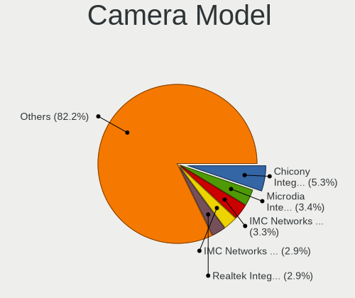

| Model                                                | Computers | Percent |
|------------------------------------------------------|-----------|---------|
| Chicony Integrated Camera                            | 94        | 5.19%   |
| IMC Networks Integrated Camera                       | 66        | 3.64%   |
| Microdia Integrated_Webcam_HD                        | 60        | 3.31%   |
| Realtek Integrated_Webcam_HD                         | 50        | 2.76%   |
| IMC Networks USB2.0 HD UVC WebCam                    | 50        | 2.76%   |
| Syntek Integrated Camera                             | 37        | 2.04%   |
| Bison Integrated Camera                              | 37        | 2.04%   |
| Logitech Webcam C270                                 | 35        | 1.93%   |
| Chicony HD WebCam                                    | 35        | 1.93%   |
| Sunplus Integrated_Webcam_HD                         | 28        | 1.55%   |
| Microdia USB 2.0 Camera                              | 22        | 1.21%   |
| Chicony HP HD Camera                                 | 22        | 1.21%   |
| Quanta HD User Facing                                | 18        | 0.99%   |
| Apple FaceTime HD Camera                             | 18        | 0.99%   |
| Quanta HP HD Camera                                  | 17        | 0.94%   |
| Bison HD Webcam                                      | 17        | 0.94%   |
| Apple Built-in iSight                                | 17        | 0.94%   |
| Chicony Integrated Camera (1280x720@30)              | 16        | 0.88%   |
| Logitech HD Pro Webcam C920                          | 15        | 0.83%   |
| Realtek USB Camera                                   | 14        | 0.77%   |
| Lite-On Integrated Camera                            | 14        | 0.77%   |
| IMC Networks USB2.0 VGA UVC WebCam                   | 14        | 0.77%   |
| Chicony USB2.0 Camera                                | 13        | 0.72%   |
| Chicony HD User Facing                               | 13        | 0.72%   |
| Quanta HP TrueVision HD Camera                       | 12        | 0.66%   |
| Luxvisions Innotech Limited Integrated Camera        | 12        | 0.66%   |
| Luxvisions Innotech Limited HP TrueVision HD Camera  | 12        | 0.66%   |
| Apple iPhone 5/5C/5S/6/SE/7/8/X                      | 12        | 0.66%   |
| Microdia Webcam Vitade AF                            | 11        | 0.61%   |
| Microdia Integrated Webcam                           | 11        | 0.61%   |
| Luxvisions Innotech Limited HP Wide Vision HD Camera | 11        | 0.61%   |
| Chicony HP HD Webcam                                 | 11        | 0.61%   |
| Realtek Integrated Webcam HD                         | 10        | 0.55%   |
| Quanta VGA WebCam                                    | 10        | 0.55%   |
| Chicony Integrated IR Camera                         | 10        | 0.55%   |
| Bison BisonCam,NB Pro                                | 10        | 0.55%   |
| Sunplus HD WebCam                                    | 9         | 0.5%    |
| Quanta HP Wide Vision HD Camera                      | 9         | 0.5%    |
| Logitech C922 Pro Stream Webcam                      | 9         | 0.5%    |
| Generalplus CAMERA - UVC                             | 9         | 0.5%    |

Security
--------

Fingerprint Vendor
------------------

Fingerprint sensor vendors

| Vendor                             | Computers | Percent |
|------------------------------------|-----------|---------|
| Synaptics                          | 132       | 36.87%  |
| Validity Sensors                   | 116       | 32.4%   |
| Shenzhen Goodix Technology         | 51        | 14.25%  |
| Upek                               | 16        | 4.47%   |
| AuthenTec                          | 16        | 4.47%   |
| Elan Microelectronics              | 15        | 4.19%   |
| LighTuning Technology              | 4         | 1.12%   |
| Focal-systems.Corp                 | 3         | 0.84%   |
| STMicroelectronics                 | 1         | 0.28%   |
| Samsung Electronics                | 1         | 0.28%   |
| Realtek USB2.0 Finger Print Bridge | 1         | 0.28%   |
| Next Biometrics                    | 1         | 0.28%   |
| DigitalPersona                     | 1         | 0.28%   |

Fingerprint Model
-----------------

Fingerprint sensor models

| Model                                                                      | Computers | Percent |
|----------------------------------------------------------------------------|-----------|---------|
| Synaptics Prometheus MIS Touch Fingerprint Reader                          | 42        | 11.73%  |
| Shenzhen Goodix  FingerPrint Device                                        | 33        | 9.22%   |
| Validity Sensors VFS495 Fingerprint Reader                                 | 28        | 7.82%   |
| Validity Sensors VFS 5011 fingerprint sensor                               | 19        | 5.31%   |
| Upek Biometric Touchchip/Touchstrip Fingerprint Sensor                     | 16        | 4.47%   |
| Shenzhen Goodix Fingerprint Reader                                         | 16        | 4.47%   |
| Validity Sensors Synaptics WBDI                                            | 14        | 3.91%   |
| Synaptics Metallica MIS Touch Fingerprint Reader                           | 14        | 3.91%   |
| Synaptics FS7604 Touch Fingerprint Sensor with PurePrint                   | 13        | 3.63%   |
| Validity Sensors VFS7500 Touch Fingerprint Sensor                          | 12        | 3.35%   |
| Synaptics UWP WBDI                                                         | 10        | 2.79%   |
| Elan ELAN:ARM-M4                                                           | 10        | 2.79%   |
| Validity Sensors VFS5011 Fingerprint Reader                                | 9         | 2.51%   |
| Synaptics WBDI                                                             | 9         | 2.51%   |
| Synaptics Fingerprint reader [HP G6]                                       | 9         | 2.51%   |
| Validity Sensors VFS491                                                    | 6         | 1.68%   |
| Synaptics UWP WBDI Device                                                  | 6         | 1.68%   |
| Synaptics  WBDI                                                            | 6         | 1.68%   |
| Synaptics  FS7604 Touch Fingerprint Sensor with PurePrint                  | 6         | 1.68%   |
| Validity Sensors VFS471 Fingerprint Reader                                 | 5         | 1.4%    |
| Validity Sensors Synaptics VFS7552 Touch Fingerprint Sensor with PurePrint | 5         | 1.4%    |
| Validity Sensors Swipe Fingerprint Sensor                                  | 5         | 1.4%    |
| Validity Sensors Fingerprint scanner                                       | 5         | 1.4%    |
| AuthenTec AES2810                                                          | 5         | 1.4%    |
| Synaptics Metallica MOH Touch Fingerprint Reader                           | 4         | 1.12%   |
| Unknown                                                                    | 4         | 1.12%   |
| Validity Sensors VFS451 Fingerprint Reader                                 | 3         | 0.84%   |
| Synaptics WBDI Device                                                      | 3         | 0.84%   |
| Focal-systems.Corp FT9201Fingerprint.                                      | 3         | 0.84%   |
| Elan ELAN:Fingerprint                                                      | 3         | 0.84%   |
| AuthenTec AES2550 Fingerprint Sensor                                       | 3         | 0.84%   |
| AuthenTec AES2501 Fingerprint Sensor                                       | 3         | 0.84%   |
| AuthenTec AES1600                                                          | 3         | 0.84%   |
| Validity Sensors VFS7552 Touch Fingerprint Sensor                          | 2         | 0.56%   |
| Validity Sensors VFS301 Fingerprint Reader                                 | 2         | 0.56%   |
| Synaptics WBDI Fingerprint Reader USB 086                                  | 2         | 0.56%   |
| Synaptics Fingerprint scanner                                              | 2         | 0.56%   |
| Shenzhen Goodix FingerPrint                                                | 2         | 0.56%   |
| LighTuning ES603 Swipe Fingerprint Sensor                                  | 2         | 0.56%   |
| LighTuning EgisTec Touch Fingerprint Sensor                                | 2         | 0.56%   |

Chipcard Vendor
---------------

Chipcard module vendors

| Vendor                     | Computers | Percent |
|----------------------------|-----------|---------|
| Broadcom                   | 65        | 43.33%  |
| Alcor Micro                | 54        | 36%     |
| Gemalto (was Gemplus)      | 6         | 4%      |
| Upek                       | 5         | 3.33%   |
| O2 Micro                   | 4         | 2.67%   |
| Hewlett-Packard            | 3         | 2%      |
| SCM Microsystems           | 2         | 1.33%   |
| Lenovo                     | 2         | 1.33%   |
| Yubico.com                 | 1         | 0.67%   |
| Watchdata                  | 1         | 0.67%   |
| OmniKey                    | 1         | 0.67%   |
| Fujitsu Siemens Computers  | 1         | 0.67%   |
| Clay Logic                 | 1         | 0.67%   |
| CHERRY                     | 1         | 0.67%   |
| Castles Technology         | 1         | 0.67%   |
| Athena Smartcard Solutions | 1         | 0.67%   |
| Advanced Card Systems      | 1         | 0.67%   |

Chipcard Model
--------------

Chipcard module models

| Model                                                                        | Computers | Percent |
|------------------------------------------------------------------------------|-----------|---------|
| Alcor Micro AU9540 Smartcard Reader                                          | 52        | 34.67%  |
| Broadcom 58200                                                               | 24        | 16%     |
| Broadcom 5880                                                                | 20        | 13.33%  |
| Broadcom BCM5880 Secure Applications Processor with fingerprint swipe sensor | 10        | 6.67%   |
| Broadcom BCM5880 Secure Applications Processor                               | 10        | 6.67%   |
| Upek TouchChip Fingerprint Coprocessor (WBF advanced mode)                   | 5         | 3.33%   |
| Gemalto (was Gemplus) GemPC Twin SmartCard Reader                            | 5         | 3.33%   |
| O2 Micro OZ776 CCID Smartcard Reader                                         | 4         | 2.67%   |
| Hewlett-Packard SC Keyboard - Apollo (Liteon)                                | 3         | 2%      |
| SCM Microsystems SCR331-LC1 / SCR3310 SmartCard Reader                       | 2         | 1.33%   |
| Lenovo Integrated Smart Card Reader                                          | 2         | 1.33%   |
| Yubico.com Yubikey 4/5 U2F+CCID                                              | 1         | 0.67%   |
| Watchdata USB Key                                                            | 1         | 0.67%   |
| OmniKey 3x21 Smart Card Reader                                               | 1         | 0.67%   |
| Gemalto (was Gemplus) Prox SU USB PC Link Reader                             | 1         | 0.67%   |
| Fujitsu Siemens Computers Keyboard KB100 SCR eSIG                            | 1         | 0.67%   |
| Clay Logic Nitrokey HSM                                                      | 1         | 0.67%   |
| CHERRY SmartCard Reader Keyboard KC 1000 SC                                  | 1         | 0.67%   |
| Castles Technology EZCCID Smart Card Reader                                  | 1         | 0.67%   |
| Broadcom BCM5880 Secure Applications Processor with fingerprint touch sensor | 1         | 0.67%   |
| Athena Smartcard Solutions ASEDrive CCID                                     | 1         | 0.67%   |
| Alcor Micro Watchdata W 1981                                                 | 1         | 0.67%   |
| Alcor Micro EMV Smartcard Reader                                             | 1         | 0.67%   |
| Advanced Card Systems ACR1252 Dual Reader                                    | 1         | 0.67%   |

Unsupported
-----------

Unsupported Devices
-------------------

Total unsupported devices on board

| Total | Computers | Percent |
|-------|-----------|---------|
| 0     | 2065      | 67.88%  |
| 1     | 783       | 25.74%  |
| 2     | 164       | 5.39%   |
| 3     | 25        | 0.82%   |
| 4     | 4         | 0.13%   |
| 5     | 1         | 0.03%   |

Unsupported Device Types
------------------------

Types of unsupported devices

| Type                     | Computers | Percent |
|--------------------------|-----------|---------|
| Fingerprint reader       | 355       | 30.87%  |
| Graphics card            | 249       | 21.65%  |
| Chipcard                 | 136       | 11.83%  |
| Net/wireless             | 123       | 10.7%   |
| Multimedia controller    | 86        | 7.48%   |
| Sound                    | 40        | 3.48%   |
| Camera                   | 35        | 3.04%   |
| Unassigned class         | 30        | 2.61%   |
| Communication controller | 22        | 1.91%   |
| Bluetooth                | 18        | 1.57%   |
| Card reader              | 17        | 1.48%   |
| Storage                  | 9         | 0.78%   |
| Net/ethernet             | 9         | 0.78%   |
| Network                  | 8         | 0.7%    |
| Storage/raid             | 4         | 0.35%   |
| Modem                    | 4         | 0.35%   |
| Firewire controller      | 4         | 0.35%   |
| Flash memory             | 1         | 0.09%   |

