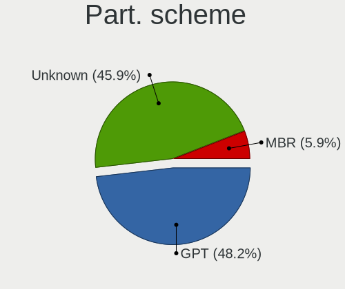
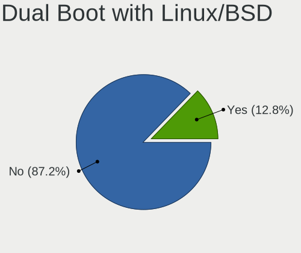
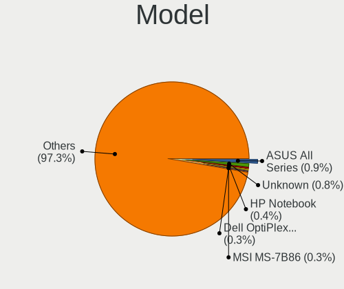
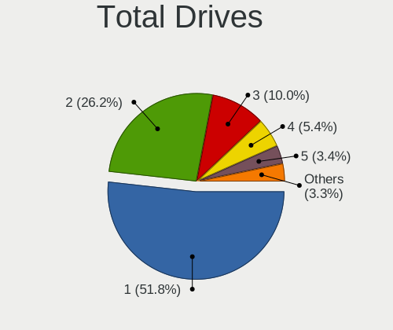
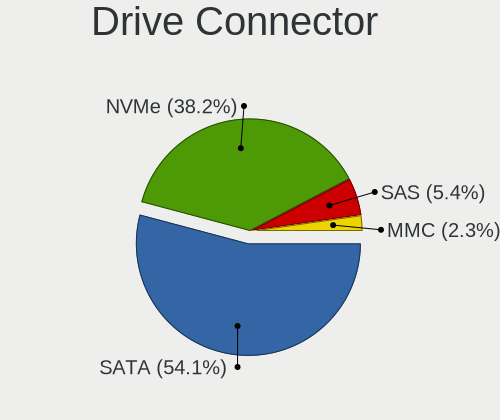
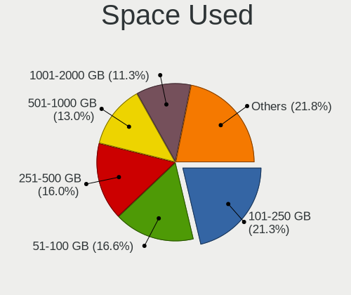
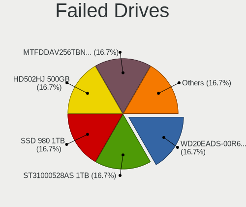
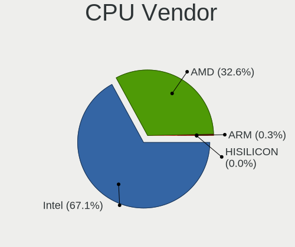
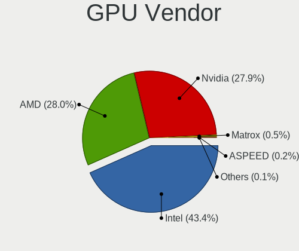
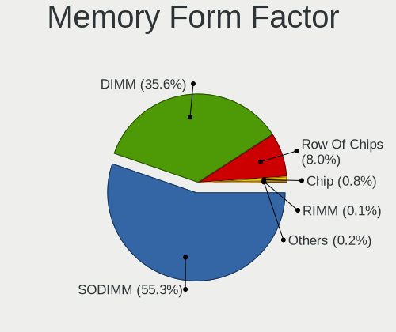

openSUSE - Tested Hardware & Statistics
---------------------------------------

A project to collect tested hardware configurations for openSUSE.

Anyone can contribute to this report by the [hw-probe](https://github.com/linuxhw/hw-probe) tool:

    sudo -E hw-probe -all -upload

Please contribute! Especially if your hardware is rare.

This is a report for all computer types. See also reports for [desktops](/Dist/openSUSE/Desktop/README.md) and [notebooks](/Dist/openSUSE/Notebook/README.md).

Contents
--------

* [ Test Cases ](#test-cases)

* [ System ](#system)
  - [ OS                       ](#os)
  - [ OS Family                ](#os-family)
  - [ Kernel                   ](#kernel)
  - [ Kernel Family            ](#kernel-family)
  - [ Kernel Major Ver.        ](#kernel-major-ver)
  - [ Arch                     ](#arch)
  - [ DE                       ](#de)
  - [ Display Server           ](#display-server)
  - [ Display Manager          ](#display-manager)
  - [ OS Lang                  ](#os-lang)
  - [ Boot Mode                ](#boot-mode)
  - [ Filesystem               ](#filesystem)
  - [ Part. scheme             ](#part-scheme)
  - [ Dual Boot with Linux/BSD ](#dual-boot-with-linuxbsd)
  - [ Dual Boot (Win)          ](#dual-boot-win)

* [ Board ](#board)
  - [ Vendor                   ](#vendor)
  - [ Model                    ](#model)
  - [ Model Family             ](#model-family)
  - [ MFG Year                 ](#mfg-year)
  - [ Form Factor              ](#form-factor)
  - [ Secure Boot              ](#secure-boot)
  - [ Coreboot                 ](#coreboot)
  - [ RAM Size                 ](#ram-size)
  - [ RAM Used                 ](#ram-used)
  - [ Total Drives             ](#total-drives)
  - [ Has CD-ROM               ](#has-cd-rom)
  - [ Has Ethernet             ](#has-ethernet)
  - [ Has WiFi                 ](#has-wifi)
  - [ Has Bluetooth            ](#has-bluetooth)

* [ Location ](#location)
  - [ Country                  ](#country)
  - [ City                     ](#city)

* [ Drives ](#drives)
  - [ Drive Vendor             ](#drive-vendor)
  - [ Drive Model              ](#drive-model)
  - [ HDD Vendor               ](#hdd-vendor)
  - [ SSD Vendor               ](#ssd-vendor)
  - [ Drive Kind               ](#drive-kind)
  - [ Drive Connector          ](#drive-connector)
  - [ Drive Size               ](#drive-size)
  - [ Space Total              ](#space-total)
  - [ Space Used               ](#space-used)
  - [ Malfunc. Drives          ](#malfunc-drives)
  - [ Malfunc. Drive Vendor    ](#malfunc-drive-vendor)
  - [ Malfunc. HDD Vendor      ](#malfunc-hdd-vendor)
  - [ Malfunc. Drive Kind      ](#malfunc-drive-kind)
  - [ Failed Drives            ](#failed-drives)
  - [ Failed Drive Vendor      ](#failed-drive-vendor)
  - [ Drive Status             ](#drive-status)

* [ Storage controller ](#storage-controller)
  - [ Storage Vendor           ](#storage-vendor)
  - [ Storage Model            ](#storage-model)
  - [ Storage Kind             ](#storage-kind)

* [ Processor ](#processor)
  - [ CPU Vendor               ](#cpu-vendor)
  - [ CPU Model                ](#cpu-model)
  - [ CPU Model Family         ](#cpu-model-family)
  - [ CPU Cores                ](#cpu-cores)
  - [ CPU Sockets              ](#cpu-sockets)
  - [ CPU Threads              ](#cpu-threads)
  - [ CPU Op-Modes             ](#cpu-op-modes)
  - [ CPU Microcode            ](#cpu-microcode)
  - [ CPU Microarch            ](#cpu-microarch)

* [ Graphics ](#graphics)
  - [ GPU Vendor               ](#gpu-vendor)
  - [ GPU Model                ](#gpu-model)
  - [ GPU Combo                ](#gpu-combo)
  - [ GPU Driver               ](#gpu-driver)
  - [ GPU Memory               ](#gpu-memory)

* [ Monitor ](#monitor)
  - [ Monitor Vendor           ](#monitor-vendor)
  - [ Monitor Model            ](#monitor-model)
  - [ Monitor Resolution       ](#monitor-resolution)
  - [ Monitor Diagonal         ](#monitor-diagonal)
  - [ Monitor Width            ](#monitor-width)
  - [ Aspect Ratio             ](#aspect-ratio)
  - [ Monitor Area             ](#monitor-area)
  - [ Pixel Density            ](#pixel-density)
  - [ Multiple Monitors        ](#multiple-monitors)

* [ Network ](#network)
  - [ Net Controller Vendor    ](#net-controller-vendor)
  - [ Net Controller Model     ](#net-controller-model)
  - [ Wireless Vendor          ](#wireless-vendor)
  - [ Wireless Model           ](#wireless-model)
  - [ Ethernet Vendor          ](#ethernet-vendor)
  - [ Ethernet Model           ](#ethernet-model)
  - [ Net Controller Kind      ](#net-controller-kind)
  - [ Used Controller          ](#used-controller)
  - [ NICs                     ](#nics)
  - [ IPv6                     ](#ipv6)

* [ Bluetooth ](#bluetooth)
  - [ Bluetooth Vendor         ](#bluetooth-vendor)
  - [ Bluetooth Model          ](#bluetooth-model)

* [ Sound ](#sound)
  - [ Sound Vendor             ](#sound-vendor)
  - [ Sound Model              ](#sound-model)

* [ Memory ](#memory)
  - [ Memory Vendor            ](#memory-vendor)
  - [ Memory Model             ](#memory-model)
  - [ Memory Kind              ](#memory-kind)
  - [ Memory Form Factor       ](#memory-form-factor)
  - [ Memory Size              ](#memory-size)
  - [ Memory Speed             ](#memory-speed)

* [ Printers & scanners ](#printers--scanners)
  - [ Printer Vendor           ](#printer-vendor)
  - [ Printer Model            ](#printer-model)
  - [ Scanner Vendor           ](#scanner-vendor)
  - [ Scanner Model            ](#scanner-model)

* [ Camera ](#camera)
  - [ Camera Vendor            ](#camera-vendor)
  - [ Camera Model             ](#camera-model)

* [ Security ](#security)
  - [ Fingerprint Vendor       ](#fingerprint-vendor)
  - [ Fingerprint Model        ](#fingerprint-model)
  - [ Chipcard Vendor          ](#chipcard-vendor)
  - [ Chipcard Model           ](#chipcard-model)

* [ Unsupported ](#unsupported)
  - [ Unsupported Devices      ](#unsupported-devices)
  - [ Unsupported Device Types ](#unsupported-device-types)

Test Cases
----------

Total: 2032

| Vendor        | Model                       | Form-Factor | Probe                                                      | Date         |
|---------------|-----------------------------|-------------|------------------------------------------------------------|--------------|
| TUXEDO        | Pulse 15 Gen1               | Notebook    | [9de0586493](https://linux-hardware.org/?probe=9de0586493) | Jul 01, 2022 |
| MSI           | X399 GAMING PRO CARBON A... | Desktop     | [153a698b74](https://linux-hardware.org/?probe=153a698b74) | Jul 01, 2022 |
| TUXEDO        | Pulse 15 Gen1               | Notebook    | [8c7b7c1b45](https://linux-hardware.org/?probe=8c7b7c1b45) | Jul 01, 2022 |
| Lenovo        | 312D NOK                    | Mini pc     | [97dfd06a92](https://linux-hardware.org/?probe=97dfd06a92) | Jul 01, 2022 |
| HP            | 829E                        | Mini pc     | [91fee1441e](https://linux-hardware.org/?probe=91fee1441e) | Jul 01, 2022 |
| Lenovo        | 312D NOK                    | Mini pc     | [8803c535a9](https://linux-hardware.org/?probe=8803c535a9) | Jul 01, 2022 |
| Lenovo        | 312D NOK                    | Mini pc     | [e46c1314b2](https://linux-hardware.org/?probe=e46c1314b2) | Jul 01, 2022 |
| ASUSTek       | M5A78L-M/USB3               | Desktop     | [00e1806ce1](https://linux-hardware.org/?probe=00e1806ce1) | Jul 01, 2022 |
| HP            | ProBook 455 G8 Notebook ... | Notebook    | [bec2a7697f](https://linux-hardware.org/?probe=bec2a7697f) | Jun 30, 2022 |
| EVGA          | X299 FTW K                  | Desktop     | [bde570c9f5](https://linux-hardware.org/?probe=bde570c9f5) | Jun 30, 2022 |
| HP            | ENVY TS 17                  | Notebook    | [7b5d021513](https://linux-hardware.org/?probe=7b5d021513) | Jun 29, 2022 |
| Framework     | Laptop                      | Notebook    | [d4cd42f3af](https://linux-hardware.org/?probe=d4cd42f3af) | Jun 28, 2022 |
| ASUSTek       | M5A78L-M/USB3               | Desktop     | [a9ddf668c4](https://linux-hardware.org/?probe=a9ddf668c4) | Jun 28, 2022 |
| EVGA          | X299 FTW K                  | Desktop     | [2fac0d5ea2](https://linux-hardware.org/?probe=2fac0d5ea2) | Jun 28, 2022 |
| Apple         | MacBook7,1                  | Notebook    | [2818c11c12](https://linux-hardware.org/?probe=2818c11c12) | Jun 28, 2022 |
| Dell          | 0J3C2F A03                  | Desktop     | [6f5f6a7417](https://linux-hardware.org/?probe=6f5f6a7417) | Jun 26, 2022 |
| Dell          | 0YNVJG A02                  | Desktop     | [e272328867](https://linux-hardware.org/?probe=e272328867) | Jun 26, 2022 |
| MSI           | Z87-G41 PC Mate             | Desktop     | [c73501602b](https://linux-hardware.org/?probe=c73501602b) | Jun 26, 2022 |
| HP            | ProBook x360 435 G8 Note... | Convertible | [8d5e06f168](https://linux-hardware.org/?probe=8d5e06f168) | Jun 26, 2022 |
| Dell          | 0YNVJG A02                  | Desktop     | [9a39e5ea0d](https://linux-hardware.org/?probe=9a39e5ea0d) | Jun 26, 2022 |
| Lenovo        | Yoga 9 14ITL5 82BG          | Convertible | [78a37e2d4c](https://linux-hardware.org/?probe=78a37e2d4c) | Jun 25, 2022 |
| ASUSTek       | ASUS EXPERTBOOK B1500CEA... | Notebook    | [f1b7197958](https://linux-hardware.org/?probe=f1b7197958) | Jun 25, 2022 |
| ASUSTek       | VivoBook_ASUSLaptop X321... | Notebook    | [d2925f529c](https://linux-hardware.org/?probe=d2925f529c) | Jun 25, 2022 |
| ASRock        | J3355B-ITX                  | Desktop     | [a00111330b](https://linux-hardware.org/?probe=a00111330b) | Jun 24, 2022 |
| Acer          | Swift SFX14-41G             | Notebook    | [c3c9ce7e40](https://linux-hardware.org/?probe=c3c9ce7e40) | Jun 23, 2022 |
| MSI           | PRO B660M-A DDR4            | Desktop     | [1d719d4b2d](https://linux-hardware.org/?probe=1d719d4b2d) | Jun 23, 2022 |
| MSI           | P67A-C45                    | Desktop     | [79a2dd2b27](https://linux-hardware.org/?probe=79a2dd2b27) | Jun 22, 2022 |
| HP            | Pavilion Laptop 14-bf0xx    | Notebook    | [9a2d492e07](https://linux-hardware.org/?probe=9a2d492e07) | Jun 22, 2022 |
| ASUSTek       | VivoBook_ASUSLaptop X340... | Notebook    | [d98df1e3c5](https://linux-hardware.org/?probe=d98df1e3c5) | Jun 22, 2022 |
| ASUSTek       | VivoBook_ASUSLaptop X340... | Notebook    | [8adbb8b56a](https://linux-hardware.org/?probe=8adbb8b56a) | Jun 22, 2022 |
| Timi          | A35S                        | Notebook    | [22a6903c72](https://linux-hardware.org/?probe=22a6903c72) | Jun 22, 2022 |
| Apple         | MacBook5,1                  | Notebook    | [28147965c3](https://linux-hardware.org/?probe=28147965c3) | Jun 21, 2022 |
| ASUSTek       | TUF Gaming Z590-PLUS        | Desktop     | [520f9b42b8](https://linux-hardware.org/?probe=520f9b42b8) | Jun 20, 2022 |
| ASUSTek       | ROG Strix G713QE_G713QE     | Notebook    | [ff63b72fd2](https://linux-hardware.org/?probe=ff63b72fd2) | Jun 19, 2022 |
| HP            | Pavilion 13 x360 PC         | Notebook    | [3bc36209d6](https://linux-hardware.org/?probe=3bc36209d6) | Jun 19, 2022 |
| Gigabyte      | B450 AORUS ELITE            | Desktop     | [b9c65b6182](https://linux-hardware.org/?probe=b9c65b6182) | Jun 18, 2022 |
| ASUSTek       | 970 PRO GAMING/AURA         | Desktop     | [f51215fa91](https://linux-hardware.org/?probe=f51215fa91) | Jun 18, 2022 |
| HP            | ENVY x360 Convertible 13... | Convertible | [3b177fe0af](https://linux-hardware.org/?probe=3b177fe0af) | Jun 17, 2022 |
| Gigabyte      | B550 AORUS ELITE AX V2      | Desktop     | [83733f81bd](https://linux-hardware.org/?probe=83733f81bd) | Jun 17, 2022 |
| ASUSTek       | ROG Strix G713QE_G713QE     | Notebook    | [3ec9bac70f](https://linux-hardware.org/?probe=3ec9bac70f) | Jun 17, 2022 |
| Lenovo        | IdeaPad Gaming 3 15IMH05... | Notebook    | [cc0719c813](https://linux-hardware.org/?probe=cc0719c813) | Jun 16, 2022 |
| HP            | ProBook 455 G8 Notebook ... | Notebook    | [52276b3971](https://linux-hardware.org/?probe=52276b3971) | Jun 16, 2022 |
| Clevo         | P7xxTM(1)                   | Notebook    | [48afb16c13](https://linux-hardware.org/?probe=48afb16c13) | Jun 16, 2022 |
| HP            | Laptop 15s-eq0xxx           | Notebook    | [74770880f9](https://linux-hardware.org/?probe=74770880f9) | Jun 15, 2022 |
| Apple         | MacBook7,1                  | Notebook    | [f14133e69e](https://linux-hardware.org/?probe=f14133e69e) | Jun 14, 2022 |
| Dell          | Inspiron 5400 2n1           | Convertible | [1908660d1a](https://linux-hardware.org/?probe=1908660d1a) | Jun 13, 2022 |
| ASUSTek       | 970 PRO GAMING/AURA         | Desktop     | [bde09cf3b5](https://linux-hardware.org/?probe=bde09cf3b5) | Jun 13, 2022 |
| MSI           | Raider GE76 12UH            | Notebook    | [c29e79e22d](https://linux-hardware.org/?probe=c29e79e22d) | Jun 12, 2022 |
| MSI           | Raider GE76 12UH            | Notebook    | [02e4c63249](https://linux-hardware.org/?probe=02e4c63249) | Jun 12, 2022 |
| HP            | Laptop 17-ca0xxx            | Notebook    | [a1069bbb9d](https://linux-hardware.org/?probe=a1069bbb9d) | Jun 12, 2022 |
| HP            | ZBook Fury 15.6 inch G8 ... | Notebook    | [fd45495f2a](https://linux-hardware.org/?probe=fd45495f2a) | Jun 12, 2022 |
| HP            | 2129                        | Desktop     | [1e716f8086](https://linux-hardware.org/?probe=1e716f8086) | Jun 12, 2022 |
| HP            | 2129                        | Desktop     | [ad6f94da2e](https://linux-hardware.org/?probe=ad6f94da2e) | Jun 11, 2022 |
| ASUSTek       | 970 PRO GAMING/AURA         | Desktop     | [bca7de0216](https://linux-hardware.org/?probe=bca7de0216) | Jun 11, 2022 |
| HP            | Mini 210-1000               | Notebook    | [8746b5b684](https://linux-hardware.org/?probe=8746b5b684) | Jun 10, 2022 |
| MSI           | Z87-G45 GAMING              | Desktop     | [53877eebd1](https://linux-hardware.org/?probe=53877eebd1) | Jun 10, 2022 |
| HP            | 87C3                        | Desktop     | [1383f85e70](https://linux-hardware.org/?probe=1383f85e70) | Jun 09, 2022 |
| HP            | Mini 210-1000               | Notebook    | [65b65f1319](https://linux-hardware.org/?probe=65b65f1319) | Jun 08, 2022 |
| ASUSTek       | TUF Gaming B550M-E          | Desktop     | [06e496124a](https://linux-hardware.org/?probe=06e496124a) | Jun 08, 2022 |
| ASUSTek       | TUF Gaming B550M-E          | Desktop     | [fd421da52b](https://linux-hardware.org/?probe=fd421da52b) | Jun 08, 2022 |
| Samsung       | 935XDB                      | Notebook    | [497a2424e0](https://linux-hardware.org/?probe=497a2424e0) | Jun 07, 2022 |
| Samsung       | 935XDB                      | Notebook    | [3cde44fcf1](https://linux-hardware.org/?probe=3cde44fcf1) | Jun 07, 2022 |
| Apple         | MacBookPro5,5               | Notebook    | [0970e891ee](https://linux-hardware.org/?probe=0970e891ee) | Jun 07, 2022 |
| MSI           | P67A-C45                    | Desktop     | [86fc259ec4](https://linux-hardware.org/?probe=86fc259ec4) | Jun 07, 2022 |
| Apple         | MacBookPro5,5               | Notebook    | [3b33a1b625](https://linux-hardware.org/?probe=3b33a1b625) | Jun 07, 2022 |
| Lenovo        | ThinkBook 16p Gen 2 20YM    | Notebook    | [96dfe73713](https://linux-hardware.org/?probe=96dfe73713) | Jun 07, 2022 |
| Lenovo        | 1036 SDK0K17763 WIN 1801... | Desktop     | [325cde32e5](https://linux-hardware.org/?probe=325cde32e5) | Jun 06, 2022 |
| Lenovo        | 1036 SDK0K17763 WIN 1801... | Desktop     | [6abee365c1](https://linux-hardware.org/?probe=6abee365c1) | Jun 06, 2022 |
| Lenovo        | ThinkPad X1 Yoga 4th 20Q... | Convertible | [8f496dbb19](https://linux-hardware.org/?probe=8f496dbb19) | Jun 06, 2022 |
| Gigabyte      | B85-HD3-A                   | Desktop     | [5a7eff8826](https://linux-hardware.org/?probe=5a7eff8826) | Jun 06, 2022 |
| Toshiba       | Satellite L500              | Notebook    | [b4b4831c86](https://linux-hardware.org/?probe=b4b4831c86) | Jun 05, 2022 |
| ASUSTek       | ROG CROSSHAIR VII HERO      | Desktop     | [fab0ffc01e](https://linux-hardware.org/?probe=fab0ffc01e) | Jun 03, 2022 |
| Gigabyte      | B450 AORUS PRO WIFI-CF      | Desktop     | [c50bbae3e1](https://linux-hardware.org/?probe=c50bbae3e1) | Jun 02, 2022 |
| Dell          | 0YNVJG A02                  | Desktop     | [9b84f171eb](https://linux-hardware.org/?probe=9b84f171eb) | Jun 01, 2022 |
| ASUSTek       | G771JW                      | Notebook    | [b6c03572a0](https://linux-hardware.org/?probe=b6c03572a0) | May 31, 2022 |
| Lenovo        | ThinkPad T410 25223FG       | Notebook    | [aae8744a5c](https://linux-hardware.org/?probe=aae8744a5c) | May 31, 2022 |
| Lenovo        | ThinkBook 16p Gen 2 20YM    | Notebook    | [3d58c27cd7](https://linux-hardware.org/?probe=3d58c27cd7) | May 31, 2022 |
| MSI           | B450 TOMAHAWK               | Desktop     | [0020802901](https://linux-hardware.org/?probe=0020802901) | May 30, 2022 |
| ASUSTek       | ROG Strix G513QY_G513QY     | Notebook    | [50927f5cae](https://linux-hardware.org/?probe=50927f5cae) | May 30, 2022 |
| ASUSTek       | ROG STRIX Z690-A GAMING ... | Desktop     | [11882c80d6](https://linux-hardware.org/?probe=11882c80d6) | May 30, 2022 |
| Gigabyte      | B550 AORUS PRO V2           | Desktop     | [7fe5175e37](https://linux-hardware.org/?probe=7fe5175e37) | May 30, 2022 |
| HP            | 212B                        | Desktop     | [f651b20f02](https://linux-hardware.org/?probe=f651b20f02) | May 30, 2022 |
| Dell          | Latitude 7320               | Notebook    | [63c6f252ab](https://linux-hardware.org/?probe=63c6f252ab) | May 30, 2022 |
| Lenovo        | Yoga 910-13IKB 80VF         | Convertible | [7167a72758](https://linux-hardware.org/?probe=7167a72758) | May 30, 2022 |
| Gigabyte      | X570 AORUS MASTER           | Desktop     | [91508b9375](https://linux-hardware.org/?probe=91508b9375) | May 29, 2022 |
| Supermicro    | X9DRi-LN4+/X9DR3-LN4+       | Desktop     | [e2e854cde1](https://linux-hardware.org/?probe=e2e854cde1) | May 28, 2022 |
| MSI           | PRO Z690-A DDR4             | Desktop     | [b9f38d3572](https://linux-hardware.org/?probe=b9f38d3572) | May 28, 2022 |
| Acer          | Swift SF314-43              | Notebook    | [640f9226a1](https://linux-hardware.org/?probe=640f9226a1) | May 26, 2022 |
| Gigabyte      | B550 AORUS ELITE AX V2      | Desktop     | [ea24b77e94](https://linux-hardware.org/?probe=ea24b77e94) | May 25, 2022 |
| MSI           | B450 TOMAHAWK               | Desktop     | [66b453536a](https://linux-hardware.org/?probe=66b453536a) | May 24, 2022 |
| ASUSTek       | M5A78L-M/USB3               | Desktop     | [8dcce6eadb](https://linux-hardware.org/?probe=8dcce6eadb) | May 24, 2022 |
| HP            | EliteBook 855 G8 Noteboo... | Notebook    | [86242183ee](https://linux-hardware.org/?probe=86242183ee) | May 24, 2022 |
| ASUSTek       | M5A78L-M/USB3               | Desktop     | [401023c3b3](https://linux-hardware.org/?probe=401023c3b3) | May 24, 2022 |
| Lenovo        | ThinkBook 16p Gen 2 20YM    | Notebook    | [f2c3a907b7](https://linux-hardware.org/?probe=f2c3a907b7) | May 24, 2022 |
| MSI           | B450-A PRO MAX              | Desktop     | [0fe6809527](https://linux-hardware.org/?probe=0fe6809527) | May 20, 2022 |
| ASUSTek       | 970 PRO GAMING/AURA         | Desktop     | [54f43d3430](https://linux-hardware.org/?probe=54f43d3430) | May 20, 2022 |
| HP            | 8591                        | Desktop     | [60c5d4f8ca](https://linux-hardware.org/?probe=60c5d4f8ca) | May 19, 2022 |
| HP            | EliteBook 840 G4            | Notebook    | [2864dc6f0a](https://linux-hardware.org/?probe=2864dc6f0a) | May 19, 2022 |
| HP            | 2820h                       | Desktop     | [af311c3a41](https://linux-hardware.org/?probe=af311c3a41) | May 18, 2022 |
| Dell          | Latitude 5430 Rugged        | Notebook    | [c32e65738e](https://linux-hardware.org/?probe=c32e65738e) | May 18, 2022 |
| HP            | 8591                        | Desktop     | [fd05ae27e7](https://linux-hardware.org/?probe=fd05ae27e7) | May 18, 2022 |
| Dell          | XPS 15 9560                 | Notebook    | [d1575ec23a](https://linux-hardware.org/?probe=d1575ec23a) | May 17, 2022 |
| HP            | 250 G3                      | Notebook    | [73dbcb9953](https://linux-hardware.org/?probe=73dbcb9953) | May 17, 2022 |
| HP            | 250 G3                      | Notebook    | [a12d6710cf](https://linux-hardware.org/?probe=a12d6710cf) | May 16, 2022 |
| Lenovo        | ThinkPad T410 25223FG       | Notebook    | [0f70996b58](https://linux-hardware.org/?probe=0f70996b58) | May 15, 2022 |
| HP            | 81B7 1001                   | All in one  | [d99babe70f](https://linux-hardware.org/?probe=d99babe70f) | May 15, 2022 |
| Dell          | 03V7GF A00                  | Desktop     | [1be2673e23](https://linux-hardware.org/?probe=1be2673e23) | May 14, 2022 |
| ASUSTek       | TUF Gaming B550M-E          | Desktop     | [759643a772](https://linux-hardware.org/?probe=759643a772) | May 14, 2022 |
| ASUSTek       | TUF Gaming B550M-E          | Desktop     | [e01bfd360d](https://linux-hardware.org/?probe=e01bfd360d) | May 14, 2022 |
| Lenovo        | ThinkPad T470 W10DG 20JN... | Notebook    | [5fad688f56](https://linux-hardware.org/?probe=5fad688f56) | May 14, 2022 |
| Apple         | Mac-942B59F58194171B iMa... | All in one  | [b31c3ee2d6](https://linux-hardware.org/?probe=b31c3ee2d6) | May 14, 2022 |
| Lenovo        | ThinkPad T470 20HES1RB06    | Notebook    | [0d115ce977](https://linux-hardware.org/?probe=0d115ce977) | May 14, 2022 |
| Notebook      | NB50TJ1_TK1                 | Notebook    | [8789da25ba](https://linux-hardware.org/?probe=8789da25ba) | May 14, 2022 |
| Gigabyte      | B450M DS3H V2               | Desktop     | [3e9f067939](https://linux-hardware.org/?probe=3e9f067939) | May 13, 2022 |
| Lenovo        | Yoga C640-13IML 81UE        | Convertible | [07e54c3c41](https://linux-hardware.org/?probe=07e54c3c41) | May 12, 2022 |
| ASUSTek       | PRIME B550M-A WIFI II       | Desktop     | [2e8f888ca3](https://linux-hardware.org/?probe=2e8f888ca3) | May 11, 2022 |
| ASRock        | Z390 Extreme4               | Desktop     | [4142d08db8](https://linux-hardware.org/?probe=4142d08db8) | May 11, 2022 |
| ASUSTek       | ASUS BR1100CKA BR1100CKA... | Notebook    | [74d92cc46f](https://linux-hardware.org/?probe=74d92cc46f) | May 11, 2022 |
| LG Electro... | 15Z995-U.ARS5U1             | Notebook    | [4efbc907db](https://linux-hardware.org/?probe=4efbc907db) | May 11, 2022 |
| Positivo      | DA18HV1 POSITIVO            | Desktop     | [9d5e3583e2](https://linux-hardware.org/?probe=9d5e3583e2) | May 11, 2022 |
| Gigabyte      | B560 HD3                    | Desktop     | [34fd3f60c4](https://linux-hardware.org/?probe=34fd3f60c4) | May 11, 2022 |
| Dell          | 0XNJ2Y A00                  | Desktop     | [52e1e36724](https://linux-hardware.org/?probe=52e1e36724) | May 11, 2022 |
| HP            | ENVY Laptop 13-ba1xxx       | Notebook    | [2591f59c80](https://linux-hardware.org/?probe=2591f59c80) | May 11, 2022 |
| EVGA          | 132-YW-E178-FTW 1           | Desktop     | [f9b1fe2224](https://linux-hardware.org/?probe=f9b1fe2224) | May 10, 2022 |
| ASUSTek       | TUF Gaming B560M-PLUS       | Desktop     | [2091818d85](https://linux-hardware.org/?probe=2091818d85) | May 10, 2022 |
| Sony          | VPCF23S1E                   | Notebook    | [5eb4b61ffb](https://linux-hardware.org/?probe=5eb4b61ffb) | May 10, 2022 |
| Lenovo        | ThinkPad E15 Gen 3 20YGC... | Notebook    | [b1d92dcb4e](https://linux-hardware.org/?probe=b1d92dcb4e) | May 10, 2022 |
| HP            | Notebook                    | Notebook    | [afe98a811e](https://linux-hardware.org/?probe=afe98a811e) | May 10, 2022 |
| Lenovo        | IdeaPad 5 14ARE05 81YM      | Notebook    | [d2b0694da5](https://linux-hardware.org/?probe=d2b0694da5) | May 10, 2022 |
| Gigabyte      | X99P-SLI-CF                 | Desktop     | [0bec73d852](https://linux-hardware.org/?probe=0bec73d852) | May 10, 2022 |
| Dell          | Latitude 7490               | Notebook    | [0069680215](https://linux-hardware.org/?probe=0069680215) | May 10, 2022 |
| Gigabyte      | B550 AORUS ELITE AX V2      | Desktop     | [bad0e8ce3b](https://linux-hardware.org/?probe=bad0e8ce3b) | May 10, 2022 |
| Monster       | HUMA H4 V3.1                | Notebook    | [38372af132](https://linux-hardware.org/?probe=38372af132) | May 10, 2022 |
| Lenovo        | ThinkPad E555 20DH000WGE    | Notebook    | [75920152df](https://linux-hardware.org/?probe=75920152df) | May 10, 2022 |
| MSI           | B450M PRO-VDH MAX           | Desktop     | [feafca0464](https://linux-hardware.org/?probe=feafca0464) | May 10, 2022 |
| Clevo         | P7xxTM(1)                   | Notebook    | [fdebb20557](https://linux-hardware.org/?probe=fdebb20557) | May 10, 2022 |
| MSI           | B450 TOMAHAWK MAX           | Desktop     | [fe92976577](https://linux-hardware.org/?probe=fe92976577) | May 10, 2022 |
| ASUSTek       | ROG STRIX B550-F GAMING     | Desktop     | [730c246f44](https://linux-hardware.org/?probe=730c246f44) | May 10, 2022 |
| ASUSTek       | M5A78L-M/USB3               | Desktop     | [ace8669bdd](https://linux-hardware.org/?probe=ace8669bdd) | May 10, 2022 |
| ASUSTek       | TUF Gaming B550M-E          | Desktop     | [99078d316d](https://linux-hardware.org/?probe=99078d316d) | May 10, 2022 |
| Gigabyte      | B450M DS3H-CF               | Desktop     | [f60ba0abd7](https://linux-hardware.org/?probe=f60ba0abd7) | May 10, 2022 |
| MSI           | MAG B550 TOMAHAWK           | Desktop     | [9a7b248f26](https://linux-hardware.org/?probe=9a7b248f26) | May 10, 2022 |
| MSI           | X470 GAMING PLUS MAX        | Desktop     | [bf8ea76f0a](https://linux-hardware.org/?probe=bf8ea76f0a) | May 10, 2022 |
| HP            | EliteBook 820 G3            | Notebook    | [015ede2e58](https://linux-hardware.org/?probe=015ede2e58) | May 09, 2022 |
| Lenovo        | ThinkPad T495s 20QJ0012U... | Notebook    | [2add3d77c6](https://linux-hardware.org/?probe=2add3d77c6) | May 09, 2022 |
| Clevo         | W55xEU                      | Notebook    | [7bdef594e1](https://linux-hardware.org/?probe=7bdef594e1) | May 09, 2022 |
| ASUSTek       | TUF Gaming B550M-E          | Desktop     | [a3c1257116](https://linux-hardware.org/?probe=a3c1257116) | May 09, 2022 |
| Gigabyte      | Z87X-D3H-CF                 | Desktop     | [8caf6e2b66](https://linux-hardware.org/?probe=8caf6e2b66) | May 09, 2022 |
| ASRock        | AB350 Pro4                  | Desktop     | [fdc78a778b](https://linux-hardware.org/?probe=fdc78a778b) | May 09, 2022 |
| Gigabyte      | Z87X-D3H-CF                 | Desktop     | [4242d236c5](https://linux-hardware.org/?probe=4242d236c5) | May 09, 2022 |
| ASRock        | H97 Pro4                    | Desktop     | [cc42e8d5e5](https://linux-hardware.org/?probe=cc42e8d5e5) | May 09, 2022 |
| HP            | Pavilion dv6                | Notebook    | [165c15d078](https://linux-hardware.org/?probe=165c15d078) | May 09, 2022 |
| ASRock        | A88M-G                      | Desktop     | [d67df6ff7d](https://linux-hardware.org/?probe=d67df6ff7d) | May 09, 2022 |
| MSI           | B450M MORTAR TITANIUM       | Desktop     | [56c5f8cad8](https://linux-hardware.org/?probe=56c5f8cad8) | May 09, 2022 |
| HP            | ZHAN 66 Pro 14 G4 Notebo... | Notebook    | [f0b122c199](https://linux-hardware.org/?probe=f0b122c199) | May 09, 2022 |
| Gigabyte      | Z390 AORUS MASTER-CF        | Desktop     | [b438c97dca](https://linux-hardware.org/?probe=b438c97dca) | May 09, 2022 |
| TUXEDO        | InfinityBook S 15 Gen6      | Notebook    | [cc53668d3f](https://linux-hardware.org/?probe=cc53668d3f) | May 09, 2022 |
| ASUSTek       | Z170-A                      | Desktop     | [bdfe0722a7](https://linux-hardware.org/?probe=bdfe0722a7) | May 09, 2022 |
| Dell          | XPS 15 9550                 | Notebook    | [de90425a28](https://linux-hardware.org/?probe=de90425a28) | May 09, 2022 |
| ASUSTek       | P8B75-V                     | Desktop     | [b4ecefaba5](https://linux-hardware.org/?probe=b4ecefaba5) | May 09, 2022 |
| ASUSTek       | TUF Gaming B550M-E WIFI     | Desktop     | [27b384c114](https://linux-hardware.org/?probe=27b384c114) | May 08, 2022 |
| ASUSTek       | TUF Gaming B550M-E WIFI     | Desktop     | [d427368abd](https://linux-hardware.org/?probe=d427368abd) | May 08, 2022 |
| HP            | Pavilion 13 x360 PC         | Notebook    | [78b977ea42](https://linux-hardware.org/?probe=78b977ea42) | May 07, 2022 |
| Samsung       | 550XDA                      | Notebook    | [a616d83a41](https://linux-hardware.org/?probe=a616d83a41) | May 07, 2022 |
| Gigabyte      | X58A-UD3R                   | Desktop     | [0c05fbff9c](https://linux-hardware.org/?probe=0c05fbff9c) | May 07, 2022 |
| Apple         | MacBookPro9,2               | Notebook    | [e281a8eee2](https://linux-hardware.org/?probe=e281a8eee2) | May 06, 2022 |
| ASUSTek       | M4A785TD-V EVO              | Desktop     | [622ff28b28](https://linux-hardware.org/?probe=622ff28b28) | May 05, 2022 |
| ASUSTek       | X540LJ                      | Notebook    | [74341c3077](https://linux-hardware.org/?probe=74341c3077) | May 05, 2022 |
| MSI           | B450 TOMAHAWK               | Desktop     | [220979cd04](https://linux-hardware.org/?probe=220979cd04) | May 05, 2022 |
| HP            | EliteBook 2560p             | Notebook    | [c275c52e93](https://linux-hardware.org/?probe=c275c52e93) | May 04, 2022 |
| HP            | EliteBook 2560p             | Notebook    | [799038a9eb](https://linux-hardware.org/?probe=799038a9eb) | May 04, 2022 |
| Gigabyte      | B550 AORUS PRO V2           | Desktop     | [699a7ea54b](https://linux-hardware.org/?probe=699a7ea54b) | May 04, 2022 |
| ASUSTek       | CROSSHAIR V FORMULA-Z       | Desktop     | [e5a11e0fdd](https://linux-hardware.org/?probe=e5a11e0fdd) | May 04, 2022 |
| ASUSTek       | CROSSHAIR V FORMULA-Z       | Desktop     | [34dcc7bc0c](https://linux-hardware.org/?probe=34dcc7bc0c) | May 04, 2022 |
| ASUSTek       | M4A785TD-V EVO              | Desktop     | [aea37c880d](https://linux-hardware.org/?probe=aea37c880d) | May 04, 2022 |
| HP            | Laptop 17-ca0xxx            | Notebook    | [899a0e8999](https://linux-hardware.org/?probe=899a0e8999) | May 04, 2022 |
| Lenovo        | ThinkPad P50 20EQS0VV0C     | Notebook    | [4ce87e4da1](https://linux-hardware.org/?probe=4ce87e4da1) | May 04, 2022 |
| ASRock        | Z390 Extreme4               | Desktop     | [344c43c31a](https://linux-hardware.org/?probe=344c43c31a) | May 04, 2022 |
| Lenovo        | ThinkPad T410 25223FG       | Notebook    | [584ec1055a](https://linux-hardware.org/?probe=584ec1055a) | May 03, 2022 |
| Lenovo        | ThinkPad T410 25223FG       | Notebook    | [2e4fdc00b2](https://linux-hardware.org/?probe=2e4fdc00b2) | May 03, 2022 |
| HP            | Laptop 17-ca0xxx            | Notebook    | [10eb959775](https://linux-hardware.org/?probe=10eb959775) | Apr 30, 2022 |
| Supermicro    | X9DRi-LN4+/X9DR3-LN4+       | Desktop     | [89def966af](https://linux-hardware.org/?probe=89def966af) | Apr 30, 2022 |
| Gigabyte      | 990FXA-UD3                  | Desktop     | [9b128bc47e](https://linux-hardware.org/?probe=9b128bc47e) | Apr 30, 2022 |
| PCWare        | IPX4105G Pro                | Desktop     | [073d789fc4](https://linux-hardware.org/?probe=073d789fc4) | Apr 29, 2022 |
| Fujitsu       | LIFEBOOK S762               | Notebook    | [e168087bf0](https://linux-hardware.org/?probe=e168087bf0) | Apr 28, 2022 |
| Fujitsu       | LIFEBOOK S762               | Notebook    | [c258235d05](https://linux-hardware.org/?probe=c258235d05) | Apr 28, 2022 |
| ASRock        | A320M-HDV R4.0              | Desktop     | [0b88a7422d](https://linux-hardware.org/?probe=0b88a7422d) | Apr 28, 2022 |
| HUAWEI        | BOM-WXX9                    | Notebook    | [c07e06f794](https://linux-hardware.org/?probe=c07e06f794) | Apr 27, 2022 |
| ASUSTek       | Z170-A                      | Desktop     | [127862c3f7](https://linux-hardware.org/?probe=127862c3f7) | Apr 27, 2022 |
| ASUSTek       | Z170-A                      | Desktop     | [e2461ef9a7](https://linux-hardware.org/?probe=e2461ef9a7) | Apr 27, 2022 |
| Acer          | Aspire 3810TZ               | Notebook    | [cba19ea352](https://linux-hardware.org/?probe=cba19ea352) | Apr 27, 2022 |
| Lenovo        | IdeaPad 330-15IKB 81FE      | Notebook    | [593ee8ccf3](https://linux-hardware.org/?probe=593ee8ccf3) | Apr 27, 2022 |
| Lenovo        | ThinkPad X201 Tablet 083... | Notebook    | [e3ece9d899](https://linux-hardware.org/?probe=e3ece9d899) | Apr 26, 2022 |
| HP            | Laptop 15s-eq2xxx           | Notebook    | [981d5e03b3](https://linux-hardware.org/?probe=981d5e03b3) | Apr 25, 2022 |
| HP            | Laptop 15s-eq2xxx           | Notebook    | [0b3a1039fb](https://linux-hardware.org/?probe=0b3a1039fb) | Apr 25, 2022 |
| Acer          | TravelMate Spin P614RN-5... | Convertible | [5850b85224](https://linux-hardware.org/?probe=5850b85224) | Apr 24, 2022 |
| ASUSTek       | VivoBook_ASUSLaptop X512... | Notebook    | [44c8507975](https://linux-hardware.org/?probe=44c8507975) | Apr 24, 2022 |
| ASUSTek       | VivoBook_ASUSLaptop X512... | Notebook    | [19ef63f944](https://linux-hardware.org/?probe=19ef63f944) | Apr 24, 2022 |
| Lenovo        | Yoga 730-15IKB 81CU         | Convertible | [26727e92e4](https://linux-hardware.org/?probe=26727e92e4) | Apr 22, 2022 |
| Dell          | 0X9M3X A01                  | Desktop     | [29a508398a](https://linux-hardware.org/?probe=29a508398a) | Apr 22, 2022 |
| Acer          | Veriton M2631 V:1.0         | Desktop     | [4f27720e96](https://linux-hardware.org/?probe=4f27720e96) | Apr 21, 2022 |
| Acer          | Extensa 2519                | Notebook    | [ae1a90a282](https://linux-hardware.org/?probe=ae1a90a282) | Apr 21, 2022 |
| HP            | Notebook                    | Notebook    | [65e86d0311](https://linux-hardware.org/?probe=65e86d0311) | Apr 21, 2022 |
| Gigabyte      | B550M AORUS ELITE           | Desktop     | [4521315d14](https://linux-hardware.org/?probe=4521315d14) | Apr 21, 2022 |
| Gigabyte      | B550M AORUS ELITE           | Desktop     | [fff2447e5a](https://linux-hardware.org/?probe=fff2447e5a) | Apr 21, 2022 |
| Lenovo        | ThinkPad L420 7829BH2       | Notebook    | [726f69890c](https://linux-hardware.org/?probe=726f69890c) | Apr 17, 2022 |
| HP            | ENVY x360 Convertible 15... | Convertible | [f4151908bf](https://linux-hardware.org/?probe=f4151908bf) | Apr 17, 2022 |
| ASRock        | H110M-DVS R2.0              | Desktop     | [aa88339957](https://linux-hardware.org/?probe=aa88339957) | Apr 16, 2022 |
| Lenovo        | SHARKBAY 0B98401 WIN        | Desktop     | [90486ad164](https://linux-hardware.org/?probe=90486ad164) | Apr 15, 2022 |
| HP            | 17E2                        | Mini pc     | [a7bb99026f](https://linux-hardware.org/?probe=a7bb99026f) | Apr 15, 2022 |
| Lenovo        | ThinkPad X13 Gen 1 20UGS... | Notebook    | [80572def69](https://linux-hardware.org/?probe=80572def69) | Apr 14, 2022 |
| Lenovo        | IdeaPad 320-15ABR 80XS      | Notebook    | [b80dc08588](https://linux-hardware.org/?probe=b80dc08588) | Apr 14, 2022 |
| MSI           | MAG B550M MORTAR WIFI       | Desktop     | [191880e24b](https://linux-hardware.org/?probe=191880e24b) | Apr 14, 2022 |
| Dell          | System Inspiron N7110       | Notebook    | [aa67c47f23](https://linux-hardware.org/?probe=aa67c47f23) | Apr 13, 2022 |
| Intel         | D54250WYK H13922-303        | Desktop     | [8619f35452](https://linux-hardware.org/?probe=8619f35452) | Apr 13, 2022 |
| Dell          | Precision 5530              | Notebook    | [3c4cc67cc4](https://linux-hardware.org/?probe=3c4cc67cc4) | Apr 13, 2022 |
| HP            | OMEN by Laptop              | Notebook    | [3775d7e528](https://linux-hardware.org/?probe=3775d7e528) | Apr 13, 2022 |
| ASRock        | H170M Pro4                  | Desktop     | [a8bd162bf1](https://linux-hardware.org/?probe=a8bd162bf1) | Apr 13, 2022 |
| MSI           | B450M PRO-M2 MAX            | Desktop     | [0fc2a352ab](https://linux-hardware.org/?probe=0fc2a352ab) | Apr 13, 2022 |
| Lenovo        | IdeaPad 3 15ITL6 82H8       | Notebook    | [27cda229cc](https://linux-hardware.org/?probe=27cda229cc) | Apr 12, 2022 |
| ASUSTek       | H81M-R                      | Desktop     | [34fa61f6bd](https://linux-hardware.org/?probe=34fa61f6bd) | Apr 11, 2022 |
| MSI           | Modern 15 A4M               | Notebook    | [a5837a7f35](https://linux-hardware.org/?probe=a5837a7f35) | Apr 11, 2022 |
| MSI           | Modern 15 A4M               | Notebook    | [085aa2eabf](https://linux-hardware.org/?probe=085aa2eabf) | Apr 10, 2022 |
| Lenovo        | ThinkPad T460 20FMS25902    | Notebook    | [8645c57fcc](https://linux-hardware.org/?probe=8645c57fcc) | Apr 09, 2022 |
| HP            | Laptop 17-ca0xxx            | Notebook    | [00d95f7a3a](https://linux-hardware.org/?probe=00d95f7a3a) | Apr 09, 2022 |
| Toshiba       | Satellite C55Dt-B           | Notebook    | [7e54067e6a](https://linux-hardware.org/?probe=7e54067e6a) | Apr 08, 2022 |
| Toshiba       | Satellite C55Dt-B           | Notebook    | [c40867ec67](https://linux-hardware.org/?probe=c40867ec67) | Apr 08, 2022 |
| HP            | Laptop 17-ca0xxx            | Notebook    | [9a2939bd71](https://linux-hardware.org/?probe=9a2939bd71) | Apr 08, 2022 |
| Lenovo        | ThinkPad T460 20FMS25902    | Notebook    | [ff290845fe](https://linux-hardware.org/?probe=ff290845fe) | Apr 08, 2022 |
| ASUSTek       | N551JW                      | Notebook    | [3ddfbf37e2](https://linux-hardware.org/?probe=3ddfbf37e2) | Apr 08, 2022 |
| ASUSTek       | VivoBook_ASUSLaptop X435... | Notebook    | [d49b3ef408](https://linux-hardware.org/?probe=d49b3ef408) | Apr 08, 2022 |
| MSI           | H110M PRO-VH PLUS           | Desktop     | [a00c0b503b](https://linux-hardware.org/?probe=a00c0b503b) | Apr 06, 2022 |
| LG Electro... | C400-G.BC22P1               | Notebook    | [652cd5fc07](https://linux-hardware.org/?probe=652cd5fc07) | Apr 06, 2022 |
| MSI           | B350M MORTAR ARCTIC         | Desktop     | [cf7f6c5ed4](https://linux-hardware.org/?probe=cf7f6c5ed4) | Apr 05, 2022 |
| HP            | Victus by Laptop 16-e0xx... | Notebook    | [191c569aa7](https://linux-hardware.org/?probe=191c569aa7) | Apr 05, 2022 |
| HP            | 0A9Ch                       | Desktop     | [5a415a150f](https://linux-hardware.org/?probe=5a415a150f) | Apr 05, 2022 |
| Lenovo        | 1036 SDK0K17763 WIN 1801... | Desktop     | [eec98977a3](https://linux-hardware.org/?probe=eec98977a3) | Apr 05, 2022 |
| Acer          | TravelMate P215-41-G2       | Notebook    | [065554d2ad](https://linux-hardware.org/?probe=065554d2ad) | Apr 04, 2022 |
| Acer          | TravelMate P215-41-G2       | Notebook    | [4e35add210](https://linux-hardware.org/?probe=4e35add210) | Apr 04, 2022 |
| Shuttle       | FS35V4                      | Desktop     | [bfe34cde0c](https://linux-hardware.org/?probe=bfe34cde0c) | Apr 04, 2022 |
| HUAWEI        | KPL-W0X                     | Notebook    | [c1419a6f3c](https://linux-hardware.org/?probe=c1419a6f3c) | Apr 03, 2022 |
| Gigabyte      | GA-880GM-UD2H               | Desktop     | [0fd3382ba7](https://linux-hardware.org/?probe=0fd3382ba7) | Apr 02, 2022 |
| Supermicro    | X9DRi-LN4+/X9DR3-LN4+       | Desktop     | [eedbf6a10e](https://linux-hardware.org/?probe=eedbf6a10e) | Apr 02, 2022 |
| Itautec       | SM 3330 SM-3330 Padrao 0... | Desktop     | [47e5e82b88](https://linux-hardware.org/?probe=47e5e82b88) | Apr 01, 2022 |
| Lenovo        | ThinkPad T14s Gen 1 20UJ... | Notebook    | [ff7f2845b0](https://linux-hardware.org/?probe=ff7f2845b0) | Apr 01, 2022 |
| HUAWEI        | HVY-WXX9                    | Notebook    | [6eb9c66f7d](https://linux-hardware.org/?probe=6eb9c66f7d) | Mar 31, 2022 |
| Gigabyte      | GA-770T-USB3                | Desktop     | [787cb334c2](https://linux-hardware.org/?probe=787cb334c2) | Mar 28, 2022 |
| ASUSTek       | H81M-R                      | Desktop     | [6fffff17df](https://linux-hardware.org/?probe=6fffff17df) | Mar 27, 2022 |
| Dell          | Precision 5540              | Notebook    | [26060f12a6](https://linux-hardware.org/?probe=26060f12a6) | Mar 27, 2022 |
| Lenovo        | ThinkPad E550 20DF0030US    | Notebook    | [8392d5c3fe](https://linux-hardware.org/?probe=8392d5c3fe) | Mar 27, 2022 |
| ASUSTek       | ROG Zephyrus G15 GA503QM... | Notebook    | [4599ef9d23](https://linux-hardware.org/?probe=4599ef9d23) | Mar 26, 2022 |
| Gigabyte      | B550M AORUS ELITE           | Desktop     | [c1e113a82d](https://linux-hardware.org/?probe=c1e113a82d) | Mar 26, 2022 |
| Gigabyte      | X570 GAMING X               | Desktop     | [5c424251c8](https://linux-hardware.org/?probe=5c424251c8) | Mar 24, 2022 |
| Foxconn       | 2ADA                        | Desktop     | [b9aec6129a](https://linux-hardware.org/?probe=b9aec6129a) | Mar 23, 2022 |
| MSI           | B450 TOMAHAWK               | Desktop     | [4345817b16](https://linux-hardware.org/?probe=4345817b16) | Mar 23, 2022 |
| ASUSTek       | M5A78L-M/USB3               | Desktop     | [3429bc98ac](https://linux-hardware.org/?probe=3429bc98ac) | Mar 22, 2022 |
| Colorful T... | A320M-K PRO YV14            | Desktop     | [94393a4d0a](https://linux-hardware.org/?probe=94393a4d0a) | Mar 22, 2022 |
| Pegatron      | 2AB6                        | Desktop     | [9e862658aa](https://linux-hardware.org/?probe=9e862658aa) | Mar 22, 2022 |
| Lenovo        | 102F SDK0J40697 WIN 3305... | Desktop     | [adce0625d3](https://linux-hardware.org/?probe=adce0625d3) | Mar 20, 2022 |
| Acer          | Swift SF314-43              | Notebook    | [b632c4a0c5](https://linux-hardware.org/?probe=b632c4a0c5) | Mar 20, 2022 |
| Acer          | Aspire E1-571               | Notebook    | [ef43a1dac3](https://linux-hardware.org/?probe=ef43a1dac3) | Mar 20, 2022 |
| Dell          | XPS 15 9560                 | Notebook    | [73734bbce5](https://linux-hardware.org/?probe=73734bbce5) | Mar 19, 2022 |
| ASUSTek       | ROG Zephyrus G15 GA503QM... | Notebook    | [16b2681039](https://linux-hardware.org/?probe=16b2681039) | Mar 19, 2022 |
| Lenovo        | Yoga Slim 7 15IIL05 82AA    | Notebook    | [161ca16bc2](https://linux-hardware.org/?probe=161ca16bc2) | Mar 19, 2022 |
| ASUSTek       | ZenBook UX325SA_UM325SA     | Notebook    | [05c0be34be](https://linux-hardware.org/?probe=05c0be34be) | Mar 18, 2022 |
| Gigabyte      | B75M-D3H                    | Desktop     | [53ca03e8ec](https://linux-hardware.org/?probe=53ca03e8ec) | Mar 17, 2022 |
| ASUSTek       | TUF X299 MARK 2             | Desktop     | [651e0fb5eb](https://linux-hardware.org/?probe=651e0fb5eb) | Mar 16, 2022 |
| ASRock        | Z370 Gaming K6              | Desktop     | [90bedd5ff6](https://linux-hardware.org/?probe=90bedd5ff6) | Mar 14, 2022 |
| Gigabyte      | W480 VISION D               | Desktop     | [2e45a56117](https://linux-hardware.org/?probe=2e45a56117) | Mar 14, 2022 |
| Acer          | Aspire A315-41              | Notebook    | [704438d05e](https://linux-hardware.org/?probe=704438d05e) | Mar 13, 2022 |
| Acer          | Aspire A315-41              | Notebook    | [571547ee1d](https://linux-hardware.org/?probe=571547ee1d) | Mar 13, 2022 |
| Dell          | Latitude E7470              | Notebook    | [7ce09d403d](https://linux-hardware.org/?probe=7ce09d403d) | Mar 13, 2022 |
| Dell          | Latitude E7470              | Notebook    | [0d9c88498d](https://linux-hardware.org/?probe=0d9c88498d) | Mar 13, 2022 |
| MSI           | MEG X570 UNIFY              | Desktop     | [ec1783840e](https://linux-hardware.org/?probe=ec1783840e) | Mar 13, 2022 |
| Dell          | Latitude E7470              | Notebook    | [31b0bbe97f](https://linux-hardware.org/?probe=31b0bbe97f) | Mar 13, 2022 |
| ASUSTek       | TUF Gaming B550M-ZAKU       | Desktop     | [ef67eef250](https://linux-hardware.org/?probe=ef67eef250) | Mar 13, 2022 |
| Microsoft     | Surface Book                | Tablet      | [00d499f50c](https://linux-hardware.org/?probe=00d499f50c) | Mar 13, 2022 |
| Lenovo        | Yoga 310-11IAP 80U2         | Convertible | [8ec8e7be46](https://linux-hardware.org/?probe=8ec8e7be46) | Mar 12, 2022 |
| ASRock        | H61M-S1 PLUS                | Desktop     | [56c15fcbf6](https://linux-hardware.org/?probe=56c15fcbf6) | Mar 12, 2022 |
| BESSTAR Te... | HM90                        | Desktop     | [2e7a87521b](https://linux-hardware.org/?probe=2e7a87521b) | Mar 12, 2022 |
| BESSTAR Te... | HM90                        | Desktop     | [a610ee6ad5](https://linux-hardware.org/?probe=a610ee6ad5) | Mar 12, 2022 |
| Dell          | Latitude 7480               | Notebook    | [cbff798f89](https://linux-hardware.org/?probe=cbff798f89) | Mar 11, 2022 |
| Dell          | Latitude 7480               | Notebook    | [02e748e3ac](https://linux-hardware.org/?probe=02e748e3ac) | Mar 11, 2022 |
| HP            | OMEN Laptop 15-en0xxx       | Notebook    | [c9b7431269](https://linux-hardware.org/?probe=c9b7431269) | Mar 10, 2022 |
| ASUSTek       | VivoBook_ASUSLaptop X513... | Notebook    | [f118a17b6e](https://linux-hardware.org/?probe=f118a17b6e) | Mar 08, 2022 |
| Unknown       | Unknown                     | Notebook    | [dc2ae12852](https://linux-hardware.org/?probe=dc2ae12852) | Mar 07, 2022 |
| Unknown       | Unknown                     | Notebook    | [1b5e705cf1](https://linux-hardware.org/?probe=1b5e705cf1) | Mar 07, 2022 |
| Lenovo        | Yoga Slim 7 15IIL05 82AA    | Notebook    | [1eaa06bf11](https://linux-hardware.org/?probe=1eaa06bf11) | Mar 06, 2022 |
| Gigabyte      | B460M DS3H AC               | Desktop     | [5a570f493c](https://linux-hardware.org/?probe=5a570f493c) | Mar 06, 2022 |
| Acer          | Swift SF314-59              | Notebook    | [d549055064](https://linux-hardware.org/?probe=d549055064) | Mar 05, 2022 |
| Gigabyte      | F2A68HM-DS2                 | Desktop     | [455f94f1d3](https://linux-hardware.org/?probe=455f94f1d3) | Mar 04, 2022 |
| Lenovo        | ThinkPad E580 20KS001RGE    | Notebook    | [4ccce94591](https://linux-hardware.org/?probe=4ccce94591) | Mar 03, 2022 |
| HP            | 2129                        | Desktop     | [a6b5f98b78](https://linux-hardware.org/?probe=a6b5f98b78) | Mar 02, 2022 |
| Gigabyte      | B550 AORUS PRO              | Desktop     | [37d07ec6df](https://linux-hardware.org/?probe=37d07ec6df) | Mar 02, 2022 |
| Dell          | 0M858N A01                  | Desktop     | [02b86c4d66](https://linux-hardware.org/?probe=02b86c4d66) | Mar 01, 2022 |
| HP            | 0B4Ch D                     | Desktop     | [dc25902f7e](https://linux-hardware.org/?probe=dc25902f7e) | Feb 28, 2022 |
| Dell          | XPS 15 9550                 | Notebook    | [f4a068f57c](https://linux-hardware.org/?probe=f4a068f57c) | Feb 27, 2022 |
| LG Electro... | C400-G.BC22P1               | Notebook    | [fb656318f6](https://linux-hardware.org/?probe=fb656318f6) | Feb 27, 2022 |
| HP            | ENVY x360 Convertible 15... | Convertible | [2e3931f1fb](https://linux-hardware.org/?probe=2e3931f1fb) | Feb 26, 2022 |
| Lenovo        | ThinkPad T14s Gen 1 20UH... | Notebook    | [f904e185fb](https://linux-hardware.org/?probe=f904e185fb) | Feb 25, 2022 |
| Intel         | DG41WV AAE90316-104         | Desktop     | [b6dc38eb16](https://linux-hardware.org/?probe=b6dc38eb16) | Feb 25, 2022 |
| ASUSTek       | 1101HA                      | Notebook    | [f8f8968f19](https://linux-hardware.org/?probe=f8f8968f19) | Feb 22, 2022 |
| HP            | EliteBook 835 G8 Noteboo... | Notebook    | [4a18cd9a94](https://linux-hardware.org/?probe=4a18cd9a94) | Feb 22, 2022 |
| ASUSTek       | PRIME X370-PRO              | Desktop     | [cd61ef5a5d](https://linux-hardware.org/?probe=cd61ef5a5d) | Feb 20, 2022 |
| Lenovo        | Yoga Slim 7 14ARE05 82A2    | Notebook    | [100666467c](https://linux-hardware.org/?probe=100666467c) | Feb 20, 2022 |
| Lenovo        | ThinkPad L14 Gen 1 20U6S... | Notebook    | [450f779085](https://linux-hardware.org/?probe=450f779085) | Feb 20, 2022 |
| MSI           | B450 TOMAHAWK               | Desktop     | [362c220f2d](https://linux-hardware.org/?probe=362c220f2d) | Feb 20, 2022 |
| Gigabyte      | MKLP3AP-00                  | Mini pc     | [686b1350c9](https://linux-hardware.org/?probe=686b1350c9) | Feb 19, 2022 |
| Lenovo        | Yoga Slim 7 Pro 14ACH5 O... | Notebook    | [24ec19a092](https://linux-hardware.org/?probe=24ec19a092) | Feb 17, 2022 |
| MSI           | CX600                       | Notebook    | [bbd815a6e9](https://linux-hardware.org/?probe=bbd815a6e9) | Feb 17, 2022 |
| Apple         | MacBookPro8,1               | Notebook    | [983c62bf72](https://linux-hardware.org/?probe=983c62bf72) | Feb 17, 2022 |
| Teclast       | F5                          | Convertible | [ab28d730e6](https://linux-hardware.org/?probe=ab28d730e6) | Feb 15, 2022 |
| MSI           | A55M-P33                    | Desktop     | [31c0a9c67c](https://linux-hardware.org/?probe=31c0a9c67c) | Feb 15, 2022 |
| Gigabyte      | B550 AORUS ELITE AX V2      | Desktop     | [47ff2c9673](https://linux-hardware.org/?probe=47ff2c9673) | Feb 15, 2022 |
| LG Electro... | C400-G.BC22P1               | Notebook    | [e202260efb](https://linux-hardware.org/?probe=e202260efb) | Feb 14, 2022 |
| Dell          | Latitude E6410              | Notebook    | [787eacd33c](https://linux-hardware.org/?probe=787eacd33c) | Feb 13, 2022 |
| Gigabyte      | B450 AORUS ELITE            | Desktop     | [91d1953478](https://linux-hardware.org/?probe=91d1953478) | Feb 13, 2022 |
| Gigabyte      | B450 AORUS ELITE            | Desktop     | [119cc6c1b1](https://linux-hardware.org/?probe=119cc6c1b1) | Feb 13, 2022 |
| Lenovo        | Legion 7 15IMH05 81YT       | Notebook    | [33abf3e568](https://linux-hardware.org/?probe=33abf3e568) | Feb 11, 2022 |
| Dell          | XPS 15 9510                 | Notebook    | [8c571a917d](https://linux-hardware.org/?probe=8c571a917d) | Feb 10, 2022 |
| Lenovo        | ThinkPad E590 20NB0012MX    | Notebook    | [92a33a8f31](https://linux-hardware.org/?probe=92a33a8f31) | Feb 10, 2022 |
| HP            | ENVY x360 Convertible 15... | Convertible | [c2729fb959](https://linux-hardware.org/?probe=c2729fb959) | Feb 10, 2022 |
| Lenovo        | IdeaPad 3 14IML05 81WA      | Notebook    | [95b53bcaf7](https://linux-hardware.org/?probe=95b53bcaf7) | Feb 08, 2022 |
| HP            | Victus by Laptop 16-e0xx... | Notebook    | [70122a3cd0](https://linux-hardware.org/?probe=70122a3cd0) | Feb 07, 2022 |
| Lenovo        | ThinkPad T14s Gen 1 20UJ... | Notebook    | [34a6010fb2](https://linux-hardware.org/?probe=34a6010fb2) | Feb 07, 2022 |
| TUXEDO        | Stellaris Intel Gen3 (TG... | Notebook    | [8337edfc91](https://linux-hardware.org/?probe=8337edfc91) | Feb 07, 2022 |
| Gigabyte      | B550 VISION D-P             | Desktop     | [e995276798](https://linux-hardware.org/?probe=e995276798) | Feb 07, 2022 |
| MSI           | B450 TOMAHAWK               | Desktop     | [b3ff58ce92](https://linux-hardware.org/?probe=b3ff58ce92) | Feb 06, 2022 |
| ASRock        | Z68 Extreme4 Gen3           | Desktop     | [29ea90b598](https://linux-hardware.org/?probe=29ea90b598) | Feb 06, 2022 |
| Dell          | XPS 17 9710                 | Notebook    | [1b0a32e129](https://linux-hardware.org/?probe=1b0a32e129) | Feb 06, 2022 |
| ASUSTek       | ROG Strix G713QE_G713QE     | Notebook    | [af586bb69e](https://linux-hardware.org/?probe=af586bb69e) | Feb 05, 2022 |
| Acer          | Nitro AN515-52              | Notebook    | [51a06ffad3](https://linux-hardware.org/?probe=51a06ffad3) | Feb 05, 2022 |
| MSI           | B450 TOMAHAWK               | Desktop     | [2f03547791](https://linux-hardware.org/?probe=2f03547791) | Feb 05, 2022 |
| Acer          | Aspire VN7-792G             | Notebook    | [20e910e73b](https://linux-hardware.org/?probe=20e910e73b) | Feb 05, 2022 |
| ASUSTek       | ZenBook S UX391UA           | Notebook    | [a19b0282f2](https://linux-hardware.org/?probe=a19b0282f2) | Feb 04, 2022 |
| HP            | 2B4B                        | Desktop     | [4205ceb454](https://linux-hardware.org/?probe=4205ceb454) | Feb 01, 2022 |
| Lenovo        | IdeaPad 3 14IML05 81WA      | Notebook    | [340ecf86ab](https://linux-hardware.org/?probe=340ecf86ab) | Feb 01, 2022 |
| Apple         | MacBookPro8,1               | Notebook    | [1615c253fc](https://linux-hardware.org/?probe=1615c253fc) | Feb 01, 2022 |
| Apple         | MacBookPro8,1               | Notebook    | [0591806d5c](https://linux-hardware.org/?probe=0591806d5c) | Jan 31, 2022 |
| Corporativ... | MB40II5                     | Notebook    | [ba6bc223c3](https://linux-hardware.org/?probe=ba6bc223c3) | Jan 31, 2022 |
| HUAWEI        | KPL-W0X                     | Notebook    | [af71ad30ed](https://linux-hardware.org/?probe=af71ad30ed) | Jan 30, 2022 |
| HP            | Laptop 17-ca0xxx            | Notebook    | [373b062fd0](https://linux-hardware.org/?probe=373b062fd0) | Jan 30, 2022 |
| Corporativ... | MB40II5                     | Notebook    | [3c62692a0f](https://linux-hardware.org/?probe=3c62692a0f) | Jan 30, 2022 |
| Fujitsu       | D3120-A1 S26361-D3120-A1    | Desktop     | [9cc991a921](https://linux-hardware.org/?probe=9cc991a921) | Jan 29, 2022 |
| Gigabyte      | Z87X-UD3H-CF                | Desktop     | [533df9d207](https://linux-hardware.org/?probe=533df9d207) | Jan 28, 2022 |
| ASUSTek       | ROG STRIX X570-E GAMING     | Desktop     | [6423454dd8](https://linux-hardware.org/?probe=6423454dd8) | Jan 28, 2022 |
| Intel         | NUC8i7HVB J68196-504        | Mini pc     | [093d240f55](https://linux-hardware.org/?probe=093d240f55) | Jan 28, 2022 |
| HP            | Compaq 6830s                | Notebook    | [f82216de53](https://linux-hardware.org/?probe=f82216de53) | Jan 26, 2022 |
| HP            | Compaq 6830s                | Notebook    | [fe7ef8a290](https://linux-hardware.org/?probe=fe7ef8a290) | Jan 26, 2022 |
| Intel         | NUC8i7HVB J68196-504        | Mini pc     | [50b28ab929](https://linux-hardware.org/?probe=50b28ab929) | Jan 26, 2022 |
| MSI           | Pulse GL66 11UDK            | Notebook    | [06d5ba6ef3](https://linux-hardware.org/?probe=06d5ba6ef3) | Jan 26, 2022 |
| HP            | ProBook x360 435 G7         | Convertible | [cf7b776431](https://linux-hardware.org/?probe=cf7b776431) | Jan 24, 2022 |
| Getac         | V200-G2                     | Notebook    | [6d9b456d5f](https://linux-hardware.org/?probe=6d9b456d5f) | Jan 24, 2022 |
| Lenovo        | IdeaPad S145-15IWL 81MV     | Notebook    | [c07dc3a8ee](https://linux-hardware.org/?probe=c07dc3a8ee) | Jan 24, 2022 |
| ASUSTek       | SABERTOOTH 55i              | Desktop     | [5c67654acf](https://linux-hardware.org/?probe=5c67654acf) | Jan 23, 2022 |
| Acer          | Aspire F5-572G              | Notebook    | [7dbefa64bc](https://linux-hardware.org/?probe=7dbefa64bc) | Jan 23, 2022 |
| ASUSTek       | H97M-E                      | Desktop     | [394132a26d](https://linux-hardware.org/?probe=394132a26d) | Jan 22, 2022 |
| Lenovo        | Legion S7 15ACH6 82K8       | Notebook    | [3060acc083](https://linux-hardware.org/?probe=3060acc083) | Jan 22, 2022 |
| HUAWEI        | HKD-WXX                     | Notebook    | [170a3c500e](https://linux-hardware.org/?probe=170a3c500e) | Jan 21, 2022 |
| HUAWEI        | HKD-WXX                     | Notebook    | [a8eefb04f1](https://linux-hardware.org/?probe=a8eefb04f1) | Jan 21, 2022 |
| Lenovo        | IdeaPad S145-15IWL 81MV     | Notebook    | [d195d57aa4](https://linux-hardware.org/?probe=d195d57aa4) | Jan 21, 2022 |
| Sony          | VPCYB15AB                   | Notebook    | [1d7c8aa76a](https://linux-hardware.org/?probe=1d7c8aa76a) | Jan 21, 2022 |
| Notebook      | PCx0Dx                      | Notebook    | [07b8344de7](https://linux-hardware.org/?probe=07b8344de7) | Jan 21, 2022 |
| Notebook      | PCx0Dx                      | Notebook    | [3bdae5c5ac](https://linux-hardware.org/?probe=3bdae5c5ac) | Jan 21, 2022 |
| Gigabyte      | B450 AORUS M                | Desktop     | [76ac118b42](https://linux-hardware.org/?probe=76ac118b42) | Jan 20, 2022 |
| Acer          | Nitro AN515-45              | Notebook    | [a30f5fabcd](https://linux-hardware.org/?probe=a30f5fabcd) | Jan 18, 2022 |
| ASUSTek       | H81M-R                      | Desktop     | [ea01dd4007](https://linux-hardware.org/?probe=ea01dd4007) | Jan 18, 2022 |
| Gigabyte      | G31M-S2C                    | Desktop     | [88d5bd947a](https://linux-hardware.org/?probe=88d5bd947a) | Jan 17, 2022 |
| ASRock        | B450M Pro4-F                | Desktop     | [f55512e3bc](https://linux-hardware.org/?probe=f55512e3bc) | Jan 17, 2022 |
| ASUSTek       | PRO B460M-C                 | Desktop     | [31b2f44066](https://linux-hardware.org/?probe=31b2f44066) | Jan 17, 2022 |
| ASUSTek       | H81M-R                      | Desktop     | [cf10bab7ad](https://linux-hardware.org/?probe=cf10bab7ad) | Jan 17, 2022 |
| MSI           | P67A-C45                    | Desktop     | [953176b34f](https://linux-hardware.org/?probe=953176b34f) | Jan 17, 2022 |
| HP            | 18E5                        | Desktop     | [a06f3d3373](https://linux-hardware.org/?probe=a06f3d3373) | Jan 16, 2022 |
| Biostar       | H77MU3                      | Desktop     | [da779dbb31](https://linux-hardware.org/?probe=da779dbb31) | Jan 15, 2022 |
| ASUSTek       | H97M-E                      | Desktop     | [abf3b9c5c8](https://linux-hardware.org/?probe=abf3b9c5c8) | Jan 14, 2022 |
| ASUSTek       | H97M-E                      | Desktop     | [54fb155ee1](https://linux-hardware.org/?probe=54fb155ee1) | Jan 14, 2022 |
| Lenovo        | 3141 SDK0J40700 WIN 3258... | Desktop     | [6976b6ebbd](https://linux-hardware.org/?probe=6976b6ebbd) | Jan 14, 2022 |
| MSI           | B450 TOMAHAWK               | Desktop     | [6b15f755b0](https://linux-hardware.org/?probe=6b15f755b0) | Jan 12, 2022 |
| ASUSTek       | M5A99X EVO R2.0             | Desktop     | [894589da9f](https://linux-hardware.org/?probe=894589da9f) | Jan 11, 2022 |
| Toshiba       | Satellite C660D             | Notebook    | [99d2f2253d](https://linux-hardware.org/?probe=99d2f2253d) | Jan 11, 2022 |
| Gigabyte      | GA-770TA-UD3                | Desktop     | [cda49a0b67](https://linux-hardware.org/?probe=cda49a0b67) | Jan 10, 2022 |
| ASUSTek       | TUF Gaming X570-PLUS        | Desktop     | [4c9489e27a](https://linux-hardware.org/?probe=4c9489e27a) | Jan 10, 2022 |
| HP            | ProBook x360 11 G5 EE       | Convertible | [2000988c8b](https://linux-hardware.org/?probe=2000988c8b) | Jan 10, 2022 |
| HP            | ENVY 15                     | Notebook    | [30b86e16bf](https://linux-hardware.org/?probe=30b86e16bf) | Jan 10, 2022 |
| Razer         | Blade 15 Base Model (Mid... | Notebook    | [af7d37f35c](https://linux-hardware.org/?probe=af7d37f35c) | Jan 10, 2022 |
| HP            | 2B29                        | Desktop     | [cfb166f99c](https://linux-hardware.org/?probe=cfb166f99c) | Jan 10, 2022 |
| ASUSTek       | M5A99X EVO R2.0             | Desktop     | [980348cf8f](https://linux-hardware.org/?probe=980348cf8f) | Jan 09, 2022 |
| Dell          | Latitude XT2                | Notebook    | [65adc4cb22](https://linux-hardware.org/?probe=65adc4cb22) | Jan 09, 2022 |
| ASUSTek       | Z97-K                       | Desktop     | [87ffc81034](https://linux-hardware.org/?probe=87ffc81034) | Jan 08, 2022 |
| Lenovo        | 312A SDK0J40697 WIN 3305... | Desktop     | [85fc03c636](https://linux-hardware.org/?probe=85fc03c636) | Jan 08, 2022 |
| Chuwi         | Hi10 X                      | Tablet      | [5d8b5e0c8e](https://linux-hardware.org/?probe=5d8b5e0c8e) | Jan 07, 2022 |
| Razer         | Blade 17 (Mid 2021) - RZ... | Notebook    | [4a33da1bc1](https://linux-hardware.org/?probe=4a33da1bc1) | Jan 06, 2022 |
| Notebook      | NL5xRU                      | Notebook    | [39b60e131a](https://linux-hardware.org/?probe=39b60e131a) | Jan 05, 2022 |
| Dell          | XPS 13 9343                 | Notebook    | [c7bf784225](https://linux-hardware.org/?probe=c7bf784225) | Jan 04, 2022 |
| Lenovo        | Yoga Slim 7 14ITL05 82A3    | Notebook    | [896b348390](https://linux-hardware.org/?probe=896b348390) | Jan 03, 2022 |
| ASUSTek       | 970 PRO GAMING/AURA         | Desktop     | [bfd3b013ad](https://linux-hardware.org/?probe=bfd3b013ad) | Jan 02, 2022 |
| MSI           | C847IS-P33                  | Desktop     | [1ea085e13d](https://linux-hardware.org/?probe=1ea085e13d) | Jan 02, 2022 |
| Toshiba       | AS 1301                     | Notebook    | [8617f80de9](https://linux-hardware.org/?probe=8617f80de9) | Jan 01, 2022 |
| TUXEDO        | Unknown                     | Notebook    | [6a29278e3f](https://linux-hardware.org/?probe=6a29278e3f) | Dec 31, 2021 |
| Dell          | 0RY007                      | Desktop     | [d51d13fdd1](https://linux-hardware.org/?probe=d51d13fdd1) | Dec 31, 2021 |
| ASUSTek       | 970 PRO GAMING/AURA         | Desktop     | [b29f429221](https://linux-hardware.org/?probe=b29f429221) | Dec 30, 2021 |
| ASUSTek       | ROG CROSSHAIR VIII HERO     | Desktop     | [559c6e472e](https://linux-hardware.org/?probe=559c6e472e) | Dec 30, 2021 |
| Fujitsu       | LIFEBOOK E746               | Notebook    | [86da0c348f](https://linux-hardware.org/?probe=86da0c348f) | Dec 30, 2021 |
| HP            | EliteBook 8460p             | Notebook    | [e9cf5c0353](https://linux-hardware.org/?probe=e9cf5c0353) | Dec 29, 2021 |
| Dell          | XPS 15 9510                 | Notebook    | [5f594735cc](https://linux-hardware.org/?probe=5f594735cc) | Dec 28, 2021 |
| Chuwi         | Hi10 X                      | Tablet      | [c152f8c702](https://linux-hardware.org/?probe=c152f8c702) | Dec 27, 2021 |
| Dell          | Studio 1737                 | Notebook    | [6b5362714f](https://linux-hardware.org/?probe=6b5362714f) | Dec 27, 2021 |
| MSI           | B450 GAMING PLUS MAX        | Desktop     | [5f62a9d831](https://linux-hardware.org/?probe=5f62a9d831) | Dec 26, 2021 |
| ASUSTek       | PRIME B550M-A               | Desktop     | [81f1473127](https://linux-hardware.org/?probe=81f1473127) | Dec 26, 2021 |
| ASUSTek       | TUF Gaming FX705DY_FX705... | Notebook    | [e62e9c50d0](https://linux-hardware.org/?probe=e62e9c50d0) | Dec 26, 2021 |
| Lenovo        | ThinkPad E14 Gen 3 20Y70... | Notebook    | [a1b975a4e1](https://linux-hardware.org/?probe=a1b975a4e1) | Dec 26, 2021 |
| Notebook      | NL5xRU                      | Notebook    | [f74478e98e](https://linux-hardware.org/?probe=f74478e98e) | Dec 25, 2021 |
| Intel         | DG965RY AAD41691-301        | Desktop     | [c2d30af3ce](https://linux-hardware.org/?probe=c2d30af3ce) | Dec 25, 2021 |
| Intel         | DG965RY AAD41691-301        | Desktop     | [586e536e6c](https://linux-hardware.org/?probe=586e536e6c) | Dec 25, 2021 |
| Lenovo        | ThinkPad L512 44444WG       | Notebook    | [113b39ddbc](https://linux-hardware.org/?probe=113b39ddbc) | Dec 25, 2021 |
| Acer          | Aspire E1-571               | Notebook    | [8b94542162](https://linux-hardware.org/?probe=8b94542162) | Dec 22, 2021 |
| Pegatron      | 2AE4                        | Desktop     | [491f8d7813](https://linux-hardware.org/?probe=491f8d7813) | Dec 21, 2021 |
| Gigabyte      | B460M DS3H AC               | Desktop     | [7bde1c408f](https://linux-hardware.org/?probe=7bde1c408f) | Dec 21, 2021 |
| Avell High... | A62 LIV                     | Notebook    | [b2108dd133](https://linux-hardware.org/?probe=b2108dd133) | Dec 21, 2021 |
| ASUSTek       | P8Z77-V LX                  | Desktop     | [6f6aeab7c1](https://linux-hardware.org/?probe=6f6aeab7c1) | Dec 20, 2021 |
| Dell          | Inspiron N4030              | Notebook    | [f5b5166d80](https://linux-hardware.org/?probe=f5b5166d80) | Dec 20, 2021 |
| Raspberry ... | Raspberry Pi 4 Model B R... | Soc         | [1f86ef0f23](https://linux-hardware.org/?probe=1f86ef0f23) | Dec 19, 2021 |
| ASUSTek       | PRIME A320M-E               | Desktop     | [c008e360e7](https://linux-hardware.org/?probe=c008e360e7) | Dec 19, 2021 |
| MSI           | A55M-P33                    | Desktop     | [de87849301](https://linux-hardware.org/?probe=de87849301) | Dec 18, 2021 |
| ASUSTek       | P9X79 PRO                   | Desktop     | [ca4a106ccf](https://linux-hardware.org/?probe=ca4a106ccf) | Dec 18, 2021 |
| HP            | Pavilion dv6                | Notebook    | [bb01b911cd](https://linux-hardware.org/?probe=bb01b911cd) | Dec 17, 2021 |
| ASUSTek       | P8Z77-V LX                  | Desktop     | [1ff9d84c5f](https://linux-hardware.org/?probe=1ff9d84c5f) | Dec 17, 2021 |
| Google        | Pantheon                    | Notebook    | [8b1d8783ad](https://linux-hardware.org/?probe=8b1d8783ad) | Dec 17, 2021 |
| Lenovo        | ThinkPad Yoga 260 20FD00... | Convertible | [8f1556eb30](https://linux-hardware.org/?probe=8f1556eb30) | Dec 17, 2021 |
| Lenovo        | ThinkPad Yoga 260 20FD00... | Convertible | [b5a9d168a5](https://linux-hardware.org/?probe=b5a9d168a5) | Dec 17, 2021 |
| Lenovo        | ThinkPad E15 20RD0015UK     | Notebook    | [0fca0b679f](https://linux-hardware.org/?probe=0fca0b679f) | Dec 16, 2021 |
| Acer          | Aspire E1-571               | Notebook    | [27923678bd](https://linux-hardware.org/?probe=27923678bd) | Dec 16, 2021 |
| ASUSTek       | P8Z77-V LX                  | Desktop     | [a5ddb2410e](https://linux-hardware.org/?probe=a5ddb2410e) | Dec 16, 2021 |
| ASUSTek       | P8Z77-V LX                  | Desktop     | [e744dbe03d](https://linux-hardware.org/?probe=e744dbe03d) | Dec 15, 2021 |
| MSI           | FM2-A55M-E33                | Desktop     | [85e65dae6a](https://linux-hardware.org/?probe=85e65dae6a) | Dec 15, 2021 |
| MSI           | FM2-A55M-E33                | Desktop     | [3ff4885854](https://linux-hardware.org/?probe=3ff4885854) | Dec 15, 2021 |
| Lenovo        | ThinkPad S3 Yoga 14 20DM... | Notebook    | [452044c67e](https://linux-hardware.org/?probe=452044c67e) | Dec 15, 2021 |
| Lenovo        | ThinkPad S3 Yoga 14 20DM... | Notebook    | [4dc9e683af](https://linux-hardware.org/?probe=4dc9e683af) | Dec 15, 2021 |
| Biostar       | X370GT5                     | Desktop     | [40849a76de](https://linux-hardware.org/?probe=40849a76de) | Dec 14, 2021 |
| ASUSTek       | SABERTOOTH X79              | Desktop     | [3ad9c4f3dc](https://linux-hardware.org/?probe=3ad9c4f3dc) | Dec 14, 2021 |
| Lenovo        | IdeaPad Slim 1-14AST-05 ... | Notebook    | [696d4a24cd](https://linux-hardware.org/?probe=696d4a24cd) | Dec 13, 2021 |
| Lenovo        | IdeaPad Slim 1-14AST-05 ... | Notebook    | [3d396a7f28](https://linux-hardware.org/?probe=3d396a7f28) | Dec 13, 2021 |
| HP            | Elite Dragonfly             | Convertible | [d25e8dec93](https://linux-hardware.org/?probe=d25e8dec93) | Dec 13, 2021 |
| HP            | EliteBook 845 G8 Noteboo... | Notebook    | [68bef1611d](https://linux-hardware.org/?probe=68bef1611d) | Dec 13, 2021 |
| ASUSTek       | P8Z68-V                     | Desktop     | [8febc9ddd7](https://linux-hardware.org/?probe=8febc9ddd7) | Dec 13, 2021 |
| HP            | ENVY x360 Convertible 15... | Convertible | [e2ed0c9dfd](https://linux-hardware.org/?probe=e2ed0c9dfd) | Dec 13, 2021 |
| Lenovo        | ThinkPad T14 Gen 1 20UES... | Notebook    | [ecc22ad350](https://linux-hardware.org/?probe=ecc22ad350) | Dec 12, 2021 |
| Dell          | Inspiron 15 3510            | Notebook    | [7d97420d98](https://linux-hardware.org/?probe=7d97420d98) | Dec 11, 2021 |
| ASUSTek       | VivoBook_ASUSLaptop X513... | Notebook    | [176194b06f](https://linux-hardware.org/?probe=176194b06f) | Dec 10, 2021 |
| Google        | Kip                         | Notebook    | [0e5291c891](https://linux-hardware.org/?probe=0e5291c891) | Dec 09, 2021 |
| Google        | Kip                         | Notebook    | [9bbfc62162](https://linux-hardware.org/?probe=9bbfc62162) | Dec 09, 2021 |
| Lenovo        | Yoga 6 13ALC6 82ND          | Convertible | [25179417ad](https://linux-hardware.org/?probe=25179417ad) | Dec 09, 2021 |
| HP            | ZBook Fury 15 G7 Mobile ... | Notebook    | [543d2dfef7](https://linux-hardware.org/?probe=543d2dfef7) | Dec 07, 2021 |
| ASUSTek       | PRO B460M-C                 | Desktop     | [ff8706d7ac](https://linux-hardware.org/?probe=ff8706d7ac) | Dec 07, 2021 |
| HP            | 0A9Ch                       | Desktop     | [9bbd755279](https://linux-hardware.org/?probe=9bbd755279) | Dec 07, 2021 |
| MSI           | CX61 0OC/CX61 0OD/CX61 0... | Notebook    | [4d4c80773b](https://linux-hardware.org/?probe=4d4c80773b) | Dec 07, 2021 |
| Lenovo        | G500 20236                  | Notebook    | [dab30215a2](https://linux-hardware.org/?probe=dab30215a2) | Dec 05, 2021 |
| HP            | 2B4B                        | Desktop     | [efc81a48f3](https://linux-hardware.org/?probe=efc81a48f3) | Dec 05, 2021 |
| ASUSTek       | TUF Gaming B550M-ZAKU       | Desktop     | [7bb538c6f0](https://linux-hardware.org/?probe=7bb538c6f0) | Dec 05, 2021 |
| Acer          | Aspire A315-21              | Notebook    | [b6e4b7efdc](https://linux-hardware.org/?probe=b6e4b7efdc) | Dec 04, 2021 |
| Lenovo        | ThinkPad E495 20NE001GGE    | Notebook    | [31e9125d85](https://linux-hardware.org/?probe=31e9125d85) | Dec 03, 2021 |
| Lenovo        | ThinkPad E495 20NE001GGE    | Notebook    | [3b230e73b3](https://linux-hardware.org/?probe=3b230e73b3) | Dec 03, 2021 |
| Lenovo        | IdeaPad 5 14ARE05 81YM      | Notebook    | [7b1d555cc3](https://linux-hardware.org/?probe=7b1d555cc3) | Dec 03, 2021 |
| Lenovo        | B41-80 80LG                 | Notebook    | [96e84134f0](https://linux-hardware.org/?probe=96e84134f0) | Dec 03, 2021 |
| ASRock        | Z68 Extreme4 Gen3           | Desktop     | [00a3ad4abc](https://linux-hardware.org/?probe=00a3ad4abc) | Dec 02, 2021 |
| HP            | Victus by Laptop 16-e0xx... | Notebook    | [c68a7d50dc](https://linux-hardware.org/?probe=c68a7d50dc) | Dec 02, 2021 |
| HP            | Victus by Laptop 16-e0xx... | Notebook    | [49055ba417](https://linux-hardware.org/?probe=49055ba417) | Dec 01, 2021 |
| Dell          | Vostro 5471                 | Notebook    | [3da13c5e1b](https://linux-hardware.org/?probe=3da13c5e1b) | Nov 30, 2021 |
| Lenovo        | Yoga 14sARH 2021 82LB       | Notebook    | [8e84498214](https://linux-hardware.org/?probe=8e84498214) | Nov 30, 2021 |
| HP            | OMEN by Laptop              | Notebook    | [4dec490a3f](https://linux-hardware.org/?probe=4dec490a3f) | Nov 29, 2021 |
| Toshiba       | Satellite C660              | Notebook    | [e4f4713ac2](https://linux-hardware.org/?probe=e4f4713ac2) | Nov 29, 2021 |
| Apple         | MacBookPro9,2               | Notebook    | [65ba69012d](https://linux-hardware.org/?probe=65ba69012d) | Nov 28, 2021 |
| HUAWEI        | KLVL-WXX9                   | Notebook    | [34898be259](https://linux-hardware.org/?probe=34898be259) | Nov 28, 2021 |
| HUAWEI        | KPL-W0X                     | Notebook    | [403ada1042](https://linux-hardware.org/?probe=403ada1042) | Nov 28, 2021 |
| HUAWEI        | KPL-W0X                     | Notebook    | [b58c73a493](https://linux-hardware.org/?probe=b58c73a493) | Nov 28, 2021 |
| ASUSTek       | TUF Gaming B550-PLUS        | Desktop     | [f6ab5c54f6](https://linux-hardware.org/?probe=f6ab5c54f6) | Nov 27, 2021 |
| Lenovo        | ThinkPad X1 Carbon 4th 2... | Notebook    | [a74aec830e](https://linux-hardware.org/?probe=a74aec830e) | Nov 27, 2021 |
| ASUSTek       | PRO B460M-C                 | Desktop     | [b316c12d03](https://linux-hardware.org/?probe=b316c12d03) | Nov 27, 2021 |
| Lenovo        | ThinkPad T490s 20NYS1XK0... | Notebook    | [aef7318ff6](https://linux-hardware.org/?probe=aef7318ff6) | Nov 27, 2021 |
| Lenovo        | ThinkPad X1 Carbon 4th 2... | Notebook    | [af530bb7c7](https://linux-hardware.org/?probe=af530bb7c7) | Nov 27, 2021 |
| Lenovo        | Yoga 14sARH 2021 82LB       | Notebook    | [27a4935e65](https://linux-hardware.org/?probe=27a4935e65) | Nov 26, 2021 |
| HP            | EliteBook 840 G7 Noteboo... | Notebook    | [9ae82b251b](https://linux-hardware.org/?probe=9ae82b251b) | Nov 26, 2021 |
| Acer          | Aspire E1-772G              | Notebook    | [d49a3f3160](https://linux-hardware.org/?probe=d49a3f3160) | Nov 26, 2021 |
| Dell          | 0RW199                      | Desktop     | [f00caa69eb](https://linux-hardware.org/?probe=f00caa69eb) | Nov 26, 2021 |
| Dell          | Precision M4800             | Notebook    | [c81b76f119](https://linux-hardware.org/?probe=c81b76f119) | Nov 25, 2021 |
| MSI           | CX61 0OC/CX61 0OD/CX61 0... | Notebook    | [4eb53d4335](https://linux-hardware.org/?probe=4eb53d4335) | Nov 25, 2021 |
| Toshiba       | Satellite C660              | Notebook    | [995eaf8345](https://linux-hardware.org/?probe=995eaf8345) | Nov 25, 2021 |
| ASUSTek       | CROSSHAIR VI HERO           | Desktop     | [a2761e06a4](https://linux-hardware.org/?probe=a2761e06a4) | Nov 24, 2021 |
| ASUSTek       | CROSSHAIR VI HERO           | Desktop     | [5bfec76970](https://linux-hardware.org/?probe=5bfec76970) | Nov 24, 2021 |
| ASUSTek       | PRIME X570-PRO              | Desktop     | [a6b3b8877b](https://linux-hardware.org/?probe=a6b3b8877b) | Nov 24, 2021 |
| ASUSTek       | PRIME X570-PRO              | Desktop     | [7546b1e030](https://linux-hardware.org/?probe=7546b1e030) | Nov 24, 2021 |
| Dell          | 0PC5F7 A03                  | Desktop     | [5ee25c6894](https://linux-hardware.org/?probe=5ee25c6894) | Nov 23, 2021 |
| Dell          | 0PC5F7 A03                  | Desktop     | [7995f7e3a8](https://linux-hardware.org/?probe=7995f7e3a8) | Nov 23, 2021 |
| HP            | EliteBook 8460p             | Notebook    | [8278dcbd86](https://linux-hardware.org/?probe=8278dcbd86) | Nov 23, 2021 |
| ASUSTek       | K30BF_M32BF_A_F_K31BF_6     | Desktop     | [c31b46e5b5](https://linux-hardware.org/?probe=c31b46e5b5) | Nov 22, 2021 |
| MSI           | MEG X570 UNIFY              | Desktop     | [1cc474712f](https://linux-hardware.org/?probe=1cc474712f) | Nov 22, 2021 |
| Lenovo        | IdeaPad 320-15IKB 80XL      | Notebook    | [933eda02dc](https://linux-hardware.org/?probe=933eda02dc) | Nov 21, 2021 |
| Lenovo        | G50-45 80E3                 | Notebook    | [43f110e082](https://linux-hardware.org/?probe=43f110e082) | Nov 20, 2021 |
| Intel         | NUC8BEB J72693-304          | Mini pc     | [8d8d873287](https://linux-hardware.org/?probe=8d8d873287) | Nov 20, 2021 |
| ASRock        | J5040-ITX                   | Desktop     | [0c072ca601](https://linux-hardware.org/?probe=0c072ca601) | Nov 19, 2021 |
| Chuwi         | Hi10 X                      | Tablet      | [50dfc9f261](https://linux-hardware.org/?probe=50dfc9f261) | Nov 19, 2021 |
| HP            | ZBook Fury 15 G7 Mobile ... | Notebook    | [4f96b5ad58](https://linux-hardware.org/?probe=4f96b5ad58) | Nov 19, 2021 |
| Samsung       | 355V4C/356V4C/3445VC/354... | Notebook    | [6d345c2500](https://linux-hardware.org/?probe=6d345c2500) | Nov 18, 2021 |
| Lenovo        | ThinkPad E495 20NES01600    | Notebook    | [aacc57f134](https://linux-hardware.org/?probe=aacc57f134) | Nov 17, 2021 |
| Fujitsu       | LIFEBOOK E782               | Notebook    | [f2e77fa439](https://linux-hardware.org/?probe=f2e77fa439) | Nov 17, 2021 |
| Dell          | 03015M A09                  | Server      | [c685a0033b](https://linux-hardware.org/?probe=c685a0033b) | Nov 17, 2021 |
| ASRock        | H370M Pro4                  | Desktop     | [63042f539f](https://linux-hardware.org/?probe=63042f539f) | Nov 17, 2021 |
| ASUSTek       | PRIME B450M-K               | Desktop     | [6444d420e3](https://linux-hardware.org/?probe=6444d420e3) | Nov 16, 2021 |
| MSI           | H510I PRO WIFI              | Desktop     | [d50547de1f](https://linux-hardware.org/?probe=d50547de1f) | Nov 15, 2021 |
| Lenovo        | IdeaPad 3 17ADA05 81W2      | Notebook    | [ce05c5de33](https://linux-hardware.org/?probe=ce05c5de33) | Nov 15, 2021 |
| ASUSTek       | PRIME B450M-K               | Desktop     | [2c7f2bbe1e](https://linux-hardware.org/?probe=2c7f2bbe1e) | Nov 14, 2021 |
| ASRock        | N68C-GS4 FX                 | Desktop     | [c863f2ca43](https://linux-hardware.org/?probe=c863f2ca43) | Nov 14, 2021 |
| Fujitsu       | D3220-A1 S26361-D3220-A1    | Desktop     | [7d1fd58f75](https://linux-hardware.org/?probe=7d1fd58f75) | Nov 14, 2021 |
| HP            | Pavilion dv6                | Notebook    | [30c1df8961](https://linux-hardware.org/?probe=30c1df8961) | Nov 13, 2021 |
| Samsung       | 550XDA                      | Notebook    | [69fe372895](https://linux-hardware.org/?probe=69fe372895) | Nov 12, 2021 |
| Samsung       | 550XDA                      | Notebook    | [61a4dbe6b6](https://linux-hardware.org/?probe=61a4dbe6b6) | Nov 12, 2021 |
| HP            | 844C                        | Desktop     | [2d709598d7](https://linux-hardware.org/?probe=2d709598d7) | Nov 12, 2021 |
| Gigabyte      | B85M-HD3                    | Desktop     | [f042aedbd9](https://linux-hardware.org/?probe=f042aedbd9) | Nov 12, 2021 |
| Dell          | 0W844P A02                  | Server      | [a8902b24dd](https://linux-hardware.org/?probe=a8902b24dd) | Nov 12, 2021 |
| Dell          | Latitude E5440              | Notebook    | [310f365903](https://linux-hardware.org/?probe=310f365903) | Nov 10, 2021 |
| ASUSTek       | M4A78T-E                    | Desktop     | [10991ab539](https://linux-hardware.org/?probe=10991ab539) | Nov 10, 2021 |
| Raspberry ... | Raspberry Pi 4 Model B R... | Soc         | [3f52dc0680](https://linux-hardware.org/?probe=3f52dc0680) | Nov 09, 2021 |
| Acer          | Aspire E1-772G              | Notebook    | [ec97cd08d4](https://linux-hardware.org/?probe=ec97cd08d4) | Nov 09, 2021 |
| Lenovo        | IdeaPad Gaming 3 15ARH05... | Notebook    | [be3123eae1](https://linux-hardware.org/?probe=be3123eae1) | Nov 09, 2021 |
| Lenovo        | IdeaPad Gaming 3 15ARH05... | Notebook    | [cf717529eb](https://linux-hardware.org/?probe=cf717529eb) | Nov 09, 2021 |
| Lenovo        | IdeaPad 330-15IKB 81DC      | Notebook    | [9a632ea5d1](https://linux-hardware.org/?probe=9a632ea5d1) | Nov 08, 2021 |
| Lenovo        | IdeaPad S340-15IML 81NA     | Notebook    | [90fbcc38c3](https://linux-hardware.org/?probe=90fbcc38c3) | Nov 08, 2021 |
| Acer          | Spin SP313-51N              | Convertible | [7f5392b700](https://linux-hardware.org/?probe=7f5392b700) | Nov 08, 2021 |
| MSI           | B450M MORTAR MAX            | Desktop     | [b05955d022](https://linux-hardware.org/?probe=b05955d022) | Nov 06, 2021 |
| MSI           | X570-A PRO                  | Desktop     | [377a49cece](https://linux-hardware.org/?probe=377a49cece) | Nov 06, 2021 |
| Dell          | G3 3590                     | Notebook    | [aa237dfc61](https://linux-hardware.org/?probe=aa237dfc61) | Nov 06, 2021 |
| MSI           | B150M MORTAR                | Desktop     | [58d8ce0102](https://linux-hardware.org/?probe=58d8ce0102) | Nov 05, 2021 |
| Biostar       | H77MU3                      | Desktop     | [620dd98d14](https://linux-hardware.org/?probe=620dd98d14) | Nov 05, 2021 |
| ASUSTek       | Z9PA-D8 Series              | Server      | [30831977d2](https://linux-hardware.org/?probe=30831977d2) | Nov 04, 2021 |
| ASUSTek       | H87M-PLUS                   | Desktop     | [72e74c86fb](https://linux-hardware.org/?probe=72e74c86fb) | Nov 04, 2021 |
| ASUSTek       | H87M-PLUS                   | Desktop     | [bbb4e58192](https://linux-hardware.org/?probe=bbb4e58192) | Nov 04, 2021 |
| ASRock        | X570 Steel Legend           | Desktop     | [f761a8dfa1](https://linux-hardware.org/?probe=f761a8dfa1) | Nov 03, 2021 |
| Fujitsu       | D3120-A1 S26361-D3120-A1    | Desktop     | [276bfdb97e](https://linux-hardware.org/?probe=276bfdb97e) | Nov 03, 2021 |
| Acer          | Aspire 5820TG               | Notebook    | [d8ae1a4109](https://linux-hardware.org/?probe=d8ae1a4109) | Nov 03, 2021 |
| Acer          | Aspire 5820TG               | Notebook    | [c79617751e](https://linux-hardware.org/?probe=c79617751e) | Nov 03, 2021 |
| Gigabyte      | AB350M-DS3H-CF              | Desktop     | [18ac20be04](https://linux-hardware.org/?probe=18ac20be04) | Nov 03, 2021 |
| Dell          | Precision 7530              | Notebook    | [6a1961e13d](https://linux-hardware.org/?probe=6a1961e13d) | Nov 03, 2021 |
| Lenovo        | ThinkPad Edge E430 3254T... | Notebook    | [f9fbde199a](https://linux-hardware.org/?probe=f9fbde199a) | Nov 02, 2021 |
| Dell          | 0KP561                      | Desktop     | [e0c7723977](https://linux-hardware.org/?probe=e0c7723977) | Nov 02, 2021 |
| Dell          | 0KP561                      | Desktop     | [904f09d033](https://linux-hardware.org/?probe=904f09d033) | Nov 02, 2021 |
| MSI           | X58 Pro                     | Desktop     | [e37a1a6dd3](https://linux-hardware.org/?probe=e37a1a6dd3) | Nov 01, 2021 |
| Dell          | 0PC5F7 A03                  | Desktop     | [7599b9831d](https://linux-hardware.org/?probe=7599b9831d) | Nov 01, 2021 |
| Dell          | 0M859N A00                  | Desktop     | [aadca45789](https://linux-hardware.org/?probe=aadca45789) | Nov 01, 2021 |
| ASUSTek       | TUF X299 MARK 2             | Desktop     | [eacc1e3f66](https://linux-hardware.org/?probe=eacc1e3f66) | Nov 01, 2021 |
| Dell          | 0PC5F7 A03                  | Desktop     | [e04a41fc30](https://linux-hardware.org/?probe=e04a41fc30) | Oct 31, 2021 |
| HP            | ZBook 14 G2                 | Notebook    | [ffb40f821b](https://linux-hardware.org/?probe=ffb40f821b) | Oct 30, 2021 |
| ASUSTek       | SABERTOOTH X79              | Desktop     | [0c14ffd402](https://linux-hardware.org/?probe=0c14ffd402) | Oct 30, 2021 |
| Dell          | 0PC5F7 A03                  | Desktop     | [d4c089bc2f](https://linux-hardware.org/?probe=d4c089bc2f) | Oct 30, 2021 |
| ASUSTek       | X751LK                      | Notebook    | [b2cda34b7e](https://linux-hardware.org/?probe=b2cda34b7e) | Oct 30, 2021 |
| ZOTAC         | ZBOX-MA320                  | Mini pc     | [514267f2d8](https://linux-hardware.org/?probe=514267f2d8) | Oct 29, 2021 |
| IP3 Tech      | rev1.0                      | All in one  | [9032726ea4](https://linux-hardware.org/?probe=9032726ea4) | Oct 28, 2021 |
| Lenovo        | 312A SDK0J40697 WIN 3305... | Desktop     | [66fa4360dd](https://linux-hardware.org/?probe=66fa4360dd) | Oct 27, 2021 |
| Lenovo        | ThinkPad E560 20EV000NIV    | Notebook    | [65eac6abc6](https://linux-hardware.org/?probe=65eac6abc6) | Oct 27, 2021 |
| Lenovo        | Yoga 710-11IKB 80V6         | Notebook    | [2b89909a49](https://linux-hardware.org/?probe=2b89909a49) | Oct 25, 2021 |
| ASUSTek       | PRIME Z390-A                | Desktop     | [382b33add2](https://linux-hardware.org/?probe=382b33add2) | Oct 25, 2021 |
| Acer          | Aspire E1-772G              | Notebook    | [2ffccc532e](https://linux-hardware.org/?probe=2ffccc532e) | Oct 24, 2021 |
| Acer          | Nitro AN515-54              | Notebook    | [b6be115eec](https://linux-hardware.org/?probe=b6be115eec) | Oct 23, 2021 |
| Acer          | Aspire 5560                 | Notebook    | [39fd26f895](https://linux-hardware.org/?probe=39fd26f895) | Oct 22, 2021 |
| Dell          | 0KP561                      | Desktop     | [08bbb7d29e](https://linux-hardware.org/?probe=08bbb7d29e) | Oct 22, 2021 |
| ASUSTek       | Maximus VIII HERO           | Desktop     | [9d090ad177](https://linux-hardware.org/?probe=9d090ad177) | Oct 22, 2021 |
| Dell          | Latitude 7420               | Notebook    | [a4ff2480e6](https://linux-hardware.org/?probe=a4ff2480e6) | Oct 22, 2021 |
| TUXEDO        | Aura 15 Gen1                | Notebook    | [627c62ae00](https://linux-hardware.org/?probe=627c62ae00) | Oct 21, 2021 |
| HP            | ProBook 650 G1              | Notebook    | [20be8bd8e7](https://linux-hardware.org/?probe=20be8bd8e7) | Oct 21, 2021 |
| Lenovo        | IdeaPad S340-15IML 81NA     | Notebook    | [849c03d63c](https://linux-hardware.org/?probe=849c03d63c) | Oct 21, 2021 |
| Acer          | Swift SF314-43              | Notebook    | [ef2da9ecca](https://linux-hardware.org/?probe=ef2da9ecca) | Oct 21, 2021 |
| Fujitsu       | D2619 S26361-D2619-A14 W... | Server      | [43c0756ba6](https://linux-hardware.org/?probe=43c0756ba6) | Oct 19, 2021 |
| Dell          | 0Y2YM6 A00                  | Desktop     | [d9a12dc22c](https://linux-hardware.org/?probe=d9a12dc22c) | Oct 19, 2021 |
| Dell          | 0Y2YM6 A00                  | Desktop     | [34a55551e2](https://linux-hardware.org/?probe=34a55551e2) | Oct 19, 2021 |
| ASUSTek       | Q324UAK                     | Convertible | [a8334894c5](https://linux-hardware.org/?probe=a8334894c5) | Oct 19, 2021 |
| ASUSTek       | P8Z77-M PRO                 | Desktop     | [c3c2bded72](https://linux-hardware.org/?probe=c3c2bded72) | Oct 18, 2021 |
| Lenovo        | ThinkPad T14 Gen 2i 20W0... | Notebook    | [d111902eac](https://linux-hardware.org/?probe=d111902eac) | Oct 18, 2021 |
| Medion        | E6436 MD61150               | Notebook    | [1edd4700fd](https://linux-hardware.org/?probe=1edd4700fd) | Oct 17, 2021 |
| Medion        | E6436 MD61150               | Notebook    | [2eaa34b93e](https://linux-hardware.org/?probe=2eaa34b93e) | Oct 17, 2021 |
| Lenovo        | Larne CRB 31900058 WIN 2... | All in one  | [fb267ca5ae](https://linux-hardware.org/?probe=fb267ca5ae) | Oct 17, 2021 |
| HP            | Laptop 15s-eq0xxx           | Notebook    | [fc4da04b79](https://linux-hardware.org/?probe=fc4da04b79) | Oct 16, 2021 |
| Fujitsu Si... | D2119 S26361-D2119          | Server      | [872ae76863](https://linux-hardware.org/?probe=872ae76863) | Oct 14, 2021 |
| Lenovo        | ThinkPad E15 20RD0015UK     | Notebook    | [d1cdbd537e](https://linux-hardware.org/?probe=d1cdbd537e) | Oct 13, 2021 |
| HP            | Laptop 17-ca1xxx            | Notebook    | [ae1811a242](https://linux-hardware.org/?probe=ae1811a242) | Oct 13, 2021 |
| HP            | ZHAN 66 Pro A 14 G3         | Notebook    | [d3fdfb0745](https://linux-hardware.org/?probe=d3fdfb0745) | Oct 13, 2021 |
| Lenovo        | ThinkPad T490s 20NYS1XK0... | Notebook    | [d3700d8667](https://linux-hardware.org/?probe=d3700d8667) | Oct 13, 2021 |
| Lenovo        | ThinkPad L15 Gen 1 20U4S... | Notebook    | [3bb6121afa](https://linux-hardware.org/?probe=3bb6121afa) | Oct 13, 2021 |
| Dell          | 0PC5F7 A03                  | Desktop     | [10b4482e0f](https://linux-hardware.org/?probe=10b4482e0f) | Oct 12, 2021 |
| Lenovo        | ThinkPad X13 Yoga Gen 1 ... | Convertible | [50c28abba1](https://linux-hardware.org/?probe=50c28abba1) | Oct 11, 2021 |
| Lenovo        | ThinkPad X13 Yoga Gen 1 ... | Convertible | [f7a8acd7c5](https://linux-hardware.org/?probe=f7a8acd7c5) | Oct 11, 2021 |
| Lenovo        | IdeaPadFlex 5 14ALC05 82... | Convertible | [c37f278d59](https://linux-hardware.org/?probe=c37f278d59) | Oct 11, 2021 |
| ASUSTek       | X550CL                      | Notebook    | [15e808f714](https://linux-hardware.org/?probe=15e808f714) | Oct 10, 2021 |
| Lenovo        | ThinkPad E560 20EV000NIV    | Notebook    | [4bb69f9fcc](https://linux-hardware.org/?probe=4bb69f9fcc) | Oct 10, 2021 |
| Acer          | Nitro AN515-45              | Notebook    | [778b409af2](https://linux-hardware.org/?probe=778b409af2) | Oct 09, 2021 |
| Apple         | Mac-F42C88C8 Proto1         | Desktop     | [26e5760e58](https://linux-hardware.org/?probe=26e5760e58) | Oct 08, 2021 |
| HP            | 87D6 SMVB                   | Desktop     | [6db404b73c](https://linux-hardware.org/?probe=6db404b73c) | Oct 08, 2021 |
| HUAWEI        | NBLK-WAX9X                  | Notebook    | [eb4d7c93c0](https://linux-hardware.org/?probe=eb4d7c93c0) | Oct 07, 2021 |
| Lenovo        | ThinkPad L14 Gen 1 20U50... | Notebook    | [4206d52561](https://linux-hardware.org/?probe=4206d52561) | Oct 07, 2021 |
| Lenovo        | ThinkPad L14 Gen 1 20U50... | Notebook    | [8e94483caf](https://linux-hardware.org/?probe=8e94483caf) | Oct 07, 2021 |
| Dell          | 0PC5F7 A03                  | Desktop     | [ff4e1fdb3a](https://linux-hardware.org/?probe=ff4e1fdb3a) | Oct 06, 2021 |
| Lenovo        | ThinkPad X1 Carbon Gen 9... | Notebook    | [f3c6229102](https://linux-hardware.org/?probe=f3c6229102) | Oct 06, 2021 |
| Acer          | Nitro AN515-45              | Notebook    | [c439170645](https://linux-hardware.org/?probe=c439170645) | Oct 05, 2021 |
| HP            | 8591                        | Desktop     | [2de119b3d7](https://linux-hardware.org/?probe=2de119b3d7) | Oct 05, 2021 |
| Lenovo        | IdeaPad S145-15AST 81N3     | Notebook    | [a9f8d1f512](https://linux-hardware.org/?probe=a9f8d1f512) | Oct 05, 2021 |
| HP            | Elite Dragonfly             | Convertible | [48cabedb1e](https://linux-hardware.org/?probe=48cabedb1e) | Oct 04, 2021 |
| Lenovo        | 364A SDK0J40700 WIN 3258... | Desktop     | [ce4776505f](https://linux-hardware.org/?probe=ce4776505f) | Oct 03, 2021 |
| HP            | G61                         | Notebook    | [98ef6e48b5](https://linux-hardware.org/?probe=98ef6e48b5) | Oct 03, 2021 |
| MSI           | B450M MORTAR MAX            | Desktop     | [556c37ba9b](https://linux-hardware.org/?probe=556c37ba9b) | Oct 03, 2021 |
| ASRock        | M3A770DE                    | Desktop     | [4d966dec54](https://linux-hardware.org/?probe=4d966dec54) | Oct 03, 2021 |
| ASRock        | M3A770DE                    | Desktop     | [de6577e71a](https://linux-hardware.org/?probe=de6577e71a) | Oct 03, 2021 |
| Lenovo        | 312A SDK0J40697 WIN 3305... | Desktop     | [0e54f43704](https://linux-hardware.org/?probe=0e54f43704) | Oct 02, 2021 |
| Google        | Pantheon                    | Notebook    | [72ded95fab](https://linux-hardware.org/?probe=72ded95fab) | Oct 02, 2021 |
| MSI           | B450M PRO-VDH MAX           | Desktop     | [ad69186227](https://linux-hardware.org/?probe=ad69186227) | Oct 02, 2021 |
| HUAWEI        | HVY-WXX9                    | Notebook    | [f0b874d4f2](https://linux-hardware.org/?probe=f0b874d4f2) | Oct 02, 2021 |
| ASRock        | Z68 Extreme4 Gen3           | Desktop     | [3cec37b610](https://linux-hardware.org/?probe=3cec37b610) | Oct 02, 2021 |
| Lenovo        | ThinkPad E14 Gen 3 20Y7C... | Notebook    | [eabcfa676f](https://linux-hardware.org/?probe=eabcfa676f) | Oct 02, 2021 |
| MSI           | B450M PRO-VDH MAX           | Desktop     | [540dca7da7](https://linux-hardware.org/?probe=540dca7da7) | Oct 02, 2021 |
| ASUSTek       | PRIME B460M-K               | Desktop     | [33a2f5f274](https://linux-hardware.org/?probe=33a2f5f274) | Oct 02, 2021 |
| Lenovo        | ThinkPad W530 24475HU       | Notebook    | [b8973b3b0a](https://linux-hardware.org/?probe=b8973b3b0a) | Oct 02, 2021 |
| MSI           | Z590-A PRO                  | Desktop     | [3147ae8c58](https://linux-hardware.org/?probe=3147ae8c58) | Oct 01, 2021 |
| Lenovo        | ThinkPad T550 20CJS1VD01    | Notebook    | [390b9a8a74](https://linux-hardware.org/?probe=390b9a8a74) | Oct 01, 2021 |
| HP            | EliteBook Folio 9470m       | Notebook    | [101371762b](https://linux-hardware.org/?probe=101371762b) | Oct 01, 2021 |
| MSI           | GP63 Leopard 8RD            | Notebook    | [21189bb3e0](https://linux-hardware.org/?probe=21189bb3e0) | Oct 01, 2021 |
| ASRock        | H110M-G/M.2                 | Desktop     | [fa98bc9cc1](https://linux-hardware.org/?probe=fa98bc9cc1) | Oct 01, 2021 |
| HP            | 8591                        | Desktop     | [16548ed5fc](https://linux-hardware.org/?probe=16548ed5fc) | Sep 30, 2021 |
| HP            | 8591                        | Desktop     | [187edb6508](https://linux-hardware.org/?probe=187edb6508) | Sep 30, 2021 |
| Chuwi         | UBook X                     | Convertible | [b227e694f7](https://linux-hardware.org/?probe=b227e694f7) | Sep 29, 2021 |
| HUAWEI        | KPL-W0X                     | Notebook    | [7024087dbd](https://linux-hardware.org/?probe=7024087dbd) | Sep 26, 2021 |
| HUAWEI        | KPL-W0X                     | Notebook    | [b1c787f5e6](https://linux-hardware.org/?probe=b1c787f5e6) | Sep 26, 2021 |
| Dell          | XPS 13 9310                 | Notebook    | [39d644c56a](https://linux-hardware.org/?probe=39d644c56a) | Sep 26, 2021 |
| Lenovo        | ThinkPad L420 7827AW9       | Notebook    | [6c7308609b](https://linux-hardware.org/?probe=6c7308609b) | Sep 26, 2021 |
| ASUSTek       | PRIME A320M-K               | Desktop     | [22d4ba7e2e](https://linux-hardware.org/?probe=22d4ba7e2e) | Sep 25, 2021 |
| Dell          | Inspiron N4010              | Notebook    | [82ad91793d](https://linux-hardware.org/?probe=82ad91793d) | Sep 25, 2021 |
| ASUSTek       | M4A78T-E                    | Desktop     | [01ec64f498](https://linux-hardware.org/?probe=01ec64f498) | Sep 24, 2021 |
| ASUSTek       | M4A89GTD-PRO/USB3           | Desktop     | [fca13979bf](https://linux-hardware.org/?probe=fca13979bf) | Sep 22, 2021 |
| Lenovo        | 364A SDK0J40700 WIN 3258... | Desktop     | [db9ccd461b](https://linux-hardware.org/?probe=db9ccd461b) | Sep 22, 2021 |
| Timi          | A35S                        | Notebook    | [c10b3fac0b](https://linux-hardware.org/?probe=c10b3fac0b) | Sep 22, 2021 |
| Lenovo        | Yoga 710-11IKB 80V6         | Notebook    | [59490b03a0](https://linux-hardware.org/?probe=59490b03a0) | Sep 21, 2021 |
| Samsung       | DT_DM500T8A SAMSUNG_SW_R... | Desktop     | [23cf6f38e8](https://linux-hardware.org/?probe=23cf6f38e8) | Sep 21, 2021 |
| Dell          | Precision M6700             | Notebook    | [0d8cf3bf1c](https://linux-hardware.org/?probe=0d8cf3bf1c) | Sep 21, 2021 |
| VS Company    | G31T-M                      | Desktop     | [ed8bb8c0d1](https://linux-hardware.org/?probe=ed8bb8c0d1) | Sep 21, 2021 |
| ASUSTek       | TUF Gaming FA706IU_FA706... | Notebook    | [9e88464633](https://linux-hardware.org/?probe=9e88464633) | Sep 20, 2021 |
| ASUSTek       | AM1M-A/BR                   | Desktop     | [c586c22b15](https://linux-hardware.org/?probe=c586c22b15) | Sep 20, 2021 |
| Dell          | Inspiron 7506 2n1           | Convertible | [d48766cb68](https://linux-hardware.org/?probe=d48766cb68) | Sep 19, 2021 |
| Google        | Pantheon                    | Notebook    | [eaa5a17c4b](https://linux-hardware.org/?probe=eaa5a17c4b) | Sep 19, 2021 |
| Medion        | S15449                      | Notebook    | [8f1110e14a](https://linux-hardware.org/?probe=8f1110e14a) | Sep 18, 2021 |
| HP            | ZBook 17                    | Notebook    | [df2e227740](https://linux-hardware.org/?probe=df2e227740) | Sep 18, 2021 |
| HP            | OMEN Laptop 15-en1014AX     | Notebook    | [8ff619f5f3](https://linux-hardware.org/?probe=8ff619f5f3) | Sep 17, 2021 |
| HP            | OMEN Laptop 15-en1014AX     | Notebook    | [57dc237470](https://linux-hardware.org/?probe=57dc237470) | Sep 17, 2021 |
| HP            | EliteBook 840 G7 Noteboo... | Notebook    | [385fd35a7e](https://linux-hardware.org/?probe=385fd35a7e) | Sep 16, 2021 |
| MSI           | X370 SLI PLUS               | Desktop     | [783d480732](https://linux-hardware.org/?probe=783d480732) | Sep 16, 2021 |
| ASUSTek       | 970 PRO GAMING/AURA         | Desktop     | [84d5715b05](https://linux-hardware.org/?probe=84d5715b05) | Sep 16, 2021 |
| ASUSTek       | 970 PRO GAMING/AURA         | Desktop     | [2a08044752](https://linux-hardware.org/?probe=2a08044752) | Sep 16, 2021 |
| Raspberry ... | Raspberry Pi 4 Model B R... | Soc         | [8e3c2042fa](https://linux-hardware.org/?probe=8e3c2042fa) | Sep 16, 2021 |
| MSI           | CX61 0OC/CX61 0OD/CX61 0... | Notebook    | [47d1d04589](https://linux-hardware.org/?probe=47d1d04589) | Sep 16, 2021 |
| MSI           | CX61 0OC/CX61 0OD/CX61 0... | Notebook    | [5f33450a0d](https://linux-hardware.org/?probe=5f33450a0d) | Sep 16, 2021 |
| Alienware     | 0PGRP5 A02                  | Desktop     | [65615a3aaa](https://linux-hardware.org/?probe=65615a3aaa) | Sep 16, 2021 |
| Lenovo        | ThinkPad T14s Gen 1 20UJ... | Notebook    | [66385493ae](https://linux-hardware.org/?probe=66385493ae) | Sep 15, 2021 |
| Alienware     | 0PGRP5 A02                  | Desktop     | [158a015f26](https://linux-hardware.org/?probe=158a015f26) | Sep 15, 2021 |
| MSI           | Modern 15 A4M               | Notebook    | [1b2e6b06a0](https://linux-hardware.org/?probe=1b2e6b06a0) | Sep 14, 2021 |
| Dell          | Inspiron 3521               | Notebook    | [1e2e03c85c](https://linux-hardware.org/?probe=1e2e03c85c) | Sep 14, 2021 |
| MSI           | Modern 15 A4M               | Notebook    | [dabdf47bdf](https://linux-hardware.org/?probe=dabdf47bdf) | Sep 13, 2021 |
| MSI           | X370 GAMING PRO             | Desktop     | [629a45e23d](https://linux-hardware.org/?probe=629a45e23d) | Sep 12, 2021 |
| Medion        | S15449                      | Notebook    | [03b29809eb](https://linux-hardware.org/?probe=03b29809eb) | Sep 11, 2021 |
| MSI           | GE72 7RD                    | Notebook    | [d02699b3f9](https://linux-hardware.org/?probe=d02699b3f9) | Sep 11, 2021 |
| Gigabyte      | B450M GAMING                | Desktop     | [e5b03fa6d6](https://linux-hardware.org/?probe=e5b03fa6d6) | Sep 10, 2021 |
| Gigabyte      | B85-HD3-A                   | Desktop     | [db9571e8ce](https://linux-hardware.org/?probe=db9571e8ce) | Sep 09, 2021 |
| Raspberry ... | Raspberry Pi 4 Model B R... | Soc         | [522f36731e](https://linux-hardware.org/?probe=522f36731e) | Sep 07, 2021 |
| Dell          | Precision M3800             | Notebook    | [5dba4d3bce](https://linux-hardware.org/?probe=5dba4d3bce) | Sep 07, 2021 |
| Samsung       | 355V4C/356V4C/3445VC/354... | Notebook    | [9a46145cf4](https://linux-hardware.org/?probe=9a46145cf4) | Sep 06, 2021 |
| MSI           | Z590-A PRO                  | Desktop     | [d4adebf878](https://linux-hardware.org/?probe=d4adebf878) | Sep 06, 2021 |
| HP            | 8056                        | Desktop     | [3cab8505c4](https://linux-hardware.org/?probe=3cab8505c4) | Sep 06, 2021 |
| Intel         | DG41WV AAE90316-104         | Desktop     | [27c162218f](https://linux-hardware.org/?probe=27c162218f) | Sep 05, 2021 |
| Gigabyte      | B85-HD3-A                   | Desktop     | [d181845f45](https://linux-hardware.org/?probe=d181845f45) | Sep 05, 2021 |
| Lenovo        | ThinkPad X270 20HN0016GE    | Notebook    | [cecb5eb453](https://linux-hardware.org/?probe=cecb5eb453) | Sep 05, 2021 |
| Samsung       | 355V4C/356V4C/3445VC/354... | Notebook    | [3eb77262b0](https://linux-hardware.org/?probe=3eb77262b0) | Sep 04, 2021 |
| Acer          | Aspire A517-52G             | Notebook    | [2d3edcffdd](https://linux-hardware.org/?probe=2d3edcffdd) | Sep 04, 2021 |
| ASUSTek       | P8Z68 DELUXE/GEN3           | Desktop     | [b0339d1206](https://linux-hardware.org/?probe=b0339d1206) | Sep 04, 2021 |
| Lenovo        | ThinkPad T14s Gen 1 20UJ... | Notebook    | [82785cc5a8](https://linux-hardware.org/?probe=82785cc5a8) | Sep 03, 2021 |
| ASUSTek       | VivoBook_ASUSLaptop TP41... | Convertible | [acc6c11a97](https://linux-hardware.org/?probe=acc6c11a97) | Sep 01, 2021 |
| MSI           | B450M MORTAR MAX            | Desktop     | [8518bcca24](https://linux-hardware.org/?probe=8518bcca24) | Sep 01, 2021 |
| Apple         | Mac-35C5E08120C7EEAF Mac... | Mini pc     | [2786ebe5cc](https://linux-hardware.org/?probe=2786ebe5cc) | Aug 31, 2021 |
| ASUSTek       | CROSSHAIR VI HERO           | Desktop     | [3f330b3732](https://linux-hardware.org/?probe=3f330b3732) | Aug 31, 2021 |
| ASUSTek       | CROSSHAIR VI HERO           | Desktop     | [cf52a3a23b](https://linux-hardware.org/?probe=cf52a3a23b) | Aug 31, 2021 |
| Dell          | Inspiron 3593               | Notebook    | [5f9f37c33b](https://linux-hardware.org/?probe=5f9f37c33b) | Aug 30, 2021 |
| Gigabyte      | B550 AORUS PRO AC           | Desktop     | [be3b65a81d](https://linux-hardware.org/?probe=be3b65a81d) | Aug 29, 2021 |
| Medion        | S15449                      | Notebook    | [a0c8d15a30](https://linux-hardware.org/?probe=a0c8d15a30) | Aug 28, 2021 |
| Lenovo        | ThinkPad X1 Carbon 4th 2... | Notebook    | [44d0412dd3](https://linux-hardware.org/?probe=44d0412dd3) | Aug 27, 2021 |
| Samsung       | 600B4B/600B5B               | Notebook    | [200275bbd6](https://linux-hardware.org/?probe=200275bbd6) | Aug 27, 2021 |
| ASRock        | B450M Pro4                  | Desktop     | [a13b05f65f](https://linux-hardware.org/?probe=a13b05f65f) | Aug 27, 2021 |
| Dell          | Precision M6700             | Notebook    | [191db00b83](https://linux-hardware.org/?probe=191db00b83) | Aug 26, 2021 |
| Lenovo        | V330-15IKB 81AX             | Notebook    | [4b5a1af4dd](https://linux-hardware.org/?probe=4b5a1af4dd) | Aug 26, 2021 |
| ASUSTek       | VivoBook_ASUSLaptop X515... | Notebook    | [62c96ffa5b](https://linux-hardware.org/?probe=62c96ffa5b) | Aug 25, 2021 |
| ASUSTek       | VivoBook_ASUSLaptop X515... | Notebook    | [516b9ff2ed](https://linux-hardware.org/?probe=516b9ff2ed) | Aug 25, 2021 |
| Supermicro    | X10DAI                      | Desktop     | [078ab4c114](https://linux-hardware.org/?probe=078ab4c114) | Aug 24, 2021 |
| Lenovo        | G500 20236                  | Notebook    | [73a5085a79](https://linux-hardware.org/?probe=73a5085a79) | Aug 24, 2021 |
| Dell          | Latitude 5480               | Notebook    | [a2110d9601](https://linux-hardware.org/?probe=a2110d9601) | Aug 24, 2021 |
| Foxconn       | 2ADA                        | Desktop     | [4a2ace789c](https://linux-hardware.org/?probe=4a2ace789c) | Aug 24, 2021 |
| Lenovo        | Yoga 3 Pro-1370 80HE        | Notebook    | [e59555689c](https://linux-hardware.org/?probe=e59555689c) | Aug 23, 2021 |
| Medion        | S15449                      | Notebook    | [adf11d6583](https://linux-hardware.org/?probe=adf11d6583) | Aug 22, 2021 |
| Lenovo        | ThinkPad L420 7827AW9       | Notebook    | [d18b84f4e1](https://linux-hardware.org/?probe=d18b84f4e1) | Aug 22, 2021 |
| Lenovo        | ThinkPad L420 7827AW9       | Notebook    | [7e1de8f6ba](https://linux-hardware.org/?probe=7e1de8f6ba) | Aug 22, 2021 |
| Lenovo        | ThinkPad Yoga 260 20FES0... | Convertible | [4300a083b1](https://linux-hardware.org/?probe=4300a083b1) | Aug 22, 2021 |
| Hardkernel    | ODROID-H2                   | Desktop     | [98bc091671](https://linux-hardware.org/?probe=98bc091671) | Aug 22, 2021 |
| HP            | Laptop 15s-eq1xxx           | Notebook    | [90446b95e6](https://linux-hardware.org/?probe=90446b95e6) | Aug 21, 2021 |
| Lenovo        | IdeaPad 3 15ADA05 81W1      | Notebook    | [18d79e5a84](https://linux-hardware.org/?probe=18d79e5a84) | Aug 21, 2021 |
| Dell          | Latitude 5480               | Notebook    | [64e1f3e16c](https://linux-hardware.org/?probe=64e1f3e16c) | Aug 19, 2021 |
| Lenovo        | ThinkPad T61 8895W9U        | Notebook    | [424c5f3e75](https://linux-hardware.org/?probe=424c5f3e75) | Aug 19, 2021 |
| MSI           | MAG B460 TORPEDO            | Desktop     | [593ba86c4f](https://linux-hardware.org/?probe=593ba86c4f) | Aug 18, 2021 |
| Gigabyte      | H81M-S2H                    | Desktop     | [63a305ffc3](https://linux-hardware.org/?probe=63a305ffc3) | Aug 18, 2021 |
| Gigabyte      | B85-HD3-A                   | Desktop     | [91b0fe5452](https://linux-hardware.org/?probe=91b0fe5452) | Aug 17, 2021 |
| ASUSTek       | A88X-PLUS                   | Desktop     | [5a126bf926](https://linux-hardware.org/?probe=5a126bf926) | Aug 17, 2021 |
| ASUSTek       | ROG Zephyrus G14 GA401QM... | Notebook    | [4e946ccb36](https://linux-hardware.org/?probe=4e946ccb36) | Aug 15, 2021 |
| HP            | ProBook 450 G6              | Notebook    | [c206f3c985](https://linux-hardware.org/?probe=c206f3c985) | Aug 13, 2021 |
| MSI           | MPG X570 GAMING EDGE WIF... | Desktop     | [8d58a29d27](https://linux-hardware.org/?probe=8d58a29d27) | Aug 12, 2021 |
| Raspberry ... | Raspberry Pi 4 Model B R... | Soc         | [d7c235a5d9](https://linux-hardware.org/?probe=d7c235a5d9) | Aug 12, 2021 |
| Dell          | Inspiron 3521               | Notebook    | [c68ce33d52](https://linux-hardware.org/?probe=c68ce33d52) | Aug 11, 2021 |
| HP            | 212B                        | Desktop     | [c9d708e504](https://linux-hardware.org/?probe=c9d708e504) | Aug 11, 2021 |
| Dell          | Inspiron 3521               | Notebook    | [9a422a10d3](https://linux-hardware.org/?probe=9a422a10d3) | Aug 11, 2021 |
| Lenovo        | SKYBAY SDK0J40705 WIN 34... | Desktop     | [034630b7f9](https://linux-hardware.org/?probe=034630b7f9) | Aug 11, 2021 |
| Dell          | Inspiron 7460               | Notebook    | [f954aa3826](https://linux-hardware.org/?probe=f954aa3826) | Aug 10, 2021 |
| Samsung       | 600B4B/600B5B               | Notebook    | [0a650b495e](https://linux-hardware.org/?probe=0a650b495e) | Aug 09, 2021 |
| Gigabyte      | Z370M D3H-CF                | Desktop     | [ce1da3d925](https://linux-hardware.org/?probe=ce1da3d925) | Aug 09, 2021 |
| Lenovo        | ThinkPad T460 20FMS75800    | Notebook    | [1a1c3f469d](https://linux-hardware.org/?probe=1a1c3f469d) | Aug 07, 2021 |
| Lenovo        | ThinkPad X1 Carbon 4th 2... | Notebook    | [5953bc46ad](https://linux-hardware.org/?probe=5953bc46ad) | Aug 06, 2021 |
| Lenovo        | ThinkPad X1 Carbon 4th 2... | Notebook    | [fafaeed466](https://linux-hardware.org/?probe=fafaeed466) | Aug 06, 2021 |
| HP            | 8591                        | Desktop     | [0f34dfc82c](https://linux-hardware.org/?probe=0f34dfc82c) | Aug 06, 2021 |
| ASUSTek       | ASUS TUF Gaming A15 FA50... | Notebook    | [77e5c1027c](https://linux-hardware.org/?probe=77e5c1027c) | Aug 06, 2021 |
| ASUSTek       | ROG STRIX Z390-H GAMING     | Desktop     | [ffee1e0026](https://linux-hardware.org/?probe=ffee1e0026) | Aug 03, 2021 |
| Dell          | Inspiron 5770               | Notebook    | [0061c42395](https://linux-hardware.org/?probe=0061c42395) | Aug 02, 2021 |
| Gigabyte      | X570 I AORUS PRO WIFI       | Desktop     | [2637dbf19f](https://linux-hardware.org/?probe=2637dbf19f) | Aug 02, 2021 |
| ASRock        | Z68 Extreme4 Gen3           | Desktop     | [a740a5cb42](https://linux-hardware.org/?probe=a740a5cb42) | Aug 01, 2021 |
| Lenovo        | ThinkPad P50 20EN0005GE     | Notebook    | [25a6865386](https://linux-hardware.org/?probe=25a6865386) | Aug 01, 2021 |
| ASUSTek       | 970 PRO GAMING/AURA         | Desktop     | [34f2f2b2a6](https://linux-hardware.org/?probe=34f2f2b2a6) | Aug 01, 2021 |
| ASUSTek       | PRIME H310M-A               | Desktop     | [a22aa3c48c](https://linux-hardware.org/?probe=a22aa3c48c) | Aug 01, 2021 |
| MSI           | B85M-E45                    | Desktop     | [0e20d4cea9](https://linux-hardware.org/?probe=0e20d4cea9) | Jul 30, 2021 |
| Lenovo        | ThinkPad SL510 2847CSG      | Notebook    | [505d87d58a](https://linux-hardware.org/?probe=505d87d58a) | Jul 30, 2021 |
| Lenovo        | ThinkPad SL510 2847CSG      | Notebook    | [09c0faf429](https://linux-hardware.org/?probe=09c0faf429) | Jul 30, 2021 |
| HP            | ZBook 15 G6                 | Notebook    | [617fd327a3](https://linux-hardware.org/?probe=617fd327a3) | Jul 28, 2021 |
| HP            | Pavilion Gaming Laptop 1... | Notebook    | [3c2fc847b2](https://linux-hardware.org/?probe=3c2fc847b2) | Jul 28, 2021 |
| ASUSTek       | P8P67 DELUXE                | Desktop     | [fef6712b2e](https://linux-hardware.org/?probe=fef6712b2e) | Jul 27, 2021 |
| ASRock        | B560M Pro4/ac               | Desktop     | [84b1cb28d8](https://linux-hardware.org/?probe=84b1cb28d8) | Jul 25, 2021 |
| Gigabyte      | AB350M-DS3H-CF              | Desktop     | [748f864d48](https://linux-hardware.org/?probe=748f864d48) | Jul 25, 2021 |
| Lenovo        | IdeaPad Z510 20287          | Notebook    | [818166936a](https://linux-hardware.org/?probe=818166936a) | Jul 24, 2021 |
| Lenovo        | IdeaPad S145-15API 81V7     | Notebook    | [2640930f28](https://linux-hardware.org/?probe=2640930f28) | Jul 23, 2021 |
| Gigabyte      | B250M-DS3H-CF               | Desktop     | [acbcbe74d7](https://linux-hardware.org/?probe=acbcbe74d7) | Jul 22, 2021 |
| HP            | Stream Notebook PC 11       | Notebook    | [a612aa5d15](https://linux-hardware.org/?probe=a612aa5d15) | Jul 20, 2021 |
| ASUSTek       | ROG STRIX B450-F GAMING ... | Desktop     | [7cd3b13d49](https://linux-hardware.org/?probe=7cd3b13d49) | Jul 20, 2021 |
| Dell          | Inspiron 5570               | Notebook    | [2803a67fa3](https://linux-hardware.org/?probe=2803a67fa3) | Jul 20, 2021 |
| Lenovo        | IdeaPad Slim 1-14AST-05 ... | Notebook    | [61ac3fb728](https://linux-hardware.org/?probe=61ac3fb728) | Jul 20, 2021 |
| Lenovo        | IdeaPad Slim 1-14AST-05 ... | Notebook    | [52642a99c5](https://linux-hardware.org/?probe=52642a99c5) | Jul 19, 2021 |
| Gigabyte      | AB350M-DS3H-CF              | Desktop     | [9552e2989b](https://linux-hardware.org/?probe=9552e2989b) | Jul 19, 2021 |
| Gigabyte      | Z68XP-UD4                   | Desktop     | [ed60f1e7f0](https://linux-hardware.org/?probe=ed60f1e7f0) | Jul 18, 2021 |
| Pegatron      | 2AE4                        | Desktop     | [6ccb7429e8](https://linux-hardware.org/?probe=6ccb7429e8) | Jul 18, 2021 |
| Dell          | Inspiron 3442               | Notebook    | [8814bd2240](https://linux-hardware.org/?probe=8814bd2240) | Jul 18, 2021 |
| Avell High... | A62 LIV                     | Notebook    | [a1398c199a](https://linux-hardware.org/?probe=a1398c199a) | Jul 17, 2021 |
| Avell High... | A62 LIV                     | Notebook    | [2e01a9aa5b](https://linux-hardware.org/?probe=2e01a9aa5b) | Jul 17, 2021 |
| MSI           | CSM-H81M-P32                | Desktop     | [bb1a577dcb](https://linux-hardware.org/?probe=bb1a577dcb) | Jul 16, 2021 |
| Dell          | G3 3590                     | Notebook    | [5526842a03](https://linux-hardware.org/?probe=5526842a03) | Jul 16, 2021 |
| ASRock        | Z370 Extreme4               | Desktop     | [2bb85ea1fa](https://linux-hardware.org/?probe=2bb85ea1fa) | Jul 16, 2021 |
| MSI           | CSM-H81M-P32                | Desktop     | [33a729d21a](https://linux-hardware.org/?probe=33a729d21a) | Jul 16, 2021 |
| MSI           | CSM-H81M-P32                | Desktop     | [898c0290c3](https://linux-hardware.org/?probe=898c0290c3) | Jul 16, 2021 |
| HP            | 8433 11                     | Desktop     | [b079ccb608](https://linux-hardware.org/?probe=b079ccb608) | Jul 15, 2021 |
| Toshiba       | Satellite L850              | Notebook    | [1697c7eaf6](https://linux-hardware.org/?probe=1697c7eaf6) | Jul 15, 2021 |
| Dell          | 0F6X5P A00                  | Desktop     | [5e32689c02](https://linux-hardware.org/?probe=5e32689c02) | Jul 14, 2021 |
| HP            | 8433 11                     | Desktop     | [ec0b9d119c](https://linux-hardware.org/?probe=ec0b9d119c) | Jul 12, 2021 |
| MSI           | D2415 S26361-D2415-A21      | Desktop     | [b49400f636](https://linux-hardware.org/?probe=b49400f636) | Jul 11, 2021 |
| Intel Clie... | A60 MUV                     | Notebook    | [f2c8c49a38](https://linux-hardware.org/?probe=f2c8c49a38) | Jul 11, 2021 |
| Gateway       | NE56R                       | Notebook    | [94fe19c4ee](https://linux-hardware.org/?probe=94fe19c4ee) | Jul 10, 2021 |
| Lenovo        | Yoga 710-11IKB 80V6         | Notebook    | [8b4e2829d2](https://linux-hardware.org/?probe=8b4e2829d2) | Jul 10, 2021 |
| Lenovo        | ThinkPad T450s 20BWA06J0... | Notebook    | [e4cd39ef75](https://linux-hardware.org/?probe=e4cd39ef75) | Jul 09, 2021 |
| Lenovo        | ThinkPad T450s 20BWA06J0... | Notebook    | [5565f4e4fe](https://linux-hardware.org/?probe=5565f4e4fe) | Jul 09, 2021 |
| Dell          | 0D6H9T A00                  | Desktop     | [53bf6514dc](https://linux-hardware.org/?probe=53bf6514dc) | Jul 09, 2021 |
| Raspberry ... | Raspberry Pi 4 Model B R... | Soc         | [179a7af7be](https://linux-hardware.org/?probe=179a7af7be) | Jul 09, 2021 |
| Fujitsu       | LIFEBOOK E754               | Notebook    | [e7923c27f1](https://linux-hardware.org/?probe=e7923c27f1) | Jul 08, 2021 |
| MSI           | Prestige 14 A11SCS          | Notebook    | [8c1215643e](https://linux-hardware.org/?probe=8c1215643e) | Jul 07, 2021 |
| MSI           | Prestige 14 A11SCS          | Notebook    | [8f329afe05](https://linux-hardware.org/?probe=8f329afe05) | Jul 07, 2021 |
| Clevo         | P7xxTM(1)                   | Notebook    | [98eeef735f](https://linux-hardware.org/?probe=98eeef735f) | Jul 07, 2021 |
| Lenovo        | 3307 SDK0J40697 WIN 3305... | Mini pc     | [d99e47e84d](https://linux-hardware.org/?probe=d99e47e84d) | Jul 05, 2021 |
| Sony          | VPCP11S1R                   | Notebook    | [185fd7ceef](https://linux-hardware.org/?probe=185fd7ceef) | Jul 05, 2021 |
| MSI           | B350 TOMAHAWK               | Desktop     | [27a6ac997b](https://linux-hardware.org/?probe=27a6ac997b) | Jul 03, 2021 |
| ASRock        | X570M Pro4                  | Desktop     | [a00aea4331](https://linux-hardware.org/?probe=a00aea4331) | Jul 03, 2021 |
| ASUSTek       | ROG STRIX X470-I GAMING     | Desktop     | [734f246fde](https://linux-hardware.org/?probe=734f246fde) | Jul 02, 2021 |
| ASUSTek       | TUF Gaming FX505DY_FX505... | Notebook    | [c19ad895a0](https://linux-hardware.org/?probe=c19ad895a0) | Jul 02, 2021 |
| Gateway       | NE56R                       | Notebook    | [06b945a761](https://linux-hardware.org/?probe=06b945a761) | Jul 02, 2021 |
| Lenovo        | ThinkPad T580 20L9S0D100    | Notebook    | [e7f9397916](https://linux-hardware.org/?probe=e7f9397916) | Jul 02, 2021 |
| ASRock        | X570M Pro4                  | Desktop     | [714a2fb6ec](https://linux-hardware.org/?probe=714a2fb6ec) | Jul 02, 2021 |
| ASRock        | X300M-STX                   | Desktop     | [d37f7f02f3](https://linux-hardware.org/?probe=d37f7f02f3) | Jun 27, 2021 |
| HP            | 0A68h                       | Desktop     | [36cfa6a366](https://linux-hardware.org/?probe=36cfa6a366) | Jun 27, 2021 |
| Dell          | 0TT6JF A02                  | Server      | [54407729bf](https://linux-hardware.org/?probe=54407729bf) | Jun 26, 2021 |
| ASUSTek       | TUF B450-PRO GAMING         | Desktop     | [dfc2f82575](https://linux-hardware.org/?probe=dfc2f82575) | Jun 26, 2021 |
| ASUSTek       | G771JW                      | Notebook    | [8e6c4ddee8](https://linux-hardware.org/?probe=8e6c4ddee8) | Jun 24, 2021 |
| Gigabyte      | X570 AORUS ELITE            | Desktop     | [3cdc6a847c](https://linux-hardware.org/?probe=3cdc6a847c) | Jun 23, 2021 |
| MSI           | MEG Z390 GODLIKE            | Desktop     | [309968fda4](https://linux-hardware.org/?probe=309968fda4) | Jun 23, 2021 |
| Gigabyte      | X570 I AORUS PRO WIFI       | Desktop     | [d1fe43704d](https://linux-hardware.org/?probe=d1fe43704d) | Jun 22, 2021 |
| Lenovo        | IdeaPad S540-14API 81NH     | Notebook    | [003f0d1c2a](https://linux-hardware.org/?probe=003f0d1c2a) | Jun 21, 2021 |
| Gigabyte      | GA-78LMT-USB3               | Desktop     | [75e171067f](https://linux-hardware.org/?probe=75e171067f) | Jun 18, 2021 |
| HP            | EliteBook 840 G3            | Notebook    | [8db2c9c6d8](https://linux-hardware.org/?probe=8db2c9c6d8) | Jun 18, 2021 |
| Lenovo        | ThinkPad X1 Yoga 4th 20S... | Convertible | [c8249a8836](https://linux-hardware.org/?probe=c8249a8836) | Jun 17, 2021 |
| HP            | ZBook Studio G4             | Notebook    | [231843ea67](https://linux-hardware.org/?probe=231843ea67) | Jun 17, 2021 |
| HP            | ZBook Studio G4             | Notebook    | [4e20cbff63](https://linux-hardware.org/?probe=4e20cbff63) | Jun 17, 2021 |
| ASRock        | X570 Steel Legend           | Desktop     | [b4a11b3e4e](https://linux-hardware.org/?probe=b4a11b3e4e) | Jun 17, 2021 |
| MSI           | MEG X570 GODLIKE            | Desktop     | [11b7f0e8ae](https://linux-hardware.org/?probe=11b7f0e8ae) | Jun 17, 2021 |
| HP            | ZBook 17 G2                 | Notebook    | [3342d4d378](https://linux-hardware.org/?probe=3342d4d378) | Jun 17, 2021 |
| Gigabyte      | GA-78LMT-USB3               | Desktop     | [f6d899ab00](https://linux-hardware.org/?probe=f6d899ab00) | Jun 17, 2021 |
| Gigabyte      | GA-78LMT-USB3               | Desktop     | [39f357041a](https://linux-hardware.org/?probe=39f357041a) | Jun 17, 2021 |
| Lenovo        | ThinkPad T580 20LAS2BH00    | Notebook    | [bbedefdee0](https://linux-hardware.org/?probe=bbedefdee0) | Jun 16, 2021 |
| Dell          | XPS 17 9700                 | Notebook    | [2773858bd8](https://linux-hardware.org/?probe=2773858bd8) | Jun 15, 2021 |
| ASUSTek       | ASUS TUF Gaming A15 FA50... | Notebook    | [d8ad69d368](https://linux-hardware.org/?probe=d8ad69d368) | Jun 15, 2021 |
| HP            | OMEN by Laptop 15-dc1xxx    | Notebook    | [0c01b21401](https://linux-hardware.org/?probe=0c01b21401) | Jun 15, 2021 |
| Lenovo        | 31900058 STD                | Desktop     | [c05b020e55](https://linux-hardware.org/?probe=c05b020e55) | Jun 13, 2021 |
| Sophos        | SG                          | Firewall    | [0012dc289a](https://linux-hardware.org/?probe=0012dc289a) | Jun 13, 2021 |
| Lenovo        | 31900058 STD                | Desktop     | [285f293744](https://linux-hardware.org/?probe=285f293744) | Jun 11, 2021 |
| ASUSTek       | PRIME Z370-A                | Desktop     | [fd3d53cf4d](https://linux-hardware.org/?probe=fd3d53cf4d) | Jun 11, 2021 |
| Lenovo        | ThinkPad T580 20LAS2BH00    | Notebook    | [9674952e07](https://linux-hardware.org/?probe=9674952e07) | Jun 11, 2021 |
| Lenovo        | ThinkPad T580 20LAS2BH00    | Notebook    | [b39699b009](https://linux-hardware.org/?probe=b39699b009) | Jun 11, 2021 |
| HP            | ZBook Studio G4             | Notebook    | [3eb6cb2692](https://linux-hardware.org/?probe=3eb6cb2692) | Jun 10, 2021 |
| ASUSTek       | PRIME A320M-K               | Desktop     | [b47a3aad4b](https://linux-hardware.org/?probe=b47a3aad4b) | Jun 10, 2021 |
| HP            | ProBook 450 G6              | Notebook    | [18f1d91786](https://linux-hardware.org/?probe=18f1d91786) | Jun 09, 2021 |
| Lenovo        | IdeaPad Slim 1-14AST-05 ... | Notebook    | [396457505a](https://linux-hardware.org/?probe=396457505a) | Jun 09, 2021 |
| Pegatron      | 2AD5                        | Desktop     | [503cffa288](https://linux-hardware.org/?probe=503cffa288) | Jun 08, 2021 |
| Fujitsu Si... | AMILO Li 1718               | Notebook    | [28837b4881](https://linux-hardware.org/?probe=28837b4881) | Jun 08, 2021 |
| Unknown       | Unknown                     | Notebook    | [3c6ccf834d](https://linux-hardware.org/?probe=3c6ccf834d) | Jun 08, 2021 |
| Dell          | XPS 13 9310                 | Notebook    | [5456739d8f](https://linux-hardware.org/?probe=5456739d8f) | Jun 08, 2021 |
| ASRock        | H370M Pro4                  | Desktop     | [5d36394bec](https://linux-hardware.org/?probe=5d36394bec) | Jun 08, 2021 |
| ASUSTek       | TUF Gaming X570-PLUS_BR     | Desktop     | [fc1d1cd5ec](https://linux-hardware.org/?probe=fc1d1cd5ec) | Jun 07, 2021 |
| Dell          | Studio 1747                 | Notebook    | [b612af8225](https://linux-hardware.org/?probe=b612af8225) | Jun 06, 2021 |
| MSI           | MAG X570 TOMAHAWK WIFI      | Desktop     | [a750453ba5](https://linux-hardware.org/?probe=a750453ba5) | Jun 04, 2021 |
| MSI           | MAG B550M MORTAR WIFI       | Desktop     | [9747ab9c9c](https://linux-hardware.org/?probe=9747ab9c9c) | Jun 04, 2021 |
| Lenovo        | 31900058 STD                | Desktop     | [52e4f61567](https://linux-hardware.org/?probe=52e4f61567) | Jun 04, 2021 |
| Sony          | VPCSB15GB                   | Notebook    | [43a9d38ca0](https://linux-hardware.org/?probe=43a9d38ca0) | Jun 03, 2021 |
| MSI           | CR500                       | Notebook    | [76d2d77034](https://linux-hardware.org/?probe=76d2d77034) | Jun 03, 2021 |
| Lenovo        | ThinkPad E560 20EV000NIV    | Notebook    | [6b168c2c19](https://linux-hardware.org/?probe=6b168c2c19) | Jun 03, 2021 |
| HP            | 2AA2                        | Desktop     | [65e7cd2d3e](https://linux-hardware.org/?probe=65e7cd2d3e) | Jun 02, 2021 |
| Lenovo        | IdeaPad 330-15ARR 81D2      | Notebook    | [c1492eba42](https://linux-hardware.org/?probe=c1492eba42) | Jun 02, 2021 |
| ASRock        | B450M Pro4                  | Desktop     | [0b6c4d4d7b](https://linux-hardware.org/?probe=0b6c4d4d7b) | Jun 01, 2021 |
| Gigabyte      | X570 AORUS MASTER           | Desktop     | [d283998378](https://linux-hardware.org/?probe=d283998378) | Jun 01, 2021 |
| Lenovo        | IdeaPad 330S-15ARR 81FB     | Notebook    | [7cfb53e5f2](https://linux-hardware.org/?probe=7cfb53e5f2) | Jun 01, 2021 |
| Lenovo        | IdeaPad S340-15IML 81NA     | Notebook    | [6670e1c145](https://linux-hardware.org/?probe=6670e1c145) | Jun 01, 2021 |
| Lenovo        | IdeaPad S145-15API 81V7     | Notebook    | [13d155653f](https://linux-hardware.org/?probe=13d155653f) | May 31, 2021 |
| ASUSTek       | ROG CROSSHAIR VIII DARK ... | Desktop     | [62ddf1b4f0](https://linux-hardware.org/?probe=62ddf1b4f0) | May 31, 2021 |
| Lenovo        | ThinkPad T480 20L5CTO1WW    | Notebook    | [bba3bc97b7](https://linux-hardware.org/?probe=bba3bc97b7) | May 31, 2021 |
| MSI           | CR500                       | Notebook    | [b1d00d1444](https://linux-hardware.org/?probe=b1d00d1444) | May 30, 2021 |
| HUAWEI        | BOHK-WAX9X                  | Notebook    | [430907546b](https://linux-hardware.org/?probe=430907546b) | May 29, 2021 |
| Lenovo        | V145-15AST 81MT             | Notebook    | [30e8995988](https://linux-hardware.org/?probe=30e8995988) | May 27, 2021 |
| Biostar       | H77MU3                      | Desktop     | [68732ecd4b](https://linux-hardware.org/?probe=68732ecd4b) | May 26, 2021 |
| ASUSTek       | H110M-R                     | Desktop     | [62b22bfb20](https://linux-hardware.org/?probe=62b22bfb20) | May 26, 2021 |
| Lenovo        | IdeaPad S340-15IML 81NA     | Notebook    | [ee9233be38](https://linux-hardware.org/?probe=ee9233be38) | May 26, 2021 |
| HP            | ZBook 17 G2                 | Notebook    | [5e10971a64](https://linux-hardware.org/?probe=5e10971a64) | May 25, 2021 |
| MSI           | B250 PC MATE                | Desktop     | [08cc036466](https://linux-hardware.org/?probe=08cc036466) | May 25, 2021 |
| Lenovo        | IdeaPad 3 15IIL05 81WE      | Notebook    | [c374a3888d](https://linux-hardware.org/?probe=c374a3888d) | May 25, 2021 |
| MSI           | B450 TOMAHAWK               | Desktop     | [eb4e8e4cc2](https://linux-hardware.org/?probe=eb4e8e4cc2) | May 25, 2021 |
| ASUSTek       | X55CR                       | Notebook    | [53842e648e](https://linux-hardware.org/?probe=53842e648e) | May 25, 2021 |
| ASUSTek       | X55CR                       | Notebook    | [46fdd93818](https://linux-hardware.org/?probe=46fdd93818) | May 25, 2021 |
| Lenovo        | ThinkPad X1 Yoga Gen 5 2... | Convertible | [e40b11dca2](https://linux-hardware.org/?probe=e40b11dca2) | May 24, 2021 |
| Unknown       | Unknown                     | Notebook    | [3a60f39bd3](https://linux-hardware.org/?probe=3a60f39bd3) | May 24, 2021 |
| Lenovo        | 31900058 STD                | Desktop     | [5a88991b4a](https://linux-hardware.org/?probe=5a88991b4a) | May 24, 2021 |
| HP            | 8906 SMVB                   | Desktop     | [b83a47d4f0](https://linux-hardware.org/?probe=b83a47d4f0) | May 24, 2021 |
| Gigabyte      | B450 AORUS M                | Desktop     | [3647d11d65](https://linux-hardware.org/?probe=3647d11d65) | May 23, 2021 |
| Foxconn       | 2ADA                        | Desktop     | [26ad7625f4](https://linux-hardware.org/?probe=26ad7625f4) | May 22, 2021 |
| HP            | ProBook 430 G2              | Notebook    | [7222fb4719](https://linux-hardware.org/?probe=7222fb4719) | May 21, 2021 |
| Sony          | VGN-Z570AN                  | Notebook    | [13d58b8d90](https://linux-hardware.org/?probe=13d58b8d90) | May 21, 2021 |
| Sony          | VGN-Z570AN                  | Notebook    | [e6c7882e05](https://linux-hardware.org/?probe=e6c7882e05) | May 21, 2021 |
| HP            | ProBook 430 G2              | Notebook    | [ab0f931a48](https://linux-hardware.org/?probe=ab0f931a48) | May 20, 2021 |
| HP            | ProBook 430 G2              | Notebook    | [037da9eb75](https://linux-hardware.org/?probe=037da9eb75) | May 20, 2021 |
| Dell          | 07T4MC A06                  | Desktop     | [a897526e05](https://linux-hardware.org/?probe=a897526e05) | May 20, 2021 |
| Lenovo        | Yoga 6 13ARE05 82FN         | Convertible | [84728690a1](https://linux-hardware.org/?probe=84728690a1) | May 19, 2021 |
| ASUSTek       | F2A55                       | Desktop     | [39cc2ef96b](https://linux-hardware.org/?probe=39cc2ef96b) | May 19, 2021 |
| Medion        | MS-7728                     | Desktop     | [e8a476fe82](https://linux-hardware.org/?probe=e8a476fe82) | May 19, 2021 |
| TongFang      | GK7CP6S                     | Notebook    | [6a28a7c1dc](https://linux-hardware.org/?probe=6a28a7c1dc) | May 19, 2021 |
| Lenovo        | IdeaPad 3 15IIL05 81WE      | Notebook    | [5ef431904d](https://linux-hardware.org/?probe=5ef431904d) | May 19, 2021 |
| Foxconn       | 2ADA                        | Desktop     | [c1932872e1](https://linux-hardware.org/?probe=c1932872e1) | May 18, 2021 |
| MSI           | GS60 6QE                    | Notebook    | [93c6fd8911](https://linux-hardware.org/?probe=93c6fd8911) | May 18, 2021 |
| MSI           | GS60 6QE                    | Notebook    | [41fe777475](https://linux-hardware.org/?probe=41fe777475) | May 18, 2021 |
| ASRock        | 890GM Pro3                  | Desktop     | [4c10147742](https://linux-hardware.org/?probe=4c10147742) | May 15, 2021 |
| Dell          | 0CN7X8 A04                  | Server      | [e4dee6faf7](https://linux-hardware.org/?probe=e4dee6faf7) | May 15, 2021 |
| Dell          | 0CN7X8 A04                  | Server      | [aa08de711d](https://linux-hardware.org/?probe=aa08de711d) | May 15, 2021 |
| Dell          | 05GD68 A00                  | Desktop     | [3dc4d47c91](https://linux-hardware.org/?probe=3dc4d47c91) | May 15, 2021 |
| Dell          | 05GD68 A00                  | Desktop     | [b9a128aa7c](https://linux-hardware.org/?probe=b9a128aa7c) | May 15, 2021 |
| MSI           | MS-7048                     | Desktop     | [52c3157c62](https://linux-hardware.org/?probe=52c3157c62) | May 14, 2021 |
| MSI           | MS-7048                     | Desktop     | [36ff46d134](https://linux-hardware.org/?probe=36ff46d134) | May 14, 2021 |
| Samsung       | 355V4C/356V4C/3445VC/354... | Notebook    | [e24846bb38](https://linux-hardware.org/?probe=e24846bb38) | May 13, 2021 |
| HP            | EliteBook 8570p             | Notebook    | [2c31a6309e](https://linux-hardware.org/?probe=2c31a6309e) | May 12, 2021 |
| HP            | EliteBook 8570p             | Notebook    | [6d330f71d0](https://linux-hardware.org/?probe=6d330f71d0) | May 12, 2021 |
| ASUSTek       | PN50                        | Mini pc     | [79eea28a8b](https://linux-hardware.org/?probe=79eea28a8b) | May 11, 2021 |
| Apple         | Mac-CFF7D910A743CAAF iMa... | All in one  | [0e4daa1de2](https://linux-hardware.org/?probe=0e4daa1de2) | May 11, 2021 |
| HP            | Pavilion Laptop 15-eg0xx... | Notebook    | [fa7a27adcc](https://linux-hardware.org/?probe=fa7a27adcc) | May 08, 2021 |
| Fujitsu       | D3600-A1 S26361-D3600-A1    | Desktop     | [fc1ed40727](https://linux-hardware.org/?probe=fc1ed40727) | May 08, 2021 |
| HP            | Pavilion Laptop 15-eg0xx... | Notebook    | [cdd5bbfeac](https://linux-hardware.org/?probe=cdd5bbfeac) | May 08, 2021 |
| Dell          | 0C522T A01                  | Desktop     | [91f5ffce1c](https://linux-hardware.org/?probe=91f5ffce1c) | May 08, 2021 |
| HP            | 2129                        | Desktop     | [83dfc4b9d8](https://linux-hardware.org/?probe=83dfc4b9d8) | May 07, 2021 |
| ASUSTek       | PRIME A320M-K               | Desktop     | [70628bdf55](https://linux-hardware.org/?probe=70628bdf55) | May 06, 2021 |
| Acer          | Aspire A315-53              | Notebook    | [c6c7e723aa](https://linux-hardware.org/?probe=c6c7e723aa) | May 06, 2021 |
| Raspberry ... | Raspberry Pi 4 Model B R... | Soc         | [110e1b8b1a](https://linux-hardware.org/?probe=110e1b8b1a) | May 06, 2021 |
| Dell          | Inspiron 5584               | Notebook    | [1da876ea0b](https://linux-hardware.org/?probe=1da876ea0b) | May 06, 2021 |
| Lenovo        | IdeaPad 3 15IIL05 81WE      | Notebook    | [9f3d5a596e](https://linux-hardware.org/?probe=9f3d5a596e) | May 06, 2021 |
| Intel         | H61                         | Desktop     | [b416bb5507](https://linux-hardware.org/?probe=b416bb5507) | May 06, 2021 |
| Intel         | H61                         | Desktop     | [8df6e992bc](https://linux-hardware.org/?probe=8df6e992bc) | May 06, 2021 |
| Dell          | Inspiron 5584               | Notebook    | [0216a041d2](https://linux-hardware.org/?probe=0216a041d2) | May 05, 2021 |
| ASUSTek       | 970 PRO GAMING/AURA         | Desktop     | [d7a971495e](https://linux-hardware.org/?probe=d7a971495e) | May 05, 2021 |
| HP            | Pavilion Gaming Laptop 1... | Notebook    | [48ff783788](https://linux-hardware.org/?probe=48ff783788) | May 05, 2021 |
| HP            | ENVY x360 Convertible 13... | Convertible | [9e86c8ede5](https://linux-hardware.org/?probe=9e86c8ede5) | May 05, 2021 |
| Lenovo        | ThinkPad P1 20MD001VUS      | Notebook    | [88cf699587](https://linux-hardware.org/?probe=88cf699587) | May 05, 2021 |
| Lenovo        | ThinkPad P1 20MD001VUS      | Notebook    | [60bb3d59fc](https://linux-hardware.org/?probe=60bb3d59fc) | May 05, 2021 |
| Fujitsu       | D3600-A1 S26361-D3600-A1    | Desktop     | [8e97256ab2](https://linux-hardware.org/?probe=8e97256ab2) | May 04, 2021 |
| Lenovo        | IdeaPad 3 15IIL05 81WE      | Notebook    | [1e4047ebfd](https://linux-hardware.org/?probe=1e4047ebfd) | May 04, 2021 |
| MSI           | B450 GAMING PLUS MAX        | Desktop     | [04436cea51](https://linux-hardware.org/?probe=04436cea51) | May 04, 2021 |
| Lenovo        | IdeaPad 3 15IIL05 81WE      | Notebook    | [9290015e87](https://linux-hardware.org/?probe=9290015e87) | May 04, 2021 |
| Apple         | MacBookPro10,2              | Notebook    | [ff18f266ee](https://linux-hardware.org/?probe=ff18f266ee) | May 03, 2021 |
| Samsung       | 355V4C/356V4C/3445VC/354... | Notebook    | [fb381f8b94](https://linux-hardware.org/?probe=fb381f8b94) | May 02, 2021 |
| HP            | Laptop 17-ca3xxx            | Notebook    | [7d1f6e5b43](https://linux-hardware.org/?probe=7d1f6e5b43) | May 02, 2021 |
| HP            | EliteBook 850 G1            | Notebook    | [3b4a1bc3e2](https://linux-hardware.org/?probe=3b4a1bc3e2) | May 02, 2021 |
| HP            | EliteBook 850 G1            | Notebook    | [fc52a3f2d4](https://linux-hardware.org/?probe=fc52a3f2d4) | May 02, 2021 |
| ASUSTek       | VivoBook 12_ASUS Laptop ... | Notebook    | [184bedf2fd](https://linux-hardware.org/?probe=184bedf2fd) | May 01, 2021 |
| MSI           | B450-A PRO MAX              | Desktop     | [973aaf91ee](https://linux-hardware.org/?probe=973aaf91ee) | May 01, 2021 |
| ASUSTek       | TUF B450-PLUS GAMING        | Desktop     | [757acafcf9](https://linux-hardware.org/?probe=757acafcf9) | May 01, 2021 |
| Dell          | 0KC9NP A01                  | Desktop     | [019f1d6c17](https://linux-hardware.org/?probe=019f1d6c17) | Apr 30, 2021 |
| HP            | ZHAN 99 G2 Mobile Workst... | Notebook    | [8647f6f8fb](https://linux-hardware.org/?probe=8647f6f8fb) | Apr 29, 2021 |
| ASUSTek       | 970 PRO GAMING/AURA         | Desktop     | [c4532f4a03](https://linux-hardware.org/?probe=c4532f4a03) | Apr 29, 2021 |
| Raspberry ... | Raspberry Pi 4 Model B R... | Soc         | [96c6f86018](https://linux-hardware.org/?probe=96c6f86018) | Apr 29, 2021 |
| Biostar       | TB350-BTC                   | Desktop     | [69ac177ac7](https://linux-hardware.org/?probe=69ac177ac7) | Apr 29, 2021 |
| ASUSTek       | B75M-A                      | Desktop     | [2fabbbebb9](https://linux-hardware.org/?probe=2fabbbebb9) | Apr 29, 2021 |
| ASUSTek       | B75M-A                      | Desktop     | [23cc5c25c3](https://linux-hardware.org/?probe=23cc5c25c3) | Apr 29, 2021 |
| ASUSTek       | TUF Gaming X570-PLUS        | Desktop     | [c601f4668d](https://linux-hardware.org/?probe=c601f4668d) | Apr 27, 2021 |
| Lenovo        | IdeaPad 330S-15ARR 81FB     | Notebook    | [aa0795e1e6](https://linux-hardware.org/?probe=aa0795e1e6) | Apr 27, 2021 |
| HP            | 240 G4 Notebook PC          | Notebook    | [85a3f96dff](https://linux-hardware.org/?probe=85a3f96dff) | Apr 25, 2021 |
| Lenovo        | IdeaPad S340-14IIL 81VV     | Notebook    | [ba9e285166](https://linux-hardware.org/?probe=ba9e285166) | Apr 25, 2021 |
| ASRock        | B75M R2.0                   | Desktop     | [7ce74db09a](https://linux-hardware.org/?probe=7ce74db09a) | Apr 25, 2021 |
| ASRock        | H370M Pro4                  | Desktop     | [be75ff3da4](https://linux-hardware.org/?probe=be75ff3da4) | Apr 25, 2021 |
| HP            | Unknown                     | Notebook    | [3dd52a6acf](https://linux-hardware.org/?probe=3dd52a6acf) | Apr 23, 2021 |
| HP            | Unknown                     | Notebook    | [49c7da4fad](https://linux-hardware.org/?probe=49c7da4fad) | Apr 23, 2021 |
| HP            | ProLiant BL685c G7          | Server      | [dc4ac74b49](https://linux-hardware.org/?probe=dc4ac74b49) | Apr 22, 2021 |
| MSI           | MPG X570 GAMING PLUS        | Desktop     | [56e74a7e11](https://linux-hardware.org/?probe=56e74a7e11) | Apr 20, 2021 |
| HP            | 844C                        | Desktop     | [937c6daedd](https://linux-hardware.org/?probe=937c6daedd) | Apr 19, 2021 |
| ASUSTek       | F2A55                       | Desktop     | [cb6cd15542](https://linux-hardware.org/?probe=cb6cd15542) | Apr 19, 2021 |
| Lenovo        | ThinkPad T440s 20ARS2V90... | Notebook    | [7be9af227c](https://linux-hardware.org/?probe=7be9af227c) | Apr 18, 2021 |
| Dell          | Latitude E6420              | Notebook    | [b2f0f9b23c](https://linux-hardware.org/?probe=b2f0f9b23c) | Apr 18, 2021 |
| Unknown       | Unknown                     | Desktop     | [2537b06002](https://linux-hardware.org/?probe=2537b06002) | Apr 18, 2021 |
| HP            | Pavilion 13 x360 PC         | Notebook    | [7ccf096e4a](https://linux-hardware.org/?probe=7ccf096e4a) | Apr 17, 2021 |
| Apple         | Mac-35C5E08120C7EEAF Mac... | Mini pc     | [42b0868834](https://linux-hardware.org/?probe=42b0868834) | Apr 17, 2021 |
| Acer          | Aspire ES1-571              | Notebook    | [3792bb0bf3](https://linux-hardware.org/?probe=3792bb0bf3) | Apr 17, 2021 |
| Acer          | Aspire A315-42              | Notebook    | [7e049ba30b](https://linux-hardware.org/?probe=7e049ba30b) | Apr 16, 2021 |
| HP            | Pavilion Power Laptop 15... | Notebook    | [5f88124a0c](https://linux-hardware.org/?probe=5f88124a0c) | Apr 15, 2021 |
| ASUSTek       | P9X79                       | Desktop     | [e9636d21ef](https://linux-hardware.org/?probe=e9636d21ef) | Apr 15, 2021 |
| Acer          | Aspire A315-42              | Notebook    | [476fc0355e](https://linux-hardware.org/?probe=476fc0355e) | Apr 15, 2021 |
| HP            | 844C                        | Desktop     | [dba1b1f7fb](https://linux-hardware.org/?probe=dba1b1f7fb) | Apr 15, 2021 |
| ASUSTek       | ASUS TUF Gaming A15 FA50... | Notebook    | [530547c053](https://linux-hardware.org/?probe=530547c053) | Apr 14, 2021 |
| TUXEDO        | Pulse 15 Gen1               | Notebook    | [3d6835b04f](https://linux-hardware.org/?probe=3d6835b04f) | Apr 13, 2021 |
| HP            | Pavilion dx6500             | Notebook    | [091cc2c616](https://linux-hardware.org/?probe=091cc2c616) | Apr 13, 2021 |
| HP            | Pavilion dx6500             | Notebook    | [6ad0d5c87f](https://linux-hardware.org/?probe=6ad0d5c87f) | Apr 13, 2021 |
| ASRock        | H370M Pro4                  | Desktop     | [e6b5c6b72b](https://linux-hardware.org/?probe=e6b5c6b72b) | Apr 11, 2021 |
| Dell          | G5 5505                     | Notebook    | [d30b0357a0](https://linux-hardware.org/?probe=d30b0357a0) | Apr 11, 2021 |
| ASRock        | AB350M-HDV                  | Desktop     | [d4844ab30d](https://linux-hardware.org/?probe=d4844ab30d) | Apr 11, 2021 |
| Gigabyte      | H81M-S2H                    | Desktop     | [fe5b3d8070](https://linux-hardware.org/?probe=fe5b3d8070) | Apr 11, 2021 |
| Fujitsu       | D3062-A1 S26361-D3062-A1    | Desktop     | [94634847c8](https://linux-hardware.org/?probe=94634847c8) | Apr 10, 2021 |
| Lenovo        | ThinkPad X250 20CLS2KS21    | Notebook    | [52fd4680aa](https://linux-hardware.org/?probe=52fd4680aa) | Apr 10, 2021 |
| Unknown       | Unknown                     | Desktop     | [5076f99ff1](https://linux-hardware.org/?probe=5076f99ff1) | Apr 07, 2021 |
| MSI           | B550M PRO-VDH WIFI          | Desktop     | [feb191acdd](https://linux-hardware.org/?probe=feb191acdd) | Apr 06, 2021 |
| ASRock        | FM2A78M Pro4+               | Desktop     | [a0412f631b](https://linux-hardware.org/?probe=a0412f631b) | Apr 05, 2021 |
| ASRock        | 970 Pro3 R2.0               | Desktop     | [56baf6b4ce](https://linux-hardware.org/?probe=56baf6b4ce) | Apr 05, 2021 |
| MSI           | B550M PRO-VDH WIFI          | Desktop     | [63a2489a5f](https://linux-hardware.org/?probe=63a2489a5f) | Apr 04, 2021 |
| Biostar       | X370GT5                     | Desktop     | [49d5f9d25e](https://linux-hardware.org/?probe=49d5f9d25e) | Apr 04, 2021 |
| Lenovo        | ThinkPad X250 20CLS4AY00    | Notebook    | [5b761f712e](https://linux-hardware.org/?probe=5b761f712e) | Apr 03, 2021 |
| Biostar       | A960D+                      | Desktop     | [92bb1238c2](https://linux-hardware.org/?probe=92bb1238c2) | Apr 03, 2021 |
| HUAWEI        | KLVL-WXX9                   | Notebook    | [bf86f4dfa1](https://linux-hardware.org/?probe=bf86f4dfa1) | Apr 03, 2021 |
| Positivo      | POS-EIH61CE POSITIVO        | Desktop     | [928bffa7df](https://linux-hardware.org/?probe=928bffa7df) | Apr 03, 2021 |
| ASUSTek       | ROG Zephyrus G14 GA401IV... | Notebook    | [3358e4b359](https://linux-hardware.org/?probe=3358e4b359) | Apr 01, 2021 |
| HP            | TouchSmart tx2              | Notebook    | [51cc41d135](https://linux-hardware.org/?probe=51cc41d135) | Mar 31, 2021 |
| ASUSTek       | TUF Gaming B550-PLUS        | Desktop     | [6a3cdb9e59](https://linux-hardware.org/?probe=6a3cdb9e59) | Mar 30, 2021 |
| ASUSTek       | P8Z77-V LX2                 | Desktop     | [5bdb7ece94](https://linux-hardware.org/?probe=5bdb7ece94) | Mar 29, 2021 |
| ASUSTek       | F2A55                       | Desktop     | [6028a48bee](https://linux-hardware.org/?probe=6028a48bee) | Mar 28, 2021 |
| Dell          | 0X4N41 A00                  | Desktop     | [370f1a16b9](https://linux-hardware.org/?probe=370f1a16b9) | Mar 28, 2021 |
| Raspberry ... | Raspberry Pi 4 Model B R... | Soc         | [e3d4f5753e](https://linux-hardware.org/?probe=e3d4f5753e) | Mar 25, 2021 |
| HP            | Pavilion dv7                | Notebook    | [8eb4894b9e](https://linux-hardware.org/?probe=8eb4894b9e) | Mar 25, 2021 |
| Apple         | MacBook6,1                  | Notebook    | [4474ef8fd2](https://linux-hardware.org/?probe=4474ef8fd2) | Mar 24, 2021 |
| Lenovo        | ThinkCentre M72e 3598B44    | Desktop     | [1012458ac7](https://linux-hardware.org/?probe=1012458ac7) | Mar 24, 2021 |
| ASUSTek       | VivoBook_ASUSLaptop X532... | Notebook    | [1a538b0e45](https://linux-hardware.org/?probe=1a538b0e45) | Mar 24, 2021 |
| Apple         | MacBookPro5,4               | Notebook    | [84c838c78b](https://linux-hardware.org/?probe=84c838c78b) | Mar 23, 2021 |
| PCWare        | IPX4105G Pro                | Desktop     | [c2f7bea0d3](https://linux-hardware.org/?probe=c2f7bea0d3) | Mar 21, 2021 |
| Gigabyte      | Z68XP-UD4                   | Desktop     | [6627b90812](https://linux-hardware.org/?probe=6627b90812) | Mar 20, 2021 |
| MSI           | GE72MVR 7RG                 | Notebook    | [fe56099096](https://linux-hardware.org/?probe=fe56099096) | Mar 19, 2021 |
| ASUSTek       | CROSSHAIR V FORMULA-Z       | Desktop     | [4962bcc8e0](https://linux-hardware.org/?probe=4962bcc8e0) | Mar 19, 2021 |
| MSI           | B550M PRO-VDH WIFI          | Desktop     | [e6860a4c7f](https://linux-hardware.org/?probe=e6860a4c7f) | Mar 19, 2021 |
| Dell          | Inspiron 7577               | Notebook    | [25f556cacf](https://linux-hardware.org/?probe=25f556cacf) | Mar 18, 2021 |
| Toshiba       | Satellite L50-B             | Notebook    | [b345b644ae](https://linux-hardware.org/?probe=b345b644ae) | Mar 18, 2021 |
| Lenovo        | ThinkPad L14 Gen 1 20U50... | Notebook    | [5693298e90](https://linux-hardware.org/?probe=5693298e90) | Mar 18, 2021 |
| HP            | ZHAN 99 G2 Mobile Workst... | Notebook    | [d16fc044eb](https://linux-hardware.org/?probe=d16fc044eb) | Mar 18, 2021 |
| ASRock        | H77M                        | Desktop     | [59a7fb13f5](https://linux-hardware.org/?probe=59a7fb13f5) | Mar 18, 2021 |
| Intel         | D525MW AAE93082-301         | Desktop     | [1caeea4be4](https://linux-hardware.org/?probe=1caeea4be4) | Mar 18, 2021 |
| Dell          | Inspiron 3437               | Notebook    | [89e37758ef](https://linux-hardware.org/?probe=89e37758ef) | Mar 18, 2021 |
| Lenovo        | Y530-15ICH 81FV             | Notebook    | [d78560a596](https://linux-hardware.org/?probe=d78560a596) | Mar 17, 2021 |
| Raspberry ... | Raspberry Pi 4 Model B R... | Soc         | [b828e7c8f6](https://linux-hardware.org/?probe=b828e7c8f6) | Mar 17, 2021 |
| Lenovo        | ThinkPad X230 2325Y12       | Notebook    | [46765cb661](https://linux-hardware.org/?probe=46765cb661) | Mar 17, 2021 |
| TUXEDO        | InfinityBook Pro 15 v5      | Notebook    | [9ea982b860](https://linux-hardware.org/?probe=9ea982b860) | Mar 17, 2021 |
| HP            | Pavilion g6                 | Notebook    | [5576cd981b](https://linux-hardware.org/?probe=5576cd981b) | Mar 17, 2021 |
| MSI           | MPG X570 GAMING PLUS        | Desktop     | [e48b7f8db2](https://linux-hardware.org/?probe=e48b7f8db2) | Mar 16, 2021 |
| Dell          | 0KV3RP A00                  | Desktop     | [ba655d9380](https://linux-hardware.org/?probe=ba655d9380) | Mar 16, 2021 |
| HP            | Compaq nc6320 (EV073AV)     | Notebook    | [8831d828d8](https://linux-hardware.org/?probe=8831d828d8) | Mar 15, 2021 |
| Lenovo        | ThinkPad X230 23252QG       | Notebook    | [8a22ce4b29](https://linux-hardware.org/?probe=8a22ce4b29) | Mar 15, 2021 |
| Fujitsu       | LIFEBOOK U904               | Notebook    | [a0527d56b7](https://linux-hardware.org/?probe=a0527d56b7) | Mar 15, 2021 |
| Intel         | DG41WV AAE90316-104         | Desktop     | [af606a347f](https://linux-hardware.org/?probe=af606a347f) | Mar 15, 2021 |
| HP            | Pavilion dv6                | Notebook    | [4a453f1ebe](https://linux-hardware.org/?probe=4a453f1ebe) | Mar 14, 2021 |
| Gigabyte      | X570 AORUS MASTER           | Desktop     | [d751ec9c6c](https://linux-hardware.org/?probe=d751ec9c6c) | Mar 14, 2021 |
| ASUSTek       | GL702ZC                     | Notebook    | [1d220bf375](https://linux-hardware.org/?probe=1d220bf375) | Mar 14, 2021 |
| Supermicro    | X10SAE                      | Server      | [16befd9dc3](https://linux-hardware.org/?probe=16befd9dc3) | Mar 14, 2021 |
| HP            | Compaq nc6320 (EV073AV)     | Notebook    | [525432010d](https://linux-hardware.org/?probe=525432010d) | Mar 14, 2021 |
| MSI           | X470 GAMING PRO             | Desktop     | [d80b4b42b5](https://linux-hardware.org/?probe=d80b4b42b5) | Mar 10, 2021 |
| HP            | EliteBook 2170p             | Notebook    | [dc06698753](https://linux-hardware.org/?probe=dc06698753) | Mar 10, 2021 |
| GPD           | P2 MAX                      | Notebook    | [931b98f992](https://linux-hardware.org/?probe=931b98f992) | Mar 09, 2021 |
| Acer          | Nitro AN515-52              | Notebook    | [332460236a](https://linux-hardware.org/?probe=332460236a) | Mar 09, 2021 |
| Gigabyte      | X399 AORUS XTREME-CF        | Desktop     | [56dfe79cf3](https://linux-hardware.org/?probe=56dfe79cf3) | Mar 09, 2021 |
| ASUSTek       | AM1M-A                      | Desktop     | [bdbb6f7cb7](https://linux-hardware.org/?probe=bdbb6f7cb7) | Mar 09, 2021 |
| HP            | Pavilion dv7                | Notebook    | [beb467ccfc](https://linux-hardware.org/?probe=beb467ccfc) | Mar 09, 2021 |
| HP            | Pavilion dv7                | Notebook    | [fdc816ac9d](https://linux-hardware.org/?probe=fdc816ac9d) | Mar 08, 2021 |
| MSI           | B550M PRO-VDH WIFI          | Desktop     | [092be03728](https://linux-hardware.org/?probe=092be03728) | Mar 08, 2021 |
| Apple         | Mac-35C5E08120C7EEAF Mac... | Mini pc     | [112133fde1](https://linux-hardware.org/?probe=112133fde1) | Mar 07, 2021 |
| ASRock        | Z390 Taichi Ultimate        | Desktop     | [bfdc7b65ca](https://linux-hardware.org/?probe=bfdc7b65ca) | Mar 06, 2021 |
| Dell          | 0F0XJ6 A11                  | Server      | [546c1677cb](https://linux-hardware.org/?probe=546c1677cb) | Mar 05, 2021 |
| Dell          | 0F0XJ6 A11                  | Server      | [feb575d9e6](https://linux-hardware.org/?probe=feb575d9e6) | Mar 05, 2021 |
| Lenovo        | ThinkPad T470p 20J6S07H0... | Notebook    | [817ac13484](https://linux-hardware.org/?probe=817ac13484) | Mar 05, 2021 |
| eMachines     | eM250                       | Notebook    | [e20e648698](https://linux-hardware.org/?probe=e20e648698) | Mar 04, 2021 |
| Gigabyte      | B550I AORUS PRO AX          | Desktop     | [d80f548759](https://linux-hardware.org/?probe=d80f548759) | Mar 04, 2021 |
| MSI           | C236A WORKSTATION           | Desktop     | [dc9e6c2670](https://linux-hardware.org/?probe=dc9e6c2670) | Mar 03, 2021 |
| MSI           | MEG X570 GODLIKE            | Desktop     | [3d2e576c95](https://linux-hardware.org/?probe=3d2e576c95) | Mar 03, 2021 |
| HP            | Pavilion 13 x360 PC         | Notebook    | [07884897cf](https://linux-hardware.org/?probe=07884897cf) | Mar 03, 2021 |
| Dell          | 09M8Y8 A01                  | Desktop     | [4997df5506](https://linux-hardware.org/?probe=4997df5506) | Mar 03, 2021 |
| Gigabyte      | G1.Sniper Z87               | Desktop     | [c9a3501b03](https://linux-hardware.org/?probe=c9a3501b03) | Mar 02, 2021 |
| Dell          | 00V62H A01                  | Desktop     | [e16aa381aa](https://linux-hardware.org/?probe=e16aa381aa) | Mar 01, 2021 |
| Gigabyte      | AB350-Gaming 3-CF           | Desktop     | [d8b6a8725d](https://linux-hardware.org/?probe=d8b6a8725d) | Mar 01, 2021 |
| Gigabyte      | AB350-Gaming 3-CF           | Desktop     | [c490b4be99](https://linux-hardware.org/?probe=c490b4be99) | Mar 01, 2021 |
| Dell          | Inspiron 15 7000 Gaming     | Notebook    | [97a7246099](https://linux-hardware.org/?probe=97a7246099) | Mar 01, 2021 |
| Dell          | Inspiron 15 7000 Gaming     | Notebook    | [b1e186207c](https://linux-hardware.org/?probe=b1e186207c) | Feb 28, 2021 |
| ASUSTek       | P8H61-M LX                  | Desktop     | [0c1cb15e47](https://linux-hardware.org/?probe=0c1cb15e47) | Feb 28, 2021 |
| ASUSTek       | P8H61-M LX                  | Desktop     | [4774dabe35](https://linux-hardware.org/?probe=4774dabe35) | Feb 28, 2021 |
| Acer          | Aspire F5-573               | Notebook    | [5775ef3368](https://linux-hardware.org/?probe=5775ef3368) | Feb 28, 2021 |
| Dell          | System Inspiron 7720        | Notebook    | [99e1b83bfe](https://linux-hardware.org/?probe=99e1b83bfe) | Feb 27, 2021 |
| ASUSTek       | ROG STRIX X570-F GAMING     | Desktop     | [0752151d41](https://linux-hardware.org/?probe=0752151d41) | Feb 26, 2021 |
| ASUSTek       | TUF X470-PLUS GAMING        | Desktop     | [6b721d56ba](https://linux-hardware.org/?probe=6b721d56ba) | Feb 25, 2021 |
| Toshiba       | Satellite L50-B             | Notebook    | [c4ab183609](https://linux-hardware.org/?probe=c4ab183609) | Feb 24, 2021 |
| Toshiba       | Satellite L50-B             | Notebook    | [55c54121f8](https://linux-hardware.org/?probe=55c54121f8) | Feb 24, 2021 |
| Lenovo        | ThinkPad E15 Gen 2 20TD0... | Notebook    | [da96b2ec5b](https://linux-hardware.org/?probe=da96b2ec5b) | Feb 23, 2021 |
| ASUSTek       | PRIME X570-P                | Desktop     | [53d26490a1](https://linux-hardware.org/?probe=53d26490a1) | Feb 23, 2021 |
| ASUSTek       | ROG STRIX H470-I GAMING     | Desktop     | [c096245d55](https://linux-hardware.org/?probe=c096245d55) | Feb 23, 2021 |
| Lenovo        | IdeaPad L340-15IRH Gamin... | Notebook    | [b845d0167a](https://linux-hardware.org/?probe=b845d0167a) | Feb 23, 2021 |
| MSI           | C236A WORKSTATION           | Desktop     | [9e2effbe63](https://linux-hardware.org/?probe=9e2effbe63) | Feb 22, 2021 |
| Dell          | 0HD5W2 A01                  | Desktop     | [0bb8bbfe31](https://linux-hardware.org/?probe=0bb8bbfe31) | Feb 22, 2021 |
| ASUSTek       | ROG Zephyrus G14 GA401IU... | Notebook    | [e035f59c6a](https://linux-hardware.org/?probe=e035f59c6a) | Feb 21, 2021 |
| Gigabyte      | B550 AORUS PRO V2           | Desktop     | [78c9f0a694](https://linux-hardware.org/?probe=78c9f0a694) | Feb 21, 2021 |
| Dell          | Inspiron 15-7569            | Notebook    | [d799eb63af](https://linux-hardware.org/?probe=d799eb63af) | Feb 20, 2021 |
| ASUSTek       | PRIME B350M-A               | Desktop     | [201d0f8a0c](https://linux-hardware.org/?probe=201d0f8a0c) | Feb 20, 2021 |
| HP            | EliteBook 840 G5            | Notebook    | [7dcd57c137](https://linux-hardware.org/?probe=7dcd57c137) | Feb 19, 2021 |
| HP            | EliteBook 840 G5            | Notebook    | [cbae4fb440](https://linux-hardware.org/?probe=cbae4fb440) | Feb 19, 2021 |
| Dell          | Latitude 5410               | Notebook    | [36cd56e406](https://linux-hardware.org/?probe=36cd56e406) | Feb 18, 2021 |
| Fujitsu       | LIFEBOOK U904               | Notebook    | [b09217db26](https://linux-hardware.org/?probe=b09217db26) | Feb 17, 2021 |
| ASUSTek       | ROG STRIX X570-E GAMING     | Desktop     | [23e2da6146](https://linux-hardware.org/?probe=23e2da6146) | Feb 17, 2021 |
| Gigabyte      | B85M-HD3                    | Desktop     | [84d70bc8d9](https://linux-hardware.org/?probe=84d70bc8d9) | Feb 17, 2021 |
| MSI           | Modern 14 B4MW              | Notebook    | [c2317efc1b](https://linux-hardware.org/?probe=c2317efc1b) | Feb 17, 2021 |
| Acer          | Aspire E1-571               | Notebook    | [a8e268d923](https://linux-hardware.org/?probe=a8e268d923) | Feb 16, 2021 |
| HP            | EliteBook 2170p             | Notebook    | [36d10d9091](https://linux-hardware.org/?probe=36d10d9091) | Feb 16, 2021 |
| ASUSTek       | GL702ZC                     | Notebook    | [8730756c6f](https://linux-hardware.org/?probe=8730756c6f) | Feb 16, 2021 |
| Raspberry ... | Raspberry Pi 4 Model B R... | Soc         | [2d7919d18a](https://linux-hardware.org/?probe=2d7919d18a) | Feb 15, 2021 |
| Lenovo        | ThinkPad T440s 20AQ004EU... | Notebook    | [0d7d1cd59b](https://linux-hardware.org/?probe=0d7d1cd59b) | Feb 15, 2021 |
| Lenovo        | ThinkPad T440s 20AQ004EU... | Notebook    | [558fb81545](https://linux-hardware.org/?probe=558fb81545) | Feb 15, 2021 |
| Acer          | Swift SF713-51              | Notebook    | [360047a033](https://linux-hardware.org/?probe=360047a033) | Feb 14, 2021 |
| Lenovo        | 1036 SDK0K17763 WIN 1801... | Desktop     | [e7ce5a5a00](https://linux-hardware.org/?probe=e7ce5a5a00) | Feb 14, 2021 |
| Acer          | Swift SF713-51              | Notebook    | [e55e93d19b](https://linux-hardware.org/?probe=e55e93d19b) | Feb 14, 2021 |
| LG Electro... | A410-K.BE43P1               | Notebook    | [71c77b5268](https://linux-hardware.org/?probe=71c77b5268) | Feb 13, 2021 |
| HP            | 339A                        | Desktop     | [9558c4f6bf](https://linux-hardware.org/?probe=9558c4f6bf) | Feb 12, 2021 |
| ASUSTek       | M5A78L-M PLUS/USB3          | Desktop     | [7e298b9392](https://linux-hardware.org/?probe=7e298b9392) | Feb 12, 2021 |
| Dell          | Inspiron 5570               | Notebook    | [75561fa634](https://linux-hardware.org/?probe=75561fa634) | Feb 12, 2021 |
| HP            | 339A                        | Desktop     | [18aa064960](https://linux-hardware.org/?probe=18aa064960) | Feb 10, 2021 |
| Lenovo        | ThinkPad T430 2349G5U       | Notebook    | [6bb830586f](https://linux-hardware.org/?probe=6bb830586f) | Feb 10, 2021 |
| Gigabyte      | X99-UD5 WIFI-CF             | Desktop     | [f9375b6948](https://linux-hardware.org/?probe=f9375b6948) | Feb 09, 2021 |
| Dell          | 0GY6Y8 A01                  | Desktop     | [e501d04080](https://linux-hardware.org/?probe=e501d04080) | Feb 09, 2021 |
| HP            | 8432                        | All in one  | [83c11588bb](https://linux-hardware.org/?probe=83c11588bb) | Feb 09, 2021 |
| HP            | Pavilion x360 Convertibl... | Convertible | [9bcbaf17e9](https://linux-hardware.org/?probe=9bcbaf17e9) | Feb 09, 2021 |
| HP            | ProLiant MicroServer        | Desktop     | [239eccaa55](https://linux-hardware.org/?probe=239eccaa55) | Feb 08, 2021 |
| ASUSTek       | M5A78L-M PLUS/USB3          | Desktop     | [53dd7cd620](https://linux-hardware.org/?probe=53dd7cd620) | Feb 08, 2021 |
| Apple         | MacBookPro9,2               | Notebook    | [910505a3c0](https://linux-hardware.org/?probe=910505a3c0) | Feb 08, 2021 |
| Acer          | Aspire ES1-311              | Notebook    | [5511d26806](https://linux-hardware.org/?probe=5511d26806) | Feb 08, 2021 |
| ASUSTek       | P7P55 WS SUPERCOMPUTER      | Desktop     | [acbf8ef1e7](https://linux-hardware.org/?probe=acbf8ef1e7) | Feb 07, 2021 |
| Lenovo        | ThinkPad T14s Gen 1 20UH... | Notebook    | [f0a8cd5fb0](https://linux-hardware.org/?probe=f0a8cd5fb0) | Feb 07, 2021 |
| Dell          | Latitude E5440              | Notebook    | [421629b6e9](https://linux-hardware.org/?probe=421629b6e9) | Feb 07, 2021 |
| Apple         | MacBookPro9,2               | Notebook    | [90e18c25ab](https://linux-hardware.org/?probe=90e18c25ab) | Feb 06, 2021 |
| Dell          | Inspiron 7560               | Notebook    | [fdf7ad81a5](https://linux-hardware.org/?probe=fdf7ad81a5) | Feb 06, 2021 |
| Apple         | MacBookPro9,2               | Notebook    | [dc673343b8](https://linux-hardware.org/?probe=dc673343b8) | Feb 05, 2021 |
| Medion        | MS-7797                     | Desktop     | [687b518997](https://linux-hardware.org/?probe=687b518997) | Feb 05, 2021 |
| Apple         | Mac-35C5E08120C7EEAF Mac... | Mini pc     | [ee400651dc](https://linux-hardware.org/?probe=ee400651dc) | Feb 05, 2021 |
| HP            | 339A                        | Desktop     | [341ab39c21](https://linux-hardware.org/?probe=341ab39c21) | Feb 04, 2021 |
| HP            | 339A                        | Desktop     | [9fdc79703e](https://linux-hardware.org/?probe=9fdc79703e) | Feb 04, 2021 |
| Gigabyte      | F2A88XM-D3H                 | Desktop     | [9875db8f64](https://linux-hardware.org/?probe=9875db8f64) | Feb 04, 2021 |
| Apple         | Mac-F2268CC8                | All in one  | [f82578112d](https://linux-hardware.org/?probe=f82578112d) | Feb 03, 2021 |
| Lenovo        | IdeaPad 1 14ADA05 82GW      | Notebook    | [33884c9c5e](https://linux-hardware.org/?probe=33884c9c5e) | Feb 02, 2021 |
| Apple         | Mac-35C5E08120C7EEAF Mac... | Mini pc     | [b3a7e15d9f](https://linux-hardware.org/?probe=b3a7e15d9f) | Feb 02, 2021 |
| HP            | ENVY x360 Convertible 13... | Convertible | [02cd7a5160](https://linux-hardware.org/?probe=02cd7a5160) | Feb 02, 2021 |
| Lenovo        | ThinkPad E14 Gen 2 20T7S... | Notebook    | [3f400fbc08](https://linux-hardware.org/?probe=3f400fbc08) | Jan 31, 2021 |
| ASUSTek       | TUF Gaming X570-PLUS        | Desktop     | [912c8c3983](https://linux-hardware.org/?probe=912c8c3983) | Jan 30, 2021 |
| Lenovo        | ThinkPad T440p 20AW000DU... | Notebook    | [de820119f3](https://linux-hardware.org/?probe=de820119f3) | Jan 30, 2021 |
| Lenovo        | ThinkPad T440p 20AW000DU... | Notebook    | [64009e7697](https://linux-hardware.org/?probe=64009e7697) | Jan 30, 2021 |
| SYWZ          | S210H Series                | Desktop     | [42487ac29c](https://linux-hardware.org/?probe=42487ac29c) | Jan 30, 2021 |
| Raspberry ... | Raspberry Pi 3 Model B R... | Soc         | [c3ed56e7d9](https://linux-hardware.org/?probe=c3ed56e7d9) | Jan 30, 2021 |
| HP            | ENVY Laptop 13-ad0xx        | Notebook    | [32ba9cc321](https://linux-hardware.org/?probe=32ba9cc321) | Jan 29, 2021 |
| ASUSTek       | VivoBook_ASUSLaptop X532... | Notebook    | [669b3a7aeb](https://linux-hardware.org/?probe=669b3a7aeb) | Jan 28, 2021 |
| Lenovo        | IdeaPad 1 14ADA05 82GW      | Notebook    | [08cd8ecdec](https://linux-hardware.org/?probe=08cd8ecdec) | Jan 28, 2021 |
| Lenovo        | ThinkPad T520 42434XG       | Notebook    | [d708b7e7aa](https://linux-hardware.org/?probe=d708b7e7aa) | Jan 28, 2021 |
| Lenovo        | IdeaPad S145-15IIL 81W8     | Notebook    | [d08be30217](https://linux-hardware.org/?probe=d08be30217) | Jan 28, 2021 |
| ASUSTek       | ROG ZENITH II EXTREME AL... | Desktop     | [9a7601d2fe](https://linux-hardware.org/?probe=9a7601d2fe) | Jan 28, 2021 |
| HP            | Pavilion 15                 | Notebook    | [197732fcc8](https://linux-hardware.org/?probe=197732fcc8) | Jan 27, 2021 |
| Dell          | Precision 5510              | Notebook    | [f548cf6034](https://linux-hardware.org/?probe=f548cf6034) | Jan 27, 2021 |
| HP            | Laptop 15s-eq0xxx           | Notebook    | [54264c66a9](https://linux-hardware.org/?probe=54264c66a9) | Jan 25, 2021 |
| Dell          | Inspiron 5584               | Notebook    | [473419d486](https://linux-hardware.org/?probe=473419d486) | Jan 24, 2021 |
| Lenovo        | IdeaPad Y700-15ISK 80NV     | Notebook    | [276ba45744](https://linux-hardware.org/?probe=276ba45744) | Jan 24, 2021 |
| Lenovo        | ThinkPad T14 Gen 1 20UD0... | Notebook    | [9577ce9e95](https://linux-hardware.org/?probe=9577ce9e95) | Jan 23, 2021 |
| Lenovo        | ThinkPad T14 Gen 1 20UD0... | Notebook    | [befc13b460](https://linux-hardware.org/?probe=befc13b460) | Jan 23, 2021 |
| Apple         | MacBook4,1                  | Notebook    | [4417dfc23c](https://linux-hardware.org/?probe=4417dfc23c) | Jan 23, 2021 |
| Apple         | Mac-35C5E08120C7EEAF Mac... | Mini pc     | [196663900e](https://linux-hardware.org/?probe=196663900e) | Jan 22, 2021 |
| Gigabyte      | X470 AORUS ULTRA GAMING-... | Desktop     | [dbe230fe3f](https://linux-hardware.org/?probe=dbe230fe3f) | Jan 22, 2021 |
| AWOW          | AK41                        | Notebook    | [0099268358](https://linux-hardware.org/?probe=0099268358) | Jan 22, 2021 |
| ASUSTek       | ROG STRIX X570-F GAMING     | Desktop     | [1e5b1ac8ca](https://linux-hardware.org/?probe=1e5b1ac8ca) | Jan 21, 2021 |
| Dell          | Precision 5510              | Notebook    | [023ebcd846](https://linux-hardware.org/?probe=023ebcd846) | Jan 21, 2021 |
| AWOW          | AK41                        | Notebook    | [4d7b00a26a](https://linux-hardware.org/?probe=4d7b00a26a) | Jan 21, 2021 |
| Raspberry ... | Raspberry Pi 4 Model B R... | Soc         | [b3b5cb12ff](https://linux-hardware.org/?probe=b3b5cb12ff) | Jan 21, 2021 |
| ASUSTek       | PRIME B460M-K               | Desktop     | [e6a66f629c](https://linux-hardware.org/?probe=e6a66f629c) | Jan 20, 2021 |
| MSI           | B450 TOMAHAWK               | Desktop     | [943284255a](https://linux-hardware.org/?probe=943284255a) | Jan 20, 2021 |
| ASUSTek       | X550CC                      | Notebook    | [47394ea94e](https://linux-hardware.org/?probe=47394ea94e) | Jan 20, 2021 |
| Dell          | Latitude E6330              | Notebook    | [1b405e3de5](https://linux-hardware.org/?probe=1b405e3de5) | Jan 20, 2021 |
| MSI           | MEG Z390 GODLIKE            | Desktop     | [2a84d71958](https://linux-hardware.org/?probe=2a84d71958) | Jan 19, 2021 |
| ASUSTek       | GL702ZC                     | Notebook    | [ba6a149cba](https://linux-hardware.org/?probe=ba6a149cba) | Jan 17, 2021 |
| Gigabyte      | X399 AORUS XTREME-CF        | Desktop     | [731e0dfa98](https://linux-hardware.org/?probe=731e0dfa98) | Jan 17, 2021 |
| ASUSTek       | AM1M-A                      | Desktop     | [287cefb90e](https://linux-hardware.org/?probe=287cefb90e) | Jan 17, 2021 |
| Acer          | Nitro AN515-52              | Notebook    | [f5873c65c2](https://linux-hardware.org/?probe=f5873c65c2) | Jan 17, 2021 |
| GPD           | P2 MAX                      | Notebook    | [cdc2c0ab67](https://linux-hardware.org/?probe=cdc2c0ab67) | Jan 17, 2021 |
| Microsoft     | Surface Pro 4               | Tablet      | [7ef0dac3c8](https://linux-hardware.org/?probe=7ef0dac3c8) | Jan 16, 2021 |
| ASRock        | B550 Extreme4               | Desktop     | [5be5613703](https://linux-hardware.org/?probe=5be5613703) | Jan 14, 2021 |
| ASUSTek       | ROG STRIX X570-E GAMING     | Desktop     | [9e881933fc](https://linux-hardware.org/?probe=9e881933fc) | Jan 13, 2021 |
| ASUSTek       | ROG STRIX X570-E GAMING     | Desktop     | [9589d96b86](https://linux-hardware.org/?probe=9589d96b86) | Jan 13, 2021 |
| Gigabyte      | F2A88XM-D3H                 | Desktop     | [1a25c0df1d](https://linux-hardware.org/?probe=1a25c0df1d) | Jan 13, 2021 |
| MSI           | CX61 0OC/CX61 0OD/CX61 0... | Notebook    | [9653fa1329](https://linux-hardware.org/?probe=9653fa1329) | Jan 13, 2021 |
| Raspberry ... | Raspberry Pi 4 Model B R... | Soc         | [6b7093fb90](https://linux-hardware.org/?probe=6b7093fb90) | Jan 10, 2021 |
| ASUSTek       | TUF Gaming FX505DY_FX505... | Notebook    | [1f95699c20](https://linux-hardware.org/?probe=1f95699c20) | Jan 09, 2021 |
| Raspberry ... | Raspberry Pi 4 Model B R... | Soc         | [6e4f31f6e6](https://linux-hardware.org/?probe=6e4f31f6e6) | Jan 08, 2021 |
| Raspberry ... | Raspberry Pi 4 Model B R... | Soc         | [836e93302d](https://linux-hardware.org/?probe=836e93302d) | Jan 08, 2021 |
| ASUSTek       | ROG STRIX X370-F GAMING     | Desktop     | [c48a132403](https://linux-hardware.org/?probe=c48a132403) | Jan 08, 2021 |
| ASUSTek       | ROG STRIX X370-F GAMING     | Desktop     | [5434ebcc83](https://linux-hardware.org/?probe=5434ebcc83) | Jan 08, 2021 |
| MSI           | B450M MORTAR MAX            | Desktop     | [37c9cf86aa](https://linux-hardware.org/?probe=37c9cf86aa) | Jan 07, 2021 |
| Acer          | Aspire V3-571G              | Notebook    | [e652f92378](https://linux-hardware.org/?probe=e652f92378) | Jan 07, 2021 |
| ASUSTek       | SABERTOOTH 990FX R2.0       | Desktop     | [920ed3109b](https://linux-hardware.org/?probe=920ed3109b) | Jan 07, 2021 |
| ASUSTek       | SABERTOOTH 990FX R2.0       | Desktop     | [173f6c2595](https://linux-hardware.org/?probe=173f6c2595) | Jan 07, 2021 |
| Dell          | Latitude 5500               | Notebook    | [7d60998274](https://linux-hardware.org/?probe=7d60998274) | Jan 06, 2021 |
| Lenovo        | ThinkPad P52 20M9000FUS     | Notebook    | [7ab1590d7e](https://linux-hardware.org/?probe=7ab1590d7e) | Jan 06, 2021 |
| HP            | Pavilion 13 x360 PC         | Notebook    | [c58d695292](https://linux-hardware.org/?probe=c58d695292) | Jan 05, 2021 |
| HP            | Pavilion 13 x360 PC         | Notebook    | [01a22aa387](https://linux-hardware.org/?probe=01a22aa387) | Jan 05, 2021 |
| Toshiba       | Satellite C55-C             | Notebook    | [ecaae6f562](https://linux-hardware.org/?probe=ecaae6f562) | Jan 05, 2021 |
| Samsung       | 600B4B/600B5B               | Notebook    | [d10da192a2](https://linux-hardware.org/?probe=d10da192a2) | Jan 05, 2021 |
| Gigabyte      | B450 AORUS PRO WIFI-CF      | Desktop     | [8cb9441f8e](https://linux-hardware.org/?probe=8cb9441f8e) | Jan 04, 2021 |
| ASUSTek       | P8H61-M LE/USB3             | Desktop     | [fca0fd3336](https://linux-hardware.org/?probe=fca0fd3336) | Jan 03, 2021 |
| ASUSTek       | M4A78T-E                    | Desktop     | [e2fa1223c4](https://linux-hardware.org/?probe=e2fa1223c4) | Jan 03, 2021 |
| ASUSTek       | M4A78T-E                    | Desktop     | [db7dfe41a5](https://linux-hardware.org/?probe=db7dfe41a5) | Jan 03, 2021 |
| ASUSTek       | P8H61-M LE/USB3             | Desktop     | [e649876eef](https://linux-hardware.org/?probe=e649876eef) | Jan 03, 2021 |
| HP            | EliteBook 8570p             | Notebook    | [387e3e274b](https://linux-hardware.org/?probe=387e3e274b) | Jan 03, 2021 |
| HP            | EliteBook 855 G7 Noteboo... | Notebook    | [b3380ee509](https://linux-hardware.org/?probe=b3380ee509) | Jan 02, 2021 |
| ASRock        | B450M Pro4                  | Desktop     | [4959fff90f](https://linux-hardware.org/?probe=4959fff90f) | Dec 31, 2020 |
| TUXEDO        | InfinityBook S 14 v5        | Notebook    | [0871fe4bec](https://linux-hardware.org/?probe=0871fe4bec) | Dec 31, 2020 |
| ASUSTek       | P7H55-M PRO                 | Desktop     | [0f83d20db6](https://linux-hardware.org/?probe=0f83d20db6) | Dec 30, 2020 |
| Gigabyte      | F2A78M-D3H                  | Desktop     | [f098e40f89](https://linux-hardware.org/?probe=f098e40f89) | Dec 30, 2020 |
| Dell          | G5 5505                     | Notebook    | [cb7704238a](https://linux-hardware.org/?probe=cb7704238a) | Dec 30, 2020 |
| HP            | Compaq Presario CQ40        | Notebook    | [13ff1292c7](https://linux-hardware.org/?probe=13ff1292c7) | Dec 30, 2020 |
| Gigabyte      | AX370-Gaming 5              | Desktop     | [a26af9a455](https://linux-hardware.org/?probe=a26af9a455) | Dec 29, 2020 |
| HP            | EliteBook 745 G3            | Notebook    | [ec6c4665e1](https://linux-hardware.org/?probe=ec6c4665e1) | Dec 29, 2020 |
| HP            | EliteBook 745 G3            | Notebook    | [50225c105a](https://linux-hardware.org/?probe=50225c105a) | Dec 29, 2020 |
| TUXEDO        | InfinityBook S 14 v5        | Notebook    | [863c8e53fd](https://linux-hardware.org/?probe=863c8e53fd) | Dec 29, 2020 |
| HP            | Compaq Presario CQ40        | Notebook    | [f2648edd87](https://linux-hardware.org/?probe=f2648edd87) | Dec 29, 2020 |
| Timi          | RedmiBook 14 II             | Notebook    | [6d6ce6a47a](https://linux-hardware.org/?probe=6d6ce6a47a) | Dec 29, 2020 |
| Gigabyte      | B450M DS3H-CF               | Desktop     | [017a456b07](https://linux-hardware.org/?probe=017a456b07) | Dec 28, 2020 |
| Lenovo        | XiaoXinAir-14ARE 2020 81... | Notebook    | [c9a2d0d9e0](https://linux-hardware.org/?probe=c9a2d0d9e0) | Dec 28, 2020 |
| Lenovo        | ThinkPad L13 20R3000FUK     | Notebook    | [7c4b844573](https://linux-hardware.org/?probe=7c4b844573) | Dec 27, 2020 |
| Apple         | MacBookPro6,2               | Notebook    | [7632dd97e8](https://linux-hardware.org/?probe=7632dd97e8) | Dec 26, 2020 |
| Apple         | MacBookPro6,2               | Notebook    | [a5e258cfae](https://linux-hardware.org/?probe=a5e258cfae) | Dec 26, 2020 |
| Foxconn       | 2AA9                        | Desktop     | [ad51692f6a](https://linux-hardware.org/?probe=ad51692f6a) | Dec 26, 2020 |
| Gigabyte      | Z170X-Gaming 7              | Desktop     | [4dc58636c5](https://linux-hardware.org/?probe=4dc58636c5) | Dec 25, 2020 |
| ASUSTek       | TUF Gaming FA506II_FA506... | Notebook    | [e28d350fac](https://linux-hardware.org/?probe=e28d350fac) | Dec 24, 2020 |
| Apple         | MacBook4,1                  | Notebook    | [221e3821a1](https://linux-hardware.org/?probe=221e3821a1) | Dec 24, 2020 |
| Apple         | MacBook4,1                  | Notebook    | [accbd420d8](https://linux-hardware.org/?probe=accbd420d8) | Dec 24, 2020 |
| HP            | Pavilion x360 Convertibl... | Convertible | [739661000d](https://linux-hardware.org/?probe=739661000d) | Dec 23, 2020 |
| Dell          | Latitude 7480               | Notebook    | [9a51d2e113](https://linux-hardware.org/?probe=9a51d2e113) | Dec 23, 2020 |
| Gigabyte      | X570 I AORUS PRO WIFI       | Desktop     | [c53b9f764c](https://linux-hardware.org/?probe=c53b9f764c) | Dec 23, 2020 |
| HP            | Pavilion 13 x360 PC         | Notebook    | [b46f9e804f](https://linux-hardware.org/?probe=b46f9e804f) | Dec 22, 2020 |
| MSI           | GP63 Leopard 8RD            | Notebook    | [4f476e69a3](https://linux-hardware.org/?probe=4f476e69a3) | Dec 21, 2020 |
| HP            | Pavilion g6                 | Notebook    | [af0a1de63a](https://linux-hardware.org/?probe=af0a1de63a) | Dec 21, 2020 |
| IBM           | Node 1 Memory Card 8        | Server      | [c43fd89a0b](https://linux-hardware.org/?probe=c43fd89a0b) | Dec 21, 2020 |
| Supermicro    | X11SSA-F                    | Server      | [80dc2f8936](https://linux-hardware.org/?probe=80dc2f8936) | Dec 21, 2020 |
| Dell          | System Inspiron N7110       | Notebook    | [41232d1a8c](https://linux-hardware.org/?probe=41232d1a8c) | Dec 21, 2020 |
| Dell          | Inspiron N7010              | Notebook    | [b7513785e3](https://linux-hardware.org/?probe=b7513785e3) | Dec 21, 2020 |
| Lenovo        | Yoga Slim 9 14ITL5 82D1     | Notebook    | [be0654391c](https://linux-hardware.org/?probe=be0654391c) | Dec 21, 2020 |
| Dell          | System Inspiron N7110       | Notebook    | [f7787e5ece](https://linux-hardware.org/?probe=f7787e5ece) | Dec 21, 2020 |
| Fujitsu       | D3012-A1 S26361-D3012-A1    | Desktop     | [29c8d5d253](https://linux-hardware.org/?probe=29c8d5d253) | Dec 19, 2020 |
| Toshiba       | Satellite A300              | Notebook    | [368421d531](https://linux-hardware.org/?probe=368421d531) | Dec 19, 2020 |
| ASUSTek       | E402SA                      | Notebook    | [001ece7df9](https://linux-hardware.org/?probe=001ece7df9) | Dec 17, 2020 |
| Acer          | Swift SF314-42              | Notebook    | [4b0a1f2102](https://linux-hardware.org/?probe=4b0a1f2102) | Dec 16, 2020 |
| Raspberry ... | Raspberry Pi 4 Model B R... | Soc         | [3939d927b3](https://linux-hardware.org/?probe=3939d927b3) | Dec 16, 2020 |
| ASUSTek       | M4N98TD EVO                 | Desktop     | [6aa0488e7e](https://linux-hardware.org/?probe=6aa0488e7e) | Dec 15, 2020 |
| ASUSTek       | M4N98TD EVO                 | Desktop     | [77d21986c9](https://linux-hardware.org/?probe=77d21986c9) | Dec 15, 2020 |
| Dell          | 0KC9NP A01                  | Desktop     | [33f50f83ff](https://linux-hardware.org/?probe=33f50f83ff) | Dec 14, 2020 |
| Gigabyte      | H81M-S2H                    | Desktop     | [39187348ed](https://linux-hardware.org/?probe=39187348ed) | Dec 14, 2020 |
| HP            | Pavilion x360 Convertibl... | Convertible | [9e409d2317](https://linux-hardware.org/?probe=9e409d2317) | Dec 13, 2020 |
| ASUSTek       | PRIME B550M-A               | Desktop     | [9fcf3d613e](https://linux-hardware.org/?probe=9fcf3d613e) | Dec 12, 2020 |
| Raspberry ... | Raspberry Pi 4 Model B R... | Soc         | [f635d01bd0](https://linux-hardware.org/?probe=f635d01bd0) | Dec 11, 2020 |
| Lenovo        | ThinkPad P1 20MDCTO1WW      | Notebook    | [fe7fe2c552](https://linux-hardware.org/?probe=fe7fe2c552) | Dec 09, 2020 |
| ASUSTek       | X751BP                      | Notebook    | [041d93ba5a](https://linux-hardware.org/?probe=041d93ba5a) | Dec 08, 2020 |
| MSI           | CX61 0OC/CX61 0OD/CX61 0... | Notebook    | [bf0a2cc252](https://linux-hardware.org/?probe=bf0a2cc252) | Dec 08, 2020 |
| Gigabyte      | Z68A-D3-B3                  | Desktop     | [78e566249b](https://linux-hardware.org/?probe=78e566249b) | Dec 08, 2020 |
| HP            | ENVY x360 Convertible 13... | Convertible | [1d88d038f7](https://linux-hardware.org/?probe=1d88d038f7) | Dec 08, 2020 |
| Dell          | Latitude E6420              | Notebook    | [c6a1affe56](https://linux-hardware.org/?probe=c6a1affe56) | Dec 07, 2020 |
| Lenovo        | 1036 SDK0K17763 WIN 1801... | Desktop     | [52bcd70f79](https://linux-hardware.org/?probe=52bcd70f79) | Dec 07, 2020 |
| Dell          | Latitude 5500               | Notebook    | [26de745c7b](https://linux-hardware.org/?probe=26de745c7b) | Dec 04, 2020 |
| Lenovo        | Legion 5 15ARH05H 82B1      | Notebook    | [b15edec421](https://linux-hardware.org/?probe=b15edec421) | Dec 04, 2020 |
| Lenovo        | Legion 5 15ARH05H 82B1      | Notebook    | [29990e0165](https://linux-hardware.org/?probe=29990e0165) | Dec 04, 2020 |
| MSI           | B450-A PRO MAX              | Desktop     | [1258e3dd7d](https://linux-hardware.org/?probe=1258e3dd7d) | Dec 02, 2020 |
| Lenovo        | ThinkPad X220 4291H77       | Notebook    | [488a1f2842](https://linux-hardware.org/?probe=488a1f2842) | Dec 02, 2020 |
| MSI           | CX61 0OC/CX61 0OD/CX61 0... | Notebook    | [6dd200e8ca](https://linux-hardware.org/?probe=6dd200e8ca) | Dec 02, 2020 |
| Gigabyte      | Z68XP-UD4                   | Desktop     | [b4981872ae](https://linux-hardware.org/?probe=b4981872ae) | Dec 01, 2020 |
| Apple         | Mac-F2208EC8                | Mini pc     | [f15fd087cf](https://linux-hardware.org/?probe=f15fd087cf) | Nov 29, 2020 |
| Acer          | Aspire A315-22              | Notebook    | [6db45d962d](https://linux-hardware.org/?probe=6db45d962d) | Nov 28, 2020 |
| Lenovo        | ThinkPad X220 4291H77       | Notebook    | [d06c7034a5](https://linux-hardware.org/?probe=d06c7034a5) | Nov 28, 2020 |
| Medion        | E6436 MD61150               | Notebook    | [85e5393938](https://linux-hardware.org/?probe=85e5393938) | Nov 28, 2020 |
| MSI           | B450M MORTAR TITANIUM       | Desktop     | [e6ae2cdc19](https://linux-hardware.org/?probe=e6ae2cdc19) | Nov 28, 2020 |
| Fujitsu       | LIFEBOOK E782               | Notebook    | [c7389a19c5](https://linux-hardware.org/?probe=c7389a19c5) | Nov 27, 2020 |
| HP            | Laptop 15s-eq0xxx           | Notebook    | [11f0840021](https://linux-hardware.org/?probe=11f0840021) | Nov 26, 2020 |
| Gigabyte      | A320M-S2H-CF                | Desktop     | [9490258806](https://linux-hardware.org/?probe=9490258806) | Nov 26, 2020 |
| Gigabyte      | Z68XP-UD4                   | Desktop     | [b2f43ea1fc](https://linux-hardware.org/?probe=b2f43ea1fc) | Nov 26, 2020 |
| ASUSTek       | TUF Gaming FX505DD_FX505... | Notebook    | [e6e07bc4ca](https://linux-hardware.org/?probe=e6e07bc4ca) | Nov 23, 2020 |
| Dell          | Latitude E6420              | Notebook    | [d910629864](https://linux-hardware.org/?probe=d910629864) | Nov 23, 2020 |
| ASUSTek       | X550CL                      | Notebook    | [d54fd9f77c](https://linux-hardware.org/?probe=d54fd9f77c) | Nov 22, 2020 |
| Lenovo        | ThinkPad T470 20HD005QRT    | Notebook    | [b265ff82a7](https://linux-hardware.org/?probe=b265ff82a7) | Nov 21, 2020 |
| ASUSTek       | TUF Gaming FX505DT_FX505... | Notebook    | [2ce0bde22b](https://linux-hardware.org/?probe=2ce0bde22b) | Nov 21, 2020 |
| ASUSTek       | TUF Gaming FX505DD_FX505... | Notebook    | [18c6c7fff3](https://linux-hardware.org/?probe=18c6c7fff3) | Nov 21, 2020 |
| HP            | Pavilion 13 x360 PC         | Notebook    | [94f959ba8c](https://linux-hardware.org/?probe=94f959ba8c) | Nov 20, 2020 |
| ASRock        | H110M-STX                   | Desktop     | [e4247d95cd](https://linux-hardware.org/?probe=e4247d95cd) | Nov 19, 2020 |
| HP            | 8591                        | Desktop     | [829a5d77e3](https://linux-hardware.org/?probe=829a5d77e3) | Nov 18, 2020 |
| Toshiba       | Satellite L755              | Notebook    | [4017529960](https://linux-hardware.org/?probe=4017529960) | Nov 18, 2020 |
| Samsung       | 270E5J/2570EJ               | Notebook    | [67f0af0f7f](https://linux-hardware.org/?probe=67f0af0f7f) | Nov 18, 2020 |
| Gigabyte      | Z68A-D3-B3                  | Desktop     | [3bc4011c54](https://linux-hardware.org/?probe=3bc4011c54) | Nov 18, 2020 |
| IP3 Tech      | rev1.0                      | All in one  | [7fefb7e572](https://linux-hardware.org/?probe=7fefb7e572) | Nov 17, 2020 |
| ASUSTek       | M11BB                       | Desktop     | [ee00977530](https://linux-hardware.org/?probe=ee00977530) | Nov 17, 2020 |
| ASRock        | H110M-STX                   | Desktop     | [aa56dd4d67](https://linux-hardware.org/?probe=aa56dd4d67) | Nov 17, 2020 |
| HP            | Pavilion dv6                | Notebook    | [15406baef7](https://linux-hardware.org/?probe=15406baef7) | Nov 16, 2020 |
| Lenovo        | IdeaPad S145-14API 81UV     | Notebook    | [7558b24484](https://linux-hardware.org/?probe=7558b24484) | Nov 16, 2020 |
| MSI           | MPG X570 GAMING PRO CARB... | Desktop     | [37753d30ce](https://linux-hardware.org/?probe=37753d30ce) | Nov 15, 2020 |
| Toshiba       | Satellite L755              | Notebook    | [ae2bf477b5](https://linux-hardware.org/?probe=ae2bf477b5) | Nov 15, 2020 |
| ASUSTek       | PN40                        | Mini pc     | [075e6f6415](https://linux-hardware.org/?probe=075e6f6415) | Nov 14, 2020 |
| ASUSTek       | PN40                        | Mini pc     | [63d21b790f](https://linux-hardware.org/?probe=63d21b790f) | Nov 14, 2020 |
| Medion        | MS-7848                     | Desktop     | [a9bc1a10b3](https://linux-hardware.org/?probe=a9bc1a10b3) | Nov 13, 2020 |
| Gigabyte      | Z390 UD                     | Desktop     | [681439cbb2](https://linux-hardware.org/?probe=681439cbb2) | Nov 13, 2020 |
| HP            | Compaq 6730s                | Notebook    | [8e9654126d](https://linux-hardware.org/?probe=8e9654126d) | Nov 13, 2020 |
| Acer          | Aspire A515-51G             | Notebook    | [a974b51962](https://linux-hardware.org/?probe=a974b51962) | Nov 11, 2020 |
| Gigabyte      | 970A-DS3P                   | Desktop     | [927e9227f3](https://linux-hardware.org/?probe=927e9227f3) | Nov 11, 2020 |
| ASUSTek       | PRIME X570-P                | Desktop     | [798cae3014](https://linux-hardware.org/?probe=798cae3014) | Nov 10, 2020 |
| ASUSTek       | H81M-K                      | Desktop     | [1f723e288a](https://linux-hardware.org/?probe=1f723e288a) | Nov 10, 2020 |
| Lenovo        | ThinkPad X250 20CM002XUS    | Notebook    | [7ecf2bb4cb](https://linux-hardware.org/?probe=7ecf2bb4cb) | Nov 10, 2020 |
| Toshiba       | Satellite Pro R50-B         | Notebook    | [418e9ce805](https://linux-hardware.org/?probe=418e9ce805) | Nov 06, 2020 |
| Toshiba       | Satellite Pro R50-B         | Notebook    | [7780f8f320](https://linux-hardware.org/?probe=7780f8f320) | Nov 06, 2020 |
| HP            | Compaq Presario CQ40        | Notebook    | [7ef796213b](https://linux-hardware.org/?probe=7ef796213b) | Nov 05, 2020 |
| Lenovo        | ThinkPad X1 Carbon 4th 2... | Notebook    | [543c444fdf](https://linux-hardware.org/?probe=543c444fdf) | Nov 05, 2020 |
| Apple         | MacBookPro11,4              | Notebook    | [e459ac1163](https://linux-hardware.org/?probe=e459ac1163) | Nov 04, 2020 |
| Apple         | MacBookPro11,4              | Notebook    | [df989b8919](https://linux-hardware.org/?probe=df989b8919) | Nov 04, 2020 |
| HP            | Laptop 17-ca0xxx            | Notebook    | [f646128c4d](https://linux-hardware.org/?probe=f646128c4d) | Nov 03, 2020 |
| Gigabyte      | Z170X-Gaming 3              | Desktop     | [03201eed9f](https://linux-hardware.org/?probe=03201eed9f) | Nov 02, 2020 |
| MSI           | MEG X570 GODLIKE            | Desktop     | [4a05958761](https://linux-hardware.org/?probe=4a05958761) | Nov 02, 2020 |
| MSI           | MEG X570 GODLIKE            | Desktop     | [edc31cec40](https://linux-hardware.org/?probe=edc31cec40) | Nov 02, 2020 |
| ASUSTek       | AM1M-A                      | Desktop     | [c70d54792c](https://linux-hardware.org/?probe=c70d54792c) | Nov 02, 2020 |
| MSI           | MEG X570 GODLIKE            | Desktop     | [0cf92f30e5](https://linux-hardware.org/?probe=0cf92f30e5) | Nov 02, 2020 |
| MSI           | MEG X570 GODLIKE            | Desktop     | [c03cffbb16](https://linux-hardware.org/?probe=c03cffbb16) | Nov 01, 2020 |
| Dell          | Vostro 3480                 | Notebook    | [e18329ea2d](https://linux-hardware.org/?probe=e18329ea2d) | Oct 29, 2020 |
| Gigabyte      | 970A-DS3P                   | Desktop     | [7ae3293c6d](https://linux-hardware.org/?probe=7ae3293c6d) | Oct 26, 2020 |
| Fujitsu       | LIFEBOOK E752               | Notebook    | [15ada8a75b](https://linux-hardware.org/?probe=15ada8a75b) | Oct 26, 2020 |
| MSI           | GP63 Leopard 8RD            | Notebook    | [87156c3444](https://linux-hardware.org/?probe=87156c3444) | Oct 26, 2020 |
| TUXEDO        | P95xER                      | Notebook    | [6e28e69609](https://linux-hardware.org/?probe=6e28e69609) | Oct 25, 2020 |
| ASUSTek       | Z97-A                       | Desktop     | [8bb32c8ffd](https://linux-hardware.org/?probe=8bb32c8ffd) | Oct 25, 2020 |
| MSI           | X370 GAMING PRO             | Desktop     | [f4437f3968](https://linux-hardware.org/?probe=f4437f3968) | Oct 24, 2020 |
| Acer          | Aspire E5-574               | Notebook    | [437ac5ad4e](https://linux-hardware.org/?probe=437ac5ad4e) | Oct 24, 2020 |
| Acer          | Aspire E5-574               | Notebook    | [5e455f940a](https://linux-hardware.org/?probe=5e455f940a) | Oct 24, 2020 |
| Toshiba       | Satellite L755              | Notebook    | [cf1f315c84](https://linux-hardware.org/?probe=cf1f315c84) | Oct 24, 2020 |
| ASRock        | Z370 Gaming K6              | Desktop     | [1dbe526fb7](https://linux-hardware.org/?probe=1dbe526fb7) | Oct 23, 2020 |
| MSI           | Indio                       | Desktop     | [71ceefd01b](https://linux-hardware.org/?probe=71ceefd01b) | Oct 22, 2020 |
| Acer          | Swift SF314-42              | Notebook    | [05cd9cefbc](https://linux-hardware.org/?probe=05cd9cefbc) | Oct 22, 2020 |
| HP            | EliteBook 840 G2            | Notebook    | [3b00a26eab](https://linux-hardware.org/?probe=3b00a26eab) | Oct 22, 2020 |
| MSI           | X370 GAMING PRO             | Desktop     | [97a2fcb2ed](https://linux-hardware.org/?probe=97a2fcb2ed) | Oct 21, 2020 |
| Dell          | 0H19HD A03                  | Server      | [bad94293af](https://linux-hardware.org/?probe=bad94293af) | Oct 21, 2020 |
| Dell          | 096JG8 A01                  | Desktop     | [f7a82d2603](https://linux-hardware.org/?probe=f7a82d2603) | Oct 20, 2020 |
| Dell          | 096JG8 A01                  | Desktop     | [82b04df3cc](https://linux-hardware.org/?probe=82b04df3cc) | Oct 19, 2020 |
| HP            | EliteBook 840 G6            | Notebook    | [47c1ff9096](https://linux-hardware.org/?probe=47c1ff9096) | Oct 19, 2020 |
| Lenovo        | 1036 SDK0K17763 WIN 1801... | Desktop     | [0918a03f76](https://linux-hardware.org/?probe=0918a03f76) | Oct 18, 2020 |
| Lenovo        | 1036 SDK0K17763 WIN 1801... | Desktop     | [40e6083875](https://linux-hardware.org/?probe=40e6083875) | Oct 18, 2020 |
| MSI           | MEG Z390 GODLIKE            | Desktop     | [c3041be9c4](https://linux-hardware.org/?probe=c3041be9c4) | Oct 18, 2020 |
| Acer          | Swift SF314-42              | Notebook    | [af76b4c0d4](https://linux-hardware.org/?probe=af76b4c0d4) | Oct 18, 2020 |
| Dell          | 096JG8 A01                  | Desktop     | [f8ae9e55ed](https://linux-hardware.org/?probe=f8ae9e55ed) | Oct 17, 2020 |
| Lenovo        | B50-80 80EW                 | Notebook    | [c6bf9e5376](https://linux-hardware.org/?probe=c6bf9e5376) | Oct 17, 2020 |
| Apple         | MacBookPro6,1               | Notebook    | [28a0d93efb](https://linux-hardware.org/?probe=28a0d93efb) | Oct 17, 2020 |
| Apple         | Mac-F22C86C8                | Mini pc     | [54dea4e0da](https://linux-hardware.org/?probe=54dea4e0da) | Oct 15, 2020 |
| HP            | Pavilion 13 x360 PC         | Notebook    | [85dac77cdb](https://linux-hardware.org/?probe=85dac77cdb) | Oct 15, 2020 |
| ASRock        | H81M-HDS                    | Desktop     | [552c5a97ad](https://linux-hardware.org/?probe=552c5a97ad) | Oct 15, 2020 |
| Acer          | Aspire A315-53              | Notebook    | [94a0b2c0a4](https://linux-hardware.org/?probe=94a0b2c0a4) | Oct 14, 2020 |
| Raspberry ... | Raspberry Pi 4 Model B R... | Soc         | [b646a42696](https://linux-hardware.org/?probe=b646a42696) | Oct 14, 2020 |
| Apple         | Mac-F4238CC8 PVT            | All in one  | [6f4b74b3b4](https://linux-hardware.org/?probe=6f4b74b3b4) | Oct 13, 2020 |
| Gigabyte      | GA-770T-D3L                 | Desktop     | [5ce33e265c](https://linux-hardware.org/?probe=5ce33e265c) | Oct 13, 2020 |
| ASUSTek       | P5KPL                       | Desktop     | [df66501d2a](https://linux-hardware.org/?probe=df66501d2a) | Oct 13, 2020 |
| ASUSTek       | UX430UAR                    | Notebook    | [41467f30ea](https://linux-hardware.org/?probe=41467f30ea) | Oct 13, 2020 |
| ASUSTek       | UX430UAR                    | Notebook    | [41a02f4df8](https://linux-hardware.org/?probe=41a02f4df8) | Oct 13, 2020 |
| ASUSTek       | H81M-K                      | Desktop     | [590c4967c5](https://linux-hardware.org/?probe=590c4967c5) | Oct 12, 2020 |
| Lenovo        | ThinkPad X260 20F5S04206    | Notebook    | [147c40fe70](https://linux-hardware.org/?probe=147c40fe70) | Oct 12, 2020 |
| Apple         | Mac-F2238BAE iMac11,3       | All in one  | [2e8c7b896f](https://linux-hardware.org/?probe=2e8c7b896f) | Oct 11, 2020 |
| Apple         | Mac-F2238BAE iMac11,3       | All in one  | [8be46d004e](https://linux-hardware.org/?probe=8be46d004e) | Oct 11, 2020 |
| HP            | Pavilion Notebook           | Notebook    | [5c94f87831](https://linux-hardware.org/?probe=5c94f87831) | Oct 11, 2020 |
| Intel         | DG965RY AAD41691-301        | Desktop     | [22be735dca](https://linux-hardware.org/?probe=22be735dca) | Oct 11, 2020 |
| Lenovo        | IdeaPad 510-15ISK 80SR      | Notebook    | [6b9b35b851](https://linux-hardware.org/?probe=6b9b35b851) | Oct 11, 2020 |
| ASUSTek       | AM1M-A                      | Desktop     | [e7f8db7d2d](https://linux-hardware.org/?probe=e7f8db7d2d) | Oct 10, 2020 |
| Acer          | Aspire A515-51G             | Notebook    | [be8091856c](https://linux-hardware.org/?probe=be8091856c) | Oct 09, 2020 |
| ASUSTek       | H81M-K                      | Desktop     | [d382547b3e](https://linux-hardware.org/?probe=d382547b3e) | Oct 08, 2020 |
| Acer          | Aspire V5-531               | Notebook    | [48f7d7f5b3](https://linux-hardware.org/?probe=48f7d7f5b3) | Oct 08, 2020 |
| HP            | Laptop 15-bs0xx             | Notebook    | [b0244dd7f4](https://linux-hardware.org/?probe=b0244dd7f4) | Oct 08, 2020 |
| Apple         | Mac-F22C86C8                | Mini pc     | [d66fc337a1](https://linux-hardware.org/?probe=d66fc337a1) | Oct 08, 2020 |
| Apple         | Mac-F22C86C8                | Mini pc     | [406f69bacb](https://linux-hardware.org/?probe=406f69bacb) | Oct 07, 2020 |
| MSI           | X58 Pro                     | Desktop     | [cba6a4e0ca](https://linux-hardware.org/?probe=cba6a4e0ca) | Oct 07, 2020 |
| Microsoft     | Surface Go                  | Tablet      | [fd20a2c976](https://linux-hardware.org/?probe=fd20a2c976) | Oct 06, 2020 |
| Lenovo        | ThinkPad E455 20DE001PUS    | Notebook    | [72367b4dd9](https://linux-hardware.org/?probe=72367b4dd9) | Oct 06, 2020 |
| Lenovo        | ThinkPad E480 20KNCTO1WW    | Notebook    | [68001e5aec](https://linux-hardware.org/?probe=68001e5aec) | Oct 06, 2020 |
| Lenovo        | ThinkPad L440 20ASS0YD00    | Notebook    | [4a8710ce59](https://linux-hardware.org/?probe=4a8710ce59) | Oct 06, 2020 |
| TUXEDO        | Unknown                     | Notebook    | [809434c279](https://linux-hardware.org/?probe=809434c279) | Oct 06, 2020 |
| ASRock        | AB350M Pro4                 | Desktop     | [d8f8b18b1f](https://linux-hardware.org/?probe=d8f8b18b1f) | Oct 06, 2020 |
| Gigabyte      | B450M DS3H-CF               | Desktop     | [78d7f53242](https://linux-hardware.org/?probe=78d7f53242) | Oct 06, 2020 |
| Lenovo        | ThinkPad X230 2325CTO       | Notebook    | [c1812f8ee0](https://linux-hardware.org/?probe=c1812f8ee0) | Oct 05, 2020 |
| Lenovo        | ThinkPad X230 2325CTO       | Notebook    | [4e98739f72](https://linux-hardware.org/?probe=4e98739f72) | Oct 05, 2020 |
| Dell          | 088DT1 A01                  | Desktop     | [cfd8413eed](https://linux-hardware.org/?probe=cfd8413eed) | Oct 05, 2020 |
| ASUSTek       | UX305UA                     | Notebook    | [1b6b28e7e6](https://linux-hardware.org/?probe=1b6b28e7e6) | Oct 05, 2020 |
| MSI           | MEG Z390 GODLIKE            | Desktop     | [9176d8042b](https://linux-hardware.org/?probe=9176d8042b) | Oct 04, 2020 |
| ASUSTek       | AM1M-A                      | Desktop     | [12f0e8aae9](https://linux-hardware.org/?probe=12f0e8aae9) | Oct 04, 2020 |
| ASUSTek       | AM1M-A                      | Desktop     | [c621d4658d](https://linux-hardware.org/?probe=c621d4658d) | Oct 04, 2020 |
| MSI           | B350 PC MATE                | Desktop     | [a7f2a8d54b](https://linux-hardware.org/?probe=a7f2a8d54b) | Oct 02, 2020 |
| HP            | ProBook 650 G2              | Notebook    | [f04b6dbdc5](https://linux-hardware.org/?probe=f04b6dbdc5) | Oct 02, 2020 |
| HP            | ProBook 650 G2              | Notebook    | [7b826236e8](https://linux-hardware.org/?probe=7b826236e8) | Oct 02, 2020 |
| Dell          | 0Y2MRG A00                  | Desktop     | [6f013ef36c](https://linux-hardware.org/?probe=6f013ef36c) | Sep 30, 2020 |
| ASUSTek       | ROG Zephyrus G14 GA401IV... | Notebook    | [dec1a01b1c](https://linux-hardware.org/?probe=dec1a01b1c) | Sep 29, 2020 |
| Biostar       | B350GT5                     | Desktop     | [ff42dadca1](https://linux-hardware.org/?probe=ff42dadca1) | Sep 29, 2020 |
| ASUSTek       | TP500LNG                    | Notebook    | [853486a1ed](https://linux-hardware.org/?probe=853486a1ed) | Sep 29, 2020 |
| DIEBOLD       | Canyon                      | Desktop     | [5c25833f80](https://linux-hardware.org/?probe=5c25833f80) | Sep 29, 2020 |
| Medion        | MS-7848                     | Desktop     | [a251bc7a5c](https://linux-hardware.org/?probe=a251bc7a5c) | Sep 28, 2020 |
| HP            | Pavilion 14                 | Notebook    | [b7ad284c72](https://linux-hardware.org/?probe=b7ad284c72) | Sep 28, 2020 |
| HP            | ENVY TS 17                  | Notebook    | [31ac683c51](https://linux-hardware.org/?probe=31ac683c51) | Sep 28, 2020 |
| MSI           | B450M MORTAR                | Desktop     | [e75e5bb91f](https://linux-hardware.org/?probe=e75e5bb91f) | Sep 28, 2020 |
| ASUSTek       | M5A99FX PRO R2.0            | Desktop     | [bf255c3c98](https://linux-hardware.org/?probe=bf255c3c98) | Sep 28, 2020 |
| ASRock        | X570 Phantom Gaming 4       | Desktop     | [8987176239](https://linux-hardware.org/?probe=8987176239) | Sep 28, 2020 |
| MSI           | X370 SLI PLUS               | Desktop     | [b25d5e6b09](https://linux-hardware.org/?probe=b25d5e6b09) | Sep 28, 2020 |
| Acer          | Aspire M3985                | Desktop     | [3725c311ad](https://linux-hardware.org/?probe=3725c311ad) | Sep 28, 2020 |
| Dell          | 0H19HD A03                  | Server      | [9cc3942827](https://linux-hardware.org/?probe=9cc3942827) | Sep 28, 2020 |
| Dell          | Inspiron 5735               | Notebook    | [64f6f73e96](https://linux-hardware.org/?probe=64f6f73e96) | Sep 27, 2020 |
| Lenovo        | Yoga 2 13 20344             | Notebook    | [de7e888efe](https://linux-hardware.org/?probe=de7e888efe) | Sep 26, 2020 |
| Dell          | Inspiron 3476               | Notebook    | [021351472c](https://linux-hardware.org/?probe=021351472c) | Sep 26, 2020 |
| Gigabyte      | Z370M D3H-CF                | Desktop     | [538d697d23](https://linux-hardware.org/?probe=538d697d23) | Sep 26, 2020 |
| MSI           | GE60 2OC\2OD\2OE            | Notebook    | [e91fd2f3d9](https://linux-hardware.org/?probe=e91fd2f3d9) | Sep 25, 2020 |
| Acer          | Aspire V5-531G              | Notebook    | [463ec8471b](https://linux-hardware.org/?probe=463ec8471b) | Sep 25, 2020 |
| ASUSTek       | ROG STRIX B450-F GAMING     | Desktop     | [1774bd11c3](https://linux-hardware.org/?probe=1774bd11c3) | Sep 24, 2020 |
| Toshiba       | Satellite C70-C-1EN         | Notebook    | [e1b2b13424](https://linux-hardware.org/?probe=e1b2b13424) | Sep 23, 2020 |
| Acer          | Aspire M3985                | Desktop     | [479a064f43](https://linux-hardware.org/?probe=479a064f43) | Sep 23, 2020 |
| MSI           | Z77A-G45                    | Desktop     | [28a219f7b8](https://linux-hardware.org/?probe=28a219f7b8) | Sep 23, 2020 |
| Acer          | Aspire M3985                | Desktop     | [e0595d76f8](https://linux-hardware.org/?probe=e0595d76f8) | Sep 21, 2020 |
| Dell          | Inspiron 5735               | Notebook    | [4343a14229](https://linux-hardware.org/?probe=4343a14229) | Sep 20, 2020 |
| Toshiba       | Satellite L670              | Notebook    | [1e4f6b645b](https://linux-hardware.org/?probe=1e4f6b645b) | Sep 20, 2020 |
| ASUSTek       | P5P43TD PRO                 | Desktop     | [f83e47f0e9](https://linux-hardware.org/?probe=f83e47f0e9) | Sep 19, 2020 |
| ASRock        | X399 Taichi                 | Desktop     | [785a16d818](https://linux-hardware.org/?probe=785a16d818) | Sep 18, 2020 |
| Lenovo        | ThinkPad E15 20RD0015UK     | Notebook    | [15597f8e5d](https://linux-hardware.org/?probe=15597f8e5d) | Sep 17, 2020 |
| Lenovo        | G470 20078                  | Notebook    | [2a2e9cbf77](https://linux-hardware.org/?probe=2a2e9cbf77) | Sep 17, 2020 |
| Acer          | Aspire M3985                | Desktop     | [ec61701cf8](https://linux-hardware.org/?probe=ec61701cf8) | Sep 15, 2020 |
| Getac         | B300-X                      | Notebook    | [713028c9f2](https://linux-hardware.org/?probe=713028c9f2) | Sep 15, 2020 |
| HP            | EliteBook 8440p             | Notebook    | [0a1a558ff3](https://linux-hardware.org/?probe=0a1a558ff3) | Sep 15, 2020 |
| Dell          | Inspiron N7010              | Notebook    | [3740871df1](https://linux-hardware.org/?probe=3740871df1) | Sep 15, 2020 |
| Getac         | B300-X                      | Notebook    | [d2ab548f1b](https://linux-hardware.org/?probe=d2ab548f1b) | Sep 14, 2020 |
| Lenovo        | 3151 SDK0J40697 WIN 3305... | Mini pc     | [d2228e88e3](https://linux-hardware.org/?probe=d2228e88e3) | Sep 14, 2020 |
| Sony          | SVE1713A1EW                 | Notebook    | [917ef2cbe2](https://linux-hardware.org/?probe=917ef2cbe2) | Sep 13, 2020 |
| ASUSTek       | PRIME X470-PRO              | Desktop     | [6c0de749d5](https://linux-hardware.org/?probe=6c0de749d5) | Sep 12, 2020 |
| PC Special... | PB50_70RF,RD,RC             | Notebook    | [09ec5e57d4](https://linux-hardware.org/?probe=09ec5e57d4) | Sep 12, 2020 |
| ASRock        | B550M-ITX/ac                | Desktop     | [396dd32667](https://linux-hardware.org/?probe=396dd32667) | Sep 12, 2020 |
| Sony          | SVE1713A1EW                 | Notebook    | [24f31c53b9](https://linux-hardware.org/?probe=24f31c53b9) | Sep 12, 2020 |
| Acer          | Aspire E5-571               | Notebook    | [ac39bbd6df](https://linux-hardware.org/?probe=ac39bbd6df) | Sep 12, 2020 |
| Medion        | MS-7848                     | Desktop     | [3427e264ad](https://linux-hardware.org/?probe=3427e264ad) | Sep 11, 2020 |
| HP            | OMEN by Laptop 15-ce0xx     | Notebook    | [ec6560fe23](https://linux-hardware.org/?probe=ec6560fe23) | Sep 10, 2020 |
| Lenovo        | ThinkPad E550 20DF0030US    | Notebook    | [9e0a307f29](https://linux-hardware.org/?probe=9e0a307f29) | Sep 09, 2020 |
| Lenovo        | 3111 NOK                    | Desktop     | [4d68c428bf](https://linux-hardware.org/?probe=4d68c428bf) | Sep 08, 2020 |
| Acer          | Aspire M3985                | Desktop     | [30a468ed65](https://linux-hardware.org/?probe=30a468ed65) | Sep 08, 2020 |
| Lenovo        | G470 20078                  | Notebook    | [b8114428e2](https://linux-hardware.org/?probe=b8114428e2) | Sep 08, 2020 |
| Lenovo        | G470 20078                  | Notebook    | [519a7da2bb](https://linux-hardware.org/?probe=519a7da2bb) | Sep 08, 2020 |
| MSI           | GE75 Raider 10SE            | Notebook    | [47cac38d7d](https://linux-hardware.org/?probe=47cac38d7d) | Sep 07, 2020 |
| Gigabyte      | Z68X-UD3H-B3                | Desktop     | [e99234d123](https://linux-hardware.org/?probe=e99234d123) | Sep 06, 2020 |
| Sony          | SVE1713A1EW                 | Notebook    | [7d6b5fed76](https://linux-hardware.org/?probe=7d6b5fed76) | Sep 06, 2020 |
| MSI           | CX72 7QL                    | Notebook    | [82d46ea58e](https://linux-hardware.org/?probe=82d46ea58e) | Sep 06, 2020 |
| Acer          | Aspire A515-51G             | Notebook    | [c9d6ce6954](https://linux-hardware.org/?probe=c9d6ce6954) | Sep 05, 2020 |
| Medion        | H110H4-EM                   | Desktop     | [193fe3a164](https://linux-hardware.org/?probe=193fe3a164) | Sep 05, 2020 |
| Acer          | Aspire M3985                | Desktop     | [c557c40673](https://linux-hardware.org/?probe=c557c40673) | Sep 05, 2020 |
| Gigabyte      | MZGLKBP-00                  | Desktop     | [7438c8fe9b](https://linux-hardware.org/?probe=7438c8fe9b) | Sep 05, 2020 |
| Gigabyte      | MZGLKBP-00                  | Desktop     | [c7f8a0a39c](https://linux-hardware.org/?probe=c7f8a0a39c) | Sep 05, 2020 |
| ASUSTek       | Z87-DELUXE                  | Desktop     | [beeac93f6f](https://linux-hardware.org/?probe=beeac93f6f) | Sep 04, 2020 |
| HP            | ZBook 15 G3                 | Notebook    | [acc6c85624](https://linux-hardware.org/?probe=acc6c85624) | Sep 04, 2020 |
| Fujitsu       | D3220-A1 S26361-D3220-A1    | Desktop     | [81072b442a](https://linux-hardware.org/?probe=81072b442a) | Sep 04, 2020 |
| Acer          | Veriton M6620G v1.0         | Desktop     | [b053a10294](https://linux-hardware.org/?probe=b053a10294) | Sep 04, 2020 |
| ASUSTek       | Maximus VIII HERO           | Desktop     | [2dc46d052a](https://linux-hardware.org/?probe=2dc46d052a) | Sep 04, 2020 |
| ASUSTek       | Q170T                       | Desktop     | [a424aaa559](https://linux-hardware.org/?probe=a424aaa559) | Sep 03, 2020 |
| Dell          | Inspiron 15 7000 Gaming     | Notebook    | [189ae44f9f](https://linux-hardware.org/?probe=189ae44f9f) | Sep 03, 2020 |
| MSI           | B450M MORTAR TITANIUM       | Desktop     | [0b1a465c7e](https://linux-hardware.org/?probe=0b1a465c7e) | Sep 03, 2020 |
| Dell          | Inspiron 7560               | Notebook    | [20a60a8911](https://linux-hardware.org/?probe=20a60a8911) | Sep 03, 2020 |
| Apple         | MacBookPro12,1              | Notebook    | [a1b06858c1](https://linux-hardware.org/?probe=a1b06858c1) | Sep 03, 2020 |
| Gigabyte      | B85M-HD3                    | Desktop     | [587f334b75](https://linux-hardware.org/?probe=587f334b75) | Sep 03, 2020 |
| Apple         | MacBookPro12,1              | Notebook    | [ffec166d37](https://linux-hardware.org/?probe=ffec166d37) | Sep 03, 2020 |
| Gigabyte      | B85M-HD3                    | Desktop     | [1cdb83831f](https://linux-hardware.org/?probe=1cdb83831f) | Sep 03, 2020 |
| ASUSTek       | ROG STRIX B350-F GAMING     | Desktop     | [7d08207f9e](https://linux-hardware.org/?probe=7d08207f9e) | Sep 03, 2020 |
| Gigabyte      | Z97X-SLI-CF                 | Desktop     | [8143531f3d](https://linux-hardware.org/?probe=8143531f3d) | Sep 03, 2020 |
| Fujitsu       | LIFEBOOK E780               | Notebook    | [16a287dd22](https://linux-hardware.org/?probe=16a287dd22) | Sep 03, 2020 |
| Fujitsu       | D3227-A1 S26361-D3227-A1    | Desktop     | [99ae7a119f](https://linux-hardware.org/?probe=99ae7a119f) | Sep 03, 2020 |
| HP            | Notebook                    | Notebook    | [26f93c6c00](https://linux-hardware.org/?probe=26f93c6c00) | Sep 03, 2020 |
| Foxconn       | Napa HP P/N                 | Desktop     | [cacded6248](https://linux-hardware.org/?probe=cacded6248) | Sep 03, 2020 |
| HP            | 2B29                        | Desktop     | [6feb4ff797](https://linux-hardware.org/?probe=6feb4ff797) | Sep 03, 2020 |
| Dell          | Precision 7530              | Notebook    | [f29b68b736](https://linux-hardware.org/?probe=f29b68b736) | Sep 03, 2020 |
| Apple         | MacBookAir7,2               | Notebook    | [0aa5884d7b](https://linux-hardware.org/?probe=0aa5884d7b) | Sep 03, 2020 |
| ASUSTek       | ROG CROSSHAIR VII HERO      | Desktop     | [60e951219f](https://linux-hardware.org/?probe=60e951219f) | Sep 03, 2020 |
| Gigabyte      | GA-890FXA-UD5               | Desktop     | [0f7250a912](https://linux-hardware.org/?probe=0f7250a912) | Sep 03, 2020 |
| Acer          | Aspire E5-575G              | Notebook    | [3a78126d85](https://linux-hardware.org/?probe=3a78126d85) | Sep 02, 2020 |
| Lenovo        | ThinkPad P51s 20HB001VUS    | Notebook    | [3e441411e1](https://linux-hardware.org/?probe=3e441411e1) | Sep 02, 2020 |
| Dell          | Inspiron MP061              | Notebook    | [b511687204](https://linux-hardware.org/?probe=b511687204) | Sep 02, 2020 |
| Apple         | MacBook5,1                  | Notebook    | [9dd7e128bd](https://linux-hardware.org/?probe=9dd7e128bd) | Sep 02, 2020 |
| Fujitsu       | D3220-A1 S26361-D3220-A1    | Desktop     | [aa076e6629](https://linux-hardware.org/?probe=aa076e6629) | Aug 31, 2020 |
| Lenovo        | ThinkPad X220 42915D0       | Notebook    | [1ff043896e](https://linux-hardware.org/?probe=1ff043896e) | Aug 31, 2020 |
| Lenovo        | ThinkPad E550 20DF0030US    | Notebook    | [37bbe8cb64](https://linux-hardware.org/?probe=37bbe8cb64) | Aug 29, 2020 |
| Dell          | 0WPG9H A01                  | All in one  | [3db3c89532](https://linux-hardware.org/?probe=3db3c89532) | Aug 27, 2020 |
| Gigabyte      | H81M-S2H                    | Desktop     | [52408e3992](https://linux-hardware.org/?probe=52408e3992) | Aug 27, 2020 |
| ASRock        | AB350M Pro4                 | Desktop     | [a5338ac2ec](https://linux-hardware.org/?probe=a5338ac2ec) | Aug 22, 2020 |
| ASRock        | Z390 Taichi Ultimate        | Desktop     | [ca2c2cb5e5](https://linux-hardware.org/?probe=ca2c2cb5e5) | Aug 22, 2020 |
| Dell          | Studio 1535                 | Notebook    | [c549336288](https://linux-hardware.org/?probe=c549336288) | Aug 21, 2020 |
| ASUSTek       | Maximus IX HERO             | Desktop     | [f5ccf116d1](https://linux-hardware.org/?probe=f5ccf116d1) | Aug 20, 2020 |
| ASRock        | Z77 Extreme6                | Desktop     | [a23bd9e79b](https://linux-hardware.org/?probe=a23bd9e79b) | Aug 19, 2020 |
| ASRock        | X570 Taichi                 | Desktop     | [b486cc8b6a](https://linux-hardware.org/?probe=b486cc8b6a) | Aug 19, 2020 |
| ASUSTek       | PRIME B350M-A               | Desktop     | [6561d27ae2](https://linux-hardware.org/?probe=6561d27ae2) | Aug 19, 2020 |
| Acer          | Aspire F5-573               | Notebook    | [476e4c575c](https://linux-hardware.org/?probe=476e4c575c) | Aug 19, 2020 |
| ASUSTek       | GL702ZC                     | Notebook    | [f685b1bfc0](https://linux-hardware.org/?probe=f685b1bfc0) | Aug 18, 2020 |
| MSI           | MAG Z490 TOMAHAWK           | Desktop     | [ffd532c8d8](https://linux-hardware.org/?probe=ffd532c8d8) | Aug 16, 2020 |
| Notebook      | W65_67SR                    | Notebook    | [0966030821](https://linux-hardware.org/?probe=0966030821) | Aug 15, 2020 |
| ASUSTek       | VivoBook_ASUSLaptop X512... | Notebook    | [2151fb7ccb](https://linux-hardware.org/?probe=2151fb7ccb) | Aug 15, 2020 |
| Dell          | 00V62H A01                  | Desktop     | [8ff1d70139](https://linux-hardware.org/?probe=8ff1d70139) | Aug 13, 2020 |
| ASUSTek       | 970 PRO GAMING/AURA         | Desktop     | [0647358959](https://linux-hardware.org/?probe=0647358959) | Aug 11, 2020 |
| ASUSTek       | PRIME B550M-K               | Desktop     | [4d18520109](https://linux-hardware.org/?probe=4d18520109) | Aug 11, 2020 |
| Dell          | Vostro 5481                 | Notebook    | [3794f3f8f0](https://linux-hardware.org/?probe=3794f3f8f0) | Aug 07, 2020 |
| Lenovo        | ThinkPad X220 4286CTO       | Notebook    | [9847ca63a8](https://linux-hardware.org/?probe=9847ca63a8) | Aug 07, 2020 |
| Dell          | Vostro 5481                 | Notebook    | [0dacee6e34](https://linux-hardware.org/?probe=0dacee6e34) | Aug 07, 2020 |
| HP            | ProBook 440 G7              | Notebook    | [b2d1e5272e](https://linux-hardware.org/?probe=b2d1e5272e) | Aug 07, 2020 |
| Lenovo        | ThinkCentre M90p 5864BQ9    | Desktop     | [2f13897020](https://linux-hardware.org/?probe=2f13897020) | Aug 06, 2020 |
| HP            | 8648                        | Desktop     | [e034f483fc](https://linux-hardware.org/?probe=e034f483fc) | Aug 06, 2020 |
| Dell          | XPS 13 9360                 | Notebook    | [2f78aa8493](https://linux-hardware.org/?probe=2f78aa8493) | Aug 05, 2020 |
| ASUSTek       | P8H77-M                     | Desktop     | [88086cbdff](https://linux-hardware.org/?probe=88086cbdff) | Aug 03, 2020 |
| ASUSTek       | H87M-PLUS                   | Desktop     | [82f189206f](https://linux-hardware.org/?probe=82f189206f) | Aug 03, 2020 |
| Medion        | MS-7797                     | Desktop     | [203bc1dd8b](https://linux-hardware.org/?probe=203bc1dd8b) | Aug 02, 2020 |
| Apple         | Mac-8ED6AF5B48C039E1 Mac... | Mini pc     | [52e898a51b](https://linux-hardware.org/?probe=52e898a51b) | Aug 01, 2020 |
| Apple         | Mac-8ED6AF5B48C039E1 Mac... | Mini pc     | [3fbf2d2b95](https://linux-hardware.org/?probe=3fbf2d2b95) | Aug 01, 2020 |
| HP            | 158A                        | Desktop     | [d2e2cc626a](https://linux-hardware.org/?probe=d2e2cc626a) | Jul 31, 2020 |
| Acer          | Aspire XC-704               | Desktop     | [f6a89941ca](https://linux-hardware.org/?probe=f6a89941ca) | Jul 31, 2020 |
| Acer          | Aspire XC-704               | Desktop     | [d0ffbeade6](https://linux-hardware.org/?probe=d0ffbeade6) | Jul 30, 2020 |
| HP            | 158A                        | Desktop     | [9bd1ea0c74](https://linux-hardware.org/?probe=9bd1ea0c74) | Jul 30, 2020 |
| Dell          | 04WYPY A04                  | Server      | [df7c395a6c](https://linux-hardware.org/?probe=df7c395a6c) | Jul 29, 2020 |
| Dell          | Inspiron 15 7000 Gaming     | Notebook    | [bc6da7e5cd](https://linux-hardware.org/?probe=bc6da7e5cd) | Jul 27, 2020 |
| Sony          | VPCEA36FM                   | Notebook    | [f2855a01a1](https://linux-hardware.org/?probe=f2855a01a1) | Jul 27, 2020 |
| HP            | EliteBook 8470p             | Notebook    | [2de50effb2](https://linux-hardware.org/?probe=2de50effb2) | Jul 26, 2020 |
| HP            | 158A                        | Desktop     | [42e3f4387f](https://linux-hardware.org/?probe=42e3f4387f) | Jul 25, 2020 |
| Intel         | HuronRiver Platform         | Notebook    | [9f2f3cf146](https://linux-hardware.org/?probe=9f2f3cf146) | Jul 24, 2020 |
| Dell          | 0F428D A00                  | Desktop     | [b9f7c69c36](https://linux-hardware.org/?probe=b9f7c69c36) | Jul 24, 2020 |
| Lenovo        | ThinkPad T470 20HDS07V00    | Notebook    | [3f62c519df](https://linux-hardware.org/?probe=3f62c519df) | Jul 24, 2020 |
| HP            | Compaq Presario CQ40        | Notebook    | [7e1b486eb2](https://linux-hardware.org/?probe=7e1b486eb2) | Jul 24, 2020 |
| Intel         | DH55PJ AAE93812-301         | Desktop     | [179442d724](https://linux-hardware.org/?probe=179442d724) | Jul 24, 2020 |
| Intel         | DH55PJ AAE93812-301         | Desktop     | [32a9208ef5](https://linux-hardware.org/?probe=32a9208ef5) | Jul 24, 2020 |
| Lenovo        | G50-45 80E3                 | Notebook    | [6a787a1cc4](https://linux-hardware.org/?probe=6a787a1cc4) | Jul 23, 2020 |
| Lenovo        | G50-45 80E3                 | Notebook    | [f2d63dc608](https://linux-hardware.org/?probe=f2d63dc608) | Jul 23, 2020 |
| HP            | EliteBook 8470p             | Notebook    | [c85723b6bf](https://linux-hardware.org/?probe=c85723b6bf) | Jul 23, 2020 |
| MSI           | PS42 Modern 8MO             | Notebook    | [157ac56bd2](https://linux-hardware.org/?probe=157ac56bd2) | Jul 22, 2020 |
| Dell          | Inspiron 5758               | Notebook    | [2c59c5feae](https://linux-hardware.org/?probe=2c59c5feae) | Jul 22, 2020 |
| Lenovo        | Yoga 530-14ARR 81H9         | Convertible | [e461037693](https://linux-hardware.org/?probe=e461037693) | Jul 19, 2020 |
| BESSTAR Te... | AB1A                        | Mini pc     | [f2d884a72f](https://linux-hardware.org/?probe=f2d884a72f) | Jul 18, 2020 |
| Supermicro    | H8DM8-2                     | Desktop     | [1f4f0c96fa](https://linux-hardware.org/?probe=1f4f0c96fa) | Jul 17, 2020 |
| Gigabyte      | 970A-DS3P                   | Desktop     | [791afa1495](https://linux-hardware.org/?probe=791afa1495) | Jul 16, 2020 |
| MSI           | X99S SLI PLUS               | Desktop     | [8fd890832e](https://linux-hardware.org/?probe=8fd890832e) | Jul 16, 2020 |
| Dell          | 00V62H A01                  | Desktop     | [6d4845ef55](https://linux-hardware.org/?probe=6d4845ef55) | Jul 15, 2020 |
| Supermicro    | H8DG6/H8DGi                 | Server      | [250509df15](https://linux-hardware.org/?probe=250509df15) | Jul 14, 2020 |
| Supermicro    | H8DG6/H8DGi                 | Server      | [137b068f78](https://linux-hardware.org/?probe=137b068f78) | Jul 14, 2020 |
| HP            | Laptop 17-by3xxx            | Notebook    | [bd1f7deab1](https://linux-hardware.org/?probe=bd1f7deab1) | Jul 13, 2020 |
| Acer          | Aspire TC-780               | Desktop     | [c4f7bce4e6](https://linux-hardware.org/?probe=c4f7bce4e6) | Jul 12, 2020 |
| Dell          | XPS 13 9380                 | Notebook    | [bd6fb8f94d](https://linux-hardware.org/?probe=bd6fb8f94d) | Jul 12, 2020 |
| Lenovo        | 3102 SDK0J40697 WIN 3305... | Desktop     | [ca7a89df7f](https://linux-hardware.org/?probe=ca7a89df7f) | Jul 08, 2020 |
| Lenovo        | ThinkPad T480 20L5CTO1WW    | Notebook    | [44811124c1](https://linux-hardware.org/?probe=44811124c1) | Jul 07, 2020 |
| Lenovo        | ThinkPad T480 20L5CTO1WW    | Notebook    | [ba70326adf](https://linux-hardware.org/?probe=ba70326adf) | Jul 07, 2020 |
| Dell          | Latitude E5500              | Notebook    | [5a4a6865e9](https://linux-hardware.org/?probe=5a4a6865e9) | Jul 07, 2020 |
| Acer          | TravelMate 5760             | Notebook    | [2bbfccb24d](https://linux-hardware.org/?probe=2bbfccb24d) | Jul 07, 2020 |
| Dell          | Inspiron 3493               | Notebook    | [0294320e66](https://linux-hardware.org/?probe=0294320e66) | Jul 06, 2020 |
| Dell          | Inspiron 3493               | Notebook    | [6a3eaf2f8f](https://linux-hardware.org/?probe=6a3eaf2f8f) | Jul 06, 2020 |
| Lenovo        | ThinkPad T460s 20F9CTO1W... | Notebook    | [787070a084](https://linux-hardware.org/?probe=787070a084) | Jul 05, 2020 |
| Lenovo        | ThinkPad E595 20NFS0TD00    | Notebook    | [d8181cb8db](https://linux-hardware.org/?probe=d8181cb8db) | Jul 04, 2020 |
| Gigabyte      | X570 AORUS MASTER           | Desktop     | [4716a84af9](https://linux-hardware.org/?probe=4716a84af9) | Jul 03, 2020 |
| Alienware     | 17 R4                       | Notebook    | [719e71f732](https://linux-hardware.org/?probe=719e71f732) | Jul 01, 2020 |
| TUXEDO        | P7xxTM1                     | Notebook    | [226ea64896](https://linux-hardware.org/?probe=226ea64896) | Jul 01, 2020 |
| ASUSTek       | TUF Z270 MARK 2             | Desktop     | [e6aca4abae](https://linux-hardware.org/?probe=e6aca4abae) | Jul 01, 2020 |
| Dell          | 04GJJT A00                  | Desktop     | [6df3d85768](https://linux-hardware.org/?probe=6df3d85768) | Jun 30, 2020 |
| Dell          | G3 3779                     | Notebook    | [18b8e33919](https://linux-hardware.org/?probe=18b8e33919) | Jun 29, 2020 |
| ASUSTek       | TUF Gaming X570-PLUS        | Desktop     | [a7476f7ffe](https://linux-hardware.org/?probe=a7476f7ffe) | Jun 29, 2020 |
| HUAWEI        | WRT-WX9                     | Notebook    | [2b773dd71e](https://linux-hardware.org/?probe=2b773dd71e) | Jun 26, 2020 |
| ASUSTek       | P6T SE                      | Desktop     | [1c5de1fdb3](https://linux-hardware.org/?probe=1c5de1fdb3) | Jun 24, 2020 |
| ASUSTek       | P6T SE                      | Desktop     | [b9698cae7e](https://linux-hardware.org/?probe=b9698cae7e) | Jun 24, 2020 |
| MSI           | Z170A KRAIT GAMING          | Desktop     | [3a071f3edd](https://linux-hardware.org/?probe=3a071f3edd) | Jun 24, 2020 |
| MSI           | Z170A KRAIT GAMING          | Desktop     | [158c9b2720](https://linux-hardware.org/?probe=158c9b2720) | Jun 24, 2020 |
| HP            | 1825                        | Desktop     | [1ce0ef2f2d](https://linux-hardware.org/?probe=1ce0ef2f2d) | Jun 23, 2020 |
| HP            | 1825                        | Desktop     | [489ee428d6](https://linux-hardware.org/?probe=489ee428d6) | Jun 23, 2020 |
| HP            | Pavilion g6                 | Notebook    | [10a72d3850](https://linux-hardware.org/?probe=10a72d3850) | Jun 23, 2020 |
| Lenovo        | 3106 SDK0J40697 WIN 3305... | Desktop     | [c6da8ae1c9](https://linux-hardware.org/?probe=c6da8ae1c9) | Jun 22, 2020 |
| ASRock        | B450M Pro4                  | Desktop     | [9a737dddc2](https://linux-hardware.org/?probe=9a737dddc2) | Jun 20, 2020 |
| ASUSTek       | VivoBook_ASUSLaptop X420... | Notebook    | [b53cc32ed0](https://linux-hardware.org/?probe=b53cc32ed0) | Jun 19, 2020 |
| GPD           | P2 MAX                      | Notebook    | [8786ccb6b6](https://linux-hardware.org/?probe=8786ccb6b6) | Jun 17, 2020 |
| Toshiba       | Satellite L770D-10M         | Notebook    | [6d5d87e5a8](https://linux-hardware.org/?probe=6d5d87e5a8) | Jun 17, 2020 |
| Gigabyte      | 990FXA-UD5                  | Desktop     | [72d0af747c](https://linux-hardware.org/?probe=72d0af747c) | Jun 17, 2020 |
| Gigabyte      | X399 AORUS XTREME-CF        | Desktop     | [39db0a8a39](https://linux-hardware.org/?probe=39db0a8a39) | Jun 17, 2020 |
| Acer          | Nitro AN515-52              | Notebook    | [37b7bdbe2b](https://linux-hardware.org/?probe=37b7bdbe2b) | Jun 17, 2020 |
| HP            | Pavilion dv7                | Notebook    | [28d1971a03](https://linux-hardware.org/?probe=28d1971a03) | Jun 16, 2020 |
| HP            | Pavilion g6                 | Notebook    | [21f3e34ec6](https://linux-hardware.org/?probe=21f3e34ec6) | Jun 15, 2020 |
| Raspberry ... | Raspberry Pi 4 Model B R... | Soc         | [d7b1b6c826](https://linux-hardware.org/?probe=d7b1b6c826) | Jun 15, 2020 |
| MSI           | MEG Z390 GODLIKE            | Desktop     | [e73ed17a6f](https://linux-hardware.org/?probe=e73ed17a6f) | Jun 10, 2020 |
| MSI           | MEG Z390 GODLIKE            | Desktop     | [72f7dbaa26](https://linux-hardware.org/?probe=72f7dbaa26) | Jun 10, 2020 |
| HP            | 8433 11                     | Desktop     | [d2e448a763](https://linux-hardware.org/?probe=d2e448a763) | Jun 09, 2020 |
| Samsung       | 670Z5E                      | Notebook    | [8fb4ff4340](https://linux-hardware.org/?probe=8fb4ff4340) | Jun 07, 2020 |
| Acer          | Aspire V5-531G              | Notebook    | [7852c6c036](https://linux-hardware.org/?probe=7852c6c036) | Jun 06, 2020 |
| HP            | Laptop 15-bs0xx             | Notebook    | [61499ab087](https://linux-hardware.org/?probe=61499ab087) | Jun 04, 2020 |
| Sony          | VPCF136FM                   | Notebook    | [9f5c7c160a](https://linux-hardware.org/?probe=9f5c7c160a) | Jun 04, 2020 |
| Acer          | Aspire V5-572G              | Notebook    | [4a67c5fabb](https://linux-hardware.org/?probe=4a67c5fabb) | Jun 03, 2020 |
| Sony          | VPCF136FM                   | Notebook    | [902c0018a6](https://linux-hardware.org/?probe=902c0018a6) | Jun 02, 2020 |
| ASUSTek       | X555LF                      | Notebook    | [23d44fcba6](https://linux-hardware.org/?probe=23d44fcba6) | May 29, 2020 |
| HP            | Laptop 15-db1xxx            | Notebook    | [3d95f1786b](https://linux-hardware.org/?probe=3d95f1786b) | May 28, 2020 |
| Toshiba       | Satellite L770D-10M         | Notebook    | [45d7d93e61](https://linux-hardware.org/?probe=45d7d93e61) | May 27, 2020 |
| GPD           | P2 MAX                      | Notebook    | [0ab7631fa0](https://linux-hardware.org/?probe=0ab7631fa0) | May 27, 2020 |
| Gigabyte      | 990FXA-UD5                  | Desktop     | [360fae2046](https://linux-hardware.org/?probe=360fae2046) | May 27, 2020 |
| Gigabyte      | 990FXA-UD5                  | Desktop     | [38836b62c5](https://linux-hardware.org/?probe=38836b62c5) | May 26, 2020 |
| Dell          | Latitude E6430              | Notebook    | [e426c3856f](https://linux-hardware.org/?probe=e426c3856f) | May 26, 2020 |
| Dell          | Latitude E6430              | Notebook    | [283564ebb3](https://linux-hardware.org/?probe=283564ebb3) | May 26, 2020 |
| ASRock        | 880GM-LE FX                 | Desktop     | [45c1c813cb](https://linux-hardware.org/?probe=45c1c813cb) | May 26, 2020 |
| Lenovo        | ThinkPad 13 2nd Gen 20J1... | Notebook    | [7408a95129](https://linux-hardware.org/?probe=7408a95129) | May 25, 2020 |
| ASUSTek       | PRIME Z270-P                | Desktop     | [22b5cb911a](https://linux-hardware.org/?probe=22b5cb911a) | May 25, 2020 |
| ASUSTek       | PRIME B350-PLUS             | Desktop     | [93ee9d0fdb](https://linux-hardware.org/?probe=93ee9d0fdb) | May 25, 2020 |
| Dell          | 0DR845                      | Desktop     | [1f3a84e812](https://linux-hardware.org/?probe=1f3a84e812) | May 25, 2020 |
| Gigabyte      | X399 AORUS XTREME-CF        | Desktop     | [233f8405a6](https://linux-hardware.org/?probe=233f8405a6) | May 25, 2020 |
| Gigabyte      | X570 AORUS ELITE            | Desktop     | [ac00b230f5](https://linux-hardware.org/?probe=ac00b230f5) | May 23, 2020 |
| Gigabyte      | H67N-USB3-B3                | Desktop     | [94a4ed5b7d](https://linux-hardware.org/?probe=94a4ed5b7d) | May 23, 2020 |
| LG Electro... | R480-L.BA35P1               | Notebook    | [6b4ed50aaa](https://linux-hardware.org/?probe=6b4ed50aaa) | May 23, 2020 |
| LG Electro... | R480-L.BA35P1               | Notebook    | [88db654611](https://linux-hardware.org/?probe=88db654611) | May 23, 2020 |
| Gigabyte      | H81M-S2H                    | Desktop     | [9c2f044bc2](https://linux-hardware.org/?probe=9c2f044bc2) | May 23, 2020 |
| Lenovo        | ThinkPad T440p 20AWA0K60... | Notebook    | [977a7bcf23](https://linux-hardware.org/?probe=977a7bcf23) | May 22, 2020 |
| Dell          | XPS 13 9380                 | Notebook    | [8d76dd8eef](https://linux-hardware.org/?probe=8d76dd8eef) | May 21, 2020 |
| HP            | 255 G7 Notebook PC          | Notebook    | [e814103098](https://linux-hardware.org/?probe=e814103098) | May 21, 2020 |
| Gigabyte      | H110M-S2HP-CF               | Desktop     | [21606791e1](https://linux-hardware.org/?probe=21606791e1) | May 19, 2020 |
| Dell          | 09M8Y8 A01                  | Desktop     | [3a804e8e43](https://linux-hardware.org/?probe=3a804e8e43) | May 18, 2020 |
| MSI           | X470 GAMING PLUS            | Desktop     | [fed539c9e2](https://linux-hardware.org/?probe=fed539c9e2) | May 18, 2020 |
| Acer          | Aspire V5-572G              | Notebook    | [d919340bf8](https://linux-hardware.org/?probe=d919340bf8) | May 18, 2020 |
| MSI           | X470 GAMING PLUS            | Desktop     | [5232622f02](https://linux-hardware.org/?probe=5232622f02) | May 18, 2020 |
| Gigabyte      | 970A-DS3P                   | Desktop     | [c12a90607f](https://linux-hardware.org/?probe=c12a90607f) | May 17, 2020 |
| MSI           | MEG Z390 GODLIKE            | Desktop     | [cc598bd270](https://linux-hardware.org/?probe=cc598bd270) | May 17, 2020 |
| Google        | Guado                       | Desktop     | [5f3d8d81f3](https://linux-hardware.org/?probe=5f3d8d81f3) | May 17, 2020 |
| Toshiba       | Satellite L770D-10M         | Notebook    | [0535faa68f](https://linux-hardware.org/?probe=0535faa68f) | May 16, 2020 |
| HP            | 1905                        | Desktop     | [e70c3c026a](https://linux-hardware.org/?probe=e70c3c026a) | May 16, 2020 |
| HP            | EliteBook 840 G5            | Notebook    | [393e86ed93](https://linux-hardware.org/?probe=393e86ed93) | May 14, 2020 |
| Gigabyte      | 970A-DS3P                   | Desktop     | [ce3d0cc419](https://linux-hardware.org/?probe=ce3d0cc419) | May 14, 2020 |
| Lenovo        | ThinkPad E580 20KS006HRT    | Notebook    | [64456da757](https://linux-hardware.org/?probe=64456da757) | May 13, 2020 |
| HP            | 822A                        | Desktop     | [82bed7ba0b](https://linux-hardware.org/?probe=82bed7ba0b) | May 13, 2020 |
| Dell          | 09M8Y8 A01                  | Desktop     | [b7320814a2](https://linux-hardware.org/?probe=b7320814a2) | May 12, 2020 |
| Gigabyte      | H110M-S2HP-CF               | Desktop     | [8630d54b37](https://linux-hardware.org/?probe=8630d54b37) | May 11, 2020 |
| Gigabyte      | A320MA-M.2-CF               | Desktop     | [bd1f929037](https://linux-hardware.org/?probe=bd1f929037) | May 10, 2020 |
| Gigabyte      | A320MA-M.2-CF               | Desktop     | [a654ccb289](https://linux-hardware.org/?probe=a654ccb289) | May 10, 2020 |
| VIT           | P2402                       | Notebook    | [bacbeb66bd](https://linux-hardware.org/?probe=bacbeb66bd) | May 07, 2020 |
| MSI           | GP63 Leopard 8RD            | Notebook    | [ca70500bf9](https://linux-hardware.org/?probe=ca70500bf9) | May 06, 2020 |
| MSI           | Z97 GAMING 5                | Desktop     | [0db6d36330](https://linux-hardware.org/?probe=0db6d36330) | May 06, 2020 |
| ASRock        | 890GM Pro3                  | Desktop     | [b5514f03ef](https://linux-hardware.org/?probe=b5514f03ef) | May 05, 2020 |
| HP            | 822A                        | Desktop     | [e0bc279762](https://linux-hardware.org/?probe=e0bc279762) | May 05, 2020 |
| HP            | 8381 1000                   | All in one  | [abf977e38b](https://linux-hardware.org/?probe=abf977e38b) | May 03, 2020 |
| HP            | EliteBook 820 G1            | Notebook    | [4962abc204](https://linux-hardware.org/?probe=4962abc204) | May 02, 2020 |
| ASUSTek       | M3A78                       | Desktop     | [879a14441e](https://linux-hardware.org/?probe=879a14441e) | Apr 29, 2020 |
| ASUSTek       | H81M-PLUS                   | Desktop     | [c9d4915469](https://linux-hardware.org/?probe=c9d4915469) | Apr 27, 2020 |
| ASUSTek       | H81M-PLUS                   | Desktop     | [1fdfd4394d](https://linux-hardware.org/?probe=1fdfd4394d) | Apr 27, 2020 |
| Gigabyte      | GA-MA790XT-UD4P             | Desktop     | [2c436dd9bf](https://linux-hardware.org/?probe=2c436dd9bf) | Apr 27, 2020 |
| Dell          | 097YXY A00                  | Desktop     | [baa8d3b29f](https://linux-hardware.org/?probe=baa8d3b29f) | Apr 27, 2020 |
| HP            | EliteBook 840 G2            | Notebook    | [a993b13c5d](https://linux-hardware.org/?probe=a993b13c5d) | Apr 26, 2020 |
| HP            | EliteBook 840 G2            | Notebook    | [8ea2e9ac3e](https://linux-hardware.org/?probe=8ea2e9ac3e) | Apr 26, 2020 |
| Gigabyte      | X570 AORUS PRO              | Desktop     | [ec1917c4e3](https://linux-hardware.org/?probe=ec1917c4e3) | Apr 23, 2020 |
| ASUSTek       | PRIME B350M-A               | Desktop     | [da172ed7c3](https://linux-hardware.org/?probe=da172ed7c3) | Apr 23, 2020 |
| Lenovo        | Annapurna CRB 0B98401 PR... | Desktop     | [8c19809e10](https://linux-hardware.org/?probe=8c19809e10) | Apr 21, 2020 |
| ASUSTek       | VivoBook S15 X530UN         | Notebook    | [c375b7a861](https://linux-hardware.org/?probe=c375b7a861) | Apr 20, 2020 |
| Acer          | Aspire A315-21G             | Notebook    | [7f9e52f0dd](https://linux-hardware.org/?probe=7f9e52f0dd) | Apr 20, 2020 |
| Acer          | Aspire A315-21G             | Notebook    | [4409c8dae5](https://linux-hardware.org/?probe=4409c8dae5) | Apr 20, 2020 |
| MSI           | B350 TOMAHAWK               | Desktop     | [e1944a055b](https://linux-hardware.org/?probe=e1944a055b) | Apr 19, 2020 |
| HP            | EliteBook 840 G6            | Notebook    | [b177ca5c0c](https://linux-hardware.org/?probe=b177ca5c0c) | Apr 19, 2020 |
| HP            | EliteBook 840 G6            | Notebook    | [ace8e5ae82](https://linux-hardware.org/?probe=ace8e5ae82) | Apr 19, 2020 |
| HP            | EliteBook 840 G6            | Notebook    | [d0dd5b9cfe](https://linux-hardware.org/?probe=d0dd5b9cfe) | Apr 19, 2020 |
| MSI           | B350 TOMAHAWK               | Desktop     | [15357f1dc2](https://linux-hardware.org/?probe=15357f1dc2) | Apr 19, 2020 |
| Dell          | Inspiron N5110              | Notebook    | [3be039900b](https://linux-hardware.org/?probe=3be039900b) | Apr 17, 2020 |
| Dell          | Inspiron N5110              | Notebook    | [cf6e400de0](https://linux-hardware.org/?probe=cf6e400de0) | Apr 17, 2020 |
| Dell          | Inspiron N5110              | Notebook    | [bb8bd669f6](https://linux-hardware.org/?probe=bb8bd669f6) | Apr 17, 2020 |
| Dell          | Inspiron N5110              | Notebook    | [f1caefcea5](https://linux-hardware.org/?probe=f1caefcea5) | Apr 17, 2020 |
| ASRock        | A320M-HDV                   | Desktop     | [66f9f9a7df](https://linux-hardware.org/?probe=66f9f9a7df) | Apr 16, 2020 |
| Lenovo        | B590 627439G                | Notebook    | [59e71f4410](https://linux-hardware.org/?probe=59e71f4410) | Apr 16, 2020 |
| Lenovo        | ThinkPad X1 Yoga 1st 20F... | Convertible | [805b5cfc62](https://linux-hardware.org/?probe=805b5cfc62) | Apr 15, 2020 |
| ASUSTek       | M5A78L-M/USB3               | Desktop     | [b6f50271de](https://linux-hardware.org/?probe=b6f50271de) | Apr 15, 2020 |
| MSI           | FM2-A55M-E33                | Desktop     | [2e15f64ca6](https://linux-hardware.org/?probe=2e15f64ca6) | Apr 14, 2020 |
| Lenovo        | 36E1 SDK0J40709 WIN 3259... | Desktop     | [31f5158c61](https://linux-hardware.org/?probe=31f5158c61) | Apr 14, 2020 |
| Dell          | G3 3579                     | Notebook    | [c848be61e8](https://linux-hardware.org/?probe=c848be61e8) | Apr 13, 2020 |
| Gigabyte      | Z390 AORUS MASTER-CF        | Desktop     | [3eaeee5b22](https://linux-hardware.org/?probe=3eaeee5b22) | Apr 13, 2020 |
| Gigabyte      | GA-880GA-UD3H               | Desktop     | [8197dc4f8f](https://linux-hardware.org/?probe=8197dc4f8f) | Apr 13, 2020 |
| Lenovo        | ThinkPad W530 2441CTO       | Notebook    | [a913562de7](https://linux-hardware.org/?probe=a913562de7) | Apr 13, 2020 |
| ASUSTek       | Z97-PRO GAMER               | Desktop     | [8ceac6a75e](https://linux-hardware.org/?probe=8ceac6a75e) | Apr 13, 2020 |
| INFORLANDI... | W65_67SB                    | Notebook    | [f88042cc1e](https://linux-hardware.org/?probe=f88042cc1e) | Apr 13, 2020 |
| ASUSTek       | Z97-PRO GAMER               | Desktop     | [6b51a788d2](https://linux-hardware.org/?probe=6b51a788d2) | Apr 13, 2020 |
| ASRock        | B450M Pro4                  | Desktop     | [7f112b58fe](https://linux-hardware.org/?probe=7f112b58fe) | Apr 12, 2020 |
| Gigabyte      | 970A-D3P                    | Desktop     | [449ab89e8c](https://linux-hardware.org/?probe=449ab89e8c) | Apr 12, 2020 |
| Gigabyte      | 970A-D3P                    | Desktop     | [7ac396ba62](https://linux-hardware.org/?probe=7ac396ba62) | Apr 12, 2020 |
| Wortmann      | TERRA_MOBILE_1541H          | Notebook    | [46b44d2d1f](https://linux-hardware.org/?probe=46b44d2d1f) | Apr 12, 2020 |
| Dell          | 0VNP2H A00                  | Desktop     | [6dd524702e](https://linux-hardware.org/?probe=6dd524702e) | Apr 12, 2020 |
| Pegatron      | 2A72h                       | Desktop     | [43f56b437b](https://linux-hardware.org/?probe=43f56b437b) | Apr 12, 2020 |
| Biostar       | A880G+                      | Desktop     | [169a70380e](https://linux-hardware.org/?probe=169a70380e) | Apr 12, 2020 |
| HP            | Pavilion g7                 | Notebook    | [ec17054123](https://linux-hardware.org/?probe=ec17054123) | Apr 12, 2020 |
| HP            | 8433 11                     | Desktop     | [f79160e1f6](https://linux-hardware.org/?probe=f79160e1f6) | Apr 12, 2020 |
| ASUSTek       | M51BC                       | Desktop     | [c61af9649b](https://linux-hardware.org/?probe=c61af9649b) | Apr 12, 2020 |
| Toshiba       | Satellite Pro C50-A-1E2     | Notebook    | [a44876e76a](https://linux-hardware.org/?probe=a44876e76a) | Apr 12, 2020 |
| Fujitsu       | STYLISTIC Q704              | Notebook    | [5b2382d913](https://linux-hardware.org/?probe=5b2382d913) | Apr 12, 2020 |
| ASUSTek       | ROG STRIX X370-F GAMING     | Desktop     | [f1846c7ae8](https://linux-hardware.org/?probe=f1846c7ae8) | Apr 12, 2020 |
| ASUSTek       | H87I-PLUS                   | Desktop     | [c3c3ea78d0](https://linux-hardware.org/?probe=c3c3ea78d0) | Apr 12, 2020 |
| Gigabyte      | GA-770TA-UD3                | Desktop     | [c151f1651f](https://linux-hardware.org/?probe=c151f1651f) | Apr 12, 2020 |
| Fujitsu Si... | D1607 S26361-D1607          | Desktop     | [1661b7d010](https://linux-hardware.org/?probe=1661b7d010) | Apr 12, 2020 |
| Gigabyte      | 970A-D3P                    | Desktop     | [c03441526e](https://linux-hardware.org/?probe=c03441526e) | Apr 12, 2020 |
| Gigabyte      | 970A-D3P                    | Desktop     | [6ec6835b0a](https://linux-hardware.org/?probe=6ec6835b0a) | Apr 12, 2020 |
| Lenovo        | IdeaPad 320-15AST 80XV      | Notebook    | [c2b4d12ecb](https://linux-hardware.org/?probe=c2b4d12ecb) | Apr 11, 2020 |
| Samsung       | RC530/RC730                 | Notebook    | [1163ced908](https://linux-hardware.org/?probe=1163ced908) | Apr 11, 2020 |
| HP            | Mini 110-3100               | Notebook    | [a32c0db8bb](https://linux-hardware.org/?probe=a32c0db8bb) | Apr 11, 2020 |
| ASRock        | A320M-HDV                   | Desktop     | [70bac91022](https://linux-hardware.org/?probe=70bac91022) | Apr 11, 2020 |
| ASRock        | A320M-HDV                   | Desktop     | [0e6f3cc091](https://linux-hardware.org/?probe=0e6f3cc091) | Apr 11, 2020 |
| ASUSTek       | UX370UAR                    | Convertible | [2dfc0c55d8](https://linux-hardware.org/?probe=2dfc0c55d8) | Apr 10, 2020 |
| MSI           | GP63 Leopard 8RD            | Notebook    | [dbc7cba0cc](https://linux-hardware.org/?probe=dbc7cba0cc) | Apr 10, 2020 |
| HP            | 8437                        | Desktop     | [24e23f7e67](https://linux-hardware.org/?probe=24e23f7e67) | Apr 10, 2020 |
| Dell          | Latitude 5591               | Notebook    | [0a0cc321d5](https://linux-hardware.org/?probe=0a0cc321d5) | Apr 10, 2020 |
| Samsung       | 550P5C/550P7C               | Notebook    | [adefc91f0e](https://linux-hardware.org/?probe=adefc91f0e) | Apr 10, 2020 |
| Gigabyte      | Z170X-Gaming 7              | Desktop     | [2308221e30](https://linux-hardware.org/?probe=2308221e30) | Apr 10, 2020 |
| Gigabyte      | Z170X-Gaming 7              | Desktop     | [8bac27b06a](https://linux-hardware.org/?probe=8bac27b06a) | Apr 10, 2020 |
| Gigabyte      | 970A-DS3P                   | Desktop     | [de4d109652](https://linux-hardware.org/?probe=de4d109652) | Apr 10, 2020 |
| ASUSTek       | M5A97 LE R2.0               | Desktop     | [7f3d569b8b](https://linux-hardware.org/?probe=7f3d569b8b) | Apr 10, 2020 |
| HP            | Pavilion dv7                | Notebook    | [df53228775](https://linux-hardware.org/?probe=df53228775) | Apr 10, 2020 |
| ASUSTek       | M5A78L-M/USB3               | Desktop     | [f1545c9695](https://linux-hardware.org/?probe=f1545c9695) | Apr 10, 2020 |
| Acer          | Aspire A315-42G             | Notebook    | [e050431a72](https://linux-hardware.org/?probe=e050431a72) | Apr 09, 2020 |
| Gigabyte      | F2A85XM-D3H                 | Desktop     | [b6def0a686](https://linux-hardware.org/?probe=b6def0a686) | Apr 09, 2020 |
| Acer          | Aspire A315-42G             | Notebook    | [13a642b394](https://linux-hardware.org/?probe=13a642b394) | Apr 09, 2020 |
| MSI           | CX61 0OC/CX61 0OD/CX61 0... | Notebook    | [cfe520ccf6](https://linux-hardware.org/?probe=cfe520ccf6) | Apr 09, 2020 |
| MSI           | X370 SLI PLUS               | Desktop     | [a111432dee](https://linux-hardware.org/?probe=a111432dee) | Apr 09, 2020 |
| MSI           | X370 SLI PLUS               | Desktop     | [f7d08ce703](https://linux-hardware.org/?probe=f7d08ce703) | Apr 09, 2020 |
| Lenovo        | G505s 20255                 | Notebook    | [2a111894bc](https://linux-hardware.org/?probe=2a111894bc) | Apr 09, 2020 |
| ASUSTek       | M5A78L-M LX                 | Desktop     | [604ede218b](https://linux-hardware.org/?probe=604ede218b) | Apr 09, 2020 |
| Dell          | Latitude D830               | Notebook    | [cc47f16b64](https://linux-hardware.org/?probe=cc47f16b64) | Apr 09, 2020 |
| Dell          | Latitude 7490               | Notebook    | [8a74d273d0](https://linux-hardware.org/?probe=8a74d273d0) | Apr 09, 2020 |
| Dell          | Latitude 7490               | Notebook    | [7686b505a0](https://linux-hardware.org/?probe=7686b505a0) | Apr 09, 2020 |
| Dell          | Latitude 7490               | Notebook    | [301e4f513d](https://linux-hardware.org/?probe=301e4f513d) | Apr 09, 2020 |
| Dell          | Latitude E7470              | Notebook    | [93d4dad940](https://linux-hardware.org/?probe=93d4dad940) | Apr 09, 2020 |
| HP            | ProBook 450 G4              | Notebook    | [9c62a9edc6](https://linux-hardware.org/?probe=9c62a9edc6) | Apr 09, 2020 |
| Gigabyte      | M68MT-S2                    | Desktop     | [f3a49b7907](https://linux-hardware.org/?probe=f3a49b7907) | Apr 09, 2020 |
| MSI           | X370 SLI PLUS               | Desktop     | [844bed690b](https://linux-hardware.org/?probe=844bed690b) | Apr 09, 2020 |
| DIEBOLD       | Canyon                      | Desktop     | [83b52be34c](https://linux-hardware.org/?probe=83b52be34c) | Apr 09, 2020 |
| HP            | EliteBook 820 G3            | Notebook    | [09cb57d443](https://linux-hardware.org/?probe=09cb57d443) | Apr 09, 2020 |
| ASRock        | Z77 Extreme6                | Desktop     | [69895f85c2](https://linux-hardware.org/?probe=69895f85c2) | Apr 09, 2020 |
| ASRock        | B450M Pro4                  | Desktop     | [795e66049a](https://linux-hardware.org/?probe=795e66049a) | Apr 09, 2020 |
| Lenovo        | ThinkPad T430 2349U2B       | Notebook    | [dfe214cf55](https://linux-hardware.org/?probe=dfe214cf55) | Apr 09, 2020 |
| ASUSTek       | TUF Gaming X570-PLUS        | Desktop     | [6fffa039fc](https://linux-hardware.org/?probe=6fffa039fc) | Apr 09, 2020 |
| Alienware     | M17xR4                      | Notebook    | [22c3a84e72](https://linux-hardware.org/?probe=22c3a84e72) | Apr 09, 2020 |
| Alienware     | M17xR4                      | Notebook    | [79268d2666](https://linux-hardware.org/?probe=79268d2666) | Apr 09, 2020 |
| HP            | Pavilion dv6                | Notebook    | [eeeb5268a7](https://linux-hardware.org/?probe=eeeb5268a7) | Apr 09, 2020 |
| ASUSTek       | VivoBook_ASUSLaptop X530... | Notebook    | [e3305723fe](https://linux-hardware.org/?probe=e3305723fe) | Apr 09, 2020 |
| Dell          | Latitude E5470              | Notebook    | [5fff3b8e03](https://linux-hardware.org/?probe=5fff3b8e03) | Apr 09, 2020 |
| ASRock        | X570 Phantom Gaming 4       | Desktop     | [71673b2f86](https://linux-hardware.org/?probe=71673b2f86) | Apr 09, 2020 |
| Lenovo        | ThinkPad T480s 20L7S1KW0... | Notebook    | [085f62e0a8](https://linux-hardware.org/?probe=085f62e0a8) | Apr 09, 2020 |
| Gigabyte      | AX370-Gaming K7             | Desktop     | [cb7cfa0268](https://linux-hardware.org/?probe=cb7cfa0268) | Apr 09, 2020 |
| ASUSTek       | P8Z68-M PRO                 | Desktop     | [8d38bc00af](https://linux-hardware.org/?probe=8d38bc00af) | Apr 09, 2020 |
| ASUSTek       | P8Z68-M PRO                 | Desktop     | [8c5f7b117d](https://linux-hardware.org/?probe=8c5f7b117d) | Apr 09, 2020 |
| ASRock        | A320M-HDV R4.0              | Desktop     | [4902daa1c7](https://linux-hardware.org/?probe=4902daa1c7) | Apr 09, 2020 |
| Supermicro    | H8DCL                       | Server      | [4e379512d0](https://linux-hardware.org/?probe=4e379512d0) | Apr 09, 2020 |
| ASUSTek       | PRIME B350M-A               | Desktop     | [203434d1a8](https://linux-hardware.org/?probe=203434d1a8) | Apr 09, 2020 |
| ASUSTek       | PRIME B350M-A               | Desktop     | [7eebc9f6a9](https://linux-hardware.org/?probe=7eebc9f6a9) | Apr 09, 2020 |
| Dell          | Latitude E5470              | Notebook    | [fff9fa808d](https://linux-hardware.org/?probe=fff9fa808d) | Apr 09, 2020 |
| Fujitsu Si... | LIFEBOOK S7210              | Notebook    | [83ef7b016e](https://linux-hardware.org/?probe=83ef7b016e) | Apr 08, 2020 |
| ASUSTek       | 1001PX                      | Notebook    | [4426bd9af5](https://linux-hardware.org/?probe=4426bd9af5) | Apr 08, 2020 |
| Lenovo        | ThinkPad X220 4290Y11       | Notebook    | [f622084192](https://linux-hardware.org/?probe=f622084192) | Apr 08, 2020 |
| Gigabyte      | B450M DS3H-CF               | Desktop     | [5e1b7d402f](https://linux-hardware.org/?probe=5e1b7d402f) | Apr 08, 2020 |
| ASRock        | B450 Pro4                   | Desktop     | [71e5855b1a](https://linux-hardware.org/?probe=71e5855b1a) | Apr 08, 2020 |
| ASUSTek       | H170 PRO GAMING             | Desktop     | [f9c3afb706](https://linux-hardware.org/?probe=f9c3afb706) | Apr 08, 2020 |
| ASUSTek       | UX410UAK                    | Notebook    | [3f0d2696e4](https://linux-hardware.org/?probe=3f0d2696e4) | Apr 08, 2020 |
| MSI           | Z68MA-G45                   | Desktop     | [229758509f](https://linux-hardware.org/?probe=229758509f) | Apr 08, 2020 |
| Biostar       | TB250-BTC                   | Desktop     | [fd92f418b8](https://linux-hardware.org/?probe=fd92f418b8) | Apr 08, 2020 |
| ASUSTek       | 970 PRO GAMING/AURA         | Desktop     | [920263168c](https://linux-hardware.org/?probe=920263168c) | Apr 08, 2020 |
| Lenovo        | ThinkPad T480 20L6S42000    | Notebook    | [7f490a4d94](https://linux-hardware.org/?probe=7f490a4d94) | Apr 08, 2020 |
| ASUSTek       | 970 PRO GAMING/AURA         | Desktop     | [87c2007b42](https://linux-hardware.org/?probe=87c2007b42) | Apr 08, 2020 |
| MSI           | X370 SLI PLUS               | Desktop     | [aac9ecac91](https://linux-hardware.org/?probe=aac9ecac91) | Apr 08, 2020 |
| ASUSTek       | CROSSHAIR VI HERO           | Desktop     | [760ea332f8](https://linux-hardware.org/?probe=760ea332f8) | Apr 08, 2020 |
| MSI           | P67A-C43                    | Desktop     | [15193eda95](https://linux-hardware.org/?probe=15193eda95) | Apr 08, 2020 |
| MSI           | P67A-C43                    | Desktop     | [be8d0e4abe](https://linux-hardware.org/?probe=be8d0e4abe) | Apr 08, 2020 |
| Gigabyte      | X399 AORUS XTREME-CF        | Desktop     | [e1d0e412e7](https://linux-hardware.org/?probe=e1d0e412e7) | Apr 08, 2020 |
| MSI           | X370 SLI PLUS               | Desktop     | [883833d655](https://linux-hardware.org/?probe=883833d655) | Apr 08, 2020 |
| MSI           | X370 SLI PLUS               | Desktop     | [679b5cc9cb](https://linux-hardware.org/?probe=679b5cc9cb) | Apr 08, 2020 |
| Gigabyte      | H97-D3H-CF                  | Desktop     | [67bd6bf866](https://linux-hardware.org/?probe=67bd6bf866) | Apr 08, 2020 |
| TUXEDO        | N550RC                      | Notebook    | [b50e24e527](https://linux-hardware.org/?probe=b50e24e527) | Apr 08, 2020 |
| HP            | Pavilion 14                 | Notebook    | [553c8e139a](https://linux-hardware.org/?probe=553c8e139a) | Apr 08, 2020 |
| Toshiba       | Satellite C855-112          | Notebook    | [dea24965ac](https://linux-hardware.org/?probe=dea24965ac) | Apr 08, 2020 |
| Acer          | Nitro AN515-52              | Notebook    | [c043b205ae](https://linux-hardware.org/?probe=c043b205ae) | Apr 08, 2020 |
| ASUSTek       | GL702ZC                     | Notebook    | [6d53521870](https://linux-hardware.org/?probe=6d53521870) | Apr 08, 2020 |
| Toshiba       | Satellite L770D-10M         | Notebook    | [2de171c7fb](https://linux-hardware.org/?probe=2de171c7fb) | Apr 08, 2020 |
| GPD           | P2 MAX                      | Notebook    | [4d0fb79b80](https://linux-hardware.org/?probe=4d0fb79b80) | Apr 08, 2020 |
| TUXEDO        | Unknown                     | Notebook    | [8d0e8f5126](https://linux-hardware.org/?probe=8d0e8f5126) | Apr 08, 2020 |
| MSI           | B350 TOMAHAWK PLUS          | Desktop     | [0f3d865cbd](https://linux-hardware.org/?probe=0f3d865cbd) | Apr 08, 2020 |
| Gigabyte      | B250M-D2V-CF                | Desktop     | [45b9a81a90](https://linux-hardware.org/?probe=45b9a81a90) | Apr 08, 2020 |
| HP            | Spectre x360 Convertible... | Convertible | [00754ff2af](https://linux-hardware.org/?probe=00754ff2af) | Apr 08, 2020 |
| HP            | ProBook 430 G5              | Notebook    | [5e34c7a85f](https://linux-hardware.org/?probe=5e34c7a85f) | Apr 08, 2020 |
| TUXEDO        | InfinityBook Pro 15 v4      | Notebook    | [f54ee99e6a](https://linux-hardware.org/?probe=f54ee99e6a) | Apr 08, 2020 |
| Dell          | Latitude 7490               | Notebook    | [9c06654165](https://linux-hardware.org/?probe=9c06654165) | Apr 08, 2020 |
| Lenovo        | Y520-15IKBN 80WK            | Notebook    | [75cee4eeef](https://linux-hardware.org/?probe=75cee4eeef) | Apr 08, 2020 |
| Gigabyte      | Z170-HD3 DDR3-CF            | Desktop     | [de6b6acddd](https://linux-hardware.org/?probe=de6b6acddd) | Apr 08, 2020 |
| Lenovo        | ThinkPad T430 2347AY1       | Notebook    | [c7fc66b597](https://linux-hardware.org/?probe=c7fc66b597) | Apr 08, 2020 |
| ASRock        | H97M Pro4                   | Desktop     | [bdd035da9e](https://linux-hardware.org/?probe=bdd035da9e) | Apr 08, 2020 |
| Dell          | Latitude E6540              | Notebook    | [9bdff8de57](https://linux-hardware.org/?probe=9bdff8de57) | Apr 08, 2020 |
| Lenovo        | SHARKBAY NOK                | Desktop     | [ca34648c4b](https://linux-hardware.org/?probe=ca34648c4b) | Apr 08, 2020 |
| HP            | ZBook 15 G2                 | Notebook    | [20bae8e7d6](https://linux-hardware.org/?probe=20bae8e7d6) | Apr 08, 2020 |
| Lenovo        | ThinkPad X230 2324BY9       | Notebook    | [e43f702fe4](https://linux-hardware.org/?probe=e43f702fe4) | Apr 08, 2020 |
| Gigabyte      | X570 AORUS PRO              | Desktop     | [7a88b309fd](https://linux-hardware.org/?probe=7a88b309fd) | Apr 08, 2020 |
| HP            | ZBook 15 G2                 | Notebook    | [854dc319d2](https://linux-hardware.org/?probe=854dc319d2) | Apr 08, 2020 |
| Alienware     | 15 R3                       | Notebook    | [1dd275f40d](https://linux-hardware.org/?probe=1dd275f40d) | Apr 08, 2020 |
| Dell          | G3 3579                     | Notebook    | [9840978cb6](https://linux-hardware.org/?probe=9840978cb6) | Apr 08, 2020 |
| MSI           | B450 GAMING PLUS            | Desktop     | [e295329f75](https://linux-hardware.org/?probe=e295329f75) | Apr 07, 2020 |
| Dell          | G3 3579                     | Notebook    | [b6c46e50e0](https://linux-hardware.org/?probe=b6c46e50e0) | Apr 07, 2020 |
| Lenovo        | B5400 80B6QB0               | Notebook    | [dba34bea34](https://linux-hardware.org/?probe=dba34bea34) | Apr 05, 2020 |
| HP            | ProBook 4525s               | Notebook    | [746859c0f4](https://linux-hardware.org/?probe=746859c0f4) | Apr 03, 2020 |
| Dell          | 09M8Y8 A01                  | Desktop     | [9039b2afe5](https://linux-hardware.org/?probe=9039b2afe5) | Mar 30, 2020 |
| HP            | EliteBook 840 G1            | Notebook    | [fab2eb42eb](https://linux-hardware.org/?probe=fab2eb42eb) | Mar 29, 2020 |
| Dell          | XPS 13 9360                 | Notebook    | [3e514aac2e](https://linux-hardware.org/?probe=3e514aac2e) | Mar 27, 2020 |
| ASRock        | H61M-DGS                    | Desktop     | [edd5290992](https://linux-hardware.org/?probe=edd5290992) | Mar 25, 2020 |
| HP            | 3032h                       | Desktop     | [9b8163360b](https://linux-hardware.org/?probe=9b8163360b) | Mar 24, 2020 |
| ASRock        | H61M-DGS                    | Desktop     | [0139ccfe4a](https://linux-hardware.org/?probe=0139ccfe4a) | Mar 22, 2020 |
| ASRock        | H61M-DGS                    | Desktop     | [118eb7eb96](https://linux-hardware.org/?probe=118eb7eb96) | Mar 22, 2020 |
| HP            | 3048h                       | Desktop     | [6b07a41174](https://linux-hardware.org/?probe=6b07a41174) | Mar 22, 2020 |
| TUXEDO        | N550RC                      | Notebook    | [2c0dd0c2e9](https://linux-hardware.org/?probe=2c0dd0c2e9) | Mar 21, 2020 |
| TUXEDO        | N550RC                      | Notebook    | [232a6aad9d](https://linux-hardware.org/?probe=232a6aad9d) | Mar 21, 2020 |
| Dell          | 084J0R A00                  | Desktop     | [f2cabfea35](https://linux-hardware.org/?probe=f2cabfea35) | Mar 17, 2020 |
| HP            | ProBook 455R G6             | Notebook    | [7f6e3de32a](https://linux-hardware.org/?probe=7f6e3de32a) | Mar 13, 2020 |
| Gigabyte      | B250M-D3H-CF                | Desktop     | [41ce1c95ce](https://linux-hardware.org/?probe=41ce1c95ce) | Mar 10, 2020 |
| Lenovo        | ThinkPad E15 20RD0015UK     | Notebook    | [bebb5084ad](https://linux-hardware.org/?probe=bebb5084ad) | Mar 10, 2020 |
| Lenovo        | ThinkPad X1 Carbon 5th 2... | Notebook    | [705ca70058](https://linux-hardware.org/?probe=705ca70058) | Mar 09, 2020 |
| Dell          | 0J051K A01                  | Server      | [3b8c98e140](https://linux-hardware.org/?probe=3b8c98e140) | Mar 07, 2020 |
| HP            | 0AE8h C                     | Desktop     | [b182587f12](https://linux-hardware.org/?probe=b182587f12) | Mar 07, 2020 |
| HP            | 0AE8h C                     | Desktop     | [b95ac0485f](https://linux-hardware.org/?probe=b95ac0485f) | Mar 07, 2020 |
| Gigabyte      | B250M-D3H-CF                | Desktop     | [6405e327cc](https://linux-hardware.org/?probe=6405e327cc) | Mar 06, 2020 |
| Dell          | 084J0R A00                  | Desktop     | [6fd4795631](https://linux-hardware.org/?probe=6fd4795631) | Mar 06, 2020 |
| Dell          | 084J0R A00                  | Desktop     | [b06cc1739a](https://linux-hardware.org/?probe=b06cc1739a) | Mar 06, 2020 |
| Lenovo        | ThinkPad X1 Carbon 7th 2... | Notebook    | [fd92dc4a6f](https://linux-hardware.org/?probe=fd92dc4a6f) | Mar 05, 2020 |
| Lenovo        | ThinkPad X1 Carbon 5th 2... | Notebook    | [062aafac3c](https://linux-hardware.org/?probe=062aafac3c) | Mar 04, 2020 |
| Lenovo        | ThinkPad X1 Carbon 5th 2... | Notebook    | [ca1035af23](https://linux-hardware.org/?probe=ca1035af23) | Mar 04, 2020 |
| ASUSTek       | X555DG                      | Notebook    | [f9862b1f7c](https://linux-hardware.org/?probe=f9862b1f7c) | Mar 04, 2020 |
| Lenovo        | ThinkPad X1 Carbon 5th 2... | Notebook    | [77ec20275f](https://linux-hardware.org/?probe=77ec20275f) | Mar 03, 2020 |
| Avell High... | C75 RTX MUV / G1750 RTX ... | Notebook    | [aefada807a](https://linux-hardware.org/?probe=aefada807a) | Mar 03, 2020 |
| Dell          | 084J0R A00                  | Desktop     | [3f74c47989](https://linux-hardware.org/?probe=3f74c47989) | Mar 03, 2020 |
| HP            | Laptop 14-bs0xx             | Notebook    | [7dddec34d1](https://linux-hardware.org/?probe=7dddec34d1) | Mar 02, 2020 |
| Apple         | Mac-F2208EC8                | Mini pc     | [0f3df947ba](https://linux-hardware.org/?probe=0f3df947ba) | Feb 28, 2020 |
| Apple         | Mac-F2208EC8                | Mini pc     | [0c55298cd7](https://linux-hardware.org/?probe=0c55298cd7) | Feb 28, 2020 |
| HP            | EliteBook 2760p             | Notebook    | [4d734200ca](https://linux-hardware.org/?probe=4d734200ca) | Feb 28, 2020 |
| Lenovo        | ThinkCentre M91p 7034W39    | Desktop     | [6508f3b3de](https://linux-hardware.org/?probe=6508f3b3de) | Feb 25, 2020 |
| ASUSTek       | M4A88TD-V EVO/USB3          | Desktop     | [4f7acb111a](https://linux-hardware.org/?probe=4f7acb111a) | Feb 24, 2020 |
| ASUSTek       | M4A88TD-V EVO/USB3          | Desktop     | [b7a513c4e6](https://linux-hardware.org/?probe=b7a513c4e6) | Feb 24, 2020 |
| ASUSTek       | M5A99X EVO R2.0             | Desktop     | [6f8a149f72](https://linux-hardware.org/?probe=6f8a149f72) | Feb 21, 2020 |
| HP            | Notebook                    | Notebook    | [1865870145](https://linux-hardware.org/?probe=1865870145) | Feb 20, 2020 |
| Lenovo        | ThinkPad Helix 2nd 20CHS... | Tablet      | [1cc2ff4e96](https://linux-hardware.org/?probe=1cc2ff4e96) | Feb 20, 2020 |
| Dell          | Inspiron 7590               | Notebook    | [4721a058dc](https://linux-hardware.org/?probe=4721a058dc) | Feb 17, 2020 |
| ASUSTek       | TUF B350M-PLUS GAMING       | Desktop     | [c6b9727054](https://linux-hardware.org/?probe=c6b9727054) | Feb 15, 2020 |
| Apple         | MacBookPro11,4              | Notebook    | [ee0d1bd0f0](https://linux-hardware.org/?probe=ee0d1bd0f0) | Feb 14, 2020 |
| Dell          | Inspiron 7590               | Notebook    | [d9fa3cadcf](https://linux-hardware.org/?probe=d9fa3cadcf) | Feb 12, 2020 |
| Lenovo        | ThinkPad E480 20KNCTO1WW    | Notebook    | [0a9d342aea](https://linux-hardware.org/?probe=0a9d342aea) | Feb 10, 2020 |
| Dell          | 0GXM1W A00                  | Desktop     | [56a2970914](https://linux-hardware.org/?probe=56a2970914) | Feb 10, 2020 |
| Lenovo        | ThinkPad Helix 2nd 20CHS... | Tablet      | [e62dccf271](https://linux-hardware.org/?probe=e62dccf271) | Feb 10, 2020 |
| Lenovo        | ThinkPad Helix 2nd 20CHS... | Tablet      | [f598df6b64](https://linux-hardware.org/?probe=f598df6b64) | Feb 10, 2020 |
| Dell          | Precision 5530              | Notebook    | [354c8ce45c](https://linux-hardware.org/?probe=354c8ce45c) | Feb 10, 2020 |
| HP            | ProBook 455R G6             | Notebook    | [033c41dee0](https://linux-hardware.org/?probe=033c41dee0) | Feb 08, 2020 |
| HP            | ProBook 450 G6              | Notebook    | [c7efebb161](https://linux-hardware.org/?probe=c7efebb161) | Feb 07, 2020 |
| Gigabyte      | A320M-S2H-CF                | Desktop     | [a7cfce1ebe](https://linux-hardware.org/?probe=a7cfce1ebe) | Feb 06, 2020 |
| ASUSTek       | PRIME B450-PLUS             | Desktop     | [e028d403a9](https://linux-hardware.org/?probe=e028d403a9) | Feb 05, 2020 |
| MSI           | MPG X570 GAMING PRO CARB... | Desktop     | [cf22e622d2](https://linux-hardware.org/?probe=cf22e622d2) | Feb 05, 2020 |
| ASUSTek       | N552VX                      | Notebook    | [6d9d2e1d9a](https://linux-hardware.org/?probe=6d9d2e1d9a) | Feb 05, 2020 |
| MSI           | B350 PC MATE                | Desktop     | [d14ee2bdd4](https://linux-hardware.org/?probe=d14ee2bdd4) | Feb 04, 2020 |
| Medion        | MS-7848                     | Desktop     | [9d104875df](https://linux-hardware.org/?probe=9d104875df) | Feb 03, 2020 |
| Lenovo        | ThinkPad T470 20HD005QRT    | Notebook    | [1864afd83f](https://linux-hardware.org/?probe=1864afd83f) | Feb 03, 2020 |
| Dell          | Precision 5530              | Notebook    | [520e69cfef](https://linux-hardware.org/?probe=520e69cfef) | Feb 03, 2020 |
| Gigabyte      | P57V6                       | Notebook    | [2bf3a4def3](https://linux-hardware.org/?probe=2bf3a4def3) | Feb 02, 2020 |
| Dell          | Precision 5530              | Notebook    | [b28c9b7db5](https://linux-hardware.org/?probe=b28c9b7db5) | Feb 01, 2020 |
| Dell          | Precision 5530              | Notebook    | [767587099c](https://linux-hardware.org/?probe=767587099c) | Feb 01, 2020 |
| Apple         | MacBookPro9,2               | Notebook    | [2bdbda4097](https://linux-hardware.org/?probe=2bdbda4097) | Jan 30, 2020 |
| MSI           | B450 GAMING PLUS            | Desktop     | [8d6516324f](https://linux-hardware.org/?probe=8d6516324f) | Jan 30, 2020 |
| Dell          | XPS 15 9560                 | Notebook    | [8797b7d1e4](https://linux-hardware.org/?probe=8797b7d1e4) | Jan 26, 2020 |
| MSI           | MS-7309                     | Desktop     | [0fffa9ba11](https://linux-hardware.org/?probe=0fffa9ba11) | Jan 26, 2020 |
| HP            | ZBook 15 G2                 | Notebook    | [8e4ad9d2fa](https://linux-hardware.org/?probe=8e4ad9d2fa) | Jan 26, 2020 |
| MSI           | X570-A PRO                  | Desktop     | [b64fcb103c](https://linux-hardware.org/?probe=b64fcb103c) | Jan 25, 2020 |
| Gigabyte      | GA-970A-D3                  | Desktop     | [ad451ce81e](https://linux-hardware.org/?probe=ad451ce81e) | Jan 25, 2020 |
| Gigabyte      | GA-990XA-UD3                | Desktop     | [c89885a42e](https://linux-hardware.org/?probe=c89885a42e) | Jan 25, 2020 |
| ASUSTek       | P8Z77-M PRO                 | Desktop     | [d084db3066](https://linux-hardware.org/?probe=d084db3066) | Jan 23, 2020 |
| HP            | ZBook 15 G2                 | Notebook    | [66748a7f1a](https://linux-hardware.org/?probe=66748a7f1a) | Jan 23, 2020 |
| MSI           | MS-7309                     | Desktop     | [9a6f3e5a8b](https://linux-hardware.org/?probe=9a6f3e5a8b) | Jan 21, 2020 |
| Medion        | MS-7848                     | Desktop     | [ea96168a9c](https://linux-hardware.org/?probe=ea96168a9c) | Jan 20, 2020 |
| Medion        | MS-7848                     | Desktop     | [67f9c1a688](https://linux-hardware.org/?probe=67f9c1a688) | Jan 20, 2020 |
| Acer          | Aspire TC-780               | Desktop     | [01fbbc4feb](https://linux-hardware.org/?probe=01fbbc4feb) | Jan 18, 2020 |
| HP            | ZBook 15 G2                 | Notebook    | [156a16a3ed](https://linux-hardware.org/?probe=156a16a3ed) | Jan 18, 2020 |
| HP            | ZBook 15 G2                 | Notebook    | [9476f77eb8](https://linux-hardware.org/?probe=9476f77eb8) | Jan 18, 2020 |
| Dell          | XPS 15 7590                 | Notebook    | [332eeae951](https://linux-hardware.org/?probe=332eeae951) | Jan 17, 2020 |
| Gigabyte      | 970A-DS3P                   | Desktop     | [87e363c1ed](https://linux-hardware.org/?probe=87e363c1ed) | Jan 10, 2020 |
| Intel         | DH87RL AAG74240-401         | Desktop     | [f85d4dd5e7](https://linux-hardware.org/?probe=f85d4dd5e7) | Jan 08, 2020 |
| Acer          | Aspire TC-780               | Desktop     | [81fd4a66b2](https://linux-hardware.org/?probe=81fd4a66b2) | Jan 06, 2020 |
| Lenovo        | IdeaPad 320-15ABR 80XS      | Notebook    | [f5aba6eadf](https://linux-hardware.org/?probe=f5aba6eadf) | Jan 06, 2020 |
| MSI           | B450M GAMING PLUS           | Desktop     | [c1f215d1ee](https://linux-hardware.org/?probe=c1f215d1ee) | Jan 05, 2020 |
| HP            | 1495                        | Desktop     | [b21c21a7ce](https://linux-hardware.org/?probe=b21c21a7ce) | Jan 04, 2020 |
| Gigabyte      | Z170-D3H-CF                 | Desktop     | [dedece32f6](https://linux-hardware.org/?probe=dedece32f6) | Jan 03, 2020 |
| ASUSTek       | G53SX                       | Notebook    | [3708f559ac](https://linux-hardware.org/?probe=3708f559ac) | Jan 02, 2020 |
| MSI           | MS-7048                     | Desktop     | [4dcc71b299](https://linux-hardware.org/?probe=4dcc71b299) | Jan 02, 2020 |
| HP            | 1495                        | Desktop     | [adfa2d3bf5](https://linux-hardware.org/?probe=adfa2d3bf5) | Dec 31, 2019 |
| Gigabyte      | B450M DS3H-CF               | Desktop     | [a417810d4b](https://linux-hardware.org/?probe=a417810d4b) | Dec 27, 2019 |
| Gigabyte      | B450 AORUS M                | Desktop     | [c188ce2fce](https://linux-hardware.org/?probe=c188ce2fce) | Dec 21, 2019 |
| Pegatron      | 2AAE                        | Desktop     | [04a6d42a9c](https://linux-hardware.org/?probe=04a6d42a9c) | Dec 16, 2019 |
| Pegatron      | 2AAE                        | Desktop     | [e142be5f58](https://linux-hardware.org/?probe=e142be5f58) | Dec 16, 2019 |
| MSI           | GE62 6QD                    | Notebook    | [f83c53aee9](https://linux-hardware.org/?probe=f83c53aee9) | Dec 13, 2019 |
| Lenovo        | ThinkPad T440s 20AQS0110... | Notebook    | [7d62d9cb36](https://linux-hardware.org/?probe=7d62d9cb36) | Dec 06, 2019 |
| Dell          | Studio 1747                 | Notebook    | [2daf1225e6](https://linux-hardware.org/?probe=2daf1225e6) | Dec 04, 2019 |
| Dell          | Studio 1747                 | Notebook    | [dfba5a95c8](https://linux-hardware.org/?probe=dfba5a95c8) | Dec 04, 2019 |
| TYAN Compu... | S8812                       | Server      | [368a801f1a](https://linux-hardware.org/?probe=368a801f1a) | Dec 03, 2019 |
| Gigabyte      | 970A-DS3P                   | Desktop     | [b815184d9d](https://linux-hardware.org/?probe=b815184d9d) | Dec 02, 2019 |
| Positivo      | C14CR21                     | Notebook    | [e1d0023466](https://linux-hardware.org/?probe=e1d0023466) | Dec 02, 2019 |
| Positivo      | C14CR21                     | Notebook    | [a7ccde40eb](https://linux-hardware.org/?probe=a7ccde40eb) | Dec 02, 2019 |
| ASUSTek       | P5B                         | Desktop     | [de0dc42ca0](https://linux-hardware.org/?probe=de0dc42ca0) | Dec 02, 2019 |
| HP            | Pavilion dv7                | Notebook    | [4a75772380](https://linux-hardware.org/?probe=4a75772380) | Nov 20, 2019 |
| Biostar       | H77MU3                      | Desktop     | [7ba4eeca79](https://linux-hardware.org/?probe=7ba4eeca79) | Nov 20, 2019 |
| Lenovo        | ThinkPad T470 20HD005QRT    | Notebook    | [403acf7be3](https://linux-hardware.org/?probe=403acf7be3) | Nov 16, 2019 |
| MSI           | Z77A-G41                    | Desktop     | [d1d0ab7e31](https://linux-hardware.org/?probe=d1d0ab7e31) | Nov 16, 2019 |
| ASRock        | H61M-VG3                    | Desktop     | [6bc9ab22bf](https://linux-hardware.org/?probe=6bc9ab22bf) | Nov 11, 2019 |
| ASRock        | B450M Pro4-F                | Desktop     | [51675839c0](https://linux-hardware.org/?probe=51675839c0) | Nov 04, 2019 |
| ASUSTek       | CROSSHAIR V FORMULA-Z       | Desktop     | [71ef38cc7d](https://linux-hardware.org/?probe=71ef38cc7d) | Oct 28, 2019 |
| ASRock        | Z87 Extreme6                | Desktop     | [64d726ac52](https://linux-hardware.org/?probe=64d726ac52) | Oct 27, 2019 |
| Fujitsu       | LIFEBOOK U904               | Notebook    | [ac370f7595](https://linux-hardware.org/?probe=ac370f7595) | Oct 26, 2019 |
| ASUSTek       | Z87-K                       | Desktop     | [a2c50a6a82](https://linux-hardware.org/?probe=a2c50a6a82) | Oct 22, 2019 |
| ASRock        | H61M-VG3                    | Desktop     | [260918f990](https://linux-hardware.org/?probe=260918f990) | Oct 22, 2019 |
| Samsung       | 600B4B/600B5B               | Notebook    | [699b05c05c](https://linux-hardware.org/?probe=699b05c05c) | Oct 17, 2019 |
| Sony          | VPCEH1L0E                   | Notebook    | [852f6763d1](https://linux-hardware.org/?probe=852f6763d1) | Oct 16, 2019 |
| ASUSTek       | Z97-A                       | Desktop     | [598c1572b3](https://linux-hardware.org/?probe=598c1572b3) | Oct 15, 2019 |
| Lenovo        | ThinkPad T410 2537W6J       | Notebook    | [1f25447907](https://linux-hardware.org/?probe=1f25447907) | Oct 09, 2019 |
| Lenovo        | Z70-80 80FG                 | Notebook    | [7de283f437](https://linux-hardware.org/?probe=7de283f437) | Oct 04, 2019 |
| Shuttle       | FP35 V10                    | Desktop     | [35d850590e](https://linux-hardware.org/?probe=35d850590e) | Oct 01, 2019 |
| Gigabyte      | P43-ES3G                    | Desktop     | [952d56c4c1](https://linux-hardware.org/?probe=952d56c4c1) | Sep 28, 2019 |
| ASUSTek       | Q304UA                      | Notebook    | [28127ecc18](https://linux-hardware.org/?probe=28127ecc18) | Sep 24, 2019 |
| Alienware     | Area-51m                    | Notebook    | [ba3ace6663](https://linux-hardware.org/?probe=ba3ace6663) | Sep 18, 2019 |
| ASUSTek       | N552VX                      | Notebook    | [b1f3efc698](https://linux-hardware.org/?probe=b1f3efc698) | Sep 18, 2019 |
| Supermicro    | X9DA7/E                     | Desktop     | [9f3d443a21](https://linux-hardware.org/?probe=9f3d443a21) | Sep 17, 2019 |
| Supermicro    | X9DA7/E                     | Desktop     | [785db6577d](https://linux-hardware.org/?probe=785db6577d) | Sep 17, 2019 |
| Supermicro    | X9DA7/E                     | Desktop     | [ab89363e0f](https://linux-hardware.org/?probe=ab89363e0f) | Sep 17, 2019 |
| Dell          | 08V001 A00                  | Server      | [8f7ff50c55](https://linux-hardware.org/?probe=8f7ff50c55) | Sep 12, 2019 |
| HP            | 250 G6 Notebook PC          | Notebook    | [9e13d444d1](https://linux-hardware.org/?probe=9e13d444d1) | Sep 10, 2019 |
| Fujitsu Si... | LIFEBOOK E Series           | Notebook    | [66d6816956](https://linux-hardware.org/?probe=66d6816956) | Sep 09, 2019 |
| Acer          | Aspire ES1-512              | Notebook    | [6b82a86df6](https://linux-hardware.org/?probe=6b82a86df6) | Sep 08, 2019 |
| MSI           | MS-7048                     | Desktop     | [48b394b217](https://linux-hardware.org/?probe=48b394b217) | Sep 05, 2019 |
| MSI           | MS-7048                     | Desktop     | [cde038225b](https://linux-hardware.org/?probe=cde038225b) | Sep 05, 2019 |
| Gigabyte      | P43-ES3G                    | Desktop     | [c8de65a837](https://linux-hardware.org/?probe=c8de65a837) | Sep 05, 2019 |
| Dell          | Inspiron 510m               | Notebook    | [9f8625218f](https://linux-hardware.org/?probe=9f8625218f) | Sep 05, 2019 |
| Gigabyte      | 970A-DS3P                   | Desktop     | [77ed1ace9f](https://linux-hardware.org/?probe=77ed1ace9f) | Sep 05, 2019 |
| MSI           | NF980-G65                   | Desktop     | [1d2ea48480](https://linux-hardware.org/?probe=1d2ea48480) | Sep 05, 2019 |
| Gigabyte      | P43-ES3G                    | Desktop     | [1bb0edaec6](https://linux-hardware.org/?probe=1bb0edaec6) | Sep 05, 2019 |
| Gigabyte      | P43-ES3G                    | Desktop     | [f9e7d5b085](https://linux-hardware.org/?probe=f9e7d5b085) | Sep 05, 2019 |
| Gigabyte      | 970A-DS3P                   | Desktop     | [f7937043a3](https://linux-hardware.org/?probe=f7937043a3) | Sep 05, 2019 |
| ASUSTek       | PRIME Z390M-PLUS            | Desktop     | [c8c1a01026](https://linux-hardware.org/?probe=c8c1a01026) | Sep 04, 2019 |
| Shuttle       | FP35 V10                    | Desktop     | [c0abdbed5a](https://linux-hardware.org/?probe=c0abdbed5a) | Aug 27, 2019 |
| Shuttle       | FP35 V10                    | Desktop     | [a5bdb01259](https://linux-hardware.org/?probe=a5bdb01259) | Aug 27, 2019 |
| Fujitsu       | D3401-A1 S26361-D3401-A1    | Desktop     | [64e705b2f7](https://linux-hardware.org/?probe=64e705b2f7) | Aug 26, 2019 |
| Alienware     | 17 R4                       | Notebook    | [b87866b902](https://linux-hardware.org/?probe=b87866b902) | Aug 26, 2019 |
| Fujitsu       | D3401-A1 S26361-D3401-A1    | Desktop     | [1ae52124aa](https://linux-hardware.org/?probe=1ae52124aa) | Aug 25, 2019 |
| Acer          | Aspire ES1-512              | Notebook    | [11727f9491](https://linux-hardware.org/?probe=11727f9491) | Aug 19, 2019 |
| MSI           | GP62MVR 7RFX                | Notebook    | [fc438ad704](https://linux-hardware.org/?probe=fc438ad704) | Aug 17, 2019 |
| Acer          | Aspire ES1-512              | Notebook    | [6a08c4afd1](https://linux-hardware.org/?probe=6a08c4afd1) | Aug 17, 2019 |
| Intel         | NUC8i7HNB J68197-503        | Mini pc     | [7a2d5dbba1](https://linux-hardware.org/?probe=7a2d5dbba1) | Aug 11, 2019 |
| Dell          | Precision M4600             | Notebook    | [1b31aa3c16](https://linux-hardware.org/?probe=1b31aa3c16) | Aug 08, 2019 |
| ASRock        | EP2C602                     | Desktop     | [1fe7eac8e2](https://linux-hardware.org/?probe=1fe7eac8e2) | Aug 07, 2019 |
| Dell          | 0KWVT8 A02                  | Desktop     | [6b93dc7fb4](https://linux-hardware.org/?probe=6b93dc7fb4) | Aug 03, 2019 |
| Alienware     | 17 R4                       | Notebook    | [d16688a0fb](https://linux-hardware.org/?probe=d16688a0fb) | Aug 01, 2019 |
| Dell          | 0KWVT8 A02                  | Desktop     | [9ee9dee119](https://linux-hardware.org/?probe=9ee9dee119) | Jul 29, 2019 |
| Dell          | Vostro 3500                 | Notebook    | [6722706fa2](https://linux-hardware.org/?probe=6722706fa2) | Jul 27, 2019 |
| Lenovo        | ThinkPad T440s 20AQ006LZ... | Notebook    | [4e682ac524](https://linux-hardware.org/?probe=4e682ac524) | Jul 24, 2019 |
| HP            | Laptop 15-bw0xx             | Notebook    | [3c7bec7806](https://linux-hardware.org/?probe=3c7bec7806) | Jul 24, 2019 |
| ASUSTek       | X751LA                      | Notebook    | [211126ac11](https://linux-hardware.org/?probe=211126ac11) | Jul 10, 2019 |
| Intel         | DCP847SKE G80890-106        | Desktop     | [bd61649f10](https://linux-hardware.org/?probe=bd61649f10) | Jul 03, 2019 |
| Intel         | DCP847SKE G80890-106        | Desktop     | [1430dfc991](https://linux-hardware.org/?probe=1430dfc991) | Jul 03, 2019 |
| Dell          | Vostro 3500                 | Notebook    | [32667c409c](https://linux-hardware.org/?probe=32667c409c) | Jun 16, 2019 |
| ASUSTek       | X556URK                     | Notebook    | [1ac09da8a9](https://linux-hardware.org/?probe=1ac09da8a9) | Jun 07, 2019 |
| ASUSTek       | X751LA                      | Notebook    | [33de79aadb](https://linux-hardware.org/?probe=33de79aadb) | Jun 04, 2019 |
| Dell          | Latitude E5440              | Notebook    | [9f82b5b96b](https://linux-hardware.org/?probe=9f82b5b96b) | Jun 04, 2019 |
| ASUSTek       | P8Z77-V                     | Desktop     | [6b863a586e](https://linux-hardware.org/?probe=6b863a586e) | Jun 03, 2019 |
| ASUSTek       | G750JZ                      | Notebook    | [d728d85332](https://linux-hardware.org/?probe=d728d85332) | May 29, 2019 |
| Gigabyte      | H61M-D2H-USB3               | Desktop     | [a0d9e50d4f](https://linux-hardware.org/?probe=a0d9e50d4f) | May 25, 2019 |
| Acer          | Veriton M6620G v1.0         | Desktop     | [4f1a9afa27](https://linux-hardware.org/?probe=4f1a9afa27) | May 21, 2019 |
| Gigabyte      | H61M-D2H-USB3               | Desktop     | [d6570c97a4](https://linux-hardware.org/?probe=d6570c97a4) | May 21, 2019 |
| Gigabyte      | H61M-D2H-USB3               | Desktop     | [ce6816fc41](https://linux-hardware.org/?probe=ce6816fc41) | May 21, 2019 |
| Lenovo        | ThinkPad X270 20HN0016GE    | Notebook    | [5e61c7e6ce](https://linux-hardware.org/?probe=5e61c7e6ce) | May 16, 2019 |
| Dell          | XPS 15 9560                 | Notebook    | [733b0f04d5](https://linux-hardware.org/?probe=733b0f04d5) | May 14, 2019 |
| Lenovo        | ThinkPad T430 2349KQ3       | Notebook    | [e70e5228b2](https://linux-hardware.org/?probe=e70e5228b2) | May 11, 2019 |
| Acer          | Aspire E5-571G              | Notebook    | [5658b8d546](https://linux-hardware.org/?probe=5658b8d546) | May 08, 2019 |
| Lenovo        | ThinkPad L470 20J4003SRI    | Notebook    | [1db1e753e3](https://linux-hardware.org/?probe=1db1e753e3) | May 08, 2019 |
| ASUSTek       | WS X299 PRO                 | Desktop     | [b31f25bbb7](https://linux-hardware.org/?probe=b31f25bbb7) | May 07, 2019 |
| Acer          | Aspire A517-51              | Notebook    | [4863e51684](https://linux-hardware.org/?probe=4863e51684) | May 07, 2019 |
| Lenovo        | ThinkPad T440s 20ARS0820... | Notebook    | [3c5436e23d](https://linux-hardware.org/?probe=3c5436e23d) | May 07, 2019 |
| ASUSTek       | Z87-PRO                     | Desktop     | [d4224e0573](https://linux-hardware.org/?probe=d4224e0573) | May 07, 2019 |
| CompuLab      | fitlet2                     | Mini pc     | [6327fb5122](https://linux-hardware.org/?probe=6327fb5122) | May 07, 2019 |
| Lenovo        | ThinkPad X201 36802T4       | Notebook    | [e9acd76c2c](https://linux-hardware.org/?probe=e9acd76c2c) | May 07, 2019 |
| Lenovo        | ThinkPad X201 36802T4       | Notebook    | [660bd709d0](https://linux-hardware.org/?probe=660bd709d0) | May 06, 2019 |
| Dell          | Precision 5530              | Notebook    | [3741b719fc](https://linux-hardware.org/?probe=3741b719fc) | May 06, 2019 |
| HP            | ZBook 15u G3                | Notebook    | [ddcf6b4a8c](https://linux-hardware.org/?probe=ddcf6b4a8c) | May 06, 2019 |
| Dell          | 0HHV7N A00                  | Desktop     | [945e8a152d](https://linux-hardware.org/?probe=945e8a152d) | May 06, 2019 |
| Dell          | Latitude 7290               | Notebook    | [3e31be830b](https://linux-hardware.org/?probe=3e31be830b) | May 06, 2019 |
| Alienware     | 15 R3                       | Notebook    | [3c817b6ab2](https://linux-hardware.org/?probe=3c817b6ab2) | May 06, 2019 |
| Cube          | SurfTab twin 11.6           | Convertible | [fab48926d9](https://linux-hardware.org/?probe=fab48926d9) | Apr 30, 2019 |
| Acer          | Veriton M6620G v1.0         | Desktop     | [d5403368f6](https://linux-hardware.org/?probe=d5403368f6) | Apr 28, 2019 |
| Acer          | Veriton M6620G v1.0         | Desktop     | [1c42aae9b4](https://linux-hardware.org/?probe=1c42aae9b4) | Apr 27, 2019 |
| HP            | ProBook x360 440 G1         | Convertible | [7fc2d9173e](https://linux-hardware.org/?probe=7fc2d9173e) | Apr 23, 2019 |
| HP            | ProBook x360 440 G1         | Convertible | [78eb27fffa](https://linux-hardware.org/?probe=78eb27fffa) | Apr 23, 2019 |
| HP            | Laptop 15-bs0xx             | Notebook    | [bb14e24b3e](https://linux-hardware.org/?probe=bb14e24b3e) | Apr 21, 2019 |
| Fujitsu       | LIFEBOOK U904               | Notebook    | [c6f56a5676](https://linux-hardware.org/?probe=c6f56a5676) | Apr 14, 2019 |
| Sony          | VPCEH10EB                   | Notebook    | [c7976f47c1](https://linux-hardware.org/?probe=c7976f47c1) | Apr 11, 2019 |
| HP            | ProLiant ML150 Gen9         | Desktop     | [d9b1ec3c37](https://linux-hardware.org/?probe=d9b1ec3c37) | Apr 09, 2019 |
| HP            | ProLiant ML150 Gen9         | Desktop     | [d61584bf4e](https://linux-hardware.org/?probe=d61584bf4e) | Apr 09, 2019 |
| Gigabyte      | GA-970A-D3                  | Desktop     | [992ca3cb87](https://linux-hardware.org/?probe=992ca3cb87) | Apr 04, 2019 |
| HP            | 246 G6 Notebook PC          | Notebook    | [a20d6015a9](https://linux-hardware.org/?probe=a20d6015a9) | Mar 27, 2019 |
| ASUSTek       | M5A78L-M LX/BR              | Desktop     | [632d68aab1](https://linux-hardware.org/?probe=632d68aab1) | Mar 26, 2019 |
| Acer          | TravelMate 5520             | Notebook    | [5aafe28787](https://linux-hardware.org/?probe=5aafe28787) | Mar 19, 2019 |
| Gigabyte      | P55-UD3R                    | Desktop     | [a25feab854](https://linux-hardware.org/?probe=a25feab854) | Mar 16, 2019 |
| Lenovo        | G580 20150                  | Notebook    | [29af14298e](https://linux-hardware.org/?probe=29af14298e) | Mar 11, 2019 |
| Gigabyte      | 970A-DS3P                   | Desktop     | [4c611c79d7](https://linux-hardware.org/?probe=4c611c79d7) | Feb 13, 2019 |
| Gigabyte      | 970A-DS3P                   | Desktop     | [cbe60f7c7a](https://linux-hardware.org/?probe=cbe60f7c7a) | Feb 13, 2019 |
| HP            | 158A                        | Desktop     | [00f1a302b7](https://linux-hardware.org/?probe=00f1a302b7) | Feb 12, 2019 |
| Acer          | Aspire VN7-571G             | Notebook    | [f379c6adaa](https://linux-hardware.org/?probe=f379c6adaa) | Feb 04, 2019 |
| HP            | 1588h                       | Desktop     | [afc50ce0ed](https://linux-hardware.org/?probe=afc50ce0ed) | Jan 26, 2019 |
| AMI           | Aptio CRB                   | Mini pc     | [a968ef1dd8](https://linux-hardware.org/?probe=a968ef1dd8) | Jan 23, 2019 |
| HP            | 1496                        | Desktop     | [c87500a262](https://linux-hardware.org/?probe=c87500a262) | Jan 23, 2019 |
| Lenovo        | MAHOBAY 0B98417 WIN         | Desktop     | [662d44bbb5](https://linux-hardware.org/?probe=662d44bbb5) | Jan 23, 2019 |
| Lenovo        | ThinkCentre M58p 6137A2U    | Desktop     | [708c1fb33a](https://linux-hardware.org/?probe=708c1fb33a) | Jan 23, 2019 |
| Dell          | 0D28YY A03                  | Desktop     | [fcda7926df](https://linux-hardware.org/?probe=fcda7926df) | Jan 23, 2019 |
| HP            | 3047h                       | Desktop     | [ca7500c321](https://linux-hardware.org/?probe=ca7500c321) | Jan 23, 2019 |
| HP            | 1588h                       | Desktop     | [884857a1eb](https://linux-hardware.org/?probe=884857a1eb) | Jan 22, 2019 |
| HP            | ProLiant MicroServer        | Desktop     | [25d7f09346](https://linux-hardware.org/?probe=25d7f09346) | Jan 22, 2019 |
| HP            | ProLiant MicroServer        | Desktop     | [2df53ac534](https://linux-hardware.org/?probe=2df53ac534) | Jan 22, 2019 |
| HP            | 1496                        | Desktop     | [8dcc85af72](https://linux-hardware.org/?probe=8dcc85af72) | Jan 20, 2019 |
| Clevo         | M660SR                      | Notebook    | [f9dbf18b84](https://linux-hardware.org/?probe=f9dbf18b84) | Jan 15, 2019 |
| HP            | 158A                        | Desktop     | [0c8ebd505c](https://linux-hardware.org/?probe=0c8ebd505c) | Dec 23, 2018 |
| Gigabyte      | Z170-D3H-CF                 | Desktop     | [b0a40acf4d](https://linux-hardware.org/?probe=b0a40acf4d) | Dec 17, 2018 |
| HP            | 625                         | Notebook    | [db9ca8067d](https://linux-hardware.org/?probe=db9ca8067d) | Dec 10, 2018 |
| ASRock        | X370 Professional Gaming    | Desktop     | [d23ffcd474](https://linux-hardware.org/?probe=d23ffcd474) | Dec 05, 2018 |
| ASUSTek       | N55SL                       | Notebook    | [4bc4cee1b4](https://linux-hardware.org/?probe=4bc4cee1b4) | Nov 29, 2018 |
| ASUSTek       | N55SL                       | Notebook    | [13d9ae4033](https://linux-hardware.org/?probe=13d9ae4033) | Nov 29, 2018 |
| Alienware     | 17 R5                       | Notebook    | [aca7993158](https://linux-hardware.org/?probe=aca7993158) | Nov 17, 2018 |
| HP            | 158A                        | Desktop     | [a7a42a3c72](https://linux-hardware.org/?probe=a7a42a3c72) | Nov 17, 2018 |
| HP            | 158A                        | Desktop     | [96e9dbac63](https://linux-hardware.org/?probe=96e9dbac63) | Nov 17, 2018 |
| HP            | 625                         | Notebook    | [2cb2571422](https://linux-hardware.org/?probe=2cb2571422) | Nov 16, 2018 |
| HP            | 625                         | Notebook    | [2005aa22ef](https://linux-hardware.org/?probe=2005aa22ef) | Nov 16, 2018 |
| HP            | ProBook 450 G5              | Notebook    | [ed26759047](https://linux-hardware.org/?probe=ed26759047) | Nov 13, 2018 |
| ASRock        | AB350 Gaming-ITX/ac         | Desktop     | [06a35ac8f9](https://linux-hardware.org/?probe=06a35ac8f9) | Nov 11, 2018 |
| HP            | ProBook 450 G5              | Notebook    | [06fcb29b9e](https://linux-hardware.org/?probe=06fcb29b9e) | Nov 11, 2018 |
| Toshiba       | Satellite C70-C-1EN         | Notebook    | [1210e42382](https://linux-hardware.org/?probe=1210e42382) | Nov 09, 2018 |
| Toshiba       | Satellite C70-C-1EN         | Notebook    | [5a8faa96a2](https://linux-hardware.org/?probe=5a8faa96a2) | Nov 09, 2018 |
| AMD           | Seattle                     | Notebook    | [0e8dd5c86d](https://linux-hardware.org/?probe=0e8dd5c86d) | Nov 05, 2018 |
| ASRock        | 880GMH/U3S3                 | Desktop     | [c152e28058](https://linux-hardware.org/?probe=c152e28058) | Nov 05, 2018 |
| ASRock        | X370 Professional Gaming    | Desktop     | [2d8ab831aa](https://linux-hardware.org/?probe=2d8ab831aa) | Nov 04, 2018 |
| HP            | Pavilion dv2000 (RE178AV... | Notebook    | [bc5d100bbf](https://linux-hardware.org/?probe=bc5d100bbf) | Nov 03, 2018 |
| HP            | Pavilion dv2000 (RE178AV... | Notebook    | [2bdc1cf734](https://linux-hardware.org/?probe=2bdc1cf734) | Nov 03, 2018 |
| HP            | Laptop 17-ca0xxx            | Notebook    | [df493e1543](https://linux-hardware.org/?probe=df493e1543) | Nov 03, 2018 |
| Gigabyte      | GA-78LMT-USB3 SEx           | Desktop     | [e30bc2b8f2](https://linux-hardware.org/?probe=e30bc2b8f2) | Nov 02, 2018 |
| Acer          | Aspire 5830TG               | Notebook    | [7fa8e3a5e5](https://linux-hardware.org/?probe=7fa8e3a5e5) | Nov 01, 2018 |
| Acer          | Aspire V5-591G              | Notebook    | [3ca8e77bae](https://linux-hardware.org/?probe=3ca8e77bae) | Oct 31, 2018 |
| Gigabyte      | 965P-DQ6                    | Desktop     | [781abca00d](https://linux-hardware.org/?probe=781abca00d) | Oct 29, 2018 |
| Dell          | Latitude E6540              | Notebook    | [7cac84bba6](https://linux-hardware.org/?probe=7cac84bba6) | Oct 29, 2018 |
| ASRock        | X99 Taichi                  | Desktop     | [789e336ae9](https://linux-hardware.org/?probe=789e336ae9) | Oct 28, 2018 |
| ASUSTek       | M4A88TD-V EVO/USB3          | Desktop     | [bbffb3f1d1](https://linux-hardware.org/?probe=bbffb3f1d1) | Oct 27, 2018 |
| Lenovo        | ThinkPad X220 4291CN2       | Notebook    | [990275357c](https://linux-hardware.org/?probe=990275357c) | Oct 27, 2018 |
| Gigabyte      | Z170X-UD3-CF                | Desktop     | [94ab793eab](https://linux-hardware.org/?probe=94ab793eab) | Oct 26, 2018 |
| Gigabyte      | Z68MX-UD2H-B3               | Desktop     | [50792df026](https://linux-hardware.org/?probe=50792df026) | Oct 26, 2018 |
| Lenovo        | IdeaPad Y700-15ISK 80NV     | Notebook    | [890de967ad](https://linux-hardware.org/?probe=890de967ad) | Oct 26, 2018 |
| ASUSTek       | P6T                         | Desktop     | [5d6303185f](https://linux-hardware.org/?probe=5d6303185f) | Oct 26, 2018 |
| Lenovo        | ThinkPad X1 Carbon 4th 2... | Notebook    | [01bed504ba](https://linux-hardware.org/?probe=01bed504ba) | Oct 26, 2018 |
| MSI           | GE60 0NC\0ND                | Notebook    | [4500f40ba8](https://linux-hardware.org/?probe=4500f40ba8) | Oct 26, 2018 |
| MSI           | GE60 0NC\0ND                | Notebook    | [50d4655cc8](https://linux-hardware.org/?probe=50d4655cc8) | Oct 26, 2018 |
| Fujitsu       | LIFEBOOK AH532/G21          | Notebook    | [c7b7755676](https://linux-hardware.org/?probe=c7b7755676) | Oct 26, 2018 |
| Lenovo        | ThinkPad X250 20CL001LGE    | Notebook    | [9bc4c22e68](https://linux-hardware.org/?probe=9bc4c22e68) | Oct 26, 2018 |
| HP            | Laptop 15-bs0xx             | Notebook    | [31261d00b1](https://linux-hardware.org/?probe=31261d00b1) | Oct 26, 2018 |
| HP            | Laptop 15-bs0xx             | Notebook    | [03e68192ad](https://linux-hardware.org/?probe=03e68192ad) | Oct 26, 2018 |
| Dell          | 0K240Y A03                  | Desktop     | [ec23fbc3c8](https://linux-hardware.org/?probe=ec23fbc3c8) | Oct 26, 2018 |
| Fujitsu       | D3403-U1 S26361-D3403-U1    | Desktop     | [041aa23640](https://linux-hardware.org/?probe=041aa23640) | Oct 26, 2018 |
| HP            | Notebook                    | Notebook    | [3520522add](https://linux-hardware.org/?probe=3520522add) | Oct 26, 2018 |
| HP            | ZBook 15                    | Notebook    | [4dadc69efa](https://linux-hardware.org/?probe=4dadc69efa) | Oct 26, 2018 |
| HP            | ZBook 15u G3                | Notebook    | [fd1c0c441e](https://linux-hardware.org/?probe=fd1c0c441e) | Oct 26, 2018 |
| Lenovo        | ThinkPad Edge E431 62771... | Notebook    | [c843257cd9](https://linux-hardware.org/?probe=c843257cd9) | Oct 26, 2018 |
| Lenovo        | ThinkPad Edge E431 62771... | Notebook    | [b79afee742](https://linux-hardware.org/?probe=b79afee742) | Oct 26, 2018 |
| ASUSTek       | K501UW                      | Notebook    | [c1cab21124](https://linux-hardware.org/?probe=c1cab21124) | Oct 26, 2018 |
| HP            | ZBook 15u G3                | Notebook    | [f30fd4ac51](https://linux-hardware.org/?probe=f30fd4ac51) | Oct 26, 2018 |
| HP            | ZBook 15u G3                | Notebook    | [940f35c5a8](https://linux-hardware.org/?probe=940f35c5a8) | Oct 26, 2018 |
| ASUSTek       | PRIME X370-PRO              | Desktop     | [5980381184](https://linux-hardware.org/?probe=5980381184) | Oct 26, 2018 |
| Lenovo        | ThinkPad X250 20CL001DGE    | Notebook    | [4814408fb2](https://linux-hardware.org/?probe=4814408fb2) | Oct 26, 2018 |
| Lenovo        | ThinkPad W530 2447KD9       | Notebook    | [652b5e7253](https://linux-hardware.org/?probe=652b5e7253) | Oct 26, 2018 |
| Acer          | Nitro AN515-53              | Notebook    | [4a98d61c58](https://linux-hardware.org/?probe=4a98d61c58) | Aug 05, 2018 |
| ASRock        | 970 Pro3                    | Desktop     | [a9bcc94c67](https://linux-hardware.org/?probe=a9bcc94c67) | Jul 31, 2018 |
| ASRock        | 970 Pro3                    | Desktop     | [51153d26f5](https://linux-hardware.org/?probe=51153d26f5) | Jul 31, 2018 |
| ASUSTek       | P5QPL-VM EPU                | Desktop     | [6c4195dd46](https://linux-hardware.org/?probe=6c4195dd46) | Jul 30, 2018 |
| Lenovo        | ThinkPad X240 20AMS0KG00    | Notebook    | [1069f23a4c](https://linux-hardware.org/?probe=1069f23a4c) | Jul 03, 2018 |
| Apple         | Mac-F2268DAE                | All in one  | [3fdb026301](https://linux-hardware.org/?probe=3fdb026301) | Jun 24, 2018 |
| Dell          | 0KWVT8 A02                  | Desktop     | [1f28e01ea6](https://linux-hardware.org/?probe=1f28e01ea6) | Jun 22, 2018 |
| Apple         | Mac-27ADBB7B4CEE8E61 iMa... | All in one  | [3db357276b](https://linux-hardware.org/?probe=3db357276b) | Jun 22, 2018 |
| ASUSTek       | N752VX                      | Notebook    | [2e12c0bdb2](https://linux-hardware.org/?probe=2e12c0bdb2) | Jun 22, 2018 |
| Gigabyte      | B250M-DS3H-CF               | Desktop     | [a6e9875ca9](https://linux-hardware.org/?probe=a6e9875ca9) | Jun 22, 2018 |
| Lenovo        | ThinkPad T470 20HES0FX00    | Notebook    | [c86ab1a622](https://linux-hardware.org/?probe=c86ab1a622) | Jun 21, 2018 |
| Dell          | Latitude E6540              | Notebook    | [94b47912b8](https://linux-hardware.org/?probe=94b47912b8) | Jun 21, 2018 |
| Fujitsu       | LIFEBOOK U728               | Notebook    | [711524d55e](https://linux-hardware.org/?probe=711524d55e) | Jun 21, 2018 |
| Toshiba       | TECRA A50-A                 | Notebook    | [550460aaac](https://linux-hardware.org/?probe=550460aaac) | Mar 03, 2018 |
| MSI           | GE70 2PC                    | Notebook    | [d94ac7cf9e](https://linux-hardware.org/?probe=d94ac7cf9e) | Feb 18, 2018 |
| Toshiba       | Satellite Pro L770-116      | Notebook    | [a41af6606a](https://linux-hardware.org/?probe=a41af6606a) | Apr 09, 2017 |
| MSI           | MS-B0621 100                | All in one  | [66f152ca82](https://linux-hardware.org/?probe=66f152ca82) | Nov 10, 2016 |
| HP            | 09C4h                       | Desktop     | [0f22a261a8](https://linux-hardware.org/?probe=0f22a261a8) | Jan 11, 2016 |
| HP            | Compaq 2510p                | Notebook    | [a6b9d66aa2](https://linux-hardware.org/?probe=a6b9d66aa2) | Dec 19, 2015 |
| HP            | Slate 500                   | Notebook    | [1a52dd9daa](https://linux-hardware.org/?probe=1a52dd9daa) | Dec 19, 2015 |
| ASUSTek       | P5KPL-AM SE                 | Desktop     | [5128fdeca3](https://linux-hardware.org/?probe=5128fdeca3) | Dec 07, 2015 |
| Dell          | Latitude E6440              | Notebook    | [ea1b5da2e7](https://linux-hardware.org/?probe=ea1b5da2e7) | Dec 07, 2015 |
| ASUSTek       | M4A87TD/USB3                | Desktop     | [d12cf5e919](https://linux-hardware.org/?probe=d12cf5e919) | Dec 07, 2015 |
| Gigabyte      | Q87M-D2H                    | Desktop     | [85356dc9e2](https://linux-hardware.org/?probe=85356dc9e2) | Dec 03, 2015 |
| Lenovo        | G570 20079                  | Notebook    | [9dcac2957f](https://linux-hardware.org/?probe=9dcac2957f) | Nov 28, 2015 |

...

See full list of test cases in the file [Test_Cases.md](</Dist/openSUSE/All/Test_Cases.md>).

System
------

OS
--

Installed operating systems

| Name                         | Computers | Percent |
|------------------------------|-----------|---------|
| openSUSE Tumbleweed-XXXXXXXX | 821       | 59.71%  |
| openSUSE Leap-15.2           | 210       | 15.27%  |
| openSUSE Leap-15.1           | 122       | 8.87%   |
| openSUSE Leap-15.3           | 118       | 8.58%   |
| openSUSE Leap-15.0           | 47        | 3.42%   |
| openSUSE Leap-15.4           | 27        | 1.96%   |
| openSUSE Microos-XXXXXXXX    | 13        | 0.95%   |
| openSUSE 13.2                | 5         | 0.36%   |
| openSUSE Leap-42.2           | 3         | 0.22%   |
| openSUSE                     | 3         | 0.22%   |
| openSUSE Leap-42.3           | 2         | 0.15%   |
| openSUSE 42.3                | 2         | 0.15%   |
| openSUSE Leap-42.1           | 1         | 0.07%   |
| openSUSE 13.1                | 1         | 0.07%   |

OS Family
---------

OS without a version

| Name     | Computers | Percent |
|----------|-----------|---------|
| openSUSE | 1333      | 100%    |

Kernel
------

Version of the Linux kernel

| Version                     | Computers | Percent |
|-----------------------------|-----------|---------|
| 5.17.4-1-default            | 50        | 3.15%   |
| 4.12.14-lp151.28.44-default | 43        | 2.71%   |
| 5.6.0-1-default             | 31        | 1.95%   |
| 4.18.15-1-default           | 23        | 1.45%   |
| 5.3.18-lp152.63-default     | 22        | 1.39%   |
| 5.16.11-1-default           | 20        | 1.26%   |
| 5.14.14-1-default           | 20        | 1.26%   |
| 5.6.2-1-default             | 19        | 1.2%    |
| 5.17.1-1-default            | 19        | 1.2%    |
| 5.3.18-lp152.57-default     | 18        | 1.13%   |
| 5.3.18-59.37-default        | 18        | 1.13%   |
| 5.17.9-1-default            | 18        | 1.13%   |
| 5.11.6-1-default            | 18        | 1.13%   |
| 5.8.4-1-default             | 17        | 1.07%   |
| 5.3.18-lp152.41-default     | 17        | 1.07%   |
| 5.10.7-1-default            | 17        | 1.07%   |
| 5.3.18-lp152.36-default     | 16        | 1.01%   |
| 5.10.16-1-default           | 15        | 0.95%   |
| 5.6.12-1-default            | 14        | 0.88%   |
| 5.3.18-lp152.50-default     | 14        | 0.88%   |
| 5.13.8-1-default            | 14        | 0.88%   |
| 4.12.14-lp151.28.48-default | 14        | 0.88%   |
| 5.3.18-59.27-default        | 13        | 0.82%   |
| 5.3.18-59.19-default        | 13        | 0.82%   |
| 5.14.6-1-default            | 13        | 0.82%   |
| 5.14.21-150400.22-default   | 13        | 0.82%   |
| 5.8.10-1-default            | 12        | 0.76%   |
| 5.3.18-lp152.66-default     | 12        | 0.76%   |
| 5.15.12-1-default           | 12        | 0.76%   |
| 5.12.9-1-default            | 12        | 0.76%   |
| 5.8.0-1-default             | 11        | 0.69%   |
| 5.3.18-lp152.47-default     | 11        | 0.69%   |
| 5.15.8-1-default            | 11        | 0.69%   |
| 5.15.5-1-default            | 11        | 0.69%   |
| 5.14.2-1-default            | 11        | 0.69%   |
| 5.12.4-1-default            | 11        | 0.69%   |
| 5.12.0-2-default            | 11        | 0.69%   |
| 5.9.14-1-default            | 10        | 0.63%   |
| 5.3.18-lp152.19-default     | 10        | 0.63%   |
| 5.14.21-150400.19-default   | 10        | 0.63%   |
| 4.12.14-lp151.28.52-default | 10        | 0.63%   |
| 4.12.14-lp151.28.36-default | 10        | 0.63%   |
| 4.12.14-lp150.11-default    | 10        | 0.63%   |
| 5.16.15-1-default           | 9         | 0.57%   |
| 5.16.0-1-default            | 9         | 0.57%   |
| 5.15.3-1-default            | 9         | 0.57%   |
| 5.13.13-1-default           | 9         | 0.57%   |
| 5.12.13-1-default           | 9         | 0.57%   |
| 5.11.4-1-default            | 9         | 0.57%   |
| 5.10.1-1-default            | 9         | 0.57%   |
| 4.12.14-lp150.12.82-default | 9         | 0.57%   |
| 5.9.1-1-default             | 8         | 0.5%    |
| 5.8.7-1-default             | 8         | 0.5%    |
| 5.7.1-1-default             | 8         | 0.5%    |
| 5.6.14-1-default            | 8         | 0.5%    |
| 5.3.18-lp152.60-default     | 8         | 0.5%    |
| 5.3.18-lp152.44-default     | 8         | 0.5%    |
| 5.3.18-57-default           | 8         | 0.5%    |
| 5.16.8-1-default            | 8         | 0.5%    |
| 5.15.6-1-default            | 8         | 0.5%    |

Kernel Family
-------------

Linux kernel without a distro release

| Version | Computers | Percent |
|---------|-----------|---------|
| 5.3.18  | 298       | 19.5%   |
| 4.12.14 | 156       | 10.21%  |
| 5.17.4  | 50        | 3.27%   |
| 5.6.0   | 33        | 2.16%   |
| 5.14.14 | 30        | 1.96%   |
| 5.14.21 | 24        | 1.57%   |
| 4.18.15 | 23        | 1.51%   |
| 5.6.2   | 21        | 1.37%   |
| 5.17.1  | 20        | 1.31%   |
| 5.16.11 | 20        | 1.31%   |
| 5.12.4  | 19        | 1.24%   |
| 5.11.6  | 19        | 1.24%   |
| 5.8.4   | 18        | 1.18%   |
| 5.17.9  | 18        | 1.18%   |
| 5.14.6  | 18        | 1.18%   |
| 5.10.7  | 18        | 1.18%   |
| 5.12.9  | 15        | 0.98%   |
| 5.12.0  | 15        | 0.98%   |
| 5.10.16 | 15        | 0.98%   |
| 5.9.1   | 14        | 0.92%   |
| 5.6.12  | 14        | 0.92%   |
| 5.13.8  | 14        | 0.92%   |
| 5.8.10  | 12        | 0.79%   |
| 5.8.0   | 12        | 0.79%   |
| 5.16.0  | 12        | 0.79%   |
| 5.15.12 | 12        | 0.79%   |
| 5.3.12  | 11        | 0.72%   |
| 5.15.8  | 11        | 0.72%   |
| 5.15.5  | 11        | 0.72%   |
| 5.14.2  | 11        | 0.72%   |
| 5.9.14  | 10        | 0.65%   |
| 5.15.3  | 10        | 0.65%   |
| 5.14.11 | 10        | 0.65%   |
| 5.12.13 | 10        | 0.65%   |
| 5.10.1  | 10        | 0.65%   |
| 5.16.15 | 9         | 0.59%   |
| 5.13.13 | 9         | 0.59%   |
| 5.11.4  | 9         | 0.59%   |
| 5.10.12 | 9         | 0.59%   |
| 5.8.7   | 8         | 0.52%   |
| 5.8.14  | 8         | 0.52%   |
| 5.7.9   | 8         | 0.52%   |
| 5.7.1   | 8         | 0.52%   |
| 5.6.14  | 8         | 0.52%   |
| 5.4.14  | 8         | 0.52%   |
| 5.16.8  | 8         | 0.52%   |
| 5.15.6  | 8         | 0.52%   |
| 5.11.2  | 8         | 0.52%   |
| 5.10.9  | 8         | 0.52%   |
| 5.7.11  | 7         | 0.46%   |
| 5.5.6   | 7         | 0.46%   |
| 5.18.2  | 7         | 0.46%   |
| 5.17.5  | 7         | 0.46%   |
| 5.17.2  | 7         | 0.46%   |
| 5.14.9  | 7         | 0.46%   |
| 5.14.1  | 7         | 0.46%   |
| 5.13.12 | 7         | 0.46%   |
| 5.12.12 | 7         | 0.46%   |
| 5.9.12  | 6         | 0.39%   |
| 5.7.7   | 6         | 0.39%   |

Kernel Major Ver.
-----------------

Linux kernel major version

| Version | Computers | Percent |
|---------|-----------|---------|
| 5.3     | 319       | 21.44%  |
| 4.12    | 156       | 10.48%  |
| 5.17    | 112       | 7.53%   |
| 5.14    | 111       | 7.46%   |
| 5.6     | 82        | 5.51%   |
| 5.16    | 77        | 5.17%   |
| 5.12    | 72        | 4.84%   |
| 5.8     | 70        | 4.7%    |
| 5.10    | 68        | 4.57%   |
| 5.11    | 59        | 3.97%   |
| 5.15    | 58        | 3.9%    |
| 5.13    | 49        | 3.29%   |
| 5.9     | 40        | 2.69%   |
| 5.7     | 36        | 2.42%   |
| 5.5     | 33        | 2.22%   |
| 4.18    | 27        | 1.81%   |
| 5.18    | 25        | 1.68%   |
| 5.4     | 21        | 1.41%   |
| 5.0     | 14        | 0.94%   |
| 5.2     | 13        | 0.87%   |
| 4.17    | 11        | 0.74%   |
| 4.4     | 9         | 0.6%    |
| 5.1     | 5         | 0.34%   |
| 4.20    | 5         | 0.34%   |
| 4.3     | 4         | 0.27%   |
| 3.16    | 4         | 0.27%   |
| 4.19    | 3         | 0.2%    |
| 4.16    | 2         | 0.13%   |
| 4.7     | 1         | 0.07%   |
| 4.1     | 1         | 0.07%   |
| 3.12    | 1         | 0.07%   |

Arch
----

OS architecture (x86_64, i586, etc.)

| Name    | Computers | Percent |
|---------|-----------|---------|
| x86_64  | 1317      | 98.73%  |
| i686    | 12        | 0.9%    |
| aarch64 | 5         | 0.37%   |

DE
--

Desktop Environment

| Name          | Computers | Percent |
|---------------|-----------|---------|
| KDE5          | 689       | 49.78%  |
| GNOME         | 214       | 15.46%  |
| KDE           | 210       | 15.17%  |
| Unknown       | 122       | 8.82%   |
| XFCE          | 71        | 5.13%   |
| MATE          | 16        | 1.16%   |
| X-Cinnamon    | 12        | 0.87%   |
| KDE4          | 9         | 0.65%   |
| Cinnamon      | 8         | 0.58%   |
| LXQt          | 7         | 0.51%   |
| ICEWM         | 5         | 0.36%   |
| LXDE          | 4         | 0.29%   |
| WindowMaker   | 2         | 0.14%   |
| Pantheon      | 2         | 0.14%   |
| GNOME Classic | 2         | 0.14%   |
| Budgie        | 2         | 0.14%   |
| sway          | 1         | 0.07%   |
| plasma5       | 1         | 0.07%   |
| openbox       | 1         | 0.07%   |
| i3            | 1         | 0.07%   |
| Herbstluftwm  | 1         | 0.07%   |
| fvwm2         | 1         | 0.07%   |
| default       | 1         | 0.07%   |
| custom        | 1         | 0.07%   |
| awesome       | 1         | 0.07%   |

Display Server
--------------

X11 or Wayland

| Name        | Computers | Percent |
|-------------|-----------|---------|
| X11         | 1126      | 82.07%  |
| Wayland     | 183       | 13.34%  |
| Unknown     | 37        | 2.7%    |
| Tty         | 24        | 1.75%   |
| Unspecified | 2         | 0.15%   |

Display Manager
---------------

SDDM, LightDM, etc.

| Name    | Computers | Percent |
|---------|-----------|---------|
| LightDM | 509       | 37.26%  |
| Unknown | 498       | 36.46%  |
| SDDM    | 273       | 19.99%  |
| XDM     | 80        | 5.86%   |
| GDM     | 6         | 0.44%   |

OS Lang
-------

Language

| Lang           | Computers | Percent |
|----------------|-----------|---------|
| en_US          | 427       | 31.03%  |
| Unknown        | 173       | 12.57%  |
| de_DE          | 169       | 12.28%  |
| POSIX          | 124       | 9.01%   |
| en_GB          | 96        | 6.98%   |
| pt_BR          | 55        | 4%      |
| ru_RU          | 53        | 3.85%   |
| es_ES          | 40        | 2.91%   |
| fr_FR          | 33        | 2.4%    |
| it_IT          | 24        | 1.74%   |
| pl_PL          | 20        | 1.45%   |
| pt_PT          | 18        | 1.31%   |
| nl_NL          | 15        | 1.09%   |
| zh_CN          | 9         | 0.65%   |
| cs_CZ          | 8         | 0.58%   |
| hu_HU          | 7         | 0.51%   |
| fi_FI          | 7         | 0.51%   |
| es_MX          | 6         | 0.44%   |
| C              | 6         | 0.44%   |
| sv_SE          | 5         | 0.36%   |
| es_AR          | 5         | 0.36%   |
| en_IN          | 5         | 0.36%   |
| tr_TR          | 4         | 0.29%   |
| nn_NO          | 4         | 0.29%   |
| nl_BE          | 4         | 0.29%   |
| nb_NO          | 4         | 0.29%   |
| en_IE          | 4         | 0.29%   |
| en_DE          | 4         | 0.29%   |
| hr_HR          | 3         | 0.22%   |
| en_AU          | 3         | 0.22%   |
| cv_RU          | 3         | 0.22%   |
| sk_SK          | 2         | 0.15%   |
| ru_UA          | 2         | 0.15%   |
| ja_JP          | 2         | 0.15%   |
| en_PH          | 2         | 0.15%   |
| en_NL          | 2         | 0.15%   |
| en_FI          | 2         | 0.15%   |
| en_CH          | 2         | 0.15%   |
| en_CA          | 2         | 0.15%   |
| de_AT          | 2         | 0.15%   |
| bg_BG          | 2         | 0.15%   |
| wbp_AU         | 1         | 0.07%   |
| vi_VN          | 1         | 0.07%   |
| uk_UA          | 1         | 0.07%   |
| szl_PL         | 1         | 0.07%   |
| sl_SI          | 1         | 0.07%   |
| ro_RO          | 1         | 0.07%   |
| ko_KR          | 1         | 0.07%   |
| gsw_CH         | 1         | 0.07%   |
| fr_CH          | 1         | 0.07%   |
| fr_CA          | 1         | 0.07%   |
| es_VE          | 1         | 0.07%   |
| en_US.US-ASCII | 1         | 0.07%   |
| en_GB.utf-8    | 1         | 0.07%   |
| en_001         | 1         | 0.07%   |
| de_DE@utf8     | 1         | 0.07%   |
| de_CH          | 1         | 0.07%   |
| ca_ES          | 1         | 0.07%   |
| ca_AD          | 1         | 0.07%   |

Boot Mode
---------

EFI or BIOS

| Mode | Computers | Percent |
|------|-----------|---------|
| EFI  | 857       | 63.67%  |
| BIOS | 489       | 36.33%  |

Filesystem
----------

Type of filesystem

| Type     | Computers | Percent |
|----------|-----------|---------|
| Btrfs    | 897       | 66.4%   |
| Ext4     | 309       | 22.87%  |
| Xfs      | 64        | 4.74%   |
| Unknown  | 61        | 4.52%   |
| Overlay  | 13        | 0.96%   |
| Tmpfs    | 2         | 0.15%   |
| Ext3     | 2         | 0.15%   |
| Reiserfs | 1         | 0.07%   |
| F2fs     | 1         | 0.07%   |
| Ext2     | 1         | 0.07%   |

Part. scheme
------------

Scheme of partitioning

| Type    | Computers | Percent |
|---------|-----------|---------|
| GPT     | 764       | 56.18%  |
| Unknown | 446       | 32.79%  |
| MBR     | 150       | 11.03%  |

Dual Boot with Linux/BSD
------------------------

Hosting more than one Linux/BSD

| Dual boot | Computers | Percent |
|-----------|-----------|---------|
| No        | 1125      | 82.72%  |
| Yes       | 235       | 17.28%  |

Dual Boot (Win)
---------------

Hosting Linux and Windows

| Dual boot | Computers | Percent |
|-----------|-----------|---------|
| No        | 951       | 70.13%  |
| Yes       | 405       | 29.87%  |

Board
-----

Vendor
------

Motherboard manufacturer

| Name                    | Computers | Percent |
|-------------------------|-----------|---------|
| ASUSTek Computer        | 207       | 15.53%  |
| Lenovo                  | 202       | 15.15%  |
| Hewlett-Packard         | 196       | 14.7%   |
| Dell                    | 159       | 11.93%  |
| Gigabyte Technology     | 111       | 8.33%   |
| MSI                     | 101       | 7.58%   |
| ASRock                  | 64        | 4.8%    |
| Acer                    | 57        | 4.28%   |
| Apple                   | 32        | 2.4%    |
| Fujitsu                 | 19        | 1.43%   |
| Toshiba                 | 17        | 1.28%   |
| TUXEDO                  | 14        | 1.05%   |
| Intel                   | 12        | 0.9%    |
| Sony                    | 10        | 0.75%   |
| HUAWEI                  | 10        | 0.75%   |
| Samsung Electronics     | 9         | 0.68%   |
| Supermicro              | 8         | 0.6%    |
| Biostar                 | 7         | 0.53%   |
| Pegatron                | 6         | 0.45%   |
| Medion                  | 6         | 0.45%   |
| Fujitsu Siemens         | 5         | 0.38%   |
| Foxconn                 | 5         | 0.38%   |
| Alienware               | 5         | 0.38%   |
| Raspberry Pi Foundation | 4         | 0.3%    |
| Positivo                | 3         | 0.23%   |
| Notebook                | 3         | 0.23%   |
| Microsoft               | 3         | 0.23%   |
| LG Electronics          | 3         | 0.23%   |
| Google                  | 3         | 0.23%   |
| Clevo                   | 3         | 0.23%   |
| Avell High Performance  | 3         | 0.23%   |
| Timi                    | 2         | 0.15%   |
| Shuttle                 | 2         | 0.15%   |
| Razer                   | 2         | 0.15%   |
| Getac                   | 2         | 0.15%   |
| EVGA                    | 2         | 0.15%   |
| Chuwi                   | 2         | 0.15%   |
| Unknown                 | 2         | 0.15%   |
| ZOTAC                   | 1         | 0.08%   |
| Wortmann AG             | 1         | 0.08%   |
| VS Company              | 1         | 0.08%   |
| VIT                     | 1         | 0.08%   |
| TYAN Computer           | 1         | 0.08%   |
| TongFang                | 1         | 0.08%   |
| Teclast                 | 1         | 0.08%   |
| SYWZ                    | 1         | 0.08%   |
| Sophos                  | 1         | 0.08%   |
| Semp Toshiba            | 1         | 0.08%   |
| PCWare                  | 1         | 0.08%   |
| PC Specialist           | 1         | 0.08%   |
| Monster                 | 1         | 0.08%   |
| Itautec                 | 1         | 0.08%   |
| IP3 Tech                | 1         | 0.08%   |
| Intel Client Systems    | 1         | 0.08%   |
| INFORLANDIA             | 1         | 0.08%   |
| IBM                     | 1         | 0.08%   |
| Hardkernel              | 1         | 0.08%   |
| GPD                     | 1         | 0.08%   |
| Gateway                 | 1         | 0.08%   |
| Framework               | 1         | 0.08%   |

Model
-----

Motherboard model

| Name                               | Computers | Percent |
|------------------------------------|-----------|---------|
| ASUS All Series                    | 16        | 1.2%    |
| MSI MS-7B89                        | 6         | 0.45%   |
| MSI MS-7B86                        | 6         | 0.45%   |
| Dell OptiPlex 9020                 | 6         | 0.45%   |
| ASRock B450M Pro4                  | 6         | 0.45%   |
| Unknown                            | 6         | 0.45%   |
| MSI MS-7C37                        | 5         | 0.38%   |
| HP Pavilion dv6                    | 5         | 0.38%   |
| HP Notebook                        | 5         | 0.38%   |
| Gigabyte B450M DS3H                | 5         | 0.38%   |
| Gigabyte 970A-DS3P                 | 5         | 0.38%   |
| Dell Precision 5530                | 5         | 0.38%   |
| Dell Latitude 7490                 | 5         | 0.38%   |
| MSI MS-7C02                        | 4         | 0.3%    |
| MSI MS-7A34                        | 4         | 0.3%    |
| HP Pavilion dv7                    | 4         | 0.3%    |
| HP Laptop 17-ca0xxx                | 4         | 0.3%    |
| Gigabyte X570 AORUS MASTER         | 4         | 0.3%    |
| Dell XPS 15 9560                   | 4         | 0.3%    |
| ASUS TUF Gaming X570-PLUS          | 4         | 0.3%    |
| ASUS M5A78L-M/USB3                 | 4         | 0.3%    |
| Apple MacBookPro9,2                | 4         | 0.3%    |
| MSI MS-7B79                        | 3         | 0.23%   |
| MSI MS-7A33                        | 3         | 0.23%   |
| HP Z840 Workstation                | 3         | 0.23%   |
| HP Z620 Workstation                | 3         | 0.23%   |
| HP ProLiant MicroServer            | 3         | 0.23%   |
| HP Pavilion g6                     | 3         | 0.23%   |
| HP Laptop 15-bs0xx                 | 3         | 0.23%   |
| HP Compaq Presario CQ40            | 3         | 0.23%   |
| Gigabyte B450 AORUS M              | 3         | 0.23%   |
| Dell XPS 8700                      | 3         | 0.23%   |
| Dell Latitude E7470                | 3         | 0.23%   |
| ASUS PRIME A320M-K                 | 3         | 0.23%   |
| ASUS CROSSHAIR V FORMULA-Z         | 3         | 0.23%   |
| Acer Swift SF314-43                | 3         | 0.23%   |
| TUXEDO Pulse 15 Gen1               | 2         | 0.15%   |
| Samsung 550XDA                     | 2         | 0.15%   |
| RPi Raspberry Pi 4 Model B Rev 1.4 | 2         | 0.15%   |
| Pegatron p2-1343w                  | 2         | 0.15%   |
| MSI MS-7D09                        | 2         | 0.15%   |
| MSI MS-7C95                        | 2         | 0.15%   |
| MSI MS-7C94                        | 2         | 0.15%   |
| MSI MS-7C35                        | 2         | 0.15%   |
| MSI MS-7A38                        | 2         | 0.15%   |
| MSI MS-7673                        | 2         | 0.15%   |
| Lenovo ThinkPad X270 20HN0016GE    | 2         | 0.15%   |
| Lenovo ThinkPad T480 20L5CTO1WW    | 2         | 0.15%   |
| Lenovo IdeaPad Y700-15ISK 80NV     | 2         | 0.15%   |
| Lenovo IdeaPad 5 14ARE05 81YM      | 2         | 0.15%   |
| Lenovo IdeaPad 320-15ABR 80XS      | 2         | 0.15%   |
| HUAWEI KPL-W0X                     | 2         | 0.15%   |
| HUAWEI KLVL-WXX9                   | 2         | 0.15%   |
| HP ZBook 15 G2                     | 2         | 0.15%   |
| HP Z440 Workstation                | 2         | 0.15%   |
| HP ProBook 450 G6                  | 2         | 0.15%   |
| HP Pavilion 13 x360 PC             | 2         | 0.15%   |
| HP OMEN by Laptop                  | 2         | 0.15%   |
| HP Laptop 15s-eq0xxx               | 2         | 0.15%   |
| HP ENVY x360 Convertible 15-ee0xxx | 2         | 0.15%   |

Model Family
------------

Motherboard model prefix

| Name                | Computers | Percent |
|---------------------|-----------|---------|
| Lenovo ThinkPad     | 111       | 8.33%   |
| Acer Aspire         | 36        | 2.7%    |
| Dell Inspiron       | 35        | 2.63%   |
| Dell Latitude       | 33        | 2.48%   |
| Lenovo IdeaPad      | 31        | 2.33%   |
| HP Pavilion         | 30        | 2.25%   |
| HP EliteBook        | 30        | 2.25%   |
| ASUS TUF            | 24        | 1.8%    |
| Dell OptiPlex       | 23        | 1.73%   |
| ASUS ROG            | 23        | 1.73%   |
| ASUS PRIME          | 23        | 1.73%   |
| Dell XPS            | 22        | 1.65%   |
| Dell Precision      | 20        | 1.5%    |
| Lenovo Yoga         | 17        | 1.28%   |
| HP Laptop           | 17        | 1.28%   |
| Toshiba Satellite   | 16        | 1.2%    |
| HP ProBook          | 16        | 1.2%    |
| ASUS All            | 16        | 1.2%    |
| Lenovo ThinkCentre  | 14        | 1.05%   |
| HP Compaq           | 13        | 0.98%   |
| HP ZBook            | 12        | 0.9%    |
| HP ENVY             | 12        | 0.9%    |
| ASUS VivoBook       | 12        | 0.9%    |
| Dell PowerEdge      | 10        | 0.75%   |
| Gigabyte X570       | 9         | 0.68%   |
| Fujitsu LIFEBOOK    | 9         | 0.68%   |
| HP OMEN             | 8         | 0.6%    |
| ASRock B450M        | 8         | 0.6%    |
| Gigabyte B450M      | 7         | 0.53%   |
| ASUS M5A78L-M       | 7         | 0.53%   |
| Acer Swift          | 7         | 0.53%   |
| MSI MS-7B89         | 6         | 0.45%   |
| MSI MS-7B86         | 6         | 0.45%   |
| Gigabyte B550       | 6         | 0.45%   |
| Gigabyte B450       | 6         | 0.45%   |
| Fujitsu ESPRIMO     | 6         | 0.45%   |
| Unknown             | 6         | 0.45%   |
| MSI MS-7C37         | 5         | 0.38%   |
| HP ProLiant         | 5         | 0.38%   |
| HP Notebook         | 5         | 0.38%   |
| Gigabyte 970A-DS3P  | 5         | 0.38%   |
| Dell Vostro         | 5         | 0.38%   |
| Dell G3             | 5         | 0.38%   |
| ASUS CROSSHAIR      | 5         | 0.38%   |
| ASUS ASUS           | 5         | 0.38%   |
| Acer Nitro          | 5         | 0.38%   |
| TUXEDO InfinityBook | 4         | 0.3%    |
| RPi Raspberry       | 4         | 0.3%    |
| MSI MS-7C02         | 4         | 0.3%    |
| MSI MS-7A34         | 4         | 0.3%    |
| ASUS SABERTOOTH     | 4         | 0.3%    |
| ASRock X570         | 4         | 0.3%    |
| Apple MacBookPro9   | 4         | 0.3%    |
| Acer TravelMate     | 4         | 0.3%    |
| MSI MS-7B79         | 3         | 0.23%   |
| MSI MS-7A33         | 3         | 0.23%   |
| Microsoft Surface   | 3         | 0.23%   |
| Lenovo Legion       | 3         | 0.23%   |
| Lenovo IdeaCentre   | 3         | 0.23%   |
| HP Z840             | 3         | 0.23%   |

MFG Year
--------

Motherboard manufacture year

| Year | Computers | Percent |
|------|-----------|---------|
| 2020 | 151       | 11.33%  |
| 2018 | 148       | 11.1%   |
| 2019 | 147       | 11.03%  |
| 2017 | 121       | 9.08%   |
| 2012 | 101       | 7.58%   |
| 2013 | 97        | 7.28%   |
| 2021 | 85        | 6.38%   |
| 2015 | 82        | 6.15%   |
| 2011 | 82        | 6.15%   |
| 2016 | 75        | 5.63%   |
| 2014 | 75        | 5.63%   |
| 2010 | 60        | 4.5%    |
| 2009 | 43        | 3.23%   |
| 2008 | 36        | 2.7%    |
| 2007 | 15        | 1.13%   |
| 2006 | 5         | 0.38%   |
| 2022 | 4         | 0.3%    |
| 2005 | 3         | 0.23%   |
| 2004 | 2         | 0.15%   |
| 2000 | 1         | 0.08%   |

Form Factor
-----------

Physical design of the computer

| Name           | Computers | Percent |
|----------------|-----------|---------|
| Notebook       | 661       | 49.59%  |
| Desktop        | 568       | 42.61%  |
| Convertible    | 41        | 3.08%   |
| Mini pc        | 20        | 1.5%    |
| Server         | 19        | 1.43%   |
| All in one     | 14        | 1.05%   |
| Tablet         | 5         | 0.38%   |
| System on chip | 4         | 0.3%    |
| Firewall       | 1         | 0.08%   |

Secure Boot
-----------

Enabled or disabled

| State    | Computers | Percent |
|----------|-----------|---------|
| Disabled | 1167      | 86.64%  |
| Enabled  | 180       | 13.36%  |

Coreboot
--------

Have coreboot on board

| Used | Computers | Percent |
|------|-----------|---------|
| No   | 1329      | 99.7%   |
| Yes  | 4         | 0.3%    |

RAM Size
--------

Total RAM memory

| Size in GB      | Computers | Percent |
|-----------------|-----------|---------|
| 16.01-24.0      | 357       | 26.46%  |
| 4.01-8.0        | 297       | 22.02%  |
| 8.01-16.0       | 262       | 19.42%  |
| 32.01-64.0      | 181       | 13.42%  |
| 3.01-4.0        | 128       | 9.49%   |
| 64.01-256.0     | 54        | 4%      |
| 24.01-32.0      | 24        | 1.78%   |
| 1.01-2.0        | 19        | 1.41%   |
| 2.01-3.0        | 10        | 0.74%   |
| Unknown         | 10        | 0.74%   |
| 0.51-1.0        | 5         | 0.37%   |
| More than 256.0 | 1         | 0.07%   |
| 0.01-0.5        | 1         | 0.07%   |

RAM Used
--------

Used RAM memory

| Used GB    | Computers | Percent |
|------------|-----------|---------|
| 2.01-3.0   | 369       | 25.38%  |
| 4.01-8.0   | 339       | 23.31%  |
| 1.01-2.0   | 332       | 22.83%  |
| 3.01-4.0   | 229       | 15.75%  |
| 8.01-16.0  | 87        | 5.98%   |
| 0.51-1.0   | 56        | 3.85%   |
| 16.01-24.0 | 14        | 0.96%   |
| 0.01-0.5   | 12        | 0.83%   |
| Unknown    | 10        | 0.69%   |
| 24.01-32.0 | 5         | 0.34%   |
| 32.01-64.0 | 1         | 0.07%   |

Total Drives
------------

Number of drives on board

| Drives  | Computers | Percent |
|---------|-----------|---------|
| 1       | 648       | 47.44%  |
| 2       | 382       | 27.96%  |
| 3       | 152       | 11.13%  |
| 4       | 86        | 6.3%    |
| 5       | 44        | 3.22%   |
| 6       | 27        | 1.98%   |
| 7       | 14        | 1.02%   |
| 8       | 3         | 0.22%   |
| 0       | 3         | 0.22%   |
| 13      | 2         | 0.15%   |
| 10      | 2         | 0.15%   |
| 35      | 1         | 0.07%   |
| 9       | 1         | 0.07%   |
| Unknown | 1         | 0.07%   |

Has CD-ROM
----------

Has CD-ROM on board

| Presented | Computers | Percent |
|-----------|-----------|---------|
| No        | 816       | 60.9%   |
| Yes       | 524       | 39.1%   |

Has Ethernet
------------

Has Ethernet on board

| Presented | Computers | Percent |
|-----------|-----------|---------|
| Yes       | 1193      | 89.43%  |
| No        | 141       | 10.57%  |

Has WiFi
--------

Has WiFi module

| Presented | Computers | Percent |
|-----------|-----------|---------|
| Yes       | 962       | 71.84%  |
| No        | 377       | 28.16%  |

Has Bluetooth
-------------

Has Bluetooth module

| Presented | Computers | Percent |
|-----------|-----------|---------|
| Yes       | 816       | 60.44%  |
| No        | 534       | 39.56%  |

Location
--------

Country
-------

Geographic location (country)

| Country            | Computers | Percent |
|--------------------|-----------|---------|
| Germany            | 246       | 18.4%   |
| USA                | 238       | 17.8%   |
| Brazil             | 82        | 6.13%   |
| Russia             | 67        | 5.01%   |
| France             | 51        | 3.81%   |
| UK                 | 46        | 3.44%   |
| Netherlands        | 45        | 3.37%   |
| Italy              | 42        | 3.14%   |
| Switzerland        | 34        | 2.54%   |
| Spain              | 33        | 2.47%   |
| Poland             | 28        | 2.09%   |
| India              | 25        | 1.87%   |
| Canada             | 25        | 1.87%   |
| Sweden             | 21        | 1.57%   |
| Mexico             | 21        | 1.57%   |
| Austria            | 20        | 1.5%    |
| Belgium            | 19        | 1.42%   |
| China              | 17        | 1.27%   |
| Australia          | 17        | 1.27%   |
| Czechia            | 16        | 1.2%    |
| Portugal           | 15        | 1.12%   |
| Norway             | 15        | 1.12%   |
| Hungary            | 14        | 1.05%   |
| Finland            | 14        | 1.05%   |
| Ukraine            | 12        | 0.9%    |
| Turkey             | 11        | 0.82%   |
| Romania            | 9         | 0.67%   |
| Serbia             | 7         | 0.52%   |
| Chile              | 7         | 0.52%   |
| Bulgaria           | 7         | 0.52%   |
| Belarus            | 7         | 0.52%   |
| Argentina          | 7         | 0.52%   |
| Peru               | 6         | 0.45%   |
| Luxembourg         | 6         | 0.45%   |
| Japan              | 6         | 0.45%   |
| Greece             | 6         | 0.45%   |
| Croatia            | 6         | 0.45%   |
| Thailand           | 5         | 0.37%   |
| Israel             | 5         | 0.37%   |
| Colombia           | 5         | 0.37%   |
| Vietnam            | 4         | 0.3%    |
| Ireland            | 4         | 0.3%    |
| Indonesia          | 4         | 0.3%    |
| South Korea        | 3         | 0.22%   |
| Slovakia           | 3         | 0.22%   |
| Singapore          | 3         | 0.22%   |
| Philippines        | 3         | 0.22%   |
| Nicaragua          | 3         | 0.22%   |
| New Zealand        | 3         | 0.22%   |
| Lithuania          | 3         | 0.22%   |
| Iran               | 3         | 0.22%   |
| Uruguay            | 2         | 0.15%   |
| Taiwan             | 2         | 0.15%   |
| Malaysia           | 2         | 0.15%   |
| Kazakhstan         | 2         | 0.15%   |
| Iceland            | 2         | 0.15%   |
| El Salvador        | 2         | 0.15%   |
| Dominican Republic | 2         | 0.15%   |
| Denmark            | 2         | 0.15%   |
| Cyprus             | 2         | 0.15%   |

City
----

Geographic location (city)

| City                      | Computers | Percent |
|---------------------------|-----------|---------|
| Moscow                    | 21        | 1.5%    |
| Berlin                    | 21        | 1.5%    |
| Vienna                    | 13        | 0.93%   |
| Munich                    | 11        | 0.78%   |
| Zurich                    | 10        | 0.71%   |
| Sao Paulo                 | 10        | 0.71%   |
| Rio de Janeiro            | 10        | 0.71%   |
| Littleton                 | 10        | 0.71%   |
| Paris                     | 9         | 0.64%   |
| Neuchatel                 | 9         | 0.64%   |
| Frankfurt am Main         | 9         | 0.64%   |
| Amsterdam                 | 9         | 0.64%   |
| Riverton                  | 8         | 0.57%   |
| Prague                    | 8         | 0.57%   |
| Budapest                  | 8         | 0.57%   |
| Warsaw                    | 7         | 0.5%    |
| St Petersburg             | 7         | 0.5%    |
| Montreal                  | 7         | 0.5%    |
| Bengaluru                 | 7         | 0.5%    |
| Sydney                    | 6         | 0.43%   |
| Schrobenhausen            | 6         | 0.43%   |
| Rome                      | 6         | 0.43%   |
| Milan                     | 6         | 0.43%   |
| Madrid                    | 6         | 0.43%   |
| Los Angeles               | 6         | 0.43%   |
| Hamburg                   | 6         | 0.43%   |
| Gothenburg                | 6         | 0.43%   |
| The Hague                 | 5         | 0.36%   |
| Sofia                     | 5         | 0.36%   |
| San Jose                  | 5         | 0.36%   |
| Lisbon                    | 5         | 0.36%   |
| Houston                   | 5         | 0.36%   |
| Hafurt                  | 5         | 0.36%   |
| Halle                     | 5         | 0.36%   |
| Buchholz in der Nordheide | 5         | 0.36%   |
| Antwerp                   | 5         | 0.36%   |
| Winter Park               | 4         | 0.28%   |
| Santiago                  | 4         | 0.28%   |
| Rsselsheim am Main      | 4         | 0.28%   |
| Porto                     | 4         | 0.28%   |
| Perkasie                  | 4         | 0.28%   |
| Nice                      | 4         | 0.28%   |
| Minsk                     | 4         | 0.28%   |
| Miami                     | 4         | 0.28%   |
| Mexico City               | 4         | 0.28%   |
| Melbourne                 | 4         | 0.28%   |
| Lieurey                   | 4         | 0.28%   |
| Leipzig                   | 4         | 0.28%   |
| Istanbul                  | 4         | 0.28%   |
| Essen                     | 4         | 0.28%   |
| Cologne                   | 4         | 0.28%   |
| Camarillo                 | 4         | 0.28%   |
| Blankenfelde              | 4         | 0.28%   |
| Belgrade                  | 4         | 0.28%   |
| Beijing                   | 4         | 0.28%   |
| Barcelona                 | 4         | 0.28%   |
| Antalya                   | 4         | 0.28%   |
| Zagreb                    | 3         | 0.21%   |
| Waterloo                  | 3         | 0.21%   |
| Virginia Beach            | 3         | 0.21%   |

Drives
------

Drive Vendor
------------

Hard drive vendors

| Vendor                    | Computers | Drives | Percent |
|---------------------------|-----------|--------|---------|
| Samsung Electronics       | 453       | 696    | 20.27%  |
| Seagate                   | 351       | 620    | 15.7%   |
| WDC                       | 348       | 580    | 15.57%  |
| Toshiba                   | 143       | 185    | 6.4%    |
| Kingston                  | 123       | 162    | 5.5%    |
| SanDisk                   | 98        | 120    | 4.38%   |
| Crucial                   | 93        | 120    | 4.16%   |
| Intel                     | 60        | 73     | 2.68%   |
| Unknown                   | 50        | 77     | 2.24%   |
| SK hynix                  | 50        | 69     | 2.24%   |
| Hitachi                   | 48        | 57     | 2.15%   |
| HGST                      | 42        | 59     | 1.88%   |
| A-DATA Technology         | 33        | 44     | 1.48%   |
| Micron Technology         | 25        | 34     | 1.12%   |
| Phison                    | 23        | 30     | 1.03%   |
| PNY                       | 20        | 27     | 0.89%   |
| SPCC                      | 14        | 18     | 0.63%   |
| Apple                     | 14        | 17     | 0.63%   |
| Silicon Motion            | 12        | 13     | 0.54%   |
| KIOXIA                    | 12        | 12     | 0.54%   |
| Intenso                   | 12        | 14     | 0.54%   |
| Corsair                   | 11        | 11     | 0.49%   |
| China                     | 11        | 12     | 0.49%   |
| LITEON                    | 10        | 11     | 0.45%   |
| Fujitsu                   | 10        | 11     | 0.45%   |
| Transcend                 | 9         | 10     | 0.4%    |
| OCZ                       | 8         | 13     | 0.36%   |
| Hewlett-Packard           | 8         | 11     | 0.36%   |
| XPG                       | 7         | 9      | 0.31%   |
| LITEONIT                  | 6         | 6      | 0.27%   |
| JMicron Technology        | 6         | 6      | 0.27%   |
| Goodram                   | 6         | 6      | 0.27%   |
| Plextor                   | 5         | 6      | 0.22%   |
| Mushkin                   | 5         | 8      | 0.22%   |
| Maxtor                    | 5         | 5      | 0.22%   |
| Gigabyte Technology       | 5         | 10     | 0.22%   |
| UMIS                      | 4         | 5      | 0.18%   |
| Team                      | 4         | 4      | 0.18%   |
| SABRENT                   | 4         | 4      | 0.18%   |
| Micron/Crucial Technology | 4         | 6      | 0.18%   |
| KingSpec                  | 4         | 9      | 0.18%   |
| TO Exter                  | 3         | 3      | 0.13%   |
| Phison Electronics        | 3         | 7      | 0.13%   |
| Patriot                   | 3         | 3      | 0.13%   |
| Lenovo                    | 3         | 5      | 0.13%   |
| Biostar                   | 3         | 5      | 0.13%   |
| YMTC                      | 2         | 3      | 0.09%   |
| T-CREATE                  | 2         | 2      | 0.09%   |
| SSSTC                     | 2         | 2      | 0.09%   |
| Smart                     | 2         | 2      | 0.09%   |
| Pioneer                   | 2         | 6      | 0.09%   |
| MyDigitalSSD              | 2         | 2      | 0.09%   |
| GALAX                     | 2         | 2      | 0.09%   |
| FORESEE                   | 2         | 4      | 0.09%   |
| ASMT                      | 2         | 3      | 0.09%   |
| Advantech                 | 2         | 2      | 0.09%   |
| Zheino                    | 1         | 1      | 0.04%   |
| WDC WDS2                  | 1         | 1      | 0.04%   |
| WD MediaMax               | 1         | 1      | 0.04%   |
| W800S                     | 1         | 1      | 0.04%   |

Drive Model
-----------

Hard drive models

| Model                                  | Computers | Percent |
|----------------------------------------|-----------|---------|
| Samsung SSD 860 EVO 500GB              | 38        | 1.49%   |
| Samsung SSD 850 EVO 250GB              | 29        | 1.14%   |
| Samsung SSD 860 EVO 1TB                | 23        | 0.9%    |
| Seagate ST1000LM024 HN-M101MBB 1TB     | 18        | 0.71%   |
| Seagate ST2000DM008-2FR102 2TB         | 17        | 0.67%   |
| Samsung SSD 970 EVO Plus 1TB           | 16        | 0.63%   |
| Samsung SSD 850 EVO 500GB              | 16        | 0.63%   |
| Kingston SA400S37240G 240GB SSD        | 16        | 0.63%   |
| HGST HTS721010A9E630 1TB               | 16        | 0.63%   |
| Seagate ST1000LM035-1RK172 1TB         | 15        | 0.59%   |
| Samsung NVMe SSD Drive 1TB             | 14        | 0.55%   |
| Kingston SA400S37120G 120GB SSD        | 14        | 0.55%   |
| Crucial CT500MX500SSD1 500GB           | 14        | 0.55%   |
| Unknown SD/MMC/MS PRO 128GB            | 13        | 0.51%   |
| Seagate ST1000DM010-2EP102 1TB         | 13        | 0.51%   |
| Samsung SSD 970 EVO Plus 500GB         | 13        | 0.51%   |
| Samsung SSD 970 EVO 500GB              | 13        | 0.51%   |
| Samsung SSD 860 EVO 250GB              | 13        | 0.51%   |
| WDC WDS500G2B0A-00SM50 500GB SSD       | 12        | 0.47%   |
| Seagate ST1000DM003-1CH162 1TB         | 12        | 0.47%   |
| Samsung SSD 850 PRO 256GB              | 12        | 0.47%   |
| Samsung SSD 840 EVO 250GB              | 12        | 0.47%   |
| Samsung SM963 2.5" NVMe PCIe SSD 500GB | 12        | 0.47%   |
| Crucial CT240BX500SSD1 240GB           | 12        | 0.47%   |
| Toshiba DT01ACA100 1TB                 | 11        | 0.43%   |
| Seagate ST3500418AS 500GB              | 11        | 0.43%   |
| Seagate ST2000DM001-1ER164 2TB         | 11        | 0.43%   |
| Samsung SSD 860 QVO 1TB                | 11        | 0.43%   |
| WDC WD10EZEX-08WN4A0 1TB               | 10        | 0.39%   |
| Toshiba MQ01ABD100 1TB                 | 10        | 0.39%   |
| Toshiba DT01ACA200 2TB                 | 10        | 0.39%   |
| Seagate Expansion+ Desk 4TB            | 10        | 0.39%   |
| Samsung SSD 970 EVO 1TB                | 10        | 0.39%   |
| Samsung NVMe SSD Drive 512GB           | 10        | 0.39%   |
| Kingston SA400S37480G 480GB SSD        | 9         | 0.35%   |
| WDC WD20EFRX-68EUZN0 2TB               | 8         | 0.31%   |
| WDC WD10EZEX-00BN5A0 1TB               | 8         | 0.31%   |
| Toshiba HDWD110 1TB                    | 8         | 0.31%   |
| Seagate ST500DM002-1BD142 500GB        | 8         | 0.31%   |
| Seagate ST3000DM008-2DM166 3TB         | 8         | 0.31%   |
| Seagate ST2000DM006-2DM164 2TB         | 8         | 0.31%   |
| Seagate ST1000DM003-1ER162 1TB         | 8         | 0.31%   |
| Kingston SV300S37A120G 120GB SSD       | 8         | 0.31%   |
| HGST HTS725050A7E630 500GB             | 8         | 0.31%   |
| Crucial CT1000MX500SSD1 1TB            | 8         | 0.31%   |
| Toshiba MQ04ABF100 1TB                 | 7         | 0.28%   |
| Seagate ST4000DM004-2CV104 4TB         | 7         | 0.28%   |
| Seagate ST3000DM001-1CH166 3TB         | 7         | 0.28%   |
| Seagate ST2000LM015-2E8174 2TB         | 7         | 0.28%   |
| Seagate ST2000DX002-2DV164 2TB         | 7         | 0.28%   |
| Seagate ST1000LM048-2E7172 1TB         | 7         | 0.28%   |
| Seagate Expansion 1TB                  | 7         | 0.28%   |
| SanDisk SSD PLUS 240GB                 | 7         | 0.28%   |
| SanDisk NVMe SSD Drive 1TB             | 7         | 0.28%   |
| Samsung NVMe SSD Drive 250GB           | 7         | 0.28%   |
| Kingston SV300S37A240G 240GB SSD       | 7         | 0.28%   |
| WDC WD20EZRZ-00Z5HB0 2TB               | 6         | 0.24%   |
| WDC WD1003FZEX-00MK2A0 1TB             | 6         | 0.24%   |
| Toshiba NVMe SSD Drive 512GB           | 6         | 0.24%   |
| SK hynix NVMe SSD Drive 512GB          | 6         | 0.24%   |

HDD Vendor
----------

Hard disk drive vendors

| Vendor              | Computers | Drives | Percent |
|---------------------|-----------|--------|---------|
| Seagate             | 346       | 606    | 37.98%  |
| WDC                 | 270       | 456    | 29.64%  |
| Toshiba             | 101       | 132    | 11.09%  |
| Samsung Electronics | 52        | 78     | 5.71%   |
| Hitachi             | 48        | 57     | 5.27%   |
| HGST                | 42        | 59     | 4.61%   |
| Unknown             | 14        | 15     | 1.54%   |
| Fujitsu             | 10        | 11     | 1.1%    |
| Hewlett-Packard     | 5         | 8      | 0.55%   |
| Apple               | 5         | 7      | 0.55%   |
| Maxtor              | 4         | 4      | 0.44%   |
| JMicron Technology  | 4         | 4      | 0.44%   |
| Intenso             | 2         | 4      | 0.22%   |
| WD MediaMax         | 1         | 1      | 0.11%   |
| USB3.0              | 1         | 1      | 0.11%   |
| USB                 | 1         | 1      | 0.11%   |
| Magnetic Data       | 1         | 2      | 0.11%   |
| Inateck             | 1         | 1      | 0.11%   |
| IBM-207x            | 1         | 8      | 0.11%   |
| DELLBOSS            | 1         | 1      | 0.11%   |
| ASMT                | 1         | 2      | 0.11%   |

SSD Vendor
----------

Solid state drive vendors

| Vendor              | Computers | Drives | Percent |
|---------------------|-----------|--------|---------|
| Samsung Electronics | 241       | 351    | 30.05%  |
| Kingston            | 92        | 123    | 11.47%  |
| SanDisk             | 82        | 99     | 10.22%  |
| Crucial             | 82        | 107    | 10.22%  |
| WDC                 | 53        | 64     | 6.61%   |
| A-DATA Technology   | 23        | 30     | 2.87%   |
| Intel               | 20        | 23     | 2.49%   |
| Toshiba             | 16        | 20     | 2%      |
| PNY                 | 15        | 18     | 1.87%   |
| SK hynix            | 14        | 22     | 1.75%   |
| Micron Technology   | 13        | 21     | 1.62%   |
| China               | 11        | 12     | 1.37%   |
| SPCC                | 10        | 14     | 1.25%   |
| LITEON              | 10        | 11     | 1.25%   |
| Intenso             | 9         | 9      | 1.12%   |
| OCZ                 | 8         | 13     | 1%      |
| Apple               | 8         | 9      | 1%      |
| Corsair             | 7         | 7      | 0.87%   |
| Transcend           | 6         | 7      | 0.75%   |
| LITEONIT            | 6         | 6      | 0.75%   |
| Goodram             | 6         | 6      | 0.75%   |
| Seagate             | 5         | 5      | 0.62%   |
| Plextor             | 4         | 5      | 0.5%    |
| Mushkin             | 4         | 6      | 0.5%    |
| KingSpec            | 4         | 9      | 0.5%    |
| TO Exter            | 3         | 3      | 0.37%   |
| Team                | 3         | 3      | 0.37%   |
| Patriot             | 3         | 3      | 0.37%   |
| Biostar             | 3         | 5      | 0.37%   |
| Smart               | 2         | 2      | 0.25%   |
| Pioneer             | 2         | 6      | 0.25%   |
| MyDigitalSSD        | 2         | 2      | 0.25%   |
| Gigabyte Technology | 2         | 4      | 0.25%   |
| GALAX               | 2         | 2      | 0.25%   |
| Advantech           | 2         | 2      | 0.25%   |
| WDC WDS2            | 1         | 1      | 0.12%   |
| W800S               | 1         | 1      | 0.12%   |
| Verbatim            | 1         | 1      | 0.12%   |
| Vaseky              | 1         | 1      | 0.12%   |
| Teclast             | 1         | 1      | 0.12%   |
| T-CREATE            | 1         | 1      | 0.12%   |
| SuperTalent         | 1         | 1      | 0.12%   |
| SSSTC               | 1         | 1      | 0.12%   |
| Smartbuy            | 1         | 1      | 0.12%   |
| ShanDianZhe         | 1         | 1      | 0.12%   |
| S3+                 | 1         | 1      | 0.12%   |
| Ramsta              | 1         | 1      | 0.12%   |
| Palit               | 1         | 1      | 0.12%   |
| Netac               | 1         | 1      | 0.12%   |
| Micro Center        | 1         | 1      | 0.12%   |
| Maxtor              | 1         | 1      | 0.12%   |
| KingFast            | 1         | 1      | 0.12%   |
| JMicron Technology  | 1         | 1      | 0.12%   |
| Imation             | 1         | 1      | 0.12%   |
| HUSKY               | 1         | 1      | 0.12%   |
| Hewlett-Packard     | 1         | 1      | 0.12%   |
| Goldkey             | 1         | 1      | 0.12%   |
| FORESEE             | 1         | 1      | 0.12%   |
| EMTEC               | 1         | 1      | 0.12%   |
| Colorful            | 1         | 1      | 0.12%   |

Drive Kind
----------

HDD or SSD

| Kind    | Computers | Drives | Percent |
|---------|-----------|--------|---------|
| HDD     | 724       | 1458   | 37.15%  |
| SSD     | 681       | 1060   | 34.94%  |
| NVMe    | 491       | 698    | 25.19%  |
| MMC     | 35        | 53     | 1.8%    |
| Unknown | 18        | 27     | 0.92%   |

Drive Connector
---------------

SATA, SAS, NVMe, etc.

| Type | Computers | Drives | Percent |
|------|-----------|--------|---------|
| SATA | 1044      | 2432   | 63.31%  |
| NVMe | 488       | 694    | 29.59%  |
| SAS  | 82        | 117    | 4.97%   |
| MMC  | 35        | 53     | 2.12%   |

Drive Size
----------

Size of hard drive

| Size in TB | Computers | Drives | Percent |
|------------|-----------|--------|---------|
| 0.01-0.5   | 773       | 1272   | 50.52%  |
| 0.51-1.0   | 450       | 735    | 29.41%  |
| 1.01-2.0   | 164       | 278    | 10.72%  |
| 3.01-4.0   | 55        | 89     | 3.59%   |
| 2.01-3.0   | 52        | 76     | 3.4%    |
| 4.01-10.0  | 32        | 61     | 2.09%   |
| 10.01-20.0 | 4         | 7      | 0.26%   |

Space Total
-----------

Amount of disk space available on the file system

| Size in GB     | Computers | Percent |
|----------------|-----------|---------|
| More than 3000 | 392       | 28.24%  |
| 1001-2000      | 306       | 22.05%  |
| 501-1000       | 203       | 14.63%  |
| 2001-3000      | 178       | 12.82%  |
| 251-500        | 142       | 10.23%  |
| 101-250        | 85        | 6.12%   |
| Unknown        | 35        | 2.52%   |
| 51-100         | 23        | 1.66%   |
| 1-20           | 14        | 1.01%   |
| 21-50          | 10        | 0.72%   |

Space Used
----------

Amount of used disk space

| Used GB        | Computers | Percent |
|----------------|-----------|---------|
| 101-250        | 274       | 18.94%  |
| 251-500        | 264       | 18.24%  |
| 501-1000       | 206       | 14.24%  |
| 1001-2000      | 191       | 13.2%   |
| 51-100         | 181       | 12.51%  |
| More than 3000 | 86        | 5.94%   |
| 1-20           | 80        | 5.53%   |
| 2001-3000      | 71        | 4.91%   |
| 21-50          | 59        | 4.08%   |
| Unknown        | 35        | 2.42%   |

Malfunc. Drives
---------------

Drive models with a malfunction

| Model                                 | Computers | Drives | Percent |
|---------------------------------------|-----------|--------|---------|
| Seagate ST3500418AS 500GB             | 4         | 4      | 1.96%   |
| Samsung Electronics SSD 840 EVO 120GB | 4         | 5      | 1.96%   |
| HGST HTS725050A7E630 500GB            | 4         | 4      | 1.96%   |
| Seagate ST500DM002-1BD142 500GB       | 3         | 4      | 1.47%   |
| Seagate ST1000LM024 HN-M101MBB 1TB    | 3         | 3      | 1.47%   |
| Samsung Electronics HD501LJ 500GB     | 3         | 4      | 1.47%   |
| WDC WD20EZRX-00DC0B0 2TB              | 2         | 3      | 0.98%   |
| Toshiba MQ01ABD100 1TB                | 2         | 2      | 0.98%   |
| Toshiba MK5055GSX 500GB               | 2         | 2      | 0.98%   |
| Seagate ST9500325AS 500GB             | 2         | 2      | 0.98%   |
| Seagate ST500LM000-1EJ162 500GB       | 2         | 2      | 0.98%   |
| Seagate ST31000528AS 1TB              | 2         | 5      | 0.98%   |
| Seagate ST2000DM001-1ER164 2TB        | 2         | 2      | 0.98%   |
| Seagate ST2000DM001-1CH164 2TB        | 2         | 3      | 0.98%   |
| Seagate ST1000LM035-1RK172 1TB        | 2         | 2      | 0.98%   |
| Seagate ST1000DM003-1SB102 1TB        | 2         | 2      | 0.98%   |
| SanDisk SD8SN8U-256G-1006 256GB SSD   | 2         | 2      | 0.98%   |
| Samsung Electronics HN-M500MBB 500GB  | 2         | 2      | 0.98%   |
| Samsung Electronics HD322HJ 320GB     | 2         | 2      | 0.98%   |
| Samsung Electronics HD103SJ 1TB       | 2         | 3      | 0.98%   |
| Kingston SMS200S3240G 240GB SSD       | 2         | 2      | 0.98%   |
| Kingston SHFS37A120G 120GB SSD        | 2         | 2      | 0.98%   |
| Hitachi HTS547575A9E384 752GB         | 2         | 2      | 0.98%   |
| Hitachi HTS545050A7E380 500GB         | 2         | 2      | 0.98%   |
| HGST HTS721010A9E630 1TB              | 2         | 2      | 0.98%   |
| Crucial CT1000P1SSD8 1TB              | 2         | 2      | 0.98%   |
| XPG GAMMIX S41 512GB                  | 1         | 1      | 0.49%   |
| WDC WDS480G2G0A-00JH30 480GB SSD      | 1         | 1      | 0.49%   |
| WDC WD800AAJS-75M0A0 80GB             | 1         | 1      | 0.49%   |
| WDC WD7500AAKS-00RBA0 752GB           | 1         | 1      | 0.49%   |
| WDC WD6400BEVT-22A0RT0 640GB          | 1         | 1      | 0.49%   |
| WDC WD6400AAKS-22A7B2 640GB           | 1         | 1      | 0.49%   |
| WDC WD6400AAKS-22A7B0 640GB           | 1         | 1      | 0.49%   |
| WDC WD6400AACS-00G8B1 640GB           | 1         | 1      | 0.49%   |
| WDC WD5000LPVX-00V0TT0 500GB          | 1         | 1      | 0.49%   |
| WDC WD5000AVDS-63U7B1 500GB           | 1         | 1      | 0.49%   |
| WDC WD5000AAKX-221CA1 500GB           | 1         | 1      | 0.49%   |
| WDC WD5000AAKS-65A7B0 500GB           | 1         | 1      | 0.49%   |
| WDC WD3200BEVT-22A23T0 320GB          | 1         | 1      | 0.49%   |
| WDC WD3200AVJS-63B6A0 320GB           | 1         | 1      | 0.49%   |
| WDC WD3200AAJS-60Z0A0 320GB           | 1         | 1      | 0.49%   |
| WDC WD3200AAJS-56M0A0 320GB           | 1         | 1      | 0.49%   |
| WDC WD30EZRZ-00Z5HB0 3TB              | 1         | 1      | 0.49%   |
| WDC WD30EFRX-68EUZN0 3TB              | 1         | 1      | 0.49%   |
| WDC WD2500BEVT-60ZCT1 250GB           | 1         | 1      | 0.49%   |
| WDC WD2500BEKT-75A25T0 250GB          | 1         | 1      | 0.49%   |
| WDC WD2500AAKS-00B3A0 250GB           | 1         | 1      | 0.49%   |
| WDC WD20EFRX-68EUZN0 2TB              | 1         | 1      | 0.49%   |
| WDC WD20EARS-07MVWB0 2TB              | 1         | 1      | 0.49%   |
| WDC WD1601ABYS-18C0A0 160GB           | 1         | 4      | 0.49%   |
| WDC WD10SPZX-75Z10T2 1TB              | 1         | 1      | 0.49%   |
| WDC WD10PURX-64E5EY0 1TB              | 1         | 1      | 0.49%   |
| WDC WD10JFCX-68N6GN0 1TB              | 1         | 2      | 0.49%   |
| WDC WD10EZEX-08WN4A0 1TB              | 1         | 1      | 0.49%   |
| WDC WD10EARS-00Y5B1 1TB               | 1         | 1      | 0.49%   |
| WDC WD10EADS-65M2B1 1TB               | 1         | 1      | 0.49%   |
| WDC WD1003FZEX-00K3CA0 1TB            | 1         | 1      | 0.49%   |
| WDC WD1002FAEX-00Z3A0 1TB             | 1         | 1      | 0.49%   |
| Transcend TS128GSSD340 128GB          | 1         | 1      | 0.49%   |
| Toshiba THNSNJ256G8NY 256GB SSD       | 1         | 1      | 0.49%   |

Malfunc. Drive Vendor
---------------------

Vendors of faulty drives

| Vendor              | Computers | Drives | Percent |
|---------------------|-----------|--------|---------|
| Seagate             | 49        | 61     | 24.5%   |
| WDC                 | 32        | 38     | 16%     |
| Samsung Electronics | 30        | 37     | 15%     |
| Toshiba             | 21        | 28     | 10.5%   |
| Hitachi             | 10        | 11     | 5%      |
| Kingston            | 9         | 13     | 4.5%    |
| HGST                | 7         | 7      | 3.5%    |
| Crucial             | 7         | 7      | 3.5%    |
| SanDisk             | 5         | 5      | 2.5%    |
| Intel               | 5         | 6      | 2.5%    |
| Maxtor              | 3         | 3      | 1.5%    |
| SK hynix            | 2         | 2      | 1%      |
| OCZ                 | 2         | 2      | 1%      |
| LITEONIT            | 2         | 2      | 1%      |
| Fujitsu             | 2         | 2      | 1%      |
| Corsair             | 2         | 2      | 1%      |
| XPG                 | 1         | 1      | 0.5%    |
| Transcend           | 1         | 1      | 0.5%    |
| SuperTalent         | 1         | 1      | 0.5%    |
| SSSTC               | 1         | 1      | 0.5%    |
| SPCC                | 1         | 1      | 0.5%    |
| Phison              | 1         | 1      | 0.5%    |
| Patriot             | 1         | 1      | 0.5%    |
| Micron Technology   | 1         | 1      | 0.5%    |
| KingFast            | 1         | 1      | 0.5%    |
| Hewlett-Packard     | 1         | 1      | 0.5%    |
| Apple               | 1         | 1      | 0.5%    |
| A-DATA Technology   | 1         | 2      | 0.5%    |

Malfunc. HDD Vendor
-------------------

Vendors of faulty HDD drives

| Vendor              | Computers | Drives | Percent |
|---------------------|-----------|--------|---------|
| Seagate             | 49        | 61     | 35%     |
| WDC                 | 31        | 37     | 22.14%  |
| Toshiba             | 20        | 27     | 14.29%  |
| Samsung Electronics | 16        | 22     | 11.43%  |
| Hitachi             | 10        | 11     | 7.14%   |
| HGST                | 7         | 7      | 5%      |
| Maxtor              | 3         | 3      | 2.14%   |
| Fujitsu             | 2         | 2      | 1.43%   |
| Hewlett-Packard     | 1         | 1      | 0.71%   |
| Apple               | 1         | 1      | 0.71%   |

Malfunc. Drive Kind
-------------------

Kinds of faulty drives

| Kind | Computers | Drives | Percent |
|------|-----------|--------|---------|
| HDD  | 126       | 172    | 68.11%  |
| SSD  | 50        | 58     | 27.03%  |
| NVMe | 9         | 9      | 4.86%   |

Failed Drives
-------------

Failed drive models

| Model                             | Computers | Drives | Percent |
|-----------------------------------|-----------|--------|---------|
| WDC WD20EADS-00R6B0 2TB           | 1         | 1      | 33.33%  |
| Samsung Electronics HD502HJ 500GB | 1         | 3      | 33.33%  |
| Hitachi HDS721025CLA382 165GB     | 1         | 1      | 33.33%  |

Failed Drive Vendor
-------------------

Failed drive vendors

| Vendor              | Computers | Drives | Percent |
|---------------------|-----------|--------|---------|
| WDC                 | 1         | 1      | 33.33%  |
| Samsung Electronics | 1         | 3      | 33.33%  |
| Hitachi             | 1         | 1      | 33.33%  |

Drive Status
------------

Number of failed and malfunc. drives

| Status   | Computers | Drives | Percent |
|----------|-----------|--------|---------|
| Works    | 842       | 1795   | 55.21%  |
| Detected | 502       | 1257   | 32.92%  |
| Malfunc  | 178       | 239    | 11.67%  |
| Failed   | 3         | 5      | 0.2%    |

Storage controller
------------------

Storage Vendor
--------------

Storage controller vendors

| Vendor                           | Computers | Percent |
|----------------------------------|-----------|---------|
| Intel                            | 817       | 44.62%  |
| AMD                              | 361       | 19.72%  |
| Samsung Electronics              | 200       | 10.92%  |
| SanDisk                          | 64        | 3.5%    |
| ASMedia Technology               | 49        | 2.68%   |
| Phison Electronics               | 39        | 2.13%   |
| SK hynix                         | 36        | 1.97%   |
| Kingston Technology Company      | 33        | 1.8%    |
| Toshiba America Info Systems     | 31        | 1.69%   |
| Marvell Technology Group         | 26        | 1.42%   |
| Nvidia                           | 21        | 1.15%   |
| JMicron Technology               | 19        | 1.04%   |
| Silicon Motion                   | 18        | 0.98%   |
| Micron/Crucial Technology        | 14        | 0.76%   |
| Micron Technology                | 13        | 0.71%   |
| LSI Logic / Symbios Logic        | 12        | 0.66%   |
| ADATA Technology                 | 11        | 0.6%    |
| KIOXIA                           | 9         | 0.49%   |
| Broadcom / LSI                   | 9         | 0.49%   |
| Realtek Semiconductor            | 7         | 0.38%   |
| Silicon Image                    | 5         | 0.27%   |
| VIA Technologies                 | 4         | 0.22%   |
| Union Memory (Shenzhen)          | 4         | 0.22%   |
| Adaptec                          | 4         | 0.22%   |
| Seagate Technology               | 3         | 0.16%   |
| Lite-On Technology               | 3         | 0.16%   |
| Lenovo                           | 3         | 0.16%   |
| Yangtze Memory Technologies      | 2         | 0.11%   |
| Solid State Storage Technology   | 2         | 0.11%   |
| Shenzhen Longsys Electronics     | 2         | 0.11%   |
| Promise Technology               | 2         | 0.11%   |
| Tekram Technology                | 1         | 0.05%   |
| Silicon Integrated Systems [SiS] | 1         | 0.05%   |
| MAXIO Technology (Hangzhou)      | 1         | 0.05%   |
| Hewlett-Packard                  | 1         | 0.05%   |
| Biwin Storage Technology         | 1         | 0.05%   |
| ATTO Technology                  | 1         | 0.05%   |
| Apple                            | 1         | 0.05%   |
| 3ware                            | 1         | 0.05%   |

Storage Model
-------------

Storage controller models

| Model                                                                            | Computers | Percent |
|----------------------------------------------------------------------------------|-----------|---------|
| AMD FCH SATA Controller [AHCI mode]                                              | 243       | 11.54%  |
| Samsung NVMe SSD Controller SM981/PM981/PM983                                    | 117       | 5.56%   |
| Intel Sunrise Point-LP SATA Controller [AHCI mode]                               | 72        | 3.42%   |
| Intel 8 Series/C220 Series Chipset Family 6-port SATA Controller 1 [AHCI mode]   | 72        | 3.42%   |
| AMD 400 Series Chipset SATA Controller                                           | 59        | 2.8%    |
| Intel 7 Series Chipset Family 6-port SATA Controller [AHCI mode]                 | 58        | 2.75%   |
| AMD SB7x0/SB8x0/SB9x0 SATA Controller [AHCI mode]                                | 50        | 2.37%   |
| AMD SB7x0/SB8x0/SB9x0 IDE Controller                                             | 46        | 2.18%   |
| ASMedia ASM1062 Serial ATA Controller                                            | 45        | 2.14%   |
| Intel Q170/Q150/B150/H170/H110/Z170/CM236 Chipset SATA Controller [AHCI Mode]    | 38        | 1.8%    |
| Intel 6 Series/C200 Series Chipset Family 6 port Mobile SATA AHCI Controller     | 37        | 1.76%   |
| Intel 82801 Mobile SATA Controller [RAID mode]                                   | 32        | 1.52%   |
| Intel 6 Series/C200 Series Chipset Family 6 port Desktop SATA AHCI Controller    | 32        | 1.52%   |
| Intel HM170/QM170 Chipset SATA Controller [AHCI Mode]                            | 30        | 1.42%   |
| Intel 8 Series SATA Controller 1 [AHCI mode]                                     | 29        | 1.38%   |
| AMD SB7x0/SB8x0/SB9x0 SATA Controller [IDE mode]                                 | 27        | 1.28%   |
| Samsung NVMe SSD Controller SM961/PM961/SM963                                    | 26        | 1.23%   |
| Intel Wildcat Point-LP SATA Controller [AHCI Mode]                               | 26        | 1.23%   |
| Intel 200 Series PCH SATA controller [AHCI mode]                                 | 26        | 1.23%   |
| AMD 500 Series Chipset SATA Controller                                           | 26        | 1.23%   |
| Samsung NVMe SSD Controller 980                                                  | 24        | 1.14%   |
| Phison E12 NVMe Controller                                                       | 24        | 1.14%   |
| Intel Cannon Lake Mobile PCH SATA AHCI Controller                                | 24        | 1.14%   |
| Intel SSD 660P Series                                                            | 23        | 1.09%   |
| Intel 7 Series/C210 Series Chipset Family 6-port SATA Controller [AHCI mode]     | 23        | 1.09%   |
| AMD 300 Series Chipset SATA Controller                                           | 23        | 1.09%   |
| Intel 5 Series/3400 Series Chipset 6 port SATA AHCI Controller                   | 21        | 1%      |
| Intel Cannon Lake PCH SATA AHCI Controller                                       | 20        | 0.95%   |
| Samsung NVMe SSD Controller PM9A1/PM9A3/980PRO                                   | 19        | 0.9%    |
| Intel Volume Management Device NVMe RAID Controller                              | 19        | 0.9%    |
| SanDisk WD Black SN750 / PC SN730 NVMe SSD                                       | 17        | 0.81%   |
| Intel Comet Lake SATA AHCI Controller                                            | 17        | 0.81%   |
| SK hynix Gold P31 SSD                                                            | 15        | 0.71%   |
| SanDisk WD Blue SN550 NVMe SSD                                                   | 15        | 0.71%   |
| Intel Celeron/Pentium Silver Processor SATA Controller                           | 15        | 0.71%   |
| Intel 82801IBM/IEM (ICH9M/ICH9M-E) 4 port SATA Controller [AHCI mode]            | 15        | 0.71%   |
| Intel SATA Controller [RAID mode]                                                | 14        | 0.66%   |
| AMD X370 Series Chipset SATA Controller                                          | 14        | 0.66%   |
| Micron Non-Volatile memory controller                                            | 13        | 0.62%   |
| Kingston Company A2000 NVMe SSD                                                  | 12        | 0.57%   |
| Silicon Motion SM2263EN/SM2263XT SSD Controller                                  | 11        | 0.52%   |
| JMicron JMB363 SATA/IDE Controller                                               | 11        | 0.52%   |
| Intel C610/X99 series chipset 6-Port SATA Controller [AHCI mode]                 | 11        | 0.52%   |
| Intel C600/X79 series chipset 6-Port SATA AHCI Controller                        | 11        | 0.52%   |
| AMD FCH SATA Controller D                                                        | 11        | 0.52%   |
| Kingston Company Company Non-Volatile memory controller                          | 10        | 0.47%   |
| Intel Cannon Point-LP SATA Controller [AHCI Mode]                                | 10        | 0.47%   |
| Toshiba America Info Systems XG6 NVMe SSD Controller                             | 9         | 0.43%   |
| Toshiba America Info Systems Toshiba America Info Non-Volatile memory controller | 9         | 0.43%   |
| SanDisk WD Blue SN500 / PC SN520 NVMe SSD                                        | 9         | 0.43%   |
| KIOXIA Non-Volatile memory controller                                            | 9         | 0.43%   |
| Intel SSD 600P Series                                                            | 9         | 0.43%   |
| Intel 9 Series Chipset Family SATA Controller [AHCI Mode]                        | 9         | 0.43%   |
| Intel 82801JI (ICH10 Family) 4 port SATA IDE Controller #1                       | 9         | 0.43%   |
| Intel 500 Series Chipset Family SATA AHCI Controller                             | 9         | 0.43%   |
| Intel 400 Series Chipset Family SATA AHCI Controller                             | 9         | 0.43%   |
| ADATA XPG SX8200 Pro PCIe Gen3x4 M.2 2280 Solid State Drive                      | 9         | 0.43%   |
| SK hynix BC501 NVMe Solid State Drive                                            | 8         | 0.38%   |
| SanDisk WD Black 2018/SN750 / PC SN720 NVMe SSD                                  | 8         | 0.38%   |
| Intel C610/X99 series chipset sSATA Controller [AHCI mode]                       | 8         | 0.38%   |

Storage Kind
------------

Kind of storage controller (IDE, SATA, NVMe, SAS, ...)

| Kind | Computers | Percent |
|------|-----------|---------|
| SATA | 1049      | 57.99%  |
| NVMe | 485       | 26.81%  |
| IDE  | 156       | 8.62%   |
| RAID | 99        | 5.47%   |
| SAS  | 10        | 0.55%   |
| SCSI | 10        | 0.55%   |

Processor
---------

CPU Vendor
----------

Processor vendors

| Vendor | Computers | Percent |
|--------|-----------|---------|
| Intel  | 898       | 67.37%  |
| AMD    | 430       | 32.26%  |
| ARM    | 5         | 0.38%   |

CPU Model
---------

Processor models

| Model                                         | Computers | Percent |
|-----------------------------------------------|-----------|---------|
| AMD Ryzen 5 3600 6-Core Processor             | 17        | 1.27%   |
| Intel Core i5-7200U CPU @ 2.50GHz             | 15        | 1.12%   |
| Intel Core i5-8250U CPU @ 1.60GHz             | 14        | 1.05%   |
| Intel Core i5-6200U CPU @ 2.30GHz             | 14        | 1.05%   |
| Intel 11th Gen Core i7-1165G7 @ 2.80GHz       | 14        | 1.05%   |
| Intel Core i7-8550U CPU @ 1.80GHz             | 13        | 0.97%   |
| Intel Core i7-7700HQ CPU @ 2.80GHz            | 13        | 0.97%   |
| Intel Core i7-7500U CPU @ 2.70GHz             | 13        | 0.97%   |
| Intel Core i7-6700HQ CPU @ 2.60GHz            | 13        | 0.97%   |
| Intel Core i5-8265U CPU @ 1.60GHz             | 13        | 0.97%   |
| AMD Ryzen 7 3700X 8-Core Processor            | 13        | 0.97%   |
| AMD Ryzen 5 2600 Six-Core Processor           | 13        | 0.97%   |
| Intel Core i7-10510U CPU @ 1.80GHz            | 11        | 0.82%   |
| AMD Ryzen 9 3900X 12-Core Processor           | 11        | 0.82%   |
| AMD Ryzen 5 1600 Six-Core Processor           | 11        | 0.82%   |
| AMD FX-8350 Eight-Core Processor              | 11        | 0.82%   |
| Intel Core i7-8565U CPU @ 1.80GHz             | 10        | 0.75%   |
| Intel Core i5-6300U CPU @ 2.40GHz             | 10        | 0.75%   |
| AMD Ryzen 5 3500U with Radeon Vega Mobile Gfx | 10        | 0.75%   |
| Intel Core i7-8750H CPU @ 2.20GHz             | 9         | 0.67%   |
| Intel 11th Gen Core i5-1135G7 @ 2.40GHz       | 9         | 0.67%   |
| AMD Ryzen 7 4800H with Radeon Graphics        | 9         | 0.67%   |
| Intel Core i7-9750H CPU @ 2.60GHz             | 8         | 0.6%    |
| Intel Core i7-4770 CPU @ 3.40GHz              | 8         | 0.6%    |
| Intel Core i5-5200U CPU @ 2.20GHz             | 8         | 0.6%    |
| Intel Core i5-3320M CPU @ 2.60GHz             | 8         | 0.6%    |
| AMD Ryzen 7 4700U with Radeon Graphics        | 8         | 0.6%    |
| AMD Ryzen 7 2700X Eight-Core Processor        | 8         | 0.6%    |
| Intel Core i9-9900K CPU @ 3.60GHz             | 7         | 0.52%   |
| Intel Core i7-8700 CPU @ 3.20GHz              | 7         | 0.52%   |
| Intel Core i7-6500U CPU @ 2.50GHz             | 7         | 0.52%   |
| Intel Core i7-3770 CPU @ 3.40GHz              | 7         | 0.52%   |
| Intel Core i5-3470 CPU @ 3.20GHz              | 7         | 0.52%   |
| Intel Core i5-2520M CPU @ 2.50GHz             | 7         | 0.52%   |
| AMD Ryzen 9 5900X 12-Core Processor           | 7         | 0.52%   |
| AMD Ryzen 7 PRO 4750U with Radeon Graphics    | 7         | 0.52%   |
| AMD Ryzen 7 5800H with Radeon Graphics        | 7         | 0.52%   |
| AMD Ryzen 7 1700 Eight-Core Processor         | 7         | 0.52%   |
| AMD Ryzen 5 3400G with Radeon Vega Graphics   | 7         | 0.52%   |
| AMD Ryzen 3 2200G with Radeon Vega Graphics   | 7         | 0.52%   |
| Intel Core i7-8650U CPU @ 1.90GHz             | 6         | 0.45%   |
| Intel Core i7-6600U CPU @ 2.60GHz             | 6         | 0.45%   |
| Intel Core i7-4790 CPU @ 3.60GHz              | 6         | 0.45%   |
| Intel Core i7-2670QM CPU @ 2.20GHz            | 6         | 0.45%   |
| Intel Core i5-4210U CPU @ 1.70GHz             | 6         | 0.45%   |
| Intel Core i5-4200U CPU @ 1.60GHz             | 6         | 0.45%   |
| Intel Core i5-3230M CPU @ 2.60GHz             | 6         | 0.45%   |
| Intel Core i5-3210M CPU @ 2.50GHz             | 6         | 0.45%   |
| Intel Core i5-2500 CPU @ 3.30GHz              | 6         | 0.45%   |
| Intel Core i5-2450M CPU @ 2.50GHz             | 6         | 0.45%   |
| Intel Core i5-2410M CPU @ 2.30GHz             | 6         | 0.45%   |
| Intel 11th Gen Core i7-1185G7 @ 3.00GHz       | 6         | 0.45%   |
| Intel 11th Gen Core i7-11800H @ 2.30GHz       | 6         | 0.45%   |
| AMD Ryzen 7 5700G with Radeon Graphics        | 6         | 0.45%   |
| AMD Ryzen 7 1700X Eight-Core Processor        | 6         | 0.45%   |
| AMD Ryzen 5 5600X 6-Core Processor            | 6         | 0.45%   |
| AMD Ryzen 5 5500U with Radeon Graphics        | 6         | 0.45%   |
| AMD Ryzen 5 4500U with Radeon Graphics        | 6         | 0.45%   |
| AMD Ryzen 5 3550H with Radeon Vega Mobile Gfx | 6         | 0.45%   |
| AMD FX-8320 Eight-Core Processor              | 6         | 0.45%   |

CPU Model Family
----------------

Processor model prefix

| Model                          | Computers | Percent |
|--------------------------------|-----------|---------|
| Intel Core i7                  | 301       | 22.56%  |
| Intel Core i5                  | 281       | 21.06%  |
| AMD Ryzen 5                    | 111       | 8.32%   |
| AMD Ryzen 7                    | 93        | 6.97%   |
| Intel Core i3                  | 65        | 4.87%   |
| Other                          | 64        | 4.8%    |
| Intel Xeon                     | 50        | 3.75%   |
| Intel Core 2 Duo               | 41        | 3.07%   |
| AMD Ryzen 9                    | 34        | 2.55%   |
| AMD FX                         | 33        | 2.47%   |
| Intel Celeron                  | 28        | 2.1%    |
| Intel Pentium                  | 20        | 1.5%    |
| AMD Ryzen 3                    | 18        | 1.35%   |
| Intel Core i9                  | 14        | 1.05%   |
| AMD Phenom II X4               | 14        | 1.05%   |
| AMD Ryzen 7 PRO                | 12        | 0.9%    |
| AMD A8                         | 12        | 0.9%    |
| AMD A10                        | 11        | 0.82%   |
| Intel Atom                     | 10        | 0.75%   |
| AMD Athlon                     | 10        | 0.75%   |
| Intel Pentium Dual-Core        | 9         | 0.67%   |
| AMD A6                         | 9         | 0.67%   |
| AMD Ryzen 5 PRO                | 7         | 0.52%   |
| AMD Phenom II X6               | 7         | 0.52%   |
| AMD Athlon II X2               | 7         | 0.52%   |
| Intel Pentium Silver           | 6         | 0.45%   |
| Intel Core 2 Quad              | 6         | 0.45%   |
| Intel Core 2                   | 5         | 0.37%   |
| AMD Ryzen Threadripper         | 5         | 0.37%   |
| AMD Opteron                    | 5         | 0.37%   |
| AMD E2                         | 4         | 0.3%    |
| Intel Genuine                  | 3         | 0.22%   |
| Intel Core M                   | 2         | 0.15%   |
| AMD Turion II Neo              | 2         | 0.15%   |
| AMD Ryzen 3 PRO                | 2         | 0.15%   |
| AMD E                          | 2         | 0.15%   |
| AMD Athlon X2                  | 2         | 0.15%   |
| AMD Athlon II                  | 2         | 0.15%   |
| AMD A4                         | 2         | 0.15%   |
| AMD A12                        | 2         | 0.15%   |
| Intel Xeon Gold                | 1         | 0.07%   |
| Intel Pentium M                | 1         | 0.07%   |
| Intel Pentium III              | 1         | 0.07%   |
| Intel Pentium Gold             | 1         | 0.07%   |
| Intel Pentium Dual             | 1         | 0.07%   |
| Intel Pentium 4                | 1         | 0.07%   |
| Intel Core m3                  | 1         | 0.07%   |
| AMD Turion X2 Dual-Core Mobile | 1         | 0.07%   |
| AMD Six-Core Opteron           | 1         | 0.07%   |
| AMD Sempron                    | 1         | 0.07%   |
| AMD PRO A8                     | 1         | 0.07%   |
| AMD Phenom II X3               | 1         | 0.07%   |
| AMD Phenom II X2               | 1         | 0.07%   |
| AMD Phenom                     | 1         | 0.07%   |
| AMD G                          | 1         | 0.07%   |
| AMD EPYC                       | 1         | 0.07%   |
| AMD C-50                       | 1         | 0.07%   |
| AMD Athlon X4                  | 1         | 0.07%   |
| AMD Athlon II X4               | 1         | 0.07%   |
| AMD Athlon II X3               | 1         | 0.07%   |

CPU Cores
---------

Number of processor cores

| Number  | Computers | Percent |
|---------|-----------|---------|
| 4       | 502       | 37.57%  |
| 2       | 444       | 33.23%  |
| 6       | 156       | 11.68%  |
| 8       | 139       | 10.4%   |
| 12      | 24        | 1.8%    |
| 1       | 18        | 1.35%   |
| 16      | 17        | 1.27%   |
| 3       | 11        | 0.82%   |
| 10      | 6         | 0.45%   |
| 40      | 3         | 0.22%   |
| 32      | 3         | 0.22%   |
| 24      | 3         | 0.22%   |
| Unknown | 3         | 0.22%   |
| 14      | 2         | 0.15%   |
| 64      | 1         | 0.07%   |
| 48      | 1         | 0.07%   |
| 44      | 1         | 0.07%   |
| 20      | 1         | 0.07%   |
| 18      | 1         | 0.07%   |

CPU Sockets
-----------

Number of sockets

| Number  | Computers | Percent |
|---------|-----------|---------|
| 1       | 1304      | 97.75%  |
| 2       | 24        | 1.8%    |
| 4       | 4         | 0.3%    |
| Unknown | 2         | 0.15%   |

CPU Threads
-----------

Threads per core (Hyper-Threading)

| Number  | Computers | Percent |
|---------|-----------|---------|
| 2       | 981       | 73.37%  |
| 1       | 352       | 26.33%  |
| Unknown | 3         | 0.22%   |
| 8       | 1         | 0.07%   |

CPU Op-Modes
------------

CPU Operation Modes (32-bit, 64-bit)

| Op mode        | Computers | Percent |
|----------------|-----------|---------|
| 32-bit, 64-bit | 1276      | 95.29%  |
| Unknown        | 55        | 4.11%   |
| 32-bit         | 7         | 0.52%   |
| 64-bit         | 1         | 0.07%   |

CPU Microcode
-------------

Microcode number

| Number     | Computers | Percent |
|------------|-----------|---------|
| Unknown    | 108       | 7.95%   |
| 0x206a7    | 83        | 6.11%   |
| 0x306c3    | 78        | 5.74%   |
| 0x306a9    | 78        | 5.74%   |
| 0x506e3    | 45        | 3.31%   |
| 0x906ea    | 44        | 3.24%   |
| 0x406e3    | 39        | 2.87%   |
| 0x806ea    | 36        | 2.65%   |
| 0x08701021 | 36        | 2.65%   |
| 0x806e9    | 34        | 2.5%    |
| 0x806c1    | 34        | 2.5%    |
| 0x906e9    | 33        | 2.43%   |
| 0x806ec    | 33        | 2.43%   |
| 0x1067a    | 32        | 2.36%   |
| 0x40651    | 28        | 2.06%   |
| 0x306d4    | 28        | 2.06%   |
| 0x0800820d | 28        | 2.06%   |
| 0x06000852 | 25        | 1.84%   |
| 0x0a50000c | 23        | 1.69%   |
| 0x08600106 | 23        | 1.69%   |
| 0x08108109 | 23        | 1.69%   |
| 0x010000c8 | 20        | 1.47%   |
| 0x20655    | 18        | 1.33%   |
| 0x08001138 | 17        | 1.25%   |
| 0x0a201009 | 15        | 1.1%    |
| 0x08701013 | 15        | 1.1%    |
| 0x08108102 | 15        | 1.1%    |
| 0x08600104 | 14        | 1.03%   |
| 0x08001137 | 12        | 0.88%   |
| 0x06001119 | 12        | 0.88%   |
| 0x706a1    | 11        | 0.81%   |
| 0x06006705 | 11        | 0.81%   |
| 0x806eb    | 10        | 0.74%   |
| 0x6fd      | 10        | 0.74%   |
| 0x306f2    | 10        | 0.74%   |
| 0x0810100b | 10        | 0.74%   |
| 0xa0653    | 8         | 0.59%   |
| 0x906ed    | 8         | 0.59%   |
| 0x706e5    | 8         | 0.59%   |
| 0x106e5    | 8         | 0.59%   |
| 0x10676    | 8         | 0.59%   |
| 0x08608103 | 8         | 0.59%   |
| 0x010000dc | 8         | 0.59%   |
| 0xa0655    | 7         | 0.52%   |
| 0x806d1    | 7         | 0.52%   |
| 0x08101016 | 7         | 0.52%   |
| 0x0600063e | 7         | 0.52%   |
| 0xa0652    | 6         | 0.44%   |
| 0x206d7    | 6         | 0.44%   |
| 0x906ec    | 5         | 0.37%   |
| 0x706a8    | 5         | 0.37%   |
| 0x6fb      | 5         | 0.37%   |
| 0x306e4    | 5         | 0.37%   |
| 0x106a5    | 5         | 0.37%   |
| 0x08600103 | 5         | 0.37%   |
| 0x05000119 | 5         | 0.37%   |
| 0x010000db | 5         | 0.37%   |
| 0xa0671    | 4         | 0.29%   |
| 0x6f6      | 4         | 0.29%   |
| 0x506c9    | 4         | 0.29%   |

CPU Microarch
-------------

Microarchitecture

| Name             | Computers | Percent |
|------------------|-----------|---------|
| KabyLake         | 223       | 16.7%   |
| Haswell          | 128       | 9.59%   |
| Zen 2            | 101       | 7.57%   |
| Skylake          | 94        | 7.04%   |
| IvyBridge        | 92        | 6.89%   |
| SandyBridge      | 91        | 6.82%   |
| Zen+             | 70        | 5.24%   |
| Zen              | 58        | 4.34%   |
| Zen 3            | 50        | 3.75%   |
| Penryn           | 45        | 3.37%   |
| Piledriver       | 40        | 3%      |
| K10              | 39        | 2.92%   |
| TigerLake        | 34        | 2.55%   |
| Broadwell        | 32        | 2.4%    |
| Westmere         | 30        | 2.25%   |
| Core             | 23        | 1.72%   |
| CometLake        | 23        | 1.72%   |
| IceLake          | 19        | 1.42%   |
| Excavator        | 18        | 1.35%   |
| Unknown          | 18        | 1.35%   |
| Nehalem          | 17        | 1.27%   |
| Goldmont plus    | 16        | 1.2%    |
| Silvermont       | 9         | 0.67%   |
| Steamroller      | 7         | 0.52%   |
| Bulldozer        | 7         | 0.52%   |
| Bonnell          | 7         | 0.52%   |
| Bobcat           | 7         | 0.52%   |
| Puma             | 5         | 0.37%   |
| K10 Llano        | 5         | 0.37%   |
| Jaguar           | 5         | 0.37%   |
| Goldmont         | 5         | 0.37%   |
| Alderlake Hybrid | 5         | 0.37%   |
| K8 Hammer        | 4         | 0.3%    |
| P6               | 3         | 0.22%   |
| K8 & K10 hybrid  | 3         | 0.22%   |
| Tremont          | 1         | 0.07%   |
| NetBurst         | 1         | 0.07%   |

Graphics
--------

GPU Vendor
----------

Vendors of graphics cards

| Vendor                     | Computers | Percent |
|----------------------------|-----------|---------|
| Intel                      | 656       | 41.78%  |
| AMD                        | 454       | 28.92%  |
| Nvidia                     | 444       | 28.28%  |
| Matrox Electronics Systems | 11        | 0.7%    |
| S3 Graphics                | 2         | 0.13%   |
| ASPEED Technology          | 2         | 0.13%   |
| VIA Technologies           | 1         | 0.06%   |

GPU Model
---------

Graphics card models

| Model                                                                                 | Computers | Percent |
|---------------------------------------------------------------------------------------|-----------|---------|
| Intel 2nd Generation Core Processor Family Integrated Graphics Controller             | 58        | 3.57%   |
| AMD Ellesmere [Radeon RX 470/480/570/570X/580/580X/590]                               | 50        | 3.08%   |
| Intel 3rd Gen Core processor Graphics Controller                                      | 48        | 2.96%   |
| AMD Renoir                                                                            | 47        | 2.89%   |
| Intel Skylake GT2 [HD Graphics 520]                                                   | 40        | 2.46%   |
| AMD Picasso/Raven 2 [Radeon Vega Series / Radeon Vega Mobile Series]                  | 38        | 2.34%   |
| Intel UHD Graphics 620                                                                | 37        | 2.28%   |
| Intel HD Graphics 620                                                                 | 35        | 2.16%   |
| Intel TigerLake-LP GT2 [Iris Xe Graphics]                                             | 32        | 1.97%   |
| Intel Haswell-ULT Integrated Graphics Controller                                      | 30        | 1.85%   |
| Intel HD Graphics 630                                                                 | 28        | 1.72%   |
| Intel CoffeeLake-H GT2 [UHD Graphics 630]                                             | 28        | 1.72%   |
| Intel 4th Gen Core Processor Integrated Graphics Controller                           | 28        | 1.72%   |
| Intel WhiskeyLake-U GT2 [UHD Graphics 620]                                            | 27        | 1.66%   |
| Intel HD Graphics 530                                                                 | 27        | 1.66%   |
| AMD Cezanne                                                                           | 27        | 1.66%   |
| Intel Xeon E3-1200 v3/4th Gen Core Processor Integrated Graphics Controller           | 26        | 1.6%    |
| Intel HD Graphics 5500                                                                | 21        | 1.29%   |
| AMD Navi 10 [Radeon RX 5600 OEM/5600 XT / 5700/5700 XT]                               | 21        | 1.29%   |
| AMD Raven Ridge [Radeon Vega Series / Radeon Vega Mobile Series]                      | 19        | 1.17%   |
| Intel Core Processor Integrated Graphics Controller                                   | 18        | 1.11%   |
| Intel CometLake-U GT2 [UHD Graphics]                                                  | 18        | 1.11%   |
| Intel CoffeeLake-S GT2 [UHD Graphics 630]                                             | 15        | 0.92%   |
| Nvidia GP107 [GeForce GTX 1050 Ti]                                                    | 14        | 0.86%   |
| Nvidia GP107M [GeForce GTX 1050 Mobile]                                               | 13        | 0.8%    |
| Intel Xeon E3-1200 v2/3rd Gen Core processor Graphics Controller                      | 13        | 0.8%    |
| Nvidia GK208B [GeForce GT 710]                                                        | 12        | 0.74%   |
| AMD Stoney [Radeon R2/R3/R4/R5 Graphics]                                              | 12        | 0.74%   |
| AMD Baffin [Radeon RX 460/560D / Pro 450/455/460/555/555X/560/560X]                   | 12        | 0.74%   |
| AMD Lucienne                                                                          | 11        | 0.68%   |
| Nvidia GP104 [GeForce GTX 1080]                                                       | 10        | 0.62%   |
| Nvidia GP104 [GeForce GTX 1070]                                                       | 10        | 0.62%   |
| Intel GeminiLake [UHD Graphics 600]                                                   | 10        | 0.62%   |
| AMD Lexa PRO [Radeon 540/540X/550/550X / RX 540X/550/550X]                            | 10        | 0.62%   |
| Nvidia GM107M [GeForce GTX 960M]                                                      | 9         | 0.55%   |
| AMD Topaz XT [Radeon R7 M260/M265 / M340/M360 / M440/M445 / 530/535 / 620/625 Mobile] | 9         | 0.55%   |
| AMD Baffin [Radeon RX 550 640SP / RX 560/560X]                                        | 9         | 0.55%   |
| Nvidia GP106 [GeForce GTX 1060 6GB]                                                   | 8         | 0.49%   |
| Intel Mobile 4 Series Chipset Integrated Graphics Controller                          | 8         | 0.49%   |
| Nvidia GP108M [GeForce MX150]                                                         | 7         | 0.43%   |
| Nvidia GP107M [GeForce GTX 1050 Ti Mobile]                                            | 7         | 0.43%   |
| Nvidia GM204 [GeForce GTX 970]                                                        | 7         | 0.43%   |
| Nvidia GM107 [GeForce GTX 750 Ti]                                                     | 7         | 0.43%   |
| Nvidia GK208B [GeForce GT 730]                                                        | 7         | 0.43%   |
| Nvidia GA106M [GeForce RTX 3060 Mobile / Max-Q]                                       | 7         | 0.43%   |
| Intel Mobile GM965/GL960 Integrated Graphics Controller (secondary)                   | 7         | 0.43%   |
| Intel Mobile GM965/GL960 Integrated Graphics Controller (primary)                     | 7         | 0.43%   |
| Intel CometLake-S GT2 [UHD Graphics 630]                                              | 7         | 0.43%   |
| Intel 4 Series Chipset Integrated Graphics Controller                                 | 7         | 0.43%   |
| Nvidia TU116M [GeForce GTX 1660 Ti Mobile]                                            | 6         | 0.37%   |
| Nvidia GP108 [GeForce GT 1030]                                                        | 6         | 0.37%   |
| Nvidia GP107GLM [Quadro P1000 Mobile]                                                 | 6         | 0.37%   |
| Nvidia GP102 [GeForce GTX 1080 Ti]                                                    | 6         | 0.37%   |
| Nvidia GM206 [GeForce GTX 960]                                                        | 6         | 0.37%   |
| Nvidia GM108M [GeForce 940MX]                                                         | 6         | 0.37%   |
| Nvidia GM107M [GeForce GTX 950M]                                                      | 6         | 0.37%   |
| Nvidia GA107M [GeForce RTX 3050 Ti Mobile]                                            | 6         | 0.37%   |
| Intel Iris Plus Graphics G1 (Ice Lake)                                                | 6         | 0.37%   |
| Intel GeminiLake [UHD Graphics 605]                                                   | 6         | 0.37%   |
| Intel CometLake-H GT2 [UHD Graphics]                                                  | 6         | 0.37%   |

GPU Combo
---------

Combinations of graphics cards

| Name               | Computers | Percent |
|--------------------|-----------|---------|
| 1 x Intel          | 446       | 33.31%  |
| 1 x AMD            | 366       | 27.33%  |
| 1 x Nvidia         | 249       | 18.6%   |
| Intel + Nvidia     | 157       | 11.73%  |
| Intel + AMD        | 34        | 2.54%   |
| AMD + Nvidia       | 28        | 2.09%   |
| 2 x AMD            | 27        | 2.02%   |
| 1 x Matrox         | 9         | 0.67%   |
| Other              | 7         | 0.52%   |
| 2 x Nvidia         | 6         | 0.45%   |
| 2 x Intel          | 2         | 0.15%   |
| 1 x S3 Graphics    | 2         | 0.15%   |
| Nvidia + ASPEED    | 2         | 0.15%   |
| 1 x VIA            | 1         | 0.07%   |
| Nvidia + Matrox    | 1         | 0.07%   |
| Intel + 2 x Nvidia | 1         | 0.07%   |
| AMD + Matrox       | 1         | 0.07%   |

GPU Driver
----------

Free vs proprietary

| Driver      | Computers | Percent |
|-------------|-----------|---------|
| Free        | 1056      | 78.11%  |
| Proprietary | 265       | 19.6%   |
| Unknown     | 31        | 2.29%   |

GPU Memory
----------

Total video memory

| Size in GB | Computers | Percent |
|------------|-----------|---------|
| Unknown    | 617       | 45.37%  |
| 1.01-2.0   | 185       | 13.6%   |
| 0.01-0.5   | 166       | 12.21%  |
| 3.01-4.0   | 116       | 8.53%   |
| 0.51-1.0   | 99        | 7.28%   |
| 7.01-8.0   | 97        | 7.13%   |
| 5.01-6.0   | 42        | 3.09%   |
| 8.01-16.0  | 23        | 1.69%   |
| 2.01-3.0   | 9         | 0.66%   |
| 16.01-24.0 | 5         | 0.37%   |
| 4.01-5.0   | 1         | 0.07%   |

Monitor
-------

Monitor Vendor
--------------

Monitor vendors

| Vendor                  | Computers | Percent |
|-------------------------|-----------|---------|
| Samsung Electronics     | 189       | 12.17%  |
| AU Optronics            | 159       | 10.24%  |
| LG Display              | 136       | 8.76%   |
| Dell                    | 120       | 7.73%   |
| Chimei Innolux          | 116       | 7.47%   |
| BOE                     | 94        | 6.05%   |
| Goldstar                | 92        | 5.92%   |
| Hewlett-Packard         | 72        | 4.64%   |
| Ancor Communications    | 56        | 3.61%   |
| BenQ                    | 55        | 3.54%   |
| Acer                    | 50        | 3.22%   |
| AOC                     | 37        | 2.38%   |
| Lenovo                  | 36        | 2.32%   |
| Philips                 | 33        | 2.12%   |
| Sharp                   | 30        | 1.93%   |
| Apple                   | 29        | 1.87%   |
| ASUSTek Computer        | 16        | 1.03%   |
| Iiyama                  | 15        | 0.97%   |
| ViewSonic               | 14        | 0.9%    |
| Fujitsu Siemens         | 14        | 0.9%    |
| Unknown                 | 13        | 0.84%   |
| PANDA                   | 12        | 0.77%   |
| InfoVision              | 12        | 0.77%   |
| Chi Mei Optoelectronics | 12        | 0.77%   |
| LG Electronics          | 11        | 0.71%   |
| Sony                    | 8         | 0.52%   |
| Vizio                   | 7         | 0.45%   |
| Sceptre Tech            | 7         | 0.45%   |
| LG Philips              | 7         | 0.45%   |
| Panasonic               | 6         | 0.39%   |
| Eizo                    | 6         | 0.39%   |
| NEC Computers           | 5         | 0.32%   |
| CSO                     | 4         | 0.26%   |
| CPT                     | 4         | 0.26%   |
| Toshiba                 | 3         | 0.19%   |
| Medion                  | 3         | 0.19%   |
| HKC                     | 3         | 0.19%   |
| Hitachi                 | 3         | 0.19%   |
| HannStar                | 3         | 0.19%   |
| GDH                     | 3         | 0.19%   |
| ___                     | 2         | 0.13%   |
| Vestel Elektronik       | 2         | 0.13%   |
| TMX                     | 2         | 0.13%   |
| RS                      | 2         | 0.13%   |
| MSI                     | 2         | 0.13%   |
| Lite-On                 | 2         | 0.13%   |
| HPN                     | 2         | 0.13%   |
| Gigabyte Technology     | 2         | 0.13%   |
| Element                 | 2         | 0.13%   |
| DENON                   | 2         | 0.13%   |
| Arnos Instruments       | 2         | 0.13%   |
| AGO                     | 2         | 0.13%   |
| Unknown (AAA)           | 1         | 0.06%   |
| UGD                     | 1         | 0.06%   |
| TCL                     | 1         | 0.06%   |
| TAR                     | 1         | 0.06%   |
| STA                     | 1         | 0.06%   |
| Seiko/Epson             | 1         | 0.06%   |
| RTK                     | 1         | 0.06%   |
| PZG                     | 1         | 0.06%   |

Monitor Model
-------------

Monitor models

| Model                                                                 | Computers | Percent |
|-----------------------------------------------------------------------|-----------|---------|
| Chimei Innolux LCD Monitor CMN14D4 1920x1080 309x173mm 13.9-inch      | 9         | 0.55%   |
| BenQ LCD Monitor BNQ78CA 1920x1080 600x340mm 27.2-inch                | 9         | 0.55%   |
| AU Optronics LCD Monitor AUO21ED 1920x1080 344x193mm 15.5-inch        | 8         | 0.49%   |
| LG Display LCD Monitor LGD0521 1920x1080 309x174mm 14.0-inch          | 7         | 0.43%   |
| BenQ GW2270 BNQ78DB 1920x1080 476x268mm 21.5-inch                     | 7         | 0.43%   |
| Goldstar ULTRAWIDE GSM59F1 2560x1080 673x284mm 28.8-inch              | 6         | 0.37%   |
| Goldstar FULL HD GSM5B55 1920x1080 480x270mm 21.7-inch                | 6         | 0.37%   |
| Fujitsu Siemens P19-2 FUS0552 1280x1024 376x301mm 19.0-inch           | 6         | 0.37%   |
| Samsung Electronics U28E590 SAM0C4D 3840x2160 607x345mm 27.5-inch     | 5         | 0.31%   |
| PANDA LCD Monitor NCP002D 1920x1080 344x194mm 15.5-inch               | 5         | 0.31%   |
| LG Display LCD Monitor LGD02DC 1366x768 344x194mm 15.5-inch           | 5         | 0.31%   |
| Goldstar HDR WFHD GSM7714 2560x1080 798x334mm 34.1-inch               | 5         | 0.31%   |
| Goldstar HDR 4K GSM7707 3840x2160 600x340mm 27.2-inch                 | 5         | 0.31%   |
| Chimei Innolux LCD Monitor CMN15F5 1920x1080 344x193mm 15.5-inch      | 5         | 0.31%   |
| Chimei Innolux LCD Monitor CMN15D5 1920x1080 344x193mm 15.5-inch      | 5         | 0.31%   |
| Chimei Innolux LCD Monitor CMN14C3 1366x768 309x173mm 13.9-inch       | 5         | 0.31%   |
| BOE LCD Monitor BOE0812 1920x1080 344x194mm 15.5-inch                 | 5         | 0.31%   |
| Samsung Electronics C32F391 SAM0D35 1920x1080 698x393mm 31.5-inch     | 4         | 0.24%   |
| LG Display LCD Monitor LGD046F 1920x1080 344x194mm 15.5-inch          | 4         | 0.24%   |
| LG Display LCD Monitor LGD02D8 1366x768 277x156mm 12.5-inch           | 4         | 0.24%   |
| Hewlett-Packard 27f HPN354A 1920x1080 598x336mm 27.0-inch             | 4         | 0.24%   |
| Goldstar Ultra HD GSM5B09 3840x2160 600x340mm 27.2-inch               | 4         | 0.24%   |
| Goldstar FULL HD GSM5ABB 1920x1080 480x270mm 21.7-inch                | 4         | 0.24%   |
| Dell U2415 DELA0B8 1920x1200 520x320mm 24.0-inch                      | 4         | 0.24%   |
| Dell U2410 DELF017 1920x1200 518x324mm 24.1-inch                      | 4         | 0.24%   |
| Dell P2219H DELA114 1920x1080 476x267mm 21.5-inch                     | 4         | 0.24%   |
| Chimei Innolux LCD Monitor CMN1735 1920x1080 382x215mm 17.3-inch      | 4         | 0.24%   |
| Chimei Innolux LCD Monitor CMN15E8 1920x1080 340x190mm 15.3-inch      | 4         | 0.24%   |
| Chimei Innolux LCD Monitor CMN14D5 1920x1080 309x173mm 13.9-inch      | 4         | 0.24%   |
| Chimei Innolux LCD Monitor CMN1490 1366x768 309x173mm 13.9-inch       | 4         | 0.24%   |
| Chimei Innolux LCD Monitor CMN1482 1600x900 309x174mm 14.0-inch       | 4         | 0.24%   |
| BOE LCD Monitor BOE06EE 1920x1080 309x173mm 13.9-inch                 | 4         | 0.24%   |
| BOE LCD Monitor BOE0687 1920x1080 344x193mm 15.5-inch                 | 4         | 0.24%   |
| BOE LCD Monitor BOE0675 1366x768 344x194mm 15.5-inch                  | 4         | 0.24%   |
| BOE LCD Monitor BOE0660 1600x900 382x215mm 17.3-inch                  | 4         | 0.24%   |
| AU Optronics LCD Monitor AUO61ED 1920x1080 344x194mm 15.5-inch        | 4         | 0.24%   |
| AU Optronics LCD Monitor AUO403D 1920x1080 309x174mm 14.0-inch        | 4         | 0.24%   |
| AU Optronics LCD Monitor AUO38ED 1920x1080 344x193mm 15.5-inch        | 4         | 0.24%   |
| AU Optronics LCD Monitor AUO219D 1920x1080 381x214mm 17.2-inch        | 4         | 0.24%   |
| AU Optronics LCD Monitor AUO139E 1600x900 382x214mm 17.2-inch         | 4         | 0.24%   |
| AU Optronics LCD Monitor AUO109D 1920x1080 381x214mm 17.2-inch        | 4         | 0.24%   |
| Vizio E60-E3 VIZ1018 3840x2160 1330x748mm 60.1-inch                   | 3         | 0.18%   |
| Unknown LCD Monitor MCE Metz TV 1080 3840x1080                        | 3         | 0.18%   |
| Unknown LCD Monitor MCE Metz TV 1080                                  | 3         | 0.18%   |
| Sharp LCD Monitor SHP148D 3840x2160 344x194mm 15.5-inch               | 3         | 0.18%   |
| Sharp LCD Monitor SHP1453 1920x1080 346x194mm 15.6-inch               | 3         | 0.18%   |
| Samsung Electronics U32J59x SAM0F34 3840x2160 697x392mm 31.5-inch     | 3         | 0.18%   |
| Samsung Electronics U32J59x SAM0F33 3840x2160 697x392mm 31.5-inch     | 3         | 0.18%   |
| Samsung Electronics LCD Monitor SEC544B 1600x900 310x174mm 14.0-inch  | 3         | 0.18%   |
| Samsung Electronics LCD Monitor SEC5441 1366x768 344x194mm 15.5-inch  | 3         | 0.18%   |
| Samsung Electronics LCD Monitor SEC314C 1920x1080 344x194mm 15.5-inch | 3         | 0.18%   |
| Samsung Electronics C32F391 SAM0D34 1920x1080 698x393mm 31.5-inch     | 3         | 0.18%   |
| Samsung Electronics C24F390 SAM0D2C 1920x1080 521x293mm 23.5-inch     | 3         | 0.18%   |
| Philips PHL 243V7 PHLC155 1920x1080 527x296mm 23.8-inch               | 3         | 0.18%   |
| LG Philips LCD Monitor LPLDB00 1280x800 331x207mm 15.4-inch           | 3         | 0.18%   |
| LG Display LCD Monitor LGD05E5 1920x1080 340x190mm 15.3-inch          | 3         | 0.18%   |
| LG Display LCD Monitor LGD0533 1920x1080 344x194mm 15.5-inch          | 3         | 0.18%   |
| Lenovo LEN LT2252pwA LEN0A0C 1680x1050 474x296mm 22.0-inch            | 3         | 0.18%   |
| Lenovo LCD Monitor LEN40B1 1600x900 344x194mm 15.5-inch               | 3         | 0.18%   |
| Hewlett-Packard 27es HWP3326 1920x1080 598x336mm 27.0-inch            | 3         | 0.18%   |

Monitor Resolution
------------------

Monitor screen resolution

| Resolution         | Computers | Percent |
|--------------------|-----------|---------|
| 1920x1080 (FHD)    | 717       | 47.93%  |
| 1366x768 (WXGA)    | 180       | 12.03%  |
| 2560x1440 (QHD)    | 108       | 7.22%   |
| 3840x2160 (4K)     | 96        | 6.42%   |
| 1600x900 (HD+)     | 56        | 3.74%   |
| 1920x1200 (WUXGA)  | 45        | 3.01%   |
| 1680x1050 (WSXGA+) | 38        | 2.54%   |
| 1280x1024 (SXGA)   | 38        | 2.54%   |
| 1280x800 (WXGA)    | 31        | 2.07%   |
| 1440x900 (WXGA+)   | 26        | 1.74%   |
| Unknown            | 25        | 1.67%   |
| 2560x1080          | 22        | 1.47%   |
| 3440x1440          | 17        | 1.14%   |
| 3840x1080          | 14        | 0.94%   |
| 1024x768 (XGA)     | 13        | 0.87%   |
| 2560x1600          | 7         | 0.47%   |
| 3200x1800 (QHD+)   | 5         | 0.33%   |
| 1360x768           | 5         | 0.33%   |
| 3840x1200          | 4         | 0.27%   |
| 2880x1800          | 4         | 0.27%   |
| 1024x600           | 4         | 0.27%   |
| 3840x2400          | 3         | 0.2%    |
| 2160x1440          | 3         | 0.2%    |
| 1600x1200          | 3         | 0.2%    |
| 1280x720 (HD)      | 3         | 0.2%    |
| 2048x1536          | 2         | 0.13%   |
| 1400x1050          | 2         | 0.13%   |
| 1280x960           | 2         | 0.13%   |
| 8960x2160          | 1         | 0.07%   |
| 7680x1440          | 1         | 0.07%   |
| 7280x2160          | 1         | 0.07%   |
| 6520x1440          | 1         | 0.07%   |
| 640x480            | 1         | 0.07%   |
| 5760x2160          | 1         | 0.07%   |
| 5520x1080          | 1         | 0.07%   |
| 4480x1440          | 1         | 0.07%   |
| 3840x2560          | 1         | 0.07%   |
| 3840x1600          | 1         | 0.07%   |
| 3456x2160          | 1         | 0.07%   |
| 3360x1050          | 1         | 0.07%   |
| 3200x1080          | 1         | 0.07%   |
| 2736x1824          | 1         | 0.07%   |
| 2732x768           | 1         | 0.07%   |
| 2520x1680          | 1         | 0.07%   |
| 2288x1287          | 1         | 0.07%   |
| 2256x1504          | 1         | 0.07%   |
| 2048x1152          | 1         | 0.07%   |
| 1920x540           | 1         | 0.07%   |
| 1800x1200          | 1         | 0.07%   |
| 1280x768           | 1         | 0.07%   |
| 1152x864           | 1         | 0.07%   |

Monitor Diagonal
----------------

Diagonal size in inches

| Inches  | Computers | Percent |
|---------|-----------|---------|
| 15      | 332       | 21.39%  |
| 27      | 163       | 10.5%   |
| 24      | 133       | 8.57%   |
| 13      | 119       | 7.67%   |
| 14      | 118       | 7.6%    |
| 21      | 110       | 7.09%   |
| 23      | 92        | 5.93%   |
| 17      | 85        | 5.48%   |
| Unknown | 72        | 4.64%   |
| 19      | 42        | 2.71%   |
| 12      | 38        | 2.45%   |
| 31      | 36        | 2.32%   |
| 34      | 29        | 1.87%   |
| 22      | 27        | 1.74%   |
| 18      | 20        | 1.29%   |
| 20      | 18        | 1.16%   |
| 32      | 12        | 0.77%   |
| 26      | 11        | 0.71%   |
| 25      | 11        | 0.71%   |
| 11      | 11        | 0.71%   |
| 84      | 10        | 0.64%   |
| 72      | 9         | 0.58%   |
| 54      | 8         | 0.52%   |
| 29      | 6         | 0.39%   |
| 16      | 5         | 0.32%   |
| 40      | 4         | 0.26%   |
| 28      | 4         | 0.26%   |
| 10      | 4         | 0.26%   |
| 74      | 3         | 0.19%   |
| 52      | 3         | 0.19%   |
| 60      | 2         | 0.13%   |
| 37      | 2         | 0.13%   |
| 33      | 2         | 0.13%   |
| 142     | 1         | 0.06%   |
| 49      | 1         | 0.06%   |
| 48      | 1         | 0.06%   |
| 47      | 1         | 0.06%   |
| 46      | 1         | 0.06%   |
| 43      | 1         | 0.06%   |
| 42      | 1         | 0.06%   |
| 39      | 1         | 0.06%   |
| 35      | 1         | 0.06%   |
| 9       | 1         | 0.06%   |
| 8       | 1         | 0.06%   |

Monitor Width
-------------

Physical width

| Width in mm    | Computers | Percent |
|----------------|-----------|---------|
| 301-350        | 503       | 32.98%  |
| 501-600        | 367       | 24.07%  |
| 401-500        | 192       | 12.59%  |
| 201-300        | 117       | 7.67%   |
| 351-400        | 112       | 7.34%   |
| Unknown        | 72        | 4.72%   |
| 601-700        | 68        | 4.46%   |
| 701-800        | 42        | 2.75%   |
| 1501-2000      | 22        | 1.44%   |
| 1001-1500      | 18        | 1.18%   |
| 801-900        | 8         | 0.52%   |
| 101-200        | 2         | 0.13%   |
| More than 2000 | 1         | 0.07%   |
| 901-1000       | 1         | 0.07%   |

Aspect Ratio
------------

Proportional relationship between the width and the height

| Ratio   | Computers | Percent |
|---------|-----------|---------|
| 16/9    | 1044      | 75.54%  |
| 16/10   | 160       | 11.58%  |
| Unknown | 63        | 4.56%   |
| 5/4     | 34        | 2.46%   |
| 21/9    | 33        | 2.39%   |
| 4/3     | 29        | 2.1%    |
| 3/2     | 13        | 0.94%   |
| 6/5     | 2         | 0.14%   |
| 32/9    | 1         | 0.07%   |
| 3.20    | 1         | 0.07%   |
| 2.65    | 1         | 0.07%   |
| 1.00    | 1         | 0.07%   |

Monitor Area
------------

Area in inch

| Area in inch | Computers | Percent |
|----------------|-----------|---------|
| 101-110        | 332       | 21.57%  |
| 201-250        | 282       | 18.32%  |
| 81-90          | 185       | 12.02%  |
| 301-350        | 168       | 10.92%  |
| 151-200        | 89        | 5.78%   |
| 351-500        | 85        | 5.52%   |
| Unknown        | 72        | 4.68%   |
| 121-130        | 65        | 4.22%   |
| 251-300        | 64        | 4.16%   |
| 71-80          | 54        | 3.51%   |
| More than 1000 | 37        | 2.4%    |
| 61-70          | 34        | 2.21%   |
| 141-150        | 28        | 1.82%   |
| 501-1000       | 12        | 0.78%   |
| 51-60          | 11        | 0.71%   |
| 131-140        | 8         | 0.52%   |
| 41-50          | 5         | 0.32%   |
| 91-100         | 5         | 0.32%   |
| 111-120        | 2         | 0.13%   |
| 1-40           | 1         | 0.06%   |

Pixel Density
-------------

Pixels per inch

| Density       | Computers | Percent |
|---------------|-----------|---------|
| 51-100        | 503       | 33.87%  |
| 121-160       | 400       | 26.94%  |
| 101-120       | 357       | 24.04%  |
| 161-240       | 92        | 6.2%    |
| Unknown       | 72        | 4.85%   |
| More than 240 | 34        | 2.29%   |
| 1-50          | 27        | 1.82%   |

Multiple Monitors
-----------------

Total monitors connected

| Total | Computers | Percent |
|-------|-----------|---------|
| 1     | 1023      | 74.73%  |
| 2     | 277       | 20.23%  |
| 0     | 40        | 2.92%   |
| 3     | 27        | 1.97%   |
| 4     | 2         | 0.15%   |

Network
-------

Net Controller Vendor
---------------------

Controller vendors

| Vendor                                 | Computers | Percent |
|----------------------------------------|-----------|---------|
| Realtek Semiconductor                  | 738       | 37.05%  |
| Intel                                  | 697       | 34.99%  |
| Qualcomm Atheros                       | 180       | 9.04%   |
| Broadcom                               | 107       | 5.37%   |
| MediaTek                               | 21        | 1.05%   |
| Broadcom Limited                       | 21        | 1.05%   |
| Ralink Technology                      | 20        | 1%      |
| Ralink                                 | 19        | 0.95%   |
| ASIX Electronics                       | 18        | 0.9%    |
| TP-Link                                | 17        | 0.85%   |
| Nvidia                                 | 17        | 0.85%   |
| Marvell Technology Group               | 15        | 0.75%   |
| Sierra Wireless                        | 8         | 0.4%    |
| DisplayLink                            | 7         | 0.35%   |
| Edimax Technology                      | 6         | 0.3%    |
| Lenovo                                 | 5         | 0.25%   |
| Ericsson Business Mobile Networks      | 5         | 0.25%   |
| D-Link                                 | 5         | 0.25%   |
| Aquantia                               | 5         | 0.25%   |
| Samsung Electronics                    | 4         | 0.2%    |
| Microsoft                              | 4         | 0.2%    |
| Hewlett-Packard                        | 4         | 0.2%    |
| Dell                                   | 4         | 0.2%    |
| Qualcomm Atheros Communications        | 3         | 0.15%   |
| NetGear                                | 3         | 0.15%   |
| Motorola PCS                           | 3         | 0.15%   |
| Linksys                                | 3         | 0.15%   |
| D-Link System                          | 3         | 0.15%   |
| AVM                                    | 3         | 0.15%   |
| Xiaomi                                 | 2         | 0.1%    |
| VIA Technologies                       | 2         | 0.1%    |
| Texas Instruments                      | 2         | 0.1%    |
| NetXen Incorporated                    | 2         | 0.1%    |
| Microchip Technology                   | 2         | 0.1%    |
| JMicron Technology                     | 2         | 0.1%    |
| ICS Advent                             | 2         | 0.1%    |
| HMD Global                             | 2         | 0.1%    |
| ASUSTek Computer                       | 2         | 0.1%    |
| ZyXEL Communications                   | 1         | 0.05%   |
| VEX                                    | 1         | 0.05%   |
| TOMTOM                                 | 1         | 0.05%   |
| Sony Ericsson Mobile Communications AB | 1         | 0.05%   |
| Solarflare Communications              | 1         | 0.05%   |
| Silicon Integrated Systems [SiS]       | 1         | 0.05%   |
| Sigma Designs                          | 1         | 0.05%   |
| ROCCAT                                 | 1         | 0.05%   |
| Realtek                                | 1         | 0.05%   |
| Qualcomm                               | 1         | 0.05%   |
| OnePlus Technology (Shenzhen)          | 1         | 0.05%   |
| MosChip Semiconductor                  | 1         | 0.05%   |
| Mellanox Technologies                  | 1         | 0.05%   |
| Meizu                                  | 1         | 0.05%   |
| Manta                                  | 1         | 0.05%   |
| Intersil                               | 1         | 0.05%   |
| IMC Networks                           | 1         | 0.05%   |
| IBM                                    | 1         | 0.05%   |
| Holtek Semiconductor                   | 1         | 0.05%   |
| Google                                 | 1         | 0.05%   |
| Emulex                                 | 1         | 0.05%   |
| Cypress Semiconductor                  | 1         | 0.05%   |

Net Controller Model
--------------------

Controller models

| Model                                                             | Computers | Percent |
|-------------------------------------------------------------------|-----------|---------|
| Realtek RTL8111/8168/8411 PCI Express Gigabit Ethernet Controller | 550       | 23.09%  |
| Intel Wi-Fi 6 AX200                                               | 93        | 3.9%    |
| Realtek RTL810xE PCI Express Fast Ethernet controller             | 57        | 2.39%   |
| Intel 82579LM Gigabit Network Connection (Lewisville)             | 54        | 2.27%   |
| Intel I211 Gigabit Network Connection                             | 51        | 2.14%   |
| Intel Wireless 8265 / 8275                                        | 48        | 2.02%   |
| Intel Wireless 7260                                               | 39        | 1.64%   |
| Realtek RTL8153 Gigabit Ethernet Adapter                          | 37        | 1.55%   |
| Intel Wireless 8260                                               | 35        | 1.47%   |
| Qualcomm Atheros QCA9377 802.11ac Wireless Network Adapter        | 34        | 1.43%   |
| Realtek RTL8125 2.5GbE Controller                                 | 32        | 1.34%   |
| Realtek RTL8821CE 802.11ac PCIe Wireless Network Adapter          | 30        | 1.26%   |
| Intel Wireless-AC 9260                                            | 30        | 1.26%   |
| Intel Wi-Fi 6 AX201                                               | 30        | 1.26%   |
| Intel Wireless 7265                                               | 28        | 1.18%   |
| Intel Ethernet Connection (2) I219-V                              | 27        | 1.13%   |
| Realtek RTL8822CE 802.11ac PCIe Wireless Network Adapter          | 25        | 1.05%   |
| Qualcomm Atheros QCA6174 802.11ac Wireless Network Adapter        | 25        | 1.05%   |
| Intel Ethernet Connection I217-LM                                 | 25        | 1.05%   |
| Intel Dual Band Wireless-AC 3168NGW [Stone Peak]                  | 24        | 1.01%   |
| Intel Centrino Advanced-N 6205 [Taylor Peak]                      | 24        | 1.01%   |
| Qualcomm Atheros AR9485 Wireless Network Adapter                  | 23        | 0.97%   |
| Intel Ethernet Connection (4) I219-LM                             | 18        | 0.76%   |
| Realtek RTL8723BE PCIe Wireless Network Adapter                   | 16        | 0.67%   |
| Qualcomm Atheros QCA9565 / AR9565 Wireless Network Adapter        | 16        | 0.67%   |
| Intel I210 Gigabit Network Connection                             | 16        | 0.67%   |
| ASIX AX88179 Gigabit Ethernet                                     | 16        | 0.67%   |
| Intel Cannon Lake PCH CNVi WiFi                                   | 15        | 0.63%   |
| Broadcom BCM4313 802.11bgn Wireless Network Adapter               | 15        | 0.63%   |
| Intel Ethernet Connection I217-V                                  | 14        | 0.59%   |
| Intel Comet Lake PCH-LP CNVi WiFi                                 | 14        | 0.59%   |
| Qualcomm Atheros AR9285 Wireless Network Adapter (PCI-Express)    | 13        | 0.55%   |
| Intel Ethernet Connection (7) I219-V                              | 13        | 0.55%   |
| Intel Cannon Point-LP CNVi [Wireless-AC]                          | 13        | 0.55%   |
| MediaTek MT7921 802.11ax PCI Express Wireless Network Adapter     | 12        | 0.5%    |
| Intel Ethernet Connection I219-LM                                 | 12        | 0.5%    |
| Intel Centrino Ultimate-N 6300                                    | 12        | 0.5%    |
| Realtek RTL8822BE 802.11a/b/g/n/ac WiFi adapter                   | 11        | 0.46%   |
| Intel Wireless 3160                                               | 11        | 0.46%   |
| Intel Ethernet Connection I219-V                                  | 11        | 0.46%   |
| Intel Ethernet Connection (4) I219-V                              | 11        | 0.46%   |
| Intel 82579V Gigabit Network Connection                           | 11        | 0.46%   |
| Intel 82574L Gigabit Network Connection                           | 11        | 0.46%   |
| Qualcomm Atheros Killer E2500 Gigabit Ethernet Controller         | 10        | 0.42%   |
| Intel Ethernet Connection I218-LM                                 | 10        | 0.42%   |
| Intel Ethernet Connection (2) I219-LM                             | 10        | 0.42%   |
| Intel Comet Lake PCH CNVi WiFi                                    | 10        | 0.42%   |
| Intel Centrino Advanced-N 6235                                    | 10        | 0.42%   |
| Realtek RTL8852AE 802.11ax PCIe Wireless Network Adapter          | 9         | 0.38%   |
| Qualcomm Atheros AR9462 Wireless Network Adapter                  | 9         | 0.38%   |
| Intel Wireless 3165                                               | 9         | 0.38%   |
| Intel Ethernet Controller I225-V                                  | 9         | 0.38%   |
| Intel Ethernet Connection (3) I218-LM                             | 9         | 0.38%   |
| Intel Ethernet Connection (2) I218-V                              | 9         | 0.38%   |
| Intel 82577LM Gigabit Network Connection                          | 9         | 0.38%   |
| Broadcom NetXtreme BCM57765 Gigabit Ethernet PCIe                 | 9         | 0.38%   |
| Broadcom BCM43142 802.11b/g/n                                     | 9         | 0.38%   |
| Realtek RTL8188CE 802.11b/g/n WiFi Adapter                        | 8         | 0.34%   |
| Ralink MT7601U Wireless Adapter                                   | 8         | 0.34%   |
| Intel Tiger Lake PCH CNVi WiFi                                    | 8         | 0.34%   |

Wireless Vendor
---------------

Wireless vendors

| Vendor                          | Computers | Percent |
|---------------------------------|-----------|---------|
| Intel                           | 514       | 50.84%  |
| Realtek Semiconductor           | 158       | 15.63%  |
| Qualcomm Atheros                | 139       | 13.75%  |
| Broadcom                        | 69        | 6.82%   |
| Ralink Technology               | 20        | 1.98%   |
| Ralink                          | 19        | 1.88%   |
| MediaTek                        | 16        | 1.58%   |
| Broadcom Limited                | 13        | 1.29%   |
| TP-Link                         | 12        | 1.19%   |
| Sierra Wireless                 | 8         | 0.79%   |
| Edimax Technology               | 6         | 0.59%   |
| D-Link                          | 5         | 0.49%   |
| Qualcomm Atheros Communications | 3         | 0.3%    |
| NetGear                         | 3         | 0.3%    |
| Microsoft                       | 3         | 0.3%    |
| Linksys                         | 3         | 0.3%    |
| AVM                             | 3         | 0.3%    |
| Marvell Technology Group        | 2         | 0.2%    |
| Dell                            | 2         | 0.2%    |
| D-Link System                   | 2         | 0.2%    |
| ASUSTek Computer                | 2         | 0.2%    |
| ZyXEL Communications            | 1         | 0.1%    |
| Xiaomi                          | 1         | 0.1%    |
| Realtek                         | 1         | 0.1%    |
| Qualcomm                        | 1         | 0.1%    |
| Intersil                        | 1         | 0.1%    |
| IMC Networks                    | 1         | 0.1%    |
| Hewlett-Packard                 | 1         | 0.1%    |
| BUFFALO                         | 1         | 0.1%    |
| Belkin Components               | 1         | 0.1%    |

Wireless Model
--------------

Wireless models

| Model                                                          | Computers | Percent |
|----------------------------------------------------------------|-----------|---------|
| Intel Wi-Fi 6 AX200                                            | 93        | 9.14%   |
| Intel Wireless 8265 / 8275                                     | 48        | 4.72%   |
| Intel Wireless 7260                                            | 39        | 3.83%   |
| Intel Wireless 8260                                            | 35        | 3.44%   |
| Qualcomm Atheros QCA9377 802.11ac Wireless Network Adapter     | 34        | 3.34%   |
| Realtek RTL8821CE 802.11ac PCIe Wireless Network Adapter       | 30        | 2.95%   |
| Intel Wireless-AC 9260                                         | 30        | 2.95%   |
| Intel Wi-Fi 6 AX201                                            | 30        | 2.95%   |
| Intel Wireless 7265                                            | 28        | 2.75%   |
| Realtek RTL8822CE 802.11ac PCIe Wireless Network Adapter       | 25        | 2.46%   |
| Qualcomm Atheros QCA6174 802.11ac Wireless Network Adapter     | 25        | 2.46%   |
| Intel Dual Band Wireless-AC 3168NGW [Stone Peak]               | 24        | 2.36%   |
| Intel Centrino Advanced-N 6205 [Taylor Peak]                   | 24        | 2.36%   |
| Qualcomm Atheros AR9485 Wireless Network Adapter               | 23        | 2.26%   |
| Realtek RTL8723BE PCIe Wireless Network Adapter                | 16        | 1.57%   |
| Qualcomm Atheros QCA9565 / AR9565 Wireless Network Adapter     | 16        | 1.57%   |
| Intel Cannon Lake PCH CNVi WiFi                                | 15        | 1.47%   |
| Broadcom BCM4313 802.11bgn Wireless Network Adapter            | 15        | 1.47%   |
| Intel Comet Lake PCH-LP CNVi WiFi                              | 14        | 1.38%   |
| Qualcomm Atheros AR9285 Wireless Network Adapter (PCI-Express) | 13        | 1.28%   |
| Intel Cannon Point-LP CNVi [Wireless-AC]                       | 13        | 1.28%   |
| MediaTek MT7921 802.11ax PCI Express Wireless Network Adapter  | 12        | 1.18%   |
| Intel Centrino Ultimate-N 6300                                 | 12        | 1.18%   |
| Realtek RTL8822BE 802.11a/b/g/n/ac WiFi adapter                | 11        | 1.08%   |
| Intel Wireless 3160                                            | 11        | 1.08%   |
| Intel Comet Lake PCH CNVi WiFi                                 | 10        | 0.98%   |
| Intel Centrino Advanced-N 6235                                 | 10        | 0.98%   |
| Realtek RTL8852AE 802.11ax PCIe Wireless Network Adapter       | 9         | 0.88%   |
| Qualcomm Atheros AR9462 Wireless Network Adapter               | 9         | 0.88%   |
| Intel Wireless 3165                                            | 9         | 0.88%   |
| Broadcom BCM43142 802.11b/g/n                                  | 9         | 0.88%   |
| Realtek RTL8188CE 802.11b/g/n WiFi Adapter                     | 8         | 0.79%   |
| Ralink MT7601U Wireless Adapter                                | 8         | 0.79%   |
| Intel Tiger Lake PCH CNVi WiFi                                 | 8         | 0.79%   |
| Realtek RTL8188EUS 802.11n Wireless Network Adapter            | 7         | 0.69%   |
| Intel Dual Band Wireless-AC 3165 Plus Bluetooth                | 7         | 0.69%   |
| Broadcom BCM43224 802.11a/b/g/n                                | 7         | 0.69%   |
| Ralink RT3090 Wireless 802.11n 1T/1R PCIe                      | 6         | 0.59%   |
| Qualcomm Atheros AR9287 Wireless Network Adapter (PCI-Express) | 6         | 0.59%   |
| Broadcom BCM4360 802.11ac Wireless Network Adapter             | 6         | 0.59%   |
| Broadcom BCM4331 802.11a/b/g/n                                 | 6         | 0.59%   |
| Broadcom BCM4312 802.11b/g LP-PHY                              | 6         | 0.59%   |
| Realtek RTL88x2bu [AC1200 Techkey]                             | 5         | 0.49%   |
| Realtek RTL8192CU 802.11n WLAN Adapter                         | 5         | 0.49%   |
| Realtek RTL8188FTV 802.11b/g/n 1T1R 2.4G WLAN Adapter          | 5         | 0.49%   |
| Realtek RTL8188EE Wireless Network Adapter                     | 5         | 0.49%   |
| Ralink RT5370 Wireless Adapter                                 | 5         | 0.49%   |
| Intel Wi-Fi 6 AX210/AX211/AX411 160MHz                         | 5         | 0.49%   |
| Intel Ice Lake-LP PCH CNVi WiFi                                | 5         | 0.49%   |
| Intel Gemini Lake PCH CNVi WiFi                                | 5         | 0.49%   |
| Intel Centrino Wireless-N 2230                                 | 5         | 0.49%   |
| Realtek RTL8821AE 802.11ac PCIe Wireless Network Adapter       | 4         | 0.39%   |
| Realtek RTL8723DE Wireless Network Adapter                     | 4         | 0.39%   |
| Realtek RTL8191SEvB Wireless LAN Controller                    | 4         | 0.39%   |
| Realtek 802.11ac NIC                                           | 4         | 0.39%   |
| Qualcomm Atheros AR928X Wireless Network Adapter (PCI-Express) | 4         | 0.39%   |
| Intel WiFi Link 5100                                           | 4         | 0.39%   |
| Intel PRO/Wireless 5100 AGN [Shiloh] Network Connection        | 4         | 0.39%   |
| Intel PRO/Wireless 3945ABG [Golan] Network Connection          | 4         | 0.39%   |
| Intel Centrino Wireless-N 1000 [Condor Peak]                   | 4         | 0.39%   |

Ethernet Vendor
---------------

Ethernet vendors

| Vendor                                 | Computers | Percent |
|----------------------------------------|-----------|---------|
| Realtek Semiconductor                  | 681       | 52.02%  |
| Intel                                  | 401       | 30.63%  |
| Qualcomm Atheros                       | 57        | 4.35%   |
| Broadcom                               | 53        | 4.05%   |
| ASIX Electronics                       | 18        | 1.38%   |
| Nvidia                                 | 17        | 1.3%    |
| Marvell Technology Group               | 13        | 0.99%   |
| Broadcom Limited                       | 8         | 0.61%   |
| DisplayLink                            | 7         | 0.53%   |
| TP-Link                                | 5         | 0.38%   |
| MediaTek                               | 5         | 0.38%   |
| Lenovo                                 | 5         | 0.38%   |
| Aquantia                               | 5         | 0.38%   |
| Samsung Electronics                    | 4         | 0.31%   |
| Motorola PCS                           | 3         | 0.23%   |
| VIA Technologies                       | 2         | 0.15%   |
| NetXen Incorporated                    | 2         | 0.15%   |
| JMicron Technology                     | 2         | 0.15%   |
| ICS Advent                             | 2         | 0.15%   |
| HMD Global                             | 2         | 0.15%   |
| Xiaomi                                 | 1         | 0.08%   |
| Sony Ericsson Mobile Communications AB | 1         | 0.08%   |
| Solarflare Communications              | 1         | 0.08%   |
| Silicon Integrated Systems [SiS]       | 1         | 0.08%   |
| OnePlus Technology (Shenzhen)          | 1         | 0.08%   |
| MosChip Semiconductor                  | 1         | 0.08%   |
| Microsoft                              | 1         | 0.08%   |
| Microchip Technology                   | 1         | 0.08%   |
| IBM                                    | 1         | 0.08%   |
| Hewlett-Packard                        | 1         | 0.08%   |
| Google                                 | 1         | 0.08%   |
| Emulex                                 | 1         | 0.08%   |
| D-Link System                          | 1         | 0.08%   |
| Cypress Semiconductor                  | 1         | 0.08%   |
| Chelsio Communications                 | 1         | 0.08%   |
| ADMtek                                 | 1         | 0.08%   |
| 3Com                                   | 1         | 0.08%   |

Ethernet Model
--------------

Ethernet models

| Model                                                                          | Computers | Percent |
|--------------------------------------------------------------------------------|-----------|---------|
| Realtek RTL8111/8168/8411 PCI Express Gigabit Ethernet Controller              | 550       | 41.01%  |
| Realtek RTL810xE PCI Express Fast Ethernet controller                          | 57        | 4.25%   |
| Intel 82579LM Gigabit Network Connection (Lewisville)                          | 54        | 4.03%   |
| Intel I211 Gigabit Network Connection                                          | 51        | 3.8%    |
| Realtek RTL8153 Gigabit Ethernet Adapter                                       | 37        | 2.76%   |
| Realtek RTL8125 2.5GbE Controller                                              | 32        | 2.39%   |
| Intel Ethernet Connection (2) I219-V                                           | 27        | 2.01%   |
| Intel Ethernet Connection I217-LM                                              | 25        | 1.86%   |
| Intel Ethernet Connection (4) I219-LM                                          | 18        | 1.34%   |
| Intel I210 Gigabit Network Connection                                          | 16        | 1.19%   |
| ASIX AX88179 Gigabit Ethernet                                                  | 16        | 1.19%   |
| Intel Ethernet Connection I217-V                                               | 14        | 1.04%   |
| Intel Ethernet Connection (7) I219-V                                           | 13        | 0.97%   |
| Intel Ethernet Connection I219-LM                                              | 12        | 0.89%   |
| Intel Ethernet Connection I219-V                                               | 11        | 0.82%   |
| Intel Ethernet Connection (4) I219-V                                           | 11        | 0.82%   |
| Intel 82579V Gigabit Network Connection                                        | 11        | 0.82%   |
| Intel 82574L Gigabit Network Connection                                        | 11        | 0.82%   |
| Qualcomm Atheros Killer E2500 Gigabit Ethernet Controller                      | 10        | 0.75%   |
| Intel Ethernet Connection I218-LM                                              | 10        | 0.75%   |
| Intel Ethernet Connection (2) I219-LM                                          | 10        | 0.75%   |
| Intel Ethernet Controller I225-V                                               | 9         | 0.67%   |
| Intel Ethernet Connection (3) I218-LM                                          | 9         | 0.67%   |
| Intel Ethernet Connection (2) I218-V                                           | 9         | 0.67%   |
| Intel 82577LM Gigabit Network Connection                                       | 9         | 0.67%   |
| Broadcom NetXtreme BCM57765 Gigabit Ethernet PCIe                              | 9         | 0.67%   |
| Intel Ethernet Connection (7) I219-LM                                          | 8         | 0.6%    |
| Qualcomm Atheros Killer E2400 Gigabit Ethernet Controller                      | 7         | 0.52%   |
| Qualcomm Atheros AR8152 v2.0 Fast Ethernet                                     | 7         | 0.52%   |
| Nvidia MCP79 Ethernet                                                          | 7         | 0.52%   |
| Qualcomm Atheros Killer E220x Gigabit Ethernet Controller                      | 6         | 0.45%   |
| Qualcomm Atheros AR8151 v2.0 Gigabit Ethernet                                  | 6         | 0.45%   |
| Intel Ethernet Connection (6) I219-V                                           | 6         | 0.45%   |
| Intel Ethernet Connection (2) I218-LM                                          | 6         | 0.45%   |
| Intel 82567LM-3 Gigabit Network Connection                                     | 6         | 0.45%   |
| Broadcom NetXtreme II BCM5709 Gigabit Ethernet                                 | 6         | 0.45%   |
| Broadcom NetXtreme BCM5764M Gigabit Ethernet PCIe                              | 6         | 0.45%   |
| TP-Link UE300 10/100/1000 LAN (ethernet mode) [Realtek RTL8153]                | 5         | 0.37%   |
| Intel Ethernet Connection (10) I219-V                                          | 5         | 0.37%   |
| Qualcomm Atheros QCA8171 Gigabit Ethernet                                      | 4         | 0.3%    |
| Qualcomm Atheros AR8121/AR8113/AR8114 Gigabit or Fast Ethernet                 | 4         | 0.3%    |
| Intel I350 Gigabit Network Connection                                          | 4         | 0.3%    |
| Intel Ethernet Connection (11) I219-V                                          | 4         | 0.3%    |
| Intel 82571EB/82571GB Gigabit Ethernet Controller D0/D1 (copper applications)  | 4         | 0.3%    |
| Broadcom NetXtreme BCM57766 Gigabit Ethernet PCIe                              | 4         | 0.3%    |
| Broadcom NetLink BCM57785 Gigabit Ethernet PCIe                                | 4         | 0.3%    |
| Aquantia AQC107 NBase-T/IEEE 802.3bz Ethernet Controller [AQtion]              | 4         | 0.3%    |
| Realtek RTL-8100/8101L/8139 PCI Fast Ethernet Adapter                          | 3         | 0.22%   |
| Realtek Killer E3000 2.5GbE Controller                                         | 3         | 0.22%   |
| Realtek Killer E2600 Gigabit Ethernet Controller                               | 3         | 0.22%   |
| Qualcomm Atheros AR8161 Gigabit Ethernet                                       | 3         | 0.22%   |
| Nvidia MCP61 Ethernet                                                          | 3         | 0.22%   |
| Motorola PCS moto g stylus                                                     | 3         | 0.22%   |
| MediaTek TECNO SPARK 3                                                         | 3         | 0.22%   |
| Marvell Group Yukon Optima 88E8059 [PCIe Gigabit Ethernet Controller with AVB] | 3         | 0.22%   |
| Marvell Group 88E8058 PCI-E Gigabit Ethernet Controller                        | 3         | 0.22%   |
| Intel WiMAX Connection 2400m                                                   | 3         | 0.22%   |
| Intel Ethernet Connection I218-V                                               | 3         | 0.22%   |
| Intel Ethernet Connection (5) I219-LM                                          | 3         | 0.22%   |
| Intel 82576 Gigabit Network Connection                                         | 3         | 0.22%   |

Net Controller Kind
-------------------

Ethernet, WiFi or modem

| Kind     | Computers | Percent |
|----------|-----------|---------|
| Ethernet | 1192      | 54.83%  |
| WiFi     | 960       | 44.16%  |
| Modem    | 15        | 0.69%   |
| Unknown  | 7         | 0.32%   |

Used Controller
---------------

Currently used network controller

| Kind     | Computers | Percent |
|----------|-----------|---------|
| Ethernet | 719       | 50.35%  |
| WiFi     | 708       | 49.58%  |
| Unknown  | 1         | 0.07%   |

NICs
----

Total network controllers on board

| Total | Computers | Percent |
|-------|-----------|---------|
| 2     | 728       | 54.49%  |
| 1     | 524       | 39.22%  |
| 3     | 51        | 3.82%   |
| 4     | 16        | 1.2%    |
| 0     | 11        | 0.82%   |
| 5     | 4         | 0.3%    |
| 8     | 1         | 0.07%   |
| 6     | 1         | 0.07%   |

IPv6
----

IPv6 vs IPv4

| Used | Computers | Percent |
|------|-----------|---------|
| No   | 1157      | 84.82%  |
| Yes  | 207       | 15.18%  |

Bluetooth
---------

Bluetooth Vendor
----------------

Controller vendors

| Vendor                          | Computers | Percent |
|---------------------------------|-----------|---------|
| Intel                           | 408       | 49.64%  |
| Realtek Semiconductor           | 79        | 9.61%   |
| Cambridge Silicon Radio         | 70        | 8.52%   |
| Qualcomm Atheros Communications | 59        | 7.18%   |
| Broadcom                        | 37        | 4.5%    |
| Lite-On Technology              | 34        | 4.14%   |
| Apple                           | 32        | 3.89%   |
| IMC Networks                    | 23        | 2.8%    |
| Foxconn / Hon Hai               | 19        | 2.31%   |
| ASUSTek Computer                | 15        | 1.82%   |
| Hewlett-Packard                 | 8         | 0.97%   |
| Dell                            | 8         | 0.97%   |
| Realtek                         | 6         | 0.73%   |
| Toshiba                         | 4         | 0.49%   |
| Unknown                         | 2         | 0.24%   |
| MediaTek                        | 2         | 0.24%   |
| Marvell Semiconductor           | 2         | 0.24%   |
| HTC (High Tech Computer)        | 2         | 0.24%   |
| Foxconn International           | 2         | 0.24%   |
| Belkin Components               | 2         | 0.24%   |
| USI                             | 1         | 0.12%   |
| TP-Link                         | 1         | 0.12%   |
| Ralink Technology               | 1         | 0.12%   |
| Ralink                          | 1         | 0.12%   |
| Qcom                            | 1         | 0.12%   |
| Mobile Action Technology        | 1         | 0.12%   |
| Integrated System Solution      | 1         | 0.12%   |
| Alps Electric                   | 1         | 0.12%   |

Bluetooth Model
---------------

Controller models

| Model                                                                               | Computers | Percent |
|-------------------------------------------------------------------------------------|-----------|---------|
| Intel Bluetooth wireless interface                                                  | 151       | 18.33%  |
| Intel AX200 Bluetooth                                                               | 87        | 10.56%  |
| Cambridge Silicon Radio Bluetooth Dongle (HCI mode)                                 | 70        | 8.5%    |
| Intel Bluetooth Device                                                              | 57        | 6.92%   |
| Realtek Bluetooth Radio                                                             | 46        | 5.58%   |
| Intel Bluetooth 9460/9560 Jefferson Peak (JfP)                                      | 41        | 4.98%   |
| Intel Wireless-AC 9260 Bluetooth Adapter                                            | 29        | 3.52%   |
| Qualcomm Atheros  Bluetooth Device                                                  | 28        | 3.4%    |
| Realtek  Bluetooth 4.2 Adapter                                                      | 23        | 2.79%   |
| Intel Wireless-AC 3168 Bluetooth                                                    | 22        | 2.67%   |
| Apple Bluetooth Host Controller                                                     | 16        | 1.94%   |
| Intel Centrino Bluetooth Wireless Transceiver                                       | 15        | 1.82%   |
| Qualcomm Atheros QCA61x4 Bluetooth 4.0                                              | 14        | 1.7%    |
| Lite-On Qualcomm Atheros QCA9377 Bluetooth                                          | 10        | 1.21%   |
| IMC Networks Bluetooth Radio                                                        | 10        | 1.21%   |
| Apple Bluetooth USB Host Controller                                                 | 8         | 0.97%   |
| Broadcom BCM20702A0 Bluetooth 4.0                                                   | 7         | 0.85%   |
| Broadcom BCM2045B (BDC-2.1)                                                         | 7         | 0.85%   |
| Realtek Bluetooth Radio                                                             | 6         | 0.73%   |
| Qualcomm Atheros AR3011 Bluetooth                                                   | 6         | 0.73%   |
| Lite-On Bluetooth Device                                                            | 6         | 0.73%   |
| IMC Networks Wireless_Device                                                        | 6         | 0.73%   |
| Qualcomm Atheros AR3012 Bluetooth 4.0                                               | 5         | 0.61%   |
| Lite-On Wireless_Device                                                             | 5         | 0.61%   |
| Lite-On Atheros AR3012 Bluetooth                                                    | 5         | 0.61%   |
| Realtek RTL8821A Bluetooth                                                          | 4         | 0.49%   |
| Intel AX210 Bluetooth                                                               | 4         | 0.49%   |
| HP Broadcom 2070 Bluetooth Combo                                                    | 4         | 0.49%   |
| Foxconn / Hon Hai Foxconn T77H114 BCM2070 [Single-Chip Bluetooth 2.1 + EDR Adapter] | 4         | 0.49%   |
| Foxconn / Hon Hai Bluetooth Device                                                  | 4         | 0.49%   |
| Foxconn / Hon Hai BCM20702A0                                                        | 4         | 0.49%   |
| Broadcom BCM20702 Bluetooth 4.0 [ThinkPad]                                          | 4         | 0.49%   |
| ASUS Bluetooth Adapter                                                              | 4         | 0.49%   |
| ASUS ASUS USB-BT500                                                                 | 4         | 0.49%   |
| Apple Built-in Bluetooth 2.0+EDR HCI                                                | 4         | 0.49%   |
| Apple Bluetooth HCI                                                                 | 4         | 0.49%   |
| Realtek RTL8822BE Bluetooth 4.2 Adapter                                             | 3         | 0.36%   |
| Realtek RTL8723B Bluetooth                                                          | 3         | 0.36%   |
| Qualcomm Atheros Bluetooth USB Host Controller                                      | 3         | 0.36%   |
| Qualcomm Atheros AR9462 Bluetooth                                                   | 3         | 0.36%   |
| Lite-On Qualcomm Atheros Bluetooth                                                  | 3         | 0.36%   |
| Lite-On Bluetooth Radio                                                             | 3         | 0.36%   |
| Intel Centrino Advanced-N 6230 Bluetooth adapter                                    | 3         | 0.36%   |
| IMC Networks Bluetooth Device                                                       | 3         | 0.36%   |
| Foxconn / Hon Hai Bluetooth USB Host Controller                                     | 3         | 0.36%   |
| Dell Wireless 365 Bluetooth                                                         | 3         | 0.36%   |
| Broadcom BCM43142A0 Bluetooth Device                                                | 3         | 0.36%   |
| Broadcom BCM2070 Bluetooth 2.1 + EDR                                                | 3         | 0.36%   |
| Broadcom BCM2045 Bluetooth                                                          | 3         | 0.36%   |
| ASUS Broadcom BCM20702A0 Bluetooth                                                  | 3         | 0.36%   |
| MediaTek Wireless_Device                                                            | 2         | 0.24%   |
| Marvell Bluetooth and Wireless LAN Composite                                        | 2         | 0.24%   |
| IMC Networks Bluetooth                                                              | 2         | 0.24%   |
| HTC (High Tech Computer) Vive Hub Bluetooth 4.1 (Broadcom BCM920703)                | 2         | 0.24%   |
| HP Bluetooth 2.0 Interface [Broadcom BCM2045]                                       | 2         | 0.24%   |
| Foxconn International BCM43142A0 Bluetooth module                                   | 2         | 0.24%   |
| Foxconn / Hon Hai Acer Bluetooth module                                             | 2         | 0.24%   |
| Dell DW375 Bluetooth Module                                                         | 2         | 0.24%   |
| Broadcom HP Portable Bumble Bee                                                     | 2         | 0.24%   |
| ASUS Bluetooth Radio                                                                | 2         | 0.24%   |

Sound
-----

Sound Vendor
------------

Sound card vendors

| Vendor                                          | Computers | Percent |
|-------------------------------------------------|-----------|---------|
| Intel                                           | 851       | 45%     |
| AMD                                             | 493       | 26.07%  |
| Nvidia                                          | 288       | 15.23%  |
| C-Media Electronics                             | 36        | 1.9%    |
| Creative Labs                                   | 21        | 1.11%   |
| Logitech                                        | 18        | 0.95%   |
| Texas Instruments                               | 14        | 0.74%   |
| Realtek Semiconductor                           | 11        | 0.58%   |
| JMTek                                           | 8         | 0.42%   |
| Generalplus Technology                          | 8         | 0.42%   |
| Creative Technology                             | 8         | 0.42%   |
| Sennheiser Communications                       | 7         | 0.37%   |
| GN Netcom                                       | 7         | 0.37%   |
| Yamaha                                          | 5         | 0.26%   |
| Razer USA                                       | 5         | 0.26%   |
| Plantronics                                     | 5         | 0.26%   |
| M-Audio                                         | 5         | 0.26%   |
| Lenovo                                          | 5         | 0.26%   |
| Hewlett-Packard                                 | 5         | 0.26%   |
| Corsair                                         | 5         | 0.26%   |
| ASUSTek Computer                                | 5         | 0.26%   |
| SteelSeries ApS                                 | 4         | 0.21%   |
| Samson Technologies                             | 4         | 0.21%   |
| Kingston Technology                             | 4         | 0.21%   |
| Focusrite-Novation                              | 4         | 0.21%   |
| BEHRINGER International                         | 4         | 0.21%   |
| VIA Technologies                                | 3         | 0.16%   |
| SAVITECH                                        | 3         | 0.16%   |
| RODE Microphones                                | 3         | 0.16%   |
| FiiO Electronics Technology                     | 3         | 0.16%   |
| Dell                                            | 3         | 0.16%   |
| ZOOM                                            | 2         | 0.11%   |
| Fry's Electronics                               | 2         | 0.11%   |
| ESS Technology                                  | 2         | 0.11%   |
| Blue Microphones                                | 2         | 0.11%   |
| Apple                                           | 2         | 0.11%   |
| XMOS                                            | 1         | 0.05%   |
| TerraTec Electronic                             | 1         | 0.05%   |
| Tdlasunnic                                      | 1         | 0.05%   |
| Syntek                                          | 1         | 0.05%   |
| Superlux digit                                  | 1         | 0.05%   |
| Specialix                                       | 1         | 0.05%   |
| Silicon Integrated Systems [SiS]                | 1         | 0.05%   |
| ShareWave                                       | 1         | 0.05%   |
| Schiit Audio                                    | 1         | 0.05%   |
| PreSonus Audio Electronics                      | 1         | 0.05%   |
| Philips (or NXP)                                | 1         | 0.05%   |
| ONN                                             | 1         | 0.05%   |
| No brand                                        | 1         | 0.05%   |
| Native Instruments                              | 1         | 0.05%   |
| Microsoft                                       | 1         | 0.05%   |
| Licensed by Sony Computer Entertainment America | 1         | 0.05%   |
| LG Electronics                                  | 1         | 0.05%   |
| iSoft Silicon                                   | 1         | 0.05%   |
| Huawei Technologies                             | 1         | 0.05%   |
| GYROCOM C&C                                     | 1         | 0.05%   |
| GuangZhou FiiO Electronics Technology           | 1         | 0.05%   |
| Ensoniq                                         | 1         | 0.05%   |
| EGO SYStems                                     | 1         | 0.05%   |
| Edifier Technology                              | 1         | 0.05%   |

Sound Model
-----------

Sound card models

| Model                                                                      | Computers | Percent |
|----------------------------------------------------------------------------|-----------|---------|
| AMD Family 17h/19h HD Audio Controller                                     | 143       | 6.14%   |
| Intel Sunrise Point-LP HD Audio                                            | 117       | 5.03%   |
| Intel 7 Series/C216 Chipset Family High Definition Audio Controller        | 86        | 3.69%   |
| Intel 6 Series/C200 Series Chipset Family High Definition Audio Controller | 81        | 3.48%   |
| AMD Renoir Radeon High Definition Audio Controller                         | 77        | 3.31%   |
| Intel 8 Series/C220 Series Chipset High Definition Audio Controller        | 72        | 3.09%   |
| AMD Starship/Matisse HD Audio Controller                                   | 72        | 3.09%   |
| AMD SBx00 Azalia (Intel HDA)                                               | 69        | 2.96%   |
| AMD Family 17h (Models 00h-0fh) HD Audio Controller                        | 65        | 2.79%   |
| Intel Cannon Lake PCH cAVS                                                 | 54        | 2.32%   |
| AMD Raven/Raven2/Fenghuang HDMI/DP Audio Controller                        | 53        | 2.28%   |
| Intel 100 Series/C230 Series Chipset Family HD Audio Controller            | 51        | 2.19%   |
| AMD Ellesmere HDMI Audio [Radeon RX 470/480 / 570/580/590]                 | 51        | 2.19%   |
| Intel Xeon E3-1200 v3/4th Gen Core Processor HD Audio Controller           | 49        | 2.1%    |
| Intel Tiger Lake-LP Smart Sound Technology Audio Controller                | 34        | 1.46%   |
| Intel 5 Series/3400 Series Chipset High Definition Audio                   | 34        | 1.46%   |
| AMD FCH Azalia Controller                                                  | 34        | 1.46%   |
| Intel 8 Series HD Audio Controller                                         | 30        | 1.29%   |
| Intel Haswell-ULT HD Audio Controller                                      | 29        | 1.25%   |
| AMD Baffin HDMI/DP Audio [Radeon RX 550 640SP / RX 560/560X]               | 29        | 1.25%   |
| Nvidia GP107GL High Definition Audio Controller                            | 28        | 1.2%    |
| Intel Cannon Point-LP High Definition Audio Controller                     | 28        | 1.2%    |
| Intel Broadwell-U Audio Controller                                         | 28        | 1.2%    |
| Intel Wildcat Point-LP High Definition Audio Controller                    | 27        | 1.16%   |
| AMD Navi 10 HDMI Audio                                                     | 27        | 1.16%   |
| Nvidia GP104 High Definition Audio Controller                              | 25        | 1.07%   |
| Intel 200 Series PCH HD Audio                                              | 25        | 1.07%   |
| AMD Oland/Hainan/Cape Verde/Pitcairn HDMI Audio [Radeon HD 7000 Series]    | 23        | 0.99%   |
| Intel Comet Lake PCH-LP cAVS                                               | 20        | 0.86%   |
| Nvidia GM107 High Definition Audio Controller [GeForce 940MX]              | 19        | 0.82%   |
| Intel CM238 HD Audio Controller                                            | 19        | 0.82%   |
| Nvidia GK208 HDMI/DP Audio Controller                                      | 18        | 0.77%   |
| Intel 82801I (ICH9 Family) HD Audio Controller                             | 18        | 0.77%   |
| AMD Family 15h (Models 60h-6fh) Audio Controller                           | 18        | 0.77%   |
| Nvidia TU116 High Definition Audio Controller                              | 17        | 0.73%   |
| Intel NM10/ICH7 Family High Definition Audio Controller                    | 16        | 0.69%   |
| AMD Kabini HDMI/DP Audio                                                   | 16        | 0.69%   |
| Intel Celeron/Pentium Silver Processor High Definition Audio               | 15        | 0.64%   |
| Nvidia GK107 HDMI Audio Controller                                         | 14        | 0.6%    |
| Intel Comet Lake PCH cAVS                                                  | 14        | 0.6%    |
| Nvidia GK104 HDMI Audio Controller                                         | 13        | 0.56%   |
| Nvidia GP106 High Definition Audio Controller                              | 12        | 0.52%   |
| Intel C610/X99 series chipset HD Audio Controller                          | 12        | 0.52%   |
| AMD Turks HDMI Audio [Radeon HD 6500/6600 / 6700M Series]                  | 12        | 0.52%   |
| AMD High Definition Audio Controller                                       | 12        | 0.52%   |
| Intel Tiger Lake-H HD Audio Controller                                     | 11        | 0.47%   |
| Intel 82801H (ICH8 Family) HD Audio Controller                             | 11        | 0.47%   |
| Realtek Semiconductor USB Audio                                            | 10        | 0.43%   |
| Nvidia TU106 High Definition Audio Controller                              | 10        | 0.43%   |
| Nvidia GM206 High Definition Audio Controller                              | 10        | 0.43%   |
| Nvidia GF108 High Definition Audio Controller                              | 10        | 0.43%   |
| Nvidia High Definition Audio Controller                                    | 9         | 0.39%   |
| Nvidia GM204 High Definition Audio Controller                              | 9         | 0.39%   |
| Nvidia GA102 High Definition Audio Controller                              | 9         | 0.39%   |
| Nvidia Audio device                                                        | 9         | 0.39%   |
| Intel C600/X79 series chipset High Definition Audio Controller             | 9         | 0.39%   |
| Intel 9 Series Chipset Family HD Audio Controller                          | 9         | 0.39%   |
| C-Media Electronics Audio Adapter (Unitek Y-247A)                          | 9         | 0.39%   |
| AMD RV710/730 HDMI Audio [Radeon HD 4000 series]                           | 9         | 0.39%   |
| Nvidia GP102 HDMI Audio Controller                                         | 8         | 0.34%   |

Memory
------

Memory Vendor
-------------

Memory module vendors

| Vendor                                  | Computers | Percent |
|-----------------------------------------|-----------|---------|
| Samsung Electronics                     | 248       | 22.01%  |
| SK hynix                                | 181       | 16.06%  |
| Kingston                                | 143       | 12.69%  |
| Micron Technology                       | 116       | 10.29%  |
| Unknown                                 | 98        | 8.7%    |
| Crucial                                 | 79        | 7.01%   |
| Corsair                                 | 67        | 5.94%   |
| G.Skill                                 | 58        | 5.15%   |
| A-DATA Technology                       | 17        | 1.51%   |
| Ramaxel Technology                      | 16        | 1.42%   |
| Elpida                                  | 16        | 1.42%   |
| Patriot                                 | 14        | 1.24%   |
| Nanya Technology                        | 8         | 0.71%   |
| Smart                                   | 7         | 0.62%   |
| Unknown (ABCD)                          | 6         | 0.53%   |
| Avant                                   | 6         | 0.53%   |
| Team                                    | 5         | 0.44%   |
| Transcend                               | 4         | 0.35%   |
| Goodram                                 | 3         | 0.27%   |
| AMD                                     | 3         | 0.27%   |
| Teikon                                  | 2         | 0.18%   |
| ASint Technology                        | 2         | 0.18%   |
| Unknown (0x02BA)                        | 1         | 0.09%   |
| Unknown (07FB)                          | 1         | 0.09%   |
| Unknown (000004B30000)                  | 1         | 0.09%   |
| Unifosa                                 | 1         | 0.09%   |
| Toshiba                                 | 1         | 0.09%   |
| TakeMS                                  | 1         | 0.09%   |
| Super Talent                            | 1         | 0.09%   |
| Smart Modular                           | 1         | 0.09%   |
| Smart Brazil                            | 1         | 0.09%   |
| Silicon Power Computer & Communications | 1         | 0.09%   |
| Silicon Power                           | 1         | 0.09%   |
| SanDisk                                 | 1         | 0.09%   |
| Qimonda                                 | 1         | 0.09%   |
| Princeton                               | 1         | 0.09%   |
| pqi                                     | 1         | 0.09%   |
| Neo Forza                               | 1         | 0.09%   |
| Lexar                                   | 1         | 0.09%   |
| Kllisre                                 | 1         | 0.09%   |
| KLEVV                                   | 1         | 0.09%   |
| Kingmax                                 | 1         | 0.09%   |
| INNOVATION PC                           | 1         | 0.09%   |
| HT Micron                               | 1         | 0.09%   |
| GeIL                                    | 1         | 0.09%   |
| Exceleram                               | 1         | 0.09%   |
| ChangXin Memory                         | 1         | 0.09%   |
| BiNFUL                                  | 1         | 0.09%   |
| Apacer                                  | 1         | 0.09%   |
| Unknown                                 | 1         | 0.09%   |

Memory Model
------------

Memory module models

| Model                                                               | Computers | Percent |
|---------------------------------------------------------------------|-----------|---------|
| SK hynix RAM HMA81GS6AFR8N-UH 8GB SODIMM DDR4 2667MT/s              | 14        | 1.16%   |
| Samsung RAM M471B1G73DB0-YK0 8GB SODIMM DDR3 1600MT/s               | 13        | 1.08%   |
| Samsung RAM M471A5244CB0-CTD 4GB SODIMM DDR4 3266MT/s               | 12        | 1%      |
| Samsung RAM M471B5273DH0-CH9 4GB SODIMM DDR3 1334MT/s               | 11        | 0.91%   |
| Unknown RAM Module 4096MB DIMM 1333MT/s                             | 10        | 0.83%   |
| Samsung RAM M471B5173QH0-YK0 4GB SODIMM DDR3 1600MT/s               | 8         | 0.67%   |
| SK hynix RAM HMA41GS6AFR8N-TF 8GB SODIMM DDR4 2667MT/s              | 7         | 0.58%   |
| Samsung RAM M471A5244CB0-CRC 4GB SODIMM DDR4 2667MT/s               | 7         | 0.58%   |
| Samsung RAM M471A2K43CB1-CRC 16GB SODIMM DDR4 2667MT/s              | 7         | 0.58%   |
| Samsung RAM M471A1K43DB1-CWE 8GB SODIMM DDR4 3200MT/s               | 7         | 0.58%   |
| SK hynix RAM HMT41GS6BFR8A-PB 8GB SODIMM DDR3 1600MT/s              | 6         | 0.5%    |
| SK hynix RAM HMA81GS6CJR8N-VK 8GB SODIMM DDR4 2667MT/s              | 6         | 0.5%    |
| Samsung RAM M471B5273DH0-CK0 4GB SODIMM DDR3 1600MT/s               | 6         | 0.5%    |
| Samsung RAM M471B5173DB0-YK0 4GB SODIMM DDR3 1600MT/s               | 6         | 0.5%    |
| Samsung RAM M471A5244CB0-CWE 4GB SODIMM DDR4 3200MT/s               | 6         | 0.5%    |
| Samsung RAM M471A1K43CB1-CTD 8GB SODIMM DDR4 2667MT/s               | 6         | 0.5%    |
| Samsung RAM M471A1K43CB1-CRC 8192MB SODIMM DDR4 2667MT/s            | 6         | 0.5%    |
| Micron RAM 8ATF1G64HZ-3G2J1 8GB SODIMM DDR4 3200MT/s                | 6         | 0.5%    |
| Micron RAM 4ATF1G64HZ-3G2E1 8GB SODIMM DDR4 3200MT/s                | 6         | 0.5%    |
| G.Skill RAM F4-3000C16-8GISB 8GB DIMM DDR4 3200MT/s                 | 6         | 0.5%    |
| Unknown RAM Module 4096MB DIMM 1600MT/s                             | 5         | 0.42%   |
| Unknown RAM Module 2048MB DIMM 1333MT/s                             | 5         | 0.42%   |
| SK hynix RAM HMT451S6BFR8A-PB 4096MB SODIMM DDR3 1600MT/s           | 5         | 0.42%   |
| SK hynix RAM HMT425S6AFR6A-PB 2GB SODIMM DDR3 1600MT/s              | 5         | 0.42%   |
| SK hynix RAM HMT351S6CFR8C-PB 4GB SODIMM DDR3 1600MT/s              | 5         | 0.42%   |
| SK hynix RAM HMA851S6AFR6N-UH 4GB SODIMM DDR4 2667MT/s              | 5         | 0.42%   |
| Samsung RAM M471B1G73EB0-YK0 8GB SODIMM DDR3 1600MT/s               | 5         | 0.42%   |
| Samsung RAM M471A2K43CB1-CTD 16GB SODIMM DDR4 2667MT/s              | 5         | 0.42%   |
| Samsung RAM M471A1K43DB1-CTD 8GB SODIMM DDR4 2667MT/s               | 5         | 0.42%   |
| Samsung RAM M471A1G44AB0-CWE 8192MB SODIMM DDR4 3200MT/s            | 5         | 0.42%   |
| Micron RAM 16JSF51264HZ-1G4D1 4GB SODIMM DDR3 1334MT/s              | 5         | 0.42%   |
| Kingston RAM KHX2400C15/8G 8GB DIMM DDR4 2933MT/s                   | 5         | 0.42%   |
| Corsair RAM CMK16GX4M2B3000C15 8192MB DIMM DDR4 3000MT/s            | 5         | 0.42%   |
| Unknown RAM Module 4096MB SODIMM DDR3                               | 4         | 0.33%   |
| SK hynix RAM HMA851S6JJR6N-VK 4GB SODIMM DDR4 2667MT/s              | 4         | 0.33%   |
| SK hynix RAM HMA82GS6AFR8N-UH 16GB SODIMM DDR4 2667MT/s             | 4         | 0.33%   |
| Samsung RAM M471B5273CH0-CH9 4GB SODIMM DDR3 1334MT/s               | 4         | 0.33%   |
| Samsung RAM M471A4G43MB1-CTD 32GB SODIMM DDR4 2667MT/s              | 4         | 0.33%   |
| Micron RAM 8ATF1G64HZ-2G6E1 8192MB SODIMM DDR4 2667MT/s             | 4         | 0.33%   |
| Micron RAM 4ATF51264HZ-2G3B1 4GB SODIMM DDR4 2400MT/s               | 4         | 0.33%   |
| Micron RAM 4ATF1G64HZ-3G2E1 8192MB Row Of Chips DDR4 3200MT/s       | 4         | 0.33%   |
| Kingston RAM KHX3200C16D4/8GX 8192MB DIMM DDR4 3533MT/s             | 4         | 0.33%   |
| Kingston RAM KHX3200C16D4/16GX 16GB DIMM DDR4 3600MT/s              | 4         | 0.33%   |
| Corsair RAM CMK32GX4M2B3200C16 16GB DIMM DDR4 3400MT/s              | 4         | 0.33%   |
| Corsair RAM CMK16GX4M2B3200C16 8GB DIMM DDR4 3600MT/s               | 4         | 0.33%   |
| Avant RAM F6451U67G1600G 4GB DIMM DDR3 1600MT/s                     | 4         | 0.33%   |
| Unknown RAM Module 8192MB DIMM 1333MT/s                             | 3         | 0.25%   |
| Unknown RAM Module 4096MB DIMM 1066MT/s                             | 3         | 0.25%   |
| Unknown RAM Module 2048MB DIMM DDR2 800MT/s                         | 3         | 0.25%   |
| Unknown RAM Module 2048MB DIMM DDR2 667MT/s                         | 3         | 0.25%   |
| Unknown RAM 3000 C16 Series 8192MB DIMM DDR4 2133MT/s               | 3         | 0.25%   |
| Unknown (ABCD) RAM 123456789012345678 2GB DIMM LPDDR4 2400MT/s      | 3         | 0.25%   |
| Unknown (ABCD) RAM 123456789012345678 2048MB SODIMM LPDDR4 2400MT/s | 3         | 0.25%   |
| SK hynix RAM Module 4GB SODIMM DDR3 1600MT/s                        | 3         | 0.25%   |
| SK hynix RAM HMT41GS6AFR8A-PB 8192MB SODIMM DDR3 1600MT/s           | 3         | 0.25%   |
| SK hynix RAM HMT351S6EFR8A-PB 4096MB SODIMM DDR3 1600MT/s           | 3         | 0.25%   |
| SK hynix RAM HMT351S6CFR8C-H9 4GB SODIMM DDR3 1334MT/s              | 3         | 0.25%   |
| SK hynix RAM HMA851S6CJR6N-VK 4GB Row Of Chips DDR4 2667MT/s        | 3         | 0.25%   |
| SK hynix RAM HMA81GS6DJR8N-XN 8192MB SODIMM DDR4 3200MT/s           | 3         | 0.25%   |
| Samsung RAM Module 8192MB Row Of Chips LPDDR3 2133MT/s              | 3         | 0.25%   |

Memory Kind
-----------

Memory module kinds

| Kind    | Computers | Percent |
|---------|-----------|---------|
| DDR4    | 489       | 50.99%  |
| DDR3    | 312       | 32.53%  |
| DDR2    | 37        | 3.86%   |
| Unknown | 36        | 3.75%   |
| LPDDR4  | 32        | 3.34%   |
| LPDDR3  | 27        | 2.82%   |
| SDRAM   | 19        | 1.98%   |
| DDR     | 5         | 0.52%   |
| DRAM    | 2         | 0.21%   |

Memory Form Factor
------------------

Physical design of the memory module

| Name         | Computers | Percent |
|--------------|-----------|---------|
| SODIMM       | 508       | 52.97%  |
| DIMM         | 379       | 39.52%  |
| Row Of Chips | 57        | 5.94%   |
| Chip         | 11        | 1.15%   |
| RIMM         | 2         | 0.21%   |
| FB-DIMM      | 2         | 0.21%   |

Memory Size
-----------

Memory module size

| Size  | Computers | Percent |
|-------|-----------|---------|
| 8192  | 411       | 39.37%  |
| 4096  | 309       | 29.6%   |
| 16384 | 147       | 14.08%  |
| 2048  | 111       | 10.63%  |
| 32768 | 34        | 3.26%   |
| 1024  | 29        | 2.78%   |
| 512   | 2         | 0.19%   |
| 128   | 1         | 0.1%    |

Memory Speed
------------

Memory module speed

| Speed   | Computers | Percent |
|---------|-----------|---------|
| 1600    | 203       | 19.39%  |
| 2667    | 174       | 16.62%  |
| 3200    | 135       | 12.89%  |
| 2400    | 85        | 8.12%   |
| 1333    | 83        | 7.93%   |
| 2133    | 68        | 6.49%   |
| 1334    | 33        | 3.15%   |
| 3600    | 28        | 2.67%   |
| 1867    | 22        | 2.1%    |
| 800     | 22        | 2.1%    |
| 667     | 20        | 1.91%   |
| 4267    | 14        | 1.34%   |
| 3266    | 13        | 1.24%   |
| 3466    | 12        | 1.15%   |
| 2666    | 12        | 1.15%   |
| 1067    | 12        | 1.15%   |
| Unknown | 12        | 1.15%   |
| 2933    | 11        | 1.05%   |
| 1066    | 10        | 0.96%   |
| 3800    | 6         | 0.57%   |
| 2048    | 6         | 0.57%   |
| 4266    | 5         | 0.48%   |
| 1866    | 5         | 0.48%   |
| 975     | 5         | 0.48%   |
| 4199    | 4         | 0.38%   |
| 3533    | 4         | 0.38%   |
| 3400    | 4         | 0.38%   |
| 3000    | 4         | 0.38%   |
| 2800    | 4         | 0.38%   |
| 3733    | 3         | 0.29%   |
| 533     | 3         | 0.29%   |
| 333     | 3         | 0.29%   |
| 3151    | 2         | 0.19%   |
| 3007    | 2         | 0.19%   |
| 1800    | 2         | 0.19%   |
| 400     | 2         | 0.19%   |
| 49926   | 1         | 0.1%    |
| 4800    | 1         | 0.1%    |
| 4133    | 1         | 0.1%    |
| 3666    | 1         | 0.1%    |
| 3500    | 1         | 0.1%    |
| 3334    | 1         | 0.1%    |
| 3100    | 1         | 0.1%    |
| 2934    | 1         | 0.1%    |
| 2733    | 1         | 0.1%    |
| 1639    | 1         | 0.1%    |
| 1400    | 1         | 0.1%    |
| 1200    | 1         | 0.1%    |
| 200     | 1         | 0.1%    |
| 100     | 1         | 0.1%    |

Printers & scanners
-------------------

Printer Vendor
--------------

Printer device vendors

| Vendor              | Computers | Percent |
|---------------------|-----------|---------|
| Hewlett-Packard     | 19        | 44.19%  |
| Samsung Electronics | 8         | 18.6%   |
| Brother Industries  | 6         | 13.95%  |
| Seiko Epson         | 5         | 11.63%  |
| Prolific Technology | 2         | 4.65%   |
| Canon               | 2         | 4.65%   |
| Kyocera             | 1         | 2.33%   |

Printer Model
-------------

Printer device models

| Model                                           | Computers | Percent |
|-------------------------------------------------|-----------|---------|
| Seiko Epson L3150 Series                        | 2         | 4.55%   |
| Samsung M262x/M282x Xpress Series Laser Printer | 2         | 4.55%   |
| Prolific PL2305 Parallel Port                   | 2         | 4.55%   |
| HP Officejet 4500 G510g-m                       | 2         | 4.55%   |
| Seiko Epson XP-243 245 247 Series               | 1         | 2.27%   |
| Seiko Epson XP-230 Series                       | 1         | 2.27%   |
| Seiko Epson L1300 Series                        | 1         | 2.27%   |
| Seiko Epson ET-2720 Series                      | 1         | 2.27%   |
| Samsung SCX-4200 series                         | 1         | 2.27%   |
| Samsung SCX-3400 Series                         | 1         | 2.27%   |
| Samsung ML-191x/ML-252x Laser Printer           | 1         | 2.27%   |
| Samsung ML-1865                                 | 1         | 2.27%   |
| Samsung M267x 287x Series                       | 1         | 2.27%   |
| Samsung M2020 Series                            | 1         | 2.27%   |
| Kyocera FS-1030D printer                        | 1         | 2.27%   |
| HP Smart Tank Plus 550 series                   | 1         | 2.27%   |
| HP OfficeJet 5200 series                        | 1         | 2.27%   |
| HP Officejet 4620 series                        | 1         | 2.27%   |
| HP LaserJet Professional P1606dn                | 1         | 2.27%   |
| HP LaserJet Professional P 1102w                | 1         | 2.27%   |
| HP LaserJet P1102                               | 1         | 2.27%   |
| HP LaserJet 1320                                | 1         | 2.27%   |
| HP LaserJet 1020                                | 1         | 2.27%   |
| HP LaserJet 1018                                | 1         | 2.27%   |
| HP ENVY 4520 series                             | 1         | 2.27%   |
| HP ENVY 4500 series                             | 1         | 2.27%   |
| HP Deskjet Ink Advant K209a-z                   | 1         | 2.27%   |
| HP DeskJet 6940 series                          | 1         | 2.27%   |
| HP DeskJet 5940                                 | 1         | 2.27%   |
| HP DeskJet 3630 series                          | 1         | 2.27%   |
| HP DeskJet 2700 series                          | 1         | 2.27%   |
| HP DeskJet 2620 All-in-One Printer              | 1         | 2.27%   |
| Canon TR7500 series                             | 1         | 2.27%   |
| Canon LiDE 300                                  | 1         | 2.27%   |
| Brother Printer                                 | 1         | 2.27%   |
| Brother MFC-7360N                               | 1         | 2.27%   |
| Brother HL-L3290CDW series                      | 1         | 2.27%   |
| Brother HL-L3210CW series                       | 1         | 2.27%   |
| Brother HL-4150CDN series                       | 1         | 2.27%   |
| Brother HL-2240D series                         | 1         | 2.27%   |

Scanner Vendor
--------------

Scanner device vendors

| Vendor          | Computers | Percent |
|-----------------|-----------|---------|
| Canon           | 6         | 42.86%  |
| Seiko Epson     | 3         | 21.43%  |
| Hewlett-Packard | 2         | 14.29%  |
| AGFA-Gevaert NV | 2         | 14.29%  |
| Mustek Systems  | 1         | 7.14%   |

Scanner Model
-------------

Scanner device models

| Model                                               | Computers | Percent |
|-----------------------------------------------------|-----------|---------|
| Canon CanoScan LiDE 210                             | 3         | 21.43%  |
| Seiko Epson Scanner                                 | 1         | 7.14%   |
| Seiko Epson GT-X770 [Perfection V500]               | 1         | 7.14%   |
| Seiko Epson GT-F520/GT-F570 [Perfection 3590 PHOTO] | 1         | 7.14%   |
| Mustek Systems ScanExpress A3 USB                   | 1         | 7.14%   |
| HP ScanJet 5300c/5370c                              | 1         | 7.14%   |
| HP ScanJet 3970c                                    | 1         | 7.14%   |
| Canon CanoScan N670U/N676U/LiDE 20                  | 1         | 7.14%   |
| Canon CanoScan N1240U/LiDE 30                       | 1         | 7.14%   |
| Canon CanoScan LiDE 110                             | 1         | 7.14%   |
| AGFA-Gevaert NV SnapScan e20                        | 1         | 7.14%   |
| AGFA-Gevaert NV SnapScan 1212U (?)                  | 1         | 7.14%   |

Camera
------

Camera Vendor
-------------

Camera device vendors

| Vendor                                 | Computers | Percent |
|----------------------------------------|-----------|---------|
| Chicony Electronics                    | 195       | 25.23%  |
| Logitech                               | 73        | 9.44%   |
| IMC Networks                           | 71        | 9.18%   |
| Microdia                               | 64        | 8.28%   |
| Acer                                   | 61        | 7.89%   |
| Realtek Semiconductor                  | 60        | 7.76%   |
| Sunplus Innovation Technology          | 41        | 5.3%    |
| Quanta                                 | 35        | 4.53%   |
| Cheng Uei Precision Industry (Foxlink) | 27        | 3.49%   |
| Apple                                  | 22        | 2.85%   |
| Lite-On Technology                     | 16        | 2.07%   |
| Suyin                                  | 13        | 1.68%   |
| Syntek                                 | 12        | 1.55%   |
| Luxvisions Innotech Limited            | 12        | 1.55%   |
| Microsoft                              | 8         | 1.03%   |
| Silicon Motion                         | 6         | 0.78%   |
| Samsung Electronics                    | 5         | 0.65%   |
| Lenovo                                 | 5         | 0.65%   |
| Ricoh                                  | 4         | 0.52%   |
| Z-Star Microelectronics                | 3         | 0.39%   |
| Hewlett-Packard                        | 3         | 0.39%   |
| Generalplus Technology                 | 3         | 0.39%   |
| Trust                                  | 2         | 0.26%   |
| SunplusIT                              | 2         | 0.26%   |
| Sonix Technology                       | 2         | 0.26%   |
| Primax Electronics                     | 2         | 0.26%   |
| Creative Technology                    | 2         | 0.26%   |
| Arkmicro Technologies                  | 2         | 0.26%   |
| 8SSC20F27145V1SR1BX02P8                | 2         | 0.26%   |
| Unknown (3730304231393931305153)       | 1         | 0.13%   |
| Unknown                                | 1         | 0.13%   |
| Tobii Technology AB                    | 1         | 0.13%   |
| Sweex                                  | 1         | 0.13%   |
| Philips (or NXP)                       | 1         | 0.13%   |
| Mimaki Engineering                     | 1         | 0.13%   |
| MacroSilicon                           | 1         | 0.13%   |
| lihappe8                               | 1         | 0.13%   |
| LG Electronics                         | 1         | 0.13%   |
| IPEVO                                  | 1         | 0.13%   |
| Importek                               | 1         | 0.13%   |
| HTC (High Tech Computer)               | 1         | 0.13%   |
| Guillemot                              | 1         | 0.13%   |
| Cypress Semiconductor                  | 1         | 0.13%   |
| Cubeternet                             | 1         | 0.13%   |
| AVerMedia Technologies                 | 1         | 0.13%   |
| ARC International                      | 1         | 0.13%   |
| ALi                                    | 1         | 0.13%   |
| Alcor Micro                            | 1         | 0.13%   |
| 2M UVC CAMERA                          | 1         | 0.13%   |

Camera Model
------------

Camera device models

| Model                                               | Computers | Percent |
|-----------------------------------------------------|-----------|---------|
| Chicony Integrated Camera                           | 46        | 5.88%   |
| IMC Networks Integrated Camera                      | 27        | 3.45%   |
| Microdia Integrated_Webcam_HD                       | 25        | 3.2%    |
| Logitech Webcam C270                                | 23        | 2.94%   |
| IMC Networks USB2.0 HD UVC WebCam                   | 20        | 2.56%   |
| Chicony HD Webcam                                   | 19        | 2.43%   |
| Realtek Integrated_Webcam_HD                        | 17        | 2.17%   |
| Chicony HP HD Camera                                | 16        | 2.05%   |
| Acer Integrated Camera                              | 15        | 1.92%   |
| Sunplus Integrated_Webcam_HD                        | 14        | 1.79%   |
| Apple Built-in iSight                               | 11        | 1.41%   |
| Realtek Integrated Webcam HD                        | 9         | 1.15%   |
| Chicony Integrated Camera (1280x720@30)             | 9         | 1.15%   |
| Chicony USB2.0 Camera                               | 8         | 1.02%   |
| Chicony HP HD Webcam                                | 8         | 1.02%   |
| Acer HD Webcam                                      | 8         | 1.02%   |
| Syntek Integrated Camera                            | 7         | 0.9%    |
| Quanta HP HD Camera                                 | 7         | 0.9%    |
| Logitech HD Pro Webcam C920                         | 7         | 0.9%    |
| Lite-On Integrated Camera                           | 7         | 0.9%    |
| Acer BisonCam, NB Pro                               | 7         | 0.9%    |
| Realtek USB Camera                                  | 6         | 0.77%   |
| Quanta HD User Facing                               | 6         | 0.77%   |
| Logitech HD Webcam C615                             | 6         | 0.77%   |
| Logitech C922 Pro Stream Webcam                     | 6         | 0.77%   |
| Chicony TOSHIBA Web Camera - HD                     | 6         | 0.77%   |
| Acer EasyCamera                                     | 6         | 0.77%   |
| Samsung Galaxy series, misc. (MTP mode)             | 5         | 0.64%   |
| Realtek USB2.0 HD UVC WebCam                        | 5         | 0.64%   |
| Quanta VGA WebCam                                   | 5         | 0.64%   |
| Microdia USB 2.0 Camera                             | 5         | 0.64%   |
| Microdia Sonix USB 2.0 Camera                       | 5         | 0.64%   |
| Microdia Integrated Webcam                          | 5         | 0.64%   |
| Luxvisions Innotech Limited HP HD Camera            | 5         | 0.64%   |
| Logitech Webcam C310                                | 5         | 0.64%   |
| Logitech HD Webcam C525                             | 5         | 0.64%   |
| Chicony USB 2.0 Camera                              | 5         | 0.64%   |
| Chicony Lenovo Integrated Camera (0.3MP)            | 5         | 0.64%   |
| Chicony Lenovo EasyCamera                           | 5         | 0.64%   |
| Chicony HP Truevision HD                            | 5         | 0.64%   |
| Chicony CNF9055 Toshiba Webcam                      | 5         | 0.64%   |
| Apple FaceTime HD Camera                            | 5         | 0.64%   |
| Quanta HP Wide Vision HD Camera                     | 4         | 0.51%   |
| Luxvisions Innotech Limited HP TrueVision HD Camera | 4         | 0.51%   |
| Logitech BRIO Ultra HD Webcam                       | 4         | 0.51%   |
| Lite-On HP HD Camera                                | 4         | 0.51%   |
| IMC Networks USB2.0 VGA UVC WebCam                  | 4         | 0.51%   |
| Chicony VGA Webcam                                  | 4         | 0.51%   |
| Chicony HP Webcam                                   | 4         | 0.51%   |
| Chicony HD User Facing                              | 4         | 0.51%   |
| Chicony FJ Camera                                   | 4         | 0.51%   |
| Sunplus Integrated Camera                           | 3         | 0.38%   |
| Sunplus HP TrueVision HD Camera                     | 3         | 0.38%   |
| Sunplus HD WebCam                                   | 3         | 0.38%   |
| Realtek Integrated Webcam                           | 3         | 0.38%   |
| Realtek HP Wide Vision HD Camera                    | 3         | 0.38%   |
| Quanta HP Webcam                                    | 3         | 0.38%   |
| Microdia Webcam Vitade AF                           | 3         | 0.38%   |
| Microdia Laptop_Integrated_Webcam_2M                | 3         | 0.38%   |
| Logitech B525 HD Webcam                             | 3         | 0.38%   |

Security
--------

Fingerprint Vendor
------------------

Fingerprint sensor vendors

| Vendor                     | Computers | Percent |
|----------------------------|-----------|---------|
| Validity Sensors           | 72        | 43.11%  |
| Synaptics                  | 57        | 34.13%  |
| Shenzhen Goodix Technology | 18        | 10.78%  |
| Upek                       | 8         | 4.79%   |
| Elan Microelectronics      | 6         | 3.59%   |
| AuthenTec                  | 5         | 2.99%   |
| LighTuning Technology      | 1         | 0.6%    |

Fingerprint Model
-----------------

Fingerprint sensor models

| Model                                                                      | Computers | Percent |
|----------------------------------------------------------------------------|-----------|---------|
| Validity Sensors VFS495 Fingerprint Reader                                 | 20        | 11.98%  |
| Unknown                                                                    | 19        | 11.38%  |
| Synaptics Prometheus MIS Touch Fingerprint Reader                          | 14        | 8.38%   |
| Shenzhen Goodix  Fingerprint Device                                        | 11        | 6.59%   |
| Validity Sensors VFS 5011 fingerprint sensor                               | 10        | 5.99%   |
| Validity Sensors Synaptics WBDI                                            | 10        | 5.99%   |
| Validity Sensors VFS7500 Touch Fingerprint Sensor                          | 8         | 4.79%   |
| Upek Biometric Touchchip/Touchstrip Fingerprint Sensor                     | 8         | 4.79%   |
| Synaptics  VFS7552 Touch Fingerprint Sensor with PurePrint                 | 6         | 3.59%   |
| Shenzhen Goodix Fingerprint Reader                                         | 6         | 3.59%   |
| Validity Sensors VFS5011 Fingerprint Reader                                | 5         | 2.99%   |
| Validity Sensors Fingerprint scanner                                       | 4         | 2.4%    |
| Synaptics  FS7604 Touch Fingerprint Sensor with PurePrint                  | 4         | 2.4%    |
| Synaptics Metallica MOH Touch Fingerprint Reader                           | 4         | 2.4%    |
| Elan ELAN:Fingerprint                                                      | 4         | 2.4%    |
| Validity Sensors VFS491                                                    | 3         | 1.8%    |
| Validity Sensors VFS471 Fingerprint Reader                                 | 3         | 1.8%    |
| Validity Sensors Swipe Fingerprint Sensor                                  | 3         | 1.8%    |
| Synaptics WBDI Device                                                      | 3         | 1.8%    |
| Synaptics  WBDI                                                            | 3         | 1.8%    |
| Synaptics Metallica MIS Touch Fingerprint Reader                           | 3         | 1.8%    |
| Validity Sensors VFS451 Fingerprint Reader                                 | 2         | 1.2%    |
| Validity Sensors Synaptics VFS7552 Touch Fingerprint Sensor with PurePrint | 2         | 1.2%    |
| Elan ELAN:ARM-M4                                                           | 2         | 1.2%    |
| AuthenTec AES2550 Fingerprint Sensor                                       | 2         | 1.2%    |
| Validity Sensors VFS7552 Touch Fingerprint Sensor                          | 1         | 0.6%    |
| Validity Sensors VFS300 Fingerprint Reader                                 | 1         | 0.6%    |
| Synaptics  WBDI Fingerprint Reader - USB 052                               | 1         | 0.6%    |
| Shenzhen Goodix FingerPrint                                                | 1         | 0.6%    |
| LighTuning ES603 Swipe Fingerprint Sensor                                  | 1         | 0.6%    |
| AuthenTec AES2501 Fingerprint Sensor                                       | 1         | 0.6%    |
| AuthenTec AES1660 Fingerprint Sensor                                       | 1         | 0.6%    |
| AuthenTec AES1600                                                          | 1         | 0.6%    |

Chipcard Vendor
---------------

Chipcard module vendors

| Vendor                | Computers | Percent |
|-----------------------|-----------|---------|
| Alcor Micro           | 28        | 38.89%  |
| Broadcom              | 24        | 33.33%  |
| Gemalto (was Gemplus) | 6         | 8.33%   |
| Upek                  | 4         | 5.56%   |
| O2 Micro              | 3         | 4.17%   |
| Hewlett-Packard       | 3         | 4.17%   |
| Yubico.com            | 1         | 1.39%   |
| Watchdata             | 1         | 1.39%   |
| Lenovo                | 1         | 1.39%   |
| Clay Logic            | 1         | 1.39%   |

Chipcard Model
--------------

Chipcard module models

| Model                                                                        | Computers | Percent |
|------------------------------------------------------------------------------|-----------|---------|
| Alcor Micro AU9540 Smartcard Reader                                          | 26        | 36.11%  |
| Broadcom 5880                                                                | 11        | 15.28%  |
| Broadcom BCM5880 Secure Applications Processor with fingerprint swipe sensor | 6         | 8.33%   |
| Gemalto (was Gemplus) GemPC Twin SmartCard Reader                            | 5         | 6.94%   |
| Upek TouchChip Fingerprint Coprocessor (WBF advanced mode)                   | 4         | 5.56%   |
| Broadcom BCM5880 Secure Applications Processor                               | 4         | 5.56%   |
| O2 Micro OZ776 CCID Smartcard Reader                                         | 3         | 4.17%   |
| Hewlett-Packard SC Keyboard - Apollo (Liteon)                                | 3         | 4.17%   |
| Broadcom 58200                                                               | 3         | 4.17%   |
| Yubico.com Yubikey 4/5 U2F+CCID                                              | 1         | 1.39%   |
| Watchdata USB Key                                                            | 1         | 1.39%   |
| Lenovo Integrated Smart Card Reader                                          | 1         | 1.39%   |
| Gemalto (was Gemplus) Prox SU USB PC Link Reader                             | 1         | 1.39%   |
| Clay Logic Nitrokey HSM                                                      | 1         | 1.39%   |
| Alcor Micro Watchdata W 1981                                                 | 1         | 1.39%   |
| Alcor Micro EMV Smartcard Reader                                             | 1         | 1.39%   |

Unsupported
-----------

Unsupported Devices
-------------------

Total unsupported devices on board

| Total | Computers | Percent |
|-------|-----------|---------|
| 0     | 977       | 70.9%   |
| 1     | 314       | 22.79%  |
| 2     | 71        | 5.15%   |
| 3     | 14        | 1.02%   |
| 5     | 1         | 0.07%   |
| 4     | 1         | 0.07%   |

Unsupported Device Types
------------------------

Types of unsupported devices

| Type                     | Computers | Percent |
|--------------------------|-----------|---------|
| Fingerprint reader       | 166       | 34.58%  |
| Graphics card            | 95        | 19.79%  |
| Chipcard                 | 63        | 13.13%  |
| Net/wireless             | 49        | 10.21%  |
| Sound                    | 19        | 3.96%   |
| Multimedia controller    | 19        | 3.96%   |
| Unassigned class         | 16        | 3.33%   |
| Communication controller | 12        | 2.5%    |
| Camera                   | 12        | 2.5%    |
| Card reader              | 9         | 1.88%   |
| Storage                  | 7         | 1.46%   |
| Bluetooth                | 5         | 1.04%   |
| Net/ethernet             | 3         | 0.63%   |
| Network                  | 2         | 0.42%   |
| Firewire controller      | 2         | 0.42%   |
| Flash memory             | 1         | 0.21%   |

