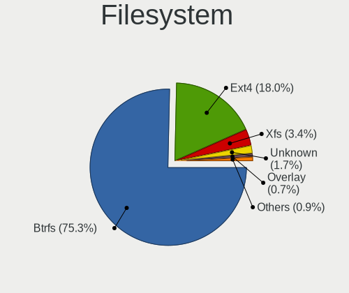
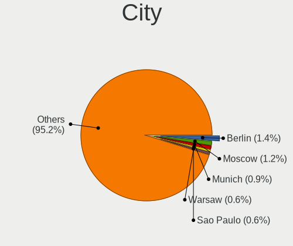
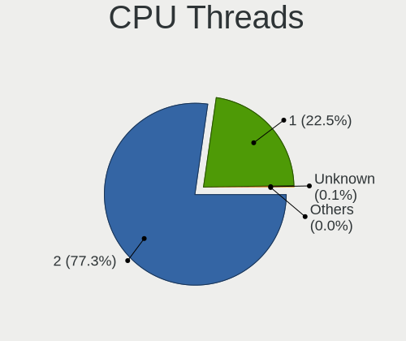
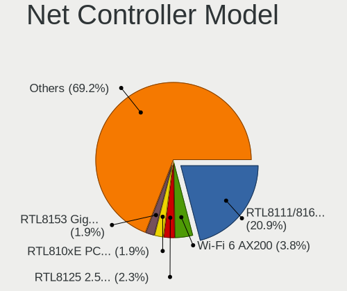
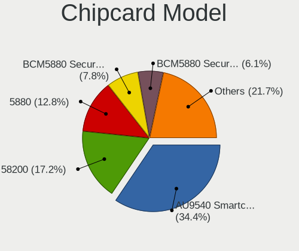

openSUSE - Tested Hardware & Statistics
---------------------------------------

A project to collect tested hardware configurations for openSUSE.

Anyone can contribute to this report by the [hw-probe](https://github.com/linuxhw/hw-probe) tool:

    sudo -E hw-probe -all -upload

Please contribute! Especially if your hardware is rare.

This is a report for all computer types. See also reports for [desktops](/Dist/openSUSE/Desktop/README.md) and [notebooks](/Dist/openSUSE/Notebook/README.md).

Contents
--------

* [ Test Cases ](#test-cases)

* [ System ](#system)
  - [ OS                       ](#os)
  - [ OS Family                ](#os-family)
  - [ Kernel                   ](#kernel)
  - [ Kernel Family            ](#kernel-family)
  - [ Kernel Major Ver.        ](#kernel-major-ver)
  - [ Arch                     ](#arch)
  - [ DE                       ](#de)
  - [ Display Server           ](#display-server)
  - [ Display Manager          ](#display-manager)
  - [ OS Lang                  ](#os-lang)
  - [ Boot Mode                ](#boot-mode)
  - [ Filesystem               ](#filesystem)
  - [ Part. scheme             ](#part-scheme)
  - [ Dual Boot with Linux/BSD ](#dual-boot-with-linuxbsd)
  - [ Dual Boot (Win)          ](#dual-boot-win)

* [ Board ](#board)
  - [ Vendor                   ](#vendor)
  - [ Model                    ](#model)
  - [ Model Family             ](#model-family)
  - [ MFG Year                 ](#mfg-year)
  - [ Form Factor              ](#form-factor)
  - [ Secure Boot              ](#secure-boot)
  - [ Coreboot                 ](#coreboot)
  - [ RAM Size                 ](#ram-size)
  - [ RAM Used                 ](#ram-used)
  - [ Total Drives             ](#total-drives)
  - [ Has CD-ROM               ](#has-cd-rom)
  - [ Has Ethernet             ](#has-ethernet)
  - [ Has WiFi                 ](#has-wifi)
  - [ Has Bluetooth            ](#has-bluetooth)

* [ Location ](#location)
  - [ Country                  ](#country)
  - [ City                     ](#city)

* [ Drives ](#drives)
  - [ Drive Vendor             ](#drive-vendor)
  - [ Drive Model              ](#drive-model)
  - [ HDD Vendor               ](#hdd-vendor)
  - [ SSD Vendor               ](#ssd-vendor)
  - [ Drive Kind               ](#drive-kind)
  - [ Drive Connector          ](#drive-connector)
  - [ Drive Size               ](#drive-size)
  - [ Space Total              ](#space-total)
  - [ Space Used               ](#space-used)
  - [ Malfunc. Drives          ](#malfunc-drives)
  - [ Malfunc. Drive Vendor    ](#malfunc-drive-vendor)
  - [ Malfunc. HDD Vendor      ](#malfunc-hdd-vendor)
  - [ Malfunc. Drive Kind      ](#malfunc-drive-kind)
  - [ Failed Drives            ](#failed-drives)
  - [ Failed Drive Vendor      ](#failed-drive-vendor)
  - [ Drive Status             ](#drive-status)

* [ Storage controller ](#storage-controller)
  - [ Storage Vendor           ](#storage-vendor)
  - [ Storage Model            ](#storage-model)
  - [ Storage Kind             ](#storage-kind)

* [ Processor ](#processor)
  - [ CPU Vendor               ](#cpu-vendor)
  - [ CPU Model                ](#cpu-model)
  - [ CPU Model Family         ](#cpu-model-family)
  - [ CPU Cores                ](#cpu-cores)
  - [ CPU Sockets              ](#cpu-sockets)
  - [ CPU Threads              ](#cpu-threads)
  - [ CPU Op-Modes             ](#cpu-op-modes)
  - [ CPU Microcode            ](#cpu-microcode)
  - [ CPU Microarch            ](#cpu-microarch)

* [ Graphics ](#graphics)
  - [ GPU Vendor               ](#gpu-vendor)
  - [ GPU Model                ](#gpu-model)
  - [ GPU Combo                ](#gpu-combo)
  - [ GPU Driver               ](#gpu-driver)
  - [ GPU Memory               ](#gpu-memory)

* [ Monitor ](#monitor)
  - [ Monitor Vendor           ](#monitor-vendor)
  - [ Monitor Model            ](#monitor-model)
  - [ Monitor Resolution       ](#monitor-resolution)
  - [ Monitor Diagonal         ](#monitor-diagonal)
  - [ Monitor Width            ](#monitor-width)
  - [ Aspect Ratio             ](#aspect-ratio)
  - [ Monitor Area             ](#monitor-area)
  - [ Pixel Density            ](#pixel-density)
  - [ Multiple Monitors        ](#multiple-monitors)

* [ Network ](#network)
  - [ Net Controller Vendor    ](#net-controller-vendor)
  - [ Net Controller Model     ](#net-controller-model)
  - [ Wireless Vendor          ](#wireless-vendor)
  - [ Wireless Model           ](#wireless-model)
  - [ Ethernet Vendor          ](#ethernet-vendor)
  - [ Ethernet Model           ](#ethernet-model)
  - [ Net Controller Kind      ](#net-controller-kind)
  - [ Used Controller          ](#used-controller)
  - [ NICs                     ](#nics)
  - [ IPv6                     ](#ipv6)

* [ Bluetooth ](#bluetooth)
  - [ Bluetooth Vendor         ](#bluetooth-vendor)
  - [ Bluetooth Model          ](#bluetooth-model)

* [ Sound ](#sound)
  - [ Sound Vendor             ](#sound-vendor)
  - [ Sound Model              ](#sound-model)

* [ Memory ](#memory)
  - [ Memory Vendor            ](#memory-vendor)
  - [ Memory Model             ](#memory-model)
  - [ Memory Kind              ](#memory-kind)
  - [ Memory Form Factor       ](#memory-form-factor)
  - [ Memory Size              ](#memory-size)
  - [ Memory Speed             ](#memory-speed)

* [ Printers & scanners ](#printers--scanners)
  - [ Printer Vendor           ](#printer-vendor)
  - [ Printer Model            ](#printer-model)
  - [ Scanner Vendor           ](#scanner-vendor)
  - [ Scanner Model            ](#scanner-model)

* [ Camera ](#camera)
  - [ Camera Vendor            ](#camera-vendor)
  - [ Camera Model             ](#camera-model)

* [ Security ](#security)
  - [ Fingerprint Vendor       ](#fingerprint-vendor)
  - [ Fingerprint Model        ](#fingerprint-model)
  - [ Chipcard Vendor          ](#chipcard-vendor)
  - [ Chipcard Model           ](#chipcard-model)

* [ Unsupported ](#unsupported)
  - [ Unsupported Devices      ](#unsupported-devices)
  - [ Unsupported Device Types ](#unsupported-device-types)

Test Cases
----------

Total: 3363

| Vendor        | Model                       | Form-Factor | Probe                                                      | Date         |
|---------------|-----------------------------|-------------|------------------------------------------------------------|--------------|
| AZW           | SER V1.0                    | Mini pc     | [e374cc3341](https://linux-hardware.org/?probe=e374cc3341) | Aug 12, 2023 |
| Samsung       | 300E5M/300E5L               | Notebook    | [9aa2cd7b81](https://linux-hardware.org/?probe=9aa2cd7b81) | Aug 12, 2023 |
| Dell          | G7 7790                     | Notebook    | [b5062f0928](https://linux-hardware.org/?probe=b5062f0928) | Aug 12, 2023 |
| HP            | 1589                        | Desktop     | [1a38154020](https://linux-hardware.org/?probe=1a38154020) | Aug 12, 2023 |
| AZW           | SER V1.0                    | Mini pc     | [8193c225e5](https://linux-hardware.org/?probe=8193c225e5) | Aug 11, 2023 |
| MSI           | Sword 17 A11UD              | Notebook    | [8ad81394c8](https://linux-hardware.org/?probe=8ad81394c8) | Aug 11, 2023 |
| Lenovo        | Yoga 7 14ARB7 82QF          | Convertible | [1c2e98b598](https://linux-hardware.org/?probe=1c2e98b598) | Aug 11, 2023 |
| Samsung       | 355V4C/355V4X/355V5C/355... | Notebook    | [6f722400c2](https://linux-hardware.org/?probe=6f722400c2) | Aug 11, 2023 |
| Acer          | Aspire V5-471P              | Notebook    | [cbd4a63b2e](https://linux-hardware.org/?probe=cbd4a63b2e) | Aug 10, 2023 |
| SLIMBOOK      | PROX-AMD5                   | Notebook    | [f20a32551b](https://linux-hardware.org/?probe=f20a32551b) | Aug 10, 2023 |
| Lenovo        | Yoga 7 14ARB7 82QF          | Convertible | [9ce8c0dd74](https://linux-hardware.org/?probe=9ce8c0dd74) | Aug 10, 2023 |
| Lenovo        | ThinkBook 16p Gen 2 20YM    | Notebook    | [f4dd9cbbbd](https://linux-hardware.org/?probe=f4dd9cbbbd) | Aug 10, 2023 |
| Gigabyte      | AB350-Gaming 3-CF           | Desktop     | [c2b7b4e760](https://linux-hardware.org/?probe=c2b7b4e760) | Aug 10, 2023 |
| ASUSTek       | ROG Zephyrus Duo 16 GX65... | Notebook    | [45c782fc7e](https://linux-hardware.org/?probe=45c782fc7e) | Aug 10, 2023 |
| Intel         | DZ77SL-50K AAG55115-300     | Desktop     | [0ca6c48c2f](https://linux-hardware.org/?probe=0ca6c48c2f) | Aug 09, 2023 |
| HP            | 8433 11                     | Desktop     | [eac08c7b54](https://linux-hardware.org/?probe=eac08c7b54) | Aug 09, 2023 |
| Dell          | 0272WF A00                  | Server      | [39abbc5ab8](https://linux-hardware.org/?probe=39abbc5ab8) | Aug 09, 2023 |
| Lenovo        | SDK0E50510 WIN 262508147... | Desktop     | [badd1c22ff](https://linux-hardware.org/?probe=badd1c22ff) | Aug 09, 2023 |
| HP            | OMEN by Laptop              | Notebook    | [fdbe025351](https://linux-hardware.org/?probe=fdbe025351) | Aug 09, 2023 |
| Lenovo        | SDK0E50510 WIN 262508147... | Desktop     | [f74262edcd](https://linux-hardware.org/?probe=f74262edcd) | Aug 09, 2023 |
| ASUSTek       | K75VJ                       | Notebook    | [7d1e95601c](https://linux-hardware.org/?probe=7d1e95601c) | Aug 09, 2023 |
| HP            | EliteBook 845 G9            | Notebook    | [1ff8d81e4e](https://linux-hardware.org/?probe=1ff8d81e4e) | Aug 09, 2023 |
| Dell          | Precision 7740              | Notebook    | [954d8472e5](https://linux-hardware.org/?probe=954d8472e5) | Aug 09, 2023 |
| Dell          | 0DT021 A00                  | Server      | [f472313f3a](https://linux-hardware.org/?probe=f472313f3a) | Aug 08, 2023 |
| ASUSTek       | M5A78L-M/USB3               | Desktop     | [88c76f027a](https://linux-hardware.org/?probe=88c76f027a) | Aug 08, 2023 |
| GPU Compan... | GWNR71517                   | Notebook    | [3fea8d650e](https://linux-hardware.org/?probe=3fea8d650e) | Aug 08, 2023 |
| AZW           | MINI S 10                   | Desktop     | [1de6b9a754](https://linux-hardware.org/?probe=1de6b9a754) | Aug 08, 2023 |
| Microsoft     | Surface Pro 4               | Tablet      | [2fa2ae29cc](https://linux-hardware.org/?probe=2fa2ae29cc) | Aug 07, 2023 |
| Notebook      | NLx0MU                      | Notebook    | [bb99f6f69e](https://linux-hardware.org/?probe=bb99f6f69e) | Aug 07, 2023 |
| HP            | 0B4Ch D                     | Desktop     | [35e4fef6c6](https://linux-hardware.org/?probe=35e4fef6c6) | Aug 07, 2023 |
| Dell          | Vostro 5471                 | Notebook    | [f4beee823e](https://linux-hardware.org/?probe=f4beee823e) | Aug 07, 2023 |
| Acer          | Aspire XC-705               | Desktop     | [37bf6e8191](https://linux-hardware.org/?probe=37bf6e8191) | Aug 06, 2023 |
| Lenovo        | ThinkPad X1 Carbon 7th 2... | Notebook    | [b1d5aab527](https://linux-hardware.org/?probe=b1d5aab527) | Aug 06, 2023 |
| Gigabyte      | B450M DS3H-CF               | Desktop     | [7637f0d91d](https://linux-hardware.org/?probe=7637f0d91d) | Aug 06, 2023 |
| HP            | 2B4B                        | Desktop     | [f85fada33f](https://linux-hardware.org/?probe=f85fada33f) | Aug 06, 2023 |
| ASUSTek       | Maximus V FORMULA           | Desktop     | [ee882ba789](https://linux-hardware.org/?probe=ee882ba789) | Aug 06, 2023 |
| ASUSTek       | PRIME A520M-K               | Desktop     | [ea4d9240fb](https://linux-hardware.org/?probe=ea4d9240fb) | Aug 05, 2023 |
| HP            | Laptop 14-dq1xxx            | Notebook    | [f8f4442b09](https://linux-hardware.org/?probe=f8f4442b09) | Aug 05, 2023 |
| ASUSTek       | Z97-PRO/USB                 | Desktop     | [edd74878c3](https://linux-hardware.org/?probe=edd74878c3) | Aug 05, 2023 |
| HP            | 0B4Ch D                     | Desktop     | [297a14921c](https://linux-hardware.org/?probe=297a14921c) | Aug 04, 2023 |
| HP            | 470 G7 Notebook PC          | Notebook    | [7e4a9b4618](https://linux-hardware.org/?probe=7e4a9b4618) | Aug 04, 2023 |
| MSI           | B450 GAMING PRO CARBON A... | Desktop     | [420353bf79](https://linux-hardware.org/?probe=420353bf79) | Aug 04, 2023 |
| Lenovo        | ThinkPad P15s Gen 1 20T4... | Notebook    | [a9072f3117](https://linux-hardware.org/?probe=a9072f3117) | Aug 04, 2023 |
| Dell          | 0DT021 A00                  | Server      | [354c40df4e](https://linux-hardware.org/?probe=354c40df4e) | Aug 04, 2023 |
| MSI           | H81M-E35 V2                 | Desktop     | [2e72dc6560](https://linux-hardware.org/?probe=2e72dc6560) | Aug 04, 2023 |
| HP            | ProLiant MicroServer Gen... | Desktop     | [fe0a1dbc45](https://linux-hardware.org/?probe=fe0a1dbc45) | Aug 04, 2023 |
| Apple         | Mac-F221BEC8                | Desktop     | [90aecb9ada](https://linux-hardware.org/?probe=90aecb9ada) | Aug 04, 2023 |
| Dell          | 0W13NR A06                  | Server      | [b1820a9229](https://linux-hardware.org/?probe=b1820a9229) | Aug 04, 2023 |
| ASRock        | B450M Pro4                  | Desktop     | [b2004d5d59](https://linux-hardware.org/?probe=b2004d5d59) | Aug 04, 2023 |
| HP            | 0B4Ch D                     | Desktop     | [46e96687a1](https://linux-hardware.org/?probe=46e96687a1) | Aug 04, 2023 |
| Sun Micros... | Ultra 24 50                 | Desktop     | [1318f4d842](https://linux-hardware.org/?probe=1318f4d842) | Aug 03, 2023 |
| Dell          | 082WXT A03                  | Desktop     | [27a50c4491](https://linux-hardware.org/?probe=27a50c4491) | Aug 03, 2023 |
| Apple         | MacBookPro8,2               | Notebook    | [573e7f6ad0](https://linux-hardware.org/?probe=573e7f6ad0) | Aug 03, 2023 |
| Dell          | 09M8Y8 A01                  | Desktop     | [e5649696d0](https://linux-hardware.org/?probe=e5649696d0) | Aug 03, 2023 |
| MSI           | X370 GAMING PRO             | Desktop     | [b684b97e44](https://linux-hardware.org/?probe=b684b97e44) | Aug 02, 2023 |
| Acer          | Aspire A3SP14-31PT          | Convertible | [aa4285c237](https://linux-hardware.org/?probe=aa4285c237) | Aug 02, 2023 |
| HP            | ProBook 455 15.6 inch G9... | Notebook    | [8fb651def8](https://linux-hardware.org/?probe=8fb651def8) | Aug 02, 2023 |
| Toshiba       | QOSMIO X775                 | Notebook    | [6a4cd21dbf](https://linux-hardware.org/?probe=6a4cd21dbf) | Aug 02, 2023 |
| Toshiba       | QOSMIO X775                 | Notebook    | [982148fe9c](https://linux-hardware.org/?probe=982148fe9c) | Aug 02, 2023 |
| Schenker      | XMG FOCUS (Mid 2021)        | Notebook    | [d7fa14789f](https://linux-hardware.org/?probe=d7fa14789f) | Aug 01, 2023 |
| Lenovo        | ThinkPad X270 20HMS12K00    | Notebook    | [bc84705e8f](https://linux-hardware.org/?probe=bc84705e8f) | Aug 01, 2023 |
| Microsoft     | Surface Laptop 3            | Tablet      | [89bc7e5c48](https://linux-hardware.org/?probe=89bc7e5c48) | Aug 01, 2023 |
| Lenovo        | ThinkPad P1 20MD001VUS      | Notebook    | [f353e39414](https://linux-hardware.org/?probe=f353e39414) | Jul 31, 2023 |
| Lenovo        | ThinkPad T560 20FH001TUS    | Notebook    | [8cb9cf099a](https://linux-hardware.org/?probe=8cb9cf099a) | Jul 31, 2023 |
| HP            | ENVY x360 2-in-1 Laptop ... | Convertible | [940a0b000a](https://linux-hardware.org/?probe=940a0b000a) | Jul 31, 2023 |
| Gigabyte      | GA-880GMA-UD2H              | Desktop     | [356dae8360](https://linux-hardware.org/?probe=356dae8360) | Jul 30, 2023 |
| Lenovo        | ThinkPad T440p 20AN009FG... | Notebook    | [f2cc6379cc](https://linux-hardware.org/?probe=f2cc6379cc) | Jul 30, 2023 |
| HP            | 255 G7 Notebook PC          | Notebook    | [9d93bef2df](https://linux-hardware.org/?probe=9d93bef2df) | Jul 30, 2023 |
| Positivo B... | VJFE59F11X-B0411H           | Notebook    | [24c271e6fd](https://linux-hardware.org/?probe=24c271e6fd) | Jul 30, 2023 |
| Positivo B... | VJFE59F11X-B0411H           | Notebook    | [bb2245d195](https://linux-hardware.org/?probe=bb2245d195) | Jul 30, 2023 |
| Dell          | 0272WF A00                  | Server      | [ab789b12e1](https://linux-hardware.org/?probe=ab789b12e1) | Jul 30, 2023 |
| Biostar       | A320MH                      | Desktop     | [8fbc21fb3e](https://linux-hardware.org/?probe=8fbc21fb3e) | Jul 29, 2023 |
| HONOR         | BMH-WCX9                    | Notebook    | [c098429c68](https://linux-hardware.org/?probe=c098429c68) | Jul 29, 2023 |
| win elemen... | MoreFine S500+              | Notebook    | [7d5b443b84](https://linux-hardware.org/?probe=7d5b443b84) | Jul 29, 2023 |
| Dell          | 0272WF A00                  | Server      | [2867ef6d1f](https://linux-hardware.org/?probe=2867ef6d1f) | Jul 29, 2023 |
| ASUSTek       | Z9PG-D16 Series             | Server      | [3a81b2b0d9](https://linux-hardware.org/?probe=3a81b2b0d9) | Jul 29, 2023 |
| ASUSTek       | Z9PG-D16 Series             | Server      | [4d6a620df3](https://linux-hardware.org/?probe=4d6a620df3) | Jul 29, 2023 |
| HP            | 3048h                       | Desktop     | [cd83e4a73a](https://linux-hardware.org/?probe=cd83e4a73a) | Jul 29, 2023 |
| HP            | 3048h                       | Desktop     | [56918c8bad](https://linux-hardware.org/?probe=56918c8bad) | Jul 29, 2023 |
| ASRock        | B450M Pro4 R2.0             | Desktop     | [07feda799a](https://linux-hardware.org/?probe=07feda799a) | Jul 28, 2023 |
| HP            | 0B4Ch D                     | Desktop     | [270ce3344c](https://linux-hardware.org/?probe=270ce3344c) | Jul 28, 2023 |
| HP            | 250 G3                      | Notebook    | [49b5a143cf](https://linux-hardware.org/?probe=49b5a143cf) | Jul 28, 2023 |
| Sony          | Unknown                     | Notebook    | [80613731cb](https://linux-hardware.org/?probe=80613731cb) | Jul 28, 2023 |
| MSI           | B85-G43 GAMING              | Desktop     | [ba47e8e20f](https://linux-hardware.org/?probe=ba47e8e20f) | Jul 27, 2023 |
| Apple         | Mac-42FD25EABCABB274 iMa... | All in one  | [7e89496549](https://linux-hardware.org/?probe=7e89496549) | Jul 27, 2023 |
| Acer          | Aspire A3SP14-31PT          | Convertible | [3652a64ac1](https://linux-hardware.org/?probe=3652a64ac1) | Jul 27, 2023 |
| Acer          | Aspire A315-24P             | Notebook    | [6799c4be4a](https://linux-hardware.org/?probe=6799c4be4a) | Jul 27, 2023 |
| ASUSTek       | PRIME X370-PRO              | Desktop     | [75dec2a4a4](https://linux-hardware.org/?probe=75dec2a4a4) | Jul 27, 2023 |
| ASUSTek       | PRIME A320M-K               | Desktop     | [a0a79ddb19](https://linux-hardware.org/?probe=a0a79ddb19) | Jul 27, 2023 |
| Lenovo        | ThinkPad W541 20EF000NUS    | Notebook    | [af1671633e](https://linux-hardware.org/?probe=af1671633e) | Jul 27, 2023 |
| ASUSTek       | TUF Gaming X570-PLUS        | Desktop     | [ed591a913a](https://linux-hardware.org/?probe=ed591a913a) | Jul 26, 2023 |
| Lenovo        | ThinkPad T560 20FH001TUS    | Notebook    | [0cb1602cad](https://linux-hardware.org/?probe=0cb1602cad) | Jul 26, 2023 |
| Gigabyte      | B550M DS3H                  | Desktop     | [9d891afae0](https://linux-hardware.org/?probe=9d891afae0) | Jul 26, 2023 |
| Apple         | MacBookPro8,2               | Notebook    | [10db13c772](https://linux-hardware.org/?probe=10db13c772) | Jul 26, 2023 |
| Acer          | Aspire E5-774G              | Notebook    | [1568ba2843](https://linux-hardware.org/?probe=1568ba2843) | Jul 25, 2023 |
| Apple         | Mac-031AEE4D24BFF0B1 Mac... | Mini pc     | [d23913a471](https://linux-hardware.org/?probe=d23913a471) | Jul 25, 2023 |
| ASUSTek       | H110M-R                     | Desktop     | [5300c80b7e](https://linux-hardware.org/?probe=5300c80b7e) | Jul 24, 2023 |
| Lenovo        | ThinkPad T560 20FH001TUS    | Notebook    | [533c44b02e](https://linux-hardware.org/?probe=533c44b02e) | Jul 24, 2023 |
| Apple         | MacBookPro8,1               | Notebook    | [d3ba6058c7](https://linux-hardware.org/?probe=d3ba6058c7) | Jul 24, 2023 |
| HP            | 1589                        | Desktop     | [5c0bd1ec07](https://linux-hardware.org/?probe=5c0bd1ec07) | Jul 24, 2023 |
| Lenovo        | ThinkPad X1 Carbon 7th 2... | Notebook    | [fd2add1e0f](https://linux-hardware.org/?probe=fd2add1e0f) | Jul 24, 2023 |
| Lenovo        | ThinkPad E15 Gen 2 20T80... | Notebook    | [b7c7b058b7](https://linux-hardware.org/?probe=b7c7b058b7) | Jul 23, 2023 |
| MSI           | Cyborg 15 A13VE             | Notebook    | [edf7b092ec](https://linux-hardware.org/?probe=edf7b092ec) | Jul 23, 2023 |
| MSI           | Cyborg 15 A13VE             | Notebook    | [421c2ff6b0](https://linux-hardware.org/?probe=421c2ff6b0) | Jul 23, 2023 |
| HP            | Laptop 14s-dq1xxx           | Notebook    | [405387be09](https://linux-hardware.org/?probe=405387be09) | Jul 23, 2023 |
| Dell          | 0PTTT9 A01                  | Desktop     | [447b84f067](https://linux-hardware.org/?probe=447b84f067) | Jul 23, 2023 |
| HUAWEI        | KLVL-WXXW                   | Notebook    | [f0dcdf797e](https://linux-hardware.org/?probe=f0dcdf797e) | Jul 23, 2023 |
| HUAWEI        | KLVL-WXXW                   | Notebook    | [49fc9fb8ce](https://linux-hardware.org/?probe=49fc9fb8ce) | Jul 23, 2023 |
| Lenovo        | ThinkPad L15 Gen 1 20U8S... | Notebook    | [c741f10f18](https://linux-hardware.org/?probe=c741f10f18) | Jul 23, 2023 |
| ASUSTek       | ROG STRIX B550-F GAMING     | Desktop     | [83df4e51e4](https://linux-hardware.org/?probe=83df4e51e4) | Jul 22, 2023 |
| Microsoft     | Surface Pro                 | Tablet      | [47cf8f41db](https://linux-hardware.org/?probe=47cf8f41db) | Jul 22, 2023 |
| MSI           | X58 Pro-E                   | Desktop     | [01f822dec1](https://linux-hardware.org/?probe=01f822dec1) | Jul 22, 2023 |
| ASUSTek       | ROG STRIX B550-F GAMING     | Desktop     | [cda75b5e7a](https://linux-hardware.org/?probe=cda75b5e7a) | Jul 22, 2023 |
| Dell          | Inspiron 7415 2-in-1        | Convertible | [b00e97471c](https://linux-hardware.org/?probe=b00e97471c) | Jul 22, 2023 |
| Medion        | E6224                       | Notebook    | [c33b8a1fb1](https://linux-hardware.org/?probe=c33b8a1fb1) | Jul 22, 2023 |
| ASUSTek       | Z77-A                       | Desktop     | [4c5a8d18b9](https://linux-hardware.org/?probe=4c5a8d18b9) | Jul 22, 2023 |
| Dell          | Latitude E5530 non-vPro     | Notebook    | [2c2c4bdcf2](https://linux-hardware.org/?probe=2c2c4bdcf2) | Jul 21, 2023 |
| Gigabyte      | B450M DS3H-CF               | Desktop     | [d8d58cb5fb](https://linux-hardware.org/?probe=d8d58cb5fb) | Jul 21, 2023 |
| MSI           | GL72 6QF                    | Notebook    | [0484bc209c](https://linux-hardware.org/?probe=0484bc209c) | Jul 21, 2023 |
| Razer         | Blade 15 Base Model (Mid... | Notebook    | [d2d53e7406](https://linux-hardware.org/?probe=d2d53e7406) | Jul 21, 2023 |
| Gigabyte      | GA-880GMA-UD2H              | Desktop     | [7b6300dfc7](https://linux-hardware.org/?probe=7b6300dfc7) | Jul 20, 2023 |
| Sony          | Unknown                     | Notebook    | [427e52d6a6](https://linux-hardware.org/?probe=427e52d6a6) | Jul 20, 2023 |
| Gigabyte      | GA-880GMA-UD2H              | Desktop     | [65da6837ae](https://linux-hardware.org/?probe=65da6837ae) | Jul 20, 2023 |
| Lenovo        | 312A SDK0J40697 WIN 3305... | Desktop     | [a2779c6ac8](https://linux-hardware.org/?probe=a2779c6ac8) | Jul 19, 2023 |
| ASUSTek       | PRIME X370-PRO              | Desktop     | [158ce24cd5](https://linux-hardware.org/?probe=158ce24cd5) | Jul 19, 2023 |
| Lenovo        | IdeaPad 330-15IKB 81DE      | Notebook    | [2f067394f6](https://linux-hardware.org/?probe=2f067394f6) | Jul 19, 2023 |
| Acer          | MCP7A                       | Desktop     | [06afe36113](https://linux-hardware.org/?probe=06afe36113) | Jul 18, 2023 |
| Dell          | XPS L501X                   | Notebook    | [0879ff6b9d](https://linux-hardware.org/?probe=0879ff6b9d) | Jul 18, 2023 |
| HP            | EliteBook 845 G8 Noteboo... | Notebook    | [af9244e836](https://linux-hardware.org/?probe=af9244e836) | Jul 18, 2023 |
| MSI           | B550M PRO-VDH WIFI          | Desktop     | [b48286d288](https://linux-hardware.org/?probe=b48286d288) | Jul 18, 2023 |
| Lenovo        | ThinkPad E480 20KN005CRT    | Notebook    | [722170f1f3](https://linux-hardware.org/?probe=722170f1f3) | Jul 17, 2023 |
| Acer          | Aspire A515-51G             | Notebook    | [0236d26da7](https://linux-hardware.org/?probe=0236d26da7) | Jul 17, 2023 |
| ASUSTek       | P5B-Deluxe                  | Desktop     | [fe065234a9](https://linux-hardware.org/?probe=fe065234a9) | Jul 17, 2023 |
| ASUSTek       | PRIME B360-PLUS             | Desktop     | [295bc58365](https://linux-hardware.org/?probe=295bc58365) | Jul 17, 2023 |
| Alienware     | m16 R1 AMD                  | Notebook    | [7ca76c0d32](https://linux-hardware.org/?probe=7ca76c0d32) | Jul 17, 2023 |
| ASUSTek       | ZenBook UX482EA_UX482EA     | Notebook    | [52d550e878](https://linux-hardware.org/?probe=52d550e878) | Jul 17, 2023 |
| Lenovo        | IdeaPad 3 15ITL6 82H8       | Notebook    | [4c3185f447](https://linux-hardware.org/?probe=4c3185f447) | Jul 17, 2023 |
| Medion        | E6224                       | Notebook    | [4ffae87044](https://linux-hardware.org/?probe=4ffae87044) | Jul 17, 2023 |
| ASRock        | X570 Steel Legend           | Desktop     | [81db5657d9](https://linux-hardware.org/?probe=81db5657d9) | Jul 16, 2023 |
| Apple         | MacBookPro9,2               | Notebook    | [553bd7c29e](https://linux-hardware.org/?probe=553bd7c29e) | Jul 16, 2023 |
| Gigabyte      | G41MT-S2P                   | Desktop     | [fd05b31515](https://linux-hardware.org/?probe=fd05b31515) | Jul 16, 2023 |
| Acer          | Swift SF314-511             | Notebook    | [d9270dc2df](https://linux-hardware.org/?probe=d9270dc2df) | Jul 16, 2023 |
| Lenovo        | B5400 80B6QB0               | Notebook    | [7108435241](https://linux-hardware.org/?probe=7108435241) | Jul 15, 2023 |
| Irbis         | NB131                       | Convertible | [c7efdcc615](https://linux-hardware.org/?probe=c7efdcc615) | Jul 15, 2023 |
| Lenovo        | ThinkPad W510 4391W3V       | Notebook    | [01b8ada2a7](https://linux-hardware.org/?probe=01b8ada2a7) | Jul 15, 2023 |
| Samsung       | 355V4C/355V4X/355V5C/355... | Notebook    | [6b351b341e](https://linux-hardware.org/?probe=6b351b341e) | Jul 15, 2023 |
| Irbis         | NB131                       | Convertible | [b14dbb093f](https://linux-hardware.org/?probe=b14dbb093f) | Jul 15, 2023 |
| ASRock        | B450M Pro4                  | Desktop     | [d1aa3f2d70](https://linux-hardware.org/?probe=d1aa3f2d70) | Jul 15, 2023 |
| Acer          | Predator PH16-71            | Notebook    | [1917d24a87](https://linux-hardware.org/?probe=1917d24a87) | Jul 15, 2023 |
| MSI           | A320M-A PRO MAX             | Desktop     | [34871aac58](https://linux-hardware.org/?probe=34871aac58) | Jul 15, 2023 |
| Alienware     | m17 R5 AMD                  | Notebook    | [a2bb315c61](https://linux-hardware.org/?probe=a2bb315c61) | Jul 14, 2023 |
| Lenovo        | ThinkPad T530 2394W19       | Notebook    | [874f8b41a7](https://linux-hardware.org/?probe=874f8b41a7) | Jul 14, 2023 |
| Gigabyte      | B550I AORUS PRO AX          | Desktop     | [78f620581b](https://linux-hardware.org/?probe=78f620581b) | Jul 14, 2023 |
| Gigabyte      | Z68AP-D3                    | Desktop     | [9760be79b1](https://linux-hardware.org/?probe=9760be79b1) | Jul 13, 2023 |
| Gigabyte      | Z68AP-D3                    | Desktop     | [542d77f366](https://linux-hardware.org/?probe=542d77f366) | Jul 13, 2023 |
| HP            | OMEN by Gaming Laptop 16... | Notebook    | [9bee6805c0](https://linux-hardware.org/?probe=9bee6805c0) | Jul 13, 2023 |
| Acer          | Swift SF314-511             | Notebook    | [35373c9acf](https://linux-hardware.org/?probe=35373c9acf) | Jul 13, 2023 |
| ASUSTek       | Z9PG-D16 Series             | Server      | [9b03d78d55](https://linux-hardware.org/?probe=9b03d78d55) | Jul 13, 2023 |
| HP            | EliteBook 845 G8 Noteboo... | Notebook    | [e56a404324](https://linux-hardware.org/?probe=e56a404324) | Jul 13, 2023 |
| Lenovo        | IdeaPad S145-15IKB 81XM     | Notebook    | [480fe73577](https://linux-hardware.org/?probe=480fe73577) | Jul 12, 2023 |
| ASUSTek       | X550LD                      | Notebook    | [bc78a01502](https://linux-hardware.org/?probe=bc78a01502) | Jul 12, 2023 |
| ASUSTek       | X550LD                      | Notebook    | [c01febb128](https://linux-hardware.org/?probe=c01febb128) | Jul 12, 2023 |
| ASRock        | A520M-ITX/ac                | Desktop     | [1c7a630efb](https://linux-hardware.org/?probe=1c7a630efb) | Jul 12, 2023 |
| Lenovo        | ThinkPad T480 20L5CTO1WW    | Notebook    | [458df6678a](https://linux-hardware.org/?probe=458df6678a) | Jul 12, 2023 |
| Dell          | Vostro 3400                 | Notebook    | [93d94feca6](https://linux-hardware.org/?probe=93d94feca6) | Jul 11, 2023 |
| ASUSTek       | K53SM                       | Notebook    | [7aac135bc0](https://linux-hardware.org/?probe=7aac135bc0) | Jul 11, 2023 |
| MSI           | B450 TOMAHAWK               | Desktop     | [becf9726c7](https://linux-hardware.org/?probe=becf9726c7) | Jul 11, 2023 |
| VALE          | Notebook Classic C140       | Notebook    | [90f5732595](https://linux-hardware.org/?probe=90f5732595) | Jul 11, 2023 |
| Lenovo        | ThinkPad T14 Gen 2i 20W0... | Notebook    | [a52e535dcb](https://linux-hardware.org/?probe=a52e535dcb) | Jul 11, 2023 |
| Apple         | Mac-F22C86C8                | Mini pc     | [e9a45b4e27](https://linux-hardware.org/?probe=e9a45b4e27) | Jul 11, 2023 |
| MSI           | A320M-A PRO                 | Desktop     | [1a540134de](https://linux-hardware.org/?probe=1a540134de) | Jul 11, 2023 |
| Dell          | Latitude E5410              | Notebook    | [8d980136c2](https://linux-hardware.org/?probe=8d980136c2) | Jul 10, 2023 |
| ASUSTek       | PRIME A320M-K/BR            | Desktop     | [8c2add9768](https://linux-hardware.org/?probe=8c2add9768) | Jul 10, 2023 |
| ASUSTek       | PRIME A320M-K/BR            | Desktop     | [2cc9f44232](https://linux-hardware.org/?probe=2cc9f44232) | Jul 10, 2023 |
| Medion        | Akoya P2214T                | Notebook    | [341fc04e6c](https://linux-hardware.org/?probe=341fc04e6c) | Jul 10, 2023 |
| Lenovo        | V15-IGL 82C3                | Notebook    | [9f920e8a7e](https://linux-hardware.org/?probe=9f920e8a7e) | Jul 10, 2023 |
| HP            | Notebook                    | Notebook    | [a1c37a6a4b](https://linux-hardware.org/?probe=a1c37a6a4b) | Jul 09, 2023 |
| ASUSTek       | PRIME B660M-K D4            | Desktop     | [36b6c49552](https://linux-hardware.org/?probe=36b6c49552) | Jul 09, 2023 |
| Gigabyte      | H55M-UD2H                   | Desktop     | [6d96bf0f5b](https://linux-hardware.org/?probe=6d96bf0f5b) | Jul 09, 2023 |
| Lenovo        | Unknown                     | Convertible | [7c4ddbebf7](https://linux-hardware.org/?probe=7c4ddbebf7) | Jul 09, 2023 |
| ASUSTek       | PRIME B660M-K D4            | Desktop     | [ffa5984711](https://linux-hardware.org/?probe=ffa5984711) | Jul 09, 2023 |
| Apple         | MacBookPro9,2               | Notebook    | [5d91f63280](https://linux-hardware.org/?probe=5d91f63280) | Jul 09, 2023 |
| ASRock        | Z390 Phantom Gaming 9       | Desktop     | [c00debe968](https://linux-hardware.org/?probe=c00debe968) | Jul 08, 2023 |
| ASRock        | Z390 Phantom Gaming 9       | Desktop     | [a72d3eff75](https://linux-hardware.org/?probe=a72d3eff75) | Jul 08, 2023 |
| Lenovo        | ThinkPad 10 2nd 20E4S0JA... | Tablet      | [8a5cbee239](https://linux-hardware.org/?probe=8a5cbee239) | Jul 08, 2023 |
| Dell          | XPS 13 9350                 | Notebook    | [9fc07d1102](https://linux-hardware.org/?probe=9fc07d1102) | Jul 08, 2023 |
| ASUSTek       | ROG Strix G513IM_G513IM     | Notebook    | [f94c183910](https://linux-hardware.org/?probe=f94c183910) | Jul 08, 2023 |
| Dell          | Inspiron 7720               | Notebook    | [dde4874147](https://linux-hardware.org/?probe=dde4874147) | Jul 08, 2023 |
| Lenovo        | IdeaPad 330-15IKB 81DE      | Notebook    | [7cbaa33271](https://linux-hardware.org/?probe=7cbaa33271) | Jul 07, 2023 |
| ASUSTek       | ROG Strix G513IM_G513IM     | Notebook    | [bb2f259ef6](https://linux-hardware.org/?probe=bb2f259ef6) | Jul 07, 2023 |
| Gigabyte      | H55M-UD2H                   | Desktop     | [f32ffc678f](https://linux-hardware.org/?probe=f32ffc678f) | Jul 07, 2023 |
| Timi          | RedmiBook Pro 14S           | Notebook    | [54262c3aeb](https://linux-hardware.org/?probe=54262c3aeb) | Jul 07, 2023 |
| Lenovo        | 20RD001FHV                  | Notebook    | [79166ca12f](https://linux-hardware.org/?probe=79166ca12f) | Jul 07, 2023 |
| Medion        | Akoya P2214T                | Notebook    | [e2c31b421a](https://linux-hardware.org/?probe=e2c31b421a) | Jul 07, 2023 |
| Lenovo        | 20RD001FHV                  | Notebook    | [de3ed49995](https://linux-hardware.org/?probe=de3ed49995) | Jul 07, 2023 |
| MSI           | MEG Z390 GODLIKE            | Desktop     | [5ee0aa7d94](https://linux-hardware.org/?probe=5ee0aa7d94) | Jul 07, 2023 |
| Dell          | 00V62H A01                  | Desktop     | [0d98ce8578](https://linux-hardware.org/?probe=0d98ce8578) | Jul 07, 2023 |
| Toshiba       | dynabook Satellite B552/... | Notebook    | [f459621198](https://linux-hardware.org/?probe=f459621198) | Jul 06, 2023 |
| ASUSTek       | PRIME B450M-GAMING/BR       | Desktop     | [f156a2bbfa](https://linux-hardware.org/?probe=f156a2bbfa) | Jul 06, 2023 |
| HP            | 8B3B A                      | Desktop     | [b003988978](https://linux-hardware.org/?probe=b003988978) | Jul 05, 2023 |
| Notebook      | NLx0MU                      | Notebook    | [b3530f3e0e](https://linux-hardware.org/?probe=b3530f3e0e) | Jul 05, 2023 |
| Gigabyte      | G1.Sniper H6                | Desktop     | [7592c0cc37](https://linux-hardware.org/?probe=7592c0cc37) | Jul 05, 2023 |
| Gigabyte      | G1.Sniper H6                | Desktop     | [71505f347f](https://linux-hardware.org/?probe=71505f347f) | Jul 05, 2023 |
| Acer          | Swift SF114-33              | Notebook    | [e3bd5bf60f](https://linux-hardware.org/?probe=e3bd5bf60f) | Jul 05, 2023 |
| Acer          | Nitro AN515-58              | Notebook    | [40b7950cb2](https://linux-hardware.org/?probe=40b7950cb2) | Jul 05, 2023 |
| Acer          | Nitro AN515-58              | Notebook    | [73435e5646](https://linux-hardware.org/?probe=73435e5646) | Jul 05, 2023 |
| ASUSTek       | TUF Gaming Z590-PLUS        | Desktop     | [eef5ee5c9a](https://linux-hardware.org/?probe=eef5ee5c9a) | Jul 05, 2023 |
| Teclast       | X4                          | Tablet      | [6aab5b6610](https://linux-hardware.org/?probe=6aab5b6610) | Jul 05, 2023 |
| ASUSTek       | PRIME B450M-GAMING/BR       | Desktop     | [6b1beb7eeb](https://linux-hardware.org/?probe=6b1beb7eeb) | Jul 05, 2023 |
| Gigabyte      | X670E AORUS MASTER          | Desktop     | [427fc931a0](https://linux-hardware.org/?probe=427fc931a0) | Jul 04, 2023 |
| Gigabyte      | Z690 AERO D                 | Desktop     | [f42140d294](https://linux-hardware.org/?probe=f42140d294) | Jul 03, 2023 |
| Lenovo        | IdeaPad 3 15ITL6 82H8       | Notebook    | [9561990119](https://linux-hardware.org/?probe=9561990119) | Jul 03, 2023 |
| Dell          | Latitude E6510              | Notebook    | [bc2c3c520a](https://linux-hardware.org/?probe=bc2c3c520a) | Jul 02, 2023 |
| SLIMBOOK      | PROX-AMD5                   | Notebook    | [f91dbee23b](https://linux-hardware.org/?probe=f91dbee23b) | Jul 02, 2023 |
| ASUSTek       | Zenbook UM3402YAR_UM3402... | Notebook    | [57f5458dfa](https://linux-hardware.org/?probe=57f5458dfa) | Jul 02, 2023 |
| ASUSTek       | P5E Deluxe                  | Desktop     | [895759fa79](https://linux-hardware.org/?probe=895759fa79) | Jul 01, 2023 |
| ASUSTek       | VivoBook_ASUSLaptop E510... | Notebook    | [27c53e1152](https://linux-hardware.org/?probe=27c53e1152) | Jul 01, 2023 |
| Lenovo        | ThinkPad T530 2394W19       | Notebook    | [a1fc2e0020](https://linux-hardware.org/?probe=a1fc2e0020) | Jul 01, 2023 |
| HP            | OMEN by Laptop              | Notebook    | [3702fd669f](https://linux-hardware.org/?probe=3702fd669f) | Jul 01, 2023 |
| HP            | OMEN by Laptop              | Notebook    | [10dc1c07c8](https://linux-hardware.org/?probe=10dc1c07c8) | Jul 01, 2023 |
| Gigabyte      | B550M AORUS PRO-P           | Desktop     | [d9b6645cae](https://linux-hardware.org/?probe=d9b6645cae) | Jul 01, 2023 |
| HP            | ProBook 455 G6              | Notebook    | [f4b853f43e](https://linux-hardware.org/?probe=f4b853f43e) | Jul 01, 2023 |
| ASUSTek       | VivoBook_ASUSLaptop X160... | Notebook    | [a203a588f9](https://linux-hardware.org/?probe=a203a588f9) | Jun 30, 2023 |
| Gigabyte      | P67A-UD5-B3                 | Desktop     | [b763c860fa](https://linux-hardware.org/?probe=b763c860fa) | Jun 30, 2023 |
| Maibenben     | MaiBook X series            | Notebook    | [5e11bea093](https://linux-hardware.org/?probe=5e11bea093) | Jun 30, 2023 |
| Microsoft     | Surface Go 2                | Tablet      | [ef3b3cf51e](https://linux-hardware.org/?probe=ef3b3cf51e) | Jun 30, 2023 |
| Gigabyte      | X670E AORUS MASTER          | Desktop     | [70ddebe460](https://linux-hardware.org/?probe=70ddebe460) | Jun 30, 2023 |
| Gigabyte      | X670E AORUS MASTER          | Desktop     | [7ae106bfd6](https://linux-hardware.org/?probe=7ae106bfd6) | Jun 30, 2023 |
| Apple         | MacBookAir7,1               | Notebook    | [70ce1e280f](https://linux-hardware.org/?probe=70ce1e280f) | Jun 30, 2023 |
| Apple         | MacBookAir7,1               | Notebook    | [b5e0044759](https://linux-hardware.org/?probe=b5e0044759) | Jun 30, 2023 |
| HP            | 8055                        | Desktop     | [47536e2cde](https://linux-hardware.org/?probe=47536e2cde) | Jun 29, 2023 |
| ASRock        | 970 Pro3 R2.0               | Desktop     | [64e81a22a5](https://linux-hardware.org/?probe=64e81a22a5) | Jun 29, 2023 |
| ASUSTek       | PRIME X370-PRO              | Desktop     | [6c7621fe04](https://linux-hardware.org/?probe=6c7621fe04) | Jun 29, 2023 |
| Apple         | MacBookPro12,1              | Notebook    | [6cc649e9ba](https://linux-hardware.org/?probe=6cc649e9ba) | Jun 29, 2023 |
| ASUSTek       | M5A97 R2.0                  | Desktop     | [2dd6be0ddc](https://linux-hardware.org/?probe=2dd6be0ddc) | Jun 29, 2023 |
| Lenovo        | ThinkPad X200 7458AH8       | Notebook    | [a81af2d7e2](https://linux-hardware.org/?probe=a81af2d7e2) | Jun 29, 2023 |
| Acer          | Aspire V3-571G              | Notebook    | [9d4c4f5506](https://linux-hardware.org/?probe=9d4c4f5506) | Jun 29, 2023 |
| HP            | 1589                        | Desktop     | [dcb3289360](https://linux-hardware.org/?probe=dcb3289360) | Jun 29, 2023 |
| Dell          | 00X7CK A04                  | Server      | [c59e7b7f26](https://linux-hardware.org/?probe=c59e7b7f26) | Jun 28, 2023 |
| Intel         | DG965SS AAD41678-304        | Desktop     | [696cd9ce01](https://linux-hardware.org/?probe=696cd9ce01) | Jun 28, 2023 |
| MSI           | B450 TOMAHAWK               | Desktop     | [1ef1762ac3](https://linux-hardware.org/?probe=1ef1762ac3) | Jun 28, 2023 |
| ASUSTek       | VivoBook 15_ASUS Laptop ... | Notebook    | [6a29eda577](https://linux-hardware.org/?probe=6a29eda577) | Jun 28, 2023 |
| ASUSTek       | VivoBook 15_ASUS Laptop ... | Notebook    | [bf4abd6e9e](https://linux-hardware.org/?probe=bf4abd6e9e) | Jun 28, 2023 |
| Lenovo        | ThinkPad X1 Carbon Gen 8... | Notebook    | [3ea9e41d03](https://linux-hardware.org/?probe=3ea9e41d03) | Jun 28, 2023 |
| Gigabyte      | EG45M-DS2H                  | Desktop     | [b9b25df5a3](https://linux-hardware.org/?probe=b9b25df5a3) | Jun 27, 2023 |
| Lenovo        | ThinkPad A485 20MUCTO1WW    | Notebook    | [465cc8968f](https://linux-hardware.org/?probe=465cc8968f) | Jun 27, 2023 |
| ASUSTek       | VivoBook_ASUSLaptop X570... | Notebook    | [fce3ec0379](https://linux-hardware.org/?probe=fce3ec0379) | Jun 27, 2023 |
| Gigabyte      | Z97-HD3                     | Desktop     | [731b4a6479](https://linux-hardware.org/?probe=731b4a6479) | Jun 26, 2023 |
| Lenovo        | IdeaPad 5 15ALC05 82LN      | Notebook    | [97b1fc630a](https://linux-hardware.org/?probe=97b1fc630a) | Jun 25, 2023 |
| Gigabyte      | X570 I AORUS PRO WIFI       | Desktop     | [a8c0f33ffe](https://linux-hardware.org/?probe=a8c0f33ffe) | Jun 25, 2023 |
| Apple         | MacBookPro5,2               | Notebook    | [32ab15a1eb](https://linux-hardware.org/?probe=32ab15a1eb) | Jun 25, 2023 |
| Acer          | Aspire A317-53              | Notebook    | [1fe3acdf83](https://linux-hardware.org/?probe=1fe3acdf83) | Jun 25, 2023 |
| ASUSTek       | M5A97 R2.0                  | Desktop     | [17c221fa68](https://linux-hardware.org/?probe=17c221fa68) | Jun 24, 2023 |
| ASUSTek       | M5A97 R2.0                  | Desktop     | [6c015f633b](https://linux-hardware.org/?probe=6c015f633b) | Jun 24, 2023 |
| ASUSTek       | PRIME B450M-A II            | Desktop     | [31d19c3462](https://linux-hardware.org/?probe=31d19c3462) | Jun 24, 2023 |
| Lenovo        | ThinkPad X13 Gen 2a 20XH... | Notebook    | [71f17d4d74](https://linux-hardware.org/?probe=71f17d4d74) | Jun 24, 2023 |
| Lenovo        | XiaoXinPro 16 ARP8 83AS     | Notebook    | [ebfe7d469a](https://linux-hardware.org/?probe=ebfe7d469a) | Jun 24, 2023 |
| ASUSTek       | K53TK                       | Notebook    | [905653d393](https://linux-hardware.org/?probe=905653d393) | Jun 24, 2023 |
| MSI           | B550M-A PRO                 | Desktop     | [68b591e6d8](https://linux-hardware.org/?probe=68b591e6d8) | Jun 24, 2023 |
| ASUSTek       | ROG Strix G513RC_G513RC     | Notebook    | [1d6a241c9e](https://linux-hardware.org/?probe=1d6a241c9e) | Jun 23, 2023 |
| Lenovo        | IdeaPad 5 15ARE05 81YQ      | Notebook    | [fed92425f3](https://linux-hardware.org/?probe=fed92425f3) | Jun 23, 2023 |
| HP            | 8055                        | Desktop     | [21f11f538d](https://linux-hardware.org/?probe=21f11f538d) | Jun 23, 2023 |
| HP            | 8055                        | Desktop     | [54e0de7a72](https://linux-hardware.org/?probe=54e0de7a72) | Jun 23, 2023 |
| ASRock        | A320M-HD                    | Desktop     | [761a478742](https://linux-hardware.org/?probe=761a478742) | Jun 22, 2023 |
| Dell          | 0NDYHG A01                  | Desktop     | [55873c7a70](https://linux-hardware.org/?probe=55873c7a70) | Jun 21, 2023 |
| MSI           | MAG B550 TOMAHAWK           | Desktop     | [5fbfa89321](https://linux-hardware.org/?probe=5fbfa89321) | Jun 21, 2023 |
| MSI           | MPG Z390 GAMING EDGE AC     | Desktop     | [86ee4e619f](https://linux-hardware.org/?probe=86ee4e619f) | Jun 21, 2023 |
| MSI           | MAG B550 TOMAHAWK           | Desktop     | [5cbbd51d7f](https://linux-hardware.org/?probe=5cbbd51d7f) | Jun 20, 2023 |
| Pegatron      | JESSE                       | Desktop     | [fa09a247a7](https://linux-hardware.org/?probe=fa09a247a7) | Jun 19, 2023 |
| ASUSTek       | ROG STRIX X399-E GAMING     | Desktop     | [405e91f460](https://linux-hardware.org/?probe=405e91f460) | Jun 19, 2023 |
| Lenovo        | ThinkBook 15 G4 IAP 21DJ    | Notebook    | [e3ded6b5e4](https://linux-hardware.org/?probe=e3ded6b5e4) | Jun 19, 2023 |
| Lenovo        | G50-45 80E3                 | Notebook    | [1f1209bd20](https://linux-hardware.org/?probe=1f1209bd20) | Jun 19, 2023 |
| Notebook      | NLx0MU                      | Notebook    | [733af664a4](https://linux-hardware.org/?probe=733af664a4) | Jun 18, 2023 |
| Acer          | Aspire TC-780               | Desktop     | [7412881615](https://linux-hardware.org/?probe=7412881615) | Jun 18, 2023 |
| ASUSTek       | ROG Zephyrus Duo 15 SE G... | Notebook    | [34610e62fe](https://linux-hardware.org/?probe=34610e62fe) | Jun 18, 2023 |
| ASUSTek       | ROG Zephyrus Duo 15 SE G... | Notebook    | [bd4abe1a68](https://linux-hardware.org/?probe=bd4abe1a68) | Jun 18, 2023 |
| ASUSTek       | M5A97 R2.0                  | Desktop     | [6ff9be62b8](https://linux-hardware.org/?probe=6ff9be62b8) | Jun 18, 2023 |
| HP            | EliteBook 840 G5            | Notebook    | [7c7742bf5a](https://linux-hardware.org/?probe=7c7742bf5a) | Jun 18, 2023 |
| HP            | Laptop 17-bs0xx             | Notebook    | [bbb32d23be](https://linux-hardware.org/?probe=bbb32d23be) | Jun 17, 2023 |
| ASUSTek       | P8H61-M LX                  | Desktop     | [23b64edd39](https://linux-hardware.org/?probe=23b64edd39) | Jun 17, 2023 |
| ASUSTek       | PRIME B550M-K               | Desktop     | [269309f364](https://linux-hardware.org/?probe=269309f364) | Jun 16, 2023 |
| HONOR         | BMH-WCX9                    | Notebook    | [da0a4b3bf0](https://linux-hardware.org/?probe=da0a4b3bf0) | Jun 16, 2023 |
| Fujitsu Si... | ESPRIMO Mobile V6555        | Notebook    | [0210669ff3](https://linux-hardware.org/?probe=0210669ff3) | Jun 15, 2023 |
| Lenovo        | ThinkBook 15 G3 ACL 21A4    | Notebook    | [940ab1af2a](https://linux-hardware.org/?probe=940ab1af2a) | Jun 15, 2023 |
| Lenovo        | ThinkBook 15 G3 ACL 21A4    | Notebook    | [4d81fc8320](https://linux-hardware.org/?probe=4d81fc8320) | Jun 15, 2023 |
| ASUSTek       | P5Q-PRO                     | Desktop     | [df63208f37](https://linux-hardware.org/?probe=df63208f37) | Jun 15, 2023 |
| ASUSTek       | M5A97 R2.0                  | Desktop     | [f802893b92](https://linux-hardware.org/?probe=f802893b92) | Jun 15, 2023 |
| HP            | 3397                        | Desktop     | [e67824996f](https://linux-hardware.org/?probe=e67824996f) | Jun 14, 2023 |
| ASUSTek       | ROG Strix G733ZW_G733ZW     | Notebook    | [cb6681d609](https://linux-hardware.org/?probe=cb6681d609) | Jun 14, 2023 |
| Lenovo        | ThinkPad T14s Gen 3 21CQ... | Notebook    | [9b67ef406b](https://linux-hardware.org/?probe=9b67ef406b) | Jun 14, 2023 |
| HP            | ProBook 430 G1              | Notebook    | [b972bb9890](https://linux-hardware.org/?probe=b972bb9890) | Jun 14, 2023 |
| Gigabyte      | AORUS 17X AXF               | Notebook    | [3715cf9513](https://linux-hardware.org/?probe=3715cf9513) | Jun 14, 2023 |
| HP            | Laptop 17-bs0xx             | Notebook    | [1cddf187c5](https://linux-hardware.org/?probe=1cddf187c5) | Jun 13, 2023 |
| MSI           | P67A-C45                    | Desktop     | [4f3aa2017f](https://linux-hardware.org/?probe=4f3aa2017f) | Jun 13, 2023 |
| Samsung       | 355V4C/355V4X/355V5C/355... | Notebook    | [fdc4101cba](https://linux-hardware.org/?probe=fdc4101cba) | Jun 13, 2023 |
| ASUSTek       | M5A99X EVO R2.0             | Desktop     | [f4f10ca549](https://linux-hardware.org/?probe=f4f10ca549) | Jun 13, 2023 |
| HP            | Pavilion Gaming Laptop 1... | Notebook    | [3f3cbfd7fe](https://linux-hardware.org/?probe=3f3cbfd7fe) | Jun 12, 2023 |
| Fujitsu       | D2942-B1 S26361-D2942-B1    | Desktop     | [ed8bd3839f](https://linux-hardware.org/?probe=ed8bd3839f) | Jun 12, 2023 |
| HP            | 18E4                        | Desktop     | [a0d8b92e3a](https://linux-hardware.org/?probe=a0d8b92e3a) | Jun 12, 2023 |
| HP            | Laptop 15s-eq2xxx           | Notebook    | [5f4978fc61](https://linux-hardware.org/?probe=5f4978fc61) | Jun 12, 2023 |
| HP            | 2B16                        | Desktop     | [0f2ea937e9](https://linux-hardware.org/?probe=0f2ea937e9) | Jun 12, 2023 |
| HP            | Pavilion Laptop 15-cw1xx... | Notebook    | [effdc6a5a3](https://linux-hardware.org/?probe=effdc6a5a3) | Jun 12, 2023 |
| ASUSTek       | TUF Gaming B550M-PLUS WI... | Desktop     | [7221d4851c](https://linux-hardware.org/?probe=7221d4851c) | Jun 11, 2023 |
| ASUSTek       | PRIME X370-PRO              | Desktop     | [008148f553](https://linux-hardware.org/?probe=008148f553) | Jun 11, 2023 |
| HP            | 158A                        | Desktop     | [ce5c3c88d4](https://linux-hardware.org/?probe=ce5c3c88d4) | Jun 11, 2023 |
| Apple         | Mac-F2218EA9                | All in one  | [75285a62bd](https://linux-hardware.org/?probe=75285a62bd) | Jun 11, 2023 |
| ASUSTek       | SABERTOOTH Z77              | Desktop     | [74e0ea4d38](https://linux-hardware.org/?probe=74e0ea4d38) | Jun 11, 2023 |
| Lenovo        | ThinkPad T450 20BU000BIX    | Notebook    | [d82c175e3e](https://linux-hardware.org/?probe=d82c175e3e) | Jun 10, 2023 |
| MSI           | B550M-A PRO                 | Desktop     | [c8e822d0d7](https://linux-hardware.org/?probe=c8e822d0d7) | Jun 10, 2023 |
| Notebook      | NS50_70MU                   | Notebook    | [87b818815c](https://linux-hardware.org/?probe=87b818815c) | Jun 10, 2023 |
| HP            | 2B4B                        | Desktop     | [3ade78a07e](https://linux-hardware.org/?probe=3ade78a07e) | Jun 10, 2023 |
| HP            | 2B4B                        | Desktop     | [2da60252b5](https://linux-hardware.org/?probe=2da60252b5) | Jun 10, 2023 |
| HP            | Pavilion Gaming Laptop 1... | Notebook    | [758afab931](https://linux-hardware.org/?probe=758afab931) | Jun 10, 2023 |
| ASUSTek       | M5A97 R2.0                  | Desktop     | [d9e9a51e48](https://linux-hardware.org/?probe=d9e9a51e48) | Jun 10, 2023 |
| Acer          | Aspire F5-573G              | Notebook    | [5648ca2620](https://linux-hardware.org/?probe=5648ca2620) | Jun 09, 2023 |
| Acer          | Aspire F5-573G              | Notebook    | [30dbebd931](https://linux-hardware.org/?probe=30dbebd931) | Jun 09, 2023 |
| Apple         | MacBookPro11,4              | Notebook    | [6d70667d42](https://linux-hardware.org/?probe=6d70667d42) | Jun 09, 2023 |
| ASUSTek       | PRIME X370-PRO              | Desktop     | [77145a587d](https://linux-hardware.org/?probe=77145a587d) | Jun 09, 2023 |
| Gigabyte      | AORUS 17X AXF               | Notebook    | [685ba556b4](https://linux-hardware.org/?probe=685ba556b4) | Jun 09, 2023 |
| HP            | Pavilion x360 Convertibl... | Convertible | [797dea9c96](https://linux-hardware.org/?probe=797dea9c96) | Jun 09, 2023 |
| Gigabyte      | 970A-DS3P                   | Desktop     | [1bae25f67b](https://linux-hardware.org/?probe=1bae25f67b) | Jun 09, 2023 |
| ASUSTek       | PRIME B350-PLUS             | Desktop     | [cc1f571000](https://linux-hardware.org/?probe=cc1f571000) | Jun 09, 2023 |
| ASUSTek       | G771JW                      | Notebook    | [6d989f49b6](https://linux-hardware.org/?probe=6d989f49b6) | Jun 09, 2023 |
| Fujitsu       | D2942-B1 S26361-D2942-B1    | Desktop     | [9fb55abc56](https://linux-hardware.org/?probe=9fb55abc56) | Jun 08, 2023 |
| ASUSTek       | PRIME B650M-A WIFI II       | Desktop     | [e68e693394](https://linux-hardware.org/?probe=e68e693394) | Jun 08, 2023 |
| Dell          | Precision 5540              | Notebook    | [0e925c8b3c](https://linux-hardware.org/?probe=0e925c8b3c) | Jun 08, 2023 |
| MSI           | H110M PRO-D                 | Desktop     | [ad5baed526](https://linux-hardware.org/?probe=ad5baed526) | Jun 08, 2023 |
| Gigabyte      | X99-UD4-CF                  | Desktop     | [a2c63b86b0](https://linux-hardware.org/?probe=a2c63b86b0) | Jun 08, 2023 |
| Lenovo        | 317C SDK0J40700 WIN 3258... | Desktop     | [d5d7ffe9df](https://linux-hardware.org/?probe=d5d7ffe9df) | Jun 08, 2023 |
| Lenovo        | Legion 5 Pro 16ARH7H 82R... | Notebook    | [f6fddfcd65](https://linux-hardware.org/?probe=f6fddfcd65) | Jun 07, 2023 |
| MSI           | P67A-C45                    | Desktop     | [673f3774bc](https://linux-hardware.org/?probe=673f3774bc) | Jun 07, 2023 |
| MSI           | CreatorPro X17 A12UKS       | Notebook    | [ee827c186c](https://linux-hardware.org/?probe=ee827c186c) | Jun 07, 2023 |
| Lenovo        | 1036 SDK0K17763 WIN 1801... | Desktop     | [1d36e85f27](https://linux-hardware.org/?probe=1d36e85f27) | Jun 07, 2023 |
| Gigabyte      | AORUS 17X AXF               | Notebook    | [87bd8323b6](https://linux-hardware.org/?probe=87bd8323b6) | Jun 07, 2023 |
| ASUSTek       | PRIME B550M-K               | Desktop     | [e45ed702a4](https://linux-hardware.org/?probe=e45ed702a4) | Jun 07, 2023 |
| Apple         | Mac-35C5E08120C7EEAF Mac... | Mini pc     | [47c5d7587a](https://linux-hardware.org/?probe=47c5d7587a) | Jun 06, 2023 |
| MSI           | B550M-A PRO                 | Desktop     | [5fb7d63e80](https://linux-hardware.org/?probe=5fb7d63e80) | Jun 06, 2023 |
| Lenovo        | 317C SDK0J40700 WIN 3258... | Desktop     | [23b41d16db](https://linux-hardware.org/?probe=23b41d16db) | Jun 06, 2023 |
| HP            | EliteBook 845 G8 Noteboo... | Notebook    | [2508cbfdd2](https://linux-hardware.org/?probe=2508cbfdd2) | Jun 06, 2023 |
| Apple         | Mac-942B59F58194171B iMa... | All in one  | [3d0f46c6ed](https://linux-hardware.org/?probe=3d0f46c6ed) | Jun 06, 2023 |
| MSI           | Stealth 15M B12UE           | Notebook    | [acae4ee06e](https://linux-hardware.org/?probe=acae4ee06e) | Jun 06, 2023 |
| MSI           | B360M PRO-VH                | Desktop     | [8d150fb2b0](https://linux-hardware.org/?probe=8d150fb2b0) | Jun 05, 2023 |
| Sony          | VPCEH25EN                   | Notebook    | [2b47c1b9a5](https://linux-hardware.org/?probe=2b47c1b9a5) | Jun 05, 2023 |
| Acer          | Aspire F5-573G              | Notebook    | [b4f165f28d](https://linux-hardware.org/?probe=b4f165f28d) | Jun 05, 2023 |
| Acer          | Aspire F5-573G              | Notebook    | [e0ce9df73c](https://linux-hardware.org/?probe=e0ce9df73c) | Jun 05, 2023 |
| Acer          | Aspire 3820                 | Notebook    | [edbf91844a](https://linux-hardware.org/?probe=edbf91844a) | Jun 04, 2023 |
| ASRock        | B450M Pro4 R2.0             | Desktop     | [8e0a13cdd1](https://linux-hardware.org/?probe=8e0a13cdd1) | Jun 04, 2023 |
| Dell          | Inspiron N4030              | Notebook    | [4d82d8bf8b](https://linux-hardware.org/?probe=4d82d8bf8b) | Jun 04, 2023 |
| Lenovo        | ThinkPad X1 Carbon 6th 2... | Notebook    | [cdbebd8a7e](https://linux-hardware.org/?probe=cdbebd8a7e) | Jun 04, 2023 |
| Fujitsu       | LIFEBOOK A357               | Notebook    | [a8baa03316](https://linux-hardware.org/?probe=a8baa03316) | Jun 03, 2023 |
| MSI           | Modern 14 B5M               | Notebook    | [25ffe9ad37](https://linux-hardware.org/?probe=25ffe9ad37) | Jun 03, 2023 |
| ASUSTek       | P5Q-PRO                     | Desktop     | [76cd01b045](https://linux-hardware.org/?probe=76cd01b045) | Jun 03, 2023 |
| HUAWEI        | CREM-WXX9                   | Notebook    | [75ba9fba2f](https://linux-hardware.org/?probe=75ba9fba2f) | Jun 03, 2023 |
| ASUSTek       | M5A99X EVO R2.0             | Desktop     | [d8f3391b68](https://linux-hardware.org/?probe=d8f3391b68) | Jun 02, 2023 |
| Lenovo        | 1038 NO DPK                 | Server      | [e91c644324](https://linux-hardware.org/?probe=e91c644324) | Jun 02, 2023 |
| Dell          | G15 5520                    | Notebook    | [5880c98c54](https://linux-hardware.org/?probe=5880c98c54) | Jun 02, 2023 |
| HP            | OMEN Laptop 15-en0xxx       | Notebook    | [ab7c62da47](https://linux-hardware.org/?probe=ab7c62da47) | Jun 02, 2023 |
| Panasonic     | CF-SX2JDHYS                 | Notebook    | [2bcfc48199](https://linux-hardware.org/?probe=2bcfc48199) | Jun 02, 2023 |
| Dell          | Inspiron 3501               | Notebook    | [2cf19f7b32](https://linux-hardware.org/?probe=2cf19f7b32) | Jun 02, 2023 |
| Portwell      | RuggedBookJ10               | Tablet      | [828336f149](https://linux-hardware.org/?probe=828336f149) | Jun 01, 2023 |
| Lenovo        | IdeaPad S340-15IWL 81N8     | Notebook    | [71c2818f01](https://linux-hardware.org/?probe=71c2818f01) | Jun 01, 2023 |
| Gigabyte      | X670E AORUS MASTER          | Desktop     | [976fcb80b0](https://linux-hardware.org/?probe=976fcb80b0) | Jun 01, 2023 |
| ASUSTek       | TUF Gaming B550M-PLUS WI... | Desktop     | [01692ad602](https://linux-hardware.org/?probe=01692ad602) | May 31, 2023 |
| Apple         | MacBook5,1                  | Notebook    | [bb8f972443](https://linux-hardware.org/?probe=bb8f972443) | May 31, 2023 |
| ASUSTek       | Z77-A                       | Desktop     | [a313036ec2](https://linux-hardware.org/?probe=a313036ec2) | May 31, 2023 |
| ASUSTek       | PRIME A320M-R               | Desktop     | [2881299761](https://linux-hardware.org/?probe=2881299761) | May 30, 2023 |
| Lenovo        | IdeaPad 110-15ACL 80TJ      | Notebook    | [c75d4298dc](https://linux-hardware.org/?probe=c75d4298dc) | May 30, 2023 |
| HP            | Laptop 15-bs1xx             | Notebook    | [5bd3cb3a3a](https://linux-hardware.org/?probe=5bd3cb3a3a) | May 29, 2023 |
| ASRock        | J3355B-ITX                  | Desktop     | [02f6d0b74b](https://linux-hardware.org/?probe=02f6d0b74b) | May 29, 2023 |
| ASRock        | 970 Pro3 R2.0               | Desktop     | [a9ff8334b4](https://linux-hardware.org/?probe=a9ff8334b4) | May 28, 2023 |
| Acer          | Aspire V3-571G              | Notebook    | [d3afe375cf](https://linux-hardware.org/?probe=d3afe375cf) | May 28, 2023 |
| ASUSTek       | Z87I-DELUXE                 | Desktop     | [5d683647ae](https://linux-hardware.org/?probe=5d683647ae) | May 28, 2023 |
| Gigabyte      | B85M-DS3H-A                 | Desktop     | [a890415f0e](https://linux-hardware.org/?probe=a890415f0e) | May 28, 2023 |
| Acer          | Nitro AN517-54              | Notebook    | [4feb3e3196](https://linux-hardware.org/?probe=4feb3e3196) | May 27, 2023 |
| ASUSTek       | VivoBook_ASUSLaptop X580... | Notebook    | [0f3f548ff0](https://linux-hardware.org/?probe=0f3f548ff0) | May 27, 2023 |
| ASUSTek       | Z77-A                       | Desktop     | [eb9ee9f38e](https://linux-hardware.org/?probe=eb9ee9f38e) | May 27, 2023 |
| ASUSTek       | P5QD TURBO                  | Desktop     | [aeb6fa2258](https://linux-hardware.org/?probe=aeb6fa2258) | May 26, 2023 |
| Dell          | Latitude 3440               | Notebook    | [1d32fe235f](https://linux-hardware.org/?probe=1d32fe235f) | May 26, 2023 |
| HP            | OMEN Laptop 15-ek0xxx       | Notebook    | [f4de9c8a5f](https://linux-hardware.org/?probe=f4de9c8a5f) | May 26, 2023 |
| ASUSTek       | H110M-C/BR                  | Desktop     | [1c272c65dc](https://linux-hardware.org/?probe=1c272c65dc) | May 26, 2023 |
| Gigabyte      | B660M AORUS PRO AX DDR4     | Desktop     | [5b0dffc2c3](https://linux-hardware.org/?probe=5b0dffc2c3) | May 26, 2023 |
| HP            | Laptop 17-cn0xxx            | Notebook    | [c8c9f63237](https://linux-hardware.org/?probe=c8c9f63237) | May 25, 2023 |
| ASRock        | B450M Pro4 R2.0             | Desktop     | [e0920f015d](https://linux-hardware.org/?probe=e0920f015d) | May 25, 2023 |
| Dell          | 0N4YC8 A00                  | Desktop     | [f3e564d17d](https://linux-hardware.org/?probe=f3e564d17d) | May 25, 2023 |
| Acer          | Aspire A314-22              | Notebook    | [776f5c2411](https://linux-hardware.org/?probe=776f5c2411) | May 25, 2023 |
| Acer          | Aspire A314-22              | Notebook    | [e2110ab5da](https://linux-hardware.org/?probe=e2110ab5da) | May 25, 2023 |
| ASRock        | 890GX Extreme3              | Desktop     | [016f2a8ada](https://linux-hardware.org/?probe=016f2a8ada) | May 24, 2023 |
| Lenovo        | ThinkPad P15 Gen 1 20ST0... | Notebook    | [61b85cdced](https://linux-hardware.org/?probe=61b85cdced) | May 24, 2023 |
| Lenovo        | ThinkPad P15 Gen 1 20ST0... | Notebook    | [b167237d46](https://linux-hardware.org/?probe=b167237d46) | May 24, 2023 |
| Apple         | MacBookPro8,1               | Notebook    | [585b85e476](https://linux-hardware.org/?probe=585b85e476) | May 23, 2023 |
| Apple         | MacBookPro8,1               | Notebook    | [ca5f5ee7bf](https://linux-hardware.org/?probe=ca5f5ee7bf) | May 23, 2023 |
| HP            | ENVY m6 Notebook            | Notebook    | [f133543500](https://linux-hardware.org/?probe=f133543500) | May 23, 2023 |
| Fujitsu       | D3009-B1 S26361-D3009-B1    | Desktop     | [56fba05f01](https://linux-hardware.org/?probe=56fba05f01) | May 22, 2023 |
| Acer          | Aspire A315-43              | Notebook    | [926421c6be](https://linux-hardware.org/?probe=926421c6be) | May 22, 2023 |
| HP            | ENVY m6 Notebook            | Notebook    | [c903e06758](https://linux-hardware.org/?probe=c903e06758) | May 22, 2023 |
| Dell          | 0PC5F7 A03                  | Desktop     | [8b4b66a085](https://linux-hardware.org/?probe=8b4b66a085) | May 22, 2023 |
| Gigabyte      | A520M S2H                   | Desktop     | [93074475ac](https://linux-hardware.org/?probe=93074475ac) | May 22, 2023 |
| HP            | EliteBook 830 G5            | Notebook    | [b34371b4ba](https://linux-hardware.org/?probe=b34371b4ba) | May 21, 2023 |
| MSI           | MPG Z490 GAMING EDGE WIF... | Desktop     | [3fb6e257a6](https://linux-hardware.org/?probe=3fb6e257a6) | May 21, 2023 |
| Lenovo        | IdeaPad Gaming 3 15ARH05... | Notebook    | [87bf7a95c8](https://linux-hardware.org/?probe=87bf7a95c8) | May 21, 2023 |
| Lenovo        | Slim 7 16IAH7 82VB          | Notebook    | [a6e8e03e74](https://linux-hardware.org/?probe=a6e8e03e74) | May 21, 2023 |
| Apple         | Mac-35C5E08120C7EEAF Mac... | Mini pc     | [a69a8746ff](https://linux-hardware.org/?probe=a69a8746ff) | May 20, 2023 |
| Fujitsu       | D3009-B1 S26361-D3009-B1    | Desktop     | [d5213cca3c](https://linux-hardware.org/?probe=d5213cca3c) | May 20, 2023 |
| Dell          | 0F3KHR A01                  | Desktop     | [c48ab194c6](https://linux-hardware.org/?probe=c48ab194c6) | May 20, 2023 |
| HP            | 0B4Ch D                     | Desktop     | [5352a94049](https://linux-hardware.org/?probe=5352a94049) | May 20, 2023 |
| ASUSTek       | VivoBook_ASUSLaptop X509... | Notebook    | [1f6220f21a](https://linux-hardware.org/?probe=1f6220f21a) | May 19, 2023 |
| Gigabyte      | P55-UD3                     | Desktop     | [12da248164](https://linux-hardware.org/?probe=12da248164) | May 19, 2023 |
| ASUSTek       | PRIME B550M-K               | Desktop     | [c571a25585](https://linux-hardware.org/?probe=c571a25585) | May 19, 2023 |
| Dell          | XPS 15 9550                 | Notebook    | [c2f9737977](https://linux-hardware.org/?probe=c2f9737977) | May 19, 2023 |
| Lenovo        | ThinkPad T480s 20L8S8EG0... | Notebook    | [0735cab104](https://linux-hardware.org/?probe=0735cab104) | May 18, 2023 |
| ASRock        | B450M Pro4 R2.0             | Desktop     | [7087600ab6](https://linux-hardware.org/?probe=7087600ab6) | May 17, 2023 |
| HP            | Laptop 15s-fq2xxx           | Notebook    | [ad17e04f3b](https://linux-hardware.org/?probe=ad17e04f3b) | May 17, 2023 |
| Dell          | Inspiron 7573               | Convertible | [8f57130549](https://linux-hardware.org/?probe=8f57130549) | May 17, 2023 |
| Dell          | Inspiron 3501               | Notebook    | [74c412b40a](https://linux-hardware.org/?probe=74c412b40a) | May 16, 2023 |
| MSI           | Stealth 15M B12UE           | Notebook    | [8517139acb](https://linux-hardware.org/?probe=8517139acb) | May 16, 2023 |
| Dell          | Latitude 5320               | Notebook    | [c33be8e25c](https://linux-hardware.org/?probe=c33be8e25c) | May 16, 2023 |
| Dell          | Latitude 5320               | Notebook    | [5e8463c682](https://linux-hardware.org/?probe=5e8463c682) | May 16, 2023 |
| Dell          | Latitude 5320               | Notebook    | [093e6a63c8](https://linux-hardware.org/?probe=093e6a63c8) | May 16, 2023 |
| Dell          | Inspiron 7573               | Convertible | [6f1d226305](https://linux-hardware.org/?probe=6f1d226305) | May 16, 2023 |
| SLIMBOOK      | PROX-AMD5                   | Notebook    | [7d44c65f86](https://linux-hardware.org/?probe=7d44c65f86) | May 16, 2023 |
| ASRock        | J3355B-ITX                  | Desktop     | [443ee2bf3a](https://linux-hardware.org/?probe=443ee2bf3a) | May 16, 2023 |
| Lenovo        | ThinkPad X1 Carbon Gen 9... | Notebook    | [61499d189f](https://linux-hardware.org/?probe=61499d189f) | May 15, 2023 |
| HP            | EliteBook 830 G5            | Notebook    | [a438db6a33](https://linux-hardware.org/?probe=a438db6a33) | May 15, 2023 |
| ASRock        | Z790M-ITX WiFi              | Desktop     | [1560f547ad](https://linux-hardware.org/?probe=1560f547ad) | May 14, 2023 |
| HP            | Victus by Gaming Laptop ... | Notebook    | [2dc2bdd057](https://linux-hardware.org/?probe=2dc2bdd057) | May 14, 2023 |
| HP            | EliteBook 850 G8 Noteboo... | Notebook    | [6335ace28b](https://linux-hardware.org/?probe=6335ace28b) | May 14, 2023 |
| HP            | OMEN Laptop 15-en0xxx       | Notebook    | [8d819952c9](https://linux-hardware.org/?probe=8d819952c9) | May 14, 2023 |
| Dell          | Latitude E5530 non-vPro     | Notebook    | [aa5dc9770e](https://linux-hardware.org/?probe=aa5dc9770e) | May 13, 2023 |
| Dell          | Latitude E5530 non-vPro     | Notebook    | [51c66f0f57](https://linux-hardware.org/?probe=51c66f0f57) | May 13, 2023 |
| HP            | Pavilion x360 Convertibl... | Convertible | [ab7d27081e](https://linux-hardware.org/?probe=ab7d27081e) | May 13, 2023 |
| Dell          | 0F0XJ6 A11                  | Server      | [4bc8e971f7](https://linux-hardware.org/?probe=4bc8e971f7) | May 13, 2023 |
| Dell          | 0F0XJ6 A11                  | Server      | [be75daf81a](https://linux-hardware.org/?probe=be75daf81a) | May 13, 2023 |
| HP            | 339A                        | Desktop     | [2ba14f8397](https://linux-hardware.org/?probe=2ba14f8397) | May 12, 2023 |
| Gigabyte      | X570S AORUS PRO AX          | Desktop     | [30bda7d8cb](https://linux-hardware.org/?probe=30bda7d8cb) | May 12, 2023 |
| Lenovo        | ThinkPad L540 20AUS01H00    | Notebook    | [d39599a293](https://linux-hardware.org/?probe=d39599a293) | May 12, 2023 |
| Gigabyte      | X570 I AORUS PRO WIFI       | Desktop     | [3d43aab6fd](https://linux-hardware.org/?probe=3d43aab6fd) | May 12, 2023 |
| Huanan        | B75 V10.1 376               | Desktop     | [3293d10187](https://linux-hardware.org/?probe=3293d10187) | May 12, 2023 |
| Dell          | 0GY6Y8 A02                  | Desktop     | [99ad79383e](https://linux-hardware.org/?probe=99ad79383e) | May 11, 2023 |
| Apple         | MacBookPro11,3              | Notebook    | [17282aeeb3](https://linux-hardware.org/?probe=17282aeeb3) | May 11, 2023 |
| HP            | Laptop 14s-cf0xxx           | Notebook    | [6d0f055f82](https://linux-hardware.org/?probe=6d0f055f82) | May 11, 2023 |
| HP            | Laptop 14s-cf0xxx           | Notebook    | [7f90473be2](https://linux-hardware.org/?probe=7f90473be2) | May 11, 2023 |
| Apple         | MacBookPro9,2               | Notebook    | [165d6e12b4](https://linux-hardware.org/?probe=165d6e12b4) | May 11, 2023 |
| Lenovo        | ThinkPad T530 23926CU       | Notebook    | [4e7cab81f3](https://linux-hardware.org/?probe=4e7cab81f3) | May 11, 2023 |
| Lenovo        | ThinkPad W541 20EF001UGE    | Notebook    | [29c8170a0e](https://linux-hardware.org/?probe=29c8170a0e) | May 10, 2023 |
| ASUSTek       | TUF Gaming B550M-ZAKU       | Desktop     | [cde6cec9c8](https://linux-hardware.org/?probe=cde6cec9c8) | May 10, 2023 |
| Apple         | MacBookPro9,2               | Notebook    | [49e9002825](https://linux-hardware.org/?probe=49e9002825) | May 10, 2023 |
| HP            | Pavilion x360 Convertibl... | Convertible | [0a3aa24894](https://linux-hardware.org/?probe=0a3aa24894) | May 10, 2023 |
| Lenovo        | V15-ADA 82C7                | Notebook    | [8eae6560cb](https://linux-hardware.org/?probe=8eae6560cb) | May 10, 2023 |
| Lenovo        | RD450X                      | Server      | [6fca1885fc](https://linux-hardware.org/?probe=6fca1885fc) | May 10, 2023 |
| Lenovo        | RD450X                      | Server      | [5cd314b0af](https://linux-hardware.org/?probe=5cd314b0af) | May 10, 2023 |
| Lenovo        | ThinkPad T570 20HAS0UU00    | Notebook    | [c0ad43f440](https://linux-hardware.org/?probe=c0ad43f440) | May 09, 2023 |
| Acer          | Aspire E5-553G              | Notebook    | [922a392eee](https://linux-hardware.org/?probe=922a392eee) | May 09, 2023 |
| Lenovo        | ThinkPad T570 20HAS0UU00    | Notebook    | [f3572c500c](https://linux-hardware.org/?probe=f3572c500c) | May 09, 2023 |
| Acer          | Aspire A315-53              | Notebook    | [c74bb83ac9](https://linux-hardware.org/?probe=c74bb83ac9) | May 08, 2023 |
| Gigabyte      | X570 GAMING X               | Desktop     | [9430b8c328](https://linux-hardware.org/?probe=9430b8c328) | May 08, 2023 |
| Lenovo        | ThinkPad T410 2522K3U       | Notebook    | [55756e1659](https://linux-hardware.org/?probe=55756e1659) | May 07, 2023 |
| Acer          | Aspire 5742G                | Notebook    | [2a321db63e](https://linux-hardware.org/?probe=2a321db63e) | May 07, 2023 |
| Lenovo        | 1036 SDK0K17763 WIN 1801... | Desktop     | [eeb37c9c4f](https://linux-hardware.org/?probe=eeb37c9c4f) | May 07, 2023 |
| Gigabyte      | GA-970A-UD3                 | Desktop     | [05c9e752a5](https://linux-hardware.org/?probe=05c9e752a5) | May 06, 2023 |
| ASUSTek       | TUF Gaming X570-PLUS        | Desktop     | [b661127bb7](https://linux-hardware.org/?probe=b661127bb7) | May 06, 2023 |
| Lenovo        | ThinkPad X201 3680HTG       | Notebook    | [9cb4890df2](https://linux-hardware.org/?probe=9cb4890df2) | May 06, 2023 |
| Maibenben     | MaiBook M                   | Notebook    | [aaad2fda16](https://linux-hardware.org/?probe=aaad2fda16) | May 06, 2023 |
| Maibenben     | MaiBook M                   | Notebook    | [c6b9cf8729](https://linux-hardware.org/?probe=c6b9cf8729) | May 05, 2023 |
| ASUSTek       | P8H77-M LE                  | Desktop     | [2a4b061b07](https://linux-hardware.org/?probe=2a4b061b07) | May 05, 2023 |
| ASUSTek       | P8H77-M LE                  | Desktop     | [54417e14cf](https://linux-hardware.org/?probe=54417e14cf) | May 05, 2023 |
| HP            | 304Ah                       | Desktop     | [d9a160845c](https://linux-hardware.org/?probe=d9a160845c) | May 05, 2023 |
| ASUSTek       | K42Jc                       | Notebook    | [98d7593057](https://linux-hardware.org/?probe=98d7593057) | May 05, 2023 |
| Lenovo        | ThinkPad E14 Gen 2 20TA0... | Notebook    | [f9a56b49f3](https://linux-hardware.org/?probe=f9a56b49f3) | May 05, 2023 |
| Acer          | Spin SP313-51N              | Convertible | [0d4ad3c608](https://linux-hardware.org/?probe=0d4ad3c608) | May 04, 2023 |
| ASUSTek       | ASUS TUF Gaming A15 FA50... | Notebook    | [ab21408c4c](https://linux-hardware.org/?probe=ab21408c4c) | May 03, 2023 |
| Apple         | MacBook5,1                  | Notebook    | [99870f2da6](https://linux-hardware.org/?probe=99870f2da6) | May 02, 2023 |
| MSI           | MEG Z390 GODLIKE            | Desktop     | [9ff86ca1f1](https://linux-hardware.org/?probe=9ff86ca1f1) | May 01, 2023 |
| HP            | Pavilion Gaming Laptop 1... | Notebook    | [e9bd630708](https://linux-hardware.org/?probe=e9bd630708) | May 01, 2023 |
| MSI           | B365M PRO-VDH               | Desktop     | [82d7303d5c](https://linux-hardware.org/?probe=82d7303d5c) | May 01, 2023 |
| Apple         | MacBookPro6,2               | Notebook    | [0cb8947c84](https://linux-hardware.org/?probe=0cb8947c84) | Apr 30, 2023 |
| MSI           | MEG Z390 GODLIKE            | Desktop     | [9109b0a7ed](https://linux-hardware.org/?probe=9109b0a7ed) | Apr 30, 2023 |
| HP            | Pavilion Gaming Laptop 1... | Notebook    | [9876205c45](https://linux-hardware.org/?probe=9876205c45) | Apr 30, 2023 |
| AMI           | INTEL                       | Convertible | [3a67944d4f](https://linux-hardware.org/?probe=3a67944d4f) | Apr 30, 2023 |
| HP            | Pavilion Laptop 15-eh1xx... | Notebook    | [fcd7a6a42b](https://linux-hardware.org/?probe=fcd7a6a42b) | Apr 30, 2023 |
| HP            | 1998                        | Desktop     | [4ba5ef1211](https://linux-hardware.org/?probe=4ba5ef1211) | Apr 30, 2023 |
| HP            | Pavilion Laptop 15-eh1xx... | Notebook    | [c36b7b72de](https://linux-hardware.org/?probe=c36b7b72de) | Apr 29, 2023 |
| MSI           | MAG Z790 TOMAHAWK WIFI D... | Desktop     | [c880b8dcdd](https://linux-hardware.org/?probe=c880b8dcdd) | Apr 29, 2023 |
| Lenovo        | ThinkPad P50 20EQS5C701     | Notebook    | [e84690f2d5](https://linux-hardware.org/?probe=e84690f2d5) | Apr 29, 2023 |
| Dell          | Inspiron 15-3567            | Notebook    | [33e30c562d](https://linux-hardware.org/?probe=33e30c562d) | Apr 29, 2023 |
| ASRock        | B550M-ITX/ac                | Desktop     | [0295ab04a7](https://linux-hardware.org/?probe=0295ab04a7) | Apr 28, 2023 |
| Acer          | Aspire V3-772               | Notebook    | [a1584c31ec](https://linux-hardware.org/?probe=a1584c31ec) | Apr 28, 2023 |
| Acer          | Aspire V3-772               | Notebook    | [5f191f449f](https://linux-hardware.org/?probe=5f191f449f) | Apr 28, 2023 |
| MSI           | Stealth 15M B12UE           | Notebook    | [ca70475f8a](https://linux-hardware.org/?probe=ca70475f8a) | Apr 28, 2023 |
| Lenovo        | Legion Y540-15IRH-PG0 81... | Notebook    | [0e403fcd17](https://linux-hardware.org/?probe=0e403fcd17) | Apr 27, 2023 |
| Acer          | Aspire E1-572G              | Notebook    | [6c35501215](https://linux-hardware.org/?probe=6c35501215) | Apr 27, 2023 |
| Gigabyte      | Z97-HD3                     | Desktop     | [ec41184680](https://linux-hardware.org/?probe=ec41184680) | Apr 27, 2023 |
| Lenovo        | IdeaPad 3 15ITL6 82H8       | Notebook    | [5c5fece872](https://linux-hardware.org/?probe=5c5fece872) | Apr 27, 2023 |
| Lenovo        | QIWY3                       | Notebook    | [a7c04857e4](https://linux-hardware.org/?probe=a7c04857e4) | Apr 27, 2023 |
| Dell          | Inspiron 3501               | Notebook    | [29d2a588e0](https://linux-hardware.org/?probe=29d2a588e0) | Apr 27, 2023 |
| ASUSTek       | N750JV                      | Notebook    | [3ec3c7aa7b](https://linux-hardware.org/?probe=3ec3c7aa7b) | Apr 26, 2023 |
| ASUSTek       | N750JV                      | Notebook    | [53c0f79af9](https://linux-hardware.org/?probe=53c0f79af9) | Apr 26, 2023 |
| Lenovo        | Legion Y540-15IRH-PG0 81... | Notebook    | [018ade4782](https://linux-hardware.org/?probe=018ade4782) | Apr 26, 2023 |
| Acer          | Nitro AN515-51              | Notebook    | [48e88f7bd1](https://linux-hardware.org/?probe=48e88f7bd1) | Apr 25, 2023 |
| Apple         | MacBookAir7,2               | Notebook    | [2ccfcd2b27](https://linux-hardware.org/?probe=2ccfcd2b27) | Apr 25, 2023 |
| HP            | ENVY Laptop 16-h0xxx        | Notebook    | [45199e8296](https://linux-hardware.org/?probe=45199e8296) | Apr 25, 2023 |
| ASUSTek       | A55BM-PLUS                  | Desktop     | [19c145fab1](https://linux-hardware.org/?probe=19c145fab1) | Apr 25, 2023 |
| ASUSTek       | M5A99X EVO R2.0             | Desktop     | [d73e1b6350](https://linux-hardware.org/?probe=d73e1b6350) | Apr 24, 2023 |
| ASUSTek       | H81M-C/BR                   | Desktop     | [46a27a7551](https://linux-hardware.org/?probe=46a27a7551) | Apr 23, 2023 |
| Notebook      | W54_55_94_95_97AU,AUQ       | Notebook    | [f4e4c58948](https://linux-hardware.org/?probe=f4e4c58948) | Apr 23, 2023 |
| Google        | Kefka                       | Notebook    | [2802d83837](https://linux-hardware.org/?probe=2802d83837) | Apr 23, 2023 |
| ASUSTek       | GL703VM                     | Notebook    | [f3c76b5075](https://linux-hardware.org/?probe=f3c76b5075) | Apr 23, 2023 |
| HP            | 8433 11                     | Desktop     | [e885f0469c](https://linux-hardware.org/?probe=e885f0469c) | Apr 22, 2023 |
| Lenovo        | ThinkPad T460s 20F9005CM... | Notebook    | [2aa36b9cfd](https://linux-hardware.org/?probe=2aa36b9cfd) | Apr 22, 2023 |
| Allview       | Allbook J                   | Notebook    | [96a3d7d3ef](https://linux-hardware.org/?probe=96a3d7d3ef) | Apr 22, 2023 |
| HP            | Spectre x360 Convertible    | Convertible | [1a3ff160a7](https://linux-hardware.org/?probe=1a3ff160a7) | Apr 21, 2023 |
| ASRock        | B550M-ITX/ac                | Desktop     | [4fad4d4a09](https://linux-hardware.org/?probe=4fad4d4a09) | Apr 21, 2023 |
| Gateway       | NV55C                       | Notebook    | [e77192c3b1](https://linux-hardware.org/?probe=e77192c3b1) | Apr 20, 2023 |
| HP            | Laptop 17-ca0xxx            | Notebook    | [50f90c0b1f](https://linux-hardware.org/?probe=50f90c0b1f) | Apr 20, 2023 |
| MSI           | Vector GP76 12UHSO          | Notebook    | [e299a6ed8e](https://linux-hardware.org/?probe=e299a6ed8e) | Apr 20, 2023 |
| Dell          | Latitude 7410               | Notebook    | [36e2aea9ea](https://linux-hardware.org/?probe=36e2aea9ea) | Apr 19, 2023 |
| Lenovo        | G50-45 80E3                 | Notebook    | [1943314777](https://linux-hardware.org/?probe=1943314777) | Apr 19, 2023 |
| Lenovo        | ThinkPad T16 Gen 1 21BVC... | Notebook    | [69b2b1c95f](https://linux-hardware.org/?probe=69b2b1c95f) | Apr 19, 2023 |
| HP            | EliteBook x360 1040 G5      | Convertible | [17eb54bee6](https://linux-hardware.org/?probe=17eb54bee6) | Apr 18, 2023 |
| Lenovo        | ThinkPad T440s 20AQ006HU... | Notebook    | [17b3242021](https://linux-hardware.org/?probe=17b3242021) | Apr 18, 2023 |
| Allview       | Allbook J                   | Notebook    | [4ff8627338](https://linux-hardware.org/?probe=4ff8627338) | Apr 18, 2023 |
| Gigabyte      | H55M-S2H                    | Desktop     | [f44b68cf93](https://linux-hardware.org/?probe=f44b68cf93) | Apr 16, 2023 |
| ASUSTek       | VivoBook_ASUSLaptop X515... | Notebook    | [482a8c29cc](https://linux-hardware.org/?probe=482a8c29cc) | Apr 16, 2023 |
| Lenovo        | G50-45 80E3                 | Notebook    | [55309d71c2](https://linux-hardware.org/?probe=55309d71c2) | Apr 16, 2023 |
| Toshiba       | Satellite C45-A             | Notebook    | [3fd496c5f8](https://linux-hardware.org/?probe=3fd496c5f8) | Apr 16, 2023 |
| ASUSTek       | VivoBook_ASUSLaptop M340... | Notebook    | [0dfc78d12a](https://linux-hardware.org/?probe=0dfc78d12a) | Apr 15, 2023 |
| HP            | Mini 210-1000               | Notebook    | [e8b0b26e10](https://linux-hardware.org/?probe=e8b0b26e10) | Apr 15, 2023 |
| ASUSTek       | PRIME B450M-A II            | Desktop     | [c5f2678609](https://linux-hardware.org/?probe=c5f2678609) | Apr 15, 2023 |
| Acer          | Aspire A317-53              | Notebook    | [11b817e884](https://linux-hardware.org/?probe=11b817e884) | Apr 15, 2023 |
| Apple         | Mac-F221BEC8                | Desktop     | [c4f2e4e7d8](https://linux-hardware.org/?probe=c4f2e4e7d8) | Apr 14, 2023 |
| Lenovo        | ThinkPad X201 3680HTG       | Notebook    | [f7029b5f3b](https://linux-hardware.org/?probe=f7029b5f3b) | Apr 14, 2023 |
| ASUSTek       | GL502VM                     | Notebook    | [4d31e0eb90](https://linux-hardware.org/?probe=4d31e0eb90) | Apr 13, 2023 |
| Lenovo        | ThinkPad X1 Yoga Gen 7 2... | Convertible | [b7786541c0](https://linux-hardware.org/?probe=b7786541c0) | Apr 13, 2023 |
| Lenovo        | 3141 SDK0J40700 WIN 3258... | Desktop     | [356ff49c7c](https://linux-hardware.org/?probe=356ff49c7c) | Apr 13, 2023 |
| HP            | Pavilion Gaming Laptop 1... | Notebook    | [bba5f185af](https://linux-hardware.org/?probe=bba5f185af) | Apr 13, 2023 |
| Gigabyte      | X570 GAMING X               | Desktop     | [76f2d6b30c](https://linux-hardware.org/?probe=76f2d6b30c) | Apr 13, 2023 |
| ASUSTek       | PRIME Z270-P                | Desktop     | [3ac19a6abf](https://linux-hardware.org/?probe=3ac19a6abf) | Apr 13, 2023 |
| Apple         | MacBookPro8,1               | Notebook    | [6e34f5a7b8](https://linux-hardware.org/?probe=6e34f5a7b8) | Apr 13, 2023 |
| ASRock        | H410M-HVS                   | Desktop     | [23371691ec](https://linux-hardware.org/?probe=23371691ec) | Apr 12, 2023 |
| SLIMBOOK      | PROX-AMD5                   | Notebook    | [dc40d51336](https://linux-hardware.org/?probe=dc40d51336) | Apr 12, 2023 |
| ASUSTek       | TP500LAG                    | Notebook    | [ae048d3165](https://linux-hardware.org/?probe=ae048d3165) | Apr 12, 2023 |
| HP            | 8433 11                     | Desktop     | [61c92812be](https://linux-hardware.org/?probe=61c92812be) | Apr 12, 2023 |
| MSI           | Stealth 14Studio A13VF      | Notebook    | [8297ce2712](https://linux-hardware.org/?probe=8297ce2712) | Apr 11, 2023 |
| MSI           | Stealth 14Studio A13VF      | Notebook    | [e3fc8c8f43](https://linux-hardware.org/?probe=e3fc8c8f43) | Apr 11, 2023 |
| MSI           | Vector GP76 12UHSO          | Notebook    | [6037aee790](https://linux-hardware.org/?probe=6037aee790) | Apr 11, 2023 |
| MSI           | P67A-C45                    | Desktop     | [25a90d2595](https://linux-hardware.org/?probe=25a90d2595) | Apr 10, 2023 |
| ASUSTek       | TP500LAG                    | Notebook    | [b67954cc59](https://linux-hardware.org/?probe=b67954cc59) | Apr 10, 2023 |
| ASRock        | X670E Pro RS                | Desktop     | [0f078152ca](https://linux-hardware.org/?probe=0f078152ca) | Apr 10, 2023 |
| Gigabyte      | G5 KF                       | Notebook    | [5bd37d599e](https://linux-hardware.org/?probe=5bd37d599e) | Apr 09, 2023 |
| Lenovo        | ThinkPad Edge E431 62779... | Notebook    | [19fd2b6d0d](https://linux-hardware.org/?probe=19fd2b6d0d) | Apr 09, 2023 |
| Acer          | Aspire A317-53              | Notebook    | [7dc7e5e5c3](https://linux-hardware.org/?probe=7dc7e5e5c3) | Apr 09, 2023 |
| Lenovo        | ThinkPad X1 Yoga 3rd 20L... | Convertible | [d938c02967](https://linux-hardware.org/?probe=d938c02967) | Apr 09, 2023 |
| Lenovo        | ThinkPad Edge E431 62779... | Notebook    | [bc402eee2e](https://linux-hardware.org/?probe=bc402eee2e) | Apr 09, 2023 |
| HP            | Pavilion Gaming Laptop 1... | Notebook    | [1ab81a719b](https://linux-hardware.org/?probe=1ab81a719b) | Apr 08, 2023 |
| Microsoft     | Surface Pro 8               | Tablet      | [840f96a7df](https://linux-hardware.org/?probe=840f96a7df) | Apr 08, 2023 |
| Dell          | Latitude 5431               | Notebook    | [d85ac2917b](https://linux-hardware.org/?probe=d85ac2917b) | Apr 07, 2023 |
| ASUSTek       | P8Z77-V LX                  | Desktop     | [241572fcea](https://linux-hardware.org/?probe=241572fcea) | Apr 07, 2023 |
| HP            | ENVY x360 Convertible 13... | Convertible | [a9882c4012](https://linux-hardware.org/?probe=a9882c4012) | Apr 06, 2023 |
| Gigabyte      | B560M H                     | Desktop     | [7e3ef5fa45](https://linux-hardware.org/?probe=7e3ef5fa45) | Apr 06, 2023 |
| HP            | ENVY x360 Convertible 13... | Convertible | [b949468335](https://linux-hardware.org/?probe=b949468335) | Apr 05, 2023 |
| Lenovo        | Yoga 9 14ITL5 82BG          | Convertible | [62debd585f](https://linux-hardware.org/?probe=62debd585f) | Apr 05, 2023 |
| ASUSTek       | ROG Strix G513QY_G513QY     | Notebook    | [f1398d5ada](https://linux-hardware.org/?probe=f1398d5ada) | Apr 05, 2023 |
| ASRock        | B450 Gaming K4              | Desktop     | [dcf97ad331](https://linux-hardware.org/?probe=dcf97ad331) | Apr 05, 2023 |
| HP            | ProBook 645 G4              | Notebook    | [dad967cc87](https://linux-hardware.org/?probe=dad967cc87) | Apr 05, 2023 |
| HP            | ProBook 645 G4              | Notebook    | [0f75295895](https://linux-hardware.org/?probe=0f75295895) | Apr 05, 2023 |
| HP            | ENVY x360 Convertible 13... | Convertible | [f89b2c8b2a](https://linux-hardware.org/?probe=f89b2c8b2a) | Apr 05, 2023 |
| ASUSTek       | PRIME B550M-K               | Desktop     | [9f251621b1](https://linux-hardware.org/?probe=9f251621b1) | Apr 04, 2023 |
| Dell          | Precision 5530              | Notebook    | [bf568860cb](https://linux-hardware.org/?probe=bf568860cb) | Apr 04, 2023 |
| Lenovo        | Unknown                     | Notebook    | [4216d2969c](https://linux-hardware.org/?probe=4216d2969c) | Apr 04, 2023 |
| MSI           | X570-A PRO                  | Desktop     | [a03fbcf098](https://linux-hardware.org/?probe=a03fbcf098) | Apr 03, 2023 |
| HP            | EliteBook 865 16 inch G9... | Notebook    | [6906a8d309](https://linux-hardware.org/?probe=6906a8d309) | Apr 03, 2023 |
| MSI           | MEG Z390 GODLIKE            | Desktop     | [d447871547](https://linux-hardware.org/?probe=d447871547) | Apr 03, 2023 |
| Gigabyte      | X99-UD3-CF                  | Desktop     | [82a3b55b60](https://linux-hardware.org/?probe=82a3b55b60) | Apr 02, 2023 |
| Gigabyte      | Z390 UD                     | Desktop     | [fabc275714](https://linux-hardware.org/?probe=fabc275714) | Apr 01, 2023 |
| MSI           | P67A-C43                    | Desktop     | [f3e7913310](https://linux-hardware.org/?probe=f3e7913310) | Apr 01, 2023 |
| Lenovo        | ThinkPad X1 Yoga Gen 7 2... | Convertible | [36e57fb4cf](https://linux-hardware.org/?probe=36e57fb4cf) | Apr 01, 2023 |
| ASRock        | Z87 Extreme11/ac            | Desktop     | [283593a105](https://linux-hardware.org/?probe=283593a105) | Mar 31, 2023 |
| Apple         | MacBookPro11,3              | Notebook    | [c3f0c2a691](https://linux-hardware.org/?probe=c3f0c2a691) | Mar 30, 2023 |
| Apple         | MacBookPro11,3              | Notebook    | [cdb78d0527](https://linux-hardware.org/?probe=cdb78d0527) | Mar 30, 2023 |
| MSI           | 2AE0                        | Desktop     | [29c86e9653](https://linux-hardware.org/?probe=29c86e9653) | Mar 29, 2023 |
| Gigabyte      | X670E AORUS MASTER          | Desktop     | [872733b74c](https://linux-hardware.org/?probe=872733b74c) | Mar 29, 2023 |
| MSI           | 2AE0                        | Desktop     | [53e6254c56](https://linux-hardware.org/?probe=53e6254c56) | Mar 29, 2023 |
| ASUSTek       | ROG Strix G513RW_G513RW     | Notebook    | [6de889ae8a](https://linux-hardware.org/?probe=6de889ae8a) | Mar 29, 2023 |
| ASUSTek       | N550JX                      | Notebook    | [a505a62a71](https://linux-hardware.org/?probe=a505a62a71) | Mar 28, 2023 |
| ASUSTek       | A78M-A                      | Desktop     | [e2ee931df2](https://linux-hardware.org/?probe=e2ee931df2) | Mar 28, 2023 |
| Fujitsu       | LIFEBOOK U938               | Notebook    | [e972904a83](https://linux-hardware.org/?probe=e972904a83) | Mar 28, 2023 |
| HP            | Compaq 6730s                | Notebook    | [8d4cea5a81](https://linux-hardware.org/?probe=8d4cea5a81) | Mar 28, 2023 |
| MSI           | Bravo 15 B5DD               | Notebook    | [6dac36ba2d](https://linux-hardware.org/?probe=6dac36ba2d) | Mar 28, 2023 |
| MSI           | Delta 15 A5EFK              | Notebook    | [6f4e3ec28b](https://linux-hardware.org/?probe=6f4e3ec28b) | Mar 28, 2023 |
| MSI           | Delta 15 A5EFK              | Notebook    | [9dd1b67b2f](https://linux-hardware.org/?probe=9dd1b67b2f) | Mar 28, 2023 |
| HP            | Spectre x360 2-in-1 Lapt... | Convertible | [42601709f3](https://linux-hardware.org/?probe=42601709f3) | Mar 27, 2023 |
| Gigabyte      | H110M-S2PV DDR3-CF          | Desktop     | [022acc16f7](https://linux-hardware.org/?probe=022acc16f7) | Mar 27, 2023 |
| Lenovo        | G580 20157                  | Notebook    | [98df8e769b](https://linux-hardware.org/?probe=98df8e769b) | Mar 26, 2023 |
| MSI           | GT72 2QE                    | Notebook    | [438f4cb9d9](https://linux-hardware.org/?probe=438f4cb9d9) | Mar 26, 2023 |
| Packard Be... | EasyNote TE11HC             | Notebook    | [6c942c5a39](https://linux-hardware.org/?probe=6c942c5a39) | Mar 26, 2023 |
| Acer          | Spin SP313-51N              | Convertible | [3c68ddf942](https://linux-hardware.org/?probe=3c68ddf942) | Mar 26, 2023 |
| ASUSTek       | ROG CROSSHAIR X670E HERO    | Desktop     | [f78ca791e0](https://linux-hardware.org/?probe=f78ca791e0) | Mar 25, 2023 |
| HP            | ProBook 645 G4              | Notebook    | [6a03f43f29](https://linux-hardware.org/?probe=6a03f43f29) | Mar 25, 2023 |
| HP            | 8433 11                     | Desktop     | [5ab010ffd4](https://linux-hardware.org/?probe=5ab010ffd4) | Mar 25, 2023 |
| Purism        | Librem 13 v2                | Notebook    | [ef5cf3e08f](https://linux-hardware.org/?probe=ef5cf3e08f) | Mar 25, 2023 |
| MSI           | A520M-A PRO                 | Desktop     | [f2a2593a06](https://linux-hardware.org/?probe=f2a2593a06) | Mar 24, 2023 |
| HP            | ENVY x360 2-in-1 Laptop ... | Convertible | [6a2a55ca61](https://linux-hardware.org/?probe=6a2a55ca61) | Mar 24, 2023 |
| Lenovo        | ThinkPad T460s 20F9005CM... | Notebook    | [640a9ac505](https://linux-hardware.org/?probe=640a9ac505) | Mar 24, 2023 |
| Lenovo        | ThinkCentre Edge 91Z 707... | Desktop     | [2f50a76b96](https://linux-hardware.org/?probe=2f50a76b96) | Mar 22, 2023 |
| ASUSTek       | Zephyrus M GU502GW_GU502... | Notebook    | [b618258a5c](https://linux-hardware.org/?probe=b618258a5c) | Mar 22, 2023 |
| Gigabyte      | GA-970A-UD3                 | Desktop     | [982f47fec3](https://linux-hardware.org/?probe=982f47fec3) | Mar 22, 2023 |
| Dell          | Latitude D530               | Notebook    | [92cf04edba](https://linux-hardware.org/?probe=92cf04edba) | Mar 21, 2023 |
| HP            | Pavilion Gaming Laptop 1... | Notebook    | [7b772c82ca](https://linux-hardware.org/?probe=7b772c82ca) | Mar 21, 2023 |
| HP            | Pavilion Gaming Laptop 1... | Notebook    | [bd045deb23](https://linux-hardware.org/?probe=bd045deb23) | Mar 21, 2023 |
| ASUSTek       | Zephyrus M GU502GW_GU502... | Notebook    | [c87a678cf5](https://linux-hardware.org/?probe=c87a678cf5) | Mar 21, 2023 |
| Lenovo        | Yoga 9 14ITL5 82BG          | Convertible | [c7c5415a8c](https://linux-hardware.org/?probe=c7c5415a8c) | Mar 21, 2023 |
| ASRock        | B550M Pro4                  | Desktop     | [de1c89d1b0](https://linux-hardware.org/?probe=de1c89d1b0) | Mar 21, 2023 |
| Gigabyte      | X670E AORUS MASTER          | Desktop     | [0c0bff4f29](https://linux-hardware.org/?probe=0c0bff4f29) | Mar 20, 2023 |
| HP            | 304Ah                       | Desktop     | [49adbe8acf](https://linux-hardware.org/?probe=49adbe8acf) | Mar 20, 2023 |
| Lenovo        | LEGION5PRO-16ACH6H 82JQ     | Notebook    | [4f3cbedf85](https://linux-hardware.org/?probe=4f3cbedf85) | Mar 20, 2023 |
| Gigabyte      | H610M H DDR4                | Desktop     | [b7cf9d91ee](https://linux-hardware.org/?probe=b7cf9d91ee) | Mar 20, 2023 |
| Gigabyte      | B550 AORUS ELITE AX V2      | Desktop     | [888ec192b4](https://linux-hardware.org/?probe=888ec192b4) | Mar 19, 2023 |
| Dell          | XPS 15 9570                 | Notebook    | [729a1432a0](https://linux-hardware.org/?probe=729a1432a0) | Mar 19, 2023 |
| Lenovo        | IdeaPad 3 15ITL6 82H8       | Notebook    | [9cdd00c854](https://linux-hardware.org/?probe=9cdd00c854) | Mar 18, 2023 |
| Lenovo        | IdeaPad 5 14ARE05 81YM      | Notebook    | [f35715c399](https://linux-hardware.org/?probe=f35715c399) | Mar 18, 2023 |
| Gigabyte      | Z68XP-UD4                   | Desktop     | [9d5f79bbf4](https://linux-hardware.org/?probe=9d5f79bbf4) | Mar 18, 2023 |
| MSI           | Z370 GAMING PRO CARBON      | Desktop     | [87ba801b00](https://linux-hardware.org/?probe=87ba801b00) | Mar 17, 2023 |
| ASUSTek       | VivoBook_ASUSLaptop M340... | Notebook    | [2cb5e6ce4f](https://linux-hardware.org/?probe=2cb5e6ce4f) | Mar 16, 2023 |
| Lenovo        | IdeaPad 3 15ALC6 82KU       | Notebook    | [5d43e434bc](https://linux-hardware.org/?probe=5d43e434bc) | Mar 16, 2023 |
| Lenovo        | IdeaPad Y700-17ISK 80Q0     | Notebook    | [92d818d184](https://linux-hardware.org/?probe=92d818d184) | Mar 16, 2023 |
| Lenovo        | IdeaPad Y700-17ISK 80Q0     | Notebook    | [60114cc9c8](https://linux-hardware.org/?probe=60114cc9c8) | Mar 16, 2023 |
| Dell          | 0PGKWF A00                  | Desktop     | [d03e035ed6](https://linux-hardware.org/?probe=d03e035ed6) | Mar 16, 2023 |
| Dell          | 0PGKWF A00                  | Desktop     | [2b34503276](https://linux-hardware.org/?probe=2b34503276) | Mar 16, 2023 |
| TUXEDO        | Pulse 15 Gen1               | Notebook    | [4a47120f89](https://linux-hardware.org/?probe=4a47120f89) | Mar 15, 2023 |
| Lenovo        | 3135 SDK0J40697 WIN 3305... | Mini pc     | [a1e7a34896](https://linux-hardware.org/?probe=a1e7a34896) | Mar 14, 2023 |
| Lenovo        | 3135 SDK0J40697 WIN 3305... | Mini pc     | [6e2a63edaa](https://linux-hardware.org/?probe=6e2a63edaa) | Mar 14, 2023 |
| HP            | EliteBook 820 G4            | Notebook    | [bc12f3e2e4](https://linux-hardware.org/?probe=bc12f3e2e4) | Mar 14, 2023 |
| HP            | ENVY x360 Convertible 13... | Convertible | [dfd3b8546c](https://linux-hardware.org/?probe=dfd3b8546c) | Mar 14, 2023 |
| HP            | Pavilion Laptop 15-cs0xx... | Notebook    | [2b69e73996](https://linux-hardware.org/?probe=2b69e73996) | Mar 14, 2023 |
| Lenovo        | ThinkPad Edge E530 3259H... | Notebook    | [74348d01f3](https://linux-hardware.org/?probe=74348d01f3) | Mar 13, 2023 |
| Lenovo        | Legion 5 15ARH7H 82RD       | Notebook    | [8dc295e39b](https://linux-hardware.org/?probe=8dc295e39b) | Mar 13, 2023 |
| Wortmann      | Terra 3100                  | Desktop     | [126586f434](https://linux-hardware.org/?probe=126586f434) | Mar 12, 2023 |
| Intel         | NUC12WSBi5 M46425-302       | Mini pc     | [2002eaa403](https://linux-hardware.org/?probe=2002eaa403) | Mar 12, 2023 |
| Lenovo        | ThinkPad T520 42435GG       | Notebook    | [fac1ee2528](https://linux-hardware.org/?probe=fac1ee2528) | Mar 12, 2023 |
| Acer          | Swift SF314-43              | Notebook    | [8f3c49d011](https://linux-hardware.org/?probe=8f3c49d011) | Mar 12, 2023 |
| Fujitsu       | LIFEBOOK U939X              | Convertible | [359ca913fe](https://linux-hardware.org/?probe=359ca913fe) | Mar 12, 2023 |
| ASUSTek       | PN50                        | Mini pc     | [9ce749e52e](https://linux-hardware.org/?probe=9ce749e52e) | Mar 12, 2023 |
| ASRock        | AB350M-HDV                  | Desktop     | [45a5fbc5e7](https://linux-hardware.org/?probe=45a5fbc5e7) | Mar 12, 2023 |
| HP            | Laptop 15s-fq5xxx           | Notebook    | [5bf763c288](https://linux-hardware.org/?probe=5bf763c288) | Mar 11, 2023 |
| HP            | ENVY x360 2-in-1 Laptop ... | Convertible | [e5cdf2201f](https://linux-hardware.org/?probe=e5cdf2201f) | Mar 11, 2023 |
| Lenovo        | 102F SDK0J40697 WIN 3305... | Desktop     | [97741c600c](https://linux-hardware.org/?probe=97741c600c) | Mar 11, 2023 |
| Jumper        | EZbook                      | Notebook    | [ed607c4113](https://linux-hardware.org/?probe=ed607c4113) | Mar 11, 2023 |
| Gigabyte      | Z97-HD3                     | Desktop     | [5cb06ca8ce](https://linux-hardware.org/?probe=5cb06ca8ce) | Mar 10, 2023 |
| ASUSTek       | VivoBook_ASUSLaptop E510... | Notebook    | [54e498fb2e](https://linux-hardware.org/?probe=54e498fb2e) | Mar 10, 2023 |
| ASRock        | H410M-HVS                   | Desktop     | [689186d7de](https://linux-hardware.org/?probe=689186d7de) | Mar 10, 2023 |
| HP            | ProBook 6460b               | Notebook    | [4374107e07](https://linux-hardware.org/?probe=4374107e07) | Mar 10, 2023 |
| HP            | ProBook 6460b               | Notebook    | [7a01d6124d](https://linux-hardware.org/?probe=7a01d6124d) | Mar 10, 2023 |
| Acer          | Aspire V3-772               | Notebook    | [661125aac2](https://linux-hardware.org/?probe=661125aac2) | Mar 10, 2023 |
| Dell          | Vostro 5490                 | Notebook    | [d524e6c586](https://linux-hardware.org/?probe=d524e6c586) | Mar 10, 2023 |
| Dell          | Vostro 5490                 | Notebook    | [2d75f5ea8b](https://linux-hardware.org/?probe=2d75f5ea8b) | Mar 10, 2023 |
| MSI           | B450 TOMAHAWK MAX II        | Desktop     | [e72ba8b8aa](https://linux-hardware.org/?probe=e72ba8b8aa) | Mar 08, 2023 |
| MACHINIST     | X99-RS9 V2.0                | Desktop     | [d7ac4c2edb](https://linux-hardware.org/?probe=d7ac4c2edb) | Mar 08, 2023 |
| Acer          | Spin SP313-51N              | Convertible | [c1339ac8de](https://linux-hardware.org/?probe=c1339ac8de) | Mar 08, 2023 |
| Gigabyte      | A520M DS3H                  | Desktop     | [30221f1500](https://linux-hardware.org/?probe=30221f1500) | Mar 07, 2023 |
| MSI           | P67A-C45                    | Desktop     | [52e013338c](https://linux-hardware.org/?probe=52e013338c) | Mar 07, 2023 |
| Acer          | Veriton X4610G              | Desktop     | [7f5cb2ac6a](https://linux-hardware.org/?probe=7f5cb2ac6a) | Mar 07, 2023 |
| ASUSTek       | M5A78L-M/USB3               | Desktop     | [4ca3d88758](https://linux-hardware.org/?probe=4ca3d88758) | Mar 07, 2023 |
| HP            | EliteBook 845 G8 Noteboo... | Notebook    | [1490c281bd](https://linux-hardware.org/?probe=1490c281bd) | Mar 07, 2023 |
| ASUSTek       | VivoBook_ASUSLaptop E510... | Notebook    | [9b1357d5c0](https://linux-hardware.org/?probe=9b1357d5c0) | Mar 06, 2023 |
| Gigabyte      | Z68XP-UD3P                  | Desktop     | [bfb7053ff8](https://linux-hardware.org/?probe=bfb7053ff8) | Mar 06, 2023 |
| MSI           | B550 GAMING GEN3            | Desktop     | [09e8aaf103](https://linux-hardware.org/?probe=09e8aaf103) | Mar 05, 2023 |
| HP            | ENVY x360 2-in-1 Laptop ... | Convertible | [386fe6d7ab](https://linux-hardware.org/?probe=386fe6d7ab) | Mar 05, 2023 |
| HP            | ENVY x360 2-in-1 Laptop ... | Convertible | [d81384080b](https://linux-hardware.org/?probe=d81384080b) | Mar 05, 2023 |
| Acer          | Aspire A314-35              | Notebook    | [3e4fdfbb73](https://linux-hardware.org/?probe=3e4fdfbb73) | Mar 05, 2023 |
| HP            | 1905                        | Desktop     | [3a15a8a255](https://linux-hardware.org/?probe=3a15a8a255) | Mar 05, 2023 |
| Dell          | 0427JK A00                  | Desktop     | [4b47face39](https://linux-hardware.org/?probe=4b47face39) | Mar 05, 2023 |
| MSI           | X370 SLI PLUS               | Desktop     | [38e61e3fb5](https://linux-hardware.org/?probe=38e61e3fb5) | Mar 05, 2023 |
| Lenovo        | ThinkPad T14 Gen 3 21AJS... | Notebook    | [daefae334b](https://linux-hardware.org/?probe=daefae334b) | Mar 04, 2023 |
| SLIMBOOK      | PROX-AMD5                   | Notebook    | [19bd4c1e4e](https://linux-hardware.org/?probe=19bd4c1e4e) | Mar 04, 2023 |
| MSI           | MAG B650 TOMAHAWK WIFI      | Desktop     | [f9a2075d54](https://linux-hardware.org/?probe=f9a2075d54) | Mar 04, 2023 |
| MSI           | X370 SLI PLUS               | Desktop     | [066ce423c0](https://linux-hardware.org/?probe=066ce423c0) | Mar 03, 2023 |
| Acer          | Aspire A314-35              | Notebook    | [587096ec48](https://linux-hardware.org/?probe=587096ec48) | Mar 03, 2023 |
| MSI           | MAG X570S TORPEDO MAX       | Desktop     | [3edae4d4f7](https://linux-hardware.org/?probe=3edae4d4f7) | Mar 03, 2023 |
| HP            | 2B4B                        | Desktop     | [6fe13bec4d](https://linux-hardware.org/?probe=6fe13bec4d) | Mar 02, 2023 |
| HP            | 2B4B                        | Desktop     | [d97467e5aa](https://linux-hardware.org/?probe=d97467e5aa) | Mar 02, 2023 |
| HP            | ZBook Power G7 Mobile Wo... | Notebook    | [e87ce2454c](https://linux-hardware.org/?probe=e87ce2454c) | Mar 02, 2023 |
| HP            | Pavilion Plus Laptop 14-... | Notebook    | [5cb58db69b](https://linux-hardware.org/?probe=5cb58db69b) | Mar 02, 2023 |
| MSI           | MAG B650 TOMAHAWK WIFI      | Desktop     | [a279108842](https://linux-hardware.org/?probe=a279108842) | Mar 02, 2023 |
| Lenovo        | IdeaPad 320-15IKB 81BG      | Notebook    | [d008353c16](https://linux-hardware.org/?probe=d008353c16) | Mar 01, 2023 |
| Apple         | MacBook5,1                  | Notebook    | [0242801bbc](https://linux-hardware.org/?probe=0242801bbc) | Mar 01, 2023 |
| Notebook      | PCx0Dx                      | Notebook    | [0f19d5c037](https://linux-hardware.org/?probe=0f19d5c037) | Mar 01, 2023 |
| Intel         | D34010WYK H14771-303        | Desktop     | [5bc379ea65](https://linux-hardware.org/?probe=5bc379ea65) | Mar 01, 2023 |
| Lenovo        | Bantry CRB 31900058 STD     | Desktop     | [268413a47c](https://linux-hardware.org/?probe=268413a47c) | Mar 01, 2023 |
| Lenovo        | Bantry CRB 31900058 STD     | Desktop     | [169e938f25](https://linux-hardware.org/?probe=169e938f25) | Mar 01, 2023 |
| Sun Micros... | Ultra 24 50                 | Desktop     | [71b8cbeda5](https://linux-hardware.org/?probe=71b8cbeda5) | Feb 28, 2023 |
| ASUSTek       | M4A89GTD-PRO/USB3           | Desktop     | [0710c7be6e](https://linux-hardware.org/?probe=0710c7be6e) | Feb 28, 2023 |
| HP            | ProBook 4540s               | Notebook    | [a52b9c7637](https://linux-hardware.org/?probe=a52b9c7637) | Feb 27, 2023 |
| HP            | ProBook 4540s               | Notebook    | [45e989b539](https://linux-hardware.org/?probe=45e989b539) | Feb 27, 2023 |
| HP            | Notebook                    | Notebook    | [ee2645efa8](https://linux-hardware.org/?probe=ee2645efa8) | Feb 27, 2023 |
| ASUSTek       | X541NA                      | Notebook    | [8c0dc3ba82](https://linux-hardware.org/?probe=8c0dc3ba82) | Feb 27, 2023 |
| Dell          | 0427JK A00                  | Desktop     | [ca878d6577](https://linux-hardware.org/?probe=ca878d6577) | Feb 27, 2023 |
| HP            | Notebook                    | Notebook    | [0d838134b7](https://linux-hardware.org/?probe=0d838134b7) | Feb 27, 2023 |
| AXDIA Inte... | WINDESK9 3G v2              | Notebook    | [49282044d3](https://linux-hardware.org/?probe=49282044d3) | Feb 26, 2023 |
| HP            | ENVY Laptop 13-ah0xxx       | Notebook    | [c3156c3f23](https://linux-hardware.org/?probe=c3156c3f23) | Feb 26, 2023 |
| Apple         | Mac-27ADBB7B4CEE8E61 iMa... | All in one  | [899c2066a1](https://linux-hardware.org/?probe=899c2066a1) | Feb 25, 2023 |
| Apple         | Mac-27ADBB7B4CEE8E61 iMa... | All in one  | [b367bf6276](https://linux-hardware.org/?probe=b367bf6276) | Feb 25, 2023 |
| HP            | ENVY x360 2-in-1 Laptop ... | Convertible | [86ab345b56](https://linux-hardware.org/?probe=86ab345b56) | Feb 24, 2023 |
| ASUSTek       | Pro WS X570-ACE             | Desktop     | [f7d1c79daa](https://linux-hardware.org/?probe=f7d1c79daa) | Feb 24, 2023 |
| Apple         | Mac-27ADBB7B4CEE8E61 iMa... | All in one  | [105209c356](https://linux-hardware.org/?probe=105209c356) | Feb 24, 2023 |
| Apple         | Mac-27ADBB7B4CEE8E61 iMa... | All in one  | [5027942f8b](https://linux-hardware.org/?probe=5027942f8b) | Feb 24, 2023 |
| Dell          | Inspiron 5502               | Notebook    | [2c490934fb](https://linux-hardware.org/?probe=2c490934fb) | Feb 24, 2023 |
| MSI           | X58 Pro                     | Desktop     | [22509b3e42](https://linux-hardware.org/?probe=22509b3e42) | Feb 23, 2023 |
| HP            | Compaq 6720s                | Notebook    | [48cbefb8f6](https://linux-hardware.org/?probe=48cbefb8f6) | Feb 23, 2023 |
| HP            | Compaq 6720s                | Notebook    | [0dac92bb9d](https://linux-hardware.org/?probe=0dac92bb9d) | Feb 23, 2023 |
| Dell          | XPS 9320                    | Notebook    | [896a21551e](https://linux-hardware.org/?probe=896a21551e) | Feb 22, 2023 |
| HP            | 2B4B                        | Desktop     | [92c45eb54f](https://linux-hardware.org/?probe=92c45eb54f) | Feb 21, 2023 |
| HP            | 8906 SMVB                   | Desktop     | [892b3930a6](https://linux-hardware.org/?probe=892b3930a6) | Feb 21, 2023 |
| Lenovo        | IdeaPad Y900-17ISK 80Q1     | Notebook    | [d852e3306a](https://linux-hardware.org/?probe=d852e3306a) | Feb 20, 2023 |
| HP            | ENVY x360 Convertible 13... | Convertible | [e434f7f85a](https://linux-hardware.org/?probe=e434f7f85a) | Feb 20, 2023 |
| SK hynix      | HyBook                      | Notebook    | [494c1a322d](https://linux-hardware.org/?probe=494c1a322d) | Feb 20, 2023 |
| Acer          | Aspire X3950                | Desktop     | [f5b4a3baa3](https://linux-hardware.org/?probe=f5b4a3baa3) | Feb 20, 2023 |
| HP            | ProBook 4540s               | Notebook    | [079a5f512d](https://linux-hardware.org/?probe=079a5f512d) | Feb 20, 2023 |
| ASUSTek       | G771JW                      | Notebook    | [e5b5f4792c](https://linux-hardware.org/?probe=e5b5f4792c) | Feb 19, 2023 |
| ASUSTek       | G771JW                      | Notebook    | [c73a9b9ee2](https://linux-hardware.org/?probe=c73a9b9ee2) | Feb 19, 2023 |
| Lenovo        | IdeaPad 5 Pro 16ARH7 82S... | Notebook    | [19bdc55bfd](https://linux-hardware.org/?probe=19bdc55bfd) | Feb 19, 2023 |
| HP            | ENVY x360 2-in-1 Laptop ... | Convertible | [2a35f99890](https://linux-hardware.org/?probe=2a35f99890) | Feb 18, 2023 |
| Lenovo        | ThinkPad W510 4391W3V       | Notebook    | [f4065623e5](https://linux-hardware.org/?probe=f4065623e5) | Feb 18, 2023 |
| ASUSTek       | ASUSPRO P5440FA_P5440FA     | Notebook    | [5fb2330e71](https://linux-hardware.org/?probe=5fb2330e71) | Feb 18, 2023 |
| Lenovo        | Legion 5 Pro 16ARH7H 82R... | Notebook    | [8942075e7b](https://linux-hardware.org/?probe=8942075e7b) | Feb 18, 2023 |
| Lenovo        | ThinkPad T14 Gen 2i 20W1... | Notebook    | [76c8c6f7ba](https://linux-hardware.org/?probe=76c8c6f7ba) | Feb 17, 2023 |
| ASUSTek       | ASUSPRO P5440FA_P5440FA     | Notebook    | [9497d288f6](https://linux-hardware.org/?probe=9497d288f6) | Feb 17, 2023 |
| ASUSTek       | ROG Strix G513QY_G513QY     | Notebook    | [4a5c7432ae](https://linux-hardware.org/?probe=4a5c7432ae) | Feb 17, 2023 |
| Dell          | 09M8Y8 A01                  | Desktop     | [beabc46f67](https://linux-hardware.org/?probe=beabc46f67) | Feb 14, 2023 |
| Dell          | 09M8Y8 A01                  | Desktop     | [fb1ff4a6d9](https://linux-hardware.org/?probe=fb1ff4a6d9) | Feb 14, 2023 |
| ASUSTek       | AM1M-A                      | Desktop     | [2947200c5c](https://linux-hardware.org/?probe=2947200c5c) | Feb 14, 2023 |
| ASUSTek       | PRIME B350M-E               | Desktop     | [84a46ec9ce](https://linux-hardware.org/?probe=84a46ec9ce) | Feb 14, 2023 |
| Google        | Lillipup                    | Notebook    | [af7451beff](https://linux-hardware.org/?probe=af7451beff) | Feb 14, 2023 |
| HUAWEI        | BOHK-WAX9X                  | Notebook    | [9b84a7339e](https://linux-hardware.org/?probe=9b84a7339e) | Feb 13, 2023 |
| HUAWEI        | BOHK-WAX9X                  | Notebook    | [20428fc0ed](https://linux-hardware.org/?probe=20428fc0ed) | Feb 13, 2023 |
| ASRock        | 970 Pro3 R2.0               | Desktop     | [762dd6fa2e](https://linux-hardware.org/?probe=762dd6fa2e) | Feb 13, 2023 |
| HP            | ProBook 6460b               | Notebook    | [5436445da0](https://linux-hardware.org/?probe=5436445da0) | Feb 13, 2023 |
| HP            | ProBook 6460b               | Notebook    | [ba14b45543](https://linux-hardware.org/?probe=ba14b45543) | Feb 13, 2023 |
| Acer          | Aspire A314-35              | Notebook    | [0a6d50bc2a](https://linux-hardware.org/?probe=0a6d50bc2a) | Feb 13, 2023 |
| Acer          | Aspire A314-35              | Notebook    | [75980f2f55](https://linux-hardware.org/?probe=75980f2f55) | Feb 13, 2023 |
| Samsung       | 550XDA                      | Notebook    | [0c3e0dd389](https://linux-hardware.org/?probe=0c3e0dd389) | Feb 13, 2023 |
| ASUSTek       | M2N-SLI DELUXE              | Desktop     | [86026e4f54](https://linux-hardware.org/?probe=86026e4f54) | Feb 12, 2023 |
| Unknown       | Unknown                     | Desktop     | [df52d514c9](https://linux-hardware.org/?probe=df52d514c9) | Feb 12, 2023 |
| Toshiba       | PORTEGE Z830                | Notebook    | [a384bb740c](https://linux-hardware.org/?probe=a384bb740c) | Feb 11, 2023 |
| Sun Micros... | Ultra 24 50                 | Desktop     | [e1dc99210d](https://linux-hardware.org/?probe=e1dc99210d) | Feb 11, 2023 |
| ASRock        | B550M-ITX/ac                | Desktop     | [79204339d0](https://linux-hardware.org/?probe=79204339d0) | Feb 11, 2023 |
| ASUSTek       | ASUS TUF Dash F15 FX517Z... | Notebook    | [df97c92c82](https://linux-hardware.org/?probe=df97c92c82) | Feb 11, 2023 |
| MSI           | Z370 GAMING PLUS            | Desktop     | [9621fdeccb](https://linux-hardware.org/?probe=9621fdeccb) | Feb 11, 2023 |
| MSI           | Z370 GAMING PLUS            | Desktop     | [523c8db418](https://linux-hardware.org/?probe=523c8db418) | Feb 11, 2023 |
| Dell          | Precision 5570              | Notebook    | [8398c80e6b](https://linux-hardware.org/?probe=8398c80e6b) | Feb 11, 2023 |
| ASUSTek       | ZenBook UX325UA_UM325UA     | Notebook    | [92cbb2e876](https://linux-hardware.org/?probe=92cbb2e876) | Feb 11, 2023 |
| ASUSTek       | VivoBook_ASUSLaptop X515... | Notebook    | [2f721ad33a](https://linux-hardware.org/?probe=2f721ad33a) | Feb 10, 2023 |
| Acer          | Veriton N4680G              | Desktop     | [4198835011](https://linux-hardware.org/?probe=4198835011) | Feb 10, 2023 |
| Dell          | Latitude 5421               | Notebook    | [e7c6fbfeb8](https://linux-hardware.org/?probe=e7c6fbfeb8) | Feb 09, 2023 |
| ASUSTek       | TUF Gaming B550M-PLUS       | Desktop     | [3b71a70207](https://linux-hardware.org/?probe=3b71a70207) | Feb 09, 2023 |
| Unknown       | M-140BI5                    | Notebook    | [a07b2a4444](https://linux-hardware.org/?probe=a07b2a4444) | Feb 09, 2023 |
| Schenker      | VIA 15                      | Notebook    | [8096682644](https://linux-hardware.org/?probe=8096682644) | Feb 09, 2023 |
| Lenovo        | ThinkPad T440s 20ARS2V90... | Notebook    | [a2e7b3b9b7](https://linux-hardware.org/?probe=a2e7b3b9b7) | Feb 08, 2023 |
| Lenovo        | IdeaPad S145-15API 81V7     | Notebook    | [acbbbca6e7](https://linux-hardware.org/?probe=acbbbca6e7) | Feb 08, 2023 |
| ASRock        | X399M Taichi                | Desktop     | [c6bf333a82](https://linux-hardware.org/?probe=c6bf333a82) | Feb 08, 2023 |
| HP            | 1494                        | Desktop     | [ba7c61bf23](https://linux-hardware.org/?probe=ba7c61bf23) | Feb 07, 2023 |
| Dell          | Inspiron 16 7620 2-in-1     | Convertible | [dc2172d485](https://linux-hardware.org/?probe=dc2172d485) | Feb 07, 2023 |
| HUAWEI        | BOHK-WAX9X                  | Notebook    | [3b6bf45c6b](https://linux-hardware.org/?probe=3b6bf45c6b) | Feb 07, 2023 |
| Gigabyte      | Z390 AORUS ULTRA-CF         | Desktop     | [70f715ffb4](https://linux-hardware.org/?probe=70f715ffb4) | Feb 06, 2023 |
| Gigabyte      | Z390 AORUS ULTRA-CF         | Desktop     | [f7ca9a94c5](https://linux-hardware.org/?probe=f7ca9a94c5) | Feb 06, 2023 |
| HP            | 0B54h D                     | Desktop     | [fa38931f1f](https://linux-hardware.org/?probe=fa38931f1f) | Feb 06, 2023 |
| TUXEDO        | InfinityBook S 15/17 Gen... | Notebook    | [9b92561723](https://linux-hardware.org/?probe=9b92561723) | Feb 06, 2023 |
| Medion        | P6624                       | Notebook    | [5a31124376](https://linux-hardware.org/?probe=5a31124376) | Feb 06, 2023 |
| Lenovo        | Flex 2-14D 20376            | Notebook    | [16f0d33c85](https://linux-hardware.org/?probe=16f0d33c85) | Feb 06, 2023 |
| ASUSTek       | PRIME H310M-A R2.0          | Desktop     | [4a971615e8](https://linux-hardware.org/?probe=4a971615e8) | Feb 05, 2023 |
| Dell          | Latitude E7470              | Notebook    | [88a8b69cc3](https://linux-hardware.org/?probe=88a8b69cc3) | Feb 05, 2023 |
| HP            | 845A                        | Desktop     | [3e744bcf5b](https://linux-hardware.org/?probe=3e744bcf5b) | Feb 05, 2023 |
| Lenovo        | ThinkPad P50 20EN001SUS     | Notebook    | [bbe182e4c2](https://linux-hardware.org/?probe=bbe182e4c2) | Feb 04, 2023 |
| Inventec      | Z CLASS A02                 | Desktop     | [81c4e4ce60](https://linux-hardware.org/?probe=81c4e4ce60) | Feb 03, 2023 |
| ASUSTek       | PRIME B550-PLUS             | Desktop     | [fd8c9d9ccf](https://linux-hardware.org/?probe=fd8c9d9ccf) | Feb 03, 2023 |
| ASUSTek       | ROG STRIX X570-E GAMING     | Desktop     | [9b0a8de7a1](https://linux-hardware.org/?probe=9b0a8de7a1) | Feb 02, 2023 |
| ASUSTek       | ROG Strix G713QE_G713QE     | Notebook    | [f05a20fe00](https://linux-hardware.org/?probe=f05a20fe00) | Feb 01, 2023 |
| HP            | Laptop 15s-fq5xxx           | Notebook    | [bd22f26ad1](https://linux-hardware.org/?probe=bd22f26ad1) | Jan 31, 2023 |
| HP            | Laptop 15s-fq5xxx           | Notebook    | [28ea3cafe8](https://linux-hardware.org/?probe=28ea3cafe8) | Jan 31, 2023 |
| Gigabyte      | Z690 GAMING X DDR4          | Desktop     | [f2636de53b](https://linux-hardware.org/?probe=f2636de53b) | Jan 31, 2023 |
| Lenovo        | 3717 SDK0J40697 WIN 3305... | Desktop     | [175a0fcf9a](https://linux-hardware.org/?probe=175a0fcf9a) | Jan 31, 2023 |
| HP            | ENVY x360 2-in-1 Laptop ... | Convertible | [e0e7acce8d](https://linux-hardware.org/?probe=e0e7acce8d) | Jan 31, 2023 |
| ASUSTek       | CROSSHAIR V FORMULA-Z       | Desktop     | [32dfb5ebe2](https://linux-hardware.org/?probe=32dfb5ebe2) | Jan 31, 2023 |
| HP            | ProBook 650 G1              | Notebook    | [fc09442b7c](https://linux-hardware.org/?probe=fc09442b7c) | Jan 30, 2023 |
| HP            | ProBook 650 G1              | Notebook    | [b78602c91d](https://linux-hardware.org/?probe=b78602c91d) | Jan 30, 2023 |
| Lenovo        | ThinkPad Edge E431 62779... | Notebook    | [8d7c1dbf4d](https://linux-hardware.org/?probe=8d7c1dbf4d) | Jan 30, 2023 |
| Gigabyte      | Z690 GAMING X DDR4          | Desktop     | [6bf8eb9c73](https://linux-hardware.org/?probe=6bf8eb9c73) | Jan 30, 2023 |
| Lenovo        | ThinkPad W510 4391W3V       | Notebook    | [78d987fedf](https://linux-hardware.org/?probe=78d987fedf) | Jan 30, 2023 |
| Lenovo        | ThinkPad W510 4391W3V       | Notebook    | [a178301183](https://linux-hardware.org/?probe=a178301183) | Jan 30, 2023 |
| ASRock        | X470 Master SLI             | Desktop     | [1746dfe4b1](https://linux-hardware.org/?probe=1746dfe4b1) | Jan 30, 2023 |
| HP            | ENVY x360 2-in-1 Laptop ... | Convertible | [9b0891d54d](https://linux-hardware.org/?probe=9b0891d54d) | Jan 30, 2023 |
| HP            | Pavilion dv7                | Notebook    | [b61ed06b1e](https://linux-hardware.org/?probe=b61ed06b1e) | Jan 30, 2023 |
| HP            | ENVY x360 2-in-1 Laptop ... | Convertible | [de8c055a8a](https://linux-hardware.org/?probe=de8c055a8a) | Jan 29, 2023 |
| Toshiba       | Satellite L500              | Notebook    | [327e2d4e3e](https://linux-hardware.org/?probe=327e2d4e3e) | Jan 28, 2023 |
| Gigabyte      | B75M-D3H                    | Desktop     | [b5ca740834](https://linux-hardware.org/?probe=b5ca740834) | Jan 28, 2023 |
| HUAWEI        | KLVL-WXXW                   | Notebook    | [f20e47b9d7](https://linux-hardware.org/?probe=f20e47b9d7) | Jan 28, 2023 |
| HP            | ENVY x360 2-in-1 Laptop ... | Convertible | [4a33511e43](https://linux-hardware.org/?probe=4a33511e43) | Jan 28, 2023 |
| Lenovo        | ThinkPad T14 Gen 3 21AJS... | Notebook    | [de71656929](https://linux-hardware.org/?probe=de71656929) | Jan 27, 2023 |
| Lenovo        | ThinkPad R500 2718WA3       | Notebook    | [2bb86279a8](https://linux-hardware.org/?probe=2bb86279a8) | Jan 27, 2023 |
| Intel         | X99                         | Desktop     | [1fbd6cf5bd](https://linux-hardware.org/?probe=1fbd6cf5bd) | Jan 27, 2023 |
| MSI           | Stealth 15M B12UE           | Notebook    | [463c397bb0](https://linux-hardware.org/?probe=463c397bb0) | Jan 26, 2023 |
| MSI           | Stealth 15M B12UE           | Notebook    | [ff3fd2b8f1](https://linux-hardware.org/?probe=ff3fd2b8f1) | Jan 26, 2023 |
| ASRock        | B75 Pro3-M                  | Desktop     | [cf662e2730](https://linux-hardware.org/?probe=cf662e2730) | Jan 25, 2023 |
| ASRock        | B75 Pro3-M                  | Desktop     | [c2ff1b1e23](https://linux-hardware.org/?probe=c2ff1b1e23) | Jan 25, 2023 |
| Fujitsu       | LIFEBOOK U7511              | Notebook    | [7b9b00eccb](https://linux-hardware.org/?probe=7b9b00eccb) | Jan 24, 2023 |
| ASUSTek       | PRIME B550M-A               | Desktop     | [723d6a91bb](https://linux-hardware.org/?probe=723d6a91bb) | Jan 24, 2023 |
| ASUSTek       | PRIME B550M-A               | Desktop     | [5abd524783](https://linux-hardware.org/?probe=5abd524783) | Jan 24, 2023 |
| HP            | 2B34                        | Desktop     | [ca97840b4b](https://linux-hardware.org/?probe=ca97840b4b) | Jan 24, 2023 |
| Biostar       | Hi-Fi A85W                  | Desktop     | [4da9f87ebb](https://linux-hardware.org/?probe=4da9f87ebb) | Jan 23, 2023 |
| Acer          | Swift SFX16-52G             | Notebook    | [62e1cc77f9](https://linux-hardware.org/?probe=62e1cc77f9) | Jan 23, 2023 |
| HP            | 8399                        | Desktop     | [db427c8bc9](https://linux-hardware.org/?probe=db427c8bc9) | Jan 22, 2023 |
| HP            | 8399                        | Desktop     | [cdf9d12bb4](https://linux-hardware.org/?probe=cdf9d12bb4) | Jan 22, 2023 |
| ASUSTek       | P5K SE                      | Desktop     | [ffc0fa7fb5](https://linux-hardware.org/?probe=ffc0fa7fb5) | Jan 22, 2023 |
| HP            | Pavilion dv4                | Notebook    | [9fd79086c8](https://linux-hardware.org/?probe=9fd79086c8) | Jan 22, 2023 |
| ASUSTek       | P5K SE                      | Desktop     | [7933a58a32](https://linux-hardware.org/?probe=7933a58a32) | Jan 22, 2023 |
| Lenovo        | ThinkPad E15 20RD0019RT     | Notebook    | [282161cc92](https://linux-hardware.org/?probe=282161cc92) | Jan 22, 2023 |
| Lenovo        | ThinkPad E15 20RD0019RT     | Notebook    | [8d235b1b8d](https://linux-hardware.org/?probe=8d235b1b8d) | Jan 22, 2023 |
| Acer          | Predator PH315-52           | Notebook    | [5e28e4cbdc](https://linux-hardware.org/?probe=5e28e4cbdc) | Jan 21, 2023 |
| Dell          | Latitude 9420               | Notebook    | [4b847961df](https://linux-hardware.org/?probe=4b847961df) | Jan 21, 2023 |
| Fujitsu       | LIFEBOOK P1630              | Notebook    | [5ee218deb4](https://linux-hardware.org/?probe=5ee218deb4) | Jan 21, 2023 |
| Lenovo        | IdeaPad Y700-15ISK 80NV     | Notebook    | [bd51c2a953](https://linux-hardware.org/?probe=bd51c2a953) | Jan 20, 2023 |
| Medion        | P6624                       | Notebook    | [344d427f44](https://linux-hardware.org/?probe=344d427f44) | Jan 20, 2023 |
| Lenovo        | IdeaPad 330-15IKB 81FD      | Notebook    | [31698019a3](https://linux-hardware.org/?probe=31698019a3) | Jan 20, 2023 |
| ASUSTek       | X555LF                      | Notebook    | [7220c25a3b](https://linux-hardware.org/?probe=7220c25a3b) | Jan 20, 2023 |
| ASUSTek       | SABERTOOTH Z97 MARK 2       | Desktop     | [f6b68c1767](https://linux-hardware.org/?probe=f6b68c1767) | Jan 19, 2023 |
| ASRock        | B560M Pro4                  | Desktop     | [6c8d492f56](https://linux-hardware.org/?probe=6c8d492f56) | Jan 19, 2023 |
| ASUSTek       | Zenbook UX3402ZA_UX3402Z... | Notebook    | [e7548596d1](https://linux-hardware.org/?probe=e7548596d1) | Jan 19, 2023 |
| TUXEDO        | Pulse 15 Gen1               | Notebook    | [1f56f8cb21](https://linux-hardware.org/?probe=1f56f8cb21) | Jan 19, 2023 |
| Lenovo        | IdeaPad S145-15IWL 81S9     | Notebook    | [890980b6a9](https://linux-hardware.org/?probe=890980b6a9) | Jan 19, 2023 |
| ASUSTek       | M5A97 R2.0                  | Desktop     | [28a15ffc38](https://linux-hardware.org/?probe=28a15ffc38) | Jan 19, 2023 |
| ASUSTek       | X556UQK                     | Notebook    | [b0716d3518](https://linux-hardware.org/?probe=b0716d3518) | Jan 19, 2023 |
| Lenovo        | ThinkPad X1 Carbon 7th 2... | Notebook    | [004b2669ef](https://linux-hardware.org/?probe=004b2669ef) | Jan 18, 2023 |
| Fujitsu       | LIFEBOOK P1630              | Notebook    | [5a9662e39b](https://linux-hardware.org/?probe=5a9662e39b) | Jan 17, 2023 |
| Lenovo        | Yoga 730-13IKB 81CT         | Convertible | [de3dde0785](https://linux-hardware.org/?probe=de3dde0785) | Jan 17, 2023 |
| HP            | ProBook 4540s               | Notebook    | [3f9e3a1cbb](https://linux-hardware.org/?probe=3f9e3a1cbb) | Jan 17, 2023 |
| Acer          | Aspire E5-573G              | Notebook    | [9dba648ced](https://linux-hardware.org/?probe=9dba648ced) | Jan 17, 2023 |
| HP            | ProBook 4540s               | Notebook    | [7b9cd1b51c](https://linux-hardware.org/?probe=7b9cd1b51c) | Jan 16, 2023 |
| ASUSTek       | PRIME A320M-K               | Desktop     | [17fd020689](https://linux-hardware.org/?probe=17fd020689) | Jan 16, 2023 |
| HP            | EliteBook 840 G8 Noteboo... | Notebook    | [9b874af8a4](https://linux-hardware.org/?probe=9b874af8a4) | Jan 16, 2023 |
| HP            | Pavilion dv7                | Notebook    | [ae33b4bb24](https://linux-hardware.org/?probe=ae33b4bb24) | Jan 16, 2023 |
| Gigabyte      | G31M-S2L                    | Desktop     | [aae8dcf220](https://linux-hardware.org/?probe=aae8dcf220) | Jan 16, 2023 |
| ASUSTek       | TUF Gaming B550-PLUS WIF... | Desktop     | [64bb2953ec](https://linux-hardware.org/?probe=64bb2953ec) | Jan 15, 2023 |
| Gigabyte      | G31M-S2L                    | Desktop     | [6309c0f057](https://linux-hardware.org/?probe=6309c0f057) | Jan 15, 2023 |
| Lenovo        | IdeaPadFlex 5 14ALC05 82... | Convertible | [212fa962a2](https://linux-hardware.org/?probe=212fa962a2) | Jan 15, 2023 |
| Lenovo        | ThinkBook 14 G4+ ARA 21D... | Notebook    | [9bfcd0f555](https://linux-hardware.org/?probe=9bfcd0f555) | Jan 14, 2023 |
| MSI           | P67A-C45                    | Desktop     | [625a573f22](https://linux-hardware.org/?probe=625a573f22) | Jan 13, 2023 |
| Dell          | 0WG261                      | Desktop     | [c994d9e8ee](https://linux-hardware.org/?probe=c994d9e8ee) | Jan 13, 2023 |
| Dell          | Latitude 5414               | Notebook    | [bc4fdb0971](https://linux-hardware.org/?probe=bc4fdb0971) | Jan 13, 2023 |
| Lenovo        | ThinkPad L13 Yoga Gen 2 ... | Convertible | [8674044a95](https://linux-hardware.org/?probe=8674044a95) | Jan 13, 2023 |
| Dell          | 0WG261                      | Desktop     | [5d1fe40a1f](https://linux-hardware.org/?probe=5d1fe40a1f) | Jan 13, 2023 |
| Apple         | Mac-F221BEC8                | Desktop     | [64a9cc7b90](https://linux-hardware.org/?probe=64a9cc7b90) | Jan 13, 2023 |
| ASUSTek       | G56JR                       | Notebook    | [3665659d26](https://linux-hardware.org/?probe=3665659d26) | Jan 13, 2023 |
| Apple         | Mac-F221BEC8                | Desktop     | [6b20e87c33](https://linux-hardware.org/?probe=6b20e87c33) | Jan 13, 2023 |
| HP            | Laptop 15-ef2xxx            | Notebook    | [e8bf140d81](https://linux-hardware.org/?probe=e8bf140d81) | Jan 12, 2023 |
| Lenovo        | ThinkPad Yoga 260 20FES3... | Convertible | [f3bf17dba0](https://linux-hardware.org/?probe=f3bf17dba0) | Jan 11, 2023 |
| Lenovo        | IdeaPad L340-15IRH Gamin... | Notebook    | [a5ea710efd](https://linux-hardware.org/?probe=a5ea710efd) | Jan 11, 2023 |
| Dell          | Latitude 9420               | Convertible | [1446885eb7](https://linux-hardware.org/?probe=1446885eb7) | Jan 11, 2023 |
| ASUSTek       | P5B                         | Desktop     | [9fd56e9b73](https://linux-hardware.org/?probe=9fd56e9b73) | Jan 08, 2023 |
| MSI           | B450M PRO-VDH MAX           | Desktop     | [2f2f7a3a60](https://linux-hardware.org/?probe=2f2f7a3a60) | Jan 08, 2023 |
| HP            | ENVY 15                     | Notebook    | [bff59f1d42](https://linux-hardware.org/?probe=bff59f1d42) | Jan 08, 2023 |
| Gigabyte      | B650M DS3H                  | Desktop     | [a6d6bf8d28](https://linux-hardware.org/?probe=a6d6bf8d28) | Jan 08, 2023 |
| MSI           | Stealth 15M B12UE           | Notebook    | [c272167e6a](https://linux-hardware.org/?probe=c272167e6a) | Jan 08, 2023 |
| Dell          | Inspiron 7577               | Notebook    | [da3dc83a74](https://linux-hardware.org/?probe=da3dc83a74) | Jan 07, 2023 |
| SLIMBOOK      | PROX-AMD5                   | Notebook    | [be1be100c9](https://linux-hardware.org/?probe=be1be100c9) | Jan 07, 2023 |
| Gigabyte      | Z87X-D3H-CF                 | Desktop     | [a4b5bc192d](https://linux-hardware.org/?probe=a4b5bc192d) | Jan 06, 2023 |
| Dell          | 081VG9 A05                  | Server      | [23031aa11a](https://linux-hardware.org/?probe=23031aa11a) | Jan 06, 2023 |
| Dell          | G7 7790                     | Notebook    | [ffaafd92cf](https://linux-hardware.org/?probe=ffaafd92cf) | Jan 05, 2023 |
| Dell          | Latitude 5430               | Notebook    | [4e8033e0f6](https://linux-hardware.org/?probe=4e8033e0f6) | Jan 05, 2023 |
| Maibenben     | MaiBook M                   | Notebook    | [6b475a50fc](https://linux-hardware.org/?probe=6b475a50fc) | Jan 05, 2023 |
| ASRock        | H410M-HVS                   | Desktop     | [922db531b3](https://linux-hardware.org/?probe=922db531b3) | Jan 05, 2023 |
| Dell          | Inspiron 15 3525            | Notebook    | [e11b38ed14](https://linux-hardware.org/?probe=e11b38ed14) | Jan 05, 2023 |
| Apple         | MacBook5,1                  | Notebook    | [ed1bc83961](https://linux-hardware.org/?probe=ed1bc83961) | Jan 04, 2023 |
| Dell          | G3 3579                     | Notebook    | [becea24616](https://linux-hardware.org/?probe=becea24616) | Jan 04, 2023 |
| MSI           | Stealth 15M B12UE           | Notebook    | [9e01a37071](https://linux-hardware.org/?probe=9e01a37071) | Jan 04, 2023 |
| Dell          | 0VTJVC A00                  | Desktop     | [8a502c849f](https://linux-hardware.org/?probe=8a502c849f) | Jan 03, 2023 |
| Gigabyte      | GA-78LMT-USB3 R2 sex        | Desktop     | [138a853640](https://linux-hardware.org/?probe=138a853640) | Jan 02, 2023 |
| ASUSTek       | M5A78L-M LX V2              | Desktop     | [704cc86124](https://linux-hardware.org/?probe=704cc86124) | Jan 01, 2023 |
| HP            | Dev One Notebook PC         | Notebook    | [092aa8fe44](https://linux-hardware.org/?probe=092aa8fe44) | Jan 01, 2023 |
| HP            | Laptop 15s-fq5xxx           | Notebook    | [a8ce1c44a8](https://linux-hardware.org/?probe=a8ce1c44a8) | Jan 01, 2023 |
| Lenovo        | ThinkPad P16s Gen 1 21BT... | Notebook    | [b68fa80860](https://linux-hardware.org/?probe=b68fa80860) | Dec 31, 2022 |
| ASUSTek       | M5A78L-M/USB3               | Desktop     | [2508c5972e](https://linux-hardware.org/?probe=2508c5972e) | Dec 31, 2022 |
| Lenovo        | IdeaPad S340-14API 81NB     | Notebook    | [270ba62d9d](https://linux-hardware.org/?probe=270ba62d9d) | Dec 31, 2022 |
| Gigabyte      | W480 VISION D               | Desktop     | [133d8a7f70](https://linux-hardware.org/?probe=133d8a7f70) | Dec 31, 2022 |
| Intel Clie... | LAPRC710                    | Notebook    | [47e562afc7](https://linux-hardware.org/?probe=47e562afc7) | Dec 31, 2022 |
| HP            | Victus by Laptop 16-e0xx... | Notebook    | [60989ad0c4](https://linux-hardware.org/?probe=60989ad0c4) | Dec 31, 2022 |
| Dell          | XPS 9320                    | Notebook    | [c7a7749a95](https://linux-hardware.org/?probe=c7a7749a95) | Dec 30, 2022 |
| Acer          | Veriton N4680G              | Desktop     | [0053ddb3c9](https://linux-hardware.org/?probe=0053ddb3c9) | Dec 30, 2022 |
| Dell          | XPS 9320                    | Notebook    | [458727c26e](https://linux-hardware.org/?probe=458727c26e) | Dec 30, 2022 |
| ASUSTek       | Zenbook UX3402ZA_UX3402Z... | Notebook    | [250104c525](https://linux-hardware.org/?probe=250104c525) | Dec 29, 2022 |
| MSI           | B450M PRO-VDH MAX           | Desktop     | [0447771b4f](https://linux-hardware.org/?probe=0447771b4f) | Dec 29, 2022 |
| Gigabyte      | B660M AORUS PRO AX DDR4     | Desktop     | [c6325d4647](https://linux-hardware.org/?probe=c6325d4647) | Dec 29, 2022 |
| HP            | OMEN Laptop 15-en0xxx       | Notebook    | [23fe358945](https://linux-hardware.org/?probe=23fe358945) | Dec 29, 2022 |
| ASUSTek       | M5A78L-M LX                 | Desktop     | [a8b80cb4f6](https://linux-hardware.org/?probe=a8b80cb4f6) | Dec 28, 2022 |
| Apple         | Mac-35C5E08120C7EEAF Mac... | Mini pc     | [b073c04bea](https://linux-hardware.org/?probe=b073c04bea) | Dec 26, 2022 |
| Lenovo        | IdeaPad 320-15IKB 81BG      | Notebook    | [442fcdba27](https://linux-hardware.org/?probe=442fcdba27) | Dec 26, 2022 |
| Lenovo        | IdeaPad 320-15IKB 81BG      | Notebook    | [4ad973e635](https://linux-hardware.org/?probe=4ad973e635) | Dec 26, 2022 |
| HP            | EliteBook 840 G4            | Notebook    | [1c5b59d2e4](https://linux-hardware.org/?probe=1c5b59d2e4) | Dec 26, 2022 |
| HP            | EliteBook 840 G4            | Notebook    | [730469b496](https://linux-hardware.org/?probe=730469b496) | Dec 26, 2022 |
| Gigabyte      | X470 AORUS GAMING 7 WIFI... | Desktop     | [7e46b9fd5b](https://linux-hardware.org/?probe=7e46b9fd5b) | Dec 26, 2022 |
| Dell          | 00V62H A00                  | Desktop     | [dde339b7c9](https://linux-hardware.org/?probe=dde339b7c9) | Dec 26, 2022 |
| Gigabyte      | B660M AORUS PRO AX DDR4     | Desktop     | [7b965d8da8](https://linux-hardware.org/?probe=7b965d8da8) | Dec 25, 2022 |
| MSI           | B450M PRO-VDH MAX           | Desktop     | [410ac6980a](https://linux-hardware.org/?probe=410ac6980a) | Dec 25, 2022 |
| SLIMBOOK      | PROX-AMD5                   | Notebook    | [2ef0101186](https://linux-hardware.org/?probe=2ef0101186) | Dec 25, 2022 |
| ASUSTek       | ZenBook UX535LI_UX535LI     | Notebook    | [cc51ba5d49](https://linux-hardware.org/?probe=cc51ba5d49) | Dec 24, 2022 |
| ASUSTek       | ZenBook UX535LI_UX535LI     | Notebook    | [660e3a6511](https://linux-hardware.org/?probe=660e3a6511) | Dec 24, 2022 |
| Dell          | Inspiron 3593               | Notebook    | [a640541ee0](https://linux-hardware.org/?probe=a640541ee0) | Dec 24, 2022 |
| Gigabyte      | B550 AORUS PRO AC           | Desktop     | [83203eef25](https://linux-hardware.org/?probe=83203eef25) | Dec 24, 2022 |
| Dell          | Inspiron 15 7510            | Notebook    | [d5702b0c66](https://linux-hardware.org/?probe=d5702b0c66) | Dec 24, 2022 |
| Sony          | SVS1311N9ES                 | Notebook    | [5c1a4bed5b](https://linux-hardware.org/?probe=5c1a4bed5b) | Dec 24, 2022 |
| Lenovo        | IdeaPadFlex 5 14ALC7 82R... | Convertible | [ab0eabbb89](https://linux-hardware.org/?probe=ab0eabbb89) | Dec 24, 2022 |
| HP            | Pavilion 17                 | Notebook    | [0adc0d708b](https://linux-hardware.org/?probe=0adc0d708b) | Dec 23, 2022 |
| Dell          | Vostro 3501                 | Notebook    | [8a3788aa78](https://linux-hardware.org/?probe=8a3788aa78) | Dec 23, 2022 |
| ASUSTek       | Z170 PRO GAMING             | Desktop     | [c17fe8cbe0](https://linux-hardware.org/?probe=c17fe8cbe0) | Dec 23, 2022 |
| Lenovo        | Y50-70 Touch 20349          | Notebook    | [b26dc749a5](https://linux-hardware.org/?probe=b26dc749a5) | Dec 23, 2022 |
| Dell          | Vostro 3501                 | Notebook    | [258dc5c40d](https://linux-hardware.org/?probe=258dc5c40d) | Dec 23, 2022 |
| Samsung       | 750QUA                      | Convertible | [19db82224d](https://linux-hardware.org/?probe=19db82224d) | Dec 22, 2022 |
| Schenker      | VIA 15 Pro                  | Notebook    | [b1a40c91d2](https://linux-hardware.org/?probe=b1a40c91d2) | Dec 22, 2022 |
| Schenker      | VIA 15 Pro                  | Notebook    | [75efe6fb52](https://linux-hardware.org/?probe=75efe6fb52) | Dec 22, 2022 |
| Acer          | Nitro AN515-51              | Notebook    | [9dca0f7674](https://linux-hardware.org/?probe=9dca0f7674) | Dec 22, 2022 |
| ASUSTek       | VivoBook_ASUSLaptop X421... | Notebook    | [3a505870ba](https://linux-hardware.org/?probe=3a505870ba) | Dec 22, 2022 |
| Razer         | Blade 15 (2022) - RZ09-0... | Notebook    | [13e778509f](https://linux-hardware.org/?probe=13e778509f) | Dec 22, 2022 |
| Dell          | Latitude 5510               | Notebook    | [b4f32be15b](https://linux-hardware.org/?probe=b4f32be15b) | Dec 22, 2022 |
| Lenovo        | Yoga 7 15ITL5 82BJ          | Convertible | [3dae14f00f](https://linux-hardware.org/?probe=3dae14f00f) | Dec 22, 2022 |
| Multilaser    | MLSH1H LINUX                | Notebook    | [70695e9f3b](https://linux-hardware.org/?probe=70695e9f3b) | Dec 21, 2022 |
| HP            | Pavilion Laptop 15-cs2xx... | Notebook    | [5ea57fb331](https://linux-hardware.org/?probe=5ea57fb331) | Dec 21, 2022 |
| Lenovo        | IdeaPad S145-15API 81UT     | Notebook    | [6ec5c4fc19](https://linux-hardware.org/?probe=6ec5c4fc19) | Dec 21, 2022 |
| Dell          | 0K071D A01                  | Desktop     | [49612bc7d4](https://linux-hardware.org/?probe=49612bc7d4) | Dec 21, 2022 |
| Dell          | 0K071D A01                  | Desktop     | [94204a7d2c](https://linux-hardware.org/?probe=94204a7d2c) | Dec 21, 2022 |
| Dell          | XPS 9320                    | Notebook    | [ce5835b58d](https://linux-hardware.org/?probe=ce5835b58d) | Dec 20, 2022 |
| HP            | Pavilion Laptop 15-cs2xx... | Notebook    | [a4549398af](https://linux-hardware.org/?probe=a4549398af) | Dec 20, 2022 |
| Gigabyte      | F2A68HM-H                   | Desktop     | [79cf1b618f](https://linux-hardware.org/?probe=79cf1b618f) | Dec 20, 2022 |
| HUAWEI        | BOD-WXX9                    | Notebook    | [da35f3ec23](https://linux-hardware.org/?probe=da35f3ec23) | Dec 19, 2022 |
| Dell          | 0M5DCD A00                  | Desktop     | [2a2f618c62](https://linux-hardware.org/?probe=2a2f618c62) | Dec 19, 2022 |
| ASUSTek       | M5A78L-M/USB3               | Desktop     | [533bf9eafc](https://linux-hardware.org/?probe=533bf9eafc) | Dec 19, 2022 |
| MSI           | H310M PRO-VDH PLUS          | Desktop     | [1212530d94](https://linux-hardware.org/?probe=1212530d94) | Dec 18, 2022 |
| ASUSTek       | SABERTOOTH Z97 MARK 2       | Desktop     | [c0b006673c](https://linux-hardware.org/?probe=c0b006673c) | Dec 18, 2022 |
| MSI           | H310M PRO-VDH PLUS          | Desktop     | [19e8973a92](https://linux-hardware.org/?probe=19e8973a92) | Dec 18, 2022 |
| Dell          | Latitude 5590               | Notebook    | [83e177278e](https://linux-hardware.org/?probe=83e177278e) | Dec 17, 2022 |
| Fujitsu Si... | LIFEBOOK E8310              | Notebook    | [5fca69ae89](https://linux-hardware.org/?probe=5fca69ae89) | Dec 17, 2022 |
| Acer          | Aspire E1-572G              | Notebook    | [adc5196d64](https://linux-hardware.org/?probe=adc5196d64) | Dec 17, 2022 |
| Lenovo        | 1S20UDCT01WWPF1ARBNP 29U... | Notebook    | [b5e9681592](https://linux-hardware.org/?probe=b5e9681592) | Dec 17, 2022 |
| Gigabyte      | Z270P-D3-CF                 | Desktop     | [05519b281d](https://linux-hardware.org/?probe=05519b281d) | Dec 16, 2022 |
| HP            | Pavilion Laptop 15-cs2xx... | Notebook    | [665bd04471](https://linux-hardware.org/?probe=665bd04471) | Dec 16, 2022 |
| ASRock        | X570 Steel Legend           | Desktop     | [64bdae140b](https://linux-hardware.org/?probe=64bdae140b) | Dec 16, 2022 |
| Gigabyte      | B550 AORUS ELITE AX V2      | Desktop     | [0fe564693b](https://linux-hardware.org/?probe=0fe564693b) | Dec 16, 2022 |
| Lenovo        | Yoga 7 14ITL5 82BH          | Convertible | [e2a4ba00cd](https://linux-hardware.org/?probe=e2a4ba00cd) | Dec 16, 2022 |
| Lenovo        | Yoga 7 14ITL5 82BH          | Convertible | [e7334e3ced](https://linux-hardware.org/?probe=e7334e3ced) | Dec 16, 2022 |
| Lenovo        | ThinkPad X1 Carbon 4th 2... | Notebook    | [143d2059a6](https://linux-hardware.org/?probe=143d2059a6) | Dec 16, 2022 |
| ASUSTek       | VivoBook_ASUSLaptop X513... | Notebook    | [f5a317963c](https://linux-hardware.org/?probe=f5a317963c) | Dec 15, 2022 |
| Dell          | Precision 7760              | Notebook    | [cbe51e9db3](https://linux-hardware.org/?probe=cbe51e9db3) | Dec 15, 2022 |
| Gigabyte      | B550 AORUS ELITE V2         | Desktop     | [8df2e8b58c](https://linux-hardware.org/?probe=8df2e8b58c) | Dec 15, 2022 |
| HP            | Pavilion Laptop 15-cs2xx... | Notebook    | [1d57f3ab30](https://linux-hardware.org/?probe=1d57f3ab30) | Dec 15, 2022 |
| HP            | Pavilion Laptop 15-cs2xx... | Notebook    | [a1d6879fab](https://linux-hardware.org/?probe=a1d6879fab) | Dec 15, 2022 |
| ASUSTek       | VivoBook 15_ASUS Laptop ... | Notebook    | [f18b9184ca](https://linux-hardware.org/?probe=f18b9184ca) | Dec 15, 2022 |
| ASUSTek       | Z170 PRO GAMING             | Desktop     | [77fcf302d4](https://linux-hardware.org/?probe=77fcf302d4) | Dec 14, 2022 |
| Irbis         | NB264                       | Notebook    | [d137aad605](https://linux-hardware.org/?probe=d137aad605) | Dec 14, 2022 |
| HP            | Spectre x360 Convertible... | Convertible | [1e2ba2a16d](https://linux-hardware.org/?probe=1e2ba2a16d) | Dec 14, 2022 |
| Samsung       | 750QUA                      | Convertible | [6c39114e7d](https://linux-hardware.org/?probe=6c39114e7d) | Dec 14, 2022 |
| ASUSTek       | Zenbook UP6502ZA_UP6502Z... | Convertible | [85c2b907d7](https://linux-hardware.org/?probe=85c2b907d7) | Dec 14, 2022 |
| HP            | Spectre x360 Convertible... | Convertible | [9369afea1b](https://linux-hardware.org/?probe=9369afea1b) | Dec 14, 2022 |
| ASRock        | 4X4-R1000                   | Desktop     | [f6b7e164dc](https://linux-hardware.org/?probe=f6b7e164dc) | Dec 13, 2022 |
| Lenovo        | ThinkPad X1 Carbon 4th 2... | Notebook    | [4a3ac966fc](https://linux-hardware.org/?probe=4a3ac966fc) | Dec 13, 2022 |
| ASUSTek       | PRIME Z270-A                | Desktop     | [ea3dbee733](https://linux-hardware.org/?probe=ea3dbee733) | Dec 13, 2022 |
| ASUSTek       | PRIME Z270-A                | Desktop     | [441dc6d8a0](https://linux-hardware.org/?probe=441dc6d8a0) | Dec 13, 2022 |
| Lenovo        | ThinkPad T440s 20AQ004EU... | Notebook    | [8d04dfe3a5](https://linux-hardware.org/?probe=8d04dfe3a5) | Dec 12, 2022 |
| ASRock        | B75M R2.0                   | Desktop     | [780eecc5e8](https://linux-hardware.org/?probe=780eecc5e8) | Dec 12, 2022 |
| Acer          | Predator PH315-52           | Notebook    | [b5d4116615](https://linux-hardware.org/?probe=b5d4116615) | Dec 11, 2022 |
| Acer          | Predator PH315-52           | Notebook    | [144f698515](https://linux-hardware.org/?probe=144f698515) | Dec 11, 2022 |
| Fujitsu Si... | LIFEBOOK E8310              | Notebook    | [e4fe543570](https://linux-hardware.org/?probe=e4fe543570) | Dec 10, 2022 |
| ASUSTek       | VivoBook_ASUSLaptop X515... | Notebook    | [c715acf0ea](https://linux-hardware.org/?probe=c715acf0ea) | Dec 10, 2022 |
| MSI           | X470 GAMING PRO CARBON      | Desktop     | [947534b3be](https://linux-hardware.org/?probe=947534b3be) | Dec 09, 2022 |
| ASRock        | A320M-HD                    | Desktop     | [aea1c7da95](https://linux-hardware.org/?probe=aea1c7da95) | Dec 09, 2022 |
| Gigabyte      | B450 AORUS M                | Desktop     | [b1ac2fbabe](https://linux-hardware.org/?probe=b1ac2fbabe) | Dec 09, 2022 |
| Dell          | Inspiron 3593               | Notebook    | [62212b2baa](https://linux-hardware.org/?probe=62212b2baa) | Dec 08, 2022 |
| Lenovo        | Legion 5 15ARH05 82B5       | Notebook    | [29c71a771b](https://linux-hardware.org/?probe=29c71a771b) | Dec 08, 2022 |
| ASUSTek       | Maximus IX HERO             | Desktop     | [4acc1d38e8](https://linux-hardware.org/?probe=4acc1d38e8) | Dec 08, 2022 |
| MSI           | P67A-C45                    | Desktop     | [44c8da681d](https://linux-hardware.org/?probe=44c8da681d) | Dec 07, 2022 |
| ASUSTek       | PRIME B350M-A               | Desktop     | [31ae5769eb](https://linux-hardware.org/?probe=31ae5769eb) | Dec 07, 2022 |
| ASRock        | H410M-HVS                   | Desktop     | [a8aa92bfed](https://linux-hardware.org/?probe=a8aa92bfed) | Dec 07, 2022 |
| HP            | ZBook 15 G6                 | Notebook    | [57a9a5fbf8](https://linux-hardware.org/?probe=57a9a5fbf8) | Dec 07, 2022 |
| ASUSTek       | ZenBook UX533FD_UX533FD     | Notebook    | [799ba39d5e](https://linux-hardware.org/?probe=799ba39d5e) | Dec 06, 2022 |
| ASUSTek       | B85M-E                      | Desktop     | [7a2d061568](https://linux-hardware.org/?probe=7a2d061568) | Dec 06, 2022 |
| MSI           | B85-G41 PC Mate             | Desktop     | [a54611689d](https://linux-hardware.org/?probe=a54611689d) | Dec 06, 2022 |
| Dell          | Inspiron 3593               | Notebook    | [6fc850bb3e](https://linux-hardware.org/?probe=6fc850bb3e) | Dec 06, 2022 |
| HUAWEI        | HUAWEIPGU-WBY0              | Soc         | [b4f452d2d8](https://linux-hardware.org/?probe=b4f452d2d8) | Dec 06, 2022 |
| MSI           | MS-B1711                    | Desktop     | [1fbaa02605](https://linux-hardware.org/?probe=1fbaa02605) | Dec 05, 2022 |
| Dell          | Latitude E5400              | Notebook    | [ab5b64fe8a](https://linux-hardware.org/?probe=ab5b64fe8a) | Dec 05, 2022 |
| Apple         | MacBookPro9,2               | Notebook    | [5827ea2fa5](https://linux-hardware.org/?probe=5827ea2fa5) | Dec 05, 2022 |
| Apple         | MacBookPro9,2               | Notebook    | [7f8dcdb666](https://linux-hardware.org/?probe=7f8dcdb666) | Dec 05, 2022 |
| Gigabyte      | B550 AORUS PRO AC           | Desktop     | [930b8d0ff2](https://linux-hardware.org/?probe=930b8d0ff2) | Dec 04, 2022 |
| MSI           | MAG B550 TOMAHAWK           | Desktop     | [f2a555fb1b](https://linux-hardware.org/?probe=f2a555fb1b) | Dec 04, 2022 |
| ASRock        | 970M Pro3                   | Desktop     | [8fc8a7552b](https://linux-hardware.org/?probe=8fc8a7552b) | Dec 04, 2022 |
| ASUSTek       | SABERTOOTH Z97 MARK 2       | Desktop     | [5326fede0a](https://linux-hardware.org/?probe=5326fede0a) | Dec 04, 2022 |
| HP            | Pavilion 13 x360 PC         | Notebook    | [50bcdd33eb](https://linux-hardware.org/?probe=50bcdd33eb) | Dec 04, 2022 |
| HP            | 2B52                        | Desktop     | [e2e8bdd4f6](https://linux-hardware.org/?probe=e2e8bdd4f6) | Dec 03, 2022 |
| TYAN Compu... | S8026GM2NRE-HOV-B           | Server      | [d2813c6963](https://linux-hardware.org/?probe=d2813c6963) | Dec 03, 2022 |
| HP            | ENVY x360 2-in-1 Laptop ... | Convertible | [8d4e2bdcb9](https://linux-hardware.org/?probe=8d4e2bdcb9) | Dec 03, 2022 |
| Medion        | D3F3-EM2                    | Desktop     | [e46ba957f0](https://linux-hardware.org/?probe=e46ba957f0) | Dec 02, 2022 |
| ASUSTek       | A8N-E                       | Desktop     | [a1020380dd](https://linux-hardware.org/?probe=a1020380dd) | Dec 02, 2022 |
| ASRock        | G41C-GS R2.0                | Desktop     | [87b13a5112](https://linux-hardware.org/?probe=87b13a5112) | Dec 02, 2022 |
| ASRock        | G41C-GS R2.0                | Desktop     | [82c0eb6155](https://linux-hardware.org/?probe=82c0eb6155) | Dec 02, 2022 |
| Gigabyte      | B75M-D2V                    | Desktop     | [ee17f7d657](https://linux-hardware.org/?probe=ee17f7d657) | Dec 02, 2022 |
| ASUSTek       | PRIME B550-PLUS             | Desktop     | [a4ed7efef9](https://linux-hardware.org/?probe=a4ed7efef9) | Dec 01, 2022 |

...

See full list of test cases in the file [Test_Cases.md](</Dist/openSUSE/All/Test_Cases.md>).

System
------

OS
--

Installed operating systems

| Name                         | Computers | Percent |
|------------------------------|-----------|---------|
| openSUSE Tumbleweed-XXXXXXXX | 1443      | 64.22%  |
| openSUSE Leap-15.2           | 211       | 9.39%   |
| openSUSE Leap-15.3           | 134       | 5.96%   |
| openSUSE Leap-15.4           | 131       | 5.83%   |
| openSUSE Leap-15.1           | 123       | 5.47%   |
| openSUSE Leap-15.5           | 81        | 3.6%    |
| openSUSE Microos-XXXXXXXX    | 58        | 2.58%   |
| openSUSE Leap-15.0           | 48        | 2.14%   |
| openSUSE 13.2                | 5         | 0.22%   |
| openSUSE Leap-42.2           | 3         | 0.13%   |
| openSUSE 42.3                | 3         | 0.13%   |
| openSUSE                     | 3         | 0.13%   |
| openSUSE Leap-42.3           | 2         | 0.09%   |
| openSUSE Leap-42.1           | 1         | 0.04%   |
| openSUSE 13.1                | 1         | 0.04%   |

OS Family
---------

OS without a version

| Name     | Computers | Percent |
|----------|-----------|---------|
| openSUSE | 2182      | 100%    |

Kernel
------

Version of the Linux kernel

| Version                      | Computers | Percent |
|------------------------------|-----------|---------|
| 5.17.4-1-default             | 49        | 1.87%   |
| 5.14.21-150500.53-default    | 47        | 1.8%    |
| 4.12.14-lp151.28.44-default  | 43        | 1.64%   |
| 6.3.9-1-default              | 41        | 1.57%   |
| 6.0.8-1-default              | 35        | 1.34%   |
| 5.6.0-1-default              | 31        | 1.19%   |
| 6.3.2-1-default              | 29        | 1.11%   |
| 6.2.12-1-default             | 29        | 1.11%   |
| 6.3.4-1-default              | 27        | 1.03%   |
| 6.0.12-1-default             | 26        | 0.99%   |
| 6.1.8-1-default              | 25        | 0.96%   |
| 5.14.21-150400.22-default    | 25        | 0.96%   |
| 6.2.9-1-default              | 24        | 0.92%   |
| 6.1.12-1-default             | 24        | 0.92%   |
| 5.19.2-1-default             | 24        | 0.92%   |
| 6.0.10-1-default             | 23        | 0.88%   |
| 4.18.15-1-default            | 23        | 0.88%   |
| 5.3.18-lp152.63-default      | 22        | 0.84%   |
| 6.4.6-1-default              | 21        | 0.8%    |
| 6.2.1-1-default              | 21        | 0.8%    |
| 6.1.10-1-default             | 21        | 0.8%    |
| 5.14.14-1-default            | 21        | 0.8%    |
| 6.3.1-1-default              | 20        | 0.76%   |
| 6.2.6-1-default              | 20        | 0.76%   |
| 5.17.9-1-default             | 20        | 0.76%   |
| 5.16.11-1-default            | 20        | 0.76%   |
| 6.4.3-1-default              | 19        | 0.73%   |
| 6.3.7-1-default              | 19        | 0.73%   |
| 5.6.2-1-default              | 19        | 0.73%   |
| 5.17.1-1-default             | 19        | 0.73%   |
| 5.3.18-lp152.57-default      | 18        | 0.69%   |
| 5.3.18-59.37-default         | 18        | 0.69%   |
| 5.11.6-1-default             | 18        | 0.69%   |
| 5.8.4-1-default              | 17        | 0.65%   |
| 5.3.18-lp152.41-default      | 17        | 0.65%   |
| 5.19.8-1-default             | 17        | 0.65%   |
| 5.18.6-1-default             | 17        | 0.65%   |
| 5.14.21-150400.24.46-default | 17        | 0.65%   |
| 5.10.7-1-default             | 17        | 0.65%   |
| 6.2.10-1-default             | 16        | 0.61%   |

Kernel Family
-------------

Linux kernel without a distro release

| Version | Computers | Percent |
|---------|-----------|---------|
| 5.3.18  | 315       | 12.46%  |
| 5.14.21 | 204       | 8.07%   |
| 4.12.14 | 158       | 6.25%   |
| 5.17.4  | 49        | 1.94%   |
| 6.3.9   | 41        | 1.62%   |
| 6.0.8   | 35        | 1.38%   |
| 5.6.0   | 33        | 1.31%   |
| 5.14.14 | 31        | 1.23%   |
| 6.3.1   | 30        | 1.19%   |
| 6.3.2   | 29        | 1.15%   |
| 6.2.12  | 29        | 1.15%   |
| 6.3.4   | 27        | 1.07%   |
| 6.0.12  | 27        | 1.07%   |
| 6.2.9   | 25        | 0.99%   |
| 6.1.8   | 25        | 0.99%   |
| 6.1.12  | 24        | 0.95%   |
| 6.0.10  | 24        | 0.95%   |
| 5.19.2  | 24        | 0.95%   |
| 6.1.10  | 23        | 0.91%   |
| 4.18.15 | 23        | 0.91%   |
| 6.4.6   | 22        | 0.87%   |
| 6.2.1   | 21        | 0.83%   |
| 5.6.2   | 21        | 0.83%   |
| 6.2.6   | 20        | 0.79%   |
| 5.17.9  | 20        | 0.79%   |
| 5.17.1  | 20        | 0.79%   |
| 5.16.11 | 20        | 0.79%   |
| 6.4.3   | 19        | 0.75%   |
| 6.3.7   | 19        | 0.75%   |
| 5.12.4  | 19        | 0.75%   |
| 5.11.6  | 19        | 0.75%   |
| 5.8.4   | 18        | 0.71%   |
| 5.14.6  | 18        | 0.71%   |
| 5.10.7  | 18        | 0.71%   |
| 5.19.8  | 17        | 0.67%   |
| 5.18.6  | 17        | 0.67%   |
| 6.2.10  | 16        | 0.63%   |
| 6.0.3   | 16        | 0.63%   |
| 6.1.1   | 15        | 0.59%   |
| 5.12.9  | 15        | 0.59%   |

Kernel Major Ver.
-----------------

Linux kernel major version

| Version | Computers | Percent |
|---------|-----------|---------|
| 5.3     | 336       | 13.69%  |
| 5.14    | 292       | 11.9%   |
| 4.12    | 158       | 6.44%   |
| 6.3     | 155       | 6.32%   |
| 6.0     | 144       | 5.87%   |
| 6.1     | 139       | 5.66%   |
| 6.2     | 131       | 5.34%   |
| 5.17    | 114       | 4.65%   |
| 5.6     | 82        | 3.34%   |
| 5.16    | 77        | 3.14%   |
| 6.4     | 76        | 3.1%    |
| 5.18    | 76        | 3.1%    |
| 5.12    | 72        | 2.93%   |
| 5.8     | 70        | 2.85%   |
| 5.10    | 68        | 2.77%   |
| 5.19    | 67        | 2.73%   |
| 5.11    | 59        | 2.4%    |
| 5.15    | 58        | 2.36%   |
| 5.13    | 49        | 2%      |
| 5.9     | 40        | 1.63%   |
| 5.7     | 36        | 1.47%   |
| 5.5     | 34        | 1.39%   |
| 4.18    | 27        | 1.1%    |
| 5.4     | 21        | 0.86%   |
| 5.0     | 14        | 0.57%   |
| 5.2     | 13        | 0.53%   |
| 4.17    | 11        | 0.45%   |
| 4.4     | 9         | 0.37%   |
| 5.1     | 5         | 0.2%    |
| 4.20    | 5         | 0.2%    |
| 4.3     | 4         | 0.16%   |
| 3.16    | 4         | 0.16%   |
| 4.19    | 3         | 0.12%   |
| 4.16    | 2         | 0.08%   |
| 4.7     | 1         | 0.04%   |
| 4.1     | 1         | 0.04%   |
| 3.12    | 1         | 0.04%   |

Arch
----

OS architecture (x86_64, i586, etc.)

| Name    | Computers | Percent |
|---------|-----------|---------|
| x86_64  | 2161      | 98.99%  |
| i686    | 15        | 0.69%   |
| aarch64 | 7         | 0.32%   |

DE
--

Desktop Environment

| Name          | Computers | Percent |
|---------------|-----------|---------|
| KDE5          | 1239      | 54.85%  |
| GNOME         | 423       | 18.73%  |
| KDE           | 213       | 9.43%   |
| Unknown       | 152       | 6.73%   |
| XFCE          | 111       | 4.91%   |
| MATE          | 22        | 0.97%   |
| X-Cinnamon    | 18        | 0.8%    |
| Cinnamon      | 14        | 0.62%   |
| LXQt          | 10        | 0.44%   |
| KDE4          | 9         | 0.4%    |
| ICEWM         | 8         | 0.35%   |
| LXDE          | 6         | 0.27%   |
| Budgie        | 5         | 0.22%   |
| sway          | 4         | 0.18%   |
| Deepin        | 4         | 0.18%   |
| i3            | 3         | 0.13%   |
| GNOME Classic | 3         | 0.13%   |
| WindowMaker   | 2         | 0.09%   |
| Pantheon      | 2         | 0.09%   |
| Hyprland      | 2         | 0.09%   |
| awesome       | 2         | 0.09%   |
| Trinity       | 1         | 0.04%   |
| plasma5       | 1         | 0.04%   |
| openbox       | 1         | 0.04%   |
| Herbstluftwm  | 1         | 0.04%   |
| fvwm2         | 1         | 0.04%   |
| default       | 1         | 0.04%   |
| custom        | 1         | 0.04%   |

Display Server
--------------

X11 or Wayland

| Name        | Computers | Percent |
|-------------|-----------|---------|
| X11         | 1739      | 77.5%   |
| Wayland     | 423       | 18.85%  |
| Tty         | 40        | 1.78%   |
| Unknown     | 40        | 1.78%   |
| Unspecified | 2         | 0.09%   |

Display Manager
---------------

SDDM, LightDM, etc.

| Name    | Computers | Percent |
|---------|-----------|---------|
| Unknown | 962       | 42.95%  |
| LightDM | 609       | 27.19%  |
| SDDM    | 520       | 23.21%  |
| XDM     | 124       | 5.54%   |
| GDM     | 24        | 1.07%   |
| GREETD  | 1         | 0.04%   |

OS Lang
-------

Language

| Lang    | Computers | Percent |
|---------|-----------|---------|
| en_US   | 809       | 36.08%  |
| de_DE   | 282       | 12.58%  |
| POSIX   | 205       | 9.14%   |
| Unknown | 179       | 7.98%   |
| en_GB   | 145       | 6.47%   |
| pt_BR   | 98        | 4.37%   |
| ru_RU   | 82        | 3.66%   |
| es_ES   | 82        | 3.66%   |
| it_IT   | 51        | 2.27%   |
| fr_FR   | 48        | 2.14%   |
| pl_PL   | 31        | 1.38%   |
| nl_NL   | 21        | 0.94%   |
| pt_PT   | 20        | 0.89%   |
| zh_CN   | 14        | 0.62%   |
| cs_CZ   | 14        | 0.62%   |
| hu_HU   | 10        | 0.45%   |
| fi_FI   | 9         | 0.4%    |
| C       | 9         | 0.4%    |
| sv_SE   | 6         | 0.27%   |
| es_MX   | 6         | 0.27%   |
| es_AR   | 6         | 0.27%   |
| en_IN   | 6         | 0.27%   |
| en_IE   | 6         | 0.27%   |
| en_DE   | 6         | 0.27%   |
| nl_BE   | 5         | 0.22%   |
| nb_NO   | 5         | 0.22%   |
| en_AU   | 5         | 0.22%   |
| bg_BG   | 5         | 0.22%   |
| tr_TR   | 4         | 0.18%   |
| nn_NO   | 4         | 0.18%   |
| ja_JP   | 4         | 0.18%   |
| es_DO   | 4         | 0.18%   |
| ro_RO   | 3         | 0.13%   |
| hr_HR   | 3         | 0.13%   |
| en_FI   | 3         | 0.13%   |
| en_DK   | 3         | 0.13%   |
| en_CH   | 3         | 0.13%   |
| cv_RU   | 3         | 0.13%   |
| ca_ES   | 3         | 0.13%   |
| sk_SK   | 2         | 0.09%   |

Boot Mode
---------

EFI or BIOS

| Mode | Computers | Percent |
|------|-----------|---------|
| EFI  | 1460      | 66.27%  |
| BIOS | 743       | 33.73%  |

Filesystem
----------

Type of filesystem

| Type     | Computers | Percent |
|----------|-----------|---------|
| Btrfs    | 1569      | 71.12%  |
| Ext4     | 458       | 20.76%  |
| Xfs      | 86        | 3.9%    |
| Unknown  | 61        | 2.77%   |
| Overlay  | 20        | 0.91%   |
| Tmpfs    | 4         | 0.18%   |
| Ext3     | 3         | 0.14%   |
| Ext2     | 2         | 0.09%   |
| Zfs      | 1         | 0.05%   |
| Reiserfs | 1         | 0.05%   |
| F2fs     | 1         | 0.05%   |

Part. scheme
------------

Scheme of partitioning

| Type    | Computers | Percent |
|---------|-----------|---------|
| GPT     | 1162      | 52.22%  |
| Unknown | 884       | 39.73%  |
| MBR     | 179       | 8.04%   |

Dual Boot with Linux/BSD
------------------------

Hosting more than one Linux/BSD

| Dual boot | Computers | Percent |
|-----------|-----------|---------|
| No        | 1898      | 85.3%   |
| Yes       | 327       | 14.7%   |

Dual Boot (Win)
---------------

Hosting Linux and Windows

| Dual boot | Computers | Percent |
|-----------|-----------|---------|
| No        | 1650      | 74.46%  |
| Yes       | 566       | 25.54%  |

Board
-----

Vendor
------

Motherboard manufacturer

| Name                    | Computers | Percent |
|-------------------------|-----------|---------|
| ASUSTek Computer        | 356       | 16.32%  |
| Lenovo                  | 340       | 15.58%  |
| Hewlett-Packard         | 320       | 14.67%  |
| Dell                    | 253       | 11.59%  |
| Gigabyte Technology     | 172       | 7.88%   |
| MSI                     | 157       | 7.2%    |
| ASRock                  | 100       | 4.58%   |
| Acer                    | 100       | 4.58%   |
| Apple                   | 58        | 2.66%   |
| Fujitsu                 | 26        | 1.19%   |
| Toshiba                 | 23        | 1.05%   |
| TUXEDO                  | 18        | 0.82%   |
| Intel                   | 18        | 0.82%   |
| HUAWEI                  | 18        | 0.82%   |
| Samsung Electronics     | 15        | 0.69%   |
| Sony                    | 14        | 0.64%   |
| Medion                  | 10        | 0.46%   |
| Biostar                 | 10        | 0.46%   |
| Supermicro              | 9         | 0.41%   |
| Notebook                | 8         | 0.37%   |
| Microsoft               | 8         | 0.37%   |
| Fujitsu Siemens         | 8         | 0.37%   |
| Pegatron                | 7         | 0.32%   |
| Alienware               | 7         | 0.32%   |
| Unknown                 | 7         | 0.32%   |
| Google                  | 5         | 0.23%   |
| Foxconn                 | 5         | 0.23%   |
| Timi                    | 4         | 0.18%   |
| Schenker                | 4         | 0.18%   |
| Raspberry Pi Foundation | 4         | 0.18%   |
| Positivo                | 4         | 0.18%   |
| SLIMBOOK                | 3         | 0.14%   |
| Razer                   | 3         | 0.14%   |
| LG Electronics          | 3         | 0.14%   |
| Gateway                 | 3         | 0.14%   |
| Clevo                   | 3         | 0.14%   |
| BESSTAR Tech            | 3         | 0.14%   |
| Avell High Performance  | 3         | 0.14%   |
| Wortmann AG             | 2         | 0.09%   |
| TYAN Computer           | 2         | 0.09%   |

Model
-----

Motherboard model

| Name                                 | Computers | Percent |
|--------------------------------------|-----------|---------|
| ASUS All Series                      | 25        | 1.15%   |
| Unknown                              | 15        | 0.69%   |
| Dell OptiPlex 9020                   | 11        | 0.5%    |
| HP Notebook                          | 9         | 0.41%   |
| MSI MS-7B86                          | 8         | 0.37%   |
| Apple MacBookPro9,2                  | 8         | 0.37%   |
| ASUS TUF Gaming X570-PLUS            | 7         | 0.32%   |
| ASRock B450M Pro4                    | 7         | 0.32%   |
| MSI MS-7C37                          | 6         | 0.27%   |
| MSI MS-7B89                          | 6         | 0.27%   |
| Gigabyte B450M DS3H                  | 6         | 0.27%   |
| Gigabyte 970A-DS3P                   | 6         | 0.27%   |
| Dell Precision 5530                  | 6         | 0.27%   |
| MSI MS-7C02                          | 5         | 0.23%   |
| HP Pavilion dv7                      | 5         | 0.23%   |
| HP Pavilion dv6                      | 5         | 0.23%   |
| HP Laptop 17-ca0xxx                  | 5         | 0.23%   |
| HP ENVY x360 2-in-1 Laptop 15-ey0xxx | 5         | 0.23%   |
| Gigabyte B450 AORUS M                | 5         | 0.23%   |
| Dell Latitude 7490                   | 5         | 0.23%   |
| ASUS PRIME A320M-K                   | 5         | 0.23%   |
| ASRock X570 Steel Legend             | 5         | 0.23%   |
| TUXEDO Pulse 15 Gen1                 | 4         | 0.18%   |
| MSI MS-7C91                          | 4         | 0.18%   |
| MSI MS-7B79                          | 4         | 0.18%   |
| MSI MS-7A34                          | 4         | 0.18%   |
| Lenovo IdeaPad 5 14ARE05 81YM        | 4         | 0.18%   |
| Lenovo G50-45 80E3                   | 4         | 0.18%   |
| HP Z620 Workstation                  | 4         | 0.18%   |
| HP Pavilion g6                       | 4         | 0.18%   |
| HP OMEN Laptop 15-en0xxx             | 4         | 0.18%   |
| HP OMEN by Laptop                    | 4         | 0.18%   |
| Gigabyte X570 AORUS MASTER           | 4         | 0.18%   |
| Dell XPS 15 9560                     | 4         | 0.18%   |
| Dell Latitude E7470                  | 4         | 0.18%   |
| ASUS PRIME B550-PLUS                 | 4         | 0.18%   |
| ASUS M5A99X EVO R2.0                 | 4         | 0.18%   |
| ASUS M5A97 R2.0                      | 4         | 0.18%   |
| ASUS M5A78L-M/USB3                   | 4         | 0.18%   |
| ASUS CROSSHAIR V FORMULA-Z           | 4         | 0.18%   |

Model Family
------------

Motherboard model prefix

| Name               | Computers | Percent |
|--------------------|-----------|---------|
| Lenovo ThinkPad    | 178       | 8.16%   |
| Acer Aspire        | 63        | 2.89%   |
| Dell Latitude      | 57        | 2.61%   |
| Dell Inspiron      | 57        | 2.61%   |
| Lenovo IdeaPad     | 53        | 2.43%   |
| ASUS PRIME         | 51        | 2.34%   |
| HP Pavilion        | 49        | 2.25%   |
| HP EliteBook       | 43        | 1.97%   |
| ASUS ROG           | 39        | 1.79%   |
| Dell OptiPlex      | 34        | 1.56%   |
| Dell XPS           | 32        | 1.47%   |
| ASUS TUF           | 32        | 1.47%   |
| HP Laptop          | 29        | 1.33%   |
| Dell Precision     | 29        | 1.33%   |
| ASUS VivoBook      | 28        | 1.28%   |
| HP ENVY            | 26        | 1.19%   |
| HP ProBook         | 25        | 1.15%   |
| ASUS All           | 25        | 1.15%   |
| Lenovo Yoga        | 22        | 1.01%   |
| HP Compaq          | 21        | 0.96%   |
| Toshiba Satellite  | 19        | 0.87%   |
| Lenovo ThinkCentre | 18        | 0.82%   |
| HP ZBook           | 18        | 0.82%   |
| Dell PowerEdge     | 17        | 0.78%   |
| HP OMEN            | 15        | 0.69%   |
| Unknown            | 15        | 0.69%   |
| Fujitsu LIFEBOOK   | 14        | 0.64%   |
| ASUS Zenbook       | 13        | 0.6%    |
| Gigabyte X570      | 12        | 0.55%   |
| Dell Vostro        | 11        | 0.5%    |
| ASRock B450M       | 11        | 0.5%    |
| Acer Swift         | 11        | 0.5%    |
| Gigabyte B550      | 10        | 0.46%   |
| Lenovo Legion      | 9         | 0.41%   |
| HP Notebook        | 9         | 0.41%   |
| ASUS M5A78L-M      | 9         | 0.41%   |
| MSI MS-7B86        | 8         | 0.37%   |
| Microsoft Surface  | 8         | 0.37%   |
| Lenovo ThinkBook   | 8         | 0.37%   |
| HP EliteDesk       | 8         | 0.37%   |

MFG Year
--------

Motherboard manufacture year

| Year | Computers | Percent |
|------|-----------|---------|
| 2020 | 253       | 11.59%  |
| 2018 | 227       | 10.4%   |
| 2019 | 216       | 9.9%    |
| 2021 | 198       | 9.07%   |
| 2017 | 169       | 7.75%   |
| 2012 | 156       | 7.15%   |
| 2013 | 155       | 7.1%    |
| 2015 | 128       | 5.87%   |
| 2011 | 115       | 5.27%   |
| 2014 | 107       | 4.9%    |
| 2022 | 100       | 4.58%   |
| 2016 | 97        | 4.45%   |
| 2010 | 90        | 4.12%   |
| 2009 | 62        | 2.84%   |
| 2008 | 52        | 2.38%   |
| 2007 | 21        | 0.96%   |
| 2023 | 17        | 0.78%   |
| 2006 | 11        | 0.5%    |
| 2005 | 5         | 0.23%   |
| 2004 | 2         | 0.09%   |
| 2000 | 1         | 0.05%   |

Form Factor
-----------

Physical design of the computer

| Name           | Computers | Percent |
|----------------|-----------|---------|
| Notebook       | 1119      | 51.28%  |
| Desktop        | 876       | 40.15%  |
| Convertible    | 83        | 3.8%    |
| Mini pc        | 32        | 1.47%   |
| Server         | 31        | 1.42%   |
| All in one     | 21        | 0.96%   |
| Tablet         | 13        | 0.6%    |
| System on chip | 6         | 0.27%   |
| Firewall       | 1         | 0.05%   |

Secure Boot
-----------

Enabled or disabled

| State    | Computers | Percent |
|----------|-----------|---------|
| Disabled | 1875      | 84.69%  |
| Enabled  | 339       | 15.31%  |

Coreboot
--------

Have coreboot on board

| Used | Computers | Percent |
|------|-----------|---------|
| No   | 2174      | 99.63%  |
| Yes  | 8         | 0.37%   |

RAM Size
--------

Total RAM memory

| Size in GB      | Computers | Percent |
|-----------------|-----------|---------|
| 16.01-24.0      | 553       | 25.05%  |
| 4.01-8.0        | 475       | 21.51%  |
| 8.01-16.0       | 438       | 19.84%  |
| 32.01-64.0      | 335       | 15.17%  |
| 3.01-4.0        | 195       | 8.83%   |
| 64.01-256.0     | 94        | 4.26%   |
| 24.01-32.0      | 55        | 2.49%   |
| 1.01-2.0        | 30        | 1.36%   |
| 2.01-3.0        | 12        | 0.54%   |
| Unknown         | 10        | 0.45%   |
| 0.51-1.0        | 7         | 0.32%   |
| More than 256.0 | 3         | 0.14%   |
| 0.01-0.5        | 1         | 0.05%   |

RAM Used
--------

Used RAM memory

| Used GB    | Computers | Percent |
|------------|-----------|---------|
| 2.01-3.0   | 618       | 25.87%  |
| 4.01-8.0   | 580       | 24.28%  |
| 1.01-2.0   | 499       | 20.89%  |
| 3.01-4.0   | 414       | 17.33%  |
| 8.01-16.0  | 150       | 6.28%   |
| 0.51-1.0   | 73        | 3.06%   |
| 16.01-24.0 | 22        | 0.92%   |
| 0.01-0.5   | 15        | 0.63%   |
| Unknown    | 10        | 0.42%   |
| 24.01-32.0 | 7         | 0.29%   |
| 32.01-64.0 | 1         | 0.04%   |

Total Drives
------------

Number of drives on board

| Drives  | Computers | Percent |
|---------|-----------|---------|
| 1       | 1131      | 50.36%  |
| 2       | 601       | 26.76%  |
| 3       | 227       | 10.11%  |
| 4       | 137       | 6.1%    |
| 5       | 74        | 3.29%   |
| 6       | 37        | 1.65%   |
| 7       | 19        | 0.85%   |
| 0       | 6         | 0.27%   |
| 8       | 4         | 0.18%   |
| 13      | 3         | 0.13%   |
| 10      | 2         | 0.09%   |
| 9       | 2         | 0.09%   |
| 35      | 1         | 0.04%   |
| 16      | 1         | 0.04%   |
| Unknown | 1         | 0.04%   |

Has CD-ROM
----------

Has CD-ROM on board

| Presented | Computers | Percent |
|-----------|-----------|---------|
| No        | 1418      | 64.54%  |
| Yes       | 779       | 35.46%  |

Has Ethernet
------------

Has Ethernet on board

| Presented | Computers | Percent |
|-----------|-----------|---------|
| Yes       | 1891      | 86.47%  |
| No        | 296       | 13.53%  |

Has WiFi
--------

Has WiFi module

| Presented | Computers | Percent |
|-----------|-----------|---------|
| Yes       | 1638      | 74.83%  |
| No        | 551       | 25.17%  |

Has Bluetooth
-------------

Has Bluetooth module

| Presented | Computers | Percent |
|-----------|-----------|---------|
| Yes       | 1406      | 63.79%  |
| No        | 798       | 36.21%  |

Location
--------

Country
-------

Geographic location (country)

| Country      | Computers | Percent |
|--------------|-----------|---------|
| USA          | 400       | 18.26%  |
| Germany      | 388       | 17.72%  |
| Brazil       | 138       | 6.3%    |
| Russia       | 101       | 4.61%   |
| Italy        | 88        | 4.02%   |
| UK           | 76        | 3.47%   |
| France       | 76        | 3.47%   |
| Netherlands  | 69        | 3.15%   |
| Spain        | 61        | 2.79%   |
| Canada       | 49        | 2.24%   |
| Switzerland  | 48        | 2.19%   |
| Poland       | 46        | 2.1%    |
| Australia    | 35        | 1.6%    |
| Sweden       | 34        | 1.55%   |
| India        | 34        | 1.55%   |
| Belgium      | 29        | 1.32%   |
| Mexico       | 28        | 1.28%   |
| Austria      | 28        | 1.28%   |
| Czechia      | 27        | 1.23%   |
| China        | 26        | 1.19%   |
| Hungary      | 22        | 1%      |
| Portugal     | 20        | 0.91%   |
| Norway       | 20        | 0.91%   |
| Finland      | 20        | 0.91%   |
| Romania      | 18        | 0.82%   |
| Bulgaria     | 17        | 0.78%   |
| Ukraine      | 16        | 0.73%   |
| Turkey       | 16        | 0.73%   |
| Argentina    | 16        | 0.73%   |
| Greece       | 14        | 0.64%   |
| Chile        | 13        | 0.59%   |
| Serbia       | 12        | 0.55%   |
| Peru         | 10        | 0.46%   |
| Indonesia    | 10        | 0.46%   |
| South Africa | 9         | 0.41%   |
| Japan        | 9         | 0.41%   |
| Colombia     | 9         | 0.41%   |
| Belarus      | 9         | 0.41%   |
| Thailand     | 8         | 0.37%   |
| Luxembourg   | 8         | 0.37%   |

City
----

Geographic location (city)

| City              | Computers | Percent |
|-------------------|-----------|---------|
| Berlin            | 31        | 1.34%   |
| Moscow            | 30        | 1.3%    |
| Rio de Janeiro    | 17        | 0.74%   |
| Munich            | 17        | 0.74%   |
| Vienna            | 16        | 0.69%   |
| Sao Paulo         | 16        | 0.69%   |
| Zurich            | 14        | 0.61%   |
| Prague            | 14        | 0.61%   |
| Paris             | 14        | 0.61%   |
| Milan             | 14        | 0.61%   |
| Amsterdam         | 14        | 0.61%   |
| Sydney            | 13        | 0.56%   |
| St Petersburg     | 13        | 0.56%   |
| Frankfurt am Main | 13        | 0.56%   |
| Budapest          | 13        | 0.56%   |
| Warsaw            | 12        | 0.52%   |
| Los Angeles       | 12        | 0.52%   |
| Littleton         | 11        | 0.48%   |
| Madrid            | 10        | 0.43%   |
| Sofia             | 9         | 0.39%   |
| Neuchatel         | 9         | 0.39%   |
| Melbourne         | 9         | 0.39%   |
| Hamburg           | 9         | 0.39%   |
| Stuttgart         | 8         | 0.35%   |
| Rome              | 8         | 0.35%   |
| Riverton          | 8         | 0.35%   |
| Cologne           | 8         | 0.35%   |
| Bengaluru         | 8         | 0.35%   |
| Athens            | 8         | 0.35%   |
| Santiago          | 7         | 0.3%    |
| Montreal          | 7         | 0.3%    |
| Mexico City       | 7         | 0.3%    |
| Houston           | 7         | 0.3%    |
| Gothenburg        | 7         | 0.3%    |
| Essen             | 7         | 0.3%    |
| Belgrade          | 7         | 0.3%    |
| Barcelona         | 7         | 0.3%    |
| The Hague         | 6         | 0.26%   |
| Stockholm         | 6         | 0.26%   |
| Schrobenhausen    | 6         | 0.26%   |

Drives
------

Drive Vendor
------------

Hard drive vendors

| Vendor                      | Computers | Drives | Percent |
|-----------------------------|-----------|--------|---------|
| Samsung Electronics         | 694       | 1074   | 19.34%  |
| Seagate                     | 523       | 914    | 14.57%  |
| WDC                         | 510       | 879    | 14.21%  |
| Toshiba                     | 224       | 285    | 6.24%   |
| Kingston                    | 195       | 251    | 5.43%   |
| Sandisk                     | 189       | 251    | 5.27%   |
| Crucial                     | 151       | 199    | 4.21%   |
| Intel                       | 99        | 127    | 2.76%   |
| SK hynix                    | 96        | 131    | 2.67%   |
| Unknown                     | 84        | 118    | 2.34%   |
| Hitachi                     | 70        | 83     | 1.95%   |
| Micron Technology           | 55        | 66     | 1.53%   |
| HGST                        | 55        | 77     | 1.53%   |
| A-DATA Technology           | 39        | 51     | 1.09%   |
| Phison Electronics          | 29        | 36     | 0.81%   |
| KIOXIA                      | 27        | 30     | 0.75%   |
| PNY                         | 26        | 34     | 0.72%   |
| Apple                       | 25        | 30     | 0.7%    |
| SPCC                        | 24        | 32     | 0.67%   |
| Silicon Motion              | 24        | 25     | 0.67%   |
| Phison                      | 23        | 33     | 0.64%   |
| Intenso                     | 23        | 34     | 0.64%   |
| China                       | 22        | 24     | 0.61%   |
| Micron/Crucial Technology   | 20        | 27     | 0.56%   |
| Kingston Technology Company | 18        | 18     | 0.5%    |
| Hewlett-Packard             | 15        | 29     | 0.42%   |
| Transcend                   | 14        | 16     | 0.39%   |
| Fujitsu                     | 13        | 16     | 0.36%   |
| LITEON                      | 12        | 13     | 0.33%   |
| Corsair                     | 12        | 13     | 0.33%   |
| OCZ                         | 10        | 15     | 0.28%   |
| JMicron Technology          | 10        | 10     | 0.28%   |
| Patriot                     | 9         | 10     | 0.25%   |
| Maxtor                      | 9         | 9      | 0.25%   |
| GOODRAM                     | 9         | 9      | 0.25%   |
| Team                        | 8         | 8      | 0.22%   |
| ADATA Technology            | 8         | 10     | 0.22%   |
| XrayDisk                    | 7         | 7      | 0.2%    |
| XPG                         | 7         | 9      | 0.2%    |
| Realtek Semiconductor       | 7         | 7      | 0.2%    |

Drive Model
-----------

Hard drive models

| Model                                               | Computers | Percent |
|-----------------------------------------------------|-----------|---------|
| Samsung NVMe SSD Controller SM981/PM981/PM983 500GB | 56        | 1.37%   |
| Samsung SSD 860 EVO 500GB                           | 49        | 1.2%    |
| Samsung SSD 850 EVO 250GB                           | 37        | 0.91%   |
| Samsung SSD 860 EVO 1TB                             | 33        | 0.81%   |
| Samsung NVMe SSD Controller PM9A1/PM9A3/980PRO 1TB  | 33        | 0.81%   |
| Seagate ST2000DM008-2FR102 2TB                      | 32        | 0.78%   |
| Seagate ST1000LM024 HN-M101MBB 1TB                  | 28        | 0.68%   |
| Kingston SA400S37480G 480GB SSD                     | 28        | 0.68%   |
| Seagate ST1000LM035-1RK172 1TB                      | 26        | 0.64%   |
| Kingston SA400S37240G 240GB SSD                     | 26        | 0.64%   |
| Crucial CT500MX500SSD1 500GB                        | 23        | 0.56%   |
| WDC WDS500G2B0A-00SM50 500GB SSD                    | 22        | 0.54%   |
| Seagate ST1000DM010-2EP102 1TB                      | 22        | 0.54%   |
| Samsung SSD 850 EVO 500GB                           | 21        | 0.51%   |
| HGST HTS721010A9E630 1TB                            | 21        | 0.51%   |
| Seagate ST2000DM001-1ER164 2TB                      | 20        | 0.49%   |
| Samsung SSD 840 EVO 250GB                           | 20        | 0.49%   |
| Kingston SA400S37120G 120GB SSD                     | 19        | 0.46%   |
| Toshiba MQ01ABD100 1TB                              | 18        | 0.44%   |
| Seagate ST500DM002-1BD142 500GB                     | 18        | 0.44%   |
| Sandisk WD Blue SN550 NVMe SSD 250GB                | 18        | 0.44%   |
| Samsung SSD 970 EVO Plus 1TB                        | 18        | 0.44%   |
| Unknown SD/MMC/MS PRO 128GB                         | 17        | 0.42%   |
| Seagate ST1000DM003-1CH162 1TB                      | 17        | 0.42%   |
| Samsung SSD 860 EVO 250GB                           | 17        | 0.42%   |
| Toshiba MQ04ABF100 1TB                              | 16        | 0.39%   |
| Crucial CT240BX500SSD1 240GB                        | 16        | 0.39%   |
| WDC WD10EZEX-08WN4A0 1TB                            | 15        | 0.37%   |
| Toshiba DT01ACA100 1TB                              | 15        | 0.37%   |
| Seagate Expansion 1TB                               | 15        | 0.37%   |
| Samsung SSD 970 EVO 500GB                           | 15        | 0.37%   |
| Crucial CT1000MX500SSD1 1TB                         | 15        | 0.37%   |
| Samsung SSD 970 EVO Plus 500GB                      | 14        | 0.34%   |
| Samsung SSD 860 QVO 1TB                             | 14        | 0.34%   |
| Samsung NVMe SSD Drive 1TB                          | 14        | 0.34%   |
| Samsung NVMe SSD Controller SM961/PM961/SM963 256GB | 14        | 0.34%   |
| Kingston SV300S37A120G 120GB SSD                    | 14        | 0.34%   |
| Seagate ST3500418AS 500GB                           | 13        | 0.32%   |
| Samsung SSD 850 PRO 256GB                           | 13        | 0.32%   |
| Samsung NVMe SSD Drive 500GB                        | 13        | 0.32%   |

HDD Vendor
----------

Hard disk drive vendors

| Vendor              | Computers | Drives | Percent |
|---------------------|-----------|--------|---------|
| Seagate             | 512       | 886    | 37.62%  |
| WDC                 | 408       | 702    | 29.98%  |
| Toshiba             | 157       | 206    | 11.54%  |
| Samsung Electronics | 72        | 105    | 5.29%   |
| Hitachi             | 70        | 83     | 5.14%   |
| HGST                | 55        | 77     | 4.04%   |
| Unknown             | 18        | 20     | 1.32%   |
| Fujitsu             | 13        | 16     | 0.96%   |
| Apple               | 9         | 11     | 0.66%   |
| Maxtor              | 8         | 8      | 0.59%   |
| JMicron Technology  | 8         | 8      | 0.59%   |
| Hewlett-Packard     | 6         | 18     | 0.44%   |
| WD MediaMax         | 3         | 3      | 0.22%   |
| Intenso             | 3         | 8      | 0.22%   |
| USB3.0              | 2         | 3      | 0.15%   |
| SSK                 | 2         | 3      | 0.15%   |
| Pioneer             | 2         | 7      | 0.15%   |
| ASMT                | 2         | 3      | 0.15%   |
| USB                 | 1         | 1      | 0.07%   |
| UD0401              | 1         | 1      | 0.07%   |
| Synology            | 1         | 1      | 0.07%   |
| Maxone              | 1         | 1      | 0.07%   |
| MaxDigital          | 1         | 1      | 0.07%   |
| Magnetic Data       | 1         | 2      | 0.07%   |
| Inateck             | 1         | 1      | 0.07%   |
| IBM-207x            | 1         | 8      | 0.07%   |
| HGST HTS            | 1         | 1      | 0.07%   |
| DELLBOSS            | 1         | 1      | 0.07%   |
| ASMedia             | 1         | 1      | 0.07%   |

SSD Vendor
----------

Solid state drive vendors

| Vendor              | Computers | Drives | Percent |
|---------------------|-----------|--------|---------|
| Samsung Electronics | 345       | 509    | 28.21%  |
| Kingston            | 146       | 189    | 11.94%  |
| Crucial             | 139       | 182    | 11.37%  |
| SanDisk             | 110       | 138    | 8.99%   |
| WDC                 | 86        | 113    | 7.03%   |
| Intel               | 29        | 40     | 2.37%   |
| A-DATA Technology   | 29        | 36     | 2.37%   |
| Toshiba             | 26        | 30     | 2.13%   |
| China               | 22        | 24     | 1.8%    |
| SK hynix            | 21        | 32     | 1.72%   |
| PNY                 | 21        | 25     | 1.72%   |
| Micron Technology   | 19        | 27     | 1.55%   |
| SPCC                | 18        | 26     | 1.47%   |
| Intenso             | 18        | 22     | 1.47%   |
| Apple               | 13        | 16     | 1.06%   |
| LITEON              | 12        | 13     | 0.98%   |
| Transcend           | 11        | 13     | 0.9%    |
| OCZ                 | 10        | 15     | 0.82%   |
| Patriot             | 9         | 10     | 0.74%   |
| GOODRAM             | 8         | 8      | 0.65%   |
| Corsair             | 8         | 8      | 0.65%   |
| Team                | 7         | 7      | 0.57%   |
| Seagate             | 6         | 7      | 0.49%   |
| LITEONIT            | 6         | 6      | 0.49%   |
| Hewlett-Packard     | 6         | 8      | 0.49%   |
| XrayDisk            | 5         | 5      | 0.41%   |
| Plextor             | 5         | 7      | 0.41%   |
| KingSpec            | 5         | 10     | 0.41%   |
| TO Exter            | 4         | 4      | 0.33%   |
| Mushkin             | 4         | 7      | 0.33%   |
| Leven               | 4         | 4      | 0.33%   |
| Smartbuy            | 3         | 5      | 0.25%   |
| Netac               | 3         | 3      | 0.25%   |
| Gigabyte Technology | 3         | 5      | 0.25%   |
| Fanxiang            | 3         | 6      | 0.25%   |
| Biostar             | 3         | 5      | 0.25%   |
| Apacer              | 3         | 6      | 0.25%   |
| Unknown             | 3         | 3      | 0.25%   |
| Wibtek              | 2         | 2      | 0.16%   |
| Teclast             | 2         | 2      | 0.16%   |

Drive Kind
----------

HDD or SSD

| Kind    | Computers | Drives | Percent |
|---------|-----------|--------|---------|
| HDD     | 1072      | 2186   | 34.24%  |
| SSD     | 1038      | 1630   | 33.15%  |
| NVMe    | 919       | 1314   | 29.35%  |
| MMC     | 63        | 86     | 2.01%   |
| Unknown | 39        | 49     | 1.25%   |

Drive Connector
---------------

SATA, SAS, NVMe, etc.

| Type | Computers | Drives | Percent |
|------|-----------|--------|---------|
| SATA | 1583      | 3648   | 58.59%  |
| NVMe | 916       | 1306   | 33.9%   |
| SAS  | 140       | 225    | 5.18%   |
| MMC  | 63        | 86     | 2.33%   |

Drive Size
----------

Size of hard drive

| Size in TB | Computers | Drives | Percent |
|------------|-----------|--------|---------|
| 0.01-0.5   | 1143      | 1857   | 49.54%  |
| 0.51-1.0   | 700       | 1155   | 30.34%  |
| 1.01-2.0   | 261       | 444    | 11.31%  |
| 3.01-4.0   | 73        | 133    | 3.16%   |
| 2.01-3.0   | 67        | 109    | 2.9%    |
| 4.01-10.0  | 54        | 104    | 2.34%   |
| 10.01-20.0 | 9         | 14     | 0.39%   |

Space Total
-----------

Amount of disk space available on the file system

| Size in GB     | Computers | Percent |
|----------------|-----------|---------|
| More than 3000 | 724       | 31.8%   |
| 1001-2000      | 490       | 21.52%  |
| 501-1000       | 333       | 14.62%  |
| 2001-3000      | 289       | 12.69%  |
| 251-500        | 207       | 9.09%   |
| 101-250        | 120       | 5.27%   |
| Unknown        | 44        | 1.93%   |
| 51-100         | 34        | 1.49%   |
| 21-50          | 18        | 0.79%   |
| 1-20           | 18        | 0.79%   |

Space Used
----------

Amount of used disk space

| Used GB        | Computers | Percent |
|----------------|-----------|---------|
| 101-250        | 472       | 19.94%  |
| 251-500        | 398       | 16.81%  |
| 51-100         | 364       | 15.38%  |
| 501-1000       | 316       | 13.35%  |
| 1001-2000      | 285       | 12.04%  |
| More than 3000 | 146       | 6.17%   |
| 1-20           | 130       | 5.49%   |
| 21-50          | 110       | 4.65%   |
| 2001-3000      | 101       | 4.27%   |
| Unknown        | 44        | 1.86%   |
| 0              | 1         | 0.04%   |

Malfunc. Drives
---------------

Drive models with a malfunction

| Model                                 | Computers | Drives | Percent |
|---------------------------------------|-----------|--------|---------|
| Seagate ST500DM002-1BD142 500GB       | 7         | 9      | 2.52%   |
| Seagate ST3500418AS 500GB             | 5         | 5      | 1.8%    |
| Samsung Electronics SSD 840 EVO 120GB | 5         | 6      | 1.8%    |
| Seagate ST2000DM001-1ER164 2TB        | 4         | 4      | 1.44%   |
| Seagate ST2000DM001-1CH164 2TB        | 4         | 5      | 1.44%   |
| Seagate ST1000LM024 HN-M101MBB 1TB    | 4         | 4      | 1.44%   |
| HGST HTS725050A7E630 500GB            | 4         | 4      | 1.44%   |
| WDC WD10JFCX-68N6GN0 1TB              | 3         | 4      | 1.08%   |
| Toshiba MQ01ABD100 1TB                | 3         | 3      | 1.08%   |
| Seagate ST1000LM035-1RK172 1TB        | 3         | 3      | 1.08%   |
| Seagate ST1000DM003-1SB102 1TB        | 3         | 4      | 1.08%   |
| Samsung Electronics HD501LJ 500GB     | 3         | 4      | 1.08%   |
| WDC WD6400AAKS-22A7B2 640GB           | 2         | 2      | 0.72%   |
| WDC WD20EZRX-00DC0B0 2TB              | 2         | 3      | 0.72%   |
| WDC WD20EFRX-68EUZN0 2TB              | 2         | 2      | 0.72%   |
| WD MediaMax WL5000GSA12872B 5TB       | 2         | 2      | 0.72%   |
| Toshiba MQ01ABF050 500GB              | 2         | 2      | 0.72%   |
| Toshiba MK5055GSX 500GB               | 2         | 4      | 0.72%   |
| Seagate ST9500325AS 500GB             | 2         | 2      | 0.72%   |
| Seagate ST500LM021-1KJ152 500GB       | 2         | 2      | 0.72%   |
| Seagate ST500LM000-1EJ162 500GB       | 2         | 2      | 0.72%   |
| Seagate ST31000528AS 1TB              | 2         | 5      | 0.72%   |
| Seagate ST1000DM003-1CH162 1TB        | 2         | 2      | 0.72%   |
| SanDisk SD8SN8U-256G-1006 256GB SSD   | 2         | 2      | 0.72%   |
| Samsung Electronics HN-M500MBB 500GB  | 2         | 2      | 0.72%   |
| Samsung Electronics HD322HJ 320GB     | 2         | 2      | 0.72%   |
| Samsung Electronics HD103SJ 1TB       | 2         | 3      | 0.72%   |
| Kingston SV300S37A120G 120GB SSD      | 2         | 3      | 0.72%   |
| Kingston SMS200S3240G 240GB SSD       | 2         | 2      | 0.72%   |
| Kingston SHFS37A120G 120GB SSD        | 2         | 2      | 0.72%   |
| Hitachi HTS547575A9E384 752GB         | 2         | 2      | 0.72%   |
| Hitachi HTS545050A7E380 500GB         | 2         | 2      | 0.72%   |
| HGST HTS721010A9E630 1TB              | 2         | 2      | 0.72%   |
| Crucial CT1000P1SSD8 1TB              | 2         | 2      | 0.72%   |
| XrayDisk SSD 256GB                    | 1         | 1      | 0.36%   |
| XPG GAMMIX S41 256GB                  | 1         | 1      | 0.36%   |
| WDC WDS480G2G0A-00JH30 480GB SSD      | 1         | 1      | 0.36%   |
| WDC WDS240G2G0A-00JH30 240GB SSD      | 1         | 1      | 0.36%   |
| WDC WD800AAJS-75M0A0 80GB             | 1         | 1      | 0.36%   |
| WDC WD7500AAKS-00RBA0 752GB           | 1         | 1      | 0.36%   |

Malfunc. Drive Vendor
---------------------

Vendors of faulty drives

| Vendor                   | Computers | Drives | Percent |
|--------------------------|-----------|--------|---------|
| Seagate                  | 73        | 90     | 27.04%  |
| WDC                      | 49        | 58     | 18.15%  |
| Samsung Electronics      | 32        | 41     | 11.85%  |
| Toshiba                  | 26        | 36     | 9.63%   |
| Hitachi                  | 13        | 15     | 4.81%   |
| Kingston                 | 10        | 14     | 3.7%    |
| Crucial                  | 10        | 11     | 3.7%    |
| Intel                    | 7         | 8      | 2.59%   |
| HGST                     | 7         | 7      | 2.59%   |
| SanDisk                  | 6         | 6      | 2.22%   |
| Maxtor                   | 4         | 4      | 1.48%   |
| WD MediaMax              | 2         | 2      | 0.74%   |
| Transcend                | 2         | 3      | 0.74%   |
| SK hynix                 | 2         | 2      | 0.74%   |
| Patriot                  | 2         | 2      | 0.74%   |
| OCZ                      | 2         | 2      | 0.74%   |
| LITEONIT                 | 2         | 2      | 0.74%   |
| Fujitsu                  | 2         | 3      | 0.74%   |
| Corsair                  | 2         | 2      | 0.74%   |
| XrayDisk                 | 1         | 1      | 0.37%   |
| XPG                      | 1         | 1      | 0.37%   |
| SuperTalent              | 1         | 1      | 0.37%   |
| SSSTC                    | 1         | 1      | 0.37%   |
| SPCC                     | 1         | 1      | 0.37%   |
| Silicon Motion           | 1         | 1      | 0.37%   |
| Phison                   | 1         | 1      | 0.37%   |
| Netac                    | 1         | 1      | 0.37%   |
| Micron Technology        | 1         | 1      | 0.37%   |
| LEQIXIANG                | 1         | 1      | 0.37%   |
| KingFast                 | 1         | 1      | 0.37%   |
| Intenso                  | 1         | 1      | 0.37%   |
| Hewlett-Packard          | 1         | 1      | 0.37%   |
| GOODRAM                  | 1         | 1      | 0.37%   |
| Biwin Storage Technology | 1         | 1      | 0.37%   |
| Apple                    | 1         | 1      | 0.37%   |
| A-DATA Technology        | 1         | 2      | 0.37%   |

Malfunc. HDD Vendor
-------------------

Vendors of faulty HDD drives

| Vendor              | Computers | Drives | Percent |
|---------------------|-----------|--------|---------|
| Seagate             | 73        | 90     | 38.02%  |
| WDC                 | 47        | 56     | 24.48%  |
| Toshiba             | 25        | 35     | 13.02%  |
| Samsung Electronics | 17        | 23     | 8.85%   |
| Hitachi             | 13        | 15     | 6.77%   |
| HGST                | 7         | 7      | 3.65%   |
| Maxtor              | 4         | 4      | 2.08%   |
| WD MediaMax         | 2         | 2      | 1.04%   |
| Fujitsu             | 2         | 3      | 1.04%   |
| Hewlett-Packard     | 1         | 1      | 0.52%   |
| Apple               | 1         | 1      | 0.52%   |

Malfunc. Drive Kind
-------------------

Kinds of faulty drives

| Kind | Computers | Drives | Percent |
|------|-----------|--------|---------|
| HDD  | 173       | 237    | 69.48%  |
| SSD  | 62        | 75     | 24.9%   |
| NVMe | 14        | 14     | 5.62%   |

Failed Drives
-------------

Failed drive models

| Model                             | Computers | Drives | Percent |
|-----------------------------------|-----------|--------|---------|
| WDC WD20EADS-00R6B0 2TB           | 1         | 1      | 25%     |
| Samsung Electronics SSD 980 1TB   | 1         | 1      | 25%     |
| Samsung Electronics HD502HJ 500GB | 1         | 3      | 25%     |
| Hitachi HDS721025CLA382 250GB     | 1         | 1      | 25%     |

Failed Drive Vendor
-------------------

Failed drive vendors

| Vendor              | Computers | Drives | Percent |
|---------------------|-----------|--------|---------|
| Samsung Electronics | 2         | 4      | 50%     |
| WDC                 | 1         | 1      | 25%     |
| Hitachi             | 1         | 1      | 25%     |

Drive Status
------------

Number of failed and malfunc. drives

| Status   | Computers | Drives | Percent |
|----------|-----------|--------|---------|
| Works    | 1241      | 2582   | 50.51%  |
| Detected | 972       | 2351   | 39.56%  |
| Malfunc  | 240       | 326    | 9.77%   |
| Failed   | 4         | 6      | 0.16%   |

Storage controller
------------------

Storage Vendor
--------------

Storage controller vendors

| Vendor                                  | Computers | Percent |
|-----------------------------------------|-----------|---------|
| Intel                                   | 1295      | 42.74%  |
| AMD                                     | 581       | 19.17%  |
| Samsung Electronics                     | 341       | 11.25%  |
| SanDisk                                 | 130       | 4.29%   |
| SK hynix                                | 75        | 2.48%   |
| Kingston Technology Company             | 71        | 2.34%   |
| ASMedia Technology                      | 66        | 2.18%   |
| Phison Electronics                      | 62        | 2.05%   |
| Toshiba America Info Systems            | 46        | 1.52%   |
| Micron Technology                       | 37        | 1.22%   |
| Marvell Technology Group                | 34        | 1.12%   |
| JMicron Technology                      | 33        | 1.09%   |
| Micron/Crucial Technology               | 32        | 1.06%   |
| Silicon Motion                          | 29        | 0.96%   |
| Nvidia                                  | 29        | 0.96%   |
| KIOXIA                                  | 25        | 0.83%   |
| LSI Logic / Symbios Logic               | 19        | 0.63%   |
| ADATA Technology                        | 18        | 0.59%   |
| Broadcom / LSI                          | 15        | 0.5%    |
| Realtek Semiconductor                   | 13        | 0.43%   |
| Solid State Storage Technology          | 8         | 0.26%   |
| MAXIO Technology (Hangzhou)             | 8         | 0.26%   |
| Seagate Technology                      | 7         | 0.23%   |
| Union Memory (Shenzhen)                 | 6         | 0.2%    |
| Silicon Image                           | 6         | 0.2%    |
| VIA Technologies                        | 5         | 0.17%   |
| Shenzhen Longsys Electronics            | 5         | 0.17%   |
| Yangtze Memory Technologies             | 4         | 0.13%   |
| Adaptec                                 | 4         | 0.13%   |
| Lite-On Technology                      | 3         | 0.1%    |
| Lenovo                                  | 3         | 0.1%    |
| Apple                                   | 3         | 0.1%    |
| Promise Technology                      | 2         | 0.07%   |
| INNOGRIT                                | 2         | 0.07%   |
| Biwin Storage Technology                | 2         | 0.07%   |
| Tekram Technology                       | 1         | 0.03%   |
| Solidigm                                | 1         | 0.03%   |
| Silicon Integrated Systems [SiS]        | 1         | 0.03%   |
| Shenzhen Unionmemory Information System | 1         | 0.03%   |
| Netac Technology                        | 1         | 0.03%   |

Storage Model
-------------

Storage controller models

| Model                                                                          | Computers | Percent |
|--------------------------------------------------------------------------------|-----------|---------|
| AMD FCH SATA Controller [AHCI mode]                                            | 395       | 11.38%  |
| Samsung NVMe SSD Controller SM981/PM981/PM983                                  | 179       | 5.16%   |
| Intel 8 Series/C220 Series Chipset Family 6-port SATA Controller 1 [AHCI mode] | 115       | 3.31%   |
| Intel Sunrise Point-LP SATA Controller [AHCI mode]                             | 109       | 3.14%   |
| AMD 400 Series Chipset SATA Controller                                         | 87        | 2.51%   |
| Intel 7 Series Chipset Family 6-port SATA Controller [AHCI mode]               | 83        | 2.39%   |
| AMD SB7x0/SB8x0/SB9x0 SATA Controller [AHCI mode]                              | 67        | 1.93%   |
| Intel Volume Management Device NVMe RAID Controller                            | 64        | 1.84%   |
| ASMedia ASM1062 Serial ATA Controller                                          | 61        | 1.76%   |
| AMD SB7x0/SB8x0/SB9x0 IDE Controller                                           | 60        | 1.73%   |
| Intel 82801 Mobile SATA Controller [RAID mode]                                 | 59        | 1.7%    |
| AMD 500 Series Chipset SATA Controller                                         | 58        | 1.67%   |
| Intel Q170/Q150/B150/H170/H110/Z170/CM236 Chipset SATA Controller [AHCI Mode]  | 54        | 1.56%   |
| Intel 6 Series/C200 Series Chipset Family 6 port Mobile SATA AHCI Controller   | 51        | 1.47%   |
| Samsung NVMe SSD Controller PM9A1/PM9A3/980PRO                                 | 49        | 1.41%   |
| Samsung NVMe SSD Controller 980                                                | 49        | 1.41%   |
| Intel 8 Series SATA Controller 1 [AHCI mode]                                   | 46        | 1.33%   |
| Intel Cannon Lake Mobile PCH SATA AHCI Controller                              | 40        | 1.15%   |
| Intel 6 Series/C200 Series Chipset Family 6 port Desktop SATA AHCI Controller  | 40        | 1.15%   |
| Samsung NVMe SSD Controller SM961/PM961/SM963                                  | 39        | 1.12%   |
| AMD SB7x0/SB8x0/SB9x0 SATA Controller [IDE mode]                               | 38        | 1.09%   |
| Intel HM170/QM170 Chipset SATA Controller [AHCI Mode]                          | 37        | 1.07%   |
| SK hynix Gold P31/BC711/PC711 NVMe Solid State Drive                           | 36        | 1.04%   |
| Intel 7 Series/C210 Series Chipset Family 6-port SATA Controller [AHCI mode]   | 36        | 1.04%   |
| Intel 200 Series PCH SATA controller [AHCI mode]                               | 36        | 1.04%   |
| Intel SSD 660P Series                                                          | 34        | 0.98%   |
| Phison E12 NVMe Controller                                                     | 33        | 0.95%   |
| Intel Wildcat Point-LP SATA Controller [AHCI Mode]                             | 33        | 0.95%   |
| Intel 5 Series/3400 Series Chipset 6 port SATA AHCI Controller                 | 32        | 0.92%   |
| SanDisk WD Blue SN550 NVMe SSD                                                 | 31        | 0.89%   |
| Intel Celeron/Pentium Silver Processor SATA Controller                         | 31        | 0.89%   |
| AMD 300 Series Chipset SATA Controller                                         | 31        | 0.89%   |
| Intel Cannon Lake PCH SATA AHCI Controller                                     | 29        | 0.84%   |
| SanDisk WD Black SN750 / PC SN730 NVMe SSD                                     | 27        | 0.78%   |
| Intel Comet Lake SATA AHCI Controller                                          | 25        | 0.72%   |
| Intel SATA Controller [RAID mode]                                              | 24        | 0.69%   |
| Intel 82801IBM/IEM (ICH9M/ICH9M-E) 4 port SATA Controller [AHCI mode]          | 21        | 0.61%   |
| JMicron JMB363 SATA/IDE Controller                                             | 20        | 0.58%   |
| Intel Tiger Lake-LP SATA Controller                                            | 20        | 0.58%   |
| AMD FCH SATA Controller D                                                      | 20        | 0.58%   |

Storage Kind
------------

Kind of storage controller (IDE, SATA, NVMe, SAS, ...)

| Kind | Computers | Percent |
|------|-----------|---------|
| SATA | 1644      | 54.71%  |
| NVMe | 909       | 30.25%  |
| IDE  | 223       | 7.42%   |
| RAID | 197       | 6.56%   |
| SAS  | 20        | 0.67%   |
| SCSI | 12        | 0.4%    |

Processor
---------

CPU Vendor
----------

Processor vendors

| Vendor    | Computers | Percent |
|-----------|-----------|---------|
| Intel     | 1457      | 66.77%  |
| AMD       | 718       | 32.91%  |
| ARM       | 6         | 0.27%   |
| HISILICON | 1         | 0.05%   |

CPU Model
---------

Processor models

| Model                                         | Computers | Percent |
|-----------------------------------------------|-----------|---------|
| Intel 11th Gen Core i7-1165G7 @ 2.80GHz       | 30        | 1.37%   |
| Intel Core i5-8250U CPU @ 1.60GHz             | 24        | 1.1%    |
| Intel 11th Gen Core i5-1135G7 @ 2.40GHz       | 24        | 1.1%    |
| AMD Ryzen 5 3600 6-Core Processor             | 24        | 1.1%    |
| AMD Ryzen 5 2600 Six-Core Processor           | 21        | 0.96%   |
| AMD Ryzen 5 5500U with Radeon Graphics        | 20        | 0.92%   |
| AMD Ryzen 5 3500U with Radeon Vega Mobile Gfx | 20        | 0.92%   |
| Intel Core i7-9750H CPU @ 2.60GHz             | 18        | 0.82%   |
| Intel Core i5-8265U CPU @ 1.60GHz             | 18        | 0.82%   |
| Intel Core i5-7200U CPU @ 2.50GHz             | 18        | 0.82%   |
| Intel Core i5-6200U CPU @ 2.30GHz             | 18        | 0.82%   |
| AMD Ryzen 7 3700X 8-Core Processor            | 18        | 0.82%   |
| Intel Core i7-8565U CPU @ 1.80GHz             | 17        | 0.78%   |
| Intel Core i7-8550U CPU @ 1.80GHz             | 17        | 0.78%   |
| Intel Core i7-7700HQ CPU @ 2.80GHz            | 17        | 0.78%   |
| Intel Core i7-6700HQ CPU @ 2.60GHz            | 17        | 0.78%   |
| AMD Ryzen 5 1600 Six-Core Processor           | 17        | 0.78%   |
| AMD Ryzen 9 3900X 12-Core Processor           | 16        | 0.73%   |
| Intel Core i7-8750H CPU @ 2.20GHz             | 15        | 0.69%   |
| Intel Core i7-7500U CPU @ 2.70GHz             | 15        | 0.69%   |
| Intel Core i7-10510U CPU @ 1.80GHz            | 15        | 0.69%   |
| AMD Ryzen 7 5700U with Radeon Graphics        | 15        | 0.69%   |
| AMD Ryzen 5 5600X 6-Core Processor            | 15        | 0.69%   |
| AMD FX-8350 Eight-Core Processor              | 15        | 0.69%   |
| Intel Core i5-6300U CPU @ 2.40GHz             | 14        | 0.64%   |
| Intel Core i5-3230M CPU @ 2.60GHz             | 14        | 0.64%   |
| AMD Ryzen 7 5800H with Radeon Graphics        | 14        | 0.64%   |
| AMD Ryzen 7 4800H with Radeon Graphics        | 14        | 0.64%   |
| Intel Core i5-3210M CPU @ 2.50GHz             | 13        | 0.59%   |
| Intel Core i7-6500U CPU @ 2.50GHz             | 12        | 0.55%   |
| Intel Core i5-4200U CPU @ 1.60GHz             | 12        | 0.55%   |
| AMD Ryzen 7 5700G with Radeon Graphics        | 12        | 0.55%   |
| AMD Ryzen 7 4700U with Radeon Graphics        | 12        | 0.55%   |
| Intel Core i7-4770 CPU @ 3.40GHz              | 11        | 0.5%    |
| Intel Core i5-3470 CPU @ 3.20GHz              | 11        | 0.5%    |
| Intel Core i5-3320M CPU @ 2.60GHz             | 11        | 0.5%    |
| AMD Ryzen 7 PRO 4750U with Radeon Graphics    | 11        | 0.5%    |
| AMD Ryzen 7 2700X Eight-Core Processor        | 11        | 0.5%    |
| AMD Ryzen 5 4500U with Radeon Graphics        | 11        | 0.5%    |
| Intel Core i7-8650U CPU @ 1.90GHz             | 10        | 0.46%   |

CPU Model Family
----------------

Processor model prefix

| Model                   | Computers | Percent |
|-------------------------|-----------|---------|
| Intel Core i7           | 454       | 20.79%  |
| Intel Core i5           | 420       | 19.23%  |
| AMD Ryzen 5             | 208       | 9.52%   |
| Other                   | 180       | 8.24%   |
| AMD Ryzen 7             | 164       | 7.51%   |
| Intel Core i3           | 109       | 4.99%   |
| Intel Xeon              | 82        | 3.75%   |
| AMD Ryzen 9             | 62        | 2.84%   |
| Intel Core 2 Duo        | 56        | 2.56%   |
| Intel Celeron           | 48        | 2.2%    |
| AMD FX                  | 48        | 2.2%    |
| Intel Pentium           | 31        | 1.42%   |
| AMD Ryzen 3             | 29        | 1.33%   |
| AMD Ryzen 7 PRO         | 21        | 0.96%   |
| Intel Core i9           | 18        | 0.82%   |
| AMD A10                 | 18        | 0.82%   |
| AMD Phenom II X4        | 17        | 0.78%   |
| AMD A8                  | 17        | 0.78%   |
| Intel Atom              | 15        | 0.69%   |
| AMD A6                  | 15        | 0.69%   |
| Intel Pentium Dual-Core | 13        | 0.6%    |
| Intel Core 2 Quad       | 13        | 0.6%    |
| AMD Athlon              | 13        | 0.6%    |
| Intel Pentium Silver    | 12        | 0.55%   |
| AMD Ryzen 5 PRO         | 11        | 0.5%    |
| AMD Phenom II X6        | 10        | 0.46%   |
| AMD Athlon II X2        | 8         | 0.37%   |
| AMD Ryzen Threadripper  | 7         | 0.32%   |
| AMD Opteron             | 7         | 0.32%   |
| AMD A4                  | 7         | 0.32%   |
| Intel Core 2            | 6         | 0.27%   |
| AMD E2                  | 5         | 0.23%   |
| AMD Ryzen 3 PRO         | 4         | 0.18%   |
| Intel Genuine           | 3         | 0.14%   |
| AMD EPYC                | 3         | 0.14%   |
| AMD E                   | 3         | 0.14%   |
| Intel Xeon Silver       | 2         | 0.09%   |
| Intel Xeon Gold         | 2         | 0.09%   |
| Intel Pentium Dual      | 2         | 0.09%   |
| Intel Pentium 4         | 2         | 0.09%   |

CPU Cores
---------

Number of processor cores

| Number  | Computers | Percent |
|---------|-----------|---------|
| 4       | 798       | 36.49%  |
| 2       | 654       | 29.9%   |
| 6       | 286       | 13.08%  |
| 8       | 252       | 11.52%  |
| 12      | 56        | 2.56%   |
| 16      | 33        | 1.51%   |
| 1       | 31        | 1.42%   |
| 10      | 20        | 0.91%   |
| 3       | 15        | 0.69%   |
| 24      | 11        | 0.5%    |
| 14      | 11        | 0.5%    |
| 32      | 6         | 0.27%   |
| Unknown | 4         | 0.18%   |
| 40      | 3         | 0.14%   |
| 20      | 2         | 0.09%   |
| 64      | 1         | 0.05%   |
| 48      | 1         | 0.05%   |
| 44      | 1         | 0.05%   |
| 36      | 1         | 0.05%   |
| 18      | 1         | 0.05%   |

CPU Sockets
-----------

Number of sockets

| Number  | Computers | Percent |
|---------|-----------|---------|
| 1       | 2139      | 97.98%  |
| 2       | 35        | 1.6%    |
| 4       | 6         | 0.27%   |
| Unknown | 3         | 0.14%   |

CPU Threads
-----------

Threads per core (Hyper-Threading)

| Number  | Computers | Percent |
|---------|-----------|---------|
| 2       | 1656      | 75.75%  |
| 1       | 524       | 23.97%  |
| Unknown | 4         | 0.18%   |
| 8       | 2         | 0.09%   |

CPU Op-Modes
------------

CPU Operation Modes (32-bit, 64-bit)

| Op mode        | Computers | Percent |
|----------------|-----------|---------|
| 32-bit, 64-bit | 2124      | 97.07%  |
| Unknown        | 55        | 2.51%   |
| 32-bit         | 7         | 0.32%   |
| 64-bit         | 2         | 0.09%   |

CPU Microcode
-------------

Microcode number

| Number     | Computers | Percent |
|------------|-----------|---------|
| Unknown    | 451       | 20.18%  |
| 0x306c3    | 101       | 4.52%   |
| 0x206a7    | 96        | 4.3%    |
| 0x306a9    | 94        | 4.21%   |
| 0x806c1    | 64        | 2.86%   |
| 0x906ea    | 60        | 2.68%   |
| 0x506e3    | 57        | 2.55%   |
| 0x406e3    | 49        | 2.19%   |
| 0x0a50000c | 49        | 2.19%   |
| 0x08701021 | 49        | 2.19%   |
| 0x806ec    | 48        | 2.15%   |
| 0x806ea    | 43        | 1.92%   |
| 0x0800820d | 43        | 1.92%   |
| 0x906e9    | 41        | 1.83%   |
| 0x1067a    | 40        | 1.79%   |
| 0x806e9    | 39        | 1.74%   |
| 0x08108109 | 39        | 1.74%   |
| 0x08600106 | 36        | 1.61%   |
| 0x06000852 | 36        | 1.61%   |
| 0x40651    | 35        | 1.57%   |
| 0x306d4    | 32        | 1.43%   |
| 0x08608103 | 25        | 1.12%   |
| 0x010000c8 | 24        | 1.07%   |
| 0x20655    | 22        | 0.98%   |
| 0x0a50000d | 22        | 0.98%   |
| 0x08108102 | 20        | 0.89%   |
| 0x08600104 | 19        | 0.85%   |
| 0x08001138 | 19        | 0.85%   |
| 0x906a3    | 17        | 0.76%   |
| 0x0a201009 | 17        | 0.76%   |
| 0x08701013 | 17        | 0.76%   |
| 0x06001119 | 17        | 0.76%   |
| 0x806eb    | 14        | 0.63%   |
| 0x0a20120a | 14        | 0.63%   |
| 0x0810100b | 14        | 0.63%   |
| 0x906ed    | 13        | 0.58%   |
| 0x706a8    | 13        | 0.58%   |
| 0x806d1    | 12        | 0.54%   |
| 0x706e5    | 12        | 0.54%   |
| 0x706a1    | 12        | 0.54%   |

CPU Microarch
-------------

Microarchitecture

| Name             | Computers | Percent |
|------------------|-----------|---------|
| KabyLake         | 339       | 15.51%  |
| Haswell          | 203       | 9.29%   |
| Zen 2            | 146       | 6.68%   |
| Skylake          | 140       | 6.41%   |
| IvyBridge        | 139       | 6.36%   |
| SandyBridge      | 124       | 5.68%   |
| Zen 3            | 122       | 5.58%   |
| Zen+             | 112       | 5.13%   |
| TigerLake        | 79        | 3.62%   |
| Unknown          | 78        | 3.57%   |
| Zen              | 77        | 3.52%   |
| Penryn           | 68        | 3.11%   |
| Piledriver       | 60        | 2.75%   |
| Alderlake Hybrid | 54        | 2.47%   |
| Westmere         | 51        | 2.33%   |
| K10              | 49        | 2.24%   |
| Broadwell        | 44        | 2.01%   |
| Icelake          | 40        | 1.83%   |
| CometLake        | 37        | 1.69%   |
| Core             | 34        | 1.56%   |
| Goldmont plus    | 32        | 1.46%   |
| Nehalem          | 26        | 1.19%   |
| Excavator        | 22        | 1.01%   |
| Silvermont       | 14        | 0.64%   |
| Steamroller      | 13        | 0.59%   |
| Puma             | 11        | 0.5%    |
| Bulldozer        | 10        | 0.46%   |
| Bonnell          | 9         | 0.41%   |
| Bobcat           | 9         | 0.41%   |
| Jaguar           | 8         | 0.37%   |
| Goldmont         | 8         | 0.37%   |
| K10 Llano        | 7         | 0.32%   |
| K8 Hammer        | 6         | 0.27%   |
| Tremont          | 4         | 0.18%   |
| P6               | 3         | 0.14%   |
| K8 & K10 hybrid  | 3         | 0.14%   |
| NetBurst         | 2         | 0.09%   |
| Gracemont        | 2         | 0.09%   |

Graphics
--------

GPU Vendor
----------

Vendors of graphics cards

| Vendor                     | Computers | Percent |
|----------------------------|-----------|---------|
| Intel                      | 1090      | 42.08%  |
| Nvidia                     | 743       | 28.69%  |
| AMD                        | 733       | 28.3%   |
| Matrox Electronics Systems | 16        | 0.62%   |
| ASPEED Technology          | 5         | 0.19%   |
| S3 Graphics                | 2         | 0.08%   |
| VIA Technologies           | 1         | 0.04%   |

GPU Model
---------

Graphics card models

| Model                                                                       | Computers | Percent |
|-----------------------------------------------------------------------------|-----------|---------|
| Intel 2nd Generation Core Processor Family Integrated Graphics Controller   | 80        | 2.98%   |
| Intel TigerLake-LP GT2 [Iris Xe Graphics]                                   | 72        | 2.68%   |
| Intel 3rd Gen Core processor Graphics Controller                            | 72        | 2.68%   |
| AMD Renoir                                                                  | 70        | 2.61%   |
| AMD Ellesmere [Radeon RX 470/480/570/570X/580/580X/590]                     | 67        | 2.5%    |
| AMD Cezanne [Radeon Vega Series / Radeon Vega Mobile Series]                | 64        | 2.39%   |
| AMD Picasso/Raven 2 [Radeon Vega Series / Radeon Vega Mobile Series]        | 61        | 2.27%   |
| Intel Skylake GT2 [HD Graphics 520]                                         | 59        | 2.2%    |
| Intel UHD Graphics 620                                                      | 58        | 2.16%   |
| Intel HD Graphics 620                                                       | 50        | 1.86%   |
| Intel CoffeeLake-H GT2 [UHD Graphics 630]                                   | 50        | 1.86%   |
| Intel Xeon E3-1200 v3/4th Gen Core Processor Integrated Graphics Controller | 48        | 1.79%   |
| Intel Haswell-ULT Integrated Graphics Controller                            | 47        | 1.75%   |
| Intel 4th Gen Core Processor Integrated Graphics Controller                 | 44        | 1.64%   |
| Intel WhiskeyLake-U GT2 [UHD Graphics 620]                                  | 43        | 1.6%    |
| Intel HD Graphics 530                                                       | 39        | 1.45%   |
| AMD Lucienne                                                                | 37        | 1.38%   |
| Intel HD Graphics 630                                                       | 33        | 1.23%   |
| Intel Core Processor Integrated Graphics Controller                         | 32        | 1.19%   |
| Intel CometLake-U GT2 [UHD Graphics]                                        | 30        | 1.12%   |
| AMD Raven Ridge [Radeon Vega Series / Radeon Vega Mobile Series]            | 29        | 1.08%   |
| Intel HD Graphics 5500                                                      | 28        | 1.04%   |
| Intel Alder Lake-P Integrated Graphics Controller                           | 26        | 0.97%   |
| AMD Navi 10 [Radeon RX 5600 OEM/5600 XT / 5700/5700 XT]                     | 26        | 0.97%   |
| Intel GeminiLake [UHD Graphics 600]                                         | 21        | 0.78%   |
| Nvidia GP107 [GeForce GTX 1050 Ti]                                          | 19        | 0.71%   |
| Intel Xeon E3-1200 v2/3rd Gen Core processor Graphics Controller            | 18        | 0.67%   |
| Intel CoffeeLake-S GT2 [UHD Graphics 630]                                   | 18        | 0.67%   |
| Nvidia GP107M [GeForce GTX 1050 Mobile]                                     | 17        | 0.63%   |
| AMD Rembrandt [Radeon 680M]                                                 | 17        | 0.63%   |
| Nvidia GK208B [GeForce GT 710]                                              | 16        | 0.6%    |
| AMD Lexa PRO [Radeon 540/540X/550/550X / RX 540X/550/550X]                  | 16        | 0.6%    |
| Nvidia GK208B [GeForce GT 730]                                              | 15        | 0.56%   |
| Intel Mobile 4 Series Chipset Integrated Graphics Controller                | 15        | 0.56%   |
| Nvidia GP108 [GeForce GT 1030]                                              | 14        | 0.52%   |
| Nvidia GP104 [GeForce GTX 1080]                                             | 14        | 0.52%   |
| Nvidia GP104 [GeForce GTX 1070]                                             | 14        | 0.52%   |
| AMD Navi 22 [Radeon RX 6700/6700 XT/6750 XT / 6800M/6850M XT]               | 14        | 0.52%   |
| AMD Baffin [Radeon RX 460/560D / Pro 450/455/460/555/555X/560/560X]         | 14        | 0.52%   |
| Nvidia GM107M [GeForce GTX 960M]                                            | 13        | 0.48%   |

GPU Combo
---------

Combinations of graphics cards

| Name               | Computers | Percent |
|--------------------|-----------|---------|
| 1 x Intel          | 743       | 33.88%  |
| 1 x AMD            | 580       | 26.45%  |
| 1 x Nvidia         | 397       | 18.1%   |
| Intel + Nvidia     | 272       | 12.4%   |
| AMD + Nvidia       | 60        | 2.74%   |
| Intel + AMD        | 47        | 2.14%   |
| 2 x AMD            | 46        | 2.1%    |
| 1 x Matrox         | 13        | 0.59%   |
| 2 x Nvidia         | 9         | 0.41%   |
| Other              | 8         | 0.36%   |
| 2 x Intel          | 5         | 0.23%   |
| Nvidia + ASPEED    | 3         | 0.14%   |
| 1 x S3 Graphics    | 2         | 0.09%   |
| Nvidia + Matrox    | 2         | 0.09%   |
| 1 x ASPEED         | 2         | 0.09%   |
| 1 x VIA            | 1         | 0.05%   |
| Intel + 2 x Nvidia | 1         | 0.05%   |
| AMD + 2 x Nvidia   | 1         | 0.05%   |
| AMD + Matrox       | 1         | 0.05%   |

GPU Driver
----------

Free vs proprietary

| Driver      | Computers | Percent |
|-------------|-----------|---------|
| Free        | 1757      | 79.61%  |
| Proprietary | 409       | 18.53%  |
| Unknown     | 41        | 1.86%   |

GPU Memory
----------

Total video memory

| Size in GB | Computers | Percent |
|------------|-----------|---------|
| Unknown    | 1045      | 46.82%  |
| 1.01-2.0   | 273       | 12.23%  |
| 0.01-0.5   | 273       | 12.23%  |
| 3.01-4.0   | 187       | 8.38%   |
| 0.51-1.0   | 160       | 7.17%   |
| 7.01-8.0   | 154       | 6.9%    |
| 5.01-6.0   | 57        | 2.55%   |
| 8.01-16.0  | 54        | 2.42%   |
| 2.01-3.0   | 20        | 0.9%    |
| 16.01-24.0 | 7         | 0.31%   |
| 4.01-5.0   | 1         | 0.04%   |
| 24.01-32.0 | 1         | 0.04%   |

Monitor
-------

Monitor Vendor
--------------

Monitor vendors

| Vendor                  | Computers | Percent |
|-------------------------|-----------|---------|
| Samsung Electronics     | 300       | 11.89%  |
| AU Optronics            | 275       | 10.9%   |
| BOE                     | 206       | 8.16%   |
| Chimei Innolux          | 201       | 7.97%   |
| LG Display              | 187       | 7.41%   |
| Dell                    | 183       | 7.25%   |
| Goldstar                | 148       | 5.87%   |
| Hewlett-Packard         | 103       | 4.08%   |
| Acer                    | 83        | 3.29%   |
| Ancor Communications    | 75        | 2.97%   |
| BenQ                    | 74        | 2.93%   |
| AOC                     | 59        | 2.34%   |
| Philips                 | 53        | 2.1%    |
| Lenovo                  | 50        | 1.98%   |
| Apple                   | 48        | 1.9%    |
| Sharp                   | 47        | 1.86%   |
| ASUSTek Computer        | 27        | 1.07%   |
| PANDA                   | 26        | 1.03%   |
| InfoVision              | 25        | 0.99%   |
| Iiyama                  | 25        | 0.99%   |
| ViewSonic               | 23        | 0.91%   |
| Fujitsu Siemens         | 18        | 0.71%   |
| Chi Mei Optoelectronics | 18        | 0.71%   |
| Unknown                 | 17        | 0.67%   |
| Eizo                    | 16        | 0.63%   |
| Sony                    | 13        | 0.52%   |
| LG Electronics          | 13        | 0.52%   |
| Vizio                   | 9         | 0.36%   |
| Panasonic               | 9         | 0.36%   |
| Sceptre Tech            | 8         | 0.32%   |
| NEC Computers           | 8         | 0.32%   |
| LG Philips              | 8         | 0.32%   |
| CSO                     | 8         | 0.32%   |
| Pixio                   | 7         | 0.28%   |
| MSI                     | 7         | 0.28%   |
| Medion                  | 7         | 0.28%   |
| Insignia                | 6         | 0.24%   |
| Gigabyte Technology     | 6         | 0.24%   |
| TMX                     | 5         | 0.2%    |
| HUAWEI                  | 5         | 0.2%    |

Monitor Model
-------------

Monitor models

| Model                                                                 | Computers | Percent |
|-----------------------------------------------------------------------|-----------|---------|
| Chimei Innolux LCD Monitor CMN15F5 1920x1080 344x193mm 15.5-inch      | 13        | 0.49%   |
| Chimei Innolux LCD Monitor CMN14D4 1920x1080 309x173mm 13.9-inch      | 13        | 0.49%   |
| Goldstar ULTRAWIDE GSM59F1 2560x1080 673x284mm 28.8-inch              | 12        | 0.45%   |
| Goldstar FULL HD GSM5B55 1920x1080 480x270mm 21.7-inch                | 10        | 0.38%   |
| Chimei Innolux LCD Monitor CMN15D5 1920x1080 344x193mm 15.5-inch      | 9         | 0.34%   |
| BenQ GW2760HS BNQ78CA 1920x1080 600x340mm 27.2-inch                   | 9         | 0.34%   |
| AU Optronics LCD Monitor AUO21ED 1920x1080 344x194mm 15.5-inch        | 9         | 0.34%   |
| LG Display LCD Monitor LGD0521 1920x1080 309x174mm 14.0-inch          | 8         | 0.3%    |
| Chimei Innolux LCD Monitor CMN1735 1920x1080 382x215mm 17.3-inch      | 8         | 0.3%    |
| Chimei Innolux LCD Monitor CMN1521 1920x1080 344x193mm 15.5-inch      | 8         | 0.3%    |
| Goldstar LG HDR WFHD GSM7714 2560x1080 800x340mm 34.2-inch            | 7         | 0.26%   |
| Chimei Innolux LCD Monitor CMN15E7 1920x1080 344x193mm 15.5-inch      | 7         | 0.26%   |
| BOE LCD Monitor BOE0812 1920x1080 344x194mm 15.5-inch                 | 7         | 0.26%   |
| BenQ GW2270 BNQ78DB 1920x1080 476x268mm 21.5-inch                     | 7         | 0.26%   |
| AU Optronics LCD Monitor AUO403D 1920x1080 309x174mm 14.0-inch        | 7         | 0.26%   |
| Samsung Electronics U28E590 SAM0C4D 3840x2160 607x345mm 27.5-inch     | 6         | 0.23%   |
| Samsung Electronics LCD Monitor SEC5441 1366x768 344x194mm 15.5-inch  | 6         | 0.23%   |
| Samsung Electronics C24F390 SAM0D2C 1920x1080 521x293mm 23.5-inch     | 6         | 0.23%   |
| PANDA LCD Monitor NCP002D 1920x1080 344x194mm 15.5-inch               | 6         | 0.23%   |
| LG Display LCD Monitor LGD02DC 1366x768 344x194mm 15.5-inch           | 6         | 0.23%   |
| Goldstar Ultra HD GSM5B09 3840x2160 600x340mm 27.2-inch               | 6         | 0.23%   |
| Goldstar FULL HD GSM5ABB 1920x1080 480x270mm 21.7-inch                | 6         | 0.23%   |
| Fujitsu Siemens P19-2 FUS0552 1280x1024 376x301mm 19.0-inch           | 6         | 0.23%   |
| Dell U2415 DELA0B8 1920x1200 518x324mm 24.1-inch                      | 6         | 0.23%   |
| Chimei Innolux LCD Monitor CMN15C3 1920x1080 344x193mm 15.5-inch      | 6         | 0.23%   |
| Chimei Innolux LCD Monitor CMN14C3 1366x768 309x173mm 13.9-inch       | 6         | 0.23%   |
| BOE LCD Monitor BOE08D7 1920x1080 309x174mm 14.0-inch                 | 6         | 0.23%   |
| AU Optronics LCD Monitor AUO38ED 1920x1080 344x193mm 15.5-inch        | 6         | 0.23%   |
| AU Optronics LCD Monitor AUO219D 1920x1080 381x214mm 17.2-inch        | 6         | 0.23%   |
| Unknown LCD Monitor FFFF 2288x1287 2550x2550mm 142.0-inch             | 5         | 0.19%   |
| Sharp LCD Monitor SHP148D 3840x2160 344x194mm 15.5-inch               | 5         | 0.19%   |
| Samsung Electronics LCD Monitor SDC4171 2880x1800 302x189mm 14.0-inch | 5         | 0.19%   |
| LG Display LCD Monitor LGD046F 1920x1080 344x194mm 15.5-inch          | 5         | 0.19%   |
| Lenovo LCD Monitor LEN40B1 1600x900 345x194mm 15.6-inch               | 5         | 0.19%   |
| Goldstar LG IPS FULLHD GSM5AB8 1920x1080 480x270mm 21.7-inch          | 5         | 0.19%   |
| Dell U2410 DELF017 1920x1200 520x320mm 24.0-inch                      | 5         | 0.19%   |
| Chimei Innolux LCD Monitor CMN15E8 1920x1080 344x193mm 15.5-inch      | 5         | 0.19%   |
| Chimei Innolux LCD Monitor CMN15E6 1366x768 344x193mm 15.5-inch       | 5         | 0.19%   |
| Chimei Innolux LCD Monitor CMN15DB 1366x768 344x193mm 15.5-inch       | 5         | 0.19%   |
| Chimei Innolux LCD Monitor CMN1482 1600x900 309x174mm 14.0-inch       | 5         | 0.19%   |

Monitor Resolution
------------------

Monitor screen resolution

| Resolution         | Computers | Percent |
|--------------------|-----------|---------|
| 1920x1080 (FHD)    | 1167      | 48.04%  |
| 1366x768 (WXGA)    | 285       | 11.73%  |
| 2560x1440 (QHD)    | 169       | 6.96%   |
| 3840x2160 (4K)     | 158       | 6.5%    |
| 1600x900 (HD+)     | 84        | 3.46%   |
| 1920x1200 (WUXGA)  | 78        | 3.21%   |
| 1280x1024 (SXGA)   | 67        | 2.76%   |
| 1680x1050 (WSXGA+) | 57        | 2.35%   |
| 1440x900 (WXGA+)   | 42        | 1.73%   |
| 1280x800 (WXGA)    | 42        | 1.73%   |
| 2560x1080          | 40        | 1.65%   |
| Unknown            | 29        | 1.19%   |
| 3440x1440          | 27        | 1.11%   |
| 2560x1600          | 27        | 1.11%   |
| 3840x1080          | 18        | 0.74%   |
| 1024x768 (XGA)     | 16        | 0.66%   |
| 2880x1800          | 15        | 0.62%   |
| 1360x768           | 11        | 0.45%   |
| 1920x540           | 7         | 0.29%   |
| 3200x1800 (QHD+)   | 6         | 0.25%   |
| 2160x1440          | 6         | 0.25%   |
| 1600x1200          | 6         | 0.25%   |
| 2288x1287          | 5         | 0.21%   |
| 3840x2400          | 4         | 0.16%   |
| 3840x1600          | 4         | 0.16%   |
| 3840x1200          | 4         | 0.16%   |
| 1024x600           | 4         | 0.16%   |
| 2736x1824          | 3         | 0.12%   |
| 2240x1400          | 3         | 0.12%   |
| 1280x720 (HD)      | 3         | 0.12%   |
| 4480x1440          | 2         | 0.08%   |
| 3456x2160          | 2         | 0.08%   |
| 3200x2000          | 2         | 0.08%   |
| 2520x1680          | 2         | 0.08%   |
| 2256x1504          | 2         | 0.08%   |
| 2048x1536          | 2         | 0.08%   |
| 2048x1152          | 2         | 0.08%   |
| 1400x1050          | 2         | 0.08%   |
| 1280x960           | 2         | 0.08%   |
| 8960x2160          | 1         | 0.04%   |

Monitor Diagonal
----------------

Diagonal size in inches

| Inches  | Computers | Percent |
|---------|-----------|---------|
| 15      | 577       | 22.82%  |
| 27      | 260       | 10.28%  |
| 24      | 202       | 7.99%   |
| 14      | 200       | 7.91%   |
| 13      | 196       | 7.75%   |
| 21      | 165       | 6.53%   |
| 23      | 147       | 5.81%   |
| 17      | 141       | 5.58%   |
| Unknown | 92        | 3.64%   |
| 19      | 66        | 2.61%   |
| 31      | 61        | 2.41%   |
| 34      | 51        | 2.02%   |
| 12      | 48        | 1.9%    |
| 22      | 37        | 1.46%   |
| 18      | 35        | 1.38%   |
| 20      | 31        | 1.23%   |
| 16      | 25        | 0.99%   |
| 32      | 21        | 0.83%   |
| 84      | 19        | 0.75%   |
| 11      | 18        | 0.71%   |
| 26      | 13        | 0.51%   |
| 25      | 13        | 0.51%   |
| 29      | 12        | 0.47%   |
| 72      | 10        | 0.4%    |
| 54      | 10        | 0.4%    |
| 40      | 10        | 0.4%    |
| 37      | 6         | 0.24%   |
| 28      | 6         | 0.24%   |
| 142     | 5         | 0.2%    |
| 42      | 5         | 0.2%    |
| 10      | 5         | 0.2%    |
| 49      | 4         | 0.16%   |
| 33      | 4         | 0.16%   |
| 74      | 3         | 0.12%   |
| 52      | 3         | 0.12%   |
| 48      | 3         | 0.12%   |
| 43      | 3         | 0.12%   |
| 35      | 3         | 0.12%   |
| 60      | 2         | 0.08%   |
| 47      | 2         | 0.08%   |

Monitor Width
-------------

Physical width

| Width in mm    | Computers | Percent |
|----------------|-----------|---------|
| 301-350        | 885       | 35.73%  |
| 501-600        | 563       | 22.73%  |
| 401-500        | 289       | 11.67%  |
| 351-400        | 180       | 7.27%   |
| 201-300        | 180       | 7.27%   |
| 601-700        | 113       | 4.56%   |
| Unknown        | 92        | 3.71%   |
| 701-800        | 76        | 3.07%   |
| 1501-2000      | 33        | 1.33%   |
| 1001-1500      | 28        | 1.13%   |
| 801-900        | 22        | 0.89%   |
| 901-1000       | 8         | 0.32%   |
| More than 2000 | 5         | 0.2%    |
| 101-200        | 2         | 0.08%   |
| 1-100          | 1         | 0.04%   |

Aspect Ratio
------------

Proportional relationship between the width and the height

| Ratio   | Computers | Percent |
|---------|-----------|---------|
| 16/9    | 1707      | 75.73%  |
| 16/10   | 273       | 12.11%  |
| Unknown | 72        | 3.19%   |
| 21/9    | 60        | 2.66%   |
| 5/4     | 57        | 2.53%   |
| 4/3     | 35        | 1.55%   |
| 3/2     | 25        | 1.11%   |
| 6/5     | 7         | 0.31%   |
| 32/9    | 5         | 0.22%   |
| 1.00    | 5         | 0.22%   |
| 2.65    | 4         | 0.18%   |
| 3.73    | 1         | 0.04%   |
| 3.40    | 1         | 0.04%   |
| 3.20    | 1         | 0.04%   |
| 1.96    | 1         | 0.04%   |

Monitor Area
------------

Area in inch

| Area in inch | Computers | Percent |
|----------------|-----------|---------|
| 101-110        | 578       | 23.1%   |
| 201-250        | 429       | 17.15%  |
| 81-90          | 312       | 12.47%  |
| 301-350        | 267       | 10.67%  |
| 351-500        | 150       | 6%      |
| 151-200        | 146       | 5.84%   |
| 121-130        | 106       | 4.24%   |
| Unknown        | 92        | 3.68%   |
| 251-300        | 89        | 3.56%   |
| 71-80          | 87        | 3.48%   |
| More than 1000 | 57        | 2.28%   |
| 141-150        | 46        | 1.84%   |
| 61-70          | 42        | 1.68%   |
| 501-1000       | 35        | 1.4%    |
| 51-60          | 20        | 0.8%    |
| 111-120        | 20        | 0.8%    |
| 131-140        | 14        | 0.56%   |
| 41-50          | 5         | 0.2%    |
| 91-100         | 5         | 0.2%    |
| 1-40           | 2         | 0.08%   |

Pixel Density
-------------

Pixels per inch

| Density       | Computers | Percent |
|---------------|-----------|---------|
| 51-100        | 805       | 33.26%  |
| 121-160       | 671       | 27.73%  |
| 101-120       | 575       | 23.76%  |
| 161-240       | 169       | 6.98%   |
| Unknown       | 92        | 3.8%    |
| More than 240 | 63        | 2.6%    |
| 1-50          | 45        | 1.86%   |

Multiple Monitors
-----------------

Total monitors connected

| Total | Computers | Percent |
|-------|-----------|---------|
| 1     | 1696      | 75.65%  |
| 2     | 438       | 19.54%  |
| 0     | 55        | 2.45%   |
| 3     | 48        | 2.14%   |
| 4     | 5         | 0.22%   |

Network
-------

Net Controller Vendor
---------------------

Controller vendors

| Vendor                            | Computers | Percent |
|-----------------------------------|-----------|---------|
| Realtek Semiconductor             | 1201      | 36.63%  |
| Intel                             | 1136      | 34.64%  |
| Qualcomm Atheros                  | 281       | 8.57%   |
| Broadcom                          | 182       | 5.55%   |
| MediaTek                          | 64        | 1.95%   |
| Broadcom Limited                  | 33        | 1.01%   |
| Ralink Technology                 | 32        | 0.98%   |
| TP-Link                           | 30        | 0.91%   |
| Nvidia                            | 25        | 0.76%   |
| ASIX Electronics                  | 25        | 0.76%   |
| Ralink                            | 24        | 0.73%   |
| Marvell Technology Group          | 24        | 0.73%   |
| Sierra Wireless                   | 14        | 0.43%   |
| Lenovo                            | 11        | 0.34%   |
| Samsung Electronics               | 10        | 0.3%    |
| DisplayLink                       | 10        | 0.3%    |
| Dell                              | 10        | 0.3%    |
| D-Link                            | 10        | 0.3%    |
| NetGear                           | 8         | 0.24%   |
| Edimax Technology                 | 8         | 0.24%   |
| Microsoft                         | 7         | 0.21%   |
| Aquantia                          | 7         | 0.21%   |
| Linksys                           | 6         | 0.18%   |
| Huawei Technologies               | 6         | 0.18%   |
| Hewlett-Packard                   | 6         | 0.18%   |
| Ericsson Business Mobile Networks | 6         | 0.18%   |
| D-Link System                     | 6         | 0.18%   |
| Xiaomi                            | 5         | 0.15%   |
| Qualcomm                          | 5         | 0.15%   |
| ASUSTek Computer                  | 5         | 0.15%   |
| Qualcomm Atheros Communications   | 4         | 0.12%   |
| Cypress Semiconductor             | 4         | 0.12%   |
| Belkin Components                 | 4         | 0.12%   |
| U-Blox                            | 3         | 0.09%   |
| Motorola PCS                      | 3         | 0.09%   |
| Microchip Technology              | 3         | 0.09%   |
| Mellanox Technologies             | 3         | 0.09%   |
| JMicron Technology                | 3         | 0.09%   |
| ICS Advent                        | 3         | 0.09%   |
| AVM                               | 3         | 0.09%   |

Net Controller Model
--------------------

Controller models

| Model                                                             | Computers | Percent |
|-------------------------------------------------------------------|-----------|---------|
| Realtek RTL8111/8168/8411 PCI Express Gigabit Ethernet Controller | 876       | 22.5%   |
| Intel Wi-Fi 6 AX200                                               | 152       | 3.9%    |
| Intel 82579LM Gigabit Network Connection (Lewisville)             | 80        | 2.05%   |
| Realtek RTL810xE PCI Express Fast Ethernet controller             | 78        | 2%      |
| Intel Wireless 8265 / 8275                                        | 73        | 1.87%   |
| Intel I211 Gigabit Network Connection                             | 72        | 1.85%   |
| Realtek RTL8153 Gigabit Ethernet Adapter                          | 68        | 1.75%   |
| Realtek RTL8125 2.5GbE Controller                                 | 62        | 1.59%   |
| Qualcomm Atheros QCA9377 802.11ac Wireless Network Adapter        | 61        | 1.57%   |
| Intel Wi-Fi 6 AX201                                               | 59        | 1.52%   |
| Intel Wireless 8260                                               | 53        | 1.36%   |
| Realtek RTL8821CE 802.11ac PCIe Wireless Network Adapter          | 50        | 1.28%   |
| Intel Wireless 7260                                               | 50        | 1.28%   |
| Intel Wireless-AC 9260                                            | 42        | 1.08%   |
| Realtek RTL8822CE 802.11ac PCIe Wireless Network Adapter          | 41        | 1.05%   |
| Intel Wireless 7265                                               | 41        | 1.05%   |
| Intel Ethernet Connection I217-LM                                 | 37        | 0.95%   |
| Intel Ethernet Connection (2) I219-V                              | 35        | 0.9%    |
| Qualcomm Atheros QCA6174 802.11ac Wireless Network Adapter        | 34        | 0.87%   |
| Intel Alder Lake-P PCH CNVi WiFi                                  | 33        | 0.85%   |
| Intel Dual Band Wireless-AC 3168NGW [Stone Peak]                  | 32        | 0.82%   |
| Intel Centrino Advanced-N 6205 [Taylor Peak]                      | 32        | 0.82%   |
| Intel Wi-Fi 6 AX210/AX211/AX411 160MHz                            | 31        | 0.8%    |
| MediaTek MT7921 802.11ax PCI Express Wireless Network Adapter     | 30        | 0.77%   |
| Qualcomm Atheros AR9485 Wireless Network Adapter                  | 29        | 0.74%   |
| Intel Ethernet Connection (4) I219-LM                             | 29        | 0.74%   |
| Intel Cannon Lake PCH CNVi WiFi                                   | 28        | 0.72%   |
| Qualcomm Atheros QCA9565 / AR9565 Wireless Network Adapter        | 26        | 0.67%   |
| Intel Comet Lake PCH-LP CNVi WiFi                                 | 26        | 0.67%   |
| Intel Ethernet Controller I225-V                                  | 23        | 0.59%   |
| ASIX AX88179 Gigabit Ethernet                                     | 23        | 0.59%   |
| Intel Ethernet Connection I217-V                                  | 22        | 0.56%   |
| Realtek RTL8822BE 802.11a/b/g/n/ac WiFi adapter                   | 21        | 0.54%   |
| Realtek RTL8723BE PCIe Wireless Network Adapter                   | 21        | 0.54%   |
| Broadcom BCM4313 802.11bgn Wireless Network Adapter               | 21        | 0.54%   |
| Intel Ethernet Connection I219-LM                                 | 19        | 0.49%   |
| Intel Comet Lake PCH CNVi WiFi                                    | 19        | 0.49%   |
| Intel Cannon Point-LP CNVi [Wireless-AC]                          | 19        | 0.49%   |
| Qualcomm Atheros AR9285 Wireless Network Adapter (PCI-Express)    | 18        | 0.46%   |
| Intel I210 Gigabit Network Connection                             | 18        | 0.46%   |

Wireless Vendor
---------------

Wireless vendors

| Vendor                                | Computers | Percent |
|---------------------------------------|-----------|---------|
| Intel                                 | 862       | 49.94%  |
| Realtek Semiconductor                 | 270       | 15.64%  |
| Qualcomm Atheros                      | 220       | 12.75%  |
| Broadcom                              | 121       | 7.01%   |
| MediaTek                              | 59        | 3.42%   |
| Ralink Technology                     | 32        | 1.85%   |
| Ralink                                | 24        | 1.39%   |
| TP-Link                               | 21        | 1.22%   |
| Broadcom Limited                      | 19        | 1.1%    |
| Sierra Wireless                       | 14        | 0.81%   |
| D-Link                                | 10        | 0.58%   |
| NetGear                               | 8         | 0.46%   |
| Edimax Technology                     | 8         | 0.46%   |
| Linksys                               | 6         | 0.35%   |
| Dell                                  | 6         | 0.35%   |
| Microsoft                             | 5         | 0.29%   |
| ASUSTek Computer                      | 5         | 0.29%   |
| Qualcomm Atheros Communications       | 4         | 0.23%   |
| Qualcomm                              | 4         | 0.23%   |
| Marvell Technology Group              | 4         | 0.23%   |
| D-Link System                         | 4         | 0.23%   |
| Belkin Components                     | 4         | 0.23%   |
| AVM                                   | 3         | 0.17%   |
| ZyXEL Communications                  | 1         | 0.06%   |
| Xiaomi                                | 1         | 0.06%   |
| Wacom                                 | 1         | 0.06%   |
| Samsung Electronics                   | 1         | 0.06%   |
| Realtek                               | 1         | 0.06%   |
| Qualcomm Technologies                 | 1         | 0.06%   |
| Intersil                              | 1         | 0.06%   |
| IMC Networks                          | 1         | 0.06%   |
| Hewlett-Packard                       | 1         | 0.06%   |
| Fibocom                               | 1         | 0.06%   |
| Ericsson Business Mobile Networks     | 1         | 0.06%   |
| BUFFALO                               | 1         | 0.06%   |
| 802.11g Adapter [Linksys WUSB54GC v3] | 1         | 0.06%   |

Wireless Model
--------------

Wireless models

| Model                                                          | Computers | Percent |
|----------------------------------------------------------------|-----------|---------|
| Intel Wi-Fi 6 AX200                                            | 152       | 8.73%   |
| Intel Wireless 8265 / 8275                                     | 73        | 4.19%   |
| Qualcomm Atheros QCA9377 802.11ac Wireless Network Adapter     | 61        | 3.5%    |
| Intel Wi-Fi 6 AX201                                            | 59        | 3.39%   |
| Intel Wireless 8260                                            | 53        | 3.04%   |
| Realtek RTL8821CE 802.11ac PCIe Wireless Network Adapter       | 50        | 2.87%   |
| Intel Wireless 7260                                            | 50        | 2.87%   |
| Intel Wireless-AC 9260                                         | 42        | 2.41%   |
| Realtek RTL8822CE 802.11ac PCIe Wireless Network Adapter       | 41        | 2.35%   |
| Intel Wireless 7265                                            | 41        | 2.35%   |
| Qualcomm Atheros QCA6174 802.11ac Wireless Network Adapter     | 34        | 1.95%   |
| Intel Alder Lake-P PCH CNVi WiFi                               | 33        | 1.89%   |
| Intel Dual Band Wireless-AC 3168NGW [Stone Peak]               | 32        | 1.84%   |
| Intel Centrino Advanced-N 6205 [Taylor Peak]                   | 32        | 1.84%   |
| Intel Wi-Fi 6 AX210/AX211/AX411 160MHz                         | 31        | 1.78%   |
| MediaTek MT7921 802.11ax PCI Express Wireless Network Adapter  | 30        | 1.72%   |
| Qualcomm Atheros AR9485 Wireless Network Adapter               | 29        | 1.66%   |
| Intel Cannon Lake PCH CNVi WiFi                                | 28        | 1.61%   |
| Qualcomm Atheros QCA9565 / AR9565 Wireless Network Adapter     | 26        | 1.49%   |
| Intel Comet Lake PCH-LP CNVi WiFi                              | 26        | 1.49%   |
| Realtek RTL8822BE 802.11a/b/g/n/ac WiFi adapter                | 21        | 1.21%   |
| Realtek RTL8723BE PCIe Wireless Network Adapter                | 21        | 1.21%   |
| Broadcom BCM4313 802.11bgn Wireless Network Adapter            | 21        | 1.21%   |
| Intel Comet Lake PCH CNVi WiFi                                 | 19        | 1.09%   |
| Intel Cannon Point-LP CNVi [Wireless-AC]                       | 19        | 1.09%   |
| Qualcomm Atheros AR9285 Wireless Network Adapter (PCI-Express) | 18        | 1.03%   |
| Qualcomm Atheros AR9462 Wireless Network Adapter               | 16        | 0.92%   |
| Intel Wireless 3160                                            | 16        | 0.92%   |
| Intel Tiger Lake PCH CNVi WiFi                                 | 16        | 0.92%   |
| Broadcom BCM43142 802.11b/g/n                                  | 16        | 0.92%   |
| MediaTek MT7922 802.11ax PCI Express Wireless Network Adapter  | 15        | 0.86%   |
| Intel Wireless 3165                                            | 15        | 0.86%   |
| Intel Centrino Ultimate-N 6300                                 | 15        | 0.86%   |
| Broadcom BCM4331 802.11a/b/g/n                                 | 15        | 0.86%   |
| Realtek RTL8852AE 802.11ax PCIe Wireless Network Adapter       | 14        | 0.8%    |
| Intel Centrino Advanced-N 6235                                 | 13        | 0.75%   |
| Realtek 802.11ac NIC                                           | 12        | 0.69%   |
| Ralink MT7601U Wireless Adapter                                | 12        | 0.69%   |
| Intel Dual Band Wireless-AC 3165 Plus Bluetooth                | 11        | 0.63%   |
| Broadcom BCM4322 802.11a/b/g/n Wireless LAN Controller         | 11        | 0.63%   |

Ethernet Vendor
---------------

Ethernet vendors

| Vendor                                 | Computers | Percent |
|----------------------------------------|-----------|---------|
| Realtek Semiconductor                  | 1090      | 52.99%  |
| Intel                                  | 608       | 29.56%  |
| Broadcom                               | 90        | 4.38%   |
| Qualcomm Atheros                       | 83        | 4.04%   |
| Nvidia                                 | 25        | 1.22%   |
| ASIX Electronics                       | 25        | 1.22%   |
| Marvell Technology Group               | 20        | 0.97%   |
| Broadcom Limited                       | 14        | 0.68%   |
| Lenovo                                 | 11        | 0.53%   |
| DisplayLink                            | 10        | 0.49%   |
| TP-Link                                | 9         | 0.44%   |
| Samsung Electronics                    | 7         | 0.34%   |
| Aquantia                               | 7         | 0.34%   |
| MediaTek                               | 5         | 0.24%   |
| Huawei Technologies                    | 5         | 0.24%   |
| Xiaomi                                 | 4         | 0.19%   |
| Cypress Semiconductor                  | 4         | 0.19%   |
| Motorola PCS                           | 3         | 0.15%   |
| JMicron Technology                     | 3         | 0.15%   |
| ICS Advent                             | 3         | 0.15%   |
| Dell                                   | 3         | 0.15%   |
| VIA Technologies                       | 2         | 0.1%    |
| NetXen Incorporated                    | 2         | 0.1%    |
| Microsoft                              | 2         | 0.1%    |
| HMD Global                             | 2         | 0.1%    |
| D-Link System                          | 2         | 0.1%    |
| ZTE WCDMA Technologies MSM             | 1         | 0.05%   |
| Sony Ericsson Mobile Communications AB | 1         | 0.05%   |
| Solarflare Communications              | 1         | 0.05%   |
| Sitecom Europe                         | 1         | 0.05%   |
| Silicon Integrated Systems [SiS]       | 1         | 0.05%   |
| Qualcomm                               | 1         | 0.05%   |
| OnePlus Technology (Shenzhen)          | 1         | 0.05%   |
| National Semiconductor                 | 1         | 0.05%   |
| MosChip Semiconductor                  | 1         | 0.05%   |
| Microchip Technology                   | 1         | 0.05%   |
| IBM                                    | 1         | 0.05%   |
| Hewlett-Packard                        | 1         | 0.05%   |
| Google                                 | 1         | 0.05%   |
| Foxconn / Hon Hai                      | 1         | 0.05%   |

Ethernet Model
--------------

Ethernet models

| Model                                                             | Computers | Percent |
|-------------------------------------------------------------------|-----------|---------|
| Realtek RTL8111/8168/8411 PCI Express Gigabit Ethernet Controller | 876       | 41.5%   |
| Intel 82579LM Gigabit Network Connection (Lewisville)             | 80        | 3.79%   |
| Realtek RTL810xE PCI Express Fast Ethernet controller             | 78        | 3.69%   |
| Intel I211 Gigabit Network Connection                             | 72        | 3.41%   |
| Realtek RTL8153 Gigabit Ethernet Adapter                          | 68        | 3.22%   |
| Realtek RTL8125 2.5GbE Controller                                 | 62        | 2.94%   |
| Intel Ethernet Connection I217-LM                                 | 37        | 1.75%   |
| Intel Ethernet Connection (2) I219-V                              | 35        | 1.66%   |
| Intel Ethernet Connection (4) I219-LM                             | 29        | 1.37%   |
| Intel Ethernet Controller I225-V                                  | 23        | 1.09%   |
| ASIX AX88179 Gigabit Ethernet                                     | 23        | 1.09%   |
| Intel Ethernet Connection I217-V                                  | 22        | 1.04%   |
| Intel Ethernet Connection I219-LM                                 | 19        | 0.9%    |
| Intel I210 Gigabit Network Connection                             | 18        | 0.85%   |
| Intel Ethernet Connection (7) I219-V                              | 18        | 0.85%   |
| Intel 82574L Gigabit Network Connection                           | 18        | 0.85%   |
| Broadcom NetXtreme BCM57765 Gigabit Ethernet PCIe                 | 18        | 0.85%   |
| Intel Ethernet Connection (2) I219-LM                             | 17        | 0.81%   |
| Intel 82579V Gigabit Network Connection                           | 17        | 0.81%   |
| Intel Ethernet Connection (2) I218-V                              | 15        | 0.71%   |
| Qualcomm Atheros Killer E2500 Gigabit Ethernet Controller         | 14        | 0.66%   |
| Nvidia MCP79 Ethernet                                             | 13        | 0.62%   |
| Intel Ethernet Connection I219-V                                  | 13        | 0.62%   |
| Intel Ethernet Connection (7) I219-LM                             | 13        | 0.62%   |
| Intel Ethernet Connection (4) I219-V                              | 13        | 0.62%   |
| Intel 82577LM Gigabit Network Connection                          | 13        | 0.62%   |
| Intel Ethernet Connection I218-LM                                 | 12        | 0.57%   |
| Intel Ethernet Connection (3) I218-LM                             | 12        | 0.57%   |
| Qualcomm Atheros Killer E220x Gigabit Ethernet Controller         | 10        | 0.47%   |
| Intel Ethernet Connection (10) I219-V                             | 10        | 0.47%   |
| Qualcomm Atheros AR8151 v2.0 Gigabit Ethernet                     | 9         | 0.43%   |
| Broadcom NetXtreme II BCM5709 Gigabit Ethernet                    | 9         | 0.43%   |
| Broadcom NetXtreme BCM57766 Gigabit Ethernet PCIe                 | 9         | 0.43%   |
| Broadcom NetXtreme BCM5764M Gigabit Ethernet PCIe                 | 9         | 0.43%   |
| TP-Link UE300 10/100/1000 LAN (ethernet mode) [Realtek RTL8153]   | 8         | 0.38%   |
| Qualcomm Atheros Killer E2400 Gigabit Ethernet Controller         | 8         | 0.38%   |
| Qualcomm Atheros AR8152 v2.0 Fast Ethernet                        | 8         | 0.38%   |
| Realtek Killer E2600 Gigabit Ethernet Controller                  | 7         | 0.33%   |
| Intel Ethernet Connection (6) I219-V                              | 7         | 0.33%   |
| Intel Ethernet Connection (13) I219-V                             | 7         | 0.33%   |

Net Controller Kind
-------------------

Ethernet, WiFi or modem

| Kind     | Computers | Percent |
|----------|-----------|---------|
| Ethernet | 1888      | 53%     |
| WiFi     | 1635      | 45.9%   |
| Modem    | 27        | 0.76%   |
| Unknown  | 12        | 0.34%   |

Used Controller
---------------

Currently used network controller

| Kind     | Computers | Percent |
|----------|-----------|---------|
| WiFi     | 1219      | 52.36%  |
| Ethernet | 1108      | 47.59%  |
| Unknown  | 1         | 0.04%   |

NICs
----

Total network controllers on board

| Total | Computers | Percent |
|-------|-----------|---------|
| 2     | 1188      | 54.3%   |
| 1     | 875       | 39.99%  |
| 3     | 72        | 3.29%   |
| 0     | 26        | 1.19%   |
| 4     | 19        | 0.87%   |
| 5     | 6         | 0.27%   |
| 8     | 1         | 0.05%   |
| 6     | 1         | 0.05%   |

IPv6
----

IPv6 vs IPv4

| Used | Computers | Percent |
|------|-----------|---------|
| No   | 1750      | 78.58%  |
| Yes  | 477       | 21.42%  |

Bluetooth
---------

Bluetooth Vendor
----------------

Controller vendors

| Vendor                          | Computers | Percent |
|---------------------------------|-----------|---------|
| Intel                           | 716       | 50.32%  |
| Realtek Semiconductor           | 138       | 9.7%    |
| Cambridge Silicon Radio         | 103       | 7.24%   |
| Qualcomm Atheros Communications | 88        | 6.18%   |
| Broadcom                        | 61        | 4.29%   |
| Apple                           | 58        | 4.08%   |
| Lite-On Technology              | 54        | 3.79%   |
| IMC Networks                    | 51        | 3.58%   |
| Foxconn / Hon Hai               | 43        | 3.02%   |
| ASUSTek Computer                | 27        | 1.9%    |
| Hewlett-Packard                 | 11        | 0.77%   |
| Dell                            | 11        | 0.77%   |
| Realtek                         | 10        | 0.7%    |
| MediaTek                        | 10        | 0.7%    |
| Toshiba                         | 6         | 0.42%   |
| TP-Link                         | 4         | 0.28%   |
| Marvell Semiconductor           | 4         | 0.28%   |
| Ralink                          | 3         | 0.21%   |
| Belkin Components               | 3         | 0.21%   |
| USI                             | 2         | 0.14%   |
| Taiyo Yuden                     | 2         | 0.14%   |
| Smart Modular Technologies      | 2         | 0.14%   |
| Integrated System Solution      | 2         | 0.14%   |
| HTC (High Tech Computer)        | 2         | 0.14%   |
| Foxconn International           | 2         | 0.14%   |
| Alps Electric                   | 2         | 0.14%   |
| Unknown                         | 1         | 0.07%   |
| SINO WEALTH                     | 1         | 0.07%   |
| Ralink Technology               | 1         | 0.07%   |
| Qcom                            | 1         | 0.07%   |
| Opticis                         | 1         | 0.07%   |
| Mobile Action Technology        | 1         | 0.07%   |
| Kensington                      | 1         | 0.07%   |
| Edimax Technology               | 1         | 0.07%   |

Bluetooth Model
---------------

Controller models

| Model                                                                               | Computers | Percent |
|-------------------------------------------------------------------------------------|-----------|---------|
| Intel Bluetooth wireless interface                                                  | 225       | 15.78%  |
| Intel AX200 Bluetooth                                                               | 144       | 10.1%   |
| Intel AX201 Bluetooth                                                               | 118       | 8.27%   |
| Cambridge Silicon Radio Bluetooth Dongle (HCI mode)                                 | 103       | 7.22%   |
| Realtek Bluetooth Radio                                                             | 87        | 6.1%    |
| Intel Bluetooth 9460/9560 Jefferson Peak (JfP)                                      | 77        | 5.4%    |
| Qualcomm Atheros  Bluetooth Device                                                  | 42        | 2.95%   |
| Intel Wireless-AC 9260 Bluetooth Adapter                                            | 41        | 2.88%   |
| Realtek  Bluetooth 4.2 Adapter                                                      | 36        | 2.52%   |
| Intel Bluetooth Device                                                              | 32        | 2.24%   |
| Intel Wireless-AC 3168 Bluetooth                                                    | 30        | 2.1%    |
| Intel AX210 Bluetooth                                                               | 28        | 1.96%   |
| Apple Bluetooth Host Controller                                                     | 27        | 1.89%   |
| Qualcomm Atheros QCA61x4 Bluetooth 4.0                                              | 20        | 1.4%    |
| Intel Centrino Bluetooth Wireless Transceiver                                       | 20        | 1.4%    |
| Apple Bluetooth USB Host Controller                                                 | 19        | 1.33%   |
| Lite-On Qualcomm Atheros QCA9377 Bluetooth                                          | 18        | 1.26%   |
| IMC Networks Bluetooth Radio                                                        | 18        | 1.26%   |
| IMC Networks Wireless_Device                                                        | 16        | 1.12%   |
| Broadcom BCM2045B (BDC-2.1)                                                         | 13        | 0.91%   |
| IMC Networks Bluetooth Device                                                       | 11        | 0.77%   |
| Qualcomm Atheros AR3011 Bluetooth                                                   | 10        | 0.7%    |
| MediaTek Wireless_Device                                                            | 10        | 0.7%    |
| Lite-On Wireless_Device                                                             | 10        | 0.7%    |
| Foxconn / Hon Hai Wireless_Device                                                   | 10        | 0.7%    |
| Realtek 802.11ac WLAN Adapter                                                       | 9         | 0.63%   |
| Lite-On Bluetooth Device                                                            | 9         | 0.63%   |
| Foxconn / Hon Hai Bluetooth Device                                                  | 9         | 0.63%   |
| Broadcom BCM20702A0 Bluetooth 4.0                                                   | 9         | 0.63%   |
| Qualcomm Atheros AR3012 Bluetooth 4.0                                               | 8         | 0.56%   |
| ASUS ASUS USB-BT500                                                                 | 8         | 0.56%   |
| Apple Built-in Bluetooth 2.0+EDR HCI                                                | 8         | 0.56%   |
| Lite-On Atheros AR3012 Bluetooth                                                    | 7         | 0.49%   |
| Foxconn / Hon Hai MediaTek Bluetooth Adapter                                        | 7         | 0.49%   |
| Realtek RTL8821A Bluetooth                                                          | 6         | 0.42%   |
| HP Broadcom 2070 Bluetooth Combo                                                    | 6         | 0.42%   |
| ASUS Broadcom BCM20702A0 Bluetooth                                                  | 6         | 0.42%   |
| Realtek RTL8723B Bluetooth                                                          | 5         | 0.35%   |
| Foxconn / Hon Hai Foxconn T77H114 BCM2070 [Single-Chip Bluetooth 2.1 + EDR Adapter] | 5         | 0.35%   |
| Broadcom HP Portable Bumble Bee                                                     | 5         | 0.35%   |

Sound
-----

Sound Vendor
------------

Sound card vendors

| Vendor                               | Computers | Percent |
|--------------------------------------|-----------|---------|
| Intel                                | 1391      | 44.68%  |
| AMD                                  | 811       | 26.05%  |
| Nvidia                               | 484       | 15.55%  |
| C-Media Electronics                  | 58        | 1.86%   |
| Logitech                             | 32        | 1.03%   |
| Creative Labs                        | 29        | 0.93%   |
| Texas Instruments                    | 22        | 0.71%   |
| Realtek Semiconductor                | 15        | 0.48%   |
| Lenovo                               | 13        | 0.42%   |
| JMTek                                | 13        | 0.42%   |
| Razer USA                            | 12        | 0.39%   |
| Kingston Technology                  | 12        | 0.39%   |
| Generalplus Technology               | 11        | 0.35%   |
| Creative Technology                  | 11        | 0.35%   |
| GN Netcom                            | 10        | 0.32%   |
| ASUSTek Computer                     | 10        | 0.32%   |
| RODE Microphones                     | 8         | 0.26%   |
| Plantronics                          | 8         | 0.26%   |
| M-Audio                              | 8         | 0.26%   |
| SteelSeries ApS                      | 7         | 0.22%   |
| BEHRINGER International              | 7         | 0.22%   |
| Yamaha                               | 6         | 0.19%   |
| Sennheiser Communications            | 6         | 0.19%   |
| Corsair                              | 6         | 0.19%   |
| VIA Technologies                     | 5         | 0.16%   |
| Hewlett-Packard                      | 5         | 0.16%   |
| Focusrite-Novation                   | 5         | 0.16%   |
| FiiO Electronics Technology          | 5         | 0.16%   |
| Samson Technologies                  | 4         | 0.13%   |
| SAVITECH                             | 3         | 0.1%    |
| Micro Star International             | 3         | 0.1%    |
| Dell                                 | 3         | 0.1%    |
| Apple                                | 3         | 0.1%    |
| ZOOM                                 | 2         | 0.06%   |
| Thesycon Systemsoftware & Consulting | 2         | 0.06%   |
| TerraTec Electronic                  | 2         | 0.06%   |
| Tenx Technology                      | 2         | 0.06%   |
| Sony                                 | 2         | 0.06%   |
| Solid State Logic                    | 2         | 0.06%   |
| No brand                             | 2         | 0.06%   |

Sound Model
-----------

Sound card models

| Model                                                                      | Computers | Percent |
|----------------------------------------------------------------------------|-----------|---------|
| AMD Family 17h/19h HD Audio Controller                                     | 297       | 7.71%   |
| Intel Sunrise Point-LP HD Audio                                            | 175       | 4.55%   |
| AMD Renoir Radeon High Definition Audio Controller                         | 166       | 4.31%   |
| Intel 7 Series/C216 Chipset Family High Definition Audio Controller        | 130       | 3.38%   |
| Intel 8 Series/C220 Series Chipset High Definition Audio Controller        | 121       | 3.14%   |
| AMD Starship/Matisse HD Audio Controller                                   | 115       | 2.99%   |
| Intel 6 Series/C200 Series Chipset Family High Definition Audio Controller | 105       | 2.73%   |
| AMD SBx00 Azalia (Intel HDA)                                               | 94        | 2.44%   |
| Intel Xeon E3-1200 v3/4th Gen Core Processor HD Audio Controller           | 88        | 2.29%   |
| Intel Cannon Lake PCH cAVS                                                 | 86        | 2.23%   |
| AMD Raven/Raven2/Fenghuang HDMI/DP Audio Controller                        | 86        | 2.23%   |
| AMD Family 17h (Models 00h-0fh) HD Audio Controller                        | 86        | 2.23%   |
| Intel Tiger Lake-LP Smart Sound Technology Audio Controller                | 79        | 2.05%   |
| Intel 100 Series/C230 Series Chipset Family HD Audio Controller            | 73        | 1.9%    |
| AMD Ellesmere HDMI Audio [Radeon RX 470/480 / 570/580/590]                 | 72        | 1.87%   |
| AMD FCH Azalia Controller                                                  | 57        | 1.48%   |
| Intel 5 Series/3400 Series Chipset High Definition Audio                   | 56        | 1.45%   |
| Intel 8 Series HD Audio Controller                                         | 47        | 1.22%   |
| Intel Haswell-ULT HD Audio Controller                                      | 46        | 1.19%   |
| Intel Cannon Point-LP High Definition Audio Controller                     | 44        | 1.14%   |
| Intel Broadwell-U Audio Controller                                         | 38        | 0.99%   |
| Nvidia GP107GL High Definition Audio Controller                            | 37        | 0.96%   |
| Intel Wildcat Point-LP High Definition Audio Controller                    | 37        | 0.96%   |
| Intel 200 Series PCH HD Audio                                              | 37        | 0.96%   |
| AMD Navi 10 HDMI Audio                                                     | 37        | 0.96%   |
| AMD Baffin HDMI/DP Audio [Radeon RX 550 640SP / RX 560/560X]               | 37        | 0.96%   |
| Nvidia GP104 High Definition Audio Controller                              | 34        | 0.88%   |
| Intel Alder Lake PCH-P High Definition Audio Controller                    | 34        | 0.88%   |
| AMD Navi 21/23 HDMI/DP Audio Controller                                    | 34        | 0.88%   |
| Nvidia GK208 HDMI/DP Audio Controller                                      | 32        | 0.83%   |
| Intel Comet Lake PCH-LP cAVS                                               | 32        | 0.83%   |
| Intel Celeron/Pentium Silver Processor High Definition Audio               | 31        | 0.81%   |
| AMD Oland/Hainan/Cape Verde/Pitcairn HDMI Audio [Radeon HD 7000 Series]    | 31        | 0.81%   |
| Nvidia TU116 High Definition Audio Controller                              | 30        | 0.78%   |
| Nvidia GM107 High Definition Audio Controller [GeForce 940MX]              | 29        | 0.75%   |
| Intel 82801I (ICH9 Family) HD Audio Controller                             | 29        | 0.75%   |
| AMD Kabini HDMI/DP Audio                                                   | 28        | 0.73%   |
| Nvidia GP106 High Definition Audio Controller                              | 26        | 0.68%   |
| Intel Comet Lake PCH cAVS                                                  | 25        | 0.65%   |
| Intel Tiger Lake-H HD Audio Controller                                     | 24        | 0.62%   |

Memory
------

Memory Vendor
-------------

Memory module vendors

| Vendor                 | Computers | Percent |
|------------------------|-----------|---------|
| Samsung Electronics    | 356       | 21.87%  |
| SK hynix               | 272       | 16.71%  |
| Kingston               | 196       | 12.04%  |
| Micron Technology      | 168       | 10.32%  |
| Unknown                | 122       | 7.49%   |
| Crucial                | 113       | 6.94%   |
| Corsair                | 105       | 6.45%   |
| G.Skill                | 87        | 5.34%   |
| A-DATA Technology      | 24        | 1.47%   |
| Ramaxel Technology     | 22        | 1.35%   |
| Elpida                 | 17        | 1.04%   |
| Unknown (ABCD)         | 16        | 0.98%   |
| Patriot                | 16        | 0.98%   |
| Team                   | 14        | 0.86%   |
| Nanya Technology       | 12        | 0.74%   |
| Smart                  | 11        | 0.68%   |
| Unknown                | 9         | 0.55%   |
| Avant                  | 8         | 0.49%   |
| Transcend              | 7         | 0.43%   |
| GOODRAM                | 6         | 0.37%   |
| AMD                    | 4         | 0.25%   |
| Teikon                 | 2         | 0.12%   |
| Qimonda                | 2         | 0.12%   |
| PNY                    | 2         | 0.12%   |
| Lexar                  | 2         | 0.12%   |
| Kingmax                | 2         | 0.12%   |
| Exceleram              | 2         | 0.12%   |
| ChangXin Memory        | 2         | 0.12%   |
| ASint Technology       | 2         | 0.12%   |
| Apacer                 | 2         | 0.12%   |
| Unknown (0x02BA)       | 1         | 0.06%   |
| Unknown (07FB)         | 1         | 0.06%   |
| Unknown (000004B30000) | 1         | 0.06%   |
| Unifosa                | 1         | 0.06%   |
| Toshiba                | 1         | 0.06%   |
| Timetec                | 1         | 0.06%   |
| TakeMS                 | 1         | 0.06%   |
| Super Talent           | 1         | 0.06%   |
| Smart Modular          | 1         | 0.06%   |
| Smart Brazil           | 1         | 0.06%   |

Memory Model
------------

Memory module models

| Model                                                            | Computers | Percent |
|------------------------------------------------------------------|-----------|---------|
| SK hynix RAM HMA81GS6AFR8N-UH 8GB SODIMM DDR4 2667MT/s           | 17        | 0.98%   |
| Samsung RAM M471A5244CB0-CTD 4GB SODIMM DDR4 3266MT/s            | 16        | 0.92%   |
| Samsung RAM M471B1G73DB0-YK0 8GB SODIMM DDR3 1600MT/s            | 14        | 0.81%   |
| Samsung RAM M471B5173QH0-YK0 4096MB SODIMM DDR3 1600MT/s         | 13        | 0.75%   |
| SK hynix RAM HMAA1GS6CJR6N-XN 8GB SODIMM DDR4 3200MT/s           | 12        | 0.69%   |
| Samsung RAM M471B5273DH0-CH9 4GB SODIMM DDR3 1334MT/s            | 12        | 0.69%   |
| Unknown (ABCD) RAM 123456789012345678 2GB SODIMM LPDDR4 2400MT/s | 11        | 0.64%   |
| Unknown RAM Module 4096MB DIMM 1333MT/s                          | 10        | 0.58%   |
| Samsung RAM M471B5173DB0-YK0 4GB SODIMM DDR3 1600MT/s            | 10        | 0.58%   |
| Samsung RAM M471A5244CB0-CWE 4GB SODIMM DDR4 3200MT/s            | 10        | 0.58%   |
| Samsung RAM M471A2K43CB1-CRC 16GB SODIMM DDR4 2667MT/s           | 10        | 0.58%   |
| Samsung RAM M471A1K43DB1-CWE 8192MB SODIMM DDR4 3200MT/s         | 10        | 0.58%   |
| Samsung RAM M471A1G44AB0-CWE 8GB SODIMM DDR4 3200MT/s            | 10        | 0.58%   |
| Samsung RAM M471A5244CB0-CRC 4GB SODIMM DDR4 2667MT/s            | 9         | 0.52%   |
| Samsung RAM M471A1K43EB1-CWE 8GB SODIMM DDR4 3200MT/s            | 9         | 0.52%   |
| Corsair RAM CMK16GX4M2B3000C15 8GB DIMM DDR4 3533MT/s            | 9         | 0.52%   |
| Unknown                                                          | 9         | 0.52%   |
| SK hynix RAM HMA41GS6AFR8N-TF 8GB SODIMM DDR4 2667MT/s           | 8         | 0.46%   |
| Samsung RAM M471A1G44AB0-CWE 8GB Row Of Chips DDR4 3200MT/s      | 8         | 0.46%   |
| SK hynix RAM HMT451S6BFR8A-PB 4GB SODIMM DDR3 1600MT/s           | 7         | 0.4%    |
| SK hynix RAM HMT41GS6BFR8A-PB 8GB SODIMM DDR3 1600MT/s           | 7         | 0.4%    |
| SK hynix RAM HMA851S6AFR6N-UH 4096MB SODIMM DDR4 2667MT/s        | 7         | 0.4%    |
| Samsung RAM M471B5273DH0-CK0 4GB SODIMM DDR3 1600MT/s            | 7         | 0.4%    |
| Samsung RAM M471A2K43CB1-CTD 16GB SODIMM DDR4 8400MT/s           | 7         | 0.4%    |
| Samsung RAM M471A1K43DB1-CTD 8GB SODIMM DDR4 2667MT/s            | 7         | 0.4%    |
| Samsung RAM M471A1K43CB1-CTD 8GB SODIMM DDR4 2667MT/s            | 7         | 0.4%    |
| Micron RAM 8ATF1G64HZ-3G2J1 8GB SODIMM DDR4 3200MT/s             | 7         | 0.4%    |
| Micron RAM 4ATS2G64HZ-3G2B1 16GB SODIMM DDR4 3200MT/s            | 7         | 0.4%    |
| Micron RAM 4ATF51264HZ-2G3B1 4GB SODIMM DDR4 2400MT/s            | 7         | 0.4%    |
| Micron RAM 4ATF1G64HZ-3G2E1 8GB SODIMM DDR4 3200MT/s             | 7         | 0.4%    |
| G.Skill RAM F4-3000C16-8GISB 8GB DIMM DDR4 3200MT/s              | 7         | 0.4%    |
| SK hynix RAM Module 4GB SODIMM DDR3 1600MT/s                     | 6         | 0.35%   |
| SK hynix RAM HMAA1GS6CJR6N-XN 8GB Row Of Chips DDR4 3200MT/s     | 6         | 0.35%   |
| SK hynix RAM HMA851S6JJR6N-VK 4GB SODIMM DDR4 2667MT/s           | 6         | 0.35%   |
| SK hynix RAM HMA81GS6CJR8N-VK 8GB SODIMM DDR4 2667MT/s           | 6         | 0.35%   |
| Samsung RAM M471B1G73EB0-YK0 8GB SODIMM DDR3 1600MT/s            | 6         | 0.35%   |
| Samsung RAM M471A2G44AM0-CWE 16GB SODIMM DDR4 3200MT/s           | 6         | 0.35%   |
| Samsung RAM M471A1K43CB1-CRC 8GB SODIMM DDR4 2667MT/s            | 6         | 0.35%   |
| Samsung RAM M378B5173DB0-CK0 4GB DIMM DDR3 1600MT/s              | 6         | 0.35%   |
| Kingston RAM KHX2400C15/8G 8GB DIMM DDR4 3400MT/s                | 6         | 0.35%   |

Memory Kind
-----------

Memory module kinds

| Kind    | Computers | Percent |
|---------|-----------|---------|
| DDR4    | 728       | 52.68%  |
| DDR3    | 413       | 29.88%  |
| LPDDR4  | 56        | 4.05%   |
| DDR2    | 44        | 3.18%   |
| Unknown | 40        | 2.89%   |
| LPDDR3  | 33        | 2.39%   |
| DDR5    | 24        | 1.74%   |
| SDRAM   | 23        | 1.66%   |
| LPDDR5  | 11        | 0.8%    |
| DDR     | 8         | 0.58%   |
| DRAM    | 2         | 0.14%   |

Memory Form Factor
------------------

Physical design of the memory module

| Name         | Computers | Percent |
|--------------|-----------|---------|
| SODIMM       | 756       | 54.27%  |
| DIMM         | 523       | 37.54%  |
| Row Of Chips | 96        | 6.89%   |
| Chip         | 13        | 0.93%   |
| RIMM         | 2         | 0.14%   |
| FB-DIMM      | 2         | 0.14%   |
| Unknown      | 1         | 0.07%   |

Memory Size
-----------

Memory module size

| Size  | Computers | Percent |
|-------|-----------|---------|
| 8192  | 641       | 42.03%  |
| 4096  | 383       | 25.11%  |
| 16384 | 266       | 17.44%  |
| 2048  | 132       | 8.66%   |
| 32768 | 62        | 4.07%   |
| 1024  | 37        | 2.43%   |
| 512   | 2         | 0.13%   |
| 49152 | 1         | 0.07%   |
| 128   | 1         | 0.07%   |

Memory Speed
------------

Memory module speed

| Speed   | Computers | Percent |
|---------|-----------|---------|
| 1600    | 274       | 18.12%  |
| 3200    | 247       | 16.34%  |
| 2667    | 227       | 15.01%  |
| 2400    | 119       | 7.87%   |
| 1333    | 106       | 7.01%   |
| 2133    | 89        | 5.89%   |
| 3600    | 48        | 3.17%   |
| 1334    | 39        | 2.58%   |
| 1867    | 27        | 1.79%   |
| 800     | 26        | 1.72%   |
| 667     | 23        | 1.52%   |
| 4267    | 20        | 1.32%   |
| 4800    | 18        | 1.19%   |
| 3266    | 17        | 1.12%   |
| 3400    | 15        | 0.99%   |
| 1067    | 13        | 0.86%   |
| Unknown | 13        | 0.86%   |
| 6400    | 12        | 0.79%   |
| 1066    | 12        | 0.79%   |
| 3800    | 11        | 0.73%   |
| 2933    | 11        | 0.73%   |
| 2666    | 11        | 0.73%   |
| 4266    | 10        | 0.66%   |
| 3000    | 10        | 0.66%   |
| 3533    | 9         | 0.6%    |
| 1866    | 9         | 0.6%    |
| 2048    | 8         | 0.53%   |
| 8400    | 7         | 0.46%   |
| 3733    | 6         | 0.4%    |
| 2800    | 6         | 0.4%    |
| 1800    | 6         | 0.4%    |
| 3866    | 5         | 0.33%   |
| 3666    | 5         | 0.33%   |
| 975     | 5         | 0.33%   |
| 533     | 5         | 0.33%   |
| 5600    | 4         | 0.26%   |
| 4199    | 4         | 0.26%   |
| 3466    | 4         | 0.26%   |
| 3933    | 3         | 0.2%    |
| 333     | 3         | 0.2%    |

Printers & scanners
-------------------

Printer Vendor
--------------

Printer device vendors

| Vendor              | Computers | Percent |
|---------------------|-----------|---------|
| Hewlett-Packard     | 30        | 42.25%  |
| Seiko Epson         | 10        | 14.08%  |
| Samsung Electronics | 10        | 14.08%  |
| Brother Industries  | 10        | 14.08%  |
| Canon               | 6         | 8.45%   |
| Prolific Technology | 2         | 2.82%   |
| Star Micronics      | 1         | 1.41%   |
| Pantum              | 1         | 1.41%   |
| Kyocera             | 1         | 1.41%   |

Printer Model
-------------

Printer device models

| Model                                           | Computers | Percent |
|-------------------------------------------------|-----------|---------|
| Seiko Epson ET-2710 Series                      | 2         | 2.7%    |
| Samsung M267x 287x Series                       | 2         | 2.7%    |
| Samsung M262x/M282x Xpress Series Laser Printer | 2         | 2.7%    |
| Prolific PL2305 Parallel Port                   | 2         | 2.7%    |
| HP Officejet 4500 G510g-m                       | 2         | 2.7%    |
| HP LaserJet 1320                                | 2         | 2.7%    |
| HP ENVY 4520 series                             | 2         | 2.7%    |
| HP Color LaserJet CP1215                        | 2         | 2.7%    |
| Brother Printer                                 | 2         | 2.7%    |
| Star Micronics TSP100ECO/TSP100II               | 1         | 1.35%   |
| Seiko Epson XP-4200 Series                      | 1         | 1.35%   |
| Seiko Epson XP-240 Series                       | 1         | 1.35%   |
| Seiko Epson XP-230 Series                       | 1         | 1.35%   |
| Seiko Epson WF-4830 Series                      | 1         | 1.35%   |
| Seiko Epson WF-2510 Series                      | 1         | 1.35%   |
| Seiko Epson L1300 Series                        | 1         | 1.35%   |
| Seiko Epson ET-3840 Series                      | 1         | 1.35%   |
| Seiko Epson ET-2820 Series                      | 1         | 1.35%   |
| Seiko Epson ET-2720 Series                      | 1         | 1.35%   |
| Samsung SCX-4200 series                         | 1         | 1.35%   |
| Samsung SCX-3400 Series                         | 1         | 1.35%   |
| Samsung Phaser 3121                             | 1         | 1.35%   |
| Samsung ML-191x/ML-252x Laser Printer           | 1         | 1.35%   |
| Samsung ML-1865                                 | 1         | 1.35%   |
| Samsung M2020 Series                            | 1         | 1.35%   |
| Pantum P2500W-series                            | 1         | 1.35%   |
| Kyocera FS-1030D printer                        | 1         | 1.35%   |
| HP Smart Tank Plus 550 series                   | 1         | 1.35%   |
| HP Smart Install                                | 1         | 1.35%   |
| HP Officejet Pro 6230                           | 1         | 1.35%   |
| HP Officejet 7110 series                        | 1         | 1.35%   |
| HP OfficeJet 5200 series                        | 1         | 1.35%   |
| HP Officejet 4620 series                        | 1         | 1.35%   |
| HP OfficeJet 3830 series                        | 1         | 1.35%   |
| HP LaserJet Professional P 1102w                | 1         | 1.35%   |
| HP LaserJet P1102                               | 1         | 1.35%   |
| HP LaserJet CM1415fn                            | 1         | 1.35%   |
| HP LaserJet 1200                                | 1         | 1.35%   |
| HP LaserJet 1020                                | 1         | 1.35%   |
| HP LaserJet 1018                                | 1         | 1.35%   |

Scanner Vendor
--------------

Scanner device vendors

| Vendor          | Computers | Percent |
|-----------------|-----------|---------|
| Canon           | 10        | 43.48%  |
| Seiko Epson     | 7         | 30.43%  |
| Hewlett-Packard | 3         | 13.04%  |
| AGFA-Gevaert NV | 2         | 8.7%    |
| Mustek Systems  | 1         | 4.35%   |

Scanner Model
-------------

Scanner device models

| Model                                                         | Computers | Percent |
|---------------------------------------------------------------|-----------|---------|
| Canon CanoScan LiDE 210                                       | 4         | 17.39%  |
| Canon CanoScan N670U/N676U/LiDE 20                            | 2         | 8.7%    |
| Canon CanoScan LiDE 110                                       | 2         | 8.7%    |
| Seiko Epson Scanner                                           | 1         | 4.35%   |
| Seiko Epson GT-X900 [Perfection V700/V750 Photo]              | 1         | 4.35%   |
| Seiko Epson GT-X770 [Perfection V500]                         | 1         | 4.35%   |
| Seiko Epson GT-F730 [GT-S630/Perfection V33/V330 Photo]       | 1         | 4.35%   |
| Seiko Epson GT-F520/GT-F570 [Perfection 3590 PHOTO]           | 1         | 4.35%   |
| Seiko Epson GT-8700/GT-8700F [Perfection 1640SU/1640SU PHOTO] | 1         | 4.35%   |
| Seiko Epson GT-8300UF [Perfection 1660 PHOTO]                 | 1         | 4.35%   |
| Mustek Systems ScanExpress A3 USB                             | 1         | 4.35%   |
| HP Scanjet G2710                                              | 1         | 4.35%   |
| HP ScanJet 5300c/5370c                                        | 1         | 4.35%   |
| HP ScanJet 3970c                                              | 1         | 4.35%   |
| Canon CanoScan N1240U/LiDE 30                                 | 1         | 4.35%   |
| Canon CanoScan LiDE 220                                       | 1         | 4.35%   |
| AGFA-Gevaert NV SnapScan e20                                  | 1         | 4.35%   |
| AGFA-Gevaert NV SnapScan 1212U (?)                            | 1         | 4.35%   |

Camera
------

Camera Vendor
-------------

Camera device vendors

| Vendor                                 | Computers | Percent |
|----------------------------------------|-----------|---------|
| Chicony Electronics                    | 294       | 22.39%  |
| IMC Networks                           | 132       | 10.05%  |
| Microdia                               | 117       | 8.91%   |
| Logitech                               | 106       | 8.07%   |
| Realtek Semiconductor                  | 90        | 6.85%   |
| Quanta                                 | 72        | 5.48%   |
| Sunplus Innovation Technology          | 67        | 5.1%    |
| Bison Electronics                      | 65        | 4.95%   |
| Apple                                  | 41        | 3.12%   |
| Cheng Uei Precision Industry (Foxlink) | 40        | 3.05%   |
| Acer                                   | 36        | 2.74%   |
| Luxvisions Innotech Limited            | 34        | 2.59%   |
| Syntek                                 | 32        | 2.44%   |
| Lite-On Technology                     | 29        | 2.21%   |
| Suyin                                  | 22        | 1.68%   |
| Microsoft                              | 14        | 1.07%   |
| Silicon Motion                         | 10        | 0.76%   |
| Alcor Micro                            | 9         | 0.69%   |
| Lenovo                                 | 7         | 0.53%   |
| Generalplus Technology                 | 7         | 0.53%   |
| Z-Star Microelectronics                | 5         | 0.38%   |
| Sonix Technology                       | 5         | 0.38%   |
| Samsung Electronics                    | 5         | 0.38%   |
| Ricoh                                  | 4         | 0.3%    |
| Primax Electronics                     | 4         | 0.3%    |
| ARC International                      | 4         | 0.3%    |
| Hewlett-Packard                        | 3         | 0.23%   |
| Creative Technology                    | 3         | 0.23%   |
| Y Media                                | 2         | 0.15%   |
| Trust                                  | 2         | 0.15%   |
| Tobii Technology AB                    | 2         | 0.15%   |
| SunplusIT                              | 2         | 0.15%   |
| OmniVision Technologies                | 2         | 0.15%   |
| LG Electronics                         | 2         | 0.15%   |
| Intel                                  | 2         | 0.15%   |
| Importek                               | 2         | 0.15%   |
| Cubeternet                             | 2         | 0.15%   |
| Arkmicro Technologies                  | 2         | 0.15%   |
| ALi                                    | 2         | 0.15%   |
| 2M UVC CAMERA                          | 2         | 0.15%   |

Camera Model
------------

Camera device models

| Model                                                | Computers | Percent |
|------------------------------------------------------|-----------|---------|
| Chicony Integrated Camera                            | 71        | 5.36%   |
| IMC Networks Integrated Camera                       | 50        | 3.77%   |
| Microdia Integrated_Webcam_HD                        | 47        | 3.55%   |
| IMC Networks USB2.0 HD UVC WebCam                    | 40        | 3.02%   |
| Realtek Integrated_Webcam_HD                         | 34        | 2.57%   |
| Logitech Webcam C270                                 | 31        | 2.34%   |
| Chicony HD WebCam                                    | 30        | 2.26%   |
| Syntek Integrated Camera                             | 20        | 1.51%   |
| Sunplus Integrated_Webcam_HD                         | 20        | 1.51%   |
| Chicony HP HD Camera                                 | 18        | 1.36%   |
| Acer Integrated Camera                               | 17        | 1.28%   |
| Bison Integrated Camera                              | 15        | 1.13%   |
| Apple Built-in iSight                                | 15        | 1.13%   |
| Microdia USB 2.0 Camera                              | 14        | 1.06%   |
| Quanta HP HD Camera                                  | 12        | 0.91%   |
| IMC Networks USB2.0 VGA UVC WebCam                   | 12        | 0.91%   |
| Chicony USB2.0 Camera                                | 11        | 0.83%   |
| Chicony Integrated Camera (1280x720@30)              | 11        | 0.83%   |
| Apple FaceTime HD Camera                             | 11        | 0.83%   |
| Quanta HD User Facing                                | 10        | 0.75%   |
| Logitech HD Pro Webcam C920                          | 10        | 0.75%   |
| Lite-On Integrated Camera                            | 10        | 0.75%   |
| Chicony HP HD Webcam                                 | 10        | 0.75%   |
| Apple iPhone 5/5C/5S/6/SE/7/8/X                      | 10        | 0.75%   |
| Sunplus HD WebCam                                    | 9         | 0.68%   |
| Realtek USB Camera                                   | 9         | 0.68%   |
| Realtek Integrated Webcam HD                         | 9         | 0.68%   |
| Chicony HD User Facing                               | 9         | 0.68%   |
| Bison BisonCam, NB Pro                               | 9         | 0.68%   |
| Quanta VGA WebCam                                    | 8         | 0.6%    |
| Microdia Webcam Vitade AF                            | 8         | 0.6%    |
| Microdia Integrated Webcam                           | 8         | 0.6%    |
| Luxvisions Innotech Limited HP Wide Vision HD Camera | 8         | 0.6%    |
| Logitech HD Webcam C615                              | 8         | 0.6%    |
| Chicony FJ Camera                                    | 8         | 0.6%    |
| Quanta HP TrueVision HD Camera                       | 7         | 0.53%   |
| Luxvisions Innotech Limited HP TrueVision HD Camera  | 7         | 0.53%   |
| Luxvisions Innotech Limited HP HD Camera             | 7         | 0.53%   |
| Chicony USB 2.0 Camera                               | 7         | 0.53%   |
| Chicony HP Webcam                                    | 7         | 0.53%   |

Security
--------

Fingerprint Vendor
------------------

Fingerprint sensor vendors

| Vendor                     | Computers | Percent |
|----------------------------|-----------|---------|
| Validity Sensors           | 97        | 36.88%  |
| Synaptics                  | 95        | 36.12%  |
| Shenzhen Goodix Technology | 36        | 13.69%  |
| Upek                       | 11        | 4.18%   |
| AuthenTec                  | 10        | 3.8%    |
| Elan Microelectronics      | 9         | 3.42%   |
| LighTuning Technology      | 2         | 0.76%   |
| STMicroelectronics         | 1         | 0.38%   |
| Samsung Electronics        | 1         | 0.38%   |
| Focal-systems.Corp         | 1         | 0.38%   |

Fingerprint Model
-----------------

Fingerprint sensor models

| Model                                                                      | Computers | Percent |
|----------------------------------------------------------------------------|-----------|---------|
| Synaptics Prometheus MIS Touch Fingerprint Reader                          | 29        | 11.03%  |
| Validity Sensors VFS495 Fingerprint Reader                                 | 24        | 9.13%   |
| Shenzhen Goodix  Fingerprint Device                                        | 24        | 9.13%   |
| Validity Sensors VFS 5011 fingerprint sensor                               | 15        | 5.7%    |
| Validity Sensors VFS7500 Touch Fingerprint Sensor                          | 12        | 4.56%   |
| Validity Sensors Synaptics WBDI                                            | 11        | 4.18%   |
| Upek Biometric Touchchip/Touchstrip Fingerprint Sensor                     | 11        | 4.18%   |
| Shenzhen Goodix Fingerprint Reader                                         | 11        | 4.18%   |
| Synaptics FS7604 Touch Fingerprint Sensor with PurePrint                   | 10        | 3.8%    |
| Synaptics UWP WBDI                                                         | 9         | 3.42%   |
| Synaptics Metallica MIS Touch Fingerprint Reader                           | 9         | 3.42%   |
| Validity Sensors VFS5011 Fingerprint Reader                                | 7         | 2.66%   |
| Synaptics WBDI                                                             | 7         | 2.66%   |
| Synaptics Fingerprint reader [HP G6]                                       | 7         | 2.66%   |
| Validity Sensors Synaptics VFS7552 Touch Fingerprint Sensor with PurePrint | 5         | 1.9%    |
| Validity Sensors Swipe Fingerprint Sensor                                  | 5         | 1.9%    |
| Validity Sensors Fingerprint scanner                                       | 5         | 1.9%    |
| Synaptics  FS7604 Touch Fingerprint Sensor with PurePrint                  | 5         | 1.9%    |
| Elan ELAN:ARM-M4                                                           | 5         | 1.9%    |
| Validity Sensors VFS491                                                    | 4         | 1.52%   |
| Validity Sensors VFS471 Fingerprint Reader                                 | 4         | 1.52%   |
| Synaptics  WBDI                                                            | 4         | 1.52%   |
| Synaptics Metallica MOH Touch Fingerprint Reader                           | 4         | 1.52%   |
| Synaptics WBDI Device                                                      | 3         | 1.14%   |
| AuthenTec AES2550 Fingerprint Sensor                                       | 3         | 1.14%   |
| Unknown                                                                    | 3         | 1.14%   |
| Validity Sensors VFS451 Fingerprint Reader                                 | 2         | 0.76%   |
| Synaptics WBDI Fingerprint Reader USB 086                                  | 2         | 0.76%   |
| LighTuning ES603 Swipe Fingerprint Sensor                                  | 2         | 0.76%   |
| Elan fingerprint sensor [FeinTech FPS00200]                                | 2         | 0.76%   |
| Elan ELAN:Fingerprint                                                      | 2         | 0.76%   |
| AuthenTec AES2810                                                          | 2         | 0.76%   |
| AuthenTec AES1660 Fingerprint Sensor                                       | 2         | 0.76%   |
| AuthenTec AES1600                                                          | 2         | 0.76%   |
| Validity Sensors VFS7552 Touch Fingerprint Sensor                          | 1         | 0.38%   |
| Validity Sensors VFS301 Fingerprint Reader                                 | 1         | 0.38%   |
| Validity Sensors VFS300 Fingerprint Reader                                 | 1         | 0.38%   |
| Synaptics UWP WBDI Device                                                  | 1         | 0.38%   |
| Synaptics  WBDI Fingerprint Reader - USB 052                               | 1         | 0.38%   |
| Synaptics Fingerprint scanner                                              | 1         | 0.38%   |

Chipcard Vendor
---------------

Chipcard module vendors

| Vendor                     | Computers | Percent |
|----------------------------|-----------|---------|
| Alcor Micro                | 44        | 41.9%   |
| Broadcom                   | 36        | 34.29%  |
| Gemalto (was Gemplus)      | 6         | 5.71%   |
| Upek                       | 5         | 4.76%   |
| O2 Micro                   | 3         | 2.86%   |
| Hewlett-Packard            | 3         | 2.86%   |
| Lenovo                     | 2         | 1.9%    |
| Yubico.com                 | 1         | 0.95%   |
| Watchdata                  | 1         | 0.95%   |
| SCM Microsystems           | 1         | 0.95%   |
| Clay Logic                 | 1         | 0.95%   |
| Castles Technology         | 1         | 0.95%   |
| Athena Smartcard Solutions | 1         | 0.95%   |

Chipcard Model
--------------

Chipcard module models

| Model                                                                        | Computers | Percent |
|------------------------------------------------------------------------------|-----------|---------|
| Alcor Micro AU9540 Smartcard Reader                                          | 42        | 40%     |
| Broadcom 5880                                                                | 13        | 12.38%  |
| Broadcom 58200                                                               | 12        | 11.43%  |
| Broadcom BCM5880 Secure Applications Processor with fingerprint swipe sensor | 7         | 6.67%   |
| Upek TouchChip Fingerprint Coprocessor (WBF advanced mode)                   | 5         | 4.76%   |
| Gemalto (was Gemplus) GemPC Twin SmartCard Reader                            | 5         | 4.76%   |
| Broadcom BCM5880 Secure Applications Processor                               | 4         | 3.81%   |
| O2 Micro OZ776 CCID Smartcard Reader                                         | 3         | 2.86%   |
| Hewlett-Packard SC Keyboard - Apollo (Liteon)                                | 3         | 2.86%   |
| Lenovo Integrated Smart Card Reader                                          | 2         | 1.9%    |
| Yubico.com Yubikey 4/5 U2F+CCID                                              | 1         | 0.95%   |
| Watchdata USB Key                                                            | 1         | 0.95%   |
| SCM Microsystems SCR331-LC1 / SCR3310 SmartCard Reader                       | 1         | 0.95%   |
| Gemalto (was Gemplus) Prox SU USB PC Link Reader                             | 1         | 0.95%   |
| Clay Logic Nitrokey HSM                                                      | 1         | 0.95%   |
| Castles Technology EZCCID Smart Card Reader                                  | 1         | 0.95%   |
| Athena Smartcard Solutions ASEDrive CCID                                     | 1         | 0.95%   |
| Alcor Micro Watchdata W 1981                                                 | 1         | 0.95%   |
| Alcor Micro EMV Smartcard Reader                                             | 1         | 0.95%   |

Unsupported
-----------

Unsupported Devices
-------------------

Total unsupported devices on board

| Total | Computers | Percent |
|-------|-----------|---------|
| 0     | 1565      | 69.37%  |
| 1     | 548       | 24.29%  |
| 2     | 120       | 5.32%   |
| 3     | 18        | 0.8%    |
| 4     | 4         | 0.18%   |
| 5     | 1         | 0.04%   |

Unsupported Device Types
------------------------

Types of unsupported devices

| Type                     | Computers | Percent |
|--------------------------|-----------|---------|
| Fingerprint reader       | 261       | 31.91%  |
| Graphics card            | 168       | 20.54%  |
| Chipcard                 | 95        | 11.61%  |
| Net/wireless             | 86        | 10.51%  |
| Multimedia controller    | 55        | 6.72%   |
| Sound                    | 32        | 3.91%   |
| Camera                   | 25        | 3.06%   |
| Unassigned class         | 23        | 2.81%   |
| Communication controller | 20        | 2.44%   |
| Card reader              | 15        | 1.83%   |
| Bluetooth                | 13        | 1.59%   |
| Storage                  | 8         | 0.98%   |
| Network                  | 5         | 0.61%   |
| Net/ethernet             | 4         | 0.49%   |
| Firewire controller      | 4         | 0.49%   |
| Modem                    | 2         | 0.24%   |
| Storage/raid             | 1         | 0.12%   |
| Flash memory             | 1         | 0.12%   |

